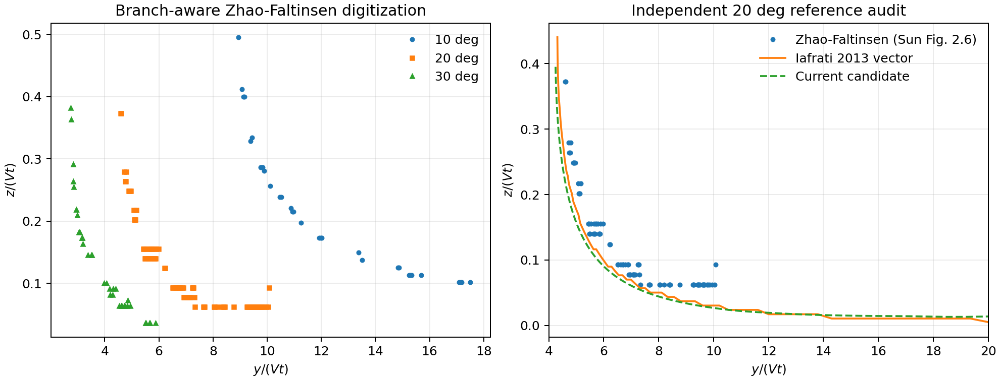

# Gate 2 二维楔形自由面参考数据质量审计

日期：2026-08-25  
状态：**参考差异需双报告；二维压力先决门和 Gate 2 均保持 FAIL。**

## 1. 审计目的

二维恒速楔形入水是线性高速 2.5D 纵向运动模型的源级先决验证。此前 Sun 2007 图 2.6 的 Zhao--Faltinsen 蓝色虚线采用“每列蓝色像素取中位数”的方法数字化。自由面在喷射根附近存在向上的喷射支和向外衰减的外自由面支；当两支落在同一像素列时，中位数可能不属于任一真实曲线。若参考本身不可信，求解器误差也无法被可靠解释。

本次审计只修正参考提取和增加独立对照，不使用任何程序响应反演参考曲线，也不改变既定验收阈值。

## 2. 分支感知数字化

新版算法仍使用冻结的蓝色像素阈值、坐标标定和图内区域，但将每列像素拆成连续簇。图像纵坐标向下增加，因此选择最下方连续簇作为外自由面；若虚线间隙使该列只剩明显回到上方的喷射支，则删除该观测列而不插值。

旧版数据完整保存在 `benchmarks/sun2007_fig2_6_wedge_similarity/legacy_column_median_v1`，其 CSV SHA-256 为 `27501c457dbe61fa2ad9c2bea020ed66780cb7ab6214f3c3f7317d045eb8c994`。新版数据、提取脚本、源图哈希和逐字节复现测试均已冻结。

| 斜升角 | 旧点数 | 新点数 | 改正的共享列 | 删除列 | 最大像素行修正 |
| ---: | ---: | ---: | --- | --- | ---: |
| 10 deg | 33 | 32 | 273、274、281、289 | 272 | 15 px |
| 20 deg | 84 | 84 | 无 | 无 | 0 px |
| 30 deg | 38 | 38 | 无 | 无 | 0 px |

这说明旧算法的拓扑错误在当前冻结区域内实际影响 `10 deg` 数据；`20 deg` 和 `30 deg` 的区域裁剪已避开双支重叠，因此数值未改变。不能把 `20 deg` 的误差变化归因于本次分支修正。

## 3. Iafrati 独立矢量基准

独立参考来自 [Iafrati 2013, arXiv:1212.6699v2](https://arxiv.org/abs/1212.6699) 源包中的 `cfg_5-20.pdf`。程序直接解析 PDF 的移动、连线和描边操作，拼接端点完全一致的线段，识别出图注所述 `5、7.5、10、10、20 deg` 五条完整曲线。根位置最小且唯一位于 `4 < xi < 5` 的曲线对应 `20 deg`；越过喷射根后的横坐标最小点定义外自由面起点，共得到 `59` 个原始矢量点。

该参考的作用是独立交叉审计，而不是替换 Zhao--Faltinsen 参考。其源 PDF、轴标定、提取脚本、候选根位置和 SHA-256 均已冻结，且清单明确记录 `response_calibration_used = false`。

## 4. 双参考结果

在 Zhao `20 deg` 的相同 `84` 个横坐标上，Zhao 与 Iafrati 曲线的均方根差为 `0.03826`，按 Iafrati 参考范围归一化后为 `17.33%`，平均差 `Zhao - Iafrati = 0.03177`，最大绝对差为 `0.12837`。差异主要集中在喷射根附近，远场趋势基本一致。

| v83 对照方式 | 点数 | 归一化均方根误差 | 平均偏差（计算－参考） | 判读 |
| --- | ---: | ---: | ---: | --- |
| Zhao，相同 84 个横坐标 | 84 | 15.63% | -0.04063 | 未达到自由面 5% 门槛 |
| Iafrati，相同 84 个横坐标 | 84 | 5.02% | -0.00886 | 接近但仍高于 5% |
| Iafrati，计算域内全部矢量点 | 56 | 7.31% | -0.01989 | 未达到 5% 门槛 |

图 1 左图展示分支感知后的三个斜升角观测点；点列从喷射根向右衰减，未再出现位于两支之间的合成中位点。右图将 Zhao、Iafrati 和 `v83` 放在同一坐标系中。绿色计算曲线整体更接近 Iafrati，但 Zhao 在近根区域明显更高。该图表明当前误差由“求解器尚未完全收敛”和“两个独立理论参考并不重合”共同构成，不能只选择较有利的一条曲线判定通过。

## 5. 验收结论

1. 分支感知数字化及旧版留档已完成，参考数据可复现性提高。
2. `v83` 对两个参考均未稳定满足预先声明的自由面 `<=5%` 门槛，且长时收敛仍未通过。
3. Zhao 与 Iafrati 必须并列报告；在理论差异得到解释前，Iafrati 不能替代既定 Zhao 验收目标。
4. 二维压力先决门继续为 `FAIL`，Gate 2 继续为 `17/20 PASS`。

机器证据位于 `outputs/wedge_free_surface_reference_audit_20260825`，包括逐点 CSV、JSON、PNG 和输入哈希。

本轮相关定向回归为 `43 passed`；加入晚期外推拒绝清单后的最终完整 `python -m pytest -q` 回归为 `515 passed`、`0 failed`，耗时 `741.74 s`。`1247` 条运行时告警仍全部来自既有 `tests/test_validation.py` 空切片统计，另有 `pytest-asyncio` 默认事件循环作用域弃用提示。
