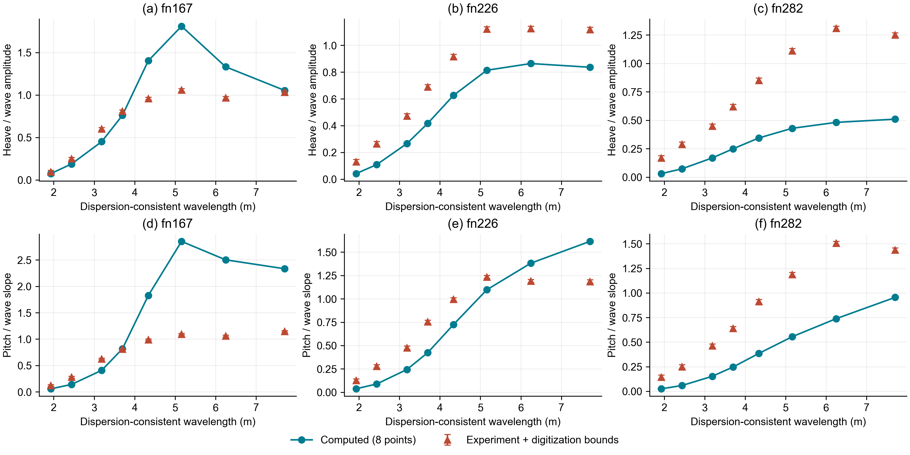

# 法向修正后三航速整船复验

日期：2026-09-24。上位目标：高速船型运动预报系统总体目标。**阶段未通过。**

## 实施内容

在独立调和场确认绕射法向输入错误并修正后，重新冻结与2026-09-21相同的船型、质量惯性、平均姿态、航速、波浪及计算网格，实际运行三速度24工况。21点进入线性指标，原3个诊断点仍完整展示，未改变筛选或误差限值。求解不读取试验响应，评价单独校验参考哈希。

本轮运行仍采用现有公共匹配域路线；没有把Kang实验性隐式推进、有界迁移及链式压力恢复接入整船默认。因此该结果只检验公共绕射法向修正的影响，不代表所有候选数值改进已集成。

## 结果

每格为相对误差中位数/归一化均方根误差。限值保持15%/20%，逐速度逐运动均须通过。

| 船宽弗劳德数 | 修正前升沉 | 修正后升沉 | 修正前纵摇 | 修正后纵摇 |
|---|---|---|---|---|
| 1.67 | 48.05%/84.47% | 24.96%/42.58% | 153.04%/179.62% | 84.54%/113.30% |
| 2.26 | 3.78%/6.18% | 31.59%/29.42% | 23.55%/45.29% | 36.22%/28.70% |
| 2.82 | 39.97%/48.18% | 61.37%/61.30% | 38.20%/31.36% | 57.88%/49.61% |

修正后的六项运动指标全部失败。低速改善但尚未合格，中速升沉从原先通过变为失败，高速两项变差。正确的边界符号不能因为使部分曲线变差而撤销；原有通过可能包含误差抵消，不能继续解释为该旧路线在物理上正确。

## 分量归因

对前后运行的输入快照、频率、矩阵和复数载荷逐项核对：

| 工况组 | 质量及A/B/C矩阵最大绝对变化 | 入射载荷变化相对残差 | 绕射载荷反号相对残差 |
|---|---:|---:|---:|
| fn167 | 5.68e-14 | 0 | 1.43e-16 |
| fn226 | 5.68e-14 | 0 | 9.55e-17 |
| fn282 | 1.89e-15 | 0 | 6.66e-17 |

三组输入一致，矩阵在舍入精度内不变，入射不变，绕射反号。故本轮与旧轮之间的响应差异可归因于绕射修正。但矩阵相同不等于矩阵物理准确，不能据此排除辐射或恢复力误差。矩阵不同单位的绝对变化仅用于数值同一性核对，不作物理量跨项比较。

## 图1：三航速运动与试验对照

图中横轴是按色散关系求得的波长；上排为升沉幅值除波幅，下排为纵摇角幅值除波陡。左、中、右列分别是船宽弗劳德数1.67、2.26和2.82。蓝色圆点是实际计算的8个波浪工况，连线仅帮助阅读，不是密集扫频；橙色三角是冻结的实验数字化数据，误差棒是数字化范围，不是试验置信区间。

- (a) 低速升沉在约5米波长附近出现过高响应，长波末端接近参考并不能抵消中间频段偏差。
- (b) 中速升沉大体随波长上升，但普遍低于试验平台值，属于幅值偏低，不是只差一个主峰位置。
- (c) 高速升沉显著偏低，计算未重现试验的较高响应平台。
- (d) 低速纵摇在约5米附近峰值明显过高，此后长波响应也偏高，是该速度主要失败项。
- (e) 中速纵摇在短波端偏低，长波端转为偏高；不能用统一倍率修正两端。
- (f) 高速纵摇在当前所有采样波长下偏低，且试验约6米附近的较大响应未被重现。

所有24点均显示，包括原3个诊断点。只有8点的连线不能用于宣布密集主峰频率验收通过，也不能推断连续频段收敛。

## 证据与复现

- 冻结输入：`benchmarks/longitudinal_neumann_corrected_20260924`。
- 全部计算及评价：`outputs/longitudinal_neumann_corrected_20260924`，包含三组频域、时域、加速度、复数分量和评价图。
- 受控分量比较及输入哈希：`outputs/longitudinal_neumann_comparison_20260924`。
- 比较入口：`scripts/compare_neumann_stage_runs.py`，拒绝不同输入；矩阵或分量不满足预期时不得声称仅符号变化。比较通过永远不等于阶段通过。

## 下一步

先解决绕射复数载荷的独立验证与全频段离散问题，再将经过验证的推进及压力路线显式接入同一整船入口。随后原条件复验，不调整本表门槛。当前需重点核查接触自由面处理、外域历史、频率相关辐射及恢复力；不能仅靠整船响应曲线判断某个分量正确，也不能据此拟合倍率。

独立复数参考、三档全频段收敛、密集主峰、Fridsma相位/加速度及动态稳定性仍未完成。旧线性基础门通过不能替代这些要求；本轮结果不支持多体、水翼或水上飞机起降已验证的声明。
