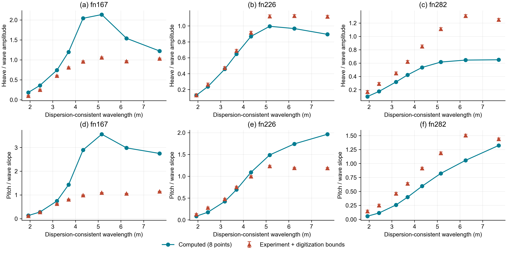

# 细网格统一入口与整船复验

日期：2026-09-21。上位目标：高速船型运动预报系统总体目标。

## 结论

**完成统一入口与已检查细网格的连接，未完成整船物理验收。** 三速度24工况已全部运行；实际响应使用的八个水动力系数和两个复数激励与联合离散审计细档逐项一致，240/240通过，最大无量纲差2.22e-16。实验运动指标仍只有1/6通过，不能宣布预测模型完成。

## 本轮改动

- `linear_case.py`：增加显式历史缓存、历史谱积分点数及谱截断参数；增加按实际工况频率直接求解的选项，不再要求通过几何频率采样插值。旧配置默认行为保留；未知配置和不合法参数拒绝读取。
- `freeze_longitudinal_stage.py --refined`：冻结113站、72船体面元、96自由面面元、120控制面元、128历史缓存、64谱积分点及谱截断25；指定直接入射/绕射激励和分段线性艉部截断积分。只读取输入条件，不读取实验响应。
- `verify_refined_kernel_connection.py`：核对实际响应的240项系数/激励与此前细档数据，检查工况、频率、离散及算法配置。对缺行拒绝核验，对改动系数判失败。该工具只证明接线一致，不是独立物理验证。

冻结目录：`benchmarks/longitudinal_refined_20260921`。完整输出：`outputs/longitudinal_refined_20260921`。此前粗网格结果和误差限值均未改动。

## 实验误差

每航速八点全部展示，其中七点按原合同参与线性指标，一点按原有波陡标准仅作诊断。实验参考哈希保持不变，求解结束后才读取响应参考。下表为相对误差中位数 / 归一化均方根误差，限值为15% / 20%。

| 船宽弗劳德数 | 升沉 | 纵摇 | 整个速度通过 |
|---|---|---|---|
| 1.67 | 48.34% / 75.16%，失败 | 139.81% / 169.21%，失败 | 否 |
| 2.26 | 9.99% / 13.31%，通过 | 20.67% / 40.19%，失败 | 否 |
| 2.82 | 39.37% / 45.38%，失败 | 35.00% / 28.01%，失败 | 否 |

来源：`evaluation/per_speed_metrics.csv`。该数据是既有实验回归集，不是独立盲测集。

## 图1：三速度运动与实验的对照



**读图方法。** 横轴是由输入遭遇频率及航速按色散关系一致反算的波长，单位米，并非新增实测波长。青色圆点为本次实际计算，红色三角为公开试验数字化参考；红色误差棒仅为数字化误差范围，不是完整试验置信区间。折线只连接八个离散点，不足以验收峰值位置。

上排纵轴为升沉幅值除以波幅，表示船的上下运动相对波高有多大；下排纵轴为纵摇角幅值除以波面坡度幅值，表示船的俯仰相对入射波倾斜程度有多大。船宽弗劳德数为航速除以重力与船宽乘积的平方根，用于表示航速相对重力波传播尺度的大小，三列依次对应1.67、2.26、2.82。

**子图(a)，低速升沉。** 在中长波区，计算升沉明显高于实验，约4至5米波长处形成超过2的离散响应，而实验约为1。网格加密后偏差仍存在，因此不能把误差主要归为旧入口的粗网格。该局部隆起也不能直接当成通过了主峰频率验收。

**子图(b)，中速升沉。** 短、中波段的计算和实验较接近，长波段仍偏低。这是六项运动指标中唯一同时满足两条阈值的一项；它不代表同速度纵摇或整艇模型通过。

**子图(c)，高速升沉。** 多数点低于实验，且中长波区实验约为1至1.3，计算约为0.5至0.65。与低速高估方向不同，因此用一个统一响应倍率修正既无物理依据，也难以解释全部速度。

**子图(d)，低速纵摇。** 中长波的计算明显放大，离散最大值超过3，而试验大致为1。两种运动同时高估，提示需要检查耦合动态刚度、恢复力及复数激励的共同作用，不能仅凭此图就断定某一个公式错误。

**子图(e)，中速纵摇。** 短波附近较接近，长波计算继续上升而实验较平缓，导致归一化均方根误差约40.19%。这解释了为何同速度升沉通过、纵摇却失败，也说明不能用两自由度合并平均掩盖问题。

**子图(f)，高速纵摇。** 大部分波长下计算偏低；最长波点较接近，不足以抵消其余点的系统性差异。该结果与高速升沉共同偏低，为下一步检查该航速激励和耦合项提供线索，但不是单凭曲线就能确定的因果证明。

## 已证明与尚未证明

| 项目 | 本轮证据及边界 |
|---|---|
| 统一入口接线 | 240/240，最大差2.22e-16；同一细档数据进入响应求解 |
| 联合离散收敛 | 前轮三档240/240通过；本轮用其细档，未新增控制域/谱截断独立收敛结论 |
| 时频一致性 | 24/24；最大幅值相对差3.97e-9，最大相位差1.74e-7度；仅冻结单频矩阵及精确稳态初值，不是记忆效应瞬态模型 |
| 软件回归 | 829项及11项子测试通过，1247条既有空切片均值警告保留 |
| 运动实验误差 | 1/6通过，三个速度均未整体通过 |
| 适用性筛查 | 三速度均至少存在触发大幅运动筛查的工况；不能作为有效工程预测 |
| 独立绕射、稳定性、主峰 | 未完成；不得根据小线性方程残差或曲线连线宣布通过 |
| Fridsma相位与加速度 | 本轮未完成新内核复验 |

当前评价器中的`missing_gates`是保守的原合同待办列表，并未自动吸收外部数值审计证据。联合离散及接线的最新状态应分别读取 `fullband_refined_cached_20260921/results.json` 和本轮 `kernel_connection/result.json`；不得把保守列表误读为数值审计没有进行，也不得自行删去仍未完成的独立物理门。

## 下一步：物理载荷诊断，而非继续盲目加密

1. 冻结独立绕射载荷参考，核验复杂激励的幅值、相位、前进速度项和端部项。仅有入射解析检查及同一内核内的代数一致性不够。
2. 在低速最大偏差、中速两运动分化和高速共同低估的工况上，对恢复力、惯性、辐射阻尼、入射与绕射的复数贡献做同一坐标下的对照；保留站位分布和力矩臂。任何公式修改应有独立证据及回归测试，禁止以实验响应倍率拟合。
3. 单独核验控制域和谱截断，再进行足够密的峰值扫描、Fridsma复验和频率相关稳定性判断。现有八点不足以确认至少四个可解析峰。
4. 仍按原三速度15%/20%、峰频10%、相位15度、加速度25%及其余合同条件验收；失败保持失败。多体、水翼、水上飞机与非线性自由航行不由本次线性复验替代。

## 重现

使用全新输出目录，保留原证据。以下入口仅要求同一已锁定运行环境，不代表已完成全传递依赖环境锁定。

```powershell
python -m scripts.freeze_longitudinal_stage --out benchmarks/longitudinal_refined_repeat --excitation matched_domain_incident_diffraction --refined
python -m planing_seakeeping run benchmarks/longitudinal_refined_repeat/run.json --out outputs/longitudinal_refined_repeat
python -m scripts.verify_refined_kernel_connection --run outputs/longitudinal_refined_repeat --grid-run outputs/fullband_refined_cached_20260921
python -m scripts.evaluate_longitudinal_stage --run outputs/longitudinal_refined_repeat --frozen benchmarks/longitudinal_refined_repeat
```

运行和实验评价当前会返回非零状态，因为正式验收未通过；非零状态不代表计算文件缺失。接线核验通过只表示实际使用了相同内核数据。
