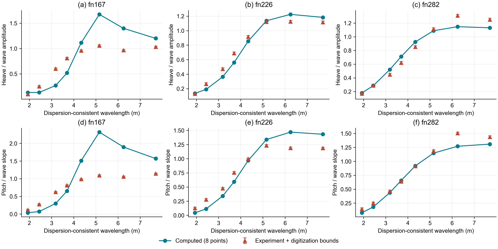

# 单体高速艇规则迎浪闭环：阶段实施记录

日期：2026-09-15。依据[执行卡](下一阶段执行卡_20260915.md)实施。

## 1. 总体状态

**软件接线已经实跑，科研验收尚未通过。本轮不是阶段全部完成。**

普通 `run` 入口现在可以选择 `matched_bie_longitudinal_research`，从不含实验响应的输入计算三个速度、24个波况，导出同一内核的频率相关矩阵、复数激励、升沉/纵摇响应、稳态时间序列及加速度。它仍是研究模式，不允许称为生产模型。

旧线性、整船、楔形结果没有覆盖；没有改水动力公式以拟合实验，也没有放宽误差限值。本轮主要是准入修复、工况冻结、接线、分量导出及实跑检验。

## 2. 执行卡逐项落实情况

| 工作项 | 已落实 | 未完成 |
| --- | --- | --- |
| 准入修正 | Delft按180/195度分组；拒绝未实现的外部后端；未知/缺失验证状态不认证；修NumPy积分接口；线性回退需显式许可；自由度语义修正 | 旧输入路径的全部默认值尚未统一严格化；空集合统计警告需另行治理 |
| 工况冻结 | 不读取实验响应，由主参数、实测平均姿态和波况生成24工况；21个线性点、3个诊断点；输入/来源哈希、直接依赖版本快照 | 完整传递依赖锁、独立盲测工况、新激励参考合同和近零量绝对容差尚未冻结 |
| 分量诊断 | 导出八系数、恢复矩阵、复数激励各分量、惯性/附加惯性/阻尼/恢复力的复数力平衡 | 最低速度物理误差的唯一原因仍未查清；未进行新的理论修正 |
| 内核接线 | 普通入口真实调用匹配内核；同一矩阵用于响应、时域和加速度；规定姿态及经验艉部处理显式记录 | 只接通参数化单体湿面，不是任意实测型线；不是非线性自由航行 |
| 正式验收 | 全回归708通过；旧线性门10/10；24项时频核对通过；重新计算逐速度实验误差 | 三档全频段离散、直接激励独立验证、密集主峰、同路线Fridsma相位/加速度、频率相关稳定性仍未完成；实验幅值未全部达标 |

## 3. 代码与数据改动

- `planing_seakeeping/datasets/delft372.py`：按航向标题控制分组，195°行不再混入迎浪结果；增加混合表和工况编号回归。
- `providers/linear_hydrodynamics.py`：未实现的外部后端直接拒绝，不再由后端名称赋予生产能力。
- `scripts/aggregate_gate2_frequency_candidate.py`：配置缺字段不能判一致；标定字段必须显式为布尔假；目前没有已审批完整内核证书，因此不能通过候选自己填写的状态认证；增加逐速度幅值检查。
- `scripts/validate_wedge_entry_public_reference.py`：使用NumPy 2.x的梯形积分接口。没有更改楔形误差限值或旧报告分数。
- `config.py`、`solver.py`：线性回退默认关闭；显式开启时记录原失败原因；纵荡零值标为恒速约束而非迎浪对称性。
- `linear_case.py`、`cli.py`：新增严格输入的统一研究运行路径，拒绝未知字段、缺少必需船参数、坏哈希和不支持模型；拒绝覆盖非空结果目录。
- `scripts/freeze_longitudinal_stage.py`：冻结三速度输入；仅读取船参数、平均姿态和波况表。
- `scripts/evaluate_longitudinal_stage.py`：求解完成后独立读取实验参考，对输入、工况和实验哈希进行检查，再输出逐速度/合并误差及六子图。
- `tests/test_stage_admission.py`：未实现后端、缺证据、坏哈希、必填输入、谐波导数和显式回退测试。

修复后的Delft数据位于[修正迎浪表](../outputs/delft372_corrected_20260915/delft372_head_sea_180deg_motions.csv)。这是21条迎浪记录；旧41条错误导出保留在历史目录，不再作为本次正确数据使用。

## 4. 使用方式

在项目根目录运行，输出目录必须是新的空目录：

```powershell
python -m planing_seakeeping run benchmarks/longitudinal_stage_20260915/run.json --out outputs/my_longitudinal_run
python -m scripts.evaluate_longitudinal_stage --run outputs/my_longitudinal_run --frozen benchmarks/longitudinal_stage_20260915
```

**这两个研究命令在阶段未通过时返回非零码。生成完整文件不代表验收通过。** 不应在自动化中忽略返回码并宣传生产通过。

输入合同见[冻结合同](../benchmarks/longitudinal_stage_20260915/contract.json)、[24工况表](../benchmarks/longitudinal_stage_20260915/conditions.csv)。如果要更改离散参数进行收敛试验，应另建明确版本合同，不直接修改当前冻结文件。

当前实际交付包是[最终实跑报告](../outputs/longitudinal_stage_20260915_final/run_report.md)，机器状态见[运行验收](../outputs/longitudinal_stage_20260915_final/acceptance.json)和[实验验收](../outputs/longitudinal_stage_20260915_final/evaluation/acceptance.json)。

每个速度目录包含：

| 文件 | 实际含义 |
| --- | --- |
| `computed_wetted_stations.csv` | 计算使用的参数化平均湿剖面，不是完整船壳三角网格 |
| `matrices.csv` | 每个频率的八个升沉/纵摇附加质量和阻尼系数、恢复矩阵、刚体质量矩阵 |
| `excitation.csv` | 单位波幅的复数升沉力与纵摇力矩 |
| `excitation_component_*.csv` | 原内核提供的激励分量，不额外虚构压力场 |
| `complex_force_balance.csv` | 单位波幅响应下各动态方程分量的复数力与力矩，用于定位低速误差 |
| `rao.csv` | 离散波况的复数响应、幅值、相位、加速度和方程残差 |
| `timeseries_*.csv` | 同一复数响应的规则波稳态重构；六列中只有升沉、纵摇独立求解 |
| `frequency_time_checks.csv` | 每个频率固定其矩阵、使用精确稳态初值进行独立常微分方程积分核对 |
| `kernel_metadata.json` | 真正使用的内核、公式、近似和经验处理 |

## 5. 本轮验证结果

### 5.1 软件与数值

- [最终全回归记录](../outputs/stage_20260915_tests/final_full_suite.xml)：708通过、0失败，11项子测试通过；1247条原有空集合均值警告仍保留，不表示该类统计问题已修好。
- [旧线性门复跑](../outputs/stage_20260915_gate1/gate1_acceptance_summary.csv)：粗细网格各10/10，最大变化1.1465%。这是原Wigley窄频段论文系数复现，不能转移为整个新流程的实验认证。
- 新流程24个工况时频核对全部通过。升沉/纵摇最大幅值相对误差分别约1.10×10^-9和1.69×10^-9；最大相位误差约3.56×10^-8度。
- 动态方程最大相对残差小于6×10^-16。

时频核对只是单频固定矩阵方程的一致性检查。其初值由频域稳态解给定，不是从静止释放的验证，也不证明具有频率记忆的任意瞬态求解已建立。不得用非常小的数值误差替代实验误差。

### 5.2 实验幅值：仍未全部通过

下表为本轮实际求解结果，不是旧候选文件复制。每个运动每个速度7个线性适用点；全部8点保留在图中。

| 船宽傅汝德数 | 运动 | 中位相对误差 | 归一化均方根误差 | 15%/20%检查 |
| --- | --- | --- | --- | --- |
| 1.67 | 升沉 | 44.89% | 40.35% | 失败 |
| 1.67 | 纵摇 | 52.67% | 70.33% | 失败 |
| 2.26 | 升沉 | 8.90% | 9.81% | 通过 |
| 2.26 | 纵摇 | 21.31% | 18.91% | 失败 |
| 2.82 | 升沉 | 9.54% | 10.04% | 通过 |
| 2.82 | 纵摇 | 5.27% | 10.41% | 通过 |

与旧候选略有差别，是统一运行的频率采样范围/插值组织并非旧诊断脚本的密集波长网格路线；它不是通过改响应倍率得到的提升。不能用本轮8点连线代替旧密集主峰结果，也不能宣称主峰门已通过。

### 5.3 如何阅读对照图



图1的上排(a)、(b)、(c)分别是1.67、2.26、2.82三个速度的升沉；下排(d)、(e)、(f)为相应纵摇。圆点及连线来自本轮计算，三角标记来自冻结实验数字化；误差条只表示读图数字化边界，不是实验置信区间。图使用英文以避免字体跨机缺字；可编辑版本同时提供PDF和SVG。

横轴是由原工况的遭遇频率与航速按一致色散关系换算的波长，不能当作一组新的实验波长测量。纵轴上排为升沉幅值除以波幅，下排为纵摇角幅值除以波陡。两种纵轴的物理量和归一化不同，不直接比较其数字大小。

(a)和(d)显示低速计算峰过高，尤其纵摇在较长波区域显著偏离；因此低速失败不是某一个孤立坏点。它提示必须审计耦合动态刚度与激励，但不能仅凭曲线断定某个阻尼项一定错误。(b)升沉总体接近；(e)纵摇长波端偏高，使中位误差仍超限。(c)和(f)多数点较接近，但长波端仍有偏差，且这里只检查了有限工况，不代表整个高速频段已验证。

图保留全部24工况；按预先冻结的原波陡大于0.055的3点仅不参加线性误差统计。连线只是连接8个离散点，不能证明峰频已解析。绘图已做六子图目视核对及PDF字体检查，最小字号10点；这是一张项目报告图，不宣称满足某一投稿期刊的版宽规格。

## 6. 尚不能宣布落实到位的原因

1. 低速两项及中间速度纵摇仍未满足实验要求。
2. 三档离散及复数激励独立参考没有闭合。
3. 本轮采用继承的辐射等效绕射及0.5倍船宽艉部硬截断，不能称为已验证的完整直接绕射模型。
4. Fridsma相位、加速度以及密集主峰尚未在本轮统一内核下重新验收。
5. 频率相关系统稳定性仍标记未评估；几何模型仅是平均湿轮廓，未增加虚构的全船压力/自由面。
6. 不规则波、非线性自由运动、多体、水翼没有借此次接线升级为生产功能。

下一项最有价值的具体工作是：在同一冻结工况和当前分量导出基础上，对低速失败区与高速通过区检查恢复力、纵摇力矩来源、直接/等效激励和艉部端项；只有得到可定位的理论或离散缺陷后再修改内核。不得为了让低速曲线贴合而直接调整阻尼倍率或删去该速度。

