# An efficient numerical method for solving ‘2.5D ship seakeeping problem

Shan Ma\*, Wen-Yang Duan, Jing-Zheng Song

School ofShipbuilding Engineering, Harbin Engineering University, No. 145, Nantong Street, Nangang District, Harbin 150001, Heilongjiang Province, China

Received 30 April 2004; accepted 20 October 2004 Available online 24 December 2004

## Abstract

This paper describes a new numerical algorithm for solving 2.5D hydrodynamic theory, which is based on the high-speed slender body assumptions where the free-surface condition is 3D but the control equation and body surface condition are 2D. This numerical algorithm is accomplished using boundary integral equations formed in the inner fluid field domain and outer fluid field domain and matched on a fixed control surface. Theoretically predicted vertical hydrodynamic coefficients by this method is verified by the theoretical results computed by 2.5D theory based on time domain boundary integral equations. This paper also shows that the matched boundary integral equations can be used to calculate the hydrodynamic characteristics of high-speed displacement vessels with a large flare.

q 2004 Published by Elsevier Ltd.

Keywords: 2.5D theory; Matched boundary integral equations; Hydrodynamics; Numerical divergence

## 1. Introduction

In order to meet the requirements of ocean transportation, the development of ships with good performance at high speed has made a great progress. In order to guarantee the ship’s good seakeeping performance and safety, it is important to predict the ship’s motions and wave loads within sufficient engineering accuracy. Due to the typical slender body and large length to breadth ratio of high-speed displacement ship, the strip theory and high-speed slender body theory can be used to predict its hydrodynamic characteristics. It is demonstrated that strip theory can predict the conventional mono-hull’s linear motions at low to moderate Froude numbers (Lloyd, 1998). But at high Froude numbers, the threedimensional effect of free-surface becomes dominant and strip theory fails to predict the hydrodynamic performance of high-speed ships.

The high-speed slender body theory was proposed by Chapman in 1976 and was used to calculate the ship motions in waves by Faltinsen and Zhao for the first time in 1991. This theory is also called 2.5D theory as it considers two-dimensional control equation and body condition of the fluid velocity potential and a three-dimensional free-surface condition. 2.5D theory considers the forward speed effect on the free-surface and is thus suitable for the prediction of hydrodynamic performance of fast vessels. In recent years, many scholars have investigated the application of 2.5D theory for ship motions in waves with the difference of methods in dealing with the free-surface and radiation conditions at infinity. Hermundstad (1994) applied time step procedure to solve every station’s surface elevation and fluid potential on free-surface at inner region and used a distribution of two dimensional vertical dipoles and transverse derivatives of such dipoles with unknown strengths to express the fluid potential far away from the ship. Wang (1999) expressed the free-surface kinematic and dynamic boundary conditions along characteristic lines. The surface elevation and fluid potential on free-surface of every station can be given by discretized forms of the free-surface boundary conditions and the step procedure is stable. At infinity, Wang selected a more strict equation to express the radiation condition for the free-surface wave propagation. Duan and He (2001) used transient free-surface Green function to transform the formulation of 2.5D theory into a boundary integral equation on the body surface of the ship. This new numerical method is used to find the vertical ship motion in regular head waves of high-speed round bilge mono-hull and catamaran models from NPL series, the results have shown a good agreement with experimental data. Davis and Holloway (2003) also applied two-dimensional boundary element method based on transient free-surface Green function to solve the formulation based on 2.5D theory. The motion responses of high-speed vessels in head and oblique seas are determined by thi method. The method is validated by comparing with published data for the heave, pitch and roll responses of three catamaran hull forms at high Froude numbers. Due to the fact that time domain boundary integral equation can satisfy linearized free-surface boundary conditions and radiation boundary condition, this numerical algorithm is not susceptible to numerical error due to the stepping procedure for the free-surface and radiation conditions at infinity. But for some type of containership with large flare, this boundary integral equation can bring numerical divergence problem by Duan (1999). The numerical divergence is due to the memory effect term of Green function that oscillates abruptly on the segment with a large inclined angle near the free-surface. This oscillation leads to numerical integration error of memory effect in terms of convolution integral of transient free-surface Green function on the segment, the accumulation of the numerical error causes numerical divergence of the boundary integral equation. Duan (1995) has developed a modified boundary integral equation to avoid numerical divergence of time domain boundary integral equation. But still for some container ships that have many stations with large flare at the after part, the modified boundary integral equation cannot avoid numerical divergence.

In order to overcome numerical divergence problem for the high-speed vessels with large flare, this paper presents a matched boundary integral equation method to solve the formulation of 2.5D theory. The method had been used to calculate the linear hydrodynamics of a cylinder oscillating on the free-surface by Sun (2003) in which the author used integration form offree-surface condition. The numerical algorithm developed in this paper considers the instantaneous wet surface position of ship and time varying free-surface. As a result the free-surface condition cannot be expressed in the form of integration. Therefore, this paper applied a different numerical algorithm to simulate the free-surface condition.

The paper is organized as follows. Section 2 introduces the mathematical formulation based on 2.5D theory. Section 3 presents the formulation of the matched boundary integral equation method and detailed numerical algorithm. Section 4 shows numerical examples to validate this numerical algorithm.

## 2. Governing equation of 2.5D theory

Consider a ship travelling in regular waves of small amplitude in deep water with the forward speed U. Time-harmonic motions of small amplitude are considered for the ship motions, with the complex factor $\mathrm { e } ^ { \mathrm { i } \omega t }$ applied to oscillatory quantities. $\boldsymbol { \xi } _ { j } ~ ( j = 1 , 2 . . . 6 )$ represents complex amplitude of six modes of motion of ship about the center of gravity. The fluid is assumed to be inviscid, incompressible and irrotational. The velocity potential is used to describe the fluid motion around the ship. The boundary conditions of the velocity potential on the ship and free-surface are linearized. The right-handed coordinate system o–xyz is defined moving with the velocity of ship. The origin is situated in the calm water surface; the o–xy plane coincides with the waterline plane, oz axis points upwards through the center of gravity and ox axis points to the direction of ship travelling.

The fluid potential around the ship can be expressed as

$$
\Phi (x, y, z, t) = U (- x + \phi_ {\mathrm{s}}) + \phi_ {\mathrm{T}} (x, y, z) \mathrm{e} ^ {\mathrm{i} \omega t}\tag{1}
$$

where $\phi _ { \mathrm { s } }$ is the perturbation potential due to steady translation, $\phi _ { \mathrm { T } }$ is the unsteady perturbation potential, which may be further decomposed into:

$$
\phi_ {\mathrm{T}} = \varsigma_ {\mathrm{a}} (\phi_ {0} + \phi_ {7}) + \sum_ {j = 1} ^ {6} \xi_ {j} \phi_ {j}\tag{2}
$$

$\varsigma _ { \mathrm { a } }$ the incident wave amplitude.

$\phi _ { 0 }$ the incident wave potential with unit wave amplitude.

The deep water incident wave potential is

$$
\phi_ {0} (x, y, z) = \frac {i g}{\omega_ {0}} \mathrm{e} ^ {k _ {0} z} \mathrm{e} ^ {- \mathrm{i} k _ {0} (x \cos \beta + y \sin \beta)}\tag{3}
$$

where $\omega _ { 0 }$ is the circular frequency of the incident wave, $k _ { 0 }$ is the wave number and $\beta$ is the propagation angle of the incident waves relative to the negative x axis. For head seas $\beta =$ $1 8 0 ^ { \circ }$

$\phi _ { 7 }$ is the diffraction potential in unit wave amplitude.

$\phi _ { j }$ is the radiation potential due to unit motion in the jth direction $( j = 1 , 2 , . . . , 6 )$

According to 2.5D theory developed by Faltinsen and Zhao $( 1 9 9 1 ) , \phi _ { j } ( j = 1 , 2 , . . . , 7 )$ satisfies the following mathematical formulation:

$$
\left\{\begin{array}{l l}\frac {\partial^ {2} \phi_ {j}}{\partial y ^ {2}} + \frac {\partial^ {2} \phi_ {j}}{\partial z ^ {2}} = 0&(\text { in   the   fluid   domain })\\i \omega \phi_ {j} - U \frac {\partial \phi_ {j}}{\partial x} + g \eta_ {j} = 0&z = 0\\i \omega \eta_ {j} - U \frac {\partial \eta_ {j}}{\partial x} - \frac {\partial \phi_ {j}}{\partial z} = 0&z = 0\\\frac {\partial \phi_ {j}}{\partial N} = \left\{\begin{array}{l l}\mathrm{i} \omega N _ {j} + U m _ {j} (j = 2 \sim 6)&\\- \frac {\partial \phi_ {0}}{\partial N} (j = 7)&(\text { on   the   mean   wet   surface })\end{array}\right.\\\phi_ {j} = \frac {\partial \phi_ {j}}{\partial x} = 0&(x > x _ {0})\\\phi_ {j} \rightarrow 0&z \rightarrow - \infty\\\text { appropriate   radiation   condition }&\text { at   infinity }\end{array}\right.\tag{4}
$$

where $\eta _ { j }$ denotes the complex amplitude of free-surface elevation in the jth direction by the unit radiation and diffraction potential and $x _ { 0 }$ is the longitudinal position of ship forward perpendicular.

$N _ { j } ( j = 2 , 3 )$ is component of inward unit normal vector of one point on the ship’s crosssectional contour

$$
(N _ {2}, N _ {3}) = (N _ {y}, N _ {z}); \quad (N _ {4}, N _ {5}, N _ {6}) = (y N _ {z} - z N _ {y}, - x N _ {z}, z N _ {y});\tag{5}
$$

$m _ { j }$ is the second order differential about the steady potential $( - x + \phi _ { \mathrm { s } } )$ . If we neglect the effect of steady perturbation $\phi _ { \mathrm { s } } , m _ { j }$ can be expressed:

$$
m _ {j} = 0, j = 1, 2, 3, 4; m _ {5} = N _ {z}; m _ {6} = - N _ {y};\tag{6}
$$

Introduce the time function t(x) and the fluid function $\psi _ { j } ( t , \boldsymbol { y } , \ z ) , \ \zeta _ { j } ( t , \boldsymbol { y } , \ z )$ to the formulation (4), where:

$$
t (x) = (- x + x _ {0}) / U\tag{7}
$$

$$
\psi_ {j} (t, y, z) = \phi_ {j} (x, y, z) \mathrm{e} ^ {\mathrm{i} \omega t}\tag{8}
$$

$$
\zeta_ {j} (t, y, z) = \eta_ {j} (x, y, z) \mathrm{e} ^ {\mathrm{i} \omega t}\tag{9}
$$

We derive the formulation of the 2.5D theory in terms of $\psi _ { j } ( t , y , z )$

$$
\left\{\begin{array}{l l}\frac {\partial^ {2} \psi_ {j}}{\partial y ^ {2}} + \frac {\partial^ {2} \psi_ {j}}{\partial z ^ {2}} = 0&\text {(in the fluid domain)}\\\frac {\partial \psi_ {j}}{\partial t} + g \varsigma_ {j} = 0&(z = 0)\\\frac {\partial \varsigma_ {j}}{\partial t} - \frac {\partial \psi_ {j}}{\partial z} = 0&(z = 0)\\\frac {\partial \psi_ {j}}{\partial N} = \left\{\begin{array}{l l}(\mathrm{i} \omega N _ {j} + U m _ {j}) \mathrm{e} ^ {\mathrm{i} \omega t}&j = 2 \sim 6\\- \frac {\partial \phi_ {0}}{\partial N} \mathrm{e} ^ {\mathrm{i} \omega t}&j = 7\end{array}\right.\\\psi_ {j} = \frac {\partial \psi_ {j}}{\partial t} = 0&(t = 0)\\\psi_ {j} \rightarrow 0&z \rightarrow - \infty\\\text {appropriate radiation condition}&\text {at infinity}\end{array}\right.\tag{10}
$$

## 3. Numerical solution of the 2.5D theory

The formulation (10) can be regarded as the time domain solution of a two-dimensional cylinder motion with instantaneous wet surface. In order to solve velocity potential due to the cylinder motion we first express the fluid boundary in Fig. 1. $S _ { \mathrm { B } }$ is the wet body boundary under the calm water at time $t , S _ { \mathrm { F i } }$ is the inner free-surface region, $S _ { \mathrm { F e } }$ is the outer free-surface region, $S _ { \mathrm { C } }$ is a control boundary fixed in the space, $D _ { \mathrm { i } }$ is the inner fluid field domain constructed by the closed boundaries $S _ { \mathrm { B } } { + } S _ { \mathrm { F i } } { + } S _ { \mathrm { C } }$ and $D _ { \mathrm { e } }$ is the outer fluid field constructed by the closed boundaries $S _ { \mathrm { C } } { + } S _ { \mathrm { F e } } { + } S _ { \infty }$

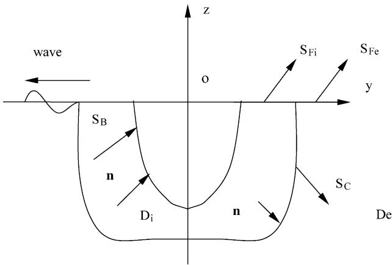  
Fig. 1. Coordinate system and fluid boundary discretization.

## 3.1. The matched boundary integral equation

$\psi _ { j } ( p , t )$ is the fluid potential of the point $p$ in the inner fluid field domain $D _ { \mathrm { i } }$ at time $t ,$ applying Green’s 2nd identity on two-dimensional simple Green function ln $r _ { p q }$ and $\psi _ { j } ( q ,$ $t )$ on the boundaries $S _ { \mathrm { B } } { + } S _ { \mathrm { F i } } { + } S _ { \mathrm { C } }$ . The integral equation is formed by the curve integral over the instantaneous body boundary $S _ { \mathrm { B } }$ , inner free-surface region $S _ { \mathrm { F i } }$ and the control boundary $S _ { \mathrm { C } }$

$$
- 2 \pi \psi_ {j} (p, t) + \int_ {S _ {B} + S _ {F i} + S _ {C}} \left[ \psi_ {j} (q, t) \cdot \frac {\partial \ln r _ {p q}}{\partial n _ {q}} - \ln r _ {p q} \cdot \frac {\partial \psi_ {j} (q , t)}{\partial n _ {q}} \right] d l _ {q} = 0 \quad p \in D _ {i}\tag{11}
$$

where point $q$ is source point on the boundary of the inner fluid domain $D _ { \mathrm { i } }$ and ln r is two- $r _ { p q }$ dimensional Green function at field point $p$ due to a source point $q .$ .

In order to solve formulation (10) based on 2.5D theory, $\psi _ { j } ( p , t )$ must satisfy radiation boundary condition at infinity along with boundary conditions on $S _ { \mathrm { B } }$ and $S _ { \mathrm { F i } }$ . Therefore, another boundary integral equation on the outer fluid domain $D _ { \mathrm { e } }$ is constructed to solve the fluid potential $\psi _ { j } ( p , t )$

First, let us introduce the 2D transient free-surface Green function $\tilde { G } ( p , t ; q , \tau )$ , which is given by:

$$
\tilde {G} (p, t; q, \tau) = 2 \int_ {0} ^ {\infty} \sqrt {\frac {g}{k}} \mathrm{e} ^ {k (z + \varsigma)} \cos k (y - \eta) \sin \sqrt {g k} (t - \tau) \mathrm{d} k \quad (z \leq 0, \varsigma \leq 0)\tag{12}
$$

Here, $p { = } ( y , z ) , q { = } ( \eta , \varsigma )$ are the field and source point, respectively, $r _ { p q } = | p - q |$ $r _ { p \bar { q } } = | p - \bar { q } | , \bar { q }$ is the mapped point of $q$ about $\varsigma { = } 0$ and $q = ( \eta , - \varsigma )$ . The Green function $\tilde { G } ( p , t ; q , \tau )$ satisfies the following formulation:

$$
\left\{ \begin{array}{l l} \nabla_ {q} ^ {2} \tilde {G} = 0 & (\tau <   t) \\ \frac {\partial^ {2} \tilde {G}}{\partial \tau^ {2}} + g \frac {\partial \tilde {G}}{\partial \varsigma} = 0 & (\varsigma = 0) \\ \tilde {G} | _ {t = \tau} = 0 \\ \frac {\partial \tilde {G}}{\partial \tau} \Big | _ {t = \tau} = 2 g \frac {z + \varsigma}{r _ {p q} ^ {2}} = 2 g \frac {\partial}{\partial \varsigma} \ln r _ {p \tilde {q}} \end{array} \right.\tag{13}
$$

From the last equation of formulation (13), it can be derived that:

$$
\left. \frac {\partial \tilde {G}}{\partial \tau} \right| _ {\tau = t, \varsigma = 0} = - g \frac {\partial}{\partial \varsigma} (\ln r _ {p q} - \ln r _ {p \bar {q}}) | _ {\varsigma = 0}\tag{14}
$$

Because there is no singularity for $\psi _ { j } ( q , \tau )$ and $\tilde { G } ( p , t ; q , \tau )$ in the domain $S _ { \mathrm { C } } { + } S _ { \mathrm { F e } } { + }$ $S _ { \infty }$ at time t. Applying Green’s 2nd identity on transient free-surface Green function $\tilde { G } ( p , t ; q , \tau )$ and $\psi _ { j } ( q , \tau )$ over $S _ { \mathrm { C } } , S _ { \mathrm { F e } }$ and $S _ { \infty }$ . The following integral equation can be

deduced:

$$
\int_ {S _ {C} + S _ {F e} + S _ {\infty}} \bigg (\tilde {G} (p, t; q, \tau) \frac {\partial \psi_ {j} (q , \tau)}{\partial n _ {q}} - \psi_ {j} (q, \tau) \frac {\partial \tilde {G} (p , t ; q , \tau)}{\partial n _ {q}} \bigg) \mathrm{d} l _ {q} = 0\tag{15}
$$

We now integrate Eq. (15) through time variable t from the initial time $\tau { = } 0$ to the current time $\tau { = } t .$ . As transient free-surface Green function $\tilde { G } ( p , t ; q , \tau )$ and the fluid potential $\psi _ { j } ( p , \tau )$ can satisfy the radiation condition at infinity, the integral term over $S _ { \infty }$ is zero. On free-surface, using the kinematic and dynamic free-surface boundary conditions $\psi _ { j } ( p , \tau )$ and $\tilde { G } ( p , t ; q , \tau )$ satisfies and Eq. (14), the integral term over $S _ { \mathrm { F e } }$ can be transformed into $S _ { \mathrm { C } }$ and the singularity curve integral along a closed circle on the singularity point $p .$ At last the time domain boundary integral equation is formed over $S _ { \mathrm { C } }$ in the form:

$$
\begin{array}{l} 2 \pi \psi_ {j} (p, t) + \int_ {0} ^ {t} \mathrm{d} \tau \int_ {S _ {\mathrm{C}}} \left(\tilde {G} \frac {\partial \psi_ {j}}{\partial n _ {q}} - \psi_ {j} \frac {\partial \tilde {G}}{\partial n _ {q}}\right) \mathrm{d} l _ {q} + \int_ {S _ {\mathrm{C}}} \left[ \psi_ {j} \frac {\partial}{\partial n _ {q}} (\ln r _ {p q} - \ln r _ {p \bar {q}}) \right. \\ \left. - (\ln r _ {p q} - \ln r _ {p \bar {q}}) \frac {\partial \psi_ {j}}{\partial n _ {q}} \right] \mathrm{d} l _ {q} = 0 \quad p \in D _ {\mathrm{e}} \end{array}\tag{16}
$$

Using Eq. (16) together with Eq. (11), the velocity potential $\psi _ { j } ( p , \ t )$ can satisfy mathematical formulation (10) based on 2.5D theory in the fluid domain. By solving these two boundary integral equations in the time domain, the $\psi _ { j } ( p , t )$ and $\psi _ { n j } ( p , t )$ on the fluid boundaries can be obtained, thus the fluid potential $\psi _ { j } ( p , t )$ at any point of the fluid field can be given by Eqs. (10) and (16).

## 3.2. The difference approximation to the free-surface boundary conditions

On free-surface, the fluid potential $\psi _ { j } ( p , t )$ and free-surface elevation $\zeta _ { j } ( q , \tau )$ satisfy the following linearized kinematic and dynamic boundary conditions:

$$
\frac {\partial \varsigma_ {j}}{\partial t} - \frac {\partial \psi_ {j}}{\partial z} = 0 z = 0\tag{17}
$$

$$
\frac {\partial \psi_ {j}}{\partial t} + g \varsigma_ {j} = 0 z = 0\tag{18}
$$

In order to solve integral equations (11) and (16) it is necessary to evaluate the fluid field $\psi _ { j } ( p , t )$ on free-surface at time t. This paper uses the following approximations to freesurface kinematic and dynamic boundary conditions.

$$
\zeta_ {j} \left(t + \frac {\Delta t}{2}, y\right) = \zeta_ {j} \left(t - \frac {\Delta t}{2}, y\right) + \frac {\partial \psi_ {j}}{\partial z} (t, y) \Delta t\tag{19}
$$

$$
\psi_ {j} (t + \Delta t, y) = \psi_ {j} (t, y) - g \varsigma_ {j} \left(t + \frac {\Delta t}{2}, y\right) \Delta t\tag{20}
$$

where $\Delta t$ is time interval of the stepping procedure. $\zeta _ { j } ( t { - } \Delta t / 2 , y )$ expresses the surface elevation at step $t - \Delta t / 2$ and $\partial \psi _ { j } ( t , \ y ) / \partial z$ is the vertical velocity distribution on the transverse free-surface at step t.

Using the initial free-surface condition, there is no fluid field disturbance at time $t = 0 .$ we can evaluate the free-surface elevation $\zeta _ { j } ( \Delta t / 2 , y )$ and the fluid potential $\psi _ { j } ( \Delta t , y )$ by Eqs. (21) and (22).

$$
\zeta_ {j} \bigg (\frac {\Delta t}{2}, y \bigg) = \zeta_ {j} (0, y) + \frac {\partial \phi (0 , y)}{\partial z} \frac {\Delta t}{2}\tag{21}
$$

$$
\psi_ {j} (\Delta t, y) = \psi_ {j} (0, y) - g \zeta_ {j} \bigg (\frac {\Delta t}{2}, y \bigg) \Delta t\tag{22}
$$

The numerical difference algorithm for calculating the free-surface elevation and velocity potential in Eqs. (19) and (20) is stable which was proved by Chapman (1976).

## 3.3. Hydrodynamic grid generation of the integral boundaries

Before solving the matched boundary integral equations, we need to discretize the boundaries on $S _ { \mathrm { B } } ( t ) , S _ { \mathrm { F i } } ( t )$ and $S _ { \mathbf { C } } ( t )$ , respectively. The boundaries can be discretized as follows.

At first the hull will be divided uniformly into $N _ { x }$ stations in the longitudinal direction. In the transverse direction, the boundaries of the $D _ { \mathrm { i } }$ will be discretized as follows: on $S _ { \mathbf { B } } .$ according to the number of stations $N _ { x } ,$ , the longitudinal position of each station is calculated. The coordinates of each segment’s end points on unknown $S _ { \mathrm { B } }$ are calculated by linear interpolation of ship offsets along the longitudinal direction. On $S _ { \mathrm { C } }$ we use a half cylinder surface to express the fixed control surface $S _ { \mathrm { { C } } } .$ . Given the number of segments $n _ { 3 }$ on $S _ { \mathrm { C } } ,$ the coordinates of each segment’s end points are calculated easily. On $S _ { \mathrm { F i } }$ , a rectangular free-surface grid is used to divide each station’s grid line; Fig. 2 shows the free-surface grid. The breadth of the free-surface grid line is equal to the radius of the cylinder surface on $S _ { \mathrm { C } }$

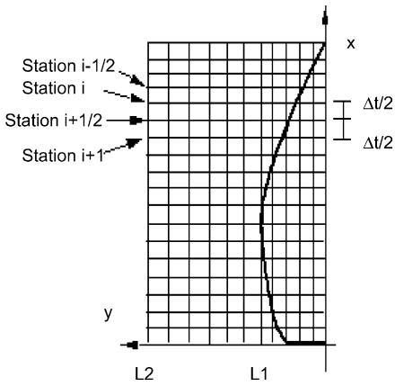  
Fig. 2. The grid generation of the free-surface.

Through the maximum half width point on the waterline of the ship, draw a longitudinal grid line $L _ { 1 }$ parallel to the x axis. In the region between $L _ { 1 }$ and x axis, the coordinates of the segment’s end points on transverse grid line are calculated by the given number of segments $n _ { 2 i }$ . If the intersection point of the ship’s waterline and transverse grid line is not located at the end point of the segments, we need to adjust the location of the segments’ end point into the intersection point which will be the start point of each station’s grid line. In the region between $L _ { 1 }$ and the outer boundary line $L _ { 2 }$ , the coordinates of the segment’s end point on each transverse grid line is calculated by the given number of segments $n _ { 2 e } .$ . As the fluid around the ship varies much rapidly, the segment’s length between $L _ { 1 }$ and x axis is smaller than that between $L _ { 1 }$ and $L _ { 2 }$

By the convergence analysis, the required number of the ship’s stations for calculation are related with the Froude number of the ship. At 0.2 Froude number, it is necessary to divide the ship into 60 stations in order to get the converge solution of the fluid potential $\psi _ { j }$ . If the number of stations is less than $6 0 .$ the solution of the fluid potential $\psi _ { j }$ will disperse after some stations. At 0.3 Froude number it is enough to divide the ship into 40 stations.

For better choice of width of the control surface $S _ { \mathrm { C } } .$ , if the breadth of the waterline plane is $B ,$ it seems appropriate to select thrice of the breadth B as the radius of the control surface. It is necessary to guarantee that the number of $n _ { 2 i }$ is greater than 10 and the number of $n _ { 2 e }$ is greater than 8 to determine the number of segments of free-surface transverse grid line.

From the discretized free-surface boundary conditions (19) and (20), it is observed that the fluid boundary value equations are solved at the integer multiple of $\Delta t .$ . Therefore, the number of the stations for the hull and for the free-surface along x axis are different; the stations for the free-surface are twice of that for the hull.

## 3.4. The numerical methods to solve the matched boundary integral equations

Using the boundary conditions on the instantaneous wet surface $S _ { \mathrm { B } }$ and the free-surface boundary conditions (19) and (20), we can solve the matched boundary integral equations by the step procedure.

At first we divide the boundaries $S _ { \mathrm { B } } { + } S _ { \mathrm { F i } } { + } S _ { \mathrm { C } }$ into $n _ { 1 } + n _ { 2 } + n _ { 3 }$ segments. The integral curves are replaced by the discretized segments. On these segments, the fluid potential $\psi _ { j } ( p , t )$ and its normal derivative $\psi _ { n j } ( p , t )$ are taken as constants. $\psi _ { j } ( p , t )$ on $S _ { \mathrm { B } } + S _ { \mathrm { C } }$ and $\psi _ { n j } ( p , t )$ on $S _ { \mathrm { F i } } { + S _ { \mathrm { C } } }$ are unknown. The total numbers of unknown variables are $n _ { 1 } + n _ { 2 } +$ $2 n _ { 3 }$

In the inner fluid domain $D _ { \mathrm { i } } .$ , let the fluid field point $p$ approaches the midpoints of the discretized segments on the boundaries $S _ { \mathrm { B } } { + } S _ { \mathrm { F i } } { + } S _ { \mathrm { C } }$ . Boundary conditions on $S _ { \mathrm { B } }$ and $S _ { \mathrm { F i } }$ are satisfied by the discretized boundary integral equation (11) at these points and we can get a group of algebraic equations $n _ { 1 } + n _ { 2 } + n _ { 3 }$ . In the outer fluid domain, let the fluid point p approaches the midpoints of the discretized segments on the boundary $S _ { \mathrm { C } }$ . The integral equation (16) are discretized at the segments $S _ { \mathrm { C } }$ and we get a group of algebraic equations $n _ { 3 }$ . Because Eq. (16) contains convolution integral of transient free-surface Green function on the segment, Eqs. (11) and (16) must be solved by the time step, the unknown $\psi _ { j } ( p , t )$ and $\psi _ { n j } ( p , t )$ can be obtained at time t. Take the time step $\Delta t$ as constant, the trapezoid method is used to calculate the convolution integral of transient free-surface Green function from time zero to the solution time t. Let $\begin{array} { r } { t = m \Delta t , \tau = k \Delta t , r _ { i j } = r _ { p q } , r _ { i j } ^ { \prime } = r _ { p \bar { q } } } \end{array}$

Eq. (11) can be discretized in the form:

$$
\begin{array}{l} \sum_ {j = 1} ^ {n _ {1}} A _ {i j} \psi_ {j m} - \sum_ {j = n _ {1} + 1} ^ {n _ {1} + n _ {2}} B _ {i j} \psi_ {n j m} + \sum_ {j = n _ {1} + n _ {2} + 1} ^ {n _ {1} + n _ {2} + n _ {3}} (A _ {i j} \psi_ {j m} - B _ {i j} \psi_ {n j m}) \\ = \sum_ {j = 1} ^ {n _ {1}} B _ {i j} \psi_ {n j m} - \sum_ {j = n _ {1} + 1} ^ {n _ {1} + n _ {2}} A _ {i j} \psi_ {j m} i = 1, 2, \dots , n _ {1} + n _ {2} + n _ {3} \end{array}\tag{23}
$$

Eq. (16) can be discretized in the form:

$$
\sum_ {j = 1} ^ {n _ {3}} (A _ {i j} - \bar {A} _ {i j}) \psi_ {j m} - (B _ {i j} - \bar {B} _ {i j}) \psi_ {n j m} = - \Delta t \sum_ {k = 1} ^ {m - 1} \sum_ {j = 1} ^ {n _ {3}} (B _ {i j} ^ {m - k} \psi_ {n k j} - C _ {i j} ^ {m - k} \psi_ {k j})\tag{24}
$$

$$
i = 1, 2, \dots , n _ {3}
$$

The influence coefficients are defined in the following:

$$
A _ {i j} = (- 1) ^ {\alpha} \delta_ {i j} \pi + \bar {\delta} _ {i j} \int_ {\Delta l _ {j}} \frac {\partial}{\partial n _ {j}} \ln r _ {i j} d l \quad B _ {i j} = \int_ {\Delta l _ {j}} \ln r _ {i j} d l\tag{25}
$$

$$
\bar {A} _ {i j} = \int_ {\Delta l _ {j}} \frac {\partial}{\partial n _ {j}} \ln r _ {i j} ^ {\prime} d l \quad \bar {B} _ {i j} = \int_ {\Delta l _ {j}} \ln r _ {i j} ^ {\prime} d l\tag{26}
$$

$$
\delta_ {i j} = \left\{ \begin{array}{l l} 1 & i = j \\ 0 & i \neq j \end{array} \right. \quad \bar {\delta} _ {i j} = \left\{ \begin{array}{l l} 1 & i \neq j \\ 0 & i = j \end{array} \right.\tag{27}
$$

$$
B _ {i j} ^ {m - k} = \int_ {\Delta l _ {j}} \tilde {G} (i, j; m - k) \mathrm{d} l \quad C _ {i j} ^ {m - k} = \int_ {\Delta l _ {j}} \frac {\partial \tilde {G} (i , j ; m - k)}{\partial n _ {j}} \mathrm{d} l\tag{28}
$$

For $A _ { i j }$ in Eq. (23), a is taken as 1, in Eq. (24) a is taken as 2. On the right-hand of Eq. (23), $\psi _ { n j } ( p , t )$ is determined by the body boundary condition offormulation (4), $\psi _ { j } ( p , t )$ is determined by Eq. (20). Combine these two groups of algebraic equations knowing that the potential $\psi _ { j } ( p , t )$ and its normal derivatives $\psi _ { n j } ( p , t )$ on $S _ { \mathrm { C } }$ are continuous through the inner and outer fluid domain. The numbers of the equations are equal to that of the unknown variables, therefore, the unknown $\psi _ { j } ( p , t )$ and $\psi _ { n j } ( p , \ t )$ can be calculated by solving the algebraic equations.

## 3.5. The stepping procedure of the free-surface boundary conditions

In Fig. 2, station i is located at x position $x _ { \mathrm { i } } .$ The symbol i represents the station at which the hydrodynamic boundary value has been solved and the $\psi _ { n }$ has been calculated.

The symbol $i - 1 / 2$ represents the station at which the free-surface elevation has been calculated. The boundary value on station $i + 1 / 2$ and station iC1 are calculated in-order by Eqs. (19) and (20). Once the $\psi _ { j }$ at station iC1 are determined by Eq. (20), the matched fluid boundary integral equations (23) and (24) are solved and the vertical velocity $\psi _ { n j }$ at station iC1 can be obtained.

According to Eqs. (19) and (20), the solution of elevation $\zeta _ { j } ( i + 1 / 2 , y _ { 0 } )$ and the freesurface velocity potential $\psi _ { j } ( i + 1 , y _ { 0 } )$ requires the boundary values $\zeta _ { j } ( i - 1 / 2 , y _ { 0 } )$ and $\psi _ { j } ( i ,$ $y _ { 0 } )$ . Linear interpolation is needed to calculate the boundary values $\zeta _ { j } ( i - 1 / 2 , y _ { 0 } )$ and $\psi _ { j } ( i ,$ $y _ { 0 } )$ based on the known $\zeta _ { j } ( i - 1 / 2 , y )$ and $\psi _ { j } ( i , y )$

## 4. Validation and verification

In order to test the numerical algorithm, the numerical results computed by the matched boundary integral equations are compared with the measured value and numerical results calculated by the time domain boundary integral equation developed by Duan and He (2001).

## 4.1. The free-surface wave elevation comparison of submerged spheroid

In order to investigate the numerical stability and precision of the discretized forms of free-surface boundary conditions (19) and (20), the hydrodynamics of a submerged spheroid heaving in time-harmonic mode of small amplitude with a forward speed $U$ is solved. The half beam $y _ { I }$ of the submerged spheroid at the longitudinal position $x _ { I }$ is

$$
(2 y _ {1} / B) ^ {2} = 1 - (1 - 2 x _ {1} / L) ^ {2} - (2 z _ {1} / B + 2 d _ {1} / B) ^ {2}\tag{29}
$$

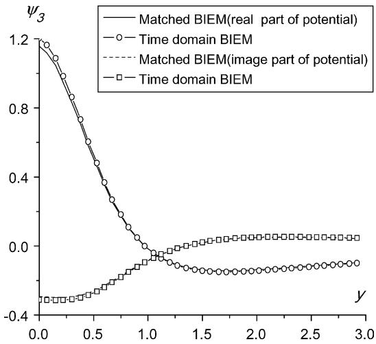  
Fig. 3. The complex amplitude of potential on free-surface at Station 20.

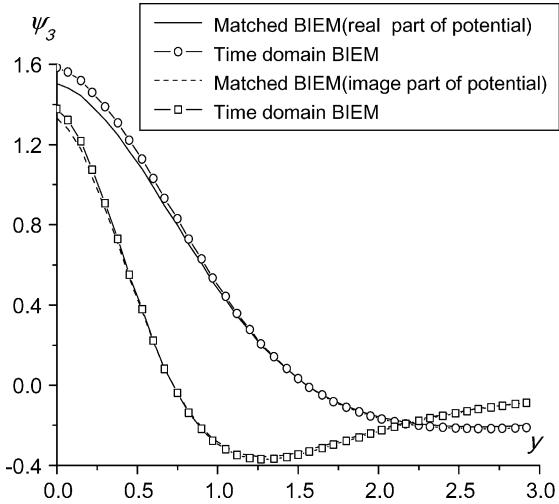  
Fig. 4. The complex amplitude potential on free-surface at Station 30.

where B is the breadth of the spheroid, L is the length of the spheroid, $d _ { 1 }$ is the distance from the free-surface to the center of the spheroid, $z _ { 1 }$ is the vertical distance from the freesurface to the surface of the spheroid and $x _ { 1 }$ is the longitudinal position relative to the center of the spheroid.

The dimensions of the submerged spheroid selected in this paper are: $L / B { = } 1 0 , d _ { 1 } / B { = }$ 0.75, the Froude number is 0.4 and the non-dimensional circular frequency $( \bar { \omega } = \omega \sqrt { L / g } ) \mathrm { i }$ s 2.8303.

The spheroid is divided into 61 stations in the longitudinal direction. The free-surface elevation $\zeta _ { j }$ and fluid potential $\psi _ { j }$ are calculated at stations 20, 30, 40, and 50. Figs. 3–6 show the complex amplitude of fluid potential $\psi _ { j }$ at transverse position of stations 20, 30,

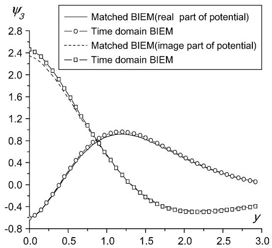  
Fig. 5. The complex amplitude of potential on free-surface at Station 40.

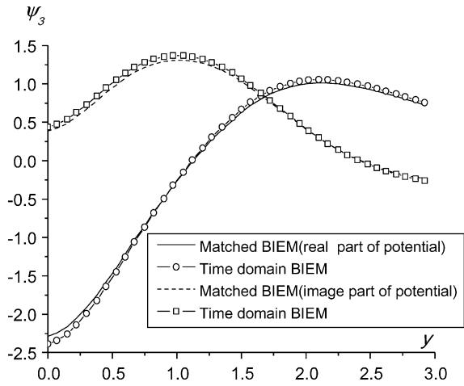  
Fig. 6. The complex amplitude of potential on free-surface at Station 50.

40, and 50; Figs. 7–10 show the complex amplitude of free elevation $\zeta _ { j }$ at transverse position of stations 20, 30, 40, and 50. The curves with symbols are calculated by timedomain boundary integral equation, the solid lines and dashed lines are calculated by the matched boundary integral equations.

Figs. 3–10 show that the numerical results by the two numerical schemes are very close to each other. Since there are no waterlines for the submerged spheroid, the solution of the potential by the time-domain boundary integral equation cannot bring numerical divergence problem. Therefore, the results by this numerical algorithm are reasonable. Due to good agreement of numerical results by these two numerical algorithms, It is showed that the matched boundary integral equations are also correct and the discretized form of free-surface boundary conditions (19) and (20) are stable.

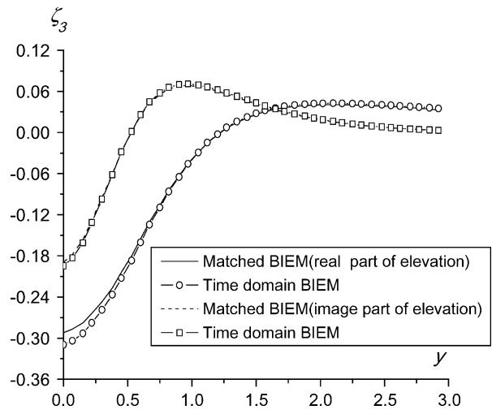  
Fig. 7. The complex amplitude of wave elevation on free-surface at Station 20.

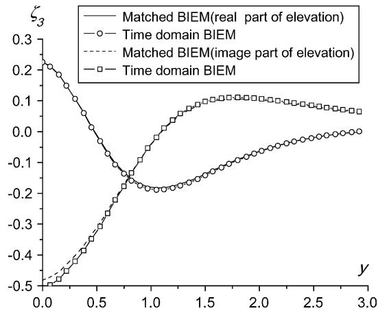  
Fig. 8. The complex amplitude of wave elevation on free-surface at Station 30.

4.2. The hydrodynamic coefficients comparison between theoretical results and measured values for Wigley III

The linear fluid pressure $p _ { j }$ due to unsteady fluid potential $\psi _ { j } ( t , y , z )$ can be expressed as:

$$
p _ {j} (t, y, z) = - \rho \left(\mathrm{i} \omega \phi_ {j} - U \frac {\partial \phi_ {j}}{\partial x}\right) = - \rho \mathrm{e} ^ {- \mathrm{i} \omega t} \frac {\partial \psi_ {j}}{\partial x}\tag{30}
$$

By integrating the $p _ { j }$ on the cross-sectional contour of the ship and then integrating the sectional results along the longitudinal axis of the ship, the hydrodynamic forces acting on ship can be determined:

$$
T _ {i j} = \iint_ {S} p _ {j} (x, y, z) n _ {i} \mathrm{d} s = - \rho \int_ {L} \int_ {S x [ t ]} \left(\mathrm{i} \omega \phi_ {j} - U \frac {\partial \phi_ {j}}{\partial x}\right) n _ {i} \mathrm{d} s\tag{31}
$$

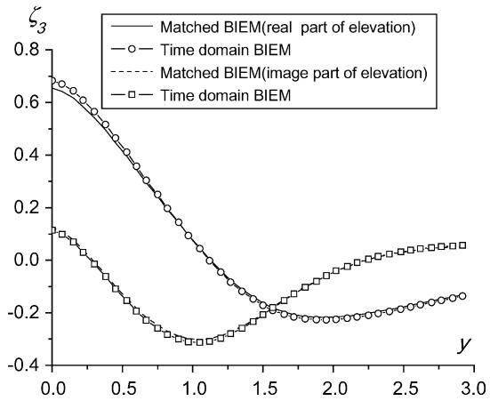  
Fig. 9. The complex amplitude of wave elevation on free-surface at Station 40.

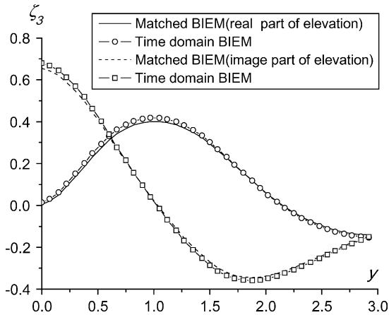  
Fig. 10. The complex amplitude of wave elevation on free-surface at station 50.

In order to avoid numerical difference about $\partial \psi _ { j } / \partial x$ , Stokes theorem can be applied on Eq. (31), the radiation hydrodynamics acting on the ship can be expressed in the form (Dai, 1998):

$$
T _ {i j} = - i \rho \omega \iint_ {s} \phi_ {j} n _ {i} \mathrm{d} s + \rho U \iint_ {s} \phi_ {j} m _ {i} \mathrm{d} s - \rho U \int_ {C _ {\mathrm{A}}} \phi_ {j} N _ {i} d l\tag{32}
$$

The hydrodynamic coefficients $T _ { i j }$ can be divided into added mass $A _ { i j }$ and damping coefficients $B _ { i j }$ terms, namely:

$$
T _ {i j} = \omega^ {2} A _ {i j} - \mathrm{i} \omega B _ {i j}\tag{33}
$$

Using two numerical algorithms mentioned above, the vertical added mass $A _ { i j }$ and damping coefficients $B _ { i j }$ for a mathematical ship model Wigley III are computed and compared with the measured value reported by Journe´e (1992) at Delft University of Technology. The Froude number used here is 0.4. The circular frequencies used here are 3, 4, 5, 6, 7, 8, 10 and 12 rad/s. The main particulars of the Wigley III have been shown in Table 1.

<table><tr><td>Amidships section coefficient (cm)</td><td>0.6667</td></tr><tr><td>Length to breadth ratio, L/B</td><td>10</td></tr><tr><td>Length, L (m)</td><td>3.0000</td></tr><tr><td>Breadth, B (m)</td><td>0.3000</td></tr><tr><td>Draught, d (m)</td><td>0.1875</td></tr><tr><td>Trim, t (m)</td><td>0.0000</td></tr><tr><td>Volume of displacement, ∇ (m3)</td><td>0.0780</td></tr><tr><td>Center of rotation above base, KR (m)</td><td>0.1875</td></tr><tr><td>Center of gravity above base, KG (m)</td><td>0.1700</td></tr><tr><td>Radius of inertia for pitch, Kyy (m)</td><td>0.7500</td></tr></table>

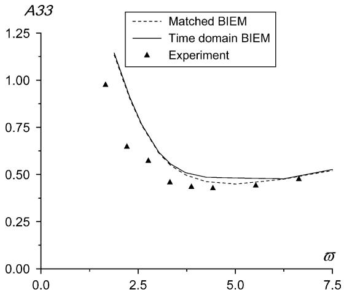  
Fig. 11. FnZ0.4.

The non-dimensional form of circular frequency of oscillation and hydrodynamic coefficients are defined as below:

$$
\varpi = \omega \sqrt {L / g}; A 3 3 = a 3 3 / \rho \nabla ; B 3 3 = b _ {3 3} / \rho \nabla \sqrt {L / g};
$$

$$
A 5 3 = a 5 3 / \rho \nabla L; B 5 3 = b 5 3 / \rho \nabla L \sqrt {L / g}; A 3 5 = a 3 5 / \rho \nabla L;\tag{34}
$$

$$
B 3 5 = b 3 5 / \rho \nabla L \sqrt {L / g}; \quad A 5 5 = a 5 5 / \rho \nabla L ^ {2}; \quad B 5 5 = b 5 5 / \rho \nabla L ^ {2} \sqrt {L / g};
$$

To calculate the hydrodynamic coefficients of Wigley III. $N _ { x } { = } 4 0 , n _ { 1 } { = } 3 0 , n _ { 2 } { = } 2 0$ and $n _ { 3 } = 4 0$ are used for different oscillation frequencies. The theoretical results and measured value of vertical added mass and damping coefficients are given in Figs. 11–18. The comparison shows that the heave and pitch hydrodynamic coefficients

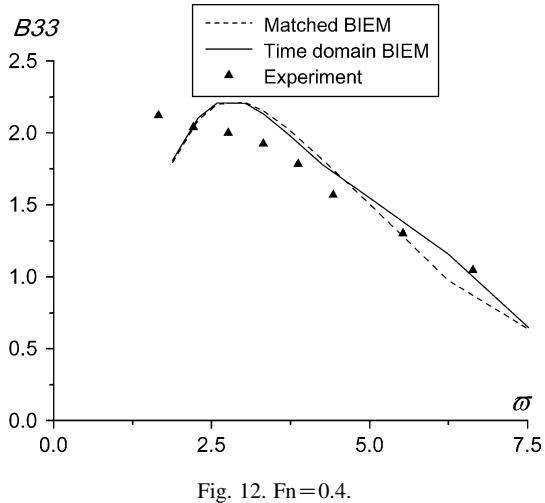

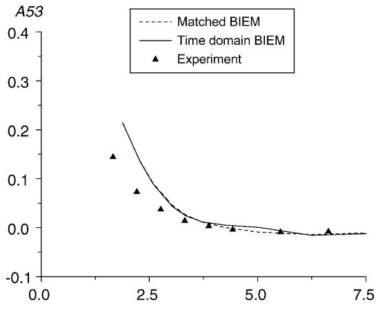  
Fig. 13. FnZ0.4.  
predicted by the two numerical methods are in good agreement with the measured values except for the pitch damping B55. It is also seen from the figures that these two different numerical algorithms are quite close to each other, which demonstrates that they are theoretically equal.

## 4.3. The hydrodynamic coefficients comparison between theoretical results and measured values for SL-7 containership

O’Dea and Harry (1983) presented a report in which a series of experimental values on the measured added mass and damping coefficients of a 1:60 scale model of SL-7 containership are given (Table 2). Forced harmonic heave and pitch oscillations were carried out on model ship. The added mass and damping associated with heave motion and pitch motion were measured for a range of Froude numbers, circular frequencies of oscillation and oscillation amplitudes:

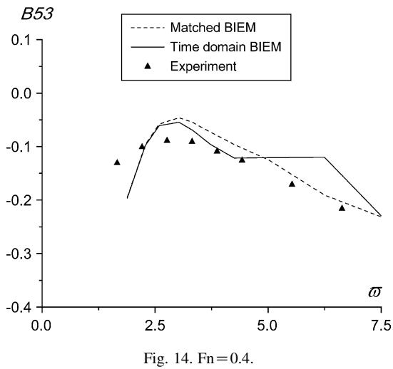

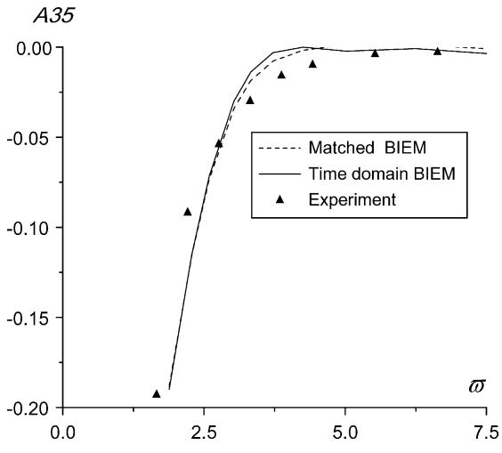  
Fig. 15. FnZ0.4.

Froude number: FnZ0.1, 0.2 and 0.3.

Circular frequency: uZ3, 4, 5, 6, 7, 8, 10 and 12 rad/s.

Heave amplitude: $Z _ { \mathrm { a } } / T { = } 0 . 0 3 7 5$ , 0.074 0.110 and 0.147.

Pitch amplitude: qZ0.186, 0.372 and $0 . 5 5 8 ^ { \circ }$

The hydrodynamic coefficients and circular frequencies of oscillation are nondimensioned in the same way as those for Wigley III ship. The measured hydrodynamic coefficients of SL-containership running at Froude number 0.3 are selected for comparison.

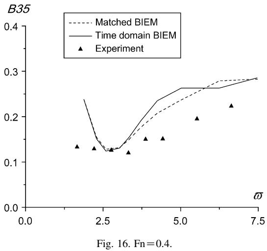

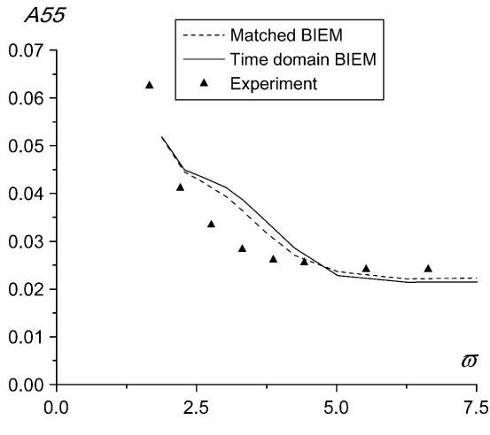  
Fig. 17. FnZ0.4.

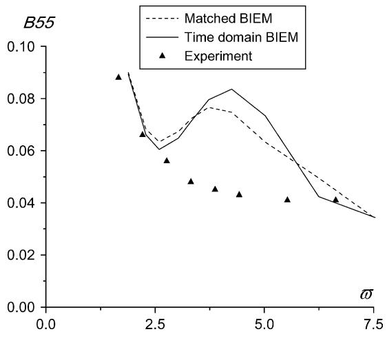  
Fig. 18. FnZ0.4.

Table 2  
The hull particulars of SL-7 containership

<table><tr><td>LOA (m)</td><td>288.5</td></tr><tr><td>LBP (m)</td><td>268.4</td></tr><tr><td>Beam (m)</td><td>32.16</td></tr><tr><td>Draft (m)</td><td>9.94</td></tr><tr><td>Trim by stern (mm)</td><td>43.0</td></tr><tr><td>LCG Aft of Amidship (m)</td><td>11.7</td></tr><tr><td>Displacement (MT)</td><td>48,364</td></tr><tr><td>Pitch radius of gyration</td><td>0.21 LBP</td></tr></table>

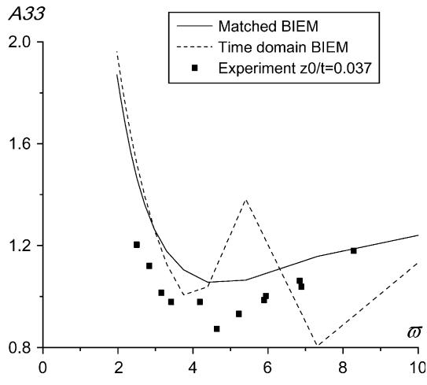  
Fig. 19. FnZ0.3.

Figs. 19–26 show the vertical hydrodynamic coefficients of theoretical results by two different numerical algorithms based on 2.5D theory, the measured values are also given. It is seen from the figures that the curves calculated by the time domain boundary integral equation exhibit fluctuation at some frequencies. On the contrary, the curves calculated by the matched boundary integral equations varied smoothly with the oscillation frequencies. From Fig. 27, we can see that there are several stations at the aft of the ship where the inclined angle of transverse sectional contours relative to the vertical direction are relatively large near the free-surface. The large flare of those stations can lead to the numerical divergence solution of velocity potential on the wet surface of those stations when the time domain boundary integral equation are solved for the radiation hydrodynamics. The reason for the numerical divergence has been explained by Duan (1999).

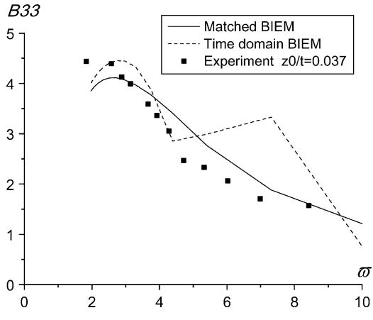  
Fig. 20. FnZ0.3.

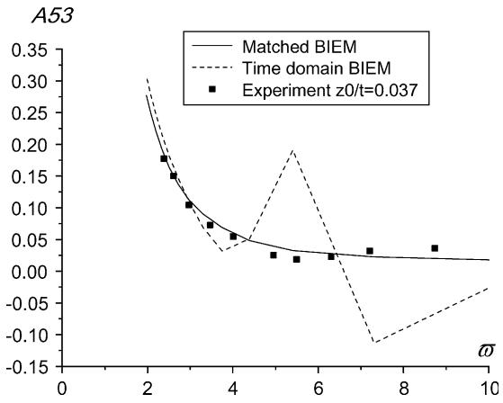  
Fig. 21. FnZ0.3.

The calculated added mass and damping A33, B33, A53 and B53 for heave using the matched boundary integral equations agree quite well with the measured values. For pitch motion, the calculated added mass A55 are also fairy close to the measured value. The calculated damping B55 is also close to the measured value. But for the coupling coefficients A35 and B35 there exists significant discrepancy between calculated and measured values.

## 5. Conclusions

A numerical algorithm for solving the 2.5D theory has been developed. This numerical algorithm is similar to the time domain boundary integral equation. Both these two methods apply transient free-surface Green function to form the boundary integral equations. But the matched boundary integral equations do not contain transient Green function in the integral equation over the mean wet surface of the ship and avoid the numerical divergence brought by error accumulation of transient Green function on the inclined segments near the free-surface. Good agreement was achieved using the matched boundary integral equations to calculate the velocity potential of the submerged spheroid and the hydrodynamic coefficients of Wigley III, which shows that the current discretized form of free-surface conditions is efficient and stable. The prediction of the vertical hydrodynamic coefficients of SL-7 containership demonstrates that the matched boundary integral equations based on 2.5D theory can be used to calculate the hydrodynamic characteristics for high-speed ships with large flare.

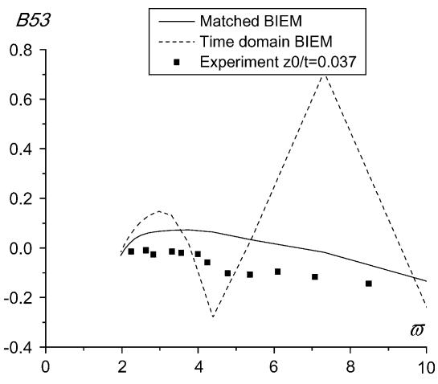  
Fig. 22. FnZ0.3.

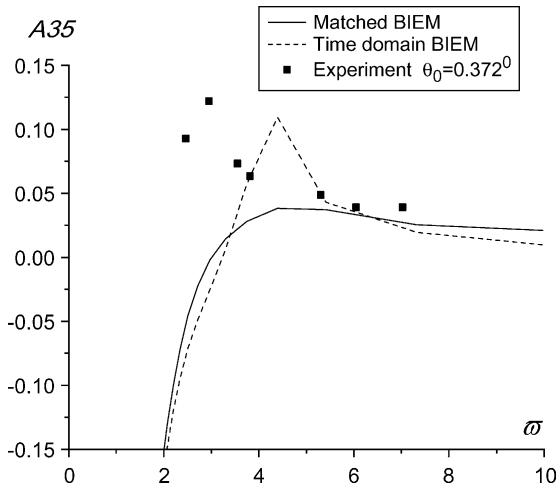  
Fig. 23. FnZ0.3.

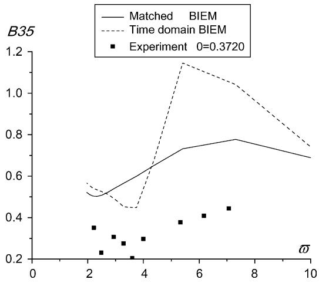  
Fig. 24. FnZ0.3.

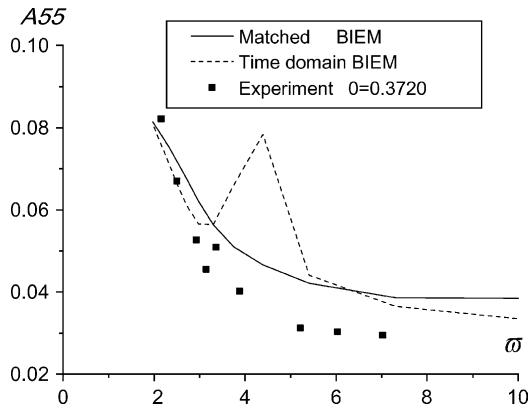  
Fig. 25. FnZ0.3.

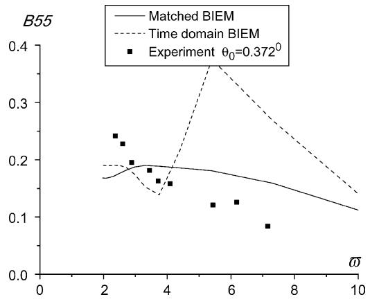  
Fig. 26. FnZ0.3.

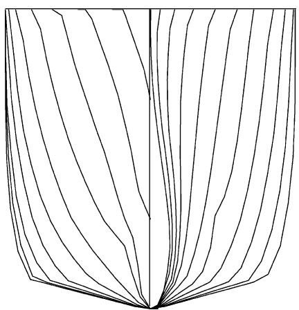  
Fig. 27. The body plans of SL-7 containership.

## Acknowledgements

This research is supported by the National Natural Science Foundation of China (grant no. 10272035) and Foundation from Ministry of Education of China (grant no. 199927).

## References

Chapman, R.B., 1976. Free surface effects for yawed surface piercing plates. Journal of Ship Research 20 (3), 125–136.

Dai, Y.S., 1998. Potential Flow Theory of Ship Motions in Waves in Frequency and Time Domain [M]. National Defence Industry Press, Beijing (in Chinese).

Davis, M.R., Holloway, D.S., 2003. Motion and passenger discomfort on high speed catamarans in oblique seas. International Shipbuilding Progress 50 (4), 317–332.

Duan, W.Y., 1995. Nonlinear hydrodynamic forces acting on a ship undergoing large amplitude motion. PhD Dissertation. Harbin Engineering University, Harbin (in Chinese)

Duan, W.Y., 1999. Time-domain calculations of hydrodynamic forces on ships with large flare (two-dimensional case). International Shipbuilding Progress 46 (446), 209–221.

Duan, W.Y., He, W.Z., 2001. Motion characteristics of fast displacement vessels. Journal of Tsinghua Universit 41 (12), 82–85 (in Chinese).

Faltinsen, O., Zhao, R., 1991. Numerical predictions of ship motions at high forward speed [J]. Philosophical Transactions of the Royal Society of London, Series A 334, 241–252.

Hermundstad, O.A., 1994. Theoretical and experimental hydroelastic analysis of high speed vessels. PhD Dissertation. Department of Marine Structures, The Norwegian Institute of Technology.

Journe´e, J.M.J., 1992. Experiments and calculations on 4 Wigley hull forms in head waves. Report 0909. Delft University of Technology, Ship Hydromechanics Laboratory, Mekelweg 2, 2628 CD, Delft, The Netherlands (http://www.shipmotions.nl)

Lloyd, A., 1998. Sea-keeping: Ship Behavior in Rough Weather [M]. A R J M Lloyd, Hampshire, UK.

O’Dea, J.F., Harry, D.J., 1983. Absolute and relative motion measurements on a model of a high-speed containership, In: Proceedings of 20th American Towing Tank Conference.

Sun, S.C., 2003. The numerical simulation of two dimensional free surface conditions. Master Dissertation College of Shipbuilding Engineering, Harbin Engineering University (in Chinese).

Wang, C.T., 1999. Vertical motions of slender bodies with forward speed. Proceedings of the National Science Council, Republic of China. Part A 23 (1), 31–41.