Hui Sun

# A Boundary Element Method Applied to Strongly Nonlinear Wave-Body Interaction Problems

Thesis for the degree of philosophiae doctor

Trondheim, May 2007

Norwegian University of

Science and Technology

Faculty of Engineering Science and Technology

Department of Marine Technology

ONTNU Innovation and Creativity

NTNU Norwegian University of Science and Technology

Thesis for the degree of philosophiae doctor

Faculty of Engineering Science and Technology Department of Marine Technology

©Hui Sun

ISBN 978-82-471-3098-8 (printed ver.) ISBN 978-82-471-3103-9 (electronic ver.) ISSN 1503-8181

Theses at NTNU, 2007:141

Printed by Tapir Uttrykk

## Abstract

A two-dimensional Boundary Element Method (BEM) based on potential flow theory is developed to study wave-body interaction problems with strongly nonlinear effects. In particular, the following problems are studied. One problem is the symmetric water entry of rigid bodies, i.e. of a wedge, a bow-flare ship section and a circular cylinder. Further, the asymmetric water entry of a bow-flare ship section, the water impact on an elastic cylindrical shell and the large-amplitude forced heave motions of a wedge and a bulbous-bow ship section are examined. Fully nonlinear free surface conditions are always satisfied. The exact body boundary conditions are also satisfied except in the water impact of a cylindrical shell. In this special case, the effects of the elastic vibrations are linearized and the body boundary conditions are satisfied on the undeformed shell surface. Gravity effects on the water flow are in general included. The numerical difficulties encountered in solving the initial phase of the blunt body impact are handled by using flat plate theories, i.e. von Karman’s theory or Wagner’s theory at the initial stage. The numerical errors associated with the very thin jet rising up along the body surface are reduced by cutting off the thin jet. Thin sprays evolving from the free surface are cut off to avoid breaking waves hitting on the underlying free surface and thereby creating vorticity. A numerical damping beach in the far-field is utilized to ensure the condition of outgoing waves generated by an oscillating body. A flow separation model is merged with the BEM to simulate the non-viscous flow separation from the knuckles of a section or from a curved body surface. In the latter case, a criterion related to the low-pressure area on the wetted body surface near the free surface is introduced to predict the occurrence of the flow separation. Hydroelasticity effects are accounted for in the water impact problem of a cylindrical shell by coupling the BEM with a modal analysis. An alternative approach is developed for cases when the submergence of the shell is small relative to its radius. In this approach, a flat plate theory, von Karman’s theory or Wagner’s theory, is coupled with the modal analysis. Finally, the hydrodynamic performance of a prismatic planing hull in steady or unsteady motions is investigated by using a 2D+t theory combined with the two-dimensional BEM. The planing speeds are moderate in the studied cases. The three-dimensional effects neglected in the 2D+t theory and the gravity effects are discussed for the steady planing cases. In the unsteady cases, the planing hull is forced to oscillate in heave or pitch. The dependence of the linearized added mass and damping coefficients on the forced oscillation frequency is investigated.

## Acknowledgements

I must thank my supervisor Prof. Odd M. Faltinsen for his great contributions to this thesis. It is his patient guidance and continuous encouragement that enabled me to finish the work and write this thesis. His insight into physics, brilliant ideas to solve problems and his ways of thinking make me benefit throughout these years. His enthusiasm for research often influenced me and motivated me to persevere in my goals.

I would like to thank the professors and lecturers who taught courses in my first year and helped me understand so much knowledge in Marine Technology. I am also grateful to Dr. Marilena Greco for her kind help and her careful proof reading of this thesis.

My thanks also go to Prof. Torgeir Moan, who efficiently directs the Centre for Ships and Ocean Structures (CeSOS) where I have been doing my PhD study. The scientific environment of the centre is friendly and enjoyable. Further, his guidance to us about how to get a PhD has helped me in different stages in my study.

I appreciate my fellow PhD students and the staff in CeSOS and the Department of Marine Technology for their help. In particular, I want to thank Renato Skejic, Zhen Gao and Csaba Pákozdi for the helpful and pleasant discussions with them when we worked together in some courses. I also want to mention Dr. Xinying Zhu, Dr. Bin Zhang and Dr. Olav Rognebakke, for their kind help and the valuable discussions with them. Further, I would like to thank all the Chinese friends working in the CeSOS and in the department, as well as their families in Trondheim. I really appreciate the friendships and the home-like environment they gave me.

My gratitude goes to my husband Zhi Shu for his love, encouragement and his support in both academic aspect and in life. I am also deeply indebted to my family in China. They have been giving me both material and spiritual support during my stay in Norway.

Specially, this thesis is dedicated to my mother. Her unconditional love and her support always accompany me in my life.

This PhD fellowship is given by the Research Council of Norway through the CeSOS in Norwegian University of Science and Technology.

<table><tr><td>a</td><td>Radius of the neutral surface of a cylindrical shell</td></tr><tr><td>an</td><td>Principal coordinate for mode n in a modal analysis for a shell structure</td></tr><tr><td>A(x,t)</td><td>Sectional added mass approximation for a planing hull</td></tr><tr><td>Aij</td><td>Added mass coefficients for a planing hull</td></tr><tr><td>An</td><td>Time-dependent coefficients for the general solution near a flow separation position</td></tr><tr><td>Anm</td><td>Equivalent added mass terms in the vibration equation for mode n induced by the vibration in mode m</td></tr><tr><td>az</td><td>Vertical acceleration</td></tr><tr><td>A3/2</td><td>A parameter in the analytical solution near a flow separation position</td></tr><tr><td>A33</td><td>2D added mass of a section in heave</td></tr><tr><td>b</td><td>Half beam B/2</td></tr><tr><td>B</td><td>Beam</td></tr><tr><td>Be</td><td>Extension in half beam</td></tr><tr><td>Bij</td><td>Damping coefficients for a planing hull</td></tr><tr><td>Bk</td><td>Beam of a V-shaped section measured between knuckles.</td></tr></table>

## Nomenclature

## General Rules

• Symbols are generally defined where they appear in the text for the first time.

• Matrices and vectors are represented by bold face characters.

• Overdots signify differentiation with respect to time.

• Sometimes the same symbol is used in different problems to indicate different things.

## Abbreviations:

<table><tr><td>2D</td><td>Two dimensional</td></tr><tr><td>BEM</td><td>Boundary Element Method</td></tr><tr><td>BVP</td><td>Boundary Value Problem</td></tr><tr><td>CFD</td><td>Computational Fluid Dynamics</td></tr><tr><td>COG</td><td>Centre of Gravity</td></tr><tr><td>IBVP</td><td>Initial Boundary Value Problem</td></tr></table>

## Subscript:

ij i = 3 and 5 correspond to the vertical force and pitch moment, respectively; j = 3 and 5 correspond to the forced heave and pitch motion, respectively.

max Maximum value

## Roman symbols:

$\mathrm { B } _ { \mathrm { n m } }$ Equivalent added mass terms in the vibration equation for mode n induced by the vibration in mode m $\mathrm { B } _ { 3 3 }$ 2D damping coefficient of a section in heave $\mathrm { B } _ { 3 3 } ^ { \mathrm { ~ \tiny ~ v ~ } }$ Viscous damping coefficient in heave $\mathsf { c } ( \mathrm { t } )$ The half wetted length of plate in a flat plate theory $\mathrm { C _ { D } }$ Drag coefficient $\mathrm { C _ { f } }$ Frictional force coefficient $\mathrm { C _ { L } }$ Lift coefficient $\mathrm { C _ { L \beta } }$ Lift coefficient for a planing hull $\mathrm { C } _ { \mathrm { m } }$ A correction coefficient in the expression of $\mathrm { A } ( \mathrm { x } , \mathrm { t } )$ $\mathrm { C _ { p } }$ Pressure coefficient $\mathrm { C } _ { 3 3 }$ Restoring force coefficient $\mathrm { C _ { i j } }$ Restoring force coefficients for a planing hull ${ \sf d }$ Thickness of the wall of a cylindrical shell $\mathrm { d ( x , t ) }$ Instantaneous local draft for a planing hull in unsteady motions ${ \mathrm { d } } _ { 0 }$ The threshold in the cut-off model for the very thin jet D Draft or Diameter of a circular cylinder or the flexural rigidity of a cylindrical shell $\mathrm { D } _ { \mathrm { T } }$ Draft at the transom stern of a planing vessel $\mathrm { E }$ Young’s modulus $\mathbf { f }$ Frictional force $\mathrm { f _ { n } }$ Natural frequency for mode n for a cylindrical shell vibrating in the radial direction $\mathrm { f } _ { 3 }$ Normalized sectional vertical force on a planing hull $\mathrm { F ( t ) }$ Time history of the vertical force due to the water pressure on a heave section $\mathrm { F _ { a n } }$ Amplitude of the nth order harmonic force component for a heaving section $\mathrm { F _ { n B } }$ Beam length based Froude number $\mathrm { U } / ( \mathrm { g B } ) ^ { 1 / 2 }$ $\mathrm { F } _ { \mathrm { n D } }$ Froude number based on the diameter of a circular cylinder $\mathrm { U } / ( \mathrm { g D } ) ^ { 1 / 2 }$ $\mathrm { F _ { n } }$ The generalized force for mode n in a modal analysis for a shell structure $\mathrm { F _ { v } }$ Vertical viscous force on a heaving section $\mathrm { F _ { z } }$ Total vertical force on the body due to water pressure. $\mathrm { F } _ { 0 }$ Total mean force on a heaving section $\mathrm { F } _ { 0 } { } ^ { ( 2 ) }$ Second order mean force for a heaving section $\mathrm { F } _ { 3 }$ Total vertical force on a planing hull $\mathrm { F } _ { 3 } ^ { \mathrm { ~ ( 2 D ) } }$ Sectional vertical force on a planing hul $\mathrm { F } _ { 5 }$ Total pitch moment on a planing hull about the COG gh Acceleration of gravity Drop height in a free drop test $\mathrm { J } _ { \mathrm { k } } ( \mathbf { x } )$ Bessel function of the first kind of order k ${ \mathrm { J } } _ { \mathrm { k , n } }$ Simplified expression of $\mathrm { J _ { k } ( n c ( t ) / R ) }$ $\mathbf { k }$ A ratio of the mass of a circular cylinder to the mass of the displaced water when it is fully submerged. k Unit vector in positive z-direction K A coefficient in the expression of the added mass $\mathbf { A } ( \mathbf { x , t } )$ KC Keulegan-Carpenter number $\mathrm { { l _ { p } } }$ The distance measured along the keel from transom stern to the centre of the water pressure for a planing hull $\mathrm { l c g }$ The distance from the transom to the COG of a planing hull measured along the keel L Length of a cylinder or the mean wetted length for a planing hull

$\mathrm { L _ { C } }$ Chine wetted length for a planing hull

$\mathrm { L _ { D } }$ Length of the damping region in a numerical calculation

$\mathrm { L } _ { \mathrm { K } }$ Keel wetted length for a planing hull

$\mathrm { L } _ { \mathrm { T } }$ Total length of a water domain in a numerical calculation

$\mathrm { m }$ The mass of a 2D section with unit length or number of periods used in the calculation

$\mathfrak { m } _ { \mathrm { n } }$ Equivalent mass term for mode n in a vibration equation

$\mathbf { M }$ Total mass of a body

n Normal vector on a boundary surface, pointing out of the fluid domain.

$\Nu _ { \mathrm { m } }$ The maximum number of mode in a numerical calculation by a modal analysis

$\mathbf { N }$ 2D normal vector on the hull surface in a cross-plane

$( \mathrm { N } _ { \mathrm { X } } , \mathrm { N } _ { \mathrm { Z } } )$ Components of the normal vector N

$^ { ( \mathrm { r } , \mathrm { \theta } ) }$ A polar coordinate system in the local solution around a flow separation position R Radius of a circular cylinder

$\mathrm { R } _ { \mathrm { n D } }$ Renolds number $\mathrm { R } _ { \mathrm { n D } } \mathrm { \dot { = } U D v ^ { - 1 } }$ for the water flow around a circular cylinder

$$
\mathrm{S}
$$

$\mathrm { S } _ { 0 }$ Mean submerged area of a heaving section

p Pressure

$\mathfrak { p } _ { \mathrm { a } }$ Atmospheric pressure

$\mathrm { T }$ Period for a forced oscillation

$\mathbf { u } , \mathbf { W }$ velocity components

U Forward speed of a planing hull or the speed of a body in steady motion

$\mathrm { U _ { s } }$ Fluid velocity at the separation position in a non-viscous flow separation

v Tangential displacement of a cylindrical shell at a cross-section vcg The distance of the COG of a planing hull above the keel line measured normal to the keel $\mathbf { V }$ Velocity vector of the rigid body

$\mathrm { V } _ { 0 }$ Initial water entry speed

V(t) Vertical velocity of the rigid body

w Normal displacement of a cylindrical shell at a cross-section

$^ { ( \mathrm { x } , \mathrm { y } , z ) }$ Earth-fixed coordinate system in the problem of a planing hull

$( \widetilde x , \widetilde y , \widetilde z )$ A coordinate system fixed on a planing hull

(X,Y,Z) Hull-fixed coordinate system for a planing hull

$\mathbf { X } _ { \mathrm { c p } } \ 0 \mathrm { r } \ \tilde { x } _ { { c p } }$ The $\mathrm { X } ^ { - } \left( \mathrm { O r } \ \tilde { x } ^ { } - \right)$ coordinate of the centre of the water pressure on a planing hull in a hullfixed coordinate system

$\mathbf { X } _ { \mathrm { s } } \operatorname { o r } \tilde { x } _ { s }$ The $\mathrm { X } ^ { - } \left( \mathrm { O r } \ \tilde { x } ^ { - } \right)$ coordinate for the chine wetted position on a planing hull in a hull-fixed coordinate system

$\mathbf { X } _ { \mathbf { g } }$ The x-coordinate of the COG of a planing hull in a Earth-fixed coordinate system

$^ { ( \mathrm { y } , \mathrm { z } ) }$ Space-fixed coordinate system used in the 2D BEM.

$\mathbf { Z _ { \mathrm { { g } } } }$ The z-coordinate of the COG of a planing hull in a Earth-fixed coordinate system

$Z$ Forced heave motion

$Z _ { \mathrm { a } }$ Amplitude of the forced oscillation in heave

## Greek symbols:

α Angle of attack for a planing surface or a parameter used in the curve fitting of the free surface profile after the transom stern of a planing vessel

$\beta$ Deadrise angle $\beta _ { 0 }$ Non-dimensional parameter in the expression for $\boldsymbol { \mathrm { v _ { 0 } } }$ $\stackrel { \gamma } { \delta ^ { ( \mathrm { n } ) } }$ Poisson’s Ratio Phase angle of the nth order harmonic force $\Delta { \sf t }$ Time step in the numerical calculations $\varepsilon$ Normalized amplitude for the forced oscillations in heave; a parameter in the flow separation model; slenderness parameter for a vessel defined by the ratio of the draft to the length of the vessel $\scriptstyle \mathbf { \varepsilon } _ { 0 }$ Elongation in the neutral plane of a cylindrical shell $\varepsilon _ { \boldsymbol { \theta } }$ Strain on the inner surface of a cylindrical shell, in the tangential direction at a crosssection $\xi$ Local coordinate on a linear element in the BEM $\xi _ { \mathrm { B } }$ Normalized frequency for the forced oscillations in heave $\xi - \zeta$ A local coordinate sysmtem near transom stern at the centre plane of a planing hull $\zeta ( \mathrm { x } , \mathrm { y } , \mathrm { t } )$ Free surface elevation around a planing hull $\zeta ( \mathrm { t } )$ Submergence of the lowest point on a body into water relative to undisturbed free surface η(y,t) Free surface elevation at time t η A local non-dimensional coordinate in a damping region $\boldsymbol { \mathsf { \Pi } } _ { \mathsf { \Pi } } ^ { \mathsf { \Pi } }$ Heave motion of a planing hull $\boldsymbol { \mathrm { \Pi } } \mathfrak { n } _ { \mathrm { 3 a } }$ Amplitude of the forced oscillations of a planing hull in heave $\boldsymbol { \mathsf { \Pi } } \boldsymbol { \mathsf { \Pi } } ^ { \mathsf { \Pi } }$ Pitch motion of a planing hull $\boldsymbol { \mathrm { \Pi } } \boldsymbol { \mathrm { \Pi } } \boldsymbol { \mathrm { \Pi } } \boldsymbol { \mathrm { \Pi } } \boldsymbol { \mathrm { \Pi } }$ Amplitude of the forced oscillations of a planing hull in pitch $\theta$ Constant roll angle of a section during an asymmetric water entry or the radial coordinate at a cross-section of a cylindrical shell $\theta ( \mathrm { t } )$ Instantaneous trim angle of a planing hull in unsteady motions. $\gimel$ Wave length $\lambda _ { \mathrm { w } }$ Mean wetted length-beam ration for a planing hull $\mu$ Mass per unit area of a cylindrical shell $\nu$ Kinematic viscosity of water $\nu ( \gamma )$ Absorption coefficient in the damping region $\boldsymbol { \mathrm { v _ { 0 } } }$ Maximum absorption coefficient for $\nu ( \gamma )$ $\pi$ The constant 3.1415926… $\rho$ Water density $\rho _ { \mathrm { s } }$ Material density of a cylindrical shell $\rho _ { \mathrm { s } }$ Equivalent mass density of a cylindrical shell $\tau$ Trim angle in radian of a planing hull in steady motion or the mean trim angle in unsteady motions $\tau _ { \mathrm { d e g } }$ Trim angle in degree of a planing hull $\boldsymbol { \mathfrak { O } }$ Frequency in a forced oscillation $\Omega$ Fluid domain $\boldsymbol { \Phi } ( \boldsymbol { \mathrm { y } } , z , \boldsymbol { \mathrm { t } } )$ Velocity potential of the fluid flow in two dimensions. $\Phi _ { \mathrm { n } }$ Normal derivative of the velocity potential $\Phi _ { \mathrm { s } }$ Tangential derivative of the velocity potential $\psi$ A correction coefficient in the expression of $\mathrm { A } ( \mathrm { x } , \mathrm { t } )$ $\psi ( \gamma , z , \tau )$ An auxiliary function used in the calculation of pressure

## CONTENTS

Abstract....i   
Acknowledgements....iii   
Nomenclature....v   
1 Introduction....1   
1.1 Background and motivation....1   
1.2 Review of the previous work....3   
1.3 Present work....11   
2 A Boundary Element Method....15   
2.1 The Boundary Element Method....15   
2.2 Initialization for the BEM calculation....18   
2.3 Discretization in the BEM....19   
2.4 Jet cutting....21   
2.5 Spray cutting....22   
2.6 Smoothing and regriding....23   
2.7 Time-marching procedure....25   
2.8 Verification by comparing with similarity solutions....27   
2.9 An improved method in the calculation of the acceleration....29   
3 Non-viscous flow separation....31   
3.1 Local solution of a separated flow....31   
3.2 Flow separation at knuckles....33   
3.2.1 Local analytical solution near a knuckle....33   
3.2.2 Numerical implementation....36   
3.3 Steady flow separation from transom stern....38   
3.4 Flow separation from a curved body surface....39   
4 Free water entry of a two dimensional section....45   
4.1 Approximate methods....45   
4.1.1 Circular cylinder....46   
4.1.2 Arbitrary section....47   
4.2 Water entry of a wedge section....48   
4.3 Water entry of a ship bow section....54   
4.4 Water entry of a circular cylinder....59   
4.5 Asymmetric water entry of a two-dimensional section....64   
4.5.1 The calculation in a whole fluid domain....64   
4.5.2 Asymmetric water entry of a ship bow section....65   
5 Water entry of an elastic cylindrical shell with hydroelasticity effect....79   
5.1 Fluid-structure coupled problem....79   
5.1.1 Formulation of the problem....79   
5.1.2 Modal analysis....82

5.1.3 Fluid-structure coupled analysis....84
5.2 Two experiments on the water impact of cylindrical shells....86
5.2.1 Shibue's experiments....86
5.2.2 Arai's experiments....86
5.3 Coupled analysis by a flat plate theory and the modal analysis....87
5.3.1 Methods to solve the coupled problem....87
5.3.2 Effect of the extension in the middle plane....92
5.3.3 The higher-order modes....93
5.3.4 Influence of the rigid-body motion....94
5.4 Coupled analysis by the BEM and the modal analysis....96
5.4.1 Calculations compared with Arai and Miyauchi's experiments....96
5.4.2 Comparisons between the BEM and the flat plate theories....99
5.4.3 Calculations compared with Shibue's experiments....100
6 Heaving of a two-dimensional section piercing the free surface....103
6.1 Numerical damping beach....103
6.2 Force coefficients....105
6.3 Validation and verification....106
6.3.1 Heaving of a thin wedge....106
6.3.2 Heaving of a circular cylinder with small amplitudes....112
6.4 Heaving of a bow-flare section with a deep draft....113
6.5 Heaving of a bow-flare section with a shallow draft....117
6.6 Heaving of a V-shaped section....119
7 Steady and unsteady motions of a planing hull in calm water....123
7.1 A prismatic planing hull in calm water....123
7.2 2D+t theory for a prismatic planing vessel in steady motion....125
7.3 Results and discussions for a prismatic planing hull in steady motion....127
7.3.1 Comparisons with experiments....127
7.3.2 Three-dimensional effects near chine-wetted position....130
7.3.3 Three dimensional effects at the transom stern....132
7.3.4 Gravity effects....134
7.4 2D+t theory for a prismatic planing vessel in forced unsteady motions....136
8 Conclusions and future perspectives....143
8.1 Conclusions....143
8.2 Future perspectives....146
Appendix ....149
Appendix A. The general solution near a separation position....149
Appendix B. The body boundary condition of ψ on a shell structure....150
Appendix C. Calculations of some integrals....152
Appendix D. The hydrodynamic force and the generalized forces....154
Appendix E. The lift force and pitch moment on a planing hull....159
Appendix F. Lift force distribution on a slender wing....160
References ....163

## Introduction

## 1.1 Background and motivation

In the field of marine technology, strongly non-linear free surface effects can occur in many wavebody interaction problems. Examples are green water on deck, resonant sloshing in ship tanks and breaking waves around ships. Large relative vertical motions between the waves and the body will lead to strongly nonlinear free surface effects. Even though the relative vertical motions between a planing hull and the waves are not very large, nonlinearities easily occur. Further, the larger the Froude number of a vessel is, the more important the nonlinearities of the steady flow field become.

Many of the strongly nonlinear wave-body interaction problems originate from the slamming problems in ship and ocean engineering. In a dictionary, the word “slamming” means the hitting on something with sudden or violent force. In marine technology, slamming is referred to as the water impact on a part of a ship or some other marine structure. The slamming on ships and ocean structures often happens in rough sea, as shown in Fig. 1.1 (a) and (b), respectively.

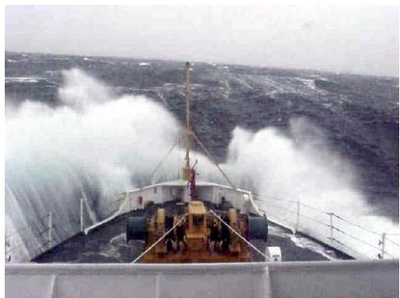  
(a)

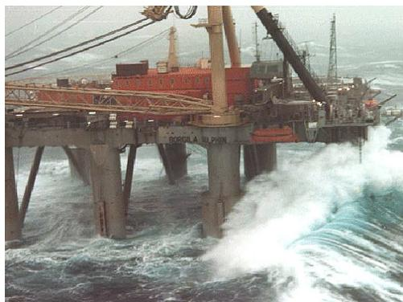  
(b)  
Fig. 1.1. Slamming in rough sea: (a) slamming on a ship; (b) slamming on a platform. (photos downloaded from the internet.)

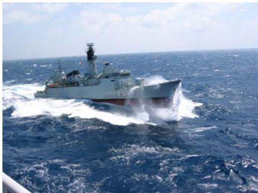  
(a)

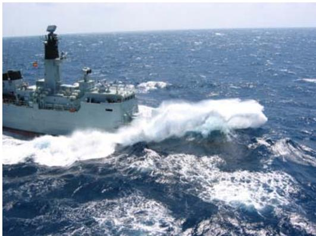  
(b)

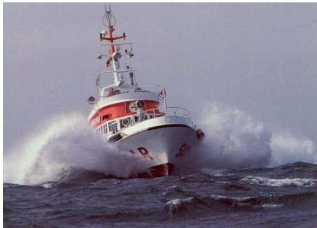  
(c)

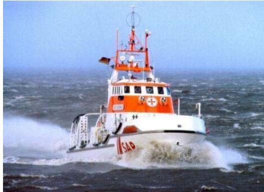  
(d)  
Fig. 1.2. Examples of slammings on ships. (a) Bottom slamming; (b) Green water slamming; (c) Bow-flare slamming; (d) Bow stem slamming (Photos downloaded from the internet).

The slamming on a ship hull can be categorized as bottom slamming, bow-flare slamming, bow stem slamming, stern slamming and wet-deck slamming, according to the vessel region where the phenomenon happens. Fig. 1.2 shows some examples of slamming on real ships. Sometimes the bow stem slamming is also named as breaking wave impact because the bow stem is hit by the breaking waves, for instance caused by the interaction between the incident waves and the shipgenerated waves. In addition, green water slamming occurs during the shipping of water on deck. Slamming during sloshing inside a ship tank is another important kind of slamming. It is crucial in the design of prismatic LNG tanks. For offshore structures, slamming is also of concern. Examples are the slamming on horizontal members of a jacket or on the deck platform.

The slamming process is often characterized by large hydrodynamic loads within a short duration. The effects are twofold. On the one hand, the very high slamming pressures can cause local structural damages. Yamamoto et al. (1985) reported serious structural damages on a container ship in a heavy sea due to bow-flare slamming. On the other hand, the integrated loads due to large slamming pressures may greatly affect the global ship behavior. One of the transient global effects excited by the local slamming is whipping, which is normally associated with two-node vertical vibrations, as well as heave and pitch accelerations. Ge et al. (2005) demonstrated significant whipping effects on a catamaran caused by wetdeck slamming and indicated that it is both the water-entry and water-exit loads that matter. Further, Gu & Moan (2005) showed that the nonlinear loads related to whipping can greatly increase the fatigue damage for a container ship with large bow-flare and low hull rigidity. Global rigid-body motions can also be affected by the local slamming. For example, Rognebakke & Faltinsen (2001) showed that for a ship in beam sea, the nonlinear slamming loads inside a ship tank during sloshing can affect the global sway motions. Altogether, various kinds of slamming events have important influences on ocean structures. Therefore, it is necessary to investigate the slamming problems and make further improvements in the design procedures for ships and other ocean structures.

Because of the violent water flow in the slamming problems, non-linear effects due to the wavebody interactions are often prominent. The typical phenomena induced by the strongly non-linear effects are, for instance, thin jets and sprays, wave breaking, non-viscous flow separation, air cavities enclosed on the body surface, bubble collapse, cavitation and ventilation, etc. These phenomena cause complexities in the problems. The compressibility of the water and hydroelasticity may also be relevant. Therefore, it is quite challenging to accurately predict the free surface flow and the loading on the body in the problems with those complicated effects.

Before a complete simulation of the slamming on an actual ship or other ocean structures, some basic wave-body interaction problems have to be solved. For example, to investigate the bow-flare slamming or bottom slamming, one needs to study the water entry of a bow-flare ship section or a circular cylinder. The lower surface of the circular cylinder resembles the bottom of a bulbous bow. When oscillatory motions in a slamming problem are relevant, one should first study the forced oscillatory motions of a two-dimensional section. Such kind of basic wave-body interaction problems are the major topics of the present work. The typical features associated with strong nonlinear effects can be revealed in the studies. The outcome can help the further investigations for more sophisticated and realistic slamming events. An application like this will be shown in Chapter 7, where the planing hull in steady or forced unsteady motions is studied, on the basis of the investigations in Chapters 3 and 4 on the water entry of a V-shaped section and forced oscillations of a floating V-shaped section.

## 1.2 Review of the previous work

The slamming problems in marine technology have received increased attention in recent years. Korobkin (1996) reviewed some specific issues and approaches in water impact problems in ship hydrodynamics. In particular, the acoustic effects and air-cushion effects were discussed. Mizoguchi & Tanizawa (1996) reviewed various approaches used for different slamming problems. They also discussed the water impact problem with trapped air, the effects of fluid compressibility, hydroelasticity and three-dimensionality, and how to describe slamming in a stochastic analysis. Later, Faltinsen (2000) discussed many different slamming problems in ship and ocean engineering and particularly stressed the importance of hydroelasticity. More recently, Faltinsen et al. (2004) presented up-to-date reviews of the research work on the slamming problems in marine applications. The state of art of the research on different kinds of slamming problems as well as future challenges were given. In this section, a review of previous work relevant to this thesis is presented.

## • Water entry of a 2D rigid body

The water entry of a rigid body in two dimensions has been widely studied ever since the pioneering works by Von Karman (1929) and Wagner (1932). A review of the earlier research on water entry problems was given by Korobkin & Pukhnachov (1988). In the rapid water entry of a rigid body, viscous effects are often negligible. Compressibility and air-cushion effects between the body surface and the impacting free surface only matter initially in a very short duration. So they were also neglected in many studies. The following review will focus on studies based on potential theory, where the water is assumed incompressible, inviscid and the flow is irrotational.

Various kinds of methods have been developed to solve the water entry problems. One group of methods originate from Wagner’s theory with a flat plate approximation and linearized free surface conditions in the domain outside the spray roots (outer domain). The other group of methods are devised by utilizing the self-similar property for some special problems. More recently, numerical methods were widely used to solve the water entry problems with fully nonlinear free surface conditions and without restrictions of the body shape or neglecting gravity effects.

In von Karman (1929)’s impact model, the water surface elevation and gravity are neglected. A flat plate approximation is applied in the model. The impact loads are underestimated in particular for small deadrise angles. Wagner (1932) further developed Von Karman’s theory by accounting for the local uprise of the water. Better predictions of the hydrodynamic loads and peak impact pressures can be obtained by Wagner’s method when the deadrise angle is small and no air cushion is entrapped. However, singularities still exist at the water-body intersection points in the outer domain solution. By using the matched asymptotic expansion technique, Watanabe (1986) removed the singularity by matching the planing plate solution for the splash region (spray root domain) with Wagner’s outer domain solution. However, the inner solution is not good enough because in the planing plate solution there is a free surface downstream the plate which does not exist in his water entry problem. This weakness is avoided by Cointe & Armand (1987). They removed the singularity by matching the outer domain solution with Wagner’s inner domain solution at spray roots. The method was used to study the water impact on a blunt body surface. Further, Howison et al. (1991) extended the approach to solve the water entry of a section with more general shape, yet the impacting body is required to be nearly parallel to the undisturbed water surface, i.e. the local deadrise angle is very small. Cointe (1991) also applied the method for the water entry of a thin wedge and a flat wedge. However, a solution was only obtained in the flat wedge case. Recently, the limitation to small deadrise angles was avoided in Faltinsen (2002)’s approach. The method of matched asymptotic expansions was also applied, but different inner and outer solutions were used to obtain the results for any local deadrise angle. The time dependent water entry speed could also be accounted for.

In the water entry of a wedge of infinite extent, the flow can be assumed to be self-similar, as long as the gravity is neglected and the water entry speed is constant. Similarity solutions for the water entry of a wedge were derived by Dobrovol’skaya(1969) and Hughes (1972). Fully-nonlinear free surface conditions and the exact body boundary condition were satisfied in their methods. However, in both cases the solutions were not explicitly given. Numerical computations were implemented to obtain the results. Dobrovol’skaya(1969) only presented results for deadrise angle larger than 30º.

Later, Zhao & Faltinsen (1993) obtained the numerical results for Dobrovol’skaya (1969)’s similarity solution for deadrise angle within the range $4 ^ { \circ } \sim 8 1 ^ { \circ }$ . It is numerically demanding to obtain similarity solution results for small deadrise angles. The application of the similarity solutions is limited by the shape of the body and constant water entry speed, and the gravity effects can not be accounted for. However, the similarity solution is still a favorable method to describe the initial stage of the water entry when the gravity, body shape and variation of speed are less important. A similar but different problem, the impact of a water wedge on a plane rigid surface, can also be described by a similarity solution. Such solutions were presented, for instance, in Cumberbatch (1960) and Zhang et al. (1996).

Numerical methods have been extensively used to solve the water entry of a rigid 2D body with fully nonlinear free surface conditions. The obvious advantage of numerical methods is the fact that there are no restrictions for the body shape and water entry speed. The gravity can be optionally included. The Boundary Element Method (BEM) is one of the most popular numerical methods which can be applied to solve nonlinear water-entry problems. Vinje & Brevig (1981) proposed a BEM based on Cauchy’s theorem to solve fully nonlinear free surface problems without the restriction of zero gravity. This method was later used by Greenhow & Lin (1985), Yim (1985) and Greenhow (1987) to simulate the water entry of a wedge with nonlinear free surface conditions. However, Greenhow (1987)’s numerical results were only satisfactory for deadrise angle larger than 60 degree because of the difficulties associated with the thin jet flow. Wu et al. (2004) applied a similar BEM combined with an analytical solution for the jet based on a shallow water approximation to study the wedge-water entry. The effect of gravity was neglected. Good results were obtained for wedges with deadrise angles down to $1 0 ^ { \circ }$ for a constant water-entry speed. However, the exact description of the thin jet does not seem to be quite necessary, because the pressure in the jet is nearly atmospheric and the thin jet gives a small influence on the other parts of the fluid. That is why the thin jet was cut in Zhao & Faltinsen (1993)’s fully nonlinear Boundary Element Method without gravity. A control surface was introduced at the spray root to simplify the treatment of the jet and to avoid the numerical difficulty in locating the intersections between the thin jet and the body surface. The smallest deadrise angle in their study was as small as $4 ^ { \circ } .$ Actually, in cases with deadrise angles smaller than $2 { \sim } 3 ^ { \circ }$ , air-cushion can occur due to the existence of knuckles. Zhao et al. (1996) further extended their work by considering the flow separation from knuckles and general body sections. Gravity was neglected in their studies. Nevertheless, gravity effects are not negligible in some situations. For example, in the later stage of the water entry when the body is further submerged, the influence of gravity becomes more significant and can affect the hydrodynamic behavior.

All the works mentioned above were mainly concentrated on symmetric water-entry problems. However, asymmetric water entry is also practically important. Asymmetric water impacts on a ship section often occur in reality, when the ship is heeled or when there are oscillatory sway, roll or yaw motions, as well as in the conditions with asymmetric free surface elevation with respect to the ship’s central plane. Such situations are, for instance, common for planing hulls during maneuvering operations. In an asymmetric water entry, the originally symmetric section can be inclined, or enter the water with both a vertical and a horizontal speed. The second case is often called ‘oblique water entry’.

The earliest theoretical study on asymmetric water impact problem was given in Garabedian (1953), where the oblique water entry of a wedge was studied. Later, Chekin (1989) studied oblique water entry of a wedge section with constant speed by using a method generalized from Dobrovol’skaya (1969)’s similarity solution. The flow on the leeside was either forced to attach on the body surface or forced to separate from the vertex. Recently, de Divitiis & de Socio (2002) used a conformal mapping transformation to study the same problem. The limits of the sideslip angle for the onset of the separation from the vertex were predicted. Judge et al. (2004) studied experimentally and theoretically the oblique water entry problem, and also predicted the limits for flow separation from the vertex. However, the limits were found to be larger than those predicted by de Divitiis & de Socio (2002). Judge et al. (2004) argued that in a real fluid, the limits can be affected by the reattached jet flow on the leeward side. The reattachment effect was not considered by de Divitiis & de Socio (2002).

The other kind of asymmetric water entry is the vertical water entry of an asymmetric body. Toyama (1993) generalized the Wagner’s theory to study the vertical water entry of an arbitrary asymmetric section. However, the method has several limitations. For example, the flow separation can not be considered. Xu et al. (1998) extended the flat-cylinder theory by Vorus (1996) to study the water entry of an asymmetric wedge. The flow separation from knuckles and from the vertex can both be included. They indicated that the interaction between the two sides of the body matters. Therefore, it is not appropriate to separately calculate each side of the asymmetric wedge and average the solutions afterwards. This interaction was neglected in the study of the water impact on a bow flare ship section with a large heel angle by Arai & Matunaga (1989). They only studied the half-plane with the windward side. Their theoretical results agreed only qualitatively with their experimental results. To be accurate, one must not neglect the interaction between the two sides. The most recent study of the water entry of an asymmetric section was presented by Semenov & Iafrati (2006). They investigated the vertical water entry of a heeled wedge by their nonlinear analytical self-similar solution. The occurrence of a stagnation point on the less inclined side of the wedge was clearly shown, which further confirms the importance of the interaction between the two sides. No flow separation from the wedge apex was assumed, but the limit of the heel angle for separation-free situation was calculated for different wedge angles. However, those limits need to be further confirmed by experiments, because the reattached jet flow may affect the limits similarly as indicated by Judge et al. (2004) for their oblique water entry problems. The possible reattachment to the body surface and the resulting enclosed cavity need to be investigated. For a more general section, the bottom surface can have a finite curvature. This necessitates the simulation of the flow separation from the curved surface on the leeward side. The challenge is then to find the separation position.

## • Water impact of a circular cylinder

When a horizontal cylinder with a large length-to-diameter ratio impacts with the water, one can neglect the variation of the flow along the length of the cylinder and study a two-dimensional hydrodynamic problem in a cross-plane. An exception is that the elastic vibrations of the structure in the lengthwise direction vary on the scale of the transverse dimension. Another exception is that the horizontal cylinder impacts on a steep wave. If the rigidity of the cylinder is large and the impact velocity is small, the cylinder can be regarded as a rigid body. However, if it is flexible and the impact velocity is large, the cylinder must be modeled as an elastic structure and hydroelasticity must be considered.

Even for a rigid circular cylinder, it is not easy to exactly solve the water impact problem, because the free surface will initially change very rapidly and the process may involve many complicated effects, such as air cavity entrainment, flow separation and wave breaking. Actually, the rate of change of the wetted surface is initially infinite according to Wagner (1932). Approximate methods, i.e. the methods based on flat plate theories are often used in practice. For example, as mentioned earlier, Cointe & Armand (1987) studied the water entry of a circular cylinder by using the method of matched asymptotic expansions. It was found that larger errors appear in the later stage of the water entry. Mei et al. (1999) derived an analytical solution for the water entry of a general section, motivated by the generalized Wagner theory proposed in Zhao et al. (1996), and applied the method to a circular cylinder. However, the nonlinearity was only partly included because the free surface boundary condition was linearized. To exactly solve the problem with fully nonlinear free surface conditions, numerical methods have to be applied. Greenhow (1988) studied the water entry of a rigid circular cylinder by using a BEM based on Cauchy’s theorem. However, the flow separation model needs to be improved. Recently, Zhu et al. (2005) applied an advanced CFD (Computation Fluid Dynamics) method, the CIP method, to study the water entry of a rigid circular cylinder. Viscous effects are simulated by this method, but viscosity does not matter much in the rapid water entry problem. However, viscous effects may matter for the water exit of a cylinder starting from below a free surface (Zhu et al., 2005).

For a cylindrical shell impacting on the free surface, it is necessary to consider the hydroelasticity when the cylinder’s wall is thin and flexible and the impact velocity is large. Belytschko & Mullen (1981) attempted to solve the water impact of a cylindrical shell by coupling a Finite Difference Method (FDM) for the fluid analysis and a Finite Element Method in 2D for the shell structure. Shibue et al. (1994) studied experimentally the water impact of a cylindrical shell and estimated the strain responses by applying the measured water pressure on a shell structure model. Arai & Miyauchi (1998) investigated the water impact of cylindrical shells, both experimentally and numerically. A FDM based on the Euler equations was applied for the flow field and a modal analysis was used for the shell structure. A flat plate theory was adopted by Ionina & Korobkin (1999) to solve the water impact of a cylindrical shell. Bereznitski (2003) simulated the experiments by Arai & Miyauchi (1998) by using a commercial software (Dytran). All these investigations contribute in some aspects. Nevertheless, there are still many unsolved problems related to the occurrence of phenomena, e.g. ventilation, enclosed air cavities and cavitation.

## • Bow-flare slamming

In earlier days, the main concern in a ship design procedure was focused on the ship form below the water line. However, it was later realized that slamming on the bow flare above the water line may also cause structural damages (Yamamoto et al., 1985). The bow flare can be simplified as a V-shaped section, or a wedge section. So the studies of the water entry of a wedge section as mentioned earlier were also in some cases motivated by the bow flare slamming problems. Sometimes in a severe sea state, the bulbous bow can be lifted totally out of the water and then impact on the free surface. Then an equivalent process is the water entry of a bow section with bulb and flare. The study of asymmetric water entry of a bow-flare section with a large roll angle is necessary. In such case, high pressure on the flare region may occur when the water impacts on the flare, because the contact angle between the flare surface and the impacting water surface can be very small.

Arai & Matsunaga (1989) applied the Finite Difference Method (FDM) developed by Arai & Tasaki (1987) to simulate the water entry of a bow-flare ship section into initially calm water with the consideration of gravity effect. Flow separation from the knuckle of the section was simulated. It was found that high pressures appear over a large area of the bow flare when the bow flare region impacts the water, especially for the case with a large roll angle. Later, Arai et al. (1995) performed calculations for the water impact of different ship sections, and found that the initial bottom slamming on a bow-flare section can generate separated water flow, which will impact on the bow flare at a later stage and cause very high pressures on the bow. This is called secondary water impact. However, when the water entry speed is not so high, the secondary impact does not necessarily happen.

Aarsnes (1996) performed drop tests of ship sections, i.e. a wedge section and a bow flare section for different roll angles. The lower part of the bow flare section was designed to be relatively thin, so that the secondary impact was less important. Mei et al. (1999) tried to use a generalized Wagner’s method to study the drop tests by Aarsnes, but the solutions can only be given before the flow separation from the knuckles happens. However, the impact pressure on the bow flare matters after the flow separation, as shown by Arai & Matsunaga (1989). Zhao et al. (1996) have numerically studied one symmetric case in Aarsnes (1996)’s drop tests for the bow-flare section giving good predictions of the vertical force. Flow separation from knuckles was simulated. Gravity was not included but this does not seem to affect the accuracy of the results. However, when the bulb of the bow flare section is not thin and the impact speed (Froude number) is not too low, flow separation from the bulb occurs in the early stage of the water entry, so one needs to simulate the separated flow from the bulb surface. CFD methods such as the FDM in Arai et al. (1995) and the CIP method used by Zhu (2006) seem to be capable to do this work, but up to now the calculations by most CFD methods are too time-consuming to be used in a practical problem. A more realistic solution is to further develop a BEM similar as in Zhao et al. (1996) to solve the problem.

## • Forced oscillatory motions of a floating body

Investigations of the forces on an oscillatory free-surface piercing body were started many decades ago. The problem is relevant in the study of floating bodies in waves. Radiation forces on the oscillatory bodies need to be evaluated. For simplicity, a body is just forced to oscillate in an experiment or in a theoretical study. Two-dimensional experimental studies were carried out, for instance, by Vugts (1968), Tasai & Koterayama (1976) and Yamashita (1977).

In some situations, such as for very small amplitudes, the forces can be almost linearly dependent on the forced oscillation amplitude. Therefore, in the earlier theoretical studies, good results for some cases were obtained just by a linear theory. However, when the oscillation amplitudes are larger, the non-linear force components will be more significant. Second-order theories were extensively developed in predicting the second-order forces on oscillating bodies, e.g. by Lee (1968), Potash (1971), Papanilolaou & Nowacki (1980). However, it is cumbersome to further develop nonlinear solutions to the third or higher order by a perturbation scheme. On the other hand, viscosity causes nonlinearities for sections with sharp corners even when the oscillation amplitude is small, because viscous flow separations will occur and the resulting vortex shedding affects the loads on the body. This was shown e.g. by Yeung & Ananthakrishnan (1992) for a heaving rectangular cylinder by using numerical methods.

More recently, numerical potential flow methods were introduced to simulate the forced large amplitude oscillations of 2D bodies. Nonlinear time-domain simulations are first performed and the nonlinear forces components can then be calculated from the time history of the force, e.g. by Kashiwagi (1996) and Koo & Kim (2004) for forced heave motions. In the large-amplitude heave motions of a more general ship section, such as a bow-flare ship section, more physical effects can be involved, such as non-viscous flow separation, secondary water impact, cavity enclosure, etc. An advanced CFD method with proper verification is able to simulate such complicated situations, however, greater complexities require more computational time. Further, to obtain a steady-state condition and continue for sufficient oscillation periods implies a long time simulation. At this point, the BEM shows its advantages, because it takes much shorter time to perform the simulation. However, numerical difficulties can be encountered in the BEM based on potential theory, for instance, when a plunging wave impacts the underlying free surface. The generation of vorticity during this water-water impact is inconsistent with the assumption of a potential flow throughout the fluid domain. Such numerical difficulties have to be avoided in the BEM.

## • 2D+t theory

In a 2D+t theory, the original 3D problem for a ship in waves is approximated by a series of timedependent 2D problems in Earth-fixed cross-planes intersecting the ship. In this approximation, the ship is assumed to be slender, which means the transverse dimensions should be much smaller than the longitudinal dimension. Three-dimensionality is partly considered because the flow at a crosssection is influenced by the flow upstream of this section. However, transverse waves can not be described in the 2D+t theory. The consequence is that the ship-length based Froude number must be larger than ≈0.5 when one solves the steady and unsteady problems with symmetric flow about the ship’s central plane (Faltinsen, 2005). The 2D+t theory is also called a 2.5D theory. In the formulation of the 2.5D theory, a two-dimensional Laplace equation is solved in ship-fixed crossplanes, and the free surface conditions are satisfied in three dimensions. The calculations can start from the bow of the ship and then proceed along the longitudinal downstream direction of the ship. However, an inconsistency happens at a transom stern for high Froude number cases when the flow separates at the transom stern, because the 2D+t theory can not foresee the flow separation and the influence from the flow downstream the transom stern is not considered. This shows an inherent deficiency for the 2D+t theory. In spite of this, the 2D+t theory has proved to be a very efficient approach for high speed ships with strongly nonlinear effects. In contrast, traditional linear theories can no longer provide good predictions to these problems and fully three-dimensional numerical methods may need rather long time to complete the simulations.

The concept of the 2D+t approximation was proposed by Munk (1924) in his slender body theory for airships. The idea was applied to slender planing surfaces by Tulin (1957). The effect of gravity was neglected in his study. Ogilvie (1967) tried to account for gravity effect in a 2D+t approach. Chapman (1976) further applied the 2D+t approach together with nonlinear free surface conditions to solve the problem of a vertical flat plate with yaw motion in a uniform stream. Yeung and Kim (1981) employed a similar concept and calculated the hydrodynamic forces on a frigate hull with forward speed and forced heave or pitch motions. However, the free surface conditions were linearized in their method. Chapman (1976)’s approach was generalized by Faltinsen & Zhao (1991) to study the steady and unsteady motion of a high speed slender ship. The steady flow was nonlinear, while the unsteady flow was assumed linear. Maruo & Song (1998) followed a 2D+t theory to simulate the steady and unsteady motions of a frigate model with nonlinear free surface conditions and gravity effects. The generation of spray and breaking bow waves were well simulated. However, flow separation was not included. Tulin & Wu (1996), Fontaine & Cointe (1997) and Fontaine et al. (2000) further applied the 2D+t theory to study the nonlinear bow waves. The theory proved to be very efficient in their studied cases. Lugni et al. (2004) presented results of the steady wave elevation around a semi-displacement monohull with transom stern. They compared the results of linear 3D and nonlinear 2D+t computations and proved the effectiveness of the 2D+t theory for a large range of high Froude numbers. CFD methods can also be combined with a 2D+t theory. Tulin & Landrini (2001) used the Smoothed Particle Hydrodynamics (SPH) method in a 2D+t fashion to investigate the breaking bow waves of slender ships.

## • Planing hull

A planing hull introduces more hydrodynamic challenges relative to semi-displacement vessels. For instance, dynamic stability gets increased importance. Examples are dynamic roll instability, broaching and porpoising (Faltinsen, 2005). In order to study these instability problems, the hydrodynamic forces on the planing hull in steady and unsteady motions have to be accurately predicted. Nonlinearities play a more significant role than for a displacement or semi-displacement ship. Further, the high speed of a planing vessel causes higher probability of cavitation and ventilation.

Both experimental and theoretical approaches have been used to study the hydrodynamic features of planing vessels, but doing experiments is more straightforward and therefore was the main approach in earlier studies on planing vessels. The experiments by Sottorf (1932 and 1934) were amongst the earliest experimental studies on planing vessels. Savitsky (1964) presented empirical equations for lift, drag and centre of pressure for prismatic planing hulls, based on experimental data. Later, Altman (1968) performed forced oscillation experiments of prismatic hulls and Fridsma (1969, 1971) conducted experiments for prismatic hulls in regular and irregular head sea. Troesch (1992) studied experimentally forced vertical motions from low to moderate planing speeds of prismatic planing hulls.

Some attempts have been made to analytically solve the problem by linearization, e.g. in Wang & Rispin (1977), Martin (1978a, 1978b). Due to strong nonlinearities involved in planing vessels, the application of these linear solutions is quite limited. Numerical approaches were introduced in recent decades. Vorus (1992, 1996) developed a two-dimensional theory by distributing vortices in a horizontal plane at the mean free surface. The theory was combined with a 2D+t theory. Lai (1994) solved the planing problem in three dimensions using a vortex lattice method. Zhao et al. (1997) applied a 2.5D theory in combination with the BEM described in Zhao & Faltinsen (1993) to study the steady flow past high-speed planing hulls on a straight course. However, all the numerical methods mentioned above assume very high speed, or infinite Froude number for the planing vessel, so that gravity is neglected in their analyses. Lai (1994) examined gravity effects for some cases by adding hydrostatic force to the hydrodynamic lift force. This is not a full consideration of gravity effects. One must also consider the influence of gravity on the free surface elevation and the associated pressure distribution on the hull. When gravity is included in the analysis of wave generation, these effects can be shown, and the hydrodynamic features of a planing vessel in oscillatory motions will be frequency and Froude number dependent.

## • Boundary Element Method applied to solve nonlinear free surface problems

Different numerical methods can be used to solve the strongly nonlinear wave-body interaction problems. The most commonly used methods are the BEM (Boundary Element Method) based on potential theory and CFD methods based on the Navier-Stokes equations or Euler equations. Zhu (2006) presented a review of different CFD methods used for strongly nonlinear wave-body interaction problems. Some complicated phenomena can be simulated by a CFD method, e.g. a plunging wave breaking with impact on the underlying free surface. Further, those viscous effects such as boundary layer separation and vortex shedding can be simulated in a CFD method based on Navier-Stokes equations. However, for the time being, CFD methods are still quite time-consuming. In fact, in many of the strongly nonlinear wave-body interaction problems, the fluid viscosity is unimportant or at least not the key factor. Then it is reasonable to apply the BEM based on potential theory. However, special care must be taken to avoid the numerical difficulties such as due to initial water-body impact and breaking waves. Those problems can often be efficiently tackled by combining the BEM with certain local analytical solutions or by using numerical treatments.

The BEM method has been widely applied in marine hydrodynamics. Longuet-Higgins & Cokelet (1976) proposed the Mixed Eulerian-Lagrangian method (MEL) to simulate steep free surface waves. A similar numerical approach has been presented earlier by Ogilvie (1967) to solve the near field around a ship. Later, this method combined with a Boundary Element Method was extensively used to simulate the nonlinear waves and to solve nonlinear wave-body interaction problems, especially in two dimensions. We can see many successful examples using this approach, to name a few, Zhao & Faltinsen (1993) simulated the water entry of a wedge with strongly nonlinear free surface flow; Cao et al (1994) and Kashiwagi (2000) studied nonlinear wave-induced motions of a floating body; Zhang et al. (1996) simulated the impact of a plunging breaker on a wall; Baarholm (2001) studied the water impact on decks of offshore platforms with nonlinear effects; Greco et al. (2004) examined green water on deck where strongly nonlinear plunging waves can occur.

## 1.3 Present work

In the wave-body interaction problems studied in the present work, the water is assumed inviscid and incompressible and the water flow is irrotational. So the work is carried out in the framework of potential theory. Nonlinear free surface conditions are commonly satisfied on the free surface. The exact nonlinear body boundary conditions are usually satisfied, except that in a fluid-structure interaction problem the nonlinear body boundary conditions are approximately satisfied on the undeformed position of the body surface. The fluid domain is assumed unbounded in most cases. Air cushion formed in the initial stage of the water impact of a body is not taken into account. Hydroelasticity is only included in the water impact problem of a cylindrical shell in the present study.

## 1.3.1 Contributions in the present work

Major contributions in the present work are given as follows.

## ƒ A BEM developed with gravity effects

A Boundary Element Method is developed to solve the fully nonlinear wave-body interaction problems. The gravity is, in general, included in the method. The thin jet on the body surface is cut in a way different from what was used in Zhao & Faltinsen (1993). The deadrise angle of the wedge section has been as small as 4º in the numerical calculations. The thin spray evolved from the free surface is also cut to avoid wave breaking.

## ƒ Non-viscous flow separation

The non-viscous flow separation from a sharp corner or from a curved body surface can be simulated in the BEM. On a curved body surface, the water flow is forced to separate from the body surface when a large area with pressure less than atmospheric pressure is detected. This is the first time, to the author’s knowledge, that the non-viscous flow separation on a curved body surface is simulated in a Boundary Element Method.

## ƒ Asymmetric water entry

Asymmetric water entry problems of a ship-bow section with different heel angles are solved by the BEM. Pressure distributions on both the impact side and the leeward side of the section at any time instant can be calculated. Negative pressure areas are observed on the leeside of the section, which indicate the possibility of ventilation and the resulting separation.

## ƒ Prediction of nonlinear forces on heaving 2D bodies

The heave motions of some special cross-sections are investigated, i.e. a bulbous bow ship section and a flat wedge section. Viscous flow separation affects the damping coefficients in the cases for the bulbous bow ship section. Strongly nonlinear effects are associated with the latter case even when the heave amplitude is relatively small.

## ƒ Hydroelastic analysis

In the study of the water impact of a circular cylindrical shell, the importance of the extension in the middle plane of the shell wall, the influence of the higher order modes and the role of the rigidbody motion in the coupled analysis are discussed. Further, the influence of the exact description of the water flow, i.e. the nonlinear free surface and body conditions and the non-viscous flow separation, is shown from the comparisons between the results by the BEM plus the modal analysis and the results by the flat plate theory plus the modal analysis.

## ƒ Steady and unsteady motions of a planing hull with gravity effects

Both the steady and unsteady motions of a planing hull at moderate planing speeds are investigated. It is demonstrated that gravity matters for moderate planing speeds. The 3D effect at the transom stern is found to be particularly important for the planing hull at moderate planing speeds. In the unsteady problems, the frequency dependency of the added mass and damping coefficients is investigated for a moderate planing speed.

## 1.3.2 Outline of the thesis

The BEM and associated numerical techniques are described in Chapter 2. The numerical method is verified by comparing with the similarity solution results given by Zhao & Faltinsen (1993) for the water entry of a wedge with deadrise angle in the range of $4 ^ { \circ } \sim 4 5 ^ { \circ }$ . Further, an improved way to calculate the acceleration during the free fall of a light body is introduced.

Then in Chapter 3, an analytical solution of the separated flow near the separation position is presented in detail. The analytical solution can be combined with the BEM to simulate the nonviscous flow separation. Examples are given to illustrate the efficiency of the flow separation model. The three examples are, respectively, the flow separation from the knuckle of a wedge during its water entry process, the flow separation from the transom stern of a planing hull and the flow separation during the water impact of a circular cylinder.

In Chapter 4, the water entry of rigid bodies in two dimensions is investigated numerically by the BEM described in Chapters 2 and 3. Flat plate theories are used at the initial stage of the free water entry to provide the initial conditions for the BEM. First, the symmetric water entry of a wedge, a bow-flare ship section and a circular cylinder are studied numerically and the results are compared with experiments. Then the asymmetric water entry of the bow-flare ship section is investigated numerically by changing the heel angle of the section or the drop height. The effects of the heel angle and the drop height are discussed. Comparisons with experiments are also shown.

In Chapter 5, the water impact of a cylindrical shell is studied including hydroelasticity effects. Coupled analyses by von Karman’s method or Wagner’s method for the water flow together with a modal analysis for the structural responses are presented. Some physical effects are discussed from the coupled analysis by these methods. The coupled analysis is also performed by using the BEM for the water flow and the modal analysis for the structure. The numerical results are compared with experiments. Different physical effects and possible error sources in the experiments and numerical calculations are discussed.

In Chapter 6, the water flow due to the heaving of a two-dimensional section on the free surface is numerically studied by the BEM together with the application of a numerical damping beach. The heave motions of a thin wedge and a half-buoyant circular cylinder are first investigated. The results are compared with the experiments and theoretical results in order to verify and validate the numerical method. Then the numerical simulations are performed for the heave motions of a bulbous bow ship section with two different drafts and a flat wedge section. Different effects associated with these problems are discussed.

The initial part of Chapter 7 formulates the problem of a prismatic planing hull in calm water. A 2D+t theory combined with the BEM is then presented to study a prismatic planing hull in steady motion. Three-dimensional effects and gravity effects are discussed. Then the 2D+t theory is generalized to study the forced unsteady heave or pitch motions of a planing hull. The added mass and damping coefficients are evaluated for different frequencies at a moderate planing speed.

Finally in Chapter 8, the conclusions drawn from the present work are given and the perspectives for further studies are proposed.

Most contents in this thesis have been published respectively in the following five papers: Sun & Faltinsen (2006a, 2006b, 2006c), Sun & Faltinsen (2007a, 2007b). Details for these publications can be seen in References.

## CHAPTER 2

## A Boundary Element Method

A 2D Boundary Element Method (BEM) is developed to solve the water flow around a free-surface piecing body. The motion of the body can be given or be free. The body is assumed to be rigid. The vertical motion is along the vertical symmetry line of the body in two dimensions. The description of the method and numerical schemes involved will be introduced in this chapter. The BEM in this chapter are mainly concerned with the symmetric water entry of rigid bodies. However, the numerical method will be generalized in Chapter 4 to solve an asymmetric water entry problem.

## 2.1 The Boundary Element Method

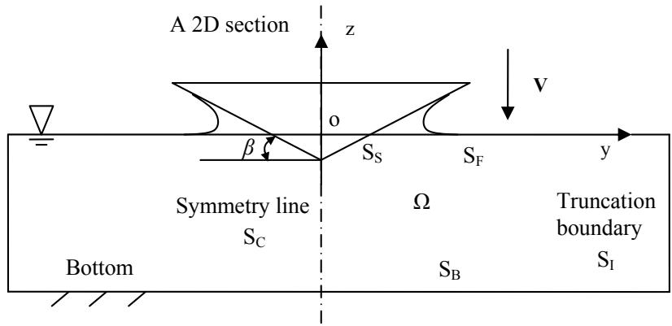  
Fig. 2.1. 2D Earth-fixed coordinate system and definitions.

A two-dimensional section is moving vertically on the free surface with a time-dependent velocity V = V(t) k (Fig. 2.1). The unit vector k is pointing in the positive direction of z-axis. In a water entry problem, the V(t) is negative, which means the body is moving downwards. An Earth-fixed Cartesian coordinate system yoz in the two-dimensional cross-plane is applied, with y-axis on the calm free surface, z-axis pointing upward and z=0 corresponds to the calm free surface. Due to the symmetry about the z-axis, only one half of the fluid domain is studied. The water is assumed inviscid and incompressible and the water motion is assumed irrotational. So a velocity potential φ(y,z,t) satisfying a 2D Laplace equation can be used to describe the water flow, which means

$$
\frac {\partial^ {2} \varphi}{\partial y ^ {2}} + \frac {\partial^ {2} \varphi}{\partial z ^ {2}} = 0
$$

in the water domain

(2.1)

The boundary condition on a rigid body surface is given by

$$
\frac {\partial \varphi}{\partial n} = \mathbf {V} \cdot \mathbf {n}
$$

on the body surface

(2.2)

where n is the normal vector pointing out of the fluid domain in two dimensions. Further, fully 2D nonlinear free surface kinematic and dynamic boundary conditions are satisfied on the free surface, i.e.

$$
\frac {D y}{D t} = \frac {\partial \varphi}{\partial y}, \frac {D z}{D t} = \frac {\partial \varphi}{\partial z} \quad \text { on   the   free   surface }\tag{2.3}
$$

$$
\frac {D \varphi}{D t} = \frac {1}{2} | \nabla \varphi | ^ {2} - g z \quad \text { on   the   free   surface }\tag{2.4}
$$

where $g$ is the acceleration of gravity and D/Dt is the substantial derivative. The effect of the surface tension is neglected. The dynamic free surface condition implies that the pressure on the free surface is constant. A consequence is that the air flow between the cylinder bottom and the free surface before the water impact is neglected. A truncation boundary at a distance far from the body and a flat bottom boundary at a deep water depth are assumed. The boundary condition on these two boundaries are given as

$$
\frac {\partial \varphi}{\partial n} = 0\tag{2.5}
$$

In a water entry problem, if the truncation boundary is far enough from the body, the existence of the boundary will not give significant influence during the rapid water entry process. In a heaving problem, in order to avoid reflection waves from the truncation boundary, a ‘numerical beach’ is applied in front of the truncation boundary to damp out the waves. This numerical technique will be described in Chapter 6. When the water flow is symmetric about the z-axis, the behavior of φ at infinity boundary is like a vertical dipole in an infinite fluid with singularity at $\scriptstyle { \mathrm { y } = 0 }$ and z=0.

Initially, if the water is at rest before the body interacts with the water, then the velocity potential is zero on the undisturbed free surface.

By using Green’s second identity, the velocity potential at a field point P within the fluid can be represented by

$$
2 \pi \varphi_ {P} = \int_ {S} \left[ \varphi_ {Q} \frac {\partial G (P , Q)}{\partial n _ {Q}} - G (P, Q) \frac {\partial \varphi_ {Q}}{\partial n _ {Q}} \right] d s _ {Q}\tag{2.6}
$$

where $\mathrm { G } ( \mathrm { P } , \mathrm { Q } ) = \log { \mathrm { r } ( \mathrm { P } , \mathrm { Q } ) }$ and $\mathrm { r } ( \mathrm { P } , \mathrm { Q } )$ is the distance from a source point Q on the fluid boundary S to the field point P in the fluid domain Ω. The fluid domain is surrounded by the closed boundary S consisting of $\mathrm { S _ { S } }$ (the body surface), $\mathrm { S _ { F } }$ (the free surface), $\mathrm { S } _ { \mathrm { I } }$ (the boundary at infinity), $\mathrm { S _ { B } }$ (the bottom surface) and $\mathrm { S _ { C } }$ (the symmetry line boundary). By letting the field point P approach S, an integral equation can be obtained. If one assumes that at a certain time instant $\varphi$ is known on the free surface, and ∂φ/∂n on the body surface is known from Eq. (2.2), then by solving the resulting integral equation, one can obtain the velocity potential $\varphi$ on the body surface and the normal velocity $\partial \varphi / \partial n$ on the free surface. The free surface elevation and the velocity potential on the free surface for the next time instant can be updated by using Eqs. (2.3) and (2.4). Given initial conditions for $\varphi$ on the free surface and the free surface elevation, one can just follow a time marching procedure to solve the Initial Boundary Value Problem (IBVP).

From Bernoulli’s equation, the pressure on the body surface can be evaluated by

$$
p - p _ {a} = - \rho \left(g z + \frac {\partial \varphi}{\partial t} + \frac {1}{2} | \nabla \varphi | ^ {2}\right)\tag{2.7}
$$

where $p _ { a }$ is the atmospheric pressure and $\rho$ is the water density. The pressure −ρgz is included so that the influence of gravity on the hydrodynamic force on the body can be incorporated. Integrating the pressure times the z-component of the normal vector along the wetted surface will result in the total vertical force due to the water pressure.

The term $\partial \varphi / \partial \mathrm { t }$ can be evaluated by solving a boundary value problem for an auxiliary function $\psi ( y , z , t )$ defined by

$$
\psi = \partial \varphi / \partial t + \mathbf {V} \cdot \nabla \varphi\tag{2.8}
$$

As proved by Greco (2001), the auxiliary function ψ satisfies the 2D Laplace equation

$$
\frac {\partial^ {2} \psi}{\partial y ^ {2}} + \frac {\partial^ {2} \psi}{\partial z ^ {2}} = 0\tag{2.9}
$$

Inserting Eq. (2.8) into Eq. (2.4) results in the boundary condition for $\psi$ on the free surface

$$
\psi = \mathbf {V} \cdot \nabla \varphi - \frac {1}{2} | \nabla \varphi | ^ {2} - g z\tag{2.10}
$$

On the body surface, the body boundary condition for ψ can be derived similarly as in Greco (2001). Therefore one has

$$
\frac {\partial \psi}{\partial n} = \mathbf {n} \cdot \dot {\mathbf {V}}\tag{2.11}
$$

where ${ \dot { \mathbf { V } } } = d { \mathbf { V } } /$ dt is the acceleration vector of the rigid-body motion. After solving $\partial \varphi / \partial n$ on the free surface from the earlier mentioned Boundary Value Problem (BVP) for $\varphi$ at a certain time instant, the right-hand side of $\operatorname { E q . }$ (2.10) can be evaluated. Then the BVP for $\psi$ described by Eqs. (2.9)-( 2.11), together with zero-disturbance requirement at infinity, can be solved numerically. The procedure is just like solving for the velocity potential $\varphi .$ . The value of $\psi$ on the body surface is then found and substituted into Eq. (2.7) to obtain ∂φ/∂t.

The rigid-body motion can be determined by solving the equation of motion from Newton’s second law.

$$
M \dot {V} = F _ {z} - M g\tag{2.12}
$$

where M is the total mass of the body, $F _ { z }$ is the total vertical force due to the water pressure, $\dot { V } = d V / d t$ is the vertical acceleration of the rigid-body motion. The acceleration vector can be written as $\dot { \mathbf { V } } = \dot { V } \textbf { k }$ . In order to calculate $\dot { V }$ from this equation, one has to know the $F _ { z }$ integrated from the pressure. However, the pressure is unknown before $\dot { V }$ is given (see Eq. (2.11)). So the BVPs for $\varphi$ and $\psi$ are coupled with the rigid-body motion equation. Ideally, we have to solve them simultaneously by iterations. For simplicity, we can approximately use the acceleration in the last time step to give the boundary condition in Eq. (2.11) in the calculation of $\psi .$ Then we solve Eq. (2.12) to obtain the new acceleration for the current time step. Numerical problems may occur in cases when the total mass of the body M is small relative to the added mass in the vertical motion. The errors in the acceleration can cause divergence. In order to avoid this numerical problem, one can use an alternative way to calculate the acceleration. This method will be presented in section 2.9.

## 2.2 Initialization for the BEM calculation

Initially, the velocity potential is zero on the undisturbed free surface. For an oscillation problem, the numerical calculation starts from this condition. However, for a water entry problem, an initial water entry phase has to be simulated by an approximate method, i.e. von Karman’s method or Wagner’s method. This is due to the fact that there is a rapid change in the free surface profile at the initial water entry stage, especially for a wedge section with a small deadrise angle. Great computational efforts are required to accurately simulate such a change. Alternatively, one can just employ an approximate method to simulate this initial stage when the gravity is negligible. The argument is that at the initial stage of the water entry, the scale of the submerged cross-section is very small. The Froude number of the local flow is therefore very large, which means that gravity gives less important contributions. Maruo & Song (1994) adopted Mackie (1962)’s analytical solution for the water entry of a sharp wedge to give the initial conditions in their BEM calculations. The deadrise angles of their sections were quite large. In present study, Wagner’s approximation is applied to provide the initial conditions in the water entry problems for a smalldeadrise-angle wedge and for a circular section.

For the free water entry of a 2D wedge, one can derive the following differential equation by using Wagner’s outer-domain solution (Faltinsen, 2005, exercise 8.9.4 and Sun, 2006).

$$
\frac {d ^ {2} \zeta}{d t ^ {2}} + \frac {\rho \pi^ {3}}{8 m \tan^ {2} \beta} \frac {d}{d t} \left[ \zeta^ {2} \frac {d \zeta}{d t} \right] + \frac {\pi^ {2} \rho g}{4 m \tan \beta} \zeta^ {2} = g\tag{2.13}
$$

where ζ(t) is the submergence of the wedge apex relative to the undisturbed free surface, m is the mass of the section of unit length and $\beta$ is the deadrise angle (See Fig. 2.1). The water entry velocity results from the equation $V ( t ) = - d \zeta / d t .$ , which can be combined with Eq. (2.13) and numerically solved simultaneously. The initial values at time $\mathrm { t } = 0$ when the body touches the calm water surface are given as $\zeta ( 0 ) = 0$ and $V ( 0 ) = - ( 2 g h ) ^ { I / 2 }$ , where h is the drop height measured from the apex of the wedge at rest to the calm water surface. Further, the wetted area due to the thin spray is neglected and the half wetted width $c ( t )$ is expressed as

$$
c (t) = \frac {\pi \zeta (t)}{2 \tan \beta}\tag{2.14}
$$

At time instant t, the free surface profile is given by

$$
\eta (y, t) = \frac {y \zeta (t)}{c (t)} \arcsin \left(\frac {c (t)}{y}\right) - \zeta (t), \quad \text { for   } y > c\tag{2.15}
$$

If the computation by the BEM starts form time instant t, then the initial condition of the free surface profile for the numerical calculation can be given by this equation because ζ(t) and $c ( t )$ have been obtained from the Wagner’s solution. The initial velocity potential is $\varphi = \theta$ on the free surface. Starting from those initial conditions, the numerical calculations will soon come to a stable state in the time integration procedure.

For the water entry of a circular cylinder, the analytical solutions in the initial stage by approximate methods will be given in Chapter 4. For an arbitrary section, the initial stage will be numerically solved when using von Karman’s method, which will also be shown in Chapter 4.

## 2.3 Discretization in the BEM

The closed boundary S of the fluid domain includes the body surface $\mathrm { S } _ { \mathrm { S } } ,$ the free surface $\mathrm { S } _ { \mathrm { F } } ,$ , the truncation boundary $\mathrm { S } _ { \mathrm { I } } ,$ the bottom $\mathrm { S _ { B } }$ and the symmetry line boundary $\mathrm { S } _ { \mathrm { C } } .$ . In the numerical calculations, the boundaries will be discretized into straight-line elements. Because the boundaries $\mathrm { S } _ { \mathrm { I } }$ and $\mathrm { S _ { B } }$ are far away from the body, it is satisfactory to use only a few elements on these boundaries. Equally distributed elements are used on the body surface. Further, elements varying in size are distributed on the symmetry line boundary. The element closest to the body surface has the same size as its neighboring body surface element. Then the elements are geometrically increasing along the symmetry line boundary, as they are further away from the body. The free surface boundary is divided in two regions. Equal elements are distributed on the first region near the body, while geometrically increasing elements are distributed on the other region far from the body. Usually more elements are distributed on the near-body region than on the other region. The length ratio of these two regions and the number of elements on them can be adjusted. Generally speaking, two rules are followed. The first rule is to use finer elements on regions closer to the body and to use larger elements far away from the body. The other rule is to control that the ratio of lengths of two adjacent elements is around one, so that they have similar size.

On each element, a linear interpolation function is applied to approximate the values between two nodes in terms of the nodes’ values. The interpolation function is given by

$$
f = \frac {(\xi_ {i + 1} - \xi) f _ {i} + (\xi - \xi_ {i}) f _ {i + 1}}{\xi_ {i + 1} - \xi_ {i}}\tag{2.16}
$$

in which $\xi$ is the distance along the element and the subscript indicates the serial number of the node. The unknown $f$ can be either $\varphi$ or $\varphi _ { n }$ . By applying this interpolation function, the integral equation resulting from Eq. (2.6) can be discretized into a set of linear algebraic equations

$$
\alpha \varphi_ {i} = \sum_ {j = 1} ^ {N} H _ {i j} \varphi_ {j} - \sum_ {j = 1} ^ {N} G _ {i j} \varphi_ {n j}\tag{2.17}
$$

where N is the total number of elements on the boundary S, $H _ { i j }$ and $G _ { i j }$ are coefficients in front of unknowns and the internal angle α is equal to π when the surface is smooth at the point i, otherwise the angle should be calculated separately. The equation system can be written in a compact matrix form

$$
[ H ] \{\varphi \} = [ G ] \{\varphi_ {n} \}\tag{2.18}
$$

where [H] and [G] are coefficient matrices, {φ}is the vector of velocity potential values and $\left\{ \varphi _ { n } \right\}$ is the vector of normal derivative values of the velocity potential. The direct calculation of internal angle α can be avoided according to Beskos (1987), because the diagonal elements of [H] can be computed in terms of the off-diagonal ones by using

$$
H_{ii} = -\sum_{\substack{j = 1\\ j\neq i}}^{N}H_{ij}\tag{2.19}
$$

On boundaries with Dirichlet conditions φ is known and on boundaries with Neumann conditions $\Phi _ { \mathrm { n } }$ is known. One can move the unknown terms to one side and the terms which are already known to the other side of the equation, hence

$$
\left[ \begin{array}{c c c} H ^ {S} & - G ^ {F} & H ^ {I + B + C} \end{array} \right] \left\{ \begin{array}{c} \varphi^ {S} \\ \varphi_ {n} ^ {F} \\ \varphi^ {I + B + C} \end{array} \right\} = \left[ \begin{array}{c c c} G ^ {S} & - H ^ {F} & G ^ {I + B + C} \end{array} \right] \left\{ \begin{array}{c} \varphi_ {n} ^ {S} \\ \varphi^ {F} \\ \varphi_ {n} ^ {I + B + C} \end{array} \right\}\tag{2.20}
$$

where the superscripts correspond to the definition of the boundaries in Fig. 2.1.

Special care must be taken near the intersection of the body surface and the water surface. The velocity potential is continuous on this intersection. However, the normal velocity is discontinuous because the normal directions at the two sides of the intersection are different. A common treatment to this problem is to assume that the normal velocity should be known on the body surface, but unknown on the free surface. So the normal velocity on the intersection at the free surface side is solved together with the other points on the free surface.

After solving the equation system in (2.20), one will obtain the velocity potential on the bodysurface nodes and the normal velocity on the water-surface nodes. Afterwards, one can proceed to update the body surface, the free surface elevation and the velocity potential on the free surface, in a way described in Section 2.7. However, after the updating, the first point on the free surface can not exactly fall on the updated body surface. This implies a small gap between the free surface and the body surface, which is not allowed in a BEM. In order to fulfill the closed-boundary requirement in a BEM, the first point on the free surface has to be corrected. One way is to project the point normally to the body surface. Then the root of the normal line is the new body-water surface intersection. Further numerical treatments to the free water surface will then be performed, such as cutting the thin jet on the body surface, cutting thin sprays, smoothing and regriding.

## 2.4 Jet cutting

A very thin jet will run up along the body surface when the angle between the impacting water surface and the body surface is small. This often occurs for a falling wedge section on the water surface especially for small deadrise angle cases. Because of the very small contact angle between the body surface and the free surface on the jet, numerical errors near the intersection point can easily cause the points on the free surface of the jet to move to the other side of the body surface and the calculation will then break down. Therefore, the jet flow near the intersection point must be appropriately controlled. One solution is to cut the very thin jet.

There are different ways to do the cut-off. Zhao & Faltinsen (1993) introduced a small element normal to the body surface. Kihara (2004) controlled the contact angle to be always smaller than a threshold value and introduced a new segment on the free surface. A new cut-off method is now introduced. This method looks similar to the one used by Kihara (2004). However, they are two different approaches.

The cut-off model is shown in Fig. 2.2 for a wedge section. A, B and C are points on the free surface. When the normal distance from point B to the body surface is smaller than a threshold value $d _ { \boldsymbol { \theta } } ,$ , the area enclosed by ABCD is cut by introducing a new segment DC on the free surface.

The value of the normal distance is regarded as negative when B is on the other side of the body surface. This procedure controls the jet flow both when the jet is too thin and when the points on the jet cross to the inside of the body surface.

By applying this cut-off model, the thin jet can be kept longer than when using the cut-off model in Zhao & Faltinsen (1993). This is not advantageous for the pressure distribution, because large pressure oscillation can happen in the long thin jet area due to numerical errors. However, when the gravity effect is considered, the flow on the top of the jet will be more likely to be affected by gravity. In order to simulate the influence of gravity, a reasonable part of the jet must be kept. The pressure oscillations will be reduced when the elements on the body and the free surface near the jet tip are made smaller and in comparable size.

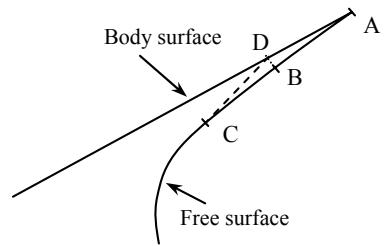  
Fig. 2.2. Cut-off model of a thin jet.

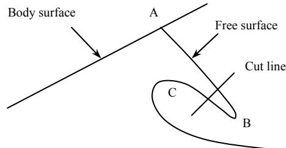  
Fig. 2.3. Scheme of the cut-off of a thin spray.

## 2.5 Spray cutting

When the gravity is accounted for, a thin spray can evolve from the free surface. It will at a later time overturn and hit the free surface underneath. If this happens, the calculations break down. The reason is that the penetration of the free surface causes circulation, i.e. vorticity and thus the potential theory can no longer be used to describe the fluid flow. Further, a detailed description of the spray requires the consideration of the surface tension. However, the spray gives little contribution to the pressure on the body. Even though the splash happened, the vorticity generated by the splash would influence a limited area in the flow and could only have a small effect on the body. Therefore, the spray can just be neglected by cutting it before it touches the free surface underneath. In such a way the numerical calculations can be continued until the completion of the concerned water entry process.

The cutting scheme is shown in Fig. 2.3. When the spray grows long enough and before its tip (point B) touches the free surface, a part of the spray is cut. The cut line is normal to the upper free surface AB. Point C is the highest point on the lower free surface. The cut line goes through the middle point between B and C, thus the spray can be cut from around the middle of it. That part of the spray which is cut off is assumed to be independent of the remaining part of the fluid and its motion is only influenced by gravity. This assumption can be confirmed by the results in the example presented in Fig. 2.4 and Fig. 2.5. The 2D water entry of a wedge section with deadrise angle $\beta = 4 5 ^ { \circ }$ is simulated. The constant water entry speed is $\mathrm { \dot { V } = 1 . 0 m s ^ { - 1 } }$ . It can be seen that the cutting does not change the free surface profile in the remaining part. The vertical force $F _ { z }$ on the section with unit length is not apparently influenced by the cutting, either.

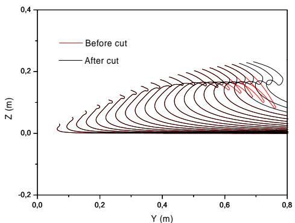  
Fig. 2.4. Free surface profiles with and without sprays.

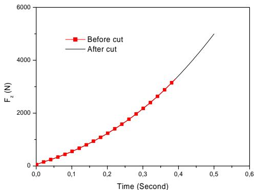  
Fig. 2.5. Vertical force histories.

## 2.6 Smoothing and regriding

Smoothing and regriding of the updated free surface are performed at each time step. Numerical instabilities can be prevented by using these two numerical techniques.

In the time stepping procedure, a sawtooth instability of the free surface profile will appear. A reason for this instability is due to the nature of the integral equation solved by the numerical method. The integral equation is a mixture of Fredholm integral equations of the first kind and the second kind. The numerical solution of Fredholm integral equation of the first kind can induce instability problems. This problem is described in many mathematic books, such as Delves & Walsh (1974, Chapter 13) and Arfken & Weber (2001, Chapter 16). The saw tooth instability can be removed by using a smoothing technique (Longuet-Higgins & Cokelet, 1976). A set of fivepoint-third-order smoothing formulas for equally spaced points is now adopted. It is only applied on the near-body region of the free surface, where the elements are uniformly distributed. Actually, the smoothing is not necessary for the free surface region far away from the body, because the free surface profile does not change so violently as in the near-body region. Other smoothing techniques can also be applied to tackle the sawtooth instability. For instance, Maruo & Song (1994) applied a five-point smoothing algorithm in their BEM. The five-point-third-order smoothing formulas applied in the present numerical method are expressed as

$$
f _ {1} = \frac {1}{7 0} \left(6 9 y _ {1} + 4 y _ {2} - 6 y _ {3} + 4 y _ {4} - y _ {5}\right)\tag{2.21.a}
$$

$$
f _ {2} = \frac {1}{3 5} \left(2 y _ {1} + 2 7 y _ {2} + 1 2 y _ {3} - 8 y _ {4} + 2 y _ {5}\right)\tag{2.21.b}
$$

$$
f _ {i} = \frac {1}{3 5} \left(- 3 y _ {i - 2} + 1 2 y _ {i - 1} + 1 7 y _ {i} + 1 2 y _ {i + 1} - 3 y _ {i + 2}\right)\tag{2.21.c}
$$

$$
f _ {N - 1} = \frac {1}{3 5} \left(2 y _ {N - 4} - 8 y _ {N - 3} + 1 2 y _ {N - 2} + 2 7 y _ {N - 1} + 2 y _ {N}\right)\tag{2.21.d}
$$

$$
f _ {N} = \frac {1}{7 0} \left(- y _ {N - 4} + 4 y _ {N - 3} - 6 y _ {N - 2} + 4 y _ {N - 1} + 6 9 y _ {N}\right)\tag{2.21.e}
$$

where $y _ { i } ( i = 1 , 2 , . . . , N )$ are original values before smoothing and $f _ { i } ( \mathrm { i } = 1 , 2 , . . . , N )$ are values after smoothing. N is the total number of nodes on the free surface region to be smoothed. The values can be y- and z- coordinates and the velocity potential φ on a node. The first two equations are used for the first two nodes and the last two equations are used for the last two nodes. The third equation can be used for any point at $\mathrm { i } = 3 , . . . , \mathrm { N } { - 2 }$ . It should be noted that the smoothing must not be applied to the water-body surface intersection point, because the position of this point should not be changed by smoothing.

After the updating of the free surface at each time step, the nodes can become too close to each other or too far away from each other, which may also cause numerical instabilities. The free surface needs to be re-discretized. A cubic spline approximation is used to interpolate the new points on the free surface. The regridding is performed by the following three steps. The first step is to find out the cubic spline approximation of the free surface profile by using polygonal arc length as the parameter. The second step is to calculate the arc length of the free surface and formulate the cubic spline approximations in terms of the arc length. Then the final step is to redistribute the nodes on the free surface by dividing the boundary into equal arcs or into arcs increasing geometrically in length.

In the first step, we have known the positions of all the nodes on the free surface. The polygonal arc length from the first point of the free surface to the starting point of any segment i can be calculated, which is denoted as $q _ { i } .$ On segment i, the y and z coordinates can be expressed as

$$
y _ {i} (q) = a _ {y i} + b _ {y i} (q - q _ {i}) + c _ {y i} (q - q _ {i}) ^ {2} + d _ {y i} (q - q _ {i}) ^ {3} (\mathrm{i} = 1, 2, \dots , N - 1)\tag{2.22.a}
$$

$$
z _ {i} (q) = a _ {z i} + b _ {z i} \left(q - q _ {i}\right) + c _ {z i} \left(q - q _ {i}\right) ^ {2} + d _ {z i} \left(q - q _ {i}\right) ^ {3} (\mathrm{i} = 1, 2, \dots , N - 1)\tag{2.22.b}
$$

where N is the number of nodes involved in the regriding process. Then by using continuity of the first and the second derivatives o $; y _ { i }$ and $z _ { i } ,$ we can find out the coefficients $a _ { y \dot { \nu } } , a _ { z \dot { \nu } } , b _ { y \dot { \nu } } , b _ { z \dot { \nu } } , c _ { y \dot { \nu } } , c _ { z \dot { \nu } } , d _ { y \dot { \imath } }$ and ${ \mathrm { d } } _ { \mathrm { z i } } . { \mathrm { A } }$ detailed description of the implementation is given by Bhat & Chakraverty (2004).

In the second step, the arc length between point i and point i+1 is denoted as $m _ { i }$ and the arc length from the first point (point 1) to point i is denoted as $h _ { i }$ . Because the analytical approximate expressions of $y _ { i } ( q )$ and $z _ { i } ( q )$ on each segment are known, we can calculate the arc length $m _ { i }$ from the following integration

$$
m _ {i} = h _ {i + 1} - h _ {i} = \int_ {q _ {i}} ^ {q _ {i + 1}} \sqrt {\left[ y _ {i} ^ {\prime} (q) \right] ^ {2} + \left[ z _ {i} ^ {\prime} (q) \right] ^ {2}} d q \quad (\mathrm{i} = 1, \dots , \mathrm{N} - 1)\tag{2.23}
$$

with

$$
y _ {i} ^ {\prime} (q) = b _ {y i} + 2 c _ {y i} (q - q _ {i}) + 3 d _ {y i} (q - q _ {i}) ^ {2},
$$

$$
z _ {i} ^ {\prime} (q) = b _ {z i} + 2 c _ {z i} (q - q _ {i}) + 3 d _ {z i} (q - q _ {i}) ^ {2}.
$$

The Legendre-Gauss quadrature is used to calculate the integrals numerically. The integral is first transformed to be integrated in the interval [-1, 1] by

$$
\int_ {a} ^ {b} f (x) d x = \frac {b - a}{2} \int_ {- 1} ^ {1} f \left(\frac {b - a}{2} \bar {x} + \frac {a + b}{2}\right) d \bar {x}\tag{2.24}
$$

with $\overline { { x } } = \frac { x - ( a + b ) / 2 } { ( b - a ) / 2 }$

Then the integral in the interval [-1, 1] is calculated by the Gaussian quadrature formula:

$$
\int_ {- 1} ^ {1} \overline {{f}} (\overline {{x}}) d \overline {{x}} = \sum_ {j = 1} ^ {n} C _ {j} \overline {{f}} (\overline {{x}} _ {j})\tag{2.25}
$$

Here ${ \mathfrak { n } } = 6$ is chosen in the calculations. $\overline { { \boldsymbol { x } } } _ { j }$ $_ { i } { \mathrm { ~ f o r ~ j = 1 , 2 , 3 , . . . , 6 ~ } }$ are the six roots in the interval [-1, 1] of the sixth order Legendre polynomial $\mathrm { P } _ { 6 } ( \mathbf { x } ) = 0$ and correspondingly $C _ { j }$ are the six coefficients. The six roots and six coefficients are given as follows:

$$
\overline {{{x}}} _ {1} = \overline {{{x}}} _ {6} = 0. 1 7 1 3 2 4 4 9 2 4, C _ {1} = - C _ {6} = 0. 9 3 2 4 6 9 5 1 4 2\tag{2.26.a}
$$

$$
\overline {{{x}}} _ {2} = \overline {{{x}}} _ {5} = 0. 3 6 0 7 6 1 5 7 3 1, C _ {2} = - C _ {5} = 0. 6 6 1 2 0 9 3 8 6 5\tag{2.26.b}
$$

$$
\overline {{{x}}} _ {3} = \overline {{{x}}} _ {4} = 0. 4 6 7 9 1 3 9 3 4 6, C _ {3} = - C _ {4} = 0. 2 3 8 6 1 9 1 8 6 1\tag{2.26.c}
$$

By using the Legendre-Gauss quadrature to calculate the integrals, one can acquire a higher accuracy in the results of the integrals than just using the trapezoidal rule. This Legendre-Gauss quadrature is described in detail by Bhat & Chakraverty (2004). When n is different from $^ { 6 , }$ the values for the roots $\overline { { x } } _ { i }$ and the coefficients $C _ { i }$ can be found in this reference.

Then we use $h _ { i }$ to replace $q _ { i }$ in the first step and form new interpolation functions in terms of $h ,$ i.e. $y _ { i } ( h )$ and $z _ { i } ( h ) _ { i }$ , on element i. Similarly we can formulate the approximate functions for velocity potential as $\varphi _ { i } ( h )$

In the final step, we can calculate the arc length from the first node to any new node on the free surface. The arc length is inserted into the approximate functions on the element, in which the new node locates, to calculate the y, z and $\boldsymbol { \Phi }$ for this new node. Thus the coordinates of the new nodes and velocity potential on them are found.

## 2.7 Time-marching procedure

A time-marching procedure is followed by integrating the evolution equations, i.e. Eqs. (2.3) and (2.4) with respect to time. When the body motion is free, the equation of motion (2.12) needs to be accounted for. This procedure is numerically realized by using a fourth-order Runge-Kutta method.

Initially the coordinates and the velocity potential for the free surface nodes are known. When the water entry speed is constant, the unknowns to be updated to the next time step include ${ \mathrm { y } } _ { \mathrm { i } } , { \mathrm { z } } _ { \mathrm { i } } , \phi _ { \mathrm { i } } \left( \mathrm { i } = \right.$ $1 , 2 , \ldots , \mathrm { N } { + } 1 )$ , where N is the total number of linear elements on the free surface. The derivatives $\partial \boldsymbol { \rho } / \partial \boldsymbol { \gamma } \left( \varphi _ { y } \right)$ and $\hat { \cal O } \mit ( \mathrm { \Delta \varphi / } \hat { \cal O } \mathrm { Z \Delta \xi } \left( \varphi _ { z } \right)$ on the free surface, which need to be evaluated in Eq. (2.3) and (2,4), can be expressed by the normal derivative ∂φ/∂n $\left( \varphi _ { n } \right)$ and tangential derivative ∂φ/∂s (φs) as

$$
\left\{ \begin{array}{l} \varphi_ {y} = \varphi_ {s} n _ {z} + \varphi_ {n} n _ {y} \\ \varphi_ {z} = - \varphi_ {s} n _ {y} + \varphi_ {n} n _ {z} \end{array} \right.\tag{2.27}
$$

The normal derivates $\varphi _ { n }$ on the free surface are solved from the linear system given in Eq. (2.20). The tangential derivatives $\varphi _ { s }$ can be obtained from $\mathrm { { y } _ { i } , \mathrm { { z } _ { i } , \mathrm { { \phi } _ { i } } } }$ similarly as in Greco (2001). From the coordinates of nodes $\mathrm { y } _ { \mathrm { i } } , \mathrm { z } _ { \mathrm { i } }$ on the free surface, we can calculate the length of each linear element. The length of element i is denoted as $\mathrm { \mathbf { S } _ { i } } .$ The nodes on the two ends of the element i are numbered as node i and node i+1. The velocity potential on node i is denoted as $\varphi _ { i }$ . Then the tangential derivatives on nodes are calculated by using the following equations:

$$
\varphi_ {s 1} = \frac {- \left(h _ {2} ^ {2} + 2 h _ {1} h _ {2}\right) \varphi_ {1} + \left(h _ {1} + h _ {2}\right) ^ {2} \varphi_ {2} - h _ {1} ^ {2} \varphi_ {3}}{h _ {1} h _ {2} \left(h _ {1} + h _ {2}\right)}\tag{2.28.a}
$$

$$
\varphi_ {s i} = \frac {- h _ {i} ^ {2} \varphi_ {i - 1} + \left(h _ {i} ^ {2} - h _ {i - 1} ^ {2}\right) \varphi_ {i} + h _ {i - 1} ^ {2} \varphi_ {i + 1}}{h _ {i} h _ {i - 1} \left(h _ {i} + h _ {i - 1}\right)} \text {   for   } i = 2, \dots , N\tag{2.28.b}
$$

$$
\varphi_ {s, N + 1} = \frac {h _ {N} ^ {2} \varphi_ {N - 1} - \left(h _ {N - 1} + h _ {N}\right) ^ {2} \varphi_ {N} + \left(h _ {N - 1} ^ {2} + 2 h _ {N - 1} h _ {N}\right) \varphi_ {N + 1}}{h _ {N - 1} h _ {N} \left(h _ {N - 1} + h _ {N}\right)}\tag{2.28.c}
$$

A fourth-order Runge-Kutta method is applied to numerically integrate the equations in Eqs. (2.3) and (2.4) in time. The derivation of the formulas for the fourth-order Runge-Kutta method is given in Bhat $\&$ Chakraverty (2004). Now the time derivative of the unknown vector $X { = } \{ \{ y \} , \{ z \} , \{ \varphi \} \}$ is expressed by a function dX $/ \mathrm { d t } = f ( \{ \mathrm { y } \} , \{ \mathrm { z } \} , \{ \varphi \} , \{ \varphi _ { n } \} ) = f ( \mathrm { ~ X } , \{ \varphi _ { n } \} )$ . The normal derivatives in $\left\{ \Phi _ { \mathrm { n } } \right\}$ are assumed unchanged in the time interval ∆t. Then we have

$$
X ^ {n + 1} = X ^ {n} + \left(k _ {1} + 2 k _ {2} + 2 k _ {3} + k _ {4}\right) \Delta t / 6\tag{2.29}
$$

where $\mathrm { X } ^ { \mathrm { n + 1 } }$ and $\mathrm { { X ^ { n } } }$ are unknown vectors at time step n+1 and n, ∆t is the time interval and the coefficient vectors $k _ { I } , k _ { 2 } , k _ { 3 }$ and $k _ { 4 }$ are given by

$$
\begin{array}{l} k _ {1} = f \left(X ^ {n}, \{\varphi_ {n} \}\right) \\ k _ {2} = f \left(X ^ {n} + k _ {1} \Delta t / 2, \{\varphi_ {n} \}\right) \\ k _ {3} = f \left(X ^ {n} + k _ {2} \Delta t / 2, \{\varphi_ {n} \}\right) \\ k _ {4} = f \left(X ^ {n} + k _ {3} \Delta t, \{\varphi_ {n} \}\right) \end{array}
$$

## 2.8 Verification by comparing with similarity solutions

Zhao & Faltinsen (1993) presented the similarity solutions for the water entry of wedge sections at constant entry speeds for different deadrise angles. In Fig. 2.6, the pressure distributions on the body surface and the free surface profiles by the present numerical calculations are compared with their similarity solutions for deadrise angles $\beta = \dot { 4 } ^ { \circ } , 7 . 5 ^ { \circ } , 1 0 ^ { \circ } , 2 0 ^ { \circ } , 3 0 ^ { \circ }$ and $4 5 ^ { \circ } ,$ , respectively. The gravity is neglected in the BEM calculations in order to compare with the similarity solutions without gravity effects. Good agreement can be seen. The results for relatively small deadrise angles are shown here. It is more difficult to obtain good numerical results for smaller deadrise angles than for larger deadrise angles. The reason is that a smaller deadrise angle causes a faster and thinner jet flow which is more difficult to control numerically. Therefore, the good agreement for smaller deadrise angle cases shows the robustness of the present numerical method.

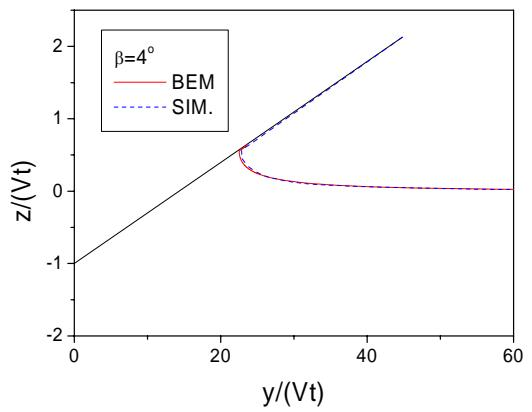

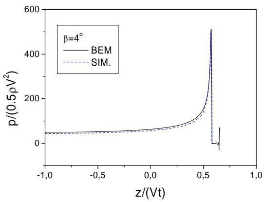

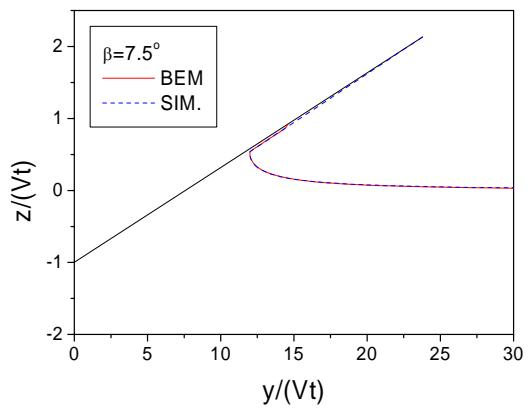  
Fig. 2.6. (See the caption in page 29).

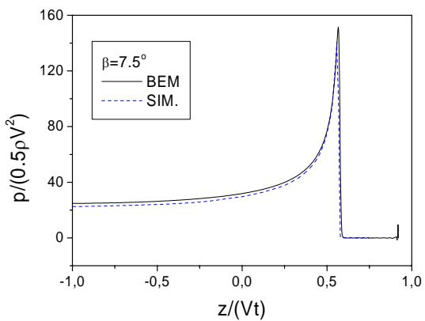

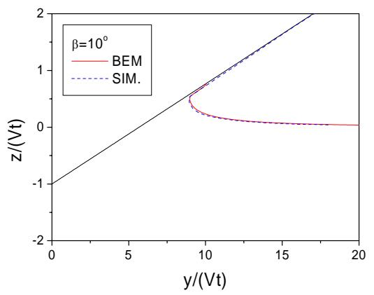

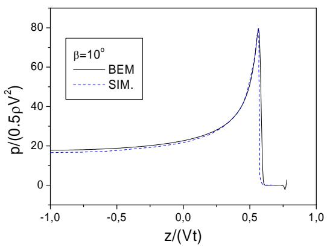

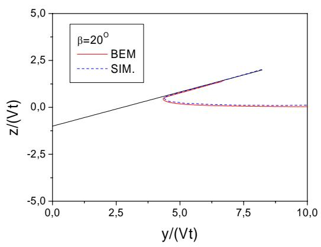

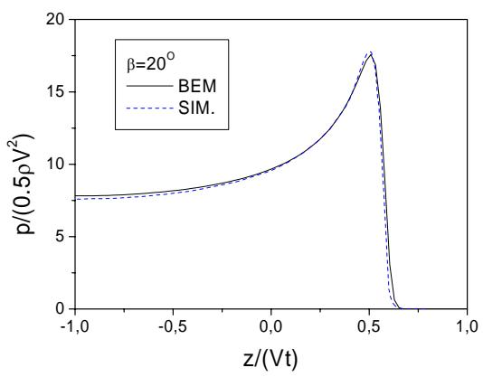

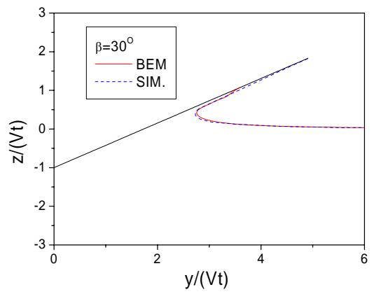  
Fig. 2.6. (See the caption in page 29).

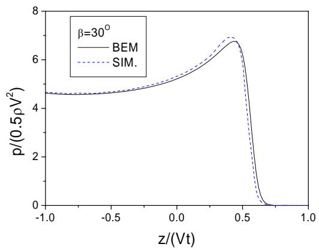

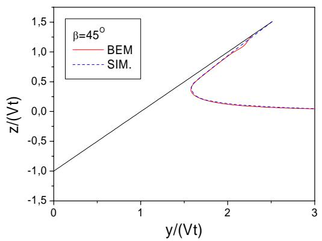

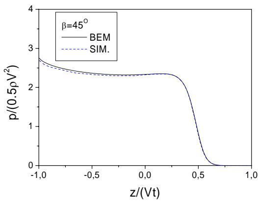  
Fig. 2.6. Comparisons between the numerical results (BEM) and the similarity solutions (SIM.) in Zhao & Faltinsen (1993) for different deadrise angles: $\beta = 4 ^ { \prime }$ , 7.5º, 10º, 20º, 30º and $4 \dot { 5 } ^ { \circ } .$ . Left column: Free surface profiles; right column: Pressure distributions.

## 2.9 An improved method in the calculation of the acceleration

For a free drop of a body into the water, the acceleration has to be instantaneously calculated. In most cases, the vertical acceleration can be calculated from Eq. (2.12) by

$$
\dot {V} = F _ {z} / M - g\tag{2.30}
$$

However, in some cases when the total mass of the body M is much smaller than the added mass in the vertical motion, the numerical errors can be accumulated and lead to divergence. The reason is the following. Implicitly, $F _ { z }$ is a function of the acceleration dV/dt. For a water entry problem with a linear approximation of the free surface condition, i.e. $\scriptstyle { \mathfrak { P } } ^ { = 0 }$ , the linear added mass force $- A _ { 3 3 } d V / d t$ expresses the acceleration dependent component in the hydrodynamic force where $\mathbf { A } _ { 3 3 }$ is the high frequency added mass in heave for the body (see Faltinsen, 1990, pp. 299). This expression of the added mass force is borrowed here to approximate the acceleration-dependent part in the present $F _ { z } .$ If the added mass is much larger than the body mass M, then the error in dV/dt from the last time step will be amplified by $A _ { 3 3 } / M$ when we use Eq. (2.30) to calculate the acceleration dV/dt. The error will be further passed to the pressure calculated in the next time step through the body boundary condition in Eq. (2.11). Therefore, the numerical errors are amplified and accumulated as time goes on, and finally lead to divergence.

In order to avoid this problem, a numerical treatment is introduced. An estimated added mass force $- A _ { 3 3 }$ dV/dt is subtracted from both sides of Eq. (2.12). In doing this, the equation is not changed. The added mass can be approximated by a flat plate theory, or by other available methods. As long as the estimated added mass force represents a major part of the acceleration-dependent part in $F _ { z } ,$ this method will work. Eq. (2.12) can be rewritten as

$$
\left(M + A _ {3 3}\right) \dot {V} = F _ {z} + A _ {3 3} \dot {V} - M g\tag{2.31}
$$

Then the acceleration will be obtained by dividing the right hand side of this equation by the sum $( M + A _ { 3 3 } )$ . Because a large part of the added mass force has been subtracted from the $F _ { z } ,$ the error in the acceleration will be less likely to be passed on to later time steps. So the accuracy of the results can be fairly improved.

In the calculation of the free water entry of a circular cylinder in Chapter 4, this method is followed. The submergence of the cylinder can be very large. When the submergence of the cylinder is smaller than the cylinder radius, von Karman’s method is applied together with the flat plate approximation to give the 2D added mass

$$
A _ {3 3} = \frac {1}{2} \rho \pi c ^ {2}\tag{2.32}
$$

where the half-wetted length c(t) is measured on the calm water surface. When the submergence is larger than the order of the cylinder radius, the non-viscous flow separation is likely to occur and it is not appropriate to continue using von Karman’s approach to estimate the added mass. However, the flat plate approximation can still be applied, but c(t) is determined in a different way. The halfwetted length c(t) is calculated as the length from the centre of the flat plate to the horizontal position of the body-water surface intersection predicted by the BEM.

This treatment is simple but useful. An example is given to show the effectiveness of this approach. A wedge of length 1.0m and beam 0.2m are dropped from a height $\mathrm { h } = 0 . 5 \mathrm { m }$ . The water flow is assumed totally two-dimensional. The drop height is measured from the lowest apex to the calm water level. The deadrise angle of the wedge is 30 degree. The total mass of the wedge is 10 kg. The initial stage before t = 0.0008s is simulated by Wagner’s method. After this moment, the BEM takes over the calculation. The vertical accelerations and vertical velocities calculated by the BEM are shown in Fig. 2.7. Different approaches to solve the acceleration are applied in the two calculations. In ‘Method $1 ^ { \circ }$ the acceleration is calculated by using the original equation of motion. ‘Method $2 ^ { \circ }$ refers to the calculation by using the numerical treatment presented in this section. The former calculation by ‘Method $1 ^ { \circ }$ diverges at about time instant $\mathrm { ~ t ~ } = \ 0 . 1 7 \mathrm { s }$ , while the latter calculation converges. It shows that the accuracy of the acceleration calculation is improved by using this numerical technique and the divergence can therefore be effectively avoided.

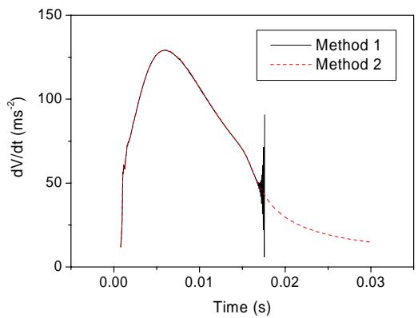

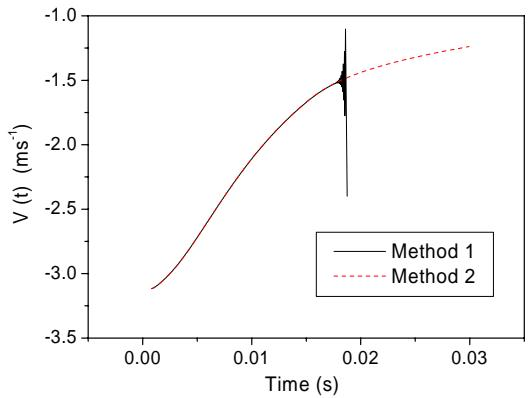  
Fig. 2.7. Comparison of the results by using different methods to calculate the acceleration.

## CHAPTER 3

## Non-viscous flow separation

When a free-surface piercing body is moving with large motions, the water flow can separate from the body. This flow separation is not due to viscous effects and is different from the viscous flow separation of a boundary layer. It is called non-viscous flow separation. The condition for viscous flow separation is that the normal derivative of the tangential velocity at the body surface is zero. This condition is not satisfied in a non-viscous flow separation. The separation position can be either on a fixed point, such as the knuckle of a section or a transom stern, or moving on a curved surface. Moreover, the non-viscous flow separation is a well-known fact for the steady flow past a body with an attached cavity. In this chapter, a flow separation model which can be incorporated in the BEM will be introduced.

## 3.1 Local solution of a separated flow

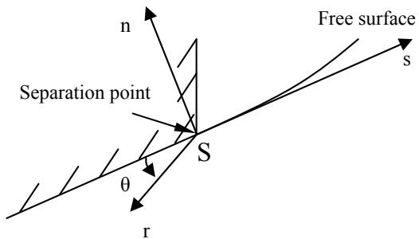  
Fig. 3.1. Non-viscous flow separation at a sharp corner and the coordinates.

As shown in Fig. 3.1, the free surface separates from a sharp corner of a body section in two dimensions. An analytical solution for the local flow near the separation point can be found (see Zhao et al., 1996 and Faltinsen, 2005). A polar coordinate system (r,θ) fixed with the body is adopted. The origin is located at the separation point S (Fig. 3.1). The water is assumed incompressible and inviscid with irrotational flow. A velocity potential φ(r, θ, t) is used to describe the flow. It satisfies the Laplace equation in the polar coordinate system,

$$
\frac {\partial^ {2} \varphi}{\partial r ^ {2}} + \frac {1}{r} \frac {\partial \varphi}{\partial r} + \frac {1}{r ^ {2}} \frac {\partial^ {2} \varphi}{\partial \theta^ {2}} = 0\tag{3.1}
$$

In the body-fixed coordinates, the normal velocity of the fluid particle on the body boundary must be zero. Then the body boundary condition gives

$$
\frac {\partial \varphi}{\partial \theta} = 0\tag{3.2}
$$

First, a general solution satisfying the governing equation in Eq. (3.1) and body boundary condition in Eq. (3.2) will be found. More restrictions, such as finite velocity at the separation point, will also be satisfied. Then for different problems, the description of the free surface condition is different. Therefore, different particular solutions can be obtained.

Appendix A shows the derivation of the general solution of φ(r, θ, t) satisfying Eq. (3.1) and (3.2). The solution is

$$
\varphi (r, \theta , t) = C _ {1} \left(B _ {0} + D _ {0} \ln r\right) + \sum_ {n > 0} C _ {1} \cos (n \theta) \left(B _ {n} r ^ {- n} + D _ {n} r ^ {n}\right)\tag{3.3}
$$

where $\mathrm { C _ { 1 } , \mathrm { B _ { 0 } , \mathrm { D _ { 0 } , \mathrm { B _ { n } , \mathrm { D _ { n } } } } } }$ are time-dependent coefficients and n is a real number. So the radial velocity is

$$
v _ {r} = \frac {\partial \varphi}{\partial r} = C _ {1} D _ {0} r ^ {- 1} + \sum_ {n > 0} C _ {1} \cos (n \theta) \left(B _ {n} r ^ {- n - 1} + D _ {n} r ^ {n - 1}\right)\tag{3.4}
$$

At the separation point where $\mathrm { { r }  0 } _ { \mathrm { { ; } } }$ , the velocity must be finite, so the coefficients in front of $\boldsymbol { \mathrm { r } } ^ { - 1 }$ and $\mathrm { ~ r ~ } ^ { - 1 - 1 }$ must be zero. Further, if $0 < \mathtt { n } < 1$ , the coefficients in front of $\mathrm { r } ^ { \mathrm { n - 1 } }$ must also be zero. Therefore, the general solution can be rewritten as

$$
\varphi (r, \theta , t) = A _ {0} + A _ {1} r \cos \theta + \sum_ {n > 1} A _ {n} r ^ {n} \cos (n \theta)\tag{3.5}
$$

where the coefficients $\mathrm { C _ { 1 } } , \mathrm { B _ { 0 } } , \mathrm { D _ { 0 } } , \mathrm { B _ { n } } , \mathrm { D _ { n } }$ have been combined to given the new coefficients $\mathbf { A } _ { 0 }$ and $\mathbf { A } _ { \mathrm { n } } \left( \mathrm { n } { \geq } 1 \right)$ , which are also time-dependent. So the radial velocity and angular velocity are given by

$$
v _ {r} = \frac {\partial \varphi}{\partial r} = A _ {1} \cos \theta + \sum_ {n > 1} A _ {n} n r ^ {n - 1} \cos (n \theta)\tag{3.6}
$$

$$
v _ {\theta} = \frac {1}{r} \frac {\partial \varphi}{\partial \theta} = - A _ {1} \sin \theta - \sum_ {n > 1} n A _ {n} r ^ {n - 1} \sin (n \theta)\tag{3.7}
$$

Along the body surface, $\scriptstyle { \Theta = 0 } .$ , hence

$$
v _ {r} (\theta = 0) = A _ {1} + \sum_ {n > 1} A _ {n} n r ^ {n - 1}\tag{3.8}
$$

At the separation point $\mathbf { r } = 0 .$ , the tangential velocity $U _ { \mathrm { s } }$ along the body surface in s-direction (s-axis is shown in Fig. 3.1 with origin at the separation point) can be expressed as

$$
U _ {s} = - v _ {r} (\theta = 0, r = 0) = - A _ {1}\tag{3.9}
$$

If the water flow separates tangentially along the body surface, then the free surface approaches the straight line $\scriptstyle { \theta = \pi }$ near the separation point. From Eq. (3.6), we have

$$
v _ {r} (\theta = \pi) \rightarrow U _ {s} \text {   as   } r \rightarrow 0\tag{3.10}
$$

which means that the tangential velocity on the free surface near the separation point tends to the tangential velocity at the separation point as the location approaches the separation position.

## 3.2 Flow separation at knuckles

Based on the general solution given in the section 3.1, a local analytical solution can be found for the flow separation at the knuckle of a 2D section impacting water surface. The free surface conditions will be satisfied. This local solution can be incorporated into the BEM to simulate the non-viscous flow separation at the knuckle point. An example will be given to demonstrate the effectiveness of the flow separation model.

## 3.2.1 Local analytical solution near a knuckle

In the water entry of a two-dimensional section, the water flow will separate from the knuckle if there is a sharp corner at the knuckle point. The general solution given in the section 3.1 is further developed by satisfying the free surface conditions. Neglecting the gravity, the dynamic free surface condition can be written as

$$
\frac {\partial \varphi}{\partial t} + \frac {1}{2} | \nabla \varphi | ^ {2} = \frac {1}{2} V (t) ^ {2}\tag{3.11}
$$

where $V ( t )$ is the water entry speed of the section relative to the calm water. From Eqs. (3.5) and (3.9), the term ∂φ/∂t can be expressed as

$$
\frac {\partial \varphi}{\partial t} = \frac {d A _ {0} (t)}{d t} - \frac {d U _ {s} (t)}{d t} r \cos \theta + \sum_ {n > 1} \frac {d A _ {n} (t)}{d t} r ^ {n} \cos (n \theta)\tag{3.12}
$$

Inserting Eqs. (3.6), (3.7) and (3.12) into Eq. (3.11), we have

$$
\begin{array}{l} \frac {\partial \varphi}{\partial t} + \frac {1}{2} \left(v _ {r} ^ {2} + v _ {\theta} ^ {2}\right) = \frac {d A _ {0} (t)}{d t} - \frac {d U _ {s} (t)}{d t} r \cos \theta + \sum_ {n > 1} \frac {d A _ {n} (t)}{d t} r ^ {n} \cos (n \theta) \\ + \frac {1}{2} \left[ - U _ {s} \cos \theta + \sum_ {n > 1} A _ {n} n r ^ {n - 1} \cos (n \theta) \right] ^ {2} + \frac {1}{2} \left[ U _ {s} \sin \theta - \sum_ {n > 1} n A _ {n} r ^ {n - 1} \sin (n \theta) \right] ^ {2} = \frac {1}{2} V (t) ^ {2} \end{array}\tag{3.13}
$$

Eq. (3.13) can be expanded as

$$
\begin{array}{l} \frac {d A _ {0} (t)}{d t} - \frac {d U _ {s} (t)}{d t} r \cos \theta + \sum_ {n > 1} \frac {d A _ {n} (t)}{d t} r ^ {n} \cos (n \theta) + \frac {1}{2} U _ {s} ^ {2} + \frac {1}{2} \sum_ {n > 1} \left(A _ {n} n r ^ {n - 1}\right) ^ {2} \\ - U _ {s} \sum_ {n > 1} A _ {n} n r ^ {n - 1} \cos [ (n - 1) \theta ] + \sum_ {n > 1} \sum_ {m > 1} A _ {n} A _ {m} m n r ^ {n - 1} r ^ {m - 1} \cos [ (m - n) \theta ] = \frac {1}{2} V (t) ^ {2} \end{array}\tag{3.14}
$$

Near the separation point, the coordinate r is small, so we can rearrange the terms in Eq. (3.14) in ascending order of $\mathbf { r } ^ { \mathrm { ~ n ~ } }$ . The lowest order approximation of Eq. (3.14) is formed by zero order terms in $\mathrm { O } ( \mathrm { r } ^ { 0 } )$

$$
\frac {d A _ {0} (t)}{d t} + \frac {1}{2} U _ {s} ^ {2} = \frac {1}{2} V (t) ^ {2}\tag{3.15}
$$

This equation is automatically satisfied because it follows from the fact that the pressure at the separation point is atmospheric pressure. The second lowest order approximation is given from the terms in $\mathrm { O } ( \mathrm { r } ^ { \mathrm { n - l } } )$ , i.e.

$$
- U _ {s} A _ {n} n r ^ {n - 1} \cos [ (n - 1) \theta ] = 0 \quad \text { at } \theta = \pi \text { and } r \rightarrow 0\tag{3.16}
$$

Therefore,

$$
(n - 1) \pi = (k + \frac {1}{2}) \pi \quad \text { for } k = 0, 1, 2, \dots\tag{3.17}
$$

The lowest order corresponds to $k { = } 0$ , which gives $\scriptstyle \mathrm { n = 3 } / 2$ . If we neglect all the other higher order terms, then the velocity potential close to the separation point can be written as

$$
\varphi (r, \theta , t) = A _ {0} (t) - U _ {s} (t) r \cos \theta + A _ {3 / 2} (t) r ^ {3 / 2} \cos \left(\frac {3}{2} \theta\right)\tag{3.18}
$$

Then the radial velocity near the separation point is

$$
v _ {r} = - U _ {s} \cos \theta + \frac {3}{2} A _ {3 / 2} (t) r ^ {1 / 2} \cos \left(\frac {3}{2} \theta\right)\tag{3.19}
$$

On the body surface at $\scriptstyle \theta = 0$ , the tangential velocity is

$$
v _ {s} = - v _ {r} = U _ {s} - \frac {3}{2} A _ {3 / 2} (t) r ^ {1 / 2}\tag{3.20}
$$

On the free surface at θ= π and $\mathrm { r } {  } 0$

$$
v _ {s} = v _ {r} = U _ {s}\tag{3.21}
$$

The angular velocity near the separation point on the free surface is given as

$$
v _ {\theta} = \frac {3}{2} A _ {3 / 2} r ^ {1 / 2}\tag{3.22}
$$

From the kinematic free surface condition, the fluid particle on the free surface will always stay on the free surface, hence,

$$
\frac {d n}{d s} = \frac {v _ {n}}{v _ {s}} = \frac {v _ {\theta}}{v _ {s}}\tag{3.23}
$$

where the n-axis is normal to the s-axis as shown in Fig. 3.1. From Eqs. (3.21), (3.22) and (3.23), one has

$$
\frac {d n}{d s} = \frac {3}{2} \frac {A _ {3 / 2}}{U _ {s}} s ^ {1 / 2}\tag{3.24}
$$

Integrating this equation in s, one can obtain the profile of the free surface as

$$
n (s) = \frac {A _ {3 / 2}}{U _ {s}} s ^ {3 / 2}\tag{3.25}
$$

The coefficient $\mathrm { A } _ { 3 / 2 } ( \mathrm { t } )$ can not be determined by this local analysis. It follows by matching the local solution with the global analysis.

The pressure on the body surface near the separation position can be written as

$$
p - p _ {a} = - \rho \left[ \frac {\partial \varphi}{\partial t} + \frac {1}{2} | \nabla \varphi | ^ {2} \right] _ {\theta = 0} + \frac {1}{2} \rho V (t) ^ {2}\tag{3.26}
$$

Inserting the velocity potential in Eq. (3.18) and the radial velocity in Eq. (3.20) into the pressure gives

$$
p - p _ {a} = - \rho \frac {\partial}{\partial t} \left[ A _ {0} (t) - U _ {s} (t) r + A _ {3 / 2} (t) r ^ {3 / 2} \right] - \frac {1}{2} \rho \left[ U _ {s} - \frac {3}{2} A _ {3 / 2} (t) r ^ {1 / 2} \right] ^ {2} + \frac {1}{2} \rho V (t) ^ {2}\tag{3.27}
$$

$$
p - p _ {a} = - \rho \left[ \frac {\partial A _ {0} (t)}{\partial t} + \frac {1}{2} U _ {s} ^ {2} \right] - \rho \left[ \frac {9}{8} A _ {3 / 2} (t) ^ {2} - \frac {\partial U _ {s} (t)}{\partial t} \right] r + \frac {3}{2} \rho U _ {s} A _ {3 / 2} (t) r ^ {1 / 2} + \frac {1}{2} \rho V (t) ^ {2}\tag{3.28}
$$

where the terms with order higher than $\mathrm { O ( r ) }$ have been neglected. The term proportional to $r ^ { I / 2 }$ in the pressure will result in the following term in the pressure gradient ${ \hat { c } } { \mathfrak { p } } / { \hat { c } } { \mathfrak { r } }$

$$
\frac {3}{4} \rho U _ {s} A _ {3 / 2} (t) \frac {1}{\sqrt {r}}\tag{3.29}
$$

Because of this term, the pressure gradient will go to infinity, as the position approaches the separation point, i.e. $\mathrm { r } {  } 0$ . Due to the infinite pressure gradient, the acceleration of a fluid particle at the separation point will be very large, which can be much larger than the gravitational acceleration. This is consistent with the earlier assumption that the gravity should be neglected around the separation position.

## 3.2.2 Numerical implementation

In the numerical calculations, the relations in the local solution described in section 3.2.1 will be utilized. From Eqs. (3.20) and (3.21), in the very close vicinity of the separation point, the tangential velocity $\nu _ { s }$ on the free surface can be approximated by the tangential velocity on the body surface. As a further approximation, the term proportional to $\mathrm { r } ^ { 1 / 2 }$ in Eq. (3.20) has been neglected. The geometry of the free surface and the normal velocity on the free surface should follow Eq. (3.25) and (3.22), respectively. However, the coefficients $\mathrm { U _ { s } ( t ) }$ and $\mathrm { A } _ { 3 / 2 } ( \mathrm { t } )$ are unknown in advance. However, very close to the separation point, the terms of order $\mathrm { O } ( r ^ { I / 2 } )$ and $\mathrm { O } ( r ^ { 3 / 2 } )$ are small values. If these terms in Eqs. ( 3.25) and (3.22) are neglected, the normal velocity $\nu _ { n }$ and the normal displacement $n ( \mathrm { s } )$ will be approximated as zeros. It means that, in the very close vicinity of S, the free surface is just tangential to the body surface and the normal velocity on the free surface equals the normal velocity of the rigid body.

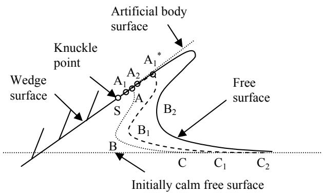  
Fig. 3.2. Numerical simulation of the flow separation at a knuckle.

In the numerical simulations, an artificial body surface tangentially extended from the knuckle point S along the wedge surface is introduced (Fig. 3.2). The wetted artificial body surface is treated like a physical body surface when we solve the fluid field. Once it is detected that the water goes beyond the knuckle point S, the flow separation model will be applied.

The following steps are performed to make the flow separate from the knuckle point. At first, the free surface is located at ABC as shown in Fig. 3.2. Then the artificial body surface SA is changed into a part of the free surface by keeping its geometry and normal velocity but changing the tangential velocity. The tangential velocity on SA is set equal to the tangential velocity at knuckle point S, which is calculated by using the velocity potential on the physical wedge surface adjacent to S. The free surface part SA is then updated to a new position $\mathbf { \bar { A _ { l } } } \mathbf { \bar { A _ { l } } } ^ { * }$ by using the free surface conditions and the free surface part ABC is updated to a new position ${ \bf A } _ { 1 } ^ { * } { \bf B } _ { 1 } { \bf C } _ { 1 }$ . These two parts of free surface $\mathbf { A _ { 1 } A _ { 1 } } ^ { * }$ and ${ \bf A } _ { 1 } ^ { * } { \bf B } _ { 1 } \bar { \bf C } _ { 1 }$ are connected to form the new free surface $\mathbf { A } _ { 1 } \ \mathbf { B } _ { 1 } \mathbf { C } _ { 1 }$ . The small surface $\mathrm { S A } _ { 1 }$ then becomes an artificial body surface. In the next time step, the similar procedure is followed by changing the artificial body surface $\mathrm { S A } _ { 1 }$ to a part of free surface and then updating it. Then a separated free surface $\mathrm { A } _ { 2 } \mathrm { B } _ { 2 } \mathrm { C } _ { 2 }$ can be obtained. By following those steps, the water flow will continuously separate from the wedge surface.

Gravity has been neglected in the local analytical solution. Zhao et al. (1996) incorporated this local solution with a Boundary Element Method without considering gravity effects. However, in the present BEM, the gravity is, in general, included. It may be questioned whether this local solution can still be combined with the present BEM. The answer to this question is positive. In the currently studied problems, although the gravity matters in some areas away from the knuckle, it is less important in the very close vicinity of the separation point. The validation of the combination of the local analytical solution and the present BEM can be seen from the examples as follows.

The free surface profiles during the free water entry of a 30 degree V-shaped section in the experiment by Greenhow & Lin (1983) are compared with present numerical results in Fig. 3.3 (a)- (d). Free surface profiles obtained by the numerical simulations are plotted in the experimental photos taken at four different time instants. The beam of the section is 0.218m. The water entry speed has been estimated from the photos. A decelerated motion can be observed. The initial time instant is $\mathrm { t } = 0 . 2 0 0 \mathrm { s }$ when the wedge apex just touches the water surface. At $\mathrm { t } = 0 . 2 0 5 \mathrm { s }$ , a very thin jet is formed along the body surface; at $\mathrm { t } = 0 . 2 1 0 \mathrm { s }$ the spray root has just passed the knuckle; at ${ \mathfrak { t } } =$ 0.215s, the top of the jet turns over, which implies the existence of the gravity effect. The discrepancies in the figures can be explained by the following reasons. Firstly, the information about the falling speed is not given in the experiment report. So the speed can only be roughly estimated from the photos. Errors may be introduced during this estimation. Further, as stated in the experiment report, the timing system in photographing can have an error of ±0.005s, which may also affect the agreement. However, generally speaking the numerical simulations show good predictions of the free surface profile.

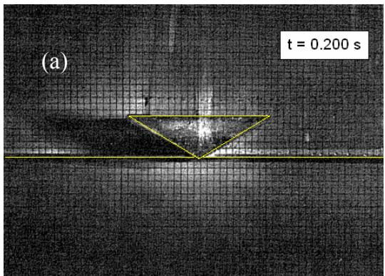

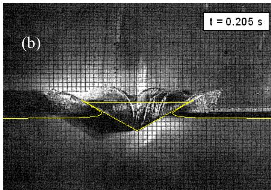

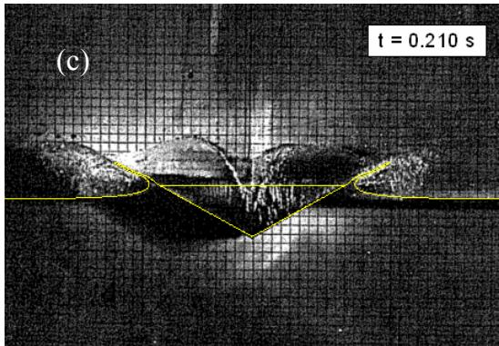

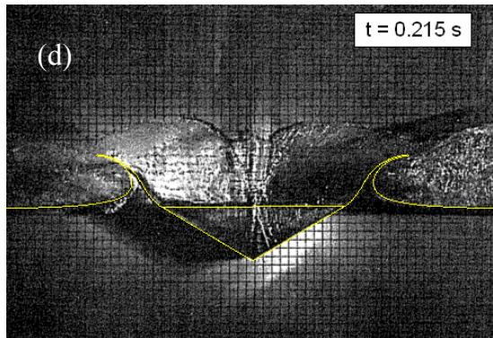  
Fig. 3.3. Free surface elevations around a wedge in a free water entry. The results by the numerica simulations are compared with the photos taken in the drop tests by Greenhow & Lin (1983).

## 3.3 Steady flow separation from transom stern

A similar local solution can be found for the flow separation from the transom stern of a planing hull (Chapter 9 in Faltinsen, 2005) in steady motions. As shown in Fig. 3.4, the flow separates from the stern in a centerline plane of a planing hull. In reality, the flow around the transom stern should be three-dimensional. For simplicity, one can assume a two-dimensional flow in the centerline plane. A local 2D coordinate system $\xi - \zeta$ fixed on the hull is used. By following the similar procedure as in section 3.2, one can find the following relation from the lowest order approximation

$$
U _ {s} = \sqrt {2 g D _ {T} + U ^ {2}}\tag{3.30}
$$

where $\mathrm { U _ { s } }$ is the fluid velocity at the flow separation position, $D _ { T }$ is the draft at the transom stern and U is the forward speed of the planing hull.

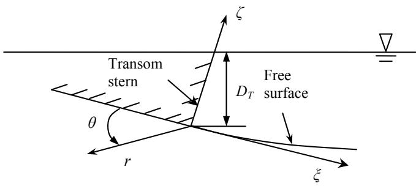  
Fig. 3.4. Flow separation at the transom stern of a planing vessel in steady motions.

If one includes the second lowest order terms, the velocity potential near the separation point can be approximated by

$$
\varphi = A _ {0} + U _ {s} \xi + A _ {3 / 2} r ^ {3 / 2} \cos (3 \theta / 2)\tag{3.31}
$$

This solution is in the same form as the solution in Eq. (3.18). Therefore, similarly as in the last section, the free surface profile is given by

$$
\zeta (\xi) = \frac {A _ {3 / 2}}{U _ {s}} \xi^ {3 / 2}\tag{3.32}
$$

The pressure on the hull surface near the separation position, i.e. the transom stern, is written as

$$
p - p _ {a} = - \rho U _ {s} u \big | _ {\theta = 0} = \frac {3}{2} \rho U _ {s} A _ {3 / 2} r ^ {1 / 2}\tag{3.33}
$$

An application of this local solution will be given in Chapter 7 to demonstrate the 3D effects near the transom stern.

## 3.4 Flow separation from a curved body surface

The non-viscous flow separation can also happen on a curved body surface, such as the surface of a horizontal circular cylinder, during the water entry of the cylinder. At first, a water jet will rise along the body surface as shown by the dotted line BC in Fig. 3.5. The fluid particles in the jet tip are moving in curved trails. The centripetal acceleration is provided by the pressure gradient in the normal direction pointing into the body. In order to acquire this pressure gradient, the pressure on the wetted surface near the jet tip must be lower than the atmosphere pressure on the jet surface. However, if the low-pressure wetted area is too large, the air can easily enter the area. Then the pressure gradient becomes insufficient to provide the necessary centripetal acceleration. As a result, the jet tip will tangentially run away from the body surface. That is how the non-viscous separation happens on the curved surface.

Unlike the previously discussed non-viscous flow separation from a sharp corner, the flow separation from the curved surface will not always occur at a fixed point. As the body enters the water, the separation position will move along the body surface. Nevertheless, at a given time instant, we can still obtain a similar local analytical solution around the flow separation position. If we assume that the free surface separates tangentially from the body surface, and the body surface in the close vicinity of the separation point can be viewed as a flat surface, then we can apply the local solution derived in section 3.2 to describe the local flow around the moving separation position. It will be shown how to incorporate this local solution in the global analysis.

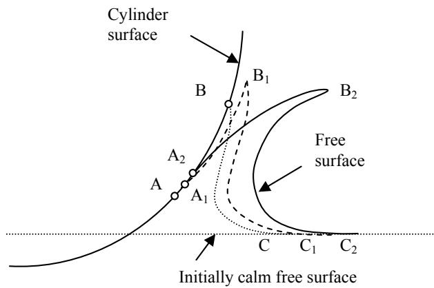  
Fig. 3.5. Numerical simulation of the non-viscous flow separation on a curved surface.

The non-viscous flow separation can be simulated numerically as follows. When a large area with pressure lower than $p _ { a }$ is detected, say, the area between point A and B in Fig. 3.5, the following will be done to make the water separate from the body surface. First the wetted body surface AB is changed to a part of free surface, which means to keep its geometry and the normal velocity on it, but to approximate the tangential velocity by the tangential velocity at point A on the body surface. Then the free surface part AB is updated by using the free surface conditions to a new position $\mathrm { \bf A } _ { 1 } \mathrm { \bf B } _ { 1 }$ . The free surface part BC is updated to the free surface $\mathrm { { B } } _ { 1 } \mathrm { { C } } _ { 1 }$ . Therefore a new free surface $\mathrm { \bf A } _ { 1 } \mathrm { \bf B } _ { 1 } \mathrm { \bf C } _ { 1 }$ is obtained by connecting $\mathrm { \bf A } _ { 1 } \mathrm { \bf B } _ { 1 }$ with $\mathrm { { B } } _ { 1 } \mathrm { { C } } _ { 1 }$ . Point $\mathbf { A } _ { 1 }$ is projected to the body surface and becomes the new body-water surface intersection. This point is then the flow separation position. In the next time step, the free surface is just updated as usual. The curve $\mathrm { A } _ { 2 } \mathrm { B } _ { 2 } \mathrm { C } _ { 2 }$ shows the free surface at a certain time instant after the flow separation. The separation position just moves along the body surface until a new large area of low pressure is developed. When this happens, the procedure above will be repeated.

From the description above, it can be expected that in the numerical simulation the separation position will be moving back and forth on the body surface. This is because the position moves upwards during the water entry in a general trend, but every time after the flow separation procedure, the separation position will move backwards. The threshold of the length of the low pressure area, where the pressure is lower than the atmospheric pressure, is chosen in advance. It will be shown later that the oscillation amplitude of the separation position can be reduced by using a smaller threshold value. However, the body motions are not sensitive to the threshold value.

An example taken from the drop tests by Greenhow & Lin (1983) is now given. The water entry of a half-buoyant circular cylinder is numerically simulated to show the validity and convergence of the numerical method with the flow separation model. The diameter of the horizontal circular cylinder is $\mathrm { D } = 0 . 1 1 \mathrm { m }$ . The mass of the half-buoyant cylinder of unit length is $\rho \pi \mathrm { D } ^ { 2 } / 8$ . The cylinder is dropped from a height h = 0.5m above the water. For simplicity, the simulation of initial impact stage is omitted. The numerical calculation by the BEM starts from the time instant when the cylinder has entered slightly into the water. This time instant is set as $\scriptstyle { \mathrm { t } } = 0 .$ . The initial submergence is arbitrarily chosen as a small value, say, 0.005m which is only 1/22 of the cylinder diameter. To account for the speed reduction due to the initial impact, the inital water entry speed in the calculation is roughly taken as $2 . 0 \mathrm { m s ^ { - 1 } }$ , which is not exact but in an acceptable range for the purpose of testing the flow separation model. Detailed discussion of the influence of the initial water impact phase and more exact results will be given in Chapter 4. It should be noted that the definition of the time t=0 in the results given in Chapter 4 is different. In Chapter 4, $\mathrm { \Delta t } = 0$ corresponds to the time when the cylinder is released at a height above the water.

Fig. 3.6 shows the comparison of the numerical results by using different threshold values in the flow separation model. The percentage ε is defined as the ratio of threshold length of the low pressure area to the arc length of the half wetted area before the flow separation. The time histories of the horizontal position $\bar { \Upsilon } _ { \mathrm { s } }$ of the body-water surface intersection normalized by the radius of the cylinder $\mathtt { R } = 0 . 0 5 5 \mathrm { m }$ are compared in Fig. 3.6 (a). When the threshold is smaller, the starting time for the flow separation, when $\mathrm { Y _ { s } }$ suddenly decreases, is earlier, but the amplitudes of the oscillations are smaller. The time histories of the vertical acceleration of the cylinder are compared in Fig. 3.6 (b). The acceleration also oscillates due to the oscillatory change of the wetted surface. However, the oscillations are very small compared with the overall acceleration. So the body motions are not strongly affected by the choice of the threshold length of the low pressure area.

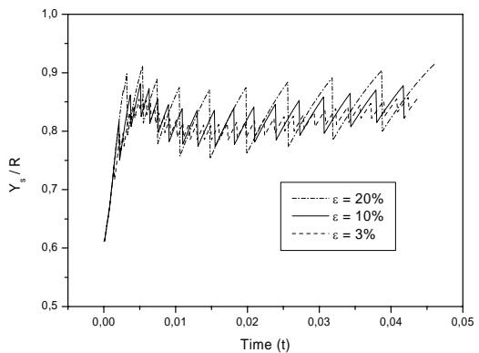  
(a)

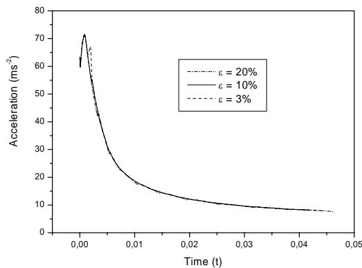  
(b)  
Fig. 3.6. Influence of the threshold value in the flow separation simulation. The parameter ε is the ratio of the threshold length of the low pressure area to the length of the wetted surface. (a) Horizontal coordinates of the body-water surface intersection; (b) Vertical accelerations of the cylinder.

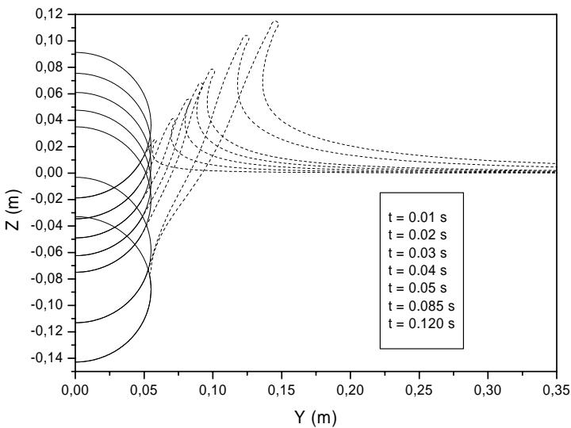  
Fig. 3.7. Free surface profiles in the right- half plane during the water entry of a half-buoyant circular cylinder.

Fig. 3.7 shows the numerically calculated free surface profiles around the circular cylinder at different time instants during the water entry of the half-buoyant cylinder. In the calculations, $\varepsilon =$ $1 0 \% , \Delta \mathrm { t } = 0 . 0 0 0 1 \mathrm { s } .$ . Due to the symmetry, only the right half of the cylinder (solid lines) and the flow on the right side (dashed lines) are shown. The cylinder moves downwards continuously. The seven half-circles and the free surface profiles tangentially attached to them shown from the top to the bottom correspond respectively to the seven time instants at $\mathrm { t } = 0 . 0 1 \mathrm { s } , 0 . 0 2 \mathrm { s } , 0 . 0 3 \mathrm { s } , 0 . 0 4 \mathrm { s } , 0 . 0 5 \mathrm { s }$ 0.085s and 0.120s. In the figure, the water flow separated from the body surface gradually develops into a water jet and rises up, as the cylinder enters the water. The separation position does not change much (See also Fig. 3.6 (a)). However, in a general trend, it moves upwards. ${ \mathrm { A t ~ t } } = 0 . 1 2 0 { \mathrm { s } } .$ the position moves to the upper surface of the cylinder. According the Zhu (2006)’s investigation of the water entry of a circular cylinder with constant speed, the threshold Froude number $( \mathrm { F _ { n D } } =$ $\mathbf { | \mathrm { V | / ( g D ) } } ^ { 1 / 2 } )$ for the appearance of a closed air cushion on the cylinder top is between 0.9247 and 1.1. For the present case, the Froude number estimated by using the initial speed $2 . 0 \mathrm { m s ^ { - 1 } }$ is $\mathrm { F _ { n D } } { = } 1 . 9 _ { \mathrm { : } }$ which is much larger than the threshold value. So it means that in the later stage of the water entry the water surfaces on the two sides of the cylinder will approach each other and close an air cushion above the cylinder. However, the deceleration of the cylinder during the water entry and the finite depth (0.3m) in the drop tests can affect the phenomenon.

The temporal and spatial convergence of the numerical method is shown in Table 3.1 and Fig. 3.8. The water entry of the horizontal half-buoyant cylinder is calculated by using different time steps and different number of elements on the body surface and the free surface. All the calculations converge up to a certain time. The time history of the acceleration for each calculation is compared with the first calculation. This calculation (No.1) is done by using the smallest time step and finest discretizations and thus expected to produce the best result. So it is used as a reference calculation. The plots of these calculations are given in Fig. 3.8. The errors of other calculations relative to the reference calculation are estimated by using the following formula.

$$
E _ {r} = \frac {1}{X _ {a \max}} \sqrt {\frac {1}{N - 1} \sum_ {i = 1} ^ {N} \left(X _ {b i} - X _ {a i}\right) ^ {2}}\tag{3.34}
$$

where $\mathrm { X } _ { \mathrm { a i } }$ means the results by calculation No. 1, $\mathrm { X _ { b i } }$ means the results in any other calculations and $\mathrm { X _ { a m a x } }$ is the maximum value by the first calculation. N=2001 is the total number of compared pairs of values from t = 0 to t = 0.04s. After $\mathrm { t } = 0 . 0 4 \mathrm { s } .$ , all the calculations almost converge to a single line. For ∆t other than 0.00002s, the values are linearly interpolated so that in each calculation there are N=2001 values. Seen from Table 3.1, the relative errors tend to smaller values when the time step decreases and the number of elements increases. It shows that the calculations converge relative to the time step and the grid size.

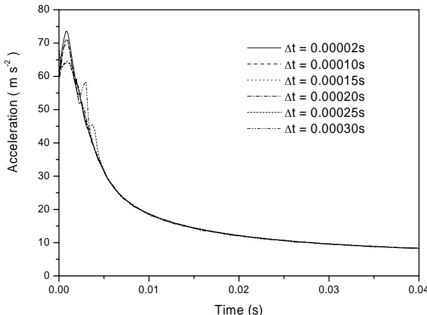  
Fig. 3.8. Time histories of the acceleration by different calculations.

Table 3.1. Temporal and spatial convergence of the numerical method with a flow separation model.

<table><tr><td>No.</td><td> $\Delta t (s)$ </td><td> $N_S$ </td><td> $N_F$ </td><td> $E_T relative to No. 1$ </td></tr><tr><td>1</td><td>0.00002</td><td>800</td><td>350</td><td>---</td></tr><tr><td>2</td><td>0.00010</td><td>500</td><td>250</td><td>0.0063</td></tr><tr><td>3</td><td>0.00015</td><td>500</td><td>250</td><td>0.0074</td></tr><tr><td>4</td><td>0.00020</td><td>500</td><td>250</td><td>0.0093</td></tr><tr><td>5</td><td>0.00025</td><td>200</td><td>150</td><td>0.0206</td></tr><tr><td>6</td><td>0.00030</td><td>200</td><td>150</td><td>0.0253</td></tr></table>

NS : Number of elements, which are equally distributed on the half circular body surface.  
$\mathrm { N _ { F } }$ : Number of elements on the free surface. $( \mathrm { N } _ { \mathrm { F } } { - } 5 0 )$ elements are equally distributed on the 25% length of the free surface in the near-body region and 50 elements geometrically increasing are distributed on the rest 75% free surface.  
∆t: Time step in second.

# Free water entry of a two dimensional section

The water entry of a two dimensional section can be simulated by the BEM. In principle, the shape of the cross-section can be arbitrary. The free water entry of three different cross-sections, i.e. a wedge section, a bow-flare ship section and a circular cylinder, are studied in this chapter. In the initial stage of the water entry, a flat plate theory, i.e. von Karman’s theory or Wagner’s theory, is used to avoid the numerical difficulty at the initial time. Finally, the BEM is generalized to solve an asymmetric water entry problem. The water entry of an inclined bow-flare ship section is studied.

## 4.1 Approximate methods

As mentioned in Chapter 2, Wagner’s theory is applied to simulate the initial stage of the free water entry of a wedge and provide initial conditions for the BEM calculations. Von Karman’s theory can also be applied as well. Faltinsen (1990, 2005) described these two flat plate theories used in water entry problems. When the deadrise angle of a wedge is small, Wagner’s theory gives better prediction than von Karman’s theory (see Faltinsen 2005, Chapter 8). However, for a very thin body von Karman’ theory shows more reliable results.

The equation of the motion follows from Newton’s second law. Neglecting the buoyancy force in the initial stage, the vertical force on the body due to the water pressure can be written as − $\mathrm { d } ( \mathrm { A } _ { 3 3 } \mathrm { V } )$ /dt (Faltinsen 1990, pp. 299). The rigid-body motion equation is then given by

$$
m \frac {d V}{d t} = - \frac {d}{d t} \left[ A _ {3 3} V \right] - m g\tag{4.1}
$$

where m is the mass per unit length of the two-dimensional section, $V ( \mathrm { t } )$ is the water entry velocity with positive direction pointing upwards, $A _ { 3 3 }$ is the high-frequency added mass in heave for the body. The buoyancy force has been neglected, because in the initial time of the free water impact, the buoyancy force is far less than the hydrodynamic force. According to a flat plate theory, the added mass can be written as $A _ { 3 3 } = \rho \pi c ^ { 2 } / \overset { . } { 2 }$ , where c(t) is half the wetted length of an equivalent flat plate. Wagner’s theory and von Karman’s theory will give different predictions of this length. In

Wagner’s theory the uprise of the free surface is taken into account while in von Karman’s theory the length is measured from the undisturbed water surface. Integrating Eq. (4.1) once with respect to time, one has

$$
(m + A _ {3 3}) V = m [ V (0) - g t ]\tag{4.2}
$$

where the initial time t = 0 means the time instant when the body touches the calm water surface.

## 4.1.1 Circular cylinder

For a circular cylinder analytical solutions can be found by using the flat plate theories. From the Wagner’s theory described in Faltinsen (1990), the half wetted length $c ( t )$ can be obtained from the differential equation

$$
- \frac {c (t)}{2 R} \frac {d c}{d t} = V (t)\tag{4.3}
$$

where R is the cylinder radius. Inserting Eq. (4.3) and $\mathrm { A } _ { 3 3 } = \rho \pi \ c ^ { 2 } / 2$ into Eq. (4.2), and then integrating the resulting equation in time once again, it follows that

$$
\rho \frac {\pi}{1 6 R} c ^ {4} + \frac {m}{4 R} c ^ {2} + m V (0) t - \frac {1}{2} m g t ^ {2} = 0\tag{4.4}
$$

Solving this equation, one can express $c ^ { 2 }$ as

$$
c ^ {2} = \frac {2 m}{\rho \pi} \left\{- 1 + \sqrt {1 + 4 \frac {\pi \rho R}{m} \left[ - V (0) t + 0 . 5 g t ^ {2} \right]} \right\}\tag{4.5}
$$

Inserting Eq. (4.5) into Eq. (4.3), one has

$$
V (t) = \frac {V (0) - g t}{\sqrt {1 + 4 \frac {\pi \rho R}{M} \left[ - V (0) t + 0 . 5 g t ^ {2} \right]}}\tag{4.6}
$$

In von Karman’s theory, the half wetted length is expressed as $c ^ { 2 } = R ^ { 2 } - ( R \cdot \zeta ) ^ { 2 }$ where $\zeta$ is the submergence of the lowest point of the circular cylinder into the water relative to the calm water surface. From this relation, one can obtain a differential equation

$$
c \frac {d c}{d t} = (R - \zeta) \frac {d \zeta}{d t}\tag{4.7}
$$

From this relation, it is not straightforward to find the analytical solution similar as in the Wagner’s method. However, numerical solutions can be found. Substituting Eq. (4.7) and $A _ { 3 3 } = \rho \pi \ c ^ { 2 } / 2$ into Eq. (4.1), one has

$$
\left(m + \frac {1}{2} \rho \pi c ^ {2}\right) \frac {d V}{d t} = V ^ {2} \rho \pi (R - \zeta) - m g\tag{4.8}
$$

This differential equation can be combined with $V = - d \zeta / d t$ to form an equation system and then numerically solved by a fourth-order Runge-Kutta method. In the initial stage of a water entry when the submergence is very small, i.e. $\zeta < < \mathrm { R }$ , the half wetted length can be approximated as $c =$ $( 2 R \zeta ) ^ { 1 / 2 }$ . Using this relation, an approximate analytical solution can be derived. First, it can be proved that the following differential equation holds

$$
- \frac {c (t)}{R} \frac {d c}{d t} = V (t)\tag{4.9}
$$

This equation is quite similar to Eq. (4.3) except for a factor 2 in the denominator. Then a similar procedure is followed and finally the water entry speed is written as

$$
V (t) = \frac {V (0) - g t}{\sqrt {1 + 2 \frac {\pi \rho R}{M} \left[ - V (0) t + 0 . 5 g t ^ {2} \right]}}\tag{4.10}
$$

## 4.1.2 Arbitrary section

Both Wagner’s theory and von Karman’s theory can be used to solve the water entry problem of an arbitrary section. However, it is simpler to use von Karman’s method because it is easier to determine the half-wetted length $\mathsf { c ( t ) }$ . Therefore, von Karman’s method is adopted to solve the initial stage of the water entry of a ship bow section in section 4.3. Further, the lower part of the bow section is thin. For the water entry of a thin body, von Karman’s method is expected to give good predictions.

The submergence of the apex of the section into mean water surface is $\zeta ( \mathrm { t } )$ . In the von Karman’s theory the half-wetted length can be expressed as a function of the submergence, i.e $\mathsf { c } ( \mathsf { t } ) = f ( \boldsymbol { \zeta } ( \mathsf { t } ) )$ where the function $z = f ( \mathrm { y } )$ gives the section profile in the right half plane when the lowest point on the section just touches the calm water surface. Hence, the added mass is given by

$$
A _ {3 3} = \frac {1}{2} \rho \pi f (\zeta) ^ {2}\tag{4.11}
$$

From equation (4.2) and (4.11) and the relation $\mathrm d \zeta ( \mathrm { t } ) / \mathrm d \mathrm t = - \mathrm { V ( \mathrm { t } ) }$ , one can obtain

$$
\frac {d \zeta}{d t} = \frac {- V (0) + g t}{1 + \frac {1}{2} \rho \pi f (\zeta) ^ {2} / m}\tag{4.12}
$$

This differential equation for $\zeta ( t )$ can be numerically solved by the fourth order Runge-kutta method. Then the velocity is given by Eq. (4.12), and the acceleration is calculated from equation

$$
\frac {d V}{d t} = \frac {V ^ {2} \rho \pi f (\zeta) f ^ {\prime} (\zeta) / m - g}{1 + \frac {1}{2} \rho \pi f ^ {2} / m}\tag{4.13}
$$

The derivative $f ^ { \prime } \left( \zeta \right) = \mathrm { d } f / \mathrm { d } \zeta$ in the equation has to be evaluated numerically if one only knows the section shape at discrete points rather than an analytical expression describing the surface.

In order to test this method for an arbitrary section, the following comparisons are made. The water entry of a circular section is calculated by both the present method for an arbitrary section and the specific numerical method for a circular cylinder in section 4.1.1. Discrete points on a circle are provided as the input to the first calculations. The radius is $R = 1 . 0 \mathrm { m }$ . The initial water entry velocity is $V ( 0 ) = \mathrm { - 1 } . 0 \mathrm { m s } ^ { - 1 }$ . The mass per unit length of the section is $m = 1 0 0 0 \mathrm { k g / m }$ . Then the time histories of the submergence and the water entry velocity of the circular section by these two methods are compared in Fig. 4.1. These two calculations show good consistency. So the numerica method for an arbitrary section by the von Karman’s theory is verified.

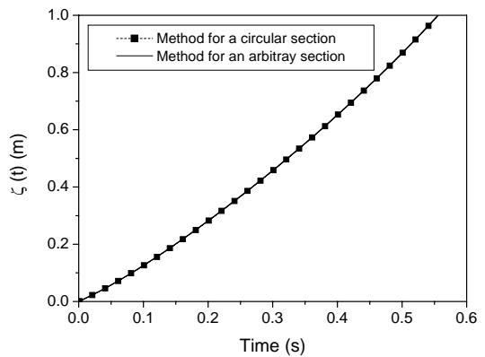  
(a)

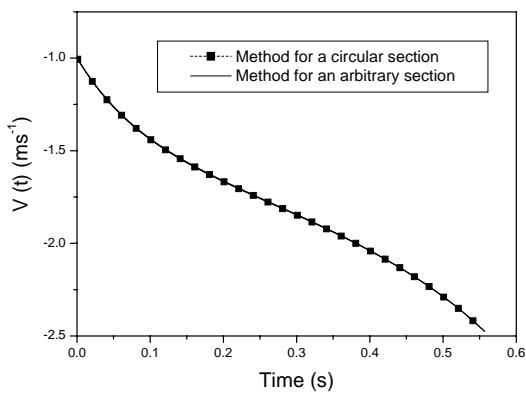  
(b)  
Fig. 4.1. Comparisons between two numerical methods based on von Karman’s theory for the water entry of a circular section. (a) Submergence $\zeta ( t ) ;$ ; (b) Water entry velocity $V ( t )$

## 4.2 Water entry of a wedge section

Aarsnes (1996) performed free drop tests of a V-shaped section and a ship-bow section. The cases with roll angle $\theta = 0 , \dot { 1 } . \mathrm { e } .$ . symmetric water entries for the V-shaped section (or wedge section) are numerically studied in this section. The configuration of the section model used by Aarsnes (1996) is shown in Fig. 4.2. The deadrise angle of the wedge section is 30 degrees. The horizontal and vertical forces were measured on a measuring section with length 0.1m during the drop tests. Two dummy sections with length 0.45m were fixed on both ends of the measuring section. So the total length of the model is 1.0m. The vertical acceleration of the falling body was also measured. The total weight of the falling rig is 288kg. The pressures at five points from P1 to P5 (Fig. 4.2) on the bottom of the section were measured. The drop tests of the ship-bow section will be numerically studied in later sections.

Four cases with roll angle θ = 0 and drop heights h = 0.13m, 0.195m, 0.313m and 0.5m are studied in this section. The drop height is defined to be the distance from the apex of the wedge to the calm water surface when the section is at rest in the air and going to be released. The experimental results and the results numerically calculated by the BEM for these four cases are shown in Fig. 4.3 – Fig. 4.6, respectively. The time histories of the vertical velocity and acceleration, the vertical force and the pressures are shown. The measured pressures in the model tests are not shown in the figures, because the quality of the measured data is not satisfactory enough. The data often show inconsistencies between different cases. Sometimes they even conflict with the reality.

In the numerical calculations, the initial stage is simulated by Wagner’s theory in the way mentioned in Chapter 2. After a short time duration, about 0.001 \~ 0.003s, the BEM takes over the calculations. The initial water entry speed in the calculation for each case is given by the estimated drop speed in Aarsnes (1996). They are respectively 1.55ms-1, 1.91ms-1, 2.42ms-1 and $3 . 0 5 \mathrm { m s ^ { - 1 } }$ for h = 0.13m, 0.195m, 0.313m and 0.5m. These drop speeds are slightly smaller than what can be calculated from $\left( 2 \mathrm { g h } \right) ^ { 1 / 2 }$ with $\mathbf { g } = 9 . 8 1 \mathrm { m s } ^ { - 2 }$ . Aarisnes (1996) may have accounted for the speed loss due to some reasons during the free fall of the rig in the air. One of the possible reasons is the frictional force between the falling rig and the trail. Air resistance is not likely to affect the speed apparently, as indicated in the study by Zhu (2006).

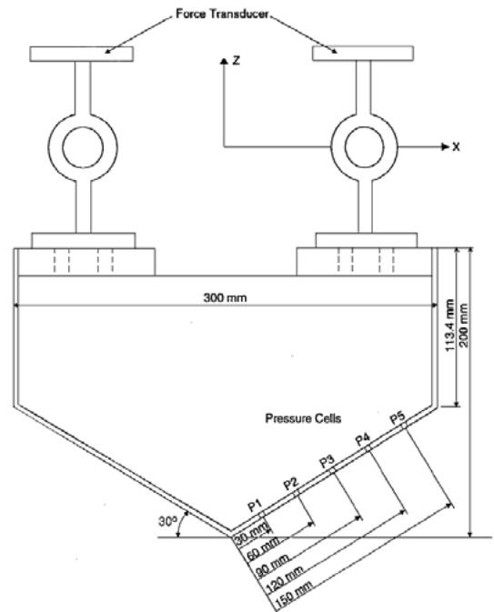  
Fig. 4.2. V-shaped section in the drop tests by Aarsnes (1996).

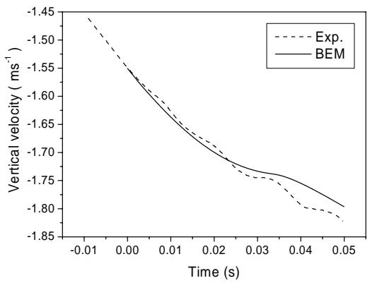

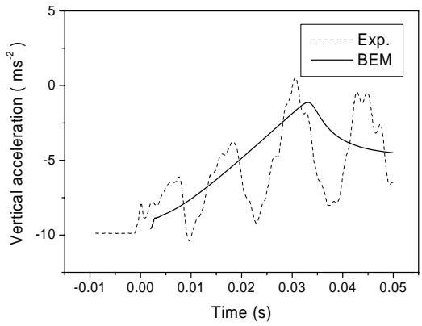

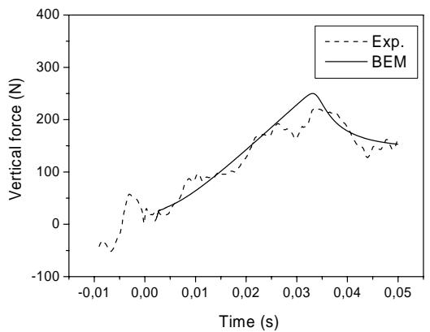

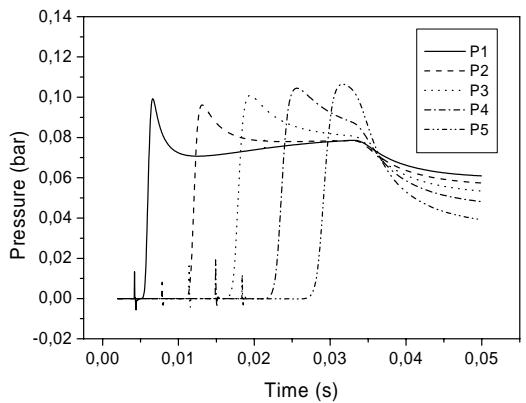  
Fig. 4.3. Results for the water entry of the wedge for a drop height h = 0.13m. Exp.: Experiments by Aarsnes (1996); BEM: Calculations by the BEM. P1-P5: Five positions on the wedge surface ( $| \ \mathrm { b { \dot { a } r } } = 1 0 ^ { 5 } \mathrm { N m } ^ { - 2 } )$

The measured results for accelerations and forces have been filtered using a cut-off frequency of 700 Hz. The oscillations of the experimental results after low pass filtering are due to the vibration of the drop rig which supports the model during the tests. Because the vibrations are present even before the section touches the calm water surface, they are probably excited when the rig is released. The vertical force results were further corrected after the filtering by subtracting the inertial force $- \ M a _ { z }$ from the filtered force results, where $M { = } 1 0 . 3 \mathrm { k g }$ is the mass of the measuring section and $a _ { z }$ is the vertical acceleration. The corrected force is then the vertical force due to the water pressure, which includes the added mass force. Because the added mass force $- A _ { 3 3 } a _ { z }$ depends on the vertical acceleration, the oscillations in the acceleration cause the oscillations in the corrected force results. It seems as if some high-frequency oscillations have been superimposed on the mean force results. The mean lines of the experimental results for the acceleration and the vertical force show reasonable agreement with the numerical results. The vertical velocity is less affected by the vibrations and better agreement can be seen.

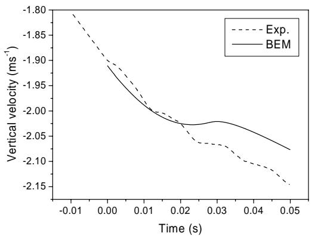

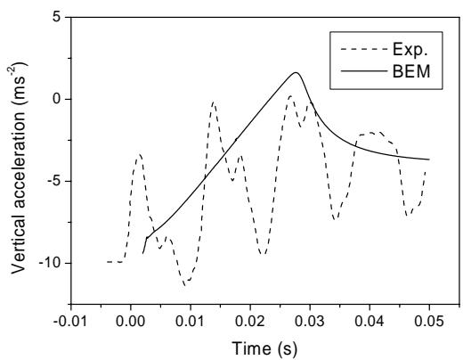

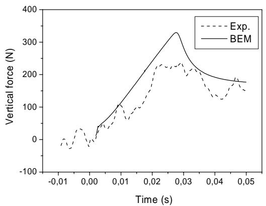

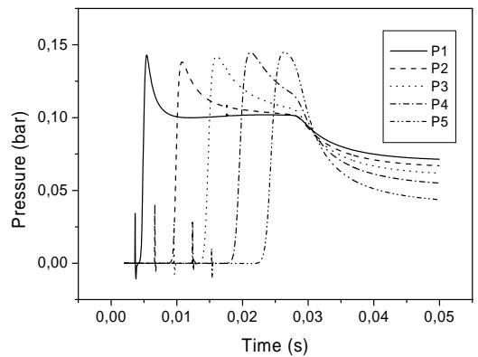  
Fig. 4.4. Results for the water entry of the wedge for a drop height $\mathtt { h } = 0 . 1 9 5 \mathrm { m }$ . Exp.: Experiments by Aarsnes (1996); BEM: Calculations by the BEM. P1-P5: Five positions on the wedge surface (1 $\mathrm { b \dot { a } r } = 1 0 ^ { 5 } \mathrm { N m } ^ { - 2 } )$ .

The maximum acceleration and vertical force occur near the instant when the spray root reaches the knuckle. Afterwards, the water flow separates from the knuckles and the acceleration and vertical force start to decrease. The maximum values are larger for cases with larger drop heights. The calculated maximum vertical forces are always greater than the experimental results. One of the reasons is the three-dimensional effects as analyzed in Zhao et al. (1996) in their study of the free drop tests for the same wedge model. The 3D effects were estimated by applying Meyerhoff’s (1970) results to be able to cause a 20% reduction in the vertical force at the stage when the spray roots reach the knuckles. So it means the maximum forces shown in Figs. 4.3-4.6 can be reduced by 20% due to the 3D effects. With such corrections, the numerical predictions can be clearly improved, except for the case in Fig. 4.5. The maximum force in Fig. 4.5 after such a correction will be obviously smaller than the experimental result. This is because the oscillations in the force results also affect the predicted maximum force. Another possible reason for the overestimate of the maximum forces is the frictional force along the guide trail. However, just from the information given in the experiment report, it is difficult to judge how large the influence from the frictional force could be.

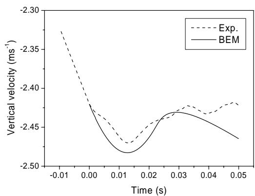

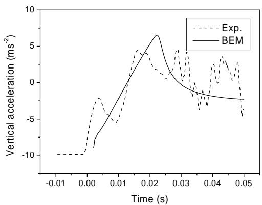


  
Fig. 4.5. Results for the water entry of the wedge for a drop height $\mathrm { h } = 0 . 3 1 3 \mathrm { m }$ . Exp.: Experiments by Aarsnes (1996); BEM: Calculations by the BEM. P1-P5: Five positions on the wedge surface (1 $\mathrm { b } \mathrm { \dot { a } r } = 1 0 ^ { 5 } \mathrm { N m } ^ { - 2 } )$ .

In all the four cases, the calculated maximum pressures at the five positions are successively captured from the lowest P1 to the highest P5. The time when the maximum pressure at a certain position occurs should correspond to the time when the spray root reaches that position. This is due to the fact that the maximum pressure exists near the spray root in the spatial pressure distribution along the wedge surface, for a deadrise angle of $3 0 ^ { \circ } .$ . For a larger drop height, the maximum pressure at a position is larger and occurs earlier. It means that the spray root moves faster when the water entry speed is larger.

In a drop test, the maximum pressure values for different positions from P1 to P5 are similar. The pressure depends on both the velocity and acceleration of the body. In a flat plate theory (Faltinsen 2005), the pressure on the body can be expressed as

$$
p = - \rho \frac {\partial \varphi}{\partial t} = - \rho V \frac {c}{\sqrt {c ^ {2} - x ^ {2}}} \frac {d c}{d t} - \rho \frac {d V}{d t} \sqrt {c ^ {2} - x ^ {2}}
$$


  
Fig. 4.6. Results for the water entry of the wedge for a drop height $\mathrm { h } = 0 . 5 \mathrm { m }$ . Exp.: Experiments by Aarsnes (1996); BEM: Calculations by the BEM. P1-P5: Five positions on the wedge surface (1 $\mathrm { b } \mathrm { { a r } } = 1 0 ^ { 5 } \mathrm { N m } ^ { - 2 } )$ .

The first term associated with the impact velocity is the slamming pressure. The second term is related with the acceleration and is called as added-mass pressure. In the four cases, the accelerations are relatively small. So the slamming pressure dominates and the velocities do not change much during the water entry. As a result, the maximum pressures at four different positions have comparable values. For the water entry of a wedge with constant speed and deadrise angle β, the spatial maximum pressure coefficient expressed by $\mathrm { C _ { p m a x } = p _ { m a x } / ( 0 . 5 p V ^ { 2 } ) }$ is a constant. The present deadrise angle is $\beta { = } 3 0 ^ { \circ }$ . For this angle, the similarity solution in Zhao & Faltinsen (1993) gives $\mathrm { C _ { p m a x } } = 6 . 9 2 7$ for a constant water entry speed. A rough calculation of $\mathrm { C _ { p m a x } }$ based on the numerical pressure results can be done. For the four cases shown in Fig. $4 . { \dot { 4 } } \ - \ \operatorname { F i g } . \ 4 . 9$ , the maximum pressures are $\mathtt { p _ { m a x } } \approx 0 . 1 0 , 0 . 1 4 , 0 . 2 2$ and 0.32 bar, and the averaged water entry speeds are $| \mathrm { V } | \approx 1 . 7 , 2 . 0 , 2 . 4 5$ and $3 . 0 ~ \mathrm { m s ^ { - 1 } }$ , so we can obtain $\mathrm { C _ { p m a x } } = 6 . 9 , 7 . 0 , 7 . 3$ and 7.1, respectively. These results are very close to the similarity solution result, which verifies the order of magnitude of the calculated pressures.

## 4.3 Water entry of a ship bow section

The shape of the ship bow section in the drop tests by Aarsnes (1996) is shown in Fig. 4.7. The left figure is reproduced from Aarsnes (1996) and the right figure shows the profile of the outer surface of one half section in an Earth-fixed y-z coordinate system. The coordinates on the profile are read from the left figure by assuming that the section locates just above the calm water surface. Pressures are measured at the four points P1-P4 on one side of the section shown in Fig. 4.7. Similar as for the wedge model, the total length of the ship bow section is 1.0m. However, the forces were measured on a measuring section of 0.1m, which is placed in the middle of two dummy sections of length 0.45m. The total weight of the falling rig is 261kg. Four cases with roll angle θ=0 and different drop heights are studied in this section. The initial water entry speed are given as 0.58ms , 0.61ms , 1 $\cdot 4 8 \mathrm { m } \bar { \mathrm { s } } ^ { - 1 }$ and $2 . 4 3 \mathrm { m s ^ { - 1 } }$ for h=0.018m, 0.020m, 0.118m and 0.318m, respectively.

The numerical solution by von Karman’s theory described in section 4.1.2 is used to simulate the initial stage of the water entry of this bow-flare section. The initial time span in which the approximate method is used is denoted as t1. In the cases calculated in this section, $\mathrm { t } _ { 1 }$ is chosen in the range of 0.0008s\~0.003s. Then the BEM starts the calculations from $\mathrm { t } = \mathrm { t } _ { 1 }$


  
Fig. 4.7. Ship bow section in the drop tests by Aarsnes (1996).


  
Fig. 4.8. Results for the water entry of the ship bow section for a drop height h = 0.018m. Exp.: Experiments by Aarsnes (1996); BEM: Calculations by the BEM. P1-P4: Four positions on the section surface (1 $\mathrm { \Delta b a r } = 1 0 ^ { 5 }$ Nm-2).

In the numerical simulations, the section profile is formed by connecting the discrete points read from the left picture in Fig. 4.7. Due to the errors in the reading, the normal vectors on the section surface calculated from the discrete coordinates show irregular oscillations along the section profile, which cause spatial oscillations in the pressure distributions. This purely artificial disturbance can be minimized by using the regriding technique based on the cubic-spline approximations described in chapter 2. A new set of coordinates equally spaced on a continuous section profile can be obtained and thus the calculated pressure distributions are much smoother. The coordinates of P2, P3 and P4 on the section are calculated by using the distances marked in Fig. 4.7 between the pressure-cell positions to the knuckle point. The value is interpreted by the author to be the length of the curve between every two points. The flow separation model introduced in section 3.2 is applied to simulate the non-viscous flow separation from the knuckles during the water entry.

The calculated results are compared with experimental results in Fig. 4.8 to Fig. 4.11. The measured accelerations and forces were filtered using a cut-off frequency of 300 Hz and the vertical force was further corrected by subtracting the inertial force – Maz where the mass of the measuring section is M=6.9kg. The results for accelerations and vertical forces after filtering still show obvious oscillations whose governing frequency is 100Hz. Similarly as in the drop tests of the V-shaped section discussed in section 4.2, those oscillations are caused by the oscillations of the drop rig, and possibly excited during the release of the drop rig (see Aarsnes, 1996). The large amplitude oscillations in the accelerations induce oscillations in the added mass force, which can be implied in the oscillations of the vertical force results. Reasonable agreement can be seen between the calculations and the experiments. In some cases, we can see phase differences between the experiments and calculations. Because the falling rig continuously oscillates during the free fall, it was hard to detect the time instant when the section touches the calm water surface in the experiments. The error in the estimation of the initial time instant in the experiments can be one of the reasons for the phase differences. The three-dimensional effects and the mechanic friction force also influence the agreement between the experimental and numerical results. Zhao et al.’s (1996) analysis for this ship bow section shows that the 3D effects causes 8% reduction of the maximum force. It implies that the 3D effects for this bow-flare section case are not so important as for the wedge cases, in which the 3D effects can cause 20% reductions (see section 4.2).


  
Fig. 4.9. Results for the water entry of the ship bow section for a drop height $\mathbf { h } = 0 . 0 2 0 \mathbf { m } .$ . Exp.: Experiments by Aarsnes (1996); BEM: Calculations by the BEM. P1-P4: Four positions on the section surface $( 1 \ \mathrm { { b a r } } = 1 0 ^ { 5 }$ $\mathrm { { N m } } ^ { - 2 } )$ .


  
Fig. 4.10. Results for the water entry of the ship bow section for a drop height h = 0.118m. Exp.: Experiments by Aarsnes (1996); BEM: Calculations by the BEM. P1-P4: Four positions on the section surface (1 $\mathrm { \Delta b a r } = 1 0 ^ { 5 }$ Nm-2).

Measured pressures in the drop tests are shown in Figs. 4.8 – 4.11. The calculated pressures yield good agreement with the experimental results. The pressure at the bottom of the section shows a sharp peak in the initial impact phase. Afterwards, the maximum pressures at P1-P4 occur almost at the same time at a later stage when the water flow hits the flare part of the section. This is obviously different from what appears in the wedge entries, where the maximum pressures for different positions successively occur in time. Further the pressure histories imply that when the water impacts the flare region the high pressure area covers almost the whole section surface. Similar phenomenon was presented by Arai and Matsunaga (1989) in their study of the water entry of a bow-flare section.

For the last case with h = 0.318m, the present numerical results by the BEM are also compared with the numerical results in Zhu (2006) by a CIP method. Good agreement is shown between the two numerical calculations.


  
Fig. 4.11. Results for the water entry of the ship bow section for a drop height h = 0.318m. Exp.: Experiments by Aarsnes (1996); BEM: Calculations by the BEM; CIP: Calculations in Zhu (2006) by a CIP method. P1-P4: Four positions on the section surface (1 ba $\mathrm { { r } = 1 0 ^ { 5 } N m ^ { - 2 } ) }$

## 4.4 Water entry of a circular cylinder

The BEM is now applied to study the water entry of a circular cylinder except in the initial phase. The initial stage of the water entry is simulated by Wagner’s method or von Karman’s method as presented in section 4.1.1. The numerical results are compared with the experimental results by Greenhow and Lin (1983). Greenhow and Lin (1983) did free drop tests of horizontal circular cylinders into initially calm water. A half buoyant cylinder model and a neutrally buoyant cylinder model are used in the experiments. ‘Half buoyant’ means that the cylinder’s weight equals one half of the buoyancy force on a totally submerged cylinder, while the ‘neutrally buoyant’ means the weight equals the buoyancy force. The diameters of both cylinders are 0.11m. Both cylinders are dropped from a height of 0.5m, which is measured from the centre of the cylinder at rest to the calm water surface. So the distance that the cylinder falls in the air should be $\mathrm { h } = ( 0 . 5 \mathrm { - } 0 . 0 1 1 / 2 ) \mathrm { m } =$ 0.445m. The initial water entry speed is then calculated as $V _ { 0 } = ( 2 g h ) ^ { 1 / 2 } = 2 . 9 5 5 \mathrm { m s } ^ { - 1 }$ . The timing in the drop tests starts from the moment when the cylinders were released, so the time instant when the cylinder touches the water surface is $t _ { 0 } = V _ { 0 } / g = 0 . 3 0 1 \mathrm { s }$ . Wagner’s method is used in the initial time interval for 0.0015s right after the cylinder touches the water. Afterwards, the BEM takes over the calculations.

The calculated results for the penetration depth into the water are compared with the experimental results by Greenhow and Lin (1983) in Fig. 4.12. Reasonable agreement is obtained, except for the experimental value with a question mark. Greenhow and Lin put a question mark upon this value, because the data obviously deviate from the other data. The free surface profiles during the water entries of the half buoyant cylinder and the neutrally buoyant cylinder are shown in Fig. 4.13 and Fig. 4.14, respectively. The solid lines represent the results by the BEM. The photos show the experimental pictures. The numerically predicted free surfaces are in good agreement with the free surface elevations in the photos. In the experiments, instability seems to develop on the free surface adjacent to the open cavity above the cylinder in the drop tests for the neutrally buoyant case. However, this fact is not present in the numerical results. The phenomenon can be seen in the photos at t = 0.390s, 0.410s and 0.500s. There is a spatially oscillating behavior with small amplitude on the free surface which is not shown by the BEM results.

  
Fig. 4.12. Depth of penetration during the water entry of a rigid circular cylinder. BEM: the present calculations; EXP: experimental results by Greenhow and Lin (1983).

  
t = 0.305s

  
t = 0.320s

  
t = 0.330s

  
t = 0.385s  
Fig. 4.13. Free surface profiles during the water entry of a half buoyant circular cylinder. Photos are taken by Greenhow & Lin (1983). Solid lines show the numerical results by the present BEM.

Viscous effects have a non-negligible effect on the hydrodynamic loads if viscous flow separation occurs in the Reynolds number range of interest for the considered problem. According to the CIP results by Zhu (2006), viscous flow separation does not occur. If viscous flow separation does not happen, the level of viscous loads can be found by considering the frictional forces. The present method can in principle be combined with a separate boundary layer calculation to estimate the viscous loads in a transient boundary layer. This would require that the time-dependent boundary layer equations are solved and then the resulting shear stresses and their effects on the pressures are taken into account. For simplicity, only a rough estimation of the frictional force is shown here to check their order of magnitude. It is assumed that a circular cylinder be moving steadily in an infinite water domain at the same Reynolds number as in the present problem. The diameter of the cylinder is D=0.11m. The speed of the inflow U is assumed to be $3 . 0 \mathrm { { \dot { m } s } ^ { - 1 } }$ . The kinematic viscosity of water is set to be $\mathrm { \Delta v = 1 . 0 \mathrm { \dot { \times } 1 0 \mathrm { ^ - 6 } m ^ { 2 } s ^ { - 1 } } }$ . So the Reynolds number $\mathrm { R _ { n D } { = } U D v ^ { - 1 } }$ is about $3 \times 1 0 ^ { 5 }$ . Then from the experimental results by Achenbach (1968, 1971), the friction coefficient $C _ { f } { = } f / ( 0 . 5 \rho \mathrm { U } ^ { 2 } \mathrm { D } )$ is about 0.017, which gives the frictional force $f { = } 8 . 4 \mathrm { N m } ^ { - 1 }$ . However, the studied cylinder is not fully wetted, so the frictional force is even smaller. It implies that the frictional force is clearly smaller than the water impact force which is in the order of 100 N/m and can be much higher in the initial water impact.

  
t = 0.315s

  
t = 0.390s

  
t = 0.410s

  
t = 0.500s  
Fig. 4.14. Free surface profiles during the water entry of a neutrally buoyant circular cylinder. Photos are taken by Greenhow & Lin (1983). Solid lines show the numerical results by the present BEM.

For the neutrally buoyant case, the cylinder bounces on the bottom of the tank at a depth of 0.3m. A rigid bottom is modeled in the BEM calculations. The effect of the wall will be obviously felt when the cylinder is at a close distance from the wall. The finite depth clearly influences the accelerations, but has a negligible effect on the motions. This wall effect is different from what happens to a cylinder near a wall in a semi-infinite domain (Faltinsen 1990, pp. 54). In that case, the hydrodynamic force increases when the cylinder moves closer to the wall. In our case the force diminishes as the cylinder approaches the wall. This is associated with a decreasing wetted surface as the cylinder approaches the wall.

The initial force impulse is important. The water entry velocity is rapidly decelerated during an initial phase. The influence of the force impulse can be demonstrated by using the flat plate theories. In Wagner’s theory, one can approximate the acceleration, i.e. the time derivative of V(t) in Eq. (4.6), for small time t as

$$
{\frac {d V}{d t}} \approx g \left({\frac {4 h}{k R}} - 1\right)\tag{4.14}
$$

where V(0) is replaced by $- ( 2 g h ) ^ { 1 / 2 }$ and the mass is expressed as $m = k \rho \pi R ^ { 2 }$ where k is a parameter. For $h { > } k R / 4$ , the water entry speed will be decelerated. The initial dV/dt is $3 1 . 4 \mathrm { m s } ^ { - 2 }$ for the neutrally buoyant case (k=1), and $6 \bar { 3 } . 7 \mathrm { m s } ^ { - 2 }$ for the half buoyant case (k=0.5). The upward acceleration dV/dt will decelerate the water entry speed $| { \cal V } | .$ The acceleration is larger for a smaller k (i.e. a lighter cylinder) or a larger h/R ratio. This is why the half buoyant cylinder is more decelerated than the neutrally buoyant cylinder in the initial phase (see Fig. 4.12).

In von Karman’s theory, the time derivative of V(t) expressed in Eq. (4.10) can be approximated by using Eq. (4.8) as

$$
{\frac {d V}{d t}} \approx g \left({\frac {2 h}{k R}} - 1\right)\tag{4.15}
$$

So the von Karman’s method gives a smaller deceleration than the Wagner’s method initially. It implies that by using different flat plate theories initially, the starting conditions for the BEM will be different. However, if the takeover by the BEM is early enough, the influence to the later calculations by the BEM due to this initial difference is not prominent.

Fig. 4.15 shows the comparison of the results by using different flat plate theories initially. The results for both the neutrally buoyant and the half buoyant circular cylinders are shown. Either Wagner’s method or von Karman’s method is used to simulate the initial 0.0015s. The difference between different calculations is not prominent. Ideally, we need to know the bias error range for the experimental results in order to justify which calculation agrees better with the experiments. However, the error analysis for the drop test was not presented in Greehow and Lin (1983). Intuitively speaking, for the half buoyant case the calculations by the BEM plus Wagner’s method agrees better with the experiments, while for the neutrally buoyant case, the results by the BEM plus von Karman’s method show better agreement with the experiments. It is expected that Wagner’s method will give a better prediction than von Karman’s method in the initial water entry of a circular cylinder, because the bottom of the cylinder is very flat and the angle between the body surface and the impacting water surface is very small. However, from the comparisons in Fig. 4.15, one can not draw such a conclusion that Wagner’s theory is better than von Karman’s method. What is sure is that the difference caused by using different flat plate theories in the initial time will become smaller when the transition of the calculation to the BEM is earlier.

Von Karman’s method and Wagner’s method as described in section 4.1.1 can be independently applied to simulate the water entry of the circular cylinder for a longer time, rather than just in the initial stage. It will be shown that von Karman’s theory gives obviously better predictions than Wagner’s theory in a later stage. Figure 4.16 shows the comparison of the results by only von Karman’s method and by only Wagner’s method with the results by the BEM plus theWagner’s method in the initial 0.0015s. When the cylinder submergence is larger than the cylinder diameter, the calculations stop. In von Karman’s method, the small submergence approximation is not followed, which means that the exact differential equation Eq. (4.8) and $V = - d \zeta / d t$ are numerically solved by the fourth-order Runge-Kutta method.

From Fig. 4.16 we can see that in the early stage of the water entry, different calculations agree well with each other. Then the results by the von Karman’s theory keep close to the BEM results for a longer time than those by the Wagner’s theory. The results by von Karman’s method also starts to diverge from the BEM results when the submergence is larger than the cylinder radius, i.e. $\zeta ( t ) { > } R { = } 0 . 0 5 5 m .$ However, the buoyancy force will contribute when the submergence is large. Considering this effect, one can expect a better agreement between the results by von Karman’s method and the BEM results for $\zeta ( t ) { > } R .$ The comparisons show that for the studied cases von Karman’s method gives better predictions than Wagner’s method in the later stage of the water entry.

  
(a)

  
(b)  
Fig. 4.15. Comparisons between the experimental results and the results by using different flat plate theories in the initial time duration of 0.0015s. (a) Half buoyant case; (b) Neutrally buoyant case.

  
(a)

  
(b)  
Fig. 4.16. Comparisons between the results by the BEM and the results by two different flat plate theories (von Karman’s method and Wagner’s method) for the water entry of a horizontal circular cylinder. (a) Half buoyant case; (b) Neutrally buoyant case.

## 4.5 Asymmetric water entry of a two-dimensional section

For a two-dimensional section symmetric about a vertical line, the water flow around it will be non-symmetric if it impacts the water in the following two situations. The first one is that the section enters the water with both a vertical and a horizontal speed. This is called ‘inclined water entry’. The other situation is that the section inlines to one side and moves vertically down into the water. Only the second case will be studied in this section. A constant roll angle, or a heel angle, is given to the section before the water entry. Then the section enters vertically into the water.

## 4.5.1 The calculation in a whole fluid domain

An asymmetric water entry of a two-dimensional section is shown in Fig. 4.18. The constant roll angle of the section is denoted as θ. The water flow on the two sides of the section is different. Therefore, the whole water domain has to be solved in the numerical simulations. In contrast, only the right half of the fluid domain is solved in a symmetric water entry problem as presented in Chapter 2 and in the previous sections.

  
Fig. 4.18. Asymmetric water entry of a two-dimensional section.

The numerical method, i.e. the BEM, is generalized to solve the whole water domain. As shown in Fig. 4.18, the water domain is surrounded by the wetted section surface $\mathrm { S _ { S } }$ , the free surface on the right $\mathrm { S } _ { \mathrm { F R } } .$ , the truncation boundary on the right $\mathrm { S } _ { \mathrm { I R } }$ , the bottom surface $\mathrm { S _ { B } , }$ the truncation boundary on the left $\mathrm { S _ { I I } }$ and the free surface on the left $\mathrm { S } _ { \mathrm { F L } }$ . The origin of the space-fixed coordinates y-z is at the lowest point of the rotated section when the section just touches the calm water surface. The velocity potential in the water domain φ(y,z,t) satisfies the governing equation in Eq. (2.1). The body boundary condition in Eq. (2.2) is satisfied on the body surface $\mathrm { S _ { S } }$ and the free surface conditions in Eqs. (2.3)-(2.4) are satisfied on the two free surfaces $\mathrm { S } _ { \mathrm { F R } }$ and $\mathrm { S } _ { \mathrm { F I } }$ . The truncation boundaries and the bottom boundary are set far from the body, so that the disturbances on these boundaries are assumed zero in the time scale of the studied water entry problems. The boundary value problem is solved by the BEM. Numerical techniques such as jet-cutting, spray-cutting, smoothing and regriding are applied on both free surfaces. The free surfaces are updated by using the free surface conditions. Flow separations can happen at both knuckles of the section. The flow separation model is applied when the flow separation occurs.

Generally speaking, in the numerical techniques, there is nothing new for this asymmetric problem relative to the symmetric problem. All the treatments to the body surface and the free surface on the right are similarly applied to those on the left. However, attention must be paid to the following differences when the treatments are numerically implemented. First, when the section rotates, not only the coordinates on the section, but also the normal vector on the section will be changed in the space-fixed coordinate system. Secondly, there are two body-water surface intersections $\mathrm { P _ { L } }$ and $\mathrm { P _ { R } }$ (Fig. 4.18). The numbering of the discretized elements starts from the left intersection $\mathrm { P _ { L } }$ and then along the wetted body surface. Successively in clock-wise direction, the elements on $\mathrm { S } _ { \mathrm { F R } } , \mathrm { S } _ { \mathrm { I R } } , \mathrm { S } _ { \mathrm { B } } ,$ $\mathrm { S _ { I L } }$ will be numbered. The final element on the left free surface intersects the first element on the body surface at point $\mathrm { P _ { L } } .$ . This new intersection point must be carefully treated.

In the initial stage, the flat plate theory can also be used. In section 4.1.2, a numerical method based on von Karman’s theory is introduced to simulate the initial water entry of an arbitrary section. This method can be generalized for the asymmetric water entry problem. The wetted length of the equivalent flat plate is given by $\mathbf { c } _ { \mathrm { L } } ( \mathrm { t } ) { + } \mathbf { c } _ { \mathrm { R } } ( \mathrm { t } )$ , where $\mathbf { c } _ { \mathrm { L } } ( \mathrm { t } )$ is the wetted length on the left side and $\mathrm { c } _ { \mathrm { { R } } } ( \mathrm { { t } ) }$ is the wetted length on the right side. They can be expressed as functions of the submergence $\zeta$ of the lowest point of the section, respectively as

$$
c _ {L} (t) = f _ {L} (\zeta) \text { and } c _ {R} (t) = f _ {R} (\zeta)\tag{4.16}
$$

Further, the half wetted length can be written as

$$
c (t) = \frac {c _ {L} (t) + c _ {R} (t)}{2}\tag{4.17}
$$

So Eqs. (4.11) to (4.13) can still be used if the function $f ( \zeta )$ in these equations is replaced by

$$
f (\zeta) = \frac {f _ {L} (\zeta) + f _ {R} (\zeta)}{2}\tag{4.18}
$$

The method developed for the whole water domain is verified. The symmetric water entry of a ship-bow section is calculated by both the new program and the previous program for a half domain. The results by these two programs agree very well, which proves the accuracy of the new program developed for the whole water domain.

## 4.5.2 Asymmetric water entry of a ship bow section

The drop tests of a ship-bow section in Aarsnes (1996) with different non-zero roll angles are numerically studied. The same model as in the symmetric cases discussed in Section 4.3 was used in the drop tests. The only difference is that the section is rotated with a constant non-zero angle θ during the water entries. The drop tests were performed for five different roll angles. They are $\theta =$

4.8º, 9.8º, 14.7º, 20.3º and 28.3º. For each roll angle, the section was dropped from different drop heights.

The numerical results will be compared with the experiments for cases with different roll angles and different drop heights in the section. The influence of the roll angle on the forces, pressures, accelerations and velocities will be discussed by comparing the results for different roll angles and similar drop heights. The influence of the drop height, or the initial water entry speed, will be discussed by comparing results for various drop heights and the same roll angle. The initial water entry speeds were estimated in the experiments (Aarsnes 1996), similarly as in the symmetric cases, and applied in the numerical calculations.

The roll angles and drop heights for the numerically studied cases, i.e. case 1 – case 7, are listed in Table 4.1. The serial numbers for the drop tests in the experiments are quoted. In most of the drop tests listed in Table 4.1, the pressures were measured at the apex P1 and P2 – P4 on the impact side, i.e. the right side of the section in Fig. 4.7 when the section rotates to the right as shown in Fig. 4.18. However, in one case for $\theta = 9 . 8 ^ { \circ }$ and one case for $\theta = 2 0 . 3 ^ { \circ }$ , the pressures were measured at the apex P1 and the positions P2 – P4 on the leeward side, i.e. the left side in Fig. 4.7.

Table 4.1. Parameters for the cases in the numerical calculations.

<table><tr><td>Case</td><td>Test Number</td><td>Drop height (m)</td><td>Roll angle (degree)</td><td>Initial water entry speed (ms-1)</td><td>Position of Pressure gauges</td></tr><tr><td>1</td><td>No.217, No.218</td><td>0.017</td><td>4.8</td><td>0.57</td><td>P2-P4 on the impact side and P1</td></tr><tr><td rowspan="2">2</td><td>No.225, No.226</td><td>0.020</td><td>9.8</td><td>0.61</td><td>P2-P4 on the impact side and P1</td></tr><tr><td>No.227, No.228</td><td>0.020</td><td>9.8</td><td>0.61</td><td>P2-P4 on the lee side and P1</td></tr><tr><td>3</td><td>No.269, No.270</td><td>0.020</td><td>14.7</td><td>0.61</td><td>P2-P4 on the impact side and P1</td></tr><tr><td rowspan="2">4</td><td>No.236, No.237</td><td>0.030</td><td>20.3</td><td>0.75</td><td>P2-P4 on the impact side and P1</td></tr><tr><td>No.234, No.235</td><td>0.030</td><td>20.3</td><td>0.75</td><td>P2-P4 on the lee side and P1</td></tr><tr><td>5</td><td>No.268</td><td>0.020</td><td>28.3</td><td>0.61</td><td>P2-P4 on the impact side and P1</td></tr><tr><td>6</td><td>No.221, No.222</td><td>0.119</td><td>9.8</td><td>1.49</td><td>P2-P4 on the impact side and P1</td></tr><tr><td>7</td><td>No.223, No.224</td><td>0.318</td><td>9.8</td><td>2.43</td><td>P2-P4 on the impact side and P1</td></tr></table>

Fig. 4.19 – Fig. 4.22 show the comparisons between the present calculations by the BEM and the experiments for different roll angles (cases 1 – 5). The numerical results presented in Zhu (2006) by the CIP method are also shown in the Fig. 4.19 and Fig. 4.20 except for the case 5 with $\theta = 2 8 . 3 ^ { \circ }$ because this case (No. 268) were not presented in Zhu (2006). Then Fig. 4.23 shows the pressure distribution on the ship bow section at different time instants for the case 4 with a large roll angle θ $= 2 0 . 3 ^ { \circ }$ and a drop height $\mathbf { h } = 0 . 0 3 0 \mathbf { m }$ . Fig. 4.24 – Fig. 4.26 show the present numerical results and the experimental results for cases 2, 6 and 7 with $\theta = 9 . 8 ^ { \circ }$ and three obviously different drop heights. Before the comparisons, the signs of the horizontal force, vertical acceleration and the vertical velocity in the experiments and in the CIP results are changed, because of the different definitions of the positive directions of these values in the experiments and in the CIP calculations, relative to the present definitions.

The experimental results of the forces and accelerations have been filtered by using a cut-off frequency of 300 Hz. The oscillations in the experimental results for the forces and accelerations are due to the vibrations of the drop rig, similarly as in the symmetric case (see section 4.3). The calculations show reasonable agreement with the experiments in all the cases. Elastic ropes were used to stop the model at the later stage of the water entry. Experimental bias errors caused by this fact can account for the apparent discrepancies in the acceleration and velocity results at the later time for some cases. In Fig. 4.20 for cases with $\theta = 9 . 8 ^ { \circ }$ and $\theta = 2 0 . 3 ^ { \circ }$ , such errors are obvious. Near the end of the time histories in those cases, the measured accelerations increase and the resulting water entry speeds suddenly decrease, which implies the section is held up by something. The CIP results are consistent with the present BEM results. Similar discrepancies are also shown between the CIP results and the experiments.

The effects of the roll angle are investigated by examining the results shown in Figs. 4.19 – 4.22. In Fig. 4.19, the influence of the constant roll angle to the forces on the measuring section can be seen. When the roll angle is larger, both the maximum vertical force and the maximum horizontal force become larger. However, the maximum horizontal force does not change so obviously as the maximum vertical force. The reason can be the following. The maximum vertical and horizontal forces are obtained when the spray root of the water jet arrives at the knuckle of the section. The main contribution comes from the large pressure on the flare area on the impact side. For larger roll angles, the flare surface is quite flat, which means the horizontal component of the normal vector on the surface is very small. Although the pressures on the flare area are larger for larger roll angle (see Fig. 4.21), the horizontal components of the pressures are not necessarily so. As a result, the total horizontal forces are not obviously larger.

From the results of the vertical acceleration and velocity for different roll angles in Fig. 4.20, it can be seen that, although the maximum acceleration increases when the roll angle is larger, the vertical velocity is not obviously affected by changing the roll angle.

Fig. 4.21 gives the time histories of the pressures at the apex P1 and the positions P2-P4 at the impact side for the five cases with different roll angles. Good agreement between the calculations and the experiments is obtained, except some phase differences. Positions P3 and P4 are located at the flare area of the section. When the roll angle increases, the maximum pressures at P3 and P4 increase. It implies that the pressures on the flare region become larger for larger roll angles. This is consistent with the fact that the maximum pressure on a wedge surface is higher when the deadrise angle is smaller. P1 locates at the apex of the section. As the section rotates to the right, P1 turns to the leeward side. There is a sharp peak pressure at P1 in the initial stage when the round bottom impacts the water. To predict the peak value, one must consider the finite dimension of the pressure gauge and the pressure should be averaged on the area covered by the pressure gauge. This is not followed in the present calculations, so the numerically predicted pressure peaks are often larger than those in the experiments. However, this peak pressure does not matter much because of its very short duration. It is more important to note that the pressure at P1 becomes negative in the later stage for large roll angles $\theta = 2 0 . 3 ^ { \circ }$ and $\theta = 2 8 . 3 ^ { \circ }$ . The negative pressure means the pressure is less than the atmospheric pressure. A large area of negative pressure on the wetted body surface may result in ventilation. However, the ventilation needs to be triggered by other factors. It was indicated in Zhu (2006) that the ventilation actually occurred in the experiments at θ $= 2 8 . 3 ^ { \circ }$ . This could be triggered by the rig vibrations in the tests (Zhu 2006). However, this does not seem to have happened in test No. 268 for $\theta = 2 8 . 3 ^ { \circ }$ , because the pressure measured at P1 keeps negative. If ventilation happened, the pressure would go back to zero, i.e. atmospheric pressure.

Fig. 4.22 shows the time histories of the pressures at P1 and P2-P4 on the leeward side for the drop tests with different roll angles. The pressures on the leeward side were measured only for cases with two different roll angles $\theta = 9 . 8 ^ { \circ }$ and $\theta = 2 0 . 3 ^ { \circ }$ . For larger roll angles, the pressures at P2-P4 are smaller. So the pressures on the leeward side contribute less to the total forces. For $\theta = 2 0 . 3 ^ { \circ }$ the measured pressures at P1- P4 never return to zero. It means that ventilation did not happen in that test.

The numerically calculated pressure distributions along the ship bow section at different time instants t = 0.05s, 0.08s, 0.09s, 0.10s, 0.12s and 0.17s are shown in Fig. 4.23 for a large roll angle θ $= 2 0 . 3 ^ { \circ }$ and drop height $\mathrm { h } = 0 . 0 3 \mathrm { m }$ . The time history of the vertical force for this case has been shown in Fig. 4.19. The spray root comes to the knuckle point and the maximum vertical force occurs near $\mathrm { t } = 0 . 0 9 \mathrm { s }$ . Correspondingly, in Fig. 4.23 at $\mathrm { t } = 0 . 0 9 \mathrm { s }$ the spatial maximum pressure appears near the knuckle point. After the flow separation from the knuckle on the right, i.e. for t = 0.10s, 0.12s and 0.17s, the pressure on this side becomes more uniform than before. On the other hand, negative pressure develops on the leeward side adjacent to the apex of the section in a larger and larger area. As discussed earlier, ventilation can happen but does not necessarily happen.

The effects of the drop height are investigated by examining the results in Figs. $4 . 2 4 - 4 . 2 6 .$ . In Fig. 4.24, the vertical forces and horizontal forces on the ship section with $\theta = 9 . 8 ^ { \circ }$ for three different drop heights are shown. The effect of the drop height (or the initial water entry speed) can be seen from the comparison of the results. For larger drop height, the maximum horizontal and vertical forces are larger and occur earlier. Fig. 4.25 shows the vertical acceleration and velocity. Consistently with the vertical force results, the maximum vertical acceleration is larger for larger drop height and reached earlier, which means the falling body is decelerated more rapidly. Fig. 4.26 shows the pressures at P1 and $\mathrm { P } 2 - \mathrm { P } 4$ on the impact side for two different drop heights. The pressures are obviously larger for a larger drop height.

For drop height $\mathrm { h } = 0 . 1 1 9 \mathrm { m } .$ , the experimental accelerations rapidly increase to very large values in the end of the time histories. This shows an obvious effect of the elastic ropes which were used to stop the falling of the section. Therefore, the experimental results after about $\mathrm { t } = 0 . 1 \mathrm { s }$ are doubtful for this case.

In summary, the capability of the present BEM to simulate the asymmetric water entry with nonviscous flow separations at knuckles is shown. The effects of constant roll angle (or heel angle) are the following. First, for larger roll angle, the maximum vertical force becomes larger and horizontal force also becomes larger. Secondly, the pressure on the flare area on the impact side is higher for larger roll angles, while the pressure on the leeward side is lower. Thirdly, for large roll angles, negative pressure appears adjacent to the tip of the section on the leeward side. Ventilation can happen in such a case. However, no ventilation is expected for the studied cases by examining the experimental pressures on the leeward side. Finally, the effect of the drop height is found. For larger drop heights, the maximum forces on the body will be larger. The acceleration is larger and the section is more rapidly decelerated. The maximum pressures on the impact side also become larger.

θ = 4.8º, h = 0.017m  


θ = 9.8º, h = 0.020m  


θ = 14.7º, h = 0.020m  
  
Fig. 4.19. (See the caption in the next page.)


θ = 20.3º, h = 0.030m  


θ = 28.3º, h = 0.020m  


  
Fig. 4.19. Vertical and horizontal forces on the ship bow section during the water entries with different roll angles θ and similar drop heights h. Left column: Vertical force; Right column: Horizontal force. Results denoted by a serial number are experimental results by Aarsnes (1996); BEM: Results by the BEM; CIP: Results in Zhu(2006) by a CIP method.

θ = 4.8º, h = 0.017m  


θ = 9.8º, h = 0.020m  


θ = 14.7º, h = 0.020m  
  
Fig. 4.20. (See the caption in the next page)


$$
\theta = 2 0. 3 ^ {\circ}, \mathrm{h} = 0. 0 3 0 \mathrm{m}
$$


$$
\theta = 2 8. 3 ^ {\circ}
$$


  
Fig. 4.20. Vertical accelerations and velocities of a ship bow section during the water entries for different roll angles θ and similar drop heights h. Left column: Vertical acceleration; Right column: Vertical velocity. Results denoted by a serial number are the experimental results by Aarsnes (1996); BEM: Results by the BEM; CIP: Results in Zhu(2006) by a CIP method.


  
Fig. 4.21. (See the caption in the next page)

  
Time (s)

  
Time (s)

  
Time (s)

  
Time (s)

Fig. 4.21. Pressures at the apex P1 and the positions P2, P3 and P4 on the impact side of the ship bow section during the water entries for different roll angles θ and similar drop heights h $1 ~ \mathrm { b a r } = 1 0 ^ { 5 } \mathrm { N m } ^ { - 2 } )$ . Solid lines: Numerical results by the BEM; Dashed lines: Experimental results by Aarsnes (1996).  
  
Time (s)

  
Time (s)

  
Time (s)

  
Time (s)

  
Time (s)

  
Time (s)

  
Time (s)

  
Time (s)  
Fig. 4.22. Pressures at the apex P1 and the positions P2, P3 and P4 on the leeward side for different roll angles of the ship bow section during the water entries for different roll angles θ and similar drop heights h (1 bar = $1 0 ^ { 5 } \mathrm { { N m } ^ { - 2 } ) }$ . Solid lines: Numerical results by the BEM; Dashed lines: Experimental results by Aarsnes (1996).

  
y (m)

  
Fig. 4.23. Pressure distributions along the wetted surface of the ship bow section at different time instants during the water entry with a roll angle $\theta = 2 0 . 3 ^ { \circ }$ and a drop height $\mathrm { h } = 0 . 0 3 0 \mathrm { m }$ (1 $ { \mathrm { b a r } } = 1 0 ^ { 5 }  { \mathrm { N m } ^ { - 2 } } )$ .

  
h = 0.119m


h = 0.318m  


  
Fig. 4.24. Vertical and horizontal forces on the ship bow section during the water entries with $\theta = 9 . 8 ^ { \circ }$ for different drop heights h. Left column: Vertical force; Right column: Horizontal force. Results denoted by a serial number are experimental results by Aarsnes (1996); BEM: Results by the BEM.

  
h = 0.119m


h = 0.318m  


  
Fig. 4.25. Vertical accelerations and velocities of the ship bow section during the water entries with $\theta = 9 . 8 ^ { \circ }$ for different drop heights h. Left column: Vertical force; Right column: Horizontal force. Results denoted by a serial number are experimental results by Aarsnes (1996); BEM: Results by the BEM.

  
Time (s)

  
Time (s)

  
Time (s)

  
Time (s)

  
Time (s)

  
Time (s)

  
Time (s)

  
Time (s)

  
Time (s)

  
Time (s)

  
Time (s)

  
Time (s)  
Fig. 4.26. Pressures at the apex P1 and positions P2, P3 and P4 on the impact side of the ship bow section with a roll angle $\theta = 9 . 8 ^ { \circ }$ during the water entries for different drop heights h (1 bar $= 1 0 ^ { 5 } \mathrm { \dot { N } m } ^ { - 2 } )$ . Solid lines: Numerical results by the BEM; Dashed lines: Experimental results by Aarsnes (1996).

# Water entry of an elastic cylindrical shell with hydroelasticity effect

The water entry of a cylindrical shell is numerically studied in this chapter. The effect of hydroelasticity is considered. The BEM or flat plate theories are applied to solve the water flow around the shell, while modal analysis is used to solve the structural responses. The hydroelasticity effect is accounted for by solving the water flow and the structural responses simultaneously. The calculations by the BEM together with the modal analysis are compared with the experiments by Arai and Miyauchi (1998) and with the experiments by Shibue et al. (1994).

## 5.1 Fluid-structure coupled problem

## 5.1.1 Formulation of the problem

  
Fig. 5.1. Coordinate system and definitions for the numerical simulation of the water entry of a cylindrical shell.

As shown in Fig. 5.1, a cylindrical shell is penetrating the water surface with a time varying vertical water entry speed $\left| \mathrm { V ( t ) } \right|$ . The same coordinate system as in Fig. 2.1 is used. The water domain and the closed boundary are also defined like before. The fluid is assumed inviscid and incompressible with an irrotational flow. Therefore a velocity potential $\varphi ( y , z , t )$ satisfying the twodimensional Laplace equation $\hat { \sigma } ^ { 2 } \varphi / \hat { \sigma } y ^ { 2 } + \hat { \sigma } ^ { 2 } \varphi / \hat { \sigma } z ^ { 2 } = 0$ in the fluid domain Ω can be used to describe the fluid flow. Surface tension is neglected and the kinematic and dynamic boundary conditions on the free surface given in Eqs. (2.3) and (2.4) are satisfied on $\mathrm { S _ { F } }$ . The boundary condition on the shell surface $\mathrm { S _ { S } }$ is

$$
\frac {\partial \varphi}{\partial n} = \mathbf {V} \cdot \mathbf {n} + \dot {w} \quad \text { on   the   shell   surface } S _ {S}\tag{5.1}
$$

where ${ \bf V } = { \bf V } ( { \mathrm { t } } ) { \bf k }$ is the velocity of the rigid-body motion of the cylinder. The body surface $\mathrm { S _ { S } }$ is the undeformed shell surface and the term $\dot { w } = \hat { o } w / \hat { o } t$ is the normal vibration velocity with positive direction pointing to the cylinder centre. The body boundary condition in Eq. (5.1) is originally satisfied on the instantaneous deflected shell surface. If the displacement is much smaller than the radius of the cylinder, we can Taylor expand the boundary condition around the mean position of the elastically vibrating shell surface and neglect the higher order terms. This gives the boundary condition satisfied on the mean shell surface. The boundary conditions on the bottom and the symmetry line boundary are zero normal velocity. The behavior of $\varphi$ at $\mathrm { S } _ { \mathrm { I } }$ for deep water is like a vertical dipole in an infinite fluid with singularity at $\mathrm { y } = 0$ and $z = 0$

Before the cylinder impacts the water surface, calm water is assumed. So $\varphi$ is initially zero on the undisturbed free surface. The fact that the time rate of the change of the wetted surface of the circular cylinder is initially infinite causes numerical problems in the BEM. This is circumvented by using a flat plate theory, either the von Karman’s theory or the Wagner’s theory, in an initial period, after which the BEM will take over and continue the calculations. This is similar as in the water entry of a rigid cylinder discussed in Chapter 4. The coupled analysis by using a modal analysis and a flat plate theory will be presented in section 5.3.

From Bernoulli’s equation, the pressure on the shell surface $p ( \theta , t )$ can be calculated by Eq. (2.7). The angular coordinate $\theta$ is defined in Fig. 5.1. It is numerically difficult to accurately determine ∂φ/∂t directly for moving bodies, no matter whether the body is rigid (section 2.1) or elastic. For an elastic body, Tanizawa (1999) proposed to use an acceleration potential. In the present study, a different approach is applied.

Similar as for a rigid body case, a function given by $\scriptstyle { \psi = } \widehat { \boldsymbol { o } } \varphi / \widehat { \boldsymbol { o } } t + \mathbf { V } \cdot \nabla \varphi$ is introduced to calculate ∂φ/∂t indirectly. The governing equation is a 2D Laplace equation for $\psi .$ . This can be similarly shown as Greco (2001) did for a rigid-body case. From Eq. (2.4), the free surface condition for $\psi$ can be written in the same form as in Eq. (2.10). It means

$$
\psi = \mathbf {V} \cdot \nabla \varphi - \frac {1}{2} | \nabla \varphi | ^ {2} - g z \quad \text { on   the   free   surface } S _ {\mathrm{F}}\tag{5.2}
$$

The following relation holds

$$
\frac {\partial \psi}{\partial n} = \frac {\partial}{\partial n} \left(\frac {D _ {B O} \varphi}{D t}\right) = \frac {D _ {B O}}{D t} \left(\frac {\partial \varphi}{\partial n}\right)\tag{5.3}
$$

with the differential operator $D _ { B O } / D t = \hat { \sigma } / \hat { \sigma } t + \mathbf { V } \cdot \nabla$ . This relation was derived for a rigid body in Greco (2001). However, it is still valid for a flexible shell. Substituting Eq. (5.1) into Eq. (5.3), one has

$$
\frac {\partial \psi}{\partial n} = \dot {\mathbf {V}} \cdot \mathbf {n} + \ddot {w} + \mathbf {V} \cdot \nabla \dot {w} \quad \text { on   the   shell   surface   S } _ {\mathrm{S}}\tag{5.4}
$$

where $\ddot { w } = { \partial ^ { 2 } w } / { \partial t ^ { 2 } }$ is the vibration acceleration and $\dot { \mathbf { V } } = d \mathbf { V } / d t$ is the vertical rigid-body acceleration. The derivations of Eqs. (5.3) and (5.4) are given in Appendix B. Like in Eq. (5.1), the body boundary condition in Eq. (5.3) is also satisfied on the undeformed shell surface. When the ψ on the body surface is solved, the ∂φ/∂t can be evaluated by using $\partial \varphi / \partial t = \psi - \mathbf { V } { \cdot } \nabla \varphi .$

From Newton’s second law, the equation of the rigid-body motion is given by

$$
M \dot {\mathbf {V}} (t) = F _ {z} - M g\tag{5.5}
$$

where M is the total mass of the body and $F _ { z }$ is the total vertical force due to the water pressure. Here, $F _ { z }$ is a function of V, w and t. The rigid-body acceleration can be integrated in time to obtain the rigid-body velocity and be further integrated to obtain the rigid-body motion.

Because the thickness d of the cylinder’s wall is assumed much smaller than the radii R(outer radius) and $R _ { i } { = } R$ –d (inner radius), the thin shell theories can be applied (Ventsel and Krauthammer, 2001, Timoshenko and Woinowsky-krieger, 1970). Neglecting the variation along the longitudinal direction of the cylinder, the dynamic equation for the shell can be written as

$$
\mu \frac {\partial^ {2} w}{\partial t ^ {2}} - \frac {1}{a ^ {2}} \frac {\partial^ {2} M _ {\theta}}{\partial \theta^ {2}} - \frac {T _ {\theta}}{a} - f (\theta , t) = 0\tag{5.6}
$$

$$
\mu \frac {\partial^ {2} v}{\partial t ^ {2}} - \frac {1}{a} \frac {\partial T _ {\theta}}{\partial \theta} + \frac {1}{a ^ {2}} \frac {\partial M _ {\theta}}{\partial \theta} = 0\tag{5.7}
$$

where $a { = } R \mathrm { ~ - ~ } d / 2$ is the radius of the neutral surface, $\mu { = } \rho _ { s } d$ is the mass per unit area of the shell, $f ( \theta , t ) = p ( \theta , t ) - p _ { a }$ is the normal loading, $M _ { \theta } = - D \chi _ { \theta }$ is the bending moment and ${ \cal T } _ { \theta } = E A \varepsilon _ { \theta }$ is the tensile force in the tangential direction with $D { = } E \dot { d } ^ { 3 } / / I 2 ( I { - } \gamma ^ { 2 } ) J$ and $E A = E d / ( I - \gamma ^ { 2 } )$ . E is Young’s modulus and $\gamma$ is the Poisson’s ratio. $\rho _ { s }$ is the mass density of the shell. The change of curvature $\chi _ { \theta }$ and the elongation of the middle plane $\varepsilon _ { \boldsymbol { 0 } }$ are related with the tangential displacement v and the normal displacement w by $\chi _ { \theta } = ( \hat { \mathcal { O } } \nu \dot { / } \hat { \mathcal { O } } \theta + \hat { \mathcal { O } } ^ { \bar { 2 } } w / \hat { \mathcal { O } } \theta ^ { 2 } ) / a ^ { 2 }$ and $\varepsilon _ { 0 } = ( \hat { o } \nu / \hat { o } \theta { - } w ) / a$ . Therefore the equations can be rewritten as

$$
\mu \frac {\partial^ {2} w}{\partial t ^ {2}} + \frac {D}{a ^ {4}} \left(\frac {\partial^ {3} v}{\partial \theta^ {3}} + \frac {\partial^ {4} w}{\partial \theta^ {4}}\right) + \frac {E A}{a ^ {2}} \left(w - \frac {\partial v}{\partial \theta}\right) - [ p (\theta , t) - p _ {a} ] = 0\tag{5.8}
$$

$$
\mu \frac {\partial^ {2} v}{\partial t ^ {2}} - \frac {E A}{a ^ {2}} \left(\frac {\partial^ {2} v}{\partial \theta^ {2}} - \frac {\partial w}{\partial \theta}\right) - \frac {D}{a ^ {4}} \left(\frac {\partial^ {2} v}{\partial \theta^ {2}} + \frac {\partial^ {3} w}{\partial \theta^ {3}}\right) = 0\tag{5.9}
$$

Structural damping is neglected. Initially the elastic deformation and the vibration velocity are zero. The strain at a point on the inner surface of the shell can be calculated by

$$
\varepsilon_ {\theta} = \varepsilon_ {0} - \frac {d}{2} \chi_ {\theta} = \left(\frac {1}{a} \frac {\partial v}{\partial \theta} - \frac {w}{a}\right) - \frac {d}{2} \frac {1}{a ^ {2}} \left(\frac {\partial v}{\partial \theta} + \frac {\partial^ {2} w}{\partial \theta^ {2}}\right)\tag{5.10}
$$

If the elongation in the middle plane is neglected, i.e. $\scriptstyle \varepsilon _ { 0 } \ = ( \hat { o } \nu / \hat { o } \theta - w ) / a = 0$ , then the tangential displacement v can be eliminated from the equation system and then one has

$$
\frac {D}{a ^ {4}} \left(\frac {\partial^ {6} w}{\partial \theta^ {6}} + 2 \frac {\partial^ {4} w}{\partial \theta^ {4}} + \frac {\partial^ {2} w}{\partial \theta^ {2}}\right) - \mu \frac {\partial^ {2} w}{\partial t ^ {2}} + \mu \frac {\partial^ {4} w}{\partial t ^ {2} \partial \theta^ {2}} = \frac {\partial^ {2}}{\partial \theta^ {2}} [ p (\theta , t) - p _ {a} ]\tag{5.11}
$$

The strain on the inner surface of the shell is calculated by

$$
\varepsilon_ {\theta} = - (d / 2) \left(\partial^ {2} w / \partial \theta^ {2} + w\right) / a ^ {2}\tag{5.12}
$$

## 5.1.2 Modal analysis

To solve the structural equations given by Eqs. (5.8) and (5.9) or just Eq. (5.11), a modal analysis can be applied. The tangential and normal displacement can be expressed respectively as

$$
v (\theta , t) = \sum_ {n = 1} ^ {\infty} b _ {n} (t) \sin (n \theta)\tag{5.13}
$$

$$
w (\theta , t) = \sum_ {n = 0} ^ {\infty} a _ {n} (t) \cos (n \theta)\tag{5.14}
$$

The mode $\scriptstyle \mathrm { n = 0 }$ for w represents the radial oscillation. Because the loading is not symmetric about the axis of the circular cylinder, the normal displacement in the mode $\mathrm { n } = 0$ is much smaller than the normal displacements in the other modes. The mode $\scriptstyle \mathrm { n = 0 }$ is only included when the importance of the extension in the middle plane is investigated, because ${ \bf { a } } _ { 0 }$ contributes to $\varepsilon _ { 0 } .$ . In the modes for $\mathrm { n } { = } 1$ , the shell behaves like a rigid body.

Substituting the expressions for v and w in Eq. (5.13) and (5.14) into Eqs. (5.8) and (5.9), one can obtain the equations for the principal coordinates $a _ { n } ( \mathrm { t } )$ and $b _ { n } ( \mathrm { t } )$ as

$$
\mu \ddot {a} _ {0} + \frac {E A}{a ^ {2}} a _ {0} = q _ {0}\tag{5.15}
$$

$$
\mu \ddot {a} _ {n} + K _ {n} a _ {n} + L _ {n} b _ {n} = q _ {n} \text {   for   n   } = 1, 2, 3 \dots\tag{5.16}
$$

$$
\mu \ddot {b} _ {n} + L _ {n} a _ {n} + H _ {n} b _ {n} = 0 \text { for } n = 1, 2, 3 \dots\tag{5.17}
$$

with

$$
L _ {n} = - n ^ {3} \frac {D}{a ^ {4}} - n \frac {E A}{a ^ {2}}
$$

$$
K _ {n} = n ^ {4} \frac {D}{a ^ {4}} + \frac {E A}{a ^ {2}}
$$

$$
H _ {n} = n ^ {2} \frac {D}{a ^ {4}} + n ^ {2} \frac {E A}{a ^ {2}}
$$

and the generalized forces are expressed as

$$
q _ {0} = \frac {1}{2 \pi} \int_ {0} ^ {2 \pi} (p (\theta , t) - p _ {a}) d \theta\tag{5.18}
$$

$$
q _ {n} = \frac {1}{\pi} \int_ {0} ^ {2 \pi} (p (\theta , t) - p _ {a}) \cos n \theta d \theta\tag{5.19}
$$

A finite number of modes will be used in the numerical calculations. Ideally the number should be large enough so that further increasing the number will not cause noticeable difference in the results. However, choosing fewer modes can facilitate the calculations without affecting the accuracy. The choice of the number of modes and the effect of higher modes will be discussed later.

When the elongation in the middle plane of the cylindrical membrane is neglected, we can substitute Eq. (5.14) into Eq. (5.11) and obtain the equations for the principal coordinates

$$
a \mu \pi \left(1 + \frac {1}{n ^ {2}}\right) \ddot {a} _ {n} (t) + \frac {D}{a ^ {3}} \left(n ^ {2} - 1\right) ^ {2} \pi a _ {n} (t) = F _ {n}, \quad \text { for   n = 2, 3, ..., N_m }\tag{5.20}
$$

with

$$
F _ {n} = \int_ {0} ^ {2 \pi} (p (\theta , t) - p _ {a}) \cos (n \theta) a d \theta\tag{5.21}
$$

where $F _ { n }$ is the generalized force and $\dot { a } _ { _ n } = d a _ { n } / d t , \stackrel { . . } { \dot { a } _ { _ n } } = d ^ { 2 } a _ { n } / d t ^ { 2 }$ . A finite number of modes, $\mathrm { N } _ { \mathrm { m } } { - } 1$ elastic modes, are included. If n=1, Eq. (5.20) will give a similar equation as the rigid-body equation in Eq. (5.5), except that the gravity force -Mg is excluded. However, the gravity force is negligible in the present impact problem, so the equation for mode n=1 will give almost the same solution as $\operatorname { E q . }$ (5.5). Further, the mode n = 1 in w gives no contribution to the flexural strain in Eq. (5.12), so there is no need to solve the equation for mode n=1. The mode for n = 1 in w or w are also excluded from Eqs (5.1) and (5.4), because the rigid-body motion terms have been explicitly expressed in those equations.

From Eq. (5.20), the natural frequencies can be written as

$$
f _ {n} = \frac {1}{2 \pi a ^ {2}} \frac {n (n ^ {2} - 1)}{\sqrt {n ^ {2} + 1}} \sqrt {\frac {D}{\mu}}\tag{5.22}
$$

However, Arai and Miyauch (1998) used a ring model for the shell, so that the natural $f _ { n }$ frequencies are different, which is caused by replacing D with $E I = E d ^ { 3 } / I 2 .$ , thus

$$
f _ {n} = \frac {1}{2 \pi a ^ {2}} \frac {n (n ^ {2} - 1)}{\sqrt {n ^ {2} + 1}} \sqrt {\frac {E I}{\mu}}\tag{5.23}
$$

Shibue et al. (1994) further corrected the frequencies by adding the Poisson’s ratio in the denominator to consider the twist of the ring, which is based on the theory in Timoshenko et al. (1974). Hence

$$
f _ {n} = \frac {1}{2 \pi a ^ {2}} \frac {n (n ^ {2} - 1)}{\sqrt {n ^ {2} + 1 + \nu}} \sqrt {\frac {E I}{\mu}}\tag{5.24}
$$

Eq. (5.20) can be rewritten as

$$
\ddot {a} _ {n} + \left(2 \pi f _ {n}\right) ^ {2} a _ {n} = F _ {n} / m _ {n} \quad \text { for   n = 2,3,...,N_{m }}\tag{5.25}
$$

with $m _ { n } = a \mu \pi ( I + I / n ^ { 2 } )$ . The equations in Eq. (5.25), instead of the equations in Eq. (5.20), are solved to obtain the principal coordinates $a _ { n } .$ Therefore, by using different formulas in Eqs.( 5.22), (5.23) or (5.24) to calculate the natural frequencies $f _ { n }$ , we will solve different equations for $a _ { n }$ , so the calculated structural responses will be different. The difference between these formulas for frequencies is usually small, but the small difference will be enlarged in a coupled analysis due to the fluid-structure interaction. This will be shown in later discussions.

## 5.1.3 Fluid-structure coupled analysis

Two kinds of coupled analysis are performed. One is a partly coupled analysis; the other is a fully coupled analysis. In a partly coupled analysis, the coupling between the water flow and the elastic vibrations of the body is considered, but the rigid-body motion is calculated separately. All the terms related to the elastic shell vibrations are neglected in the calculations of the vertical force $F _ { z } .$ Therefore, the rigid-body motion is the same as predicted in a problem of a rigid body. However, in a fully coupled analysis, the rigid-body motion, water flow and elastic vibrations are solved simultaneously. All the terms related to the elastic vibrations in the body boundary conditions for $\varphi$ and ψ are retained.

When the BEM is used to solve the water flow, the coupled problems are solved by iterations. The procedure of iteration for a fully coupled analysis is given in Fig. 5.2. In the first iteration in each time step, w , w and $\dot { V }$ are estimated from the last time step. Then the newly calculated values for them will be fed back to the boundary conditions for $\varphi$ and $\psi$ in the next iteration. The control error is the relative difference between the results by two successive iterations. The time step is chosen to be compatible with the size of the elements on the free surface and the body surface to ensure convergence.

  
Fig. 5.2. Procedure of the iteration for the fluid-structure coupled analysis by the BEM and a modal analysis.

A high accuracy of the accelerations of both the rigid-body motion and the elastic vibration is essential to get a converged result. As discussed in section 2.9, numerical errors can be accumulated in the calculations of the rigid-body accelerations when the mass is small, and lead to divergence. For light and thin cylindrical shells, the mass terms can be significantly smaller than the added mass terms in both the rigid-body motion equation and the vibration equations. The approach introduced in section 2.9 is applied to improve the accuracy of the rigid-body acceleration. A similar procedure is also followed in the solution of the vibration equations. Then the added mass terms in the vibration equations are approximated by the added masses derived in the coupled analysis by von Karman’s theory and a modal analysis (see Eq. (5.42) and (5.46)).

When a flat plate theory, i.e., von Karman’s theory or Wagner’s theory is used to solve the water flow, the general rules for the partly coupled analysis and fully coupled analysis will be the same. However, iterations are not necessary, because the equations for the water flow and the equations for the structural responses can be combined into an equation system and solved at the same time. More details are presented in the section 5.3.

## 5.2 Two experiments on the water impact of cylindrical shells

## 5.2.1 Shibue’s experiments

Shibue et al. (1994) did drop tests of two cylindrical shells, a thick shell of thickness 5.1mm and a thin shell of thickness 1.0mm. The shells are made of steel. The thick shell case will be studied in this chapter. The parameters of the thick shell model are given in Table 5.1. Strains responses at different positions at a cross-section were measured in the experiments. The experimental results at angles θ = 0, 10, 20 and 30 degrees for drop height h = 1.0m are available to compare with the calculations.

Table 5.1. Parameters for the shell model in Shibue et al. (1994)’s experiments.

<table><tr><td>Length L</td><td>0.6m</td></tr><tr><td>Radius R</td><td>0.156m</td></tr><tr><td>Thickness d</td><td>0.0051m</td></tr><tr><td>Mass M</td><td>23.8kg</td></tr><tr><td>Young’s modulus E</td><td> $2.06 \times 10^{11}$ Pa</td></tr><tr><td>Poisson’s ratio  $\gamma$ </td><td>0.3</td></tr><tr><td>Mass density of the material  $\rho_{s}$ </td><td> $7.848 \times 10^{3}$ kg/m $^{3}$ </td></tr></table>

## 5.2.2 Arai’s experiments

Arai and Miyauchi (1998) performed experiments about the water entry of a horizontal cylindrical shell made of aluminum. Parameters of the shell model are as given in Table 5.2. No error analysis was presented. However, some possible error sources will be discussed later. The case of drop height h = 1.0m will be studied, so the initial water entry speed is calculated as $V _ { 0 } = ( 2 g h ) ^ { 1 / 2 } \stackrel { \textstyle = } { { } = { } }$ 4.429m/s when the shell just touches the water. Only the measured strain on the inner surface at the bottom of the cylindrical shell (θ = 0) is available. So the strain responses measured at this position are compared with the calculations.

Table 5.2. Parameters for the shell model in Arai and Miyauchi (1998)’s experiments.

<table><tr><td>Length L</td><td>0.6m</td></tr><tr><td>Radius R</td><td>0.153m</td></tr><tr><td>Thickness d</td><td>0.003m</td></tr><tr><td>Mass M</td><td>5.2kg</td></tr><tr><td>Young’s modulus E</td><td> $7.35 \times 10^{10}$ Pa</td></tr><tr><td>Poisson’s ratio  $\gamma$ </td><td>0.34</td></tr><tr><td>Mass density of the material  $\rho_s$ </td><td> $2.70 \times 10^3$ kg/m $^3$ </td></tr></table>

## 5.3 Coupled analysis by a flat plate theory and the modal analysis

## 5.3.1 Methods to solve the coupled problem

  
Fig. 5.3. Scheme used in a flat plate theory.

The basic idea of flat plate theories is to satisfy the body boundary condition on a flat plate as shown in Fig. 5.3. Disregarding the gravity, the free surface condition can be linearized as $\varphi = 0$ on $z = 0$ for $\vert y \vert > c ( t )$ , where $c ( t )$ is the half wetted length of the flat plate. The body boundary condition on the flat plate is given by

$$
\frac {\partial \varphi}{\partial z} = V (t) + \dot {w}
$$

$$
\text {   on   } z = 0 \text {   for   } | y | <   c (t)\tag{5.26}
$$

For a rigid body, the term w is omitted, and the solution of the velocity potential is simply

$$
\varphi (y, t) = V (t) \sqrt {c (t) ^ {2} - y ^ {2}} \quad \text { on   } z = 0 \text {   for   } | y | <   c (t)\tag{5.27}
$$

When the velocity potential $\varphi$ is known, the hydrodynamic pressure $p _ { d }$ on the plate can be calculated by $- \rho \partial \varphi / \partial t$ . Because the submergence is small and the fluid accelerations near the body are high, the quadratic velocity term in Bernoulli’s equation has been neglected. So the vertical hydrodynamic force is written as

$$
F _ {d} = \int_ {- c} ^ {c} p _ {d} d y = - \rho \int_ {- c} ^ {c} \partial \varphi / \partial t d y\tag{5.28}
$$

For a rigid body, the hydrodynamic force can be written as

$$
F _ {d} = - \left(\frac {1}{2} \rho \pi c ^ {2}\right) \dot {V} - V \rho \pi c \dot {c}\tag{5.29}
$$

where ${ \dot { c } } = d c / d t$ . To approximately consider the gravity effect, the buoyancy force $F _ { s }$ on the shell is caluclated by integrating the −ρgz term in the pressure times the z-component of the normal vector over the exact wetted shell surface below the undisturbed water surface. So it follows that

$$
F _ {s} = \int_ {- x _ {1}} ^ {x _ {1}} - \rho g z d x = \rho g \left[ R ^ {2} \arccos \frac {z _ {c}}{R} - z _ {c} \sqrt {R ^ {2} - z _ {c} ^ {2}} \right]\tag{5.30}
$$

where ${ \bf { x } } _ { 1 } = ( { \bf { R } } ^ { 2 } – z _ { \mathrm { { c } } } ^ { ~ 2 } ) ^ { 1 / 2 }$ and $\pm \mathbf { X } _ { 1 }$ are the x-coordinates of the intersections of the shell surface with the calm water surface (Fig. 5.3) and $z _ { c }$ is the vertical centre of the cylindrical shell. Then the total vertical force due to the water pressure is given by the sum of the buoyancy force and hydrodynamic force, hence

$$
\frac {F _ {z}}{L} = F _ {d} + F _ {s}\tag{5.31}
$$

where L is the length of the cylinder and $F _ { z }$ is the total vertical force due to water pressure on the cylinder. Therefore, from Eq. (5.5), the equation of the rigid-body motion is written as

$$
m \dot {\mathbf {V}} (t) = F _ {d} + F _ {s} - m g\tag{5.32}
$$

where the mass of the cylinder of unit length is $m = M / L$ . When the submergence of the cylinder is small, the hydrostatic force $F _ { s }$ is far smaller than the hydrodynamic force $F _ { d }$ during the water impact. In cases when the cylindrical shell is light, the gravity force mg is also a trivial part relative to $F _ { d } .$ When both the hydrostatic force and the gravity force are neglected, the equation of motion is simplified as

$$
m \dot {\mathbf {V}} (t) = F _ {d}\tag{5.33}
$$

Similarly as in the rigid-body case, the half wetted length $c ( t )$ is differently decided in von Karman’s theory and in Wagner’s theory. In von Karman’s theory, $c ( t )$ is measured from the calm water level, hence

$$
c (t) = \sqrt {R ^ {2} - z _ {c} ^ {2}}\tag{5.34}
$$

In Wagner’s theory, the uprise of the water along the body surface is considered. It is assumed that the shell vibration will not affect the uprise of the free surface. Therefore, the half wetted length is obtained from the following equation

$$
\frac {c (t)}{2 R} \frac {d c}{d t} = - V (t)\tag{5.35}
$$

If the normal displacement w is expressed by modes for $\begin{array} { r } { \mathtt { n } = 2 , . . , \mathrm { N } _ { \mathrm { m } } . } \end{array}$ , then the normal vibration velocity is

$$
\dot {w} = \partial w / \partial t = \sum_ {n = 2} ^ {N _ {m}} \dot {a} _ {n} (t) \cos (n \theta)\tag{5.36}
$$

The vertical velocity on an equivalent flat plate is expressed

$$
V _ {e} (y, t) = V _ {e} (R \sin \theta , t) = V (t) + \dot {w} (\theta , t)\tag{5.37}
$$

In order to solve the velocity potential satisfying the body boundary condition in Eq. (5.26) analytically, we have to assume a distribution of the vertical velocity on the flat plate. There are two options. One is to approximate the vertical velocity on the plate by an average velocity, and the other one is to approximate the vertical velocity by a Fourier series.

## (1) Constant vertical velocity approximation

The term w in Eq. (5.37) is replaced by the average normal vibration velocity $\overline { { \dot { w } } }$ on the wetted shell surface, which is written as

$$
\overline {{\dot {w}}} = \frac {1}{\theta_ {c}} \int_ {0} ^ {\theta_ {c}} \sum_ {m = 2} ^ {N _ {m}} \dot {a} _ {m} (t) \cos m \theta d \theta = \sum_ {m = 2} ^ {N _ {m}} \dot {a} _ {m} (t) \frac {\sin m \theta_ {c}}{m \theta_ {c}}\tag{5.38}
$$

with $\theta _ { c } = s i n ^ { - I } ( c ( t ) / R )$ . By simply replacing $V ( \mathrm { t } )$ in $\operatorname { E q . }$ (5.27) with $V _ { e } ( \theta , \mathrm { t } ) { = } V ( \mathrm { t } ) + \overline { { \dot { w } } }$ , one can obtain the velocity potential as

$$
\varphi (y, t) = \left(V (t) + \overline {{\dot {w}}}\right) \sqrt {c (t) ^ {2} - y ^ {2}} \text {   on   } z = 0 \text {   for   } | y | <   c (t)\tag{5.39}
$$

Thus

$$
F _ {d} = - \left(\frac {1}{2} \rho \pi c ^ {2}\right) \left(\dot {V} + \sum_ {m = 2} ^ {N _ {m}} \ddot {a} _ {m} \frac {\sin m \theta_ {c}}{m \theta_ {c}}\right) - \rho \pi c \dot {c} \left(V + \sum_ {m = 2} ^ {N _ {m}} \dot {a} _ {m} \frac {\sin m \theta_ {c}}{m \theta_ {c}}\right)\tag{5.40}
$$

$$
F _ {n} = 2 \rho a \int_ {0} ^ {\theta_ {c}} \left(- (\dot {V} + \overline {{\dot {w}}}) \sqrt {c ^ {2} - x ^ {2}} - (V + \overline {{\dot {w}}}) \frac {c}{\sqrt {c ^ {2} - x ^ {2}}} \frac {d c}{d t}\right) \cos (n \theta) d \theta\tag{5.41}
$$

The integrals in $\operatorname { E q . }$ (5.41) can be integrated analytically, therefore

$$
F _ {n} = F _ {e x c} ^ {n} - \sum_ {m = 2} ^ {N _ {m}} \ddot {a} _ {m} A _ {n m} - \sum_ {m = 2} ^ {N _ {m}} \dot {a} _ {m} B _ {n m}\tag{5.42}
$$

with

$$
F _ {e x c} ^ {n} = - 2 \rho a \left(I _ {n} ^ {1} \dot {V} + c \dot {c} I _ {n} ^ {2} V\right),
$$

$$
A _ {n m} = 2 \rho a \frac {\sin m \theta_ {c}}{m \theta_ {c}} I _ {n} ^ {1},
$$

$$
B _ {n m} = 2 \rho a \frac {\sin m \theta_ {c}}{m \theta_ {c}} c \dot {c} I _ {n} ^ {2},
$$

and

$$
I _ {n} ^ {1} = \int_ {0} ^ {\theta_ {c}} \sqrt {c ^ {2} - y ^ {2}} \cos (n \theta) d \theta = \frac {c ^ {2} \pi}{4 R} \left(J _ {0, n} + J _ {2, n}\right),
$$

$$
I _ {n} ^ {2} = \int_ {0} ^ {\theta_ {c}} \frac {1}{\sqrt {c ^ {2} - y ^ {2}}} \cos (n \theta) d \theta = \frac {\pi}{2 R} J _ {0, n},
$$

where $J _ { k , n } ~ = ~ J _ { k } ~ ( n c / R )$ and $J _ { k } ( x )$ is the Bessel function of the first kind of order k. $N _ { m }$ is the maximum number of modes used in the modal analysis, $A _ { n m }$ are the added mass coefficients and $B _ { n m }$ are the damping coefficients. The calculations of the integrals $I _ { n } ^ { \phantom { \dagger } I }$ and ${ I _ { n } } ^ { 2 }$ are shown in Appendix C. The assumption of small submergence has also been used.

## (2) Fourier approximation

We can account for the fact that w is varying on the flat plate by expanding w in a Fourier series. A similar solution of φ for wetdeck slamming problem can be found in Kvålsvold (1994). The vertical velocity in Eq. (5.37) is Fourier expanded as

$$
V _ {e} (y, t) = V _ {e} (c (t) \cos \theta_ {1}, t) = A _ {0} + \sum_ {k = 0} ^ {\infty} A _ {k} (t) \cos k \theta_ {1}\tag{5.43}
$$

with

$$
\begin{array}{l} A _ {0} = \frac {1}{\pi} \int_ {0} ^ {\pi} (V (t) + \dot {w}) d \theta_ {1} \\ A _ {k} = \frac {2}{\pi} \int_ {0} ^ {\pi} (V (t) + \dot {w}) \cos k \theta_ {1} d \theta_ {1} \end{array}
$$

where $\mathbf { y } = \mathbf { c } ( \mathrm { t } ) \cos \theta _ { 1 } = \mathbf { R }$ sinθ, $A _ { \boldsymbol { 0 } }$ and $A _ { k }$ are coefficients in the Fourier approximation. The angle $\theta _ { 1 }$ is a variable in the Fourier expansion. It is time-dependent and varying in the range [0, π]. The velocity potential can be written as

$$
\varphi \left(\theta_ {1}, t\right) = c (t) A _ {0} (t) \sin \theta_ {1} + \frac {c (t)}{2} \sum_ {k = 1} ^ {\infty} A _ {2 k} (t) \left(\frac {\sin (2 k + 1) \theta_ {1}}{2 k + 1} - \frac {\sin (2 k - 1) \theta_ {1}}{2 k - 1}\right) \quad \text { on } z = 0 \text { for } | y | <   c (t)\tag{5.44}
$$

With the small submergence assumption, we have the relation θ = sinθ. From Eq. (5.28), the hydrodynamic force is written as

$$
F _ {d} = - \left(\frac {1}{2} \rho \pi c ^ {2}\right) \left(\dot {V} + \sum_ {m = 2} ^ {N _ {m}} J _ {0, m} \ddot {a} _ {m}\right) - \rho \pi c \dot {c} \left(V + \sum_ {m = 2} ^ {N _ {m}} \left(J _ {0, m} - \frac {m c}{2 R} J _ {1, m}\right) \dot {a} _ {m}\right)\tag{5.45}
$$

The generalized force is written as

$$
F _ {n} = F _ {e x c} ^ {n} - \sum_ {m = 2} ^ {N _ {m}} \ddot {a} _ {m} A _ {n m} - \sum_ {m = 2} ^ {N _ {m}} \dot {a} _ {m} B _ {n m}\tag{5.46}
$$

with

$$
\begin{array}{l} F _ {e x c} ^ {n} = - \frac {\rho a \pi}{2 R} \left[ 2 c \dot {c} V J _ {0, n} + c ^ {2} \dot {V} \left(J _ {0, n} + J _ {2, n}\right) \right], \\ A _ {n m} = 2 \rho a \frac {c ^ {2} \pi}{4 R} \left[ J _ {0, m} \left(J _ {0, n} + J _ {2, n}\right) + \sum_ {k = 1} ^ {\infty} \frac {8 k}{(n c / R) ^ {2}} J _ {2 k, n} J _ {2 k, m} \right], \\ B _ {n m} = \rho a \frac {c \dot {c} \pi}{2 R ^ {2}} \left\{2 R J _ {0, m} J _ {0, n} - m c J _ {1, m} \left(J _ {0, n} + J _ {2, n}\right) \right. \\ \quad + \sum_ {k = 1} ^ {N _ {k}} \frac {4 k}{(n c / R) ^ {2}} J _ {2 k, n} \left[ 2 R J _ {2 k, m} + m c \left(J _ {2 k - 1, m} - J _ {2 k + 1, m}\right) \right] \\ \quad + \sum_ {k = 1} ^ {N _ {k}} R J _ {2 k, m} \left(J _ {2 k - 2, n} - J _ {2 k + 2, n}\right) \end{array}
$$

Detailed derivations of the hydrodynamic force and the generalized force in Eqs. (5.45) and (5.46) are given in Appendix D. The derivations are based on a small submergence assumption. The Fourier approximation can account for the variation of the vertical velocity along the flat plate. However, when the submergence is small, the difference between the results by using these two different approximations is not prominent.

If the extension in the middle plane is neglected, the generalized forces $F _ { n } \left( \mathrm { n } { = } 2 , . . . , \mathrm { N } _ { \mathrm { m } } \right)$ given in Eq. (5.42) or Eq. (5.46) are substituted into the vibration equations in Eq. (5.25). The rigid-body motion is solved from the rigid-body equation, where the $F _ { d }$ is given by Eq. (5.29) for a partly coupled analysis, or given by Eq. (5.40) or Eq. (5.45) for a fully coupled analysis. The vibration equations and the rigid-body motion equation can be combined as an equation system

$$
\left\{ \begin{array}{l} m \dot {V} = F _ {d} (c, \dot {c}, V, \dot {V}, \dot {a} _ {m}, \ddot {a} _ {m}) \\ \ddot {a} _ {n} + (2 \pi f _ {n}) ^ {2} a _ {n} = F _ {n} (c, \dot {c}, V, \dot {V}, \dot {a} _ {m}, \ddot {a} _ {m}) \end{array} \right.\tag{5.47}
$$

This equation system can be rearranged by moving all the acceleration terms to the left hand side and non-acceleration terms to the right hand side. Then we can solve the equation system by using the fourth-order Runge-Kutta method. When using von Karman’s theory, we can directly calculate the half wetted length c(t) from Eq. (5.34). However, when using Wagner’s theory, we must incorporate Eq. (5.35) into the equation system in Eq. (5.47) and solve c(t) at each time step simultaneously with other unknowns.

When the extension is included, the similar procedure will be followed. However, the vibration equations are given by Eq. (5.15)-( 5.17), with generalized forces given in Eq. (5.18) and (5.19). The principal coordinates a0, $\mathrm { a _ { n } , b _ { n } ( n { = } 2 , . . . , N _ { m } ) }$ will be solved. Again, the modes for n=1 have been excluded, because the rigid-body motion will be solved from the rigid-body equation and the rigid-body velocity and acceleration have been represented by V and dV/dt.

## 5.3.2 Effect of the extension in the middle plane

The importance of the elongation of the neutral plane, i.e. the middle plane, is now discussed. Von Karman’s method is coupled with the modal analysis to solve the fluid-structure interaction problem by following a fully coupled analysis. When the stress in the middle plane $\varepsilon _ { \boldsymbol { 0 } }$ is considered, both the tangential displacement v and the normal displacement w will be solved, whereas only w is solved in the calculations without consider $\varepsilon _ { \boldsymbol { \theta } } .$ . In both calculations, the constant vertical velocity approximation is followed.

The strain response at $\theta = 0$ on the inner surface of the shell for h = 1.0m in Arai and Miyauchi’s experiments by these two different calculations are shown in Fig. 5.4. A negligible difference can be seen between the results with and without considering the extension of the middle plane. The strain due to the extension in the middle plane $\scriptstyle \mathbf { \varepsilon } \varepsilon _ { 0 }$ is also shown in the figure. It is far smaller than the total strain.

However, Ionina and Korobkin (1999) argued that the elongation in the middle plane matters in their calculations. This is because more elastic modes were used by them and the extension of the middle plane is increasingly important for increasing order of mode. Here in the calculations, only the two lowest elastic modes are included, so the extension in the middle plane does not show an obvious significance. Therefore in the following calculations, this effect will be neglected, i.e. only the normal displacement w is solved and there is no need to solve the tangential displacement v.

  
Fig. 5.4. Effect of the elongation of the middle plane.

## 5.3.3 The higher-order modes

The choice of the number of elastic modes is discussed by using Von Karman’s method to simulate the water flow. The importance and influence of different modes are assumed to be similar when different methods for the water flow are used. $\mathrm { N } _ { \mathrm { m } }$ is denoted as the maximum serial number of the modes in the calculations. Then the total number of the elastic modes used is $( \mathrm { N } _ { \mathrm { m } } { - } 1 )$ . The results for $\mathrm { N } _ { \mathrm { m } } = 3 , 4 , 7$ , and 10 are shown in Fig. 5.5. The results converge when $\Nu _ { \mathrm { m } }$ is increasing.


  
Fig. 5.5. Effect of higher modes and convergence with respect to the number of modes.

To show the importance of different modes in the experiments, a simple Fourier transformation is applied to the measured strain time history at $\theta = 0$ in Arai and Miyauchi (1998) (shown in Fig. $5 . 9 ( \mathrm { a } ) )$ . The amplitudes depending on frequencies can be seen in Fig. 5.6 (a). The first three modes for ${ \mathfrak { n } } = 2 .$ , 3 and 4 corresponding to the three peaks at frequencies 49Hz, 195Hz and 341Hz are the most important. However, the amplitude of the mode $\mathrm { n } { = } 4$ is only 10% of the amplitude of mode $\mathrm { n } { = } 2$ . The amplitude of any higher modes for $\mathrm { n } { > } 4$ is less than $5 \%$ of the amplitude of mode $\mathrm { n } { = } 2$ Actually, the effects of the higher modes are not significant except in the initial stage, because the higher modes will decay due to structural damping in reality. Therefore, only two elastic modes for n = 2, 3 are used in the calculations for Arai and Miyauchi (1998)’s experiments. The effects of modes for $\mathtt { n } \ge 4$ can be seen from Fig. 5.5. When more modes are included, smaller oscillations will appear, the extreme values become larger and the strain increases faster initially.

A similar Fourier analysis is performed for the experimental results in Shibue et al. $( 1 9 9 4 ) \mathrm { ^ { \circ } s }$ experiments. The measured strain responses varying with time at four positions at $\theta = 0 , 1 0 ^ { \circ } , 2 0 ^ { \circ }$ and $3 0 ^ { \circ }$ are shown in Fig. 5.15. The amplitudes depending on frequencies for each time history can be seen in Fig. 5.6(b). The results for $ \theta = 0$ and $\theta = 1 0 ^ { \circ }$ only show slight difference. The first three elastic modes are the most important for these two cases. However, for $\theta = 2 0 ^ { \circ }$ , the modes $\mathfrak { n } = 2$ and 3 matter, while for $\theta = 3 0 ^ { \circ }$ , the modes n = 2 and 4 matter. The numerical calculations for this experiments will be performed by using $\mathrm { N } _ { \mathrm { m } } = 3$ and $\mathrm { N } _ { \mathrm { m } } = 4$ respectively. The results will be discussed later, from which we can see the effects of the higher elastic modes to the strain responses.

  
(a)

  
(b)  
Fig. 5.6. Fourier analysis of the experimental results: (a) Arai & Miyauchi (1998); (b) Shibue et al. (1994).

## 5.3.4 Influence of the rigid-body motion

As mentioned earlier, both a fully coupled analysis and a partly coupled analysis can be applied to solve the problem. The difference between them is whether the rigid-body motion is solved simultaneously with the water flow and the structural responses. In the partly coupled analysis, the rigid-body motion is separately calculated. Von Karman’s theory is now applied together with the modal analysis to perform both a fully coupled analysis and a partly coupled analysis. From the comparison between the results by these two kinds of analyses, the influence of the variation of the rigid-body motion can be seen.

The strain responses by using these two different methods are compared in Fig. 5.7 for two different experiments. The left figure shows the results at position θ=0 for the case in Arai and Miyauchi’s experiments with h = 1.0m. A substantial difference can be seen between the two calculations. It implies that the interaction between the rigid-body motion and the structural response is important. Fig. 5.7(b) shows the results at position θ=0 for the thick shell case in Shibue et al.(1994)’s experiments with h = 1.0m. The difference between the two calculations is much smaller than in the previous case.

Fig. 5.8 presents the rigid-body accelerations calculated by two different methods for those two cases. For the first case, the acceleration calculated in a fully coupled analysis oscillates with large amplitudes around the acceleration calculated in a partly coupled analysis. This is because the structural vibrations cause oscillations in the pressure on the wetted surface. The oscillations in the pressure cause oscillatory vertical forces and accelerations in a fully coupled analysis. A similar situation is shown in Fig. 5.8 (b) for the other case. However, the amplitudes of the oscillations are much smaller than in the case in Fig. 5.8 (a). It means the influence of the rigid-body motion is less important in the latter case. One of the reasons for this can be the fact that the shell model in Shibue et al. (1994)’s tests is more rigid than the shell model in Arai and Miyauchi (1998)’s tests. All the calculations in later discussion will be based on fully coupled analyses.

  
(a)

  
(b)  
Fig. 5.7. Comparison of strain responses by the partly coupled and the fully coupled analysis. (a) Calculations for Arai and Miyauchi’s experiments; (b) Calculations for Shibue et al.’s experiments.

  
(a)

  
(b)  
Fig. 5.8. Rigid-body accelerations by the partly coupled analysis and the fully coupled analysis. (a) Calculations for Arai and Miyauchi’s experiments; (b) Calculations for Shibue et al.’s experiments.

  
(a)

  
(b)  
Fig. 5.9. Experimental results and different calculations for Arai & Miyauchi’s experiments: (a) Strain on the inner surface at the lowest position; (b) Rigid-body velocity.

## 5.4 Coupled analysis by the BEM and the modal analysis

## 5.4.1 Calculations compared with Arai and Miyauchi’s experiments

Fig. 5.9 (a) shows the strain responses calculated in the fully coupled analysis by the BEM and the modal analysis, compared with the experimental results and the calculations by Arai and Miyauchi (1998). Von Karman’s method is coupled with the modal analysis in the initial phase from t = 0 to 0.0015 s before the BEM takes over the calculations. In the calculations by Arai and Miyauchi (1998) von Karman’s method is applied to calculate the rigid-body motion separately. This fact causes errors because the rigid-body motion should be solved simultaneously with the fluid flow and the structural response. The inclusion of the rigid-body motion into the fluid-structure coupled analysis has been shown to be important in earlier discussions. Here, in Fig. 5.9(b), the rigid-body velocities calculated in the fully coupled analysis by the BEM plus the modal analysis (Coupled) and the results by using von Karman’s method without interactions with structural responses (Uncoupled) are compared. There are obvious differences between these two calculations, especially at a later stage after t = 0.005s. The results by the coupled analysis oscillate around the results by the uncoupled analysis.

The effect of the additional weights on the shell in the experiment can be used to partly explain the phase difference between the numerical results and the experiments. The mass of the aluminum shell is small, so the additional mass on the shell model due to the cables and connectors is a nontrivial percentage, about 11%, of the total mass of the model. This additional mass will affect the structural response. However, these additional parts are concentrated in certain areas on the model, so it is hard to exactly include their effects in the structural model. Alternatively, Ionina & Korobkin (1999) distributed the total mass uniformly along the shell and obtained an equivalent density of the shell $\rho _ { \theta } = 3 . 0 4 { \times } 1 0 ^ { 3 } \mathrm { k g / m } ^ { 3 }$ , which is larger than the density of the material $\rho _ { s }$ . This approach is followed here. The $\rho _ { 0 }$ is used to replace $\rho _ { s }$ in the calculation. The calculated results and the previous results are compared with the experiments in Fig. 5.10. Then it is found that the phase and the extreme values agree better after considering the additional mass effect.

The frictional force on the sliding system in the tests can also have an effect on the strain response. As a result of the friction, the initial water entry speed of the model will be smaller than $V _ { 0 } =$ 4.429m/s. Assume that the speed loss is 10%, then the initial speed is corrected as $V _ { 0 } = 3 . 9 6 8 \mathrm { m } / \mathrm { s }$ The resulting strain responses are shown in Fig. 5.11. The extreme values are smaller when the water entry speed is reduced; however, the phases are not obviously affected by the change of the water entry speed.

  
Fig. 5.10. Additional mass effect.

  
Fig. 5.11. Speed loss due to the frictional force.

  
Fig. 5.12. Effect of the initial impact.

  
Fig. 5.13. Influence of natural frequencies.

The initial force impulse also matters for the water entry of a cylindrical shell, especially when the mass of the shell is small. This effect can be seen by using different flat plate theories to simulate the initial phase. The strain responses for different calculations are shown in Fig. 5.12. Von Karman’s method is used in the initial 0.0010s in ‘Calculation A’. In ‘Calculation B’ Wagner’s method is used in the initial 0.00025s, then von Karman’s method is used from $\mathrm { t } = 0 . 0 0 0 2 5 \mathrm { s }$ to 0.0010s. After $\mathrm { t } = 0 . 0 0 1 0 \mathrm { s } .$ , the BEM takes over the calculations. Wagner’s method is expected to be more accurate initially than the von Karman’s method. However, this superiority only exists for a very short time before the local contact angle, which means the angle between the tangential line through the body-water surface intersection and the calm water surface, is very small, say, less than 10 degree according to the study on a wedge (Faltinsen, 2005, Chapter 8). In the calculated cylinder case, the local contact angle predicted by Wagner’s method is larger than 10 degree after t $= 0 . 0 0 0 2 5 \mathrm { s }$ . So the calculation is transferred to von Karman’s method. The BEM can not start from this time instant because the wetted body surface is too small and the increasing of the wetted surface is too fast, so that it is difficult to acquire a satisfactory accuracy by the BEM starting from this time instant. From Fig. 5.12, the effect of the initial impact force can be seen. A larger initial force predicted by Wagner’s method makes the strain response increase faster initially, and makes the extreme values in the time history larger.

Eq. (5.23) has been used in the results discussed above. As mentioned before, when the natural frequencies are calculated by different ways, i.e. by using different structural models, as shown in Eq. (5.22), (5.23) and (5.24), there will be small differences in the frequency values. For the case studied above, the lowest frequency by Eq. (5.22) and (5.23) are respectively 89.3Hz and 84.0Hz, so the natural periods are 0.0112s and 0.0119s. However, in Fig. 5.13, where calc.1, calc.2 and calc.3 correspond respectively to Eq. (5.22), (5.23) and (5.24), the difference in the lowest periods between calc.1 and calc.2 is about 0.001s which is larger than $( 0 . 0 1 1 9 . 0 . 0 1 1 2 ) \mathrm { s } { = } 0 . 0 0 0 7 \mathrm { s }$ . This means the difference in the natural frequency is enlarged due to the fluid-structure interaction. Further, different determinations of the natural frequencies cause discrepancies not only in the phase, but also in the extreme values. The difference between calc.1 and calc.2 shows the difference between a shell model and a ring model. The difference between calc.2 and calc.3 implies the possible effect of the twist of the structure.

It has been detected that the calculated pressure on the whole wetted shell surface can be below the atmospheric pressure $p _ { a }$ during the water impact. This means ventilation can happen during the impact. The detailed mechanism of ventilation is not known. A triggering mechanism can be cavitation (Faltinsen, 2005). If the ventilation occurs, an air cavity can be enclosed on the shell surface by the water. The air cavity can affect the structural responses and may later collapse into bubbles. The bubble collapse is complicated and can not be simulated by the present BEM.

However, the predicted pressure was never as low as the vapor pressure, which means that cavitation does not occur according to the present numerical results. Other effects such as the compressibility of the water and the possible formation of air cushions are expected to have negligible effects. The reason is the short duration relative to the time duration which is necessary for the structure to respond.

3D hydrodynamic and structural effects are believed unimportant for the predicted strain responses. The 3D effect in the structure model depends on the end conditions of the shell. According to the experiments, the ends were free and only two soft rubber membranes were used to cover the ends of the cylindrical shell. Then there will be little constraint between two adjacent cross-sections in the shell, which means the deflection of the shell can be assumed two-dimensional. The 3D effects in hydrodynamic forces are also negligible. According to the experiments, two end plates are settled in the tank to prevent the water flow around the ends of the shell and they can therefore cause 2D flow.

## 5.4.2 Comparisons between the BEM and the flat plate theories

The results by using the BEM differ from the results by using a flat plate theory in the later stage of the water impact. When the submergence becomes larger, the exact descriptions of the flow separation and the exact free surface and body boundary conditions have more obvious effects on the structural responses.

Fig. 5.14 (a) shows the comparison of the results by the BEM (von Karman’s method is used in the initial 0.0015s) and by only the von Karman’s method. Eq. (5.23) is used to determine the natural frequency. An obvious difference between these two calculations appears after about $\mathrm { t } = 0 . 0 1 2 \mathrm { s }$ This implies that the physical effects due to the exact body surface conditions and free surface condition, as well as the flow separation, matter at a later time. The results by von Karman’s method vary more rapidly than the results by the BEM after about $\mathrm { t } = 0 . 0 1 2 \mathrm { s }$ . So it seems that the lowest natural period predicted by the BEM is closer to the lowest natural period in the experiments than that predicted by von Karman’s method. However, it is difficult to judge which method predicts better results than the other, because there is uncertainty related to the natural periods in the experiments due to the additional weights on the shell model, as discussed earlier in Fig. 5.10.

Similarly, Fig. 5.14(b) shows the results by only the Wagner’s theory and the results by the BEM while the initial 0.0015s is simulated by Wagner’s theory. Although in Wagner’s theory, the uprise of the free surface is considered, it does not give better agreement with the BEM than von Karman’s method. One reason is the fact that Wagner’s method only gives better description of the free surface when the local contact angle is small. Further, the non-viscous flow separation along the circular surface is not considered in Wagner’s theory. Therefore, the treatment of the free surface in Wagner’s theory is not any better than von Karman’s theory at a later stage when flow separation occurs. In addition, the peak values predicted by the BEM in Fig. 5.14(b) are larger than the results by the BEM in Fig. 5.14(a), because initially Wanger’s method predicts larger pressures than von Karman’s method. This is consistent with the effects shown in Fig. 5.12.

  
(a)

  
(b)  
Fig. 5.14. Comparisons between the BEM and flat plate theories: (a) BEM versus von Karman’s theory; (B) BEM versus Wagner’s theory.

## 5.4.3 Calculations compared with Shibue’s experiments

The BEM and modal analysis are used to study the case in Shibue et al. (1994)’s experiments for h = 1.0m. The strain responses are calculated at four positions at $\theta \ : = 0 , \ : 1 0 ^ { \circ } , \ : 2 0 ^ { \circ }$ and $3 0 ^ { \circ } .$ , and compared with the experimental results. Fig. 5.15 shows the results by using two elastic modes and Fig. 5.16 shows the results by using three elastic modes. Von Karman’s method is applied to simulate the initial stage from t = 0 to 0.0012s. A shell model is assumed, which means the natural frequencies are calculated from Eq. (5.22). From Fig. 5.15, we see that the calculations agree well with the experiments, except that the oscillations in higher modes are not captured. Then from Fig. 5.16, we can see higher mode oscillations because one more mode n=4 is included. Especially, at θ $= 3 0 ^ { \circ }$ the strain decreases to negative values from $\mathrm { { t } = 0 }$ . This feature is shown when mode n=4 is included. $\mathrm { A t } ~ { \theta } = 2 0 ^ { \circ }$ the measured strain also decreases to negative values at $\mathrm { { t } = 0 }$ . However, even the calculations with $\mathrm { N } _ { \mathrm { m } } = 4$ do not show this. Much higher modes need to be included to show this effect. The higher modes are more important in the initial stage than in the later stage. When higher modes are included, the maximum values become a little larger. However, the results will converge when more and more modes are included, similarly as shown in Fig. 5.5.


  
Fig. 5.15. Comparisons between the experimental and numerical strain responses at four positions for Shibue et al.’s experiments. Solid lines: Experiments; Dashed lines: Numerical results by the BEM and the moda analysis with two elastic modes n = 2 and $3 \ : ( \mathrm { N _ { m } } = 3 )$


  
Fig. 5.16. Comparisons between the experimental and numerical strain responses at four positions for Shibue et al.’s experiments. Solid lines: Experiments; Dashed lines: Numerical results by the BEM and the modal analysis with three elastic modes $\mathtt { n } = 2 , 3$ and 4 $( \mathrm { N } _ { \mathrm { m } } = 4 )$

The initial impact force will affect the responses at a later time. Fig. 5.17 shows the results when Wagner’s theory is used in the initial stage from t = 0 to t = 0.0012s. The strain responses are obviously different from the results by using von Karman’s theory in the initial stage. The maximum values become larger.

From Fig. 5.18 we can see the time histories of the rigid-body acceleration and rigid-body velocity in the two different calculations by using different flat plate theories initially. When Wagner’s theory is used in the initial time, the oscillation amplitudes of the acceleration in later calculations by the BEM are larger than when von Karman’s theory is used initially. This corresponds to the larger amplitudes in the strain responses shown in Fig. 5.17. The obvious difference shows the importance of the modeling of the initial stage. When von Karman’s method is used initially, the calculations agree much better with the experiments, but this does not mean that von Karman’s method is more accurate than Wagner’s theory in the present case. Similar uncertainties in the experiments as discussed in the case of Arai and Miyauchi’s experiments also exist here, such as the frictional force on the sliding system and the effect of the additional mass (although this effect is not so important as in that case).


  
Fig. 5.17. Strain responses at four positions for Shibue et al.’s experiments. Exp.: Shibue et al. (1994); Num.: Fully coupled analysis by the BEM and the modal analysis while the water flow is simulated by Wagner’s theory in the initial 0.0012s and two elastic modes are included $( \mathrm { N } _ { \mathrm { m } } = 3 )$


  
Fig. 5.18. Comparison of the rigid-body accelerations and velocities for Shibue et al.’s experiments between the two calculations by using Wagner’ theory and von Karamn’s theory in the initial 0.0012s, respectively.

# Heaving of a two-dimensional section piercing the free surface

In this chapter, the hydrodynamic forces on a 2D free-surface piercing section are numerically calculated in the time domain by applying the BEM to simulate the fluid field. The shape of the section can be arbitrary. A numerical damping beach is applied to damp out the waves generated by the heaving body. The numerical method is first verified and validated by simulating the heaving of a thin wedge and a half-submerged circular cylinder heaving with small amplitudes. Then the heave motions of a bow-flare section with two different mean drafts and a V-shaped section are respectively studied. The heave amplitudes are quite large compared with the beam at the mean water surface. The numerical results are compared with the experiments by Tasai & Koterayama (1976).

## 6.1 Numerical damping beach

A 2D bow-flare section symmetric about its vertical axis is forced to oscillate vertically on the free surface (Fig. 6.1). Waves will be generated and then be propagating outwards. Due to the symmetry, only one half of the fluid domain is studied. A truncation boundary is placed at a distance $\mathrm { L } _ { \mathrm { T } }$ away from the symmetry line of the body. The forced heave motion is given by

$$
Z = - Z _ {a} \sin (\omega t)
$$

$$
\text { for } t \geq 0\tag{6.1}
$$

where $Z _ { \mathrm { a } }$ is the heave amplitude in meter, ω is the frequency in radian per second. Initially the body is at its mean position. Then it starts oscillating by first moving downwards. By using the beam B at the mean water line as the characteristic length, the heave amplitude and frequency can be normalized respectively by

$$
\varepsilon = \frac {Z _ {a}}{0 . 5 B} \quad \text { and } \quad \xi_ {B} = \frac {0 . 5 B \omega^ {2}}{g}
$$

  
Fig. 6.1. Coordinate system and definitions in the numerical calculations.

An outgoing condition has to be satisfied at the truncation boundary. There are many different ways to numerically damp out waves generated from the heaving body. Here the ‘numerical beach’ method proposed by Clément (1996) is followed. Right upstream of the truncation boundary, a damping zone with length $\mathrm { L _ { D } }$ is situated. In the damping region, a dissipative term $- \nu ( y ) \hat { \sigma } \varphi / \hat { \sigma } n$ is added to the right hand side of the dynamic free surface condition in Eq. (2.4). So the free surface condition in the damping zone is

$$
\frac {D \varphi}{D t} = - g z + \frac {1}{2} | \nabla \varphi | ^ {2} - \nu (y) \frac {\partial \varphi}{\partial n} \quad \text { for   } y > (L _ {T} - L _ {D})\tag{6.2}
$$

The absorption coefficient $\nu ( y )$ is given by

$$
\nu (y) = \nu_ {0} (- 2 \eta^ {3} + 3 \eta^ {2}) \quad \text {   for   } 0 <   \eta <   1. 0\tag{6.3}
$$

where $\eta ~ = ~ ( y { - } ( \mathrm { L _ { T } ~ { - } L _ { D } ~ } ) ) / \mathrm { L _ { D } }$ is a local non-dimensional coordinate, the maximum absorption coefficient is $\nu _ { 0 } = \beta _ { 0 } \left( 0 . 5 g B \right) ^ { 1 / 2 }$ and $\beta _ { 0 }$ is a non-dimensional parameter. The parameter $\beta _ { 0 }$ and the lengths $\mathrm { L _ { T } }$ and $\mathrm { L _ { D } }$ must be properly chosen to gain the best absorption effects without affecting the forces on the body.

In the calculations in this chapter, $\mathrm { L _ { D } }$ is 3λ and $\mathrm { L _ { T } }$ is larger than $6 \lambda ,$ where the wavelength λ is estimated by $2 \pi \mathrm { g } / \omega ^ { 2 }$ . The parameter $\beta _ { 0 }$ is chosen between $0 . 2 \sim 0 . 3 6$ . This damping beach approach is more efficient for higher frequencies (Clément 1996). For lower frequency cases, the energy absorption can be insufficient. Energy absorption coefficient is defined by the ratio of the absorbed wave energy to the total wave energy before the damping region. The energy absorption coefficient can be estimated in the numerical calculations. In most cases examined in this chapter, the energy absorption coefficients are larger than 95%, but for some very-long-period cases, the coefficients can be lower than 80%. However, this deficiency can be somewhat made up by using larger $\mathrm { L _ { D } }$ and $\mathrm { L } _ { \mathrm { T } } .$ . Thus more energy can be absorbed during the propagation and reflection in the damping region. Further, it will take longer time for the reflected energy to arrive the heaving body. Actually, the calculation is stopped before an obvious influence from the reflected energy is detected, e.g. when it is found that the force history shows periodic disturbance such as a small periodic change of the amplitude.

## 6.2 Force coefficients

From Bernoulli’s equation the pressure on the body surface is calculated from Eq. (2.7). Then the total vertical force on the section with unit length can be calculated by integrating the pressure times the z-component of the normal vector on the wetted body surface. A time series of the vertical force $F ( t )$ can be obtained in a time marching procedure. The time series can be Fourier expanded as

$$
F (t) = \sum_ {n = 0} ^ {N} F _ {n} = F _ {0} + F _ {a 1} \sin (\omega t + \delta^ {(1)}) + F _ {a 2} \sin (2 \omega t + \delta^ {(2)}) + F _ {a 3} \sin (3 \omega t + \delta^ {(3)}) + \dots
$$

with

$$
\begin{array}{l} F _ {0} = \frac {1}{m T} \int_ {t _ {0}} ^ {t _ {0} + m T} F (t) d t \\ F _ {a n} \cos \delta^ {(n)} = \frac {2}{m T} \int_ {t _ {0}} ^ {t _ {0} + m T} F (t) \sin (n \omega t) d t, \quad \mathrm{n=1,2,3,...,N} \\ F _ {a n} \sin \delta^ {(n)} = \frac {2}{m T} \int_ {t _ {0}} ^ {t _ {0} + m T} F (t) \cos (n \omega t) d t, \mathrm{n=1,2,3,...,N} \end{array}\tag{6.4}
$$

where the coefficient $F _ { 0 }$ is the total mean force, the coefficient $F _ { a n }$ is the amplitude of the nth order harmonic force and ${ \delta } ^ { ( \mathrm { n } ) }$ is the phase angle of the nth order harmonic force. $\mathrm { F ( t ) }$ is positive when it is upwards. The time series used in the calculation of the coefficients starts from time $\mathbf { t } _ { 0 }$ to $\mathrm { t _ { 0 } + m T }$ where $\mathrm { T } = 2 \pi / \mathrm { \omega }$ is the period of the forced oscillation and m is the number of periods. The starting time $\mathrm { t } _ { 0 }$ should ideally be the time when the transient effects disappear and steady-state condition is obtained.

The harmonic force amplitudes can be non-dimensionalized as

$$
\overline {{{F _ {n a}}}} = \frac {F _ {n a}}{2 \rho g (B / 2) ^ {2} \varepsilon^ {n}}\tag{6.5}
$$

So the first, second and third order harmonic force amplitudes are non-dimensionalized as $\mathrm { F _ { a l } / ( \mathrm { p g B } \mathrm { Z _ { a } ) , ~ \mathrm { F _ { a 2 } ~ / ( 2 \mathrm { p g } \mathrm { Z _ { a } ^ { \ 2 } ) } } } }$ and $\mathrm { F _ { a 3 } \ / ( 4 \rho g Z _ { a } ^ { \ 3 } / B ) }$ , respectively. The second order mean force is calculated using $\mathrm { F } _ { 0 } ^ { ( 2 ) } = F _ { 0 } - \rho \mathrm { g } \mathrm { S } _ { 0 }$ , where $\mathrm { S } _ { 0 }$ is the mean submerged area of the cross-section. The second order mean force is non-dimensionalized as $\mathrm { F _ { 0 } } ^ { ( 2 ) } / ( 2 \mathrm { p g } { Z _ { \mathrm { a } } } ^ { 2 } )$

Further, the added mass and damping coefficients can be calculated from the first order force amplitude. The first harmonic force can be expanded and expressed as

$$
F _ {a 1} \sin (\omega t + \delta^ {(1)}) = \left(- A _ {3 3} \omega^ {2} Z _ {a} + C _ {3 3} Z _ {a}\right) \sin (\omega t) + B _ {3 3} \omega Z _ {a} \cos (\omega t)\tag{6.6}
$$

where $\mathrm { A } _ { 3 3 } , \mathrm { B } _ { 3 3 }$ and $\mathrm { C } _ { 3 3 }$ are added mass, damping and restoring coefficients in heave respectively. $\mathrm { C } _ { 3 3 }$ is known from the geometry of a given cross-section. So the added mass and damping coefficients can be written as

$$
A _ {3 3} = \frac {F _ {a 1} \cos \delta^ {(1)} - C _ {3 3} Z _ {a}}{- \omega^ {2} Z _ {a}}\tag{6.7}
$$

$$
B _ {3 3} = \frac {F _ {a 1} \sin \delta^ {(1)}}{\omega Z _ {a}}\tag{6.8}
$$

## 6.3 Validation and verification

The numerical method used to calculate the forces on a 2D heaving body is verified and validated by comparing the numerical calculations with other theoretical results and experiments for some cases without strongly non-linear effects. The heave motions of a thin wedge with three different heaving amplitudes and the heave motions of a half-submerged circular cylinder with a small heave amplitude are studied.

## 6.3.1 Heaving of a thin wedge

Yamashita (1977) did experiments with oscillating cylinders of different sections, including two elliptic cylinders, a circular cylinder, a stern-section cylinder and a wedge. The first, second and third order hydrodynamic forces are analyzed from the experimental force data. In this section, the cases for the wedge are numerically simulated by the present BEM and the calculated results are compared with the experimental results. The compared results include the added mass and damping coefficients in heave, the amplitude and phase angle of the second order harmonic force, the second order mean force and the third order force amplitude.

The parameters of the wedge model in the experiments are given as the following: length of the model $\mathrm { L } = 0 . 9 9 \mathrm { m } ;$ beam $\mathrm { B } = 0 . 1 5 8 4$ m; half beam $\mathsf { b } = 0 . 0 7 9 2 \mathrm { m } ;$ draft $\mathrm { D } = 2 . 5 \mathrm { a } = 0 . 1 9 8 1 \mathrm { m }$ . The dimensions of the water tank in the tests are given as Length× Width× Depth = 15m× 1.0m× 0.6m. The cross-section of the thin wedge is shown in Fig. 6.2. Three heave amplitudes were used in the experiments for the wedge section. They are given by $\varepsilon = \mathrm { Z _ { a } } / \ b = 0 . 2 , 0 . 4$ and 0.6. For each heave amplitude, a series of heaving tests were performed at different heave frequencies. In the numerical calculations, the frequencies are given by $\xi _ { \mathrm { B } } = \mathrm { b } \mathrm { \omega } ^ { 2 } / \mathrm { g } = 0 . 2 , 0 . 3 , 0 . 4 , 0 . 5 , \ \mathrm { 0 . 6 , 0 . 7 , 0 . 8 , 0 . 9 } .$ 1.0 and 1.1 for each heave amplitude. An additional frequency with $\xi _ { \mathrm { B } } = 0 . 1$ is used for $\varepsilon = 0 . 6 $

  
Fig. 6.2. Wedge section in the experiments by Yamashita (1977).

In the comparisons in Fig. 6.3 - Fig. 6.8, “Num.” means the numerical results by the present BEM, “Exp.” means the experimental results by Yamashita (1977).

Fig. 6.3 and Fig. 6.4 show the calculated and experimental results of the added mass coefficients and damping coefficients for three different heave amplitudes at $\varepsilon = 0 . 2 \nonumber$ , 0.4 and 0.6. The added mass and damping coefficients are non-dimensionalized as $\mathbf { A } _ { 3 3 } / ( \rho \mathbf { b } ^ { 2 } )$ and $\mathrm { \tilde { B } } _ { 3 3 } / ( \mathrm { p b } ^ { 2 } ( \mathrm { g } / \mathrm { b } ) ^ { 1 / 2 } )$ . For the thin wedge, the linear restoring coefficient $\mathrm { C } _ { 3 3 } = \rho \mathrm { g B }$ is used in the calculation of the added mass. Good agreement between the calculations and experiments can be seen. It means that the BEM gives good predictions of the first order harmonic forces on a heaving thin wedge.

Fig. 6.5 shows the second order harmonic force coefficients by the calculations and experiments for the three different heave amplitudes. Fig. 6.6 shows the results of the phase angle of the second order harmonic force for $\varepsilon = 0 . 6$ . Good agreement is also shown by these results. In Fig. 6.7, the second order mean force coefficients are given. The results denoted by “Theo” mean the theoretical results by the second-order theory in Papanikolaou & Nowacki (1980). The numerical results clearly differ from the experimental results, but agree much better with the theoretical results. The reason why the experimental data disagree with the numerical and theoretical results is unknown.

If the effects of the finite water depth and the three-dimensionality can be neglected, a quasi-steady analysis can be applied. The analysis will show that for very low frequency cases the second order mean force coefficient $\mathrm { F _ { 0 } } ^ { ( 2 ) } / ( 2 \mathrm { p } \mathrm { \dot { g } } Z _ { \mathrm { a } } ^ { 2 } )$ tends to 0.1. This proves that the numerical and theoretical results are reasonable. 3D effects may be negligible in the model tests because there are only small gaps between the ends of the model and the tank wall. The finite water depth will have effects for lower frequency cases. The water depth 0.6m is small relative to the wavelengths estimated for the lower frequency cases. For instance, the estimated wavelength is 2.3m for $\xi _ { \mathrm { B } } = 0 . 2$ . However, neglecting this finite depth effect will not change the order of magnitude of the results. Therefore, it is assumed in the quasi-steady analysis that the water has infinite depth and the water flow is completely 2D.

The quasi-steady analysis is given for a very low frequency situation as follows. Because the heave frequency is very low, the hydrostatic force on the body dominates and the hydrodynamic force can be neglected. So the force on the section can be written as

$$
F (t) = 0. 5 \rho B D + F _ {d} (t)\tag{6.9}
$$

where the first term represents the mean buoyancy force and the dynamic buoyancy force $F _ { d } ( \mathfrak { t } )$ can be expressed as

$$
F _ {d} (t) = \int_ {0} ^ {t} - \rho g A _ {w p} (t) d Z (t)\tag{6.10}
$$

The water-plane area can be written as

$$
A _ {w p} (t) = \frac {B}{D} [ D - Z (t) ]\tag{6.11}
$$

Inserting Eq. (6.1) and Eq. (6.11) into Eq. (6.10), one has

$$
F _ {d} (t) = \rho g B Z _ {a} \sin \omega t + \rho g B \frac {Z _ {a} ^ {2}}{4 D} [ 1 - \cos (2 \omega t) ]\tag{6.12}
$$

From the first term and the definition of the restoring force coefficients we know $\mathrm { C } _ { 3 3 } = \rho \mathrm { g B }$ . The time independent term gives the second order mean force as

$$
F _ {0} ^ {(2)} = \rho g B \frac {Z _ {a} ^ {2}}{4 D}\tag{6.13}
$$

So the nondimensional force coefficient $\mathrm { F _ { 0 } } ^ { ( 2 ) } / ( 2 \mathrm { p g } { Z _ { \mathrm { a } } } ^ { 2 } )$ is B/(8D). For the present thin wedge, B/D $= 4 / 5$ , so the second order mean force coefficient is 0.1.

Fig. 6.8 shows the third order harmonic force coefficients by calculations and experiments. The agreement is better in the low-frequency cases than in the cases for higher frequencies. Kashiwagi (1996) also numerically calculated the third order force coefficients in this problem. He mentioned that the accuracy of the experimental results may be not satisfactory, because the absolute values of the third-order forces are very small.

From the comparisons above, we can see that the numerical method can well predict the first order, second order forces and show reasonable predictions of the third-order force. The validity of the BEM used in the heaving problem, as well as the numerical damping beach method, is therefore proved.


  
Fig. 6.3. Added mass coefficients for a heaving thin wedge versus heave frequency for three different heave amplitudes ε = 0.2, 0.4 and 0.6.


  
Fig. 6.4. Damping coefficients for a heaving thin wedge versus heave frequency for three different heave amplitudes ε = 0.2, 0.4 and 0.6.


  
Fig. 6.5. Second-order harmonic force coefficients for a heaving thin wedge versus heave frequency for three different heave amplitudes ε = 0.2, 0.4 and 0.6.

  
Fig. 6.6. Phase angle of the second order harmonic force versus heave frequency for a heave amplitude $\varepsilon = 0 . 6 .$

  
Fig. 6.7. Second-order mean force coefficients versus heave frequency for a heave amplitude $\varepsilon = 0 . 6 .$


  
Fig. 6.8. Third-order harmonic force coefficients for a heaving thin wedge versus heave frequency for three different heave amplitudes ε = 0.2, 0.4 and 0.6.

## 6.3.2 Heaving of a circular cylinder with small amplitudes

The numerical method can also be applied to calculate the forces on a heaving circular cylinder. Tasai & Koterayama (1976) conducted experiments of a semi-submerged circular cylinder in forced heave motions. The beam of the section B = 2R with R the cylinder radius. Only the cases with heave amplitude $\varepsilon = 0 . 2$ are studied numerically and compared with the experiments here. This amplitude is relatively small, so that a linear theory is expected to give good predictions of the first order forces.

Fig. 6.9 shows the non-dimensional added mass and damping coefficients from the experiment and by the numerical calculations. The added mass and damping coefficients are non-dimensionalized by $\mathrm { A } _ { 3 3 } / ( \rho \mathrm { S } _ { 0 } )$ and $\mathrm { B } _ { 3 3 } \left( 0 . 5 \mathrm { B } / \mathrm { g } \right) ^ { 1 / 2 } / ( \mathrm { p S } _ { 0 } )$ , where $\mathrm { S } _ { 0 } = 0 . 5 \pi \mathrm { R } ^ { 2 }$ is the mean submerged area of the section. The theoretical results denoted as “Theo” were calculated by Tasai & Koterayama (1976) by a linear theory.

Fig. 6.10 shows the second order mean force coefficients and the second order harmonic force coefficients. The experimental data for $F _ { a 2 }$ are obtained from Tasai & Koterayama (1976), but the data for $F _ { 0 } ^ { ( 2 ) }$ are obtained from Yamashita (1977) because $F _ { 0 } ^ { ( 2 ) }$ are not available in Tasai & Koterayama (1976). The theoretical results were calculated by a second order theory in Papanikolaou & Nowacki (1980).

The good agreement between the calculations and the experimental and theoretical results confirms the validity of the adopted numerical models and the accuracy of the present numerical method.

  
Fig. 6.9. Added mass and damping coefficients for a heaving semi-submerged circular cylinder versus heave frequency. Exp. : Experimental results; Cal. : Numerical results; Theo. : theoretical results.

  
Fig. 6.10. The second order force coefficients for a heaving semi-submerged circular cylinder versus heave frequency. Exp. : Experimental results; Cal. : Numerical results; Theo. : theoretical results.

## 6.4 Heaving of a bow-flare section with a deep draft

Tasai & Koterayama (1976) also performed heaving tests of a bow-flare ship section. The bowflare ship cross-section with a deep draft is shown in Fig. 6.11(a). The draft is $\mathrm { D } = 0 . 1 2 0 \mathrm { m }$ . The beam at the calm water level is $\mathrm { B } = 0 . 0 6 2 6 \mathrm { m }$ . An exact profile for the bulbous bow section was presented in Tasai & Koterayama (1976). The profile is reproduced and shown in Fig. 6.11(b) when the section is at its mean position. The section is forced to heave on the free surface with the three amplitudes, i.e., $Z _ { \mathrm { a } } = 0 . 0 2 \mathrm { m } , 0 . 0 4 \mathrm { m }$ and 0.06m. The first amplitude is relatively small, but the other two amplitudes are quite large relative to the beam. Obvious nonlinear effects can be seen for the cases with larger amplitudes.

The force coefficients versus the oscillation frequency are shown in Fig. 6.12 for this bow flare section. The calculations are compared with the experiments in Tasai & Koterayama (1976). The added mass and damping coefficients are also compared with the linear-theory results from Tasai & Koterayama (1976). In the figures, Exp. means experimental results; Cal. means calculations; Cor. means calculated results after corrections.

  
(a)

  
(b)  
Fig. 6.11. The bow-flare section with a deep draft in the experiments by Tasai & Koterayama $( 1 9 7 6 )$ at the mean position.

For a small heave amplitude $Z _ { \mathrm { a } } = 0 . 0 2 \mathrm { m }$ , the calculations are in good agreement with the model tests. The calculated damping coefficients also agree well with the linear-theory results.

From Fig. 6.12 it can be seen that the damping coefficients are underestimated. This may be caused by neglecting the viscous effects in the calculations. The viscous effects can be discussed similarly as in Baarholm (2001). In particular, the vertical viscous force is written as

$$
F _ {v} = - \frac {1}{2} \rho C _ {D} B | \dot {Z} | \dot {Z}\tag{6.14}
$$

where the drag coefficient $\mathrm { C _ { D } }$ should depend on $Z _ { \mathrm { a } } ,$ , ω and t, or on non-dimensional parameters such as Reynolds number Rn, Keulegan-Carpenter number KC and normalized frequency $\xi _ { \mathrm { B } }$ . Here the $\mathrm { C _ { D } }$ is just assumed constant and chosen as $\mathrm { C } _ { \mathrm { D } } = 0 . 2$ for $Z _ { \mathrm { a } } { = } 0 . 0 4 \mathrm { m }$ and $\mathrm { C _ { D } } = 0 . 3$ for $Z _ { \mathrm { a } } { = } 0 . 0 6 \mathrm { m }$ These coefficients have been subjectively chosen in order to obtain the best overall agreement. Inserting Eq. (6.1) into Eq. (6.14), one can obtain

$$
F _ {v} = \frac {1}{2} \rho C _ {D} B Z _ {a} ^ {2} \omega^ {2} | \cos \omega t | \cos \omega t\tag{6.15}
$$

The time dependent factor in this expression can be Fourier expanded as

$$
\begin{array}{c} f (t) = \left| \cos (\omega t) \right| \cos (\omega t) = \sum_ {n = 1} ^ {\infty} b _ {n} \cos (n \omega t) \\ \text { with } b _ {n} = \frac {4}{T} \left[ \int_ {0} ^ {T / 4} \cos^ {2} (\omega t) \cos (n \omega t) d t - \int_ {T / 4} ^ {T / 2} \cos^ {2} (\omega t) \cos (n \omega t) d t \right]. \end{array}\tag{6.16}
$$

When n is even the coefficient ${ \sf b } _ { \mathrm { n } }$ is zero. The first order term from the expansion is $ { \mathbf { b } } _ { 1 } \mathrm { c o s } ( \mathrm { \omega } \mathrm { _ { 0 } } \mathrm { t } )$ where the coefficient $\mathsf { b } _ { 1 } = 8 / ( 3 \pi )$ . The viscous force $F _ { \nu }$ can also be written as $- B _ { 3 3 } ^ { \nu } \dot { Z }$ . So the viscous damping coefficient is obtained from

$$
\frac {1}{2} \rho C _ {_ D} B Z _ {_ a} ^ {2} \omega^ {2} \frac {8}{3 \pi} \cos (\omega t) = - B _ {_ {3 3}} ^ {v} (- Z _ {_ a} \omega) \cos (\omega t)\tag{6.17}
$$

$$
\text { i.e. } B _ {3 3} ^ {\nu} = 4 \rho B C _ {D} \omega Z _ {a} / (3 \pi) .
$$

The damping coefficients corrected with this additional damping contribution are also presented in Fig. 6.12 and show a much better agreement with the experiments.

The Reynolds numbers in the examined cases are of the order of $1 0 ^ { 4 }$ , so the viscous shear force on the body surface is unimportant. The drag force is mainly due to the pressure induced by the viscous flow separation.

The drag force coefficient $\mathrm { C _ { D } }$ of a circular cylinder in infinite fluid and subcritical flow is approximately 0.2KC (Faltinsen 1990), when KC>≈2 and KC<≈10. If one assumes that the diameter of the cylinder equals the maximum beam of the bulb, i.e. $\mathrm { B } _ { \mathrm { m } } = 0 . 1 0 2 \mathrm { m }$ , then $\mathrm { K C } = 2 ~ \pi Z _ { \mathrm { a } }$ $/ \mathrm { B } _ { \mathrm { m } }$ can be estimated to be 2.5 or 3.7 for $\mathrm { Z _ { a } { = } 0 . 0 4 ~ o r ~ } 0 . 0 6 \mathrm { m }$ , respectively, which gives $\mathrm { C _ { D } } \approx 0 . 5$ or 0.74. However, one can not directly apply these results to the bulbous bow section. During the water entry phase, the vortex shedding will mainly affect the pressures on the top part of the bulb. Because the associated area is small and the z-component of the normal vector in this area is also small, the resulting vertical force contribution is expected to be small. However, the vertical force contribution will be significant during the water exit phase when the vortex shedding affects the pressures on the lower round side of the bulb. Thus, one can expect that the $\mathrm { C _ { D } }$ here is about the half of 0.5 or 0.74 because a water exit phase lasts a half cycle. Hence, the selected $\mathrm { C _ { D } }$ values have reasonable order of magnitude.

Further, the amount of shed vorticity is affected by the free surface (Faltinsen 1993). So the $\mathrm { C _ { D } }$ should be frequency dependent. This fact can also be seen from the varying agreement between the experimental results and the corrected numerical results of the damping for different frequencies.


  
Fig. 6.12. Force coefficients for a heaving bulbous bow section with deep draft versus heave frequency for three different heave amplitudes. Exp: Experimental results by Tasai & Koterayama (1976); Cal.: Calculated results by the present BEM.

## 6.5 Heaving of a bow-flare section with a shallow draft

Tasai & Koterayama (1976) performed the similar tests for the same bow-flare ship section discussed in section 6.4 with a shallow mean draft. The section at its mean position is shown in Fig. 6.13. The draft is $\mathrm { D } = 0 . 0 6 6 \mathrm { m }$ . The beam at the calm water level is $\mathrm { B } = 0 . 0 9 2 \mathrm { m }$

Fig. 6.13 shows the results for the bulbous bow section with shallow draft. Similarly as in the deep draft case in section 6.4, the numerically calculated results agree well with the experiments for $Z _ { \mathrm { a } } =$ 0.02m. The calculations for the added mass and damping coefficients for $Z _ { \mathrm { a } } = 0 . 0 2 \mathrm { m }$ also agree with the linear-theory results. However, the calculated damping coefficients for $Z _ { \mathrm { a } } = 0 . 0 4 \mathrm { m }$ and 0.06m are smaller than the experimental results. The agreement can be improved by adding the viscous damping contributions with $C _ { \mathrm { D } } = 0 . 2 5$ for $Z _ { \mathrm { a } } = 0 . 0 4 \mathrm { m }$ and $\mathrm { C _ { D } } = 0 . 3 5$ for $Z _ { \mathrm { a } } = 0 . 0 6 \mathrm { m }$ . These $\mathrm { C _ { D } }$ coefficients are also in a reasonable range according to the discussion in the last section.

Non-viscous flow separation may occur at high frequencies for $Z \mathrm { a } = 0 . 0 4 \mathrm { m }$ and 0.06m. If the impact velocity is high enough during the water entry phase, the free surface will separate from the curved body surface. In the present numerical simulations, this flow separation can not be included. If the flow separates, the separated flow may reattach to the body surface sometime later in the evolution and then enclose an air cavity between the water and the body surface. However, the cavity flow can not be simulated in the present BEM. Therefore, the free surface is forced to remain attached to the body surface all the time, so a wrongly predicted low pressure area will appear in the vicinity of the water-body intersection points. As a result, the calculated vertical force during the water entry phase will be lower than the force in reality. This can be a reason why the computed $F _ { 0 } ^ { ( 2 ) }$ are smaller than the experimental values at higher frequencies for $Z \mathrm { a } = 0 . 0 4$ and 0.06m. However, from the comparison of the results, the influence does not appear to be significant.

  
(a)

  
(b)  
Fig. 6.13. Bow-flare section with a shallow draft in the experiments by Tasai & Koterayama (1976) at the mean position.


  
Fig. 6.14. Force coefficients for a heaving bulbous bow section with shallow draft versus heave frequency for three different heave amplitudes. Exp: Experimental results by Tasai & Koterayama (1976); Cal.: Calculated results by the present BEM.

## 6.6 Heaving of a V-shaped section

The heaving of a V-shaped section was also studied experimentally by Tasai & Koterayama (1976). The deadrise angle of the section is $3 0 ^ { \circ }$ . The dimensions of the cross-section are shown in Fig. 6.15, where the section is situated at its mean position. The beam length at the mean water surface is $\mathrm { B } =$ 0.180m, the draft is $\mathrm { D } = 0 . 0 5 2 \mathrm { m }$ . However, the beam at the knuckles was not given in the reference.

  
Fig. 6.15. The V-shaped section in the experiments by Tasai & Koterayama (1976) at the mean position.

Fig. 6.16 shows the results for the triangular section. It is noted that the computed added mass and damping coefficients at $Z \mathrm { a } = 0 . 0 2 \mathrm { m }$ do not agree with the linear-theory results at higher frequencies. However, the calculations agree better with the experiments. It means that non-linearity is important for a V-shaped section with small deadrise angle even for small heave amplitudes.

For smaller amplitudes and lower frequencies, the calculations agree well with the experiments. However, a discrepancy arises when the amplitude or the frequency increases. This can not be explained by viscous damping effects, because viscous flow separation is not likely to happen on a triangular section. Instead, the non-viscous flow separation at the knuckles of the section is a possible reason for the discrepancies.

In the computations, it has been assumed that the beam at knuckle $\mathrm { B _ { k } }$ (see Figure 6.3) is sufficiently large. Because the deadrise angle is fixed, this also implies that the knuckle is high enough above the mean water surface. Therefore, in the heave motions the water jet will not reach the knuckles and there is no flow separation from the knuckles. However, the knuckle beam in the experiments is not specified in Tasai & Koterayama (1976). If the actual $\mathrm { B _ { k } }$ in the experiments is not large enough, flow separations can happen, which may significantly influence the force time histories. This fact is suggested by the better agreement obtained when we assume $\mathrm { B } _ { \mathrm { k } } / 2 = 0 . 3 \mathrm { m }$ and the flow separation at the knuckles is simulated. The improved results are given for $\xi _ { \mathrm { B } } = 1 . 4 5$ and $\xi _ { \mathrm { B } } = 1 . 7 1$ with $Z _ { \mathrm { a } } = 0 . 0 6 \mathrm { m }$ . The numerical flow separation model introduced in Chapter 3 is applied. The spray from the separated flow is cut away to avoid plunging waves impacting on the underlying water surface.


  
Fig. 6.16. Force coefficients for a heaving triangular section versus heave frequency for three different heave amplitudes. Exp: Experimental results by Tasai & Koterayama (1976); Cal.: Calculated results by the present BEM.

It is worth mentioning that for the higher frequency cases at $Z _ { \mathrm { a } } = 0 . 0 6 \mathrm { m }$ for the triangular section, 3D instabilities in the propagating waves can happen. According to the criterion in Melville (1982), a fully three-dimensional instability will occur in a wave train in the water tank for $2 \pi a / \lambda { \sim } = 0 . 3 1$ where $a$ is the wave amplitude and λ is the wave length. In that situation a large percentage of energy will be dissipated due to breaking waves. Based on the present numerical simulations, the nonlinear waves generated by the heaving body in those cases satisfy the criterion for a 3D instability. It is also noted that the measured wave elevation in the model tests by Tasai & Koterayama (1976) is much smaller than the present calculated results, which suggests that wave energy could have been significantly dissipated in reality. It is uncertain whether this instability problem will have an effect on the force results, but a possibility does exist.

For $Z _ { \mathrm { a } } = 0 . 0 6 \mathrm { m }$ , the triangular section will move to positions above the mean water level because the mean draft $\mathrm { D } = 0 . 0 5 2$ is smaller than $Z _ { \mathrm { a } } .$ However, the section was never observed to be detached completely from the water surface in the numerical simulations.

# Steady and unsteady motions of a planing hull in calm water

The vertical forces and pitch moments on a planing hull can be numerically calculated by using a 2D+t theory combined with the BEM. No incident waves are present in the problems studied in this chapter. The hull is either planing steadily in calm water, or forced to oscillate in the vertical plane during the planing in calm water. These two problems will be respectively investigated numerically in this chapter. The hull is assumed rigid and prismatic, which means hydroelasticity is not considered and the cross-section of the hull does not vary along the vessel.

## 7.1 A prismatic planing hull in calm water

  
Fig. 7.1. Hull-fixed coordinates and parameters.

Fig. 7.1 shows the body-fixed Cartesian coordinate system for a prismatic hull with the $\tilde { x } \textrm { - }$ coordinate pointing toward the stern and the $\tilde { y }$ -coordinate toward the starboard. The z -coordinate is upward with the $\tilde { z } = 0$ plane in the mean free surface. The distance of the centre of gravity (COG) above the keel line measured normally to the keel is vcg and the longitudinal distance of COG from the transom measured along the keel is lcg. The heave motion $\eta _ { 3 }$ is defined positive upward and the pitch motion $\eta _ { 5 }$ is defined positive as the bow goes up. The deadrise angle $\beta$ is constant along the hull. Three wetted lengths are defined, i.e. $L _ { c } , L _ { k }$ and $L ,$ , where $L _ { c }$ is the chine wetted length, $L _ { k }$ is keel wetted length and $L$ is the mean wetted length. B is the beam of the vessel. Then the mean wetted length-to-beam ratio is defined as

$$
\lambda_ {w} = L / B = 0. 5 \cdot \left(L _ {k} + L _ {c}\right) / B\tag{7.1}
$$

In the planing motion, the free surface will rise up on both sides of the V-shaded bottom, as shown in the view of section A−A in Fig. 7.1. Point C is the intersection of the bottom surface and a line which is normal to the bottom and tangential to the free surface at the spray root region. A connection of all such intersection points on each cross-section will form a spray root line, as shown in the left figure in Fig. 7.1. This implies that the spray root line is different from the mean water line which is the intersection line of the bottom surface and the undisturbed water. The x - position where the chine wetting starts is denoted as $\widetilde { \boldsymbol { x } } _ { s }$ and called the chine wetted position. In front of this position, the wetted area is defined to be the body surface below the spray root line. Further, one has

$$
L _ {k} - L _ {c} = \tilde {x} _ {s}\tag{7.2}
$$

If $\lambda _ { w }$ and $\widetilde { \boldsymbol { x } } _ { s }$ are known, then the keel wetted length and chine wetted length can be solved from Eqs. (7.1) and (7.2) as

$$
L _ {k} = \lambda_ {w} B + \tilde {x} _ {s} / 2\tag{7.3}
$$

$$
L _ {c} = \lambda_ {w} B - \tilde {x} _ {s} / 2\tag{7.4}
$$

The vertical lift force and pitch moment can be calculated by using the sectional force $\mathrm { F } _ { 3 } ^ { ( 2 \mathrm { D } ) } \left( \mathrm { x } , \mathrm { t } \right)$ along the length. The vertical force is defined to be positive in the positive z -direction, and the pitch moment is about COG and defined positive in the positive $\tilde { y }$ -direction, i.e. the pitch moment is positive when it makes the bow go up. They can be written as

$$
F _ {3} = \int_ {0} ^ {L _ {k}} F _ {3} ^ {(2 D)} d \tilde {x}\tag{7.5}
$$

$$
F _ {5} = \int_ {0} ^ {L _ {k}} \left(L _ {k} - l c g - \tilde {x}\right) F _ {3} ^ {(2 D)} d \tilde {x}\tag{7.6}
$$

The sectional force can be normalized as $f _ { 3 } = F _ { 3 } ^ { ~ ( 2 D ) } / ( 0 . 5 \rho V ^ { 2 } B )$ . So the non-dimensional lift force and pitch moment can be written as

$$
F _ {3} ^ {*} = \frac {F _ {3}}{\rho U ^ {2} B ^ {2}} = \frac {1}{2} \tau \int_ {0} ^ {L _ {K} \tau / B} f _ {3} (x ^ {*}) d x ^ {*}\tag{7.7}
$$

$$
F _ {5} ^ {*} = \frac {F _ {5}}{\rho U ^ {2} B ^ {3}} = F _ {3} ^ {*} \left(\frac {l _ {p}}{B} - \frac {l c g}{B}\right)\tag{7.8}
$$

where $x ^ { * } = \tau \tilde { x } / B ,$ , τ is the trim angle in radian of the planing vessel and $l _ { p }$ is the distance measured along the keel from the transom stern to the centre of pressure and calculated by

$$
\frac {l _ {_ p}}{\lambda_ {_ w} B} = \frac {1}{\lambda_ {_ w}} \left(\frac {L _ {_ K}}{B} - \frac {\tilde {x} _ {_ {c p}}}{B}\right)\tag{7.9}
$$

The x - position of the centre of pressure $\tilde { x } _ { c p }$ in the body-fixed coordinate system is decided by

$$
\frac {\tilde {x} _ {c p} \tau}{B} = \frac {\int_ {0} ^ {L _ {K} \tau / B} x ^ {*} f _ {3} d x ^ {*}}{\int_ {0} ^ {L _ {K} \tau / B} f _ {3} d x ^ {*}}\tag{7.10}
$$

The derivation of Eqs. (7.7) and (7.8) is given in Appendix E.

## 7.2 2D+t theory for a prismatic planing vessel in steady motion

Because the forward speed of a planing vessel is very high, the 2.5D method, or 2D+t method, can be applied to calculate the water forces on the planing hull. In a ship-fixed coordinate system, 2.5D theory means that the two-dimensional Laplace equation is solved together with three-dimensional free surface conditions. If the attention is focused on an Earth-fixed cross-plane, one will see a time-dependent problem in the 2D cross-plane when the vessel is passing through it. So the theory is also called 2D+t theory. In a 2D+t theory, the time-dependent 2D problem is first solved in Earth-fixed cross-sections and then the results will be utilized to obtain the sectional force distribution along the planing hull.


  
Fig. 7.2. Application of 2D+t theory to a prismatic planing vessel.

As shown in Fig. 7.2, a prismatic planing vessel with a small trim angle τ is moving through an Earth-fixed cross-plane with speed U. At time ${ \mathrm { t } } = { \mathrm { t } } _ { 0 }$ the cross-section is just above the free surface; at time $\mathrm { t } = \mathrm { t } _ { 1 }$ the cross-section is penetrating the free surface; at time $\mathrm { t } = \mathrm { t } _ { 2 } ,$ , flow separates from the chine line. Thus one can see a process with a V-shaped cross-section entering the water surface in this cross-plane with a speed

$$
V = U \tau\tag{7.11}
$$

For a steady problem, this procedure will be the same in different cross-sectional planes. So one can just solve the water entry problem in one plane and the force distribution along the vessel can be obtained by using the relation between the time and the x -coordinate, i.e.

$$
\tilde {x} = U t\tag{7.12}
$$

where $t _ { 0 } = 0$ is assumed and the x -coordinate is defined in Fig. 7.1. The origin of the x -axis is located at the intersection of the keel and the calm water surface.

If the forward speed U and the trim angle τ of the planing hull are given, the constant water entry speed V in the equivalent 2D time-dependent problem can be obtained from Eq. (7.11). Then the water entry of a wedge section with unit length and constant falling speed V is numerically simulated by using the BEM in two dimensions from time $t = 0$ to $t = t _ { e } ,$ in which $t _ { e }$ corresponds to the position of the transom stern $\tilde { x } = L _ { k }$ The keel wetted length $L _ { k }$ can be found in the numerical calculation as follows. At each time step we can find the point C as indicated in Fig. 7.1. The time instant when the point C arrives at the knuckle of the V-section is denoted as $t _ { s } .$ Then the position $\widetilde { \boldsymbol { x } } _ { s }$ can be found as $\tilde { { x } } _ { { s } } = U { t } _ { s } ,$ where the spray-root line intersects with the hard chine. If $\lambda _ { w }$ is also given, then the keel wetted length can be obtained from Eq. (7.3) and the time $t _ { e } = L _ { k } / U .$

In the time-marching procedure, the vertical force on the 2D section with unit length is calculated at each time step. So we can obtain a time series of the vertical force ${ F _ { 3 } } ^ { ( 2 D ) }$ on the 2D section. In the 2D time-dependent water entry problem, the time is normalized by $t ^ { * } = V t / B$ . So we can obtain a curve of the normalized force $\dot { f _ { 3 } } = { F _ { 3 } } ^ { ( 2 D ) } / ( 0 . 5 \rho V ^ { 2 } B )$ changing with $t ^ { * }$ from $t ^ { * } = 0$ to $t ^ { * } = V t _ { e } / B$ From Eqs. (7.11) and (7.12), it follows

$$
t ^ {*} = \frac {V t}{B} = \frac {\tau \tilde {x}}{B} = x ^ {*}\tag{7.13}
$$

Then the curve can be transformed into a curve of the normalized sectional force varying with $x ^ { * } =$ $\tau \tilde { x } / B$ from $x ^ { * } = 0$ to $x ^ { * } = \tau L _ { k } / B ,$ , by replacing $t ^ { * }$ with $x ^ { * }$ . Recalling Eqs. (7.7) and (7.10), we can calculate the normalized lift force on the planing hull and the normalized position for the centre of the pressure by

$$
F _ {3} ^ {*} = \frac {F _ {3}}{\rho U ^ {2} B ^ {2}} = \frac {1}{2} \tau \int_ {0} ^ {t _ {e} V / B} f _ {3} (t ^ {*}) d t ^ {*}\tag{7.14}
$$

$$
\frac {\tilde {x} _ {c p} \tau}{B} = \frac {\int_ {0} ^ {t _ {e} V / B} t ^ {*} f _ {3} d t ^ {*}}{\int_ {0} ^ {t _ {e} V / B} f _ {3} d t ^ {*}}\tag{7.15}
$$

So the normalized pitch moment is calculated from Eq. (7.8). The lift coefficient $C _ { L \beta } { = } F _ { 3 } / ( \theta . 5 \rho U ^ { 2 } B ^ { 2 } )$ is then found as

$$
C _ {L \beta} = \frac {F _ {3}}{0 . 5 \rho U ^ {2} B ^ {2}} = 2 F _ {3} ^ {*}\tag{7.16}
$$

## 7.3 Results and discussions for a prismatic planing hull in steady motion

## 7.3.1 Comparisons with experiments

Troesch (1992) conducted experiments for prismatic planing vessels at low to moderate planing speeds. Both steady and unsteady problems were studied. In this section, only the steady cases with different constant heave or pitch (sinkage and trim) are numerically simulated and the results of wetted lengths, forces and moments will be compared with the experiments. The parameters in the tests which will be numerically studied are given in Table 7.1.

Table 7.1. Parameters in the model tests by Troesch (1992).

<table><tr><td>Beam</td><td>0.318 m</td></tr><tr><td>Beam Froude number  $F_{nB} = U / \sqrt{gB}$ </td><td>2.0, 2.5</td></tr><tr><td>Deadrise angle</td><td>20.0 degree</td></tr><tr><td>Trim angle  $\tau$ </td><td>0.0698 radian (or 4.0degree)</td></tr><tr><td>Mean wetted length-beam ratio  $\lambda_W$ </td><td>3.0</td></tr><tr><td>Position of gravity</td><td></td></tr><tr><td> $lcg/B$ </td><td>1.47</td></tr><tr><td> $vcg/B$ </td><td>0.65</td></tr></table>

The wetted lengths $L _ { k } / \mathrm { B } , L _ { c } / \mathrm { B }$ and L/B varying with either constant heave displacement (sinkage) or constant pitch displacement (trim) at $F _ { n B } = 2 . 0$ are shown in Fig. 7.3 (a) and (b), respectively. If the mean wetted length-to-beam ratio $\lambda _ { w 0 } = \mathrm { L } _ { 0 } / \mathrm { B }$ at $\eta _ { 3 } = 0$ and $\eta _ { 5 } = 0$ is known, the mean wetted length at constant heave or pitch can be predicted by

$$
L \left(\eta_ {3}, \eta_ {5}\right) = l c g + \frac {v c g}{\tan \left(\tau + \eta_ {5}\right)} - \frac {v c g \cos (\tau) - \left(L _ {0} - l c g\right) \sin (\tau) + \eta_ {3}}{\sin \left(\tau + \eta_ {5}\right)}\tag{7.17}
$$

The corresponding $L _ { k } / \mathrm { B }$ and $L _ { c } / \mathrm { B }$ can then be obtained by substituting the length L calculated from Eq. (7.17) and the numerically predicted $\widetilde { \boldsymbol { x } } _ { s }$ into Eqs. (7.3) and (7.4). Good agreement between the numerical and experimental results is shown in Fig. 7.3.

Then the vertical forces and pitch moments at different sinkage or trim are given in Fig. 7.4 (a)-(d). Experimental results by Troesch (1992) and the results calculated by Savitsky’s empirical formula are also shown together with the numerical results. The Savitsky’s formulas are given in Faltinsen (2005, pp. 349, 351) and originally presented in Savitsky (1964).

  
(a)

  
η5 (deg)  
(b)

Fig. 7.3. Wetted lengths varying with constant heave or pitch at $F _ { n B } = 2 . 0 $ . Exp. means experimental results in Troesch (1992); Num. means numerical results. (a) Heave; (b) Pitch.  
  
(a)

  
(b)

  
(c)

  
(d)  
Fig. 7.4. Vertical force and pitch moment versus constant heave or pitch displacement for $F _ { n B } = 2 . 5$ . (a) Vertical force versus heave $\eta _ { 3 } / B ; ( \mathsf { b } )$ Pitch moment versus heave $\eta _ { 3 } / B ;$ (c) Vertical force versus pitch η5; (d) Pitch moment versus pitch $\eta _ { 5 } .$ Exp. means experimental results.

From those figures, one notes that the numerical results, denoted by ‘Numerical’, show the same trend as the experimental and empirical results. However, the vertical forces are generally overestimated, while the pitch moments agree better. The later discussions will indicate that the good agreement for the pitch moment can be coincidental. The discrepancy between the numerical results and the experiments can be due to three-dimensional effects neglected in the 2D+t theory.

3D effects can occur both at the bow and stern. In a planing problem, it also appears near the chine wetted position, where the chine wetting starts i.e. $\tilde { x } \ = \ \tilde { x } _ { s }$ , due to the sudden change of the increasing rate of the wetted surface. The neglect of 3D effects often causes an overestimation of the pressure, which is believed to be resulting from the fact that the energy is thus restrained in a more limited area.

Results after the 3D correction near the chine wetted position are shown in the figures, as denoted by ‘Some 3D correction’. The total forces decrease a little after this correction. However, the total pitch moments decrease in some cases and increase in other cases. This is because the changed moment depends on the position of the centre of action of the overestimated force relative to the centre of gravity. The method to calculate 3D correction factors will be described in the next section. Although this correction cannot cause great improvements, it demonstrates the influence of the 3D effects near the chine wetted position.

There is a more significant 3D effect near the transom stern. Because the flow separates at the transom, the pressure at the transom stern should be atmospheric. This means that the sum of the hydrostatic and the hydrodynamic vertical force per unit length must decrease to zero at the stern. However, in the 2D+t calculation, the existence of the transom stern cannot be felt in the calculations ahead of it, thus the forces will be overestimated in a certain area in front of the stern. Because the hydrodynamic pressure at the transom stern must be negative to counteract the positive hydrostatic pressure in order to predict an atmospheric pressure there, this effect is referred to a suction pressure in Faltinsen (2001).

Section 3.3 has presented an analytical solution near the transom of a planning vessel in steady motion. A 2D separated potential flow in the center plane is assumed. This theory can not be matched with the 2D+t theory, but the results by this simplified theory can be patched with the 2D+t theory results in the same figure (see section 7.3.3). Then one can see that there is a rapid decrease in the pressure in a narrow region near the transom on the hull. Actually the pressure gradient is infinite at the transom stern.

In Faltinsen & Zhao (1991) a similar situation has been encountered. Steady vertical forces were calculated for a ship with transom stern running at a length Froude number $U / ( g L ) ^ { I / 2 } = 1 . 1 4$ and compared with the model tests by Keuning (1988).The 2.5D results agreed well with the experiments except near the transom stern, where the averaged force excluding buoyancy on the last segment in the model test was negative, while a positive hydrodynamic force was predicted in the 2.5D solution. Hence they argued that there must be a rapid decrease in the force near the transom stern. More recently, in the experiments about transom stern flow for high-speed vessels as given in Maki et al. (2005), negative hydrodynamic pressures were also observed.

In order to estimate the magnitude of the suction force effect at the stern, a similar approach as in Faltinsen (2001) is followed. Because the consequence of the suction force is a smaller loading in the vicinity of the transom stern, this can be accounted for by using a smaller $L _ { k }$ in the calculation. As suggested in the paper, reducing $L _ { k }$ with 0.5B gives good correlation with Savitsky’s formula. The discussion was applied to a planing vessel with the same mean trim angle and mean wetted length-to-beam ratio as in the cases in Fig. 7.4. So the same correction factor 0.5B is used in the present study. Results after such a correction are also shown in Fig. 7.4 (a)-(d), which is denoted as ‘Suction force correction’. The resulting vertical forces agree very well with both the experiments and Savitsky’s formula, and the pitch moments agree better with Savitsky’s formula. Because the 0.5B correction mainly account for the total force, not the force distribution, the correction to the moment is questionable. Therefore it is hard to judge the agreements for the pitch moments here. Nevertheless, the results with such a correction indicate that the suction force effect is the most significant reason for the discrepancy between numerical results and experiments.

The restoring force coefficients can then be calculated by taking the derivative of force or moment in each figure with respect to heave or pitch motion, i.e.

$$
C _ {i j} = - \frac {\partial F _ {i}}{\partial \eta_ {j}} \text { with } i, j = 3, 5\tag{7.18}
$$

From the figures, one can see that the slope of the curves formed by the numerical results can agree well with the experimental results and empirical formula, even before the corrections. In Fig. 7.4(d) the slopes of the experimental results are obviously different from those of the numerical results and the empirical results for large pitch motions. Experimental errors may be the reason for such a discrepancy, as indicated in Troesch (1992). From those figures, one can see that the restoring force coefficients obtained from the numerical results are obviously nonlinear and the coupling between heave and pitch is very significant.

## 7.3.2 Three-dimensional effects near chine-wetted position

An analogy between the planing surface problem and lifting surface problem is used to estimate 3D effects at very high Froude number. Fig. 7.5 shows the projection on the x - y plane of the wetted surface of a planing vessel with trim angle τ moving at high speed U. To consider the influence of the separated jet flow, an artificial body surface is introduced as plotted by the dashed line in the figure. The water flow on both sides of the hull separates at the chine line tangentially from the hull surface, so the part of the separated free surface which is nearly parallel to the bottom of the hull can be viewed as an extension of the hull surface. On this artificial body surface the pressure is atmospheric. As shown in the right picture of Fig. 7.5, the beam is extended at both sides to the position of the spray root. In the figure the ‘normal line’ is normal to the upper free surface and tangential to the spray root curve. The extension in half beam $B _ { e }$ at the transom is given according to the 2D+t results, then the extension at each cross-section just increases linearly from the chine wetted position to the transom stern.

  
Fig. 7.5. A simplified analysis to obtain 3D correction factor.

At very high Froude number, gravity is negligible and the free surface condition is approximated as $\scriptstyle \varphi = 0 .$ . On the real body surface the boundary condition is linearized as $\partial \varphi / \partial \tilde { z } = U \alpha$ , where the angle of attack $\alpha = \tau .$ On the artificial body surface the same boundary condition is applied, but finally the lift force will be calculated by just integrating the pressure on the real body surface because the pressure on the artificial body surface should be atmospheric pressure.

By imaging the body and the flow about the mean free surface, we can analyze a double body moving in infinite fluid. Such a lifting problem can be solved in three dimensions by distributing vortices on the projection of the body surface and the wake on the x - y plane so that the body boundary condition and the Kutta condition at the trailing edge are satisfied. The general theory and numerical methods are described in Newman (1977, Chapter 5) and Katz & Plotkin (1991, Chapter 12). The problem can also be solved asymptotically by a slender-wing theory using 2D results, as described in Katz & Plotkin (1991, pp.212-222). A brief description of these two methods is given in Appendix F.

The lift force distributions by both methods for an example of $L _ { k } / \mathbf { B } = 3 . 8 , \tilde { x } _ { s } / \mathbf { B } = 1 . 6$ and $B _ { e } / B =$ 0.167 are shown in Fig. 7.6. Obvious 3D effects can be seen near the chine wetted position and near the transom stern. There is also a 3D effect near the bow, but it is not apparent in the figure because the numerical model used here is quite simplified. However, the figure shows the tendency of the distribution of 3D effects for the planing vessels at very high Froude number.

The predicted lift force should be zero at the transom stern. However, the 3D solution gives a finite value there. This is due to a numerical error near the trailing edge. When using more panels near the trailing edge, the finite value there will tend to zero. Thus the suction force effect as discussed before cannot be found here, because for very high Froude number, the gravity is totally neglected. In other words, the suction force effect is associated with gravity effects.

  
Fig. 7.6. Three-dimensional effects in very high speed planing calculations.

The sectional correction factor $\left( d L / d \tilde { x } \right) _ { 3 D } / ( d L / d \tilde { x } ) _ { 2 D }$ can then be obtained, in which 2D means the solution by the slender-wing theory. This sectional factor will be multiplied to the force distribution results by 2D+t to make the correction. However, the free surface condition $\varphi = 0$ is not a good approximation at moderate planing speed when the local Froude number $F _ { n x } = \overset { \cdot } { U } / ( g \widetilde { x } ) ^ { 1 / 2 }$ is small, i.e. when the x -position is far from the bow. So the 3D correction is only made to the vertical force distribution ahead of the chine wetted position in each case in Fig. 7.4.

## 7.3.3 Three dimensional effects at the transom stern

A local analytical solution near the transom stern at the 2D centerline plane of the planning hull given in section 3.3 is applied. The constant $\mathbf { A } _ { 3 / 2 }$ in the solution can be found by curve fitting the separated free surface expressed in Eq. (3.32) with an empirical formula by Savitsky (1988), which gives

$$
\bar {\zeta} (\bar {x}) = \frac {\zeta (\xi)}{B} = C _ {1} (\bar {x}) ^ {2} - C _ {2} (\bar {x}) ^ {2. 4 4} + C _ {3} (\bar {x})\tag{7.19}
$$

where $\xi - \zeta$ is the local coordinate system defined in Fig. 3.4 and ${ \overline { { x } } } = \xi / B$ . The three coefficients $\mathrm { C } _ { 1 } , \mathrm { C } _ { 2 }$ and $\mathrm { C } _ { 3 }$ are calculated by

$$
\begin{array}{l} C _ {1} = 0. 0 2 0 6 4 \left(\tau_ {\mathrm{deg}} ^ {0. 7} / F _ {n B} ^ {0. 6}\right) ^ {2}, \\ C _ {2} = 0. 0 0 4 4 8 \left(\tau_ {\mathrm{deg}} ^ {0. 7} / F _ {n B} ^ {0. 6}\right) ^ {2. 4 4}, \\ C _ {3} = 0. 0 1 0 8 \lambda_ {w} \tau_ {\mathrm{deg}} ^ {0. 3 4}, \end{array}
$$

where $\tau _ { \mathrm { d e g } }$ is the trim angle in degree. By following the approach in Faltinsen (2005), one can apply a least square fit of Eq. (3.32) and Eq. (7.19) from $\tilde { x } / \mathrm { B } = 0$ to α to estimate the constant $\mathbf { A } _ { 3 / 2 }$ as

$$
A _ {3 / 2} = \frac {4 U _ {s}}{\alpha^ {4} B ^ {1 / 2}} \int_ {0} ^ {\alpha} \overline {{{\zeta}}} (\overline {{{x}}}) \overline {{{x}}} ^ {3 / 2} d \overline {{{x}}}\tag{7.20}
$$

The beam Froude number is $F _ { n B } = 2 . 5$ . The draft at the transom stern is predicted by the 2D+t solution as $D _ { T } = 0 . 2 6 6 \mathrm { B }$ . From Eq. (3.30) one can find that $U _ { s } = 2 . 6 0 ( \mathrm { g } B ) ^ { 1 / 2 }$ . The coefficients in Eq. (7.19) can be respectively evaluated as $\mathrm { C } _ { 1 } = 0 . 0 4 7 9 , \mathrm { C } _ { 2 } = 0 . 0 1 2 5$ and $\mathrm { C } _ { 3 } = 0 . 0 5 1 9$ . The upper limit for the fitting is arbitrarily chosen as ${ \mathfrak { a } } = 3$ , which means the fitting of the free surface profile after the transom stern is valid up to three times the beam. Then Eq. (7.19) is substituted into Eq. (7.20) to give $\mathrm { A } _ { 3 / 2 } = 0 . 2 0 7 \mathrm { g } ^ { 1 / 2 }$ Therefore, from Eq. (3.32), we can obtain the free surface profile as $\overline { { \zeta } } ( \overline { { x } } ) = 0 . 0 7 9 5 \overline { { x } } ^ { 3 / 2 }$ . This curve is plotted in Fig. 7.7 together with the curve given by Savitsky’s fomula in Eq. (7.19). We can see those two curves fit well in the range [0, 3].

The pressure near the transom stern on the centerline of the hull can be calculated from Eq. (3.33) as

$$
p - p _ {a} = 0. 8 0 7 \rho g B \sqrt {- \bar {x}}\tag{7.21}
$$

If we assume that the pressure does not change along the beam direction, then the pressure times the beam of the hull will give the sectional vertical force near the transom stern. The sectional force is then non-dimensionalized and expressed as

$$
\frac {F _ {3} ^ {(2 D)}}{0 . 5 \rho U ^ {2} B} = \frac {1 . 6 1}{F _ {n B} ^ {2}} \sqrt {- \bar {x}}\tag{7.22}
$$

The resulting force distribution for x from −0.1 to 0 is patched with the sectional force distribution calculated by the 2D+t theory together with the BEM, as shown in Fig. 7.8. The origin of the global x-axis locates at the front of the planing surface. The force predicted by the 2D+t theory keep increasing when approaching the transom stern. However, due to the non-viscous flow separation at the transom stern, the force should decrease to zero, i.e. the pressure should decrease to the atmospheric pressure. The force distribution calculated from the local analytical solution shows the behavior of the force decreasing near the transom stern. The sectional force falls rapidly to zero when approaching the transom stern.

  
Fig. 7.7. Free surface near the transom stern.

  
Fig. 7.8. Sectional vertical force on a planing hull.

## 7.3.4 Gravity effects

Fig. 7.9 shows the free surface profiles around a planing vessel with the same parameters as in Fig. 7.4 at $F _ { n B } = 5 . 0$ and 2.5, which correspond to high and moderate planing speed, respectively. Results for ten successive cross-sections from x /B=1.141 to ${ \tilde { x } } / \mathrm { B } { = } 3 . 6 7 8$ with interval ∆x /B=0.282 are presented. At the higher Froude number $F _ { n B } = 5 . 0$ , spray runs up continuously from the bow to the stern and it reaches very high in the air near the transom, which implies that the gravity effect is not so significant in this case. However, at the lower Froude number $F _ { n B } = 2 . 5$ , the influence of gravity to the free surface elevation seems more apparent, because the spray does not run up very high and it then falls down.

Vertical force distributions along the x-coordinate are also calculated and shown in Fig. 7.10 (a)-(c), in which the hydrostatic forces are obtained by integrating the pressure term $- \rho \mathbf { g } \tilde { z }$ on the wetted body surface below the mean free surface, and the remaining force means the resulting force after the subtraction of the hydrostatic force from the total vertical force. The numerical calculations start with an initial submergence. So the force on the hull in front of the position $\tilde { x } / \mathrm { B } = 0 . 8$ is not shown in the figure. Because the gravity is insignificant on that part, the force distribution is instead calculated by using the similarity solution.

Then the influence of gravity to the vertical force can be seen from this figure. Firstly the gravity effect is negligible before the chine wetted position, but it is more and more important when approaching the transom stern. Secondly, the hydrostatic force is dominant after chine wetting for $F _ { n B } = 2 . 5$ . However, for $F _ { n B } = 5 . 0$ the remaining force is dominant all along, except that it is comparable with the hydrostatic force near the stern. This means that gravity is more important in the case of moderate planing speed. Thirdly, the remaining forces for these two cases are similar but not equal. So the gravity also influences the hydrodynamic part of the force. This is because the gravity will change the fluid flow around the hull and affect the free surface elevation, as one can see from Fig. 7.9. Therefore, simply adding the hydrostatic force to the lift force obtained by neglecting gravity cannot fully account for the influence of gravity.

z / B

  
(a) $F _ { n B } = 5 . 0$

  
(b) $F _ { n B } = 2 . 5$  
Fig. 7.9. Free surface elevations around the planing hull for $F _ { n B } = 2 . 5$ and 5.0. Dashed lines: the hull surface, solid lines: the free surface.

  
(a)

  
(b)

$$
F _ {3} ^ {(2 D)} / (0. 5 \rho U ^ {2} B)
$$

  
(c)  
Fig. 7.10. Comparison of vertical force distributions along the planing hull for $F _ { n B } = 2 . 5$ and 5.0. Solid lines: $F _ { n B } = 2 . 5 ; $ dashed lines: $F _ { n B } = 5 . 0$

## 7.4 2D+t theory for a prismatic planing vessel in forced unsteady motions

The forward speed of the planing hull is U. Forced oscillations in heave or pitch are given to the vessel. No incident waves are present. A 2D+t theory similar as in Maruo & Song (1994) is applied with the present BEM to numerically calculate the water loading on the planing hull.

The Earth-fixed coordinates xyz and the body-fixed coordinates XYZ are defined in Fig. 7.11. The xy plane is in the calm water surface and the z-axis is pointing upwards. The planing hull is moving in the negative x-direction. The origin of XYZ is fixed at the centre of gravity (COG) of the hull. The X-axis is pointing to the stern and the Y-axis is towards the starboard. The instantaneous trim angle θ is defined positive when the bow is going up. The position of the COG in the Earth-fixed coordinates is $( \mathrm { x _ { g } , 0 , z _ { g } ) }$ . The body-fixed coordinates can be related to the Earth-fixed coordinates by

$$
\left\{ \begin{array}{l} X = \left(x - x _ {g}\right) \cos \theta - \left(z - z _ {g}\right) \sin \theta \\ Y = y \\ Z = \left(x - x _ {g}\right) \sin \theta + \left(z - z _ {g}\right) \cos \theta \end{array} \right.\tag{7.23}
$$

  
Fig. 7.11. Coordinate systems and main parameters.

A velocity potential $\Phi ( { \bf x } , { \bf y } , z , \mathrm { t } )$ is introduced to describe the water flow around the vessel. The velocity potential satisfies the three-dimensional Laplace equation. Fully nonlinear free surface conditions and exact body boundary conditions are satisfied in three dimensions as follows.

$$
\frac {\partial \varphi}{\partial n} = - n _ {X} \left(- \dot {x} _ {g} \cos \theta + \dot {z} _ {g} \sin \theta - Z \dot {\theta}\right) - n _ {Z} \left(- \dot {x} _ {g} \sin \theta - \dot {z} _ {g} \cos \theta + X \dot {\theta}\right) \text {   on   the   hull   surface   }\tag{7.24}
$$

$$
\frac {\partial \varphi}{\partial t} + \frac {1}{2} \left(\varphi_ {x} ^ {2} + \varphi_ {y} ^ {2} + \varphi_ {z} ^ {2}\right) + g \zeta = 0 \quad \text { on   the   free   surface } z = \zeta (x, y, t)\tag{7.25}
$$

$$
\frac {\partial \zeta}{\partial t} + \frac {\partial \zeta}{\partial x} \frac {\partial \varphi}{\partial x} + \frac {\partial \zeta}{\partial y} \frac {\partial \varphi}{\partial y} - \frac {\partial \varphi}{\partial z} = 0 \quad \text { on   the   free   surface } z = \zeta (x, y, t)\tag{7.26}
$$

where $ { \mathbf { n } } = (  { \mathtt { n } } _ { \mathrm { X } } , ~  { \mathtt { n } } _ { \mathrm { Y } } , ~  { \mathtt { n } } _ { \mathrm { Z } } )$ is the normal vector on the hull surface expressed in the hull-fixed coordinate system. The forced heave or pitch motions are given to the planing hull with constant forward speed U. These oscillatory motions can be expressed as

$$
\eta_ {3} = - \eta_ {3 a} \sin (\omega t) \quad \text { for } t \geq 0\tag{7.27}
$$

$$
\eta_ {5} = - \eta_ {5 a} \sin (\omega t) \quad \text { for } t \geq 0\tag{7.28}
$$

where $\eta _ { 3 a }$ and $\eta _ { 5 a }$ are heave amplitude in meter and pitch amplitude in radian, respectively. The heave is positive when it is upward and the pitch is positive when the bow is going up. The dot above $\eta _ { 3 }$ and $\eta _ { 5 }$ denotes time derivative. So the instantaneous trim angle is $\mathfrak { \theta } ( { \mathfrak { t } } ) = \mathfrak { \tau } + \mathfrak { \eta } _ { 5 } ( { \mathfrak { t } } )$ where τ is the trim angle of the hull at the mean position.

The time derivatives of the coordinates of the COG and the instantaneous trim angle are given as

$$
\dot {x} _ {_ g} = - U\tag{7.29}
$$

$$
\dot {z} _ {g} = \dot {\eta} _ {3}\tag{7.30}
$$

$$
\dot {\theta} = \eta_ {5}\tag{7.31}
$$

A slenderness ratio is now introduced as $\varepsilon = d / L$ , where d is the draft and L is the length of the hull. By using slender body assumption, one has ∂/∂x\~O(ε), ∂/∂y \~O(1), ∂/∂z\~O(1). Further, ∂/∂X \~O(ε) , ∂/∂Y\~O(1), ∂/∂Z \~O(1) and it is assumed that the trim angle is small. Neglecting the terms of the order of ${ \mathrm { O } } ( \varepsilon ^ { 2 } )$ in the governing equation and the boundary conditions, one can obtain the 2D Laplace equation and the boundary conditions in a cross- plane given by

$$
\frac {\partial^ {2} \varphi}{\partial y ^ {2}} + \frac {\partial^ {2} \varphi}{\partial z ^ {2}} = 0\tag{7.32}
$$

$$
\frac {\partial \varphi}{\partial N} = - n _ {x} U - n _ {z} \left(U \theta - \dot {\eta} _ {3} + X \dot {\eta} _ {5}\right)
$$

on the hull surface

(7.33)

$$
\frac {\partial \varphi}{\partial t} + \frac {1}{2} \left(\varphi_ {y} ^ {2} + \varphi_ {z} ^ {2}\right) + g \zeta = 0 \quad \text { at } z = \zeta (x, y, t)\tag{7.34}
$$

$$
\frac {\partial \zeta}{\partial t} + \frac {\partial \zeta}{\partial y} \frac {\partial \varphi}{\partial y} - \frac {\partial \varphi}{\partial z} = 0 \quad \text { at } z = \zeta (x, y, t)\tag{7.35}
$$

where the normal vector $\mathbf { N } = ( \mathrm { N _ { v } , N _ { z } } )$ is the 2D normal vector on the hull surface in the cross-plane. For a prismatic hull it follows that $\mathrm { n } _ { \mathrm { X } } { = } 0$ . When the trim angle is small $\mathrm { n } _ { Z } = \mathrm { N } _ { \mathrm { z } }$ . In addition, far-field conditions are also specified so that the disturbance in transverse direction goes to zero at infinity.

The Boundary Element Method described in Chapter 2 is now used to solve the 2D problem described by Eqs. (7.32) – (7.35) . In the BEM, the thin jet along the body surface is cut off. When the water flow separates from the knuckles of the V-shaped section, the flow separation model described in Chapter 3 is applied. Thin sprays will rise up along both sides of the section after separation and turn over to hit the water surface underneath. To avoid wave breaking, the overturning thin spray is cut away before it hits the underlying water. Numerical challenges are in particular found for the present unsteady problems.

Initially the prismatic hull is planing steadily on the free surface, so the initial conditions for the water flow can be obtained from the steady calculations in the previous sections. Then a forced unsteady oscillation in heave or pitch is given to the hull. The time histories of the total vertical force and the pitch moment around the COG of the hull can be calculated. The vertical force is positive in positive z-direction and the pitch moment is positive when it makes the bow go up.

  
Fig. 7.12. Numerical scheme in the 2D+t theory for a planing hull in unsteady motion.

The numerical calculations can be performed as follows. At first, a number of equally spaced vertical Earth-fixed planes intersecting the hull are introduced. The number of the planes is chosen as NX = 6 in Fig. 7.12 for the convenience of the illustration. More planes intersecting the hull are used in the numerical calculations in the later discussions. At each cross-plane, the free surface elevation and the velocity potential on the free surface are known from the steady calculations in advance. With these free surface conditions and the body boundary condition given by Eq. (7.33), the boundary value problem can be solved in the 2D cross-plane by the BEM. Then the pressure on the hull is calculated from Eq. (2.7). Properly integrating the pressure in this cross-section will result in a sectional vertical force. When the sectional forces in all the NX planes are known, we have an approximation of the sectional force distribution along the hull. From this force distribution, we can obtain the total vertical force and the pitch moment by using Eqs. (7.7) and (7.8). In the next time step, the free surface elevation and the velocity potential on the free surface at each plane are updated by integrating the free surface conditions by the fourth-order Runge-Kutta method. We can continue the calculation until the hull advances forward for a distance equal to the interval of the cross-planes. Then we discard the plane No.1 and introduce a new plane No.7, so there are always NX=6 planes used in the calculations. The calculation starts in this new plane by using the initial conditions given from Wagner’s approximation. As the hull moves further, we will continuously discard the plane after the hull and introduce a new plane in front of the hull. In this way, the calculations proceed.

In front of the foremost plane, say No. 6 in Fig. 7.12, there is a small part of hull which has been neglected in the procedure described above. Instead, the forces on this part will be calculated by a simplified method by neglecting the gravity effects. Actually, around this forward part of the hull the water moves so fast that the acceleration of the water flow is much larger than the acceleration of gravity. This simplified method is similar as what is used in Lin et al.(1995). The sectional vertical force is approximated by

$$
f (x, t) = \frac {D}{D t} [ A V ] = V \frac {D A}{D t} + A \frac {D V}{D t}\tag{7.36}
$$

where $\mathrm { A } ( \mathrm { x } , \mathrm { t } )$ is the 2D heave added mass at infinite frequency and $\mathrm { V } ( \mathrm { x } , \mathrm { t } )$ is the vertical water entry speed of the section. The added mass is approximated by

$$
A (x, t) = \frac {1}{2} \rho \pi C _ {m} (b \psi) ^ {2}\tag{7.37}
$$

with $b ( x , t )$ as the local beam measured from the calm water surface and $C _ { m }$ and $\psi$ are correction factors. By using the similarity solution in Zhao & Faltinsen (1993), these two factors for deadrise angle $\beta = 2 0 ^ { o }$ are given by $C _ { m } { = } 0 . 7 8 7$ and $\psi { = } I . 5$ . The added mass and its time derivative can be expressed in term of the instantaneous local draft d(x,t) as

$$
A (x, t) = K d (x, t) ^ {2}\tag{7.38}
$$

$$
\frac {D}{D t} A = 2 K d (x, t) \dot {d} (x, t)\tag{7.39}
$$

where the coefficient K is given as

$$
K = \frac {C _ {m} \rho \pi \psi^ {2}}{2 \tan^ {2} \beta}\tag{7.40}
$$

The local draft and its time derivative are written as

$$
d (x, t) = \left(L _ {k} - l c g + x - x _ {g}\right) (\tau + \eta_ {5})\tag{7.41}
$$

$$
\frac {D}{D t} d (x, t) = \left(\dot {L} _ {k} - \dot {x} _ {\mathrm{g}}\right) (\tau + \eta_ {5}) + \left(L _ {k} - l c g + x - x _ {\mathrm{g}}\right) \dot {\eta} _ {5}\tag{7.42}
$$

From the 2D body boundary condition in (7.33), V(x,t) can be written as

$$
V = U \left(\tau + \eta_ {5}\right) - \dot {\eta} _ {3} + X \dot {\eta} _ {5}\tag{7.43}
$$

Therefore,

$$
\frac {D V}{D t} = 2 U \dot {\eta} _ {5} - \ddot {\eta} _ {3} + (x - x _ {g}) \ddot {\eta} _ {5}\tag{7.44}
$$

From Eq. (7.36) to Eq. (7.44), one can find the expression of the sectional force $\mathrm { f ( x , t ) }$ as

$$
\begin{array}{r l} f (x, t) & = 2 K \left(x - x _ {0}\right) \left(\tau + \eta_ {5}\right) \left[ \left(\dot {L} _ {k} - \dot {x} _ {g}\right) \left(\tau + \eta_ {5}\right) + \left(x - x _ {0}\right) \dot {\eta} _ {5} \right] \left[ U \left(\tau + \eta_ {5}\right) - \dot {\eta} _ {3} + \left(x - x _ {g}\right) \dot {\eta} _ {5} \right] \\ & + K \left(x - x _ {0}\right) ^ {2} \left(\tau + \eta_ {5}\right) ^ {2} \left[ 2 U \dot {\eta} _ {5} - \ddot {\eta} _ {3} + \left(x - x _ {g}\right) \ddot {\eta} _ {5} \right] \end{array} \tag {7}\tag{7.45}
$$

where $x _ { 0 } = l c g - L _ { k } \left( t \right) + x _ { g } \left( t \right)$ is the x-position of the foremost intersection between the water surface and the hull surface.

The numerical calculations are performed for the unsteady model tests in Troesch (1992) with the parameters given in Table 7.1. The beam Froude number is $\mathrm { F _ { n B } } = 2 . 5$ for the calculated cases. The amplitudes of the heave motion and the pitch motion are $\eta _ { 3 a } = 0 . 0 3 6 \mathrm { B }$ and $\eta _ { 5 a } { = } 0 . 4 3 ^ { o }$ , respectively. Five frequencies for ${ \omega } ( B / g ) ^ { l / 2 } = 0 . 8 5 , 1 . 1 \dot { 3 } , 1 . 4 , 1 . 7 , 1 . 9 5$ are used in the calculations.

The number of the cross-planes intersecting the hull is chosen as NX=11. The period of adding a new plane can be obtained by dividing the interval of the Earth-fixed planes by the speed of the hull, which is about 0.02s. So there are periodic small disturbances of this period in the time histories of the force and moment. However, the amplitudes of the noise are much smaller than the amplitudes of the overall oscillations and the period of the noise is much shorter than the investigated heave or pitch periods. Further, increasing NX will result in more smooth time varying curves. However, the overall oscillations are not obviously affected.

From a time history of the vertical force or the pitch moment, we can perform a Fourier analysis to find out the amplitudes of different harmonics. A time history $f ( t )$ can be expanded as

$$
f (t) = b _ {0} + \sum_ {n = 1} ^ {\infty} \left(a _ {n} \sin (n \omega t) + b _ {n} \cos (n \omega t)\right)\tag{7.46}
$$

The added mass coefficient and the damping coefficient can be estimated from the amplitudes of the first harmonic ${ \bf a } _ { 1 }$ and $\mathbf { b } _ { 1 }$ as

$$
\begin{array}{l} A _ {i j} = \frac {- \left[ \left(a _ {1}\right) _ {i j} - C _ {i j} \eta_ {j a} \right]}{\omega^ {2} \eta_ {j a}} \\ B _ {i j} = \frac {\left(b _ {1}\right) _ {i j}}{\omega \eta_ {j a}} \end{array}\tag{7.47}
$$

(7.48)

where the subscripts $i j$ in $( a _ { I } ) _ { i j }$ and $( b _ { I } ) _ { i j }$ mean that the amplitudes $a _ { I }$ and $b _ { I }$ are taken from the vertical force $( \mathrm { i } \mathrm { = } 3 )$ or the pitch moment $( \mathrm { i } { = } 5 )$ when the forced heave $( \mathrm { j } { = } 3 )$ or pitch (j=5) $( \mathrm { j } { = } 5 )$ is given to the hull. Because the definition of the positive direction of the pitch motion and pitch moment in the experiments is different from the present definition, the signs of the experimental $\mathrm { A } _ { 3 5 } , \mathrm { A } _ { 5 3 } , \mathrm { B } _ { 3 5 }$ and $\mathrm { B } _ { 5 3 }$ are changed in the comparisons between the experiments and the present calculations.


Fig. 7.13. Added mass and damping coefficients changing with frequency. EXP. means experiments by Troesch (1992); NUM. means the present calculations.  


  
Fig. 7.14. Added mass and damping coefficients after a three-dimensional correction. EXP. means experiments by Troesch (1992); NUM. means the present calculations.

The restoring force coefficients $\mathrm { C _ { i j } }$ are nonlinear, Froude-number dependent and time dependent. However, for simplicity Troesch (1992) used a linear modeling, in which $\mathrm { C _ { i j } }$ were determined at $\mathfrak { n } _ { \mathrm { i } } { = } 0$ from the experimental data in steady cases when a constant heave or pitch was given to the hull. To compare with the experiments we follow the same way to decide $\mathrm { C _ { i j } . }$ . The calculated added mass and damping coefficients for the five different frequencies are compared with the experimental results in Fig. 7.13.

All the damping coefficients and added mass coefficients except $\mathbf { A } _ { 3 5 }$ seem to be independent of the frequency. There is large discrepancy between the experiments and calculations for $\mathbf { A } _ { 3 5 ; }$ , however, the agreement looks better for higher frequencies. From the study of the unified theory and the traditional strip theory (Newman & Sclavounos 1981), it can be shown that three-dimensional effects matter more for lower frequencies in the strip theory. This can also be true for the present method, because some three-dimensionalities have been neglected. It was shown earlier in section

7.3 that the 3D effect at the transom stern will apparently affect the force and the moment on the hull. After a certain correction of this 3D effect, better results were obtained. The same correction for the 3D effects at the transom is applied here. The results after the 3D correction are shown in Fig. 7.14. The agreement in damping coefficients is improved and they are still almost frequency independent. The agreement for $\mathbf { A } _ { 3 5 }$ looks better. The other three coefficients become slightly frequency dependent. Experiments also show slightly frequency dependent added masses. However, there is better agreement at higher frequencies and larger discrepancy at lower frequencies. We have to notice another effect which can influence the comparison. It is the influence of the estimated restoring force coefficients $\mathrm { C _ { i j } }$ . The values of these coefficients used in Troesch (1992) are not directly given in his paper. Errors in $\mathrm { C _ { i j } }$ will cause larger discrepancy in $\mathrm { A _ { i j } }$ for lower frequencies because the added masses are calculated from Eq. (7.43). The error is proportional to $1 / { \omega } ^ { 2 }$ . Further, 3D effects near the chine wetted position, where the chine line starts to get wetted, cause overestimated force near this position, as shown in section 7.3.2. This effect will also cause errors in the results of the added mass and damping coefficients. Again, the effect is supposed to be more prominent for lower frequency cases.

# Conclusions and future perspectives

A two-dimensional Boundary Element Method (BEM) is developed to solve strongly nonlinear wave-body interaction problems. Gravity on the fluid is in general included. When the angle between the body surface and the free surface is small, thin jets can run up along the body surface and sprays can evolve from the free surface. Thin jets and sprays are cut to avoid numerical difficulties. An ad hoc flow separation model is incorporated in the BEM to simulate the nonviscous flow separation from a sharp point or from a curved body surface. A numerical damping beach is applied in the far field to damp out the waves generated by the oscillatory motions of a floating body. Originally the BEM is developed to simulate symmetric problems. Then the numerical method is generalized to handle non-symmetric problems.

In this thesis, the BEM is applied to several different strongly nonlinear wave-body interaction problems, i.e. the water entry of a rigid body, the forced heave motions of a floating body, and the water impact on an elastic cylindrical shell. Finally, the hydrodynamics of a planing vessel in steady or unsteady motions is investigated by using the 2D BEM within a 2D+t theory. The conclusions and future perspectives are presented as follows.

## 8.1 Conclusions

## • Water entry of a rigid body

The symmetric free water entries of a wedge with deadrise angle of $3 0 ^ { \circ }$ and a bow-flare ship section are studied. The time histories of the vertical forces, the vertical acceleration and velocity, and the pressures on given positions are compared with available experimental results. Reasonable agreement is obtained. The maximum force and the maximum pressure are larger and occur earlier for a larger drop height. For a wedge, the maximum pressures at different positions along the body surface occur at different time instants when the spray root arrives at the positions. However, for a bow-flare section, the maximum pressures on different positions occur almost at the same time when the water impacts on the flare region, if one exclude the pressure impulse on the bottom apex at initial time.

Then the water entry of a horizontal rigid circular cylinder is studied. The numerical predicted time-varying cylinder submergence and the free surface elevation at different time instants agree reasonably with the experiments by Greenhow and Lin (1983). It is found that the initial impact on the cylinder can significantly reduce the water entry speed. For a cylinder with a given radius, the speed is more rapidly decelerated when the cylinder mass is smaller, or when the drop height is larger.

Finally, the asymmetric water entry problem, the vertical water entry of a bow-flare ship section with a constant roll angle, is studied. The numerical results of vertical and horizontal forces, vertical acceleration and velocity, as well as pressures on impact side (windward side) and leeward side, are compared with the experimental results by Aarsnes (1996). For a larger roll angle, the water impact on the flare part of the section is more violent, so the maximum forces and the maximum pressure on the impact side are generally larger. The vertical acceleration is also affected by the roll angle, while the vertical velocity is not significantly influenced. The pressure on the leeward side is smaller for a larger roll angle. Negative pressure, i.e. pressure smaller than atmospheric pressure, appears in the vicinity of the apex of the section on the leeward side. However, separation and ventilation are not believed to happen in the studied cases according to the experimental results. If the ventilation happens, all the measure pressures on the leeward side of the section should become nearly the atmospheric pressure. However, this is not observed from the experimental pressure results. The calculations are also performed for different drop heights and the same roll angle. It is shown that the maximum vertical and horizontal forces are obviously larger for a larger drop height. This results from fact that the pressure on the impact side is larger as the drop height and the resulting impact speed are larger.

## • Hydroelastic water impact on a cylindrical shell

The BEM is combined with a modal analysis to study the fluid-structure interaction during the water impact of a cylindrical shell. When the submergence of the cylinder is small relative to the cylinder radius, flat plate theories, i.e. von Karman’s theory or Wagner’s theory can be used to substitute the BEM to model the water flow around the body and also work together with the modal analysis to solve the fluid-structure interaction problem.

From the coupled calculations by von Karman’s theory and modal analysis, it is found that the elongation of the middle plane (neutral plane) of the shell wall is negligible when only the lowest two elastic modes are considered. Actually, these are the most important modes for the studied cases. The higher modes can be neglected because they are not significant except at the very initial time. It is also found that the calculation of the rigid-body motion must be coupled with the calculation of the water flow and the elastic responses.

In the coupled calculations by the BEM and the modal analysis, the following effects can influence the results of the strain responses. Firstly, the calculation in the initial stage by using different flat plate theory approximations will affect the calculated structural responses in a later stage. Secondly, the results can also be affected by assuming different structural models for the natural frequencies of the shell. Thirdly, ventilation can have an influence on the structural responses, although the initial air cushion and cavitations are believed to be not likely to occur. All of these can cause uncertainties in the numerically predicted results. On the other hand, there are also error sources in the drop tests, such as the additional masses (connectors, cables, etc.) on the shell model which may affect the natural periods of the structure, and the mechanic friction force which can reduce the water-entry speed.

The results by using the BEM clearly differ from the results by using von Karman’s method or Wagner’s method at a later stage of the water impact. When the cylinder is more submerged, the non-viscous flow separation, exact body and water surface conditions will influence the structural responses. It implies that the study by the BEM is necessary in order to account for those effects.

## • Nonlinear forces on a heaving section

The numerical method is verified and validated by calculating the linear and nonlinear force coefficients for a heaving thin wedge, and for a heaving half-submerged circular cylinder. The numerically calculated results by the BEM agree well with the experiments and the theoretical results.

The advantage of the present numerical method is shown from the calculations of three different ship sections in large-amplitude-heave motions, i.e. a bow-flare ship section with two different drafts and a V-shaped ship section. Because of the peculiar shape of these sections, many complicated phenomena can happen. The numerical difficulties associated with thin jets, sprays and breaking waves are circumvented in the BEM. The calculated force coefficients in general agree well with the experimental results, however, some physical effects influence the agreement for larger amplitudes or higher frequencies. The viscous flow separation from the circular bottom of the bow-flare section affects the prediction of the damping coefficients for the two bow-flare section cases. The non-viscous flow separation from the knuckles of the V-shaped section is a possible reason for the discrepancies at larger heave amplitudes and higher heave frequencies.

## • Forces and moments on a planing hul

The hydrodynamic features of a prismatic planing hull in steady motion and forced unsteady motions at moderate planing speed are studied. The gravity effect is fully considered in the numerical simulations by the BEM within the formulation of a 2D+t theory.

For the steady case, the problem can be transformed as a 2D time-dependent fully nonlinear problem of the water entry of a V-shaped section. The vertical force and pitch moments on the planing hull are calculated for different trim angles and sinkages. The 2D+t calculations overestimated vertical forces with respect to model tests. Three-dimensional effects near the chinewetted position (where the chine lines starts to get wetted) and the transom stern are believed to be the reason for the discrepancies between numerical results and the experimental and empirical results. A simplified theory is utilized to estimate the 3D effects near the chine wetted position, and a reduction of the keel wetted length by 0.5B is applied to estimate the influence of the 3D effects near the stern. Then the gravity effect is discussed by comparing results for two different Froude numbers. At the moderate planing speed, free surface elevation is not so violent as for the higher planing speed and the hydrostatic force will dominate at the rear part of the hull. Furthermore, the gravity influences the hydrodynamic force as well.

In the unsteady case, a planing hull is forced to oscillate in heave or pitch. A more general formulation of the 2D+t theory is presented to solve the unsteady problem. Time-dependent problems are solved by the BEM in many different Earth-fixed cross-planes along the planing hull to give a prediction of the sectional vertical force distribution. Wagner’s method is applied to evaluate the sectional vertical force on the foremost part of the planing hull. The planing speed is also moderate, which means the gravity is not negligible. The time histories of the total vertical force and pitch moment versus time are calculated for given heave or pitch oscillations at different frequencies. Given the restoring force coefficients estimated from the results of the steady problems, one can evaluate the added mass and damping coefficients. In the studied cases, the damping coefficients are nearly frequency-independent but the added mass coefficients seem to be frequency dependent. However, the calculated added mass coefficients are sensitive to the estimated restoring force coefficients. Three-dimensionality at transom stern also matters.

## 8.2 Future perspectives

The 2D BEM method can be further developed to consider the secondary impact and the cavity enclosure at the body surface. A non-viscous flow separation from the lower part of the section, e.g. a bulb, needs to be simulated at first. The flow separation model used in the water impact of a circular cylinder in the present study can be similarly applied. Then the separated water flow can rise up and hit the body surface on the upper part of the section, say, the flare region. This water impact process causes numerical difficulties for the BEM. However, the initial stage of the impact can be simulated by an analytical solution e.g. Wagner’s theory, or a similarity solution, for a fluid jet impacting on a solid surface. Then the solution can be merged with the BEM in a later time just like Zhang et al. (1996) did. After the secondary impact, an air cavity will be enclosed on the body surface, the air flow has to be described by some simplified model, so that the boundary condition at the air water intersection inside the cavity can be properly given. However, in a further stage, the water jet inside the cavity will hit the other part of the air-water intersection. Then the calculation by the BEM based on potential theory will break down, because the water-water impact causes vorticity.

Another application of the present BEM is to solve the water entry or radiation problems for a twin section, such as the section of a catamaran. This allows investigating the interactions between two bodies. If water impacts occur on the wetdeck between the two hulls, then the wetdeck slamming problem should be involved. In such cases, the secondary impact and air-cavity enclosure similar as mentioned above will also matter. The separated flow from the lower part of a monohull impacts on the wetdeck and, as a consequence, encloses air cavity. Then one must also pay attention to the 3D effects in the enclosed air cavity.

The water entry of inclined sections other than a bow-flare section can be studied. It may be necessary to simulate the non-viscous flow separation from the leeward side. However, a good criterion for the inception of the flow separation is necessary. For a wedge section with a sharp corner at the vertex, the flow separation always happens at the vertex in an asymmetric water entry. However, for some cases, the separated flow will soon reattach to the leeward side. Such reattachment needs further investigations. Another asymmetric water entry problem, the inclined water entry of a section, can be studied by the BEM. Attention must be paid to the horizontal water entry speed. The flow separation from the leeward side is still an essential issue to be tackled.

The hydroelastic analysis for a cylindrical shell impacting water surface can be further carried out. The ventilation can happen when the pressure on the shell surface is completely negative, i.e. less than atmospheric pressure. Such low pressure is caused by the elastic vibrations. This ventilation effect needs to be studied. However, it is unknown when the ventilation can be triggered and when the water will reattach to the shell surface afterwards. The structure can be modeled more exactly by a Finite Element Method. Then the shape of the structure can be more general. However, it demands more memory and CPU time.

The 2D BEM can be combined with the 2D+t method to further study the strongly nonlinear hydrodynamic problems for a high speed ship. For a planing vessel, the numerical method can be easily generalized to planing hulls with varying cross-sections. The frequency dependence of the added mass and damping coefficients has been discussed for only a few cases. In a further study, the dependence of these hydrodynamic coefficients on heave or pitch amplitude, and Froude number dependence can be more extensively investigated. When these hydrodynamic coefficients are know, the inception of the porpoising instability of a planing vessel can be predicted by applying a linear stability model. Furthermore, the vertical motions of a planing hull in head sea can be studied.

The 2D+t approach can also be applied to semi-displacement hulls at Froude number higher than 0.6 approximately. However, when there is a transom stern, the 3D effect at the transom stern will still be an important aspect. It is necessary to taken this effect into account. One possible solution is to match the 2D+t solution with a local 3D solution near the transom stern. The local 3D solution may be either given analytically or numerically. In particular, the global effects due to local slamming on bow or stern can be investigated by this 2D+t approach. The interaction between the local slamming and the global ship motions is a direction for the future work. It is also possible to investigate the global transient vibrations in whipping by considering the global hydroelasticity.

## Appendix

Appendix A. The general solution near a separation position

The time dependence is neglected in the following derivation. By using the separation of variables, a general form for the solution of Eq. (3.1) is

$$
\varphi (r, \theta) = \Lambda (r) \Theta (\theta)\tag{A.1}
$$

Substituting this form into Eq. (3.1), one can obtain two separated equations,

$$
r ^ {2} \Lambda^ {\prime \prime} (r) + r \Lambda^ {\prime} (r) - \lambda \Lambda (r) = 0\tag{A.2}
$$

$$
\Theta^ {\prime \prime} (\theta) + \lambda \Theta (\theta) = 0\tag{A.3}
$$

where $\lambda { = } \mathtt { n } ^ { 2 }$ (n≥0) is a real constant. Then the solution of Eq. (A.3) gives

$$
\Theta (\theta) = C _ {1} \cos (n \theta) + C _ {2} \sin (n \theta)\tag{A.4}
$$

Applying the body boundary condition in Eq. (3.2), one has $C _ { 2 } = 0$ . Hence,

$$
\Theta (\theta) = C _ {1} \cos (n \theta)\tag{A.5}
$$

By introducing a different variable τ with τ = lnr or $r { = } e ^ { \tau } .$ , we can transform Eq. (A.2) as

$$
\Lambda^ {\prime \prime} (\tau) - n ^ {2} \Lambda (\tau) = 0\tag{A.6}
$$

The solution of this equation is

$$
\left\{ \begin{array}{l} \Lambda (\tau) = B _ {0} + D _ {0} \tau \quad \text { if   } n = 0 \\ \Lambda (\tau) = B _ {n} e ^ {- n \tau} + D _ {n} e ^ {n \tau} \quad \text { if   } n > 0 \end{array} \right.
$$

So the solution of Eq. (A.2) is obtained by inserting τ = lnr. It follows that

$$
\left\{ \begin{array}{l l} \Lambda (r) = B _ {0} + D _ {0} \ln r & \text { if   n   =   0 } \\ \Lambda (r) = B _ {n} r ^ {- n} + D _ {n} r ^ {n} & \text { if   n   >   0 } \end{array} \right.\tag{A.7}
$$

From Eq. (A.5) and (A.7), we can write the general solution of φ as

$$
\varphi (r, \theta) = C _ {1} \left(B _ {0} + D _ {0} \ln r\right) + \sum_ {n > 0} C _ {1} \cos (n \theta) \left(B _ {n} r ^ {- n} + D _ {n} r ^ {n}\right)\tag{A.8}
$$

Appendix B. The body boundary condition of ψ on a shell structure.

The auxiliary function ψ is defined as

$$
\psi = \frac {D _ {B O} \varphi}{D t} = \frac {\partial \varphi}{\partial t} + \mathbf {V} _ {P} \cdot \nabla \varphi\tag{B.1}
$$

where $\mathbf { V } _ { \mathrm { p } } = \mathbf { V } _ { \mathrm { G } } + \mathbf { \epsilon } \mathbf { o } \cdot G P$ is the velocity of the rigid-body motion on point P, ω is the angular velocity, point G is the center of gravity. In Chapter 5, $\mathbf { V _ { p } } = \mathbf { V }$ because there is no rotational motion. If the deflection of the shell is small, the following relation can be proved

$$
\frac {D _ {B O}}{D t} \left(\frac {\partial \varphi}{\partial n}\right) = \frac {\partial}{\partial n} \left(\frac {D _ {B O} \varphi}{D t}\right) = \frac {\partial \psi}{\partial n} \quad \text { on   the   shell   surface }\tag{B.2}
$$

First, the left hand side of the equation can be written as

$$
\frac {D _ {B O}}{D t} \left(\frac {\partial \varphi}{\partial n}\right) = \frac {D _ {B O}}{D t} (\mathbf {n} \cdot \nabla \varphi) = \mathbf {n} \cdot \frac {D _ {B O}}{D t} (\nabla \varphi) + \frac {D _ {B O} \mathbf {n}}{D t} \cdot \nabla \varphi\tag{B.3}
$$

Because the deflection of the shell is assumed to be small, we can neglect the change of the normal vector due to the deflection of the shell. Hence,

$$
\frac {D _ {B O} \mathbf {n}}{D t} = \boldsymbol {\omega} \times \mathbf {n}\tag{B.4}
$$

Further, it is noted that

$$
\begin{array}{r l} \left(\mathbf {V} _ {P} \cdot \nabla\right) \nabla \varphi & = \nabla \left(\mathbf {V} _ {P} \cdot \nabla \varphi\right) - (\nabla \varphi \cdot \nabla) \mathbf {V} _ {P} - \nabla \varphi \times (\nabla \times \mathbf {V} _ {P}) = \nabla \left(\mathbf {V} _ {P} \cdot \nabla \varphi\right) - \boldsymbol {\omega} \times \nabla \varphi - \nabla \varphi \times (2 \boldsymbol {\omega}) \\ & = \nabla (\mathbf {V} _ {P} \cdot \nabla \varphi) + \boldsymbol {\omega} \times \nabla \varphi \end{array}
$$

Here the following relations have been used

$$
\begin{array}{c} \left(\nabla \varphi \cdot \nabla\right) \mathbf {V} _ {P} = \boldsymbol {\omega} \times \nabla \varphi \\ \nabla \times \mathbf {V} _ {P} = 2 \boldsymbol {\omega} \end{array}
$$

Therefore, Eq. (B.3) can be rewritten as

$$
\frac {D _ {B O}}{D t} \left(\frac {\partial \varphi}{\partial n}\right) = \mathbf {n} \cdot \left(\frac {\partial \nabla \varphi}{\partial t} + \nabla \left(\mathbf {V} _ {P} \cdot \nabla \varphi\right) + \boldsymbol {\omega} \times \nabla \varphi\right) + \boldsymbol {\omega} \times \mathbf {n} \cdot \nabla \varphi
$$

$$
= \mathbf {n} \cdot \nabla \left(\frac {\partial \varphi}{\partial t} + \mathbf {V} _ {P} \cdot \nabla \varphi\right) = \mathbf {n} \cdot \nabla \frac {D _ {B O} \varphi}{D t} = \frac {\partial}{\partial n} \left(\frac {D _ {B O} \varphi}{D t}\right)
$$

So the relation in Eq. (B.2) holds. Therefore, the body boundary condition for ψ can be written as

$$
\frac {\partial \psi}{\partial n} = \frac {D _ {B O}}{D t} \left(\frac {\partial \varphi}{\partial n}\right) = \frac {D _ {B O}}{D t} (\mathbf {V} \cdot \mathbf {n}) + \frac {D _ {B O}}{D t} \dot {w}\tag{B.5}
$$

where the body boundary condition for $\boldsymbol { \Phi }$ has been inserted. The first term on the right hand side gives

$$
\frac {D _ {B O}}{D t} (\mathbf {V} \cdot \mathbf {n}) = \frac {D _ {B O}}{D t} \mathbf {V} \cdot \mathbf {n} + \mathbf {V} \cdot \frac {D _ {B O}}{D t} \mathbf {n} = \dot {\mathbf {V}} \cdot \mathbf {n}\tag{B.6}
$$

Because $\mathbf { \omega } _ { \mathbf { \omega } \mathbf { \omega } \mathbf { \omega } \mathbf { \omega } \Theta } \mathbf { \omega } _ { \mathbf { \omega } \mathbf { \omega } \mathbf { \omega } \omega } \mathbf { \omega } _ { \mathbf { \omega } \mathbf { \omega } \mathbf { \omega } \omega }$ , the term $\mathrm { D } _ { \mathrm { B O } } \mathbf { n } / \mathrm { D t }$ gives no contribution.

The second term on the right hand side of Eq. (B.5) can be calculated as

$$
\frac {D _ {B O}}{D t} \dot {w} = \frac {\partial \dot {w}}{\partial t} + \mathbf {V} _ {P} \cdot \nabla \dot {w} = \ddot {w} + \mathbf {V} \cdot \nabla \dot {w}\tag{B.7}
$$

So we have

$$
\frac {\partial \psi}{\partial n} = \dot {\mathbf {V}} \cdot \mathbf {n} + \ddot {w} + \mathbf {V} \cdot \nabla \dot {w}\tag{B.8}
$$

## Appendix C. Calculations of some integrals.

The integrals $\mathrm { I _ { n } } ^ { 1 }$ and ${ \mathrm { I } _ { \mathrm { n } } } ^ { 2 }$ used in the expressions for $\mathbf { A } _ { \mathrm { n m } } , \mathbf { B } _ { \mathrm { n m } }$ in Eq. (5.42) can be calculated as follows. At first, the integrals are expressed as

$$
I _ {n} ^ {1} = \int_ {0} ^ {\theta_ {c}} \sqrt {c ^ {2} - y ^ {2}} \cos (n \theta) d \theta\tag{C.1}
$$

$$
I _ {n} ^ {2} = \int_ {0} ^ {\theta_ {c}} \frac {1}{\sqrt {c ^ {2} - y ^ {2}}} \cos (n \theta) d \theta\tag{C.2}
$$

A different variable $\theta _ { 1 }$ is used to replace the variable θ in the integrals by following the relation

$$
R \sin \theta = c \cos \theta_ {1} = y\tag{C.3}
$$

Therefore, the range for $\theta = [ 0 , \theta _ { \mathrm { c } } ]$ corresponds to the range for $\theta _ { 1 } = [ \pi / 2 , 0 ]$ and

$$
R \cos \theta d \theta = - c \sin \theta_ {1} d \theta_ {1}\tag{C.4}
$$

Because the submergence of the cylinder is assumed small, the upper limit $\theta _ { \mathrm { c } }$ for angle θ is small. So the relations in Eqs. (C.3) and (C.4) can be approximated as

$$
\theta = \frac {c}{R} \cos \theta_ {1}\tag{C.5}
$$

and

$$
d \theta = - \frac {c}{R} \sin \theta_ {1} d \theta_ {1}\tag{C.6}
$$

Then the integral in Eq. (C.1) is rewritten as

$$
\begin{array}{l} I _ {n} ^ {1} = - \int_ {0} ^ {\pi / 2} - \frac {c}{R} \sin \theta_ {1} \sqrt {c ^ {2} - (c \cos \theta_ {1}) ^ {2}} \cos \left(n \frac {c}{R} \cos \theta_ {1}\right) d \theta_ {1} \\ = \frac {c ^ {2}}{R} \int_ {0} ^ {\pi / 2} \sin^ {2} \theta_ {1} \cos \left(n \frac {c}{R} \cos \theta_ {1}\right) d \theta_ {1} \\ = \frac {c ^ {2}}{R} \int_ {0} ^ {\pi / 2} \frac {1 - \cos 2 \theta_ {1}}{2} \cos \left(n \frac {c}{R} \cos \theta_ {1}\right) d \theta_ {1} \\ = \frac {c ^ {2}}{2 R} \int_ {0} ^ {\pi / 2} \cos \left(n \frac {c}{R} \cos \theta_ {1}\right) d \theta_ {1} - \frac {c ^ {2}}{2 R} \int_ {0} ^ {\pi / 2} \cos 2 \theta_ {1} \cos \left(n \frac {c}{R} \cos \theta_ {1}\right) d \theta_ {1} \end{array}
$$

$$
= \frac {c ^ {2} \pi}{4 R} \left(J _ {0} \left(n \frac {c}{R}\right) + J _ {2} \left(n \frac {c}{R}\right)\right)
$$

The integral in Eq. (C.2) is rewritten as

$$
\begin{array}{l} I _ {n} ^ {2} = \int_ {0} ^ {\pi / 2} \frac {1}{c \sin \theta_ {1}} \cos \left(n \frac {c}{R} \cos \theta_ {1}\right) \frac {c}{R} \sin \theta_ {1} d \theta_ {1} \\ = \int_ {0} ^ {\pi / 2} \frac {1}{R} \cos \left(n \frac {c}{R} \cos \theta_ {1}\right) d \theta_ {1} \\ = \frac {\pi}{2 R} J _ {0} \left(n \frac {c}{R}\right) \end{array}
$$

The function $\mathrm { J _ { k } } ( \delta )$ with variable δ is the Bessel function of the first kind with order k. The following integrals have been substituted in the derivations.

$$
\int_ {0} ^ {\pi / 2} \cos (\delta \cos \theta) \cos (2 m \theta) d \theta = (- 1) ^ {m} \frac {\pi}{2} J _ {2 m} (\delta) \quad \text {   for   } m = 0, 1, 2, 3, \dots\tag{C.7}
$$

This integral is obtained from the integral representation of the Bessel function (Chow, 2000). It is originally given as

$$
\frac {1}{\pi} \int_ {0} ^ {\pi} \cos (\delta \sin \theta) \cos (k \theta) d \theta = \left\{ \begin{array}{l l} J _ {k} (\delta), & \text { if   k = 0,2,4,... } \\ 0, & \text { if   k = 1,3,5,... } \end{array} \right.\tag{C.8}
$$

If we replace the indices k by 2m $( \mathrm { m } = 0 , 1 , 2 , \ . . . )$ and notice that the functions cos(2mθ) and cos(δsinθ) are symmetric about $\theta = \pi / 2$ , then we obtain

$$
\begin{array}{r l} \int_ {0} ^ {\pi / 2} \cos (\delta \sin \theta) \cos (2 m \theta) d \theta & = \int_ {\pi / 2} ^ {\pi} \cos (\delta \sin \theta) \cos (2 m \theta) d \theta \\ & = \frac {1}{2} \int_ {0} ^ {\pi} \cos (\delta \sin \theta) \cos (2 m \theta) d \theta = \frac {\pi}{2} J _ {2 m} (\delta) \end{array}\tag{C.9}
$$

Therefore,

$$
\begin{array}{l} \int_ {0} ^ {\pi / 2} \cos (\delta \cos \theta) \cos (2 m \theta) d \theta = \int_ {0} ^ {\pi / 2} \cos \left(\delta \sin \left(\theta + \frac {\pi}{2}\right)\right) \cos (2 m \theta) d \theta \\ = \int_ {\pi / 2} ^ {\pi} \cos (\delta \sin \theta^ {*}) \cos (2 m \theta^ {*} - m \pi) d \theta^ {*} \quad \text { by   using } \theta^ {*} = \theta + \pi / 2 \\ = (- 1) ^ {m} \int_ {\pi / 2} ^ {\pi} \cos (\delta \sin \theta^ {*}) \cos (2 m \theta^ {*}) d \theta^ {*} \\ = (- 1) ^ {m} \frac {\pi}{2} J _ {2 m} (\delta) \end{array}
$$

Appendix D. The hydrodynamic force and the generalized forces

Substituting Eq. (5.36) into the expressions of $\mathbf { A } _ { 0 }$ and $\mathbf { A } _ { \mathbf { k } }$ in Eq. (5.43), we obtain

$$
A _ {0} = \frac {1}{\pi} \int_ {0} ^ {\pi} \left(V (t) + \sum_ {n = 2} ^ {N _ {m}} \dot {a} _ {n} (t) \cos (n \theta)\right) d \theta_ {1}\tag{D.1}
$$

$$
A _ {k} = \frac {2}{\pi} \int_ {0} ^ {\pi} \left(V (t) + \sum_ {n = 2} ^ {N _ {m}} \dot {a} _ {n} (t) \cos (n \theta)\right) \cos k \theta_ {1} d \theta_ {1}\tag{D.2}
$$

By assuming small submergence, we have θ = sinθ and the angle θ can be replaced by $\operatorname { E q . }$ (C.5). Thus,

$$
\begin{array}{l} A _ {0} = V (t) + \sum_ {n = 2} ^ {N _ {m}} \dot {a} _ {n} (t) \frac {1}{\pi} \int_ {0} ^ {\pi} \cos \left(n \frac {c}{R} \cos \theta_ {1}\right) d \theta_ {1} = V (t) + \sum_ {n = 2} ^ {N _ {m}} \dot {a} _ {n} (t) J _ {0} \left(n \frac {c}{R}\right) \\ A _ {k} = \frac {2}{\pi} \int_ {0} ^ {\pi} V (t) \cos k \theta_ {1} d \theta_ {1} + \frac {2}{\pi} \sum_ {n = 2} ^ {N _ {m}} \dot {a} _ {n} (t) \int_ {0} ^ {\pi} \cos \left(n \frac {c}{R} \cos \theta_ {1}\right) \cos k \theta_ {1} d \theta_ {1} \\ = \left\{ \begin{array}{l l} 2 \sum_ {n = 2} ^ {N _ {m}} (- 1) ^ {k / 2} \dot {a} _ {n} (t) J _ {k} \left(n \frac {c}{R}\right) & \text { for   k = 2,4,6,... } \\ 0 & \text { for   k = 1,3,5,... } \end{array} \right. \end{array}
$$

where $\mathrm { E q . ( C . 7 ) }$ has been used. So the terms with odd index in Eq. (5.43) can be omitted and the equation is rewritten as

$$
V _ {e} (y, t) = A _ {0} + \sum_ {k = 1} ^ {\infty} A _ {2 k} (t) \cos 2 k \theta_ {1}\tag{D.3}
$$

with

$$
A _ {0} = V (t) + \sum_ {n = 2} ^ {N _ {m}} \dot {a} _ {n} (t) J _ {0} \left(n \frac {c}{R}\right)
$$

$$
A _ {2 k} = 2 \sum_ {n = 2} ^ {N _ {m}} (- 1) ^ {k} \dot {a} _ {n} (t) J _ {2 k} \left(n \frac {c}{R}\right)
$$

Further,

$$
\begin{array}{l} \frac {\partial}{\partial t} A _ {0} = \dot {V} (t) + \sum_ {n = 2} ^ {N _ {m}} \ddot {a} _ {n} (t) J _ {0} \left(n \frac {c}{R}\right) + \sum_ {n = 2} ^ {N _ {m}} \left(- n \frac {\dot {c}}{R}\right) \dot {a} _ {n} (t) J _ {1} \left(n \frac {c}{R}\right) \\ \frac {\partial}{\partial t} A _ {2 k} = 2 \sum_ {n = 2} ^ {N _ {m}} (- 1) ^ {k} \ddot {a} _ {n} (t) J _ {2 k} \left(n \frac {c}{R}\right) + \sum_ {n = 2} ^ {N _ {m}} (- 1) ^ {k} \left(- n \frac {\dot {c}}{R}\right) \dot {a} _ {n} (t) \left(J _ {2 k - 1} \left(n \frac {c}{R}\right) - J _ {2 k + 1} \left(n \frac {c}{R}\right)\right) \end{array}
$$

Now we have the formation of a lifting problem of a flat plate with the body boundary condition given by Eq. (5.26) where the vertical velocity on the flat plane is given by (D.3). By using the solution for a lifting problem (Newman, 1977), the velocity potential on the flat plate can be written as in Eq. (5.44). Then time derivative of the velocity potential gives

$$
\begin{array}{c} \frac {\partial}{\partial t} \varphi (\theta_ {1}, t) = \frac {\partial}{\partial t} [ c (t) A _ {0} (t) ] \sin \theta_ {1} + \frac {1}{2} \sum_ {k = 1} ^ {\infty} \frac {\partial}{\partial t} [ c (t) A _ {2 k} (t) ] \left(\frac {\sin (2 k + 1) \theta_ {1}}{2 k + 1} - \frac {\sin (2 k - 1) \theta_ {1}}{2 k - 1}\right) + \\ c (t) A _ {0} (t) \cos \theta_ {1} \frac {\partial \theta_ {1}}{\partial t} + \frac {1}{2} \sum_ {k = 1} ^ {\infty} c (t) A _ {2 k} (t) [ \cos (2 k + 1) \theta_ {1} - \cos (2 k - 1) \theta_ {1} ] \frac {\partial \theta_ {1}}{\partial t} \end{array}\tag{D.4}
$$

with

$$
\cos \theta_ {1} = \frac {y}{c (t)} \quad \text { and } \quad \sin \theta_ {1} \frac {d \theta_ {1}}{d t} = \frac {\cos \theta_ {1}}{c (t)} \frac {d c}{d t}\tag{D.5}
$$

To calculate the hydrodynamic force, we can rewrite Eq. (5.28) as

$$
F _ {d} = - 2 \rho R \int_ {0} ^ {\theta_ {c}} \partial \varphi / \partial t d \theta = - 2 \rho c \int_ {0} ^ {\pi / 2} \frac {\partial \varphi}{\partial t} \sin \theta_ {1} d \theta_ {1}\tag{D.6}
$$

Substituting Eq. (D.4) into Eq. (D.6), we can find the hydrodynamic force on the flat plate

$$
\begin{array}{l} F _ {d} = - 2 \rho c (t) \int_ {0} ^ {\pi / 2} \frac {\partial}{\partial t} [ c (t) A _ {0} (t) ] \sin^ {2} \theta_ {1} d \theta_ {1} \\ - 2 \rho c (t) \int_ {0} ^ {\pi / 2} \frac {1}{2} \sum_ {k = 1} ^ {\infty} \frac {\partial}{\partial t} [ c (t) A _ {2 k} (t) ] \left(\frac {\sin (2 k + 1) \theta_ {1}}{2 k + 1} - \frac {\sin (2 k - 1) \theta_ {1}}{2 k - 1}\right) \sin \theta_ {1} d \theta_ {1} \\ - 2 \rho c (t) \int_ {0} ^ {\pi / 2} c (t) A _ {0} (t) \cos \theta_ {1} \frac {\cos \theta_ {1}}{c (t)} \frac {d c}{d t} d \theta_ {1} \\ - 2 \rho c (t) \int_ {0} ^ {\pi / 2} \frac {1}{2} \sum_ {k = 1} ^ {\infty} c (t) A _ {2 k} (t) [ \cos (2 k + 1) \theta_ {1} - \cos (2 k - 1) \theta_ {1} ] \frac {\cos \theta_ {1}}{c (t)} \frac {d c}{d t} d \theta_ {1} \\ = - 2 \rho c (t) \left\{\frac {\pi}{4} \frac {\partial}{\partial t} [ c (t) A _ {0} (t) ] + \frac {\pi}{4} A _ {0} (t) \frac {\partial}{\partial t} [ c (t) ] \right\} \\ = - \left(\frac {1}{2} \rho \pi c ^ {2}\right) \left(\dot {V} + \sum_ {m = 2} ^ {N _ {m}} J _ {0, m} \ddot {a} _ {m}\right) - \rho \pi c \dot {c} \left(V + \sum_ {m = 2} ^ {N _ {m}} \left(J _ {0, m} - \frac {m c}{2 R} J _ {1, m}\right) \dot {a} _ {m}\right) \end{array}
$$

It has been inserted that

$$
\begin{array}{l} \int_ {0} ^ {\pi / 2} \sin (2 k + 1) \theta_ {1} \sin \theta_ {1} d \theta_ {1} = 0 \\ \int_ {0} ^ {\pi / 2} \sin (2 k - 1) \theta_ {1} \sin \theta_ {1} d \theta_ {1} = 0 \end{array}
$$

$$
\begin{array}{l} \int_ {0} ^ {\pi / 2} \cos (2 k + 1) \theta_ {1} \cos \theta_ {1} d \theta_ {1} = 0 \\ \int_ {0} ^ {\pi / 2} \cos (2 k - 1) \theta_ {1} \cos \theta_ {1} d \theta_ {1} = 0 \end{array}
$$

To calculate the generalized force, we can rewrite Eq. (5.21) as

$$
\begin{array}{l} F _ {n} = - \rho \int_ {0} ^ {2 \pi} \frac {\partial \varphi}{\partial t} \cos (n \theta) a d \theta = - 2 \rho a \int_ {0} ^ {\theta_ {c}} \frac {\partial \varphi}{\partial t} \cos (n \theta) d \theta \\ = - 2 \rho a \int_ {0} ^ {\pi / 2} \frac {\partial \varphi}{\partial t} \cos \left(n \frac {c}{R} \cos \theta_ {1}\right) \frac {c}{R} \sin \theta_ {1} d \theta_ {1} \end{array}\tag{D.7}
$$

Substituting Eq. (D.4) into Eq. (D.7), we can obtain

$$
\begin{array}{l} F _ {n} = - 2 \rho a \int_ {0} ^ {\pi / 2} \frac {\partial}{\partial t} [ c (t) A _ {0} (t) ] \sin \theta_ {1} \cos \left(n \frac {c}{R} \cos \theta_ {1}\right) \frac {c}{R} \sin \theta_ {1} d \theta_ {1} \\ - 2 \rho a \int_ {0} ^ {\pi / 2} \frac {1}{2} \sum_ {k = 1} ^ {\infty} \frac {\partial}{\partial t} [ c (t) A _ {2 k} (t) ] \left(\frac {\sin (2 k + 1) \theta_ {1}}{2 k + 1} - \frac {\sin (2 k - 1) \theta_ {1}}{2 k - 1}\right) \cos \left(n \frac {c}{R} \cos \theta_ {1}\right) \frac {c}{R} \sin \theta_ {1} d \theta_ {1} \\ - 2 \rho a \int_ {0} ^ {\pi / 2} c (t) A _ {0} (t) \cos \theta_ {1} \frac {\partial \theta_ {1}}{\partial t} \cos \left(n \frac {c}{R} \cos \theta_ {1}\right) \frac {c}{R} \sin \theta_ {1} d \theta_ {1} \\ - 2 \rho a \int_ {0} ^ {\pi / 2} \frac {1}{2} \sum_ {k = 1} ^ {\infty} c (t) A _ {2 k} (t) [ \cos (2 k + 1) \theta_ {1} - \cos (2 k - 1) \theta_ {1} ] \frac {\partial \theta_ {1}}{\partial t} \cos \left(n \frac {c}{R} \cos \theta_ {1}\right) \frac {c}{R} \sin \theta_ {1} d \theta_ {1} \\ = - 2 \rho a \frac {c}{R} \frac {\partial}{\partial t} [ c (t) A _ {0} (t) ] G _ {0} - 2 \rho a \frac {c}{R} \sum_ {k = 1} ^ {N _ {k}} \frac {1}{2} \frac {\partial}{\partial t} [ c (t) A _ {2 k} (t) ] G _ {2 k} \\ - 2 \rho a \frac {c ^ {2}}{R} A _ {0} (t) K _ {0} - 2 \rho a \frac {c ^ {2}}{R} \sum_ {k = 1} ^ {N _ {k}} \frac {1}{2} A _ {2 k} (t) K _ {2 k} \end{array}
$$

with

$$
\begin{array}{l} G _ {0} = \int_ {0} ^ {\pi / 2} \sin^ {2} \theta_ {1} \cos \left(n \frac {c}{R} \cos \theta_ {1}\right) d \theta_ {1} \\ G _ {2 k} = \int_ {0} ^ {\pi / 2} \left(\frac {\sin (2 k + 1) \theta_ {1}}{2 k + 1} - \frac {\sin (2 k - 1) \theta_ {1}}{2 k - 1}\right) \cos \left(n \frac {c}{R} \cos \theta_ {1}\right) \sin \theta_ {1} d \theta_ {1} \\ K _ {0} = \int_ {0} ^ {\pi / 2} \cos \theta_ {1} \cos \left(n \frac {c}{R} \cos \theta_ {1}\right) \sin \theta_ {1} \frac {\partial \theta_ {1}}{\partial t} d \theta_ {1} \\ K _ {2 k} = \int_ {0} ^ {\pi / 2} [ \cos (2 k + 1) \theta_ {1} - \cos (2 k - 1) \theta_ {1} ] \cos \left(n \frac {c}{R} \cos \theta_ {1}\right) \frac {\partial \theta_ {1}}{\partial t} \sin \theta_ {1} d \theta_ {1} \end{array}
$$

By using Eq. (C.7), we can calculated these four integrals as

$$
\begin{array}{l} G _ {0} = \frac {\pi}{4} \left[ J _ {0} \left(\frac {n c}{R}\right) + J _ {2} \left(\frac {n c}{R}\right) \right] = \frac {\pi}{2 n c / R} J _ {1} \left(\frac {n c}{R}\right) \\ G _ {2 k} = \frac {\pi}{4 (2 k + 1)} \left[ (- 1) ^ {k} J _ {2 k} \left(n \frac {c}{R}\right) - (- 1) ^ {k + 1} J _ {2 k + 2} \left(n \frac {c}{R}\right) \right] \\ - \frac {\pi}{4 (2 k - 1)} \left[ (- 1) ^ {k - 1} J _ {2 k - 2} \left(n \frac {c}{R}\right) - (- 1) ^ {k} J _ {2 k} \left(n \frac {c}{R}\right) \right] \\ = \frac {(- 1) ^ {k} 2 k \pi}{(n c / R) ^ {2}} J _ {2 k} \left(n \frac {c}{R}\right) \\ K _ {0} = \frac {\dot {c}}{c} \int_ {0} ^ {\pi / 2} \cos^ {2} \theta_ {1} \cos \left(n \frac {c}{R} \cos \theta_ {1}\right) d \theta_ {1} = \frac {\dot {c}}{c} \frac {\pi}{4} \left[ J _ {0} \left(\frac {n c}{R}\right) - J _ {2} \left(\frac {n c}{R}\right) \right] \\ K _ {2 k} = \frac {\dot {c}}{2 c} \int_ {0} ^ {\pi / 2} [ \cos (2 k + 2) \theta_ {1} - \cos (2 k - 2) \theta_ {1} ] \cos \left(n \frac {c}{R} \cos \theta_ {1}\right) d \theta_ {1} \\ = \frac {\pi \dot {c}}{4 c} (- 1) ^ {k - 1} \left[ J _ {2 k + 2} \left(n \frac {c}{R}\right) - J _ {2 k - 2} \left(n \frac {c}{R}\right) \right] \end{array}
$$

So the generalized force $F _ { n }$ can be written as

$$
\begin{array}{l} F _ {n} = - 2 \rho a \frac {c \dot {c}}{R} G _ {0} \left[ V (t) + \sum_ {m = 2} ^ {N _ {m}} \dot {a} _ {m} (t) J _ {0} \left(m \frac {c}{R}\right) \right] - 2 \rho a \frac {c ^ {2}}{R} K _ {0} \left[ V (t) + \sum_ {m = 2} ^ {N _ {m}} \dot {a} _ {m} (t) J _ {0} \left(m \frac {c}{R}\right) \right] \\ - 2 \rho a \frac {c ^ {2}}{R} G _ {0} \left[ \dot {V} (t) + \sum_ {m = 2} ^ {N _ {m}} \ddot {a} _ {m} (t) J _ {0} \left(m \frac {c}{R}\right) + \sum_ {m = 2} ^ {N _ {m}} \left(- m \frac {\dot {c}}{R}\right) \dot {a} _ {m} (t) J _ {1} \left(m \frac {c}{R}\right) \right] \\ - 2 \rho a \sum_ {k = 1} ^ {\infty} \left(G _ {2 k} \frac {c \dot {c}}{R} + K _ {2 k} \frac {c ^ {2}}{R}\right) \sum_ {m = 2} ^ {N _ {m}} (- 1) ^ {k} \dot {a} _ {m} (t) J _ {2 k} \left(m \frac {c}{R}\right) \\ - \rho a \frac {c ^ {2}}{R} \sum_ {k = 1} ^ {\infty} G _ {2 k} (- 1) ^ {k} \left[ 2 \sum_ {m = 2} ^ {N _ {m}} \ddot {a} _ {m} (t) J _ {2 k} \left(m \frac {c}{R}\right) + \sum_ {m = 2} ^ {N _ {m}} \dot {a} _ {m} (t) \left(m \frac {\dot {c}}{R}\right) \left(J _ {2 k + 1} \left(m \frac {c}{R}\right) - J _ {2 k - 1} \left(m \frac {c}{R}\right)\right) \right] \end{array}
$$

Collecting the terms in the expression, we can write the coefficients $F _ { e x c } ^ { n } , A _ { n m } , B _ { n m }$ in Eq. (5.46) as

$$
F _ {e x c} ^ {n} = - \frac {\rho a \pi}{2 R} \left[ 2 c \dot {c} V J _ {0, n} + c ^ {2} \dot {V} \left(J _ {0, n} + J _ {2, n}\right) \right]
$$

$$
\begin{array}{l} A _ {n m} = - 2 \rho a \frac {c ^ {2}}{R} \left[ G _ {0} J _ {0, m} + \sum_ {k = 1} ^ {\infty} G _ {2 k} (- 1) ^ {k} J _ {2 k, m} \right] \\ = - 2 \rho a \frac {c ^ {2} \pi}{4 R} \left[ J _ {0, m} (J _ {0, n} + J _ {2, n}) + \sum_ {k = 1} ^ {\infty} \frac {8 k}{(n c / R) ^ {2}} J _ {2 k, n} J _ {2 k, m} \right] \\ B _ {n m} = 2 \rho a \frac {c \dot {c}}{R} G _ {0} J _ {0, m} + 2 \rho a \frac {c ^ {2}}{R} K _ {0} J _ {0, m} + 2 \rho a \frac {c ^ {2}}{R} G _ {0} (- m \frac {\dot {c}}{R}) J _ {1, m} \\ + 2 \rho a \sum_ {k = 1} ^ {\infty} \left(G _ {2 k} \frac {c \dot {c}}{R} + K _ {2 k} \frac {c ^ {2}}{R}\right) (- 1) ^ {k} J _ {2 k, m} + \rho a \frac {c ^ {2}}{R} \sum_ {k = 1} ^ {\infty} G _ {2 k} (- 1) ^ {k} \left(m \frac {\dot {c}}{R}\right) (J _ {2 k + 1, m} - J _ {2 k - 1, m}) \\ = \rho a \frac {c \dot {c} \pi}{2 R} 2 J _ {0, m} J _ {0, n} - \rho a \frac {c \dot {c} \pi}{2 R ^ {2}} m c J _ {1, m} (J _ {0, n} + J _ {2, n}) \\ + \rho a \frac {c \dot {c} \pi}{2 R ^ {2}} \sum_ {k = 1} ^ {\infty} \frac {4 k}{(n c / R) ^ {2}} J _ {2 k, n} [ 2 R J _ {2 k, m} + m c (J _ {2 k + 1, m} - J _ {2 k - 1, m}) ] \\ + \rho a \frac {c \dot {c} \pi}{2 R} \sum_ {k = 1} ^ {\infty} (J _ {2 k - 2, n} - J _ {2 k + 2, n}) J _ {2 k, m} \end{array}
$$

Appendix E. The lift force and pitch moment on a planing hull

The nondimensional lift force and pitch moment can first be written as

$$
\begin{array}{r l} F _ {3} ^ {*} & = \frac {F _ {3}}{\rho U ^ {2} B ^ {2}} = \frac {1}{2} \tau \int_ {0} ^ {L _ {K} \tau / B} \frac {F _ {3} ^ {(2 D)}}{0 . 5 \rho V ^ {2} B} d x ^ {*} = \frac {1}{2} \tau \int_ {0} ^ {L _ {K} \tau / B} f _ {3} (x ^ {*}) d x ^ {*} \\ F _ {5} ^ {*} & = \frac {F _ {5}}{\rho U ^ {2} B ^ {3}} = \frac {\tau}{2 B} \int_ {0} ^ {L _ {K} \tau / B} \frac {(L _ {K} - l c g - \tilde {x}) F _ {3} ^ {(2 D)}}{0 . 5 \rho V ^ {2} B} d x ^ {*} \\ & = \frac {1}{2} \int_ {0} ^ {L _ {K} \tau / B} \left(\frac {L _ {K} - l c g}{B} \tau - \frac {\tilde {x}}{B} \tau\right) f _ {3} (x ^ {*}) d x ^ {*} \\ & = \frac {1}{2} \frac {L _ {K} - l c g}{B} \tau \int_ {0} ^ {L _ {K} \tau / B} f _ {3} (x ^ {*}) d x ^ {*} - \frac {1}{2} \int_ {0} ^ {L _ {K} \tau / B} x ^ {*} f _ {3} (x ^ {*}) d x ^ {*} \end{array}\tag{E.1}
$$

(E.2)

The centre of the pressure is calculated by Eq. (7.10). Then it follows that

$$
\frac {1}{2} \int_ {0} ^ {L _ {K} \tau / B} x ^ {*} f _ {3} d x ^ {*} = \frac {\tilde {x} _ {c p} \tau}{B} \frac {1}{2} \int_ {0} ^ {L _ {K} \tau / B} f _ {3} d x ^ {*} = \frac {\tilde {x} _ {c p}}{B} F _ {3} ^ {*}\tag{E.3}
$$

The relation between $\tilde { x } _ { c p }$ and $l _ { p }$ is given by Eq. (7.9). An equivalent expression is

$$
\frac {\tilde {x} _ {c p}}{B} = \frac {L _ {K}}{B} - \frac {l _ {p}}{B}\tag{E.4}
$$

Inserting Eqs. (E.1), (E.3) and (E.4) into Eq. (E.2), we can rewrite the non-dimensional pitch moment as

$$
\frac {F _ {5}}{\rho U ^ {2} B ^ {3}} = F _ {3} ^ {*} \frac {L _ {K} - l c g}{B} - F _ {3} ^ {*} \left(\frac {L _ {K}}{B} - \frac {l _ {p}}{B}\right) = F _ {3} ^ {*} \left(\frac {l _ {p}}{B} - \frac {l c g}{B}\right)\tag{E.5}
$$

## Appendix F. Lift force distribution on a slender wing

The lifting problem described in section 7.3.2 about a double body moving in infinite fluid is solved by two different methods. The slender wing as shown in Fig. 7.5 is moving forward with speed U and a small angle of attack τ. The lift force distribution on the slender wing is calculated. The first approach is to use a slender wing theory. The other approach is to numerically solve the problem in three dimensions by distributing vortex ring elements on the wing and the wake.

In a slender wing theory, only the portion of the wing ahead of one cross-section will have influence on this section, whereas the influence of the wing sections and the flow field behind this section is negligible. It means the effect of trailing wake is small. The existence of the trailing edge is not felt by the water flow in front of it. Such properties in the slender wing theory are quite similar as those in a 2.5D theory. From the slender wing theory given in Katz & Plotkin (1991), the pressure jump across the wing is written as

$$
\Delta p = 2 \rho U ^ {2} \tau \frac {\partial}{\partial x} \left[ \sqrt {(b (x) / 2) ^ {2} - y ^ {2}} \right]\tag{F.1}
$$

where the coordinates xyz are equivalent to the coordinates $\tilde { x } \ \tilde { y } \ \tilde { z }$ in Fig. 7.5 and the local beam b(x) including the extension in half beam $\mathrm { B _ { e } }$ is expressed as

$$
b (x) = \left\{ \begin{array}{l l} & \frac {x}{x _ {s}} B \quad \text { for } 0 <   x <   x _ {s} \\ & B + 2 B _ {e} \left(x - x _ {s}\right) / L _ {c} \quad \text { for } x > x _ {s} \end{array} \right.\tag{F.2}
$$

As mentioned in section 7.3.2, on the free surface area extended from the hull surface the pressure is atmospheric. Therefore, the lift force on the body should be obtained by only integrating the pressure difference on the physical body surface in Fig. 7.5. It follows that

$$
\frac {d L}{d x} = \int_ {- b (x) / 2} ^ {b (x) / 2} \Delta p d y = \frac {\rho \pi U ^ {2} \tau}{4} \frac {\partial}{\partial x} [ b (x) ^ {2} ]
$$

$$
\text { for } 0 <   x <   x _ {s}\tag{F.3}
$$

$$
\frac {d L}{d x} = \int_ {- B / 2} ^ {B / 2} \Delta p d y = \frac {\rho U ^ {2} \tau}{2} \frac {\partial}{\partial x} \left[ b (x) ^ {2} \left(\theta_ {b} (x) + \frac {1}{2} \sin \left(2 \theta_ {b} (x)\right)\right) \right] \quad \text { for } x > x _ {s}\tag{F.4}
$$

where θ ( ) arcsin / ( ) x = [B b x ] for ${ \bf { X } } { \bf { > } } { \bf { X } } _ { \bf { S } }$

In a numerical method, we can solve the lifting problem by distributing vortex ring elements on the wing and on the wake. The Kutta condition can be satisfied at the trailing edge. The influence from the downstream of the trailing edge is considered. This influence corresponds to the 3D effects at the transom stern which has been neglected in the 2D+t theory. So the solution by this numerical approach is denoted as ‘3D solution’ in Fig. 7.6. The procedure of the numerical calculation will be briefly described as follows. More details for the numerical method can be found in Katz & Plotkin (1991).

First the wing is panelized as shown in Fig. F.1. Due to the symmetry about the y-axis, only one half of the wing is shown. Then we distribute the vortex rings on the panels. The leading segment of the vortex ring is placed on the panel’s quarter chord line. The collocation point is put at the centre of the three-quarter chord line. Behind the trailing edge, a vortex ring (or a horse-shoe vortex) is distributed on the wake panel. The following edge of this ring is put far behind the wing. In order to satisfy the Kutta condition at the trailing edge, the strength of the vortex on the wake panel is set equal to the strength of the ring vortex on the wing panel just in front of the wake panel. Then we calculate the velocity induced by a vortex ring to a given collocation point. The sum of the induced velocities by all the vortex rings on a collocation point should satisfy the body boundary condition. In this way, we can construct a system of algebraic equations with the strength of the vortex rings as unknowns. Solving this equation system, we find the strength of the vortex rings. Then we calculate the lift force on each panel and find out the lift distribution along the longitudinal direction on the wing.

This numerical solver is verified by comparing with the experimental and theoretical results given in Ashley & Landahl (1965, pp 122) as shown in Fig. F.2. The compared results are the lift coefficients $\mathrm { C _ { L } } = \mathrm { L } / ( 0 . 5 \rho \mathrm { U } ^ { 2 } \mathrm { S } )$ divided by the angle of attack α for a triangular wing versus the aspect ratio $\mathbf { A } = \mathbf { B } ^ { 2 } / \mathbf { S }$ , where S is the projected surface of the wing and B is the wingspan. The present numerical calculations are also shown. Good agreement with other results can be seen.

  
Fig. F.1. Numerical calculations for a slender wing in infinite fluid.

  
Fig. F.2. Comparison of the lift-curve slopes for slender triangular wings. Exp.: Experiments; Num.: Numerical results.

## References

Aarsnes JV (1996) Drop test with ship sections – effect of roll angle. Report 603834.00.01. Norwegian Marine Technology Research Institute, Trondheim, Norway.

Achenbach E (1968) Distribution of local pressure and skin friction around a circular cylinder in cross-flow up to $\mathrm { { R e } } = 5 { \times } 1 0 ^ { 6 } .$ J. Fluid Mech. 34 (4):625-39.

Achenbach E (1971) Influence of surface roughness of the cross-flow around a circular cylinder. J. Fluid Mech. 46(2):321-35.

Altman R (1968) The steady-state and oscillatory hydrodynamics of a 20 degree deadrise planing surface. Technical Report 603-2, Hydronautics, Inc. Laurel, MD.

Arai M, Cheng LY, Inoue Y, Miyauchi T, Ishikawa M (1995) A study on slamming characteristics and optimization of bow forms of ships. In: Proc. $5 ^ { \mathrm { { t h } } }$ Inte. Symp. on Practical Design of Ships and Mobile Units. September 17-22, 1995, Seoul, Korea.

Arai M, Matsunaga K (1989) A numerical and experimental study of bow flare slamming. Journal of Society Naval Architecture Japan. 166 (in Japanese).

Arai M, Miyauchi T (1998) Numerical study of the impact of water on cylindrical shells, considering fluid-structure interactions. In: Practical Design of Ships and Mobile Units. Editors: M.W.C. Oosterveld and S.G. Tan. London and New York: Elsevier Applied Science. pp59-68.

Arai M, Tasaki R (1987) A numerical study of water entrance of two-dimensional wedges --- effect of gravity, spray generation and vertical load. In: Proc. $3 ^ { \mathrm { r d } }$ Inte. Symp. Practical Design Ships Mobile Units (PRADS’87). Trondheim, Norway, June, 1987.

Arfken GB, Weber HJ (2001) Mathematical methods for physicists. (Fifth edition) Academic Press.

Ashley H, Landahl M (1965) Aerodynamics of wings and bodies. Addison-Wesley Publishing Company, Inc.

Baarholm RJ (2001) Theoretical and experimental studies of wave impact underneath decks of offshore platforms. Dr.ing thesis, Dept. of Marine Technology, NTNU, Trondheim, Norway.

Belytschko T, Mullen R (1981) Two-dimensional fluid-structure impact computation with regularization. Computer Methods in Applied Mechanics and Engineering. 27.

Bereznitski A (2003) Local Hydroelastic Response of Ship Structures under Impact Loads from Water (Slamming). PhD thesis. Delft University of Technology, Delft, Netherlands.

Berndt SB (1949) Three component measurements and flow investigation of plane delta wings at low speeds and zero yaw. KTH AERO TN 4, Royal Institute of Technology, Stockholm.

Beskos DE (1987) Boundary element methods in mechanics. Amsterdam: Elsevier Science Publishers B.V..

Bhat RB, Chakraverty S (2004) Numerical analysis in Engineering. Pangbourne: Alpha Science International Ltd..

Chapman RB (1976) Free-surface effects for yawed surface-piercing plates. J. Ship Res. 20(3), 125-136.

Chekin BS (1989) The entry of a wedge into an incompressible fluid. J. Appl. Math. Mech. 53, 300-307.

Clément A (1996) Coupling of two absorbing boundary conditions for 2d time-domain simulations of free surface gravity waves. J. Comp. Phy. 126: 139-151.

Cointe R (1991) Free surface flows close to a surface piercing body. Mathematical approaches in Hydrodynamics. Editors: T. Miloh. Soc. Ind. Appl. Maths., Philadelphia. 319-334.

Cointe R, Armand JL (1987) Hydrodynamic impact analysis of a cylinder. Journal of Offshore Mechanics and Arctic Engineering, ASME, 109, 237-243.

Cumberbatch E (1960) The impact of a water wedge on a wall. J. Fluid Mech. 7, 353-374.

de Divitiis N, de Socio ML (2002) Impact of floats on water. J. Fluid Mech. 471, 365-379.

Delves LM, Walsh J (1974) Numerical solution of integral equations. Oxford: Clarendon Press.

Dobrovol’skaya ZN (1969) On some problems of similarity flow of fluid with a free surface. J. Fluid Mech. 36, 805-29.

Faltinsen OM (1990) Sea loads on ships and offshore structures. Cambridge: Cambridge University Press.

Faltinsen OM (1993) On seakeeping of conventional and high-speed vessels. J. Ship Res. 37:87- 101.

Faltinsen OM (2000) Hydroelastic slamming. Journal of Marine Science and Technology. 5, 49-65.

Faltinsen OM (2001) Steady and vertical dynamic behavior of prismatic planing hulls. In: Proc. 22nd International Conference HADMAR, October, 2001, Varna, Bulgaria.

Faltinsen OM (2002) Water entry of a wedge with finite deadrise angle. J. Ship Res. 46(1), 39-51.

Faltinsen OM (2005) Hydrodynamics of high-speed marine vehicles. New York: Cambridge University Press.

Fontaine E, Cointe R (1997) A slender body approach to nonlinear bow waves. Philosophical Transactions: Mathematical, Physical and Engineering Sciences. 355, 565-574.

Faltinsen OM, Landrini M, Creco M (2004) Slamming in marine application. J. of Eng. Math. 48, 187-217.

Faltinsen OM, Zhao R (1991) Numerical predictions of ship motions at high forward speed. Philosophical Transactions of Royal Society of London, A. 334, 241-252.

Fontaine E, Cointe R (1997) A slender body approach to nonlinear bow waves. Philosophical Transactions: Mathematical, Physical and Engineering Sciences. 355, 565-574.

Fontaine E, Faltinsen OM, Cointe R (2000) New insight into the generation of ship bow waves. J. Fluid Mech. 421, 15-38.

Fontaine E, Tulin MP (1998) On the prediction of nonlinear free-surface flows past slender hulls using 2D+t theory: the evolution of an idea. In: RTO AVT symposium on Fluid Dynamic Problems of Vehicles Operating near or in the Air-Sea Interface, Amsterdam, Netherlands, 5-8 October, 1998.

Fridsma G (1969) A systematic study of rough-water performance of planing boats. Report No. 1275. Davison Laboratory, Stevens Institute of Technology, Hoboken, NJ.

Fridsma G (1971) A systematic study of rough-water performance of planing boats (Irregular waves - Part II). Report No.1495. Davison Laboratory, Stevens Institute of Technology, Hoboken, NJ.

Garabedian PR (1953) Oblique Water entry of a wedge. Commun. Pure Appl. Maths., 6, 157-165.

Ge C, Faltinsen OM, Moan T (2005) Global hydroelastic response of catamarans due to wetdeck slamming.J. Ship Res. 49(1), 24-42.

Greenhow M (1987) Wedge entry into initially calm water. Appl. Ocean Res. 9, 214-223.

Greenhow M (1988) Water-entry and –exit of a horizontal circular cylinder. Appl. Ocean Res. 10, 191-98.

Greenhow M, Lin WM (1983) Nonlinear free surface effects: experiments and theory. Report No. 83-19 Department of Ocean Engineering, MIT.

Greenhow M, Lin WM (1985) Numerical simulation of nonlinear free surface flows generated by wedge entry and wave maker motions, Proceedings, 4th Numerical Conference on Ship Hydrodynamics, Washington DC, September.

Greco M (2001) A two-dimensional study of green-water loading. Ph.D Thesis, Norwegian University of Science and Technology, Trondheim, Norway.

Greco M, Landrini M, Faltinsen OM (2004) Impact flows and loads on ship-deck structures. J. of Fluids and Structures. 19, 251-275.

Gu XK, Moan T (2002) Long-term fatigue damage of ship structures under non-linear waves loads. Marine Technology. 39(2), 95-104.

Howison SD, Ockendon JR, Wilson SK (1991) Incompressible water entry problems at small deadrise angles. Journal of Fluid Mechanics. 222, 215-230.

Hughes OF (1972) Solution of the wedge entry problem by numerical conformal mapping. J. Fluid Mech. 56(1), 173-192.

Ionina MF, Korobkin AA (1999) Water impact on cylindrical shells. Proc. of $4 ^ { \mathrm { t h } }$ Intern. workshop on water waves and floating bodies.

Judge C, Troesch A, Perlin M (2004) J. Eng. Math. 48, 279-303.

Kashiwagi M (1996) Full-nonlinear simulations of hydrodynamic forces on a heaving twodimensional body. J. Soc. Nav. Archit. Jap. 180, 373-381.

Katz J, Plotkin A (1991) Low-speed aerodynamics. Inc. McGraw-Hill.

Keuning JA (1988) Distribution of added mass and damping along the length of a ship model moving at high forward speed. Report No. 817-P. Ship Hydrodynamics Laboratory, Delft University of Technology.

Kihara H (2004) Numerical modeling of flow in water entry of a wedge. In: Proc. 19th International Workshop on Water Waves and Floating Bodies, Cortona, Italy, 28-31 March 2004.

Koo W, Kim MH (2004) Nonlinear wave-floating body interactions by a 2D fully nonlinear numerical wave tank. Proc. $1 4 ^ { \mathrm { t h } }$ Int. Offshore and Polar Engineering Conf. Toulon, France, 23-28 May, 2004.

Korobkin AA (1996) Water impact problems in ship hydrodynamics. In: Advances in Marine Hydrodynamics. M. Ohkusu, Ed., Computational Mechanics Publications, Southampton, Boston.

Korobkin AA, Pukhnachov VV (1988) Initial stage of water impact. Ann. Rev. Fluid Mech. 20, 159-85.

Lai C (1994) Three-dimensional planing hydrodynamics based on a vortex lattice method. Ph.D. Thesis, university of Michigan, Ann Arbor, MI.

Lange, Wacke (1949) Test report on three- and six-component measurements on a series of tapered wings of small aspect ratio (partial report: Trapezoidal Wing) NACA TM 1225.

Lee CM (1968) The second-order theory of heaving cylinders in a free surface. J. Ship Res. 12(4), 313-327.

Lin WM, Meinhold MJ, Salvesen N (1995) SIMPLAN2, Simulation of planing craft motions and load. Report SAIC-95/1000, SAIC, Annapolis, MD.

Lugni C, Colagrossi A, Landrini M, Faltinsen OM (2004) Experimental and numerical study of semi-displacement mono-hull and catamaran in calm water and incident waves. In: Proc. $2 5 ^ { \mathrm { t h } }$ Symposium on Naval Hydrodynamics. St. John’s, Canada, 8-13 August 2004.

Longuet-Higgins MS, Cokelet ED (1976) The deformation of steep waves on water I. A numerical method of computation. Proc. R. Soc. Lond. A. 350, 1-26.

Mackie AG (1962) A linearised theory of the water entry problem. Q. J. Mech. Appl. Math., 15, 137-51.

Maki KJ, Doctors LJ, Beck RF, Troesch AW (2005) Transom-stern flow for high-speed craft. In: Proc. Eighth International Conference on Fast Sea Transportation (FAST 2005), Saint Petersburg, Russia, 2005.

Martin M (1978a) Theoretical determination of porpoising instability of high-speed planing boats. J. Ship Res.22, 32-53.

Martin M (1978b) Theoretical prediction of motions o high-speed planing boats in waves. J. Ship Res.22, 140-169.

Maruo H, Song W (1994) Nonlinear analysis of bow wave breaking and deck wetness of a highspeed ship by the parabolic approximation. In: Proc. 20th Symposium on Naval Hydrodynamics, University of California, Santa Barbara, California.

Melville WK (1982) The instability and breaking of deep-water waves. J. Fluid Mech. 115, 165- 185.

Mei X, Liu Y, Yue DKP (1999) On the water impact of general two-dimensional section. Appl. Ocean Res. 21, 1-15.

Meyerhoff MK (1970) Added masses of thin rectangular plates calculated from potential theory. J. Ship Res. 14, 100-111.

Mizoguchi S, Tanizawa K (1996) Impact wave loads due to slamming-a review. Ship Tech. Res. 43, 139-154.

Munk MM (1924) The aerodynamic forces on airship hulls. NACA Rep. 184.

Newman JN (1977) Marine Hydrodynamics. The MIT Press.

Newman JN, Sclavounos P (1980) The unified theory of ship motions. In: Proc. 13th symposium on naval hydrodynamics. T. Inui, Ed., Sasakawa Hall, Tokyo, 6-10 Oct. 1980.

Ogilvie TF (1967) Nonlinear high-Froude-number free-surface problems. J. Eng. Math. 1, 215-235.

Papanikolaou A, Nowacki H (1980) Second-order theory of oscillating cylinders in a regular steep wave. Proc. 13th Symp. on Nav. Hydrodyn, Tokyo, 1980. 303-331.

Potash RL (1971) Second-order theory of oscillating cylinders. J. Ship Res. 15, 295-324.

Rognebakke OF, Faltinsen OM (2001) Effect of sloshing on ship motions. In: Proc. 16th Inte. Workshop on Water Waves and Floating Bodies, Hiroshima, Japan, 2001.

Savitsky D (1964) Hydrodynamic design of planing hulls. Marine Technology. 1, 71-95.

Savitsky D (1988) Wake shapes behind planing hull forms. In: Proc. Inter. High-Performance Vehicle Conference. Shanghai: The Chinese Society of Naval Architecture and Marine Engineering, VII, 1-15.

Shibue T, Ito A, Nakayama E (1994) Structural response analysis of cylinders under water impact. In: Proc. of the Int. Conf. on Hydroelasticity in Marine Technology, 1994.

Semenov YA, Iafrati A (2006) On the nonlinear water entry problem of asymmetric wedges. J. Fluid Mech. 547, 231-256.

Sottorf W (1932) Experiments with planing surfaces. NACA TM 661.

Sottorf W (1934) Experiments with planing surfaces. NACA TM 739.

Sun H (2006) Solutions to the exercises in the book “Hydrodynamics of High-Speed Marine Vehicles” by Prof. O.M. Faltinsen. Centre for Ships and Ocean Structures, NTNU, Trondheim, Norway. Available on-line: http://www.cambridge.org/us/catalogue.

Sun H, Faltinsen OM (2006a) The fluid-structure interaction during the water impact of a cylindrical shell. In: Proc. 4th Int. Conference on Hydroelasticity in Marine Technology, September, 2006, Wuxi, China.

Sun H, Faltinsen OM (2006b) A numerical study of the hydrodynamic forces on heaving bow-flare ship cross-sections. In: Proc. 7th Int. Conference on Hydrodynamics, October, 2006, Ischia, Italy.

Sun H, Faltinsen OM (2006c) Water impact of horizontal circular cylinders and cylindrical shells. Appl. Ocean Res. 28, 299-311.

Sun H, Faltinsen OM (2007a) The influence of gravity on the performance of planing vessels in calm water. J. Eng. Math. 2007.

Sun H. Faltinsen OM (2007b) Hydrodynamic forces on a planing hull in forced heave or pitch motions in calm water. In: Proc. 22nd Int. Workshop on Water Waves and Floating Bodies, April, 2007, Plitvice, Croatia.

Tanizawa K (1999) A numerical simulation method of hydroelastic water surface impact based on acceleraton potential. In: Proc. of 3rd ASME/JSME Joint Fluids Engineering Conference. July 18-23, 1999, San Francisco, California, USA.

Tasai F, Koterayama W (1976) Nonlinear hydrodynamic forces acting on cylinders heaving on the surface of a fluid. Rept. Res. Inst. Appl. Mech. Kyushu Univ. 24(77): 1-39.

Timoshenko S, Woinowsky-krieger S (1970) Theory of Plates and Shells (International student edition), 2nd edition. Tokyo: McGraw-Hill Kogakusha.

Timoshenko S, Young DH, Weaver JRW (1974) Vibration problems in engineering. New York: John Wiley &Sons.

Toyama Y (1993) Two-dimensional water impact of unsymmetrical bodies. J. of the Society of Naval Architecture of Japan. 173, 285-291. (In Japanese)

Troesch AW (1992) On the hydrodynamics of vertically oscillating planing hulls. J. Ship Res.36, 317-331.

Tulin MP (1957) The theory of slender surfaces planing at high speeds. Schiffstechnik Bd. 4, Heft 21, pp 125-133.

Tulin MP, Landrini M (2001) Breaking waves in the ocean and around ships. In: Proc. 23rd Symposium on Naval Hydrodynamics, Val de Reuil, France, 2001.

Tulin MP, Wu M (1996) Divergent bow waves. In: Proc. 21st symposium on Naval Hydrodynamics, Trondheim, Norway, 1996, 661-679.

Ventsel E, Krauthammer T (2001) Thin plates and shells: theory, analysis, and applications. New York: Marcel Dekker.

Vinje T, Brevig P (1981) Nonlinear two-dimensional ship motions. Proceedings, 3rd International conference on Numerical Ship Hydrodynamics, Paris, June, 1981, 257-266.

von Karman T (1929) The impact of seaplane floats during landing, NACA TN 321, October, Washington.

Vorus WS (1992) An extended slender body model for planing hull hydrodynamics. SNAME meeting: Great Lakes and Great Rivers Section Cleveland Ohio.

Vorus WS (1996) A flat cylinder theory for vessel impact and steady planing resistance. J. Ship Res.40, 89-106.

Vugts J (1968) The hydrodynamic coefficients for swaying, heaving and rolling cylinders in a free surface. TH Delft Rept. No. 194.

Wagner H (1932) Über Stoss- und Gleitvorgänge an der Oberfläche von Flüssigkeiten. Zeitschr. f. Angewandte Mathematik und Mechanik. 12(4), 193-235.

Wang DP, Rispin R (1971) Three-dimensional planing at high Froude number. J. Ship Res.15, 221- 230.

Watanabe I (1986) Theoretical investigation of wave impact loads on ships. $1 6 ^ { \mathrm { t h } }$ Symp. Naval Hydrodyn., Berkeley.

Wu GX, Sun H, He YS (2004) Numerical simulation and experimental study of water entry of a wedge in free fall motion. Journal of Fluids and Structures. 19(3), 277-289.

Xu L, Troesch AW, Vorus WS (1998) Asymmetric vessel impact and planing hydrodynamics. J. Ship Res. 42, 187-198.

Yamamoto Y, Iida K, Fukasawa T, Murakami T, Arai M, Ando, A (1985) Structural damage analysis of a fast ship due to bow flare slamming. Int. Shipbuilding Prog. 32(369), 124-136.

Yamashita S (1977) Calculations of the hydrodynamic forces acting upon the cylinders oscillating vertically with large amplitude. J. Soc. Nav. Archit. Jap. 141, 61-70.

Yeung RW, Ananthakrishnan P (1992) Oscillation of a floating body in a viscous fluid. J. Eng. Math. 26, 211-230.

Yeung RW, Kim SH (1981) Radiation forces on ships with forward speed. In: Proc. $3 ^ { \mathrm { r d } }$ Int. Conf. Numer. Ship Hydrodyn., Paris, France, June 16-19, 1981, 499-515.

Yim B (1985) Numerical solution of two-dimensional wedge slamming with a nonlinear freesurface condition, Proceedings, 4th Numerical Conference on Ship Hydrodynamics, Washington DC, September.

Zhang S, Yue DKP, Tanizawa K (1996) Simulation of plunging wave impact on a vertical wall. J. Fluid Mech. 327, 221-254.

Zhao R, Faltinsen OM (1993) Water entry of two-dimensional bodies. J. Fluid Mech. 246, 593-612.

Zhao R. Faltinsen OM, Haslum HA (1997) A simplified nonlinear analysis of a high-speed planing craft in calm water. In: Proc. Fourth International Conference on Fast Sea Transportation (FAST '97), Sydney, Australia, July 1997.

Zhao R, Faltinsen OM, Aarsnes JV (1996) Water entry of arbitrary two-dimensional sections with and without flow separation. In: Proc. Twenty-first Symposium n Naval Hydrodynamics, Trondheim, Norway, 1997.

Zhu XY (2006) Application of the CIP method to strongly nonlinear wave-body interaction problems. Ph.D Thesis, Norwegian University of Science and Technology, Trondheim, Norway.

Zhu XY, Faltinsen OM, Hu CH (2005) Water entry loads on heeled ship sections. Proc. 16th Int. Conf. on Hydrodynamics in Ship Design, Gdansk, Poland.

Zhu XY, Faltinsen OM, Hu CH (2005) Water entry and exit of a horizontal circular cylinder. In: Proc. of OMAE, 24th Intern. Conf. on Offshore Mechanics and Arctic Engineering. Halkidiki, Greece, 12-17 June 2005. To be published in JOMAE in 2007.

# Previous reports published at the Institute of Marine Technology (previously: Faculty of Marine Technology) Norwegian University of Science and Technology

UR-79-01 Brigt Hatlestad, MK: The finite element method used in a fatigue evaluation of fixed offshore platforms. (Dr.Ing.Thesis)

UR-79-02 Erik Pettersen, MK: Analysis and design of celluar structures. (Dr.Ing.Thesis)

UR-79-03 Sverre Valsgård, MK: Finite difference and finite element methods applied to nonlinear analysis of plated structures. (Dr.Ing.Thesis)

UR-79-04 Nils T. Nordsve, MK: Finite element collapse analysis of structural members considering imperfections and stresses due to fabrication. (Dr.Ing.Thesis)

UR-79-05 Ivar J.Fylling, MK: Analysis of towline forces in ocean towing systems. (Dr.Ing.Thesis)

UR-80-06 Nils Sandsmark, MM: Analysis of Stationary and Transient Heat Conduction by the Use of the Finite Element Method. (Dr.Ing.Thesis)

UR-80-09 Sverre Haver, MK: Analysis of uncertainties related to the stochastic modeling of Three-Dimensional Flow Past Lifting Surfaces and Blunt Bodies. (Dr.Ing.Thesis)

UR-85-46 Alf G. Engseth, MK: Finite element collapse analysis of turbular steel offshore structures. (Dr.Ing.Thesis)

UR-86-47 Dengody Sheshappa, MP: A Computer Design Model for Optimizing Fishing Vessel Designs Based on Techno-Economic Analysis. (Dr.Ing.Thesis)

UR-86-48 Vidar Aanesland, MH: A Theoretical and Numerical Study of Ship Wave Resistance. (Dr.Ing.Thesis)

UR-86-49 Heinz-Joachim Wessel, MK: Fracture Mechanics Analysis of Crack Growth in Plate Girders. (Dr.Ing.Thesis)

UR-86-50 Jon Taby, MK: Ultimate and Post-ultimate Strength of Dented Tubular Members. (Dr.Ing.Thesis)

UR-86-51 Walter Lian, MH: A Numerical Study of Two-Dimensional Separated Flow Past Bluff Bodies at Moderate KC-Numbers. (Dr.Ing.Thesis)

UR-86-52 Bjørn Sortland, MH: Force Measurements in Oscillating Flow on Ship Sections and Circular Cylinders in a U-Tube Water Tank. (Dr.Ing.Thesis)

UR-86-53 Kurt Strand, MM: A System Dynamic Approach to One-dimensional Fluid Flow. (Dr.Ing.Thesis)

UR-86-54 Arne Edvin Løken, MH: Three Dimensional Second Order Hydrodynamic Effects on Ocean Structures in Waves. (Dr.Ing.Thesis)

UR-86-55 Sigurd Falch, MH: A Numerical Study of Slamming of Two-Dimensional Bodies. (Dr.Ing.Thesis)

UR-87-56 Arne Braathen, MH: Application of a Vortex Tracking Method to the Prediction of Roll Damping of a Two-Dimension Floating Body. (Dr.Ing.Thesis)

UR-87-57 Bernt Leira, MR: Caussian Vector Processes for Reliability Analysis involving Wave-Induced Load Effects. (Dr.Ing.Thesis)

UR-87-58 Magnus Småvik, MM: Thermal Load and Process Characteristics in a Two-Stroke Diesel Engine with Thermal Barriers (in Norwegian) (Dr.Ing.Thesis)

MTA-88-59 Bernt Arild Bremdal, MP: An Investigation of Marine Installation Processes - A Knowledge- Based Planning Approach. (Dr.Ing.Thesis)

MTA-88-60 Xu Jun, MK: Non-linear Dynamic Analysis of Space-framed Offshore Structures. (Dr.Ing.Thesis)

MTA-89-61 Gang Miao, MH: Hydrodynamic Forces and Dynamic Responses of Circular Cylinders in Wave Zones. (Dr.Ing.Thesis)

MTA-89-62 Martin Greenhow, MH: Linear and Non-Linear Studies of Waves and Floating Bodies. Part I and Part 11. (Dr.Techn.Thesis)

MTA-89-63 Chang Li, MH: Force Coefficients of Spheres and Cubes in Oscillatory Flow with and without Current.(Dr.Ing.Thesis)

MTA-89-64 Hu Ying, MP: A Study of Marketing and Design in Development of Marine Transport Systems. (Dr.Ing.Thesis)

MTA-89-65 Arild Jæger, MH: Seakeeping, Dynamic Stability and Performance of a Wedge Shaped Planing Hull. (Dr.Ing.Thesis)

MTA-89-66 Chan Siu Hung, MM: The dynamic characteristics of tilting-pad bearings.

MTA-89-67 Kim Wikstrøm, MP: Analysis av projekteringen for ett offshore projekt. (Licenciat-avhandl.)

MTA-89-68 Jiao Guoyang, MR: Reliability Analysis of Crack Growth under Random Loading, considering Model Updating. (Dr.Ing.Thesis)

MTA-89-69 Arnt Olufsen, MK: Uncertainty and Reliability Analysis of Fixed Offshore Structures. (Dr.Ing.Thesis)

MTA-89-70 Wu Yu-Lin, MR: System Reliability Analyses of Offshore Structures using improved Truss and Beam Models. (Dr.Ing.Thesis)

MTA-90-71 Jan Roger Hoff, MH: Three-dimensional Green function of a vessel with forward speed in waves. (Dr.Ing.Thesis)

MTA-90-72 Rong Zhao, MH: Slow-Drift Motions of a Moored Two-Dimensional Body in Irregular Waves. (Dr.Ing.Thesis)

MTA-90-73 Atle Minsaas, MP: Economical Risk Analysis. (Dr.Ing. Thesis)

MTA-90-74 Knut-Aril Farnes, MK: Long-term Statistics of Response in Non-linear Marine Structures. (Dr.Ing. Thesis)

MTA-90-75 Torbjørn Sotberg, MK: Application of Reliability Methods for Safety Assessment of Submarine Pipelines. (Dr.Ing. Thesis)

MTA-90-76 Zeuthen, Steffen, MP: SEAMAID. A computional model of the design process in a constraint-based logic programming environment. An example from the offshore domain. (Dr.Ing. Thesis)

MTA-91-77 Haagensen, Sven, MM: Fuel Dependant Cyclic Variability in a Spark Ignition Engine - An Optical Approach. (Dr.Ing. Thesis)

MTA-91-78 Løland, Geir, MH: Current forces on and flow through fish farms. (Dr.Ing. Thesis)

MTA-91-79 Hoen, Christopher, MK: System Identification of Structures Excited by Stochastic Load Processes. (Dr.Ing. Thesis)

MTA-91-80 Haugen, Stein, MK: Probabilistic Evaluation of Frequency of Collision between Ships and Offshore Platforms. (Dr.Ing. Thesis)

MTA-91-81 Sødahl, Nils, MK: Methods for Design and Analysis of Flexible Risers. (Dr.Ing. Thesis)

MTA-91-82 Ormberg, Harald, MK: Non-linear Response Analysis of Floating Fish Farm Systems. (Dr.Ing. Thesis)

<table><tr><td>MTA-91-83</td><td>Marley, Mark J., MK:</td><td>Time Variant Reliability Under Fatigue</td></tr><tr><td>MTA-91-79</td><td>Hoen, Christopher, MK:</td><td>System Identification of Structures Excited by Stochastic Load Processes. (Dr.Ing. Thesis)</td></tr><tr><td>MTA-91-80</td><td>Haugen, Stein, MR:</td><td>Probabilistic Evaluation of Frequency of Collision between Ships and Offshore Platforms. (Dr.Ing. Thesis)</td></tr><tr><td>MTA-91-81</td><td>Sødahl, Nils, MK:</td><td>Methods for Design and Analysis of Flexible Risers. (Dr.Ing. Thesis)</td></tr><tr><td>MTA-91-82</td><td>Ormberg, Harald, MK:</td><td>Non-linear Response Analysis of Floating Fish Farm Systems. (Dr.Ing. Thesis)</td></tr><tr><td>MTA-91-83</td><td>Marley, Mark J., MK:</td><td>Time Variant Reliability Under Fatigue Degradation. (Dr.Ing. Thesis)</td></tr><tr><td>MTA-91-84</td><td>Krokstad, Jørgen R., MH:</td><td>Second-order Loads in Multidirectional Seas. (Dr.Ing. Thesis)</td></tr><tr><td>MTA-91-85</td><td>Molteberg, Gunnar A., MM:</td><td>The application of system identification techniques to Performance Monitoring of four stroke turbocharged Diesel Engines. (Dr.Ing. Thesis)</td></tr><tr><td>MTA-92-86</td><td>Mørch, Hans Jørgen Bjelke, MH:</td><td>Aspects of Hydrofoil Design; with Emphasis on Hydrofoil Interaction in Calm Water. (Dr.Ing. Thesis)</td></tr><tr><td>MTA-92-87</td><td>Chan Siu Hung, MM:</td><td>Nonlinear Analysis of Rotordynamic Instabilities in High-speed Turbomachinery. (Dr.Ing. Thesis)</td></tr><tr><td>MTA-92-88</td><td>Bessason, Bjarni, MK:</td><td>Assessment of Earthquake Loading and Response of Seismically Isolated Bridges. (Dr.Ing. Thesis)</td></tr><tr><td>MTA-92-89</td><td>Langli, Geir, MP:</td><td>Improving Operational Safety through exploitation of Design Knowledge - an investigation of offshore platform safety. (Dr.Ing. Thesis)</td></tr><tr><td>MTA-92-90</td><td>Sævik, Svein, MK:</td><td>On Stresses and Fatigue in Flexible Pipes. (Dr.Ing. Thesis)</td></tr><tr><td>MTA-92-91</td><td>Ask, Tor ∅., MM:</td><td>Ignition and Flame Growth in Lean Gas-Air Mixtures. An Experimental Study with a Schlieren System. (Dr.Ing. Thesis)</td></tr><tr><td>MTA-86-92</td><td>Hessen, Gunnar, MK:</td><td>Fracture Mechanics Analysis of Stiffened Tubular Members. (Dr.Ing. Thesis)</td></tr><tr><td>MTA-93-93</td><td>Steinebach, Christian, MM:</td><td>Knowledge Based Systems for Diagnosis of Rotating Machinery. (Dr.Ing. Thesis)</td></tr></table>

<table><tr><td>MTA-93-94 Dalane, Jan Inge, MK:</td><td>System Reliability in Design and Maintenance of Fixed Offshore Structures. (Dr.Ing. Thesis)</td></tr><tr><td>MTA-93-95 Steen, Sverre, MH:</td><td>Cobblestone Effect on SES. (Dr.Ing. Thesis)</td></tr><tr><td>MTA-93-96 Karunakaran, Daniel, MK:</td><td>Nonlinear Dynamic Response and Reliability Analysis of Drag-dominated Offshore Platforms. (Dr.Ing. Thesis)</td></tr><tr><td>MTA-93-97 Hagen, Arnulf, MP:</td><td>The Framework of a Design Process Language. (Dr.Ing. Thesis)</td></tr><tr><td>MTA-93-98 Nordrik, Rune, MM:</td><td>Investigation of Spark Ignition and Autoignition in Methane and Air Using Computational Fluid Dynamics and Chemical Reaction Kinetics. A Numerical Study of Ignition Processes in Internal Combustion Engines. (Dr.Ing.Thesis)</td></tr><tr><td>MTA-94-99 Passano, Elizabeth, MK:</td><td>Efficient Analysis of Nonlinear Slender Marine Structures. (Dr.Ing.Thesis)</td></tr><tr><td>MTA-94-100 Kvålsvold, Jan, MH:</td><td>Hydroelastic Modelling of Wetdeck Slamming on Multihull Vessels. (Dr.Ing.Thesis)</td></tr><tr><td>MTA-94-101</td><td>(Dr.Ing.Thesis) Ikke godkjent.</td></tr><tr><td>MTA-94-102 Bech, Sidsel M., MK:</td><td>Experimental and Numerical Determination of Stiffness and Strength of GRP/PVC Sandwich Structures. (Dr.Ing.Thesis)</td></tr><tr><td>MTA-95-103 Paulsen, Hallvard, MM:</td><td>A Study of Transient Jet and Spray using a Schlieren Method and Digital Image Processing. (Dr.Ing.Thesis)</td></tr><tr><td>MTA-95-104 Hovde, Geir Olav, MK:</td><td>Fatigue and Overload Reliability of Offshore Structural Systems, Considering the Effect of Inspection and Repair. (Dr.Ing.Thesis)</td></tr><tr><td>MTA-95-105 Wang, Xiaozhi, MK:</td><td>Reliability Analysis of Production Ships with Emphasis on Load Combination and Ultimate Strength. (Dr.Ing.Thesis)</td></tr><tr><td>MTA-95-106 Ulstein, Tore, MH:</td><td>Nonlinear Effects of a Flexible Stern Seal Bag on Cobblestone Oscillations of an SES. (Dr.Ing.Thesis)</td></tr><tr><td>MTA-95-107 Solaas, Frøydis, MH:</td><td>Analytical and Numerical Studies of Sloshing in Tanks. (Dr.Ing.Thesis)</td></tr><tr><td>MTA-95-108 Hellan, øyvind, MK:</td><td>Nonlinear Pushover and Cyclic Analyses in Ultimate</td></tr></table>

Limit State Design and Reassessment of Tubular Steel Offshore Structures. (Dr.Ing.Thesis)

MTA-95-109 Hermundstad, Ole A., MK: Theoretical and Experimental Hydroelastic Analysis of High Speed Vessels. (Dr.Ing.Thesis)

MTA-96-110 Bratland, Anne K., MH: Wave-Current Interaction Effects on Large-Volume Bodies in Water of Finite Depth. (Dr.Ing.Thesis)

MTA-96-111 Herfjord, Kjell, MH: A Study of Two-dimensional Separated Flow by a Combination of the Finite Element Method and Navier-Stokes Equations. (Dr.Ing.Thesis)

MTA-96-112 Æsøy, Vilmar, MM: Hot Surface Assisted Compression Ignition in a Direct Injection Natural Gas Engine. (Dr.Ing.Thesis)

MTA-96-113 Eknes, Monika L., MK: Escalation Scenarios Initiated by Gas Explosions on Offshore Installations. (Dr.Ing.Thesis)

MTA-96-114 Erikstad, Stein O.,MP: A Decision Support Model for Preliminary Ship Design. (Dr.Ing.Thesis)

MTA-96-115 Pedersen, Egil, MH: A Nautical Study of Towed Marine Seismic Streamer Cable Configurations. ( Dr.Ing.Thesis)

MTA-97-116 Moksnes, Paul O., MM: Modeling Two-Phase Thermo-Fluid Systems Using Bond Graphs. (Dr.Ing. Thesis)

MTA-97-117 Halse, Karl H., MK: On Vortex Shedding and Prediction of Vortex-Induced Vibrations of Circular Cylinders. (Dr.Ing. Thesis)

MTA-97-118 Igland, Ragnar T., MK: A Thesis Submitted in Partial Fulfilment of the Requirements for the Degree of "Doktor Ingeniør". (Dr.Ing. Thesis)

MTA-97-119 Pedersen, Hans-P., MP: Levendefiskteknologi for fiskefartøy. ( Dr.Ing. Thesis)

MTA-98-120 Vikestad, Kyrre, MK: Multi-Frequency Response of a Cylinder Subjected to Vortex Shedding and Support Motions. (Dr.Ing. Thesis)

MTA-98-121 Azadi, Mohammad R.E., MK: Analysis of Static and Dynamic Pile-Soil-Jacket Behaviour. (Dr.Ing. Thesis)

MTA-98-122 Ulltang, Terje, MP: A Communication Model for Product Information. (Dr.Ing. Thesis)

MTA-98-123 Torbergsen, Erik, MM: Impeller/Diffuser Interaction Forces in Centrifugal Pumps. (Dr.Ing. Thesis)

MTA-98-124 Hansen, Edmond, MH: A Descrete Element Model to Study Marginal Ice Zone Dynamics and the Behaviour of Vessels Moored in Broken Ice. (Dr.Ing. Thesis)

MTA-98-125 Videiro, Paulo M., MK: Reliability Based Design of Marine Structures. (Dr.Ing. Thesis)

MTA-99-126 Mainçon, Philippe, MK: Fatigue Reliability of Long Welds Application to Titanium Risers. (Dr.Ing. Thesis)

MTA-99-127 Haugen, Elin M., MH: Hydroelastic Analysis of Slamming on Stiffened Plates with Application to Catamaran Wetdecks. (Dr.Ing. Thesis)

MTA-99-128 Langhelle, Nina K., MK: Experimental Validation and Calibration of Nonlinear Finite Element Models for Use in Design of Aluminium Structures Exposed to Fire. (Dr.Ing. Thesis)

MTA-99-129 Berstad, Are J., MK: Calculation of Fatigue Damage in Ship Structures. (Dr.Ing. Thesis)

MTA-99-130 Andersen, Trond M., MM: Short Term Maintenance Planning. (Dr.Ing.Thesis)

MTA-99-131 Tveiten, Bård Wathne, MK: Fatigue Assessment of Welded Aluminum Ship Details. (Dr.Ing.Thesis)

MTA-99-132 Søreide, Fredrik, MP: Applications of underwater technology in deep water archaeology. Principles and practice. (Dr.Ing.Thesis)

MTA-99-133 Tønnessen, Rune, MH: A Finite Element Method Applied to Unsteady Viscous Flow Around 2D Blunt Bodies With Sharp Corners. (Dr.Ing.Thesis)

MTA-99-134 Elvekrok, Dag R., MP: Engineering Integration in Field Development Projects in the Norwegian Oil and Gas Industry. The Supplier Management of Norne. (Dr.Ing.Thesis)

MTA-99-135 Fagerholt, Kjetil, MP: Optimeringsbaserte Metoder for Ruteplanlegging innen skipsfart. (Dr.Ing.Thesis)

MTA-99-136 Bysveen, Marie, MM: Visualization in Two Directions on a Dynamic Combustion Rig for Studies of Fuel Quality. (Dr.Ing.Thesis)

MTA-2000-137 Storteig, Eskild, MM: Dynamic characteristics and leakage performance of liquid annular seals in centrifugal pumps. (Dr.Ing.Thesis)

MTA-2000-138 Sagli, Gro, MK: Model uncertainty and simplified estimates of long term

extremes of hull girder loads in ships. (Dr.Ing.Thesis)

MTA-2000-139 Tronstad, Harald, MK: Nonlinear analysis and design of cable net structures like fishing gear based on the finite element method. (Dr.Ing.Thesis)

MTA-2000-140 Kroneberg, André, MP: Innovation in shipping by using scenarios. (Dr.Ing.Thesis)

MTA-2000-141 Haslum, Herbjørn Alf, MH: Simplified methods applied to nonlinear motion of spar platforms. (Dr.Ing.Thesis)

MTA-2001-142 Samdal, Ole Johan, MM: Modelling of Degradation Mechanisms and Stressor Interaction on Static Mechanical Equipment Residual Lifetime. (Dr.Ing.Thesis)

MTA-2001-143 Baarholm, Rolf Jarle, MH: Theoretical and experimental studies of wave impact underneath decks of offshore platforms.

(Dr.Ing. Thesis)

MTA-2001-144 Wang, Lihua, MK: Probabilistic Analysis of Nonlinear Wave-induced Loads on Ships. (Dr.Ing. Thesis)

MTA-2001-145 Kristensen, Odd H. Holt, MK: Ultimate Capacity of Aluminium Plates under Multiple Loads, Considering HAZ Properties. (Dr.Ing. Thesis)

MTA-2001-146 Greco, Marilena, MH: A Two-Dimensional Study of Green-Water Loading. (Dr.Ing. Thesis)

MTA-2001-147 Heggelund, Svein E., MK: Calculation of Global Design Loads and Load Effects in Large High Speed Catamarans. (Dr.Ing. Thesis)

MTA-2001-148 Babalola, Olusegun T., MK: Fatigue Strength of Titanium Risers - Defect Sensitivity. (Dr.Ing. Thesis)

MTA-2001-149 Mohammed, Abuu K., MK: Nonlinear Shell Finite Elements for Ultimate Strength and Collapse Analysis of Ship Structures. (Dr.Ing. Thesis)

MTA-2002-150 Holmedal, Lars E., MH: Wave-current interactions in the vicinity of the sea bed. (Dr.Ing. Thesis)

MTA20-02-151 Rognebakke, Olav F., MH: Sloshing in rectangular tanks and interaction with ship motions (Dr.ing.thesis)

MTA-2002-152 Lader, Pål Furset, MH: Geometry and Kinematics of Breaking Waves. (Dr.Ing. Thesis)

MTA-2002-153 Yang, Qinzheng, MH: Wash and wave resistance of ships in finite water depth.

(Dr.Ing. Thesis)

MTA-2002-154 Melhus, Øyvin, MM: Utilization of VOC in Diesel Engines. Ignition and combustion of VOC released by crude oil tankers. (Dr.Ing. Thesis)

MTA-2002-155 Ronæss, Marit, MH: Wave Induced Motions of Two Ships Advancing on Parallel Course. (Dr.Ing. Thesis)

MTA-2002-156 Økland, Ole D., MK: Numerical and experimental investigation of whipping in twin hull vessels exposed to severe wet deck slamming. (Dr.Ing. Thesis)

MTA-2002-157 Ge, Chunhua, MK: Global Hydroelastic Response of Catamarans due to Wet Deck Slamming. (Dr.Ing. Thesis)

MTA-2002-158 Byklum, Eirik, MK: Nonlinear Shell Finite Elements for Ultimate Strength and Collapse Analysis of Ship Structures. (Dr.Ing. Thesis).

IMT-2003-1 Chen, Haibo, MK: Probabilistic Evaluation of FPSO-Tanker Collision in Tandem Offloading Operation. (Dr.Ing.Thesis)

IMT-2003-2 Skaugset, Kjetil Bjørn, MK On the Suppression of Vortex Induced Vibrations of Circular Cylinders by Radial Water Jets. (Dr.ing.Thesis)

IMT-2003-3 Chezhian, Muthu Three-Dimensional Analysis of Slamming (Dr.ing. Thesis)

IMT-2003-4 Buhaug, Øyvind Deposit Formation on cylinder Liner Surfaces in Medium Speed Engines (Dr.ing.thesis)

IMT-2003-5 Tregde, Vidar Aspects of Ship Design; Optimization of Aft Hull with Inverse Geometry Design (Dr.ing.thesis)

IMT-2003-6 Wist, Hanne Therese Statistical Properties of Successive Ocean Wave Parameters (Dr.ing.thesis)

IMT-2004-7, Ransau, Samuel Numerical Methods for Flows with Evolving Interfaces (Dr.ing.thesis)

IMT-2004-8, Soma, Torkel Blue-Chip or Sub-Standard. A data interrogation approach of identity safety characteristics of shipping organization (Dr.ing.thesis)

IMT-2004-9 Ersdal, Svein An experimental study of hydrodynamic forces on cylinders and cables in near axial flow (Dr.ing.thesis)

IMT-2005-10 Brodtkorb, Per Andreas The Probability of Occurrence of Dangerous Wave

Situations at Sea (Dr.ing.thesis)

IMT-2005-11 Yttervik, Rune Ocean current variability in relation to offshore engineering (Dr.ing.thesis)

IMT-2005-12 Fredheim, Arne Current Forces on Net-Structures (Dr.ing.thesis)

IMT-2005-13 Heggernes, Kjetil Flow around marine structures (Dr.ing. thesis)

IMT-2005-14 Fouques, Sebastien Lagrangian Modelling of Ocean Surface Waves and Synthetic Aperture Radar Wave Measurements (Dr.ing. thesis)

IMT-2006-15 Holm, Håvard Numerical calculation of viscous free surface flow around Marine structures

IMT-2006-16 Bjørheim, Lars G. Failure Assessment of Long Through Thickness Fatigue Cracks in Ship Hulls (Dr.ing.thesis)

IMT-2006-17 Hansson, Lisbeth Safety Management for Prevention of Occupational Accidents (Dr.ing.thesis)

IMT-2006-18 Zhu, Xinying Application of the CIP Method to Strongly Nonlinear Wave-Body Interaction Problems (Dr.ing.thesis)

IMT-2006-19 Reite, Karl Johan Modeling and Control of Trawl Systems

IMT-2007-20 Storhaug, Gaute Experimental Investigation of Wave Induced Vibrations and Their Effect on the Fatigue Loading of Ships.