ORIGINAL ARTICLE

# The influence of gravity on the performance of planing vessels in calm water

Hui Sun Odd M. Faltinsen

Received: 6 February 2006 / Accepted: 10 October 2006 / Published online: 19 December 2006 © Springer Science+Business Media B.V. 2006

Abstract Usually gravity can be neglected for planing vessels at very high planing speed. However, if the planing speed becomes lower, the influence of gravity must be considered. A 2D+t theory with gravity effects is applied to study the steady performance of planing vessels at moderate planing speeds. In the framework of potential theory, a computer program based on a boundary-element method (BEM) in two dimensions is first developed, in which a new numerical model for the jet flow is introduced. The spray evolving from the free surface is cut to avoid the plunging breaker to impact on the underlying water. Further, flow separation along a chine line can be simulated. The BEM program is verified by compar ing with similarity solutions and validated by comparing with drop tests of V-shaped cylinders. Then the steady motion of prismatic planing vessels is studied by using the 2D+t theory. The numerical results are compared with the results by Savitsky’s empirical formula and the experiments by Troesch. Significant nonlinearities in the restoring force coefficients can be seen from the results. Three-dimensional effects are discussed to explain the difference between the numerical results and the experimental results. Finally, in the comparison of results at high planing speed and moderate planing speed, it is shown that the gravity not only affects the free-surface profile around the hull, but also influences the hydrodynamic force on the hull surface.

Keywords Boundary-element method Gravity effect Planing vessel Three-dimensional effect 2D+t theory

## 1 Introduction

Planing vessels are used as patrol boats, sportfishing vessels, service craft, ambulance craft, recreational craft and for sport competitions. When a vessel is planing, it is mainly supported by hydrodynamic loads. A length Froude number of 1–1.2 is often used as a lower limit for planing conditions. There are many important dynamic stability problems associated with planing vessels such as porpoising stability. A comprehensive presentation of hydrodynamic aspects of planing vessels can be found in [1, Chapter 9]. Strongly nonlinear phenomena will appear during planing including spray jet, breaking waves etc. Therefore it is hard to apply conventional linear theories for displacement vessels to study planing hulls. In order to accurately predict the hydrodynamic behavior of a planing vessel, nonlinear effects must be included in the analysis.

Both experimental and theoretical approaches have been used to study the hydrodynamic features of planing vessels ever since the start of the research on planing problems many decades ago. The experiments by Sottorf [2,3] were among the earliest experimental studies on planing vessels. Savitsky [4] presented empirical equations for lift, drag and centre of pressure for prismatic planing hulls, based on experimental data. Later, Altman [5] did forced-oscillation experiments of prismatic hulls and Fridsma [6,7] conducted experiments for prismatic hulls in regular and irregular waves. Troesch [8] studied experimentally forced vertical motions at low to moderate planing speeds of prismatic planing hulls.

Some attempts have been made to analytically solve the problem by linearization, e.g. in [9–11]. Due to strong nonlinearities in planing, the application of these linear solutions is quite limited. Numerical approaches were introduced in recent decades. Vorus [12,13] developed a two-dimensional theory by distributing vortices in a horizontal plane at the mean free surface. Lai [14] solved the planing problem in three dimensions using a vortex lattice method. Zhao and Faltinsen [15] studied the two-dimensional water-entry problem by using a boundary-element method (BEM) and then Zhao et al. [16] further applied 2.5D theory to study high-speed planing hulls by solving the 2D water entry of a ship cross-section in an Earth-fixed cross-plane. However, all the numerical methods mentioned above assume very high speed, or infinite Froude number for the planing vessel, so that gravity is neglected in their analyses. Lai [14] examined gravity effects for some cases by adding hydrostatic force to the hydrodynamic lift force. This is not a full consideration to gravity effects, i.e., one ought to also consider the influence of gravity on the free-surface elevation and the associated pressure distribution on the hull as well.

2.5D or 2D+t theory has been proved to be a very efficient approach to solve strongly nonlinear hydrodynamic problems, where there is often violent deformation of the free surface and a large change of wetted body surface. In those problems, traditional linear theories can no longer provide good predictions and fully three-dimensional numerical methods may need rather long times to complete the simulation. Fontaine and Tulin [17] gave a good review of the evolution of 2D+t nonlinear slender-body theory. Maruo and Song [18] followed a 2D+t theory to simulate the steady motion, as well as unsteady heave and pitch motions in waves, of a frigate model. The generation of spray and breaking bow waves were well simulated. However, flow separation was not included. Further, the local deadrise angles of the ship cross-section were rather large, which strongly facilitates the computations. Lugni et al. [19] presented results of the steady wave elevation around a semi-displacement monohull with transom stern. They compared the results of linear 3D and nonlinear 2D+t computations and proved the efficiency of the 2D+t theory. CFD can also be combined with 2D+t theory. Tulin and Landrini [20] used the SPH method in a 2D+t fashion to study the breaking waves around ships.

In the present study, by following Zhao et al.’s method [16], a new numerical model that completely includes gravity effects is developed for the two-dimensional water-entry problem, and the 2D+t theory is then applied to obtain the solution for the planing problem. The very thin jet along the body surface is cut in a different way than that in [15] to obtain a stable solution with gravity effects. When gravity is considered, a spray will evolve from the free surface and bend down to cause plunging breaking waves. To make the numerical solution possible within potential theory, the spray is cut before it touches the free surface underneath. The flow-separation model is based on [21]. This 2D model is verified and validated by comparing with similarity results in [15], and with the experiments by Greenhow and Lin [22] and by Aarsnes [23].

In this paper, prismatic planing vessels in steady motion are considered. Given a constant heave or pitch, the resulting hydrodynamic forces are calculated and thus the restoring-force coefficients for the dynamic heave and pitch motions can be found. The wetted-surface lengths will be compared with experimental results. The vertical force coefficients, pitch-moment coefficients will be compared with the experiment as well as results by Savitsky’s empirical formula. Part of the three-dimensional (3D) effects is estimated by applying an analogy between the planing surface at very high speed and a lifting surface in infinite fluid. However, this effect does not account for gravity, which causes an important 3D effect at the transom. Finally, the gravity effects will be discussed by comparing results for high planing speed and moderate planing speed.

## 2 Theoretical descriptions

## 2.1 2D+t theory in the analysis of a prismatic planing vessel

In a ship-fixed coordinate system, 2.5D theory means that the two-dimensional Laplace equation is solved together with three-dimensional free-surface conditions. If the attention is focused on an Earth-fixed crossplane, one will see a time-dependent problem in the 2D cross-plane when the vessel is passing through it. So the theory is also called 2D+t theory. For a prismatic planing hull, the hull cross-section does not change along the longitudinal direction, so it is more convenient to use the formulation of $2  { \mathrm { D } } + t$ theory, which means that the time-dependent 2D problem is first solved in the Earth-fixed cross-section and then the results will be utilized to obtain the force distribution along the planing hull.

In an Earth-fixed coordinate system, a prismatic planing vessel with small trim angle τ is moving through an Earth-fixed cross-plane with speed $U ,$ , as shown in Fig. 1. At time $t = t _ { 0 }$ the cross-section is just above the free surface; at time $t = t _ { 1 }$ the cross-section is penetrating the free surface; at time $t = t _ { 2 } .$ , flow separates from the chine line. Thus one can see a process with a V-shaped cross-section entering the water surface in this cross-plane with a speed

$$
V = U \tau .\tag{1}
$$

For a steady problem, this procedure will be the same in different cross-sectional planes. So one can just solve the water-entry problem in one plane and the force distribution along the vessel can be obtained by using the relation between time and x-coordinate, i.e.,

$$
x = U (t - t _ {0}),\tag{2}
$$

where $x$ is the x-coordinate of the hull-fixed coordinate system with the origin at the intersection of keel and calm water, as shown in Fig. 2.

Figure 2 shows the body-fixed Cartesian coordinate system for a prismatic hull with the x-coordinate pointing toward the stern and the y-coordinate toward the starboard. The z-coordinate is upward with $z = 0$ plane in the mean free surface. The distance of the centre of gravity (COG) above the keel line measured normal to the keel is vcg and the longitudinal distance of COG from the transom measured along the keel is lcg. The heave motion $\eta _ { 3 }$ is defined positive upward and the pitch motion $\eta _ { 5 }$ is defined positive as the bow goes up. The deadrise angle $\beta$ is constant along the hull.

Three wetted lengths are defined, i.e., $L _ { c } , \ L _ { k }$ and $L ,$ where $L _ { c }$ is the chine-wetted length, $L _ { k }$ is keel-wetted length and L is the mean wetted length. B is the beam of the vessel. Then the mean

Fig. 1 Application of

2D+t theory to a

prismatic planing vessel

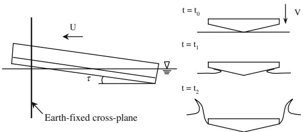

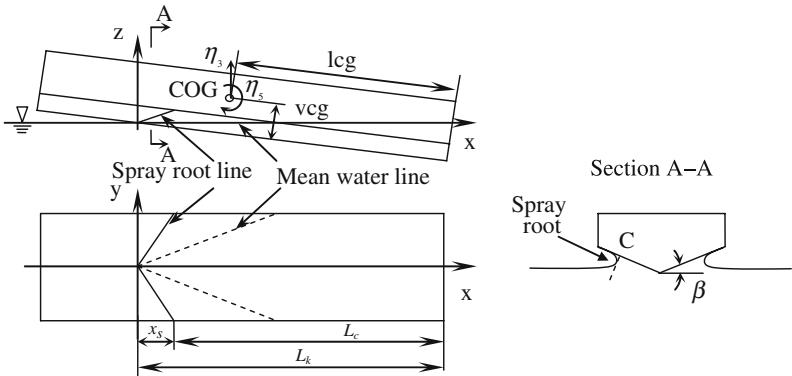  
Fig. 2 Hull-fixed coordinates and some definitions

wetted-length beam ratio is defined as

$$
\lambda_ {w} = L / B = 0. 5 \cdot (L _ {k} + L _ {c}) / B.\tag{3}
$$

In planing motion, the free surface will rise on both sides of the V-shaded bottom, as shown in the view of section A–A in Fig. 2. Point C is the intersection of the bottom surface and a line which is tangential to the spray root and normal to the bottom. A connection of all such intersection points on each cross-section will form a spray-root line, as shown in the left figure in Fig. 2. This implies that the spray-root line is different from the mean water line, which is the intersection line of the bottom surface and the undisturbed water. The x-position where the chine wetting starts is denoted as $x _ { s }$ and called the chine-wetted position. In front of this position, the wetted area is defined to be the body surface below the spray-root line. Further, one has

$$
L _ {k} - L _ {c} = x _ {s}.\tag{4}
$$

If $\lambda _ { w }$ and $x _ { s }$ are known, the keel-wetted length and chine-wetted length can be solved by using Eqs. 3 and 4.

## 2.2 Two-dimensional time-dependent problem

The initial-boundary-value problem in the Earth-fixed 2D cross-plane can be described as follows. The governing equation for the flow in this plane is

$$
\frac {\partial^ {2} \varphi}{\partial y ^ {2}} + \frac {\partial^ {2} \varphi}{\partial z ^ {2}} = 0,\tag{5}
$$

where $\varphi ( y , z , t )$ is the disturbance velocity potential in the $y - z$ plane. The body boundary condition is given by

$$
\frac {\partial \varphi}{\partial n} = \bar {V} \cdot \bar {n} \quad \mathrm{onthebodysurface},\tag{6}
$$

where $\bar { n }$ is the 2D normal vector pointing out of the fluid domain, and $\bar { V }$ is the velocity of the body with positive direction upward. Further, fully 2D nonlinear free-surface kinematic and dynamic boundary conditions are satisfied at the free surface, i.e.,

$$
\frac {\mathrm{D} y}{\mathrm{D} t} = \frac {\partial \varphi}{\partial y}, \quad \frac {\mathrm{D} z}{\mathrm{D} t} = \frac {\partial \varphi}{\partial z} \quad \text { on   the   free   surface },\tag{7}
$$

$$
\frac {\mathrm{D} \varphi}{\mathrm{D} t} = \frac {1}{2} | \nabla \varphi | ^ {2} - g z \quad \text { on   the   free   surface. }\tag{8}
$$

At distances far away from the body, the disturbance velocity potential goes to zero; hence

$| \nabla \varphi |  0$ at infinity.

(9)

By using Green’s second identity, the velocity potential at a field point P within the fluid can be represented by

$$
2 \pi \varphi_ {P} = \iint_ {S} \left[ \varphi_ {Q} \frac {\partial G (P , Q)}{\partial n _ {Q}} - G (P, Q) \frac {\partial \varphi_ {Q}}{\partial n _ {Q}} \right] \mathrm{d} s _ {Q},\tag{10}
$$

where $G ( \mathbf { P } , \mathbf { Q } ) = \log r ( \mathbf { P } , \mathbf { Q } )$ and $r ( \mathrm { P } , \mathrm { Q } )$ is the distance from a source point Q on S to the field point P. S means the whole boundary for the fluid domain which includes $S _ { B } , S _ { F } , S _ { C }$ , referring to the body surface, the free surface and the control surface far away from the body, respectively. By letting the field point P approach $S ,$ an integral equation can be obtained. Assume at a certain time instant $\varphi$ is known on the free surface, and ∂ϕ/∂n on the body surface is known from Eq. 6; then by solving the resulting integral equation, the velocity potential $\varphi$ on the body surface and normal velocity ∂ϕ/∂n on the free surface will be known. The free-surface elevation and potential $\varphi$ on the free surface for the next time instant can then be updated by using Eqs. 7 and 8. Given initial conditions for $\varphi$ on the free-surface and the free-surface elevation, one can just follow this time-marching procedure to solve the water-entry problem.

From Bernoulli’s equation, the pressure on the body surface can be evaluated from

$$
p - p _ {a} = - \rho \left(g z + \frac {\partial \varphi}{\partial t} + \frac {1}{2} | \nabla \varphi | ^ {2}\right),\tag{11}
$$

where $p _ { a }$ is the atmospheric pressure. The hydrostatic pressure $- \rho g z$ is included so that the influence of gravity on the hydrodynamic force on the body can be incorporated. The term $\partial \varphi / \partial t$ has been evaluated by solving a boundary-value problem for $\partial \varphi / \partial t + { \bar { V } } \cdot \nabla \varphi .$ . A detailed description is given in [24].

Initially, the velocity potential is zero on the undisturbed free surface. However, because there is a rapid change in the free-surface profile after the water entry of a section with small deadrise angle, it requires great computational efforts to accurately simulate such a change. Alternatively, one can just employ approximate analytical solutions without the effect of gravity to give the initial conditions. The argument is that, at the initial stage of water entry, the scale of the submerged cross-section is very small and then the Froude number of the local flow is very large, which means that gravity gives little contribution. Maruo and Song [18] used Mackie’s analytical solution [25] for the water entry of a sharp wedge as the initial condition, because the deadrise angles of their ship sections were large. Similarly here, Wagner’s approximation for the water entry of sections with a blunt bottom can be used to provide the initial conditions. When the wetted area due to spray is neglected, Wagner’s solution (see [26]) results in the free-surface profile

$$
\zeta (y) = \frac {V t _ {0}}{c} y \arcsin \left(\frac {c}{y}\right) - V t _ {0}, \quad \text { for } y > c,\tag{12}
$$

where c is the half wetted width and expressed as

$$
c = \frac {\pi V t _ {0}}{2 \tan \beta}\tag{13}
$$

and $\beta$ is deadrise angle. Further, $V t _ { 0 }$ is the initial submergence of the wedge apex relative to the undisturbed free surface. The velocity potential on the free surface is given by

$$
\varphi = 0 \quad \mathrm{on} z = \zeta (y).\tag{14}
$$

Hence, Eqs. 13 and 14 are used as initial conditions. With those initial conditions, the numerical calculations will soon come to a stable state in the time-integration procedure, in which a thin jet will grow up along the port and starboard sides of the bottom surface and then a detailed description of the spray root can be given.

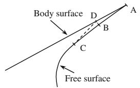  
Fig. 3 Cut-off model of jet

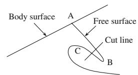  
Fig. 4 Scheme of the cutting of spray

## 3 Numerical treatments in the calculations

Based on Eq. 10, the BEM will be used to numerically solve the boundary-value problem described by Eqs. 5–9. The boundary surfaces S , S , S are discretized into $N _ { S } , N _ { F }$ , and $N _ { C }$ line elements, respectively, and the values on each element vary linearly. Then the integral equation obtained from $\operatorname { E q . }$ 10 leads to an algebraic equation system that can be solved to obtain the unknown ϕ on the body surface and ∂ϕ/∂n on the free surface. A fourth-order Runge–Kutta method is used to integrate Eqs. 7 and 8 in time. A third-degree five-point smoothing technique is applied on the free-surface profile and $\varphi$ on the free surface to eliminate the sawtooth instability. A cubic-spline regriding technique is utilized to generate uniformly distributed elements on the free surface at each time step.

## 3.1 Numerical model for jet flow

As the V-shaped section falls down, a very thin jet is formed along each side of the body surface when the deadrise angle is small. Because of the very small jet angle between the body surface and the free surface in such a case, numerical errors near the intersection point can easily cause the points on the free surface near the tip point to move to the other side of the body surface and the calculation may thus break down. So care must be taken to control the jet flow near the intersection point. One way is to cut the very thin jet.

There are different ways to do the cut-off. Zhao and Faltinsen [15] introduced a small element normal to the body surface. Kihara [27] controlled the contact angle to be always smaller than a threshold value and introduced a new segment on the free surface. Here a method similar to that of [27] is introduced because it is easier to control the free surface when gravity is considered.

The cut-off model is shown in Fig. 3. A, B and C are points on the free surface. When the distance d from point B to the body surface is smaller than a threshold value $d _ { 0 }$ , the area enclosed by ABCD is cut by introducing a new segment DC on the free surface. The value of the distance d is regarded as negative when B is on the other side of the body surface. This procedure controls the jet flow both when the jet is too thin and when the points on the jet cross to the inside of the body surface.

By using this cut-off model, the thin jet can be kept longer than when using the cut-off model of [15]. This is not advantageous for the pressure distribution, because large pressure oscillation can happen in the long thin jet area due to numerical errors. However, when the gravity effect is considered, the flow on the top of the jet will more likely be affected by gravity. In order to simulate the influence of gravity, a reasonable part of the jet top must be kept. The pressure oscillations will be reduced when the element on the body and the free surface near the jet tip are made smaller and in comparable size.

## 3.2 Cut of spray

When gravity is accounted for, a thin spray can evolve from the free surface and then overturn and hit the free surface underneath. If this happens, the calculations break down. The reason is that the penetration of the free surface causes circulation, i.e., vorticity, and thus the potential theory, can no longer be used to describe the fluid flow. However, the spray gives little contribution to the pressure on the body. On the other hand, even if the splash happened, the vorticity generated by the splash would influence a limited area in the flow and could only have a small effect on the body. Therefore, the spray can just be neglected by cutting it before it touches the free surface underneath. In such a way the numerical calculations can be continued until the completion of the whole water-entry process.

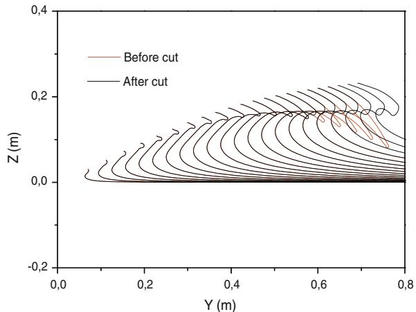  
Fig. 5 Free-surface profile

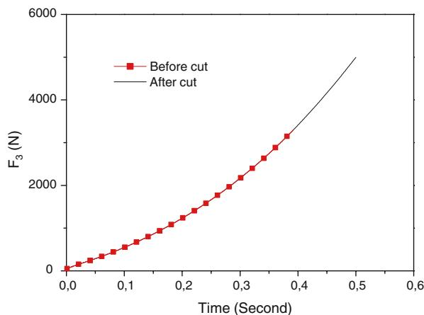  
Fig. 6 Vertical force history

The cutting scheme is shown in Fig. 4. When the spray grows long enough and before its tip (point B) touches the free surface, a part of the spray is cut. The cut line is normal to the upper free surface AB. Point C is the highest point on the lower free surface. The cut line goes through the middle point between B and C, thus the spray can be cut from around the middle of it. That part of the spray which is cut off, is assumed to be independent of the remaining part of the fluid and its motion is only influenced by gravity. This assumption can be confirmed by the results in the example presented in Figs. 5 and 6. The deadrise angle $\beta$ is $4 5 ^ { \circ }$ and the constant water-entry speed is $V = 1 . 0 m s ^ { - 1 }$ in this example. It can be seen that the cutting does not change the free-surface profile in the remaining part and the vertical force $F _ { 3 }$ per unit length on the section is not influenced by the cutting as well.

## 3.3 Flow separation from hard chine

Because there is a sharp corner at the knuckle point, the flow has to separate from the chine. By following Zhao et al. [16,21], the flow is assumed to leave tangentially from the knuckle, and a local analytical solution is employed to give an approximation to the flow very close to the separation point.

The local solution predicts an infinite pressure gradient at the separation point, i.e., a fluid particle at the separation point will have an acceleration much larger than the gravitational acceleration. So the effect of gravity will be less important in the vicinity of the separation point. More detailed descriptions about this method are given in [21]. The validation of this approach when gravity is included can be seen from the examples given in the following section.

## 4 Verification and validation of 2D results

The theory and numerical implementation of the two-dimensional problem will be verified by comparing with similarity solutions and validated by comparing with the experiments by Greenhow and Lin [22] and Aarsnes [23].

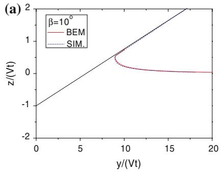

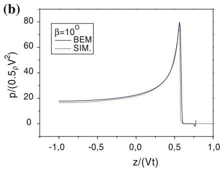

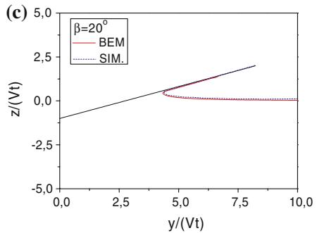

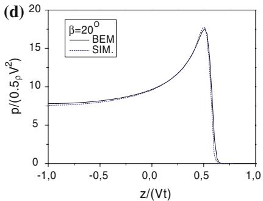

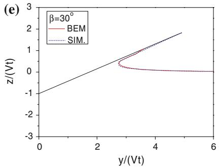

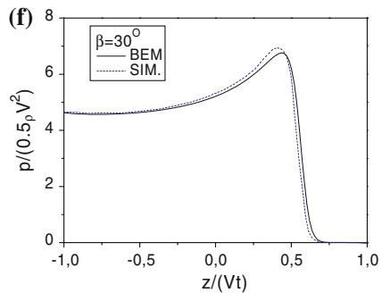

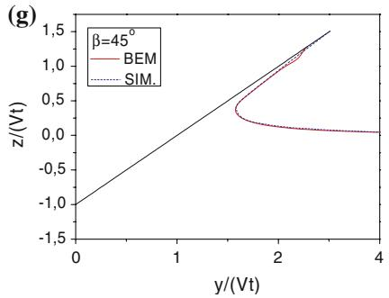

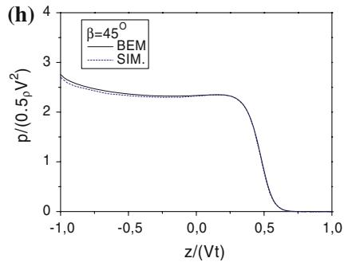  
Fig. 7 Comparison between the numerical results (BEM) and the similarity solutions (SIM.) in [15] for different deadrise angles $\beta = \bar { 1 } 0 ^ { \circ } , 2 0 ^ { \circ } , 3 0 ^ { \circ }$ and 45◦. (a), (c), (e), (g) Free-surface profile; (b), (d), (f), (h) pressure distribution

The results are first compared with the similarity solutions given in [15] where gravity is neglected and the drop speeds of 2D V-shaped cross-sections are constant. In those calculations, gravity is neglected in order to compare with the similarity solutions. In Fig. 7(a–h), the pressure distribution on the body surface and the free-surface profile by the numerical calculations are compared with the similarity solutions for deadrise angles $\beta = 1 0 ^ { \circ } , 2 0 ^ { \circ } , 3 0 ^ { \circ }$ and $4 5 ^ { \circ }$ , respectively. Good agreements can be seen. Because the deadrise angle for planing vessels is usually small, only the results for relatively small deadrise angles are shown.

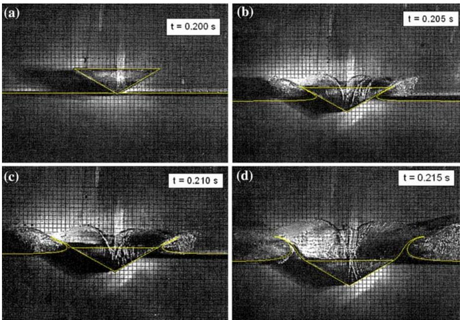  
Fig. 8 Free-surface elevation by the numerical calculation compared with the drop tests by [22]. (a) $t ~ = ~ 0 . 2 0 0 { \mathrm { s } } ;$ (b) t 0.205 s; (c) t 0.210 s; (d) t 0.215 s

Further, it is more difficult to obtain good numerical results for smaller deadrise angles than for larger deadrise angles. The reason is that a smaller deadrise angle causes a faster and thinner jet flow that is more difficult to control numerically. Therefore, good agreements for smaller deadrise angles show the robustness of the numerical program.

Then the free-surface profiles during the free water entry of a 30◦ V-shaped section in the experiment by Greenhow and Lin in [22] are compared with numerical results as shown in Fig. 8(a–d). Free-surface profiles obtained by the numerical simulations are plotted in the photos taken at four different time instants. The beam of the section is 0.218 m. The water-entry speed has been estimated from the photos. A decelerated motion can be observed. The initial time instant is $t = 0 . 2 0 0 { \mathrm { s } }$ when the wedge apex just touches the water surface. At t 0.205 s, a very thin jet is formed along the body surface; at $t = 0 . 2 1 0 \mathfrak { s }$ rr the spray root has just passed the knuckle; at $t = 0 . 2 1 5 \mathrm { s }$ , the top of the jet turns over, which implies the existence of the gravity effect. The discrepancies in the figures can be explained as follows. Firstly, the information about the falling speed is not given in the experiment report, so the speed can only be roughly estimated from the photos. Errors may be introduced during the estimation. Further, as stated in the experiment report, the timing system in photographing can have an error of 0.005 s, which may also affect the agreement. However, generally speaking the numerical simulations show good predictions of the free-surface profile. This proves the validity of the numerical models, including the jet model and the flow-separation model.

Further, in Fig. 9(a, b), the acceleration and the vertical force during a free drop test from the experiments by Aarsnes [23] are shown and compared with the present numerical results. The acceleration is calculated at each time step by using Newton’s second law. The parameters of the V-shaped model in the experiment are listed as follows: breadth of the section is 0.300 m, deadrise angle is 30◦, total weight of the drop rig is 288 kg, the total length of the drop rig is 1.000 m and the length of the measuring section is 0.100 m, on which the vertical force was measured. In the drop test shown in Fig. 9, the drop height is 0.13 m.

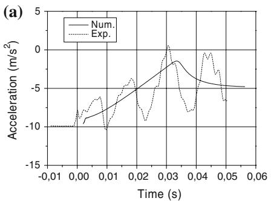

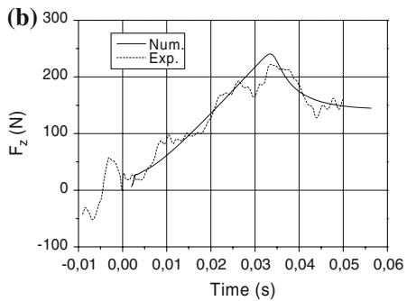  
Fig. 9 Acceleration and vertical force in the free drop of a V-shaped section. The vertical force is measured on a measuring section with length 0.100 m. Num. means the numerical results and Exp. means the experimental results of [23]. The drop height is 0.13 m. (a) Acceleration; (b) Vertical force on the measuring section

As stated in the experiment report [23], the measured results have been filtered using a cut-off frequency of 700 Hz and the oscillation of the results after low-pass filtering is due to the vibration of the drop rig which supports the model during the tests. Because the vibrations are present even before the section touches the calm water surface, they are probably excited when the rig is released. In spite of the oscillations, the mean lines of the experimental results can agree well with numerical results. Further, the vertical motion and velocity will be less affected by the vibration and show a better agreement between theory and experiments. The acceleration and vertical force reach their maximum values near the moment when the spray root reaches the knuckle. Three-dimensional effects as analyzed in [21] can be applied to explain the slightly overestimated force near this moment in Fig. 9(b).

## 5 Numerical results for planing vessels

After the verification and validation of the two-dimensional results, the 2D+t theory can be applied to study the hydrodynamics of a prismatic planing vessel. Given the forward speed U of the planing hull, the constant water-entry speed $V$ in the 2D time-dependent problem can be obtained from Eq. 1. Then the 2D problem is solved by a time-marching procedure until time $t _ { e }$ which corresponds to the position of the transom stern $x = L _ { k }$ . The spray-root line can be found in the numerical simulations, so the position $x _ { s }$ can be predicted. Because $\lambda _ { w }$ is also given, one can just use Eqs. 3 and 4 to calculate $L _ { k }$ and use Eq. 2 to obtain $t _ { e } = L _ { k } / U$ . When the total vertical force $f ( t )$ on a two-dimensional section with time is known, the vertical force per unit length on the planing vessel is found by using Eq. 2. This force distribution can be integrated to obtain the total vertical force and the pitch moment. The vertical force is defined to be positive in the positive z-direction, and the pitch moment is about COG and defined positive in the positive y-direction, i.e., positive pitch corresponds to bow up.

## 5.1 Comparison with experiments

Troesch [8] conducted experiments for prismatic planing vessels at low to moderate planing speeds. Both steady and unsteady problems were studied. Here only the steady problem with different constant heave or pitch (sinkage and trim) will be numerically simulated and the results of wetted lengths, forces and moments will be compared with the experiments. The parameters in the tests that will be numerically studied here, are given in Table 1.

The wetted lengths $L _ { k } / B , L _ { c } / B$ and $L / B$ varying with either constant heave displacement or constant pitch displacement at $F _ { n B } = 2 . 0$ are shown in Fig. 10(a–b), respectively. If the mean wetted-length-beam ratio $\lambda _ { w 0 } = \ L _ { 0 } / B$ at $\eta _ { 3 } = 0$ and $\eta _ { 5 } = 0$ is known, the mean wetted length at constant heave or pitch can be predicted by

Table 1 Parameters in the tests

<table><tr><td>Beam</td><td>0.318 m</td></tr><tr><td>Beam Froude number  $F_{nB} = U/\sqrt{gB}$ </td><td>2.0, 2.5</td></tr><tr><td>Deadrise angle</td><td>20.0°</td></tr><tr><td>Trim angle  $\tau$ </td><td>0.0698 radian (or 4.0°)</td></tr><tr><td>Mean wetted length-beam ratio  $\lambda_w$ </td><td>3.0</td></tr><tr><td>Position of gravity</td><td></td></tr><tr><td> $lcg/B$ </td><td>1.47</td></tr><tr><td> $vcg/B$ </td><td>0.65</td></tr></table>

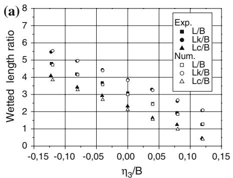

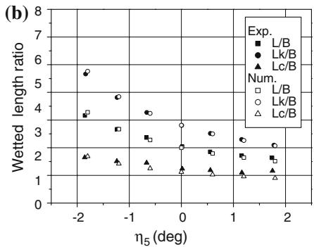  
Fig. 10 Wetted lengths varying with constant heave or pitch at $F _ { n B } ~ = ~ 2 . 0 .$ Exp. means experimental results in [8]; Num. means numerical results. (a) For heave; (b) For pitch

$$
L (\eta_ {3}, \eta_ {5}) = l c g + \frac {v c g}{\tan (\tau - \eta_ {5})} - \frac {v c g \cos (\tau) - (L _ {0} - l c g) \sin (\tau) + \eta_ {3}}{\sin (\tau - \eta_ {5})}.\tag{15}
$$

The corresponding $L _ { k } / B$ and $L _ { c } / B$ can then be obtained by substituting L from Eq. 15 and the numerically predicted $x _ { s }$ into Eqs. 3 and 4 and then solving these two equations. Good agreements are shown in the figures.

Then the vertical forces and pitch moments at different heave or pitch are given in Fig. 11(a–d). Experimental results by Troesch [8] and the results calculated by the empirical formula by Savitsky [4] are shown together with the numerical results.

From those figures, one notes that the numerical results, denoted by ‘Numerical’, show the same trend as the experimental and empirical results. However, the vertical forces are generally overestimated, while the pitch moments agree better. The later discussions will indicate that the good agreement for the pitch moment can be coincidental. The discrepancy between the numerical results and the experiments can be due to three-dimensional effects neglected in the 2D+t theory.

3D effects can occur both at the bow and stern. In a planing problem, it also appears near the chine-wetted position, where the chine wetting starts, i.e., $x = x _ { s } .$ , due to a sudden change of the increasing rate of the wetted surface. The neglect of 3D effects often causes an overestimation of the pressure, which is believed to be due to the fact that the energy is thus restrained in a more limited area.

Results after the 3D correction near the chine-wetted position are shown in the figures, as denoted by Some 3D correction'. The total forces decrease a little after this correction. However, the total pitch moments decrease in some cases and increase in other cases. This is because the changed moment depends on the position of the centre of action of the overestimated force relative to the centre of gravity. The method to calculate 3D correction factors will be described in the next section. Although this correction cannot cause great improvements, it demonstrates the influence of the 3D effects near the chine-wetted position.

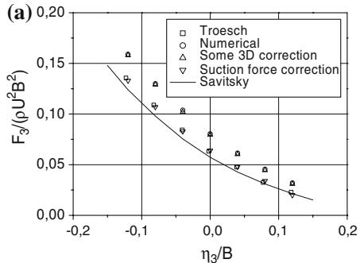

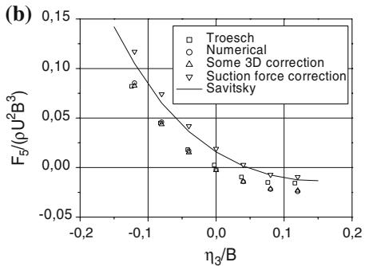

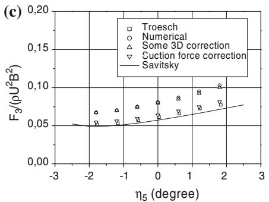

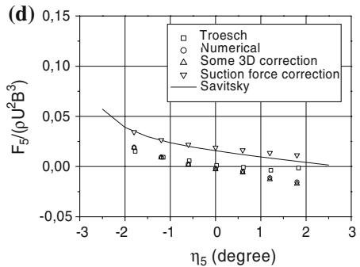  
Fig. 11 Vertical force and pitch moment versus constant heave or pitch displacement for $F _ { n B } = 2 . 5 . ( \mathbf { a } )$ Vertical force versus heave $\eta _ { 3 } / B ;$ (b) Pitch moment versus heave $\eta _ { 3 } / B ;$ (c) Vertical force versus pitch $\eta _ { 5 } ;$ (d) Pitch moment versus pitch η

There is a more significant 3D effect near the transom stern. Because the flow separates at the transom, the pressure at the transom stern should be atmospheric. This means that the sum of the hydrostatic and the hydrodynamic vertical force per unit length must decrease to zero at the stern. However, in the 2D+t calculation, the existence of the transom stern cannot be felt in the calculations ahead of it; thus the forces will be overestimated in a certain area in front of the stern. Because the hydrodynamic pressure at the transom stern must be negative to counteract the positive hydrostatic pressure in order to predict an atmospheric pressure there, this effect is referred to a suction pressure in [28].

Faltinsen [1] presented an analysis of the local flow in the close vicinity of the separation point at the transom by assuming 2D separated potential flow in the center plane. The predicted free-surface elevation agrees well with Savitsky’s experimental results [29]. This theory will not match with the 2D+t theory, but it indicates that there is a rapid decrease in the pressure in a narrow region near the transom on the hull. Actually the pressure gradient is infinite at the transom stern.

In [30] a similar situation has been encountered. Steady vertical forces were calculated for a ship with transom stern running at a length Froude number $F _ { n } = 1 . 1 4$ and compared with the model tests by Keuning [31]. The 2.5D results agreed well with the experiments except near the transom stern, where the averaged force excluding buoyancy on the last segment in the model test was negative, while a positive hydrodynamic force was predicted in the 2.5D solution. Hence they argued that there must be a rapid decrease in the force near the transom stern. More recently, in the experiments about transom-stern flow for high-speed vessels as given in [32], negative hydrodynamic pressures were also observed.

In order to estimate the magnitude of the suction-force effect at the stern, a similar approach as in [28] is followed. Because the consequence of the suction force is a smaller loading in the vicinity of the transom stern, this can be accounted for by using a smaller $L _ { k }$ in the calculation. As suggested in [28], reducing $L _ { k }$ with 0.5B gives good correlation with Savitsky’s formula. The discussion was applied to a planing vessel with the same mean trim angle and mean wetted length-beam ratio as in the cases in Fig. 11. So the same correction factor 0.5B is used in the present study. Results after such a correction are also shown in Fig. 11(a–d), which is denoted as ‘Suction-force correction’. Vertical forces can then agree very well with both the experiments and Savitsky’s formula, and the pitch moments agree better with Savitsky’s formula. Because the 0.5B correction mainly account for the total force, not the force distribution, the correction to the moment is questionable. Therefore it is hard to judge the agreements for the pitch moments here Nevertheless, the results with such a correction indicate that the suction-force effect is the most significant reason for the discrepancy between numerical results and experiments.

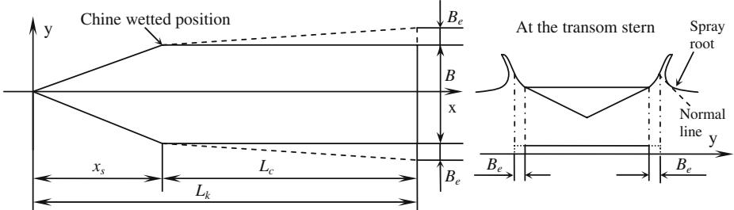  
Fig. 12 A simplified analysis to obtain 3D correction factor

The restoring-force coefficients can then be calculated by taking the derivative of force or moment in each figure with respect to heave or pitch motion, i.e.,

$$
C _ {i j} = - \frac {\partial F _ {i}}{\partial \eta_ {j}} \quad \text { with } i, j = 3, 5.\tag{16}
$$

From the figures, one can see that the slope of the curves formed by the numerical results can agree well with the experimental results and empirical formula, even before the corrections. In Fig. 11(d) the slope of the experimental results are obviously different from those of the numerical results and the empirical results for large pitch motions. Experimental errors may be the reason for such a discrepancy, as indicated in [8]. From those figures, one can see that the restoring-force coefficients obtained from the numerical results are obviously nonlinear and the coupling between heave and pitch is very significant.

## 5.2 Three-dimensional effects at very high Froude number

An analogy between the planing-surface problem and lifting-surface problem is used to estimate three-dimensional effects at very high Froude number. Figure 12 shows the projection on the x y plane of the wetted surface of a planing vessel with trim angle τ moving at high speed U. To consider the influence of the separated jet flow, an artificial body surface is introduced as plotted by the dashed line in the figure. As shown in the right picture of Fig. 12, the beam is extended at both sides to the position of the spray root. In the figure the ‘normal line’ is normal to the upper free surface and tangential to the spray-root curve. The extension in half beam $B _ { e }$ at the transom is given according to the 2D+t results; then the extension at each cross-section just increases linearly from the chine-wetted position to the transom stern.

At very high Froude number, gravity is negligible and the free-surface condition is approximated as $\varphi = 0$ . On the real body surface the boundary condition is linearized as $\partial \varphi / \partial z = U \alpha$ , where the angle of attack $\alpha = \tau$ . On the artificial body surface the same boundary condition is applied, but finally the lift force will be obtained by just integrating the pressure on the real body surface.

By imaging the body and the flow about the mean free surface, we can analyze a double body moving in infinite fluid. Such a lifting problem can be solved in three dimensions by distributing vortices on the projection of the body surface and the wake on the x y plane so that the body boundary condition and the Kutta condition at the trailing edge are satisfied. The general theory and numerical methods are described in [33, Chapter 5] and [34, Chapter 12]. The problem can also be solved asymptotically by a slender-wing theory using 2D results, as described in [34, pp. 212–222]. So the ratio between the results from these two methods will be used as a three-dimensional correction factor.

Fig. 13 Threedimensional effects in very high speed planing calculations  
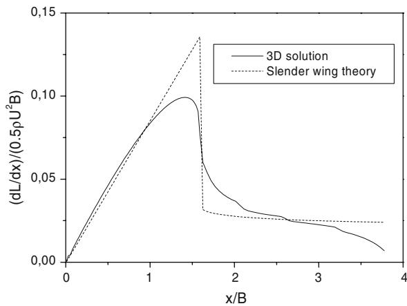

The lift force distributions by both methods for an example of $L _ { k } / B = 3 . 8 , x _ { s } / B = 1 . 6$ and $B _ { e } / B = 1 . 6 7$ are shown in Fig. 13. Obvious 3D effects can be seen near the chine-wetted position and near the transom stern. There is also a 3D effect near the bow, but it is not apparent in the figure because the numerical model used here is quite simplified. However, the figure shows the tendency of the distribution of 3D effects for the planing vessels at very high Froude number.

The predicted lift force should be zero at the transom stern. However, the 3D solution gives a finite value there. This is due to a numerical error near the trailing edge. When using more panels near the trailing edge, the finite value there will tend to zero. Thus, the suction-force effect as discussed before cannot be found here because, for very high Froude number, gravity is totally neglected. In other words, the suction-force effect is associated with gravity effects.

The sectional correction factor $\gamma ( x ) = \left[ \mathrm { d } L / \mathrm { d } x \right] _ { 3 D } / \left[ \mathrm { d } L / \mathrm { d } x \right] _ { 2 D }$ can then be obtained, in which 2D means the solution obtained by the slender-wing theory. This sectional factor will be multiplied to the forcedistribution results by $2  { \mathrm { D } } + t$ to make the correction. However, the free-surface condition $\varphi = 0$ is not a good approximation at moderate planing speed when the local Froude number $F _ { n x } = U / { \sqrt { g x } }$ is small, i.e., when the x-position is far from the bow. So the 3D correction is only made to the vertical force distribution ahead of the chine-wetted position in each case in Fig. 11.

## 5.3 Gravity effects

Figure 14 shows the free-surface profiles around a planing vessel with the same parameters as in Fig. 11 at $F _ { n B } = 5 . 0$ and 2.5, which correspond to high and moderate planing speeds, respectively. Results for 10 successive cross-sections from $x / B = 1 . 1 4 1$ to $x / B = 3 . 6 7 8$ withinterval $\Delta x / B = 0 . 2 8 2$ are presented. At the higher Froude number $F _ { n B } = 5 . 0 $ , spray runs up continuously from the bow to the stern and it reaches very high in the air near the transom, which implies that the gravity effect is not so significant in this case. However, at the lower Froude number $F _ { n B } = 2 . 5 $ , the influence of gravity on the free-surface elevation seems more apparent, because the spray does not run up very high and it then falls down.

Vertical force distributions along the x-coordinate are also calculated and shown in Fig. $1 5 ( \mathsf { a - c } )$ , in which the hydrostatic forces are obtained by integrating the pressure term $- \rho g z$ on the wetted body surface below the mean free surface, and the remaining force means the resulting force after the subtraction of the hydro: static force from the total vertical force. The numerical calculations start with an initial submergence. So the force on the hull in front of the position about $x / B = 0 . 8$ is not shown in the figure. Because gravity is insignificant on that part, the force distribution is calculated instead by using the similarity solution.

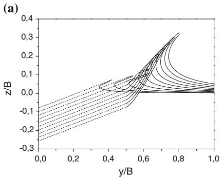

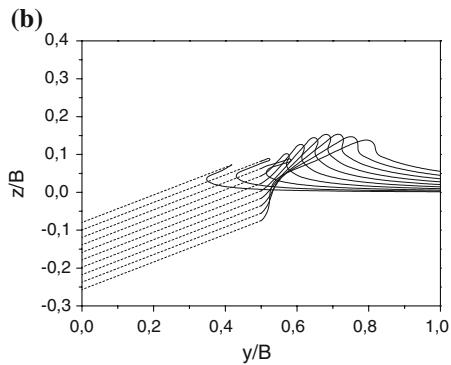  
Fig. 14 Free-surface elevations around the planing hull with $B = 0 . 5 .$ , for $F _ { n B } = 2 . 5 $ and 5.0. Dashed lines: the hull surface, solid lines: the free surface (a) $F _ { n B } = 5 . 0 $ and (b) $F _ { n B } = 2 . 5 $

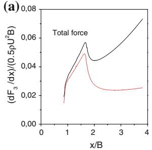

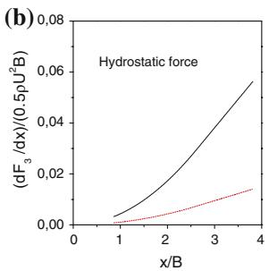

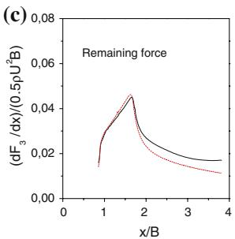  
Fig. 15 Comparison of vertical force distributions along the planing hull for $F _ { n B } ~ = ~ 2 . 5 $ and 5.0. Solid lines: $F _ { n B } \ = \ 2 . 5 ; $ dashed lines: $F _ { n B } = 5 . 0 $

The influence of gravity on the vertical force can be seen from this figure. First the gravity effect is negligible before the chine-wetted position, but it is more and more important when approaching the transom stern. Second, the hydrostatic force is dominant after chine wetting for $F _ { n B } = 2 . 5$ . However, for $F _ { n B } ~ = ~ 5 . 0 $ the remaining force is dominant all along, except that it is comparable with the hydrostatic force near the stern. This means that gravity is more important in the case of moderate planing speed. Third, the remaining forces for these two cases are similar but not equal. So gravity also influences the hydrodynamic part of the force. This is because gravity will change the fluid flow around the hull and affect the free-surface elevation, as one can see from Fig. 14. Therefore, simply adding the hydrostatic force to the lift force obtained by neglecting gravity cannot fully account for the influence of gravity.

## 6 Conclusions

The hydrodynamic features of a prismatic planing hull in steady motion at moderate planing speed have been studied. The gravity effect was fully considered in the numerical simulations. The 2D time-dependent fully nonlinear problem of the water entry of a V-shaped body has been solved by a BEM. The thin jet, spray and flow separation were properly treated in the numerical simulation. After the validation of the 2D theory and program, a 2D+t theory was applied to solve the steady planing problem. A reasonable agreement between numerical and experimental results has been achieved. Three-dimensional effects were estimated to qualitatively explain the discrepancy between theory and experiments. Finally, the influence of gravity was discussed by comparing results for two different Froude numbers.

It has been shown that the 2D numerical solver can give a good prediction of both the free-surface elevation and the force. Both the jet-cut model and the spray cut-model were proved to be efficient, and the flow separation model was shown to be valid when gravity is included.

The numerical solution of the planing problem of a prismatic planing hull by the 2D+t theory gives overestimated vertical forces. However, the restoring-force coefficients can be well predicted. At moderate planing speeds, free-surface elevation is not so violent as for high planing speeds and the hydrostatic force will dominate at the rear part of the hull. Furthermore, gravity will influence the hydrodynamic force as well.

3D effects near the chine-wetted position and the transom stern are believed to be the reason why the vertical forces and moments predicted by 2D+t theory differ form the experimental and empirical results. A simplified theory has been utilized to estimate some of the 3D effects, and a reduction of the keel-wetted length by 0.5B was applied to estimate the influence of the 3D effects near the stern. However, more exact correction methods are expected to give a better estimation of those 3D effects.

The current work can be easily generalized to planing hulls with varying cross-sections. However, to study the unsteady motion of planing hulls, 2D time-dependent problems must be solved for many different cross-sections, which demands much more computational efforts. On the other hand, the 2D+t solution can be applied to semi-displacement hulls with transom stern at Froude numbers higher than 0.6 approximately. The 3D effect at the transom stern will still be an important aspect.

Acknowledgements Even though Prof. J. N. Newman has not worked on this specific problem, his general influence in the field of marine hydrodynamics is highly appreciated. By his classical book on Marine Hydrodynamics and his many scientific publications, he taught us the importance of both mathematics and physical understanding, and the importance to simplify complicated physical problems.

## References

1. Faltinsen OM (2005) Hydrodynamics of high-speed marine vehicles. Cambridge University Press, New York

2. Sottorf W (1932) Experiments with planing surfaces. NACA TM 661

3. Sottorf W (1934) Experiments with planing surfaces. NACA TM 739

4. Savitsky D (1964) Hydrodynamic design of planing hulls. Marine Technol 1:71–95

5. Altman R (1968) The steady-state and oscillatory hydrodynamics of a 20 degree deadrise planing surface. Technical Report 603-2, Hydronautics, Inc. Laurel, MD

6. Fridsma G (1969) A systematic study of rough-water performance of planing boats. Report No. 1275. Davison Laboratory, Stevens Institute of Technology, Hoboken, NJ

7. Fridsma G (1971) A systematic study of rough-water performance of planing boats (Irregular waves- Part II). Report No. 1275. Davison Laboratory, Stevens Institute of Technology, Hoboken, NJ

8. Troesch AW (1992) On the hydrodynamics of vertically oscillating planing hulls. J Ship Res 36:317–331

9. Wang DP, Rispin R (1971) Three-dimensional planing at high Froude number. J Ship Res 15:221–230

10. Martin M (1978) Theoretical determination of porpoising instability of high-speed planing boats. J Ship Res 22:32–53

11. Martin M (1978) Theoretical prediction of motions o high-speed planing boats in waves. J Ship Res 22:140–169

12. Vorus WS (1992) An extended slender body model for planing hull hydrodynamics. SNAME meeting: Great Lakes and Great Rivers Section Cleveland Ohio

13. Vorus WS (1996) A flat cylinder theory for vessel impact and steady planing resistance. J Ship Res 40:89–106

14. Lai C (1994) Three-dimensional planing hydrodynamics based on a vortex lattice method. Ph.D. Thesis, university of Michigan, Ann Arbor, MI

15. Zhao R, Faltinsen OM (1993) Water entry of two-dimensional bodies. J Fluid Mech 246:593–612

16. Zhao R, Faltinsen OM, Haslum HA (1997) A simplified nonlinear analysis of a high-speed planing craft in calm water. In: Proc. fourth international conference on Fast Sea Transportation (FAST’97) Sydney, Australia, July 1997

17. Fontaine E, Tulin MP (1988) On the prediction of nonlinear free-surface flows past slender hulls using 2D+t theory: the evolution of an idea. In: RTO AVT symposium on fluid dynamic problems of vehicles operating near or in the Air-Sea Interface. Amsterdam, Netherlands, 5–8 October, 1998

18. Maruo H, Song W (1994) Nonlinear analysis of bow wave breaking and deck wetness of a high-speed ship by the parabolic approximation. In: Proc. 20th symposium on naval hydrodynamics. University of California, Santa Barbara, California

19. Lugni C, Colagrossi A, Landrini M, Faltinsen OM (2004) Experimental and numerical study of semi-displacement mono-hull and catamaran in calm water and incident waves. In: Proc. 25th symposium on naval hydrodynamics. St. John’s, Canada.8-13 August 2004

20. Tulin MP, Landrini M (2001) Breaking waves in the ocean and around ships. In: Proc. 23rd symposium on Naval hydrodynamics. Val de Reuil, France

21. Zhao R, Faltinsen OM, Aarsnes JV (1996) Water entry of arbitrary two-dimensional sections with and without flow separation. In: Proc. twenty-first symposium on naval hydrodynamics. Trondheim, Norway

22. Greenhow M, Lin WM (1983) Nonlinear free surface effects: experiments and theory. Report No. 83-19 Department of Ocean Engineering, MIT

23. Aarsnes JV (1996) Drop test with ship sections–effect of roll angle. Report 603834.00.01. Norwegian Marine Technology Research Institute, Trondheim, Norway

24. Greco M (2001) A two-dimensional study of green-water loading. Ph.D Thesis, Norwegian University of Science and Technology, Trondheim, Norway

25. Mackie AG (1962) A linearised theory of the water entry problem. The Quart J Mech Appl Math 15:137–151

26. Faltinsen OM (1990) Sea loads on ships and offshore structures. Cambridge University Press, Cambridge

27. Kihara H (2004) Numerical modeling of flow in water entry of a wedge. In: Proc. 19th international workshop on water waves and floating bodies. Cortona, Italy, 28–31 March 2004

28. Faltinsen OM (2001) Steady and vertical dynamic behavior of prismatic planing hulls. In: Proc. 22nd international conference HADMAR. October, 2001, Varna, Bulgaria

29. Savitsky D (1988) Wake shapes behind planing hull forms. In: Proc. international high-performance vehicle conference. The Chinese Society of Naval Architecture and Marine Engineering, Shanghai, pp VII, 1–15

30. Faltinsen OM, Zhao R (1991) Numerical predictions of ship motions at high forward speed. Philos Trans Roy Soc Lond A 334:241–252

31. Keuning JA (1988) Distribution of added mass and damping along the length of a ship model moving at high forward speed. Report No. 817-P. Ship Hydrodynamics Laboratory, Delft University of Technology

32. Maki KJ, Doctors LJ, Beck RF, Troesch AW (2005) Transom-stern flow for high-speed craft. In: Proc. eighth international conference on Fast Sea transportation (FAST 2005). Saint Petersburg, Russia

33. Newman JN (1977) Marine hydrodynamics. The MIT Press

34. Katzand J, Plotkin A (1991) Low-speed aerodynamics. Inc. McGraw-Hill