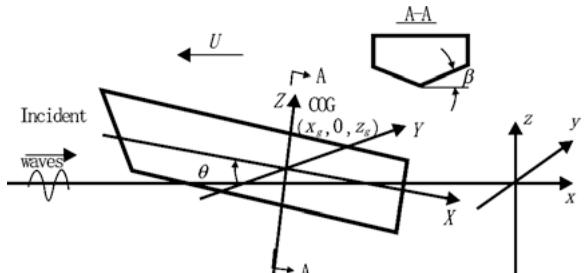
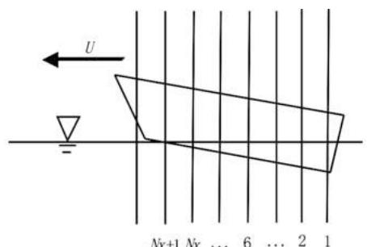
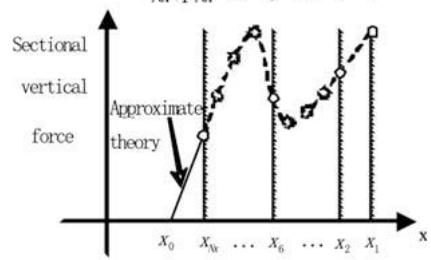
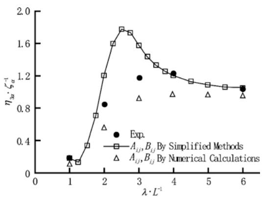
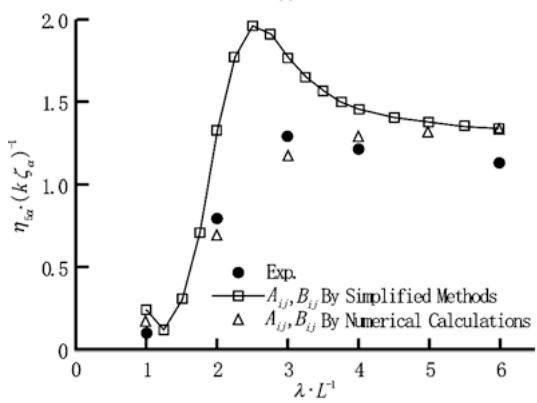
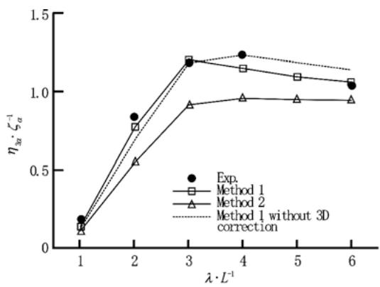
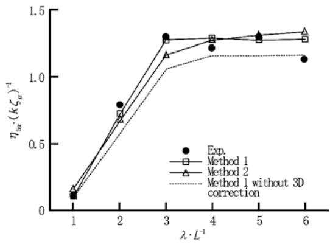
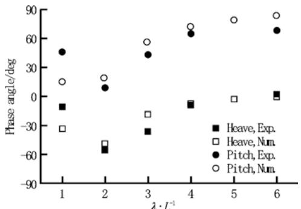
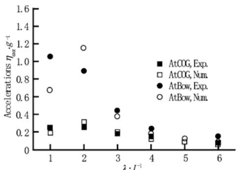

# Numerical study of planing vessels in waves

Hui Sun $^{*}$ , Odd M. Faltinsen

Centre for Ships and Ocean Structures, Department of Marine Technology
Norwegian University of Science and Technology
Trondheim, Norway
\* E-mail: hui.sun@ntnu.no

ABSTRACT: The performance of planing vessels in waves is investigated numerically by assuming linear regular incident waves in head sea. A 2D+t theory is presented to perform nonlinear time domain simulations of a prismatic planing boat in incident waves. A Boundary Element Method is employed to solve the initial boundary value problems in two-dimensional (2D) cross-planes. A simplified theory is also applied. The added mass and damping coefficients used in the latter theory are determined from the numerical simulation of forced oscillations. The wave induced heave and pitch motions calculated by these two methods are compared with the experiments by Fridsma [1].

KEY WORDS: planing vessel; 2D+t theory; Boundary Element Method; incident waves; heave and pitch.

## 1 INTRODUCTION

The ever increasing use of planing vessels demands a better understanding of the hydrodynamic features of such high-speed vehicles. As the vessel is planing, its weight is mainly supported by the hydrodynamic pressure loads other than the buoyancy force as for a displacement ship. Hard chines are often used on a planing boat to make the flow separate from the sides. Slamming and instability problems such as porposing, dynamic roll instability and broaching are important for planing boats. The strong nonlinear characteristics make those problems difficult to tackle.

A steady planing can be made equivalent to the water entry of a two-dimensional section, as done by [2], [3] and more recently by [4], [5], [6]. Three-dimensional (3D) analyses were performed for instance by [7]. Savitsky $^{[8]}$ presented empirical formulas for the lift, drag and centre of pressure for a prismatic planing hull in calm water.

A planing boat can often be exposed to rough sea instead of a calm water environment. For the unsteady problem of planing vessels in waves, the early theoretical models were proposed by [9] and [10]. The more recent theoretic studies were reported by [11] and [12]. However, none of them accounts for fully nonlinear effects. The free surface conditions are often linearized when they consider nonlinear effects. More nonlinearities will be taken into account in the present theory. In all of these literatures, the theoretical results were compared against [1]'s model tests, in which a systematic series of model tests were carried out to investigate the influence of many parameters to the performance of the planing boat in head waves. Other experimental works were carried out by e.g. [12]. They did some full scale tests of planing boats in waves.

In this paper, a 2D+t theory is formulated to solve the unsteady problem of a planing vessel in waves. The mathematical formulation is inspired by [13]'s derivation. However, corrections and modifications are made. Further, some technical problems, such as the description of the initial free surface profile and the pressure evaluation on the hull surface, are clarified. A Boundary Element Method (BEM) is applied to solve the 2D nonlinear body-wave interaction problems derived from the original 3D problem. In the BEM, flow separation form the hard chine is simulated. Gravity effect on the fluid is naturally included. However, the BEM is not the only option, i.e. other 2D solvers can also be used to replace the BEM. The advantage of the BEM applied here is that it is often more accurate than those simplified solutions, e.g. [11], and faster than most of the CFD (Computational Fluid Dynamics) methods. In the present work, a prismatic planing hull is assumed, but the application of the 2D+t theory is not limited by this assumption. The present theory can be generalized to non-prismatic planing hulls and semi-displacement ships. In a 2D+t theory, 3D effects can be partly included because the influence from the upstream is taken into account, but an important 3D effect is neglected at the stern. The effect is caused by the flow separation at the stern and thus a dry transom. The sectional force is often over-predicted at the stern. 3D corrections are therefore necessary to obtain a better prediction of the sectional force distribution near the transom stern $[14-15]$ .

Many examples of the 2d+t theory are illustrated in [16]. This theory has been applied to solve the steady problem for a prismatic hull in [14] and for a semi-displacement hull in [17], as well as the unsteady problem with forced heave and pitch of a prismatic planing hull in [18]. Therefore, the present work is a further improvement of the previous studies. If we set zero incident waves and specify the heave and pitch motions, the mathematical formulations degenerate to those given in [18]. From the forced oscillation simulations, we can obtain the linearized added mass and damping coefficients, which can be supplied to the heave and pitch equations given in [16], so the wave induced vertical motions can be solved by the simplified method in [16]. The present numerical results by the 2D+t theory and the simplified method are compared with Fridsma[1]'s experiments. Due to the limited time and paper space, this paper only presents the results for one configuration in Fridsma's model tests.

## 2 PROBLEM DESCRIPTION

As shown in Figure 1, a planing vessel with V-shaped section is advancing in incident waves. An Earth-fixed Cartesian coordinate system xyz is defined with xy-plane in the calm water surface and z-axis vertically upwards. The planing hull is moving in the negative x-direction, while the incident waves are propagating in the positive x-direction. Coordinates XYZ fixed on the hull are introduced to define the shape of the hull surface and the normal vector on it. The origin of XYZ is fixed at the centre of gravity (COG) of the hull. The X-axis is pointing to the stern and the Y-axis is towards the starboard. The instantaneous trim angle $\theta$ is defined positive when the bow is going up. The position of the COG in the Earth-fixed coordinates is denoted as $(x_{g},0,z_{g})$ . Initially, $x_{g}=0$ . The hull-fixed coordinates can be related to the Earth-fixed coordinates by

$$
\left\{ \begin{array}{l} X = (x - x _ {g}) \cos \theta - (z - z _ {g}) \sin \theta \\ Y = y \\ Z = (x - x _ {g}) \sin \theta + (z - z _ {g}) \cos \theta \end{array} \right.\tag{1}
$$

  
Fig. 1 A planing vessel in waves and coordinate systems

The water is assumed as inviscid and incompressible, i.e. the water motion is irrotational. A velocity potential $\Phi(x,y,z,t)$ is used to describe the water flow, which satisfies the three dimensional (3D) Laplace equation in the fluid domain. On the hull surface the boundary condition is expressed as $\partial\Phi/\partial n=V_{B}\cdot n$ where $V_{B}$ is the velocity vector of the points on the hull and n is the unit normal vector of the hull surface. The dynamic free surface condition simply states $p=p_{a}$ where p is the pressure and $p_{a}$ is the atmospheric pressure. The kinematic free surface condition is expressed as $Dx/Dt=\partial\Phi/\partial x$ , $Dy/Dt=\partial\Phi/\partial y$ , $Dz/Dt=\partial\Phi/\partial z$ in the Lagrangian specification where t is the time and D/Dt means the substantial derivative. The water domain is assumed to be infinite in the horizontal dimensions. So the open boundary conditions at infinity should be satisfied. Further, a flat bottom at a deep water depth is assumed. Now we decompose the total velocity potential into two components as

$$
\Phi = \varphi + \varphi_ {I}\tag{2}
$$

where $\varphi_{I}$ is the incident wave potential and $\varphi$ is the disturbance potential. We assume head sea regular waves with small wave steepness so that the incident wave potential can be expressed as

$$
\varphi_ {I} = \frac {g \zeta_ {a}}{\omega_ {0}} e ^ {k z} \cos (\omega_ {0} t - k x)\tag{3}
$$

where $\zeta_{a}$ is the wave amplitude, $\omega_{0}$ is the circular frequency. Substituting Eq.2\~3 into the governing equation, the body boundary condition and the kinematic free surface condition for $\Phi$ , one can obtain

$$
\frac {\partial^ {2} \varphi}{\partial x ^ {2}} + \frac {\partial^ {2} \varphi}{\partial y ^ {2}} + \frac {\partial^ {2} \varphi}{\partial z ^ {2}} = 0 \quad \text {   in   the   water   domain   }\tag{4}
$$

$$
\frac {\partial \varphi}{\partial n} = \mathbf {V} _ {\mathrm{B}} \cdot \mathbf {n} - n _ {z} \frac {\partial \varphi_ {I}}{\partial z} - n _ {x} \frac {\partial \varphi_ {I}}{\partial x} \text {   on   } \mathrm{S} _ {\mathrm{H}}\tag{5}
$$

$$
\frac {D x}{D t} = \frac {\partial \varphi}{\partial x} + \frac {\partial \varphi_ {I}}{\partial x} \frac {D y}{D t} = \frac {\partial \varphi}{\partial y}, \frac {D z}{D t} = \frac {\partial \varphi}{\partial z} + \frac {\partial \varphi_ {I}}{\partial z} \text {on} S _ {F}\tag{6}
$$

where $S_{H}$ and $S_{F}$ mean the instantaneous hull surface and free surface and $n_{x}$ , $n_{y}$ and $n_{z}$ are the three components of the normal vector n in the space fixed coordinate system. One can insert Eq.2 into Bernoulli's Equation to give

$$
\begin{array}{r l} p - p _ {a} & = - \frac {1}{2} \rho \left[ \varphi_ {x} ^ {2} + \varphi_ {y} ^ {2} + \varphi_ {z} ^ {2} + 2 \varphi_ {l x} \varphi_ {x} + 2 \varphi_ {l z} \varphi_ {z} \right] \\ & - \rho \frac {\partial \varphi}{\partial t} - \rho \frac {\partial \varphi_ {l}}{\partial t} - \rho g z \end{array}\tag{7}
$$

where the subscripts x, y and z respectively mean the derivatives with respect to the x-, y-, z- coordinates, and $\rho$ is the water density, g is the acceleration of gravity. By following the fluid particle on the free surface, one has

$$
\begin{array}{r l} \frac {D \varphi}{D t} & = \frac {\partial \varphi}{\partial t} + \nabla \Phi \cdot \nabla \varphi \\ & = \frac {\partial \varphi}{\partial t} + \varphi_ {x} ^ {2} + \varphi_ {y} ^ {2} + \varphi_ {z} ^ {2} + \varphi_ {z} \varphi_ {l z} + \varphi_ {x} \varphi_ {l x} \end{array}\tag{8}
$$

Inserting the $\partial\varphi/\partial t$ term obtained from Eq.8 into Eq.7, one can write the dynamic free surface condition $p=p_{a}$ on the instantaneous free surface as

$$
\frac {D \varphi}{D t} = \frac {1}{2} \left(\varphi_ {x} ^ {2} + \varphi_ {y} ^ {2} + \varphi_ {z} ^ {2}\right) - \frac {\partial \varphi_ {I}}{\partial t} - g z\tag{9}
$$

Eq. 4-6 and Eq. 9 together with the open boundary condition at infinite and a flat bottom boundary condition describe a time-dependent boundary value problem for the disturbance velocity potential $\varphi$ .

Before the incident waves meet the vessel, the vessel is planing steadily in calm water with constant speed U and trim angle $\tau$ . If the forward speed of the vessel in waves is kept constant and we consider the unsteady motions only in heave $\eta_{3}$ (in z-direction) and pitch $\eta_{5}$ (about Y-axis), then the velocity of the points on the hull surface can be expressed as

$$
\mathbf {V} _ {\mathbf {B}} = \mathbf {i} \left(- U + (z - z _ {g}) \dot {\eta} _ {5}\right) + \mathbf {k} \left(\dot {\eta} _ {3} - (x - x _ {g}) \dot {\eta} _ {5}\right)\tag{10}
$$

where i and k are respectively the unit vectors in positive x- and z- directions and the dot above $\eta_{3}$ or $\eta_{5}$ indicates the first time derivative.

## 2.1 A 2d+T theory

The 3D problem described above can be simplified as time-dependent 2D problems by applying a slender body assumption. A slenderness ratio is now introduced as $\varepsilon = d/L_{w}$ , where d is the draft and $L_{w}$ is a measure of the wetted length of the hull. Under the slender body assumption, one has $\partial/\partial x\sim O(\varepsilon)$ , $\partial/\partial y\sim O(1)$ , $\partial/\partial z\sim O(1)$ and also $\partial/\partial X\sim O(\varepsilon)$ , $\partial/\partial Y\sim O(1)$ , $\partial/\partial Z\sim O(1)$ . It is assumed that the trim angle and pitch motions are small and the wavelength $\lambda$ is not small relative to $L_{w}$ , i.e. $\lambda/L_{w}$ must be $O(1)$ or larger. Neglecting the terms of the order of $O(\varepsilon^{2})$ in the governing equation and the boundary conditions, one can obtain the 2D Laplace equation and the boundary conditions in a transverse y-z plane given by

$$
\frac {\partial^ {2} \varphi}{\partial y ^ {2}} + \frac {\partial^ {2} \varphi}{\partial z ^ {2}} = 0 \quad \text { in   the   fluid   domain }\tag{11}
$$

$$
\frac {\partial \varphi}{\partial N} = - U n _ {x} + n _ {z} \left[ \dot {\eta} _ {3} - (x - x _ {g}) \dot {\eta} _ {5} \right] - n _ {z} \varphi_ {I z} \quad \text { on   S } _ {\mathrm{H}}\tag{12}
$$

$$
\frac {D \varphi}{D t} = \frac {1}{2} \left(\varphi_ {y} ^ {2} + \varphi_ {z} ^ {2}\right) - \frac {\partial \varphi_ {I}}{\partial t} - g z \quad \text { on   S } _ {\mathrm{F}}\tag{13}
$$

$$
\frac {D y}{D t} = \frac {\partial \varphi}{\partial y}, \frac {D z}{D t} = \frac {\partial \varphi}{\partial z} + \frac {\partial \varphi_ {I}}{\partial z} \quad \text { on } S _ {F}\tag{14}
$$

where $N = j n_{y} + k n_{z}$ is the two-dimensional normal vector on the ship section in the transverse plane and the Eq. 10 has been used. The derivatives of $\varphi_{I}$ in Eq. 12-14 are evaluated at the instantaneous z-position, however, the influence is not significant if they are all evaluated at z=0, because the wavelengths to be considered are long. By using Eq. 1, one can express $n_{x}$ and $n_{z}$ in terms of $n_{X}$ and $n_{Z}$ , i.e. the X-, Z-components of the normal vector n. For a prismatic hull, the shape of its cross section does not change along the ship length, so that $n_{X}=0$ . By assuming that the trim angle $\theta=\tau+\eta_{5}$ is small, one has $n_{x}\approx n_{Z}\cdot\theta$ and $n_{z}\approx n_{Z}$ . Therefore, the body boundary condition on the instantaneous $S_{H}$ can be rewritten as

$$
\frac {\partial \varphi}{\partial N} = n _ {Z} \left[ - U (\tau + \eta_ {5}) + \dot {\eta} _ {3} - (x - x _ {g}) \dot {\eta} _ {5} - \varphi_ {l z} \right]\tag{15}
$$

A Boundary Element Method (BEM) is applied to solve the 2D problem described above. This BEM method is presented in detail in [14] and [19]. In the method, the thin jet running along the V-shaped section surface is cut off. A flow separation model is incorporated to simulate the flow separation from the knuckle of the ship section, i.e. the hard chine of the planing vessel. The separated jet will eventually fall down to the underlaying water surface. In order to circumvent the simulation of the breaking waves impacting on the unerlaying free surface, the tip of the plunging wave is cut off.

## 2.2 Pressure evaluation

The pressure on the section surface will be evaluated by following Bernoulli's equation. Applying the slender body assumption in Eq.7 and then substituting a function $\psi = \partial \varphi / \partial t + \mathbf{V}_{\mathrm{BO}} \cdot \nabla \varphi$ into it, one has

$$
\begin{array}{r l} p - p _ {a} & = - \frac {1}{2} \rho \left[ \varphi_ {y} ^ {2} + \varphi_ {z} ^ {2} \right] - \rho (\psi - V _ {B O} \varphi_ {z}) \\ & - \rho g z - \rho \varphi_ {I z} \varphi_ {z} - \rho \frac {\partial \varphi_ {I}}{\partial t} \end{array}\tag{16}
$$

where $V_{BO}=V_{BO}k$ with $V_{BO}=-U\left(\tau+\eta_{5}\right)+\dot{\eta}_{3}-(x-x_{g})\dot{\eta}_{5}$ is the vertical velocity of the ship section in the transverse plane. The auxiliary function $\psi$ satisfies the 2D Laplace equation and the following boundary conditions.

$$
\frac {\partial \psi}{\partial N} = n _ {Z} \left(\dot {V} _ {B O} - \dot {\varphi} _ {I z}\right) \quad \text { on   S } _ {\mathrm{H}}\tag{17}
$$

$$
\psi = \left(V _ {B O} - \varphi_ {I z}\right) \cdot \varphi_ {z} - \frac {1}{2} \left(\varphi_ {y} ^ {2} + \varphi_ {z} ^ {2}\right) - \frac {\partial \varphi_ {I}}{\partial t} - g z   \text { on } S _ {\mathrm{F}}\tag{18}
$$

Further, all the disturbance of $\psi$ at infinity goes to zero. When the velocity potential $\varphi$ is solved, the boundary conditions for $\psi$ are given. This function can then be solved too.

## 2.3 Numerical implementation

The numerical implementation of the present 2D+t theory plus the BEM method is similar as what is done in the simulation of the forced heave or pitch of planing vessels in [18]. However, some modifications are made in the initial conditions for the BEM calculation to start in a new vertical plane and in the sectional force evaluation at the front part of the vessel. Initially at t=0, the vessel is planing steadily in calm water, so the initial conditions for the water flow can be obtained from the steady calculations performed in the way as presented in [14]. Then for t>0, incident waves are introduced.

At first, a number of equally spaced vertical space-fixed cross-planes intersecting the hull are introduced. The number of the planes is Nx in Fig. 2. At each cross-plane, the free surface elevation and the velocity potential on the free surface are known from the last time step. With these boundary conditions and the body boundary condition given by Eq.15, the boundary value problem can be solved in any of the Nx cross-planes by the BEM. Then the pressure on the hull is calculated from Eq.16. Properly integrating the pressure along a section surface will result in a sectional vertical force. From a sectional force distribution approximated by the sectional forces in all the Nx planes, together with the force distribution on the front part of hull ahead of the plane Nx, we can obtain the total vertical force and the pitch moment on the hull. The sectional force distribution on the front part is obtained by using an approximate theory.

In the next time step, the free surface elevation and the velocity potential on the free surface at each plane are updated by integrating the free surface conditions given by Eq.13-14 with respect to time. We can continue the calculation until the hull advances forward for a distance equal to the interval of the cross-planes. Then we discard the plane No.1 and introduce a new plane No.Nx+1. The calculation will start in this new plane. As the hull moves further on, we will continuously discard the plane after the hull and introduce new planes in front of the hull. In this way, the calculations proceed.

  
Fig. 2 Numerical strategy of the 2D+t calculations

The start of calculations in every new plane introduces numerical errors. The finite Nx will also cause errors because in the present study the approximation of the force distribution between plane 1 and Nx is obtained by linearly connecting the 2D forces at those planes. These two error factors cause high-frequency oscillations in the time history of the force and moment. However, the high-frequency oscillations do not significantly affect the heave and pitch motions because the oscillation frequency is far higher than the frequencies of the ship motions.

When we introduce a new plane and try to start the BEM calculations in it, we need to judge if the submergence of the ship section under the wave surface has been sufficiently large. If the submergence is too small or the section is above the water, then we do not start the calculation until the submergence becomes large enough. Large numerical errors will be introduced if we start from a very small submergence.

When it is decided that the BEM calculation can be started in the cross-plane, an initial deflected free surface profile is given instead of an initial flat free surface so as to achieve a faster convergence. Wagner's theory is applied for this purpose in a steady problem in [14] and for a forced oscillation problem in [18], because the deadrise angles for the considered planing hulls are relatively small ( $10^{\circ}-20^{\circ}$ ). When there are incident waves, the initial conditions are modified. The velocity potential $\varphi$ is still zero on the free surface and the elevation of the free surface is given as

$$
f (y) = \frac {y \tan \beta}{\pi / 2} \sin^ {- 1} \left(\frac {c}{y}\right) - d + \zeta\tag{19}
$$

where $\beta$ is the deadrise angle of the wedge section and $d(x,t)$ is the submergence of the wedge under the undisturbed wave surface. The half wetted length of the equivalent flat plate is given by $c=\pi d/(2\tan\beta)$ where $\zeta(x,t)=\zeta_{\mathrm{a}}\sin(\omega_{o}t-kx)$ is the undisturbed wave elevation. Eq.19 is not based on analytical solutions of the actual problem, but rather a modification of the solution for the water entry of a wedge with constant entry speed. Such an approximation is given so that the free surface intersects the section surface at y=c and the elevation goes to undisturbed wave elevation $\zeta$ as y goes to infinity.

On the hull ahead of the plane Nx, the sectional force distribution is calculated by using an approximate method. An equivalent problem is the water entry of a wedge. According to [20], the sectional force can be approximated by

$$
f (x, t) = \frac {D A}{D t} V + V \frac {D A}{D t} + \rho g S\tag{20}
$$

where A is the high frequency added mass in heave, V is the water entry speed and $S=d(x,t)^{2}/\tan\beta$ is the submerged sectional area under the undisturbed wave surface. Here the added mass is approximated by $A=Kd^{2}$ with $K=C_{m}\rho\pi\psi^{2}/(2\tan^{2}\beta)$ . The uprise of the water is accounted for through the correction factor $\psi$ . The two correction factors here are given as $C_{m}=0.787$ and $\psi=1.5$ for deadrise angle $\beta=20^{\circ}$ . This method without buoyancy force $\rho gS$ and incident waves was applied in [18]. When the incident waves are considered, the submergence $d(x,t)$ is modified as

$$
d (x, t) = \left(x - x _ {g} - l c g + L _ {k}\right) (\tau + \eta_ {5}) + \zeta\tag{21}
$$

Further, from the body boundary condition in Eq. 15, the equivalent water entry speed should be

$$
V = U \left(\tau + \eta_ {5}\right) - \dot {\eta} _ {3} + (x - x _ {g}) \dot {\eta} _ {5} + \varphi_ {I z} \big | _ {z = 0}\tag{22}
$$

The last term in Eq.22 results from the incident waves. The buoyancy force $\rho gS$ is evaluated from the undisturbed wave surface, so the Froude-Kriloff force has been included. Although the vertical force on the front part of the hull is often a minor component of the total vertical force, it can give significant contribution to the total pitch moment around the centre of gravity due to the large distance from the section's position to the COG. The buoyancy force $\rho gS$ is included here so as to further improve the accuracy of the pitch moment. The accuracy requirement for the force and moment is higher in the present problem than in the forced oscillation problem, because those loads will be used at each time step to find out the ship motions.

## 2.4 Equation of motions

When the total vertical force and pitch moment on the planing vessel are found, the following equations of motions in heave and pitch can be solved. They are

$$
M \ddot {\eta} _ {3} = F _ {3} - F _ {3 0}
$$

$$
I _ {5 5} \ddot {\eta} _ {5} = F _ {5} - F _ {5 0}\tag{23}
$$

(24)

where M and $I_{55}$ are the total mass and pitch moment of inertial of the ship, $\ddot{\eta}_{3}=d^{2}\eta_{3}/dt^{2}$ , $\ddot{\eta}_{5}=d^{2}\eta_{5}/dt^{2}$ , $F_{3}$ and $F_{5}$ are the total vertical force and pitch moment about the COG on the ship in unsteady motions and $F_{30}$ and $F_{50}$ are the force and moment on the ship as it is planing steadily in calm water. The vertical force is positive in the positive z-direction and the pitch moment is positive when it makes the bow go up. Ideally, we should have $F_{30}=Mg$ and $F_{50}=0$ . However, due to the numerical errors especially the 3D effects at the transom stern, the calculated steady force does not equal exactly the weight of the vessel and the total steady moment does not equal zero. Therefore, they are subtracted from the dynamic force and moment. The surge motion has been neglected because the surge motion itself is very small and it shows little influence to the other two vertical motions, as pointed by [9]. In order to increase the numerical accuracy of calculated heave and pitch accelerations, Eq. 23\~24 are rewritten as

$$
\left(M + A _ {3 3}\right) \ddot {\eta} _ {3} + A _ {3 5} \ddot {\eta} _ {5} = F _ {3} - F _ {3 0} + A _ {3 3} \ddot {\eta} _ {3} + A _ {3 5} \ddot {\eta} _ {5}\tag{25}
$$

$$
A _ {5 3} \ddot {\eta} _ {3} + (I _ {5 5} + A _ {5 5}) \ddot {\eta} _ {5} = F _ {5} - F _ {5 0} + A _ {5 3} \ddot {\eta} _ {3} + A _ {5 5} \ddot {\eta} _ {5}\tag{26}
$$

where the approximations of added mass forces given by $-(A_{33}\ddot{\eta}_{3}+A_{35}\ddot{\eta}_{5})$ and $-(A_{53}\ddot{\eta}_{3}+A_{55}\ddot{\eta}_{5})$ are subtracted respectively from both sides of Eq. 23 and Eq. 24. The accelerations on the right-hand sides are approximated by the values from the last time step. The added mass coefficients $A_{ij}$ , i,j=3,5 can be estimated as in [16]. A similar modification of the equations of motions is done in [21] for a water entry problem where the reasons for such kind of treatments are explained in detail.

## 2.5 A simplified theory

A simplified theory presented in [16] is also applied here to simulate the motions of planing vessels in waves. The incident wavelength is assumed long relative to the ship length in the theory, which may be appropriate in resonance conditions (see [16]). The approximate nonlinear equations for the coupled heave and pitch motions in the time domain are expressed just like Eq.25-26 but with different right hand side terms. The right-hand sides of the equations are replaced by the sum of damping loads, diffraction loads, generalized Froude-Kriloff loads and restoring loads. The loads in the two equations respectively mean the vertical force and pitch moment. The generalized Froude-Kriloff loads and restoring loads are nonlinear because they are evaluated by using Savitsky's formula and accounting for the change in trim due to pitch and wave slope and the change in submergence due to heave, pitch and wave elevation.

In [16], the added mass and damping coefficients are estimated by simplified methods in which linearized high-frequency free surface conditions are applied. In the present study, these coefficients can be evaluated in the numerical simulations of forced heave or pitch motions of planing vessels with nonlinear free surface conditions and flow separation from hard chine.

## 3 RESULTS AND DISCUSSIONS

A systematic series of model tests of planing boats in waves were performed by [1]. The tests of configuration A is numerically studied in this paper. The parameters of the model are given as follows. The beam $B$ is 9 inches, i.e. $0.2286\mathrm{m}$ . The length of the model is $\mathrm{L} = 5\mathrm{B} = 1.143\mathrm{m}$ . The deadrise angle is $\beta = 20$ degrees. The vertical distance of the COG to the keel is $vcg = 0.294\mathrm{B}$ . In configuration A, the load coefficient $C_{\Delta} = M / (\rho B^{3}) = 0.608$ and the pitch gyradius equals $25.1\%$ of $L$ . The speed length ratio $U / L^{1/2} = 4$ knots/ft $^{1/2}$ , which gives Beam Froude number $\mathrm{F_{nB}} = \mathrm{U/(gB)}^{1/2} = 2.66$ and length Froude number $\mathrm{Fn} = \mathrm{U/(gL)}^{1/2} = 1.19$ . The trim angle of the planing hull in calm water is $\tau = 4^{\circ}$ . The longitudinal distance of the COG to the frontmost point of the hull is $L - lcg = 59.0\% L$ . Then the mean wetted length-beam ratio is extrapolated from the experimental results for calm water tests as $L_{m} / B = 3.6$ . In the forthcoming numerical results, the attitude of the planing hull in calm water is given from those experimental data. The tests for regular incident waves are considered with amplitude $\zeta_{a}=0.0555B$ and wavelength given by $\lambda/L=1.0\sim6.0$ .

The main part of the model, i.e. the part with a length equal to 4B measured from the transom, is prismatic. The bow of the hull has the same V-shaped cross-section but the keel in the bow does not follow a straight line extending from the main hull. The keel line in the bow is an elliptical curve. This special bow shape is not considered in the present numerical study, which gives rise to numerical errors.

In the numerical calculations, the number of the space-fixed planes is $Nx = 11$ . Further increasing the number does not change much of calculated heave and pitch amplitudes. The heave and pitch responses first experience a transient stage lasting for about 1\~3 periods, after which a steady state can be reached. Then the steady parts of the responses are used to evaluate the amplitudes of the heave and pitch motions ( $\eta_{3a}$ and $\eta_{5a}$ ), the phase angles of the motions relative to the incident waves, and the acceleration of the COG and the acceleration at the bow. The accelerometer in the bow is located at a distance of 10%L from the stem. The acceleration amplitudes $\eta_{aa}$ are made non-dimensional by $g$ .

At first, the results by the simplified theory are compared with the experiments in Fig. 3. The added mass and damping coefficients are calculated by the simplified methods in [16] or by the numerical simulations of forced oscillations. The latter is done by assuming a small forced heave or pitch motion and neglecting the incident waves in a 2D+t calculation. When the hydrodynamic coefficients by the numerical calculations are used, the calculated heave and pitch motions agree better with the experiments. A main reason is the fact that the simplified methods in [16] underestimate the damping coefficients.

Then the calculated heave and pitch motions by the two different theoretical methods are compared with the experiments in Fig. 4. Let us denote the results by the 2D+t theory as ‘method 1’ and the results by the simplified theory in [16] with hydrodynamic coefficients calculated by our numerical methods as ‘method 2’. It is seen that ‘method 1’ predicts better heave response than ‘method 2’, while the predictions of pitch responses by these two methods agree similarly with the experiments. The simplified method itself is a highly efficient method, which means the nonlinear time domain simulation can be finished promptly as long as the hydrodynamic coefficients are given. However, when we use our numerical methods to find the hydrodynamic coefficients, it takes similarly long time as in ‘method 1’.

(a) Heave  
  
(b) Pitch  
Fig. 3 Heave and pitch amplitudes by simplified methods

From Fig. 4 we can also see the influence of the 3D effects. In the steady problem of a planing vessel in [14] it was shown that 3D effects occur at the bow, the stern and the position where the chine line starts to get wetted. The 3D effect at the transom stern was the most important. In a 2D+t method, the sectional force near the transom stern was over-predicted. As a 3D correction, the sectional force on a length of the hull starting from the stern was set to be zero. This length was selected as 0.5B to give consistent results with the experiments. Such a 3D correction has been followed here to obtain the results for ‘method 1’ and in the numerical simulations that prepares hydrodynamic coefficients for ‘method 2’. If we do not make any 3D correction, the results are shown in Fig.4 as dashed lines. Then the results with and without 3D corrections are both close to the experimental results. The pitch motions are more affected by the 3D corrections than the heave motions.

With the 3D correction employed in ‘method 1’, the calculated phase angles and acceleration amplitudes are shown in Figs.5-6, compared with the experimental results. The phase angle for heave/pitch is defined as the phase difference corresponding to the time instants when the maximum heave/pitch appears and when the crest of the incident wave passes the

  
(a) Heave

  
(b) Pitch  
Fig. 4 Heave and pitch amplitudes by different methods

COG. The phase angle here is defined positive if the maximum heave/pitch is reached before the wave crest passes the COG. The positive phase for heave is defined oppositely in the model tests, so the sign of the experimental phase angles for heave is switched in the comparisons. The accelerations at the COG and the bow are respectively along the vertical direction and normal to the keel. The numerically predicted values agree reasonably with the measured data, although it is noted that the amplitudes of the accelerations at the bow deviate obviously from the measurements at $\lambda/L = 1.0$ and 2.0. The discrepancies can be related to the numerical errors summarized below.

In summary, the difference between the calculations and the experiments can be due to the following error sources. First, the 3D effects such as those at the transom stern can cause errors. The errors can also be induced by neglecting the curvature of the keel in the bow. Further, the numerical errors are introduced when the calculations start in a new vertical plane and the sectional force distribution is approximated by linearly connecting the 2D forces in the finite Nx planes.

  
Fig.5 Phase angles in degrees for heave and pitch

  
Fig. 6 Accelerations at the COG and at the bow

## 5 CONCLUSIONS

A 2D+t theory is formulated to solve the unsteady problem of a planing vessel in waves. Fully nonlinear time-dependent 2D problems are derived and solved by a Boundary Element Method in space-fixed vertical planes. Then the wave-induced heave and pitch motions are calculated by using the force and moment integrated from the pressures obtained in the 2D problems. The numerical results are compared with experiments to show reasonable agreement. The influence of a 3D correction at the transom stern is shown, while the other possible error sources are pointed out. A simplified method is also applied. The results also agree reasonably with the model tests if the hydrodynamic coefficients are determined by the 2D+t method. The 2D+t theory can be further generalized to non-prismatic planing hulls and semi-displacement ships at high speed with consideration of incident waves.

## Acknowledgements

This work was financed by the Research Council of Norway (RCN) through the Centre for Ship and Ocean Structures (CeSOS).

## References

[1]Fridsma G. A systematic study of the rough-water performance of planing boats[C]. Davidson Laboratory

Report R-1275, 1969.

[2]von Karman T. The impact of seaplane floats during landing[C]. NACA TN 321, 1929, October.

[3]Tulin M P. The theory of slender surfaces planing at high speeds[J]. Schiffstechnik, 1957, 21(4): 125-133.

[4]Vorus W S. A flat cylinder theory for vessel impact and steady planing resistance[J]. J. Ship Res., 1996, 40: 89-106.

[5] Zhao R, Faltinsen O M, Haslum H A. A simplified nonlinear analysis of a high-speed planing craft in calm water[C]. Proc. of 4th Int. Conf. on Fast Sea Transportation, Sydney, Australia, 1997.

[6] Xu L, Troesch A W, Vorus W S. Asymmetric vessel impact and planing hydrodynamics[J]. J. Ship Res., 1998, 42: 187-198.

[7]Lai C. Three-dimensional planing hydrodynamics based on a vortex lattice method[C]. Ph.D. Thesis, Ann Arbor, MI, university of Michigan, 1994.

[8]Savitsky D. Hydrodynamic design of planing hulls[J]. Marine Technology, 1964, 1, 71-95.

[9]Martin M. Theoretical prediction of motions of high-speed planing boats in waves[J]. J. Ship Res., 1978, 22: 140-169.

[10]Zarnick E E. A nonlinear mathematical model of motions of planing boat in regular waves[C]. David W. Taylor Naval ship R&D Centre, USA, DTNSRDC-78/032, 1978.

[11]Lin W M, Meinhold M J, Salvesen N. SIMPLAN2, Simulation of planing craft motions and load[C]. Report SAIC-95/1000, SAIC, Annapolis, MD, 1995.

[12]Garme K, Rosén A. Time-domain simulations and full-scale trials on planing craft in waves[J]. Int. Shipbuild. Progr., 2003, 50(3): 177-208.

[13]Maruo H, Song W. Nonlinear analysis of bow wave breaking and deck wetness of a high speed ship by the parabolic approximation[C]. Proc. of 20th Symposium on Naval hydrodynamics, University of California, Santa Barbara, California, 1994: 68-82.

[14]Sun H, Faltinsen O M. The influence of gravity on the performance of planing vessels in calm water[J]. J. Eng. Math., 2007, 58: 91-107.

[15]Garme K. Improved time domain simulation of planing hulls in waves by corrections of the near transom lift[J]. Int. Shipbuild. Progr., 2005, 52(3): 201-230.

[16]Faltinsen O M. Hydrodynamics of high-speed marine vehicles [M]. New York: Cambridge University Press, 2005.

[17]Sun H, Faltinsen O M. Numerical study of a semi-displacement ship at high speed[C]. Proc. 29 $^{th}$ Inter. Conf. on Ocean, Offsh. Arctic Eng., Shanghai, China, 2010.

[18] Sun H, Faltinsen O M. Hydrodynamic forces on a planing hull in forced heave or pitch motions in calm water[C]. Proc. of 22nd Int. Workshop on Water Waves and Floating Bodies, Plitvice, Croatia, 2007: 185-188.

[19]Sun H. A Boundary Element Method applied to strongly nonlinear wave-body interaction problems[C]. Ph.D. Thesis, Trondheim, Norway, Norwegian University of Science and Technology, 2007.

[20]Faltinsen OM. Sea loads on ships and offshore structures[M]. Cambridge: Cambridge University Press, 1990.

[21] Sun H, Faltinsen O M. Water impact of horizontal circular cylinders and cylindrical shells[J]. Appl. Ocean Res., 2006, 28: 299-311.