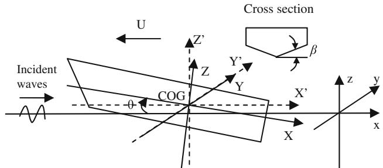
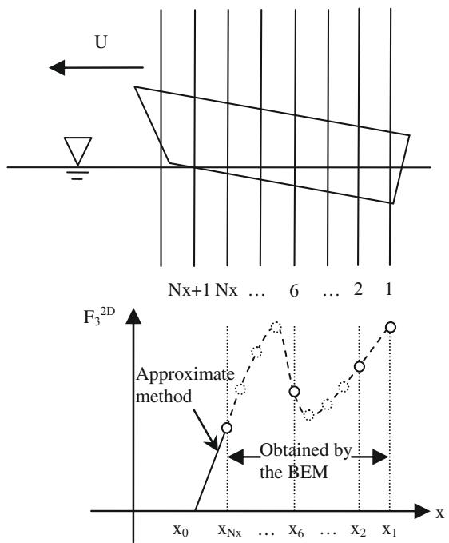
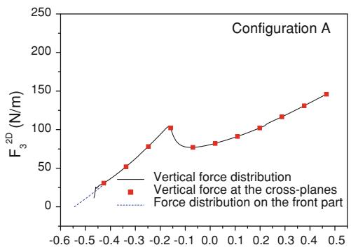
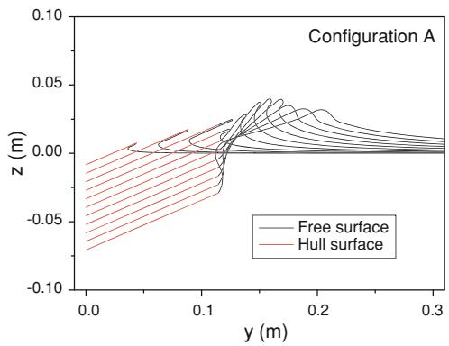
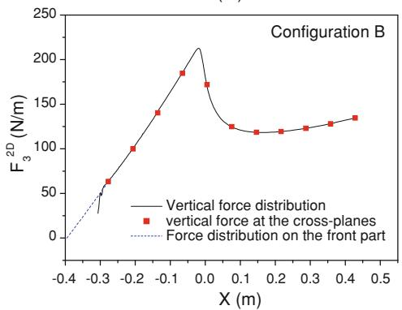
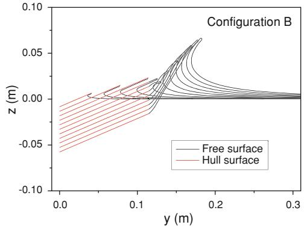
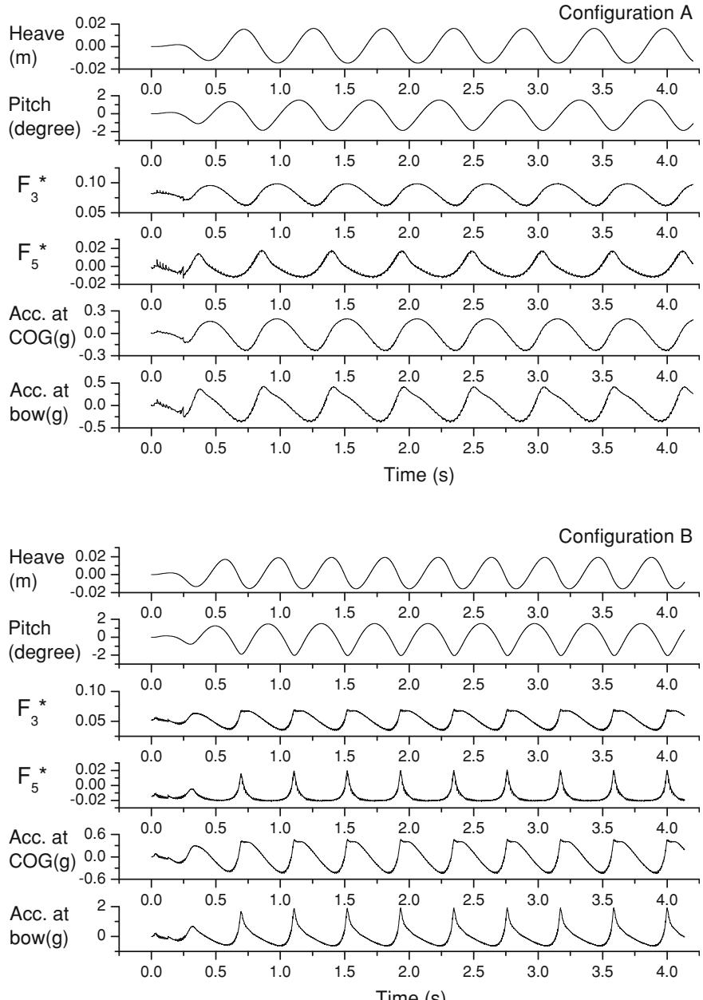
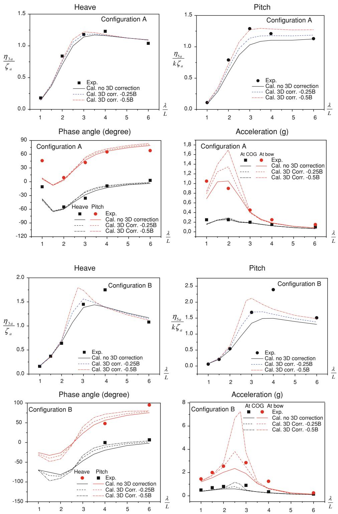
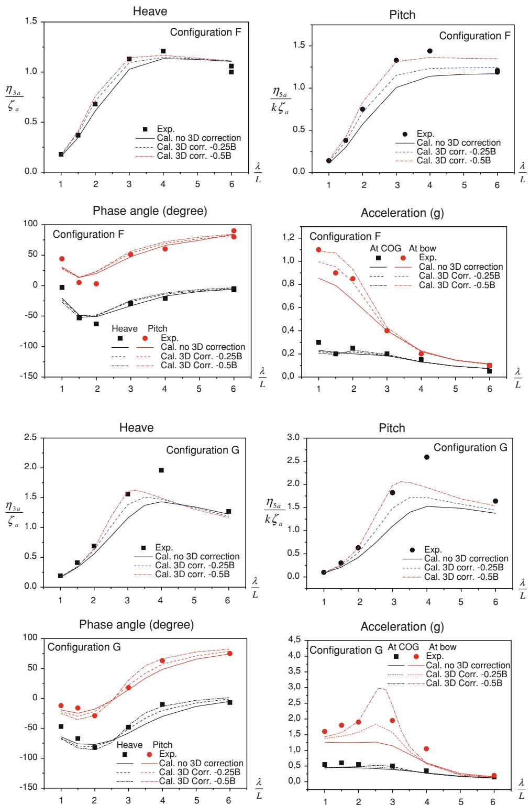

ORIGINAL ARTICLE

# Dynamic motions of planing vessels in head seas

Hui Sun • Odd M. Faltinsen

Received: 28 May 2010 / Accepted: 19 March 2011 / Published online: 12 April 2011 © JASNAOE 2011

Abstract The dynamic response of planing vessels in regular head seas is investigated numerically. Nonlinear time domain simulations were performed using a 2D ? t theory (two-dimensional plus time dependent theory). A prismatic hull form was assumed. We employed a two-dimensional (2D) boundary element method to solve the initial boundary value problems in 2D cross planes, in which nonlinear free-surface conditions and exact body boundary conditions were satisfied. At each time step, the total force and moment on the hull could be obtained by using the sectional forces calculated in those 2D planes. Heave and pitch motions were then acquired by solving the equations for those motions. The calculated heave and pitch responses were compared with the experiments by Fridsma (A systematic study of the rough-water performance of planing boats. Davidson Laboratory Report R-1275, 1969) for two different Froude numbers. Threedimensional (3D) corrections at the transom stern were applied to show the influence of the 3D effect at the stern on the numerical results. Ship motions were affected by the 3D corrections, especially near the resonance frequency, while the phase angles were slightly affected and the acceleration peaks at the bow near the resonance frequency were sensitive to the 3D corrections. Other error sources in the theoretical results are also mentioned.

Keywords Planing vessel - 2D ? t theory - Boundary element method - Seakeeping - Regular waves

## 1 Introduction

Planing vessels are widely used in recreational activities, sports and the military. The present study contributes to the understanding of the hydrodynamic features unique to planing vessels. When the vessel is planing on the water surface, its weight is mainly supported by its hydrodynamic pressure loads rather than by its buoyancy force, as is the case for a displacement ship. Hard chines are often used on a planing boat to keep the flow separate from the sides. Slamming events can easily occur. Instability problems, such as porpoising, dynamic roll instability and broaching, are significant. Inherent strong nonlinearities make those problems difficult to tackle in theory and in implementation.

Earlier studies have focused on steady problems. Steady planing can be made equivalent to the water entry of a twodimensional section, as demonstrated by von Karman [2], Tulin [3] and, more recently, by Vorus [4], Zhao et al. [5] and Xu et al. [6]. In contrast, three-dimensional (3D) analyses have been performed, for instance, by Lai [7] by using a vortex lattice method. Based on systematic experimental results, Savitsky [8] presented empirical formulas for the lift, drag and center of pressure for a prismatic planing hull in calm water.

However, the planing vessel is not always advancing steadily in calm water. The vessel can often be exposed to rough seas, and the incident waves can induce unsteady motions. Even when the vessel is planing in calm water, dynamic instability may occur and cause large unsteady motions [9]. Therefore, a dynamic model for the planing vessel is needed to simulate these situations. In this paper, we focus on the dynamic motions of a planing vessel induced by regular head waves.

For the unsteady problem of planing vessels in waves, early theoretical models were proposed by Martin [10] and

Zarnick [11]. More recent theoretical studies have been reported by Lin et al. [12] and Garme and Rosen [13]. However, in those studies, the free-surface conditions are often linearized and lack forward speed effects. The nonlinear effects are accounted for by considering instantaneous sectional draft, and gravity effects are included by adding hydrostatic restoring forces. Those theoretical results have all been compared against Fridsma’s [1] model tests, in which a systematic series of model tests were carried out to investigate the influence of certain parameters on the performance of a planing boat in head waves. Other experimental works have been carried out, e.g. by Garme and Rosen [13], who performed several full-scale tests of planing boats in waves.

In this paper, 2D ? t theory is applied to simulate the dynamic motions of a prismatic planing vessel in waves. 2D ? t theory has been proven to be a very efficient approach to solving strongly nonlinear hydrodynamic problems (e.g., [14]). Many examples of the 2D ? t theory are illustrated in Faltinsen’s [9] monograph. The 2D ? t theory is also called 2.5D theory because the 2D Laplace equation is solved together with 3D free-surface conditions. In a $2 \mathrm { D } + t$ formulation, the 3D problem is approximated by time-dependent 2D problems in cross planes. Nonlinear free-surface conditions and the gravity effect can be easily incorporated into a 2D ? t theory. Fontaine and Tulin [15] gave a good review of the evolution and application of nonlinear 2D ? t theory. Three-dimensionality is partly considered because the flow at a cross section is influenced by the flow upstream of this section. However, transverse waves cannot be described. Therefore, this approach should be applied to a forward speed at which the transverse waves are not dominant. The ship-lengthbased Froude number $F _ { n }$ should be larger than 0.4–0.5 in practice (see [9]). It is shown in [14] that the nonlinear $2 \mathrm { D } + t$ results agree well with experiments for $F _ { n } > 0 . 6$

In 2D ? t theory, some 3D effects are neglected at the bow, the chine-wetted position and the transom stern (see [16]). The 3D effect at the stern is caused by the flow separation at the stern. The sectional force is often overpredicted at this location by the 2D ? t method. Threedimensional corrections are therefore necessary to obtain a better prediction of the sectional force distribution near the transom stern [16, 17]. Iafrati and Broglia [18] examined the 3D effects neglected in a 2D ? t theory for a very high Froude number. They compared the results from a 3D RANS (Reynolds-averaged Navier–Stokes) solver with those from a 2D ? t potential flow solution. They found important 3D effects in the fore part of the hull, in the region where the flow separates from the chine and at the transom.

In this paper, the mathematical formulation of the $2 \mathrm { D } + t$ theory is inspired by Maruo and Song’s [19] derivation, with some modifications. Further, some technical problems, such as the description of the initial free surface profile and the pressure evaluation on the hull surface, are clarified. A boundary element method (BEM) is applied to solve the 2D nonlinear body-wave interaction problems derived from the original 3D problem. In the BEM, flow separation from the hard chine is simulated. The gravity effect on the water is, in general, included.

It should be noted that the BEM is not the only option for solving the 2D problems in a 2D ? t theory, i.e., other 2D solvers based on either the Euler equations or the Navier–Stokes equations can also be used together with the $2 \mathrm { D } + t$ theory. Further, the application of the $2 \mathrm { D } +$ t theory is not limited to prismatic planing hulls; the theory can be generalized to nonprismatic planing hulls and semidisplacement ships.

Zhao et al. [5] applied the 2D ? t theory to solve for steady planing at a very high forward speed where the gravity effect is neglected. Based on their work, we improved the approach to consider gravity effects in the steady planing of a prismatic hull [16]. Later, we generalized the method to the steady problem for a semidisplacement hull [20], and the unsteady problem involving forced heave and pitch of a prismatic planing hull [21]. Therefore, the present work is a further improvement of the previous studies. If we designate zero incident waves and specify the heave and pitch motions, the mathematical formulations degenerate to those given in [21]. The present numerical results are compared with Fridsma’s [1] experiments for four configurations with two different Froude numbers and two different load coefficients. Threedimensional corrections at the stern are applied to show the possible influence of the 3D effect.

## 2 Description of the 3D problem

Figure 1 shows a planing vessel with V-shaped section advancing in incident waves. An Earth-fixed Cartesian coordinate system xyz is defined with the xy- plane in the calm water surface and the z-axis vertically upwards. The planing hull is moving in the negative x-direction, while the incident waves are propagating in the positive x-direction. Coordinates XYZ fixed on the hull are introduced to define the shape of the hull surface and the normal vector on it. The origin of XYZ is fixed at the centre of gravity (COG) of the hull. The X-axis is pointing to the stern and the Y-axis is towards the starboard. The instantaneous trim angle h is defined to be positive when the bow is going up. The position of the COG in the Earth-fixed coordinates is denoted as $( x _ { g } , \ 0 , \ z _ { g } )$ . Initially, $x _ { g } = 0 .$ . The hull-fixed coordinates can be related to the Earth-fixed coordinates by

  
Fig. 1 A planing vessel in waves and coordinate systems

$$
\left\{ \begin{array}{l} X = (x - x _ {g}) \cos \theta - (z - z _ {g}) \sin \theta \\ Y = y \\ Z = (x - x _ {g}) \sin \theta + (z - z _ {g}) \cos \theta \end{array} \right.\tag{1}
$$

The water is assumed to be inviscid and incompressible and the water motion is assumed to be irrotational. A velocity potential $\Phi ( x , y , z , t )$ is used to describe the water flow, which satisfies the 3D Laplace equation in the water domain. On the hull surface the boundary condition is expressed as $\hat { \bf { \mathrm { 0 } } } \Phi / \hat { \bf { \mathrm { 0 } } } n = { \bf V _ { B } } \cdot { \bf n }$ where $\mathbf { V _ { B } }$ is the velocity vector of the points on the hull and n is the unit normal vector of the hull surface with its positive direction towards the inside of the body. The dynamic free-surface condition simply states $p = p _ { \mathrm { a } }$ where p is the pressure and $p _ { \mathrm { a } }$ is the atmospheric pressure. The kinematic free surface condition is expressed as $\mathrm { D } x / \mathrm { D } t = \hat { \sigma } \Phi / \hat { \sigma } x , \mathrm { D } y / \mathrm { D } t = \hat { \sigma } \Phi / \hat { \sigma } y , \mathrm { D } z / \mathrm { D } t = \hat { \sigma } \Phi / \hat { \sigma } z$ in the Lagrangian specification, where t is the time and D/Dt means the substantial derivative. The water domain is assumed to be infinite in the horizontal dimensions, so the open boundary conditions at infinity should be satisfied. Further, deep water depth is assumed. Now we decompose the total velocity potential into two components as

$$
\Phi = \varphi + \varphi_ {\mathrm{I}}\tag{2}
$$

where $\varphi _ { \mathrm { I } }$ is the incident wave potential and $\varphi$ is the disturbance potential. We assume linear head sea regular waves with small wave steepness so that the incident wave potential is

$$
\varphi_ {\mathrm{I}} = \frac {g \zeta_ {\mathrm{a}}}{\omega_ {0}} \mathrm{e} ^ {k z} \cos (\omega_ {0} t - k x)\tag{3}
$$

where $\zeta _ { \mathrm { a } }$ is the wave amplitude, $\omega _ { 0 }$ is the circular frequency and k is the wave number of the incident waves. Substituting Eqs. 2 and 3 into the governing equation, the body-boundary condition and the kinematic free-surface condition for U, one can obtain

$$
\frac {\partial^ {2} \varphi}{\partial x ^ {2}} + \frac {\partial^ {2} \varphi}{\partial y ^ {2}} + \frac {\partial^ {2} \varphi}{\partial z ^ {2}} = 0 \quad \text { in   the   water   domain }\tag{4}
$$

$$
\frac {\partial \varphi}{\partial n} = \mathbf {V _ {B}} \cdot \mathbf {n} - n _ {z} \frac {\partial \varphi_ {I}}{\partial z} - n _ {x} \frac {\partial \varphi_ {I}}{\partial x} \quad \mathrm{on} S _ {\mathrm{H}}\tag{5}
$$

$$
\frac {\mathrm{D} x}{\mathrm{D} t} = \frac {\partial \varphi}{\partial x} + \frac {\partial \varphi_ {\mathrm{I}}}{\partial x}, \frac {\mathrm{D} y}{\mathrm{D} t} = \frac {\partial \varphi}{\partial y}, \frac {\mathrm{D} z}{\mathrm{D} t} = \frac {\partial \varphi}{\partial z} + \frac {\partial \varphi_ {\mathrm{I}}}{\partial z} \quad \text {on S_{F}}\tag{6}
$$

where $\mathrm { S _ { H } }$ and $\mathrm { S } _ { \mathrm { F } }$ mean the instantaneous hull surface and free surface and $n _ { x } , n _ { y }$ and $n _ { z }$ are the three components of the normal vector n in the Earth-fixed coordinate system. One can insert Eq. 2 into Bernoulli’s Equation $p - p _ { \mathrm { { a } } } =$ $\begin{array} { r } { - \frac { 1 } { 2 } \rho | \nabla \Phi | ^ { 2 } - \rho \frac { \widehat { \boldsymbol { \sigma } } \Phi } { \widehat { \boldsymbol { \sigma } } t } - \rho g z } \end{array}$ to give

$$
\begin{array}{r l} p - p _ {\mathrm{a}} & = - \frac {1}{2} \rho [ \varphi_ {x} ^ {2} + \varphi_ {y} ^ {2} + \varphi_ {z} ^ {2} + 2 \varphi_ {\mathrm{I} x} \varphi_ {x} + 2 \varphi_ {\mathrm{I} z} \varphi_ {z} ] \\ & - \rho \frac {\partial \varphi}{\partial t} - \rho \frac {\partial \varphi_ {\mathrm{I}}}{\partial t} - \rho g z \end{array}\tag{7}
$$

where the subscripts $x , \ y$ and $z ,$ respectively, mean the derivatives with respect to the $x \mathrm { - } , y \mathrm { - }$ , z-coordinates, $\rho$ is the water density, and $g$ is the acceleration of gravity. The term $\varphi _ { \mathrm { I } x } ^ { 2 } + \varphi _ { \mathrm { I } z } ^ { 2 } = \omega _ { \mathrm { 0 } } ^ { 2 } \zeta _ { \mathrm { a } } ^ { 2 } \mathrm { e } ^ { 2 k z }$ has been omitted from Eq. 7 because we assume small wave steepness for the incident waves. By following a fluid particle on the free surface, one has

$$
\begin{array}{r l} & {\frac {\mathrm{D} \varphi}{\mathrm{D} t} = \frac {\partial \varphi}{\partial t} + \nabla \Phi \cdot \nabla \varphi} \\ & {\quad = \frac {\partial \varphi}{\partial t} + \varphi_ {x} ^ {2} + \varphi_ {y} ^ {2} + \varphi_ {z} ^ {2} + \varphi_ {z} \varphi_ {\mathrm{Iz}} + \varphi_ {x} \varphi_ {\mathrm{Ix}}} \end{array}\tag{8}
$$

Inserting the qu/qt term obtained from Eq. 8 into Eq. 7, one can write the dynamic free surface condition $p = p _ { \mathrm { a } }$ on the instantaneous free surface as

$$
\frac {\mathrm{D} \varphi}{\mathrm{D} t} = \frac {1}{2} (\varphi_ {x} ^ {2} + \varphi_ {y} ^ {2} + \varphi_ {z} ^ {2}) - \frac {\partial \varphi_ {\mathrm{I}}}{\partial t} - g z\tag{9}
$$

Equations 4–6 and 9, together with the open boundary condition at infinity and a deep-water boundary condition, describe a time-dependent boundary value problem (BVP) for the disturbance velocity potential, u. Before the vessel encounters waves, or before it moves into the wave region, the vessel is planing steadily in calm water with constant speed U and trim angle s.

If the forward speed of the vessel in waves is kept constant and we consider the unsteady motions only in heave $\eta _ { 3 }$ (in the z-direction) and pitch $\eta _ { 5 }$ (about the Y-axis), then the velocity of the points on the hull surface can be expressed as

$$
\mathbf {V} _ {\mathbf {B}} = \mathbf {i} (- U + (z - z _ {g}) \dot {\eta} _ {5}) + \mathbf {k} (\dot {\eta} _ {3} - (x - x _ {g}) \dot {\eta} _ {5})\tag{10}
$$

where i and k are, respectively, the unit vectors in the positive x- and z-directions and the dot above $\eta _ { 3 }$ or g indicates the first time derivative.

$$
3 2 \mathrm{D} + t \text { theory }
$$

The 3D problem described above can be simplified as timedependent 2D problems in cross planes by applying a slender body assumption (see for instance [19]). A slenderness ratio is now introduced as $\varepsilon = b / { L _ { \mathrm { w } } } .$ , where b is a measure of transverse hull dimension and $L _ { \mathrm { w } }$ is a measure of the wetted length of the hull. We assume a slender body with ratio $\varepsilon \ll 1$ . However, in practice the applicability of the $2 \mathrm { D } + t$ theory is not limited by a very small e. Under the slender body assumption, one has $\partial / \partial x \sim O ( \varepsilon )$ $\begin{array} { r } { \hat { \sigma } / \hat { \sigma } y \sim O ( 1 ) , \quad \hat { \sigma } / \hat { \sigma } z \sim O ( 1 ) } \end{array}$ and also $\widehat { \sf { O } } / \widehat { \sf { O } } X \sim O ( \varepsilon ) ,$ $\hat { \mathsf { o } } / \hat { \mathsf { o } } Y \sim O ( 1 ) , \hat { \mathsf { o } } / \hat { \mathsf { o } } Z \sim O ( 1 )$ . It is further assumed that the trim angle $\theta = \tau + \eta _ { 5 }$ is small, i.e. $\theta \sim O ( \varepsilon )$ and the wavelength k is not small relative to $L _ { \mathrm { w } } , \mathrm { i } . \mathrm { e } . \ \lambda / L _ { \mathrm { w } }$ must be O(1) or larger. We need also assume the Froude number $F _ { n L } = U / \sqrt { g L _ { \mathrm { w } } } = O ( 1 )$ . Neglecting the terms of the order of $O (  { \varepsilon } ^ { 2 } )$ in the governing equation and the boundary conditions, one can obtain the 2D Laplace equation and the boundary conditions in a transverse $y - z$ plane given by

$$
\frac {\partial^ {2} \varphi}{\partial y ^ {2}} + \frac {\partial^ {2} \varphi}{\partial z ^ {2}} = 0 \quad \text { in   the   fluid   domain }\tag{11}
$$

$$
\frac {\partial \varphi}{\partial N} = - U n _ {x} + n _ {z} [ \dot {\eta} _ {3} - (x - x _ {g}) \dot {\eta} _ {5} ] - n _ {z} \varphi_ {\mathrm{Iz}} \quad \text { on } \mathrm{S} _ {\mathrm{H}}\tag{12}
$$

$$
\frac {\mathrm{D} \varphi}{\mathrm{D} t} = \frac {1}{2} \left(\varphi_ {y} ^ {2} + \varphi_ {z} ^ {2}\right) - \frac {\partial \varphi_ {\mathrm{I}}}{\partial t} - g z \quad \text { on } \mathrm{S} _ {\mathrm{F}}\tag{13}
$$

$$
\frac {\mathrm{D} y}{\mathrm{D} t} = \frac {\partial \varphi}{\partial y}, \frac {\mathrm{D} z}{\mathrm{D} t} = \frac {\partial \varphi}{\partial z} + \frac {\partial \varphi_ {\mathrm{I}}}{\partial z} \quad \text { on } \mathrm{S} _ {\mathrm{F}}\tag{14}
$$

where $\mathbf N = \mathbf j n _ { \mathrm { y } } + \mathbf k n _ { z }$ is the two-dimensional normal vector on the ship section in the transverse plane and Eq. 10 has been used. The derivatives of $\varphi _ { \mathrm { I } }$ in Eqs. 12–14 are evalu ated at the instantaneous z-position, however, the influence is not significant if they are all evaluated at $z = 0 ,$ , because the wavelengths to be considered are long. Although the incident waves are described by a linear theory, the BVP described by Eqs. 11–14 are nonlinear. The nonlinear effects due to the change of the wetted body geometry are accounted for, which is more important for planing vessels than for displacement vessels. The free surface conditions are also nonlinear, so the strongly nonlinear free surface flow can be captured.

By using Eq. 1, one can express $n _ { x }$ and $n _ { z }$ in terms of $n _ { X }$ and $n _ { Z } ,$ i.e. the $X \mathrm { , ~ } Z \mathrm { - }$ components of the normal vector n. For a prismatic hull, the shape of its cross section does not change along the ship length, so that $n _ { X } = 0$ . Because it has been assumed that h is small, one has $n _ { x } \approx n _ { Z } \cdot \theta$ and $n _ { z } \approx n _ { Z } .$ Then the body boundary condition on the instantaneous $S _ { \mathrm { H } }$ can be rewritten as

$$
\frac {\partial \varphi}{\partial N} = n _ {Z} [ - U (\tau + \eta_ {5}) + \dot {\eta} _ {3} - (x - x _ {g}) \dot {\eta} _ {5} - \varphi_ {\mathrm{Iz}} ]\tag{15}
$$

A BEM is applied to solve the 2D problem described above. This BEM is presented in detail in Sun and Faltinsen [16] and Sun’s [22] doctoral thesis. In this method, the thin jet running along the V-shaped section surface is cut off. A flow separation model is incorporated to simulate the flow separation from the knuckle of the ship section, i.e. the hard chine of the planing vessel. The separated jet will eventually fall down to the underlying water surface. In order to circumvent the simulation of the breaking waves impacting on the underlying free surface, the tip of the plunging wave is also cut off.

The pressure on the section surface will be evaluated by Eq. 7. Neglecting the $O (  { \varepsilon } ^ { 2 } )$ term and then substituting a function $\psi = \hat { \boldsymbol { 0 } } \varphi / \hat { \boldsymbol { 0 } } t + \mathbf { V _ { B O } } \cdot \nabla \varphi$ into the equation, one has

$$
\begin{array}{r l} p - p _ {\mathrm{a}} = & - \frac {1}{2} \rho [ \varphi_ {y} ^ {2} + \varphi_ {z} ^ {2} ] - \rho (\psi - V _ {\mathrm{BO}} \varphi_ {z}) \\ & - \rho g z - \rho \varphi_ {\mathrm{Iz}} \varphi_ {z} - \rho \frac {\partial \varphi_ {\mathrm{I}}}{\partial t} \end{array}\tag{16}
$$

where $\mathbf { V _ { B O } } = V _ { \mathrm { B O } } \mathbf { k }$ with $V _ { \mathrm { B O } } = - U ( \tau + \eta _ { 5 } ) + \dot { \eta } _ { 3 } - ( x -$ $x _ { g } ) \dot { \eta } _ { 5 }$ being the vertical velocity of the ship section in the transverse cross plane. The auxiliary function w is rewritten as $\psi = \hat { \log } / \hat { \sigma } t + V _ { \mathrm { B O } } \varphi _ { z }$ , which satisfies the 2D Laplace equation and the following boundary conditions.

$$
\frac {\partial \psi}{\partial N} = n _ {Z} (\dot {V} _ {\mathrm{BO}} - \dot {\varphi} _ {\mathrm{Iz}}) \quad \mathrm{on} \mathrm{S} _ {\mathrm{H}}\tag{17}
$$

$$
\psi = (V _ {\mathrm{BO}} - \varphi_ {\mathrm{Iz}}) \cdot \varphi_ {z} - \frac {1}{2} (\varphi_ {y} ^ {2} + \varphi_ {z} ^ {2}) - \frac {\partial \varphi_ {\mathrm{I}}}{\partial t} - g z \quad \text { on } S _ {\mathrm{F}}\tag{18}
$$

Further, all the disturbance of $\psi$ at infinity goes to zero. When the velocity potential $\varphi$ is solved, the boundary conditions for $\psi$ are given. This function can then be solved, too.

## 4 Numerical implementation

The numerical implementation of this $2 \mathrm { D } + t$ theory, together with the BEM, can be described as follows. Initially at $t = 0 ,$ , the vessel is planing steadily in calm water, so the initial conditions for the water flow can be obtained from the steady calculations performed as presented in Sun and Faltinsen [16]. Then for $t > 0$ , incident waves are gradually introduced in a way that will be explained later in this section.

At first, a number of equally spaced vertical space-fixed cross planes intersecting the hull are introduced. The number of planes is Nx in Fig. 2. At each cross plane, the free surface elevation and the velocity potential on the free surface are known from the previous time step. With these boundary conditions and the body boundary condition given by Eq. 15, the BVP can be solved in any of the Nx cross planes by the BEM. Then the pressure on the hull is calculated from Eq. 16. Properly integrating the pressure along a section surface will result in a sectional vertical force. From a sectional force distribution approximated by the sectional forces in all the Nx planes, together with the force distribution on the front part of hull ahead of the plane Nx, we can obtain the total vertical force and the pitch moment on the hull. The sectional force distribution on the front part is obtained by using an approximate theory.

  
Fig. 2 Numerical strategies of the $2 \mathrm { D } + t$ calculations

In the next time step, the free-surface elevation and the velocity potential on the free surface at each plane are updated by integrating the free-surface conditions given by Eqs. 13–14 with respect to time. We can continue the calculation until the hull advances forward for a distance equal to the interval of the cross planes. Then we discard plane No. 1 and introduce a new plane No. Nx ? 1. The calculation will start in this new plane. As the hull moves further on, we will continuously discard the plane after the hull and introduce new planes in front of the hull. The calculations proceed in this way.

The start of calculations in every new plane introduces numerical errors. The finite Nx will also cause errors because in the present method the approximation of the force distribution between plane 1 and Nx is obtained by linearly connecting the 2D forces at those planes. These two error factors cause periodic high-frequency oscillations in the time history of the force and moment. However, the high-frequency oscillations do not significantly affect the heave and pitch motions because the oscillation frequency is far higher than the frequencies of the ship motions. If we increase the number of planes in the calculations, those errors can be diminished. A convergence test is performed by using a different number of planes, which will be discussed in Sect. 7.

When we introduce a new plane and try to start the BEM calculations in it, we need to evaluate whether the submergence of the ship section under the wave surface has been sufficiently large. If the submergence is too small or the section is above the water, then we do not start the calculation until the submergence becomes large enough. Large numerical errors will be introduced if we start from a very small submergence. When it is decided that the BEM calculation can be started in the cross plane, an initial deflected free surface profile is given instead of an initial flat free surface so as to achieve a faster convergence. Wagner’s theory is applied for this purpose because the deadrise angle for the considered planing hull is small (20). A similar treatment has been applied in a steady problem [16] and for a forced oscillation problem [21]. The initial $\varphi = 0$ on the free surface. In order to take into account the incident waves, we modified the initial elevation of the free surface as

$$
f (y) = \frac {y \tan \beta}{\pi / 2} \sin^ {- 1} \left(\frac {c}{y}\right) - d + \zeta_ {\mathrm{I}}\tag{19}
$$

where $\beta$ is the deadrise angle of the wedge section, d(x,t) is the submergence of the wedge under the undisturbed wave surface (see Eq. 22), $c ( x , t ) = \pi d / ( 2 \mathrm { t a n } \beta )$ is the half wetted length of the equivalent flat plate and $\zeta _ { \mathrm { ~ I ~ } } \left( x , t \right) =$ $\zeta _ { \mathrm { a } } \mathrm { s i n } ( \omega _ { o } t - k x )$ is the undisturbed wave elevation. Equation 19 is not based on analytical solutions of the actual problem, but rather a modification of the outer domain solution in Wagner’s theory for the water entry of a wedge with constant entry speed. This approximation is given so that the free surface intersects the section surface at $y = c$ and the elevation goes to undisturbed wave elevation $\zeta$ as y goes to infinity. A more accurate free surface profile in the framework of a $2 \mathrm { D } + t$ theory can be given according to the similarity solution of the constant-speed water entry. However, the expression based on Wagner’s solution is easier to apply and to generalize to a nonprismatic hull. Thus, the present approach is adopted. Further, one should realize that 3D effects matter in the close vicinity of the intersection between the bow and the free surface.

On the hull ahead of the plane Nx, the sectional force distribution is calculated by using another approximate method. At any cross plane intersecting the front part of the hull, we can see a wedge section entering the water with relative speed V, which results from Eq. 15 as

$$
V = U (\tau + \eta_ {5}) - \dot {\eta} _ {3} + (x - x _ {g}) \dot {\eta} _ {5} + \varphi_ {\mathrm{Iz}} \big | _ {z = 0}\tag{20}
$$

where the vertical velocity of the ambient water is assumed to be equal to the value at $z = 0$ . According to Faltinsen [23, page 299], the vertical force on the section can be approximated by

$$
f (x, t) = \frac {\mathrm{D} A}{\mathrm{D} t} V + A \frac {\mathrm{D} V}{\mathrm{D} t} + \rho g S\tag{21}
$$

where A is the high frequency added mass in heave, V is the water entry speed and $S = d ( x , t ) ^ { 2 } / \mathrm { t a n } \beta$ is the submerged sectional area under the undisturbed wave surface. When the incident waves are considered, the submergence $d ( x , t )$ is given as

$$
d (x, t) = \left(x - x _ {\mathrm{g}} - \operatorname{lcg} + L _ {\mathrm{k}}\right) \left(\tau + \eta_ {5}\right) + \zeta_ {\mathrm{I}} (x, t)\tag{22}
$$

where lcg is the longitudinal distance along the keel from the COG to the transom stern and $L _ { \mathrm { k } }$ is the keelwetted length. The added mass is approximated by $A = 0 . 5 C _ { \mathrm { m } } \rho \pi ( C _ { \mathrm { s } } d / \mathrm { t a n } \beta ) ^ { 2 }$ where $C _ { \mathrm { s } }$ is the splash-up correction factor and $C _ { \mathrm { m } }$ is the force correction factor. The two correction factors here are given as $C _ { \mathrm { s } } = 1 . 5$ and $C _ { \mathrm { m } } = 0 . 7 8 7$ for deadrise angle $\beta = 2 0 ^ { \circ }$ according to the spray-root position and the vertical force predicted by the similarity solution in Zhao and Faltinsen [24].

The buoyancy force $\rho g S$ is evaluated from the undisturbed wave surface, so the Froude–Kriloff force has been included due to the fact that the considered wavelength is large relative to the sectional draft. Although the vertical force on the front part of the hull is often a minor component of the total vertical force, it can contribute significantly to the total pitch moment around the COG due to the large distance from the section’s position to the COG. The buoyancy force $\rho g S$ is included here to further improve the accuracy of the pitch moment. The accuracy requirement for the force and moment is higher in the present problem than in the forced oscillation problem, because those loads will be used at each time step to find out the ship motions.

On the first Nx planes, the calculations start from the results of a steady problem in calm water. To keep the consistency in the free-surface conditions, we set $\zeta _ { \mathrm { a } } = 0$ in these planes, which means all the terms related to incident waves in Eqs. 11–18 are set to zero, then the incident wave is introduced in each new plane from Eq. 19 and the forthcoming calculations in the plane. The incident wave effects are gradually introduced in the planes from the bow to the stern. When the first Nx planes are all discarded, we add the wave effect into the calculations of the sectional force on the front part of the hull, as in Eqs. 20–22. This procedure causes transient effects in the time evolution of the motions of the vessel, but steady-state can often be reached after a few periods.

## 5 Equations of motions

When the total vertical force and pitch moment on the planing vessel are found, the equations of motions in heave and pitch can be constructed in an inertial coordinate system X0Y0Z0 (Fig. 1) with its axes parallel to $x \mathrm { \cdot , y \mathrm { - } }$ and z-axes and its origin at the COG of the vessel and moving with the hull at speed U. The directions of $\eta _ { 3 }$ and $\eta _ { 5 }$ have been defined in Eq. 10. The equations of motions are

$$
M \ddot {\eta} _ {3} = F _ {3} - F _ {3 0}\tag{23}
$$

$$
I _ {5 5} \ddot {\eta} _ {5} = F _ {5} - F _ {5 0}\tag{24}
$$

where M and $I _ { 5 5 }$ are the total mass and pitch moment of inertia of the ship, $\ddot { \eta } _ { 3 } = \mathrm { d } ^ { 2 } \eta _ { 3 } / \mathrm { d } t ^ { 2 } , \ddot { \eta } _ { 5 } = \mathrm { d } ^ { 2 } \eta _ { 5 } / \mathrm { d } t ^ { 2 } , F _ { 3 }$ and $F _ { 5 }$ are the total vertical force and pitch moment about the COG on the ship in unsteady motions and $F _ { 3 0 }$ and $F _ { 5 0 }$ are the force and moment on the ship as it is planing steadily in calm water. The vertical force is positive in the positive z-direction and the pitch moment is positive when it makes the bow go up. Ideally, we should have $F _ { 3 0 } = M g$ and $F _ { 5 0 } = 0$ . However, due to the numerical errors, especially the 3D effects, the calculated steady force does not exactly equal the weight of the vessel and the total steady moment does not equal zero. Therefore, they are subtracted from the dynamic force and moment. The surge motion has been neglected because the surge motion itself is very small and it shows little influence on the other two vertical motions, as pointed out by Martin [10].

In order to increase the numerical accuracy of calculated heave and pitch accelerations, Eqs. 23 and 24 are rewritten as

$$
(M + A _ {3 3}) \ddot {\eta} _ {3} + A _ {3 5} \ddot {\eta} _ {5} = F _ {3} - F _ {3 0} + A _ {3 3} \ddot {\eta} _ {3} + A _ {3 5} \ddot {\eta} _ {5}\tag{25}
$$

$$
A _ {5 3} \ddot {\eta} _ {3} + (I _ {5 5} + A _ {5 5}) \ddot {\eta} _ {5} = F _ {5} - F _ {5 0} + A _ {5 3} \ddot {\eta} _ {3} + A _ {5 5} \ddot {\eta} _ {5}\tag{26}
$$

where the approximations of added mass forces given by $- ( A _ { 3 3 } \ddot { \eta } _ { 3 } + A _ { 3 5 } \ddot { \eta } _ { 5 } )$ and $- ( A _ { 5 3 } \ddot { \eta } _ { 3 } + A _ { 5 5 } \ddot { \eta } _ { 5 } )$ are subtracted, respectively, from both sides of Eqs. 23 and 24. The accelerations on the right-hand sides are approximated by the values from the previous time step. The added mass coefficients $A _ { i j } , \ i , \ j = 3 ,$ , 5 can be estimated in a simplified way, such as by Faltinsen [9]. If the estimated added mass coefficient has the same order of magnitude as the exact coefficients, then the acceleration related components in the right hand sides of Eqs. 25, 26 are small, because a major part of the added mass loads have been subtracted. The heave and pitch accelerations solved from these equations thus contain fewer errors inherited from the previous time steps. In some cases the coefficient $A _ { 3 5 }$ estimated by the simplified method in [9] is too low and cannot match the order of magnitude of the actual value, so the calculations diverge. This coefficient is therefore replaced by the added mass obtained by using the numerical method presented in Sun and Faltinsen [21]; then the calculations converge. Such cases occur in the resonance region for a higher Froude number (Figs. 7, 9).

## 6 Fridsma’s experiments

Fridsma [1] performed a systematic series of model tests of planing boats in waves. Four configurations, i.e. configurations A, B, F and $\mathbf { G } ,$ are numerically studied in this paper. These four configurations represent two different planing speeds and two different load coefficients, i.e. the non-dimensional ship weights, for the same deadrise angle. The common parameters of these configurations are the following. The beam B is 9 inches, i.e. 0.2286 m. The length of the model is $L = 5 B = 1 . 1 4 3$ m. The deadrise angle is $\beta = 2 0 ^ { \circ }$ . The vertical distance of the COG to the keel is $\nu c g = 0 . 2 9 4 B$ . The other parameters of these configurations are given in Table 1. In the forthcoming numerical results, the attitude of the planing hull in calm water is given from those experimental data. The tests for regular incident waves are considered with amplitude $\zeta _ { \mathrm { a } } = 0 . 0 5 5 5 B$ and wavelength given by $\lambda / L = 1 . 0 – 6 . 0$

The main part of the model, i.e. the part with a length equal to 4B measured from the transom, is prismatic. The bow of the hull has the same V-shaped cross section but the keel in the bow does not follow a straight line extending from the main hull. The keel line in the bow is an elliptical curve. This special bow shape is not considered in the present numerical study. The keel is assumed to be straight in the calculations, but the maximum length of the keel equals the length of the model. This simplification gives rise to numerical errors. The effect is more important when the bow gets wetted during the unsteady motions.

## 7 Numerical results and discussions

For each configuration, simulation of steady planing by the BEM is performed first. The obtained sectional force distribution and the free surface profiles on the Nx cross planes will be used as initial conditions in the calculations of the corresponding unsteady problem. As examples, the results for configuration A and B are shown in Fig. $3 . F _ { 3 } ^ { 2 \mathrm { D } }$ means the sectional vertical force. The discrete symbols represent the initial sectional force on the first Nx planes. The sectional force distribution along the front part of the hull ahead of plane Nx is obtained by the approximate method $( \mathrm { E q } . ~ 2 1 )$ . For the lower speed case, configuration A, with $V / L ^ { 1 / 2 } = 4 \ \mathrm { k n o t s } / \mathrm { f t } ^ { 1 / 2 }$ , the free surface gradually drops down in the aft ship sections and may make contact with the vertical ship side above the wedge surface. However, for the higher speed case, configuration B with $V / L ^ { 1 / 2 } = 6 \ \mathrm { k n o t s } / \mathrm { f t } ^ { 1 / 2 }$ , the free surface continuously stays up and keeps away from the vertical ship side. This agrees with the observation in the model tests described in the report [1] that some side-wetting may appear at $V / L ^ { 1 / 2 } = 4$ and the hull is fully planing at $V / L ^ { 1 / 2 } = 6$ without sidewetting observed.

Then, starting from the initial conditions, the 2D boundary value problems are solved in those Nx cross planes. The total vertical force and pitch moment are obtained at each time step and then substituted into the equations of motions. The accelerations of heave and pitch motions are solved from the equations and integrated to give the motions. Thus, the time histories of the force and moment, accelerations in heave and pitch, as well as the motions, are obtained. The responses will first experience a transient stage and then reach a steady-state. The steadystate responses are used to evaluate the amplitudes of the heave and pitch motions $( \eta _ { 3 \mathrm { a } }$ and $\eta _ { 5 \mathrm { a } } ) _ { \mathrm { : } }$ , the phase angles of the motions relative to the incident waves and the peak values of the accelerations.

In the numerical calculations, the number of the spacefixed planes was $N x = 1 1$ . Further increasing the number did not significantly change the calculated results. Convergence tests were then performed. For example, for

Table 1 Parameters given in the model tests

<table><tr><td>Configuration</td><td>A</td><td>B</td><td>F</td><td>G</td></tr><tr><td>Load coefficient  $C_{\Delta} = M/(\rho B^{3})$ </td><td>0.608</td><td>0.608</td><td>0.912</td><td>0.912</td></tr><tr><td>Pitch gyradius, percentage of  $L$ </td><td>25.1</td><td>25.5</td><td>20.4</td><td>20.4</td></tr><tr><td>Speed length ratio  $U/L^{1/2}$  (knots/ft $^{1/2}$ )</td><td>4</td><td>6</td><td>4</td><td>6</td></tr><tr><td>Beam Froude number  $F_{nB} = U/(gB)^{1/2}$ </td><td>2.66</td><td>3.99</td><td>2.66</td><td>3.99</td></tr><tr><td>Length Froude number  $F_{n} = U/(gL)^{1/2}$ </td><td>1.19</td><td>1.78</td><td>1.19</td><td>1.78</td></tr><tr><td>Trim angle in calm water  $\tau$  (°)</td><td>4</td><td>4</td><td>6</td><td>5</td></tr><tr><td>Longitudinal position of COG, ( $L - \text{lcg}$ )/ $L$  (%)</td><td>59.0</td><td>62.0</td><td>58.0</td><td>58.0</td></tr><tr><td>Mean wetted length-beam ratio  $L_{\text{m}}/B$ </td><td>3.60</td><td>2.80</td><td>3.75</td><td>3.05</td></tr></table>

L - lcg is the longitudinal distance of the COG to the frontmost point of the hull  
The mean wetted length is defined as $L _ { \mathrm { m } } = ( L _ { \mathrm { k } } + L _ { \mathrm { c } } ) / 2$ where $L _ { \mathrm { k } }$ and L are, respectively, the keel-wetted length and the chine-wetted length The mean wetted length-beam ratio is extrapolated from the experimental results for calm water tests

X (m)

Fig. 3 Vertical force distributions and free surface profiles in the steady planing for configurations A and B  

  
peaks in Fig. 5 but not in Fig. 4. The reason lies in the fact that the resonance frequencies for the two configurations are different. From Figs. 6 and 7 it is seen that the maximum peak accelerations appear at a wavelength between 1.5 and 2.0 for configuration A, however, for configuration B the corresponding wavelength is between 2.5 and 3.0. The considered $\lambda / L = 3 . 0$ is closer to the resonance wavelength in configuration B than that in configuration A. For configuration A, similar sharp peaks can also be easily observed at wavelength $\lambda / L = 2 . 0$ , however the results are not presented in this paper. From Figs. 6, 7, 8 and 9, we will see that the wavelengths for the maximum heave and pitch amplitudes are different from the wavelengths for the maximum peak accelerations. The resonance wavelength and frequency indicated in this paper correspond to the acceleration responses.

configuration A at $\lambda / L = 2 . 0$ , the relative differences caused by using $N x = 1 1$ relative to the values for $N x = 2 1$ are 1.5% for heave amplitude, 2.1% for pitch amplitude, 0.6% for the peak accelerations at the COG and 1.2% for the peak acceleration at the bow. The phase angle difference is $0 . 3 ^ { \circ }$ for heave motion and $0 . 2 1 ^ { \circ }$ for pitch motion.

Some representative examples of the time histories for configuration A and B are shown in Figs. 4 and 5. The incident wavelength was chosen as $\lambda / L = 3 . 0$ , because the maximum non-dimensional heave and pitch amplitudes appear at about this wavelength for both configurations. No 3D correction, which will be addressed later, is applied here. The non-dimensional vertical force $F _ { 3 } ^ { * }$ and pitch moment $F _ { 5 } ^ { * }$ are normalized by $\rho U ^ { 2 } B ^ { 2 }$ and $\rho U ^ { 2 } B ^ { 3 } $ , respectively. The accelerations at the COG and at the bow, with a distance of 10%L from the stem, are also presented. The accelerations are made non-dimensional by g, the acceleration of gravity. The direction of the acceleration at the COG is normal to the calm water surface and the acceleration at the bow is normal to the keel. According to the numerical results, the transient stage is longer for the faster speed cases, which takes 2–7 periods, while the transient stage for the lower speed cases takes about 1–3 periods. The transient stage is found to be shorter for longer wavelengths.

By comparing the responses shown in Figs. 4 and 5, one can see that the nonlinearities are more prominent for configuration B. For instance, there are periodic sharp

Let us analyze the reason for those sharp peaks in the time histories of the pitch moment and the acceleration at the bow. From our numerical results we can see the following phenomena. When the bow meets the front wave slope, the wetted-length of the keel rapidly increases. At the same time, the bow is going downwards, so the bow impacts on the wave surface and causes a rapid increase in the vertical force on the bow. Although the vertical force on the stern is also increasing, the contribution from the bow to the pitch moment is greater. This results in a fast increase in the positive pitch moment. Afterwards, the downward speed of the bow is quickly decelerated, so the force in the bow decreases, however, the force in the stern is still increasing. Therefore, the pitch moment rapidly decreases but the total vertical force does not change much. The sharp peak in the pitch moment will then influence the pitch acceleration and therefore cause a sharp peak in the acceleration at the bow. It can be seen in Fig. 5 that there are small sharp peaks in the total vertical force and the acceleration at the COG at the same time instants, but the peaks are not as prominent as for the pitch moment and the acceleration at the bow.

Fig. 4 Time histories of the loads, motions and accelerations at $\lambda / L = 3 . 0$ and $\zeta _ { \mathrm { a } } = 0 . 0 5 5 5 B$ for configuration $\mathbf { A }$ with $F _ { n } = 1 . 1 9$ and $\tau = 4 ^ { \circ } .$ Acc. means the acceleration  
Fig. 5 Time histories of the loads, motions and accelerations at $\lambda / L = 3 . 0$ and $\zeta _ { \mathrm { a } } = 0 . 0 5 5 5 B$ for configuration B with $F _ { n } = 1 . 7 8$ and $\tau = 4 ^ { \circ } .$ Acc. means the acceleration  

Figures 6, 7, 8 and 9 show the comparisons of the numerical results with the experiments. The amplitudes of the motions are taken as the crest to trough values divided by 2. The phase angle for heave/pitch is defined as the phase difference between the two time instants when the maximum heave/pitch appears and when the crest of the incident wave passes the COG. The range of the phase angle is from $- 1 8 0 ^ { \circ }$ to 180. The phase angle here is defined as positive if the maximum heave/pitch is reached before the wave crest passes the COG in a cycle. The positive phase for heave is defined oppositely in the model tests, so the sign of the experimental phase angles for heave is switched in the comparisons. The accelerations shown in Figs. 6, 7, 8 and 9 are the peak values in the steady-state time histories of the accelerations at the COG and the bow.

Some 3D effects at the bow, the stern and the position where the chine line starts to get wetted (chine-wetted position) are neglected in $2 \mathrm { D } + t$ theory [16, 18]. Threedimensional corrections at the chine-wetted position and at stern were applied in [16] for the steady problem of a planing vessel. The results in [16] showed that the 3D

Fig. 6 Heave motion, pitch motion, phase angles and accelerations of configuration A with $F _ { n } = 1 . 1 9 , C _ { \Delta } = 0 . 6 0 8$ and $\tau = 4 ^ { \circ } .$ . Incident wave amplitude $\zeta _ { \mathrm { a } } = 0 . 0 5 5 5 B .$ Exp. means the experimental results by Fridsma [1]; Cal. means the results by numerical calculations. Two 3D corrections (3D Corr.) are applied by neglecting the sectional force on the hull with length of 0.25B and 0.5B in front of the transom stern, denoted by ‘-0.25B’ and ‘-0.5B’, respectively

Fig. 7 Heave motion, pitch motion, phase angles and accelerations of configuration B with $F _ { n } = 1 . 7 8 , C _ { \Delta } = 0 . 6 0 8$ and $\tau = 4 ^ { \circ } .$ . Incident wave amplitude $\zeta _ { \mathrm { a } } = 0 . 0 5 5 5 B . E x p .$ means the experimental results by Fridsma [1]; Cal. means the results by numerical calculations. Two 3D corrections (3D Corr.) are applied by neglecting the sectional force on the hull with length of 0.25B and 0.5B in front of the transom stern, denoted by ‘-0.25B’ and ‘-0.5B’, respectively

effect at the stern is very important for a case with $F _ { n B } = 2 . 5 ;$ however, at very-high Froude number the 3D effect at chine-wetted position is the most prominent. At the transom stern, the pressure on the stern section should be atmospheric pressure, which means the sectional force at the stern should be zero. In the $2 \mathrm { D } + t$ method, the existence of the stern is not felt by the upstream calculations, so the calculated force at the stern is not zero. In order to show the 3D effects at the transom stern, a rather coarse 3D correction was applied, i.e., the sectional force on a length of the hull starting from the stern was set to be zero in [16]. This length was arbitrarily selected as 0.5B to give results consistent with the experiments. In the present study of the unsteady problem, the influence of the

Fig. 8 Heave motion, pitch motion, phase angles and accelerations of configuration F with $F _ { n } = 1 . 1 9 , C _ { \Delta } = 0 . 9 1 2$ and $\tau = 6 ^ { \circ } .$ . Incident wave amplitude $\zeta _ { \mathrm { a } } = 0 . 0 5 5 5 B .$ Exp. means the experimental results by Fridsma [1]; Cal. means the results by numerical calculations. Two 3D corrections (3D Corr.) are applied by neglecting the sectional force on the hull with length of 0.25B and 0.5B in front of the transom stern, denoted by ‘-0.25B’ and ‘-0.5B’, respectively  
Fig. 9 Heave motion, pitch motion, phase angles and accelerations of configuration G with $F _ { n } = 1 . 7 8 , C _ { \Delta } = 0 . 9 1 2$ and $\tau = 5 ^ { \circ } .$ . Incident wave amplitude $\zeta _ { \mathrm { a } } = 0 . 0 5 5 5 B .$ Exp. means the experimental results by Fridsma [1]; Cal. means the results by numerical calculations. Two 3D corrections (3D Corr.) are applied by neglecting the sectional force on the hull with length of 0.25B and 0.5B in front of the transom stern, denoted by $\cdot _ { - 0 . 2 5 B ^ { \prime } }$ and ‘-0.5B’, respectively  

3D effect is more complicated because the sectional force distribution varies with time. Actually, the 3D correction at the chine-wetted position in [16] is difficult to apply here; however the simple 3D correction at stern can be applied. Therefore, we performed similar 3D corrections only at the stern in the present study. Because it is a crude approach, it is only indicative of the 3D effect at the stern. It should also be realized that the 3D effect at the chine-wetted position may have important influence, but we currently could not find a proper way to investigate it.

Three different calculations are presented in Figs. 6, 7, 8 and 9 to show the influence of the 3D effects for the four configurations. One calculation is without 3D correction. The other two calculations incorporate the 3D correction at the transom stern. Two different lengths on which the sectional force is neglected are used, i.e. 0.5B and 0.25B. In general, the results agree better with the experiments after the 3D correction. The influence of the 3D corrections on the pitch motions is larger than that on the heave motions. The discrepancies caused by 3D corrections are more significant near the resonance frequency. The phase angles are mildly affected. The peak accelerations at the bow are greatly influenced by the 3D corrections around the resonance wavelength. The peak accelerations at the COG are generally not significantly affected, but the situation in configuration B shows an exception near the resonance frequency.

The general features of the results for configurations F and G are, respectively, similar to those for configurations A and B. This implies that the Froude number is a very important parameter. As mentioned earlier, the resonance wavelength corresponding to the maximum acceleration responses is smaller for configuration A than that for configuration B. Similarly, the resonance wavelength for configuration F is smaller than that for G. Therefore, we can see the resonance wavelength is larger for a higher Froude number. The influence of the load coefficient seems not to be significant for the studied cases.

In summary, the difference between the calculations and the experiments can be due to the following error sources. Firstly, the 3D effects at the bow, the chine-wetted position and the transom stern can cause errors. Secondly, the errors, especially those in the pitch motions and the accelerations at the bow, can also be induced by neglecting the curvature of the keel in the bow. Thirdly, numerical errors are introduced when the calculations start in a new cross plane and when the sectional force distribution is approximated by linearly connecting the 2D forces in the finite Nx planes, although those errors have minor effects on the results.

## 8 Conclusions

A 2D ? t theory was formulated to study the dynamic vertical motions of a planing vessel in head waves. Fully nonlinear time-dependent 2D problems were derived and solved by a BEM in Earth-fixed vertical cross planes. The wave-induced heave and pitch motions were calculated by using the force and moment integrated from the pressures obtained in the 2D problems. The peak accelerations at the COG and at the bow were also studied. The numerical results were compared with experiments for different forward speeds and ship weights. The resulting reasonable agreement shows the capability of the present theory.

Further, from the numerical analysis we can observe the following. First, the nonlinearities in the time-domain responses are stronger for the cases which are closer to the resonance frequency. For those cases, periodic sharp peaks in the loads and accelerations can be observed, which occur when the bow impacts the wave surface. Secondly, the resonance wavelengths are larger for the higher Froude number. Finally, the 3D effect at the transom stern is shown to be an important error source, especially near the resonance wavelength. The acceleration peaks at the bow are sensitive to the 3D corrections near the resonance wavelength.

A more careful study of the 3D effect at the transom stern should be carried out. A better description of the sectional force near the stern should be given. The other 3D effects at the bow and the chine-wetted position should be also studied, because they can be important, as well. The present 2D ? t theory can be further generalized to nonprismatic planing hulls and semi-displacement ships at high speed with consideration of incident waves.

## References

1. Fridsma G (1969) A systematic study of the rough-water performance of planing boats. Davidson Laboratory Report R-1275

2. von Karman T (1929) The impact of seaplane floats during landing. NACA TN 321

3. Tulin MP (1957) The theory of slender surfaces planing at high speeds. Schiffstechnik 4(21):125–133

4. Vorus WS (1996) A flat cylinder theory for vessel impact and steady planing resistance. J Ship Res 40:89–106

5. Zhao R, Faltinsen OM, Haslum HA (1997) A simplified nonlinear analysis of a high-speed planing craft in calm water. In: Proceedings of 4th international conference on fast sea transportation. Sydney, Australia, pp 431–438

6. Xu L, Troesch AW, Vorus WS (1998) Asymmetric vessel impact and planing hydrodynamics. J Ship Res 42:187–198

7. Lai C (1994) Three-dimensional planing hydrodynamics based on a vortex lattice method. Ph.D thesis, University of Michigan, Ann Arbor, MI

8. Savitsky D (1964) Hydrodynamic design of planing hulls. Mar Technol 1:71–95

9. Faltinsen OM (2005) Hydrodynamics of high-speed marine vehicles. Cambridge University Press, New York

10. Martin M (1978) Theoretical prediction of motions of high-speed planing boats in waves. J Ship Res 22:140–169

11. Zarnick EE (1978) A nonlinear mathematical model of motions of planing boat in regular waves. David W. Taylor Naval ship R&D Centre, USA, DTNSRDC-78/032

12. Lin WM, Meinhold MJ, Salvesen N (1995) SIMPLAN2, simulation of planing craft motions and load. Report SAIC-95/1000. SAIC, Annapolis, MD

13. Garme K, Rose´n A (2003) Time-domain simulations and fullscale trials on planing craft in waves. Int Shipbuild Progr 50(3):177–208

14. Lugni C, Colagrossi A, Landrini M, Faltinsen OM (2004) Experimental and numerical study of semi-displacement monohull and catamaran in calm water and incident waves. In: Proceedings of 25th symposium on naval hydrodynamics, St. John’s, Canada

15. Fontaine E, Tulin MP (1998) On the prediction of nonlinear freesurface flows past slender hulls using 2D ? t theory: the evolution of an idea. In: RTO AVT symposium on fluid dynamic problems of vehicles operating near or in the air-sea interface, Amsterdam, The Netherlands

16. Sun H, Faltinsen OM (2007) The influence of gravity on the performance of planing vessels in calm water. J Eng Math 58:91–107

17. Garme K (2005) Improved time domain simulation of planing hulls in waves by corrections of the near transom lift. Int Shipbuild Progr 52(3):201–230

18. Iafrati A, Broglia R (2010) Comparisons between 2D ? t potential flow models and 3D RANS for planing hull hydrodynamics. In: Proceedings of 25th international workshop on water waves and floating bodies, Harbin, China

19. Maruo H, Song W (1994) Nonlinear analysis of bow wave breaking and deck wetness of a high speed ship by the parabolic approximation. In: Proceedings of 20th symposium on naval

hydrodynamics, University of California, Santa Barbara, California, pp 68–82

20. Sun H, Faltinsen OM (2010) Numerical study of a semi-displacement ship at high speed. In: Proceedings of 29th international conference on ocean, offshore and arctic engineering Shanghai, China, OMAE2010-20565

21. Sun H, Faltinsen OM (2007) Hydrodynamic forces on a planing hull in forced heave or pitch motions in calm water. In: Proceedings of 22nd international workshop on water waves and floating bodies, Plitvice, Croatia, pp 185–188

22. Sun H (2007) A boundary element method applied to strongly nonlinear wave-body interaction problems. PhD thesis, Norwegian University of Science and Technology, Trondheim, Norway

23. Faltinsen OM (1990) Sea loads on ships and offshore structure. Cambridge University Press, Cambridge

24. Zhao R, Faltinsen OM (1993) Water entry of two-dimensiona bodies. J Fluid Mech 246:593–612