# LONGITUDINAL MOTION OF A SUPER HIGH-SPEEDPLANING CRAFT IN REGULAR HEAD WAVES

Toru KATAYAMA, Takashige HINAMI and Yoshiho IKEDA

Marine System Engineering, Graduate School of Engineering, Osaka Prefecture University Sakai, JAPAN

## ABSTRACT

It is known that planing craft suffer significant wave load and impact force when it runs in wave at high-speed. In severe seas, peculiar violent motions, like jumping from wave crest and falling down to wave surface occur. Recently, this type of craft is used as a leisure boat and its Froude number is over 6.0. For such super high-speed craft, even small waves are dangerous. However, it has not been clarified what sea state are the limiting criteria for full speed running.

In the present study, the ship motions of such a craft at super high-speed, that means at Fn=2.0 to 5.0, in regular head waves are measured in a towing tank, and are divided into some different types; linear motion, non-linear motion with and without jumping. The criteria of these types are determined according to running conditions; Froude number, wave period and wave height and so on. A computer program to simulate ship motion of planing craft at super high-speed is developed using a motion equation with experimental hydrodynamic coefficients and theoretical ones based on a potential theory. The results of the simulation are in good agreement with experimental ones.

KEY WORDS: High-speed, planing craft, head wave, non-linear, stability, hydrodynamic forces

## INTRODUCTION

It is known that planing craft suffer significant wave load and impact force when they run in wave at high-speed. Some peculiar violent motions for planing craft occur in severe seas. For example, jumping from wave crest and falling down to wave surface and so on. Recently, this type of craft is widely used as a leisure boat and Froude number of such craft is over 6.0. For such super high-speed planing craft, even small waves cause dangerous situations.

There are many investigations on motions of planing craft in wave. For example, Bessho et al (1974) carried out towing tank test of a torpedo boat in regular head wave at up to Fn=1.2 and the experimental data were discussed along with Ordinary Linear Strip Method and investigated that the calculation method gives a good agreement with experimental data for Fn<0.5. Sugai et al (1978) carried out model test to measure impulsive water pressure acting on the bottom and motions of high-speed boat up to Fn=1.8, Motora et al (1978) confirmed that simulation results by Non-Linear Strip Method are fairly good agreement with the experimental results measured by Sugai et al (1978). However, there are few investigations on super high-speed planing craft at Fn>2.0 in wave, it is desirable to make experimental and theoretical research on it.

In the present study, the ship motions of such a craft at super high-speed, that means at Fn=2.0 to 5.0, in regular head waves are measured in a towing tank. The results show that the motion can be divided into some different types; those are linear motion, non-linear motion with jumping and non-linear motion without jumping. The criterion of each type is determined according to running conditions; Froude number, wave period, wave height, and so on. In addition, it is studied that the existent theoretical methods based on potential theory (non-linear strip theory (Chiu et al (1992, 1995), Fujino et al (1983), Motora et al (1978), Yamamoto et al (1978), Yoshino et al (1988))) and a proposal method, in which some hydrodynamic forces are replaced by experimental data, are applied to estimate motions. Moreover, simulation results are compared with measured ones.

## MOTION MESURMENTS IN REGULAR HEAD WAVES

In order to understand the characteristics of motions for such a super-high-speed planing craft in regular head waves, model tests are carried out in towing tank of Osaka Prefecture University.

## Experimental Procedure

The model used in the experiments is a 1/4-scale model of a personal watercraft, and its body plan is shown in Fig.1. The model size is 0.625m in length as shown in Table 1. The model is towed by a high-speed towing carriage in the 70m-towing tank, whose maximum speed is 15m/s.

Schematic view of experiment is shown in Fig.2. Under condition where the model is free to heave and pitch, towing point is adjusted to the center of gravity. Heaving and pitching motions are measured by potentiometer and wave profiles are measured by a servo type wave height meter at front of the model. The experiments were carried out systematically changed forward speeds, wave periods and wavelength.

Table 1 Principal particulars of model

<table><tr><td>length</td><td> $L_{OA}$ </td><td>0.625m</td></tr><tr><td>breadth</td><td>B</td><td>0.250m</td></tr><tr><td>depth</td><td>D</td><td>0.106m</td></tr><tr><td>draft</td><td>d</td><td>0.059m</td></tr><tr><td>deadrise angle</td><td> $\beta$ </td><td>22deg.</td></tr><tr><td>ship weight</td><td>W</td><td>4.28kgf</td></tr><tr><td>KG</td><td></td><td>0.111m</td></tr><tr><td colspan="2">LCG from transam</td><td>0.285m</td></tr></table>

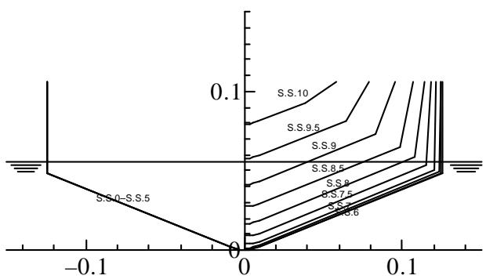  
Fig.1 Body plan of model

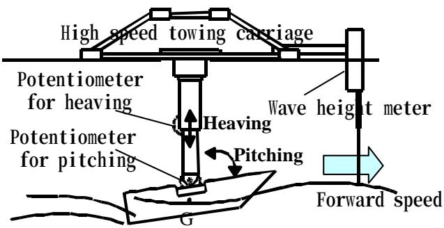  
Fig.2 Schematic view of experiment

Measurements of Running Attitudes and Heave and Pitch Natural Periods

Before motions measuring test in a regular head wave is carried out, the running attitudes and heaving and pitching natural periods during steady forward speed were measured in calm water.

Using the experimental apparatus shown in Fig.2, the model is towed at constant forward speed after rapidly acceleration of $2 5 \mathrm { m } / \mathrm { s } ^ { 2 }$ from rest. In Fig.3, an example of time histories of measured heaving motion is shown. Heaving and pitching natural periods are estimated from damped free oscillation at the stage of just after acceleration by Maximum Entropy Method and the running attitudes are estimated from the steady data after damped free oscillation.

Measured running attitudes are shown in Fig.4. At Fn<1.0, the rise and trim angle decrease at first, and then the rise increases with forward speed. On the other hand, the trim angle, after peak at about Fn=1.2, slightly decrease as forward speed increase. At Fn>2.0, however, variance of attitudes with forward speed is gradual.

The heaving and pitching natural periods are shown in Fig.5. Both periods are almost same value for all Fn, the periods at Fn=0.0 are longest of all and as forward speed increase their periods decrease. The effect of forward speed on the period suggests that the restoring forces of heaving and pitching increase with forward speed (Katayama et al (1996, 1997)).

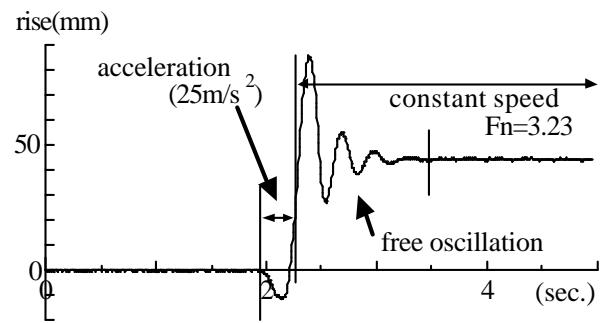  
Fig.3 Time history of heaving motion in rapidly acceleration test from rest

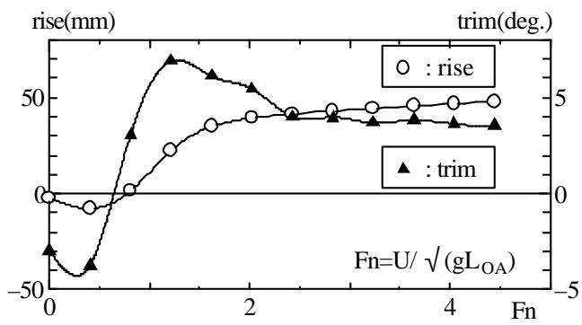  
Fig.4 Running attitude in calm water

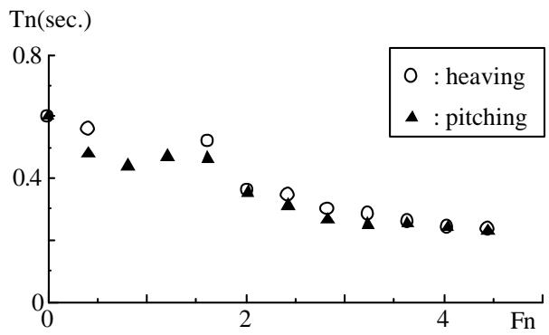  
Fig.5 Natural periods of heave and pitch for various forward speed

(b)

## Results and Discussions

## Motions’ Types Obtained by Model Tests

Three types of motions are observed by model tests in regular head waves as shown in Fig.6; (a) is a motion without jumping from water surface, (b) is a regular jumping motion every wave, (c) is an irregular jumping motion. In Fig.7, typical time histories of the three types of motions are shown. Actually, for sufficiently small Fn and low wave height, motions are sinusoidal. However, for (a) whose wave height almost coincides with draft, the wave profiles of motions are not a sinusoidal to be affected by the nonlinear effects of hydrodynamic forces depend on direction of motion (Katayama et al (1997)).

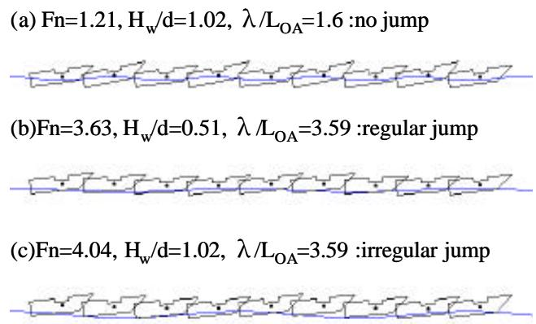

Fig.6 Animated ship motions in head wave on the basis of measured data (λ:wave length)  
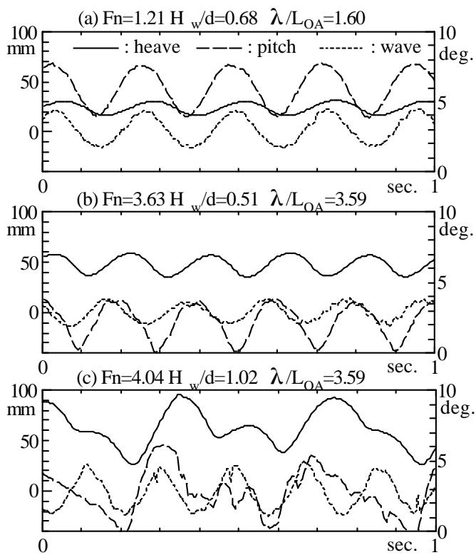  
Fig.7 Time histories of measured ship motions and wave profiles (U: advanced speed, $\mathrm { H } _ { w } \colon$ wave height, λ: wavelength)

Criterion of jumping in waves is shown in Fig.8. By increase in Fn and wavelength, jumping mo tions occurs. As Fn increases, the limit wave height which jumping motion occur decreases. In this figure, the dotted line, that is Hirakata’s formula of jumping criterion obtained by experiment for a planing boat (Hirakata et al (1999)), gives a good account of its nature only qualitatively.

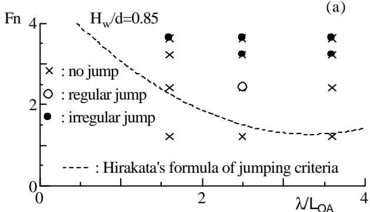

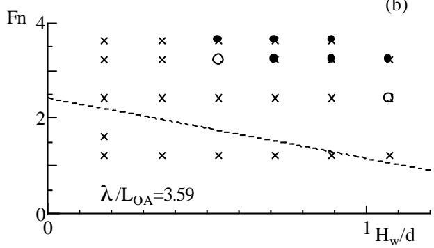  
Fig.8 Criteria of jumping phenomena in wave

## Amplitudes of Motions

Amplitudes of heaving and pitching are shown in Fig.9 and Fig.10. In these figures, amplitudes are obtained by difference between crests to trough of motions’ profiles. At Fn=1.21 where the model does not jump from water surface, non-dimensional amplitudes of heaving and pitching are constant value to wave height. However, at $\mathrm { F n } { = } 3 . 6 3$ where the model jumps from water surface, non-dimensional amplitudes of motions have strong non-linear appearance to wave height.

Amplitudes of motions versus wavelength are shown in Fig.10. At Fn=1.21, non-dimensional amplitudes of motions increases monotonously in proportion to wavelength. At Fn=3.63, on the other hand, non-dimensional amplitudes have a peak, whose value and position (wavelength or wave period) strongly depend on wave height. On close investigation, for small wave height, the period of the peaks are in agreement with the natural period shown in Fig.5. As the wave height increases, the value of, the peak decreases and the period of the peak increase, for the reason as non-linear hydrodynamic forces with large wave height act on the model. As the wave height increases further, at $\mathrm { H } _ { \mathrm { w } } / \mathrm { d } { = } 0 . 6 8$ , the model jumps from water surface and two peaks appear as shown in Fig.10.

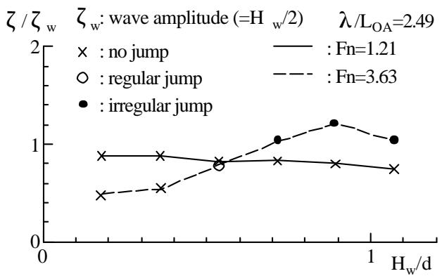

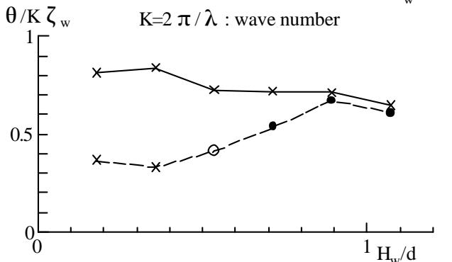  
Fig.9 Amplitudes of ship motions versus wave height $( \zeta$ : heave amplitude, θ : pitch amplitude, K: wave number)

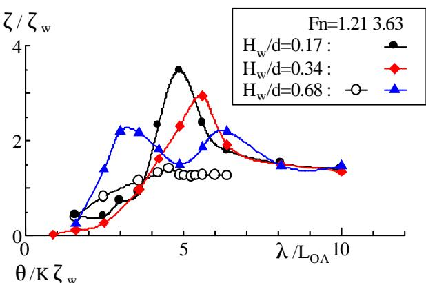

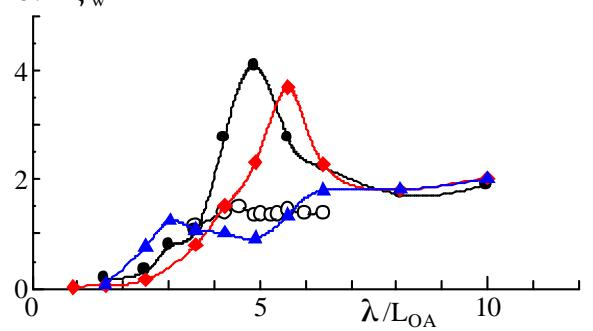  
Fig.10 Amplitudes of ship motions versus wavelength

Time Average Value of Ship Motions in Regular Head Waves

The comparison of time average values of ship motions in head waves and running attitudes in calm water are shown in Fig.11 and Fig.12. Time average values of ship motions are larger than corresponding steady running attitudes in calm water, the difference of them increases as Fn or wave height increase, for the reason as un-symmetric hydrodynamic forces for motion directions, such as impact force which act at bow into water surface, act on the model.

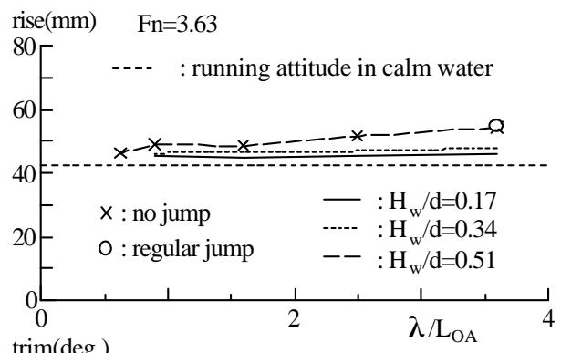

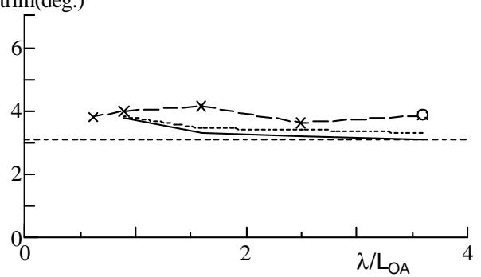  
Fig.11 Time average running attitudes; rise and trim, in waves versus wavelength

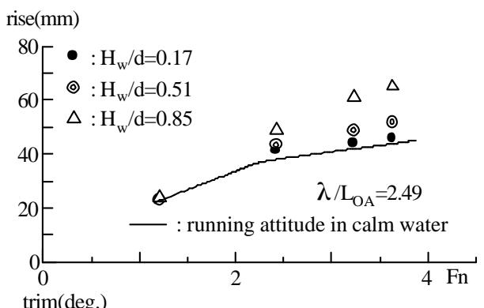

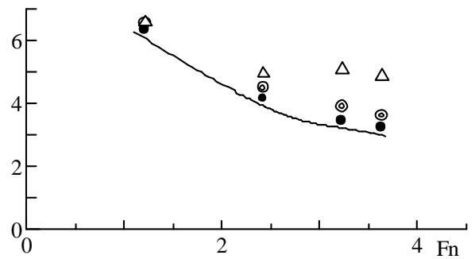  
Fig.12 Time average running attitudes; rise and trim, in waves versus advance speed

## Calculation Method

It is studied that the existent theoretical method based on potential theory (it is called non-linear strip method) and a proposal method, in which some hydrodynamic forces are replaced by experimental data, (it is called the present method) are applied to the estimation of motions of super-high-speed craft in head wave.

Non-linear strip method is developed by Yamamoto (1978) to calculate motion and longitudinal strength of ship with slamming in heavy sea. For hydrodynamic forces acting on such kind of ship, the nonlinearities such as the hull shape nonlinearity, bottom emergence and hydro impact play important role. In order to take into account such nonlinear effects, the method have time-derivative term of the sectional added mass and damping coefficients under the supposition that the sectional added mass and damping coefficients for each time step are results of steady-state oscillations with draft for every time step. In the other hand, the same nonlinear effects is important for planing boat, the method is applied to calculate hydrodynamic forces acting on a planing boat (Fn<1.8) by Motora et al (1978). Subsequently, it was found by Fujino et al (1983) that dynamic vertical lift force is important for planing hulls . And the method is improved to be able to take into account the lift force based on a potential theory, they pointed out that vertical motions and wave loads of planing boats can be evaluated by the method accuracy enough for practical use, and the method may be applied to the case of traveling at higher than Fn=1.8 if the peculiar hydrodynamic forces acting on a planing hull will be appropriately evaluated. In the present method, some peculiar hydrodynamic forces that are restoring forces and damping due to dynamic vertical lift force are replaced by experimental data (Katayama et al (1996)(1997)) and the empirical prediction formula proposed by Ikeda et al (1998) to apply to estimate motions of planing craft at super-high speed (Fn>2.0).

## Results and Discussions

The comparisons between simulated and measured amplitudes of motions are shown in Fig.13 and Fig.14.

At Fn=1.21 that is not so high-speed range, both of calculation results are in fairly good agreement with experimental results. At Fn=3.63, however, non-linear strip method is underestimate as wave height increases.

Amplitudes of motions versus wavelength are shown in Fig.14. Calculated results by non-linear strip method do not have a remarkable peak and particularly underestimate pitching amplitude. On the other hand, calculated results by the present method gives a good account of its nature qualitatively and agree approximately with exp erimental results

The comparison of time average values of ship motions in head waves and running attitudes in calm water is shown in Fig.15. Both calculation results agree well with experimental results, however, calculated result by non-linear strip method underestimate the time average value of trim angle.

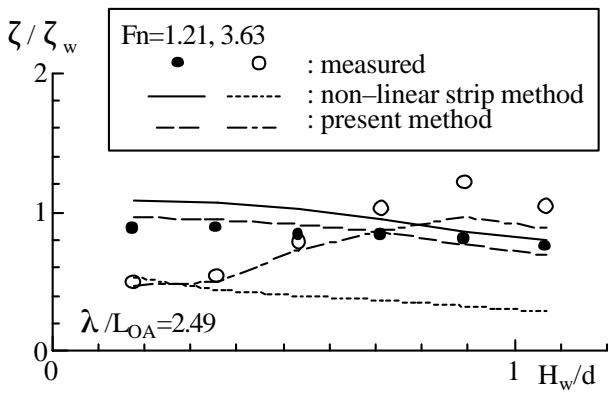

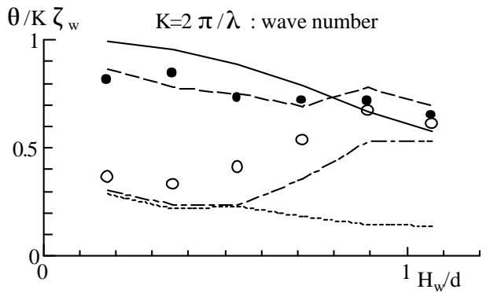  
Fig.13 Comparisons between simulated and measured amplitudes of ship motions

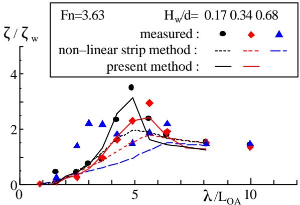

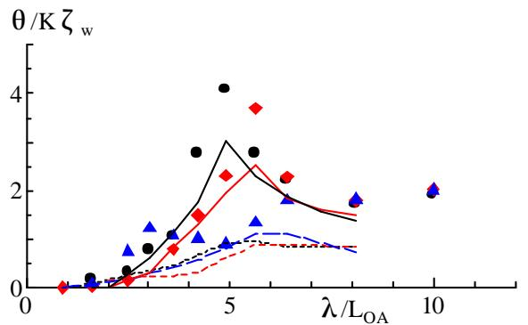  
Fig.14 Comparisons between simulated and measured amplitudes of ship motions

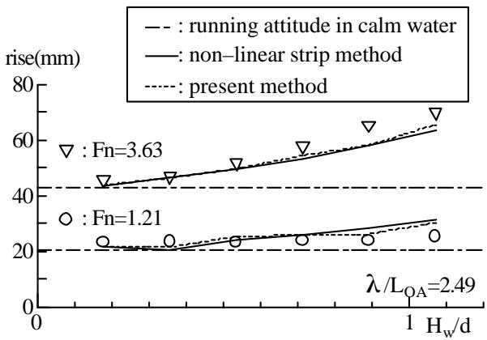

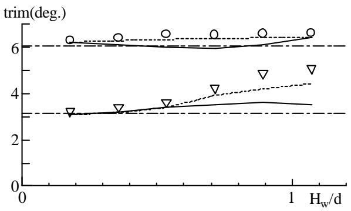  
Fig.15 Comparisons between simulated and measured time average running attitudes; rise and trim, in waves

In order to investigate the reasons for differences of both calculated results, an example of comparisons calculated hydrodynamic forces between non-linear strip method and the present method are shown in Fig.16 and Fig.17. The hydrodynamic forces acting on the model in forced heaving or pitching are shown in these figures. In calculations, Fn is 3.63, heaving amplitude is 5.0mm, pitching amplitude is 1.0degrees and forced motions’ periods are 0.273seconds. In the lift force and the trim moment in forced heaving, the difference between calculated results are shown. And in the lift force in forced pitching, too, the difference is shown. The reason of the difference of the trim moment in forced heaving and the lift force in forced pitching is seemed that the restoring forces due to speed are replaced by experimental data in the present method. On the other hand, the reason of the difference of the lift force in forced heaving is mainly seemed that the present method takes into account the damping component due to the dynamic vertical lift force by using the empirical prediction formula.

From the facts described above, we may conclude that dynamic vertical lift force due to forward speed play an important role on the motions of super-high speed planing craft and it is necessary to calculate motions that the forces are appropriately evaluated.

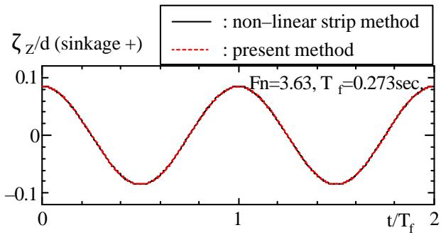

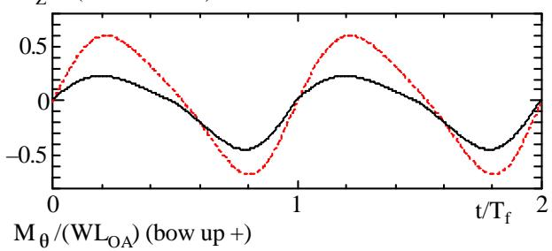

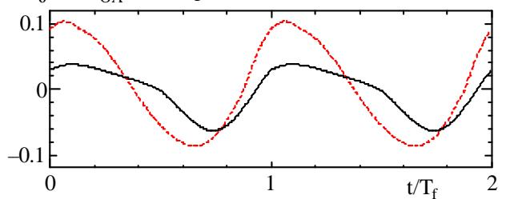  
Fig.16 Comparison of hydrodynamic forces calculated by non-linear strip method and by the present method in forced heave motion

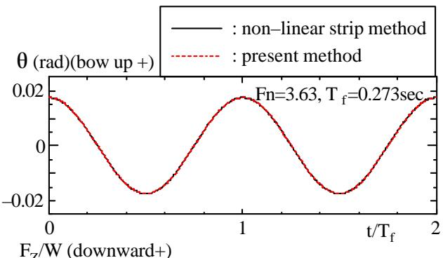

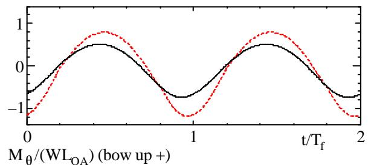

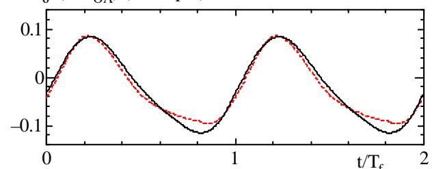  
Fig.17 Comparison of hydrodynamic forces calculated by non-linear strip method and by the present method in forced pitch motion

Through model tests and calculations of motions in regular head wave at Fn=2.0 to 5.0, characteristics of the motions of super high-speed planing craft are experimentally and theoretically investigated. Following conclusions are obtained.

1. Three types of motions that are irregular jumping, regular jumping every wave and without jumping are observed by model test in regular head waves.

2. By increasing Fn and wave height, jumping motion occurs, and by decreasing wavelength, irregular motion occurs.

3. Time average values of motions are larger than running attitude in calm water. Increasing of Fn or wave height increase in difference of them.

4. The vertical motions of high-speed planing craft can be evaluated by the Non-linear Strip Method with appropriately evaluated the peculiar hydrodynamic forces to planing hull accuracy enough for practical use.

## ACKNOWLEDGEMENTS

A part of the present study is supported by a Grand-in -Aid for Scientific Research of the Ministry of Education, Science Sports and Culture in Japan (11750797).

## REFERENCES

Bessho, M., Komatsu, M. and Anjoh, M. (1974), “On Motion of a High Speed Planing Boat in Regular Head Sea”, Jour. of the Society of Naval Archtects of Japan, No.135, pp.109-120

Chiu, F.C., Chou, S.K. and Lee Y.J. (1992), “On Water Pressure Acting on the Bottom of a High-Speed Craft in Head Sea”, Jour. of the Naval Architects of Japan, No.171, pp.147-155

Chiu, F.C., Horng, S.J. and Wang, C.T. (1995), “On the Hydrodynamic Coefficients of High Speed Vessels with Vertical Motions”, Jour. of the Naval Architects of Japan, No.177, pp.231-241

Fujino, M. and Chiu, F.C. (1983), “Vertical Motion of High-Speed Boat in Head Sea and Wave Loads”, Jour. of the Naval Architects of Japan, No.154, pp.151-163

Hirakata, M., Oka, M., Takemoto, H., Miyamoto, T. and Fukushima , M. (1999), “On Impact Loads of Small High-Speed Craft (2nd report: Tank Test of Hull Response in Waves)”, 77th General Meeting of Ship Research Institute, pp.1-6

Ikeda, Y., Katayama, T. and Tajima, S. (1998), “A Prediction Method of Vertical Lift Component in Roll and Heave Damping, Jour. of the Kansai Society of Naval Architects, Japan, No.229, pp.105-110

Katayama, T. and Ikeda, Y. (1996), “ A Study on Coupled Pitch and Heave Porpoising Instability of Planing Craft (1st report)”, Jour. of the Kansai Society of Naval Architects, Japan, No.226, pp.27-134

Katayama, T., Ikeda, Y. and Otsuka, K. (1997), “ A Study on Coupled Pitch and Heave Porpoising Instability of Planing Craft (2nd report)”, Jour. of the Kansai Society of Naval Architects, Japan, No.227, pp.71-78

Katayama, T. and Ikeda, Y. (1997), “ A Study on Coupled Pitch and Heave Porpoising Instability of Planing Craft (3rd report)”, Jour. of the Kansai Society of Naval Architects, Japan, No.228, pp.149-156

Katayama, T. and Ikeda, Y. (1999), “Acceleration Performance of High-Speed Planing Craft from Rest”, Jour. of the Naval Architects of Japan, No.185, pp.81-89

Martin, M. (1978), “Theoretical Prediction of Motion of High-Speed Planing Boats in Waves ”, Jour. of Ship Research, Vol.22, No.3, pp.140-169

Mizoguchi, S. (1983), “Exciting Forces on a High Speed Container Ship in Regular Oblique Waves –Frequency Selections for Calculating Exciting Forces by Strip Method-“, Jour. of the Kansai Society of Naval Architects, Japan, No.187, pp.71-83

Motora, S., Fujino, M., Terao, Y., Amako, K. and Sakurai, K. (1978), “On the Mechanism of Occurrence of Impact Pressure upon High Speed Boats in Wave”, Jour. of the Society of Naval Architects of Japan, No.144, pp.172-182

Sugai, K., Yoshino, T., Yamamoto, T. and Ohmatsu, S. (1978), “Model Tests on Impulsive Water Pressures acting on the Bottom of a High-Speed Boat in Wave”, Jour. of the Society of Naval Architects of Japan, No.144, pp.163-171

Takaki, M., Lin, X. and Ideguchi, M.(1996), “A Practical Prediction Method of Ship Motions with Large Amplitude”, Proc. of Third Korea-Japan Joint Workshop on Ship and Marine Hydrodynamics, pp.141-148

Yamamoto, Y., Fujino, M. and Fukasawa, T. (1978), “Motion and Longitudinal Strength of a Ship in Head Sea and the Effects of Non-Linearities”, Jour. of the Society of Naval Architects of Japan, No.143, pp.179-187

Yoshino, I., Fujino, M. and Fukasawa, T. (1988), “Wave Exciting Forces Acting on a Ship Traveling in Following Waves at High Speed”, Jour. of the Naval Architects of Japan, No.163, pp.160-172