# Experimental results of motions, hydrodynamic coefficients and wave loads on the 372 catamaran model

Ir. Riaan van't Veer

Report 1129

February 1998

The OCR result should be empty, as the image contains only a stylistic horizontal line which must be ignored according to Rule 2. No text or placeholder characters should be output.

## Contents

Abstract 2
List of Symbols 3
1 Description of the experiments 5
1.1 Introduction ..... 5
1.2 Experimental set-up ..... 6
1.2.1 The still water resistance tests ..... 7
1.2.2 The heave and pitch motion tests ..... 8
1.2.3 The forced heave and pitch oscillation tests ..... 9
1.2.4 The wave load tests ..... 10
1.3 Test program overview ..... 11
2 Measurements results 15
2.1 The still water resistance tests ..... 15
2.2 The heave an pitch motion tests ..... 21
2.3 The forced heave and pitch oscillation tests ..... 26
2.3.1 Forced heave oscillation tests ..... 27
2.3.2 Forced pitch oscillation tests ..... 27
2.3.3 Restoring coefficients ..... 28
2.4 The wave load tests ..... 46
Acknowledgment 51
References 52

The Ground Truth image displays a single, solid horizontal line. According to Rule 2 (UNDERSCORE & LINE RULES), this is a stylistic or background line, not a placeholder underscore. Therefore, the OCR result must ignore it. The provided OCR content is "\_\_\_\_", which consists of four underscores. This is an incorrect interpretation of the line as a placeholder, violating the rule that stylistic lines must be ignored. The OCR has hallucinated text (underscores) where none should exist, violating the rule to ignore such lines. Hence, the OCR result is inconsistent with the Ground Truth.

## Abstract

This report presents the measurement results of a series of experiments carried out in the towing tank no 1 at Delft University of Technology. The measurements were carried out as part of a PhD project.

The comparison of the measurements with numerical results is presented in the PhD thesis Van 't Veer (1998a). Another series of experiments with the catamaran 372 in oblique waves is presented in the measurement report Van 't Veer (1998b).

## List of Symbols

<table><tr><td>a</td><td>-</td><td>subscript for amplitude</td></tr><tr><td> $\Delta$ </td><td>[kg]</td><td>displacement</td></tr><tr><td> $\epsilon_3$ </td><td>[deg]</td><td>heave phase angle</td></tr><tr><td> $\epsilon_5$ </td><td>[deg]</td><td>pitch phase angle</td></tr><tr><td> $\eta_3$ </td><td>[mm]</td><td>heave motion</td></tr><tr><td> $\eta_5$ </td><td>[rad]</td><td>pitch motion</td></tr><tr><td> $\lambda$ </td><td>[m]</td><td>wave length</td></tr><tr><td> $\rho$ </td><td>[kg/m3]</td><td>water density (1000 kg/m3)</td></tr><tr><td> $\theta$ </td><td>[rad]</td><td>pitch angle</td></tr><tr><td> $\omega$ </td><td>[rad/sec]</td><td>wave frequency</td></tr><tr><td> $\omega_e$ </td><td>[rad/sec]</td><td>wave encounter frequency</td></tr><tr><td> $\zeta$ </td><td>[mm]</td><td>wave height</td></tr><tr><td> $A_{ij}$ </td><td>[]</td><td>added mass value in the i-direction due to a force in the j-direction</td></tr><tr><td> $B_{ij}$ </td><td>[]</td><td>fluid damping value in the i-direction due to a force in the j-direction</td></tr><tr><td>B</td><td>[m]</td><td>overall vessel beam</td></tr><tr><td> $C_{ij}$ </td><td>[]</td><td>restoring coefficient in the i-direction due to a force in the j-direction</td></tr><tr><td> $C_B$ </td><td>[-]</td><td>block coefficient</td></tr><tr><td> $F_3$ </td><td>[N]</td><td>Vertical force (in the z-direction</td></tr><tr><td> $F_5$ </td><td>[Nm]</td><td>Moment around the y-axis</td></tr><tr><td>Fn</td><td>[-]</td><td>Froude number; Fn = U/ $\sqrt{Lg}$ </td></tr><tr><td>H</td><td>[m]</td><td>distance between the centre lines of the two hulls</td></tr><tr><td> $I_{55}$ </td><td>[kgm2]</td><td>moment of inertia, around y-axis</td></tr><tr><td>KG</td><td>[m]</td><td>distance of centre of gravity above keel</td></tr><tr><td>LCG</td><td>[m]</td><td>longitudinal centre of gravity, measured from AP</td></tr><tr><td> $L_{OA}$ </td><td>[m]</td><td>overall ship length</td></tr><tr><td>L</td><td>[m]</td><td>ship length between perpendiculars</td></tr><tr><td>M</td><td>[kg]</td><td>mass</td></tr></table>

R [N] overall ship resistance
T [m] ship draught $T_{AP}$ [m] draught at aft perpendicular $T_{FP}$ [m] draught at fore perpendicular
U [m/sec] steady forward speed of the vessel
b [m] breath of the demihull
g [m/sec²] gravitational acceleration; 9.81 m/sec²
k [rad/m] wave number; $k = \omega^{2}/g$ $k_{yy}$ [m] pitch radius of gyration
x [m] x-coordinate
y [m] y-coordinate $y_{w}$ [m] local beam of vessel, centre line to waterline
z [m] z-coordinate
z [mm] heave motion

# 1 Description of the experiments

## 1.1 Introduction

To obtain inside in the behaviour of fast catamaran vessels in waves, a series of experiments have been carried out. The test program consisted of:

○ Resistance measurements, including trim and sinkage registration, Fn = 0.18 to Fn 0.75

\- Steady wave pattern measurements using a longitudinal wave cut, Fn = 0.30 to Fn 0.75

\- Steady hull wave pattern visualisation via photo's, Fn = 0.30 and 0.45

○ Heave and Pitch motions registration in head waves, Fn = 0.30, 0.45, 0.60 and 0.75

○ Heave and Pitch oscillation tests, zero trim and sinkage, Fn = 0.30, 0.45, 0.60 and 0.75

○ Heave and Pitch oscillation tests, trim and sinkage correction, Fn = 0.75

○ Wave force measurements, head waves, zero trim and sinkage, Fn = 0.30, 0.45, 0.60 and 0.75

The catamaran used in the experiments was designed at Delft University. The ratio of several overall dimensions was chosen from realistic values found in the literature of recently builded catamarans.

The transom was given a zero depth. It is understood that for practical reasons the transom stern of a catamaran has a certain depth, since this is necessary to install the waterjet propulsion system. However, to illuminate the highly nonlinear behaviour of such a transom stern, a stern with zero depth was chosen.

The range of forward speed in which the catamaran model was tested, was selected from Fn = 0.30 up to Fn = 0.75, which is a realistic operating range for existing catamaran vessels.

## 1.2 Experimental set-up

Model experiments with the 372 catamaran model were carried out in the towing tank no. 1 of the Delft Ship Hydrodynamic Laboratory. The dimensions of the towing tank are LxBxD = 145 x 4.2 x 2.6 [m]. During the experiments the water depth varied between 2.33 m to 2.40 m, due to the restrictions of the experimental equipment.

The main particulars of the catamaran vessel are given in Table 1.1 and a lines plan of the catamaran is presented in Figure 1.1. At the end of this chapter a list of ordinates is included and a second lines plan is given (large scale).

<table><tr><td>Main Particulars</td><td>Symbol</td><td colspan="2">Value</td></tr><tr><td>Length over all</td><td> $L_{0A}$ </td><td>3.11</td><td>m</td></tr><tr><td>Length between perpendiculars</td><td>L</td><td>3.00</td><td>m</td></tr><tr><td>Beam overall</td><td>B</td><td>0.94</td><td>m</td></tr><tr><td>Beam demihull</td><td>b</td><td>0.24</td><td>m</td></tr><tr><td>Distance between center of hulls</td><td>H</td><td>0.70</td><td>m</td></tr><tr><td>Draught</td><td>T</td><td>0.15</td><td>m</td></tr><tr><td>Displacement</td><td> $\Delta$ </td><td>87.07</td><td>kg</td></tr><tr><td>Draught, AP</td><td> $T_{AP}$ </td><td>0.15</td><td>m</td></tr><tr><td>Draught, FP</td><td> $T_{FP}$ </td><td>0.15</td><td>m</td></tr><tr><td>Vertical center of gravity</td><td>KG</td><td>0.34</td><td>m</td></tr><tr><td>Longitudinal center of gravity</td><td>LCG</td><td>1.41</td><td>m</td></tr><tr><td>Pitch radius of gyration</td><td> $k_{yy}$ </td><td>0.782</td><td>m</td></tr><tr><td>Moment of inertia for pitch</td><td> $I_{55}$ </td><td>53.245</td><td>kg  $m^2$ </td></tr><tr><td>Length over beam ratio</td><td>L/b</td><td>12.5</td><td></td></tr><tr><td>Length over draught ration</td><td>L/T</td><td>20.0</td><td></td></tr><tr><td>Block coefficient</td><td> $C_B$ </td><td>0.403</td><td></td></tr><tr><td>Mass during oscillation tests</td><td>M</td><td>62.00</td><td>kg</td></tr><tr><td>Moment of inertia, osc. tests</td><td> $I_{55}$ </td><td>13.454</td><td>kg  $m^2$ </td></tr></table>

Table 1.1: Main characteristics of the Catamaran 372 model.

The experimental program was divided in four different test series which are described below.

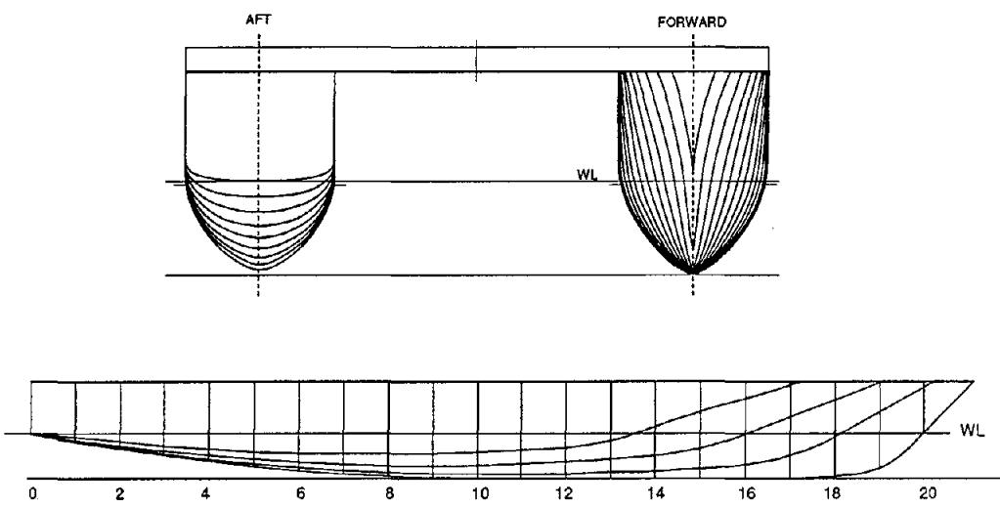  
Figure 1.1: Lines plane Catamaran 372.

## 1.2.1 The still water resistance tests

A series of experiments have been carried out to obtain the resistance, trim and sinkage of the model over the forward speed range Fn = 0.18 to Fn = 0.75. An illustration of the experimental set-up is given in Figure 1.2.

The sinkage of the model was measured (using a potentiometer and a wire connected with the model) at the centre of gravity and in a second point which was positioned 679 mm behind the centre of gravity. From the two vertical displacements the trim angle can be calculated, while the sinkage at the centre of gravity was directly obtained from the measurements.

To obtain the stationary wave pattern created by the vessel at a certain forward speed, wave cut measurements were carried out. For this purpose a wave height meter was positioned in the towing tank at a fixed distance from the tank wall, which corresponded with a distance of 275 mm from the demihull centre line, see Figure 1.3. By passing the wave height meter the wave system generated by the vessel was recorded. Due to the reflections of the tank wall only the first part of the recorded wave is a valid representation of the steady wave system generated by the catamaran. An extra signal was recorded during the test run which was triggered by the carriage passing the wave height meter. Using this trigger pulse it was possible to obtain the relation between the vessel position and the recorded wave signal.

A grid consisting of the still waterline, two waterlines at a distance of 50 and 100 mm below the still waterline, two waterlines at a distance of 50 and 100 mm above the still waterline, and vertical lines at equidistant distance of 100 mm starting at the fore perpendicular were drawn on both demihulls at port side. During the test runs a series of pictures was taken which were afterwards used to construct the steady wave contour on the hull.

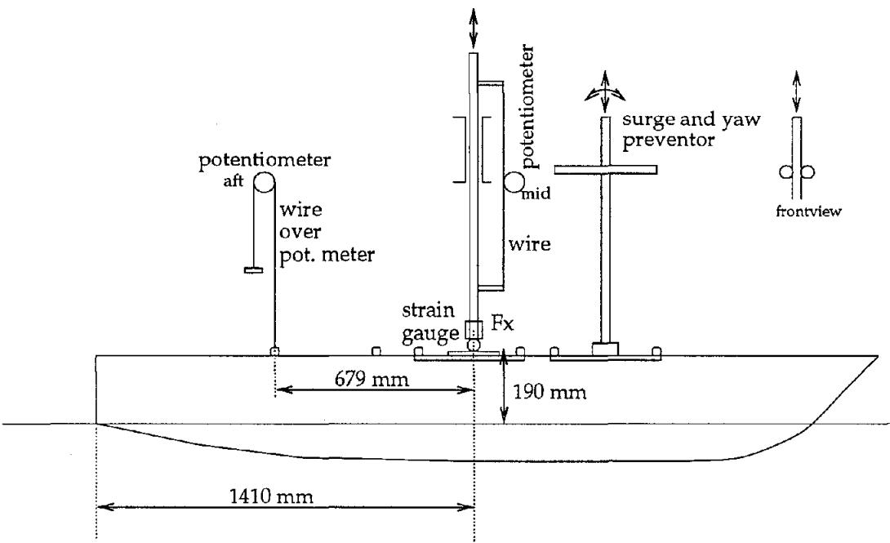  
Figure 1.2: Experimental set-up for wave resistance, trim and sinkage measurements and for the heave and pitch motion tests in head waves

## 1.2.2 The heave and pitch motion tests

To obtain the heave and pitch response amplitude operators in head waves a series of motion tests have been carried out. An illustration of the experimental set-up for the these tests is presented in Figure 1.2, which is the same set-up as for the resistance tests.

The vertical displacement in the centre of gravity and in a point 679 mm behind the centre of gravity were recorded using potentiometers. From the two displacements the heave and pitch response could be calculated. The phase lag between the responses and the incoming wave system was obtained using as reference signal the signal of a wave height meter which was positioned in line with the centre of gravity.

The model was tested at four different forward speed values, that is Fn = 0.30, Fn = 0.45, Fn = 0.60 and Fn = 0.75, and at each forward speed in several wave frequency conditions. A second wave height meter, positioned in front of the model, was used to obtain the undisturbed incoming wave signal.

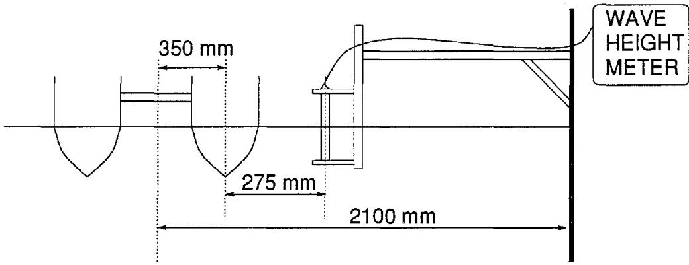  
Figure 1.3: Wave cut measuring layout

## 1.2.3 The forced heave and pitch oscillation tests

To obtain the heave and pitch added mass and fluid damping values, forced heave and pitch oscillation tests have been carried out. An illustration of the experimental set-up is presented in Figure 1.4.

The oscillator and the model were connected using two load cells at each connection point, measuring the force in the vertical and horizontal direction. The oscillations were carried out at four different forward speed values, that is Fn = 0.30, Fn = 0.45, Fn = 0.60 and Fn = 0.75, and at each velocity for several oscillation frequencies ranging from $\omega = 3.20$ rad/sec up to $\omega = 5.85$ rad/sec. During these tests the trim and sinkage of the model were zero (the still water reference position of the model).

To investigate the influence of the trim and sinkage in the hydrodynamic terms an extra series of forced heave and pitch oscillation tests was performed in which the reference position of the vessel was changed using the trim and sinkage obtained from the still water resistance test. These experiments were only performed at Fn = 0.75.

During the forced heave and pitch oscillation tests the weight of the model was kept as light as possible, which had its influence on the pitch radius of gyration. In the calculation procedure the measured forces are corrected with the actual weight and gyration radius, see also Table 1.1.

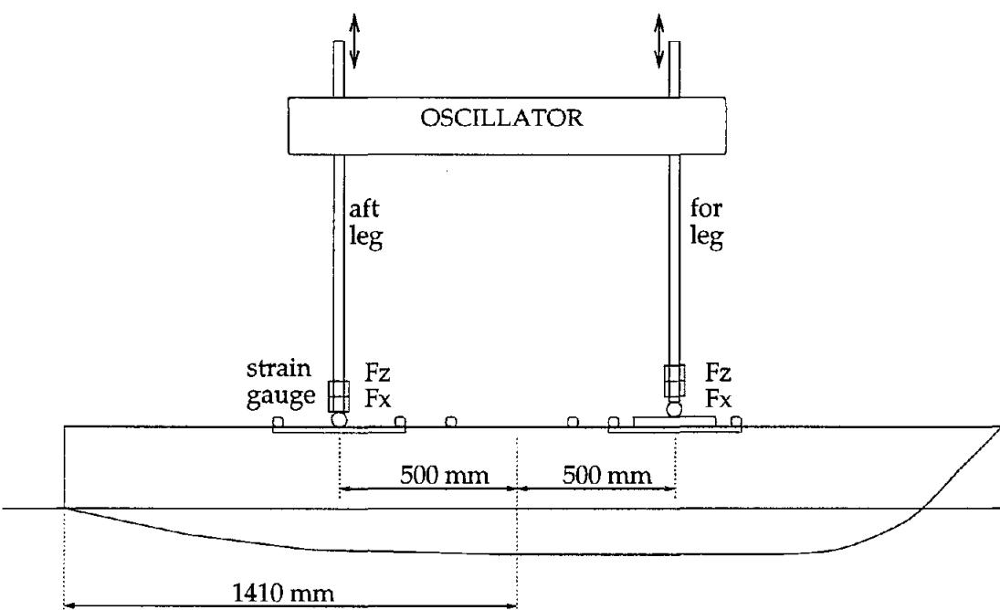  
Figure 1.4: Experimental set-up for forced heave and pitch oscillation tests and for the wave load tests

## 1.2.4 The wave load tests

To obtain the wave loads on the catamaran vessel, restrained model tests have been carried out in head waves. The vertical and the horizontal forces at the two connecting points were measured. An illustration of the experimental set-up is given in Figure 1.4, which is the same set-up as for the oscillation tests (only now the oscillator is fixed).

The model tests were performed at four different forward velocities, Fn = 0.30, 0.45, 0.60 and 0.75, and at each velocity a set wave frequencies was used, ranging from $\lambda/L = 0.6$ up to $\lambda/L = 2.0$ . During the experiments the trim and sinkage of the model were zero. A wave height meter in the centre of gravity plane of the vessel was used to obtain the phase lag between the forces and the incoming wave system. A second wave height meter in front of the model to register the undisturbed incoming wave system.

The model weight of the model during the restrained model tests was kept equal to the model weight in the forced oscillation tests. This is possible since the model was forced in it's reference position (zero trim and sinkage) by the oscillator.

## 1.3 Test program overview

In Table 1.2 through 1.7 an overview is given of all the runs presented in this report.

<table><tr><td>run</td><td>U [m/s]</td><td>Fn</td><td>run</td><td>U [m/s]</td><td>Fn</td></tr><tr><td>2</td><td>1.630</td><td>0.300</td><td>14</td><td>2.709</td><td>0.499</td></tr><tr><td>4</td><td>2.440</td><td>0.450</td><td>16</td><td>2.978</td><td>0.549</td></tr><tr><td>6</td><td>3.258</td><td>0.601</td><td>18</td><td>3.527</td><td>0.650</td></tr><tr><td>8</td><td>4.058</td><td>0.748</td><td>20</td><td>3.797</td><td>0.700</td></tr><tr><td>10</td><td>1.890</td><td>0.348</td><td>22</td><td>0.999</td><td>0.184</td></tr><tr><td>12</td><td>2.170</td><td>0.400</td><td>24</td><td>1.300</td><td>0.240</td></tr></table>

Table 1.2: Test run overview of wave resistance measurement program

<table><tr><td>run</td><td>Fn</td><td> $\lambda/L$ </td><td>run</td><td>Fn</td><td> $\lambda/L$ </td><td>run</td><td>Fn</td><td> $\lambda/L$ </td><td>run</td><td>Fn</td><td> $\lambda/L$ </td></tr><tr><td>26</td><td>0.30</td><td>0.601</td><td>50</td><td>0.45</td><td>0.601</td><td>72</td><td>0.60</td><td>0.798</td><td>98</td><td>0.75</td><td>0.998</td></tr><tr><td>28</td><td>0.30</td><td>0.803</td><td>52</td><td>0.45</td><td>0.799</td><td>74</td><td>0.60</td><td>0.897</td><td>100</td><td>0.75</td><td>1.100</td></tr><tr><td>30</td><td>0.30</td><td>0.899</td><td>54</td><td>0.45</td><td>0.899</td><td>76</td><td>0.60</td><td>0.999</td><td>102</td><td>0.75</td><td>1.204</td></tr><tr><td>32</td><td>0.30</td><td>0.965</td><td>56</td><td>0.45</td><td>1.001</td><td>78</td><td>0.60</td><td>1.098</td><td>104</td><td>0.75</td><td>1.297</td></tr><tr><td>34</td><td>0.30</td><td>1.007</td><td>58</td><td>0.45</td><td>1.097</td><td>80</td><td>0.60</td><td>1.200</td><td>106</td><td>0.75</td><td>1.394</td></tr><tr><td>36</td><td>0.30</td><td>1.101</td><td>60</td><td>0.45</td><td>1.201</td><td>82</td><td>0.60</td><td>1.292</td><td>108</td><td>0.75</td><td>1.491</td></tr><tr><td>38</td><td>0.30</td><td>1.204</td><td>62</td><td>0.45</td><td>1.295</td><td>84</td><td>0.60</td><td>1.393</td><td>110</td><td>0.75</td><td>1.596</td></tr><tr><td>40</td><td>0.30</td><td>1.301</td><td>64</td><td>0.45</td><td>1.396</td><td>86</td><td>0.60</td><td>1.490</td><td>112</td><td>0.75</td><td>1.806</td></tr><tr><td>42</td><td>0.30</td><td>1.395</td><td>66</td><td>0.45</td><td>1.595</td><td>88</td><td>0.60</td><td>1.600</td><td>114</td><td>0.75</td><td>1.985</td></tr><tr><td>44</td><td>0.30</td><td>1.596</td><td>68</td><td>0.45</td><td>1.803</td><td>90</td><td>0.60</td><td>1.795</td><td>116</td><td>0.75</td><td>1.694</td></tr><tr><td>46</td><td>0.30</td><td>1.803</td><td>70</td><td>0.45</td><td>1.991</td><td>96</td><td>0.60</td><td>1.977</td><td>118</td><td>0.75</td><td>1.906</td></tr><tr><td>48</td><td>0.30</td><td>1.978</td><td></td><td></td><td></td><td>122</td><td>0.60</td><td>1.741</td><td>120</td><td>0.75</td><td>2.012</td></tr><tr><td>126run</td><td>0.30Fn</td><td>0.699 $\omega$ </td><td>run</td><td>Fn</td><td> $\omega$ </td><td>124run</td><td>0.60Fn</td><td>1.816 $\omega$ </td><td>128run</td><td>0.75Fn</td><td>1.983 $\omega$ </td></tr><tr><td>301</td><td>0.30</td><td>3.267</td><td>319</td><td>0.45</td><td>3.230</td><td>339</td><td>0.60</td><td>3.194</td><td>355</td><td>0.75</td><td>3.196</td></tr><tr><td>303</td><td>0.30</td><td>3.577</td><td>321</td><td>0.45</td><td>3.584</td><td>341</td><td>0.60</td><td>3.568</td><td>357</td><td>0.75</td><td>3.351</td></tr><tr><td>305</td><td>0.30</td><td>3.838</td><td>323</td><td>0.45</td><td>3.847</td><td>343</td><td>0.60</td><td>3.686</td><td>359</td><td>0.75</td><td>3.557</td></tr><tr><td>307</td><td>0.30</td><td>3.958</td><td>325</td><td>0.45</td><td>3.988</td><td>345</td><td>0.60</td><td>3.783</td><td>361</td><td>0.75</td><td>3.664</td></tr><tr><td>309</td><td>0.30</td><td>4.123</td><td>327</td><td>0.45</td><td>4.106</td><td>347</td><td>0.60</td><td>3.954</td><td>363</td><td>0.75</td><td>3.816</td></tr><tr><td>311</td><td>0.30</td><td>4.309</td><td>329</td><td>0.45</td><td>4.288</td><td>349</td><td>0.60</td><td>4.131</td><td>365</td><td>0.75</td><td>3.960</td></tr><tr><td>313</td><td>0.30</td><td>4.517</td><td>331</td><td>0.45</td><td>4.512</td><td>351</td><td>0.60</td><td>4.489</td><td>367</td><td>0.75</td><td>4.103</td></tr><tr><td>315</td><td>0.30</td><td>4.762</td><td>333</td><td>0.45</td><td>4.756</td><td>353</td><td>0.60</td><td>5.060</td><td>369</td><td>0.75</td><td>4.519</td></tr><tr><td>317</td><td>0.30</td><td>5.046</td><td>335</td><td>0.45</td><td>5.044</td><td></td><td></td><td></td><td>371</td><td>0.75</td><td>5.064</td></tr><tr><td></td><td></td><td></td><td>337</td><td>0.45</td><td>5.827</td><td></td><td></td><td></td><td></td><td></td><td></td></tr><tr><td></td><td></td><td></td><td>455</td><td>0.45</td><td>5.846</td><td></td><td></td><td></td><td></td><td></td><td></td></tr><tr><td></td><td></td><td></td><td>457</td><td>0.45</td><td>5.383</td><td></td><td></td><td></td><td></td><td></td><td></td></tr></table>

Table 1.3: Test run overview of the heave and pitch motion measurement program

Table 1.4: Test run overview of forced heave oscillation measurement program

<table><tr><td>run</td><td>Fn</td><td> $\omega$ </td><td>run</td><td>Fn</td><td> $\omega$ </td><td>run</td><td>Fn</td><td> $\omega$ </td><td>run</td><td>Fn</td><td> $\omega$ </td></tr><tr><td>373</td><td>0.30</td><td>3.261</td><td>393</td><td>0.45</td><td>3.220</td><td>413</td><td>0.60</td><td>3.205</td><td>429</td><td>0.75</td><td>3.191</td></tr><tr><td>375</td><td>0.30</td><td>3.627</td><td>395</td><td>0.45</td><td>3.572</td><td>415</td><td>0.60</td><td>3.378</td><td>431</td><td>0.75</td><td>3.566</td></tr><tr><td>377</td><td>0.30</td><td>3.839</td><td>397</td><td>0.45</td><td>3.808</td><td>417</td><td>0.60</td><td>3.577</td><td>433</td><td>0.75</td><td>3.371</td></tr><tr><td>379</td><td>0.30</td><td>3.977</td><td>399</td><td>0.45</td><td>3.958</td><td>419</td><td>0.60</td><td>3.752</td><td>435</td><td>0.75</td><td>3.677</td></tr><tr><td>381</td><td>0.30</td><td>4.116</td><td>401</td><td>0.45</td><td>4.111</td><td>421</td><td>0.60</td><td>3.960</td><td>437</td><td>0.75</td><td>3.808</td></tr><tr><td>383</td><td>0.30</td><td>4.304</td><td>403</td><td>0.45</td><td>4.300</td><td>423</td><td>0.60</td><td>4.111</td><td>439</td><td>0.75</td><td>3.955</td></tr><tr><td>385</td><td>0.30</td><td>4.516</td><td>405</td><td>0.45</td><td>4.508</td><td>425</td><td>0.60</td><td>4.512</td><td>441</td><td>0.75</td><td>4.111</td></tr><tr><td>387</td><td>0.30</td><td>4.768</td><td>407</td><td>0.45</td><td>4.757</td><td>427</td><td>0.60</td><td>5.040</td><td>443</td><td>0.75</td><td>4.515</td></tr><tr><td>389</td><td>0.30</td><td>5.040</td><td>409</td><td>0.45</td><td>5.051</td><td></td><td></td><td></td><td>445</td><td>0.75</td><td>5.071</td></tr><tr><td>391</td><td>0.30</td><td>5.383</td><td>411</td><td>0.45</td><td>5.410</td><td></td><td></td><td></td><td></td><td></td><td></td></tr><tr><td></td><td></td><td></td><td>447</td><td>0.45</td><td>3.387</td><td></td><td></td><td></td><td></td><td></td><td></td></tr></table>

Table 1.5: Test run overview of forced pitch oscillation measurement program

<table><tr><td>run</td><td>Fn</td><td>ω</td><td>run</td><td>Fn</td><td>ω</td></tr><tr><td>582</td><td>0.75</td><td>3.207</td><td>598</td><td>0.75</td><td>3.213</td></tr><tr><td>584</td><td>0.75</td><td>3.823</td><td>600</td><td>0.75</td><td>3.373</td></tr><tr><td>586</td><td>0.75</td><td>4.508</td><td>602</td><td>0.75</td><td>3.564</td></tr><tr><td>588</td><td>0.75</td><td>4.114</td><td>604</td><td>0.75</td><td>3.816</td></tr><tr><td>590</td><td>0.75</td><td>3.569</td><td>606</td><td>0.75</td><td>4.111</td></tr><tr><td>592</td><td>0.75</td><td>3.373</td><td></td><td></td><td></td></tr><tr><td>594</td><td>0.75</td><td>5.071</td><td></td><td></td><td></td></tr></table>

Table 1.6: Test run overview of forced heave and pitch oscillation measurement program, with trim and sinkage correction

<table><tr><td>run</td><td>Fn</td><td> $\lambda$ </td><td>run</td><td>Fn</td><td> $\lambda$ </td><td>run</td><td>Fn</td><td> $\lambda$ </td><td>run</td><td>Fn</td><td> $\lambda$ </td></tr><tr><td>502</td><td>0.30</td><td>1.812</td><td>504</td><td>0.45</td><td>1.806</td><td>540</td><td>0.60</td><td>2.400</td><td>558</td><td>0.75</td><td>2.400</td></tr><tr><td>510</td><td>0.30</td><td>2.412</td><td>508</td><td>0.45</td><td>2.394</td><td>542</td><td>0.60</td><td>2.724</td><td>560</td><td>0.75</td><td>2.994</td></tr><tr><td>512</td><td>0.30</td><td>3.000</td><td>514</td><td>0.45</td><td>3.003</td><td>544</td><td>0.60</td><td>3.006</td><td>562</td><td>0.75</td><td>2.697</td></tr><tr><td>516</td><td>0.30</td><td>3.294</td><td>518</td><td>0.45</td><td>3.327</td><td>546</td><td>0.60</td><td>3.591</td><td>564</td><td>0.75</td><td>3.606</td></tr><tr><td>520</td><td>0.30</td><td>3.597</td><td>522</td><td>0.45</td><td>3.585</td><td>548</td><td>0.60</td><td>3.891</td><td>566</td><td>0.75</td><td>3.885</td></tr><tr><td>524</td><td>0.30</td><td>3.897</td><td>526</td><td>0.45</td><td>3.888</td><td>550</td><td>0.60</td><td>4.188</td><td>568</td><td>0.75</td><td>4.203</td></tr><tr><td>528</td><td>0.30</td><td>4.197</td><td>530</td><td>0.45</td><td>4.197</td><td>552</td><td>0.60</td><td>4.800</td><td>570</td><td>0.75</td><td>4.797</td></tr><tr><td>532</td><td>0.30</td><td>4.791</td><td>534</td><td>0.45</td><td>4.779</td><td>554</td><td>0.60</td><td>5.307</td><td>572</td><td>0.75</td><td>5.958</td></tr><tr><td>536</td><td>0.30</td><td>5.967</td><td>538</td><td>0.45</td><td>5.919</td><td>556</td><td>0.60</td><td>5.940</td><td>578</td><td>0.75</td><td>3.291</td></tr><tr><td>574</td><td>0.30</td><td>2.055</td><td>576</td><td>0.45</td><td>2.055</td><td></td><td></td><td></td><td></td><td></td><td></td></tr></table>

Table 1.7: Test run overview of wave load measurement program

<table><tr><td colspan="2">x=-15.00</td><td colspan="2">x=-14.25</td><td colspan="2">x=-13.50</td><td colspan="2">x=-12.75</td><td colspan="2">x=-12.00</td><td colspan="2">x=-11.25</td></tr><tr><td>z</td><td>y</td><td>z</td><td>y</td><td>z</td><td>y</td><td>z</td><td>y</td><td>z</td><td>y</td><td>z</td><td>y</td></tr><tr><td>2.00</td><td>1.20</td><td>2.00</td><td>1.20</td><td>2.00</td><td>1.20</td><td>2.00</td><td>1.20</td><td>2.00</td><td>1.20</td><td>2.00</td><td>1.20</td></tr><tr><td>1.90</td><td>1.20</td><td>1.83</td><td>1.20</td><td>1.80</td><td>1.198</td><td>1.80</td><td>1.20</td><td>1.80</td><td>1.199</td><td>1.78</td><td>1.20</td></tr><tr><td>1.80</td><td>1.193</td><td>1.661</td><td>1.15</td><td>1.60</td><td>1.141</td><td>1.578</td><td>1.15</td><td>1.60</td><td>1.170</td><td>1.509</td><td>1.15</td></tr><tr><td>1.70</td><td>1.141</td><td>1.551</td><td>1.05</td><td>1.50</td><td>1.065</td><td>1.425</td><td>1.05</td><td>1.50</td><td>1.132</td><td>1.321</td><td>1.05</td></tr><tr><td>1.57</td><td>1.00</td><td>1.469</td><td>0.90</td><td>1.40</td><td>0.936</td><td>1.301</td><td>0.90</td><td>1.40</td><td>1.072</td><td>1.160</td><td>0.90</td></tr><tr><td>1.545</td><td>0.80</td><td>1.427</td><td>0.75</td><td>1.339</td><td>0.80</td><td>1.228</td><td>0.75</td><td>1.227</td><td>0.90</td><td>1.059</td><td>0.75</td></tr><tr><td>1.492</td><td>0.60</td><td>1.405</td><td>0.60</td><td>1.293</td><td>0.60</td><td>1.187</td><td>0.60</td><td>1.088</td><td>0.60</td><td>0.995</td><td>0.60</td></tr><tr><td>1.475</td><td>0.30</td><td>1.381</td><td>0.30</td><td>1.260</td><td>0.30</td><td>1.144</td><td>0.30</td><td>1.033</td><td>0.30</td><td>0.928</td><td>0.30</td></tr><tr><td>1.470</td><td>0.00</td><td>1.372</td><td>0.00</td><td>1.247</td><td>0.00</td><td>1.127</td><td>0.00</td><td>1.011</td><td>0.00</td><td>0.901</td><td>0.00</td></tr></table>

<table><tr><td colspan="2">x=-10.50</td><td colspan="2">x=-9.00</td><td colspan="2">x=-7.50</td><td colspan="2">x=-6.00</td><td colspan="2">x=-4.50</td><td colspan="2">x=-3.00</td></tr><tr><td>z</td><td>y</td><td>z</td><td>y</td><td>z</td><td>y</td><td>z</td><td>y</td><td>z</td><td>y</td><td>z</td><td>y</td></tr><tr><td>2.00</td><td>1.20</td><td>2.00</td><td>1.20</td><td>2.00</td><td>1.20</td><td>2.00</td><td>1.20</td><td>2.00</td><td>1.20</td><td>2.00</td><td>1.20</td></tr><tr><td>1.80</td><td>1.199</td><td>1.80</td><td>1.20</td><td>1.80</td><td>1.20</td><td>1.70</td><td>1.20</td><td>1.70</td><td>1.20</td><td>1.70</td><td>1.20</td></tr><tr><td>1.60</td><td>1.182</td><td>1.70</td><td>1.198</td><td>1.60</td><td>1.194</td><td>1.50</td><td>1.186</td><td>1.50</td><td>1.187</td><td>1.50</td><td>1.187</td></tr><tr><td>1.50</td><td>1.157</td><td>1.50</td><td>1.170</td><td>1.50</td><td>1.180</td><td>1.30</td><td>1.138</td><td>1.30</td><td>1.143</td><td>1.30</td><td>1.138</td></tr><tr><td>1.30</td><td>1.066</td><td>1.30</td><td>1.104</td><td>1.40</td><td>1.157</td><td>1.10</td><td>1.057</td><td>1.10</td><td>1.067</td><td>1.10</td><td>1.067</td></tr><tr><td>1.098</td><td>0.90</td><td>1.10</td><td>0.987</td><td>1.20</td><td>1.084</td><td>0.90</td><td>0.938</td><td>0.90</td><td>0.960</td><td>0.90</td><td>0.963</td></tr><tr><td>0.909</td><td>0.60</td><td>0.90</td><td>0.808</td><td>1.00</td><td>0.969</td><td>0.70</td><td>0.780</td><td>0.70</td><td>0.817</td><td>0.70</td><td>0.830</td></tr><tr><td>0.827</td><td>0.30</td><td>0.757</td><td>0.60</td><td>0.80</td><td>0.805</td><td>0.50</td><td>0.553</td><td>0.50</td><td>0.638</td><td>0.50</td><td>0.670</td></tr><tr><td>0.795</td><td>0.00</td><td>0.645</td><td>0.30</td><td>0.632</td><td>0.60</td><td>0.361</td><td>0.30</td><td>0.40</td><td>0.521</td><td>0.30</td><td>0.459</td></tr><tr><td></td><td></td><td>0.60</td><td>0.00</td><td>0.489</td><td>0.30</td><td>0.30</td><td>0.124</td><td>0.260</td><td>0.30</td><td>0.189</td><td>0.30</td></tr><tr><td></td><td></td><td></td><td></td><td>0.429</td><td>0.00</td><td>0.284</td><td>0.00</td><td>0.20</td><td>0.163</td><td>0.136</td><td>0.20</td></tr><tr><td></td><td></td><td></td><td></td><td></td><td></td><td></td><td></td><td>0.169</td><td>0.00</td><td>0.099</td><td>0.10</td></tr><tr><td></td><td></td><td></td><td></td><td></td><td></td><td></td><td></td><td></td><td></td><td>0.085</td><td>0.00</td></tr></table>

<table><tr><td colspan="2">x=-1.50</td><td colspan="2">x=0.00</td><td colspan="2">x=1.50</td><td colspan="2">x=3.00</td><td colspan="2">x=4.50</td><td colspan="2">x=6.00</td></tr><tr><td>z</td><td>y</td><td>z</td><td>y</td><td>z</td><td>y</td><td>z</td><td>y</td><td>z</td><td>y</td><td>z</td><td>y</td></tr><tr><td>2.00</td><td>1.194</td><td>2.00</td><td>1.179</td><td>2.00</td><td>1.151</td><td>2.00</td><td>1.106</td><td>2.00</td><td>1.040</td><td>2.00</td><td>0.953</td></tr><tr><td>1.80</td><td>1.191</td><td>1.80</td><td>1.172</td><td>1.80</td><td>1.138</td><td>1.80</td><td>1.086</td><td>1.80</td><td>1.012</td><td>1.80</td><td>0.917</td></tr><tr><td>1.50</td><td>1.168</td><td>1.50</td><td>1.142</td><td>1.50</td><td>1.100</td><td>1.50</td><td>1.039</td><td>1.50</td><td>0.957</td><td>1.50</td><td>0.855</td></tr><tr><td>1.20</td><td>1.091</td><td>1.20</td><td>1.061</td><td>1.20</td><td>1.016</td><td>1.20</td><td>0.953</td><td>1.20</td><td>0.870</td><td>1.20</td><td>0.771</td></tr><tr><td>0.90</td><td>0.949</td><td>0.90</td><td>0.919</td><td>0.90</td><td>0.874</td><td>0.90</td><td>0.816</td><td>0.90</td><td>0.742</td><td>0.90</td><td>0.655</td></tr><tr><td>0.60</td><td>0.747</td><td>0.60</td><td>0.720</td><td>0.60</td><td>0.679</td><td>0.60</td><td>0.628</td><td>0.60</td><td>0.569</td><td>0.60</td><td>0.502</td></tr><tr><td>0.30</td><td>0.485</td><td>0.30</td><td>0.479</td><td>0.30</td><td>0.453</td><td>0.30</td><td>0.416</td><td>0.30</td><td>0.375</td><td>0.30</td><td>0.329</td></tr><tr><td>0.148</td><td>0.30</td><td>0.133</td><td>0.30</td><td>0.139</td><td>0.30</td><td>0.161</td><td>0.30</td><td>0.090</td><td>0.20</td><td>0.119</td><td>0.20</td></tr><tr><td>0.089</td><td>0.20</td><td>0.066</td><td>0.20</td><td>0.063</td><td>0.20</td><td>0.072</td><td>0.20</td><td>0.025</td><td>0.10</td><td>0.035</td><td>0.10</td></tr><tr><td>0.048</td><td>0.10</td><td>0.023</td><td>0.10</td><td>0.015</td><td>0.10</td><td>0.018</td><td>0.10</td><td>0.00</td><td>0.00</td><td>0.00</td><td>0.00</td></tr><tr><td>0.034</td><td>0.00</td><td>0.009</td><td>0.00</td><td>0.00</td><td>0.00</td><td>0.00</td><td>0.00</td><td></td><td></td><td></td><td></td></tr></table>

<table><tr><td colspan="2">x=7.50</td><td colspan="2">x=9.00</td><td colspan="2">x=10.50</td><td colspan="2">x=12.00</td><td colspan="2">x=13.50</td><td colspan="2">x=bow</td></tr><tr><td>z</td><td>y</td><td>z</td><td>y</td><td>z</td><td>y</td><td>z</td><td>y</td><td>z</td><td>y</td><td>x</td><td>z</td></tr><tr><td>2.00</td><td>0.848</td><td>2.00</td><td>0.724</td><td>2.00</td><td>0.584</td><td>2.00</td><td>0.426</td><td>2.00</td><td>0.250</td><td>15.435</td><td>2.00</td></tr><tr><td>1.80</td><td>0.805</td><td>1.80</td><td>0.678</td><td>1.80</td><td>0.537</td><td>1.80</td><td>0.382</td><td>1.80</td><td>0.213</td><td>15.00</td><td>1.525</td></tr><tr><td>1.50</td><td>0.739</td><td>1.50</td><td>0.610</td><td>1.50</td><td>0.472</td><td>1.50</td><td>0.324</td><td>1.50</td><td>0.166</td><td>14.50</td><td>1.018</td></tr><tr><td>1.20</td><td>0.658</td><td>1.20</td><td>0.536</td><td>1.20</td><td>0.407</td><td>1.20</td><td>0.269</td><td>1.20</td><td>0.123</td><td>14.00</td><td>0.600</td></tr><tr><td>0.90</td><td>0.557</td><td>0.90</td><td>0.450</td><td>0.90</td><td>0.336</td><td>1.00</td><td>0.232</td><td>0.90</td><td>0.082</td><td></td><td></td></tr><tr><td>0.60</td><td>0.428</td><td>0.60</td><td>0.347</td><td>0.60</td><td>0.256</td><td>0.80</td><td>0.195</td><td>0.60</td><td>0.041</td><td></td><td></td></tr><tr><td>0.30</td><td>0.280</td><td>0.30</td><td>0.224</td><td>0.30</td><td>0.161</td><td>0.60</td><td>0.155</td><td>0.317</td><td>0.00</td><td></td><td></td></tr><tr><td>0.10</td><td>0.151</td><td>0.10</td><td>0.116</td><td>0.146</td><td>0.10</td><td>0.40</td><td>0.110</td><td></td><td></td><td></td><td></td></tr><tr><td>0.00</td><td>0.00</td><td>0.00</td><td>0.00</td><td>0.002</td><td>0.00</td><td>0.20</td><td>0.059</td><td></td><td></td><td></td><td></td></tr><tr><td></td><td></td><td></td><td></td><td></td><td></td><td>0.049</td><td>0.00</td><td></td><td></td><td></td><td></td></tr></table>

Table 1.8: List of offsets

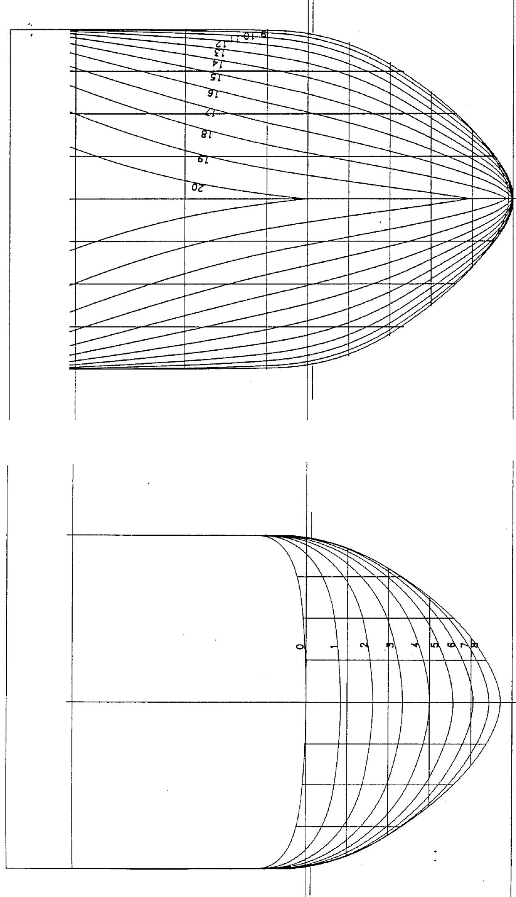  
FORWARD  
AFT

# 2 Measurements results

## 2.1 The still water resistance tests

## Table:

2.1: Still water resistance, sinkage and trim, Fn = 0.18 to 0.75

Figure:

2.1: Still water resistance, Fn = 0.18 to 0.75

2.2: Trim angle and sinkage, Fn = 0.18 to 0.75

2.3: Longitudinal wave cuts at y/b = 1.146, Fn = 0.30, 0.45, 0.60 and 0.75

2.4: Longitudinal wave cuts at y/b = 1.146, Fn = 0.35, 0.50, 0.55 and 0.65

2.5: Hull wave profile at Fn = 0.30

2.6: Hull wave profile at Fn = 0.45

The sinkage is defined positive if the centre of gravity moves upwards. The trim is defined negative if the bow moves upwards in relation to the centre of gravity. This is according the right handed coordinate system where the x-axis is positive forward, the y-axis is positive to port and the z-axis is positive upwards.

<table><tr><td>Fn</td><td>U [m/sec]</td><td>R [N]</td><td>sinkage [mm]</td><td>trim [deg]</td></tr><tr><td>0.184</td><td>0.999</td><td>3.31</td><td>-1.77</td><td>-0.035</td></tr><tr><td>0.240</td><td>1.300</td><td>6.60</td><td>-3.09</td><td>-0.048</td></tr><tr><td>0.300</td><td>1.627</td><td>12.77</td><td>-5.88</td><td>-0.091</td></tr><tr><td>0.348</td><td>1.890</td><td>16.14</td><td>-8.06</td><td>-0.050</td></tr><tr><td>0.400</td><td>2.170</td><td>26.23</td><td>-12.57</td><td>-0.48</td></tr><tr><td>0.450</td><td>2.439</td><td>41.75</td><td>-15.58</td><td>-1.39</td></tr><tr><td>0.499</td><td>2.709</td><td>52.79</td><td>-15.16</td><td>-1.99</td></tr><tr><td>0.549</td><td>2.978</td><td>59.08</td><td>-12.36</td><td>-2.18</td></tr><tr><td>0.601</td><td>3.258</td><td>63.50</td><td>-7.89</td><td>-2.09</td></tr><tr><td>0.650</td><td>3.527</td><td>66.00</td><td>-4.35</td><td>-2.01</td></tr><tr><td>0.700</td><td>3.797</td><td>70.60</td><td>-2.39</td><td>-1.90</td></tr><tr><td>0.748</td><td>4.058</td><td>74.71</td><td>+2.57</td><td>-1.35</td></tr></table>

Table 2.1: Still water resistance, sinkage and trim; Fn = 0.18 to Fn = 0.75.

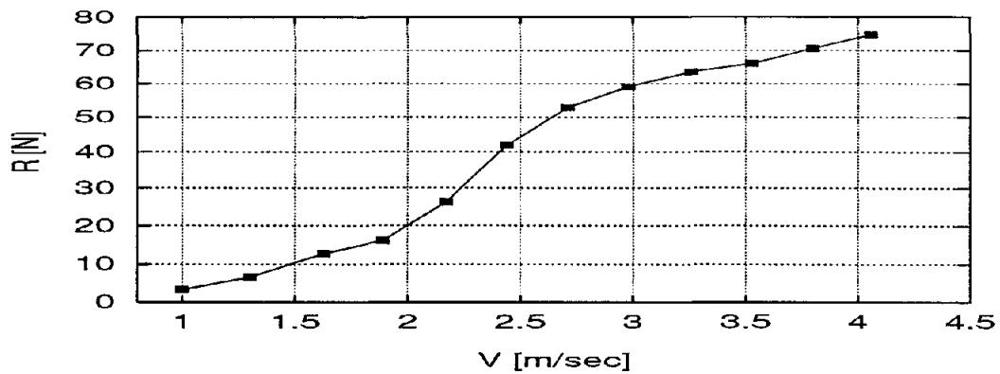  
Figure 2.1: Still water resistance, Fn = 0.18 to 0.75.

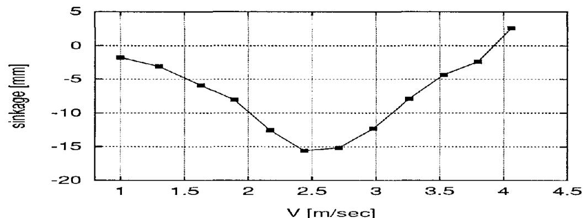

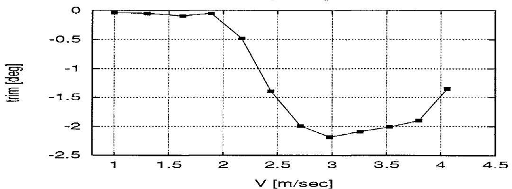  
Figure 2.2: Sinkage at centre of gravity, and Trim angle, Fn = 0.18 to 0.75.

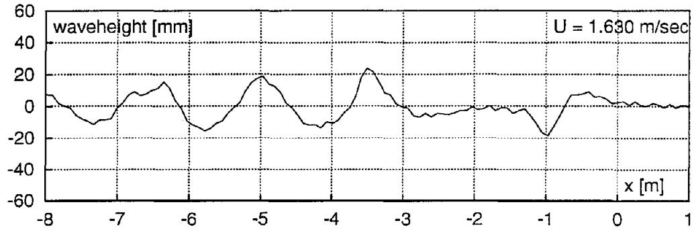

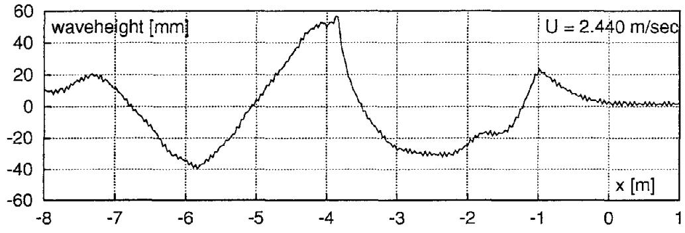

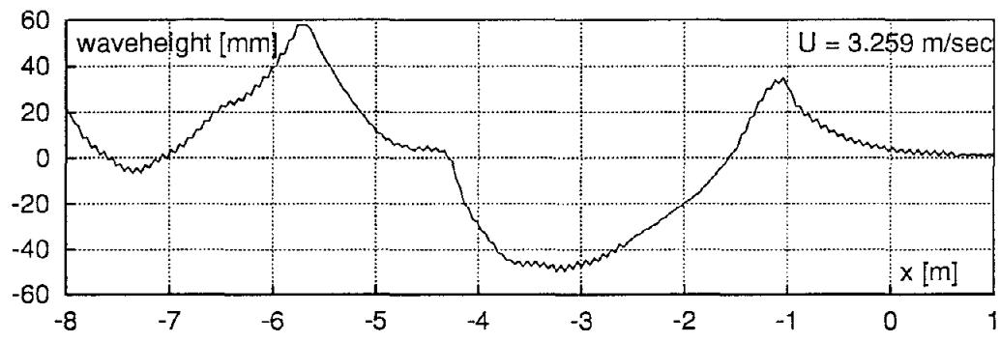

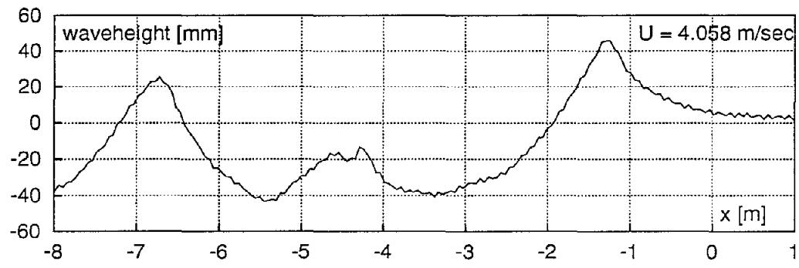  
Figure 2.3: Longitudinal wave cuts at y/b = 1.146, Fn = 0.30, 0.45, 0.60 and 0.75, Coordinate reference, x = 0.0 m = FP, x = -3.0 m = AP.

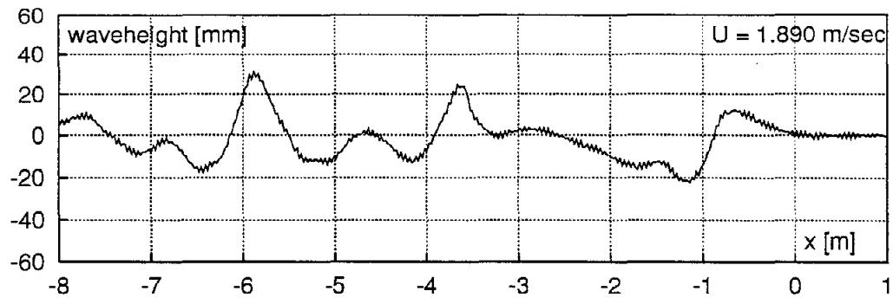

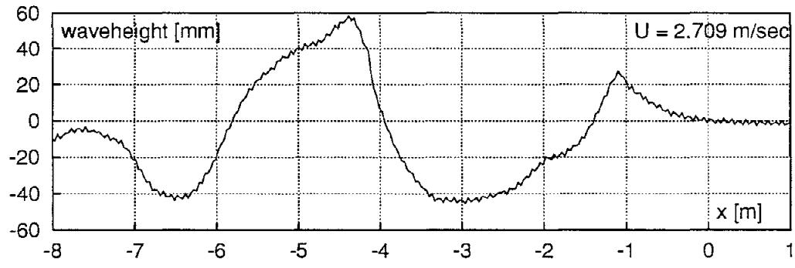

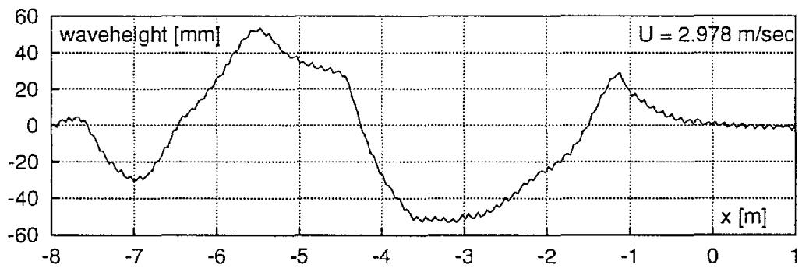

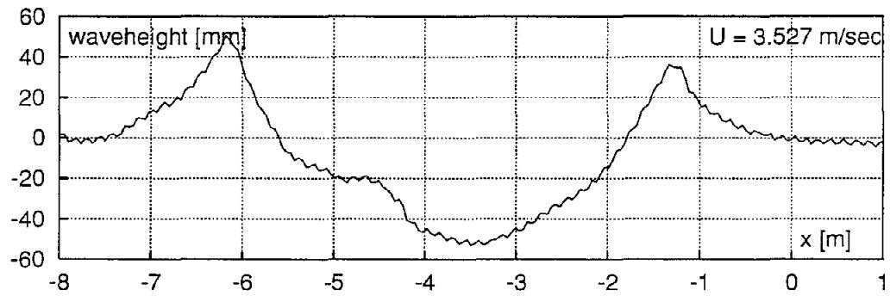  
Figure 2.4: Longitudinal wave cuts at y/b = 1.146, Fn = 0.35, 0.50, 0.55 and 0.65. Coordinate reference, x = 0.0 m = FP, x = -3.0 m = AP.

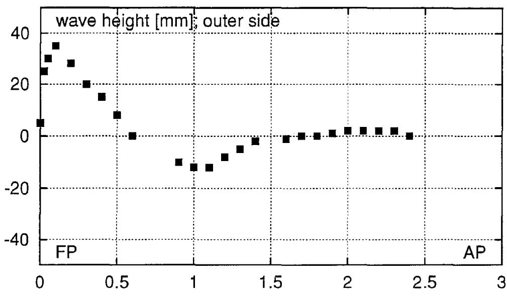

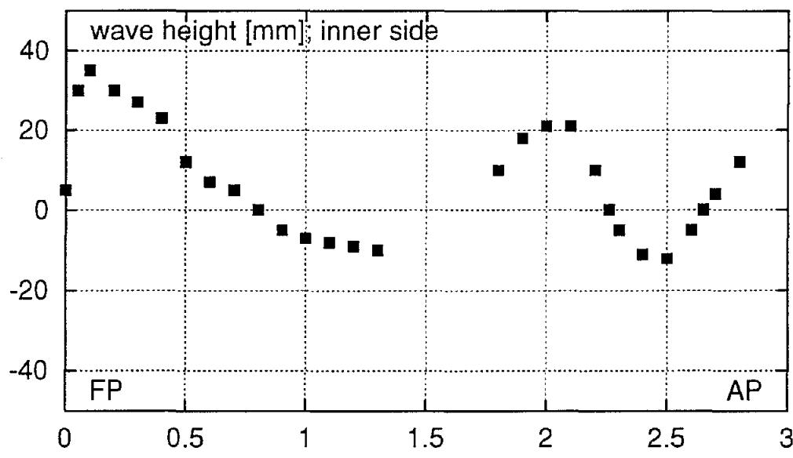  
Figure 2.5: Hull wave profile, obtained via photo's, FN = 0.30.

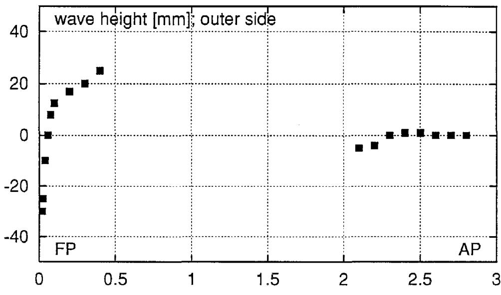

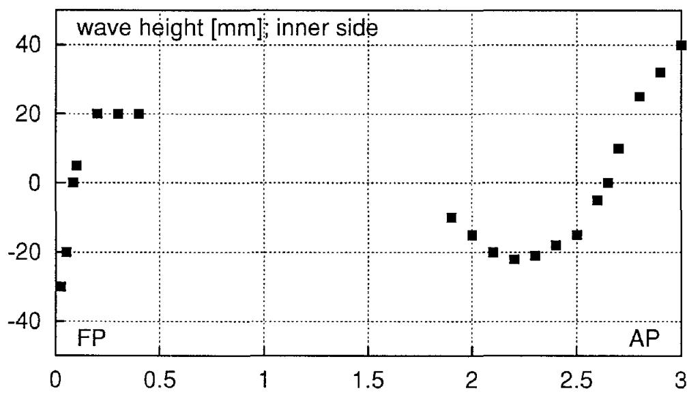  
Figure 2.6: Hull wave profile, obtained via photo's, FN = 0.45.

## 2.2 The heave an pitch motion tests

## Table:

2.2: Heave and Pitch response at Fn = 0.30

2.3: Heave and Pitch response at Fn = 0.45

2.4: Heave and Pitch response at Fn = 0.60

2.5: Heave and Pitch response at Fn = 0.75

## Figure:

2.7: Heave and Pitch Response, Fn = 0.30

2.8: Heave and Pitch Response, Fn = 0.45

2.9: Heave and Pitch Response, Fn = 0.60

2.10: Heave and Pitch Response, Fn = 0.75

The heave $(\eta_{3}, \epsilon_{3})$ and pitch $(\eta_{5}, \epsilon_{5})$ motions are measured at the Froude numbers 0.30, 0.45, 0.60 and 0.75. During the experiments the motions of the model were registered in two points, according to Figure 1.2. The heave results are directly obtained for the measurements in the midpoint, while the pitch motions in the centre of gravity had to be calculated using $\bar{\eta}_{5} = (\bar{z}_{m} - \bar{z}_{a})/679$ , where $\bar{z}_{m}$ and $\bar{z}_{a}$ are the complex motions in the midpoint (m) and the aft point (a). This complex amplitude provides the pitch amplitude $(\eta_{5} = \text{mod } \bar{\eta}_{5})$ and the pitch phase $(\epsilon_{5} = \arg \bar{\eta}_{5})$ .

The motions are made dimensionless using the wave amplitude $(\zeta_{a})$ and the wave number $(k = \omega^{2}/g)$ .

<table><tr><td> $\lambda/L$ </td><td> $\zeta_a$ [mm]</td><td> $\eta_3/\zeta_a$ </td><td> $\epsilon_3$ [deg]</td><td> $\eta_5/k\zeta_a$ </td><td> $\epsilon_5$ [deg]</td></tr><tr><td>0.601</td><td>21.973</td><td>0.144</td><td>28.835</td><td>0.055</td><td>51.631</td></tr><tr><td>0.699</td><td>19.712</td><td>0.076</td><td>-176.178</td><td>0.213</td><td>124.214</td></tr><tr><td>0.803</td><td>20.396</td><td>0.704</td><td>-89.729</td><td>0.464</td><td>157.208</td></tr><tr><td>0.899</td><td>19.686</td><td>1.268</td><td>-39.119</td><td>0.575</td><td>-179.152</td></tr><tr><td>0.965</td><td>19.224</td><td>1.358</td><td>-6.242</td><td>0.654</td><td>-169.111</td></tr><tr><td>1.007</td><td>19.267</td><td>1.327</td><td>-8.567</td><td>0.735</td><td>179.676</td></tr><tr><td>1.101</td><td>18.733</td><td>1.152</td><td>18.918</td><td>1.066</td><td>-161.644</td></tr><tr><td>1.204</td><td>18.598</td><td>0.823</td><td>20.385</td><td>1.229</td><td>-146.690</td></tr><tr><td>1.301</td><td>17.919</td><td>0.696</td><td>13.344</td><td>1.228</td><td>-135.056</td></tr><tr><td>1.395</td><td>18.035</td><td>0.680</td><td>4.620</td><td>1.189</td><td>-127.338</td></tr><tr><td>1.596</td><td>18.497</td><td>0.738</td><td>-0.936</td><td>1.129</td><td>-116.628</td></tr><tr><td>1.803</td><td>18.923</td><td>0.795</td><td>-2.212</td><td>1.094</td><td>-110.617</td></tr><tr><td>1.978</td><td>19.099</td><td>0.843</td><td>-1.160</td><td>1.075</td><td>-105.812</td></tr></table>

Table 2.2: Heave and Pitch response at Fn = 0.30.

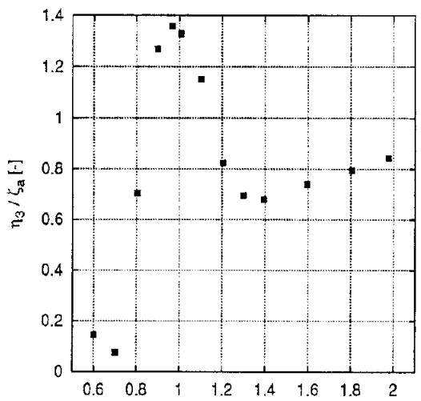

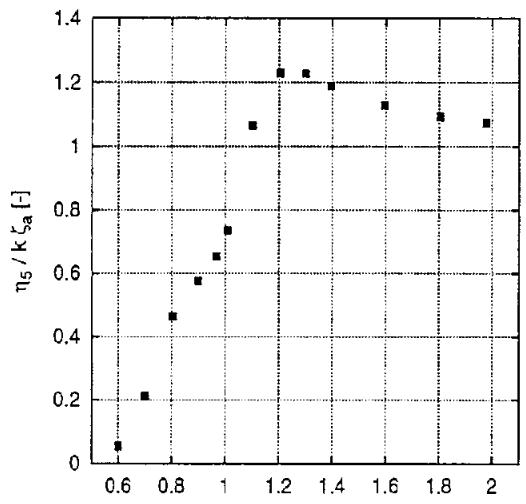

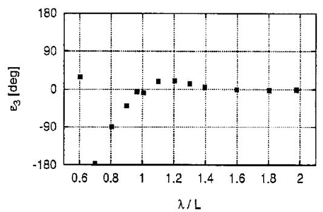

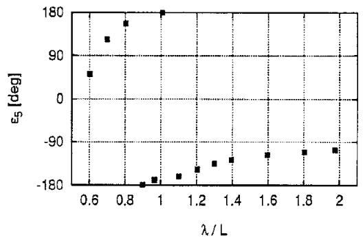  
Figure 2.7: Heave and Pitch Response, Fn = 0.30.

<table><tr><td> $\lambda/L$ </td><td> $\zeta_a$ [mm]</td><td> $\eta_3/\zeta_a$ </td><td> $\epsilon_3$ [deg]</td><td> $\eta_5/k\zeta_a$ </td><td> $\epsilon_5$ [deg]</td></tr><tr><td>0.601</td><td>23.265</td><td>0.069</td><td>48.226</td><td>0.020</td><td>48.240</td></tr><tr><td>0.799</td><td>19.970</td><td>0.163</td><td>-156.039</td><td>0.182</td><td>120.531</td></tr><tr><td>0.899</td><td>18.836</td><td>0.522</td><td>-126.072</td><td>0.359</td><td>133.698</td></tr><tr><td>1.001</td><td>18.559</td><td>1.114</td><td>-96.491</td><td>0.590</td><td>152.149</td></tr><tr><td>1.097</td><td>17.899</td><td>1.769</td><td>-67.299</td><td>0.831</td><td>167.384</td></tr><tr><td>1.201</td><td>17.813</td><td>2.077</td><td>-39.698</td><td>1.023</td><td>178.879</td></tr><tr><td>1.295</td><td>17.456</td><td>1.999</td><td>-19.062</td><td>1.176</td><td>-169.778</td></tr><tr><td>1.396</td><td>18.039</td><td>1.675</td><td>-5.386</td><td>1.231</td><td>-159.423</td></tr><tr><td>1.595</td><td>17.409</td><td>1.300</td><td>6.051</td><td>1.354</td><td>-141.228</td></tr><tr><td>1.803</td><td>17.858</td><td>1.092</td><td>6.528</td><td>1.330</td><td>-128.509</td></tr><tr><td>1.991</td><td>18.236</td><td>1.027</td><td>3.162</td><td>1.298</td><td>-137.595</td></tr></table>

Table 2.3: Heave and Pitch response at Fn = 0.45.

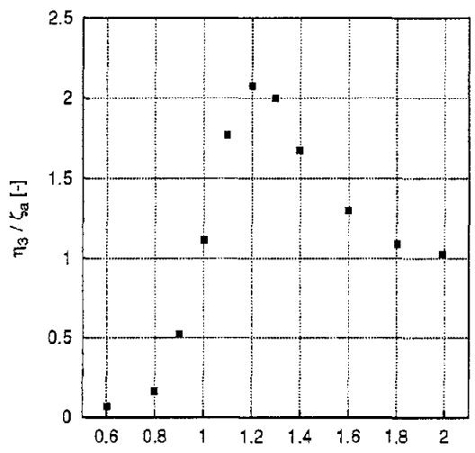

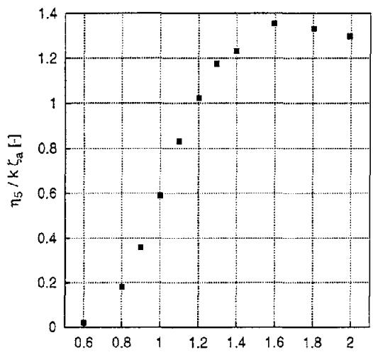

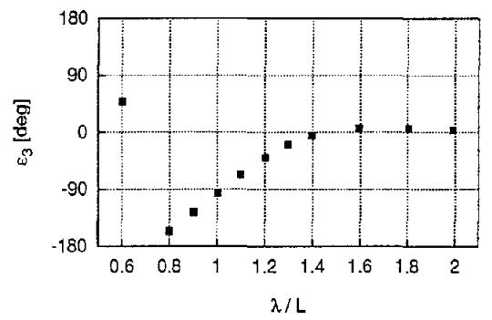

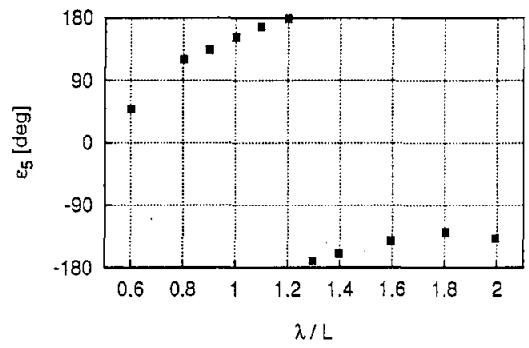  
Figure 2.8: Heave and Pitch Response, Fn = 0.45.

<table><tr><td> $\lambda/L$ </td><td> $\zeta_a$ [mm]</td><td> $\eta_3/\zeta_a$ </td><td> $\epsilon_3$ [deg]</td><td> $\eta_5/k\zeta_a$ </td><td> $\epsilon_5$ [deg]</td></tr><tr><td>0.798</td><td>17.582</td><td>0.027</td><td>-137.879</td><td>0.089</td><td>102.710</td></tr><tr><td>0.897</td><td>19.223</td><td>0.145</td><td>-145.283</td><td>0.165</td><td>111.235</td></tr><tr><td>0.999</td><td>18.679</td><td>0.379</td><td>-137.034</td><td>0.304</td><td>121.156</td></tr><tr><td>1.098</td><td>18.297</td><td>0.749</td><td>-125.089</td><td>0.485</td><td>131.736</td></tr><tr><td>1.200</td><td>17.173</td><td>1.392</td><td>-104.830</td><td>0.735</td><td>149.084</td></tr><tr><td>1.292</td><td>17.560</td><td>1.892</td><td>-85.120</td><td>0.864</td><td>161.502</td></tr><tr><td>1.393</td><td>18.801</td><td>2.197</td><td>-66.036</td><td>0.932</td><td>168.045</td></tr><tr><td>1.490</td><td>19.151</td><td>2.370</td><td>-46.973</td><td>1.071</td><td>172.611</td></tr><tr><td>1.600</td><td>19.148</td><td>2.376</td><td>-29.403</td><td>1.299</td><td>-179.873</td></tr><tr><td>1.741</td><td>14.331</td><td>1.984</td><td>-9.500</td><td>1.535</td><td>-161.759</td></tr><tr><td>1.795</td><td>18.312</td><td>2.007</td><td>-4.306</td><td>1.657</td><td>-157.382</td></tr><tr><td>1.816</td><td>13.591</td><td>1.752</td><td>-0.797</td><td>1.587</td><td>-149.846</td></tr><tr><td>1.977</td><td>19.816</td><td>1.432</td><td>6.583</td><td>1.485</td><td>-137.595</td></tr></table>

Table 2.4: Heave and Pitch response at Fn = 0.60.

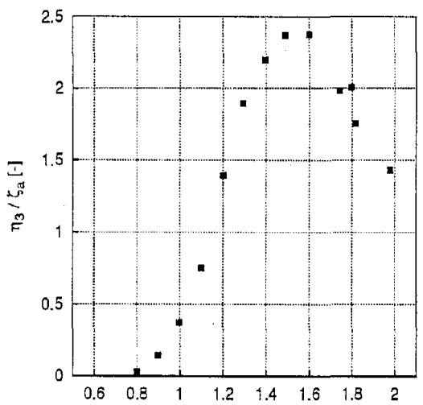

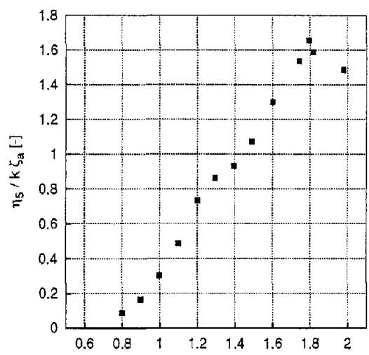

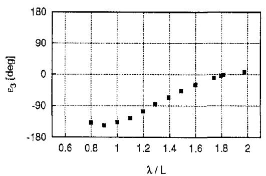

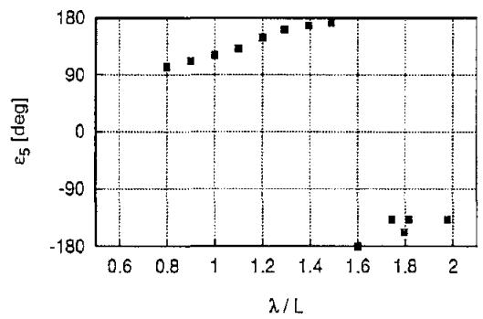  
Figure 2.9: Heave and Pitch Response, Fn = 0.60.

<table><tr><td> $\lambda/L$ </td><td> $\zeta_a$ [mm]</td><td> $\eta_3/\zeta_a$ </td><td> $\epsilon_3$ [deg]</td><td> $\eta_5/k\zeta_a$ </td><td> $\epsilon_5$ [deg]</td></tr><tr><td>0.998</td><td>18.986</td><td>0.194</td><td>-145.897</td><td>0.172</td><td>113.207</td></tr><tr><td>1.100</td><td>17.959</td><td>0.378</td><td>-141.914</td><td>0.287</td><td>118.312</td></tr><tr><td>1.204</td><td>18.052</td><td>0.658</td><td>-130.823</td><td>0.437</td><td>127.927</td></tr><tr><td>1.297</td><td>17.839</td><td>1.016</td><td>-121.299</td><td>0.608</td><td>136.451</td></tr><tr><td>1.394</td><td>18.085</td><td>1.498</td><td>-109.074</td><td>0.801</td><td>145.608</td></tr><tr><td>1.491</td><td>17.960</td><td>2.026</td><td>-89.915</td><td>0.975</td><td>161.003</td></tr><tr><td>1.596</td><td>18.082</td><td>2.428</td><td>-73.224</td><td>1.078</td><td>171.383</td></tr><tr><td>1.694</td><td>14.001</td><td>2.495</td><td>-59.770</td><td>1.029</td><td>173.632</td></tr><tr><td>1.806</td><td>18.951</td><td>2.532</td><td>-47.209</td><td>1.088</td><td>174.751</td></tr><tr><td>1.906</td><td>14.189</td><td>2.493</td><td>-33.016</td><td>1.287</td><td>179.075</td></tr><tr><td>1.983</td><td>14.000</td><td>2.420</td><td>-19.895</td><td>1.482</td><td>-172.659</td></tr><tr><td>1.985</td><td>19.103</td><td>2.443</td><td>-19.916</td><td>1.437</td><td>-173.108</td></tr><tr><td>2.012</td><td>14.000</td><td>2.408</td><td>-20.848</td><td>1.503</td><td>-173.855</td></tr></table>

Table 2.5: Heave and Pitch response at Fn = 0.75.

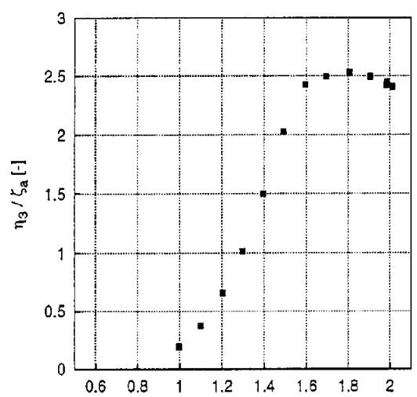

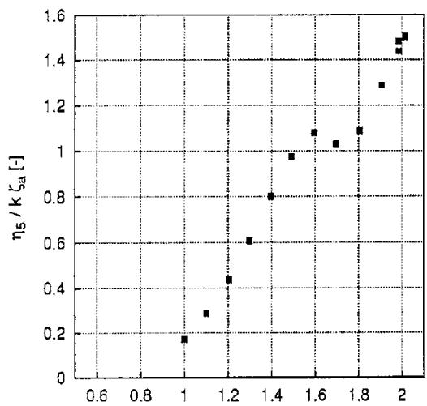

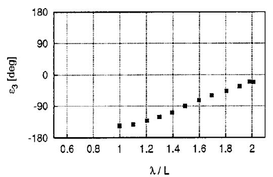

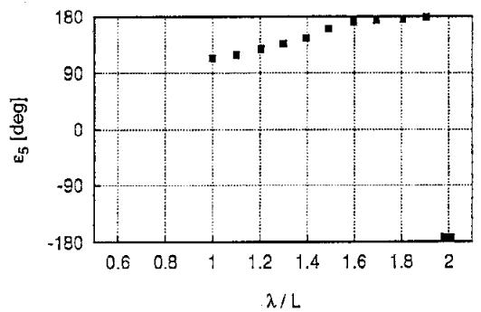  
Figure 2.10: Heave and Pitch Response, Fn = 0.75.

## 2.3 The forced heave and pitch oscillation tests

## Table:

2.7: Overview of static restoring coefficients experiments, zero trim and sinkage

2.8: Overview of static restoring coefficients experiments, trim and sinkage as with Fn = 0.75

2.9: Added mass and Fluid damping results, heave oscillation test, Fn = 0.30, zero trim and sinkage

2.10: Added mass and Fluid damping results, pitch oscillation test, Fn = 0.30, zero trim and sinkage

2.11: Added mass and Fluid damping results, heave oscillation test, Fn = 0.45, zero trim and sinkage

2.12: Added mass and Fluid damping results, pitch oscillation test, Fn = 0.45, zero trim and sinkage

2.13: Added mass and Fluid damping results, heave oscillation test, Fn = 0.60, zero trim and sinkage

2.14: Added mass and Fluid damping results, pitch oscillation test, Fn = 0.60, zero trim and sinkage

2.15: Added mass and Fluid damping results, heave oscillation test, Fn = 0.75, zero trim and sinkage

2.16: Added mass and Fluid damping results, pitch oscillation test, Fn = 0.75, zero trim and sinkage

2.17: Added mass and Fluid damping results, heave oscillation test, Fn = 0.75, trim and sinkage correction

2.18: Added mass and Fluid damping results, pitch oscillation test, Fn = 0.75, trim and sinkage correction

## Figure:

2.11: Added mass values, Fn = 0.30

2.12: Fluid damping values, Fn = 0.30

2.13: Added mass values, Fn = 0.45

2.14: Fluid damping values, Fn = 0.45

2.15: Added mass values, Fn = 0.60

2.16: Fluid damping values, Fn = 0.60

2.17: Added mass values, Fn = 0.75

2.18: Fluid damping values, Fn = 0.75

2.19: Added mass values, Fn = 0.75, trim and sinkage correction

2.20: Fluid damping values, Fn = 0.75, trim and sinkage correction

## 2.3.1 Forced heave oscillation tests

In the forced heave oscillation tests the heave motion of the model is prescribed by

$$
z = z _ {a} \cos (\omega t)\tag{2.1}
$$

where $z_{a}$ is the prescribed heave motion amplitude, being 15 mm during all the experiments. For the heave oscillation test the equation of motion can be written as

$$
\begin{array}{c} (M + A _ {3 3}) \ddot {z} + B _ {3 3} \dot {z} + C _ {3 3} z = F _ {3 a} c o s (\omega t + \epsilon_ {3}) \\ A _ {5 3} \ddot {z} + B _ {5 3} \dot {z} + C _ {5 3} z = F _ {5 a} c o s (\omega t + \epsilon_ {5}) \end{array}\tag{2.2}
$$

where $F_{3a}$ is the total force amplitude in the z direction and $F_{5a}$ is the pitch moment amplitude around the centre of gravity. The heave to heave and heave to pitch coefficients can be deducted from the equation of motion, resulting in

$$
\begin{array}{l} A _ {3 3} = \frac {C _ {3 3}}{\omega^ {2}} - \frac {F _ {3 a} c o s \epsilon_ {3}}{z _ {a} \omega^ {2}} - M \\ B _ {3 3} = \frac {F _ {3 a} s i n \epsilon_ {3}}{z _ {a} \omega} \\ A _ {5 3} = \frac {C _ {5 3}}{\omega^ {2}} - \frac {F _ {5 a} c o s \epsilon_ {5}}{z _ {a} \omega^ {2}} \\ B _ {5 3} = \frac {F _ {5 a} s i n \epsilon_ {5}}{z _ {a} \omega} \end{array}\tag{2.3}
$$

The force and moment amplitude and phase are calculated from the complex force $(F_{3})$ and moment $(F_{5})$ in the centre of gravity, which are calculated using the complex force in the fore $(F_{f})$ and aft $(F_{a})$ oscillation leg, that is:

$$
\begin{array}{l} F _ {3} = F _ {a} + F _ {f} \\ F _ {5} = F _ {a} \cdot l + F _ {f} \cdot l \end{array}\tag{2.4}
$$

where l is the distance from the centre of gravity to the oscillation leg (thus 2l is the distance between the two force measurement points, thus l being 500 mm in the experiments).

## 2.3.2 Forced pitch oscillation tests

In the forced pitch oscillation tests the pitch motion is prescribed by

$$
\theta = \theta_ {a} c o s (\omega t)\tag{2.5}
$$

In the experiments the amplitude of the fore and aft leg were kept the same, but with a phase lag of 180 degrees. This results in a pitch amplitude of 30 mm over 1000 mm, which is 1.718 degrees. The equation of motion can be written as

$$
\begin{array}{r} A _ {3 5} \ddot {\theta} + B _ {3 5} \dot {\theta} + C _ {3 5} \theta = F _ {3 a} c o s (\omega t + \epsilon_ {3}) \\ (I _ {5 5} + A _ {5 5}) \ddot {\theta} + B _ {5 5} \dot {\theta} + C _ {5 5} \theta = F _ {5 a} c o s (\omega t + \epsilon_ {5}) \end{array}\tag{2.6}
$$

where $F_{3a}$ is the total force amplitude in the z direction and $F_{5a}$ is the pitch moment amplitude around the centre of gravity. The pitch to pitch and pitch to heave coefficients can be deducted from the equation of motion, resulting in

$$
\begin{array}{l} A _ {3 5} = \frac {C _ {3 5}}{\omega^ {2}} - \frac {F _ {3 a} c o s \epsilon_ {3}}{\theta_ {a} \omega^ {2}} \\ B _ {3 5} = \frac {F _ {3 a} s i n \epsilon_ {3}}{\theta_ {a} \omega} \\ A _ {5 5} = \frac {C _ {5 5}}{\omega^ {2}} - \frac {F _ {5 a} c o s \epsilon_ {5}}{\theta_ {a} \omega^ {2}} - I _ {5 5} \\ B _ {5 5} = \frac {F _ {5 a} s i n \epsilon_ {5}}{\theta_ {a} \omega} \end{array}\tag{2.7}
$$

The complex force $F_{3}$ and moment $F_{5}$ are again calculated from the forces measured in the fore and aft oscillation leg, that is

$$
\begin{array}{l} F _ {3} = F _ {a} + F _ {f} \\ F _ {5} = F _ {a} \cdot l + F _ {f} \cdot l \end{array}\tag{2.8}
$$

## 2.3.3 Restoring coefficients

The restoring coefficients $C_{33}$ , $C_{35}$ , $C_{53}$ and $C_{55}$ play an important role in the calculation of the added mass coefficients, as can be seen in the equations above. At zero forward speed the coefficients can be calculated using the still waterline, that is:

$$
\begin{array}{r l} & C _ {3 3} = \rho g A _ {w} \\ & C _ {3 5} = \rho g S _ {w} \\ & C _ {5 3} = \rho g S _ {w} \\ & C _ {5 5} = \rho g \nabla G M _ {L} \end{array}\tag{2.9}
$$

where $A_{w}$ is the water plane area, $S_{w}$ is the first order moment of the water plane, and $GM_{L}$ is the longitudinal metacentric height. Using the ship geometry these values can

be calculated using:

$$
\begin{array}{l} C _ {3 3} = \rho g \int_ {x = 0} ^ {x = L} y _ {w} (x) d x \\ C _ {3 5} = \rho g \int_ {x = 0} ^ {x = L} x \cdot y _ {w} (x) d x \\ C _ {5 3} = C _ {3 5} \\ C _ {5 5} = \rho g \int_ {x = 0} ^ {x = L} x ^ {2} \cdot y _ {w} (x) d x \end{array}\tag{2.10}
$$

For the catamaran model the results of the calculations are presented in Table 2.6.

<table><tr><td>coefficient</td><td colspan="2">value</td></tr><tr><td> $C_{33}$ </td><td>10782</td><td>N/m</td></tr><tr><td> $C_{35}$ </td><td>1850</td><td>N/m $^{2}$ </td></tr><tr><td> $C_{53}$ </td><td>1850</td><td>N/m $^{2}$ </td></tr><tr><td> $C_{55}$ </td><td>6144</td><td>N/m $^{3}$ </td></tr></table>

Table 2.6: Calculated restoring coefficients using the ship geometry (Fn = 0.0; zero trim and sinkage).

The restoring coefficients can be calculated using the geometry of the vessel as shown above, but it is also possible to obtain the restoring coefficients from static experiments. If the vessel is given a fixed heave or pitch displacement the restoring coefficients follow from:

$$
C _ {3 3} = \frac {F _ {3}}{z} \quad C _ {5 3} = \frac {F _ {5}}{z} \quad C _ {3 5} = \frac {F _ {3}}{\theta} \quad C _ {5 5} = \frac {F _ {5}}{\theta}\tag{2.11}
$$

where $F_{3}$ and $F_{5}$ are respectively the heave and pitch forces measured, z is the given heave displacement and $\theta$ is the given pitch displacement.

If the static experiments are performed by Fn = 0 the zero forward speed restoring terms are found, which must be comparable to the restoring terms obtained from the geometrical quantities of the vessel.

Due to the forward speed the trim and sinkage of the vessel will change and a certain wave contour exist over the ship length. All these factors have there influence on the restoring coefficients. Therefore a small series of static experiments is performed in which the influence of the trim, sinkage and forward speed is looked at.

<table><tr><td>U [m/sec]</td><td> $z_a$  [mm]</td><td> $z_f$  [mm]</td><td> $C_{33}$ </td><td> $C_{53}$ </td><td> $C_{35}$ </td><td> $C_{55}$ </td></tr><tr><td>0.0</td><td>15.0</td><td>15.0</td><td>7316</td><td>57</td><td></td><td></td></tr><tr><td>0.0</td><td>5.0</td><td>5.0</td><td>9871</td><td>1677</td><td></td><td></td></tr><tr><td>0.0</td><td>-5.0</td><td>-5.0</td><td>11338</td><td>1831</td><td></td><td></td></tr><tr><td>0.0</td><td>-15.0</td><td>-15.0</td><td>6890</td><td>149</td><td></td><td></td></tr><tr><td>0.0</td><td>-15.0</td><td>15.0</td><td></td><td></td><td>2094</td><td>5918</td></tr><tr><td>0.0</td><td>-15.0</td><td>15.0</td><td></td><td></td><td>2095</td><td>5917</td></tr><tr><td>0.0</td><td>-10.0</td><td>10.0</td><td></td><td></td><td>1973</td><td>5351</td></tr><tr><td>0.0</td><td>-5.0</td><td>5.0</td><td></td><td></td><td>1872</td><td>5857</td></tr><tr><td>0.0</td><td>-5.0</td><td>5.0</td><td></td><td></td><td>1907</td><td>5885</td></tr><tr><td>0.0</td><td>5.0</td><td>-5.0</td><td></td><td></td><td>1488</td><td>5552</td></tr><tr><td>0.0</td><td>5.0</td><td>-5.0</td><td></td><td></td><td>1554</td><td>5582</td></tr><tr><td>0.0</td><td>10.0</td><td>-10.0</td><td></td><td></td><td>1070</td><td>5251</td></tr><tr><td>0.0</td><td>15.0</td><td>-15.0</td><td></td><td></td><td>799</td><td>5027</td></tr><tr><td>0.0</td><td>15.0</td><td>-15.0</td><td></td><td></td><td>886</td><td>5050</td></tr><tr><td>0.0</td><td>-5.0</td><td>5.0</td><td></td><td></td><td>3037</td><td>5900</td></tr><tr><td>4.06</td><td>-5.0</td><td>5.0</td><td></td><td></td><td>2791</td><td>4384</td></tr></table>

Table 2.7: Overview of static restoring coefficients experiments, zero trim and sinkage.

<table><tr><td>U [m/sec]</td><td> $z_a$  [mm]</td><td> $z_f$  [mm]</td><td> $C_{33}$ </td><td> $C_{53}$ </td><td> $C_{35}$ </td><td> $C_{55}$ </td></tr><tr><td>0.0</td><td>15.0</td><td>15.0</td><td>10356</td><td>2424</td><td></td><td></td></tr><tr><td>0.0</td><td>10.0</td><td>10.0</td><td>10667</td><td>2480</td><td></td><td></td></tr><tr><td>0.0</td><td>5.0</td><td>5.0</td><td>10545</td><td>2449</td><td></td><td></td></tr><tr><td>0.0</td><td>-5.0</td><td>-5.0</td><td>10208</td><td>2326</td><td></td><td></td></tr><tr><td>0.0</td><td>-10.0</td><td>-10.0</td><td>10422</td><td>2324</td><td></td><td></td></tr><tr><td>0.0</td><td>-15.0</td><td>-15.0</td><td>10571</td><td>2305</td><td></td><td></td></tr><tr><td>4.06</td><td>-5.0</td><td>-5.0</td><td>11892</td><td>867</td><td></td><td></td></tr><tr><td>4.06</td><td>5.0</td><td>5.0</td><td>11494</td><td>896</td><td></td><td></td></tr><tr><td>4.06</td><td>5.0</td><td>-5.0</td><td></td><td></td><td>4660</td><td>5466</td></tr><tr><td>4.06</td><td>-5.0</td><td>5.0</td><td></td><td></td><td>4398</td><td>5843</td></tr></table>

Table 2.8: Overview of static restoring coefficients experiments, all runs are with trim and sinkage as with Fn = 0.75.

In the calculations of the added mass values the restoring coefficients of Table 2.6 are used, that is by zero forward speed, zero sinkage and zero trim angle. The results are also plotted in Figure 2.11 and 2.12.

<table><tr><td> $\omega\sqrt{L/g}$ </td><td>A33[kg]</td><td>A53[kg m]</td><td>B33[kg/s]</td><td>B53[kg m/s]</td></tr><tr><td>2.787</td><td>2.106</td><td>9.635</td><td>349.749</td><td>179.134</td></tr><tr><td>3.154</td><td>9.716</td><td>6.532</td><td>270.255</td><td>106.913</td></tr><tr><td>3.475</td><td>17.680</td><td>6.954</td><td>222.346</td><td>54.427</td></tr><tr><td>3.629</td><td>22.002</td><td>8.036</td><td>204.643</td><td>30.636</td></tr><tr><td>3.841</td><td>28.941</td><td>10.712</td><td>186.486</td><td>1.142</td></tr><tr><td>4.088</td><td>34.889</td><td>14.332</td><td>179.663</td><td>-24.319</td></tr><tr><td>4.371</td><td>42.894</td><td>19.746</td><td>190.841</td><td>-39.684</td></tr><tr><td>4.718</td><td>50.533</td><td>25.880</td><td>240.699</td><td>-23.362</td></tr><tr><td>5.130</td><td>53.902</td><td>29.212</td><td>341.584</td><td>40.571</td></tr></table>

Table 2.9: Added mass and Fluid damping results from heave oscillation test, Fn = 0.30, zero trim and sinkage.

<table><tr><td> $\omega\sqrt{L/g}$ </td><td> $A_{55}$  $[kg\ m^{2}]$ </td><td> $A_{35}$  $[kg\ m]$ </td><td> $B_{55}$  $[kg\ m^{2}/s]$ </td><td> $B_{35}$  $[kg\ m/s]$ </td></tr><tr><td>2.780</td><td>64.994</td><td>24.161</td><td>113.474</td><td>120.30</td></tr><tr><td>3.213</td><td>61.197</td><td>24.618</td><td>137.288</td><td>169.97</td></tr><tr><td>3.475</td><td>59.219</td><td>23.509</td><td>156.149</td><td>198.76</td></tr><tr><td>3.652</td><td>57.540</td><td>22.295</td><td>171.590</td><td>218.05</td></tr><tr><td>3.833</td><td>55.737</td><td>20.380</td><td>192.745</td><td>238.07</td></tr><tr><td>4.082</td><td>52.433</td><td>17.221</td><td>222.011</td><td>261.62</td></tr><tr><td>4.368</td><td>47.232</td><td>12.760</td><td>248.854</td><td>275.71</td></tr><tr><td>4.725</td><td>40.854</td><td>7.853</td><td>250.246</td><td>258.86</td></tr><tr><td>5.119</td><td>37.295</td><td>6.436</td><td>221.591</td><td>212.06</td></tr><tr><td>5.637</td><td>38.253</td><td>10.099</td><td>194.626</td><td>169.78</td></tr></table>

Table 2.10: Added mass and Fluid damping results from pitch oscillation test, Fn = 0.30, zero trim and sinkage.

In the calculations of the added mass values the restoring coefficients of Table 2.6 are used, that is by zero forward speed, zero sinkage and zero trim angle. The results are also plotted in Figure 2.13 and 2.14.

<table><tr><td> $\omega\sqrt{L/g}$ </td><td>A33[kg]</td><td>A53[kg m]</td><td>B33[kg/s]</td><td>B53[kg m/s]</td></tr><tr><td>3.217</td><td>45.575</td><td>37.070</td><td>217.715</td><td>16.008</td></tr><tr><td>3.748</td><td>48.026</td><td>33.691</td><td>236.840</td><td>5.971</td></tr><tr><td>4.157</td><td>48.725</td><td>30.963</td><td>268.449</td><td>14.973</td></tr><tr><td>4.392</td><td>49.224</td><td>29.834</td><td>293.516</td><td>22.439</td></tr><tr><td>4.582</td><td>48.268</td><td>28.354</td><td>313.831</td><td>32.303</td></tr><tr><td>4.898</td><td>47.154</td><td>25.933</td><td>346.016</td><td>45.200</td></tr><tr><td>5.286</td><td>44.734</td><td>22.617</td><td>389.196</td><td>59.611</td></tr><tr><td>5.741</td><td>42.358</td><td>19.085</td><td>426.478</td><td>67.402</td></tr><tr><td>6.277</td><td>40.425</td><td>15.783</td><td>469.392</td><td>68.117</td></tr><tr><td>6.961</td><td>39.818</td><td>13.595</td><td>514.114</td><td>54.944</td></tr><tr><td>7.890</td><td>40.316</td><td>12.299</td><td>593.556</td><td>38.714</td></tr><tr><td>7.921</td><td>40.545</td><td>12.477</td><td>599.563</td><td>41.143</td></tr></table>

Table 2.11: Added mass and Fluid damping results from heave oscillation test, Fn = 0.45, zero trim and sinkage

<table><tr><td> $\omega\sqrt{L/g}$ </td><td> $A_{55}$  $[kg\ m^{2}]$ </td><td> $A_{35}$  $[kg\ m]$ </td><td> $B_{55}$  $[kg\ m^{2}/s]$ </td><td> $B_{35}$  $[kg\ m/s]$ </td></tr><tr><td>3.204</td><td>74.735</td><td>24.810</td><td>170.182</td><td>227.44</td></tr><tr><td>3.449</td><td>67.165</td><td>19.950</td><td>185.332</td><td>243.04</td></tr><tr><td>3.729</td><td>60.942</td><td>16.644</td><td>192.230</td><td>245.12</td></tr><tr><td>4.095</td><td>53.147</td><td>12.274</td><td>199.566</td><td>244.22</td></tr><tr><td>4.343</td><td>49.943</td><td>10.971</td><td>196.931</td><td>237.60</td></tr><tr><td>4.593</td><td>47.479</td><td>9.929</td><td>197.991</td><td>232.22</td></tr><tr><td>4.920</td><td>44.988</td><td>9.217</td><td>198.436</td><td>225.36</td></tr><tr><td>5.281</td><td>42.752</td><td>8.714</td><td>206.185</td><td>225.33</td></tr><tr><td>5.741</td><td>41.223</td><td>8.791</td><td>218.900</td><td>227.21</td></tr><tr><td>6.295</td><td>40.164</td><td>9.045</td><td>243.270</td><td>238.50</td></tr><tr><td>7.010</td><td>39.021</td><td>8.706</td><td>287.439</td><td>263.32</td></tr></table>

Table 2.12: Added mass and Fluid damping results from pitch oscillation test, Fn = 0.45, zero trim and sinkage.

In the calculations of the added mass values the restoring coefficients of Table 2.6 are used, that is by zero forward speed, zero sinkage and zero trim angle. The results are also plotted in Figure 2.15 and 2.16.

<table><tr><td> $\omega\sqrt{L/g}$ </td><td>A33[kg]</td><td>A53[kg m]</td><td>B33[kg/s]</td><td>B53[kg m/s]</td></tr><tr><td>3.634</td><td>70.629</td><td>57.491</td><td>223.071</td><td>-28.230</td></tr><tr><td>4.304</td><td>61.628</td><td>41.561</td><td>257.578</td><td>-31.569</td></tr><tr><td>4.524</td><td>59.199</td><td>37.666</td><td>270.953</td><td>-32.881</td></tr><tr><td>4.712</td><td>57.556</td><td>34.589</td><td>280.368</td><td>-34.120</td></tr><tr><td>5.047</td><td>54.635</td><td>30.262</td><td>299.332</td><td>-36.500</td></tr><tr><td>5.408</td><td>52.622</td><td>26.315</td><td>323.823</td><td>-39.356</td></tr><tr><td>6.169</td><td>50.025</td><td>20.500</td><td>379.461</td><td>-47.356</td></tr><tr><td>7.484</td><td>48.468</td><td>15.005</td><td>502.204</td><td>-66.994</td></tr></table>

Table 2.13: Added mass and Fluid damping results from heave oscillation test, Fn = 0.60, zero trim and sinkage.

<table><tr><td> $\omega\sqrt{L/g}$ </td><td> $A_{55}$  $[kg\ m^{2}]$ </td><td> $A_{35}$  $[kg\ m]$ </td><td> $B_{55}$  $[kg\ m^{2}/s]$ </td><td> $B_{35}$  $[kg\ m/s]$ </td></tr><tr><td>3.653</td><td>84.262</td><td>32.487</td><td>101.035</td><td>197.49</td></tr><tr><td>3.956</td><td>75.535</td><td>27.706</td><td>102.875</td><td>197.06</td></tr><tr><td>4.321</td><td>67.736</td><td>23.355</td><td>107.822</td><td>199.48</td></tr><tr><td>4.651</td><td>62.413</td><td>20.315</td><td>114.047</td><td>201.97</td></tr><tr><td>5.061</td><td>57.284</td><td>17.561</td><td>124.608</td><td>205.92</td></tr><tr><td>5.366</td><td>54.346</td><td>15.948</td><td>133.435</td><td>209.53</td></tr><tr><td>6.221</td><td>48.263</td><td>12.261</td><td>167.345</td><td>225.73</td></tr><tr><td>7.436</td><td>42.834</td><td>7.510</td><td>229.996</td><td>242.93</td></tr></table>

Table 2.14: Added mass and Fluid damping results from pitch oscillation test, Fn = 0.60, zero trim and sinkage

In the calculations of the added mass values the restoring coefficients of Table 2.6 are used, that is by zero forward speed, zero sinkage and zero trim angle. The results are also plotted in Figure 2.17 and 2.18.

<table><tr><td> $\omega\sqrt{L/g}$ </td><td>A33[kg]</td><td>A53[kg m]</td><td>B33[kg/s]</td><td>B53[kg m/s]</td></tr><tr><td>4.103</td><td>58.127</td><td>36.576</td><td>259.164</td><td>-52.682</td></tr><tr><td>4.421</td><td>55.998</td><td>31.518</td><td>267.000</td><td>-60.045</td></tr><tr><td>4.861</td><td>54.010</td><td>26.244</td><td>295.647</td><td>-65.882</td></tr><tr><td>5.097</td><td>53.088</td><td>24.322</td><td>308.604</td><td>-69.784</td></tr><tr><td>5.439</td><td>52.701</td><td>21.716</td><td>326.846</td><td>-76.529</td></tr><tr><td>5.774</td><td>52.360</td><td>19.614</td><td>348.745</td><td>-84.486</td></tr><tr><td>6.120</td><td>52.838</td><td>18.201</td><td>374.428</td><td>-92.506</td></tr><tr><td>7.168</td><td>54.199</td><td>15.970</td><td>481.731</td><td>-109.533</td></tr><tr><td>8.662</td><td>55.925</td><td>15.337</td><td>721.833</td><td>-114.122</td></tr></table>

Table 2.15: Added mass and Fluid damping results from heave oscillation test, Fn = 0.75, zero trim and sinkage

<table><tr><td> $\omega\sqrt{L/g}$ </td><td> $A_{55}$  $[kg\ m^{2}]$ </td><td> $A_{35}$  $[kg\ m]$ </td><td> $B_{55}$  $[kg\ m^{2}/s]$ </td><td> $B_{35}$  $[kg\ m/s]$ </td></tr><tr><td>4.094</td><td>68.276</td><td>15.143</td><td>115.602</td><td>270.08</td></tr><tr><td>4.880</td><td>58.724</td><td>12.224</td><td>140.366</td><td>293.85</td></tr><tr><td>4.464</td><td>62.987</td><td>13.461</td><td>125.966</td><td>281.70</td></tr><tr><td>5.126</td><td>56.374</td><td>11.240</td><td>152.147</td><td>309.13</td></tr><tr><td>5.423</td><td>54.252</td><td>10.306</td><td>166.420</td><td>316.93</td></tr><tr><td>5.766</td><td>52.161</td><td>8.981</td><td>184.783</td><td>326.59</td></tr><tr><td>6.138</td><td>50.059</td><td>7.471</td><td>207.337</td><td>340.21</td></tr><tr><td>7.158</td><td>45.929</td><td>4.397</td><td>278.008</td><td>369.68</td></tr><tr><td>8.687</td><td>41.741</td><td>1.460</td><td>405.697</td><td>388.30</td></tr></table>

Table 2.16: Added mass and Fluid damping results from pitch oscillation test, Fn = 0.75, zero trim and sinkage

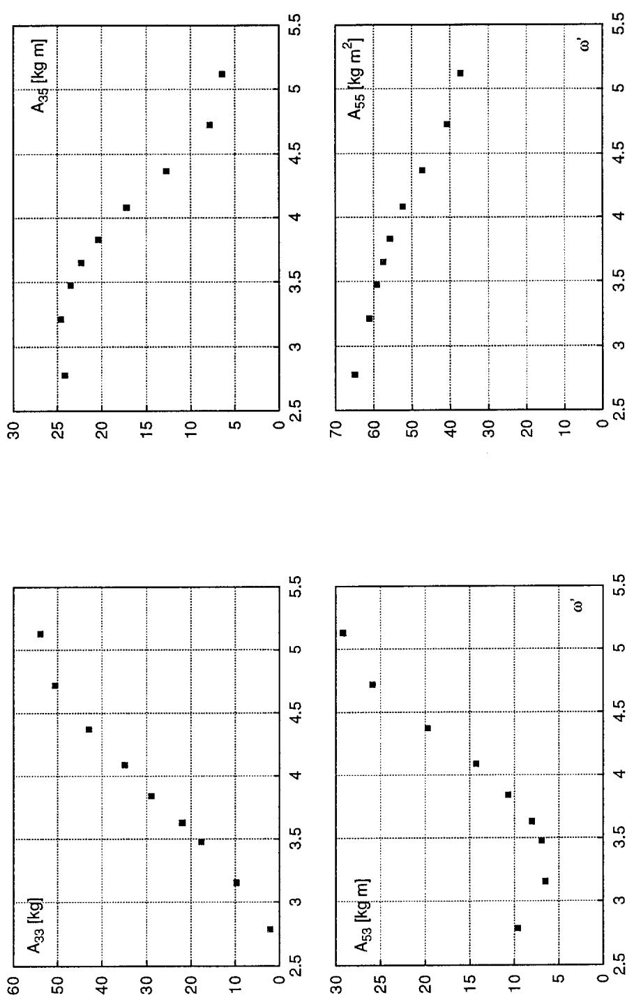  
Figure 2.11: Added mass values, $Fn = 0.30(\omega' = \omega \sqrt{L / g})$ .

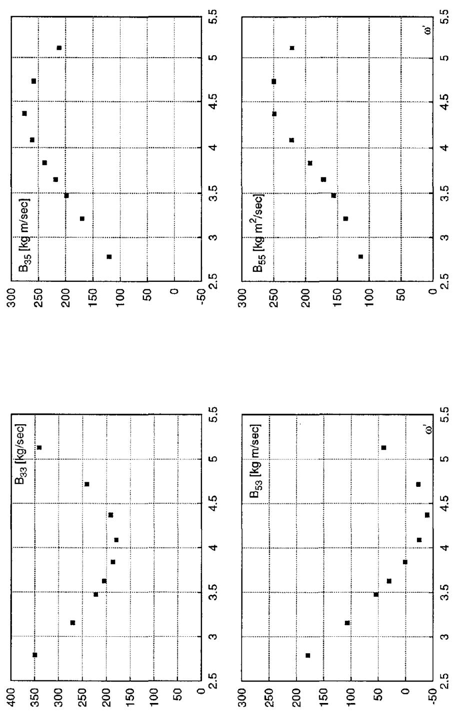  
Figure 2.12: Fluid damping values, $Fn = 0.30$ ( $\omega' = \omega \sqrt{L / g}$ ).

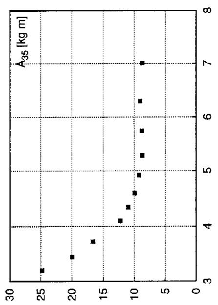

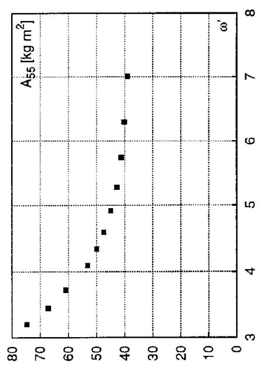

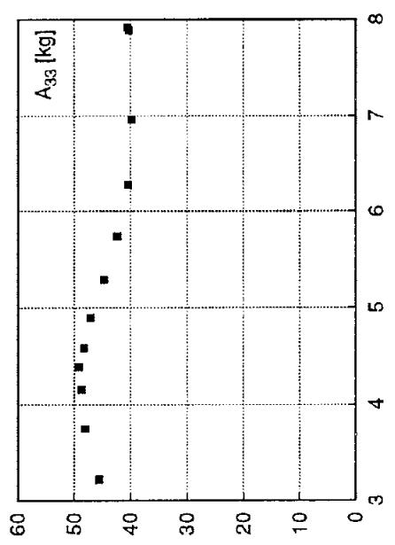

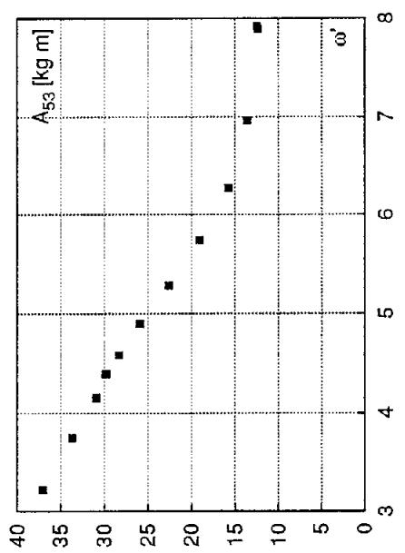  
Figure 2.13: Added mass values, $Fn = 0.45$ ( $\omega' = \omega \sqrt{L / g}$ ).

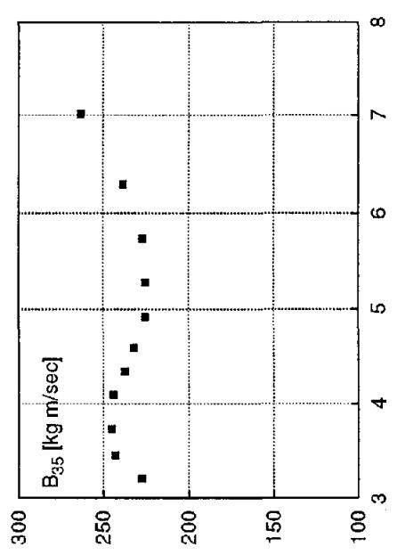

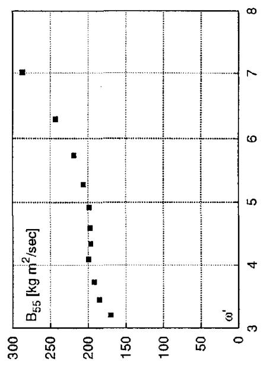

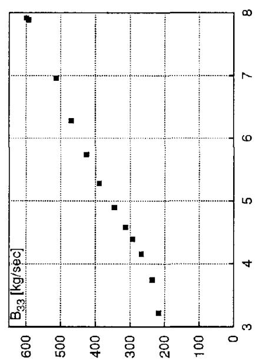

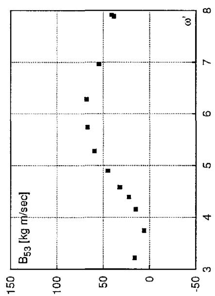  
Figure 2.14: Fluid damping values, $Fn = 0.45$ ( $\omega' = \omega \sqrt{L / g}$ ).

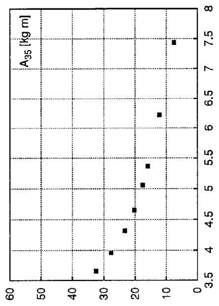

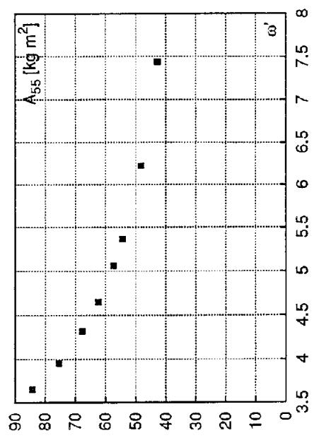

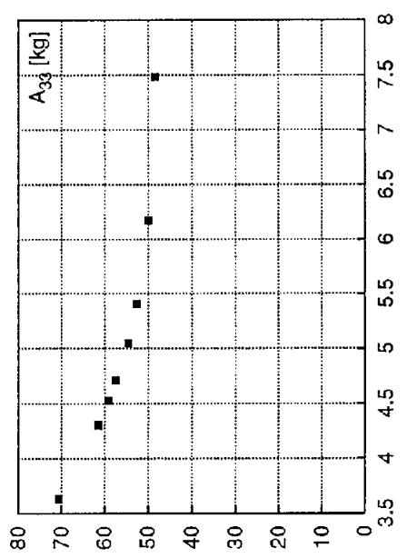

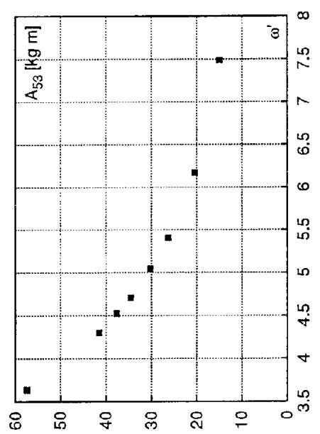  
Figure 2.15: Added mass values, $Fn = 0.60(\omega' = \omega \sqrt{L / g})$ .

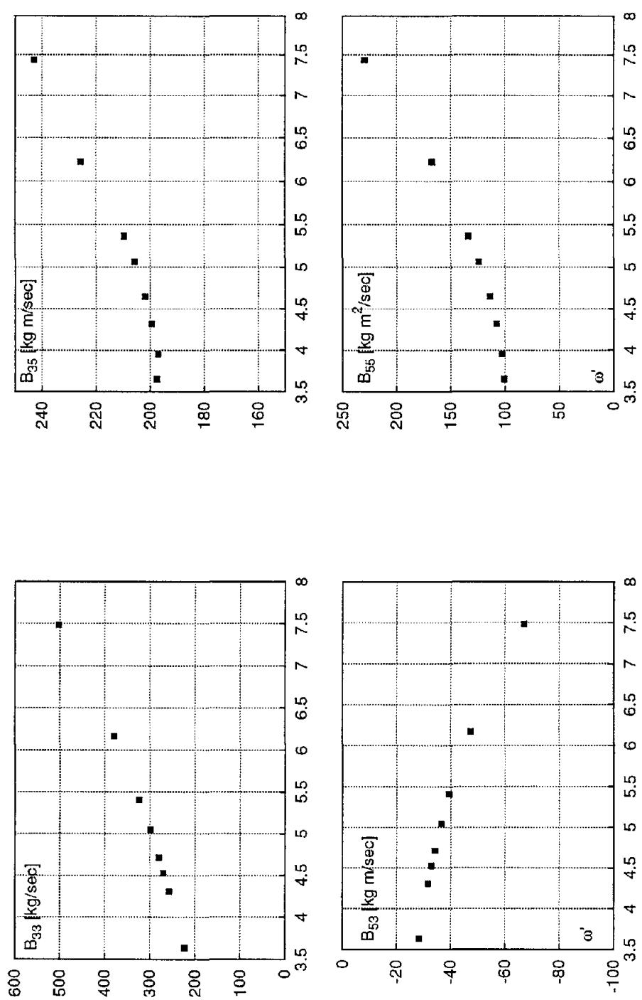  
Figure 2.16: Fluid damping values, $Fn = 0.60$ ( $\omega' = \omega \sqrt{L / g}$ ).

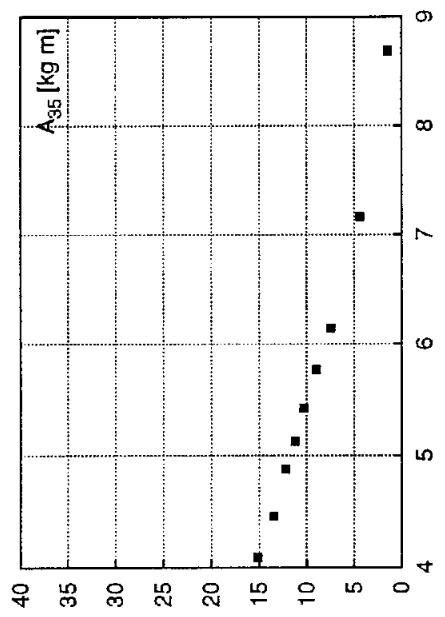

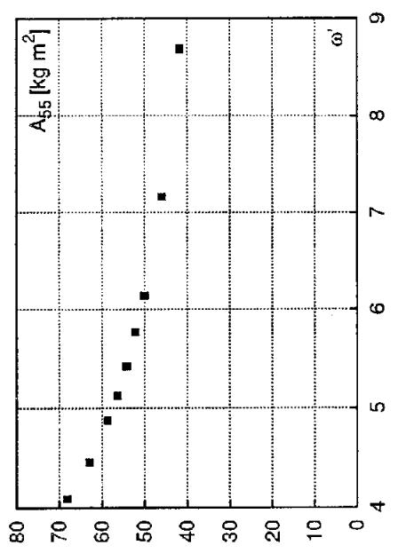

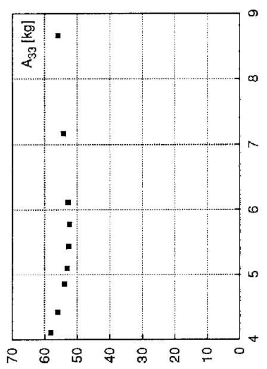

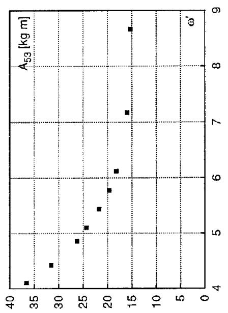  
Figure 2.17: Added mass values, $Fn = 0.75 (\omega' = \omega \sqrt{L / g})$ .

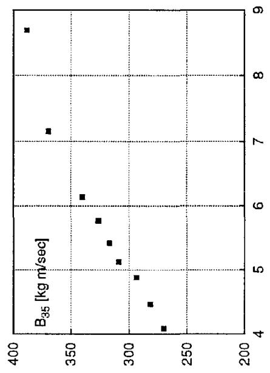

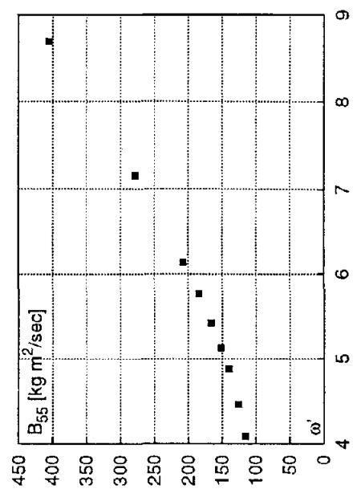

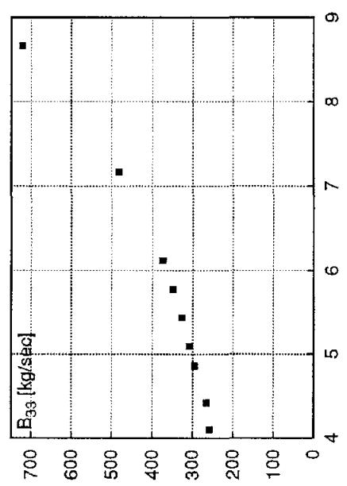

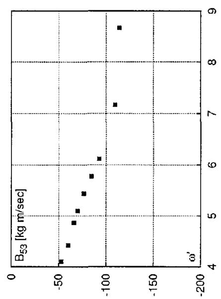  
Figure 2.18: Fluid damping values, $Fn = 0.75$ ( $\omega' = \omega \sqrt{L / g}$ ).

In the calculations of the added mass values the restoring coefficients of Table 2.6 are used, that is by zero forward speed, zero sinkage and zero trim angle. The results are also plotted in Figure 2.19 and 2.20. Due to experimental limitations the non-dimensional frequency $\left(\omega\sqrt{L/g}\right)$ could not exceed 6.2 during the pitch oscillation tests.

<table><tr><td> $\omega\sqrt{L/g}$ </td><td>A33[kg]</td><td>A53[kg m]</td><td>B33[kg/s]</td><td>B53[kg m/s]</td></tr><tr><td>4.123</td><td>59.039</td><td>20.084</td><td>375.948</td><td>-39.682</td></tr><tr><td>5.455</td><td>62.869</td><td>17.779</td><td>338.172</td><td>-66.809</td></tr><tr><td>7.140</td><td>69.966</td><td>19.265</td><td>303.824</td><td>-100.163</td></tr><tr><td>6.146</td><td>64.609</td><td>17.675</td><td>317.634</td><td>-81.610</td></tr><tr><td>4.885</td><td>61.718</td><td>18.402</td><td>358.924</td><td>-51.615</td></tr><tr><td>4.467</td><td>60.203</td><td>19.202</td><td>377.239</td><td>-40.175</td></tr><tr><td>8.672</td><td>74.236</td><td>20.212</td><td>320.303</td><td>-103.799</td></tr></table>

Table 2.17: Added mass and Fluid damping results from heave oscillation test, Fn = 0.75, trim and sinkage correction.

<table><tr><td> $\omega\sqrt{L/g}$ </td><td>A55[kg m2]</td><td>A35[kg m]</td><td>B55[kg m2/s]</td><td>B35[kg m/s]</td></tr><tr><td>4.138</td><td>63.847</td><td>8.376</td><td>255.602</td><td>413.52</td></tr><tr><td>4.467</td><td>61.309</td><td>10.774</td><td>255.014</td><td>418.05</td></tr><tr><td>4.877</td><td>58.933</td><td>12.703</td><td>256.807</td><td>430.26</td></tr><tr><td>5.440</td><td>56.269</td><td>14.337</td><td>262.963</td><td>447.97</td></tr><tr><td>6.139</td><td>54.308</td><td>15.355</td><td>271.316</td><td>469.76</td></tr></table>

Table 2.18: Added mass and Fluid damping results from pitch oscillation test, Fn = 0.75, trim and sinkage correction.

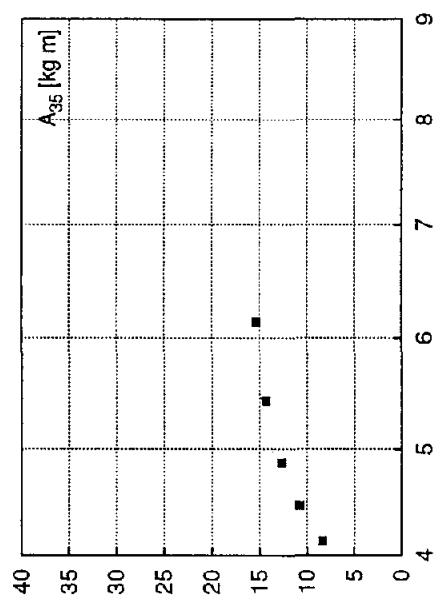

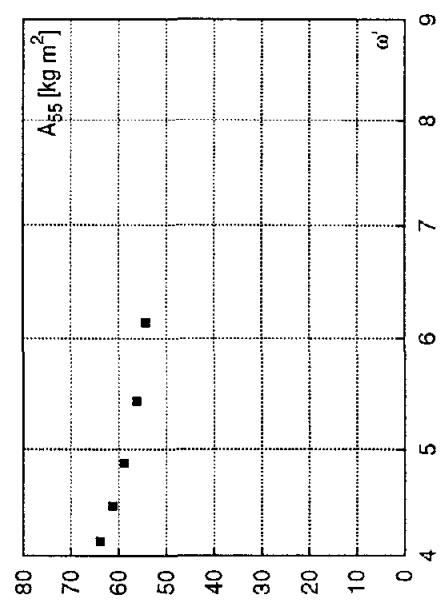

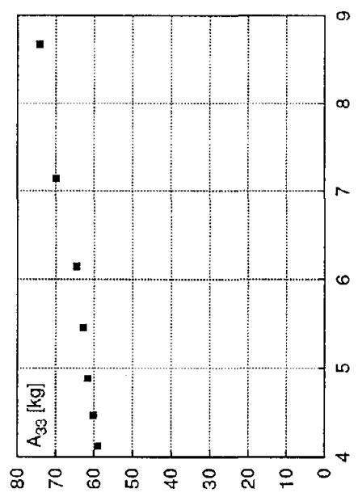

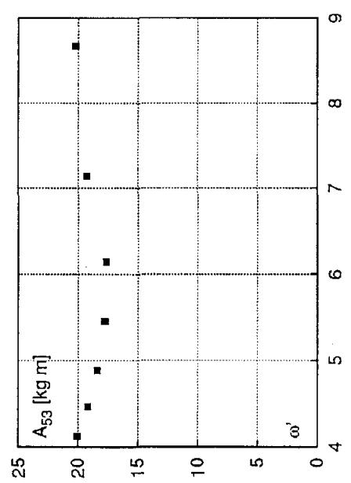  
Figure 2.19: Added mass values, $Fn = 0.75$ ( $\omega' = \omega \sqrt{L / g}$ ).

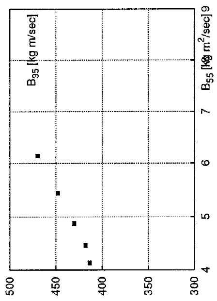

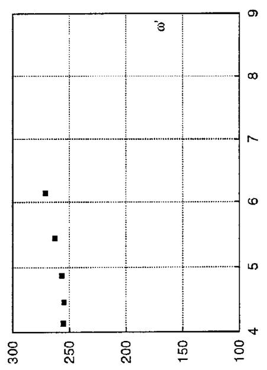

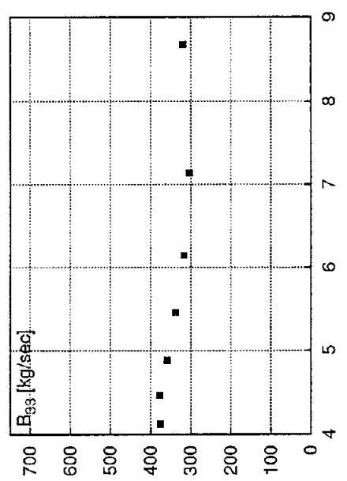

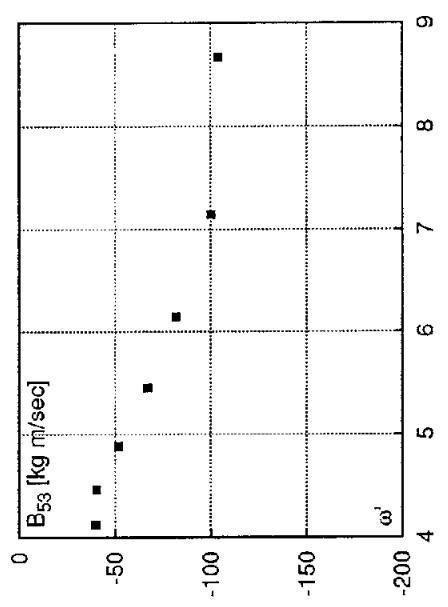  
Figure 2.20: Fluid damping values, $Fn = 0.75$ ( $\omega' = \omega \sqrt{L / g}$ ).

## 2.4 The wave load tests

## Table:

2.19: Wave force $F_{z}$ and $M_{y}$ , zero trim and sinkage, Fn = 0.30

2.20: Wave force $F_{z}$ and $M_{y}$ , zero trim and sinkage, Fn = 0.45

2.21: Wave force $F_{z}$ and $M_{y}$ , zero trim and sinkage, Fn = 0.60

2.22: Wave force $\mathbf{F}_z$ and $\mathbf{M}_y$ , zero trim and sinkage, $\mathrm{Fn} = 0.75$

## Figure:

2.21: Wave force $\mathbf{F}_z$ and $\mathbf{M}_y$ , zero trim and sinkage, $\mathrm{Fn} = 0.30$

2.22: Wave force $F_{z}$ and $M_{y}$ , zero trim and sinkage, Fn = 0.45

2.23: Wave force $F_{z}$ and $M_{y}$ , zero trim and sinkage, Fn = 0.60

2.24: Wave force $F_{z}$ and $M_{y}$ , zero trim and sinkage, Fn = 0.75

The vertical wave force and the wave moment around the y-axis are presented in the tables and figures below. During the experiments the vessel was kept fixed on its zero forward speed waterline. It is understood that this is not the actual position of the vessel if the vessel has a certain forward speed since than a trim and sinkage correction should be taken into account.

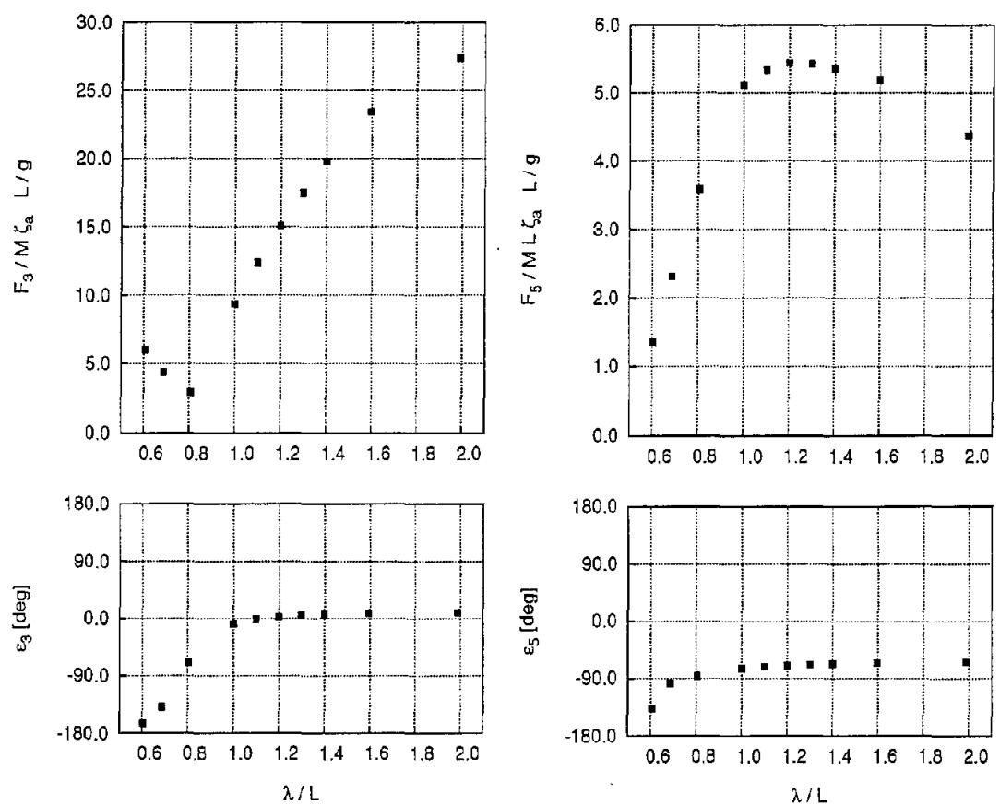

<table><tr><td> $\lambda/L$ </td><td> $\zeta_a$  [mm]</td><td> $F_{3a}$  [N]</td><td> $\epsilon_3$  [deg]</td><td> $F_{5a}$  [Nm]</td><td> $\epsilon_5$  [deg]</td></tr><tr><td>0.604</td><td>22.620</td><td>38.627</td><td>-164.473</td><td>25.996</td><td>-137.288</td></tr><tr><td>0.685</td><td>21.232</td><td>26.497</td><td>-138.098</td><td>41.919</td><td>-97.903</td></tr><tr><td>0.804</td><td>20.571</td><td>17.194</td><td>-68.695</td><td>63.022</td><td>-86.275</td></tr><tr><td>1.000</td><td>18.338</td><td>48.763</td><td>-8.748</td><td>80.002</td><td>-74.622</td></tr><tr><td>1.098</td><td>18.139</td><td>63.958</td><td>-1.388</td><td>82.566</td><td>-71.610</td></tr><tr><td>1.199</td><td>18.003</td><td>77.256</td><td>2.344</td><td>83.613</td><td>-69.813</td></tr><tr><td>1.299</td><td>18.075</td><td>89.946</td><td>5.042</td><td>83.739</td><td>-68.221</td></tr><tr><td>1.399</td><td>18.012</td><td>101.523</td><td>6.346</td><td>82.281</td><td>-66.972</td></tr><tr><td>1.597</td><td>18.311</td><td>122.045</td><td>7.805</td><td>81.188</td><td>-65.530</td></tr><tr><td>1.989</td><td>19.366</td><td>150.747</td><td>9.029</td><td>72.178</td><td>-63.285</td></tr><tr><td>0.602</td><td>23.005</td><td>24.790</td><td>77.343</td><td>15.529</td><td>97.206</td></tr><tr><td>0.602</td><td>22.295</td><td>23.727</td><td>-154.561</td><td>15.293</td><td>-134.000</td></tr><tr><td>0.685</td><td>22.210</td><td>19.321</td><td>-133.977</td><td>30.989</td><td>-94.724</td></tr><tr><td>0.798</td><td>19.999</td><td>14.011</td><td>-73.340</td><td>51.614</td><td>-83.747</td></tr><tr><td>1.001</td><td>19.082</td><td>40.220</td><td>-12.350</td><td>73.416</td><td>-78.121</td></tr><tr><td>1.109</td><td>18.034</td><td>54.208</td><td>-5.512</td><td>75.783</td><td>-75.954</td></tr><tr><td>1.195</td><td>18.408</td><td>68.485</td><td>-3.440</td><td>80.542</td><td>-75.622</td></tr><tr><td>1.296</td><td>18.658</td><td>81.575</td><td>1.070</td><td>81.709</td><td>-72.763</td></tr><tr><td>1.399</td><td>18.799</td><td>92.110</td><td>3.131</td><td>80.267</td><td>-71.542</td></tr><tr><td>1.593</td><td>19.158</td><td>112.625</td><td>5.789</td><td>79.689</td><td>-69.103</td></tr><tr><td>1.973</td><td>21.014</td><td>141.908</td><td>9.480</td><td>72.581</td><td>-65.764</td></tr></table>

Table 2.19: Wave loads in head waves, $F_{3}$ and $F_{5}, Fn = 0.30$ .  
Figure 2.21: Wave loads in head waves, $F_{3}$ and $F_{5}$ , Fn = 0.30.

Table 2.20: Wave loads in head waves, $F_{3}$ and $F_{5}, Fn = 0.45$ .

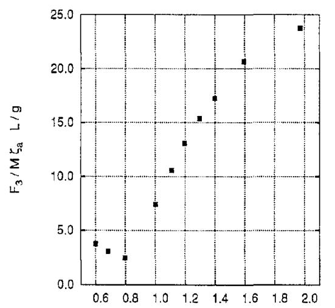

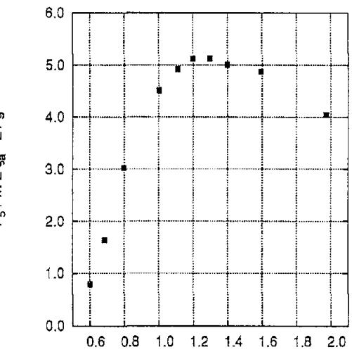

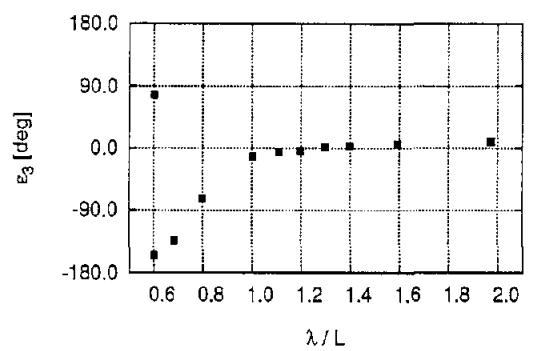

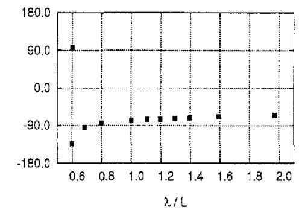  
Figure 2.22: Wave loads in head waves, $F_{3}$ and $F_{5}$ , $Fn = 0.45$ .

<table><tr><td> $\lambda/L$ </td><td> $\zeta_a$  [mm]</td><td> $F_{3a}$  [N]</td><td> $\epsilon_3$  [deg]</td><td> $F_{5a}$  [Nm]</td><td> $\epsilon_5$  [deg]</td></tr><tr><td>0.800</td><td>29.547</td><td>12.149</td><td>-21.456</td><td>42.028</td><td>-66.706</td></tr><tr><td>0.908</td><td>19.612</td><td>25.051</td><td>6.132</td><td>50.251</td><td>-65.175</td></tr><tr><td>1.002</td><td>19.261</td><td>37.743</td><td>9.635</td><td>56.552</td><td>-68.945</td></tr><tr><td>1.197</td><td>18.921</td><td>60.602</td><td>12.242</td><td>61.088</td><td>-72.347</td></tr><tr><td>1.297</td><td>18.744</td><td>71.152</td><td>13.825</td><td>62.094</td><td>-72.497</td></tr><tr><td>1.396</td><td>18.889</td><td>80.476</td><td>15.177</td><td>62.079</td><td>-72.760</td></tr><tr><td>1.600</td><td>18.897</td><td>96.553</td><td>13.068</td><td>61.064</td><td>-76.666</td></tr><tr><td>1.769</td><td>19.205</td><td>110.819</td><td>11.072</td><td>60.220</td><td>-79.893</td></tr><tr><td>1.980</td><td>19.935</td><td>123.557</td><td>10.412</td><td>58.482</td><td>-82.063</td></tr></table>

Table 2.21: Wave loads in head waves, $F_{3}$ and $F_{5}$ , Fn = 0.60.

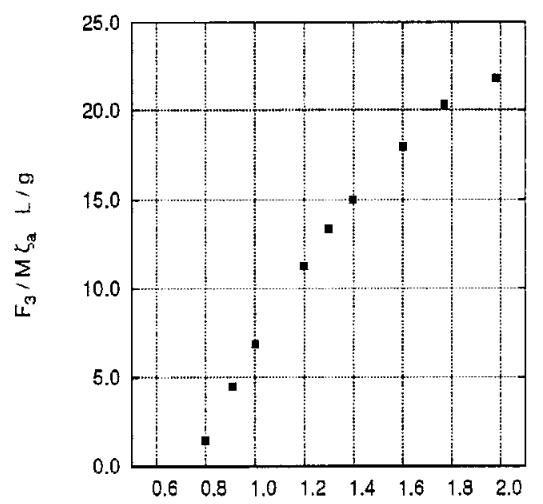

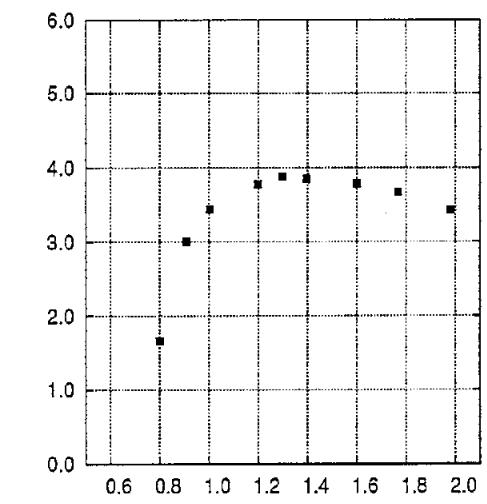

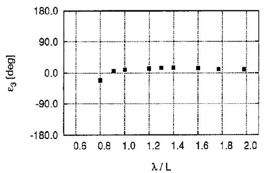

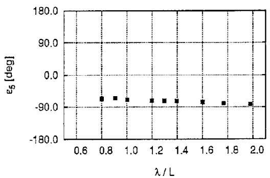  
Figure 2.23: Wave loads in head waves, $F_{3}$ and $F_{5}$ , Fn = 0.60.

<table><tr><td> $\lambda/L$ </td><td> $\zeta_a$ [mm]</td><td> $F_{3a}$ [N]</td><td> $\epsilon_3$ [deg]</td><td> $F_{5a}$ [Nm]</td><td> $\epsilon_5$ [deg]</td></tr><tr><td>0.800</td><td>19.699</td><td>14.522</td><td>-77.594</td><td>35.970</td><td>-74.990</td></tr><tr><td>0.899</td><td>19.199</td><td>19.209</td><td>-23.570</td><td>49.764</td><td>-72.049</td></tr><tr><td>0.998</td><td>21.217</td><td>31.342</td><td>-4.724</td><td>58.794</td><td>-71.741</td></tr><tr><td>1.097</td><td>18.811</td><td>42.516</td><td>2.126</td><td>63.596</td><td>-72.514</td></tr><tr><td>1.202</td><td>17.730</td><td>54.846</td><td>7.496</td><td>66.028</td><td>-72.257</td></tr><tr><td>1.295</td><td>17.986</td><td>66.211</td><td>8.128</td><td>68.615</td><td>-72.807</td></tr><tr><td>1.401</td><td>17.417</td><td>75.217</td><td>8.787</td><td>69.234</td><td>-74.283</td></tr><tr><td>1.599</td><td>17.088</td><td>95.342</td><td>10.953</td><td>69.412</td><td>-74.637</td></tr><tr><td>1.986</td><td>18.359</td><td>121.781</td><td>10.404</td><td>66.802</td><td>-77.595</td></tr></table>

Table 2.22: Wave loads in head waves, $F_{3}$ and $F_{5}$ , $Fn = 0.75$ .

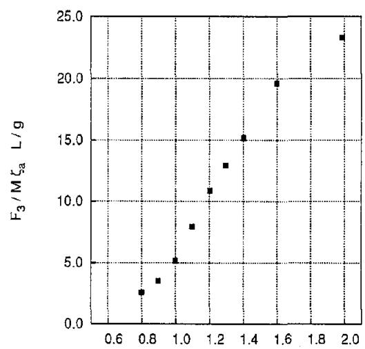

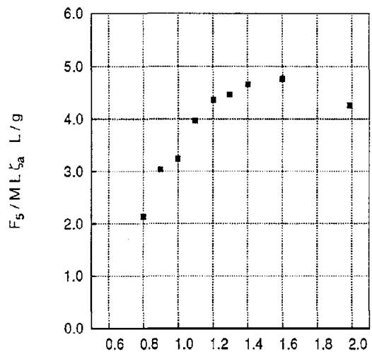

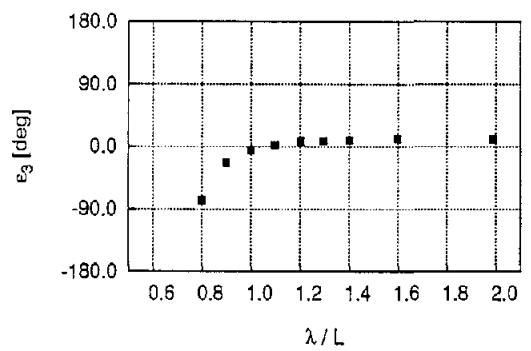

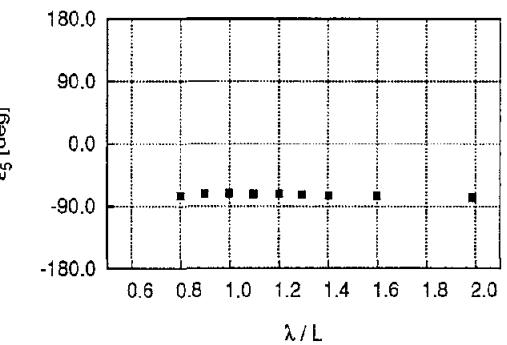  
Figure 2.24: Wave loads in head waves, $F_{3}$ and $F_{5}$ , Fn = 0.75.

## Acknowledgment

The catamaran hull form has been designed by Aad Versluis and has been manufactured at the Delft Shiphydromechanic Laboratory by Cees van den Bergh. The mechanical layout and construction parts for the model has been designed by Peter Poot and build by Hans van der Hek.

The electronic set-up has been realised by Rein van den Oever, who also performed most of the measurements in corporation with the author. His contribution to the project is especially appreciated.

## Bibliography

Van 't Veer, A. P.: 1998a, Behaviour of catamaran vessels in head and oblique waves, PhD thesis, Delft University of Technology.

Van 't Veer, A. P.: 1998b, Experimental results of motions and structural loads on the 372 catamaran model in head and oblique waves, Technical Report 1130, Delft University of Technology.