# A design of T-foil and trim tab for fast catamaran based on NSGA-II \*

Qi-dan Zhu, Yu Ma

College of Automation, Harbin Engineering University, Harbin 150001, China

(Received October 31, 2018, Revised January 4, 2019, Accepted February 5, 2019, Published online June 18, 2019)

©China Ship Scientific Research Center 2020

Abstract: This paper proposed an optimization design for a ride control system (RCS) for fast catamaran. The ship vertical motions are predicted by 2.5-D theory. The hydrodynamic characteristics of T-foil and trim tab are given, and the dynamic stability of the system is discussed. On this basis, the ride control system optimization model in regular and irregular waves is established for a specific catamaran. The optimal solution is obtained by using non-dominated sorting genetic algorithm-II (NSGA-II)

Key words: Deep neural network, channel flow, turbulence model, Reynolds stress

## Introduction

Wave piercing catamaran (WPC) is a type of ship with excellent sea-keeping performance. Compared with other conventional monohull ships, it has many significant advantages, such as longer natural motion period, higher transverse stability, higher maximum speed. The high-speed catamaran is particularly slender, which is the most attractive ship type for a large number of high-speed ferry passengers because of its better transverse stability. However, due to its lighter weight and faster speed, it is reported that the high-speed catamaran shows low vertical seakeeping performance in the presence of rough sea conditions[1-6].

The shaking moments of fast catamaran may cause negative effects on the seakeeping performance. Improving the seakeeping performance of ships is mainly to control ship motion, and the ship motion is decomposed into horizontal motion and vertical motion. As we all know, for symmetrical ships, horizontal motion and vertical motion can be decoupled by linear approximation, so they can be studied separately. The wave encounter frequency increases with the ship’s increasing velocity. As a result, the vertical oscillation (heave and pitch motion) becomes a serious problem for catamaran. The most commonly used stabilizer for improving the vertical oscillation of ships is the passive fin under the bow, which generated lift and damping for the hull. The former can slightly improve the ship's bow and reduce the wet hull area of the ship, thereby reducing drag and lighten the impact of the waves. The latter counteracts the heaving force and the pitching moment. The passive fin can reduce the heave/pitch motion. But that active fins are more effective in improving vertical oscillations, such as T-foils. Active T-shaped hydrofoil is a new type of anti-pitching appendage which appeared in the last twenty years. It is a variant of hydrofoils, and is installed under the keel of the bow of the ship and has a greater depth of immersion. It can effectively avoid slamming, cavitation or suction effect in waves. Therefore, the installation of T-foil on high-speed ships can effectively improve the performance. Compared with semi-submersible and other anti-pitching appendages, the drag of T-foil is smaller, which has less influence on the speed of the ship. Another advantage of the active T-shaped hydrofoil is that the flap angle at the tail end can be controlled to match the phase of the bow’s vertical velocity, which can greatly increase the damping of heave and pitch. Esteban and others noticed this problem and began to study seakeeping improvement of fast monohull ferry using T-foil and trim tab. After ten years of research, they got great achievements. But few researches focus on the principle of the sizes and installation positions of T-foils and trim tabs for a specific ship. A reasonable design of the ride control system can minimize vertical motion without changing the stability of the ship.

A lot of researchers have done some works in anti-vertical motions of high-speed ships[7-12]. In 1998, Thomas carried out sea trials on the ride control system (RCS) system, and the system controller is generalized predictive controller. The actual experimental data to prove the feasibility of the control system. Haywood highlights the importance of fluid mechanics simulation during design RCS. He introduced the design process of the controller and verify the anti-pitch effect of “Ocean Leveler” system. The system has the successful operation in mini type high speed ship. In the research of trimaran, he proved the advantages of controlled hydrofoil mounted on high speed ship can reduce the resistance, expand the navigation area via simulation. Esteban proved the feasibility of the control of T-foil and trim tabs using closed loop PID controller and genetic algorithm controller in his paper. The Japanese ferry company also studied the 112 m wave yacht developed by the Australian INCAT company and collaborated with the Osaka Prefecture University in Japan to study in the direction of airworthiness. Professors and students from Harbin Engineering University carried out a tank experiment of high-speed trimaran with T-foil. Comparing the experimental data and CFD simulation data, the results show that the software is feasible in fluid simulation[13]. Zhu and Ma[14] researches on control of WPC anti-vertical motion system with T-foil and trim tab.

In this paper, we use the 2.5-D panel method to calculate the vertical motions of WPC in head-sea waves, beam waves and oblique waves, the results are validated by experimental data. The influences of T-foil with different sizes and locations at different speeds and encounter directions are studied by panel method. On this basis, we propose a T-foil/trim tab design method for a specific catamaran. In this way, two active T-foils are installed at the bow of each ship’s hull, and two trim tabs are installed at the stern. Therefore, with 2.5-D method, the optimization model of the ride control system is set up, and the improved non-dominated sorting genetic algorithm-II (NSGA-II) is used to optimized the model.

## 1. Catamaran motion prediction by using 2.5-D theory and experimental verification

The 2.5-D theory has been proved to be an effective method for strongly nonlinear dynamic problems, especially for high speed ships[15-18]. The theory is based on linear potential theory. Moreover, the nonlinear, speed and 3-D effects can be easily included in the free surface conditions. 2.5-D theory is a high-speed strip theory between 2-D strip method and 3-D panel method. In the boundary conditions, the velocity effect in the hydrodynamics of high-speed ships is considered and applied to the solution of velocity potential. The calculation shows high efficiency because, considering the slenderness of the ship, the governing equations of the flow field are two-dimensional and linear. The Laplace equation is only considered in the cross sections of each hull, so the calculating speed is much faster than the 3-D penal method. Considering that the ship is affected by regular waves, assuming that the ship moves at a constant speed and is produced six-degree-of-freedom shaking movements. Assuming the six degrees of freedom shaking movements are small and can be considered as first order infinitesimals, the problems of forces and motions discussed in this paper are based on linear assumptions.

Three coordinate systems (as shown in Fig. 1) are introduced to describe the incident wave velocity potential, the flow field around the hull and the shaking movements of the ship respectively: geodetic coordinate system OXYZ , the coordinate origin is located on the still water surface, this coordinate system does not follow the fluid and the hull movement, and is used to represent the incident wave, the ship fixed coordinate system oxyz , the coordinate origin is located on the still water surface, using this coordinate system to describe the turbulent flow around the hull, establish the motion equation of the hull, hull coordinate system $O X _ { b } Y _ { b } Z _ { b }$ , the coordinate origin is the weight of the ship and is used to describe the hull surface.

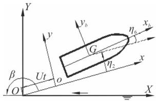  
(a)

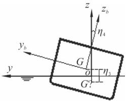  
(b)

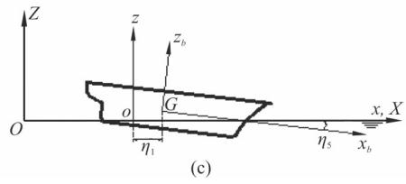

Fig. 1 Three coordinate systems for ship motions

The coordinate transformation relations are as follows:

$$
x = - X \cos \beta + Y \sin \beta - U t, y = - X \sin \beta - Y \cos \beta ,
$$

$$
z = Z\tag{1}
$$

The incident wave is assumed to be Airy wave. The amplitude of incident wave is $\zeta _ { a }$ , wave frequency is $\omega _ { 0 }$ and wave number is $k _ { 0 }$ . According to the wave theory, the velocity potential of the incident wave can be expressed as a complex function.

(2)

The incident wave is

$$
\varphi_ {0} (x, y, z) = \frac {\mathrm{i} g}{\omega_ {0}} \mathrm{e} ^ {k _ {0} z} \mathrm{e} ^ {- \mathrm{i} k _ {0} (x \cos \beta + y \sin \beta)}
$$

The encounter frequency is $\omega = \omega _ { \mathrm { 0 } } - k _ { \mathrm { 0 } } U$ cos $\beta$ . The shaking movements of a ship in regular waves can be regarded as a six-degree-of-freedom motion of a rigid body, with three linear displacements (heave surge and sway) and three angular displacements (pitch yaw and roll).

$$
\begin{array}{r l} & \{\eta (t) \} = \{\eta (t) \} \mathrm{e} ^ {\mathrm{i} \omega t} = \\ & (\eta_ {1 a} \quad \eta_ {2 a} \quad \eta_ {3 a} \quad \eta_ {4 a} \quad \eta_ {5 a} \quad \eta_ {6 a}) ^ {\mathrm{T}} \mathrm{e} ^ {\mathrm{i} \omega t} \end{array}\tag{3}
$$

Among them, $\eta _ { _ { j a } } ( j = 1 , 2 , \cdots 6 )$ are complex amplitudes, followed by sway, surge, heave, roll, pitch, and yaw. $\phi _ { 0 }$ is the amplitude of the unit incident wave potential, $\phi _ { j } \left( j = 1 - 6 \right)$ are the radiation potential of the ship moving in state $j$ , and $\phi _ { 7 }$ is the diffraction potential of the unit wave amplitude.For ship hydrodynamic problems, the slender body theory assumes that the 3-D Laplaceʼs equation is transformed into 2-D Laplaceʼs equation on each section of the body, regardless of the influence of the unsteady disturbance potential $\phi _ { s }$ . The 3-D generalized normal component is expressed as 2-D normal component $( N _ { 2 } , N _ { 3 } )$ on the section

$$
(n _ {2}, n _ {3}, n _ {4}, n _ {5}, n _ {6}) = (N _ {2}, N _ {3}, y N _ {3} - z N _ {2}, - x N _ {3}, x N _ {2})\tag{4}
$$

The difference between the 2.5-D theory and the normal strip method is: the free surface condition preserves the influence of the speed, and assumes that the speed is high enough to satisfy the wave-free condition in front of the ship.

The boundary conditions of $\phi _ { { \scriptscriptstyle j } } ( j = 1 - 7 )$ are as follows:

$$
\frac {\partial^ {2} \varphi_ {j}}{\partial y ^ {2}} + \frac {\partial^ {2} \varphi_ {j}}{\partial z ^ {2}} = 0,
$$

$$
\left[ \left(\mathrm{i} \omega - U \frac {\partial}{\partial x}\right) ^ {2} + g \frac {\partial}{\partial x} \right] \varphi_ {j} = 0 (z = 0),
$$

$$
\frac {\partial \varphi_ {j}}{\partial n} = \mathrm{i} \omega n _ {j} + U m _ {j}, j = 1 - 6 \text { on } S,
$$

$$
\frac {\partial \varphi_ {j}}{\partial n} = - \frac {\partial \varphi_ {0}}{\partial n}, j = 7 \text {on} S,
$$

$$
\varphi_ {j} = \frac {\partial}{\partial z} \varphi_ {j} = 0 (x > x _ {0})
$$

Appropriate distant radiation conditions

(5)

In order to solve the determining solution of high speed slender bodies, the following transformations are introduced.

$$
t (x) = \frac {- x + x _ {0}}{U}, \psi_ {j} (t, y, z) = \mathrm{e} ^ {\mathrm{i} \omega t} \varphi_ {j} (t, y, z)
$$

Equation (4) are transformed into:

$$
\frac {\partial^ {2} \psi_ {j}}{\partial y ^ {2}} + \frac {\partial^ {2} \psi_ {j}}{\partial z ^ {2}} = 0, \frac {\partial^ {2} \psi_ {j}}{\partial t ^ {2}} + g \frac {\partial \psi_ {j}}{\partial z} = 0 (z = 0),
$$

$$
\frac {\partial \varphi_ {j}}{\partial n} = \mathrm{i} \omega n _ {j} + U m _ {j}, j = 1 - 6 \text {on} S (t),
$$

$$
\frac {\partial \varphi_ {j}}{\partial n} = - \frac {\partial \varphi_ {0}}{\partial n}, j = 7 \text {on} S (t),
$$

$$
\psi_ {j} = \frac {\partial}{\partial z} \psi_ {j} = 0 (t = 0)
$$

Appropriate distant radiation conditions

(6)

The problem can be formally regarded as a 2-D time-domain non-linear problem of $\boldsymbol { \psi } _ { j } = ( t , y , z )$ . Set $S ( t )$ is the shape of ship’s cross-section at t instant, the initial time is at the bow, as it moving to the stern, $S ( t )$ changes. The free surface conditions reflect speed effect, avoid the limitation of normal strip method. In this paper, the distributed source integral equation of 2-D time domain Green function is used to solve $\boldsymbol { \psi } _ { j } = ( t , y , z )$

After solve $\boldsymbol { \psi } _ { j } = ( t , y , z )$ , the linear hydrodynamic pressure on the hull surface can be obtained by the Bernoulli equation. Taking the hydrostatic restoring force and wave-exciting force on the ship into account, motion equations with heave and pitch can be established[19]:

$$
\left(M ^ {h} + A _ {3 3} ^ {h}\right) \ddot {\xi} _ {3} + C _ {3 3} ^ {h} \xi_ {3} + B _ {3 3} ^ {h} \dot {\xi} + A _ {3 5} ^ {h} \ddot {\xi} _ {5} + C _ {3 5} ^ {h} \xi_ {5} +
$$

$$
B _ {3 5} ^ {h} \dot {\xi} _ {5} = F _ {3} \mathrm{e} ^ {\mathrm{i} w _ {e} t},
$$

$$
(I _ {5 5} ^ {h} + A _ {5 5} ^ {h}) \ddot {\xi} _ {5} + C _ {5 5} ^ {h} \xi_ {5} + B _ {5 5} ^ {h} \dot {\xi} _ {5} + A _ {5 3} ^ {h} \ddot {\xi} _ {3} + C _ {5 3} ^ {h} \xi_ {3} +
$$

$$
B _ {5 3} ^ {h} \dot {\xi} _ {3} = F _ {5} \mathrm{e} ^ {\mathrm{i} w _ {e} t}\tag{7}
$$

where $\xi _ { 3 } \ , \ \xi _ { 5 }$ are heave and pitch displacement respectively, $M ^ { h }$ is mass of the vessel, $I _ { 5 5 }$ is moment of inertia for pitch, $A _ { i i } ^ { h } , B _ { i i } ^ { h } , C _ { i i } ^ { h }$ are added masses, damping coefficients and restoring coefficients of the ship respectively ( = 3heave i , i = 5 pitch , h = catamaran ).

With the equations and hydrodynamic coefficients above, the force to motion state equations can be obtained. The catamaran model we study in this paper is shown in Fig. 2. The main characteristics of the ship is shown in Table 1. The numerical results of the 2.5-D theory are compared with the experimental data. The heave and pitch amplitudes are transformed to a non-dimensional form and are noted as the response amplitude operator (RAO). The motion RAO results calculated by panel method are verified by experimental data. With the experiment data by Harbin Engineering University towing tank, the head waves $( F r = 0 . 4 )$ oblique waves $( F r = 0 . 4 )$ and beam waves $( F r = 0 . 4 )$ motion RAOs comparison are shown in Figs. 3-5, where $R _ { 3 } ~ , ~ R _ { 4 }$ and $R _ { 5 }$ represent heave roll and pitch RAOs respectively.

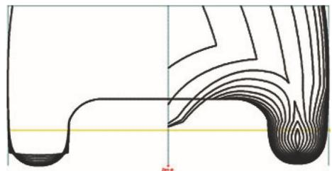

Fig. 2(a) Lines drawing of catamaran  
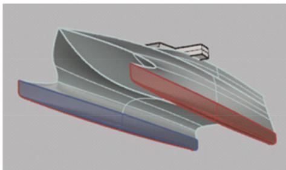  
Fig. 2(b) (Color online) 3-D model of catamaran

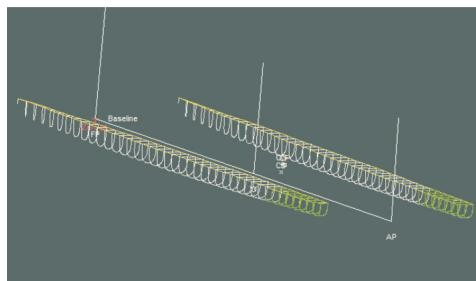  
Fig. 2(c) (Color online) Sections of catamaran using strip method

Table 1 WPC principal parameters

<table><tr><td>Parameter</td><td>Model</td><td>Full scale ship</td></tr><tr><td>Operating speed</td><td>3.7 m/s</td><td>40 kn</td></tr><tr><td>Displacement</td><td>66.7 kg</td><td>710 t</td></tr><tr><td>Draught</td><td>0.12 m</td><td>2.64 m</td></tr><tr><td>Parameter</td><td>3.9 m</td><td>86 m</td></tr></table>

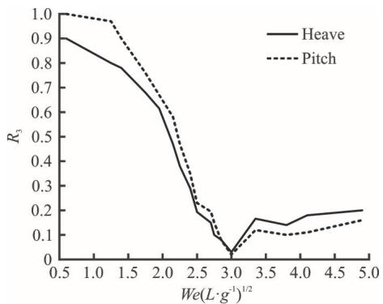

(a)  
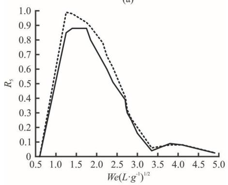  
(b)  
Fig. 3 Head sea, $F r = 0 . 4$

## 2. Modeling of T-foil and trim tab

Ride control system consists of T-foils and trim tabs.

T-foil is a subsidiary body of a WPC. Its main function is to improve the hydrodynamic performance ofthe WPC. T-foil is smaller than hydrofoil. However, after reasonable installation, the forces and moments produced by T-foil can encounter wave disturbance, and reduce the longitudinal motion.

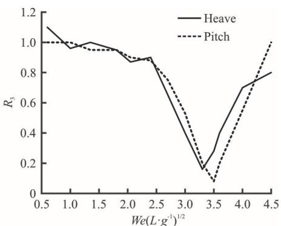

(a)  
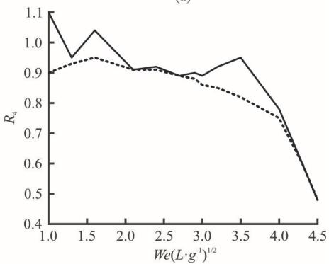  
(b)  
Fig. 4 Beam sea, $F r = 0 . 4$

Trim tabs are situated at the transom stern, whereas T-foils are installed in the forward part of the vessel. Because the vertical ship motions are large in the bow, it is an advantage that a heave and pitch damping device is placed close to the bow.

When the catamaran sailing in still water or waves, the fluid will flow to the fin at a certain angle of attack. At this time, hydrodynamic lift, viscous damping force and flow inertia force are generated by the actuators. The directions of these three forces are opposite to the direction of fin motion, thus playing a role in damping ship motion. The following three aspects will be used to calculate the hydrodynamic forces acting on the fin.The total force/torque generated by T-foil and trim tab are shown below:

$$
F _ {T} = \frac {1}{2} \rho A _ {T} \frac {\partial C _ {L T}}{\partial \alpha_ {T}} U ^ {2} \alpha_ {T} + \frac {1}{2} \rho A _ {T} \frac {\partial C _ {L T}}{\partial \alpha_ {T}} U ^ {2}.
$$

$$
\left(\xi_ {5} + \frac {- \dot {\xi} _ {3} - l _ {T} \dot {\xi} _ {5}}{U}\right) + (m _ {T} + a _ {3 3} ^ {T}) (\ddot {\xi} _ {3 3} - l _ {T} \ddot {\xi} _ {5}),
$$

$$
F _ {F} = \frac {1}{2} \rho A _ {F} \frac {\partial C _ {L F}}{\partial \alpha_ {F}} U ^ {2} \alpha_ {F},
$$

$$
M _ {T} = \frac {1}{2} l _ {T} \rho A _ {T} \frac {\partial C _ {L T}}{\partial \alpha_ {T}} U ^ {2} \alpha_ {T} + \frac {1}{2} l _ {T} \rho A _ {T} \frac {\partial C _ {L T}}{\partial \alpha_ {T}} U ^ {2}.
$$

$$
\left(\xi_ {5} + \frac {- \dot {\xi} _ {3} - l _ {T} \dot {\xi} _ {5}}{U}\right) + l _ {T} (M _ {T} + A _ {3 3} ^ {T}) (\ddot {\xi} _ {3} - l _ {T} \ddot {\xi} _ {5}),
$$

$$
M _ {F} = \frac {1}{2} l _ {F} \rho A _ {F} \frac {\partial C _ {L F}}{\partial \alpha_ {F}} U ^ {2} \alpha_ {F}\tag{8}
$$

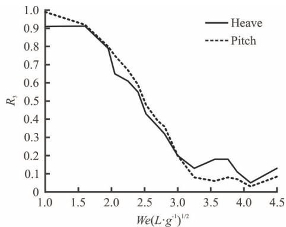

(a)  
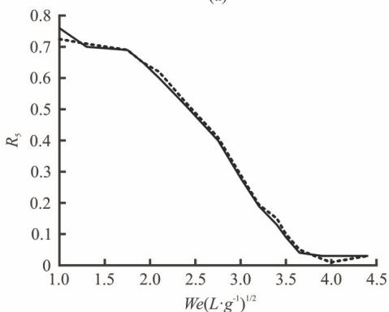

(b)  
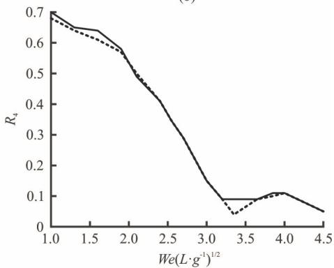  
(c)  
Fig. 5 Oblique wave, $F r = 0 . 4$

where $F _ { \scriptscriptstyle T } \ , M _ { \scriptscriptstyle T }$ are the total force and torque generated by T-foils, $F _ { F } , \ M _ { F }$ are the lift and torque generated by trim tab, and are the mean coordinates of the T-foil and trim tab, $\boldsymbol { C } _ { L T } \ , \ \boldsymbol { C } _ { L F }$ are the lift coefficients of T-foil and trim tab. $\alpha _ { { \scriptscriptstyle T } } , \alpha _ { { \scriptscriptstyle F } }$ are the fin angles of the T-foil and trim tab, $A _ { T }$ is the area of each fin on the T-foil, $A _ { F }$ is the area of each trim tab, $\rho$ is the fluid density, U is the speed, $M _ { \scriptscriptstyle T }$ is the mass of T-foil and $l _ { T }$ is distance between T-foil’s install position and ship’s gravity center. Figure 6 shows the parameters of T-foil. Figure 7 shows Components of angle of attack on the T-foil fin. Figure 8 shows the structure of the actuators, which can show how the T-foil is placed below the keel and the trim tab is behind the ship. $C _ { L T }$ is the lift coefficient of the T-foil, which is related to the aspect ratio of the horizontal fin and fin shape. In this paper, NACA0012 is applied for the T-foil horizontal fin, and NACA0015 is applied for the strut. Then $C _ { L T }$ can be obtained from the following empirical formula.

$$
C _ {L T} = \frac {1 . 8 \pi A _ {e}}{1 . 8 + \sqrt {A _ {e} ^ {2} + 4}}\tag{9}
$$

where $A _ { e }$ is the aspect ratio of the horizontal fin. Compared with the T-foil, the structural parameters of the trim tab are much simpler, generally only one parameter, area $A _ { F }$

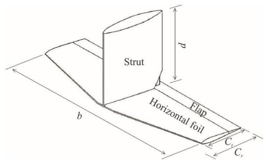

Fig. 6 Parameters of T-foil  
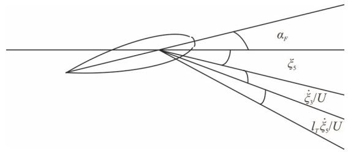  
Fig. 7 Components of angle of attack on the T-foil fin

From Eq. (8), the hydrodynamic characteristics of T-foil should be considered, and the closed loop of the system is as follows:

$$
(M + A _ {3 3}) \ddot {\xi} _ {3} + B _ {3 3} \dot {\xi} _ {3} + C _ {3 3} \xi_ {3} + A _ {3 5} \ddot {\xi} _ {5} + B _ {3 5} \dot {\xi} _ {5} + C _ {3 5} \xi_ {5} =
$$

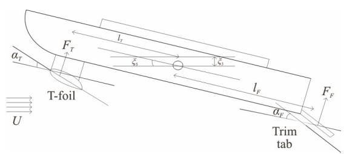  
Fig. 8 Sketch of catamaran with T-foil and trim tab

$$
\begin{array}{l} \left(F _ {3} + F _ {T} + F _ {F}\right) \mathrm{e} ^ {\mathrm{i} \omega_ {e} t}, \\ \left(I _ {5 5} + A _ {5 5}\right) \ddot {\xi} _ {5} + C _ {5 5} \xi_ {5} + B _ {5 5} \dot {\xi} _ {5} + A _ {5 3} \ddot {\xi} _ {3} + C _ {5 3} \xi_ {3} + B _ {5 3} \dot {\xi} _ {3} = \\ \left(F _ {5} + M _ {T} + M _ {F}\right) \mathrm{e} ^ {\mathrm{i} \omega_ {e} t} \end{array} \tag {10}
$$

where

$$
\begin{array}{l} A _ {3 3} = A _ {3 3} ^ {h} + A _ {3 3} ^ {L}, \quad A _ {3 5} = A _ {5 3} = A _ {3 5} ^ {h} + A _ {3 5} ^ {L}, \\ A _ {5 5} = A _ {5 5} ^ {h} + A _ {5 5} ^ {L}, \quad B _ {3 3} = B _ {3 3} ^ {h} + B _ {3 3} ^ {L}, \\ B _ {3 5} = B _ {5 3} = B _ {3 5} ^ {h} + B _ {3 5} ^ {L}, B _ {5 5} = B _ {5 5} ^ {h} + B _ {5 5} ^ {L}, \\ C _ {3 3} = C _ {3 3} ^ {h}, \quad C _ {3 5} = C _ {3 5} ^ {h} + C _ {3 5} ^ {L}, \quad C _ {5 3} = C _ {5 3} ^ {h}, \\ C _ {5 5} = C _ {5 5} ^ {h} + C _ {5 5} ^ {L} \end{array}
$$

The parameters with superscript L are the hydrodynamic coefficients of T-foil. The parameters with superscript I are the hydrodynamic coefficients of trim tab. From Eq. (2), the hydrodynamic coefficients of T-foil can be obtained.

$$
\begin{array}{l} A _ {3 3} ^ {L} = 2 (M ^ {T} + A _ {3 3} ^ {T}), A _ {3 5} ^ {L} = A _ {5 3} ^ {L} = - 2 x _ {T} (M ^ {T} + A _ {3 3} ^ {T}), \\ A _ {5 5} ^ {L} = 2 x _ {T} ^ {2} (M ^ {T} + A _ {3 3} ^ {T}), B _ {3 3} ^ {L} = \rho U A _ {T} C _ {L T}, \\ B _ {3 5} ^ {L} = B _ {5 3} ^ {L} = - \rho U A _ {T} x _ {T} C _ {L T}, B _ {5 5} ^ {L} = \rho U A _ {T} l _ {T} ^ {2} C _ {L T}, \\ C _ {3 5} ^ {L} = \rho U ^ {2} A _ {T} C _ {L T}, C _ {5 5} ^ {L} = - \rho U ^ {2} A _ {T} l _ {T} C _ {L T} \end{array}
$$

where $\boldsymbol { A } _ { 3 3 } ^ { T }$ is the added mass of a T-foil. The trim tab is mainly to reduce the resistance of the ship, and it always cooperates with T-foil to reduce heave motion, so we neglect its hydrodynamic characteristics on the WPC.

## 3. The influence of ride control system on the catamaran seakeeping performance

Vertical motion dynamic stability is a important aspect of seakeeping performance. It is affected by hull structure navigational condition and T-foil’s hydrodynamic characteristics. In this chapter, the influence of T-foil on the vertical motion dynamic stability of ship is analyzed.

The closed loop system of WPC vertical motions are essentially a coupled homogeneous linear differential equations with constant coefficients. With wave to force model and force to motion model, the system can be decoupled to two transfer functions[20]. One is for heave motion, the other is for pitch motion:

$$
\xi_ {3} (t) = \frac {F _ {3} \Theta_ {4} - F _ {5} \Theta_ {2}}{\Theta_ {2} \Theta_ {3} - \Theta_ {1} \Theta_ {4}} = \xi_ {3 0} \mathrm{e} ^ {\lambda_ {n} t},
$$

$$
\xi_ {5} (t) = \frac {F _ {3} \Theta_ {1} - F _ {5} \Theta_ {3}}{\Theta_ {2} \Theta_ {3} - \Theta_ {1} \Theta_ {4}} = \xi_ {5 0} \mathrm{e} ^ {\lambda_ {n} t}\tag{11}
$$

where

$$
\begin{array}{l} \Theta_ {1} = - (M _ {3 3} + A _ {3 3}) \omega_ {e} ^ {2} + \mathrm{i} B _ {3 3} \omega_ {e} + C _ {3 3}, \\ \Theta_ {2} = - A _ {3 5} \omega_ {e} ^ {2} + \mathrm{i} B _ {3 5} \omega_ {e} + C _ {3 5}, \\ \Theta_ {3} = - A _ {5 3} \omega_ {e} ^ {2} + \mathrm{i} B _ {5 3} \omega_ {e} + C _ {5 3}, \\ \Theta_ {4} = - (I _ {5} + A _ {5 5}) \omega_ {e} ^ {2} + \mathrm{i} B _ {5 5} \omega_ {e} + C _ {5 5}, \\ \lambda_ {1, 2} = f \pm \mathrm{i} \omega_ {e}, \lambda_ {3, 4} = f ^ {\prime} \pm \mathrm{i} \omega_ {e} ^ {\prime} \end{array}
$$

Assuming the coupled heave and pitch motions are oscillatory, and the corresponding characteristic roots are two conjugate complex roots. Where are constants, $\lambda _ { n }$ is the characteristic root, t is the time. From Eq. (10), the corresponding characteristic equation is

$$
a \lambda^ {4} + b \lambda^ {3} + c \lambda^ {2} + d \lambda + e = 0
$$

where

$$
\begin{array}{l} a = (M + A _ {3 3}) (I _ {5} + A _ {5 5}) - A _ {3 5} A _ {5 3}, \\ b = (M + A _ {3 3}) B _ {5 5} + (I _ {5} + A _ {5 5}) B _ {3 3} - A _ {3 5} B _ {5 3} - A _ {5 3} B _ {3 5}, \\ c = (M + A _ {3 3}) C _ {5 5} + (I _ {5} + A _ {5 5}) C _ {3 3} + B _ {3 3} B _ {3 5} - \\ \quad A _ {5 3} C _ {5 3} - B _ {3 5} B _ {5 3}, \\ \quad d = B _ {3 3} C _ {5 5} + B _ {5 5} C _ {3 3} - B _ {5 3} C _ {3 5} - B _ {3 5} C _ {5 3}, \\ \quad e = C _ {3 3} C _ {5 5} - C _ {3 5} C _ {5 3} \end{array}
$$

The shipʼs shaking movements to disturbance mainly depends on its motion natural frequencies, and its heave and pitch motions correspond to two conjugate complex roots respectively. Generally, the absolute value of the real part of the complex root corresponding to heave oscillation is less than that corresponding to pitch oscillation, while the absolute value of the imaginary part is greater than that corresponding to pitch oscillation. This indicates that the heave oscillation attenuates slowly than the pitching, while the natural period is shorter than the pitching. Therefore, the roots $\lambda _ { 1 , 2 }$ with larger absolute value of real part and smaller absolute value of imaginary part can correspond to the ship's heave motion, while the other pair of roots $\lambda _ { 3 , 4 }$ can be pitch motion. According to the Routh-Hurwitz criterion, the necessary and sufficient condition for the eigenvalue of characteristic equation to have a negative real part is that the principal subformulas of al orders of the Russ determinant are greater than zero:

$$
H = \left| \begin{array}{c c c c} b & d & 0 & 0 \\ a & c & e & 0 \\ 0 & b & d & 0 \\ 0 & a & c & e \end{array} \right|, \Delta_ {1} = b > 0, \Delta_ {2} = b c - a d > 0,
$$

$$
\Delta_ {3} = b c d - a d ^ {2} - b ^ {2} e > 0, \Delta_ {4} = \Delta_ {3} e > 0
$$

The direct analysis of the vertical motion stability is very complicated. Since the other conditions except $e > 0$ are generally automatically satisfied, $e > 0$ can be used as the criterion for the vertical motion stability of catamaran. Substituting hydrodynamic coefficients into equations.

$$
(C _ {3 3} + C _ {3 3} ^ {L}) (C _ {5 5} + C _ {5 5} ^ {L}) - (C _ {3 5} + C _ {3 5} ^ {L}) (C _ {5 3} + C _ {5 3} ^ {L}) > 0,
$$

$$
\rho g \nabla G M _ {l} - \frac {\rho g M _ {w} ^ {2}}{A _ {w}} - U ^ {2} A _ {3 3} -
$$

$$
\rho U ^ {2} \sum_ {i = 1} ^ {N} \left(l _ {T} + \frac {M _ {w}}{A _ {w}}\right) A _ {T} C _ {L} > 0\tag{12}
$$

The inequality above is the stability criterion of the catamaran with T-foil and trim tab. From this inequality, the $A _ { T }$ (area of the main foil) and $l _ { T }$ (location of the T-foil) should be taken into consideration in the design of T-foil. As the T-foil is stalled in the bow, $l _ { T } > 0$ From Eq. (12), the stability of vertical motion will deteriorate with T-foil moving to bow or fin area increases. When ship speed is 3.7 m/s, the T-foil size and location ranges which satisfies the above conditions can be obtained in Fig. 9 by using MATLAB program. From Eq. (12), it can be seen that the four roots of the characteristic equation change continuously when the values of $l _ { T }$ and $A _ { T }$ change in the range mentioned above. Therefore, the inner area of the curve in Fig. 9 is the value range of the fin's area $A _ { T }$ and location $l _ { T }$ that make the system stable.

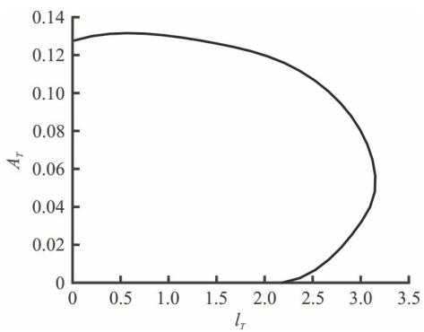  
Fig. 9 The stable ranges of the T-foil fin’s area $A _ { T }$ and location $l _ { T }$

For a mass-spring system with damping, the natural period and damping ratio are two important parameters. While meeting stability, there must be suitable natural period and damping ratio. The natural period of heave and pitch are given by:

$$
T _ {3} = \frac {2 \pi}{\omega}, T _ {5} = \frac {2 \pi}{\omega^ {\prime}}\tag{13}
$$

The damping ratios of heave/pitch are defined as:

$$
\zeta_ {3} = \frac {- f}{\sqrt {f ^ {2} + \omega^ {2}}}, \zeta_ {5} = \frac {- f ^ {\prime}}{\sqrt {f ^ {\prime 2} + \omega^ {\prime 2}}}\tag{14}
$$

According to the motion equations, it is difficult to analyze the stability of vertical motion by analytic method, so the influence of T-foil on the stability of vertical motion is analyzed by numerical calculation. Next, we use the numerical algorithm to calculate $\mathrm { W P C } ^ { \prime } \mathrm { s }$ natural frequencies and damping ratios with different areas, different installation positions of T-foils. Set $F r = 0 . 4$ , the results are shown in Fig. 10. The vessel maintains a steady speed of 3.9 m/s in still water.

From Figs. 10(a), 10(b), the T-foil’s area $A _ { T }$ is set to $0 . 0 2 ~ \mathrm { m } ^ { 2 } .$ , as the T-foil moving toward the ship's bow, and the natural period and damping ratio of heave motion change little, but the natural period and damping ratio of pitch motion both increase gradually. From Figs. 10(c)-10(d), the T-foil’s installed position $l _ { T }$ is set to 1m, as the T-foil’s area $A _ { T }$ increasing, and the natural period and damping ratio of heave motion change little, the natural period and damping ratio of pitch motion both increase gradually.

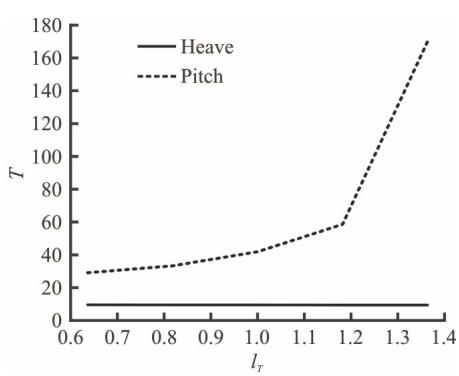

Fig. 10(a) Heave and pitch natural periods with different $l _ { T }$  
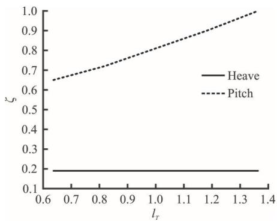

Fig. 10(b) Heave and pitch damping ratios with different $l _ { T }$  
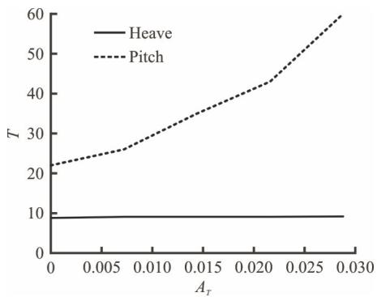

Fig. 10(c) Heave and pitch natural periods with different $A _ { T }$  
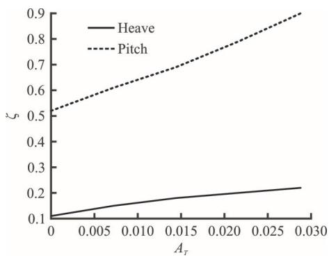  
Fig. 10(d) Heave and pitch damping ratios with different $A _ { T }$

From Figs. 9, 10, increasing $A _ { T }$ or $l _ { T }$ of T-foil will reduce the stability of the ship but increase damping ratio of the ship. The variation range of each performance index of heave and pitch motion can be determined corresponding to a certain length which keeps the vertical motion of catamaran stable and meets certain performance requirements. In order to ensure the overall vertical motion performance, the layout of T-foil should be considered comprehensively. At the same time, as can be seen from Fig. 3, after choosing the appropriate chord length, we can get better results only by changing the length, but not necessarily both changes at the same time. However, this is only the preliminary optimization and selection of the fin, the final determination of the fin also needs to fully consider the fin angle of attack to maintain the stability of vertical motion, the role in improving seakeeping and robustness. The optimization of the ride control system should be considered. The design goal of the ride control system is as follows:

(1) The force and torque generated by ride control system can counteract most of the wave disturbance.

(2) The catamaran vertical motions with ride control system should have reasonable damping ratios, natural frequencies.

(3) The catamaran vertical motions with ride control system should satisfy stability criterion.

(4) The catamaran vertical motions with ride control system should be reduce to minimum.

(5) The ride control system’s angles of attack shouldn’t be out of range.

## 4. The multi-objective optimization ofWPC ride control system

The multi-objective optimization problem can be described as finding a set of design variables: $X =$ $( x _ { 1 } , x _ { 2 } , x _ { 3 } , \cdots , x _ { s } ) ^ { \mathrm { T } }$ , let min $f _ { i } ( X ) i = 1 , \cdots , n$ ， with constraints: $h _ { k } ( X ) k = 1 , \cdots , m , g _ { j } ( X ) \geq 0 j = 1 , \cdots , p$ In the formula, s , n , m and p are the numbers of the design variables, the objective function, the equality constraint and the inequality constraints respectively.

In general, multiple goals are in conflict with each other, and the improvement of a target’s performance is often based on the reduction of one or more targets’ performance, that is, there is no optimal design can make all the goals reach the best at the same time. Therefore, the optimal solution for the multi-objective optimization is called the Pareto optimal solution set. These solutions are incomparable to all objective functions, they can not improve any objective function without weakening at least one other objective function. Pareto optimal solution is convex set or concave set. In some complex cases, it may also be semi convex, semi concave or discontinuous solution set. The complexity of solution set increases the difficulty of solving multi-objective optimization problems.

Compared with the traditional multi-objective processing method, genetic algorithm (GA) has great superiority in solving multi-objective optimization problems. GAs are based on Darwinʼs theory of natural selection, and are semi-stochastic methods. There are some multi-objective $\mathrm { G A s } ,$ , such as vector evaluated genetic algorithms (VEGA), NSGAs. Among them, $\mathrm { N S G A - I I } ^ { [ 2 1 - 2 4 ] }$ is improved version of NSGA, is one of the most influential multi-objective optimization algorithms. The most prominent features of NSGA-II algorithm are:

(1) Fast non-dominated sorting is used to improve the convergence speed of the algorithm.

(2) Crowding distance is defined to effectively avoid the difficulty of sharing parameter selection.

(3) The elite strategy adopts the mechanism of $\mu + \lambda$ selection. It can make the new generation population more effective than the previous generation.

## 4.1 Fast non-dominated sorting

To start with the concept of domination, for solutions $X _ { 1 }$ and $X _ { 2 }$ , if all the objective functions corresponding to $X _ { 1 }$ are not larger than $X _ { 2 }$ (minimal problem), and there is a objective value smaller than $X _ { 2 }$ , that is $X _ { 2 }$ is dominated by $X _ { 1 }$

Fast non-dominated sorting is a cyclic grading process: first to find the non-dominated solution set in population, and denote as the first non-dominated layer, $i _ { \mathrm { r a n k } } = 1 ( i _ { \mathrm { r a n k } }$ is the non-dominated value of individual $i ) .$ , removed from the population, and continue to find the non-dominated solution set in the population, and then $i _ { \mathrm { r a n k } } = 1$

## 4.2 Crowding distance

In order to distribute the results uniformly in the target space and maintain the diversity of the population, the crowding distance is calculated for each individual, and the individuals with large crowding distance are selected.

The definition of crowding distance is

$$
L [ i ] _ {d} = L [ i ] _ {d} + \frac {L [ i + 1 ] _ {m} - L [ i - 1 ] _ {m}}{f _ {m} ^ {\max} - f _ {m} ^ {\min}}\tag{15}
$$

where $L [ i + 1 ] _ { m }$ is the m - th objective function value of individual i . $f _ { m } ^ { \mathrm { m a x } } , \ f _ { m } ^ { \mathrm { m i n } }$ are the maximum and minimum of the m - th objective function.

## 4.3 Tournament selection

Tournament selection takes a certain number of individuals from the population each time, and then chooses the best one to enter the offspring population. Repeat this operation until the new population size reaches the original population size.

## 4.4 Elitism mechanism

The elitism mechanism is to keep the fine individuals in the parent generation directly into the offspring to prevent the loss of the Pareto optimal solution. It is a necessary condition to ensure the convergence of the algorithm.

## 4.5 Fitness function

Because the genetic algorithm could not directly deal with the problem of constrained optimization, the penalty function method is used to transform the constrained multi-objective optimization problem into an unconstrained optimization problem. In order to make the fitness function not only to reflect the individual separation. The distance between the optimal solution can also reflect the distance between the individual and the feasible region, and the following penalty functions are applied.

$$
\phi (x) = \phi_ {1} (x) + \phi_ {2} (x)\tag{16}
$$

where $\phi _ { 1 }$ is constraint penalty function, $\phi _ { 2 }$ is inferior solution penalty function.Φ is total penalty function.

$$
\varphi_ {1} = \sigma_ {k} \sum_ {i = 1} \alpha_ {i} \left| \min \{0, g _ {i} (x) \} \right| ^ {2}, \varphi_ {2} = \frac {l - 1}{D _ {\text { rank }}}\tag{17}
$$

where $g _ { i }$ is the ist inequality constraints, l is the rank of x in group sorting and D is the rank number of current group ranking. The fitness function of the individual x can be calculated by the following formula.

$$
F (x) = \frac {1}{1 + \varphi (x)}\tag{18}
$$

## 4.6 Solution procedure

As a summary the following is the steps of NSGA-II used in this study for multi-objective optimization of ride control system:

(1) Generate a random population with M chromo-some which decoded by binary decoding.

(2) Export the data to the WPC vertical motion control system, and get the objective function data.

(3) The population is sorted by objective functions and based on the non-dominated sorting and crowding distances.

(4) Formation of the parent population using the

elitism mechanism.

(5) Affect a copy of parent by tournament section, cross over and mutation operators to forms the new children.

(6) Combine the new parent and children to form a new population.

(7) This procedure restarted until the convergence is met.

The optimization diagram is shown below in Fig. 11.

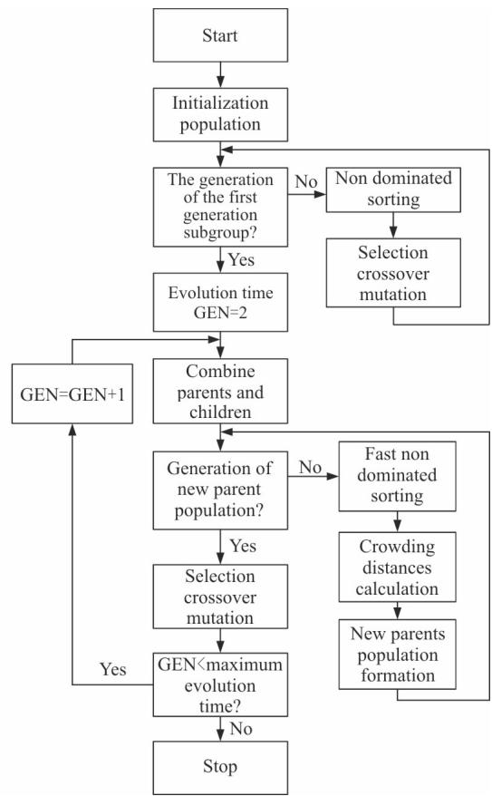  
Fig. 11 Flow chart of optimization process

## 5. Optimization results for the catamaran in regular waves

From the hydrodynamic force and torque generated by the actuators, the main design parameters are the T-foil fin area $A _ { T }$ , its installation position $l _ { T }$ under the bow and trim tab’s area $A _ { F }$ (because the trim tab installation is fixed under the stern of the catamaran, $l _ { F }$ is fixed). The NACA0012 is applied for the horizontal foil, and aspect ratio is chosen as 1.5, the hydrofoil shape effect is not discussed in the paper.

After considering the shape and size of the submerged body, the hydrodynamic performance of the T-foil and trim tabs, the fin rotation torque and the motion performance requirement of the catamaran, the value ranges of the design variables and the constraint variables are chosen as below. The multi-objective optimization mathematical model of T-foils and trim tabs’ installation position and areas in regular waves is described below.

The optimization objectives are min heave RAO, pitch RAO .

The optimization constraints are $0 . 5 \leq l _ { T } \leq 2$ 2 $0 . 0 1 \leq A _ { T } \leq 0 . 0 8 , 0 . 0 1 \leq A _ { F } \leq 0 . 0 8 , e > 0$ $\left| \alpha _ { _ T } \right| \leq 1 5 , 0 \leq \alpha _ { _ F } \leq 1 5$

We take the catamaran in the chapter 3 as optimize example. Two velocities $( F r = 0 . 4 \mathrm { o r } F r = 0 . 5 )$ are taken for the optimization. The head sea regular waves with $\lambda / T = 1 . 0$ are taken for optimiza- tion. So the optimization can be separated into two cases: case $1 ~ ( F r = 0 . 4$ and head waves), case $2 \ ( F r = 0 . 5$ and head waves). The size of the group was 50. Due to the constraints of the normalized processing and inequality constraints, so take the penalty factor coefficient $\sigma = 0 . 5 + 1 . 5 \times 1 . 2 7 5 ( G + 1 ) / 1 . 3 5$ , where $G$ is the evolution algebra. The crossover probability is 0.8, the mutation probability is 0.1, and the allowable distance among the individuals is 0.5, the results are obtained in Fig. 11 after the 500 generation of evolution. In Figs. 12(a), 12(c),the xyz axis represent the $l _ { T } , \ A _ { T }$ and $A _ { F }$ respectively. In Figs. 12(b), 12(d), the transverse and vertical axis represent the heave RAO and pitch RAO of the catamaran respectively. The points in each figure represent the suggested optimal layout position for each case, which is the individual (layout) with the highest virtual fitness value. In addition, it can be revealed from Fig. 12 that when the catamaran is travelling in head-sea waves, considering the heave and pitch motion, when $F r = 0 . 4$ , the distribution of the Pareto fronts range is mainly concentrated in $l _ { T } \in ( 1 . 5 7 3 , 1 . 7 5 2 )$ ， $A _ { T } \in ( 0 . 0 3 6 4 ,$ 0.0454) , $A _ { F } \in ( 0 . 0 2 1 1 , 0 . 0 2 5 4 )$ . For the $F r = 0 . 5$ condition, the distribution of the Pareto fronts range is mainly concentrated in $l _ { T } \in ( 1 . 5 8 8 , 1 . 8 1 6 )$ $A _ { T } \in ( 0 . 0 3 9 8 , 0 . 0 4 8 1 )$ , $A _ { F } \in ( 0 . 0 2 5 5 , 0 . 0 2 7 5 )$ , and the red point represents the best design. Compare with the naked hull and original design, the results are shown in Table 2

## 6. Optimization results for the catamaran in irregular waves

In general, the irregular waves can be seen as composed of infinite regular waves with different amplitudes, different frequencies, different directions and different phases. Combine them together to form a wave spectrum. The main effect of ocean wave spectrum is to describe the distribution of wave energy relative to the constituent waves, so it is also called “energy spectrum”. Here, we mainly concentrate on the heaving forces and pitching moment. Generally speaking, wave is a phenomenon of water surface distortion. The motion of ships is caused by interference from various sea conditions. The socalled sea condition is the situation of ocean surface aroused by adverse wind. The general form of wave acted on the hull can be regarded as simple harmonic motion, such as sine wave. Normally, we call it a regular wave. The amplitudes and periods of simple harmonic waves all remain the same. However, in the actual marine environment, the properties of waves are constantly changing, and such waves are irregular waves. In fact, we superpose regular waves to describe irregular waves. The irregular waves propagate along the OX axis, and the estimated values of wave fluctuations can be expressed as regular wave summation. That is

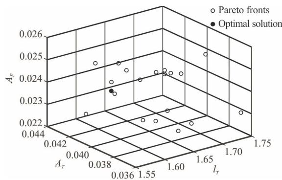

Fig. 12(a) Pareto fronts of the RCS optimization in case 1  
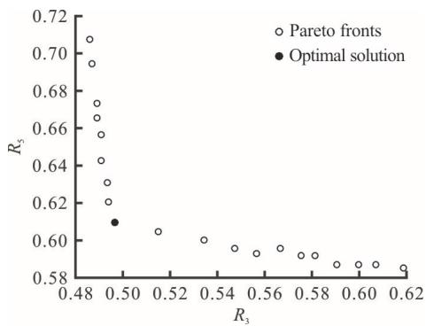  
Fig. 12(b) Heave and Pitch RAO Corresponding to the Pareto fronts in case 1

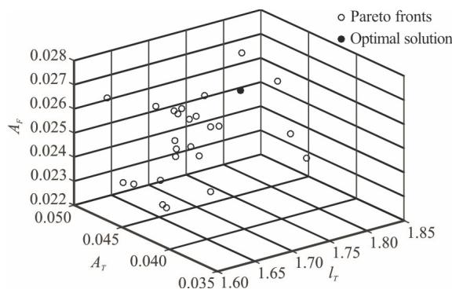

Fig. 12(c) Pareto fronts of the RCS optimization in case 2  
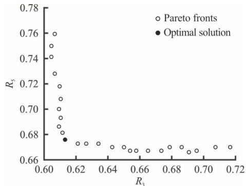  
Fig. 12(d) Heave and Pitch RAO corresponding to the Pareto fronts in case 2

Table 2 Results comparison

<table><tr><td></td><td>Case 1 heave RAO</td><td>Case 1 pitch RAO</td><td>Case 2 heave RAO</td><td>Case 2 pitch RAO</td></tr><tr><td>Naked hull</td><td>0.823</td><td>0.935</td><td>0.952</td><td>0.986</td></tr><tr><td>Original design</td><td>0.677</td><td>0.713</td><td>0.756</td><td>0.734</td></tr><tr><td>New design</td><td>0.494</td><td>0.608</td><td>0.617</td><td>0.675</td></tr></table>

$$
\zeta = \sum_ {i = 1} ^ {N} A _ {i} \sin (\omega_ {i} t - k _ {i} x + \varepsilon_ {i})\tag{19}
$$

Among them, $A _ { i }$ represents the amplitude of the ith wave component, i represents the angular frequency of the ith wave component, $k _ { i }$ represents the wave number of the ith wave component and $\varepsilon _ { i }$ represents the random phase angle of the ith wave component. The phase angle $\varepsilon _ { i }$ is uniformly distributed in the interval (0, 2pi) and is independent of time t . The relationship between the amplitude $A _ { i }$ and the spectrum ( )S  can be expressed as

$$
\frac {1}{2} A _ {i} ^ {2} = S (\omega_ {i}) \Delta \omega\tag{20}
$$

In this paper, Pierson-Moscowitz (P-M) spectrum is used to simulate wave motion.

$$
S (\omega) = \frac {8 . 1 \times 1 0 ^ {- 3} g ^ {2}}{\omega^ {5}} \exp \left(\frac {- 3 . 1 1}{h _ {0 . 5} ^ {2} \omega^ {4}}\right)\tag{21}
$$

where $S ( \omega )$ is wave spectral density, h is significant wave height. We decompose the forces and moments generated by waves acted on the hull into regular sinusoidal forces/moments

$$
F _ {3} (t) = \sum_ {i = 1} ^ {n} \left| F _ {3} (\omega) \right| \zeta_ {i} \sin \left(\omega_ {i} t + \phi_ {i}\right),
$$

$$
F _ {5} (t) = \sum_ {i = 1} ^ {n} \left| F _ {5} (\omega) \right| \zeta_ {i} \sin \left(\omega_ {i} t + \phi_ {i}\right)\tag{22}
$$

Unlike in regular waves, according to wave theory, when the ship is traveling in irregular waves with wave spectral density $S ( \omega )$ , the root mean square of heave and pitch motion are

$$
\xi_ {3 \mathrm{rms}} ^ {2} = \int_ {0} ^ {\infty} \left(\frac {| \xi_ {3} |}{A}\right) ^ {2} S (\omega) \mathrm{d} \omega , \quad \xi_ {5 \mathrm{rms}} ^ {2} = \int_ {0} ^ {\infty} \left(\frac {| \xi_ {5} |}{A}\right) ^ {2} S (\omega) \mathrm{d} \omega\tag{23}
$$

where $\xi _ { \mathrm { 3 r m s } }$ and $\xi _ { \mathrm { s r m s } }$ are the root mean square of heave and pitch, A is the wave amplitude, $\left| \xi _ { 3 } \right| / A$ and $\left. \xi _ { 5 } \right. / A$ are heave and pitch response amplitude operators. The root mean squares reflects the ship’s vertical motion performance in irregular waves. The multi-objective optimization mathematical model of T-foils and trim tabs’ installation position and areas optimization in irregular waves is described below.

The optimization objectives are min $\xi _ { 3 \mathrm { { m s } } } , \xi _ { 5 \mathrm { { r m s } } }$ The optimization constraints are $0 . 5 \leq l _ { \scriptscriptstyle T } \leq 2 . 0$ $0 . 0 1 \leq A _ { _ T } \leq 0 . 0 8 , 0 . 0 1 \leq A _ { _ F } \leq 0 . 0 8 , e > 0$ $\left| \alpha _ { { T } } \right| \leq 1 5 , 0 \leq \alpha _ { { T } } \leq 1 5$

We set the catamaran sailing in irregular waves. The irregular waves have been generated for sea states 5 with P-M spectra, the significant wave height h is 2.5 m, and the ship speed is 3.7 m/s. The heading is 180. The frequency range of the spectrum is from 0.4 to 1.8, the setting of the calculation parameters is the same as that in regular waves and the distributions of the Pareto fronts are shown in Fig. 13.

In Fig. 13(a), the $x \ , \ y \ , \ z$ axis represent the $l _ { T } \ , \quad A _ { T }$ and $A _ { F }$ respectively. In Fig. 13(b), the transverse and vertical axis represent the heave rms and pitch rms of the catamaran respectively. The distribution of the Pareto fronts range is mainly concentrated in $l _ { T } \in ( 1 . 6 8 3 , 1 . 7 5 0 )$ 2 $A _ { T } \in ( 0 . 0 3 8 4 ,$ 0.0409) , $A _ { F } \in ( 0 . 0 2 4 9 , 0 . 0 2 8 9 )$ . Compare to the naked hull and original design, the results are shown in Table 3.

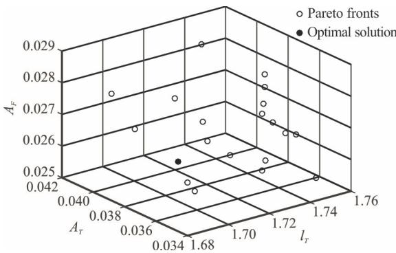  
Fig. 13(a) Pareto fronts of the RCS optimization in irregular waves

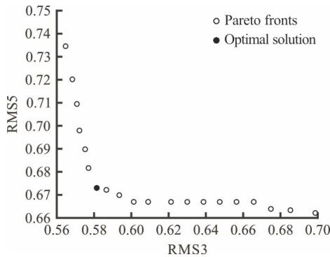  
Fig. 13(b) $\xi _ { \mathrm { 3 m s } }$ and $\xi _ { \mathrm { 5 m s } }$ corresponding to the Pareto fronts in irregular wave

Table 3 Results comparison

<table><tr><td>Parameter</td><td> $\xi_{3\text{rms}}$ </td><td> $\xi_{5\text{rms}}$ </td></tr><tr><td>Uncontrolled</td><td>0.856</td><td>0.995</td></tr><tr><td>Original design</td><td>0.723</td><td>0.616</td></tr></table>

## 7. Results and future works

In this paper, the seakeeping performance (heave, pitch motion) of a catamaran in different regular waves is investigated numerically by the seakeeping prediction program of the 2.5-D penal method. Further, the model of catamaran vertical motion with ride control system is established, and the influence of ride control system on catamaran is discussed in this paper. On the basis, the optimization model of RCS on WPC is established, and the optimization method is provided by NSGA-II. The results show that the determination of the optimal seakeeping ride control system normally relies on the travelling speed and incident waves.

For regular wave conditions, when a catamaran is travelling in head-sea waves, for $F r = 0 . 4$ , the recommended design is $l _ { T } = 1 . 5 7 3$ $A _ { T } = 0 . 0 3 7 3$ $A _ { F } = 0 . 0 2 3 8$ for $F r = 0 . 5$ , the recommended design is $l _ { T } = 1 . 6 5 4$ $A _ { T } = 0 . 0 4 5 4$ $A _ { F } = 0 . 0 2 6 8$ For irregular wave, when $F r = 0 . 5$ , when a catamaran is travelling inhead-sea waves, the recommended design layout is $l _ { T } = 1 . 6 6 7$ $A _ { \scriptscriptstyle T } = 0 . 0 4 0 6$ $A _ { F } = 0 . 0 2 7 8$ . For future work, more optimization objectives need to be taken into consideration in the optimization process, such as fin shape, aspect ratio of fin and so on. Finally, the determination of the virtual fitness function also requires improvement by combining it with some realistic factors, such as the seasickness susceptibility of passengers and the Coriolis acceleration that some devices can withstand.

## References

[1] Castiglione T., Stern F., Bova S. et al. Numerical investigation of the seakeeping behavior of a catamaran advancing in regular head waves [J]. Ocean Engineering, 2011, 38(16): 1806-1822.

[2] Lavroff J., Davis M. R., Holloway D. S. et al. Wave impact loads on wave-piercing catamarans [J]. Ocean Engineering, 2017, 131: 263-271.

[3] Jiang Z., Li L., Gao Z. et al. Dynamic response analysis of a catamaran installation vessel during the positioning of a wind turbine assembly onto a spar foundation [J]. Marine Structures, 2018, 61: 1-24.

[4] Bouscasse B., Broglia R., Stern F. Experimental investigation of a fast catamaran in head waves [J]. Ocean Engineering, 2013, 72: 318-330.

[5] Danışman D. B. Reduction of demi-hull wave interference resistance in fast displacement catamarans utilizing an optimized centerbulb concept [J]. Ocean Engineering, 2014, 91: 227-234.

[6] Zaghi S., Broglia R., Mascio A. D. Experimental and numerical investigations on fast catamarans interference effects [J]. Journal of Hydrodynamics, 2010, 22(5Suppl. 1): 545-549.

[7] Frisch U., Zheligovsky V. A very smooth ride in a rough sea [J]. Communications in Mathematical Physics, 2014, 326(2): 499-505.

[8] Liang L., Yuan J., Zhang S. et al. Design a software real time operation platform for wave piercing catamarans motion control using linear quadratic regulator based genetic algorithm [J]. PLOS ONE, 2018, 13(4): e0196107-

[9] Haywood A. J., Schaub B. H. The integration of lifting foils into ride control systems for fast ferries [J]. Australian Journal of Mechanical Engineering, 2015, 3(2): 133-141.

[10] Cruz J. D. L., Aranda J., Giron-Sierra J. M. et al. Impro ving the comfort of a fast ferry [J]. IEEE Control Systems, 2004, 24(2): 47-60.

[11] Muñoz-Mansilla R., Aranda J., Díaz J. M. et al. Parametric model identification of high-speed craft dynamics [J]. Ocean Engineering, 2009, 36(12): 1025-1038.

[12] Giron-Sierra J. M., Katebi R., Cruz J. M. D. L. et al. The control of specific actuators for fast ferry vertical motion

damping [C]. International Conference on Control Applications IEEE, Glasgow, UK, 2002, 304-309.

[13] Zong Z., Sun Y., Jiang Y. Experimental study of controlled T-foil for vertical acceleration reduction of a trimaran [J]. Journal of Marine Science and Technology, 2019, 24(2): 553-564.

[14] Zhu Q., Ma Y. Design of H anti-vertical controller and optimal allocation rule for catamaran T-foil and trim tab [J]. Journal of Ocean Engineering and Marine Energy, 2019, 5(3): 205-216.

[15] Li S., Zhu R. C., Miao G. P. et al. Investigations on applicability of 2.5D theory for calculation of motions and added resistance of ship advancing in waves [J]. Chinese Journal of Hydrodynamics, 2017, 32(2): 148-157(in Chinese).

[16] Salvesen N., Tuck E. O., Faltinsen O. M. Ship motions and sea loads [J]. Transactions-Society of Naval Architects and Marine Engineers, 1970, 78: 250-287.

[17] Li T., Benyahia S., Dietiker J. F. et al. A 2.5D computational method to simulate cylindrical fluidized beds [J]. Chemical Engineering Science, 2015, 123: 236-246.

[18] Ma S., Wang R., Zhang J. et al. Consistent formulation of ship motions in time-domain simulations by use of the results of the strip theory [J]. Ship Technology Research, 2016, 63(3): 146-158.

[19] Lloyd A. R. J. M. Seakeeping: Ship behavior in rough weather [M]. Chichester, Sussex, UK: Ellis Horwood Ltd., 1998, 77-78.

[20] Bhattacharyya R. Dynamics of marine vehicles [M]. Ho boken, New Jersey, USA: Wiley, 1978, 130-132.

[21] Deb K., Pratap A., Agarwal S. et al. A fast and elitist multiobjective genetic algorithm: NSGA-II [J]. IEEE Transactions on Evolutionary Computation, 2002, 6(2): 182-197.

[22] Bu J. G., Lan X. D., Zhou M. et al. Performance optimi zation of flywheel motor by using NSGA-2 and AKMMP [J]. IEEE Transactions on Magnetics, 2018, 54(6): 1-7.

[23] Xiang Q. J., Xue L., Kim K. Y. et al. Multi-objective opti mization of a flow straightener in a large capacity firefighting water cannon [J]. Journal of Hydrodynamics, 2019, 31(2): 137-144.

[24] Bekele E. G., Nicklow J. W. Multi-objective automatic calibration of SWAT using NSGA-II [J]. Journal of Hydrology, 2007, 341(3-4): 165-176.