# Verification of application of the 2.5D method in high-speed trimaran vertical motion and added resistance prediction

W.Y. Duan, S.M. Wang, S. Ma

College of Shipbuilding Engineering, Harbin Engineering University, No. 145, Nantong Street, Nangang District, Harbin, Heilongjiang Province, China

## A R T I C L E I N F O

Keywords: Trimaran 2.5D method Seakeeping Added resistance Model test

## A B S T R A C T

For the motion prediction of a trimaran, the hydrodynamic interference between main hull and outriggers is a significant factor and need to be taken into consideration. The high-speed slender body potential flow theory (2.5D method) is a high-efficient method to predict the seakeeping performance of ships in waves and has been validated for mono-hull ships. In this paper, the 2.5D method has been applied to predict the vertical motion (heave and pitch) and added resistance of a trimaran in head-sea waves. In addition, a trimaran model test was carried out to analyses the relationship between the travelling speed, outrigger layout, incident waves and heave, pitch amplitude, added resistance of a trimaran. The experimental results are also compared with the numerical results in order to verify the 2.5D method in the application of trimaran motion and added resistance prediction. The comparison results have shown that between Fn ¼ 0.353 and 0.471, the 2.5D method can give out accurate prediction results of vertical motion and added resistance of a trimaran. Meanwhile, the calculation efficiency is high enough which makes it applicable to massive computations.

## 1. Introduction

Trimarans being high-performance ships, have been widely applied in marine engineering in recent years. As its unique configuration, tri marans have better rolling stability and lower wave resistance (in some Froude numbers ranges). Also, the passenger accelerations of trimarans are usually smaller than that of catamarans in head-sea waves (Davis and Holloway, 2007; Lavroff and Davis, 2015). The theoretical prediction and the model test study of high-speed trimarans are the key technology of development and design of multi-hull ships. The theory used in predicting the seakeeping performance of trimarans mainly include linear strip theory, high speed slender body theory based on the assumption of flow field around two-dimensional hull and three-dimensional free surface condition (also known as the $2 \mathrm { D } + \mathrm { ~ t ~ }$ theory or 2.5D theory), Rankine source method, three-dimensional frequency domain and time domain Green function method and CFD method where the viscous effect and nonlinear hydrodynamic factors can be taken into consideration.

In the aspects of the trimaran seakeeping performance, as early as 2001, Francescutto et al. (Francescutto, 2001) studied the numerical model for the roll motion of the trimaran (the main hull and outriggers are Wigley type) and verified it by model tests. However, although the calculation process is simple, it is not precise enough as the wave exci tation force on outriggers has been neglected in the numerical model. Bingham et al. (2001) calculated the wave loads and motions of a trimaran in regular waves using three-dimensional pulsating source potential-flow method, three-dimensional translating-pulsating source potential-flow method and the coupled hydroelastic theory respectively. The results showed that the three-dimensional translating-pulsating source potential-flow method is more suitable for calculating the trimaran seakeeping performance. Fang et al. (Fang and Chen, 2005) also adopt three-dimensional source-distribution method to solve the hydrodynamic coefficients of a trimaran and optimized the outrigger layout of a trimaran. In 2007, Hebblewhite et al. (2007) carried out the research on the seakeeping performance of a trimaran by adopting strip theory, multi-hull ship strip theory and model tests. They studied the effects of travelling speed and outrigger layout on the amplitude of vertical motion of a trimaran. After this, Engle et al. (Engle and Lin, 2007) made it suitable for trimaran seakeeping calculation by improving two empirical/half-empirical methods. The comparison with model test results shows that this method can meet the design requirements.

During 2001–2012, Duan et al. (Wei et al., 2007; Duan et al., 2001) and Ma et al. (Ma, 2005; Ma et al., 2012) extended the 2.5D theory and developed a method of predicting the motion of trimarans in regular

Table 2  
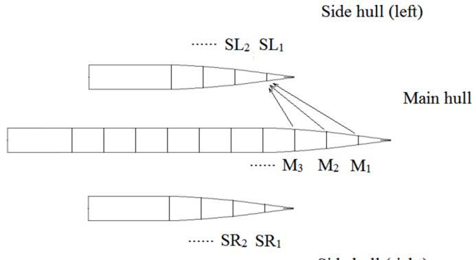  
Side hull (right)  
Fig. 1. Sketch of the solution of hydrodynamic interference between hulls.

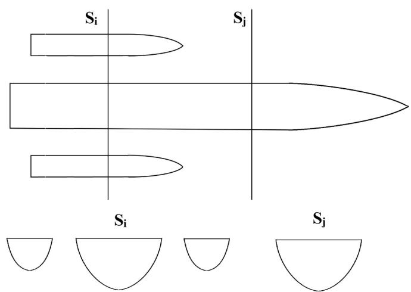  
Fig. 2. The sketch of the section selection in added resistance calculation.

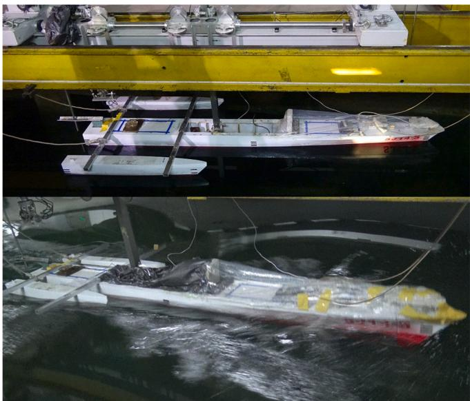  
Fig. 3. The vertical motion experiment for the trimaran model.

waves. They calculated the vertical motion of a trimaran with forward speed and the results were compared with the strip method and model test results. They showed that satisfactory results can be obtained for predicting the swaying motion of a trimaran in regular waves. However, compared with viscous CFD calculation, its efficiency and accuracy are not verified. Especially, this method has not been verified for the motion calculation of trimaran under different outrigger layout.

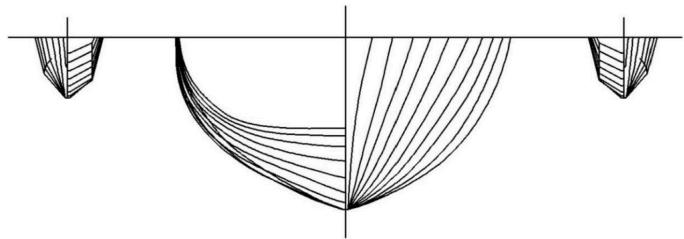  
Fig. 4. Lines drawing of main hull and outriggers.

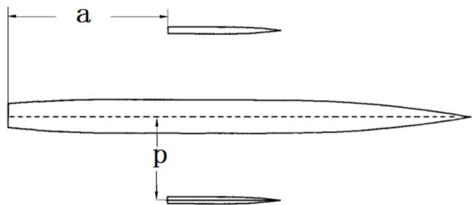  
Fig. 5. Sketch of longitudinal and transverse distance of outriggers (a and p).

Main characteristics of the experimental model.

<table><tr><td>Main feature</td><td>unit</td><td>Model</td><td>Full-scale ship</td></tr><tr><td>Length overall</td><td>m</td><td>3.343</td><td>83.575</td></tr><tr><td>Breadth</td><td>m</td><td>0.641</td><td>16.025</td></tr><tr><td>Depth</td><td>m</td><td>0.249</td><td>6.225</td></tr><tr><td>Length at waterline (main hull)</td><td>m</td><td>3.000</td><td>75.000</td></tr><tr><td>Beam at waterline (main hull)</td><td>m</td><td>0.240</td><td>6.000</td></tr><tr><td>Draft (main hull)</td><td>m</td><td>0.122</td><td>3.050</td></tr><tr><td>Length at waterline (side hull)</td><td>m</td><td>1.071</td><td>26.775</td></tr><tr><td>Beam at waterline (side hull)</td><td>m</td><td>0.051</td><td>1.275</td></tr><tr><td>Draft (side hull)</td><td>m</td><td>0.043</td><td>1.075</td></tr><tr><td>Displacement (whole ship)</td><td>kg/t</td><td>45.990</td><td>720.000</td></tr><tr><td>Radius of gyration (Pitch)</td><td>m</td><td>0.807</td><td>20.175</td></tr><tr><td>Displacement Ratio between main hull and outriggers</td><td>/</td><td>14.333</td><td></td></tr></table>

Regular wave Parameters in the model tests.

<table><tr><td>Serial Number</td><td>Wave Length to Ship Length Ratio</td><td>Wave Period (s)</td><td>Wave Height (mm)</td><td>Wave Steepness</td></tr><tr><td>W1</td><td>0.30</td><td>0.759</td><td>30</td><td>0.0330</td></tr><tr><td>W2</td><td>0.40</td><td>0.877</td><td>30</td><td>0.0250</td></tr><tr><td>W3</td><td>0.52</td><td>1.002</td><td>40</td><td>0.0256</td></tr><tr><td>W4</td><td>0.61</td><td>1.085</td><td>45</td><td>0.0246</td></tr><tr><td>W5</td><td>0.73</td><td>1.183</td><td>45</td><td>0.0206</td></tr><tr><td>W6</td><td>0.88</td><td>1.300</td><td>50</td><td>0.0189</td></tr><tr><td>W7</td><td>1.09</td><td>1.447</td><td>60</td><td>0.0184</td></tr><tr><td>W8</td><td>1.38</td><td>1.626</td><td>80</td><td>0.0193</td></tr><tr><td>W9</td><td>1.81</td><td>1.864</td><td>100</td><td>0.0184</td></tr><tr><td>W10</td><td>2.25</td><td>2.080</td><td>100</td><td>0.0148</td></tr></table>

To sum up, the research on the trimaran seakeeping numerical prediction can be mainly divided into three categories, 1. Two-dimensional method, such as strip theory. Although these kinds of methods have a simple calculation process and higher calculation efficiency, the calculation precision is usually lower and hard to account for the hydrodynamic interference between main hull and outriggers. 2. Threedimensional method, such as three-dimensional pulsating source potential-flow method, three-dimensional Rankine source method or even CFD method in which the viscous effects can be accounted for. These kinds of methods have advantage in calculation precision, but its calculation efficiency is usually low. Especially CFD method usually requires supercomputers to perform large-scale calculations 3. 2.5D method, also named 2D þ t method. The computational process of this method is relatively simple, which leads to high computational effi ciency. Meanwhile, it can account for the hydrodynamic interference between main hull and outriggers, thus satisfactory calculation results can be obtained.

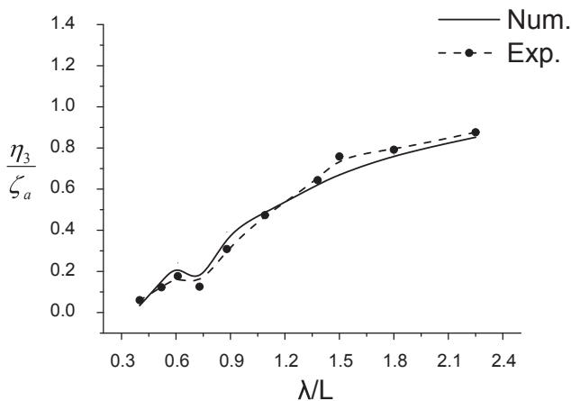  
a Fn=0.353 Heave RAO

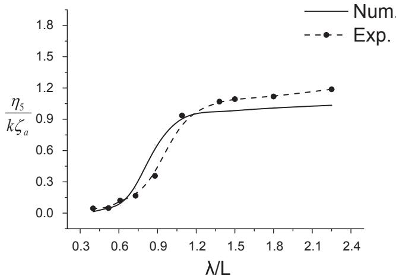  
b Fn=0.353 Pitch RAO

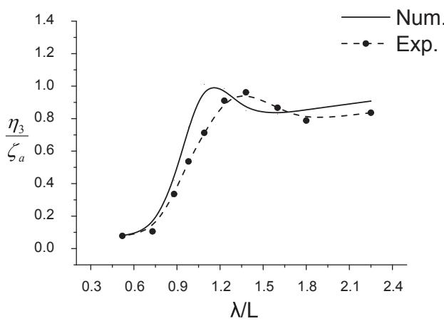  
c Fn=0.471 Heave RAO

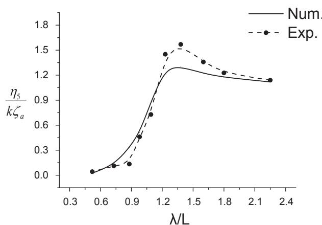  
d Fn=0.471 Pitch RAO  
Fig. 6. a/L ¼ 0.0，p/L ¼ 0.096, Heave and pitch RAO under different speed.

In terms of the above, in this paper, the 2.5D method is introduced first and the calculating process of the 2.5D method in the application of high-speed trimaran motion prediction is clarified in details. Second, the trimaran seakeeping model test is introduced, the experimental study was carried out for the trimaran sailing in regular waves with different forward speeds and different outrigger layouts. The numerical prediction of a trimaran was carried out based on the 2.5D method according to the experimental conditions. By comparing the numerical results with the experimental results, the 2.5D method has been verified in the application of trimaran swaying motion and added resistance prediction.

## 2. Motion and added resistance prediction of high-speed trimaran by applying 2.5D theory

High speed slender body potential flow theory is also named two dimensional and a half potential flow theory (2D þ t theory or 2.5D theory). This method considers the free surface condition with forward speed and retains the assumption of two-dimensional flow field according to the geometry characteristics of slender body. It was first used by Faltinsen and Zhao (Faltinsen and Umeda, 1991) for the theoretical prediction of ships seakeeping performance and has been widely applied during 1990s. Apparently, compared with the traditional two-dimensional STF method, 2.5D method can not only calculate high-speed vessels, but also retain the two-dimensional assumption to make the calculation process simpler. Although, compared with three-dimensional methods 2.5D method still has a gap in computational accuracy, the computational efficiency is far superior to that of the three-dimensional methods (Sun and Faltinsen, 2012).

Assume that a ship moves in a fixed direction at speed U in small amplitude regular waves in deep water. As a result of the wave force action, the ship will have six degrees of freedom of swaying motion. It is assumed that the ship is subjected to the excitation of incident wave for a long time and then makes a simple harmonic oscillation motion with small amplitude, now we apply the linear frequency domain potential flow theory to discuss the problem of the ship’s force and oscillation. According to the geometry characteristics of slender hull and the char acteristics of wave making of high-speed vessels, by applying 2.5D theory, we can obtain the definite problem of the unsteady flow potential around the hull $\varphi _ { j } ( j = 2 { \sim } 7 )$ under ship-following translational coordinate system oxyz as follow:

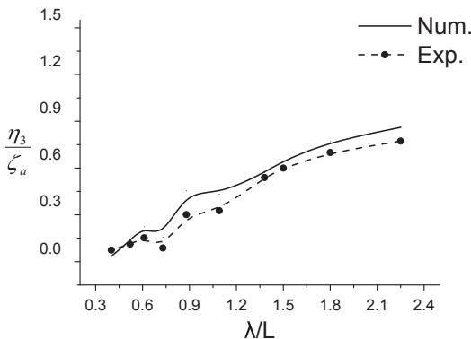  
a Fn=0.353 Heave RAO

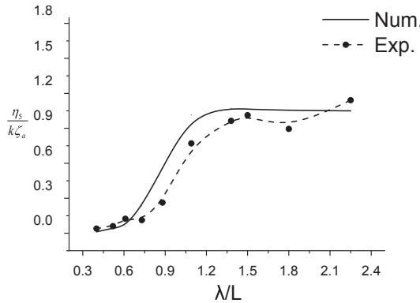  
b Fn=0.353 Pitch RAO

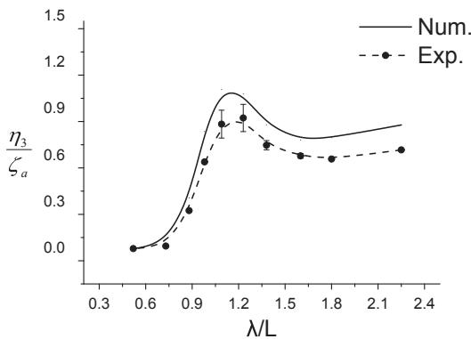  
c Fn=0.471 Heave RAO

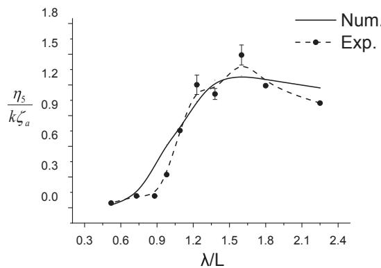  
d Fn=0.471 Pitch RAO  
Fig. 7. a/L ¼ 0.0，p/L ¼ 0.15, Heave and pitch RAO under different speed.

$$
\left\{ \begin{array}{l} \frac {\partial^ {2} \varphi_ {j}}{\partial y ^ {2}} + \frac {\partial^ {2} \varphi_ {j}}{\partial z ^ {2}} = 0 \\ \left[ \left(i \omega_ {e} - U \frac {\partial}{\partial x}\right) ^ {2} + g \frac {\partial}{\partial z} \right] \varphi_ {j} = 0 (z = 0) \\ \frac {\partial \varphi_ {j}}{\partial n} = \left\{ \begin{array}{l l} i \omega_ {e} N _ {j} + U m _ {j} & j = 2 \sim 6 \\ - \frac {\partial \varphi_ {0}}{\partial n} j = 7 \end{array} \right. \\ \varphi_ {j} = \frac {\partial \varphi_ {j}}{\partial x} = 0 \quad x > x _ {0} \end{array} \right.\tag{1}
$$

where $\varphi _ { 0 }$ is the incident wave potential with unit amplitude, $\omega _ { e }$ is the encounter frequency, $\varphi _ { j } ( j = 2 \mathord { \sim } 6 )$ represents the radiation potential in jth state motion with unit amplitude, $\varphi _ { 7 }$ is the diffraction potential in unit wave amplitude incident wave, $N _ { j } \ ( j = 2 , 3 )$ Þ represents the Y-axis and Z axis components of the unit normal vector on ship transverse section boundary (point to the inner side of the transverse section), and satisfies $( N _ { 2 } , N _ { 3 } , N _ { 4 } , N _ { 5 } , N _ { 6 } ) \ = ( N _ { 2 } , N _ { 3 } , y N _ { 3 } \ - z N _ { 2 } , - x N _ { 3 } , x N _ { 2 } )$ . m comes from the influence of steady and unsteady potential, it involves the second order differential of steady wave making disturbance potential. Ignoring the steady wave making potential $\varphi _ { s }$ in calm water, $m _ { j } ( j = 2 { \sim } 6 )$ can be represented as:

$$
m _ {2} = m _ {3} = m _ {4} = 0, m _ {5} = N _ {3}, m _ {6} = - N _ {2}\tag{2}
$$

The definite problem (1) assumes the unsteady wave making in front of the ship bow is zero. Meanwhile, the three-dimensional free surface condition with forward speed has been retained, which reflects the propagation characteristics of ship unsteady wave making in the ship length direction at a higher speed. Since the flow field solution is twodimensional and the free surface condition is three-dimensional, it is called 2.5D method. In order to solve this problem, the following transformation equations are introduced:

$$
t (x) = (x _ {0} - x) / U \quad \psi_ {j} (t, y, z) = \varphi_ {j} (t, y, z) e ^ {i \omega_ {e} t (x)}\tag{3}
$$

Hence, the definite problem of $\varphi _ { j }$ has been transformed to the defi nite problem of $\psi _ { j } ( t , y , z )$ :

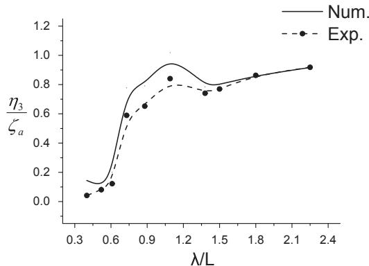  
a Fn=0.353 Heave RAO

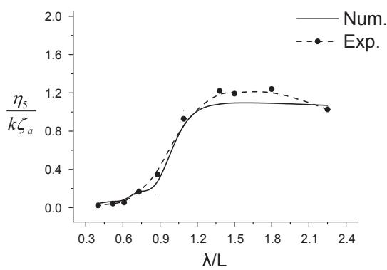  
b Fn=0.353 Pitch RAO

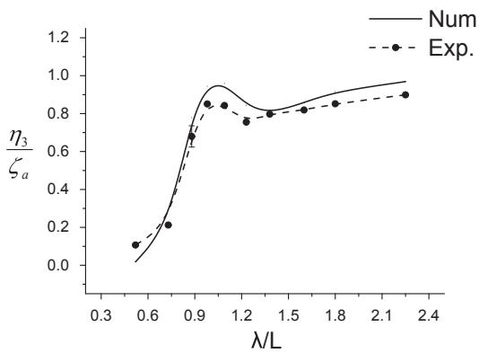

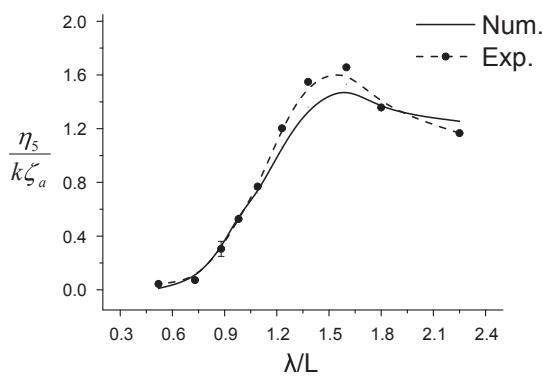  
c Fn=0.471 Heave RAO  
d Fn=0.471 Pitch RAO  
Fig. 8. $\mathbf { a } / \mathbf { L } = 0 . 2 6$ $\mathbf { p } / \mathrm { L } = 0 . 0 9 6 ,$ , Heave and pitch RAO under different speed.

$$
\left\{ \begin{array}{l} \frac {\partial^ {2} \psi_ {j}}{\partial x ^ {2}} + \frac {\partial^ {2} \psi_ {j}}{\partial z ^ {2}} = 0 \\ \frac {\partial^ {2} \psi_ {j}}{\partial t ^ {2}} + g \frac {\partial \psi_ {j}}{\partial z} = 0 (z = 0) \\ \frac {\partial \psi_ {j}}{\partial n} = \left\{ \begin{array}{l l} (i \omega_ {e} N _ {j} + U m _ {j}) e ^ {i \omega_ {e} t} & j = 2 \sim 6 \\ - \frac {\partial \varphi_ {0}}{\partial n} e ^ {i \omega_ {e} t} & j = 7 \end{array} \right. \\ \psi_ {j} = \frac {\partial \psi_ {j}}{\partial t} = 0 \quad t = 0 \end{array} \right.
$$

The definite problem (4) can be understood as two-dimensional time domain body surface nonlinear problem. The initial condition of the flow field corresponds to the boundary condition of the vessel’s bow position. The free surface condition satisfied by $\psi _ { j } ( t , y , z )$ corresponds to the time domain linear free surface condition satisfied by a twodimensional cylinder oscillating at zero forward speed. When the flow field potential is solved step by step with time moves on, the flow field solution of each section will be obtained step by step too. Duan et al. (Duan and He, 2001) proposed to solve $\psi _ { j } ( t , y , z )$ and spatial derivative inside the transverse section by constructing distributed source bound ary integral equation with two-dimensional time domain Green function. This enhances the efficiency and stability of the 2.5D method for solving hydrodynamic problems of high-speed vessels.

By means of using Green formula, the distributed source boundary integral equation for solving flow field potential $\psi _ { j } ( t , y , z )$ can be established:

(4)

$$
\begin{array}{l} 2 \pi \psi_ {j} (p, t) = - \int_ {S _ {B} (t)} d s _ {q} + \int_ {0} ^ {t} \sigma (q, t) \ln \frac {r _ {p q}}{r _ {p \overline {{q}}}} d \tau \int_ {S _ {B} (\tau)} \sigma (q, \tau) \tilde {G} d s _ {q} \\ + \frac {1}{g} \int_ {0} ^ {t} \sigma \tilde {G} n _ {\mathrm{y}} [ \dot {A} (\tau) ] ^ {2} d \tau | A - B \end{array}\tag{5}
$$

where $\tilde { G }$ is the memory term of two dimensional time domain Green function. $A ( \tau )$ is the intersection point of free surface and hull cross section at moment τ. $p = ( y , z )$ and $q = ( \eta , \varsigma )$ represent coordinates for field point and source point respectively. $\overline { { \boldsymbol { q } } } = \left( \eta , - \zeta \right)$ represents the mirror point of the source point on the mean calm water surface. $\sigma ( \boldsymbol { q } , t )$ and $\sigma ( q , \tau )$ are the strength of the source distributed on sections at the current time moment and previous time moment respectively. A and B represent the transverse coordinates of the cross section at the intersections of the water lines. is the difference between two corresponding terms.

Using body surface condition satisfied by $\psi _ { j } ( t , y , z )$ , the twodimensional time domain body surface nonlinear distributed source boundary integral equation satisfied by source strength $\sigma ( p , t )$ can be derived.

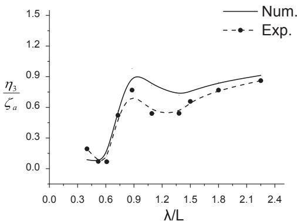  
a Fn=0.353 Heave RAO

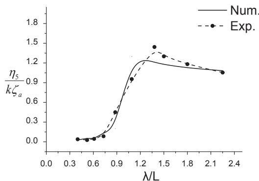  
b Fn=0.353 Pitch RAO

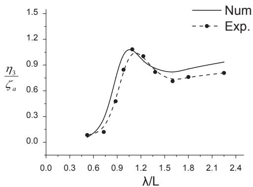  
c Fn=0.471 Heave RAO

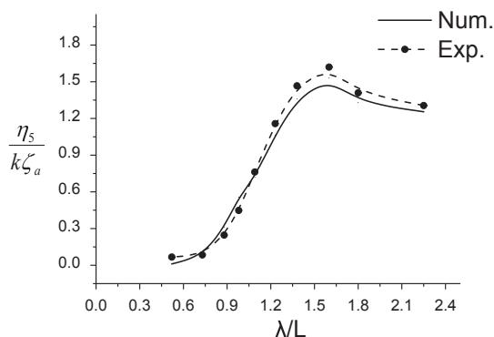  
d Fn=0.471 Pitch RAO  
Fig. 9. ${ \bf a } / { \bf L } = 0 . 2 6$ $\mathbf { p } / \mathbf { L } = 0 . 1 5 ,$ , Heave and pitch RAO under different speed.

Main characteristics of the trimaran model.

<table><tr><td>Main feature</td><td>unit</td><td>Main Hull</td><td>Side Hull</td></tr><tr><td>Length at waterline</td><td>m</td><td>4.000</td><td>1.000</td></tr><tr><td>Beam at waterline</td><td>m</td><td>0.358</td><td>0.085</td></tr><tr><td>Draft</td><td>m</td><td>0.17</td><td>0.1</td></tr><tr><td>Displacement (whole ship)</td><td>kg</td><td>129.0</td><td>4.45 (single)</td></tr><tr><td>Longitudinal Radius of inertia</td><td>m</td><td>1.0</td><td>0.25</td></tr><tr><td>Froude Number</td><td>0.5</td><td></td><td></td></tr><tr><td>Layout Position</td><td colspan="3">(a,p)=(0.8,0.7)</td></tr></table>

$$
\begin{array}{l} - \pi \sigma (p, t) + \int_ {s _ {B} (t)} \sigma (q, t) \frac {\partial}{\partial n _ {p}} \ln \frac {r _ {p q}}{r _ {p \overline {{q}}}} d s _ {q} = - 2 \pi \frac {\partial \psi_ {j}}{\partial n _ {p}} + \int_ {0} ^ {t} d \tau \int_ {S _ {B} (\tau)} \sigma (q, \tau) \frac {\partial \tilde {G}}{\partial n _ {p}} d s _ {q} \\ \quad + \frac {1}{g} \int_ {0} ^ {t} \sigma \frac {\partial \tilde {G}}{\partial n _ {p}} n _ {y} [ \dot {A} ^ {2} (\tau) ] d \tau | A - B \end{array}\tag{6}
$$

To solve equation (6), we must first discretize it. At the initial moment, the first section in the bow is selected as the initial section. The time step needs to be determined by the travelling speed and the section length in the direction of the ship length, $\varDelta t = \varDelta x / U .$ . Note $t = M \Delta t$

$\tau = m \Delta t .$ $r _ { i j } = r _ { p q } , \quad r _ { i j } = r _ { p \overline { { { q } } } } .$ , the integral equation (6) can be dis cretized into the following form (the instantaneous source strength is the unknown quantity):

$$
\sum_ {j = 1} ^ {N _ {m}} A _ {i j} \sigma_ {j} ^ {M} + \sum_ {j = N _ {m} + 1} ^ {N _ {m} + 2 N _ {s}} A _ {i j} \sigma_ {j} ^ {M} = B _ {i} \quad i = 1, 2, \dots N _ {m} + 2 N _ {s}
$$

$$
A _ {i j} = \left\{ \begin{array}{l l} - \pi - \overrightarrow {n} _ {i} \cdot \int_ {\Delta S _ {j} ^ {M}} \big (\nabla_ {i} \ln r _ {i j} ^ {'} \big) d s & i = j \\ \overrightarrow {n} _ {i} \cdot \Big [ \Big (\int_ {\Delta S _ {j} ^ {M}} \big (\nabla_ {i} \ln r _ {i j} - \nabla_ {i} \ln r _ {i j} ^ {'} \big) d s \Big ] & i \neq j \end{array} \right.\tag{7}
$$

$$
\begin{array}{l} B _ {i} = - 2 \pi \frac {\partial \psi_ {j} ^ {M}}{\partial n _ {i}} + \Delta t \sum_ {m = 0} ^ {M - 1} \varepsilon_ {m} \left[ \sum_ {j = 1} ^ {N _ {m} ^ {m} + 2 N _ {s} ^ {m}} \sigma_ {j} ^ {m} \left(\overrightarrow {n} _ {i} \cdot \int_ {\Delta S _ {j} ^ {m}} \nabla_ {i} \tilde {G} d s\right) \right. \\ \left. + \frac {\sigma_ {A} ^ {m}}{g} \frac {\partial \tilde {G}}{\partial n _ {i}} n _ {A y} A ^ {2} - \frac {\sigma_ {B} ^ {m}}{g} \frac {\partial \tilde {G}}{\partial n _ {i}} n _ {B y} B ^ {2} \right] \end{array}
$$

where $N _ { m }$ is the number of sources on main hull and $N _ { s }$ is the number of sources on each outrigger. $\sigma _ { j } ^ { M }$ and $\sigma _ { j } ^ { m }$ represent the source strength of the $i ^ { t h }$ element at moment t and τ respectively. $\sigma _ { A } ^ { m }$ and $\sigma _ { B } ^ { m }$ represent the source strength of the element at the junction of body surface and free surface at moment τ.

After solving the boundary integral equation (6) numerically and obtaining source strength $\sigma ( p , t )$ , the flow field velocity potential $\psi _ { j } ( t , y , z )$ (including hull transverse sections $S _ { B } ( t )$ in current moment) can be derived by equation (5). in terms of the derivation and numerical solution of equations (5) and (6), one can refer to reference (Duan., 1995).

It should be noted that when the above solution method is applied for the hydrodynamic prediction of the trimaran in waves, the hull transverses section $S _ { B } ( t ( x ) )$ in boundary integral equations (5) and (6) will includes main hull section and its corresponding outriggers section (at the same longitudinal position). Meanwhile, the time integral about source strength $\sigma ( q , \tau )$ in these two equations reflects the influence of the disturbed flow field generated by upstream hull section $S _ { B } ( \tau )$ on the disturbed flow field in current moment t.

R  
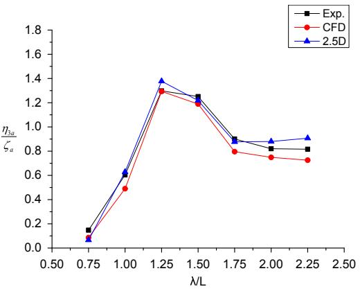  
(a) Heave RAO

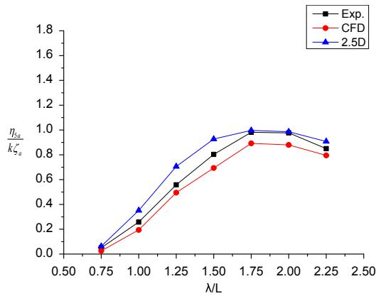  
(b) Pitch RAO

Fig. 10. Comparison of experimental results, CFD prediction results and 2.5D prediction results of heave and pitch motion.  
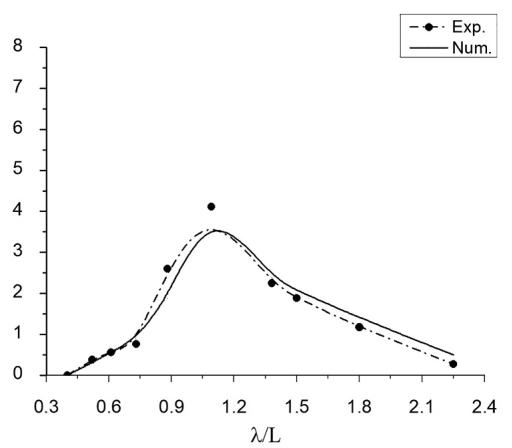  
(a) $\mathrm { F n } { = } 0 . 3 5 3$

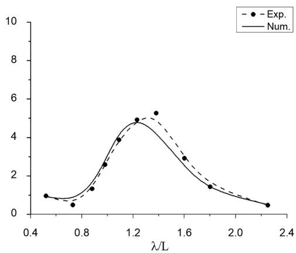  
(b) $\mathrm { F n { = } } 0 . 4 7 1$

Fig. 11. $\mathbf { a } / \mathbf { L } = 0 . 0 , \mathbf { p } / \mathbf { L } = 0 . 0 9 6 ,$ Added resistance under different speed.  
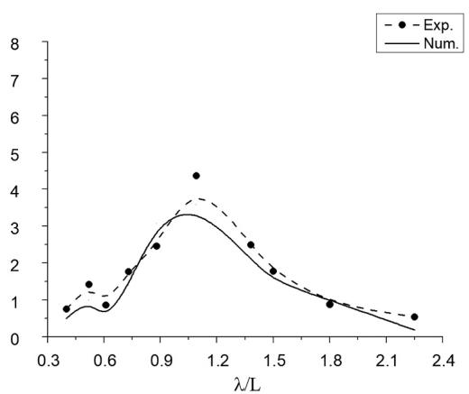  
(a) Fn=0.353

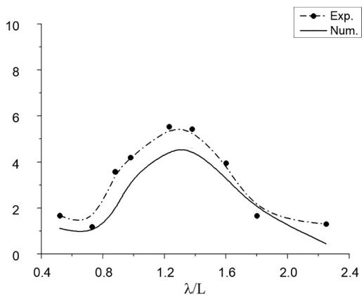  
(b) $\mathrm { F n { = } } 0 . 4 7 1$  
Fig. 12. $\mathbf { a } / \mathbf { L } = 0 . 0 , \mathbf { p } / \mathbf { L } = 0 . 1 5 ,$ Added resistance under different speed.

As described above in this paper, in solving the radiation and diffraction potential of the flow field, three-dimensional linear free surface conditions with forward speed are used. Hence, the threedimensional effect of the free surface wave making is considered. In the numerical solution process, the velocity potential is solved from the bow section to the stern section step by step. During this process, the hydrodynamic interference effect from the ship sections in front of the concerned section at a certain longitudinal position is considered. As shown in Fig. 1, we use $S L _ { i }$ to represent the $i ^ { t h }$ section of the left outrigger, use SR to represent the $i ^ { t h }$ section of the left outrigger and use $M _ { i }$ to represent the $i ^ { t h }$ section of the main hull. When solving section (for example $S L _ { 1 } )$ , the hydrodynamic interference of sections $M _ { 1 } , M _ { 2 } . . . . M _ { n }$ in front of $S L _ { 1 }$ in longitudinal direction on $S L _ { 1 }$ are considered at the same time. That is, the time integral of the source strength in equation (6) considers the influence of the disturbed flow field generated by the hull transverse section upstream of a certain longitudinal position on the disturbed flow field at the current moment. In this way, the hydrody namic interference effects between the main hull and outriggers in the same longitudinal position is well reflected. The feasibility of this method to solve the trimaran motion prediction problem has been verified in Wei’s work (Wei. and thesisHarbin, 2007).

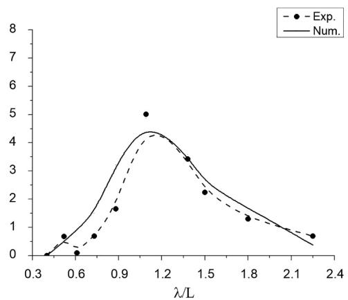  
(a) Fn=0.353

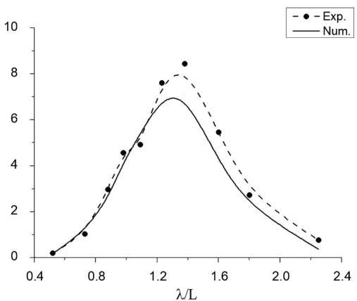  
(b) Fn=0.471

Fig. 13. $\mathbf { a } / \mathbf { L } = 0 . 2 6 , \mathbf { p } / \mathbf { L } = 0 . 0 9 6$ , Added resistance under different speed.  
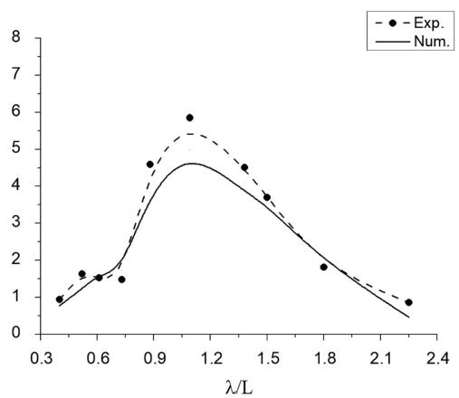  
(a) Fn=0.353

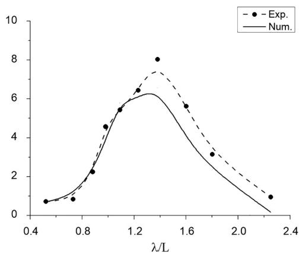  
(b) Fn=0.471  
Fig. 14. a/L ¼ 0.26,p/L ¼ 0.15, Added resistance under different speed.

After obtaining the diffraction potential $\psi _ { j } ( t , y , z )$ , the radiation and diffraction hydrodynamic load of ship hull can be derived by integrating the linear hydrodynamic pressure on the mean wetted hull surface according to the Bernoulli’s equation. Meanwhile, considering hydrostatic and resorting force on the ship hull, five degrees of freedom (lack of surge motion) motion equation can be established:

$$
([ M ] + [ A ]) \{\ddot {\eta} (t) \} + [ B ] \{\dot {\eta} (t) \} + [ C ] \{\eta (t) \} = \{f (t) \} = \left\{F ^ {I} + F ^ {D} \right\} e ^ {i \omega t}\tag{8}
$$

where, [M] and [A] are ship mass and added mass matrix, [B] represents the ship radiation damping matrix, [C] is the hydrostatic restoring force matrix, $F ^ { I } + F ^ { D }$ represents the column vector of wave exciting force. When the roll motion of a trimaran is predicted in the oblique waves, the viscous rolling damping moment from main hull, outriggers and bilge keel has a significant effect on the motion at the rolling resonance and need to be considered. In this paper, the viscous rolling damping of hydrodynamic moment has been taken into account by the method introduced in reference (Ma et al., 2012).

After obtaining accurate trimaran motion prediction results, the calculation of added resistance can be carried out. In this paper, the problem of trimaran added resistance calculation is only performed in the case of regular waves. First, according to the linear potential flow theory, the velocity potential of the flow field around the trimaran can be expressed as:

$$
\Phi = \Phi_ {I} + \Phi_ {B}\tag{9}
$$

In the frequency domain analysis we have:

$$
\Phi_ {I} = \operatorname{Re} \left(\varphi_ {I} e ^ {i w t}\right)\tag{10}
$$

$$
\varPhi_ {B} = \mathrm{Re} \left[ \varphi_ {B} e ^ {i w t} \right]\tag{11}
$$

$$
\varphi_ {I} = \frac {i g a}{\omega_ {0}} e ^ {k _ {0} z} e ^ {- i k _ {0} (x \cos \beta + y \sin \beta)}\tag{12}
$$

$$
\varphi_ {\mathrm{B}} = \sum_ {\mathrm{j} = 1} ^ {6} \eta_ {j} \varphi_ {j} + \varphi_ {\mathrm{D}}\tag{13}
$$

where $\varphi _ { I }$ is the velocity potential of regular waves, $\varphi _ { \mathrm { D } }$ is the diffraction potential. $\begin{array} { r l r } { \varphi _ { j } } & { { } } & { ( j = 1 , 2 , . . . 6 ) } \end{array}$ Þ is the unit radiation potential. The steady drift force on a ship in waves can be expressed as a first order potential:

$$
\vec {F} _ {m} = - \frac {\rho}{2} \left[ \iint_ {S _ {B}} \left(\Phi \frac {\partial}{\partial n} \nabla \Phi - \nabla \Phi \frac {\partial \Phi}{\partial n}\right) d s _ {m} \right]\tag{14}
$$

The velocity potential can be divided into the incident potential $\varPhi _ { I }$ and the disturbance potential $\phi _ { B } .$ . It can be concluded that the added resistance of the ship sailing in waves can be expressed as five parts as follow:

$$
\Delta R = F _ {3} ^ {1} + F _ {5} ^ {1} + F _ {3} ^ {2} + F _ {5} ^ {2} + F ^ {3}\tag{15}
$$

$$
F _ {3} ^ {1} = \operatorname{Re} \left[ \frac {1}{2} \rho k _ {0} \eta_ {3} \int_ {L} d x \int_ {S _ {i}} \omega_ {0} N _ {3} \varphi_ {I} ^ {*} d l \right] - \operatorname{Re} \left[ \frac {i}{2} \rho k _ {0} \eta_ {3} \mathrm{U} \int_ {S _ {1}} N _ {3} \varphi_ {I} ^ {*} d l \right]\tag{16}
$$

$$
F _ {5} ^ {1} = \operatorname{Re} \left[ \frac {1}{2} \rho k _ {0} \eta_ {5} \int_ {L} d x \int_ {S _ {1}} \omega_ {0} (- x N _ {3}) \varphi_ {I} ^ {*} d l \right] - \operatorname{Re} \left[ \frac {i}{2} \rho k _ {0} \eta_ {5} \mathrm{U} \int_ {S _ {1}} (- x N _ {3}) \varphi_ {I} ^ {*} d l \right]\tag{17}
$$

$$
F _ {3} ^ {2} = \operatorname{Re} \left[ \frac {i}{2} \rho k _ {0} ^ {2} \eta_ {3} \int_ {L} d x \int_ {S _ {i}} \varphi_ {3} N _ {3} \varphi_ {I} ^ {*} d l \right]\tag{18}
$$

$$
F _ {5} ^ {2} = \operatorname{Re} \left[ \frac {i}{2} \rho k _ {0} ^ {2} \eta_ {5} \int_ {L} d x \int_ {S _ {i}} \varphi_ {5} N _ {3} \varphi_ {I} ^ {*} d l \right]\tag{19}
$$

$$
F ^ {3} = \operatorname{Re} \left[ \frac {i}{2} \rho k _ {0} ^ {2} \int_ {L} d x \int_ {S _ {i}} \varphi_ {D} N _ {3} \varphi_ {I} ^ {*} d l \right]\tag{20}
$$

where $S _ { i }$ is the ith cross section (from the stern to the bow), $N _ { 3 }$ is the vertical component of the normal vector in the transverse section. φ3; φ5 is the unit radiation potential of heave and pitch respectively. $\varphi _ { D }$ is the diffraction potential.

It should be noted that the position of the outriggers must be taken into consideration during the process of integrating. This is because for a trimaran, the computed transverse section may include outriggers. As shown in Fig. 2, if the calculated transverse section is $S _ { j } ,$ , the integral is only performed on the main hull; if the calculated transverse section is $S _ { i } ,$ the integral is performed on both main hull and outriggers.

## 3. Introduction of trimaran seakeeping model test

In order to validate the application of the 2.5D method in trimaran seakeeping prediction, the model test of the seakeeping performance of a trimaran under different speed and outrigger layout is carried out in this paper. The experiments were conducted at Harbin Engineering University towing tank which is 108 m in length, 7 m in width and 3.5 m in depth. There is a wave maker and wave dissipation bank at both ends of the tank. The wave maker can generate regular waves with period of 0.4s–4s and maximum wave height of 0.4 m. The maximum speed of the trailer over the tank is 6.5 m/s. A large motions recorder is equipped on the trailer which has the capability of measuring the motion of ship model with four degrees of freedom: surge (�0.4 m), roll (�50�), pitch (�15�), heave (�0.2 m), and the test precision is 0.1%. Fig. 3 shows the test model used in the experiment, the scale ratio is 1:25 and the offset lines of the main hull and outriggers are shown in Fig. 4.

The definition of longitudinal distance a and transverse distance p of outriggers are shown in Fig. 5 and main characteristics of the test model are provided in Table 1 below:

In order to consider the influence of different outrigger layout on hydrodynamic disturbance, 4 different outrigger layouts were designed in the test, 2 different longitudinal layouts and 2 different transverse layouts. The dimensionless transverse distance between the outrigger and the main hull center line is represented by $\mathbf { p } / \mathrm { L } ,$ for two different transverse layout $\mathtt { p } / \mathrm { L } = 0 . 0 9 6$ and 0.15 respectively. The dimensionless longitudinal distance between the outrigger and the main hull stern is represented by $\mathbf { a } / \mathrm { L } ,$ for two different longitudinal layout $\mathbf { p } / \mathbf { L } = 0 . 0$ and 0.26 respectively, where ${ \bf a } / { \bf L } = 0 . 0$ represents the stern of the main hull and outriggers are flush.

For incident waves, in order to investigate the application of 2.5D method in different sea state, 10 different regular waves were selected in the experiment with the serial number from W1 to W10 and the wave height from 0.03 m to 0.1 m. The detailed parameters of incident waves are shown in Table 2.

## 4. Comparison and analysis of numerical results and model test results of trimaran motion and added resistance

In order to facilitate data analysis, the vertical swaying motions including heave and pitch motions are treated dimensionless in this paper. Here we note $\frac { \eta _ { 3 } } { \zeta _ { a } }$ is the response amplitude operator of heave motion (heave ${ \tt R A O } )$ , where $\eta _ { 3 }$ is the heave amplitude and $\zeta _ { a }$ is the wave amplitude. Note $\frac { \eta _ { 5 } } { k \zeta _ { a } }$ is the response amplitude operator of pitch motion (pitch RAO), where $\eta _ { 5 }$ is the pitch amplitude and k is the incident wave number $\begin{array} { r } { k = \frac { 2 \pi } { \lambda } . } \end{array}$

In terms of added resistance, we use the following method to its dimensionless treatment:

$$
R _ {a} ^ {\prime} = \frac {L R _ {a}}{\rho g A ^ {2} B ^ {2}}\tag{21}
$$

where $R _ { a }$ is the added resistance, A is the regular wave height, B is the beam at waterline of main hull.

## 4.1. Results of trimaran swaying motion prediction

The comparisons of numerical and model test results are shown in the figures below. Figss. 6–9 correspond to the comparison of heave and pitch RAO curve of numerical and model test results under different speed. To ensure the reliability of the experimental results, the repeatability tests were carried out for some test conditions and the error bars have been marked in the figures below.

From Figs. 6–9, the prediction precision of the 2.5D method agrees well with the experimental results for conditions of any outrigger layout and any speed. The average error (root mean squared error) of numerical results can be controlled within 7.88% compared with the experi mental results. However, due to the reason of slamming and green water (have been observed in the experiment), it is difficult to give accurate results by using the 2.5D method which is based on linear theory in this paper. Nevertheless, for any case the numerical results are still in good agreement with the experimental results. In addition, we can find from the data above, the numerical prediction is consistent. Compared with the experimental results the numerical results based on the 2.5D method are usually larger than experimental results of heave motion and smaller than experimental results of pitch motion.

Since different speed and outrigger layouts were designed in the model test, therefor, the influence of travelling speed and outrigger layout on seakeeping performance is discussed in this paper. First, for heave motion, when outriggers are placed at the stern of the main hull (i. e. $\mathbf { a } / \mathbf { L } = 0 . 0 )$ , for Fn ¼ 0.353 the heave RAO will increase with the wavelength to ship length ratio. For Fn ¼ 0.471 the heave RAO increases first and then decreases with the wavelength to ship length ratio. In addition, by comparing Fig. 6 (a), (c) and Fig. 7 (a), (c) we can find that for $\mathrm { F n } = 0 . 4 7 1$ and $\mathrm { F n } = 0 . 3 5 3$ condition, the selection of outrigger transverse distance has little influence on the position of the peak value of heave motion. In the case of outriggers placed at midship of the main hull (i.e. $\mathbf { a } / \mathrm { L } = 0 . 2 6 )$ , for both $\mathrm { F n } = 0 . 3 5 3$ and 0.471 conditions the heave RAO increases first and then decreases with the wavelength to ship length ratio. By comparing (a) and (c) in Figs. 6 and 7, for both $\mathrm { F n } = 0 . 4 7 1$ and $\mathrm { F n } = 0 . 6 2 8$ conditions, the selection of outrigger transverse distance also has little influence on the position of the peak value of heave motion.

For pitch motion, when outriggers are placed at the stern of the main hull $( \mathrm { i . e . \ a / L } = 0 . 0 )$ , the variation of the pitch RAO is similar to the heave RAO, i.e. for Fn ¼ 0.353 the pitch RAO will increase with the wavelength to ship length ratio and for Fn ¼ 0.471 the pitch RAO increases first and then decreases with the wavelength to ship length ratio. For most con ditions (except for Fig. 6 (b)) the wave length to ship length ratio corresponding to the peak value of pitch RAO usually distribute between 1.2 and 1.6. In addition, by comparing Fig. 8 (b), (d) and Fig. 9 (b), (d) we can also find that for $\mathrm { F n } = 0 . 3 5 3 .$ , the selection of outrigger transverse distance has a little influence on the position of the peak value of pitch RAO. While for $\mathrm { F n } = 0 . 4 7 1$ condition, the influence of the selection of outrigger transverse distance on the position of the peak value of pitch motion cannot be neglected. In the case of outriggers placed at midship of the main hull $( \mathrm { i . e . \ a / L } = 0 . 2 6 )$ , for both $\mathrm { F n } = 0 . 3 5 3$ and $\mathrm { F n } = 0 . 4 7 1$ conditions, the selection of outrigger transverse distance has little in fluence on the position of the peak value of pitch RAO. In addition, with the travelling speed increases the wave length to ship length ratio corresponding to the peak value of pitch RAO also tends to increase.

In order to further validate the 2.5D method in motion prediction of the trimaran, the results of heave and pitch RAO obtained by 2.5D method and CFD method (Chen et al., 2016) are also compared in this paper. (the detailed data of the model can be found in reference (Jia et al., 2009)). The compared results are nondimensionalized (the dimensionless method is the same with the above) and shown in Fig. 8 (the experimental results are also included). The main characteristics of the trimaran model are listed in Table 3 below.

It can be revealed from Fig. 10, the results of trimaran heave and pitch RAO predicted by the 2.5D method are in good agreement with the experimental and CFD prediction results. In general, the prediction error of the 2.5D method is within the acceptable range under any wave length to ship length ratio. Compared with the experimental results, the average error is within 9%. In terms of the calculation efficiency, it only takes 15mins to obtain these sets of results for the 2.5D motion predic tion program, while for the CFD software it will takes more than 15 h (according to number of cells, time-step, etc.).

To sum up, the numerical prediction based on the 2.5D method, is consistent with the experimental results, and the numerical consistency is high. The precision of motion prediction for high speed conditions $( \mathrm { F n } = 0 . 4 7 1 )$ is higher than that of medium high-speed conditions $\left( \mathrm { F n } = 0 . 3 5 3 \right)$ except for some working conditions (error caused by slamming and green water).

In the aspect of calculation efficiency, for a fixed working condition (fixed speed, incident wave and outrigger layout), the prediction of heave and pitch RAO can be realized by a personal computer (4 Intel(R) Core(TM) i5 CPU, 4.00 GB RAM) by means of using the 2.5D method and the calculation took 1min28s. When using the CFD method to predict heave and pitch RAO, a high-performance calculation device is needed and the time consuming is large (about 12 h) which makes it difficult to apply to massive computations. Due to the high efficiency of the 2.5d method, it can be applied to the optimal design of high-speed trimarans, especially for the outrigger layout optimization (Wang et al., 2018).

## 4.2. Results of trimaran added resistance prediction

On the basis of obtaining accurate motion prediction of the trimaran, the calculation of trimaran added resistance can be carried out. The comparison of numerical and model test results is shown in the figures below.

Figss. 11–14 show the comparison between the numerical calculation and model test results of dimensionless added resistance of the trimaran. It can be seen from the results that the calculation of added resistance is basically in good agreement with the test results, the average error of each group of results is distributed around 5%–15%. Although the numerical prediction results in some individual conditions are far from the test results, the overall results show that the numerical prediction results can accurately reflect the variation tendency of added resistance curve.

It can be seen from Figss. 11–14, for any kind of outrigger layout, the added resistance increases first and then decreases with respect to the wavelength to ship length ratio. For the condition of ${ \mathrm { F n } } = 0 . 3 5 3 ,$ , the wavelength to ship length ratio corresponding to the peak value of added resistance is generally concentrated in the range of $\lambda / L =$ 1:05 1:15. For the condition of $\mathrm { F n } = 0 . 4 7 1$ , the wavelength to ship length ratio corresponding to the peak value of added resistance is generally concentrated in the range of $\lambda / L = 1 . 1 { \sim } 1 . 4 .$ . In addition, for the condition of ${ \bf a } / \mathrm { L } = 0 . 0$ and $\mathrm { F n } = 0 . 4 7 1$ , the phenomenon of added resistance decreases slightly in the range of $\lambda / L = 0 . 4 { \sim } 0 . 8$ is found in both numerical prediction and the experimental results.

In terms of the effect of outrigger layout on added resistance. It can be inferred by comparing four figures above, for $\mathrm { F n } = 0 . 3 5 3$ , both transverse and longitudinal distance of outriggers has little influence on the peak value of trimaran added resistance. For $\mathrm { F n } = 0 . 4 7 1$ , the effect of longitudinal distances of outriggers on trimaran added resistance is relatively obvious.

In general, the numerical prediction results under most conditions are lower than the test results. This may because of the phenomenon of slamming (accompanied by green water) which has been observed during the process of the experiment.

## 5. Concluding remarks

In this paper, the 2.5D method is applied to the motion prediction and added resistance calculation of the high-speed trimaran sailing in head sea regular waves. In order to verify the 2.5D method, model tests were carried out and the numerical prediction results were compared with the experimental results. It is revealed from the data comparison, the error of 2.5D method (root mean squared error) can be controlled within 7.88% in motion prediction and around 5%–15% in added resistance calculation compared with the experimental results. This shows that the 2.5D trimaran motion prediction numerical method applied in this paper can predict the heave, pitch motion and added resistance of a trimaran with the Froude number between 0.353 and 0.471 accurately.

In addition, a variety of working conditions (i.e. different outrigger layouts and travelling speeds) were changed in the experiment to verify the reliability of the 2.5D method. In terms of the trimaran motion, the following conclusions can be obtained by comparing the experimental results with the numerical results: 1. For the condition of outriggers placed at the stern of the main hull, when $\mathrm { F n } = 0 . 3 5 3 ,$ , the vertical motion of the trimaran will increase with the wavelength to ship length ratio. When $\mathrm { F n } = 0 . 4 7 1$ , the wider the outrigger layout, the smaller the wave length to ship length ratio corresponding to the peak value of the heave motion, and the larger the wavelength to ship length ratio corresponding to the peak value of the pitch motion. 2. For the condition of outriggers placed at the midship of the main hull, the trimaran vertical motion will increase first and then decrease with the wavelength to ship length ratio. The wavelength to ship length ratio corresponding to the peak value of heave motion usually distribute between 0.9 and 1.1. The wavelength to ship length ratio corresponding to the peak value of pitch motion usually concentrated around 1.5.

In terms of the added resistance, the following conclusions can be obtained by comparing the experimental results with the numerical results: $\mathrm { l . } \mathrm { W h e n } \lambda > 0 . 8 ,$ , the added resistance will increase first and then decrease with the wavelength to ship length ratio for all outrigger layouts. 2. For $\mathrm { F n } = 0 . 3 5 3$ , the wavelength to ship length ratio corresponding to the peak value of added resistance usually concentrate around 1.05; For Fn ¼ 0.471, the wavelength to ship length ratio corresponding to the peak value of added resistance usually concentrate around 1.25. 3. The trimaran added resistance is less sensitive to the outrigger layout than to the travelling speed.

## Acknowledgement

This work was funded by the National Natural Science Foundation of China (projects of 51490671 and 51879058) which the authors would like to express their thanks to.

## References

Bingham, A.E., Hampshire, J.K., Miao, S.H., et al., 2001. Motions and loads of A trimaran traveling in regular waves. In: Proceedings of the 6th International Conference on Fast Sea Transportation (FAST2001). Royal Institution of Naval Architects.

Chen, Y., Peng, P., Jin, C.L., 2016. Numerical simulation of high speed trimaran’s added resistance and motion in regular heading waves. J. Jiangsu Univ. Sci. Technol. (Nat. Sci. Edn.) 30 (6), 517–522 (in Chinese).

Davis, M.R., Holloway, D.S., 2007. A comparison of the motions of trimarans, catamarans and monohulls. Aust. J. Mech. Eng. 4 (2), 183 195.

Duan, W.Y., 1995. Nonlinear Hydrodynamic Forces Acting on a Ship Undergoing Large Amplitude Motions. Ph.D. thesis. Harbin Engineering University, Harbin, China (in Chinese).

Duan, W.Y., He, W.Z., 2001. Motion characteristics of fast displacement vessels. J. Tsinghua Univ. (Sci. Technol.) 41 (12), 82–85.

Duan, W.Y., Huang, D.B., Hudson, D., et al., 2001. Comparison of two seakeeping prediction methods for high speed multihull vessels. In: Proceeding of the 6th International Conference on Fast Sea Transportation. Southampton.

Engle, A., Lin, R.Q., 2007. A comparison of roll prediction algorithms with model test data of a high speed trimaran. In: Proceeding of the 9th International Conference on Fast Sea Transportation. Shanghai, China.

Faltinsen, O.M., Umeda, R.Z., 1991. The dynamics of ships || numerical predictions o ship motions at high forward speed [and discussion]. Phil. Trans. Phys. Sci. Eng. 334 (1634), 241–252.

Fang, M.C., Chen, T.Y., 2005. A parametric study of wave loads on trimaran ship traveling in waves. Ocean Eng. 35 (8 9), 749 762.

Francescutto, A., 2001. On the roll motion of a trimaran in beam waves. In: Proceeding of the 11th (2001) International Offshore and Polar Engineering Conference(ISOPE 2001), vol III (Stavanger, Norway).

Hebblewhite, K., Sahoo, P.K., Doctors, L.J., 2007. A case study: theoretical and experimental analysis of motion characteristics of a trimaran hull form. Ships Offshore Struct. 2 (2), 149–156

Jia, J.B., Zong, Z., Shi, H.Q., 2009. Model experiments of a trimaran with transom stern. In: Proceeding of the International Shipbuilding Progress, vol 56, pp. 119–133, 3.

Lavroff, J., Davis, M.R., 2015. Slamming kinematics, impulse and energy transfer for wave-piercing catamarans. J. Ship Res. 59 (3).

Ma, S., 2005. 2.5d Computational Method for Ship Motions and Wave Loads of High Speed Ships. Ph.D. thesis. Harbin Engineering University, Harbin, China (in Chinese).

Ma, S., Duan, W.Y., Wang, B., Wang, R.F., 2012. Prediction of ship motions of trimaran in oblique regular wave. J. Hydrodyn. Ser. A 27 (2), 224–230 (in Chinese).

Sun, H., Faltinsen, O.M., 2012. Hydrodynamic forces on a semi-displacement ship at high speed. Appl. Ocean Res. 34 (1), 68–77.

Wang, S.M., Ma, S., Duan, W.Y., 2018. Seakeeping optimization of trimaran outrigger layout based on NSGA-II. Appl. Ocean Res. 78, 110–122.

Wei, Y.F., 2007. Research of Multi-Hull Vessels Longitudinal Motion Prediction. M.S thesis. Harbin Engineering University, Harbin, China (in Chinese).

Wei, Y.F., Duan, W.Y., Ma, S., 2007. Trimaran motions and hydrodynamic interaction of side hulls. In: Proceeding of the 9th International Conference on Fast Sea Transportation. Shanghai, China.