# EXPERIMENTAL METHODS FOR INVESTIGATION OF FOILING CRAFTS Francisco Miguel Montero, MARIN, The Netherlands Luigi Francesco Minerva, MARIN, The Netherlands

## 1. SUMMARY

An overview of the most recent experimental and numerical methods performed in the past years at MARIN is presented with respect to the applications of hydrofoil. The objective of the paper is to share some examples of recent investigations and the recommendable path to assist the design of a single hydrofoil and a complete modern hydrofoil craft. Moving from the traditional steady state investigations, the accent is posed on the unsteady dynamic behaviour of the hydrofoils with different level of set-up complexity.

The presented model test campaigns were pilot projects aimed to determine the requirements for the experimental set-up and their executions and to explore the hydrofoil applications from the point of view of unsteady phenomena. Historically most of the research have been focusing mostly on the steady behaviour.

First a brief description of the relevant physical aspects is given, followed by an overview of the possible innovative investigation methods. Integration of numerical and experimental work is considered the key for a successful investigation and design method, therefore first some results are presented for the numerical work carried out in parallel (or before) the experimental ones. For the latter, three model tests campaigns (performed in 2018, 2019 and 2020) are presented as examples.

## 2. INTRODUCTION

Hydrofoils are a well-known solution for high speed crafts. However, practical issues (such as drag at low speed, weight of the foil system, maintenance and cavitation/ventilation) have limited their application to few vessel types with specific operational profiles.

In the past few years, there has been a renewed interest in foiling, driven by high performance sailing competitions. Not only there is renewed interest, but modern materials and control techniques allow to widen the range of applicability of foiling solutions.

This interest in foiling craft, particularly when coupled with innovative applications, calls for methods to evaluate the design of the foils and predict the performance in operating conditions. This is not only related to resistance and fuel efficiency, but also to safety and comfort.

Despite the increase in accuracy and efficiency in numerical methods, experimental methods remain essential in the field of hydrofoils. For design purposes numerical methods are often enough, but when it comes to high resolution studies, with complex phenomena involved (such as cavitation/ventilation), model tests can provide further insight and a simple and fast way to tests a large range of conditions. Although the focus in this paper is mostly on the experimental methods, numerical methods should still be used to assist the decision making in the experimental setup and as an assistance for the analysis. It is often the smart combination of numerical and experimental methods that yields the most complete set of results.

This art k e n g " r t g u g p v u " c pl'ateq test campaigns yelated ho hydGofilk Pach foc'used on different aspects. The main physical phenomena covered in the presented investigations are the following:

< Motions and forces in waves

< Cavitation and ventilation

< Hydroelastic response.

< Craft dynamic stability

These relevant physical phenomena determine the best possible approach for model tests, and thus each campaign had a distinct setup and testing procedure.

The test campaigns were meant as pilot studies to better identify the challenges for the research investigations themselves and the most critical topics to tackle in the design phase. They were carried in 2018, 2019 and 2020 with the following goals:

To highlight, experimentally, the feasibility of foiling solutions for relatively heavy crafts and to gain understanding on the implications of dynamic control systems choices;

To determine the lifting characteristics in unsteady conditions for an isolated hydrofoil in cavitating and non-cavitating conditions;

To implement a novel method for the measurements of a flexible foil deformation in presence of unsteady phenomena such as cavitation and/or ventilation.

## 3. DEFINITIONS

<table><tr><td rowspan="2">Lift and drag coefficients</td><td>____</td></tr><tr><td>____</td></tr><tr><td>Second order differential equation of motion</td><td></td></tr><tr><td>Reduced frequency</td><td>____</td></tr><tr><td>Froude number based on foil immersion</td><td>____</td></tr><tr><td>Submergence ratio</td><td></td></tr><tr><td>Cavitation number at the tip</td><td>____</td></tr><tr><td colspan="2">and are respectively lift and drag forces,is the flow density;is the flow stream speed, is the planform area (for a planar hydrofoil this can be defined as the projected area of the foil in the direction of the lift force with );is the Reynolds number;summarizes geometrical features such as aspect ratio, camber, thickness etc., and are respectively the position, its first derivative (velocity) and second derivative (acceleration) over time represents the sum of mass and added mass of the body in motionrepresents the damping termrepresents the restoring (spring) termis the sum of the excitation forces (and weight)is the frequency of the incidence variations, is the hydrofoil semi-chord and is the flow velocity. is the draught of the bottom edge point of the foil on the trailing edge;is the foil chord;is the tank pressure;is the water vapour pressure;is the model speed;is the water density (correspondent to the basin measured water temperature).</td></tr></table>

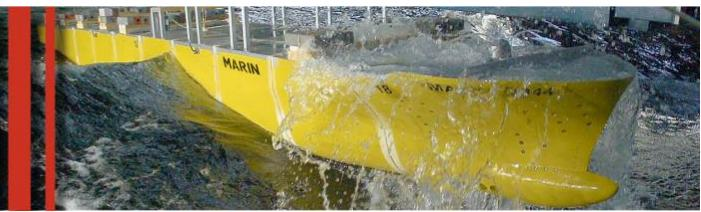

## 4. BRIEF PHYSICAL BACKGROUND

In this section some relevant physical aspects of hydrofoils are summarized as a premise to the description of their possible investigations methods.

## 4.1 Foil lift and drag

Hydrofoils (such as rudders, propeller blades, yacht dagger- or centerboards and keels) are lifting surfaces. Generally they are thin streamlined bodies, intended to develop a hydrodynamic lift force when immersed in a free stream flow with a certain incidence (angle of attack, ). This force originates from the particular shape of the foil section which results in a high flow velocity over v j g " u g e v k q p ø u " w r r g t " u k f g . " t g n c v k x g " v q " v j g " n q u y t i o n t f o r c a , which results in the hydrodynamic lift. Inevitably, hydrofoils experience a drag force, which is the summation of the viscous drag of the hydrofoil, and its eventual extra appendages (such as struts, flaps, attached fuselage), and the drag induced by the generation of the lift itself.

By definition, the drag force is in the same direction as the free stream, while the lift force is perpendicular to the free stream, regardless the angle of attack. Lift and drag forces can be expressed in non-dimensional forms by specific coefficients (described in Section 3), which depends on multiple parameters (such as Reynolds number, angle of attack and foil geometry).

In the past decades there has been a large and accurate knowledge of the hydrofoils characteristics in steady condition. This knowledge is the first basic step to consider in the hydrofoil design. However the hydrofoil will always operate in conditions far from steady, in that respect dedicated researches have been limited.

In general unsteady conditions are related to the action (and mutual interaction) of the following aspects:

1. Hydrofoil oscillating motions due to the waves orbital motions, craft motions and also control surface actions;

2. Occurrence of cavitation and ventilation;

3. Hydro-elastic behaviour of the hydrofoil.

From the pure hydrodynamic point of view, when operating in waves, the lift force on a foil system continuously varies due to the wave orbital motions, craft motions and also control surface actions. In general the unsteadiness encountered by a lifting surface can be related to the combination of the following two situations:

Non-uniform or unsteady motions of the lifting surface in a surrounding fluid where the velocity field is uniform; as an example an hydrofoil oscillating in calm water.

< Non-w p k h q t o " q t " w p u v g c f { " k p h n q y " v q " v j g " n k h v k p i " u w t h c e g " k in waves or propellers in a spatially non-uniform wake.

These unsteady flow effects can have a relevant influence on the performance of the hydrofoil. In general, the amplitude of the lift forces on an oscillating hydrofoil decreases with respect to the quasi-static solution and a phase lag with respect to the apparent angle of attack appears. These effects increase with increasing oscillation frequency. For example, based on simplified two dimensional theory [Ref 1.], a lift curve reduction of about $30\%$ could occur in a normal operating condition for a foiling craft (such as sailing between 30 and 50 knots in head waves with wave frequency of 2 rad/sec).

## 4.2 Seakeeping

Seakeeping refers to the behaviour of the craft when sailing in waves. The craft motions are very relevant in terms of passenger comfort, but also for the operation of any equipment. With reference to craft sailing in full foiling mode, the relative wave motions to the hydrofoils can result in foil emergence or ventilation, with the subsequent drop in lift and risk of uncontrolled splashdown. The motions of a craft (foiling or not) can be modelled by the second order differential equation of motion, described in Section 3. In particular, the seakeeping behaviour of an hydrofoil craft is determined by the following items:

< Craft displacement and weight distribution. The mass distribution of the craft determines most of the inertia terms of the equation of motion. While there is some hydrodynamic added mass while foil borne, the relative importance of this term is smaller than for a hull borne crafts.

Wave excitation forces on the hydrofoils. The superposition of the wave orbital velocities with the uniform inflow related to the advance speed results in effective variations of the angle of attack and inflow velocities, which result in unsteady excitation forces. It should be noted that this problem can only be treated in a quasi-static way for low encounter frequencies (reduced frequency, less than $0.05^{1}$ ). Otherwise, the inertia terms and the influence of the foils wake on itself result in a lower amplitude of the forces and a phase lag (studied theoretically for airfoils by Von Karman and Sears in 1938). On surface piercing foils, an additional component to the wave excitation forces is the change in foil immersion, thus making this sort of configurations more susceptible to wave action.

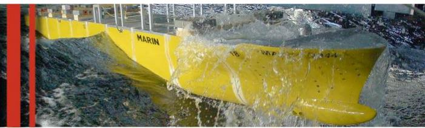

Forces on the foils related to their own motion. Since the hydrofoil is moving in water, added mass (depending on the foil accelerations), damping (depending on the foil velocity) and restoring (depending on the foil position) forces are generated. In the same way as the wave excitation forces, these can only be considered in a quasi-static way for low reduced frequencies. A similar theoretical solution for airfoils was also proposed by Theodorsen [Ref 1.] (without free surface effects).

The balance between the above 3 elements determines the response of the craft in a seaway. In case of actively controlled foils, the effect of the control system is typically seen on the restoring and damping forces.

## 4.3 Cavitation and ventilation

Cavitation and ventilation are special flow regimes y j g t g " r c t v " q h " v, gither"because the"water pressure region theō f t { ö foil becomes lower than the vapour pressure and thus generates a vaporous cavity (cavitation) or because atmospheric air is drawn to the lower pressure region around the foil, thus generating a cavity of air (ventilation). Either of these can result in a sudden drop in lift (up to approximately 1/3 $^{rd}$ ), which would in most cases result in a splashdown, with the risk of causing damages and/or injuries. An extensive overview of ventilation of surface piercing lifting bodies has been provided by Y.L. Young et al [Ref 2.].

Even in case of partial cavities, when the effects are less dramatic, these phenomena remain relevant, as they can be a source of noise and vibrations; furthermore collapsing cavities may damage the foil surface itself.

## 4.4 Hydroelastic response

Most modern construction techniques for hydrofoils involve, in some way, the use of composite materials. These allow for lighter, yet reliable structures for supporting the foiling craft. Because of the low density of the foil compared to that of the surrounding water, the structural behaviour of composite foils is heavily influenced by the flow around them, even more so than with aluminium or steel hydrofoils. This is also a particular challenge of the naval applications versus aerospace, where the air density is significantly lower than the structure density. As a matter of fact, it is necessary to study the fluid-structure interaction in a fully coupled way, as the loads and natural frequencies will be heavily influenced by the mass of the surrounding water, and in turn, structural deformations will affect the hydrodynamic forces.

Hydroelastic effects can result in unexpected vibration frequencies and structural instabilities, but they could also contribute to the craft stability, by designing the foil such that the deformation compensates for too high load.

## 4.5 Craft stability and control

Craft stability is related to the ability of the craft to keep a steady flight under the influence of external forces. The main parameters that affect the stability are the foil(s) configuration, position of the centre of gravity and control system strategy.

The foil configuration has a strong influence on stability. Surface piercing foils, for instance, present more stable configurations, as the lift is regulated by the foil coming in or out of the water. T foils, or fully submerged foils with struts, on the other hand usually require some active control systems. While there is some sort of stability when getting the foil close to the free surface, this is less than for a true surface piercing foil, and it is usually preferable to sail with the foil deeper in the water, to prevent ventilation.

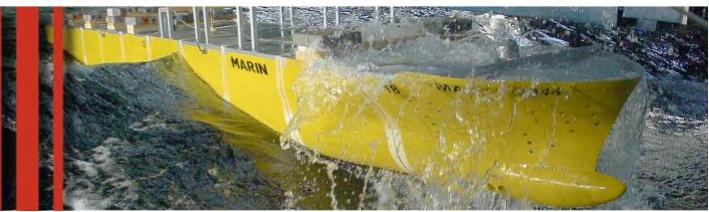

## 5. INVESTIGATIONS METHODS

A successful design of a hydrofoil craft requires in principle to consider a high level of interconnected aspects. The investigation methods ideally should follow the same level of interconnection in order to provide the most accurate answers. However, as a sort of uncertainty principle, it is not practical to use methods which combine at the same time the highest level of factors integration and total understanding of each single considered factor. Depending on what the focus of the investigation is, the best approach has to be chosen when designing an experimental and/or numerical campaign.

The figure below shows the link between the operational objectives of hydrofoil craft and all the factors involved in the design. At craft level, key factors are displacement, payload, take-off and landing capability, power/energy demand, type of propulsion system and the stability/dynamic control to ensure proper seakeeping and manoeuvring capabilities. The realization of the craft key factors go through the hydrofoil design, which is based on following key elements (briefly mentioned in Section 4): control surfaces, lift and drag, cavitation, ventilation and hydro-elastic response.

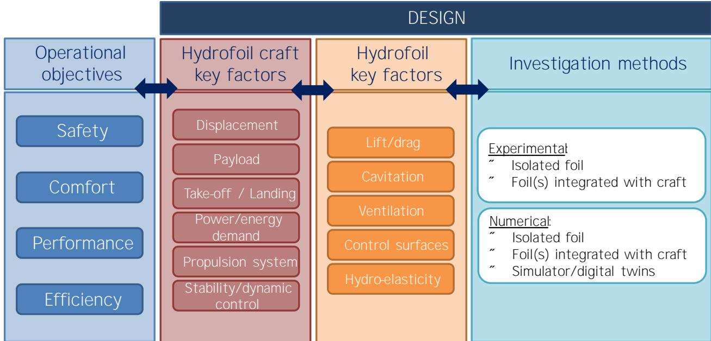  
Figure 5-1: Overview of operational objectives, design factors (at craft and hydrofoil level) and investigations methods

Either for an experimental or numerical method, the focus of the investigation will determine if the best approach is to model isolated foils or the complete craft. Each approach is then featured by aspects such as accuracy, execution time, modelling complexity, realisation challenges etc.

The objective of the paper is to share an overview of experimental and numerical methods aimed to explore the hydrofoil applications from the point of view of unsteady phenomena. In particular some specific examples of most recent investigation approaches performed at MARIN are presented in the course of the paper. These approaches are in any case featured by an integration of both the numerical and experimental fields. This represents the path to follow when more advanced integrated design techniques are developed for such complex systems.

Nowadays, numerical methods play a fundamental role in any hydrodynamic study. These methods can be used in combination with experimental methods as a simple first check or as a guidance to define a model test campaign; or a study can be carried out exclusively with numerical methods. The choice of method should come from the objective of the study, the amount of required calculations and the required accuracy of the results.

Numerical methods can be broadly divided into two types: methods based on potential flow, where viscous effects are neglected (or approximated) and the geometry is modelled based on mathematical singularities and methods that solve the viscous

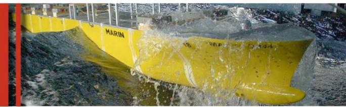  
hydrodynamic problem on a discretized domain (commonly known as CFD, Computational Fluid Dynamics, although this name could be applied to both types of solvers).

Potential flow methods allow for a relatively fast assessment of the hydrodynamic characteristics in the time or frequency domains. The most common options for hydrofoils are, in order of increasing complexity and accuracy: lifting line codes (where the hydrofoil is modelled as a single vortex line located at the centre of lift), vortex-lattice methods (where the foil is modelled as a single layer of horseshoe vortices covering the complete foil planform, located at the mid-thickness surface) and panel methods (where foils are typically modelled by an array of sources and dipoles covering the complete actual foil surface, on both the suction and pressure sides). When applied to hydrofoils, the free surface effects- are considered either by including free surface panels or by including the free surface boundary conditions implicitly in the Green functions related to the singularities. The disadvantage of these methods is that no viscous effects are included, and this also means that it is not possible to obtain an adequate model of the foil in stall or near stall conditions. These tools however, can be very useful for long seakeeping simulations, where the use of CFD is not practical in terms of computing time and costs, and also at early design stage, as they allow for the fast testing of different concepts. Descriptions of potential flow methods can be found in [Ref 3.] and [Ref 4.]

Viscous CFD requires far more computing time and power than potential flow methods, but they provide much more accurate results, including stall and other viscous effects. There are many commercial and open-source codes available, but they do require user experience in setting up the different parameter and domain discretization. Most codes use the Reynolds Averaged Navier-Stokes method (RANS), where smaller scale turbulence is not explicitly solved but rather modelled (thus allowing for larger cell sizes). The free surface is modelled in most cases using the Volume Of Fluid method, where the air/water fraction on each cell is explicitly solved by means of a transport equation. The limitation of the CFD approach are thus the following:

< Free surface not explicitly modelled, including no surface tension, so local free surface effects are not captured. These effects can be very relevant in the inception of ventilation.

There are several cavitation models available, but none of them capture all types of cavitation and are not validated in combination with multiphase flow.

The need to re-mesh the computational grid makes it cumbersome to test several geometry variations

Long simulations can take too much computing time, which makes it less practical for seakeeping applications where long term statistics are relevant.

Although the examples presented later in this paper are focusing on model test campaigns, the use of potential flow and CFD tools provided valuable input prior to the tank tests described in Section 7.1 and 7.2.

In case of experimental methods, modelling the complete craft is the closest possible approach to full scale configuration. In this case most effects can be taken into account, but this also means that for investigating details of the foil behaviour there are simply too many overlapping effects. Depending on the goal, a different experimental set-up is required:

When focusing on the stability/dynamic control, the main focus is first of all on the transit mode in full foiling mode with the hydrofoils dynamically controlled. The hull shape plays a secondary role being out of the water. An example is the free sailing self-propulsion set-up i k x g p " k p " t g n c v k q p " v q " v j g alg0 (CeTcKbPd on Section 27.1 (b)).

In case take-off and landing are the main topics of research, a free sailing self-propulsion set-up could be used with the inclusion of an hydro-dynamically shaped hull form. Take-off in calm water or in waves would be possible together with any possible design iterations with respect to the hull form, hydrofoils and their control and eventual boost system to assist the take-off itself.

As an alternative to the fully self-propelled model, a semi free sailing set-up could be used: the model would not be equipped with propulsors but connected via ropes to winches, which will transmit the propulsive force (the carriage would then follow the accelerated model without any towing action). The added value of this set-up would be the freedom to vary the propulsive force (exerted via the winch system) in order to explore combinations of propulsive (and eventually boost for take-off) thrusts and its release time. Consequently a systematic study of the required thrust, energy and power could be performed for the take-off phase. The results could be used then to identify the best combination of propulsive systems capable to provide the measured demand for the take-off. At the time of writing the present paper, model tests with the latter set-up were on-going and the results will be shared in future publications.

The foil in isolated condition allows to explore in more details the effects of complex phenomena such as cavitation, ventilation together with eventually the hydro-elastic response of the foil. Examples of set-ups c t g " i k x g p " h q t " v j g " O C T campaign in 2019 and 2020, where respectively the goals were:

To investigate the lifting characteristics of the hydrofoil in unsteady conditions (oscillating foils advancing in waves), both in cavitating and non-cavitating conditions (and eventually ventilation);

To investigate the hydro-elastic response of the foil when coupled with the same unsteady conditions and phenomena (cavitation and ventilation).

In the first case the first basic requirement is a system capable to impose arbitrary motions to the hydrofoil with the simultaneous measurements of the generated hydrodynamic forces; everything inside a controlled environment capable to systematically set the conditions to trigger cavitation and/or ventilation.

In the second case, the basic requirement is a system capable to sense the hydrofoil deformations together with all the previous described environmental conditions. Examples of possible outcome for the aforementioned approaches are given in Sections 7.2 and 7.3.

## 6. PRELIMINARY CALCULATIONS

## General considerations

Preliminary calculations were carried out to better prepare and support the model test campaigns. Furthermore their integration with the model test campaign is crucial for the success and the full understanding of the results.

## Hydsim calculations

C u " c " h k t u v " u v-house.co'devHydgim OaCuFeK tB identify a good starting point for the control coefficients.

Hydsim is a code designed for time domain simulations of hydrofoil crafts. The code has the capability of running take-off u k o w n c v k q p u " c p f " u k o w n c v k q p u " q h " c " h q k n k p i i n c l d i n g f i e v s u r f a c e p f f e y t s c x g u 0 \* d c u g f " q p " v j g " n k p g c t k | g f " h t g g " u w t h c e g " d q w p f c t { " e q p h o f s l e v k q p + code Hydres, which was developed for static stability and resistance of foiling craft (lifting line version).

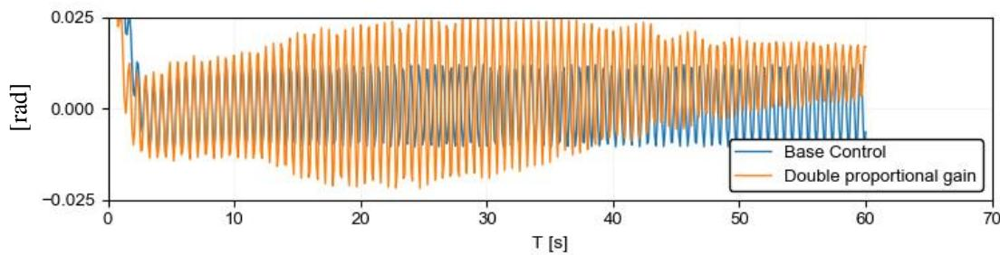  
Figure 6-1 Pitch angle in regular waves, with the base control and doubling the proportional heave and pitch gains, calculated by Hydsim

## ReFRESCO calculations

In parallel with v j g " J { f u k o " e c n e w n c v k q p u . " x k u h o u s e R A N S h o r d e R e F R E S C O n w e r e w c a r r i e d v k q p u out in order to determine the lift/drag characteristics of the commercially purchased hydrofoils. Two sets of calculations were performed:

The first set aimed to provide a benchmark in terms of lift and drag for the fully submerged foil (excluding the vertical strut and the presence of the free surface) for a range of angles of attack (between 0 and 20 degrees) and flap angles (-20, -10, +6 and +12 degrees). Moreover the suction effects of the propeller (modelled as an actuator disk) and the housing geometry (support of the electric motor underneath the foil) were progressively included.

In the second set, the complexity of the problem was gradually increased including the vertical strut geometry, the free surface with the foil at two different submersions (0.8 x chord and 1.5 x chord). Some of the same angles of attack as computed in the first set were considered (0,3,5,10,15 degrees)

The knowledge of the lift/drag characteristics in steady condition is the first required information to study the settings of the dynamic control. The inclusion of increasing-complexity factors (such as free surface, flap angles, housing, different submersion and strut) also served to evaluate the influence on the slope of the lift/angle of attack relation, which is at the base of dynamic control strategy. In Figure 6-2 and Figure 6-3 an example is given of the influence of different elements (housing and strut) on the pressure distribution on the foil, while in Figure 6-4 the computed lift and drag coefficients are plotted for the different calculated conditions.

A detailed discussion of the calculations is beyond the objectives of the current paper. Here are summarized some of the conclusions:

< The free surface reduces the generated lift.

< Stall angle is not influenced by the free surface, foil submergence or modelled geometry.

The free surface has a double effect on the foil drag. On one hand it increases the resistance, on the other hand reduces the lift and consequently the induced drag. For the present case the sum of the two effects results in a lower total drag when the free surface is computed.

The strut varies the flow propagation on the upper part of the foil. The results is a smaller low pressure area and consequently a smaller lift.

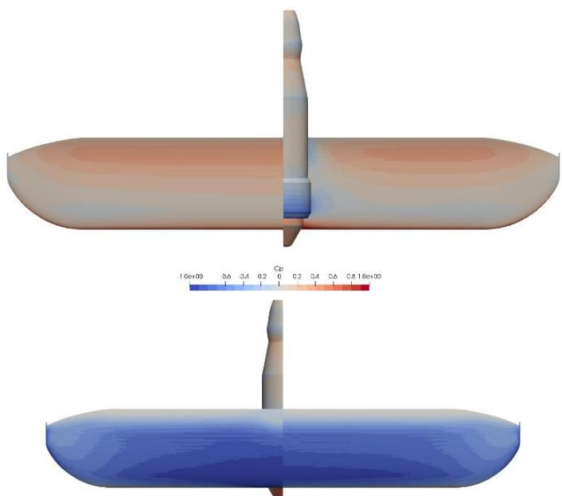  
Figure 6-2: Comparison of the Cp distribution between the geometry with and without housing; pressure side (top view) and suction side (bottom view); both simulations were performed at 0 degrees angle of attack and flap angle.

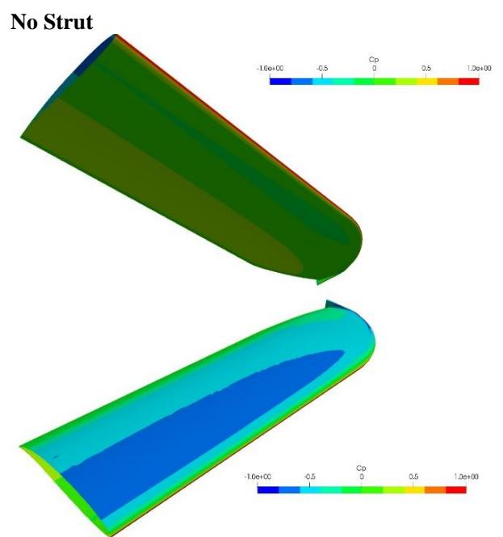

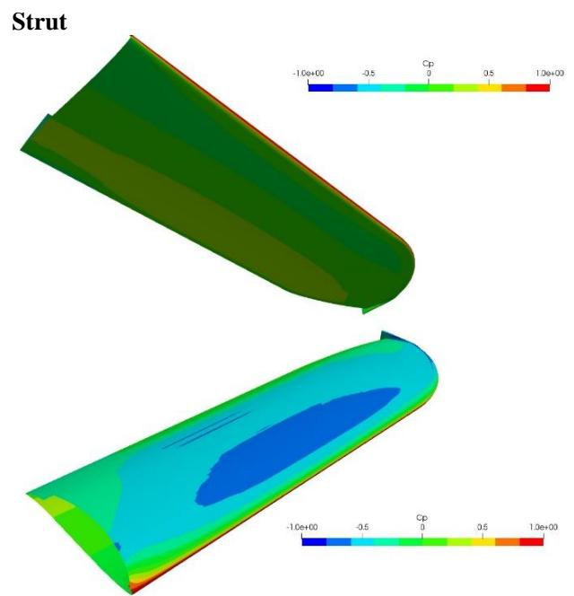  
Figure 6-3: Pressure distribution on the upper and lower side of the foil: without strut (left) and with strut (right); both simulations were performed at 0 degrees angle of attack and flap angle and foils submergence of 0.8x chord

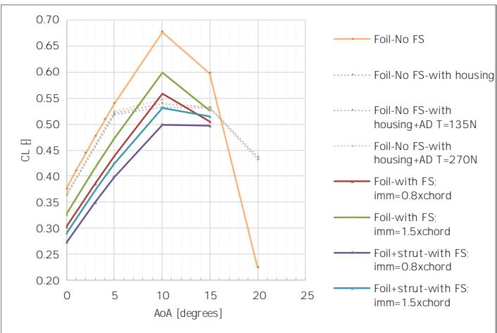

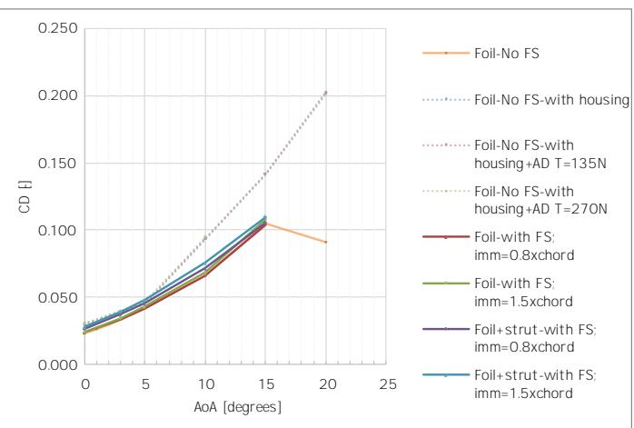  
Figure 6-4: Lift ap f " f t c i " e q g h h k e k g p v u " e q o r w v g f " h q t " f k h h g t g p v " e q p f k v Actuator Disk and immersion).

## 7. MODEL TESTS CAMPAIGNS

The model test campaigns described in the following sections are presented with the primary objective to share recent modern investigation methods for hydrofoils. Moving from the traditional steady state investigations, the accent was posed on the unsteady dynamic behaviour of the hydrofoils with different level of set-up complexity and objectives.

From MARIN perspective each model test campaign was first of all the chance to learn the lessons required to successfully perform such innovative test campaigns.

The presented results are an example of the type of analysis required to assist not only the design of the single hydrofoil but also of a modern hydrofoil craft.

## 7.1 Model tests campaign 2018

## 7.1 (a) Objectives

The main objectives of this campaign were:

To better understand the challenges of a fully foiling craft in waves, what is required of the control system and how does it affect the motions,

To make a (preliminary) evaluation of the feasibility of foiling for heavier load applications, such as a multi-purpose ectiq "dgctkpi" õe,tcfngö"qt"c"ncpfkpi"etchv

To obtain a first overview of what the challenges are to test a foiling craft in MARIN facilities, and to develop the capabilities to do so for commercial projects.

## 7.1 (b) Model test set-up: complete craft

Modelling the complete craft is the closest possible approach to full scale configuration. In this case most effects can be taken into account, but this also means that for investigating details of the foil behaviour there are simply too many overlapping effects.

A representative foiling craft was built equipped with three existing foils including controllable flaps (see Figure 7-1). Time constraints of the project did not allow for the design of new foils. Therefore commercial foils were purchased. The resulting craft was self-propelled (as 2 of the foils were modified by adding PODs underneath the foils themselves). The control system controlled the flaps of the three foils in response to the heave, pitch and roll motions. Rudders were placed to dynamically control the yaw; however, in the final set of tests, the rudders were removed in order to try to control the heading by adjusting the heel angle of the model.

Vjg"hqewu"qh"vjg"vguv"ecorckip"ycu"qp"vjg"eqpvtqnheld by a rope system. Therefore the shape of the craft was simplified too and no specific hydrodynamic shape was required. As already said, this was possible because the take-off or landing were not objectives of the model test campaign. The model was 3.5m long and weighted around 150 kg; The following figures give an overview of the set-up and the used configurations with and without rudders. Although all the tests were conceived in model scale, this is roughly equivalent to a landing craft sailing at 28 knots at scale 10, for reference.

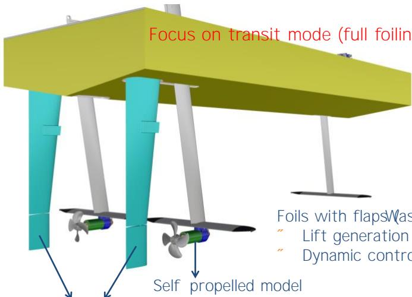

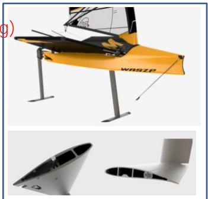  
Foils with flaps(Waszpsource) for:
" Lift generation for full foiling mode
" Dynamic control of pitch, heave and roll

Rudders for yaw dynamic control  
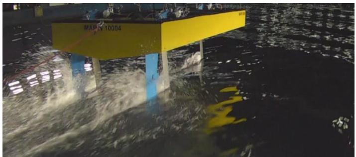  
Figure 7-1: Model test set-up campaign 2018

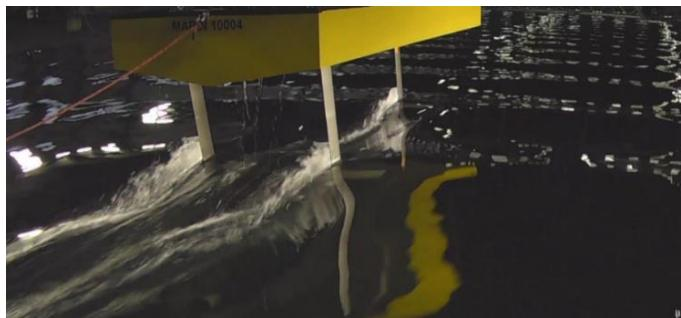

## 7.1 (c) Test facility

The tests were carried out in O C T K Beakueping and Manoeuvring Basin with a free-running model. This basin measures 170 x 40 x 5 m in length, width and depth. It is equipped with wave makers along one long and one short side. The wave maker consists of 331 flaps that are all individually driven by a servo engine. This facilitates generation of regular, long and short crested irregular waves from any direction relative to a free sailing model. Beaches on the opposite sides absorb the incoming waves.

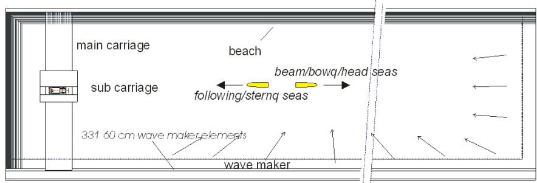  
Figure 7-2: Seakeeping and Manoeuvring Basin overview

This basin is especially designed to perform tests with a self-propelled, free sailing model in head, bow and stern quartering seas at forward speed in an efficient and fast way. Also, manoeuvring tests can be conducted. A main carriage (x-direction) and a subcarriage (y-direction) follow the model and provide the required power and absorb the measured data. An autopilot is used to steer the model through the basin.

## 7.1 (d) Model test matrix and discussion of results

The test matrix in waves was designed as follows:

< Tests in head and bow quartering seas

Regular waves of two different wave slopes and a range of periods that included critical waves for heave and pitch

< One irregular wave spectra, at the wave period critical for pitch

< One forward speed

In these cases the restoring term in heave and pitch is heavily dependent on the control parameters (proportional gains of the flap angle controller), and thus so are the resonant frequencies. The critical waves were defined then based on the excitation forces, rather than on the response, in order to eliminate the effect of the controller on the selection of the conditions. The critical wave length for heave is such that the forward and aft foils are at the same time at the crest of the wave (thus, the wave length is equal to the distance between foils), and the critical length for pitch is such that when the forward foil sits on a crest, the aft foil sits on a through (wave length equal to twice the distance between foils).

Variations on the control settings were also performed in order to determine the influence of these. The final control settings were defined by trial and error based on runs in calm water and in waves. The tests where the maximum motions were recorded were repeated for different control settings, in order to assess the influence of the control parameters.

## Dynamic control influence

The model was tested with different control settings in regular and irregular waves. The test conditions and initial control settings were defined based on Hydsim simulations. The initial setting required some adjustments based on trial and error.

An example of control setting variations for a test in head regular waves is presented in Figure 7-3. In general large variations were observed by changing the balance between the different control settings, to the point that some combinations resulted in an unstable platform. This is particularly true for the configurations without rudders.

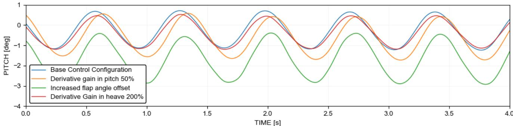

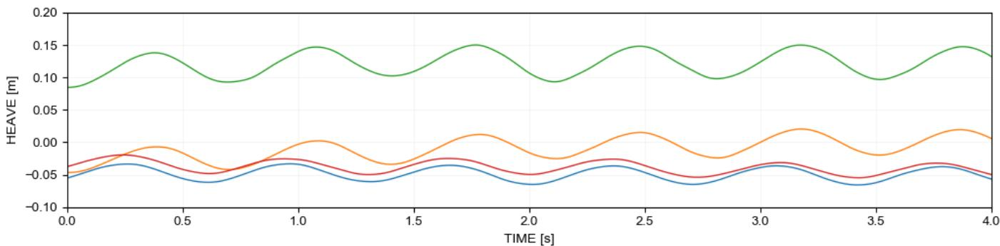  
Figure 7-3: Motion in regular waves (A-0.11m and =3.491 rad/s) at 4.5m/s with different control settings

## Lessons learnt: experimental set-up

The following conclusions and recommendations for further research were collected:

Kv "ku" rquukdng "vq" vg Manoleuvring"Basin T Kily foiling'Self-propegled veskepdynamically controlled in transit mode;

Take-off and landing should be separately investigated, as otherwise the measurement time would probably become too low given the basin length.

Vessel response in full foiling mode is very sensitive to the control system settings; the control settings have a significant influence on the ship motions. For example, for the same regular wave, the measured pitch amplitudes with 5 different control settings displayed a standard deviation of $21\%$ of the average value. This means that the control system has a major influence and therefore the use of a realistic and dedicated control is required for seakeeping tests of foiling crafts.

Hydsim is a feasible first stage design tool, but some unexpected results were observed on the model tests. A further investigation on the origin of these discrepancies is yet to be done.

It is also possible to control the heading of such a craft by acting on the heel angle. However, some limitations related to the autopilot setup were found during the project. An improved system is thus recommended in case tests without rudders are needed.

## Motions and comparison with hull-borne or foil-assisted cases

One additional item of this investigation was to evaluate feasible foil applications. In this regard, ships on foils could be interesting for high speed applications where smooth motions are required, independently of whether there are significant advantages from a powering perspective. In order to illustrate how foiling could improve ship motions, the measured pitch on the foiling craft demonstrator was compared, in a non-dimensional way to available results of a generic crew transfer catamaran tested at MARIN. The non-dimensional pitch RAO is obtained by multiplying the dimensional pitch RAO (in deg/m) by the ship length. To non-dimensionalize the frequency, the concept of reduced frequency was used. The volumetric Froude numbers at which both vessels were tested differed only in about 2%, so this comparison is indicative of the differences between both vessels. The pitch RAO in head seas is presented in Figure 7-4. It can be seen that while the use of one foil, as a stabiliser, can improve the pitch of the catamaran significantly, the pitch of the fully foiling craft is significantly smaller. It can also be seen that the frequency that yields the maximum pitch is lower. While longer waves were not tested for the CTV, it is expected that the response is similar for both vessels al low frequency, while as the frequency increases the foiling craft presents significant advantages in terms of pitch motion (and thus vertical accelerations and on board comfort)

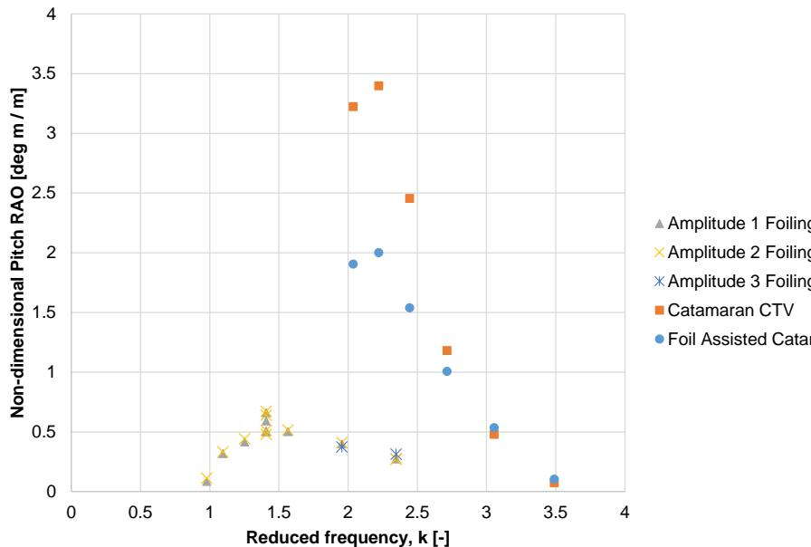  
Figure 7-4: Pitch comparison between the foiling future demonstrator and a catamaran Crew Transfer Vessel

## 7.2 Model tests campaign 2019

## 7.2 (a) Objectives

The main objectives of this project were the following:

< Assessment of the foil characteristics in unsteady conditions when cavitation and/or ventilation occurs;

< Develop a numerical model for the dynamic control strategy and simulators.

< Understanding the requirements to perform such tests;

## 7.2 (b) Model test set-up: Hexapod-foil

The Hexapod-foil set-up is meant to investigate the lifting characteristics of the hydrofoil in unsteady conditions (oscillating foils advancing in waves), both in cavitating and non-cavitating conditions.

The Hexapod-foil set-up is summarized in Figure 7-5. An hexapod system was connected below the basin carriage and the foil respectively to the hexapod itself. The forces developed by the hydrofoil were measured together with the wave height and applied motions, and synchronized video recordings were used to correlate the data to the visual observations.

Forced motions of pitch and heave at different amplitudes and frequencies were applied (via the hexapod) to the hydrofoil advancing at constant speed (via the basin carriage); and similar measurements were performed with the (fixed) hydrofoil advancing in regular waves (at different amplitudes and frequencies).

One hydrofoil (one of the three used in the campaign of 2018) was used. It was painted in blue to allow better contrast for the underwater cavitation observations. Strips with carborundum grains were located on the leading edges of the vertical strut and the horizontal wing of the hydrofoil. The flap of the hydrofoil was kept in fixed position (neutral) for the entire model test campaign. Details of the hydrofoil set-up are presented in Figure 7-5. The strips with carborundum grains were used to ensure the turbulence of the flow and a proper cavitation inception. About the latter point, cavitation inception is also strictly related to the presence, density and size distribution of free gas nuclei in the water. The aforementioned artificial roughness is applied to stimulate the growth of the nuclei. To ensure sufficient number of free gas nuclei in the water, electrolysis of the water is adopted upstream of the hydrofoil. In that respect a grid, built with horizontal wires, was placed in front of the hydrofoil. By letting pass electric current through the wires, it was possible to stimulate the generation of nuclei in the water. The grid was connected to the carriage and moved at the same speed of the hydrofoil.

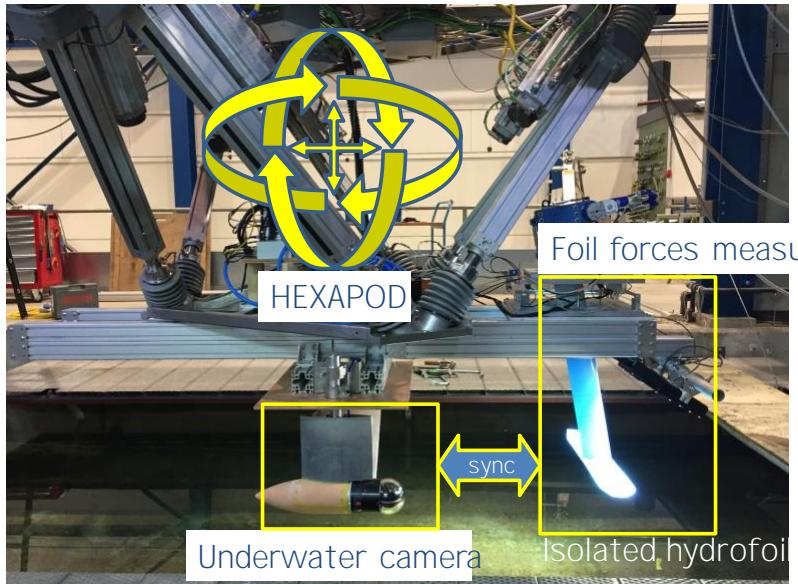

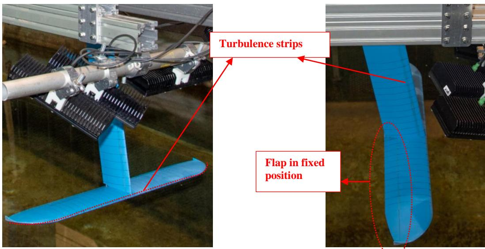

  
Figure 7-5: Description of the Hexapod-foil set-up

## 7.2 (c) Test facility

The Depressurized Wave Basin measures 240 m x 18 m x 8 m in length, width and depth. The basin can be depressurized to a minimum pressure of 2500 Pa. It is equipped with wave makers along full width of the short side and along 120 m of the long side. They can be used to generate long and short crested waves from various directions. A force-feedback control compensate possible reflections from the model and the beaches, which are facing the wave generators. Further information can be found on O C T K R o b s i t e"

## 7.2 (d) Model test matrix and discussion of the results

The selection of the model test conditions (flow speed, oscillation frequency and wave features) was based first of all on the need to investigate the hydrofoil in unsteady flow. In general based on the value of reduced frequency, the flow can be divided into:

< Steady for k = 0

< Quasi- u v g c f {k"Öh"q2t0"227" Ö "

< Unsteady for k > 0.05 (k > 0.2 is considered highly unsteady)

The type of tests (summarised in Figure 7-6) were meant to determine the equation of motion coefficients and excitation forces (due to the waves) of the equation of motion (see Section 4.2). The knowledge of such coefficients provides the modelling of the dynamic behaviour of the body in motion (in this specific case a T-foil).

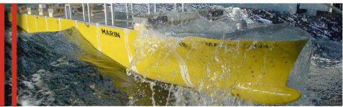

## (Quasi)steady runs

variable speed (steady)

## Forced oscillations runs

variable foil immersion (steady and quasi steady)

" one speed " Pitch or heave motions with variable frequency and amplitude

Runs in waves with fixed foil:
" one speed
" variable period and wave height

variable angle of attack (quasisteady)

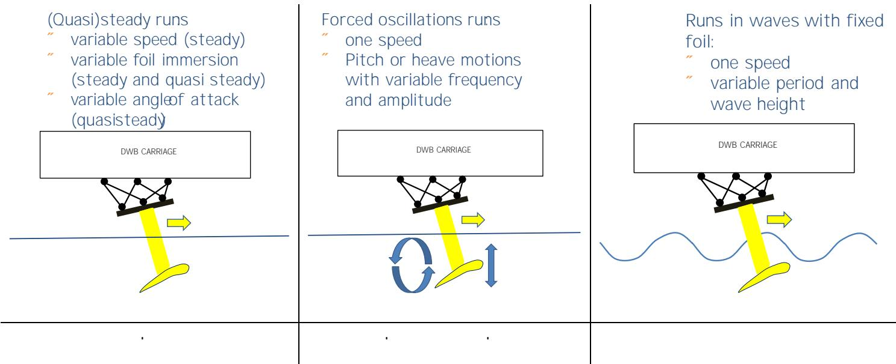  
Figure 7-6: Type of tests and the correspondent determined elements of the motion equation.

With respect to the forced oscillations runs, the conditions were chosen in order to have unsteady conditions with a reduced frequency larger than 0.05. High unsteady conditions (featured by a reduced frequency larger than 0.2) could not be tested due to the limitation of the maximum oscillation frequency of the hexapod; this limitation was also increased due to the not-centred position of the foil under the hexapod itself. The aforementioned limitation implied that also reaching values of reduce frequency larger than 0.05 was not always possible.

## Steady (and quasi steady) runs

Even though the model test campaign was mainly focused on the unsteady flow, some runs in steady conditions were carried out to determine the influence of the foil immersion, speed and cavitation at different speeds. The foil was kept always at the geometrical zero degrees angle of attack.

Some of the following results were in line with the expectations (based on the well-established experience of hydrofoil in steady conditions) but others emphasized interesting lessons to be learnt for successful testing:

In absence of cavitation, the reduction of the foil immersion led to a reduction of the generated lift of about 8-12%. Also in presence of cavitation, a shallower immersion led to a similar reduction of about 15%.

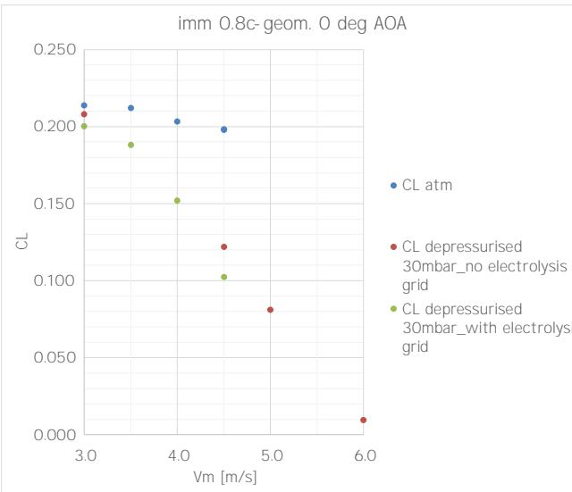

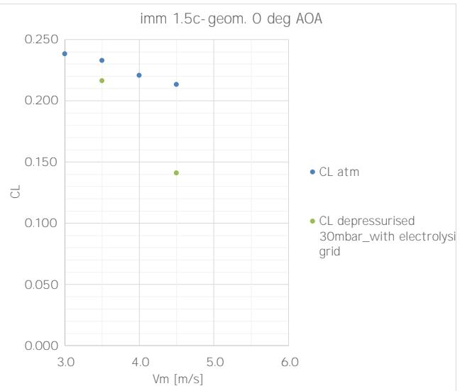  
Figure 7-7: Steady runs, lift coefficient respectively for the immersion of 0.8 (left) and 1.5 (right) of the chord

As well known, the occurrence of cavitation implies a decrease of the generated lift. Maximum measured reduction was even up to about 50% (at the same foil immersion).

During the test campaign (and later in the analysis phase) two difficulties were detected with respect to the set-up:

The flap of the foil was nominally kept at one fixed position but, by inspecting the underwater videos, it resulted to be not completely fixed. This small mobility led to a different measured lift in comparison with the CFD calculations (about 40% lower). The flap tended to slightly move upwards, leading to a lift reduction. Thanks to the CFD calculations performed with variation of flap angle (at the same angle of attack), a 5 degrees flap angle could indicate a similar lift reduction (confirmed by visual inspection of the videos).

☐ In order to ensure the cavitation inception on model scale, it is necessary to feed the inflow with nuclei generated by electrolysis via a grid placed in front of the foil. However, due to the required combination of low ambient pressure and high advancing speed, the grid was fully cavitating. In

<table><tr><td>AoA= 0 degreesVm = 4.5 m/sBasin pressure = 30 mbarElectrolysis grid not active</td><td>AoA= 0 degreesVm = 4.5 m/sBasin pressure = 30 mbarElectrolysis grid active</td></tr></table>

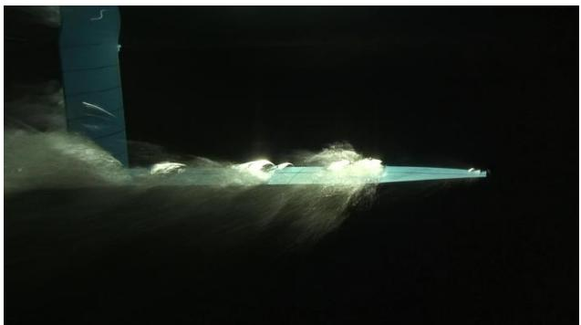

  
Figure 7-8 there is a comparison of the underwater video for the same conditions with and without the active grid. The distribution of the cavitation was more uniform along the span of the foil; this also resulted in underestimation of the lift breakdown (4-15%) due to cavitation when the grid was not active. Furthermore the clouds of bubbles were considered too excessive in size and an hindrance to have clear underwater observations of the hydrofoil in cavitating conditions. However the not fully developed cavitation pattern did not affect the

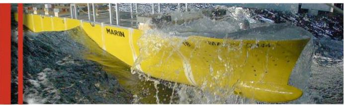

demonstrative purposes of the model test campaign. For future applications, it will be nonetheless necessary to develop a new system to seed nuclei in the water for very low cavitation numbers.

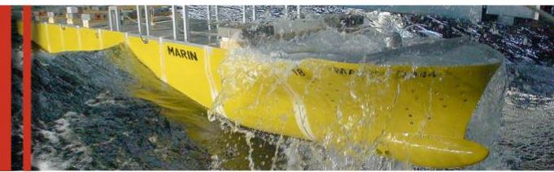

<table><tr><td>AoA= 0 degreesVm = 4.5 m/sBasin pressure = 30 mbarElectrolysis grid not active</td><td>AoA= 0 degreesVm = 4.5 m/sBasin pressure = 30 mbarElectrolysis grid active</td></tr></table>

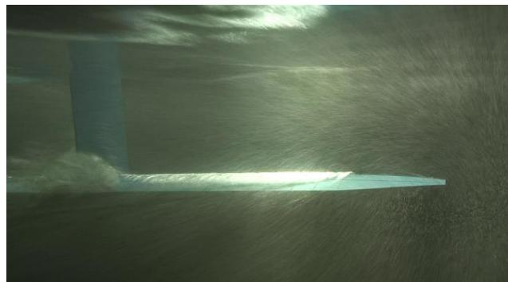  
Figure 7-8: Steady runs, comparison underwater observations with and without active electrolysis grid

As indicated in Figure 7-6, quasi steady runs were carried out to evaluate the restoring term of the equation of motion. From those experiments insight was given also into the dynamic variation of the lift in cavitating and non-cavitating conditions as shown in the figure below:  
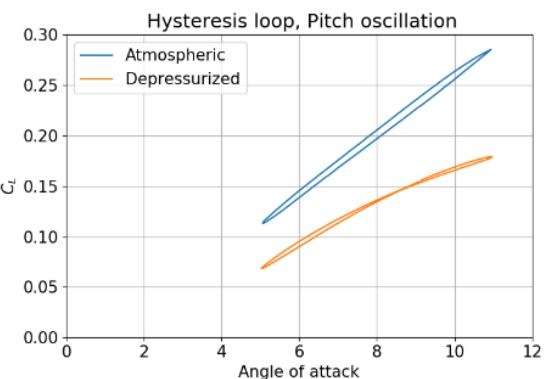  
Figure 7-9: Hysteresis loop of lift coefficient for quasi steady pitch oscillations

The occurrence of cavitation, in combination with a large variation of angle of attack of the foil, leads to a drop in lift of about 30 per cent or more. This result is significant considering that generally a foil could be designed to carry from 30-35 to 70 per cent of the displacement (in case of not complete flying mode). Furthermore, another point of attention is the existence of the hysteresis loops of the lift slope curve in dynamic conditions. The hysteresis loop is strictly dependent on the specific geometry of the foil and the unsteady flow conditions like reduced frequency and angle of attack variation. In the figure above this loop is relatively p c t t q y " y j g p " e q p u k f g t k p i " v j g " t g n c v k q p " n k h v " e q g h h k e k g p

## Influence of depth

In Figure 7-10, the influence of the depth (non-dimensional with the foil chord) on the lift (model scale) is plotted for some quasi static runs in heave (thus, changing the immersion). The results are compared with the theoretical formulation of Wadlin [Ref 5.] adapting the lift coefficient to the model test results; and the steady results from the RANS calculations (mentioned in Section 6) rg th q t o g f " y k v j " O C T K P ø u " e q f g " T g H T G U E Q <

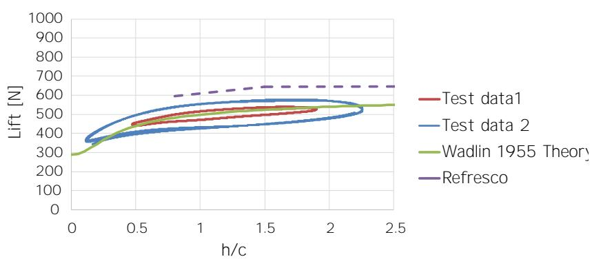

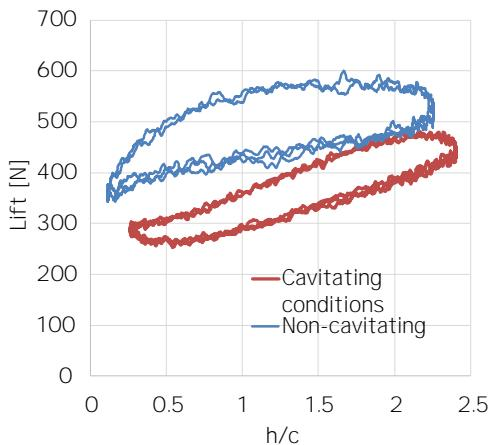  
Figure 7-10: Influence of depth, comparison with theory and RANS (left), comparison between cavitating and non-cavitating conditions (right)

The test data follows the same trend of the theoretical model, although it appears as a loop rather than a line. This is related to the fact that the quasi static runs in heave still induced an additional angle of attack, however small (while the Wadlin formulation and ReFRESCO calculations are based on steady cases). The difference between the RANS calculations and model tests is related to the influence of the not perfectly rigid flap during the (quasi static) oscillations. It should be noted that the Wadlin formulation presented here is based on the lift coefficients measured on the model tests, which is why it adjusts better to the model test results than the CFD results.

Another relevant factor is how the occurrence of cavitation influence the dependency of lift to the water depth. As shown in Figure 7-10 (right figure), the shape of the lift dependency to the water depth changes when cavitation occurs. This is due to the fact that normally influence of depth is related to the free surface effect but, when cavitation occurs, it depends also on the size of the cavities. In low cavitation numbers, such as the tested conditions, the changes in lift near the free surface are dominated by the size of the cavity, rather than the free surface effects.

## Unsteady runs

The unsteady runs performed in this model test campaign helped to:

1. Show the impact of unsteady phenomena on the hydrofoil performance;

2. Identify the type of investigations required to assist the hydrofoil design and eventually enhance the accuracy of simplified theories (which could be used in early design stage).

An example of the results is provided in Figure 7-11 where the circulatory component of the lift force (measured lift minus the estimated contribution of the added mass) resulting from the pitch oscillation tests in non-cavitating conditions at a depth of 0.8c, are presented. The results are given in terms of the RAOs (Amplitude of the lift force divided by the amplitude of the pitch motion) and the phasing between the lift and the angle of attack. This is presented in this way to account for the fact that the oscillation amplitude has to be reduced for the higher frequencies, as a result of the limitation in maximum hexapod speed and acceleration. Together with the measured points, in dashed line, the expected trend of the variations is presented, based on Theodorsen aerodynamics in [Ref 1.], as a reference to evaluate the quality of the model test results. The comparison is valid only for the cases in non-cavitating conditions and for deep submersion of the hydrofoil. While this function does not include the effects or cavitation or of the free surface, it does present a reasonable indication of the expected trends. The measured points follow the expected trend, with some outliers, while the trend of the phase shows larger deviations, but still the correct trend. The reasons for these discrepancies are related to free surface effects and some additional uncertainty related to the aforementioned lack of rigidity in the flap joint, in combination with the uncertainties related to the centre of hydrodynamic efforts position (assumed in the formulation at 0.25c from the leading edge). Furthermore, testing a larger number of amplitudes and different depth would allow to further refine the results.

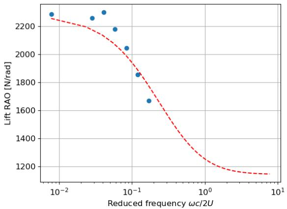

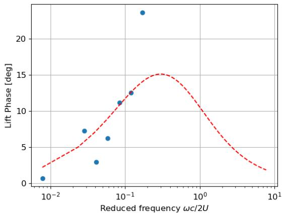  
Figure 7-11: On the left, measured amplitude of the circulatory lift variation divided by the amplitude of angle of attack, on the right the phasing of the lift force with respect to the pitch. In dashed lines, the expected variation based on Theodorsen unsteady aerodynamics.

The analysis of the results provided very useful insight and lessons learnt to set future model tests campaigns;

< More amplitudes of the forced oscillations should be tested in order to have a better fit;

When testing with control surfaces such as flaps, it is crucial to ensure a rigid joint in order to avoid unexpected additional dynamic effects;

The forced oscillations should be performed as close as possible to the centre of the hydrodynamic forces and not around the centre of the foil. If not, it is difficult to distinguish the added mass effects from the lifting effects. As a good practice, the forced oscillations should be performed around two points at least;

The amplitude of the oscillations was too small to clearly detect dynamic stall/real hysteresis loop. In that respect a more centred location of the hydrofoil under the hexapod itself would help to increase the investigation range in terms of oscillation frequency and amplitude;

One additional depth (as deep as possible) is recommendable to identify more clearly the free surface effects also in dynamic conditions (with and without cavitation).

## 7.3 Model tests campaign 2020

## 7.3 (a) Objectives

The model test campaign discussed in the presented report was the result of the cooperation with the University of Michigan (Dr. Y.L. Young) and University of Iowa (Dr. C.M. Harwood). On the theoretical side, they provided insight and know-how on the adopted measurement set-up and on the hydro-elastic phenomena in multi-phase flow. On the practical side, they provided the hydrofoil model and sensing equipment on loan for the model test campaign.

Michigan and Iowa academic objectives were more related to topics such as:

< Influence of cavitation and ventilation on the dynamic behaviour of a surface piercing foil

< Determination of ventilation boundaries in function of speed, draught and sea state

< Investigation of lock-in effects on the lift/drag characteristics and deformation

## MARIN objectives:

< Implementing a novel method for the deformation measurements

< Type of analysis and post-processing of the results

Awareness of remaining challenges for future dedicated experimental campaigns

## 7.3 (b) Model test set-up: flexible foil

The set-up allows to investigate the hydro-elastic response of the foil when coupled with the unsteady conditions and phenomena such as waves, cavitation and ventilation. Core element of this set-up was the sensing beam inserted inside the foil. This element is a development of University of Michigan (Dr. Y.L. Young) and University of Iowa (Dr. C.M. Harwood) and it was provided on loan for a joint model test campaign with MARIN.

Figure 7-12 shows an overview of the main elements of the set-up:

< Observation set-up (underwater high speed cameras)

< Force measurements

< Flexible surface piercing hydrofoil (including sensing beam system)

Two high speed underwater cameras were used to observe the suction and rear side of the hydrofoil (see example in Figure 7-13). The observations were synchronised with the measurements of the forces acting on the hydrofoil and its deformations.

The hydrofoil was mounted on a six component frame where forces and moments acting on the foil were measured in the hydrofoil local reference system.

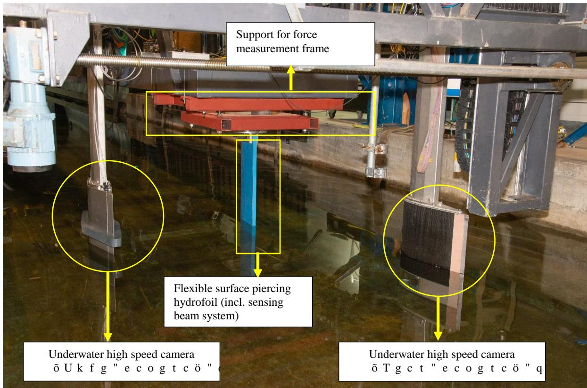

Figure 7-12: Main elements of the flexible foil set-up

<table><tr><td>Suction side view</td><td>Rear side view(different moments in the run)</td></tr><tr><td>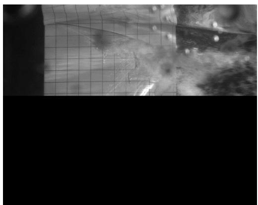</td><td></td></tr></table>

Figure 7-13: Example of high speed underwater observations of the suction and rear side

As mentioned before, the flexible surface piercing hydrofoil was provided by Universities of Iowa and Michigan. It has been used already in several previous model test campaigns to investigate the ventilation/cavitation phenomena combined with the hydrostructural response (see [Ref 6.] and [Ref 7.]). In that respect the foil is a canonical proxy to more-complex hydrodynamic lifting bodies such as propeller blades, rudders, and ride control fins. The foil was constructed of PVC with an aluminium strip 0.6 cm

## 4. BRIEF PHYSICAL BACKGROUND

In this section some relevant physical aspects of hydrofoils are summarized as a premise to the description of their possible investigations methods.

## 4.1 Foil lift and drag

Hydrofoils (such as rudders, propeller blades, yacht dagger- or centerboards and keels) are lifting surfaces. Generally they are thin streamlined bodies, intended to develop a hydrodynamic lift force when immersed in a free stream flow with a certain incidence (angle of attack, $\dot{U}$ ). This force originates from the particular shape of the foil section which results in a high flow velocity over v j g " u g e v k q p ø u " w r r g t " u k f g . " t g n c v k x g " v q " v j g " n q u y t i o n t f o r c a , which results in the hydrodynamic lift. Inevitably, hydrofoils experience a drag force, which is the summation of the viscous drag of the hydrofoil, and its eventual extra appendages (such as struts, flaps, attached fuselage), and the drag induced by the generation of the lift itself.

By definition, the drag force is in the same direction as the free stream, while the lift force is perpendicular to the free stream, regardless the angle of attack. Lift and drag forces can be expressed in non-dimensional forms by specific coefficients (described in Section 3), which depends on multiple parameters (such as Reynolds number, angle of attack and foil geometry).

In the past decades there has been a large and accurate knowledge of the hydrofoils characteristics in steady condition. This knowledge is the first basic step to consider in the hydrofoil design. However the hydrofoil will always operate in conditions far from steady, in that respect dedicated researches have been limited.

In general unsteady conditions are related to the action (and mutual interaction) of the following aspects:

1. Hydrofoil oscillating motions due to the waves orbital motions, craft motions and also control surface actions;

2. Occurrence of cavitation and ventilation;

3. Hydro-elastic behaviour of the hydrofoil.

From the pure hydrodynamic point of view, when operating in waves, the lift force on a foil system continuously varies due to the wave orbital motions, craft motions and also control surface actions. In general the unsteadiness encountered by a lifting surface can be related to the combination of the following two situations:

Non-uniform or unsteady motions of the lifting surface in a surrounding fluid where the velocity field is uniform; as an example an hydrofoil oscillating in calm water.

< Non-w p k h q t o " q t " w p u v g c f { " k p h n q y " v q " v j g " n k h v k p i " u w t h c e g " k in waves or propellers in a spatially non-uniform wake.

These unsteady flow effects can have a relevant influence on the performance of the hydrofoil. In general, the amplitude of the lift forces on an oscillating hydrofoil decreases with respect to the quasi-static solution and a phase lag with respect to the apparent angle of attack appears. These effects increase with increasing oscillation frequency. For example, based on simplified two dimensional theory [Ref 1.], a lift curve reduction of about $30\%$ could occur in a normal operating condition for a foiling craft (such as sailing between 30 and 50 knots in head waves with wave frequency of 2 rad/sec).

## 4.2 Seakeeping

Seakeeping refers to the behaviour of the craft when sailing in waves. The craft motions are very relevant in terms of passenger comfort, but also for the operation of any equipment. With reference to craft sailing in full foiling mode, the relative wave motions to the hydrofoils can result in foil emergence or ventilation, with the subsequent drop in lift and risk of uncontrolled splashdown. The motions of a craft (foiling or not) can be modelled by the second order differential equation of motion, described in Section 3. In particular, the seakeeping behaviour of an hydrofoil craft is determined by the following items:

Craft displacement and weight distribution. The mass distribution of the craft determines most of the inertia terms of the equation of motion. While there is some hydrodynamic added mass while foil borne, the relative importance of this term is smaller than for a hull borne crafts.

Wave excitation forces on the hydrofoils. The superposition of the wave orbital velocities with the uniform inflow related to the advance speed results in effective variations of the angle of attack and inflow velocities, which result in

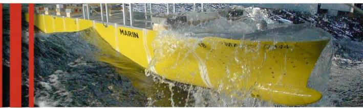

## 7. MODEL TESTS CAMPAIGNS

The model test campaigns described in the following sections are presented with the primary objective to share recent modern investigation methods for hydrofoils. Moving from the traditional steady state investigations, the accent was posed on the unsteady dynamic behaviour of the hydrofoils with different level of set-up complexity and objectives.

From MARIN perspective each model test campaign was first of all the chance to learn the lessons required to successfully perform such innovative test campaigns.

The presented results are an example of the type of analysis required to assist not only the design of the single hydrofoil but also of a modern hydrofoil craft.

## 7.1 Model tests campaign 2018

## 7.1 (a) Objectives

The main objectives of this campaign were:

To better understand the challenges of a fully foiling craft in waves, what is required of the control system and how does it affect the motions,

To make a (preliminary) evaluation of the feasibility of foiling for heavier load applications, such as a multi-purpose ectiq "dgctkpi" õe,tcfngö"qt"c"ncpfkpi"etchv

To obtain a first overview of what the challenges are to test a foiling craft in MARIN facilities, and to develop the capabilities to do so for commercial projects.

## 7.1 (b) Model test set-up: complete craft

Modelling the complete craft is the closest possible approach to full scale configuration. In this case most effects can be taken into account, but this also means that for investigating details of the foil behaviour there are simply too many overlapping effects.

A representative foiling craft was built equipped with three existing foils including controllable flaps (see Figure 7-1). Time constraints of the project did not allow for the design of new foils. Therefore commercial foils were purchased. The resulting craft was self-propelled (as 2 of the foils were modified by adding PODs underneath the foils themselves). The control system controlled the flaps of the three foils in response to the heave, pitch and roll motions. Rudders were placed to dynamically control the yaw; however, in the final set of tests, the rudders were removed in order to try to control the heading by adjusting the heel angle of the model.

Vjg"hqewu"qh"vjg"vguv"ecorckip"ycu"qp"vjg"eqpvtqnheld by a rope system. Therefore the shape of the craft was simplified too and no specific hydrodynamic shape was required. As already said, this was possible because the take-off or landing were not objectives of the model test campaign. The model was 3.5m long and weighted around 150 kg; The following figures give an overview of the set-up and the used configurations with and without rudders. Although all the tests were conceived in model scale, this is roughly equivalent to a landing craft sailing at 28 knots at scale 10, for reference.

## 7.2 Model tests campaign 2019

## 7.2 (a) Objectives

The main objectives of this project were the following:

< Assessment of the foil characteristics in unsteady conditions when cavitation and/or ventilation occurs;

< Develop a numerical model for the dynamic control strategy and simulators.

< Understanding the requirements to perform such tests;

## 7.2 (b) Model test setup: Hexapodfoil

The Hexapod-foil set-up is meant to investigate the lifting characteristics of the hydrofoil in unsteady conditions (oscillating foils advancing in waves), both in cavitating and non-cavitating conditions.

The Hexapod-foil set-up is summarized in Figure 7-5. An hexapod system was connected below the basin carriage and the foil respectively to the hexapod itself. The forces developed by the hydrofoil were measured together with the wave height and applied motions, and synchronized video recordings were used to correlate the data to the visual observations.

Forced motions of pitch and heave at different amplitudes and frequencies were applied (via the hexapod) to the hydrofoil advancing at constant speed (via the basin carriage); and similar measurements were performed with the (fixed) hydrofoil advancing in regular waves (at different amplitudes and frequencies).

One hydrofoil (one of the three used in the campaign of 2018) was used. It was painted in blue to allow better contrast for the underwater cavitation observations. Strips with carborundum grains were located on the leading edges of the vertical strut and the horizontal wing of the hydrofoil. The flap of the hydrofoil was kept in fixed position (neutral) for the entire model test campaign. Details of the hydrofoil set-up are presented in Figure 7-5. The strips with carborundum grains were used to ensure the turbulence of the flow and a proper cavitation inception. About the latter point, cavitation inception is also strictly related to the presence, density and size distribution of free gas nuclei in the water. The aforementioned artificial roughness is applied to stimulate the growth of the nuclei. To ensure sufficient number of free gas nuclei in the water, electrolysis of the water is adopted upstream of the hydrofoil. In that respect a grid, built with horizontal wires, was placed in front of the hydrofoil. By letting pass electric current through the wires, it was possible to stimulate the generation of nuclei in the water. The grid was connected to the carriage and moved at the same speed of the hydrofoil.

Figure 7-7: Steady runs, lift coefficient respectively for the immersion of 0.8 (left) and 1.5 (right) of the chord

x As well known, the occurrence of cavitation implies a decrease of the generated lift. Maximum measured reduction was even up to about 50% (at the same foil immersion).

x During the test campaign (and later in the analysis phase) two difficulties were detected with respect the set-up:

The flap of the foil was nominally kept at one fixed position but, by inspecting the underwater videos, it resulted to be not completely fixed. This small mobility led to a different measured lift in comparison with the CFD calculations (about 40% lower). The flap tended to slightly move upwards, leading to a lift reduction. Thanks to the CFD calculations performed with variation of flap angle (at the same angle of attack), a 5 degrees flap angle could indicate a similar lift reduction (confirmed by visual inspection of the videos).

In order to ensure the cavitation inception on model scale, it is necessary to feed the inflow with nuclei generated by electrolysis via a grid placed in front of the foil. However, due to the required combination of low ambient pressure and high advancing speed, the grid was fully cavitating. In

<table><tr><td>AoA= 0 degreesVm = 4.5 m/sBasin pressure = 30 mbarElectrolysis grid not active26thInternational HISWA SymposiumOn Yacht Design and Yacht Construction - 'Dare to Share'16 &amp; 17 November 2020www.hiswasymposium.com</td><td>AoA= 0 degreesVm = 4.5 m/sBasin pressure = 30 mbarElectrolysis grid active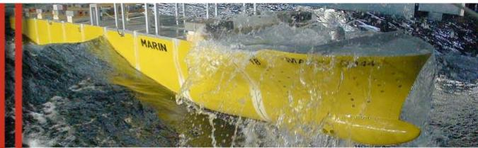</td></tr><tr><td>AoA= 0 degreesVm = 4.5 m/sBasin pressure = 30 mbarElectrolysis grid not active</td><td>AoA= 0 degreesVm = 4.5 m/sBasin pressure = 30 mbarElectrolysis grid active</td></tr></table>

Figure 7-8: Steady runs, comparison underwater observations with and without active electrolysis grid

As indicated in Figure 7-6, quasi steady runs were carried out to evaluate the restoring term of the equation of motion. From those experiments insight was given also into the dynamic variation of the lift in cavitating and non-cavitating conditions as shown in the figure below:

Figure 7-9: Hysteresis loop of lift coefficient for quasi steady pitch oscillations

The occurrence of cavitation, in combination with a large variation of angle of attack of the foil, leads to a drop in lift of about 30 per cent or more. This result is significant considering that generally a foil could be designed to carry from 30-35 to 70 per cent of the displacement (in case of not complete flying mode). Furthermore, another point of attention is the existence of the hysteresis loops of the lift slope curve in dynamic conditions. The hysteresis loop is strictly dependent on the specific geometry of the foil and the unsteady flow conditions like reduced frequency and angle of attack variation. In the figure above this loop is relatively QDUURZ ZKHQ FRQVLGHULQJ WKH UHODWLRQ OLIW FRHIILFLHQW DQG

## Influence of depth

In Figure 7-10, the influence of the depth (non-dimensional with the foil chord) on the lift (model scale) is plotted for some quasi static runs in heave (thus, changing the immersion). The results are compared with the theoretical formulation of Wadlin [Ref 5.] adapting the lift coefficient to the model test results; and the steady results from the RANS calculations (mentioned in Section 6) SHUIRUPHG ZLWK 0\$5,1¶V FRGH 5H)5(6&2

The analysis of the results provided very useful insight and lessons learnt to set future model tests campaigns;

x More amplitudes of the forced oscillations should be tested in order to have a better fit;

x When testing with control surfaces such as flaps, it is crucial to ensure a rigid joint in order to avoid unexpected additional dynamic effects;

x The forced oscillations should be performed as close as possible to the centre of the hydrodynamic forces and not around the centre of the foil. If not, it is difficult to distinguish the added mass effects from the lifting effects. As a good practice, the forced oscillations should be performed around two points at least;

x The amplitude of the oscillations was too small to clearly detect dynamic stall/real hysteresis loop. In that respect a more centred location of the hydrofoil under the hexapod itself would help to increase the investigation range in terms of oscillation frequency and amplitude;

x One additional depth (as deep as possible) is recommendable to identify more clearly the free surface effects also in dynamic conditions (with and without cavitation).

## 4. BRIEF PHYSICAL BACKGROUND

In this section some relevant physical aspects of hydrofoils are summarized as a premise to the description of their possible investigations methods.

## 4.1 Foil lift and drag

Hydrofoils (such as rudders, propeller blades, yacht dagger- or centerboards and keels) are lifting surfaces. Generally they are thin streamlined bodies, intended to develop a hydrodynamic lift force when immersed in a free stream flow with a certain incidence (angle of attack, $\dot{U}$ ). This force originates from the particular shape of the foil section which results in a high flow velocity over v j g " u g e v k q p ø u " w r r g t " u k f g . " t g n c v k x g " v q " v j g " n q u y t i o n t f o r c a , which results in the hydrodynamic lift. Inevitably, hydrofoils experience a drag force, which is the summation of the viscous drag of the hydrofoil, and its eventual extra appendages (such as struts, flaps, attached fuselage), and the drag induced by the generation of the lift itself.

By definition, the drag force is in the same direction as the free stream, while the lift force is perpendicular to the free stream, regardless the angle of attack. Lift and drag forces can be expressed in non-dimensional forms by specific coefficients (described in Section 3), which depends on multiple parameters (such as Reynolds number, angle of attack and foil geometry).

In the past decades there has been a large and accurate knowledge of the hydrofoils characteristics in steady condition. This knowledge is the first basic step to consider in the hydrofoil design. However the hydrofoil will always operate in conditions far from steady, in that respect dedicated researches have been limited.

In general unsteady conditions are related to the action (and mutual interaction) of the following aspects:

1. Hydrofoil oscillating motions due to the waves orbital motions, craft motions and also control surface actions;

2. Occurrence of cavitation and ventilation;

3. Hydro-elastic behaviour of the hydrofoil.

From the pure hydrodynamic point of view, when operating in waves, the lift force on a foil system continuously varies due to the wave orbital motions, craft motions and also control surface actions. In general the unsteadiness encountered by a lifting surface can be related to the combination of the following two situations:

x Non-uniform or unsteady motions of the lifting surface in a surrounding fluid where the velocity field is uniform; as an example an hydrofoil oscillating in calm water.

x Non-w p k h q t o " q t " w p u v g c f { " k p h n q y " v q " v j g " n k h v k p i " u w t h c e g " k in waves or propellers in a spatially non-uniform wake.

These unsteady flow effects can have a relevant influence on the performance of the hydrofoil. In general, the amplitude of the lift forces on an oscillating hydrofoil decreases with respect to the quasi-static solution and a phase lag with respect to the apparent angle of attack appears. These effects increase with increasing oscillation frequency. For example, based on simplified two dimensional theory [Ref 1.], a lift curve reduction of about $30\%$ could occur in a normal operating condition for a foiling craft (such as sailing between 30 and 50 knots in head waves with wave frequency of 2 rad/sec).

## 4.2 Seakeeping

Seakeeping refers to the behaviour of the craft when sailing in waves. The craft motions are very relevant in terms of passenger comfort, but also for the operation of any equipment. With reference to craft sailing in full foiling mode, the relative wave motions to the hydrofoils can result in foil emergence or ventilation, with the subsequent drop in lift and risk of uncontrolled splashdown. The motions of a craft (foiling or not) can be modelled by the second order differential equation of motion, described in Section 3. In particular, the seakeeping behaviour of an hydrofoil craft is determined by the following items:

× Craft displacement and weight distribution. The mass distribution of the craft determines most of the inertia terms of the equation of motion. While there is some hydrodynamic added mass while foil borne, the relative importance of this term is smaller than for a hull borne crafts.

x Wave excitation forces on the hydrofoils. The superposition of the wave orbital velocities with the uniform inflow related to the advance speed results in effective variations of the angle of attack and inflow velocities, which result in