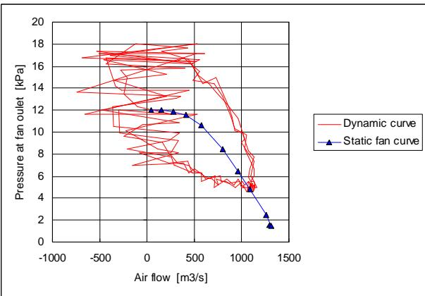

<table><tr><td>ITTC – Recommended Procedures and Guidelines</td><td colspan="2">7.5-02-05-04Page 1 of 13</td></tr><tr><td>ProcedureHSMV Seakeeping Tests</td><td>Effective Date2024</td><td>Revision03</td></tr></table>

# ITTC Quality System Manual Recommended Procedures and Guidelines

# HSMV Seakeeping Tests

Frederik Gerhardt F., Young J., Minoura M., Bouscasse B., Hermundstad O. A., Nam B-W., Malas B., Domke K., Souto-Iglesias A., Duan W.

7.5 Process Control

7.5-02 Testing and Extrapolation Methods

7.5-02-05 High Speed Marine Vehicles.

7.5-02-05-04 HSMV Seakeeping Tests

## Disclaimer

All the information in ITTC Recommended Procedures and Guidelines is published in good faith. Neither ITTC nor committee members provide any warranties about the completeness, reliability, accuracy or otherwise of this information. Given the technical evolution, the ITTC Recommended Procedures and Guidelines are checked regularly by the relevant committee and updated when necessary. It is therefore important to always use the latest version.

Any action you take upon the information you find in the ITTC Recommended Procedures and Guidelines is strictly at your own responsibility. Neither ITTC nor committee members shall be liable for any losses and/or damages whatsoever in connection with the use of information available in the ITTC Recommended Procedures and Guidelines.

<table><tr><td>Updated / Edited by</td><td>Approved</td></tr><tr><td>Seakeeping Committee of the 30th ITTC</td><td>30th ITTC 2024</td></tr><tr><td>Date 05/2024</td><td>Date 09/2024</td></tr><tr><td>© 2024 ITTC.A Switzerland</td><td>DOI:</td></tr></table>

<table><tr><td>ITTC – Recommended Procedures and Guidelines</td><td colspan="2">7.5-02-05-04Page 2 of 13</td></tr><tr><td>HSMV Seakeeping Tests</td><td>Effective Date2024</td><td>Revision03</td></tr></table>

## Table of Contents

1. PURPOSE OF PROCEDURE......3
2. TEST TECHNIQUES AND PROCEDURES......3
2.1 General......3
2.2 Seakeeping Tests......3
2.2.1 Seakeeping Investigations......3
2.2.2 Model Selection and Construction4
2.2.2.1 Special Topics Related to Air Cushion Supported Vehicles......4
2.2.3 Ride Control Systems......5
2.2.4 Towing the Model......6
2.2.4.1 Special Topics Related to Planing Monohulls......6
2.2.5 Course Control......7
2.2.6 Typical Model Tests......7
2.2.7 Quantities Measured During Tests......8
2.2.8 Instrumentation Used in Wave Tests......8

2.2.9 Test Wave Environment....10
2.2.9.1 Tests in Regular Waves....10
2.2.9.2 Tests in Irregular Seas....11
2.2.10 Data Sampling Rate....11
2.2.11 Data Collection....11

3. PARAMETERS....11
3.1 Parameters to be Taken into Account....11
3.2 Recommendations of ITTC for Parameters....12

4. VALIDATION....12
4.1 Uncertainty Analysis....12
4.2 Benchmark Tests....12

5. REFERENCES....12
6. KEYWORDS....13

This document gives guidelines on how to perform seakeeping tests for High-Speed Marine Vehicles (HSMV), including model construction, instrumentation, data acquisition, test set-up and selection of wave environment. Special focus is on issues pertinent to HSMV, such as high speed, light weight, rapidly varying forces, dynamic lift from foils, air cushions and ride control systems.

## Abstract:

<table><tr><td>ITTC – Recommended Procedures and Guidelines</td><td colspan="2">7.5-02-05-04Page 3 of 13</td></tr><tr><td>HSMV Seakeeping Tests</td><td>Effective Date2024</td><td>Revision03</td></tr></table>

HSMV Seakeeping Tests

## 1. PURPOSE OF PROCEDURE

Seakeeping tests are conducted on HSMV models to estimate the motions, accelerations and loads that full-scale craft will experience. At high speeds, many of these vehicles are supported by dynamic lift and many are exposed to extremely dynamic forces. These issues present new challenges for making seakeeping measurements in the towing tank and new test procedures are constantly being developed to address them; especially for HSMV like hybrids.

The weights of these hybrid ships are sustained by the combination of the lift force by displacement, hydrofoil and aircushion. The interaction of these sustain forces should be considered and predicted more precisely. In this sense, similarity between model and real ship of aircushion, flexible skirts, hydrofoils and appendages will be the important part in case of hybrid type HSMV.

The main aim of this procedure is to clarify the similarity relationship between model and real ship including hybrid types and provide useful information at primary design stage.

## 2. TEST TECHNIQUES AND PROCE-DURES

## 2.1 General

The ITTC recommended procedures peculiar to high-speed craft are given as separate procedures for each test type. The procedures are:

 Resistance (Procedure 7.5-02-05-01)

 Propulsion (Procedure 7.5-02-05-02)

 Seakeeping (Procedure 7.5-02-05-04)

 Manoeuvring (Procedure 7.5-02-05-05)

 Structural Loads (Procedure 7.5-02-05-06)

 Dynamic Instability (Procedure 7.5-05-02- 07)

Issues of importance for different types of high-speed craft are covered in separate sections in each procedure when needed.

## 2.2 Seakeeping Tests

## 2.2.1 Seakeeping Investigations

Seakeeping aspects of HSMVs are of particular interest since the accelerations are in general high. High accelerations limit the operability from the point of view of passengers and/or the crew and often also for the cargo. High accelerations and impact events, such as slamming, can have a large effect on the loads and the fatigue life of the construction.

One of the main differences between the seakeeping behaviour of HSMVs and conventional ships is the non-linear relationship between the local wave elevation and the motions and accelerations of the craft. Also, time histories of motions and accelerations usually have complex characteristics such as sharp peaks or flat troughs that make them unsuitable for linear analysis methods. The degree of non-linearity increases with the speed of the craft. Since semiplaning monohulls operate at lower speeds, they typically have less complex responses.

When Froude numbers based on length exceed approximately 1.0, the degree of non-linearity is considered significant and procedures involving linear superposition are no longer considered acceptable for analysis of the measurements (see for example Fridsma, 1971). While response amplitude operators (RAOs) obtained from model tests in regular waves may provide interesting information on the response of the hull to different exciting frequencies, regular wave tests are not recommended for predicting the response of a planing hull in random waves.

<table><tr><td>ITTC – Recommended Procedures and Guidelines</td><td colspan="2">7.5-02-05-04Page 4 of 13</td></tr><tr><td>HSMV Seakeeping Tests</td><td>Effective Date2024</td><td>Revision03</td></tr></table>

Suggested guidelines for conducting tests in random waves and analysing the measured data are presented in this procedure. It is recommended that results are presented and analysed on a statistical basis, as may be seen for example, in Fridsma (1971) and Zarnick & Turner (1981), or more recently Schleicher (2006) and Taunton et al. (2011).

## 2.2.2 Model Selection and Construction

There is no minimum requirement for the model size used for seakeeping tests based on Reynolds numbers as there is for resistance tests. It is generally accepted that viscous effects play a minor role for seakeeping studies, although such effects do play an important role for roll damping and forces on stabilising fins or rudders.

The actual dimensions of the model are usually governed by the constraints of the experimental facility. The maximum speed of the towing carriage and the wave maker capabilities are driving factors for a small model, the required displacement to carry the constructional weight, measurement equipment, and propulsion unit(s) give a lower limit.

When small models are built without careful attention to weight distribution, the inertia of model may be too high to simulate the inertia of the prototype. Therefore, model construction should be light and stiff. Due to this, glass fibre or carbon reinforced plastics (GRP and CRP) are now in common use for model construction. Wood is still in use at some facilities, plywood being the preferred choice for hard chine models and a model built from strips on frames for round bilge hull forms. Good experience is also obtained with foam with a layer of fibre (glass or carbon) to bring the structural stiffness up to the required level. No matter the model construction method, the tolerances on model dimensions and shape should be known and regularly checked.

Hull stiffness is an especially important characteristic of the model if the intent is to measure “rigid body accelerations”. Trade-offs must be made between reducing model weight and increasing model stiffness. Hull thickness for resin/fibre composite models varies considerably depending on fibre characteristics, fibre orientation and internal hull structure.

If accelerometers are installed in the model, care should be taken to mount them on stiff mounting locations, for instance on frames or other cross members. The natural frequency of the hull/accelerometer foundation can be investigated by tapping the hull in that area and recording the response of the accelerometer. The results of these natural frequency checks should be presented with the test data.

## 2.2.2.1 Special Topics Related to Air Cushion Supported Vehicles

Fans Systems for Air Cushion Supported Vehicles:

Because air cushion supported vehicles are in general very light, it can be a problem to install fans on a model of such a vehicle. Instead, fans can be installed on the carriage leading the pressurised air through hoses to the model. Such a set-up has been used at MARIN to measure the wave forces on a captive model of a SES. Using such a set-up, hysteresis loops were measured in the pressure flow relation just in the hoses in between the fans and the model. These loops showed large differences in the pressure flow relation if compared to static measurements. The effect is illustrated in Figure 1.

<table><tr><td>ITTC – Recommended Procedures and Guidelines</td><td colspan="2">7.5-02-05-04Page 5 of 13</td></tr><tr><td>HSMV Seakeeping Tests</td><td>Effective Date2024</td><td>Revision03</td></tr></table>

  
Figure 1 – Differences in the pressure flow relation if compared to static measurements experienced at MARIN on a captive model of a SES.

This effect can be explained by considering the air in the hose as a mass – spring system (Masset et al., 1995). The illustrated phenomenon has an effect on the pressure oscillations in the cushion and hence on the lift force which is due to the model set-up and not to the dynamics of the scaled prototype. It is recommended to avoid such a set-up whenever possible. Instead, it is recommended to install the fans directly on the model and to avoid these dynamic effects.

## Dynamic Calibration of Air Cushions:

It is imperative to use Froude scaling for the over-pressure in the air cushion of an air cushion supported vehicle. Due to the fact that normally the ambient pressure is not scaled, the absolute value of the pressure in the cushion of the model is far too high. This means that the dynamics of the air cushion are incorrectly modelled with a far too high resonance frequency of the air cushion (Moulijn, 1998). Problems associated with this phenomenon are only apparent for higher scale ratio models.

Results of oscillation tests in the MARIN depressurised towing tank (Kapsenberg, 1994) showed the effect of changing the ambient pressure on the heave added mass and damping coefficients of a model of an SES.

For models of larger sized full-scale vessels, which are model tested in a seakeeping basin at normal ambient pressure, it is recommended to use a diaphragm for the dynamic calibration of the air cushion. This diaphragm reduces the pressure gradient as a function of the volume variations, �� ��⁄ , to the required value. This technique was independently developed in France by Ifremer and in the Netherlands by MARIN.

The diaphragm is a rubber membrane covering a part of the cushion volume. The membrane is thin so that inertia effects can be ignored. The size and the stretching characteristics of the membrane must be calibrated depending on the full-scale dimensions and the model scale ratio adopted. If this technique is applied, good results of tests at different scale ratios were reported (Kapsenberg & Blume, 1995), so it can be expected that also good predictions for the full-size vessel can be made.

For vessels with less than about 50 m length it is acceptable to test the model without a diaphragm as long as it is kept in mind that the passenger comfort at high speed and very low sea states will be over-estimated by the model tests.

## 2.2.3 Ride Control Systems

Ride Control Systems can be very important for high-speed vessels to improve the seakeeping characteristics and such systems can therefore be included in the model for tests in waves. If the control system is active, the requirements for the actuators are high, especially for the phase lag at higher frequencies.

If the control system consists of fins, turbulence stimulation should be applied. The actual fin angle should always be measured to have a check on the accuracy of the actuator system, and the lift force on the fin gives an idea of the effective angle of incidence which is relevant for cavitation limits imposed on the full-size vessel.

<table><tr><td>ITTC – Recommended Procedures and Guidelines</td><td colspan="2">7.5-02-05-04Page 6 of 13</td></tr><tr><td>HSMV Seakeeping Tests</td><td>Effective Date2024</td><td>Revision03</td></tr></table>

## 2.2.4 Towing the Model

The location of the towing point should be considered in the design of the model.

Tests in head seas can be carried out with a towed model and restraining the model completely in the lateral motions. The model can also be restrained in surge or towed with a spring system. If the latter is the case, care should be taken to avoid a resonance frequency which is close to the wave encounter frequency; a spring should be selected which results in a resonance frequency at least a factor 2 lower than the lowest wave encounter frequency. If a spring system is used, the resonance frequency should be mentioned in the test report. It is realistic to have the tow point on the line of the propeller axis rather than at the centre of gravity.

For catamaran craft, where the model may be towed from a cross-deck structure, there is the choice of allowing the model to pitch about an axis on the cross-deck structure, or at a fitting in each demi-hull of the model. In the latter case, because of the requirement for a cross-deck structure to connect the hulls, the mass of the craft moving in heave will be different to the mass of the craft moving in pitch. With a light cross-deck structure used in the model tests this difference is likely to be small and the lower pitch axis may be preferable if it is closer to the full-scale craft centre of gravity.

For tests in following seas, it is considered important to allow large surge motions of the model. This freedom is usually essential to determine correctly if a model is prone to nose diving, broaching or shipping green water over the bow. It will be difficult to model this correctly using a spring system; an alternative might be using a constant tension winch. A good solution is to have a self-propelled model for tests in following seas. This method also models the varying propulsive force due to the wave orbital velocity. Because of the low encounter frequencies, this phenomenon will also contribute to the surge motion. This set-up can still be realised while restraining the model in the lateral direction.

It is recommended to use a fully self-propelled model for seakeeping tests in quartering seas. A set-up with a towed model needs a system to keep the model on course; such a system needs to be rather stiff to compensate for the hydrodynamic mean loads at high speed and will therefore have an unacceptable influence on the ship motions.

## 2.2.4.1 Special Topics Related to Planing Monohulls

Planing monohulls are most often towed at the intersection of the longitudinal centre of gravity and the propulsor thrust line. The propulsive thrust of the prototype is typically simulated using an inclined towing link or towing wire, or by using a combination of pure horizontal force (supplied by a vertical tow post riding in low-friction bearings) plus a pure vertical force (unloading weight). In hulls where the thrust line is very low, for instance out drive powered boats, it is impossible to tow the model from a low enough point. In these cases, the tow point is installed as low as possible and ballast weights are shifted to compensate for the bowdown moment imposed by the high tow point. The effects of pitching moments created by appendages and propeller forces should be estimated and accounted for separately. It is standard practice to tow models in waves with a nonvarying towing thrust angle.

Planing boat models usually require sealed decks to keep water out. In many cases, models are built with simplified superstructures to evaluate spray and solid water impacts. Details of the superstructure should be included in the test report to allow corrections between the air drag of the model and of the full-scale prototype.

<table><tr><td>ITTC – Recommended Procedures and Guidelines</td><td colspan="2">7.5-02-05-04Page 7 of 13</td></tr><tr><td>HSMV Seakeeping Tests</td><td>Effective Date2024</td><td>Revision03</td></tr></table>

## 2.2.5 Course Control

Using a completely free running model requires a control system to keep the model on course. At full scale as well as in the towing tank, high speed vessels can experience problems in keeping a steady course. This is especially true for waterjet propelled vessels since they normally do not have a skeg.

The roll motion induced by the rudder or water jet nozzle is a point of concern. This effect can be considerable and is controlled by the control law of the autopilot. Preferably filtering should be used to avoid rudder/nozzle oscillations in the wave encounter frequency.

A check should always be made on the delivered torque by the steering gear in a bollard pull condition at maximum RPM to prevent problems with an insufficient sized actuator. However, this is by no means sufficient to ensure a fully controlled model.

## 2.2.6 Typical Model Tests

Seakeeping model tests are typically conducted in head or following seas with the model restrained in surge, sway, roll and yaw and free in pitch and heave. Fridsma (1971), in testing planning hulls, showed that in head seas, with �� > 1, constant speed tests produced essentially the same motions and added resistance as tests with the model free to surge, with constant thrust. As noted earlier, it is standard practice to tow models in waves with a non-varying towing thrust angle.

Usually, at the lower speeds of displacement and semi-planning boats, tests can be conducted in a towing tank and measurements are usually transferred to a towing carriage that is driven in close proximity to the model and connected by a wiring harness. For most higher speed planing boat models, free running tests may be conducted in the open water of ponds or lakes because of the distance covered at high speed. Measurement signals may be sent to shore via radio telemetry for recording or stored on board. The accelerations of high-speed planing monohulls may make on board digital storage difficult, although recent developments in inertial measurement units (IMUs) and solid-state memory devices now make on board digital storage more reliable for both model- and full-scale testing.

Free running models are also used for seakeeping measurements. For instance, free running models of HSMVs with fully submerged hydrofoils might be tested. When doing seakeeping and also manoeuvring tests with a free model, it is considered necessary to test the model complete with foil system and actively controlled flaps (if fitted to the full-scale vessel). The scale effect on lift is considered less critical for seakeeping since take-off condition is usually not tested in seakeeping. The scale effect on lift can be compensated by the flaps or by ballast. When testing a towed model, it is not necessary to correct for scale effect on drag. The scale effect on drag has importance for the forces from the propulsors. If the model is run self-propelled and no correction is made, the propeller forces will be over-estimated. The best solution is to apply a constant tow rope force at the correct vertical position (note that using a weight will introduce an inertia that is not wanted). If it is impossible to apply a correction force at the correct vertical position, it is often the best solution to accept the over-estimated propulsor thrust.

In a previous survey conducted for the 22nd ITTC HSMV committee, it was found that, for irregular wave testing, 38 percent of the facilities use less than 100 wave encounters as a standard minimum for basing statistical representations of test data. 62 percent of the facilities use more than 100 encounters. The survey showed wide variations, with a mean of 78 encounters. Based on a review of the data, a minimum of 100 wave encounters is recommended for testing in head seas. The modal frequency of the encountered wave spectrum should be used to estimate the total run time required. At the high speeds of planning craft, the tank length of many facilities limits the steady speed run time to only a few seconds. Therefore, many runs may be required to obtain 100 wave encounters. For obtaining statistics such as mean, standard deviation and probability levels it is standard practice to splice the measurement time records together and analyse the combined set of data.

<table><tr><td>ITTC – Recommended Procedures and Guidelines</td><td colspan="2">7.5-02-05-04Page 8 of 13</td></tr><tr><td>HSMV Seakeeping Tests</td><td>Effective Date2024</td><td>Revision03</td></tr></table>

An alternative method of evaluating the motions of a hull in a seaway is to subject the model to forced oscillations and to conduct free decay tests. The hydrodynamic coefficients obtained from these experiments can be used in empirical or numerical modelling simulations to predict the response of the hull to wave exciting forces. In these tests the model is fixed in six degrees of freedom and up to three moments may be measured. As for all tests in which the model is restrained in heave, the level of the water surface should be monitored when the model is underway to measure any change in water level caused by the aerodynamic pressure of the towing carriage (see Murakami, 1981 and 17th ITTC HSMV Report).

## 2.2.7 Quantities Measured During Tests

 Wave height preferably measured at the location of the model, or alternatively at a fixed location in the basin;

 Ship speed;

 Resistance;

 Trim, i.e. the mean component of the pitch motion as function of speed;

 Heave, typically measured at the longitudinal position of the centre of gravity;

Accelerations: it is standard procedure to measure accelerations in the vertical body axis at several locations. In order to make it possible to compare data from different facilities, three standard locations are proposed:

1. Bow – 10 percent of $L _ { \mathrm { P P } }$ aft of forward perpendicular;

2. CG – position should be changed for each condition tested;

3. Stern – 10 percent of LPP forward of aft perpendicular.

Pressures: pressures can be measured at virtually any location of interest. This can be on the hull to record slamming impacts, but also on the superstructure to investigate green water impacts;

Relative bow motions: these measurements are difficult to make on HSMVs, especially on planing hulls because of the large change in attitude of the model at high speeds. Interference with the ship motions due to the supporting structure of wave probes should be avoided, especially at high speeds. Glued strips may be used on the hull, if the local structure is not too complex (for instance due to spray rails).

Wetted Surface: records are typically kept of the bottom surface wetted by solid water, although this is mostly done for calm water resistance tests. In some cases, the area wetted by spray is also measured and recorded. Either way, this is typically done using visual (camera) techniques, either from the outside of the model by a submerged camera, or from the inside model – requiring the usage of a transparent material for the model manufacture, such as uncoated GRP.

## 2.2.8 Instrumentation Used in Wave Tests

Wave height – Measurements of the encountered wave are more desirable than measurements of the stationary wave. However, it is considerably more difficult to measure encountered wave elevation at high speeds.

<table><tr><td>ITTC – Recommended Procedures and Guidelines</td><td colspan="2">7.5-02-05-04Page 9 of 13</td></tr><tr><td>HSMV Seakeeping Tests</td><td>Effective Date2024</td><td>Revision03</td></tr></table>

Surface piercing wave probes are generally unreliable because of water run-up on the forward side of the probe and ventilation of the back side of the probe. Good success has been reported in measuring encounter wave using electro-mechanical servo probes. Acoustic probes have also been used successfully when the test data have been postprocessed using computer based methods for fairing curves through ”dropout” points in the time records, although frequency response problems have been noted by some investigators (Hirayama et al., 1988). It should be borne in mind that with highspeed planing craft, the vessel may 'skip' between wave crests and the waves actually encountered by the vessel may not be the same as those measured by a wave probe (of any kind).

 Speed: speed measurement is typically made using the same equipment used for resistance tests.

Added resistance/thrust in waves: for added resistance measurements, instrumentation is needed with approximately twice the capacity used in calm water resistance tests. The frequency response of the system should be considered if statistics other than average added resistance are to be evaluated. Preference is given to using self-propelled models in waves rather than towed models. This means that added resistance measurements are impossible and that the thrust must be measured instead. For propellers the thrust can be measured in the axis on the outside of the aftermost bearing, for waterjets the thrust can be determined from measuring the pressure in the nozzle. It is recommended to measure the torque in the shaft just before the waterjet to detect air ingestion. The torque cannot be used to estimate the required power.

 Motions measurements – Measurement of motions is important and should in general be non-intrusive. Instrumentation used in resistance tests is often unsuitable for seakeeping because of the dynamic nature of measurements (fast turnaround and large excursions). For instance, weighted string pulley systems for measuring rise and fall at bow and stern cannot be used because model accelerations often exceed 1g. However, if tests in head or following seas are carried out and the model is restrained in the lateral motions, a reliable measurement is obtained by having a wire-over-potentiometer measurement of the vertical motion at the bow and stern. Such a system cannot be used for free running tests. Reliable 6 DoF optical systems are now available which can be used for this situation.

Accelerations: ideally, the purpose of the acceleration measurements should be known in advance. If for structural response, different parts of the full scale will respond at different frequencies (e.g. a large heavy panel will not respond to very sharp acceleration peak, whilst a small stiff panel will); if for human response regarding injury, a slow response time as well (Gollwitzer & Peterson, 1996); if for human response regarding motion sickness, use the frequency octave method. For operability purposes the accelerations are more important than the motions. It is recommended to measure these directly instead of deriving them by double differentiation of the motions. Servo-pendulum accelerometers used for low-speed ship model testing are very accurate but are limited to frequencies below 100 Hz; piezoelectric accelerometers are limited to frequencies above 10 Hz; piezo-resistive and variable capacitance are good alternatives that perform well over a frequency range of 0 to 1000+ Hz. It is recommended that accelerometer specifications, including: range, natural frequency, damping ratio and linearity be included when reporting acceleration data. Acceleration time histories for planing hulls are typically triangular with short rise time, sharp peak and more gradual decay time. Peak acceleration varies with the frequency response of the transducer, sampling rate, filter rate, etc (Zseleczky & McKee, 1989).

<table><tr><td>ITTC – Recommended Procedures and Guidelines</td><td colspan="2">7.5-02-05-04Page 10 of 13</td></tr><tr><td>HSMV Seakeeping Tests</td><td>Effective Date2024</td><td>Revision03</td></tr></table>

Pressures: problems with measuring pressures are very similar to acceleration measurement problems because of short rise time. Another problem is that given the same impulse, large-face pressure transducers measure lower peak pressures over a longer time than small-faced transducers because the stagnation point is typically concentrated and fast moving. Published data should not only list the location of transducers, but also the diameter of the sensor face, the range, frequency response and linearity of the transducer. For measuring panel loadings, strain gauges on panels with scaled dimensions and flexural properties are recommended rather than point pressure measurements.

Relative bow motions: these measurements are difficult to obtain at high speeds and are rarely attempted; no recommended practice is available at present.

## 2.2.9 Test Wave Environment

If the model testing is focussed on determining the operational limits, and the expected operational limits are not extreme conditions, it is recommended to use the two-parameter ITTC Standard Spectrum as a description of the wave energy distribution over the frequency range. The main reason for this choice is that such a spectrum describes a fully developed sea state which is relevant for normal operational conditions.

For tests in extreme sea states, it is recommended to use a JONSWAP type of representation for the wave energy spectrum with a suitably chosen peakedness parameter γ. Because of the relatively short duration of the extreme weather, it cannot be expected that such a sea state will be fully developed. These coastal sea states have low significant wave heights (1-3 m) compared with conventional ship sea states (2- 6+ m) so the wave maker may be operating outside its design envelope. This should be considered before selecting the scale ratio.

The presence of swell is for most high-speed vessels a very important factor. The encounter frequency of local wind generated waves is usually sufficiently high so that it does not result in any significant motions; the motions due to the swell can be much higher and therefore more relevant for both operability and safety aspects. It is recommended to use local wave information as much as possible for operability studies.

Keeping the model speed is a point of consideration for free running models. Usually, the propeller is driven by an electrical motor and the RPM of this motor is kept constant. The characteristics of the motor of the ship are usually not modelled, but this is not considered to be a significant disadvantage for high-speed vessels.

## 2.2.9.1 Tests in Regular Waves

Due to the non-linear nature of the motion responses of high-speed craft tests in regular waves are generally not recommended. This means that the motion RAO derived from experiments is not unique and cannot be used to determine the performance in irregular seas with confidence (Fridsma, 1971).

Nonetheless, tests in regular waves are still often used for research projects. A problem is to keep the model speed constant for the runs in different wave conditions (frequency and amplitude) due to the changing added resistance. If the duration of the run is sufficient, a solution may be found in a feed-back to the RPM control of the electrical motor. The power to weight ratio of high-speed models is normally sufficient to have a quick response and to arrive at the required value in a short time.

<table><tr><td>ITTC – Recommended Procedures and Guidelines</td><td colspan="2">7.5-02-05-04Page 11 of 13</td></tr><tr><td>HSMV Seakeeping Tests</td><td>Effective Date2024</td><td>Revision03</td></tr></table>

Motion responses of high-speed vessels can be non-linear to a significant degree.

## 2.2.9.2 Tests in Irregular Seas

Tests in irregular seas are always required to study extreme effects like slamming, shipping of green water, nose diving and broaching for any ship. Due to the non-linear relation between ship motions (and accelerations) and the wave amplitude for some high-speed vessels, tests in irregular seas are also required to check the normal operational limits. This makes computer predictions for such conditions quite important since it is not feasible to carry out tests in many sea states. A reasonably accurate prediction of the operational limits must be made so that critical conditions can be selected with confidence.

## 2.2.10 Data Sampling Rate

The sample rate of the data collection system should be sufficiently high to measure the quantities of interest. If these are only the ship motions, a sample rate of 5× the maximum wave encounter frequency is sufficient. If loads are being measured in a cross section of the model, a much higher (minimum 3×) sample rate is necessary to measure non-linear effects accurately.

If crew operability, or human response to vibration are important, then the sampling rate used at model-scale needs to be sufficient to perform subsequent analysis for operability of the full-scale vessel, i.e. the full-scale requirement should be scaled to model-scale. Typically, the frequency weightings as found in, say, BS6841 (1987) may be used. See, Allen et al (2008) and Taunton et al (2011) for examples.

Slamming measurements require a very high sample rate, the required rate is dependent on the resonance frequency of the slamming sensor. Piezo-electric pressure gauges have for instance very high resonance frequencies requiring very high sample rates; a value of 10 to 20 kHz is not uncommon.

Focus is now more on measuring slamming with a sensor with a resonance frequency related to the construction of the full-size ship. If such a sensor is used, the requirements on the sample rate are usually lower, and 5 × the lowest resonance peak of the sensor should be sufficient.

## 2.2.11 Data Collection

As discussed in Section 4.3.6, a large number of wave encounters is necessary for tests in irregular seas, which might make it necessary to do the test by combining runs in different realisations of the irregular sea. The number of wave encounters required for the analysis is dependent on the purpose of the test. If only RMS values of motions and accelerations are required, 75 wave encounters will give a sufficient accuracy. If parameters of extreme phenomena need to be measured like slamming pressures, the required run length should be such that a number of slams are encountered. If the extreme slam pressure needs to be determined a run length sufficient to record 100 slams is required.

In general, it is recommended to define the run length based on the number of relevant events rather than just a certain measurement time.

## 3. PARAMETERS

## 3.1 Parameters to be Taken into Account

 Towing point and method.

<table><tr><td>ITTC – Recommended Procedures and Guidelines</td><td colspan="2">7.5-02-05-04Page 12 of 13</td></tr><tr><td>HSMV Seakeeping Tests</td><td>Effective Date2024</td><td>Revision03</td></tr></table>

 Pitch radius of gyration, particularly with reference to the towing arrangement used for catamaran vessels.

 Wave height (fixed or encountered).

 Speed.

 Resistance.

 Trim.

 Heave.

 Accelerations

 Relative bow motions.

 Hull global loads.

 Pressures.

 Wetted surface.

 Effect of appendages.

 Air flux by fan (SES and ACV).

 Flexibility or material characteristics (flexible skirts for SES and ACV).

 Reynolds effect for hydrofoil ship including cavitation.

## 3.2 Recommendations of ITTC for Parameters

Added resistance of appendage drag can represent a significant portion of the total resistance of HSMVs. It is recommended to test the model with and without appendages.

Measurement of the encountered waves are more desirable than measurements of the stationary waves. Good success has been reported using electromechanical servo probes, acoustic probes, and servo controlled wave gauges.

Measurement of motions should in general be non-intrusive. The reliable measurement is obtained by having a wire-over-potentiometer measurement. Reliable 6 DoF optical systems are available for free running tests.

 Tests in irregular seas are required to check the normal operational limits.

 The resulting trims during self-propulsion tests in a towing tank at atmospheric pressure are in most cases not representative for full-scale HSMVs.

 For measurement of global load hull forces, the most practical way is to use a segmented model where the segments are connected through force transducers.

## VALIDATION

## 4.1 Uncertainty Analysis

Not yet treated.

## 4.2 Benchmark Tests

1. ITTC Database of Seakeeping Experiments (21st 1996 pp.43) High Speed Marine Vehicles.

2. MARIN Fast Displacement Series in head waves (Kapsenberg, 2012).

## 5. REFERENCES

Allen, D.P., Taunton, D.J. and Allen, R., 2008, “A Study of Shock Impacts and Vibration Dose Values Onboard High Speed Marine Craft”, International Journal of Maritime Engineering, 150, pp 20.

BS6841, 1987, "BS 6841: Measurement and Evaluation of Human Exposure to Wholebody Mechanical Vibration and Repeated Shock”, British Standards Institute.

Fridsma, G., 1971, “A Systematic Study of the Rough-Water Performance of Planing Hulls, Irregular Waves, Part II”, Davidson Laboratory, Stevens Institute of Technology, Report 1495.

Gollwitzer, R., and Peterson, R., 1996, “Drop Tests and Planing Boat Dynamics Modelling for Investigating Repeated Water Entry Shock and Mitigation,” Small Craft Marine Engineering Resistance and Propulsion Symposium, University of Michigan, USA.

Hirayama, T., Motohiro, H., and Ryuichi, I., 1988, “On the Accuracy of Seakeeping Tank Tests and on a Project of Comparative Seakeeping Experiment,” Symposium on Ship Hull Forms and Seakeeping Qualities, Society of Naval Architects of Japan, Japan.

Kapsenberg, G. K., 1994, “Added Mass and Damping Coefficients for a Large SES –Including an Appreciation of Scale Effects,” NAV’94 Conference, Rome, Italy.

Kapsenberg, G.K., and Blume, P., 1995, “Model Tests for a Large Surface Effect Ship at Different Scale Ratio’s”, FAST’95, Lübeck-Travemünde, Germany.

Kapsenberg, G.K., 2012, "The MARIN Systematic Series Fast Displacement Hulls", in Proceedings of the 22nd HISWA Symposium on Yacht Design and Yacht Construction, Amsterdam, The Netherlands.

Masset, J.F., Morel, J.P. and Kapsenberg, G.K., 1995, “Large Surface Effect Ship (SES) Air Cushion Dynamics: An Innovative Methodology for Theoretical Modelling Validation”, FAST’95, Lübeck-Travemünde, Germany.

Moulijn, J.C., 1998, “Scaling of Air Cushion Dynamics”, Delft University of Technology, Ship Hydromechanics Laboratory, Report No. 1151, The Netherlands.

Murakami, T., 1981, “Measurement of Wave Profile Generated by the Towing Carriage,”

Vol. II, 16th ITTC, pp. 272, Leningrad, USSR.

Schleicher, D.M., 2006, “Regarding Statistical Relationships for Vertical Accelerations of Planing Monohulls in Head Seas”, in High speed craft - ACV's, WIG's & Hydrofoils. London: RINA.

Taunton, D.J., Hudson, D.A. and Shenoi, R.A., 2011, “Characteristics of a Series of High Speed Hard Chine Planing Hulls - Part II: Performance in Waves”, International Journal of Small Craft Technology, 153, doi:10.3940/rina.ijsct.2011.b1.97.

Zarnick, E.E. and Turner, C.R., 1981, “Rough Water Performance of High Length to Beam Ratio Planing Boats”, David W. Taylor Naval Ship Research and Development Center, Bethesda, Maryland, Report No. DTNSRDC/SPD-0973-01.

Zseleczky, J, and McKee, G., 1989, “Analysis Methods for Evaluating Motions and Acelerations of Planing Boats in Waves,” 22nd ATTC, St. John’s Newfoundland, Canada.

## 6. KEYWORDS

HSMV, seakeeping, model tests, planing craft, SES, air cushion, ride control, instrumentation, waves