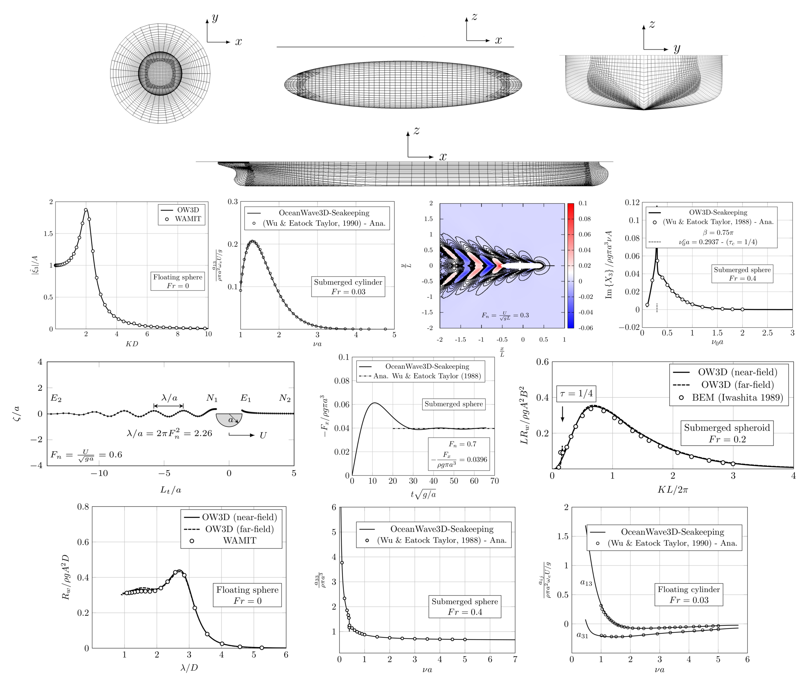

# OceanWave3D-Seakeeping

OceanWave3D-Seakeeping is an open-source seakeeping code which is written using a collection of C++ libraries. The seakeeping framework is based on the three-dimensional ***potential-flow model***, and applies the ***radiation-diffraction decomposition*** according to the classical ship theory [1]. The adopted numerical method is ***4th order finite-differences on overset grids*** using the open-source ***Overture*** library [2]. This seakeeping package can be used for computing the first- and mean second-order wave forces and body motions for ships and marine structures.

[***Please register here before using the solver***.](https://forms.office.com/Pages/ResponsePage.aspx?id=I_FR8s7JjkSSdzS7KFkR2Xd1K-8FtOJFrL9QLVM8cJZUQ1hBS0VTN1E0OVU4QThTOTQ1WDA0TFg4Si4u)

The solver has been developed at the Technical University of Denmark, Department of Civil and Mechanical Engineering by:

*  Mostafa Amini-Afshar (maaf@dtu.dk, Lead developer/architect and maintainer)
*  Harry B. Bingham     (hbbi@dtu.dk,  Theory and administration)
*  Robert Read          (rrea@dtu.dk, Early developer)
*  Matilde H. Andersen  (Implementation of the generalized modes & hydroelasticity)
*  Baoshun Zhou (Implementation of the generalized modes & hydroelasticity)

# 

## Publications

**Journal papers**

[6] Baoshun Zhou, Mostafa Amini-Afshar, Harry B. Bingham, Yanlin Shao, and William D. Henshaw. ***Solving for hydroelastic ship response using Timoshenko beam modes at forward speed.*** Ocean Engineering, Volume 300, 15 May 2024, 117267. https://doi.org/10.1016/j.oceaneng.2024.117267.

[5] Baoshun Zhou, Mostafa Amini-Afshar, Harry B. Bingham, Yanlin Shao, Šime Malenica and Matilde H. Andersen. ***Solving for hydroelastic ship response using a high-order finite difference method on overlapping grids at zero speed.*** Marine Structures, 95:103602, 2024. https://doi.org/10.1016/j.marstruc.2024.103602.

[4] Baoshun Zhou, Zhixun Yang, Mostafa Amini-Afshar, Yanlin Shao, Harry B. Bingham. ***An efficient method for estimating the structural stiffness of flexible floating structures.*** Marine Structures, 93:103527, 2024. https://doi.org/10.1016/j.marstruc.2023.103527

[3] Amini-Afshar, M., H. B. Bingham, and W. D. Henshaw. ***Stability analysis of high-order finite-difference discretizations of the linearized forward-speed seakeeping problem.*** Applied Ocean Research, 92:101913, 2019. https://doi.org/10.1016/j.apor.2019.101913

[2] Amini-Afshar, M. and H. B. Bingham. ***Pseudo-impulsive solutions of the forward-speed diffraction problem using a high-order finite-difference method***. Applied Ocean Research, 80:197 – 219, 2018. https://doi.org/10.1016/j.apor.2018.08.017

[1] Amini-Afshar, M. and H. B. Bingham. ***Solving the linearized forward-speed radiation problem using a high-order finite difference method on overlapping grids***. Applied Ocean Research, 69:220 – 244, 2017. https://doi.org/10.1016/j.apor.2017.11.001

**Conference papers**

[16] Baoshun Zhou, Mostafa Amini-Afshar, Harry B. Bingham, and Yanlin Shao. ***Hydroelastic Analysis of Ships using a High-Order Finite Difference Method on Overlapping Grids*** 35th Symposium on Naval Hydrodynamics Nantes, France, 8-12 July, 2024.

[15] Harry B. Bingham, Amini-Afshar, M. ***High-order surface integration methods for an unstructured triangulation of the ship geometry*** 39th International Workshop on Water Waves and Floating Bodies, 14-17 April 2024, St Andrews, Scotland.

[14] Amini-Afshar, M., Bingham, H.B.,  and  Kashiwagi, M. ***On a New Formulation for Wave Added Resistance.***
38th International Workshop on Water Waves and Floating Bodies, University of Michigan, Ann Arbor, Michigan, USA, May 7-10, 2023.

[13] Baoshun Zhou, Mostafa Amini-Afshar, Harry B. Bingham, and Yanlin Shao. ***Hydroelastic solutions using a high-order finite difference method based on the mode functions of a Timoshenko beam***. The 23rd DNV Workshop, Gothenburg, Sweden, January 26th-27th 2023. 

[12] Baoshun Zhou, Mostafa Amini-Afshar, Harry B. Bingham, and Yanlin Shao. ***Hydroelastic Solutions using a High-order Finite Difference Method on Overlapping Grids***. In 9th International Conference on HYDROELASTICITY IN MARINE TECHNOLOGY, Rome, Italy, July 10th-13th 2022.

[11] Amini-Afshar, M. and H. B. Bingham. ***The Challenges of Computing Wave Added Resistance Using Maruo’s Formulation and The Kochin Function***. In 37th International Workshop on Water Waves and Floating Bodies, Giardini Naxos, Italy (Sicily), 2022.

[10] Amini-Afshar, M., H. B. Bingham, W. D. Henshaw, and R. Read. ***A nonlinear potential-flow model for wave-structure interaction using high-order finite differences on overlapping grids***. In 34th International Workshop on Water Waves and Floating Bodies, Newcastle, NSW Australia, 2019.

[9] Amini-Afshar, M. and H. B. Bingham. ***Accurate evaluation of the Kochin function for added resistance using a high-order finite difference-based seakeeping code***. In 33rd International Workshop on Water Waves and Floating Bodies, Guidel-Plages, France, 2018.

[8] Andersen, M. H., Amini-Afshar, M., and H. Bingham. ***Implementation of generalized modes in a 3D finite difference based seakeeping model***. In 32nd International Workshop on Water Waves and Floating Bodies, Dalian, China, 2017.

[7] Amini-Afshar, M. and H. B. Bingham. ***Implementation of the far-field method for calculation of added resistance using a high order finite-difference approximation on overlapping grids***. In 32nd International Workshop on Water Waves and Floating Bodies, Dalian, China, 2017.

[6] Amini-Afshar, M., H. B. Bingham, W. Henshaw, and R. Read. ***Convergence of near-field added resistance calculations using a high-order finite-difference method***. In 13th International Symposium on Practical Design of Ships and Other Floating Structures (PRADS), Copenhagen, Denmark, 2016.

[5] Amini-Afshar, M., H. B. Bingham, and R. Read. ***A high-order finite-difference linear seakeeping solver tool for calculation of added resistance in waves***. In 30th International Workshop on Water Waves and Floating Bodies, Bristol, UK, 2015.

[4] Amini-Afshar, M., H. B. Bingham, and R. Read. ***A high-order finite-difference solver for the linearised potential flow wave resistance problem on curvilinear overset grids***. In 29th International Workshop on Water Waves and Floating Bodies, Osaka, Japan, 2014.

[3] Bingham, H. B. and Amini-Afshar, M. ***A note on added resistance for slow ships***. In 28th International Workshop on Water Waves and Floating Bodies, Marseille, France, 2013.

[2] Read, R. W. and Bingham, H. B. ***An Overset Grid Approach to Linear Wave-Structure Interaction***, volume 4 of International Conference on Offshore Mechanics and Arctic Engineering, 2012.

[1] Read, R. W. and Bingham, H. B. ***Solving the linear radiation problem using a volume method on an overset grid***. In 27th International Workshop on Water Waves and Floating Bodies, Copenhagen, Denmark, 2012.

**Theses**

[3] Zhou, B. ***A High-order Finite Difference Method on Overlapping Grids for Predicting the Hydroelastic Response of Ships***. PhD thesis, Technical University of Denmark, Department of Civil and Mechanical Engineering (DTU Construct), 2024.

[2] Andersen, M.H, ***Implementation of Generalized Modes in a 3D Finite Difference Based Seakeeping Model***. Master's thesis, Technical University of Denmark, Department of Mechanical Engineering, 2017.

[1] Amini-Afshar, M. ***Towards Predicting the Added Resistance of Slow Ships in Waves***. PhD thesis, Technical University of Denmark, Department of Mechanical Engineering, 2015.

## References

[1] J. N. Newman, ***The theory of ship motions.*** Advances in Applied Mechanics, vol. 18, pp. 221–283, 1979. https://doi.org/10.1016/S0065-2156(08)70268-0

[2] D. L. Brown, W. D. Henshaw, and D. J. Quinlan. ***Overture: An object-oriented framework for solving partial differential equations on overlapping grids,*** Object Oriented Methods for Interoperable Scientific and Engineering Computing, SIAM, pp. 245–255, 1999. https://www.overtureframework.org/

