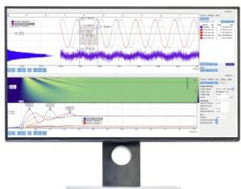
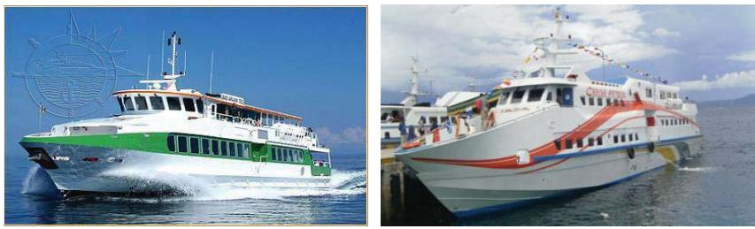
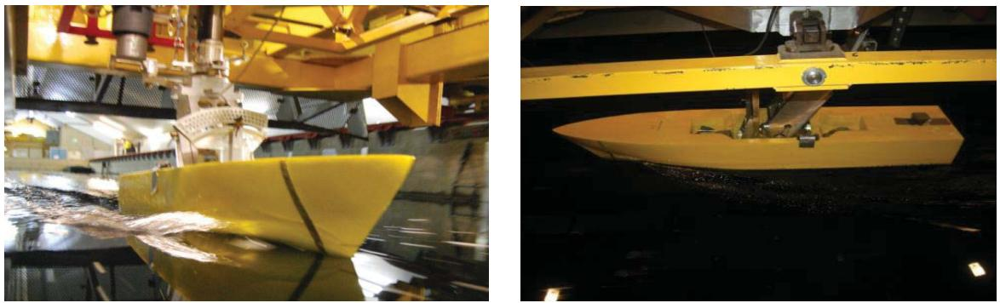
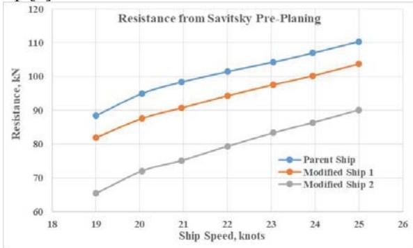
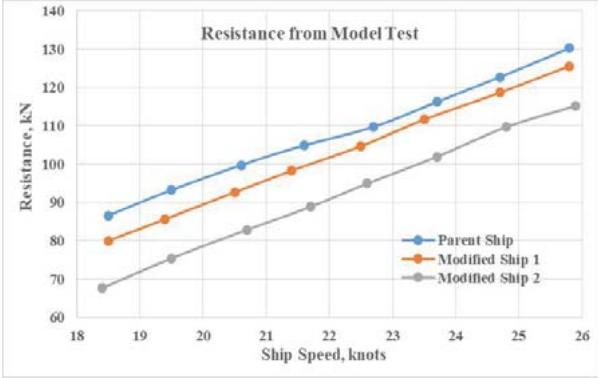
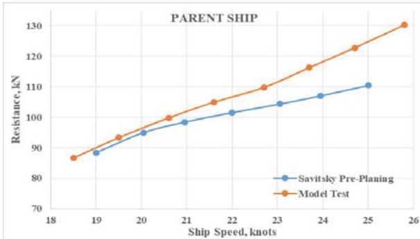
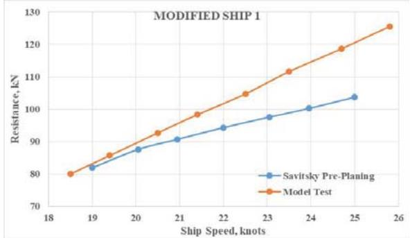
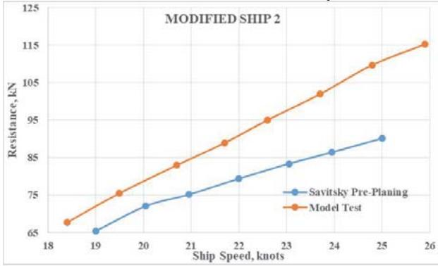

# A review of Savitsky pre-planning method to the resistance of semi-displacement passenger ships

Cite as: AIP Conference Proceedings 2409, 020021 (2021); https://doi.org/10.1063/5.0067984 Published Online: 10 December 2021

Wolter R Hetharia, Andre Hage and Philippe Rigo

## ARTICLES YOU MAY BE INTERESTED IN

High performance CFD simulations of sloshing in a moving tank with SPH method AIP Conference Proceedings 2409, 020019 (2021); https://doi.org/10.1063/5.0067986

A knowledge-based planning assessment approach for timely delivery of construction projects AIP Conference Proceedings 2409, 020004 (2021); https://doi.org/10.1063/5.0067582

Reflecting community involvement in developing local tourism potentials in Bukit Tompak, Yogyakarta Special Province, Indonesia AIP Conference Proceedings 2409, 020007 (2021); https://doi.org/10.1063/5.0067649

##

What are your needs for periodic signal detection?

text_image

Screenshot of a computer monitor displaying waveform analysis and signal processing panels with Chinese labels

# A Review of Savitsky Pre-Planning Method to the Resistance of Semi-Displacement Passenger Ships

Wolter R Hetharia1,a), Andre Hage2 and Philippe Rigo2

1Faculty of Engineering, Pattimura University, Ambon, Indonesia 2University of Liège, ULiège-ANAST, Liège, Belgium

a)&orresponding author: hethariawr@yahoo.com

Abstract. Recent development of semi-displacement ships show their good performance to carry passengers particularly in connecting small islands. These ships operate at speed ranges of 19 to 25 knots (Froude Number, 0.55 to 0.80). At initial design stage, ship resistance of these ships may be determined from the statistical resistance prediction method derived by Mercier and Savitsky. This method was based on regression analysis data from previous series of model tests. In fact, recent semi-displacement ships show differences in hull configurations such as FrV, L/Ⅴ1/3, V/B3, √2iE, and $\mathbf { A } _ { \mathrm { T } } / \mathbf { A } _ { \mathrm { X } }$ ratio compared to the Savitsky method. This study reviews the resistance of recent semi-displacement ships obtained from Savitsky method which is compared to the resistance obtained from model test. Three ship models were developed and tested to fit full-scale ship speeds of 19 to 25 knots. The ship resistances obtained from the model tests and the computation method were compared. The comparison shows that at speed below 21 knots there is a good correlation between the resistance curves of the model tests and the Savitsky method with, less than 5% of difference. However, for speeds over 22 knots, there is a big deviation between the resistance curves, with a difference of 5% to 20% depending of the ship configuration. The study concludes that the application at early design stage of the Savitsky method for recent semi-displacement ships should be reconsidered and it is recommended to perform model tests to validate the computation results.

## INTRODUCTION

Recent development of passenger transport in the maritime field draws the attention of responsible parties around the world. The passenger transport in the maritime countries is served by big and small passenger ships. The small passenger ships with a capacity of 150 to 300 passengers and a speed of 19 to 25 knots are commonly found in these regions for a short distance. According to their service speeds, those ships are classified as semi-displacement passenger ship. The existence of those ships is to fulfill the gap left by the conventional slow passenger ships (speed < 15 knots) and the high speed passenger crafts, HSC (speed > 25 knots). Due to their succesfull operations, some ship operators developed such ships to operate in various regions of the world.

To find the engine powers of semi-displacement passenger ships at early design stage, the ship resistance is determined based on available methods such as Savitsky Pre-Planning. In fact, the resistance computation based on the Savitsky method should be validated by model tests. Three semi-displacement ships were selected for this purpose. Those ships were developed and the models were tested to obtain the results for the full-scale ships. The results from the model tests and the Savitsky Pre-Planning method show a significant deviation of the resistance curves due to differences in the hull configuration of these semi-displacement ships.

Therefore the application of the Savitsky Pre-Planning method in an early design phase for semi-displacement ships should be reconsidered. Particularly for speeds higher than 22 knots, for which there is a large difference (> 13%) of the resistance which could affect the value of the engine power. In this case, it is better to perform model tests to validate the results of the Savitsky Pre-Planning method before finalizing the ship design.

## /,7(5\$785(5(9,(:

## Semi Displacement Passenger Ships

The purpose of semi-displacement ships is to transport the passengers on short routes (Figure 1). The application of lighter hull material of Aluminium or composite (FRP) gives the benefits for such ships. Their service speeds are ranging from 19 to 25 knots or the Froude number Fn are 0.55 to 0.80. According to the definition by IMO-HSC [1, 2], such ships are classified as HSC. With these range of Froude number, they are classified as semi-displacement ships as stated by Molland [3] and Nicolaysen [4]. Due to their operational ranges, those ships are also classified as short-sea ferries, as their speeds generally do not exceed 25 knots [5].

  
FIGURE 1. The existing semi-displacement passenger ships

The characteristics of existing semi-displacement ships, collected by the authors, include:

The type of hull form is single hard chine.  
Volumetric Froude number, Fr = V / √(g x 1/3) = 1.50 to 1.52  
Ratio L/ 1/3 = 6.0 to 7.5 ● Ratio 1/3/L = 0.16 to 0.14  
Ratio /B3 = 0.30 to 0.40 Angle of entrance √2iE = 5.1 to 6.8  
Ratio AT/AX = 0.17 to 0.25 ● Ratio L/B = 4.50 to 5.70  
Ratio B/T = 4.50 to 5.10

where:

V = ship speed (m/sec)  = volume displacement (m3) L = ship length (m)

B = ship beam (m) iE = angle of entrance (degree) Atr = transom area (m2)

AX = midship area (m2) T = ship draught (m)

## Resistance of Semi-Displacement Ship

Most of the resistance database for semi-displacement ships are provided for ships with round bilge and double chine hull forms [3, 6]. Two methods to assess the computation of resistance of semi-displacement ships are the Savistsky pre-planing method (Lewis [7] and Mercier [8]) and the WUMTIA (Wolfson Unit for Marine Technology and Industrial Aerodynamics) method of Molland [3]. The WUMTIA and Savitsky pre-planing methods include both chine and round-bilge hull forms.

A general form of resistance equation adopted by Mercier and Savitsky is presented as:

$$
R _ {T} / W = A _ {1} + A _ {2} X + A _ {4} U + A _ {5} W + A _ {6} X Z + A _ {7} X U + A _ {8} X W + A _ {9} Z U + A _ {1 0} Z W + A _ {1 5} W ^ {2} +
$$

$$
A _ {1 8} X W ^ {2} + A _ {1 9} Z X ^ {2} + A _ {2 4} U W ^ {2} + A _ {2 7} W U ^ {2} \tag {1}
$$

where:

$$
X = \nabla^ {1 / 3} / L, \quad Z = \nabla / B ^ {3}, \quad U = \sqrt {2} i _ {E}, \quad W = A _ {t r} / A _ {X} \quad \nabla = \text {displacement}
$$

$L = \mathrm { s h i p ~ l e n g t h } ~ B = \mathrm { s h i p ~ b e a m } ~ A _ { t r } = \mathrm { t r a n s o m ~ a r e a } ~ A _ { X } = \mathrm { m i d s h i p ~ a r e a }$

iE = angle of entrance

The values of the coefficients A1 to A27 and correction factors are presented in Lewis [6].

It is quoted in references [7 and 8] that the “Statistical Resistance Prediction Method Derived by Mercier and Savitsky was carried out a regression analyses of the resistance results obtained by Norstrom for small systematic series (9 models), by De Groot for a small systematic series (12 models), by Beys for the series 63 (21 models), by Yeh for series 64 (27 models), and by Lindgren, et al for the SSPA series (23 models)”. Also, “the results obtained by Clement, et al for the Series 62 hard-chine hull forms (17 models) were also incorporated in the data base”. Equation (1) was derived in order to compute the resistance in term of displacement weight (RT/W) ratio for eleven values of the volumetric Froude number 1.0, 1.1 to 2.0, for a displacement weight of 100,000 lb. This equation was originally intended for predicting the resistance of planning craft in pre-planing displacement mode, it can also be successfully used for predicting the resistance of displacement hulls. Some corrections concerning water temperatures, friction coefficients or $C _ { A }$ values and wetted surface areas are found in reference [7].

Each resistance series, mentioned previously, has its own ship configuration. For example:

 Norstrom series (round bilge): $L _ { W L } / V ^ { d / 3 } = 5 . 6 5 \mathrm { t o } 7 . 7 2 \qquad \mathrm { C } _ { \it V } = \mathrm { { \it V } } / B ^ { 3 } = 0 . 1 3 4 \mathrm { t o } 1 . 4 6 8$

$$
\mathrm{L} _ {\mathrm{WL}} / \mathrm{B} = 4. 8 3 \text {to} 6. 9 4 \quad \mathrm{A} _ {\mathrm{T}} / \mathrm{A} _ {\mathrm{X}} = 0. 6 \text {to} 0. 1 3
$$

$$
\mathrm{B/T} = 3. 1 6 \text { to } 3. 5 7
$$

De Groot $L _ { W L } / V ^ { I / 3 } = 5 . 2 3 \mathrm { t o } 7 . 7 5 \mathrm { C } _ { V } = 0 . 5 5 0 \mathrm { t o } 1 . 0 3 9$

$$
\mathrm{L} _ {\mathrm{WL}} / \mathrm{B} = 4. 5 5 \text {to} 7. 3 9 \quad \mathrm{A} _ {\mathrm{T}} / \mathrm{A} _ {\mathrm{X}} = 0. 1 7 \text {to} 0. 3 0
$$

These parameters are quite different from those in the recent semi-displacement ships. It may be resumed that the application of Equation (1) or its correction [7] for semi-displacement ships may give different results.

## Assessment of Full-Scale Ship Resistance

The results of the resistance computation from the Savitsky pre-planing method were validated by the model tests. The results obtained from the model tests were used to estimate the resistance of full-scale ships. The extrapolation method to estimate the results of model tests to the full-scale ship was based on the Froude method [3, 6, 7].

## TESTING PROCEDURE

## Selection of Ships and Models

Three semi-displacement passenger ships were selected for the computation of the resistance. They are first the parent ship and also two modified ships designed by the author [9]. Each ship has a capacity of 254 passengers. The ships were designed according a standard design process of passenger ships [10, 11, 12, 13, 14, 15]. The ships have a hard chine hull form and their hull material is Aluminium. A scale factor  = 27 was set to develop the models. The dimensions and other parameters of full-scale ships and models are presented in Table 1.

## Developing and Set-up Ship Models

Three ship models (parent ship and modified ship 1 and ship 2) were selected for the tests as shown in Table 1. The ship models were built with high-density closed-cell foam. The ship models were shaped by multiple-axis cutting machine owned by DN&T (Design Naval & Transports), Liege, Belgium. The ship models were covered by the polyester fine filler and fiber-reinforced plastic (FRP). A manual finishing work was performed to obtain the final shape/form of the models. A sand strip turbulence stimulator was fixed at 5 % aft of fore end model waterline [3, 6]. The models were prepared to fit the testing procedures.

## Testing Procedure

The ship models were tested at the towing tank of University of Liège (ULiège-ANAST) (Figure 2). The ship parameters measured during the tests were model speed, resistance, trim and sinkage. During constructing the models and during the model tests the same conditions were kept (to respect the standard procedure of model testing). Those conditions included: model precision, calibration of the instruments and the external effects on the models. It may be confirmed that the data obtained from the model tests were valid.

  
FIGURE 2. The ship model is underway

TABLE 1. The parameters of the full-scale ships and models

<table><tr><td rowspan="3">Ship parameters</td><td rowspan="3">Unit</td><td colspan="6">Scale factor, λ = 27</td></tr><tr><td colspan="3">Full-scale ships</td><td colspan="3">Ship models</td></tr><tr><td>Parent Ship</td><td>Modified Ship 1</td><td>Modified Ship 2</td><td>Parent Ship</td><td>Modified Ship 1</td><td>Modified Ship 2</td></tr><tr><td>Length overall, LOA</td><td>M</td><td>32.00</td><td>32.00</td><td>36.85</td><td>1.185</td><td>1.185</td><td>1.365</td></tr><tr><td>Length of WL., LWL</td><td>M</td><td>29.09</td><td>29.95</td><td>34.75</td><td>1.078</td><td>1.109</td><td>1.287</td></tr><tr><td>Ship beam, B</td><td>M</td><td>7.00</td><td>7.00</td><td>6.50</td><td>0.259</td><td>0.259</td><td>0.241</td></tr><tr><td>Beam of waterline, BWL</td><td>M</td><td>6.69</td><td>6.69</td><td>6.18</td><td>0.248</td><td>0.248</td><td>0.229</td></tr><tr><td>Ship draft, T</td><td>M</td><td>1.40</td><td>1.40</td><td>1.37</td><td>0.052</td><td>0.052</td><td>0.051</td></tr><tr><td>Deck height, H</td><td>M</td><td>2.60</td><td>2.60</td><td>2.60</td><td>0.096</td><td>0.096</td><td>0.096</td></tr><tr><td>Ship displacement, Δ</td><td>t / (kg)</td><td>107.3</td><td>107.3</td><td>109.0</td><td>5.452</td><td>5.452</td><td>5.538</td></tr><tr><td>Block coefficient, Cb</td><td></td><td>0.384</td><td>0.373</td><td>0.362</td><td>0.384</td><td>0.373</td><td>0.362</td></tr><tr><td>Midship coefficient, Cm</td><td></td><td>0.550</td><td>0.547</td><td>0.540</td><td>0.550</td><td>0.547</td><td>0.540</td></tr><tr><td>Prismatic coefficient, Cp</td><td></td><td>0.698</td><td>0.682</td><td>0.671</td><td>0.698</td><td>0.682</td><td>0.671</td></tr><tr><td>Water plane coef., Cwp</td><td></td><td>0.848</td><td>0.829</td><td>0.831</td><td>0.848</td><td>0.829</td><td>0.831</td></tr><tr><td>Wetted surface area, WSA</td><td>m2</td><td>194.4</td><td>197.64</td><td>215.2</td><td>0.267</td><td>0.271</td><td>0.295</td></tr><tr><td>Midship area, AX</td><td>m2</td><td>5.16</td><td>5.13</td><td>4.56</td><td>0.007</td><td>0.007</td><td>0.006</td></tr><tr><td>LCB (from midship)</td><td>% LWL</td><td>-1.96</td><td>-2.46</td><td>-2.00</td><td>-1.96</td><td>-2.46</td><td>-2.00</td></tr><tr><td>Half chine width</td><td>M</td><td>3.33</td><td>3.33</td><td>3.08</td><td>0.123</td><td>0.123</td><td>0.114</td></tr><tr><td>Chine height</td><td>M</td><td>0.125</td><td>0.125</td><td>0.252</td><td>0.005</td><td>0.005</td><td>0.009</td></tr><tr><td>Transom draft</td><td>M</td><td>0.205</td><td>0.151</td><td>0.194</td><td>0.008</td><td>0.006</td><td>0.007</td></tr><tr><td>Ratio Atr/AX</td><td></td><td>0.23</td><td>0.180</td><td>0.180</td><td>0.23</td><td>0.180</td><td>0.180</td></tr><tr><td>Bow Angle, βbow</td><td>degree</td><td>40.00</td><td>50.00</td><td>50.00</td><td>40.00</td><td>50.00</td><td>50.00</td></tr><tr><td>1/2 angle entrance, 0.5αE</td><td>degree</td><td>22.11</td><td>18.32</td><td>14.40</td><td>22.11</td><td>18.32</td><td>14.40</td></tr><tr><td>Deadrise angle</td><td>degree</td><td>20.60</td><td>20.80</td><td>22.11</td><td>20.60</td><td>20.80</td><td>22.11</td></tr></table>

## RESULTS AND DISCUSSION

## Results of the Resistance Computation

The computation of ship resistance for the Savitsky pre-planing was executed by using Maxsurf. The results of computations of the resistance are presented in Table 2 and Figure 3.

## Resistance Assessment for the Full-Scale Ship

The resistance of full-scale ships were predicted based on Froude method. It is noticed that in order to predict the total resistance for the approach method, the effects of air and appendage drags are taken into account. The air resistance coefficient $C _ { A A }$ is included into the total resistance coefficient $( C _ { T S } )$ and is computed by the following formula [3, 6, 7]:

$$
C _ {A A} = 0. 0 0 1 \times \left(A _ {T} / S\right) \tag {2}
$$

where:

AT is the frontal area of the ship above the water and S is the wetted surface area.

The resistance of appendages is included for the full-scale ship [3].

Table 2. Results of the resistance (Savitsky Pre-Planing)

<table><tr><td colspan="6">Results of Computation Savitsky Pre-Planing</td></tr><tr><td colspan="2">Parent Ship</td><td colspan="2">Modified Ship 1</td><td colspan="2">Modified Ship 2</td></tr><tr><td>Ship Speed, (knot)</td><td>Resistance, (kN)</td><td>Ship Speed, (knot)</td><td>Resistance, (kN)</td><td>Ship Speed, (knot)</td><td>Resistance, (kN)</td></tr><tr><td>19.00</td><td>88.41</td><td>19.00</td><td>81.91</td><td>19.00</td><td>65.38</td></tr><tr><td>20.05</td><td>94.97</td><td>20.05</td><td>87.59</td><td>20.05</td><td>72.04</td></tr><tr><td>20.95</td><td>98.36</td><td>20.95</td><td>90.71</td><td>20.95</td><td>75.13</td></tr><tr><td>22.00</td><td>101.47</td><td>22.00</td><td>94.30</td><td>22.00</td><td>79.36</td></tr><tr><td>23.05</td><td>104.30</td><td>23.05</td><td>97.58</td><td>23.05</td><td>83.34</td></tr><tr><td>23.95</td><td>106.98</td><td>23.95</td><td>100.26</td><td>23.95</td><td>86.41</td></tr><tr><td>25.00</td><td>110.35</td><td>25.00</td><td>103.73</td><td>25.00</td><td>90.12</td></tr></table>

line

| Ship Speed (knots) | Parent Ship (kN) | Modified Ship 1 (kN) | Modified Ship 2 (kN) |
| --- | --- | --- | --- |
| 19 | ~88.5 | ~82 | ~65.5 |
| 20 | ~95 | ~87.5 | ~72 |
| 21 | ~98.5 | ~90.5 | ~75 |
| 22 | ~101.5 | ~94 | ~79 |
| 23 | ~104.5 | ~97.5 | ~83 |
| 24 | ~107 | ~100 | ~86.5 |
| 25 | ~110 | ~104 | ~90 |

FIGURE 3. Ship resistance (Savitsky Pre-Planing)

## Results of the Model Tests

The results of three full-scale ships from the model tests are shown in Table 3 and Figure 4. The results of model tests were recorded for the speed, resistance, trim and sinkage. The frictional resistances of the ship models and fullscale ships were computed based on the ITTC 57 model-ship correlation line.

TABLE 3. Resistance of full-scale ships (model test)

<table><tr><td colspan="6">Results of Full Scale Ship Based on the Model Test</td></tr><tr><td colspan="2">Parent Ship</td><td colspan="2">Modified Ship 1</td><td colspan="2">Modified Ship 2</td></tr><tr><td>Ship Speed, (knot)</td><td>Resistance, (kN)</td><td>Ship Speed, (knot)</td><td>Resistance, (kN)</td><td>Ship Speed, (knot)</td><td>Resistance, (kN)</td></tr><tr><td>18.50</td><td>86.63</td><td>18.50</td><td>80.02</td><td>18.40</td><td>67.67</td></tr><tr><td>19.50</td><td>93.28</td><td>19.40</td><td>85.69</td><td>19.50</td><td>75.48</td></tr><tr><td>20.60</td><td>99.76</td><td>20.50</td><td>92.69</td><td>20.70</td><td>82.93</td></tr><tr><td>21.60</td><td>104.93</td><td>21.40</td><td>98.30</td><td>21.70</td><td>88.89</td></tr><tr><td>22.70</td><td>109.73</td><td>22.50</td><td>104.73</td><td>22.60</td><td>94.98</td></tr><tr><td>23.70</td><td>116.24</td><td>23.50</td><td>111.63</td><td>23.70</td><td>101.92</td></tr><tr><td>24.70</td><td>122.74</td><td>24.70</td><td>118.68</td><td>24.80</td><td>109.70</td></tr><tr><td>25.80</td><td>130.24</td><td>25.80</td><td>125.59</td><td>25.90</td><td>115.22</td></tr></table>

line

| Ship Speed (knots) | Parent Ship (kN) | Modified Ship 1 (kN) | Modified Ship 2 (kN) |
| --- | --- | --- | --- |
| 18.4 | ~86.5 | ~80 | ~68 |
| 19.4 | ~93.5 | ~85.5 | ~75.5 |
| 20.6 | ~100 | ~93 | ~83 |
| 21.6 | ~105 | ~98.5 | ~89 |
| 22.6 | ~110 | ~105 | ~95 |
| 23.6 | ~116.5 | ~111.5 | ~102 |
| 24.8 | ~123 | ~119 | ~110 |
| 25.8 | ~130.5 | ~125.5 | ~115 |

FIGURE 4. Resistance from model test (full-scale )

## Comparison of the Resistance

The comparison of total resistance (RT) between model tests (Table 3) and the Savitsky Pre-Planing (Table 2) is presented in Figures 5, 6 and 7.

line

| Ship Speed (knots) | Savitsky Pre-Planing (Resistance, kN) | Model Test (Resistance, kN) |
| --- | --- | --- |
| 18.5 | — | ~87 |
| 19.0 | ~88 | ~90 |
| 19.5 | — | ~93 |
| 20.0 | ~95 | ~97 |
| 20.5 | — | ~100 |
| 21.0 | ~98 | ~102 |
| 21.5 | — | ~105 |
| 22.0 | ~102 | ~107 |
| 22.5 | — | ~110 |
| 23.0 | ~105 | ~113 |
| 23.5 | — | ~116 |
| 24.0 | ~107 | ~119 |
| 24.5 | — | ~123 |
| 25.0 | ~111 | ~127 |
| 25.5 | — | ~130 |

## Ship characteristics:

Volumetric Froude number, Fr = 1.514  
Ratio L/ 1/3 = 6.17  
Ratio 1/3/L = 0.162  
 Ratio /B3 = 0.305  
Angle of entrance √2iE = 6.65  
 Ratio AT/AX = 0.23  
Ratio L/B = 4.57  
 Ratio B/T = 4.50

FIGURE 5. Comparison of the resistance for the parent ship p  

line

| Ship Speed (knots) | Savitsky Pre-Planning (kN) | Model Test (kN) |
| --- | --- | --- |
| 18.5 | — | 80 |
| 19 | ~82 | ~83 |
| 19.5 | — | ~86 |
| 20 | ~88 | ~89 |
| 20.5 | — | ~93 |
| 21 | ~91 | ~96 |
| 21.5 | — | ~99 |
| 22 | ~95 | ~102 |
| 22.5 | — | ~105 |
| 23 | ~98 | ~109 |
| 23.5 | — | ~112 |
| 24 | ~101 | ~115 |
| 24.5 | — | ~119 |
| 25 | ~104 | ~122 |
| 25.5 | — | ~126 |

## Ship characteristics:

Volumetric Froude number, Fr = 1.514  
Ratio L/ 1/3 = 6.36  
Ratio 1/3/L = 0.157  
Ratio /B3 = 0.305  
Angle of entrance √2iE = 6.05  
Ratio A /A = 0.18  
Ratio L/B = 4.57  
Ratio B/T = 4.50

FIGURE 6. Comparison of the resistance for the modified ship 1  

line

| Ship Speed (knots) | Savitsky Pre-Planing (Resistance, kN) | Model Test (Resistance, kN) |
| --- | --- | --- |
| 18.3 | — | ~68 |
| 19.0 | ~65 | — |
| 19.5 | — | ~75 |
| 20.0 | ~72 | — |
| 20.7 | — | ~83 |
| 21.0 | ~75 | — |
| 21.7 | — | ~89 |
| 22.0 | ~79 | — |
| 22.6 | — | ~95 |
| 23.0 | ~83 | — |
| 23.7 | — | ~102 |
| 24.0 | ~86 | — |
| 24.8 | — | ~110 |
| 25.0 | ~89 | — |
| 25.9 | — | ~115 |

FIGURE 7. Comparison of the resistance for the modified ship 2

## Ship characteristics:

 Volumetric Froude number, Fr = 1.510  
Ratio L/ 1/3 = 7.34  
Ratio 1/3/L = 0.136  
 Ratio /B3 = 0.387  
Angle of entrance √2iE = 5.367  
 Ratio AT/AX = 0.18  
Ratio L/B = 5.67  
 Ratio B/T = 5.10

## Discussion

Beside speed, the effect of ship resistance depends mainly on dimensions which are represented by ratios L/ 1/3or 1/3/L, /B3, L/B and B/T. Other hull form parameters affect ship resistance are angle of entrance √2iE and AT/AX ratio. For a constant volume displacement ( ), the modified ship 2 has longer length (L), shorter beam (B), lower draft (T) compared to the parent ship and the modified ship 1, as it is shown in Table 1. Meanwhile, the hull form coefficients of modified hull 2 are lower even the value of wetted surface (WSA) area is greater. In addition, the modified ship 1 has the same dimension with the parent ship but there is a little different in geometrical hull form.

It is shown in Figures 3 and 4 that the resistance curves of those three ships obtained from model tests and Savitsky Pre-planing method are in good pattern. However, for the speed range of 19 to 26 there are difference of the resistance obtained from the model tests. The difference of the resistance from the model test are 8 to 3,5 % for the modified ship 1 to the parent ship and 22 to 10,5 % for the modified ship 2 to the parent ship. Similar results are obtained from the Savitsky Pre-Planing method which are The difference from the model test are 8 to 6 % for the modified ship 1 to the parent ship and 26 to 18 % for the modified ship 2 to the parent ship.

It is shown in Figures 5, 6 and 7 that for a considered speed range (19 to 25 knots), the resistances obtained from the model tests are higher than those from the Savitsky Pre-Planing method. By observing the characteristics of the resistance curves, it may be concluded that:

The resistances for the parent ship and the modified ship 1 are very close. This is due to the characteristics of these two ships, which are quite similar (dimensions and hull forms). The resistances of both ships are proven by the results of model tests and Savitsky Pre-Planing Method. Meanwhile, the modified ship 2 has less resistance compared to the parent ship and modified ship 1 which is proven by the results of the model tests and Savitsky Pre-Planing method. This less resistance is affected by ship configuration (long, narrow shape and fine form).  
o The correlation between the resistance results of the model tests and those from the computations is good for a speed range of 19 to 21 knots. For that range, the difference gradually increases from 1.5 to 5.2 % for the parent ship and the modified ship 1, but for the modified ship 2, the difference increases from 8.5 to 11.2 %.  
o As it is seen from Figures 5, 6 and 7, that the difference of resistance incerases significantly for a speed range of 22 to 25 knots. At these speeds, the deviations between the model tests and the computations increase gradually from 5 to 12 % for the parent ship and 7.4 to 14 % for the modified ship 1. Meanwhile, for the modified ship 2, the resistance deviations between the model tests and the computations increase gradually from 13 to 19 %. Therefore, within this speed range, the application of computation Savitsky pre-planning method should be reconsidered.  
As stated previously, the hull configuration of the existing semi-displacement passenger ships are quite different from those presented in typical resistance series. Those ships have greater beam for improving ship stability and higher displacement. These configuration contribute for higher resistance. Therefore, these series may give not accurate results when applied to the semi-displacement ships considering in this paper.

## CONCLUSION AND FUTURE WORKS

## Conclusion

Investigation on ship resistance of three semi-displacement passenger ships are presented in this paper. This work concerns the computations based on the Savitsky Pre-Planning method and model tests of three full-scale ships having different configurations. The results are presented and compared for the parent ship and two modified ships. The conclusions of this study are described as follows:

The results of model tests and the computations with the Savitsky Pre-Planing method have shown a difference of ship resistance between these two approaches  
The differences between the semi-displacement hull configurations considered in this study and those used by the Savitsky Pre-Planing method explain the observed variation of the resistance.  
Hull configurations of semi-displacement passenger ships which are larger beam and greater displacement contribute to higher resistance compared to ship configuration provided by the Savitsky Pre-Planing method.  
The differences of resistance are small for a speed range of 19 to 21 knots: 5 % for the parent ship and the modified ship 1 but 10 % for the modified ship 2. However, for a speed greater than 22 knots, the differences are 5 to 15 % for the parent ship and the modified ship 1 and 13 to 20 % for the modified ship 2.  
 The application of the Savitsky Pre-Planing method on recent semi-displacement ships should be reconsidered at early design phase, particularly for speed range of 22 to 25 knots.

## Future Works

As it is clearly seen that there are significant differences in ship resistance of semi-displacement passenger ship assessed by model test or with Savitsky Pre-Planning method. Future researches need to be executed. Additional model test for semi-displacement ships are requested to provide at early design phase an accurate assessment of the resistance of such new semi-displacement passenger ships.

## ACKNOWLEDGEMENTS

Special thanks to:

 The University of Liège (ULiège-ANAST) for the towing tank facilities that have been used for the model tests  
 DN&T (Design Naval & Transports, http://www.dn-t.be), Liège, Belgium for developing the models

## REFERENCES

1. The Rules of International Code of Safety for High-Speed Craft, (2008). 2008 Edition.  
2. Bureau Veritas, 'The Rules for the Classification of High Speed Craft, Bureau Veritas, February 2002.  
3. Molland, A. F., Turnock, S. R., and Hudson, D. A., 'Ship Resistance and Propulsion–Practical Estimation of Ship Propulsive Power', Cambridge University Press, 32 Avenue of the Americas, New York, USA, 2011.  
4. Nicolaysen, K. H., 'CATRIV–WP 4.2', Working Group ZE VWS (TU Berlin), 1999.  
5. Colton, T., 'The Marine Industry', Chapter 3 - Ship Design and Construction, written by an International Group of Authorities, Thomas Lamb, Editor, SNAME Publication, Jersey City, New York, USA, Vol. 2, 2003.  
6. Larsson, L. and Hoyte C. R. 'Ship Resistance and Flow', The Principles of Naval Architecture Series' , J. Randolph Paulling, Editor, SNAME, 601 Pavonia Avenue, Jersey City, New Jersey 07306, 2010.  
7. Lewis, E.V., 'Resistance, Propulsion and Vibration', Principles of Naval Architecture, The Society of Naval Architects and Marine Engineers, 601 Pavonia Avenue, Jersey City, NJ, Vol. 2, 1988.  
8. Mercier, J.A. and Savitsky, D, 'Resistance of Transom-stern Craft in the Pre-planing Regime', Stevens Institute of Technology, Report AD-764 958, 1973  
9. Hetharia, W. R., A. Hage and Ph. Rigo (2014).”Hull Dimensions Optimization of Medium-Speed Monohull Passenger Ferries”. Proceedings of the 9th International Conference on High-Performance Marine Vehicles, HIPER2014. National Technical University of Athens, Greece, Athens, 3–5 December 2014: 5-16.  
10. Parsons, M. G., 'Parametric Design', Chapter 11 - Ship Design and Construction, Written by an International Group of Authorities, Thomas Lamb, Editor, SNAME Publication, Jersey City, New York, USA, Vol. 2, 2003.  
11. Levander, K., 'Passenger Ships', Ship Design and Construction Vol. 2, Chapter 37, Writen by an International Group of Authorities, Thomas Lamb, Editor, SNAME Publication, Jersey City, New York, USA, Vol. 2, 2003.  
12. Olson, H. A., 'Trends in Modern Ferry Boat Design', Paper Presented at the February 8 1990 Meeting of The Northern California Section of The SNAME, 1990.  
13. Watson, D. G. M., 'Practical Ship Design', Elsevier Ocean Engineering Book Series, Volume I, ELSEVIER, 1998.  
14. Gale, P. A., 'The Ship Design Process', Chapter 5 - Ship Design and Construction, Written by an International Group of Authorities, Thomas Lamb, Editor, SNAME Publication, Jersey City, New York, USA, Vol. 2, 2003.  
15. Knox, J., 'Ferries', Chapter 38–Ship Design and Construction, Written by an International Group of Authorities, Thomas Lamb, Editor, SNAME Publication, Jersey City, New York, USA, Vol. 2, 2003.