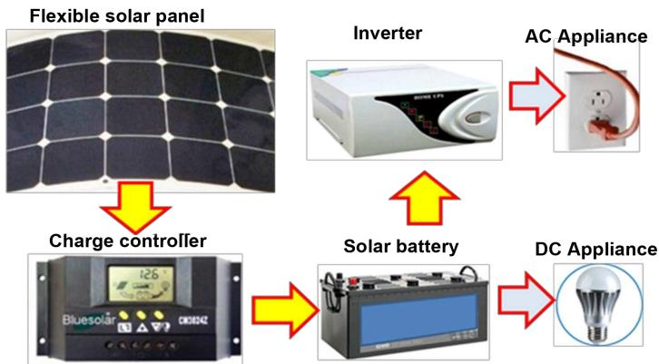
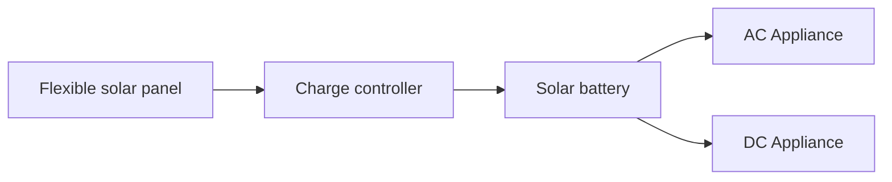
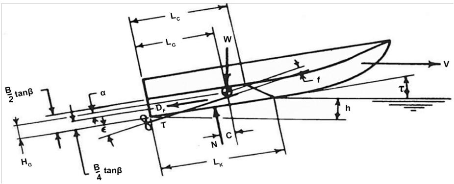
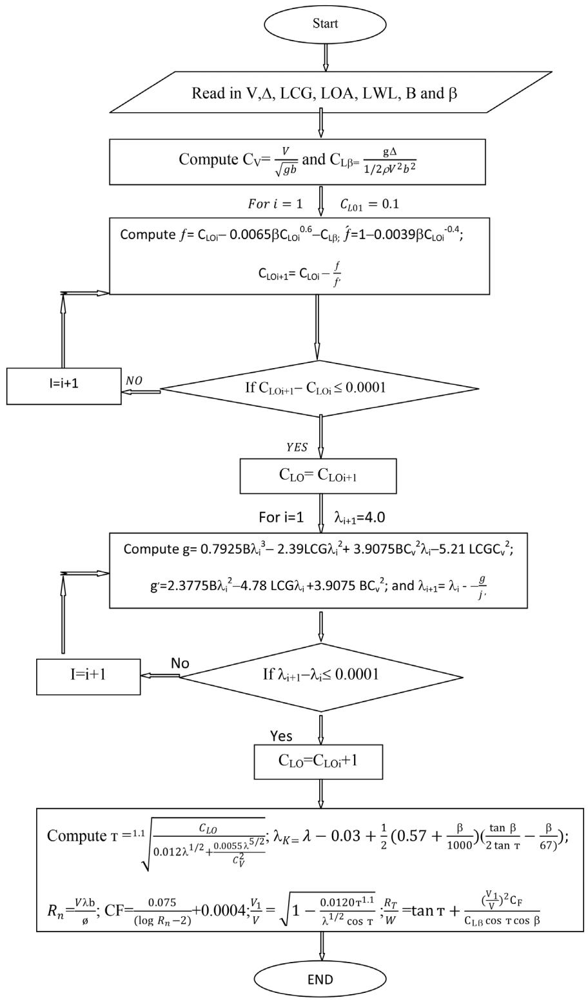
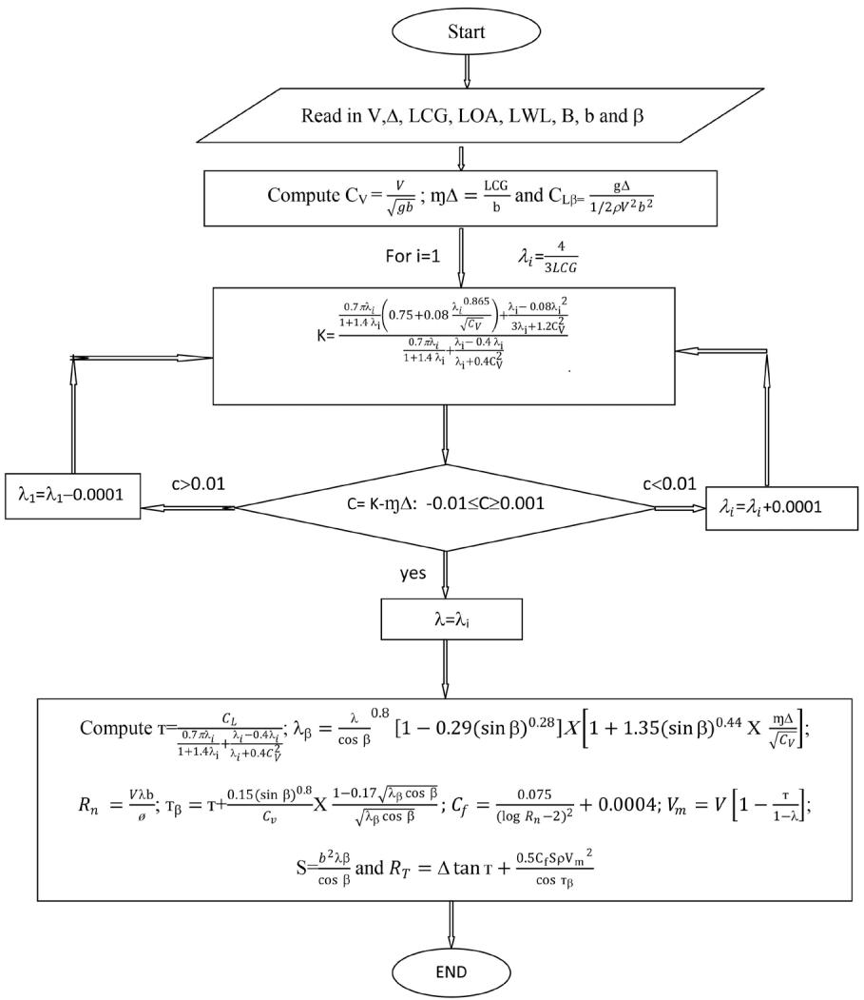
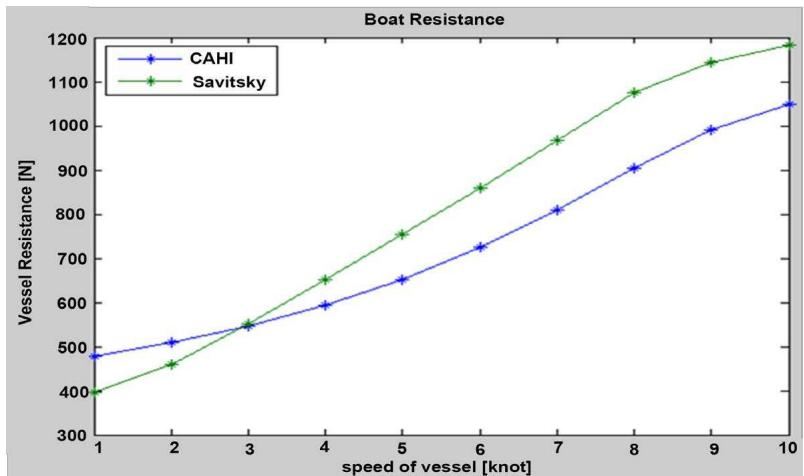
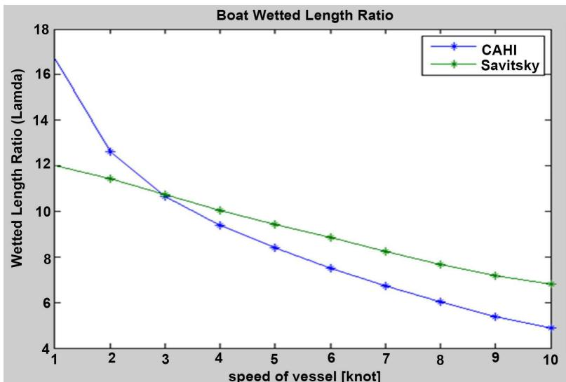
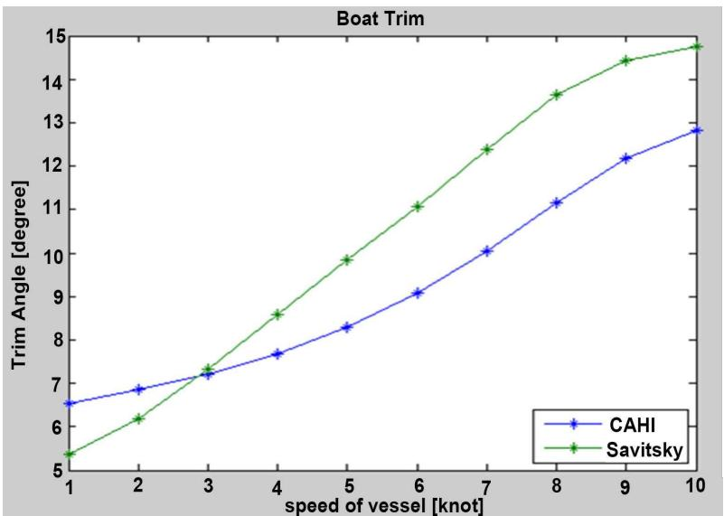

# Design Analysis of a Lightweight Solar Powered System for Recreational Marine Craft

Daniel Tamunodukobipi, Nitonye Samson, Adumene Sidum

Department of Marine Engineering, Rivers State University, Port Harcourt, Nigeria Email: tamunodan@yahoo.com

How to cite this paper: Tamunodukobipi, D., Samson, N. and Sidum, A. (2018) Design Analysis of a Lightweight Solar Powered System for Recreational Marine Craft. Journal of Engineering and Technology,6, 441-456. https://doi.org/10.4236/wjet.2018.62027

Received: April 3, 2018

Accepted: May 28, 2018

Published: May 31, 2018

Copyright © 2018 by authors and Scientific Research Publishing Inc. This work is licensed under the Creative Commons Attribution International License (CC BY 4.0).

http://creativecommons.org/licenses/by/4.0/

Open Access

## Abstract

The design of a lightweight solar powered marine craft is considered in this report. Various design concepts were considered with respect to the hull type, resistance, aesthetics and the operating environment of the vessel. The planning hull-form catamaran was considered for the boat design. The resistance and other hydrodynamic characterization of boat were analyzed using the CAHI and Savitsky method. Detailed algorithm is developed for the sizing of the various components of the solar PV system for the boat. The hull resistance was found to be 740 N corresponding to the boat speed of 5 knot using the above stated methods. The motor power was obtained to be 2.239 kW (3 HP). Torqeedo outboard electric motor of 3 HP was selected for the boat propulsion. The battery bank was seized accordingly and four batteries of 235 AH and 12 V were selected for the storage of electric power for the boat propulsion. Hence, the solar PV module was sized. It was concluded that, due to the limited space for the installation of the PV module, additional source of power (land base) should be made available to completely charge the battery.

## Keywords

Solar Powered, Marine Craft, Vessel, Propulsion, Savitsky, CAHI and Energy

## 1. Introduction

Environmental awareness has been developed worldwide so progressively and turns into the crying needs over the last few decades. It is the obligation of engineering researchers to ensure environmental friendliness and sustainable development of the environment. The current trend of energy researchers is to find out about alternate source of energy because the primary source of fuel is becoming limited in stock. Renewable energy, such as solar, wind, water, tidal flow, geothermal and biomass are all clean energy with tremendous amounts of resources for electricity generation. It is therefore becoming increasingly necessary to find and apply more environmentally and eco-friendly technologies that would utilize alternative, renewable sources of energy. Of them solar energy is the primary source of renewable energy as it can get easily from nature. Using this solar energy we can design the hardware and install the solar boat for tourism purpose in marine vessel [1]. Figure 1 shows the schematic representation of the solar power system implemented for both propulsion and auxiliary services onboard the vessel.

Solar energy is a prodigious renewable energy source which has enormous energy existing as heat and light can convert it into electricity. Besides the domestic uses, solar power can be utilized as the alternative of the oil in boat’s fuel and capable of minimizing the water pollution and fuel cost as well. Solar electric powered boats may promote zero-emission in aquatic transportation system and recreation for world waters [2]. Solar powered boats basically consist of battery, solar panel, electric motor and the propeller.

The present day use of fossil fuels as a primary source of energy is noticed to be a dangerous impact on both the environment and our waterways system. It has led to serious environmental problems and believed to be one of the critical factors contributing to global warming. Hence the concept of using a solar power to sail marine vessels is a matter of importance in the design of boat. It was centuries ago when the technology of wind energy made its first step. As one of the most developed renewable energy technologies, wind power has become the primary consideration with accelerated growth during the past few decades [3]. This work studies the possibility of fitting photovoltaic solar panels on board of a vessel to reduce dependability on fuel. The electric demand of the vessel is calculated and the power produced by the panels is calculated as well. A solar boat design process is completely something different from a conventional boat so much that it can be termed as “solar boat design”. The design condition is critical because the available energy from the sun varies with the months of year. It also varies between a sunny day and cloudy day.

The first vessel known to use lead acid batteries was the  built in 1881 by Gustave Trouvé in France, but the vessel’s development was hampered by energy storage constraints and the resulting limited range [4]. Water pollution, noise, vibration, environmental regulations and the idea of “being green” are all motivators for implementing electric options in marine propulsion. It is important to understand the factors that currently keep all-electric and hybrid-electric systems from being widely adopted and how changes in those factors could see broad acceptance of the technologies [5]. The economics are driven by a range of considerations such as fuel costs, environmental regulations, quality of life, noise, and access to environmentally sensitive locales. Those working in vessel design, construction and operation want to know where the technology currently stands and when to consider investing in all-electric or hybrid-electric options [3].

flowchart

Figure 1. Solar power system.

Electric technology for small vessels has also been hampered by the lack of appropriate battery technology. A lightweight, large-capacity battery with fast recharge capability is needed to give the development of electric small vessels a major push. Sailboats offer an option for battery charging because the propeller can be left to spin freely when under sail allowing the batteries to charge. This “free” energy source significantly impacts the attractiveness of the electric power option long term. In this case batteries become the cost driver. This research therefore seeks to apply one of the green technology that have great potential in providing an alternative to fuel a recreational boat by the implementation of solar powered system on boats that is fully electrical powered converted from sunlight.

## 1.1. Marine Propulsion System Drives

Marine propulsion is the mechanism or system used to generate thrust to move a boat or ship across water. While paddles and sails are still used on some smaller boats, most modern ships are propelled by mechanical systems consisting of an electric motor or engine turning a propeller, or less frequently, in pump-jets, an impeller [6] [7].

Marine steam engines were the first mechanical engines used in marine propulsion; however, they have mostly been replaced by two-stroke or four-stroke diesel engines, outboard motors, and gas turbine engines on faster ships [8] [9]. Electric motors using electric battery storage have been used for propulsion on submarines and electric boats and have been proposed for energy-efficient propulsion [10].

## 1.1.1. Inboard Propulsion System

Inboard motor is a marine propulsion system for boats. Inboard motor is an engine enclosed within the hull of the boat, usually connected to a propulsion screw by a driveshaft. Inboard motors may be of several types, suitable for the size of craft they are fitted to. Boats can use one cylinder to V12 engines, depending if they are used for racing or trolling. For pleasure craft, such as sailboats and speedboats, diesel, gasoline and electric engines are used [11]. Many inboard motors are derivatives of automobile engines, known as marine automobile engines. The advent of the stern drive propulsion leg improved design so that auto engines could easily power boats. And for larger craft, including ships (where outboard propulsion would in any case not be suitable) the propulsion system may include many types, such as diesel, gas turbine, or even fossil-fuel or nuclear-generated steam [12].

## 1.1.2. Outboard Propulsion System

Marine outboard engines range in size from small electric driven units to large V8, 300 horsepower units. These engines are specifically designed and manufactured for use on vessels, although they still require a level of maintenance and care to remain in good working condition.

Outboard engines have the benefit that the one unit comprises the engine, gearbox and propeller. Unfortunately, outboard engines cannot provide the power or the economy required by many large commercial vessels [13]. Outboard engines are generally used on smaller commercial vessels such as water taxis, water authorities, water police or small charter vessels (fishing or scuba diving). They are also used as auxiliary engines on some larger vessels, particularly those under sail. On larger sporting vessels and some commercial vessels, twin outboard engines of the same power rating are used on one vessel.

Outboard motor is a propulsion system for boats, consisting of a self-contained unit that includes engine, gearbox and propeller or jet-drive, designed to be affixed to the outside of the transom. They are most common motorized method of propelling small watercraft. As well as providing propulsion, outboards provide steering control, as they are designed to pivot over their mountings and thus control the direction of thrust [14]. The skeg also acts as a rudder when the engine is not running. Outboard motors can be easily removed for storage or repairs.

In order to eliminate the chances of hitting bottom with an outboard motor, the motor can be tilted up to an elevated position either electronically or manually. This helps when travelling through shallow waters where there may be debris that could potentially damage the motor as well the propeller. If the electric motor required to move the pistons which raise or lower the engine is malfunctioning, every outboard motor is equipped with manual piston release which will allow the operator to drop the motor down to its lowest setting [15].

The outboard cooling system is the direct, raw water type. Sea water is drawn up by an impeller pump, made of plastic or rubber, which is located in the lower leg. It then passes through the galleries in the engine and out through the exhaust. A small stream of water is also bled off somewhere in the system as a tell-tale sign, indicating to the operator that water is circulating throughout the cooling system. A thermostat maintains a minimum operating temperature. An audio alarm and a “hot light” are also sometimes fitted.

## 1.1.3. Hybrid Propulsion System

New generations of ships must meet new challenges, particularly in terms of energy efficiency, reliability and environmental impacts. One of the future goals of shipbuilding is to reduce the impact of ship emissions to respond to existent and future regulations of the International Maritime Organization (IMO) on greenhouse gas and pollutants emissions [16]. In this context, hybrid propulsion systems (HPS) are promising solutions to meet these requirements.

Marine hybrid propulsion systems include an internal combustion engine (ICE), a generator, an electric storage unit, and an electric motor. Diesel electric propulsion systems are different from hybrids because they produce power using a diesel generator that is directly connected to an electric motor. In a hybrid system there is an electric storage element in the system [4].

The performance of a given hybrid propulsion system is heavily affected by its specific configuration. The three general arrangements of hybrid propulsion system are briefly discussed below and they include series, parallel, and a combination of both serial and parallel configurations [3].

## 2. Design Methodology

A detailed survey was carried out on the location where the designed boat is meant to operate. The depth of the water was considered which is one of the factors used to determine the draft of the boat. Basically, the solar data for the considered location is obtained from NIMET.

## 2.1. Hull Resistance Estimation

This design considers three design concepts; it will not be economically viable to construct three different models for the purpose of resistance estimation. Therefore, a different method of estimating hull resistance was considered. The method of estimating hull resistance adopted in this work is the Savitsky and CAHI methods.

## 2.1.1. Algorithm for Savitsky Method of Estimating Hull Resistance

Savitsky in 1964 developed a method of analyzing the hydrodynamic characterization of planning hull vessels. The method is based on the hydrodynamic and hydrostatic forces that act on the hull. Both the drag and lift components of the forces were taken into consideration in his formulations. Figure 2 presents a schematic of a planning craft showing the force parameters and dimensions.

The mean wetted length-beam ratio $( \lambda _ { _ m } )$ which defines the pressure area is expressed a

$$
\lambda_ {m} = \frac {\left[ \frac {d}{\sin \tau} + \frac {b}{2 \pi} \frac {\tan \beta}{\tan \tau} \right]}{b} = \frac {L _ {k} + L _ {c}}{2 b} \tag {1}
$$

By Savitsky’s method, the relation for wetted keel length ratio is given by the expression

$$
\lambda_ {k} = \lambda_ {m} - 0. 0 3 + 0. 5 \left(0. 5 7 + \frac {\beta}{1 0 0 0}\right) \left(\frac {\tan \beta}{2 \tan \tau} - \frac {\beta}{1 6 7}\right) \tag {2}
$$

where: $\beta =$ angle of deadrise of planing surface

= trim angle of planing area

text_image

B/2 tanβ
α
H_G
B/4 tanβ
D_F
T
N
C
L_K
L_C
L_G
W
f
h
v
τ

Figure 2. Forces experienced by planning hull vessels.

The lift coefficient for finite Deadrise $C _ { L \beta }$ can be calculated from:

$$
C _ {L \beta} = C _ {L 0} - 0. 0 0 6 5 \beta C _ {L 0} ^ {0. 6} \tag {3}
$$

Following flat plate tests, a relation is developed for the total lift (buoyancy and dynamic lift) acting on a flat surface. Savitsky obtained the empirical planning lift equation for a zero Deadrise as

$$
C _ {L 0} = \frac {\tau^ {1 . 1}}{1 0 0 0 0} \left[ 1 2 0 \lambda^ {1 / 2} + \frac {5 5 \lambda^ {5 / 2}}{C _ {v} ^ {2}} \right] \tag {4}
$$

where  vC $C _ { \nu } = \frac { V } { \sqrt { g b } }$ = speed coefficient

= vessel speed

= acceleration due to gravity

= beam of planning surface

Equation (5) presents Savitsky’s total resistance of a planning hull. The first quantity on the right-hand side is the gravity drag component; while the second is due to hydrodynamics.

$$
R _ {T} = W \tan \tau + \frac {\rho V ^ {2} \lambda b ^ {2} C _ {F}}{2 \cos \tau \cos \beta} \tag {5}
$$

where C = $C _ { L O } = \frac { \rho g \nabla } { 0 . 5 \rho V ^ { 2 } b ^ { 2 } } = \frac { W } { 0 . 5 \rho V ^ { 2 } b ^ { 2 } }$

$$
W = 0. 5 \rho V ^ {2} b ^ {2} C _ {L O}
$$

$$
C _ {F} = \frac {0 . 0 7 5}{(\log R - 2) ^ {2}} + \Delta C _ {F}
$$

$\Delta C _ { F } = 0 . 0 0 0 4$ , which obtained from ATTC Standard Roughness and

Further details on the Savitsky method are presented [17] [18] [19]. In this work, a detailed algorithm of the method developed is presented in a flow chart. The diagram in Figure 3 shows the flow chart developed for the implementation of the Savitsky method.

## 2.1.2. CAHI Method for Planning Craft Hydrodynamic Characterization

The Central Aero-Hydrodynamic Institute (CAHI) method is similar to the Savitsky method. Using CAHI method, the lift coefficient for finite Deadrise $C _ { L \beta }$ is

flowchart

This flowchart describes a computational algorithm for calculating the sum of latent variables (C_LOi + 1) using LCG, LOA, LWL, and β. It details the calculation steps, loop checks, and final output for calculating the sum of latent variables.

Figure 3. Savitsky method flow chart.

$$
C _ {L \beta} = \tau \left(\frac {0 . 7 \pi \lambda}{1 + 1 . 4 \lambda} + \frac {\lambda - 0 . 4}{\lambda + 0 . 4} \times \frac {\lambda^ {2}}{C v ^ {2}}\right) \tag {6}
$$

The wetted keel length to beam ratio for a hull with Deadrise ( ) is given by Equation (7). The expressions for the mean hull speed, trim and total resistance are given by Equations (8), (9) and (10), respectively.

$$
\lambda_ {k \beta} = \frac {\lambda^ {0 . 8}}{\cos \beta} \left(1 - 0. 2 9 (\sin \beta) ^ {0. 2 8}\right) \times \left(1 - 1. 3 5 (\sin \beta) ^ {0. 4 4} \frac {m _ {\Delta}}{\sqrt {C v}}\right) \tag {7}
$$

$$
V _ {m} = V \left(1 - \frac {\tau}{1 + \lambda}\right) \tag {8}
$$

$$
\tau_ {\beta} = \tau + \frac {0 . 1 5 (\sin) ^ {0 . 8}}{C v ^ {0 . 3}} + \left(\frac {1 - 0 . 1 7 \sqrt {\lambda_ {\beta} \cos \beta}}{\sqrt {\lambda_ {\beta} \cos \beta}}\right) \tag {9}
$$

$$
R _ {T} = W \tan \tau_ {\beta} + \frac {\rho V _ {m} ^ {2} \lambda_ {\beta} b ^ {2} C _ {F}}{2 \cos \tau_ {\beta} \cos \beta} \tag {10}
$$

where:  m∆ = $m _ { \Delta } = \frac { \displaystyle \frac { 0 . 7 \pi \lambda } { 1 + 1 . 4 \lambda } \left( 0 . 7 5 + 0 . 0 8 \frac { \lambda ^ { 0 . 2 8 } } { \sqrt { C \nu } } \right) + \frac { \lambda - 0 . 8 } { 3 \lambda + 1 . 2 C \nu ^ { 2 } } } { \displaystyle \frac { 0 . 7 \pi \lambda } { 1 + 1 . 4 \lambda } + \frac { \lambda - 0 . 4 } { \lambda + 0 . 4 } \left( \frac { \lambda } { { C \nu } ^ { 2 } } \right) }$ 0.28  

The hydrodynamic moment factor $( ) m _ { \Delta }$ is a necessary correction for the wetted length ratio which is absent in Savitsky model. Details about CAHI method are presented [19], however, for dimensional total resistance variables such as: the speed $V ,$ displacement $\Delta ,$ chine beam , Deadrise angle $\beta ,$ longitudinal center of gravity LCG, mean wetted length ratio , and the trim τ are identified

## 2.1.3. Algorithm for CAHI Method of Estimating Hull Resistance

The CAHI method is similar to that of the Savitsky method. The flow chart for the implementation of the CAHI method is depicted in Figure 4.

## 2.2. Solar System Design Models

In order to have a solar PV system operate properly and meet the power requirements of the designed boat, time must be spent in the design phase to evaluate the individual components of the system and their interaction with all the other pieces. Solar system design involves the sizing of the various components that make up the solar system (solar panel, charge controller, battery bank and inverter) required to meet up the energy demand of the system.

In order to properly size the battery bank, one most first of all obtain the average energy demand and the day of autonomy of the storage. Hence, the estimated energy storage of the bank is obtained using the following expression:

$$
E _ {e s t} = E _ {d} \times D _ {a u t} \tag {11}
$$

where $E _ { e s t } =$ Estimated energy storage, $E _ { d } = \mathrm { A v e r a g e }$ energy demand, $E _ { a u t } = \mathrm { D a y }$ of autonomy

After obtaining the estimated energy storage, the next step is to determine the safe energy storage. The safe energy storage can be computed by dividing the obtained estimated energy storage by maximum allowable depth of discharge as given by Equation (12).

$$
E _ {\text {safe}} = \frac {E _ {\text {est}}}{D O D} \tag {12}
$$

flowchart

This flowchart illustrates a computational algorithm for calculating the value of lambda (λ) in a system, involving iterative calculations, summation, and conditional checks.

Figure 4. CAHI method flow chart.

where

$$
E _ {\text {safe}} = \text {Safe energy storage,} D O D = \text {Depth of Discharge}
$$

The next step in the storage battery sizing is to determine the total capacity of the battery bank in ampere-hours. This is determined by dividing the safe energy storage by the rated dc voltage of one battery as in Equation (13) [20].

$$
C _ {t b} = \frac {E _ {\text {safe}}}{V _ {b}} \tag {13}
$$

where $C _ { t b } =$ the total capacity of the battery bank in ampere-hours, $V _ { b } = \mathrm { B a t t e r y }$ rated dc voltage

At this point, the total number of batteries can then be obtained by dividing the total capacity of the battery bank in ampere-hours by the capacity of one of the selected batteries in ampere-hours as given by Equation (14) [20].

$$
N _ {t b} = \frac {C _ {t b}}{C _ {b}} \tag {14}
$$

where $N _ { t b } =$ the total number battery in the bank, $C _ { b } { = } \mathrm { C a p a c i t y }$ of selected battery

The number of batteries in series can also be determined by dividing the system dc voltage by the rated dc voltage of one battery as in Equation (15).

$$
N _ {b s} = \frac {V _ {d c}}{V _ {b}} \tag {15}
$$

Likewise, we can then determine the number of parallel battery strings by dividing the total number of batteries by the number of batteries in series as in Equation (15). Sizing the array begins by first determining the required daily average energy demand which is obtained by dividing the daily average energy demand by the product of the efficiencies of all system components as given in Equation (16).

$$
E _ {r d} = \frac {E _ {d}}{\eta_ {b} \eta_ {i} \eta_ {c}} \tag {16}
$$

where $E _ { r d } = \mathrm { R e q u i r e d }$ daily average energy demand, $\eta _ { b } =$ Battery efficiency

$$
\eta_ {i} = \text {Inverter efficiency,} \eta_ {c} = \text {Charge controller efficiency}
$$

The average peak power is then obtained by dividing the required daily average energy demand by the average sun hours of the site per day as in Equation (17).

$$
P _ {\text {ave,peak}} = \frac {E _ {r d}}{T _ {s h}} \tag {17}
$$

where $P _ { a v e , p e a k } = \mathrm { A v e r a g e }$ peak power, $\begin{array} { r } { T _ { s h } = \mathrm { A v e r a g e } } \end{array}$ sun hours

The total dc current of the system is then obtained by dividing the average peak power by the dc voltage of the system as in Equation (18).

$$
I _ {d c} = \frac {P _ {\text {ave,peak}}}{V _ {d c}} \tag {18}
$$

where $I _ { d c } =$ Total dc current of the system, $V _ { d c } =$ dc voltage of the PV Array

The number of modules in series is then obtained by dividing the system dc voltage by the rated voltage of each module as expressed in Equation (19).

$$
N _ {s m} = \frac {V _ {d c}}{V _ {r m}} \tag {19}
$$

where $N _ { s m } = \mathrm { N u m b e r }$ of module in series, $V _ { r m } = 1$ Rated dc voltage of the module

Next, we obtain the number of parallel number of module strings by dividing the total dc current of the system by the rated current of one module as in Equation (20).

$$
N _ {p m} = \frac {I _ {d c}}{I _ {r m}} \tag {20}
$$

where $N _ { p m } = \mathrm { N u m b e r }$ of module in parallel, $I _ { r m } =  { \mathrm { R a t e d } }$ current of the module

The total number of modules that form the array is then finally determined by multiplying the number of modules in series by the number of parallel modules as in Equation (21), thus giving the required array size.

$$
N _ {t m} = N _ {s m} \times N _ {p m} \tag {21}
$$

## 3. Results Analysis and Discussion

## 3.1. Results Analysis and Discussion

After considering several design factors such as resistance/powering, aesthetics, hydrodynamic characteristics etc, it was decided to design a twin hull boat (Catamaran) for the Pleasure Park. The following data were considered for the design as shown in Table 1. This data was obtained from survey and estimations.

The boat displacement is computed as the some of the hull weight and every other weight onboard the boat. This data was used for the various analysis of the boat for the programs developed in this work and other manual calculations.

## 3.2. Hydrodynamics Analysis of the Design Concepts

Hydrodynamic analysis is very important in the design of planing hull vessels. It takes into considerations the behavior of the vessel in terms of resistance, wetted length, trim and stability of the vessel at different speed. The methods adopted for the hydrodynamic characterization of the designed Catamaran boat are the CAHI and Savitsky methods. These methods were chosen because the catamaran boat is designed to be of the planing hull form. The two methods mentioned adopted are well established method for analyzing planing hull form analytically without conducting model test. The simulation results for the boat hydrodynamic characterization are shown in Figures 5, 6 and 7.

## 3.3. Hydrodynamics Analysis of the Design Concepts

From the hydrodynamic characterization simulation in the previous section, the resistance of the boat can be determined at different speeds. Considering a maximum design speed of 5 knot, it can be read from Figure 4 that, the corresponding resistance of the boat hull is about 740 N as predicted by the CAHI method. It is safer to use the maximum predicted resistance in order to avoid an under-designed system. Therefore, the power requirement was estimated as the product of the boat resistance and its designed allowable speed (power = $7 4 0 ^ { * } 5 ^ { * } 0 . 5 1 4 4 = 1 . 9 0 3 \mathrm { k W } )$ .

Table 1. Boat Specifications.

<table><tr><td>S/n</td><td>Description</td><td>Value</td><td>Unit</td></tr><tr><td>1</td><td>Weight of boat hull</td><td>200</td><td>Kg</td></tr><tr><td>2</td><td>Number of persons</td><td>4</td><td>Kg</td></tr><tr><td>3</td><td>Weight of persons</td><td>300</td><td>Kg</td></tr><tr><td>4</td><td>Battery weight</td><td>50</td><td>Kg</td></tr><tr><td>5</td><td>Solar PV weight</td><td>50</td><td>Kg</td></tr><tr><td>6</td><td>Motor</td><td>50</td><td>Kg</td></tr><tr><td>7</td><td>Boat Displacement</td><td>650</td><td>Kg</td></tr><tr><td>8</td><td>Length overall (LOA)</td><td>3</td><td>M</td></tr><tr><td>9</td><td>Beam (B)</td><td>1.8</td><td>M</td></tr><tr><td>10</td><td>Maximum Speed</td><td>5</td><td>Knot</td></tr><tr><td>11</td><td>Depth</td><td>0.7</td><td>M</td></tr><tr><td>12</td><td>Deadrise</td><td>50</td><td>Degree</td></tr></table>

line

| speed of vessel [knot] | CAHI (Vessel Resistance [N]) | Savitsky (Vessel Resistance [N]) |
| --- | --- | --- |
| 1 | ~480 | ~400 |
| 2 | ~510 | ~460 |
| 3 | ~550 | ~550 |
| 4 | ~600 | ~650 |
| 5 | ~650 | ~750 |
| 6 | ~720 | ~860 |
| 7 | ~810 | ~960 |
| 8 | ~900 | ~1070 |
| 9 | ~990 | ~1140 |
| 10 | ~1050 | ~1190 |

Figure 5. Plot of resistance against speed of the boat.

line

| speed of vessel [knot] | CAHI (Lamda) | Savitsky (Lamda) |
| --- | --- | --- |
| 1 | ~16.7 | ~11.9 |
| 2 | ~12.6 | ~11.4 |
| 3 | ~10.6 | ~10.7 |
| 4 | ~9.4 | ~10.0 |
| 5 | ~8.4 | ~9.4 |
| 6 | ~7.5 | ~8.9 |
| 7 | ~6.7 | ~8.3 |
| 8 | ~6.0 | ~7.7 |
| 9 | ~5.4 | ~7.2 |
| 10 | ~4.9 | ~6.8 |

Figure 6. Plot of wetted length ratio at different speed of the boat.

line

| speed of vessel [knot] | CAHI (degree) | Savitsky (degree) |
| --- | --- | --- |
| 1 | 6.5 | 5.4 |
| 2 | 6.9 | 6.2 |
| 3 | 7.2 | 7.3 |
| 4 | 7.7 | 8.6 |
| 5 | 8.3 | 9.9 |
| 6 | 9.1 | 11.0 |
| 7 | 10.1 | 12.4 |
| 8 | 11.1 | 13.7 |
| 9 | 12.2 | 14.5 |
| 10 | 12.8 | 14.8 |

Figure 7. Plot of the boat trim against speed.

The estimated power is the effective power which does not take into account propulsive losses. Assuming a propulsive efficiency of 0.85 since the boat will be propelled at a very slow speed of 5 knot therefore, the power of the motor is determined as the effective power divided by the propulsive efficiency which can be computed as 2.239 kW (3 HP).

## 3.4. Calculation of Load and Power of the Battery

The battery bank is sized based on the estimated motor power, day of autonomy and the battery’s depth of discharge. As estimated above, the motor power is 2.239 kW, the day of autonomy is assumed to be a day, and a typical value of depth of discharge is 80%. The battery is expected to service the boat for 4 hours per day therefore; the average energy demand per day is computed as

$$
E _ {d} = 2. 2 3 9 \times 4 = 8. 9 5 6 \mathrm{kW} \cdot \mathrm{h}
$$

The estimated energy storage,

$$
E _ {e s t} = E _ {d} \times D _ {a u t} = 8. 9 5 6 \mathrm{kW} \cdot \mathrm{h} \times 1 = 8. 9 5 6 \mathrm{kW} \cdot \mathrm{h}
$$

The safe energy storage, safeE $E _ { s a f e } = { \frac { E _ { e s t } } { D O D } } = { \frac { 8 . 9 5 6 { \mathrm { k W } } \cdot { \mathrm { h } } } { 0 . 8 } } = 1 1 . 1 9 5 { \mathrm { k W } } \cdot { \mathrm { h } }$ estE

The next step in the storage battery sizing is to determine the total capacity of the battery. The battery bank is assumed to have a dc voltage of 12 V. Therefore,

$$
C _ {t b} = \frac {E _ {\text {safe}}}{V _ {b}} = \frac {1 1 . 1 9 5 \times 1 0 0 0}{1 2} = 9 3 2. 9 1 \mathrm{A} \cdot \mathrm{h}
$$

Considering the calculated total battery capacity in ampere-hour, one can select a battery of 235 Ah. Therefore, the number of batteries for the bank to be connected in series is 4 ( , 4 235 Ah Batteries).

## 3.5. Solar Panel Sizing/Selection

The sizing of the solar panels includes the determination of the average sun hour of the location where the installation is required. In this work, data for the average sun hour were collected from NIMET. The average sun hour for Rivers State is estimated as 4.5 hours. The battery efficiency is assumed to be 90% as well as the efficiency of the charge controller. Consider Sun module SW345XL PV module for the designed boat. The PV module specifications are depicted in Table 2. The module size is 800 mm by 420 mm.

From Equation (16), the required daily average energy demand can be calculated as follows:

$$
E _ {r d} = \frac {E _ {d}}{\eta_ {b} \eta_ {i} \eta_ {c}} = \frac {8 . 9 5 6 \mathrm{kW} \cdot \mathrm{h}}{0 . 9 \times 0 . 9} = 1 1. 0 5 7 \mathrm{kW} \cdot \mathrm{h/day}
$$

Table 2. PV module specifications.

<table><tr><td>Parameter</td><td>Symbol</td><td>Value</td></tr><tr><td>Maximum Power</td><td>$ P_{\text{max}} $</td><td>345 W</td></tr><tr><td>Open circuit voltage</td><td>$ V_{\text{oc}} $</td><td>47.8 V</td></tr><tr><td>Maximum power point voltage</td><td>$ V_{\text{mpp}} $</td><td>38.2 V</td></tr><tr><td>Short circuit current</td><td>$ I_{\text{sc}} $</td><td>9.75 A</td></tr><tr><td>Maximum power point current</td><td>$ I_{\text{mpp}} $</td><td>9.10 A</td></tr></table>

The average peak power can be obtained from Equation (17) as follows:

$$
P _ {a v e, p e a k} = \frac {E _ {r d}}{T _ {s h}} = \frac {1 1 . 0 5 7}{4 . 5} = 2 4 5 7. 0 6 4 \mathrm{W}
$$

The total dc current of the system is then obtained from Equation (18) as follows:

$$
I _ {d c} = \frac {P _ {\text {ave,peak}}}{V _ {d c}} = \frac {2 4 5 7 . 0 6 4}{2 4} = 1 0 2. 3 7 8 \mathrm{A}
$$

The number of modules in series is 1 since the value of $V _ { r m }$ is greater than $V _ { d c }$ Next, we obtain the number of parallel number of module strings using equation (20). This yielded a total of 10 modules in parallel. Therefore, the total number of solar module for the boat to fully charge the batteries is 10 modules. The sizing of the solar panel for boat design is limited to the available space for installation on the boat. As a result of the limited space available, the panels installed may not be able to fully recharge the battery. As such, the need for additional power source (Land base) is required for charging the batteries.

## 4. Conclusions

This research work considered the design of lightweight solar powered marine craft pliable in the Rivers State Peace Park and Nigerian inland waterways where the waters are considered to be calm $( i . e . ,$ negligible wave effect). Different design concepts were considered in this work of which the chosen one is presented. Different hull forms were considered with respect to hull resistance and aesthetics. The chosen hull form for the boat is the planning hull catamaran. It was chosen because of its low resistance and stability as well as aesthetics as compared to the mono-hull vessels.

Two different methods were used for the hydrodynamic analysis of the hull. Since the hull form is planning, the CAHI and Savitsky method was employed for the hydrodynamic characterization of the hull. These methods were used to analyze the trim of the boat with respect to the boat speed in order to determine the dynamic stability of the vessel. Also, the boat resistance was determined using the same methods.

A detailed approach and algorithm of determining the solar PV module for boat is also presented in this work. The developed algorithm was used to determine the various solar PV components capacity required for the powering of the boat. From the boat resistance, the battery bank was sized and hence, the solar PV module. It was obtained that, the space available for the installation of the panel that will power the boat is limited. This problem can be mitigated by using land base electricity to aid the recharging of the battery or increase the breadth and length of the boat hull.

## Acknowledgements

The authors are sincerely grateful to David Akpan Udo and Hope Ikue for their contributions in making this work a success, May God reward their labor and immense contributions.

## References

[1] Mahmud, K., Morsalin, S. and Khan, M.I. (2014) Design and Fabrication of an Automated Solar Boat. , 64, 31-42. https://doi.org/10.14257/ijast.2014.64.04  
[2] Pecen, R. and Hay, M.E. (2005) Design and Implementation of Solar Electric Boats for Cleaner U.S. Waters. 2005 , American Society for Engineering Education, 10.403.1-10.403.12.  
[3] Calder, N. (2014) Workshop on Hybrid Marine Systems. IORE, Dalhousie University, Nova Scotia.  
[4] NSBA (2015) Review of All-Electric and Hybrid-Electric Propulsion Technology for Small Vessels. Nova Scotia Boatbuilders Association, Nova Scotia.  
[5] Brewer, T. (1994) Understanding Boat Design. International Marine Camden, Maine, 80-102.  
[6] Garrison, E.G. (2009) A History of Engineering and Technology: Artful Methods. 2nd Edition, CRC Press, London.  
[7] Nitonye, S., Adumene, S. and Howells, U.U. (2017) Numerical Design and Performance Analysis of a Tug Boat Propulsion System. , 5, 80-98. https://doi.org/10.4236/jpee.2017.511007  
[8] Stodola, A. (1997) Steam and Gas Tubines. McGraw-Hill, New York.  
[9] Ogar, O.B., Nitonye, S. and John-Hope, I. (2018) Design Analysis and Optimal Matching of a Controllable Pitch Propeller to the Hull and Diesel Engine of a CODOG System. , 6, 53-74. https://doi.org/10.4236/jpee.2018.63005  
[10] Pansini, A.J. (1997) Basic of Electric Motors. Penwell Publishing Company, Tulsa, Oklahoma, 45.  
[11] Shamsuddin, M.Z. (2003) A Conceptual Design of a Fibre Reinforced Plastic Fishing Boat for Traditional Fisheries in Malaysia. Fisheries Industry Development Division Fisheries Development Authority of Malaysia (LKIM), Kuala Lumpur, MALAYSIA, 1-53. http://www.unuftp.is  
[12] Samson, N. (2017) Numerical Analysis for the Design of the Fuel System of a Sea Going Tug Boat in the Niger Delta. , 3, 161-177. http://www.wjert.org  
[13] Wells, T. (2010) Electric Outboard Drive for Small Boats (A Do-It-Yourself Hand-  
book). https://www.scribd.com/document/36750318/Electric-Outboard-Drive-for-Small-B oats  
[14] Munir, A. (2006) Electric Propulsion. Helsinki University of Technology, Finland.  
[15] Wordford, C. (2012) Outboard Motors. http://www.explainthatstuff.com/outboardmotors.html  
[16] Iduk, U. and Samson, N. (2015) Effects and Solutions of Marine Pollution from Ships in Nigerian Waterways. , , 6, 782-792. http://www.ijser.org  
[17] Savitsky, D. and Brown, P. (1976) Procedure of Hydrodynamic Evaluation of Planing Hull in Smooth and Rough Water. , 13, 381-400.  
[18] Daniel, T., Ibelema, F., Samson, N. and Ezenwa, O. (2017) Design, Fabrication and Rotodynamic Performance Analysis of Airboat Propulsion System for Application in Amphibious Planing Crafts. ( ) , 1, 41-48. http://www.ncdmb.gov.ng  
[19] Tamunodukobipi, D. and Akharele, A. (2018) Comparative Analysis of High Speed Craft Hydrodynamic Characterization Algorithms. , 3, 42-51. http://www.ijmret.org/  
[20] Pradhan, A., Ali, S.M. and Behera, P. (2012) Utilization of Battery Bank in case of Solar PV System and Classification of Various Storage Batteries. , 2, 21-31.