# identification of seakeeping models from freq-response data with structure and parameter constraints

Dr Tristan Perez

(Electronic Eng., PhD, GMRINA)

natural_image

Abstract green logo design with curved shapes and a dot (no text or symbols)

CDSC

ARC Centre for Complex Dynamic Systems and Control (CDSC)

THE UNIVERSITY OF

NEWCASTLE

AUSTRALIA

www.marinecontrol.org , July 2008

In 2007, we started a new

programme:

# motivation for this seminar

Linear time-domain models of marine structures are the basis of

Training simulators.   
 Hardware-in-the-loop (HIL) simulators.   
 Motion control system design.   
Model-based fault detection and diagnosis.

Improvements in accuracy and speed can be achieved by appropriate model representations.

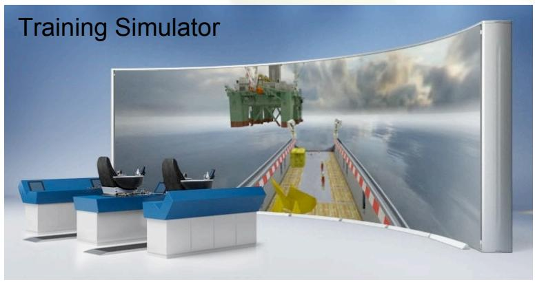

text_image

Training Simulator

HIL Simulator   

flowchart

```mermaid
graph LR
    A["Server Icon"] <--> B["Computer Monitor Icon"]
```

flowchart

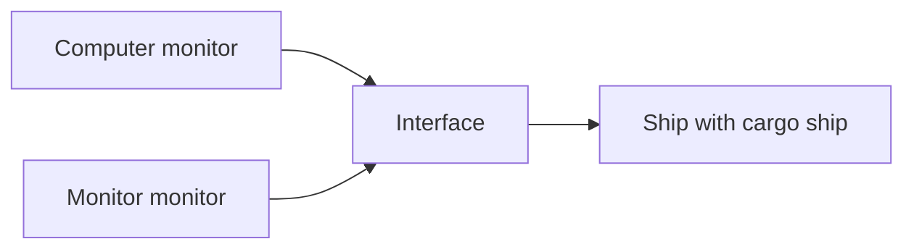
```mermaid
graph LR
    A["Computer monitor"] --> B["Interface"]
    C["Monitor monitor"] --> B
    B --> D["Ship with cargo ship"]
```

# motivation for this seminar

One simple way to obtain such models is to use potential theory codes to compute non-parametric models hydrodynamic (coefficients and frequency responses) and then

 make a direct implementation of the Cummins Equation, or   
 use system identification to approximate the Cummins equation by a Linear-time-invariant parametric models.

Approximations by LTI models in terms of state-space equations result in much faster simulations.

Depending on the complexity of the model simulations can be up to 80 times faster (Taghipour, Perez, and Moan, 2008).

# outline for this presentation

 linear dynamic models of marine structures

 equations of motion   
Cummins equation   
 non-parametric models   
model properties derived from hydrodynamics

parametric approximations

 consequence of the properties   
time-domain Identification   
frequency-domain identification   
dealing with 2D hydrodynamic data

 examples: container, semi-submersible, fpso   
Discussion

# equations of motion

# Equations of Motion (rigid body):

$$
\dot {\xi} = \mathrm{J} (\xi) \nu
$$

$$
\mathbf {M} _ {R B} \dot {\boldsymbol {\nu}} + \mathbf {C} _ {R B} (\boldsymbol {\nu}) \boldsymbol {\nu} = \boldsymbol {\tau}
$$

$$
\boldsymbol {\xi} \triangleq [ x, y, z, \phi , \theta , \psi ] ^ {T}
$$

$$
\boldsymbol {\nu} \triangleq [ u, v, w, p, q, r ] ^ {T}
$$

$$
\boldsymbol {\tau} \triangleq [ X, Y, Z, K, M, N ] ^ {T}
$$

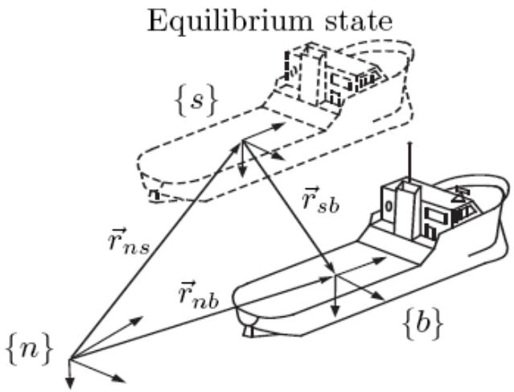

text_image

Equilibrium state
{s}
\vec{r}_{ns}
\vec{r}_{nb}
{n}
\vec{r}_{sb}
\{b}

← generalised displ. wrt equilibrium   
← body-fixed generalised velocities   
← body-fixed generalised forces

# linear equations

If we consider small deviations about the equilibrium:

$$
\dot {\boldsymbol {\xi}} = \mathbf {J} (\boldsymbol {\xi}) \boldsymbol {\nu}
$$

$$
\mathbf {M} _ {R B} \dot {\pmb {\nu}} + \mathbf {C} _ {R B} (\pmb {\nu}) \pmb {\nu} = \pmb {\tau}
$$

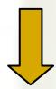

$$
\mathrm{M} _ {R B} \ddot {\xi} = \tau
$$

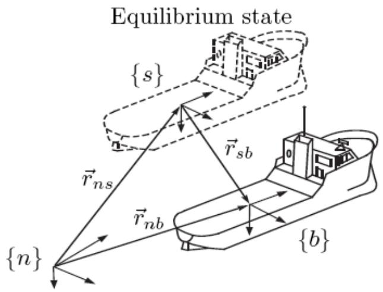

text_image

Equilibrium state
{s}
r̄_ns
r̄_nb
{n}
r̄_sb
{b}

Superposition of forces (radiation, restoring excitation):

$$
\boldsymbol {\tau} = \boldsymbol {\tau} _ {r a d} + \boldsymbol {\tau} _ {r e s} + \boldsymbol {\tau} _ {e x c}
$$

# Cummins’s equation

Cummins studied the radiation potential problem in the timedomain, within the linear assumption and found that:

$$
\pmb {\tau} _ {r a d} = - \mathbf {A} _ {\infty} \ddot {\pmb {\xi}} - \int_ {0} ^ {t} \mathbf {K} (t - t ^ {\prime}) \dot {\pmb {\xi}} (t ^ {\prime}) d t ^ {\prime}
$$

Combining terms,

$$
(\mathbf {M} _ {R B} + \mathbf {A} _ {\infty}) \ddot {\pmb {\xi}} + \int_ {0} ^ {t} \mathbf {K} (t - t ^ {\prime}) \dot {\pmb {\xi}} (t ^ {\prime}) d t ^ {\prime} + \mathbf {G} \pmb {\xi} = \pmb {\tau} _ {e x c}
$$

This equation form the basis of most time-domain simulators.

# Ogilvie’s relations

When considered in the frequency-domain, the radiation forces and the response of the marine structure can be expressed as:

$$
\boldsymbol {\tau} _ {r a d} (j \omega) = - \mathbf {A} (\omega) \ddot {\boldsymbol {\xi}} (j \omega) - \mathbf {B} (\omega) \dot {\boldsymbol {\xi}} (j \omega)
$$

$$
[ - \omega^ {2} [ \mathbf {M} + \mathbf {A} (\omega) ] + j \omega \mathbf {B} (\omega) + \mathbf {G} ] \boldsymbol {\xi} (j \omega) = \boldsymbol {\tau} _ {e x c} (j \omega)
$$

Ogilvie found the relation between the Cummins parameters and the above:

$$
\mathbf {A} (\omega) = \mathbf {A} _ {\infty} - \frac {1}{\omega} \int_ {0} ^ {\infty} \mathbf {K} (t) \sin (\omega t) d t.
$$

$$
\mathbf {B} (\omega) = \int_ {0} ^ {\infty} \mathbf {K} (t) \cos (\omega t) d t.
$$

$$
\mathbf {A} _ {\infty} = \lim _ {\omega \rightarrow \infty} \mathbf {A} (\omega)
$$

# non-parametric models

Time-domain:

$$
\mathbf {K} (t) = \frac {2}{\pi} \int_ {0} ^ {\infty} \mathbf {B} (\omega) \cos (\omega t) d \omega .
$$

Frequency-domain:

$$
\mathbf {K} (j \omega) = \int_ {0} ^ {\infty} \mathbf {K} (t) e ^ {- j \omega t} d \omega = \mathbf {B} (\omega) + j \omega [ \mathbf {A} (\omega) - \mathbf {A} _ {\infty} ]
$$

These relationships are key since they are the starting point for the identification process by which parametric models are obtained.

# convolution replacement

The convolution term is inconvenient to implement simulation tools, and also to analyse and design motion control systems.

It is more convenient to seek a replacement by a state-space model:

$$
\boldsymbol {\mu} = \int_ {0} ^ {t} \mathbf {K} (t - t ^ {\prime}) \dot {\pmb {\xi}} (t ^ {\prime}) d t ^ {\prime} \approx \begin{array}{l l} \dot {\mathbf {x}} = \hat {\mathbf {A}} \mathbf {x} + \hat {\mathbf {B}} \dot {\pmb {\xi}} \\ \hat {\pmb {\mu}} = \hat {\mathbf {C}} \mathbf {x} + \hat {\mathbf {D}} \dot {\pmb {\xi}}. \end{array}
$$

Different methods have been reported in the literature over the past 20 years.   
Due to Markovian properties of the SS-model significant gains in simulation speed can be obtained.

# convolution replacement

The convolution replacement can be posed in different ways:

Data

B( )

$\Rightarrow$

Time-domain identification

K(t)

$\Rightarrow$

$\begin{array} { r } { \left[ \hat { \mathbf { A } } \hat { \mathbf { \Sigma } } \hat { \mathbf { B } } \right] } \\ { \hat { \mathbf { C } } \hat { \mathbf { \Sigma } } \hat { \mathbf { D } } \mathbf { \Sigma } } \end{array}$

Data

Model conversion

$\begin{array} { r } { \left[ \hat { \mathbf { A } } \hat { \mathbf { B } } \right] } \\ { \hat { \mathbf { C } } \hat { \mathbf { D } } \mathbf { | } } \end{array}$

In practice one method can be more favourable than the other.

# identification

Different proposals have appeared in the literature:

# Time-domain identification:

 LS-fitting of the impulse response (Yu & Falnes, 1998)   
Realization theory (Kristiansen & Egeland, 2003)

# Frequency-domain identification:

 LS-fitting of the frequency response (Jeffreys, 1984),(Damaren 2000).   
 LS-fitting of added mass and damping (Soding 1982), (Xia et. al 1998), (Sutulo & Guedes-Soares 2006).

# properties of retardation functions

The following properties derive from the hydrodynamics, and have implications on the parametric models:

$$
\hat {K} _ {i k} (s) = \frac {P _ {i k} (s)}{Q _ {i k} (s)} = \frac {p _ {r} s ^ {r} + p _ {r - 1} s ^ {r - 1} + \ldots + p _ {0}}{s ^ {n} + q _ {n - 1} s ^ {n - 1} + \ldots + q _ {0}}
$$

<table><tr><td>Property</td><td>Implication on Parametric Models  $K_{ik}(s) = P(s)/Q(s)$ </td></tr><tr><td>1)  $\lim_{\omega \to 0} \mathbf{K}(j\omega) = \mathbf{0}$ </td><td>There are zeros at s = 0.</td></tr><tr><td>2)  $\lim_{\omega \to \infty} \mathbf{K}(j\omega) = \mathbf{0}$ </td><td>Strictly proper.</td></tr><tr><td>3)  $\lim_{t \to 0^{+}} \mathbf{K}(t) \neq \mathbf{0}$ </td><td>Relative degree 1.</td></tr><tr><td>4)  $\lim_{t \to \infty} \mathbf{K}(t) = \mathbf{0}$ </td><td>BIBO stable.</td></tr><tr><td>5) The mapping  $\dot{\boldsymbol{\xi}} \mapsto \boldsymbol{\mu}$  is Passive</td><td> $\mathbf{K}(j\omega)$  is positive real (diagonal entries  $K_{ii}(j\omega)$  positive real.</td></tr></table>

This prior knowledge, and should be used in the identification process to refine the search for approximating models.

# time-domain methods

identification from the impulse-response

# time-domain methods

Impulse response curve fitting ( Yu & Falnes, 1995, 1998)   
 Realization theory (Kristiansen & Egeland, 2003)

Both these methods use the frequency domain data to compute the retardation functions in the time domain and then perform the system identification.

$$
\mathbf {K} (t) = \frac {2}{\pi} \int_ {0} ^ {\infty} \mathbf {B} (\omega) \cos (\omega t) d \omega
$$

# distortion of non-param. models

The computation of the retardation function from the damping introduces distortion, which can affect the identification:

$$
\mathbf {K} (t) \approx \bar {\mathbf {K}} (t) = \frac {2}{\pi} \int_ {0} ^ {\Omega} \mathbf {B} (\omega) \cos (\omega t) d \omega
$$

The maximum frequency is related to the size of the panels. One can use asymptotic tails to extend the computations:

$$
\mathrm{as} \quad \omega \rightarrow \infty , \quad B _ {i k} (\omega) \rightarrow \frac {\beta_ {1}}{\omega^ {4}} + \frac {\beta_ {2}}{\omega^ {2}}
$$

# example containership

(Taghipour et al., 2007a)

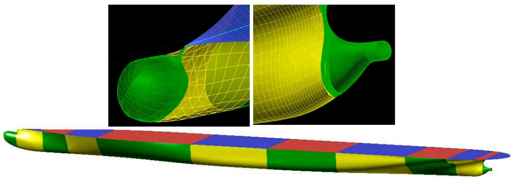

natural_image

3D rendered model of a streamlined object with colored ribbed surfaces and meshed internal components, shown from two different angles (no text or symbols)

The panel sizing was done to be able to compute frequencies up to 2.5 rad/s.

From experience characteristic panel length < 1/8-1/10 min wave length for low order panel methods (Faltinsen, 1993).

# distortion of non-param. models

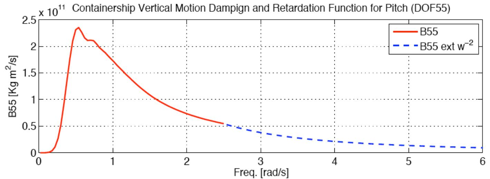

line

| Freq. [rad/s] | B55 [Kg m²/s] | B55 ext w⁻² |
| ------------- | ------------- | ----------- |
| 0.0           | 0.0           | -           |
| 0.5           | 2.3           | -           |
| 1.0           | 1.8           | -           |
| 1.5           | 1.2           | -           |
| 2.0           | 0.8           | -           |
| 2.5           | 0.6           | 0.5         |
| 3.0           | -             | 0.4         |
| 3.5           | -             | 0.3         |
| 4.0           | -             | 0.2         |
| 4.5           | -             | 0.15        |
| 5.0           | -             | 0.1         |
| 5.5           | -             | 0.08        |
| 6.0           | -             | 0.05        |

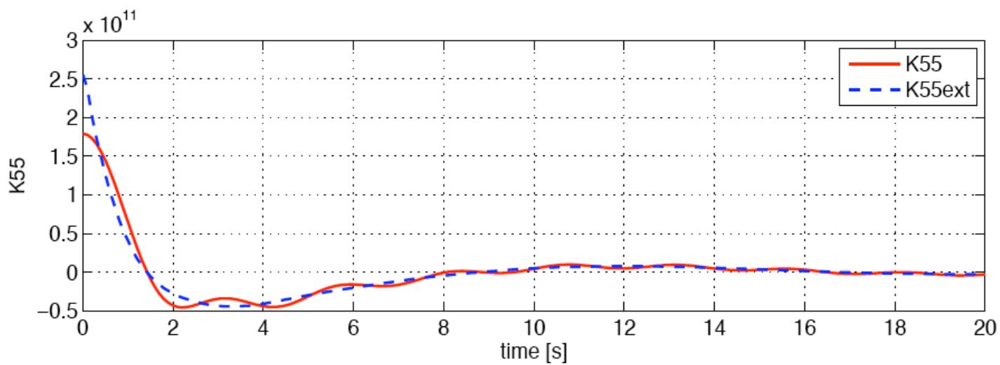

line

| time [s] | K55       | K55ext    |
| -------- | --------- | --------- |
| 0        | 1.8e11    | 2.5e11    |
| 2        | -0.4e11   | -0.3e11   |
| 4        | -0.4e11   | -0.4e11   |
| 6        | -0.1e11   | -0.2e11   |
| 8        | 0.0e11    | 0.0e11    |
| 10       | 0.1e11    | 0.0e11    |
| 12       | 0.0e11    | 0.0e11    |
| 14       | 0.0e11    | 0.0e11    |
| 16       | 0.0e11    | 0.0e11    |
| 18       | 0.0e11    | 0.0e11    |
| 20       | 0.0e11    | 0.0e11    |

# distortion of non-param. models

We can think the limited freq. damping as a product of the real daming with a rectangular window:

$$
\bar {\mathbf {K}} (t) = \frac {2}{\pi} \int_ {0} ^ {\infty} \mathbf {W} (\omega) \mathbf {B} (\omega) \cos (\omega t) d \omega W _ {i k} (\omega) = \left\{ \begin{array}{l l} 1 & \text {if} \omega \leq \Omega , \\ 0 & \text {if} \omega > \Omega . \end{array} \right.
$$

Product in the freq.-domain ⇔ convolution in the time-domain (FT property):

$$
\bar {\mathbf {K}} (t) = \int_ {0} ^ {\infty} \mathbf {W} (t - t ^ {\prime}) \mathbf {K} (t) d t ^ {\prime} \qquad W _ {i k} (t) = 2 \Omega \frac {\sin (\Omega t)}{\Omega t}
$$

The distortion can be expressed as the convolution of the true impulse response and the IFT of an ideal low-pass filter.

This is a disadvantage for time-domain methods.

# impulse response curve fitting

$$
\pmb {\theta} _ {i k} ^ {\star} = \arg \min _ {\pmb {\theta}} \sum_ {l} [ \bar {K} _ {i k} (t _ {l}) - \hat {K} _ {i k} (t _ {l}, \theta) ] ^ {2}
$$

$$
\hat {K} _ {i k} (t, \boldsymbol {\theta}) = \hat {\mathbf {C}} _ {i k} (\boldsymbol {\theta}) \exp (\hat {\mathbf {A}} _ {i k} (\boldsymbol {\theta}) t) \hat {\mathbf {B}} _ {i k} (\boldsymbol {\theta}) + \hat {\mathbf {D}} _ {i k} (\boldsymbol {\theta})
$$

Optimisation problem non-linear in the parameters. Algorithms can be trapped in local minima. A good guess of the initial parameters is crucial for the success of the optimisation.   
The structure of the state-space model adopted plays an important role--there are infinite ways of doing this.   
The order of the model and the initial parameters are not easy to guess from the impulse response.   
 Make no use of the prior knowledge.

# realization theory

Discrete-time approximation:

$$
\mathbf {x} _ {k + 1} = \boldsymbol {\Phi} \mathbf {x} _ {k} + \boldsymbol {\Gamma} u _ {k}
$$

$$
y _ {k} = \mathbf {C x} _ {k} + \mathbf {D u} _ {k}
$$

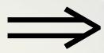

$$
K _ {k} = \mathbf {C} \boldsymbol {\Phi} ^ {k - 1} \boldsymbol {\Gamma} + \mathbf {D}
$$

Steps:

1) Form a Hankel matrix with the impulse response samples.   
2) Do a singular value decomposition (SVD).   
3) Obtain the order from the number of non-zero singular values.   
4) Obtain the model matrices via factoriastion.   
5) Convert the model to continuous time.

$$
\mathcal {H} _ {k} = \left[ \begin{array}{c c c c} K _ {1} & K _ {2} & \ldots & K _ {k} \\ K _ {2} & K _ {3} & \ldots & K _ {k + 1} \\ \vdots & \vdots & & \vdots \\ K _ {k} & K _ {k + 1} & \ldots & K _ {2 k - 1} \end{array} \right]
$$

$$
\mathcal {H} _ {k} = [ \mathbf {U} _ {1} \mathbf {U} _ {2} ] \left[ \begin{array}{c c} \Sigma_ {1} & 0 \\ 0 & \Sigma_ {2} \end{array} \right] [ \mathbf {V} _ {1} ^ {*} \mathbf {V} _ {2} ^ {*} ] = \mathbf {U} _ {1} \Sigma_ {1} \mathbf {V} _ {1} ^ {*}
$$

$$
\boldsymbol {\Phi} = \Sigma_ {1} ^ {- 1 / 2} \left[ \begin{array}{c} \mathbf {U} _ {1 1} \\ \mathbf {U} _ {1 2} \end{array} \right] ^ {T} \left[ \begin{array}{c} \mathbf {U} _ {1 2} \\ \mathbf {U} _ {1 3} \end{array} \right] \Sigma_ {1} ^ {1 / 2}
$$

$$
\mathbf {\Gamma} = \Sigma_ {1} ^ {- 1 / 2} \mathbf {V} _ {1 1} ^ {*}
$$

$$
\mathbf {C} = \mathbf {U} _ {1 1} \Sigma_ {1} ^ {1 / 2}
$$

$$
\mathbf {D} = h (0),
$$

# order detection via SVD

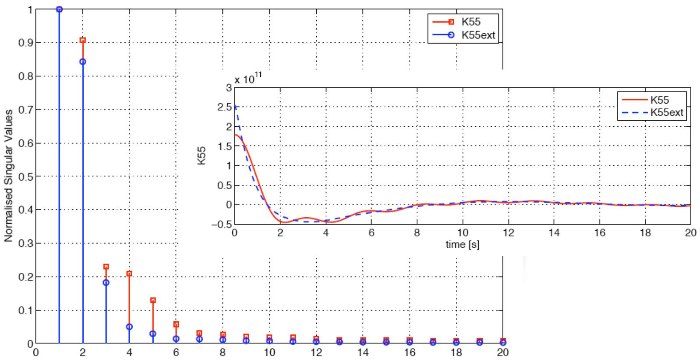

The quality of the impulse response affects the order selection.

The containership example suggests K55(s) order 2 to 5

# example containership (DOF33)

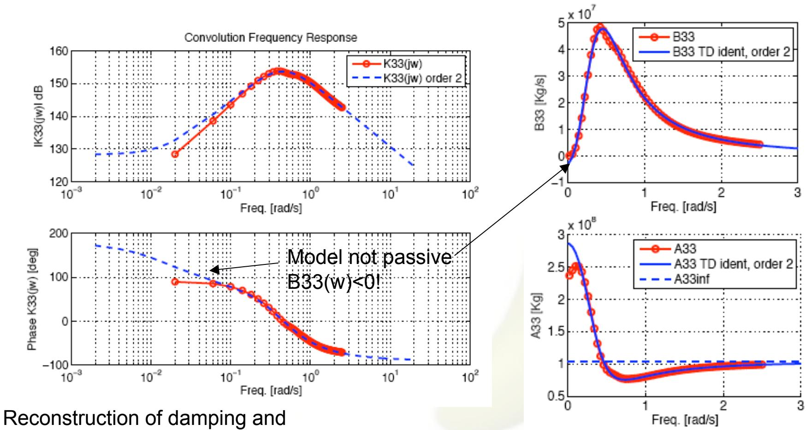

Reconstruction of damping and added mass from the parametric approximation:

$$
\hat {\mathbf {A}} (\omega) = \mathrm{Im} \{\omega^ {- 1} \hat {\mathbf {K}} (j \omega) \} + \mathbf {A} _ {\infty}
$$

$$
\hat {\mathbf {B}} (\omega) = \mathrm{Re} \{\hat {\mathbf {K}} (j \omega) \},
$$

# realization theory

relatively easy to implement.   
 do not require initial parameter estimates.   
allows order detection.   
requires conversion to continuous time (distortion).   
poor model quality.   
make no use of prior knowledge.

# frequency-domain methods

identification from the frequency-response

# frequency-response LS-fitting

The i,k entry of K(s) can be approximated by a rational transfer function:

$$
\hat {K} (s, \theta) = \frac {P (s , \theta)}{Q (s , \theta)} = \frac {p _ {m} s ^ {m} + p _ {m - 1} s ^ {m - 1} + \ldots + p _ {0}}{s ^ {n} + q _ {n - 1} s ^ {n - 1} + \ldots + q _ {0}} \qquad \theta = [ p _ {m}, \dots , p _ {0}, q _ {n - 1}, \dots , q _ {0} ] ^ {T}
$$

Then we can estimate the parameters via LS optimization using the frequency response computed using the data generated by hydrodynamic code:

$$
\theta^ {\star} = \arg \min _ {\pmb {\theta}} \sum_ {l} w _ {l} (\epsilon_ {l} ^ {*} \epsilon_ {l}) \qquad \qquad \epsilon_ {l} = K (j \omega_ {l}) - \frac {P (j \omega_ {l} , \pmb {\theta})}{Q (j \omega_ {l} , \pmb {\theta})}
$$

$$
\mathbf {K} (j \omega) = \mathbf {B} (\omega) + j \omega [ \mathbf {A} (\omega) - \mathbf {A} ]
$$

This problem is non-linear in the parameters, but it can be linearised.

# quasi-linear regression

for the non-linear problem

$$
\theta^ {\star} = \arg \min _ {\pmb {\theta}} \sum_ {l} w _ {l} (\epsilon_ {l} ^ {*} \epsilon_ {l}) \qquad \epsilon_ {l} = K (j \omega_ {l}) - \frac {P (j \omega_ {l} , \pmb {\theta})}{Q (j \omega_ {l} , \pmb {\theta})}
$$

Levi (1959) proposed a linearisation by choosing

$$
\theta^ {\prime \star} = \arg \min _ {\pmb {\theta}} \sum_ {l} w _ {l} ^ {\prime} (\epsilon_ {l} ^ {\prime *} \epsilon_ {l} ^ {\prime}), \qquad \epsilon_ {l} ^ {\prime} = Q (j \omega_ {l}, \pmb {\theta}) \epsilon_ {l} = Q (j \omega_ {l}, \pmb {\theta}) K (j \omega_ {l}) - P (j \omega_ {l}, \pmb {\theta}).
$$

This is equivalent to choose the following weights in the original problem above:

$$
w _ {l} = w _ {l} ^ {\prime} | Q (j \omega_ {l}, \theta) | ^ {2}
$$

 This problem is linear in the parameters, a standard linear LS problem.   
 It does not always give a good fit if data spans a large range of frequencies.

# iterative quasi-linear regression

Sanathanan and Koerner (1963), proposed an iterative solution via a sequence of linear LS problems:

1. Set $\mathbf { W _ { 0 } } = \mathbf { I }$   
2. Solve $\begin{array} { r } { \pmb { \theta } _ { k } ^ { \star } = \arg \operatorname* { m i n } _ { \pmb { \theta } } \epsilon ^ { \prime * } \mathbf { W } _ { \mathbf { k } } \epsilon ^ { \prime } } \end{array}$   
3. Set $\mathbf { W _ { k + 1 } } = \mathrm { d i a g } ( | Q ( j \omega _ { l } , \pmb { \theta } _ { k } ) | ^ { - 2 } )$ go to 2 until convergence.

$$
\epsilon^ {\prime} = [ \epsilon_ {1} ^ {\prime}, \dots , \epsilon_ {N} ^ {\prime} ] ^ {T}
$$

$$
\mathbf {W} = \mathrm{diag} (w _ {1} ^ {\prime}, w _ {2} ^ {\prime}, \ldots , w _ {n} ^ {\prime})
$$

This results in the following problem at each iteration $k > 1$ :

$$
\pmb {\theta} _ {k} ^ {\star} = \arg \min _ {\pmb {\theta}} \sum_ {l} \left| \frac {Q (j \omega_ {l} , \pmb {\theta}) K (j \omega_ {l})}{Q (j \omega_ {l} , \pmb {\theta} _ {k - 1} ^ {\star})} - \frac {P (j \omega_ {l} , \pmb {\theta})}{Q (j \omega_ {l} , \pmb {\theta} _ {k - 1} ^ {\star})} \right| ^ {2}
$$

After a few iterations $\theta _ { k } ^ { \star } \approx \theta _ { k - 1 } ^ { \star }$ and we recover the original nonlinear problem.

# prior knowledge: constraints

Adding prior knowledge is important to refine the search for models, and thus obtain better quality models.

Prior knowledge usually derives from the physics of the underlying problem; in this case, from the hydrodynamics.

# prior knowledge: constraints

For the transfer functions related to the convolution terms, we know

Relative degree 1   
2. $\mathsf { H } _ { \mathrm { i k } } ( \mathsf { s } ) { = } 0$ for s=0   
3. Stable   
Passive   
5. Minimum order approximation is 2

Some of these properties can be enforced in the structure of the model and its parameters without complicating the optimisation.

# prior knowledge: constraints

Model:

$$
\hat {K} _ {i k} (s) = \frac {P _ {i k} (s)}{Q _ {i k} (s)} = \frac {p _ {r} s ^ {r} + p _ {r - 1} s ^ {r - 1} + \ldots + p _ {0}}{s ^ {n} + q _ {n - 1} s ^ {n - 1} + \ldots + q _ {0}}, \qquad i, k = 1, \ldots , 6.
$$

 Relative degree =1 → Constrain $r = n - l$   
 Zero at $\mathtt { s } { = } 0$

$$
P _ {i k} (s) = s P _ {i k} ^ {\prime} (s)
$$

$$
\deg (P ^ {\prime}) = n - 2
$$

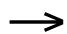

$$
\hat {K} _ {i k} (j \omega) = \frac {(j \omega) P _ {i k} ^ {\prime} (j \omega , \pmb {\theta} _ {i k})}{Q _ {i k} (j \omega , \pmb {\theta} _ {i k})}
$$

Redefine the problem:

$$
\theta_ {i k} ^ {\star} = \arg \min _ {\pmb {\theta}} \sum_ {l} \left| \frac {K _ {i k} (j \omega_ {l})}{(j \omega_ {l})} - \frac {P _ {i k} ^ {\prime} (j \omega_ {l} , \pmb {\theta})}{Q _ {i k} (j \omega_ {l} , \pmb {\theta})} \right| ^ {2}
$$

# prior knowledge: constraints

 Stability: The LS optimisation does not ensure stability, this is one way to force it after identification:

(i) Compute the roots of $\lambda _ { 1 } , \ldots , \lambda _ { n }$ of $Q _ { i k } ( s , \hat { \theta } _ { i k } )$   
(ii) If $\mathrm { R e } \{ \lambda _ { i } \} > 0$ , then set ${ \mathrm { R e } } \{ \lambda _ { i } \} = - { \mathrm { R e } } \{ \lambda _ { i } \}$   
(iii) Reconstruct the polynomial: $Q _ { i k } ( s ) = ( s - \lambda _ { 1 } ) ( s - \lambda _ { 1 } ) \cdot \cdot \cdot ( s - \lambda _ { n } )$

 Passivity: Also not enforced by LS. Low-order models are usually passive, hence if not passive try reducing the order.   
 Minimum order: The 2nd order approximation is the lowest order approximation that can satisfy all the properties of the retardation functions:

$$
\hat {K} _ {i k} ^ {m i n} (s) = \frac {p _ {0} s}{s ^ {2} + q _ {1} s + q _ {0}}
$$

# example container (dof 33)

Realization Theory   
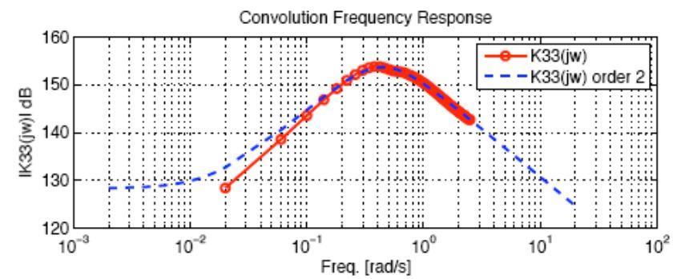

line

| Freq. [rad/s] | K33(jw) | K33(jw) order 2 |
| ------------- | ------- | --------------- |
| 0.001         | 128     | 129             |
| 0.01          | 130     | 129             |
| 0.1           | 148     | 145             |
| 1             | 154     | 153             |
| 10            | 142     | 138             |
| 100           | 128     | 125             |

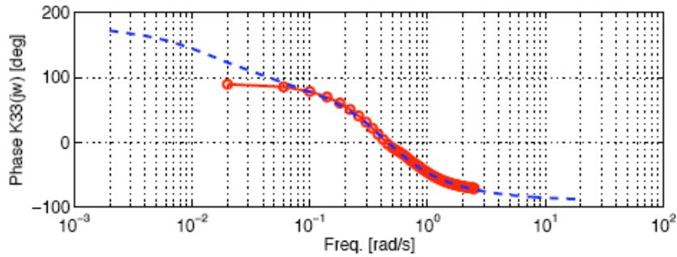

line

| Freq. [rad/s] | Phase K33(jw) [deg] |
| ------------- | ------------------- |
| 0.001         | 180                 |
| 0.01          | 150                 |
| 0.1           | 80                  |
| 1             | -50                 |
| 10            | -80                 |
| 100           | -90                 |

FD-Id with constraints   
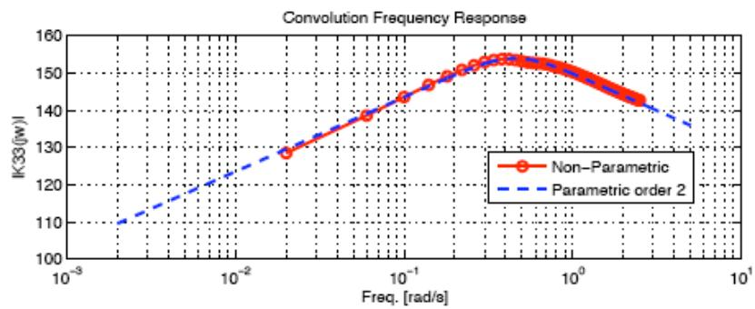

line

| Freq. [rad/s] | Non-Parametric | Parametric order 2 |
| ------------- | -------------- | ------------------- |
| 0.001         | 128            | 110                 |
| 0.01          | 138            | 120                 |
| 0.1           | 148            | 130                 |
| 1             | 152            | 140                 |
| 10            | 145            | 135                 |

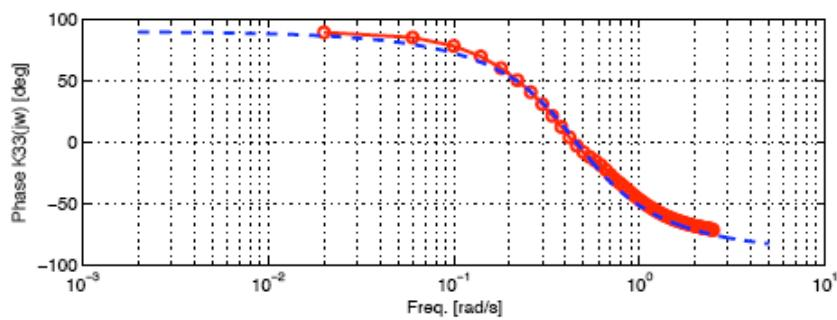

line

| Freq. [rad/s] | Phase K33(jw) [deg] |
| ------------- | ------------------- |
| 0.001         | 90                  |
| 0.01          | 85                  |
| 0.1           | 70                  |
| 1             | -50                 |
| 10            | -80                 |

By imposing constraints on the model structure and parameters, we obtain a model that satisfy all the properties of the retardation functions and have a better quality.

# example semi-sub

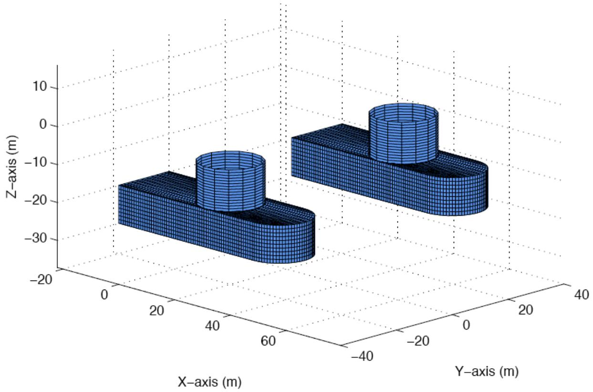

bar

| X-axis (m) | Y-axis (m) | Z-axis (m) |
| ---------- | ---------- | ---------- |
| -20        | -20        | -25        |
| -10        | -10        | -15        |
| 0          | 0          | 0          |
| 10         | 10         | 5          |
| 20         | 20         | 10         |

Data from www.marinecontrol.org

# example semi-sub: surge (ord. 5)

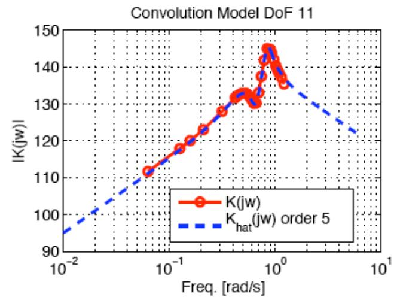

line

| Freq. [rad/s] | K(jw) | K_hat(jw) order 5 |
| ------------- | ----- | ----------------- |
| 0.01          | 112   | 98                |
| 0.1           | 120   | 108               |
| 1             | 145   | 135               |
| 10            | 135   | 125               |

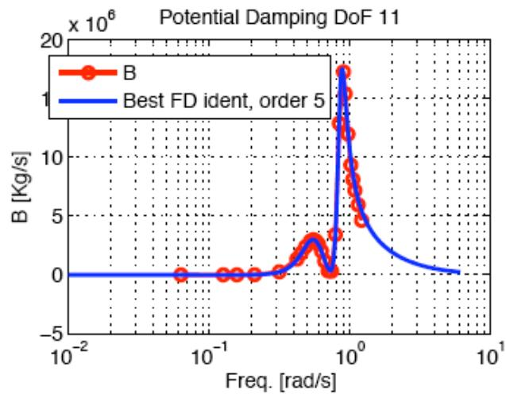

line

| Freq. [rad/s] | B [Kg/s] (x 10^6) | Best FD ident, order 5 [x 10^6] |
| ------------- | ----------------- | ------------------------------- |
| 0.01          | 0                 | 0                               |
| 0.1           | 0                 | 0                               |
| 1             | 15                | 15                              |
| 10            | 0                 | 0                               |

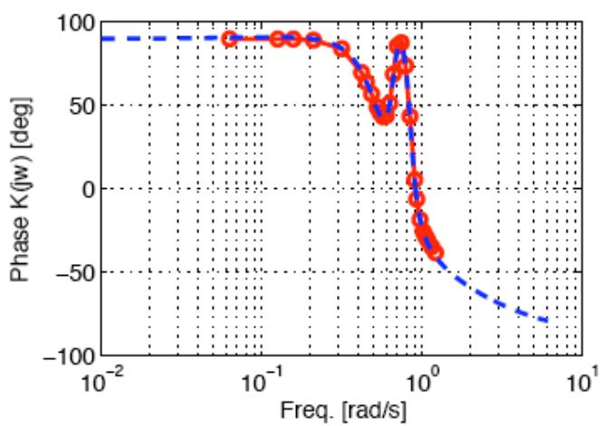

line

| Freq. [rad/s] | Phase K(jw) [deg] |
| ------------- | ----------------- |
| 0.01          | 95                |
| 0.05          | 95                |
| 0.1           | 95                |
| 0.2           | 90                |
| 0.3           | 85                |
| 0.4           | 75                |
| 0.5           | 60                |
| 0.6           | 50                |
| 0.7           | 40                |
| 0.8           | 30                |
| 0.9           | 20                |
| 1.0           | 10                |
| 2.0           | -20               |
| 5.0           | -60               |
| 10.0          | -80               |

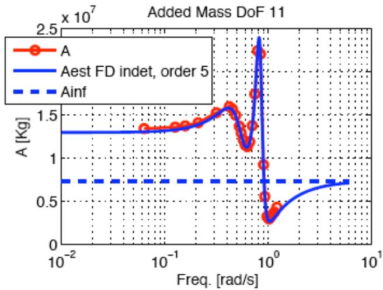

line

| Freq. [rad/s] | A [Kg] (x 10^7) | Aest FD indet, order 5 [x 10^7] | Ainf [x 10^7] |
| ------------- | --------------- | ------------------------------ | ------------ |
| 0.01          | ~1.3            | ~1.3                           | 0.7          |
| 0.1           | ~1.3            | ~1.3                           | 0.7          |
| 1             | ~2.5            | ~2.5                           | 0.7          |
| 10            | ~0.3            | ~0.7                           | 0.7          |

# example semi-sub: sway (ord. 7)

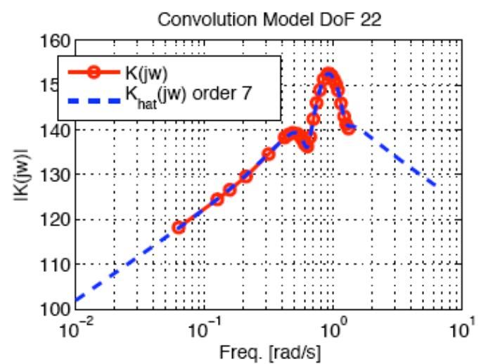

line

| Freq. [rad/s] | K(jw) | K_hat(jw) order 7 |
| ------------- | ----- | ----------------- |
| 0.01          | 118   | 100               |
| 0.05          | 122   | 105               |
| 0.1           | 126   | 110               |
| 0.2           | 130   | 115               |
| 0.5           | 135   | 120               |
| 1.0           | 140   | 125               |
| 2.0           | 145   | 130               |
| 5.0           | 150   | 135               |
| 10.0          | 155   | 140               |

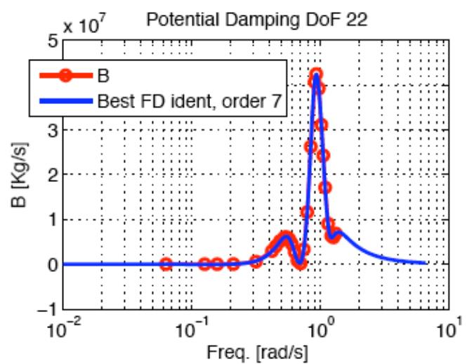

line

| Freq. [rad/s] | B [Kg/s] (x 10^7) | Best FD ident, order 7 [x 10^7] |
| ------------- | ----------------- | ------------------------------- |
| 0.01          | 0.0               | 0.0                             |
| 0.1           | 0.0               | 0.0                             |
| 1.0           | 5.0               | 5.0                             |
| 10.0          | 0.0               | 0.0                             |

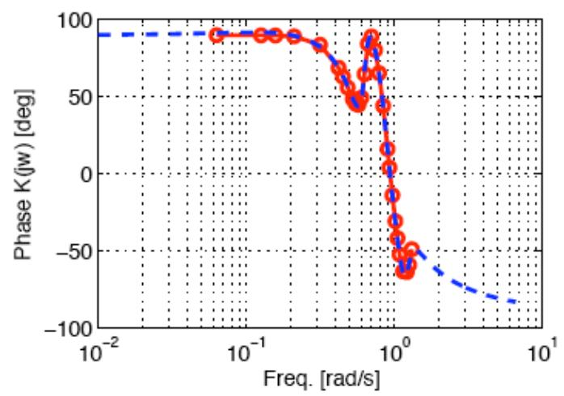

line

| Freq. [rad/s] | Phase K(jw) [deg] |
| ------------- | ----------------- |
| 0.01          | 95                |
| 0.05          | 95                |
| 0.1           | 95                |
| 0.2           | 90                |
| 0.3           | 80                |
| 0.4           | 60                |
| 0.5           | 40                |
| 0.6           | 20                |
| 0.7           | 0                 |
| 0.8           | -20               |
| 0.9           | -40               |
| 1.0           | -60               |
| 2.0           | -80               |
| 5.0           | -90               |
| 10.0          | -95               |

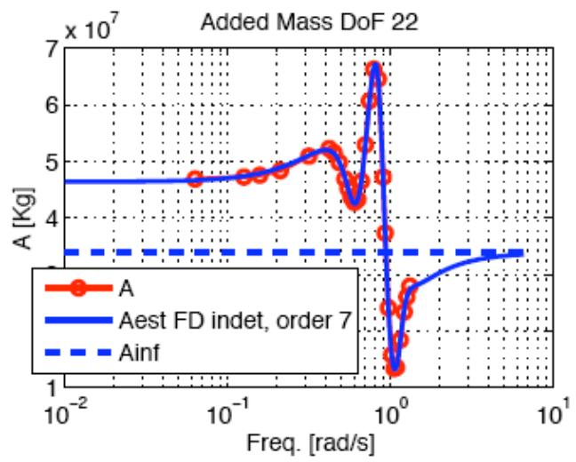

line

| Freq. [rad/s] | A [Kg]     | Aest FD indet, order 7 | Ainf      |
| ------------- | ---------- | ---------------------- | --------- |
| 0.01          | 4.8e7      | 4.8e7                  | 3.5e7     |
| 0.1           | 4.9e7      | 4.9e7                  | 3.5e7     |
| 1.0           | 6.8e7      | 6.8e7                  | 3.5e7     |
| 10.0          | 1.0e7      | 1.0e7                  | 3.5e7     |

# example semi-sub: heave (ord. 8)

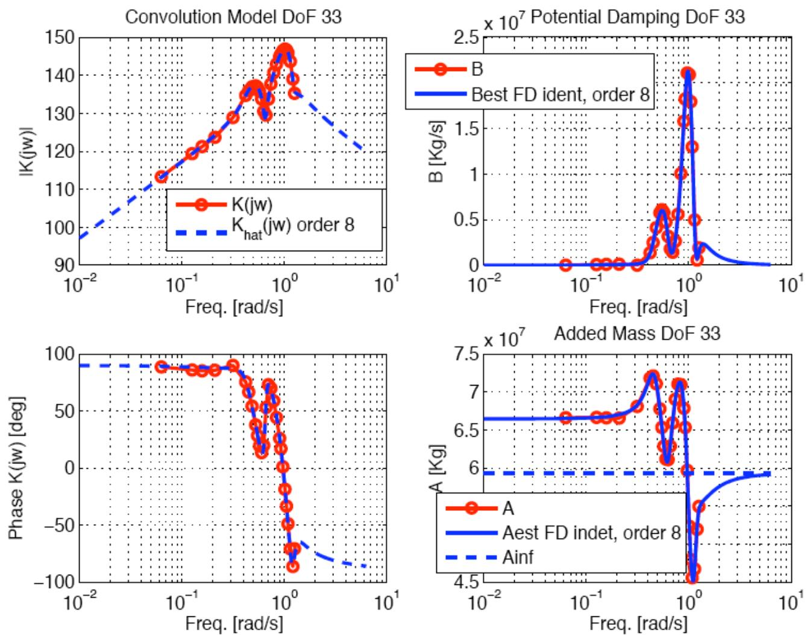

# example semi-sub: roll (ord. 6)

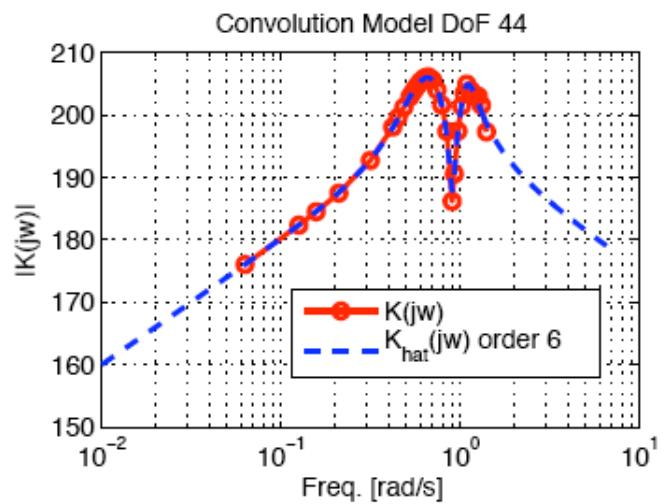

line

| Freq. [rad/s] | K(jw) | K_hat(jw) order 6 |
| ------------- | ----- | ----------------- |
| 0.01          | 175   | 160               |
| 0.1           | 185   | 170               |
| 1             | 205   | 200               |
| 10            | 190   | 180               |

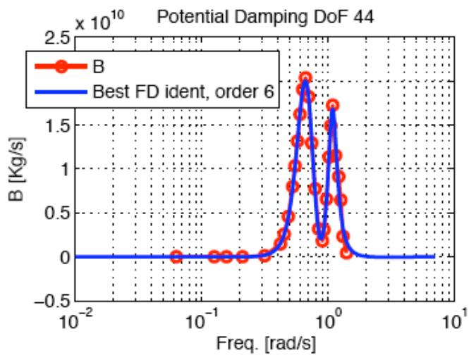

line

| Freq. [rad/s] | B [Kg/s] (x 10^10) |
| ------------- | ------------------ |
| 0.01          | 0.0                |
| 0.1           | 0.0                |
| 1.0           | 2.5                |
| 10.0          | 0.0                |

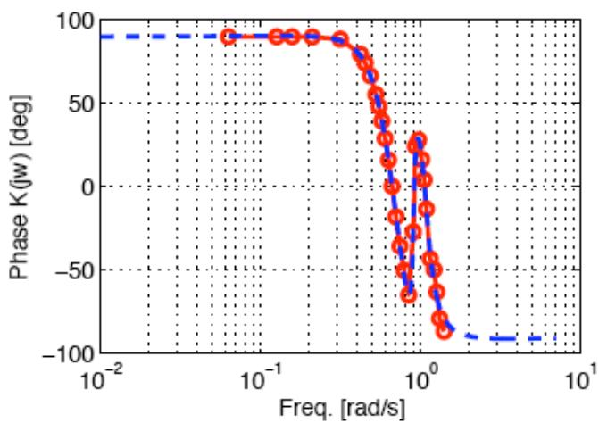

line

| Freq. [rad/s] | Phase K(jw) [deg] |
| ------------- | ----------------- |
| 0.01          | 95                |
| 0.05          | 95                |
| 0.1           | 95                |
| 0.2           | 95                |
| 0.3           | 95                |
| 0.4           | 95                |
| 0.5           | 85                |
| 0.6           | 70                |
| 0.7           | 50                |
| 0.8           | 30                |
| 0.9           | 10                |
| 1.0           | -50               |
| 1.5           | -70               |
| 2.0           | -80               |
| 3.0           | -90               |
| 4.0           | -95               |
| 5.0           | -95               |
| 6.0           | -95               |
| 7.0           | -95               |
| 8.0           | -95               |
| 9.0           | -95               |
| 10.0          | -95               |

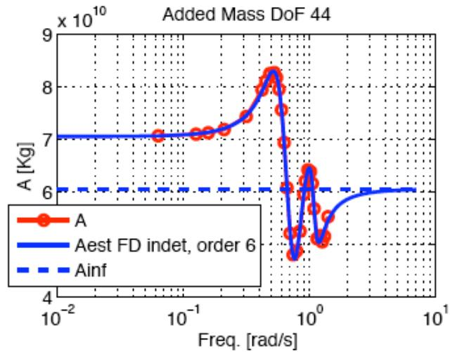

line

| Freq. [rad/s] | A [Kg] (x 10^10) |
| ------------- | ---------------- |
| 0.01          | 7.0              |
| 0.1           | 7.0              |
| 1.0           | 8.0              |
| 10.0          | 6.0              |

# example semi-sub: roll-sway (ord 8)

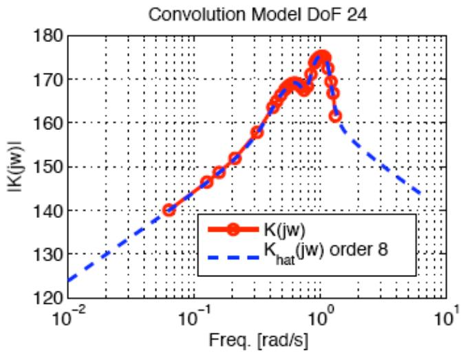

line

| Freq. [rad/s] | K(jw) | K_hat (jw) order 8 |
| ------------- | ----- | ------------------ |
| 0.01          | 140   | 125                |
| 0.1           | 150   | 135                |
| 1             | 175   | 160                |
| 10            | 160   | 145                |

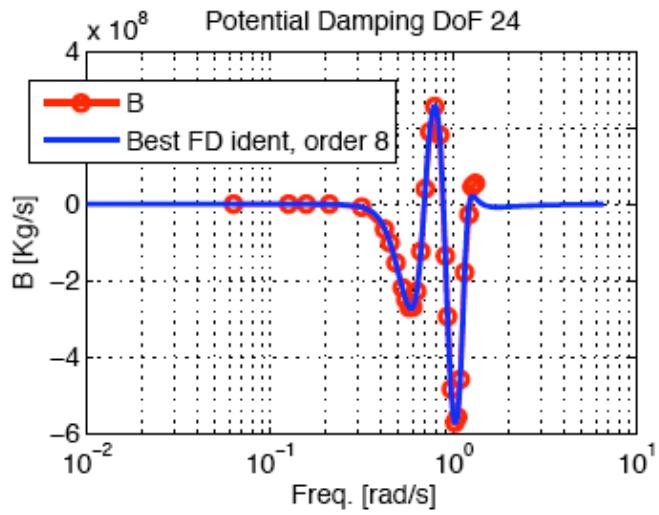

line

| Freq. [rad/s] | B [Kg/s] (x 10^8) |
| ------------- | ----------------- |
| 0.01          | 0.0               |
| 0.1           | 0.0               |
| 1.0           | -6.0              |
| 10.0          | 0.0               |

Couplings are not necessarily passive B(w)<0

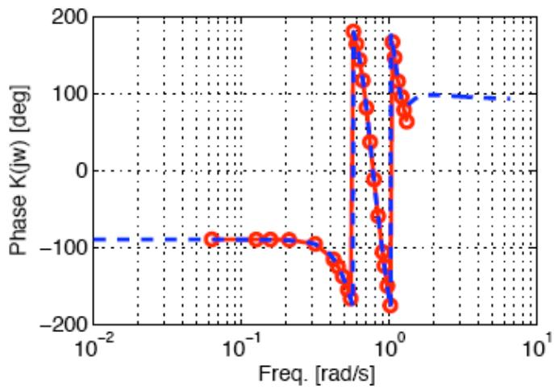

line

| Freq. [rad/s] | Phase K(jw) [deg] |
| ------------- | ----------------- |
| 0.01          | -100              |
| 0.1           | -100              |
| 1             | -150              |
| 10            | 100               |

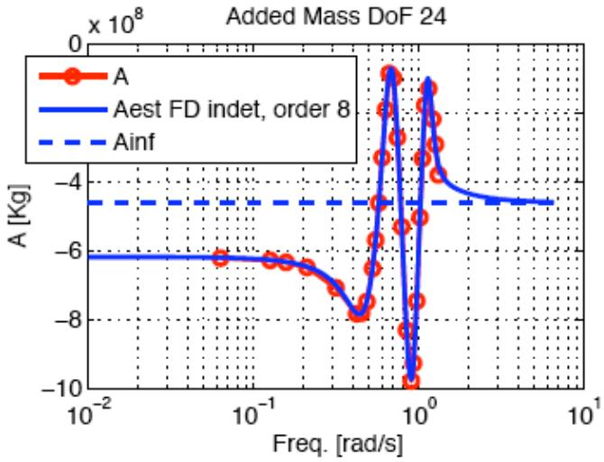

line

| Freq. [rad/s] | A [Kg] (x 10^8) | Aest FD indet, order 8 [x 10^8] | Ainf [x 10^8] |
| ------------- | --------------- | ------------------------------ | ------------- |
| 0.01          | -6.0            | -6.0                           | -4.0          |
| 0.1           | -6.0            | -6.0                           | -4.0          |
| 1.0           | -9.0            | -9.0                           | -4.0          |
| 10.0          | -4.0            | -4.0                           | -4.0          |

# Frequency-domain methods

 Work directly in the FD, hence, there is no need to compute a distorted impulse response by going to time-domain.   
 No need to compute data at very-low or very-high frequency. We can concentrate in the important range and compute many points.   
 They can incorporate prior knowledge, and thus the models satisfy the physical characteristics of the problem. Good quality models.   
 Order selection: one can start with the minimum order n=2 and increase it if necessary to improve the fit. (check passivity.)   
 Parameter estimation method is simple: a sequence of Linear Least-Squares problems.

# frequency-domain identification with 2D-data (strip-theory codes)

joint identification of infinite-frequency added mass and memory models

# indirect FD identification

If we do not have access to A∞ , as in the case of strip theory codes, we can identify it together with the K(s).

The non-parametric radiation force models in the frequency domain can be expressed as

$$
\tau_ {r a d, i k} (j \omega) = \left[ \frac {B _ {i k} (\omega)}{j \omega} + A _ {i k} (\omega) \right] \ddot {\pmb {\xi}} (s)
$$

From the parametric approximations, this can also be expressed as

$$
\begin{array}{l} \hat {\tau} _ {r a d, i k} (s) = \left[ A _ {\infty , i k} s + \frac {P _ {i k} (s)}{Q _ {i k} (s)} \right] \dot {\xi} (s), \\ = \left[ A _ {\infty , i k} + \frac {P _ {i k} ^ {\prime} (s)}{Q _ {i k} (s)} \right] \ddot {\pmb {\xi}} (s), \\ \end{array}
$$

# indirect FD identification

Then we can define the complex coefficient:

$$
\tilde {A} (j \omega) \triangleq \frac {B _ {i k} (\omega)}{j \omega} + A _ {i k} (\omega)
$$

And fit to it a rational approximation

$$
\theta^ {\star} = \arg \min _ {\theta} \sum_ {l} w _ {l} (\epsilon_ {l} ^ {*} \epsilon_ {l}), \quad \epsilon_ {l} = \tilde {A} _ {i k} (j \omega_ {l}) - \frac {R _ {i k} (j \omega_ {l} , \theta)}{S _ {i k} (j \omega_ {l} , \theta)}
$$

with the constraint

$$
n = \deg S _ {i k} (s) = \deg R _ {i k} (s) \quad \Leftrightarrow \quad \hat {\tilde {A}} _ {i k} (s) = \frac {R _ {i k} (s)}{S _ {i k} (s)} = \frac {A _ {\infty , i k} Q _ {i k} (s) + P _ {i k} ^ {\prime} (s)}{Q _ {i k} (s)}
$$

# indirect FD identification

Once the R(s) and S(s) are obtained, we can obtain the added mass and fluid memory model from

$$
\hat {A} _ {\infty , i k} = \lim _ {\omega \rightarrow \infty} \frac {R _ {i k} (s , \theta^ {\star})}{S _ {i k} (s , \theta^ {\star})}
$$

$$
Q _ {i k} (s, \boldsymbol {\theta} ^ {\star}) = S _ {i k} (s, \boldsymbol {\theta} ^ {\star}),
$$

$$
P _ {i k} (s, \boldsymbol {\theta} ^ {\star}) = R _ {i k} (s, \boldsymbol {\theta} ^ {\star}) - \hat {A} _ {\infty , i k} S _ {i k} (s, \boldsymbol {\theta} ^ {\star})
$$

The coefficient $\hat { A } _ { \infty , i \bar { k } }$ is the coefficient of the higher-order term of $R _ { i k } ( s , \theta ^ { \star } )$ if $S _ { i k } ( s , \theta ^ { \star } )$ is monic.

# example FPSO

3D Visualization of the Wamit file: fsqow.df   
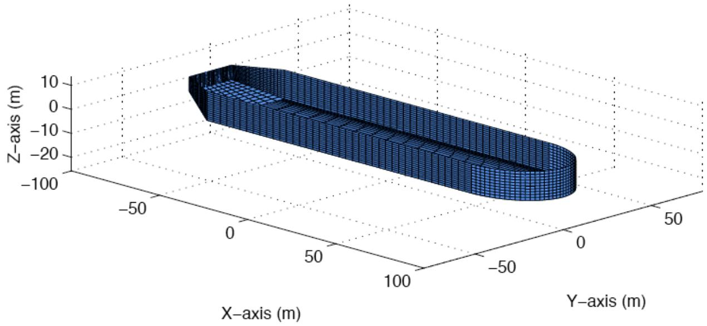

bar

| X-axis (m) | Y-axis (m) | Z-axis (m) |
| ---------- | ---------- | ---------- |
| -50        | 0          | 0          |
| 0          | 0          | 0          |
| 50         | 0          | 0          |
| 100        | 0          | 0          |
| 50         | 50         | 0          |
| 0          | 50         | 0          |
| -50        | 100        | 0          |
| 0          | 100        | 0          |
| -50        | 150        | 0          |
| 0          | 150        | 0          |
| -50        | 200        | 0          |
| 0          | 200        | 0          |
| -50        | 250        | 0          |
| 0          | 250        | 0          |
| -50        | 300        | 0          |
| 0          | 300        | 0          |
| -50        | 350        | 0          |
| 0          | 350        | 0          |
| -50        | 400        | 0          |
| 0          | 400        | 0          |
| -50        | 450        | 0          |
| 0          | 450        | 0          |
| -50        | 500        | 0          |
| 0          | 500        | 0          |
| -50        | 550        | 0          |
| 0          | 550        | 0          |
| -50        | 600        | 0          |
| 0          | 600        | 0          |
| -50        | 650        | 0          |
| 0          | 650        | 0          |
| -50        | 700        | 0          |
| 0          | 700        | 0          |
| -50        | 750        | 0          |
| 0          | 750        | 0          |
| -50        | 800        | 0          |
| 0          | 800        | 0          |
| -50        | 850        | 0          |
| 0          | 850        | 0          |
| -50        | 900        | 0          |
| 0          | 900        | 0          |
| -50        | 950        | 0          |
| 0          | 950        | 0          |
| -50        | 100        | 1          |
| 5            | -1           | -1         |
| -1           | -1           | -1         |
| -1           | -1           | -1         |
| -1           | -1           | -1         |
| -1           | -1           | -1         |
| -1           | -1           | -1         |
| -1           | -1           | -1         |
| -1           | -1           | -1         |
| -1           | -1           | -1         |

Data from www.marinecontrol.org

# example FPSO (dof 33)

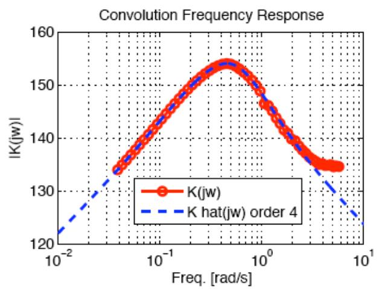

line

| Freq. [rad/s] | K(jw) | K hat(jw) order 4 |
| ------------- | ----- | ----------------- |
| 0.01          | 133   | 122               |
| 0.1           | 148   | 130               |
| 1             | 155   | 145               |
| 10            | 135   | 125               |

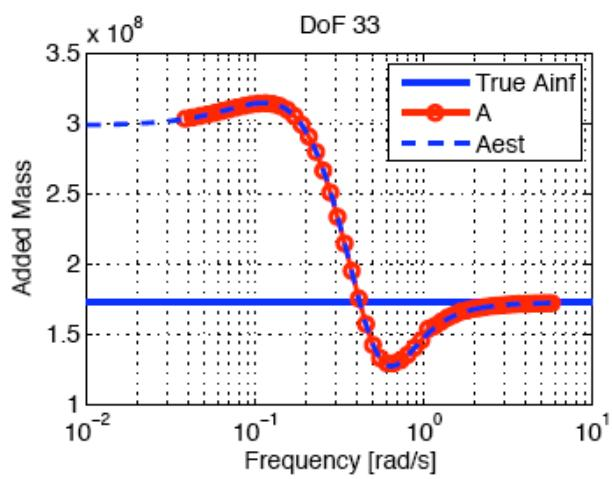

line

| Frequency [rad/s] | True Ainf | A       | Aest    |
| ----------------- | --------- | ------- | ------- |
| 0.01              | 3.0e8     | 3.0e8   | 3.0e8   |
| 0.1               | 3.1e8     | 3.1e8   | 3.1e8   |
| 1.0               | 1.7e8     | 1.7e8   | 1.7e8   |
| 10.0              | 1.7e8     | 1.7e8   | 1.7e8   |

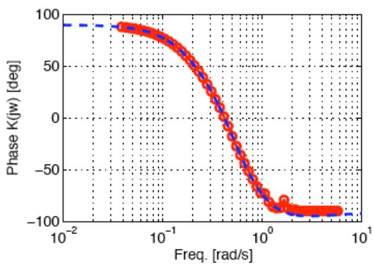

line

| Freq. [rad/s] | Phase K(jw) [deg] |
| ------------- | ----------------- |
| 0.01          | 90                |
| 0.1           | 80                |
| 1             | -80               |
| 10            | -90               |

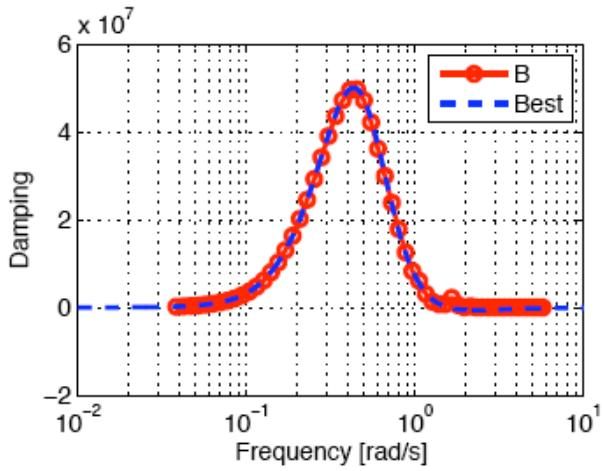

line

| Frequency [rad/s] | Damping (x 10^7) |
| ----------------- | ---------------- |
| 0.01              | 0.0              |
| 0.1               | 2.0              |
| 1.0               | 5.0              |
| 10.0              | 0.0              |

# example FPSO (dof 35,53)

Convolution Frequency Response   
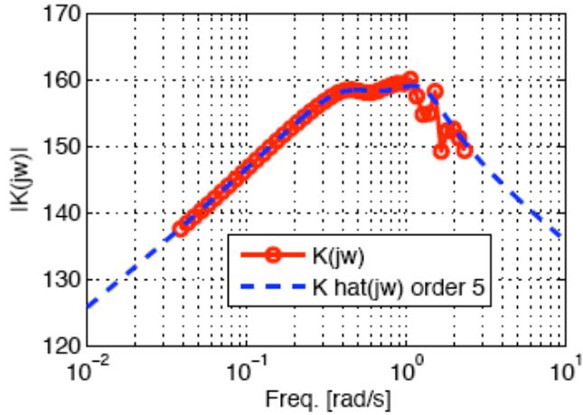

line

| Freq. [rad/s] | K(jw) | K hat(jw) order 5 |
| ------------- | ----- | ----------------- |
| 0.01          | 138   | 126               |
| 0.1           | 148   | 138               |
| 1             | 160   | 158               |
| 10            | 150   | 140               |

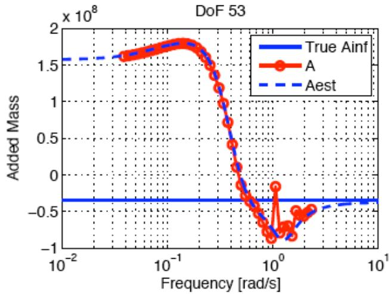

line

| Frequency [rad/s] | True Ainf | A       | Aest    |
| ----------------- | --------- | ------- | ------- |
| 0.01              | 1.6e8     | 1.6e8   | 1.6e8   |
| 0.1               | 1.7e8     | 1.7e8   | 1.7e8   |
| 1.0               | -0.8e8    | -0.8e8  | -0.8e8  |
| 10.0              | -0.4e8    | -0.4e8  | -0.4e8  |

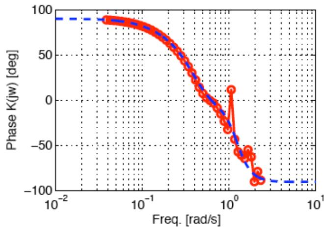

line

| Freq. [rad/s] | Phase K(jw) [deg] |
| ------------- | ----------------- |
| 0.01          | 95                |
| 0.1           | 85                |
| 1             | -20               |
| 10            | -95               |

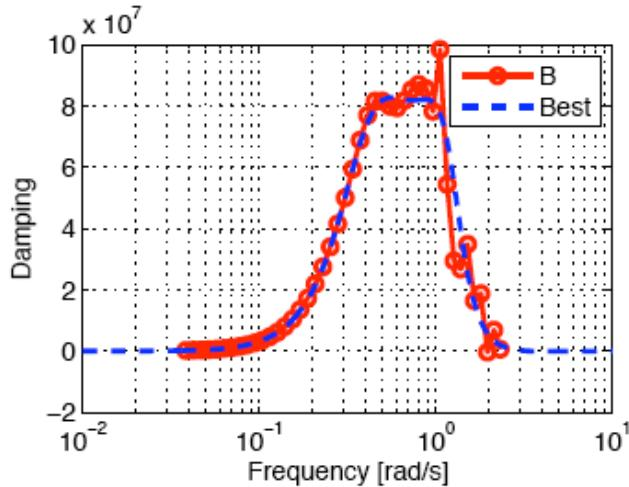

line

| Frequency [rad/s] | Damping (B) | Damping (Best) |
| ----------------- | ----------- | -------------- |
| 0.01              | 0           | 0              |
| 0.1               | ~2.5e7      | ~2.5e7         |
| 1                 | ~9.5e7      | ~8.5e7         |
| 10                | ~0          | 0              |

# example FPSO (dof 55)

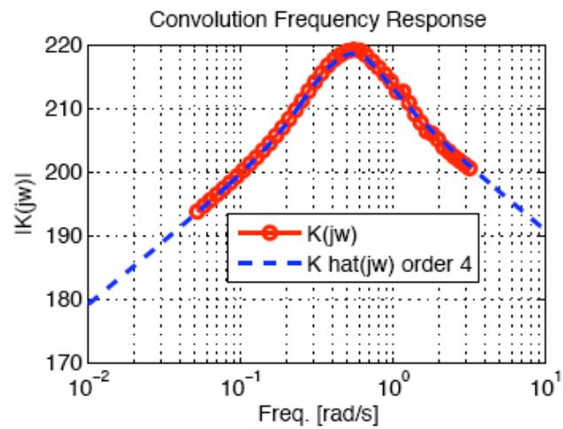

line

| Freq. [rad/s] | K(jw) | K hat(jw) order 4 |
| ------------- | ----- | ----------------- |
| 0.01          | 195   | 180               |
| 0.1           | 205   | 195               |
| 1             | 220   | 215               |
| 10            | 200   | 190               |

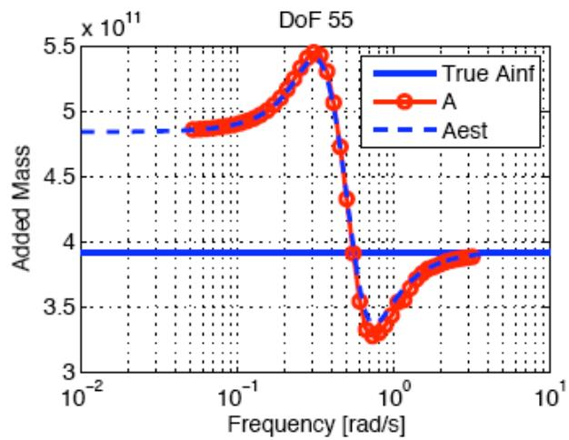

line

| Frequency [rad/s] | True Ainf | A     | Aest  |
| ----------------- | --------- | ----- | ----- |
| 0.01              | 4.9e11    | 4.9e11| 4.9e11|
| 0.1               | 5.0e11    | 5.0e11| 4.9e11|
| 0.2               | 5.2e11    | 5.2e11| 4.9e11|
| 0.3               | 5.4e11    | 5.4e11| 4.9e11|
| 0.4               | 5.5e11    | 5.5e11| 4.9e11|
| 0.5               | 5.4e11    | 5.4e11| 4.9e11|
| 0.6               | 5.2e11    | 5.2e11| 4.9e11|
| 0.7               | 5.0e11    | 5.0e11| 4.9e11|
| 0.8               | 4.8e11    | 4.8e11| 4.9e11|
| 0.9               | 4.6e11    | 4.6e11| 4.9e11|
| 1.0               | 4.4e11    | 4.4e11| 4.9e11|
| 2.0               | 3.8e11    | 3.8e11| 4.9e11|
| 5.0               | 3.6e11    | 3.6e11| 4.9e11|
| 10.0              | 3.8e11    | 3.8e11| 4.9e11|

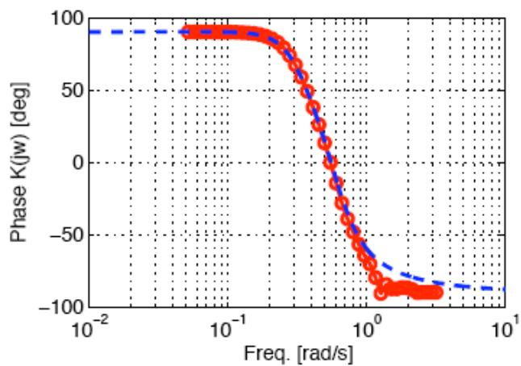

line

| Freq. [rad/s] | Phase K(jw) [deg] |
| ------------- | ----------------- |
| 0.01          | 95                |
| 0.1           | 95                |
| 1             | -80               |
| 10            | -90               |

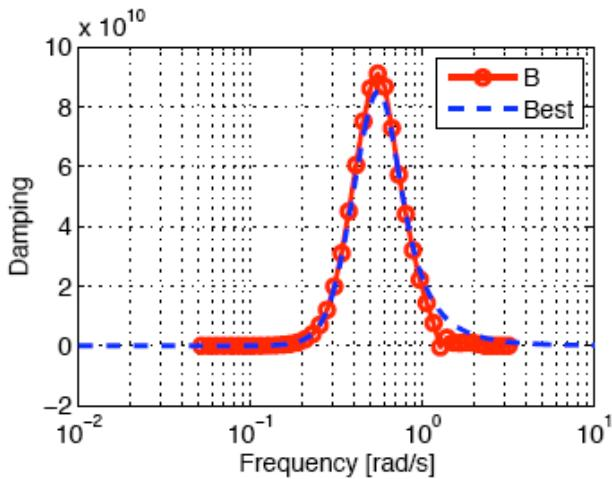

line

| Frequency [rad/s] | Damping (B) | Damping (Best) |
| ----------------- | ----------- | -------------- |
| 0.01              | 0           | 0              |
| 0.1               | 0           | 0              |
| 0.2               | 2           | 2              |
| 0.3               | 4           | 4              |
| 0.4               | 6           | 6              |
| 0.5               | 8           | 8              |
| 0.6               | 9           | 9              |
| 0.7               | 8           | 8              |
| 0.8               | 6           | 6              |
| 0.9               | 4           | 4              |
| 1.0               | 2           | 2              |
| 2.0               | 0           | 0              |
| 5.0               | 0           | 0              |
| 10.0              | 0           | 0              |

# example FPSO

Infinite-frequency added mass coefficients.

<table><tr><td>True Value</td><td>Identified</td><td>Rel. Err.</td></tr><tr><td> $A_{33}=1.7283e8$ </td><td> $\hat{A}_{33}=1.731e8$ </td><td>1.5 %</td></tr><tr><td> $A_{35}=-3.463e7$ </td><td> $\hat{A}_{35}=-3.7179e7$ </td><td>0.18%</td></tr><tr><td> $A_{55} 3.9154e11$ </td><td> $\hat{A}_{55}=3.9293e11$ </td><td>0.35%</td></tr></table>

Similar accuracy is obtained for the other couplings.

# Summary and Conclusions

 We have revisited different methods to the identification of time-domain models based on frequency domain computations.   
Time-domain methods

 Require forming the impulse response function (distortion).   
Make no use of prior knowledge (affects model quality).   
 Realization Theory is relatively easy to implement.   
Applicable to 2D and 3D data.

Frequency-domain methods

Simple to implement and use.   
 Incorporate prior knowledge as constraints (improved model quality).   
Applicable 2D and 3D data.

# This presentation

 This presentation summarizes the discussions in

 Perez and Fossen (2008a) Time- vs frequency-domain Identification of parametric radiation force models for marine structures at zero speed. Modeling, Identification and Control Vol. 29 No.1, pp1-19.   
 Perez and Fossen (----) Joint Identification of Infinite-frequency Added Mass and Fluid-Memory Models of Marine Structures. Modeling, Identification and Control. Under review.   
 Perez and Fossen (----) Identification of Seakeeping Models from Frequency-response data Enforcing Model structure and parameter Constraints. To be submitted at Ocean Engineering