# Time- vs. Frequency-domain Identification of Parametric Radiation Force Models for Marine Structures at Zero Speed

Tristan P´erez 1 Thor I. Fossen 2

1Centre for Complex Dynamic Systems and Control—CDSC,

The University of Newcastle, AUSTRALIA.

E-mail: Tristan.Perez@newcastle.edu.au

2Department of Engineering Cybernetics,

Norwegian University of Science and Technology—NTNU, Norway.

E-mail: fossen@ieee.org

# Abstract

The dynamics describing the motion response of a marine structure in waves can be represented within a linear framework by the Cummins Equation. This equation contains a convolution term that represents the component of the radiation forces associated with fluid memory effects. Several methods have been proposed in the literature for the identification of parametric models to approximate and replace this convolution term. This replacement can facilitate the model implementation in simulators and the analysis of motion control designs. Some of the reported identification methods consider the problem in the time domain while other methods consider the problem in the frequency domain. This paper compares the application of these identification methods. The comparison is based not only on the quality of the estimated models, but also on the ease of implementation, ease of use, and the flexibility of the identification method to incorporate prior information related to the model being identified. To illustrate the main points arising from the comparison, a particular example based on the coupled vertical motion of a modern containership vessel is presented.

Keywords: Identification, Frequency-domain, Time-domain, Marine structure models.

# 1 Introduction

Models for motion simulation of marine structures are of paramount importance for the development of training simulators, hardware in the loop testing simulators, motion control systems, wave energy converters, and model-based fault detection and diagnosis techniques. In recent years, there has been an increase of interest in the use of linear time-domain models obtained from frequency-domain data provided by seakeeping codes. This modelling approach is very favorable since it allows obtaining models from limited information about the vessel: hull form and approximate mass distribution. These linear models are the basis of more complex models obtained by adding nonlinear components like, for example, viscous forces and mooring lines.

A key element for the modelling of the response of marine structures in waves is the Cummins Equation, which relates the motion of the marine structure to the wave-induced forces within the linear time-invariant framework (Cummins, 1962). This equation is an integro differential equation that contains a convolution term representing fluid memory effects associated with the dynamics of the radiation forces. This convolution term is inconvenient for simulation and also for the analysis and design of motion control systems. Consequently, there has been a great deal of literature dedicated to obtaining parametric models for its approximation and replacement. Since the convolution is a dynamic linear operation, it can be approximated by a linear ordinary differential equation or state-space model—and in the particular case of convolution term in Cummins Equation, the approximating model is linear-time-invariant.

Finding a state-space model approximation for the convolution term in the Cummins Equation involves the use of system identification. In this particular application, the identification involves obtaining the model structure, order, and parameter values from either a frequency-response data computed by standard hydrodynamic codes or an impulse-response data derived from the frequency-domain data. Hence, the identification problem can be posed either in the time domain or in the frequency domain (with the subsequent conversion to time-domain to obtain the statespace model). Due to these alternative problem formulations, there has been a great deal of work reported in the literature—see, for example, Jefferys et al. (1984), Jefferys and Goheen (1992), Yu and Falnes (1995), Yu and Falnes (1998), Holappa and Falzarano (1999), Hjulstad et al. (2004), Kristansen and Egeland (2003), Kristiansen et al. (2005), Jordan and Beltran-Aguedo (2004), McCabe et al. (2005), and Sutulo and Guedes-Soares (2005). Within the marine control systems community, the renewed interest in this work could be accredited to the work of Kristansen and Egeland (2003).

Taghipour et al. (2008) provide a review of some of the methods in detail, and show—via an example— that the implementation of time-domain models based on state-space and direct convolution evaluation give results of similar quality. The direct convolution evaluation in discrete time results in a high-order finite impulse response (FIR) model. The results in Taghipour et al. (2008) also indicate that the gain in simulation speed can be of up to 40 times when using state-space models instead of direct convolution evaluation via FIR models. This significant increase in simulation speed is related to the Markovian property of the state-space model. That is, in the FIR model, it is necessary to save and process a large number of past response data to be able to compute the convolution at each time step of the simulation; whereas the state of a state-space model summarises all the past information. Therefore, it is sufficient to store and process only the state variables to compute the successor state given the excitation.

This paper complements the results reported in Taghipour et al. (2008) by comparing the application of time- and frequency-domain identification methods. The comparison is based not only on the quality of the estimated models, but also on the ease of implementation of the identification method, ease of use, and the flexibility of the method to incorporate prior information related to the model being identified.

We concentrate on models of rigid marine structures with zero forward speed. This class models is of significant importance due the offshore industry and the growing development of wave energy converters.

# 2 Cummins Equation and its Properties

The equations of motion of a rigid marine structure in body-fixed coordinates can be linearised about an equilibrium point and be expressed as

$$
\begin{array}{c} \mathbf {M} \delta \dot {\boldsymbol {\nu}} = \delta \boldsymbol {\tau} \\ s _ {i j} = s _ {j i} \end{array} \tag {1}
$$

$$
\delta \dot {\boldsymbol {\eta}} = \delta \boldsymbol {\nu},
$$

where M is the inertia matrix, δη represents the generalised perturbation position-orientation vector and δν the generalised perturbation body-fixed velocity vector. The generalised pressure force δτ vector can be separated into two components:

$$
\delta \boldsymbol {\tau} = \delta \boldsymbol {\tau} _ {r a d} + \delta \boldsymbol {\tau} _ {e x c}, \tag {2}
$$

where the first component corresponds to the radiation forces arising from the change in momentum of the fluid due to the motion of the structure, and the second component represents the pressure forces due to the incoming waves.

Cummins (1962) studied the radiation hydrodynamic problem in an ideal fluid and found the following representation for linear the pressure forces:

$$
\delta \pmb {\tau} _ {r a d} = - \mathbf {A} \delta \dot {\pmb {\nu}} - \int_ {0} ^ {t} \mathbf {K} (t - t ^ {\prime}) \delta \pmb {\nu} (t ^ {\prime})   d t ^ {\prime}. \tag {3}
$$

The first term in (3) represents forces due the accelerations of the structure, and A is the constant positive definite added inertia matrix. The second term represents fluid memory effects that incorporate the energy dissipation due the radiated waves consequence of the motion of the structure. The kernel of the convolution term, K(t), is the matrix of retardation or memory functions (impulse responses).

By renaming the variables, combining terms, and adding the hydrostatic restoring forces due to gravity and buoyancy $( \boldsymbol { \tau } _ { h s } = - \mathbf { G } \boldsymbol { \xi } )$ , we obtain the Cummins Equation as it normally appears in the hydrodynamic literature:

$$
(\mathbf {M} + \mathbf {A}) \ddot {\boldsymbol {\xi}} + \int_ {0} ^ {t} \mathbf {K} (t - t ^ {\prime}) \dot {\boldsymbol {\xi}} (t ^ {\prime}) d t ^ {\prime} + \mathbf {G} \boldsymbol {\xi} = \delta \boldsymbol {\tau} _ {e x c}, \tag {4}
$$

with $\xi = \delta \eta$

Equation (4) describes the motion of the structure at zero speed for any wave excitation $\delta \tau _ { e x c } ( t )$ provided the linearity assumption is satisfied; and it forms the basis of more complex models, which can be obtained by adding non-linear terms to represent different physical effects.

# 2.1 Frequency-domain Representation

When (4) is considered in the frequency domain, it takes the following form (Newman, 1977; Faltinsen, 1990):

$$
(- \omega^ {2} [ \mathbf {M} + \mathbf {A} (\omega) ] - j \omega \mathbf {B} (\omega) + \mathbf {G}) \tilde {\pmb {\xi}} = \delta \tilde {\pmb {\tau}} _ {e x c}, (5)
$$

where $\tilde { \pmb { \xi } }$ and $\delta \tilde { \tau } _ { e x c }$ are the complex response and excitation variables:

$$
\xi_ {i} (t) = \bar {\xi} _ {i} \cos (\omega t + \epsilon_ {i}) \Longrightarrow \tilde {\xi} _ {i} = \bar {\xi} _ {i} \exp (j \epsilon_ {i}) \tag {6}
$$

$$
\tau_ {i} (t) = \bar {\tau} _ {i} \cos (\omega t + \varepsilon_ {i}) \Longrightarrow \tilde {\tau} _ {i} = \bar {\tau} _ {i} \exp (j \varepsilon_ {i}).
$$

The parameters $\mathbf { A } ( \omega )$ and $\mathbf { B } ( \omega )$ are the frequencydependent added mass and damping respectively.

Equation (5) is also commonly written in a mixed frequency-time-domain form:

$$
[ \mathbf {M} + \mathbf {A} (\omega) ] \ddot {\pmb {\xi}} + \mathbf {B} (\omega) \dot {\pmb {\xi}} + \mathbf {G} \pmb {\xi} = \delta \pmb {\tau} _ {e x c}. \qquad (7)
$$

This form is rooted deeply in the literature of marine hydrodynamics. However, one should bear in mind that (7) is not a time-domain model, rather a different way or writing (5). In other words, (7) describes the steady-state response due to sinusoidal excitation, provided the coefficients are evaluated at the frequency of excitation forces. The abuse of notation of this false time-domain model has been discussed eloquently in the literature (Tick, 1959; Cummins, 1962).

# 2.2 Relationship between Frequency- and Time-domain Models

The relationship between the parameters of the models (4) and (5), were found by Ogilvie (1964) via direct application of the Fourier Transform under a sinusoidal regime:

$$
\mathbf {A} (\omega) = \mathbf {A} - \frac {1}{\omega} \int_ {0} ^ {\infty} \mathbf {K} (t) \sin (\omega t) d t, \tag {8}
$$

$$
\mathbf {B} (\omega) = \int_ {0} ^ {\infty} \mathbf {K} (t) \cos (\omega t) d t.
$$

From these expressions, it follows

$$
\mathbf {A} = \lim _ {\omega \rightarrow \infty} \mathbf {A} (\omega) \tag {9}
$$

From the application of Fourier Transform, it also follows the time- and frequency-domain representation of the retardation functions:

$$
\mathbf {K} (t) = \frac {2}{\pi} \int_ {0} ^ {\infty} \mathbf {B} (\omega) \cos (\omega t) d \omega , \tag {10}
$$

and

$$
\mathbf {K} (j \omega) = \int_ {0} ^ {\infty} \mathbf {K} (t) e ^ {- j \omega t} d \omega , \tag {11}
$$

$$
= \mathbf {B} (\omega) + j \omega [ \mathbf {A} (\omega) - \mathbf {A} ].
$$

# 3 Hydrodynamic Codes and Non-Parametric Models

Hydrodynamic codes based on potential theories (2D and 3D) are nowadays readily available for the computation of the frequency-dependant added mass, $\mathbf { A } ( \omega )$ , and potential damping, $\mathbf { B } ( \omega )$ . These data are computed for a reduced set of frequencies of interest; and therefore, they provide a mean to determine nonparametric models of the convolution terms via application of (10) and (11). These codes, however, have their inherent limitations due to theoretical and implementation issues.

In 3D or panel method codes, the size of the panels used to discretize the surface of the hull limit the accuracy of the computations at high frequency. As a rule of thumb, the characteristic size of the panels should be of the order of $1 / 8$ of the wave length corresponding to the larger frequency used in the computations (Faltinsen, 1990). This limits the upper frequency since smaller panels increase the number of computations significantly and result in numerical problems. 3D codes often solve for the particular cases of infinite and zero frequency, which result from particular boundary conditions on the free-surface that ensure no waves are generated.

For slender vessels, codes based on strip theory (2D) can be used. Slenderness results in the velocity field being nearly constant along the longitudinal direction. This characteristic allows reducing the 3D problem to a 2D problem (Newman, 1977). These codes have a limit on the lower frequency—this is due to an assumption made on the free surface condition that results in a simplification of the boundary-value problem (Salvesen et al., 1970). The two-dimensional hydrodynamic problem associated with each section or strip of the hull can be solved, for example, using conformal mapping or panel methods. If the 2D code uses panel methods to compute the hydrodynamic parameters associated with each strip, then the same limitations for high frequencies discussed for the 3D codes hold. Strip theory codes do not compute the zero and infinite frequency cases.

# 4 Parametric Model Identification

As mentioned in the introduction section, the convolution term in (4) is neither efficient for implementing numerical simulations nor convenient for control system analysis and design. This term can be approximated by a state-space model; i.e.,

$$
\pmb {\mu} = \int_ {0} ^ {t} \mathbf {K} (t - t ^ {\prime}) \delta \pmb {\nu} (t ^ {\prime}) d t ^ {\prime} \approx \begin{array}{l l} & \dot {\mathbf {x}} = \mathbf {A} ^ {\prime} \mathbf {x} + \mathbf {B} ^ {\prime} \delta \pmb {\nu} \\ & \pmb {\mu} = \mathbf {C} ^ {\prime} \mathbf {x} \end{array}
$$

The advantage of the state-space model from a simulation point of view lies in the Markovian characteristic of the model: at any time instant, the value of the state summarises all the past information of the system. With regards to control system analysis, the state-space formulation provides a rich framework.

The approximating state-space model for the convolution term is obtained using system identification. For this particular application consists, the identification of only three steps:

1. Determine the structure and order of the model.   
2. Estimate the parameters.   
3. Validate the model.

This procedure is not new for this application considered in this paper, and there has been a significant amount of literature dedicated to this problem during the last 20 years. The reason for this is that the identification problem can be posed either in the time domain (using (10) as data) or in the frequency domain (using (11) as data) and different estimators can be applied in each case—this is illustrated in Table 1.

An important aspect of any identification problem is the amount of a priori information available about the dynamic system under study and how this information is used. In general, using a priori information to set constraints on the model structure and parameters leads to better estimators (Ag¨uero, 2005; Verhaegen and Verdult, 2007).

Table 2 summarizes the properties of the retardation functions and their implications on the parametric models. These properties constitute a prior information for the identification problem subject of study in this paper. In Appendix A, we discuss the derivation of these properties in detail. In the sequel, we briefly revisit different methods previously proposed in the literature.

# 4.1 Time-domain Identification

The time-domain identification of radiation force models of marine structures consists of obtaining a parametric model from data of the impulse response. Two different approaches have been proposed in the literature for this application:

• Impulse response Least-Squares (LS) fitting.   
• Realization Theory.

# 4.1.1 Impulse Response LS fitting

The identification of radiation force models via LSfitting of the impulse response was proposed by Yu and Falnes (1995, 1998). Each entry $K _ { i k } ( t )$ of the matrix K(t) is approaximated by a state-space model of appropriate dimensions:

$$
\dot {\mathbf {x}} _ {i k} = \mathbf {A} _ {i k} ^ {\prime} \mathbf {x} _ {i k} + \mathbf {B} _ {i k} ^ {\prime} \delta \nu_ {k}
$$

$$
\pmb {\mu} _ {i k} = \mathbf {C} _ {i k} ^ {\prime} \mathbf {x} _ {i k}.
$$

The impulse response of this SISO system is given by

$$
\hat {K} _ {i k} (t) = \mathbf {C} _ {i k} ^ {\prime} \exp (\mathbf {A} _ {i k} ^ {\prime} t) \mathbf {B} _ {i k} ^ {\prime}.
$$

Given a particular state-space relalisation, the matrices can be parameterised in terms of the vector of m parameters (where $m = m ( i , k ) )$ :

$$
\pmb {\theta} _ {i k} = [ \theta_ {i k} ^ {1}, \dots , \theta_ {i k} ^ {m} ] ^ {T}.
$$

Then, the parameter estimation problem can be posed as a Least-Square (LS) problem:

$$
\begin{array}{l} \hat {\boldsymbol {\theta}} _ {i k} = \arg \min _ {\boldsymbol {\theta}} \\ \sum_ {n} \left(K _ {i k} (t _ {n}) - \mathbf {C} _ {i k} ^ {\prime} (\pmb {\theta}) e ^ {\mathbf {A} _ {i k} ^ {\prime} (\pmb {\theta}) t _ {n}} \mathbf {B} _ {i k} ^ {\prime} (\pmb {\theta})\right) ^ {2}. \quad (1 2) \\ \end{array}
$$

Note that we have not considered a matrix $\mathbf { D } _ { i k } ^ { \prime } ( \pmb \theta )$ of the state-space representation. This is a consequence of the relative degree 1 of the memory functions as indicated in Table 2 and showed in Appendix A.

# 4.1.2 Realization Theory

The application of Realization Theory to the identification of the radiation force models of marine structures was proposed by Kristansen and Egeland (2003)—see also Kristiansen et al. (2005).

Realization Theory addresses the problem of obtaining a state-space model (realization) of a system from its Markoff parameters. This problem is easier to address in discrete time since the Markoff parameters in this case are the values of the impulse response. For a SISO sytem, the impulse response is given by

$$
K _ {k} = \mathbf {C} \boldsymbol {\Phi} ^ {k - 1} \boldsymbol {\Gamma} + \mathbf {D},
$$

where $K _ { k }$ represents $K ( t _ { k } )$ , and

$$
\mathbf {x} _ {k + 1} = \boldsymbol {\Phi} \mathbf {x} _ {k} + \boldsymbol {\Gamma} u _ {k}
$$

$$
y _ {k} = \mathbf {C x} _ {k} + \mathbf {D u} _ {k}.
$$

Table 1: Identification Methods 

<table><tr><td>Time Domain, (Data K(t))</td><td> $\begin{bmatrix}\hat{\mathbf{A}}' & \hat{\mathbf{B}}'\\\hat{\mathbf{C}}' & \hat{\mathbf{D}}'\end{bmatrix} \Leftrightarrow \hat{\mathbf{K}}(s)$ </td></tr><tr><td>Frequency Domain, (Data K(jω))</td><td> $\hat{\mathbf{K}}(s) \Leftrightarrow \begin{bmatrix}\hat{\mathbf{A}}' & \hat{\mathbf{B}}'\\\hat{\mathbf{C}}' & \hat{\mathbf{D}}'\end{bmatrix}$ </td></tr></table>

Table 2: Properties of Retardation Functions 

<table><tr><td>Property</td><td>Implication on Parametric Models  $K_{ik}(s) = P(s)/Q(s)$ </td></tr><tr><td>1)  $\lim_{\omega \to 0} \mathbf{K}(j\omega) = \mathbf{0}$ </td><td>There are zeros at s = 0.</td></tr><tr><td>2)  $\lim_{\omega \to \infty} \mathbf{K}(j\omega) = \mathbf{0}$ </td><td>Strictly proper.</td></tr><tr><td>3)  $\lim_{t \to 0^{+}} \mathbf{K}(t) \neq \mathbf{0}$ </td><td>Relative degree 1.</td></tr><tr><td>4)  $\lim_{t \to \infty} \mathbf{K}(t) \neq \mathbf{0}$ </td><td>BIBO stable.</td></tr><tr><td>5) The mapping  $\dot{\boldsymbol{\xi}} \mapsto \boldsymbol{\mu}$  is Passive</td><td> $\mathbf{K}(j\omega)$  is positive real (diagonal entries  $K_{ii}(j\omega)$  positive real.</td></tr></table>

A fundamental result by Ho and Kalman (1966) establishes that the Hankel matrix of the discrete-time impulse response (constant along the anti-diagonals) can be factorized as the extended controllability and observability matrix:

$$
\begin{array}{l} \mathcal {H} _ {k} = \left[ \begin{array}{c c c c} K _ {1} & K _ {2} & \ldots & K _ {k} \\ K _ {2} & K _ {3} & \ldots & K _ {k + 1} \\ \vdots & \vdots & & \vdots \\ K _ {k} & K _ {k + 1} & \ldots & K _ {2 k - 1} \end{array} \right] \\ = \left[ \begin{array}{c} \mathbf {C} \\ \mathbf {C} \boldsymbol {\Phi} \\ \mathbf {C} \boldsymbol {\Phi} ^ {2} \\ \vdots \\ \mathbf {C} \boldsymbol {\Phi} ^ {k - 1} \end{array} \right] \left[ \begin{array}{l l l l l} \boldsymbol {\Gamma} & \boldsymbol {\Phi} \boldsymbol {\Gamma} & \boldsymbol {\Phi} ^ {2} \boldsymbol {\Gamma} & \dots & \boldsymbol {\Phi} ^ {k - 1} \boldsymbol {\Gamma} \end{array} \right] \tag {13} \\ \end{array}
$$

Furthermore, the rank of $\mathcal { H } _ { k }$ , gives the order of the system. Based on this result, Kung (1978), proposed an algorithm based on the Singular Value Decomposition (SVD) of $\mathcal { H } _ { k }$ to obtain the state-space model. This is done in three stages:

1. Compute the SVD: $\mathcal { H } _ { k } = \mathbf { U } \boldsymbol { \Sigma } \mathbf { V } ^ { * }$ (where ∗ denoted conjugate transpose).   
2. Determine the (numerical) rank of $\mathcal { H } _ { k }$ by counting the number of significant singular values.   
3. Find the matrices of the discrete-time state space model from the factors of the SVD.

The SVD can be factored as follows

$$
\mathcal {H} _ {k} = \left[ \mathbf {U} _ {1} \mathbf {U} _ {2} \right] \left[ \begin{array}{c c} \Sigma_ {1} & 0 \\ 0 & \Sigma_ {2} \end{array} \right] \left[ \mathbf {V} _ {1} ^ {*} \mathbf {V} _ {2} ^ {*} \right] = \mathbf {U} _ {1} \Sigma_ {1} \mathbf {V} _ {1} ^ {*} \tag {14}
$$

where $\Sigma _ { 1 }$ contains the n most significant singular values, and this determines the order of the system and the partition of the other factors. Then, matrices of the state-space realization can be determined as follows:

$$
\begin{array}{l} \boldsymbol {\Phi} = \Sigma_ {1} ^ {- 1 / 2} \left[ \begin{array}{c} \mathbf {U} _ {1 1} \\ \mathbf {U} _ {1 2} \end{array} \right] ^ {T} \left[ \begin{array}{c} \mathbf {U} _ {1 2} \\ \mathbf {U} _ {1 3} \end{array} \right] \Sigma_ {1} ^ {1 / 2} \\ \mathbf {\Gamma} = \Sigma_ {1} ^ {- 1 / 2} \mathbf {V} _ {1 1} ^ {*} \\ \mathbf {C} = \mathbf {U} _ {1 1} \Sigma_ {1} ^ {1 / 2} \\ \mathbf {D} = h (0), \\ \end{array}
$$

where

$$
\mathbf {U} _ {1} = \left[ \begin{array}{c} \mathbf {U} _ {1 1} \\ \mathbf {U} _ {1 2} \\ \mathbf {U} _ {1 3} \end{array} \right], \quad \mathbf {V} _ {1} = \left[ \begin{array}{c} \mathbf {V} _ {1 1} \\ \mathbf {V} _ {1 2} \\ \mathbf {V} _ {1 3} \end{array} \right]
$$

with the dimensions of $\mathbf { U } _ { i i }$ and $\mathbf { V } _ { i i }$ being $n \times n$ . For further details see Kung (1978).

Once the parameters of the discrete time model have been obtained, the model can be converted to continuous time using the bilinear transformation (Al-Saggaf

and Franklin, 1988):

$$
\mathbf {A} ^ {\prime} = \frac {2}{T _ {s}} (\mathbf {I} + \boldsymbol {\Phi}) ^ {- 1} (\boldsymbol {\Phi} - \mathbf {I})
$$

$$
\mathbf {B} ^ {\prime} = \frac {2}{\sqrt {T _ {s}}} (\mathbf {I} + \boldsymbol {\Phi}) ^ {- 1} \boldsymbol {\Gamma}
$$

$$
\mathbf {C} ^ {\prime} = \frac {2}{\sqrt {T _ {s}}} \mathbf {C} (\mathbf {I} + \boldsymbol {\Phi}) ^ {- 1}
$$

$$
\mathbf {D} ^ {\prime} = \mathbf {D} - \mathbf {C} (\mathbf {I} + \boldsymbol {\Phi}) ^ {- 1} \boldsymbol {\Gamma},
$$

where $T _ { s }$ is the sampling period. The methodology described above is implemented in MATLAB in the function imp2ss of the Robust Control Toolbox.

# 4.2 Frequency-domain Identification

Since the hydrodynamic codes provide the values of A(ω), A(∞), B(ω) and thus $\mathbf { K } ( j \omega )$ for a discrete set of frequencies, it seems natural to use these data directly in the frequency domain to fit a parametric model. Different approaches have been proposed in the literature that follow this idea:

Least-Square fitting of a rational transfer function to either the complex added mass or damping $\tilde { \mathbf { A } } ( j \omega )$ and $\tilde { \mathbf { B } } ( j \omega )$ , where

$$
\tilde {\mathbf {A}} (j \omega) = j \omega \tilde {\mathbf {B}} (j \omega) = \mathbf {A} (\infty) + \mathbf {K} (j \omega) / j \omega .
$$

Least-Square fitting of a rational transfer function to

$$
\mathbf {K} (j \omega) = \mathbf {B} (\omega) + j \omega [ \mathbf {A} (\omega) - \mathbf {A} (\infty) ].
$$

The first approach was proposed within the hydrodynamic literature—see, for example, S¨oding (1982) , Xia et al. (1998), and Sutulo and Guedes-Soares (2005). The two proposals are related. In the sequel, we revisit the second approach, which was first proposed by Jefferys (1984) and then further analysed by Damaren (2000). Kaasen and Mo (2004) propose a variant to estimate the parameters of the approximation for $\mathbf { K } ( j \omega )$ , but using only the data of $\mathbf { B } ( \omega )$ . This approach has the advantage that the infinite frequency added mass is not necessary; and therefore, it is useful if one has data from 2D hydrodynamic codes that in general do not compute $\mathbf { A } ( \infty )$ . The resulting optimisation problem can be solved with a similar method to that used for the fitting of $\mathbf { K } ( j \omega )$ .

# 4.2.1 Frequency Response Curve Fitting

Since (11) provides a non-parametric model for the frequency response of the convolution, it natural to use this to fit a parametric model or appropriate dimensions. One way of doing this is by means of LS optimization. Indeed, consider the parametric model if i-k entry of $\mathbf { K } ( j \omega )$ ; then,

$$
\hat {K} _ {i k} (s, \boldsymbol {\theta}) = \frac {P (s , \boldsymbol {\theta})}{Q (s , \boldsymbol {\theta})} = \frac {p _ {m} s ^ {m} + p _ {m - 1} s ^ {m - 1} + \dots + p _ {0}}{s ^ {n} + q _ {n - 1} s ^ {n - 1} + \dots + q _ {0}}, \tag {15}
$$

with the vector of parameters defined as

$$
\boldsymbol {\theta} = \left[ p _ {m}, \dots , p _ {0}, q _ {n - 1}, \dots , q _ {0} \right] ^ {T}. \tag {16}
$$

Then, a least squares approach consists of finding the appropriate order of the numerator and denominator polynomials and then find the parameters such that

$$
\boldsymbol {\theta} _ {i k} ^ {\star} = \arg \min _ {\boldsymbol {\theta}} \sum_ {l} w _ {l} \left| K _ {i k} (j \omega_ {l}) - \hat {K} _ {i k} (j \omega_ {l}, \boldsymbol {\theta}) \right| ^ {2}, \tag {17}
$$

where wl are weights that can be exploited to select how important is the fit at different frequency ranges.

The above parameter estimation problem is a nonlinear LS problem in the parameters, which can be solved using a Gauss-Newton algorithm, or it can be linearized (Levy, 1959) and solved iteratively (Sanathanan and Koerner, 1963):

$$
\theta_ {m} = \arg \min _ {\theta}
$$

$$
\sum_ {l} s _ {l, p} \left| Q _ {i k} (j \omega_ {l}, \pmb {\theta}) K _ {i k} (j \omega_ {l}) - P _ {i k} (j \omega_ {l}, \pmb {\theta}) \right| ^ {2}, \quad (1 8)
$$

where

$$
s _ {l, p} = \frac {1}{| Q _ {i k} (j \omega_ {l} , \pmb {\theta} _ {p - 1}) | ^ {2}}.
$$

Note that (18) results in a Linear LS minimization. After a few iterations (usually p=10 to 20), $Q _ { i k } ( j \omega _ { l } , \pmb { \theta } _ { p } ) \approx Q _ { i k } ( j \omega _ { l } , \pmb { \theta } _ { p - 1 } ) ;$ and therefore, Eq. (17) is approximately recovered. This allows solving the nonlinear LS problem via an iteration of linear ones.

The LS fitting does not guarantee stability per se. This issue can be addressed by computing the roots of the resulting denominator polynomial, reflect any root with positive real part about the imaginary axis, and re-compute the coefficients from the new roots.

The function invfreqs of the signal processing toolbox in MATLAB solves the linear problem with the option of using a vector of weighting coefficients. Therefore, it is straightforward to implement the iterative procedure starting with $s _ { l , 1 } ~ = ~ 1$ . The function also has the option of solving the non-linear LS problem via Gauss-Newton algorithms using the results of the linearised problem as initial value of the parameters for the optimisation.

# 4.2.2 An Alternative Approach for 2D-hydrodynamic Data

When data from 2D hydrodynamic codes is used, the infinite frequency added mass is normally not available. In this case, one could estimate its value and use the method described in the previous section. This, however, should be done carefully, since the method described in the previous section can be sensitive to this value. Kaasen and Mo (2004) presented a method that resolves this problem by estimating the parameters using only the data of the computed damping $B _ { i k } ( \omega )$ . This is possible because the parametric models for $K _ { i k } ( s )$ are stable and proper; therefore, it follows form Bode’s integrals that the real part contains all the information to reconstruct the imaginary part (Ser´on et al., 1997).

From (11), it follows that the frequency dependant damping coefficients are the real part of the retardation functions:

$$
B _ {i k} (\omega) = \Re \{K _ {i k} (j \omega) \}. \qquad (1 9)
$$

From the parametric model (15), this can be expressed as

$$
\begin{array}{l} \Re \left\{\hat {K} _ {i k} (j \omega) \right\} = \frac {\Re \left\{P (j \omega , \boldsymbol {\theta}) Q (- j \omega , \boldsymbol {\theta}) \right\}}{Q (j \omega , \boldsymbol {\theta}) Q (- j \omega , \boldsymbol {\theta})} \tag {20} \\ = \frac {R (\omega , \pmb {\theta})}{S (\omega , \pmb {\theta})}, \\ \end{array}
$$

where $R ( \omega , \pmb \theta )$ and $S ( \omega , \pmb \theta )$ are real polynomial with only even powers of $\omega .$ If the degree of $P ( \omega , \pmb \theta )$ is m and the the degree of $Q ( \omega , \pmb \theta )$ is n, the relative degree constraint in Table 2 establishes that $m = n - 1$ . Therefore, the degree of $R ( \omega , \pmb \theta )$ is $2 n - 2$ and the degree of $S ( \omega , \pmb \theta )$ is either $2 n$ .

The coefficients of $R ( \omega , \pmb \theta )$ and $S ( \omega , \pmb \theta )$ are related to $\pmb \theta$ in a nonlinear fashion. We can see this from a simple example. Based on the properties of the convolution terms given in Table 2, it follows that the minimum order transfer function that satisfies all the properties is a second order one of the following type:

$$
\hat {K} _ {i k} (s, \boldsymbol {\theta}) = \frac {p s}{s ^ {2} + q _ {1} s + q _ {0}}, \tag {21}
$$

with $\pmb { \theta } = [ \theta _ { 1 } , \theta _ { 2 } , \theta _ { 3 } ] ^ { T } = [ p , q _ { 1 } , q _ { 0 } ] ^ { T }$ . Form (20), we obtain

$$
\frac {R (\omega , \pmb {\theta})}{S (\omega , \pmb {\theta})} = \frac {p q _ {1} (j \omega) ^ {2}}{(j \omega) ^ {4} + (2 q _ {0} - q _ {1} ^ {2}) (j \omega) ^ {2} + q _ {0} ^ {2}}. \tag {22}
$$

Here, we can see that coefficients of the polynomials $R ( \omega , \pmb \theta )$ and $S ( \omega , \pmb \theta )$ are non-linear in θ. Expression (22) can be re-parameterise in terms of

$$
\pmb {\theta} ^ {\prime} = [ \theta_ {1} ^ {\prime}, \theta_ {2} ^ {\prime}, \theta_ {3} ^ {\prime} ] ^ {T} = [ p q _ {1}, 2 q _ {0} - q _ {1} ^ {2}, q _ {0} ^ {2} ] ^ {T}, (2 3)
$$

which gives

$$
\frac {R (\omega , \pmb {\theta} ^ {\prime})}{S (\omega , \pmb {\theta} ^ {\prime})} = \frac {\theta_ {1} ^ {\prime} (j \omega) ^ {2}}{(j \omega) ^ {4} + \theta_ {2} ^ {\prime} (j \omega) ^ {2} + \theta_ {3} ^ {\prime}}. \tag {24}
$$

Using this new parameterisation, we can estimate the new parameters via

$$
\pmb {\theta} ^ {\star} = \arg \min _ {\pmb {\theta} ^ {\prime}} \sum_ {l} \left(B _ {i k} (\omega_ {l}) - \frac {R (\omega_ {l} , \pmb {\theta} ^ {\prime})}{S (\omega_ {l} , \pmb {\theta} ^ {\prime})}\right) ^ {2}. (2 5)
$$

Note that this problem, is similar to (17); and therefore it can be solved in a similar way.

After optimising $\pmb { \theta } ^ { \prime }$ , we can obtain θ. The problem with this approach is that different values of $\pmb \theta$ can result in the same $\pmb { \theta } ^ { \prime }$ . Indeed, for the second-order example considered above, we have the following relationships:

$$
\begin{array}{l} \theta_ {3} = \pm \sqrt {\theta_ {3} ^ {\prime}}, \\ \theta_ {2} = \pm \sqrt {2 \theta_ {3} - \theta_ {2} ^ {\prime}}, \tag {26} \\ \theta_ {1} = \theta_ {1} ^ {\prime} / \theta_ {2}, \\ \end{array}
$$

which show the identifiability problem. This issue, however, is solvable by adding constraints related to the stability of the system.

Kaasen and Mo (2004) addressed this problem in a different way. They made a partial-fraction expansion of (20) in terms of $\omega ^ { 2 }$ :

$$
\frac {R (\omega^ {2} , \pmb {\theta} ^ {\prime})}{S (\omega^ {2} , \pmb {\theta} ^ {\prime})} = \frac {r _ {1} ^ {\prime}}{\omega^ {2} - p _ {1} ^ {\prime}} + \frac {r _ {2} ^ {\prime}}{\omega^ {2} - p _ {2} ^ {\prime}} + \dots + \frac {r _ {n} ^ {\prime}}{\omega^ {2} - p _ {n} ^ {\prime}}, (2 7)
$$

The residuals $r _ { i } ^ { \prime }$ and the poles $p _ { i } ^ { \prime }$ are related to the residuals and poles of the partial-fraction expansion of (15):

$$
\frac {P (j \omega)}{Q (j \omega)} = \frac {r _ {1}}{j \omega - p _ {1}} + \frac {r _ {2}}{j \omega - p _ {2}} + \dots + \frac {r _ {n}}{j \omega - p _ {n}}, \tag {28}
$$

via

$$
p _ {i} = \pm j \sqrt {p _ {i} ^ {\prime}}, \quad r _ {i} = - \frac {r _ {i} ^ {\prime}}{p _ {i}}. \tag {29}
$$

After the poles and residuals $p _ { i }$ and $r _ { i }$ are computed (choosing the appropriate sign so $\Re \{ p _ { i } \} < 0 )$ , the parameters θ are obtained by distributing (28).

Finally, a perhaps, less involved alternative, consists of using the force to velocity frequency response to estimate an input-output parametric model as proposed by Perez and Lande (2006). This approach does not require either A. Indeed, from the data computed by the hydrodynamic code, one can compute the force-to-motion frequency response functions (non-parametric models). It follows from (5) that the force-to-displacement and force-to-velocity frequency response functions for the case of can be computed via

$$
\mathbf {H} _ {f 2 d} (j \omega) = (- \omega^ {2} [ \mathbf {M} + \mathbf {A} (\omega) ] - j \omega \mathbf {B} (\omega) + \mathbf {G}) ^ {- 1},
$$

(30)

$$
\mathbf {H} _ {f 2 v} (j \omega) = (j \omega) \mathbf {H} _ {f 2 d} (j \omega). \tag {31}
$$

Having the frequency responses we can then fit a transfer function. If this is done to the force to velocity model, then by adding integrators, we can obtain the displacements. This allows having access to both variables that may be needed to complement the model with non-linear components (like viscous efects) and motion control systems. Further details on this approach go beyond the scope of this paper, and the interested reader can see—Perez and Lande (2006).

# 5 Assessing the Quality of the Model

Once the parametric model for the convolution terms are obtained, we can assess how good the impulse and the frequency response are fitted. However, we should also assess how good the parametric models are with respect to the force-to-motion frequency responses (30) and (31). This comparison is a key issue, for two reasons:

When simulating the motion of marine structures, we are often more interested in the displacements and velocities, rather than in the radiation forces.   
• As we argue in the next section, the quality of the force-to-motion models obtained via (34) and (35) is not very sensitive to the quality of the convolution model $\hat { \mathbf { K } } ( s )$ .

Using the parametric models of the convolution terms we can obtain the Transfer Function (TF) matrix

$$
\hat {\mathbf {K}} (s) = \left[ \begin{array}{c c c} \frac {P _ {1 1} (s)}{Q _ {1 1} (s)} & \dots & \frac {P _ {1 6} (s)}{Q _ {1 6} (s)} \\ \vdots & \ddots & \vdots \\ \frac {P _ {6 1} (s)}{Q _ {6 1} (s)} & \dots & \frac {P _ {6 6} (s)}{Q _ {6 6} (s)} \end{array} \right]. \tag {32}
$$

If the parametric models are identified using frequencydomain methods this is obtained directly. If the models are identified using time-domain methods, this transfer matrix is obtained using the Laplace Transform:

$$
\hat {K} _ {i k} (s) = \hat {\mathbf {C}} _ {i k} (s \mathbf {I} _ {i k} - \hat {\mathbf {A}} _ {i k}) ^ {- 1} \hat {\mathbf {B}} _ {i k}. \qquad (3 3)
$$

Then, it also follows from the Laplace Transform of (4) that the force-to-displacement and force-to-velocities TFs are

$$
\hat {\mathbf {H}} _ {f 2 d} (s) = s ^ {- 1} [ \mathbf {I} + \mathbf {G} ^ {\prime} (s) \hat {\mathbf {K}} (s) ] ^ {- 1} \hat {\mathbf {K}} (s), \tag {34}
$$

$$
\hat {\mathbf {H}} _ {f 2 v} (s) = [ \mathbf {I} + \mathbf {G} ^ {\prime} (s) \hat {\mathbf {K}} (s) ] ^ {- 1} \hat {\mathbf {K}} (s), \tag {35}
$$

where

$$
\mathbf {G} ^ {\prime} (s) = \left(s ^ {2} \mathbf {I} + [ \mathbf {M} + \mathbf {A} (\infty) ] ^ {- 1} \mathbf {G}\right) ^ {- 1} [ \mathbf {M} + \mathbf {A} (\infty) ] ^ {- 1} s. \tag {36}
$$

We can ten compare (34) (for s = jω) with (30) and (35) $( \mathrm { f o r } \ s = j \omega )$ with (31).

# 6 Passivity

The last property in Table 2, states that the transfer function model $\hat { \mathbf { K } } ( s )$ should be passive and thus positive real to agree with the properties of the of retardation functions—See Appendix A. This property derives from the fact that the radiation forces are dissipative (Damaren, 2000; Kristiansen et al., 2005).

One of the fundamental properties of passive systems is that the negative feedback interconnection of passive systems is passive; and thus, stable under observability conditions (Khalil, 2000). Figure 1 shows a block diagram representation of the Cummins Equation in the frequency domain in terms of the parametric model $\hat { \mathbf { K } } ( s )$ and the transfer function matrix $\mathbf { G } ^ { \prime } ( s )$ given in (36). This figure shows the negative feedback interconnection between Kˆ (s) and $\mathbf { G } ^ { \prime } ( s )$ . The transfer function matrix $\mathbf { G } ^ { \prime } ( s )$ is passive (Kristiansen et al., 2005). Therefore, the interconnection shown in Figure 1 will also be passive provided the model Kˆ (s) is passive. Here lies the importance of passivity of the identified parametric model.

The non-passivity of Kˆ (s) does not necessarily imply that the interconnection shown Figure 1 in will be unstable. However, since the passivity property follows from the hydrodynamics it is desirable to retain this property in the model. As we will see in the numerical example of Section 8, a non passive entry for the diagonal terms implies that $\hat { B } _ { i i } ( \omega ) = \Re \{ \hat { K } _ { i i } ( j \omega ) \} < 0$ for some frequencies, which is not consistent with the hydrodynamic theory.

# 7 A Discussion about Time- and Frequency-domain Identification

In Section 4, we have briefly revisited the main methods that have been proposed in the literature for the identification of parametric models to replace the convolution terms in the Cummins Equation. In this section, we discuss the applicability of these methods and compare them. We based our comparison on three characteristics:

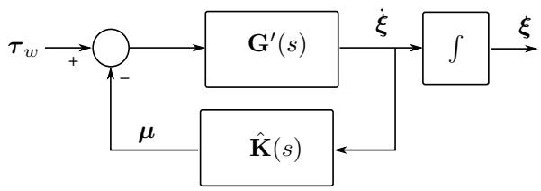

flowchart

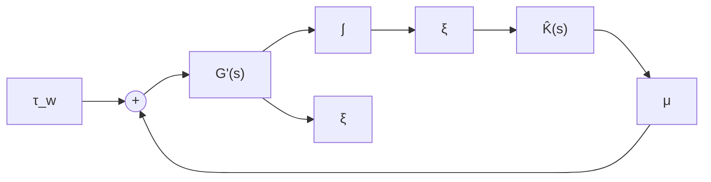

Figure 1: Block diagram of the the Cummins Equation in terms of parametric transfer functions.

Ability of the model to reproduce the properties of the convolutions derived from hydrodynamics—see Table 2.   
• Use of available prior information (low frequency asymptotic values, relative degree, stability, and passivity.)   
Ease of use and implementation of the identification method.

Before going into the discussion of the different identification methods for the radiation force models, we we would like to draw attention to the errors that appear in the time-domain data due to finite frequencydomain data. These errors affect all the time-domain identification methods.

# 7.1 Errors in the Non-parametric time-domain Data

The quality of the identified model using any timedomain identification method depends on the accuracy of the non-parametric model $K _ { i k } ( t )$ . This impulse response is computed from the hydrodynamic data using (10). However, as discussed in Section 3, hydrodynamic computations impose limits on the frequency interval used to evaluate the integral (10). Thus,

$$
\mathbf {K} (t) \approx \bar {\mathbf {K}} (t) = \frac {2}{\pi} \int_ {0} ^ {\Omega} \mathbf {B} (\omega) \cos (\omega t) d \omega . \tag {37}
$$

The finite upper limit in the integral above introduces an error:

$$
\begin{array}{l} \mathbf {K} (t) = \bar {\mathbf {K}} (t) + \epsilon (\Omega , t), \\ \epsilon (\Omega , t) = \frac {2}{\pi} \int_ {\Omega} ^ {\infty} \mathbf {B} (\omega) \cos (\omega t) d \omega . \tag {38} \\ \end{array}
$$

For the case of zero-forward speed, Journ´ee (1993) gives an estimation of the magnitude of the errors for the decoupled modes. To reduce the error, one could use asymptotic values of $\mathbf { B } ( \omega )$ to increase Ω. For the case of zero speed case, Greenhow (1986) derived the following asymptotic trend using series expansions:

$$
\text { as } \quad \omega \to \infty , \quad B _ {i k} (\omega) \to \frac {\beta_ {1}}{\omega^ {4}} + \frac {\beta_ {2}}{\omega^ {2}}. \tag {39}
$$

Note that as ω increases the above is dominated by the $\omega ^ { - 2 }$ term. The $\omega ^ { - 2 }$ trend follows immediately from the degrees of $R ( \omega )$ and $S ( \omega )$ in (20) (Perez and Fossen, 2007). The asymptotic behaviour (39) can be explained from the relative degree of the parametric representation, and as shown in the the Appendix, it will be exhibited whenever the area under the damping curve is not zero.

Figure 2 shows the computed damping in the vertical modes of a particular vessel at zero speed used to illustrate the discussion in this paper (Further details about this vessel are given in Section 8). Figure 3 shows computed damping and the asymptotic tails based on (39), and Figure 4 shows the retardation functions computed from (37) using the damping with and without asymptotic tails. In the latter figure we can appreciate the difference in the impulse response due to the finite-frequency limit.

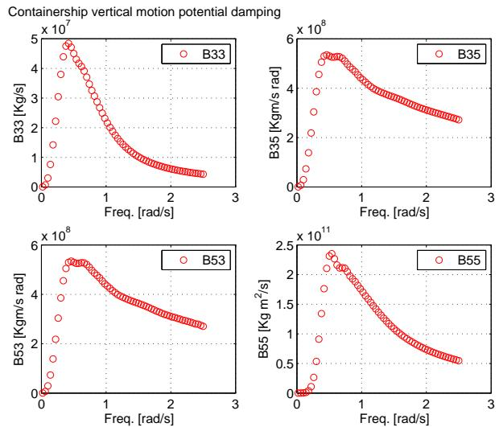  
Figure 2: Potential damping computed by hydrodynamic code.

# 7.2 Impulse Response LS fitting

The method of fitting the impulse response has a few drawbacks that could render it impractical for application to memory functions. The parameter estimation problem (12) is a nonlinear LS problem. This problem can be solved numerically via Gauss-Newton methods—see, for example Nocedal and Wright (2006). The performance of the optimisation algorithm depends on the initial guess for the value of the parameters. These values, in turn, depend on the particular realization1 used. This realization must be adopted without any guidelines. Yu and Falnes (1995, 1998), for example, use an observer canonical realization, which reduces the number of parameters to be estimated to twice the order of the system. It is not clear, however, whether this is the best choice. Indeed, the parameteristion affects the shape of cost function being optimised, and also the constraints in the parameter space if these are necessary. Therefore, some realisations could result in numerical problems (Verhaegen and Verdult, 2007).

Containership vertical motion potential damping   
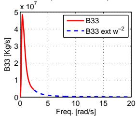

line

| Freq. [rad/s] | B33 [Kg/s] |
| ------------- | ---------- |
| 0             | 5.0        |
| 5             | 0.5        |
| 10            | 0.1        |
| 15            | 0.05       |
| 20            | 0.02       |

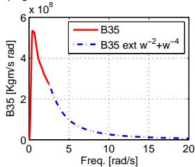

line

| Freq. [rad/s] | B35 [Kgm/s rad] | B35 ext w^-2+w^-4 |
| ------------- | --------------- | ----------------- |
| 0             | 6.0e8           | 6.0e8             |
| 5             | 2.0e8           | 1.0e8             |
| 10            | 0.5e8           | 0.1e8             |
| 15            | 0.1e8           | 0.01e8            |
| 20            | 0.01e8          | 0.001e8           |

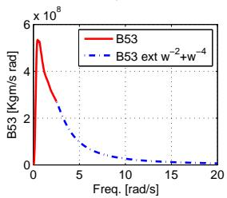

line

| Freq. [rad/s] | B53 [Kgm/s rad] |
| ------------- | --------------- |
| 0             | 6e8             |
| 5             | 2e8             |
| 10            | 1e8             |
| 15            | 5e7             |
| 20            | 2e7             |

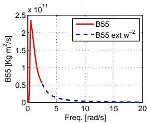

line

| Freq. [rad/s] | B55 [kg m⁻²/s] × 10¹¹ |
| ------------- | --------------------- |
| 0             | 2.4                   |
| 5             | 0.5                   |
| 10            | 0.1                   |
| 15            | 0.05                  |
| 20            | 0.01                  |

Figure 3: Potential damping computed by hydrodynamic code and extrapolation based on asymptotic tail.   
Containership vertical motion retardation functions   
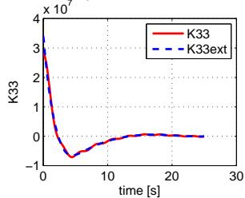

line

| time [s] | K33     | K33ext  |
| -------- | ------- | ------- |
| 0        | 4.0e+07 | 4.0e+07 |
| 5        | -1.0e+07| -1.0e+07|
| 10       | 0.0e+00 | 0.0e+00 |
| 15       | 0.5e+00 | 0.5e+00 |
| 20       | 1.0e+00 | 1.0e+00 |
| 25       | 1.5e+00 | 1.5e+00 |
| 30       | 2.0e+00 | 2.0e+00 |

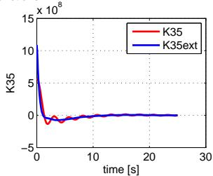

line

| time [s] | K35       | K35ext    |
| -------- | --------- | --------- |
| 0        | 10000000  | 10000000  |
| 5        | -1000000  | -1000000  |
| 10       | 0         | 0         |
| 15       | 0         | 0         |
| 20       | 0         | 0         |
| 25       | 0         | 0         |
| 30       | 0         | 0         |

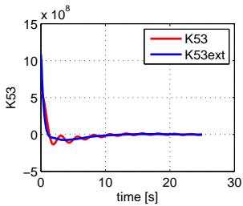

line

| time [s] | K53       | K53ext   |
| -------- | --------- | -------- |
| 0        | 15.0e+08  | 15.0e+08 |
| 5        | -1.0e+08  | -1.0e+08 |
| 10       | 0.0       | 0.0      |
| 15       | 0.0       | 0.0      |
| 20       | 0.0       | 0.0      |
| 25       | 0.0       | 0.0      |
| 30       | 0.0       | 0.0      |

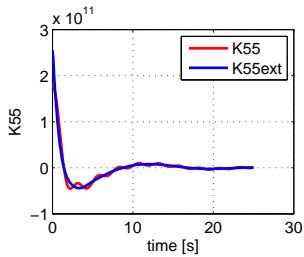

line

| time [s] | K55       | K55ext   |
| -------- | --------- | -------- |
| 0        | 3.0e11    | 3.0e11   |
| 5        | -0.5e11   | -0.2e11  |
| 10       | 0.1e11    | 0.05e11  |
| 15       | 0.05e11   | 0.02e11  |
| 20       | 0.02e11   | 0.01e11  |
| 25       | 0.01e11   | 0.005e11 |
| 30       | 0.005e11  | 0.002e11 |

Figure 4: Retardation functions computed from the potential damping.

Another disadvantage of this method is that the order of the model is not easy to estimate by looking a the impulse response. To alleviate this, one can follow the same procedure as in realization theory and estimate the order from the numerical rank of the matrix (13) formed from the samples of the impulse response.

Due to the issues discussed above, the application of this method has not proliferated beyond the initial proposal by Yu and Falnes (1995, 1998).

# 7.3 Realization Theory

This method has the advantage that the order of the system can be obtained by counting the number of significant singular values of $\mathcal { H } _ { k }$ given in $( \mathrm { { 1 3 } ) \mathrm { { - a } } }$ matrix assembly of the samples of the impulse response. High order models, however, may result depending on the how close the singular values are and how the decision whether to consider a particular singular value significant or not is implemented.

Since the parameters of the models are obtained from a factorization of $\mathcal { H } _ { k }$ rather than an optimization problem, it is not necessary to have an initial guess of the the parameters, which is also an advantage. On the other hand, the method has a few disadvantages when it comes to the application to the fluid memory functions due to the impossibility of enforcing model structure.

As discussed in Section 7.1, the quality of the identified model depends on the accuracy of the nonparametric models $K _ { i k } ( t )$ . The errors introduced in the impulse response due to the finite high-frequency limit Ω in the integral (37) affect the order selection. For example, Figure (5) shows the normalised singular values obtained from the Hankel matrix assembles with the different impulse response samples corresponding to Figure 4. In this figure, we can see that the singular values cenrtainly indicate different order approximations. This is further discussed in Section 8.

Apart from the errors introduced in the computation of the non-parametric models $K _ { i k } ( t )$ due to the finite frequency data, the method identifies the models in discrete time, which then may need to be converted to continuous time. As commented in Section 4, this can be done using the bi-linear transformation, but this may also introduces errors.

The consequence of the errors incurred in the computation of the non-parametric impulse response together with those arising from the discrete to continuous time conversion is that, normally, the models obtained with Realization Theory satisfy neither the low frequency asymptotic values nor the relative degree of the memory functions. In addition, the models obtained may not be passive. Therefore, it may be necessary to perform model order reduction or to try different orders to obtain a passive approximation—see Kristiansen et al. (2005) and Unneland (2007).

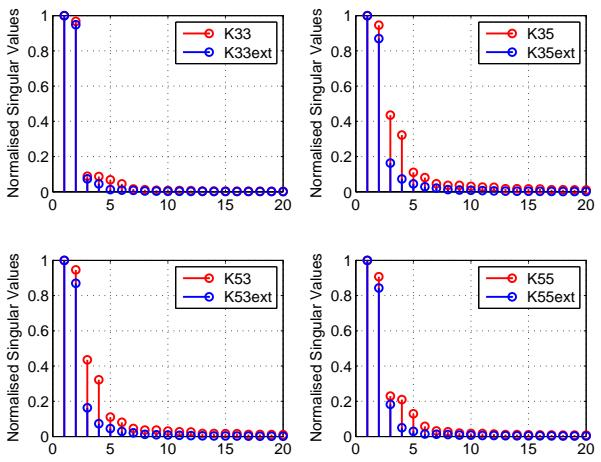  
Figure 5: Singular values of the Hankel matrix of the samples of the impulse response.

Regarding implementation, the algorithm of Kung (1978) is implemented in MATLAB in the function imp2ss of the Robust Control Toolbox. This implementation allows setting the threshold on the singular values to select the order. The default threshold considers singular values greater than 1% of largest one. This value results in high order models that then need to be reduced by the subsequent application or order reduction methods—see, for example, Unneland et al. (2005); Kristiansen et al. (2005); Unneland (2007). If one does not have access to MATLAB, the method is rather involved to implement since it requires significant matrix factorizations.

# 7.4 Retardation Frequency Response Curve Fitting

The main advantages of this method are the directness, ease of implementation, and the possibility of using most of the prior information to constraint the model structure; and thus, obtain better approximations. Indeed, the parameter estimation method is very simple to implement and use: it requires to solve linear LS problems iteratively. Therefore, there is no need for an initial parameter guess. On the other hand, all the prior information about the model can be used to enforce a model structure such that the resulting model would satisfy the properties of the convolution terms. In this regard, this seems to be the most efficient method among all the proposals appearing in the literature.

Automatic order detection can be easily implemented. Based on the properties of the convolution terms given in Table 2, it follows that the minimum order transfer function that satisfies all the properties is a second order one:

$$
\hat {K} _ {i k} (s, \pmb {\theta}) = \frac {p s}{s ^ {2} + q _ {1} s + q _ {0}}.
$$

Therefore, we can start with this minimum order transfer function, and increase the order while monitoring that the LS cost decreases. If the order of the proposed model is too large, there will be over-fitting and therefore, the cost will increase; however before this happens, the value of the cost normally remains unchanged as one increments the order of the system.

Since the optimisation considered is unconstrained, the model obtained cannot be guaranteed to be stable and passive. The stability issue can be resolved by computing the roots of the denominator obtained, reflecting the unstable roots about the imaginary axis, and re-computing the denominator polynomial. This is can be interpreted as optimising over a space of parameters and then making a particular projection into a subspace. This method gives good quality approximations.

With regards to passivity, a simple way of dealing with this problem is to try different order approximations and choose the one that is passive. Normally, the low-order approximations models of the convolution terms given by this method are passive. Besides, as we will see in an example in the next section, the quality of the convolution term approximation usually have a small effect on the force-to-motion response. Therefore, one can lower the order and trade fitting accuracy for passivity. A different approach would be optimise the numerator of the obtained non passive model to obtain a passive approximation—this goes beyond the scope of this paper, but the reader is referred to Damaren (2000) and references therein.

The main disadvantage of the method for the identification radiation force models is related to the sensitivity of the frequency response (11) to errors in the computed infinite frequency added mass: $\mathbf { A } = \mathbf { A } ( \infty )$ . This could result in frequency response functions that are hard to fit. This effect could be problematic when A(∞) is not computed by the hydrodynamic code and should be estimated from the finite-frequency data before constructing the non-parametric model K(jω) via (11). In these cases, one could follow the methods discussed in Section 4.2.2. However, in these cases, it would be more accurate to apply frequency-domain curve fitting directly to the force-to-motion frequency response—which does not require the computation of $\mathbf { A } ( \infty )$ as proposed by Perez and Lande (2006).

# 8 Illustration Example

To illustrate the use of the time and frequency domain identification methods and points argued in the previous section, we will use hydrodynamic data corresponding to the vertical motion (pitch-heave) of a 300m container ship presented by Taghipour et al. (2008). The hydrodynamic data was computed using WAMIT 6.1–a 3D hydrodynamic code.

Figure 2 shows the potential damping components of the vertical motion. The maximum frequency used in in the computations was 2.5 rad/s. As commented in Taghipour et al. (2008), this maximum frequency was consistent with panelling size used to describe the geometry of the hull. Also the excitation forces and the response from wave to motion were negligible for frequencies higher than 2.5rad/s.

Despite the fact that at 2.5rad/s, there is no significant excitation force and motion response, this is still relatively low frequency for the damping terms to be approaching their asymptotic values. This particularly so for the coupling terms as depicted in Figure 2 . As commented in Section 7.3, this is expected to affect the accuracy of the impulse response—c.f. (38). In order to investigate this issue, we can compute the impulse response using the damping as computed by the hydrodynamic code and that extrapolated with the asymptotic values as per (39). Figure 3 shows the extrapolation of the damping, and Figure 4 shows the retardation functions computed based on using the damping data with and without extrapolation. From Figure 4, we can see the error incurred due to the finite maximum frequency Ω in (37). The first effect is the difference in the value at $t = 0 ^ { + }$ , and the second is the ringing—this is more noticeable for the coupling heave-pitch than for the heave and pitch retardation functions.

To further evaluate what impact these different retardation functions can have in the application of Realization Theory, we can compute the singular values of the Hankel matrix of the samples of these impulse responses. Figure 5 show such singular values normalised by the largest one. From this figure, we can see that the error in the impulse responses due to the finite frequency results in more dynamics (recall that the number of significant singular values indicate the order of the model). This could be anticipated from the ringing effect in shown in the impulse responses shown in Figure 4.

The singular values obtained for the retardation functions based on the extrapolated damping, indicate that the following orders should be adecquate for the parametric models:

• $K _ { 3 3 } ( s )$ order 2   
• $K _ { 3 5 } ( s )$ and $K _ { 5 3 } ( s )$ orders 3 to 5   
• $\cdot \ K _ { 5 5 } ( s ) \ \mathrm { o r d e r \ 3 }$

Setting the order of the models to 2 for $K _ { 3 3 } ( s )$ , 3 for $K _ { 3 5 } ( s )$ , and 3 for $K _ { 5 5 } ( s )$ , we used Realization Theory to identify the state-space models. Then by model conversion via (33), the following transfer functions were obtained:

$$
\hat {K} _ {3 3} ^ {T D} (s) = 1 0 ^ {7} \frac {3 . 4 5 2 2 s - 0 . 0 5 2 4}{s ^ {2} + 0 . 7 2 1 2 s + 0 . 2}, \tag {40}
$$

$$
\hat {K} _ {3 5} ^ {T D} (s) = 1 0 ^ {9} \frac {1 . 0 7 0 4 s ^ {2} + 0 . 1 4 7 4 s + 0 . 0 0 2 2}{s ^ {3} + 2 . 3 2 6 1 s ^ {2} + 0 . 6 9 6 3 s + 0 . 1 1 3 0}, \tag {41}
$$

$$
\hat {K} _ {5 5} ^ {T D} (s) = 1 0 ^ {1 1} \frac {2 . 7 3 7 4 s ^ {2} + 0 . 4 6 7 9 s + 0 . 0 1 2 1}{s ^ {3} + 1 . 6 2 5 4 s ^ {2} + 0 . 6 4 4 1 s + 0 . 1 7 9 4} \tag {42}
$$

Here, we can see that none of the transfer functions have zeros at $\mathrm { s } { = } 0 .$ , and $\hat { K } _ { 3 3 } ( s )$ is not passive and nonminimum phase. Figures 6 and 7 show, for example, the impulse and frequency response of (40). Here, we can see that the impulse response approximates well the non-parametric response. The frequency response, however, shows that the property of passivity and low frequency asymptotic values are not satisfied by the identified model—as discussed in Section 7 this is one of the main drawbacks of the method. Further, Figures 8 and 9 show the reconstruction of damping and added mass from the real and imaginary part of the convolution parametric models.

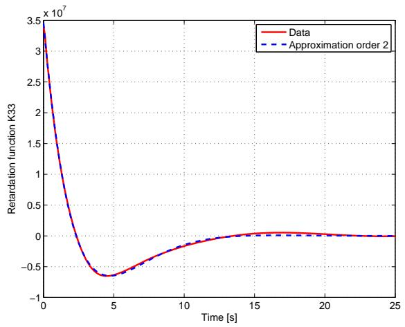

line

| Time [s] | Data       | Approximation order 2 |
| -------- | ---------- | --------------------- |
| 0        | 3.5e7      | 3.5e7                 |
| 5        | -0.6e7     | -0.6e7                |
| 10       | -0.1e7     | -0.1e7                |
| 15       | 0.05e7     | 0.05e7                |
| 20       | 0.02e7     | 0.02e7                |
| 25       | 0.01e7     | 0.01e7                |

Figure 6: $K _ { 3 3 } ( t )$ and $\hat { K } _ { 3 3 } ( t )$ based on Realization theory.

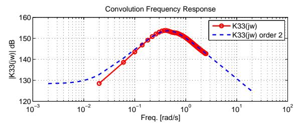

line

| Freq. [rad/s] | K33(jw) | K33(jw) order 2 |
| ------------- | ------- | --------------- |
| 0.001         | 128     | 129             |
| 0.01          | 130     | 129             |
| 0.1           | 145     | 140             |
| 1             | 152     | 148             |
| 10            | 145     | 135             |
| 100           | 130     | 125             |

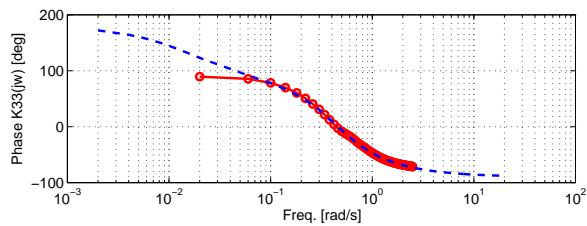

line

| Freq. [rad/s] | Phase K33(w) [deg] |
| ------------- | ------------------ |
| 0.001         | 180                |
| 0.01          | 120                |
| 0.1           | 80                 |
| 1             | -40                |
| 10            | -80                |

Figure 7: $K _ { 3 3 } ( j \omega )$ and $\hat { K } _ { 3 3 } ( j \omega )$ based on Realization theory.   
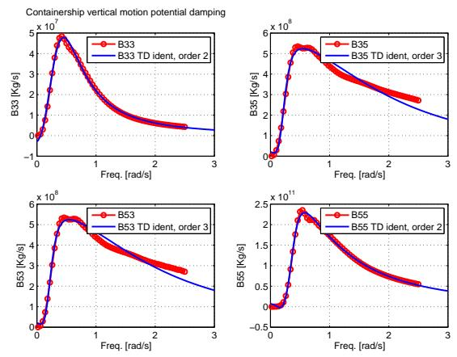

Figure 8: Reconstruction of potential damping from the real part of $\hat { K } _ { 3 3 } ( j \omega )$ based on Realization theory.   
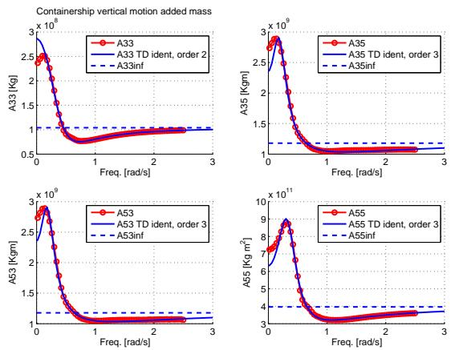  
Figure 9: Reconstruction of added mass from the imaginary part of $\hat { K } _ { 3 3 } ( j \omega )$ based on Realization theory.

Proceeding with the application of frequency-domain identification using the same order approximations as in the time-domain identification case, we obtained the following transfer functions:

$$
\hat {K} _ {3 3} ^ {F D} (s) = 1 0 ^ {7} \frac {3 . 1 2 4 s}{s ^ {2} + 0 . 6 2 5 8 s + 0 . 2 0 8 8}, \tag {43}
$$

$$
\hat {K} _ {3 5} ^ {F D} (s) = 1 0 ^ {9} \frac {1 . 2 0 9 s ^ {2} + 0 . 3 9 7 3 s}{s ^ {3} + 2 . 9 5 4 s ^ {2} + 1 . 1 4 9 s + 0 . 2 4 7 8}, \tag {44}
$$

$$
\hat {K} _ {5 5} ^ {F D} (s) = 1 0 ^ {1 1} \frac {2 . 9 3 1 s ^ {2} + 0 . 9 0 2 s}{s ^ {3} + 1 . 9 7 4 s ^ {2} + 0 . 8 2 0 7 s + 0 . 2 8 1 9} \tag {45}
$$

These transfer functions satisfy all of the properties of the memory functions—see Table 2.

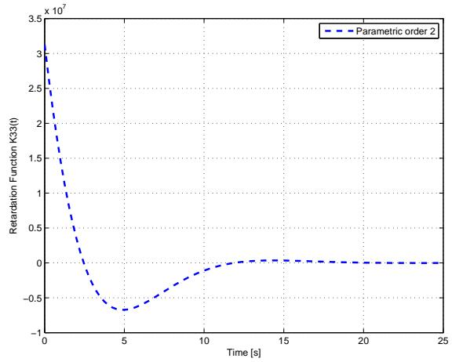

line

| Time [s] | Retardation Function K33(t) |
| -------- | --------------------------- |
| 0        | 3.0e7                       |
| 5        | -0.7e7                      |
| 10       | 0.0e7                       |
| 15       | 0.0e7                       |
| 20       | 0.0e7                       |
| 25       | 0.0e7                       |

Figure 10: $\hat { K } _ { 3 3 } ( t )$ based on frequency response curve fitting.

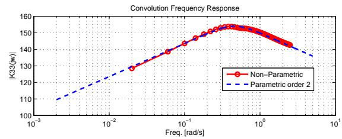

line

| Freq. [rad/s] | Non-Parametric | Parametric order 2 |
| ------------- | -------------- | ------------------ |
| 0.001         | 110            | 110                |
| 0.01          | 128            | 120                |
| 0.1           | 145            | 135                |
| 1             | 155            | 145                |
| 10            | 140            | 135                |

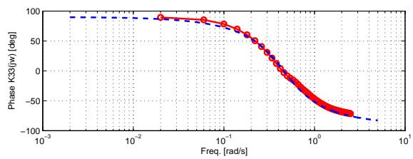

line

| Freq. [rad/s] | Phase K33(jw) [deg] |
| ------------- | ------------------- |
| 0.001         | 90                  |
| 0.01          | 85                  |
| 0.1           | 70                  |
| 1             | -50                 |
| 10            | -80                 |

Figure 11: $K _ { 3 3 } ( j \omega )$ and $\hat { K } _ { 3 3 } ( j \omega )$ based on frequency response curve fitting.

Figure 10 and 11 show, for example, the impulse response and the frequency response of (43). If we compare the results with Figure 6, we can see that impulse responses are similar. The frequency response shown on Figure 11 is, however, different from that shown in Figures and 7—as (43) satisfy all the properties of the memory functions. We can also see in Figures 12 and 13 that there is a better reconstruction of damping and added mass from the real and imaginary part of the convolution identified parametric models.

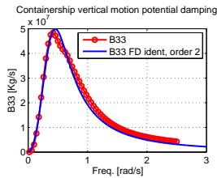

line

Containership vertical motion potential damping
| Freq. [rad/s] | B33 [Kg/s] | B33 FD ident, order 2 [×10⁷] |
|---|---|---|
| 0.0 | 0.0 | 0.0 |
| 0.2 | 1.5 | 1.8 |
| 0.4 | 3.5 | 4.0 |
| 0.6 | 4.8 | 5.0 |
| 0.8 | 4.5 | 4.8 |
| 1.0 | 3.5 | 3.8 |
| 1.2 | 2.5 | 2.8 |
| 1.4 | 1.8 | 2.0 |
| 1.6 | 1.2 | 1.5 |
| 1.8 | 0.8 | 1.0 |
| 2.0 | 0.5 | 0.7 |
| 2.2 | 0.3 | 0.5 |
| 2.4 | 0.2 | 0.3 |
| 2.6 | 0.1 | 0.2 |
| 2.8 | 0.05 | 0.1 |
The chart displays a single line representing the B33 values across the frequency range from 0 to approximately 2.8 rad/s. The y-axis is scaled by ×10⁷, and the x-axis is labeled as “Freq. [rad/s].”

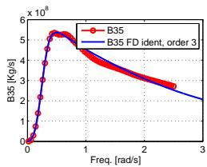

line

| Freq. [rad/s] | B35 (Kg/s) | B35 FD ident, order 3 (Kg/s) |
| ------------- | ---------- | ---------------------------- |
| 0             | 0          | 0                            |
| 0.5           | 5.5        | 5.5                          |
| 1             | 4.5        | 4.5                          |
| 2             | 3.0        | 3.0                          |
| 3             | 2.0        | 2.0                          |

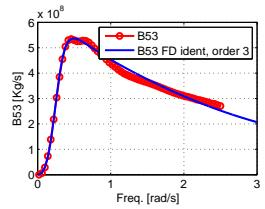

line

| Freq. [rad/s] | B53 [Kg/s] | B53 FD ident, order 3 [Kg/s] |
| ------------- | ---------- | ---------------------------- |
| 0             | 0          | 0                            |
| 0.5           | 5.5        | 5.5                          |
| 1             | 4.5        | 4.5                          |
| 1.5           | 3.5        | 3.5                          |
| 2             | 2.5        | 2.5                          |
| 2.5           | 2.0        | 2.0                          |
| 3             | 1.5        | 1.5                          |

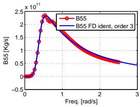

line

| Freq. [rad/s] | B55 [Kg/s] | B55 FD ident, order 3 [Kg/s] |
| ------------- | ---------- | --------------------------- |
| 0             | 0          | 0                           |
| 0.5           | 2.3e11     | 2.3e11                      |
| 1             | 1.8e11     | 1.8e11                      |
| 1.5           | 1.2e11     | 1.2e11                      |
| 2             | 0.6e11     | 0.6e11                      |
| 2.5           | 0.4e11     | 0.4e11                      |
| 3             | 0.3e11     | 0.3e11                      |

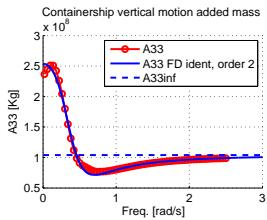

line

| Freq. [rad/s] | A33 [Kg] | A33 inf |
| ------------- | -------- | ------- |
| 0             | 2.5      | 1.0     |
| 0.5           | 0.8      | 1.0     |
| 1             | 0.9      | 1.0     |
| 2             | 1.0      | 1.0     |
| 3             | 1.0      | 1.0     |

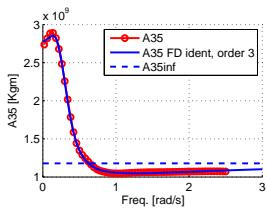

line

| Freq. [rad/s] | A35       | A35 FD ident, order 3 | A35inf    |
| ------------- | --------- | --------------------- | ---------- |
| 0             | 2.9e+09   | 2.9e+09               | 1.1e+09    |
| 1             | 1.1e+09   | 1.1e+09               | 1.1e+09    |
| 2             | 1.1e+09   | 1.1e+09               | 1.1e+09    |
| 3             | 1.1e+09   | 1.1e+09               | 1.1e+09    |

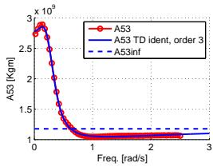

line

| Freq. [rad/s] | A53 [Kgm] | A53 TD ident, order 3 [Kgm] | A53inf [Kgm] |
| ------------- | --------- | -------------------------- | ------------ |
| 0             | 3.0e9     | 3.0e9                      | 1.2e9        |
| 1             | 1.2e9     | 1.2e9                      | 1.2e9        |
| 2             | 1.2e9     | 1.2e9                      | 1.2e9        |
| 3             | 1.2e9     | 1.2e9                      | 1.2e9        |

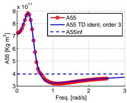

line

| Freq. [rad/s] | A55 (kg m²) | A55 TD ident, order 3 (kg m²) | A55inf (kg m²) |
| ------------- | ----------- | ----------------------------- | -------------- |
| 0             | 9.0         | 9.0                           | 4.0            |
| 1             | 3.0         | 3.0                           | 4.0            |
| 2             | 3.5         | 3.5                           | 4.0            |
| 3             | 3.5         | 3.5                           | 4.0            |

Figure 12: Reconstruction of potential damping from the real part of $\hat { K } _ { 3 3 } ( j \omega )$ based on frequencydomain curve fitting.   
Figure 13: Reconstruction of added mass from the imaginary part of $\hat { K } _ { 3 3 } ( j \omega )$ based on frequency-domain curve fitting.

Finally, Figures 14 and 15 show the non-parametric and the parametric force-to-displacement frequency responses based on the identified models using both realisation theory and frequency domain curve fitting. We can see that there is little difference despite the significant difference in the convolution frequency responses and the potential damping and added mass approximations obtained with the two methods. This supports the statement made in Section 7 that errors in the convolution approximation have little impact in the force-to-motion model. In this regard, It is interesting to observe that in Taghipour et al. (2008), the authors used the same data for the illustration example that we are using in this paper. This further indicates that one should not spend too much effort on the convolution models, for they have a small impact on the force-tomotion response. Perhaps the use frequency-domain identification to fit the force-to-motion responses directly is a more appropriate approach Perez and Lande (2006).

# 9 Conclusions

In this paper, we have discussed the application of the time- and frequency-domain identification methods for obtaining parametric models of fluid memory terms describing radiation forces of marine structures. We revisited some of the methods proposed in the literature for this particular application, and discussed the two methods have proliferated beyond their initial proposals; namely, Realization Theory and frequencyresponse curve fitting. The first method seeks a parametric model from samples of the impulse response, whereas the other method use LS fitting of the frequency response function.

The application of Realization Theory to fluid memory functions could be described as an indirect method. That is, the hydrodynamic codes output frequency domain data, which is then used to generate an approximated impulse response that the method uses to obtain a parametric model. The algorithm described works in discrete-time, and the model then can be converted to continuous time, which also involves approximations. These approximations often result in model that do not satisfy the frequency-domain properties of the memory functions. However, it was also discussed, and illustrated via an example, that inability of the models to reproduce all the properties of the convolution terms, may have little influence on the force-to-motion response. It was also argued that this method is complex to implement; and that model order reduction may be required after the identification.

The application of frequency-response curve fitting provides the simplest method to implement (iterative linear LS), and the quality of the models is normally superior to those obtained by application of Realization Theory. This method uses frequency-domain data directly avoiding unecessary errors in computing the impulse response; also, the identification provides continuous-time models. The reason for providing superior models, is that this method allows forcing the structure of the model so as to satisfy all the properties of the convolution terms. However, if the infinite added mass is not computed by the hydrodynamic code, and instead is estimated from finite frequency-domain data, then the fitting may be difficult due to the high sensitivity to errors in the estimated values. In this cases, one should be careful and perhaps attempt a regression of the force-to-motion data instead, which does not require the computation of the infinite frequency added mass.

Neither the identification algorithm based on Realisation Theory nor the one based on frequency-response curve fitting discussed in this paper can enforce passivity. One way to address this issue is by checking different order approximations, and picking the one that is passive. This often leads to a trade of accuracy for passivity since low order approximations often result passive with the discussed methods.

A low accuracy in the convolution model fit may not, however, be of much concern since rough approximations of the fluid-memory terms can still lead to good approximations of the force-to-motion models. This is due to the feedback structure of the force-tomotion model, which filters out most of the dynamics of the convolution terms. This suggests that one should not only assess the convolution models, but also the force-to-motion models to avoid spending too much effort in improving convolution models, when this results only in a small improvement of the force-to-motion response.

# Acknowledgments

The authors would like to thank Reza Taghipour from Centre for Ships and Ocean Structures at NTNU for providing the WAMIT data for the illustration example used in this paper.

# References

Ag¨uero, J. C. System Identification Methodologies Incroporating Constraints. Ph.D. thesis, Department of Elec. Eng. and Comp. Sc., The Univeristy of Newcastle, Australia, 2005.   
Al-Saggaf, U. and Franklin, G. Model reduction via blanced realizations: An extension and frequency weighting techniques. IEEE Transactions on Automatic Control, 1988. 33(9):687 – 692.   
Cummins, W. The impulse response function and ship motion. Technical Report 1661, David Taylor Model Basin–DTNSRDC, 1962.   
Damaren, C. Time-domain floating body dynamics by rational approximations of the radiation impedance

and diffraction mapping. Ocean Engineering, 2000. 27:687–705.   
Faltinsen, O. Sea Loads on Ships and Offshore Structures. Cambridge University Press, 1990.   
Greenhow, M. High- and low-frequency asymptotic consequences of the Kramers-Kronig relations. J. Eng. Math., 1986. 20:293–306.   
Hjulstad, A., Kristansen, E., and Egeland, O. Statespace representation of frequency-dependant hydrodynamic coefficients. In Proc. IFAC Confernce on Control Applications in Marine Systems. 2004 .   
Ho, B. and Kalman, R. Effective reconstruction of linear state-variable models from input/output functions. Regelungstechnik, 1966. 14(12):417–441.   
Holappa, K. and Falzarano, J. Application of extended state space to nonlinear ship rolling. Ocean Engineering, 1999. 26:227–240.   
Jefferys, E. Simulation of wave power devices. Applied Ocean Research, 1984. 6(1):31–39.   
Jefferys, E., Broome, D., and Patel, M. A transfer function method of modelling systems with frequency depenant coefficients. Journal of Guidance Control and Dynamics, 1984. 7(4):490–494.   
Jefferys, E. and Goheen, K. Time domain models from frequency domain descriptions: Application to marine structures. International Journal of Offshore and Polar Engineering, 1992. 2:191–197.   
Jordan, M. and Beltran-Aguedo, R. Optimal identification of potential-radiation hydrodynamics of moored floating stuctures. Ocean Engineering, 2004. 31:1859–1914.   
Journ´ee, J. Hydromechanic coefficients for calculating time domain motions of cutter suction dredges by cummins equations. Technical report, available http://www.shipmotions.nl, Delft University of Technology, Ship Hydromechanics Laboratory, Mekelweg 2, 2628 CD Delft, The Netherlands., 1993.   
Kaasen, K. and Mo, K. Efficient time-domain model for frequency-dependent added mass and damping. In 23rd Conference on Offshore Mechanics and Artic Enginnering (OMAE), Vancouver, Canada. 2004 .   
Kailath, T. Linear systems. Prentice Hall, 1980.   
Khalil, H. Nonlinear Systems. Prentice Hall, 2000.

Kristansen, E. and Egeland, O. Frequency dependent added mass in models for controller design for wave motion ship damping. In 6th IFAC Conference on Manoeuvring and Control of Marine Craft MCMC’03, Girona, Spain. 2003 .   
Kristiansen, E., Hjuslstad, A., and Egeland, O. Statespace representation of radiation forces in timedomain vessel models. Ocean Engineering, 2005. 32:2195–2216.   
Kung, S. A new identification and model reduction algorithm via singular value decompositions. Twelth Asilomar Conf. on Circuits, Systems and Computers, 1978. pages 705–714.   
Levy, E. Complex curve fitting. IRE Trans. Autom. Control, 1959. AC-4:37–43.   
Lozano, R., Brogliato, B., Egeland, O., and Masche, B. Dissipative Systems Analysis and Control, Theory and Applications. Springer, 2000.   
McCabe, A., Bradshaw, A., and Widden, M. A timedoamin model of a floating body usign transforms. In Proc. of 6th European Wave and Tidal energy Conference. University of Strathclyde, Glasgow, U.K., 2005 .   
Newman, J. Marine Hydrodynamics. MIT Press, 1977.   
Nocedal, J. and Wright, S. J. Numerical Optimization. Springer, 2006.   
Ogilvie, T. Recent progress towards the understanding and prediction of ship motions. In 6th Symposium on Naval Hydrodynamics. 1964 .   
Parzen, E. Some conditions for uniform convergence of integrals. Proc. of The American mathematical Society, 1954. 5(1):55–58.   
Perez, T. and Fossen, T. A derivation of high-frequency asymptotic values of 3D added mass and damping based on properties of the Cummins equation. Technical report, School of Elec. Eng. and Comp. Science. The University of Newcaslte, AUSTRALIA, 2007.   
Perez, T. and Lande, Ø. A frequency-domain approach to modelling and identification of the force to motion vessel response. In Proc. of 7th IFAC Conference on Manoeuvring and Control of marine Craft, Lisbon, Portugal. 2006 .   
Salvesen, N., Tuck, E., and Faltinsen, O. Ship motions and sea loads. Trans. The Society of Naval Architects and Marine Engineers–SNAME, 1970. 10:345–356.

Sanathanan, C. and Koerner, J. Trhansfer function synthesis as a ratio of two complex polynomials. IEEE Trnas. of Autom. Control, 1963.   
Ser´on, M., Braslavsky, J., and Goodwin, G. Fundamental Limitations in Filtering and Control. Springer, 1997.   
S¨oding, H. Leckstabilit¨at im seegang. Technical report, Report 429 of the Institue f¨ur Schiffbau, Hamburg, 1982.   
Sutulo, S. and Guedes-Soares, C. An implementation of the method of auxiliary state variables for solving seakeeping problems. Int. Ship Buildg. Progress, 2005. 52(4):357–384.   
Taghipour, R., Perez, T., and Moan, T. Hybrid frequency–time domain models for dynamic response analysis of marine structrues. Ocean Engineering, 2008. doi:10.1016/j.oceaneng.2007.11.002.   
Tick, L. Differential equations with frequencydependent coefficients. Ship Research, 1959. 2(2):45– 46.   
Unneland, K. Identification and Order Reduction of Radiation Force Models of Marine Structures. Ph.D. thesis, Department of engineerign Cybernetics, Norwegian University of Science and Tehcnology, NTNU. Norway, 2007.   
Unneland, K., Kristiansen, E., and Egeland, O. Comparative study of algorithms obtaining reduced order state-space form of radiation forces. In Proceedings of the OCEANS’05, Washington D.C., USA. 2005 .   
Verhaegen, M. and Verdult, V. Filtering and System Identification. Cambridge, 2007.   
Xia, J., Wang, Z., and Jensen, J. Nonlinear wave-loads and ship responses by a time-domain strip theory. Marine strcutures, 1998. 11:101–123.   
Yu, Z. and Falnes, J. Spate-space modelling of a vertical cylinder in heave. Applied Ocean Research, 1995. 17:265–275.   
Yu, Z. and Falnes, J. State-space modelling of dynamic systems in ocean engineering. Journal of hydrodynamics, China Ocean Press, 1998. pages 1–17.

# 10 Properties of the Retardation Functions

# Low-frequency Asymptotic Value

The low-frequency asymptotic value is

$$
\lim _ {\omega \rightarrow 0} \mathbf {K} (j \omega) = \mathbf {0}. \tag {46}
$$

The proof of this statement follows from (11). In the limit as ω  0, the potential damping B(ω) tends to zero since structure cannot generate waves at zero frequency. This is because the approximating free-surface condition establishes that there cannot be both horizontal and vertical and velocity components in the free surface (Faltinsen, 1990). On the other hand, in the limit as ω → 0 the imaginary part tends to zero since the difference A(0)  A( ) is finite:

$$
\mathbf {A} (0) - \mathbf {A} (\infty) = \lim _ {\omega \rightarrow 0} \frac {- 1}{\omega} \int_ {0} ^ {\infty} \mathbf {K} (t) \sin (\omega t) d t
$$

$$
= \int_ {0} ^ {\infty} \mathbf {K} (t) \lim _ {\omega \rightarrow 0} \frac {- \sin (\omega t)}{\omega} d t
$$

$$
= - \int_ {0} ^ {\infty} \mathbf {K} (t) d t.
$$

Note that regularity conditions are satisfied for the exchange of limit and integration (Parzen, 1954); i.e., ${ \bf f } _ { n } = { \bf K } ( t ) \sin ( 2 \pi t / n ) / ( 2 \pi t / n )$ converges uniformly to K(t) as n → ∞.

# High-frequency Asymptotic Value

The high-frequency asymptotic value is

$$
\lim _ {\omega \rightarrow \infty} \mathbf {K} (j \omega) = \mathbf {0}. \tag {47}
$$

The proof of this statement follows from (11). In the limit as ω , the real part tends to zero since since there cannot be generate waves. As in the case of zero frequency, this is because the approximating freesurface condition establishes that there cannot be both horizontal and vertical and velocity components in the free surface (Faltinsen, 1990).

The imaginary part also tends to zero, and this follows from (8) and the Riemann-Lebesgue Lemma:

$$
\lim _ {\omega \to \infty} \omega [ \mathbf {A} (0) - \mathbf {A} (\infty) ] = \lim _ {\omega \to \infty} - \int_ {0} ^ {\infty} \mathbf {K} (t) \sin (\omega t) d t = \mathbf {0}.
$$

# Initial-Time Value

This follows from (10):

$$
\lim _ {t \rightarrow 0 ^ {+}} \mathbf {K} (t) = \lim _ {t \rightarrow 0 ^ {+}} \frac {2}{\pi} \int_ {0} ^ {\infty} \mathbf {B} (\omega) \cos (\omega t) d \omega \tag {48}
$$

$$
= \frac {2}{\pi} \int_ {0} ^ {\infty} \mathbf {B} (\omega) d \omega \neq \mathbf {0},
$$

Where the last statement is a consequence of energy considerations, which establish that $\mathbf { B } _ { i i } ( \omega ) > 0$ (Faltinsen, 1990). Note that regularity conditions are satisfied for the exchange of limit and integration in (48) (Parzen, 1954).

This property has a bearing on the relative degree of the parametric models of the convolution terms. Indeed, for the entries $K _ { i k } ( j \omega )$ , which are not uniformly zero due to symmetry of the hull, the following holds due to the initial-value theorem of the Laplace Transform:

$$
\begin{array}{l} \lim _ {t \to 0 ^ {+}} K _ {i k} (t) = \lim _ {s \to \infty} s K _ {i k} (s) \\ = \lim _ {s \to \infty} s \frac {P _ {i k} (s)}{Q _ {i k} (s)}. \tag {49} \\ \end{array}
$$

The latter is different from zero only if relative degree of $K _ { i k } ( s )$ is 1; i.e., degQik(s) − degPik(s)=1.

# Final-Time value

This follows from (10) and the application of the Riemann-Lebesgue Lemma:

$$
\lim _ {t \to \infty} \mathbf {K} (t) = \lim _ {t \to 0 ^ {+}} \frac {2}{\pi} \int_ {0} ^ {\infty} \mathbf {B} (\omega) \cos (\omega t) d \omega = \mathbf {0}. \quad (5 0)
$$

This property establishes necessary and sufficient conditions for bounded-input bounded-output (BIBO) stability of the convolution term in the Cummins Equation.

# Passivity

Passivity describes an intrinsic characteristic of systems that can store and dissipate energy, but not create it. The concept of energy can be generalised, and passivity formalised in mathematical terms to be used even for non-physical systems. If a system has a vector input u, vector output y and some internal vector variable x, which can be used to quantify the amount of energy stored in the system E(x). Then the passivity property of the system establishes that the energy absorbed by the system must be greater than or equal to the energy stored in the system:

$$
\int_ {0} ^ {t} \mathbf {u} ^ {T} (t ^ {\prime}) \mathbf {y} (t ^ {\prime}) d t ^ {\prime} \geq E (\mathbf {x} (T)) - E (\mathbf {x} (0)).
$$

Since this holds for all t, the instantaneous power satisfies:

$$
\mathbf {u} ^ {T} (t) \mathbf {y} (t) \geq \dot {E} (\mathbf {x} (t)).
$$

If this is is satisfied, the system is said to be passive. The above it is an informal account of the concept, the reader should refer, for example, to Khalil (2000) for a formal discussion.

Damaren (2000) was the first to discuss the passivity of the radiation force components due to memory effects. In his approach, he considered the mechanical energy of the system (kinetic + potential):

$$
E (t) = \frac {1}{2} \dot {\pmb {\xi}} ^ {T} \mathbf {M} \dot {\pmb {\xi}} + \frac {1}{2} \pmb {\xi} ^ {T} \mathbf {C} \pmb {\xi}.
$$

By considering only the radiation problem (no incident waves),

$$
\mathbf {M} \ddot {\boldsymbol {\xi}} + \mathbf {C} \boldsymbol {\xi} = \boldsymbol {\tau} _ {R},
$$

the derivative of the energy reduces to $\dot { \boldsymbol { E } } = \dot { \boldsymbol { \xi } } ^ { T } \boldsymbol { \tau } _ { R } ;$ and thus

$$
E (T) - E (0) = \int_ {0} ^ {t} \boldsymbol {\tau} _ {R} ^ {T} \dot {\boldsymbol {\xi}} d t ^ {\prime}.
$$

This result establishes that the mapping $\dot { \xi } \mapsto \tau _ { R }$ is passive (Lozano et al., 2000). Therefore, the convolution term in the Cummins Equation is a passive mapping. An alternative derivation to the one above can be found in Kristiansen et al. (2005).

For linear-time-invariant systems a necessary and sufficient condition for passivity can be translated into the frequency domain as positive realness; that is, the real part of the transfer function is positive for all frequencies. This implies that

$$
\Re \{\mathbf {K} (j \omega) \} \geq 0, \quad \forall \omega .
$$

In the case of structures with zero-average forward speed, this follows from the fact that

$$
\mathbf {B} (\omega) = \mathbf {B} (\omega) ^ {T} \geq 0,
$$

which implies that $B _ { i i } ( \omega ) \geq 0$ for all ω (Newman, 1977; Faltinsen, 1990). Unneland (2007) uses the positive semi-definite property of the potential damping (for zero speed) as a starting point and provides a derivation of the passivity property of the convolution terms using frequency-domain arguments.

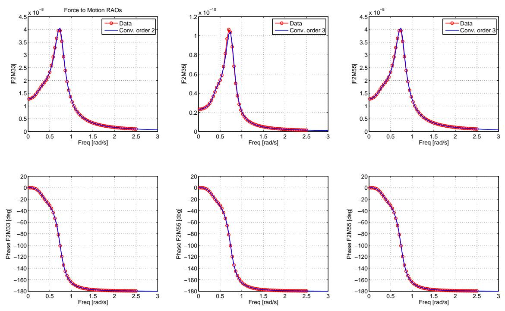

Figure 14: Force-to-displacement frequency response functions: non-parametric, and parametric based on Realization Theory.   
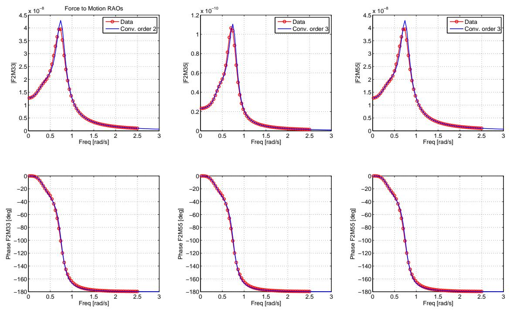  
Figure 15: Force-to-displacement frequency response functions: non-parametric, and parametric based on frequency response curve fitting.