# Ship Roll Motion Control

Plenary Talk Presented at the 8th IFAC Conference on Control Applications in Marine Systems, Sept 15th-17th, Rostock, Germany

Tristan Perez\*, \*\*\* and Mogens Blanke\*\*, \*\*\*

\* School of Engineering, The University of Newcastle, AUSTRALIA   
\*\* Dept. of Elec. Eng. Automation and Control, Danish Technical University, DENMARK   
\*\*\* CeSOS, Norwegian University of Science and Technology (NTNU), Trondheim NORWAY

natural_image

Stylized black horse head logo on white background (no text or symbols)

THE UNIVERSITY OF

NEWCASTLE

AUSTRALIA

DTU

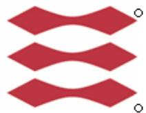

NTNU

# Motivation

The effects of roll on ship performance became more noticeable in the mid-19th century when:

 Sails were replaced by engines   
Broad arranges changed to turrets

Many devices have been proposed leading to interesting control problems

natural_image

Portrait of a bearded man in formal 19th-century attire (no visible text or symbols)

W. Froude (1819-1879)

Performance can easily fall short of expectations because of deficiencies in control system design due to

 Fundamental limitations due to system dynamics   
 Limited actuator authority   
Disturbances with large changes in spectral characteristics

# Outline

 Ship Roll Control Devices

 Working Principles,   
 Performance,   
 Historical aspects

 Key aspects of ship roll dynamics for control design

 Models,   
 Wave-induced motion   
 Simulation and control design models

 Control System Design

 Objectives,   
 Fundamental limitations,   
 Control strategies

 Research Outlook

 Unsolved problems, new devices

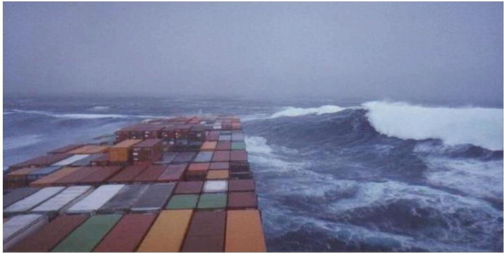

natural_image

Aerial view of a container ship navigating choppy waters with large waves crashing against the sea (no visible text or symbols)

# I - Ship Roll Control Devices

Performance,

Working Principles,

and Historical Aspects

# Ship Performance and Roll Motion

# Ship roll motion

 Affects crew performance   
 Can damage cargo   
 May prevent the use of on-board equipment

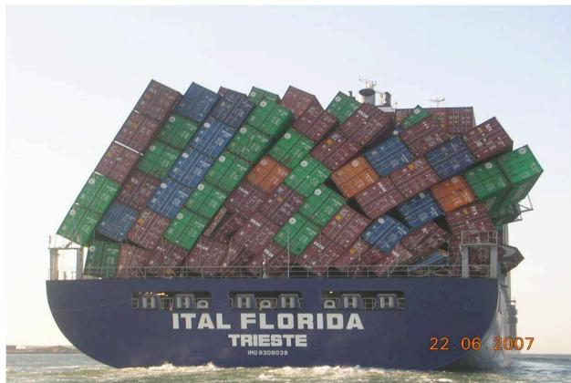

natural_image

Large container ship labeled 'ITAL FLORIDA TRIESTE' sailing on water, loaded with colorful shipping containers (no visible text beyond ship name)

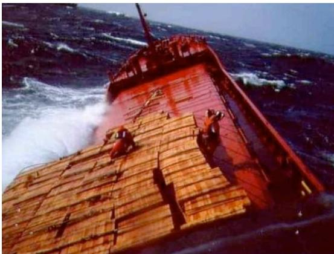

natural_image

Large red cargo ship navigating rough seas with visible wake and debris (no text or symbols)

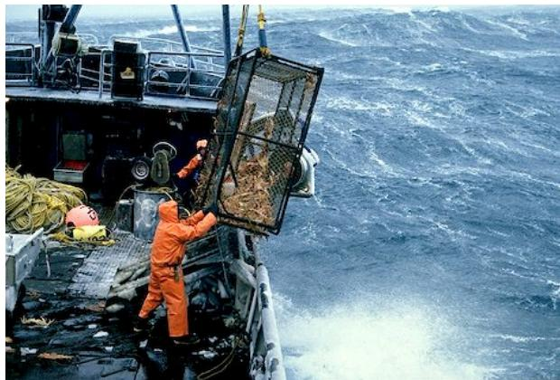

natural_image

Exterior view of a ship at sea with crew in orange suits handling equipment (no visible text or symbols)

From a ship operability point of view is necessary to reduce not only roll angle but also roll accelerations.

# Bilge Keels

10to 20% roll reduction (RMS)   
Low maintenance   
No control   
No occupied space   
Low price easy to install   
Increase hull resistance when damping is not needed   
Not every vessel can be fitted with them (ice-breakers)

natural_image

Close-up of a pink fabric patch on a wooden surface (no visible text or symbols)

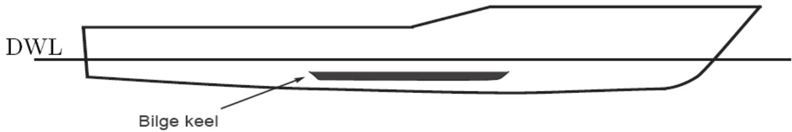

text_image

DWL
Bilge keel

# U-tanks

40 to 50% roll reduction (RMS)   
Active/Passive   
Independent of the vessel speed   
Anti heeling   
Heavy   
 Occupy large spaces   
Affects stability due free-surface

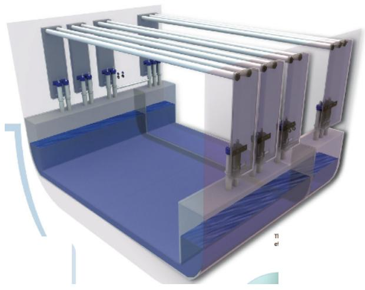

natural_image

3D technical illustration of a mechanical or fluidic device with multiple parallel pipes and a blue platform (no text or symbols visible)

Intering Rolls-Royce   
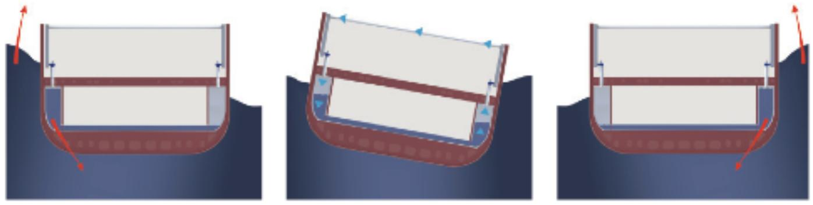

natural_image

Three diagrams showing structural changes in a boat hull, with arrows indicating direction of movement (no text or symbols present)

# Gyro-stabilisers

60% to 90% roll reduction (RMS)   
Performance independent of the vessel speed

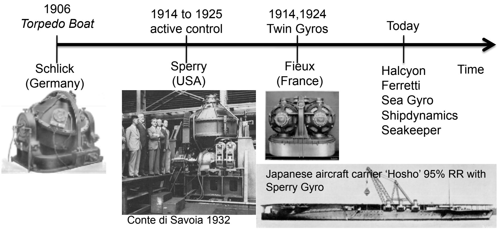

text_image

1906
Torpedo Boat
Schlick
(Germany)
1914 to 1925
active control
Sperry
(USA)
1914,1924
Twin Gyros
Fieux
(France)
Today
Halcyon
Ferretti
Sea Gyro
Shipdynamics
Seakeper
Time
Conte di Savoia 1932
Japanese aircraft carrier 'Hosho' 95% RR with
Sperry Gyro

# Fin-stabilisers

 60% to 90% roll reduction (RMS)   
Performance depends on speed   
 Control is important for performance

Easy to damage   
Most Expensive sta   
 Can produce noise   
Dynamic stall

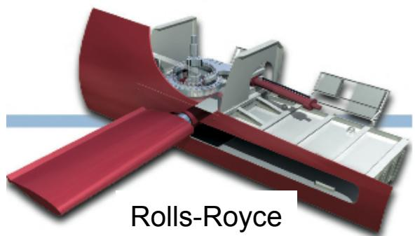

natural_image

3D cutaway view of a mechanical assembly with red components and a labeled 'Rolls-Royce' text (no other symbols or text)

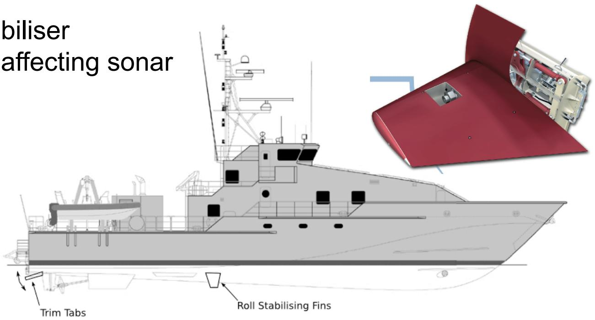

text_image

biliser
affecting sonar
Trim Tabs
Roll Stabilising Fins

# Rudder Roll Stabilisers (RRS)

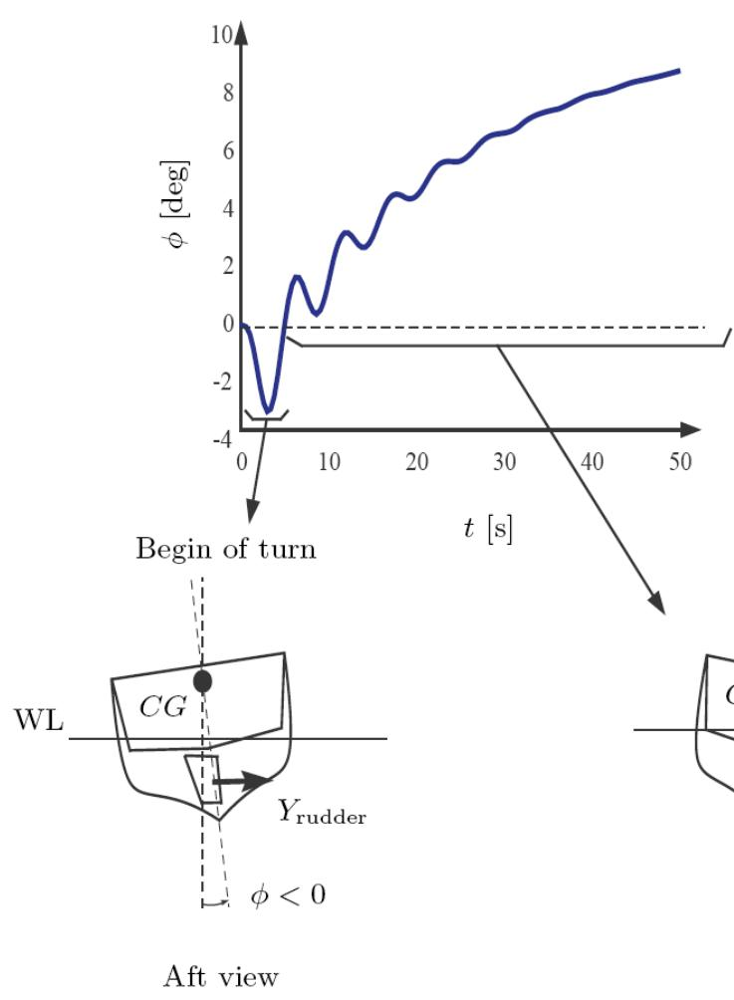

line

| t [s] | φ [deg] |
|-------|---------|
| 0     | 0       |
| 5     | -3      |
| 10    | 2       |
| 15    | 1       |
| 20    | 4       |
| 25    | 5       |
| 30    | 6       |
| 35    | 7       |
| 40    | 8       |
| 45    | 9       |
| 50    | 9.5     |

 40% to 70% roll reduction (RMS)   
 Performance depends on speed   
 Control is important for performance

Special rudder machinery   
 Fundamental limitations in control due to non-minimum phase dynamics (NMP)

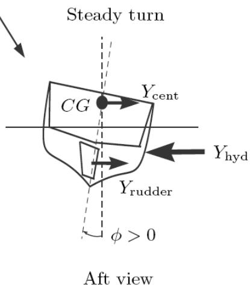

text_image

Steady turn
CG
Ycent
Yhyd
Yrudder
φ > 0
Aft view

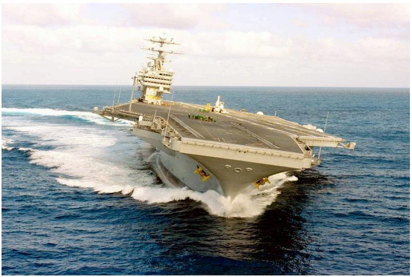

natural_image

Aircraft carrier sailing on open sea, creating a wake (no visible text or symbols)

Historical Aspects 

<table><tr><td>Year</td><td>Device</td><td>Ship</td><td>Designer</td><td>Type</td></tr><tr><td>1870</td><td>Bilge keels</td><td>-</td><td>Froude (GBr)</td><td>Passive</td></tr><tr><td>1880</td><td>Tanks</td><td>Inflexible</td><td>Watt and Froude (GBr)</td><td>Passive</td></tr><tr><td>1891</td><td>Weight</td><td>Cecile</td><td>Thornycroft (GBr)</td><td>Active</td></tr><tr><td>1906</td><td>Gyro</td><td>Sea-Bar</td><td>Schlick (Ger)</td><td>Passive</td></tr><tr><td>1909</td><td>Weight</td><td>Steamer</td><td>Crémieu (Fra)</td><td>Passive</td></tr><tr><td>1910</td><td>U-tank</td><td>Ypiranga</td><td>Frahm (Ger)</td><td>Passive</td></tr><tr><td>1915</td><td>Gyro</td><td>Conte di Savoia</td><td>Sperry Company (USA)</td><td>Active</td></tr><tr><td>1924</td><td>Gyro (double wheel)</td><td>Destroyer</td><td>Fieux (Fra)</td><td>Passive</td></tr><tr><td>1924</td><td>Fins (variable angle)</td><td>Matsu Maru</td><td>Motora (Jap)</td><td>Active</td></tr><tr><td>1933</td><td>Fins (variable area)</td><td>Aviso Estourdi</td><td>Kefeli (Ita)</td><td>Active</td></tr><tr><td>1836</td><td>Fins (variable angle)</td><td>HMS Bittern</td><td>Denny-Brown (GBr)</td><td>Active</td></tr><tr><td>1939</td><td>U-tank</td><td>Hamilton</td><td>Minorsky (USA)</td><td>Active</td></tr><tr><td>1972</td><td>Rudder</td><td>M.S. Peggy</td><td>van Gunsteren (Ndl)</td><td>Active</td></tr><tr><td>1974</td><td>Rudder</td><td>Manchester Concorde</td><td>Cowley &amp; Lambert (GBr)</td><td>Active</td></tr></table>

T. Perez (2005) Ship Motion Control, Springer

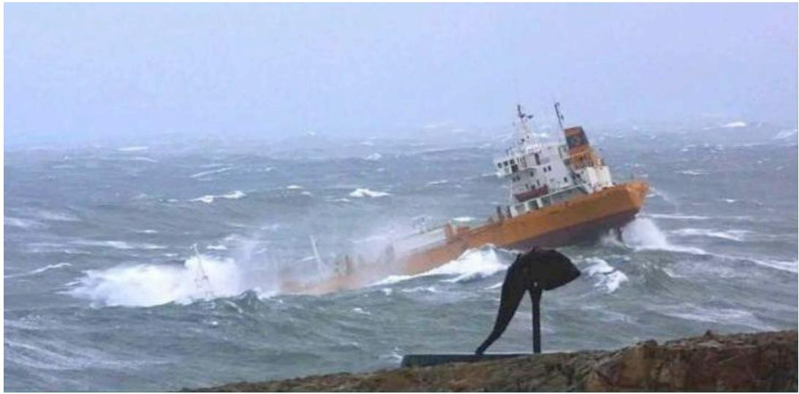

natural_image

A large orange ship navigating choppy waters with visible wake, viewed from behind a rocky shoreline (no text or symbols)

# II - Key Aspects of Ship Roll Dynamics for Control Design

Models

Ocean Environment

Wave-induced motion

# Dynamics of Roll Motion

General model form to describe ship motion:

$$
\pmb {\eta} \triangleq \left[ \begin{array}{c} \mathbf {p} _ {b / n} ^ {n} \\ \pmb {\Theta} \end{array} \right] = [ N, E, D, \phi , \theta , \psi ] ^ {T}.
$$

$$
\pmb {\nu} \triangleq \left[ \begin{array}{c} ^ {n} \dot {\mathbf {p}} _ {b / n} ^ {b} \\ \pmb {\omega} _ {b / n} ^ {b} \end{array} \right] = [ u, v, w, p, q, r ] ^ {T}.
$$

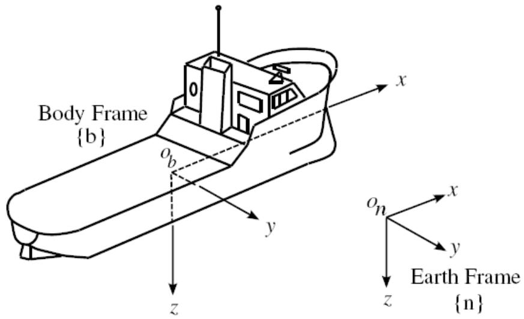

text_image

Body Frame
{b}
o_b
x
y
z
o_n
x
y
Earth Frame
{n}
z

Kinematic model: $\dot { \eta } = \mathbf { J } ( \eta )  { \boldsymbol \nu }$

Kinetic model: $\mathrm { \bf M } \dot { \nu } + { \bf C } ( \nu ) \nu + \mathrm { \bf D } ( \nu ) \nu + { \bf g } ( \eta ) = \tau$

# Models for Control Design

For control design, output disturbance models are usually adopted:

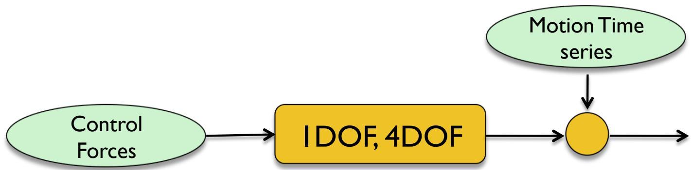

flowchart

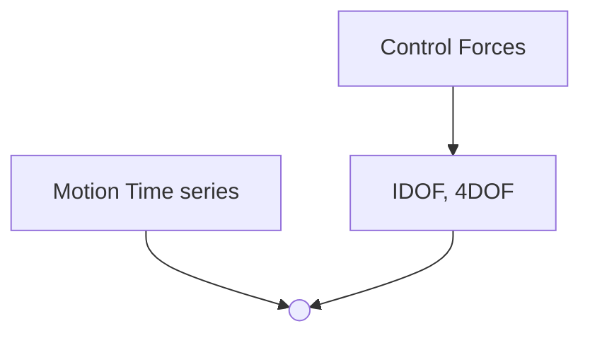
```mermaid
graph TD
    A["Control Forces"] --> B["IDOF, 4DOF"]
    C["Motion Time series"] --> D(( ))
    B --> D
```

Force to motion

For roll motion control problems this model is simplified to

 1DOF: roll   
4DOF: surge, roll, sway, and yaw

# Dynamics of Roll Motion—1DOF Model

Consider only roll motion,

Kinematic model:

Kinetic model:

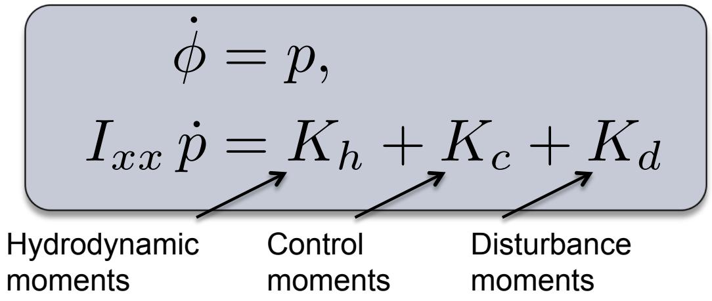

text_image

φ̇ = p,
Ixx Ṗ = Kh + Kc + Kd
Hydrodynamic
moments	Control
moments	Disturbance
moments

Hydrodynamic Moments:

$$
K_{h}\approx \underbrace{K_{\dot{p}}\dot{p} + K_{p}p}_{\text{Potential Effects}} + \underbrace{K_{p|p}|p|p|}_{\text{Viscous Effects}} + \underbrace{K(\phi)}_{\text{Hydrostatic Effects}}
$$

# Dynamics of Roll Motion—4DOF

Motion Variables:

$$
\pmb {\eta} = [ \phi \psi ] ^ {T},
$$

$$
\pmb {\nu} = [ \textit {u v p r} ] ^ {T},
$$

$$
\pmb {\tau} _ {i} = [ X _ {i} Y _ {i} K _ {i} N _ {i} ] ^ {T},
$$

Kinematic model:

$$
\dot {\phi} = p, \quad \dot {\psi} = r \cos \phi \approx r
$$

Kinetic model:

$$
\mathbf {M} _ {R B} \dot {\pmb {\nu}} + \mathbf {C} _ {R B} (\pmb {\nu}) \pmb {\nu} = \pmb {\tau} _ {h} + \pmb {\tau} _ {c} + \pmb {\tau} _ {d}
$$

$$
\pmb {\tau} _ {h} \approx - \mathbf {M} _ {A} \dot {\pmb {\nu}} - \mathbf {C} _ {A} (\pmb {\nu}) \pmb {\nu} - \mathbf {D} (\pmb {\nu}) \pmb {\nu} - \mathbf {K} (\phi)
$$

# Ocean Environment

Usual assumptions for sea surface elevation :ζ(t)

 Zero-mean   
 Gaussian (depth dependent)   
 Narrow banded   
 Stationary (20min to 3 hours)

All necessary information is then in the wave elevation power spectral density (Sea Spectrum): Sea State Realisation

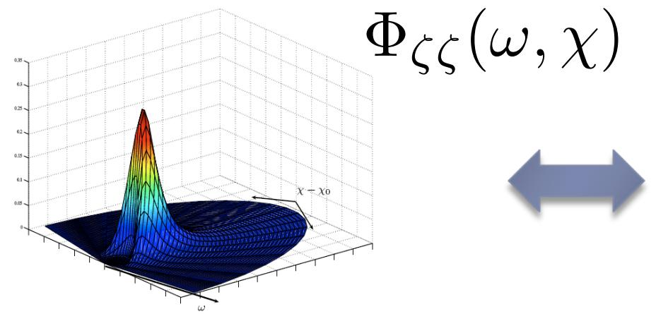

surface_3d

| ω       | Φζζ(ω, χ) |
|---------|-----------|
| 0.0     | 0.0       |
| 0.1     | 0.1       |
| 0.2     | 0.2       |
| 0.3     | 0.3       |
| 0.4     | 0.4       |
| 0.5     | 0.5       |
| 0.6     | 0.6       |
| 0.7     | 0.7       |
| 0.8     | 0.8       |
| 0.9     | 0.9       |
| 1.0     | 1.0       |
| 1.1     | 1.1       |
| 1.2     | 1.2       |
| 1.3     | 1.3       |
| 1.4     | 1.4       |
| 1.5     | 1.5       |
| 1.6     | 1.6       |
| 1.7     | 1.7       |
| 1.8     | 1.8       |
| 1.9     | 1.9       |
| 2.0     | 2.0       |
| 2.1     | 2.1       |
| 2.2     | 2.2       |
| 2.3     | 2.3       |
| 2.4     | 2.4       |
| 2.5     | 2.5       |
| 2.6     | 2.6       |
| 2.7     | 2.7       |
| 2.8     | 2.8       |
| 2.9     | 2.9       |
| 3.0     | 3.0       |
| 3.1     | 3.1       |
| 3.2     | 3.2       |
| 3.3     | 3.3       |
| 3.4     | 3.4       |
| 3.5     | 3.5       |
| 3.6     | 3.6       |
| 3.7     | 3.7       |
| 3.8     | 3.8       |
| 3.9     | 3.9       |
| 4.0     | 4.0       |
| 4.1     | 4.1       |
| 4.2     | 4.2       |
| 4.3     | 4.3       |
| 4.4     | 4.4       |
| 4.5     | 4.5       |
| 4.6     | 4.6       |
| 4.7     | 4.7       |
| 4.8     | 4.8       |
| 4.9     | 4.9       |
| 5.0     | 5.0       |
| 5.1     | 5.1       |
| 5.2     | 5.2       |
| 5.3     | 5.3       |
| 5.4     | 5.4       |
| 5.5     | 5.5       |
| 5.6     | 5.6       |
| 5.7     | 5.7       |
| 5.8     | 5.8       |
| 5.9     | 5.9       |
| 6.0     | 6.0       |
| 6.1     | 6.1       |
| 6.2     | 6.2       |
| 6.3     | 6.3       |
| 6.4     | 6.4       |
| 6.5     | 6.5       |
| 6.6     | 6.6       |
| 6.7     | 6.7       |
| 6.8     | 6.8       |
| 6.9     | 6.9       |
| 7.0     | 7.0       |
| 7.1     | 7.1       |
| 7.2     | 7.2       |
| 7.3     | 7.3       |
| 7.4     | 7.4       |
| 7.5     | 7.5       |
| 7.6     | 7.6       |
| 7.7     | 7.7       |
| 7.8     | 7.8       |
| 7.9     | 7.9       |
| 8.0     | 8.0       |
| 8.1     | 8.1       |
| 8.2     | 8.2       |
| 8.3     | 8.3       |
| 8.4     | 8.4       |
| 8.5     | 8.5       |
| 8.6     | 8.6       |
| 8.7     | 8.7       |
| 8.8     | 8.8       |
| 8.9     | 8.9       |
| 9.0     | 9.0       |
| 9.1     | 9.1       |
| 9.2     | 9.2       |
| 9.3     | 9.3       |
| 9.4     | 9.4       |
| 9.5     | 9.5       |
| 9.6     | 9.6       |
| 9.7     | 9.7       |
| 9.8     | 9.8       |
| 9.9     | 9.9       |
|10      | -         |

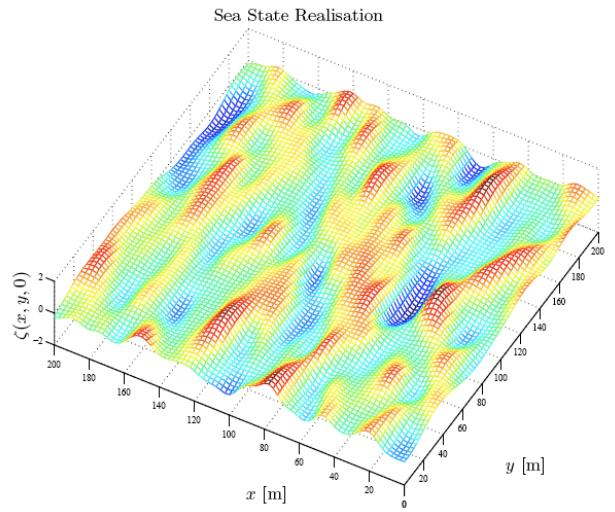

surface_3d

| x [m] | y [m] | ζ(x,y,0) |
|-------|-------|----------|
| 200   | 0     | 0        |
| 180   | 20    | 2        |
| 160   | 40    | 4        |
| 140   | 60    | 6        |
| 120   | 80    | 8        |
| 100   | 100   | 10       |
| 80    | 120   | 12       |
| 60    | 140   | 14       |
| 40    | 160   | 16       |
| 20    | 180   | 18       |
| 0     | 200   | 2        |

# Sailing Condition and Encounter Spectrum

# Sailing Condition

 Speed   
 Encounter angle

Encounter Frequency   
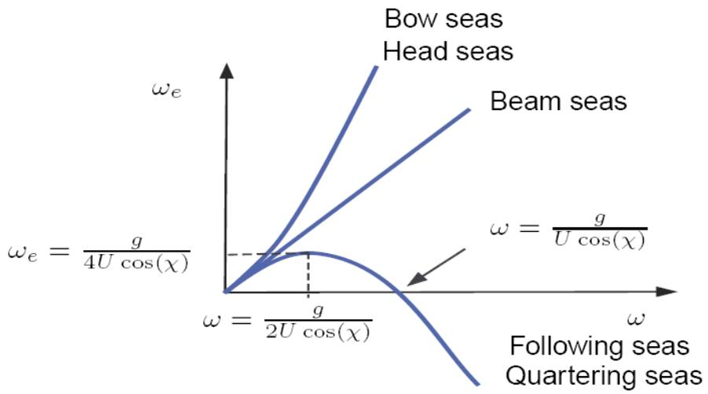

line

| Sea Type         | ω (g/4U cos(χ)) | ω (g/2U cos(χ)) |
| ---------------- | --------------- | --------------- |
| Bow seas         | 0               | 0               |
| Head seas        | 0               | 0               |
| Beam seas        | 0               | 0               |
| Following seas  | 0               | 0               |

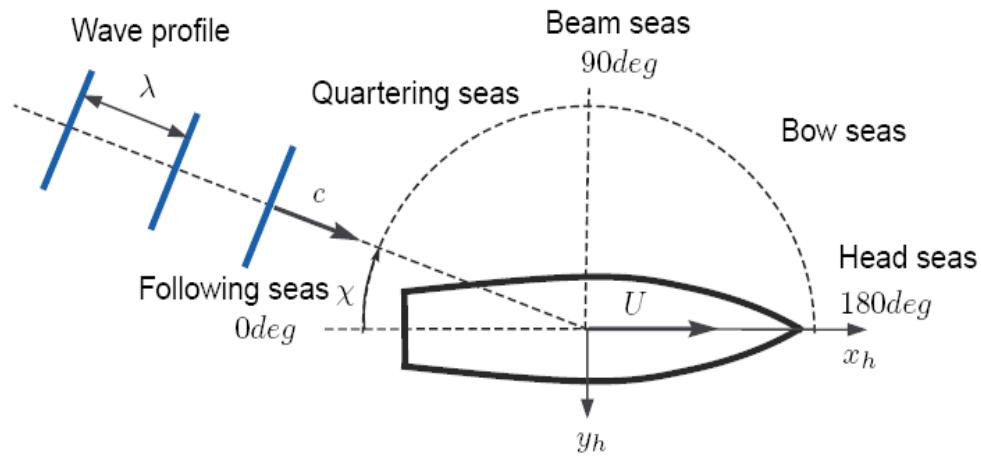

text_image

Wave profile
λ
Quartering seas
90deg
Beam seas
Bow seas
Following seas χ
0deg
U
Head seas
180deg
xₕ
yₕ

$$
\omega_ {e} = \omega - \frac {\omega^ {2} U}{g} \cos (\chi)
$$

$$
\Phi_ {\zeta \zeta} (\omega_ {e}) = \frac {\Phi_ {\zeta \zeta} (\omega)}{\left| 1 - \frac {2 \omega U}{g} \cos (\chi) \right|}
$$

# Wave-induced Motion Motion

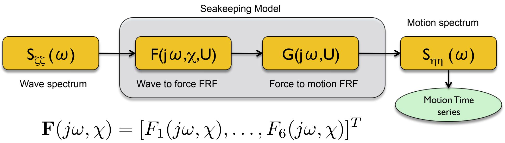

flowchart

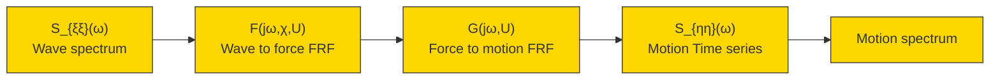
```mermaid
graph LR
    A["S_{ξξ}(ω)\nWave spectrum"] --> B["F(jω,χ,U)\nWave to force FRF"]
    B --> C["G(jω,U)\nForce to motion FRF"]
    C --> D["S_{ηη}(ω)\nMotion Time series"]
    D --> E["Motion spectrum"]
    style A fill:#FFD700,stroke:#333
    style B fill:#FFD700,stroke:#333
    style C fill:#FFD700,stroke:#333
    style D fill:#FFD700,stroke:#333
    style E fill:#FFD700,stroke:#333
```

$$
\mathbf {G} (j \omega , U) = \left[ \begin{array}{c c c} G _ {1 1} (j \omega , U) & \dots & G _ {1 6} (j \omega) \\ \vdots & & \vdots \\ G _ {6 1} (j \omega , U) & \dots & G _ {6 6} (j \omega , U) \end{array} \right] = (- [ \mathbf {M} _ {R B} + \mathbf {A} (\omega) ] \omega^ {2} + j \omega \mathbf {B} (\omega) + \mathbf {G}) ^ {- 1}
$$

Roll RAO: $H _ { 4 } ( j \omega , \chi , U ) = \sum _ { k = 1 } ^ { 6 } G _ { 4 k } ( j \omega , U ) F _ { k } ( j \omega , \chi , U )$

# Example Roll RAOs Naval Vessel @15kt

$$
H _ {4} (j \omega , \chi , U) = \sum_ {k = 1} ^ {6} G _ {4 k} (j \omega , U) F _ {k} (j \omega , \chi , U)
$$

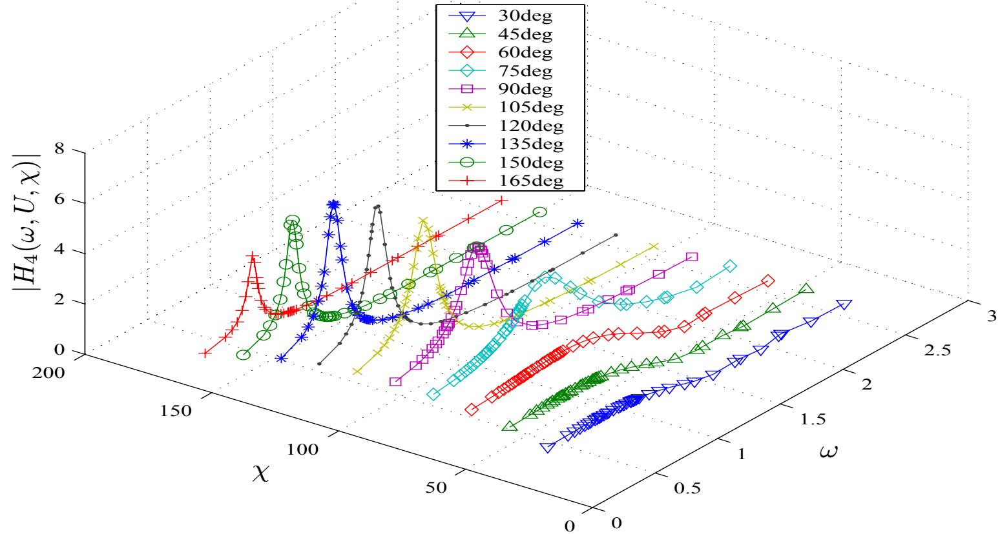

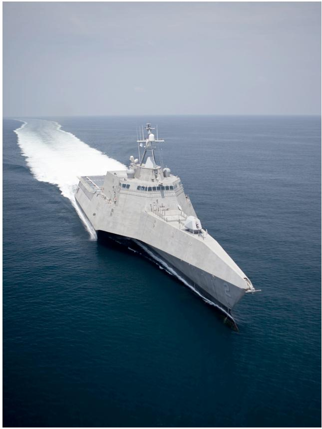

natural_image

Aerial view of a modern naval warship sailing on open sea, leaving a white wake (no visible text or symbols)

# III – Motion Control Design

Objectives,

Performance Limitations,

and Control Strategies

# Control Design and Performance Limitations

From the ship performance point of view, the control objectives are

 Reduce roll angle   
R 

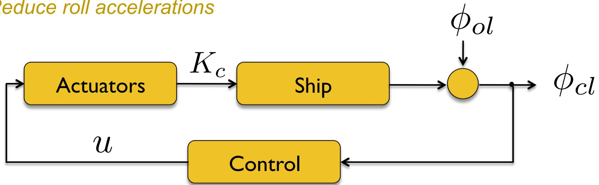

flowchart

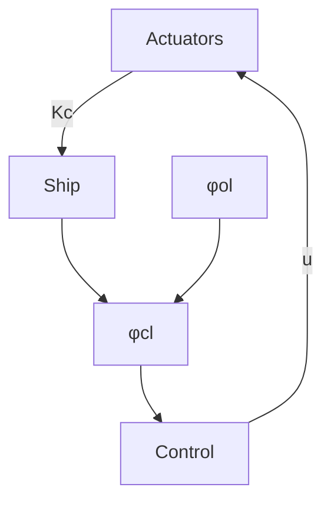
```mermaid
graph TD
    A["Actuators"] -->|Kc| B["Ship"]
    B --> C["φcl"]
    C --> D["Control"]
    D -->|u| A
    E["φol"] --> C
```

Output sensitivity

$$
S (s) \triangleq \frac {\phi_ {c l} (s)}{\phi_ {o l} (s)}
$$

Roll spectrum relations

$$
\Phi_ {c l} (\omega) = | S (j \omega) | ^ {2} \Phi_ {o l} (\omega)
$$

# Control Design and Performance Limitations

If the closed-loop system is stable minimum phase and strictly proper, the following Bode integral constraint applies

$$
\int_ {0} ^ {\infty} \log | S (j \omega) | d \omega = 0
$$

$$
\Phi_ {c l} (\omega) = | S (j \omega) | ^ {2} \Phi_ {o l} (\omega)
$$

$$
R R (\omega) = 1 - | S (j \omega) | = \frac {| \phi_ {o l} (j \omega) | - | \phi_ {c l} (j \omega) |}{| \phi_ {o l} (j \omega) |}
$$

# Example Performance Limitations

Gyrostabiliser (Perez & Steinmann, 2009)   
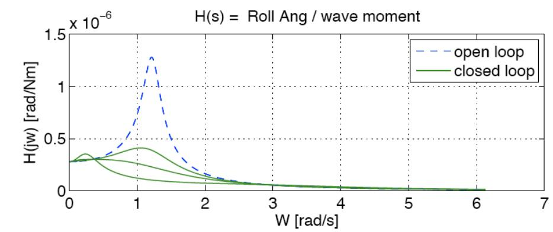

line

| W [rad/s] | open loop | closed loop |
| --------- | --------- | ----------- |
| 0         | 0.3       | 0.3         |
| 1         | 1.2       | 0.4         |
| 2         | 0.2       | 0.1         |
| 3         | 0.05      | 0.05        |
| 4         | 0.02      | 0.02        |
| 5         | 0.01      | 0.01        |
| 6         | 0.005     | 0.005       |
| 7         | 0.002     | 0.002       |

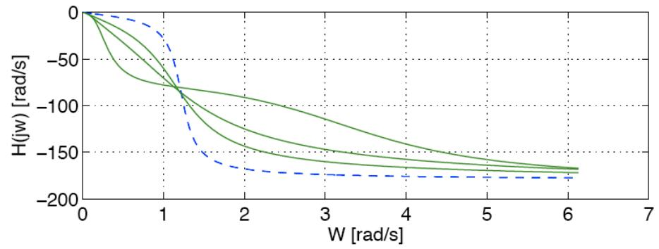

line

| W [rad/s] | H(jw) [rad/s] (Line 1) | H(jw) [rad/s] (Line 2) | H(jw) [rad/s] (Line 3) | H(jw) [rad/s] (Line 4) |
| --------- | ------------------------ | ------------------------ | ------------------------ | ------------------------ |
| 0         | 0                        | 0                        | 0                        | 0                        |
| 1         | -50                      | -75                      | -100                     | -125                     |
| 2         | -100                     | -125                     | -150                     | -175                     |
| 3         | -125                     | -150                     | -175                     | -200                     |
| 4         | -150                     | -175                     | -200                     | -225                     |
| 5         | -175                     | -200                     | -225                     | -250                     |
| 6         | -200                     | -225                     | -250                     | -275                     |

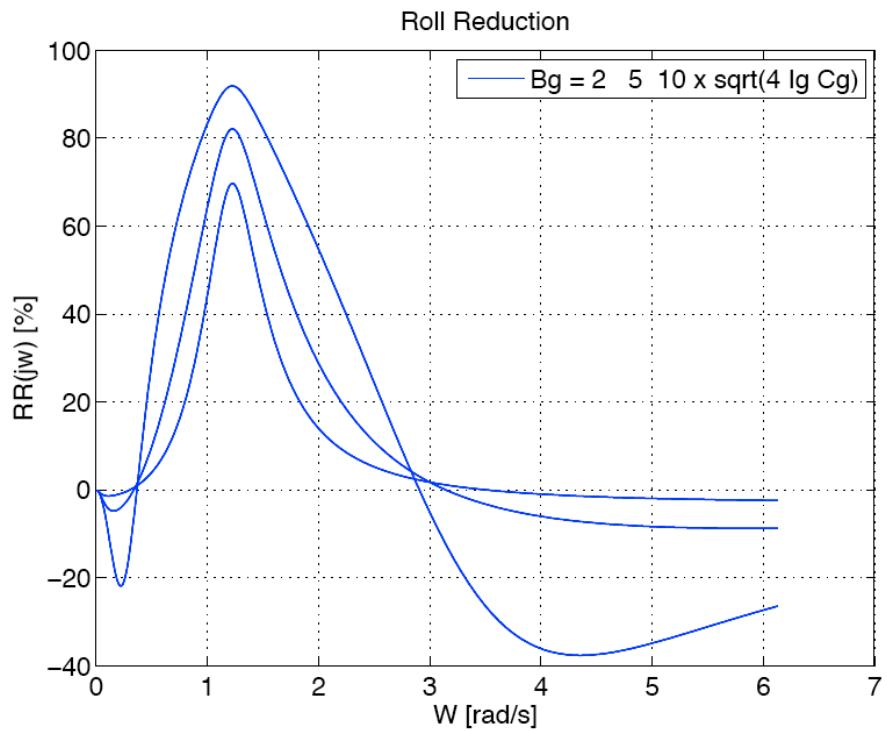

line

| W [rad/s] | Bg = 2 | Bg = 5 | Bg = 10 x sqrt(4 lg Cg) |
| --------- | ------ | ------ | ---------------------- |
| 0         | 0      | 0      | 0                      |
| 1         | 90     | 80     | 70                     |
| 2         | 60     | 40     | 20                     |
| 3         | 0      | 0      | 0                      |
| 4         | -10    | -15    | -20                    |
| 5         | -5     | -10    | -15                    |
| 6         | -2     | -5     | -10                    |

# Non-minimum phase Dynamics

In some cases, the location of the actuators may result in NMP dynamics (with a real zero at s=q.)

Then, we have a Poisson-integral constrain:

$$
\int_ {- \infty} ^ {\infty} \log | S (j \omega) | W (q, \omega) d \omega = 0
$$

$$
q = \sigma_ {q} + j 0
$$

$$
W (q, \omega) = \frac {\sigma_ {q}}{\sigma_ {q} ^ {2} + \omega^ {2}}
$$

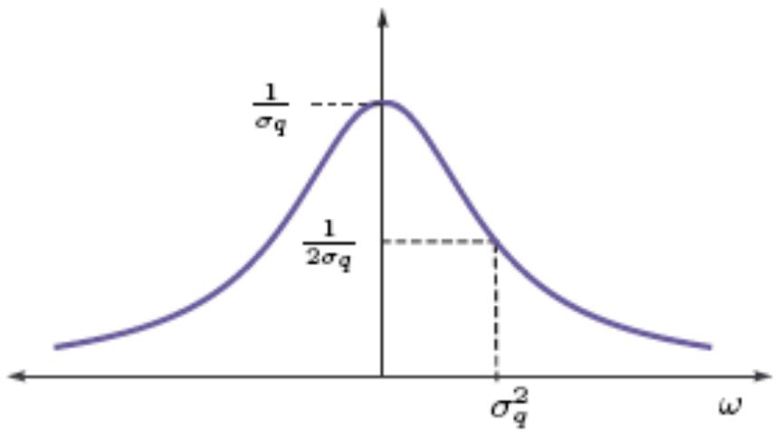

line

| ω       | Value     |
| ------- | --------- |
| σ²q     | 1/2σq     |
| Peak    | 1/σq      |

# Non-minimum phase Dynamics

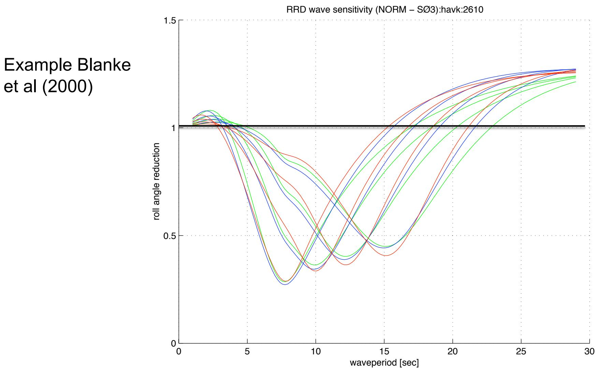

line

| waveperiod [sec] | roll angle reduction (Line 1) | roll angle reduction (Line 2) | roll angle reduction (Line 3) | roll angle reduction (Line 4) | roll angle reduction (Line 5) | roll angle reduction (Line 6) | roll angle reduction (Line 7) | roll angle reduction (Line 8) | roll angle reduction (Line 9) | roll angle reduction (Line 10) |
| ---------------- | ----------------------------- | ----------------------------- | ----------------------------- | ----------------------------- | ----------------------------- | ----------------------------- | ----------------------------- | ----------------------------- | ----------------------------- | ------------------------------ |
| 0                | 1.0                           | 1.0                           | 1.0                           | 1.0                           | 1.0                           | 1.0                           | 1.0                           | 1.0                           | 1.0                           | 1.0                            |
| 5                | ~0.8                          | ~0.9                          | ~0.7                          | ~0.8                          | ~0.9                          | ~0.7                          | ~0.8                          | ~0.9                          | ~0.7                          | ~0.8                           |
| 10               | ~0.3                          | ~0.4                          | ~0.5                          | ~0.6                          | ~0.7                          | ~0.5                          | ~0.6                          | ~0.7                          | ~0.5                          | ~0.6                           |
| 15               | ~0.4                          | ~0.5                          | ~0.6                          | ~0.7                          | ~0.8                          | ~0.6                          | ~0.7                          | ~0.8                          | ~0.6                          | ~0.7                           |
| 20               | ~0.8                          | ~0.9                          | ~1.0                          | ~1.1                          | ~1.2                          | ~1.0                          | ~1.1                          | ~1.2                          | ~1.0                          | ~1.1                           |
| 25               | ~1.2                          | ~1.3                          | ~1.4                          | ~1.5                          | ~1.6                          | ~1.4                          | ~1.5                          | ~1.6                          | ~1.4                          | ~1.5                           |
| 30               | ~1.4                          | ~1.5                          | ~1.6                          | ~1.7                          | ~1.8                          | ~1.6                          | ~1.7                          | ~1.8                          | ~1.6                          | ~1.7                           |

# Energy of Wave Excitation

The energy of the wave excitation changes with the seastate and sailing conditions (speed and heading)

For example a change in encounter angle can shift the energy significantly:

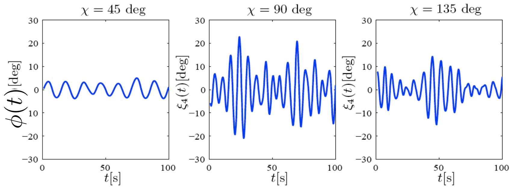

# Fin Stabilisers (minimum phase case)

IDOF model including fin forces: t

$$
\dot {\phi} = p,
$$

$$
\left[ I _ {x x} + K _ {\dot {p}} \right] \dot {p} + \left(K _ {p} + 2 r _ {f} K _ {\alpha} U\right) p + K _ {\phi} \phi = K _ {w} - 2 U ^ {2} K _ {\alpha} \alpha
$$

# Control issues:

Parametric uncertainty   
• Sensitivity-integral constraints

Control strategies:

• PID, Hinf

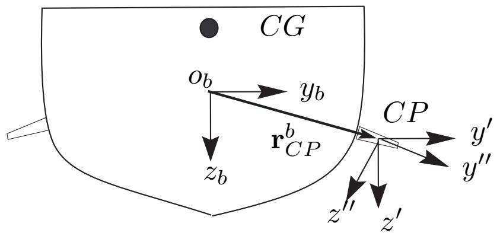

text_image

CG
Ob
yb
r^b_CP
zb
CP
y'
y''
z''
z'

# Fin Stabilisers and NMP Dynamics

If the response from the fins is NMP, then the IDOF cannot be used, in this case roll-sway-yaw interactions need to be considered to avoid large roll amplifications at low frequencies.

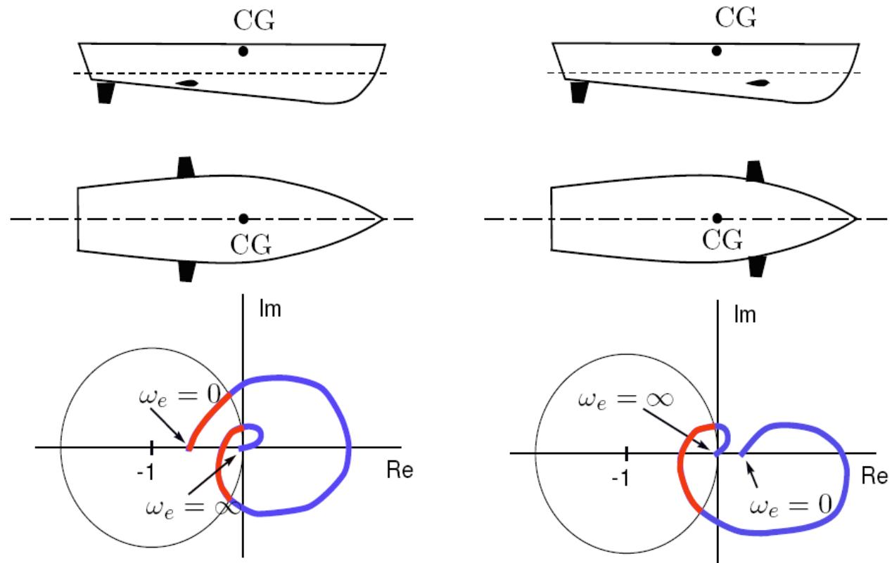  
Observations about fin NMP dynamics were made by Lloyd (1989).

# Fin Stabilisers – Dynamic Stall

Experimental results of Galliarde (2002) (MARIN, Ned)   
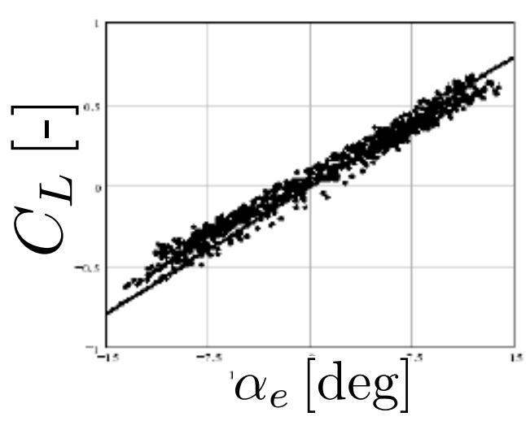

scatter

| α_e [deg] | C_L [-] |
| --------- | ------- |
| -1.5      | -0.8    |
| -7.5      | -0.3    |
| -5        | 0.0     |
| -2.5      | 0.3     |
| 0         | 0.6     |
| 2.5       | 0.9     |
| 5         | 1.2     |
| 7.5       | 1.5     |
| 10        | 1.8     |
| 12.5      | 2.1     |
| 15        | 2.4     |

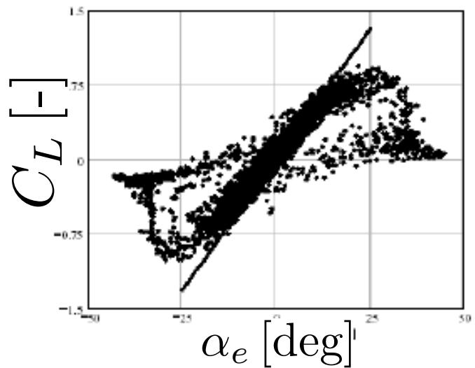

scatter

| α_e [deg] | C_L [-] |
| --------- | ------- |
| -50       | -1.5    |
| 50        | 1.5     |

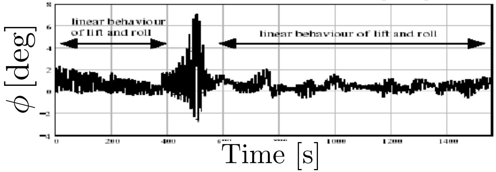

line

| Time [s] | φ [deg] |
| -------- | ------- |
| 0        | ~2      |
| 200      | ~1      |
| 400      | ~1      |
| 600      | ~7      |
| 800      | ~1      |
| 1000     | ~1      |
| 1200     | ~1      |
| 1400     | ~1      |

Perez & Goodwin (2003): MPC constraints effective angle of attack.   
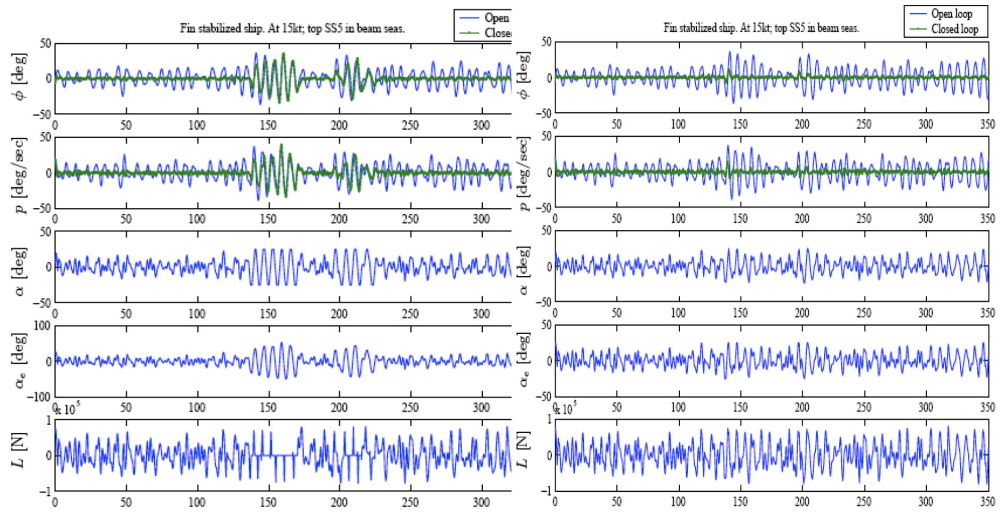

line

| Parameter | Open (deg) | Closed (deg) |
|-----------|------------|--------------|
| φ         | ~0         | ~0           |
| p         | ~0         | ~0           |
| α         | ~0         | ~0           |
| αe        | ~0         | ~0           |
| L         | ~0         | ~0           |
| L [N]     | ~0         | ~0           |

# Rudder Roll Damping

 Potential discovered from autopilot without wave filter (Taggart 1970)   
 Results reported by van Gunsteren in 1972 (the Netherlands)   
 Cowley & Lambert (1972) used roll fbk, reported yaw interference.   
 Carley & Duberley (1972) integrated rudder-fin control   
 Carley (1975) & Lloyd (1975) recognise limitations of NMP dynamics   
 Baitis et al.(1983) highlighted need of adaptation   
 Advent of Computers in 1980 resulted in several successful results   
 Netherlands, Denmark, Sweden, United Kingdom   
 Hearns & Blanke (1998) limitations using the Poisson Integral   
 Perez (2003) analysed min variance and RR vs yaw interference

# Performance Limitations (Hearns & Blanke, 1998)

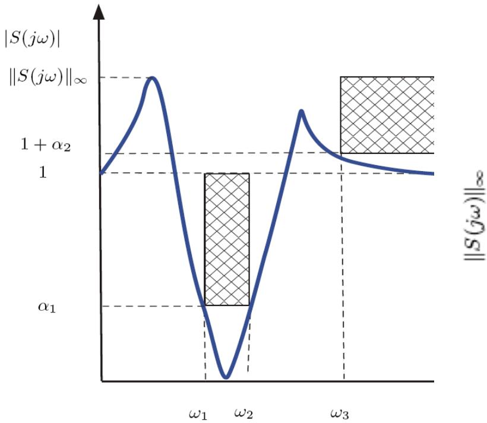  
If the controller does not adapt, we can easily have roll amplification

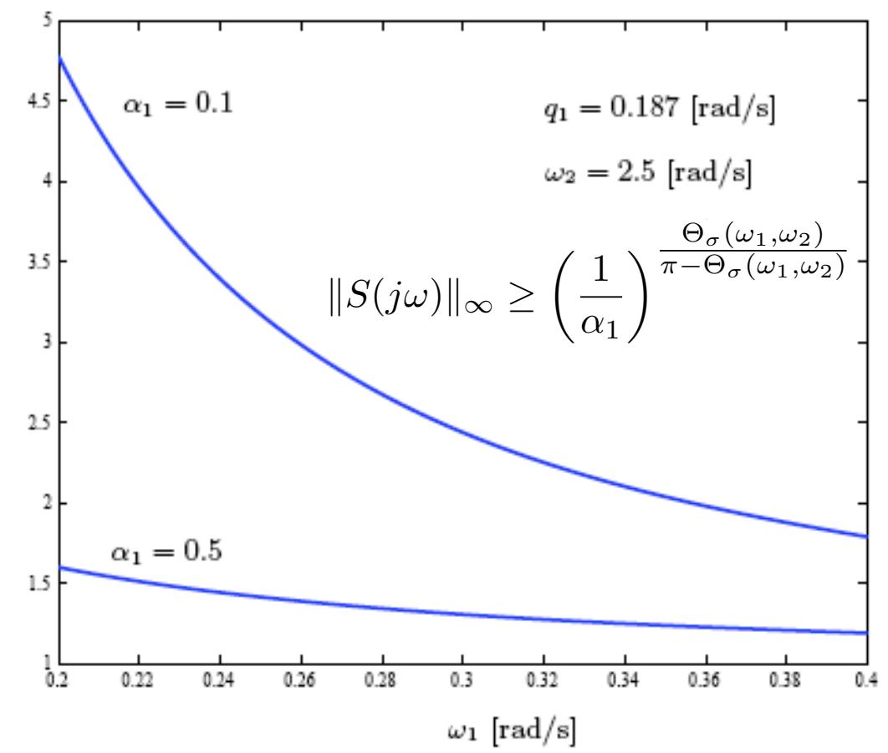

# Performance Limitations – Perez et al. (2003)

Limiting Optimal Control with full knowledge of wave spectrum:

$$
J = \operatorname{E} [ \lambda \phi^ {2} + (1 - \lambda) (\psi - \psi_ {d}) ^ {2} ]
$$

Minimum variance case $( \lambda = 1 )$ $\mathrm { E } [ \phi ^ { 2 } ] \ge 2 q \Phi _ { \phi \phi } ( q )$

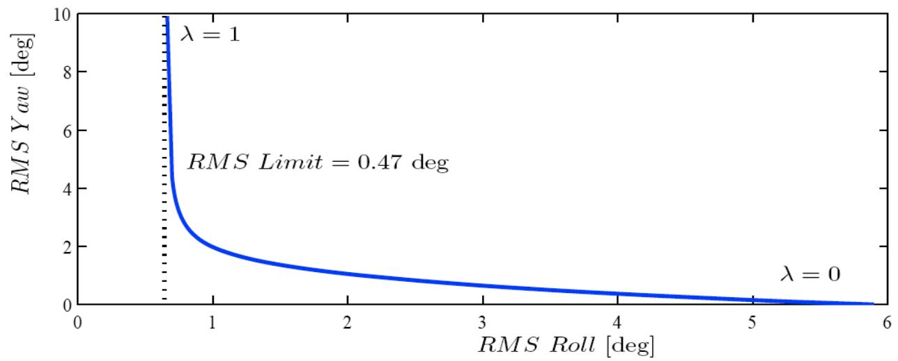

line

| RMS Roll [deg] | RMS Yaw [deg] |
| -------------- | ------------- |
| 0.5            | 10.0          |
| 1.0            | 2.0           |
| 2.0            | 1.0           |
| 3.0            | 0.5           |
| 4.0            | 0.2           |
| 5.0            | 0.1           |
| 6.0            | 0.0           |

# Actuator limitations on RRD

 Actuator rate limits may affect performance   
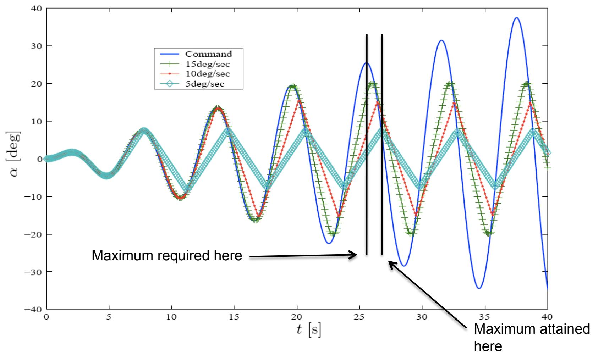

line

| t [s] | Command | 15deg/sec | 10deg/sec | 5deg/sec |
|-------|---------|-----------|-----------|----------|
| 0     | 0       | 0         | 0         | 0        |
| 5     | -5      | -5        | -5        | -5       |
| 10    | -10     | -10       | -10       | -10      |
| 15    | 8       | 8         | 8         | 8        |
| 20    | 19      | 19        | 19        | 19       |
| 25    | 25      | 25        | 25        | 25       |
| 30    | -28     | -28       | -28       | -28      |
| 35    | -35     | -35       | -35       | -35      |
| 40    | -38     | -38       | -38       | -38      |

# AGC – Van Amerongen et al (1982)

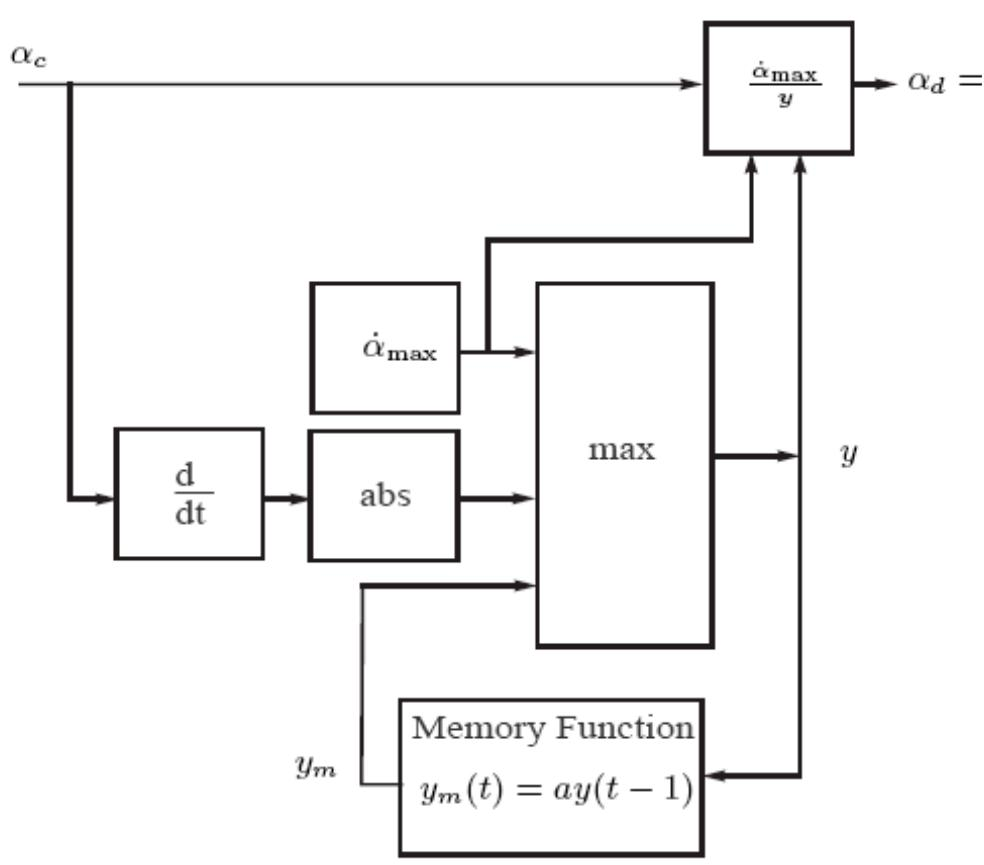

flowchart

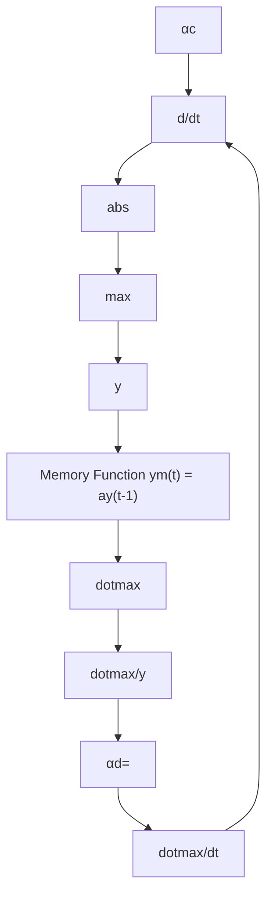
```mermaid
graph TD
    A["αc"] --> B["d/dt"]
    B --> C["abs"]
    C --> D["max"]
    D --> E["y"]
    E --> F["Memory Function ym(t) = ay(t-1)"]
    F --> G["dotmax"]
    G --> H["dotmax/y"]
    H --> I["αd="]
    I --> J["dotmax/dt"]
    J --> B
```

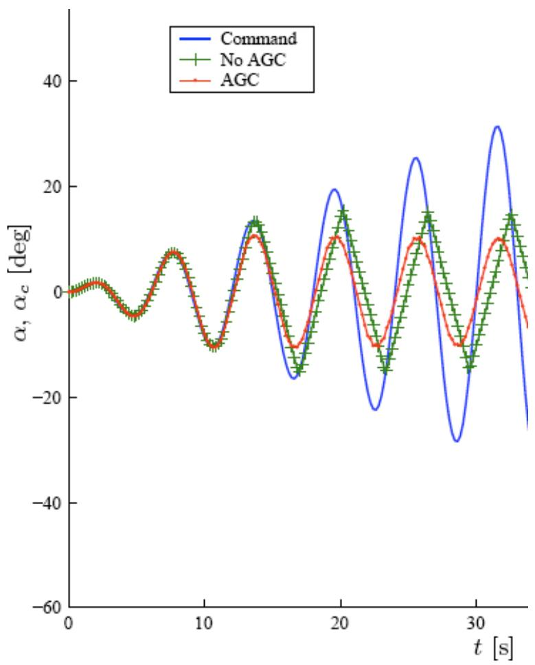

line

| t [s] | Command | No AGC | AGC |
|-------|---------|--------|-----|
| 0     | 0       | 0      | 0   |
| 5     | -5      | -5     | -5  |
| 10    | -10     | -10    | -10 |
| 15    | 10      | 10     | 10  |
| 20    | 20      | 15     | 10  |
| 25    | -20     | -15    | -10 |
| 30    | 30      | 15     | 10  |
| 35    | -30     | -5     | -10 |

# Performance Limitations – Perez et al. (2003)

IVC OCP: Rudder angle RMS limited to 15deg   
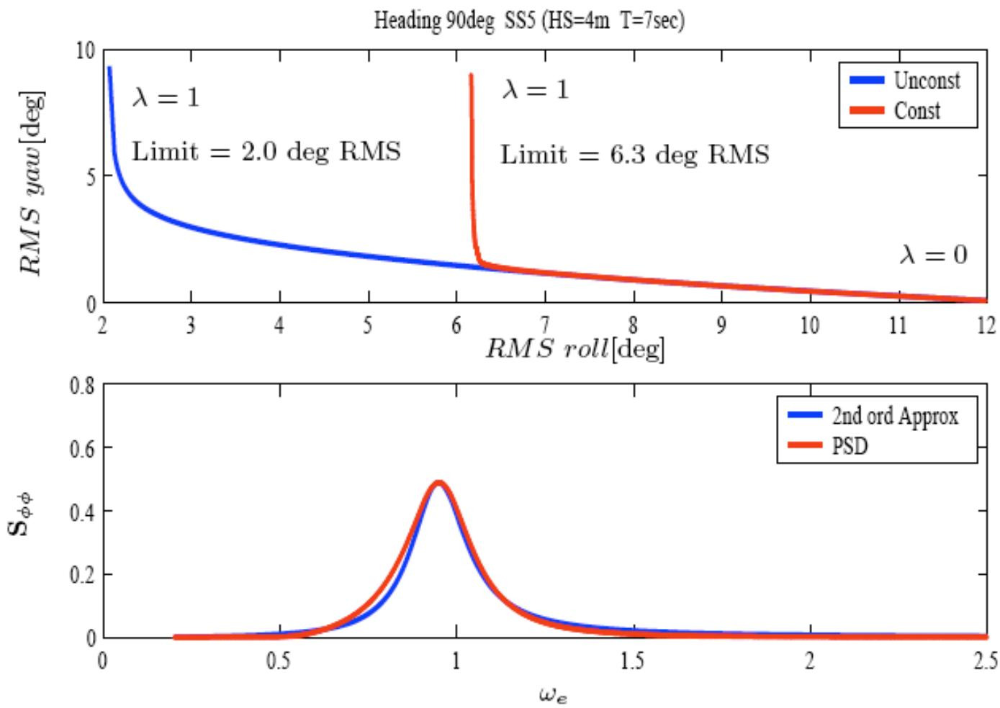

# Performance Limitations – Perez et al (2003)

IVC OCP: Rudder angle RMS limited to 15deg   
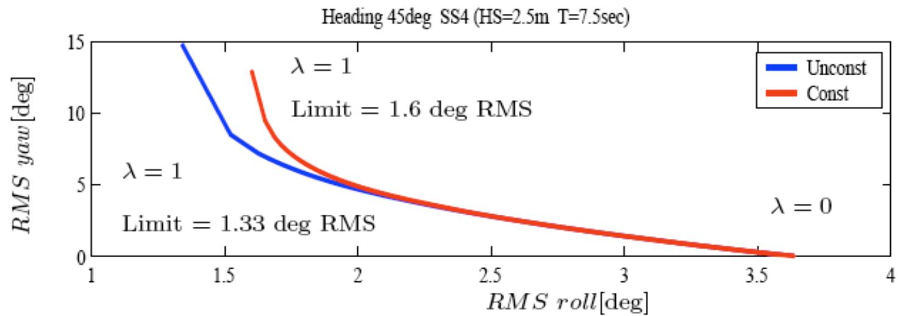

line

| RMS roll[deg] | Unconst RMS yaw[deg] | Const RMS yaw[deg] |
| ------------- | --------------------- | ------------------ |
| 1.0           | 15.0                  | -                  |
| 1.5           | 8.0                   | 13.0               |
| 2.0           | 5.0                   | 5.0                |
| 2.5           | 3.0                   | 3.0                |
| 3.0           | 1.5                   | 1.5                |
| 3.5           | 0.5                   | 0.5                |
| 4.0           | 0.0                   | 0.0                |

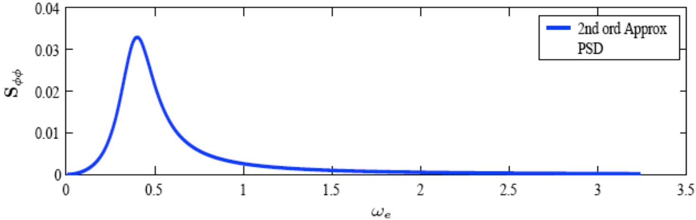

line

| ω_e | Σ_φφ |
| --- | --- |
| 0.0 | 0.0000 |
| 0.5 | 0.0330 |
| 1.0 | 0.0050 |
| 1.5 | 0.0015 |
| 2.0 | 0.0008 |
| 2.5 | 0.0005 |
| 3.0 | 0.0003 |
| 3.5 | 0.0002 |

 At low encounter frequencies,

 RR vs yaw interference can be large   
MNP dynamics limits RR achievable performance.

 At high encounter frequencies,

 Limitations of rudder machinery usually dominate RR achievable performance.

# Performance Limitations (quatering seas RR 40%)

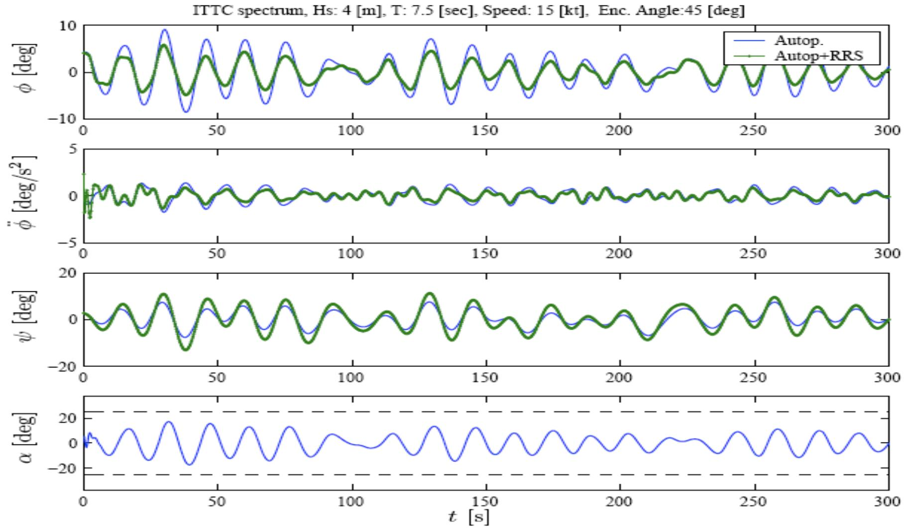

line

| t [s] | φ [deg] - Autop. | φ [deg] - Autop+RRS | φ̇ [deg/s²] - Autop. | φ̇ [deg/s²] - Autop+RRS | ψ [deg] - Autop. | ψ [deg] - Autop+RRS | α [deg] - Autop. | α [deg] - Autop+RRS |
|-------|------------------|---------------------|---------------------|------------------------|------------------|--------------------|------------------|--------------------|
| 0     | ~0               | ~0                  | ~0                  | ~0                     | ~0               | ~0                 | ~0               | ~0                 |
| 50    | ~-8              | ~-6                 | ~-2                 | ~-4                    | ~-10             | ~-8                | ~-15             | ~-12               |
| 100   | ~-6              | ~-4                 | ~-1                 | ~-3                    | ~-8              | ~-6                | ~-12             | ~-9                |
| 150   | ~-4              | ~-2                 | ~0                  | ~-1                    | ~-6              | ~-4                | ~-9               | ~-6                |
| 200   | ~-2              | ~0                  | ~0                  | ~0                     | ~-4              | ~-2                | ~-6               | ~-3                |
| 250   | ~0               | ~0                  | ~0                  | ~0                     | ~-2              | ~0                 | ~-2               | ~0                 |
| 300   | ~0               | ~0                  | ~0                  | ~0                     | ~0               | ~0                 | ~0               | ~0                 |

# Performance Limitations (beam seas RR 64%)

ITTC spectrum, Hs: 2.5 [m], T: 7.5 [sec], Speed: 15 [kt], Enc. Angle: 90 [deg]   
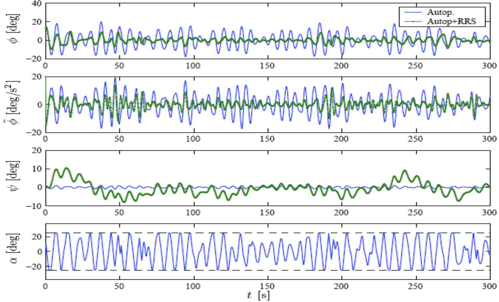

# Control Strategies

 PID,   
 Hinf   
 Loop shaping   
Adaptive LQG   
 Model Predictive Control   
Switched control   
 Nonlinear control

# Changes with Speed (Blanke & Christiansen 1993)

 Rudder to Roll TF:  Gφδ(s) = $G _ { \phi \delta } ( s ) = \frac { c _ { \phi \delta } ( 1 + s \tau _ { z 1 } ) ( 1 - \frac { s } { q } ) } { ( 1 + s \tau _ { p 1 } ) ( 1 + s \tau _ { p 2 } ) ( \frac { s ^ { 2 } } { \omega _ { p } ^ { 2 } } + 2 \zeta _ { p } \frac { s } { \omega _ { p } } + 1 ) }$ s2 + 2ζp sωp

Changes in dynamic response due to speed coupled with changes in disturbance spectrum results in a strong need for adaptation.

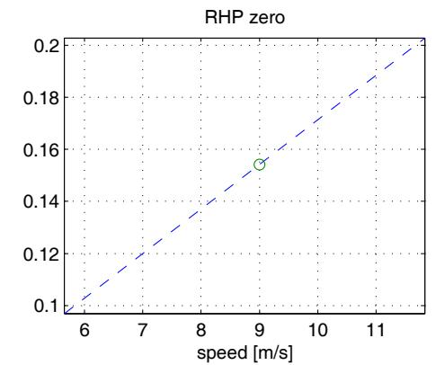

line

| speed [m/s] | RHP zero |
| ----------- | -------- |
| 9           | 0.155    |

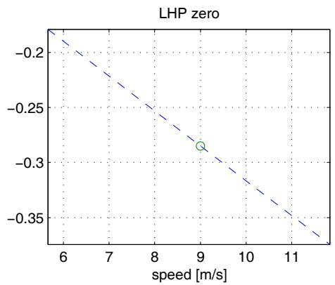

line

| speed [m/s] | value  |
| ----------- | ------ |
| 9           | -0.28  |

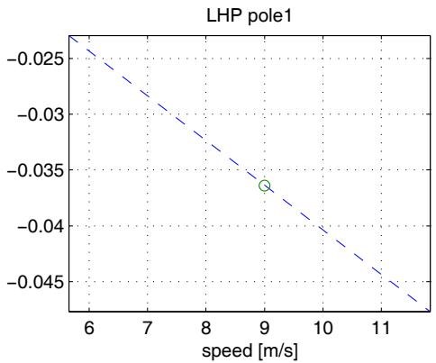

line

| speed [m/s] | LHP pole1 |
| ----------- | --------- |
| 9           | -0.035    |

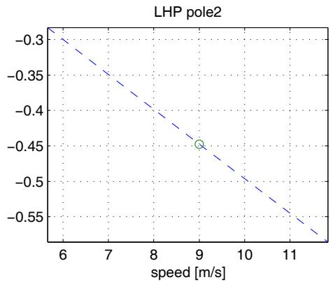

line

| speed [m/s] | value  |
| ----------- | ------ |
| 9           | -0.45  |

# H2 – Optimal Design

$$
\Phi_ {\phi \phi} (\omega) = H _ {d} ^ {*} (j \omega) H _ {d} (j \omega)
$$

$$
E (\phi^ {2}) = \| H _ {d} - Q V \| _ {2} ^ {2} \quad V = H _ {d} G _ {\delta \phi}
$$

$$
C _ {\delta \phi} (s) = (G _ {\delta \phi} ^ {-}) ^ {- 1} \frac {H _ {d} ^ {- 1} H _ {d} ^ {-}}{1 - \frac {s - q}{s + q} H _ {d} ^ {- 1} H _ {d} ^ {-}}
$$

$$
G _ {\phi \delta} ^ {-} (s) = G _ {\phi \delta} (s) \frac {s + q}{s - q} H _ {d} (s) \frac {s + q}{s - q} = H _ {d} ^ {-} (s) + H _ {d} ^ {+} (s)
$$

This shows the strong dependency on sea state, sailing conditions and changes in the vessel model --- adaptation is required.

# Direct Sensitivity Specification (Blanke et al. 2000)

Targeted (Desired) Sensitivity:

$$
S _ {d} (s) = \frac {\frac {s ^ {2}}{\omega_ {d} ^ {2}} + 2 \zeta_ {d} \frac {s}{\omega_ {d}} + 1}{(1 + \frac {s}{\beta \omega_ {d}}) (1 + \frac {\beta s}{\omega_ {d}})} S (s) = (1 + C _ {\delta \phi} (s) G _ {\phi \delta} (s)) ^ {- 1}
$$

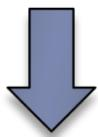

$$
C _ {\delta \phi} ^ {s} (s) = (S _ {d} (s) ^ {- 1} - 1) G _ {\phi \delta (s)} ^ {- 1} \frac {1 - \frac {s}{q}}{1 + \frac {s}{q}} P (s) ^ {- 1}
$$

# Direct Sensitivity Specification (Blanke et al. 2000)

$$
C _ {\delta \phi} ^ {s} (s) = \frac {k _ {1} s}{c _ {\phi \delta} \omega_ {d}} \frac {\frac {s ^ {2}}{\omega_ {p} ^ {2}} + 2 \zeta_ {p} \frac {s}{\omega_ {p}} + 1}{\frac {s ^ {2}}{\omega_ {d} ^ {2}} + 2 \zeta_ {d} \frac {s}{\omega_ {d}} + 1} \frac {(1 + s \tau_ {p 1}) (1 + s \tau_ {p 2})}{(1 + s \tau_ {z 1}) (1 + \frac {s}{q})}
$$

Successful performance was demonstrated for the SF300 patrol boat of the Danish Navy

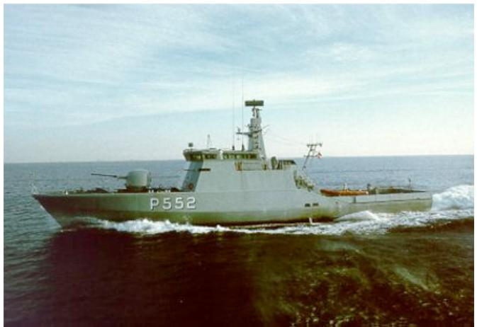

natural_image

Exterior view of a modern naval warship (hull number P552) sailing on open sea, no visible text or symbols on the vessel itself.

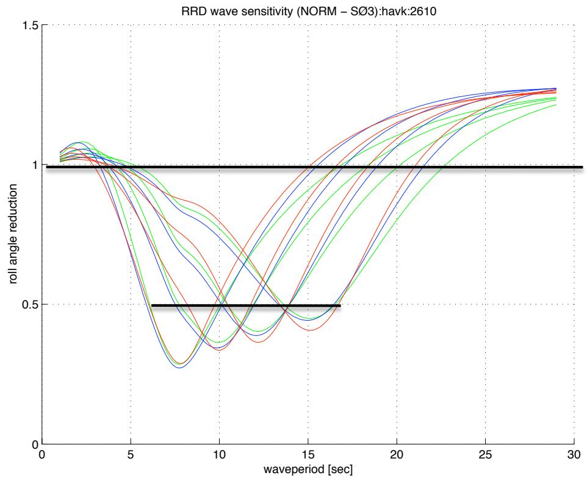

line

| waveperiod [sec] | roll angle reduction (line 1) | roll angle reduction (line 2) | roll angle reduction (line 3) | roll angle reduction (line 4) | roll angle reduction (line 5) | roll angle reduction (line 6) | roll angle reduction (line 7) | roll angle reduction (line 8) | roll angle reduction (line 9) | roll angle reduction (line 10) |
| ---------------- | ----------------------------- | ----------------------------- | ----------------------------- | ----------------------------- | ----------------------------- | ----------------------------- | ----------------------------- | ----------------------------- | ----------------------------- | ------------------------------ |
| 0                | 1.0                           | 1.0                           | 1.0                           | 1.0                           | 1.0                           | 1.0                           | 1.0                           | 1.0                           | 1.0                           | 1.0                            |
| 5                | ~0.8                          | ~0.9                          | ~0.95                         | ~0.9                          | ~0.95                         | ~0.9                          | ~0.9                          | ~0.9                          | ~0.9                          | ~0.9                           |
| 10               | ~0.3                          | ~0.4                          | ~0.5                          | ~0.5                          | ~0.5                          | ~0.5                          | ~0.5                          | ~0.5                          | ~0.5                          | ~0.5                           |
| 15               | ~0.4                          | ~0.5                          | ~0.6                          | ~0.6                          | ~0.6                          | ~0.6                          | ~0.6                          | ~0.6                          | ~0.6                          | ~0.6                           |
| 20               | ~0.8                          | ~0.9                          | ~1.0                          | ~1.0                          | ~1.0                          | ~1.0                          | ~1.0                          | ~1.0                          | ~1.0                          | ~1.0                           |
| 25               | ~1.2                          | ~1.2                          | ~1.2                          | ~1.2                          | ~1.2                          | ~1.2                          | ~1.2                          | ~1.2                          | ~1.2                          | ~1.2                           |
| 30               | ~1.3                          | ~1.3                          | ~1.3                          | ~1.3                          | ~1.3                          | ~1.3                          | ~1.3                          | ~1.3                          | ~1.3                          | ~1.3                           |

# Gyro Stabilisation

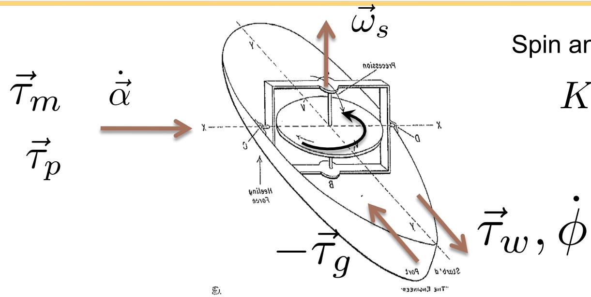

text_image

Spin ar
K
\vec{\tau}_m \quad \dot{\vec{\alpha}} \quad \vec{\omega}_s \n \vec{\tau}_p \quad \rightarrow \quad \vec{\tau}_w, \dot{\phi}

ngular momentum

$$
K _ {g} = I _ {s} \omega_ {s}
$$

$$
I _ {4 4} \ddot {\phi} + B _ {4 4} ^ {l} \dot {\phi} + B _ {4 4} ^ {n} | \dot {\phi} | \dot {\phi} + C _ {4 4} \phi = \tau_ {w} - \underbrace {K _ {g} \dot {\alpha} \cos \alpha} _ {\tau_ {g}},
$$

$$
I _ {g} \ddot {\alpha} + B _ {g} \dot {\alpha} + C _ {g} \sin \alpha = \underbrace {K _ {g} \dot {\phi} \cos \alpha} _ {\tau_ {m}} + \tau_ {p}
$$

# Gyro as a Damper

$$
\tau_ {p}: \dot {\alpha} \approx q \dot {\phi}
$$

$$
I _ {4 4} \ddot {\phi} + (B _ {4 4} ^ {e} + n K _ {g} q) \dot {\phi} + C _ {4 4} \phi = \tau_ {w}
$$

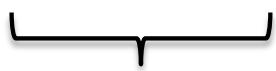

n- number of gyros

q-constant

Increase of roll damping

due to the gyrostabiliser

# Gyro-control Design

Gyro full state control: $\tau _ { p } = - K _ { a } \alpha - K _ { r } \dot { \alpha }$

Roll to precession Transfer function:

$$
G (s) = \frac {\alpha (s)}{\phi (s)} = \frac {\dot {\alpha} (s)}{\dot {\phi} (s)} = \frac {K _ {g} s}{I _ {g} s ^ {2} + B _ {g} ^ {\prime} s + C _ {g} ^ {\prime}}, \quad \begin{array}{r l} B _ {g} ^ {\prime} & = B _ {g} + K _ {r}, \\ C _ {g} ^ {\prime} & = C _ {g} + K _ {a} \end{array}
$$

The control design objective becomes:

$$
\begin{array}{r l r} & {\tau_ {p}: \dot {\alpha} \approx q \dot {\phi} \to | G (\mathfrak {j} \omega) | \approx q,} & {\tau_ {g}} \\ & {\forall \omega \in \Omega \qquad \arg G (\mathfrak {j} \omega) \approx 0} & {\stackrel {\dot {\alpha}} {\longrightarrow} \left[ \begin{array}{c} \mathrm{Ship} \\ \mathrm{gyro} \end{array} \right] \dot {\phi}} \end{array}
$$

This can be achieved by forcing two real poles on G(s) (Perez Steinman, 2009)

# Irregular Sea Performance (Perez & Steinamnn 2009)

Roll Reduction in RMS: 82%

Vessel displacement: 360 ton

Gyro unit weight: 13 ton

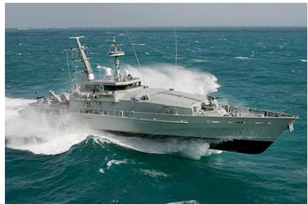

natural_image

Military amphibious assault boat navigating choppy waters, creating large wake (no visible text or symbols)

JONSWAP, Hs[m]=2 T0[s]=7 Speed[m/s]=0.00 Enc Ang][deg]=90   
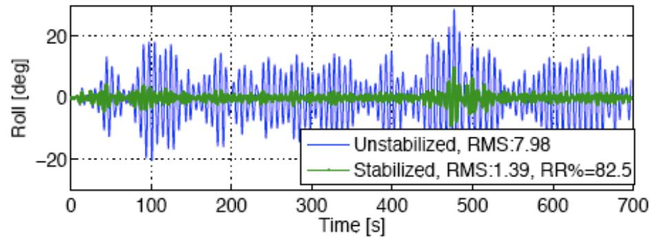

line

| Time [s] | Unstabilized Roll [deg] | Stabilized Roll [deg] |
| -------- | ------------------------ | ---------------------- |
| 0        | 0                        | 0                      |
| 100      | ~15                      | ~0                     |
| 200      | ~10                      | ~0                     |
| 300      | ~15                      | ~0                     |
| 400      | ~10                      | ~0                     |
| 500      | ~25                      | ~0                     |
| 600      | ~15                      | ~0                     |
| 700      | ~10                      | ~0                     |

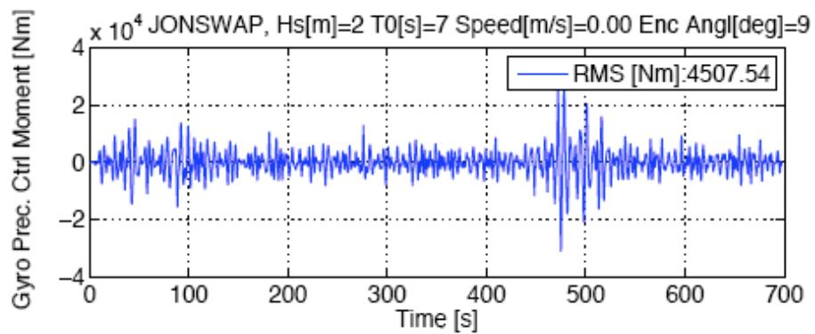

line

| Time [s] | Gyro Prec. Ctrl Moment [Nm] |
| -------- | --------------------------- |
| 0        | ~0                          |
| 100      | ~0                          |
| 200      | ~0                          |
| 300      | ~0                          |
| 400      | ~0                          |
| 500      | ~2.5×10⁴                   |
| 600      | ~0                          |
| 700      | ~0                          |

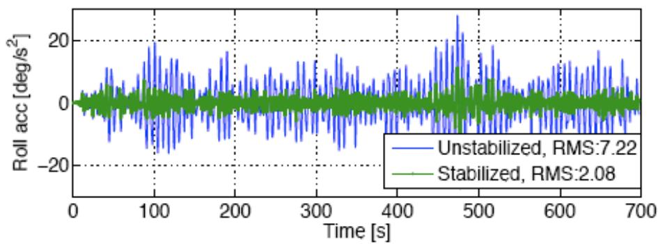

line

| Time [s] | Unstabilized Roll acc [deg/s²] | Stabilized Roll acc [deg/s²] |
| -------- | ------------------------------ | ---------------------------- |
| 0        | 0                              | 0                            |
| 100      | ~15                            | ~0                           |
| 200      | ~10                            | ~0                           |
| 300      | ~15                            | ~0                           |
| 400      | ~10                            | ~0                           |
| 500      | ~25                            | ~0                           |
| 600      | ~15                            | ~0                           |
| 700      | ~10                            | ~0                           |

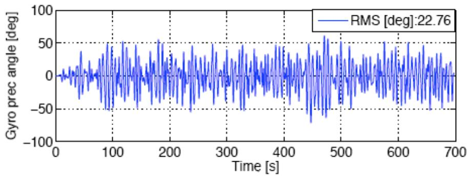

line

| Time [s] | Gyro prec angle [deg] |
| -------- | ---------------------- |
| 0        | 0                      |
| 100      | ~40                    |
| 200      | ~30                    |
| 300      | ~-20                   |
| 400      | ~40                    |
| 500      | ~-60                   |
| 600      | ~40                    |
| 700      | ~-20                   |

# IV - Research Outlook

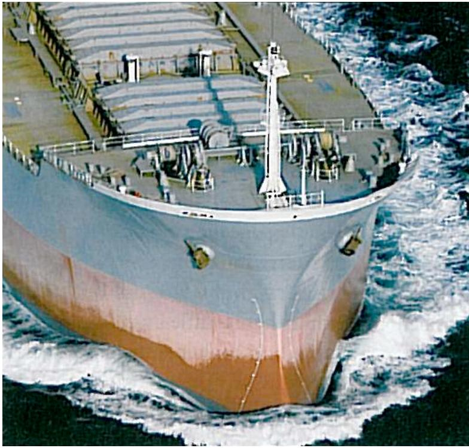

natural_image

Aerial view of a large cargo ship sailing on rough sea, creating visible wake (no text or symbols)

New Devices

Unsolved Problems

Flapping fins (Fang et al. 2009 Ocean Engineering 36)   
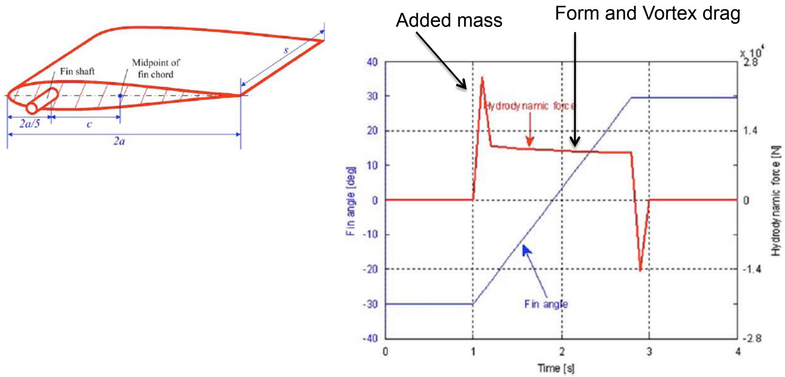

line

| Time [s] | Fin shaft (deg) | Hydrodynamic force (N) |
| -------- | --------------- | ---------------------- |
| 0        | 0               | 0                      |
| 1        | 35              | 2.8e4                  |
| 2        | 15              | 1.4e4                  |
| 3        | -20             | 0                      |
| 4        | 30              | 0                      |

# New Devices

Rotor Stabiliser (Quantumhydraulic.com)   
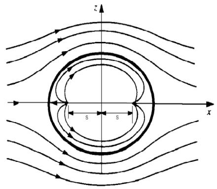

text_image

z
x
S S

Typical Vessel Length\* 25-401 

<table><tr><td>Maximum Underway Operating Speed</td><td>14 knots</td></tr><tr><td>Rotor Length</td><td>1500mm (59&quot;)</td></tr><tr><td>Rotor Diameter</td><td>217mm (8.5&quot;)</td></tr><tr><td>Angular Travel (total mechanical)</td><td>150°</td></tr><tr><td>Length (inside vessel after installation)**</td><td>920mm (36&quot;)</td></tr><tr><td>Width**</td><td>450mm (18&quot;)</td></tr><tr><td>Height (overall)**</td><td>1110mm (44&quot;)</td></tr><tr><td>Height (inside vessel, retracted)**</td><td>890mm (35&quot;)</td></tr></table>

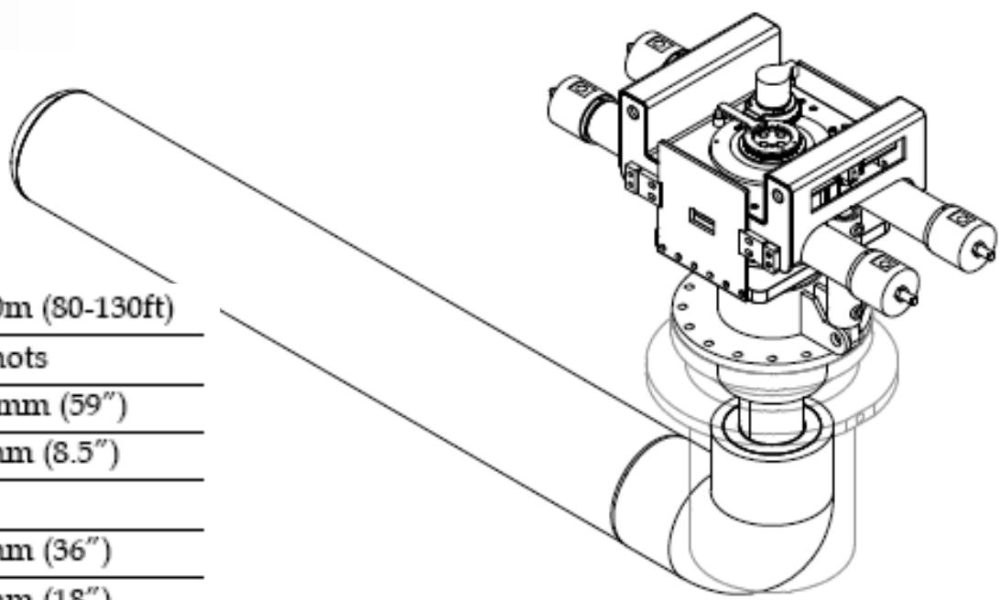

text_image

mm (80-130ft)
dots
mm (59")
mm (8.5")
mm (36")
mm (18")

# Parametric roll

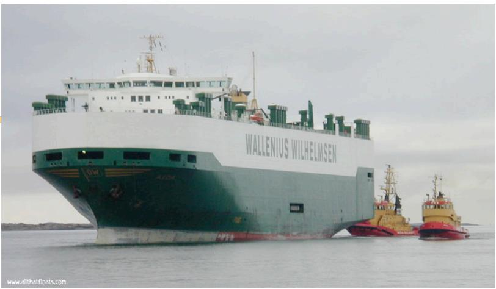

natural_image

Large car carrier ship with 'WALLENIUS WILHELMSEN' branding being assisted by tugboats on water (no visible text or symbols on the ship itself)

Parametric roll is an auto-parametric resonance phenomenon whose onset causes a sudden rise in roll oscillations.

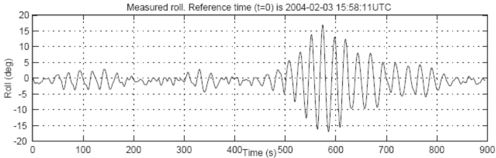

line

| Time (s) | Roll (deg) |
| -------- | ---------- |
| 0        | 0          |
| 100      | 0          |
| 200      | 0          |
| 300      | 0          |
| 400      | 0          |
| 500      | 0          |
| 600      | 0          |
| 700      | 0          |
| 800      | 0          |
| 900      | 0          |

The following conditions can trigger the effect:

Hull designs with significant bow flare and hanged stern   
 Sailing in longitudinal waves   
Wave length close to the length of the vessel   
Encounter frequency is twice the roll natural frequency   
 Low roll damping

Parametric roll is particular of modern container ships, cruise ships, car ferries, and fishing vessels.

# Restoring in Waves – Dynamic Stability

$$
K (\phi) = \rho g \nabla G Z (\phi)
$$

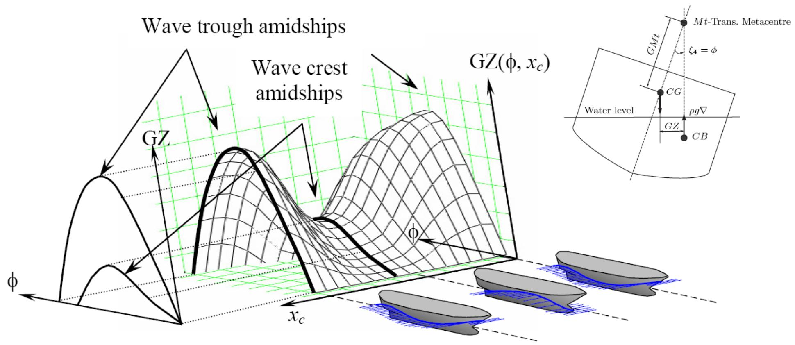

text_image

Wave trough amidships
Wave crest amidships
GZ(φ, xc)
φ
xc
GMt
Mt-Trans. Metacentre
ξ4 = φ
CG
ρg∇
GBZ
CB
Water level

# Videos

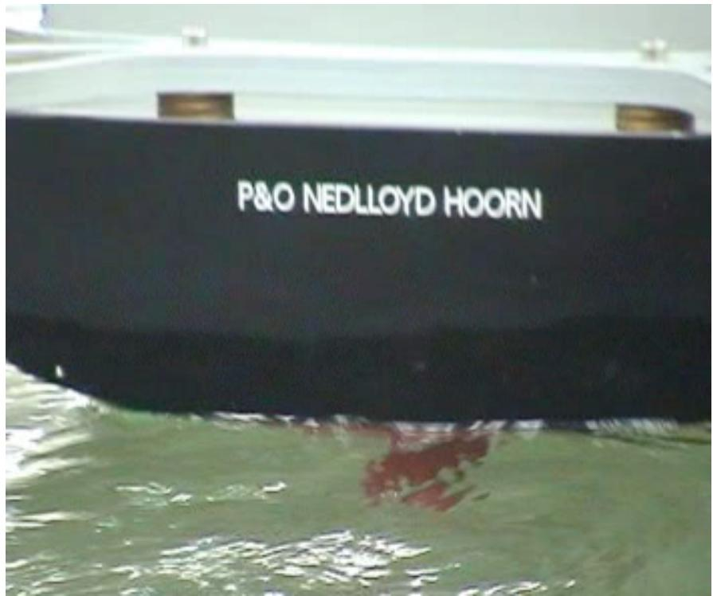

text_image

P&O NEDLLOYD HOORN

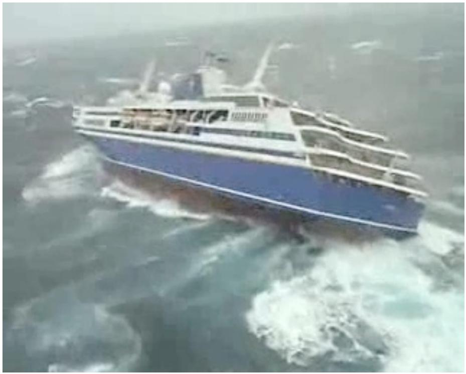

natural_image

Aerial view of a large cruise ship sailing on rough sea, creating white wake trails (no visible text or symbols)

# Conclusion

 For over 100 years different devices have been proposed to control roll motion (reduction)   
 Most of these devices require control systems to work   
 Control design is not trivial due to

 Fundamental limitations   
 Widely-varying disturbance characteristics   
 Actuator limited authority

# Current State and Research Outlook

 New developments are being put forward by yacht industry   
 Gyros, Flap fins, rotor stabilisers (need for zero speed performance)   
 Navies are still considering RRD   
 Submarines need roll control at low speeds when in the surface

# Research outlook

 Adaptation to sea state and sailing conditions still remains an issue   
 New devices with interesting hydrodynamics   
 Integrated vessel and roll control design (performance prediction)   
 Parametric roll

# Thank You

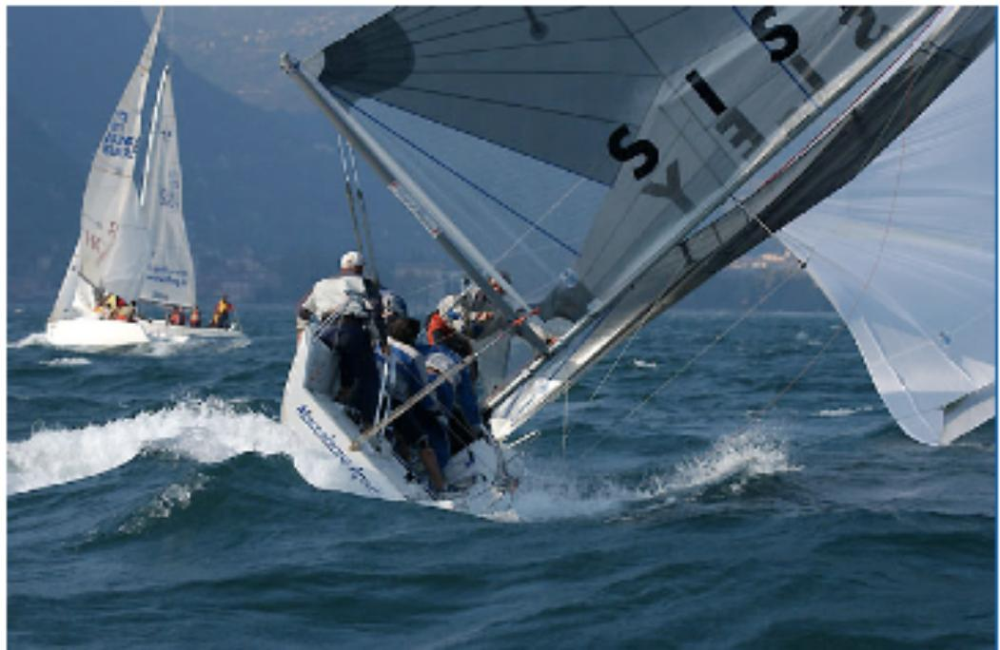

natural_image

Sailboats racing on open sea with mountainous background (no visible text or symbols)

Death Roll of Sailing Vessels