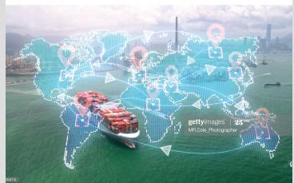
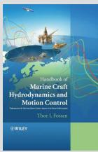
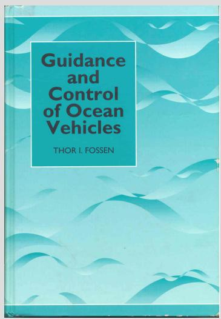
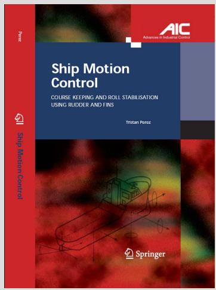

MARINECRAFT HYDRODYNAMICS AND MOTION CONTROL

text_image

gettyimages
MRCoa_Photographer

Thor l. Fossen

WILEY

## Handbook of Marine Craft Hydrodynamics and Motion Control

T.	I.	Fossen

ISBN	978-1119575054	(2nd	Editi on)

John	Wiley	&	Sons	Ltd,	UK,	2021

Electronic	orders:	www.amazon.co.uk,	www.wiley.com

Amazon	author	age:	htt p://www.amazon.com/author/fossen

The	2nd	editi on	replaces	the	2011	version.

text_image

Guidance and Control of Ocean Vehicles
THOR I. FOSSEN

## Guidance and Control of Ocean Vehicles

T.	I.	Fossen

ISBN	0-471-94113-1.

John	Wiley	&	Sons	Ltd,	UK,	1994

Electronic	orders:	www.amazon.co.uk,	www.wiley.com

Amazon	author	page:	htt p://www.amazon.com/author/fossen

text_image

Ship Motion Control
COURSE KEEPING AND ROLL STABILISATION
USING RUDDER AND FINS
Tristan Perez
Ship Motion Control
AIC
Advances in Industrial Control
Springer

## Ship Motion Control Course Keeping and Roll Stabilisation using Rudders and Fins

T.	Perez

ISBN	1-85233-959-4.	Springer	Verlag,		2005

Electronic	orders:	www.amazon.com