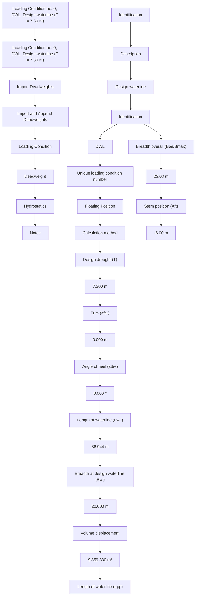

# Model l i ng a nd Si m u lation ofof Ma ri ne Su rface Vessel D yna m ics

(Mod u le 1 0 : Softwa re a nd Ra pid Model Prototypi ng )

## D r Trista n Pe rez   Perez

Centre for Com plex Dynam ic Systems a nd Control (C DSC)


THE UNIVERSITY OF NEWCASTLE AUSTRALIA

## P rofessor Thor I Fosse n

De pa rtme nt of E ng i n ee ri ng Cybernetics


NTNU

Det skapende universitet

## MSS – Ma eri ne Syste sSystems S u atoSi m u lator

„ G N C Too l box (m-fi l e l i b ra ry a nd S i m u l i n k blocks) U sed i n T . I . Fosse n (2002 ) . M a ri n e Control Syste ms  
„ Hyd ro (m-fi l e l i bra ry for hyd rodyna m i c post-processi ng of hyd rodyna m i c d ata +    S i m u l i n k blocks for ti me   ti me-d oma i n si m u l ation of vessel responses i n 6 DO F ) .  
Part of new book - worked exam ples - d esig n of sh i p si m u lation mod els based on sh i p d rawi ngs T . Pe rez a nd T . I . Fosse n (i n prog ress)


## From Vessel Bod y Pla n to MSS

## 1 . Body pla n (ge neral a rra nge me nt)

- D rawi ng ca n be sca n n ed a nd d ig ita l ized ma n u a l ly  
- Geometry fi le :  AutoCad AutoCad , S h i pX, Wa m it, N a pa etc N a pa , etc.

## 2 . Hyd rodyna m ic Config u ration a nd Com putations

\- SW: Wa m it, S h i px (VE RES ) , Octopus (S EAWAY) etc.

\- Com p utes :

• Freq uency-dependent added mass and potential dam pi ng  
• Resto ri n g fo rces  
• F rou d e-Krylov a nd d iffraction forces ( 1 st-ord e r wave loads)  
• Wave d rift (2 nd-ord e r wave loads)  
• Viscous rol l d a m p i ng ( I ked a d a m p i ng etc. )


<details>
<summary>natural_image</summary>

3D wireframe model of a curved, segmented object (no text or symbols)
</details>


<details>
<summary>natural_image</summary>

3D surface plot with grid background and colored mesh surfaces (no text or symbols)
</details>

## 3 . Post- P rocessi ng ( M SS Hyd ro)

- Com putes state-space models for freq uency-dependent hyd rodynam ics  
- Ad d v i s co u s d a m p i n g l i ke l i n e a r s ki n fri cti o n I TTC d rag cross       fri cti o n ,  d rag , c ross-fl ow d rag fl ow  
- Ad d non l i n ea r ma n e uve ri ng coeffi ci e nts

## 4 . S i m u l i n k Vessel S i m u l ator ( M SS Hyd ro)

- 6 D O F l  D O F re a l -t i i l t i f l i t i l i t d l t i t i m e s i m u l at i o n of ve s s e l p o s i t i o n , ve l o c i ty, a n d a cce l e rat i o n  + wi nd , cu rre nt, a nd wave ge n e rators .  
- For a floati ng vessel the resu lti ng mod el wi l l be d escri bed by 1 00-200 O D Es . Wave load d ata for d iffere nt speeds a nd head i ngs (0-360 d eg ) a re also i n cl ud ed .

## Dig gitizi ng p the Sh i p Li nes gusi ng g a D rawi ng


<details>
<summary>text_image</summary>

Engage Digitizer 4.1 [Qt] - [lines_left]
3 known axes points (x, y)
MAINDECK 8800
#100
#90
TWEEN DECK
#80
#70
#60
#50
#40
#30
#20
#10
#-10
#40
0
1
2
3
4
5
6
7
8
9
10
11
Digitize curve point...
The three axis points are correctly defined.
(3.0926,8.6371) (0.0097,0.0098)
</details>

## Expo rt to Ta b l e of Offsets

Th e d ig itized s h i p sections are exported to Excel i n two col u m ns (xz- p l a n ) fro m D i g i t i ze r


The VEREs geometry file format looks as follows:  
```txt
Text string 1
Text string 2
Text string 3
Text string 4
LPP (i.e. the value of LPP, NEW IN VERES VERSION 4!)
Section_number
X-position
Number_of_points
y(Section_number,1)          z(Section_number,1)
y(Section_number,2)          z(Section_number,2)
:                       :
:                       :
y(Section_number,Number_of_points) z(Section_number,Number_of_points)
Next_section_number
:
```


Exam ple : S 1 7 5 conta i n e r s h i p .


As c i i fi l e : S 1 75 . m gf

## Sh i pX (VERES) by MARINTEK


<details>
<summary>natural_image</summary>

Composite image showing a ship at a port with construction machinery and industrial equipment, overlaid with a stylized yellow graphic (no text or symbols)
</details>

MARI NTE K - the Norweg ian Mari ne Tech nology Resea rch I nstitute - does resea rch a nd d eve l o p m e n t i n t h e m a ri t i m e s e cto r fo r i n d u st ry a n d the pu bl i c sector. The I nstitute d evelops a nd verifies tech nolog i cal sol utions for the sh i ppi ng a nd ma riti me eq u i pme nt i nd ustries a nd for offshore petrol eu m prod u ction .

VE RES - VEssel RESponse prog ram is a Stri p Theory Prog ram wh ich calcu lates wave-i nd u ced loads on and motions of mono-h u l ls and barges i n d eep to very shal low water. The prog ram is based on the famous paper by Salvesen , Tuck and Falti nsen ( 1 970) . Ship Motions and Sea Loads. Trans . S NAM E .


<details>
<summary>text_image</summary>

ShipX Workbench
created by MARINTEK & millennium software as
</details>


<details>
<summary>flowchart</summary>


</details>

## OC O US S byTOPUS SEAWAY by a co Ama rcon


## and AMARCON cooperate i n fu rther development of SEAWAY

The M a riti me Resea rch I nstitute N etherla nds ( MARI N ) a nd AMARCO N ag ree to cooperate i n fu rther development of S EAWAY. MARI N is a n i nternational ly recog n ized authority on hyd rodyna m i cs i nvolved i n frontie r brea ki ng resea rch  hyd rodyna m i cs , prog ra ms for the ma riti me a nd offshore i nd ustries a nd navies .


<details>
<summary>natural_image</summary>

Yellow underwater vehicle floating in water with water splashing, labeled 'MARIN' in blue logo (no other text or symbols visible)
</details>

S EAWAY is d eveloped by P rofessor J . M . J . J ou rnée at the Delft U n iv. of Tech nology

S EAWAY is a Stri p Theory Prog ram to calcu late wave-i nd uced loads on and motions of mono  mono-h u l ls a nd ba rges i n d ee p to very shal low water Whe n not accou nti ng for h u l ls        water. i nteraction effects betwee n the h u l ls , also cata ma ra ns ca n be a nalyzed . Work of very acknowledged hyd romecha n ic scientists (l i ke U rsel l , Tasa i , F ra n k, Kei l , N ewma n , Falti nse n , I ked a , etc. ) has bee n used , whe n d evelopi ng th is cod e .

S EAWAY has extensively been verified and val idated usi ng other com puter codes and experi mental data .

File Edit Tools Help

## All hull forms

My hullforms C:\hydrodynamics\SeaWay\tug

SEAWAY hull forms

Barge  
Barge Carrier  
Bitumen Tanker  
Bulk Carrier  
Catamaran Vessel  
Coaster  
Container Feeder  
Container Ship  
Crane Vessel  
Cruise Vessel  
Cutter Suction Dredger  
Diving Support Vessel  
Drilling Vessel  
Fast Displacement Vessel  
FastFreighter  
  
FPSOVessel  
Freighter  
Heavy LitVessel  
High Speed Vessel  
Hopper Dredger  
Ice Breaker  
Inland Waterway Coaster  
Inland Waterway Ferry  
Inland Waterway Tanker  
Lemster Aak  
Low Air Draft Coaster  
Motor Yacht  
Multi-Purpose Ship  
Oceanographic Vessel  
Oil Pollution Fighter  
Patrol Vessel  
PilotVessel  
Product Tanker  
Protection Vessel  
Reefer Ship  
Research Vessel  
Ro-Ro Vessel  
Sailboat  
Shallow Draft Tanker  
Shallow Draft Vessel  
Stern Trawler  
Submarine Rescue Vessel

Main characteristics Tug Boats

<table><tr><td>Hull form:</td><td>Length:</td><td>Beam:</td><td>Draft:</td><td>L/B:</td><td>B/D:</td><td>CB:</td><td>CWL:</td><td>CVP:</td><td>LCB (%Lpp):</td></tr><tr><td>Tug_Boat_001.hul</td><td>33.00</td><td>9.45</td><td>3.20</td><td>3.49</td><td>2.95</td><td>0.59</td><td>0.86</td><td>0.69</td><td>0.42</td></tr><tr><td>Tug_Boat_001.h...</td><td>33.00</td><td>9.45</td><td>3.20</td><td>3.49</td><td>2.95</td><td>0.59</td><td>0.86</td><td>0.69</td><td>0.42</td></tr><tr><td>Tug_Boat_002.h...</td><td>17.00</td><td>4.99</td><td>1.40</td><td>3.41</td><td>3.56</td><td>0.51</td><td>0.80</td><td>0.64</td><td>-0.39</td></tr><tr><td>Tug_Boat_003.h...</td><td>25.00</td><td>8.59</td><td>3.00</td><td>2.91</td><td>2.86</td><td>0.57</td><td>0.87</td><td>0.66</td><td>0.10</td></tr><tr><td>Tug_Boat_004.h...</td><td>58.50</td><td>14.18</td><td>5.80</td><td>4.13</td><td>2.44</td><td>0.69</td><td>0.89</td><td>0.77</td><td>-0.20</td></tr><tr><td>Tug_Boat_005.h...</td><td>39.00</td><td>12.87</td><td>4.38</td><td>3.03</td><td>2.94</td><td>0.52</td><td>0.98</td><td>0.53</td><td>0.16</td></tr><tr><td></td><td></td><td></td><td></td><td></td><td></td><td></td><td></td><td></td><td></td></tr><tr><td></td><td></td><td></td><td></td><td></td><td></td><td></td><td></td><td></td><td></td></tr></table>


<details>
<summary>natural_image</summary>

Pure diagram of a symmetrical, elongated shape with internal vertical lines and a green vertical line at the top (no text or symbols)
</details>


<details>
<summary>contour</summary>

| X | Y |
| --- | --- |
| ~0.0 | ~0.0 |
| ~0.1 | ~0.1 |
| ~0.2 | ~0.2 |
| ~0.3 | ~0.3 |
| ~0.4 | ~0.4 |
| ~0.5 | ~0.5 |
| ~0.6 | ~0.6 |
| ~0.7 | ~0.7 |
| ~0.8 | ~0.8 |
| ~0.9 | ~0.9 |
| ~1.0 | ~1.0 |
| ~1.1 | ~1.1 |
| ~1.2 | ~1.2 |
| ~1.3 | ~1.3 |
| ~1.4 | ~1.4 |
| ~1.5 | ~1.5 |
| ~1.6 | ~1.6 |
| ~1.7 | ~1.7 |
| ~1.8 | ~1.8 |
| ~1.9 | ~1.9 |
| ~2.0 | ~2.0 |
| ~2.1 | ~2.1 |
| ~2.2 | ~2.2 |
| ~2.3 | ~2.3 |
| ~2.4 | ~2.4 |
| ~2.5 | ~2.5 |
| ~2.6 | ~2.6 |
| ~2.7 | ~2.7 |
| ~2.8 | ~2.8 |
| ~2.9 | ~2.9 |
| ~3.0 | ~3.0 |
| ~3.1 | ~3.1 |
| ~3.2 | ~3.2 |
| ~3.3 | ~3.3 |
| ~3.4 | ~3.4 |
| ~3.5 | ~3.5 |
| ~3.6 | ~3.6 |
| ~3.7 | ~3.7 |
| ~3.8 | ~3.8 |
| ~3.9 | ~3.9 |
| ~4.0 | ~4.0 |
| ~4.1 | ~4.1 |
| ~4.2 | ~4.2 |
| ~4.3 | ~4.3 |
| ~4.4 | ~4.4 |
| ~4.5 | ~4.5 |
| ~4.6 | ~4.6 |
| ~4.7 | ~4.7 |
| ~4.8 | ~4.8 |
| ~4.9 | ~4.9 |
| ~5.0 | ~5.0 |
| ~5.1 | ~5.1 |
| ~5.2 | ~5.2 |
| ~5.3 | ~5.3 |
| ~5.4 | ~5.4 |
| ~5.5 | ~5.5 |
| ~5.6 | ~5.6 |
| ~5.7 | ~5.7 |
| ~5.8 | ~5.8 |
| ~5.9 | ~5.9 |
| ~6.0 | ~6.0 |
| ~6.1 | ~6.1 |
| ~6.2 | ~6.2 |
| ~6.3 | ~6.3 |
| ~6.4 | ~6.4 |
| ~6.5 | ~6.5 |
| ~6.6 | ~6.6 |
| ~6.7 | ~6.7 |
| ~6.8 | ~6.8 |
| ~6.9 | ~6.9 |
| ~7.0 | ~7.0 |
| ~7.1 | ~7.1 |
| ~7.2 | ~7.2 |
| ~7.3 | ~7.3 |
| ~7.4 | ~7.4 |
| ~7.5 | ~7.5 |
| ~7.6 | ~7.6 |
| ~7.7 | ~7.7 |
| ~7.8 | ~7.8 |
| ~7.9 | ~7.9 |
| ~8.0 | ~8.0 |
| ~8.1 | ~8.1 |
| ~8.2 | ~8.2 |
| ~8.3 | ~8.3 |
| ~8.4 | ~8.4 |
| ~8.5 | ~8.5 |
| ~8.6 | ~8.6 |
| ~8.7 | ~8.7 |
| ~8.8 | ~8.8 |
| ~8.9 | ~8.9 |
| ~9.0 | ~9.0 |
| ~9.1 | ~9.1 |
| ~9.2 | ~9.2 |
| ~9.3 | ~9.3 |
| ~9.4 | ~9.4 |
| ~9.5 | ~9.5 |
| ~9.6 | ~9.6 |
| ~9.7 | ~9.7 |
| ~9.8 | ~9.8 |
| ~9.9 | ~9.9 |
| ~10.0 | ~10.0 |
</details>

-Hull form scale parameters

<table><tr><td>Longitudinal, Sx (-):</td><td>33.00</td></tr><tr><td>Transverse, Sy (-):</td><td>9.45</td></tr><tr><td>Vertical, Sz (-):</td><td>3.20</td></tr></table>

Draft and trim

<table><tr><td>Draft amidship (m):</td><td>3.20</td></tr><tr><td>Trim by stern (m):</td><td>0.00</td></tr><tr><td>Bouyancy (m3):</td><td>592</td></tr></table>

Catamaran sections

<table><tr><td>Spacing between centerlines hulls:</td><td>0.00</td></tr></table>

Use constant hullspacing

<table><tr><td>-</td><td>X</td><td>Y</td><td>Z</td><td></td></tr><tr><td>0</td><td>23.07</td><td>0.00</td><td>0.22</td><td></td></tr><tr><td>1</td><td>23.07</td><td>0.12</td><td>0.22</td><td></td></tr><tr><td>2</td><td>23.07</td><td>0.24</td><td>0.22</td><td></td></tr><tr><td>3</td><td>23.07</td><td>1.37</td><td>0.36</td><td></td></tr><tr><td>4</td><td>23.07</td><td>2.50</td><td>0.50</td><td></td></tr><tr><td>5</td><td>23.07</td><td>3.12</td><td>0.62</td><td></td></tr><tr><td>6</td><td>23.07</td><td>3.47</td><td>0.75</td><td></td></tr><tr><td>7</td><td>23.07</td><td>3.89</td><td>1.00</td><td></td></tr><tr><td>8</td><td>23.07</td><td>4.12</td><td>1.25</td><td></td></tr><tr><td>9</td><td>23.07</td><td>4.24</td><td>1.50</td><td></td></tr><tr><td>10</td><td>23.07</td><td>4.32</td><td>1.75</td><td></td></tr><tr><td>11</td><td>23.07</td><td>4.36</td><td>2.00</td><td></td></tr><tr><td>12</td><td>23.07</td><td>4.40</td><td>2.25</td><td></td></tr><tr><td>13</td><td>23.07</td><td>4.43</td><td>2.50</td><td></td></tr><tr><td>14</td><td>23.07</td><td>4.47</td><td>2.75</td><td></td></tr><tr><td>15</td><td>23.07</td><td>4.50</td><td>3.00</td><td></td></tr><tr><td>16</td><td>23.07</td><td>4.53</td><td>3.20</td><td></td></tr></table>

## WAMIT (Vers . 6 . 3) by WAM IT I N C .

WAM IT ® is the most advanced set of tools avai lable for analyzi ng wave i nteractions with offshore pl atforms a nd othe r stru ctu res or vessels .

WAM IT ® was develo p y ed b Professor Newman and coworkers at M IT i n 1 987 , and it has ga i n ed wid espread recog n ition for its a b i l ity to a na lyze the com pl ex stru ctu res with a h ig h d eg ree of accu racy a nd effi cie n cy.


<details>
<summary>surface_3d</summary>

| X | Y | Z |
| --- | --- | --- |
| -10~20 | -10~20 | ~0 ~10 |
</details>

Ove r th e past   20 yea rs WAM I T has bee n l i ce nsed to more       tha n 90  i nd ustria l a nd resea rch orga n izations worldwid e     worldwid e .

## Fi le o ats F rmats – S p Geo et y h i p Geometry

I t is possi bl e to conve rt d ata fi l e formats betwee n the prog ra ms :

- S EAWAY table of offset fi le : \* . o u t  
- VE RES table of offset fi le : \* . m g f  
- WA M I T t fi l ( l ) WA M I T g e o m et ry fi l e ( p a n e l s ) \* d f . g

S EAWAY has a n add -i n for export to VE RES \* . out + WAM I T pa nel generation .

VE RES can i m port CAD/CAM data (NAPA etc. ) + add -i n for WAM I T panel ge n e ration .

WAM I T on ly reads it pa n el d ata i n \* . gdf form . You ca n ge n e rate these i n S EAWAY and VE RES or buy a CAD/CAM prog ram l i ke M U LTI S U RF to generate WAM IT g e o m etry fi l es  fi l es .

## H y yd rod yna m ic Methods ( y )  ( M SS H yd ro )

Freq uency-Dependent Hyd rodynam ic Added M ass , Potential Dam pi ng , and Restori ng Forces :

C t d i WA M I T S h i X (V E R E S ) o m p u te d u s i n g : WA M I T ,  p (V E R E S ) , or Octopus S EAWAY

N on l i nea r Viscous Da m pi ng a nd Cu rre nt Loads :

I TTC q u ad rati c d rag form u lation/ add ed resista n ce i n su r ge (i n cl u d esg ( c u rre n t)  
N on l i nea r cross-flow d rag i n sway a nd yaw (i n cl u d es cu rre nts)  
M u n k mome nt i n yaw from pote ntial coefficients  
H ig her ord er non l i nea r d a m pi ng terms i n heave rol l a nd pitch (ma n u al ly heave , rol l ,   (ma n u al ly added )  
Y M a neuveri ng coeffi cie nts (ma n u al ly added )

N on l i near F req uency-Dependent Da m pi ng i n Rol l d ue to B i l g e Ke e l s and Anti - Ro l l i n g Ta n ks :  
Ca n be com puted i n S h i pX (VE RES ) and Octopus (S EAWAY)

Freq uency-Dependent Li near V i D i i D O F 1 2 6V i s co u s  D a m p i n g i n D O F s 1 , 2 , 6 :

M a n u al ly add ed usi ng exponential d ecayi ng fu n ctions for ski n fri ction

Wave Loads :

1 st-ord e r ( F rou d e-Krylov a nd d iffraction ) a nd 2 nd-ord er wave loads (wave d ri ft) a re co m p u te d u s i n g( ) p 2 D/3 D pote ntial theory

Wi nd Loads :

Com puted usi ng wi nd coeffi cie nt ta b l e s

## Wamit (Vers. 6.2) Configuration Program for Ships

## -Main-

Vessel Name:

Vessel Name

Geometric data file (\*.gdf):

## Wamit Outputs (global coordinates)

Added mass and damping coefficients

√Yes/No

Exciting forces from Haskind relation (6 DOF)

□Yes/No

Exciting forces from diffraction potential (6 DOF)

Yes/No

Motion RAOs (6 DOF)

Yes/No

Mean drft forces and moment from momentum (3 DOF)

Yes/No

Mean drift forces and moments from pressure (6 DOF)

□Yes/No

1. Generate Wamit input files >>

2. Run Wamit from MS-DoS >>

Author: Thor I. Fossen

## Vessel Data-

Density of water (kg/ma3) and mass (tonnes):

1025.0

Use-1 to compute massfrom displaced fluid (FRC file #2 option) else input mass (FRC file #1 option). TheFRCfile #2optiondoesnotsupporttheuseof extemalM,DandGmatricesnornonzero xgand yg.

Radii of gyration R44, R55, R66, R46 (m):

20.3

20.3

0.0

CG = [xg.yg.zg] (m):

-1.18

0.0

1.0

External viscous damping (FRC file #1 option)

diag(0000000])

External spring stiffness (FRC file #1 option)

diag(000000])

The global coordinate system {H}is located at (Lpp/2,0,WL) with axes forward-port-up. CGisdefinedrelativeto{H}inbodyfixedaesB)

Plotthe GDF-file toinspect axes/cordinate oriin

Plot GDF

Plot IDF

## Wamit Configuration

Wave periods (s):

[2 2.533.5 4 4.555.5678 10 1530 60]

Include the zero frequency

Yes/No

Include the infinity frequency

Yes/No

Number of iterations

100

Direct solver:Yes/No

for iterative solver:

Incident wave angles (deg): 0,10,20,30,40,50,60,70,.,70,180

IRR =3: Remove iregular frequencies -automatic free surface/discretization

[LOG = 1

Use ILOG = O for IRR = 0

and ILOG = 1 for IRR= 1.2.3

## Exa m p gle : Add i ng Viscous p g Da m pi ng

Adde d mas s A4 4 A5 5 A6 6  
  
D amping B 4 4 , B 5 5 , B 6 6

Pe ak is due to IKEDA ro ll damping the o ry fo r b ilg e ke e l s

Line ar vi s c ous s kin fri c ti o n (ramp s )

# O utp ( ut Asci i -fi l es) fro m Hyd rodyna m ic Codes

## „ VERES

\* . re 1 - m ot i o n RAO s  
\* . re2 - wave d ri ft d ata  
\* . re7 - ad d ed m ass , d a m p i ng , restori ng te rms  
\* . re 8 - fo rce RAOs  
\* . h yd - h yd rostati c d ata e t c .

## SeaWay

\* . o u t - a l l co m p u ted d ata a nd vessel config u ration

## „ WAMIT

\* . o u t - a l l co m p u ted d ata  
\* . p ot - ve s s e l config u ration d ata

## Postp g rocessi ng of the Hy y d rod na m ic Data Fi les to the MSS vessel structu re

„ E t t i f t i f t h AS C I I fi l t d b t h Ext ra ct n e ce ss a ry i n fo rm at i o n fro m t h e  fi l e s g e n e rate d by t h e hyd rodynam ic code  
Sca l i ng of d ata  
„ Cha nge a nd tra nsl ate coord i nate fra mes for hyd rodyna m i c coeffi cie nts , RAOs , tra nsfe r fu n ctions etc.  
Add viscous effects ( y y h d rodyna m ic cod es are non-viscous/p y) otential theory)  
P rocess d ata for ti me-d oma i n s i m u l ation

N otice that the N otice  MSS vessel structure   is i nd epend ent of the hyd rodyna m ic cod e !

## MSS Hyd ro tool box com mands :

>> veres2vessel . m  
>> wam it2vessel . m  
>> seaway2vessel . m

## MSS Hyd ro Vessel Structu re

vessel . head i ngs :

vessel .velocities :

vessel .freqs :

head i ngs

ve l oci ti es

freq u e n ci es (A a nd B matri ces)

vessel .A(6 , 6 ,freq no ,vel no) :

vessel . B (6 , 6 ,freq no ,vel no) :

vessel . C(6 , 6 ,freq no ,vel no) :

vessel . M RB (6 , 6) :

added mass matrix

dam pi ng matrix

s p ri n g sti ffn ess m atrix

rig id-body mass matrix

vess e l . d ri ftfrc .

a m p(freq no , head no ,vel no) :

w( 1 , fre q n o ) :

wave d ri ft fo rce a m p l i tu d es

ci rcu l a r wave freq u e n ci es

vessel .force RAO .

a m p{ 1 6}( : f h d l req no , h ead no ,ve l no) :

p hase{ 1 : 6}(freq no , h ead no ,vel no) :

w( 1 , fre q n o ) :

wave exc i t t i f l i t d i tat i o n fo rce a m p l i tu d e s

wave excitation force phases

ci rcu l a r wave freq u e n ci es

vessel . motion RAO .

a m p{ 1 : 6}(freq no , h ead no ,ve l no) :

p hase{ 1 : 6}(freq no , h ead no ,vel no) :

w( 1 fre q n o ) : w( 1 , fre q n o ) :

wave motion RAO am pl itudes

wave motion RAO phases

ci rcu l a r wave freq u e n ci es

# Vectoria l Vessel Model Representation f M ifor M a ri ne V lVessel s

F rom Roboti cs to S h i p M od el i ng ( Fosse n 1 99 1 , P h D thesis)

C onsi der the c l as si c al rob ot manipul ator mo de l :

$$
\mathbf {M} (\mathbf {q}) \ddot {\mathbf {q}} + \mathbf {C} (\mathbf {q}, \dot {\mathbf {q}}) \mathbf {q} = \boldsymbol {\tau}
$$

- q i s a v e c to r o f j o int angl e s  
- i s a ve cto r o f to rque  
- M and  C are the syste m inerti a and C ori o li s matri c e s

Thi s mo de l structure c an b e us e d as fo undati on to write the 6 D OF marine ve s s e l e quati f ti i t tions o f motion in a c omp ac vect i l or al s etti ( ng Fo s sen 1 9 9 4 200 21 9 9 4 , 200 2) :

$$
\dot {\eta} = \mathbf {J} (\eta) \mathbf {v}
$$

$$
\mathbf {M} \dot {\mathbf {v}} + \mathbf {C} (\mathbf {v}) \mathbf {v} + \mathbf {D} (\mathbf {v}) \mathbf {v} + \mathbf {g} (\boldsymbol {\eta}) = \boldsymbol {\tau}
$$

- b o dy v e l o c iti e s :   u, v, w, p, q, r T  
- p o s i t i o n  a n d E u l e r  a n g l e s :   x , y , z,  ,  ,   Tp o s t o  d u e  g e s  
- M , C and D deno te the syste m inerti a , C ori o li s and damping matri c e s  
- g is a ve ctor o f gravitational and buoyancy f d tforc e s and moments


## U n ified Ti me- Doma i n Model fo r D iffe re nt Speeds a nd D iffe re nt Sea States

The Force-Transfer-Functions are c ompute d using hydro dynamic SW WAMIT VERES SEAWAYe g WAMIT or

$$
\dot {\boldsymbol {\eta}} = \mathbf {J} (\boldsymbol {\Theta}) \mathbf {v}
$$

$$
\mathbf {M} \dot {\mathbf {v}} + \mathbf {C} _ {R B} \mathbf {v} + \mathbf {D} \mathbf {v} + \mathbf {d} _ {n} (\boldsymbol {\Theta}, \mathbf {v}) + \boldsymbol {\mu} + \mathbf {g} (\boldsymbol {\eta}) = \boldsymbol {\tau} _ {\mathrm{env}} + \boldsymbol {\tau}
$$

Unified Model


<details>
<summary>flowchart</summary>

```mermaid
graph LR
  subgraph Seakeeping Model
  A["Wave spectrum"] --> B["FTF"]
  B --> C["Wave excitation spectrum"]
  C --> D["Σ"]
  D --> E["Reference frame transformation"]
  end
  subgraph Motion
  F["Motion"] --> G["Linear mass-damper-spring with memory effects – frequency dependent (ω ≥ 0)"]
  H["Nonlinear terms (viscous damping, Coriolis etc.)"] --> G
  G --> H
  end
  E --> I(("Control forces and moments"))
  I --> J(("((""))
```
</details>

$$
\dot {\boldsymbol {\chi}} = \mathbf {A} _ {r} \boldsymbol {\chi} + \mathbf {B} _ {r} \delta \mathbf {v}, \quad \boldsymbol {\chi} (0) = \mathbf {0}
$$

$$
\boldsymbol {\mu} = \mathbf {C} _ {r} \boldsymbol {\chi} + \mathbf {D} _ {r} \delta \boldsymbol {v}
$$

For 6 DOFthis model will t i ll b t dtypically be representedby 6 + 6 + 90 = 102ODEs which are computed using hydrodynamic e.g. WAMIT, VERESorSEAWAY

These terms are found using experimental results/curve fitting or semi-empirical methods

# Com p guti ng the Fl u id y Memory Effect State-Space Model

„ C t t d ti f ti i 6 D O F T h fi tt d t d d C o m p u tes reta rd ati o n fu n cti o n s i n  D O F . T h es e a re fi tte d to a re d u ce d -order state-space model .  
„ The state-space model can also be obta i n ed by us i ng cu rve-fitti ng i n th e freq u e n cy d oma i n .

$$
\dot {\boldsymbol {\chi}} = \mathbf {A} _ {r} \boldsymbol {\chi} + \mathbf {B} _ {r} \delta \mathbf {v}, \quad \boldsymbol {\chi} (0) = \mathbf {0}
$$

$$
\boldsymbol {\mu} = \mathbf {C} _ {r} \boldsymbol {\chi} + \mathbf {D} _ {r} \delta \mathbf {v}
$$

## MSS Hyd ro tool box com mand :

% vesselABC = vessel2ss(my p sh i ) p y y com putes the hyd rodynam ic coefficients ,  
% retardation fu nctions and state-space mod el by load i ng mysh i p . mat  
% wh ich m ust be generated usi ng S h i pX (VE RES ) , Octopus S EAWAY or WAM I T .

$$
\gg \text {vesselABC} = \text {vessel2ss} \left(^ {\prime} \mathrm{s} 1 7 5 ^ {\prime}\right)
$$

## Mat a bla b CaseCase Stu dy

> > load su pply 1 – load M SS vessel stru ctu re vessel =

m a i n : [ 1 x 1 st ru ct]

M RB : [6x6 dou ble]

A: [6x6x36 dou ble]

B : [6x6x36 dou ble]

C : [6x6x36 dou ble]

ro l l : [ 1 x3x3 6 d o u b l e]

freq s : [ 1 x36 d o u b l e]

head i ngs : [ 1 x 1 9 dou bl e]

velocities : 0

Bv: [6x6x36 dou ble]

ex p : [ 1 x 1 st ru ct]

fo rce RAO : [ 1 x 1 st ru ct][ ]

m ot i o n RAO : [ 1 x 1 st ru ct]

d ri ftfrc : [ 1 x 1 st ru ct]

L F : [ 1 x 1 st ru ct][ ]

> > plotABC(vessel , mtrx, i ,j ,vel no) plots add ed mass , d a m pi ng , restori ng t i l t i j f dm at ri x e l e m e n t i ,j ve rs u s fre q u e n cy a n d speed

> > l tABC( l ’A’ 4 4 1 ) dd d A44 > > plotABC(vessel , ’A’ ,4 ,4 , 1 ) added mass

> > plotTF(vessel ,type ,x axis ,vel no) plots the motion or force RAO tra nsfe r fu n ctions ve rsus freq u e n cy

> > p l otT F (ve ss e l , ' m ot i o n ' , ' ra d s ' , 1 ) ra d /s

> > p l otT F (vess e l 'fo rce ' ' s ' 1 ) pe ri od i n s e cp l otT F (vess e l , fo rce , s , 1 ) s e c .

> > p l otT F (vesse l , 'fo rce' , ' hz' , 1 ) 1 /s


<details>
<summary>flowchart</summary>

This image displays a Simulated Wavelet Transform (SWT) simulation workflow for VeresFRC_DP, showing wave generation, drift, and processing stages including time-series analysis, coordinate transformations, and final velocity analysis.
</details>

## FI NALE

CAD/CAM  


GA

S h i p l i n es

  
D i g i t i ze r

Table of offset fi le


Pa n e l ge n e rator

  
Veres Seaway

  
WAMIT

Postprocessi ng of p g output fi l es i n M SS

Com pute fl u id memory effects and wave load tra nsfer fu n ctions

Generate vessel st ru ct u re

M SS vessel stru ctu re


S i m u l i n k block d iag ram

Add control system


Ti m e s e ri e s p l ot -s e ri e s