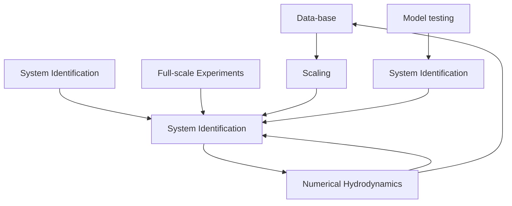
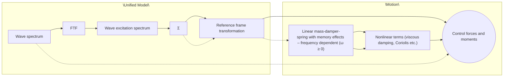
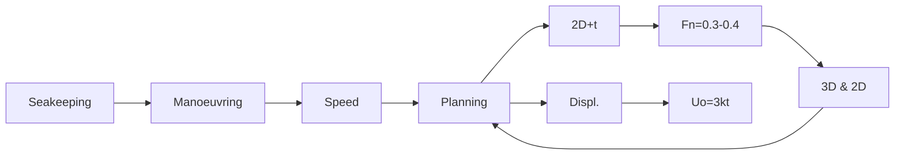
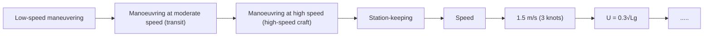
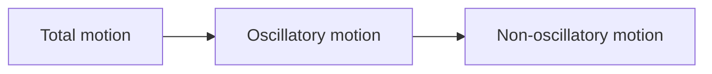

# Model l i ng a nd Si m u lation of Ma ri ne Su rface Vessel Dyna m ics

( Mod u le 1 : Motivation a nd Overview)

## D r Tri sta n Pe rez

Centre for Com plex Dynam ic Systems a nd Control (C DSC)

THE UNIVERSITY OF

NEWCASTLE

AUSTRALIA

## P rofessor Thor I Fosse n

De pa rtme nt of E ng i n ee ri ng Cybernetics

NTNU

Det skapende universitet

## Tutoria l Goa ls

„ M od el vessels a nd envi ron mental loads i n 6 DO F .  
„ U se state-of-the-art hyd rodyna m ic cod es to com pute model parameters : added mass , potential dam pi ng , 1 st a nd 2 nd-ord er wave loads .  
„ Derive control pla nt mod els by postprocessi ng d ata from hyd rodynam ic codes (Matlab G N C tool box) .  
„ U se syste m id e ntifi cation to fit hyd rodyn a m i c d ata to state-space mod els .  
„ Add viscous effects/ma noeuvri ng terms .  
Ti me-doma i n si m u l ation i n M atl a b S i m u l i n k.

## Appl ications

## Model l i ng a nd Control

„ Syste m d esig ners ma ke d ecisions to satisfy confl i cti ng req u i re me nts based on some knowl edge of the syste m they i nte nd to d esig n : th is knowl edge is re p rese nted i n a math e mati ca l model .  
„ M od e l l i ng is a n esse ntia l pa rt of control d es ig n a nd p re l i m i n a ry testi ng , wh i ch ca n consu me u p to 6 0 % of effo rt i n th es e tas ks .

## Model l i ng of Ma ri ne Structu res

„ M od els of ma ri n e stru ctu res a re com pl ex.  
„ Control e ng i n ee rs ofte n base th e i r mod e ls on mod els used by nava l a rch itects , wh i ch someti mes a re not control-d es ig n ori e nted .  
„ I n t h i s t u to ri a l we w i l l l o o k at t h e m o d e l s com mon ly used i n n ava l a rch itectu re a nd s h i p theory from the control syste m ’s perspective .

Obta i n i ng Models  

flowchart

## Ma noeuvri ng a nd Sea keepi ng

## S h i p theory has trad itiona l ly bee n se pa rated i nto two ma i n a reas

<table><tr><td>Manoeuvring</td><td>Sea-keeping</td></tr><tr><td>The aim is to study steering characteristics of vessels with forward speed and the response to the command of propulsion systems and control surfaces. This is done in calm water.</td><td>The aim is to study the behavior of the vessel in waves while keeping a constant speed and course.</td></tr></table>

Althoug h both a reas a re con ce rn ed with the stu dy of motion , stability a nd control, the se pa ration a l lows on e ma ki ng assu m ptions that si m pl ify the study i n each case .

## Ma noeuvri ng Models

N on l i nea r pa ra metri c mod els (cl assi ca l a nd Lag ra ng ia n ) :

$$
\dot {\mathbf {x}} = \mathbf {f} (\mathbf {x}, \mathbf {u})
$$

$$
\mathbf {M} \dot {\mathbf {v}} + \mathbf {C} (\mathbf {v}) \mathbf {v} + \mathbf {D} (\mathbf {v}) \mathbf {v} + \mathbf {g} (\boldsymbol {\eta}) = \boldsymbol {\tau}
$$

O bta i n ed by fitti ng d ata from sca l ed model experi ments .  
„ Cal m water mod els .  
H orizontal motion mod els (su rgesway-yaw) .  
„ N ot com mon ly avai lable .  
Restricted to a few speeds/load i ng cond itions of th e expe ri me nt.

natural_image

Green boat with mechanical arms operating near industrial machinery in a storage facility (no visible text or symbols)

scatter

| Sway speed (m/s) | Measured points (Nm) | Fitted curve: Nv*v + Nw*lv*v (Nm) | Fitted curve for DP: Nv*v (Nm) |
| --- | --- | --- | --- |
| ~-0.27 | ~-0.26 | ~-0.32 | ~-0.04 |
| ~-0.23 | ~-0.34 | ~-0.25 | ~-0.03 |
| ~-0.19 | ~-0.14 | ~-0.18 | ~-0.02 |
| ~-0.15 | ~-0.10 | ~-0.12 | ~-0.01 |
| ~-0.11 | ~-0.06 | ~-0.07 | ~0.00 |
| ~-0.08 | ~-0.03 | ~-0.04 | ~0.00 |
| ~-0.04 | ~0.00 | ~-0.01 | ~0.01 |
| ~0.00 | ~0.00 | ~0.00 | ~0.01 |
| ~0.03 | ~0.00 | ~0.01 | ~0.02 |
| ~0.07 | ~0.00 | ~0.03 | ~0.02 |
| ~0.14 | ~0.04 | ~0.08 | ~0.03 |
| ~0.17 | ~0.14 | ~0.13 | ~0.03 |
| ~0.19 | ~0.20 | ~0.17 | ~0.04 |
| ~0.23 | ~0.18 | ~0.20 | ~0.04 |

## Sea keepi ng Models

Li nea r non-pa ra metri c mod els

H jω)(

Obtai ned from hyd rodynam ic cal cu lations based on s i m pl ifyi ng assu m ptions :

Consta nt cou rse a nd speed .  
Li near wave loads .  
P ote n t i a l t h e o ry .  
Viscous effects ca n be added .

text_image

SEAWAY for Windows (Hull: C:\Program Files\Octopus\Hull forms\Container_Ship_006.hul)
File Edit Tools Help
SEAWAY hull forms
Barge
Barge Carrier
Bitumen Tanker
Bulk Carrier
Catamaran Vessel
Coaster
Container Feeder
Container Ship
Container_Ship_001.hul
Container_Ship_002.hul
Container_Ship_003.hul
Container_Ship_004.hul
Container_Ship_005.hul
Container_Ship_006.hul
Container_Ship_007.hul
Container_Ship_008.hul
Container_Ship_009.hul
Container_Ship_010.hul
Container_Ship_011.hul
Container_Ship_012.hul
Container_Ship_013.hul
Crané Vessel
Cruise Vessel
Cutter Suction Dredger
Diving Support Vessel
Drilling Vessel
Fast Displacement Vessel
Fast Freighter
Ferry
FPSO Vessel
Freighter
Heavy Lift Vessel
High Speed Vessel
Hopper Dredger
Ice Breaker
Inland Waterway Coaster
Inland Waterway Ferry
Inland Waterway Tanker
Lemster Aak
Low Air Draft Coaster
Motor Yacht
Multi-Purpose Ship
Geographic Vessel
Main characteristics Container Ships
Hull form:
Length: 247.00  32.26  12.00  7.66  2.69  0.65  0.85  0.76  -3.00
Container_Ship_0
205.00  29.20  9.10  7.02  3.21  0.58  0.74  0.78  -1.51
Container_Ship_0
250.00  32.00  9.00  7.81  3.56  0.54  0.67  0.80  -4.00
Container_Ship_0
300.00  37.00  11.00  8.11  3.36  0.55  0.73  0.76  -3.10
Container_Ship_0
106.00  20.28  4.25  5.23  4.77  0.70  0.78  0.90  0.10
Container_Ship_0
178.00  25.85  9.00  6.89  2.87  0.59  0.70  0.05  -0.89
Container_Ship_0
247.00  29.25  12.00  7.45  2.69  0.55  0.65  0.66  -2.10
Container_Ship_0
132.00  21.50  7.00  6.14  3.07  0.70  -0.96  0.82  -0.96
Select hull form (e.g. based on Cb).
X 36.01
Frame 2.92
Y
Z
Hull form scale parameters
Longitudinal, Sx (-): 247.00
Transverse, Sy (-): 32.26
Vertical, Sz (-): 12.00
Draft and tim
Draft amidship (m): 12.00
Trim by stem (m): 0.00
Bouygancy (m3): 62152
Catamaran sections
Spacing between
centerlines hulls: 0.00
Use constant hull spacing
X Y Z
0  36.01  0.00  2.74
1  36.01  0.35  2.74
2  36.01  0.70  2.74
3  36.01  3.77  3.63
4  36.01  6.78  4.53
5  36.01  9.49  5.44
6  36.01  11.76  6.34
7  36.01  13.54  7.25
8  36.01  14.79  8.16
9  36.01  15.52  9.06
10  36.01  15.93  9.97
11  36.01  16.11  10.87
12  36.01  16.13  11.78
13  36.01  16.13  13.14
14  36.01  16.13  14.50

For the d esig n of control syste ms , sea keepi ng mod els are very usefu l .

They provide prel i m i nary models b as ed o n l i ttl e d ata of th e s h i p .

# Recent Resu lts on a U n ified Ma noeuvri ng a nd Sea keepi ng Model

„ Fosse n , T. I . an d Ø. N . S moge l i . N on l i nea r Ti me- Doma i n Stri p Theory Form u lation for Low-S peed Manoeuvri ng and Station-Keepi ng , Modelling, Identification and Con trol, M I C -2 5 (4 ) : 2 0 1 : 22 1 , 2 0 04 .  
„ Fosse n , T. I . A N on l i nea r U n ified State-S pace M od el for S h i p M a noeuvri ng a nd Control i n a Seaway, Journal of Bifurcation and Chaos, Septem ber 2005 . (Plenary Tal k E N OC'05 , E i nd hoven , The N etherla nds) .  
„ Perez, T. and T. I . Fossen . Ki nematic Models for Sea-keepi ng and M anoeuvri ng of M a ri n e Vesse l s . M od e l l i n g , I d e ntifi cati o n a n d Co ntro l , M I C -28 ( 1 ) : 1 - 1 2 , 2 00 7 .  
„ Perez, T. an d T. I . Fossen . Ti me-Domai n M od els of M ari ne S u rface Vessels for S i m u lation and Control Desig n Based on Sea-keepi ng Com putations ( Plenary Tal k) . Proc. of the IFA C MCMC'06, Lisbon, Portugal, September 20-22, 2006.  
„ Ross, A. , T. Perez and T. I . Fossen . A Novel Manoeuvri ng Model Based on Low-Aspect Ratio Lift Theory and Lag rang ian M echan i cs . Proc. of the I FAC CAM S'07 , C ro at i a .

# U n ified Ma noeuvri ng a nd Sea keepi ng Model fo r Ti me- Doma i n Si m u lation

The Force- Transfer-Functions are computed using hydrodynamic SW (WAMIT VERES or SEAWAY

$$
\mathbf {M} \dot {\mathbf {v}} + \mathbf {C} _ {R B} \mathbf {v} + \mathbf {D} \mathbf {v} + \mathbf {d} _ {n} (\boldsymbol {\Theta}, \mathbf {v}) + \boldsymbol {\mu} + \mathbf {g} (\boldsymbol {\eta}) = \boldsymbol {\tau} _ {\mathrm{env}} + \boldsymbol {\tau}
$$

flowchart

$$
\dot {\eta} = \mathbf {J} (\Theta) \mathbf {v}
$$

$$
\dot {\boldsymbol {\chi}} = \mathbf {A} _ {r} \boldsymbol {\chi} + \mathbf {B} _ {r} \delta \mathbf {v}, \quad \boldsymbol {\chi} (0) = \mathbf {0}
$$

$$
\boldsymbol {\mu} = \mathbf {C} _ {r} \boldsymbol {\chi} + \mathbf {D} _ {r} \delta \mathbf {v}
$$

For 6 DOF this model will typically be represented by 6 + 6 + 90 = 1 02 ODEs which are computed using hydrodynamic SW ( WAMIT, VERES or SEAWAY)

These terms are found using experimental results/curve fitting or sem i-empirical methods

## Speed–Envi ron ment Envelope

H u l l su p ported by mostly by hyd rostatic pressu re (forces)

natural_image

Large red and white research vessel sailing on open water, no visible text or symbols

natural_image

Offshore oil platform in open sea with red and white branding (no visible text or symbols)

flowchart

Hyd rostatic and hyd rodynam ic forces ; Lift

$$
F _ {n} = \frac {U}{\sqrt {g L}}
$$

natural_image

Red Hydrolift boat on water with green trees in background (no visible text or symbols)

Aero and hyd rodynam ic fo rces ; stro n g flow se pa ration

## The 3 Speed Reg i mes for Control

## Dynam ic position i ng systems

• 3 D potential theory  
• 2D potential theory (strip theory)

## Manoeuvri ng/motion dam pi ng

• 2D potential theory (strip theory) up to Froude numbers of 0-3 -0 .4  
• 2 . 5 D potential theory for high-speed craft

flowchart

## Motion i n Waves

M otions a nd loads of floati ng stru ctu res d u e to waves ca n be separated i nto

„ Wave-freq u e n cy: l i n ea rly excitations a nd motion i n the wave freq u e n cy ra nge . Periods i n the ra nge 5-20s  
H ig he r tha n wave freq u e n cy (ri ng i ng & spri ng i ng ) : non l i n ea r effects , wh i ch ca n prod u ce resona n ce i n T L Ps , with n atu ra l pe ri od s of 2-4s .  
S low a nd mea n d rift: non l i n ea r effects with mea n va l u e a nd su b ha rmon i c excitation that ca n prod u ce osci l l ations with natu ra l pe riods of 20-30s .

## Motion a nd Control

flowchart

The n , motion control probl e ms ca n have d iffe re nt obj ectives :

• Control only the non-oscillatory motion (wave filtering needed)

• A u to p i l ots ,  
• Dyn a m i c pos ition i ng ( D P)  
• Th ruste r assisted position moori ng (TAP M OO R)

• Control only the oscillatory motion

• Rid e control of h ig h s peed vesse ls (rol l a nd p itch sta b i l isation )  
• H eave com pe nsation of offs hore stru ctu res

• Control both

• Dyn a m i c pos ition i ng i n extre me seas ( D P + rol l & p itch sta b i l isation )  
• Au to p i l ots w i t h ru d d e r ro l l sta b i l i s at i o n  
• U n man ned S u rface Veh icles U SV

The Road Ahead

<table><tr><td>Time</td><td>Topic</td><td>Presenter</td></tr><tr><td>09:00</td><td>M1: Motivation and overview</td><td>TIF</td></tr><tr><td>09:20</td><td>M2: Hydrodynamics for control engineers</td><td>TP</td></tr><tr><td>10:00</td><td>M3: Kinematics and kinetic models of marine vessels</td><td>TP</td></tr><tr><td>10:45</td><td>Coffee break</td><td></td></tr><tr><td>11:00</td><td>M4: Manoeuvring in calm water</td><td>TIF</td></tr><tr><td>11:30</td><td>M5: Environmental disturbances</td><td>TP</td></tr><tr><td>12:00</td><td>Lunch break</td><td></td></tr><tr><td>13:00</td><td>M6: Motion in waves a frequency-domain approach</td><td>TP</td></tr><tr><td>13:30</td><td>M7: Motion in waves a time-domain approach</td><td>TP</td></tr><tr><td>14:00</td><td>M8: Manoeuvring in a seaway</td><td>TP</td></tr><tr><td>14:30</td><td>M9: Models and marine control problems</td><td>TIF</td></tr><tr><td>15:00</td><td>M10: Software, and rapid model prototyping</td><td>TIF</td></tr></table>