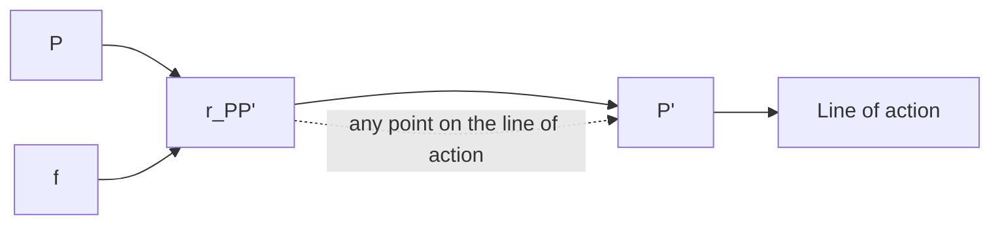

# Ki nematics a nd Ki netics of Ma ri ne Vessel s

( M od u l e 3 )

## D r T ri sta n P e rez

Centre for Com plex Dynam ic Systems a nd Control (C DSC)


THE UNIVERSITY OF

NEWCASTLE

AUSTRALIA

## P rof. Thor I Fosse n

De pa rtme nt of E ng i n ee ri ng Cybernetics


NTNU

Det skapende universitet

## Ki nematics

Descri ption of geometrical aspects of m oti o n with o ut reg a rd to th e fo rces that create the motion .

## Ki nematics

## The objectives of ki ne mati cs a re

„ Defi n e a set of refe re n ce fra mes from wh i ch th e motion wi l l be d escri bed .  
„ Defi n e sets of coord i nate syste ms on the refe re n ce fra mes , wh i ch wi l l be use to exp ress i n q u a ntitative way th e motion va ria b l es .  
„ Dete rm i n e rel ations betwee n accel e ration , velocity a nd pos ition of each poi nt i n th e syste m u nd e r stu dy.

## Reference fra mes

A refe re n ce fra me is pe rs pective from wh i ch th e motion is d escri bed .  
Let C be a col l ection of at l east 3 non col i n ea r poi nts i n th e E u cl id ea n s pace . Th e n C is a refe re n ce fra me if th e d ista n ce betwee n eve ry pa i r of poi nts d oes not va ry w i t h t i m e .  
„ Th e n , a ny rig id body is a refe re n ce fra me , a nd a ny p l a n a r ri g i d o bj e ct i s a refe re n ce fra m e . A po i n t i n th e s pace is not a refe re n ce fra me .

## Coord i nate systems

Coord i nate systems are fixed to reference frames to express the motion variables .  
„ A coord i nate system consists of a O po i n t fixed i n th e reference frame and a dextral orthonorma l bas is , wh i ch provides a way to resolve a vector i n the space .  
„ Whe n the re is on ly on e coord i nate system attached to a refe re n ce fra m e i t i s com mon not to make a d isti n ction betwee n refe re n ce fra me a nd coord i nate system .


<details>
<summary>text_image</summary>

a₃
o
a₁
a₂
</details>

Reference frame

Coord i nate system :

$$
\{a \} \equiv (o, \vec {a} _ {1}, \vec {a} _ {2}, \vec {a} _ {3})
$$

## Vector notation

„ Va ria bl es associated with motion a re d escri bed by d i rected l i n e seg me nts or vectors :

$$
\begin{array}{c} \text {Measure along} \vec {a} _ {1} \\ \vec {u} = \underbrace {u _ {1} ^ {a} \vec {a} _ {1}} _ {} + \underbrace {u _ {2} ^ {a} \vec {a} _ {2}} _ {} + \underbrace {u _ {3} ^ {a} \vec {a} _ {3}} _ {} \end{array} .
$$

Com ponents of $\vec { u }$ i n $\{ a \}$


<details>
<summary>text_image</summary>

zₐ
{a} ≡ (oₐ, \vec{a}_1, \vec{a}_2, \vec{a}_3)
\vec{a}_3
\vec{u}
oₐ
u₂ᵃ\vec{a}_2
\vec{a}_2
\vec{a}_1
xₐ
yₐ
</details>

## Vector notation

„ The vectors d efi ned as d i rected l i ne seg ments (coord i nate free re prese ntation ) belong a to a th ree-d i me nsiona l space :

$$
\vec {u} \in \mathbb {V} ^ {3}
$$

„ Th is space a nd the E u cl id ia n space are isomorph ic (ca n be put i nto a on e-to-on e corres pond e n ce that p rese rves th e th e i r st ru ct u re )  
„ Exploiti ng th is , it is conve n ie nt to consid e r the coord i n ate vector re prese ntation i n a g ive n coord i nate syste m :

$$
\mathbf {u} ^ {a} \triangleq \left[ \begin{array}{c} u _ {1} ^ {a} \\ u _ {2} ^ {a} \\ u _ {3} ^ {a} \end{array} \right] = [ u _ {1} ^ {a}, u _ {2} ^ {a}, u _ {3} ^ {a} ] ^ {T}.
$$

Coord i nate vectors are always g iven relative to a basis (coord i nate system )

## Vector notation

$$
\mathbf {u} ^ {a} \triangleq \left[ \begin{array}{c} u _ {1} ^ {a} \\ u _ {2} ^ {a} \\ u _ {3} ^ {a} \end{array} \right] \quad \Longleftrightarrow \quad \vec {u} = T _ {a} (\mathbf {u} ^ {a}) = u _ {1} ^ {a} \vec {a} _ {1} + u _ {2} ^ {a} \vec {a} _ {2} + u _ {3} ^ {a} \vec {a} _ {3}
$$


<details>
<summary>text_image</summary>

R³
• uₐ
Tₐ
V³
→
u̅ = Tₐ(uₐ)
</details>

I t is conve n ie nt to be fa m i l ia r with both re prese ntations . The coord i n ate form is conve n i e nt for com putation a nd matrix re prese ntations . The coord i nate-free form a l lows exte nd i ng sca l a r to vector ca l cu l us .

## Dot a nd Cross prod ucts

Dot p rod u ct :

$$
\vec {u} \cdot \vec {v} = \sum_ {j = 1} ^ {3} u _ {j} v _ {j} = \mathbf {u} ^ {T} \mathbf {v},
$$

Cross prod u ct:

$$
\vec {c} = \vec {a} \times \vec {b} \quad \Leftrightarrow \quad \mathbf {c} = \mathbf {S} (\mathbf {a}) \mathbf {b},
$$

S kew-sym metric form of a coord i nate vector:

$$
\mathbf {S} (\mathbf {a}) \triangleq \left[ \begin{array}{c c c} 0 & - a _ {3} & a _ {2} \\ a _ {3} & 0 & - a _ {1} \\ - a _ {2} & a _ {1} & 0 \end{array} \right] \quad \mathbf {S} (\mathbf {a}) = - \mathbf {S} ^ {T} (\mathbf {a}).
$$

$$
\vec {c} = \vec {a} \times \vec {b} = - \vec {b} \times \vec {a} \quad \Leftrightarrow \quad \mathbf {c} = \mathbf {S} (\mathbf {a}) \mathbf {b} = - \mathbf {S} (\mathbf {b}) \mathbf {a} = \mathbf {S} ^ {T} (\mathbf {b}) \mathbf {a}.
$$

## Rotation M atrices

Rotation matrix from {a} to {b}: The rotation matrix from a coordinate system {a} to a coordinate system {b} is given by ${ \bf R } _ { b } ^ { a } = [ R _ { j k } ]$ with $R _ { j k } = \vec { a } _ { j } \cdot \vec { b } _ { k }$ . That is,

$$
\mathbf {R} _ {b} ^ {a} \triangleq \left[ \begin{array}{c c c} (\vec {a} _ {1} \cdot \vec {b} _ {1}) & (\vec {a} _ {1} \cdot \vec {b} _ {2}) & (\vec {a} _ {1} \cdot \vec {b} _ {3}) \\ (\vec {a} _ {2} \cdot \vec {b} _ {1}) & (\vec {a} _ {2} \cdot \vec {b} _ {2}) & (\vec {a} _ {2} \cdot \vec {b} _ {3}) \\ (\vec {a} _ {3} \cdot \vec {b} _ {1}) & (\vec {a} _ {3} \cdot \vec {b} _ {2}) & (\vec {a} _ {3} \cdot \vec {b} _ {3}) \end{array} \right], \tag {2.11}
$$

where $\vec { a } _ { j }$ and $\vec { b } _ { k }$ are the unit vectors defining {a} and {b} respectively .

$$
\mathbf {R} _ {b} ^ {a} \in S O (3): \{\mathbf {R} \in \mathbb {R} ^ {3 \times 3} | \mathbf {R R} ^ {T} = \mathbf {I} _ {3 \times 3}; \det (\mathbf {R}) = 1 \}.
$$

$$
(\mathbf {R} _ {b} ^ {a}) ^ {- 1} = (\mathbf {R} _ {b} ^ {a}) ^ {T} = \mathbf {R} _ {a} ^ {b}.
$$

## Eu ler Ang les

The attitu d e of on e coord i nate syste m rel ative to a nother ca n be d escri bed by th ree consecutive rotations .  
There a re 1 2 ways of doi ng th is d e pe nd i ng o n th e o rd e r of th e rotati o n s , a n d e a c h tri p l et of rotated a n g l es i s ca l l ed a set of E u l e r Ang les

## Rol l , Pitch a nd Yaw

The rol l , p itch a nd yaw is set of E u l e r a ng l es com mon ly use i n g u id a n ce a nd navigation .


<details>
<summary>text_image</summary>

x_a
y_a
z_a
</details>

(b)  


<details>
<summary>text_image</summary>

θ
y''_a ≡ y'_a
z'_a
z''_a
x''_a
x'_a
</details>

(a)  


<details>
<summary>text_image</summary>

y'_a
y_a
ψ
z'_a ≡ z_a
x_a
x'_a
</details>

(c）  


<details>
<summary>text_image</summary>

y''_a
y_b
z''_a
z_b
φ
x_b ≡ x''_a
</details>

Vector of Rol l Pitch and Yaw that ta ke {a} i n to t h e orie ntation of { b} :

$\begin{array} { r } { \mathbf { \Theta } \Theta _ { a b } \triangleq [ \phi , \theta , \psi ] ^ { T } . } \end{array}$

## Rotation matrix i n terms of RPY

$$
\mathbf {R} _ {b} ^ {a} = \mathbf {R} _ {z, \psi} \mathbf {R} _ {y ^ {\prime}, \theta} \mathbf {R} _ {x ^ {\prime \prime}, \phi}.
$$

Afte r m u l t i p l i cat i o n :

$$
\mathbf {R} _ {b} ^ {a} = \left[ \begin{array}{c c c} c \psi c \theta & - s \psi c \phi + c \psi s \theta s \phi & s \psi s \phi + c \psi c \phi s \theta \\ s \psi c \theta & c \psi c \phi + s \phi s \theta s \psi & - c \psi s \phi + s \psi c \phi s \theta \\ - s \theta & c \theta s \phi & c \theta c \phi \end{array} \right]
$$

$$
s \equiv \sin (\cdot) \quad c \equiv \cos (\cdot)
$$

N ote t h at t h e m u l t i p l i cat i o n i s co n s i ste n t w i t h t h e tra n sfo rm ati o n

$$
\mathbf {r} ^ {a} = \mathbf {R} _ {b} ^ {a} \mathbf {r} ^ {b}
$$

Tra nsforms a vector from the base b to the base a .

## Ang u la r ve l ocity

S i n ce the rotation matrix is orthogona l , the n

$$
\frac {d}{d t} [ \mathbf {R} _ {b} ^ {a} (\mathbf {R} _ {b} ^ {a}) ^ {T} ] = \dot {\mathbf {R}} _ {b} ^ {a} (\mathbf {R} _ {b} ^ {a}) ^ {T} + \mathbf {R} _ {b} ^ {a} (\dot {\mathbf {R}} _ {b} ^ {a}) ^ {T} = \mathbf {0}
$$

Th i s i m p ly th at $\dot { \mathbf { R } } _ { b } ^ { a } ( \mathbf { R } _ { b } ^ { a } ) ^ { T }$ is skew sym metric, a nd hen ce be represented by a si ng le coord i nate vector ( Egeland and G ravdah l , 2002 ) :

$$
\boldsymbol {\omega} _ {a b} ^ {a}: \quad \mathbf {S} (\boldsymbol {\omega} _ {a b} ^ {a}) = \dot {\mathbf {R}} _ {b} ^ {a} (\mathbf {R} _ {b} ^ {a}) ^ {T}
$$

T h i s i s th e a n g u l a r ve l oci ty of { b} wi th res p e ct to {a} , exp ressed i n {a}

The d erivative of the rotation matrix ca n the n be expressed as

$$
\dot {\mathbf {R}} _ {b} ^ {a} = \mathbf {S} (\boldsymbol {\omega} _ {a b} ^ {a}) \mathbf {R} _ {b} ^ {a} = \mathbf {R} _ {b} ^ {a} \mathbf {S} (\boldsymbol {\omega} _ {a b} ^ {b}).
$$

## Ang u la r velocity a nd deriv of RPY

C o n s i d e r a rotat i o n fro m {a} to {d } v i a R PY :

$$
\mathbf {R} _ {b} ^ {a} = \mathbf {R} _ {z, \psi}, \quad \mathbf {R} _ {c} ^ {b} = \mathbf {R} _ {y, \theta}, \quad \mathbf {R} _ {d} ^ {c} = \mathbf {R} _ {x, \phi}
$$

The a ng u l a r velocities a re

$$
\boldsymbol {\omega} _ {a b} ^ {a} = [ 0, 0, \dot {\psi} ] ^ {T},
$$

$$
\boldsymbol {\omega} _ {b c} ^ {b} = [ 0, \dot {\theta}, 0 ] ^ {T},
$$

$$
\boldsymbol {\omega} _ {c d} ^ {c} = [ \dot {\phi}, 0, 0 ] ^ {T}.
$$

The n from the theore m of ad d ition of a ng u l a r ve lociti es we have

$$
\boldsymbol {\omega} _ {a d} ^ {a} = \boldsymbol {\omega} _ {a b} ^ {a} + \mathbf {R} _ {b} ^ {a} \boldsymbol {\omega} _ {b c} ^ {b} + \mathbf {R} _ {b} ^ {a} \mathbf {R} _ {c} ^ {b} \boldsymbol {\omega} _ {c d} ^ {c}
$$

$$
\boldsymbol {\omega} _ {a d} ^ {d} = \mathbf {R} _ {a} ^ {d} \boldsymbol {\omega} _ {a b} ^ {a} + \mathbf {R} _ {c} ^ {d} \mathbf {R} _ {b} ^ {c} \boldsymbol {\omega} _ {b c} ^ {b} + \mathbf {R} _ {c} ^ {c} \boldsymbol {\omega} _ {c d} ^ {c}
$$

# Ang u la r velocity a nd deriv of RPY

F ro m $\begin{array} { r } { { \bf \omega } \omega _ { a d } ^ { a } = \omega _ { a b } ^ { a } + { \bf R } _ { b } ^ { a } \omega _ { b c } ^ { b } + { \bf R } _ { b } ^ { a } { \bf R } _ { c } ^ { b } \omega _ { c d } ^ { c } } \end{array}$

$$
\boldsymbol {\omega} _ {a d} ^ {d} = \mathbf {R} _ {a} ^ {d} \boldsymbol {\omega} _ {a b} ^ {a} + \mathbf {R} _ {c} ^ {d} \mathbf {R} _ {b} ^ {c} \boldsymbol {\omega} _ {b c} ^ {b} + \mathbf {R} _ {c} ^ {c} \boldsymbol {\omega} _ {c d} ^ {c}
$$

u s i n g , $\Theta _ { a d } \triangleq [ \phi , \theta , \psi ] ^ { T }$

we obta i n

$$
\boldsymbol {\omega} _ {a d} ^ {a} = \mathbf {E} _ {a} (\boldsymbol {\Theta} _ {a d}) \dot {\boldsymbol {\Theta}} _ {a d} = \left[ \begin{array}{c c c} c \psi c \theta & - s \psi & 0 \\ s \psi c \theta & c \psi & 0 \\ - s \theta & 0 & 1 \end{array} \right] \dot {\boldsymbol {\Theta}} _ {a d}
$$

$$
\boldsymbol {\omega} _ {a d} ^ {d} = \mathbf {E} _ {d} (\boldsymbol {\Theta} _ {a d}) \dot {\boldsymbol {\Theta}} _ {a d} = \left[ \begin{array}{c c c} 1 & 0 & - s \theta \\ 0 & c \phi & s \phi c \theta \\ 0 & - s \phi & c \phi c \theta \end{array} \right] \dot {\boldsymbol {\Theta}} _ {a d}
$$


$$
\dot {\Theta} _ {a d} = \mathbf {E} _ {a} ^ {- 1} (\Theta_ {a d}) \boldsymbol {\omega} _ {a d} ^ {a} = \left[ \begin{array}{c c c} \frac {c \psi}{c \theta} & \frac {s \psi}{c \theta} & 0 \\ - s \psi & c \psi & 0 \\ c \psi t \theta & s \psi t \theta & 1 \end{array} \right] \boldsymbol {\omega} _ {a d} ^ {a}
$$

$$
\dot {\Theta} _ {a d} = \mathbf {E} _ {d} ^ {- 1} (\Theta_ {a d}) \boldsymbol {\omega} _ {a d} ^ {d} = \left[ \begin{array}{c c c} 1 & s \phi t \theta & c \phi t \theta \\ 0 & c \phi & - s \phi \\ 0 & \frac {s \phi}{c \theta} & \frac {c \phi}{c \theta} \end{array} \right] \boldsymbol {\omega} _ {a d} ^ {d}
$$

The a ng u l a r velocity a nd the d e rivative of the E u l e r a ng l es a re , i n ge n e ra l , d i ffe re n t th i n g s .

## Position

P os i ti o n of “ p ” w i th res p e ct to {a} , a n d exp ress e d i n {a} :

Coord i nate system where the vector is expressed

$$
\begin{array}{c} \mathbf {r} _ {a p} ^ {a} = [ r _ {a p, 1} ^ {a}, r _ {a p, 2} ^ {a}, r _ {a p, 3} ^ {a} ] ^ {T} \\ \text {Point of interest} \end{array}
$$

Reference

P os i t i o n of “ p ” w i t h to {a} , a n d s e d i n { b} .


<details>
<summary>text_image</summary>

coordinate system
z_a
z_b
b_3
r_ap
o_b
b_1
b_2
y_b
a_3
p
a_2
x_a
x_b
Note that a cha
sys does not ch
position vector;
{a}。
</details>

nge i n coord hange t h e i t i s st i l l p i n

## Ve l ocity

„ The rel ative pos ition of a ny two poi nts is i nva ria nt i n a ny coord i nate syste m ( | | r1 -r2 | | is i nd e pe nd e nt of the coord i nate syste m used to ex p re ss r 1 a n d r2 ) .  
„ The velocity, however, depends on the coord i nate system adopted .


<details>
<summary>text_image</summary>

p
{a}
{b}
ω
</details>

{ b} a n d “ p ” rotate w i t h a n g u l a r velocity ω .

T h e ve l o c i ty of “ p ” w rt { b} i s ze ro , b u t n ot w rt {a} .

## Derivative of a vector

The d e rivative of a vector ma kes no se nse without specifyi ng the coord i nate syste m with respect of wh i ch th e d e rivative is ta ke n :

$$
\begin{array}{l} \frac {{} ^ {a} d}{d t} \vec {r} \triangleq \frac {d r _ {1} ^ {a}}{d t} \vec {a} _ {1} + \frac {d r _ {2} ^ {a}}{d t} \vec {a} _ {2} + \frac {d r _ {3} ^ {a}}{d t} \vec {a} _ {3}, \\ \frac {{} ^ {b} d}{d t} \vec {r} \triangleq \frac {d r _ {1} ^ {b}}{d t} \vec {b} _ {1} + \frac {d r _ {2} ^ {b}}{d t} \vec {b} _ {2} + \frac {d r _ {3} ^ {b}}{d t} \vec {b} _ {3}. \\ \end{array}
$$

I n ge n e ra l

$$
\frac {{} ^ {a} d}{d t} \vec {r} \neq \frac {{} ^ {b} d}{d t} \vec {r}.
$$

## Tra nsport Theorem

$$
\frac {{} ^ {a} d \vec {r}}{d t} = \frac {{} ^ {b} d \vec {r}}{d t} + \vec {\omega} _ {a b} \times \vec {r}
$$

I n coord i nate form

$$
\mathbf {r} ^ {a} = \mathbf {R} _ {b} ^ {a} \mathbf {r} ^ {b}
$$

$$
\begin{array}{l} \dot {\mathbf {r}} ^ {a} = \mathbf {R} _ {b} ^ {a} \dot {\mathbf {r}} ^ {b} + \dot {\mathbf {R}} _ {b} ^ {a} \mathbf {r} ^ {b} \\ = \mathbf {R} _ {b} ^ {a} [ \dot {\mathbf {r}} ^ {b} + \mathbf {S} (\boldsymbol {\omega} _ {a b} ^ {b}) \mathbf {r} ^ {b} ] \\ \end{array}
$$

I f we m u lti p ly both s i d es by $\mathbf { R } _ { a } ^ { b }$

$$
\dot {\mathbf {r}} ^ {b} = \dot {\mathbf {r}} ^ {b} + \mathbf {S} (\boldsymbol {\omega} _ {a b} ^ {b}) \mathbf {r} ^ {b} \mathrm{?}
$$

We need to use dou ble scri pt so we don ’t have th is probl e m i n notation :

$$
\dot {\mathbf {r}} _ {a p} ^ {b} = \dot {\mathbf {r}} _ {b p} ^ {b} + \mathbf {S} (\boldsymbol {\omega} _ {a b} ^ {b}) \mathbf {r} _ {b p} ^ {b}
$$

## Velocity a nd Acceleration

I f {i } d e n otes a n i n e rti a l coo rd i n ate syste m , th e n

  
The fi rst su bscri pt I nd icates the coord i nate system with respect of wh ich the d erivative is ta ke n

Li near acceleration :

$$
\vec {a} _ {i p} \triangleq \frac {{} ^ {i} d ^ {2} \vec {r} _ {i p}}{d t ^ {2}} = \frac {{} ^ {i} d \vec {v} _ {i p}}{d t}
$$

Ang u lar acceleration

$$
\frac {{} ^ {i} d}{d t} \vec {\omega} _ {i b} = \frac {{} ^ {b} d}{d t} \vec {\omega} _ {i b} + \underbrace {\vec {\omega} _ {i b} \times \vec {\omega} _ {i b}} _ {= 0}.
$$

$$
\vec {\alpha} _ {i b} \triangleq \frac {{} ^ {i} d}{d t} \vec {\omega} _ {i b} = \frac {{} ^ {b} d}{d t} \vec {\omega} _ {i b}
$$

## M otion i n d ifferent coord systems


<details>
<summary>flowchart</summary>

```mermaid
graph LR
  p["p"] -->|z_i| i3["i_3"]
  p -->|r_ip| i2["i_2"]
  p -->|r_bp| p
  p -->|z_b| yb["y_b"]
  p -->|b_3| yb
  p -->|b_1| yb
  p -->|b_2| yb
  i1["i_1"] --> x_i["x_i"]
  i2["i_2"] --> y_i["y_i"]
  i3["i_3"] --> z_i["z_i"]
  yb["y_b"] --> z_b["z_b"]
  yb["y_b"] --> b_1["b_1"]
  yb["y_b"] --> b_2["b_2"]
  yb["y_b"] --> b_3["b_3"]
  yb["y_b"] --> b_1["b_1"]
  yb["y_b"] --> b_2["b_2"]
  yb["y_b"] --> b_3["b_3"]
  yb["y_b"] --> b_1["b_1"]
  yb["y_b"] --> b_2["b_2"]
  yb["y_b"] --> b_3["b_3"]
  yb["y_b"] --> b_1["b_1"]
  yb["y_b"] --> b_2["b_2"]
  yb["y_b"] --> b_3["b_3"]
  yb["y_b"] --> b_1["b_1"]
  yb["y_b"] --> b_2["b_2"]
  yb["y_b"] --> b_3["b_3"]
  yb["y_b"] --> b_1["b_1"]
  yb["y_b"] --> b_2["b_2"]
  yb["y_b"] --> b_3["b_3"]
  yb["y_b"] --> b_1["b_1"]
  yb["y_b"] --> b_2["b_2"]
  yb["y_b"] --> b_3["b_3"]
  yb["y_b"] --> b_1["b_1"]
  yb["y_b"] --> b_2["b_2"]
  yb["y_b"] --> b_3["b_3"]
  yb["y_b"] --> b_1["b_1"]
  yb["y_b"] --> b_2["b_2"]
  yb["y_b"] --> b_3["b_3"]
  yb["y_b"] --> b_1["b_1"]
  yb["y_b"] --> b_2["b_2"]
  yb["y_b"] --> b_3["b_3"]
  yb["y_b"] --> b_1["b_1"]
  yb["y_b"] --> b_2["b_2"]
  yb["y_b"] --> b_3["b_3"]
  yb["y_b"] --> b_1["b_1"]
  yb["y_b"] --> b_2["b_2"]
  yb["y_b"] --> b_3["b_3"]
  yb["y_b"] --> b_1["b_1"]
  yb["y_b"] --> b_2["b_2"]
  yb["y_b"] --> b_3["b_3"]
  yb["y_b"] --> b_1["b_1"]
  yb["y_b"] --> b_2["b_2"]
  yb["y_b"] --> b_3["b_3"]
  yb["y_b"] --> b_1["b_1"]
  yb["y_b"] --> b_2["b_2"]
  yb["y_b"] --> b_3["b_3"]
  yb["y_b"] --> b_1["b_1"]
  yb["y_b"] --> b_2["b_2"]
  yb["y_b"] --> b_3["b_3"]
  yb["y_b"] --> b_1["b_1"]
  yb["y_b"] --> b_2["b_2"]
  yb["y_b"] --> b_3["b_3"]
  yb["y_b"] --> b_1["b_1"]
  yb["y_b"] --> b_2["b_2"]
  yb["y_b"] --> b_3["b_3"]
  yb["y_b"] --> b_1["b_1"]
  yb["y_b"] --> b_2["b_2"]
  yb["y_b"] --> b_3["b_3"]
  yb["y_b"] --> b_1["b_1"]
  yb["y_b"] --> b_2["b_2"]
  yb["y_b"] --> b_3["b_3"]
  yb["y_b"] --> b_1["b_1"]
  yb["y_b"] --> b_2["b_2"]
  yb["y_b"] --> b_3["b_3"]
  yb["y_b"] --> b_1["b_1"]
  yb["y_b"] --> b_2["b_2"]
  yb["y_b"] --> b_3["b_3"]
  yb["y_b"] --> b_1["b_1"]
  yb["y_b"] --> b_2["b_2"]
  yb["y_b"] --> b_3["b_3"]
  yb["y_b"] --> b_1["b_1"]
  yb["y_b"] --> b_2["b_2"]
  yb["y_b"] --> b_3["b_3"]
  yb["y_b"] --> b_1["b_1"]
  yb["y_b"] --> b_2["b_2"]
  yb["y_b"] --> b_3["b_3"]
  yb["y_b"] --> b_1["b_1"]
  yb["y_b"] --> b_2["b_2"]
  yb["y_b"] --> b_3["b_3"]
  yb["y_b"] --> b_1["b_1"]
  yb["y_b"] --> b_2["b_2"]
  yb["y_b"] --> b_3["b_3"]
  yb["y_b"] --> b_1["b_1"]
  yb["y_b"] --> b_2["b_2"]
  yb["y_b"] --> b_3["b_3"]
  yb["y_b"] --> b_1["b_1"]
  yb["y_b"] --> b_2["b_2"]
  yb["y_b"] --> b_3["b_3"]
  yb["y_b"] --> b_1["b_1"]
  yb["y_b"] --> b_2["b_2"]
  yb["y_b"] --> b_3["b_3"]
  yb["y_b"] --> b_1["b_1"]
  yb["y_b"] --> b_2["b_2"]
  yb["y_b"] --> b_3["b_3"]
  yb["y_b"] --> b_1["b_1"]
  yb["y_b"] --> b_2["b_2"]
  yb["y_b"] --> b_3["b_3"]
  yb["y_b"] --> b_1["b_1"]
  yb["y_b"] --> b_2["b_2"]
  yb["y_b"] --> b_3["b_3"]
  yb["y_b"] --> b_1["b_1"]
  yb["y_b"] --> b_2["b_2"]
  yb["y_b"] --> b_3["b_3"]
  yb["y_b"] --> b_1["b_1"]
  yb["y_b"] --> b_2["b_2"]
  yb["y_b"] --> b_3["b_3"]
  yb["y_b"] --> b_1["b_1"]
  yb["y_b"] --> b_2["b_2"]
  yb["y_b"] --> b_3["b_3"]
  yb["y_b"] --> b_1["b_1"]
  yb["y_b"] --> b_2["b_2"]
  yb["y_b"] --> b_3["b_3"]
  yb["y_b"] --> b_1["b_1"]
  yb["y_b"] --> b_2["b_2"]
  yb["y_b"] --> b_3["b_3"]
  yb["y_b"] --> b_1["b_1"]
  yb["y_b"] --> b_2["b_2"]
  yb["y_b"] --> b_3["b_3"]
  yb["y_b"] --> b_1["b_1"]
  yb["y_b"] --> b_2["b_2"]
  yb["y_b"] --> b_3["b_3"]
  yb["y_b"] --> b_1["b_1"]
  yb["y_b"] --> b_2["b_2"]
  yb["y_b"] --> b_3["b_3"]
  yb["y_b"] --> b_1["b_1"]
  yb["y_b"] --> b_2["b_2"]
  yb["y_b"] --> b_3["b_3"]
  yb["y_b"] --> b_1["b_1"]
  yb["y_b"] --> b_2["b_2"]
  yb["y_b"] --> b_3["b_3"]
  yb["y_b"] --> b_1["b_1"]
  yb["y_b"] --> b_2["b_2"]
  yb["y_b"] --> b_3["b_3"]
  yb["y_b"] --> b_1["b_1"]
  yb["y_b"] --> b_2["b_2"]
  yb["y_b"] --> b_3["b_3"]
  yb["y_b"] --> b_1["b_1"]
  yb["y_b"] --> b_2["b_2"]
  yb["y_b"] --> b_3["b_3"]
  yb["y_b"] --> b_1["b_1"]
  yb["y_b"] --> b_2["b_2"]
  yb["y_b"] --> b_3["b_3"]
  yb["y_b"] --> b_1["b_1"]
  yb["y_b"] --> b_2["b_2"]
  yb["y_b"] --> b_3["b_3"]
  yb["y_b"] --> b_1["b_1"]
  yb["y_b"] --> b_2["b_2"]
  yb["y_b"] --> b_3["b_3"]
  yb["y_b"] --> b_1["b_1"]
  yb["y_b"] --> b_2["b_2"]
  yb["y_b"] --> b_3["b_3"]
  yb["y_b"] --> b_1["b_1"]
  yb["y_b"] --> b_2["b_2"]
  yb["y_b"] --> b_3["b_3"]
  yb["y_b"] --> b_1["b_1"]
  yb["y_b"] --> b_2["b_2"]
  yb["y_b"] --> b_3["b_3"]
  yb["y_b"] --> b_1["b_1"]
  yb["y_b"] --> b_2["b_2"]
  yb["y_b"] --> b_3["b_3"]
  yb["y_b"] --> b_1["b_1"]
  yb["y_b"] --> b_2["b_2"]
  yb["y_b"] --> b_3["b_3"]
  yb["y_b"] --> b_1["b_1"]
  yb["y_b"] --> b_2["b_2"]
  yb["y_b"] --> b_3["b_3"]
  yb["y_b"] --> b_1["b_1"]
  yb["y_b"] --> b_2["b_2"]
  yb["y_b"] --> b_3["b_3"]
  yb["y_b"] --> b_1["b_1"]
  yb["y_b"] --> b_2["b_2"]
  yb["y_b"] --> b_3["b_3"]
  yb["y_b"] --> b_1["b_1"]
  yb["y_b"] --> b_2["b_2"]
  yb["y_b"] --> b_3["b_3"]
  yb["y_b"] --> b_1["b_1"]
  yb["y_b"] --> b_2["b_2"]
  yb["y_b"] --> b_3["b_3"]
  yb["y_b"] --> b_1["b_1"]
  yb["y_b"] --> b_2["b_2"]
  yb["y_b"] --> b_3["b_3"]
  yb["y_b"] --> b_1["b_1"]
  yb["y_b"] --> b_2["b_2"]
  yb["y_b"] --> b_3["b_3"]
  yb["y_b"] --> b_1["b_1"]
  yb["y_b"] --> b_2["b_2"]
  yb["y_b"] --> b_3["b_3"]
  yb["y_b"] --> b_1["b_1"]
  yb["y_b"] --> b_2["b_2"]
  yb["y_b"] --> b_3["b_3"]
  yb["y_b"] --> b_1["b_1"]
  yb["y_b"] --> b_2["b_2"]
  yb["y_b"] --> b_3["b_3"]
  yb["y_b"] --> b_1["b_1"]
  yb["y_b"] --> b_2["b_2"]
  yb["y_b"] --> b_3["b_3"]
  yb["y_b"] --> b_1["b_1"]
  yb["y_b"] --> b_2["b_2"]
  yb["y_b"] --> b_3["b_3"]
  yb["y_b"] --> b_1["b_1"]
  yb["y_b"] --> b_2["b_2"]
  yb["y_b"] --> b_3["b_3"]
  yb["y_b"] --> b_1["b_1"]
  yb["y_b"] --> b_2["b_2"]
  yb["y_b"] --> b_3["b_3"]
  yb["y_b"] --> b_1["b_1"]
  yb["y_b"] --> b_2["b_2"]
  yb["y_b"] --> b_3["b_3"]
  yb["y_b"] --> b_1["b_1"]
  yb["y_b"] --> b_2["b_2"]
  yb["y_b"] --> b_3["b_3"]
  yb["y_b"] --> b_1["b_1"]
  yb["y_b"] --> b_2["b_2"]
  yb["y_b"] --> b_3["b_3"]
  yb["y_b"] --> b_1["b_1"]
  yb["y_b"] --> b_2["b_2"]
  yb["y_b"] --> b_3["b_3"]
  yb["y_b"] --> b_1["b_1"]
  yb["y_b"] --> b_2["b_2"]
  yb["y_b"] --> b_3["b_3"]
  yb["y_b"] --> b_1["b_1"]
  yb["y_b"] --> b_2["b_2"]
  yb["y_b"] --> b_3["b_3"]
  yb["y_b"] --> b_1["b_1"]
  yb["y_b"] --> b_2["b_2"]
  yb["y_b"] --> b_3["b_3"]
  yb["y_b"] --> b_1["b_1"]
  yb["y_b"] --> b_2["b_2"]
  yb["y_b"] --> b_3["b_3"]
  yb["y_b"] --> b_1["b_1"]
  yb["y_b"] --> b_2["b_2"]
  yb["y_b"] --> b_3["b_3"]
  yb["y_b"] --> b_1["b_1"]
  yb["y_b"] --> b_2["b_2"]
  yb["y_b"] --> b_3["b_3"]
  yb["y_b"] --> b_1["b_1"]
  yb["y_b"] --> b_2["b_2"]
  yb["y_b"] --> b_3["b_3"]
  yb["y_b"] --> b_1["b_1"]
  yb["y_b"] --> b_2["b_2"]
  yb["y_b"] --> b_3["b_3"]
  yb["y_b"] --> b_1["b_1"]
  yb["y_b"] --> b_2["b_2"]
  yb["y_b"] --> b_3["b_3"]
  yb["y_b"] --> b_1["b_1"]
  yb["y_b"] --> b_2["b_2"]
  yb["y_b"] --> b_3["b_3"]
  yb["y_b"] --> b_1["b_1"]
  yb["y_b"] --> b_2["b_2"]
  yb["y_b"] --> b_3["b_3"]
  yb["y_b"] --> b_1["b_1"]
  yb["y_b"] --> b_2["b_2"]
  yb["y_b"] --> b_3["b_3"]
  yb["y_b"] --> b_1["b_1"]
  yb["y_b"] --> b_2["b_2"]
  yb["y_b"] --> b_3["b_3"]
  yb["y_b"] --> b_1["b_1"]
  yb["y_b"] --> b_2["b_2"]
  yb["y_b"] --> b_3["b_3"]
  yb["y_b"] --> b_1["b_1"]
  yb["y_b"] --> b_2["b_2"]
  yb["y_b"] --> b_3["b_3"]
  yb["y_b"] --> b_1["b_1"]
  yb["y_b"] --> b_2["b_2"]
  yb["y_b"] --> b_3["b_3"]
  yb["y_b"] --> b_1["b_1"]
  yb["y_b"] --> b_2["b_2"]
  yb["y_b"] --> b_3["b_3"]
  yb["y_b"] --> b_1["b_1"]
  yb["y_b"] --> b_2["b_2"]
  yb["y_b"] --> b_3["b_3"]
  yb["y_b"] --> b_1["b_1"]
  yb["y_b"] --> b_2["b_2"]
  yb["y_b"] --> b_3["b_3"]
  yb["y_b"] --> b_1["b_1"]
  yb["y_b"] --> b_2["b_2"]
  yb["y_b"] --> b_3["b_3"]
  yb["y_b"] --> b_1["b_1"]
  yb["y_b"] --> b_2["b_2"]
  yb["y_b"] --> b_3["b_3"]
  yb["y_b"] --> b_1["b_1"]
  yb["y_b"] --> b_2["b_2"]
  yb["y_b"] --> b_3["b_3"]
  yb["y_b"] --> b_1["b_1"]
  yb["y_b"] --> b_2["b_2"]
  yb["y_b"] --> b_3["b_3"]
  yb["y_b"] --> b_1["b_1"]
  yb["y_b"] --> b_2["b_2"]
  yb["y_b"] --> b_3["b_3"]
  yb["y_b"] --> b_1["b_1"]
  yb["y_b"] --> b_2["b_2"]
  yb["y_b"] --> b_3["b_3"]
  yb["y_b"] --> b_1["b_1"]
  yb["y_b"] --> b_2["b_2"]
  yb["y_b"] --> b_3["b_3"]
  yb["y_b"] --> b_1["b_1"]
  yb["y_b"] --> b_2["b_2"]
  yb["y_b"] --> b_3["b_3"]
  yb["y_b"] --> b_1["b_1"]
  yb["y_b"] --> b_2["b_2"]
  yb["y_b"] --> b_3["b_3"]
  yb["y_b"] --> b_1["b_1"]
  yb["y_b"] --> b_2["b_2"]
  yb["y_b"] --> b_3["b_3"]
  yb["y_b"] --> b_1["b_1"]
  yb["y_b"] --> b_2["b_2"]
  yb["y_b"] --> b_3["b_3"]
  yb["y_b"] --> b_1["b_1"]
  yb["y_b"] --> b_2["b_2"]
  yb["y_b"] --> b_3["b_3"]
  yb["y_b"] --> b_1["b_1"]
  yb["y_b"] --> b_2["b_2"]
  yb["y_b"] --> b_3["b_3"]
  yb["y_b"] --> b_1["b_1"]
  yb["y_b"] --> b_2["b_2"]
  yb["y_b"] --> b_3["b_3"]
  yb["y_b"] --> b_1["b_1"]
  yb["y_b"] --> b_2["b_2"]
  yb["y_b"] --> b_3["b_3"]
  yb["y_b"] --> b_1["b_1"]
  yb["y_b"] --> b_2["b_2"]
  yb["y_b"] --> b_3["b_3"]
  yb["y_b"] --> b_1["b_1"]
  yb["y_b"] --> b_2["b_2"]
  yb["y_b"] --> b_3["b_3"]
  yb["y_b"] --> b_1["b_1"]
  yb["y_b"] --> b_2["b_2"]
  yb["y_b"] --> b_3["b_3"]
  yb["y_b"] --> b_1["b_1"]
  yb["y_b"] --> b_2["b_2"]
  yb["y_b"] --> b_3["b_3"]
  yb["y_b"] --> b_1["b_1"]
  yb["y_b"] --> b_2["b_2"]
  yb["y_b"] --> b_3["b_3"]
  yb["y_b"] --> b_1["b_1"]
  yb["y_b"] --> b_2["b_2"]
  yb["y_b"] --> b_3["b_3"]
  yb["y_b"] --> b_1["b_1"]
  yb["y_b"] --> b_2["b_2"]
  yb["y_b"] --> b_3["b_3"]
  yb["y_b"] --> b_1["b_1"]
  yb["y_b"] --> b_2["b_2"]
  yb["y_b"] --> b_3["b_3"]
  yb["y_b"] --> b_1["b_1"]
  yb["y_b"] --> b_2["b_2"]
  yb["y_b"] --> b_3["b_3"]
  yb["y_b"] --> b_1["b_1"]
  yb["y_b"] --> b_2["b_2"]
  yb["y_b"] --> b_3["b_3"]
  yb["y_b"] --> b_1["b_1"]
  yb["y_b"] --> b_2["b_2"]
  yb["y_b"] --> b_3["b_3"]
  yb["y_b"] --> b_1["b_1"]
  yb["y_b"] --> b_2["b_2"]
  yb["y_b"] --> b_3["b_3"]
  yb["y_b"] --> b_1["b_1"]
  yb["y_b"] --> b_2["b_2"]
  yb["y_b"] --> b_3["b_3"]
  yb["y_b"] --> b_1["b_1"]
  yb["y_b"] --> b_2["b_2"]
  yb["y_b"] --> b_3["b_3"]
  yb["y_b"] --> b_1["b_1"]
  yb["y_b"] --> b_2["b_2"]
  yb["y_b"] --> b_3["b_3"]
  yb["y_b"] --> b_1["b_1"]
  yb["y_b"] --> b_2["b_2"]
  yb["y_b"] --> b_3["b_3"]
  yb["y_b"] --> b_1["b_1"]
  yb["y_b"] --> b_2["b_2"]
  yb["y_b"] --> b_3["b_3"]
  yb["y_b"] --> b_1["b_1"]
  yb["y_b"] --> b_2["b_2"]
  yb["y_b"] --> b_3["b_3"]
  yb["y_b"] --> b_1["b_1"]
  yb["y_b"] --> b_2["b_2"]
  yb["y_b"] --> b_3["b_3"]
  yb["y_b"] --> b_1["b_1"]
  yb["y_b"] --> b_2["b_2"]
  yb["y_b"] --> b_3["b_3"]
  yb["y_b"] --> b_1["b_1"]
  yb["y_b"] --> b_2["b_2"]
  yb["y_b"] --> b_3["b_3"]
  yb["y_b"] --> b_1["b_1"]
  yb["y_b"] --> b_2["b_2"]
  yb["y_b"] --> b_3["b_3"]
  yb["y_b"] --> b_1["b_1"]
  yb["y_b"] --> b_2["b_2"]
  yb["y_b"] --> b_3["b_3"]
  yb["y_b"] --> b_1["b_1"]
  yb["y_b"] --> b_2["b_2"]
  yb["y_b"] --> b_3["b_3"]
  yb["y_b"] --> b_1["b_1"]
  yb["y_b"] --> b_2["b_2"]
  yb["y_b"] --> b_3["b_3"]
  yb["y_b"] --> b_1["b_1"]
  yb["y_b"] --> b_2["b_2"]
  yb["y_b"] --> b_3["b_3"]
  yb["y_b"] --> b_1["b_1"]
  yb["y_b"] --> b_2["b_2"]
  yb["y_b"] --> b_3["b_3
```
</details>

# M otion i n d ifferent coord systems

$$
\vec {r} _ {i p} = \vec {r} _ {i b} + \vec {r} _ {b p}
$$

$$
\begin{array}{l} \frac {{} ^ {i} d}{d t} \vec {r} _ {i p} = \frac {{} ^ {i} d}{d t} \vec {r} _ {i b} + \frac {{} ^ {i} d}{d t} \vec {r} _ {b p} \\ \Leftrightarrow \\ \frac {{} ^ {i} d}{d t} \vec {r} _ {i p} = \frac {{} ^ {i} d}{d t} \vec {r} _ {i b} + \frac {{} ^ {b} d}{d t} \vec {r} _ {b p} + \vec {\omega} _ {i b} \times \vec {r} _ {b p} \\ \end{array}
$$

I n coord i nate form

$$
\mathbf {v} _ {i p} ^ {i} = \mathbf {v} _ {i b} ^ {i} + \mathbf {R} _ {b} ^ {i} [ \dot {\mathbf {r}} _ {b p} ^ {b} + \mathbf {S} (\boldsymbol {\omega} _ {i b} ^ {b}) \mathbf {r} _ {b p} ^ {b} ]
$$

## M otion i n d ifferent coord systems

$$
\frac {{} ^ {i} d}{d t} \vec {r} _ {i p} = \frac {{} ^ {i} d}{d t} \vec {r} _ {i b} + \frac {{} ^ {b} d}{d t} \vec {r} _ {b p} + \vec {\omega} _ {i b} \times \vec {r} _ {b p}
$$

Taki ng a derivative agai n :

$$
\begin{array}{l} \frac {^ i d ^ {2}}{d t ^ {2}} \vec {r} _ {i p} = \frac {^ i d ^ {2}}{d t ^ {2}} \vec {r} _ {i b} + \frac {^ i d}{d t} \left(\frac {^ b d}{d t} \vec {r} _ {b p} + \vec {\omega} _ {i b} \times \vec {r} _ {b p}\right), \\ = \frac {{} ^ {i} d ^ {2}}{d t ^ {2}} \vec {r} _ {i b} + \frac {{} ^ {b} d}{d t} \left(\frac {{} ^ {b} d}{d t} \vec {r} _ {b p} + \vec {\omega} _ {i b} \times \vec {r} _ {b p}\right) + \vec {\omega} _ {i b} \times \left(\frac {{} ^ {b} d}{d t} \vec {r} _ {b p} + \vec {\omega} _ {i b} \times \vec {r} _ {b p}\right), \\ = \frac {{} ^ {i} d ^ {2}}{d t ^ {2}} \vec {r} _ {i b} + \frac {{} ^ {b} d ^ {2}}{d t ^ {2}} \vec {r} _ {b p} + \frac {{} ^ {b} d}{d t} \vec {\omega} _ {i b} \times \vec {r} _ {b p} + 2 \vec {\omega} _ {i b} \times \frac {{} ^ {b} d}{d t} \vec {r} _ {b p} + \vec {\omega} _ {i b} \times \vec {\omega} _ {i b} \times \vec {r} _ {b p}. \\ \end{array}
$$

With the adopted notation

$$
\vec {a} _ {i p} = \vec {a} _ {i b} + \frac {{} ^ {b} d ^ {2}}{d t ^ {2}} \vec {r} _ {b p} + \underbrace {\vec {\alpha} _ {i b} \times \vec {r} _ {b p}} _ {T r a n s v e r s a l} + \underbrace {2 \vec {\omega} _ {i b} \times \frac {{} ^ {b} d}{d t} \vec {r} _ {b p}} _ {C o r i o l l i s} + \underbrace {\vec {\omega} _ {i b} \times (\vec {\omega} _ {i b} \times \vec {r} _ {b p})} _ {C e n t r i p e t a l}.
$$

$$
\mathbf {a} _ {i p} ^ {i} = \mathbf {a} _ {i b} ^ {i} + \mathbf {R} _ {b} ^ {i} [ \ddot {\mathbf {r}} _ {b p} ^ {b} + \mathbf {S} (\boldsymbol {\alpha} _ {i b} ^ {b}) \mathbf {r} _ {b p} ^ {b} + 2 \mathbf {S} (\boldsymbol {\omega} _ {i b} ^ {b}) \dot {\mathbf {r}} _ {b p} ^ {b} + \mathbf {S} (\boldsymbol {\omega} _ {i b} ^ {b}) \mathbf {S} (\boldsymbol {\omega} _ {i b} ^ {b}) \mathbf {r} _ {b p} ^ {b} ]
$$

## Sh i p ki nematics

S h i p ki ne mati cs is d iffere nt d e pe nd i ng on the assu m ptions mad e to d escri be the motion :

M a noeuvri ng  
Seakeepi ng

## Sh i p Motion d escri pti o n

## To d escri be the sh i p motion the fol lowi ng coord i nate systems are used :

· North-East-Down, {n};  
·Body(-fixed), {b};  
· Seakeeping,{s}.


<details>
<summary>text_image</summary>

{n}
xn North
n1
on
n2
n3
yn East
zn Down
xb
ob
b1
b3
b2
yb
{b}
s1
xs
s2
s3
ys
zb
zs
{s}
(b)
</details>

## Ma noeuvri ng Ki nematics

„ I n ma noeuvri ng , the position of the vessel is g ive n by the position of of {b}-body-fixed coord i nate syste m with respect to {n}- N orth-East-Down coord i nate system .  
„ The attitu d e is g ive n by the a ng l es of rol l , p itch a nd yaw that ta ke { n } i n to t h e o ri e n tat i o n of { b} .

$$
\mathbf {r} _ {n b} ^ {n} \triangleq [ N, E, D ] ^ {T}
$$

$$
\Theta_ {n b} \triangleq [ \phi , \theta , \psi ] ^ {T}
$$


<details>
<summary>text_image</summary>

Ship trajectory
{n}
\vec{r}_{nb}
{b}
</details>

## Vessel l i n ea r velocities

The velocities a re more conve n ie ntly expressed i n {b}- body-fixed coord i nate system :

$$
\mathbf {v} _ {n b} ^ {b} \triangleq \mathbf {R} _ {n} ^ {b} \dot {\mathbf {r}} _ {n b} ^ {n}, = \mathbf {R} _ {n} ^ {b} \left[ \dot {N}, \dot {E}, \dot {D} \right] ^ {T}
$$

$$
\begin{array}{c} \mathbf {v} _ {n b} ^ {b} = [ u, v, w ] ^ {T} \\ \text {surge} \end{array}
$$

N ote th at th e fo l l owi n g i nteg ra l has no p hysi ca l mea n i ng :

$$
\int_ {0} ^ {t} \mathbf {v} _ {n b} ^ {b} d \tau
$$

S h i p t raj e cto ry :


<details>
<summary>text_image</summary>

Ship trajectory
{n}
\vec{r}_{nb}
{b}
</details>

$$
\mathbf {r} _ {n b} ^ {n} (t) = \int_ {0} ^ {t} \mathbf {R} _ {b} ^ {n} \mathbf {v} _ {n b} ^ {b} d \tau + \mathbf {r} _ {n b} ^ {n} (0)
$$

## Vessel a ng u la r velocities

# The ang u lar velocity expressed i n {b}-bodyfixed coord i nate system is


<details>
<summary>flowchart</summary>


</details>

$$
\dot {\mathbf {R}} _ {b} ^ {n} = \mathbf {R} _ {b} ^ {n} \mathbf {S} (\boldsymbol {\omega} _ {n b} ^ {b})
$$

N ote that the fol lowi ng i nteg ra l has no p hysi ca l mea n i ng :

$$
\int_ {0} ^ {t} \boldsymbol {\omega} _ {n b} ^ {b} d \tau
$$

The sh i p orie ntation is obta i n ed i nteg rati ng

$$
\dot {\Theta} _ {n b} = \mathbf {T} _ {b} (\Theta_ {n b}) \boldsymbol {\omega} _ {n b} ^ {b}
$$

Wh i ch is t h e re l at i o n s h i p we have al ready shown betwee n the a ng vel a nd the d erivative of the E u l e r a ng l es .

## Genera l ised position a nd velocity

We d efi n e the coord i nate position-orie ntation vector ( Fosse n , 1 994 ) :

$$
\boldsymbol {\eta} \triangleq \left[ \begin{array}{c} \mathbf {r} _ {n b} ^ {n} \\ \boldsymbol {\Theta} _ {n b} \end{array} \right] = [ N, E, D, \phi , \theta , \psi ] ^ {T}
$$

„ We defi ne the coord i nate l i n e a r-a n g u l a r velocity vector ( Fossen , 1 994 ) :

$$
\boldsymbol {\nu} \triangleq \left[ \begin{array}{c} \mathbf {v} _ {n b} ^ {b} \\ \boldsymbol {\omega} _ {n b} ^ {b} \end{array} \right] = [ u, v, w, p, q, r ] ^ {T}
$$

## Ki nematic model { n }-{ b}

The n ,

$$
\dot {\boldsymbol {\eta}} = \mathbf {J} _ {b} ^ {n} (\boldsymbol {\eta}) \boldsymbol {\nu}
$$

$$
\mathbf {J} _ {b} ^ {n} (\pmb {\eta}) \triangleq \left[ \begin{array}{c c} \mathbf {R} _ {b} ^ {n} (\pmb {\Theta} _ {n b}) & \mathbf {0} _ {3 \times 3} \\ \mathbf {0} _ {3 \times 3} & \mathbf {T} _ {b} (\pmb {\Theta} _ {n b}) \end{array} \right]
$$

N ote that

$$
\mathbf {J} _ {b} ^ {n} (\boldsymbol {\eta}) ^ {- 1} \triangleq \mathbf {J} _ {n} ^ {b} (\boldsymbol {\eta}) = \left[ \begin{array}{c c} \mathbf {R} _ {n} ^ {b} (\boldsymbol {\Theta} _ {n b}) & \mathbf {0} _ {3 \times 3} \\ \mathbf {0} _ {3 \times 3} & \mathbf {T} _ {b} ^ {- 1} (\boldsymbol {\Theta} _ {n b}) \end{array} \right]
$$

$$
\mathbf {J} _ {b} ^ {n} (\boldsymbol {\eta}) ^ {- 1} \neq \mathbf {J} _ {b} ^ {n} (\boldsymbol {\eta}) ^ {T} \quad \text {Because} \mathbf {T} _ {b} \text {is not orthogonal}.
$$

## Su m ma ry ma noeuvri ng coord i nates

Perez, T . a nd T . I . Fossen (2007)

<table><tr><td>Variable</td><td>Description</td></tr><tr><td>$ \mathbf{r}_{nb}^{n} = [N, E, D]^{T} $</td><td>Vessel position in $ \{n\} $</td></tr><tr><td>$ \mathbf{v}_{nb}^{b} = [u, v, w]^{T} $</td><td>Vessel linear velocity in $ \{b\} $</td></tr><tr><td>$ \boldsymbol{\omega}_{nb}^{b} = [p, q, r]^{T} $</td><td>Vessel angular velocity in $ \{b\} $</td></tr><tr><td>$ \boldsymbol{\Theta}_{nb} = [\phi, \theta, \psi]^{T} $</td><td>Euler angles that take $ \{n\} $ into $ \{b\} $</td></tr><tr><td>$ \boldsymbol{\eta} = [(r_{nb}^{n})^{T}, (\boldsymbol{\Theta}_{nb})^{T}]^{T} $</td><td>Generalised position vector</td></tr><tr><td>$ \boldsymbol{\nu} = [(v_{nb}^{b})^{T}, (\boldsymbol{\omega}_{nb}^{b})^{T}]^{T} $</td><td>Generalised velocity vector</td></tr><tr><td>$ \dot{\boldsymbol{\eta}} = \mathbf{J}_{b}^{n}(\boldsymbol{\eta})\boldsymbol{\nu} $</td><td>Vessel trajectory</td></tr></table>

## Sea keepi ng ki nematics

„ I n sea kee p i ng , th e motion is d escri bed from a refe re n ce fra me wh i ch re p rese nts th e eq u i l i b ri u m pos ition a nd ori e ntation of th e vesse l .  
„ Th e n the action of the waves ma kes th e vesse l osci l l ate with respect to t h i s e q u i l i b ri u m

D efi n i ti o n of eq u i l i b ri u m

reference frame :

$$
\begin{array}{l} \mathbf {v} _ {n s} ^ {n} = \dot {\mathbf {r}} _ {n s} ^ {n} = [ U \cos \bar {\psi}, U \sin \bar {\psi}, 0 ] ^ {T} \\ \boldsymbol {\omega} _ {n s} ^ {n} = [ 0, 0, 0 ] ^ {T}, \\ \Theta_ {n s} = [ 0, 0, \bar {\psi} ] ^ {T}, \\ \end{array}
$$

$$
\mathbf {v} _ {n s} ^ {s} = \mathbf {R} _ {n} ^ {s} \mathbf {v} _ {n s} ^ {n} = [ U, 0, 0 ] ^ {T}
$$

$$
U = \| \mathbf {v} _ {n s} ^ {n} \| = \| ^ {n} d \vec {r} _ {n s} / d t \|
$$


<details>
<summary>text_image</summary>

Equilibrium state
{s}
r̅_ns
r̅_sb
r̅_nb
{n}
{b}
</details>

Vessel average forward speed .

## Sea keepi ng coord i nates

I n a si m i l a r fash ion as we d id i n ma noeuvri ng , we ca n d efi ne the pertu rbation body-fixed l i nea r a nd a ng u la r velocities

$$
\mathbf {v} _ {s b} ^ {b} = \mathbf {R} _ {s} ^ {b} \dot {\mathbf {r}} _ {s b} ^ {s} \triangleq [ \delta u, \delta v, \delta w ] ^ {T},
$$

$$
\boldsymbol {\omega} _ {s b} ^ {b} \triangleq [ \delta p, \delta q, \delta r ] ^ {T},
$$

P e rt u rb at i o n ro l l , p i tc h a n d yaw:

$$
\boldsymbol {\Theta} _ {s b} \triangleq [ \delta \phi , \delta \theta , \delta \psi ] ^ {T}
$$

$$
\dot {\Theta} _ {s b} = \mathbf {T} _ {b} (\Theta_ {s b}) \boldsymbol {\omega} _ {s b} ^ {b},
$$

$$
\mathbf {T} _ {b} (\boldsymbol {\Theta} _ {s b}) = \left[ \begin{array}{c c c} 1 & s _ {\delta \phi} t _ {\delta \theta} & c _ {\delta \phi} t _ {\delta \theta} \\ 0 & c _ {\delta \phi} & - s \delta \phi \\ 0 & s _ {\delta \phi} / c _ {\delta \theta} & c _ {\delta \phi} / c _ {\delta \theta} \end{array} \right]
$$

## Sea keepi ng coord i nates

F u rth e r, we ca n d efi n e th e pe rtu rbation pos ition a n ve l ocity vecto r:

$$
\delta \pmb {\eta} \triangleq \left[ \begin{array}{c} \mathbf {r} _ {s b} ^ {s} \\ \pmb {\Theta} _ {s b} \end{array} \right], \qquad \delta \pmb {\nu} \triangleq \left[ \begin{array}{c} \mathbf {v} _ {s b} ^ {b} \\ \pmb {\omega} _ {s b} ^ {b} \end{array} \right]
$$

I n th e hyd rodyn a m i c l ite ratu re , th e fol lowi ng va ria b l es a re used :

$$
\xi \triangleq \delta \eta
$$

$$
\dot {\boldsymbol {\xi}} = \delta \mathbf {v} \approx \delta \dot {\boldsymbol {\eta}}
$$

The ki nematics tra n sfo rm ati o n i s si m pl ifi ed u nd e r the assu m ptions of very smal l a ng les

## Su m ma ry sea keepi ng coord i nates

Perez, T . a nd T . I . Fossen (2007)

<table><tr><td>Variable</td><td>Description</td></tr><tr><td> $\mathbf{r}_{sb}^{s}$ </td><td>Vessel perturbation displ. in {s}</td></tr><tr><td> $\mathbf{v}_{sb}^{b} = [\delta u, \delta v, \delta w]^{T}$ </td><td>Vessel linear pert. velocity in {b}</td></tr><tr><td> $\boldsymbol{\omega}_{sb}^{b} = [\delta p, \delta q, \delta r]^{T}$ </td><td>Vessel pert. angular vel. in {b}</td></tr><tr><td> $\boldsymbol{\Theta}_{sb} = [\delta \phi, \delta \theta, \delta \psi]^{T}$ </td><td>Euler ang. that take {s} into {b}</td></tr><tr><td> $\delta \boldsymbol{\eta} = [( \mathbf{r}_{sb}^{s})^{T}, (\boldsymbol{\Theta}_{sb})^{T}]^{T}$ </td><td>Generalised pert. position vector</td></tr><tr><td> $\boldsymbol{\xi} = \delta \boldsymbol{\eta}$ </td><td>Seakeeping variables</td></tr><tr><td> $\delta \boldsymbol{\nu} = [( \mathbf{v}_{sb}^{b})^{T}, (\boldsymbol{\omega}_{sb}^{b})^{T}]^{T}$ </td><td>Generalised pert. velocity vector</td></tr></table>

## Ki netics

Descri ption of forces a nd the motion they cause on bod ies usi ng postu lated laws of physics .

## Forces a nd moments

„ A force acti ng on a rig id body has a l i n e of action wh i ch passes th roug h the poi nt of a p pl i cation .  
„ Th is mea ns that the force prod u ces a mome nt a bout a p o i n t .

$$
\vec {m} _ {b / P} = \vec {r} _ {P P ^ {\prime}} \times \vec {f}
$$


<details>
<summary>flowchart</summary>


</details>

## Forces a nd moments

„ A resu lta nt force d u e to a set S of forces acti ng on a rig id body is

$$
\vec {f} _ {R E S} = \sum_ {j} \vec {f} _ {j}
$$

Th e resu lta nt d oes not have a l i n e of action .

„ A resu lta nt mome nt d u e to a set S of forces acti ng on a rig id body is

$$
\vec {m} _ {S / P} = \sum_ {j} \vec {r} _ {P j} \times \vec {f} _ {j}
$$

## Moment a bout a nother poi nt

## The mome nt a bout a poi nt Q ca n be fou nd

$$
\vec {m} _ {S / Q} = \sum_ {j} \vec {r} _ {Q j} \times \vec {f} _ {j} = \sum_ {j} (\vec {r} _ {P j} + \vec {r} _ {Q P}) \times \vec {f} _ {j}
$$

$$
= \sum_ {j} \vec {r} _ {P j} \times \vec {f} _ {j} + \vec {r} _ {Q P} \times \sum_ {j} \vec {f} _ {j}
$$

$$
= \vec {m} _ {S / P} + \vec {r} _ {Q P} \times \vec {f} _ {R E S}
$$


The resu lta nt ca n be regarded as a force with l i n e of action th roug h P


<details>
<summary>flowchart</summary>

```mermaid
graph LR
  P["P"] -->|vec{r}_{Pj}| Q["Q"]
  P -->|vec{r}_{Pj}| Q
  Q -->|vec{r}_{Qj}| P
```
</details>

## Tra nsformation

„ U si ng the previous resu lts we have that i n body-fixed coord i nates

$$
\left[ \begin{array}{c} \mathbf {f} _ {Q} ^ {b} \\ \mathbf {m} _ {Q} ^ {b} \end{array} \right] = \left[ \begin{array}{c} \mathbf {f} _ {P} ^ {b} \\ \mathbf {S} (\mathbf {r} _ {Q P} ^ {b}) \mathbf {f} _ {P} ^ {b} + \mathbf {m} _ {P} ^ {b} \end{array} \right] = \underbrace {\left[ \begin{array}{c c} \mathbf {I} _ {3 \times 3} & \mathbf {0} _ {3 \times 3} \\ \mathbf {S} (\mathbf {r} _ {Q P} ^ {b}) & \mathbf {I} _ {3 \times 3} \end{array} \right]} _ {\mathbf {H} ^ {T} (\mathbf {r} _ {Q P} ^ {b})} \left[ \begin{array}{c} \mathbf {f} _ {P} ^ {b} \\ \mathbf {m} _ {P} ^ {b} \end{array} \right]
$$

If we choose Q = O b ,

the n

$$
\left[ \begin{array}{c} \mathbf {f} _ {b} ^ {b} \\ \mathbf {m} _ {b} ^ {b} \end{array} \right] = \left[ \begin{array}{c} \mathbf {f} _ {P} ^ {b} \\ \mathbf {S} (\mathbf {r} _ {b P} ^ {b}) \mathbf {f} _ {P} ^ {b} + \mathbf {m} _ {P} ^ {b} \end{array} \right] = \underbrace {\left[ \begin{array}{c c} \mathbf {I} _ {3 \times 3} & \mathbf {0} _ {3 \times 3} \\ \mathbf {S} (\mathbf {r} _ {b P} ^ {b}) & \mathbf {I} _ {3 \times 3} \end{array} \right]} _ {\mathbf {H} ^ {T} (\mathbf {r} _ {b P} ^ {b})} \left[ \begin{array}{c} \mathbf {f} _ {P} ^ {b} \\ \mathbf {m} _ {P} ^ {b} \end{array} \right]
$$

## Rig id-body mass a nd i n e rti a matrix

The ge neral ised mass matrix with i nertia mome nts a nd prod u cts ta ke n a b o u t th e o ri g i n of { b} i s

$$
\mathbf {M} _ {R B} ^ {b} = \left[ \begin{array}{c c} m \mathbf {I} _ {3 \times 3} & - m \mathbf {S} (\mathbf {r} _ {b g} ^ {b}) \\ m \mathbf {S} (\mathbf {r} _ {b g} ^ {b}) & \mathbf {I} _ {b / b} ^ {b} \end{array} \right]
$$

I n e rtia matrix ta ke n a bout the orig i n {b} ca n be expressed by the on e ta ke n a bout CG ( Pa ra l l el axis theore m ) :

$$
\mathbf {I} _ {b / b} ^ {b} = \mathbf {I} _ {b / g} ^ {b} - m \mathbf {S} (\mathbf {r} _ {b g} ^ {b}) \mathbf {S} (\mathbf {r} _ {b g} ^ {b})
$$

$$
\mathbf {I} _ {b / g} ^ {b} = \int_ {b} \left[ \begin{array}{c c c} y ^ {2} + z ^ {2} & - x y & - x z \\ - x y & x ^ {2} + z ^ {2} & - y z \\ - x z & - y z & x ^ {2} + y ^ {2} \end{array} \right] d m
$$

The notation “b/” mea ns a bout; e . g . b/g mea ns about CG

The pa ra l l el axis theore m ca n on ly be use betwee n CG a nd a noth e r poi nt. So if we wa nt to conve rt betwee n two a rb itra ry poi nts we have to d o it i n two ste ps .

## Ang u la r momentu m

Th e a ng u l a r mome ntu m a bout CG i n B is g ive n by

$$
\mathbf {h} _ {g} ^ {b} = \mathbf {I} _ {b / g} ^ {b} \boldsymbol {\omega} _ {i b} ^ {b}
$$

I f t h i s i s ex p re s s e d i n t h e i n e rt i a l co o rd i n ate syste m { i } ,

$$
\mathbf {h} _ {g} ^ {i} = \mathbf {R} _ {b} ^ {i} \mathbf {I} _ {b / g} ^ {b} \mathbf {R} _ {i} ^ {b} \boldsymbol {\omega} _ {i b} ^ {i} \quad \mathbf {I} _ {b / g} ^ {i} = \mathbf {R} _ {b} ^ {i} \mathbf {I} _ {b / g} ^ {b} \mathbf {R} _ {i} ^ {b}
$$

Th is s hows that i n e rtia matrix is not consta nt i n a n i n e rt i a l fra m e { i } i f { b} rotate s w rt { i } . H e n ce , i t i s conve n i e nt to exp ress th e eq u ations of motion i n a body-fixed coord i nate system .

## Eu ler’s Axioms

E u l e r’ s $1 ^ { \mathsf { s t } }$ axi o m states th at :

$$
m \dot {\mathbf {v}} _ {i g} ^ {i} = \mathbf {f} ^ {i}
$$

Vig $\mathbf { v } _ { i g } ^ { i }$ - i s t h e ve l o c i ty of C G re l at i ve to { i } a n d ex p re ss e d i n { i } $\mathbf { f } ^ { i }$ - i s th e ve cto r of res u l ta n t fo rces .

E u l e r’s $2 ^ { \mathsf { n d } }$ axi o m states th at :


<details>
<summary>flowchart</summary>

```mermaid
graph LR
  A[""] --> B["dotlimits\ngh_{g}^i = \mathbf{m}_{g}^i"]
  B --> C[""]
```
</details>

Ang u lar momentu m about CG

Resu ltant moment about CG

## Rig id-body Eq uations of motion

Expressi ng the velocities i n the body-fixed coord i nate syste m—located at a n a rb itra ry poi nt i n the body, the Eu ler axioms become

$$
m [ \dot {\mathbf {v}} _ {i b} ^ {b} + \mathbf {S} (\dot {\boldsymbol {\omega}} _ {i b} ^ {b}) \mathbf {r} _ {b g} ^ {b} + \mathbf {S} (\boldsymbol {\omega} _ {i b} ^ {b}) \mathbf {v} _ {i b} ^ {b} + \mathbf {S} ^ {2} (\boldsymbol {\omega} _ {i b} ^ {b}) \mathbf {r} _ {b g} ^ {b} ] = \mathbf {f} ^ {b}
$$

$$
\mathbf {I} _ {b / b} ^ {b} \dot {\boldsymbol {\omega}} _ {i b} ^ {b} + \mathbf {S} (\boldsymbol {\omega} _ {i b} ^ {b}) \mathbf {I} _ {b / b} ^ {b} \boldsymbol {\omega} _ {i b} ^ {b} + m \mathbf {S} (\mathbf {r} _ {b g} ^ {b}) \dot {\mathbf {v}} _ {i b} ^ {b} + m \mathbf {S} (\mathbf {r} _ {b g} ^ {b}) \mathbf {S} (\boldsymbol {\omega} _ {i b} ^ {b}) \mathbf {v} _ {i b} ^ {b} = \mathbf {m} _ {b} ^ {b}
$$

## Sh i p RB eq of motion

Fol lowi ng th e notation of Fosse n (2002 ) :

$$
\mathbf {M} _ {R B} ^ {b} \dot {\pmb {\nu}} + \mathbf {C} _ {R B} (\pmb {\nu}) \pmb {\nu} = \pmb {\tau} ^ {b}
$$

$$
\boldsymbol {\eta} \triangleq \left[ \begin{array}{c} \mathbf {r} _ {n b} ^ {n} \\ \boldsymbol {\Theta} _ {n b} \end{array} \right] = [ N, E, D, \phi , \theta , \psi ] ^ {T}
$$

General ised positions

$$
\boldsymbol {\nu} \triangleq \left[ \begin{array}{c} \mathbf {v} _ {n b} ^ {b} \\ \boldsymbol {\omega} _ {n b} ^ {b} \end{array} \right] = [ u, v, w, p, q, r ] ^ {T}
$$

General ised velocities

$$
\boldsymbol {\tau} ^ {b} := \left[ \begin{array}{c} \mathbf {f} ^ {b} \\ \mathbf {m} _ {b} ^ {b} \end{array} \right] = \left[ \begin{array}{c} X, Y, Z, K, M, N \end{array} \right] ^ {T}
$$

General ised forces

## Coriol is a nd Centri peta l terms

The Coriol is-centri petal terms ca n be expressed as

$$
\mathbf {C} _ {R B} (\pmb {\nu}) \triangleq \left[ \begin{array}{c c} \mathbf {C} _ {R B, 1 1} & \mathbf {C} _ {R B, 1 2} \\ \mathbf {C} _ {R B, 2 1} & \mathbf {C} _ {R B, 2 2} \end{array} \right]
$$

wh e re

$$
\boldsymbol {\nu} = \left[ \boldsymbol {\nu} _ {1} ^ {T}, \boldsymbol {\nu} _ {2} ^ {T} \right] ^ {T} \quad \leftarrow \text {Separated into linear and angular}
$$

$$
\mathbf {C} _ {R B, 1 1} = \mathbf {0} _ {3 \times 3},
$$

$$
\mathbf {C} _ {R B, 1 2} = - m \mathbf {S} (\pmb {\nu} _ {1}) - m \mathbf {S} (\mathbf {S} (\pmb {\nu} _ {2}) \mathbf {r} _ {b g} ^ {b}),
$$

$$
\mathbf {C} _ {R B, 2 1} = - m \mathbf {S} (\pmb {\nu} _ {1}) - m \mathbf {S} (\mathbf {S} (\pmb {\nu} _ {2}) \mathbf {r} _ {b g} ^ {b}),
$$

$$
\mathbf {C} _ {R B, 2 2} = m \mathbf {S} (\mathbf {S} (\pmb {\nu} _ {1}) \mathbf {r} _ {b g} ^ {b}) - \mathbf {S} (\mathbf {I} _ {b / b} ^ {b} \pmb {\nu} _ {2}),
$$

## RB Eq uations of motion i n 6DOF

## I n coord i nate form :

$$
m \left[ \dot {u} - v r + w q - x _ {g} ^ {b} (q ^ {2} + r ^ {2}) + y _ {g} ^ {b} (p q - \dot {r}) + z _ {g} ^ {b} (p r + \dot {q}) \right] = \tau_ {1} ^ {b}
$$

$$
m \left[ \dot {v} - w p + u r - y _ {g} ^ {b} (r ^ {2} + p ^ {2}) + z _ {g} ^ {b} (q r - \dot {p}) + x _ {g} ^ {b} (q p + \dot {r}) \right] = \tau_ {2} ^ {b}
$$

$$
m \left[ \dot {w} - u q + v p - z _ {g} ^ {b} (p ^ {2} + q ^ {2}) + x _ {g} ^ {b} (r p - \dot {q}) + y _ {g} ^ {b} (r q + \dot {p}) \right] = \tau_ {3} ^ {b}
$$

$$
\begin{array}{l} I _ {x} ^ {b} \dot {p} + \left(I _ {z} ^ {b} - I _ {y} ^ {b}\right) q r - (\dot {r} + p q) I _ {x z} ^ {b} + \left(r ^ {2} - q ^ {2}\right) I _ {y z} ^ {b} + (p r - \dot {q}) I _ {x y} ^ {b} \\ + m \left[ y _ {g} ^ {b} (\dot {w} - u q + v p) - \dot {z} _ {g} ^ {b} (\dot {v} - w p + u r) \right] = \tau_ {4} ^ {b} \\ \end{array}
$$

$$
\begin{array}{l} I _ {y} ^ {b} \dot {q} + (I _ {x} ^ {b} - I _ {z} ^ {b}) r p - (\dot {p} + q r) I _ {x y} ^ {b} + (p ^ {2} - r ^ {2}) I _ {z x} ^ {b} + (q p - \dot {r}) I _ {y z} ^ {b} \\ + m \left[ z _ {g} ^ {b} (\dot {u} - v r + w q) - x _ {g} ^ {b} (\dot {w} - u q + v p) \right] = \tau_ {5} ^ {b} \\ \end{array}
$$

$$
\begin{array}{l} I _ {z} ^ {b} \dot {r} + (I _ {y} ^ {b} - I _ {x} ^ {b}) p q - (\dot {q} + r p) I _ {y z} ^ {b} + (q ^ {2} - p ^ {2}) I _ {x y} ^ {b} + (r q - \dot {p}) I _ {z x} ^ {b} \\ + m \left[ x _ {g} ^ {b} (\dot {v} - w p + u r) - y _ {g} ^ {b} (\dot {u} - v r + w q) \right] = \tau_ {6} ^ {b} \\ \end{array}
$$

## Cha ng i ng the body-fixed system

I n d iffere nt a ppl i cations it is necessa ry to consid e r d iffe re nt locations for a body-fixed coord i nate system .

H e n ce we may wa nt to tra nsform the eq u ations of motion from {b} to { p}

$$
\mathbf {M} _ {R B} ^ {b} \dot {\boldsymbol {\nu}} + \mathbf {C} _ {R B} (\boldsymbol {\nu}) \boldsymbol {\nu} = \boldsymbol {\tau} ^ {b}
$$


$$
\mathbf {M} _ {R B} ^ {p} \dot {\boldsymbol {\nu}} ^ {p} + \mathbf {C} _ {R B} ^ {p} (\boldsymbol {\nu} ^ {p}) \boldsymbol {\nu} ^ {p} = \boldsymbol {\tau} ^ {p}
$$

## Cha ng i ng the body-fixed coord i nates

Th is ca n be d on e by d i rect a p pl i cation of th e tra nsformations we have al ready derived :

$$
\left[ \begin{array}{c} \mathbf {v} _ {i p} ^ {p} \\ \boldsymbol {\omega} _ {i p} ^ {p} \end{array} \right] = \underbrace {\left[ \begin{array}{c c} \mathbf {I} _ {3 \times 3} & \mathbf {S} ^ {T} (\mathbf {r} _ {b p} ^ {b}) \\ \mathbf {0} _ {3 \times 3} & \mathbf {I} _ {3 \times 3} \end{array} \right]} _ {\mathbf {H} (\mathbf {r} _ {b p} ^ {b})} \left[ \begin{array}{c} \mathbf {v} _ {i b} ^ {b} \\ \boldsymbol {\omega} _ {i b} ^ {b} \end{array} \right] \qquad \left[ \begin{array}{c} \mathbf {f} _ {b} ^ {b} \\ \mathbf {m} _ {b} ^ {b} \end{array} \right] = \underbrace {\left[ \begin{array}{c c} \mathbf {I} _ {3 \times 3} & \mathbf {0} _ {3 \times 3} \\ \mathbf {S} (\mathbf {r} _ {b P} ^ {b}) & \mathbf {I} _ {3 \times 3} \end{array} \right]} _ {\mathbf {H} ^ {T} (\mathbf {r} _ {b P} ^ {b})} \left[ \begin{array}{c} \mathbf {f} _ {P} ^ {b} \\ \mathbf {m} _ {P} ^ {b} \end{array} \right]
$$

H ence ,

$$
\boldsymbol {\nu} ^ {p} = \mathbf {H} (\mathbf {r} _ {b p} ^ {b}) \boldsymbol {\nu}
$$

$$
\boldsymbol {\tau} ^ {p} = \mathbf {H} ^ {- T} (\mathbf {r} _ {b p} ^ {b}) \boldsymbol {\tau}
$$

$$
\mathbf {M} _ {R B} ^ {p} = \mathbf {H} ^ {- T} (\mathbf {r} _ {b p} ^ {b}) \mathbf {M} _ {R B} ^ {b} \mathbf {H} ^ {- 1} (\mathbf {r} _ {b p} ^ {b})
$$

$$
\mathbf {C} _ {R B} ^ {p} (\pmb {\nu} ^ {p}) = \mathbf {H} ^ {- T} (\mathbf {r} _ {b p} ^ {b}) \mathbf {C} _ {R B} ^ {b} (\mathbf {H} ^ {- 1} \pmb {\nu} ^ {p}) \mathbf {H} ^ {- 1} (\mathbf {r} _ {b p} ^ {b})
$$

## Sea keepi ng RB eq uations of motion

I n Sea kee p i ng , the eq u ations of motion a re consid ered with i n a n l i nea r fra mework.

I n t h e l i te rat u re i t i s s a i d t h at t h e m ot i o n i s d escri bed from th e eq u i l i b ri u m refe re n ce fra me a nd form u l ated at the orig i n of {s}—sea kee p i ng coord i nate system .

T h i s wo u l d i m p l y t h at t h e i n e rt i a m at ri x i s t i m e va ryi ng as we have see n i n the previous sl id e , but th is is not the case .

## Sea keepi ng RB eq uations of motion

The seakeepi ng RB eq . can be obtai ned by consideri ng the eq u ations of motion i n body-fixed coord i nates a nd consid eri ng o n l y l i n e a r te rm s :

$$
\delta \dot {\boldsymbol {\eta}} = \mathbf {J} _ {b} ^ {s} (\delta \boldsymbol {\eta}) \delta \boldsymbol {\nu},
$$

$$
\mathbf {M} _ {R B} \delta \dot {\pmb {\nu}} + \mathbf {C} _ {R B} (\delta \pmb {\nu}) \delta \pmb {\nu} = \delta \pmb {\tau}
$$

Pe rtu rbation Eq i n body-fixed coord .


$$
\delta \dot {\eta} \approx \delta \nu
$$

$$
\mathrm{M} _ {R B} \delta \dot {\nu} \approx \delta \tau
$$

Pe rtu rbation with i n Li near framework

Seakeepi ng RB Eq . of motion :

$$
\mathbf {M} _ {R B} \delta \ddot {\eta} \approx \delta \tau
$$

## References

„ Egela nd , O . a nd J . T . G ravd a h l (2002 ) M ode l l i n g an d S i m u lati on for Automati c Co ntro l . M a ri n e Cybe rn eti cs .  
„ Kane , T . R. , and D .A. , Levi nson ( 1 985) Dynam ics : Theory and Appl ications . M cG raw H i l l se ri es i n M ech E ng .  
Fosse n , T . I . (2002 ) M ari ne Co ntro l Systems . M a ri ne Cyberneti cs .  
Pe rez , T . (2005) S h i p M oti o n Co ntro l . S p ri ng e r.  
„ Perez, T. and T. I . Fossen (2007) Kinematic Models for Seakeeping and Manoeuvring of Marine Vessels. Modeling, I dentification and Control , M IC-2 8 ( 1 ) : 1 - 1 2 , 2 0 0 7 .  
„ Sciavicco , L . and B . S ici l iano (200 1 ) Model l i ng and Control of Robot Man i pu lators . S pri nger Advanced Textbooks i n Control and S ig nal Processi ng .