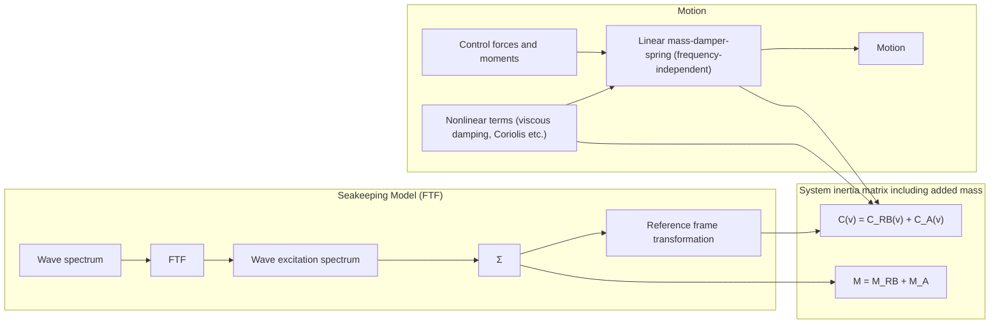

# Ma noeuvri ng Models

## ( M od u l e 4)

## Prepared together with And rew Ross

## D r Tri sta n P e rez

Centre for Com plex Dynam ic Systems a nd Control (C DSC)

## P rofessor Thor I Fosse n

De pa rtme nt of E ng i n ee ri ng Cybernetics

THE UNIVERSITY OF

NEWCASTLE

AUSTRALIA

NTNU

Det skapende universitet

## Vectoria l Representation for Sh i ps

## F rom roboti cs to sh i p mod el i ng ( Fosse n 1 99 1 )

Consid e r the cl assi ca l robot ma n i pu l ator mod el :

I t is here assu med that the hyd rodynam ic coefficients are freq uency i ndependent. Th is wi l l be relaxed later!

$$
\mathbf {M} (\mathbf {q}) \ddot {\mathbf {q}} + \mathbf {C} (\mathbf {q}, \dot {\mathbf {q}}) \mathbf {q} = \boldsymbol {\tau}
$$

- q i s a ve cto r of j o i n t a n g l e s  
- i s a ve cto r of to rq u e

\- M a nd C a re the syste m i n e rtia a nd Coriol is matri ces

Th is mod el stru ctu re ca n be used as fou nd ation to write the 6 DO F ma ri n e vessel eq u ations of motion i n a com pact vectorial setti ng ( Fosse n 1 994, 2002 ) :

$$
\dot {\eta} = \mathbf {J} (\eta) \mathbf {v}
$$

$$
\mathbf {M} \dot {\mathbf {v}} + \mathbf {C} (\mathbf {v}) \mathbf {v} + \mathbf {D} (\mathbf {v}) \mathbf {v} + \mathbf {g} (\boldsymbol {\eta}) = \boldsymbol {\tau}
$$

- body ve l ociti es : $\mathbf { \nu } = [ u , \nu , w , p , q , r ] ^ { T }$  
- p os i t i o n a n d E u l e r a n g l e s :  x, y, z,  ,  ,  T  
- M , C a n d D d e n ote th e syste m i n e rti a , Coriol is and dam pi ng matrices  
- g is a vector of g ravitationa l a nd buoya n cy forces and moments

## Rig id- Body Eq uations of Motion

N ewton ian Form u lation (Body F rame)

$$
\mathbf {M} _ {R B} \dot {\mathbf {v}} + \mathbf {C} _ {R B} (\mathbf {v}) \mathbf {v} = \boldsymbol {\tau} _ {R B}
$$

where

${ \pmb M } _ { R B }$ ri g i d - bod y syste m i n e rti a m atrix $\pmb { C } _ { R B }$ ri g i d - b o d y C o ri o l i s/ce n t ri p eta l m at ri x

See Fossen (1 994, 2002) for parameterizations of $\pmb { C } _ { R B }$

$$
\mathbf {M} _ {R B} = \left[ \begin{array}{c c c c c c} m & 0 & 0 & 0 & m z _ {g} & - m y _ {g} \\ 0 & m & 0 & - m z _ {g} & 0 & m x _ {g} \\ 0 & 0 & m & m y _ {g} & - m x _ {g} & 0 \\ 0 & - m z _ {g} & m y _ {g} & I _ {x} & - I _ {x y} & - I _ {x z} \\ m z _ {g} & 0 & - m x _ {g} & - I _ {y x} & I _ {y} & - I _ {y z} \\ - m y _ {g} & m x _ {g} & 0 & - I _ {z x} & - I _ {z y} & I _ {z} \end{array} \right]
$$

Rigid-body system inertia matrix

The general ized forces on a floati ng vessel are su perpositioned :

$$
\boldsymbol {\tau} _ {R B} = \boldsymbol {\tau} _ {H} + \boldsymbol {\tau} _ {w a v e} + \boldsymbol {\tau} _ {w i n d} + \boldsymbol {\tau} _ {c u r r e n t} + \boldsymbol {\tau} _ {c o n t r o l}
$$

Hyd rodynam ic rad iation-i nd uced forces + viscous dam pi ng

## Rad iation-I nd uced Hyd rodyn . Forces

„ Forces on the body whe n the body is forced to osci l l ate with the wave excitation freq u e n cy a nd the re a re no i n cid e nt waves ( F a l t i n s e n 1 9 9 0 ) :

(1) Added mass d u e to the i n e rtia of the su rrou nd i ng fl u id  
( 2 ) Rad iation-i nd u ced (l i n ea r) potential damping d u e to the e n e rgy carried away by generated su rface waves  
( 3 ) Restori ng forces d ue to Archimedes (weig ht and buoyancy)

$$
\boldsymbol {\tau} _ {R} = - \underbrace {\mathbf {M} _ {A} \dot {\mathbf {v}} - \mathbf {C} _ {A} (\mathbf {v}) \mathbf {v}} _ {\text {added mass}} - \underbrace {\mathbf {D} _ {P} (\mathbf {v}) \mathbf {v}} _ {\text {potential damping}} - \underbrace {\mathbf {g} (\boldsymbol {\eta})} _ {\text {restoring forces}}
$$

“hyd rodyna m ic mass-d a m per-spri ng”

Falti nsen (1 990) . Sea Loads on Ships and Offshore Structures, Cam bridge .

## Added Mass a nd I n e rti a

F l u id Ki n eti c E n e rgy  
The con ce pt of fl u id ki n eti c e n e rgy:

$$
T _ {A} = \frac {1}{2} \mathbf {v} ^ {\top} \mathbf {M} _ {A} \mathbf {v}
$$

can be used to derive the added mass terms .

Any motion of th e vesse l wi l l i nd u ce a motion i n the othe rwise stationa ry fl u i d . I n o rd e r to a l l ow th e vess e l to pass th roug h th e fl u id , it m ust move asid e a nd the n close be h i nd the vessel .

Conseq u e ntly, th e fl u id motion possesses ki n eti c e n e rgy that it wou ld lack otherwise ( Lam b 1 932 ) .

$$
\mathbf {M} _ {A} = - \left[ \begin{array}{c c c c c c} X _ {\dot {u}} & X _ {\dot {v}} & X _ {\dot {w}} & X _ {\dot {p}} & X _ {\dot {q}} & X _ {\dot {r}} \\ Y _ {\dot {u}} & Y _ {\dot {v}} & Y _ {\dot {w}} & Y _ {\dot {p}} & Y _ {\dot {q}} & Y _ {\dot {r}} \\ Z _ {\dot {u}} & Z _ {\dot {v}} & Z _ {\dot {w}} & Z _ {\dot {p}} & Z _ {\dot {q}} & Z _ {\dot {r}} \\ K _ {\dot {u}} & K _ {\dot {v}} & K _ {\dot {w}} & K _ {\dot {p}} & K _ {\dot {q}} & K _ {\dot {r}} \\ M _ {\dot {u}} & M _ {\dot {v}} & M _ {\dot {w}} & M _ {\dot {p}} & M _ {\dot {q}} & M _ {\dot {r}} \\ N _ {\dot {u}} & N _ {\dot {v}} & N _ {\dot {w}} & N _ {\dot {p}} & N _ {\dot {q}} & N _ {\dot {r}} \end{array} \right]
$$

text_image

T_{RB}=1/2 vᵀM_{RB}v
Kinetic energy of fluid: T_A=1/2 vᵀM_Av

## 6 DOF Body- Fixed Representation for Added Mass (I ncl udes Coriol is/Centri peta l Terms d ue to Added M ass)

$$
X _ {A} = X _ {\dot {u}} \dot {u} + X _ {\dot {w}} (\dot {w} + u q) + X _ {\dot {q}} \dot {q} + Z _ {\dot {w}} w q + Z _ {\dot {q}} q ^ {2}
$$

$$
+ X _ {\dot {v}} \dot {v} + X _ {\dot {p}} \dot {p} + X _ {\dot {r}} \dot {r} - Y _ {\dot {v}} v r - Y _ {\dot {p}} r p - Y _ {\dot {r}} r ^ {2}
$$

$$
- X _ {\dot {v}} u r - Y _ {\dot {w}} w r
$$

$$
+ Y _ {\dot {w}} v q + Z _ {\dot {p}} p q - (Y _ {\dot {q}} - Z _ {\dot {r}}) q r
$$

$$
Y _ {A} = X _ {\dot {v}} \dot {u} + Y _ {\dot {w}} \dot {w} + Y _ {\dot {q}} \dot {q}
$$

$$
+ Y _ {\dot {v}} \dot {v} + Y _ {\dot {p}} \dot {p} + Y _ {\dot {r}} \dot {r} + X _ {\dot {v}} v r - Y _ {\dot {w}} v p + X _ {\dot {r}} r ^ {2} + (X _ {\dot {p}} - Z _ {\dot {r}}) r p - Z _ {\dot {p}} p ^ {2}
$$

$$
- X _ {\dot {w}} (u p - w r) + X _ {\dot {u}} u r - Z _ {\dot {w}} w p
$$

$$
- Z _ {\dot {q}} p q + X _ {\dot {q}} q r
$$

$$
Z _ {A} = X _ {\dot {w}} (\dot {u} - w q) + Z _ {\dot {w}} \dot {w} + Z _ {\dot {q}} \dot {q} - X _ {\dot {u}} u q - X _ {\dot {q}} q ^ {2}
$$

$$
+ Y _ {\dot {w}} \dot {v} + Z _ {\dot {p}} \dot {p} + Z _ {\dot {r}} \dot {r} + Y _ {\dot {v}} v p + Y _ {\dot {r}} r p + Y _ {\dot {p}} p ^ {2}
$$

$$
+ X _ {i} u p + Y _ {w} w p
$$

$$
- X _ {\dot {v}} v q - (X _ {\dot {p}} - Y _ {\dot {q}}) p q - X _ {\dot {r}} q r
$$

$$
K _ {A} = X _ {\dot {p}} \dot {u} + Z _ {\dot {p}} \dot {w} + K _ {\dot {q}} \dot {q} - X _ {\dot {v}} w u + X _ {\dot {r}} u q - Y _ {\dot {w}} w ^ {2} - (Y _ {\dot {q}} - Z _ {\dot {r}}) w q + M _ {\dot {r}} q ^ {2}
$$

$$
+ Y _ {\dot {p}} \dot {v} + K _ {\dot {p}} \dot {p} + K _ {\dot {r}} \dot {r} + Y _ {\dot {w}} v ^ {2} - (Y _ {\dot {q}} - Z _ {\dot {r}}) v r + Z _ {\dot {p}} v p - M _ {\dot {r}} r ^ {2} - K _ {\dot {q}} r p
$$

$$
+ X _ {\dot {w}} u v - \left(Y _ {\dot {v}} - Z _ {\dot {w}}\right) v w - \left(Y _ {\dot {r}} + Z _ {\dot {q}}\right) w r - Y _ {\dot {p}} w p - X _ {\dot {q}} u r
$$

$$
+ (Y _ {\dot {r}} + Z _ {\dot {q}}) v q + K _ {\dot {r}} p q - (M _ {\dot {q}} - N _ {\dot {r}}) q r
$$

$$
M _ {A} = X _ {\dot {q}} (\dot {u} + w q) + Z _ {\dot {q}} (\dot {w} - u q) + M _ {\dot {q}} \dot {q} - X _ {\dot {w}} (u ^ {2} - w ^ {2}) - (Z _ {\dot {w}} - X _ {\dot {u}}) w u
$$

$$
+ Y _ {\dot {q}} \dot {v} + K _ {\dot {q}} \dot {p} + M _ {\dot {r}} \dot {r} + Y _ {\dot {p}} v r - Y _ {\dot {r}} v p - K _ {\dot {r}} (p ^ {2} - r ^ {2}) + (K _ {\dot {p}} - N _ {\dot {r}}) r p
$$

$$
- Y _ {\dot {w}} u v + X _ {\dot {v}} v w - (X _ {\dot {r}} + Z _ {\dot {p}}) (u p - w r) + (X _ {\dot {p}} - Z _ {\dot {r}}) (w p + u r)
$$

$$
- M _ {\dot {r}} p q + K _ {\dot {q}} q r
$$

$$
N _ {A} = X _ {\dot {r}} \dot {u} + Z _ {\dot {r}} \dot {w} + M _ {\dot {r}} \dot {q} + X _ {\dot {v}} u ^ {2} + Y _ {\dot {w}} w u - (X _ {\dot {p}} - Y _ {\dot {q}}) u q - Z _ {\dot {p}} w q - K _ {\dot {q}} q ^ {2}
$$

$$
+ Y _ {\dot {r}} \dot {v} + K _ {\dot {r}} \dot {p} + N _ {\dot {r}} \dot {r} - X _ {\dot {v}} v ^ {2} - X _ {\dot {r}} v r - (X _ {\dot {p}} - Y _ {\dot {q}}) v p + M _ {\dot {r}} r p + K _ {\dot {q}} p ^ {2}
$$

$$
- (X _ {\dot {u}} - Y _ {\dot {v}}) u v - X _ {\dot {w}} v w + (X _ {\dot {q}} + Y _ {\dot {p}}) u p + Y _ {\dot {r}} u r + Z _ {\dot {q}} w p
$$

$$
- (X _ {\dot {q}} + Y _ {\dot {p}}) v q - (K _ {\dot {p}} - M _ {\dot {q}}) p q - K _ {\dot {r}} q r
$$

## Ki rch hoff's Eq uations (1 869)

$$
T = \frac {1}{2} \mathbf {v} ^ {\top} \mathbf {M} _ {A} \mathbf {v}
$$

ki n eti c e n e rgy d u e to th e fl u i d

$$
\frac {d}{d t} \left(\frac {\partial T}{\partial \mathbf {v} _ {1}}\right) + \mathbf {S} (\mathbf {v} _ {2}) \frac {\partial T}{\partial \mathbf {v} _ {1}} = \boldsymbol {\tau} _ {1}
$$

$$
\frac {d}{d t} \left(\frac {\partial T}{\partial \mathbf {v} _ {2}}\right) + \mathbf {S} (\mathbf {v} _ {2}) \frac {\partial T}{\partial \mathbf {v} _ {2}} + \mathbf {S} (\mathbf {v} _ {1}) \frac {\partial T}{\partial \mathbf {v} _ {1}} = \boldsymbol {\tau} _ {2}
$$

$$
\begin{array}{l} \boxed {\frac {d}{d t} \frac {\partial T _ {A}}{\partial u}} = \boxed {r \frac {\partial T _ {A}}{\partial v} - q \frac {\partial T _ {A}}{\partial w} - X _ {A}} \\ \boxed {\frac {d}{d t} \frac {\partial T _ {A}}{\partial v}} = \boxed {p \frac {\partial T _ {A}}{\partial w} - r \frac {\partial T _ {A}}{\partial u} - Y _ {A}} \\ \boxed {\frac {d}{d t} \frac {\partial T _ {A}}{\partial w}} = \boxed {q \frac {\partial T _ {A}}{\partial u} - p \frac {\partial T _ {A}}{\partial v} - Z _ {A}} \\ \boxed {\frac {d}{d t} \frac {\partial T _ {A}}{\partial p}} = \boxed {w \frac {\partial T _ {A}}{\partial v} - v \frac {\partial T _ {A}}{\partial w} + r \frac {\partial T _ {A}}{\partial q} - q \frac {\partial T _ {A}}{\partial r} e - K _ {A}} \\ \boxed {\frac {d}{d t} \frac {\partial T _ {A}}{\partial q}} = \boxed {u \frac {\partial T _ {A}}{\partial w} - w \frac {\partial T _ {A}}{\partial u} + p \frac {\partial T _ {A}}{\partial r} - r \frac {\partial T _ {A}}{\partial p} - M _ {A}} \\ \boxed {\frac {d}{d t} \frac {\partial T _ {A}}{\partial r}} = \boxed {v \frac {\partial T _ {A}}{\partial u} - u \frac {\partial T _ {A}}{\partial v} + q \frac {\partial T _ {A}}{\partial p} - p \frac {\partial T _ {A}}{\partial q} - N _ {A}} \end{array}
$$

$$
M _ {A} \quad C _ {A} (\nu)
$$

## Viscous Hyd rodyna m ic Da m pi ng

„ I n ad d ition to pote ntia l d a m p i ng we have to i n cl u d e othe r d issi pative viscous terms l i ke skin friction, wa ve drift damping etc:

$$
\boldsymbol {\tau} _ {D} = - \underbrace {\mathbf {D} _ {S} (\mathbf {v}) \mathbf {v}} _ {\text {skin}} - \underbrace {\mathbf {D} _ {W} (\mathbf {v}) \mathbf {v}} _ {\text {wave drift}} - \underbrace {\mathbf {D} _ {M} (\mathbf {v}) \mathbf {v}} _ {\text {damping due to}}
$$

Total hydrodynamic damping matrix:

$$
\mathbf {D} (\mathbf {v}) := \mathbf {D} _ {P} (\mathbf {v}) + \mathbf {D} _ {S} (\mathbf {v}) + \mathbf {D} _ {W} (\mathbf {v}) + \mathbf {D} _ {M} (\mathbf {v})
$$

„ The hyd rodynam ic forces and moments can be now be writte n as the su m of :

$$
\boldsymbol {\tau} _ {H} = - \mathbf {M} _ {A} \dot {\mathbf {v}} - \mathbf {C} _ {A} (\mathbf {v}) \mathbf {v} - \mathbf {D} (\mathbf {v}) \mathbf {v} - \mathbf {g} (\boldsymbol {\eta})
$$

## Eq uations of Motion

The resu lti ng mod el is (freq u e n cy-i nd e pe nd e nt coeffi cie nts) :

$$
\mathbf {M} \dot {\mathbf {v}} + \mathbf {C} (\mathbf {v}) \mathbf {v} + \mathbf {D} (\mathbf {v}) \mathbf {v} + \mathbf {g} (\boldsymbol {\eta}) = \boldsymbol {\tau} _ {\text {wave}} + \boldsymbol {\tau} _ {\text {wind}} + \boldsymbol {\tau} _ {\text {current}} + \boldsymbol {\tau} _ {\text {control}}
$$

flowchart

$$
\mathbf {M} = \mathbf {M} _ {R B} + \mathbf {M} _ {A}
$$

$$
\mathbf {C} (\mathbf {v}) = \mathbf {C} _ {R B} (\mathbf {v}) + \mathbf {C} _ {A} (\mathbf {v})
$$

## Ma noeuvri ng Hyd rodyna m ics

I n classi cal ma noeuvri ng theory, the forces a re mod el l ed at a ge n e ra l non-l i n ea r fu n ction :

$$
\mathbf {M} \dot {\mathbf {v}} = \mathbf {f} (\dot {\mathbf {v}}, \mathbf {v}, \boldsymbol {\eta}) + \boldsymbol {\tau}
$$

A pa rti cu l a r affi n e pa ra mete rization is the n used , a nd the coeffi cie nts a re esti mated l i n ea r reg ression from the d ata .

The d isadvantage of th is mod el representation to a energy-based ( Lag ra ng ia n ) a p proach is that mod el red u ction , sym metry/skew-sym metry properties , positive matrices , etc. a re d i ffi cu l t to exp l o i t i n s i m u l ati o n a n d co n tro l d es i g n .

Th is mod el ca n , however, be related to the Lag ra ng ia n mod el : as shown by Ross et al . 2007 :

$$
\mathbf {M} \dot {\mathbf {v}} + \mathbf {C} (\mathbf {v}) \mathbf {v} + \mathbf {D} (\mathbf {v}) \mathbf {v} + \mathbf {g} (\boldsymbol {\eta}) = \boldsymbol {\tau}
$$

## Pa ra meterisations

Two types of para meterisations for the hyd rodyna m ic forces are ge n e ra l ly used i n cl assi ca l ma noeuvri ng theory:

Tru n cated Taylor-series expa nsions :

D av i s o n a n d S h i ff ( 1 94 6 ) : 1 st-o rd e r ( l i n e a r) te rm s .  
Abkowitz ( 1 964 ) : odd terms u p to $3 ^ { \mathsf { r d } }$ o rd e r .

2 nd -o rd e r m od u l u s

Fedyaevsky and Sobolev ( 1 963)  
‰ N o rrb i n ( 1 9 70 )

## Pa ra meterisations

## 2 nd -o rd e r m od u l u s

$$
\begin{array}{l} Y ^ {\prime} = Y _ {v} ^ {\prime} v ^ {\prime} + Y _ {r} ^ {\prime} r ^ {\prime} + Y _ {v | v |} ^ {\prime} v ^ {\prime} \big | v ^ {\prime} \big | + Y _ {v | r |} ^ {\prime} v ^ {\prime} \big | r ^ {\prime} \big | \\ + Y _ {| v | r} ^ {\prime} \big | v ^ {\prime} \big | r ^ {\prime} + Y _ {r | r} ^ {\prime} \big | r ^ {\prime} \big | r ^ {\prime} \big | \\ N ^ {\prime} = N _ {v} ^ {\prime} v ^ {\prime} + N _ {r} ^ {\prime} r ^ {\prime} + N _ {v | v |} ^ {\prime} v ^ {\prime} \big | v ^ {\prime} \big | + N _ {v | r |} ^ {\prime} v ^ {\prime} \big | r ^ {\prime} \big | \\ + N _ {| v | r} ^ {\prime} \left| v ^ {\prime} \right| r ^ {\prime} + N _ {r | r} ^ {\prime} \left| r ^ {\prime} \right| \\ \end{array}
$$

## Taylor-series

$$
\begin{array}{l} Y ^ {\prime} = Y _ {v} ^ {\prime} v ^ {\prime} + Y _ {r} ^ {\prime} r ^ {\prime} + Y _ {v v v} ^ {\prime} v ^ {\prime 3} + Y _ {v v r} ^ {\prime} v ^ {\prime 2} r ^ {\prime} \\ + Y _ {v r r} ^ {\prime} v ^ {\prime} r ^ {\prime 2} + Y _ {r r r} ^ {\prime} r ^ {\prime 3} \\ N ^ {\prime} = N _ {v} ^ {\prime} v ^ {\prime} + N _ {r} ^ {\prime} r ^ {\prime} + N _ {v v v} ^ {\prime} v ^ {\prime 3} + N _ {v v r} ^ {\prime} v ^ {\prime 2} r ^ {\prime} \\ + N _ {v r r} ^ {\prime} v ^ {\prime} r ^ {\prime 2} + N _ {r r r} ^ {\prime} r ^ {\prime 3} \\ \end{array}
$$

SECOND ORDER MODULUS FI  

surface_3d

| r' | v' | Value (Color Gradient) |
| --- | --- | --- |
| N/A | N/A | N/A |

ODD FUNCTION TAYLORSERIES FIT  

surface_3d

| r' | v' | Value |
| --- | --- | --- |
| ~0 | ~0 | ~0 |
| ~0 | ~1 | ~0 |
| ~0 | ~2 | ~0 |
| ~0 | ~3 | ~0 |
| ~0 | ~4 | ~0 |
| ~0 | ~5 | ~0 |
| ~0 | ~6 | ~0 |
| ~0 | ~7 | ~0 |
| ~0 | ~8 | ~0 |
| ~0 | ~9 | ~0 |
| ~0 | ~10 | ~0 |
| ~0 | ~11 | ~0 |
| ~0 | ~12 | ~0 |
| ~0 | ~13 | ~0 |
| ~0 | ~14 | ~0 |
| ~0 | ~15 | ~0 |
| ~0 | ~16 | ~0 |
| ~0 | ~17 | ~0 |
| ~0 | ~18 | ~0 |
| ~0 | ~19 | ~0 |
| ~0 | ~20 | ~0 |
| ~0 | ~21 | ~0 |
| ~0 | ~22 | ~0 |
| ~0 | ~23 | ~0 |
| ~0 | ~24 | ~0 |
| ~0 | ~25 | ~0 |
| ~0 | ~26 | ~0 |
| ~0 | ~27 | ~0 |
| ~0 | ~28 | ~0 |
| ~0 | ~29 | ~0 |
| ~0 | ~30 | ~0 |
| ~0 | ~31 | ~0 |
| ~0 | ~32 | ~0 |
| ~0 | ~33 | ~0 |
| ~0 | ~34 | ~0 |
| ~0 | ~35 | ~0 |
| ~0 | ~36 | ~0 |
| ~0 | ~37 | ~0 |
| ~0 | ~38 | ~0 |
| ~0 | ~39 | ~0 |
| ~0 | ~40 | ~0 |
| ~0 | ~41 | ~0 |
| ~0 | ~42 | ~0 |
| ~0 | ~43 | ~0 |
| ~0 | ~44 | ~0 |
| ~0 | ~45 | ~0 |
| ~0 | ~46 | ~0 |
| ~0 | ~47 | ~0 |
| ~0 | ~48 | ~0 |
| ~0 | ~49 | ~0 |
| ~0 | ~50 | ~0 |
| ~0 | ~51 | ~0 |
| ~0 | ~52 | ~0 |
| ~0 | ~53 | ~0 |
| ~0 | ~54 | ~0 |
| ~0 | ~55 | ~0 |
| ~0 | ~56 | ~0 |
| ~0 | ~57 | ~0 |
| ~0 | ~58 | ~0 |
| ~0 | ~59 | ~0 |
| ~0 | ~60 | ~0 |
| ~0 | ~61 | ~0 |
| ~0 | ~62 | ~0 |
| ~0 | ~63 | ~0 |
| ~0 | ~64 | ~0 |
| ~0 | ~65 | ~0 |
| ~0 | ~66 | ~0 |
| ~0 | ~67 | ~0 |
| ~0 | ~68 | ~0 |
| ~0 | ~69 | ~0 |
| ~0 | ~70 | ~0 |
| ~0 | ~71 | ~0 |
| ~0 | ~72 | ~0 |
| ~0 | ~73 | ~0 |
| ~0 | ~74 | ~0 |
| ~0 | ~75 | ~0 |
| ~0 | ~76 | ~0 |
| ~0 | ~77 | ~0 |
| ~0 | ~78 | ~0 |
| ~0 | ~79 | ~0 |
| ~0 | ~80 | ~0 |
| ~0 | ~81 | ~0 |
| ~0 | ~82 | ~0 |
| ~0 | ~83 | ~0 |
| ~0 | ~84 | ~0 |
| ~0 | ~85 | ~0 |
| ~0 | ~86 | ~0 |
| ~0 | ~87 | ~0 |
| ~0 | ~88 | ~0 |
| ~0 | ~89 | ~0 |
| ~0 | ~90 | ~0 |
| ~0 | ~91 | ~0 |
| ~0 | ~92 | ~0 |
| ~0 | ~93 | ~0 |
| ~0 | ~94 | ~0 |
| ~0 | ~95 | ~0 |
| ~0 | ~96 | ~0 |
| ~0 | ~97 | ~0 |
| ~0 | ~98 | ~0 |
| ~0 | ~99 | ~0 |
| ~0 | ~100 | ~0 |

## Pa ra meterisations

As com mented by Clarke (2003),

„ Taylor expa nsions g ive rise to a smooth re p rese ntation of th e forces , b ut have no p hysi ca l mea n i ng .

„ 2nd-ord e r mod u l us expa ns ions re p rese nt we l l th e hyd rodyna m i c forces at a ng l es of i n cid e n ce : cross-flow d rag .

## Taylor-Series Expa nsions

$$
\boldsymbol {\tau} _ {h y d} = \mathbf {f} _ {h y d} (\mathbf {x}) + \frac {\partial \mathbf {f} _ {h y d}}{\partial \mathbf {x}} (\mathbf {x} - \overline {{\mathbf {x}}}) + \frac {\partial^ {2} \mathbf {f} _ {h y d}}{\partial \mathbf {x} ^ {2}} (\mathbf {x} - \overline {{\mathbf {x}}}) ^ {2} + \dots
$$

$$
\mathbf {x} = \left[ \begin{array}{c c c} \dot {\mathbf {v}} & \mathbf {v} & \boldsymbol {\eta} \end{array} \right] ^ {T}
$$

Wh e re th e pa rtia l d e rivatives a re ta ke n at a n e q u i l i b r i u m :

$$
\overline {{\mathbf {x}}} = \left[ \begin{array}{c c c} \mathbf {0} & \overline {{\mathbf {v}}} & \mathbf {0} \end{array} \right] ^ {T} \quad \overline {{\mathbf {v}}} = \left[ \begin{array}{c c c c c c} U & 0 & 0 & 0 & 0 & 0 \end{array} \right] ^ {T}
$$

## Model of Abkowitz ( 1 964)

$$
\begin{array}{l} \mathcal {X} = \mathcal {X} _ {0} + \mathcal {X} _ {u} \dot {u} + \mathcal {X} _ {u} \Delta u + \mathcal {X} _ {u u} \Delta u ^ {2} + \mathcal {X} _ {u u u} \Delta u ^ {3} + \mathcal {X} _ {v v} v ^ {2} + \mathcal {X} _ {r r} r ^ {2} \\ + \mathcal {X} _ {\delta \delta} \delta^ {2} + \mathcal {X} _ {r v} r v + \mathcal {X} _ {r \delta} r \delta + \mathcal {X} _ {v \delta} v \delta + \mathcal {X} _ {v v u} v ^ {2} \Delta u + \mathcal {X} _ {r r u} r ^ {2} \Delta u \\ + \mathcal {X} _ {\delta \delta u} \delta^ {2} \Delta u + \mathcal {X} _ {r v u} r v \Delta u + \mathcal {X} _ {r \delta u} r + \delta \Delta u + \mathcal {X} _ {v \delta u} v \Delta u \\ + (1 - t) T + \mathcal {X} _ {e x t} \\ \end{array}
$$

$$
\begin{array}{l} \mathcal {Y} = \mathcal {Y} _ {0} + \mathcal {Y} _ {u} \Delta u + \mathcal {Y} _ {u u} \Delta u ^ {2} + \mathcal {Y} _ {r} r + \mathcal {Y} _ {v} v + \mathcal {Y} _ {\dot {r}} \dot {r} + \mathcal {Y} _ {\dot {v}} \dot {v} + \mathcal {Y} _ {\delta} \delta \\ + \mathcal {Y} _ {r r r} r ^ {3} + \mathcal {Y} _ {v v v} v ^ {3} + \mathcal {Y} _ {\delta \delta \delta} \delta^ {3} + \mathcal {Y} _ {r r \delta} r ^ {2} \delta + \mathcal {Y} _ {\delta \delta r} \delta^ {2} r + \mathcal {Y} _ {r r v} r ^ {2} v \\ + \mathcal {Y} _ {v v r} v ^ {2} r + \mathcal {Y} _ {\delta \delta v} \delta^ {2} v + \mathcal {Y} _ {v v \delta} v ^ {2} \delta + \mathcal {Y} _ {\delta v r} \delta v r + \mathcal {Y} _ {v u} v \Delta u + \mathcal {Y} _ {r u} r \Delta u \\ + \mathcal {Y} _ {v u u} v \Delta u ^ {2} + \mathcal {Y} _ {r u u} r \Delta u ^ {2} + \mathcal {Y} _ {\delta u} \delta \Delta u + \mathcal {Y} _ {\delta u u} \delta \Delta u ^ {2} + \mathcal {Y} _ {e x t} \\ \end{array}
$$

$$
\begin{array}{l} \mathcal {N} = \mathcal {N} _ {0} + \mathcal {N} _ {u} \Delta u + \mathcal {N} _ {u u} \Delta u ^ {2} + \mathcal {N} _ {r} r + \mathcal {N} _ {v} v + \mathcal {N} _ {\dot {r}} \dot {r} + \mathcal {N} _ {\dot {v}} \dot {v} + N _ {\delta} \delta \\ + \mathcal {N} _ {r r r} r ^ {3} + \mathcal {N} _ {v v v} v ^ {3} + \mathcal {N} _ {\delta \delta \delta} \delta^ {3} + \mathcal {N} _ {r r \delta} r ^ {2} \delta + \mathcal {N} _ {\delta \delta r} \delta^ {2} r + \mathcal {N} _ {r r v} r ^ {2} v \\ + \mathcal {N} _ {v v r} v ^ {2} r + \mathcal {N} _ {\delta \delta v} \delta^ {2} v + \mathcal {N} _ {v v \delta} v ^ {2} \delta + \mathcal {N} _ {\delta v r} \delta v r + \mathcal {N} _ {v u} v \Delta u + \mathcal {N} _ {r u} r \Delta u \\ + \mathcal {N} _ {v u u} v \Delta u ^ {2} + \mathcal {N} _ {r u u} r \Delta u ^ {2} + \mathcal {N} _ {\delta u} \delta \Delta u + \mathcal {N} _ {\delta u u} \delta \Delta u ^ {2} + \mathcal {N} _ {e x t} \\ \end{array}
$$

The coeffi cie nts a re cal led hyd rodynam ic d e rivatives .

M a ny te rm s a re set to zero by exploiti ng physi cal ly properties . I f n ot , t h e re w i l l thousa nds of coeffi cie nts .

# Model of Norrbi n ( 1 9 70)

Speed equation:

$$
\begin{array}{l} (1 - X _ {u} ^ {\prime \prime}) \dot {u} = \frac {1}{2} L ^ {- 1} X _ {u u} ^ {\prime \prime} u ^ {2} + \frac {1}{2 4} L ^ {- 2} g ^ {- 1} X _ {u u u u} ^ {\prime \prime} u ^ {4} + g (1 - t) T ^ {\prime \prime} + (1 + X _ {v r} ^ {\prime \prime}) v r \\ + L (x _ {g} ^ {\prime \prime} + \frac {1}{2} X _ {r r} ^ {\prime \prime}) r ^ {2} + \frac {1}{6} L ^ {- 2} g ^ {- 1} X _ {u v v v} ^ {\prime \prime} u | v | v ^ {2} + \frac {1}{4} L ^ {- 1} X _ {c | c | \delta \delta} | c | c \delta_ {e} ^ {2} \\ \end{array}
$$

Steering equations:

$$
\begin{array}{l} (1 - Y _ {\dot {v}} ^ {\prime \prime}) \dot {v} = L (Y _ {\dot {r}} ^ {\prime \prime} - x _ {g} ^ {\prime \prime}) \dot {r} + (Y _ {u r} ^ {\prime \prime} - 1) u r + \frac {1}{2} (L g) ^ {- 1 / 2} Y _ {u u r} ^ {\prime \prime} u ^ {2} r \\ + L ^ {- 1} Y _ {u v} ^ {\prime \prime} u v + \frac {1}{2} L ^ {- 3 / 2} g ^ {- 1 / 2} Y _ {u u v} ^ {\prime \prime} u ^ {2} v + \frac {1}{2} L ^ {- 1} Y _ {| v | v} ^ {\prime \prime} | v | v + \frac {1}{2} L Y _ {| r | r} ^ {\prime \prime} | r | r \\ + Y _ {| v | r} ^ {\prime \prime} | v | r + Y _ {v | r} ^ {\prime \prime} | v | r | + \frac {1}{2} L ^ {- 1} Y _ {| c | c \delta} ^ {\prime \prime} | c | c \delta_ {\epsilon} + k _ {\gamma} g T ^ {\prime \prime} \\ \end{array}
$$

$$
\begin{array}{l} ((k _ {z} ^ {\prime \prime}) ^ {2} - N _ {\dot {r}} ^ {\prime \prime}) \dot {r} = L ^ {- 1} (N _ {\dot {v}} ^ {\prime \prime} - x _ {g} ^ {\prime \prime}) \dot {v} + L ^ {- 1} (N _ {u r} ^ {\prime \prime} - x _ {g} ^ {\prime \prime}) u r \\ + \frac {1}{2} L ^ {- 3 / 2} g ^ {- 1 / 2} N _ {u u r} ^ {\prime \prime} u ^ {2} r + L ^ {- 2} N _ {u v} ^ {\prime \prime} u v + \frac {1}{2} L ^ {- 5 / 2} g ^ {- 1 / 2} N _ {u u v} ^ {\prime \prime} u ^ {2} v \\ + \frac {1}{2} L ^ {- 2} N _ {| v | v} ^ {\prime \prime} | v | v + \frac {1}{2} N _ {| r | r} ^ {\prime \prime} | r | r + L ^ {- 1} N _ {| v | r} ^ {\prime \prime} | v | r \\ + L ^ {- 1} N _ {v | r |} ^ {\prime \prime} v | r | + \frac {1}{2} L ^ {- 2} N _ {| c | c \delta} ^ {\prime \prime} | c | c \delta_ {\epsilon} + L ^ {- 1} g k _ {N} T ^ {\prime \prime} \\ \end{array}
$$

## 2nd-Order Mod u l us

## F rom B l a n ke a nd Ch ristia nse n ( 1 986 ) :

Sway terms

$$
\begin{array}{l} \tau_ {\mathrm{2hyd}} ^ {b} = Y _ {\dot {v}} \dot {v} + Y _ {\dot {r}} \dot {r} + Y _ {\dot {p}} \dot {p} \\ + Y _ {| u | v} | U | v + Y _ {u r} U r + Y _ {v | v |} v | v | + Y _ {v | r |} v | r | + Y _ {r | v |} r | v | \tag {4.46} \\ + Y _ {\phi | u v |} \phi | U v | + Y _ {\phi | u r |} \phi | U r | + Y _ {\phi u u} \phi U ^ {2}. \\ \end{array}
$$

Roll terms

$$
\begin{array}{l} \tau_ {4 \mathrm{hyd}} ^ {b} = K _ {\dot {v}} \dot {v} + K _ {\dot {p}} \dot {p} \\ + K _ {| u | v} | U | v + K _ {u r} U r + K _ {v | v |} v | v | + K _ {v | r |} v | r | + K _ {r | v |} r | v | + K _ {u r} \phi | U _ {v} | + K _ {u r} \phi | U _ {r} | + K _ {u r} \phi U ^ {2} + K _ {u r} | U | v (4.47) \\ + K _ {\phi | u v |} \phi | U v | + K _ {\phi | u r |} \phi | U r | + K _ {\phi u u} \phi U ^ {2} + K _ {| u | p} | U | p (4.47) \\ + K _ {p | p |} p | p | + K _ {p} p + K _ {\phi \phi \phi} \phi^ {3} - \rho g \nabla G Z (\phi). \\ \end{array}
$$

Yaw terms

$$
\begin{array}{l} \tau_ {6 \mathrm{hyd}} ^ {b} = N _ {\dot {v}} \dot {v} + N _ {\dot {r}} \dot {r} \\ + N _ {| u | v} | U | v + N _ {| u | r} | U | r + N _ {r | r} | r | r | + N _ {r | v} | r | v | \\ + N _ {\phi | u v |} \phi | U v | + N _ {\phi u | r |} \phi U | r | + N _ {p} p + N _ {| p | p} | p | p + N _ {| u | p} | U | p \\ + N _ {\phi u | u |} \phi U | U |. \\ \end{array}
$$

## Measu rement of Hyd rodyna m ic Derivatives

## PMM

Expe ri me nts with mod el tests .  
F u l l sca l e sea tria ls a nd syste m id e ntifi cation .  
Theoretical pred iction methods .  
Reg ression a na lysis resu lts from si m i l a r d esig ns .

natural_image

Green boat with white hoses operating near industrial machinery in a storage facility (no visible text or symbols)

M od el tests that can be performed

ƒ St ra i g h t l i n e i n a tow i n g ta n k ,  
Rotat i n g a rm ,  
ƒ Pla nar motion mecha n ism P M M ,  
O s c i l l ato r te sts ,  
ƒ F ree ru n n i n g ( rad i o co ntro l l ed ) .

text_image

O₀
s₂
ψ/s₃
x₀
y₀
s₁

## Experi menta l Methods

natural_image

Historical painting depicting a riverside scene with people, windmills, and a large wheelbarrow (no visible text or symbols)

Model testing in Peerlesspool in London

# Measu rement of Hyd rodyna m ic Derivatives

Rotati ng arm  

text_image

x₀
s₂
x
y
s₃
s₁
O₀
y₀

## Typica l Tests

Pu re Sway:

text_image

x
y
x₀
x
y
x
y
x
x₀

P u re yaw:

text_image

Diagram showing a wave-like path with coordinate axes labeled x and y, featuring two elliptical loops and directional arrows.

D ri ft a n d yaw :

D ifferent tests are used to fi t d i ffe re n t p a rts of th e model .

text_image

Diagram showing a wave-like trajectory with labeled x and y axes and directional arrows, likely illustrating a physics or mathematical concept.

## Measu rement of Hyd rodyna m ic Derivatives

D u ri n g th e m od e l tests , th e mod el is forces to move and forces velocities and accelerations are recorded .

Then the hyd rodynam ic derivatives are esti mated from reg ression a na lysis .

## A Novel 4 DOF Ma noeuvri ng Model

Ross et. al . (2007) has reassessed the ma noeuvri ng mod els i n the l ite ratu re , a n d fo rm u l ated a n ove l 4 D O F (s u rg e , sway , ro l l , yaw) Lag ra ng ia n mod el usi ng fi rst pri n ci pl es a nd su pe rposition of:

Potential (add ed mass)  
C i rcu l ati o n effe cts : l i ft a n d d rag  
Effe ct of ro l l o n ci rcu l ati o n effe cts  
C ross-fl ow d rag .

$$
\mathbf {M} \dot {\boldsymbol {\nu}} + \mathbf {N} (\boldsymbol {\nu}) \boldsymbol {\nu} + \mathbf {g} (\boldsymbol {\eta}) = \boldsymbol {\tau},
$$

$$
\dot {\eta} = \mathbf {J} (\eta) \nu
$$

The adva ntage of the Lag ra ng ia n mod el is its vector re prese ntation wh i ch is ta i lor mad e for e nergy-based control d esig n ( Lya pu nov) .

## Added Mass a nd Coriol l is

The 4 DO F sol ution of Ki rch hoff’s eq u ations ca n be expressed as ( Fossen , 2002 )

$$
\left[ \begin{array}{c c c c} X _ {A} & Y _ {A} & K _ {A} & N _ {A} \end{array} \right] ^ {\top} = - \mathbf {M} _ {A} \dot {\boldsymbol {\nu}} - \mathbf {C} _ {A} (\boldsymbol {\nu}) \boldsymbol {\nu}
$$

Added mass

Added mass Coriol l is and Ce ntri petal terms

$$
\mathbf {C} _ {A} (\pmb {\nu}) = \left[ \begin{array}{c c c c} 0 & 0 & 0 & Y _ {\dot {v}} v + Y _ {\dot {p}} p + Y _ {\dot {r}} r \\ 0 & 0 & 0 & - X _ {\dot {u}} u \\ 0 & 0 & 0 & 0 \\ - Y _ {\dot {v}} v - Y _ {\dot {p}} p - Y _ {\dot {r}} r & X _ {\dot {u}} u & 0 & 0 \end{array} \right]
$$

## M odel of Ross et a l . (2007)

C i rcu l ati o n effe cts ( l i ft a n d d rag ) , effe ct of ro l l o n ci rcu l ati o n effe cts a n d crossflow d rag (mod u l us re prese ntation ) a re d e rived i n Ross et a l . (2007 ) :

$$
\begin{array}{l} \mathbf {N} (\boldsymbol {\nu}) \boldsymbol {\nu} \triangleq (\mathbf {C} (\boldsymbol {\nu}) + \mathbf {D} (\boldsymbol {\nu})) \boldsymbol {\nu} \\ = \left[ \begin{array}{c c c c} X _ {N} & Y _ {N} & K _ {N} & N _ {N} \end{array} \right] ^ {\top} \\ \end{array}
$$

where the com ponents are :

$$
\begin{array}{l} X _ {N} = - X _ {u u} ^ {L} u ^ {2} - X _ {v u u} ^ {L} u ^ {3} - X _ {v v} ^ {L} v ^ {2} - X _ {r r} ^ {L} r ^ {2} - X _ {r v} ^ {L} r v - X _ {u v v} ^ {L} u v ^ {2} \\ - X _ {r v u} ^ {L} r v u - X _ {u r r} ^ {L} u r ^ {2} - X _ {u v \phi \phi} ^ {L} u v \phi^ {2} + Y _ {i} v r + Y _ {\dot {p}} p r + Y _ {\dot {r}} r ^ {2} \\ Y _ {N} = - Y _ {u v} ^ {L} u v - Y _ {u r} ^ {L} u r - Y _ {u u r} ^ {L} u ^ {2} r - Y _ {u u v} ^ {L} u ^ {2} v - Y _ {v v v} ^ {L} v ^ {3} - Y _ {r r r} ^ {L} r ^ {3} - Y _ {r r v} ^ {L} r ^ {2} v \\ - Y _ {v v r} ^ {L} v ^ {2} r - Y _ {u v \phi \phi} ^ {L} u v \phi^ {2} - Y _ {| v | v} | v | v - Y _ {| r | v} | r | v - Y _ {| v | r} | v | r - Y _ {| r | r} | r | r - X _ {\dot {u}} u r \\ K _ {N} = - K _ {p} p - K _ {p p p} p ^ {3} - K _ {u v} ^ {L} u v - K _ {u r} ^ {L} u r - K _ {u u r} ^ {L} u ^ {2} r - K _ {u u v} ^ {L} u ^ {2} v - K _ {v v v} ^ {L} v ^ {3} - K _ {r r r} ^ {L} r ^ {3} - K _ {r r v} ^ {L} r ^ {2} v \\ - K _ {v v r} ^ {L} v ^ {2} r - K _ {u v \phi \phi} ^ {L} u v \phi^ {2} - K _ {| v | v} | v | v - K _ {| r | v} | r | v - K _ {| v | r} | v | r - K _ {| r | r} | r | r \\ N _ {N} = - N _ {u v} ^ {L} u v - N _ {u r} ^ {L} u r - N _ {u u r} ^ {L} u ^ {2} r - N _ {u u v} ^ {L} u ^ {2} v - N _ {v v v} ^ {L} v ^ {3} - N _ {r r r} ^ {L} r ^ {3} - N _ {r r v} ^ {L} r ^ {2} v - N _ {v v r} ^ {L} v ^ {2} r - N _ {u u \phi \phi} ^ {L} u v \phi^ {2} \\ - N _ {| v | v} | v | v - N _ {| r | v} | r | v - N _ {| v | r} | v | r - N _ {| r | r} | r | r - Y _ {\dot {p}} p u - Y _ {\dot {r}} r u + (X _ {\dot {u}} - Y _ {\dot {v}}) u v. \\ \end{array}
$$

$$
\begin{array}{l} Y _ {N} = - Y _ {u v} ^ {L} u v - Y _ {u r} ^ {L} u r - Y _ {u u r} ^ {L} u ^ {2} r - Y _ {u u v} ^ {L} u ^ {2} v - Y _ {v v v} ^ {L} v ^ {3} - Y _ {r r r} ^ {L} r ^ {3} - Y _ {r r v} ^ {L} r ^ {2} v \\ - Y _ {v v r} ^ {L} v ^ {2} r - Y _ {u v \phi \phi} ^ {L} u v \phi^ {2} - Y _ {| v | v} | v | v - Y _ {| r | v} | r | v - Y _ {| v | r} | v | r - Y _ {| r | r} | r | r - X _ {\dot {u}} u r \\ \end{array}
$$

## Ma noeuvri ng Model

Co m b i n i n g a l l t h e te rm s i n a m atri x fo r, we o bta i n th e ma noe uvri ng eq u ations i n Lag ra ng ia n form ( Fossen 1 994 , 2002 ) .

$$
\mathrm{M} \dot {\boldsymbol {\nu}} + \mathrm{N} (\boldsymbol {\nu}) \boldsymbol {\nu} + \mathrm{g} (\boldsymbol {\eta}) = \boldsymbol {\tau},
$$

$$
\dot {\eta} = \mathrm{J} (\eta) \nu
$$

## Model Va l idation with PMM Data

To val id ate the mod el , Ross et al . (2007) used d ata of several P M M tests , a nd perform a reg ression based on the mod el stru ctu re d e rived .

T h e n co m pa red th e fi t wi th th at of a m od e l fi tted by a ta n k testi ng faci l ity to the sa me d ataset.

## Fitti n g Usi ng PMM Data @ 30kt

line

| time (s) | Surge Force (N)::Lagrangian Model | Surge Force (N)::PMM Test data | Sway Force (N)::Lagrangian Model | Sway Force (N)::PMM Test data | Yaw Moment (N.m)::Lagrangian Model | Yaw Moment (N.m)::PMM Test data | Roll Moment (N.m)::Lagrangian Model | Roll Moment (N.m)::PMM Test data |
| --- | --- | --- | --- | --- | --- | --- | --- | --- |
| 0 | ~-65 | ~-65 | ~-5 | ~-5 | ~-5 | ~-5 | ~1 | ~1 |
| 10 | ~-65 | ~-65 | ~15 | ~15 | ~-100 | ~-100 | ~5 | ~5 |
| 20 | ~-65 | ~-65 | ~25 | ~25 | ~100 | ~100 | ~-5 | ~-5 |
| 30 | ~-65 | ~-65 | ~-25 | ~-25 | ~-150 | ~-150 | ~-5 | ~-5 |
| 40 | ~-15 | ~-15 | ~-15 | ~-15 | ~100 | ~100 | ~-5 | ~-5 |
| 50 | ~-15 | ~-15 | ~-15 | ~-15 | ~100 | ~100 | ~-5 | ~-5 |

## Va l i d atio n i n Fu l l Sca l e ( Pe rez et a l . , 2007)

P e rez et a l . (2 0 0 7 ) fi tte d a s i m p l i fi e d m od e l to d ata record ed on fu l l scale ma noeuvres of Austal ’s Tri maran H u l l 260 .

natural_image

Large white and yellow cargo ship named 'Boschugia Express 7A' sailing on open sea under cloudy sky (no visible text or symbols on vessel body)

The pa ra meters were fitted with d ata of a 20-20 zigzag test, a nd the n the mod el va l id ated with d ata of a 1 0 - 1 0 z i g -za g te st .

## S i m p l ifi ed Model

The mod el was si m pl ified accord i ng to the that of B l a n ke ( 1 98 1 ) . Th is was done because the excitation sig nal was not ri ch e noug h to esti mate a l l the pa ra mete rs—the zig-zag test is not d esig n ed for syste m id e ntifi cation !

$$
\begin{array}{l} \dot {\boldsymbol {\eta}} = \mathbf {J} (\boldsymbol {\eta}) \mathbf {v} \\ \mathbf {M} \dot {\mathbf {v}} + \mathbf {C} (\mathbf {v}) \mathbf {v} + \mathbf {D} (\mathbf {v}) \mathbf {v} + \mathbf {G} (\boldsymbol {\eta}) = \boldsymbol {\tau} \\ \end{array}
$$

$$
\mathbf {D} (\mathbf {v}) = \mathbf {D} _ {L D} (\mathbf {v}) + \mathbf {D} _ {N L} (\mathbf {v})
$$

$$
\mathbf {D} _ {L D} (\mathbf {v}) = \left[ \begin{array}{c c c c} 0 & 0 & 0 & X r v v \\ 0 & Y u v u & 0 & Y u r u \\ 0 & K u v u & 0 & K u r u \\ 0 & N u v u & 0 & K u r u \end{array} \right] \quad \mathbf {D} _ {N L} (\mathbf {v}) = \left[ \begin{array}{c c c c} X _ {| u | u} & 0 & 0 & 0 \\ 0 & Y _ {| v | v} | v | + Y _ {| r | v} | r | & 0 & Y _ {| v | r} | v | + Y _ {| r | r} | r | \\ 0 & 0 & K _ {| p | p} | p | + Y _ {p} & 0 \\ 0 & N _ {| v | v} | v | + N _ {| r | v} | r | & 0 & N _ {| v | r} | v | + N _ {| r | r} | r | \end{array} \right]
$$

## Model Fitti n g (20-20 ZZ)

natural_image

Large white and blue cargo ship sailing on open sea under clear sky (no visible text or symbols)

line

| t [s] | u [m/s]::Trial | u [m/s]::Model | v [m/s]::Estim | v [m/s]::Model | p [deg/s]::Trial | p [deg/s]::Model | r [deg/s]::Trial | r [deg/s]::Model |
| --- | --- | --- | --- | --- | --- | --- | --- | --- |
| 0 | ~19 | ~19 | ~4 | ~0 | ~0 | ~0 | ~0 | ~0 |
| 50 | ~10 | ~11 | ~-2 | ~-2 | ~-1.5 | ~-1.5 | ~1.2 | ~1.2 |
| 100 | ~6 | ~7 | ~2 | ~1 | ~0 | ~0 | ~-1.5 | ~-1.5 |
| 150 | ~5 | ~6 | ~-3 | ~-2 | ~-1.2 | ~-1.2 | ~1.2 | ~1.2 |
| 200 | ~6 | ~6 | ~1 | ~1 | ~1.2 | ~1.2 | ~-1.5 | ~-1.5 |
| 250 | ~6 | ~6 | ~-2 | ~-2 | ~-1.2 | ~-1.2 | ~1.2 | ~1.2 |
| 300 | ~7 | ~7 | ~-3 | ~-2 | ~-1.2 | ~-1.2 | ~-1.5 | ~-1.5 |
| 350 | ~6 | ~6 | ~-3 | ~-2 | ~-1.2 | ~-1.2 | ~-1.5 | ~-1.5 |

## Model Va l idation ( 1 0- 1 0 ZZ)

natural_image

Large white and blue cargo ship sailing on open sea under cloudy sky (no visible text or symbols)

## Effects of Cu rre nts

I n some a p pl i cations , whe re position i ng is i m porta nt, the effects of cu rre nt m ust be consid e red :

$$
\begin{array}{l} \dot {\boldsymbol {\eta}} = \mathbf {J} (\boldsymbol {\eta}) \mathbf {v} \\ (\mathbf {M} _ {R B} + \mathbf {M} _ {A}) \dot {\mathbf {v}} + \mathbf {C} _ {R B} (\mathbf {v}) + \mathbf {C} _ {A} (\mathbf {v} _ {r}) \mathbf {v} _ {r} + \mathbf {D} _ {A} (\mathbf {v} _ {r}) \mathbf {v} _ {r} + \mathbf {G} (\boldsymbol {\eta}) = \boldsymbol {\tau} \\ \mathbf {v} _ {r} = \mathbf {v} - \mathbf {v} _ {c} \\ \end{array}
$$

The cu rre nt has to effects , wh i ch a re re prese nted with the ve l ocity of th e vesse l re l ative to th e cu rre nt ve l ocity :

„ Pote ntia l : The M u n k mome nt is i n corporated i n the ad d ed m a ss C o ri o l l i s - C e n t ri p eta l te rm s .  
„ Viscous : ed dy ma ki ng a nd ski n fri ction . These a re i n corporated i n the cross-flow d rag .

## References

‰ Davidson , K. S . M . a nd L . I . Sch iff ( 1 946 ) . “Tu rn i ng a nd Cou rse Kee p i ng Qu a l ities . ” Tra nsactions of S NAM E .  
‰ Ab kowitz, M . A. ( 1 964 ) . “ Lectu res on S h i p Hyd rodyna m i cs - Steeri ng a nd M a noeuvra b i l ity. ” Tech n i cal Re port Hy-5 . Hyd ro- and Aerodynam ic Laboratory. Lyng by, Den mark.  
‰ Fed ayevsky, K. K. a nd G .V. Sobol ev ( 1 963 ) . “Control a nd Sta b i l ity i n S h i p Desig n . ” State U n ion S h i pbu i ld i ng P u bl ish i ng H ouse . Le n i ng rad , U SS R.  
‰ N orrb i n , N . ( 1 97 1 ) . “Theory a nd obse rvations on the use of a mathe mati ca l mod el for sh i p ma noeuvri ng i n d eep and con ned water. ” Tech n ical Report 63 . Swed ish State S h i pbu i ld i ng Experi mental Tan k. Gothen bu rg .  
‰ Cl a rke , D . (2003 ) . “The fou nd ations of stee ri ng a nd ma noeuvri ng . ” I n : P roceed i ngs of the I FAC Confe re n ce on Control Ap pl i cations . P l e na ry ta l k.  
‰ Ross , A. , T . Perez, a nd T . Fossen (2007) "A N ovel M anoeuvri ng M od el based on Low-aspect-ratio Lift Theory and Lag rang ian M echan ics . " I FAC Conference on Control Appl ications i n M ari ne Systems (CAM S ) . B o l , C ro at i a , S e pt .  
‰ B la n ke , M . ( 1 98 1 ) . S h i p P ropu lsion Losses Rel ated to Automated Stee ri ng a nd P ri me M over Control . P h D thesis . The Tech n i cal U n iversity of De n ma rk, Lyng by.  
‰ Ch riste nse n , A. a nd M . B l a n ke ( 1 986 ) . A Li nea rized State-S pace M od el i n Steeri ng a nd Rol l of a H ig h-S peed Conta i ner S h i p . Tech n ical Report 86- D-574 . Servolaboratoriet, Tech n ical U n iversity of De n ma rk. De n ma rk.  
‰ Pe rez, T . , T, M a k, T . Armstrong , A. Ross , T . I . Fosse n (2007 ) “Va l id ation of a 4 DO F M a noeuvri ng M od el of a H ig h-speed Ve h i cl e- Passe nge r Tri ma ra n . " I n P roc. 9th I nte rnationa l confe re n ce on Fast Tra nsportation . S ha ng ha i , Ch i na Se pt.