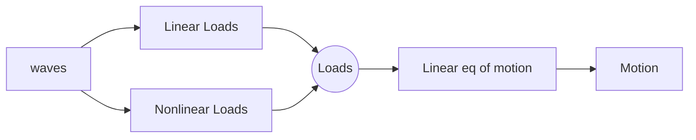
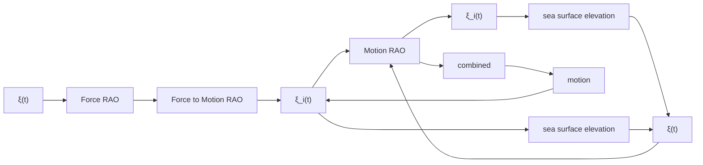

# Sea keepi ng Models i n the Freq uency Doma i n

## ( M od u l e 6)

## D r T ri sta n P e rez

Centre for Com plex Dynam ic Systems a nd Control (C DSC)

## P rof. Thor I Fosse n

De pa rtme nt of E ng i n ee ri ng Cybernetics

THE UNIVERSITY OF NEWCASTLE

AUSTRALIA

NTNU

Det skapende universitet

## Li nea r hyd rodyna m ic forces i n waves

„ Li nea r theory ca n d escri be hyd rodyna m ic loads to a g reat extent i n low to med i u m sea states (d e pe nd i ng on the size of the sh i p)  
„ Li n ea r mea ns that the loads a nd the motion a re proportiona l to the wave am pl itudes .  
„ Li nearity mea ns su perposition : the loads and responses d u e to i rreg u la r seas ca n be obta i ned by l i nea r com b i nation of responses to reg u l a r or s i n usoid a l seas .  
„ Also d u e to the l i n ea rity assu m ption , the stu dy ca n be pe rformed e ithe r i n ti me or freq u e n cy doma i n .

## Li nea r hyd rodyna m ic forces

Some of the loads d e pe nd on the excitation d u e to the waves , wh i l e othe r d e pe nd on the motion of the vessel i ts e l f .

The second type of loads g ive the system a feed back stru ctu re .

## Add i ng non l i nea r forces

O n ce we have a l i n ea r ti me-doma i n mod el , non l i n ea r loads ca n be ad d ed d u e to the assu m ption of force su pe rposition :

flowchart

So , the l i n ea r mod el shou ld not be see n as a l i m itation ; rathe r as a bas is u pon wh i ch we ca n bu i ld non l i n ea r mod els based on the assu m ption of force su perposition .

## Li nea r hyd rodyna m ic a na lysis

D u e to l i n ea rity, we ca n stu dy the probl e m for si n usoid a l excitation a nd the n use these resu lts to obta i n sol utions to non-si n usoid a l cases via su pe rposition .

The hyd rodyna m ic problem of obta i n i ng loads a nd motion for si n usoid al waves ca n be separated i nto two su b-problems :

„ Excitation probl e m : The sh i p is restra i n ed from movi ng a nd ke pt i n its mea n position , a nd the excitation loads a re obta i n ed as a resu lt of cha nges i n pressu re d u e to the i n com i ng waves .  
„ Rad iation probl e m : The sh i p is forced to osci l l ate i n ca l m wate r i n each DO F with a freq u e n cy eq u a l to the wave excitation freq u e n cy.

## Rad iation fo rces

Rad i ation loads a p pea r d u e to th e motion of th e s h i p— th e ch a ng e i n mome ntu m of th e fl u id d u e to th e motion of th e h u l l ch a ng es th e p ressu re on th e h u l l , wh i ch i nd u ce th e loads .

These loads have two com ponents

P roportiona l to the accel e rations  
P roportiona l to the velocities

## Rad iation fo rces

Bou nd a ry cond itions :

$$
\frac {\partial^ {2} \Phi}{\partial t ^ {2}} + g \cdot \frac {\partial \Phi}{\partial z} = 0 \quad \text {for:} z = 0
$$

$$
\frac {\partial \Phi}{\partial z} = 0 \quad \text {for:} z = - h
$$

$$
\frac {\partial \Phi}{\partial n} = v _ {n} (x, y, z, t)
$$

Reg u l ar outgoi ng waves are observed at l arge d istance from the vessel

$$
\Phi_ {r a d} = \sum_ {j = 1} ^ {6} \Phi_ {j}
$$

free su rface cond ition (dyn a m i c+ ki n e mati c cond iti ons)

sea bed cond ition

dynam ic body cond ition

rad i ation cond ition

natural_image

Diagram of a mechanical or electrical component with no visible text or symbols

text_image

Floating body
S
∇²Φrad = 0
R
S*
φ → 0
R → ∞

## Com puti ng forces

Forces and moments are obtai ned by i nteg rati ng th e p ressu re ove r th e ave rag e wetted su rface Sw:

Rad iation forces and moments :

$$
\tau_ {r a d, i} = \left\{ \begin{array}{l l} - \iint_ {S w} \left(\frac {\partial \Phi_ {r a d}}{\partial t}\right) (\mathbf {n}) _ {i} d s & i = 1, 2, 3. \\ - \iint_ {S w} \left(\frac {\partial \Phi_ {r a d}}{\partial t}\right) (\mathbf {r} \times \mathbf {n}) _ {i - 3} d s & i = 4, 5, 6. \end{array} \right. \quad \begin{array}{l} \text {DOF:} \\ \text {1 - surge} \\ \text {2 - sway} \\ \text {3 - heave} \\ \text {4 - roll} \\ \text {5 - pitch} \\ \text {6 - yaw} \end{array}
$$

## Rad iation forces fo r reg u l a r motion

I f th e m oti o n of th e vesse l o n th e D O F i i s h a rm o n i c :

natural_image

Diagram of a mechanical or electrical component with no visible text or symbols

$$
\xi_ {i} = \overline {{\xi}} \cos (\omega t)
$$

Th e n , afte r i nteg rati ng th e p ressu re ove r th e su rface of th e h u l l , th e rad i ati o n fo rces i n th e D O F j d u e to th e m oti o n i n th e D O F i ta ke th e fo l l owi n g fo rm :

$$
\tau_ {r a d, j} = - A _ {i j} (\omega) \ddot {\xi} _ {i} - B _ {i j} (\omega) \dot {\xi} _ {i}
$$

← O n ly i n steady state cond ition .

## Rad iation forces fo r reg u l a r motion

$$
\tau_ {r a d, j} = - A _ {i j} (\omega) \ddot {\xi} _ {i} - B _ {i j} (\omega) \dot {\xi} _ {i}
$$

„ The coeffi cie nts that m u lti ply the accel e rations a re ca l l ed ad d ed mass coeffi cie nts eve n thoug h not a l l of the m have u n its of mass . The add ed mass terms g ive the forces d u e to the accel e rations of the fl u id as the vessel osci l l ations—the w h o l e fl u i d w i l l os c i l l ate w i t h d i ffe re n t fl u i d p a rt i c l e a m pl itu d es .

„ The coeffi cie nts proportiona l to the velocities a re ca l l ed pote ntia l d a m p i ng coeffi cie nts . Th e pote ntia l d a m p i ng te rms represent the energy carried away by the waves generated d u e to th e m oti o n of th e h u l l .

## Added mass a nd da m pi ng

Exam ple of added mass and pote ntial d a m pi ng i n heave of a sym metri c recta ng u l a r barge 8x4x45m :

line

| Freq [rad/s] | A33 [Kg] (x 10^7) |
| --- | --- |
| 0 | ~8.0 |
| ~0.2 | ~8.4 |
| ~0.5 | ~5.5 |
| 1 | ~3.8 |
| 2 | ~4.5 |
| 3 | ~4.7 |
| 4 | ~4.7 |
| 5 | ~4.7 |
| 6 | ~4.7 |

The added mass and dam pi ng coeffi cie nts d e pe nd on

S ha pe of the h u l l  
Forward speed  
„ Water depth

line

| Freq [rad/s] | B33 [N s/m] (x 10^6) |
| --- | --- |
| 0 | 0 |
| ~0.6 | ~16.5 |
| 1 | ~8.5 |
| 2 | ~0.5 |
| 3 | 0 |
| 4 | 0 |
| 5 | 0 |
| 6 | 0 |

## Sym metry

„ There is a total of 36 add ed mass a nd 36 d a m pi ng coeffi ci e n ts .  
„ If the stru ctu re has ze ro speed a nd a pl a n e of sym metry, h a l f of th e coeffi ci e n ts a re ze ro . (fo r th i s to h o l d wi th fo rwa rd speed , the pl a n e of sym metry has to be pa ra l l el to the fo rwa rd d i re ct i o n . )  
„ If th e stru ctu re has ze ro s peed a nd th e re is no cu rre nt, th e n the matrices of add ed mass a nd d a m pi ng are sym metric:

$$
A _ {i j} (\omega) = A _ {j i} (\omega)
$$

$$
B _ {i j} (\omega) = B _ {j i} (\omega)
$$

## Restori ng forces ( l i n ea r)

Th e resotri ng forces a re d u e to cha nges i n d is pl ace me nt:

$$
\boldsymbol {\tau} _ {r e s t} = \mathbf {g} (\boldsymbol {\eta}) \approx \mathbf {G} \boldsymbol {\eta}
$$

text_image

Mt-Trans. Metacentre
GMt
ξ4 = φ
CG
Water level
ρg∇
GZ
CB

$$
\mathbf {G} = \mathbf {G} ^ {\top} = \left[ \begin{array}{c c c c c c} 0 & 0 & 0 & 0 & 0 & 0 \\ 0 & 0 & 0 & 0 & 0 & 0 \\ 0 & 0 & - Z _ {z} & 0 & - Z _ {\theta} & 0 \\ 0 & 0 & 0 & - K _ {\phi} & 0 & 0 \\ 0 & 0 & - M _ {z} & 0 & - M _ {\theta} & 0 \\ 0 & 0 & 0 & 0 & 0 & 0 \end{array} \right] > 0
$$

$$
\begin{array}{l} - Z _ {z} = \rho g A _ {w p} (0) (A _ {w p} \text {waterplane area}) \\ - Z _ {\theta} = \rho g \int \int_ {A _ {w p}} x d A \\ - M _ {z} = - Z _ {\theta} \\ - K _ {\phi} = \rho g \nabla (z _ {g} - z _ {g}) + \rho g \int \int_ {A _ {w p}} y ^ {2} d A = \rho g \nabla \overline {{G M}} _ {T} \\ - M _ {\theta} = \rho g \nabla (z _ {g} - z _ {b}) + \rho g \int \int_ {A _ {w p}} x ^ {2} d A = \rho g \nabla \overline {{G M}} _ {L} \\ \end{array}
$$

These are com puted for cal m water—Cal m water stabi l ity.

## Li nea r Wave Excitation

natural_image

Simple line drawing of a person sitting on a platform with tools, no text or symbols present

„ Th e l i n ea r wave excitation or 1 st ord e r waves excitation a re th e loads on th e stru ctu re wh e n it is restra i n ed from osci l l ati ng a nd th e re a re i n cid e nt waves . The l i nea r assu m ption assu mes the loads a re p roportion a l to th e wave a m p l itu d e .

„ 1 st ord er wave loads a re se pa rated i nto two com pone nts :

F ro u d e- Kri l off  
D i ffra cti o n

## Froude- Kri l off loads

natural_image

Simple line drawing of a person sitting at a desk with tools and a lamp (no text or symbols)

The F roud e-Kri loff loads a re obta i ned by i nteg rati ng the pressu re d u e to u nd istu rbed wave field over the mean wetted su rface of the body—I t is assu med that the body does not d istu rb the wave field .

These ca n be consid ered with i n a non l i nea r fra mework by i nteg rati ng ove r the i nsta nta n eous wette r su rface .

## D iffra cti o n loads

natural_image

Simple line drawing of a person sitting at a desk with tools and a lamp (no text or symbols)

„ Th e d iffraction loads a p pea r d u e to th e ch a ng e i n th e wave fi e ld by th e p rese n ce of th e body.

„ Th ese ca n be com puted i n a s i m i l a r way as th e rad i ation forces by cons id e ri ng a BVP ; th e ma i n d iffe re n ce is th at th e bou nd a ry cond ition on th e body:

The velocity d u e to the d iffraction pote ntia l has to be eq u a l a nd op posite to the velocity d u e to u nd istu rbed wave pote ntia l .

Th is body cond ition e nsu res th e re wi l l be no fl u id tra nsport th roug h the body.

## RAOs—Freq uency response fu nctions

flowchart

## Force RAO

For a reg u lar wave

$$
\zeta = \overline {{\zeta}} \cos (\omega t + \varphi_ {\zeta})
$$

Th e l i n ea r excitati o n fo rces wi l l be

$$
\tau_ {e x c, i} = \overline {{\tau}} _ {i} (\omega) \cos [ \omega t + \varphi_ {\tau i} (\omega) ]
$$

The a m pl itu d e a nd p hase of the excitation force d e pe nd on

„ E n co u nte r a n g l e (wave freq , vessel speed , head i ng relative to waves)  
Wave am pl itude  
„ Forward speed

## Force RAO

$$
\tau_ {e x c, i} (t) = \underbrace {\bar {\zeta} \left| F _ {i} (j \omega) \right|} _ {\bar {\tau} _ {i} (\omega)} \cos (\omega t + \underbrace {\varphi_ {\zeta} + \arg [ F _ {i} (j \omega) ]} _ {\varphi_ {\tau , i} (\omega)})
$$

Exam ple heave Force RAO (i=3 ) for a barge (8x4x45m ) :

## Motion RAO

$$
\xi_ {i} (t) = \underbrace {\bar {\zeta} \left| H _ {i} (j \omega) \right|} _ {\bar {\xi} _ {i} (\omega)} \cos (\omega t + \underbrace {\varphi_ {\zeta} + \arg [ H _ {i} (j \omega) ]} _ {\varphi_ {\xi , i} (\omega)})
$$

Exam ple motion Force RAO (i=3 ) for a barge (8x4x45m ) :

## Force to motion FRF

U si ng the ad d ed mass a nd d a m p i ng with the l i n ea r (sea kee p i ng ) eq u ation of motion we ca n obta i n the force to motion freq u e n cy response fu n ction :

$$
[ - \omega^ {2} [ \mathbf {M} _ {R B} + \mathbf {A} (\omega) ] + j \omega \mathbf {B} (\omega) + \mathbf {G} ] \widetilde {\boldsymbol {\xi}} = \widetilde {\boldsymbol {\tau}} _ {e x c}
$$

Th is is someti mes writte n i n the hyd rodyna m i c l ite ratu re as

$$
[ \mathbf {M} _ {R B} + \mathbf {A} (\omega) ] \ddot {\boldsymbol {\xi}} (t) + \mathbf {B} (\omega) \dot {\boldsymbol {\xi}} (t) + \mathbf {G} \boldsymbol {\xi} (t) = \boldsymbol {\tau} _ {e x c} (t)
$$

Th i s i s a n a b u se of n otati o n s i n ce th i s i s n ot a tru e eq u ati o n of m oti o n ; it i s a d iffe re nt (rathe r confusi ng ) way to write the freq u e n cy response fu n ction .

## Force to motion FRF

Th e n we ca n d efi n e th e force to motion freq u e n cy response matrix:

$$
\mathbf {G} (j \omega) := [ - \omega^ {2} [ \mathbf {M} _ {R B} + \mathbf {A} (\omega) ] + j \omega \mathbf {B} (\omega) + \mathbf {G} ] ^ {- 1}
$$

$$
= \left[ \begin{array}{c c c c} G _ {1 1} (j \omega) & G _ {1 2} (j \omega) & \dots & G _ {1 6} (j \omega) \\ G _ {2 1} (j \omega) & G _ {2 2} (j \omega) & \dots & G _ {2 6} (j \omega) \\ \vdots & \vdots & \ddots & \vdots \\ G _ {6 1} (j \omega) & G _ {6 2} (j \omega) & \dots & G _ {6 6} (j \omega) \end{array} \right]
$$

## Motion RAO

„ The Force RAO relates the wave el evation to the l i n e a r exc i tati o n fo rces .  
„ By com b i n i ng th e Force RAO with th e Force to motion freq u e n cy res ponse matrix we obta i n th e motion freq u e n cy response d u e to wave el evation or M otion RAO :

$$
\mathbf {H} (j \omega) := \mathbf {G} (j \omega) \mathbf {F} (j \omega)
$$

$$
\mathbf {H} (j \omega) = \left[ H _ {1} (j \omega), H _ {2} (j \omega) \dots , H _ {6} (j \omega) \right] ^ {T}
$$

$$
\mathbf {F} (j \omega) = \left[ F _ {1} (j \omega), F _ {2} (j \omega) \dots , F _ {6} (j \omega) \right] ^ {T}
$$

## Statistics of Loads a nd Motion

„ S i n ce the wave el evation is assu med a ze ro-mea n Gaussia n process a nd the syste m is assu med l i nea r, the loads a nd the response a re also zero-mea n a nd Gaussia n processes .  
„ Th e s pectra of loads a nd res ponse is a l l that is need ed to com pute a ny statisti cs :

$$
S _ {\tau \tau , i} (\omega) = \left| F _ {i} (j \omega) \right| ^ {2} S _ {\zeta \zeta} (\omega)
$$

$$
S _ {\xi \xi , i} (\omega) = \left| H _ {i} (j \omega) \right| ^ {2} S _ {\zeta \zeta} (\omega)
$$

## Si m u lation of wave loads a nd motion ti me series

H avi ng the spectru m , we ca n si m u l ate ti me se ries of loads a nd motion i n the sa me way we do it for the wave el evation :

$$
\tau_ {i} (t) = \sum_ {n} \sum_ {m} \overline {{\tau}} _ {n m i} \cos \left[ \omega_ {e, n} t + \varphi_ {n m i} + \varepsilon_ {n} \right]
$$

$$
\overline {{\tau}} _ {n m i} = \sqrt {2 \left| F _ {i} (j \omega_ {n} ^ {*} , U , \chi_ {m} ^ {*}) \right| ^ {2} S _ {\zeta \zeta} (j \omega_ {n} ^ {*} , \chi_ {m} ^ {*}) \Delta \omega \Delta \chi}
$$

$$
\varphi_ {n m i} = \arg F _ {i} (j \omega_ {n} ^ {*}, U, \chi_ {m} ^ {*}) \quad \omega_ {e, n} = \left(\omega_ {n} ^ {*} - \frac {\left(\omega_ {n} ^ {*}\right) ^ {2} U}{g} \cos \chi_ {m} ^ {*}\right)
$$

$$
\omega_ {n} ^ {*} \in \left[ \omega_ {n} - \Delta \omega / 2, \omega_ {n} + \Delta \omega / 2 \right]
$$

$$
\chi_ {m} ^ {*} \in \left[ \chi_ {m} - \Delta \chi / 2, \chi_ {m} + \Delta \chi / 2 \right]
$$

nε - u n i fo rm l y d i stri b u ted i n [ 0 , 2 π ]

## Non- l i nea r wave loads

„ There are some problems related to wave-stru ctu re i nte ractions wh i ch ca n not be d escri bed by l i n ea r Theory a l o n e .  
„ The non l i near problems attem pt to d escri be more accu rately the free-su rface a nd body cond itions on the i nsta nta n eous rath e r tha n mea n va l u es .  
„ A conve n ie nt way to solve non l i n ea r wave-stru ctu re p rob l e ms is by us i ng pe rtu rbation a n a lys is .  
„ I n a second ord e r theory, the probl e ms a re solved u p second-ord e r i n i n cid e nt wave a m pl itu d e—i . e . , i n the pote ntia l a nd p ressu re te rms p roportion a l to th e wave am pl itude and wave am pl itude sq uare are considered .

## Non- l i nea r wave loads

The effects of second-ord er loads a re i m porta nt for stru ctu res wh i ch a re ke pt i n pos ition by moori ng l i n es , a n chors , a nd p ropu ls ion syste ms , a nd for vessels fol lowi ng trajectories .

The sol ution of a second ord er probl e m evidences

M ean wave d rift force  
S lowly-va ryi ng wave d rift force (su b ha rmon i c)  
„ Ra p id ly va ryi ng wave d rift force (su pe r ha rmon i c)

## Evidence of second-order loads

A si m pl e way to evid e n ce the effects of a second ord er p ro b l e m i s to l o o k at t h e q u a d rat i c te rm i n t h e Be rnou l l i eq u ation :

$$
p + \rho g z + \rho \frac {\partial \phi}{d t} + \frac {\rho}{2} \nabla \phi \cdot \nabla \phi = C
$$

Th e n ,

$$
\nabla \phi \cdot \nabla \phi = V _ {1} ^ {2} + V _ {2} ^ {2} + V _ {3} ^ {2}
$$

# Evidence of second-order loads

## Consid er the case where

$$
V _ {1} = A _ {1} \cos (\omega_ {1} t) + A _ {2} \cos (\omega_ {2} t)
$$

Th e n ,

$$
\begin{array}{l} V _ {1} ^ {2} = \frac {A _ {1} ^ {2}}{2} + \frac {A _ {2} ^ {2}}{2} \quad \begin{array}{c} \text {Mean components} \\ \text {rapidly varying components} \end{array} \\ + \frac {A _ {1} ^ {2}}{2} \cos (2 \omega_ {1} t) + \frac {A _ {2} ^ {2}}{2} \cos (2 \omega_ {2} t) \\ + A _ {1} A _ {2} \cos [ (\omega_ {1} - \omega_ {2}) t ] + A _ {1} A _ {2} \cos [ (\omega_ {1} + \omega_ {2}) t ] \\ \end{array}
$$

S lowly varyi ng com ponent

These g ive rise to $2 ^ { \mathsf { n d } }$ ord er pressu re force com pone nts !

## Non - l i nea r wave load effects

„ M ea n wave-d rift force : Dete rm i n e the eq u i l i b ri u m position of the moored syste m (togethe r with wi nd a nd cu rre nt) . They a re i m porta nt for the d esig n of moori ng l i n es a nd propu lsion syste ms for dyna m i c position i ng .  
„ S lowly-va ryi ng wave-d rift force : The forces have freq u e n cies m u ch slowe r tha n the wave el evation . These ca n excite resona nt mod es i n the horizonta l position of the moored vessel . Typical resona nce periods i n offshore st ru ctu re s a re 1 to 2 m i n .  
„ Ra pid ly-va ryi ng wave-d rift force : these forces have freq u e n cy com pon e nts wh i ch a re h ig he r tha n the wave el evation freq u e n cy. These ca n excite stru ctu ra l resona nt mod es : periods 2 to 4s .

## Exa m ple ( Pi n kster 1979)

text_image

WAVES
200 KTDW
X3
X1
X5

[Source: Pinkster,1979]

line

| Time (s) | \(\zeta (m)\) | SURGE (m) | HEAVE (m) | PITCH (deg) |
| --- | --- | --- | --- | --- |
| 0 | ~0 | ~-25 | ~0 | ~0 |
| 250 | ~0 | ~15 | ~0 | ~0 |
| 500 | ~0 | ~-30 | ~0 | ~0 |
| 750 | ~0 | ~25 | ~0 | ~0 |
| 1000 | ~0 | ~-30 | ~0 | ~0 |
| 1250 | ~0 | ~15 | ~0 | ~0 |
| 1500 | ~0 | ~-15 | ~0 | ~0 |
| 1750 | ~0 | ~5 | ~0 | ~0 |

## Second order FRF

For slowly va ryi ng wave-d rift forces , th e second ord e r pote nti a l is n eed ed .  
„ With th e second ord e r pote ntia l , th e second ord e r F RF be com puted :

$$
T _ {j k} ^ {i c} (\omega_ {j}, \omega_ {k}) \qquad T _ {j k} ^ {i s} (\omega_ {j}, \omega_ {k})
$$

$$
F _ {i} ^ {S V} = \sum_ {j = 1} ^ {N} \sum_ {k = 1} ^ {N} \zeta_ {j} \zeta_ {k} [ T _ {j k} ^ {i c} \cos ([ \omega_ {j} - \omega_ {k} ] t + [ \varepsilon_ {j} - \varepsilon_ {k} ])
$$

$$
+ T _ {j k} ^ {i s} \sin ([ \omega_ {j} - \omega_ {k} ] t + [ \varepsilon_ {j} - \varepsilon_ {k} ])) ]
$$

## Hyd rodyna m ic Codes

## The worki ng pri n ci pl e of al l cod es :

## References

„ Falti nsen , O . M . ( 1 990) Sea Loads on S h i ps and Ocean Structu res . Cam bridge U n iversity Press .  
„ J o u rn ée , J . M . J . a n d W . W . M ass i e (200 1 ) Offs h o re Hyd romechan ics . Lectu re notes on offshore hyd romecha n i cs for Offshore Tech nology stud e nts , cod e OT4620 . (http ://www. ocp .tu d elft. n l/mt/jou rn ee/)  
„ Perez, T . a nd T . I . Fosse n (2006 ) “Ti me-doma i n Models of Mari ne S u rface Vessels Based on Seakeepi ng Com putations . ” 7th I FAC Conference on M a noeuvri ng a nd Control of M a ri ne Vessels M C M C , Portugal , Septem ber.