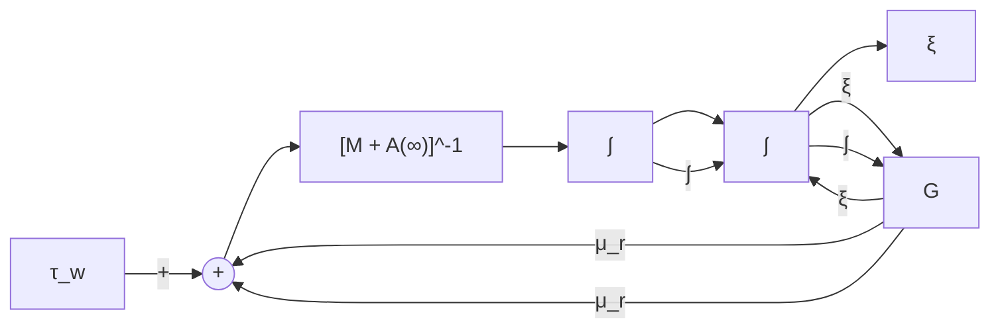
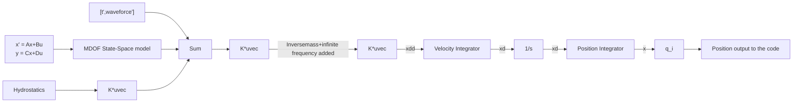

# Pa ra metric Ti me-doma i n models based on freq uency-doma i n data

( M od u l e 7)

## D r T ri sta n P e rez

Centre for Com plex Dynam ic Systems a nd Control (C DSC)

THE UNIVERSITY OF

NEWCASTLE

AUSTRALIA

## P rof. Thor I Fosse n

De pa rtme nt of E ng i n ee ri ng Cybernetics

NTNU

Det skapende universitet

## Ti me-doma i n model l i ng a pproaches

Two approaches can be d isti ng u ished for ti medoma i n mod el l i ng :

„ F u l l ti me-domai n hyd rodynam ic cod es ,  
Ti me-domai n models based on freq uencydomai n data .

H ere , we wi l l focus on the second approach .

## Freq uency-doma i n Eq . of Motion

I n th e hyd rodyn a m i c l ite ratu re it i s co m m o n to fi n d th e fo l l owi n g m o d e l :

$$
[ \mathbf {M} _ {R B} + \mathbf {A} (\omega) ] \ddot {\boldsymbol {\xi}} (t) + \mathbf {B} (\omega) \dot {\boldsymbol {\xi}} (t) + \mathbf {G} \boldsymbol {\xi} (t) = \boldsymbol {\tau} _ {e x c} (t)
$$

„ Th is is n ot a true ti me-doma i n mod e l (Cu m m i ns , 1 962 )  
„ Th is is val id to d escri be the steady-state response to si n usoid al excitations—i . e . , Freq uency Response :

$$
\widetilde {\pmb {\xi}} = \underbrace {\left(- \omega^ {2} [ \mathbf {M} _ {R B} + \mathbf {A} (\omega) ] + j \omega \mathbf {B} (\omega) + \mathbf {G}\right) ^ {- 1}} _ {\text {Force to Motion RAO}} \widetilde {\pmb {\tau}} _ {e x c}
$$

\~ denotes com plex variable

## Cu m m i ns’s eq uation

Cu m m i ns ( 1 962 ) , took a d iffe re nt mod el l i ng a p proach a nd co n s i d e r th e rad i ati o n p ro b l e m ab initio i n th e ti m e d o m a i n :

$$
\left[ \mathbf {M} + \mathbf {A} \right] \ddot {\boldsymbol {\xi}} + \int_ {0} ^ {t} \mathbf {K} (t - \tau) \dot {\boldsymbol {\xi}} (\tau) d \tau + \mathbf {G} \boldsymbol {\xi} = \boldsymbol {\tau} _ {w}
$$

„ The add ed mass matrix is consta nt—freq u en cy a nd speed i nd epend ent.  
The convol ution te rm accou nts for fl u id-me mory effects .  
„ Th e ke rn el of th e convol ution is a matrix of reta rd ation fu n ctions or i m pu lse responses .  
„ Th is is a tru e l i n ea r ti me-doma i n mod el .

## Cu m m i ns’s eq uation with forwa rd speed

$$
\left[ \mathbf {M} + \mathbf {A} \right] \ddot {\pmb {\xi}} + \mathbf {B} (U) \dot {\pmb {\xi}} + \int_ {0} ^ {t} \mathbf {K} (t - \tau , U) \dot {\pmb {\xi}} (\tau) d \tau + \left[ \mathbf {G} + \mathbf {G} ^ {\prime} (U) \right] \pmb {\xi} = \pmb {\tau} _ {w}.
$$

„ The convol ution terms d e pe nd on the forwa rd speed .  
„ With forward speed a ppears a consta nt d a m pi ng te rm .  
„ The restori ng forces are affected by hyd rodyna m ic p ressu re—Lift, cha nges i n tri m . ( U su a l ly ig nored for Fn <0 . 3)

## Og i lvie’s relations

I f C u m m i n s ’ s Eq u ati o n i s va l i d fo r a ny i n p ut, it m u st th e n b e va l i d fo r s i n u s o i d s i n p a rt i c u l a r ( O g i l v i e , 1 9 64 ) .

Og i lvie ( 1 964 ) tra nsformed the Cu m m i ns’ Eq u ation to the freq u e n cy doma i n , a nd fou nd that

$$
\mathbf {A} (\omega) = \mathbf {A} - \frac {1}{\omega} \int_ {0} ^ {\infty} \mathbf {K} (t) \sin (\omega t) d t
$$

$$
\mathbf {B} (\omega) = \mathbf {B} (U) + \int_ {0} ^ {\infty} \mathbf {K} (t) \cos (\omega t) d t
$$

From the Rieman n-Lesbesg ue Lem ma :

$$
\mathbf {A} = \lim _ {\omega \rightarrow \infty} \mathbf {A} (\omega) := \mathbf {A} (\infty)
$$

$$
\mathbf {B} (U) = \lim _ {\omega \rightarrow \infty} \mathbf {B} (\omega) := \mathbf {B} (\infty)
$$

## Non - pa ra metric Representations

Ti me-domai n

$$
\mathbf {K} (t) = \frac {2}{\pi} \int_ {0} ^ {\infty} [ \mathbf {B} (\omega) - \mathbf {B} (\infty) ] \cos (\omega t) d \omega
$$

Freq uency-domai n

$$
\mathbf {K} (j \omega) = [ \mathbf {B} (\omega) - \mathbf {B} (\infty) ] + j \omega [ \mathbf {A} (\omega) - \mathbf {A} (\infty) ]
$$

## Pa ra metric Representations

Beca use th e convol ution is a dyn a m i c l i n ea r ope ration , it ca n be re p rese nted by a l i n ea r ord i n a ry d iffe re ntia l eq uation—state-space model :

$$
\boldsymbol {\mu} _ {r} = \int_ {0} ^ {\infty} \mathbf {K} (t - \tau) \dot {\boldsymbol {\xi}} (\tau) d \tau
$$

$$
\dot {\mathbf {x}} = \mathbf {A} _ {c} \mathbf {x} + \mathbf {B} _ {c} \dot {\boldsymbol {\xi}}
$$

$$
\boldsymbol {\mu} _ {r} = \mathbf {C} _ {c} \mathbf {x}
$$

$$
\mathbf {x} = \left[ \begin{array}{c} x _ {1} \\ x _ {2} \\ \vdots \\ x _ {n} \end{array} \right]
$$

## Pa ra metric Representations

F rom th e state-s pace re p rese ntation , it fol low

I m pu lse Response

$$
\mathbf {K} (t) = \mathbf {C} _ {c} \exp (\mathbf {A} _ {c} t) \mathbf {B} _ {c}
$$

F req u e n cy-d oma i n mod e l (Tra nsfe r F u n ction matrix)

$$
\mathbf {K} (s) = \mathbf {C} _ {c} (s \mathbf {I} - \mathbf {A} _ {c}) \mathbf {B} _ {c} = \left[ \begin{array}{c c c} \frac {P _ {1 1} (s)}{Q _ {1 1} (s)} & \dots & \frac {P _ {1 6} (s)}{Q _ {1 6} (s)} \\ \vdots & \ddots & \vdots \\ \frac {P _ {6 1} (s)}{Q _ {6 1} (s)} & \dots & \frac {P _ {6 6} (s)}{Q _ {6 6} (s)} \end{array} \right]
$$

$$
\frac {P _ {i j} (s)}{Q _ {i j} (s)} = \frac {b _ {m} s ^ {m} + b _ {m - 1} s ^ {m - 1} + \cdots + b _ {0}}{s ^ {n} + q _ {n - 1} s ^ {n - 1} + \cdots + q _ {0}}
$$

Rational TF

## Convol ution replacement

„ Th e convol ution (non-pa ra metri c mod e l ) i n th e Cu m m i ns eq u ation ca n be ti me a nd me mory consu m i ng for s i m u lation .  
For a n a lys is a nd d es ig n of a control syste m , th e convol utions a re not ve ry we l l su ited .  
„ The pa ra metri c state-space re prese ntation of a p p rop riate ord e r (n-ord e r) e l i m i n ates th e a bove problems .

## Convol ution replacement

flowchart

$$
\begin{array}{r l r l} \boldsymbol {\mu} _ {r} = \int_ {0} ^ {\infty} \mathbf {K} (t - \tau) \dot {\boldsymbol {\xi}} (\tau) d \tau & \Longleftrightarrow & \dot {\mathbf {x}} = \mathbf {A} _ {c} \mathbf {x} + \mathbf {B} _ {c} \dot {\boldsymbol {\xi}} \\ & & \boldsymbol {\mu} _ {r} = \mathbf {C} _ {c} \mathbf {x} \end{array}
$$

## Properties of the convol ution terms

<table><tr><td>Property</td><td>Implication on parametric models</td></tr><tr><td> $\lim_{\omega \to 0} \mathbf{K}(j\omega) = -\mathbf{B}(\infty)$ </td><td> $\mathbf{K}(s)$  is zero at s=0 for U=0.</td></tr><tr><td> $\lim_{\omega \to \infty} \mathbf{K}(j\omega) = \mathbf{0}$ </td><td>TFs strictly proper</td></tr><tr><td> $\mathbf{K}(t = 0^{+}) = \int_{0}^{\infty} [\mathbf{B}(\omega) - \mathbf{B}(\infty)] d\omega \neq \mathbf{0}$ </td><td>TFs relative degree 1</td></tr><tr><td> $\lim_{t \to \infty} \mathbf{K}(t) = \mathbf{0}$ </td><td>TF BIBO stable</td></tr><tr><td> $\text{Re}\{K_{ii}(j\omega)\} \geq 0$ </td><td> $\mathbf{K}(s)$  is passive =&gt; diagonal terms are positive real; off diagonal terms stable.</td></tr></table>

N ote : Bold sym bols denote matrices .

## Low-freq uency l i m i t ( U = 0 )

$$
\mathbf {K} (j \omega) = [ \mathbf {B} (\omega) - \mathbf {B} (\infty) ] + j \omega [ \mathbf {A} (\omega) - \mathbf {A} (\infty) ]
$$

I n t h e l i m i t at l ow fre q , B ( ω ) i s ze ro , s i n ce t h e re ca n n ot be waves ( Fa lti nse n , 1 990 ) ; th us the rea l pa rt is ze ro fo r U = 0 a n d - B ( ∞ ) fo r U > 0 .

Th e i mag i n a ry pa rt te nds to ze ro as th e fol lowi ng d i ffe re n ce i s fi n i te :

$$
\mathbf {A} (0) - \mathbf {A} (\infty) = \lim _ {\omega \rightarrow 0} \frac {- 1}{\omega} \int_ {0} ^ {\infty} \mathbf {K} (t) \sin (\omega t) d t = - \int_ {0} ^ {\infty} \mathbf {K} (t) \lim _ {\omega \rightarrow 0} \frac {\sin (\omega t)}{\omega} d t = - \int_ {0} ^ {\infty} \mathbf {K} (t) d t
$$

N ote that reg u l a rity cond itions for the excha nge of l i m it a nd i nteg ration a re satisfied .

## H ig h-freq uency l i m i t ( U = 0 )

$$
\mathbf {K} (j \omega) = [ \mathbf {B} (\omega) - \mathbf {B} (\infty) ] + j \omega [ \mathbf {A} (\omega) - \mathbf {A} (\infty) ]
$$

I n t h e l i m i t at h i g h fre q u e n cy , t h e re a l p a rt i s ze ro .

Th e i mag i na ry pa rt a lso te nds to ze ro by Og i lvie’s relation and Rieman n-Lebesg ue Lem ma :

$$
\lim _ {\omega \rightarrow \infty} \omega [ \mathbf {A} (0) - \mathbf {A} (\infty) ] = \lim _ {\omega \rightarrow \infty} \int_ {0} ^ {\infty} - \mathbf {K} (t) \sin (\omega t) d t = \mathbf {0}
$$

## I n i ti a l a nd fi n a l ti m e ( U = 0)

## I n i t i a l t i m e :

$$
\lim _ {t \to 0 ^ {+}} \mathbf {K} (t) = \lim _ {t \to 0 ^ {+}} \frac {2}{\pi} \int_ {0} ^ {\infty} [ \mathbf {B} (\omega) - \mathbf {B} (\infty) ] \cos (\omega t) d \omega = \frac {2}{\pi} \int_ {0} ^ {\infty} [ \mathbf {B} (\omega) - \mathbf {B} (\infty) ] d \omega \neq \mathbf {0}
$$

„ Reg u l a rity cond itions for the excha nge of l i m it a nd i nteg ration a re satisfied .  
„ The l ast rel ation fol lows from e n e rgy consid e rations ( Fa lti nse n , 1 990 ) :

## F i n a l t i m e :

$$
\lim _ {t \rightarrow \infty} \mathbf {K} (t) = \lim _ {t \rightarrow \infty} \frac {2}{\pi} \int_ {0} ^ {\infty} [ \mathbf {B} (\omega) - \mathbf {B} (\infty) ] \cos (\omega t) d \omega = \mathbf {0}
$$

Wh ich fol lows by Og i lvie’s relation a nd Riema n n-Lebesg u e Lem ma .

## Passivity

For U =0 a nd no cu rre nt, the d a m p i ng matrix is sym metri c a nd positive se m i-d efi n ite :

$$
\boldsymbol {B} (\omega) = \boldsymbol {B} ^ {T} (\omega) \geq 0
$$

F rom th is fol lows the positive rea l n ess of the convol ution te rms a nd th us the passivity; that is these te rms ca n not ge n e rate e n e rgy.

F rom e n e rgy cons id e rations , it a lso fol lows that the d iagonal terms of K(s) a re passive .

## Pa ra metric model identification

Th e convol ution re p l ace me nt ca n be posed i n d iffe re nt ways , wh i ch i n “th eory” s hou ld p rovid e th e sa me a nswer:

$$
\mathbf {B} (\omega) \quad \Longrightarrow \quad \mathbf {K} (t) \quad \Longrightarrow \quad \left[ \begin{array}{c c} \hat {\mathbf {A}} _ {c} & \hat {\mathbf {B}} _ {c} \\ \hat {\mathbf {C}} _ {c} & \hat {\mathbf {D}} _ {c} \end{array} \right]
$$

$$
\mathbf {A} (\omega), \mathbf {B} (\omega) \quad \Longrightarrow \quad \mathbf {K} (j \omega) \quad \Longrightarrow \quad \hat {\mathbf {K}} (s) \quad \Longrightarrow \quad \left[ \begin{array}{c c} \hat {\mathbf {A}} _ {c} & \hat {\mathbf {B}} _ {c} \\ \hat {\mathbf {C}} _ {c} & \hat {\mathbf {D}} _ {c} \end{array} \right]
$$

I n practi ce on e method ca n be more favou ra bl e tha n the othe r.

## Pa ra metric model identification

D iffe re nt proposa ls have a p pea red i n the l ite ratu re :

## Ti me-d oma i n id e ntifi cation :

„ LS-fitti ng of the i m pu lse response (Yu & Fa l n es , 1 998)  
„ Rea l ization theory ( Kristia nse n & Egel a nd , 2003 )

## F req u e n cy-d oma i n id e ntifi cation :

„ LS-fitti ng of the freq u e n cy response K(j ω) (J effreys , 1 984 ) , ( Da ma re n 2 0 0 0 ) .  
„ LS-fitti ng of ad d ed mass a nd d a m p i ng (Sod i ng 1 982 ) , (Xia et. a l 1 998) , (S utu lo & G u ed es-Soares 2006) .

## Ti me-doma i n id entification

F ro m  K ( t ) to state -s p a ce m o d e l s .

## N u merica l com putations of K(t)

A key i ss u e fo r ti m e-d o m a i n i d e n ti fi cati o n i s to sta rt w i th a good i m pu lse response com puted from the dam pi ng .

„ N u merical codes can on ly provide accu rate com putations of added mass a nd d a m pi ng u p to a certa i n freq u e n cy, say Ω.  
„ Th is i ntrod u ces a n e rror i n the com putation of the reta rd ation fu n cti o n s :

$$
\mathbf {K} (t, U) = \frac {2}{\pi} \int_ {0} ^ {\Omega} [ \mathbf {B} (\omega) - \mathbf {B} (U) ] \cos (\omega t) d \omega + \frac {2}{\pi} \int_ {\Omega} ^ {\infty} [ \mathbf {B} (\omega) - \mathbf {B} (U) ] \cos (\omega t) d \omega
$$

$$
\mathbf {K} (t, U) \approx \frac {2}{\pi} \int_ {0} ^ {\Omega} [ \mathbf {B} (\omega) - \mathbf {B} (U) ] \cos (\omega t) d \omega \quad \mathbf {E r r o r} (t, U) = \frac {2}{\pi} \int_ {\Omega} ^ {\infty} [ \mathbf {B} (\omega) - \mathbf {B} (U) ] \cos (\omega t) d \omega
$$

## H ig h-freq uency va l ues of A(ω) a nd B(ω)

I n th e l i m it at h ig h freq u e n cy th e fol lowi ng te nd e n ci es are observed for the 3 D dam pi ng and added mass :

$$
B _ {i k} (\omega) \propto \frac {\alpha_ {i k}}{\omega^ {2}} \quad a s \omega \rightarrow \infty \quad A _ {i k} (\omega) - A _ {i k} (\infty) \propto \frac {\beta_ {i k}}{\omega^ {2}} \quad a s \omega \rightarrow \infty
$$

As com mented by Da maren (2000 ) , th is seems at odds with what is ge n e ra l ly stated i n the hyd rodyna m i c l ite ratu re !

N ote that the re a re no expa ns ions i nvolved to obta i n these resu lts , the on ly assu m ption is the l i n ea rity wh i ch resu lts i n a rationa l re prese ntation a nd the rel ative d eg ree 1 , wh i ch resu lts from the i nteg ration of d a m p i ng ove r the freq u e n cies .

## Exa m ple Conta i nersh i p

(Tag h i pou r et a l . , 2007a)

Vessel specifications

<table><tr><td>Quantity</td><td>Dimension</td><td>Value</td></tr><tr><td>Mass</td><td>kg</td><td>7.6656E7</td></tr><tr><td>Length overall</td><td>m</td><td>294.008</td></tr><tr><td>Beam</td><td>m</td><td>32.26</td></tr><tr><td>Height</td><td>m</td><td>24</td></tr><tr><td>Draft</td><td>m</td><td>11.75</td></tr><tr><td>Pitch gyration radius</td><td>m</td><td>69.44</td></tr><tr><td> $C_G$  coordinatesa</td><td>m</td><td>(-4.165 0 12.87)</td></tr><tr><td>Water Density</td><td>kg/m3</td><td>1025</td></tr></table>

a measured from midships and kel

natural_image

3D-rendered elongated object with segmented colored sections (green, yellow, red, blue) and a curved base, resembling a stylized boat or cable (no text or symbols)

The pa nel sizi ng was done to be a bl e to com pute freq u e n cies u p to 2 . 5 rad/s .

Ru l e of th u m b : cha racte risti c pa n el l e ngth < 1 /8 m i n wave l e ngth ( Fa lti nse n , 1 993 ) .

## N u merica l com putations

Exte n d i n g th e d a m p i n g with ta i l p ro p to 1 /ω2

natural_image

Abstract line pattern with curved and wavy lines, no text or symbols present

I n th i s exa m p l e , th e ta i l α/ω2 i s n ot a ve ry good for B35 and B53 (2 . 5 ra d /s i s too l ow) , w h e re a s i t i s o k for B33 and B55 .

## N u merica l com putations

flowchart

Someti mes it is necessary to extend the d a m pi ng with asym ptotic val u es :

line

| Freq. (rad/s) | B55 (x 10^11 Kg m^2/s) | B55 ext w^-2 (x 10^11 Kg m^2/s) |
| --- | --- | --- |
| 0 | 0 | — |
| ~0.5 | ~2.3 | — |
| 1 | ~1.7 | — |
| 2 | ~0.7 | — |
| 3 | ~0.4 | ~0.4 |
| 4 | ~0.2 | ~0.2 |
| 5 | ~0.1 | ~0.1 |
| 6 | ~0.08 | ~0.08 |
| 7 | ~0.06 | ~0.06 |
| 8 | ~0.05 | ~0.05 |
| 9 | ~0.04 | ~0.04 |

Wh e n d o i n g ti m e-d o m a i n i d e ntifi cati o n , it i s i m po rta n t to sta rt fro m a g ood a p p rox of the reta rd ation fu n ction !

$$
\mathbf {K} (t) \approx \frac {2}{\pi} \int_ {0} ^ {\Omega} \mathbf {B} _ {e x t} (\omega) \cos (\omega t) d \omega
$$

line

| time [s] | K55 (x 10^11) | K55ext (x 10^11) |
| --- | --- | --- |
| 0 | ~1.8 | ~2.5 |
| 1 | ~0.5 | ~0.5 |
| 2 | ~-0.4 | ~-0.3 |
| 3 | ~-0.3 | ~-0.4 |
| 4 | ~-0.4 | ~-0.4 |
| 5 | ~-0.2 | ~-0.3 |
| 6 | ~-0.1 | ~-0.2 |
| 7 | ~-0.1 | ~-0.1 |
| 8 | ~0.0 | ~0.0 |
| 9 | ~0.0 | ~0.0 |
| 10 | ~0.1 | ~0.1 |
| 11 | ~0.1 | ~0.1 |
| 12 | ~0.1 | ~0.1 |
| 13 | ~0.1 | ~0.1 |
| 14 | ~0.0 | ~0.0 |
| 15 | ~0.0 | ~0.0 |
| 16 | ~0.0 | ~0.0 |
| 17 | ~0.0 | ~0.0 |
| 18 | ~0.0 | ~0.0 |
| 19 | ~0.0 | ~0.0 |
| 20 | ~0.0 | ~0.0 |
| 21 | ~0.0 | ~0.0 |
| 22 | ~0.0 | ~0.0 |
| 23 | ~0.0 | ~0.0 |
| 24 | ~0.0 | ~0.0 |
| 25 | ~0.0 | ~0.0 |

N ote the d ifferences at $\scriptstyle { \mathrm { t } } = 0 ^ { + }$ ， a nd the e rrors at d iffe re nt ti me i n sta n ts .

## I m pu lse response cu rve fitti n g

G ive n the S I SO SS rea l ization of ord e r n :

$$
\dot {\mathbf {z}} (t) = \mathbf {A} ^ {\prime} (\boldsymbol {\theta}) \mathbf {z} (t) + \mathbf {B} ^ {\prime} (\boldsymbol {\theta}) u (t)
$$

$$
y (t) = \mathbf {C} ^ {\prime} (\boldsymbol {\theta}) \mathbf {z} (t),
$$

The parameters can be obtai ned from

$$
\boldsymbol {\theta} ^ {\star} = \arg \min _ {\boldsymbol {\theta}} \sum_ {i} w _ {i} \left| h (t _ {i}) - \hat {h} (t _ {i}, \boldsymbol {\theta}) \right| ^ {2}
$$

$$
\hat {h} (t, \boldsymbol {\theta}) = \hat {\mathbf {C}} ^ {\prime} (\boldsymbol {\theta}) \exp \{\hat {\mathbf {A}} ^ {\prime} (\boldsymbol {\theta}) t \} \hat {\mathbf {B}} ^ {\prime} (\boldsymbol {\theta}),
$$

The a p pl i cation of th is method to ma ri n e stru ctu res was proposed by Yu and Fal nes ( 1 998) .

## I m pu lse response cu rve fitti n g

„ I t is ha rd to g u ess the ord e r of the syste m by looki ng at the i m pu lse response a lon e—on e shou ld sta rt with lowe r ord e r a nd i n crease it to i m p rove t h e fi t .  
„ The LS-probl e m is non-l i n ea r i n the pa ra mete rs . Th is probl e m ca n be solved with Gaussia n-N ewton methods .  
„ The Ga ussia n- N ewton methods a re known to work wel l if the pa ra mete rs’ i n itia l g u ess a re close to the opti ma l pa ra mete rs .  
„ S i n ce th e i n i ti a l va l u e of th e pa ra m ete rs i s d i ffi cu l t to o bta i n fro m th e i m pu lse response , a nd these d e pe nds on the pa rti cu l a r rea l ization be i ng chose n , the method is not ve ry practi ca l .

## Rea l ization theory

A key res u l t of re a l i zati o n th eo ry i s th e fo l l owi n g factorization ( H o a nd Ka l ma n , 1 966 ) :

$$
\begin{array}{l} \mathcal {H} _ {k} = \left[ \begin{array}{c c c c} h _ {1} & h _ {2} & \dots & h _ {k} \\ h _ {2} & h _ {3} & \dots & h _ {k + 1} \\ \vdots & \vdots & & \vdots \\ h _ {k} & h _ {k + 1} & \dots & h _ {2 k - 1} \end{array} \right] \quad \leftarrow \text {Hankel matrix of the impulse response values (constant along the anti-diagonals)} \\ = \left[ \begin{array}{c} \mathbf {C} ^ {\prime} \\ \mathbf {C} ^ {\prime} \mathbf {A} ^ {\prime} \\ \mathbf {C} ^ {\prime} \mathbf {A} ^ {\prime 2} \\ \vdots \\ \mathbf {C} ^ {\prime} \mathbf {A} ^ {\prime k - 1} \end{array} \right] \begin{array}{c} \text {Extended controllability matrix} \\ \left[ \mathbf {B} ^ {\prime} \mathbf {A} ^ {\prime} \mathbf {B} ^ {\prime} \mathbf {A} ^ {\prime 2} \mathbf {B} ^ {\prime} \dots \mathbf {A} ^ {\prime k - 1} \mathbf {B} ^ {\prime} \right] \\ \text {Extended observability matrix} \end{array} \\ \end{array}
$$

## Rea l ization theory

Ku ng ’s Algorith m ( Ku ng , 1 978 ) :

$$
\mathcal {H} _ {k} = \mathbf {U} \Sigma \mathbf {V} ^ {*} \quad \longleftarrow \quad \text {Singular value decomposition}
$$

$$
\Sigma = \left[ \begin{array}{c c c c} \sigma_ {1} & 0 & \dots & \\ 0 & \sigma_ {2} & \dots & \\ 0 & & \ddots & \\ & & 0 & \sigma_ {k} \end{array} \right] = \left[ \begin{array}{c c} \Sigma_ {1} & 0 \\ 0 & \Sigma_ {2} \end{array} \right] \xleftarrow {}
$$

The n u m be r of sig n ifi ca nt si ng u l a r va l u es g ive the ord e r of th e syste m : ${ \boldsymbol { \Sigma } } _ { 1 } = { \boldsymbol { n } } \times { \boldsymbol { n } }$

$$
\mathcal {H} _ {k} = \left[ \mathbf {U} _ {1} \mathbf {U} _ {2} \right] \left[ \begin{array}{c c} \Sigma_ {1} & 0 \\ 0 & \Sigma_ {2} \end{array} \right] \left[ \mathbf {V} _ {1} ^ {*} \mathbf {V} _ {2} ^ {*} \right] = \mathbf {U} _ {1} \Sigma_ {1} \mathbf {V} _ {1} ^ {*}
$$

## Rea l ization theory

Ku ng ’s Algorith m ( Ku ng , 1 978 ) :

$$
\mathbf {A} _ {d} ^ {\prime} = \Sigma_ {1} ^ {- 1 / 2} \left[ \begin{array}{c} \mathbf {U} _ {1 1} \\ \mathbf {U} _ {1 2} \end{array} \right] ^ {T} \left[ \begin{array}{c} \mathbf {U} _ {1 2} \\ \mathbf {U} _ {1 3} \end{array} \right] \Sigma_ {1} ^ {1 / 2}
$$

$$
\mathbf {B} _ {d} ^ {\prime} = \Sigma_ {1} ^ {- 1 / 2} \mathbf {V} _ {1 1} ^ {*}
$$

$$
\mathbf {C} _ {d} ^ {\prime} = \mathbf {U} _ {1 1} \Sigma_ {1} ^ {1 / 2}
$$

$$
\mathbf {D} _ {d} ^ {\prime} = h (0),
$$

$$
\mathbf {U} _ {1} = \left[ \begin{array}{c} \mathbf {U} _ {1 1} \\ \mathbf {U} _ {1 2} \\ \mathbf {U} _ {1 3} \end{array} \right], \quad \mathbf {V} _ {1} = \left[ \begin{array}{c} \mathbf {V} _ {1 1} \\ \mathbf {V} _ {1 2} \\ \mathbf {V} _ {1 3} \end{array} \right]
$$

$\mathbf { U } _ { i i }$ and $\mathbf { V } _ { i i }$ being $n \times n$

The a p pl i cation of th is method to ma ri n e stru ctu res was proposed by Kristia nsen a nd Egela nd (2003) .

## Rea l ization theory

„ The probl e m is solved i n d iscrete ti me  
„ Ku ng ’s a lgorith m obta i ns th e mod e l based on a SVD-factorization of the H a n kel matrix of sa m pl es of the i m pu lse response .  
„ If th e i m pu lse res ponse is not accu rate , it may i n ve ry l a rge ord e r syste ms  
Th e conve rs ion from d iscrete to conti n u ous ofte n g ives a matrix Dc i n th e state-s pace rea l ization , wh i ch is i n cons iste nt with th e dyn a m i cs of th e p ro b l e m fo r t h e reta rd at i o n fu n ct i o n ( re l at i ve d e g re e 1 ) .  
„ The MATLAB com ma nd imp 2 s s i m pl e me nts Ku ng ’s algorith m , a nd chooses th e ord e r by n eg l ecti ng s i ng u l a r va l u es l ess tha n 1 % of th e l a rg est o n e .  
„ imp 2 s s req u i res us i ng mod e l ord e r red u ction afte rwa rds ( Kristia nse n et a l 2 0 0 5 ) .  
„ The resu lti ng mod els may not be passive .

## Exa m ple Conta i ner s h i p

flowchart

S i ng u l a r va l u es of the H a n kel matrix of the sa m pl es of the i m pu lse response .

These suggest (based o n th e b l u e p l ots )

O rd e r K3 3 (s ) = 3 o r 4

Od e r K35 (s ) = 5 o r 6

O rd er K55(s) = 3 or 4

## Exa m ple Conta i ner sh i p

flowchart

I m p u l se res po n se fi tti n g fo r K3 3 (t) wi th a syste m of o rd e r 4 .

I d e ntifi cation method : i m p2ss + ba l m r (mod el ord e r red u ction ) .

K3 3 (t )  

line

| Time [s] | Data (x 10^7) | Approximation order 4 (x 10^7) |
| --- | --- | --- |
| 0 | 3.5 | 3.5 |
| 5 | ~-0.65 | ~-0.65 |
| 10 | ~-0.15 | ~-0.15 |
| 15 | ~0.05 | ~0.05 |
| 20 | ~0.02 | ~0.02 |
| 25 | 0 | 0 |

K3 3 (j w )  

The id entified mod el is not passive a nd does not have a zero at s=0 .

## Exa m ple Conta i ner s h i p

flowchart

This diagram illustrates a fluid flow or pressure distribution pattern, showing a vertical flow line moving from the left to the right and a series of curved streamlines indicating increasing pressure or velocity.

I m p u l se res po n se fi tti n g fo r K3 3 (t) wi th a syste m of o rd e r 3 .

I d e ntifi cation method : i m p2ss + ba l m r (mod el ord e r red u ction ) .

K3 3 (t )  

line

| Time [s] | Data (x 10^7) | Approximation order 3 (x 10^7) |
| --- | --- | --- |
| 0 | 3.5 | 3.5 |
| 5 | ~-0.65 | ~-0.65 |
| 10 | ~-0.15 | ~-0.15 |
| 15 | ~0.05 | ~0.05 |
| 20 | ~0.02 | ~0.02 |
| 25 | 0 | 0 |

K3 3 (j w )  

The id e ntified mod el is passive , but sti l l does not have a ze ro at s=0 .

## Exa m ple Conta i ner sh i p

flowchart

I m p u l s e res po n s e fi tti n g fo r K3 5 (t) wi th a syste m of o rd e r 5 .

K3 5 (t )  

line

| Time [s] | Data (x 10^8) | Approximation order 5 (x 10^8) |
| --- | --- | --- |
| 0 | 10 | 10 |
| ~1 | ~0.5 | ~0.5 |
| ~2 | ~-0.5 | ~-0.5 |
| ~3 | ~-0.5 | ~-0.5 |
| ~4 | ~-0.8 | ~-0.8 |
| ~5 | ~-0.7 | ~-0.7 |
| ~6 | ~-0.5 | ~-0.5 |
| ~7 | ~-0.3 | ~-0.3 |
| ~8 | ~-0.2 | ~-0.2 |
| ~9 | ~-0.1 | ~-0.1 |
| ~10 | ~0 | ~0 |
| ~15 | ~0 | ~0 |
| ~20 | ~0 | ~0 |
| ~25 | ~0 | ~0 |

K3 5 (j w )  

The id e ntified mod el is passive , but sti l l does not have a ze ro at s=0 .

N ote that the off-d iagona l te rms do not n ecessa ri ly have to passive for K(s) to be passive ( U n nela nd & Perez, 2007) .

## Com ments a bout Rea l ization Theory

„ Depend i ng on the hyd rodynam ic d ata , it may be necessary to exte nd the d a m pi ng at h ig h freq . to have a good esti mate the of the i m pu lse response fu n ction before doi ng the id etifi cation .  
„ Looki ng at the i m pu lse response fitti ng alone is not a good criteria—most properties a re evid e nt from the freq . response .  
„ I m p2ss may req u i re usi ng mod el ord er red u ction afterwards .  
„ The mod els al most never satisfy the low freq u en cy asym ptotic va l u es (ze ro at s=0 ) .  
„ H ig h-ord er mod els may not be passive ; th is can solved tryi ng d iffe re nt ord e rs or usi ng a mod el ord er red u ction method that enforces passivity.

# Freq uency-doma i n Id entification

F ro m  K(j ω ) to  K( s )

## Freq uency-doma i n identification

We ca n fi t a S I S O T F to e a c h e n try of K(j ω ) :

$$
\hat {K} _ {i j} (s) = \frac {P _ {i j} (s)}{Q _ {i j} (s)}
$$

Wh e re ,

„ has a ze ro at s=0 for U =0 or consta nt for U >0sP )(ij $P _ { i j } ( s )$  
„ Re l at i ve d e g re e = 1 ; i . e . , deg $Q _ { i j } ( s ) = \deg P _ { i j } ( s ) + 1$  
Sta b l e

## Relative deg ree cond ition

F ro m th e fi n i te i n i ti a l ti m e of th e i m p u l s e res po n s e :

$$
\lim _ {t \to 0 ^ {+}} K _ {i j} (t) = \lim _ {t \to 0 ^ {+}} \frac {2}{\pi} \int_ {0} ^ {\infty} \left[ B _ {i j} (\omega) - B _ {i j} (\infty) \right] \cos (\omega t) d \omega = \frac {2}{\pi} \int_ {0} ^ {\infty} \left[ B _ {i j} (\omega) - B _ {i j} (\infty) \right] d \omega \neq 0
$$

F rom th e I n itia l-va l u e Th eore m of th e La pl ace Tra nsform :

$$
\lim _ {t \to 0 ^ {+}} K _ {i j} (t) = \lim _ {s \to \infty} s K _ {i j} (s) = \lim _ {s \to \infty} \frac {s P _ {i j} (s)}{Q _ {i j} (s)} = \frac {b _ {m} s ^ {m + 1}}{s ^ {n}}.
$$

H e n ce fo r th i s to b e fi n i te n = m + 1 ; re l ati ve d eg re e = 1 .

## M i n i m u m order tra nsfer fu nction

B eca u se of th e restri cti o n of re l ative d eg ree 1 , th e m i n i m u m ord e r TF th at ca n re p rese nt a convol ution te rm i s

$$
K _ {i j} ^ {\min} (s) = \left\{ \begin{array}{l l} \frac {b _ {1} s}{s ^ {2} + a _ {1} s + a _ {0}} & U = 0, \\ \frac {b _ {1} s + b _ {0}}{s ^ {2} + a _ {1} s + a _ {0}} & U > 0, \end{array} \right.
$$

Th e refore , we ca n sta rt with a syste m of ord e r n =2 , a nd th e n i n crease th e ord e r u nti l we i m p rove th e fi tt i n g at a n a p p ro p ri ate l eve l .

## Reg ression i n the freq uency doma i n

I n th i s m eth od , a rati o n a l tra n sfe r fu n cti o n

$$
\hat {H} (s, \pmb {\theta}) = \frac {P (s , \pmb {\theta})}{Q (s , \pmb {\theta})} = \frac {p _ {m} s ^ {m} + p _ {m - 1} s ^ {m - 1} + \ldots + p _ {0}}{s ^ {n} + q _ {n - 1} s ^ {n - 1} + \ldots + q _ {0}}
$$

$$
\boldsymbol {\theta} = [ p _ {m}, \dots , p _ {0}, q _ {n - 1}, \dots , q _ {0} ] ^ {T}
$$

is fitted to the freq u e n cy response d ata :

$$
\boldsymbol {\theta} ^ {\star} = \arg \min _ {\boldsymbol {\theta}} \sum_ {i} w _ {i} \left| H (j \omega_ {i}) - \frac {P (j \omega_ {i} , \boldsymbol {\theta})}{Q (j \omega_ {i} , \boldsymbol {\theta})} \right| ^ {2}
$$

The a ppl ication of th is method to mari ne stru ctu res was proposed by J effreys ( 1 984) and Damaren (2000) .

## Quasi - l i nea r reg ression

Levi ( 1 959) proposed the fol lowi ng l i nea rization :

$$
\boldsymbol {\theta} ^ {\star} = \arg \min _ {\boldsymbol {\theta}} \sum_ {i} | Q (j \omega_ {i}, \boldsymbol {\theta}) H (j \omega_ {i}) - P (j \omega_ {i}, \boldsymbol {\theta}) | ^ {2}
$$

Th is ca n be obta i n ed If we chose the we ig hts i n the non l i n ea r probl e m as

$$
w _ {i} = | Q (j \omega_ {i}, \boldsymbol {\theta}) | ^ {2}
$$

$$
\boldsymbol {\theta} ^ {\star} = \arg \min _ {\boldsymbol {\theta}} \sum_ {i} w _ {i} \left| H (j \omega_ {i}) - \frac {P (j \omega_ {i} , \boldsymbol {\theta})}{Q (j \omega_ {i} , \boldsymbol {\theta})} \right| ^ {2}
$$

wh i ch is affi n e i n the pa ra mete rs a nd red u ces to a l i nea r LS probl e m .

## Ite rative Quasi - l i nea r reg ression

The q u asi-l i n ea r reg ressor te nd to have a poor fit a low freq . Th is ca n be avoid ed by solvi ng the l i nea r LS p ro b l e m i te rat i ve l y , sta rt i n g w i t h t h e q u a s i - l i n e a r reg ressor a nd usi ng the para meters obta i ned to com pute a we ig h i ng :

$$
\boldsymbol {\theta} _ {k} = \arg \min _ {\boldsymbol {\theta}} \sum_ {i} s _ {i, k} \left| Q (j \omega_ {i}, \boldsymbol {\theta}) H (j \omega_ {i}) - P (j \omega_ {i}, \boldsymbol {\theta}) \right| ^ {2}
$$

$$
s _ {i, k} = \frac {1}{| Q (j \omega_ {i} , \pmb {\theta} _ {k - 1}) | ^ {2}} \qquad k = 2, 3, \dots
$$

Afte r a few i te rat i o n s , $Q ( j \omega _ { i } , \pmb \theta _ { k } ) \approx Q ( j \omega _ { i } , \pmb \theta _ { k - 1 } )$ a nd th e non l i n ea r probl e m is recove red .

## Conta i nersh i p exa m ple

flowchart

F req u e n cy-doma i n id e ntifi cation of K33 (jw) ord e r 3 I d e ntifi cation method : ite rative q u asi-l i n ea r reg ression (i nvfreqs . m )

The mod el is passive a n d sati sfy th e asym ptotic val ues .

## Conta i nersh i p exa m ple

F req u e n cy-doma i n id e ntifi cation of K35(jw) ord e r 5 a nd K55(jw) ord e r 3 I d e ntifi cation method : ite rative q u asi-l i n ea r reg ression (i nvfreqs . m )

## Reconstructi ng B ( ω )

flowchart

## Reconstructi ng A(ω)

flowchart

line

| Freq. (rad/s) | A33 (x 10^8 Kg) | A33 FD ident, order 3 (x 10^8 Kg) | A33inf (x 10^8 Kg) |
| --- | --- | --- | --- |
| 0 | ~2.38 | ~2.38 | ~1.04 |
| 0.1 | ~2.48 | ~2.48 | ~1.04 |
| 0.2 | ~2.52 | ~2.52 | ~1.04 |
| 0.3 | ~2.26 | ~2.26 | ~1.04 |
| 0.4 | ~2.04 | ~2.04 | ~1.04 |
| 0.5 | ~1.80 | ~1.80 | ~1.04 |
| 0.6 | ~1.55 | ~1.55 | ~1.04 |
| 0.7 | ~1.31 | ~1.31 | ~1.04 |
| 0.8 | ~1.12 | ~1.12 | ~1.04 |
| 0.9 | ~0.98 | ~0.98 | ~1.04 |
| 1.0 | ~0.90 | ~0.90 | ~1.04 |
| 1.5 | ~0.85 | ~0.85 | ~1.04 |
| 2.0 | ~0.95 | ~0.95 | ~1.04 |
| 2.5 | ~0.99 | ~0.99 | ~1.04 |

line

| Freq. (rad/s) | A35 (x 10^9 Kg/m) | A35 FD ident, order 5 (x 10^9 Kg/m) | A35inf (x 10^9 Kg/m) |
| --- | --- | --- | --- |
| 0 | ~2.75 | ~2.75 | ~1.18 |
| 0.1 | ~2.85 | ~2.85 | ~1.18 |
| 0.2 | ~2.90 | ~2.90 | ~1.18 |
| 0.3 | ~2.82 | ~2.82 | ~1.18 |
| 0.4 | ~2.68 | ~2.68 | ~1.18 |
| 0.5 | ~2.48 | ~2.48 | ~1.18 |
| 0.6 | ~2.25 | ~2.25 | ~1.18 |
| 0.7 | ~2.02 | ~2.02 | ~1.18 |
| 0.8 | ~1.78 | ~1.78 | ~1.18 |
| 0.9 | ~1.58 | ~1.58 | ~1.18 |
| 1.0 | ~1.45 | ~1.45 | ~1.18 |
| 1.1 | ~1.35 | ~1.35 | ~1.18 |
| 1.2 | ~1.28 | ~1.28 | ~1.18 |
| 1.3 | ~1.22 | ~1.22 | ~1.18 |
| 1.4 | ~1.18 | ~1.18 | ~1.18 |
| 1.5 | ~1.15 | ~1.15 | ~1.18 |
| 1.6 | ~1.12 | ~1.12 | ~1.18 |
| 1.7 | ~1.10 | ~1.10 | ~1.18 |
| 1.8 | ~1.08 | ~1.08 | ~1.18 |
| 1.9 | ~1.07 | ~1.07 | ~1.18 |
| 2.0 | ~1.06 | ~1.06 | ~1.18 |
| 2.1 | ~1.06 | ~1.06 | ~1.18 |
| 2.2 | ~1.07 | ~1.07 | ~1.18 |
| 2.3 | ~1.08 | ~1.08 | ~1.18 |
| 2.4 | ~1.09 | ~1.09 | ~1.18 |
| 2.5 | ~1.08 | ~1.08 | ~1.18 |

line

| Freq. (rad/s) | A53 (x 10^9 Kg) | A53 TD ident, order 5 (x 10^9 Kg) | A53inf (x 10^9 Kg) |
| --- | --- | --- | --- |
| 0 | ~2.75 | ~1.18 | ~1.18 |
| 0.1 | ~2.85 | ~1.18 | ~1.18 |
| 0.2 | ~2.90 | ~1.18 | ~1.18 |
| 0.3 | ~2.82 | ~1.18 | ~1.18 |
| 0.4 | ~2.68 | ~1.18 | ~1.18 |
| 0.5 | ~2.48 | ~1.18 | ~1.18 |
| 0.6 | ~2.25 | ~1.18 | ~1.18 |
| 0.7 | ~2.02 | ~1.18 | ~1.18 |
| 0.8 | ~1.78 | ~1.18 | ~1.18 |
| 0.9 | ~1.60 | ~1.18 | ~1.18 |
| 1.0 | ~1.45 | ~1.18 | ~1.18 |
| 1.1 | ~1.35 | ~1.18 | ~1.18 |
| 1.2 | ~1.28 | ~1.18 | ~1.18 |
| 1.3 | ~1.22 | ~1.18 | ~1.18 |
| 1.4 | ~1.18 | ~1.18 | ~1.18 |
| 1.5 | ~1.15 | ~1.18 | ~1.18 |
| 1.6 | ~1.12 | ~1.18 | ~1.18 |
| 1.7 | ~1.10 | ~1.18 | ~1.18 |
| 1.8 | ~1.08 | ~1.18 | ~1.18 |
| 1.9 | ~1.07 | ~1.18 | ~1.18 |
| 2.0 | ~1.06 | ~1.18 | ~1.18 |
| 2.1 | ~1.06 | ~1.18 | ~1.18 |
| 2.2 | ~1.06 | ~1.18 | ~1.18 |
| 2.3 | ~1.06 | ~1.18 | ~1.18 |
| 2.4 | ~1.06 | ~1.18 | ~1.18 |
| 2.5 | ~1.06 | ~1.18 | ~1.18 |

line

| Freq. (rad/s) | A55 (x 10^11 Kg \(m^{-2})\) | A55 TD ident, order 3 (x 10^11 Kg \(m^{-2})\) | A55inf (x 10^11 Kg \(m^{-2})\) |
| --- | --- | --- | --- |
| 0 | ~7.3 | ~7.3 | 4.0 |
| 0.1 | ~7.4 | ~7.4 | 4.0 |
| 0.2 | ~7.9 | ~7.9 | 4.0 |
| 0.3 | ~8.3 | ~8.3 | 4.0 |
| 0.4 | ~8.8 | ~8.8 | 4.0 |
| 0.5 | ~7.6 | ~7.6 | 4.0 |
| 0.6 | ~6.6 | ~6.6 | 4.0 |
| 0.7 | ~5.7 | ~5.7 | 4.0 |
| 0.8 | ~4.9 | ~4.9 | 4.0 |
| 0.9 | ~4.3 | ~4.3 | 4.0 |
| 1.0 | ~3.9 | ~3.9 | 4.0 |
| 1.1 | ~3.6 | ~3.6 | 4.0 |
| 1.2 | ~3.4 | ~3.4 | 4.0 |
| 1.3 | ~3.3 | ~3.3 | 4.0 |
| 1.4 | ~3.3 | ~3.3 | 4.0 |
| 1.5 | ~3.3 | ~3.3 | 4.0 |
| 1.6 | ~3.3 | ~3.3 | 4.0 |
| 1.7 | ~3.3 | ~3.3 | 4.0 |
| 1.8 | ~3.3 | ~3.3 | 4.0 |
| 1.9 | ~3.3 | ~3.3 | 4.0 |
| 2.0 | ~3.4 | ~3.4 | 4.0 |
| 2.1 | ~3.4 | ~3.4 | 4.0 |
| 2.2 | ~3.4 | ~3.4 | 4.0 |
| 2.3 | ~3.5 | ~3.5 | 4.0 |
| 2.4 | ~3.5 | ~3.5 | 4.0 |
| 2.5 | ~3.6 | ~3.6 | 4.0 |

## Com ments a bout Freq . -dom . reg ression

„ F D-id e ntifi cation avoids havi ng to com pute the i m pu lse response from the d a m p i ng  
„ The id e ntifi cation method is si m pl est: a se ries of l i n ea r LS problems—easy to prog ram me .  
„ The ze ro at s=0 a nd the rel ative d eg ree ca n be e nforced i n the stru ctu re of the mod el , so the asym ptoti c val u es a re always e nsu red .  
„ The resu lti ng mod els may be u nsta bl e : th is is fixed by refl ecti ng the u nsta bl e pol es a bout the i mag i na ry axis .  
The resu lti ng mod els may not be passive : th is can be solved usi ng we ig hts i n the LS probl e m .

## Si m u l i n k Model i m plementation

Afte r obta i n i ng a state-space re prese ntation or the tra nsfe rs fu n ctions , we ca n asse m bl e a com plete model :

flowchart

## References

„ Pe rez, T . a nd T . I . Fosse n (2006 ) “Ti me-doma i n M od els of M a ri n e S u rface Vessels Based on Sea kee p i ng Com putations . ” 7th I FAC Confere n ce on M a noeuvri ng a nd Control of M a ri n e Vessels M C M C , Portug a l , Se pte m be r.  
„ Pe rez , T . (2007 ) I d e ntifi cation a nd Va l id ation of a Ti me-d oma i n Hyd rodyn a m i c M od e l of a P rototype H u l l for a Wave E n e rgy Converte r (WEC) . Tech n i ca l Re port. Ce ntre for Com pl ex Dyn a m i c Syste ms a nd Control . Austra l i a .  
„ Cu m m i ns , W. , 1 962 . Th e i m p u lse res ponse fu n ction a nd s h i p motions . S c h i ffste c h n i k 9 ( 1 6 6 1 ) , 1 0 1 – 1 0 9 .  
„ Og i lvi e , T . , 1 964 . Rece nt p rog ress towa rds th e u nd e rsta n d i ng a nd p red i ction of sh i p motions . I n : 6th Sym posi u m on N aval Hyd rodyn a m ics .  
„ Kristia nse n , E . , Egel a nd , O . , 2003 . F req u e n cy-d e pe nd e nt ad d ed mass i n mod e ls for control l e r d es ig n for wave motio n d a m pi ng . I n : P roceed i ngs of 6th Confe re n ce on M a n eoe uve ri ng a nd Control ofM a ri n e Craft, G i ron a , S pa i n .

## References

„ Da ma re n , C . J . (2000 ) . Ti me-d oma i n fl oati ng body dyn a m i cs by ration a l a p p roxi mations of th e rad iation i m ped a n ce a nd d iffraction ma p p i ng . Ocea n E ng i neeri ng 27 , 687–705 .  
„ Yu , Z . , Fa l n es , J . , 1 998 . State-s pace mod e l l i ng of dyn a m i c syste ms i n ocea n e ng i n ee ri ng . J ou rn a l of Hyd rodyn a m i cs B ( 1 ) , 1 – 1 7 .  
S utu l o S . G u ed es-Soares C . 2005 . An i m p l e me ntation of th e method of a uxi l ia ry state va ria b l es for solvi ng sea kee p i ng p rob l e ms . I nte rn ation a l s h i p b u i l d i ng p rog ress ( I nt. s h i p b u i l d . p rog . ) 52 , 357–384 .  
„ Tag h i pou r, R. , Perez, T . , M oa n , T . , 2007a . Hybrid F req u en cy-Ti me Doma i n M od els for Dyna m i c Response Analysis of M a ri ne Stru ctu res . (To a ppea r i n Ocea n E ng i ee ri ng )  
Tag h i pou r, R . , Pe rez , T . , M oa n , T . , 2007 b . Ti me d oma i n hyd roel asti c a na lysis of a fl exi b l e ma ri n e stru ctu re us i ng state-s pace mod e ls . I n : 26th I nte rn ation a l Confe re n ce on Offs hore M ech a n i cs a nd Arcti c E ng i n ee ri ng-O MAE 07 , Sa n D iego , CA, U SA.