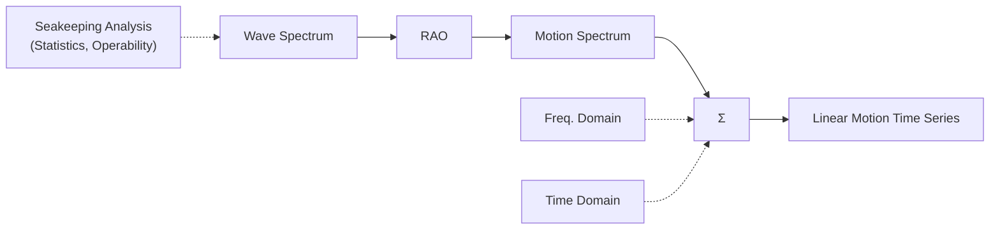
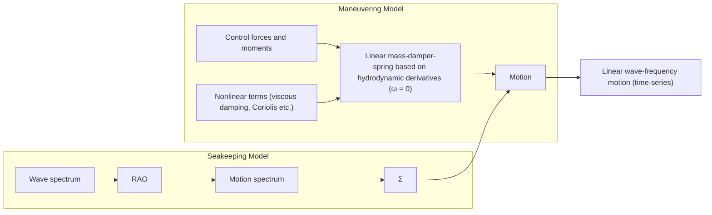
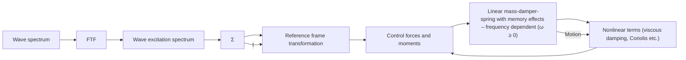

# Ma noeuvri ng i n a Seaway

## (Mod u le 8)

## D r T ri sta n P e rez

Centre for Com plex Dynam ic Systems a nd Control (C DSC)

THE UNIVERSITY OF

NEWCASTLE

AUSTRALIA

## P rof. Thor I Fosse n

De pa rtme nt of E ng i n ee ri ng Cybernetics

NTNU

Det skapende universitet

## State of th e a rt

„ M anoeuvres are general ly performed i n cal m waters close to ports , but some ti mes a re a lso performed at sea i n h ig her sea state s .  
Th is req u i res mod els wh i ch ca n ha nd l e ma noeuvri ng a nd seakeepi ng .  
„ The hyd rodynam ic problem is very com plex, and we may sti l l be a long ti me away from a sol ution .  
„ The state of the a rt uses a com b i nation of ma noeuvri ng a nd seakeepi ng mod els via either

M otion su pe rpos ition

‰ Force su perposition

## Freq uency-doma i n sea keepi ng models

These models can be used to si m u late wavei nd u ced sh i p motion ti me se ries :

flowchart

## Motion su perposition model

flowchart

## Motion su perposition model

„ Com mon ly used i n control a p pl i cations : a utop i lot, ma noe uvri ng , formation control , ru d d e r rol l sta b i l i s at i o n .  
„ T h e rati o n a l e b e h i n d th i s i s th at a wave fi l te r rej e cts th e 1 st ord e r wave i nd u ced motion , a nd no me mory effects a re th e n cons id e red .  
„ I t ca n be a good assu m ption i n lowe r sea states .

## Force su perposition model

flowchart

Ti me-doma i n S K mod el + non l i n ea rities .

## Force su perposition model

„ Th is is a n atte m pt to obta i n a u n ified mod el for ma noeuvri ng i n a seaway.  
„ F l u id me mory effects a re i n corporated , togethe r with othe r nonl i n e a r effe cts ch a ra cte ri sti c of m a n oe u v ri n g : l i ft-d rag , cross-fl ow d ra g , v i s co u s ro l l , etc .  
„ These mod els are based on the Cu m m i ns Eq u ation expressed i n te rms of body-fixed coord i nates , a nd the non l i n ea r effects a re added .  
„ Th e Ce ntri peta l-Coriol l is d u e to ad d ed mass te rms sti l l re ma i n a n i s s u e .  
„ Th is mod el is val id provid ed that the vessel ma noeuvres slowly— because part of the model is based on a seakeepi ng model .

## Ki nematic tra nsformations {s}-{ b}

## Fol lowi ng Perez & Fossen (2007)

$$
\vec {r} _ {n b} = \vec {r} _ {n s} + \vec {r} _ {s b}
$$

I n { n } ,

$$
\mathbf {r} _ {n b} ^ {n} = \mathbf {r} _ {n s} ^ {n} + \mathbf {R} _ {s} ^ {n} \mathbf {r} _ {s b} ^ {s}
$$

text_image

Equilibrium state
{s}
r̅_ns
r̅_sb
{n}
r̅_nb
{b}

## Ki nematic tra nsformations {s}-{ b}

## Ta ki ng the ti me-d e rivative

$$
\dot {\mathbf {r}} _ {n b} ^ {n} = \dot {\mathbf {r}} _ {n s} ^ {n} + \mathbf {R} _ {s} ^ {n} \dot {\mathbf {r}} _ {s b} ^ {s}
$$

$$
\begin{array}{l} \dot {\mathbf {r}} _ {n b} ^ {n} = \dot {\mathbf {r}} _ {n s} ^ {n} + \mathbf {R} _ {s} ^ {n} \mathbf {R} _ {b} ^ {s} \dot {\mathbf {r}} _ {s b} ^ {b}, \\ = \dot {\mathbf {r}} _ {n s} ^ {n} + \mathbf {R} _ {b} ^ {n} \dot {\mathbf {r}} _ {s b} ^ {b}. \\ \end{array}
$$

Ta ki n g i t to { b} ,

$$
\mathbf {R} _ {n} ^ {b} \dot {\mathbf {r}} _ {n b} ^ {n} = \mathbf {R} _ {n} ^ {b} \dot {\mathbf {r}} _ {n s} ^ {n} + \mathbf {R} _ {n} ^ {b} \mathbf {R} _ {b} ^ {n} \dot {\mathbf {r}} _ {s b} ^ {b},
$$

$$
\mathbf {v} _ {n b} ^ {b} = \mathbf {R} _ {n} ^ {b} \mathbf {v} _ {n s} ^ {n} + \mathbf {v} _ {s b} ^ {b}.
$$

text_image

Equilibrium state
{s}
r̅_ns
r̅_sb
{n}
r̅_nb
{b}

# Ki nematic tra nsformations {s}-{ b}

L et

$$
\boldsymbol {\nu} = \left[ \begin{array}{c} \boldsymbol {\nu} _ {1} \\ \boldsymbol {\nu} _ {2} \end{array} \right], \quad \delta \boldsymbol {\nu} = \left[ \begin{array}{c} \delta \boldsymbol {\nu} _ {1} \\ \delta \boldsymbol {\nu} _ {2} \end{array} \right]
$$

$$
\boldsymbol {\nu} _ {1} = [ u, v, w ] ^ {T} \quad \delta \boldsymbol {\nu} _ {1} = [ \delta u, \delta v, \delta w ] ^ {T}
$$

$$
\boldsymbol {\nu} _ {2} = [ p, q, r ] ^ {T} \quad \delta \boldsymbol {\nu} _ {2} = [ \delta p, \delta q, \delta r ] ^ {T}
$$

Then

$$
\boldsymbol {\nu} _ {1} = \bar {\boldsymbol {\nu}} _ {1} + \delta \boldsymbol {\nu} _ {1}
$$

$$
\bar {\pmb {\nu}} _ {1} \triangleq \mathbf {R} _ {n} ^ {b} \left[ \begin{array}{c} U \cos \bar {\psi} \\ U \sin \bar {\psi} \\ 0 \end{array} \right] = \mathbf {R} _ {s} ^ {b} \left[ \begin{array}{c} U \\ 0 \\ 0 \end{array} \right]
$$

## Ki nematic tra nsformations {s}-{ b}

The a ng u l a r velocities a re rel ated by

$$
\vec {\omega} _ {n b} = \vec {\omega} _ {n s} + \vec {\omega} _ {s b} \quad \Longleftrightarrow \quad \vec {\omega} _ {n b} = \vec {\omega} _ {s b}
$$

I n { b}

$$
\boldsymbol {\omega} _ {n b} ^ {b} = \boldsymbol {\omega} _ {s b} ^ {b} \Rightarrow \boldsymbol {\nu} _ {2} = \delta \boldsymbol {\nu} _ {2}
$$

Com b i n i ng resu lts

$$
\boldsymbol {\nu} = \bar {\boldsymbol {\nu}} + \delta \boldsymbol {\nu}
$$

$$
\bar {\pmb {\nu}} = [ \bar {\pmb {\nu}} _ {1} ^ {T}, \mathbf {0} _ {3 \times 1} ] ^ {T}
$$

$$
\bar {\nu} _ {1} = U \mathrm{col} _ {1} (\mathbf {R} _ {s} ^ {b})
$$

$$
= U \left[ \begin{array}{c} c _ {\delta \psi} c _ {\delta \theta} \\ - s _ {\delta \psi} c _ {\delta \theta} + c _ {\delta \psi} s _ {\delta \theta} s _ {\delta \phi} \\ s _ {\delta \psi} s _ {\delta \phi} + c _ {\delta \psi} c _ {\delta \phi} s _ {\delta \theta} \end{array} \right]
$$

## Ki nematic tra nsformations {s}-{ b}

Ta ki ng smal l a ng l e a pproxi mations

$$
\bar {\pmb {\nu}} _ {1} = U \left[ \begin{array}{c} c _ {\delta \psi} c _ {\delta \theta} \\ - s _ {\delta \psi} c _ {\delta \theta} + c _ {\delta \psi} s _ {\delta \theta} s _ {\delta \phi} \\ s _ {\delta \psi} s _ {\delta \phi} + c _ {\delta \psi} c _ {\delta \phi} s _ {\delta \theta} \end{array} \right] \quad \Longrightarrow \quad \bar {\pmb {\nu}} _ {1} \approx U \left[ \begin{array}{c} 1 \\ - \delta \psi \\ \delta \theta \end{array} \right]
$$

H e n ce , we obta i n the soug ht tra n sfo rm ati o n :

$$
\boldsymbol {\nu} \approx U (- \mathbf {L} \delta \boldsymbol {\eta} + \mathbf {e} _ {1}) + \delta \boldsymbol {\nu}
$$

$$
\mathbf {e} _ {1} \triangleq [ 1, 0, \dots , 0 ] ^ {T}
$$

$$
\mathbf {L} \triangleq \left[ \begin{array}{c c c c} 0 & \dots & 0 & 0 \\ 0 & \dots & 0 & 1 \\ 0 & \dots & - 1 & 0 \\ \vdots & \ddots & \vdots & \vdots \\ 0 & \dots & 0 & 0 \end{array} \right]
$$

## Ki nematic tra nsformations {s}-{ b}

To rel ate the accel e rations

$$
\dot {\boldsymbol {\nu}} = \dot {\bar {\boldsymbol {\nu}}} + \delta \dot {\boldsymbol {\nu}}
$$

wh e re

$$
\begin{array}{l} \dot {\pmb {\nu}} _ {1} = \mathbf {R} _ {s} ^ {b} \mathbf {S} ^ {T} (\pmb {\omega} _ {s b} ^ {b}) \left[ \begin{array}{c} U \\ 0 \\ 0 \end{array} \right] = \mathbf {R} _ {s} ^ {b} U \left[ \begin{array}{c} 0 \\ - \delta r \\ \delta q \end{array} \right] \\ = - U \delta r \operatorname{col} _ {2} (\mathbf {R} _ {s} ^ {b}) + U \delta q \operatorname{col} _ {3} (\mathbf {R} _ {s} ^ {b}). \\ \end{array}
$$

Ta ki ng smal l a ng l e a pproxi mations a nd consid eri ng on ly l i n e a r te rm s

$$
\dot {\pmb {\nu}} _ {1} \approx U \left[ \begin{array}{c} 0 \\ - \delta r \\ \delta q \end{array} \right] = - U \mathbf {L} \delta \pmb {\nu}
$$

Wh i ch is consiste nt with

## Ki nematic tra nsformations {s}-{ b}

Ve l o c i t i e s :

$$
\boldsymbol {\nu} \approx U (- \mathbf {L} \delta \boldsymbol {\eta} + \mathbf {e} _ {1}) + \delta \boldsymbol {\nu}
$$

Accel erations :

$$
\dot {\boldsymbol {\nu}} \approx - U \mathbf {L} \delta \boldsymbol {\nu} + \dot {\delta \boldsymbol {\nu}}
$$

Ge n e ra l ised Positions :

$$
\dot {\boldsymbol {\eta}} = \left[ \begin{array}{c} U \cos \bar {\psi} \\ U \sin \bar {\psi} \\ \mathbf {0} _ {4 \times 1} \end{array} \right] + \mathbf {J} _ {b} ^ {n} (\boldsymbol {\eta}) \delta \boldsymbol {\nu}
$$

N ow we ca n tra nsform the Cu m m i ns Eq u ation to {b} .

## RB sea keepi ng Eq . of motion i n {s}

# U si ng the body-fixed pertu rbation coord i nates we have

N o n - l i n ea r

$$
\begin{array}{l} \delta \dot {\boldsymbol {\eta}} = \mathbf {J} _ {b} ^ {s} (\delta \boldsymbol {\eta}) \delta \boldsymbol {\nu}, \\ \mathbf {M} _ {R B} \delta \dot {\boldsymbol {\nu}} + \mathbf {C} _ {R B} (\delta \boldsymbol {\nu}) \delta \boldsymbol {\nu} = \delta \boldsymbol {\tau} \\ \end{array}
$$

$$
\mathbf {M} _ {R B} \triangleq \mathbf {M} _ {R B} ^ {b}
$$

$$
\delta \pmb {\tau} = \delta \pmb {\tau} _ {\mathrm{rad}} ^ {b} + \delta \pmb {\tau} _ {\mathrm{exc}} ^ {b}
$$

l i n ea r

$$
\delta \dot {\eta} \approx \delta \nu ,
$$

$$
\mathbf {M} _ {R B} \delta \dot {\pmb {\nu}} \approx \delta \pmb {\tau},
$$

$$
\mathbf {M} _ {R B} \delta \ddot {\eta} \approx \delta \tau
$$

$$
\mathbf {M} _ {R B} \ddot {\boldsymbol {\xi}} = \boldsymbol {\tau} _ {\mathrm{rad}} ^ {s} + \boldsymbol {\tau} _ {\mathrm{exc}} ^ {s}
$$

## RB sea keepi ng Eq . of motion i n {s}

We ca n th i n k th e l i n ea r-sea kee p i ng eq u ations of motion

$$
\mathbf {M} _ {R B} \ddot {\boldsymbol {\xi}} = \boldsymbol {\tau} _ {\mathrm{rad}} ^ {s} + \boldsymbol {\tau} _ {\mathrm{exc}} ^ {s}
$$

as obta i n ed from th e body-fixed pe rtu rbation eq u ations cons id e ri ng

$$
\begin{array}{l} \dot {\boldsymbol {\xi}} = \delta \dot {\boldsymbol {\eta}} \approx \delta \boldsymbol {\nu}, \\ \boldsymbol {\tau} _ {\mathrm{rad}} ^ {s} \approx \delta \boldsymbol {\tau} _ {\mathrm{rad}} ^ {b}, \\ \boldsymbol {\tau} _ {\mathrm{exc}} ^ {s} \approx \delta \boldsymbol {\tau} _ {\mathrm{exc}} ^ {b}. \\ \end{array}
$$

N OTE : I n the l ite ratu re , it is com mon ly sa id that the sea kee p i ng eq of motion is fo rm u l ate d i n {s} , b u t t h i s wo u l d i m p l y t h at t h e i n e rt i a s a re t i m e va ry i n g .

I n ou r d e rivation , we form u l ate the m i n body-fixed coord i nated a nd the n kee p on ly the l i n ea r te rms ; th is way, the i n e rtias a re consta nt beca use we a re i n body-fixed coord i nates .

## Cu m m i ns Eq uation i n { b}

$$
(\mathbf {M} _ {R B} + \bar {\mathbf {A}}) \ddot {\pmb {\xi}} + \bar {\mathbf {B}} \dot {\pmb {\xi}} + \int_ {0} ^ {t} \mathbf {K} (t - t ^ {\prime}) \dot {\pmb {\xi}} (t ^ {\prime}) d t ^ {\prime} + \mathbf {G} \pmb {\xi} = \pmb {\tau} _ {\mathrm{exc}} ^ {s}
$$

$$
\begin{array}{r l} \Updownarrow & \dot {\pmb {\xi}} = \delta \dot {\pmb {\eta}} \approx \delta \pmb {\nu}, \\ & \tau_ {\mathrm{rad}} ^ {s} \approx \delta \tau_ {\mathrm{rad}} ^ {b}, \\ & \tau_ {\mathrm{exc}} ^ {s} \approx \delta \tau_ {\mathrm{exc}} ^ {b}. \end{array}
$$

$$
\mathbf {M} \delta \dot {\pmb {\nu}} + \bar {\mathbf {B}} \delta \pmb {\nu} + \int_ {0} ^ {t} \mathbf {K} (t - t ^ {\prime}) \delta \pmb {\nu} (t ^ {\prime}) d t ^ {\prime} + \mathbf {G} \delta \pmb {\eta} = \delta \pmb {\tau} _ {\mathrm{exc}} ^ {b}
$$

$$
\mathbf {M} \triangleq \mathbf {M} _ {R B} + \bar {\mathbf {A}}
$$

Th is mod e l d escri bes d eviations from th e eq u i l i b ri u m state i n {b} with i n a l i n ea r fra mework a nd s ma l l a ng l es .

## Cu m m i ns Eq uation i n { b}

Expressed i n terms of absol ute (i nstead of i n cre me ntal ) va ria bl es :

$$
\dot {\boldsymbol {\eta}} = \mathbf {J} _ {b} ^ {n} (\boldsymbol {\eta}) \boldsymbol {\nu},
$$

$$
\mathrm{M} \dot {\boldsymbol {\nu}} + \mathrm{C} _ {R B} \boldsymbol {\nu} + \mathrm{C} _ {A} \boldsymbol {\nu} + \bar {\mathrm{B}} \boldsymbol {\nu}
$$

$$
+ \int_ {0} ^ {t} \mathbf {K} (t - t ^ {\prime}) [ \boldsymbol {\nu} (t ^ {\prime}) + U \mathbf {L} \boldsymbol {\eta} (t ^ {\prime}) ] d t ^ {\prime}
$$

$$
+ \mathbf {G} \boldsymbol {\eta} = \boldsymbol {\tau} _ {\mathrm{exc}} ^ {b} + \bar {\boldsymbol {\tau}} ^ {b},
$$

$$
\mathbf {C} _ {R B} \triangleq \mathbf {M} _ {R B} U \mathbf {L},
$$

$$
\mathbf {C} _ {A} \triangleq \bar {\mathbf {A}} U \mathbf {L},
$$

$$
\bar {\boldsymbol {\tau}} ^ {b} \triangleq \bar {\mathbf {B}} \bar {\boldsymbol {\nu}}.
$$

N OTE : Th is eq u ation val id provid ed the ma noeuvri ng is very slow—because of the sea keepi ng assu m ptions u nd er wh ich the Cu m m i ns eq . was d erived .

## Su m ma ry

„ The probl e m of ma noeuvri ng i n a seaway is sti l l a n ope n probl e m i n s h i p t h e o ry .  
A ste p towa rds a u n ified mod el for ma noeuvri ng i n a sea way consists of expressi ng Cu m m i ns Eq u ation i n {b} .  
„ Th is is sti l l a sea kee pi ng mod el , wh i ch assu mes a state of eq u i l i b ri u m fro m wh i ch th e vesse l i s d i stu rbed ; a n d th e refo re , it may be use it for slow ma noeuvri ng .  
„ For slow ma noeuvri ng , we ca n ad d Lift- D rag effects as a fi rst approxi mation .

## References

„ Perez, T . a nd T . I . Fosse n (2006 ) “Ti me-doma i n M od els of M a ri ne S u rface Vessels Based on Sea keepi ng Com putations . ” 7th I FAC Conferen ce on M a noeuvri ng a nd Control of M ari ne Vessels M C M C , Portugal , Septem ber.  
„ Perez T . , a nd T . I . Fossen (2007) “ Ki nematic M od els for Sea keepi ng a nd M anoeuvri ng of M ari ne Vessels at Zero and Forward S peed . ” To appear i n M od el i ng I d e ntifi cation a nd Control ( M I C) , N orweg ia n Resea rch B u l l eti n , Trond hei m . M I C Vol 28 , 2007 , N o 1 .