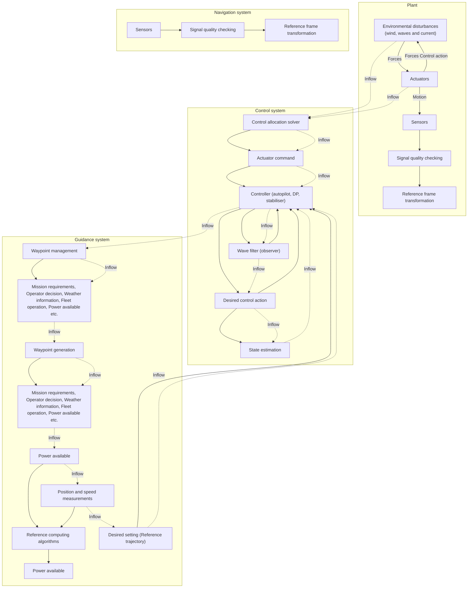
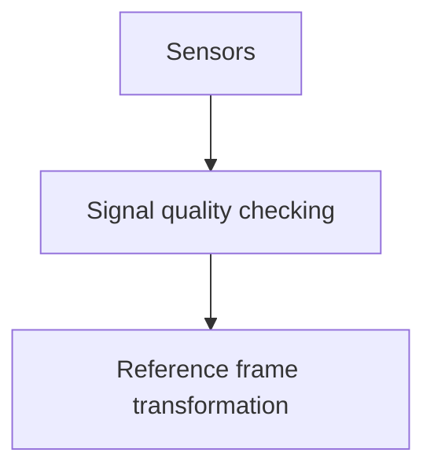
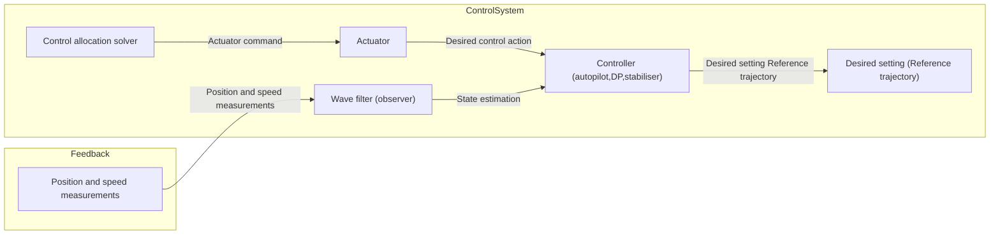
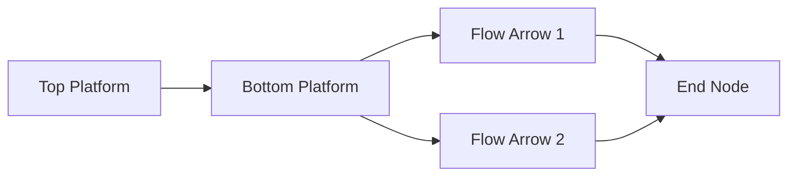

# Sh i p Motion Control a nd Models

## ( M od u l e 9)

## D r Tri sta n P e rez

Centre for Com plex Dynam ic Systems a nd Control (C DSC)

## P rof. Thor I Fosse n

De pa rtme nt of E ng i n ee ri ng Cybernetics

THEUNIVERSITYOF

NEWCASTLE

AUSTRALIA

NTNU

Det skapende universitet

## G u ida nce, Navigation a nd Control

## (GNC)

# G u ida nce, Navigation a nd

# Motion Control

G u idance : is the action or the system that continuously computes the reference (desired) position, velocity and acceleration of a vessel to be used by the control system. These data are usually provided to the human operator and the navigation system.

N avi gati o n is d e rived from th e Lati n n avis , " ship , " a n d a g e re , " to drive . " I t o ri g i n a l l y d e noted th e a rt of s h i p d rivi ng , i n cl u d i ng stee ri ng a nd setti ng th e sa i ls . Th is i n cl u d es pl a n n i ng a nd execution of safe , ti me ly, a nd econom i ca l ope ration of s h i ps , u nd e rwate r ve h i cl es , a i rcraft, a nd s pacecraft.

Co ntro l : is the action of determining the necessary control forces and moments to be provided by the vessel in order to satisfy a certain control objective.

flowchart

## G u ida nce system

Ge n e rates the d esi red traj ectories (position , velocity a nd accel e ration ) .

ƒ The waypoint generator establ ishes the d esi red waypon its accord i ng to m ission , operator d ecision , weather, fl eet operations , a mou nt of power ava i la bl e etc.  
ƒ The waypoint management system u pdates the active waypoi nt based on the cu rre n t pos i ti o n of th e s h i p .  
The reference computing algorithms generate a smooth feasi ble trajectory based on a refere n ce mod el , the sh i p actu al position , a mou nt of power ava i la bl e , a nd the active way poi nt.

NT

Det skapende universitet

## Navigation System

## Generates appropriate feed back sig nals

ƒ Sensors Satel l ite navigation systems , G PS , radar, gyros , accelerometers , com pass , H P R, etc.  
ƒ Signal quality checking Statisti c a na lysis , fa u lt d etection , voti ng , d ata fusion .  
Reference frame transformatio the orig i n of the adopted refere n ce

flowchart

text_image

n translate the motion to that of
e frame.
SURFACE
REFERENCE
SYSTEM
SATELLITE
NAVIGATION
SYSTEM
(DGPS / GLONAS)
HYDROACOUSTIC
POSITIONING
SYSTEM
TAUT
WIRE
VRU
GPS
ANTENNA
HPR
TRANSDUCER

## Set- poi nt Reg u lation, Trajectory Tracki ng Control or Path Fol lowi ng Co ntro l ?

Set-Po i nt Reg u lati o n : The most basi c g u id a n ce syste m is a consta nt i n put (set-poi nt) provid ed by a h u ma n operator. The correspond i ng control l er wi l l the n be a reg u lator. Exa m pl es of set-poi nt reg u lation a re consta nt d e pth , tri m , heel a nd speed control , etc.

Trajectory Tracki n g Co ntro l : The objective is for the position a nd velocity of the vessel to track g iven d esi red ti me-varyi ng pos ition and velocity reference sig nals . The correspond i ng feed back control l er m ust the n be a traj ectory tracki ng control l e r. Tracki ng control can be used for cou rse-chang i ng maneuvers , speed chang i ng , attitud e control , etc. An advanced g u idance system com putes opti mal ti me-varyi ng trajectories from a dyna m i c mod el a nd a pred efi ned control objective . If a consta nt set- po i n t i s u sed as i n p u t to a l ow- pass fi l te r ( refe re n ce m od e l ) th e o u tp u ts of th e fi l te r wi l l be smooth ti me-va ryi ng refe re n ce traj ectories for position , velocity a nd accel eration ( PVA) .

Path Fo l l owi n g Co ntro l : Fol low a path i n 3 D i nd e pe nd e nt of ti me (geometri c assig n me nt) . I n ad d ition , a dyna m i c assig n me nt (speed/accel eration ) along the path ca n be assig ned . The correspond i ng control l er is a path fol lowi ng/ma neuveri ng co n t ro l l e r .

## Sh i p M otion Contro l

The task of a sh i p motion control syste m consists of ma ki ng the sh i p to track/fol low a desired trajectory or path. Someti mes th is a lso i n cl u d es motion d a m p i ng .

I n most sh i p ope rationa l cond itions , the d esi red traj ectory is slowly va ryi ng motion ( L F motion ) com pa red to the osci l l atory motion i nd u ced by the waves (WF motion ) .

line

| X | Y |
| --- | --- |
| 1 | ~2.5 |
| 2 | ~3.0 |
| 3 | ~2.0 |
| 4 | ~2.5 |
| 5 | ~3.0 |
| 6 | ~2.0 |
| 7 | ~2.5 |
| 8 | ~3.0 |
| 9 | ~2.0 |
| 10 | ~2.5 |
| 11 | ~3.0 |
| 12 | ~2.0 |
| 13 | ~2.5 |
| 14 | ~3.0 |
| 15 | ~2.0 |
| 16 | ~2.5 |
| 17 | ~3.0 |
| 18 | ~2.0 |
| 19 | ~2.5 |
| 20 | ~3.0 |
| 21 | ~2.0 |
| 22 | ~2.5 |
| 23 | ~3.0 |
| 24 | ~2.0 |
| 25 | ~2.5 |
| 26 | ~3.0 |
| 27 | ~2.0 |
| 28 | ~2.5 |
| 29 | ~3.0 |
| 30 | ~2.0 |
| 31 | ~2.5 |
| 32 | ~3.0 |
| 33 | ~2.0 |
| 34 | ~2.5 |
| 35 | ~3.0 |
| 36 | ~2.0 |
| 37 | ~2.5 |
| 38 | ~3.0 |
| 39 | ~2.0 |
| 40 | ~2.5 |
| 41 | ~3.0 |
| 42 | ~2.0 |
| 43 | ~2.5 |
| 44 | ~3.0 |
| 45 | ~2.0 |
| 46 | ~2.5 |
| 47 | ~3.0 |
| 48 | ~2.0 |
| 49 | ~2.5 |
| 50 | ~3.0 |
| 51 | ~2.0 |
| 52 | ~2.5 |
| 53 | ~3.0 |
| 54 | ~2.0 |
| 55 | ~2.5 |
| 56 | ~3.0 |
| 57 | ~2.0 |
| 58 | ~2.5 |
| 59 | ~3.0 |
| 60 | ~2.0 |
| 61 | ~2.5 |
| 62 | ~3.0 |
| 63 | ~2.0 |
| 64 | ~2.5 |
| 65 | ~3.0 |
| 66 | ~2.0 |
| 67 | ~2.5 |
| 68 | ~3.0 |
| 69 | ~2.0 |
| 70 | ~2.5 |
| 71 | ~3.0 |
| 72 | ~2.0 |
| 73 | ~2.5 |
| 74 | ~3.0 |
| 75 | ~2.0 |
| 76 | ~2.5 |
| 77 | ~3.0 |
| 78 | ~2.0 |
| 79 | ~2.5 |
| 80 | ~3.0 |
| 81 | ~2.0 |
| 82 | ~2.5 |
| 83 | ~3.0 |
| 84 | ~2.0 |
| 85 | ~2.5 |
| 86 | ~3.0 |
| 87 | ~2.0 |
| 88 | ~2.5 |
| 89 | ~3.0 |
| 90 | ~2.0 |
| 91 | ~2.5 |
| 92 | ~3.0 |
| 93 | ~2.0 |
| 94 | ~2.5 |
| 95 | ~3.0 |
| 96 | ~2.0 |
| 97 | ~2.5 |
| 98 | ~3.0 |
| 99 | ~2.0 |
| 100 | ~2.5 |

Total motion

  
Osci l l ato ry m oti o n  
(d u e to 1 st o rd e r Wave i nd u ced loads)

line

| X | Y |
| --- | --- |
| Start | ~1.5 |
| End | ~3.5 |

S lowly varyi ng motion  
(d ue to 2 nd Wave loads cu rre n t , wi n d )

## Sh i p Motion Control Objectives

D u e to th e motion of s h i ps , motion control p rob l e ms ca n have d iffe re nt obj ectives :

ƒ Con trol only th e LF m o tions (Autopi lots , Dynam ic Position i ng ( D P) , Position moori ng systems)  
Con trol only th e WF m o tions ( H eave , rol l and pitch stabi l isation , rid e control )  
ƒ Con trol bo th ( D P with rol l a nd pitch sta b i l isation i n h ig h seas , cou rse kee p i ng a nd rol l sta b i l isation )

Dyna m ic Position i ng  

natural_image

Illustration of a cargo ship with a red container and red hull, floating on water with a yellow spray trail (no text or symbols)

Au to p i l ot  

natural_image

Illustration of a naval ship with a red circular arrow and arrowhead, no text or symbols present

Rol l sta b i l isation  

natural_image

3D rendered image of a ship floating on blue water, no text or symbols visible

## Pla nt Control System

Generates appropriate actuator com mands .

ƒ Wave filter (observer) : Recover slowly varyi ng motion sig nals from the total measu rements  
Controller: Generates force com ma nds (d esi red control action )  
Control allocation: Translate force com mands i nto actuator com mands ( RP M , PWR, Torq ue) .

flowchart

## Wave F i l te r i n g

Removes fi rst ord er (osci l latory) wave-i nd u ced motion

Exa m pl e cou rse a utop i lot wave fi lte ri ng

Perez (2005) :

H ead i ng ang le

H ead i ng rate

Rudder ang le

## Control Al l ocati o n

Some ma ri n e control syste ms a re ove r-actu ated to g u a ra ntee rel ia b i l ity a nd h ig h pe rforma n ce – opti m ization probl e m

## Ma ri ne Control Problems a nd Models

natural_image

3D rendering of a large green and red cargo ship floating above a yellow trajectory line with yellow cables, underwater with ocean background (no text or symbols)

mo o r i n g  
P ip e and c ab l e l a y i n g

text_image

Geological
survey

natural_image

Yellow HiROV 3000 underwater vehicle with visible internal components and structural supports (no text or symbols on the device itself)

natural_image

Aerial view of two oil rigs operating in a coastal area with water and floating structures (no visible text or symbols)

text_image

Heavy lift
operations

text_image

ROV operations
Cerigy se
Pipe laying vessel

text_image

Cable laying
vessel

Vib r a t i o n c o n t r o l o f ma r i n e r i s e r s

# Trajectory Tracki ng & Ma neuveri ng Control

natural_image

Large red and white research vessel with yellow crane on open sea (no visible text or symbols)

Fully actuated supply ship cruising at low speed.

natural_image

Large blue container ship named 'MAERSK LINE' sailing on open sea, no visible text or symbols on the vessel itself

Underactuated container ship in transit.

natural_image

Two naval ships sailing on open sea, hull numbers visible, no text or symbols present

Italian supply ship Vesuvio refueling two ship s at sea.

Courtesy: Hepburn Eng. Inc .

## Formation Control/U nderway Replen ish ment

## I nte rd isci pl i na ry: Rocket La u n ch / D P syste m / TH CS

Launch Platform  

natural_image

Illustration of a rocket launch on an offshore platform with smoke plumes and a distant vessel, no text or symbols present.

Assembly Command Ship

natural_image

Large white sea launch vessel named 'SEA LAUNCH' sailing on open sea, no visible text or symbols on the vessel itself.

natural_image

Abstract logo design with blue and yellow curved shapes and an arrow (no text or symbols)

SEA LAUNCH SM M arin e S e gm en t

## Tri m & H eel Correction System (TH CS )

flowchart

This diagram illustrates the control system architecture for a trim controller, showing the flow of torque and pressure inputs through various pumps (Heel, Trim, CST) to the engine body.

Process Control  
o r  
Mari ne Control ?

text_image

Ches1
0.0 %
401
3h
SBA LAUNCH
SBA LAUNCH

## Dyna m ic Position i ng

D ri l l i ng vessel ( Reg u lation )  

natural_image

Illustration of a cargo ship with a red-and-white structure floating on water, emitting a yellow spray trail (no text or symbols)

ROV operations (tracki ng )  

flowchart

Control obj ective : Kee p position ; fol low slow cha nges i n set poi nt.  
„ DO F : 1 , 2 , 6 (su rge , sway a nd yaw) [p itch a nd rol l ca n be i n corporated i n h ig h sea states i n offs h o re ri g s]  
„ M od el : ti me-doma i n mod el wh i ch i n cl u d es cross-flow d rag effects . The M u n k mome nt, wh i ch is i n the ad d ed mass Coriol l is-ce ntri petal te rms shou ld be ad d ed . Alte rnatively, use cu rre nt coeffi cie nts (expe ri me ntal d ata) .  
„ D istu rba n ces : Wi nd , cu rre nt, mea n wave d rift a nd slowly va ryi ng wave forces .

## Cou rse a nd Head i ng Auto p i l ots

H ead i ng  

natural_image

Illustration of a ship with a red circular arrow and arrowhead, symbolizing economic or operational growth (no text or symbols present)

Cou rse keepi ng  

natural_image

3D rendering of a naval warship with red and beige hull, no visible text or symbols

„ Control O bj ective : Kee p head i ng or cou rse . For cou rse kee p i ng a utop i lots , position i ng control a nd g u id a n ce systems m ust also be d esig ned (outer loop) .  
„ DO F : 2 , [4] , 6 (sway, rol l , yaw) The re is strong cou pl i ng betwee n sway a nd yaw wh i ch is not conve n ie nt to ig nore , a nd rol l a lso affect these mod es .  
„ M od el : M a noeuvri ng mod el ; at h ig h speed l ift-d rag effects a re sig n ifi ca nt. The mod el ca n be l i n ea rised for control d esig n beca use the m ust ope rate close to eq u i l i b ri u m cond itions .  
„ D istu rba n ces : Wi nd , waves (the re m ust be a wave fi lte r) ; for a cou rse kee p i ng a utop i lot, cu rre nt is a lso a d istu rba n ce .

## Ma noeuvri ng Control

natural_image

3D rendering of a boat hull with red and beige hull, no visible text or symbols

„ Control obj ective : geometri c a nd dyna m i c cond itions for path fo l l ow i n g , way- p o i n t o r t raj e cto ry t ra c ki n g .  
D O F : 1 , 2 , [4 ] , 6 .  
M od e l : non l i nea r ma noeuvri ng mod el .  
„ D istu rba n ces : wi nd , waves , cu rre nt.

## Ride Control

natural_image

Military naval vessel sailing on open sea, creating visible wake (no text or symbols)

natural_image

Large white and blue cargo ship named 'BENCAUGA EXPRESS' sailing on open sea under clear sky (no visible text or symbols on vessel body)

Control obj ectives : red u ce rol l a nd p itch .  
D O F : 4 , 5 .  
„ M od el : l i n ea r ti me-d oma i n mod e l , with viscous corrections for rol l .  
„ D istu rba n ces : 1 st ord e r wave i nd u ced motion ; wi nd , tri m va riations with speed .

## Heave Com pensation

„ Control obj ective : red u ce the effect of heave motion i n d iffe re nt com pon e nts of the syste m .  
D O F : 3 , [ 5 ] .  
M od el : l i n ea r ti me-doma i n mod el + non l i n ea r viscous effects a nd stru ctu ra l sti ffn ess .  
D istu rba n ces : 1 st ord e r wave-i nd u ced motion , a nd ra p id ly-va ryi ng $2 ^ { \mathsf { n d } }$ o rd e r wave-i nd uced motions

## Sh i p-to-Sh i p Operations

Control obj ective : kee p formation .  
D O F : 1 , 2 , 6 .  
M od el : ti me-doma i n mod el with sh i p-to-sh i p hyd rodyna m ic i nteraction if vessels are too close .  
D istu rba n ces : waves , wi nd , cu rre nt

# M odel l i ng Distu rba nces for Control Desig n

If a mod el-based control d esig n req u i res d istu rba n ce mod el l i ng ,

## Waves :

„ 1 st-ord er wave loads (d u e to wave spectru m ) ca n be mod el led usi ng m u lti-si n ces with ra ndom p hases or fi lte red wh ite noise (wave spectru m ) .  
„ M ea n wave d rift loads ca n be mod el led as a 1 st-ord er Wiener process ( 1 st-o rd e r syste m d ri ve n by w h i te n o i s e . )

## C u rre nts :

„ Cu rre nt loads ca n be i n cl u d ed usi ng the con ce pt of re l ative ve locity i n su rge , sway a nd yaw (i n D P cu rre nt coeffi cie nts ca n a lso be used )

## Wi nd :

„ Wi nd loads a re i n cl u d ed usi ng wi nd coeffi cie nt ta bl es .

## Wi nd Loads

Wi nd a reas a nd ce ntroids from d ig itized GA  
‰ For best resu lts expe ri me nta l d ata from wi nd tu n n e ls s hou l d be used .

Transverse/frontal projected area (Viking Poseidon MPSV) [Twaerline =5.5 m]  

scatter

| Category | Value (m) |
| --- | --- |
| AF,wind | 520.6 |
| AF,current | 118 |
| c_wind | 17.7 |
| c_current | 2.8 |

Windcoefices:955).A()..).H9 (m)  

line

| Angle of wind \(\gamma r\) (deg) | \(Cx = X/(q*A\Gamma)\) | \(Cy = Y/(q*AL)\) | \(Ck = K/(q*AL*HM)\) | \(CN = N/(q*AL*Lva)\) |
| --- | --- | --- | --- | --- |
| 0 | -0.8 | 0 | 0 | 0 |
| 10 | -0.8 | ~-0.15 | ~-0.12 | ~-0.05 |
| 20 | -0.8 | ~-0.32 | ~-0.27 | ~-0.1 |
| 30 | ~-0.78 | ~-0.5 | ~-0.42 | ~-0.14 |
| 40 | ~-0.71 | ~-0.68 | ~-0.56 | ~-0.16 |
| 50 | -0.6 | -0.8 | ~-0.68 | ~-0.16 |
| 60 | ~-0.45 | ~-0.88 | ~-0.74 | ~-0.15 |
| 70 | ~-0.29 | ~-0.9 | ~-0.75 | ~-0.13 |
| 80 | ~-0.14 | ~-0.9 | ~-0.75 | ~-0.1 |
| 90 | 0 | ~-0.9 | ~-0.75 | ~-0.07 |
| 100 | ~0.14 | ~-0.9 | ~-0.75 | ~-0.04 |
| 110 | ~0.29 | ~-0.9 | ~-0.75 | ~-0.01 |
| 120 | ~0.45 | ~-0.88 | ~-0.73 | 0.02 |
| 130 | 0.6 | -0.8 | ~-0.67 | 0.04 |
| 140 | ~0.72 | ~-0.68 | ~-0.56 | 0.06 |
| 150 | ~0.78 | ~-0.5 | ~-0.42 | 0.06 |
| 160 | 0.8 | ~-0.32 | ~-0.27 | 0.05 |
| 170 | 0.8 | ~-0.15 | ~-0.12 | 0.03 |
| 180 | 0.8 | 0 | 0 | 0 |

Lateral projected area (Viking Poseidon MPSV)  

area

| Series | x (m) | z (m) |
| --- | --- | --- |
| A_L,wind | -45 | 12.5 |
| A_L,wind | -15 | 20.5 |
| A_L,wind | -5 | 19 |
| A_L,wind | 0 | 20.5 |
| A_L,wind | 5 | 15.5 |
| A_L,wind | 10 | 15.5 |
| A_L,wind | 15 | 19.5 |
| A_L,wind | 20 | 12.5 |
| A_L,wind | 22 | 27.5 |
| A_L,wind | 23 | 40 |
| A_L,wind | 25 | 28 |
| A_L,wind | 30 | 28 |
| A_L,wind | 35 | 20 |
| A_L,wind | 40 | 17.5 |
| A_L,wind | 45 | 17.5 |
| A_L,current | -45 | 5 |
| A_L,current | -35 | 0 |
| A_L,current | 0 | 3 |
| A_L,current | 45 | 4.5 |

## Exa m ple : Si m u lation of Wave Loads i n DP

flowchart

This flowchart illustrates a multi-stage motion control system architecture, showing the process from modelled Wiener process through to oscillatory wave-induced motion, and finally to guidance navigation control.

Th is mod el is typi cal ly used to d esig n control a nd observers .

## Usefu l References

„ Fossen , T. I . (1 994) . Guidance and Control of Ocean Vehicles, Joh n W i l e y  
„ Fossen , T. I . (2002) . Marine Control Systems. Mari ne Cybernetics .  
„ Perez, T. (2005) . Ship Motion Control. S pri nge r Ve rl ag .  
„ Sørensen , A.J . (2005) . “Marine Cybernetics”. Lectu re N otes Dept. of Mari ne Tech nology, NTN U , Norway