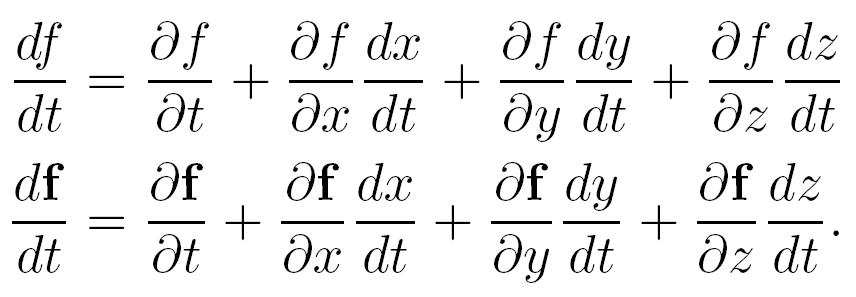
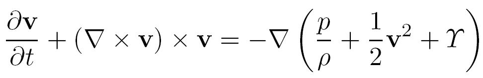
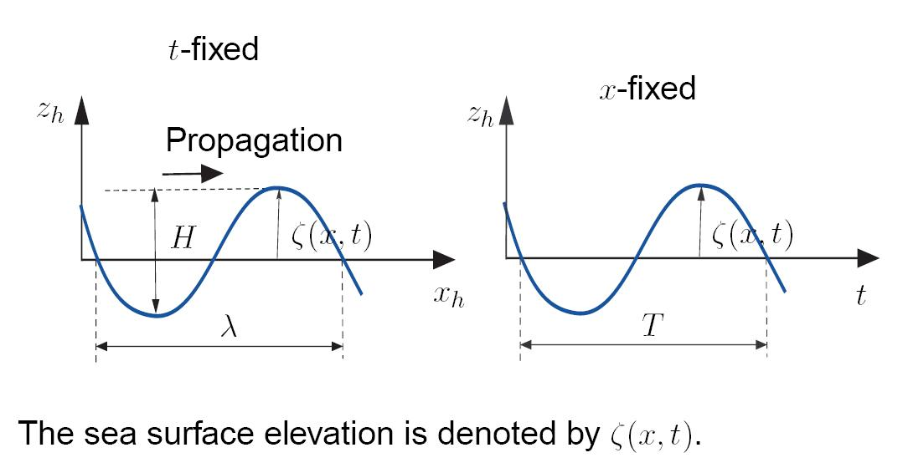
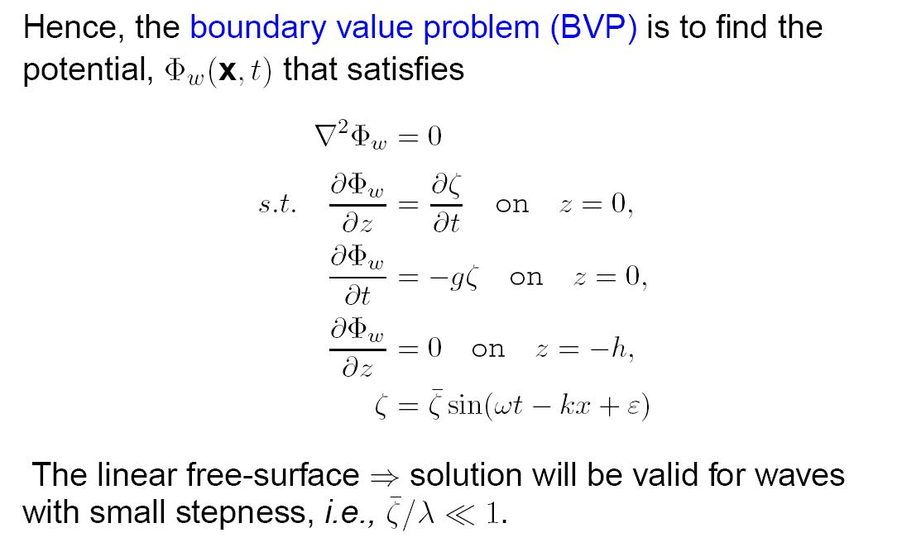
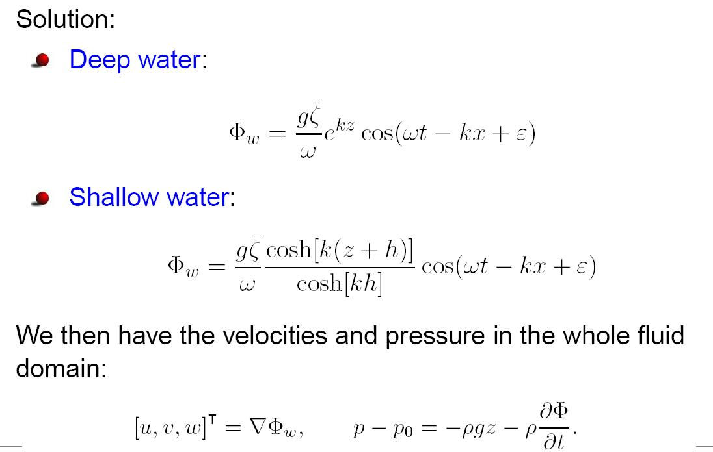
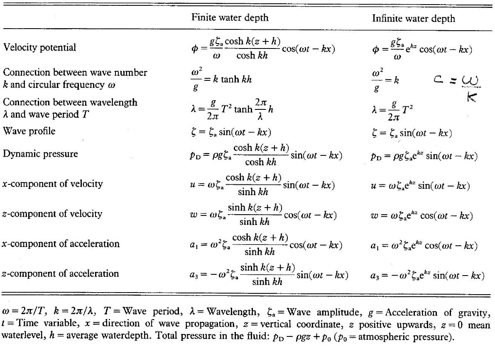
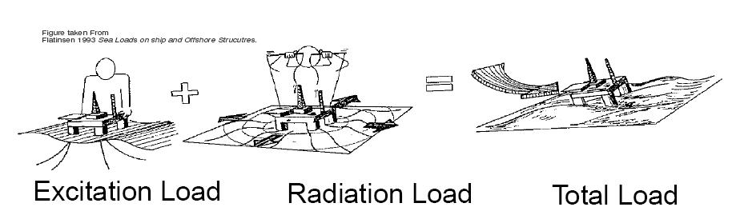

## Hydrodynamics for control engineers   (Module 2)

Dr Tristan Perez

Centre for Complex Dynamic Systems and Control (CDSC)

Prof. Thor I Fossen

Department of Engineering Cybernetics

06/06/26

One-day Tutorial, CAMS'07, Bol, Croatia

<number>

## Marine hydrodynamics

In order to study the motion of marine structures and vessels, we need to understand the effects the surrounding fluid has on them.

This requires some basic concepts of hydrodynamics—which is fluid dynamics under special-case simplifications and assumptions particular of marine applications.

To solve problems related to ship motion we, need to know two things about the fluid:

- velocity
- pressure

06/06/26

One-day Tutorial, CAMS'07, Bol, Croatia

<number>

## Fluid flow description

The velocity of the fluid at the location

## **x**

**v**(**x**,t)

is given by the fluid-flow velocity vector:

this vector is usually described relative to an inertial coordinate system with origin in the mean free surface (h-frame, or s-frame).

06/06/26

One-day Tutorial, CAMS'07, Bol, Croatia

<number>

## Incompressible fluid

For the flow velocities involved in ship motion, the fluid can be considered *incompressible*, *i.e.,* constant density.

Under this assumption, the net volume rate at a volume V enclosed by a surface *S* is

since this is valid for all the regions V in the fluid, then by assuming that            is continuous, we obtain the

*continuity equation* for incompressible flows:

06/06/26

One-day Tutorial, CAMS'07, Bol, Croatia

<number>

## Material derivative

Let                      be a scalar function and                    a vector-valued function; then,

If these are taken for the function

then we have a special notation—material derivative:

06/06/26

One-day Tutorial, CAMS'07, Bol, Croatia

<number>

## Flow equations

The conservation of momentum in the flow is described by the *Navier-Stokes (N-S) Equation:*

**F** are accelerations due to volumetric forces:

is the pressure, and *μ* is the viscosity of the fluid.

- Unknowns: <strong>v</strong> and <em>p</em>
- N-S + Continuity eq. form a system of Nonlinear PDE
- No analytical solution exists for realistic ship flows.
- Numerical solutions are still far from feasible
- Practical approaches: RANS (CFD)

06/06/26

One-day Tutorial, CAMS'07, Bol, Croatia

<number>

## Potential theory

A further simplification is obtained by assuming that the fluid is *inviscid* and the flow is *irrotational.* Irrotaional means that

Under this assumption, then exists a scalar function     called *potential* such that

So, if we know the potential, we can calculate the flow velocity vector (the gradient of the potential).

06/06/26

<number>

One-day Tutorial, CAMS'07, Bol, Croatia

## How do we obtain the potential?

In potential theory,  the continuity equation reverts to the *Laplacian* of the potential equal to zero:

The potential is, thus, obtained by solving this  subject to appropriate boundary conditions, *i.e.,* by solving a boundary value problem (VBP).

The Laplace Equation is linear ⇔ Superposition of flows.

06/06/26

One-day Tutorial, CAMS'07, Bol, Croatia

<number>

## How do we calculate pressure?

If we neglect viscosity in the N-S equation, we obtain the Euler Equation of flow:

Then,

where

06/06/26

One-day Tutorial, CAMS'07, Bol, Croatia

<number>

## Irrotaional flow assumption

Using some vector calculus

If the flow is irrotational, then

where

06/06/26

One-day Tutorial, CAMS'07, Bol, Croatia

<number>

## Bernoulli equation

If this is valid in the whole fluid, then

which is the Bernoulli equation.

06/06/26

<number>

One-day Tutorial, CAMS'07, Bol, Croatia

## Potential theory—summary

Potential theory offers a great simplification: if we know the potential, then we know the velocity and the pressure, from which we can calculate the forces acting on a floating body by integrating the pressure over the surface of the body.

<em>Inviscid</em> <em>fluid</em> and <em>irrotational flow</em>

*Potential*

*Flow velocity*

*Pressure*

for *most* problems related ship motion in waves, potential theory is sufficient for engineering purposes. Viscous effects are added to the models using empirical formulae or via system identification.

06/06/26

One-day Tutorial, CAMS'07, Bol, Croatia

<number>

## Applications

- Regular waves
- Marine structures in waves

06/06/26

One-day Tutorial, CAMS'07, Bol, Croatia

<number>

## Regular waves in deep water

06/06/26

One-day Tutorial, CAMS'07, Bol, Croatia

<number>

## Kinematic free-surface Condition

Kinematic free-surface condition:  A fluid particle on the free surface is assumed to remain on the free surface.

Let the free surface be defined as

$z=\zeta (x,y,t)$

Then, if

$F:=z-\zeta (x,y,t)$

$\frac{DF}{Dt}=0$

The kinematic condition reverts to

Hence,

$\frac{\partial \zeta }{\partial t}+\frac{\partial \varphi }{\partial x}\frac{\partial \zeta }{\partial x}+\frac{\partial \varphi }{\partial y}\frac{\partial \zeta }{\partial y}-\frac{\partial \varphi }{\partial z}=0$

on

$z=\zeta (x,y,t)$

06/06/26

One-day Tutorial, CAMS'07, Bol, Croatia

<number>

## Dynamic free-surface Conditions

Dynamic free-surface condition:  the water pressure equals the atmospheric pressure on the free surface.

If we choose the constant in the Bernoulli equation as

$C={p_{0}}/{\rho }$

Then,

$g\zeta +\frac{\partial \varphi }{\partial t}+\frac{1}{2}\left[\left(\frac{\partial \varphi }{\partial x}\right)^{2}+\left(\frac{\partial \varphi }{\partial y}\right)^{2}+\left(\frac{\partial \varphi }{\partial z}\right)^{2}\right]=0$

on

$z=\zeta (x,y,t)$

06/06/26

One-day Tutorial, CAMS'07, Bol, Croatia

<number>

## Linearised free-surface conditions

The free-surface conditions can be linearised about the mean free-surface:

$\frac{\partial \zeta }{\partial t}-\frac{\partial \varphi }{\partial z}=0$

$g\zeta +\frac{\partial \varphi }{\partial t}=0$

on

$z=0$

Combined:

$g\frac{\partial \varphi }{\partial z}+\frac{\partial ^{2}\varphi }{\partial t^{2}}=0$

on

$z=0$

06/06/26

One-day Tutorial, CAMS'07, Bol, Croatia

<number>

## Regular Wave linear BVP

06/06/26

One-day Tutorial, CAMS'07, Bol, Croatia

<number>

## Regular Wave Potential

06/06/26

One-day Tutorial, CAMS'07, Bol, Croatia

<number>

## Regular wave formulae (Faltinsen, 1990)

06/06/26

One-day Tutorial, CAMS'07, Bol, Croatia

<number>

## Potential theory for ships in waves

The fluid forces are due to variations in pressure on the surface of the hull.

It is normally assumed that the forces (pressure) can be made of different components

06/06/26

One-day Tutorial, CAMS'07, Bol, Croatia

<number>

## Potential theory for ships in waves

Under linearity assumptions, the hydrodynamic problem is dealt as 2 separate problems and the solutions then added:

- Radiation problem: the ship is forced to oscillate in calm water.

- Diffraction problem: the ship is restrained from moving in the presence of a wave field.

Potentials:

$\Phi _{Total}=\underbrace{\sum_{}^{}\Phi _{j}}_{Radiation problem}+\underbrace{\Phi _{Incident}+\Phi _{Scattering}}_{Diffraction problem}$

$\Phi _{j}$

\- due to the motion in the j-th DOF.

06/06/26

One-day Tutorial, CAMS'07, Bol, Croatia

<number>

## Radiation potential

Boundary conditions:

free surface condition (dynamic+kinematic conditions)

sea bed condition

dynamic body condition

radiation condition

$\Phi _{rad}=\sum_{}^{}\Phi _{j}$

$\nabla ^{2}\Phi _{rad}=0$

06/06/26

One-day Tutorial, CAMS'07, Bol, Croatia

<number>

## Computing forces

Forces and moments are obtained by integrating the pressure over the average wetted surface *Sw*:

Notation: i-th component

Radiation forces and moments:

DOF:

1-surge

2-sway

3-heave

4-roll

5-pitch

6-yaw

Excitation forces (due to incident and scattered potentials) and moments:

06/06/26

One-day Tutorial, CAMS'07, Bol, Croatia

<number>

## References

- Faltinsen, O.M. (1990) **Sea Loads on Ships and Ocean Structures**. Cambridge University Press.

- Journée, J.M.J. and W.W. Massie (2001) **Offshore Hydromechanics.** Lecture notes on offshore hydromechanics for Offshore Technology students, code OT4620. (http://www.ocp.tudelft.nl/mt/journee/)

06/06/26

One-day Tutorial, CAMS'07, Bol, Croatia

<number>