## Rigid-Body Dynamics of Marine Structures  (Module 3)

Dr Tristan Perez

Centre for Complex Dynamic Systems and Control (CDSC)

Prof. Thor I Fossen

Department of Engineering Cybernetics

06/06/26

One-day Tutorial, CAMS'07, Bol, Croatia

<number>

## Kinematics

## Description of geometrical aspects of motion without regard to the forces that create the motion.

06/06/26

One-day Tutorial, CAMS'07, Bol, Croatia

<number>

## Ship Motion description

To describe the ship motion the following coordinate systems are used:

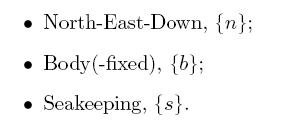

06/06/26

One-day Tutorial, CAMS'07, Bol, Croatia

<number>

## Vector notation

- The vectors defined as directed line segments (coordinate free representation) belong a to a three-dimensional space:

$\vec{u}=u_{1}^{a} \vec{a}_{1}+u_{2}^{a} \vec{a}_{2}+u_{2}^{a} \vec{a}_{2}=u_{1}^{b} \vec{b}_{1}+u_{2}^{b} \vec{b}_{2}+u_{2}^{b} \vec{b}_{2}$

- Alternatively consider the coordinate vector representation in a given coordinate system as a 3x1 matrix:

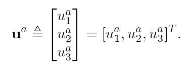

Coordinate vectors are always given relative to a basis (coordinate system)

06/06/26

One-day Tutorial, CAMS'07, Bol, Croatia

<number>

## Dot and Cross products

Dot product:

Cross product:

Skew-symmetric form of a coordinate vector:

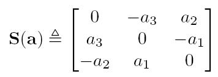

06/06/26

One-day Tutorial, CAMS'07, Bol, Croatia

<number>

## Rotation Matrices

06/06/26

One-day Tutorial, CAMS'07, Bol, Croatia

<number>

## Interpretation of Rotation Matrices

06/06/26

One-day Tutorial, CAMS'07, Bol, Croatia

<number>

## Single and Composite Rotations

Composite rotations:

Simple rotations about a coordinate axis:

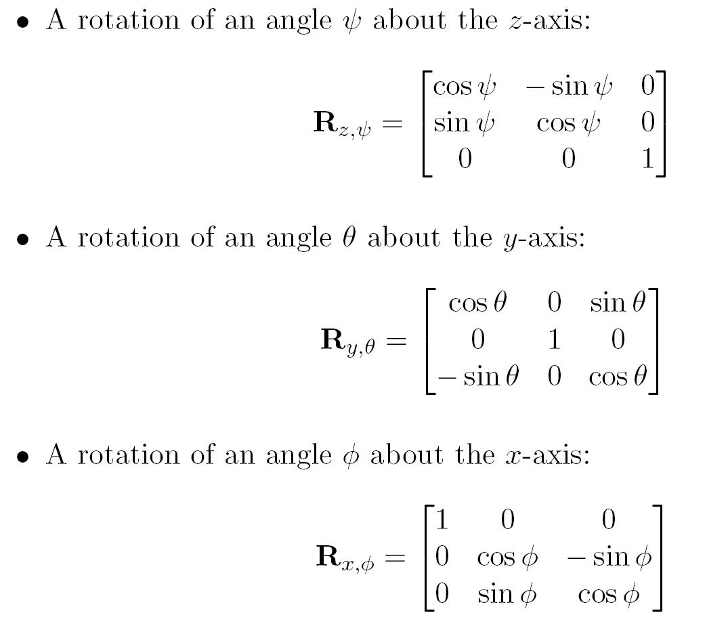

$\Updownarrow$

$\Updownarrow$

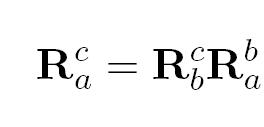

06/06/26

One-day Tutorial, CAMS'07, Bol, Croatia

<number>

## Euler Angles

- The attitude of one coordinate system relative to another can be described by three consecutive rotations.

- There are 12 ways of doing this depending on the order of the rotations, and each triplet of rotated angles is called a set of Euler Angles

06/06/26

One-day Tutorial, CAMS'07, Bol, Croatia

<number>

## Roll, Pitch and Yaw

The roll, pitch and yaw is set of Euler angles commonly use in guidance and navigation.

Vector of Roll, Pitch and Yaw that take {a} into the orientation of {b}:

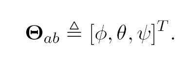

06/06/26

One-day Tutorial, CAMS'07, Bol, Croatia

<number>

## Rotation matrix in terms of RPY

After multiplication:

Note that the multiplication is consistent with the transformation

06/06/26

One-day Tutorial, CAMS'07, Bol, Croatia

<number>

## Angular velocity

Since the rotation matrix is orthogonal, then

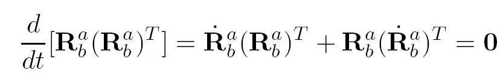

This imply that                        is skew symmetric, and hence be represented by a single coordinate vector (Egeland and Gravdahl, 2002):

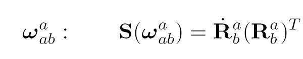

This is the angular velocity of {b} with respect to {a}, expressed in {a}

The derivative of the rotation matrix can then be expressed as

06/06/26

One-day Tutorial, CAMS'07, Bol, Croatia

<number>

## Angular velocity and deriv of RPY

Consider a rotation from {a} to {d} via RPY:

The angular velocities are

Then from the theorem of addition of angular velocities we have

06/06/26

One-day Tutorial, CAMS'07, Bol, Croatia

<number>

## Angular velocity and deriv of RPY

From

using,

we obtain

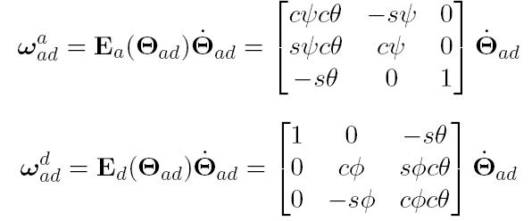

$\Leftrightarrow$

The angular velocity and the derivative of the Euler angles are, in general, different things.

06/06/26

One-day Tutorial, CAMS'07, Bol, Croatia

<number>

## Position

Position of “p” with respect to {a}, and expressed in {a}:

Coordinate system where the vector is expressed

Point of interest

Reference coordinate system

Position of “p” with respect to {a}, and expressed in {b}.

Note that a change in coord sys does not change the position vector; it is still p in {a}.

06/06/26

One-day Tutorial, CAMS'07, Bol, Croatia

<number>

## Velocity

- The relative position of any two points is invariant in any coordinate system (||r1-r2|| is independent of the coordinate system used to express r1 and r2).

- The velocity depends on the coordinate system adopted.

$\left\{a\right\}$

$p$

$\left\{b\right\}$

$\omega$

{b} and “p” rotate with angular velocity 

The velocity of “p” wrt {b} is zero, but not wrt {a}.

06/06/26

One-day Tutorial, CAMS'07, Bol, Croatia

<number>

## Derivative of a vector

<u>The derivative of a vector makes no sense without specifying the</u> <u>coordinate system with respect of which the derivative is taken</u>:

In general

06/06/26

One-day Tutorial, CAMS'07, Bol, Croatia

<number>

## Transport Theorem

In coordinate form

If we multiply both sides by

?

We need to use double script so we don’t have this problem in notation:

06/06/26

One-day Tutorial, CAMS'07, Bol, Croatia

<number>

## Sum of angular velocities revisited

This one is easier to show in coordinate-free form:

Then

$\begin{array}{c}\frac{d \vec{\rho }}{dt}=\frac{d \vec{\rho }}{dt}+\vec{\omega }_{ab}\times \vec{\rho }\\\frac{d \vec{\rho }}{dt}=\frac{d \vec{\rho }}{dt}+\vec{\omega }_{bc}\times \vec{\rho }\\\frac{d \vec{\rho }}{dt}=\frac{d \vec{\rho }}{dt}+\vec{\omega }_{cd}\times \vec{\rho }\end{array}$

$\begin{array}{c}\frac{d \vec{\rho }}{dt}=\frac{d \vec{\rho }}{dt}+\vec{\omega }_{bc}\times \vec{\rho }+\vec{\omega }_{ab}\times \vec{\rho }\\ \frac{d \vec{\rho }}{dt}+\vec{\omega }_{dc}\times \vec{\rho }+\vec{\omega }_{bc}\times \vec{\rho }+\vec{\omega }_{ab}\times \vec{\rho }\\ =\frac{d \vec{\rho }}{dt}+\underbrace{(\vec{\omega }_{dc}+\vec{\omega }_{bc}+\vec{\omega }_{ab})}_{\vec{\omega }_{ad}}\times \vec{\rho }\end{array}$

It is convenient to be familiar with both coordinate and coordinate-free representations, for some derivations are easier in one form than in the other.

06/06/26

One-day Tutorial, CAMS'07, Bol, Croatia

<number>

## Velocity and Acceleration

If {i} denotes an inertial coordinate system, then

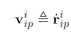

The first subscript Indicates the coordinate system with respect of which the derivative is taken

Linear acceleration:

Angular acceleration

06/06/26

One-day Tutorial, CAMS'07, Bol, Croatia

<number>

## Motion in different coord systems

Not inertial

inertial

06/06/26

One-day Tutorial, CAMS'07, Bol, Croatia

<number>

## Motion in different coord systems

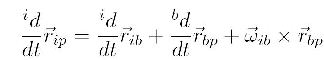

$\Leftrightarrow$

Transport Theorem

In coordinate form

06/06/26

One-day Tutorial, CAMS'07, Bol, Croatia

<number>

## Motion in different coord systems

Taking a derivative again:

With the adopted notation

06/06/26

One-day Tutorial, CAMS'07, Bol, Croatia

<number>

## Ship kinematics

Ship kinematics is different depending on the assumptions made to describe the motion:

- Manoeuvring
- Seakeeping

06/06/26

One-day Tutorial, CAMS'07, Bol, Croatia

<number>

## Manoeuvring Kinematics

- In manoeuvring, the position of the vessel is given by the position of of {b}-body-fixed coordinate system with respect to {n}-North-East-Down coordinate system.

- The attitude is given by the angles of roll, pitch and yaw that take {n} into the orientation of {b}.

06/06/26

One-day Tutorial, CAMS'07, Bol, Croatia

<number>

## Vessel linear velocities

The velocities are more conveniently expressed in {b}-body-fixed coordinate system:

surge

Note that the following integral has no physical meaning:

sway

heave

Ship trajectory:

06/06/26

One-day Tutorial, CAMS'07, Bol, Croatia

<number>

## Vessel angular velocities

The angular velocity expressed in {b}-body-fixed coordinate system is

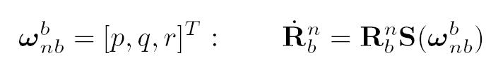

roll

pitch

yaw

Note that the following integral has no physical meaning:

The ship orientation is obtained integrating

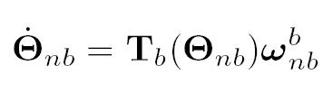

Which is the relationship we have already shown between the ang vel and the derivative of the Euler angles.

06/06/26

One-day Tutorial, CAMS'07, Bol, Croatia

<number>

## Generalised position and velocity

- We define the coordinate position-orientation vector (Fossen, 1994):

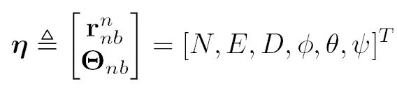

- We define the coordinate linear-angular velocity vector (Fossen, 1994):

06/06/26

One-day Tutorial, CAMS'07, Bol, Croatia

<number>

## Kinematic model {n}-{b}

Then,

Note that

Because         is not orthogonal.

06/06/26

One-day Tutorial, CAMS'07, Bol, Croatia

<number>

## Summary manoeuvring coordinates

Perez, T. and T.I. Fossen (2007)

06/06/26

One-day Tutorial, CAMS'07, Bol, Croatia

<number>

## Seakeeping kinematics

- In seakeeping, the motion is described from a reference frame which represents the equilibrium position and orientation of the vessel.

- Then the action of the waves makes the vessel oscillate with respect to this equilibrium

Definition of equilibrium reference frame:

Vessel average forward speed.

06/06/26

One-day Tutorial, CAMS'07, Bol, Croatia

<number>

## Seakeeping coordinates

In a similar fashion as we did in manoeuvring, we can define the perturbation body-fixed linear and angular velocities

Perturbation roll, pitch and yaw:

06/06/26

One-day Tutorial, CAMS'07, Bol, Croatia

<number>

## Seakeeping coordinates

Further, we can define the perturbation position an velocity vector:

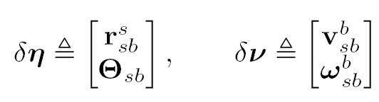

In the hydrodynamic literature, the following variables are used:

The kinematics transformation is

simplified under the assumptions of

very small angles

$˙=\delta \nu \approx \delta ˙$

06/06/26

One-day Tutorial, CAMS'07, Bol, Croatia

<number>

## Summary seakeeping coordinates

Perez, T. and T.I. Fossen (2007)

06/06/26

One-day Tutorial, CAMS'07, Bol, Croatia

<number>

## Kinetics

## Description of forces and the motion they cause on bodies using postulated laws of physics.

06/06/26

One-day Tutorial, CAMS'07, Bol, Croatia

<number>

## Forces and moments

- A force acting on a rigid body has a line of action which passes through the point of application.

- This means that the force produces a moment about a point.

$\vec{f}$

$\vec{m}_{{b}/{P}}=r_{PP'}\times \vec{f}$

$\vec{r}_{PP'}$

$P'$

any point on the line of action

$P$

06/06/26

Line of action

One-day Tutorial, CAMS'07, Bol, Croatia

<number>

## Forces and moments

- A resultant force due to a set S of forces acting on a rigid body is

$\vec{f}_{RES}=\sum_{j}^{}\vec{f}_{j}$

The resultant does not have a line of action.

- A resultant moment due to a set S of forces acting on a rigid body is

$\vec{m}_{{S}/{P}}=\sum_{j}^{}\vec{r}_{Pj}\times \vec{f}_{j}$

06/06/26

One-day Tutorial, CAMS'07, Bol, Croatia

<number>

## Moment about another point

The moment about a point Q can be found

$\begin{array}{c}\vec{m}_{{S}/{Q}}=\sum_{j}^{}\vec{r}_{Qj}\times \vec{f}_{j}=\sum_{j}^{}(\vec{r}_{Pj}+\vec{r}_{QP})\times \vec{f}_{j}\\ =\sum_{j}^{}\vec{r}_{Pj}\times \vec{f}_{j}+\vec{r}_{QP}\times \sum_{j}^{}\vec{f}_{j}\\ =\vec{m}_{{S}/{P}}+\vec{r}_{QP}\times \vec{f}_{RES}\end{array}$

$P$

$\vec{f}_{j}$

$\vec{r}_{Pj}$

The resultant can be regarded as a force with line of action through P

$Q$

$\vec{r}_{Qj}$

06/06/26

One-day Tutorial, CAMS'07, Bol, Croatia

<number>

## Transformation

- Using the previous results we have that in body-fixed coordinates

$\left[\begin{matrix}f_{Q}^{b}\\m_{Q}^{b}\end{matrix}\right]=\left[\begin{matrix}f_{P}^{b}\\S(r_{QP}^{b}) f_{P}^{b}+m_{P}^{b}\end{matrix}\right]=\underbrace{\left[\begin{matrix}I_{3\times 3}&0_{3\times 3}\\S(r_{QP}^{b})&I_{3\times 3}\end{matrix}\right]}_{H^{T}(r_{QP}^{b})} \left[\begin{matrix}f_{P}^{b}\\m_{P}^{b}\end{matrix}\right]$

If we choose Q = Ob, then

$\left[\begin{matrix}f_{b}^{b}\\m_{b}^{b}\end{matrix}\right]=\left[\begin{matrix}f_{P}^{b}\\S(r_{bP}^{b}) f_{P}^{b}+m_{P}^{b}\end{matrix}\right]=\underbrace{\left[\begin{matrix}I_{3\times 3}&0_{3\times 3}\\S(r_{bP}^{b})&I_{3\times 3}\end{matrix}\right]}_{H^{T}(r_{bP}^{b})} \left[\begin{matrix}f_{P}^{b}\\m_{P}^{b}\end{matrix}\right]$

06/06/26

One-day Tutorial, CAMS'07, Bol, Croatia

<number>

## Rigid-body mass and inertia matrix

The generalised mass matrix with inertia moments and products taken about the origin of {b} is

Inertia matrix taken about the origin {b} can be expressed by the one taken about CG (Parallel axis theorem):

The notation “b/” means about; e.g. b/g means about CG

The parallel axis theorem can only be use between CG and another point. So if we want to convert between two arbitrary points we have to do it in two steps.

06/06/26

One-day Tutorial, CAMS'07, Bol, Croatia

<number>

## Angular momentum

The angular momentum about CG in B is given by

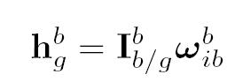

If this is expressed in the inertial coordinate system {i},

This shows that inertia matrix is not constant in an inertial frame {i} if {b} rotates wrt {i}. Hence, it is convenient to express the equations of motion in a body-fixed coordinate system.

06/06/26

One-day Tutorial, CAMS'07, Bol, Croatia

<number>

## Euler’s Axioms

- Euler’s 1st axiom states that:

-is the velocity of CG relative to {i} and expressed in {i}

-is the vector of resultant forces.

- Euler’s 2nd axiom states that:

Angular momentum about CG

Resultant moment about CG

06/06/26

<number>

One-day Tutorial, CAMS'07, Bol, Croatia

## Rigid-body Equations of motion

Expressing the velocities in the body-fixed coordinate system—located at an arbitrary point in the body, the Euler axioms become

06/06/26

One-day Tutorial, CAMS'07, Bol, Croatia

<number>

## Ship RB eq of motion

Following the notation of Fossen (2002):

$\tau ^{b}:=\left[\begin{matrix}f^{b}\\m_{b}^{b}\end{matrix}\right]=\left[X,Y,Z,K,M,N\right]^{T}$

Generalised positions

Generalised velocities

Generalised forces

06/06/26

One-day Tutorial, CAMS'07, Bol, Croatia

<number>

## Coriolis and Centripetal terms

The Coriolis-centripetal terms can be expressed as

where

 Separated into linear and anglular

06/06/26

One-day Tutorial, CAMS'07, Bol, Croatia

<number>

## RB Equations of  motion in 6DOF

In coordinate form:

06/06/26

One-day Tutorial, CAMS'07, Bol, Croatia

<number>

## Changing the body-fixed system

In different applications it is necessary to consider different locations for a body-fixed coordinate system.

Hence we may want to transform the equations of motion from {b} to {p}

06/06/26

One-day Tutorial, CAMS'07, Bol, Croatia

<number>

## Changing the body-fixed coordinates

This can be done by direct application of the transformations we have already derived:

$\left[\begin{matrix}v_{ip}^{p}\\\omega _{ip}^{p}\end{matrix}\right]=\underbrace{\left[\begin{matrix}I_{3\times 3}&S^{T}(r_{bp}^{b})\\0_{3\times 3}&I_{3\times 3}\end{matrix}\right]}_{H(r_{bp}^{b})}\left[\begin{matrix}v_{ib}^{b}\\\omega _{ib}^{b}\end{matrix}\right]$

Hence,

$\left[\begin{matrix}f_{b}^{b}\\m_{b}^{b}\end{matrix}\right]=\underbrace{\left[\begin{matrix}I_{3\times 3}&0_{3\times 3}\\S(r_{bP}^{b})&I_{3\times 3}\end{matrix}\right]}_{H^{T}(r_{bP}^{b})} \left[\begin{matrix}f_{P}^{b}\\m_{P}^{b}\end{matrix}\right]$

06/06/26

One-day Tutorial, CAMS'07, Bol, Croatia

<number>

## Seakeeping RB equations of motion

In Seakeeping, the equations of motion are considered within an linear framework.

In the literature, it is said that the motion is described from the equilibrium reference frame and formulated at the origin of {s}—seakeeping coordinate system.

This would imply that the inertia matrix is time varying as we have seen in the previous slide, but this is not the case.

06/06/26

One-day Tutorial, CAMS'07, Bol, Croatia

<number>

## Seakeeping RB equations of motion

The seakeeping RB eq. can be obtained by considering the equations of motion in body-fixed coordinates and considering only linear terms:

Perturbation Eq in

body-fixed coord.

$\Rightarrow$

Perturbation within

Linear framework

Seakeeping RB Eq.

of motion:

06/06/26

One-day Tutorial, CAMS'07, Bol, Croatia

<number>

## References

- Egeland, O. and J.T. Gravdahl (2002) **Modelling and Simulation for Automatic Control**. Marine Cybernetics.

- Kane, T.R., and D.A., Levinson (1985) **Dynamics: Theory and Applications**. McGraw Hill series in Mech Eng.

- Fossen, T.I. (2002) **Marine Control Systems**. Marine Cybernetics.

- Perez, T. (2005) **Ship Motion Control**. Springer.

- Perez, T. and T.I. Fossen (2007) <em>Kinematic Models for Seakeeping and Manoeuvring of Marine Vessels. Modeling</em>, Identification and Control, <strong>MIC-28</strong>(1):1-12, 2007.

- Sciavicco, L. and B. Siciliano (2001) **Modelling and Control of Robot Manipulators.** Springer Advanced Textbooks in Control and Signal Processing.

06/06/26

One-day Tutorial, CAMS'07, Bol, Croatia

<number>