## Modelling and Simulation of Environmental Disturbances   (Module 5)

Dr Tristan Perez

Centre for Complex Dynamic Systems and Control (CDSC)

Prof. Thor I Fossen

Department of Engineering Cybernetics

06/06/26

One-day Tutorial, CAMS'07, Bol, Croatia

<number>

## Regular waves in deep water

The sea surface elevation is described by:

where

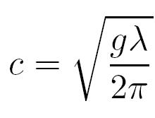

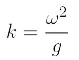

Wave frequency

(rad/s)

Phase velocity

(m/sec)

Wave length

(m)

Wave number

(rad/m)

These expressions are only valid in deep water

, where *h* is the water depth.

06/06/26

One-day Tutorial, CAMS'07, Bol, Croatia

<number>

## Sailing condition

The sailing condition of a vessel is given by its forward speed  *U*  and its encounter angle, i.e., the heading angle relative to the waves.

Encounter angle

06/06/26

One-day Tutorial, CAMS'07, Bol, Croatia

<number>

## Encounter frequency

If the waves are observed  from a reference frame that moves at a constant speed, the frequency observed is called Encounter Frequency.

This is a Doppler effect

Negative encounter frequency => vessel overtakes the waves

06/06/26

One-day Tutorial, CAMS'07, Bol, Croatia

<number>

## Ocean waves

Ocean waves present, in general, irregularity in time and space and cannot be predicted exactly: Stochastic Process.

ζ(x,y,0)

ζ(0,0,t)

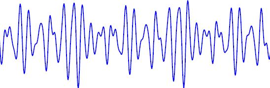

*t*

06/06/26

One-day Tutorial, CAMS'07, Bol, Croatia

<number>

## Stochastic sea description

In practice, it is assumed that the variations of a stochastic nature of the sea are much slower than the variations of the sea surface itself; Hence,

- ζ(x, y, t) can be considered a realization of a stationary and homogeneous stochastic process.
- For deep water waves, ζ(x, y, t) is further assumed Gaussian.

06/06/26

One-day Tutorial, CAMS'07, Bol, Croatia

<number>

## Gaussian waves

p(ζ)

ζ(xo,yo,t)

*t*

ζ(x,y,0)

ζ

(xo,yo)

The elevation of the sea surface can be thought as being generated as the sum of many sinusoidal waves with different amplitudes, frequencies, and phases.

06/06/26

One-day Tutorial, CAMS'07, Bol, Croatia

<number>

## How good are these hypotheses?

From data collected at sea (Haverre & Moan, 1985), it can be stated that

- For low and moderate seas (H1/3 < 4m), the sea can be considered stationary for periods over 20 min. For more severe sea states, stationarity can be questioned even for periods of 20 min.
- For medium seas (4m < H1/3 < 8m), Gaussian models are still accurate, but deviations from Gaussianity slightly increase with the increasing severity of the sea state.
- If the water is sufficiently deep, wave elevation can be consider Gaussian regardless of the sea state.

(H1/3 is the average of the highest one third of the waves recorded.)

06/06/26

One-day Tutorial, CAMS'07, Bol, Croatia

<number>

## Random sea characterization

Under the Gaussianity assumption, the process is completely described by

- Mean
- Variance

The sea surface elevation is described relative to the mean free surface; therefore, the mean of the SP is zero.

The variance is described in terms of a sea power spectral density or sea spectrum.

06/06/26

One-day Tutorial, CAMS'07, Bol, Croatia

<number>

## Power spectral density definition

If we use the frequency in Hz to define the FT, then

$\begin{array}{c}S_{xx}(f)=\int_{}^{}R_{xx}(\tau ) e^{-j2\pi f\tau }d\tau \\R_{xx}(\tau )=\int_{}^{}S_{xx}(f) e^{j2\pi f\tau }df\end{array}$

and

$var\left[x\right]=R_{xx}(0)=\int_{}^{}S_{xx}(f)df$

from which the name power spectral density follows.

This definition is common in the literature of electrical communications and signal processing.

06/06/26

One-day Tutorial, CAMS'07, Bol, Croatia

<number>

## PSD alternative definition

When we use the circular frequency (rad/s) to define the FT,

$\begin{array}{c}S_{xx}(\omega )=a \int_{}^{}R_{xx}(\tau ) e^{-j\omega \tau }d\tau \\R_{xx}(\tau )=b \int_{}^{}S_{xx}(\omega ) e^{j\omega \tau }d\omega \\a b=\frac{1}{2\pi }\end{array}$

We need to be careful on how we compute power!!!

06/06/26

One-day Tutorial, CAMS'07, Bol, Croatia

<number>

## Random sea characterization

The spectral moments of order *n* are defined as:

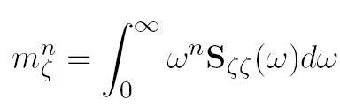

Then the variance and standard deviation (RMS value) are

 =

06/06/26

One-day Tutorial, CAMS'07, Bol, Croatia

<number>

## Statistics of wave period

06/06/26

One-day Tutorial, CAMS'07, Bol, Croatia

<number>

## Narrow and wide banded processes

06/06/26

One-day Tutorial, CAMS'07, Bol, Croatia

<number>

## Example narrow and wide-banded

Narrow-banded signal

Wide-banded signal

06/06/26

One-day Tutorial, CAMS'07, Bol, Croatia

<number>

## Statistics of wave height

06/06/26

One-day Tutorial, CAMS'07, Bol, Croatia

<number>

## Statistics of Maxima

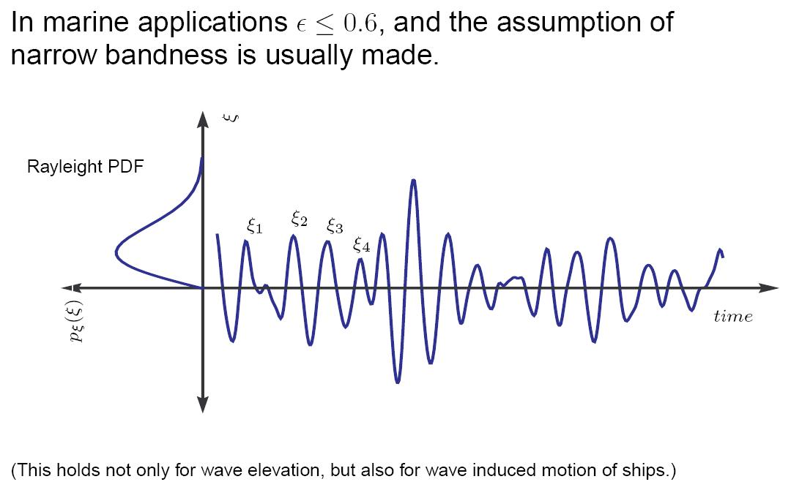

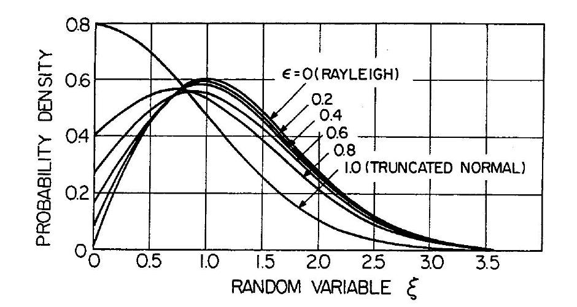

06/06/26

One-day Tutorial, CAMS'07, Bol, Croatia

<number>

## Long- and short-crested Seas

- After the wind has blown constantly for a certain period of time, the sea elevation can be assumed statistically stable. In this case, the sea is referred to as *fully-developed*.

- If the irregularity of the observed waves are only in the dominant wind direction, so that there are mainly uni-directional wave crests with varying separation but remaining parallel to each other, the sea is referred to as a *long-crested* irregular sea.

- When irregularities are apparent along the wave crests at right angles to the direction of the wind, the sea is referred to as *short crested or confused sea.*

06/06/26

One-day Tutorial, CAMS'07, Bol, Croatia

<number>

## Long-crested Seas

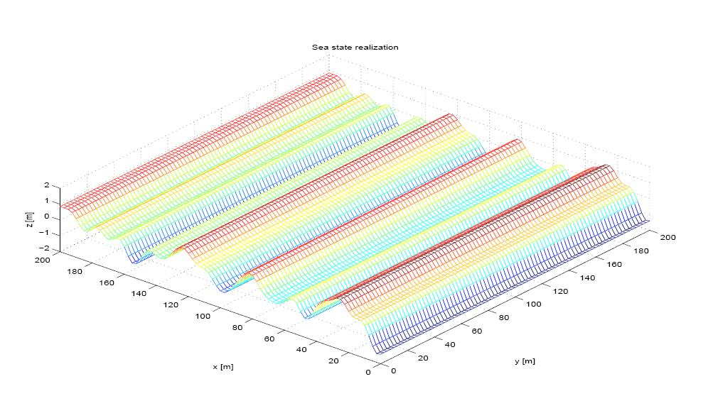

06/06/26

One-day Tutorial, CAMS'07, Bol, Croatia

<number>

## Short-crested Seas

06/06/26

One-day Tutorial, CAMS'07, Bol, Croatia

<number>

## Idealised spectra Long-crested seas

In cases where no wave records are available, standard, idealized, formulae can be used. One family of idealized spectra is the *Bretschneither* family which was developed in early 1950s:

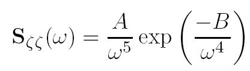

Modal frequency

Spectral moments

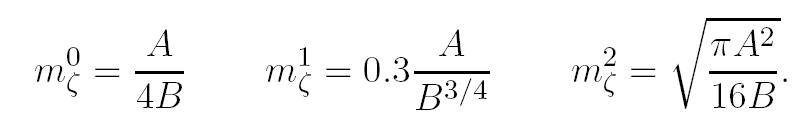

(This family can be used to represent rising and falling seas, as well as fully developed seas with no swell and unlimited fetch.)

06/06/26

One-day Tutorial, CAMS'07, Bol, Croatia

<number>

## Idealised Spectra

In the 1960’s, the *Pierson-Moskowitz* family was developed to forecast storm waves at a single point in fully developed seas with no swell using wind data. This family relates the parameters *A* and *B* to the

average wind speed at 19.5m above the sea surface:

The ITTC recommends the use of the *Modified Pierson-Moskowitz* family; significant wave height and zero-crossing period or the average wave period is used:

06/06/26

One-day Tutorial, CAMS'07, Bol, Croatia

<number>

## Example ITTC spectra

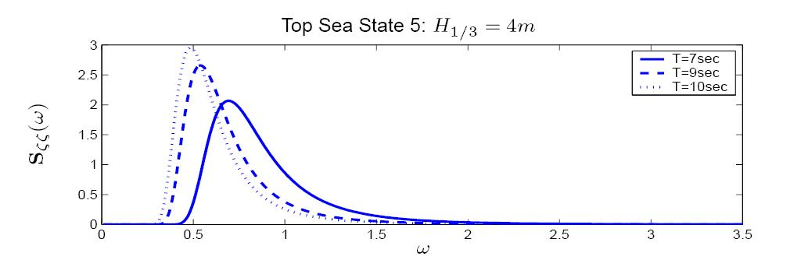

06/06/26

One-day Tutorial, CAMS'07, Bol, Croatia

<number>

## Other Spectra seas

Other families:

- The JONSWAP spectral family accounts for the case of limited fetch wind waves

- The TMA spectral family is an extension of the JONSWAP for finite water depth,

- The double-peak Torsethaugen spectral family accounts for both swell and wind waves,

- The Ochi six-parameter spectral family can be fitted to almost any wave record (it could account for swell and wind waves.)

For further details see Ochi, K. (1998) Ocean Waves: The Stochastic Approach, Cambridge University Press. Ocean Tech. Series.

06/06/26

<number>

One-day Tutorial, CAMS'07, Bol, Croatia

## Spectra for Short-crested Seas

Directional spectra are more realistic and are very important to calculate loads on marine structures since the motion response depends highly on the encounter angle. For simulation, it is common to separate the directional spectrum as a product of two functions:

is the spreading function

06/06/26

One-day Tutorial, CAMS'07, Bol, Croatia

<number>

## Spreading Function

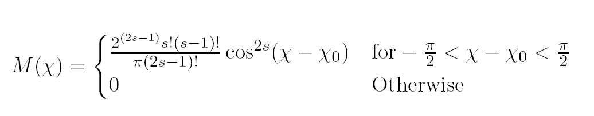

where χ0 is the dominant wave propagation direction, and the values of s = 1, 2 are commonly used. See Lloyd (1989) for a more general form where |χ − χ0| < α; with α not necessarily equal to π/2

06/06/26

One-day Tutorial, CAMS'07, Bol, Croatia

<number>

## Time-domain Simulations

If ζ(t) is stationary and Gaussian on time interval [0, T], its realizations can be approximated to any degree of accuracy by

with N sufficiently large; where σn are constants and the phases εn are independent identically distributed random variables with uniform distribution in [0, 2π].

The autocorrelation is given by

06/06/26

One-day Tutorial, CAMS'07, Bol, Croatia

<number>

## Time-domain Simulations

06/06/26

One-day Tutorial, CAMS'07, Bol, Croatia

<number>

## Why is it done this way?

06/06/26

One-day Tutorial, CAMS'07, Bol, Croatia

<number>

## Formulae for Time-damin Simulations

06/06/26

One-day Tutorial, CAMS'07, Bol, Croatia

<number>

## Wind

Wind is commonly divided in two components; a mean value and a fluctuating component, or gust.

The mean component decreases with the distance towards the ground or the surface of the ocean, whereas the gust is approximately constant with the distance to the ground or the surface of the ocean—boundary layer.

It is a 3D phenomenon, but in marine applications  we restrict it to  2D, and velocities are considered only in the horizontal plane.

Wind is parameterized by the velocity *U* and the direction *ψ*. The  direction is taken with respect to the North-East.

Note that, in general, the direction of the wind is the direction from where the wind is coming from, e.g., a SE wind blows from the SE towards NW.

06/06/26

One-day Tutorial, CAMS'07, Bol, Croatia

<number>

## Wind Mean-velocity Component

Slowly-varying fluctuations in the mean wind velocity can be modeled by a 1st order Gauss-Markov Process:

where *w* is Gaussian white noise and μ ≥ 0 is a constant.

The magnitude of the velocity should be restricted by saturation elements

06/06/26

One-day Tutorial, CAMS'07, Bol, Croatia

<number>

## Wind Mean-direction component

Slowly-varying fluctuations in the mean wind direction  can also be implemented by a 1st order Gauss-Markov Process (Sorensen, 2005):

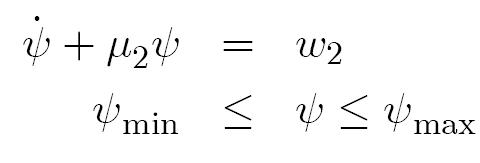

The direction is taken with respect to the (n-frame).

NOTE:  This direction is **often** the direction from where the wind is blowing: North-East (NE) wind blows from the NE

06/06/26

<number>

One-day Tutorial, CAMS'07, Bol, Croatia

## Wind velocity and direction

Sorensen, (2005)

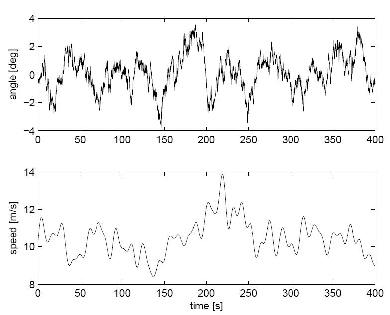

06/06/26

One-day Tutorial, CAMS'07, Bol, Croatia

<number>

## Wind Gust

The wind gust is model as a realization of a stochastic process with a particular spectrum (Sorensen, 2005).

06/06/26

One-day Tutorial, CAMS'07, Bol, Croatia

<number>

## Current

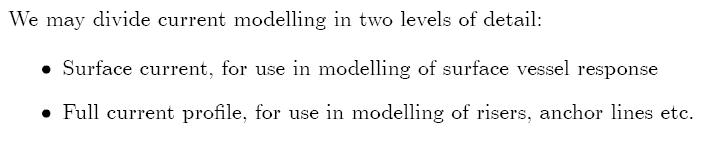

## **Surface Current**

Current velocity magnitude:

Current direction:

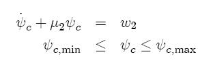

The direction is taken with respect to the (n-frame). NOTE:  This direction is the direction  to where the current flows : North-East (NE) current flow towards the NE. (This is different from the convention for wind)

06/06/26

<number>

One-day Tutorial, CAMS'07, Bol, Croatia

## References

- Perez, T. (2005) **Ship Motion Control**. Springer.

- Ochi, M. (2005) **Ocean Waves: the stochastic approach**. Cambridge University Press.

- Sorensen, A.J. (2005) “*Marine Cybernetics*.” Lecture notes, Dept. of Marine Technology NTNU, NORWAY.

06/06/26

One-day Tutorial, CAMS'07, Bol, Croatia

<number>