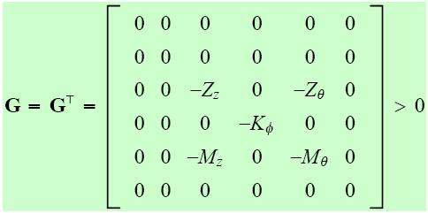
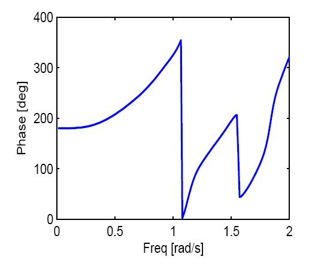

## Seakeeping Models in the Frequency Domain  (Module 6)

Dr Tristan Perez

Centre for Complex Dynamic Systems and Control (CDSC)

Prof. Thor I Fossen

Department of Engineering Cybernetics

06/06/26

One-day Tutorial, CAMS'07, Bol, Croatia

<number>

## Linear hydrodynamic forces in waves

- Linear theory can describe hydrodynamic loads to a great extent in low to medium sea states (depending on the size of the ship)

- Linear means that the loads and the motion are proportional to the wave amplitudes.

- Linearity means superposition: the loads and responses due to irregular seas can be obtained by linear combination of responses to regular or sinusoidal seas.

- Also due to the linearity assumption, the study can be performed either in time or frequency domain.

06/06/26

One-day Tutorial, CAMS'07, Bol, Croatia

<number>

## Linear hydrodynamic forces

$\tau _{hyd}=\tau _{rad}+\tau _{rest}+\tau _{exc}$

waves

LinearLoads

Linear eq of motion

Motion

Some of the loads depend on the excitation due to the waves, while other depend on the motion of the vessel itself.

The second type of loads give the system a feedback structure.

06/06/26

One-day Tutorial, CAMS'07, Bol, Croatia

<number>

## Adding nonlinear forces

Once we have a linear time-domain model, nonlinear loads can be added due to the assumption of force superposition:

waves

LinearLoads

Loads

Linear eq of motion

Motion

Nonlinear Loads

So, the linear model should not be seen as a limitation; rather as a basis upon which we can build nonlinear models based on the assumption of force superposition.

06/06/26

One-day Tutorial, CAMS'07, Bol, Croatia

<number>

## Linear hydrodynamic analysis

Due to linearity, we can study the problem for sinusoidal excitation and then use these results to obtain solutions to non-sinusoidal cases via superposition.

The hydrodynamic problem of obtaining loads and motion for sinusoidal waves can be separated into two sub-problems:

- Excitation problem: The ship is restrained from moving and kept in its mean position, and the excitation loads are obtained as a result of changes in pressure due to the incoming waves.

- Radiation problem: The ship is forced to oscillate in calm water in each DOF with a frequency equal to the wave excitation frequency.

06/06/26

One-day Tutorial, CAMS'07, Bol, Croatia

<number>

## Radiation forces

Radiation loads appear due to the motion of the ship—the change in momentum of the fluid due to the motion of the hull changes the pressure on the hull, which induce the loads.

These loads have two components

- Proportional to the accelerations
- Proportional to the velocities

06/06/26

One-day Tutorial, CAMS'07, Bol, Croatia

<number>

## Radiation forces

Boundary conditions:

free surface condition (dynamic+kinematic conditions)

sea bed condition

dynamic body condition

Regular outgoing waves

are observed at large distance from the vessel

radiation condition

$\Phi _{rad}=\sum_{}^{}\Phi _{j}$

$\nabla ^{2}\Phi _{rad}=0$

06/06/26

One-day Tutorial, CAMS'07, Bol, Croatia

<number>

## Computing forces

Forces and moments are obtained by integrating the pressure over the average wetted surface *Sw*:

Radiation forces and moments:

$\tau _{rad,i}=\left\{\begin{matrix}-\iint_{}^{}\left(\frac{\partial \Phi _{rad}}{\partial t}\right) \left(n\right)_{i}ds i=1,2,3.\\-\iint_{}^{}\left(\frac{\partial \Phi _{rad}}{\partial t}\right) \left(r\times n\right)_{i-3}ds i=4,5,6.\end{matrix}\right.$

DOF:

1-surge

2-sway

3-heave

4-roll

5-pitch

6-yaw

06/06/26

One-day Tutorial, CAMS'07, Bol, Croatia

<number>

## Radiation forces for regular motion

If the motion of the vessel on the DOF *i* is harmonic:

$\xi _{i}=¯cos(\omega t)$

Then, after integrating the pressure over the surface of the hull,  the radiation forces in the DOF *j* due to the motion in the DOF *i* take the following form:

$\tau _{rad,j}=-A_{ij}(\omega ) ¨_{i}-B_{ij}(\omega ) ˙_{i}$

← Only in steady state condition.

06/06/26

One-day Tutorial, CAMS'07, Bol, Croatia

<number>

## Radiation forces for regular motion

$\tau _{rad,j}=-A_{ij}(\omega ) ¨_{i}-B_{ij}(\omega ) ˙_{i}$

- The coefficients that multiply the accelerations are called added mass coefficients even though not all of them have units of mass. The added mass terms give the forces due to the accelerations of the fluid as the vessel oscillations—the whole fluid will oscillate with different fluid particle amplitudes.

- The coefficients proportional to the velocities are called potential damping coefficients. The potential damping terms represent the energy carried away by the waves generated due to the motion of the hull.

06/06/26

One-day Tutorial, CAMS'07, Bol, Croatia

<number>

## Added mass and damping

Example of added mass and potential damping in heave of a symmetric rectangular barge 8x4x45m:

The added mass and damping coefficients depend on

- Shape of the hull
- Forward speed
- Water depth

06/06/26

One-day Tutorial, CAMS'07, Bol, Croatia

<number>

## Symmetry

- There is a total of 36 added mass and 36 damping coefficients.

- If the structure has zero speed and a plane of symmetry, half of the coefficients are zero. (for this to hold with forward speed, the plane of symmetry has to be parallel to the forward direction.)

- If the structure has zero speed and there is no current, then the matrices of added mass and damping are symmetric:

$\begin{array}{c}A_{ij}(\omega )=A_{ji}(\omega )\\B_{ij}(\omega )=B_{ji}(\omega )\end{array}$

06/06/26

One-day Tutorial, CAMS'07, Bol, Croatia

<number>

## Restoring forces (linear)

The resotring forces are due to changes in displacement:

$\tau _{rest}=$

(*Awp* waterplane area)

These are computed for calm water—Calm water stability.

06/06/26

One-day Tutorial, CAMS'07, Bol, Croatia

<number>

## Linear Wave Excitation

- The linear wave excitation or 1st order waves excitation are the loads on the structure when it is restrained from oscillating and there are incident waves. The linear assumption assumes the loads are proportional to the wave amplitude.

- 1st order wave loads are separated into two components:
    - Froude-Kriloff
    - Diffraction

06/06/26

One-day Tutorial, CAMS'07, Bol, Croatia

<number>

## Froude-Kriloff loads

- The Froude-Kriloff loads are obtained by integrating the pressure due to undisturbed wave field over the mean wetted surface of the body—It is assumed that the body does not disturb the wave field.

- These can be considered within a nonlinear framework by integrating over the instantaneous wetter surface.

06/06/26

One-day Tutorial, CAMS'07, Bol, Croatia

<number>

## Diffraction loads

- The diffraction loads appear due to the change in the wave field by the presence of the body.

- These can be computed in a similar way as the radiation forces by considering a BVP; the main difference is that the boundary condition on the body:
    - The velocity due to the diffraction potential has to be equal and opposite to the velocity due to undisturbed wave potential.

This body condition ensures there will be no fluid transport through the body.

06/06/26

One-day Tutorial, CAMS'07, Bol, Croatia

<number>

## RAOS—Frequency response functions

$\tau _{exc}$

Force RAO

Force to Motion RAO

Sea surface elevation

combined

Motion RAO

motion

06/06/26

One-day Tutorial, CAMS'07, Bol, Croatia

<number>

## Force RAO

For a regular wave

$\zeta =¯cos(\omega t+\phi _{\zeta })$

The linear excitation forces will be

$\tau _{exc,i}=¯_{i}(\omega )cos[\omega t+\phi _{\tau i}(\omega )]$

The amplitude and phase of the excitation force depend on

- Wave Frequency
- Encounter angle
- Wave amplitude
- Forward speed

06/06/26

One-day Tutorial, CAMS'07, Bol, Croatia

<number>

## Force RAO

$\tau _{exc,i}(t)=\underbrace{¯ \left|F_{i}(j\omega )\right|}_{¯_{i}(\omega )}cos(\omega t+\underbrace{\phi _{\zeta }+arg[F_{i}(j\omega )]}_{\phi _{\tau ,i}(\omega )})$

Example heave Force RAO (*i*=3) for a barge (8x4x45m):

06/06/26

One-day Tutorial, CAMS'07, Bol, Croatia

<number>

## Motion RAO

$\xi _{i}(t)=\underbrace{¯ \left|H_{i}(j\omega )\right|}_{¯_{i}(\omega )}cos(\omega t+\underbrace{\phi _{\zeta }+arg[H_{i}(j\omega )]}_{\phi _{\xi ,i}(\omega )})$

Example motion Force RAO (*i*=3) for a barge (8x4x45m):

06/06/26

One-day Tutorial, CAMS'07, Bol, Croatia

<number>

## Force to motion FRF

Using the added mass and damping with the linear (seakeeping) equation of motion we can obtain the  force to motion frequency response function:

$[-\omega ^{2}[M_{RB}+A(\omega )]+j\omega B(\omega )+G]~=~_{exc}$

This is sometimes written in the hydrodynamic literature as

$[M_{RB}+A(\omega )]¨(t)+B(\omega )˙(t)+G\xi (t)=\tau _{exc}(t)$

This is an abuse of notation since this is not a true equation of motion; it is a different (rather confusing) way to write the frequency response function.

06/06/26

One-day Tutorial, CAMS'07, Bol, Croatia

<number>

## Force to motion FRF

Then we can define the force to motion frequency response matrix:

$\begin{array}{c}G(j\omega ):=[-\omega ^{2}[M_{RB}+A(\omega )]+j\omega B(\omega )+G]^{-1}\\\\ =\left[\begin{matrix}G_{11}(j\omega )&G_{12}(j\omega )&\cdots &G_{16}(j\omega )\\G_{21}(j\omega )&G_{22}(j\omega )&\cdots &G_{26}(j\omega )\\\vdots &\vdots &\ddots &\vdots \\G_{61}(j\omega )&G_{62}(j\omega )&\cdots &G_{66}(j\omega )\end{matrix}\right]\end{array}$

06/06/26

One-day Tutorial, CAMS'07, Bol, Croatia

<number>

## Motion RAO

- The Force RAO relates the wave elevation to the linear excitation forces.
- By combining the Force RAO with the Force to motion frequency response matrix we obtain the motion frequency response due to wave elevation or Motion RAO:

$H(j\omega ):=G(j\omega ) F(j\omega )$

$H(j\omega )=\left[H_{1}(j\omega ),H_{2}(j\omega )\ldots ,H_{6}(j\omega )\right]^{T}$

$F(j\omega )=\left[F_{1}(j\omega ),F_{2}(j\omega )\ldots ,F_{6}(j\omega )\right]^{T}$

06/06/26

One-day Tutorial, CAMS'07, Bol, Croatia

<number>

## Statistics of Loads and Motion

- Since the wave elevation is assumed a zero-mean Gaussian process and the system is assumed linear, the loads and the response are also zero-mean and Gaussian processes.

- The spectra of loads and response is all that is needed to compute any statistics:

$S_{\tau \tau ,i}(\omega )=\left|F_{i}(j\omega )\right|^{2}S_{\zeta \zeta }(\omega )$

$S_{\xi \xi ,i}(\omega )=\left|H_{i}(j\omega )\right|^{2}S_{\zeta \zeta }(\omega )$

06/06/26

One-day Tutorial, CAMS'07, Bol, Croatia

<number>

## Simulation of wave loads and motion time series

Having the spectrum, we can simulate time series of loads and motion in the same way we do it for the wave elevation:

$\tau _{i}(t)=\sum_{n}^{}\sum_{m}^{}¯_{nmi}cos\left[\omega _{e,n} t+\phi _{nmi}+\varepsilon _{n}\right]$

$¯_{nmi}=\sqrt{2\left|F_{i}(j\omega _{n}^{},U,\chi _{m}^{})\right|^{2}S_{\zeta \zeta }(j\omega _{n}^{},\chi _{m}^{}) \Delta \omega \Delta \chi }$

$\phi _{nmi}=argF_{i}(j\omega _{n}^{},U,\chi _{m}^{})$

$\omega _{e,n}=\left(\omega _{n}^{}-\frac{\left(\omega _{n}^{}\right)^{2}U}{g}cos\chi _{m}^{}\right)$

$\begin{array}{c}\omega _{n}^{}\in \left[\omega _{n}-{\Delta \omega }/{2},\omega _{n}+{\Delta \omega }/{2}\right]\\\chi _{m}^{}\in \left[\chi _{m}-{\Delta \chi }/{2},\chi _{m}+{\Delta \chi }/{2}\right]\end{array}$

$\varepsilon _{n}$

-uniformly distributed in [0,2]

06/06/26

One-day Tutorial, CAMS'07, Bol, Croatia

<number>

## Non-linear wave loads

- There are some problems related to wave-structure interactions which cannot be described by linear Theory alone.

- The nonlinear problems attempt to describe more accurately the free-surface and body conditions on the instantaneous rather than mean values.

- A convenient way to solve nonlinear wave-structure problems is by using perturbation analysis.

- In a second order theory, the problems are solved up second-order in incident wave amplitude—i.e., in the potential and pressure terms proportional to the wave amplitude and wave amplitude square are considered.

06/06/26

One-day Tutorial, CAMS'07, Bol, Croatia

<number>

## Non-linear wave loads

The effects of second-order loads are important for structures which are kept in position by mooring lines, anchors, and propulsion systems, and for vessels following trajectories.

The solution of a second order problem evidences

- Mean wave drift force
- Slowly-varying wave drift force (sub harmonic)
- Rapidly varying wave drift force (super harmonic)

06/06/26

One-day Tutorial, CAMS'07, Bol, Croatia

<number>

## Evidence of second-order loads

A simple way to evidence the effects of a second order problem is to look at the quadratic term in the Bernoulli equation:

$p+\rho gz+\rho \frac{\partial \varphi }{dt}+\frac{\rho }{2}\nabla \varphi \cdot \nabla \varphi =C$

Then,

$\nabla \varphi \cdot \nabla \varphi =V_{1}^{2}+V_{2}^{2}+V_{3}^{2}$

06/06/26

One-day Tutorial, CAMS'07, Bol, Croatia

<number>

## Evidence of second-order loads

Consider the case where

$V_{1}=A_{1}cos(\omega _{1}t)+A_{2}cos(\omega _{2}t)$

Then,

$\begin{array}{c}V_{1}^{2}=\frac{A_{1}^{2}}{2}+\frac{A_{2}^{2}}{2}\\ +\frac{A_{1}^{2}}{2}cos(2\omega _{1}t)+\frac{A_{2}^{2}}{2}cos(2\omega _{2}t)\\ +A_{1}A_{2}cos[(\omega _{1}-\omega _{2})t]+A_{1}A_{2}cos[(\omega _{1}+\omega _{2})t]\end{array}$

Mean components

rapidly varying components

Slowly varying component

These give rise to 2nd order pressure force components!

06/06/26

One-day Tutorial, CAMS'07, Bol, Croatia

<number>

## Non-linear wave load effects

- Mean wave-drift force: Determine the equilibrium position of the moored system (together with wind and current). They are important for the design of mooring lines and propulsion systems for dynamic positioning.

- Slowly-varying wave-drift force: The forces have frequencies much slower than the wave elevation. These can excite resonant modes in the horizontal position of the moored vessel. Typical resonance periods in offshore structures are 1 to 2min.

- Rapidly-varying wave-drift force: these forces have frequency components which are higher than the wave elevation frequency. These can excite structural resonant modes: periods 2 to 4s.

06/06/26

One-day Tutorial, CAMS'07, Bol, Croatia

<number>

## Example (Pinkster 1979)

06/06/26

One-day Tutorial, CAMS'07, Bol, Croatia

<number>

## Second order FRF

- For slowly varying wave-drift forces, the second order potential is needed.
- With the second order potential, the second order FRF be computed:

$T_{jk}^{ic}(\omega _{j},\omega _{k})$

$T_{jk}^{is}(\omega _{j},\omega _{k})$

$\begin{array}{c}F_{i}^{SV}=\sum_{j=1}^{N}\sum_{k=1}^{N}\zeta _{j}\zeta _{k}[T_{jk}^{ic}cos([\omega _{j}-\omega _{k}] t+[\varepsilon _{j}-\varepsilon _{k}])\\ +T_{jk}^{is}sin([\omega _{j}-\omega _{k}] t+[\varepsilon _{j}-\varepsilon _{k}])]\end{array}$

06/06/26

One-day Tutorial, CAMS'07, Bol, Croatia

<number>

## Mean wave drift from 2ord FRF

- Note that

- Then the mean wave drift forces can ne obtained from:

$T_{jk}^{ic}=T_{kj}^{ic}$

$T_{jk}^{is}=-T_{kj}^{is}$

$F_{i}^{MD}=¯_{i}^{SV}=\sum_{j}^{N}\zeta _{j}^{2}T_{jj}^{ic}$

06/06/26

One-day Tutorial, CAMS'07, Bol, Croatia

<number>

## Hydrodynamic Codes

The working principle of all codes:

Input data and

Pre-processing

Code

- Hull geometry
- Loading condition
- Environment (frequencies)
- Calculation settings

Output data and

Post-processing

- A(w), [A(∞)]
- B(w), [B(∞)]
- 1st order force FRF
- 2nd order force FRF
- Motion FRF

06/06/26

One-day Tutorial, CAMS'07, Bol, Croatia

<number>

## References

- Faltinsen, O.M. (1990) **Sea Loads on Ships and Ocean Structures**. Cambridge University Press.

- Journée, J.M.J. and W.W. Massie (2001) <strong>Offshore Hydromechanics.</strong> Lecture notes on offshore hydromechanics for Offshore Technology students, code OT4620. (<a href="http://www.ocp.tudelft.nl/mt/journee/"><u>http://www.ocp.tudelft.nl/mt/journee/</u></a>)

- Perez, T. and T. I. Fossen (2006) “Time-domain Models of Marine Surface Vessels  Based on Seakeeping Computations.” 7th IFAC Conference on Manoeuvring and Control of Marine Vessels MCMC, Portugal, September.

06/06/26

One-day Tutorial, CAMS'07, Bol, Croatia

<number>