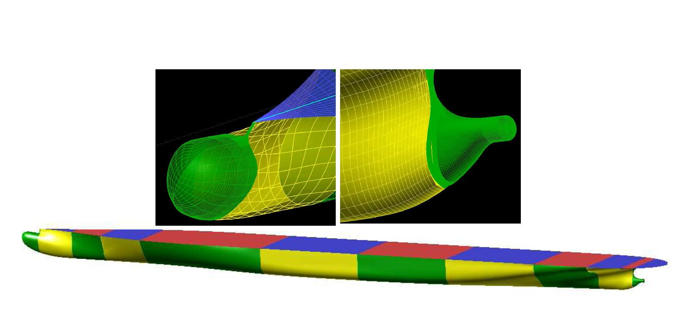
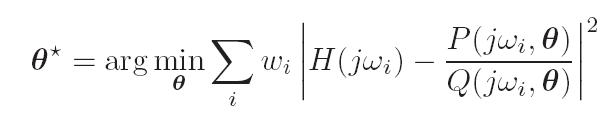

## Time-domain models based on frequency-domain data   (Module 7)

Dr Tristan Perez

Centre for Complex Dynamic Systems and Control (CDSC)

Prof. Thor I Fossen

Department of Engineering Cybernetics

06/06/26

One-day Tutorial, CAMS'07, Bol, Croatia

<number>

## Time-domain modelling approaches

Two approaches can be distinguished for time-domain modelling:

- Full time-domain hydrodynamic codes,

- Time-domain models based on frequency-domain data.

Here, we will follow the second approach.

06/06/26

One-day Tutorial, CAMS'07, Bol, Croatia

<number>

## Linear time-domain models

- Linear time-domain models can be used for control system design and can serve as a basis for developing non-linear models:

Wave Loads

Loads

Linear model

Motion

Nonlinearities

06/06/26

One-day Tutorial, CAMS'07, Bol, Croatia

<number>

## Frequency-domain Eq. of Motion

In the hydrodynamic literature it is common to find

$[M_{RB}+A(\omega )]¨(t)+B(\omega )˙(t)+G\xi (t)=\tau _{exc}(t)$

- This is valid to describe the steady-state response to sinusoidal excitations.

- This is a false time-domain model; it is simply an alternative (and confusing) way to write the frequency response of the system (Cummins, 1962).

06/06/26

One-day Tutorial, CAMS'07, Bol, Croatia

<number>

## Cummins’s equation

Cummins (1962), took a different modelling approach and consider the radiation problem *ab initio* in the time domain. He obtained the Cummins’s equation of motion:

- The added mass matrix is constant—frequency and speed independent.

- The convolution term accounts for fluid-memory effects.
- The kernel of the convolution is a matrix of retardation functions or impulse responses.
- This is a true linear equation of motion, and it is valid for any excitation, provided the linearity assumption holds.

06/06/26

One-day Tutorial, CAMS'07, Bol, Croatia

<number>

## Cummins’s equation with forward speed

- The convolution terms depend on the forward speed.

- With forward speed appears a constant damping term.

- The restoring forces are affected by hydrodynamic pressure—Lift, changes in trim.  (Usually ignored for Fn<0.3)

06/06/26

One-day Tutorial, CAMS'07, Bol, Croatia

<number>

## Ogilvie’s relations

If Cummins’s Equation is valid for any input, it must then be valid for sinusoids in particular (Ogilvie, 1964).

Ogilvie (1964) transformed the Cummins’ Equation to the frequency domain, and found that

$\begin{array}{c}A(\omega )=A-\frac{1}{\omega }\int_{0}^{\infty }K(t)sin(\omega t) dt\\B(\omega )=B(U)+\int_{0}^{\infty }K(t)cos(\omega t) dt\end{array}$

From the Riemann-Lesbesgue Lemma:

$\begin{array}{c}A=\lim_{\omega \to \infty }A(\omega ):=A(\infty )\\B(U)=\lim_{\omega \to \infty }B(\omega ):=B(\infty )\end{array}$

06/06/26

One-day Tutorial, CAMS'07, Bol, Croatia

<number>

## Time- and Freq-domain Relationships

Time-domain relationship:

$K(t)=\frac{2}{\pi }\int_{0}^{\infty }[B(\omega )-B(\infty )]cos(\omega t) d\omega$

Frequency-domain relationship:

$K(j\omega )=[B(\omega )-B(\infty )]+j\omega [A(\omega )-A(\infty )]$

06/06/26

One-day Tutorial, CAMS'07, Bol, Croatia

<number>

## Properties of the convolution terms

The convolution terms have the following frequency and time-domain properties (e.g., Damaren, 2000):

<table>
  <tr>
    <th></th>
    <th>Kij(s) have a zero at s=0</th>
  </tr>
  <tr>
    <td></td>
    <td>Strictly proper</td>
  </tr>
  <tr>
    <td></td>
    <td>Relative degree 1</td>
  </tr>
  <tr>
    <td></td>
    <td>BIBO stable</td>
  </tr>
  <tr>
    <td></td>
    <td>K(s) is passive =&gt; diagonal terms are positive real.</td>
  </tr>
</table>

$\lim_{\omega \to 0}K(j\omega )=0$

$\lim_{\omega \to \infty }K(j\omega )=0$

$K(t=0^{+})=\int_{}^{}B(\omega ) d\omega \ne 0$

$\lim_{t\to \infty }K(t)=0$

$Re\left\{K_{ii}(j\omega )\right\}\geq 0$

06/06/26

One-day Tutorial, CAMS'07, Bol, Croatia

<number>

## Convolution replacement

- The convolution in the Cummins equation can be time and memory consuming for simulation. Simulations can be 40-times faster (Taghipour et.al, 2007a).

- For analysis and design of a control system, the convolutions are not very well suited.

- A state-space representation or appropriate order (*n*-order) eliminates the above problems:

$x=\left[\begin{matrix}x_{1}\\x_{2}\\\vdots \\x_{n}\end{matrix}\right]$

$\begin{array}{c}˙=A_{c}x+B_{c}˙\\\mu _{r}=C_{c}x+D_{c}˙\end{array}$

$\mu _{r}=\int_{0}^{\infty }K(t-\tau ) ˙(\tau ) d\tau$

$\Leftrightarrow$

06/06/26

One-day Tutorial, CAMS'07, Bol, Croatia

<number>

## Convolution replacement

$\tau _{w}$

$+$

$-$

$-$

$\mu _{r}$

$[M+A(\infty )]^{-1}$

$\int_{}^{}$

$\int_{0}^{\infty }K(t-\tau ) ˙(\tau ) d\tau$

$\int_{}^{}$

$˙$

$\xi$

$G$

$\mu _{r}=\int_{0}^{\infty }K(t-\tau ) ˙(\tau ) d\tau$

$\Leftrightarrow$

$\begin{array}{c}˙=A_{c}x+B_{c}˙\\\mu _{r}=C_{c}x\end{array}$

Note that **D**c=**0** due to the relative degree 1.

06/06/26

One-day Tutorial, CAMS'07, Bol, Croatia

<number>

## Convolution replacement

The convolution replacement can be posed in different ways, which in “theory” should provide the same answer:

Time-domain

identification

$\left[\begin{matrix}^_{c}&^_{c}\\^_{c}&^_{c}\end{matrix}\right]$

$\Rightarrow$

$\Rightarrow$

$B(\omega )$

$K(t)$

$A(\omega ),B(\omega )$

$\Rightarrow$

Model

conversion

Frequency-domain

identification

$\left[\begin{matrix}^_{c}&^_{c}\\^_{c}&^_{c}\end{matrix}\right]$

$\Rightarrow$

$^(s)$

$\Rightarrow$

$K(j\omega )$

In practice one method can be more favourable than the other.

06/06/26

One-day Tutorial, CAMS'07, Bol, Croatia

<number>

## Identification problems

Different proposals have appeared in the literature:

Time-domain identification:

- LS-fitting of the impulse response (Yu & Falnes, 1998)
- Realization theory (Kristiansen & Egeland, 2003)

Frequency-domain identification:

- LS-fitting of the frequency response (Jeffreys, 1984),(Damaren 2000).
- LS-fitting of added mass and damping (Soding 1982), (Xia et. al 1998), (Sutulo & Guedes-Soares 2006).

06/06/26

One-day Tutorial, CAMS'07, Bol, Croatia

<number>

## Time-domain identification

## From <strong>K</strong>(<em>t</em>) to state-space models.

06/06/26

One-day Tutorial, CAMS'07, Bol, Croatia

<number>

## Numerical computations

A key issue for time-domain identification is to start with a good impulse response computed from the damping.

- Numerical codes can only provide accurate computations of added mass and damping up to a certain frequency, say 

- This introduces an error in the computation of the retardation functions:

$K(t,U)=\frac{2}{\pi }\int_{0}^{\Omega }[B(\omega )-B(U)]cos(\omega t)d\omega +\frac{2}{\pi }\int_{\Omega }^{\infty }[B(\omega )-B(U)]cos(\omega t)d\omega$

$K(t,U)\approx \frac{2}{\pi }\int_{0}^{\Omega }[B(\omega )-B(U)]cos(\omega t)d\omega$

$Error(t,U)=\frac{2}{\pi }\int_{\Omega }^{\infty }[B(\omega )-B(U)]cos(\omega t)d\omega$

06/06/26

One-day Tutorial, CAMS'07, Bol, Croatia

<number>

## High-frequency values of A() and B()

In the limit at high frequency the following tendencies are observed for the 3D damping and added mass:

$B_{ik}(\omega )\propto \frac{\alpha _{ik}}{\omega ^{2}} as \omega \rightarrow \infty$

$A_{ik}(\omega )-A_{ik}(\infty )\propto \frac{\beta _{ik}}{\omega ^{2}} as \omega \rightarrow \infty$

As commented by Damaren (2000), this seems at odds with what is generally stated in the hydrodynamic literature!

Note that there are no expansions involved to obtain these results, the only assumption is the linearity which results in a rational representation and the relative degree 1, which results from the integration of damping over the frequencies.

06/06/26

One-day Tutorial, CAMS'07, Bol, Croatia

<number>

## Example Containership (Taghipour et al., 2007a)

The panel sizing was done to be able to compute frequencies up to 2.5 rad/s.

Rule of thumb: characteristic panel length < 1/8 min wave length (Faltinsen, 1993).

06/06/26

One-day Tutorial, CAMS'07, Bol, Croatia

<number>

## Numerical computations

Extending the damping with tail prop to 1/2

In this example, the tail /2 is not a very good for B35 and B53 (2.5rad/s is too low), whereas it is ok for B33 and B55.

06/06/26

One-day Tutorial, CAMS'07, Bol, Croatia

<number>

## Numerical computations

06/06/26

$K(t)\approx \frac{2}{\pi }\int_{0}^{\Omega }B_{ext}(\omega )cos(\omega t)d\omega$

Note the differences at t=0+, and the errors at different time instants.

When doing time-domain identification, it is important to start from a good approx of the retardation function!

One-day Tutorial, CAMS'07, Bol, Croatia

<number>

## Impulse response curve fitting

Given the SISO SS realization of order *n*:

The parameters can be obtained from

The application of this method to marine structures was proposed by Yu and Falnes (1998).

06/06/26

One-day Tutorial, CAMS'07, Bol, Croatia

<number>

## Impulse response curve fitting

- It is hard to guess the order of the system by looking at the impulse response alone—one should start with lower order and increase it to improve the fit.

- The LS-problem is non-linear in the parameters. This problem can be solved with Gaussian-Newton methods.

- The Gaussian-Newton methods are known to work well if the parameters’ initial guess are close to the optimal parameters.

- Since the initial value of the parameters is difficult to obtain from the impulse response, and these depends on the particular realization being chosen, the method is not very practical.

06/06/26

One-day Tutorial, CAMS'07, Bol, Croatia

<number>

## Realization theory

A key result of realization theory is the following factorization (Ho and Kalman, 1966):

Hankel matrix of the impulse

response values (constant along

the anti-diagonals)

Extended controllability matrix

Extended observability matrix

06/06/26

One-day Tutorial, CAMS'07, Bol, Croatia

<number>

## Realization theory

Kung’s Algorithm (Kung, 1978):

Singular value decomposition

The number of significant

singular values give the order

of the system:

06/06/26

One-day Tutorial, CAMS'07, Bol, Croatia

<number>

## Realization theory

Kung’s Algorithm (Kung, 1978):

The application of this method to marine structures was proposed by Kristiansen and Egeland (2003).

06/06/26

One-day Tutorial, CAMS'07, Bol, Croatia

<number>

## Realization theory

- The problem is solved in discrete time

- Kung’s algorithm obtains the model based on a SVD-factorization of the Hankel matrix of samples of the impulse response.

- If the data is noisy or there are errors, it may not be quite clear to determine the order of the system from the singular values.

- The conversion from discrete to continuous often gives a matrix **D**c in the state-space realization, which is inconsistent with the dynamics of the problem for the retardation function (relative degree 1).

- The MATLAB command **imp2ss** implements Kung’s algorithm, and chooses the order by neglecting singular values less than 1% of the largest one.

- **imp2ss** requires using model order reduction afterwards (Kristiansen et al 2005).

- The resulting models may not be passive.

06/06/26

One-day Tutorial, CAMS'07, Bol, Croatia

<number>

## Example Container ship

Singular values of the Hankel matrix of the samples of the impulse response.

These suggest (based on the blue plots)

Order K33(s) = 3 or 4

Oder K35(s) = 5 or 6

Order K55(s) = 3 or 4

06/06/26

One-day Tutorial, CAMS'07, Bol, Croatia

<number>

## Example Container ship

Impulse response fitting for K33(t) with a system of order 4.

Identification method: imp2ss + balmr (model order reduction).

K33(jw)

K33(t)

The identified model is not passive and does not have a zero at s=0.

06/06/26

One-day Tutorial, CAMS'07, Bol, Croatia

<number>

## Example Container ship

Impulse response fitting for K33(t) with a system of order 3.

Identification method: imp2ss + balmr (model order reduction).

K33(t)

K33(jw)

The identified model is passive, but still does not have a zero at s=0.

06/06/26

One-day Tutorial, CAMS'07, Bol, Croatia

<number>

## Example Container ship

Impulse response fitting for K35(t) with a system of order 5.

K35(jw)

K35(t)

The identified model is passive, but still does not have a zero at s=0.

Note that the off-diagonal terms do not necessarily have to passive for **K**(s) to be passive (Unneland & Perez, 2007).

06/06/26

One-day Tutorial, CAMS'07, Bol, Croatia

<number>

## Comments about Realization Theory

- Depending on the hydrodynamic data, it may be necessary to extend the damping at high freq. to have a good estimate the of the impulse response function before doing the idetification.

- Looking at the impulse response fitting alone is not a good criteria—most properties are evident from the freq. response.

- Imp2ss may require using model order reduction afterwards.

- The models almost never satisfy the low frequency asymptotic values (zero at s=0).

- High-order models may not be passive; this can solved trying different orders or using a model order reduction method that enforces passivity.

06/06/26

One-day Tutorial, CAMS'07, Bol, Croatia

<number>

## Frequency-domain  Identification

## From **K**(j) to **K**(s)

06/06/26

One-day Tutorial, CAMS'07, Bol, Croatia

<number>

## Regression in the frequency domain

In this method, a rational transfer function

is fitted to the frequency response data:

The application of this method to marine structures was proposed by Jeffreys (1984) and Damaren (2000).

06/06/26

One-day Tutorial, CAMS'07, Bol, Croatia

<number>

## Quasi-linear regression

Levi (1959) proposed the following linearization:

This can be obtained If we chose the weights in the nonlinear problem as

which is affine in the parameters and reduces to a linear LS problem.

06/06/26

One-day Tutorial, CAMS'07, Bol, Croatia

<number>

## Iterative Quasi-linear regression

The quasi-linear regressor tend to have a poor fit a low freq. This can be avoided by solving the linear LS problem iteratively, starting with the quasi-linear regressor and using the parameters obtained to compute a weighing:

$k=2,3,\ldots$

After a few iterations,                                             and the nonlinear problem is recovered.

06/06/26

<number>

One-day Tutorial, CAMS'07, Bol, Croatia

## Minimum order transfer function

Because of the zero at s=0 and the restriction of relative degree 1, the minimum order TF that can represent a convolution term is

$K_{ij}^{min}(s)=\frac{b_{1}s}{s^{2}+a_{1}s+a_{0}}$

Therefore, we can start with a system of order n=2, and then increase the order until we improve the fitting at an appropriate level.

06/06/26

One-day Tutorial, CAMS'07, Bol, Croatia

<number>

## Containership example

Frequency-domain identification of K33(jw) order 3

Identification method: iterative quasi-linear regression (invfreqs.m)

The model is passive and satisfy the asymptotic values.

06/06/26

One-day Tutorial, CAMS'07, Bol, Croatia

<number>

## Containership example

Frequency-domain identification of K35(jw) order 5 and K55(jw) order 3

Identification method: iterative quasi-linear regression (invfreqs.m)

06/06/26

One-day Tutorial, CAMS'07, Bol, Croatia

<number>

## Reconstructing B()

06/06/26

One-day Tutorial, CAMS'07, Bol, Croatia

<number>

## Reconstructing A()

The model has good fitting at all frequencies.

06/06/26

One-day Tutorial, CAMS'07, Bol, Croatia

<number>

## Comments about Freq.-dom. regression

- FD-identification avoids having to compute the impulse response from the damping—thus, needing very high-frequency hydrodynamic data.

- The identification method is simple: a series of linear LS problems—easy to programme.

- The zero at s=0 and the relative degree can be enforced in the structure of the model, so the asymptotic values are always ensured.

- The resulting models may be unstable: this is fixed by reflecting the unstable poles about the imaginary axis.

- The resulting models may not be passive: this can be solved using weights in the LS problem.

06/06/26

One-day Tutorial, CAMS'07, Bol, Croatia

<number>

## Simulink Model implementation

After obtaining a state-space representation or the transfers functions, we can assemble a complete model:

06/06/26

One-day Tutorial, CAMS'07, Bol, Croatia

<number>

## References

- Perez, T. and T. I. Fossen (2006) “Time-domain Models of Marine Surface Vessels  Based on Seakeeping Computations.” 7th IFAC Conference on Manoeuvring and Control of Marine Vessels MCMC, Portugal, September.

- Perez, T. (2007) Identification and Validation of a Time-domain Hydrodynamic Model of a Prototype Hull for a Wave Energy Converter (WEC). Technical Report. Centre for Complex Dynamic Systems and Control. Australia.

- Cummins, W., 1962. The impulse response function and ship motions. Schiffstechnik 9 (1661), 101–109.

- Ogilvie, T., 1964. Recent progress towards the understanding and prediction of ship motions. In: 6th Symposium on Naval Hydrodynamics.

- Kristiansen, E., Egeland, O., 2003. Frequency-dependent added mass in models for controller design for wave motion damping. In: Proceedings of 6th Conference on Maneoeuvering and Control ofMarine Craft, Girona, Spain.

06/06/26

One-day Tutorial, CAMS'07, Bol, Croatia

<number>

## References

- Damaren, C.J. (2000). Time-domain floating body dynamics by rational approximations of the radiation impedance and diffraction mapping. Ocean Engineering 27, 687–705.

- Yu, Z., Falnes, J., 1998. State-space modelling of dynamic systems in ocean engineering. Journal of Hydrodynamics B(1), 1–17.

- Sutulo, S., Guedes-Soares, C., 2005. An implementation of the method of auxiliary state variables for solving seakeeping problems. International shipbuilding progress (Int. shipbuild. prog.) 52, 357–384.

- Taghipour, R., Perez, T., Moan, T., 2007a. Hybrid Frequency-Time Domain Models for Dynamic Response Analysis of Marine Structures. (To appear in Ocean Engieering)

- Taghipour, R., Perez, T., Moan, T., 2007b. Time domain hydroelastic analysis of a flexible marine structure using state-space models. In: 26th International Conference on Offshore Mechanics and Arctic Engineering-OMAE 07, San Diego, CA, USA.

06/06/26

One-day Tutorial, CAMS'07, Bol, Croatia

<number>