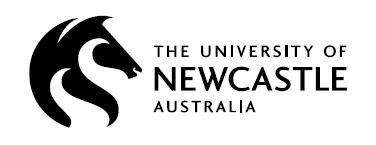
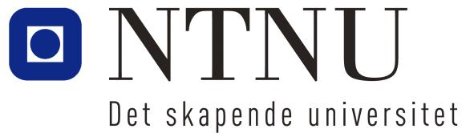
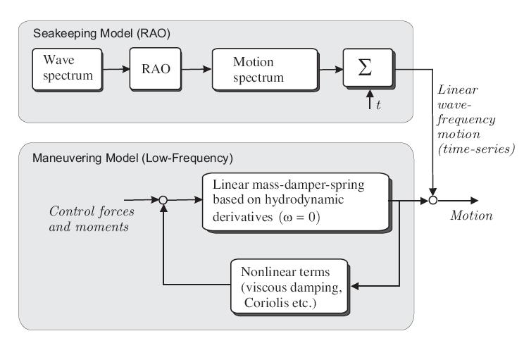
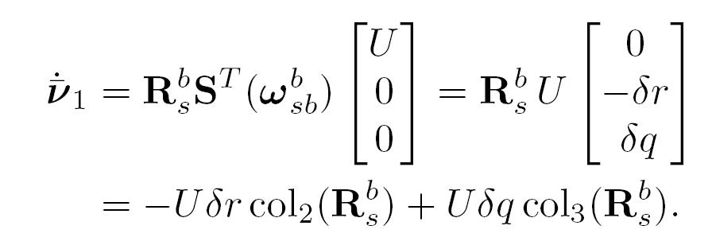
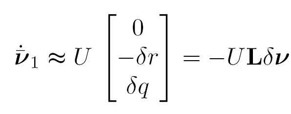
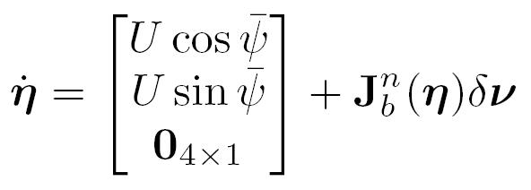
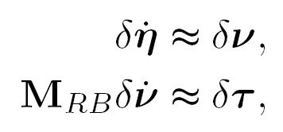
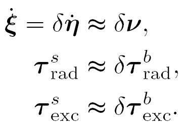
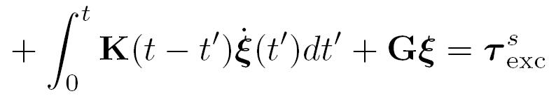

## Manoeuvring in a Seaway  (Module 8)

Dr Tristan Perez

Centre for Complex Dynamic Systems and Control (CDSC)

Prof. Thor I Fossen

Department of Engineering Cybernetics

06/06/26

One-day Tutorial, CAMS'07, Bol, Croatia

<number>

## State of the art

- Manoeuvres are generally performed in calm waters close to ports, but some times are also performed at sea in higher sea states.

- This requires models which can handle manoeuvring and seakeeping.

- The hydrodynamic problem is very complex, and we may still be a long time away from a solution.

- The state of the art uses a combination of manoeuvring and seakeeping models via either

- Motion superposition
- Force superposition

06/06/26

One-day Tutorial, CAMS'07, Bol, Croatia

<number>

## Frequency-domain seakeeping models

These models can be used to simulate wave-induced ship motion time series:

06/06/26

One-day Tutorial, CAMS'07, Bol, Croatia

<number>

## Motion superposition model

06/06/26

One-day Tutorial, CAMS'07, Bol, Croatia

<number>

## Motion superposition model

- Commonly used in control applications: autopilot, manoeuvring, formation control, rudder roll stabilisation.

- The rationale behind this is that a wave filter rejects the 1st order wave induced motion, and no memory effects are then considered.

- It can be a good assumption in lower sea states.

06/06/26

One-day Tutorial, CAMS'07, Bol, Croatia

<number>

## Force superposition model

Time-domain SK model + nonlinearities.

06/06/26

One-day Tutorial, CAMS'07, Bol, Croatia

<number>

## Force superposition model

- This is an attempt to obtain a unified model for manoeuvring in a seaway.

- Fluid memory effects are incorporated, together with other non-linear effects characteristic of manoeuvring: lift-drag, cross-flow drag.

- These models are based on the Cummins Equation expressed in terms of body-fixed coordinates, and the nonlinear effects are added.

- The Centripetal-Coriollis terms still remain an issue.

- This model is valid provided that the vessel manoeuvres slowly—because part of the model is based on a seakeeping model.

06/06/26

One-day Tutorial, CAMS'07, Bol, Croatia

<number>

## Kinematic transformations {s}-{b}

Following Perez & Fossen (2007)

In {n},

06/06/26

One-day Tutorial, CAMS'07, Bol, Croatia

<number>

## Kinematic transformations {s}-{b}

Taking the time-derivative

Taking it to {b},

06/06/26

One-day Tutorial, CAMS'07, Bol, Croatia

<number>

## Kinematic transformations {s}-{b}

Let

Then

06/06/26

One-day Tutorial, CAMS'07, Bol, Croatia

<number>

## Kinematic transformations {s}-{b}

The angular velocities are related by

$\Leftrightarrow$

In {b}

Combining results

06/06/26

One-day Tutorial, CAMS'07, Bol, Croatia

<number>

## Kinematic transformations {s}-{b}

Taking small angle approximations

$\Rightarrow$

Hence, we obtain the sought transformation:

06/06/26

One-day Tutorial, CAMS'07, Bol, Croatia

<number>

## Kinematic transformations {s}-{b}

To relate the accelerations

where

Taking small angle approximations and considering only linear terms

Which is consistent with

06/06/26

One-day Tutorial, CAMS'07, Bol, Croatia

<number>

## Kinematic transformations {s}-{b}

Velocities:

Accelerations:

Generalised Positions:

Now we can transform the Cummins Equation to {b}.

06/06/26

One-day Tutorial, CAMS'07, Bol, Croatia

<number>

## RB seakeeping Eq. of motion in {s}

Using the body-fixed perturbation coordinates we have

linear

Non-linear

06/06/26

One-day Tutorial, CAMS'07, Bol, Croatia

<number>

## RB seakeeping Eq. of motion in {s}

We can think the linear-seakeeping equations of motion

as obtained from the body-fixed perturbation equations considering

NOTE: In the literature, it is commonly said that the seakeeping eq of motion is formulated in {s}, but this would imply that the inertias are time varying.

In our derivation, we formulate them in body-fixed coordinated and then ignore the nonlinear terms; this way, the inertias are constant because we are in body-fixed coordinates.

06/06/26

One-day Tutorial, CAMS'07, Bol, Croatia

<number>

## Cummins Equation in {b}

$\Updownarrow$

This model describes deviations from the equilibrium state in {b} within a linear framework and small angles.

06/06/26

One-day Tutorial, CAMS'07, Bol, Croatia

<number>

## Cummins Equation in {b}

Expressed in terms of absolute (instead of incremental) variables:

NOTE: This equation valid provided the manoeuvring is very slow—because of the seakeeping assumptions under which the Cummins eq. was derived.

06/06/26

One-day Tutorial, CAMS'07, Bol, Croatia

<number>

## Summary

- The problem of manoeuvring in a seaway is still an open problem in ship theory.

- A step towards a unified model for manoeuvring in a sea way consists of expressing Cummins Equation in {b}.

- This is still a seakeeping model, which assumes a state of equilibrium from which the vessel is disturbed; and therefore, it may be use it for slow manoeuvring.

- For slow manoeuvring, we can add Lift-Drag effects as a first approximation.

06/06/26

One-day Tutorial, CAMS'07, Bol, Croatia

<number>

## References

- Perez, T. and T. I. Fossen (2006) “Time-domain Models of Marine Surface Vessels  Based on Seakeeping Computations.” 7th IFAC Conference on Manoeuvring and Control of Marine Vessels MCMC, Portugal, September.

- Perez T., and T. I. Fossen (2007) “Kinematic Models for Seakeeping and Manoeuvring of Marine Vessels at Zero and Forward Speed.” To appear in Modeling Identification and Control (MIC), Norwegian Research Bulletin, Trondheim. MIC Vol 28, 2007, No 1.

06/06/26

One-day Tutorial, CAMS'07, Bol, Croatia

<number>