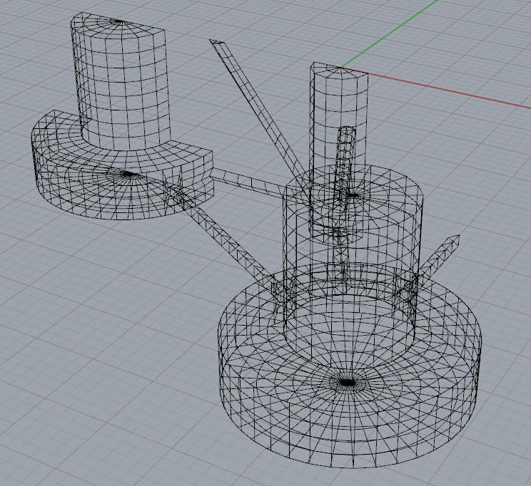
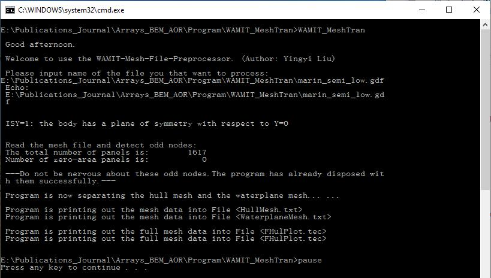

**A brief manual for running HAMS**

Yingyi Liu

1. Prepare the BEM mesh for the marine structure that the user wants to compute for. The mesh can be in an arbitrary format but will need a mesh converter to transform it to the HAMS mesh format. A good way is to use Rhinoceros to export the hydrodynamic CAD model to the \*.gdf format of WAMIT. Then use the built-in tool "WAMIT\_MeshTran.exe" to convert the \*.gdf mesh to the HAMS mesh format just by clicking "RunWAMIT\_MeshTran.bat", and then input manually the path and filename of the \*.gdf file in the command line, or simply drag the \*.gdf file to the command line. Do remember that the \*.gdf file should better include both of the waterplane mesh and the submerged body mesh. The tool can automatically dispart the two meshes into the separate "WaterplaneMesh.pnl" and "HullMesh.pnl" files. Note that at the present stage, only the Windows version of the "WAMIT\_MeshTran" program is available. Please wait for some while for the Linux version.

  
Fig.1 Body mesh and waterplane mesh in RhinocerosTM

  
Fig.2 Command line of "RunWAMIT\_MeshTran.bat"

2. Copy the "WaterplaneMesh.pnl" and "HullMesh.pnl" files to the "Input" Folder of HAMS. Make appropriate settings in the "ControlFile.in" file. There are several places that should be paid attention to:

1) "0\_inf\_frequency\_limits": set 1 if you’d like to calculate the added mass of the zero- and infinite-frequency limits or set 0 if not.

2) "Number\_of\_frequencies": following the WAMIT tradition, when a positive value is input, the next line right after this line should read a set a discrete wave frequencies (or wave periods, or wave numbers or wave lengths), see the "Moonpool" example in the "CertTest" Folder; when a negative value is input, the next two lines should read "Minimum\_frequency\_Wmin" (the minimum wave frequency, or wave period, or wave number or wave length, depending on the "Input\_frequency\_type") and "Frequency\_step" separately, see the "Cylinder" example in the "CertTest" Folder.

3) "Number\_of\_headings": following the WAMIT tradition like "Number\_of\_frequencies".

4) "Number\_of\_field\_points": this is to specify how many field points the users want to output the field pressure or elevation. Right after this line, the coordinates of these field points are expected to be input.

5) "If\_remove\_irr\_freq": set 0 if you do not want to remove the irregular frequencies and set 1 if you want to.

3. In principle, the body mass matrix should be input by the users as it contains also the information for the structures above the water surface. "WAMIT\_MeshTran.exe" can generate a "Hydrostatic.in" file in which the body mass matrix is calculated using only the simple information of the wetted body mesh. Therefore, the author should use this body mass matrix with caution. The External Damping Matrix and the External Restoring Matrix should be input by the users.

4. After doing all the above, the user can run HAMS simply by clicking "RunHAMS.bat". It worth noting that, the results in the WAMIT format can be visualized easily by BEMRosetta or BEMIO, which can be downloaded here:

[https://github.com/izabala123/BEMRosetta](https://github.com/izabala123/BEMRosetta)

[https://wec-sim.github.io/bemio/](https://wec-sim.github.io/bemio/)