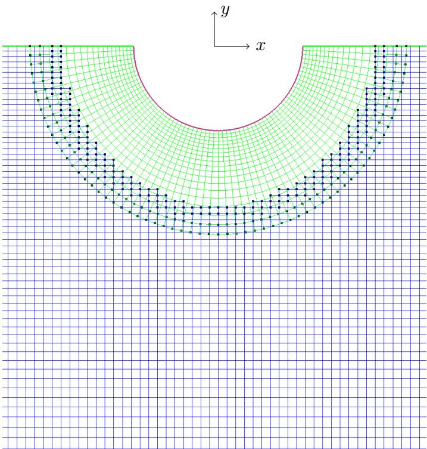

# User manual for OceanWave3D-seakeeping

Mostafa Amini Afshar and Harry B. Bingham Section of Fluid Mechanics, Coastal and Maritime Engineering Department of Mechanical Engineering Technical University of Denmark

January 31, 2017

## 1 Introduction

The OceanWave3D-Seakeeping code, is a linear time-domain seakeeping solver which has been developed at Technical University of Denmark. The solver is based on the high-order finite difference method and linearized potential-flow theory. Body-fitted overlapping grids are used to represent the hull geometry. With the current status of the code the following hydrodynamic problems can be solved:

• Wave resistance,  
• Radiation,  
• Diffraction.

In the following sections it is explained how the seakeeping code can be used.

## 2 The structure of the solver

The solver comprised of two sub-program, i.e RUN and POST. In the RUN module all the time-domain computations are performed to solve for the unknown velocity potentials for the corresponding hydrodynamic problem. At the same time the required data for later post processing is also stored in binary files on the hard disk. After executing the RUN module, one can execute the POST program. This part of the seakeeping solver, uses the time-domain data obtained from the RUN modlue, and produces the desired frequency-domain results. Both RUN and POST use the same input file. In the next section it is explained how to prepare this input file.

## 3 Input file

Both programs need the same input file in order to run. The input file is a text file with the extension .opt. In the input file the required data is supplied for solving and post processing a desired hydrodynamic problem. The input file is an ascii text file which must includes the following lines in the order presented below. It is mandatory to end each line with the modulo operator: %.

\- Line 1 : gravitational acceleration $\textit { g } \ m ^ { 2 } / s$

- Line 2 : density ρ kg/m3,  
- Line 3 : Forward speed U m/s,  
- Line 4 : Wave heading β degrees,

Note that at moment it is only possible to use the solver for head seas, i.e β = 180. Work is in progress, and in the new versions other wave headings will be accommodated.

\- Line 5 : Type of the base flow,

In this line a two letter string is accepted as follows:

- ZS : If the forward speed is zero.  
- NK : If forward speed is not zero and for Neumann-Kelvin linearization.  
- DB : If forward speed is not zero and for double-body linearization.

\- Line 6 : The path to the computational grid which also includes the name of the grid.

Note that the path is relative to the directory in which the input file is located.

\- Line 7 : The path to a fine resolution grid.

Note that it is possible to supply 2 grids to the solver. This is due to the intended capability of the solver to make use of a highly refined mesh for the ship hull. This part of the solver is still in a validation phase, so one can simply leave this line blank with one space that ends with a modulo operator: %, as mentioned before.

- Line 8 : The path to the directory where the output files are to be stored relative to the directory where the code is running.  
- Line 9 : The order of accuracy for the finite difference approximation of the temporal derivative in the Bernoulli equation. The suggested value is 4,  
- Line 10 : The Courant number for the time integration Cr where $0 . 5 < C r < 1$  
- Line 11 : The minimum resolvable wave length $\lambda _ { m i n } \ m .$

Note that this line is due to the early stage of code development, and it will be removed in a later revision of the solver. Basically a minimum wave length is obtained by the solver depending on the grid size at the free surface, and the piece of data in this line is in fact redundant. An arbitrary number can be provided here, as the number is not actually used at this time.

- Line 12 : In this line the non-dimensional time limit of the simulation tmaxpg/L where L is the largest characteristic length of the body. A very large value makes the computational time unnecessarily large, on the other hand a too small value is insufficient to capture all the frequency domain information. The recommended value is 15.  
- Line 13 : In this line the shape of time-domain displacement is controlled by a number.

The seakeeping code solves the hydrodynamic problems in the time domain where the displacement which is applied to the body is of Gaussian type. This Gaussian displacement as a function of frequency f as follows:

$$
\xi_ {k} (f) = \frac {1}{s \sqrt {2 \pi}} \exp \left(- f _ {m a x} ^ {2} / \left(2 s ^ {2}\right)\right),
$$

where

$$
s = \sqrt {\frac {- f _ {m a x} ^ {2}}{2 \log (r)}}.
$$

The ratio of the displacement at zero frequency to the one at the $f _ { m a x }$ is defined by r. It is the value of p which must be specified at this line. Note also that fmax is calculated by the solver based on the average grid spacing at the free surface or around the waterline. A recommended value for r is 0.0001.

\- Line 14 : Three numbers must be specified here which are the x, y, z coordinates of the point around which the moment integration should be performed. Just a space is sufficient to distinguish these three numbers. For the definition of the coordinate system refer to the section for the grid generation,

\- Line 15 : The type of hydrodynamic problem to be solved. With the current status of the solver, there are 8 possibilities:

– mode 0 : The wave resistance problem,  
– mode 1-6 : Surge, heave, sway, roll, yaw and pitch radiation problem.  
– mode 7 : The diffraction problem,

Note that the number corresponding to the desired hydrodynamic problem, must be repeated as many time as there are desired responses. The desired responses are defined in the next line.

\- Line 16 : The desired responses are specified at this line. There is possible to ask for the response in 6 directions, as follows:

- 1 : surge,  
- 2 : heave,  
- 3 : sway,  
- 4 : roll,  
- 5 : yaw,  
- 6 : pitch,

As an example if the wave resistance problem is going to be solved and only the force in x direction is desired then at lines 15 and 16 one should write:

– 0 %  
– 1 %

Or in the case of solving the ship response in head sees:

– 7 7 7 1 1 1 2 2 2 6 6 6 %  
– 1 2 6 1 2 6 1 2 6 1 2 6 %

Note that the diffraction run must be supplied first before the radiation runs.

\- Line 17 : In this line the filter parameters are supplied to the solver in the case of solving forward speed problems. Three numbers must be specified with a space in between. The first number defines the width of the stencil for the filter. The next number is for the desired order of the filter. The final number controls the strength of the filter. In the case a filter is required the following are recommended:

Note that if all numbers for the filter are left 0, then an upwind biased stencil will be employed by the solver to take care of the convective derivatives. Both strategies are working with the forward speed problems in this solver. It is recommended not to use filter and leave this line with three zeros.

- Line 18 : If a sponge layer is desired to dissipate the outgoing waves, give a value of 1 on this line. Note that at the moment the most effective strategy in the solver to dissipate the outgoing waves is in fact the large size of the domain where the grid spacing is stretched strongly towards the end of the domain. So one can simply leave this line with a zero value.  
- Line 19 : The type of the system solver can be specified here. There are at the moment three possibilities:

- DI : The direct solver,  
- IT : The iterative solver,  
- MG : The multigrid solver,

Depending on the size of the grid and the memory capacity, the direct solver is generally recommended. For the very large grids one can instead use IT option.

- Line 20 : The solver can also provide a show file where the solution for the surface elevation has been stored. This show file can be read by the Overture plotStuff GUI. If a show file is desired put 1 at this line, otherwise leave a 0 there.  
- Line 21 : If the surface elevation is desired to be printed out in a text file instead, give a positive integer number on this line. If the number is 0 nothing will be printed out. All other numbers regarded as the rate at which the surface elevation is printed in time. For example 10 means that the surface elevation is printed out once every 10 time steps.  
- Line 22 : In this solver the frequency domain results are obtained by a Fourier transform of the time-domain data. If a high resolution of the frequency domain data is desired one can increase the length of the time signal by padding it with zeros. The number on this line specifies how much the time signal should be extended. A value of 50 is recommended.  
- Line 23 : This line defines the rate at which the time domain data should be stored in the binary files for frequency-domain post processing. A value of 1 means the data at each time step is stored.  
- Line 24 : If the wave drift force is desired put 1 on this line, otherwise leave a 0 there,  
- Line 25 The mass matrix is supplied here. In fact the data begins at this line and may continue up to 5 more lines as follows:

$$
\left( \begin{array}{c c c c c c} m & 0 & 0 & 0 & 0 & - m y _ {g} \\ 0 & m & 0 & 0 & 0 & 0 \\ 0 & 0 & m & m y _ {g} & 0 & 0 \\ 0 & 0 & m y _ {g} & I _ {1 1} & I _ {1 2} & I _ {1 3} \\ 0 & 0 & 0 & I _ {2 1} & I _ {2 2} & I _ {2 3} \\ - m y _ {g} & 0 & 0 & I _ {3 1} & I _ {3 2} & I _ {3 3} \end{array} \right)
$$

For example in the case of only surge, heave and pitch motions of the ship, one must define the mass matrix as:

$$
\left( \begin{array}{c c c} m & 0 & - m y _ {g} \\ 0 & m & 0 \\ - m y _ {g} & 0 & I _ {3 3} \end{array} \right)
$$

\- Last line : This line is remained from the earlier stages of the code development, and will be removed in the future versions. At this line one is supposed to supply the hydrostatic matrix. As the hydrostatic coefficients are in fact calculate by the solver, there is no need to specify any value here. Just keep these lines and leave 0 for each corresponding coefficient. Note that the hydrostatic matrix must have the same size as the mass matrix. So corresponding to the previous case one must specify:

$$
\left( \begin{array}{c c c} 0 & 0 & 0 \\ 0 & 0 & 0 \\ 0 & 0 & 0 \end{array} \right)
$$

Please also note that the mass and hydrostatic matrices are only required when both radiation and diffraction problems are solved. For the wave resistance problem, a pure radiation problems or a pure diffraction problem, there is no need to specify this data in the input file.

## 4 Output files

After executing both RUN and POST modules of the solver, the output files will be generated and are stored in 2 folders with the same name as the corresponding program.

## 4.1 Results in the RUN folder

## text files :

In this folder following text files are printed out from the RUN module:

+ prog.log (the data used for simulation).  
+ bondata.txt (the grid boundaries data).  
+ baseMtms.txt (the base-flow m-terms).  
+ symcof.txt (the symmetry coefficients used in the simulation).  
+ wabcords.txt (the free-surface coordinates at the body and the end of the domain.  
+ watlin.txt (The coordinates of the waterline (if any)).  
+ fdcof s\*.txt (The finite difference coefficients for the points at surface \*)  
+ filter s\*.txt (The filter coefficients for the points at surface \*)

## hdf files :

In this folder the following hdf files are (or can be) printed out from the RUN module. Note that these hdf files can be shown and read by plotStuff from overture.

+ baseShow.hdf (The base flow velocity potential)  
+ \* elev.hdf (The surface elevation at the desired time steps for problem \*)

## binary files :

In this folder the following binary files are (or can be ) printed out from the RUN module. Note that these files are just created to be read by the POST module, and can not be used by the user. If they are accidentally deleted, the POST module will not run.

+ simdata.bin  
+ time.bin  
+ tiIntegs.bin  
+ tiPotens.bin  
+ tiWlines.bin  
+ disp.bin  
+ elev.bin

Note that only hdf and text files are readable by the user.

## 4.2 Results in the POST folder

## text files :

Similar to the RUN data the POST program will also make the following log file:

\+ prog.log

Moreover depending the solution domain, the following text file are (or can be) printed out:

## 4.2.1 time-domain solutions

+ \* force time.txt (The time domain applied forces on the body for the problem \*)  
+ \* asymp force.txt (The corresponding asymptotic extrapolation of forces)

## 4.2.2 frequency-domain solutions

+ addedMass \*.txt : All added mass coefficients for the problem \*  
+ damping \*.txt : All damping coefficients for the problem \*  
+ RAO.txt : Response amplitude operators  
+ excitation force freq.txt : The wave excitation forces  
+ scattering force freq.txt : The forces due to just scattering  
+ nearField.txt : the wave drift force based on the near-field method  
+ farField.txt : the wave drift force based on the far-field method

natural_image

Diagram showing a curved grid pattern with a grid overlay and coordinate axes (x, y), no text or symbols present.

Figure 1: An overset grid for a floating cylinder

## binary files :

The following binary files will be created just in the case of wave drift calculations. These files are not readable by the user.

+ fqPotens.bin  
+ fqNiPotens.bin  
+ fqWlines.bin  
+ fqNiWlines.bin

## 5 Grid generation

The coordinate system which is adopted in the solver has its positive x axis along the length of the body of the ship. The y axis is positive upward and the z axis is defined by the right hand rule. The selection of this coordinate system is motivated by the Overture library. During the grid generation one should keep this in mind that instead of z axis, the y axis is pointing upward. Note that the output results are transformed to the more standard right-handed coordinate system with the z axis pointing upward.

Only the wetted surface of the body must be included for the grid generation. The origin of the coordinate system then will be at the mean free surface. For the grid generation it is more convenient to start from the grid on the body surface. This is explained here by an example overset grid for a floating cylinder in a background domain, Figure 1. In this case the whole overlapping grid is comprised of 2 component grids. The fist component is shown in green and it fits around the surface of the cylinder which is shown by a magenta line. The other grid is shown by blue and represent the background domain of the basin. Note that only a small part of the background grid is shown in this figure. For generating such an overlapping grid one should use Ogen (Henshaw, 1998) from the Overture library (Brown et al., 1999). The important thing for this solver is that the correct boundary tags are assigned to the sides of each component grids. In this example the side of the cylinder grid which is representing the surface of the body should be given a boundary tag of 3. This is in fact a message to the solver that the body-boundary condition should be applied at this side of the grid. The sides of the cylinder grid which are located at the free surface, must be designated by a boundary tag of 1. As it is required by the Ogen for the overset grid generation, all other sides of the cylinder grid in this case must have a boundary tag of 0 to signify an interpolation side.

For the Cartesian background grid, again a boundary tag of 1 must be used for the upper side which would make up part of the free surface. Those sides of the background grid that are representing the far-field truncation boundary must have a boundary tag of 4. And finally at the bottom side of the background grid, the boundary tag must be 2.

For the three-dimensional grid one must assign a boundary tag of 5 to the symmetry plane (if any). Note that at the moment just one symmetry plane at z=0 is accommodated in the solver.

For two- and three-dimensional overlapping grids for closed form geometries like a cylinder or sphere, Ogen can be employed directly. For other geometries where there is not a closed form transformation, one can use Hyperbolic Grid Generation tools inside the Overture library. The rules regarding the boundary tags are exactly the same as before. The grid generation in this case starts by defining the surface of the body as an iges format. The prepared surface then is read by a tool called rap, which prepares the surface of the body for the grid generation. The prepared surface is saved in a file with hdf format. The next tool mbuilder generates the surface and volume grid for the body surface. Note that it is much easier if one writes a script to instruct these tools for the grid generation.

In the sample grid folder one can find examples of overlapping grids for two- and threedimensional geometries. There are also 4 examples of the use of hyperbolic grid generation for ship geometries.

## 6 Executing the solver

Both RUN and POST can be rub from the command line as follows:

- RUN.exe -opt=input file.opt  
- POST.exe -opt=input file.opt

## References

Brown, D. L., W. D. Henshaw, and D. J. Quinlan. Overture: An object-oriented framework for solving partial differential equations on overlapping grids. Object Oriented Methods for Interoperable Scientific and Engineering Computing, SIAM, pages 245–255, 1999.  
Henshaw, W. D. Ogen: An overlapping grid generator for overture. LANL unclassified report, pages 96–3466, 1998.