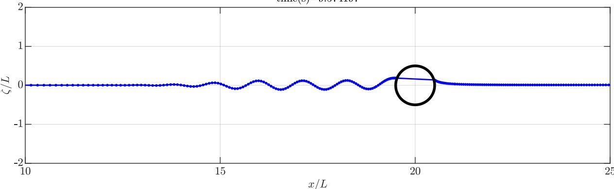

$$
F r = 0. 6
$$

$$
\mathrm{time(s)} = 9. 5 7 4 1 9 7
$$

line

| x/L | \(\zeta/L\) |
| --- | --- |
| 10 | 0 |
| ~11 | 0 |
| ~12 | 0 |
| ~13 | 0 |
| ~14 | 0 |
| ~15 | 0 |
| ~16 | ~0.1 |
| ~17 | ~-0.1 |
| ~18 | ~0.1 |
| ~19 | ~-0.1 |
| 20 | ~0.2 |
| ~21 | ~0.1 |
| ~22 | 0 |
| ~23 | 0 |
| ~24 | 0 |
| 25 | 0 |

