## CFD VALIDATION STUDY:

## DELFT\_372 - CALM WATER

natural_image

Abstract blue circular logo with white angular design and arrow-like elements (no text or symbols)

## NepTech

## Intelligent sea mobility

<table><tr><td>Version</td><td>Date</td><td>Written by</td><td>Validated by</td></tr><tr><td>1</td><td>XX/XX/XXXX</td><td>Tanguy TEULET</td><td>Clément ROUSSET</td></tr></table>

## Table of contents

Summary....2

Nomenclature....3

Figures.... 3

Tables.... 3

1. DELFT 372 Catamaran .... 4  
2. Simulation setup.... 5

a. Sign convention....5  
b. Software's ...... 5  
c. Hypothesis....6  
d. Numerical models .... 6  
e. Validation 7

3. Results....10

a. Comparison between the CFD and EFD model .... 10  
b. Resistance .... 11  
c. Resistance coefficient .... 11  
d. Motions....14  
e. Free surface renderings .... 16  
f. Computational time comparison .... 20

4. Conclusion....21

Bibliography 22

## Summary

This report provides a comprehensive validation study on the DELFT 372 catamaran in calm water, using NepTech's digital towing tank. Key findings compare CFD results with experimental data, addressing resistance, resistance coefficients, vessel motions, free surface renderings, and computational time. A mesh convergence study is also included. The findings confirm that NepTech's automated digital towing tank is reliable and efficient for simulations of both low and high Froude numbers in multihull vessels, validating its capabilities for accurate predictions in similar flow types.

## Nomenclature

◆ BOA [m], overall beam.  
◆ B $_{WL}$ [m], waterline beam.  
$C_{B}$ [−], block coefficient.  
◆ EFD, Experimental fluid dynamic.  
$F_{n}$ [—], Froude number.  
◆ H [m], Distance between centre of hulls.  
✿ LCG ; TCG ; VCG [m], coordinates of the centre of gravity: lateral, transversal and vertical.  
◆ LOA [m], overall length.  
◆ L $_{WL}$ [m], waterline length.  
◆ T [m], draught.  
◆ V [m/s], ship speed.  
◆ Δ [kg], displacement.  
◆ μ [Pa. s], dynamic viscosity.  
$\rho \left[ kg/m^{3} \right], density.$

## Figures

Figure 1: DELFT 372 CAD model ....4

Figure 2: Sign convention illustration....5

Figure 3: Free surface mesh for the different precision levels at 4.06 m/s = 7.89 knots ....7

Figure 4: Bare hull mesh for the different precision levels at 4.06 m/s = 7.89 knots....8

Figure 5: Evolution (up), difference [N] (middle) and difference [%] (bottom) of total resistance .....12

Figure 6: Evolution (up), difference [-] (middle) and difference [%] (bottom) of total resistance coefficient .....13

Figure 7: Evolution (up), difference [m] (middle) and difference [%] (bottom) of dynamic heave attitude....14

Figure 8: Evolution (up), difference [deg] (middle) and difference [%] (bottom) of dynamic pitch attitude....15

Figure 9: Free surface evolution (same scale) from 1.9 to 4.7 knots ....16

Figure 10: Free surface evolution (same scale) from 5.3 to 7.9 knots ....17

Figure 11: Free surface evolution (independent scale) from 1.9 to 4.7 knots....18

Figure 12: Free surface evolution (independent scale) from 5.3 to 7.9 knots....19

Figure 13: Computational time in hours ....20

## Tables

Table 1: Averaged number of cells ....8

Table 2: Averaged Courant number ....9

Table 3: Averaged Y+....9

Table 4: Comparison between the CFD and EFD model....10

## 1. DELFT 372 Catamaran

The DELFT 372 catamaran is the original benchmark hull form developed by Delft University of Technology to study the hydrodynamic performance of multihull vessels. This slender, high-speed catamaran design focuses on minimizing resistance and optimizing seakeeping. While no full-scale vessel has been built, the DELFT 372 serves as a critical reference in naval hydrodynamics research and has since been modified with varying hull spacings to study the influence of hull separation on hydrodynamic performance.

The paper "Experimental Results of Motions, Hydrodynamic Coefficients, and Wave Loads on the 372 Catamaran Model" provides comprehensive towing tank results for the original DELFT 372 model. In addition to hydrodynamic coefficients, wave loads, and motion responses (heave and pitch) under regular and irregular wave conditions, the study includes resistance tests in calm water, offering a complete dataset for evaluating both wave interaction and resistance characteristics.

This study is the sole reference for the present validation of NepTech's digital towing tank, as it provides the original, experimentally validated results. Moreover, the availability of detailed numerical data allows seamless integration into the validation process, ensuring accuracy and consistency in comparing numerical and experimental outcomes.

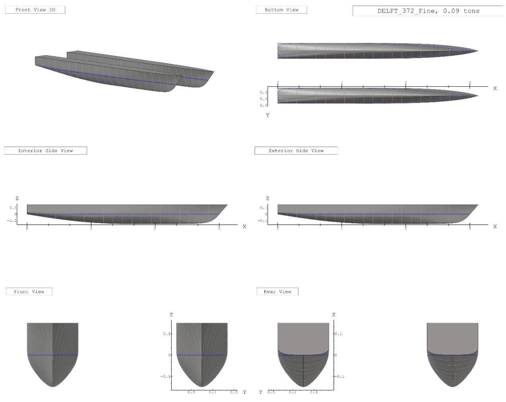  
Figure 1: DELFT 372 CAD model

## 2. Simulation setup

## a. Sign convention

Heave: The heave values correspond to the dynamic elevation of the vessel at the centre of gravity, relative to its hydrostatic position, in the absolute reference frame with the vertical axis Z oriented upwards. A positive heave value thus corresponds to a hull rise, while a negative value indicates the hull sinking.

Pitch: The pitch values correspond to the dynamic trim of the vessel at the centre of gravity, relative to its hydrostatic position, in the absolute reference frame where the transverse axis is Y. A positive trim corresponds to a bow-up attitude of the hull.

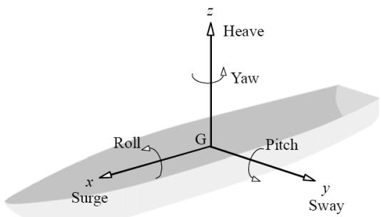

text_image

z
Heave
Yaw
Roll
G
Pitch
x
Surge
y
Sway

Figure 2: Sign convention illustration

## b. Software's

Mesh: Hexpress™, version 12.1 developed by CADENCE

Resolution: Fidelity Fine Marine, version 12.1 developed by CADENCE

Solver: ISIS-CFD developed by CNRS and Centrale Nantes

Computing infrastructure: 2 virtual machines with 32 cores « C2D\_STANDARD\_32 », optimized for computation on Google Cloud Platform.

## Post-processing:

• CFView™, version 12.1 developed by CADENCE  
• Programming language Python version 3.11.6

## c. Hypothesis

Modelling scale: model scale, with a symmetry plane along the vessel's median axis. This approach helps reduce computation time while maintaining identical results.

Domain: the dimensions of the simulation domain are conformed to International Towing Tank Conference (ITTC) recommendations, ensuring that the boundaries are positioned sufficiently far from the vessel to avoid any influence on the solution. It is crucial, especially for the exit boundary, to place it in a way that prevents the reflection of the wave field generated by the vessel.

Hydrostatic equilibrium: the coordinates of the centre of gravity are defined as follows

$$
L C G = 1. 4 1 m; T C G = 0. 0 0 m; V C G = 0. 1 9 m
$$

Water: corresponds to fresh water, which is

$$
\rho_ {w a t e r} = 9 9 9. 1 0 2 6 k g / m ^ {3}
$$

$$
\mu_ {w a t e r} = 1. 1 3 8 * 1 0 ^ {- 3} P a. s
$$

Air: corresponds to air at a temperature of $15^{\circ}C$ , which is

$$
\rho_ {a i r} = 1. 2 2 5 6 k g / m ^ {3}
$$

$$
\mu_ {a i r} = 1. 7 8 8 * 1 0 ^ {- 5} P a. s
$$

Mesh precision: this report presents the results of a mesh convergence study conducted at three levels, referred to as coarse, medium and fine meshes. As the mesh precision level increases, both the surface refinement and the number of diffusion elements also rise. Moreover, as the mesh precision level increases, the pressure refinement criterion for the Adaptive Grid Refinement (AGR) decreases. This means that the AGR will increasingly refine the mesh in areas where a strong pressure gradient is observed within the flow.

## d. Numerical models

## Dynamic equilibrium:

- The Quasi-Static (QS) method is used since we are interested in the vessel's dynamic equilibrium state. This method relies on a succession of predictions of the vessel's physical attitude to reach the dynamic equilibrium state in record time.  
- Two movements of the vessel, heave and pitch, are left free to ensure convergence toward the vessel's dynamic equilibrium position.

Flow: The Reynolds-Averaged Navier-Stokes (URANS) equations are used to describe the flow, and they are coupled with the $k - \omega SST$ turbulence model as the closure model.

Free surface: The air-water interface is modelled using the Volume of Fluid (VoF) method. Adaptive Grid Refinement (AGR), developed by CNRS (French National Centre for Scientific Research) and Ecole Centrale de Nantes (French Engineering school), is used to model the free surface. This iterative process allows for dynamic adjustment of the mesh according to the solution's needs during the calculation, making refinement decisions based on the physics of the flow.

## e. Validation

## i. Mesh

Free surface: The accuracy of the results regarding pressure resistance mainly depends on how the air-water interface is captured during simulation. This resistance is induced by the wave field generated by the vessel, and the quality of the mesh for the latter plays a crucial role in this accuracy. The use of AGR allows dynamically adapting the mesh based on the generated wave field, achieving maximum precision, as it is one of the most advanced and reliable methods to date and reducing computation time by converging more quickly toward the dynamic equilibrium state.

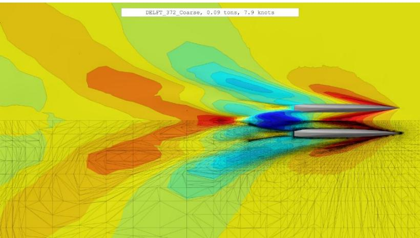

text_image

DRLFT_372_Coarse, 0.09 tons, 7.9 knots

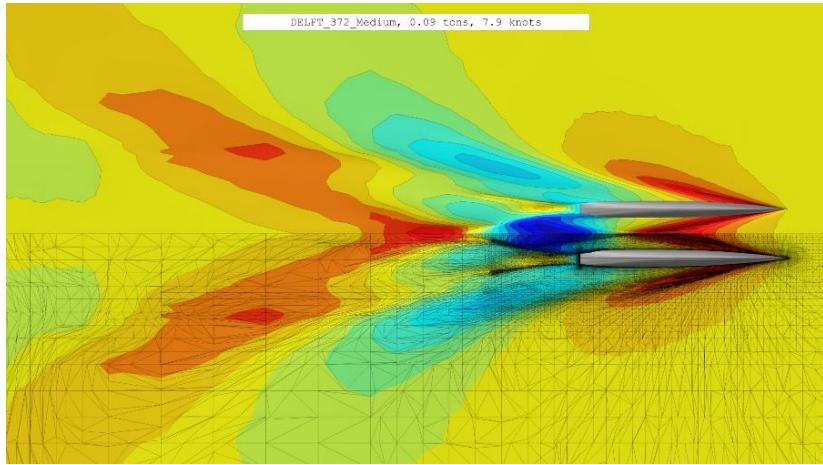

text_image

DELFT_372_Medium, 0.09 tons, 7.9 knots

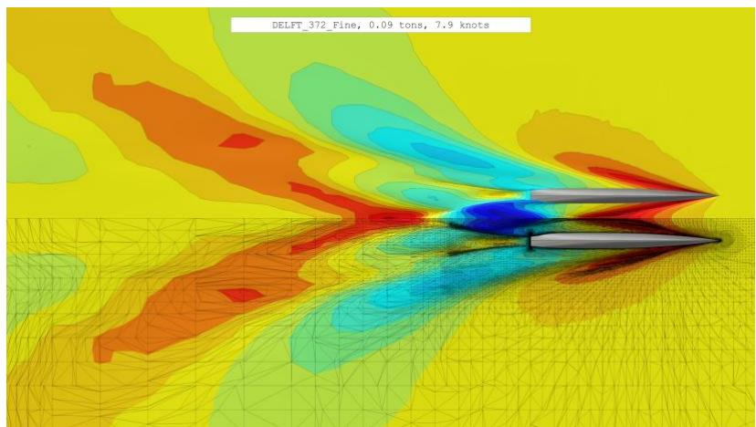

text_image

DELFT_372_Fine, 0.09 tons, 7.9 knots

Figure 3: Free surface mesh for the different precision levels at 4.06 m/s = 7.89 knots

Hull: The accuracy of the results regarding viscous resistance mainly depends on the mesh of the hull. This resistance is caused by the entrainment of a thin fluid film: the boundary layer. An appropriate mesh of the boundary layer is essential to correctly capture local phenomena such as viscous effects and rapid variations in fluid properties near the surface. It also allows for better capture and resolution of turbulent phenomena if they are present. The quality of the hull mesh also affects the fidelity of the 3D model representation. A clean and regular mesh improves the reliability of the simulation, making the simulated model more representative of the actual vessel.

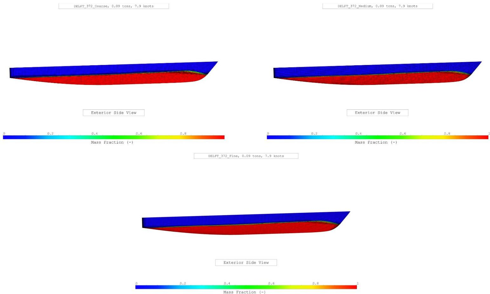

heatmap

| Boundary Condition | Mass Fraction Range |
| --- | --- |
| DELFT_372_Coarse | 0~1 |
| DELFT_372_Medium | 0~1 |
| DELFT_372_Fine | 0~1 |
| Top Surface | 0~1 |

Figure 4: Bare hull mesh for the different precision levels at 4.06 m/s = 7.89 knots

<table><tr><td rowspan="2">Ship speed V</td><td>[m/s]</td><td>1.00</td><td>1.30</td><td>1.63</td><td>1.89</td><td>2.17</td><td>2.44</td><td>2.71</td><td>2.98</td><td>3.26</td><td>3.53</td><td>3.80</td><td>4.06</td></tr><tr><td>[knots]</td><td>1.94</td><td>2.53</td><td>3.16</td><td>3.67</td><td>4.22</td><td>4.74</td><td>5.27</td><td>5.79</td><td>6.33</td><td>6.86</td><td>7.38</td><td>7.89</td></tr><tr><td colspan="2">Froude number $F_n$  [-]</td><td>0.18</td><td>0.240</td><td>0.30</td><td>0.35</td><td>0.40</td><td>0.45</td><td>0.50</td><td>0.55</td><td>0.60</td><td>0.65</td><td>0.70</td><td>0.75</td></tr><tr><td rowspan="3">Averaged number of cells $[*10^6]$ </td><td>Coarse mesh</td><td>0.33</td><td>0.34</td><td>0.38</td><td>0.38</td><td>0.49</td><td>0.49</td><td>0.49</td><td>0.51</td><td>0.52</td><td>0.53</td><td>0.54</td><td>0.55</td></tr><tr><td>Medium mesh</td><td>0.76</td><td>0.77</td><td>0.81</td><td>0.81</td><td>0.94</td><td>0.94</td><td>0.92</td><td>0.94</td><td>0.95</td><td>0.97</td><td>0.97</td><td>0.98</td></tr><tr><td>Fine mesh</td><td>1.22</td><td>1.22</td><td>1.26</td><td>1.26</td><td>1.39</td><td>1.40</td><td>1.37</td><td>1.39</td><td>1.40</td><td>1.41</td><td>1.42</td><td>1.43</td></tr></table>

Table 1: Averaged number of cells

## ii. Courant number

Description: The Courant number, also called the CFL (Courant-Friedrichs-Lewy) number, is a crucial parameter in computational fluid dynamics (CFD). It measures the numerical stability of the discretization scheme used in the simulation. An inappropriate Courant number can lead to numerical instabilities, compromising both convergence and the accuracy of the results. In CFD, the Courant number is related to the size of the numerical time steps. It is calculated by comparing the speed of fluid particles with the size of the cells in the simulation domain.

Recommended values: For typical resistance simulations, it is recommended to keep the Courant number below or close to 1 to ensure maximum accuracy and reliability. Local spikes in this parameter may occur, but it is essential to control them to maintain numerical stability and the quality of the results.

Values:

<table><tr><td rowspan="2">Ship speed V</td><td>[m/s]</td><td>1.00</td><td>1.30</td><td>1.63</td><td>1.89</td><td>2.17</td><td>2.44</td><td>2.71</td><td>2.98</td><td>3.26</td><td>3.53</td><td>3.80</td><td>4.06</td></tr><tr><td>[knots]</td><td>1.94</td><td>2.53</td><td>3.16</td><td>3.67</td><td>4.22</td><td>4.74</td><td>5.27</td><td>5.79</td><td>6.33</td><td>6.86</td><td>7.38</td><td>7.89</td></tr><tr><td colspan="2">Froude number $F_n$  [-]</td><td>0.18</td><td>0.240</td><td>0.30</td><td>0.35</td><td>0.40</td><td>0.45</td><td>0.50</td><td>0.55</td><td>0.60</td><td>0.65</td><td>0.70</td><td>0.75</td></tr><tr><td rowspan="3">Averaged Courant number [-]</td><td>Coarse mesh</td><td>0.53</td><td>0.56</td><td>0.58</td><td>0.58</td><td>0.54</td><td>0.55</td><td>0.55</td><td>0.54</td><td>0.54</td><td>0.54</td><td>0.54</td><td>0.55</td></tr><tr><td>Medium mesh</td><td>0.98</td><td>1.01</td><td>1.05</td><td>1.06</td><td>0.99</td><td>1.00</td><td>0.99</td><td>0.98</td><td>0.97</td><td>0.98</td><td>0.98</td><td>0.98</td></tr><tr><td>Fine mesh</td><td>1.01</td><td>1.04</td><td>1.08</td><td>1.10</td><td>1.02</td><td>1.03</td><td>1.01</td><td>1.00</td><td>0.99</td><td>0.99</td><td>1.00</td><td>1.00</td></tr></table>

Table 2: Averaged Courant number

## iii. Y+

Description: In the naval field, managing the Y+ parameter is crucial in computational fluid dynamics (CFD) simulations. Y+ measures the quality of the boundary layer resolution along the submerged surfaces of ship hulls by evaluating the distance between the first mesh point and the wall relative to the boundary layer thickness. Maintaining an appropriate Y+ is essential to ensure reliable results in predicting resistance, drag, lift, and other critical hydrodynamic phenomena. An improper Y+ can lead to significant errors in the prediction of forces, drag coefficients, and other key parameters.

Recommended values: For typical resistance simulations, it is recommended that the Y+ value be between 30 and 300. This value may be lower depending on the choice of boundary layer modeling. Local spikes in this parameter may occur, but it is essential to control them to maintain numerical stability and the quality of the results.

Values:

<table><tr><td rowspan="2">Ship speed V</td><td>[m/s]</td><td>1.00</td><td>1.30</td><td>1.63</td><td>1.89</td><td>2.17</td><td>2.44</td><td>2.71</td><td>2.98</td><td>3.26</td><td>3.53</td><td>3.80</td><td>4.06</td></tr><tr><td>[knots]</td><td>1.94</td><td>2.53</td><td>3.16</td><td>3.67</td><td>4.22</td><td>4.74</td><td>5.27</td><td>5.79</td><td>6.33</td><td>6.86</td><td>7.38</td><td>7.89</td></tr><tr><td colspan="2">Froude number $F_n$  [-]</td><td>0.18</td><td>0.240</td><td>0.30</td><td>0.35</td><td>0.40</td><td>0.45</td><td>0.50</td><td>0.55</td><td>0.60</td><td>0.65</td><td>0.70</td><td>0.75</td></tr><tr><td rowspan="3">Averaged Y+ [-]</td><td>Coarse mesh</td><td>40.1</td><td>51.1</td><td>63.1</td><td>72.3</td><td>41.8</td><td>46.9</td><td>51.6</td><td>56.1</td><td>60.6</td><td>64.9</td><td>69.3</td><td>73.6</td></tr><tr><td>Medium mesh</td><td>41.6</td><td>53.1</td><td>65.5</td><td>75.0</td><td>43.7</td><td>48.9</td><td>53.8</td><td>58.4</td><td>63.0</td><td>67.6</td><td>72.1</td><td>76.5</td></tr><tr><td>Fine mesh</td><td>41.7</td><td>53.2</td><td>65.6</td><td>75.16</td><td>43.6</td><td>48.9</td><td>53.7</td><td>58.3</td><td>63.0</td><td>67.5</td><td>72.1</td><td>76.5</td></tr></table>

Table 3: Averaged Y+

## 3. Results

## a. Comparison between the CFD and EFD model

The numerical model used for the CFD simulations demonstrates a strong alignment with the experimental model used in the towing tank tests in terms of hydrostatic characteristics, which is crucial for ensuring the validity of the comparison between numerical and experimental results. Hydrostatic parameters such as displacement, draft, and hull shape significantly influence the flow behaviour around the hull, directly affecting the prediction of resistance and hydrodynamic performance. While most parameters show excellent agreement between the two models, two slight differences are worth noting. Table 4 summarizes these differences.

The block coefficient in the CFD model is slightly higher, which could indicate a marginally fuller hull shape in the numerical simulation. Additionally, the waterline beam is slightly larger in the CFD model, which can influence wetted surface area and wave generation. These discrepancies, while small, are important to consider because they may have opposing effects on the total resistance. A higher block coefficient could lead to increased wave resistance, whereas a larger waterline beam could reduce resistance by improving the hull's stability and distribution of pressure.

These subtle differences underline the complexity of predicting whether the CFD results will show a higher or lower resistance compared to the experimental data. Nevertheless, the close alignment of the hydrostatic characteristics overall provides confidence that the numerical model is representative of the physical model and that the comparison of results remains meaningful and reliable.

<table><tr><td colspan="2">Main particulars</td><td>EFD</td><td>CFD</td><td>Difference [%]</td></tr><tr><td>Length overall</td><td>LOA [m]</td><td>3.11</td><td>3.129</td><td>0.61</td></tr><tr><td>Length of waterline</td><td>LWL [m]</td><td>3.00</td><td>2.997</td><td>-0.10</td></tr><tr><td>Beam overall</td><td rowspan="2">BOA [m]</td><td>0.94</td><td>0.940</td><td>0.00</td></tr><tr><td>Beam demi hull</td><td>0.24</td><td>0.237</td><td>-1.26</td></tr><tr><td>Distance between centre of hulls</td><td>H [m]</td><td>0.70</td><td>0.700</td><td>0.00</td></tr><tr><td>Draft</td><td>T [m]</td><td>0.15</td><td>0.149</td><td>-0.67</td></tr><tr><td>Displacement</td><td>Δ [kg]</td><td>87.07</td><td>87.07</td><td>0.00</td></tr><tr><td>Block coefficient</td><td>CB [−]</td><td>0.403</td><td>0.411</td><td>1.94</td></tr></table>

Table 4: Comparison between the CFD and EFD model

## b. Resistance

Figure 5 illustrates the progression of the DELFT 372 resistance across different advance speeds in the top graph and table. The middle table shows the absolute differences between CFD and EFD in international units, while the bottom table displays the relative difference between CFD and EFD as a percentage:

$$
E \% C F D = \frac {C F D - E F D}{E F D} * 1 0 0
$$

To thoroughly assess results, particularly percentage differences, it is important to consider both percentage and absolute values. In comparisons with towing tank tests, target resistance values are very low, so even minor discrepancies can lead to large percentage errors.

The resistance error ranges from -2.45 to +0.64 Newtons for the fine mesh, corresponding to -5.13% to +19.34%. At low speeds, CFD tends to overestimate the resistance, while at higher speeds, it generally underestimates it. This behaviour is entirely expected at low speeds because the resistance is only a few Newtons at extremely low Froude numbers, and the wake generated by the ship is extremely weak in amplitude. As a result, it becomes very challenging to capture the wake with precision, making the resistance prediction highly sensitive to small variations. If the two lowest speeds are excluded, the error range narrows significantly, from -5.13% to -0.16%, which demonstrates relatively high accuracy in the resistance predictions for the remaining speeds.

The maximum deviation between EFD and CFD occurs in the speed range where wave interactions dominate. This discrepancy could stem from differences in hydrostatic characteristics, as the CFD model has a slightly smaller waterline beam compared to the EFD model. A reduced beam may generate weaker wave interactions, leading to lower resistance predictions. This hypothesis is further supported by the observation that at higher speeds, where the Kelvin wave angle becomes very narrow and wave interactions diminish, the CFD and EFD curves converge more closely.

Regarding mesh convergence, it is observed that for most speeds, convergence is achieved, as the difference in resistance between coarse and medium mesh sizes is greater than that between medium and fine mesh sizes. However, the resistance values remain extremely close across all mesh resolutions due to the simplicity of the studied hull geometry.

## c. Resistance coefficient

Figure 6 illustrates the progression of the DELFT 372 resistance coefficient across different advance speeds in the top graph and table. The middle table shows the absolute differences between CFD and EFD in international units, while the bottom table displays the relative difference between CFD and EFD as a percentage.

The resistance coefficient error between EFD and CFD ranges from $6.50e^{-4}$ to $3.70e^{-4}$ for the fine mesh, corresponding to 19.06% to -5.12%, with the two largest discrepancies occurring at the lowest speeds, as explained previously. If these two lowest speeds are excluded, the error range narrows significantly to -0.21% to -5.12%, indicating a very close agreement between CFD and EFD for the remaining speeds.

The same conclusions apply here as for the resistance values, highlighting that the discrepancies observed at very low speeds are expected due to the challenges in accurately capturing the weak wake and small resistance values. For higher speeds, the predictions demonstrate excellent consistency and accuracy.

Evolution of total resistance  
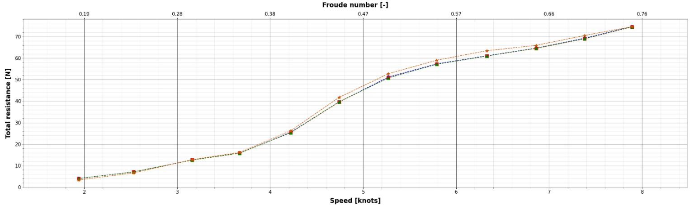

line

| Speed (knots) | Froude number [-] | Total resistance (N) (Series 1) | Total resistance (N) (Series 2) |
| --- | --- | --- | --- |
| 2 | 0.19 | ~4 | ~4 |
| 2.5 | 0.28 | ~7 | ~7 |
| 3.2 | 0.38 | ~13 | ~13 |
| 3.7 | 0.38 | ~16 | ~16 |
| 4.3 | 0.47 | ~26 | ~26 |
| 4.7 | 0.47 | ~41 | ~40 |
| 5.3 | 0.57 | ~53 | ~51 |
| 5.8 | 0.57 | ~59 | ~57 |
| 6.3 | 0.66 | ~64 | ~61 |
| 6.8 | 0.66 | ~66 | ~65 |
| 7.3 | 0.76 | ~71 | ~69 |
| 7.8 | 0.76 | ~75 | ~75 |

<table><tr><td></td><td>Speed [knots]</td><td>Froude number [-]</td><td>DELFT_372_Coarse</td><td>DELFT_372_Medium</td><td>DELFT_372_Fine</td><td>DELFT_372_EFD</td></tr><tr><td>0</td><td>1.94</td><td>0.18</td><td>4.01</td><td>3.95</td><td>3.95</td><td>3.31</td></tr><tr><td>1</td><td>2.53</td><td>0.24</td><td>7.10</td><td>7.08</td><td>7.08</td><td>6.60</td></tr><tr><td>2</td><td>3.16</td><td>0.30</td><td>12.62</td><td>12.61</td><td>12.57</td><td>12.77</td></tr><tr><td>3</td><td>3.67</td><td>0.35</td><td>15.76</td><td>15.82</td><td>15.78</td><td>16.14</td></tr><tr><td>4</td><td>4.22</td><td>0.40</td><td>25.56</td><td>25.33</td><td>25.38</td><td>26.23</td></tr><tr><td>5</td><td>4.74</td><td>0.45</td><td>39.61</td><td>39.61</td><td>39.75</td><td>41.75</td></tr><tr><td>6</td><td>5.27</td><td>0.50</td><td>51.25</td><td>50.90</td><td>50.82</td><td>52.79</td></tr><tr><td>7</td><td>5.79</td><td>0.55</td><td>57.39</td><td>57.20</td><td>57.20</td><td>59.08</td></tr><tr><td>8</td><td>6.33</td><td>0.60</td><td>61.15</td><td>61.02</td><td>61.05</td><td>63.50</td></tr><tr><td>9</td><td>6.86</td><td>0.65</td><td>64.73</td><td>64.59</td><td>64.68</td><td>66.00</td></tr><tr><td>10</td><td>7.38</td><td>0.70</td><td>69.34</td><td>69.04</td><td>69.12</td><td>70.60</td></tr><tr><td>11</td><td>7.89</td><td>0.75</td><td>74.75</td><td>74.59</td><td>74.64</td><td>74.71</td></tr></table>

<table><tr><td></td><td>Speed [knots]</td><td>Froude number [-]</td><td>X_0 = DELFT_372_Coarse, [N]</td><td>X_1 = DELFT_372_Medium, [N]</td><td>X_2 = DELFT_372_Fine, [N]</td></tr><tr><td>0</td><td>1.94</td><td>0.18</td><td>0.70</td><td>0.64</td><td>0.64</td></tr><tr><td>1</td><td>2.53</td><td>0.24</td><td>0.50</td><td>0.48</td><td>0.48</td></tr><tr><td>2</td><td>3.16</td><td>0.30</td><td>-0.15</td><td>-0.16</td><td>-0.20</td></tr><tr><td>3</td><td>3.67</td><td>0.35</td><td>-0.38</td><td>-0.32</td><td>-0.36</td></tr><tr><td>4</td><td>4.22</td><td>0.40</td><td>-0.67</td><td>-0.90</td><td>-0.85</td></tr><tr><td>5</td><td>4.74</td><td>0.45</td><td>-2.14</td><td>-2.14</td><td>-2.00</td></tr><tr><td>6</td><td>5.27</td><td>0.50</td><td>-1.54</td><td>-1.89</td><td>-1.97</td></tr><tr><td>7</td><td>5.79</td><td>0.55</td><td>-1.69</td><td>-1.88</td><td>-1.88</td></tr><tr><td>8</td><td>6.33</td><td>0.60</td><td>-2.35</td><td>-2.48</td><td>-2.45</td></tr><tr><td>9</td><td>6.86</td><td>0.65</td><td>-1.27</td><td>-1.41</td><td>-1.32</td></tr><tr><td>10</td><td>7.38</td><td>0.70</td><td>-1.26</td><td>-1.56</td><td>-1.48</td></tr><tr><td>11</td><td>7.89</td><td>0.75</td><td>0.04</td><td>-0.12</td><td>-0.07</td></tr></table>

<table><tr><td></td><td>Speed [knots]</td><td>Froude number [-]</td><td>X_0 = DELFT_372_Coarse, [%]</td><td>X_1 = DELFT_372_Medium, [%]</td><td>X_2 = DELFT_372_Fine, [%]</td></tr><tr><td>0</td><td>1.94</td><td>0.18</td><td>21.15</td><td>19.34</td><td>19.34</td></tr><tr><td>1</td><td>2.53</td><td>0.24</td><td>7.58</td><td>7.27</td><td>7.27</td></tr><tr><td>2</td><td>3.16</td><td>0.30</td><td>-1.17</td><td>-1.25</td><td>-1.57</td></tr><tr><td>3</td><td>3.67</td><td>0.35</td><td>-2.35</td><td>-1.98</td><td>-2.23</td></tr><tr><td>4</td><td>4.22</td><td>0.40</td><td>-2.55</td><td>-3.43</td><td>-3.24</td></tr><tr><td>5</td><td>4.74</td><td>0.45</td><td>-5.13</td><td>-5.13</td><td>-4.79</td></tr><tr><td>6</td><td>5.27</td><td>0.50</td><td>-2.92</td><td>-3.58</td><td>-3.73</td></tr><tr><td>7</td><td>5.79</td><td>0.55</td><td>-2.86</td><td>-3.18</td><td>-3.18</td></tr><tr><td>8</td><td>6.33</td><td>0.60</td><td>-3.70</td><td>-3.91</td><td>-3.86</td></tr><tr><td>9</td><td>6.86</td><td>0.65</td><td>-1.92</td><td>-2.14</td><td>-2.00</td></tr><tr><td>10</td><td>7.38</td><td>0.70</td><td>-1.78</td><td>-2.21</td><td>-2.10</td></tr><tr><td>11</td><td>7.89</td><td>0.75</td><td>0.05</td><td>-0.16</td><td>-0.09</td></tr></table>

Figure 5: Evolution (up), difference [N] (middle) and difference [%] (bottom) of total resistance

Evolution of total resistance coefficient  
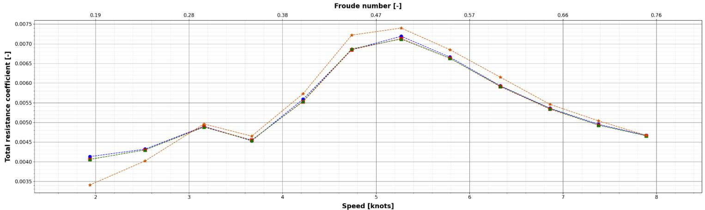

line

| Speed (knots) | Froude number [-] | Total resistance coefficient [-] (Blue) | Total resistance coefficient [-] (Orange) | Total resistance coefficient [-] (Green) |
| --- | --- | --- | --- | --- |
| 2 | 0.19 | ~0.0041 | ~0.0034 | ~0.0040 |
| 2.5 | — | ~0.0043 | ~0.0040 | ~0.0043 |
| 3.2 | 0.28 | ~0.0049 | ~0.0049 | ~0.0049 |
| 3.7 | — | ~0.0046 | ~0.0046 | ~0.0045 |
| 4.2 | 0.38 | ~0.0056 | ~0.0057 | ~0.0055 |
| 4.7 | 0.47 | ~0.0069 | ~0.0072 | ~0.0069 |
| 5.3 | — | ~0.0072 | ~0.0074 | ~0.0071 |
| 5.8 | 0.57 | ~0.0066 | ~0.0069 | ~0.0066 |
| 6.3 | — | ~0.0059 | ~0.0061 | ~0.0059 |
| 6.8 | 0.66 | ~0.0053 | ~0.0055 | ~0.0053 |
| 7.3 | — | ~0.0049 | ~0.0050 | ~0.0049 |
| 7.9 | 0.76 | ~0.0047 | ~0.0047 | ~0.0047 |

<table><tr><td>Speed [knots]</td><td>Froude number [-]</td><td>DELFT_372_Coarse</td><td>DELFT_372_Medium</td><td>DELFT_372_Fine</td><td>DELFT_372_EFD</td></tr><tr><td>1.94</td><td>0.18</td><td>4.13e-03</td><td>4.06e-03</td><td>4.06e-03</td><td>3.41e-03</td></tr><tr><td>2.53</td><td>0.24</td><td>4.32e-03</td><td>4.30e-03</td><td>4.30e-03</td><td>4.02e-03</td></tr><tr><td>3.16</td><td>0.30</td><td>4.90e-03</td><td>4.89e-03</td><td>4.88e-03</td><td>4.96e-03</td></tr><tr><td>3.67</td><td>0.35</td><td>4.53e-03</td><td>4.55e-03</td><td>4.54e-03</td><td>4.65e-03</td></tr><tr><td>4.22</td><td>0.40</td><td>5.59e-03</td><td>5.53e-03</td><td>5.54e-03</td><td>5.73e-03</td></tr><tr><td>4.74</td><td>0.45</td><td>6.85e-03</td><td>6.85e-03</td><td>6.87e-03</td><td>7.22e-03</td></tr><tr><td>5.27</td><td>0.50</td><td>7.19e-03</td><td>7.13e-03</td><td>7.12e-03</td><td>7.40e-03</td></tr><tr><td>5.79</td><td>0.55</td><td>6.66e-03</td><td>6.63e-03</td><td>6.63e-03</td><td>6.85e-03</td></tr><tr><td>6.33</td><td>0.60</td><td>5.93e-03</td><td>5.91e-03</td><td>5.92e-03</td><td>6.15e-03</td></tr><tr><td>6.86</td><td>0.65</td><td>5.36e-03</td><td>5.34e-03</td><td>5.35e-03</td><td>5.46e-03</td></tr><tr><td>7.38</td><td>0.70</td><td>4.95e-03</td><td>4.93e-03</td><td>4.93e-03</td><td>5.04e-03</td></tr><tr><td>7.89</td><td>0.75</td><td>4.67e-03</td><td>4.66e-03</td><td>4.66e-03</td><td>4.67e-03</td></tr></table>

<table><tr><td></td><td>Speed [knots]</td><td>Froude number [-]</td><td>X_0 = DELFT_372_Coarse, [%]</td><td>X_1 = DELFT_372_Medium, [%]</td><td>X_2 = DELFT_372_Fine, [%]</td></tr><tr><td>0</td><td>1.94</td><td>0.18</td><td>21.11</td><td>19.06</td><td>19.06</td></tr><tr><td>1</td><td>2.53</td><td>0.24</td><td>7.46</td><td>6.97</td><td>6.97</td></tr><tr><td>2</td><td>3.16</td><td>0.30</td><td>-1.21</td><td>-1.41</td><td>-1.61</td></tr><tr><td>3</td><td>3.67</td><td>0.35</td><td>-2.58</td><td>-2.15</td><td>-2.37</td></tr><tr><td>4</td><td>4.22</td><td>0.40</td><td>-2.44</td><td>-3.49</td><td>-3.32</td></tr><tr><td>5</td><td>4.74</td><td>0.45</td><td>-5.12</td><td>-5.12</td><td>-4.85</td></tr><tr><td>6</td><td>5.27</td><td>0.50</td><td>-2.84</td><td>-3.65</td><td>-3.78</td></tr><tr><td>7</td><td>5.79</td><td>0.55</td><td>-2.77</td><td>-3.21</td><td>-3.21</td></tr><tr><td>8</td><td>6.33</td><td>0.60</td><td>-3.58</td><td>-3.90</td><td>-3.74</td></tr><tr><td>9</td><td>6.86</td><td>0.65</td><td>-1.83</td><td>-2.20</td><td>-2.01</td></tr><tr><td>10</td><td>7.38</td><td>0.70</td><td>-1.79</td><td>-2.18</td><td>-2.18</td></tr><tr><td>11</td><td>7.89</td><td>0.75</td><td>0.00</td><td>-0.21</td><td>-0.21</td></tr></table>

<table><tr><td></td><td>Speed [knots]</td><td>Froude number [-]</td><td>X_0 = DELFT_372_Coarse, [-]</td><td>X_1 = DELFT_372_Medium, [-]</td><td>X_2 = DELFT_372_Fine, [-]</td></tr><tr><td>0</td><td>1.94</td><td>0.18</td><td>7.20e-04</td><td>6.50e-04</td><td>6.50e-04</td></tr><tr><td>1</td><td>2.53</td><td>0.24</td><td>3.00e-04</td><td>2.80e-04</td><td>2.80e-04</td></tr><tr><td>2</td><td>3.16</td><td>0.30</td><td>-6.00e-05</td><td>-7.00e-05</td><td>-8.00e-05</td></tr><tr><td>3</td><td>3.67</td><td>0.35</td><td>-1.20e-04</td><td>-1.00e-04</td><td>-1.10e-04</td></tr><tr><td>4</td><td>4.22</td><td>0.40</td><td>-1.40e-04</td><td>-2.00e-04</td><td>-1.90e-04</td></tr><tr><td>5</td><td>4.74</td><td>0.45</td><td>-3.70e-04</td><td>-3.70e-04</td><td>-3.50e-04</td></tr><tr><td>6</td><td>5.27</td><td>0.50</td><td>-2.10e-04</td><td>-2.70e-04</td><td>-2.80e-04</td></tr><tr><td>7</td><td>5.79</td><td>0.55</td><td>-1.90e-04</td><td>-2.20e-04</td><td>-2.20e-04</td></tr><tr><td>8</td><td>6.33</td><td>0.60</td><td>-2.20e-04</td><td>-2.40e-04</td><td>-2.30e-04</td></tr><tr><td>9</td><td>6.86</td><td>0.65</td><td>-1.00e-04</td><td>-1.20e-04</td><td>-1.10e-04</td></tr><tr><td>10</td><td>7.38</td><td>0.70</td><td>-9.00e-05</td><td>-1.10e-04</td><td>-1.10e-04</td></tr><tr><td>11</td><td>7.89</td><td>0.75</td><td>0.00e+00</td><td>-1.00e-05</td><td>-1.00e-05</td></tr></table>

Figure 6: Evolution (up), difference [-] (middle) and difference [%] (bottom) of total resistance coefficient

## d. Motions

## i. Heave

Figure 7 illustrates the progression of the DELFT 372 dynamic heave response across different advance speeds in the top graph and table. The middle table shows the absolute differences between CFD and EFD in international units, while the bottom table displays the relative difference between CFD and EFD as a percentage.

To thoroughly assess results, particularly percentage differences, it is important to consider both percentage and absolute values. In comparisons with towing tank tests, target dynamic heave values are very low, so even minor discrepancies can lead to large percentage errors.

The dynamic heave error between EFD and CFD is on the order of millimetres or less, demonstrating excellent agreement for most speeds, especially given the extremely similar trend of the curves. However, at the highest speed, there is a noticeable discrepancy. This deviation appears to stem from the experimental results themselves, as the trend of the experimental curve for this point does not align with the overall expected behaviour, suggesting potential inaccuracies in the experimental data for the dynamic response at this speed.

Evolution of dynamic heave attitude  
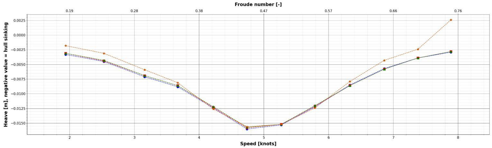

line

| Speed (knots) | Orange (Heave [m]) | Green (Heave [m]) | Blue (Heave [m]) |
| --- | --- | --- | --- |
| 2 | ~-0.0018 | ~-0.0030 | ~-0.0032 |
| 2.5 | ~-0.0030 | ~-0.0042 | ~-0.0043 |
| 3.2 | ~-0.0058 | ~-0.0068 | ~-0.0070 |
| 3.7 | ~-0.0080 | ~-0.0088 | ~-0.0090 |
| 4.3 | ~-0.0122 | ~-0.0122 | ~-0.0122 |
| 4.7 | ~-0.0155 | ~-0.0158 | ~-0.0158 |
| 5.3 | ~-0.0152 | ~-0.0152 | ~-0.0152 |
| 5.8 | ~-0.0120 | ~-0.0120 | ~-0.0120 |
| 6.3 | ~-0.0075 | ~-0.0085 | ~-0.0085 |
| 6.8 | ~-0.0042 | ~-0.0055 | ~-0.0055 |
| 7.4 | ~-0.0022 | ~-0.0038 | ~-0.0038 |
| 7.9 | ~0.0025 | ~-0.0025 | ~-0.0025 |

<table><tr><td>Speed [knots]</td><td>Froude number [-]</td><td>DELFT_372_Coarse</td><td>DELFT_372_Medium</td><td>DELFT_372_Fine</td><td>DELFT_372_EFD</td></tr><tr><td>1.94</td><td>0.18</td><td>-0.0033</td><td>-0.0031</td><td>-0.0031</td><td>-0.0018</td></tr><tr><td>2.53</td><td>0.24</td><td>-0.0045</td><td>-0.0044</td><td>-0.0043</td><td>-0.0031</td></tr><tr><td>3.16</td><td>0.30</td><td>-0.0071</td><td>-0.0069</td><td>-0.0069</td><td>-0.0059</td></tr><tr><td>3.67</td><td>0.35</td><td>-0.0088</td><td>-0.0086</td><td>-0.0086</td><td>-0.0081</td></tr><tr><td>4.22</td><td>0.40</td><td>-0.0124</td><td>-0.0123</td><td>-0.0122</td><td>-0.0126</td></tr><tr><td>4.74</td><td>0.45</td><td>-0.0160</td><td>-0.0158</td><td>-0.0157</td><td>-0.0156</td></tr><tr><td>5.27</td><td>0.50</td><td>-0.0153</td><td>-0.0152</td><td>-0.0152</td><td>-0.0152</td></tr><tr><td>5.79</td><td>0.55</td><td>-0.0122</td><td>-0.0121</td><td>-0.0120</td><td>-0.0124</td></tr><tr><td>6.33</td><td>0.60</td><td>-0.0085</td><td>-0.0086</td><td>-0.0086</td><td>-0.0079</td></tr><tr><td>6.86</td><td>0.65</td><td>-0.0057</td><td>-0.0058</td><td>-0.0058</td><td>-0.0043</td></tr><tr><td>7.38</td><td>0.70</td><td>-0.0039</td><td>-0.0039</td><td>-0.0039</td><td>-0.0024</td></tr><tr><td>7.89</td><td>0.75</td><td>-0.0029</td><td>-0.0028</td><td>-0.0028</td><td>0.0026</td></tr></table>

<table><tr><td></td><td>Speed [knots]</td><td>Froude number [-]</td><td>X_0 = DELFT_372_Coarse, [m]</td><td>X_1 = DELFT_372_Medium, [m]</td><td>X_2 = DELFT_372_Fine, [m]</td></tr><tr><td>0</td><td>1.94</td><td>0.18</td><td>-0.002</td><td>-0.001</td><td>-0.001</td></tr><tr><td>1</td><td>2.53</td><td>0.24</td><td>-0.001</td><td>-0.001</td><td>-0.001</td></tr><tr><td>2</td><td>3.16</td><td>0.30</td><td>-0.001</td><td>-0.001</td><td>-0.001</td></tr><tr><td>3</td><td>3.67</td><td>0.35</td><td>-0.001</td><td>-0.001</td><td>-0.001</td></tr><tr><td>4</td><td>4.22</td><td>0.40</td><td>0.000</td><td>0.000</td><td>0.000</td></tr><tr><td>5</td><td>4.74</td><td>0.45</td><td>-0.000</td><td>-0.000</td><td>-0.000</td></tr><tr><td>6</td><td>5.27</td><td>0.50</td><td>-0.000</td><td>0.000</td><td>0.000</td></tr><tr><td>7</td><td>5.79</td><td>0.55</td><td>0.000</td><td>0.000</td><td>0.000</td></tr><tr><td>8</td><td>6.33</td><td>0.60</td><td>-0.001</td><td>-0.001</td><td>-0.001</td></tr><tr><td>9</td><td>6.86</td><td>0.65</td><td>-0.001</td><td>-0.001</td><td>-0.001</td></tr><tr><td>10</td><td>7.38</td><td>0.70</td><td>-0.002</td><td>-0.002</td><td>-0.002</td></tr><tr><td>11</td><td>7.89</td><td>0.75</td><td>-0.005</td><td>-0.005</td><td>-0.005</td></tr></table>

<table><tr><td></td><td>Speed [knots]</td><td>Froude number [-]</td><td>X_0 = DELFT_372_Coarse, [%]</td><td>X_1 = DELFT_372_Medium, [%]</td><td>X_2 = DELFT_372_Fine, [%]</td></tr><tr><td>0</td><td>1.94</td><td>0.18</td><td>83.33</td><td>72.22</td><td>72.22</td></tr><tr><td>1</td><td>2.53</td><td>0.24</td><td>45.16</td><td>41.94</td><td>38.71</td></tr><tr><td>2</td><td>3.16</td><td>0.30</td><td>20.34</td><td>16.95</td><td>16.95</td></tr><tr><td>3</td><td>3.67</td><td>0.35</td><td>8.64</td><td>6.17</td><td>6.17</td></tr><tr><td>4</td><td>4.22</td><td>0.40</td><td>-1.59</td><td>-2.38</td><td>-3.17</td></tr><tr><td>5</td><td>4.74</td><td>0.45</td><td>2.56</td><td>1.28</td><td>0.64</td></tr><tr><td>6</td><td>5.27</td><td>0.50</td><td>0.66</td><td>-0.00</td><td>-0.00</td></tr><tr><td>7</td><td>5.79</td><td>0.55</td><td>-1.61</td><td>-2.42</td><td>-3.23</td></tr><tr><td>8</td><td>6.33</td><td>0.60</td><td>7.59</td><td>8.86</td><td>8.86</td></tr><tr><td>9</td><td>6.86</td><td>0.65</td><td>32.56</td><td>34.88</td><td>34.88</td></tr><tr><td>10</td><td>7.38</td><td>0.70</td><td>62.50</td><td>62.50</td><td>62.50</td></tr><tr><td>11</td><td>7.89</td><td>0.75</td><td>-211.54</td><td>-207.69</td><td>-207.69</td></tr></table>

Figure 7: Evolution (up), difference [m] (middle) and difference [%] (bottom) of dynamic heave attitude

## ii. Pitch

Figure 8 illustrates the progression of the DELFT 372 dynamic pitch response across different advance speeds in the top graph and table. The middle table shows the absolute differences between CFD and EFD in degrees, while the bottom table displays the relative difference between CFD and EFD as a percentage.

To thoroughly assess results, particularly percentage differences, it is important to consider both percentage and absolute values. In comparisons with towing tank tests, target dynamic pitch values are very low, so even minor discrepancies can lead to large percentage errors.

The experimental and numerical curves share the same overall trend and are extremely close, even though percentage errors may appear significant at low speeds due to the very small pitch angle values at these speeds.

The dynamic pitch error between EFD and CFD ranges from -0.096 to 0.109 degrees for the fine mesh. Notably, for Froude numbers above 0.4, the discrepancy is only a few percent, which is highly accurate.

As with the dynamic heave, the experimental point corresponding to the highest speed appears inconsistent with the expected trend of the experimental curve, suggesting potential inaccuracies in the experimental data at this speed.

Evolution of dynamic pitch attitude  
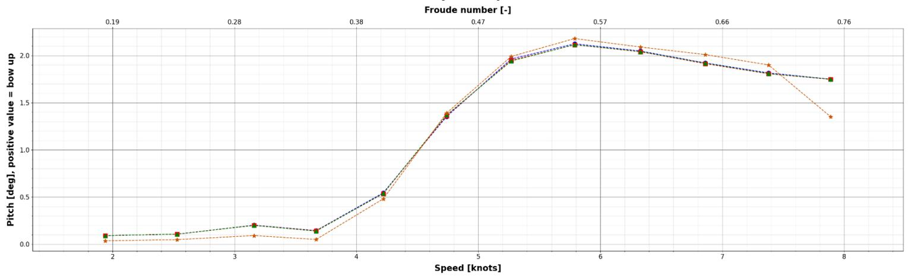

line

| Speed (knots) | Froude number [-] | Pitch (deg) (Series 1) | Pitch (deg) (Series 2) |
| --- | --- | --- | --- |
| 2 | 0.19 | ~0.1 | ~0.05 |
| 2.5 | 0.28 | ~0.12 | ~0.06 |
| 3.2 | 0.38 | ~0.2 | ~0.1 |
| 3.7 | 0.38 | ~0.15 | ~0.06 |
| 4.2 | 0.47 | ~0.55 | ~0.48 |
| 4.7 | 0.47 | ~1.35 | ~1.38 |
| 5.3 | 0.57 | ~1.95 | ~2.0 |
| 5.8 | 0.57 | ~2.15 | ~2.2 |
| 6.3 | 0.66 | ~2.05 | ~2.1 |
| 6.9 | 0.66 | ~1.92 | ~2.02 |
| 7.4 | 0.76 | ~1.8 | ~1.9 |
| 7.9 | 0.76 | ~1.75 | ~1.35 |

<table><tr><td></td><td>Speed [knots]</td><td>Froude number [-]</td><td>DELFT_372_Coarse</td><td>DELFT_372_Medium</td><td>DELFT_372_Fine</td><td>DELFT_372_EFD</td></tr><tr><td>0</td><td>1.94</td><td>0.18</td><td>0.0905</td><td>0.0905</td><td>0.0906</td><td>0.0350</td></tr><tr><td>1</td><td>2.53</td><td>0.24</td><td>0.1052</td><td>0.1065</td><td>0.1064</td><td>0.0480</td></tr><tr><td>2</td><td>3.16</td><td>0.30</td><td>0.2019</td><td>0.1997</td><td>0.1982</td><td>0.0910</td></tr><tr><td>3</td><td>3.67</td><td>0.35</td><td>0.1439</td><td>0.1421</td><td>0.1382</td><td>0.0500</td></tr><tr><td>4</td><td>4.22</td><td>0.40</td><td>0.5441</td><td>0.5349</td><td>0.5376</td><td>0.4800</td></tr><tr><td>5</td><td>4.74</td><td>0.45</td><td>1.3523</td><td>1.3614</td><td>1.3698</td><td>1.3900</td></tr><tr><td>6</td><td>5.27</td><td>0.50</td><td>1.9632</td><td>1.9489</td><td>1.9417</td><td>1.9900</td></tr><tr><td>7</td><td>5.79</td><td>0.55</td><td>2.1245</td><td>2.1134</td><td>2.1151</td><td>2.1800</td></tr><tr><td>8</td><td>6.33</td><td>0.60</td><td>2.0473</td><td>2.0397</td><td>2.0426</td><td>2.0900</td></tr><tr><td>9</td><td>6.86</td><td>0.65</td><td>1.9219</td><td>1.9137</td><td>1.9186</td><td>2.0100</td></tr><tr><td>10</td><td>7.38</td><td>0.70</td><td>1.8156</td><td>1.8061</td><td>1.8089</td><td>1.9000</td></tr><tr><td>11</td><td>7.89</td><td>0.75</td><td>1.7492</td><td>1.7467</td><td>1.7494</td><td>1.3500</td></tr></table>

<table><tr><td></td><td>Speed [knots]</td><td>Froude number [-]</td><td>X_0 = DELFT_372_Coarse, [deg]</td><td>X_1 = DELFT_372_Medium, [deg]</td><td>X_2 = DELFT_372_Fine, [deg]</td></tr><tr><td>0</td><td>1.94</td><td>0.18</td><td>0.055</td><td>0.055</td><td>0.056</td></tr><tr><td>1</td><td>2.53</td><td>0.24</td><td>0.057</td><td>0.058</td><td>0.058</td></tr><tr><td>2</td><td>3.16</td><td>0.30</td><td>0.111</td><td>0.109</td><td>0.107</td></tr><tr><td>3</td><td>3.67</td><td>0.35</td><td>0.094</td><td>0.092</td><td>0.088</td></tr><tr><td>4</td><td>4.22</td><td>0.40</td><td>0.064</td><td>0.055</td><td>0.058</td></tr><tr><td>5</td><td>4.74</td><td>0.45</td><td>-0.038</td><td>-0.029</td><td>-0.020</td></tr><tr><td>6</td><td>5.27</td><td>0.50</td><td>-0.027</td><td>-0.041</td><td>-0.048</td></tr><tr><td>7</td><td>5.79</td><td>0.55</td><td>-0.056</td><td>-0.067</td><td>-0.065</td></tr><tr><td>8</td><td>6.33</td><td>0.60</td><td>-0.043</td><td>-0.050</td><td>-0.047</td></tr><tr><td>9</td><td>6.86</td><td>0.65</td><td>-0.088</td><td>-0.096</td><td>-0.091</td></tr><tr><td>10</td><td>7.38</td><td>0.70</td><td>-0.084</td><td>-0.094</td><td>-0.091</td></tr><tr><td>11</td><td>7.89</td><td>0.75</td><td>0.399</td><td>0.397</td><td>0.399</td></tr></table>

<table><tr><td></td><td>Speed [knots]</td><td>Froude number [-]</td><td>X_0 = DELFT_372_Coarse, [%]</td><td>X_1 = DELFT_372_Medium, [%]</td><td>X_2 = DELFT_372_Fine, [%]</td></tr><tr><td>0</td><td>1.94</td><td>0.18</td><td>158.57</td><td>158.57</td><td>158.86</td></tr><tr><td>1</td><td>2.53</td><td>0.24</td><td>119.17</td><td>121.87</td><td>121.67</td></tr><tr><td>2</td><td>3.16</td><td>0.30</td><td>121.87</td><td>119.45</td><td>117.80</td></tr><tr><td>3</td><td>3.67</td><td>0.35</td><td>187.80</td><td>184.20</td><td>176.40</td></tr><tr><td>4</td><td>4.22</td><td>0.40</td><td>13.35</td><td>11.44</td><td>12.00</td></tr><tr><td>5</td><td>4.74</td><td>0.45</td><td>-2.71</td><td>-2.06</td><td>-1.45</td></tr><tr><td>6</td><td>5.27</td><td>0.50</td><td>-1.35</td><td>-2.07</td><td>-2.43</td></tr><tr><td>7</td><td>5.79</td><td>0.55</td><td>-2.55</td><td>-3.06</td><td>-2.98</td></tr><tr><td>8</td><td>6.33</td><td>0.60</td><td>-2.04</td><td>-2.41</td><td>-2.27</td></tr><tr><td>9</td><td>6.86</td><td>0.65</td><td>-4.38</td><td>-4.79</td><td>-4.55</td></tr><tr><td>10</td><td>7.38</td><td>0.70</td><td>-4.44</td><td>-4.94</td><td>-4.79</td></tr><tr><td>11</td><td>7.89</td><td>0.75</td><td>29.57</td><td>29.39</td><td>29.59</td></tr></table>

Figure 8: Evolution (up), difference [deg] (middle) and difference [%] (bottom) of dynamic pitch attitude

## e. Free surface renderings

i. Same scale  
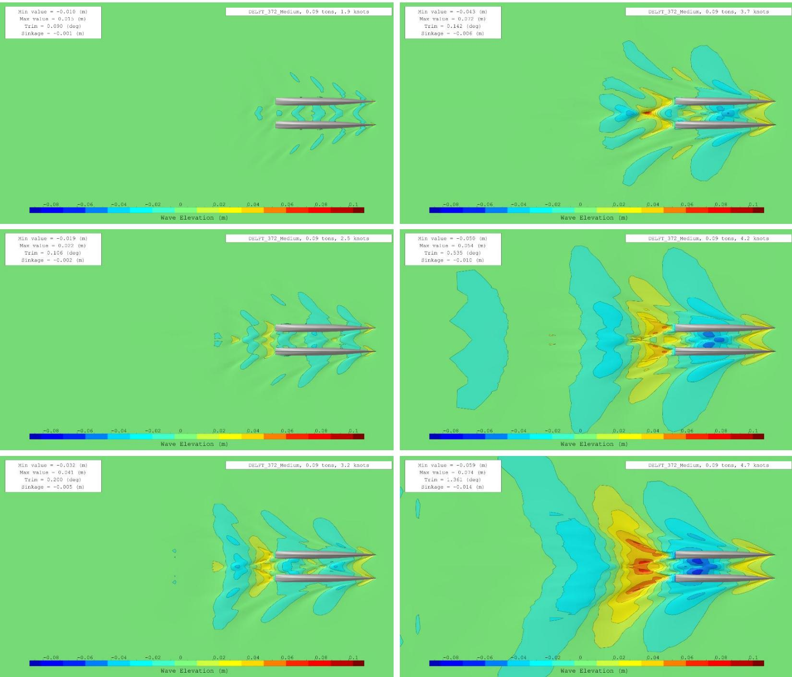  
Figure 9: Free surface evolution (same scale) from 1.9 to 4.7 knots

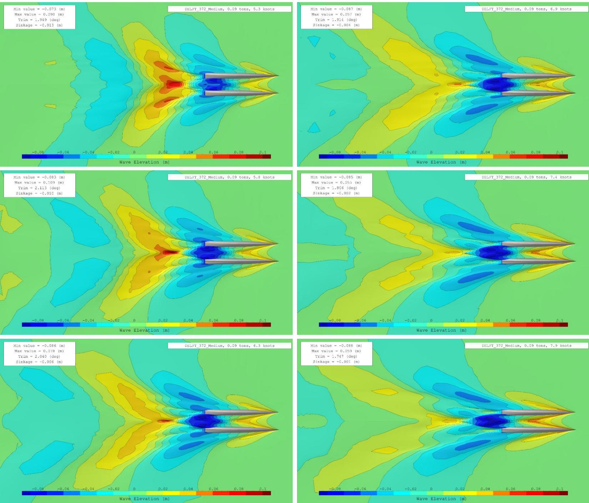  
Figure 10: Free surface evolution (same scale) from 5.3 to 7.9 knots

ii. Independent scale  
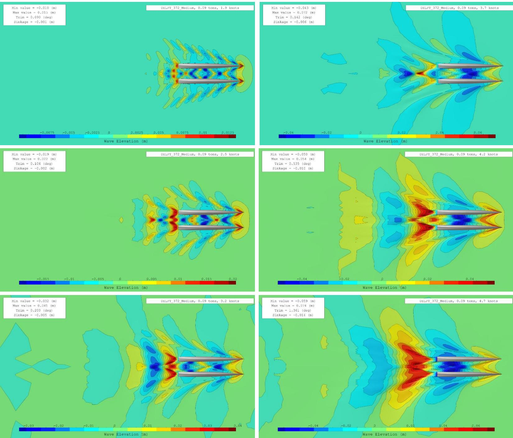  
Figure 11: Free surface evolution (independent scale) from 1.9 to 4.7 knots

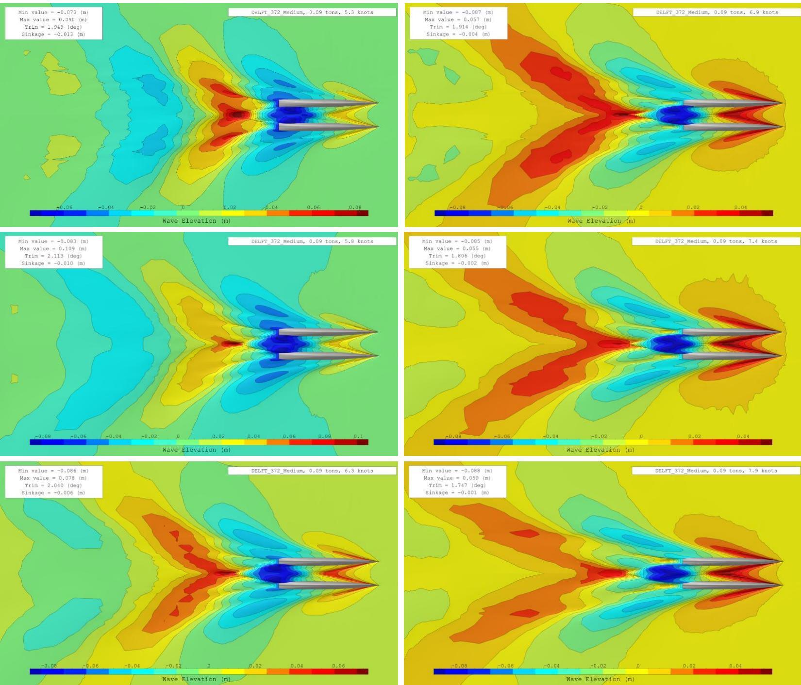  
Figure 12: Free surface evolution (independent scale) from 5.3 to 7.9 knots

## f. Computational time comparison

Figure 13 compares the computation times, in hours, across different mesh configurations. Since we run simulations on an optimal number of cores determined by the mesh cell count, it is crucial to consider the number of cores utilized.

Notably, for a medium mesh that produces more than acceptable results, we complete the entire resistance curve calculation in approximately 20 hours, which is exceptionally efficient for performing a total of 12 CFD simulations.

<table><tr><td></td><td>Speed [knots]</td><td>Froude number [-]</td><td>● Core [-]</td><td>● DELFT_372_Coarse</td><td>■ Core [-]</td><td>■ DELFT_372_Medium</td><td>▲ Core [-]</td><td>▲ DELFT_372_Fine</td></tr><tr><td>0</td><td>1.94</td><td>0.18</td><td>6</td><td>0.62</td><td>14</td><td>0.82</td><td>22</td><td>0.92</td></tr><tr><td>1</td><td>2.53</td><td>0.24</td><td>6</td><td>0.55</td><td>14</td><td>0.68</td><td>22</td><td>0.82</td></tr><tr><td>2</td><td>3.16</td><td>0.30</td><td>6</td><td>1.07</td><td>14</td><td>1.27</td><td>22</td><td>1.40</td></tr><tr><td>3</td><td>3.67</td><td>0.35</td><td>6</td><td>1.67</td><td>14</td><td>2.03</td><td>22</td><td>2.17</td></tr><tr><td>4</td><td>4.22</td><td>0.40</td><td>6</td><td>1.52</td><td>16</td><td>1.68</td><td>24</td><td>1.67</td></tr><tr><td>5</td><td>4.74</td><td>0.45</td><td>6</td><td>1.38</td><td>16</td><td>1.33</td><td>24</td><td>1.52</td></tr><tr><td>6</td><td>5.27</td><td>0.50</td><td>6</td><td>1.92</td><td>16</td><td>1.63</td><td>24</td><td>1.77</td></tr><tr><td>7</td><td>5.79</td><td>0.55</td><td>6</td><td>2.55</td><td>16</td><td>2.18</td><td>24</td><td>2.57</td></tr><tr><td>8</td><td>6.33</td><td>0.60</td><td>6</td><td>2.38</td><td>16</td><td>2.23</td><td>24</td><td>2.33</td></tr><tr><td>9</td><td>6.86</td><td>0.65</td><td>6</td><td>2.30</td><td>16</td><td>2.27</td><td>24</td><td>2.28</td></tr><tr><td>10</td><td>7.38</td><td>0.70</td><td>6</td><td>2.20</td><td>16</td><td>2.05</td><td>24</td><td>2.15</td></tr><tr><td>11</td><td>7.89</td><td>0.75</td><td>6</td><td>2.13</td><td>16</td><td>1.97</td><td>24</td><td>1.98</td></tr></table>

Figure 13: Computational time in hours

## 4. Conclusion

This report presents a validation study, conducted to predict the calm-water resistance of the DELFT 372 catamaran, comparing results obtained using NepTech's digital towing tank with available experimental data from the paper "Experimental Results of Motions, Hydrodynamic Coefficients, and Wave Loads on the 372 Catamaran Model".

The findings demonstrate a strong correlation between the numerical and experimental results, with:

• A resistance error ranging from -2.45 to +0.64 Newtons\*  
• A heave error on the order of millimetres or less,  
• A dynamic pitch error from -0.096 to 0.109 degrees\*.

\*For the fine mesh

The EFD/CFD differences can be attributed to variations in hydrostatic characteristics between the model used for the tank tests and the model applied in CFD calculations, particularly a difference in the waterline beam of the hull modelled in CFD.

This report thus confirms NepTech's capability to accurately and efficiently predict the dynamic behaviour of a catamaran vessel advancing from low speeds to high speeds. By employing a fully automated digital towing tank using the latest advanced modelling tools, we conclude that simulations of similar flow type will be reliable.

## Bibliography

Riaan van't Veer, I. (1998). Experimental results of motions, hydrodynamic coefficients and wave loads on the 372 catamaran model. Delft: Delft University of Technology.