# Turn and zigzag manoeuvres of Delft catamaran 372 using CFD-based system simulation method

Suleyman Duman a,b,\* , Sakir Bal c

a Department of Naval Architecture, Ocean and Marine Engineering, University of Strathclyde, United Kingdom   
b Department of Naval Architecture and Marine Engineering, Yildiz Technical University, Turkey   
c Department of Naval Architecture and Marine Engineering, Istanbul Technical University, Turkey

# A R T I C L E I N F O

Keywords: Catamaran manoeuvring Turning circle Zigzag CFD Delft catamaran Waterjet

# A B S T R A C T

Special demands in marine applications such as large capacities in transportation and fast deployment in military operations have brought multihull concepts forward. Open deck areas, high stability characteristics, and a wide range of operating speeds are some of the strong sides of these vessels. The fact that few studies have been done on manoeuvring performance predictions of these types of ships has been the main source of motivation in conducting this study. A fast multihull form, Delft Catamaran 372 (DC372), has been selected for computational fluid dynamics (CFD)-based system simulation application. CFD method has been subjected to a verification and validation (V&V) process using the latest solution verification techniques and available comparison data in the literature. The computerized planar motion mechanism (CPMM) approach has been applied to determine all the necessary hydrodynamic derivatives stated in Abkowitz’s manoeuvring model. A new approach to analysis of manoeuvring performance of multihull vessels, discrete study of hull components (DSHC), has been introduced for the interpretation of manoeuvring coefficients. The dynamic manoeuvre system simulator (DynaMaSS) in which a waterjet and conventional steering/propulsion units (SPUs) are implemented, has been presented for the 20-degree turning circle (TC20) and 20/20 zigzag (ZZ20) manoeuvre simulations of DC372. The manoeuvring coefficients of DC372 have been determined at a satisfactory level by the CFD method. Successful results and solution strategies have been presented for DC372.

# 1. Introduction

Classification of ships can be made by a wide range of parameters, yet the number of hulls is still the basic and certain way of assigning a design concept. Catamarans are getting very common and are by far a more familiar form since they particularly find widespread application in pleasure crafts, sailing vessels, even fishing boats. They provide much space compared to a monohull with the same displacement.

It is known that the viscous solution based computational fluid dynamics (CFD) method has mostly emerged in the last two decades. Technological progress in computer science has resulted in an easy-toaccess to high computing devices such as workstations which have provided the power of solving viscous flows. CFD simulations were commonly applied for predictions of resistance and manoeuvring performances of monohulls (Carrica et al., 2013; Doctors and Sahoo, 2006; Du et al., 2019; Hajivand and Mousavizadegan, 2015; Kahramanoglu,˘ 2021; Sukas et al., 2019a, 2019b, 2021). It is a fact that studies based on direct maneuver simulation are gradually evolving towards system-based manoeuvring simulation techniques. Of course, a series of hydrodynamic derivative expressions representing the hull form must be determined to achieve this.

Manivannan et al. (2013) presented a system-based simulation application for waterjet equipped DC372 catamaran. Dogan (2013) studied the vortical, turbulent structures and instabilities of the DC372 catamaran by DES solver CFDShip-Iowa V4.5 in collaboration with NATO AVT 183. The unsteady Reynolds-averaged Navier Stokes (URANS) and detached-eddy simulation (DES) methods were used to realize a series of static drift simulations. Good agreement between EFD (Experimental Fluid Dynamics) and CFD for the forces was reported while larger errors were observed for the moment values and amplitudes of motion. Iqbal and Samuel (2017) generated new hull forms by using the Lackenby Method to modify an existing hull form based on total resistance reduction, which had been modified into a catamaran. The total resistance of different hull forms was calculated by a Navier-Stokes equation solver software Tdyn. The initial hull form was a traditional fishing vessel located in Cilacap, Central Java, Indonesia. The CFD results were validated with the empirical equation and Slender Body theory. They managed to reduce the total resistance of catamaran by 6.5%. Duman and Bal (2019a) presented an empirical manoeuvring system method (HF-ManSys) based on high-fidelity flow solutions. Duman and Bal (2019b) performed pure sway URANS simulations of the DC372 catamaran by implementing the overset grid technique. In their following study, Duman and Bal (2020) analysed the pure yaw manoeuvres of the DC372 catamaran and predicted the relevant hydrodynamic derivatives by applying Fourier analysis to the CFD results. Mai et al. (2020) estimated the hydrodynamic coefficients of the DC372 catamaran using the RANS method and performed low-speed manoeuvring simulations.

<table><tr><td colspan="2">Nomenclature</td><td>CISD</td><td>Center for Innovation in Ship Design</td></tr><tr><td></td><td></td><td>DC372</td><td>Delft Catamaran 372</td></tr><tr><td> $\alpha$ </td><td>Acceleration (m s $^{-2}$ )</td><td>DES</td><td>Detached-eddy Simulation</td></tr><tr><td> $B_M$ </td><td>Beam moulded (m)</td><td>DSHC</td><td>Discrete Study on Hull Components</td></tr><tr><td> $B_{WL}$ </td><td>Beam at waterline (m)</td><td>DTMB</td><td>David Taylor Model Basin</td></tr><tr><td> $C_B$ </td><td>Block coefficient</td><td>EFD</td><td>Experimental Fluid Dynamics</td></tr><tr><td> $C_M$ </td><td>Midship coefficient</td><td>FP</td><td>Fore Peak</td></tr><tr><td> $C_{T-CFD}$ </td><td>Total drag coefficient by CFD</td><td>Fr, Fn</td><td>Froude Number</td></tr><tr><td> $C_{T-Exp}$ </td><td>Total drag coefficient by experiments</td><td>FS</td><td>Factors of Safety</td></tr><tr><td> $C_{T-H}$ </td><td>Total drag coefficient by Holtrop</td><td>GCI</td><td>Grid Convergence Index</td></tr><tr><td> $C_M$ </td><td>Midship coefficient</td><td>HF-ManSys</td><td>High-fidelity Empirical Manoeuvring System</td></tr><tr><td> $\Delta$ </td><td>Displacement (kg)</td><td>ITTC</td><td>International Towing Tank Conference</td></tr><tr><td> $\delta$ </td><td>Steering command angle (°)</td><td>LCB</td><td>Longitudinal Centre of Buoyancy</td></tr><tr><td> $\delta r$ </td><td>Actual rudder angle (°)</td><td>LHS</td><td>Left Hand-side</td></tr><tr><td> $\lambda$ </td><td>Model scale ratio</td><td>MMG</td><td>Mathematical Model Group</td></tr><tr><td> $L_{BP}$ </td><td>Length between perpendiculars (m)</td><td> $MR_L$ </td><td>Multiple-run (Low-order)</td></tr><tr><td> $L_{WL}$ </td><td>Length of waterline (m)</td><td>NATO</td><td>North Atlantic Treaty Organization</td></tr><tr><td> $\nu$ </td><td>Kinematic viscosity (N s m $^{-2}$ )</td><td>NSWCCD</td><td>(US) Naval Surface Warfare Center Carderock Division</td></tr><tr><td> $\nabla$ </td><td>Displacement volume (m $^3$ )</td><td>PMM</td><td>Planar Motion Mechanism</td></tr><tr><td> $\rho$ </td><td>Density of water (kg m $^{-3}$ )</td><td>RANS</td><td>Reynolds-averaged Navier-Stokes</td></tr><tr><td> $P$ </td><td>Pressure (N m $^{-2}$ )</td><td>RHS</td><td>Right Hand-side</td></tr><tr><td>S</td><td>Wetted hull surface area (m $^2$ )</td><td>SIMMAN</td><td>Workshop on Verification and Validation of Ship</td></tr><tr><td>u, v, w</td><td>Fluid velocity components</td><td></td><td>Manoeuvring Simulation Methods</td></tr><tr><td>y+</td><td>Dimensionless wall distance</td><td>SPP</td><td>Self Propulsion Point</td></tr><tr><td>AP</td><td>Aft Peak</td><td>VAM-V</td><td>Wave adaptive modular vessel</td></tr><tr><td>BCs</td><td>Boundary Conditions</td><td>VoF</td><td>Volume of Fluid</td></tr><tr><td>CF</td><td>Correction Factor</td><td>ZMC</td><td>Zero Moment Condition</td></tr><tr><td>CFD</td><td>Computational Fluid Dynamics</td><td></td><td></td></tr></table>

Experiments have still been an important compound of hydrodynamic analysis of any kind, especially for the validation process. The very first experimental studies on the DC372 catamaran dates to the late 20th century when the resistance and seakeeping characteristics of the DC372 hull were investigated by Van’t Veer (1998). Milanov et al. (2012) presented a study on system-based manoeuvring simulation of DC372. They equipped the model with a waterjet and developed a simulation model with the waterjet coefficients that were obtained from PMM tests. The manoeuvrability and directional stability of the vessel were estimated. Broglia et al. (2014) conducted an experimental study on the wave interference phenomena between demi-hulls. They used the DC372 catamaran in their model tests that were carried out at a range of 0.1–0.8 Froude number. It was reported that the smallest demi-hull clearance yielded the maximum resistance force which was about 30% higher than that of reference positioning. Falchi et al. (2014) presented a study on the measurement of velocity field around a catamaran in oblique towing condition with a Stereo-PIV instrument. Pandey and Hasegawa (2016) developed a mathematical model group (MMG) model for a wave adaptive modular vessel (VAM-V) catamaran and successfully predicted the turning circle characteristics and compared their results with those of experiments.

The main objective of this study is to determine the turn and zigzag manoeuvring performance parameters of the well-known catamaran model DC372. CFD-based system simulation method has been adopted to construct a fast-time manoeuvring simulator (FTMS) based on Abkowitz’s non-linear model. All the necessary manoeuvring coefficients of the DC372 catamaran have been determined from the URANS simulations of PMM tests. First, the ship manoeuvring model has been defined and test matrices have been set for the CPMM approach. The CFD method has been verified over spatial and temporal uncertainties applied through the latest solution verification techniques which are Grid Convergence Index (GCI), Correction Factor (CF), and Factors of Safety (FS). The validation process for the presented results has been considered at every step, i.e., the final manoeuvre parameters, as well as the URANS simulation results, have been compared with the available comparison data in the literature. Two different steering/ propulsion units (SPUs), waterjet and conventional systems, have been implemented for the presented dynamic manoeuvre system simulator (DynaMaSS). The steering angle has been set to 20◦ in the turning circle and zigzag manoeuvre simulations to match the conditions provided in the literature. The discrete study on hull components (DSHC) has been introduced as a new approach to catamaran manoeuvring analysis.

# 2. Mathematical models

A fast catamaran hull form has been chosen to develop a virtual environment for fast-time manoeuvring simulations. The catamaran hull form also known as Delft Catamaran 372 (DC372) is characterized by Ushaped sections and a zero-transom wetted area in an upright position floating on a flat-water surface at zero speed. She provides a suitable aft form for the application of a waterjet propulsion unit. This hull form is designed for marine operations at Froude numbers ranging from 0.28 up to 1.00. DC372 catamaran was designed by Aad Versluis, constructed at the Delft Ship Hydro-mechanic Laboratory by Cees van den Bergh and subjected to experiments for resistance and seakeeping performance predictions (Van’t Veer, 1998). It has then been used in many experimental and computational studies. The hull geometry is demonstrated in the 3-dimensional form in Fig. 1 from perspective and profile views. The principal dimensions of the catamaran are tabulated with the full-scale values in Table 1. The parameters indicated as “demi-hull” belong to the individual hull, i.e., BWL, demi-hull is the beam at the waterline of each hull. Subtracting the half of this demi-hull beam length from the half beam of the full catamaran gives the distance from the side-hull centreline to the symmetry-line of the full catamaran, which is 0.35 m here. The dimensions of the DC372 catamaran at different scales have been applied in different studies, yet the model in the original dimensions has been used in this study.

# 2.1. Computational method

In the process of a manoeuvring performance prediction, the vessel is subjected to several types of manoeuvring tests either free running or captive. The assessment of manoeuvrability of the DC372 hull has been realized by following the CFD-based system simulation method which was stated as one of the manoeuvring prediction techniques by the International Towing Tank Conference (ITTC) Manoeuvring Committee (MC) (ITTC, 2005). Following this technique, the CFD method has been used to simulate the PMM tests and to obtain the hydrodynamic de rivatives that are needed for the selected manoeuvring model. Essential numerical details such as field equations, discretization of the computational domain and boundary conditions are presented in the following sub-sections.

# 2.1.1. Governing equations

A vast majority of problems in ship hydrodynamics are handled by solving the Navier-Stokes equations in 3-dimensional space and mostly under free surface effects. Considering the initial state of the free water surface as a flat plane where the ship floats at a laden draught, any kind of motion or disturbance will cause the gravity waves that will initiate a sequence of wave generations in the vicinity of the vessel. The volume of fluid (VoF) method is implemented at that point to control the phase changes between the pre-discretized grid cells during the simulation (Hirt and Nichols, 1981). The fluid flow inside the computational domain is assumed to be Newtonian, incompressible and turbulent. Multi-phase flow simulations are achieved by solving the continuity equation (Equation (1)) and the Reynolds-averaged Navier-Stokes (RANS) equations (Equation (2)) in an unsteady way. Reynolds stresses (Equation (3)) that appear after applying averaging operations to the original Navier-Stokes (momentum) equations are calculated using a two-equation turbulence model (k-epsilon in the present case). The near-wall treatment is activated in all the simulations reported in this study by setting the dimensionless wall distance (y+) to be between 30 and 300 to ensure the wall function involved in the solution around

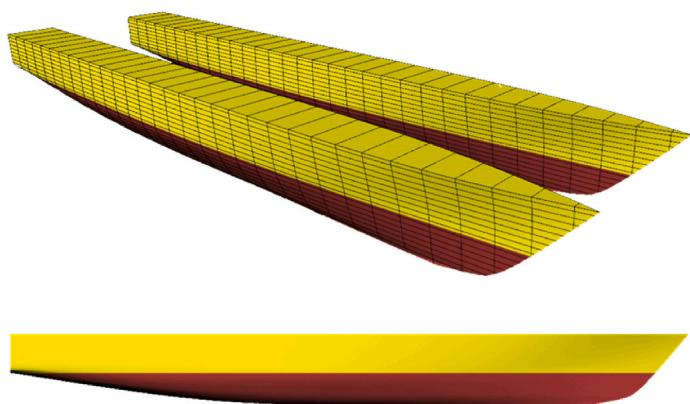

natural_image

3D rendered yellow and red geometric shapes with grid lines, no text or symbols present

Fig. 1. DC372 hull surface in 3-D from perspective (upper) and profile (lower) views.

Table 1 Principal dimensions of DC372. 

<table><tr><td></td><td>Model</td><td>Full-scale</td></tr><tr><td> $\lambda$ </td><td>33.333</td><td>1.0</td></tr><tr><td> $L_{OA} (m)$ </td><td>3.11</td><td>103.67</td></tr><tr><td> $L_{BP} (m)$ </td><td>3.0</td><td>100.0</td></tr><tr><td> $L_{WL} (m)$ </td><td>3.0</td><td>100.0</td></tr><tr><td> $B_{WL} (m)$ </td><td>0.94</td><td>31.33</td></tr><tr><td> $B_{M} (m)$ </td><td>0.94</td><td>31.33</td></tr><tr><td> $B_{WL, demi-hull} (m)$ </td><td>0.24</td><td>8.0</td></tr><tr><td> $T_{M} (m)$ </td><td>0.15</td><td>5.0</td></tr><tr><td> $S (m^{2})$ </td><td>1.95</td><td>2,166.6</td></tr><tr><td> $\nabla (m^{3})$ </td><td>0.087</td><td>3,222.1</td></tr><tr><td>LCB (m, +fwd)</td><td>-0.09</td><td>-3.0</td></tr><tr><td> $I_{xx}/B$ </td><td>0.40</td><td>0.40</td></tr><tr><td> $I_{zz}/L$ </td><td>0.25</td><td>0.25</td></tr><tr><td> $C_{B, demi-hull}$ </td><td>0.403</td><td>0.403</td></tr><tr><td> $C_{M, demi-hull}$ </td><td>0.633</td><td>0.633</td></tr></table>

no-slip surfaces. Timestep, one of the key parameters for well-designed unsteady solutions, is determined according to the ITTC recommenda tions (ITTC, 2011).

$$
\frac {\partial (\overline {{{u}}} _ {i})}{\partial x _ {i}} = 0 \tag {1}
$$

$$
\frac {\partial \left(\bar {u} _ {i}\right)}{\partial t} + \bar {u} _ {j} \frac {\partial \left(\bar {u} _ {i}\right)}{\partial x _ {j}} + \frac {\partial \left(\overline {{u _ {i} ^ {\prime} u _ {j} ^ {\prime}}}\right)}{\partial x _ {j}} = - \frac {1}{\rho} \frac {\partial \bar {p}}{\partial x _ {j}} + \frac {\partial \bar {\tau} _ {i j}}{\partial x _ {j}} \tag {2}
$$

$$
\bar {\tau} _ {i j} = \nu \left(\frac {\partial \bar {u} _ {i}}{\partial x _ {j}} + \frac {\partial \bar {u} _ {j}}{\partial x _ {i}}\right) \tag {3}
$$

# 2.1.2. Domain boundaries and grid resolution

The adequate dimensions for well-designed computational flow simulations around the selected multi-hull vessels have been determined according to previous experiences of the authors on related subjects and other numerical studies available in the literature. For each vessel, 1.8L and 3L distances are set for the CFD simulations in the upstream and downstream directions, respectively. Since there is no superstructure in the model geometries the top face of the domain is located 1.6L far in height from the origin of the coordinate system which is assigned at the intersection point of the fore perpendicular and the keel of each vessel. The side faces in port and starboard sides are considered as symmetry planes and are located about 2L away from the centreline of each vessel in the lateral direction. The bottom face is set to 2.1L in depth which is enough for the assumption of deep-water conditions (Table 2). To perform the hydrodynamic analyses in infinite-depth water, an artificial infinite boundary effect is achieved by setting both top and bottom faces as inlets where the fluid flows in the longitudinal direction, and yet no flux enters the domain from these faces. In that way, the velocity distribution that occurs near those faces is computed by taking the infinite velocity (operational speed of the vessel) at the boundaries (Fig. 2).

There are several techniques that can be applied to represent the overall grid structure in the computational domain. A basic example is the rigid grid approach where the whole domain is considered as one block. Although this type of grid can be very useful for the smallamplitude motions, e.g., heave and pitch, compared to the length of the examined geometry, when the motion amplitudes become higher, more flexible techniques should be applied to maintain the numerical stability. The Chimera or overset grid technique can provide high accurate dynamic solutions without any deformation on the grid cells around the moving body on that matter. The flow field is divided into two main regions; background and overset, and the flow information is transferred between the boundaries of the overset region and the background region overlapping cells through the intersecting points (Benek et al., 1986). Coloured representation of the grid cells and information about the data transfer between those cells were explained in previous studies (Duman and Bal, 2019b, 2020).

Table 2 Domain dimensions in CFD simulations. 

<table><tr><td>Boundaries</td><td>Background (*&quot;&gt;*L)</td><td>Overset (*&quot;&gt;*L)</td></tr><tr><td>Upstream</td><td>1.80</td><td>0.16</td></tr><tr><td>Downstream</td><td>3.00</td><td>0.33</td></tr><tr><td>Top</td><td>1.60</td><td>0.30</td></tr><tr><td>Bottom</td><td>2.10</td><td>0.19</td></tr><tr><td>Side</td><td>2.00</td><td>0.40</td></tr></table>

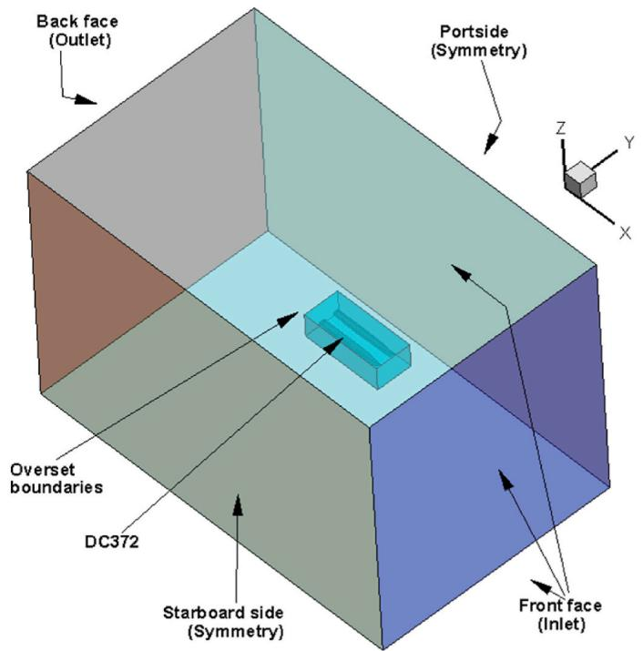

text_image

Back face
(Outlet)
Portside
(Symmetry)
Z
Y
X
Overset
boundaries
DC372
Starboard side
(Symmetry)
Front face
(Inlet)

Fig. 2. Boundary conditions in CFD simulations of DC372.

A pressure source moving on a free water surface disturbs the water and generates gravity waves. The interaction field between the pressure source and the fluid flow should be handled in the first place rather than the far-field. Building a mesh structure that starts finer near the no-slip surfaces, continues with a rate of change and gets coarser in the relatively far points is a wise choice to use the computer power efficiently. The meshing strategy that has been used in the CFD simulations in this study is mainly based on this idea. In the case of multihull vessels, inner fields between the individual hulls are covered with small size grid cells as well as in the bow and stern areas (Fig. 3). A specially constructed grid that is generated to cover the turbulence layer has great importance in the calculation of the global parameters such as hydrodynamics forces or moment (lower picture in Fig. 3). The ideal way of discretizing the free water surface is to make all the cells equal on that horizontal plane and keep them as thin as possible. However, this will cause an extension of the total elapsed time during a particular CFD simulation. Instead, in this study, a Kelvin-wave adopted grid has been applied to the free surface for increasing the efficiency of using computing power (Duman, 2016; Duman and Bal, 2017). Total grid cell number is counted approximately 2 millions and total solver elapsed times are recorded as 55 h for the stationary simulations and 72 h for the dynamic simulations on a workstation with 16 processing units and 64 GB RAM, respectively.

# 2.2. Ship manoeuvring model

In the CFD-based system simulation method, a manoeuvring model should be established for the fast-time manoeuvring simulations. Once the motion equations are clarified, the required hydrodynamic coefficients that represent the manoeuvring characteristics of the vessel are calculated numerically. Abkowitz’s non-linear manoeuvring model has been adopted in this study. The manoeuvring equations, test matrices for the CPMM approach, and SPUs are presented in the following sub-sections.

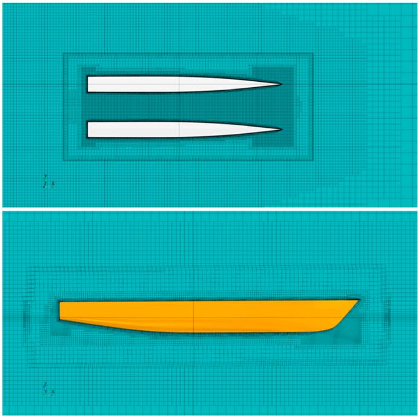

natural_image

Two abstract geometric shapes on a grid background, one with two white conical profiles and the other an elongated orange shape (no text or symbols)

Fig. 3. Grid structure on the free water surface (upper) and the symmetryplane of a demi-hull (lower) in CFD simulations of DC372.

# 2.2.1. Equations of motion

The generalized 6-DoF rigid-body equations of motion in a bodyfixed, non-inertial frame of reference that is moving relative to an Earth-fixed (inertial reference frame) are well defined and presented in (Fossen, 1994). For surface ships moving on unbounded and calm water, forces and moments acting on the ship are in the horizontal plane. Hence, the heave, roll and pitch motions and the relevance kinematic parameters can be neglected. Due to the symmetry of the vessel in the xz-plane, the lateral position of the gravity centre (yG) becomes zero. When these simplifications are made, the equations of motion for surface ships in a moving reference frame take the following form given in Equations (4)–(6) for surge, sway, and yaw, respectively. The inertial and moving reference frames adopted in this study are illustrated in Fig. 4 where the axes with a sub-index “0” stand for Earth-fixed and the axes without any sub-index belong to the moving reference frame.

$$
m \left(\dot {u} - v r - x _ {G} r ^ {2}\right) = X \tag {4}
$$

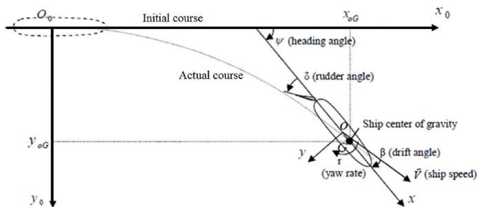

text_image

O₀
Initial course
x₀G
Actual course
ψ (heading angle)
δ (rudder angle)
Ship center of gravity
y₀G
y
r
β (drift angle)
(yaw rate)
V̄ (ship speed)
x
y₀

Fig. 4. Earth-fixed and moving reference frames.

$$
m (\dot {v} + u r + x _ {G} \dot {r}) = Y \tag {5}
$$

$$
I _ {z} \dot {r} + m x _ {G} (\dot {v} + u r) = N \tag {6}
$$

In 1964, Abkowitz proposed a method for expressing the hydrodynamic forces (X, Y) and moment (N) acting on a ship by using the Taylor series expansion (Abkowitz, 1964). These scalars are represented as functions of the kinematic parameters in the 3rd order Taylor series of expansion formulas. Re-arranging the 3-DoF manoeuvring motion equations by collecting the acceleration multiplications on the left-hand side (LHS) and all others to be on the right-hand side (RHS), a linear differential equation system can be obtained (Equation (7) and Equation (8)).

$$
[ M ] _ {3 x 3} [ \bar {x} ] _ {3 x 1} = [ f ] _ {3 x 1} \tag {7}
$$

$$
\left[ \begin{array}{l} (m - X _ {\dot {u}}) 0 (- m y _ {G} - X _ {\dot {r}}) \\ 0 (m - Y _ {\dot {v}}) (m x _ {G} - Y _ {\dot {r}}) \\ (- m y _ {G} - N _ {\dot {u}}) (m x _ {G} - N _ {\dot {v}}) (I _ {z z} - N _ {\dot {r}}) \end{array} \right]. \left[ \begin{array}{l} \dot {u} \\ \dot {v} \\ \dot {r} \end{array} \right] = [ f ] _ {3 x 1} \tag {8}
$$

RHS of this 3x3 matrix system contains forces/moment along with the centrifugal and external forces (Equations (9)–(11)). Here, every derivational term in f1, f2, and f3 is called as a hydrodynamic derivative and represents the change of corresponding hydrodynamic forces/ moment according to independent variables, such as u, v. From a physical point of view, $Y _ { \nu }$ is the reaction force that occurs when the hull form accelerated in the lateral direction and is always in the opposite direction of the acceleration.

$$
\begin{array}{l} f _ {1} (u, v, r) = X _ {0} + X _ {s p u} + X _ {e n v} + X _ {v r} v r + \dots \frac {1}{2 !} \left(X _ {v v} v ^ {2} + X _ {r r} r ^ {2}\right) + \frac {1}{4 !} \left(X _ {v v v v}\right) \\ + m \left(v r + x _ {G} r ^ {2}\right) \tag {9} \\ \end{array}
$$

$$
\begin{array}{l} f _ {2} (u, v, r) = Y _ {0} + Y _ {s p u} + Y _ {e n v} + Y _ {v} v + Y _ {r} r + \dots \frac {1}{2 !} \left(Y _ {v v r} v ^ {2} r + Y _ {v r r} v r ^ {2}\right) \\ + \frac {1}{3 !} \left(Y _ {v v v} v ^ {3} + Y _ {r r r} r ^ {3}\right) + m \left(- u r + y _ {G} r ^ {2}\right) \tag {10} \\ \end{array}
$$

$$
\begin{array}{l} f _ {3} (u, v, r) = N _ {0} + N _ {s p u} + N _ {e n v} + N _ {v} v + N _ {r} r + \dots \frac {1}{2 !} \left(N _ {v v r} v ^ {2} r + N _ {v r r} v r ^ {2}\right) \\ + \frac {1}{3 !} \left(N _ {v v v} v ^ {3} + N _ {r r r} r ^ {3}\right) + m (- x _ {G} u r - y _ {G} v r) \tag {11} \\ \end{array}
$$

In the present model, all steady-state coefficients; X0, Y0 and N0, are taken into account by calculating the instant longitudinal resistance forces that were previously predicted by (Duman and Bal, 2019b) for the DC372 hull. The main reason for that preference is to develop a dynamic model that reacts to instant propulsion forces/moment rather than just achieving the equilibrium state. Environmental effects (Xenv, Yenv, and Nenv) are simply ignored in the present simulations. The terms with “spu” sub-index are denoted for the steering and propulsion unit terms (see sub-section 2.2.3).

# 2.2.2. Computerized PMM

Planar motion mechanism (PMM) is a specific captive model testing equipment that enables conducting several tests, e.g., oblique towing (or so-called static drift), pure sway, pure yaw, etc., according to various ship manoeuvring motion models (Gertler, 1967). According to the PMM testing technique, Abkowitz’s non-linear ship manoeuvring model described in the previous section can be simplified as given in Equations (12)–(14) for pure sway dynamic PMM manoeuvre test, where X, Y, and N are surge force, sway force, and yaw moment, respectively.

$$
X = X _ {0} + X _ {v v} v ^ {2} \tag {12}
$$

$$
Y = Y _ {v} \dot {v} + Y _ {v} v + Y _ {v v v} v ^ {3} \tag {13}
$$

$$
N = N _ {v} \dot {v} + N _ {v} v + N _ {v v v} v ^ {3} \tag {14}
$$

These three equations can be expressed in harmonic forms of a Fourier series (Equations (15)–(17)). (Yoon, 2009) presented multiple-run (MR) and single-run (SR) methods to calculate the manoeuvring coefficients from dynamic PMM tests. Both methods are subdivided into “low-order” and “high-order” methods which are determined by the order of harmonics defined in Fourier analysis (FA). In this study, the low-order MR method (MR ) has been adopted in the calculation of manoeuvring coefficients.

$$
X = X _ {0} + X _ {C 2} \cos (2 \omega t) \tag {15}
$$

$$
Y = Y _ {C 1} \cos (\omega t) + Y _ {S 1} \sin (\omega t) + Y _ {S 3} \sin (3 \omega t) \tag {16}
$$

$$
N = N _ {C 1} \cos (\omega t) + N _ {S 1} \sin (\omega t) + N _ {S 3} \sin (3 \omega t) \tag {17}
$$

Once the harmonic forces and moment signals are obtained in the time-domain, an FA is applied to represent these signals with sine and cosine trigonometric functions by setting the harmonic level “n” according to the $\mathrm { M R } _ { \mathrm { L } }$ method. In other words, n is equal to two for surge and is equal to one and three for sway or yaw related signals, respectively. The coefficients with sub-indices (c1, c2, c3, s1, s3) in Equations (15)–(17) such as Yc1 or Ns3 represent the sine and cosine coefficients in FA. Plotting those FA coefficients versus the maximum sway velocity or acceleration in a pure sway manoeuvre brings up a relation that gives the enquired hydrodynamic derivatives. Calculation of Yv, Yvvv, Nv, and Nvvv sway terms are exemplified in Equation (18) where the vertical axis in curve-fitting is set by Yc1 coefficients for Yv and Yvvv; Nc1 coefficients for Nv and Nvvv while the horizontal axis corresponds to the maximum sway velocity of each run. The related references can be checked out for detailed information about the rest of the hydrodynamic derivatives (Abkowitz, 1964; Strom-Tejsen and Chislett, 1966; Yoon, 2009; Yoon et al., 2015).

$$
Y, N \quad y = A x + B x ^ {3}, Y _ {v}, N _ {v} = A; Y _ {v v v}, N _ {v v v} = \frac {4}{3} B \tag {18}
$$

The CPMM concept is used to create virtual identical models of the captive manoeuvring model experiments that were originally designed to be executed in a towing tank where the model is mounted to a carriage. To exemplify the CPMM concept in pure yaw manoeuvre, the carriage speed corresponds to the flow rate that is given through the inlet boundaries, and the model is forced to do both translational and rotational motions simultaneously. The lateral translational motion and the vertical rotational motion are so-called sway and yaw motions. The test matrices designated according to the $\mathrm { M R } _ { \mathrm { L } }$ method are tabulated in Table 3. Ymax/L is the non-dimensional maximum lateral distance in a predefined captive manoeuvring motion. The angle of attack of the hull in an oblique resistance simulation is represented by $ { \mathrm { ^ { * } \beta ^ { * } } }$ while $\ " \boldsymbol { \Psi } ^ { * }$ stands for the maximum heading angle in a pure yaw or yaw and drift simulations. Two adjustments have been done to match the simulation conditions of the DC372 catamaran with the related studies; one extra static drift analysis at 9 degrees of angle of attack, which was used as an interval value in (Milanov et al., 2012), has been added to the test matrix. The parameters in the dynamic tests have been determined by considering the ITTC’s recommendations (ITTC, 2017). According to the $\mathrm { M R } _ { \mathrm { L } }$ method, pure sway and pure yaw analyses are performed at 3 different running attitudes. The maximum values of lateral distance and heading angle are chosen for the yaw and drift tests and 3 different angles of drift are used, i.e., 3 cases are set for each vessel.

Table 3 Test matrices for the manoeuvring simulations of DC372. 

<table><tr><td></td><td>DC372</td></tr><tr><td>Fr</td><td>0.45</td></tr><tr><td>Static drift ( $\beta^{\circ}$ )</td><td>2:2:14 (+9)</td></tr><tr><td rowspan="3">Pure sway (Ymax/L)</td><td>0.040 (Config.1)</td></tr><tr><td>0.080 (Config.2)</td></tr><tr><td>0.120 (Config.3)</td></tr><tr><td rowspan="3">Pure yaw (Ymax/L;  $\Psi_{\text{max}}^{\circ}$ )</td><td>0.040; 1.62 (Config.1)</td></tr><tr><td>0.080; 3.24 (Config.2)</td></tr><tr><td>0.120; 4.86 (Config.3)</td></tr><tr><td rowspan="3">Yaw and drift (Ymax/L;  $\Psi_{\text{max}}^{\circ}$ ;  $\beta^{\circ}$ )</td><td>0.120; 4.86; 8 (Config.1)</td></tr><tr><td>0.120; 4.86; 10 (Config.2)</td></tr><tr><td>0.120; 4.86; 12 (Config.3)</td></tr></table>

# 2.2.3. Steering and propulsion units

Originally, DC372 catamaran was designed to be driven with waterjet steering and propulsion units (WSPUs). However, there is a lack of information about the steering forces and moment generated by a WSPU on DC372 in the existing literature while the conventional steering and propulsion units (CSPUs) have a wide application area, especially in system-based manoeuvring simulations. The modular approach in which the forces/moment generated by the propeller/s and rudder/s are calculated separately, is substantially practical and prevalent due to its relatively easy implementation. It has been decided to perform the FTMSs using both the WSPU and CSPU separately to provide a better comparison.

First, a waterjet sample, which was tried before and for which the information is available, has been selected for the WSPU application. These particulars were given by (De Jong et al., 2013) for a fast rescue craft operating at 0.37 Froude number. It was stated that the hydrodynamic values were valid for the direct steering performance of the waterjet (Fig. 5). The sub-indices “meas” and “calc” represent the measured and the calculated values, respectively (De Jong et al., 2013). The hydrodynamic particulars given on the vertical axis were non-dimensionalized using Equations (19) and (20). Before using those values for the present fast-time manoeuvring simulations, they were made dimensional and then non-dimensionalized again according to the Prime-2 system of (SNAME, 1950) which uses the ship’s instantaneous speed $\mathrm { U } ,$ the length L = L , the time unit L/U and the mass unit $0 . 5 \mathrm { { \ p L ^ { 2 } T } }$ as the normalization variables. Note that the values given in Fig. 5 are the original ones that were normalized by Equations (19) and (20) not by the Prime-2 system.

$$
X ^ {\prime}, Y ^ {\prime} = \frac {X , Y}{0 . 5 \rho U ^ {2} L B} \tag {19}
$$

$$
N ^ {\prime} = \frac {N}{0 . 5 \rho U ^ {2} L ^ {2} B} \tag {20}
$$

In order to apply the WSPU to DC372 that was used for a single hull, the longitudinal and transversal positions where the WSPUs are integrated, have been re-arranged. The WSPU is integrated into each demi-hull. Therefore, the propulsion system behaves different to that of monohull bodies. Due to the relatively wide opening between demihulls, there is a special zero yaw moment angle that occurs in a neutral steering condition between the waterjet and the centre of gravity of the catamaran depending on the demi-hull clearance. In other words, the WSPUs are based on the principle of volume flow rate and if the axis of an active thrust of one of the waterjets (the direction of the volume flow) passes through the centre of gravity, the waterjet will not provide any yawing moment. This approach is called the zero moment condition (ZMC) and has been included in the present manoeuvring simulations over geometrical dead angles of those vessels which are measured as 13.838◦ for the DC372 catamaran. In the case of a starboard turn, the waterjet located on the starboard side of the vessel will generate a steering moment against the desired rotational motion until the steering angle reaches the dead angle. The steering moment will be zero for that waterjet when the ZMC occurs. Steering moment in the desired direction will be achieved only if the deflection angle is set higher than the zero yaw moment angle. During this manoeuvre, the actual angle of action of the waterjet on the port side is determined by adding the dead angle to the ordered rudder angle. The zero yaw moment angle measured on DC372 geometry is illustrated in Fig. 6 where the WSPUs are in a neutral position. Here, CG is the gravity centre and the area with a dark colour is the waterplane area of the DC372 catamaran.

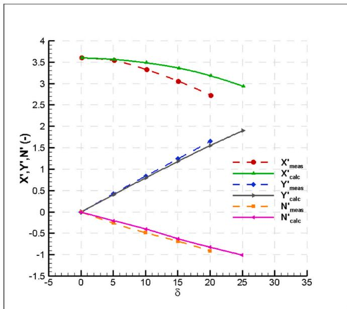

line

| δ   | X'_meas | X'_calc | Y'_meas | Y'_calc | N'_meas | N'_calc |
| --- | ------- | ------- | ------- | ------- | ------- | ------- |
| 0   | 3.6     | 3.6     | 0.0     | 0.0     | 0.0     | 0.0     |
| 5   | 3.5     | 3.5     | 0.4     | 0.4     | -0.3    | -0.3    |
| 10  | 3.3     | 3.3     | 0.8     | 0.8     | -0.6    | -0.6    |
| 15  | 3.0     | 3.0     | 1.2     | 1.2     | -0.8    | -0.8    |
| 20  | 2.7     | 2.7     | 1.6     | 1.6     | -1.0    | -1.0    |
| 25  | 2.9     | 2.9     | 1.9     | 1.9     | -1.1    | -1.1    |

Fig. 5. Waterjet steering model values implemented to a fast rescue craft (De Jong et al., 2013).

The CSPU is applied following the common principle which starts with the calculation of the effective wake fractions for both propeller/s and rudder/s. Then, it is followed by predicting the rectified actual inflow angle and the inflow velocity to the rudder/s. Thus, C (lift coefficient) and $\mathrm { C } _ { \mathrm { D } }$ (drag coefficient) can be determined with those parameters by the interpolation of an actual rudder’s data which has been chosen as the rudder geometry of DTMB5415 provided by (SIMMAN, 2014). DC372 has been considered twin-rudder and twin-propeller (TRTP) in the CSPU approach. Rudder reference area has been determined from the rudder area ratio of DTMB5415 which is 54.537 (Aref/LT). Before starting turn and zigzag simulations, a straight-ahead motion simulation has been executed to determine the self-propulsion point (SPP) that enables a free run at the operational speed of Fr = 0.37. This has been selected due to the available comparison data given in the literature. The MARIN4058 propeller model (SIMMAN, 2014) has been used for the open water performance curves and SPP has been determined as 19.9 rps. Once the model is released to a turn and zigzag manoeuvre in discrete-solution of manoeuvring motion equations, the shaft revolution is kept constant throughout the simulations powered by CSPU. However, the effective wake fractions, actual flow angle and inflow velocity to rudder/s are re-calculated at each time step. Exponential expressions for propeller and rudder wake fractions are given in Equations (21) and (22) which were recommended by (Sutulo and Guedes Soares, 2019). The nominal propeller wake fractions (wp0) at initial conditions have been assumed to be equal to 0.0451 the one calculated for the surface combatant model DTMB5415 (Duman et al., 2017). However, the rudder wake fractions at zero deflection (wr0) have been determined by the formula (Equation (23)) given in (Sutulo and Guedes Soares, 2019).

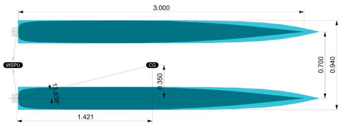

other

| Dimension | Value |
| --------- | ----- |
| Width     | 13.838 |
| Height    | 0.350 |
| Top Height| 3.000 |
| Bottom Height| 1.421 |
| Total Height| 0.700 |
| Top Width | 0.940 |
WSPU      | WSPU

Fig. 6. Definition of zero yaw moment angle of WSPU on DC372.

$$
w _ {p} = w _ {p (\delta = 0)} e ^ {\left(- 4 \beta_ {p} ^ {2}\right)}, \quad \beta_ {p} = \beta - l _ {r} ^ {\prime} r ^ {\prime} \tag {21}
$$

$$
w _ {r} = w _ {r (\delta = 0)} e ^ {\left(- 4 \delta_ {r} ^ {2}\right)}, \quad \delta_ {r} = \delta - \beta_ {p} \tag {22}
$$

$$
w _ {r (\delta = 0)} = \left[ 0. 3 5 \left(1 - w _ {p (\delta = 0)}\right) - 0. 7 8 \right] \left(1 - w _ {p (\delta = 0)}\right) + 0. 6 5 2 5 \tag {23}
$$

# 3. Results and discussion

# 3.1. Uncertainty assessment

The verification techniques (GCI, CF and FS) were applied to the results of standard resistance simulations of the DC372 catamaran in a previous study (Duman and Bal, 2019b). These methods are essential to ensure the numerical solutions converge to a certain value either monotonic or oscillatory with the increasing grid cell numbers. Resistance predictions by the CFD method at different grid qualities are given in Table 4 for Froude number of 0.45.

Monotonic convergence was reported in the previous study for both spatial and temporal discretizations, i.e., R was calculated as 0.16 and 0.75, respectively (Table 5). The amount of spatial and temporal uncertainties in the computations of DC372 were predicted as 6.71% and 0.33% (Table 5). The total uncertainty should be considered as the summation of these two values. It was also noted that the FS method, which is a more up-to-date approach according to the historical progress of the verification techniques, gives the most conservative results. Detailed information about the uncertainty assessment can be found in (Celik et al., 2008; Phillips and Roy, 2014; Roache, 1994; Stern et al., 2001, 2006; Xing and Stern, 2010).

Although a validation study was conducted through the total resistance values previously, a wave elevation graph is also presented here to provide the free water surface deformation. Wave elevations on the centre line of the DC372 hull form at a Froude number of 0.30 are plotted in Fig. 7 by an amplification factor 10^3. The FP and AP of the catamaran are positioned on x = 0 and x = 1, respectively. Comparison data has been taken from the numerical results of Broglia et al. (2011). The longitudinal positions of the wave crests and troughs, the values of the wave heights and the wave slope characteristics have been modelled successfully with the present URANS method in accordance with the comparison data.

# 3.2. CFD-based hydrodynamic derivatives of DC372

Following the MRL method, CFD simulations in the test matrix (see Table 5) have been performed using STAR-CCM + RANS solver (Siemens, 2018). With regards to pure sway and pure yaw simulations of DC372, it is recommended to check out the previous studies for CFD results and the validation process (Duman and Bal, 2019b, 2020). In this study, the newly calculated yaw and drift CFD results of the catamaran are presented. Non-dimensional surge forces, sway forces and yaw moments are plotted for the second and third periods of the dynamic manoeuvres (Fig. 8). The first period of the dynamic manoeuvres has been excluded from the hydrodynamic derivative calculation process for all cases due to numerical convergence oscillations at the beginning of simulations. The horizontal axis in graphs represents the normalized dynamic oscillation period, e.g., the value of “2” means 2 periods. The hydrodynamic derivatives that have been calculated by applying FA to yaw and drift CFD results are presented in Table 6 with the previously

Table 4 Total resistance values for different grid qualities (Duman and Bal, 2019b). 

<table><tr><td>Grid quality</td><td>Number of grid cells</td><td>RT (N)</td></tr><tr><td>Fine</td><td>3,147,779</td><td>24.8453</td></tr><tr><td>Medium</td><td>2,110,337</td><td>24.9298</td></tr><tr><td>Coarse</td><td>1,144,985</td><td>25.4459</td></tr></table>

Table 5 Spatial and temporal uncertainty assessment results. 

<table><tr><td></td><td>Spatial</td><td>Temporal</td></tr><tr><td>r21</td><td>1.14</td><td>1.41</td></tr><tr><td>r32</td><td>1.22</td><td>1.41</td></tr><tr><td>R</td><td>0.16</td><td>0.75</td></tr><tr><td>Pth</td><td>2</td><td>1</td></tr><tr><td>PRE</td><td>12.93</td><td>0.83</td></tr><tr><td>P</td><td>6.46</td><td>0.83</td></tr><tr><td>RT-EXT (N)</td><td>24.827</td><td>24.993</td></tr><tr><td>SFGCI</td><td>1.25</td><td>1.25</td></tr><tr><td>ΔGCI (%)</td><td>0.09</td><td>0.24</td></tr><tr><td>UGCI (N)</td><td>0.0229</td><td>0.059</td></tr><tr><td>SFCF</td><td>15.08</td><td>1.39</td></tr><tr><td>ΔCF (%)</td><td>2.10</td><td>0.27</td></tr><tr><td>UCF (N)</td><td>0.5349</td><td>0.066</td></tr><tr><td>SFFS</td><td>91.282</td><td>1.74</td></tr><tr><td>ΔFS (%)</td><td>6.71</td><td>0.33</td></tr><tr><td>UFS (N)</td><td>1.6737</td><td>0.083</td></tr></table>

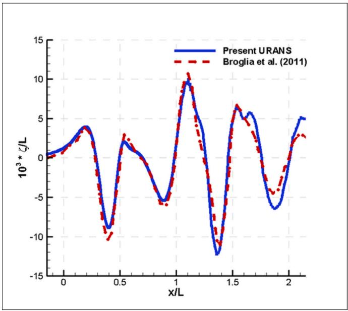

line

| x/L | Present URANS | Broglia et al. (2011) |
| --- | --- | --- |
| 0.0 | 0.0 | 0.0 |
| 0.5 | -9.0 | -10.0 |
| 1.0 | 10.0 | 11.0 |
| 1.5 | -12.0 | -11.0 |
| 2.0 | 5.0 | 3.0 |

Fig. 7. Wave cut on the centre line of DC372 at $\mathrm { F n } = 0 . 3 0$ in a straight-ahead resistance simulation.

calculated coefficients.

As it can be noticed in Table 6, there are several coefficients that have been calculated repeatedly with different manoeuvring tests. It is recommended in literature to count on the static drift results, regarding Yv, Yvvv, Nv, and Nvvv coefficients. Following this, the static drift results have been adopted for linear and non-linear sway velocity terms. Working with a dynamically changing resistance expression in a longitudinal direction instead of an equilibrium term such as X0, makes the discrete-solution of manoeuvring equations of motion with instantaneously calculated steering and propulsion terms more stable. Therefore, the X0 term is assumed to be zero and alternatively, the equilibrium resistance term is replaced by a polynomial expression of the total resistance that depends on the instantaneous surge velocity of thirdorder (Equation (24)).

$$
R _ {T} (u) = a u ^ {3} + b u ^ {2} + c u + d \tag {24}
$$

Utilizing the capability of calculating hydrodynamic forces/moment acting on each hull component in a multihull case, the manoeuvring coefficients of each demi-hull have been obtained separately from yaw and drift analyses of DC372. This novel approach, namely “discrete study on hull components (DSHC)” was firstly applied to static drift and pure sway CFD simulations of DC372 in a previous study (Duman and Bal, 2019b). In the present study, the yaw and drift simulations have been carried out by using CFD and the analysis results have been examined by adopting the DSHC approach. The DSHC is actually more utilization of numerical flexibility. In a standard yaw and drift experiment, it is a very challenging task to measure the forces and moment acting on each demi-hull in case of a catamaran. However, CFD provides

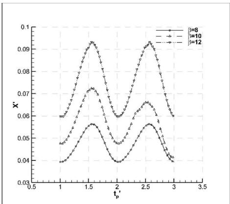

line

| t_p' | i=8 | i=10 | i=12 |
|---|---|---|---|
| 0.5 | 0.04 | 0.04 | 0.04 |
| 1.0 | 0.06 | 0.07 | 0.06 |
| 1.5 | 0.09 | 0.07 | 0.06 |
| 2.0 | 0.06 | 0.05 | 0.04 |
| 2.5 | 0.09 | 0.07 | 0.06 |
| 3.0 | 0.06 | 0.05 | 0.04 |
| 3.5 | 0.04 | 0.04 | 0.04 |

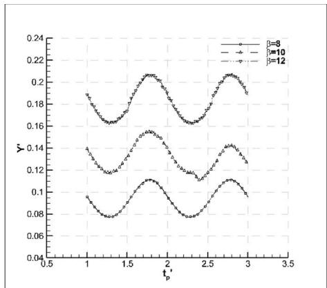

line

| t_p | β=8    | β=10   | β=12   |
|-----|--------|--------|--------|
| 0.5 | 0.19   | 0.14   | 0.10   |
| 1.0 | 0.17   | 0.12   | 0.08   |
| 1.5 | 0.21   | 0.16   | 0.12   |
| 2.0 | 0.20   | 0.15   | 0.11   |
| 2.5 | 0.21   | 0.14   | 0.10   |
| 3.0 | 0.19   | 0.13   | 0.09   |
| 3.5 | 0.18   | 0.12   | 0.08   |

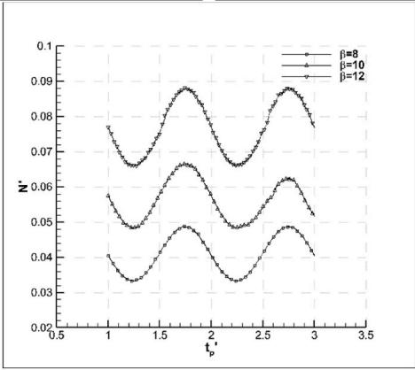

line

| t_p' | β=8    | β=10   | β=12   |
|------|--------|--------|--------|
| 0.5  | 0.078  | 0.060  | 0.040  |
| 1.0  | 0.070  | 0.050  | 0.035  |
| 1.5  | 0.088  | 0.068  | 0.048  |
| 2.0  | 0.070  | 0.050  | 0.035  |
| 2.5  | 0.088  | 0.068  | 0.048  |
| 3.0  | 0.070  | 0.050  | 0.035  |
| 3.5  | 0.078  | 0.060  | 0.040  |

Fig. 8. Non-dimensional surge forces (upper left), sway forces (upper right) and yaw moments (lower) acting on DC372 in yaw and drift simulations at $\mathrm { F r } = 0 . 4 5 .$ .

Table 6 Non-dimensional CFD-based manoeuvring coefficients of DC372. 

<table><tr><td>Test type</td><td>Drv.</td><td>CPMM</td><td>Test type</td><td>Drv.</td><td>DC372</td></tr><tr><td rowspan="6">Static drift</td><td>X0</td><td>-0.0200</td><td>Pure yaw</td><td>X0</td><td>-0.0302</td></tr><tr><td>Xvv</td><td>-0.1775</td><td></td><td>Xrr</td><td>-0.2367</td></tr><tr><td>Yv</td><td>-0.5833</td><td></td><td>Yr</td><td>-0.0877</td></tr><tr><td>Yvvv</td><td>-8.1097</td><td></td><td>Yrrr</td><td>2.0278</td></tr><tr><td>Nv</td><td>-0.2647</td><td></td><td>Nr</td><td>-0.0143</td></tr><tr><td>Nvvv</td><td>-2.8373</td><td></td><td>Nrrr</td><td>-0.7815</td></tr><tr><td rowspan="8">Pure sway</td><td>X0</td><td>-</td><td></td><td>Yr</td><td>-0.0666</td></tr><tr><td>Xvv</td><td>-</td><td></td><td>Nr</td><td>-0.0387</td></tr><tr><td>Yv</td><td>-0.3928</td><td>Yaw and drift</td><td>Xvr</td><td>-0.5961</td></tr><tr><td>Yvvv</td><td>-14.6421</td><td></td><td>Yvvr</td><td>14.2893</td></tr><tr><td>Nv</td><td>-0.7041</td><td></td><td>Yvrr</td><td>-1914.7423</td></tr><tr><td>Nvvv</td><td>-91.9721</td><td></td><td>Nvvr</td><td>-9.0688</td></tr><tr><td>Yv</td><td>-0.1249</td><td></td><td>Nvrr</td><td>-839.66</td></tr><tr><td>Nv</td><td>-0.0485</td><td></td><td></td><td></td></tr></table>

a more extended virtual environment to obtain the data about the flow properties at a particular position. From this perspective, first, the total integral values acting on the full catamaran have been used for the calculation of manoeuvring coefficients according to MRL method. The coefficients obtained via these inputs are denoted as “Catamaran” in Table 7. Then, MRL method has been applied to the hydrodynamic forces and moments acting on each demi-hull, namely “PS” and “SB”. PS and SB stand for the demi-hulls located on the port side and starboard side, respectively. The summation of PS and SB coefficients is used to calculate the absolute and relative errors in the last two columns of the table (Table 7). Almost all summations are found to be equal to full catamaran condition except for Yvrr and Nvrr. It should be noted that the method used for calculating the hydrodynamic derivatives is also very sensitive to the inputs. Considering their high values, the relative percentages of error can be evaluated in an acceptable range. Following the coordinate systems described in Fig. 9 and assuming the catamaran hull is on a starboard turning manoeuvre, i.e., yaw rate has positive and sway velocity has negative values, the behaviour or in other words the dominancy of each demi-hull can be deduced from Table 7 as follows: (1) the contribution to the longitudinal resistance force with the term Xvr of PS is about 4% higher than that of SB, (2) the non-linear coefficients Yvvr and Nvvr of SB have higher absolute values. This means that they produce larger reaction forces in lateral direction than PS does, (3) the opposite of the 2nd deduction has been observed in the case of Yvrr and Nvrr, however, the yaw rate takes very small values in radian and that means the contributions by these two coefficients will be lower (square of the yaw rate will be much smaller) than those of Yvvr and Nvvr. Consequently, the rate of the contributions of each demi-hull to the resistance components differs depending on the manoeuvre direction.

Table 7 Comparison of the pure yaw derivatives examined by the DSHC approach. 

<table><tr><td>Coef.</td><td>Catamaran</td><td>PS</td><td>SB</td><td>Sum</td><td> $\varepsilon_{abs}$ </td><td> $\varepsilon_{rel}$ (%)</td></tr><tr><td>Xvr</td><td>-3.2946</td><td>-1.7769</td><td>-1.5179</td><td>-3.2948</td><td>0.0003</td><td>0.01</td></tr><tr><td>Yvvr</td><td>14.1678</td><td>6.8823</td><td>7.2870</td><td>14.1693</td><td>0.0015</td><td>0.01</td></tr><tr><td>Yvrr</td><td>-1806.9471</td><td>-1112.3954</td><td>-898.5453</td><td>-2010.9407</td><td>203.9937</td><td>11.29</td></tr><tr><td>Nvvr</td><td>-9.0688</td><td>-4.1778</td><td>-4.9017</td><td>-9.0795</td><td>0.0107</td><td>0.12</td></tr><tr><td>Nvrr</td><td>-1083.7156</td><td>-786.7766</td><td>-663.3827</td><td>-1450.1593</td><td>366.4437</td><td>33.81</td></tr></table>

Present results on yaw and drift analysis and previous calculations on static drift analysis (Duman and Bal, 2019b) reveal that the individual components of an integrated floating structure reflect the same manoeuvring characteristics as the full body when principal dimensions related to the investigated subject are superposed. This result is undoubtedly in line with expected one, on the other hand, the application of DSHC is actually important in terms of seeing how each demi-hull behaves simultaneously and at what level they contribute to the motion during a manoeuvre of the catamaran.

# 3.3. Fast-time manoeuvring simulation results

In this section, definite manoeuvre simulations of the DC372 hull are presented. This stage can be described as the last step of the CFD-based system simulation method. A computer code has been developed using the high-level technical programming language MATLAB (MathWorks, 2020) to execute two definite manoeuvres; 20◦ turning circle (TC20) and 20/20◦ zigzag (ZZ20). The dynamic manoeuvre system simulator (DynaMaSS) has been constructed on the non-linear manoeuvring model of Abkowitz where the CFD-based hydrodynamic derivatives have been used. The code has been designed to manage multihull ship manoeuvres by setting several pre-processes, e.g., selecting the correct steering and propulsion unit (SPU) according to ship type, and self-propulsion point estimations before starting the manoeuvring simulations. The manoeuvring simulator DynaMaSS starts by importing the hydrodynamic derivatives and main particulars of the selected hull form. DynaMaSS has been specially designed to work on a non-dimensional basis in which the internal/external forces and moments and all other parameters are normalized by following the Prime-2 system (SNAME, 1950). The system of differential equations is written in three-by-three (3x3) matrix form as described in Section 2.1 to obtain the kinematic parameters such as surge velocity and yaw rate. Several auxiliary functions that are called by the main function at every time step have been created to provide an instant steering and propulsion forces/moment for each component located on the port and starboard sides. The steering script, for instance, provides instantaneous lift and drag forces of each rudder by using the instant rudder inflow angle and flow velocity over the rudder/s. The flow diagram that shows the solution steps of DynaMaSS is given in Fig. 9.

Milanov’s experimental and simulation results are considered here as validation data (Milanov et al., 2012). They conducted the study to investigate the shallow water effects on the DC372 catamaran. The control test which was performed in deep water, has been chosen for the validations. It should be noted that they built a model of 3.993 m in length while in the present study a 3m long model has been used (Milanov et al., 2012). Therefore, the FTMS results of the DC372 catamaran and the available comparison data have been non-dimensionalized with the corresponding main dimensions. In the following figures, WSPU and CSPU represent the waterjet/conventional steering and propulsion units. In the present TC20 simulation powered by WSPU, very similar results with experiments have been found. Response to the steering units, advance distance and tactical diameter are in a satisfactory match with those of Milanov’s simulations as well (Fig. 10). A typical turning manoeuvre trajectory has also been captured in CSPU model and performance parameters have been predicted in a close proximity to other results. Although the turning circle has been performed to the starboard side, trajectories have been plotted by simply reversing the signs to plot the results on the 1st trigonometric region.

With regard to the initiation of the turning motion, the present WSPU model predicts the change of the instantaneous resultant velocity in a very satisfactory manner (Fig. 11, left). Loss of speed also follows the experimental data. Yaw rate values of both WSPU and CSPU converge to almost the same value that is below the other results (Fig. 11, right). Minimum speed loss is found in the CSPU driven case.

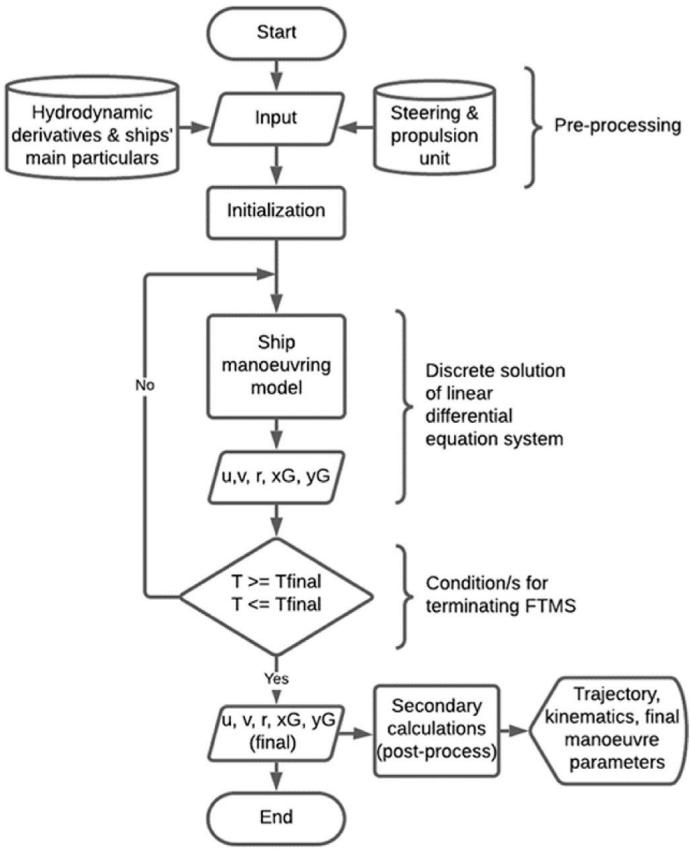

flowchart

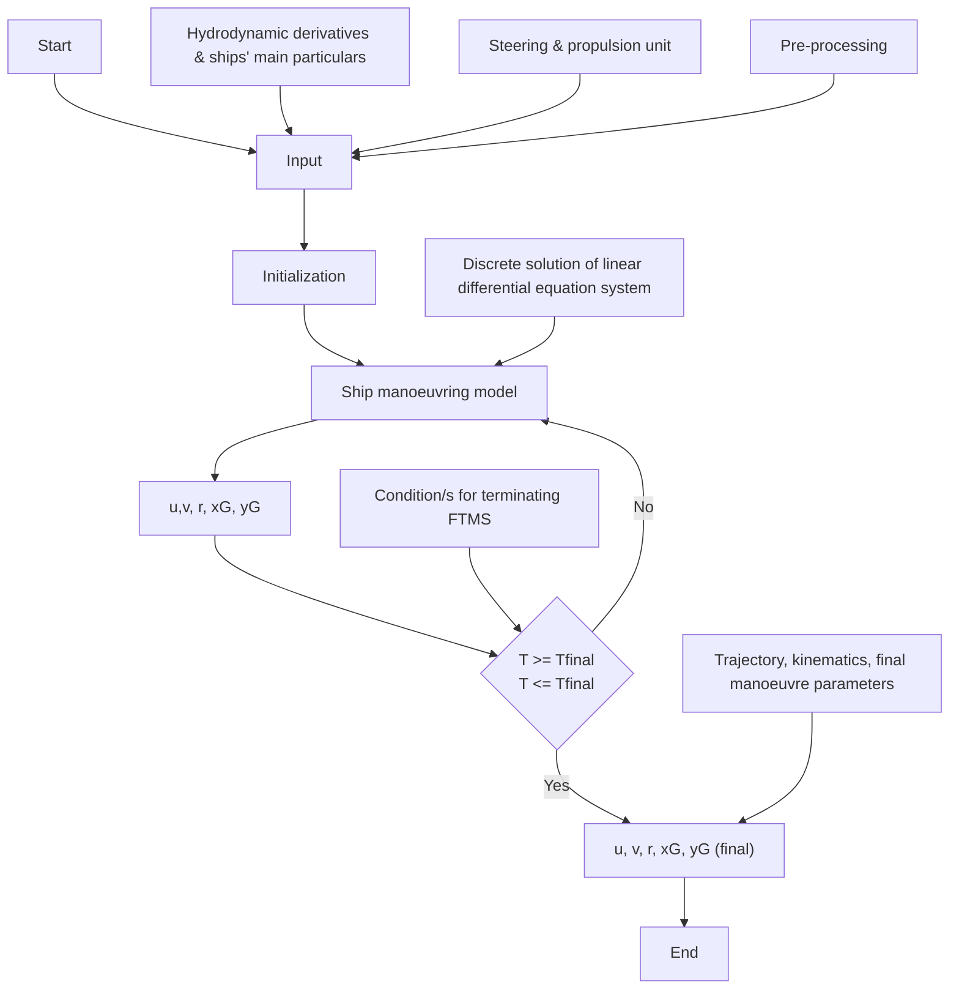

Fig. 9. The workflow of DynaMaSS.

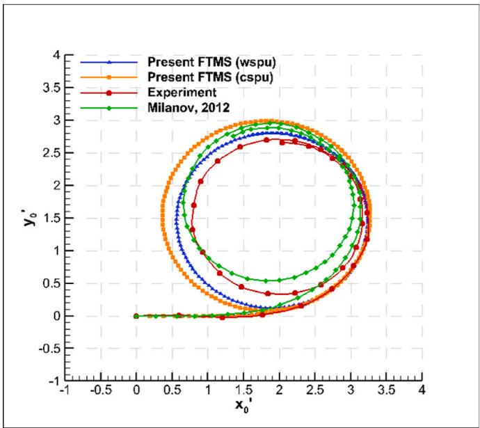

line

| x₀' | Present FTMS (wspu) | Present FTMS (cspu) | Experiment | Milanov, 2012 |
| --- | --- | --- | --- | --- |
| 0.0 | 0.0 | 0.0 | 0.0 | 0.0 |
| 0.5 | 1.5 | 1.8 | 1.6 | 1.7 |
| 1.0 | 2.5 | 2.8 | 2.6 | 2.7 |
| 1.5 | 3.0 | 3.2 | 3.1 | 3.1 |
| 2.0 | 2.8 | 2.9 | 2.8 | 2.8 |
| 2.5 | 2.5 | 2.7 | 2.6 | 2.6 |
| 3.0 | 2.0 | 2.3 | 2.2 | 2.2 |
| 3.5 | 1.5 | 1.8 | 1.6 | 1.7 |
| 4.0 | 1.0 | 1.3 | 1.1 | 1.2 |

Fig. 10. Trajectory (\*L) in a TC20 simulation compared with experiment.

In the ZZ20 simulations, both models show parallel behaviour until the second extreme rotation point. At that point, the CSPU is somehow insufficient (Fig. 12). Since the lift completely depends on the actual inflow angle in conventional rudders, it should be taken into account that there will be a decrease in the manoeuvring control forces at the points where the actual angle of attack drops too much instantaneously.

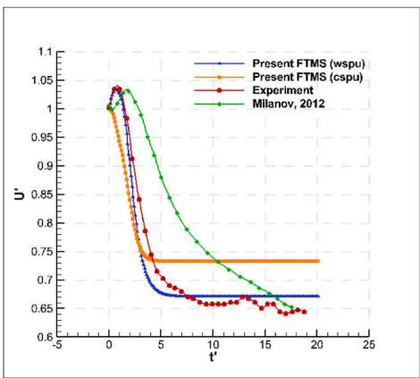

line

| t' | Present FTMS (wspu) | Present FTMS (cspu) | Experiment | Milanov, 2012 |
| --- | --- | --- | --- | --- |
| 0 | 1.03 | 1.03 | 1.03 | 1.03 |
| 5 | 0.70 | 0.75 | 0.75 | 0.85 |
| 10 | 0.68 | 0.75 | 0.68 | 0.75 |
| 15 | 0.67 | 0.75 | 0.67 | 0.68 |
| 20 | 0.67 | 0.75 | 0.65 | 0.65 |

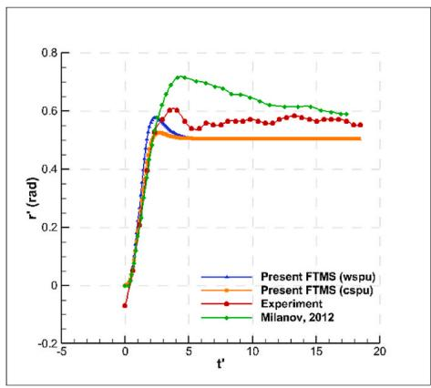

line

| t' | Present FTMS (wspu) | Present FTMS (cspu) | Experiment | Milanov, 2012 |
| --- | --- | --- | --- | --- |
| -5 | 0.0 | 0.0 | 0.0 | 0.0 |
| 0 | 0.0 | 0.0 | -0.1 | 0.0 |
| 5 | 0.6 | 0.55 | 0.6 | 0.7 |
| 10 | 0.55 | 0.55 | 0.58 | 0.65 |
| 15 | 0.55 | 0.55 | 0.58 | 0.6 |
| 20 | 0.55 | 0.55 | 0.57 | 0.58 |

Fig. 11. Resultant velocity (left) and yaw rate (right) in a TC20 simulation compared with experiment.

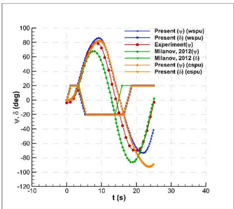

line

| t (s) | Present (ψ) (wspu) | Present (δ) (wspu) | Experiment(ψ) | Milanov, 2012(ψ) | Milanov, 2012 (δ) | Present (ψ) (cspu) | Present (δ) (cspu) |
|-------|---------------------|---------------------|----------------|------------------|-------------------|---------------------|--------------------|
| 0     | 0                   | 0                   | 0              | 0                | 0                 | 0                   | 0                  |
| 5     | 80                  | 80                  | 80             | 70               | 70                | -20                 | -20                |
| 10    | 90                  | 90                  | 90             | 60               | 60                | -20                 | -20                |
| 15    | 80                  | 80                  | 80             | 30               | 30                | -20                 | -20                |
| 20    | -60                 | -60                 | -60            | -80              | -80               | -80                 | -80                |
| 25    | -40                 | -40                 | -40            | -60              | -60               | -100                | -100               |
| 30    | -20                 | -20                 | -20            | -40              | -40               | -120                | -120               |
| 35    | 0                   | 0                   | 0              | 0                | 0                 | -120                | -120               |
| 40    | 20                  | 20                  | 20             | 20               | 20                | -120                | -120               |

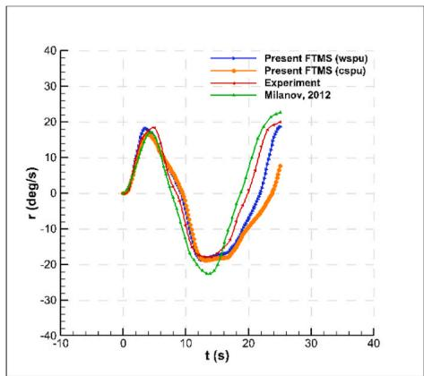

line

| t (s) | Present FTMS (wspu) | Present FTMS (cspu) | Experiment | Milanov, 2012 |
|-------|---------------------|---------------------|----------|---------------|
| 0     | 0                   | 0                   | 0        | 0             |
| 5     | 18                  | 17                  | 19       | 18            |
| 10    | -15                 | -16                 | -17      | -18           |
| 15    | -20                 | -21                 | -22      | -23           |
| 20    | -10                 | -11                 | -12      | -13           |
| 25    | 20                  | 18                  | 19       | 21            |
| 30    | 25                  | 23                  | 24       | 26            |
| 35    | 30                  | 28                  | 29       | 31            |
| 40    | 35                  | 33                  | 34       | 36            |

Fig. 12. Course (left) and yaw rate (right) in a ZZ20 simulation compared with experiment.

Although the results are too close, there is a difference between WSPU and CSPU approaches. It can be noted that WSPU gives more compatible results to the experiments than CSPU does.

The final manoeuvring performance parameters in TC20 and ZZ20 for DC372 catamaran are tabulated in Table 8 where the advance distance (Adv), tactical diameter (TaD) and steady turning diameter (STD) are given as a ratio of ship length. The loss of speed in TC20 has been well predicted by the WSPU model. The relative differences in STDs of WSPU and CSPU between the simulation results and the experiments are reported as 13% and 23%, respectively. An inference in favour of the superiority of water jets can explain this as the same manoeuvring coefficients in both simulations have been used. Although the WSPU model has yielded closer results to the experiments for the 1st overshoot angle (OA) in ZZ20, the 2nd OA diverges from the actual results. In the experiments, it can be noticed that the measured 2nd OA has a smaller value than the 1st OA. This trend has been caught by the WSPU model. For the advance distance and tactical diameter, both models have presented practically applicable results with a good agreement with the

Table 8 Turn and zigzag manoeuvring performance parameters of DC372 at Fr = 0.37. 

<table><tr><td rowspan="2"></td><td colspan="4">TC20</td><td colspan="2">ZZ20</td></tr><tr><td>Adv</td><td>TaD</td><td>STD</td><td>Uloss (%)</td><td>1st OA°</td><td>2nd OA°</td></tr><tr><td>Present (WSPU)</td><td>3.4067</td><td>2.8001</td><td>2.6787</td><td>32.89</td><td>65.9279</td><td>53.2746</td></tr><tr><td>Present (CSPU)</td><td>3.4394</td><td>2.9861</td><td>2.9081</td><td>26.68</td><td>62.2849</td><td>72.2482</td></tr><tr><td>Experiment</td><td>3.2320</td><td>2.6947</td><td>2.3521</td><td>35.69</td><td>58.6957</td><td>50.4348</td></tr><tr><td>Milanov et al. (2012)</td><td>3.1389</td><td>2.9535</td><td>2.4130</td><td>35.09</td><td>47.8261</td><td>65.6522</td></tr></table>

experiments.

# 4. Conclusions

This study has been conducted to predict the manoeuvring performance characteristics of the DC372 catamaran using high-fidelity solution techniques. The process can be summarized in three main parts: (1) defining the ship manoeuvring model, (2) prediction of the hydrodynamic derivatives that represent the hull’s reaction depending on kinematic properties, and (3) performing fast-time manoeuvring simulations with an active steering and propulsion unit. The manoeuvring model preferred in this study is Abkowitz’s model based on the 3rd order Taylor series expansion. The computerized PMM approach has been applied for predicting the required coefficients for this model. The final step has been achieved by executing TC20 and ZZ20 manoeuvring simulations using the simulator DynaMaSS which includes WSPU and CSPU systems integrated into the solution algorithm to enhance the capability of dynamic manoeuvre predictions.

Satisfactory results have been obtained and a useful comparison has been made between the WSPU and CSPU. With Abkowitz’s nonlinear model, in which the coefficients obtained with CFD are used, successful results have been obtained at a relatively high speed of 0.37 Froude number. It has been observed that the CSPU model has a higher estimation of the steady turning diameter than the waterjet-driven model. The zero yaw moment angle condition (ZMC) that is relevant to waterjets has been explained on the geometry of DC372. To produce a yaw moment in the desired direction, the waterjet on the side of the movement direction must exceed the angle specified in the ZMC condition. Crucial impacts of this study can be summarized as follows:

• The discrete study on hull components (DSHC) approach in the assessment of multihulls’ manoeuvrability based on the CFD method has been introduced.   
• The hydrodynamic derivatives of the DC372 hull have been fully predicted according to Abkowitz’s non-linear manoeuvring model using the CPMM approach,   
• TC20 and ZZ20 manoeuvre simulations of DC372 have been successfully realized at a relatively high speed.   
• A useful comparison has been made in terms of the performance of WSPU and CSPU in multihull manoeuvre predictions.

In near future, it will be followed by upgrading the manoeuvring simulator’s degree-of-freedom up to six to combine the manoeuvring and seakeeping theory which will enable to perform fast-time simulations under real environmental conditions. It is foreseen that studies related to the manoeuvring performance analysis of multihull ships will increase in near future and will take place among the upcoming trend research topics. Wave interference phenomenon in multihull physics will be a popular subject in manoeuvring predictions as it is in resistance and seakeeping problems.

# CRediT authorship contribution statement

Suleyman Duman: Investigation, Software, Validation, Visualization, Resources, Writing – original draft. Sakir Bal: Supervision, Conceptualization, Methodology, Writing – review & editing, Formal analysis.

# Declaration of competing interest

The authors declare that they have no known competing financial interests or personal relationships that could have appeared to influence the work reported in this paper.

# Data availability

Data will be made available on request.

# Acknowledgement

This study was carried out as a part of Süleyman Duman’s doctoral thesis. He is supported by the Scientific and Technological Research Council of Turkey (TÜB˙ITAK) under the national doctoral scholarship 2211/A and by ITU Project Unit (ITU-BAP, Project No: 42196).

# References

Abkowitz, M.A., 1964. Lectures on Ship Hydrodynamics – Steering and Maneuvering (No. Hy-5). Hydro & Aerodynamic Laboratory, Lyngby, Denmark.   
Benek, J.A., Steger, J.L., Dougherty, F.C., Buning, P.G., 1986. Chimera: A Grid-Embedding Technique (No. AEDC-TR-85-64). Arnold Engineering Development Center, Arnold Air Force Station, Tennessee.   
Broglia, R., Bouscasse, B., Jacob, B., Olivieri, A., Zaghi, S., Stern, F., 2011. Calm water and seakeeping investigation for a fast catamaran. In: 11th Int. Conf. Fast Sea Transp. FAST 2011 - Proc.   
Broglia, R., Jacob, B., Zaghi, S., Stern, F., Olivieri, A., 2014. Experimental investigation of interference effects for high-speed catamarans. Ocean Eng. 76, 75–85. https://doi. org/10.1016/j.oceaneng.2013.12.003.   
Carrica, P.M., Ismail, F., Hyman, M., Bhushan, S., Stern, F., 2013. Turn and zigzag maneuvers of a surface combatant using a URANS approach with dynamic overset grids. J. Mar. Sci. Technol. 18, 166–181. https://doi.org/10.1007/s00773-012- 0196-8.   
Celik, I., Ghia, U., Roache, P.J., Christopher, 2008. Procedure for estimation and reporting of uncertainty due to discretization in CFD applications. J. Fluid Eng. 130, 078001 https://doi.org/10.1115/1.2960953.   
De Jong, P., Van Walree, F., Renilson, M., 2013. The broaching of a fast rescue craft in following seas. In: 12th International Conference on Fast Sea Transportation. Amsterdam, The Netherlands.   
Doctors, L.J., Sahoo, P.K., 2006. The waves generated by a trimaran. Aust. J. Mech. Eng. 3, 183–190.   
Dogan, T.K., 2013. URANS and DES for Delft Catamaran for Static Drift Conditions in Deep Water (Master’s Thesis). University of Iowa.

Du, L., Hefazi, H., Sahoo, P., 2019. Rapid resistance estimation method of non-Wigley trimarans. Ships Offshore Struct. 14, 910–920. https://doi.org/10.1080/ 17445302.2019.1588499.   
Duman, S., 2016. Investigation of the Turning Performance of a Surface Combatant with URANS (Master’s Thesis). Istanbul Technical University.   
Duman, S., Bal, S., 2020. Pure yaw simulations of fast Delft catamaran 372 in deep water. In: Presented at the 12th International Symposium on High Speed Marine Vehicles (HSMV), pp. 109–120.   
Duman, S., Bal, S., 2019a. A quick-responding technique for parameters of turning maneuver. Ocean Eng. 179, 189–201. https://doi.org/10.1016/j. oceaneng.2019.03.025.   
Duman, S., Bal, S., 2019b. Prediction of maneuvering coefficients of Delft catamaran 372 hull form. In: Presented at the 18th International Maritime Association of the Mediterranean, Varna, Bulgaria.   
Duman, S., Bal, S., 2017. Prediction of the turning and zig-zag maneuvering performance of a surface combatant with URANS. Ocean Syst. Eng.- Int. J. 7, 435–460. https:// doi.org/10.12989/ose.2017.7.4.435.   
Duman, S., Sezen, S., Bal, S., 2017. URANS approach in hull-propeller-rudder interaction of a surface combatant at high speed. In: Presented at the 11th Symposium on High Speed Marine Vehicles. Naples, Italy, pp. 1–10.   
Falchi, M., Felli, M., Grizzi, S., Aloisio, G., Broglia, R., Stern, F., 2014. SPIV measurements around the DELFT 372 catamaran in steady drift. Exp. Fluid 55. https://doi.org/10.1007/s00348-014-1844-z.   
Fossen, T.I., 1994. Guidance and Control of Ocean Vehicles. Wiley, Chichester ; New York.   
Gertler, M., 1967. THE DTMB PLANAR-MOTION-MECHANISM SYSTEM (TEST AND EVALUATION REPORT No. AD659053). Naval Ship Research and Development Center, Washington, DC.   
Hajivand, A., Mousavizadegan, S.H., 2015. Virtual simulation of maneuvering captive tests for a surface vessel. Int. J. Nav. Archit. Ocean Eng. 7, 848–872. https://doi.org/ 10.1515/ijnaoe-2015-0060.   
Hirt, C.W., Nichols, B.D., 1981. Volume of fluid (VOF) method for the dynamics of free boundaries. J. Comput. Phys. 39, 201–225. https://doi.org/10.1016/0021-9991(81) 90145-5.   
Iqbal, M., Samuel, S., 2017. Traditional catamaran hull form configurations that reduce total resistance. Int. J. Technol. 8, 85. https://doi.org/10.14716/ijtech.v8i1.4161.   
ITTC, 2017. Captive Model Test Procedure (Recommended Procedures and Guidelines No. 7.5-02-06–02). ITTC Manoeuvring Committee.   
ITTC, 2011. Practical guidelines for ship CFD applications. In: Presented at the Proceedings of 26th ITTC, Rio de Janerio, Brazil.   
ITTC, 2005. Final Report and Recommendations. ITTC Maneuvering Committee, UK.   
Kahramanoglu, ˘ E., 2021. The Effect of Forward Speed on Sway Force and Yaw Moment for Planing Hulls. Gemi Ve Deniz Teknol. https://doi.org/10.54926/gdt.1015362.   
Mai, T.L., Nguyen, T.T., Jeon, M., Yoon, H.K., 2020. Analysis on hydrodynamic force acting on a catamaran at low speed using RANS numerical method. J. Navig. Port Res. 44, 53–64. https://doi.org/10.5394/KINPR.2020.44.2.53.   
Manivannan, K., Daniele, P., Yusuke, T., Wesley, W., Massimo, M., Svetlozar, G., Evgeni, M., F, C.E., Frederick, S., 2013. Simulation based design optimization of waterjet propelled Delft catamaran. Int. Shipbuild. Prog. 277–308. https://doi.org/ 10.3233/ISP-130098.   
MathWorks, 2020. MATLAB Documentation. The MathWorks Inc.   
Milanov, E., Chotukova, V., Stern, F., 2012. System based simulation of Delft372 catamaran maneuvering characteristics as function of water depth and approach speed. In: Presented at the 29th Symposium on Naval Hydrodynamics, Gothenburg, Sweden.   
Pandey, J., Hasegawa, K., 2016. Study on turning manoeuvre of catamaran surface vessel with a combined experimental and simulation method. IFAC-PapersOnLine 49, 446–451. https://doi.org/10.1016/j.ifacol.2016.10.446.   
Phillips, T.S., Roy, C.J., 2014. Richardson extrapolation-based discretization uncertainty estimation for computational fluid dynamics. J. Fluid Eng. 136, 121401 https://doi. org/10.1115/1.4027353.   
Roache, P.J., 1994. Perspective: a method for uniform reporting of grid refinement studies. J. Fluid Eng. 116, 405. https://doi.org/10.1115/1.2910291.   
Siemens, P.L.M., 2018. Star-CCM+ User Guide.   
SIMMAN, 2014. 2nd Workshop on Verification and Validation of Ship Manoeuvring Simulation Methods [WWW Document]. URL. https://simman2014.dk, 4.20.21.   
SNAME, 1950. Nomenclature for Treating the Motion of a Submerged Body through a Fluid (Technical and Research Bulletin No. 1–5). SNAME.   
Stern, F., Wilson, R., Shao, J., 2006. Quantitative V&V of CFD simulations and certification of CFD codes. Int. J. Numer. Methods Fluid. 50, 1335–1355. https://doi. org/10.1002/fld.1090.   
Stern, F., Wilson, R.V., Coleman, H.W., Paterson, E.G., 2001. Comprehensive approach to verification and validation of CFD simulations—Part 1: methodology and procedures. J. Fluid Eng. 123, 793. https://doi.org/10.1115/1.1412235.   
Strom-Tejsen, J., Chislett, M.S., 1966. A Model Testing Technique and Method of Analysis for the Prediction of Steering and Manoeuvering Qualities of Surface Vessels (No. Hy-7). Hydro & Aerodynamic Laboratory, Lyngby, Denmark.   
Sukas, O.F., Kinaci, O.K., Bal, S., 2021. Asymmetric ship maneuvering due to twisted rudder using system-based and direct CFD approaches. Appl. Ocean Res. 108, 102529 https://doi.org/10.1016/j.apor.2021.102529.   
Sukas, O.F., Kinaci, O.K., Bal, S., 2019a. System-based prediction of maneuvering performance of twin-propeller and twin-rudder ship using a modular mathematical model. Appl. Ocean Res. 84, 145–162. https://doi.org/10.1016/j.apor.2019.01.008.   
Sukas, O.F., Kinaci, O.K., Bal, S., 2019b. Theoretical background and application of MANSIM for ship maneuvering simulations. Ocean Eng. 106239 https://doi.org/ 10.1016/j.oceaneng.2019.106239.

Sutulo, S., Guedes Soares, C., 2019. On the application of empiric methods for prediction of ship manoeuvring properties and associated uncertainties. Ocean Eng. 186, 106111 https://doi.org/10.1016/j.oceaneng.2019.106111.   
Van’t Veer, R., 1998. Experimental Results of Motions, Hydrodynamic Coefficients and Wave Loads on the 372 Catamaran Model (Technical Report No. 1129). Delft University of Technology, Delft, The Netherlands.   
Xing, T., Stern, F., 2010. Factors of safety for richardson extrapolation. J. Fluid Eng. 132, 061403 https://doi.org/10.1115/1.4001771.

Yoon, H., 2009. Phase-averaged Stereo-PIV Flow Field and Force/Moment/motion Measurements for Surface Combatant in PMM Maneuvers (PhD Thesis). University of Iowa.

Yoon, H., Longo, J., Toda, Y., Stern, F., 2015. Benchmark CFD validation data for surface combatant 5415 in PMM maneuvers – Part II: phase-averaged stereoscopic PIV flow field measurements. Ocean Eng. 109, 735–750. https://doi.org/10.1016/j. oceaneng.2015.09.046.