# A comprehensive study on the seakeeping performance of high speed hybrid ships by 2.5D theoretical calculation and different scaled model experiments


Jialong Jiao a,b , Shuzheng Sun b , Jide Li b , Christiaan Adika Adenya c , Huilong Ren b , Chaohe Chen a , Dongjiao Wang a, \*

a School of Civil Engineering and Transportation, South China University of Technology, Guangzhou 510641, China   
b College of Shipbuilding Engineering, Harbin Engineering University, Harbin 150001, China   
c Department of Marine Engineering and Maritime Operations, Jomo Kenyatta University of Agriculture and Technology, P. O. Box 62000 – 00200, Nairobi, Kenya

# A R T I C L E I N F O

Keywords:

Improved strip theory

2.5D potential flow theory

Seakeeping performance

Deep-V monohull

Semi-submerged bow (SSB)

Tank test

Large-scale model sea trial

# A B S T R A C T

In this paper, seakeeping performance of vessels is comparatively investigated by means of improved 2.5D theoretical calculation, small-scale model towing tank test and large-scale free running model sea trial. This study also provides a scheme of ship vertical motion stabilization technique by using Semi-Submerged Bow (SSB) appendages. Firstly, an improved strip theory based 2.5D theoretical seakeeping algorithm, which considers the viscous flow effects attributed to bow appendages, is developed to estimate ship vertical motion responses in regular waves. Short-term predictions are also made on the basis of spectral analysis theory to predict ship motion responses in irregular waves. Then corresponding small-scale models are made and tested in a laboratory towing tank for both regular and irregular wave conditions to confirm the numerical results. The tank testing results between different ship schemes are also compared to experimentally investigate the effects of SSB and fin on hull vertical motion stabilization. Furthermore, large-scale model sea trials are conducted in coastal waves for a final validation of the ship seakeeping performance in short-crested sea waves. Finally, comparisons of the results by different testing approaches are systematically made and analyzed.

# 1. Introduction

Currently, seakeeping performance of ships is generally investigated by numerical calculation, scaled model wave tank test and full-scale sea trial. In fact, different methods have their own advantages and disadvantages. Generally, numerical methods are widely used due to their convenience and effective merits; and they are the preferred choice at ship preliminary design stage. Till now, 2D strip theories are widely used since they were developed in the late 1950s. The linear motions of hull at zero or low speed can be predicted by classical strip theories, e.g. Original Strip Method (Korvin-Kroukovsky and Jacobs, 1957), New Strip Method (Tasai and Takagi, 1969), Rational Strip Theory (Ogilvie and Tuck, 1969) and S.T.F. method (Salvesen et al., 1970). However, the 3D effects of free surface should be considered when predicting ship hydrodynamics at high speed. Thus the classical strip theories are no longer applicable since they are based on the low speed and high frequency basic assumption. The high-speed slender body theory (2.5D theory) was initially proposed by Chapman (1976) and then used to calculate ship motions in regular waves by Faltinsen and Zhao (1991). Then many scholars have applied the 2.5D theory to predict ship motion and loads in waves at high forward speed due to its practicability and high efficiency compared with 3D theories (Ma et al., 2004; Li et al., 2017).

As a matter of fact, some strong nonlinear hydro-structure interaction problems are complex and difficult to be satisfactorily addressed by numerical calculation. Experiments do not only reflect what really happens on the ship, but are also used to validate numerical algorithms (Maron and Kapsenberg, 2014). However, there exist some challenges or disadvantages associated with the conventional experimental approaches. For example, small-scale models are usually towed in hydrodynamic wave tanks, where uni-directional or multi-directional waves are artificially generated by wave-maker. In fact, realistic sea states acting on full-scale ships are however nonlinear short-crested waves (Romolo et al., 2014). Only a finite number of waves are suffered by model during one run distance along the towing tank. Scaling effects may be obvious by using small-scaled models especially for ship resistance and propulsion measurement. Moreover, seakeeping characteristics such as slamming event and green water on deck of ships in actual sea conditions are found to be quite different from those observed in laboratory environment, especially for ships sailing in severe seas at high forward speed (see Fig. 1). On the other hand, the conduct of full-scale sea trial needs enormous financial and labor resources (Andersen and Jensen, 2014). Since the weather and sea state are neither controllable nor repeatable, some high sea states, expected for investigation of ship responses in extreme sea states, are rarely observed (Thomas et al., 2011).

It is reported that the 2D long-crested waves will over-estimate ship motion and load responses compared with the 3D short-crested waves in some conditions (Chen et al., 2011; Li and Wen, 2007; Ji et al., 2015). Although some state-of-the-art tank facilities allow the generation of multi-directional irregular waves, the pseudo-random waves artificially generated by wave-makers are more or less different from the natural sea waves. Realistic wind-driven sea waves need enough space and time for fully evolution and they are associated with obvious nonlinear characteristics such as sharp crest and flat trough (Toffoli et al., 2008). Moreover, the frequency range of realistic sea waves is characterized with broad-band distribution, which is difficult to be reproduced in tanks. Therefore, it is of great necessity to investigate ship seakeeping performance that operating in actual sea conditions.

Based on the above situations, large-scale model testing methodology was proposed. This approach includes carrying out seakeeping tests by relatively larger scaled models in actual sea conditions. In some sense, this testing approach is a compromise between laboratory tank test and full-scale ship sea trial, and combines majority of their advantages (Jiao et al., 2016a). For example, large-scale model test is much more realistic than tank test since the sea state is more complex and real (Lloyd, 1989). The self-propelled model is possible to run at any arbitrary heading angles in a relative long sailing distance. On the other hand, the conduct of large-scale model sea trial is much cheaper and easier compared with full-scale sea trial. Large-scale model measurement is especially meaningful as a final confirmation tool before the construction of ship prototype.

Large-scale model testing technique, which provides reliable and valuable referred data during advanced ship design stage, has been developed for years in some countries, e.g. America, France, Greece, China and Italy. In order to investigate the performance of Zumwalt-class destroyer DDG-1000, the US Navy developed a large steel model with a scale ratio of 1:4, which is about 45 m long, 6 m wide, and with a light displacement of over 90 tonnes. A series of hydrodynamic tests were conducted and the human factors related to its greatly reduced crew size were simulated (Quintana et al., 2007). The model was finally utilized for underwater explosion and floodability tests (Shi, 2007; Zhang et al., 2017). A 1:12 large-scale manned model of aircraft carrier Charles de Gaulle was built by the French Navy, which is about 20 m long and 20 tonnes mass. Some typical devices such as fin stabilizer and transverse stabilization system were fitted on the model for testing and evaluation. A series of tests with respect to maneuverability, seakeeping and propeller performance were conducted by the model in seaways. Jiao et al. (2016b) summarized the survey of large-scale model research and development in China. A large-scale segmented ship model for wave load measurement is reported in details in the article. The model is about 12 m long and with a displacement of about 4.6 tonnes. Grigoropoulos and Katsaounis (2004) provided the measurement procedure of a large-scale corvette model seakeeping tests at sea. Testing methodology, scope of measurements and the advantages of testing large models are summarized in their article. Coraddu et al. (2013), on behalf of and supported by the Italian Navy, carried out manoeuvring test of a twin-screw naval ship by large-scale model in a flat volcanic lake to investigate the asymmetric behavior of the ship shaft lines during manoeuvre. The model is about 7.2 m long and equipped with a dedicated testing system allowing the measurement of propulsion behavior.

The vertical motion stabilization of especially naval ships is a reason of great concern, since crew and equipments need a stable platform to work effectively. As a matter fact, the reduction of pitch motion of hull is a challenging task due to the large longitudinal moment of inertia Iθ of ship (Li, 2003; Sun et al., 2016a). The Semi-Submerged Bow (SSB) scheme was initially reported by Kihara and Tazawa (1985), and it was applied on small vessels of about 40 m long (displacement of about 200 tonnes). The motion stabilization effects of SSB have been demonstrated by both theoretical and experimental methods in their work. Our previous research also indicates that the SSB technique provides obvious advantages in improving ship vertical stability (Jiao et al., 2015). For further improvement of hull vertical motion stability, a novel scheme of SSB with twin fins mounted is presented in this paper. This study confirms that the bow appendages SSB and fins are of great help in achieving vertical motion stabilization both numerically and experimentally.

In our research project, in cooperation with the Chinese Navy, we were committed to developing a kind of hybrid monohull with excellent integrated navigational performance. The project was mainly aimed at achieving the following objectives:

Develop a kind of deep-V stealth monohull with low resistance and high seakeeping ability characteristics, which has better seakeeping performance compared with the classical round bilge monohull.   
Investigate the effects of SSB on ship resistance and seakeeping performance by both numerical and experimental approaches.   
Develop a large-scale model testing technique for ship seakeeping measurement in realistic 3D sea waves. This testing technique is aimed at being applied as a final confirmation tool before prototype construction.

In this paper, the seakeeping performance of hybrid hulls is comprehensively investigated by means of 2.5D seakeeping theoretical calculation, tank model test and large-scale model sea trial so as to achieve the above objectives. The structure of the paper is arranged as follows: The ship forms and their optimization procedure are described in Section 2. An improved 2.5D potential flow theory based seakeeping algorithm, which considers the viscous flow effects of SSB and fins, is developed in Section 3. Then four small-scale models' towing tank tests are carried out and the results are presented in Section 4. For a final confirmation of ship seakeeping ability in a realistic sea environment, a suite of large-scale model experimental system is established and sea trials are conducted in coastal area of China, which is reported in Section 5. The large-scale model experimental results are analyzed in Section 6. Then systematically analyses and comparisons of results by different testing approaches are reported in Section 7. Finally, main conclusions obtained from this study and recommendations for future research direction are summarized in Section 8.

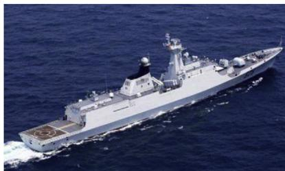

<details>
<summary>natural_image</summary>

Aerial view of a modern naval warship sailing on open sea (no visible text or markings)
</details>

(a) Ship sailing in sea waves

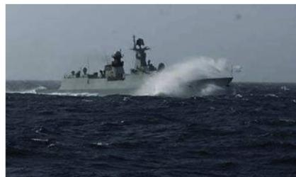

<details>
<summary>natural_image</summary>

Black-and-white photo of a naval warship speeding across the ocean, creating large spray or wake (no visible text or symbols)
</details>

(b) Green water on deck

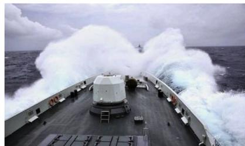

<details>
<summary>natural_image</summary>

Exterior view of a naval ship at sea with visible wake and spray (no text or symbols)
</details>

) Bow flare slamming   
Fig. 1. Full-scale ship seakeeping performance in realistic sea waves.

# 2. Ship form determination and description

# 2.1. Hybrid hull optimization procedure

In the related research project, a conventional round bilge hull (R0) is adopted as a reference. Then a series of deep-V hulls $( \lor \# 1 , \lor \# 2 , \dots \lor -$ #i) are proposed. A hull lines optimization algorithm is developed according to the framework as shown in Fig. 2; and it is applied on the deep-V hulls. A good balance between ship resistance and seakeeping performance is achieved through the optimization algorithm. The Radar Cross Section (RCS) of monohull is also estimated and evaluated to meet the hull stealth requirement.

Flowchart of the series ship form determination is schematized in Fig. 3. The identified candidate hull through the first round optimization is named as V1. Then a series of SSB schemes $( \mathsf { S 1 } , \mathsf { S 2 } , . . . , \mathsf { S j } )$ are designed and applied on V1. The preferred hull with the best SSB through the second round of optimization is named as V2. Afterwards, a series of fin schemes (F1, F2, …, Fk) are designed and applied on V2. The preferred hull with the best SSB and fins through the third round of optimization is named as V3. It is noted that this paper mainly concentrates on the investigation of seakeeping performance of the developed hulls by both numerical and experimental approaches. The effects of SSB and fins on vertical motion reduction are also systemically investigated.

# 2.2. Ship form description

As aforementioned, the developed deep-V hulls V1, V2 and V3 are designed to be in accordance with the same main hull prototype. They are however designed to be without or fitted with different bow appendages in order to investigate the influence of SSB and fins on vertical motion stabilization. The status of the three hulls in terms of bow appendage is listed in Table 1. For clarity, the sketch of a SSB with fins is schematized in Fig. 4. It is noted that the fins are located at the baseline level height of hull, and their forward point is at the maximum width position of SSB longitudinally.

The effects of vertical motion reduction of SSB and fins can be

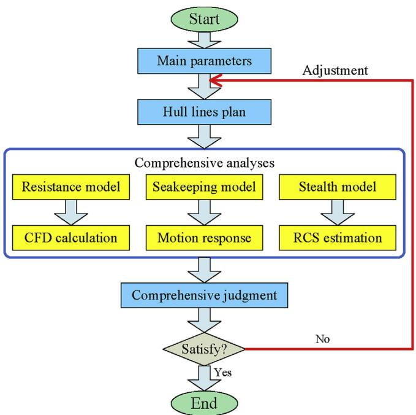

<details>
<summary>flowchart</summary>

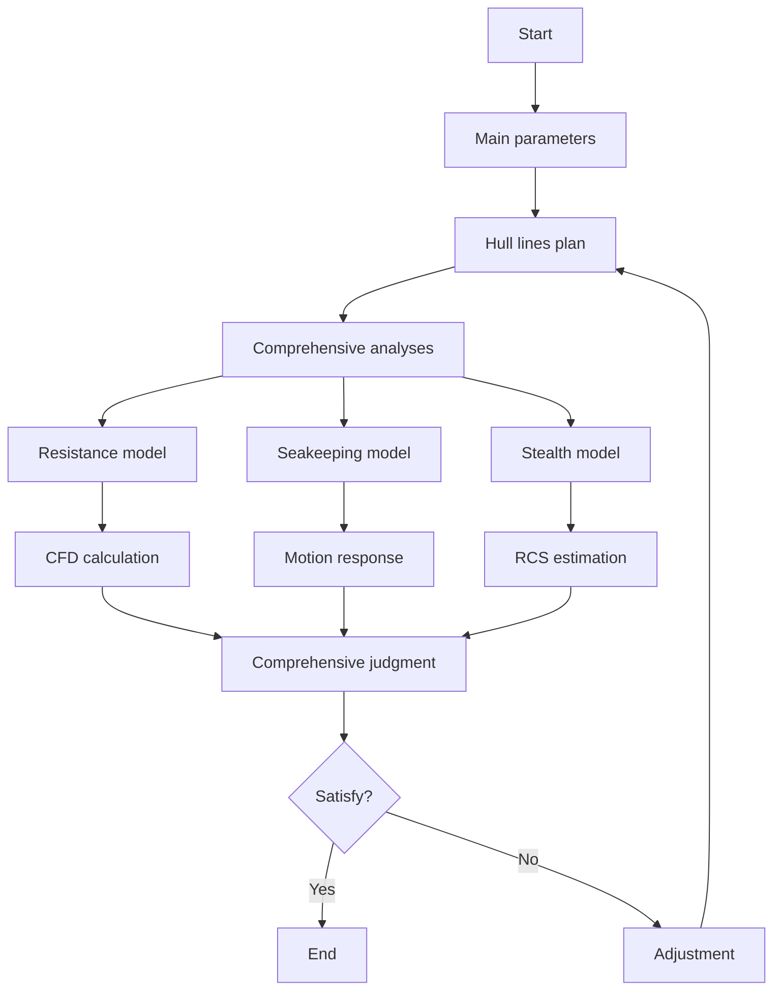
</details>

Fig. 2. Hull optimization algorithm.

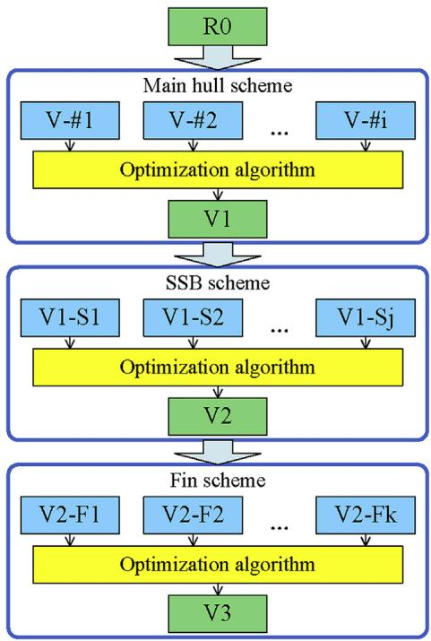

<details>
<summary>flowchart</summary>

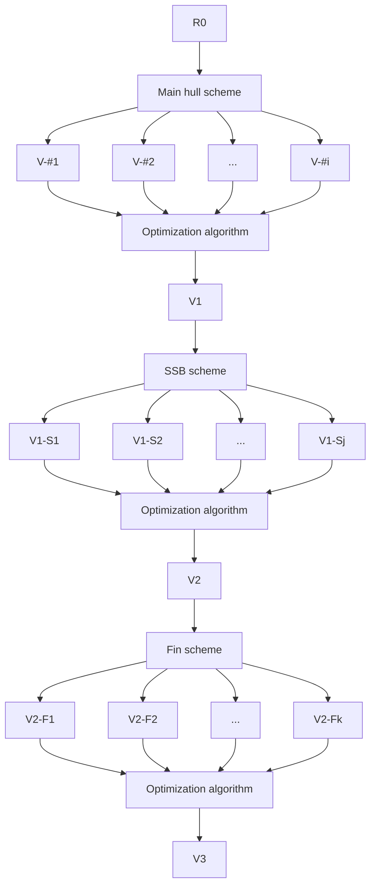
</details>

Fig. 3. Procedure of ship form determination.

Table 1 Status of hull with bow appendage. 

<table><tr><td>Model</td><td>V1</td><td>V2</td><td>V3</td></tr><tr><td>Appendage</td><td>None</td><td>SSB</td><td>SSB with fins</td></tr></table>

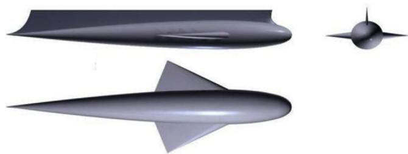

<details>
<summary>natural_image</summary>

Three grayscale illustrations of different aircraft or missile profiles: a elongated blade, a triangular prism, and a conical tip (no text or symbols)
</details>

Fig. 4. Sketch of the SSB with fins.

attributed to the viscous hydrodynamic damping force and lift force generated due to the relative vertical movement of bow appendages against the fluid. The lift force is generated when the appendages are advancing with angle of attack (mainly caused by pitch) in fluid. The motion stabilization is then achieved since the damping force and lift force are always opposite to the vertical movement direction of bow (Cai et al., 2003). It is worth mentioning that the dimensions of SSB and fins should be elaborately and carefully designed and optimized by experiential and numerical methods (Sun et al., 2014). And it is a challenging task to determine the SSB dimensions for a designated hull to achieve the best stability.

In this study, the SSB is designed in accordance with NACA-00 airfoil shape and the fins are in accordance with TsAGI airfoil shape at any arbitrary longitudinal plane. Table 2 presents the parameters of the optimized SSB and fins. The ratio of displacement of SSB to the whole hull design displacement is about 1.92%.

Body plans of the round bilge type hull and deep-V type hulls are presented in Fig. 5(a) and (b), respectively. It is noted that in Fig. 5(b), the SSB is marked in blue lines, and the fin is marked in green lines. Main dimensions of the ships are listed in Table 3.

Table 2 Parameters of bow appendages. 

<table><tr><td>Appendage</td><td>Length (m)</td><td>Width (m)</td><td>Thickness (m)</td></tr><tr><td>SSB</td><td>25</td><td>4</td><td>2</td></tr><tr><td>Fin</td><td>6</td><td>1.5</td><td>0.5</td></tr></table>

# 3. Numerical seakeeping method

In order to numerically estimate the motion responses of hybrid monohull in regular waves, an improved 2.5D theory based algorithm was developed. The improvements were made by taking the viscous fluid effects and the hydrodynamic forces acting on bow appendages into consideration. The viscous flow effects caused by SSB and fin are considered from the two aspects: (i) The viscous hydrodynamic damping and lifting forces acting on the hull caused by SSB and fins are estimated by computational fluid dynamics (CFD) tool or empirical formula. Then, a series of additional hydrodynamic coefficient terms are introduced into the basic motion governing equations. (ii) The sectional hydrodynamic coefficients $a _ { 3 3 }$ and $b _ { 3 3 }$ (i.e. added mass and damping coefficients in vertical displacement mode) are acquired by means of CFD method to include the contribution of vortex-related viscous forces to viscous damping.

# 3.1. The improved strip theory

In the potential flow theory, the fluid is assumed to be ideal, i.e., incompressible, inviscid, continuous and irrotational. In this study the head wave condition is defined as 180 heading angle, while 0, 90 and $2 7 0 ^ { \circ }$ are for following wave, port beam wave and starboard beam wave, respectively. As shown in Fig. 6, three coordinate systems are introduced to describe ship motion in waves: i) The space-fixed system O-XYZ is an inertia system with the plane OXY lying on an undisturbed free surface, OX directed with positive in the direction of which incident wave come and OZ pointing vertically upward; ii) The plane movement system o-xyz is a horizontal moving coordinate system with the same moving speed and direction as the ship forward speed U and wave heading β. The origin o is coincident with the O initially and oz pointing vertically upward across the ship's center of gravity (COG); iii) The body-fixed system Gxbybzb is fixed on the ship. The origin G is coincident with the COG of the hull body; and the $x _ { b } , y _ { b }$ and ${ \boldsymbol { z } } _ { b }$ axes are directed toward the bow, the port side and the sky, respectively. This coordinate system is also coincident with the plane movement system when the ship is in a mean-position. For consistency, the relationship between these three coordinate systems is expressed as follows:

$$
\left\{ \begin{array}{c} x \\ y \\ z \end{array} \right\} = \left[ \begin{array}{c c c} - \cos \beta & \sin \beta & 0 \\ - \sin \beta & - \cos \beta & 0 \\ 0 & 0 & 1 \end{array} \right] \left\{ \begin{array}{c} X + U t \cos \beta \\ Y - U t \sin \beta \\ Z \end{array} \right\} \approx \left\{ \begin{array}{c} x _ {b} \\ y _ {b} \\ z _ {b} + z _ {G} \end{array} \right\} \tag {1}
$$

where t denotes the time, zG denotes the vertical distance of COG of ship with respect to free surface.

According to the knowledge of linear strip theory, the basic vertical movement governing equations of hull in regular waves under the plane movement system o-xyz are expressed as follows:

$$
(M + A _ {3 3}) \ddot {\eta} _ {3} + B _ {3 3} \dot {\eta} _ {3} + C _ {3 3} \eta_ {3} + A _ {3 5} \ddot {\eta} _ {5} + B _ {3 5} \dot {\eta} _ {5} + C _ {3 5} \eta_ {5} = F _ {3} e ^ {\mathrm{i} \omega_ {e} t} \tag {2}
$$

$$
\left(I _ {5 5} + A _ {5 5}\right) \ddot {\eta} _ {5} + B _ {5 5} \dot {\eta} _ {5} + C _ {5 5} \eta_ {5} + A _ {5 3} \ddot {\eta} _ {3} + B _ {5 3} \dot {\eta} _ {3} + C _ {5 3} \eta_ {3} = F _ {5} e ^ {\mathrm{i} \omega_ {e} t} \tag {3}
$$

where M denotes ship mass, $I _ { 5 5 }$ denotes ship longitudinal moment of inertia, η3 denotes heave motion, η5 denotes pitch, $\omega _ { e }$ denotes wave encounter frequency, t denotes time, $F _ { 3 }$ denotes vertical external force acting on the hull, $F _ { 5 }$ denotes vertical external moment acting on the hull, the hydrodynamic coefficients $A _ { i j }$ and $B _ { i j } ( i , j = 1 - 6 )$ ) can be obtained by calculating the radiation force, which is described in Section 3.3.

# 3.1.1. Viscous effects of SSB

The vertical viscous force acting on SSB per unit length is described as:

$$
d F _ {\nu} (x) = \frac {1}{2} \rho B _ {m} (x) \left(C _ {L} U ^ {2} + C _ {D} w | w |\right) d x \tag {4}
$$

where $\rho$ denotes fluid density, $B _ { m } ( x )$ denotes the breadth of SSB at longitudinal ordinate x in the body-fixed coordinate system, $C _ { L }$ and $C _ { D }$ respectively denotes vertical lift coefficient and drag coefficient of SSB, U denotes ship forward speed, w denotes the relative vertical velocity of SSB against the fluid. To summarize, the first term at the right-hand side of Eq. (4) represents viscous hydrodynamic lift, and the second term represents viscous hydrodynamic drag.

The lift coefficient is further expressed as follows:

$$
C _ {L} = \alpha_ {0} \alpha (t) \tag {5}
$$

where $\alpha _ { O }$ denotes the lift coefficient ratio (slope of lifting force with respect to angle of attack) of SSB, α(t) denotes the real time angle of attack in the plane movement coordinate system.

The relative vertical velocity w and angle of attack α(t) of SSB can be derived by Eqs. (6) and (7), respectively.

$$
w (x) = \dot {\eta} _ {3} - x \dot {\eta} _ {5} - \dot {\zeta} _ {w} (x, 0, - d) \tag {6}
$$

$$
\alpha (t) = \eta_ {5} + w / U \tag {7}
$$

Table 3 Main dimension of the hulls. 

<table><tr><td>Principal dimension</td><td>R0</td><td>V1</td><td>V2</td><td>V3</td></tr><tr><td>Length overall (m)</td><td>134.80</td><td>134.16</td><td>134.16</td><td>134.16</td></tr><tr><td>Length waterline (m)</td><td>125</td><td>125</td><td>125</td><td>125</td></tr><tr><td>Moulded breadth (m)</td><td>15.2</td><td>16.72</td><td>16.72</td><td>16.72</td></tr><tr><td>Depth (m)</td><td>8.85</td><td>9.12</td><td>9.12</td><td>9.12</td></tr><tr><td>Draft (m)</td><td>4.05</td><td>4.50</td><td>4.50</td><td>4.50</td></tr><tr><td>Displacement (t)</td><td>3330</td><td>3315</td><td>3375</td><td>3380</td></tr></table>

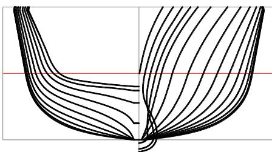

<details>
<summary>natural_image</summary>

Abstract black line pattern forming a symmetrical U-shape with a red horizontal line at the bottom (no text or symbols)
</details>

(a) Round bilge hull (R0)

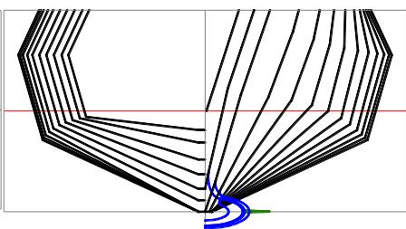

<details>
<summary>natural_image</summary>

Abstract geometric line drawing with intersecting curves and a blue spiral at the base (no text or symbols)
</details>

(b) Deep-V hybrid hull (V1\~V3)   
Fig. 5. Body plans of the hulls.

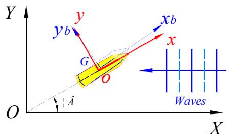

<details>
<summary>text_image</summary>

Y
y
y_b
G
O
x
x_b
Waves
O
A
X
</details>

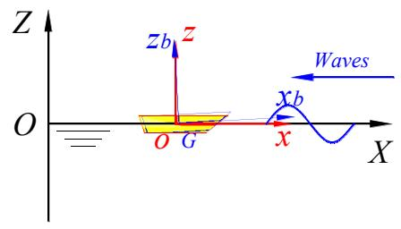

<details>
<summary>text_image</summary>

Z
z
O
G
x
X
Waves
xb
</details>

Fig. 6. Coordinate systems.

where d denotes the mean underwater depth of SSB baseline, and the vertical velocity component of incident wave is expressed as follows:

$$
\dot {\zeta} _ {w} (x, y, z) = \frac {\partial \Phi_ {I}}{\partial z} e ^ {i \omega_ {e} t} = - i \omega_ {e} \zeta_ {a} e ^ {(k z + i k x \cos \beta - i k y \sin \beta)} e ^ {i \omega_ {e} t} \tag {8}
$$

where $\Phi _ { I }$ denotes velocity potential of incident wave, $\zeta _ { a }$ denotes wave amplitude, k denotes wave number, β denotes ship heading angle. Thus the vertical velocity component of incident wave at mean baseline depth d can be obtained by substituting the coordinate point (x,0, d) into Eq. (8).

In order to linearize the second-order velocity time-dependent term wjwj in Eq. (4), the Fourier series expansion is applied and it can be simplified as follows:

$$
w | w | = \frac {8}{3 \pi} w _ {a} w \tag {9}
$$

where $w _ { a }$ denotes the amplitude value of w response.

It is noted that the linearization process is aimed at enabling this term to be added into the linear overall motion governing equation for solution.

The total vertical viscous force acting on SSB body is obtained by integrating the sectional force along its whole longitudinal length, which is expressed as:

$$
F _ {\nu} = \frac {1}{2} \rho \int_ {L} B _ {m} (x) \alpha_ {0} \left(U ^ {2} \eta_ {5} + U w\right) d x + \frac {4}{3 \pi} \rho \int_ {L} B _ {m} (x) C _ {D} w _ {a} w d x \tag {10}
$$

By substituting Eq. (5)–(9) into Eq. (10), we get the total vertical force acting on SSB, which is given as follows with a simplified format.

$$
F _ {\nu} = B _ {3 3} ^ {*} \dot {\eta} _ {3} + B _ {3 5} ^ {*} \dot {\eta} _ {5} + C _ {3 5} ^ {*} \eta_ {5} + F _ {3 \nu} e ^ {\mathrm{i} \omega_ {e} t} \tag {11}
$$

where the hydrodynamic coefficient terms $\boldsymbol { B } _ { 3 3 } ^ { * }$ , B\* 35, B\* 35 and $F _ { 3 \nu }$ are given in Appendix.

In a similar way, the total vertical viscous moment acting on SSB is expressed as:

$$
M _ {\nu} = B _ {5 5} ^ {*} \dot {\eta} _ {5} + C _ {5 5} ^ {*} \eta_ {5} + B _ {5 3} ^ {*} \dot {\eta} _ {3} + M _ {5 \nu} e ^ {\mathrm{i} \omega_ {e} t} \tag {12}
$$

where the hydrodynamic coefficient terms $\boldsymbol { B } _ { 5 5 } ^ { * } , \boldsymbol { B } _ { 5 3 } ^ { * } , \boldsymbol { C } _ { 5 5 } ^ { * }$ and $M _ { 5 \nu }$ are given in Appendix.

# 3.1.2. Viscous effects of fins

The hydrodynamic lift force acting on a single fin is expressed as follows:

$$
L _ {f} = \frac {1}{2} \rho U ^ {2} S C _ {L f} \tag {13}
$$

where S denotes the projected area of fin on horizon plane, $C _ { L f }$ denotes the lift coefficient of fin, which is obtained by CFD computation in this study. In addition, for future reference and convenience, the value of $C _ { L f }$ for typical elliptical-type airfoil can be also estimated by the following empirical formula:

$$
C _ {L f} = \frac {5 . 7}{1 + 2 / \varepsilon} \alpha_ {f 0} \tag {14}
$$

where $\alpha _ { f O }$ denotes the lift coefficient ratio of fin, ε is the effective aspect ratio.

The real time angle of attack of fin with respect to the oncoming flow is expressed as:

$$
\alpha_ {f} (t) = \eta_ {5} + \left(\dot {\eta} _ {3} - x _ {f} \dot {\eta} _ {5} - \dot {\zeta} _ {w} \left(x _ {f}, y _ {f}, z _ {f}\right)\right) / U \tag {15}
$$

where $x _ { f } , y _ { f }$ and zf are the coordinate of representative position at 1/4 chord length of the fin.

Moreover, the vertical drag force and vertical rigid body inertia with corresponding fluid force of fin can be obtained by the following Eqs. (16) and (17), respectively.

$$
D _ {f} = \frac {1}{2} \rho S C _ {D f} w _ {f} \left| w _ {f} \right| \approx \frac {4}{3 \pi} \rho S C _ {D f} w _ {f a} w _ {f} \tag {16}
$$

$$
K _ {f} = \left(m _ {f} + \Delta m _ {f}\right) \left(\ddot {\eta} _ {3} - x _ {f} \ddot {\eta} _ {5}\right) \tag {17}
$$

where w denotes the real-time relative vertical velocity of fin against fluid and $w _ { f a }$ is the corresponding amplitude value, m denotes the mass of a fin, Δmf denotes the fluid added mass of fin in vertical movement mode.

Based on Eqs. (13), (16) and (17), the overall vertical hydrodynamic force and moment acting on twin fins are expressed by:

$$
F _ {f} = \left(L _ {f} + D _ {f} + K _ {f}\right) _ {L} + \left(L _ {f} + D _ {f} + K _ {f}\right) _ {R} \tag {18}
$$

$$
M _ {f} = - x _ {f} F _ {f} \tag {19}
$$

where subscript L or R denotes the fin at left or right side, respectively.

By synthesizing Eq. (13)–(19), the hydrodynamic force and moment attributed to twin fins can be re-written as:

$$
F _ {f} = A _ {3 3} ^ {f} \ddot {\eta} _ {3} + B _ {3 3} ^ {f} \dot {\eta} _ {3} + A _ {3 5} ^ {f} \ddot {\eta} _ {5} + B _ {3 5} ^ {f} \dot {\eta} _ {5} + C _ {3 5} ^ {f} \eta_ {5} + F _ {3 f \nu} e ^ {\mathrm{i} \omega_ {e} t} \tag {20}
$$

$$
M _ {f} = A _ {5 5} ^ {f} \ddot {\eta} _ {5} + B _ {5 5} ^ {f} \dot {\eta} _ {5} + C _ {5 5} ^ {f} \eta_ {5} + A _ {5 3} ^ {f} \ddot {\eta} _ {3} + B _ {5 3} ^ {f} \dot {\eta} _ {3} + M _ {5 f \nu} e ^ {\mathrm{i} \omega_ {e} t} \tag {21}
$$

where the hydrodynamic coefficient terms $A ^ { f } { } _ { 3 3 } , B ^ { f } { } _ { 3 3 } , A ^ { f } { } _ { 3 5 } , B ^ { f } { } _ { 3 5 } , C ^ { f } { } _ { 3 5 } , F _ { 3 f \nu }$ , $A ^ { f } { } _ { 5 5 } , B ^ { f } { } _ { 5 5 } , C ^ { \dot { f } } { } _ { 5 5 } , A ^ { \dot { f } } { } _ { 5 3 } , B ^ { f } { } _ { 5 3 }$ and $M _ { 5 f t }$ are given in Appendix.

# 3.1.3. Estimation of lift and drag coefficients of bow appendages

The lift coefficient of SSB or fin is calculated by using the following equation:

$$
C _ {L} = \frac {2 L}{\rho U ^ {2} S} \tag {22}
$$

where S denotes projected area of appendage on the horizontal plane, the lift force L is calculated by CFD method which is described as follows.

The lift of SSB or fin advancing with different angles of attack and at different forward speeds is calculated by the ANSYS Fluent 13.0 software. The unstructured volume meshes of fluid domain are generated with the help of the GAMBIT 2.4.6 software (see Fig. 7(a)). The velocity inlet and outflow surfaces are set to be in front of and behind the SSB, respectively. The side surfaces are set to be the wall boundary condition. The lift force acting on the SSB can be obtained by solving the Reynolds-averaged Navier–Stokes (RANS) equations. Fig. 7(b) shows the simulated pressure distribution on the advancing SSB during steady flow state. The lift of fin can be calculated using the same method. The calculated and the linear fitted lift coefficients for SSB and fin are summarized in Fig. 8. The obtained lift coefficient ratios for SSB and fin are 1.083 and 2.153 (angle of attack in radian), respectively.

The drag coefficient of SSB and fin for moving in vertical direction can be estimated with the help of CFD tool by solving RANS equations, which is similar as the lift calculation method above-mentioned. However, in this study the drag coefficients are estimated by empirical formula for convenience. Our previous study indicated that the results by empirical formula are reliable for application in this condition. The drag coefficient largely depends on Re number and turbulence intensity, and the variation of drag coefficient is small in a wide range of Re number (Molin, 2002). The drag coefficient of fin $C _ { D f }$ can be approximately taken within 0.7–0.8 (Zhang and Li, 2006). Moreover, the following formula is used to estimate the drag coefficient of SSB:

$$
C _ {D} (x) = 1. 3 / \kappa (x) - 0. 2 5 d (x) / B (x) \tag {23}
$$

where κ(x) denotes sectional area ratio at longitudinal ordinate $x ,$ B(x) denotes sectional breadth, and d(x) denotes sectional height.

# 3.2. Calculation of hydrodynamic coefficients in heave mode by CFD

In the classical potential flow theory, 2D sectional hydrodynamic coefficients are usually acquired by means of source distribution method, which provides satisfactory results for ships with simple lines plan. The section shape of deep-V hybrid hull with SSB is however complex and thus the viscous flow effects should be considered (Zhou et al., 2015; Han et al., 2014).

With this in mind, a 2D hull section oscillation model is numerically setup by using the Fluent software. The sectional triangle meshes are generated with the help of the GAMBIT software. The free surface is modeled by a two phase volume of fluid (VOF) technique. To determine the vertical radiation force of the section oscillating in fluids, the hull section is forced for vertical oscillation with fixed small amplitude at fixed frequency instructed by UDF code using morphing grid technique. The RANS equations are solved by means of RNG k-ε turbulence model. The computations were done over a wide range of oscillation frequency. The sectional added mass and damping coefficients can be extracted from the calculated radiation force results by the following method.

The external force acting on a vertical oscillating section comprises two components:

$$
F = F _ {s} + F _ {z} \tag {24}
$$

where $F _ { s }$ denotes hydrostatic restoring force and $F _ { z }$ denotes radiation force, they are respectively expressed by he following equations:

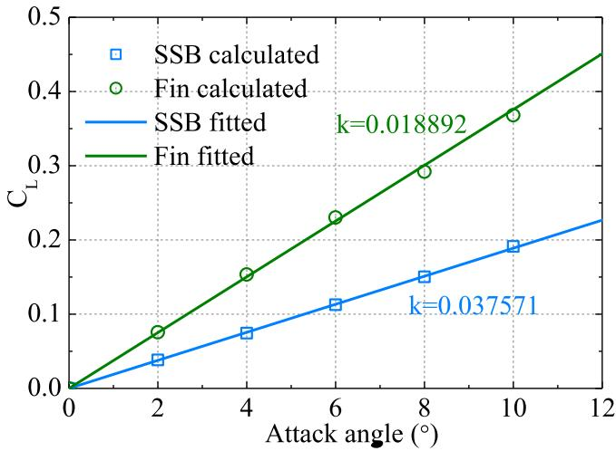

<details>
<summary>line</summary>

| Attack angle (°) | SSB calculated | Fin calculated |
| ---------------- | -------------- | -------------- |
| 0                | 0.0            | 0.0            |
| 2                | 0.04           | 0.08           |
| 4                | 0.08           | 0.16           |
| 6                | 0.12           | 0.24           |
| 8                | 0.16           | 0.32           |
| 10               | 0.20           | 0.38           |
| 12               | 0.24           | 0.44           |
</details>

Fig. 8. Lift coefficients of SSB and fin.

$$
F _ {s} = - \rho g B \eta_ {3} \tag {25}
$$

$$
F _ {z} = - a _ {3 3} \ddot {\eta} _ {3} - b _ {3 3} \dot {\eta} _ {3} \tag {26}
$$

where ρ denpotes liquid density, g denotes gravitational acceleration, B denotes breadth of hull section at waterline level, $a _ { 3 3 }$ and $b _ { 3 3 }$ denotes sectional added mass and damping coefficient in heave mode, the vertical displacement of section can be expressed as follows:

$$
\eta_ {3} = A \sin \omega t \tag {27}
$$

where A denotes amplitude of sectional oscillation, ω denotes oscillating frequency, t denotes time.

The time series of external force F in Eq. (24) can be obtained by CFD calculation, which is also expressed as follows:

$$
F = F _ {a} \cos (\omega t + \theta_ {0}) = F _ {a} \cos \omega t \cos \theta_ {0} - F _ {a} \sin \omega t \sin \theta_ {0} \tag {28}
$$

where $F _ { a }$ and $\scriptstyle \theta _ { O }$ respectively denotes amplitude value and initial phase of the variable force $F ,$ which can be obtained by fitting the time series calculated by CFD code.

The added mass and damping coefficient in heave mode can be obtained by combining Eq. (24)–(28), and they are expressed as follows:

$$
a _ {3 3} = \frac {\rho g B A - F _ {a} \sin \theta_ {0}}{A \omega^ {2}} \tag {29}
$$

$$
b _ {3 3} = - \frac {F _ {a} \cos \theta_ {0}}{A \omega} \tag {30}
$$

A comparison of the added mass and damping coefficient calculated by potential flow method and the above described viscous flow method is conducted. Sections at #1–3 stations of V3 are selected for comparison due to their complex shape. Body plans of sections #1–3 are presented in

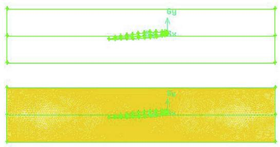

<details>
<summary>text_image</summary>

by
byx
by
</details>

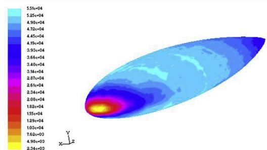

<details>
<summary>heatmap</summary>

| Value     |
| --------- |
| 5.51e+04  |
| 5.25e+04  |
| 4.98e+04  |
| 4.72e+04  |
| 4.45e+04  |
| 4.19e+04  |
| 3.93e+04  |
| 3.66e+04  |
| 3.40e+04  |
| 3.14e+04  |
| 2.87e+04  |
| 2.61e+04  |
| 2.34e+04  |
| 2.08e+04  |
| 1.82e+04  |
| 1.55e+04  |
| 1.29e+04  |
| 1.03e+04  |
| 7.62e+03  |
| 4.98e+03  |
| 2.34e+03  |
</details>

Fig. 7. Calculation of lift force of SSB by CFD. (a) SSB and fluid domain numerical setup. (b) Pressure distribution on the advancing SSB.

Fig. 9. It is noted that the fins are not included in CFD simulation since the vertical rigid body inertia force and the corresponding fluid force of fin have been calculated by Eq. (17). View of the numerical simulation of flow field by the ANSYS Fluent is shown in Fig. 10. The calculation results by different methods are shown in Fig. 11.

It can be observed that there exists distinct difference between damping coefficients by different methods for sections #1 and #2. The damping coefficients by viscous flow method are generally larger than those by potential flow method due to the contribution of vortex-related components, and the disparity increased with the increasing frequency. The largest disparity of results appeared at section #2 due to the large proportion of SSB. However, the results for section #3 show good agreement between the two methods due to the small proportion of SSB. Moreover, it is found that the results for section #4–20 show good agreement between the two methods, and they are not presented due to space limitation reasons.

# 3.3. The solution of motion equations by 2.5D theory

The updated ship vertical movement equations after adding the hydrodynamic coefficients attributed to SSB and twin fins are presented as follows:

$$
\begin{array}{l} \left(M + A _ {3 3} + A _ {3 3} ^ {f}\right) \ddot {\eta} _ {3} + \left(B _ {3 3} + B _ {3 3} ^ {*} + B _ {3 3} ^ {f}\right) \dot {\eta} _ {3} + C _ {3 3} \eta_ {3} + \left(A _ {3 5} + A _ {3 5} ^ {f}\right) \ddot {\eta} _ {5} \\ + \left(B _ {3 5} + B _ {3 5} ^ {*} + B _ {3 5} ^ {f}\right) \dot {\eta} _ {5} + \left(C _ {3 5} + C _ {3 5} ^ {*} + C _ {3 5} ^ {f}\right) \eta_ {5} \tag {31} \\ = \left(F _ {3} - F _ {3 \nu} - F _ {3 f \nu}\right) e ^ {\mathrm{i} \omega_ {e} t} \\ \end{array}
$$

$$
\begin{array}{l} \left(I _ {5 5} + A _ {5 5} + A _ {5 5} ^ {f}\right) \ddot {\eta} _ {5} + \left(B _ {5 5} + B _ {5 5} ^ {*} + B _ {5 5} ^ {f}\right) \dot {\eta} _ {5} + \left(C _ {5 5} + C _ {5 5} ^ {*} + C _ {5 5} ^ {f}\right) \eta_ {5} \\ + \left(A _ {5 3} + A _ {5 3} ^ {f}\right) \ddot {\eta} _ {3} + \left(B _ {5 3} + B _ {5 3} ^ {*} + B _ {5 3} ^ {f}\right) \dot {\eta} _ {3} + C _ {5 3} \eta_ {3} \tag {32} \\ = \left(F _ {5} - M _ {5 \nu} - M _ {5 f \nu}\right) e ^ {\mathrm{i} \omega_ {e} t} \\ \end{array}
$$

In order to consider the forward speed of ship during simulation, the high-speed slender body theory was applied to solve the motion governing equations. This theory is also called 2.5D theory since the freesurface condition is 3D whereas the governing equation and body surface conditions are 2D.

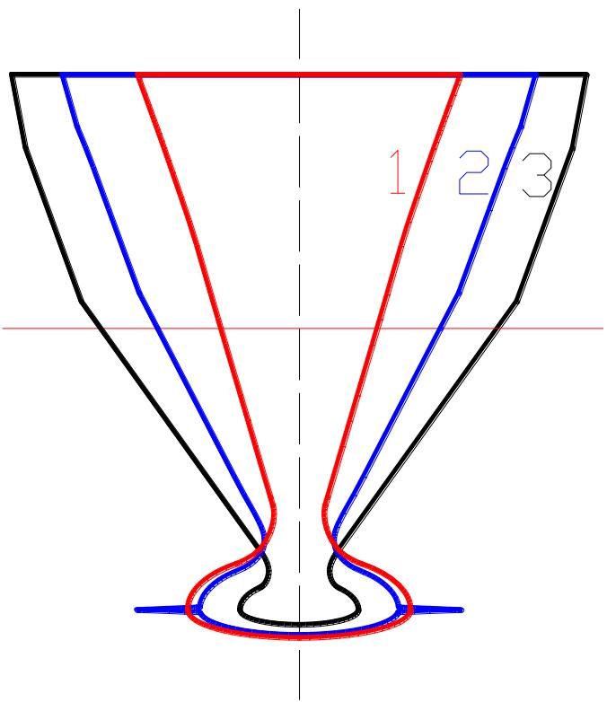

<details>
<summary>text_image</summary>

1 2 3
</details>

Fig. 9. Body plans at station #1–3.

It is assumed that the ship forward speed is high enough so that the wave-making in front of ship can be ignored. Thus the Brard number satisfies (Chen and Noblesse, 1998; Noblesse et al., 1999):

$$
\tau = \frac {\omega_ {e} U}{g} > > \sqrt {\frac {2}{2 7}} \tag {33}
$$

The steady wave-making potential $\Phi _ { S }$ is ignored in the theory. The flow field velocity potential is decomposed into time-dependent term and space-dependent term:

$$
\Phi (x, y, z, t) = \operatorname{Re} \left\{\varphi (x, y, z) e ^ {\mathrm{i} \omega_ {e} t} \right\} \tag {34}
$$

The fluctuating space-dependent potential around the ship can be further decomposed and expressed as:

$$
\varphi (x, y, z) = \varphi_ {I} (x, y, z) + \varphi_ {D} (x, y, z) + \varphi_ {R} (x, y, z) \tag {35}
$$

where $\phi _ { I } ( x , y , z )$ denotes incident wave potential, $\phi _ { D } ( x , y , z )$ denotes diffraction potential, ϕR(x,y,z) denotes radiation potential. Furthermore, they are re-written by velocity potentials that are a response to unit wave amplitude or unit motion amplitude:

$$
\varphi_ {I} (x, y, z) = \zeta_ {a} \varphi_ {0} (x, y, z) \tag {36}
$$

$$
\varphi_ {D} (x, y, z) = \zeta_ {a} \varphi_ {7} (x, y, z) \tag {37}
$$

$$
\varphi_ {R} (x, y, z) = \sum_ {j = 1} ^ {6} \mathrm{i} \omega_ {e} \eta_ {j a} \varphi_ {j} (x, y, z) \tag {38}
$$

where $\zeta _ { a }$ denotes incident wave amplitude, $\omega _ { e }$ denotes encounter frequency, ϕj $( j = 1 , 2 , . . . , 6 )$ denotes the jth mode component of radiation potential, and $j = 1 , 2 , . . . , 6$ respectively denotes surge, sway, heave, roll, pitch and yaw motion, $\eta _ { j a }$ denotes the magnitude of jth motion component and can be expressed by:

$$
\eta_ {j} (t) = \eta_ {j a} \mathrm{e} ^ {\mathrm{i} \omega_ {e} t}, (j = 1 \sim 6) \tag {39}
$$

The radiation or diffraction velocity potential ϕ $( j = 1 , 2 , . . . , 7 )$ satisfies the following boundary conditions:

$$
\left\{\begin{array}{l}\frac {\partial^ {2} \varphi_ {j}}{\partial y ^ {2}} + \frac {\partial^ {2} \varphi_ {j}}{\partial z ^ {2}} = 0 (i n \Omega_ {f})\\\left[ \left(\mathrm{i} \omega_ {e} - U \frac {\partial}{\partial x}\right) ^ {2} + g \frac {\partial}{\partial z} \right] \varphi_ {j} = 0, (z = 0)\\\frac {\partial \varphi_ {j}}{\partial n} = \left\{\begin{array}{l l}\mathrm{i} \omega_ {e} n _ {j} + U m _ {j},&(j = 1 \sim 6)\\- \frac {\partial \varphi_ {0}}{\partial n},&(j = 7)\end{array}, (o n S _ {B}) \right.\\\varphi_ {j} = \frac {\partial \varphi_ {j}}{\partial x} = 0, (x > x _ {0})\\\varphi_ {j} \rightarrow 0, (z \rightarrow - \infty)\end{array}\right. \tag {40}
$$

where $\Omega _ { f }$ denotes liquid domain, $S _ { \mathrm { B } }$ denotes body surface condition, x is longitudinal coordinate value of ship forward perpendicular. By applying the assumption that the ship is slender and the component of normal vector of hull surface on x-axis is very small compared with those on y and z axes, nj and mj $( j = 1 \AA - 6 )$ are expressed as follows:

$$
\left(n _ {1}, n _ {2}, n _ {3}, n _ {4}, n _ {5}, n _ {6}\right) = \left(0, N _ {2}, N _ {3}, y N _ {3} - \left(z - z _ {G}\right) N _ {2}, - x N _ {3}, x N _ {2}\right) \tag {41}
$$

$$
\left(m _ {1}, m _ {2}, m _ {3}, m _ {4}, m _ {5}, m _ {6}\right) = \left(0, 0, 0, 0, N _ {3}, - N _ {2}\right) \tag {42}
$$

where $( 0 , N _ { 2 } , N _ { 3 } )$ denotes the inward-directed unit normal vector of one point on the 2D hull surface section, $m _ { j } ( j = 1 { - } 6 )$ denotes the second order differential of the steady potential $( - U x + \Phi _ { S } )$ . It is noted that the effect of steady perturbation potential $\Phi _ { S }$ is ignored in this study.

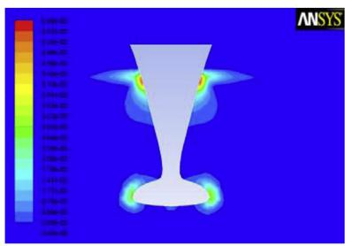

<details>
<summary>natural_image</summary>

Finite element analysis visualization of a 3D object with color-coded stress or pressure distribution (no text or symbols)
</details>

Station #1

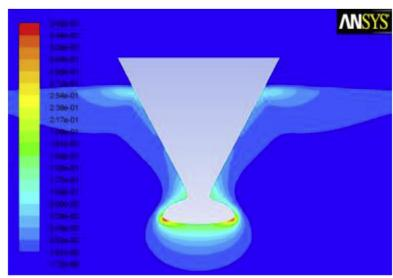

<details>
<summary>text_image</summary>

ANSYS
2.04e-01
3.04e-01
4.04e-01
5.04e-01
6.04e-01
7.04e-01
8.04e-01
9.04e-01
10.04e-01
11.04e-01
12.04e-01
13.04e-01
14.04e-01
15.04e-01
16.04e-01
17.04e-01
18.04e-01
19.04e-01
20.04e-01
21.04e-01
22.04e-01
23.04e-01
24.04e-01
25.04e-01
26.04e-01
27.04e-01
28.04e-01
29.04e-01
30.04e-01
31.04e-01
32.04e-01
33.04e-01
34.04e-01
35.04e-01
36.04e-01
37.04e-01
38.04e-01
39.04e-01
40.04e-01
41.04e-01
42.04e-01
43.04e-01
44.04e-01
45.04e-01
46.04e-01
47.04e-01
48.04e-01
49.04e-01
50.04e-01
51.04e-01
52.04e-01
53.04e-01
54.04e-01
55.04e-01
56.04e-01
57.04e-01
58.04e-01
59.04e-01
60.04e-01
61.04e-01
62.04e-01
63.04e-01
64.04e-01
65.04e-01
66.04e-01
67.04e-01
68.04e-01
69.04e-01
70.04e-01
</details>

Station #2

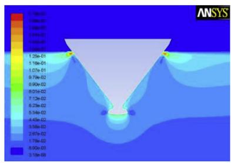

<details>
<summary>text_image</summary>

ANSYS
1.70e-01
1.60e-01
1.50e-01
1.40e-01
1.30e-01
1.20e-01
1.10e-01
1.00e-01
9.70e-02
8.90e-02
8.01e-02
7.12e-02
6.23e-02
5.34e-02
4.45e-02
3.56e-02
2.67e-02
1.76e-02
8.90e-03
3.70e-03
</details>

Station #3

Fig. 10. Numerical model setup.   
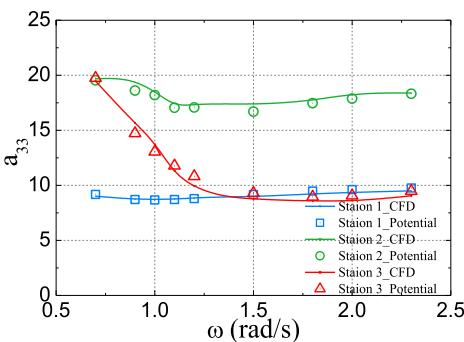

<details>
<summary>line</summary>

| ω (rad/s) | Station 1_CFD | Station 1_Potential | Station 2_CFD | Station 2_Potential | Station 3_CFD | Station 3_Potential |
| --------- | ------------- | ------------------- | ------------- | ------------------- | ------------- | ------------------- |
| 0.5       | 9             | 9                   | 20            | 20                  | 20            | 20                  |
| 1.0       | 9             | 9                   | 18            | 18                  | 18            | 15                  |
| 1.5       | 9             | 9                   | 17            | 17                  | 17            | 10                  |
| 2.0       | 9             | 9                   | 18            | 18                  | 18            | 9                   |
| 2.5       | 9             | 9                   | 18            | 18                  | 18            | 9                   |
</details>

() Added mass

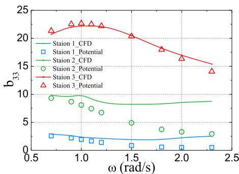

<details>
<summary>line</summary>

| ω (rad/s) | Station 1_CFD | Station 1_Potential | Station 2_CFD | Station 2_Potential | Station 3_CFD | Station 3_Potential |
| --------- | ------------- | ------------------ | ------------- | ------------------ | ------------- | ------------------ |
| 0.5       | ~2.5          | ~2.5               | ~9.5          | ~9.5               | ~21.5         | ~21.5              |
| 1.0       | ~2.0          | ~2.0               | ~8.5          | ~8.5               | ~22.5         | ~22.5              |
| 1.5       | ~1.5          | ~1.5               | ~8.0          | ~8.0               | ~20.5         | ~20.5              |
| 2.0       | ~1.0          | ~1.0               | ~8.5          | ~8.5               | ~17.0         | ~17.0              |
| 2.5       | ~1.5          | ~1.5               | ~9.0          | ~9.0               | ~14.0         | ~14.0              |
</details>

(b) Damping coefficient   
Fig. 11. Comparison of hydrodynamic coefficients obtained by different methods.

The following transformations are adopted to simplify the velocity potential boundary conditions.

$$
t ^ {\prime} (x) = \left(- x + x _ {0}\right) / U \tag {43}
$$

$$
\psi_ {j} (t ^ {\prime}, y, z) = \varphi_ {j} (x, y, z) e ^ {\mathrm{i} \omega_ {e} t ^ {\prime} (x)}, (j = 1, \dots , 7) \tag {44}
$$

It is noted that the above transformations are aimed at simplifying the free surface boundary condition in Eq. (40), which includes the speed term U. The transformation also ensures that the transformed free surface boundary condition is similar with that for the zero speed condition and could then be solved by 2D time-domain free surface Green function. In fact, the speed term U is however indirect included and considered in the introduced time-domain function t0 (x). Therefore, the boundary conditions in Eq. (40) can be re-written as follows:

$$
\left\{\begin{array}{l}\frac {\partial^ {2} \psi_ {j}}{\partial y ^ {2}} + \frac {\partial^ {2} \psi_ {j}}{\partial z ^ {2}} = 0, (i n \Omega_ {f})\\\frac {\partial^ {2} \psi_ {j}}{\partial t ^ {2}} + g \frac {\partial \psi_ {j}}{\partial z} = 0 (z = 0)\\\frac {\partial \psi_ {j}}{\partial n} = \left\{\begin{array}{l l}(\mathrm{i} \omega_ {e} n _ {j} + U m _ {j}) e ^ {\mathrm{i} \omega_ {e} t ^ {\prime} (x)},&(j = 2 \sim 6)\\- \frac {\partial \varphi_ {0}}{\partial n} e ^ {\mathrm{i} \omega_ {e} t ^ {\prime} (x)},&(o n S _ {B} (t ^ {\prime}))\end{array}, \right.\\\psi_ {j} = \frac {\partial \psi_ {j}}{\partial t} = 0, (t = 0)\\\psi_ {j} \rightarrow 0, (z \rightarrow - \infty)\end{array}\right. \tag {45}
$$

According to the body surface condition in Eq. (45), the radiation potentials can be further decomposed into:

$$
\psi_ {j} = \psi_ {j} ^ {0} + \frac {U}{\mathrm{i} \omega_ {e}} \psi_ {j} ^ {U}, (j = 2, \dots , 6) \tag {46}
$$

where $\psi _ { j } ^ { 0 }$ and $\psi _ { j } ^ { U }$ satisfy the following body surface conditions:

$$
\left\{ \begin{array}{l} \frac {\partial \psi_ {j} ^ {0}}{\partial n} = \mathrm{i} \omega_ {e} n _ {j} e ^ {\mathrm{i} \omega_ {e} t ^ {\prime} (x)} \\ \frac {\partial \psi_ {j} ^ {U}}{\partial n} = \mathrm{i} \omega_ {e} m _ {j} e ^ {\mathrm{i} \omega_ {e} t ^ {\prime} (x)} \end{array} , (j = 2, \dots , 6) \right. \tag {47}
$$

The radiation potentials can be simplified by considering the basic assumption that the steady wave-making potential $\Phi _ { S }$ is small and its influence on body surface condition is not considered. In addition, by taking Eq. (41)–(42) into account, the simplified radiation potentials are expressed in the following Eq. (48). Therefore, the radiation potentials ψj can be obtained by solving the $\psi _ { j } ^ { 0 } .$ .

$$
\left\{ \begin{array}{l} \psi_ {j} = \psi_ {j} ^ {0}, (j = 2, \dots , 4) \\ \psi_ {5} = \psi_ {5} ^ {0} + \frac {U}{\mathrm{i} \omega_ {e}} \psi_ {3} ^ {0} \\ \psi_ {6} = \psi_ {6} ^ {0} - \frac {U}{\mathrm{i} \omega_ {e}} \psi_ {2} ^ {0} \end{array} \right. \tag {48}
$$

It is clear that the boundary condition problem in $\operatorname { E q . }$ (45) is a issue of 2D time-domain nonlinear motion issue without forward speed, which considers the nonlinear instantaneous wetted body surface. The initial condition is determined by the boundary conditions of the 2D section at fore (x x ). Then the flow field and radiation potentials at different hull sections can be addressed in the order from fore section to aft section by time-stepping approach. In the literature work, the grid and distributed source are applied on both free surface and body surface, and the boundary conditions are usually addressed by simple Green function in time-domain. However, the simple Green function method has drawbacks such as unstable, expensive and time-consumed. In this study, a 2D time-domain free-surface Green function for infinite water depth case is used to formulate the integral equation on the 2D body surface, which is expressed as follows:

$$
G (p, t ^ {\prime}; q, \tau) = \delta (t ^ {\prime} - \tau) \ln \frac {r _ {p q}}{r _ {p \overline {{q}}}} - H (t ^ {\prime} - \tau) \tilde {G} (p, q, t ^ {\prime} - \tau) \tag {49}
$$

where p and q are respectively field point and source point, and their locations are p(y,z) and $q ( \eta , \zeta )$ in geodetic coordinate, respectively. δ(t0 ) denotes the Dirac delta function, H(t 0 ) denotes unit step function, the transient effects of flow is considered in the term of ln $\frac { r _ { p q } } { r _ { p \overline { { q } } } } ,$ , and

$$
r _ {p q} ^ {2} = (y - \eta) ^ {2} + (z - \zeta) ^ {2} \tag {50}
$$

$$
r _ {p \bar {q}} ^ {2} = (y - \eta) ^ {2} + (z + \zeta) ^ {2} \tag {51}
$$

The memory effect of 3D free surface is considered in the term of $\tilde { G } ( p$ $q , t ^ { \prime } - \tau ) \colon$

$$
\tilde {G} (p, q, t ^ {\prime} - \tau) = 2 \int_ {0} ^ {\infty} \sqrt {\frac {g}{k}} e ^ {k (z + \zeta)} \cos k (y - \eta) \sin \sqrt {g k} (t ^ {\prime} - \tau) d k, (z \leq 0, \zeta \leq 0) \tag {52}
$$

which satisfies the following boundary conditions:

$$
\left\{ \begin{array}{l} \nabla^ {2} \tilde {G} = 0, (\tau <   t ^ {\prime}) \\ \frac {\partial^ {2} \tilde {G}}{\partial \tau^ {2}} + g \frac {\partial \tilde {G}}{\partial \zeta} = 0, (\zeta = 0) \\ \left. \tilde {G} \right| _ {t ^ {\prime} = \tau} = 0 \\ \left. \frac {\partial \tilde {G}}{\partial \tau} \right| _ {| t ^ {\prime} = \tau} = 2 g \frac {z + \zeta}{r _ {p \overline {{q}}} ^ {2}} = 2 g \frac {\partial}{\partial \zeta} \ln r _ {p \overline {{q}}} \end{array} \right. \tag {53}
$$

Suppose that point p is in the fluid field $\Omega _ { f }$ at time $t ,$ point q is on the closed loop formed by the body surface boundary $\mathsf { s } _ { \mathrm { B } } ( \tau )$ , free surface boundary SF(τ) and infinity boundary $s _ { \infty } ( \tau )$ at time τ. As shown in Fig. 12, A(τ) and $B ( \tau )$ are the cross points of $S _ { \mathrm { B } }$ and $\mathsf { S } _ { \mathrm { F } }$ at time τ. The 2D time-domain body surface boundary integral equation is finally expressed as follows:

$$
\pi \psi_ {j} (p, t ^ {\prime}) + \int_ {S _ {B} (t ^ {\prime})} \left[ \ln \frac {r _ {p q}}{r _ {p \overline {{q}}}} \frac {\partial \psi_ {j} (q , t ^ {\prime})}{\partial n _ {q}} - \psi_ {j} (q, t ^ {\prime}) \frac {\partial}{\partial n _ {q}} \ln \frac {r _ {p q}}{r _ {p \overline {{q}}}} \right] d s _ {q} =
$$

$$
\int_ {0} ^ {t ^ {\prime}} d \tau \int_ {\mathrm{S} _ {\mathrm{B}} (\tau)} \left[ \tilde {G} \frac {\partial \psi_ {j} (q , t ^ {\prime})}{\partial n _ {q}} - \psi_ {j} (q, t ^ {\prime}) \frac {\partial \tilde {G}}{\partial n _ {q}} \right] d s _ {q} - \frac {1}{g} \int_ {0} ^ {t ^ {\prime}} d \tau \left[ \tilde {G} \frac {\partial \psi_ {j}}{\partial \tau} - \psi_ {j} \frac {\partial \tilde {G}}{\partial \tau} \right] \dot {A} (t ^ {\prime}) | _ {A - B} \tag {54}
$$

where the subscript A B means the difference of the equation values with respect to source point q at the two different points A and B.

The velocity potential $\psi _ { j } ( p , t ^ { \prime } )$ is solved by source distribution method. Once the velocity potentials are obtained, the hydrodynamic pressure for radiation and diffraction components acting on hull surface is expressed as follows:

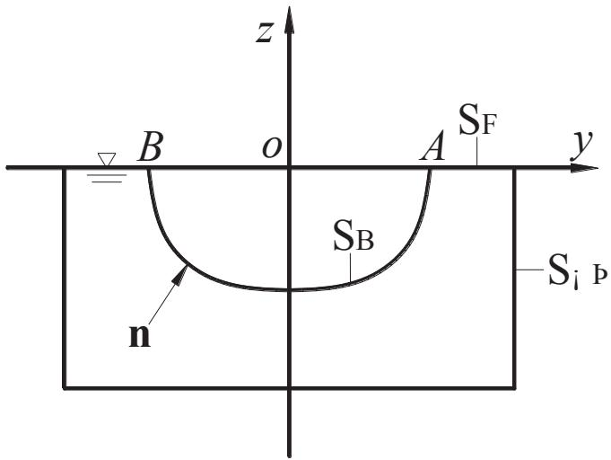

<details>
<summary>text_image</summary>

z
B o A y
S_F
S_B
n
S_i p
</details>

Fig. 12. Boundary conditions of 2D fluid domain.

$$
p _ {j} (x, y, z) = - \rho \left(\mathrm{i} \omega_ {e} \varphi_ {j} - U \frac {\partial \varphi_ {j}}{\partial x}\right) = - \rho e ^ {\mathrm{i} \omega_ {e} t ^ {\prime}} \frac {\partial \psi_ {j}}{\partial t ^ {\prime}}, (j = 2, \dots , 7) \tag {55}
$$

The radiation and diffraction forces are obtained by integrating the corresponding pressure over the wetted hull body surface. The hydrodynamic coefficients are then obtained by the radiation force:

$$
\left\{ \begin{array}{l} A _ {i j} = - \frac {\rho}{\omega_ {e} ^ {2}} \int_ {L} \int_ {S [ x (t ^ {\prime}) ]} \left[ \cos \left(\omega_ {e} t ^ {\prime} (x)\right) \cdot \operatorname{Re} \frac {\partial \psi_ {j}}{\partial t ^ {\prime}} + \sin \left(\omega_ {e} t ^ {\prime} (x)\right) \cdot \operatorname{Im} \frac {\partial \psi_ {j}}{\partial t ^ {\prime}} \right] n _ {i} d l d x \\ B _ {i j} = - \frac {\rho}{\omega_ {e}} \int_ {L} \int_ {S [ x (t ^ {\prime}) ]} \left[ \cos \left(\omega_ {e} t ^ {\prime} (x)\right) \cdot \operatorname{Im} \frac {\partial \psi_ {j}}{\partial t ^ {\prime}} - \sin \left(\omega_ {e} t ^ {\prime} (x)\right) \cdot \operatorname{Re} \frac {\partial \psi_ {j}}{\partial t ^ {\prime}} \right] n _ {i} d l d x \end{array} \right. \tag {56}
$$

The diffraction force is obtained by:

$$
F _ {\mathrm{D}} ^ {j} = \iint_ {S _ {B}} p _ {D} n _ {j} d s = - \rho \operatorname{Re} \left(\int_ {L} e ^ {\mathrm{i} \omega_ {e} t ^ {\prime} (x)} d x \left[ \int_ {S [ x (t ^ {\prime}) ]} \frac {\partial \psi_ {D}}{\partial t ^ {\prime}} n _ {j} d l \right] \cdot e ^ {\mathrm{i} \omega_ {e} t ^ {\prime}} \right. \tag {57}
$$

The overall motion equations in Eq. (31)–(32) can be finally solved by either frequency-domain method or time-domain method. It is noted that the hydrodynamic coefficients for heave mode adopted are those obtained by CFD calculation.

# 4. Small-scale model towing tank tests

To experimentally investigate the seakeeping performance of the ships, small-scale models' towing tank tests were conducted. Another objective of the tank tests is to validate the effects of SSB and fin on vertical motion stabilization since the laboratory tank wave parameters are well controlled and repeatable compared with realistic sea waves.

Four 1:40 small-scaled models (i.e. R0, V1, V2 and V3) were constructed corresponding to the prototypes. Comparative views of the two small-scale models V1 and V3 are shown in Fig. 13. The tests were conducted in the towing tank of Harbin Engineering University, which is 108 m long, 7 m wide and 3.5 m deep. Both regular and irregular head wave tests were conducted in the tank. A powered carriage running on rails along the tank, with a maximum speed capacity of 6.5 m/s and speed accuracy of 0.001 m/s, is used to tow the model. During the model running, the model forward speed is achieved by gravity pull applied, which is transferred by the heave rod and acts at COG of the model. The model is connected to a 4-degree-of-freedom (4-DOF, i.e. heave, pitch, roll and surge) motion measurement instrument, which restricts the model's transverse motion (i.e. sway and yaw) by its heave rod. The sketch of model setup and the towing guidance and motion measurement instrument is shown in Fig. 14.

A computer-controlled single hydraulic flat plate wave-maker is situated at one end of the tank and at the other end is a wave absorbing ramp. The period of the waves generated by the wave-maker ranges from 0.4 to 4 s. The largest wave height capacity of the wave-maker is 0.4 m for regular waves and significant wave height 0.32 m for irregular waves. A resistive wave probe is fixed on the carriage 1.5 m ahead of the model bow to measure the oncoming wave elevation. The incident wave elevation, 4-DOF motions and three vertical accelerations (at bow, middle and stern) of model were measured by a data collector in the operation room onboard carriage. The sampling frequency and low-pass cut-off frequency of the signals were set at 100 Hz and 30 Hz, respectively. Views of the towing tank facilities are shown in Fig. 15.

# 4.1. Regular wave tests

Tank regular wave tests were conducted in head waves at various wave frequencies (wave to ship waterline length λ/L ranges from 0.5 to 2.5) to obtain the response amplitude operators (RAOs) of vertical motions. The amplitude of incident waves is set at 31.25 mm (1.25 m at full scale) as a compromise between identifying distinct model responses and obtaining the linear responses. Typical testing speeds of 1.464 m/s, 1.952 m/s and 2.44 m/s (corresponding to full scale 18 knots, 24 knots and 30 knots, respectively) are selected for testing. The displacement Froude numbers are 0.265, 0.353 and 0.441 for speeds 18 knots, 24 knots and 30 knots, respectively.

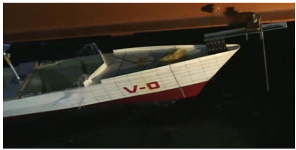

<details>
<summary>natural_image</summary>

Exterior view of a modern naval vessel with visible hull number V-0, partially grounded in dark water (no signage or text beyond the hull)
</details>

(a) Model without bow appendage (V1)

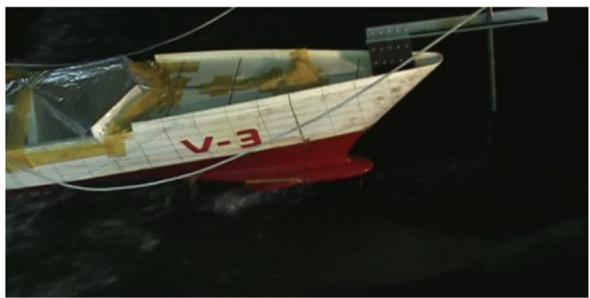

<details>
<summary>natural_image</summary>

Side view of a small boat with visible hull number V-3 and red hull, floating in dark water (no text or symbols beyond the hull)
</details>

(b) Model with SSB and fins (V3)

Fig. 13. View of the small-scale deep-V models.   
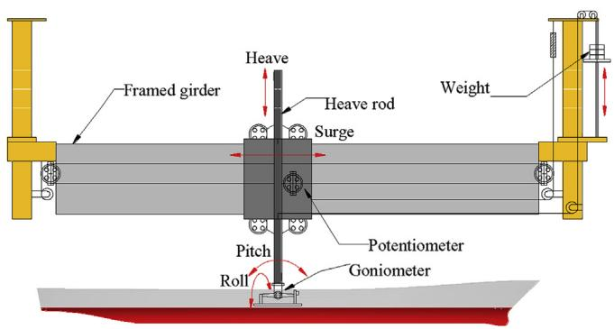

<details>
<summary>text_image</summary>

Framed girder
Heave
Heave rod
Surge
Weight
Pitch
Potentiometer
Goniometer
Roll
</details>

Fig. 14. The towing guidance and motion measurement instrument.

# 4.1.1. Tank wall effects judgment

It is known that tank wall effects should be considered while conducting model tests in narrow wave tanks. According to the 27th ITTC's recommended procedures and guidelines for seakeeping experiments (ITTC, 2014), the critical wave frequency is obtained by formula:

$$
\omega_ {I N T} = C \sqrt {g / L _ {m}} / F _ {r} \tag {58}
$$

where g denotes gravitational acceleration, $L _ { m }$ denotes model waterline length, $F _ { r }$ denotes displacement Froude number, and coefficient C is determined by $B _ { T } / L _ { m }$ (ratio of tank width to model length) and it can be obtained by referring to the diagram provided in the 27th ITTC committee.

The minimum frequency suggested of the regular waves is obtained as follows:

$$
\omega_ {\min} = \sqrt {2 \pi g / \lambda} \tag {59}
$$

where λ denotes the largest length of regular waves tested.

In this study, the critical wave frequency is ωINT 1.814 rad/s, which is less than $\omega _ { m i n } = 2 . 8 0 7$ rad/s. This therefore satisfies the tank wall interference requirement.

# 4.1.2. Analysis of regular wave testing results

The heave, pitch and bow acceleration are selected as representative responses for analysis in this study. The amplitude value for heave, pitch and bow acceleration responses in regular waves can be read from the recorded time series. Then the response amplitudes at different incident wave frequencies are used to plot the RAO curve. The obtained heave, pitch and bow acceleration RAOs of the four models at different speeds are summarized in Fig. 16.

As seen from the overall results, in most of the cases the vertical responses of V3 reduced evidently compared with R0, V1 and V2, particularly at the resonance frequency range (λ/L  0.8–1.5). In addition, the effects of the SSB and fins on vertical motion stabilization increased with the increasing forward speed.

By comparing the curves in each figure, it seems that R0 and V1 are almost of the same vertical response values in majority of the cases, whereas the responses of V2 and V3 reduced obviously compared with R0 or V1. Moreover, it indicates that both the SSB and twin-fins are of great help in improving the hull vertical motion stability when comparing V1 with V2 and V2 with V3, respectively. It is also revealed that the contributions of SSB and twin-fins to the vertical response reduction effects are almost equal.

For a further comparison of the results, both mean and maximum values of response reduction rate with respect to V3 versus R0, V3 versus V1, and V3 versus V2 are listed in Table 4. It is noted that the mean values are acquired by averaging the reduction rates at all the tested λ/L points and the maximum values are obtained by picking the maximum reduction rate among all the λ/L points.

As seen from the table, the vertical responses of V3 obviously reduced compared with R0, V1 and V2. The mean pitch and acceleration reduction rates are in the range of 5.2–16.9%, while heave within 1.7–8.7%.

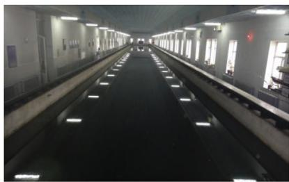

<details>
<summary>natural_image</summary>

Interior view of a long, empty industrial facility with illuminated walkways and no visible text or symbols
</details>

(a) Towing tank

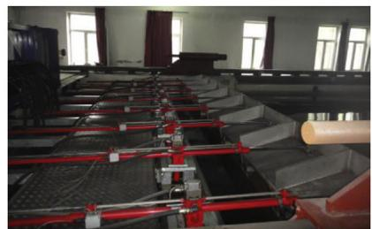

<details>
<summary>natural_image</summary>

Interior view of a large industrial facility with rows of machinery and blue pipes, no visible text or symbols.
</details>

(b) Wave-maker

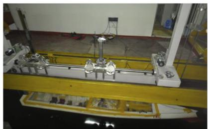

<details>
<summary>natural_image</summary>

Industrial testing setup with machinery and a yellow frame (no visible text or symbols)
</details>

(c) Motion measurement instrument   
Fig. 15. The towing tank facilities.

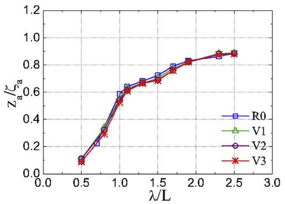

<details>
<summary>line</summary>

| λ/L | R0 | V1 | V2 | V3 |
|---|---|---|---|---|
| 0.5 | 0.1 | 0.1 | 0.1 | 0.1 |
| 0.75 | 0.25 | 0.3 | 0.3 | 0.3 |
| 1.0 | 0.6 | 0.6 | 0.6 | 0.6 |
| 1.25 | 0.7 | 0.7 | 0.7 | 0.7 |
| 1.5 | 0.8 | 0.8 | 0.8 | 0.8 |
| 1.75 | 0.85 | 0.85 | 0.85 | 0.85 |
| 2.0 | 0.9 | 0.9 | 0.9 | 0.9 |
| 2.25 | 0.95 | 0.95 | 0.95 | 0.95 |
| 2.5 | 0.95 | 0.95 | 0.95 | 0.95 |
</details>

(a) Heave at 18 knots

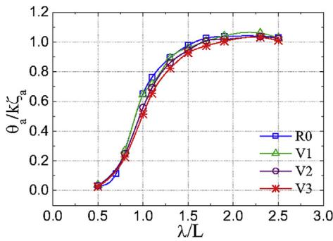

<details>
<summary>line</summary>

| λ/L | R0 | V1 | V2 | V3 |
|---|---|---|---|---|
| 0.5 | 0.05 | 0.05 | 0.05 | 0.05 |
| 0.75 | 0.15 | 0.25 | 0.25 | 0.25 |
| 1.0 | 0.65 | 0.65 | 0.65 | 0.65 |
| 1.25 | 0.85 | 0.90 | 0.85 | 0.85 |
| 1.5 | 0.95 | 0.95 | 0.95 | 0.95 |
| 1.75 | 1.00 | 1.00 | 1.00 | 1.00 |
| 2.0 | 1.02 | 1.02 | 1.02 | 1.02 |
| 2.25 | 1.03 | 1.03 | 1.03 | 1.03 |
| 2.5 | 1.03 | 1.03 | 1.03 | 1.03 |
</details>

(b) Pitch at 18 knots

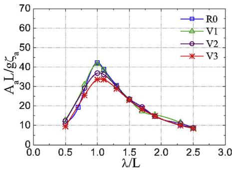

<details>
<summary>line</summary>

| λ/L | R0 | V1 | V2 | V3 |
|---|---|---|---|---|
| 0.5 | 10 | 10 | 10 | 10 |
| 1.0 | 42 | 36 | 37 | 34 |
| 1.5 | 28 | 24 | 22 | 23 |
| 2.0 | 15 | 16 | 15 | 14 |
| 2.5 | 9 | 9 | 9 | 9 |
</details>

(c) Bow acceleration at 18 knots

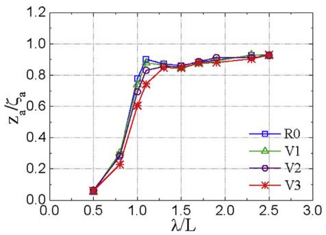

<details>
<summary>line</summary>

| λ/L | R0   | V1   | V2   | V3   |
|-----|------|------|------|------|
| 0.5 | 0.0  | 0.0  | 0.0  | 0.0  |
| 1.0 | 0.9  | 0.85 | 0.8  | 0.6  |
| 1.5 | 0.85 | 0.85 | 0.85 | 0.85 |
| 2.0 | 0.9  | 0.9  | 0.9  | 0.9  |
| 2.5 | 0.9  | 0.9  | 0.9  | 0.9  |
</details>

(d) Heave at 24 knots

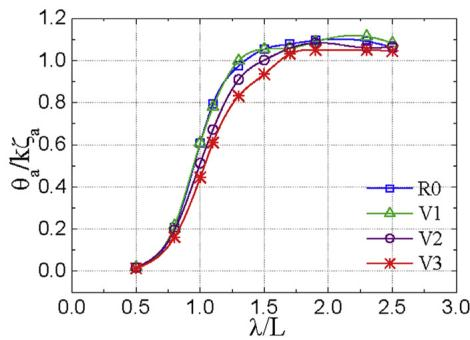

<details>
<summary>line</summary>

| λ/L | R0    | V1    | V2    | V3    |
|-----|-------|-------|-------|-------|
| 0.5 | 0.0   | 0.0   | 0.0   | 0.0   |
| 1.0 | 0.6   | 0.6   | 0.6   | 0.4   |
| 1.5 | 1.0   | 1.0   | 1.0   | 0.9   |
| 2.0 | 1.1   | 1.1   | 1.1   | 1.0   |
| 2.5 | 1.1   | 1.1   | 1.1   | 1.0   |
</details>

(e) Pitch at 24 knots

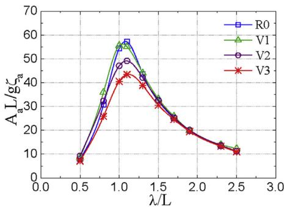

<details>
<summary>line</summary>

| λ/L | R0 | V1 | V2 | V3 |
|---|---|---|---|---|
| 0.5 | 8 | 9 | 9 | 7 |
| 0.75 | 32 | 34 | 32 | 28 |
| 1.0 | 58 | 56 | 49 | 43 |
| 1.25 | 58 | 54 | 49 | 43 |
| 1.5 | 43 | 43 | 43 | 38 |
| 1.75 | 28 | 28 | 28 | 28 |
| 2.0 | 20 | 20 | 20 | 20 |
| 2.25 | 14 | 14 | 14 | 14 |
| 2.5 | 11 | 11 | 11 | 11 |
</details>

(f) Bow acceleration at 24 knots

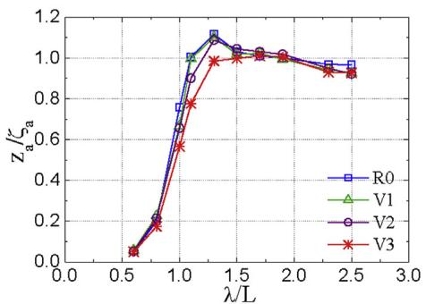  
(g) Heave at 30 knots

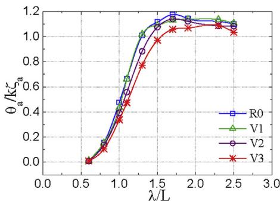

<details>
<summary>line</summary>

| λ/L | R0 | V1 | V2 | V3 |
|---|---|---|---|---|
| 0.5 | 0.0 | 0.0 | 0.0 | 0.0 |
| 1.0 | 0.45 | 0.65 | 0.55 | 0.4 |
| 1.5 | 1.15 | 1.1 | 1.05 | 0.95 |
| 2.0 | 1.18 | 1.15 | 1.12 | 1.08 |
| 2.5 | 1.12 | 1.1 | 1.08 | 1.05 |
</details>

(h) Pitch at 30 knots

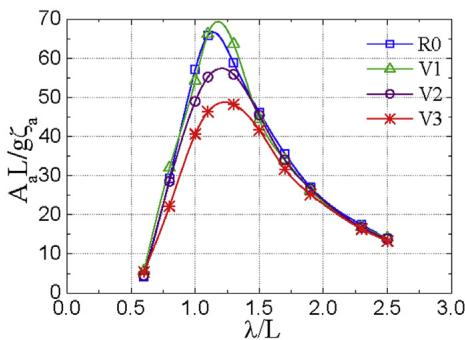

<details>
<summary>line</summary>

| λ/L | R0 | V1 | V2 | V3 |
|---|---|---|---|---|
| 0.5 | 5 | 5 | 5 | 5 |
| 0.75 | 30 | 35 | 30 | 25 |
| 1.0 | 60 | 65 | 55 | 45 |
| 1.25 | 65 | 70 | 58 | 48 |
| 1.5 | 55 | 60 | 50 | 45 |
| 1.75 | 45 | 48 | 42 | 38 |
| 2.0 | 30 | 32 | 30 | 28 |
| 2.25 | 20 | 22 | 20 | 18 |
| 2.5 | 15 | 16 | 15 | 14 |
</details>

(i) Bow acceleration at 30 knots   
Fig. 16. Regular wave test results.

The maximum reduction rates, which usually happened in wave resonance frequency range $( \lambda / L = 0 . 8 – 1 . 5 )$ , are generally over 20% for majority of the cases. On the other hand, the response reduction rate generally increases with increasing sailing speed from 18 knots to 30 knots for both mean and maximum values. This can be interpreted by the fact that the vertical oscillation velocity increases with the increasing of vessel forward speed and wave encounter frequency. And the hydrodynamic damping force generated by the SSB and fins, which is in the order of square of the vertical velocity (see Eqs. (10) and (16)), increases rapidly with the increasing vertical oscillation velocity of bow in waves. To summarize, the SSB and fins have considerable effects on vertical motion stabilization especially in harsh sailing conditions (severe wave

Table 4 Response reduction rate in regular waves. 

<table><tr><td rowspan="2">Scheme</td><td rowspan="2">Speed (knot)</td><td colspan="3">Mean</td><td colspan="3">Maximum</td></tr><tr><td>Heave</td><td>Pitch</td><td>Acceleration</td><td>Heave</td><td>Pitch</td><td>Acceleration</td></tr><tr><td rowspan="3">V3 vs. R0</td><td>18</td><td>1.7%</td><td>8.3%</td><td>6.7%</td><td>6.3%</td><td>21.1%</td><td>20.4%</td></tr><tr><td>24</td><td>6.3%</td><td>13.8%</td><td>9.6%</td><td>22.3%</td><td>26.8%</td><td>25.5%</td></tr><tr><td>30</td><td>8.7%</td><td>12.6%</td><td>10.9%</td><td>25.4%</td><td>31.6%</td><td>29.7%</td></tr><tr><td rowspan="3">V3 vs. V1</td><td>18</td><td>3.6%</td><td>9.1%</td><td>7.8%</td><td>17.8%</td><td>29.8%</td><td>25.2%</td></tr><tr><td>24</td><td>5.4%</td><td>14.5%</td><td>13.5%</td><td>24.3%</td><td>28.4%</td><td>28.2%</td></tr><tr><td>30</td><td>8.5%</td><td>16.9%</td><td>14.1%</td><td>23.1%</td><td>31.4%</td><td>30.6%</td></tr><tr><td rowspan="3">V3 vs. V2</td><td>18</td><td>2.9%</td><td>5.2%</td><td>7.0%</td><td>20.6%</td><td>20.4%</td><td>22.8%</td></tr><tr><td>24</td><td>5.4%</td><td>8.5%</td><td>9.3%</td><td>18.8%</td><td>21.2%</td><td>22.7%</td></tr><tr><td>30</td><td>6.9%</td><td>8.0%</td><td>7.5%</td><td>18.9%</td><td>22.8%</td><td>22.1%</td></tr></table>

state, high speed or both).

# 4.2. Irregular wave tests

Tank irregular wave results of the three models R0, V1 and V3 are reported in this section. Long-crested random waves of significant wave heights 0.081 m and 0.125 m, respectively corresponding to full-scale 3.25 m (level-5 sea state) and 5 m (level-6 sea state), were generated according to ISSC target spectrum. The full-scale wave target periods are 8.5 s and 10.5 s, respectively. To be in accordance with the regular wave tests, the three speeds 18 knots, 24 knots and 30 knots at full-scale were also tested. For each of the irregular wave test scheme, over 200 wave samples were encountered by the models, which is realized by combining several runs together since the towing tank is not long enough.

# 4.2.1. Spectral analysis theory

To obtain the frequency-domain curve and the statistical parameters of wave, ship motion and acceleration from the measured time series, an auto-correlation function based algorithm was used and corresponding code was developed. The basic theory regarding the auto-correlation function approach is described as follows (Yu, 2003).

The frequency-domain variance spectrum is derived by performing the Fourier transformation of the auto-correlation function:

$$
S (\omega) = \frac {2}{\pi} \int_ {0} ^ {\infty} R (\tau) e ^ {- \mathrm{i} \omega t} d \tau \tag {60}
$$

where S(ω) denotes the spectrum, ω denotes circular frequency, τ denotes the time interval, and R(τ) denotes the auto-correlation function.

The auto-correlation function is derived as follows through the measured time series:

$$
R (\tau) = E [ \eta (t) \cdot \eta (t + \tau) ] \tag {61}
$$

where η(t) denotes the ordinate value of time series at the time t, and function E(⋅) denotes the acquiring of mathematical expectation.

In addition, the auto-correlation function can be re-written by assuming that the variable processed is both ergodic and stationary random process:

$$
R (\tau) = \lim _ {T \rightarrow \infty} \frac {1}{T} \int_ {0} ^ {T} \eta (t) \eta (t + \tau) d t \tag {62}
$$

where T denotes the duration of the time series processed.

The time interval is represented by Δt T/n (dividing the time duration T into n equal parts). The mean representative time of the classified intervals in the order from the beginning to the end over the whole process range are $t _ { 1 } , t _ { 2 } , . . . , t _ { n } ,$ respectively. Then, using Δt, 2Δt, …, kΔt to replace τ and substituting them into Eq. (62), the following equation of discrete form can be derived.

$$
R \left(\frac {k T}{n}\right) = \frac {1}{n - k} \sum_ {i = 1} ^ {n - k} \eta_ {i} \cdot \eta_ {i + k} \quad (k = 0, 1, 2, \dots , m) \tag {63}
$$

where m denotes the largest interval number.

The auto-correlation values of $R _ { k }$ for $k = 0 , 1 , . . . ,$ m can be obtained by Eq. (63), and then substituting these values into Eq. (60). Besides, trapezoidal quadrature method is used to obtain the spectrum:

$$
S \left(\omega_ {i}\right) = \frac {\Delta t}{\pi} \left[ R _ {0} + 2 \sum_ {k = 1} ^ {m - 1} R _ {k} \cos \frac {i k \pi}{m} + R _ {m} \cos i \pi \right] (i = 0, 1, \dots , m) \tag {64}
$$

Due to the fact that the initial spectrum by Eq. (61) is not smooth, the Hamming smoothing is adopted to process the original spectrum. The equations for smoothing can be derived by:

$$
S ^ {\prime} (\omega_ {0}) = 0. 5 4 S (\omega_ {0}) + 0. 4 6 S (\omega_ {1})
$$

$$
S ^ {\prime} (\omega_ {i}) = 0. 5 4 S (\omega_ {i}) + 0. 2 3 [ S (\omega_ {i - 1}) + S (\omega_ {i + 1}) ] \quad (i = 1, 2, \dots , m - 1) \tag {65}
$$

$$
S ^ {\prime} (\omega_ {m}) = 0. 5 4 S (\omega_ {m}) + 0. 4 6 S (\omega_ {m - 1})
$$

where $S ^ { \prime }$ denotes the final spectrum after smoothing.

In addition, the displacement spectrum (e.g. heave) can be derived by two quadratures of the acceleration spectrum using the following equation, from which the wave surface evaluation and hull heave spectra can be obtained by processing the corresponding acceleration time series.

$$
S _ {\eta} \left(\omega_ {i}\right) = S _ {\eta^ {\prime \prime}} \left(\omega_ {i}\right) / \omega_ {i} ^ {4} \quad (i = 0, 1, \dots , m) \tag {66}
$$

The single significant amplitude (SSA) value and root mean square (RMS) value can be obtained based on the acquired spectral result, they are respectively obtained by:

$$
A _ {1 / 3} = 2. 0 5 \sqrt {m _ {0}} \tag {67}
$$

$$
\overline {{A}} = 1. 2 5 \sqrt {m _ {0}} \tag {68}
$$

where m0 denotes the variance of the spectrum, i.e. the area below the smoothed spectral curve:

$$
m _ {0} = \int_ {0} ^ {\infty} S ^ {\prime} (\omega) d \omega \tag {69}
$$

# 4.2.2. Analysis of the response spectra

The model motion response spectra are obtained by processing the measured time series through the above spectral analysis method. The comparison of heave, pitch and bow acceleration spectra under different conditions between R0, V1 and V3 are summarized in Fig. 17. The frequency is the encounter frequency.

As seen from the spectral curves, the difference between V3 and R0 (or V1) is not very pronounced at 18 knots forward speed and wave state level-5 condition. Whereas the difference increases with the increasing forward speed or wave state, or both. On the other hand, the difference between V1 and R0 is small in most of the cases, which shows the same phenomenon as that observed from regular wave testing results. Moreover, the response spectral peak frequency increases with increasing forward speed, while it decreases slightly with increasing wave state due to the increase of mean wave period.

# 4.2.3. Analysis of statistical values

Fig. 18 presents the calculated full-scale SSA values for heave, pitch and bow acceleration at different wave conditions and sailing speeds. The results are calculated by using Eq. (67) based on the spectral curves in Fig. 17. Herein the solid lines correspond to results in level-5 wave condition and the dashed lines correspond to level-6 wave condition.

As seen from the curves in Fig. 18, the SSA values of heave and bow acceleration saw a pronounced rise tendency over the increasing sailing speed from 18 knots to 30 knots, while the rise tendency of pitch value seems to be much gentler with increasing speed. It is found that V3 has the smallest SSA value for all the conditions; and the relative motion reduction effect is more obvious at high speed 30 knots or under high wave condition level-6. It is also found that R0 and V1 have almost the same response SSA values in most of the conditions. This reflects the same characteristics as those obtain from the regular wave tests. It is noted that the response values of V1 are sometimes slightly larger than R0 at speed below 24 knots; while being lower than R0 at speed 30 knots.

Table 5 lists response reduction rates of V1 versus R0, V3 versus R0, and V3 versus V1 by comparing the SSA values in Fig. 18. As confirmed from the table, V1 revealed better motion stability compared with R0 at high speed 30 knots or at high wave state level-6. The overall vertical motion performance of V3 improved remarkably compared with R0 and V1. For majority of the cases, the response reduction rate increases over the increasing sailing speed from 18 knots to 30 knots or increases with the increasing wave state.

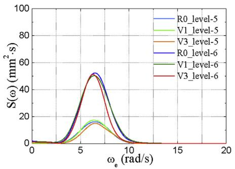

<details>
<summary>line</summary>

| ω_e (rad/s) | R0_level-5 | V1_level-5 | V3_level-5 | R0_level-6 | V1_level-6 | V3_level-6 |
| ----------- | ---------- | ---------- | ---------- | ---------- | ---------- | ---------- |
| 0           | 0          | 0          | 0          | 0          | 0          | 0          |
| 5           | ~45        | ~20        | ~15        | ~45        | ~20        | ~15        |
| 10          | ~5         | ~5         | ~5         | ~5         | ~5         | ~5         |
| 15          | 0          | 0          | 0          | 0          | 0          | 0          |
| 20          | 0          | 0          | 0          | 0          | 0          | 0          |
</details>

(a) Heave at 18 knots

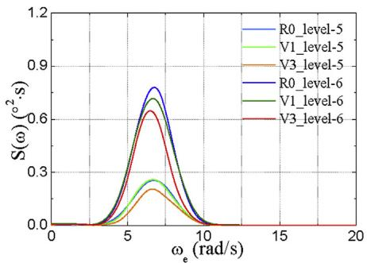

<details>
<summary>line</summary>

| ω_e (rad/s) | R0_level-5 | V1_level-5 | V3_level-5 | R0_level-6 | V1_level-6 | V3_level-6 |
| ----------- | ---------- | ---------- | ---------- | ---------- | ---------- | ---------- |
| 0           | 0.0        | 0.0        | 0.0        | 0.0        | 0.0        | 0.0        |
| 5           | 0.8        | 0.3        | 0.2        | 0.7        | 0.6        | 0.5        |
| 10          | 0.0        | 0.0        | 0.0        | 0.0        | 0.0        | 0.0        |
| 15          | 0.0        | 0.0        | 0.0        | 0.0        | 0.0        | 0.0        |
| 20          | 0.0        | 0.0        | 0.0        | 0.0        | 0.0        | 0.0        |
</details>

(b) Pitch at 18 knots

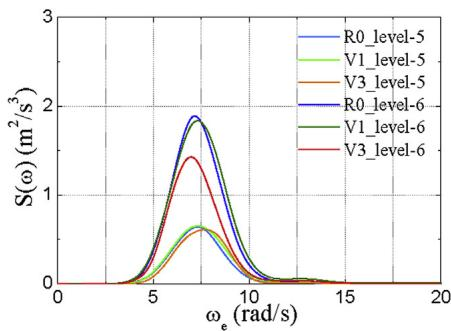

<details>
<summary>line</summary>

| ω_e (rad/s) | R0_level-5 | V1_level-5 | V3_level-5 | R0_level-6 | V1_level-6 | V3_level-6 |
|---|---|---|---|---|---|---|
| 0 | 0.0 | 0.0 | 0.0 | 0.0 | 0.0 | 0.0 |
| 5 | 0.8 | 0.4 | 0.2 | 1.9 | 1.7 | 1.4 |
| 10 | 0.1 | 0.1 | 0.1 | 0.1 | 0.1 | 0.1 |
| 15 | 0.0 | 0.0 | 0.0 | 0.0 | 0.0 | 0.0 |
| 20 | 0.0 | 0.0 | 0.0 | 0.0 | 0.0 | 0.0 |
</details>

(c) Bow acceleration at 18 knots

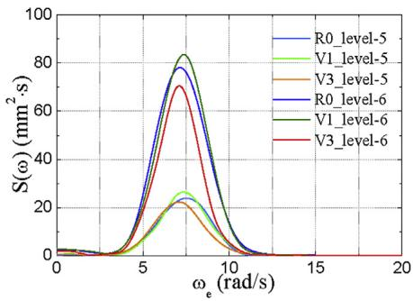

<details>
<summary>line</summary>

| ω_e (rad/s) | R0_level-5 | V1_level-5 | V3_level-5 | R0_level-6 | V1_level-6 | V3_level-6 |
| ----------- | ---------- | ---------- | ---------- | ---------- | ---------- | ---------- |
| 0           | 0          | 0          | 0          | 0          | 0          | 0          |
| 5           | ~20        | ~25        | ~20        | ~25        | ~30        | ~35        |
| 10          | ~80        | ~75        | ~70        | ~80        | ~75        | ~70        |
| 15          | ~20        | ~25        | ~20        | ~25        | ~30        | ~35        |
| 20          | 0          | 0          | 0          | 0          | 0          | 0          |
</details>

(d) Heave at 24 knots

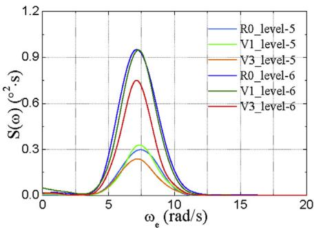

<details>
<summary>line</summary>

| ω_e (rad/s) | R0_level-5 | V1_level-5 | V3_level-5 | R0_level-6 | V1_level-6 | V3_level-6 |
| ----------- | ---------- | ---------- | ---------- | ---------- | ---------- | ---------- |
| 0           | 0.0        | 0.0        | 0.0        | 0.0        | 0.0        | 0.0        |
| 5           | 0.9        | 0.3        | 0.2        | 0.9        | 0.3        | 0.2        |
| 10          | 0.3        | 0.1        | 0.1        | 0.3        | 0.1        | 0.1        |
| 15          | 0.0        | 0.0        | 0.0        | 0.0        | 0.0        | 0.0        |
| 20          | 0.0        | 0.0        | 0.0        | 0.0        | 0.0        | 0.0        |
</details>

(e) Pitch at 24 knots

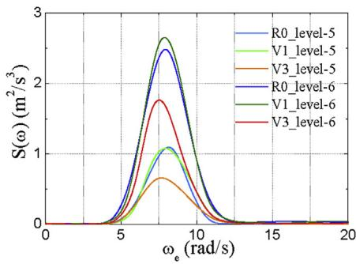

<details>
<summary>line</summary>

| ω_e (rad/s) | R0_level-5 | V1_level-5 | V3_level-5 | R0_level-6 | V1_level-6 | V3_level-6 |
| ----------- | ---------- | ---------- | ---------- | ---------- | ---------- | ---------- |
| 0           | 0          | 0          | 0          | 0          | 0          | 0          |
| 5           | ~0.5       | ~0.4       | ~0.3       | ~0.6       | ~0.7       | ~0.4       |
| 7.5         | ~2.5       | ~2.3       | ~1.8       | ~2.7       | ~2.8       | ~1.9       |
| 10          | ~1.0       | ~1.1       | ~0.8       | ~1.2       | ~1.3       | ~1.0       |
| 15          | ~0.1       | ~0.1       | ~0.1       | ~0.1       | ~0.1       | ~0.1       |
| 20          | 0          | 0          | 0          | 0          | 0          | 0          |
</details>

(f) Bow acceleration at 24 knots

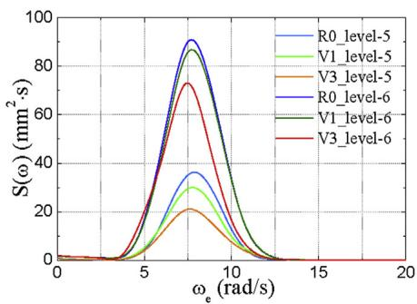

<details>
<summary>line</summary>

| ω_e (rad/s) | R0_level-5 | V1_level-5 | V3_level-5 | R0_level-6 | V1_level-6 | V3_level-6 |
| ----------- | ---------- | ---------- | ---------- | ---------- | ---------- | ---------- |
| 0           | 0          | 0          | 0          | 0          | 0          | 0          |
| 5           | ~20        | ~15        | ~10        | ~25        | ~20        | ~15        |
| 7.5         | ~90        | ~85        | ~70        | ~95        | ~85        | ~75        |
| 10          | ~40        | ~35        | ~25        | ~45        | ~40        | ~35        |
| 15          | ~5         | ~3         | ~2         | ~5         | ~3         | ~2         |
| 20          | 0          | 0          | 0          | 0          | 0          | 0          |
</details>

(g) Heave at 30 knots

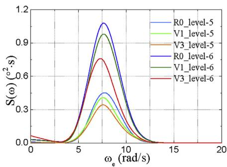

<details>
<summary>line</summary>

| ω_e (rad/s) | R0_level-5 | V1_level-5 | V3_level-5 | R0_level-6 | V1_level-6 | V3_level-6 |
| ----------- | ---------- | ---------- | ---------- | ---------- | ---------- | ---------- |
| 0           | 0.0        | 0.0        | 0.0        | 0.0        | 0.0        | 0.0        |
| 5           | 0.4        | 0.5        | 0.6        | 0.8        | 0.9        | 0.7        |
| 10          | 0.3        | 0.4        | 0.5        | 0.6        | 0.7        | 0.5        |
| 15          | 0.0        | 0.0        | 0.0        | 0.0        | 0.0        | 0.0        |
| 20          | 0.0        | 0.0        | 0.0        | 0.0        | 0.0        | 0.0        |
</details>

(h) Pitch at 30 knots

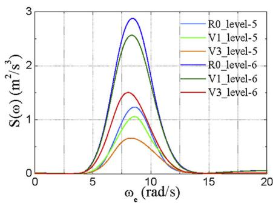

<details>
<summary>line</summary>

| ω_e (rad/s) | R0_level-5 | V1_level-5 | V3_level-5 | R0_level-6 | V1_level-6 | V3_level-6 |
|---|---|---|---|---|---|---|
| 0 | 0 | 0 | 0 | 0 | 0 | 0 |
| 5 | ~0.5 | ~0.8 | ~0.3 | ~1.2 | ~1.5 | ~1.4 |
| 10 | ~1.2 | ~1.0 | ~0.7 | ~2.8 | ~2.5 | ~1.5 |
| 15 | ~0.1 | ~0.1 | ~0.1 | ~0.1 | ~0.1 | ~0.1 |
| 20 | 0 | 0 | 0 | 0 | 0 | 0 |
</details>

(i) Bow acceleration at 30 knots

Fig. 17. Comparison of small-scale model response spectra.   
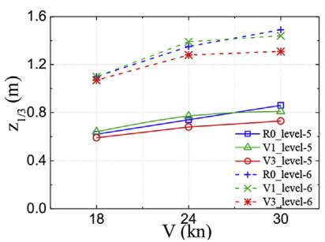

<details>
<summary>line</summary>

| V (kn) | R0_level-5 | V1_level-5 | V3_level-5 | R0_level-6 | V1_level-6 | V3_level-6 |
| ------ | ---------- | ---------- | ---------- | ---------- | ---------- | ---------- |
| 18     | 0.7        | 0.7        | 0.7        | 1.1        | 1.1        | 1.1        |
| 24     | 0.8        | 0.8        | 0.75       | 1.3        | 1.3        | 1.25       |
| 30     | 0.85       | 0.85       | 0.8        | 1.4        | 1.4        | 1.25       |
</details>

a) Heave

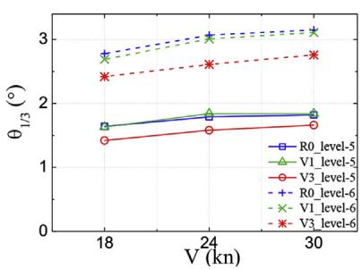

<details>
<summary>line</summary>

| V (kn) | R0_level-5 | V1_level-5 | V3_level-5 | R0_level-6 | V1_level-6 | V3_level-6 |
|---|---|---|---|---|---|---|
| 18 | 1.7 | 1.6 | 1.4 | 2.8 | 2.7 | 2.4 |
| 24 | 1.8 | 1.9 | 1.6 | 3.0 | 3.1 | 2.6 |
| 30 | 1.8 | 1.8 | 1.7 | 3.1 | 3.2 | 2.7 |
</details>

(b) Pitch

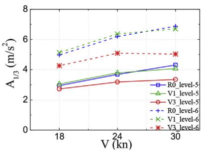

<details>
<summary>line</summary>

| V (kn) | R0_level-5 (m/s²) | V1_level-5 (m/s²) | V3_level-5 (m/s²) | R0_level-6 (m/s²) | V1_level-6 (m/s²) | V3_level-6 (m/s²) |
|---|---|---|---|---|---|---|
| 18 | 2.8 | 3.0 | 2.7 | 5.2 | 5.4 | 4.3 |
| 24 | 3.6 | 3.8 | 3.2 | 6.4 | 6.6 | 5.1 |
| 30 | 4.2 | 4.4 | 3.3 | 6.9 | 7.0 | 5.0 |
</details>

Bow acceleration   
Fig. 18. The SSA value of ship responses.

# 4.3. Comparison of numerical and experimental results

# 4.3.1. Regular wave results

The calculated RAOs for heave, pitch and bow acceleration of R0, V1

and V3 by the improved 2.5D seakeeping theory are summarized in Fig. 19. The computation conditions are in accordance with regular wave test, i.e. head waves at forward speeds 18 knots, 24 knots and 30 knots. In these graphs, the calculated RAOs are also used to compare with regular

Table 5 Response reduction rate in irregular waves. 

<table><tr><td rowspan="2">Scheme</td><td rowspan="2">Speed (knot)</td><td colspan="3">Level-5 wave state</td><td colspan="3">Level-6 wave state</td></tr><tr><td>Heave</td><td>Pitch</td><td>Acceleration</td><td>Heave</td><td>Pitch</td><td>Acceleration</td></tr><tr><td rowspan="3">V1 vs. R0</td><td>18</td><td>-3.2%</td><td>-1.1%</td><td>-3.4%</td><td>0.0%</td><td>1.3%</td><td>-3.2%</td></tr><tr><td>24</td><td>-4.1%</td><td>-2.8%</td><td>-2.7%</td><td>-3.0%</td><td>2.0%</td><td>-2.9%</td></tr><tr><td>30</td><td>5.8%</td><td>0.6%</td><td>5.6%</td><td>3.4%</td><td>3.2%</td><td>2.6%</td></tr><tr><td rowspan="3">V3 vs. R0</td><td>18</td><td>4.8%</td><td>8.8%</td><td>7.5%</td><td>2.7%</td><td>12.4%</td><td>14.3%</td></tr><tr><td>24</td><td>8.1%</td><td>11.7%</td><td>13.6%</td><td>5.2%</td><td>15.0%</td><td>17.8%</td></tr><tr><td>30</td><td>15.1%</td><td>13.4%</td><td>22.3%</td><td>12.1%</td><td>12.9%</td><td>26.9%</td></tr><tr><td rowspan="3">V3 vs. V1</td><td>18</td><td>7.8%</td><td>9.8%</td><td>10.5%</td><td>2.7%</td><td>11.3%</td><td>17.0%</td></tr><tr><td>24</td><td>11.7%</td><td>14.1%</td><td>15.9%</td><td>7.9%</td><td>13.3%</td><td>20.1%</td></tr><tr><td>30</td><td>9.9%</td><td>12.9%</td><td>17.7%</td><td>9.0%</td><td>10.0%</td><td>24.9%</td></tr></table>

wave test results.

The difference between calculated and measured regular wave results is shown in Table 6, where both mean and maximum differences for all the λ/L points in the curve are listed. As seen from the comparison, the results show good agreement between the calculation and measurement at speed 18 knots since the mean and maximum differences are less than 5.0% and 13.1%, respectively. While the calculation provides acceptable results with measurement at speed 24 and 30 knots conditions with mean and maximum difference less than 7.6% and 22.2%, respectively. On the other hand, although the calculated values are not completely coincide with the measurement in some conditions, the relative response values between different ships show the same trend between calculation and measurement. Thus the numerical approach is a very useful tool in ship preliminary design and optimization stage.

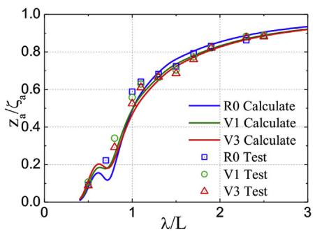

<details>
<summary>line</summary>

| λ/L | R0 Calculate | V1 Calculate | V3 Calculate | R0 Test | V1 Test | V3 Test |
| --- | --- | --- | --- | --- | --- | --- |
| 0.5 | 0.1 | 0.15 | 0.12 | 0.2 | 0.25 | 0.22 |
| 1.0 | 0.6 | 0.65 | 0.62 | 0.68 | 0.7 | 0.67 |
| 1.5 | 0.75 | 0.78 | 0.76 | 0.8 | 0.82 | 0.79 |
| 2.0 | 0.85 | 0.87 | 0.86 | 0.88 | 0.89 | 0.88 |
| 2.5 | 0.9 | 0.91 | 0.9 | 0.92 | 0.93 | 0.92 |
| 3.0 | 0.95 | 0.96 | 0.95 | 0.96 | 0.97 | 0.96 |
</details>

(a) Heave at 18 knots


<details>
<summary>line</summary>

| λ/L | R0 Calculate. | V1 Calculate. | V3 Calculate. | R0 Test | V1 Test | V3 Test |
| --- | --- | --- | --- | --- | --- | --- |
| 0.5 | 0.0 | 0.0 | 0.0 | 0.0 | 0.0 | 0.0 |
| 1.0 | 0.6 | 0.6 | 0.6 | 0.6 | 0.6 | 0.6 |
| 1.5 | 0.9 | 0.9 | 0.9 | 0.9 | 0.9 | 0.9 |
| 2.0 | 1.0 | 1.0 | 1.0 | 1.0 | 1.0 | 1.0 |
| 2.5 | 1.1 | 1.1 | 1.1 | 1.1 | 1.1 | 1.1 |
| 3.0 | 1.1 | 1.1 | 1.1 | 1.1 | 1.1 | 1.1 |
</details>

(b) Pitch at 18 knots


<details>
<summary>line</summary>

| λ/L | R0 Calculate | V1 Calculate | V3 Calculate | R0 Test | V1 Test | V3 Test |
|---|---|---|---|---|---|---|
| 0.5 | 12 | 10 | 8 | 15 | 12 | 10 |
| 1.0 | 40 | 39 | 33 | 42 | 31 | 34 |
| 1.5 | 30 | 29 | 26 | 28 | 24 | 27 |
| 2.0 | 15 | 14 | 13 | 16 | 13 | 14 |
| 2.5 | 8 | 7 | 6 | 9 | 7 | 8 |
| 3.0 | 5 | 4 | 3 | 5 | 4 | 5 |
</details>

(c) Bow acceleration at 18 knots


<details>
<summary>line</summary>

| λ/L | R0 Calculate | V1 Calculate | V3 Calculate | R0 Test | V1 Test | V3 Test |
| --- | --- | --- | --- | --- | --- | --- |
| 0.5 | 0.05 | 0.08 | 0.07 | 0.06 | 0.07 | 0.08 |
| 1.0 | 0.85 | 0.82 | 0.83 | 0.84 | 0.81 | 0.86 |
| 1.5 | 0.92 | 0.91 | 0.90 | 0.91 | 0.89 | 0.92 |
| 2.0 | 0.96 | 0.95 | 0.94 | 0.95 | 0.93 | 0.95 |
| 2.5 | 0.98 | 0.97 | 0.96 | 0.97 | 0.95 | 0.97 |
| 3.0 | 0.99 | 0.98 | 0.97 | 0.98 | 0.96 | 0.98 |
</details>

(d) Heave at 24 knots


<details>
<summary>line</summary>

| λ/L | R0 Calculate | V1 Calculate | V3 Calculate | R0 Test | V1 Test | V3 Test |
| --- | --- | --- | --- | --- | --- | --- |
| 0.5 | 0.0 | 0.0 | 0.0 | 0.0 | 0.0 | 0.0 |
| 1.0 | 0.6 | 0.6 | 0.6 | 0.6 | 0.6 | 0.6 |
| 1.5 | 0.9 | 0.9 | 0.9 | 0.9 | 0.9 | 0.9 |
| 2.0 | 1.1 | 1.1 | 1.1 | 1.1 | 1.1 | 1.1 |
| 2.5 | 1.15 | 1.15 | 1.15 | 1.15 | 1.15 | 1.15 |
| 3.0 | 1.15 | 1.15 | 1.15 | 1.15 | 1.15 | 1.15 |
</details>

() Pitch at 24 knots


<details>
<summary>line</summary>

| λ/L | R0 Calculate | V1 Calculate | V3 Calculate | R0 Test | V1 Test | V3 Test |
|---|---|---|---|---|---|---|
| 0.5 | 12 | 10 | 8 | 10 | 9 | 7 |
| 1.0 | 55 | 52 | 42 | 56 | 54 | 43 |
| 1.5 | 40 | 38 | 30 | 40 | 38 | 32 |
| 2.0 | 25 | 23 | 20 | 25 | 23 | 20 |
| 2.5 | 15 | 13 | 12 | 15 | 13 | 12 |
| 3.0 | 8 | 7 | 6 | 8 | 7 | 6 |
</details>

(f) Bow acceleration at 24 knots


<details>
<summary>line</summary>

| λ/L | R0 Calculate | V1 Calculate | V3 Calculate | R0 Test | V1 Test | V3 Test |
| --- | --- | --- | --- | --- | --- | --- |
| 0.5 | 0.0 | 0.0 | 0.0 | 0.0 | 0.0 | 0.0 |
| 1.0 | 0.6 | 0.6 | 0.6 | 0.7 | 0.7 | 0.7 |
| 1.5 | 0.9 | 0.9 | 0.9 | 0.95 | 0.95 | 0.95 |
| 2.0 | 0.95 | 0.95 | 0.95 | 0.98 | 0.98 | 0.98 |
| 2.5 | 0.98 | 0.98 | 0.98 | 0.99 | 0.99 | 0.99 |
| 3.0 | 0.99 | 0.99 | 0.99 | 1.0 | 1.0 | 1.0 |
</details>

(g) Heave at 30 knots


<details>
<summary>line</summary>

| λ/L | R0 Calculate | V1 Calculate | V3 Calculate | R0 Test | V1 Test | V3 Test |
| --- | ------------ | ------------ | ------------ | ------- | ------- | ------- |
| 0.5 | 0.0          | 0.0          | 0.0          | 0.0     | 0.0     | 0.0     |
| 1.0 | 0.6          | 0.6          | 0.6          | 0.6     | 0.6     | 0.6     |
| 1.5 | 1.0          | 1.0          | 1.0          | 1.0     | 1.0     | 1.0     |
| 2.0 | 1.2          | 1.2          | 1.2          | 1.2     | 1.2     | 1.2     |
| 2.5 | 1.2          | 1.2          | 1.2          | 1.2     | 1.2     | 1.2     |
| 3.0 | 1.2          | 1.2          | 1.2          | 1.2     | 1.2     | 1.2     |
</details>

(h) Pitch at 30 knots


<details>
<summary>line</summary>

| λ/L | R0 Calculate | V1 Calculate | V3 Calculate | R0 Test | V1 Test | V3 Test |
| --- | --- | --- | --- | --- | --- | --- |
| 0.5 | 5 | 5 | 5 | 5 | 5 | 5 |
| 1.0 | 65 | 60 | 50 | 60 | 65 | 50 |
| 1.5 | 55 | 50 | 45 | 45 | 50 | 40 |
| 2.0 | 40 | 35 | 30 | 30 | 35 | 25 |
| 2.5 | 25 | 20 | 15 | 15 | 20 | 10 |
| 3.0 | 10 | 8 | 5 | 5 | 8 | 5 |
</details>

(i) Bow acceleration at 30 knots   
Fig. 19. Comparison of results between calculation and tank tests.

Table 6 Difference between calculation and measurement results. 

<table><tr><td rowspan="2">Hull</td><td rowspan="2">Speed (knot)</td><td colspan="3">Mean</td><td colspan="3">Maximum</td></tr><tr><td>Heave</td><td>Pitch</td><td>Acceleration</td><td>Heave</td><td>Pitch</td><td>Acceleration</td></tr><tr><td rowspan="3">R0</td><td>18</td><td>4.0%</td><td>3.6%</td><td>5.0%</td><td>10.9%</td><td>7.9%</td><td>12.1%</td></tr><tr><td>24</td><td>7.6%</td><td>3.8%</td><td>4.8%</td><td>22.2%</td><td>8.0%</td><td>8.3%</td></tr><tr><td>30</td><td>7.4%</td><td>5.6%</td><td>5.7%</td><td>18.3%</td><td>10.2%</td><td>18.7%</td></tr><tr><td rowspan="3">V1</td><td>18</td><td>2.9%</td><td>2.9%</td><td>3.2%</td><td>8.9%</td><td>7.8%</td><td>7.2%</td></tr><tr><td>24</td><td>5.3%</td><td>3.4%</td><td>3.9%</td><td>18.2%</td><td>9.6%</td><td>10.8%</td></tr><tr><td>30</td><td>6.7%</td><td>5.8%</td><td>6.1%</td><td>18.2%</td><td>19.2%</td><td>22.0%</td></tr><tr><td rowspan="3">V3</td><td>18</td><td>3.1%</td><td>3.5%</td><td>2.8%</td><td>6.4%</td><td>6.1%</td><td>13.1%</td></tr><tr><td>24</td><td>3.2%</td><td>3.1%</td><td>4.0%</td><td>7.6%</td><td>7.0%</td><td>8.9%</td></tr><tr><td>30</td><td>4.9%</td><td>7.9%</td><td>5.2%</td><td>8.3%</td><td>19.3%</td><td>10.0%</td></tr></table>

# 4.3.2. Irregular wave results

Ship motion responses in irregular waves are numerically predicted based on the calculated transfer functions. In the linear spectral analysis theory, it is assumed that the ship motions are the output of a system linear to the input waves, which is expressed as follows:

$$
S (\omega_ {e}) = | R A O _ {e} | ^ {2} S _ {\zeta} (\omega_ {e}) \tag {70}
$$

where $S _ { \zeta } ( \omega _ { e } )$ denotes wave spectrum in encounter frequency, S(ω ) denotes encounter motion response spectrum and ${ \mathrm { R A O } } _ { \mathrm { e } }$ denotes RAO in encounter frequency.

The numerical predictions are made on R0, V1 and V3 corresponding to head waves at three forward speeds (18 knots, 24 knots and 30 knots) under wave states level-5 and level-6 (significant wave height 3.25 m and 5 m, respectively; mean period 8.5 s and 10.5 s, respectively), which is in accordance with the experimental conditions. The ISSC wave spectra are also adopted in the computation. To systematically compare the results, the SSA values in terms of heave, pitch and bow acceleration by numerical and experimental methods are summarized in Table 7. The comparison indicates that the calculated heave, pitch and acceleration values are generally in good agreement with the tank model testing results since majority of the differences are lower than 10%. However, the exceptions are the acceleration at 30 knots under wave state level-5, the heave at 24 knots under wave state level-5 and the acceleration at 24 knots under wave state level-6, the differences of which are 10.82%, 11.11% and 11.77%, respectively.

# 5. Large-scale model experimental setup

# 5.1. Model overview

In order to further investigate the seakeeping behavior of the two hulls (R0 and V3) in short-crested sea waves, two corresponding 1:19 large-scale self-propelled models were constructed. The model hulls were constructed using Fibre Reinforced Plastic (FRP) with a mean thickness of 10 mm to make them robust enough so that the deformation of hull in waves becomes negligible. Transverse bulkheads are provided to make the compartments watertight strengthen the ship hull and make the model safe enough in rough seas. A deck was placed above the COG on which ballast weights and equipment were attached. Fig. 20(a) and (b) show a comparative view of the two models and a stern view includes the rudders and propellers of R0, respectively. Fig. 20(c) and (d) show the local view of bow areas of R0 and V3, respectively.

Table 7 Comparison of results between numerical predictions and tank tests. 

<table><tr><td rowspan="2">Scheme</td><td rowspan="2" colspan="2">Speed (knot)</td><td colspan="3">Wave state level-5</td><td colspan="3">Wave state level-6</td></tr><tr><td>Heave (m)</td><td>Pitch (°)</td><td>Acceleration (m/s2)</td><td>Heave (m)</td><td>Pitch (°)</td><td>Acceleration (m/s2)</td></tr><tr><td rowspan="9">R0</td><td rowspan="3">18</td><td>Calculation</td><td>0.60</td><td>1.64</td><td>3.62</td><td>1.18</td><td>2.82</td><td>4.54</td></tr><tr><td>Experiment</td><td>0.62</td><td>1.64</td><td>3.68</td><td>1.10</td><td>2.78</td><td>4.97</td></tr><tr><td>Difference</td><td>-3.03%</td><td>0.21%</td><td>-1.63%</td><td>7.56%</td><td>1.36%</td><td>-8.65%</td></tr><tr><td rowspan="3">24</td><td>Calculation</td><td>0.68</td><td>1.70</td><td>3.80</td><td>1.33</td><td>2.93</td><td>5.84</td></tr><tr><td>Experiment</td><td>0.74</td><td>1.79</td><td>3.68</td><td>1.35</td><td>3.07</td><td>6.19</td></tr><tr><td>Difference</td><td>-8.49%</td><td>-5.30%</td><td>3.37%</td><td>-1.25%</td><td>-4.59%</td><td>-5.65%</td></tr><tr><td rowspan="3">30</td><td>Calculation</td><td>0.78</td><td>1.70</td><td>3.84</td><td>1.53</td><td>2.99</td><td>6.34</td></tr><tr><td>Experiment</td><td>0.86</td><td>1.82</td><td>4.31</td><td>1.49</td><td>3.15</td><td>6.88</td></tr><tr><td>Difference</td><td>-8.84%</td><td>-6.41%</td><td>-10.82%</td><td>2.98%</td><td>-5.13%</td><td>-7.86%</td></tr><tr><td rowspan="9">V1</td><td rowspan="3">18</td><td>Calculation</td><td>0.60</td><td>1.62</td><td>2.82</td><td>1.16</td><td>2.77</td><td>4.98</td></tr><tr><td>Experiment</td><td>0.64</td><td>1.63</td><td>3.04</td><td>1.10</td><td>2.69</td><td>5.13</td></tr><tr><td>Difference</td><td>-5.77%</td><td>-0.52%</td><td>-7.20%</td><td>5.86%</td><td>3.13%</td><td>-2.92%</td></tr><tr><td rowspan="3">24</td><td>Calculation</td><td>0.68</td><td>1.72</td><td>3.53</td><td>1.32</td><td>2.95</td><td>5.62</td></tr><tr><td>Experiment</td><td>0.77</td><td>1.84</td><td>3.78</td><td>1.39</td><td>3.01</td><td>6.37</td></tr><tr><td>Difference</td><td>-11.11%</td><td>-6.58%</td><td>-6.55%</td><td>-5.17%</td><td>-2.10%</td><td>-11.77%</td></tr><tr><td rowspan="3">30</td><td>Calculation</td><td>0.77</td><td>1.78</td><td>3.74</td><td>1.50</td><td>3.08</td><td>6.14</td></tr><tr><td>Experiment</td><td>0.81</td><td>1.84</td><td>4.07</td><td>1.44</td><td>3.11</td><td>6.70</td></tr><tr><td>Difference</td><td>-4.64%</td><td>-3.22%</td><td>-8.11%</td><td>3.97%</td><td>-0.88%</td><td>-8.36%</td></tr><tr><td rowspan="9">V3</td><td rowspan="3">18</td><td>Calculation</td><td>0.59</td><td>1.51</td><td>2.49</td><td>1.14</td><td>2.58</td><td>3.93</td></tr><tr><td>Experiment</td><td>0.59</td><td>1.42</td><td>2.72</td><td>1.07</td><td>2.42</td><td>4.26</td></tr><tr><td>Difference</td><td>-0.62%</td><td>6.49%</td><td>-8.46%</td><td>6.56%</td><td>6.65%</td><td>-7.75%</td></tr><tr><td rowspan="3">24</td><td>Calculation</td><td>0.66</td><td>1.52</td><td>2.93</td><td>1.29</td><td>2.66</td><td>4.72</td></tr><tr><td>Experiment</td><td>0.68</td><td>1.58</td><td>3.18</td><td>1.28</td><td>2.61</td><td>5.09</td></tr><tr><td>Difference</td><td>-2.67%</td><td>-4.02%</td><td>-8.01%</td><td>0.56%</td><td>1.75%</td><td>-7.27%</td></tr><tr><td rowspan="3">30</td><td>Calculation</td><td>0.72</td><td>1.56</td><td>3.23</td><td>1.42</td><td>2.72</td><td>5.17</td></tr><tr><td>Experiment</td><td>0.73</td><td>1.66</td><td>3.35</td><td>1.31</td><td>2.76</td><td>5.03</td></tr><tr><td>Difference</td><td>-1.39%</td><td>-6.23%</td><td>-3.71%</td><td>8.19%</td><td>-1.61%</td><td>2.85%</td></tr></table>

# 5.2. Experimental system

# 5.2.1. Sea wave buoy

An in-house developed wave buoy (Sun et al., 2016b) was used to measure the sea waves during large-scale model sea trial. Fig. 21(a) shows general arrangement of the designed buoy. An axial accelerometer, shown in Fig. 21(b), is fitted at COG of the buoy to measure the vertical acceleration in waves. An iron chain is connected at the bottom of the buoy to lower its barycentre and improve its stability. A spoiling flap is mounted on the middle of the buoy's outer surface to reduce the swing motion in waves. The lower part of the buoy is designed to be immersed in water during measurement. Fig. 21(c) shows a view of the buoy during wave measurement at sea.

The diameter of the buoy was determined so as to ensure that the buoy could accurately respond the coastal wave surface elevation. It is expected that the buoy moves synchronously with respect to the wave surface vertical elevation. Whereas, the pitch and roll motions are not expected since they would pollute the vertical acceleration signal. Fig. 22 shows the motion responses of buoy at different diameter induced by unit amplitude regular wave calculated by 3D frequency-domain potential flow theory. The buoy diameter was finally selected to be 0.4 m so as to respond the wave frequency range of interest and possibly prevent roll and pitch. Technique parameters regarding the buoy are listed in Table 8. The sampling frequency of accelerometer was set at 50 Hz during sea trial measurement.

# 5.2.2. Model equipment

A large-scale model testing system, which includes a propulsion system, remote control system and data acquisition system, was developed and assembled to allow the conduct of field experiments (Jiao et al., 2016c). Fig. 23 illustrates the general layout of the large-scale V3 model and onboard testing equipment. To propel the model, two brushless electric motors, twin screw propellers and their connections are installed at the stern of model. A remote control system has been developed in-house, which allows the model to be controlled by radio signal from an escort yacht. Framework of the model control system is concluded in Fig. 24. Through the dedicated remote control system it is possible to control and adjust the model's forward speed and heading from the escort yacht. In-house developed data acquisition software is used to record the experimental data. The data collector allows 16 channels sampling synchronously. The measured signals include three angles (i.e. heading, pitch and roll) and their angular rates, and three vertical accelerations (at bow, middle and stern). The exciting voltage detected by sensors is filtered by a second-order low-pass filter to remove high-frequency noise over 30 Hz, and it is then converted to digital signal via a 12-bit analog/digital (AD) converter. The digital signal is transmitted to a dedicated computer hard disk for storage via the data acquisition software.

# 5.3. Experimental procedure

Prior to the sea trial campaign, the models were tested in a calm water river. The onboard experimental system was debugged and floating state checked during the river trial (see Fig. 25). The relationship between model forward speed and motor speed was also calibrated in the river.

The sea trial campaign was conducted in a near-shore bay at Bohai Sea, which belongs to Dalian, China. Fig. 26 shows a satellite view of the experimental campaign field. Large scale model tests were conducted about 5 km distance away from the beach as a compromise between the potential risks and the experimental requirements. The average water depth is over 20 m, which can be regarded as infinite water depth for model testing. During the experiments, the wind blew from NNW to the coast at a speed of about 1.5 m/s. The dominant wave propagation direction was in accordance with the wind direction to ensure the waves acting on model are fully developed wind-generated waves. Moreover, the experiment site is well sheltered so as to prevent swell waves. The ocean current speed was less than 0.2 m/s, which is not considered in this study.

The large-scale model experimental measurements involved in this study (for the two models R0 and V3 and at two full-scale forward speeds 18 knots and 24 knots) were conducted within a relatively short period of time so as to ensure that the same wave states were suffered for all the testing conditions. The in situ wave buoy was used to monitor the wave


<details>
<summary>text_image</summary>

V3
DHM - 001
SMF - 001
R0
</details>

(a) Comparative view of the two models


<details>
<summary>natural_image</summary>

Exterior view of a large yellow aircraft fuselage mounted on red structural supports, with metallic propellers hanging below (no visible text or symbols)
</details>

Stern of RO


<details>
<summary>text_image</summary>

DO
SMF - 001
</details>

Bow of RO


<details>
<summary>text_image</summary>

DHM-001
</details>

(d) Bow of V3   
Fig. 20. Large-scale seakeeping models.


<details>
<summary>text_image</summary>

Seal ring
Handle
Lid
Damping flap
Ring
Deck
Accelerometer
Iron chain
</details>

(a) Scheme of the buoy


<details>
<summary>text_image</summary>

KASTLER
Tsim 815420AATTALO
35: 4035004
Machanakar, Bao
8.2 %
Bipolarilol, 1975 mmH
Tetraorine, 3.6 %
Machanakar, 1975 mmH
13.1 MHz
Ceramicar, 45 - 120 °C
KASTLER
BIPAROLATIATAO
BR-685004
CE CERICERT
KASTLER
BIPAROLATIATAO
BR-685004
CE CERICERT
</details>

() Accelerometer


<details>
<summary>natural_image</summary>

Ocean scene with floating buoys and distant city skyline under cloudy sky (no text or symbols)
</details>

) Working state

Fig. 21. Wave buoy meter.   


<details>
<summary>line</summary>

| ω (rad/s) | D=0.2 m | D=0.25 m | D=0.3 m | D=0.35 m | D=0.4 m | D=0.45 m | D=0.5 m |
| --------- | ------- | -------- | ------- | -------- | ------- | -------- | ------- |
| 0         | 1.0     | 1.0      | 1.0     | 1.0      | 1.0     | 1.0      | 1.0     |
| 2         | 1.0     | 1.0      | 1.0     | 1.0      | 1.0     | 1.0      | 1.0     |
| 4         | 1.2     | 1.3      | 1.4     | 1.5      | 1.6     | 1.7      | 1.8     |
| 6         | 1.8     | 1.9      | 1.9     | 1.9      | 1.9     | 1.9      | 1.9     |
| 8         | 1.5     | 1.6      | 1.7     | 1.7      | 1.7     | 1.7      | 1.7     |
| 10        | 0.5     | 0.6      | 0.7     | 0.7      | 0.7     | 0.7      | 0.7     |
| 12        | 0.0     | 0.0      | 0.0     | 0.0      | 0.0     | 0.0      | 0.0     |
</details>

(a) Heave RAO


<details>
<summary>line</summary>

| ω (rad/s) | D=0.2 m | D=0.25 m | D=0.3 m | D=0.35 m | D=0.4 m | D=0.45 m | D=0.5 m |
| --------- | ------- | -------- | ------- | -------- | ------- | -------- | ------- |
| 0         | 0       | 0        | 0       | 0        | 0       | 0        | 0       |
| 2         | ~0.5    | ~0.5     | ~0.5    | ~0.5     | ~0.5    | ~0.5     | ~0.5    |
| 4         | ~1.5    | ~1.5     | ~1.5    | ~1.5     | ~1.5    | ~1.5     | ~1.5    |
| 6         | ~3      | ~3       | ~3      | ~3       | ~3      | ~3       | ~3      |
| 8         | ~9      | ~6       | ~6      | ~6       | ~6      | ~6       | ~6      |
| 10        | ~7      | ~4       | ~4      | ~4       | ~4      | ~4       | ~4      |
| 12        | ~2      | ~1       | ~1      | ~1       | ~1      | ~1       | ~1      |
</details>

(b) Pitch or roll RAO   
Fig. 22. Motion response transfer function of buoy at different diameter.

Table 8 Technique parameter of the buoy. 

<table><tr><td>Item</td><td>Parameter</td></tr><tr><td>Diameter</td><td>0.4 m</td></tr><tr><td>Weight</td><td>16.75 kg</td></tr><tr><td>Acceleration scale range</td><td>±2 g</td></tr><tr><td>Acceleration accuracy</td><td>0.001 g</td></tr><tr><td>Wave height range</td><td>0.02–2 m</td></tr><tr><td>Wave frequency range</td><td>0–4 rad/s</td></tr><tr><td>Wave period range</td><td>1.57–50 s</td></tr><tr><td>Sampling frequency</td><td>10–10,000 Hz</td></tr></table>

state information during measurement. An auxiliary boat was used to carry, move and redeploy the buoy after each wave measurement so as to confirm that the wave field is stable in the testing area. During the sea trial, the models are tested at different control strategies, i.e. sea condition, forward speed and heading. As shown in Fig. 27, for each set of the wave condition and sailing speed, six directional runs were conducted so that six different relative wave headings were experienced (Nielsen and Stredulinsky, 2012). During the measurement, an auxiliary yacht which carries the crew ran and kept a distance from the model.

# 6. Analysis of large-scale model sea trial data

In this section, testing results of the two large-scale models are presented and analyzed. Experimental phenomena captured by video cameras are presented at first. Then large-scale model experimental data collected is presented and analyzed by spectral method. Response spectral curves and statistic significant values are also compared between R0 and V3.

# 6.1. General observations by video

During the sea trial, two video cameras were adopted to record model sailing state information: one was mounted on the deck and the other was held by crew on the auxiliary boat. Some examples of the recorded testing phenomena are illustrated in Fig. 28. Bow slamming and large amplitude pitch motion of R0 are observed in Fig. 28(a) and (b), respectively. Fig. 28(d) and (e) present the sailing states of V3 at different headings. Severe slamming and green wave pile up phenomena of R0 and V3 captured by deck video are shown in Fig. 28(c) and (f), respectively.

As seen from these photographs, it is obvious that nonlinear wavestructure interaction events, such as slamming and green water on deck, occurred. The model's navigation attitude observed is more similar to actual vessels sailing state in seaways compared with the towing tank model test. Therefore, large-scale model trial at sea will help getting real and accurate results for ship motion and load responses in seaways.

# 6.2. Examples of collected data

# 6.2.1. The sea waves

A group of wave measurements were taken by the wave buoy during the large-scale model sea trial. Fig. 29(a) shows an example of the measured vertical acceleration of wave surface. Frequency-domain information of the sea waves is acquired by the auto-correlation function method described in Section 4.2.1. Fig. 29(b) shows an example of the acquired wave spectra compared with the ISSC theoretical target spectrum in dimensionless format. According to the analysis result, the sea state is stable enough during the whole measurement period and in the overall testing area. The averaged significant wave height is 0.257 m (4.88 m corresponding to full-scale ship) and the averaged mean period is 2.53 s (11.03 s corresponding to full-scale ship), which is equivalent to sea state level-6 (significant wave height 5 m).


<details>
<summary>text_image</summary>

Rudder
Aft accelerometer
Battery pack
Middle accelerometer
Inclinometer
Radio antenna
Bow accelerometer
DHM-001
Propeller
Thrust bearing
DC motor
IMU
Data collector
SSB
20 18 16 14 12 10 8 6 4 2 0
</details>

Fig. 23. General layout of testing equipment.


<details>
<summary>flowchart</summary>

```mermaid
graph LR
    subgraph_Auxiliary_Boat["Auxiliary boat"]
        A1["Speed control"] --> B1["A/D converter"]
        C1["Rudder angle control"] --> B1
        D1["Function alt keys"] --> E1["MCU"]
        F1["Alarm"] --> E1
        G1["LCD screen interface"] --> E1
        E1 --> H1["Radio"]
    end

    subgraph_Model["Model"]
        I1["Radio"] --> J1["MCU"]
        J1 --> K1["Simulated voltage"]
        K1 --> L1["Motor"]
        L1 --> M1["Shaft"]
        M1 --> N1["Propeller"]
        O1["Step pulses"] --> P1["Torque drive unit"]
        P1 --> Q1["Rudder"]
    end
```
</details>

Fig. 24. Framework of model control system.


<details>
<summary>natural_image</summary>

River scene with a small boat on the water, industrial cranes in the background, and a bridge under a partly cloudy sky (no visible text or symbols)
</details>

Fig. 25. The river trial.

# 6.2.2. The model responses

Some examples of the measured time series of R0 in the above sea state are illustrated in Fig. 30. The corresponding model forward speed is about 2.12 m/s (18 knots at full-scale). Fig. 30(a) and (b) illustrate roll and pitch time series within 120 s, respectively. Their corresponding


<details>
<summary>natural_image</summary>

Satellite view of a coastal region with green vegetation, water body, and a 5 km scale marker (no text or symbols beyond scale)
</details>

Fig. 26. Satellite view of sea trial field.

angular rates are illustrated in Fig. 30(c) and (d), respectively. The heading angle is about 130 during this period as seen from Fig. 30(e). Example of acceleration time series at bow #0 station and middle ship #10 station is shown in Fig. 30(f). The heave motion of the model can be obtained by spectral analysis method using the vertical acceleration data amidships, which is described in Section 4.2.1.

# 6.2.3. Uncertainty analyses

According to the classification made in the report of the Seakeeping Committee in ITTC (2017), seven groups of uncertainties were identified in seakeeping tests: uncertainty of instruments, uncertainty of model mass properties, model geometry uncertainty, uncertainty of the test setup, calibration uncertainty, measurement uncertainty, and data reduction uncertainty. The uncertainty of measured data should be considered especially for the large-scale model experiments, which are mainly attributed to the lack of control over the sea environment. The uncertainties of the large-scale model experimental setup and the comparisons with tank tests are analyzed in this section.


<details>
<summary>flowchart</summary>


</details>

Fig. 27. Sketch of model run route.

Accurate measurement and description of the sea waves is the very first effort and the fundamental work for the evaluation of ship seakeeping performance in waves. In the tank, regular or long-crested irregular waves of expected parameters (e.g. wave height and period) can be accurately produced by computerized wave-maker. The resistive wave probe fixed in tank also has a good accuracy in the measurement of wave elevation (Yu et al., 2018). When it comes to the natural environment, the actual sea waves have a strong randomicity and nonlinearity, and they are characterized with broad-band frequency distribution and direction spreading. As mentioned in Section 5.2.1, the dedicated accelerometer based wave buoy is only responsible for the measurement of sea waves in a certain range of frequency. Moreover, the dominant wave direction is identified by visual observation and also based on wind direction, and the judgment accuracy is within 10. Therefore, the estimated significant wave height, wave period, wave spectra and dominant direction are associated with uncertainty. In addition to the measurement uncertainty, the coastal and near-shore waves may associate with shoaling, diffraction, refraction, reflection and breaking effects.

Although the data obtained by large-scale model is realistic, there are


Fig. 28. Experimental scenes captured by videos.   


<details>
<summary>line</summary>

| T (t) | A (m/s²) |
|-------|----------|
| 0     | 0        |
| 5     | -1       |
| 10    | 2        |
| 15    | -1       |
| 20    | 1        |
| 25    | -2       |
| 30    | 2        |
| 35    | -1       |
| 40    | 1        |
| 45    | -2       |
| 50    | 0        |
</details>

(a) Time series of vertical acceleration


<details>
<summary>line</summary>

| ω/ω₀ | Measurement 1 | Measurement 2 | Target |
|------|---------------|---------------|--------|
| 0.0  | 0.0           | 0.0           | 0.0    |
| 0.5  | 0.3           | 0.4           | 0.3    |
| 1.0  | 0.9           | 0.9           | 0.9    |
| 1.5  | 0.6           | 0.6           | 0.6    |
| 2.0  | 0.3           | 0.3           | 0.3    |
| 2.5  | 0.2           | 0.2           | 0.2    |
| 3.0  | 0.1           | 0.1           | 0.1    |
| 3.5  | 0.05          | 0.05          | 0.05   |
| 4.0  | 0.02          | 0.02          | 0.02   |
| 4.5  | 0.01          | 0.01          | 0.01   |
| 5.0  | 0.0           | 0.0           | 0.0    |
| 5.5  | 0.0           | 0.0           | 0.0    |
| 6.0  | 0.0           | 0.0           | 0.0    |
</details>

(b) Comparison of wave spectra   
Fig. 29. Measured wave data.


<details>
<summary>line</summary>

| T (s) | φ (°) |
|-------|-------|
| 0     | 0     |
| 10    | 0     |
| 20    | 0     |
| 30    | 0     |
| 40    | 0     |
| 50    | 0     |
| 60    | 0     |
| 70    | 0     |
| 80    | 0     |
| 90    | 0     |
| 100   | 0     |
| 110   | 0     |
| 120   | 0     |
</details>

(a) Roll


<details>
<summary>line</summary>

| T (s) | θ (°) |
|-------|-------|
| 0     | 0     |
| 10    | 1     |
| 20    | -3    |
| 30    | 2     |
| 40    | 1     |
| 50    | -2    |
| 60    | -4    |
| 70    | 2     |
| 80    | 1     |
| 90    | -3    |
| 100   | 2     |
| 110   | -1    |
| 120   | 0     |
</details>

(b) Pitch


<details>
<summary>line</summary>

| T (s) | φ' (°/s) |
|-------|----------|
| 0     | 0        |
| 10    | 5        |
| 20    | -5       |
| 30    | 15       |
| 40    | -10      |
| 50    | 10       |
| 60    | -20      |
| 70    | 20       |
| 80    | -5       |
| 90    | 10       |
| 100   | -10      |
| 110   | 15       |
| 120   | 0        |
</details>

Roll rate


<details>
<summary>line</summary>

| T (s) | θ' (°/s) |
|-------|----------|
| 0     | 0        |
| 10    | 3        |
| 20    | -4       |
| 30    | 5        |
| 40    | -6       |
| 50    | 4        |
| 60    | -7       |
| 70    | 3        |
| 80    | -5       |
| 90    | 4        |
| 100   | -6       |
| 110   | 3        |
| 120   | -4       |
</details>

() Pitch rate


<details>
<summary>line</summary>

| T (s) | β (°) |
|-------|-------|
| 0     | 135   |
| 20    | 135   |
| 40    | 135   |
| 60    | 135   |
| 80    | 135   |
| 100   | 135   |
| 120   | 135   |
</details>

e) Heading


<details>
<summary>line</summary>

| T (s) | Bow A (m/s²) | Middle A (m/s²) |
|-------|--------------|-----------------|
| 0     | ~0           | ~0              |
| 20    | ~-5          | ~0              |
| 40    | ~3           | ~0              |
| 60    | ~-3          | ~0              |
| 80    | ~3           | ~0              |
| 100   | ~-5          | ~0              |
| 120   | ~0           | ~0              |
</details>

(f) Accelerations   
Fig. 30. Examples of measured ship response time series.

more uncertainties associated with the large-scale model's responses measurement than tank model tests. For example, the laboratory carriage has a good speed accuracy of 0.001 m/s, and the model's course is well guided by the carriage and motion measurement system (Chen et al., 2017). However, the large-scale model's forward speed fluctuates due to the influence of added resistance and impact loads in random waves. The large-scale model's heading, which affects by the rudder efficiency and wave-induced yaw motion, fluctuates around the course bearing during navigation in seaways. During the sea trial, the fluctuation of navigational speed and heading angle of the large-scale models are lower than 0.1 m/s and 5, respectively. In addition, the transient slamming and green water loads acting on local structure also have some influence on heave, pitch and acceleration. The slamming loads have less effects on ship global pitch and heave motions, while will cause high-frequency components in vertical accelerations (Jiao and Ren, 2016).

# 6.3. Comparison of two large-scale models' responses

In order to visualize the frequency-domain information of large-scale models' responses, spectral transformation is performed on the measured time series. Figs.31 and 32 shows the comparison of two models response spectra in terms of heave, pitch, roll and bow acceleration for head waves under sea state level-6. Two representative ship speeds, 18 knots and 24 knots (2.12 m/s and 2.83 m/s at model scale, respectively), are selected for analysis.

As seen from the curves, the pitch and acceleration responses of R0 are larger than V3. It appears clearly that the spectral peak value of R0 is higher than that of V3 for all the cases. Moreover, the spectral frequency distribution of R0 is generally wider than V3 especially for accelerations. Due to the 3D effects of sea waves, the roll motion exists even the model sailing in head waves. The roll response of V3 is much lower than R0 due to the larger roll damping coefficient of deep V-shaped hull than round bilge hull.

Additionally, the full-scale SSA values of heave, pitch and bow acceleration are obtained based on the spectral analysis results, which are summarized in Fig. 33. As seen from the SSA values, with similar results observed from the spectral curves, the response of V3 is generally smaller than R0. The heave SSA value of V3 at 18 knots and 24 knots decreases by 6.10% and 5.26% compared with R0, respectively. The pitch value of V3 at 18 knots and 24 knots decreases by 14.71% and 14.34% compared with R0, respectively. The bow acceleration value at 18 knots and 24 knots reduces by 17.23% and 22.42%, respectively. To summarize, from the large-scale model sea trial results, it confirmed that the seakeeping behavior of deep-V hybrid hull is largely improved compared with the round bilge hull. Therefore, the objective of the large-scale model experimental campaign is well achieved.

# 7. Comparison of large and small scale models testing results

A comparison between the results by large-scale model sea trial and small-scale model towing tank test is undertaken to explore the difference in results caused by different environment configurations and incident wave fields. To compare with the small-scale model responses in 2D long-crested tank waves, large-scale model responses induced by


<details>
<summary>line</summary>

| ω_e (rad/s) | R0     | V3     |
| ----------- | ------ | ------ |
| 0           | 0.0    | 0.0    |
| 2           | 0.6    | 0.4    |
| 4           | 1.6    | 1.4    |
| 6           | 0.3    | 0.2    |
| 8           | 0.1    | 0.05   |
| 10          | 0.0    | 0.0    |
</details>

(a) Heave at 18kn


<details>
<summary>line</summary>

| ω_e (rad/s) | R0     | V3     |
| ----------- | ------ | ------ |
| 0           | 0.0    | 0.0    |
| 1           | 0.0    | 0.0    |
| 2           | 0.0    | 0.0    |
| 3           | 0.75   | 0.35   |
| 4           | 0.85   | 0.6    |
| 5           | 0.4    | 0.3    |
| 6           | 0.0    | 0.0    |
| 7           | 0.0    | 0.0    |
| 8           | 0.0    | 0.0    |
| 9           | 0.0    | 0.0    |
| 10          | 0.0    | 0.0    |
</details>

(b) Pitch at 18kn


<details>
<summary>line</summary>

| ω_e (rad/s) | R0     | V3     |
| ----------- | ------ | ------ |
| 0.0         | 0.0000 | 0.0000 |
| 0.5         | 0.0500 | 0.0200 |
| 1.0         | 0.2000 | 0.1000 |
| 1.5         | 0.4000 | 0.2500 |
| 2.0         | 0.7000 | 0.4000 |
| 2.5         | 1.2000 | 0.6000 |
| 3.0         | 1.5500 | 0.7500 |
| 3.5         | 1.2500 | 0.8000 |
| 4.0         | 0.7500 | 0.7500 |
| 4.5         | 0.4000 | 0.6500 |
| 5.0         | 0.2500 | 0.5500 |
| 5.5         | 0.1500 | 0.4500 |
| 6.0         | 0.1000 | 0.3500 |
| 6.5         | 0.0500 | 0.2500 |
| 7.0         | 0.0250 | 0.1500 |
| 7.5         | 0.0125 | 0.1000 |
| 8.0         | 0.0100 | 0.0750 |
| 8.5         | 0.0075 | 0.0500 |
| 9.0         | 0.0050 | 0.0250 |
| 9.5         | 0.0025 | 0.0125 |
| 10.0        | 0.0012 | 0.0100 |
</details>

(c) Roll at 18kn


<details>
<summary>line</summary>

| ω_e (rad/s) | R0     | V3     |
| ----------- | ------ | ------ |
| 0           | 0.0    | 0.0    |
| 1           | 0.2    | 0.1    |
| 2           | 0.4    | 0.3    |
| 3           | 0.8    | 0.6    |
| 4           | 1.5    | 0.9    |
| 5           | 1.1    | 0.7    |
| 6           | 0.6    | 0.4    |
| 7           | 0.3    | 0.2    |
| 8           | 0.1    | 0.1    |
| 9           | 0.0    | 0.0    |
| 10          | 0.0    | 0.0    |
</details>

(d) Bow acceleration at 18kn

Fig. 31. Spectral results of large-scale model tests at 18 knots.   


<details>
<summary>line</summary>

| ω_e (rad/s) | R0    | V3    |
| ----------- | ----- | ----- |
| 0           | 0.0   | 0.0   |
| 2           | 0.3   | 0.4   |
| 4           | 2.0   | 1.9   |
| 6           | 0.7   | 0.6   |
| 8           | 0.1   | 0.1   |
| 10          | 0.0   | 0.0   |
</details>

(a) Heave at 24kn


<details>
<summary>line</summary>

| ω_e (rad/s) | R0    | V3    |
| ----------- | ----- | ----- |
| 0           | 0.0   | 0.0   |
| 2           | 0.0   | 0.0   |
| 4           | 1.1   | 0.8   |
| 6           | 0.0   | 0.0   |
| 8           | 0.0   | 0.0   |
| 10          | 0.0   | 0.0   |
</details>

(b) Pitch at 24kn


<details>
<summary>line</summary>

| ω_e (rad/s) | R0     | V3     |
| ----------- | ------ | ------ |
| 0           | 0.0000 | 0.0000 |
| 1           | 0.1000 | 0.0500 |
| 2           | 1.5000 | 0.3000 |
| 3           | 1.1000 | 0.5000 |
| 4           | 0.4000 | 0.3500 |
| 5           | 0.1500 | 0.1500 |
| 6           | 0.0500 | 0.0500 |
| 7           | 0.0200 | 0.0200 |
| 8           | 0.0100 | 0.0100 |
| 9           | 0.0050 | 0.0050 |
| 10          | 0.0025 | 0.0025 |
</details>

(c) Roll at 24kn


<details>
<summary>line</summary>

| ω_e (rad/s) | R0     | V3     |
| ----------- | ------ | ------ |
| 0           | 0.0    | 0.0    |
| 1           | 0.1    | 0.05   |
| 2           | 0.5    | 0.2    |
| 3           | 1.2    | 0.6    |
| 4           | 1.9    | 1.1    |
| 5           | 1.7    | 0.8    |
| 6           | 1.2    | 0.4    |
| 7           | 0.6    | 0.2    |
| 8           | 0.2    | 0.1    |
| 9           | 0.1    | 0.05   |
| 10          | 0.0    | 0.0    |
</details>

(d) Bow acceleration at 24kn   
Fig. 32. Spectral results of large-scale model tests at 24 knots.


<details>
<summary>line</summary>

| V (knot) | R0   | V3   |
| -------- | ---- | ---- |
| 18       | 0.85 | 0.75 |
| 24       | 0.95 | 0.90 |
</details>

a) Heave


<details>
<summary>line</summary>

| V (knot) | R0   | V3   |
| -------- | ---- | ---- |
| 18       | 2.4  | 2.0  |
| 24       | 2.5  | 2.1  |
</details>

() Pitch


<details>
<summary>line</summary>

| V (knot) | R0   | V3   |
| -------- | ---- | ---- |
| 18       | 3.5  | 2.9  |
| 24       | 4.5  | 3.5  |
</details>

(c) Bow acceleration   
Fig. 33. The SSA values of model vertical responses.

dominant component waves are estimated. Then the comparison between model responses induced by the oncoming waves is also made.

# 7.1. Comparison of response spectra

The differences in spectral results caused by different testing approaches are analyzed in this section. Figs. 34–36 show the comparative dimensionless response spectra of heave, pitch and bow acceleration obtained by different scaled models. The comparative responses are in the equivalent sea state level-6 and at two speeds 18 knots and 24 knots.

As seen from the dimensionless spectral curves, the pitch spectra by small-scale model are in good agreement with those by large-scale model for all the cases. An exception to the good agreement is that the peak value of small-scale model pitch spectra is slightly higher than large-scale one. However, the difference in heave and bow acceleration spectra between different models is remarkable. It is clear that the spectral density of small-scale model acceleration concentrates around the peak frequency with a narrow-band distribution. However, spectral density of the large-scale model acceleration disperses over a broad-band frequency range. This can be attributed to the 3D effects of sea waves. It can be explained by the fact that the component sea waves have considerable influence on heave and acceleration, while have little influence on pitch, which is also turned out in Section 7.2.3.

# 7.2. Comparison of response statistical values

# 7.2.1. Description of sea waves by directional spectrum

Considering the fact that the incident wave fields for large and small scale model experiments are quite different, the short-crested sea waves should therefore be described by directional spectral density function. However, as stated in Section 6.2.1, the single point wave buoy used during measurement could only provide the overall spectrum information, which considers the contribution of component waves from all the directions. In order to address the limitations of the current wave buoy, a theoretical directional spreading function is adopted. The directional wave spectrum is described by the combination of an overall spectrum Sζ(ω) from measurement and a theoretical directional spreading function D(ω,θ):

$$
S (\omega , \theta) = S _ {\zeta} (\omega) D (\omega , \theta) \tag {71}
$$

where the theoretical direction function in this study is selected to be:


<details>
<summary>line</summary>

| ω/ω₀ | Large | Small |
|------|-------|-------|
| 0.0  | 0.0   | 0.0   |
| 0.5  | 0.6   | 0.8   |
| 1.0  | 1.5   | 1.8   |
| 1.5  | 0.6   | 0.8   |
| 2.0  | 0.1   | 0.1   |
| 2.5  | 0.0   | 0.0   |
| 3.0  | 0.0   | 0.0   |
</details>

(a) Heave of R0 at 18 knots


<details>
<summary>line</summary>

| ω/ω₀ | Large | Small |
|------|-------|-------|
| 0.0  | 0.0   | 0.0   |
| 0.5  | 0.8   | 1.2   |
| 1.0  | 1.5   | 2.0   |
| 1.5  | 1.2   | 1.7   |
| 2.0  | 0.1   | 0.1   |
| 2.5  | 0.0   | 0.0   |
| 3.0  | 0.0   | 0.0   |
</details>

(b) Heave of R0 at 24 knots


<details>
<summary>line</summary>

| ω/ω₀ | Large | Small |
|------|-------|-------|
| 0.0  | 0.0   | 0.0   |
| 0.5  | 0.5   | 0.3   |
| 1.0  | 1.7   | 2.0   |
| 1.5  | 1.4   | 1.8   |
| 2.0  | 0.2   | 0.1   |
| 2.5  | 0.0   | 0.0   |
| 3.0  | 0.0   | 0.0   |
</details>

(c) Heave of V3 at 18 knots


<details>
<summary>line</summary>

| ω/ω₀ | Large | Small |
|------|-------|-------|
| 0.0  | 0.0   | 0.0   |
| 0.5  | 0.4   | 0.6   |
| 1.0  | 1.6   | 2.2   |
| 1.5  | 1.1   | 0.7   |
| 2.0  | 0.1   | 0.0   |
| 2.5  | 0.0   | 0.0   |
| 3.0  | 0.0   | 0.0   |
</details>

(d) Heave of V3 at 24 knots   
Fig. 34. Comparison of dimensionless heave spectra.


<details>
<summary>line</summary>

| ω/ω₀ | Large | Small |
|------|-------|-------|
| 0.0  | 0.0   | 0.0   |
| 0.5  | 0.5   | 0.6   |
| 1.0  | 2.4   | 2.7   |
| 1.5  | 0.8   | 0.9   |
| 2.0  | 0.1   | 0.1   |
| 2.5  | 0.0   | 0.0   |
| 3.0  | 0.0   | 0.0   |
</details>

(a) Pitch of R0 at 18 knots


<details>
<summary>line</summary>

| ω/ω₀ | Large | Small |
|------|-------|-------|
| 0.0  | 0.0   | 0.0   |
| 0.2  | 0.0   | 0.0   |
| 0.4  | 0.1   | 0.1   |
| 0.6  | 0.5   | 0.6   |
| 0.8  | 1.0   | 1.2   |
| 1.0  | 2.2   | 2.3   |
| 1.2  | 1.8   | 1.7   |
| 1.4  | 0.5   | 0.4   |
| 1.6  | 0.1   | 0.1   |
| 1.8  | 0.0   | 0.0   |
| 2.0  | 0.0   | 0.0   |
| 2.2  | 0.0   | 0.0   |
| 2.4  | 0.0   | 0.0   |
| 2.6  | 0.0   | 0.0   |
| 2.8  | 0.0   | 0.0   |
| 3.0  | 0.0   | 0.0   |
</details>

(b) Pitch of R0 at 24 knots


<details>
<summary>line</summary>

| ω/ω₀ | Large | Small |
|------|-------|-------|
| 0.0  | 0.0   | 0.0   |
| 0.2  | 0.1   | 0.1   |
| 0.4  | 0.3   | 0.4   |
| 0.6  | 0.8   | 1.2   |
| 0.8  | 1.5   | 1.8   |
| 1.0  | 2.2   | 2.7   |
| 1.2  | 1.8   | 1.5   |
| 1.4  | 0.9   | 0.8   |
| 1.6  | 0.3   | 0.2   |
| 1.8  | 0.1   | 0.1   |
| 2.0  | 0.0   | 0.0   |
| 2.2  | 0.0   | 0.0   |
| 2.4  | 0.0   | 0.0   |
| 2.6  | 0.0   | 0.0   |
| 2.8  | 0.0   | 0.0   |
| 3.0  | 0.0   | 0.0   |
</details>

c) Pitch of V3 at 18 knots


<details>
<summary>line</summary>

| Ω/ω₀ | Large | Small |
|------|-------|-------|
| 0.0  | 0.0   | 0.0   |
| 0.2  | 0.0   | 0.0   |
| 0.4  | 0.1   | 0.1   |
| 0.6  | 0.5   | 0.6   |
| 0.8  | 1.2   | 1.4   |
| 1.0  | 2.0   | 2.3   |
| 1.2  | 1.5   | 1.7   |
| 1.4  | 0.8   | 0.9   |
| 1.6  | 0.3   | 0.4   |
| 1.8  | 0.1   | 0.1   |
| 2.0  | 0.0   | 0.0   |
| 2.2  | 0.0   | 0.0   |
| 2.4  | 0.0   | 0.0   |
| 2.6  | 0.0   | 0.0   |
| 2.8  | 0.0   | 0.0   |
| 3.0  | 0.0   | 0.0   |
</details>

(d) Pitch of V3 at 24 knots

Fig. 35. Comparison of dimensionless pitch spectra.   


<details>
<summary>line</summary>

| ω/ω₀ | Large | Small |
|------|-------|-------|
| 0.0  | 0.0   | 0.0   |
| 0.5  | 0.6   | 0.3   |
| 1.0  | 1.3   | 2.1   |
| 1.5  | 0.8   | 1.5   |
| 2.0  | 0.2   | 0.1   |
| 2.5  | 0.0   | 0.0   |
| 3.0  | 0.0   | 0.0   |
</details>

(a) Bow acceleration of R0 at 18 knots


<details>
<summary>line</summary>

| ω/ω₀ | Large | Small |
|------|-------|-------|
| 0.0  | 0.0   | 0.0   |
| 0.5  | 0.6   | 0.7   |
| 1.0  | 1.4   | 2.1   |
| 1.5  | 1.0   | 1.5   |
| 2.0  | 0.2   | 0.1   |
| 2.5  | 0.0   | 0.0   |
| 3.0  | 0.0   | 0.0   |
</details>

(b) Bow acceleration of R0 at 24 knots


<details>
<summary>line</summary>

| ω/ω₀ | Large | Small |
|------|-------|-------|
| 0.0  | 0.0   | 0.0   |
| 0.2  | 0.1   | 0.0   |
| 0.4  | 0.3   | 0.1   |
| 0.6  | 0.7   | 0.5   |
| 0.8  | 1.2   | 1.6   |
| 1.0  | 1.4   | 2.2   |
| 1.2  | 1.2   | 1.6   |
| 1.4  | 0.8   | 0.5   |
| 1.6  | 0.4   | 0.2   |
| 1.8  | 0.1   | 0.0   |
| 2.0  | 0.0   | 0.0   |
| 2.2  | 0.0   | 0.0   |
| 2.4  | 0.0   | 0.0   |
| 2.6  | 0.0   | 0.0   |
| 2.8  | 0.0   | 0.0   |
| 3.0  | 0.0   | 0.0   |
</details>

(c) Bow acceleration of V3 at 18 knots


<details>
<summary>line</summary>

| ω/ω₀ | Large | Small |
|------|-------|-------|
| 0.0  | 0.0   | 0.0   |
| 0.2  | 0.1   | 0.1   |
| 0.4  | 0.3   | 0.3   |
| 0.6  | 0.7   | 0.8   |
| 0.8  | 1.2   | 1.5   |
| 1.0  | 1.8   | 2.3   |
| 1.2  | 1.5   | 1.8   |
| 1.4  | 1.0   | 1.2   |
| 1.6  | 0.5   | 0.6   |
| 1.8  | 0.2   | 0.3   |
| 2.0  | 0.1   | 0.1   |
| 2.2  | 0.0   | 0.0   |
| 2.4  | 0.0   | 0.0   |
| 2.6  | 0.0   | 0.0   |
| 2.8  | 0.0   | 0.0   |
| 3.0  | 0.0   | 0.0   |
</details>

(d) Bow acceleration of V3 at 24 knots   
Fig. 36. Comparison of dimensionless bow acceleration spectra.

$$
D (\omega , \theta) = \left\{ \begin{array}{c c} 2 \cos^ {2} \theta / \pi , & - \frac {\pi}{2} \leq \theta \leq \frac {\pi}{2} \\ 0, & \text { elsewhere } \end{array} \right. \tag {72}
$$

The simulated directional spectra by using the measured overall spectra (in Fig. 29(b)) and the above theoretical directional spreading function are presented in Fig. 37.

Dominant waves are then extracted from the overall sea waves by substituting θ ¼ 0 into Eq. (71)–(72). The wave spectrum corresponding to the dominant sea waves is obtained by:

$$
S (\omega , 0) = 2 S _ {\zeta} (\omega) / \pi \tag {73}
$$

The full-scale wave parameters for tank waves, sea waves and dominant sea waves are summarized in Table 9. In the table, the wave parameters for tank waves and sea waves are calculated by using the wave time series, while the parameters for dominant sea waves are derived by Equation (73) using the overall sea wave parameters.

# 7.2.2. Direct comparison of ship SSA values

The response statistical values of models by different testing methods are compared in this section. Fig. 38 shows a direct comparison of fullscale ship SSA values of vertical motion responses by large-scale model sea trial and small-scale model tank test under equivalent sea state level-6. As seen from the statistical results, the vertical response values by small-scale model tank test are generally 20–30% greater than large-scale model sea trial results. This is mainly caused by the difference in incident wave fields between short-crested sea waves and long-crested tank waves. Moreover, the difference in pitch is smaller than heave and acceleration, which indicates the same phenomenon as obtained from Figs. 34–36.

# 7.2.3. Comparison of ship SSA values in dominant waves

To investigate the ship vertical motion responses induced by different wave schemes, responses of ship under unit significant wave height are calculated. Table 10 lists the full-scale ship responses induced by different incident wave schemes under unit significant wave height. The response for “sea wave” and “tank wave” are obtained by dividing the ship response by the corresponding significant wave height directly, while the response for “dominant sea wave” are obtained by dividing the large-scale model response by the significant wave height of dominant sea waves. For clarity, Fig. 39 shows the comparison of ship responses induced by dominant sea waves and those induced by tank waves under unit significant wave height.

As seen from the results, the vertical motion responses of large-scale model under unit wave height induced by dominant waves are close to the small-scale model tank test results. Therefore, it is concluded that the hull vertical responses in short-crested waves are mainly induced by dominant direction waves. The component incident waves, even though contributed to the overall wave height, have less effect on hull vertical responses.

Moreover, it is concluded that the small-scale model long-crested irregular wave test overestimates the response of ship in a specified sea condition compared with the real condition. The vertical motions by large-scale models in 3D waves are more realistic. Thus the large-scale model test is a potential tool which provides reliable results for the prediction of ship responses in actual sea waves.

Table 9 Comparison of wave parameters for sea state level-6. 

<table><tr><td>Parameter</td><td>Tank waves</td><td>Sea waves</td><td>Dominant sea waves</td></tr><tr><td>Significant wave height (m)</td><td>4.95</td><td>4.88</td><td>3.89</td></tr><tr><td>Mean period (s)</td><td>10.88</td><td>11.03</td><td>11.03</td></tr></table>

# 7.3. Comprehensive comparison of motion reduction rate

To comprehensively investigate the effects of bow appendages on motion stabilization, response reduction rates of V3 with respect to R0 obtained by different approaches are summarized in Table 11. It is noted that sea trial results are obtained based on the actual measured statistical SSA values in Fig. 38. The results indicate that good agreement in terms of response reduction rate among different approaches is achieved; and vertical motions of V3 largely reduced compared with R0. Therefore, the objective of improving ship vertical motion stability by SSB and fins scheme is also well achieved.

# 8. Conclusions and recommendations

In this paper, a set of seakeeping analyses were undertaken on hybrid hulls by different approaches: improved 2.5D theoretical calculation, 1:40 small-scale model laboratory towing tank test and 1:19 large-scale model sea trial. The results by different approaches were systematically analyzed and compared. The scheme for improving ship vertical motion stability by using SSB and fins is made feasible. The large-scale model seakeeping measurement in realistic sea waves is also turned out to be feasible and applicable as a final confirmation tool for ship design and construction. Based on the work carried out in this study, the following conclusions can be drawn.

(1) The improved strip theory based 2.5D seakeeping algorithm is capable of estimating the wave-induced vertical motion responses of high speed hybrid hull equipped with SSB and fins. The viscous flow effects caused by bow appendages can be well estimated by introducing the hydrodynamic terms into the motion governing equations. It turned out that the proposed algorithm is very useful at ship preliminary design and optimization stage since the relative trend exhibits very good agreement between calculated and testing results for the ships.   
(2) The objective of development of deep-V hybrid hull for good seakeeping performance is well achieved as indicated from this study. It clearly demonstrated that both SSB and fins are of significance in the reduction of ship vertical motions through both


<details>
<summary>contour</summary>

| ω (rad/s) | S(ω,θ) (m²·s) |
| --------- | ------------- |
| 0         | 0.0000        |
| 2         | 0.0002        |
| 4         | 0.0010        |
| 6         | 0.0008        |
| 8         | 0.0004        |
| 90        | 0.0002        |
</details>

(a) Measurement 1


<details>
<summary>contour</summary>

| ω (rad/s) | S(ω,θ) (m²·s) |
| --------- | ------------- |
| 0         | 0.0000        |
| 2         | 0.0002        |
| 4         | 0.0010        |
| 6         | 0.0008        |
| 8         | 0.0004        |
| 90        | 0.0002        |
</details>

(b) Measurement 2   
Fig. 37. Directional wave spectra.


<details>
<summary>bar</summary>

| Knot Count | Model Test | Z1/3 (m) |
| :--- | :--- | :--- |
| 18 knots | R0_large | 0.82 |
| 18 knots | R0_Small | 1.10 |
| 18 knots | V3_large | 0.77 |
| 18 knots | V3_Small | 1.07 |
| 24 knots | R0_large | 0.95 |
| 24 knots | R0_Small | 1.35 |
| 24 knots | V3_large | 0.90 |
| 24 knots | V3_Small | 1.28 |
</details>

a) Heave


<details>
<summary>bar</summary>

| Knot Count | Model Test Type | R0_large model test (°) | R0_Small model test (°) | V3_large model test (°) | V3_Small model test (°) |
|---|---|---|---|---|---|
| 18 knots | R0 | 2.38 | 2.78 | 2.03 | 2.42 |
| 18 knots | Small | 2.38 | 2.78 | 2.03 | 2.42 |
| 24 knots | R0 | 2.51 | 3.07 | 2.15 | 2.61 |
| 24 knots | Small | 2.51 | 3.07 | 2.15 | 2.61 |
</details>

(b) Pitch


<details>
<summary>bar</summary>

| Knot Size | Model Type | Test Type | A₁/₃ (m/s²) |
| :--- | :--- | :--- | :--- |
| 18 knots | R0 | Large | 3.54 |
| 18 knots | R0 | Small | 4.97 |
| 18 knots | V3 | Large | 2.93 |
| 18 knots | V3 | Small | 4.26 |
| 24 knots | R0 | Large | 4.55 |
| 24 knots | R0 | Small | 6.19 |
| 24 knots | V3 | Large | 3.53 |
| 24 knots | V3 | Small | 5.09 |
</details>

c) Bow acceleration   
Fig. 38. A direct comparison of ship responses by different testing methods.

Table 10 Ship responses induced by unit significant wave height. 

<table><tr><td rowspan="2">Speed (knots)</td><td rowspan="2">Scheme</td><td colspan="3">Heave (m)</td><td colspan="3">Pitch (°)</td><td colspan="3">Acceleration (m/s2)</td></tr><tr><td>Sea wave</td><td>Dominant sea wave</td><td>Tank wave</td><td>Sea wave</td><td>Dominant sea wave</td><td>Tank wave</td><td>Sea wave</td><td>Dominant sea wave</td><td>Tank wave</td></tr><tr><td rowspan="2">18</td><td>R0</td><td>0.168</td><td>0.211</td><td>0.222</td><td>0.488</td><td>0.612</td><td>0.562</td><td>0.725</td><td>0.910</td><td>1.004</td></tr><tr><td>V3</td><td>0.195</td><td>0.244</td><td>0.273</td><td>0.514</td><td>0.645</td><td>0.620</td><td>0.932</td><td>1.170</td><td>1.251</td></tr><tr><td rowspan="2">24</td><td>R0</td><td>0.158</td><td>0.198</td><td>0.216</td><td>0.416</td><td>0.522</td><td>0.527</td><td>0.600</td><td>0.753</td><td>0.861</td></tr><tr><td>V3</td><td>0.184</td><td>0.231</td><td>0.259</td><td>0.441</td><td>0.553</td><td>0.489</td><td>0.723</td><td>0.907</td><td>1.028</td></tr></table>


<details>
<summary>bar</summary>

| Knot Type | Model Type | R0_Large model test | V3_Large model test | R0_Small model test | V3_Small model test |
| :--- | :--- | :--- | :--- | :--- | :--- |
| 18 knots | R0 | 0.211 | 0.244 | 0.273 | 0.273 |
| 18 knots | Small | 0.222 | 0.273 | 0.273 | 0.273 |
| 24 knots | R0 | 0.198 | 0.231 | 0.216 | 0.259 |
| 24 knots | Small | 0.216 | 0.231 | 0.259 | 0.259 |
</details>

(a) Heave


<details>
<summary>bar</summary>

| Knot Count | Model Test | R0_large | R0_Small | V3_large | V3_Small |
|---|---|---|---|---|---|
| 18 knots | Large | 0.612 | 0.562 | 0.522 | 0.489 |
| 24 knots | Large | 0.645 | 0.620 | 0.553 | 0.527 |
</details>

(b) Pitch


<details>
<summary>bar</summary>

| Knot Count | Model Type | R0_large model test | V3_large model test | R0_small model test | V3_small model test |
| :--- | :--- | :--- | :--- | :--- | :--- |
| 18 knots | Large | 0.910 | 1.170 | 1.004 | 1.251 |
| 18 knots | Small | 0.910 | 1.170 | 1.004 | 1.251 |
| 24 knots | Large | 0.753 | 0.907 | 0.861 | 1.028 |
</details>

c) Bow acceleration   
Fig. 39. Ship responses induced by dominant waves under unit significant wave height.

Table 11 Motion reduction rate of V3 versus R0. 

<table><tr><td>Item</td><td></td><td>18 knots</td><td>24 knots</td></tr><tr><td rowspan="3">Heave</td><td>Calculation</td><td>3.4%</td><td>3.0%</td></tr><tr><td>Tank test</td><td>2.7%</td><td>5.2%</td></tr><tr><td>Sea trial</td><td>6.1%</td><td>5.3%</td></tr><tr><td rowspan="3">Pitch</td><td>Calculation</td><td>8.5%</td><td>9.2%</td></tr><tr><td>Tank test</td><td>12.9%</td><td>15.0%</td></tr><tr><td>Sea trial</td><td>14.7%</td><td>14.3%</td></tr><tr><td rowspan="3">Bow acceleration</td><td>Calculation</td><td>13.4%</td><td>19.2%</td></tr><tr><td>Tank test</td><td>14.3%</td><td>17.8%</td></tr><tr><td>Sea trial</td><td>17.2%</td><td>22.4%</td></tr></table>

the numerical and experimental investigations. In general, the SSB and fins have more effects on pitch and acceleration stability than heave. Moreover, the SSB scheme is of great help especially in rough conditions (severe wave, high speed or both).

(3) Testing large-scale models in 3D sea waves is more realistic than tank test. According to the video recordings, large-scale models' sailing attitude at sea is quite similar with full-scale vessel sailing state in seaways. The vertical responses of large-scale model in 3D

sea waves are generally smaller than long-crested wave tank test even in an equivalent sea state, which means that the conventional tank test may overestimate ship vertical motions and provides conservative results for ship design. Moreover, the vertical motion responses of ship sailing in head sea waves are mainly induced by the dominant direction waves, whereas the roll motion is mainly induced by the component sea waves.

(4) The large-scale model testing technique turned out to be feasible as a supplement of the traditional tank test. Although with some disadvantages such as sea state uncontrollable, large-scale model testing approach is still a potential tool for the investigation of ship responses in actual seaways. It should be mentioned that the conventional tank test certainly has its obvious advantages such as environment well-controlled and testing conditions repeatable. However, some rarely occurring events and severe wave-structure interaction phenomena happened on full-scale ship can be hardly reproduced by tank model tests.

According to the research progress in naval architecture and ocean engineering, testing large-scale models in actual wave environment is a future development tendency. In this paper, spectral analysis technique is applied to analyze large-scale models' motion responses, which is intrinsically linked to linear theory. In our future work, time-domain extrapolation algorithm will be proposed to accurately predict fullscale ship's nonlinear motion and load responses in severe waves on the basis of large-scale model measurement data. The difference of ship responses in laboratory tank and actual sea waves will also be distinguished by time-domain nonlinear analysis technique and the advantages of conducting model tests in realistic sea waves will then be further demonstrated. Till now, there has been no published paper reporting the comparison of large-scale model testing results with full-scale trial. Such research is also planned to be undertaken in our future work.

# Acknowledgements

The authors would like to express their sincerely gratitude to all the Graduate Students at Harbin Engineering University (HEU) who have made contributions throughout the preparation and conduct the model experiments, and also thank the Ship Environment Adaptability Research Center at HEU for making the data available for analysis. This work was developed within the scope of the National Natural Science Foundation of China (NO. 51679049) and the China Postdoctoral Science Foundation (NO. 2017M622696), which are also gratefully acknowledged for the financial supports received.

# Appendix

The additional hydrodynamic coefficient terms with respect to the effects attributed to SSB and fins in the overall motion governing equations are as follows:

$$
\left\{ \begin{array}{l} B _ {3 3} ^ {*} = \frac {1}{2} \rho \alpha_ {0} U \int_ {L} B _ {m} (x) d x + \frac {4}{3 \pi} \rho C _ {D} \int_ {L} B _ {m} (x) w _ {a} d x \\ B _ {3 5} ^ {*} = B _ {5 3} ^ {*} = - \frac {1}{2} \rho \alpha_ {0} U \int_ {L} B _ {m} (x) x d x - \frac {4}{3 \pi} \rho C _ {D} \int_ {L} B _ {m} (x) w _ {a} x d x \\ B _ {5 5} ^ {*} = \frac {1}{2} \rho \alpha_ {0} U \int_ {L} B _ {m} (x) x ^ {2} d x + \frac {4}{3 \pi} \rho C _ {D} \int_ {L} B _ {m} (x) w _ {a} x ^ {2} d x \end{array} \right.
$$

$$
\left\{ \begin{array}{l} C _ {3 5} ^ {*} = \frac {1}{2} \rho \alpha_ {0} U ^ {2} \int_ {L} B _ {m} (x) d x \\ C _ {5 5} ^ {*} = - \frac {1}{2} \rho \alpha_ {0} U ^ {2} \int_ {L} B _ {m} (x) x d x \end{array} \right.
$$

$$
\left\{ \begin{array}{l} F _ {3 \nu} = \mathrm{i} \frac {1}{2} \rho \omega_ {e} \zeta_ {a} \alpha_ {0} U \int_ {L} B _ {m} (x) e ^ {(- k d + \mathrm{i} k x \cos \beta)} d x + \mathrm{i} \frac {4}{3 \pi} \rho C _ {D} \omega_ {e} \zeta_ {a} \int_ {L} B _ {m} (x) w _ {a} e ^ {(- k d + \mathrm{i} k x \cos \beta)} d x \\ M _ {5 \nu} e ^ {- \mathrm{i} \omega_ {e} t} = - \mathrm{i} \frac {1}{2} \rho \omega_ {e} \zeta_ {a} \alpha_ {0} U \int_ {L} B _ {m} (x) x e ^ {(- k d + \mathrm{i} k x \cos \beta)} d x - \mathrm{i} \frac {4}{3 \pi} \rho C _ {D} \omega_ {e} \zeta_ {a} \int_ {L} B _ {m} (x) w _ {a} x e ^ {(- k d + \mathrm{i} k x \cos \beta)} d x \end{array} \right.
$$

$$
\left\{ \begin{array}{l} A _ {3 3} ^ {f} = 2 \big (m _ {f} + \Delta m _ {f} \big) \\ A _ {3 5} ^ {f} = A _ {5 3} ^ {f} = - 2 \big (m _ {f} + \Delta m _ {f} \big) x _ {f} \\ A _ {5 5} ^ {f} = 2 \big (m _ {f} + \Delta m _ {f} \big) x _ {f} ^ {2} \end{array} \right.
$$

$$
\left\{ \begin{array}{l} B _ {3 3} ^ {f} = \rho U S \alpha_ {f 0} + \frac {4}{3 \pi} \rho C _ {D f} S \big (w _ {f a L} + w _ {f a R} \big) \\ B _ {3 5} ^ {f} = B _ {5 3} ^ {f} = - \rho U S \alpha_ {f 0} x _ {f} - \frac {4}{3 \pi} \rho C _ {D f} S x _ {f} \big (w _ {f a L} + w _ {f a R} \big) \\ B _ {5 5} ^ {f} = \rho U S \alpha_ {f 0} x _ {f} ^ {2} + \frac {4}{3 \pi} \rho C _ {D f} S x _ {f} ^ {2} \big (w _ {f a L} + w _ {f a R} \big) \end{array} \right.
$$

$$
\left\{ \begin{array}{l} C _ {3 5} ^ {f} = \rho U ^ {2} S \alpha_ {f 0} \\ C _ {5 5} ^ {f} = - \rho U ^ {2} S \alpha_ {f 0} x _ {f} \end{array} \right.
$$

$$
\left\{ \begin{array}{l} F _ {3 f \nu} = \mathrm{i} \rho \omega_ {e} \zeta_ {a} U S \alpha_ {f 0} e ^ {- k d _ {f} + \mathrm{i} k x _ {f} \cos \beta} \cos (k | y _ {f} | \sin \beta) + \mathrm{i} \frac {4}{3 \pi} \rho \omega_ {e} A S C _ {D f} e ^ {\left(- k d _ {f} + \mathrm{i} k x _ {f} \cos \beta\right)} (w _ {f a L} e ^ {- \mathrm{i} k y _ {f L} \sin \beta} + w _ {f a R} e ^ {- \mathrm{i} k y _ {f R} \sin \beta}) \\ M _ {5 f \nu} = - \mathrm{i} \rho \omega_ {e} \zeta_ {a} U S \alpha_ {f 0} x _ {f} e ^ {- k d _ {f} + \mathrm{i} k x _ {f} \cos \beta} \cos (k | y _ {f} | \sin \beta) - \mathrm{i} \frac {4}{3 \pi} \rho \omega_ {e} \zeta_ {a} S C _ {D f} x _ {f} e ^ {\left(- k d _ {f} + \mathrm{i} k x _ {f} \cos \beta\right)} (w _ {f a L} e ^ {- \mathrm{i} k y _ {f L} \sin \beta} + w _ {f a R} e ^ {- \mathrm{i} k y _ {f R} \sin \beta}) \end{array} \right.
$$

# References

Andersen, I.M.V., Jensen, J.J., 2014. Measurements in a container ship of wave-induced hull girder stresses in excess of design values. Mar. Struct. 37 (4), 54–85.   
Cai, X.G., Li, J.D., Liu, Y.D., Wang, J.F., 2003. Prediction of motion of ships with built-up stabilizing appendage. J. Hydrodyn. 18 (2), 148–155 (in Chinese).   
Chapman, R.B., 1976. Free surface effects for yawed surface piercing plates. J. Ship Res. 20 (3), 125–136.   
Chen, X.B., Noblesse, F., 1998. Super Green functions. In: Proceeding of the 22nd Symposium on Naval Hydrodynamics, pp. 860–874. Washington DC, USA.

Chen, J.P., Wei, J.F., Zhu, D.X., 2011. Numerical simulations of ship motions in longcrested and short-crested irregular waves by a 3D time domain method. Chin. J. Hydrodyn. 26 (5), 589–596 (in Chinese).

Chen, Z.Y., Jiao, J.L., Li, H., 2017. Time-domain numerical and segmented ship model experimental analyses of hydroelastic responses of a large container ship in oblique regular waves. Appl. Ocean Res. 67, 78–93.

Coraddu, A., Dubbioso, G., Mauro, S., Viviani, M., 2013. Analysis of twin screw ships' asymmetric propeller behaviour by means of free running model tests. Ocean. Eng. 68, 47–64.

Faltinsen, O.M., Zhao, R., 1991. Numerical predictions of ship motions at high forward speed. Phil. Trans. Phys. Sci. Eng. 334 (1634), 241–252.   
Grigoropoulos, G.J., Katsaounis, G.M., 2004. Measuring procedures for seakeeping tests of large-scaled ship models at sea. In: 13th IMEKO TC4 Symposium on Measurements for Research and Industrial Applications, pp. 135–139.   
Han, X.X., Zhao, C.B., Tang, Y.H., Fan, S.T., Lin, W., Chen, X.M., 2014. Hydrodynamics coefficient of the forced sway motion on a three-dimensional sphere by CFD method. Ocean Eng. 32 (3), 96–103 (in Chinese).   
ITTC, 2014. Recommended procedures and guidelines (seakeeping experiments). In: Proceedings of the 27th International Towing Tank Conference (ITTC). Copenhagen, Denmark.   
ITTC, 2017. Report of the seakeeping committee. In: Proceedings of the 28th International Towing Tank Conference (ITTC), vol. I (Wuxi, China).   
Ji, X.R., Liu, S.X., Li, J.X., Jia, W., 2015. Experimental investigation of the interaction of multidirectional irregular waves with a large cylinder. Ocean. Eng. 93, 64–73.   
Jiao, J.L., Ren, H.L., 2016. Characteristics of bow-flare slamming and hydroelastic vibrations of a vessel in severe irregular waves investigated by segmented model experiments. J. Vibroengineering 18 (4), 2475–2494.   
Jiao, J.L., Sun, S.Z., Ren, H.L., 2015. Integrative performance optimization of hybrid monohull based on numerical simulation and model experiment. In: Proceedings of the Twenty-fifth (2015) International Ocean and Polar Engineering Conference, pp. 617–622. June 21-June 26.   
Jiao, J.L., Ren, H.L., Sun, S.Z., Adenya, C.A., 2016a. Experimental investigation of waveinduced ship hydroelastic vibrations by large-scale model measurement in coastal waves. Shock Vib., 9296783, 1 14.   
Jiao, J.L., Ren, H.L., Sun, S.Z., Liu, N., Li, H., Adenya, C.A., 2016b. A state-of-the-art large scale model testing technique for ship hydrodynamics at sea. Ocean. Eng. 123, 174–190.   
Jiao, J.L., Ren, H.L., Sun, S.Z., 2016c. Measurement technique of ship hydrodynamic experiments by large-scale free running model sea trial. In: Proceedings of the Twenty-sixth (2016) International Ocean and Polar Engineering Conference, pp. 737–743. June 24-July 1.   
Kihara, K., Tazawa, M., 1985. Development of a new hull form with semi-submerged bow for high speed craft. Soc. Nav. Archit. Jpn. 157, 459–466.   
Korvin-Kroukovsky, B.V., Jacobs, W.R., 1957. Pitching and heaving motion of a ship in regular waves. Trans. Soc. Nav. Archit. Mar. Eng. (SNAME) 65, 590–632.   
Li, J.D., 2003. Seakeeping Performance of Ships. Harbin Engineering University Press, China (in Chinese).   
Li, H.B., Wen, B.G., 2007. Predicting movement behavior of Nanhai FPSO by short-crested wave theory. China Offshore Land Gas. 19 (5), 346–349 (in Chinese).   
Li, S., Zhu, R.C., Miao, G.P., Hong, L., Li, Y.L., 2017. Investigations on applicability of 2.5D theory for calculation of motions and added resistance of ship advancing in waves. Chin. J. Hydrodyn. 32 (2), 148–157 (in Chinese).   
Lloyd, A.R.J.M., 1989. In: Horwood, E. (Ed.), Seakeeping: Ship Behaviour in Rough Weather.   
Ma, S., Song, J.Z., Duan, W.Y., 2004. Comparison of 2-1/2D theory and N.S.M applied for high-speed ships. J. Ship Mech. 8 (1), 35–43 (in Chinese).

Maron, A., Kapsenberg, G., 2014. Design of a ship model for hydro-elastic experiments in waves. Int. J. Nav. Archit. Ocean Eng. 6, 1130–1147.   
Molin, B., 2002. Hydrodynamique des Structures Offshore. Editions Technip, Paris (in French).   
Nielsen, U.D., Stredulinsky, D.C., 2012. Sea state estimation from an advancing ship – a comparative study using sea trial data. Appl. Ocean Res. 34, 33–44.   
Noblesse, F., Chen, X.B., Yang, C., 1999. Generic super Green functions. Ship Technol. Res. 46, 81–92.   
Ogilvie, T.F., Tuck, E.O., 1969. A Rational Strip Theory of Ship Motions: Part I. Technical Report. The University of Michigan.   
Quintana, V., Howells, R.A., Hettinger, L., 2007. User-centered design in a large-scale naval ship design program: usability testing of complex military systems-DDG 1000. Nav. Eng. J. 1, 25–33.   
Romolo, A., Arena, F., Laface, V., 2014. A generalized approach to the mechanics of threedimensional nonlinear ocean waves. Probabilist. Eng. Mech. 35 (1), 96–107.   
Salvesen, N., Tuck, E.O., Faltinsen, O.M., 1970. Ship motions and sea loads. Trans. Soc. Nav. Archit. Mar. Eng. (SNAME) 78, 1–30.   
Shi, S.J., 2007. The Research on the Experimental Technique of the Physical Simulation Testing of the Large Scale Model in Real Waves. Master thesis. Harbin Engineering University (in Chinese).   
Sun, S.Z., Tian, B., Zhao, X.D., Li, J.D., 2014. Model test analysis of hydrodynamics of appendages of hybrid monohull. J. Shanghai Jiao Tong Univ. 48 (4), 482–487 (in Chinese).   
Sun, H.B., Jing, F.M., Jiang, Y., Zou, J., Zhuang, J.Y., Ma, W.J., 2016a. Motion prediction of catamaran with a semi-submersible bow in wave. Pol. Marit. Res. 23 (1), 37–44.   
Sun, S.Z., Li, H., Sun, H., 2016b. Measurement and analysis of coastal waves along the North Sea area of China. Pol. Marit. Res. 3 (91), 72–78.   
Tasai, F., Takagi, M., 1969. Theory and calculation of ship responses in regular waves. In: Proceeding of Symposium on Seaworthiness of Ships. Japan Society of Naval Architect, Tokyo, Japan (in Japanese).   
Thomas, G., Winkler, S., Davis, M., Holloway, D., Matsubara, S., Lavroff, J., French, B., 2011. Slam events of high-speed catamarans in irregular waves. J. Mar. Sci. Technol. 16, 8–21.   
Toffoli, A., Gregersen, E.B., Onorato, M., Babanin, A.V., 2008. Wave crest and trough distributions in a broad-banded directional wave field. Ocean. Eng. 35, 1784–1792.   
Yu, Y.X., 2003. Random Wave and its Applications to Engineering. Dalian University of Technology Press, Dalian (in Chinese).   
Yu, H.C., Ren, H.L., Xu, Y.B., Li, T.G., 2018. On the nonlinear vibrational responses of a large vessel with a broad bow flare under wave excitation: theory and experiment. Shock Vib., 7054768, 1 17.   
Zhang, L., Li, Y.B., 2006. Fluid Mechanics. Harbin Engineering University Press, China (in Chinese).   
Zhang, Z.F., Wang, L.K., Silberschmidt, V.V., 2017. Damage response of steel plate to underwater explosion: effect of shaped charge liner. Int. J. Impact Eng. 103, 38–49.   
Zhou, Y.H., Ma, N., Shi, X., Zhang, C., 2015. Direct calculation method of roll damping based on three-dimensional CFD approach. J. Hydrodyn. 27 (2), 176–186.