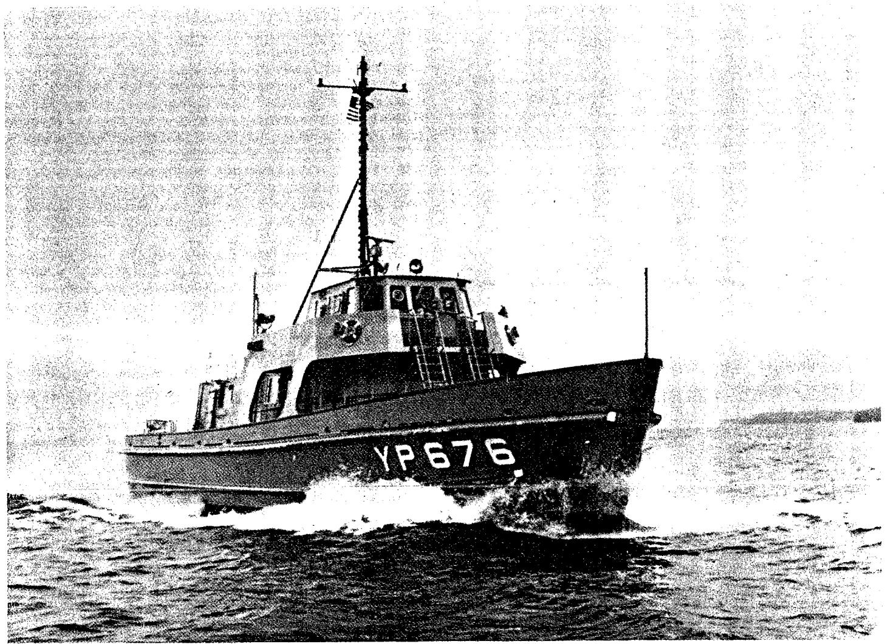

text_image

YP676

YP 676 underway

# Resistance of a Systematic Series of Semiplaning Transom-Stern Hulls

Roger H. Compton $^{1}$

The results of a systematic series of small (5 ft) models of hulls typical of coastal patrol, training, or recreational powerboats are presented and discussed. Hull form parameters studied include length-to-beam ratio, displacement-length ratio, longitudinal position of the center of gravity and section shape (hard chine or round bilge). The effects of these parameters on the calm-water resistance and running attitude (sinkage and trim) over a range of speeds corresponding to waterline length Froude numbers from 0.10 to 0.60 were investigated in the 120-ft towing tank at the U.S. Naval Academy Hydromechanics Laboratory (NAHL). Experimental procedures and computer-based data acquisition and analysis methods used at NAHL are described. The experimental results as well as the cross-faired and nondimensionalized stillwater resistance trends are presented. Comparisons with other resistance prediction methods for hulls of the subject type are made. An example of the application of the resistance prediction to the new 108-ft yard patrol craft (YP) being acquired by the U.S. Naval Academy is included.

# Introduction

AS A CONTRIBUTION to the Naval Sea Systems Command-Norfolk Detachment (NAVSEA:NORFOLK) design of a new yard patrol craft (YP) for the U.S. Naval Academy, the staff of the Naval Academy Hydromechanics Laboratory (NAHL) performed a series of experiments involving a systematically varied set of hull forms representing medium-speed, transom-stern, high displacement-length ratio, low length-beam ratio, coastal patrol craft. Quantitatively, the ranges of the above parameters covered by this experimental program are as follows:

Hard chine and round bilge

$$
0. 3 5 <   V / \sqrt {L _ {\mathrm{WL}}} <   2. 0 0
$$

$$
0. 3 <   F _ {\mathrm{N} \nabla} <   1. 5
$$

$$
1 0 5 <   \Delta_ {\mathrm{PP}} <   1 5 0
$$

$$
- 0. 1 3 <   \mathrm{LCG} / L _ {\mathrm{PP}} <   - 0. 0 2
$$

$$
4. 0 <   L _ {\mathrm{PP}} / B <   5. 2
$$

The conceptual design of the new YP's began as a series of midshipman senior design projects in 1977 under the guidance of the author. Impetus for such a design effort was provided by the Naval Academy Superintendent (at the time) VADM Kinnard R. McKee, USN. Two of the midshipman design studies—one by (then) Midshipmen Corey Glab and Rich Maurer and the other by (then) Midshipmen Ron Miller and Mike Wertz of the Class of 1977—were the starting point for the design evolution at NAVSEA:NORFOLK which resulted in the 108-ft YP, the first of which, YP676, has completed her trial period, and is presently in service at the U.S. Naval Academy. YP676 and the initial six of her sister ships were (and are being) built by Peterson Builders, Inc. of Sturgeon Bay, Wisconsin. A photograph of YP676 underway serves as the frontispiece for this paper.

To avoid ambiguity as to the speed range of concern in this study, the term “semiplaning” requires definition. For the present purpose, a definition centering upon the sinkage of the hull’s center of gravity as a function of speed will be used. As a hull begins to move from rest, it generates a pressure field around it which causes vertical attitudinal changes (sinkage and trim). At zero and low speeds, the weight of the ship is

supported by buoyancy in accordance with Archimedes Principle. As speed increases and the pressure field deviates more and more from its original hydrostatic form, the effects of the resulting waves and pressure forces on the hull cause ever more significant translation (rise or sinkage) of the center of gravity and rotation (trim) about the same center. At very high speeds—planing speeds—the weight of the hull is supported primarily by high hydrodynamic pressures on the hull's bottom. These planing pressures can cause the hull to be lifted above its static absolute vertical position. If the absolute vertical position of the center of gravity is plotted as a function of hull speed, a curve like that shown in Fig. 1 is typically found. For the purposes of this paper, the three “speed regimes”—displacement, semiplaning, and planing—are defined in the figure. While arbitrary, the definitions as a function of what the center of gravity does are considered to be physically reasonable. Thus, the hull speeds covered in the results presented herein are within the “displacement” and “semiplaning” speed regimes.

The systematic series, whose stillwater resistance results are summarized here, was developed to assess the effects of practical hull shape and loading variations on the powering of such boats. This report covers but the first phase of testing on this series of hull forms. Seakeeping investigations concerning head sea motions, added resistance due to waves, and zero speed beam sea rolling are in progress or are planned. The present results are offered as the first installment in a set of tools for the small-craft designer to have in his professional toolkit.

# Geometric and hydrostatic characteristics of the series

The basic hull shape from which variations in bilge geometry (that is, hard chine or soft chine) and slenderness (as measured by length-beam ratio) represents an amalgamation of the form features of several existing hulls. Among the contributing influences were the hull form of the 100-ft torpedo weapons retriever (TWR) presently in service with the U.S. Navy, Series 64 [1], $^{2}$

# Nomenclature

$A =$ regression coefficient, sectional area, $\mathbf{ft}^2$

AP = after perpendicular

$A_{T}/A_{x}=$ ratio of immersed transom area to maximum sectional area

$B =$ regression coefficient, beam, ft

$BM_{L} =$ longitudinal metacentric radius, ft

$C =$ regression coefficient

$C_A =$ correlation allowance

$C_B =$ block coefficient

$C_f =$ frictional resistance coefficient

$C_p =$ prismatic coefficient

$C_R =$ residual resistance coefficient

$C_t =$ total resistance coefficient

$C_{\mathrm{WP}} =$ waterplane coefficient

CRT = cathode ray tube

$D =$ regression coefficient

EHP = effective horsepower

$F_{NL} = \text{Froude number based on waterline length}$

$F_{\mathrm{N}\nabla} =$ Froude number based on displaced volume

FP = fore perpendicular

G = center of gravity

$i_{e} =$ half angle of entrance, deg

ITTC = International Towing Tank Conference

$KM_{T}=$ height of transverse metacenter above keel, ft

$L_{\mathrm{OA}} =$ length overall, ft

$L_{\mathrm{PP}} =$ length between perpendiculars, ft

$L_{\mathrm{WL}} =$ length on waterline, ft

LCB = longitudinal distance from amidships to center of buoyancy, ft

$\mathrm{LCG} =$ longitudinal distance from amidships to center of gravity, ft

LTSW = long tons salt water

(M) = $L_{\mathbf{WL}} / \nabla^{1/3}$

NAHL = Naval Academy Hydromechanics Laboratory

NPL = National Physical Laboratory

$R_{T} =$ total resistance, lb

⑤ = WSA/ $\nabla^{2/3}$

SA = sectional area, ft²

SHCP = Ship Hull Characteristics Program

SSPA = Swedish Maritime Research Centre

$T =$ draft,ft

TWR = torpedo weapons retriever

$V =$ velocity, knots

$v =$ velocity,ft/sec

WSA = wetted surface area, ft $^{2}$

YP = yard patrol craft

$Z_{\mathrm{CG}} =$ vertical displacement of center of gravity, ft

$\beta_{10} =$ deadrise angle at transom, deg

$\Delta =$ displacement

$\lambda =$ linear scale ratio

$\nu =$ kinematic viscosity, $\mathrm{ft}^2 /\mathrm{sec}$

$\rho =$ density, lb-sec2/ft4

$\tau =$ running trim angle, deg

$\mathbb{E} = \text{baseline}$

$\mathcal{Q} =$ centerline

$\Delta_{PP} = displacement-length ratio, LTSW/ft^{3}$

$\nabla =$ displaced volume, $\mathrm{ft}^3$

$\text{∅} = \text{amidships}$

# Subscripts

$m =$ model

REF = reference waterline value

s = ship

$x =$ maximum

the series of Marwood and Bailey [2], and Series 63 [3].

The soft-chine shape, designated YP81-1, was the starting point for the series. Two soft-chine variants were designed and built to evaluate the effects of varying slenderness and are designated YP81-2 and YP81-3. YP81-4, YP81-5, and YP81-6 represent hard-chine shapes that have slenderness ratios nominally equal to their soft-chine counterparts. Since the hard-chine shapes were developed from their soft-chine counterparts by simply extending bottom and side tangents at each station until they intersected (with fairing accomplished as necessary), no great change in slenderness or longitudinal volume distribution should be expected between corresponding soft- and hard-chine hulls (for example, YP81-1 and YP81-4, YP81-2 and YP81-5, YP81-3 and YP81-6). Figure 2 shows the body plans and end profiles of the six hulls built and tested for the results reported here, which are for unappended hulls built to the molded lines shown. The model lines drawings were provided by NAVSEA:NORFOLK.

The U.S. Navy's Ship Hull Characteristics Program (SHCP) was run for each hull to quantify its hydrostatic characteristics. To facilitate numerical comparisons, a "reference waterline" was defined for each hull. The "reference waterline" and its corresponding draft, $T_{\mathrm{REF}}$ , represent the zero-trim condition for which the waterline length ( $L_{\mathrm{WLREF}}$ ) equals the arbitrarily defined length between perpendiculars ( $L_{\mathrm{PP}}$ ). The degree of similarity of the longitudinal volume distribution for all series models is shown by the sectional area curves for $T_{\mathrm{REF}}$ in Fig. 3. Figures 4 and 5 show the variation of wetted surface and waterline length with displacement for soft- and hard-chine shapes, respectively. These hull characteristics must be known for subsequent resistance prediction applications.

# Description of the series test models

Six 5-ft ( $L_{\text{PP}}$ ) models were built to the lines shown in Fig. 2 by Alfred C. Seebode of Tabernacle-Vincentown, New Jersey. The models were constructed using 2-in. clear pine lifts faired to the molded shape given by the lines drawings. A nominal wall thickness of $1/2$ in. was maintained on the model topsides. To facilitate the mounting of towing apparatus, the upper surface of the bottom lift was parallel to, and 2 in. above, the base plane. Also, horizontal topped wedges were built into the sheer at the fore perpendicular and amidships to facilitate freeboard measurement by hook gage. The models were finished with multiple coats of clear spar varnish. Wet sanding after each coat (including the final coat) resulted in a smooth wetting surface. No external appendages were fitted to the series models.

The models were outfitted according to the normal procedures followed at the NAHL; that is, station lines were painted on the model with vertical scales at the ends and amidships to facilitate wave-hull intersection definition (and for subsequent testing in waves for relative motions), a vertical scale up the transom to quantify transom immersion, vertical threaded ballast rods fore and aft, a stud array (described later) for turbulence stimulation, and a mounting plate for connection to the towing dynamometry. Figure 6 is a photograph of one of the models ready for ballasting.

Because the experimental plan included testing each model at three different longitudinal positions of the models' center of gravity (LCG), and since NAHL's convention is to tow from the LCG, the dynamometry mounting plate locations had to be established. To minimize unwanted trimming moment due to the difference in the vertical position of the model towing point and the designed propeller shaft line, it was decided to position the towing point (physically, the trim pivot point on the towing dynamometer) on the hypothetical propeller shaft centerline at the longitudinal position of the model center of gravity. With the dynamometer trim pivot point thus located, the mounting plate location was completely defined. For all six hulls, the hypothetical propeller shaft centerline passed through a point 1.95 in. below the lowest point (on Q) of the model transom and made an angle of 9.75 deg with the design waterline. The dynamometry mounting plate was shimmed to maintain this condition for all LCG's tested.

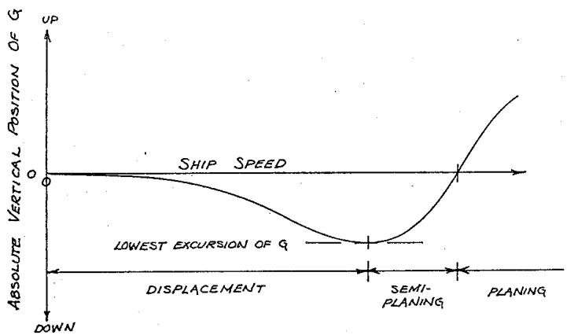

line

| Phase          | Absolute Vertical Position of G |
| -------------- | ------------------------------- |
| Down           | 0                               |
| Displacement   | -up                             |
| Semi-Planing   | 0                               |
| Planing        | up                              |

Fig. 1 Speed range definition sketch

# Ballasting of series models

Each model was to be tested at three LCG's for each of three displacements. The three LCG's, identical for all six models, were

Forward: 2.44% $L_{\mathrm{PP}}$ aft 20

Middle: 7.78% $L_{\mathrm{PP}}$ aft

Aft: 13.12% $L_{\mathrm{PP}}$ aft ②

These odd values correspond, nominally, to 45, 40, and 35 percent of $L_{\text{OA}}$ forward of the transom for YP81-1, and were specified by NAVSEA:NORFOLK. The three displacements correspond to zero-trim waterlines which were fixed distances below the reference waterline on each model. Specifically, for a 100-ft $L_{\text{PP}}$ , the drafts for testing were 0.15, 0.55, and 0.95 ft below the reference waterline.

The consistently followed ballasting procedure was as follows:

1. For each model, the SHCP output (zero trim condition) was consulted to get displacement and wetted surface area at each test draft. The displacements were corrected for the towing tank water conditions; that is

$$
\Delta_ {m} = \Delta_ {s} (\text { in   LTSW }) \times \frac {\rho_ {m}}{\rho_ {s}} \times 2 2 4 0 \div \lambda^ {3}
$$

For all SHCP runs, a 100 ft $L_{\mathrm{PP}}$ was specified.

2. Model freeboards at the fore perpendicular, amidships, and after perpendicular were scaled from the lines drawings for the three drafts to be tested.   
3. The model to be tested was floated in the tank and ballasted to the measured freeboards (zero trim and zero heel) for all three test displacements. All hydrostatic data were recorded.   
4. When testing was imminent, the model, with the mounting plate fixed for a given LCG, was ballasted to a weight equal to (or slightly heavier than) the heaviest displacement. Weights were then placed on an unloading-arm arrangement to bring the model to the correct test displacement. By so doing, the three displacements at one LCG could be easily accomplished without adjusting

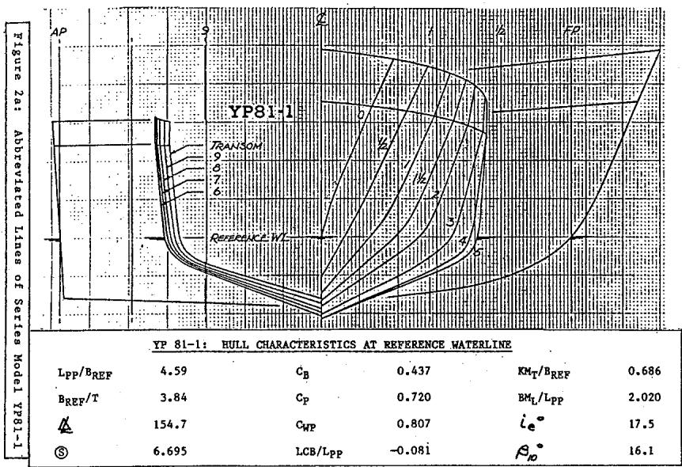

line

| LPP/BREF | 4.59 | CB    | 0.437 | KM_T/B_REF | 0.686 |
| -------- | ---- | ----- | ----- | ---------- | ----- |
| BREF/T   | 3.84 | CP    | 0.720 | EM_L/L_PP | 2.020 |
| A        | 154.7 | GWP   | 0.807 | ie°        | 17.5  |
| ③       | 6.695 | LCB/LPP | -0.081 | β_0°       | 16.1  |

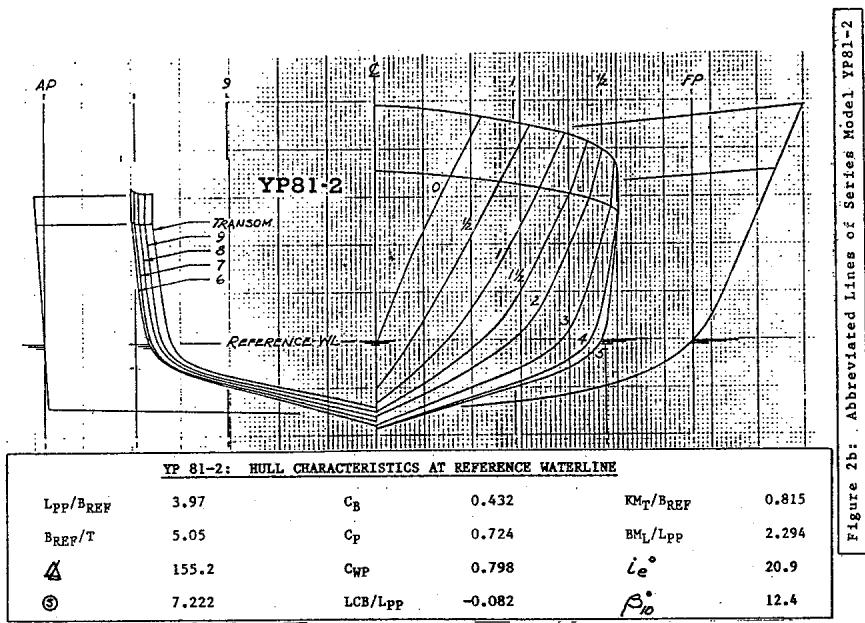

line

|        | LPP/BREF | CB    | 0.432 | KMT/BREF | 0.815 |
| ------ | -------- | ----- | ----- | -------- | ----- |
| BREF/T | 5.05     | CP    | 0.724 | BML/LPP  | 2.294 |
| 4      | 155.2    | CWP   | 0.798 | ie°      | 20.9  |
| ③      | 7.222    | LCB/LPP | -0.082 | β°       | 12.4  |

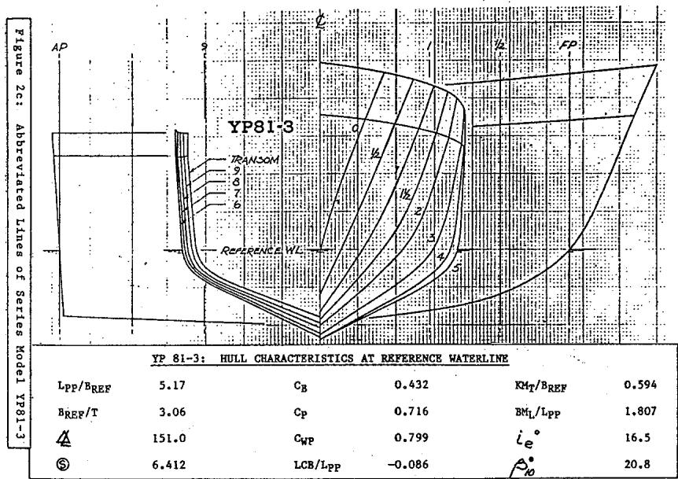

other

Figure 2c: Abbreviated Lines of Series Model YP81-3
| Component | Value |
| :--- | :--- |
| LPP/BREF | 5.17 |
| BREF/T | 3.06 |
| θ | 151.0 |
| θ* | 6.412 |
| C_B | 0.432 |
| C_P | 0.716 |
| C_WP | 0.799 |
| LCB/L_PP | -0.086 |
| KM_T/B_REF | 0.594 |
| B_ML/L_PP | 1.807 |
| i_e° | 16.5 |
| θ_θ° | 20.8 |

Fig. 2 Abbreviated lines of series models

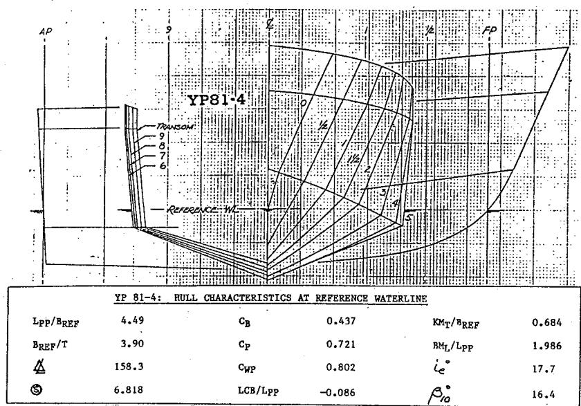  
Figure 2d: Abbreviated Lines of Series Model YP81-4

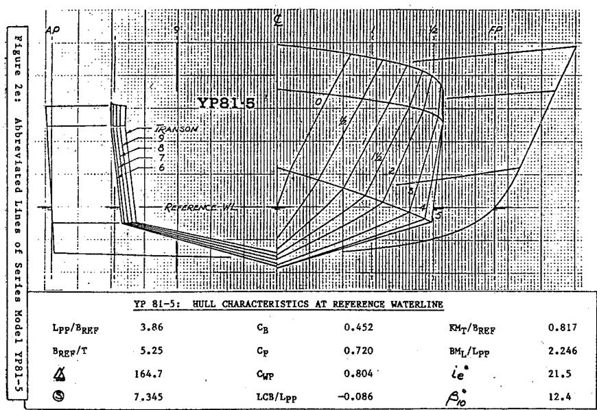

line

| LPP/BREF | 3.86 | CB    | 0.452 | KMT/BREF | 0.817 |
| -------- | ---- | ----- | ----- | -------- | ----- |
| BREF/T   | 5.25 | CP    | 0.720 | BML/LPP  | 2.246 |
| A        | 164.7 | CWP   | 0.804 | ie*      | 21.5  |
| S        | 7.345| LCB/LPP| -0.086| βo*      | 12.4  |

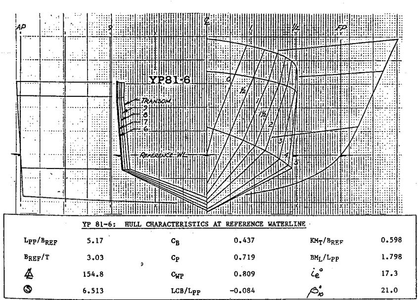

other

|        | LPP/B_REF | C_B   | C_P   | C_WP  | -0.084 |
| ------ | --------- | ----- | ----- | ----- | ------ |
| LPP    | 5.17      |       |       |       |        |
| B_REF/T| 3.03      |       |       |       |        |
| Φ      | 154.8     |       |       |       |        |
| Σ      | 6.513     |       |       |       |        |

Figure 2f: Abbreviated Lines of Series Model YRP1-6   
Fig. 2 (continued)

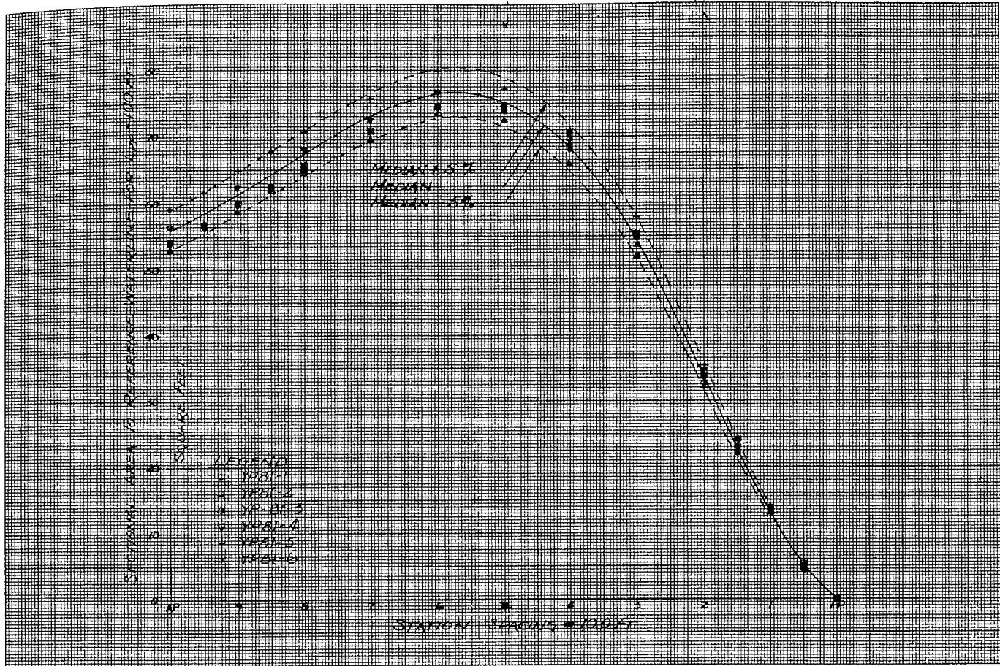

line

| Season | Value |
| ------ | ----- |
| YEAR-5 | 57 |
| YEAR-6 | 37 |
| YEAR-7 | 4 |
| YEAR-8 | 3 |
| YEAR-9 | 2 |
| YEAR-10 | 1 |

Fig. 3 Sectional area curves of series models

weights inside the model or removing the model from the test rig.

5. The required LCG was obtained by hanging the model on the towing rig (attached at the model's LCG) and adjusting the ballast weights longitudinally until the model floor was level. Weights were then secured and testing could begin.

Minor changes in model displacement due to tank water temperature variation over the time needed to complete the testing of one model were made by adjusting the weight on the unloading arm.

The three LCG's specified resulted in varying degrees of static trim. The middle LCG was close to the zero-trim condition, but not exactly so for all models. The forward CG location results in a nominal bow-down trim of $1^{1/2}$ deg while the aft CG location causes a nominal $1^{1/4}$ -deg trim by the stern.

# Testing equipment and procedures

All resistance data were acquired in the 120-ft towing tank located in Rickover Hall at the U.S. Naval Academy. The International Towing Tank Conference (ITTC) description of this tank is shown as Fig. 7. The fresh-water depth for all tests was 5.5 ft. Blockage was not considered to be a problem with the test series since the blockage area ratio (maximum model sectional area divided by tank cross-sectional area) was less than 0.0045. Check tests of YP81-1 in a much larger towing tank (380 by 26 by 16 ft) verified that no measurable blockage effects were present in the smaller tank results.

The dynamometer used for all tests is shown in Fig. 8. The dynamometer restrained the model in surge, roll, sway, and yaw. The free motions of trim (pitch) and sinkage (heave) were measured by rotary potentiometers. Resistance force was measured by a 2-in. Hydronautics force block whose rated maximum load was 10 lb (block was linear to about ±100 percent of rated maximum load). The model speed was measured by an optical encoder activated by the carriage towing cable. All four transducers were calibrated (statically) before each test series and were rezeroed (electrically) between each run down the tank. All transducers demonstrated linear response over the anticipated ranges of the measured variables as can be seen from the sample force block calibration plot included as Fig. 9. The figure shows unretouched output from the laboratory's computer system. The resistance force is plotted on the ordinate, while the abscissa is directly proportional to a corresponding dc voltage (converted to a digital value). The coefficients for the least-squares linear fit (which are actually used in raw data conversion) are shown in the upper left corner of the calibration plot.

The force block remains horizontal regardless of model trim and thus measures pure resistance directly. The model was run from the wavemaker to the beach to minimize reflection of the model's transverse wave system. An interrun time of 10 min (nominal) was used for the entire stillwater resistance test series.

Data for each measured variable were acquired using the laboratory's computer-based data acquisition, control and analysis system [4]. Each channel of experimental data consisted of a system like the one shown schematically in Fig. 10. For the 120-ft tank, the "DATA TRANSMISSION SYSTEM" consists of a trailing cable from the carriage to the tank control station (the 380-ft tank employs a modulated laser as the link between the moving carriage and the shore-based data acquisition system). For both tanks the "TERMINAL" is the operators active

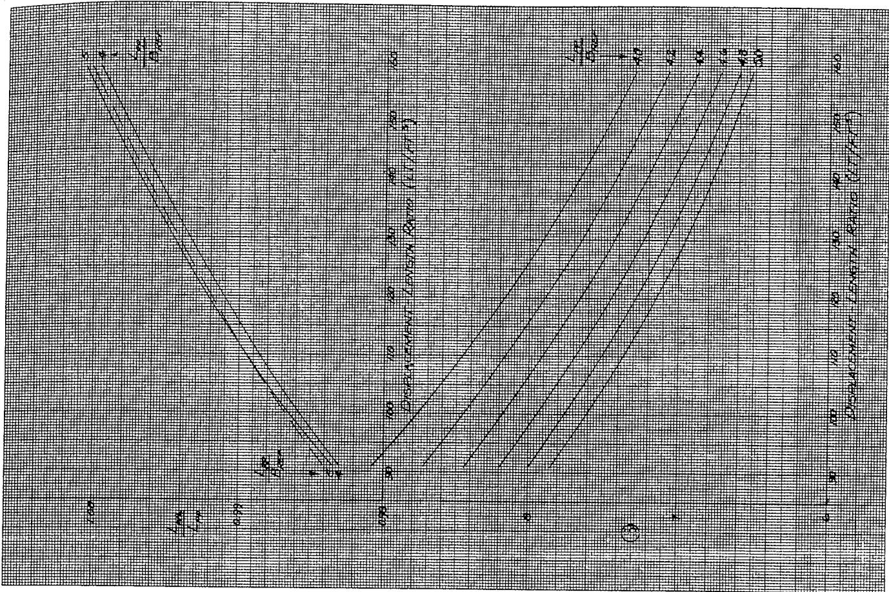

line

| Displacement Length Ratio (L1/L2) | Value |
| --------------------------------- | ----- |
| 0                                 | 1     |
| 0                                 | 2     |
| 0                                 | 3     |
| 0                                 | 4     |
| 0                                 | 5     |
| 10                                | 1     |
| 10                                | 2     |
| 10                                | 3     |
| 10                                | 4     |
| 10                                | 5     |
| 20                                | 1     |
| 20                                | 2     |
| 20                                | 3     |
| 20                                | 4     |
| 20                                | 5     |
| 30                                | 1     |
| 30                                | 2     |
| 30                                | 3     |
| 30                                | 4     |
| 30                                | 5     |
| 40                                | 1     |
| 40                                | 2     |
| 40                                | 3     |
| 40                                | 4     |
| 40                                | 5     |
| 50                                | 1     |
| 50                                | 2     |
| 50                                | 3     |
| 50                                | 4     |
| 50                                | 5     |
| 60                                | 1     |
| 60                                | 2     |
| 60                                | 3     |
| 60                                | 4     |
| 60                                | 5     |

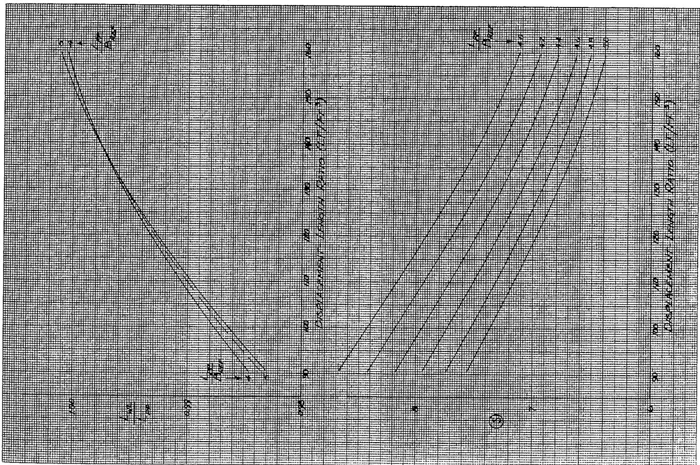

line

| Displacement Length Ratio (cm/s) | Value |
| -------------------------------- | ----- |
| 100                              | 100   |
| 95                               | 95    |
| 90                               | 90    |
| 85                               | 85    |
| 80                               | 80    |
| 75                               | 75    |
| 70                               | 70    |
| 65                               | 65    |
| 60                               | 60    |

Fig. 5 Wetted surface and waterline length characteristics for hard-chine hulls

INTERNATIONAL TOWING TANK CONFERENCE CATALOGUE OF FACILITIES
TOWING TANKS, SEAKEEPING AND MANOEUVRING BASINS

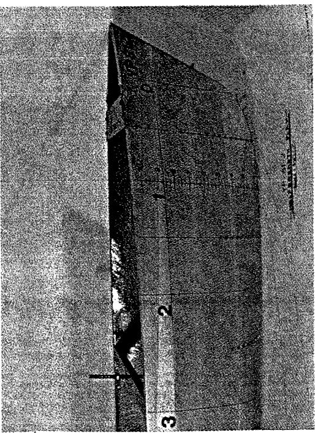

text_image

3
2
1
0
10
15
18
20
25
28
30
35
38
40
45
48
50
55
60
65
70
75
80
85
90
95
100

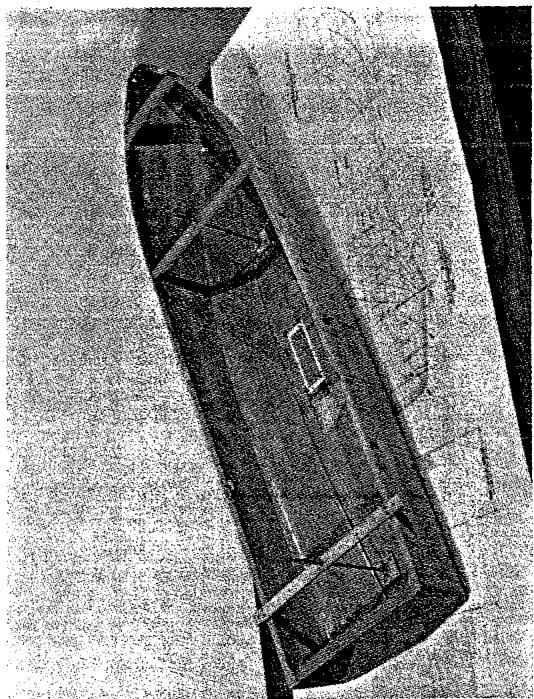

natural_image

Top-down view of a small boat or similar vessel with visible structural details and no text or symbols

U. S. NAVAL ACADEMY HYDROMECHANICS LABORATORY
ANNAPOLIS, MARYLAND 21402
TELEPHONE: (301) 267-3361
36.6m TOWING TANK (1976)

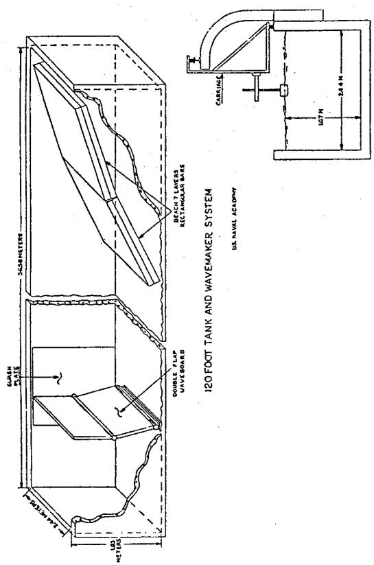

text_image

120 FOOT TANK AND WAVEMAKER SYSTEM
U.S. NAVAL ACADEMY
CARRIAGE
120 METERS
DOUBLE FLAP WAVE BOARD
BEACH 7 LAYERS RECTANGULAR BARS
350 METERS
LGT M
24 M

DESCRIPTION OF CARRIAGE: unmanned

TYPE OF DRIVE SYSTEM AND TOTAL POWER: cable drive with 15 HP DC drive motor, digital speed control, manual/computer controlled
MAXIMUM CARRIAGE SPEED: 6 m/s (20 fps)

MODEL SIZE RANGE: 1m - 2m

TESTS PERFORMED: resistance in calm water and waves, seakeeping tests, various tests of ocean structures, hydrodynamic forces on submerged bodies, foils, etc., flow visualization

OTHER REMARKS: extensive software developed for standard test data base, shares computer with 128m towing tank, gravity towing capability

Fig. 7 ITTC facility description of the USNA 120-ft tank

Fig. 6 Model YP81-2 outfitted for ballasting

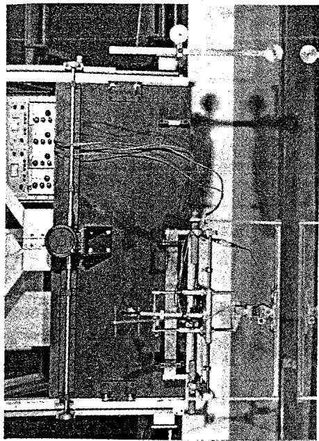

natural_image

Industrial machinery setup with control panel and wiring (no visible text or symbols)

Fig. 8 Dynamometer used for all tests

control station for data acquisition and analysis. The "CATHODERAY TUBE" and the "TERMINAL" provide the test engineer graphical and numerical data on a run-by-run basis while the "VERSATEC PRINTER-PLOTTER" presents cumulative output in both tabular and graphical formats at the end of a test.

An annotated example of the dialog between operator and the aforementioned computer-based data acquisition system is shown as Fig. 11. The sample terminal hard copy begins with the test start-up sequence, continues with a force block calibration (see Fig. 9 for a typical graphical output), and concludes with a sample data run output. Two previously saved programs are called by the operator in the example: AUTO 120SETUP and AUTO EHPASW. These operating programs are written in a language unique to the NAHL system. With a little introduction and frequent use, the language becomes quite simple for the test engineer to use. The listings for these two programs are shown in Fig. 12.

# Turbulence stimulation

The requirement that both model and ship experience similar flow regimes dictates that small models, such as those employed for this study, have turbulence stimulation devices fitted to trip the flow from a laminar to a turbulent regime. It is hoped that, once tripped, the flow remains turbulent over the length of the model hull. It is assumed that the added resistance caused by the stimulating device will be offset by the deficit in frictional resistance due to the laminar flow upstream of the device.

Studs were selected as the turbulence stimulation device for this series following standard NAHL practice. The final stud configuration, shown in Fig. 6, was chosen after considerable experimentation. There are three vertical rows of studs—at stations $1\frac{1}{2}$ , $2\frac{1}{2}$ , and $3\frac{1}{2}$ (of 10). The stud spacing in each row is $\frac{1}{2}$ in. Each stud is a right circular cylinder with a length (height) of $\frac{1}{10}$ in. and a diameter of $\frac{1}{8}$ in. The studs, made of brass, are attached to each hull with commercially available adhesive.

The stud configuration employed was chosen on the basis of a series of tests in which sand strips of various constant widths were placed near the bow of model YP81-1. Model YP81-1 was chosen for the stimulator study for both pragmatical and technical reasons. In the former category, it was the first hull model available for testing; in the latter category, it represents the middle of the hull form variations. By performing resistance tests over a speed range with sand strips having constant widths of $\frac{1}{4}$ , $\frac{1}{2}$ , and $\frac{3}{4}$ in., respectively, three resistance coefficient curves could be plotted as shown in Fig. 13. By extrapolating to

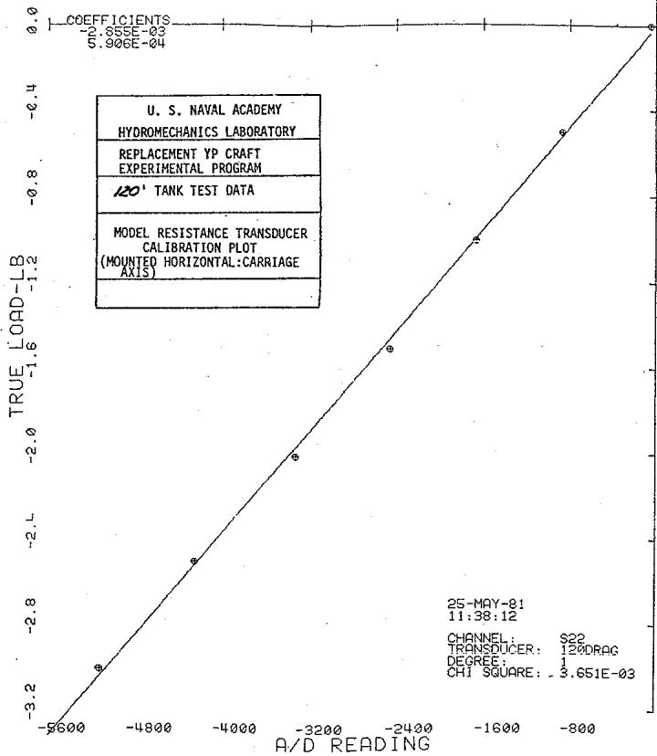

line

| A/D READING | TRUE LOAD-LB |
| ----------- | ------------- |
| -5600       | -3.2          |
| -4800       | -2.8          |
| -4000       | -2.4          |
| -3200       | -2.0          |
| -2400       | -1.6          |
| -1600       | -1.2          |
| -800        | 0.0           |

Fig. 9 Typical force block calibration curve

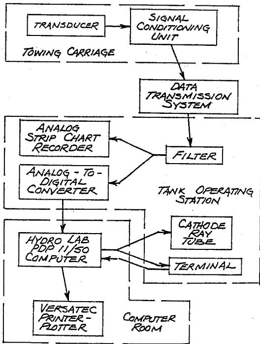

flowchart

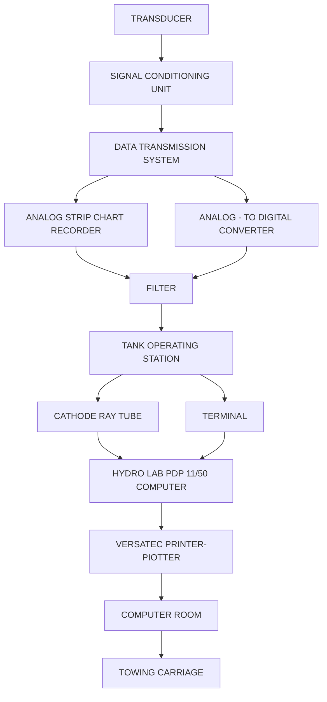
```mermaid
graph TD
    A["TRANSDUCER"] --> B["SIGNAL CONDITIONING UNIT"]
    B --> C["DATA TRANSMISSION SYSTEM"]
    C --> D["ANALOG STRIP CHART RECORDER"]
    C --> E["ANALOG - TO DIGITAL CONVERTER"]
    D --> F["FILTER"]
    E --> F
    F --> G["TANK OPERATING STATION"]
    G --> H["CATHODE RAY TUBE"]
    G --> I["TERMINAL"]
    H --> J["HYDRO LAB PDP 11/50 COMPUTER"]
    I --> J
    J --> K["VERSATEC PRINTER-PIOTTER"]
    K --> L["COMPUTER ROOM"]
    L --> M["TOWING CARRIAGE"]
```

Fig. 10 Typical data acquisition channel schematic diagram

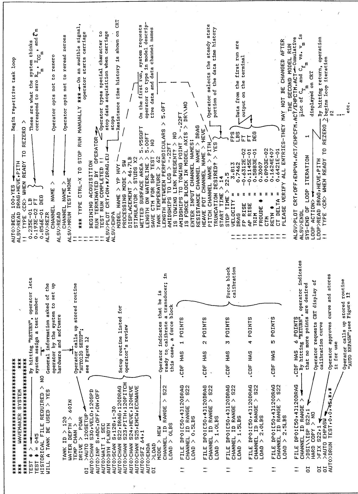

text_image

******************
*** WAVEMAKER SYSTEM
******************
TEST # > By hitting "RETURN", operator lets
TEST # = 045 system assign a test number
HISTORICAL FILE REQUIRED > NO
WILL A TANK BE USED > YES
TANK ID > 120
WATER DEPTH > 60IN
TEMP CHAN >
DRIVE > POWER
OI >AUTO 120SETUP
AUTO>CHAN S30,VELO,120SPD
AUTO>INP S,ADC,OFF,ON,OFF
AUTO>WAIT 1 SEC
AUTO>DYN PLNDYN
AUTO>SCAN S,128,1-30
AUTO>CHAN S22,DRAG,120DRAG
AUTO>CHAN S23,PITH,120PITCH
AUTO>CHAN S24,HEVE,120HEVE
AUTO>CHAN S25,ENCW,ECNWAVE
AUTO>SFZ 64,1
AUTO>ENDA
OI >LOAD
MODE > NEW
CHANNEL ID RANGE > S22
LOAD > OLBS
!! FILE DPO:[50,4]120DRAG
CHANNEL ID RANGE > S22
LOAD > 0.5LBS
!! FILE DPO:[50,4]120DRAG
CHANNEL ID RANGE > S22
LOAD > 1.0LBS
!! FILE DPO:[50,4]120DRAG
CHANNEL ID RANGE > S22
LOAD > 1.5LBS
!! FILE DPO:[50,4]120DRAG
CHANNEL ID RANGE > S22
LOAD > 2.0LBS
!! FILE DPO:[50,4]120DRAG
CHANNEL ID RANGE > S22
LOAD > 2.5LBS
!! FILE DPO:[50,4]120DRAG
CHANNEL ID RANGE >
OI >DSI\ISP S22,1
HARD COPY > NO
OI >FIX S22,1
OI >AUTO EHPASW
AUTO>DRUN TEST,0,0,45,*,* 
Operator calls up stored routine
"AUTO EHPASW";see Figure 1?
Operator indicates that he is ready to calibrate a transducer; in this case, a force block
CDF HAS 1 POINTS
CDF HAS 2 POINTS
CDF HAS 3 POINTS
CDF HAS 4 POINTS
CDF HAS 5 POINTS
Auto>BEGL 100,YES 
ALSV>READ DRAG,HEVE,PITH
!! TYPE <CR> WHEN READY TO REZERO >
0.235E-01 LB
0.193E-02 FT
0.856E-01 DEG
These are what the system thinks correspond to zero Rm, Zcm, and cm
ALSV>REZR
CHANNEL NAME >
ALSV>READ
CHANNEL NAME >
ALSV>MRUN TEST,NONE
!!
!!! *** TYPE CTRL-X TO STOP RUN MANUALLY *** On an audible signal,
!!! BEGINING ACQUISITION
!! RUN TERMINATED BY OPERATOR
!! TEST RUN COMPLETED !! 
ALSV>PLOT CRT,ON,*/DRAG.EU 
ALSV>EHPA
MODEL NAME > YF HVY 
PROCESSING MODE > SW 
DISPLACEMENT > 46.7LB 
STIMULATOR > STUDS X2 
WETTED SURFACE AREA > 5.95SQFT 
LENGTH ON WATERLINE > 5.00FT 
SAVE CTM FOR SHP TEST > NO 
TANK TEMPERATURE > 62 
LENGTH BETWEEN PERFENDICULARS > 5.0FT 
AMIDSHIPS TO LCG > -.22FT 
! IS TOWING LINK PRESENT? > NO 
AMIDSHIPS TO TOWING POINT > -.22FT 
! IS FORCE BLOCK IN MODEL AXIS > DR\\NO 
ENTER INPUT CHANNEL NAMES:
RESISTANCE CHANNEL NAME > DRAG 
HEAVE POT CHANNEL NAME > HEVE 
PITCH CHANNEL NAME > PITH 
TRUNCATION DESIRED? > YES 
START TIME > 14 
STOP TIME > 22.5
!! VELOCITY = 3.813 FPS 
!! DRAG = 0.7462 LBS 
!! FP RISE = -0.6312E-02 FT 
!! AP RISE = -0.1145E-01 FT 
!! TRIM = 0.5883E-01 DEG 
!! FROUDE # = 0.3007 
!! CTM = 0.8903E-02 
!! REYN # = 0.1624E+07 
!! CT DELTA = 0.6421E-01 
!! PLEASE VERIFY ALL ENTRIES-THEY MAY NOT BE CHANGED AFTER THE SECOND MODEL RUN ALSV>PLOT CRT,OFF,EHPVM.ACT/EHPCFM.ACT/EHPCTM.ACT Cumulative ALSV>ENDL
SYS-END OF LOOP ITERATION 1 loop ACTION>
LOOP>READ DRAG,HEVE,PITH 
! TYPE <CR> WHEN READY TO REZERO ? by hitting return, operation begins loop iteration #2 
...
etc.
NOTE:

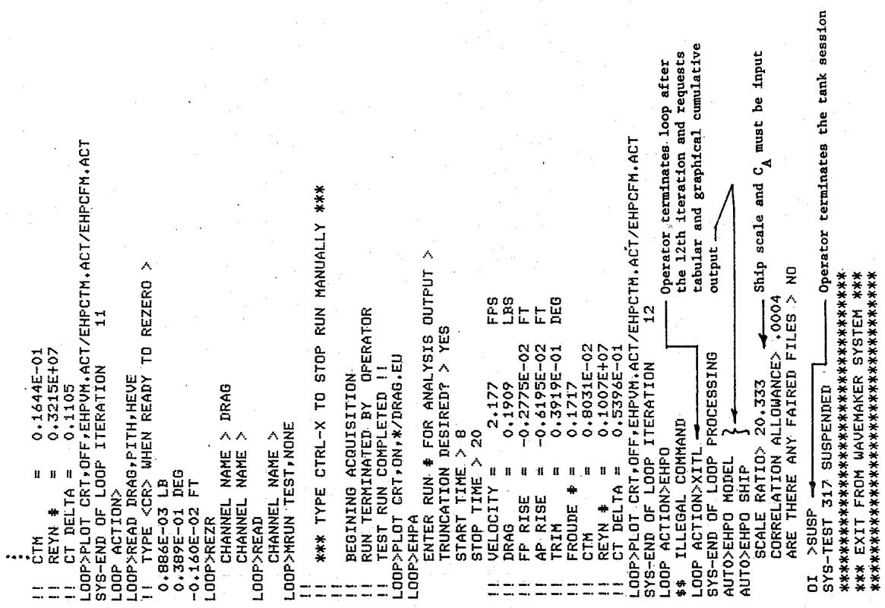

text_image

...
!! CTM = 0.1644E-01
!! REYN # = 0.3215E+07
!! CT DELTA = 0.1105
LOOP>PLOT CRT,OFF,EHPVM.ACT/EHPCTM.ACT/EHPCFM.ACT
SYS-END OF LOOP ITERATION 11
LOOP ACTION>
LOOP>READ DRAG,PITH,HEVE
!! TYPE <CR> WHEN READY TO REZERO >
0.886E-03 LB
0.389E-01 DEG
-0.160E-02 FT
LOOP>REZR
CHANNEL NAME > DRAG
CHANNEL NAME >
LOOP>READ
CHANNEL NAME >
LOOP>MRUN TEST,NONE
!!
!! *** TYPE CTRL-X TO STOP RUN MANUALLY ***
!!
! BEGINING ACQUISITION
! RUN TERMINATED BY OPERATOR
! TEST RUN COMPLETED !!
LOOP>PLOT CRT,ON,*/DRAG.EU
LOOP>EHPA
ENTER RUN # FOR ANALYSIS OUTPUT >
TRUNCATION DESIRED? > YES
START TIME > 8
STOP TIME > 20
!! VELOCITY = 2.177 FPS
!! DRAG = 0.1909 LBS
!! FP RISE = -0.2775E-02 FT
!! AP RISE = -0.6195E-02 FT
!! TRIM = 0.3919E-01 DEG
!! FROUDE # = 0.1717
!! CTM = 0.8031E-02
!! REYN # = 0.1007E+07
!! CT DELTA = 0.5396E-01
LOOP>PLOT CRT,OFF,EHPVM.ACT/EHPCTM.ACT/EHPCFM.ACT
SYS-END OF LOOP ITERATION 12
LOOP ACTION>EHPPO
$$ ILLEGAL COMMAND
LOOP ACTION>XITL
SYS-END OF LOOP PROCESSING
AUTO>EHPO MODEL
AUTO>EHPO SHIP
SCALE RATIO> 20.333 Ship scale and C_A must be input
CORRELATION ALLOWANCE> .0004
ARE THERE ANY FAIRED FILES > NO
OI >SUSP
SYS-TEST 317 SUSPENDED Operator terminates the tank session
**************************
*** EXIT FROM WAVEMAKER SYSTEM ***
**************************

Fig. 11. (continued)

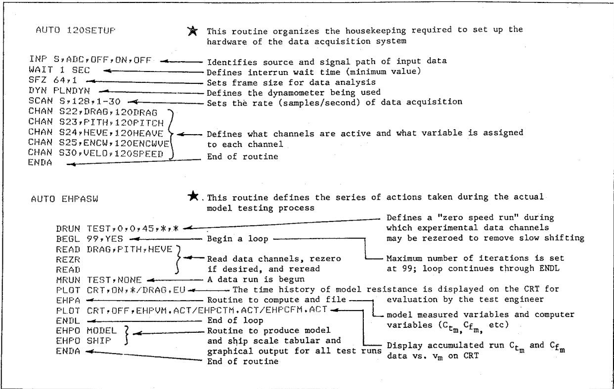

text_image

AUTO 120SETUP
★ This routine organizes the housekeeping required to set up the hardware of the data acquisition system
INF S,ABC,OFF,ON,OFF
WAIT 1 SEC
SFZ 64,1
DYN PLNDYN
SCAN S,12B,1-30
CHAN S22,DRAG,120DRAG
CHAN S23,PITH,120PITCH
CHAN S24,HEVE,120HEAVE
CHAN S25,ENCW,120ENCWVE
CHAN S30,VELO,120SPEED
ENDA
★. This routine defines the series of actions taken during the actual model testing process
DRUN TEST,0,0,45,*,**
BEGL 99,YES
READ DRAG,PITH,HEVE
REZR
READ
MRUN TEST,NONE
PLOT CRT,ON,*/DRAG.EU
EHPA
PLOT CRT,OFF,EHPVM.ACT/EHPCTM.ACT/EHPCFM.ACT
ENDL
EHPO MODEL
EHPO SHIP
ENDA
Define a "zero speed run" during which experimental data channels may be rezeroed to remove slow shifting
Read data channels, rezero if desired, and reread
A data run is begun
The time history of model resistance is displayed on the CRT for evaluation by the test engineer model measured variables and computer variables (Ctm, Cfm, etc)
Routine to compute and file
End of loop
Routine to produce model and ship scale tabular and graphical output for all test runs
End of routine
Display accumulated run Ctm and Cfm data vs. vm on CRT

Fig. 12 Previously written and saved programs for model testing

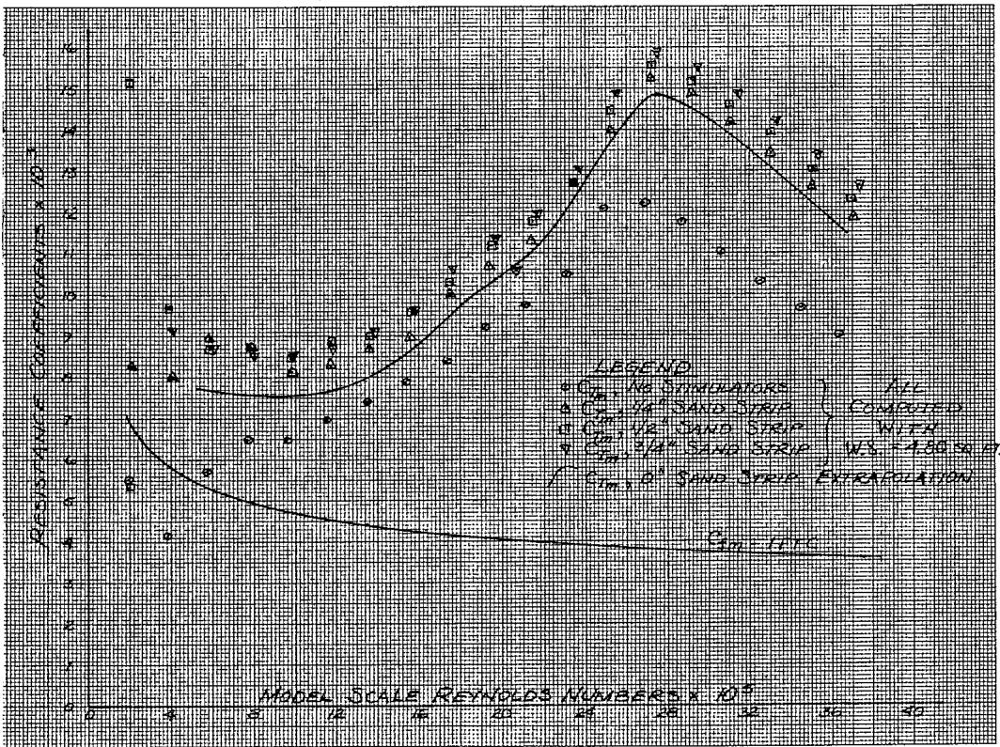

line

| Model Scale (×10⁵) | Value |
| ------------------ | ----- |
| 0                  | 0     |
| 5                  | 0     |
| 10                 | 0     |
| 15                 | 0     |
| 20                 | 0     |
| 25                 | 0     |
| 30                 | 0     |
| 35                 | 0     |
| 40                 | 0     |

Fig. 13 Turbulence stimulation study results using sand strips of various widths

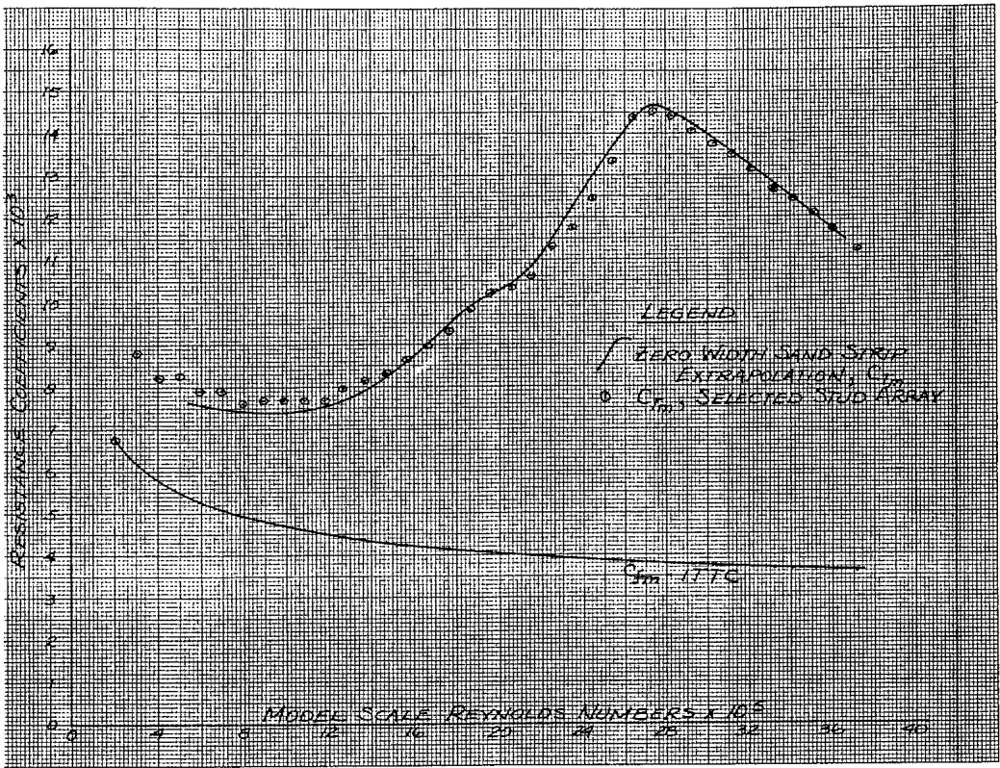

line

| MODEL SCALE REYNOLDS NUMBERS X 10^5 | POSTANCE |
| ---------------------------------- | -------- |
| 0                                  | 0        |
| 4                                  | -1       |
| 8                                  | -2       |
| 12                                 | -3       |
| 16                                 | -4       |
| 20                                 | -5       |
| 24                                 | -6       |
| 28                                 | -7       |
| 32                                 | -8       |
| 36                                 | -9       |
| 40                                 | -10      |

Fig. 14 Resistance curves for final stud configuration and extrapolated "zero width" sand strip

a hypothetical “zero width” sand strip condition, the fully turbulent but zero stimulator drag condition is determined. Also shown in Fig. 13 is the unstimulated resistance curve which shows symptoms of laminar flow presence at low speeds. Indeed, even with sand strip stimulation, some laminar (or at least transitional) flow might be expected at model scale Reynold’s numbers below $6 \times 10^{5}$ . It would appear that some viscous wavemaking interaction might exist in the results shown in Fig. 13 due to the shift of the dominant hump in the total resistance coefficient between the unstimulated and the stimulated curves (near Reynold’s number of about $27 \times 10^{5}$ ).

Several stud geometries were tried. The one for which the resistance behavior most closely matched the “zero width” sand strip condition was chosen as the configuration for all of the subsequent tests from which the data for this study were acquired. The resistance coefficient curves for the “zero width” sand strip and that for the selected stud configuration are shown in Fig. 14.

# Model test results

A total of 54 separate model tests were conducted to acquire the data presented in this paper. For each of the six hulls, three displacements at each of three longitudinal centers of gravity were studied over a range of speeds corresponding to Froude numbers (based on waterline length) from 0.05 to 0.625. At each of 24 discrete model speeds $(v_{m})$ , model resistance $(R_{t_m})$ , model running trim angle $(\tau_{m})$ , and model sinkage $(Z_{\mathrm{CG}_m})$ were measured. The latter two variables were converted by the NAMB acquisition/analysis system to rise or sinkage at the fore and after perpendiculars (FP and AP). Figures 15 and 16 show typical raw data plots of total model resistance coefficient $(C_{t_m})$ versus Froude number and FP/AP rise versus Froude number, respectively. The results of three tests of a given hull at a given displacement are shown in each figure. Each plot symbol corresponds to a different LCG condition. Except at the extreme low-speed end of the speed range, the $C_{t_{m}}$ data are amazingly free of experimental scatter and make physical sense for the different LCG values.

Also plotted in Fig. 15 is the ITTC 1957 Ship-Model Correlation Line ( $C_{f_{m}}$ ), which was used for all resistance data reduction reported herein. The sinkage data (Fig. 16) tend to be more erratic than the resistance data. Similar data plots for all remaining tests were developed [5] for Models YP81-1 through YP81-6, respectively.

After the three sets of $C_{t_{m}}$ data were plotted, as in Fig. 15, smooth curves were faired through each set of data which represent the author's best estimate of the physical trends suggested by the data. Consistency among data for various LCG's (for a fixed displacement) and displacements (for a fixed LCG) were considered when fairing the family of $C_{t_{m}}$ curves for a given model.

The data shown in Figs. 15 and 16 represent bare hull conditions—no appendages of any sort were fitted. A limited series of tests on YP81-1 and YP81-4 was run in which centerline skegs were fitted [5].

# Series resistance results: graphical

To maximize the utility of the resistance results obtained during the series of model tests performed, it was decided that nondimensional results would be plotted. Residual resistance coefficient $(C_{R})$ was chosen as the nondimensional force variable. Both waterline length based and volumetric Froude numbers $(F_{\mathrm{NL}}$ and $F_{N\nu})$ were chosen as dimensionless speed variables. Hull form variables of length-to-beam ratio $(L_{\mathrm{PP}}/B)$ , longitudinal distance of the center of gravity from amidships-to-length ratio $(\mathrm{LCG}/L_{\mathrm{PP}})$ , and displacement-length ratio $(\Delta_{\mathrm{PP}})$ were chosen. (The displacement-length ratio is not really nondimensional since $\Delta$ is in long tons while $L_{PP}$ is in feet.)

The consistent procedure followed in plotting resistance data was as follows for each series hull:

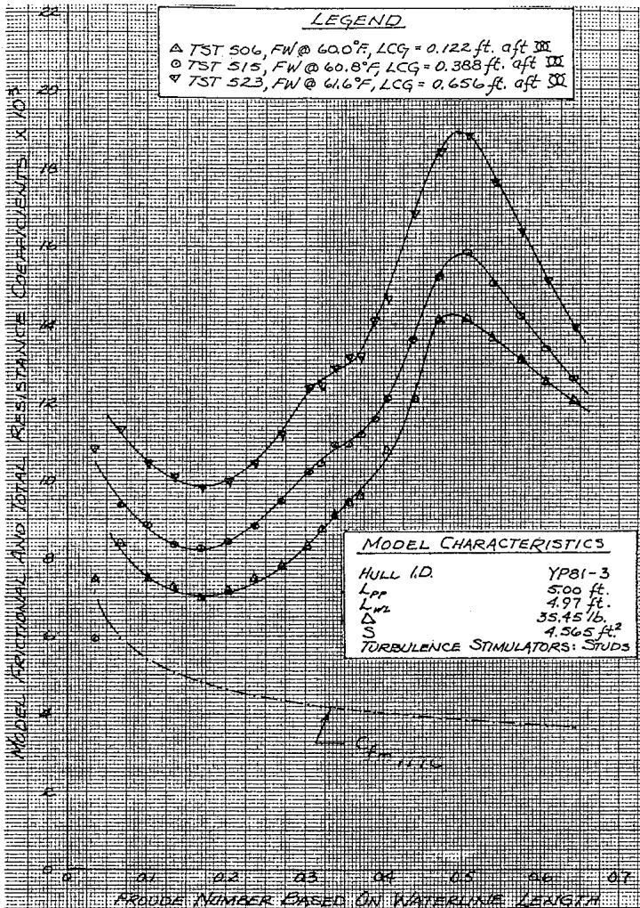

line

| Model | LPR (ft.) | Lw2 (ft.) | Δ (lb.) |
|-------|-----------|-----------|---------|
| S     | 4.97      | 35.45     | 4.565   |
| TST   | 600       | 60.8      | -       |
| S15   | 600       | 60.8      | -       |
| S23   | 600       | 60.8      | -       |

Fig. 15 Typical raw data plot: $C_{t_{m}}$ and $C_{f_{m}}$ versus Froude number

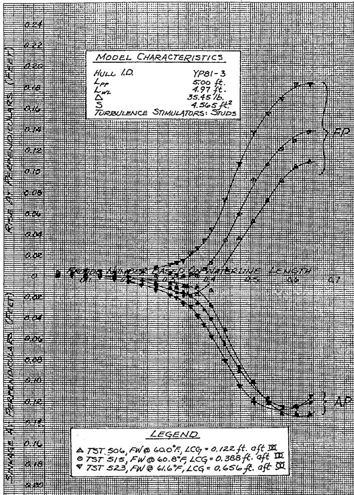

line

| Model Characteristics | Value |
| --- | --- |
| HULL ID | YP81-3 |
| Lpp | 5.00 ft. |
| Lvl | 4.97 ft. |
| ΔS | 35.45 lb. |
| S | 4.56±5 ft² |
| Turbulence Stimulators: Stinds | - |

Fig. 16 Typical raw data plot: FP and AP rise versus Froude number

1. Residual resistance coefficients for a fixed LCG/LPP and the three $\Delta_{PP}$ 's from the individual test results (as in Fig. 15) were plotted versus Froude number based on waterline length.   
2. The set of curves drawn above was read at 13 selected values of volumetric Froude number, and plotted versus displacement-length ratio. The conversion from length-based to volume-based Froude number was

$$
F _ {\mathrm{N} \nabla} = F _ {\mathrm{NL}} \times 5. 5 2 9 \sqrt {\frac {L _ {\mathrm{WL}}}{L _ {\mathrm{PP}}}} \times \Delta_ {\mathrm{PP}} ^ {- 1 / 6}
$$

where the $L_{WL}/L_{PP}$ values were taken from Figs. 4 and 5.

3. The cross curves generated in Step 2 were read at convenient values of displacement-length ratio. The resulting curves were drawn on the same set of axes as the individual test data (Step 1).

Other cross fairings of $C_{R}$ versus LCG/ $L_{PP}$ and L/B for the range of $F_{N\nabla}$ were accomplished to insure the physical reasonableness of the data [5].

The same series of three consistently done steps was performed on the data for the three hard-chine hulls. The resulting sets of dimensionless residual resistance data are presented as Figs. 17 through 34. While not an exhaustive set of crossplots, they do provide the user with the basic resistance-speed-hull condition relationships needed for design purposes.

For the first set of curves (Step 1), the $(C_{R}, F_{\mathrm{NL}})$ values read from faired individual test results are shown as dashed curves between the plotted points. The similar curves shown as solid lines result from the cross-fairing (Step 3) at convenient $\Delta_{\mathrm{PP}}$ values.

# Series resistance results: numerical

The residual resistance coefficient data acquired from all tests were digitized and treated as the dependent variable values in a multiple linear regression analysis in which the hull shape and loading parameters of $L_{PP}/B$ , $\underline{\Delta}_{PP}$ , and $LCG/L_{PP}$ were treated as independent variables. Separate regression analyses were conducted at fixed speed parameter values. A series of BASIC programs was used to prepare the data for and to perform the multiple linear regression analysis [6]. The soft-chine and hard-chine hulls were run through the regression analysis routine separately.

The regression equation for the residual resistance coefficient at a fixed value of Froude number is of the form

$$
C _ {R} \times 1 0 ^ {3} = A + B (L _ {\mathrm{PP}} / B _ {x}) + C (\underline {{{\Delta}}} _ {\mathrm{PP}}) + D (\mathrm{LCG} / L _ {\mathrm{PP}} \times 1 0 ^ {2})
$$

The regression coefficients for the soft-chine hull form are given as functions of Froude number based on waterline length in the top half of Table 1 while those for the hard-chine hull form are given similarly in the bottom half of the same table.

The above-described four-term regression equation must be considered as only a first attempt to numerically quantify the

(text continued on page 368)

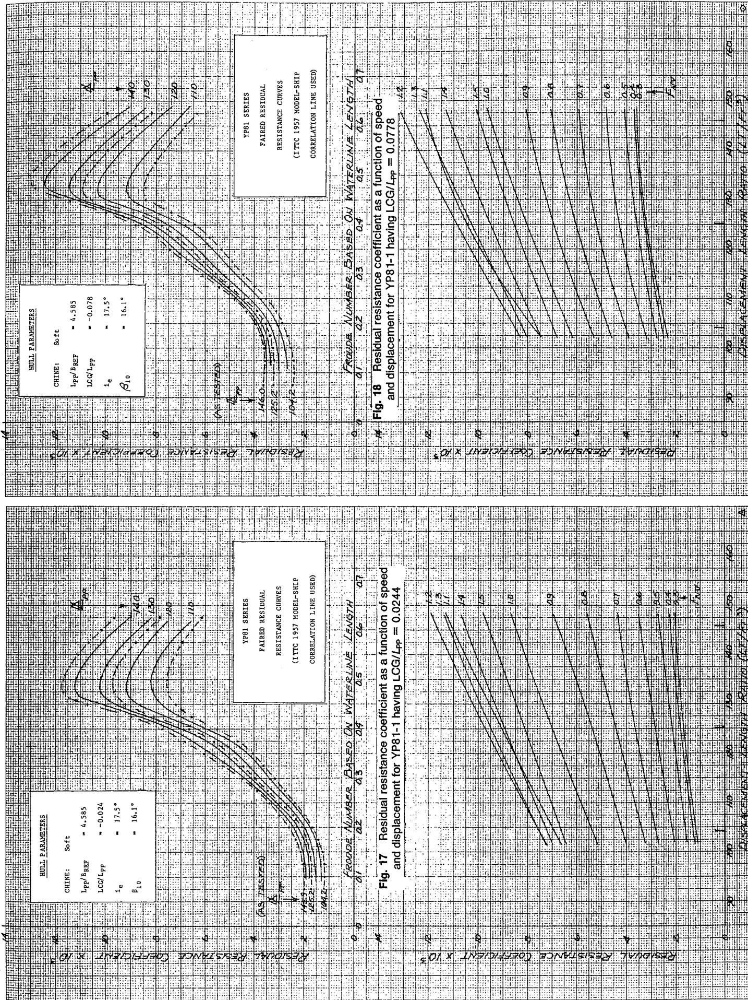

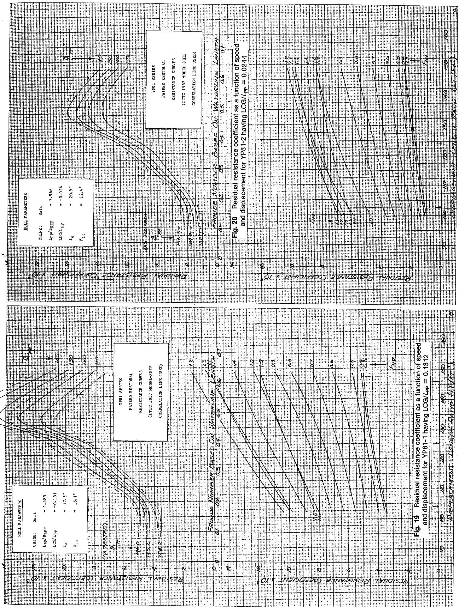

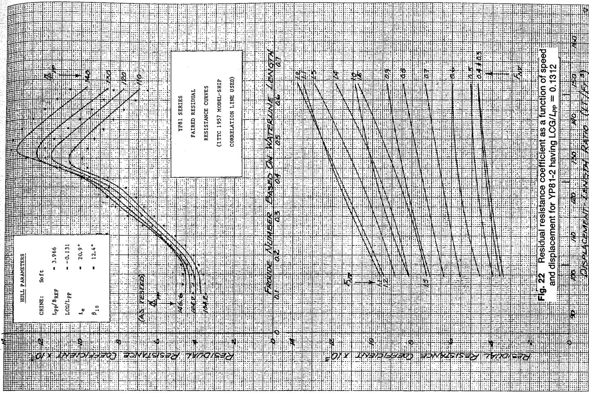

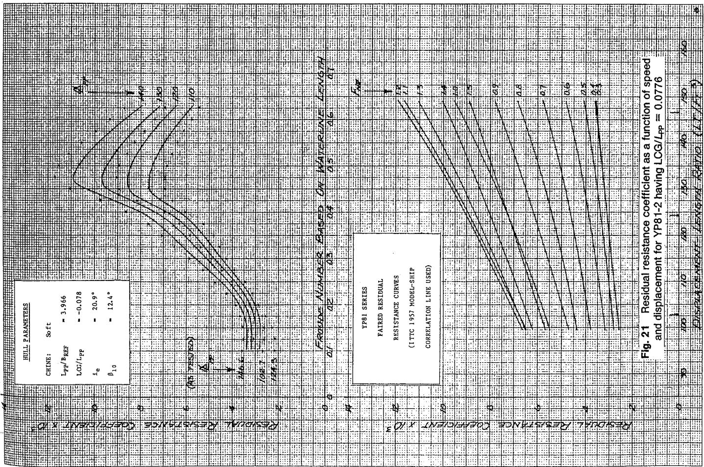

line

| CHINE: Soft | LPP/BREF | LCG/LPP | le   | β10   |
| ----------- | -------- | ------- | ---- | ----- |
| 3.966       | -0.078   | -0.078  | 20.9°| 12.4° |

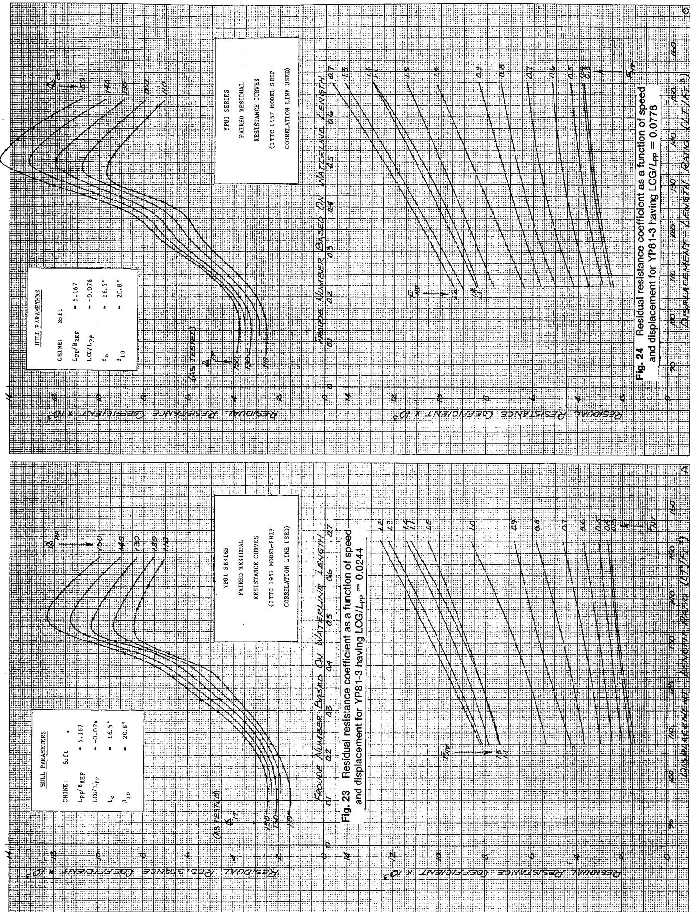

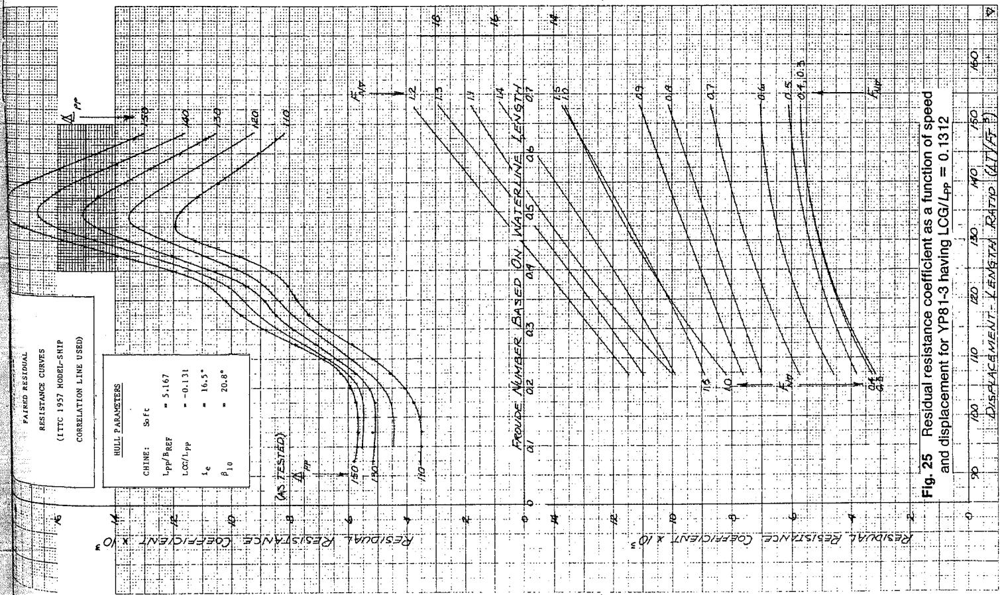

line

| Displacement-Length Ratio (AT/FF²) | Residual Resistance Coefficient (x10³) |
| ----------------------------------- | -------------------------------------- |
| 0                                   | 0                                      |
| 100                                 | 10                                     |
| 120                                 | 20                                     |
| 140                                 | 30                                     |
| 160                                 | 40                                     |
| 180                                 | 50                                     |
| 200                                 | 60                                     |
| 220                                 | 70                                     |
| 240                                 | 80                                     |
| 260                                 | 90                                     |
| 280                                 | 100                                    |
| 300                                 | 110                                    |
| 320                                 | 120                                    |
| 340                                 | 130                                    |
| 360                                 | 140                                    |
| 380                                 | 150                                    |
| 400                                 | 160                                    |
| 420                                 | 170                                    |
| 440                                 | 180                                    |
| 460                                 | 190                                    |
| 480                                 | 200                                    |
| 500                                 | 210                                    |
| 520                                 | 220                                    |
| 540                                 | 230                                    |
| 560                                 | 240                                    |
| 580                                 | 250                                    |
| 600                                 | 260                                    |
| 620                                 | 270                                    |
| 640                                 | 280                                    |
| 660                                 | 290                                    |
| 680                                 | 300                                    |
| 700                                 | 310                                    |
| 720                                 | 320                                    |
| 740                                 | 330                                    |
| 760                                 | 340                                    |
| 780                                 | 350                                    |
| 800                                 | 360                                    |
| 820                                 | 370                                    |
| 840                                 | 380                                    |
| 860                                 | 390                                    |
| 880                                 | 400                                    |
| 900                                 | 410                                    |
| 920                                 | 420                                    |
| 940                                 | 430                                    |
| 960                                 | 440                                    |
| 980                                 | 450                                    |
| 1000                                | 460                                    |
| 1020                                | 470                                    |
| 1040                                | 480                                    |
| 1060                                | 490                                    |
| 1080                                | 500                                    |
| 1100                                | 510                                    |
| 1120                                | 520                                    |
| 1140                                | 530                                    |
| 1160                                | 540                                    |
| 1180                                | 550                                    |
| 1200                                | 560                                    |
| 1220                                | 570                                    |
| 1240                                | 580                                    |
| 1260                                | 590                                    |
| 1280                                | 600                                    |
| 1300                                | 610                                    |
| 1320                                | 620                                    |
| 1340                                | 630                                    |
| 1360                                | 640                                    |
| 1380                                | 650                                    |
| 1400                                | 660                                    |
| 1420                                | 670                                    |
| 1440                                | 680                                    |
| 1460                                | 690                                    |
| 1480                                | 700                                    |
| 1500                                | 710                                    |
| 1520                                | 720                                    |
| 1540                                | 730                                    |
| 1560                                | 740                                    |
| 1580                                | 750                                    |
| 1600                                | 760                                    |
| Note: The data is extracted from the provided image in the code and presented in CSV format as requested. The table data includes the original table data and the corresponding numerical values for each data series. The table data is labeled with 'HULL PARAMETERS' and 'FROUDE NUMBER BASED ON WATERLINE LENGTH'.

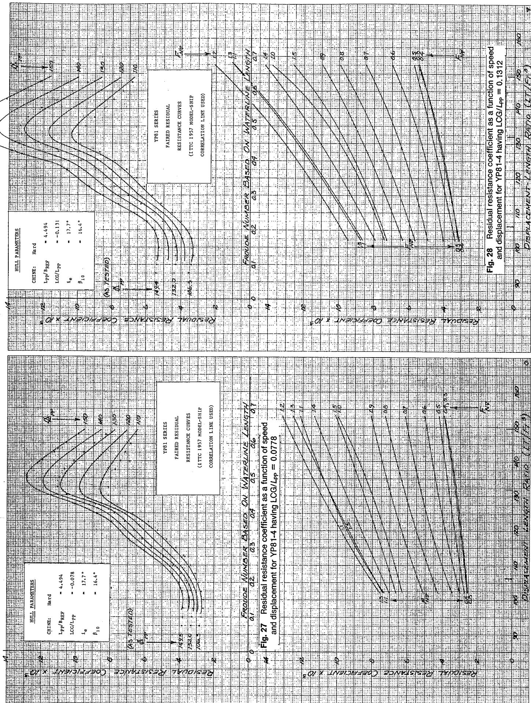

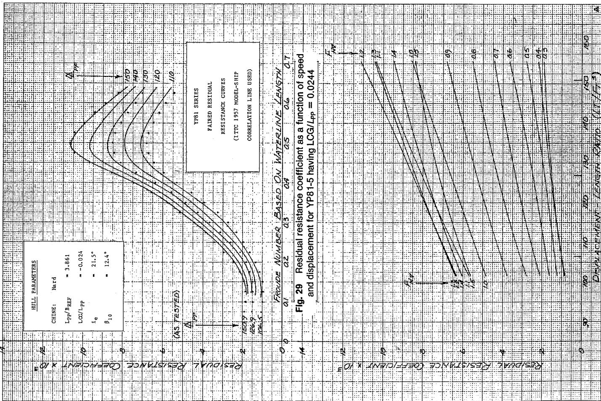  
:   
[Non-Text]   
[Non-Text]   
•   
65   
[Non-Text]   
[Non-Text]   
。  
[Non-Text]   
[Non-Text]   
[Non-Text]   
[Non-Text]   
[Non-Text]   
[Non-Text]   
[Non-Text]   
[Non-Text]   
[Non-Text]   
[Non-Text]   
65   
[Non-Text]   
[Non-Text]   
[Non-Text]   
[Non-Text]   
The Ground Truth image displays a single, solid horizontal line. According to Rule 2 (UNDERSCORE & LINE RULES), if the GT contains lines used for stylistic emphasis or as background elements (like ruled paper), the OCR result must ignore them. The provided OCR content is "\_\_\_\_", which consists of four underscores. This is incorrect because underscores are not equivalent to a solid line and should not be output for stylistic/background lines. The OCR has hallucinated placeholder underscores where none exist in the GT, violating the rule to ignore stylistic lines. Therefore, the OCR result is inconsistent with the Ground Truth.   
[NO TEXT]   
1   
1   
图  
1   
出  
图  
1   
图  
[Unreadable]   
[Unreadable]   
1.2   
[Unreadable]   
[Unreadable]   
1   
[Unreadable]   
1   
1   
The image is too blurry to recognize any text content.   
1   
[Unreadable]   
.   
图 2-1  
图  
2   
::1:   
[Unreadable]   
[Unreadable]   
:   
:   
[Unreadable]   
-   
A   
[Unreadable]   
12   
4   
1   
:   
• • •   
• • • • • •   
1   
……   
• • • • •   
• • • •   
1.1.1   
• • • • •   
: : :   
• • • •
• • • •   
• • • •
• • • •
• • • •   
[Non-Text]   
+ -   
[Non-Text]   
[Non-Text]   
[Non-Text]   
65   
[Non-Text]   
[Non-Text]   
。  
[Non-Text]   
[Non-Text]   
[Non-Text]   
[Non-Text]   
[Non-Text]   
[Non-Text]   
[Non-Text]   
[Non-Text]   
[Non-Text]   
[Non-Text]

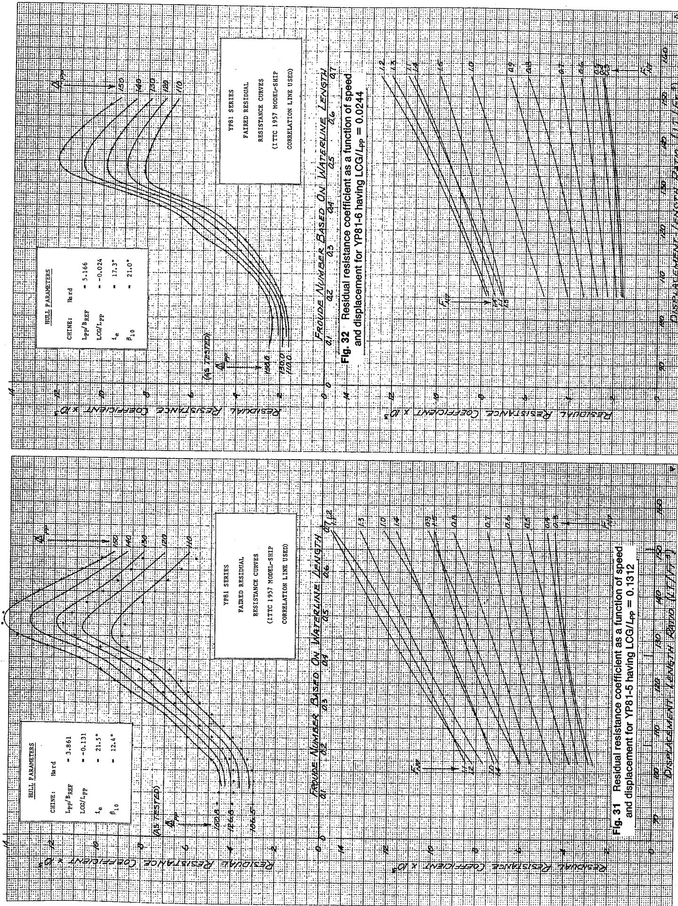

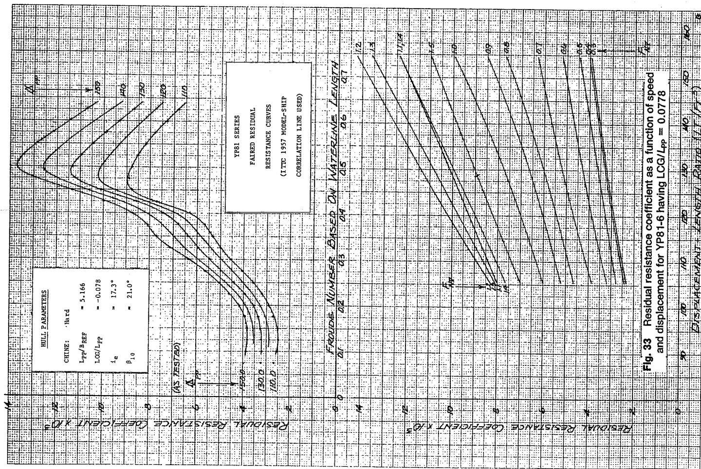

<table><tr><td rowspan="3"></td><td colspan="8">Fig. 34 Residual resistance coefficient as a function of speed and displacement for YP81-6 having LCG/LPP=0.1312</td></tr><tr><td rowspan="2">a</td><td>90</td><td>100</td><td>110</td><td>120</td><td>130</td><td>140</td><td>150</td></tr><tr><td colspan="7">DISPLACEMENT LENGTH RATIO (LT/Ft-3)</td></tr></table>

<table><tr><td>D</td><td>50</td><td>100</td><td>110</td><td>120</td><td>130</td><td>140</td><td>150</td><td>160</td></tr><tr><td></td><td colspan="8">DISPLACEMENT: LENGTH RATIO: (LF/F-2)</td></tr></table>

Table 1 Regression coefficients: $C_R \times 10^3 = A + B(L/B) + C(\mathcal{L}_{PP}) + D(LCG/L \times 10^2)$ 

<table><tr><td rowspan="2">SOFT CHINE</td><td colspan="11"> $F_{NL}$ </td></tr><tr><td>0.10</td><td>0.15</td><td>0.20</td><td>0.25</td><td>0.30</td><td>0.35</td><td>0.40</td><td>0.45</td><td>0.50</td><td>0.55</td><td>0.60</td></tr><tr><td>A</td><td>-3.1551</td><td>-2.9756</td><td>-2.5305</td><td>-2.3637</td><td>-3.2734</td><td>-3.3070</td><td>-2.5114</td><td>-6.3063</td><td>-13.3525</td><td>-12.8032</td><td>-10.9613</td></tr><tr><td>B</td><td>0.11734</td><td>0.13670</td><td>0.14597</td><td>0.16082</td><td>0.28838</td><td>0.34376</td><td>0.19296</td><td>0.85295</td><td>1.71032</td><td>1.66136</td><td>1.46348</td></tr><tr><td>C</td><td>0.03036</td><td>0.02882</td><td>0.02780</td><td>0.03099</td><td>0.03994</td><td>0.05040</td><td>0.05704</td><td>0.07999</td><td>0.11094</td><td>0.10600</td><td>0.09407</td></tr><tr><td>D</td><td>0.24272</td><td>0.23790</td><td>0.24179</td><td>0.27135</td><td>0.31552</td><td>0.31348</td><td>0.31572</td><td>0.35185</td><td>0.34211</td><td>0.27149</td><td>0.19962</td></tr><tr><td>HARD CHINE</td><td>0.10</td><td>0.15</td><td>0.20</td><td>0.25</td><td>0.30</td><td>0.35</td><td>0.40</td><td>0.45</td><td>0.50</td><td>0.55</td><td>0.60</td></tr><tr><td>A</td><td>-4.0091</td><td>-3.8616</td><td>-3.4016</td><td>-3.8165</td><td>-4.9268</td><td>-5.0339</td><td>-3.3313</td><td>-7.4907</td><td>-13.4033</td><td>-13.4605</td><td>-11.7117</td></tr><tr><td>B</td><td>0.38551</td><td>0.36559</td><td>0.30585</td><td>0.32553</td><td>0.49059</td><td>0.45322</td><td>0.33365</td><td>0.97457</td><td>1.65367</td><td>1.73983</td><td>1.71066</td></tr><tr><td>C</td><td>0.02891</td><td>0.02838</td><td>0.02864</td><td>0.03506</td><td>0.04371</td><td>0.05459</td><td>0.06064</td><td>0.08270</td><td>0.11335</td><td>0.10502</td><td>0.08773</td></tr><tr><td>D</td><td>0.21182</td><td>0.21086</td><td>0.22727</td><td>0.26631</td><td>0.31399</td><td>0.31524</td><td>0.30777</td><td>0.33763</td><td>0.33905</td><td>0.27315</td><td>0.19874</td></tr></table>

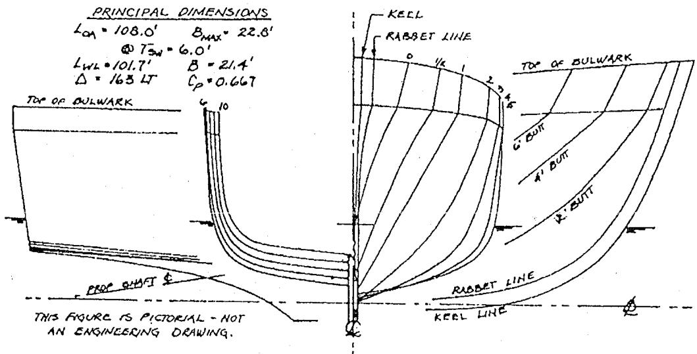

other

| Dimension | Value |
| --------- | ----- |
| Principal Dimensions | LWA = 108.0' |
| Principal Dimensions | BMAX = 22.6' |
| Principal Dimensions | TSW = 6.0' |
| Principal Dimensions | LWL = 101.7' |
| Principal Dimensions | Δ = 163 LT |
| Principal Dimensions | Cp = 0.667 |
| Keyline | RABBIT LINE |
| Top of Bulwark | 10 |
| Top of Bulwark | 4.5 |
| Top of Bulwark | 2.5 |
| Top of Bulwark | 1.5 |
| Top of Bulwark | 0.5 |
| Propshift | 0.5 |
This figure is pictorial - not an engineering drawing.

Fig. 35. Abbreviated lines sketch of 108-ft yard patrol craft (YP 676)

(text continued from page 358)

influence of the shape and speed variables on the residual resistance coefficient of hulls of the type discussed here.

# Application and comparison of series resistance results

To establish the reasonableness of the resistance predictions based on the graphical and numerical results presented in this report, a case study centering on the 108-ft YP shown as the frontispiece was performed. In addition to comparing actual model results [7] on the subject YP hull with series predictions, comparisons with widely used, published, early-stage power estimating schemes—standard series and a regression meth-

Table 2 108-ft YP case study: hull particulars 

<table><tr><td>Length overall,  $L_{OA}$ </td><td>108.0 ft</td></tr><tr><td>Length between perpendiculars,  $L_{PP}$ </td><td>101.2 ft</td></tr><tr><td>Reference draft,  $T_{REF}$ </td><td>6.0 ft</td></tr><tr><td>Maximum sectional area at  $T_{REF}$ ,  $SA_x$ </td><td>84.8 ft $^{2}$ </td></tr><tr><td>Waterline beam at  $T_{REF}$  and  $SA_x$ ,  $B_{REF}$ </td><td>21.4 ft</td></tr><tr><td>Prismatic coefficient at  $T_{REF}$ ,  $C_p$ </td><td>0.667</td></tr><tr><td>Length-to-beam ratio at  $T_{REF}$ ,  $L/B$ </td><td>4.719</td></tr><tr><td>Displacement,  $\Delta$ </td><td>163.2 LT</td></tr><tr><td>Longitudinal distance of center of gravity aft of  $\mathfrak{X}$ , LCG</td><td>4.47 ft</td></tr><tr><td>Wetted surface area, WSA</td><td>2377 ft $^{2}$ </td></tr><tr><td>Waterline length,  $L_{WL}$ </td><td>101.7 ft</td></tr></table>

od—will be made. For the purpose of the case study, the 108-ft YP has the principal characteristics given in Table 2. The abbreviated lines sketch of the YP is shown as Fig. 35. Notice the differences between the case study hull and those of which the presently reported standard series are composed. Most notably, the case study hull has a more generous bilge radius (to better suit planked wood construction), a full length integral skegkeel, and a less deeply immersed transom. The first and the last of these differences would suggest lower resistance at low to moderate speeds for the case study hull while the integral appendage would suggest a higher resistance at all speeds.

The standard powering estimators chosen for this comparison are as follows:

1. Taylor Standard Series [8]—Although the Taylor hull form is not at all similar to the present hull forms, this is a widely used benchmark for widely varying hull types. Inputs include prismatic coefficient $(C_p)$ , length-to-beam ratio $(L/B)$ , beam-to-draft ratio $(B/T)$ , and speed. At the high end of the speed range, the series is extrapolated beyond its original experimental data limits.   
2. Mercier and Savitsky's regression equation for transomsterned boats in the "preplaning" speed regime [9]—This estimate is based on many hull forms, hard- and soft-chined, operating at volumetric Froude numbers between 1.0 and 2.0. Inputs include angle of entrance at the static waterline $(i_{c})$ , transom sectional area to maximum sectional area ratio $(A_{7} / A_{\lambda})$ , a loading coefficient based on beam $(\nabla / B_{\lambda}^{3})$ , a volumetric coefficient $(L_{\mathrm{WL}} / \nabla^{1/3})$ , and a longitudinal center of gravity parameter (LCG/

$L_{PP}$ ). This estimator does not cover the low end of the speed range at all.

3. National Physical Laboratory (NPL) Series of Marwood and Bailey [2]—These hull forms are very similar in shape to the case study hull forms. Inputs include length-to-beam ratio $(L / B)$ and a volumetric coefficient $(\mathbf{M} = \mathrm{LWL} / \nabla^{1 / 3})$ . EHP values were read directly from curves drawn for a waterline length of 100 ft. A wetted surface was read from curves provided in the report.   
4. Series 63 of Beys [3]—A round bilged planing hull which was tested at low (subplaning) and high (planing) speeds. Inputs include length-to-beam ratio $(L / B)$ and a volumetric coefficient $(L_{\mathrm{TP}} / \nabla^{1 / 3})$ .   
5. Swedish Maritime Research Centre (SSPA) Series [10]-- The speed regime for this series is generally higher than that described here. Only the upper range of the case study hull's speed can be estimated by this reference. The plotted contours of $C_R$ for a block coefficient of 0.4 were increased by 5 percent on the basis of Appendix A of reference [10].

Neither Series 64 [1] nor the Webb Trawler series of Ridgely-Nevitt [11] was applicable to the present study because of displacement-length ratio mismatches. For all predictions the friction formulation employed by the series originator was used. All had the value of the correlation allowance, $C_A$ , set at 0.0004. The wetted surfaces used were those estimated by the predictors authors, not the actual wetted surface of the case study hull. This approach was adopted since each estimator normalized residual resistance (that is, calculated $C_R$ ) by using its own wetted surface and friction formulation.

The resulting effective horsepower estimates are shown in Fig. 36. Besides the five estimators listed above, the present series results—contours and four-term regression equation—were employed to estimate EHP. For the $C_R$ contours, linear interpolation was used over both $L_{CG}/L_{PP}$ and $L/B$ —and in that order. Similar linear interpolation was used to determine waterline length ( $L_{WL}$ ) and wetted surface from plotted S curves (see Fig. 4). The results are encouraging for the present series validity. The solid curve in Fig. 36 represents the EHP estimated from model testing a 5-ft geosim of the ship in a manner virtually identical to that used for the present series. Most of the estimators underpredict EHP, especially at low speeds. At high speeds, the severely extrapolated Taylor Series overpredicts badly, due to its cruiser stern and the attendant high trim by the stern. Neither Marwood and Bailey nor Mercier and Savitsky is applicable at the low end of the speed range. Series 63 gives the best estimate for the upper speed regime (above 15 knots for $L_{PP} = 101.7$ ft). It overpredicts EHP throughout the speed range, unlike most of the other estimators attempted.

The contours and regression equation developed in this report overpredict EHP at low speeds (up to 13 knots) and under-predict at high speeds (over 16 knots) for the case study presented. However, the present series is reasonably close over the entire speed range. How well each predictor does at estimating EHP is shown quantitatively in Table 3. Several more case study situations should be studied before any widespread acceptance of the present series work is established.

# Summary

The series of stillwater resistance tests on three soft-chined and three hard-chined models of comparable slenderness and loading has resulted in, first, a set of residual resistance coefficient contours as functions of $L / B$ , $\Delta_{PP}$ , $\mathrm{LCG} / L^*$ and speed-measured by $F_{\mathrm{NL}}$ and $F_{\mathrm{NV}}$ which appear to give reasonable results for craft falling within the scope of the series parameters, and second, an initial formulation based on multiple linear regression analysis which predicts surprisingly well, at least for

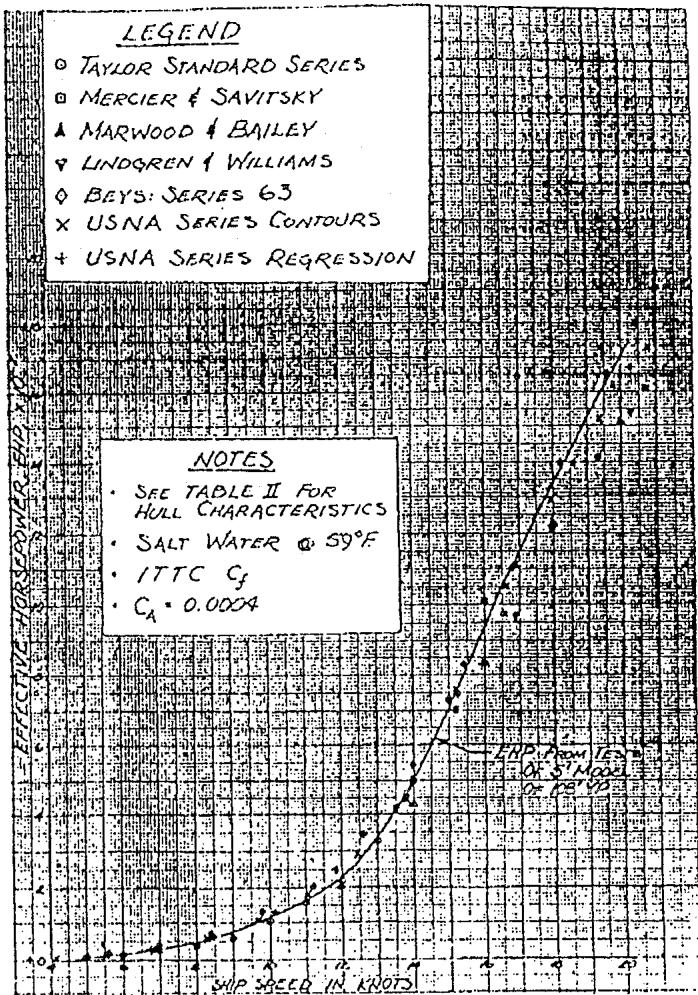

line

LEGEND
● TAYLOR STANDARD SERIES
● MERCIER & SAVITSKY
▲ MARWOOD & BAILEY
▼ LINDGREN & WILLIAMS
◇ BEYS: SERIES 63
× USNA SERIES CONTOURS
+ USNA SERIES REGRESSION
NOTES
• SFE TABLE II FOR HULL CHARACTERISTICS
• SALT WATER @ 59°F
• ITTC Cf
• Ca = 0.0004
SHIP SPEED IN KNOTD

Fig. 36 EHP as a function of speed for YP 676: various predictions

the case study example chosen. Linear interpolation over L/B, and LCG/L appears adequate and simple to employ when using the $C_{R}$ contours.

The following trends were observed:

1. The aftmost center-of-gravity loading condition results in the highest total and residual resistance coefficients (and running trim angle) for all hulls.   
2. The heaviest displacement has the highest total and residual resistance coefficients for all hulls.   
3. The difference in resistance due to LCG differences lessens or disappears at the highest speeds tested.   
4. The primary hump in the residual resistance coefficient curves occurs near a volumetric Froude number of 1.2.   
5. Hard-chine hulls have slightly lower residual resistance coefficients than soft-chine hulls of the same nominal length-to-beam ratio and loading ( $\alpha_{PP}$ and LCG/L) at a given speed. The difference generally becomes more pronounced at higher speeds.   
6. More slender hulls within the series have higher residual resistance coefficients than the beamier hulls.

Trends 5 and 6 may appear contrary to intuition for designers. It must be remembered that the trends stated apply to residual resistance coefficients only. Differences in wetted surface caused by differing hull slenderness may result in higher resistance forces and horsepowers.

# Future series work

As mentioned at the outset, this paper represents the first installment in a series of performance estimating tools for the designers of coastal patrol type craft in the displacement and semiplaning speed regimes. Work has begun or is in the planning stages for the following extensions of this work:

Table 3 Percent differences from model test EHP's: 108-ft YP 

<table><tr><td rowspan="2"> $V_s$ ,knots</td><td rowspan="2">EHP5-ft ModelTest [7]</td><td colspan="6">[(EHPmodel - EHPest)/EHPmodel] × 100→</td></tr><tr><td>TaylorStandard Series[Ref. 8]</td><td>SubplanRegression[Ref. 9]</td><td>NPLSeries[Ref. 2]</td><td>Series63[Ref. 3]</td><td>SSPASeries[Ref. 10]</td><td>USNASeries</td></tr><tr><td>4</td><td>4</td><td>0</td><td>...</td><td>...</td><td>...</td><td>...↑</td><td>0</td></tr><tr><td>5</td><td>10</td><td>10</td><td>... ↑</td><td>...</td><td>...</td><td>...↑</td><td>-10</td></tr><tr><td>6</td><td>19</td><td>21</td><td>...</td><td>...</td><td>-26</td><td>...</td><td>-10</td></tr><tr><td>7</td><td>29</td><td>21</td><td>...</td><td>...</td><td>-38</td><td>...</td><td>-10</td></tr><tr><td>8</td><td>44</td><td>18</td><td>...</td><td>...</td><td>-41</td><td>...</td><td>-11</td></tr><tr><td>9</td><td>72</td><td>19</td><td>...</td><td>...</td><td>-30</td><td>...</td><td>-10</td></tr><tr><td>10</td><td>112</td><td>8</td><td>...</td><td>...</td><td>-25</td><td>...</td><td>-8</td></tr><tr><td>11</td><td>161</td><td>3</td><td>...</td><td>...</td><td>-18</td><td>...</td><td>-10</td></tr><tr><td>12</td><td>227</td><td>3</td><td>...</td><td>9</td><td>-19</td><td>...</td><td>-9</td></tr><tr><td>13</td><td>336</td><td>3</td><td>...</td><td>14</td><td>-16</td><td>... Out of Series Range</td><td>-6</td></tr><tr><td>14</td><td>491</td><td>-1</td><td>3</td><td>13</td><td>-10</td><td>0</td><td>-3</td></tr><tr><td>15</td><td>702</td><td>-4</td><td>5</td><td>12</td><td>-4</td><td>9</td><td>0</td></tr><tr><td>16</td><td>935</td><td>-17</td><td>8</td><td>10</td><td>-4</td><td>12</td><td>1</td></tr><tr><td>17</td><td>1143</td><td>-44</td><td>8</td><td>9</td><td>-1</td><td>14</td><td>1</td></tr><tr><td>18</td><td>1335</td><td>-83</td><td>8</td><td>8</td><td>-2</td><td>14</td><td>2</td></tr><tr><td>19</td><td>1518</td><td>-135</td><td>10</td><td>9</td><td>-2</td><td>13</td><td>4</td></tr><tr><td>20</td><td>1703</td><td>-200 ↓ Extrapolated  $C_R$ </td><td>11</td><td>11</td><td>-1</td><td>13</td><td>5</td></tr><tr><td colspan="2"></td><td colspan="6">Positive values indicate underestimates relative to model data</td></tr></table>

- Running trim angle ( $\tau$ ) and rise/sinkage at the center of gravity ( $Z_{CG}$ ) will be presented in the same format as the residual resistance data included herein.   
- One or more heavier displacement conditions will be included in the model test matrix.   
- Resistance of the series in shallow water typical of coastal operational areas will be studied.   
- Seakeeping tests in head and following seas will be conducted to assess the effects of hull changes on pitch, heave, relative motion, and added resistance due to encountered waves.   
- Seakeeping tests at zero speed in beam seas will be completed to assess hull shape and loading effects on roll motion.   
- The linear regression equation will be refined as necessary to improve its ability to predict residual resistance coefficients.

The series represents the first systematic resistance data published by the staff of the USNA Hydromechanics Laboratory. Consequently, considerable discussion of facilities and lab techniques are included in this report. Of particular interest are the interactive operator/computer aspects of the laboratory data acquisition system and the turbulence stimulator study presented.

# Acknowledgments

Many talented people were responsible for the work reported here. The entire staff of the U.S. Naval Academy Hydromechanics Laboratory—both permanent and temporary—deserve recognition for the precision and consistency with which this large number of model tests was carried out. Special thanks are due to Don Bunker, Howard Chatterton, Steve Enzinger, Jeff Hough, and John Hoyt for their efforts. NAVSEA:NORFOLK supported this effort materially and technically throughout. Mr. Don Blount and Mr. Gordon Hatchell of that organization were especially supportive. For turning pages of handwritten

scrawl to the finished manuscript, my thanks to Darlene Batten, Judy Anway, Mary Palombo, and Helen Wanbaugh.

# References

1 Yeh, H. Y. H., "Series 64: Resistance Experiments on High-Speed Displacement Forms," MARINE TECHNOLOGY, Vol. 2, No. 3, July 1965.   
2 Marwood, W. J. and Bailey, D., "Design Data for High Speed Displacement Hulls of Round-Bilge Form," National Physical Laboratory Ship Report No. 99, Feb. 1969.   
3 Beys, P. M., "Series 63 Round Bottom Boats," Davidson Laboratory Report No. 949, Stevens Institute of Technology, Hoboken, N.J., April 1963.   
4 Gebhardt, J. C., Williams, S., and Compton, R. H., "The U.S. Naval Academy Hydromechanics Laboratory Data Acquisition, Control and Analysis System," 18th American Towing Tank Conference, U.S. Naval Academy, Annapolis, Md., Aug. 1977.   
5 Compton, R. H., "USNA YP Replacement Model Test Program: Still Water Testing of Systematic Series: YP81-1 through YP81-6," U.S. Naval Academy Hydromechanics Laboratory Report (in progress).   
6 Draper, M. and Smith, H., Applied Regression Analysis, Wiley, New York, 1966, pp. 104–227.   
7 Compton, R. H., "USNA Replacement Model Test Program: Effective Horsepower Tests for YP81-7," U.S. Naval Academy, Division of Engineering and Weapons, Report No. EW-20-82, Annapolis, Md., July 1982.   
8 Gertler, M., "The Reanalysis of the Original Test Data for the Taylor Standard Series," David Taylor Model Basin Report No. 806, March 1954 (with high-speed extrapolation by Mr. Kenneth Walker).   
9 Mercier, J. A. and Savitsky, D., "Resistance of Transom-Stern Craft in the Preplaning Regime," Davidson Laboratory Report No. R-1667, Stevens Institute of Technology, Hoboken, N.J., June 1973.   
10 Lindgren, H. and Williams, A., "Systematic Tests with Small Fast Displacement Vessels, Including a Study of the Influence of Spray Strips," Proceedings, SNAME Diamond Jubilee International Meeting, New York, 1968.   
11 Ridgely-Nevitt, C., "The Resistance of a High Displacement-Length Ratio Trawler Series," Trans. SNAME, Vol. 75, 1967.

Metric Conversion Factors

1 ft = 0.3048 m

$1\mathrm{ft}^2 = 0.0929\mathrm{m}^2$

1 ft $^{3}$ = 0.02831 m $^{3}$

1 in. = 25.4 mm

1 lb = 0.45 kg

MARINE TECHNOLOGY