# A review on the hydrodynamics of planing hulls

Sasan Tavakoli a,\* , Mingyang Zhang b , Aleksander A. Kondratenko b , Spyros Hirdaris c

a Department of Infrastructure Engineering, The University of Melbourne, Parkville, 3052, VIC, Australia   
b Marine and Arctic Technology Group, Aalto University, Espoo, 02150, Finland   
c American Bureau of Shipping, Global Ship Systems Centre, Kallithea, 17674, Athens, Greece

# A R T I C L E I N F O

Keywords:

Planing hulls

Advanced marine vehicles

Hydrodynamics

Mathematical modelling

Computational fluid dynamics

Artificial intelligence

Holistic design optimization

Intelligent systems

# A B S T R A C T

The topology of planing hulls entails some of the most innovative specifications found in modern advanced marine vehicles. Planing hull designs can vary depending on their intended use and hence sound understanding of the influence of hydrodynamics on craft stability and performance is key within the context of modern design for safety and sustainability requirements. The planing motions of stepless or stepped hull surfaces, be it steady or unsteady are strongly coupled with nonlinear fluid flows. Consequently, calm water performance, seakeeping and maneuvering in waves, can be idealised by a diverse array of analytical and simulation-based models. In this paper, we holistically review scholarly studies on the subject, discuss research challenges and opportunities ahead. A conclusion drawn is that, although the mathematical models, especially the ones that simulate maneuvering motions, require further development to account for the complexities of operating in a real-world marine environment, they are mostly limited to monohull designs without steps. It is also suggested that the emergence of new-generation artificial intelligence algorithms opens up new prospects for hydrodynamic modelling and design as accounting for dynamic motion predictions. The holistic optimization of planing hulls, a realm yet overlooked in the context of planing hydrodynamics, is identified as an important and interesting future research opportunity. Pairing of AI algorithms with holistic optimization methods is recommended as a key direction in the development of intelligent planing boat design systems.

# 1. Introduction

Improving the operational speed of advanced marine vehicles while maintaining the highest safety standards has been one of the greatest dreams of engineers and naval architects. Unlike airplanes, trains, and sports cars, that may reach very high speeds, the design of advanced marine vehicles (AMV) is limited by the physical properties of water and the forces generated by air-hull-water interactions (Gabrielli and von Karm´ an, ´ 1950). Amongst the various technologies that could be used to improve the speed limits of AMV is to trigger planing motions, and vessels operating under such state are known as “planing hulls”.

Planing hulls are used for various applications at sea, particularly in way of coastal zones. Coastal guard boats, rescue vessels, and ocean racers are a few examples of AMV that benefit from this innovation (Savitsky, 1985). These vessels mostly feature a common V-bottom shape and transom stern design, giving rise to hydrodynamic lift that pushes the bow of the boat up. The result is a non-zero positive trim angle that leads to the reduction of the wetted length of the boat and suppresses the wave-making resistance (Savitsky and Core, 1980), thus allowing for high-speed advancement. For a schematic of the planing motions and transition of the vessel from displacement to planing mode refer to Fig. 1 (a).

As the speed of a planing hull increases, the hydrodynamic lift that supports her weight force also increases. Buoyancy gradually converges to zero as the displaced volume diminishes. In a rough sea condition, this can result in relatively large wave-induced motions and vertical accelerations that can be way greater than gravity acceleration (Razola et al., 2016). Such a large acceleration may be a serious threat to the crew onboard, both physically and in terms of consciousness (de Alwis et al., 2016). During unsteady planing large slamming forces may arise, causing strains (see example of flexible water entry studies in Maki et al., 2011, Piro and Maki, 2013, Shams and Porfiri, 2015, Izadi et al., 2018, Wang and Suarez, 2018, Hosseinzadeh et al., 2023a, b, Gilbert et al., 2023, Tavakoli et al., 2023b for more technical information), and this may damage the vessel bow region (Allen and Jones, 1978; Faltinsen et al., 2004; Dessi and Martini, 2008; Camilleri et al., 2018). This is the

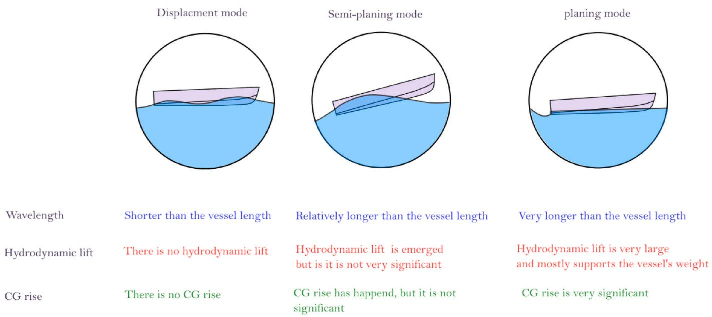

text_image

Displacement mode
Semi-planning mode
planing mode
Wavelength
Shorter than the vessel length
Relatively longer than the vessel length
Very longer than the vessel length
Hydrodynamic lift
There is no hydrodynamic lift
Hydrodynamic lift is emerged
but is it is not very significant
Hydrodynamic lift is very large
and mostly supports the vessel's weight
CG rise
There is no CG rise
CG rise has happen, but it is not
significant
CG rise is very significant

(b)   
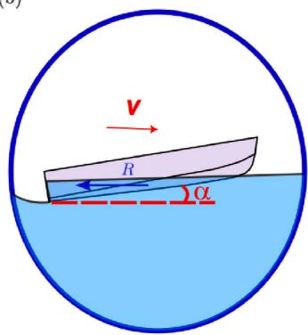

text_image

v
R
α

(d)

What do we need?

R versus V plot

α versus V plot

CG rise versus V plot

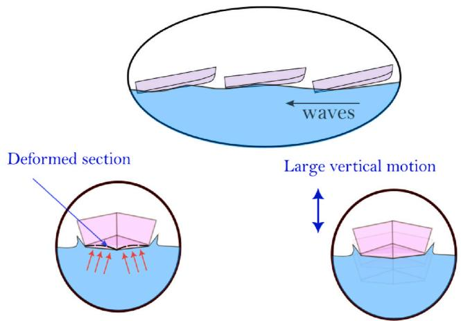

text_image

waves
Deformed section
Large vertical motion

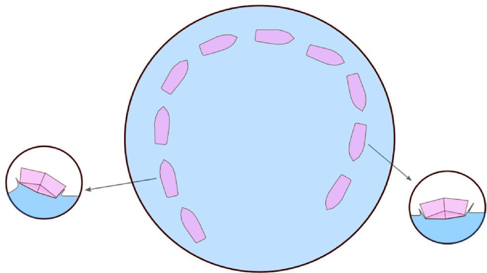

natural_image

Diagram showing a large blue sphere with pink petal-like shapes inside, connected to two smaller circular insets (no text or symbols)

Fig. 1. The concept of planing motions (a) general overview of planing hydrodynamics, (b) calm water performance, (c) seakeeping (d) maneuvering (Sample plots showing calm water performance, vertical acceleration of a planing hull, and time history of roll angle of a planing hull maneuvering are shown in Appendix A).

reason why the accurate prediction of the unsteady motions of planing vessels and resulting sea loads are considered important.

Some of many challenges in modelling planing motions may relate with the abrupt variations in way of the wet surface area leading to highly nonlinear added mass, damping, and restoring force effects (Troesch and Falzarano, 1993; Troesch and Hicks, 1994). Frequency-domain algorithms are not useful under such circumstances (Sun and Faltinsen, 2011a; Tavakoli et al., 2020). Suitable idealization of directional control even when maneuvering in calm water conditions is another major challenge (Day and Haag, 1952a,b; Cohen and Blount, 1986; Codega and Lewis, 1987; Blount and Codega, 1992) dominated by high hydrodynamic pressures. In such conditions, the shift of the center of pressure towards the transom or any of the chines can result in unstable motions. To avoid this, the rider has no option but to decrease the operational speed. Apart from that, sea trail tests have shown that a common planing hull turning or stopping may not pass IMO (International Maritime Organization) standards (IMO, 1993, 1994). A relatively recent example, on the discrepancy predicted tactical diameters of Argo Class fast patrol vessels reported by Soares et al. (2004) demonstrates the latter. From an engineering point of view, it is important to investigate the hydrodynamics of a vessel in all contexts, including its calm water performance, seakeeping, and maneuvering. This helps ensure that the vessel can reach its maximum possible speed with the lowest required power, while keeping her stability, maneuverability, and minimal motion in waves. A general view of three different hydrodynamic problems, namely calm water performance, seakeeping (dynamic motions in waves), and maneuvering that need to be considered for studying and designing planing hulls is shown in ${ \mathrm { F i g . ~ } } 1 \ ( \mathbf { b } , \mathbf { c } , \mathbf { d } )$ . Predicting the calm water performance provides us with the resistance of vessel. Modelling the seakeeping of the vessel offers practical information on extreme responses in waves, along with associated vertical accelerations and resulting slamming loads. Maneuvering simulation of a planing surface helps us evaluate her maneuvering performance and directional stability. Integrating models solving different problems with consideration of environmental conditions, such as wave and wind hindcast data (see examples of wave hindcast data in Liu et al., 2022, 2023) may allow us to simulate vessel motion in the real world and determine the optimal route. These may be helpful in establishing a safer operation for the vessel and decarbonization, which is turning into an important task in maritime transportation (see example of routing optimization for ships in Wen et al., 2017, and a recent digital twin built for a planing boat in Ciampolini et al., 2022b).

Early studies on the hydrodynamics of planing hull surfaces are attributed to William Froude during the 1870s (Doctors, 2015). His towing tests demonstrated the optimal steady planing motions of flat plates (Froude, 1875). Consequently, the hydrodynamics of planing hulls have been studied by researchers and expert naval architects for more than a century. Two interesting review papers addressing the topic are presented by Payne (1995) and Yousefi et al. (2013), which mostly focus on the methods used for solving planing motion. However, a decade on, considering the gradual increase in computational and mathematical modelling within the ocean engineering sector (Tavakoli et al., 2023a), there arises a need for a refreshed and updated review on hydrodynamics of planing hulls. Hence, this paper attributes greater focus on the hydrodynamics of planing hulls from technological and scientific perspectives and presents a knowledge expert state-of-art review. The aim is to provide: I) a thorough overview of scholarly studies contributing to our understanding of planing hydrodynamics and the design of planing hulls, whether through the development of methods, analysis of the problem, or conducting of experimental tests; II) identification of the historical progress of models over time; and III) discussion of future opportunities by examining present gaps and the potential use of emerging methods, such as artificial intelligence.

This state-of-the-art review addresses three hydrodynamic problems: calm water performance, seakeeping and maneuvering. It also covers studies examining the physics of planing motion-a vessel moving in a planing mode but fixed in heave and pitch direction. The review covers various scientific methods used to study hydrodynamics of planing hulls, including experimental, potential flow-based models (non-viscous), empirical ones, 2D + t ones, and those based on viscous fluid dynamics (such as Computational Fluid Dynamics, CFD). To provide a better background, at the first step, different planing hull types are introduced to provide a more comprehensive picture of planing designs. The authors have reviewed a diverse range of sources, including reports, journal papers, books, conference papers, and other scholarly works. Most of these sources were collected and reviewed over a span of 10 years. Notably, some sources, such as reports, may not be found through Scopus and other search engines. To expand their references, the authors have also used a Boolean search and putting a search query as “hull type" AND “method," AND “related problem". Results were reviewed and those studies (not all) that have contributed to a deeper understanding of the use of models, developed new ones or advanced the state-of-art by improving available models were added to authors collections. In summary, this state-of-the-art review is conducted using a knowledge expert-based approach with additional assistance from Scopus. It is important to note that the present review is not a bibliographic study, and hence, no analysis on the distribution of words in titles, abstracts, and keywords of papers can be performed. Also, it is attempted to discuss future opportunities for the further development of these models as much as practice practically possible.

Remaining of the paper is structured as follows. Section 2 introduces the general concept of planing motions, different hull types and standard planing hull series. Section 3 reviews experimental research and discusses future opportunities in this domain. Sections 4 and 5 respectively review methods for the computational modelling of two- and threedimensional planing motions. Section 6 reviews the models developed for predicting the performance of stepless planing hulls in calm water conditions. Section 7 reviews the models developed for predicting waveinduced motions of planing hulls. Section 8 reviews the models developed for simulating the maneuvering of planing hulls. Section 9 introduces the means by which available hydrodynamic models can be further developed to address calm water performance, seakeeping, and maneuvering for stepped planing hulls and planing catamarans. Section 10 discusses forthcoming opportunities lying in the application of emerging methods, which can be followed by recent advancements in artificial intelligence and holistic optimization. These techniques have been widely employed in the modelling and design of displacement ships but have not yet been extensively used in the design and modelling of planing hulls. Section 11 presents final discussions and concluding remarks.

# 2. Planing hull forms

The first step towards the hydrodynamic modelling of a planing hull is to determine whether the vessel is operating in the planing regime. According to some references found in the literature, the onset of planing operations can be determined by the longitudinal Froude Number $( \mathbf { F r } _ { l } = V / \sqrt { g L }$ , where V is the operating speed, g is the gravitational acceleration, and L is the length of the vessel) . A Fr of 0.89 (or 1.0 in some other references, Kim and Kim, 2017; Savitsky, 1985) is commonly defined as the onset for planing motion, and an operational speed falling within the range of $0 . 5 < \mathrm { F r } _ { l } < 1 . 0$ is identified as semi-planing speed (in some other references, $0 . 3 9 < \mathrm { F r } _ { l } < 0 . 8 9 ;$ ; Kim and Kim 2017; Savitsky, 1985). However, some researchers prefer to use the so called “Beam Froude Number” (also known as the speed coefficient) instead of the “Longitudinal Froude number” $( \mathrm { F r } _ { B } = \left. V \right/ \sqrt { g B } ,$ , where B is the beam of the vessel). Savitsky and Brown (1976) suggest that a Beam Froude number of $\mathrm { F r } _ { B } = 1 . 5$ defines the onset of the so-called planing regime and identify operations falling in the range of $0 . 5 < \mathrm { F r } _ { B } < 1 . 5$ as the semi-planing regime. However, the “Volumetric Froude Number” that is greater than $3 . 0 \ ( \mathrm { F r } _ { \forall } = V / \sqrt { g } \forall ^ { 1 / 3 }$ , where ∀ is the submerged volume of the vessel at zero speed condition) has also been used to define planing hull operations (Blount and Funkhouser, 2009), and the range of 1.5 and 3 is introduced as the semi-planing regime (Osumi and Kihara, 1988).

It is definitely very difficult to clearly identify the Froude number that marks the transition from non-planing to planing mode. However, the most reasonable evidence which confirms that the vessel is operating in a planing regime is that a vessel’s weight is mostly supported by hydrodynamic lift (Lewandowski, 2004). Perhaps this suggests that accurately estimating the onset of planing motions is more of a qualitative challenge than a quantitative one. Nevertheless, in the sustention triangle, planing hulls are positioned in way of the corner where hydrodynamic forces support the vessel weight, see Fig. 2a.

# 2.1. Transverse topologies

A planing craft transverse section may include hard or smooth chines, or a rounded bilge (see Fig. 2b). A hard-chine section mostly resembles a V-shaped body and can be either a deep- or a shallow-V section. A deep-V section has a noticeable deadrise angle, which can be greater than 20◦. A shallow V-section has a very low deadrise angle. It should be noted that the wall of a hard-chine section can have flat, convex, or concave forms. The pressure distribution over a shallow Vsection is greater than a deep-V section. Interestingly, sections of a planing hull can also have two chines, termed as double-chine topology. The inverted-V hull specification (e.g. “Sea Seld” design) known also as negative deadrise angle hull has also been used. Interestingly, inverted-V hull forms may have larger lift over drag ratios as compared to deep-V hulls (Clement and Tate, 1959). However, they may be exposed to large accelerations when operating in rough waters (Meyer et al., 1957). Spray rails on the port and starboard sides may benefit an AMV by producing an extra lift force and by decreasing spraying. Whereas spray rails are believed to improve calm water performance and maneuvering performance (Muhammad et al., 2008), at lower speeds larger resistance forces may occur (Lasktos et al., 2022). In recent years, there have been attempts to design a better concept for minimizing spray resistance (Olin et al., 2017). This has led to the introduction of spray deflectors, which are non-transverse strips designed to align topologically parallel with the stagnation line of a planing hull (Molchanov, 2019; Castaldi et al., 2021). These spray deflectors look similar to swept-backward steps, which will be introduced in sub-section 2.3.

# 2.2. Monohull designs

Hard chine prismatically shaped section monohulls are the most typical type of planing hull designed and used. The topology of such hull forms is rather simple (see Fig. 2c). Examples are given by Wagner and Andersen (2003). The most famous prismatic planing hull was developed by Fridsma (1969, 1971), who carried out a wide range of calm and rough water tests with focus on hydrodynamic performance.

A flat surface planing hull (also known as zero deadrise angle hull) gives the best lift over drag ratio. On the other hand, a deadrise surface may lead to improved performance in waves and is labeled as a seakindly performer by Doctors (2021). If a deadrise surface planing hull has a constant deadrise angle along her entire length, it is called monohedral. Other specifications are known as non-monohedral or warped planing hulls (Bertorello and Olivieri, 2007; Begovic and Bertorello, 2012). The deadrise angle for the former is low in the rear part of the body and larger toward the bow end where slamming loads can be excessive.

Traditionally the keel of planing hull may curve up in way of hull extremes. Theoretically, curving of the fore part (25%–40%) of the keel encourages leads to curved up bow shapes. Fridsma (1971) reported that there is not much difference between the rough water performance of planing craft with conventional shape versus a smoothly curved up hull. Another bow type widely used is known as the wave-piercer (deep-V shaped slender hull form) and the axe bow (vertical stem specification). Notably, the bottom of an axe bow planing hull is curved up by approximately 25% of the length of the vessel. Axe and wave piercing bows may highly decrease wave-induced heave/pitch motions and accelerations of hard-chine planing hulls (Keuning and Gelling, 2007). In those cases that the rear part of the keel is curved (see boats operating in the pre-planing mode). A convex form keel near the stern of the vessel may lead to pressure suction (Savitsky, 2003).

# 2.3. Stepped - hull configurations

The bottom of a planing hull can have step(s) (or notches) that lead air ventilation across the hull. The concept dates to the 1910s, as evidenced by patents from that era (Lattore, 1997). This was succeeded by the development of drag reduction techniques for planing hulls through air injection, leading to the evolution of an air cavity layer. Some examples of the early single-stepped boats are “Estelle I″ and “Estelle II”, and an example of a multi-stepped boat is “Maple Leaf IV”.

Hydromechanics are based on the notion that the water flow leaving a step reaches the body located behind it, and this may lead to the emergence of large pressures. Steps can either have a transverse shape (or also called straight shape), or a V shape. A V-shaped step pointing backward (forward-swept) is called a pointed aft step or forward swept step. The opposite, a V-shaped step pointing backwards is called a pointed front step, or backward-swept step, or re-entrant step (Brown, 1966). A re-entrant step design, when aligned parallel to the stagnation line of the body located forward (Clement and Koelbel, 1991), may decrease the wetted area aft and hence enhance vessel performance. In such cases, good dynamics are driven by preventing the spray formed on the forward part of the hull (Clement, 1964). Single-stepped planing boats with deep steps located in the middle of the hull bottom are reported to suffer from unstable motions when traveling at high speeds (Akers, 2004; Clement, 2006). It has been reported that if the height and longitudinal position of a forward-swept step are not well selected, they may not cause ventilation. Instead, they may function as a reverse spray deflector (Niazmand Bilandi, 2023a). It should be noted that, as explained in subsection 2.1, spray deflectors exhibit a topological resemblance to V-shaped steps (Molchanov et al., 2019).

One, two or three steps can be used in mono- and multi-hull designs, see Fig. 2d (e.g., planing trimarans as reported by Ma et al., 2013). Each hull of a catamaran may have symmetric, semi-symmetric or asymmetric sections (Fig. 2e). Sections can have round bilge, hard-chine, and soft-chine forms. Asymmetric sections with hard-chine forms are commonly used when the aim is to design a vessel that reaches her planing speed. They have hard chines and hence the water flow can cause significant lift forces. An asymmetric hull with hard-chine is also known as single deadrise angle catamaran. These vessels may have one or two steps on their bottom surface (Morabito, 2011). During the development of catamaran series with hard-chine sections, Müller- Graf (1989) observed that a symmetric hull would have smaller resistance up to a longitudinal Froude Number of 1.4, as compared to monohulls and semi-symmetric hulls. In recent years, symmetric deep-V catamarans that may perform up to longitudinal Froude Number of ≈ 0.8 (i.e., they do not perform in the planing regime) have presented by Mantouvalos et al. (2008).

Round bilge catamarans are commonly used for fast water transportation. The interaction between the demi hulls of such vessels may create a deep trough on the water surface near the aft section and hence the bow may be pushed up (Zaghi et al., 2020). Although such vessels may not operate adequately in the planing regime, they can perform well in way of full- and semi-displacement modes. A well-known catamaran hull with symmetric round bilge demi-hulls is the Delft 372. Despite not exhibiting planing behavior, this vessel can exceed displacement speed, reaching a longitudinal Froude Number of 0.8 (Broglia et al., 2014). Her hydrodynamic performance has been studied by several researchers and is renowned as one of the most famous fast

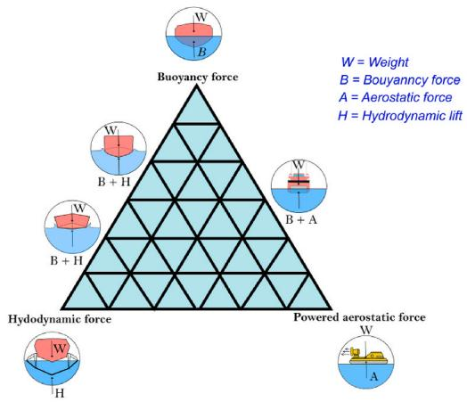

text_image

Buoyancy force
W = Weight
B = Bouyanncy force
A = Aerostatic force
H = Hydrodynamic lift
Hydodynamic force
Powered aerostatic force
W
B + H
W
B + A
H
W
A

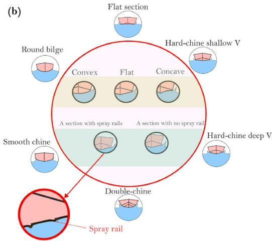

text_image

(b)
Flat section
Round bilge
Convex
Flat
Concave
Hard-chine shallow V
A section with spray rails
A section with no spray rail
Smooth chine
Hard-chine deep V
Double-chine
Spray rail

(c)   
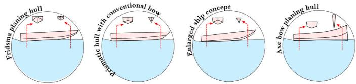

text_image

Fridema planting hull
Transatlantic hull with conventional bow
Enlarged ship concept
Axe bow planting hull

(d)

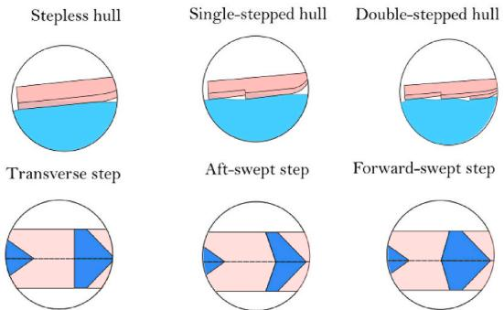

text_image

Stepless hull
Single-stepped hull
Double-stepped hull
Transverse step
Aft-swept step
Forward-swept step

(e)   
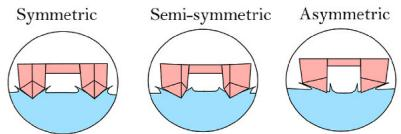

text_image

Symmetric
Semi-symmetric
Asymmetric

(f)   
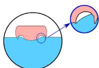  
Fig. 2. (a) sustention triangle, (b) common sections of a mono-hull, (c) types of the bow section of a planing hull, (d) stepped hulls, (e) symmetric, semi-symmetric and asymmetric catamarans, and (f) planing trimaran.

catamaran hulls. Hysucats or Hydrofoil supported catamarans (Giraldo-P´erez et al., 2022) have been observed to effectively reduce the resistance force and trim angle of the vessel (Najafi et al., 2018). The same technology can be implemented in monohulls (Suzuki et al., 2004; Brizzolara et al., 2016).

The body form of a planing trimaran is different compared to conventional trimarans. The main body is attached to two demi hulls through a bridge, and the transverse section has an M shape (Zou et al., 2021). The interesting point about this specific type of hull design is that the air flow has seen to lead to an extra lift force which may help the vessel to perform better (Ding and Jiang, 2021). Planing trimarans can incorporate steps on their hull bottoms, which can enhance their performance in calm water conditions. Furthermore, the addition of air-intakes to the bottom surface can result in resistance reduction (Du et al., 2019). A sketch of the transverse section of a trimaran-like planing hull is shown in Fig. 2f. Hydroplanes (see Englar et al., 1955; Matveev, 2012) contain a deck that is attached to two side sponsons. In the rear part of the hull, these sponsons are absent. The weight force of the hull is supported by the hydrodynamic force acting on the front part of the hull. The recorded highest speed in the water is achieved by a hydroplane called Spirit of Australia (KenWarby, 2009).

# 2.4. Hull series

Standardized planing craft hull series have been developed since late 1940s in research centers. Each of the series is identified by different geometrical indicators (beam, length, length over beam ratio, deadrise angles at transom and mid-section if the hull is a hard-chine one, etc). Calm and rough water performance of these series are usually reported.

The oldest hull series, namely Series 50 were engineered to exhibit semi-planing/motions. They have concaved bottom (the so-called transverse section) and a warped form. This collection of hulls was designed to operate within the semi-planing regime and cannot reach a fully planing mode. The single-stepped planing hulls were introduced by Rodstrom and Edstrand (1953), but demonstrated unstable motions at high speeds (Clement, 2006). Series 62 was introduced in 1960s. This series has a hard-chine form and can reach planing speeds (Clement and and Blount, 1963). The deadrise angles amidships and in way of the transom of these hulls are respectively 13 and 12.5◦. The Dutch Series 62 were introduced later on by Keuning and Gerritsma (1982) and is a variant of these hulls with a deadrise angle of 25◦ at transom. Other planing hull forms were developed in 1960s and 1970s are listed in Table 1. It is of note that the Fridsma’s planing hull series has prismatic hull form and are mostly studied in academia. It should be noted that some of the information listed in Table 1, was presented in Almeter (1993) and is just tabulated by the authors of the present paper. Table 2 outlines principal characteristics of the so-called Series 62 (Clement and and Blount, 1963) and Dutch Series 62 (Keuning and Gerritsma, 1982), serving as an ideal illustrative examples of how typical planing hulls series can be displayed.

Other distinguished hard-chine catamaran series termed VSM (Verband für Schiffbau und Meerestechnik e.V.) hard chine catamaran hull series 89 were developed in the Berlin Model Basin in late 1980s (Muller-Graf, 1999). They can reach up to longitudinal Froude Number of 1.4 and are symmetric. Naval architecture characteristic of these hulls is the results of rigorous model tests in calm waters and rough water performance of a monohull, and three different catamarans with semi-symmetric, symmetric and asymmetric sections (Muller-Graf, 1999). The NSS (Naples Systematic Series) planing hulls and VMV stepped hull planing hulls series are two of the recent planing hull series, which are both designed in Naples Federico II University (De Luca and Pensa, 2017; Vitiello et al., 2022). The former has a warped planing hull shape, and the other has one and double-stepped designs.

Whilst many of studies have been undertaken since the 1940s to develop hull series, providing datasets for both calm water and rough water sufficient for the design of high-speed craft, parallel efforts have also been made to improve the understanding of how dynamic motions of planing hulls and their performance in calm waters can be improved through hull redesign or the addition of devices/appendages. Such studies may be conducted using experimental, mathematical, and numerical approaches. They explore the effects of various fundamental design aspects (such as deadrise angle, length-to-beam ratio, step configuration for stepped hulls, etc.), as well as different energy-saving and control devices, on the calm water performance, resistance, and maneuverability of different hull types. For instance, some studies demonstrate how optimal step configurations can enhance performance in both smooth and rough waters (Niazmand Bilandi et al., 2023b; Avci and Barlas, 2023), while others illustrate how appropriate variations in deadrise along the hull can mitigate motions in waves and reduce slamming loads (Bonci and de Jong, 2023). Some investigations look into how bow shape can influence motion, particularly vertical accelerations (Keuning and Gelling, 2007), or how well-designed energy-saving devices can enhance calm water performance (Jangam, 2022; Sahin et al., 2022). Additionally, some studies address how other appendages such as skeg can enhance the maneuverability of a high-speed boat (Yasukawa et al., 2006).

Table 1 Some of planing hull series. The information of this table was mostly presented in Almeter (1993). 

<table><tr><td>Type</td><td>Characteristics</td><td>Planing regime</td><td>Deadrise angle (in Degrees)</td><td>Reference</td></tr><tr><td>Series 50</td><td>High warp, High beam taper, Concave</td><td>Semi-planing</td><td>0.55–2 at transom section and 5.2–20 at midship section</td><td>Davidsen and Saurez (1948)</td></tr><tr><td>Swedish single-stepped hulls</td><td>Deep-V planing surfaces with steps</td><td>Planing</td><td>7.5 at transom and 10 at the step location</td><td>Rodstrom et al. (1953)</td></tr><tr><td>Series 62</td><td>Narrow transom stern, exponentially blunt body, maximum chine beam ahead of amidships</td><td>Planing</td><td>12.5</td><td>Clement and Blount (1963)</td></tr><tr><td>Series 63</td><td>Round bottom boats</td><td>Semi-planing</td><td>NA</td><td>Beys (1963)</td></tr><tr><td>NPL round-bilge series</td><td>Round bottom boats</td><td>Semi-planing</td><td>NA</td><td>Marwood and Balley (1969)</td></tr><tr><td>Series 65B</td><td>Deep-V concept hull, no aft beam taper</td><td>Semi-planing</td><td>16 - 22–30 at transom section and 21-29-35 at midship section</td><td>Holling and Hubble (1974)</td></tr><tr><td>Naval Academy Series</td><td>Round and hard-chine hulls</td><td>Semi-planing</td><td>NA</td><td>Compton (1986)</td></tr><tr><td>Fridsma</td><td>Hard-chine, prismatic</td><td>Planing</td><td>10 - 20–30 Degrees</td><td>Fridsma (1969)</td></tr><tr><td>Dutch Series 62</td><td>Hard-chine</td><td>Planing</td><td>25 Degrees</td><td>Keuning and and Gerritsma (1982)</td></tr><tr><td>BK series</td><td>Concave hull shape</td><td>Semi planing but early planing speeds at volumetric Froude Number 4.5 also tested</td><td>12-25 at midship section</td><td>Yegorov et al. (1978) and Bun’kov (1969)</td></tr><tr><td>MBK series</td><td>Concave hull shape</td><td>Semi planing but early planing speeds at volumetric Froude Number of 4.5 also tested</td><td>7-18 at midship section</td><td>Yegorov et al. (1978) and Bun’kov (1974)</td></tr><tr><td>VWS catamaran 89</td><td>Symmetric, hard-chine, warped</td><td>Planing</td><td>6 at transom section and 27–38 at midship section</td><td>Muller-Graf (1999)</td></tr><tr><td>Double chine NTUA Series</td><td>Double chine</td><td>Planing</td><td>10 at transom and 22.5 at midship section</td><td>Grigoropoulos and Loukakis (1999)</td></tr><tr><td>USCG Series</td><td>Hard-chine</td><td>Planing</td><td>16.61 and 20</td><td>Kowalyshyn and Metcalf (2006)</td></tr><tr><td>NSS</td><td>Hard-chine, warped hull</td><td>Planing</td><td>13.2 at transom and 22.5 at midship section</td><td>De Luca and Pensa (2017)</td></tr><tr><td>VMV series</td><td>Hard-chine, 1 and/or 2 steps</td><td>Planing</td><td>23 at transom and 31° at midship section</td><td>Vitiello et al. (2022)</td></tr></table>

Table 2 Principal characteristics of Series 62 (Clement and Blount, 1963) and the Dutch version (Keuning and and Gerritsma, 1982). $B _ { m a x } , B _ { T } , \overline { { B } }$ and $A _ { P }$ respectively refer to maximum breadth, breadth at transom, average breadth across the hull and projected planing bottom area. 

<table><tr><td>Model</td><td> $L(m)$ </td><td> $B_{max}(m)$ </td><td> $A_P(m^2)$ </td><td> $L_P/\overline{B}$ </td><td> $B_{max}/\overline{B}$ </td><td> $B_T/B_{max}$ </td><td> $\beta (^\circ)$ </td><td>Series</td><td>Reference</td></tr><tr><td>4665</td><td>1.192</td><td>0.596</td><td>0.6010</td><td>2.36</td><td>1.18</td><td>0.80</td><td>12.5</td><td>Series 62</td><td>Clement and Blount (1963)</td></tr><tr><td>4666</td><td>1.825</td><td>0.596</td><td>0.9026</td><td>3.69</td><td>1.21</td><td>0.71</td><td>12.5</td><td>Series 62</td><td>Clement and Blount (1963)</td></tr><tr><td>4667–1</td><td>2.438</td><td>0.596</td><td>1.1892</td><td>5.00</td><td>1.22</td><td>0.64</td><td>12.5</td><td>Series 62</td><td>Clement and Blount (1963)</td></tr><tr><td>4668</td><td>2.438</td><td>0.443</td><td>0.8843</td><td>6.72</td><td>1.22</td><td>0.64</td><td>12.5</td><td>Series 62</td><td>Clement and Blount (1963)</td></tr><tr><td>4669</td><td>2.438</td><td>0.348</td><td>0.6948</td><td>8.56</td><td>1.22</td><td>0.64</td><td>12.5</td><td>Series 62</td><td>Clement and Blount (1963)</td></tr><tr><td>186</td><td>1</td><td>0.5</td><td>0.4296</td><td>2.37</td><td>1.16</td><td>0.8</td><td>25</td><td>Dutch Series 62</td><td>Keuning and and Gerritsma (1982)</td></tr><tr><td>187</td><td>1.25</td><td>0.408</td><td>0.4277</td><td>3.65</td><td>1.19</td><td>0.71</td><td>25</td><td>Dutch Series 62</td><td>Keuning and and Gerritsma (1982)</td></tr><tr><td>188</td><td>1.5</td><td>0.367</td><td>0.4500</td><td>5</td><td>1.22</td><td>0.64</td><td>25</td><td>Dutch Series 62</td><td>Keuning and and Gerritsma (1982)</td></tr><tr><td>189</td><td>1.5</td><td>0.273</td><td>0.3347</td><td>6.72</td><td>1.22</td><td>0.64</td><td>25</td><td>Dutch Series 62</td><td>Keuning and and Gerritsma (1982)</td></tr><tr><td>190</td><td>1.5</td><td>0.214</td><td>0.2628</td><td>8.56</td><td>1.22</td><td>0.642</td><td>25</td><td>Dutch Series 62</td><td>Keuning and and Gerritsma (1982)</td></tr></table>

Since geometries of planing surfaces are simpler as compared to those of other types of ships, it is easier to establish codes that automatically provide the 3D hulls. These codes have been developed since the early 2000s (see Table 3 and Khan et al., 2017). Recently, new codes that can automatically generate trimaran planing hulls have been introduced by Ghassabzadeh and Ghassemi (2012). There are automatic

Table 3 Different methods developed for parametric generation of semi-planing and planing hulls (This table is originally presented in Khan et al. (2017)). 

<table><tr><td>Hull type</td><td>Calkins et al. (2001)</td><td>Perez et al. (2008)</td><td>Mancuso et al. (2006)</td><td>Perez Arbiras et al. (2001)</td><td>Khan et al. (2017)</td></tr><tr><td>Flat bottom</td><td>√</td><td></td><td></td><td></td><td>√</td></tr><tr><td>Double chine (deep vee)</td><td>√</td><td>√</td><td></td><td></td><td>√</td></tr><tr><td>Single chine (shallow vee)</td><td>√</td><td>√</td><td></td><td></td><td>√</td></tr><tr><td>Single chine (deep vee)</td><td>√</td><td>√</td><td></td><td></td><td>√</td></tr><tr><td>Single chine (shallow vee)</td><td></td><td>√</td><td>√</td><td>√</td><td>√</td></tr><tr><td>Semi-displacement hull</td><td></td><td>√</td><td>√</td><td>√</td><td>√</td></tr><tr><td>Rounded</td><td></td><td></td><td>√</td><td>√</td><td>√</td></tr><tr><td>Arched/ Sailing</td><td></td><td></td><td>√</td><td>√</td><td>√</td></tr><tr><td>Arch bottom</td><td></td><td></td><td>√</td><td>√</td><td>√</td></tr></table>

generation codes for the stepped planing hulls or catamarans and this is an area where emerging knowledge from computer science can be employed (see Section 10.1.2).

# 3. Experimental research

Experimental research is divided into three clusters namely (a) calmwater performance, (b) seakeeping, (c) maneuvering. Fundamental to those is sound understanding of fluid mechanics and physics of planing motion (e.g., lift force variations, water spray generation, wake-driven waves, etc.). This has been done through testing hulls planing on the water, which are fixed in heave and pitch directions. The early fundamental studies are performed in 1930s. A report by Sottorf (1932) demonstrates the variation of resistance with speed. This research has been followed by researchers over the next five decades. For example, Smiley (1950), and Kapryan and Boyd (1955) presented results on the variation of bottom pressure distributions of sea planes and planing craft respectively. Korvin-Kroukovsky et al. (1948a, 1948b, 1949a) looked into the variation of wakes. Studies looking into the variation of hydrodynamic resistance in way of the bow and pitching moments acting on single-stepped sea planes are given by Sottorf (1937) and Benen (1967). Recently, results on the variation of lift forces are reported by Doctors (2021), see Table 4.

Table 4 Experiments highlighting the variation of hydrodynamics of planing surfaces (This table is originally presented in Doctors, 2021). 

<table><tr><td>Reference</td><td> $\beta$ </td><td> $\alpha$ </td><td> $Fr_{B}$ </td></tr><tr><td>Shoemaker (1934)</td><td>0, 10, 20, 30</td><td>2 to 12</td><td>1.65 to 7.33</td></tr><tr><td>Korvin-Kroukovsky et al. (1948a)</td><td>10</td><td>4 to 12</td><td>3.02 to 5.47</td></tr><tr><td>Korvin-Kroukovsky et al. (1948b)</td><td>20</td><td>4 to 12</td><td>3.02 to 5.48</td></tr><tr><td>Korvin-Kroukovsky et al. (1949a)</td><td>30</td><td>4 to 12</td><td>3.02 to 5.47</td></tr><tr><td>Korvin-Kroukovsky et al. (1949b)</td><td>10, 20, 30</td><td>4 to 12</td><td>2.99 to 6.83</td></tr><tr><td>Weinstein and Kapryan (1953)</td><td>0</td><td>2 to 30</td><td>4.15 to 25.50</td></tr><tr><td>Chambliss and Boyd (1953)</td><td>20, 40</td><td>2 to 30</td><td>3.05 to 25.99</td></tr><tr><td>Springston and Sayre (1955)</td><td>50</td><td>4 to 30</td><td>3.72 to 19.86</td></tr><tr><td>Pope (1958)</td><td>70</td><td>9 to 30</td><td>9.40 to 17.64</td></tr><tr><td>Savitsky and Neidinger (1954)</td><td>0, 10, 20, 30</td><td>2 to 15</td><td>0.61 to 4.00</td></tr><tr><td>Brown (1971)</td><td>10</td><td>2 to 10</td><td>0.67 to 7.35</td></tr><tr><td>Reyling (1976)</td><td>10, 20</td><td>2 to 8</td><td>1.00 to 5.01</td></tr><tr><td>Sottorf (1932)</td><td>0</td><td>1.2 to 11.3</td><td>2.33 to 5.54</td></tr><tr><td>Sottorf (1934)</td><td>0, 10, 15, 24, 40</td><td>2.6 to 10.1</td><td>3.50 to 3.50</td></tr><tr><td>Perring and Johnston (1935)</td><td>0, 10, 15, 24, 40</td><td>2.6 to 10.1</td><td>3.50 to 3.50</td></tr><tr><td>Sambraus (1938)</td><td>0</td><td>2.3 to 19.9</td><td>3.50 to 13.19</td></tr><tr><td>Savitsky (1951)</td><td>20</td><td>6 to 12</td><td>2.46 to 6.83</td></tr><tr><td>Kapryan and Boyd (1955)</td><td>0, 20, 40</td><td>4 to 30</td><td>6.83 to 15.28</td></tr><tr><td>Christopher (1956)</td><td>0</td><td>3.9 to 19.4</td><td>9.47 to 9.87</td></tr><tr><td>Shuford (1957)</td><td>0, 20, 40</td><td>8 to 34</td><td>9.07 to 18.65</td></tr><tr><td>Shuford (1958)</td><td>0, 20, 40</td><td>8 to 34</td><td>9.07 to 18.65</td></tr><tr><td>Brown and Van Dyck (1964)</td><td>20</td><td>3 to 12</td><td>6.00 to 6.00</td></tr><tr><td>Brown and Klosinski (1980)</td><td>20</td><td>1.2 to 15.9</td><td>2.67 to 5.41</td></tr></table>

# 3.1. Cluster 1 - calm water performance tests

In this cluster the focus is mostly on measuring the hydrodynamic performance of a planing hulls moving forward at a constant speed in calm waters (see Table 5). Model tests have been carried out in towing tanks. Usually, the vessel is allowed to be free in the vertical direction. However, motions are restricted in sway, yaw, and roll, see Fig. 3. Results display craft resistance, projected wet area, etc. In 1936, Nordstrom conducted towing tank tests to measure the resistance and trim angle for as many as 29 different high-speed vessels with novel hull forms. The tests transpired in 1930s and they were carried out up to volumetric Froude Number of 2.0, but an English translated version of the research was published in 1951 (Nordstrom, 1951). Another classic study is carried out by Davidson and Suarez (1949) who tested the hydrodynamic performance of hull-series 50 (Morabito, 2013 reanalyzed performance of this hull series). Similar recent experimental studies focused on stepped planing hulls and air cavity planing hulls (Cucinotta et al., 2017). Research on uncertainties associated with towing tests is presented by Nikolov and Judge (2017). Here, it should be noted that a very important scholarly study, based on experimental dataset of Series 62 and Gawn-Burrill series propeller, is performed by Hadler and Hubble (1971) who systematically evaluated the self-propulsion of Series 62 by considering different self-propulsion factors and different propeller diameters and propeller positions and configurations (-single, -twin and -quadruple screw). This study is an illustrative example of how the calm-water resistance dataset can be paired with propeller performance dataset to evaluate the self-propulsion ride of a planing craft.

The studies presented in Table 5 mainly focus on reporting resistance, trim angle, and CG-rise of a planing hull. However, some calm water studies have been conducted to evaluate the dynamic instability of planing hulls. These studies have mostly investigated non-oscillatory

Table 5 Most important calm water tests conducted since late 1940s. 

<table><tr><td>Reference</td><td>Tested vessel(s)/type of vessel</td></tr><tr><td>Davidson and Suzrez (1949)</td><td>Series 50</td></tr><tr><td>Nordstrom (1951)</td><td>Various high-speed boats</td></tr><tr><td>Stout (1950)</td><td>High-Speed water-based aircraft (seaplane) with single step</td></tr><tr><td>Rodstrom et al. (1953)</td><td>Swedish single stepped-planing hull series</td></tr><tr><td>Beys (1963)</td><td>Series 63</td></tr><tr><td>Clement and Blount (1963)</td><td>Series 62</td></tr><tr><td>Fridsma (1969)</td><td>Fridsma series (prismatic planing hulls)</td></tr><tr><td>Holling and Hubble (1974)</td><td>Series 65A and 65B</td></tr><tr><td>Baily (1976)</td><td>NPL hulls (Round bilge vessel)</td></tr><tr><td>Keuning and Gerritsma (1983)</td><td>Dutch Series 62</td></tr><tr><td>Lahtihuarju et al. (1991)</td><td>Planing hulls tests in VTT, Finland</td></tr><tr><td>Keuning et al. (1993)</td><td>Hard-chine planing hull with deadrise angle of 30 Deg.</td></tr><tr><td>Klosinski and Brown (1993a)</td><td>USCG national designs of 110 ft and 120 ft WPB hulls</td></tr><tr><td>Grigoropoulos and Loukakis (1999)</td><td>Double Chine NTUA series</td></tr><tr><td>Muller-Graf (1999)</td><td>VWS fast hard-chine catamaran series &#x27;89</td></tr><tr><td>Metcalf et al. (2005)</td><td>US Coast Guard boats</td></tr><tr><td>Taunton et al. (2010)</td><td>Stepless, one-stepped and double-stepped planing hulls</td></tr><tr><td>Keuning et al. (2011)</td><td>Three designs of SAR boats</td></tr><tr><td>Begovic and Bertorello (2012)</td><td>Warped planing hulls</td></tr><tr><td>Morabito (2013a)</td><td>Series 50</td></tr><tr><td>Lee et al. (2014)</td><td>Double-stepped hull planing hulls</td></tr><tr><td>Kim et al. (2013)</td><td>Deep-V type, planing hulls of University of Seoul Series</td></tr><tr><td>Ma et al. (2013)</td><td>Trimaran planing hull</td></tr><tr><td>Seo et al. (2016)</td><td>Wave-piercing planing hulls</td></tr><tr><td>Cucinotta et al. (2017)</td><td>Air Cavity planing hulls</td></tr><tr><td>De Luca and Pensa (2017)</td><td>NSS Series</td></tr><tr><td>Molchanov et al. (2019)</td><td>A hard-chine hull equipped with spray rails, or spray deflector</td></tr><tr><td>Najafi et al. (2020)</td><td>Single-stepped version of Fridsma&#x27;s series</td></tr><tr><td>Vitiello et al. (2022)</td><td>VMV Stepped Series</td></tr></table>

and oscillatory dynamic instabilities, with the former being more likely to occur at lower Froude Numbers and the latter being more likely to occur as speed increases. These instabilities are well-defined in Cohen and Blount (1986).

Most of important studies addressing instabilities have reported oscillatory dynamic instability in the vertical direction, termed porpoising. A vessel free in heave and pitch directions is towed in the tank, and its vertical motion is tracked to see whether it reaches a stable condition or not. Early experimental tests were conducted by Sottorf (1949). Other studies were conducted by Parkinson and Olson (1943), Benson (1942), and Davidson and Locke (1943). These experiments addressed porpoising of seaplanes (flying boats) or amphibian vessels. The most important study, however, was done by Day and Haag (1952a, b). They conducted systematic studies on different prismatic planing hulls to find porpoising limits for different hull forms. Inspired by the work of Day and Haag (1952a,b), Celano (1998) performed similar tests, but the planing models were five times larger than those tested by Day and Haag (1952a,b) and had larger deadrise angles. The more recent work was carried out by Zan et al. (2023), who studied porpoising of trimaran planing hulls. Another group of experimental studies highlighting porpoising is performed through forced motion. The vessel is forced to have oscillating heave and pitch motions, and then hydrodynamic coefficients in the vertical plane are measured, which can be used to calculate the limit of porpoising instability. The work of Ikeda and Katayama (2000) is one of the best examples of such studies.

The other set of experiments covering the instability of planing hulls focused on bow-diving instability (a non-oscillatory type) assessed through speeding test. A notable example of such tests can be found in the work of Katayama et al. (2003). In this study, a boat free in heave and pitch directions was accelerated in a tank, and the occurrence of bow diving was detected by monitoring the time history of pitch motion. It was observed that a heavier boat may experience this instability. Additionally, Blount and Codega (1992) discussed how the trim versus Froude number curve recorded during calm water tests can be used to analyze the stability of the boat. They presented their discussion using data corresponding to the trim versus Froude number of series 62 (The Dutch version, deadrise angle of 25◦) and a planing vessel tested in real seas. They stated that a planing craft with a zero or negative slope of the trim angle versus longitudinal Froude Number curve over 1 < Fr < 2 (i.e., the early planing regime) is more likely to exhibit unstable behavior. From a physical standpoint, this may lead to a negative pitching moment that pushes the bow of the vessel down.

Another group of experiments were conducted to assess the transverse dynamic stability of planing hulls. Such experiments can be used for checking whether a planing hull shows non-zero heel (non-oscillatory type) or chine-walking (oscillatory type) instabilities. In most cases, static or dynamic inclining tests were performed. Milward et al. (1979) and Wakeling et al. (1984) conducted one of the most important sets of inclining tests for a round-bottom high-speed boat. The primary observation was that the boat might lose its transverse stability under an increase in speed, and an unstable condition typically arises when pressure in the rear part of the vessel drops. Marwood and Baily (1968) conducted inclining tests for some rounded bottom hulls of NPL series and reported the limiting value of the metacentric height as a function of beam to draft ratio for different speeds. In the 1990s, Werenskiold (1993) conducted a static inclining test on a round bilge hull under various conditions by placing a weight off the center plane. The increase in speed was observed to result in a larger heel angle, and the emergence of hydrodynamic lift and hydrodynamic pressure caused by the propeller were hypothesized to be two of the main reasons for the reduction in restoring moment.

One set of interesting experimental studies is led by Brown and Klosinski (1994a, b) in 1990s, who conducted yawed and heeled tests to study directional stability of planing hulls. These tests are explained in more details in sub-section 3.3. Brown and Klosinski (1994a,b) measured the forces and moments acting on the vessel. Using the data from the heeled cases, they calculated the restoring coefficient for three different hard-chine planing hulls with deadrise angles of 10, 20, and 30◦ (Brown and Klosinski, 1995a,b). The roll restoring coefficient was observed to decrease with an increase in speed for cases with trim angles of 0 and 3◦. However, for a trim angle of 6◦, the roll restoring coefficient was found to increase with speed. Another remarkable point is the effect of deadrise angle on the roll restoring coefficient. In a zero-trim angle condition, a planing hull with a deadrise angle of 10◦ was seen to have a larger restoring coefficient, but at a trim angle of six degrees, the hull with a deadrise angle of 20◦ was found to have a larger restoring coefficient. And, completely different compared to what was observed at a zero-trim angle condition, the hull with a deadrise angle of 10◦ was observed to have a lower restoring coefficient than the other two hulls.

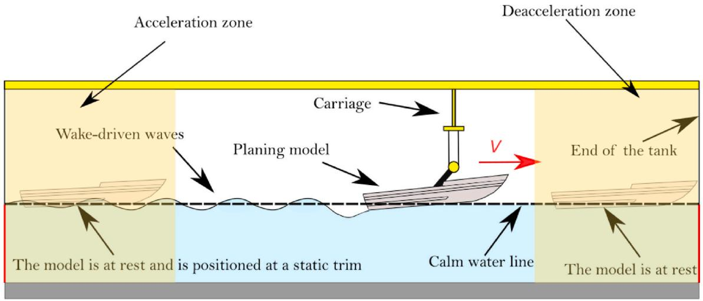

text_image

Acceleration zone
Deacceleration zone
Wake-driven waves
Carriage
Planing model
V
End of the tank
The model is at rest and is positioned at a static trim
Calm water line
The model is at rest

Fig. 3. A general schematic of calm-water tests carried out in towing tanks and basin.

A different experimental test was carried out by Katayama and Ikdea (1996). They performed free-to-roll and fully captive tests on hard-chine planing hulls to identify the main reason for instability. Throughout the inclining tests, they reported that an increase in speed could be a significant factor contributing to instability (i.e, increase in speed may cause a zero value of GZ versus heel angle curve at non-zero heel angles). Their results revealed that an increase in trim angle may potentially prevent transverse instability (see Fig. 8 in their paper). This observation matches with trends of restoring coefficient plots corresponding to different trim angles presented in Brown and Klosinski (1995a, b). A decade on, Katayama et al. (2007) reported results of another set of free-to-roll experiments on two planing hulls. They discussed that a narrow water surface area is likely to cause an unstable ride. Ranzen bach and Bowles (2010) also conducted inclining tests on three different hull shapes to evaluate transverse dynamic stability of some planing designs. The hulls were initially set at a heel angle of 5◦ and then towed forward. If the vessel heeled toward a larger angle, it was identified as an unstable boat. The most recent tests that may have application in assessing dynamic stability of planing hulls were conducted by Judge in a series of experiments (Judge, 2013; Judge and Judge, 2013), in which forced roll motions and inclining tests were replicated.

Overall, discussion presented in Blount and Codega (1992) can be a highly practical guide for assessing the dynamic instability of planing hulls operating in calm water conditions. They documented various hydrodynamic features of vessels showing unstable behavior and discussed ways in which a boat can be stabilized: (I) modifying an existing design (e.g., using control devices) or (II) establishing a new boat design.

# 3.2. Cluster 2 - rough water tests

Rough water performance tests can be run in wave tanks or an actual field. In laboratory conditions, the planing boat is towed in a tank and is exposed to water waves mechanically generated by a wave-maker (Fig. 4). As compared to calm-water conditions, less effort has been put into this cluster. This is because there have been open questions of relevance to the calm water planing problem. Full-scale tests are somehow more limited and mostly document the vertical acceleration of planing vessels performing in actual seas.

A summary of some of the most important tank tests highlighting wave-induced motions of planing hulls is presented in Table 6. The most famous systematic rough water model tests have been carried out by Fridsma (1969, 1971) over a wide range of beam Froude numbers and different wave steepness values. Fridsma’s experiments were run in regular (Fridsma, 1969) and irregular wave (Fridsma, 1971) conditions. It was shown that a prismatic hull may show nonlinear motions in her planing mode, while a resonance zone was observed to be shifted towards longer waves as a function of speed increase. Speed may significantly increase heave and pitch motions in the resonance zone, while heave and pitch motions are insensitive to speed over low range waves. On the other hand, vertical acceleration is highly sensitive to speed. In irregular wave tests, it was observed that the average value of a boat’s vertical motion may decrease with an increase in speed. However, the average value of 1/10 highest crests of vertical motions was seen to increase under an increase in the speed. This signifies that with the increase of the speed the vessel mostly responds to long waves. Fridsma (1971) reported that the bow shape of the vessel may not significantly affect the vertical motion of the planing boat as discussed in Section 2. This was observed in his random wave tests by comparing the motion data of his own developed models against those of a prismatic hull. The axe and wave piercing bow types, however, can significantly decrease vertical motions of a planing hull as it is also confirmed by Keuning and Gelling (2007). Another set of important experimental tests were conducted by Klosinski and Brown (1993a, 1993b). They measured vertical motions of two different USCG national designs, namely 110 ft and 120 ft WPB hulls, in regular and random wave conditions. They documented 1/3-highest and the 1/10-highest peaks and troughs of heave and pitch movements along with vertical accelerations recorded in random wave tests, and presented acceleration, heave, and pitch variance spectral density data.

Muller-Graf et al. (2002) reported that during the design of the VWS catamaran series, they have observed that a semi-symmetrical hard-- chine catamaran would be exposed to lower vertical accelerations as compared to a symmetric catamaran. Also, they reported that the asymmetric catamaran would experience the lowest speed reduction when riding in the waves, as compared to the other catamarans. However, these results are limited to low planing speeds. Taunton et al. (2011), demonstrate key results on vertical motions of stepped and stepless planing hulls advancing in irregular waves. These results reveal that mean and RMS of heave maxima of a double-stepped are smaller than those of non-stepped and stepless concepts at highest speed. In

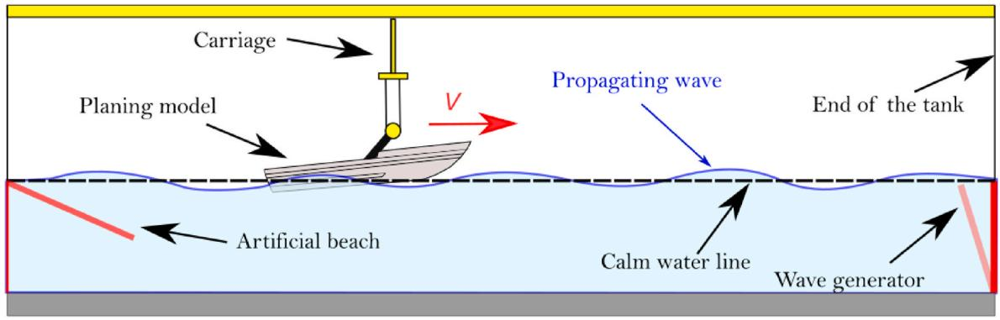

text_image

Carriage
Planing model
Propagating wave
End of the tank
Artificial beach
Calm water line
Wave generator

Fig. 4. A general schematic of rough water tests carried out in towing tanks and basins.

Table 6 Most important wave-induced motion tests conducted since late 1960s. 

<table><tr><td>Reference</td><td>Tested vessel(s)/type of vessel</td><td>Wave type</td></tr><tr><td>Fridsma (1969)</td><td>Fridsma series (prismatic planing hulls)</td><td>Regular wave</td></tr><tr><td>Fridsma (1971)</td><td>Fridsma series (prismatic planing hulls)</td><td>Random waves</td></tr><tr><td>Brown and Klosinski (1980)</td><td>Hard-chine planing hulls</td><td>Random waves</td></tr><tr><td>Zarnick and Turner (1981)</td><td>Fridsma series (prismatic planing hulls) with  $L/B = 7$  and 9</td><td>Random waves</td></tr><tr><td>Lahtihuarju et al. (1991)</td><td>VTT series</td><td>Regular wave</td></tr><tr><td>Klosinski and Brown (1993a, b)</td><td>USCG national designs of 110 ft and 120 ft WPB hulls</td><td>Regular wave and random waves</td></tr><tr><td>Soletic (2010)</td><td>US Coast Guard boats</td><td>Random waves</td></tr><tr><td>Grigoropoulos et al. (2010)</td><td>Double Chine NTUA series</td><td>Regular waves</td></tr><tr><td>Taunton et al. (2011)</td><td>University of Southampton Series</td><td>Random waves</td></tr><tr><td>Keuning et al. (2011)</td><td>Three designs of SAR boats for Royal Netherlands Sea Rescue Institution (KNRM)</td><td>Random waves (head waves, following waves and quartering Waves)</td></tr><tr><td>Kim et al. (2013a)</td><td>Deep-V type planing hulls of University of Seoul</td><td>Regular waves</td></tr><tr><td>Grigoropoulos et al. (2014)</td><td>Double Chine NTUA series</td><td>Random waves</td></tr><tr><td>De Luca and Pensa (2014)</td><td>Model C0202/1 (a warped planing model) w/o and w/(conventional and unconventional) interceptors</td><td>Regular waves</td></tr><tr><td>Begovic et al. (2014)</td><td>Monohedral and warped planing hulls</td><td>Regular waves</td></tr><tr><td>Ma et al. (2015)</td><td>Trimaran planing hull</td><td>Regular waves</td></tr><tr><td>Begovic et al. (2016)</td><td>Monohedral and warped planing hull</td><td>Random waves</td></tr><tr><td>Seo et al. (2016)</td><td>Wave-piercing Series</td><td>Regular waves</td></tr><tr><td>De Luca and Pensa (2019)</td><td>NSS Series</td><td>Random waves</td></tr><tr><td>Park et al. (2019)</td><td>A planing model equipped with interceptor w/o and w/active control</td><td>Regular waves and Random waves</td></tr><tr><td>Molchanov et al. (2019)</td><td>A hard-chine hull equipped with spray rails, or spray deflector</td><td>Random waves</td></tr><tr><td>Begovic et al. (2020)</td><td>A monohedral planing model</td><td>Regular waves</td></tr><tr><td>Pigazzini et al. (2021)</td><td>NSS Series</td><td>Regular waves</td></tr><tr><td>Judge et al. (2020b), Diez et al. (2022)</td><td>GPPH model</td><td>Regular and Random waves</td></tr><tr><td>Lee et al. (2024)</td><td></td><td></td></tr></table>

addition, RMS of heave minima of double-stepped model were seen to be lower than those of two other hulls at the highest speed. Further, the mean and RMS of pitch maxima of the single-stepped concept were observed to be lower than those of the others at the highest speed, while those of the stepless hull were larger than those of the double-stepped hull. Yet, the vertical acceleration of a double-stepped boat has been seen to be lower than those of stepless boats and a double-stepped boat at the highest tested speed (crest factor and RMS of vertical acceleration were reported). Taunton et al. (2011) did not perform any regular wave tests. So, it is still very unclear how a single-step or a double-step design can affect the motions in regular waves.

Some experimental studies have contributed insights into the influence of energy-saving devices, specifically interceptors, on the motions of planing hulls. A noteworthy series of experiments was conducted by De Luca et al. (2014), who measured the vertical motions of a warped planing hull fitted with both conventional and unconventional interceptors (double interceptors, as will be also introduced in sub-section 8.5.3). Results indicated that motions were relatively insensitive to these devices at high frequencies; however, over the resonance zone, interceptors were observed to increase heave and pitch motions. Throughout testing a planing vessel equipped with a controllable interceptor in regular and random waves, Park et al. (2019) studied the effects of controllable interceptor on dynamic motions of a planing model. Their tests revealed that, under active control, an interceptor can reduce the heave and pitch response of a planing hull by 33% and 41%, respectively, when riding in regular waves over the resonance zone. In the case of random wave conditions, the active control of the device was found to decrease pitch motion RMS (root mean squared) by 31% and heave by 12%.

One of the most important field tests was conducted by Morch and Hermundstad (2005) who measured acceleration and pressure acting on the panels of a deep-V planing boat named “Nidelv 610” riding at a beam Froude Number of ≈ 3.3. The cumulative probability curves of pressure and vertical accelerations derived, were shown to be in line with those of Weibull probability distribution function (PDF). Similar studies were also done by Blount and Schleicher (2006). In addition, throughout measuring the acceleration of planing boats and re-analysing the videos of the motions taken during tests, Blount and Funkhouser (2009) demonstrated that an air borne ride (fly-over) is more likely to happen at volumetric Froude Numbers exceeding 4 and wave slopes is greater than 0.06. While this observation is very important, it has been mostly ignored by researchers. Judge and van Derwerken (2019) undertook full-scale and model-scale physical experiments to measure vertical acceleration of a planing craft, and discussed how the results of these two sets of experiments can match. A recent full-scale measurement was conducted by Pigazzini et al. (2020, 2022). They recorded the trim angle and torque of a planing yacht boat in head sea and following sea conditions and presented spectral density and RAO plots for torque. Additionally, Pigazzini et al. (2022) observed good agreement between the trim angle of a self-propelled scaled planing model (tank test) and those

of full-scale sea trials.

There are many open questions related to the dynamics of planing hulls in waves which can be answered through systematic experimental tests. The first question is mostly related to the effects of different hull forms. Research on the influence of steps on wave-induced motions of a planing hull are limited, while systematic studies on the planing motions of catamarans and trimarans is absent. Researchers undertaking irregular wave tests have generally presented the average values of motions, or 1/3 and 1/10 of highest heave and pitch motions (see Table 7.3 of Klosinski and Brown, 1993a, as an example), and more recently strains (e.g., Lee et al., 2024). However, these motions along the vertical acceleration can be non-Gaussian. This implies the need for more in-depth statistical analyses of heave and pitch responses. It is of note that van Derwerken and Judge (2017) discuss the challenges in statistical analysis of vertical acceleration of planing hulls.

# 3.3. Cluster 3 - maneuvering and planar motion tests

A series of laboratory/field tests were performed to (a) study maneuvering motions of a planing surface, (b) measure hydrodynamic coefficients, (c) motions. Some of the studies in this cluster present maneuvering forces when planing vessels are towed obliquely (drift tests), or under dynamic planar conditions (forced yaw, combined forced yaw/sway, rotating arm), see Fig. 5. These tests can be done for the case free to rise and trim (free in two degrees of freedom), or for a case fixed in vertical directions. The initial experimental work in this field was carried out by Smiley (1952). Smiley (1952) measured the forces and moments acting on a seaplane with a deadrise angle of 22.5◦ while landing on the water in a yawed condition. Although the study was not specifically developed for maneuvering purposes, it provided an early understanding of how a yawed condition can affect the forces and moments acting on a hard chine surface. Savitsky et al. (1958) conducted tests involving heeled and yawed conditions for both a deadrise and a flat planing surface. They reported the measured forces and moments acting on the vessel, along with the corresponding wet lengths. Later, Henry (1975) carried out similar tests on three different prismatic planing hulls with deadrise angles of 10, 15, and 20◦. In Henry’s work, regression equations for all six forces/moments acting on a planing hull were built; these can be found in Appendix C of Henry (1976).

One of the most important sets of experimental tests was carried out by Brown and Klosinski (1994a, b) who tested three different hard-chine planing hulls with deadrise angles of 10, 20 and 30◦. Throughout this work oblique towing tests along with rotating arm tests were performed and the effects of a twin rudder on hydrodynamic forces were also studied. The vessel was set free to rise. However, it was fixed at different trim angles, ranging from $0 ^ { \circ } \ ( - 2 ^ { \circ }$ for oblique tests) to 6◦. The tests covered yaw angles ranging from 0◦ to 15◦, roll angles (heel angle) ranging from $1 0 ^ { \circ } - 2 0 ^ { \circ }$ , and dimensionless turn radii of 0.117 and 0.234. Similar oblique tests have also been conducted by Toxopeus et al. (1997) and Morabito (2015).

Some of the oblique tests performed in Katayama lab were carried out by setting heave and pitch to be free (Kimoto et al., 2004; Katayama et al., 2005, 2006). In some other tests, the vessel was additionally set to be free in roll. Three different planing hulls with deadrise angles 12 (model TB30), 18 (model TB45) and 24 (model TB60) with three different L/B ratios of 3 (model TB30), 4.45 (model TB45) and 6.06 (model TB60) are presented in Kimoto et al. (2004), Katayama et al. (2005, 2006). Results from this set of studies can be summarized as

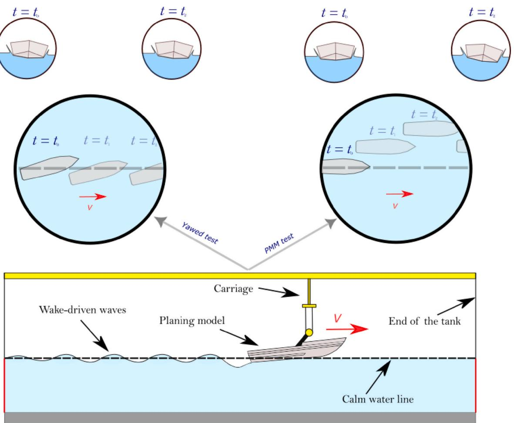

flowchart

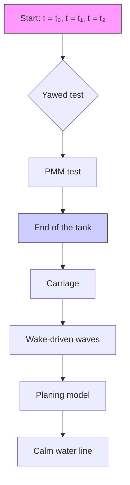
```mermaid
graph TD
    A["Start: t = t₀, t = t₁, t = t₂"] --> B{Yawed test}
    B --> C["PMM test"]
    C --> D["End of the tank"]
    D --> E["Carriage"]
    E --> F["Wake-driven waves"]
    F --> G["Planing model"]
    G --> H["Calm water line"]
    style A fill:#f9f,stroke:#333
    style D fill:#ccf,stroke:#333
```

Fig. 5. General schematics of yawed and PMM tests in tanks.

follows:

I) Trim angle versus Froude Number curves may peak at a lower Froude Number when the yaw angle is 20◦ or more. This means that a yawed condition may result in emergence of planing motions at a lower Froude Number.   
II) Trim angle of a yawed planing hull may be lower at large Froude numbers. This signifies that the hydrodynamic lift force of a yawed hull would be larger than that of a non-yawed one.   
III) When the planing vessel is free to roll and advances in a planing mode, it may heel at an angle in between 10 and 20◦. This means that an oblique motion may result in significantly larger rolling moments.   
IV) The planing hull with large slenderness ratio (L/ B = 6.06) obliquely moving forward may reach a negative heel angle at low planing speeds.

The main conclusion of above observations is that maneuvering motions of a planing surface have to be simulated while considering heave, pitch and roll. This is because they are very sensitive to oblique flows (see Ikeda et al., 1998, 2000). In another set of experiments in Katayama’s lab, planar motion tests forced to have sway and yaw motions were done, results of which are presented and discussed in Tajima et al. (1999), Ikeda et al. (2000), Katayama et al. (2000a,b), Katyama et al. (2005). These publications demonstrate that heave, pitch and roll motions may depend on the frequency and large motions may be observed if the period of forced motions is close to the natural frequency of roll (Ikeda et al., 2000; Katayama et al., 2000a,b). Otherwise heave and pitch motions may be negligible (Katyama et al., 2005). Interestingly, the time average value of heave and pitch motions may be different as compared to the trim angle and rise of a boat performing straight forward tests (Ikeda et al., 2000; Katayama et al., 2000; Katyama et al., 2005). This suggests that a nonlinear mechanism, emerging due to forced yaw/sway motions may contribute to a lift force, leading to different values of trim and rise. The trim angle and center of gravity rise of a vessel were seen to significantly affect the damping coefficients in sway and yaw directions (Tajima et al., 1999). Dynamic planar motion tests under the same conditions are also presented in Plante et al. (1998). Some steady drift and pure sway and yaw test data of a rescue design boat (labeled as Concept 2) of Royal Netherlands Sea Rescue Institution (KNRM) are also presented in de Jong et al. (2013).

Zigzag trajectories (Martelli et al., 2016), accelerations (Katyama and Ikeda, 1998, 1999; Katayama et al., 2022) or circle turning motions (Katayama et al., 2009) are physically modelled in open seas (field) or tanks. Some key findings are presented in Kim and Kim (2017). The circle turning motions of a hard chine planing hull equipped with a waterjet propulsion system was modelled for different nozzle angles. It was found that, during a starboard turn, the vessel may roll, reaching a peak value, which may in turn decrease until the vessel repositions herself at a steady heel angle. The maximum roll angle was seen to highly increase under the increase of the speed of the vessel, though the steady heel angle was seen to be negative when the nozzle angle was inclined at an angle of 30◦. That is, while the boat experiences a starboard turn, it eventually heels towards the port side when the thrust angle increases. Later, oblique towing tank tests of these boats were carried out by Park et al. (2021). Two laboratory-based studies have covered behavior of high-speed vessel with horizontal motions in waves (i.e., maneuvering aspects in waves), which are carried out by Bonci et al. (2019, 2020). Bonci et al. (2019) tested a hard-chine boat exposed to following sea in three different conditions covering ride in waves with sway velocity and encounter angle of 25 Degrees, pure sway motion in following waves and effects waterjets steering angles in following sea. In the other set of experiments, Bonci et al. (2020) towed a heeled boat advancing in following sea and measured heel-induced sway and yaw moments which can be used in assessing the dynamic stability of a boat maneuvering in waves. Some of the tests of Bonci et al. (2019, 2020) were performed at longitudinal Froude Numbers greater than 0.5 (i.e., beyond displacement regime).

In summary, physical modelling looking into maneuvering of planing hulls provided an early knowledge of the problem. To date research is limited to hard-chine planing hulls and model testing conditions (e.g., calm and deep waters). Limited data on the measurement of maneuvering forces of round bilge hulls and one-stepped hulls can be respectively found in Baba et al. (1982) and Morabito et al. (2014). It is not well understood what type of dynamic response a planing hull may demonstrate at high speed, or at different slenderness ratios. The latter was demonstrated as important by Katayama, where negative heel angle was seen to emerge when a yawed planing vessel was free to roll (Katayama et al., 2005, 2006).

# 4. Two-dimensional planing craft hydrodynamics

The 2D planing surface problem is the simplest and most common study case. A mass of water is assumed to flow towards a surface gliding on the water surface. The inclination angle of the plate is usually assumed to be very small, and the speed of the fluid flow is presumed to be very high. Research focus is on the solution of jet flow problems, as well as series expansion, integral and viscous methods. Research in this area, while very interesting, requires thorough understanding of fluid dynamics.

# 4.1. Analytical jet flow models

The prediction of the lift force of a 2D surface planing on a stream flow assumes potential flow assumptions under zero gravity. These models assume that the jet flow forms on the wet wall of the plate and is the main contributor to the lift force. The formed jet flow can be idealised according to Wagner (1932) water entry model. Accordingly, the lift force (L ) of the plate is defined as

$$
\frac {\mathcal {L}}{\rho_ {w} V ^ {2} c} = \pi \alpha , \tag {4.1}
$$

where α is the angle of attack, and c is the wet length of plate, that can be linked to spray thickness (κ) as

$$
\kappa = 0. 5 \pi c \alpha^ {2}. \tag {4.2}
$$

As the jet flow approaches the trailing edge of the plate, it may get thicker and rotate (Fig. 6). This means that Equation (4.1) is no longer valid. The lift force and pressure distribution may be a function of spray thickness and rotation angle, found by solving the equations describing fluid flow. A common approach to solve the fluid dynamic problem is to use conformal mapping. Assuming that a plate has a finite length and there is no shallow water effect, Green (1936a) derived the lift force equation coefficient as,

$$
\frac {\mathcal {L}}{\rho_ {w} V ^ {2} \kappa} = \frac {1 + \cos (\alpha + \gamma)}{\sin \alpha}. \tag {4.3}
$$

Here, γ is the spray rotation angle.

The background to the detailed formulation for the calculation of the spray root angle and thickness are presented in Green (1936a). Green also solved the problem for shallow waters by considering two different scenarios namely (a) finite length plate, and (b) semi-infinite length plate (Green, 1935, 1936b). However, as gravity is neglected, this model does not account for wave generation in the lee of the plate. Other jet flow models use the matched asymptotic expansion method, through which the fluid domains are divided into inner and outer flow partitions. The inner flow addresses the nonlinear fluid motion near the planing plate, and the outer flow solution addresses the fluid flow far from the plate, where the gravity effects are important (e.g., Shen and Ogilvie, 1972; Ting and Keller, 1974, 1976; Fridman, 1998).

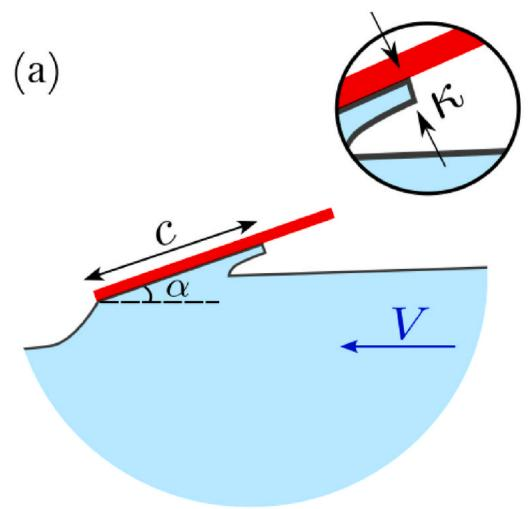

text_image

(a)
c
α
V
κ

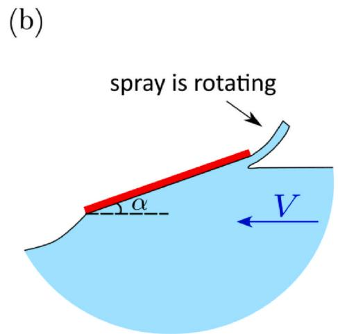

text_image

(b)
spray is rotating
α
V

Fig. 6. A planing plate exposed to steady flow. In (a) the jet flow is formed but is not rotating. In (b) spray is rotating, while it is thicker than the spray formed in (a).

# 4.2. Asymptotic expansion methods

A series expansion is another approach that can be employed to solve the 2D planing problem. The method is basically developed on the basis of classic linearized idea flow assumption assuming gravity effects. This allows for the approximation of waves generated in the lee of an object (Srettensky, 1933). The pressure acting on the planing surface is approximated using a series expansion, and then the free surface elevation behind the plate is found. The method may lead to singularities near the leading edge of the plate, where the spray root is positioned. Similarly, the lift force acting on the planing surface can be approximated by using an asymptotic approach. The problem has been theoretically addressed and validated as explained in Maruo (1956, 1959). The lift force of a flat plate can be approximated as

$$
\frac {\mathscr {L}}{\rho_ {w} V ^ {2} c _ {H}} = \pi \alpha \left(1 - \frac {g c _ {H}}{V ^ {2}} \left(\pi + \frac {4}{\pi}\right)\right). \tag {4.4}
$$

The above equation is documented in Sedov (1936). Technical information and integrals used for solving the related fluid dynamic problem can be found in Wehausen and Laitone (1960) and are not presented here (the planing surface is assumed to be longitudinally stretched over -c and c ). Cumberbatch (1958) idealised the problem for very high Froude Numbers defined the lift coefficient as

$$
\frac {\mathcal {L}}{\rho V ^ {2} c} = \pi \alpha \left(1 - 4. 4 1 \mathrm{Fr} _ {l} ^ {- 2} + \mathrm{Fr} _ {l} ^ {- 4} \log \frac {1}{2} \mathrm{Fr} _ {l} ^ {- 2} + 1 9. 9 \mathrm{Fr} _ {l} ^ {- 4}\right). \tag {4.5}
$$

Another asymptotic model is developed by Chung and Chun (2008). The potential flow, angle of attack and vertical displacement of the planing plate are introduced as unknowns, and the solution is presumed to be dependent on $\mathrm { F r } _ { l } ^ { - 1 }$ . In their approach the weight force (W) was assumed as an input and the lift force of the 2D planing plate is defined as

$$
\frac {\mathscr {L}}{W} \approx 1 - \frac {2}{\pi} [ 1 - \ln (2 \sin \alpha) ] \alpha . \tag {4.6}
$$

The angle of attack (equilibrium trim angle) is defined as

$$
\alpha \approx \sqrt {\frac {W}{\rho_ {w} L _ {W}}} \frac {1}{V}. \tag {4.7}
$$

# 4.3. Numerical methods

# 4.3.1. Integral equations

Integral methods account for surface tension and may be used to solve the linearized incompressible fluid dynamic motions around a 2D planing plate. To do so, an integral equation that idealises the free surface and pressure is introduced and different types of water detachment at the trailing edge of the plate associated with smooth and discontinuous slopes are considered. The general idea is that the free surface elevation along a plate (η(x)) is substituted by a mathematical equation giving the geometry of the topology. Then, by assuming that the origin of the coordinate system is positioned at the center of the plate and the planing surface covers $- \ l < x < l ,$ the integral equation becomes

$$
\overline {{{\eta}}} (x) = p _ {l} K ^ {\prime} (x + l) + p _ {t} K ^ {\prime} (x - l) + \int_ {- l} ^ {- l} d \xi p (\xi) K ^ {\prime} (x - \xi), \tag {4.8}
$$

where $\vec { K }$ and η are respectively the kernel function and free surface deformation due to planing motion. pl and $p _ { t }$ express the pressure at leading and trailing edge of the 2D plate.

The above signifies that the pressure over the planing surface is

$$
\overline {{{p}}} (x) = p _ {l} \delta (x + l) + p _ {t} \delta (x - l) + p (x), \tag {4.9}
$$

where δ is the Delta Dirac function.

Technical information about the models, the kernel function, and the numerical methods that are used to solve the problem for different planing surfaces are presented in Tuck (1982a, 1982b) who developed a model that captures the effects of surface tension and immersion depth of a planing plate on waves generated in front of a plate gliding on the water surface (see Fig. 7 and Tuck, 1990). The extension of the Integral equations of Tuck (1982a, 1982b, 1990) for the improved idealization of the 3D planing problem could remain future research exercise.

# 4.3.2. The finite pressure element method

The finite pressure element method was introduced by Doctors (1974). It assumes that a finite number of triangle pressure elements may be distributed on the surface of a planing surface. Then, the linearized potential flow problem for a deep-water flow can be solved. The method gives the free surface elevation and the pressure distribution along the planing plate (Fig. 8). To solve the problem a convergence study is required. This eventually helps select the proper number of pressure elements that must be taken under consideration. The method gives singularities at the leading edge of the plate, although it satisfies the Kutta boundary condition governing the other edge of the plate $( \mathrm { i . e . } _ { \cdot }$ , zero pressure at the trailing edge of the plate). The pressure distribution plots of different planing surfaces as well as flat, parabolic and cubic plates are found in Doctors (1974). It is shown that the pressure in the rear part of the parabolic and cubic planing plates may get negative.

(a)   
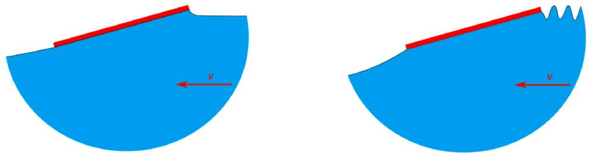

natural_image

Two blue semicircular diagrams with red lines and arrows labeled 'v', no text or symbols present.

(b)   
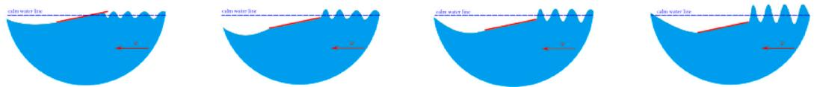

text_image

calm water line
calm water line
calm water line
calm water line

Fig. 7. Demonstration of Tuck model (Tuck, 1982b) - (a) surface tension may lead to the generation of waves in front of the planing plate; (b) the decrease of immersion depth in way of the leading edge of the planing plate may decrease the generated waves.

Collocation points   
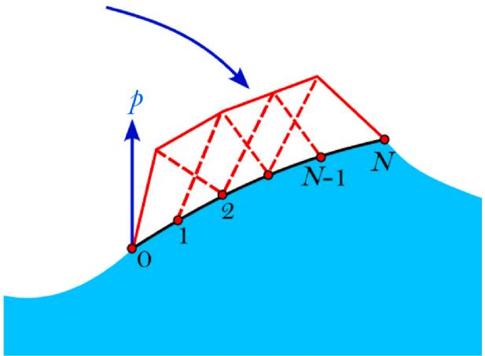

text_image

p
O
1
2
N-1
N

Fig. 8. A general overview of the finite pressure element method of Doctors (2015).

Recently, Doctors (2023) extended the model and developed the solution for the planing plates free-to-rise and free-to-rise-plus-trim scenarios.

# 4.3.3. The boundary element method (BEM)

The implementation of BEM for use in 2D planing craft dynamics has been seen in the work of Matveev et al. (2009). In this methodology the linearized potential flow problem is solved and point sources having strength (Q) are positioned on the upper boundary of a fluid domain. Each point source is positioned at the center of each fluid element. Matveev (2012) prescribed an undistributed water surface elevation for the upstream domain. The profile of the water rise-up in the front boundary of the plate needed to be initially prescribed and then would be found via iterations. The lift coefficients predicted using the point source approach were observed to agree with those of the pressure series expansion and found to be proportional to α as Fr →∞. Results agree with lift force equations formulated using power series (see Section 4.2).

# 4.4. Viscous fluid dynamics

The viscous fluid assumptions may lead to more accurate simulations of the fluid flow around a planing body. This is because of the nonlinearities associated with fluid motion and the breaking of water spray formed on the plate or waves generated astern (Kramer et al., 2013). The viscous fluid motions around a plate are generally governed by Navier–Stokes and continuity equations. As explained in Pena and Huang (2021), turbulence can be modelled on the basis of (a) Reynolds-Averaged Navier Stokes (RANS) equations, (b) Large Eddy Simulations (LES) which filters the small-scale eddies out or (c) Detached Eddy Simulation (DES). The Finite Volume Method (FVM) is mostly used to decompose the partial differential equations into simplified algebraic expressions (Anderson, 1995). The fluid can be assumed to be single- or two-phase (air-water mixture). For the latter, a volume of fluid (VOF) model should also be implemented. The problem may also be solved using particle methods (Gingold and Monaghan, 1977), the application of which in marine hydrodynamics has been highly accelerated over the last decade (Tavakoli et al., 2023a).

An early study is presented by Pemberton et al. (2001) who used single and two-phase flow models to solve the problem. In this work the lift force found by the single-phase flow was found to be more accurate. Kramer et al. (2013) solved the planing motions of a plate at different Froude Numbers, and compared his results against the potential flow model of Doctors (1974) (see Section 4.3.2). The authors observed that a number of nonlinear phenomena may emerge when viscous effects are considered (e.g., non-breaking waves in way of the lee of the plate). Ghadimi et al. (2013) introduced a Smooth Particle Hydrodynamics (SPH) solution by using the viscous CFD code FLOW3D. Different jet flow patterns were observed and the main differences appeared at greater Froude numbers and angles of attack. The jet flow found using the SPH code was seen to collapse earlier than CFD. Recently CFD codes have been used to model fluid flows around stepped planing plates (Garland and Maki, 2012; Dashtimanesh et al., 2020a), or plates subjected to air cushion effects (Durante et al., 2014). The fundamental engineering studies in this field may be considered mature and research progress can be achieved only through understanding the dynamics of hull geometries at high-speed and hydroelasticity.

# 5. Three-dimensional planing hull hydrodynamics

The 3D planing hull hydrodynamics problem has broader range of applications with direct application to hull performance, controllability and seakeeping. This section reviews the methods used for modelling the fluid motions and forces acting on a planing boat (three-dimensional planing surface).

# 5.1. Potential fluid flow models

The first group of models introduced in this section are the ones that are based on potential flow assumptions, i.e. the fluid is assumed to be ideal, and mostly a linearized kinematic boundary condition is set for the free surface. Such methods may be more classical and may be considered as the generalized version of 2D planing models introduced in Section 4.

# 5.1.1. Low-aspect-ratio flat-ship theory

The low-aspect ratio flat ship theory may be one of the first methods developed to solve the 3D planing motions. The main hypothesis of the model is that the beam and draft over length ratios in way of the planing surface are very low. The method assumes a linearized boundary condition on the free surface, Maruo (1967). To solve the problem, integral equations need to be solved and through those the pressures acting on a flat planing surface are obtained. Tuck (1975) presented a numerical approach to solve the same problem and Cole (1988) suggested simplification via asymptotic expansions. Cole’s method demonstrated that the hydrodynamic $( \mathcal { L } ^ { H D } )$ and hydrostatic lift (B ) forces acting on flat planing surface are expressed as

$$
\mathcal {L} ^ {H D} = \rho_ {w} V ^ {2} L _ {w} ^ {2} \epsilon \varrho \left(\varrho \frac {\pi}{2} \mathrm{Fr} _ {l} ^ {2} - \frac {4}{1 5}\right), \tag {5.1}
$$

$$
\mathcal {B} = \rho_ {w} V ^ {2} L _ {w} ^ {2} \epsilon \varrho \frac {8}{1 5}. \tag {5.2}
$$

In the above equations, $L _ { w }$ is the wetted length and ϵ along ϱ respectively express the draught (d) over length and the half-beam over length ratios, and are given by,

$$
\epsilon = \frac {d}{L}, \tag {5.3}
$$

$$
\varrho = \frac {B}{2 L}. \tag {5.4}
$$

# 5.1.2. The asymptotic expansion method

Chung and Chun (2007) used an asymptotic approach to idealise the potential flow filed, angle of attack and rise of a 3D flat planing plate with weight W. The solution presented in this research article is similar to the 2D idealization by Chun (2008). The lift force acting on the planing plate is approximated as,

# 5.1.3. Finite pressure elements

In this method finite elements are placed on the planing surface assuming linearized boundary conditions This results in the evaluation of hydrodynamic pressures and appropriate idealization of the free surface elevation. The very first research addressing 3D planing surfaces makes use of the finite pressure element introduced by Doctors (1975). However, the lift force was observed to be under predicted at high Froude Numbers (e.g., Fn = 2.0). Some other studies were carried out in the next decades (Tong, 1989, Xie et al., 2005).

# 5.1.4. Panel methods

Point sources, doublets or vortices are spatially distributed on the boundaries of the fluid domain. This enables us to compute the pressure distribution over the surface of the boat, and to predict the water surface elevation around the hull. The main challenge in this field is to either consider a linearized problem, or to set nonlinear boundary conditions for the water surface.

Lai and Troesch (1996) explained that linearized boundary condi tions may limit the nonlinear solution to the problem (see Lai and Troesch, 1995). The main contribution of the nonlinearity is in the jet flow region, where large pressures are also expected to emerge. The phenomenon has also been identified in research with focus on 2D planing problems using jet flow methods (see Section 4.1). Another example is given by Brizzolara and Vernengo (2016).

Other methods simplify the boundary conditions and neglect nonlinear terms with the aim to predict the lift force of the 3D planing surfaces accurately (Bari and Matveev, 2017). In such cases the pressure distribution and the water surface elevation behind the vessel may not be perfectly idealised. An example of a linearized model can be found in the work of Kohansal and Ghassemi, 2010.

# 5.2. Empirical models

The empirical models developed since 1930s are based on experimental data collected over decades of tests, mostly carried out in Stevens Institute of Technology (Savitsky, 1964). Results describe the planing motion of hulls following towing tank tests with fixed heave and pitch, where forces acting on the planing vessels, along with wet area, center of pressure, and pressure distribution are measured. The methods fall into three categories namely (i) equations for the prediction of lift forces, (ii) application of the swept wing theory for the prediction of pressure and (iii) resistance force estimation models.

# 5.2.1. Empirical equations for the prediction of lift forces

A summary of some of the empirical equations giving the hydrodynamic lift are presented in Table 7. The very first equation was formulated by Perring and Johnston (1935) as follows,

$$
\frac {\mathscr {L}}{W} \approx 1 - \frac {2}{\pi} \sqrt {\frac {W}{\rho_ {w} g L _ {W} ^ {2} B}} [ 1 + | \ln (2 \sin \alpha) | ] \mathrm{Fr} _ {l} ^ {- 1} - \frac {L _ {W} \mathrm{Fr} _ {l}}{\pi B} \sqrt {\frac {\rho_ {w} g L _ {W} ^ {2} B}{W}} \int_ {- 0. 5 b} ^ {0. 5 b} \int_ {0} ^ {1} \ln \frac {\sqrt {1 - 2 q \cos 2 \alpha + q ^ {2} + (0 . 5 b + z) ^ {2}} + 0 . 5 b + z}{\sqrt {(1 - q) ^ {2} + (0 . 5 b + z) ^ {2}} + 0 . 5 b + z} d q d z \tag {5.5}
$$

The angle of attack (equilibrium trim angle) is

$$
\alpha \approx \sqrt {\frac {W}{\rho_ {w} L _ {W} B}} \frac {1}{V}. \tag {5.6}
$$

In the above expression, W is the weight force of the 3D planing surface and q is a parameter representing the evaluation of the longitudinal dimensions presented in Chung and Chun (2008).

$$
\frac {L ^ {H D}}{0 . 5 \rho_ {w} V ^ {2} \mathcal {S}} \approx 0. 9 \mathcal {A} ^ {0. 4 2} \alpha , \tag {5.7}
$$

where $( L ^ { H D } )$ is the hydrodynamic lift force, $\mathcal { A }$ is the aspect ratio of the planing surface and $\mathcal { S }$ is the wet area.

The set of equations presented by Savitsky (1964) are most well accepted. The general assumption of these equations is that the lift force coefficient of a 3D flat plate can be determined using the angle of attack and the mean wetted length. Stavisky hypothesized that the hydrody namic lift force of a 3D flat planing surface is proportional to $\alpha ^ { 1 . 1 }$ and $\left( \frac { L _ { M } } { B } \right) ^ { 0 . 5 }$ , and formulated the hydrodynamic lift force coefficients as,

Table 7 Empirical equations of dynamic lift force $( L ^ { H D } )$ , as presented in Payne (1995). 

<table><tr><td>Reference</td><td>Equation for  $\mathcal{L}^{HD}$ </td><td></td></tr><tr><td>Perring and Johnston (1935)</td><td> $\frac{L^{HD}}{0.5\rho_{w}V^{2}\mathcal{S}}\approx 0.9\,\mathcal{A}^{0.42}\,\alpha$ </td><td></td></tr><tr><td>Sottorv (1937)</td><td> $\frac{L^{HD}}{0.5\rho_{w}V^{2}\mathcal{S}}\approx 0.845\,\mathcal{A}^{0.5}\,\alpha$ </td><td></td></tr><tr><td>Korvin- Kroukovsky et al. (1949)</td><td> $\frac{L^{HD}}{0.5\rho_{w}V^{2}\mathcal{S}}\approx 0.012\,\mathcal{A}^{0.5}\,\alpha^{1.1}$ </td><td> $\alpha$ (Degrees)</td></tr><tr><td>Locke (1949)</td><td> $\frac{L^{HD}}{0.5\rho_{w}V^{2}\mathcal{S}}\approx \frac{k}{2}\alpha^{\prime }$ </td><td> $k$ and $n$ are two constants that are presented in the reference</td></tr><tr><td rowspan="2">Farshing (1955)</td><td> $g^{3}+[(2.293-1.571\mathcal{A})\alpha-2.379-\mathcal{A}]g^{2}+[2\mathcal{A}+4+(6.283\mathcal{A}-4.584)\alpha]g-6.283\mathcal{A}\alpha=0$ </td><td rowspan="2"> $g$ is found and then using the value of $\varpi$ , lift coefficient is found. $\alpha$ in the equation used for calculation of $g$ is in radians, but it is Degrees in the equation used for calculation of $\varpi$ </td></tr><tr><td> $\frac{L^{HD}}{0.5\rho_{w}V^{2}\mathcal{S}}=\varpi g$ where $\varpi=1.359-\tanh\left(\frac{1+\mathcal{A}}{8\mathcal{A}}\right)2^{\circ}\leq\alpha\leq18^{\circ}$  $\varpi=1.359-\tanh\left(\frac{1+\mathcal{A}}{8\mathcal{A}}\right)+\left(\frac{\alpha-18}{90.53}\right)\tanh\frac{1}{\mathcal{A}^{2}}$  $18^{\circ}\leq\alpha\leq30^{\circ}$ </td></tr></table>

$$
\left. \frac {L ^ {H D}}{0 . 5 \rho_ {w} V ^ {2} B ^ {2}} \right| _ {\beta = 0} \approx \mathcal {C} \left(\frac {L _ {M}}{B}\right) ^ {0. 5} \alpha^ {1. 1} \tag {5.8}
$$

where $\mathcal { C }$ is a constant that is found using curve fitting and $L _ { M }$ is the average wetted length of the surface. The equation is different as compared to those formulated using potential flow assumptions. This is because the lift forces of potential flow models were shown to be proportional to α. Stavitsky presumed that the transverse flow towards the edge of the plate may cause this difference. By setting tan α ≈ $\alpha ^ { 1 . 1 }$ , Stavitsky formulated the buoyancy force acting on 3D planing surface as

$$
\left. \frac {\mathcal {B}}{0 . 5 \rho_ {w} V ^ {2} B ^ {2}} \right| _ {\beta = 0} \approx \mathcal {D} \left(\frac {L _ {M}}{B}\right) ^ {2. 5} \mathrm{Fr} _ {B} ^ {- 2} \alpha^ {1. 1}, \tag {5.9}
$$

where D is a constant that is approximated through curve fitting (Stavitsky, 1964).

The total normal force, ${ \mathcal { L } } = { \mathcal { L } } ^ { H D } + { \mathcal { B } }$ , acting on a 3D flat planing surface $( \beta = 0 )$ is,

$$
\begin{array}{l} C _ {\mathscr {L} 0} = \frac {\mathscr {L}}{0 . 5 \rho_ {w} V ^ {2} B ^ {2}} \Bigg | _ {\beta = 0} = \frac {\mathscr {L} ^ {H D} + \mathscr {B}}{0 . 5 \rho_ {w} V ^ {2} B ^ {2}} \Bigg | _ {\beta = 0} \\ \approx \alpha^ {1. 1} \left(0. 0 1 2 0 \left(\frac {L _ {M}}{B}\right) ^ {0. 5} + 0. 0 0 5 5 \left(\frac {L _ {M}}{B}\right) ^ {2. 5} \mathrm{Fr} _ {B} ^ {- 2}\right). \tag {5.10} \\ \end{array}
$$

The lift force acting on a deadrise surface is

$$
C _ {\mathcal {L} \beta} = \frac {\mathcal {L}}{0 . 5 \rho_ {w} V ^ {2} B ^ {2}} \bigg | _ {\beta \neq 0} \approx C _ {\mathcal {L} 0} - 0. 0 0 6 5 \beta C _ {\mathcal {L} 0} ^ {0. 6} \tag {5.11}
$$

The curves showing the lift force of flat planing surfaces and deadrise surfaces are shown in Fig. 9. To find the lift force acting on a planing boat, the mean wetted length $\left( L _ { M } \right)$ should be evaluated and equals to $L _ { W }$ for a flat 3D surface. For a deadrise surface encompassing the keel wetted length and the chine wetted length, $L _ { M }$ is defined as

$$
L _ {M} = 0. 5 L _ {K} + 0. 5 L _ {C}, \tag {5.12}
$$

where

$$
L _ {K} = \frac {d}{\sin \alpha}, \tag {5.13}
$$

and

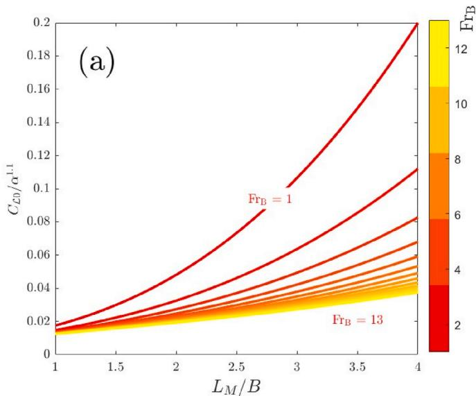

line

| LM/B | C_E0/α^1.1 (Fr_B = 1) | C_E0/α^1.1 (Fr_B = 13) |
|------|------------------------|-------------------------|
| 1.0  | 0.02                   | 0.02                    |
| 1.5  | 0.04                   | 0.03                    |
| 2.0  | 0.06                   | 0.04                    |
| 2.5  | 0.08                   | 0.05                    |
| 3.0  | 0.10                   | 0.06                    |
| 3.5  | 0.14                   | 0.07                    |
| 4.0  | 0.20                   | 0.08                    |

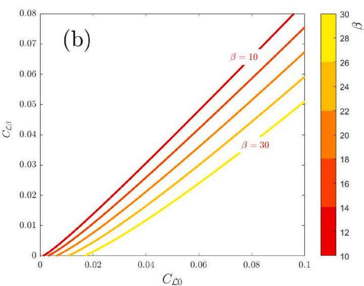

line

| C_L0 | C_Lβ (β=10) | C_Lβ (β=30) |
|------|-------------|-------------|
| 0.00 | 0.00        | 0.00        |
| 0.02 | 0.02        | 0.01        |
| 0.04 | 0.04        | 0.02        |
| 0.06 | 0.06        | 0.03        |
| 0.08 | 0.07        | 0.04        |
| 0.10 | 0.08        | 0.05        |

Fig. 9. Lift force variation according to Savitsky (1964).

$$
L _ {C} = L _ {K} - \frac {B}{\pi} \frac {\tan \beta}{\tan \alpha_ {\mathrm{S}}} \tag {5.14}
$$

In the above expression $\alpha _ { S }$ is the stagnation angle and is found by

$$
\alpha_ {\mathrm{S}} = \tan^ {- 1} \frac {\pi}{2} \frac {\tan \alpha}{\tan \beta}. \tag {5.15}
$$

Equation (5.14) is based on the water rise-up assumption founded in Wagner water entry theory (Wagner, 1932). Some other empirical equations that give the total lift force of a zero deadrise angle planing surface are outlined in Table 8. Lift curves constructed using Savitsky’s equations are presented in Fig. 9.

# 5.2.2. Swept wing theory for the hydrodynamic pressure estimation

Another important set of empirical equations for the prediction of pressure distributions on the bottom of a planing hull are established by Morabito (2014). Such equations may be used for the evaluation of lift forces over the wetted surface. The approach assumes that the maximum pressure $\left( { p _ { \mathrm { M a x } } } \right)$ occurs at the intersection of the keel and the water. At any longitudinal strip, the maximum pressure emerges at a point located on the stagnation line. To satisfy the Kutta conditions the maximum pressure at each longitudinal strip of a 3D planing surface is approximated as

$$
\frac {p _ {\text { Max }} \left(\widehat {y}\right)}{0 . 5 \rho_ {w} V ^ {2}} = \left(\left[ 1. 0 2 - 0. 2 5 \widehat {y} ^ {1. 4} \right] \frac {0 . 5 - \widehat {y}}{0 . 5 1 - \widehat {y}}\right) \sin^ {2} \alpha_ {S}, \tag {5.16}
$$

where $\alpha _ { S }$ is the stagnation line angle (Equation (5.15)). Here, x and $y ,$ each with a hat symbol ( ∧), denote normalized longitudinal and transverse distances from the stagnation line and centerline, respectively.

The pressure at any point in between transom and stagnation line is

$$
\frac {p _ {H D} (\widehat {x} , \widehat {y})}{0 . 5 \rho_ {w} V ^ {2}} = \left([ 1. 0 2 - 0. 0 5 (\beta \right.
$$

$$
\left. + 5) \hat {y} ^ {1. 4} \right] \frac {0 . 5 - \hat {y}}{0 . 5 1 - \hat {y}} \left(\frac {\left(\widehat {L} _ {y} - \hat {x}\right) ^ {1 . 4}}{\left(\widehat {L} _ {y} - \hat {x}\right) ^ {1 , 4} + 0 . 0 5}\right) \frac {0 . 0 0 6 \alpha^ {1 . 3} \hat {x} ^ {1 / 3}}{\hat {x} + \widehat {\Gamma} (\hat {y})}. \tag {5.17}
$$

where $\widehat \Gamma ( \widehat { \boldsymbol y } )$ is found using

$$
\widehat {\Gamma} (\widehat {y}) = \frac {\left(\left[ 1 . 0 2 - 0 . 0 5 (\beta + 5) \widehat {y} ^ {1 . 4} \right] \frac {0 . 5 - \widehat {y}}{0 . 5 1 - \widehat {y}} 0 . 0 0 6 \alpha^ {1 . 3}\right) ^ {1 . 5}}{2 . 5 8 8 \left(\frac {p _ {\text {Max}} (\widehat {y})}{0 . 5 \rho_ {w} V ^ {2}}\right) ^ {1 . 5}}. \tag {5.18}
$$

Here

$$
\widehat {L} _ {\mathrm{y}} = \frac {L _ {M}}{B} - \frac {(\widehat {\mathrm{y}} - 0 . 2 5)}{\tan \alpha_ {\mathrm{S}}} \tag {5.19}
$$

All equations presented in this sub-section are formulated by (Morabito, 2014). An example of pressure distribution given by Morbito model (Morabito, 2014) is shown in Fig. 10.

# 5.2.3. Empirical equations for the estimation of resistance force

The resistance forces of a planing surface can be formulated as

$$
\mathcal {R} = \mathcal {R} _ {V} + \mathcal {L} \sin \alpha + \mathcal {R} _ {S}, \tag {5.20}
$$

where ${ \mathcal { R } } _ { V }$ refers to frictional resistance force caused by the viscous fluid flow motion. The second term indicated the hydrodynamic induced resistance force, and $\mathcal { R } _ { S }$ is the spray resistance. The frictional resistance force is suggested to be found using viscous drag force, which is calculated as

$$
\mathcal {D} _ {v} = \frac {\mathcal {C} _ {F} \rho_ {w} \overline {{\mathcal {V}}} ^ {2} L _ {M} B}{2 \cos \beta}, \tag {5.21}
$$

where $\mathcal { C } _ { F }$ is Shoeneherr turbulent coefficient and $\overline { { \mathcal { V } } }$ is the average bottom velocity. $\mathcal { D } _ { \nu }$ is the drag force due to frictional stresses. $\mathcal { C } _ { F }$ is frictional drag coefficient calculated by solving the expression

$$
\frac {0 . 2 4 2}{\sqrt {\mathcal {C} _ {F}}} = \log_ {1 0} (\text { Re } \mathcal {C} _ {F}). \tag {5.22}
$$

The average bottom velocity of a flat planing surface can be approximated by

$$
\overline {{{\mathcal {V}}}} = V \left(1 - \frac {0 . 0 1 2 0 \alpha^ {1 . 1}}{\sqrt {L _ {M} / B} \cos \alpha}\right). \tag {5.23}
$$

The spray resistance is defined as

$$
\mathcal {R} _ {S} = 0. 5 \rho_ {w} V ^ {2} l ^ {\oplus} B ^ {2} \mathcal {C} _ {F} ^ {\bullet}. \tag {5.24}
$$

Here, $l ^ { \oplus }$ is the dimensionless additional wetted length due to spray formation and $\mathcal { C } _ { F } ^ { \bullet }$ is the drag coefficient of the spray. $l ^ { \oplus }$ is calculated as per

$$
l ^ {\oplus} = \frac {\cos \Theta}{4 \sin 2 \alpha_ {S} \cos \beta}. \tag {5.25}
$$

where Θ is

$$
\Theta = \frac {2 \alpha_ {\mathrm{S}}}{\cos \beta}. \tag {5.26}
$$

The spray frictional drag coefficient is found using

$$
\mathcal {C} _ {F} ^ {\bullet} = \left\{ \begin{array}{l l} \frac {1 . 3 2 8}{\sqrt {\mathrm{Re} ^ {\bullet}}} & \quad \mathrm{Re} ^ {\bullet} <   1. 5 \times 1 0 ^ {6} \\ \frac {0 . 0 7 4}{\sqrt [ 5 ]{\mathrm{Re} ^ {\bullet}}} - \frac {4 8 0 0}{\mathrm{Re} ^ {\bullet}} & \quad \mathrm{Re} ^ {\bullet} \geq 1. 5 \times 1 0 ^ {6}, \end{array} \right. \tag {5.27}
$$

where $\mathbf { R e } ^ { \bullet }$ is the Reynolds number of spray flow. Interestingly, the spray

Table 8   
Empirical equations for the total lift force $( \mathcal { L } = L ^ { H D } + \mathcal { B } )$ of a zero deadrise planing surface (Payne, 1995). 

<table><tr><td>Reference</td><td colspan="2">Equation for  $L^{HD}$ </td></tr><tr><td>Sedov (1939)</td><td> $\frac{\mathcal{L}}{0.5\rho_{w}V^{2}B^{2}} = \alpha \left[ \frac{0.7\pi\left(\frac{L_{M}}{B}\right)}{1+1.4\left(\frac{L_{M}}{B}\right)} + \left(\frac{L_{M}}{B}\right)\mathrm{Fr}_{B}^{-2}\left(0.92\left(\frac{L_{M}}{B}\right)-0.38\right) \right]$ </td><td></td></tr><tr><td>Korvin-Kroukovsky et al. (1949b)</td><td> $\frac{\mathcal{L}}{0.5\rho_{w}V^{2}B^{2}} = \alpha^{1.1}\left(0.0120\left(\frac{L_{M}}{B}\right)^{0.5}+0.0095\left(\frac{L_{M}}{B}\right)^{2}\mathrm{Fr}_{B}^{-2}\right)$ </td><td> $\alpha$  is in Degrees.</td></tr><tr><td>Savitsky (1964)</td><td> $\frac{\mathcal{L}}{0.5\rho_{w}V^{2}B^{2}} = \alpha^{1.1}\left(0.0120\left(\frac{L_{M}}{B}\right)^{0.5}+0.0055\left(\frac{L_{M}}{B}\right)^{2.5}\mathrm{Fr}_{B}^{-2}\right)$ </td><td> $\alpha$  is in Degrees.</td></tr><tr><td>Ergorov et al. (1978)</td><td> $\frac{\mathcal{L}}{0.5\rho_{w}V^{2}B^{2}} = \alpha\left[\frac{0.7\pi\left(\frac{L_{M}}{B}\right)}{1+1.4\left(\frac{L_{M}}{B}\right)}+\left(\frac{L_{M}}{B}\right)^{2}\mathrm{Fr}_{B}^{-2}\left(\frac{\left(\frac{L_{M}}{B}\right)-0.4}{\left(\frac{L_{M}}{B}\right)+0.4}\right)\right]$ </td><td></td></tr></table>

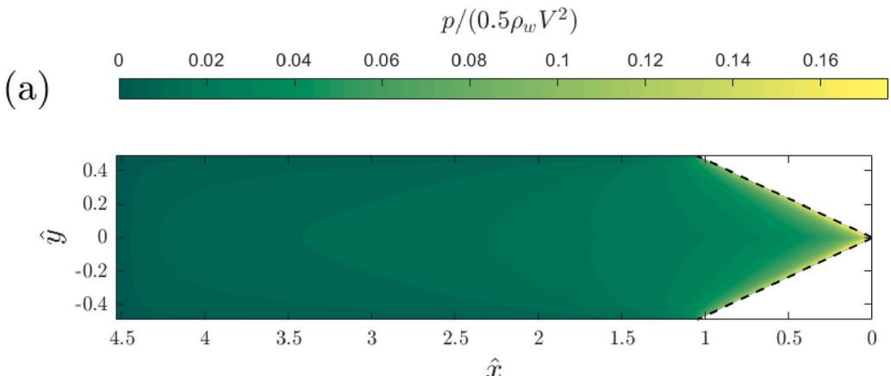

heatmap

| x̂    | -0.4   | -0.2   | 0.0    | 0.2    | 0.4    |
|------|--------|--------|--------|--------|--------|
| 0.0  | 0.0    | 0.0    | 0.0    | 0.0    | 0.0    |
| 0.5  | 0.0    | 0.0    | 0.0    | 0.0    | 0.0    |
| 1.0  | 0.0    | 0.0    | 0.0    | 0.0    | 0.0    |
| 1.5  | 0.0    | 0.0    | 0.0    | 0.0    | 0.0    |
| 2.0  | 0.0    | 0.0    | 0.0    | 0.0    | 0.0    |
| 2.5  | 0.0    | 0.0    | 0.0    | 0.0    | 0.0    |
| 3.0  | 0.0    | 0.0    | 0.0    | 0.0    | 0.0    |
| 3.5  | 0.0    | 0.0    | 0.0    | 0.0    | 0.0    |
| 4.0  | 0.0    | 0.0    | 0.0    | 0.0    | 0.0    |
| 4.5  | 0.0    | 0.0    | 0.0    | 0.0    | 0.0    |

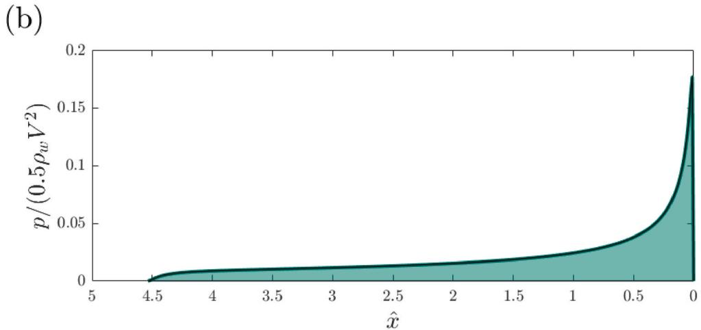

area

| x̂    | p/(0.5ρw V²) |
| ------ | ------------ |
| 4.5    | 0.0000       |
| 4.0    | 0.0050       |
| 3.5    | 0.0100       |
| 3.0    | 0.0150       |
| 2.5    | 0.0200       |
| 2.0    | 0.0250       |
| 1.5    | 0.0350       |
| 1.0    | 0.0500       |
| 0.5    | 0.1000       |
| 0.0    | 0.1800       |

Fig. 10. Morabito (2014) pressure contour distribution (a) on the bottom of a planing hull and (b) pressure distribution along the center line of a planing boat (deadrise angle = 10◦, trim $\mathrm { a n g l e } = 3 ^ { \circ }$ and normalized mean wetted length = 4.0).

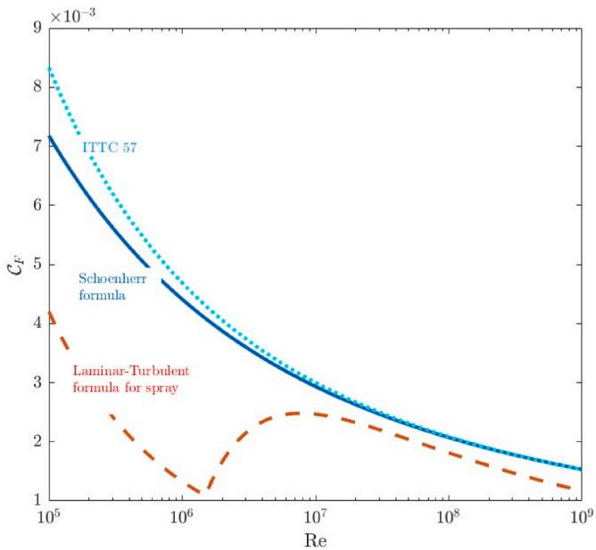

line

| Re       | ITTC 57 | Schoenherr formula | Laminar-Turbulent formula for spray |
| -------- | ------- | ------------------ | ----------------------------------- |
| 10^5     | 7.2e-3  | 8.2e-3             | 4.0e-3                              |
| 10^6     | 4.8e-3  | 4.5e-3             | 1.0e-3                              |
| 10^7     | 2.8e-3  | 2.5e-3             | 2.5e-3                              |
| 10^8     | 1.8e-3  | 1.7e-3             | 1.5e-3                              |
| 10^9     | 1.5e-3  | 1.4e-3             | 1.2e-3                              |

Fig. 11. Frictional drag coefficient versus Reynolds number.

drag may be nil in case additional length caused by spray formation is zero when cos Θ = 0. Above equations are developed by Savitsky (1964) and Savitsky et al. (2007). Fig. 11 shows frictional drag coeffeicient as a function of Reynolds Number.

# 5.3. The 2D + t model

The very early ideas of the 2D + t method dates to 1940s and early 1950s. Researchers were mostly aiming to further extend von Karman’s water entry model (von Karm´ an, ´ 1929) for 3D impact of seaplans or prismatic planing hulls (Mayo, 1945; Milwitzky, 1948; Schnitzer, 1953). For example, Schnitzer (1953) developed a theoretical model that used momentum variation to calculate the 3D impact forces acting on a prismatic planing hull. His results were shown to be in good agreement with experiments of Smiley (1950), and the method was later further developed for studying different hydrodynamic problems arising in planing motions, which shall be introduced in Sections 6, 7 and 8. In general, it is assumed that a planing vessel passes through a 2D plane, and solution of a 2D water entry problem over time can be used for calculation of the 3D forces (Fig. 12).

Following the research done in 1940s–1960s, Martin (1978) introduced a momentum variation theory for calculation of the sectional force acting on a hard-chine section. The method inspired many other researchers to develop mathematical models for the prediction of nonlinear motions of planing boats in waves or to study the purposing instability of vessels (e.g. Zarnick, 1978). Other significant work in this field was presented by Zhao et al. (1997) who instead of using the momentum variation, solved the potential flow fields while accounting for the flow separation from the chines and integrated the pressure acting on the wall of a section (Zhao and Faltinsen, 1993). The lift coefficient force found by Zhao et al. (1997) was observed to be greater than the one of Savitsky (1964). The key strength of 2D + t method is that it may apply to both symmetric and asymmetric motions provided that oblique (e.g., Judge et al., 2004) and rotational speeds for the wedge entering water are accounted for. The method has also seen to be used in modelling spray pattern around a planing hull (Kihara, 2006) and wave breaking and wave pattern around moving bodies (Andrillon and Alessandrini, 2004; Marrone et al., 2011; Landrini et al., 2012; Zheng et al., 2019; Zhang et al., 2023).

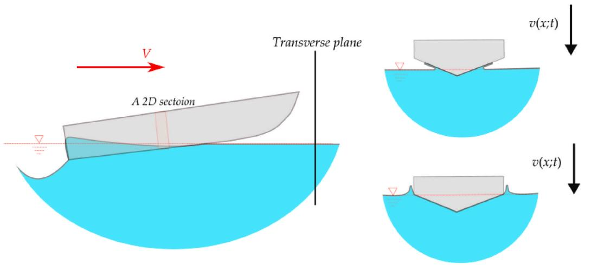

text_image

Transverse plane
A 2D section
v(x;t)
v(x;t)

Fig. 12. A general overview of 2D + t theory. Two different stages of the water entry process, before and after chine wetting, are shown on the right side.

The water entry problem can be solved using the linearized potential flow theories or nonlinear ones, or it can be based on viscous fluid flow assumptions. Given a planing craft moving forward with a constant speed of $V ,$ a section enters the water with a speed of

$$
\nu = V \tan \alpha . \tag {5.28}
$$

For a non-steady motion, speed at every section of the hull would be different. The solution of the water entry problem leads to the estimation of 2D forces acting on each section. The integration of these forces gives the total force acting on the body. Two coordinate systems known as body - attached one, and earth fixed are considered throughout this process. The normal force is defined as

$$
N = \left(\int_ {L _ {W}} \Psi (\xi) f _ {z} ^ {2 D} (\xi) d \xi\right). \tag {5.29}
$$

In the above Equation $\Psi ( \xi )$ represents a function that is used to implement transom effects. This function gives zero at $\xi = \xi _ { t r }$ , and approaches 1 as $\xi \to \infty$ . The pitching moment acting on the boat is

$$
\mathcal {M} = \int_ {L _ {W}} \Psi (\xi) \xi f _ {z} ^ {2 D} (\xi) d \xi . \tag {5.30}
$$

The vertical forces in the 2D plane can be evaluated by using the principle of momentum variation (von Karman water entry model, von Karm´ an, ´ 1929) developed for incompressible linearized fluid motions without gravity effects. Accordingly, the vertical force becomes

$$
f _ {z} ^ {2 D} (\xi) = \frac {D}{D t} \left(m _ {3 3} ^ {2 D} v\right) = m _ {3 3} ^ {2 D} \dot {v} + \dot {m} _ {3 3} ^ {2 D} v - \mathcal {U} \frac {\partial}{\partial x} \left(m _ {3 3} ^ {2 D} v\right), \tag {5.31}
$$

where $ { m } _ { 3 3 } ^ { 2 D }$ is the sectional heave added mass of the section due to the heave motion at infinite-frequency, i.e., →∞. Readers intrested in technical information about above equation are referred to Zarnick (1978) and Faltinsen (2006). Here, U is the longitudinal velocity at each section of the vessel, given by

$$
\mathcal {U} = V \cos \alpha . \tag {5.32}
$$

Note that above speed is valid for a steady planing motion. A cross drag flow term may also be added to above equation, and equation is rewritten as

$$
f _ {z} ^ {2 D} (\xi) = m _ {3 3} ^ {2 D} \dot {v} + \dot {m} _ {3 3} ^ {2 D} v - \mathcal {U} \frac {\partial}{\partial x} \left(m _ {3 3} ^ {2 D} v\right) + \mathcal {C} _ {D C} \rho_ {w} b _ {W} v ^ {2} \tag {5.33}
$$

where $b _ { w }$ is the half-wetted beam of the section. Equations that can be used for calculation of the sectional added mass and cross drag flow. Using the added mass theory, Payne (1988) has presented the equation for the normal force acting on a vessel moving forward at a constant speed as

$$
N = 0. 5 \rho_ {w} V ^ {2} B ^ {2} \left(\frac {\pi}{4} f (\mathcal {A}) C _ {m} \alpha + \frac {L _ {c}}{B} \mathcal {C} _ {D C} \alpha^ {2} + \frac {L _ {M}}{B} \frac {\Psi_ {B} \alpha}{\mathrm{Fr} _ {l} ^ {2}} - \frac {L _ {M}}{B} \frac {\Psi_ {s} \alpha}{\mathrm{Fr} _ {l} ^ {2}}\right), \tag {5.34}
$$

where $C _ { \mu }$ is the 2D added mass coefficient $\boldsymbol { \mathscr { f } } ( \mathcal { A } )$ is the aspect ratio effects, $\Psi _ { B }$ and $\Psi _ { s }$ are respectively buoyancy reduction and transom suction lift. Added mass coefficient is formulated as

$$
C _ {m} = \frac {m _ {3 3} ^ {2 D}}{0 . 5 \pi \rho_ {w} b _ {w} ^ {2}}. \tag {5.35}
$$

Payne (1988) presented following equations

$$
C _ {m} = \left(1 - \frac {\beta}{\pi}\right), \tag {5.36}
$$

and

$$
C _ {m} = \left(1 - \frac {\beta}{\pi}\right) \left(1 + \frac {4}{3} \alpha \frac {L _ {C}}{B}\right), \tag {5.37}
$$

for dry chine prismatic and wetted chine prismatic wedges, respectively. For a zero deadrise angle vessel, Payne (1988) formulated following equation

$$
C _ {m} = \left(1 + \frac {4}{3} \alpha \frac {L _ {K}}{B}\right). \tag {5.38}
$$

More technical information about added mass coefficients along with $\Psi _ { B }$ and $\Psi _ { s }$ can be found in Payne (1988, 1992, 1994, 1995). In addition, formulations for calculation of buoyancy force are presented in Flairlie-clarke and Tveitnes (2008). Finally note that, if the water entry problem is solved using a theoretical or BEM approach, the force acting on a section can be found by integration of the hydrodynamic pressures.

Most of the early water entry models idealise fluid motions at the early stage of the water entry and hence do not account for water detachments that may be more evident in hard-chine sections. If a potential based flow model is used, the model should account for water separation (e.g., Tassin et al., 2014). Some important equations that can be used for the calculation of the sectional force during water entry are introduced by Korobkin (2004), see Table 9. Whereas these equations can only be used before the chine wetting condition, they have never been used for modelling planing hulls.

Table 9

Display of water entry models of relevance to the 2D vertical force acting on a wedge entering water with a constant speed $( f _ { z } ^ { 2 D } = \rho _ { w } e ^ { z } b _ { w } \Big [ \frac { \pi ^ { 2 } } { 2 \tan \beta } - K ( \beta ) \Big ]$ [ π2 ; Korobkin 2004).

<table><tr><td>Water entry model</td><td> $K(\beta)$ </td><td> $\Xi = \sqrt{1 - X^2}$ , for  $X$  as defined below</td></tr><tr><td>Original Logvinovich Model (OLM)</td><td> $K(\beta) = \frac{\pi}{\tan \beta} \left( \frac{\pi}{2} - \arcsin \Xi \right) + 0.5 \ln \left[ \frac{1 + \Xi}{1 - \Xi} \right]$ </td><td> $X = \frac{2 \tan \beta}{\pi}$ </td></tr><tr><td>Modified Logvinovich Model (MLM)</td><td> $K(\beta) = \frac{\pi}{\tan \beta} \left( \frac{\pi}{2} - \arcsin \Xi \right) + 0.5 \cos^2 \beta \ln \left[ \frac{1 + \Xi}{1 - \Xi} \right] + \Xi \sin^2 \beta$ </td><td> $X = \frac{\sin (2\beta)}{\pi [1 + \sqrt{1 - 4\pi^{-2} \sin^4 \beta}]}$ </td></tr><tr><td>Generalized Wagner Model (GWM)</td><td> $K(\beta) = \frac{\pi}{\tan \beta} \left( \frac{\pi}{2} - \arcsin \Xi \right) + 0.5 \cos^2 \beta \ln \left[ \frac{1 + \Xi}{1 - \Xi} \right] + \Xi (\sin^2 \beta + \pi - 2)$ </td><td> $X = \frac{\sin (2\beta)}{\pi [1 + \sqrt{1 - 4\pi^{-2} \sin^2 \beta (\sin^2 \beta + \pi - 2)}]}$ </td></tr></table>

# 5.4. 3D viscous fluid models

Viscous models may be used to solve the fluid flow around 3D planing surfaces. Such models can idealise phenomena emerging near wall boundaries (e.g., turbulence development) and air-water interfaces (splash, wave breaking, etc.).

To reconstruct the straightforward motion of the boat, a vertical symmetry plane is usually idealised and the problem is solved for half of the domain. The planing boat is assumed to be fixed, and an air-water stream is prescribed to flow towards the boat. The wall with slip, symmetry or inlet boundary conditions can be set on the side patches of the domains. The former resembles the walls of towing tank, though the two others may resemble open sea conditions. Laminar flow assumptions may for sure lead to under prediction of the drag forces. Hence turbulence models $( k - \epsilon , k - \omega \ S S \mathrm { T } _ { : }$ , LES and DES) are utilized according to the FVM. RANS models may help in reconstructing the shear stresses emerging near the wall of the hull. LES may enable the capture of larger Eddies surrounding the vessel (e.g., in way of the lee of the vessel). The DES model can capture the shear stresses emerging near the walls and also large eddies formed in the vicinity of the lee of the hull.

In literature, CFD simulations are presented for vessels fixed in heave and pitch. A list of most important studies following this aim is presented in Table 10. The aim of these studies has been to evaluate the capability of CFD models to predict the lift and drag forces. For example, Caponnetto (2000) introduced a k − ϵ model to solve the fluid motions around flat and deadrise hull bottoms. The lift force coefficient of the flat bottom vessel obtained by CFD simulations was found to be nearly equal to those of Savitsky’s equations (Savitsky, 1964). However, those found for deadrise surface was seen to be slightly greater than Savitsky’s equations (Savitsky, 1964) give. Brizzolara and Serra (2007) performed a similar study and used the same turbulence model. Their comparisons against experiments showed that for most cases, the CFD model predicts the lift force of a deadrise surface more accurately. This is not surprising as Savitsky (1964) empirical equations do not consider all physical dimensions of the problem.

Early studies looking into hydrodynamic of stepped planing hulls have also be done through fixed heave and pitch motion assumption. It is assumed that the trim and CG rise up the vessel to be equal to what was found in physical towing tank tests. Drag forces are then compared against those predicted by CFD models and the resistance forces measured in experiments. Fluid forces in vertical direction found from CFD are compared against the weight forces of the vessel. For example, Lotfi et al. (2015) observed that CFD may predict lower vertical forces while the center of pressures found in CFD simulations can be positioned forward to the center of pressure identified during experiments. Veisi et al. (2015) observed that a CFD model may under-predict resistance forces at larger Froude numbers. Ghadimi et al. (2019a) observed that the errors of CFD models in the prediction of the lift and resistance forces may reach up to 20% at larger speeds. This shows that, as compared to a stepless boat, the CFD model may have a higher level of uncertainties mostly because of water re-attachment effects (i.e., the water leaving the step re-attaches the hull in the lee of the step) may not be well captured. The overall result is that resistance and lift forces may be underpredicted. Matveev and Morabito (2020) studied the hydrodynamics of negative deadrise surfaces fixed in heave and pitch. Both RANS k − ϵ and RANS k − ω models that were used to idealise the turbulent flow field around the hull, were seen to give similar results. However, the lift and drag forces of k − ϵ model were found to be closer to experimental values at trim angle of 4◦, while those of $k - \omega$ SST were observed to be more accurate at trim angle of 6◦. A conclusion drawn directly from these results is that for a hull with a larger trim angle, the free surface deformation may be more significant, and thus the turbulent flow development in the free surface may be stronger, hence, the k − ω SST may be more accurate.

In addition to CFD-based methods employing meshed-based approaches to model fluid flow around planing vessels, particle methods have also been utilized. However, their application in modelling planing hulls fixed in heave and pitch directions is very limited. A pioneering study was conducted by Akimoto et al. (2003). The original paper is in Japanese, with an extended English version published in 2013 (Akimoto, 2013). Akimoto (2003) numerically modelled water surface elevation around a planing vessel fixed in heave and pitch directions using a moving particle method and compared the wake flow behind the vessel with the experimental measurements of Savitsky (1988). Afterward, Tafuni et al. (2016) employed a similar approach to simulate divergent and traverse waves generated by a planing vessel fixed in heave and pitch directions, and also plotted the bottom pressure of the vessel.

Table 10 Summary of CFD studies (with exclusion of SPH-based ones) idealising the fluid flow around a planing surface fixed in heave and pitch directions. 

<table><tr><td rowspan="2">Reference</td><td rowspan="2">Hull</td><td colspan="2">Turbulence model</td><td rowspan="2">Comparison against empirical equations?</td><td rowspan="2">Comparison against experiments?</td><td rowspan="2">Reference of experiments</td></tr><tr><td>k-ε</td><td>k-ωSST</td></tr><tr><td>Caponnetto (2000)</td><td>Prismatic planing hull</td><td>✓</td><td></td><td>Yes.</td><td>No.</td><td>NA</td></tr><tr><td>Brizzolara and Serra (2007)</td><td>Planing wedge</td><td>✓</td><td></td><td>Yes.</td><td>Yes</td><td>Chambliss and Boyd (1953)</td></tr><tr><td>Lotfi et al. (2015)</td><td>One-stepped planing hull</td><td>✓</td><td></td><td>No.</td><td>Yes</td><td>Taunton et al. (2010)</td></tr><tr><td>Veisi et al. (2015)</td><td>One-stepped planing hull</td><td>✓</td><td></td><td>No.</td><td>Yes</td><td>Taunton et al. (2010)</td></tr><tr><td>Ghadimi et al. (2019a)</td><td>Double-stepped planing hull</td><td>✓</td><td></td><td>No.</td><td>Yes</td><td>Taunton et al. (2010)</td></tr><tr><td>Matveev and Morabito (2020)</td><td>Negative deadrise angle planing hull</td><td>✓</td><td>✓</td><td>Yes.</td><td>Yes</td><td>Kimon et al. (1957)</td></tr></table>

# 6. Calm water performance

The hydrodynamic models used to calculate the performance of planing surfaces in calm water conditions assume straight forward course with constant speed. Hydrodynamic resistance, dynamic trim angle and CG rise-up versus speed as well as wet surface curves are usually presented in research studies. Generally, the trim angle, CG riseup and resistance forces are idealised along the equilibrium of a vessel in the vertical plane, i.e., by solving the seakeeping problem. Key methods of assessment are summarized in the following sections.

# 6.1. Empirical methods

The most well-known model used for performance prediction of planing hulls is the one by Savitsky (1964). The model is based on empirical idealization of the hydrodynamic forces acting on a vessel and her center of hydrodynamic pressure. The equilibrium equations are defined as,

$$
W = N \cos \alpha + \mathcal {T} \sin \left(\alpha + \alpha_ {\mathcal {T}}\right) - \mathcal {D} _ {V} \sin \alpha , \tag {6.1}
$$

$$
\mathcal {T} \cos (\alpha + \alpha_ {\mathcal {T}}) = N \sin \alpha + \mathcal {R} _ {v}, \tag {6.2}
$$

$$
N \left(L _ {C P} - L _ {C G}\right) + \mathscr {D} _ {V} (V _ {C R} - V _ {C G}) - \mathscr {T} (V _ {C T} - V _ {C G}) = 0. \tag {6.3}
$$

where N is the normal pressure force acting on the vessel, T is the trust force, $\alpha _ { \mathcal { T } }$ is the inclination angle of thrust force, $V _ { C R }$ is the vertical center of viscous drag, $V _ { C T }$ is the vertical position of the thrust force. For a simplified case, the thrust force is assumed to be parallel to keel line and pass through the center of gravity and also it is assumed that $( V _ { C R } -$ $V _ { C G } ) \approx 0 .$ This results in the a simplified version of the equilibrium conditions. Usually, an iterative method may be used to identify the trim angle, the wetted length of the vessel, and the resistance force. To achieve this, the set of equations (6.1) - (6.3) or a simplified version of it are solved. The trim angle and wetted lengths are initialized and then the ones that satisfy the equilibrium equations are found by an iterative approach. The wetted length can be used to find the draft in way of the transom and the CG rise-up. Other resistance components, such as spray or air resistance can also be considered (see Fig. 13).

Ghadimi et al. (2015) used the empirical equations of pressure to find the equilibrium conditions (swept wing theory). The main limiter of these empirical models is their boundary of applications.

Over the last few decades, a sound research objective has been to further develop Savitsky (1964) models for the prediction of the performance of warped planing hull series. Examples are given by Bertorello and Olivievro (2008), and Schachter et al. (2016). In the former, a planing hull is discretised into a finite number of sections, each of which is treated as an independent planing surface. Then, the Stavisky (1964) equations and the Pierson and Lashnover (1948) model, are employed on each section. This model outperforms the original Savitsky (1964) model with diverse inputs for deadrise angle (e.g., deadrise angle of transom, center of gravity, etc.). More recently, Schachter et al. (2016) introduced another model that decomposes the planing surface into finite transverse sections. Their approach demonstrated a good level of accuracy in predicting resistance and trim angle for both Series 62 and warped planing hulls introduced by Begovic and Bertorello (2012). Benchmarks of empirical models and further application of empirical equations used for pressure distributions in the design of warped planing hulls may push forward the boundaries of the subject. The application and possibly further development of the lift force by Payne (1994) for performance prediction of planing hulls presents an additional opportunity for research.

# 6.2. 2D + T model

2D + t models can be used to identify the equilibrium conditions of planing hulls. This can be achieved by idealising seakeeping in the time domain and hence establishing two initial values for dynamic trim angle and CG rise-up to achieve heave and pitch converge (e.g. van Deyzen, 2008). In those cases that the motions do not converge this method may be used for the prediction of the purposing instability. Alternatively, Equations (6.1)-(6.3) may be solved through an iteration approach and the forces acting on the hull are found using 2D + t method. Some studies have been done through this approach (Kim et al., 2013b; Ghadimi et al., 2017; Kahramanoglu ˘ et al., 2021). Some studies used the method to evaluate stability of the vessel in calm water (e.g. Sun and Faltinsen, 2011b; Algarin and Tascon, 2014).

# 6.3. Viscous models

As explained in section 5.4, viscous-based models have attracted the attention of researchers dealing with planing hulls since the 2000s. Early studies were limited to fixed heave and pitch motions, in which it was shown that CFD-based models predict the lift force and drag force of deadrise surfaces with a higher level of accuracy as compared to Savitsky’s model (Table 10). However, in order to identify the equilibrium condition of a planing hull, it is necessary to couple fluid motions and turbulence effects with rigid body dynamics. CFD based codes that have been gradually equipped with dynamic mesh motion techniques could perhaps offer a suitable alternative. An example is the interFOAM solver of openFOAM that has been equipped with overset mesh motions since 2017 (Huang et al., 2022b).

Recently, the implementation of dynamic meshing in CFD codes sparked a new generation of CFD studies aimed at predicting the performance of planing hulls riding in calm water conditions (Fig. 14). A suitable example is given by Caponnetto et al. (2004) who conducted one of the first CFD-based studies for performance prediction of a planing hull advancing in calm water conditions. The authors employed a k − ϵ model to capture turbulence. Trim and CG-rise up versus speed curves were plotted but were not compared against experimental data. Fu et al. (2012) and Oshea et al. (2014) utilized the CFD code NFA (Numerical Flow Analysis) to reconstruct the steady performance of a Fridsma planing hull free in heave and pitch directions (Fridsma, 1969). Their work compares CFD data against experiments and the Savitsky (1964) method. It is shown that the trim angles found at large Froude numbers can be under-predicted by CFD. In fact, the trim angle predicted using Savitsky (1964) method can be more accurate, see Fig. 14. Mousavirad (2015) used the CFDShip-Iowa V 4.5 code (single-phase level-set solver) to study the steady performance of a planing hull. The code was equipped with a blended $\boldsymbol { k } - \boldsymbol { \epsilon } / \boldsymbol { k } - \boldsymbol { \omega }$ model, and an overset technique was used to solve the dynamic motions of the Fridsma hull (Fridsma, 1969). Similar to the observations of Fu et al. (2014), it was found that the trim angle was under-predicted at the highest speeds. A benchmark on the capability of different CFD models/codes is presented by De Luca et al. (2016). In this work dynamic motions were solved using moving and overset mesh techniques. The trim angle and frictional resistance force coefficients for the largest beam Froude number were more accurate as compared to those predicted by the overset grid. In a seminal study Hossein et al. (2021), used two different mesh motion techniques and turbulence models (k − ω SST and DES), see Fig. 15. The accuracy of the CFD model at higher Froude Numbers was shown to be higher when a morphing mesh technique is used. The drag force may be more accurate when a DES model is employed. This could possibly be attributed to the fact that a DES model can capture the larger eddies generated behind the transom, and hence resistance forces.

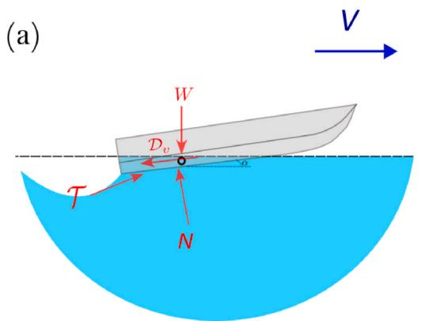

text_image

(a)
V
W
Dv
α
T
N

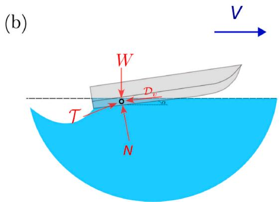

text_image

(b)
W
Dc
θ
T
N
V

Fig. 13. Dynamic equilibrium of a planing hull, conceptualized by Savitsky (1964) (a) not all forces pass through center of gravity, and (b) all forces pass through center of gravity.

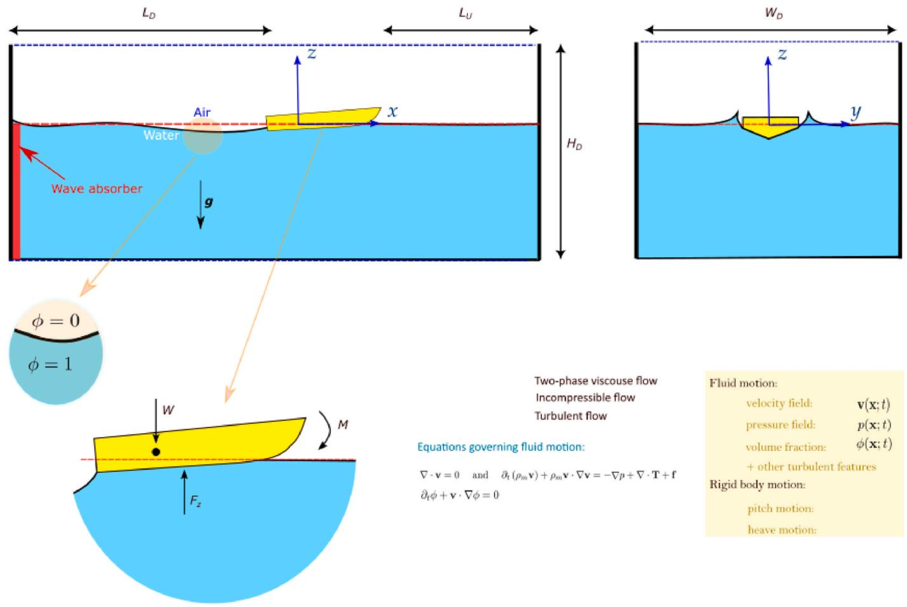

text_image

L_D
L_U
W_D
z
x
Air
Water
Wave absorber
g
H_D
z
y
φ = 0
φ = 1
W
M
F_z
Two-phase viscous flow
Incompressible flow
Turbulent flow
Equations governing fluid motion:
∇·v = 0 and ∂_t (ρ_m v) + ρ_m v · ∇v = -∇p + ∇·T + f
∂_t φ + v · ∇φ = 0
Fluid motion:
velocity field: v(x; t)
pressure field: p(x; t)
volume fraction: φ(x; t)
+ other turbulent features
Rigid body motion:
pitch motion:
heave motion:

Fig. 14. General overview of a 3D CFD tank used for solving the fluid motion around a planing hull advancing in calm water condition. $\scriptstyle L _ { U }$ and $L _ { D }$ are respectively upstream and downstream lengths and $W _ { D }$ is the width of domain. The air-water interface is captured via a VoF (two-phase) model.

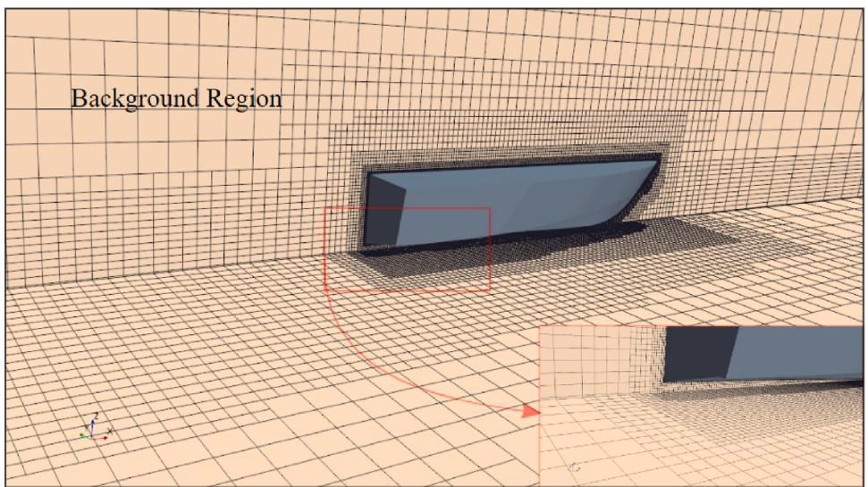

text_image

Background Region

Fig. 15. An example of CFD mesh around a planing hull free in heave and pitch directions, Hosseini et al. (2021).

It is notable that a computational study based on SPH was conducted by Tagliafierro et al. (2021) to numerically reproduce straight forward ride of a planing hull in calm water conditions. Tagliafierro et al. (2021) simulated model C1 from the NSS series (De Luca and Pensa, 2017). The most suitable SPH setup was observed to slightly under-predict the resistance, with the SPH model exhibiting an error of nearly 3% at the highest tested Froude Number. Further, the accuracy of the model in predicting the dynamic trim angle was noted to improve with increasing speed. These findings have illuminated a new pathway in the numerical modelling of planing hulls, as prior SPH-based studies were primarily focused on planing hulls fixed in heave and pitch directions (e.g., Tafuni et al., 2016). A list of most important CFD-based studies reconstructed straight course motion of planing hulls is presented in Table 11.

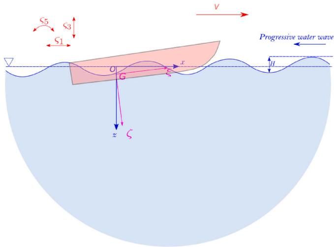

text_image

S5 S3
S1
O G x
z ζ
V
H
Progressive water wave

Fig. 16. A schematic of a planing hull advancing in progressive water waves.

# 7. Seakeeping

Seakeeping predictions in waves is challenging because of the influence of highly nonlinear effects (Troesch, 1992; Troesch and Hicks, 1994). An example is the fly over motion effects explained by Blount and Funkhouser (2009). In unified seakeeping models the two coordinate systems displayed in Fig. 16 are considered. The body is attached to the coordinate system denoted as $G \xi \chi \zeta ,$ , and the hydrodynamic system is defined by the equilibrium axis Oxyz. The former is attached to the body and is positioned at the center of gravity that is placed on the water surface under CG. The rigid body motions of vessel are denoted as ς=[ς1 $\varsigma _ { 2 } \varsigma _ { 3 } \varsigma _ { 4 } \varsigma _ { 5 } \varsigma _ { 6 } ]$ . The first three terms of the vector are the transitional motions of the vessel (surge, sway and heave). The latter three terms represent the rotational motions (roll, pitch and yaw).

Table 11 Summary of key CFD studies (with exclusion of SPH-based studies) on calm water performance of planing hulls. 

<table><tr><td rowspan="2"></td><td colspan="2">Mesh techniques</td><td colspan="7">Turbulence models</td><td rowspan="2">CFD codes</td><td rowspan="2">The reference for the experimental data</td></tr><tr><td>Overset</td><td>Morphing/Intergated</td><td> $k-\omega$ SST</td><td> $k-\omega$ </td><td> $k-\varepsilon$ </td><td>Realizable $k-\varepsilon$ </td><td>DES</td><td>Blended  $k-\omega/k-\varepsilon$ </td><td>Spalart-Allmaras</td></tr><tr><td>Caponnetto et al. (2004)</td><td></td><td>✓</td><td></td><td></td><td>✓</td><td></td><td></td><td></td><td></td><td>Comet</td><td>NA</td></tr><tr><td>O&#x27;Shea et al. (2012)and Fu et al. (2014)</td><td></td><td>✓</td><td></td><td></td><td></td><td></td><td></td><td></td><td></td><td>Euler codeNFA</td><td>Fridsma (1969)</td></tr><tr><td>Mousaviraad et al. (2015)</td><td>✓</td><td></td><td></td><td></td><td></td><td></td><td></td><td>✓</td><td></td><td>CFDShip-Iowa V4.5</td><td>Fridsma (1969)</td></tr><tr><td>Sukas et al. (2017)</td><td>✓</td><td>✓</td><td></td><td></td><td>✓</td><td></td><td></td><td></td><td></td><td>Star-CCM+</td><td>Fridsma (1969) and Bal et al. (2014)</td></tr><tr><td>De Luca et al. (2016)</td><td>✓</td><td>✓</td><td></td><td></td><td>✓</td><td></td><td></td><td></td><td></td><td>Star-CCM+</td><td>De Luca and Pensa (2017)</td></tr><tr><td>Mancini et al. (2017)</td><td>✓</td><td>✓</td><td>✓</td><td></td><td>✓</td><td></td><td></td><td></td><td></td><td>FINETM/Marine Star-CCM+</td><td>De Luca and Pensa (2017)</td></tr><tr><td>Broglia and Durante (2018)</td><td>✓</td><td></td><td></td><td></td><td></td><td></td><td></td><td></td><td>✓</td><td>CNR-INSEAN</td><td>Provided by the company</td></tr><tr><td>Avci and Barlas (2018)</td><td>✓</td><td></td><td></td><td></td><td>✓</td><td></td><td></td><td></td><td></td><td>Star-CCM+</td><td>Avci and Barlas (2018)</td></tr><tr><td>Li et al. (2019)</td><td></td><td>✓</td><td></td><td></td><td>✓</td><td></td><td></td><td></td><td></td><td>OpenFOAM</td><td>Weil et al. (Not published)</td></tr><tr><td>Wei et al. (2019)</td><td>✓</td><td></td><td></td><td></td><td></td><td></td><td></td><td>✓</td><td></td><td>Star-CCM+</td><td>Taunton et al. (2010)</td></tr><tr><td>Judge et al. (2020)</td><td>✓</td><td></td><td></td><td></td><td></td><td></td><td></td><td>✓</td><td></td><td>CFDShip-Iowa V 4.5 Star-CCM+</td><td>Judge et al. (2020)</td></tr><tr><td>Behara et al. (2020)</td><td>✓</td><td></td><td></td><td></td><td></td><td></td><td></td><td></td><td></td><td>REX</td><td>Behara et al. (2020)</td></tr><tr><td>Nimmagdda et al. (2020)</td><td>✓</td><td>✓</td><td></td><td></td><td>✓</td><td></td><td></td><td></td><td></td><td>Star-CCM+</td><td>Nimmagdda et al. (2020)</td></tr><tr><td>Lee et al. (2021a)</td><td>✓</td><td></td><td></td><td></td><td></td><td></td><td></td><td>✓</td><td></td><td>CFDShip-Iowa V 4.5 Star-CCM+</td><td>Lee et al. (2021)</td></tr><tr><td>Hosseini et al. (2021)</td><td>✓</td><td>✓</td><td></td><td></td><td>✓</td><td></td><td>✓</td><td></td><td></td><td>Star-CCM+</td><td>De Luca and Pensa (2017)</td></tr><tr><td>Gray-Stephens et al. (2021)</td><td>✓</td><td></td><td></td><td></td><td>✓</td><td></td><td></td><td></td><td></td><td>Star-CCM+</td><td>Taunton et al. (2010)</td></tr><tr><td>Jin et al. (2023)</td><td>✓</td><td></td><td>✓</td><td>✓</td><td>✓</td><td>✓</td><td></td><td></td><td></td><td>StarCCM+</td><td>Fridsma (1969)</td></tr></table>

If waves are assumed linear and monochromatic, they may be formulated as

$$
\eta (x, t) = \frac {H}{2} \cos \left(k x - \omega t + \theta_ {w}\right), \tag {7.1}
$$

where H, k, ω and $\theta _ { w }$ are respectively wave height, wavenumber, wave frequency, and phase. Wavenumber and wave frequency are linked through the dispersion equation as per

$$
\omega^ {2} = g k \tanh k h. \tag {7.2}
$$

Here, h is the water depth. The encounter frequency is given by

$$
\omega_ {e} = \omega - k V \cos \Phi , \tag {7.3}
$$

where Φ is the encounter angle. Φ = π represents a head sea condition. In the next sub-section, the models developed for simulation of the wave induced motions of planing hulls are introduced. These models are based on potential flow, simplifications of empirical equations, 2D + t model, or are built within viscous-based computational codes.

# 7.1. Panel models

The use of linear 3D potential-based model codes for predicting the motion of planing hulls has not been widespread, though there have been some attempts to utilize existing ones. This is due to limitations in linear 3D panel models, which may not effectively address the dynamic motion of planing hulls at high speeds. These models overlook transom flow effects and weakly non-linear effects associated with Froude-Krylov force and hydrodynamic coefficients. An example of the use of a 3D linear panel code in modelling dynamic motions of a hard-chine hull can be found in Lin and Lin (2019). They investigated the dynamic motions of a vessel in the semi-planing regime. Additionally, there have been efforts to employ weakly nonlinear models in solving the dynamic motion of vessels in semi-planing mode by Grigoropoulos et al. (2011) (Vada and Nakos, 1993; Kring et al., 1995), to predict the dynamic responses of the parent hull of the NTUA double-chine hull series. The accuracy level of the model was reported to be acceptable.

In the 2000s, a time-domain panel code known as PNASHIP was developed at Delft TU to solve dynamic motions of high-speed ships in waves for Froude numbers ranging between 0.5 and 1.0. Fundamentals of this code can be found in de Jong (2011). The code utilizes a 3D transient Green function and a linearized free surface boundary condition. It calculates Froude-Krylov forces by numerically measuring the instantaneous submerged volume of the vessel, making it a weakly non-linear model. PNASHIP includes a wake model capable of resolving transom flow, an important consideration in modelling fluid flow around planing vessels. Additionally, viscosity effects are activated through a cross-drag flow equation within the code. PNASHIP is employed for predicting the calm water performance of two high-speed boats: the Enlarged Ship Concept and the Axe Bow Concept. Its outputs are validated by comparison against experimentally measured values of heave, pitch, and accelerations in both regular and irregular following waves at relatively high speeds (de Jong and van Walree, 2008; de Jong, 2011). De Jong (2011) discussed that the linear assumption for the free surface boundary condition may contribute to errors in prediction of vertical acceleration. The code can model 6DOF and dynamic responses of various hull forms. For example, it has been used to solve 6DOF dy namic motions of a conventional trimaran hull (not a planing trimaran M-shaped hull) at very high speeds (van Walree and de Jong, 2008). In general, the key strengths of the code lie in its ability to consider transom flow and weakly non-linear aspects, solve problems in 6DOF, and handle different hull forms. However, the model is not built for Froude Numbers greater than 1.0, which limits its boundary of application. Future opportunities lie in extending its applications to higher speeds.

# 7.2. Simplified method

The simplified frequency domain model of Faltinsen (2006) can be used to calculate the RAO (Response Amplitude Operators) of a planing boat advancing in waves. The model assumes that the boat is free to heave and pitch (i.e., $\varsigma _ { 1 } = \varsigma _ { 2 } = \varsigma _ { 4 } = \varsigma _ { 6 } = 0 )$ in head waves. However computationally economic the model does not account for the nonlinearities that may be increasingly evident at high speeds. In addition, it can only be used for deadrise surfaces and flat planing hulls. The linearized system of equations is expressed as

$$
\begin{array}{l} (m + a _ {3 3}) \ddot {\varsigma} _ {3} + a _ {3 5} \ddot {\varsigma} _ {5} + \ell_ {3 3} \dot {\varsigma} _ {3} + \ell_ {3 5} \dot {\varsigma} _ {5} + c _ {3 3} \varsigma_ {3} + c _ {3 5} \varsigma_ {5} = c _ {3 3} \frac {H}{2} \sin \omega_ {e} t \\ + c _ {3 5} \frac {H}{2} k \sin \omega_ {e} t \tag {7.4} \\ \end{array}
$$

$$
a _ {5 3} \ddot {\xi} _ {3} + (I _ {y y} + a _ {5 5}) \ddot {\xi} _ {5} + b _ {5 3} \dot {\xi} _ {3} + \ell_ {5 5} \dot {\xi} _ {5} + c _ {5 3} \xi_ {3} + c _ {5 5} \xi_ {5}
$$

$$
= c _ {5 3} \frac {H}{2} \sin \omega_ {e} t + c _ {5 5} \frac {H}{2} k \sin \omega_ {e} t \tag {7.5}
$$

where $\boldsymbol { \alpha } _ { i j } , \boldsymbol { \ell } _ { i j }$ and $c _ { i j }$ are respectively added mass, damping and restoring coefficients. Also, m is mass of the boat.

The hydrodynamic coefficients are mostly found using the equations of Savitsky (1964), which were presented in Section 5. The restoring coefficients are defined as,

$$
c _ {3 3} = - \frac {\partial \mathcal {Z}}{\partial \varsigma_ {3}} \bigg | _ {0}, \tag {7.6}
$$

$$
c _ {3 5} = - \frac {\partial \mathcal {Z}}{\partial \varsigma_ {5}} \bigg | _ {0}, \tag {7.7}
$$

$$
c _ {5 3} = - \frac {\partial \mathcal {M}}{\partial \xi_ {3}} \bigg | _ {0}, \tag {7.8}
$$

$$
c _ {5 5} = - \frac {\partial \mathcal {M}}{\partial \varsigma_ {5}} \bigg | _ {0}, \tag {7.9}
$$

where $\mathcal { Z }$ and $\mathcal { M }$ are the vertical force and pitching moment that can be found using Savitsky’s equations. The $\lvert _ { 0 }$ term refers to partial derivation corresponding to the calm water condition $( \mathrm { i } . \mathrm { e } . , \varsigma _ { 3 } = 0$ and $\varsigma _ { 5 } = 0 \AA$ ). Note that, M is found using

$$
\frac {\mathcal {M}}{0 . 5 \rho_ {w} V ^ {2} B ^ {3}} = \left(L _ {C p} / B - L _ {C G} / B\right) C _ {L \beta}. \tag {7.10}
$$

Partial derivatives are given in Faltinsen (2006).

The damping coefficients are formulated as,

$$
\ell_ {3 3} = \left(\rho_ {w} B ^ {3} \sqrt {\frac {g}{B}}\right) 0. 5 \mathrm{Fr} _ {B} \frac {\partial C _ {L \beta}}{\partial \alpha}, \tag {7.11}
$$

$$
\ell_ {3 5} = - V a _ {3 3} - V x _ {T} m _ {3 3} ^ {2 D} (x _ {T}), \tag {7.12}
$$

$$
\ell_ {5 3} = \ell_ {3 3} B (0. 7 5 L _ {M} / B - L _ {C G} / B), \tag {7.13}
$$

$$
\ell_ {5 5} = V x _ {T} ^ {2} m _ {3 3} ^ {2 D} (x _ {T}). \tag {7.14}
$$

Note that, $\mu _ { 3 3 } ^ { 2 D }$ is the sectional vertical added mass. The added mass coefficients of a planing vessel are computed based on the 2D added masses and the topology of the submerged volume. For the sake of brevity, the added mass equations are not presented here, and readers are referred to Faltinsen (2006). The exciting force and moment shown on the right hand sides of Eqn 7.4 and 7.5 are generalized Froude-Krylov heave force and pitch moment and are formulated based on a long-wavelength approximation. In addition, wave diffraction terms can be added to exciting force and moment. For more information, check Faltinsen (2006).

To date, no attempt has been made to further develop this method in a higher number of degrees of freedom. Savitsky (1964) modelling is accurate enough to be used for a heeled planing hull (Judge, 2014). Thus, the above equations can be further developed to account for the asymmetric planing motions and roll moments. Roll damping forces can be formulated based on lift forces (Ikeda and Katyama, 2000a). The method is linear which can be identified as a limitation. Yet, it can be extended to a weakly nonlinear one through accounting for nonlinearities associated to temporal draft, pitch angles and wetted surface patterns. This has been done by Faltinsen (2006). The main key strength of the simplified method is that it is very quick and it considers hydrodynamic lift. Furthermore, there is the possibility of extending this method to compute dynamic motions of stepped hulls and catamarans exposed to waves by considering the wake behind the transom or interference effects, which shall be stated in sub-section 9.1. Nevertheless, it is important to note that this method is only applicable to the motion prediction of a hard-chine section, with its boundary of applications confined to that of Savitsky’s models. It is important to highlight that the model is constrained to 2DOF, and for broader applications involving more degrees of freedom, consideration of other empirical equations is necessary.

# 7.3. The 2D + t approach

If a planing boat is subject to surge, heave and pitch motions the vertical relative speed at each section of the body is defined as

$$
\nu (x, t) = \left(V + \dot {\varsigma} _ {1}\right) \sin \varsigma_ {5} - \dot {\varsigma} _ {5} \xi + \left(\dot {\varsigma} _ {3} - W _ {O}\right) \cos \varsigma_ {5}. \tag {7.15}
$$

where $W _ { O }$ is the vertical orbital velocity of the wave (Zarnick, 1978). The 3D temporal force normal to the bottom surface is found as

$$
N = \int_ {l} \left(m _ {3 3} ^ {2 D} \dot {v} + \dot {m} _ {3 3} ^ {2 D} v - \mathcal {U} \frac {\partial}{\partial \xi} \left(m _ {3 3} ^ {2 D} v\right) + \mathcal {C} _ {D C} \rho_ {w} b _ {w} v ^ {2}\right) d \xi . \tag {7.16}
$$

and the moment acting on the vessel is formulated as per

$$
\mathcal {M} = \int_ {l} \xi \left(m _ {3 3} ^ {2 D} \dot {v} + \dot {m} _ {3 3} ^ {2 D} v - \mathcal {U} \frac {\partial}{\partial \xi} \left(m _ {3 3} ^ {2 D} v\right) + \mathcal {C} _ {D C} \rho_ {w} b _ {w} v ^ {2}\right) d \xi . \tag {7.17}
$$

Hence the surge, heave and pitch forces become,

$$
\mathcal {X} = - a _ {1 1} \ddot {\xi} _ {1} - a _ {1 3} \ddot {\xi} _ {3} - a _ {1 5} \ddot {\xi} _ {5} + \mathcal {X} ^ {\star}, \tag {7.18}
$$

$$
\mathcal {Z} = - a _ {3 1} \ddot {\xi} _ {1} - a _ {3 3} \ddot {\xi} _ {3} - a _ {3 5} \ddot {\xi} _ {5} + \mathcal {Z} ^ {\star} + \mathcal {B}, \tag {7.19}
$$

$$
\mathcal {M} = - a _ {5 1} \ddot {\xi} _ {1} - a _ {5 3} \ddot {\xi} _ {3} - a _ {5 5} \ddot {\xi} _ {5} + \mathcal {M} ^ {\star} + \mathcal {B} ^ {\bullet}, \tag {7.20}
$$

where $\mathcal { X } ^ { \star } , \mathcal { Z } ^ { \star }$ and $\mathcal { M } ^ { \star }$ are forces or moment with exclusion of $\mathcal { \alpha } _ { i j } .$ Added mass coefficients are formulated as

$$
a _ {1 1} = M ^ {\bullet} \sin^ {2} \varsigma_ {5}, \tag {7.21}
$$

$$
\alpha_ {1 3} = M ^ {\bullet} \sin \varsigma_ {5} \cos \varsigma_ {5}, \tag {7.22}
$$

$$
\alpha_ {1 5} = - M ^ {\bullet \bullet} \sin \varsigma_ {5}, \tag {7.23}
$$

$$
\alpha_ {3 1} = M ^ {\bullet} \cos \varsigma_ {5} \sin \varsigma_ {5}, \tag {7.24}
$$

$$
a _ {3 3} = M ^ {\bullet} \cos^ {2} \varsigma_ {5}, \tag {7.25}
$$

$$
\alpha_ {3 5} = - M ^ {\bullet \bullet} \cos \varsigma_ {5}, \tag {7.26}
$$

$$
a _ {5 1} = - M ^ {\bullet \bullet} \sin \varsigma_ {5}, \tag {7.27}
$$

$$
a _ {5 3} = - M ^ {\bullet \bullet} \cos \varsigma_ {5}, \tag {7.28}
$$

$$
a _ {5 5} = M ^ {\bullet \bullet \bullet}, \tag {7.29}
$$

where

$$
M ^ {\bullet} = \int_ {l} m _ {3 3} ^ {2 D} d \xi , \tag {7.30}
$$

$$
M ^ {\bullet \bullet} = \int_ {l} \xi m _ {3 3} ^ {2 D} d \xi , \tag {7.31}
$$

$$
M ^ {\bullet \bullet \bullet} = \int_ {l} \xi^ {2} m _ {3 3} ^ {2 D} d \xi . \tag {7.32}
$$

The final motion equations are established as

$$
(m + a _ {1 1}) \ddot {\xi} _ {1} + a _ {1 3} \ddot {\xi} _ {3} + a _ {1 5} \ddot {\xi} _ {5} = \mathcal {X} ^ {\star} + \mathcal {D} _ {V 1} + \mathcal {T} _ {1}, \tag {7.33}
$$

$$
a _ {3 1} \ddot {\varsigma} _ {1} + (m + a _ {3 3}) \ddot {\varsigma} _ {3} + a _ {3 5} \ddot {\varsigma} _ {5} = \mathcal {Z} ^ {\star} + \mathcal {D} _ {V 3} + \mathcal {T} _ {3} + W, \tag {7.34}
$$

$$
a _ {5 1} \ddot {\xi} _ {1} + a _ {5 3} \ddot {\xi} _ {3} + (a _ {5 5} + I _ {y y}) \ddot {\xi} _ {5} = \mathcal {M} ^ {\star} + \mathscr {D} _ {V 5} + \mathscr {T} _ {5}. \tag {7.35}
$$

In the above equations introduced by Zarnick (1978, 1979), both regular and random waves are considered. $\mathcal { D } _ { V i }$ and $\mathcal { T } _ { i }$ represent the forces/moments attributed to viscous drag and thrust forces in the direction of i. Above equations can be solved in the time domain. The largest errors appear in way of the resonance zone. The model, as explained before, can also be used for finding trim and CG-rise up a planing vessel riding in calm water. To this end, Equations (7.33)–(7.35) should be solved in the time domain while the wave slope is set to be zero (Van Deyzen, 2008). In the original study of Zarnick (1978), the sectional added mass was assumed to be independent of the deadrise angle. Akers (1999) compared model predictions against the experimental data of Fridsma (1969) and the vertical acceleration was seen to be over-predicted. Akers (1999) introduced a buoyancy coefficient (0.5) to reduce the buoyancy force and match the calm water predictions with experiments. This work used the deadrise dependent 2D added mass coefficient $( m _ { 3 3 } ^ { 2 D } )$ of Keuning (1994).

Garme (2005) introduced a transom reduction function that mini mizes the sectional forces in way of the transom to improve the accuracy of the Zarnick (1978) method. The transom reduction function was derived by fitting the calm water predictions of the model against those measured by Fridsma (1969). As a result, the accuracy level of the model in the prediction of heave and pitch responses in the resonance zone, along with prediction of the vertical acceleration was improved. Hosseinzadeh et al. (2019) improved the accuracy of model by using the experimentally measured values of added mass coefficients. Later, Ciampolini et al. (2022a) modified the original Zarnick (1978) model by incorporating diffraction forces (calculated using the asymptotic model of Faltinsen et al., 1980) and applying a buoyancy reduction factor of 0.42. They used Garme’s transom effect equation to reduce sectional hydrodynamic forces in the aft part of the vessel (Garme, 2005). The study also took into account the effects of wind speed on resistance through CFD simulations during run wind tests. Their model was seen to be more accurate than that of Akers (1999). This model was later used for smart weather routing (Ciampolini et al., 2022b). Recently, favorable results have been also reported by Garme (2023) who reproduced well the heave and pitch motions of warped planing hulls.

The 2D + t models referenced above idealise well the momentum variation and use it for the prediction of sectional forces. When BEM is used, one of the main difficulties is to calculate 2D forces at the sections with a very low immersion depth. To overcome this, a momentum variation method may be applied to those sections having low immersion depth. For example, the 2D + t-based models developed by Sun and

Faltinsen (2011a) and Haase et al. (2015) are built using this approach and are shown to be capable of modelling nonlinear motions in the resonance zone with relatively high accuracy.

The 2D + t model developed by Garme (2005) has been further extended for modelling flexible planing motion in waves by Ros´en et al. (2020). Rigid body responses were simulated using momentum variation theory, and then the slamming pressure loads at each time step were calculated. Following this, a Finite Element Analysis (FEA) approach was applied to simulate the flexible planing motion in irregular waves, with the slamming loads serving as inputs. This Fluid-Structure Interaction (FSI) approach, used for modelling flexible motions, can be classified as a one-way coupling method, yet suggests the possibility of further extension into a two-way coupling method in the coming years.

The studies reviewed are limited to head waves and following seas. Beam and oblique sea conditions require to allow for sectional side forces and rolling moments in the mode. This needs consideration of asymmetric planing motion. An example of a hybrid 2D + t/BEM model that could be used to solve the asymmetric planing problem is given by Xu et al. (1998). The vessel was constraint in all degrees of freedom and nonlinear fluid motions were idealised around 2D sections using BEM.

Sebastiani et al. (2008) undertook the first steps to reconstruct the motion of a planing hull free heave, pitch, and roll. They developed a 2D + t model that accounts for roll motions of a planing hull. Their method is fundamentally similar to that of Zarcnik (1978), i.e., sectional forces were found using momentum variation. However, the sectional roll moment is evaluated by an asymmetric approach. Ghadimi et al. (2013) extended the latter to six degrees of freedom. However, their method does not consider the 2D added mass forces in all directions i.e., all forces and moments are based on heave and pitch motions in waves. This is while for a high-speed boat free in all six degrees of freedom, forces and moments are expected to be caused by all motions (e.g. sway, roll and yaw motions which were missing in formations of Ghadimi et al. (2013) and Sebastiani et al. (2008)). To do so, the formulation for the 2D forces acting on the 2D section can be revisited. To consider all six motions, the 2D forces/moment acting on the 2D section entering water with three degrees of freedom are needed to be considered, which be formulated as per

$$
f _ {y} ^ {2 D} (x) = \frac {D}{D t} \left(m _ {2 2} ^ {2 D} u + m _ {2 3} ^ {2 D} v + m _ {2 4} ^ {2 D} n\right), \tag {7.36}
$$

$$
f _ {z} ^ {2 D} (x) = \frac {D}{D t} \left(m _ {3 2} ^ {2 D} u + m _ {3 3} ^ {2 D} v + m _ {3 4} ^ {2 D} u\right), \tag {7.37}
$$

$$
m _ {x} ^ {2 D} (x) = \frac {D}{D t} \left(m _ {4 2} ^ {2 D} u + m _ {4 3} ^ {2 D} v + m _ {4 4} ^ {2 D} \mu\right). \tag {7.38}
$$

Here, u and p respectively represent the horizontal velocity and rotational speed of the fluid around the section. Integration of above equations over the entire length of the vessel gives three dimensional forces in a body attached frame, and then forces in the hydrodynamic frame should be found. This would finally lead to a 6DOF model. In Ghadimi et al. (2013) and Sebastiani et al. (2008) all terms expect $ { m _ { 3 3 } } ^ { 2 D }$ were overlooked. In contrast to these studies, Tavakoli et al. (2017) formulated a planing dynamic model in 4DOF by considering m2D33 , m2D34 , $\mu _ { 3 3 } ^ { 2 D } , \mu _ { 3 4 } ^ { 2 D }$ $\mu _ { 4 3 } ^ { 2 D }$ and $\mu _ { 4 4 } ^ { 2 D }$ . In a recent study, Bonci and de Jong (2023) developed a 6DOF $2 \mathrm { D } + 1$ t model by considering three sectional added mass terms.

To face a real condition and solve the unsteady planing motion problem in 6DOF, all nine 2D added mass terms along with effects of the horizontal orbital velocity, $U _ { O }$ should also be considered. Undoubtedly, an exciting possibility for future studies lies in the development of a 6DOF model capable of accurately replicating the motions of a planing vessel in waves and to explore to what degree each sectional added mass term is important to be considered.

Unfortunately, due to the lack of experimental data, evaluating the accuracy of such a 6DOF model becomes quite challenging. The main difficulty stems from the absence of any available systematic tank test study presenting 6DOF motions of planing hulls operating in oblique waves or beam seas. In general, the main strength of the 2D + t model lies in its flexibility in terms of degrees of freedom and various 2D sections it can model, as former provides the opportunity to solve dynamic motions in a more realistic condition (a 6DOF ride in waves), and the latter would let us solve motions of other types of planing hulls (such as catamarans, see sub-section 9.1), and the main limiter associated with the model is mostly related to the fact that it cannot consider a fully nonlinear problem, and can be identified as weakly non-linear model.

# 7.4. Viscous models

In Caponnetto et al. (2003) two different RANS models were used for solving motions of a vessel advancing in waves. The motions of the boat were also replicated by using a $2 \mathrm { D } + \mathrm { ~ t ~ }$ momentum variation model. Heave and pitch RAOs were compared against experiments. It was observed that, in the resonance zone, RANS models are more accurate as compared to the results of the 2D + t model. This is not surprising, as the 2D + t model may not consider all nonlinear forces as compared to a viscous model. Wang et al. (2012) used the CFD code, StarCCM+ and an integral dynamic mesh technique to simulate the dynamic response of a planing boat advancing in head, oblique and beam waves. The k − ω SST turbulence model was used to treat turbulent fluid motion around the vessel. The most interesting observation relates to the response of the vessel in beam seas. It was also found that the pitch motion of the vessel at longitudinal Froude Number of 1 is mostly negative.

Mousaviraad et al. (2015) used the IOWAship V 4.5 CFD code (a single-phase level set mode) and a blended $\boldsymbol { k } - \boldsymbol { \epsilon } / \boldsymbol { k } - \boldsymbol { \omega }$ turbulence model. Heave and pitch RAOs were compared against experimental data of Fridsma (1969). The CFD model was shown to have a very high level of accuracy (errors were mostly lower than 5%). However accelerations were not compared against experiments. Bi et al. (2020) used a k − ω SST turbulence model and an overset technique to treat mesh motion. CFD and experimental values of RAO along with vertical accelerations recorded at the bow and CG have been compared. Heave and pitch RAOs of CFD and experiments match with each other. The vertical accelerations predicted by CFD were seen to be very accurate over long waves. However, the vertical acceleration at the bow of the vessel was under-predicted. Kahramanoglu ˘ et al. (2020) replicated heave and pitch motions of a monohedral planing hull and a warped planing hull. They favored k-ϵ over other available turbulence models and used an overset mesh motion technique. Throughout comparing the CFD data against experimental data, the heave responses from their moment were slightly over-predicted while pitch motions were mostly seen to be slightly under-predicted. Tavakoli et al. (2020) used a $k - \omega$ turbulence model and overset mesh technique. Heave and pitch versus wavelength curves constructed using CFD simulations were observed to follow experimental data, though curves plotted using 2D + t model were seen to be less acurrate. The accuracy of the CFD model in prediction of the vertical acceleration recorded at CG was found to be favorable. They showed that the 2D + t models can give very large negative sectional forces, which is not captured by the CFD model.

One of the first attempts to replicate vertical motions of a planing hull exposed to random waves using CFD models can be attributed to the work of Judge et al. (2020b). CFDShip-Iowa V 4.5 was employed to solve regular and irregular wave tests for a prismatic planing hull. A very interesting point was mentioned in the conclusion section of the paper, where the authors stated that, the actual time history of an irregular wave should be set as the input of the CFD setup rather than the spectrum. Later, Jin et al. (2023) used an overset mesh and k − ϵ model to solve the dynamic motions of two prismatic hulls namely Fridsma hull (Fridsma, 1969) – in regular waves and LRI-II - in irregular seaway. The authors modelled the motions of the Fridsma model in different scales and observed that the model scale and the full-scale runs would match with experimental data much better as compared to what was found through runs in other scales. In irregular waves the vertical accelerations derived from CFD simulations were highly under-predicted (relative error aprox. 40%), but for an irregular wave test this error is satisfactory.

Table 12 A summary of the most important CFD studies (with exclusion of SPH) replicating motions of planing hull in wave. 

<table><tr><td rowspan="2"></td><td colspan="2">Mesh techniques</td><td></td><td colspan="5">Turbulence models</td><td rowspan="2">CFD codes</td><td rowspan="2">The reference for the experimental data</td><td rowspan="2">Comparison against 2D + t model?</td></tr><tr><td>Overset</td><td>Integrated/morphing</td><td>k-ω</td><td>k-ε</td><td>Realizable k-ε</td><td>DES</td><td>Blended k-ω/k-ε</td><td>Spalart-Allmaras</td></tr><tr><td>Caponnetto et al. (2004)</td><td></td><td>✓</td><td></td><td>✓</td><td></td><td></td><td></td><td></td><td>Comet</td><td>Katayama et al. (2000)</td><td>Yes</td></tr><tr><td>Wang et al. (2012)</td><td></td><td>✓</td><td>✓</td><td></td><td></td><td></td><td></td><td></td><td>StarCCM+</td><td>Katayama et al. (2000)</td><td>No</td></tr><tr><td>Mousaviraad et al. (2015)</td><td>✓</td><td></td><td></td><td></td><td></td><td></td><td>✓</td><td></td><td>CFDShip-Iowa V 4.5</td><td>Fridsma (1969)</td><td>No</td></tr><tr><td>Bi et al. (2019)</td><td>✓</td><td></td><td>✓</td><td></td><td></td><td></td><td></td><td></td><td>StarCCM+</td><td>Experiments of Shen et al., which is not published</td><td>No</td></tr><tr><td>Bi et al. (2020)</td><td>✓</td><td></td><td>✓</td><td></td><td></td><td></td><td></td><td></td><td>StarCCM+</td><td>Experiments of Shen et al., which is not published</td><td>No</td></tr><tr><td>Kahramanoğlu et al. (2020)</td><td>✓</td><td></td><td></td><td>✓</td><td></td><td></td><td></td><td></td><td>StarCCM+</td><td>Begovic et al. (2014)</td><td>No</td></tr><tr><td>Tavakoli et al. (2020)</td><td>✓</td><td></td><td></td><td>✓</td><td></td><td></td><td></td><td></td><td>StarCCM+</td><td>Tavakoli et al. (2020)</td><td>Yes</td></tr><tr><td>Judge et al. (2020b)</td><td>✓</td><td>✓</td><td></td><td></td><td></td><td></td><td>✓</td><td></td><td>CFDShip-Iowa V 4.5</td><td>Judge et al. (2020b)</td><td>No</td></tr><tr><td>Lee et al. (2021b)</td><td>✓</td><td></td><td>✓</td><td></td><td></td><td></td><td>✓</td><td></td><td>CFDShip-Iowa V4.5</td><td></td><td>No</td></tr><tr><td>Diez et al. (2022) and Lee et al. (2024)</td><td>✓</td><td></td><td>✓</td><td></td><td></td><td>✓</td><td></td><td></td><td>StarCCM+CFDShip-Iowa V4.5/ANSYSSTAR-CCM+/STAR-CCM+STAR-CCM+/Nastran</td><td>Diez et al. (2022) and Lee et al. (2024)</td><td>No</td></tr><tr><td>Jin et al. (2023)</td><td>✓</td><td></td><td></td><td></td><td>✓</td><td></td><td></td><td></td><td>StarCCM+</td><td>Fridsma (1969) and sea trials</td><td>No</td></tr></table>

A new set of recent CFD-based studies have been developed to solve fluid-solid interaction for a planing hull advancing in regular and irregular waves. These studies are presented in Diez et al. (2022) and Lee et al. (2024). The first study focuses on regular wave tests and the latter covers the irregular wave simulations. One-way and two-way coupling approaches were developed. The fluid-solid coupling was performed using different codes CFDShip-Iowa V4.5/ANSYS, STAR-CCM+/STAR-CCM+, and STAR-CCM+/Nastran. The CFDShip-Iowa V4.5/ANSYS coupling had already been used by Volpi et al. (2017). A summary of the most important CFD studies performed for reprocuring wave-induced motions of planing hulls is outlined in Table 12.

The only study based on SPH simulations was done by Capasso et al. (2023). They compared their SPH simulations against CFD and experimental data presented in Tavakoli et al. (2020). The SPH model was seen to have a very good accuracy in way of short and long waves. However, agreement was a lot less favorable in way of the resonance region.

Some points should be mentioned here. First, the CFD models have never been built using DES turbulence model and did not compare the capability of different CFD models in replicating dynamic responses of planing hulls in waves. Moreover, 6DOF simulations of unsteady planing in oblique waves can be run using CFD method, which is missing at the present time. Aside from this, CFD studies have not been used for solving dynamic motions of a planing hull advancing in random waves very frequently. . One possible future study is to build CFD models to replicate motions of planing hulls and random waves and then analyze the motion of the vessel in detail.

From a general perspective, the main advantage of CFD-based models relates to their higher-level accuracy as they can consider a fully nonlinear problem and monitor all physical phenomena that neither of 2D + t simplified model, or any potential flow-based model can capture. The application of CFD models is not limited to any specific hull type and setups can changed to consider any hullform. They can also be used to solve other degrees of freedom as discussed above. The main difficulty of these models is that computationally, they can be very expensive. Thus, they may not be the first option when a design team has not completed the early stage of design.

# 8. Maneuvering

During maneuvering of a planing hull the trim angle and CG rise-up of the vessel may vary. Accordingly, hydrodynamic coefficients and the wetted hull surface may be subject to instant variations. To model the maneuvering problem three different coordinate systems are considered. The first one is known as the body attached coordinate system. The second one is a hydrodynamic frame, which has longitudinal and transverse motions (which were previously shown in Fig. 16). The last one is an earth fixed frame, which is shown with Ex y z (Figure 17). The rate of movement of the body is denoted with [u v w p q r], see Fig. 17.

Motions in six degrees of freedom using classical ship theory can be written as,

$$
M \dot {u} + M (q w - v r) = \mathcal {X} + \mathcal {T} _ {x}, \tag {8.1}
$$

$$
M \dot {v} + M (u r - p w) = \mathcal {Y} + \mathcal {T} _ {y}, \tag {8.2}
$$

$$
M \dot {w} + M (p v - q u) = \mathcal {Z} + \mathcal {T} _ {z} + W, \tag {8.3}
$$

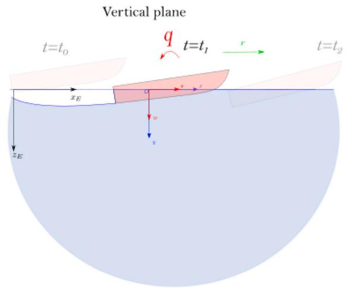

text_image

Vertical plane
t=t₀
q
t=t₁
r
t=t₂
xₑ
v
z
zₑ

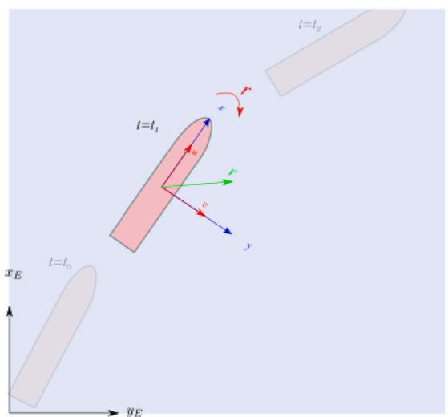

text_image

t=t₁
t=t₂
xₑ
l=t₀
yₑ
y
v
u
r

Transverse plane   
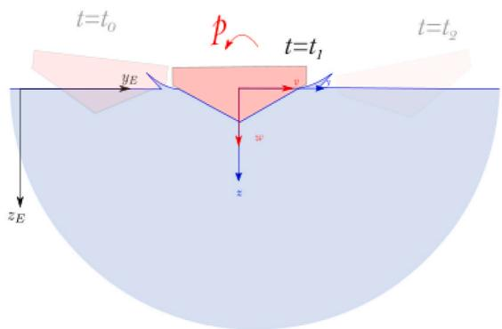

text_image

t=t₀
p
t=t₁
t=t₂
yₑ
v
z
zₑ

Fig. 17. A planing hull maneuvering and the Earth fixed coordinate systems. Three different snapshots of the vessel’s positions are shown. The speed components [u v w p q r] are marked with red color.

$$
I _ {x x} \dot {p} - \left(I _ {y y} - I _ {z z}\right) q r = \mathcal {K} + \mathcal {T} _ {\varphi}, \tag {8.4}
$$

$$
I _ {y y} \dot {q} - (I _ {z z} - I _ {x x}) p r = \mathcal {M} + \mathcal {T} _ {\theta}, \tag {8.5}
$$

$$
I _ {z z} \dot {r} - \left(I _ {x x} - I _ {y y}\right) p q = \mathcal {N} + \mathcal {T} _ {\psi}, \tag {8.6}
$$

where $\mathcal { X } , \mathcal { Y }$ along with $\mathcal { Z }$ are external forces (excluding thurst force effects and weight force) in longitudinal, transverse and vertical directions, and $\mathcal { K } , \mathcal { M } , \mathcal { N }$ are moments (excluding thrust force effects). The components $\mathcal { T } _ { \boldsymbol { x } } , \mathcal { T } _ { \boldsymbol { y } } , \mathcal { T } _ { \boldsymbol { z } } , \mathcal { T } _ { \varphi } , \mathcal { T } _ { \theta } , \mathcal { T } _ { \psi }$ express thrust forces in different directions. Here, M is mass of the planing surfaae. For simplicity, we assume there is no rudder, and steering is achieved solely by inclining the thrust force in the horizontal plane.

# 8.1. Model tests-based approach

An approach using data from model tests was developed in Katayama’s lab (Katayama et al., 2006). The general hypothesis is that the nonlinear terms are nearly nil, and they can be neglected. The motions are then solved in three degrees of freedom. The running attitudes of the vessel along with hydrodynamic coefficients are found using the model test data measured in oblique wave tank tests or PMM tests. The equations of motion are solved as follows,

$$
(M - \mathcal {X} _ {\dot {u}}) \dot {u} - M v r = \mathcal {X} _ {u} (\psi_ {D}) u + \mathcal {T} _ {x}, \tag {8.7}
$$

$$
(M - \mathcal {Y} _ {\dot {v}}) \dot {v} - \mathcal {Y} _ {r} \dot {r} + M u r = \mathcal {Y} _ {v} v + \mathcal {Y} _ {r} r + \mathcal {T} _ {y}, \tag {8.8}
$$

$$
- \mathcal {N} _ {\dot {v}} \dot {v} + (I _ {z z} - \mathcal {N} _ {\dot {r}}) \dot {r} = \mathcal {N} _ {v} v + \mathcal {N} _ {r} r + \mathcal {T} _ {\psi}. \tag {8.9}
$$

Here ψ is the drift angle. Note that in the original work of Katayama et al. (2006), there is a positive sign associated with the added mass coefficients but here a negative sign is used. To solve the problem, the instant values of CG-rise up, trim angles and roll are found based on performance data or oblique tests in which heave, pitch and roll were free (i.t. it is assumed that roll angle is a function of drift angle), and then an interpolation is performed to estimate the hydrodynamic coefficients. Ircani et al. (2016) further expanded Katayama’s model to a 4DOF one. Instead of assuming roll as a function of drift angle, they used the roll motion equation directly. In doing so, Ircani et al. (2016) utilized one of the regression equations proposed by Henry (1976) to estimate the moment in the roll direction. The primary limitation of Katayama’s model includes its reliance on tank data, which may not be available for every vessel, particularly during the early stages of design.

# 8.2. Lewandowski’s approach

Lewandowski (1994) developed a mathematical model for maneuvering motions of planing hulls (a detailed explanation of the model can be found in Lewandowski, 2004). Given that steering is influenced by the thrust force, the equations of motion in 6DOF based on Lewandowski’s model can be expressed as follows

$$
M \dot {u} = \mathcal {X} + \mathcal {T} _ {x}, \tag {8.10}
$$

$$
M \dot {v} + M u r = \mathcal {Y} + \mathcal {T} _ {y}, \tag {8.11}
$$

$$
M \dot {w} = \mathcal {Z} + W + \mathcal {T} _ {z}, \tag {8.12}
$$

$$
I _ {x x} \dot {p} - I _ {x z} \dot {r} = \mathcal {K} + \mathcal {T} _ {\varphi}, \tag {8.13}
$$

$$
I _ {y y} \dot {q} = \mathcal {M} + \mathcal {T} _ {\theta}, \tag {8.14}
$$

$$
I _ {z z} \dot {r} - I _ {x z} \dot {p} = \mathcal {N} + \mathcal {T} _ {\psi}. \tag {8.15}
$$

Lewandowski (1994) did not solve the problem in 6 DOF and simplified the problem to lower degrees of freedom. Lewandowski formulated forces acting on the vessel in sway, roll and yaw directions as

$$
\mathcal {Y} = \mathcal {Y} _ {v} \dot {v} + \mathcal {Y} _ {v} v + \mathcal {Y} _ {p} \dot {p} + \mathcal {Y} _ {p} p + \mathcal {Y} _ {\varphi} \varphi + \mathcal {Y} _ {r} \dot {r} + \mathcal {Y} _ {r} r, \tag {8.16}
$$

$$
\mathcal {K} = \mathcal {K} _ {v} \dot {v} + \mathcal {K} _ {v} v + \mathcal {K} _ {p} \dot {p} + \mathcal {K} _ {p} p + \mathcal {K} _ {\varphi} \varphi + \mathcal {K} _ {r} \dot {r} + \mathcal {K} _ {r} r, \tag {8.17}
$$

$$
\mathcal {N} = \mathcal {N} _ {\dot {v}} \dot {v} + \mathcal {N} _ {v} v + \mathcal {N} _ {\dot {p}} \dot {p} + \mathcal {N} _ {p} p + \mathcal {N} _ {\varphi} \varphi + \mathcal {N} _ {\dot {r}} \dot {r} + \mathcal {N} _ {r} r. \tag {8.18}
$$

All hydrodynamic coefficients in the above equation are calculated using the empirical equations formulated by Lewandowski and can also be found in textbook of Lewadowski (2004). These equations were mostly built based on the data collected by Brown and Klosinski (1994a, b). For example, the equation used for the estimation of $\mathcal { Y } _ { \nu }$ is

$$
\mathcal {Y} _ {v} = - 0. 5 \rho_ {w} V B ^ {2} \left(0. 6 4 9 4 \beta^ {0. 6} \left(\frac {L _ {K} \tan \alpha}{B}\right) ^ {2}\right). \tag {8.19}
$$

Despite the fact the Lewandowski’s final equations (Lewandowski, 1994) are not developed for 6DOF, it has the potential to be extended to a 6DOF one. Assuming linearity, forces and moments can be re-written as

$$
\begin{array}{l} \mathcal {Y} = \mathcal {Y} _ {v} \dot {v} + \mathcal {Y} _ {v} v + \mathcal {Y} _ {\dot {w}} \dot {w} + \mathcal {Y} _ {w} w + \mathcal {Y} _ {p} \dot {p} + \mathcal {Y} _ {p} p + \mathcal {Y} _ {\varphi} \varphi + \mathcal {Y} _ {\dot {q}} \dot {q} + \mathcal {Y} _ {q} q \\ + \mathcal {Y} _ {r} \dot {r} + \mathcal {Y} _ {r} r, \tag {8.20} \\ \end{array}
$$

$$
\begin{array}{l} \mathcal {Z} = \mathcal {Z} _ {v} \dot {v} + \mathcal {Z} _ {v} v + \mathcal {Z} _ {\dot {w}} \dot {w} + \mathcal {Z} _ {w} w + \mathcal {Z} _ {z} z + \mathcal {Z} _ {\dot {p}} \dot {p} + \mathcal {Z} _ {p} p + \mathcal {Z} _ {\varphi} \varphi + \mathcal {Z} _ {\dot {q}} \dot {q} \\ + \mathcal {Z} _ {q} q + \mathcal {Z} _ {\theta} \theta + \mathcal {Z} _ {r} \dot {r} + \mathcal {Z} _ {r} r, \tag {8.21} \\ \end{array}
$$

$$
\begin{array}{l} \mathcal {K} = \mathcal {K} _ {v} \dot {v} + \mathcal {K} _ {v} v + \mathcal {K} _ {w} \dot {w} + \mathcal {K} _ {w} w + \mathcal {K} _ {z} z + \mathcal {K} _ {\dot {p}} \dot {p} + \mathcal {K} _ {p} p + \mathcal {K} _ {\varphi} \varphi + \mathcal {K} _ {\dot {q}} \dot {q} \\ + \mathcal {K} _ {q} q + \mathcal {K} _ {\theta} \theta + \mathcal {K} _ {r} \dot {r} + \mathcal {K} _ {r} r, \tag {8.22} \\ \end{array}
$$

$$
\begin{array}{l} \mathcal {M} = \mathcal {M} _ {v} \dot {v} + \mathcal {M} _ {v} v + \mathcal {M} _ {w} \dot {w} + \mathcal {M} _ {w} w + \mathcal {M} _ {z} z + \mathcal {M} _ {\dot {p}} \dot {p} + \mathcal {M} _ {p} p + \mathcal {M} _ {\varphi} \varphi + \mathcal {M} _ {\dot {q}} \dot {q} \\ + \mathcal {M} _ {q} q + \mathcal {M} _ {\theta} \theta + \mathcal {M} _ {r} \dot {r} + \mathcal {M} _ {r} r, \tag {8.23} \\ \end{array}
$$

$$
\begin{array}{l} \mathcal {N} = \mathcal {N} _ {\dot {v}} \dot {v} + \mathcal {N} _ {v} v + \mathcal {N} _ {\dot {w}} \dot {w} + \mathcal {N} _ {w} w + \mathcal {N} _ {\dot {p}} \dot {p} + \mathcal {N} _ {p} p + \mathcal {N} _ {\varphi} \varphi + \mathcal {N} _ {\dot {q}} \dot {q} + \mathcal {N} _ {q} q \\ + \mathcal {N} _ {r} \dot {r} + \mathcal {N} _ {r} r. \tag {8.24} \\ \end{array}
$$

In the above equations surge effects are not included. Lewandoski has only formulated the hydrodynamic forces/moments in the sway, yaw, and roll directions, which can be used for path prediction and transverse dynamic stability analysis (e.g. Lewandowski, 1994; Lewandowski, 1997). Thus, the challenge lies in formulating simple equations for the calculation of hydrodynamic coefficients in heave and pitch directions, representing a future research opportunity. The most suitable option for formulating these hydrodynamic coefficients is to employ the simplified seakeeping model (section 6.1) in which heave and pitch hydrodynamic coefficients are formulated. It is worth noting that Yoon and Kang (2016) attempted to expand Lewandoski’s model to include 6DOF by employing Savitsky’s equation. But not all coupled terms were taken into account in their study.

# 8.3. The application of $2 D + t$ theory

As explained earlier, the 2D + t method has the capability to model planing motion in 6DOF, which can subsequently be employed for the development of a maneuvering model, necessitating the use of an oblique water entry model. Early conceptualizations of this approach were introduced by Xu et al. (1998) and Judge et al. (2004), who developed water entry models for asymmetric and oblique water entry problems with an aim to calculate maneuvering forces of planing hulls, though they never developed any model for maneuvering.

Taking inspiration from Xu et al. (1998) and Judge et al. (2004), a 2D + t model for solving maneuvering of planing hulls in 6DOF has been introduced by Tavakoli and Dashtimanesh (2018, 2019). They introduced the following sectional forces

$$
f _ {y} ^ {2 D} (x) = \frac {D}{D t} \left(m _ {2 2} ^ {2 D} u + m _ {2 3} ^ {2 D} v + m _ {2 4} ^ {2 D} n\right), \tag {8.25}
$$

$$
f _ {z} ^ {2 D} (x) = \frac {D}{D t} \left(m _ {3 2} ^ {2 D} u + m _ {3 3} ^ {2 D} v + m _ {3 4} ^ {2 D} u\right), \tag {8.26}
$$

$$
m _ {x} ^ {2 D} (x) = \frac {D}{D t} \left(m _ {4 2} ^ {2 D} u + m _ {4 3} ^ {2 D} v + m _ {4 4} ^ {2 D} n\right). \tag {8.27}
$$

In the above Equations $\ m _ { i j } ^ { 2 D }$ represent the sectional added masses while $u , \upsilon \mathrm { a n d } _ { \nearrow }$ horizontal, vertical velocity and angular speed of the wedge section entering water. Algarin and Bula (2021a) used similar assumptions and developed a 6DOF maneuvering model, but they formulated the two-dimensional forces using hull pressure (see Algarin and Bula, 2020). Such an approach could allow for accurate modelling of the influence of vertical and lateral velocity of the fluid actions at every point on a ship like section, which is overlooked in momentum variation theory. This model was used for calculation of hydrodynamic coefficients in forced motions, and results were compared against those of CFD (Algarin and Bula, 2021b). Using the 2D + t theory, the dynamics of the planing craft in 6 – DOF are expressed as

$$
\begin{array}{l} (- \mathcal {X} _ {\dot {u}} + M) \dot {u} - \mathcal {X} _ {\dot {v}} \dot {v} - \mathcal {X} _ {\dot {w}} \dot {w} - \mathcal {X} _ {\dot {p}} \dot {p} - \mathcal {X} _ {\dot {q}} \dot {q} - \mathcal {X} _ {r} \dot {r} + M (q w - v r) \\ = \mathcal {H} ^ {\star} + \mathcal {T} _ {x}, \tag {8.28} \\ \end{array}
$$

$$
\begin{array}{l} - \mathcal {Y} _ {\dot {u}} \dot {u} + (- \mathcal {Y} _ {\dot {v}} + M) \dot {v} - \mathcal {Y} _ {\dot {w}} \dot {w} - \mathcal {Y} _ {\dot {p}} \dot {p} - \mathcal {Y} _ {\dot {q}} \dot {q} - \mathcal {Y} _ {\dot {r}} \dot {r} + M (u r - p w) \\ = \mathcal {Y} ^ {\star} + \mathcal {T} _ {y}, \tag {8.29} \\ \end{array}
$$

$$
- \mathcal {Z} _ {\dot {u}} \dot {u} - \mathcal {Z} _ {\dot {v}} \dot {v} + (- \mathcal {Z} _ {\dot {w}} + M) \dot {w} - \mathcal {Z} _ {\dot {p}} \dot {p} - \mathcal {Z} _ {\dot {q}} \dot {q} - \mathcal {Z} _ {\dot {r}} \dot {r} + M (p v - q u)
$$

$$
= \mathcal {Z} ^ {\star} + \mathcal {T} _ {z} + W, \tag {8.30}
$$

$$
- \mathscr {K} _ {\dot {u}} \dot {u} - \mathscr {K} _ {\dot {v}} \dot {v} - \mathscr {K} _ {\dot {w}} \dot {w} + (- \mathscr {K} _ {\dot {p}} + I _ {x x}) \dot {p} - \mathscr {K} _ {\dot {q}} \dot {q} - \mathscr {K} _ {\dot {r}} \dot {r} - (I _ {y y} - I _ {z z}) q r
$$

$$
= \mathcal {K} ^ {\star} + \mathcal {T} _ {\varphi}, \tag {8.31}
$$

$$
- \mathcal {M} _ {\dot {u}} \dot {u} - \mathcal {M} _ {\dot {v}} \dot {v} - \mathcal {M} _ {\dot {w}} \dot {w} - \mathcal {M} _ {\dot {p}} \dot {p} + (- \mathcal {M} _ {\dot {q}} + I _ {y y}) \dot {q} - \mathcal {M} _ {\dot {r}} \dot {r} - (I _ {z z} - I _ {x x}) p r
$$

$$
= \mathcal {M} ^ {\star} + \mathcal {T} _ {\theta}, \tag {8.32}
$$

$$
- \mathcal {N} _ {\dot {u}} \dot {u} - \mathcal {N} _ {\dot {v}} \dot {v} - \mathcal {N} _ {\dot {w}} \dot {w} - \mathcal {N} _ {\dot {p}} \dot {p} - \mathcal {N} _ {\dot {q}} \dot {q} + (- \mathcal {N} _ {\dot {r}} + I _ {z z}) \dot {r} - (I _ {x x} - I _ {y y}) p q
$$

$$
= \mathcal {N} ^ {\star} + \mathcal {T} _ {\psi}. \tag {8.33}
$$

In the above equations, $\mathcal { X } ^ { \star } , \mathcal { Y } ^ { \star } , \mathcal { Z } ^ { \star } , \mathcal { K } ^ { \star } , \mathcal { M } ^ { \star }$ and $\mathcal { N } ^ { \star }$ are forces/ moments with exclusion of added mass forces. The 2D + t model may not be accurate when the yaw angle increases (Dashtimanesh et al., 2019). That may be due to the simplified water entry model used by Dashtimanesh et al. (2019). Thus, it would be very interesting to explore whether various other theoretical or numerical water entry models introduced by Korobkin and Malenica (2005), Semenov and Iafrati (2006), Semenov and Yoon (2009), and Russo et al. (2018) could be utilized to evaluate the maneuvering forces of a planing craft with a better level of accuracy or not. This represents a potential avenue for future research. A good example in this realm is the work of Tascon et al. (2009). Employing a CFD-based water entry model, they computed maneuvering forces and the wetted area pattern of a heeled-yawed vessel. Their results were in good agreement with experimental data of Brown and Klosinski (1994a, b).

# 8.4. Viscous models

Because of high computational cost and the lack of experimental data, CFD simulations idealising the maneuvering of planing hulls are somehow limited. Bushan et al., (2009) simulated the zigzag maneuvering motions of the semi-planing craft RV Athena by an overset grid method and IOWAship CFD code. In this study the forward speed was constraint to longitudinal Froude Number 0.43. Although the simulations did not idealise semi- or fully-planing craft dynamics, the boat was seen to undergo small heave and pitch motions. Behara et al. (2020) solved the fluid flow around an amphibious craft undergoing zig-zag maneuvers at low speed. Such vessels have shallow V-sections and can perform in semi-planing and planing regimes. The authors compared CFD results against those of physical tests and observed fair agreement between CFD simulations and physical data. The vessel was seen to experience roll and pitch motions with amplitudes of 2 Degrees. Algarin and Bula (2021a) replicated the circle turning maneuvering dynamics of a hard chine planing hull using StarCCM+. Like Bushan et al. (2009) and Behara et al. (2020), they used an overset technique to incorporate rigid body motions. The tests were performed at a planing speed, and the results were observed to be in line with those found using a 2D + t model.

In recent years, CFD methods have also been used to reproduce maneuvering drift tests, or pure sway or yaw PMM tests of planing hulls. For example, Kahramanoglu ˘ (2021) used a CFD model to replicate the drift test of a planing hull, and Kahramanoglu ˘ (2023a,b) simulated PMM tests of a planing hull with and without an interceptor by fixing heave and pitch motions. Another interesting recent CFD-based scholarly work highlighting maneuvering of planing boats was carried out by Park et al. (2021). They numerically simulated the drift test under oblique towing conditions and the turning motion of the vessel using the SNUFOAM code, which is based on OpenFOAM. The turning motion was replicated by placing the vessel in a rectangular prism domain, and Dirichlet boundary conditions corresponding to the velocity field around a boat turning in calm water condition were prescribed for surfaces of the domain, i.e., no dynamic motion was employed. To address fluid motions, Coriolis forces and centrifugal forces were embedded within the momentum equations.

In general, a CFD-based model is a reliable hydrodynamic tool capable of solving the maneuvering motions of various vessel types by accounting for all degrees of freedom. It can capture all subtle non-linear fluid dynamic phenomena occurring near a planing boat maneuveringsuch as water separation from the keel when heel and yaw angles are large. Nonetheless, challenges related to computational time and the necessity to design a large computational domain for solving maneuvering motions are the main limitations. These factors often make CFDbased models less favorable in the early-stage of design process.

# 8.5. Considering additional factors in maneuverings models

The maneuvering models presented in this section except the CFDbased ones are developed under ideal conditions, wherein different effective additional factors, such as shallow water condition and environmental forces are not taken into account. This sub-section introduces opportunities for incorporating these factors into simple maneuvering models that can help us model a more realistic condition.

# 8.5.1. Shallow water effects

Consideration of shallow water effects in a maneuvering model becomes essential when a planing hull operates in finite-depth conditions (see Fig. 18a). These conditions impact the lift force, hydrodynamic coefficients, and the waves generated by the planing hull (Morabito, 2013b). Consequently, any comprehensive maneuvering model for planing must be developed in a manner that takes these shallow water effects into account. But it is missing in the literature.

In the event that a 2D + t method is employed for the development of a maneuvering model in a finite depth condition, using a shallow water entry model becomes necessary. Surprisingly, no researchers have undertaken this interesting research despite the introduction of shallow water entry models to date (e.g., Korobkin, 1999; Jalalisendi et al., 2017).

Alternatively, if a simple mathematical model based on empirical equations is used to simulate vessel maneuvering (such as

(a)   
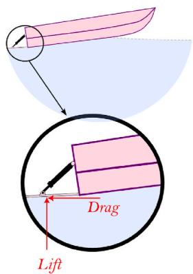

text_image

Drag
Lift

(b)   
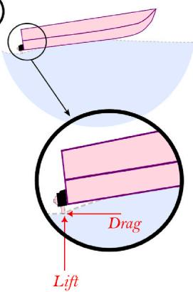

text_image

Drag
Lift

Fig. 19. Energy saving devices installed on the stern of a high-speed planing surface: (a) a controllable trim tab, and (b) interceptor.

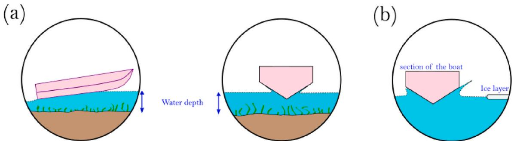  
Fig. 18. Shallow water condition and ice layer effect on water flow around the 2D section of a deep V planing hull.

Lewnadowski’s model), incorporating shallow water effects can be achieved through relevant empirical equations applied in ship maneuvering (see Taimuri et al., 2020). This approach facilitates the calculation of hydrodynamic coefficients for the motion of a planing hull navigating in a shallow water environment.

# 8.5.2. Ice effects

When a planing hull operates in polar sea conditions, it becomes important to account for ice effects in its maneuvering simulations. An ice layer covering the sea can influence the free surface pattern and forces acting on the planing vessel (see Fig. 18b), including those arising during maneuvering.

Incorporating the effects of ice on the performance of a planing hull remains challenging, primarily due to the diverse types and sizes of ice and the various modelling options available. Researchers have not deeply looked into this issue, given the complexity arising from the variability of ice characteristics. Some recent advancements have focused on the effects of an ice layer on the fluid motions near a wedge section entering water (Chen et al., 2019; Marleaux et al., 2022). Consequently, these studies could potentially be integrated into 2D + t-based maneuvering models, should any such models be developed based on this approach. This highlights future potential research.

# 8.5.3. Controllable energy saving devices

Planing hulls may be equipped with various energy saving devices designed to provide additional lift force (see Fig. 19). These devices not only contribute to maintaining vessel stability but can also be employed to reduce resistance force. These devices may be fixed and controllable, the aim of using the latter is to provide a better maneuvering or seakeeping performance. Notable examples are bottom wedges (Millward et al., 1976; Ghadimi et al., 2019b; Buˇca et al., 2023), trim tabs (Xi and Sun, 2005), interceptors (Rijkens et al., 2011), combination of trim tab and interceptors (Mansoori and Fernandes, 2017; Suneela et al., 2021), split interceptors (SI, De Luca et al., 2012a), and double interceptors (DIS, De Luca et al., 2012a, 2012b, 2014). The two latter are known as unconventional interceptors. It is worth noting that the performance of double interceptors has recently been enhanced through a combination with air cavity solutions (De Luca et al., 2022, 2023). Another factor that can enhance a maneuvering model is the consideration of the effects of these devices, especially the ones that are controllable. They may affect the hydrodynamic coefficients of the vessel, and in addition, they can cause forces/moments in different directions. Apart from that, they are observed to affect the hydrodynamic coefficients of a planing vessel (Kahramanoglu, ˘ 2023b).

Typically, simple equations can be used to calculate the lift force, pitching, and rolling moments induced by these devices. While this seems feasible, existing maneuvering models presently do not incorporate the effects of these devices. Addressing this gap is another future opportunity, which may help us reach a more comprehensive maneuvering model.

# 8.5.4. Water waves

In a real-world marine environment, similar to a displacement hull, a planing hull maneuvers in the presence of water waves, from swells to wind-generated waves, which may induce large vertical motions, as explained before. The introduced mathematical models for maneuvering of planing hulls, particularly the 2D + t variant, are not developed to capture such motions (they do not incorporate effects of waves), but they may be potentially extended to solve this problem. Meanwhile, there has been an increase in the development of mathematical/ computational models to simulate the maneuvering motion of displacement hulls in waves (e.g. Taimuri et al., 2020).

To address this gap, consideration must be given to water waves and their impact on the wet surface of the vessel maneuvering in such an environment. Additionally, if the 2D + t approach is used, the effects of the vertical and horizontal orbital velocity of the wave on horizontal and vertical velocity at each section need to be taken into account. Taking all these factors into account would enable the maneuvering simulation of the vessel operating in waves in 6DOF. This would provide the waveinduced drift of the vessel during a circle turn. Nevertheless, such a study is absent from the existing literature, and conducting it would benefit the naval architect community.

# 9. Hydrodynamic modelling of other hullforms

This section reviews the advancements and extension of the hydrodynamic models introduced in sections 6, 7, and 8 for modelling of calm water performance, seakeeping and maneuvering of hull forms other than stepless monohulls, such as catamarans and stepped hulls. The first sub-section focuses on the application of empirical and 2D + t models toward this objective, followed by a second sub-section reviewing the utilization of viscous models for the same purpose.

# 9.1. Empirical and 2D + t models

# 9.1.1. Stepped planing hulls

The general hypothesis to model stepped planing surfaces using mathematical/empirical approaches is to divide the entire surface into n + 1 surfaces, where n refers to number of steps. The first surface is the part of the hull located forward of the front step (i.e. first step), and the last surface is the one located behind the rear step. Each step is identified with the longitudinal position of step, shown with $L _ { s } ^ { \textcircled { \backslash } } .$ , and its heighthⓘ . Each surface has a length of $L ^ { \mathbb { O } }$ . Here, note that enclosed numbers indicate the association of parameter to the i th surface. The total keel wetted length of the vessel is the summation of the wetted length of each surface:

$$
L _ {K} = \sum_ {i = 1} ^ {n + 1} L _ {K} ^ {\textcircled {1}}. \tag {9.1}
$$

The keel wetted length of all surfaces except the first one is found using the ventilation length $( L _ { V } ^ { \textcircled { \backslash } } )$ behind each step as

$$
L _ {K} ^ {\textcircled {i}} = L ^ {\textcircled {i}} - L _ {V} ^ {\textcircled {i}}. \tag {9.2}
$$

The ventilation length is approximated through finding the point at which the wake left behind the step $( \eta _ { s } ^ { \textcircled { 1 } } ( x _ { s } ^ { \textcircled { 1 } } ) )$ meets the hull surface located behind the step (Fig. 20). To do so, a local frame, denoted with $\pmb { x } _ { s } ^ { \textcircled { 1 } } \pmb { z } _ { s } ^ { \textcircled { 1 } }$ , is defined. This can be mathematically written as

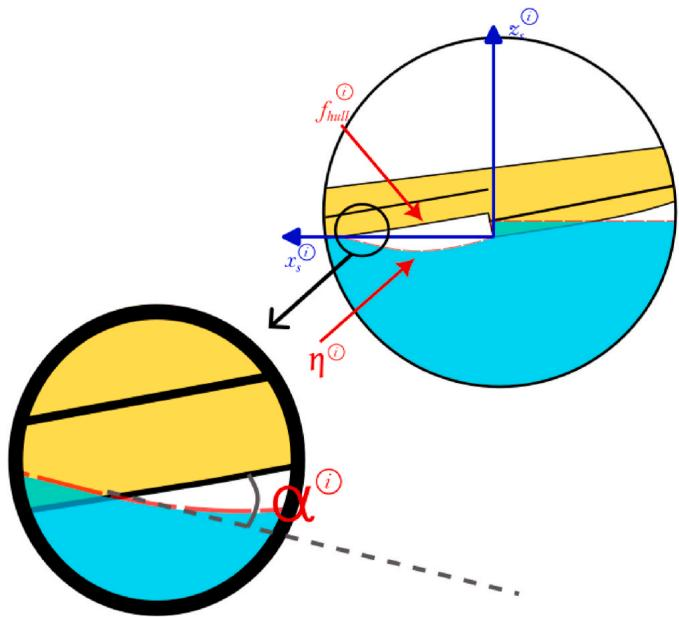

text_image

f_{hull}
x_s
η
α
z
i

Fig. 20. Water surface profile behind a step and the local coordinate system used to find the ventilation length. The concept of local trim angle is also illustrated in a zoomed-up view.

$$
f _ {h u l l} ^ {\textcircled {i}} \left(x _ {s} ^ {\textcircled {i}}\right) = \eta_ {s} ^ {\textcircled {i}} \left(x _ {s} ^ {\textcircled {i}}\right). \tag {9.3}
$$

Note that the left-hand side of the above equation is the hull function behind the step. Here, the main challenge is to formulate $\eta _ { s } ^ { \textcircled { \cdot } } ( x _ { s } ^ { \textcircled { \cdot } } )$ . Three different equations for the wake behind the transom have been formulated so far. The oldest one is presented by Stavisky (1988), given by

$$
\frac {\eta_ {s} ^ {(1)} \left(x _ {s} ^ {(1)}\right)}{B} = W _ {1} \left(\frac {x _ {s} ^ {(1)}}{B}\right) ^ {2} - W _ {2} \left(\frac {x _ {s} ^ {(1)}}{B}\right) ^ {2. 4 4} + W _ {3} \left(\frac {x _ {s} ^ {(1)}}{B}\right). \tag {9.4}
$$

The second equation is an empirical one, derived by Savitsky and Morabito (2010), given by

$$
\frac {\eta_ {s} ^ {(1)} \left(x _ {s} ^ {(1)}\right)}{B} = W _ {4} \sin \left(W _ {5} \left(\frac {x _ {s} ^ {(1)}}{3 B}\right) ^ {1. 5}\right). \tag {9.5}
$$

The third equation is found using theoretical solutions and is formulated by Faltinsen (2006), given by

$$
\frac {\eta_ {s} ^ {(1)} \left(x _ {s} ^ {(1)}\right)}{B} = W _ {6} \left(\frac {x _ {s} ^ {(1)}}{B}\right) ^ {3 / 2}. \tag {9.6}
$$

In all above equations, Wi parameters are constants and are found using regression approaches or theoretical estimations. Apart from the above equations, there is another simplified assumption, which presumes the wake behind the step is parallel to horizon, i.e.,

$$
\frac {\eta_ {s} ^ {(1)} \left(x _ {s} ^ {(1)}\right)}{B} = 0. \tag {9.7}
$$

Using the trim angle, the keel wetted length and the deadrise angle of the surface, the lift force and pitching moment of each surface can be found using empirical equations presented in section 5 or the 2D + t model. The total lift and total pitching moment are found as

$$
\mathcal {L} = \sum_ {i = 1} ^ {n + 1} \mathcal {L} ^ {\textcircled {0}}, \tag {9.8}
$$

$$
\mathcal {M} = \sum_ {i = 1} ^ {n + 1} \mathcal {M} ^ {\textcircled {1}}. \tag {9.9}
$$

Similarly, the resistance force and forces in other directions are found, and then the summations of the them are calculated.

One of the difficulties lies in calculation of total resistance. The challenge here is to consider the Reynolds number for each planing surface. There are two different options. The first one is to calculate separate Reynolds number for each surface using the keel wetted length of that surface, and the other is to use one global Reynolds number, which is calculated using the total keel wetted length. The former assumes that the wake behind the step does not exhibit any turbulent behavior before it reaches the surface. But the other assumes that turbulent fluid motion has already been developed.

Here it should be noted that two local parameters are also defined for each surface. The first one is the local trim angle and the second one is the local deadrise angle. The reason for considering the local trim angle is that the wake may reach the surface at a non-zero slope, leading to an angle of attack larger that the trim angle of the vessel (Fig. 20). The reason for considering the local deadrise angle is that wake at every longitudinal strip (buttock) would be different from that of the center line. The local trim angle can be found using local derivation of the wake. The local deadrise angle can be approximated using the wake at different strips.

The very first hydrodynamic model for performance prediction of single-stepped planing hulls was developed by Svahn (2009). The equations governing the calm water condition were solved using an iteration approach, and the wake shape formulated by Savitsky and Morabito (2010) was used to find the ventilation length and the local values of trim angle and deadrise angle. Lift force of each surface was found using Savitsky (1964) model. The model was shown to have a great level of accuracy. Later, Danielsson and Strømquist (2012) developed a model for performance prediction of double-stepped planing hulls. The wake was assumed to be parallel to horizon, and the local values of trim angle and deadrise angle were implemented based on experience. Similar to the model formulated by Svahn (2009), lift force was approximated using Savitsky (1964) model. Niazmand Bilandi et al. (2019) developed a 2D + t model for performance prediction pf double-stepped planing hulls and used the linear wake assumption. The sectional forces were found using the Wagner model, and a simplified approach was used for calculation of the forces after water detachment from chines.

The only mathematical model that is developed for reconstruction of the motions of double-stepped planing hulls in waves is developed by Niazmand Bilandi et al. (2021a,b). The linear wake assumption was used for calculation of the wake, and the momentum variation was employed for calculation of sectional forces. No model for maneuvering motions of stepped planing hulls has been developed yet, which remains as a future research opportunity. Table 13 presents a general review of the different hydrodynamic models developed for stepped planing hulls.

# 9.1.2. Catamaran planing hulls

Two different approaches may be used for hydrodynamic modelling of catamaran planing hulls. The first approach is to model the hydrodynamic forces and moments acting on each body, and then to implement an interference effects factor. Such an interference effects factor can be found using experimental data. Interface factors for planing catamarans with half-V shaped sections and flat bottoms have been studied and formulated (Savitsky and Dignee, 1954; Wang et al., 1975; Liu and Wang, 1978; Lee, 1982). The interference effect factor can be implemented into Savitsky (1964) equation or any other empirical one. The interesting point is that the interface factor can only be applied to half-V shaped planing catamaran (Asymmetric demihulls, see section 2). This may leave us with an option to also apply this factor to 2D + t model and evaluate whether this parameter can properly work when applied to this method or not. Yet, such an effort has not been made and can be viewed as an opportunity for future studies.

The other approach that can be used for hydrodynamic modelling of catamaran planing hulls is to use the 2D + t model and solve the fluid motion around the catamaran section. This can be achieved through using analytical or semi-analytical methods (e.g. in Khabakhpasheva et al., 2012) that can be embarked for solving the fluid flow around twin wedge sections. The method, unfortunately, has not been used for performance prediction of planing hulls or simulation of their motions in waves. It may also be further developed for maneuvering.

# 9.2. Viscous models

CFD models have been used to simulate calm, rough water and maneuvering performance of planing surfaces other than the stepless monohulls. These studies have been accelerated since later 2010s as the CFD codes reached a high level of popularity. Table 14 presents a summary of these studies. Studies are clustered in three groups based on the vessel type. The first group of studies are the ones that design CFD models the performance of catamarans. The ones that have also solved the fluid flow around Delft 372 catamaran at longitudinal Froude Numbers grater 0.45 are also presented in this Table. Studies looking into planing catamarans is less limited as the ones highlighting stepped planing hulls or planing trimarans. This might be due to the fact that the number of available experimental studies presenting performance of planing catamarans in calm or rough water conditions is less limited.

As briefly explained in sub-section 6.3, the first generation of CFDbased studies for various types of stepless planing boats was sparked up by simulating viscous water flow around a planing surface fixed in heave and pitch directions. A similar chronological evolution is evident in the development of CFD-based models focusing on the performance of stepped planing hulls. Studies conducted by Lotfi et al. (2015) and Veisi et al. (2015), as outlined in Table 10, employed a setup with a vessel fixed in heave and pitch directions. One of the pioneering studies that advanced the state-of-the-art by simulating calm-water performance of a planing hull free in heave and pitch directions, was conducted by De Marco et al. (2017). They simulated the fluid dynamic problem using overset and morphing techniques and employed k-ω SST and Large Eddy Simulation (LES) turbulence models. The overset method was found to be more reliable. An interesting observation from this research was about the choice of the turbulence model. The authors discussed that a RANS k − ω SST model is a better option when resistance, trim angle, and CG rise-up are of interest, while an LES model would be more suitable if the simulation aims to monitor flow patterns and related physics. This study can be considered a milestone in CFD modelling of stepped planing monohulls. Next generation of studies included Dashtimanesh et al. (2018), who replicated straightforward tests of a double-stepped planing hull using morphing techniques and a k-ϵ model, and Niazmand Bilandi et al. (2020), who simulated a similar problem using an overset method. Another noteworthy work by Fang et al. (2023) involved simulating the calm water performance of an air cavity planing hull, which was performed using an overset technique and a k − ω SST turbulence model.

Table 13 The mathematical models developed for hydrodynamic modelling of stepped planing hulls. 

<table><tr><td></td><td>Problem</td><td>Hull type</td><td>Step type</td><td>Wake model</td><td>Hydrodynamic force calculation</td><td>Comparison against experiments?</td></tr><tr><td>Svahn (2009)</td><td>Calm water performance</td><td>Single-stepped</td><td>Transverse</td><td>Equation (9.5)</td><td>Savitsky (1964)</td><td>Delta 29 SWDelta 34 SWDelta 40 WA, provided by company</td></tr><tr><td>Danielsson and Strømquist (2012)</td><td>Calm water performance</td><td>Double-stepped</td><td>Transverse</td><td>Equation (9.7)</td><td>Savitsky (1964)</td><td>Hydrolift C-31, provided by company</td></tr><tr><td>Dashtimanesh et al. (2017)</td><td>Calm water performance</td><td>Double-stepped</td><td>Transverse</td><td>Equation (9.7)</td><td>Savitsky (1964)</td><td>Taunton et al. (2010), Lee et al. (2010)</td></tr><tr><td>Niazmand Bilandi et al. (2018)</td><td>Calm water performance</td><td>Single-stepped</td><td>Transverse</td><td>Equation (9.7)</td><td>2D + t model, Wagner water entry model</td><td>De Marco et al. (2017)</td></tr><tr><td>Niazmand Bilandi et al. (2020a)</td><td>Calm water performance in heeled condition</td><td>Double-stepped</td><td>Transverse</td><td>Equation (9.7)</td><td>2D + t model, Wagner water entry model</td><td>No</td></tr><tr><td>Niazmand Bilandi et al. (2020b)</td><td>Calm water performance</td><td>Double-stepped</td><td>V-shaped</td><td>Equation (9.7)</td><td>2D + t model, Wagner water entry model</td><td>Taunton et al. (2010)</td></tr><tr><td>Niazmand Bilandi et al. (2021)</td><td>Rough water performance</td><td>Double-stepped</td><td>Transverse</td><td>Equation (9.7)</td><td>2D + t model, Momentum variation</td><td>No</td></tr></table>

The only CFD scholarly studies simulating the dynamic motion of stepped planing hulls were carried out by Esfandirari et al. (2020) and Niazmand Bilandi et al. (2021a,b). They respectively simulated the dynamic motions of single-stepped and double-stepped planing hulls in monochromatic waves. However, due to a lack of experimental data, they were unable to compare their CFD results against experimental data.

The early studies on CFD simulations regarding the performance of trimaran planing hulls can be traced back to the work of Yu-min et al. (2014). They simulated this problem using starCCM + code without employing any mesh deforming technique. Instead, the computational domain was set to move. A k − ω SST turbulence model was applied. This study can be considered a milestone in the realm of CFD modelling for trimaran planing hulls. Following this, Jiang et al. (2016) conducted another important study, utilizing a dynamic moving mesh and the SST turbulence model. Although there have been studies following those conducted by Jiang et al. (2016), they all focused on simulating calm-water performance. A notable exception is the set of CFD carried out by Roshan et al. (2022), which goes beyond calm-water performance and covers dynamic motions of planing trimarans in regular waves. In this study, the authors compared some of their CFD data with the experimental data of Ma et al. (2015).

In general, attention is not paid much to dynamic motions of stepped hulls and trimarans and in waves, and no maneuvering CFD model for stepped and trimaran planing hulls has been developed. A future research opportunity is to develop high-fidelity CFD setups for maneuvering models for either of these hull types, that can potentially replicate different maneuvering motions in both smooth and rough water conditions. Last but not least, SPH method has not been used for simulating the fluid flow around catamarans, stepped planing hulls, and planing trimarans. Yet, they have been used for simulating the performance of monohulls, as discussed earlier.

# 10. Emerging methods

# 10.1. The potential of artificial intelligence (AI)

The advent of AI marks a new era of innovation and efficiency, particularly in the realms of ship design (i.e., hydrodynamic and intelligent hull design) as well as ship operations (i.e., fuel consumption and motion predictions along with autonomous navigation, Huang et al., 2022a; Zhang et al., 2024). In hydrodynamic modelling, the ability of AI to solve complex multi-physics problems can potentially revolutionize how planing hulls are designed using regression and deep learning methods.

AI can be potentially used to solve different hydrodynamic problems and may aid us in dealing with different engineering aspects arising in design. For example, the use of generative AI in hull generation suggests a significant leap towards intelligent hull optimization via rapid prototyping. The method could assist with the evaluation of a great number of hull forms, thus expediting, and refining the design process.

Deep learning methods account for vast datasets, and therefore provide us with new intelligent tools for seakeeping predictions. The accurate prediction of hydrodynamics coefficients, motions and extreme sea loads using such methods if validated properly could supersede available mathematical and CFD models (see Sections 7 and 8).

Finally, the application of deep reinforcement learning methods in ship control and path tracking is gradually paving the way toward advanced autonomous navigation, where marine vehicles can independently make optimal route decisions in concurrent or extreme environmental conditions. These algorithms can also be used for designing intelligent-based ride systems for planing hulls which may face many difficulties (e.g. unstable motions, large sea loads) during the operations.

Collectively, the above mentioned AI-driven advancements are not just enhancing existing methodologies but are also open new research and engineering pathways steering the industry towards a future marked by greater safety, efficiency, and sustainability. Possible applications of AI in the hydrodynamic modelling and design of planing hulls follows.

Table 1 4   
A list of CFD studies aimed at modelling of calm or rough water performance of planing hulls other than stepless monohulls, including catamarans, stepped monohulls and trimarans. 

<table><tr><td rowspan="2">Reference</td><td colspan="3">Problem</td><td>Vessel</td><td colspan="2">Mesh techniques</td><td colspan="5">Turbulence models</td><td rowspan="2">CFD codes</td><td rowspan="2">The reference for the experimental data</td></tr><tr><td>Calm water</td><td>Rough water</td><td>Maneuvering</td><td></td><td>Overset</td><td>Integrated/dynamic mesh/morphing</td><td>k-ω SST</td><td>k-ε</td><td>Approximation</td><td>Blended k-ω/k-ε</td><td>LES</td></tr><tr><td colspan="14">Catamarans</td></tr><tr><td>Jahanbakhsh et al. (2009)</td><td>✓</td><td></td><td>✓</td><td>Single deadrise catamaran</td><td></td><td>✓</td><td></td><td></td><td>✓</td><td></td><td></td><td>Bulit-in</td><td>Not specified</td></tr><tr><td>Kandasamy et a. (2011)</td><td>✓</td><td></td><td></td><td>semi-planing catamaran</td><td>✓</td><td></td><td></td><td></td><td></td><td>✓</td><td></td><td>CFDShip-Iowa</td><td>Osborne (2007)</td></tr><tr><td>Castiglione et al. (2011)</td><td>✓</td><td>✓</td><td></td><td>Delft 372</td><td>✓</td><td></td><td></td><td></td><td></td><td>✓</td><td></td><td>CFDShip-Iowa</td><td>Van&#x27;t Veer (1998a, 1998b)</td></tr><tr><td>He et al. (2014)</td><td>✓</td><td></td><td></td><td>Delft 372 (CNR-INSEAN 2554)</td><td>✓</td><td></td><td></td><td></td><td></td><td>✓</td><td></td><td>CFDShip-Iowa</td><td>Broglia et al. (2014)</td></tr><tr><td>Doğrul et al. (2021)</td><td>✓</td><td>✓</td><td></td><td>Delft 372</td><td>✓</td><td></td><td></td><td>✓</td><td></td><td></td><td></td><td>StarCCM+</td><td>Van&#x27;t Veer (1998a, 1998b)</td></tr><tr><td>Wang et al. (2022)</td><td>✓</td><td></td><td></td><td>Single deadrise catamaran</td><td>✓</td><td></td><td>✓</td><td>✓</td><td></td><td></td><td></td><td>StarCCM+</td><td>Wang et al. (2022) and Fridsma et al. (1969)</td></tr><tr><td>Ebrahimi et al. (2022)</td><td>✓</td><td></td><td></td><td>Single deadrise double stepped catamaran</td><td>✓</td><td></td><td>✓</td><td></td><td></td><td></td><td></td><td>StarCCM+</td><td>Ebrahimi et al. (2022)</td></tr><tr><td colspan="14">Stepped planing surfaces</td></tr><tr><td>De Marco et al. (2017)</td><td>✓</td><td></td><td></td><td>Single-stepped hull</td><td>✓</td><td>✓</td><td>✓</td><td></td><td></td><td></td><td>✓</td><td>StarCCM+</td><td>De Marco et al. (2017)</td></tr><tr><td>Cucinotta et al. (2018)</td><td>✓</td><td></td><td></td><td>Air Cavity stepped hulls</td><td>✓</td><td></td><td>✓</td><td></td><td></td><td></td><td></td><td>StarCCM+</td><td>Cucinotta et al. (2017)</td></tr><tr><td>Dashtimanesh et al. (2018)</td><td>✓</td><td></td><td></td><td>Double-stepped hull</td><td></td><td>✓</td><td></td><td>✓</td><td></td><td></td><td></td><td>StarCCM+</td><td>Taunton et al. (2010)</td></tr><tr><td>Esfandiari et al. (2020)</td><td></td><td>✓</td><td></td><td>Double-stepped hull</td><td></td><td>✓</td><td></td><td>✓</td><td></td><td></td><td></td><td>StarCCM+</td><td>NA</td></tr><tr><td>Park et al. (2022)</td><td>✓</td><td></td><td></td><td>single-stepped hulls (NSWC15E)</td><td>✓</td><td></td><td></td><td>✓</td><td></td><td>✓</td><td></td><td>StarCCM+ and CFDShip-Iowa</td><td>Park et al. (2022)</td></tr><tr><td>Niazmand Bilandi et al. (2020a)</td><td>✓</td><td></td><td></td><td>Double-stepped hull</td><td></td><td>✓</td><td></td><td>✓</td><td></td><td></td><td></td><td>StarCCM+</td><td>Taunton et al. (2010)</td></tr><tr><td>Dashtimanesh et al. (2020b)</td><td>✓</td><td></td><td></td><td>single-stepped hull</td><td></td><td>✓</td><td></td><td>✓</td><td></td><td></td><td></td><td>StarCCM+</td><td>Taunton et al. (2010)</td></tr><tr><td>Niazmand Bilandi et al. (2021)</td><td></td><td>✓</td><td></td><td>Double-stepped hull</td><td>✓</td><td></td><td></td><td>✓</td><td></td><td></td><td></td><td>StarCCM+</td><td>NA</td></tr><tr><td>Niazmand Bilandi et al. (2023a)</td><td>✓</td><td></td><td></td><td>Double-stepped hull</td><td>✓</td><td></td><td>✓</td><td></td><td></td><td></td><td></td><td>StarCCM+</td><td>Vitiello et al. (2022)</td></tr><tr><td>Fang et al. (2023)</td><td>✓</td><td></td><td></td><td>One-stepped Air cavity hull</td><td>✓</td><td></td><td>✓</td><td></td><td></td><td></td><td></td><td>StarCCM+</td><td>Wang et al. (2020)</td></tr><tr><td>Niazmand Bilandi et al. (2024)</td><td>✓</td><td></td><td></td><td>Single-stepped planing hull</td><td>✓</td><td>✓</td><td>✓</td><td></td><td></td><td></td><td></td><td>StarCCM+</td><td>Vitiello et al. (2022)</td></tr><tr><td colspan="14">planing trimarans</td></tr><tr><td>Yu-min et al. (2014)</td><td>✓</td><td></td><td></td><td>Trimaran</td><td></td><td>✓</td><td>✓</td><td></td><td></td><td></td><td></td><td>StarCCM+</td><td>Yu-min et al. (2014)</td></tr><tr><td>Yousefi et al. (2014)</td><td>✓</td><td></td><td></td><td>Trimaran</td><td></td><td>✓</td><td></td><td>✓</td><td></td><td></td><td></td><td>Fluent</td><td>NA</td></tr><tr><td>Jiang et al. (2016)</td><td>✓</td><td></td><td></td><td>Double-stepped trimaran</td><td></td><td>✓</td><td>✓</td><td></td><td></td><td></td><td></td><td>Ansys CFX</td><td>Jiang et al. (2016)</td></tr><tr><td>Jiang et al. (2017)</td><td>✓</td><td></td><td></td><td>Double-stepped trimaran</td><td></td><td>✓</td><td>✓</td><td></td><td></td><td></td><td></td><td>Ansys CFX</td><td>Jiang et al. (2017)</td></tr><tr><td>De et al. (2019)</td><td>✓</td><td></td><td></td><td>Double stepped trimaran with air ducts</td><td></td><td>✓</td><td>✓</td><td></td><td></td><td></td><td></td><td>Ansys CFX</td><td>De et al. (2019)</td></tr><tr><td>Roshan et al. (2020)</td><td>✓</td><td></td><td></td><td>Trimaran</td><td></td><td>✓</td><td></td><td>✓</td><td></td><td></td><td></td><td>StarCCM+</td><td>Ma et al. (2013)</td></tr><tr><td>Su et al. (2020)</td><td>✓</td><td></td><td></td><td>Trimaran</td><td></td><td>✓</td><td>✓</td><td></td><td></td><td></td><td></td><td>StarCCM+</td><td>Su et al. (2020)</td></tr><tr><td>Sun et al. (2020)</td><td>✓</td><td></td><td></td><td>Single-stepped trimaran</td><td></td><td>✓</td><td>✓</td><td></td><td></td><td></td><td></td><td>Ansys CFX</td><td>NA</td></tr><tr><td>Ding and Jiang (2021)</td><td>✓</td><td></td><td></td><td>Trimaran</td><td>✓</td><td></td><td>✓</td><td></td><td></td><td></td><td></td><td>StarCCM+</td><td>Ding and Jiang (2021)</td></tr><tr><td>Roshan et al. (2021)</td><td>✓</td><td></td><td></td><td>Trimaran</td><td>✓</td><td>✓</td><td></td><td>✓</td><td></td><td></td><td></td><td>StarCCM+</td><td>Ma et al. (2013)</td></tr><tr><td>Roshan et al. (2022)</td><td></td><td>✓</td><td></td><td>Trimaran</td><td></td><td>✓</td><td></td><td>✓</td><td></td><td></td><td></td><td>StarCCM+</td><td>Ma et al. (2015)</td></tr></table>

Table 15 The selected studies on prediction of calm water performance of planing hulls, which use AI algorithms. 

<table><tr><td>Methods</td><td>Purpose</td><td>Series name/Hull type</td><td>Reference</td></tr><tr><td rowspan="5">Regression models</td><td>Resistance and hydrodynamics characteristics</td><td>VWS fast hard chine catamaran series 89</td><td>Müller-Graf et al. (1989)</td></tr><tr><td>Resistance calculations</td><td>Double-Chine planing hull series</td><td>Radojcic et al. (2001)</td></tr><tr><td>Resistance and propulsion characteristics</td><td>VWS Hard-chine catamaran hull series 89</td><td>Müller-Graf et al. (2003)</td></tr><tr><td>Resistance calculations</td><td>Displacement, Semi-displacement, and Planing Hull Forms</td><td>Bertram and Mesbahi (2004)</td></tr><tr><td>Resistance calculations</td><td>Catamaran</td><td>Couser et al. (2004) and Mason et al. (2005)</td></tr><tr><td rowspan="6">ANN models</td><td>Resistance calculations</td><td>The USCG and TUNS Series</td><td>Kowalyshyn and Metcalf (2006)</td></tr><tr><td>Resistance calculations</td><td>Hard-chine hulls in semi-planing mode</td><td>Radojcic et al. (2014a)</td></tr><tr><td>Resistance prediction</td><td>Series 50</td><td>Radojcic et al. (2014b)</td></tr><tr><td>Resistance and Trim Modelling</td><td>Series 62</td><td>Radojcic et al. (2017)</td></tr><tr><td>Resistance prediction</td><td>Naples hard chine systematic series</td><td>Radojčić and Kalajdžić (2018)</td></tr><tr><td>Trim and resistance prediction</td><td>Single and double-stepped planing hulls</td><td>Nowruzi (2022)</td></tr></table>

# 10.1.1. Performance predictions in calm water

Early AI-based studies focused on the hydrodynamics of planing hulls, with the goal to predict their resistance and dynamic trim angles for various Froude Numbers. AI-based models were developed using calm water datasets derived from various physical tests conducted during tank experiments. Scholars consolidated tank datasets to construct Artificial Neural Network (ANN) models (Radojcic et al., 2014b, 2017) and regression models (Radojcic et al., 2001, 2014a). Table 15 presents a summary of these advances. There is currently no AI model based on alternative machine learning algorithms, such as XGBoost and Random Forest. Hence, the creation of new AI models for the prediction of the calm water performance of planing hulls using these algorithms and comparison of their accuracy ANN and regression models may present good potential.

# 10.1.2. AI and hull generation

Within the context of computer aided design (CAD), the hull automatic generation codes have limited use for high speed planning boats due to sharp changes and complex geometries (e.g., steps, tunnels, airintakes etc.) enraptured in specialist design specifications. These geometric limitations could be potentially addressed by generative AI. For example, AI algorithms based on GAN (Generative Adversarial Network) may be used. An example is presented under by Khan et al., 2023. In this work ShipHullGAN code including more than 50,000 ship designs is used. The code can be coupled with an optimizer that evaluates the wave-making resistance of ships and gives an optimized design for a displacement ship. Another example can be found in the recent scholarly work of Bagazinski et al. (2023), which interestingly includes mono-planing hull forms with different numbers of steps, yet still excluding multihulls and certain other types of planing hulls. A general overview of a GAN algorithm for hull generation is shown in Fig. 21.

# 10.1.3. Dynamic motion predictions

Recent advancements in AI algorithms for seakeeping and maneuvering prediction (i.e., prediction of time history of motions) represent a significant development in marine hydrodynamics. These methods emerged in recent years, e.g., see Sun et al. (2022), D’Agostino (2022), Geng et al. (2023), and Zhang et al. (2023c). Whilst these approaches were initially developed for motion predictions of displacement hulls, there is potential for further extension of AI algorithms to predict the motion of fast planing boats.

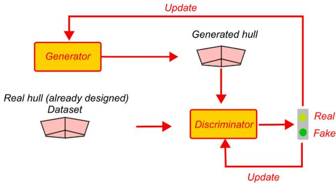

flowchart

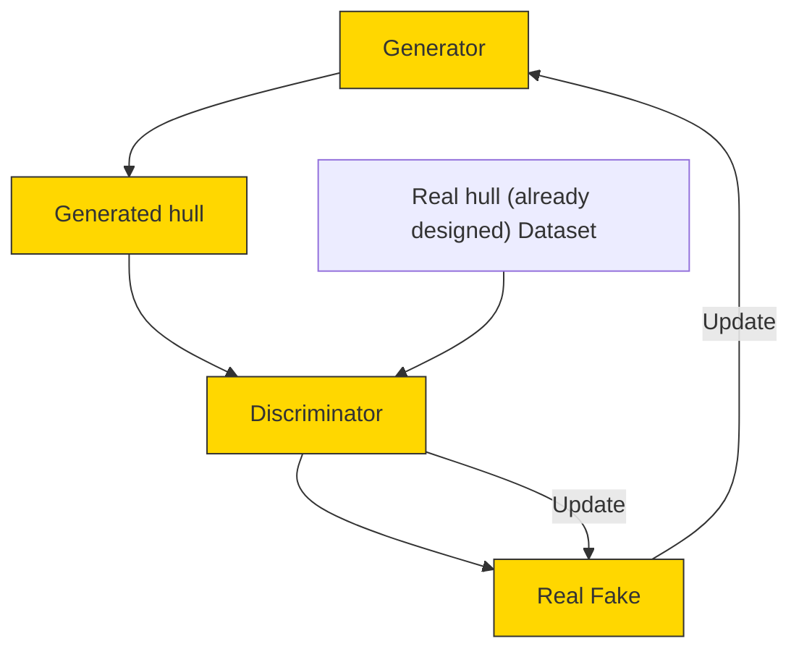
```mermaid
graph TD
    A["Generator"] --> B["Generated hull"]
    B --> C["Discriminator"]
    C --> D["Real Fake"]
    D -->|Update| A
    E["Real hull (already designed) Dataset"] --> C
    C -->|Update| D
    style A fill:#FFD700,stroke:#333
    style B fill:#FFD700,stroke:#333
    style C fill:#FFD700,stroke:#333
    style D fill:#FFD700,stroke:#333
```

Fig. 21. A simple overview of AI-based hull automatic generation based on GAN models. Readers interested in more applications in design and coupling a GAN model with an optimization algorithm are referred to Khan et al. (2023).

AI motion prediction methods involve analyzing recorded time histories of ship responses and monitored environmental effects (waves, winds, currents, etc). This is achieved either by sampling the time histories of motions and accelerations (big data streams) or by training physics-based models to simulate responses, see Zhang et al. (2023a) and Silva and Maki (2022). Concluding on the accuracy of AI methods is highly dependent on extensive validation studies against sea trial data, open and tank water experiments or even established mathematical models etc. (see Sections 3, 7 and 8).

Any AI method used for motion predictions must utilize extensive datasets covering a wide range of environmental conditions and ship responses, allowing for the development of models that can forecast ship behavior accurately and in real-time (Lou et al., 2022). Deep learning algorithms can process complex data and convert them to meaningful efficient navigation and operational management formats (Abkowitz, 1980). This is essential for planing hulls that may undergo strongly nonlinear motions and even experience airborne (fly-over) effects. While the accuracy of these predictions mostly depends on the quality and diversity of the training data, their prospects in terms of improving the design process and enhancing navigational safety are substantial. Examples of methods that may be useful in this respect are available in deep learning methods used in autonomous shipping and sophisticated ship management systems (Zhang et al., 2023b).

Parametric estimation algorithms, have the potential to overcome difficulties in the evaluation of unified planing hull hydrodynamic coefficients. They are hybrid, i.e. they may be coupled with available mathematical or theoretical models that idealise maneuvering or sea load prediction simulations. Recent examples of research can be found in Wang et al. (2019) and Zheng et al. (2021). In the former the authors used the nu-support vector algorithm and coupled it with the Abkowitz maneuvering model (Abkowitz, 1980) to estimate the hydrodynamic coefficients of a displacement ship. Similar methods can be applied to planing hulls. The maneuvering models (see Section 8) can be coupled with a parametric algorithm to identify the hydrodynamic coefficients of a planing vessel.

In contrast to parametric methods which provide us with hydrodynamic coefficients of the vessel, non-parametric estimation models can be used to forecast the time history of motions in real operational conditions via training mathematically/computationally generated or sea trial data. To date Artificial Neural Networks models, Gaussian process regression models, Long-Short term memory, along with locally weighted learning algorithms have been embarked for forecasting time history of the motions for different displacement hulls (Zhang et al.,

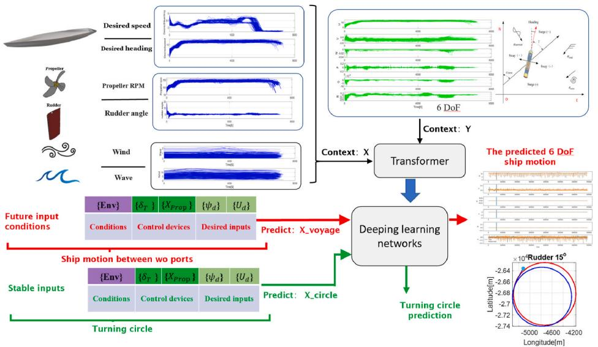

flowchart

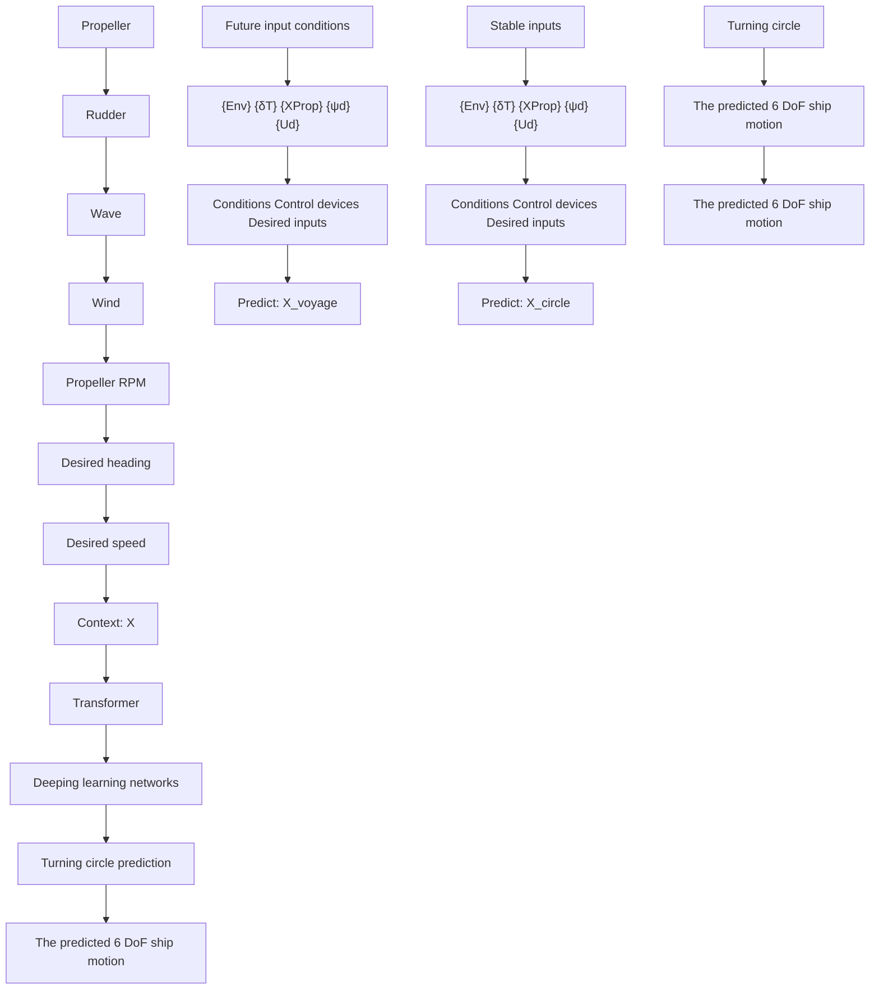
```mermaid
graph TD
    A["Propeller"] --> B["Rudder"]
    B --> C["Wave"]
    C --> D["Wind"]
    D --> E["Propeller RPM"]
    E --> F["Desired heading"]
    F --> G["Desired speed"]
    G --> H["Context: X"]
    H --> I["Transformer"]
    I --> J["Deeping learning networks"]
    J --> K["Turning circle prediction"]
    K --> L["The predicted 6 DoF ship motion"]
    
    M["Future input conditions"] --> N["{Env} {δT} {XProp} {ψd} {Ud}"]
    N --> O["Conditions Control devices Desired inputs"]
    O --> P["Predict: X_voyage"]
    
    Q["Stable inputs"] --> R["{Env} {δT} {XProp} {ψd} {Ud}"]
    R --> S["Conditions Control devices Desired inputs"]
    S --> T["Predict: X_circle"]
    
    U["Turning circle"] --> V["The predicted 6 DoF ship motion"]
    V --> W["The predicted 6 DoF ship motion"]
```

Fig. 22. An overview of AI-based ship system identiftcation developed by Zhang et al. (2023 a) which can be used to predict ship motions and turning cycles.

2023b). These non-parametric methods are effective in the analysis of data from simulated free-running tests. The research by Silva et al. (2022), Woo et al. (2019), and Sivaraj et al. (2022) exemplifies the application of non-parametric models for the prediction of the temporal motions of displacement hulls. One of the recent non-parametric based works is carried out Zhang et al. (2023a). They introduced a generative deep learning methods for the prediction ship motions and turning cycles. These advancements suggest the potential of deep learning methods for the identification of ship maneuvering under variable hydrometeorological conditions (see Fig. 22).

Future developments could focus further on the prediction of Response Amplitude Operator (RAO) across diverse sea conditions. Deep learning models accounting for the hull shape and speed could be used to produce an RAO plot that graphically illustrates the planing hull response to various wave frequencies and wave steepness values. Looking ahead, efforts should be directed towards enhancing the precision of these models, broadening their scope to include more types of vessels, and incorporating real-time data to facilitate more adaptive and responsive navigation support.

# 10.1.4. Control and path tracking

Recent advancements in reinforcement learning (RL) have opened new possibilities for automating marine vehicles, which may help us prevent marine disasters and improve ship control (Deraj et al., 2023; Zheng et al., 2023). A typical RL algorithm trains agents using a reward-penalty framework, where the agent is rewarded for actions that achieve goals and penalized for detrimental ones (Oh et al., 2020). Through experience, the agent learns to select actions that yield higher rewards, see Fig. 23. This data-driven approach does not require a pre-existing model of the system. Instead, the agent learns the dynamics of system and control strategies through its interactions.

RL algorithms provide new possibilities to solve the challenge of unknown dynamics in control problems of ships (Jin et al., 2023). Traditional RL uses Q-tables to store the agent’s policy, documenting the expected rewards for various scenarios (Yazdjerdi et al., 2019). However, deep reinforcement learning (DRL), which integrates neural networks, s superseded Q-tables thus allowing for efficient policy storage and application to more complex, both discrete and continuous, state and action spaces (Mnih et al., 2013). Traditional maritime autopilots rely on line-of-sight guidance and PID controllers for waypoint tracking, with a separate path planning algorithm for obstacle avoidance (Lekkas et al., 2012; Hirdaris, 2022). AI-based control strategies, however, promise to integrate control and path planning into a single controller, reducing real-time computational requirements (Zinage et al., 2021).

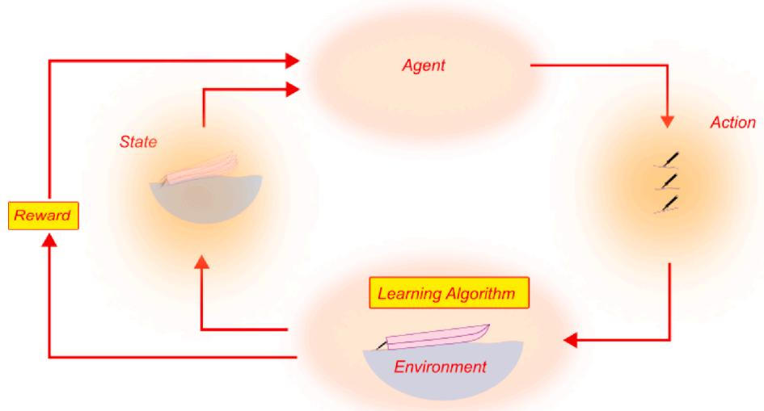

flowchart

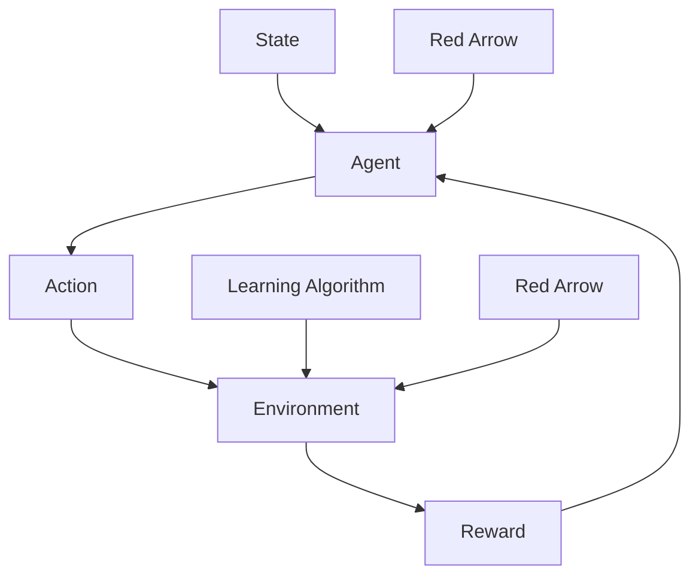
```mermaid
graph TD
    A["Agent"] --> B["Action"]
    B --> C["Environment"]
    C --> D["Reward"]
    D --> A
    E["State"] --> A
    F["Learning Algorithm"] --> C
    G["Red Arrow"] --> A
    H["Red Arrow"] --> C
```

Fig. 23. The general framework of RL for control of a planing boat. Here a trim tab is supposed to be the control device and state represents the boat motions and positions.

To date, several studies have explored RL for ship displacement hulls control. Examples of algorithms used are Q-learning for static obstacle avoidance (Wang et al., 2019), deep Q-learning for collision avoidance among multiple ships (Sheng et al., 2019; Zheng et al., 2023), and deep Q-networks (DQN) for path following and heading control (Sivaraj et al., 2022; Zhang et al., 2019). Advanced models like Deep Deterministic Policy Gradient (DDPG) have also been used for path tracking and demonstrate potential superiority over traditional line of sight guidance systems (Woo et al., 2019). Research of direct relevance to the Convention of the International Regulations for Preventing Collisions at Sea (COLREGs) uses methods like DDPG and actor-critic algorithms (Zheng et al., 2023; Shen et al., 2016; Zhao et al., 2019). These studies show that DRL-based methods can effectively avoid collisions with static obstacles, maintain formations, and comply with maritime collision avoidance regulations, often outperforming traditional control approaches like PID controllers. For example, Zheng et al. (2023) introduced a DRL model specifically designed to aid in multi-ship collision avoidance, a crucial aspect of decision-making in autonomous shipping. The degrees of freedom of a planing hull depend on trim tabs or interceptors in way of her propulsion system (e.g. van Deyzen et al., 2012a, 2012b). Thus control of the vessel may be possible through active/passive methods (Jokar et al., 2020) serving various purposes, three of which are listed below:

I) Suppressing the wave-induced motions of the vessel riding in irregular waves.   
II) Stabilization of the motion in calm water condition.   
III) Maneuvering and response of the vessel when an obstacle or other ships/boats are on its path.

Building intelligent-based systems requires to couple RL algorithms with simulations that idealise motions in waves, or maneuvering performance. All these simulation environments need to incorporate the influence of control (e.g. trim tabs, rudder, drive assembly, nuzzle angle, e.g. Xi and Sun, 2005) and propulsion systems. A summary of the potential use of AI is shown in Table 16.

# 10.2. Holistic design optimization

The optimization of planing hulls has been a research topic since late 1990s. Overall the focus of research has been on minimizing hull

Table 17 Some factors to be considered in holistic design optimizations of planing boats. 

<table><tr><td>Design solutions</td><td>Systemic surrogate-based ship design model</td><td>Operating profile</td><td>Environment</td><td>Promising KPIs</td></tr><tr><td>Hull form Propulsion Ship structures Layout</td><td>Energy efficiency (e.g., resistance and hull-propulsion interaction) Maneuvering, e.g., at high speed Seakeeping, e.g., with high speed and waves Hull integrity at high speed Dynamic and static stability Capacity Max. speed</td><td>Task-related features: leisure, rescue, coast guard, military, racers. Frequency of different operating modes: start acceleration, moving straight at design speed, turning and manoeuvring, deceleration, and stop.</td><td>Balance of rough and calm weather. Dynamics of wind and wave parameters on the intended operation route. Depth of the water body</td><td>Simulation of operation for lifecycle. Estimating the KPIs: 1) carbon intensity indicator; 2) safety (e.g., hull integrity and health of people onboard); 3) underwater noise 4) cost efficiency (CAPEX, OPEX); 5) wash waves of a ship</td></tr></table>

resistance (Yoshida, 1999; Mohamad Ayob et al., 2011a,b; Smith et al., 2013; Tran et al., 2022) and the prediction of wave loads on safety (Prini et al., 2018). Studies along the lines of the work of Papanikolaou (2010) on holistic design optimization remain future research exercise (see Table 17). Holistic optimization methods encourage a more systemic, efficient, and informative conceptual design of marine vehicles, that could potentially contribute to the decarbonization efforts of the leisure boat industry (Dashtimanesh et al., 2022). The small size and high powering requirements of a fast planing hull per unit displacement, along with the influence of dynamic hull loads and accelerations under high-speed conditions are extremely relevant to the goal oriented focus of hull optimization methods, which aims to balance different design parameters (see IMO (2019) and Papanikolaou (2011)). Another significant factor that needs to be considered is reliability of a craft in variable operational weather conditions.

Contrary to the traditional optimization approaches, holistic optimization involves the integration of CAD models, hydrodynamic theorybased multi-physics solvers, and mathematical optimization algorithms to explore optimal solutions across an extensive design space. In this field, hydrodynamic theory methods (Rawson and Tupper, 2001) are typically coupled with surrogate models, which may be semi-empirical (e.g., Lu et al., 2015), empirical (e.g., van Lammeren et al., 1969), or AI-based metamodels (e.g., Ao et al., 2023). The accuracy of computationally efficient methods is often constrained for certain hull design qualities. In such cases, optimization is conducted in two steps (Papanikolaou, 2020, 2021): (a) preliminary, where simplified estimates for global optimization are developed, and (b) detailed, involving accurate methods for local optimization and the selection of the final design, such as CFD. Alternatively, interactive optimizations methods can be employed to incorporate human heuristic insights at both optimization steps (Wang et al., 2023).

Table 16 A summary of potential application of AI models in hydrodynamic study and design of planing hulls. 

<table><tr><td>Potential use</td><td>Potential outputs</td><td>Which AI method can be used?</td><td>Has it been done yet?</td><td>Comment</td></tr><tr><td>Calm water performance prediction</td><td>Required power, trim angle, CG rise up, wetted area at different speeds</td><td>Regression models, XGboost, Random Forest, ANN</td><td>Yes, since 1990s. See Table 15.</td><td>XGboost and Random Forest algorithms have never been used so far.</td></tr><tr><td>Hull generation</td><td>Generation of any new hull that was not existed before</td><td>GAN</td><td>Not specifically. A hull generation code that gives mono-planing hulls is developed but no code giving all types of planing hulls (catamarans, tunneled planing hulls) is available.</td><td>These GAN-based algorithms, if developed, can be coupled with optimization algorithms, and help use design an optimum high-speed craft.</td></tr><tr><td>Dynamic motions</td><td>Motion predictions (generative approach) Motion forecasting (forecasting the real-time motion, the dataset before hand is used) Identification of hydrodynamic coefficients</td><td>Non-Parametric algorithms can be used for motion predictions and motion forecasting (e.g. LTSM). Parametric algorithms such as nu-parameter can be coupled with available maneuvering models for identification of hydrodynamic coefficients</td><td>No. These methods have only applied to displacement hulls.</td><td>There is a pressing need to have a code that gives RAO plots for any planing hull.</td></tr><tr><td>Intelligent-based riding</td><td>Motion control in waves Path tracking Stabilization</td><td>Reinforcement learning algorithms can be used</td><td>No. These methods have only applied to displacement hulls.</td><td>The early RL methods were based on Q-tables but the very recent ones are based on Deep Learning.</td></tr></table>

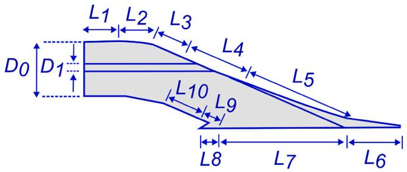

text_image

L1 L2 L3
D0 D1 L4 L5
L10 L9
L8 L7 L6

Fig. 24. Parametrization of the waterjet inlet geometry (Jiao et al., 2019).

During holistic optimization, topological elements of the planing hull (e.g., transverse sections, hull segments, and bottom steps) can be included in the list of design variables. In terms of propulsion, both propeller (Gatete et al., 2018) and waterjet-supported designs may be considered (see Kandasamy et al., 2011a,b; Tahara et al., 2014). For instance, in the case of surface-piercing propellers, variables such as diameter, rotational speed, blade number, and pitch-to-diameter ratios may be considered as key design variables. In the case of waterjets, inlet geometry (see Fig. 24) may be optimized to improve energy efficiency, cavitation, vibration, and noise of the waterjet (Jiao et al., 2019; Kandasamy et al., 2011a,b). The impact of hull-propulsion interaction on hull design qualities is another significant element to be considered throughout the optimization process (examples of hull-propeller interactions can be found in Eslamdoost et al., 2018; Roshan et al., 2021).

The reliability of hull structures is necessary to guarantee the integrity of a planing hull to withstand high hydrodynamic loads, particularly slamming. The development of methods for the evaluation of hydrodynamic loads on a planing hull allows for the design of lighter structures, thus resulting in smaller displacement and wetted surface area and, finally, reduced resistance and improved energy efficiency. Existing studies could minimize their weight and cost and use structural integrity as a constraint (Sobey et al., 2008; Song et al., 2010). Although studies on optimizing the layout of planing boats are not available, further research can improve their ergonomics and reduce weight, making designs more competitive.

Table 17, summarizes five promising Key Performance Indicators (KPIs) for the optimization of planing boats. Some of those could be relevant for any type of vessel, e.g., carbon intensity indicator (greenhouse gas emission per unit of useful work), safety, and cost-efficiency. Others may be case-specific, e.g., underwater noise that can impact the health of aquatic animals (Peng et al., 2015) and wash waves from a hull that can impact the marine environment and safety of humans in coastal areas (Papanikolaou, 2011; Bilkovic et al., 2019; Tavakoli et al., 2022). Multi-objective versions of metaheuristic optimization algorithms (e.g., genetic algorithm (Papanikolaou, 2010), particle swarm algorithm (Ehlers, 2012), artificial bee colony algorithm (Kondratenko et al., 2023), cuckoo search optimization algorithm (Saghi et al., 2022),) are a typical choice for such optimization due to their and high computational efficiency.

# 11. Conclusions

Planing boats are a very popular type of high-speed marine vehicles and have been widely used across the globe. To date research efforts focus on 1) decreasing fuel consumption, 2) stabilizing motion and improving maneuvering performance, and 3) reducing wave-induced motions and their effects, such as slamming loads and vertical accelerations. These aims have led to a broad range of studies over a 100-year timespan and introduced new hullforms, energy saving or control devices, new experimental setups, and hydrodynamic models.

Research progress in the hydrodynamics of planing hulls is promising. Yet, attention has predominantly been paid to calm water performance of vessels (i.e., resistance prediction). Accurate CFD setups that have been developed can reliably predict calm water performance. On the other hand the application of mathematical models is limited to stepless and stepped planing hulls.

The use of modern multi-physics for the idealization of seakeeping is limited. The same holds for motion statistics in real seas where open questions on the influence of the exceedance probability of motions and pressures remains. There are still question marks on the accuracy of nonlinear hydrodynamic coefficients and forces over hull maneuvering. To date, the only available maneuvering models are built for stepless monohull, while many types of planing hulls are now in use. This is because existing models heavily depend on the temporal displacement of a planing boat.

The research outlook on the area of hydrodynamics of planing hulls necessitates the development and use of holistic models for use in concurrent or extreme conditions. AI methods are very welcome to be used in hydrodynamic study and the design of planing hulls. It is envisioned that with careful architectural planning of AI algorithms, they can provide different intelligent design tools capable to 1) generate 3D hull geometries 2) predict calm water performance and motions 3) facilitate autonomous vessel navigation.

# CRediT authorship contribution statement

Sasan Tavakoli: Writing – original draft, Investigation, Conceptualization. Mingyang Zhang: Writing – original draft, Investigation. Aleksander A. Kondratenko: Writing – original draft, Investigation. Spyros Hirdaris: Writing – review & editing, Supervision, Conceptualization.

# Declaration of competing interest

The authors declare that they have no known competing financial interests or personal relationships that could have appeared to influence the work reported in this paper.

# Data availability

No data was used for the research described in the article.

# Nomenclature

Added mass coefficients of a planing hull, i = 1, 2, 3, 4, 5, and 6 respectively refer to surge, sway, heave, roll, pitch and yaw motions Aspect ratio

<table><tr><td> $A_p$ </td><td>Projected bottom area</td></tr><tr><td> $\ell_{ij}$ </td><td>Damping coefficients of a planing hull, i = 1, 2, 3, 4, 5, and 6 respectively refer to surge, sway, heave, roll, pitch and yaw motions</td></tr><tr><td> $b_w$ </td><td>Half-wetted beam of a 2D section entering water</td></tr><tr><td>B</td><td>Beam</td></tr><tr><td> $\mathcal{B}$ </td><td>Buoyancy force</td></tr><tr><td> $\overline{B}$ </td><td>Average breadth of a planing hull</td></tr><tr><td> $B_{max}$ </td><td>Maximum breadth of the vessel</td></tr><tr><td> $B_T$ </td><td>Breadth at transom</td></tr><tr><td>c</td><td>Wetted length of a 2D planing plate</td></tr><tr><td> $c_{ij}$ </td><td>Restoring coefficients of a planing hull, i = 1, 2, 3, 4, 5, and 6 respectively refer to surge, sway, heave, roll, pitch and yaw motions</td></tr><tr><td> $C_m$ </td><td>Added mass coefficient of a 2D section in vertical direction (heave)</td></tr><tr><td> $\mathcal{C}_{DC}$ </td><td>Cross drag coefficient of a 2D section entering water</td></tr><tr><td> $\mathcal{C}_F$ </td><td>Frictional drag coefficient</td></tr><tr><td> $\mathcal{C}_F^*$ </td><td>Frictional drag coefficient of spray</td></tr><tr><td> $C_{\mathcal{L}0}$ </td><td>Lift force coefficient of a surface planing hull</td></tr><tr><td> $C_{\mathcal{L}\beta}$ </td><td>Lift force coefficient of a deadrise surface planing hull</td></tr><tr><td>d</td><td>Draft</td></tr><tr><td> $\mathcal{D}_V$ </td><td>Viscous drag</td></tr><tr><td> $\mathcal{D}_S$ </td><td>Spray drag</td></tr><tr><td> $f(\mathcal{A})$ </td><td>Aspect ratio correction function applied to 2D forces</td></tr><tr><td> $f_y^{2D}$ </td><td>2D horizontal force acting on a section entering water</td></tr><tr><td> $t_z^{2D}$ </td><td>2D vertical force acting on a section entering water</td></tr><tr><td> $Ex_E y_E z_E$ </td><td>Earth fixed Coordinate system</td></tr><tr><td> $Fr_B$ </td><td>Beam Froude Number</td></tr><tr><td> $Fr_I$ </td><td>Longitudinal Froude Number</td></tr><tr><td> $Fr_\nu$ </td><td>Volumetric Froude Number</td></tr><tr><td>g</td><td>Gravity acceleration</td></tr><tr><td>g</td><td>An empirical parameter used in calculate of lift force of 3D planing hulls</td></tr><tr><td>h</td><td>Water depth</td></tr><tr><td> $h_s^{\textcircled{O}}$ </td><td>Height of a step located forward each surface of a stepped planing hull</td></tr><tr><td> $\not\in$ </td><td>An empirical parameter used in calculate of lift force of 3D planing hulls</td></tr><tr><td>H</td><td>Wave height</td></tr><tr><td> $I_{xx}$ </td><td>Second moment of area with respect to x-axis</td></tr><tr><td> $I_{yy}$ </td><td>Second moment of area with respect to y-axis</td></tr><tr><td> $I_{zz}$ </td><td>Second moment of area with respect to z-axis</td></tr><tr><td>k</td><td>Wave number</td></tr><tr><td> $\mathcal{K}$ </td><td>Rolling moment</td></tr><tr><td> $\mathcal{K}^*$ </td><td>Rolling moment with exclusion of added mass moments</td></tr><tr><td> $\mathcal{K}_\theta$ </td><td>Damping coefficient of maneuvering in roll direction,  $\vartheta = u, v, w, p, q$ , and r respectively refer to effects of surge, sway, heave, roll, pitch and yaw speeds</td></tr><tr><td> $\mathcal{K}_\theta$ </td><td>Added mass coefficient of maneuvering in roll direction,  $\dot{\vartheta} = \dot{u}, \dot{v}, \dot{w}, \dot{p}, \dot{q}$ , and r respectively refer to effects of surge, sway, heave, roll, pitch and yaw accelerations</td></tr><tr><td>K'</td><td>Kernel function of integral equations</td></tr><tr><td> $l^{\textcircled{O}}$ </td><td>Dimensionless additional wetted length due to spray formation</td></tr><tr><td>L</td><td>Length of the vessel</td></tr><tr><td> $\mathcal{L}$ </td><td>Lift force</td></tr><tr><td> $\mathcal{L}^{\textcircled{HD}}$ </td><td>Hydrodynamic lift</td></tr><tr><td> $\mathcal{L}^{\textcircled{O}}$ </td><td>Lift force acting on 1 th surface of a stepped planing hull</td></tr><tr><td> $L_C$ </td><td>Chine wetted length of a planing boat</td></tr><tr><td> $L_{CG}$ </td><td>Longitudinal center of gravity</td></tr><tr><td> $L_{CP}$ </td><td>Longitudinal center of pressure</td></tr><tr><td> $L_D$ </td><td>Downstream length set in a CFD tank</td></tr><tr><td> $L_K$ </td><td>Keel wetted length of a planing boat</td></tr><tr><td> $L_K^{\textcircled{O}}$ </td><td>Keel wetted length of 1 th surface of a stepped planing hull</td></tr><tr><td> $L_M$ </td><td>Average wetted length of a planing boat</td></tr><tr><td> $L_p$ </td><td>Projected length of the vessel</td></tr><tr><td> $L_U$ </td><td>Upstream length set in a CFD tank</td></tr><tr><td> $L_V^{\textcircled{O}}$ </td><td>Ventilation length of each surface of 1 th surface of a stepped planing hull</td></tr><tr><td> $L_W$ </td><td>Wetted length of a flat 3D planing hull</td></tr><tr><td> $\hat{L}_y$ </td><td>Dimensionless length of each longitudinal strip located behind the stagnation line</td></tr><tr><td> $m_{ij}^{2D}$ </td><td>2D added mass of a section entering water, i,j=2,3,4 respectively refer to sway, heave and roll motions</td></tr><tr><td> $m_{ij}^{2D}$ </td><td>Temporal change of 2D added mass of a section entering water, i,j=2,3,4 respectively refer to sway, heave and roll motions</td></tr><tr><td> $m_x^{2D}$ </td><td>Rolling moment acting on a 2D section entering water</td></tr><tr><td> $\mathcal{M}$ </td><td>Pitching moment</td></tr><tr><td> $\mathcal{M}^{\star}$ </td><td>Pitching moment with exclusion of added mass moments</td></tr><tr><td> $\mathcal{M}^{\textcircled{1}}$ </td><td>Pitching moment acting on 1 th surface of a stepped planing hull</td></tr><tr><td> $\mathcal{M}_{\delta}$ </td><td>Damping coefficient of maneuvering in pitch direction,  $\vartheta = u, v, w, p, q$ , and r respectively refer to surge, sway, heave, roll, pitch and yaw speeds</td></tr><tr><td> $\mathcal{M}_{\delta}$ </td><td>Added mass coefficient of maneuvering in pitch direction,  $\dot{\vartheta} = \dot{u}, \dot{v}, \dot{w}, \dot{p}, \dot{q}$ , and  $\dot{r}$  respectively refer to surge, sway, heave, roll, pitch and yaw accelerations</td></tr><tr><td> $M^{\bullet}$ </td><td>Integral of the 2D vertical added masses along the wetted length of a planing vessel</td></tr><tr><td> $M^{\bullet\bullet}$ </td><td>First order moment of the 2D vertical added masses along the wetted length of a planing vessel</td></tr><tr><td> $M^{\bullet\bullet\bullet}$ </td><td>Second order moment of the 2D vertical added masses along the wetted length of a planing vessel</td></tr><tr><td> $\alpha$ </td><td>An empirical parameter used in calculate of lift force of 3D planing hulls</td></tr><tr><td>N</td><td>Force normal to the surface of a planing hull</td></tr><tr><td> $\mathcal{N}$ </td><td>Yawing moment</td></tr><tr><td> $\mathcal{N}^{\star}$ </td><td>Yawing moment with exclusion of added mass moments</td></tr><tr><td> $\mathcal{N}_{\delta}$ </td><td>Damping coefficient of maneuvering in yaw direction,  $\vartheta = u, v, w, p, q$ , and r respectively refer to surge, sway, heave, roll, pitch and yaw speeds</td></tr><tr><td> $\mathcal{N}_{\delta}$ </td><td>Added mass coefficient of maneuvering in yaw direction,  $\dot{\vartheta} = \dot{u}, \dot{v}, \dot{w}, \dot{p}, \dot{q}$ , and  $\dot{r}$  respectively refer to surge, sway, heave, roll, pitch and yaw accelerations</td></tr><tr><td>p</td><td>Roll speed</td></tr><tr><td> $\dot{p}$ </td><td>Roll acceleration</td></tr><tr><td> $p_{HD}$ </td><td>Hydrodynamic pressure</td></tr><tr><td> $\rho$ </td><td>Angular speed of a section entering water</td></tr><tr><td> $p_{Max}$ </td><td>Maximum pressure emerging on each longitudinal strip of a planing hull</td></tr><tr><td> $p_l$ </td><td>Hydrodynamic pressure at leading edge</td></tr><tr><td> $p_t$ </td><td>Hydrodynamic pressure at trailing edge</td></tr><tr><td>q</td><td>Pitch speed</td></tr><tr><td> $\dot{q}$ </td><td>Pitch acceleration</td></tr><tr><td>r</td><td>Yaw speed</td></tr><tr><td> $\dot{r}$ </td><td>Yaw acceleration</td></tr><tr><td> $\mathcal{R}$ </td><td>Resistance force</td></tr><tr><td> $\mathcal{R}_S$ </td><td>Spray resistance</td></tr><tr><td> $\mathcal{R}_V$ </td><td>Viscous resistance</td></tr><tr><td>Re</td><td>Reynolds number</td></tr><tr><td> $Re^{\bullet}$ </td><td>Reynolds number of spray</td></tr><tr><td> $\mathcal{S}$ </td><td>Wet surface of a planing vessel</td></tr><tr><td> $\mathcal{T}$ </td><td>Trust force</td></tr><tr><td> $\mathcal{T}_i$ </td><td>Trust force effects in different directions, i = x,y,z,φ,θ,ψ respectively refer to surge, sway, heave, roll, pitch and yaw directions</td></tr><tr><td>u</td><td>Surge speed</td></tr><tr><td> $\dot{u}$ </td><td>Surge acceleration</td></tr><tr><td>U</td><td>Longitudinal velocity at each section</td></tr><tr><td>v</td><td>Sway speed</td></tr><tr><td> $\dot{v}$ </td><td>Sway acceleration</td></tr><tr><td>e</td><td>Vertical speed of water entry</td></tr><tr><td>V</td><td>Forward speed of planing hull or planing plate</td></tr><tr><td> $\overline{\mathcal{T}}$ </td><td>Average velocity on the bottom of a planing surface</td></tr><tr><td> $V_{CG}$ </td><td>Vertical center of gravity</td></tr><tr><td> $V_{CR}$ </td><td>Vertical center of resistance force</td></tr><tr><td> $\forall$ </td><td>Submerged volume of the vessel at rest</td></tr><tr><td>w</td><td>Heave speed</td></tr><tr><td> $\dot{w}$ </td><td>Heave acceleration</td></tr><tr><td>W</td><td>Weight of a planing hull or a 2D planing surface</td></tr><tr><td> $W_D$ </td><td>Width of a CFD tank</td></tr><tr><td> $W_i$ </td><td>Constants used to calculate the free surface elevation behind the step/transom</td></tr><tr><td> $W_O$ </td><td>Vertical orbital velocity</td></tr><tr><td> $\hat{x}$ </td><td>Non-dimensional distance from the stagnation line at each longitudinal strip</td></tr><tr><td> $x_s^{\textcircled{1}}$ </td><td>Longitudinal distance from the step forward the 1 th surface</td></tr><tr><td> $\mathcal{X}$ </td><td>Longitudinal force acting on a planing hull (force in surge direction)</td></tr><tr><td> $\mathcal{X}^{\star}$ </td><td>Surge force with exclusion of added mass forces</td></tr><tr><td> $\mathcal{X}_{\delta}$ </td><td>Damping coefficient of maneuvering in surge direction,  $\vartheta = u, v, w, p, q$ , and r respectively refer to surge, sway, heave, roll, pitch and yaw speeds</td></tr><tr><td> $\mathcal{X}_{\delta}$ </td><td>Added mass coefficient of maneuvering in surge direction,  $\dot{\vartheta} = \dot{u}, \dot{v}, \dot{w}, \dot{p}, \dot{q}$ , and  $\dot{r}$  respectively refer to surge, sway, heave, roll, pitch and yaw accelerations</td></tr><tr><td> $\hat{y}$ </td><td>Non-dimensional transverse distance from the center line</td></tr><tr><td> $\mathcal{Y}$ </td><td>Horizontal force acting on a planing hull (force in sway direction)</td></tr><tr><td> $\mathcal{Y}^{\star}$ </td><td>Sway force with exclusion of added mass forces</td></tr><tr><td> $\mathcal{Y}_{\vartheta}$ </td><td>Damping coefficient of maneuvering in sway direction,  $\vartheta = u, v, w, p, q$ , and r respectively refer to surge, sway, heave, roll, pitch and yaw speeds</td></tr><tr><td> $\mathcal{Y}_{\dot{\vartheta}}$ </td><td>Added mass coefficient of maneuvering in sway direction,  $\vartheta = \dot{u}, \dot{v}, \dot{w}, \dot{p}, \dot{q}$ , and  $\dot{r}$  respectively refer to surge, sway, heave, roll, pitch and yaw accelerations</td></tr><tr><td> $\mathcal{Z}$ </td><td>Vertical force acting on a planing hull (force in heave direction)</td></tr><tr><td> $\mathcal{Z}^{\star}$ </td><td>Heave force with exclusion of added mass forces</td></tr><tr><td> $\mathcal{Z}_{\vartheta}$ </td><td>Damping coefficient of maneuvering in heave direction,  $\vartheta = u, v, w, p, q$ , and r respectively refer to surge, sway, heave, roll, pitch and yaw speeds</td></tr><tr><td> $\mathcal{Z}_{\dot{\vartheta}}$ </td><td>Added mass coefficient of maneuvering in heave direction,  $\dot{\vartheta} = \dot{u}, \dot{v}, \dot{w}, \dot{p}, \dot{q}$ , and  $\dot{r}$  respectively refer to surge, sway, heave, roll, pitch and yaw accelerations</td></tr><tr><td> $\alpha$ </td><td>Trim angle of the vessel or angle of attack</td></tr><tr><td> $\alpha_s$ </td><td>Stagnation angle</td></tr><tr><td> $\alpha_{\mathcal{T}}$ </td><td>Inclination angle of thrust force</td></tr><tr><td> $\beta$ </td><td>Deadrise angle</td></tr><tr><td> $\gamma$ </td><td>Rotation angle of spray</td></tr><tr><td> $\hat{\Gamma}$ </td><td>Transom effect function used for calculation of pressure over the vessel bottom</td></tr><tr><td> $\delta$ </td><td>Delta Dirac function</td></tr><tr><td> $\epsilon$ </td><td>Draft over length ratio</td></tr><tr><td> $\eta$ </td><td>Water surface elevation</td></tr><tr><td> $\eta_s^{1}$ </td><td>Water surface elevation behind the step of a planing hull</td></tr><tr><td> $\theta$ </td><td>Pitch angle</td></tr><tr><td> $\theta_w$ </td><td>Phase of water waves</td></tr><tr><td> $\kappa$ </td><td>Spray thickness</td></tr><tr><td> $\varpi$ </td><td>An empirical parameter used in calculate of lift force of 3D planing hulls</td></tr><tr><td> $\rho_W$ </td><td>Water density</td></tr><tr><td> $\varrho$ </td><td>Half-beam over length ratio</td></tr><tr><td> $\varsigma_i$ </td><td>Wave-induced motions, i = 1, 2, 3, 4, 5, and 6 respectively refer to surge, sway, heave, roll, pitch and yaw motions</td></tr><tr><td> $\dot{\varsigma}_i$ </td><td>Time rate of wave-induced motions, i = 1, 2, 3, 4, 5, and 6 respectively refer to surge, sway, heave, roll, pitch and yaw motions</td></tr><tr><td> $\ddot{\varsigma}_i$ </td><td>Acceleration of wave-induced motions, i = 1, 2, 3, 4, 5, and 6 respectively refer to surge, sway, heave, roll, pitch and yaw motions</td></tr><tr><td> $\varphi$ </td><td>Heel angle</td></tr><tr><td> $\Phi$ </td><td>Encounter angle</td></tr><tr><td> $\psi$ </td><td>Yaw angle</td></tr><tr><td> $\Psi(\xi)$ </td><td>Transom reduction function applied to 2D forces</td></tr><tr><td> $\Psi_B$ </td><td>Buoyancy reduction factor</td></tr><tr><td> $\Psi_S$ </td><td>Transom suction</td></tr><tr><td> $\omega$ </td><td>Wave frequency</td></tr><tr><td> $\omega_e$ </td><td>Encounter frequency</td></tr></table>

# Appendix A

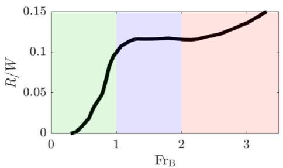

line

| Fr_B | R/W   |
|------|-------|
| 0.0  | 0.000 |
| 0.5  | 0.050 |
| 1.0  | 0.110 |
| 1.5  | 0.120 |
| 2.0  | 0.120 |
| 2.5  | 0.130 |
| 3.0  | 0.145 |
| 3.5  | 0.150 |

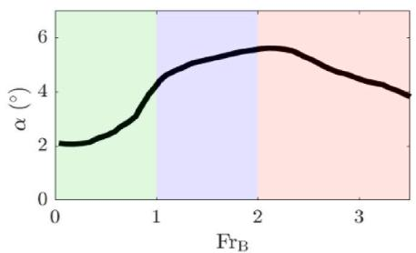

line

| FrB | α (°) |
| --- | ----- |
| 0   | 2.0   |
| 1   | 4.5   |
| 2   | 5.5   |
| 3   | 4.0   |

Fig. A1. An example of resistance versus beam Froude Number and trim angle versus Froude Number curves. Data is extracted from Fridsma (1969). .

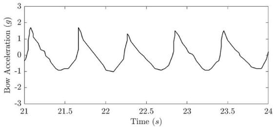

line

| Time (s) | Bow Acceleration (g) |
| -------- | -------------------- |
| 21.0     | 1.8                  |
| 21.5     | -1.2                 |
| 22.0     | 1.6                  |
| 22.5     | -1.0                 |
| 23.0     | 1.4                  |
| 23.5     | -0.8                 |
| 24.0     | 0.0                  |

Fig. A2. An example of time history of vertical acceleration at bow of a planing hull. Data is extracted from Garme (2005). .

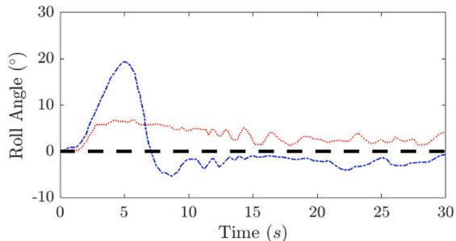

line

| Time (s) | Roll Angle (°) - Blue Line | Roll Angle (°) - Red Dotted Line |
| -------- | -------------------------- | -------------------------------- |
| 0        | 0                          | 0                                |
| 5        | 19                         | 6                                |
| 10       | -5                         | 4                                |
| 15       | -2                         | 3                                |
| 20       | -3                         | 2                                |
| 25       | -1                         | 2                                |
| 30       | 0                          | 3                                |

Fig. A3. Examples of time history of roll motion of a hard-chine vessel going under circle turning with two different steering angle of waterjet. Data is extracted from Kim and Kim (2017). The blue curve shows a scenario under which the vessel may reach a negative heel angle through a starboard turn (positive inclining angle of thrust force). .

# References

Abkowitz, M.A., 1980. Measurement of Hydrodynamic Characteristics from Ship Maneuvering Trials by System Identification. No. 10.   
Akers, R.H., 1999. Dynamic analysis of planing hulls in the vertical plane. In: In Meeting of the New England Section of the Society of Naval Architects and Marine Engineers.   
Akers, R.H., 2005. Dancing a Fine Line, Professional Boat Builder Magazine, p. 85.   
Akimoto, H., 2013. Numerical simulation of the flow around a planing body by MPS method. Ocean Engineering 64, 72–79.   
Akimoto, H., Iida, K., Kubo, S., 2004. Numerical simulation of the flow around a planing wedged cylinder by a particle method, 196, 81–89.   
Algarín, Bula A., 2020. Two-dimensional impact modelling with three degrees of freedom and its application in the dynamics of planing hulls. Appl. Sci. 10, 1072.   
Algarín, R., Bula, A., 2021a. A numeric study of the maneuverability of planing hulls with six degrees of freedom. Ocean Engineering 221, 108514.   
Algarín, R., Bula, A., 2021b. Numerical computation of the hydrodynamic coefficients on planing hulls in the six degrees of freedom. Ocean Engineering 241, 110021.   
Algarín, R., Tascon, ´ O., 2014. Analysis of the dynamic of planning craft on the vertical plane. Sh. Sci. Technol. 8 (2014), 35–43.   
Allen, R.G., Jones, J.R., 1978. A simplified method for determining structural design limit pressures on high performance marine vehicles. In: AIAA/SNAME Advance Marine Vehicles Conference. California, San Diego.   
Almeter, 1993. Resistance prediction of planing hulls: state of Art. Mar. Technol. 30 (4), 297–307.   
Anderson, J.D., 1995. Computational Fluid Dynamics: the Basics with Applications. McGraw-Hill Education.   
Andrillon, Y., Alessandrini, B., 2004. A 2D+T VOF fully coupled formulation for the calculation of breaking free-surface flow. Journal of Marine Science and Technololgy 8 (4), 159168.https://doi.org/10.1007/s00773-003-0167-1.   
Ao, Y., Li, Y., Gong, J., Li, S., 2023. An artificial intelligence-aided design (AIAD) of ship hull structures. J. Ocean Eng. Sci. 8 (1), 15–32. https://doi.org/10.1016/j. joes.2021.11.003.   
Xi, H., Sun, J., 2005. Vertical Plane Motion of High Speed Planing Vessels with Controllable Transom Flaps: Modelling and Control, 16th Triennial World Congress (Prague, Czech Republic).   
Avci, A., Barlas, B., 2018. An experimental and numerical study of a high speed planing craft with full-scale validation. J. Mar. Sci. Technol. 26, 617–628. https://doi.org/ 10.6119/JMST.201810\_26(5).0001.   
Baba, E., Asao, S., Toki, N., 1982. A simulation study on sway-roll-yaw coupled instability of semi-displacement type high speed craft. In: Second International Conference on Stability of Ships and Ocean Vehicles.   
Bal, S., et al., 2014. 30 Knot Motorboat Model Experiments and Analyses. Report No. 2014- Gozuyilmaz-P05-M393.   
Bagazinski, N.J., Ahmed, F., 2023. Ship-D: Ship Hull Dataset for Design Optimization Using Machine Learning arXiv preprint arXiv:2305.08279.   
Baily, D., 1976. The NPL High Speed Round Bilge Displacement Hull Series. Maritime Technology Monograph, The Royal Institution of Naval Architect.   
Bari, G.S., Matveev, K.I., 2017. Hydrodynamics of single-deadrise hulls and their catamaran configurations. Int. J. Nav. Archit. Ocean Eng. 9 (3), 305–314.

Begovic, E., Bertorello, C., 2012. Resistance assessment of warped hull forms. Ocean Eng. 56 (2012), 28–42.   
Begovic, E., Bertorello, C., Pennino, S., Piscopo, V., Scamardella, A., 2014. Experimental seakeeping assessment of a warped planing hull model series. Ocean Engineering 83, 1–15.   
Begovic, E., Bertorello, C., Pennino, S., Piscopo, V., Scamardella, A., 2016. Statistical analysis of planing hull motions and accelerations in irregular head sea. Ocean Engineering 112, 253–264.   
Begovic, E., Bertorello, C., Bove, A., Garme, K., Lei, X., Persson, J., Petrone, G., Razola, M., Ros´en, A., 2020. Experimental modelling of local structure responses for high-speed planing craft in waves. Ocean Engineering, 107986.   
Behara, S., Arnold, A., Martin, E., Harwood, C.M., Carrica, P., 2020. Experimental and computational study of operation of an amphibious craft in calm water. Ocean Engineering 209, 107460.   
Benen, L., 1967. General Resistance Test of a Stepped Planing Hull with Application to a Hydrofoil Configuration, 2320 (NSRDC Report).   
Benson, J.M., 1942. The Effect of Deadrise upon the Low-Angle Type of Porpoising. NACA ARR.   
Bertorello, C., Olivieri, L., 2007. Hydrodynamic resistance assessment of nonmonohedral planing hull forms based on Savitsky’s methodology. Aust. J. Mech. Eng. 4 (2), 209–223. https://doi.org/10.1080/14484846.2007.11464527.   
Bertram, V., Mesbahi, E., 2004. Estimating resistance and power of fast monohulls employing artificial neural nets. In: Proceedings of International Conference High Performance Marine Vehicles. HIPER, Rome.   
Beyes, P.M., 1963. Series 63 Round Bottom Boats. Davidson Laboratory. Report 949.   
Bi, X., Shen, H., Zhou, J., Su, Y., 2019. Numerical analysis of the influence of fixed hydrofoil installation position on seakeeping of the planing craft. Appl. Ocean Res. 90, 101863.   
Bi, X., Zhuang, J., Su, Y., 2020. Seakeeping analysis of planing craft under large wave height. Water 12 (4), 1020. https://doi.org/10.3390/w12041020.   
Bilkovic, D., Mitchell, M., Davis, J., Herman, J., Andrews, E., King, A., Mason, P., Tahvildari, N., Davis, J., Dixon, R.L., 2019. Defining boat wake impacts on shoreline stability toward management and policy solutions. Ocean Coast Manag. 182, 104945.   
Blount, D., Codega, L.T., 1992. Dynamic stability of planing boats. Mar. Technol. 29 (1), 4–12.   
Blount, D., Funkhouser, J., 2009. Planing in extreme conditions. In: Proceedings, ASNE High Performance Marine Vehicles, November 2009 (Linthicum, MD).   
Blount, D., Schleicher, D.M., 2006. Seakeeping: an experimental study of accelerations and motions of a highspeed, double-chine craft. International Symposium on Marine Design 129–136.   
Bonci, M., de Jong, P., 2023. High-speed RHIB seakeeping analysis using non-linear time domain simulations and systematic hull parametrization, In: Proceedings of the 13th Symposium on High Speed Marine Vehicles. Naples, Italy.   
Bonci, M., de Jong, P., van Walree, F., Renilson, M.R., Huijsmans, R.H.H., 2019. The steering and course keeping qualities of high-speed craft and the inception of dynamic instabilities in the following sea. Ocean Engineering 194, 106636.   
Bonci, M., de Jong, P., van Walree, F., Renilson, M.R., Huijsmans, R.H.H., 2020. The heel-induced sway force and yaw moment of a high-speed craft in following regular

waves. J. Mar. Sci. Technol. 25, 312–325. https://doi.org/10.1007/s00773-019- 00637-0.   
Brizzolara, S., Serra, F., 2007. Accuracy of CFD Codes in the Prediction of Planing Surfaces Hydrodynamic Characteristics. In: 2nd International Conference on Marine Research and Transportation, ICMRT "07. ISCHIA. 28–30 Giugno. (vol. 1, pp. A-1-A-12). ISBN: 88-901174-3-5.   
Brizzolara, S., Vernengo, G., 2016. A three-dimensional vortex method for the hydrodynamic solution of planing cambered dihedral surfaces. Eng. Anal. Bound. Elem. 63, 15–29.   
Brizzolara, S., Judge, C., Beaver, W., 2016. High deadrise stepped cambered planing hulls with hydrofoils SCPH2. A proof of concept. SNAME Transactions 124 (2016), 312–321.   
Broglia, R., Durante, D., 2018. Accurate prediction of complex free surface flow around a high speed craft using a single-phase level set method. Comput. Mech. 62, 421–437.   
Broglia, R., Jacob, B., Zaghi, S., Stern, F., Olivieri, A., 2014. Experimental investigation of interference effects for high-speed catamaran. Ocean Eng. 76, 75–85.   
Brown, P.W., 1966. An Analysis of the Forces and Moments of Re-entrant Vee-step Planing Surfaces. Davidson Laboratory. Report No. 1142.   
Brown, P.W., 1971. An Experimental and Theoretical Study of Planing Surfaces with Trim Flaps, Report SIT-DL-71-1463. Stevens Institute of Technology, Davidson Laboratory.   
Brown, P.W., Klosinski, W.E., 1980. An Experimental and Theoretical Study of High Length-Beam Ratio Planing Boats in Rough Water, Report SIT-DL-80-9-2133. Stevens Institute of Technology, Davidson Laboratory (1980).   
Brown, P.W., Klosinski, W.E., 1994b. Directional Stability Tests of Two Prismatic Planing Hull. Stevens Institute of Technology, US Coast Guard, Hoboken, New Jersey.   
Brown, P.W., Klosinski, W.E., 1994a. D Experimental Determination of the Added Inertia and Damping of Planing Boats in Roll. Davidson Laboratory, Stevens Institute of Technology. Report No. CG-D-03-95.   
Brown, P.W., Klosinski, W.E., 1995a. Experimental Determination of the Added Inertia and Damping of a 30 Degree Deadrise Planing Boat in Roll. Davidson Laboratory, Stevens Institute of Technology. Report No. CG-D-04-95.   
Brown, P.W., Klosinski, W.E., 1995b. Experimental Determination of the Added Inertia and Damping of a 30 Degree Deadrise Planing Boat in Roll, Report No. CG-D-04-95.   
Brown, P.W., Van Dyck, R.L., 1964. An Experimental Investigation of Deadrise Surfaces with Re-entrant Vee-Steps, Letter Report SIT-DL-64-664. Stevens Institute of Technology, Davidson Laboratory.   
Buˇca, M.P., 2023. Influence of stern trim control devices upon resistance of high speed vessels. In: Proceedings of the 13th International Symposium on High Speed Marine Vehicles. Naples, Italy.   
Bun’kov, M.M., 1969. Calculating the drag of hard-chine boats. Katera I Iakhty 3 (19), 1969, in Russian (NAVSEA Translation No. 2150, 1987).   
Bun’kov, M.M., 1974. Study of the resistance of planing hulls. Katera Ilakhty 2 (48) in Russian (NAVSEA Translation No. 2148, 1987).   
Bushan, S., Xing, T., Carrica, P., Stern, F., 2009. Model- and full-scale URANS simulations of Athena resistance, powering, seakeeping, and 5415 maneuvering. J. Ship Res. 53 (4), 179–198.   
Calkins, D.E., Schachter, R.T., Oliveira, L.T., 2001. Parametric generation, and fairing of simple hull lines with the use of non uniform rational b-spline surfaces. Ocean Engineering 28 (3), 297–327.   
Camilleri, J., Taunton, D.J., Temarel, P., 2018. Full-scale measurements of slamming loads and responses on high-speed planing craft in waves. J. Fluid Struct. 201–229.   
Capasso, S., Tagliafierro, B., Mancini, S., Martínez-Est´evez, I., Altomare, C., Domínguez, J.M., Viccione, G., 2023. Regular wave seakeeping analysis of a planing hull by smoothed particle hydrodynamics: a comprehensive validation. J. Mar. Sci. Eng. 11 (4), 700. https://doi.org/10.3390/jmse11040700.   
Caponnetto, M., Soding, ¨ H., Azcueta, R., 2003. Motion Simulations for planing boats in waves. Ship Technol. Res. 50 (4), 182–198. https://doi.org/10.1179/ str.2003.50.4.006.   
Castaldi, L., Osmak, F., Green, M., Furth, M., Bonoli, J., 2021. The effect of spray deflection on the performance of high speed craft in calm water. Ocean Engineering 229, 108892.   
Castiglione, T., Stern, F., Bova, S., Kandasamy, M., 2011. Numerical investigation of the seakeeping behavior of a catamaran advancing in regular head waves. Ocean Engineering 38 (16), 1806–1822.   
Celano, T., 1998. The prediction of porpoising inception for modern planing craft. SNAME Trans 106, 269–292.   
Chambliss, D.B., Boyd, G.M., 1953. The Planing Characteristics of Two V-Shaped Prismatic Surfaces Having Angles of Dead Rise of 20 and 40. National Advisory Committee for Aeronautics. Technical note tn 2876.   
Chen, Y., Khabakhpasheva, T., Maki, K.J., Korobkin, A.K., 2019. Wedge impact with the influence of ice. Appl. Ocean Res. 89, 12–22.   
Christopher, K.W., 1956. Effect of Shallow Water on the Hydrodynamic Characteristics of a Flat-Bottom Planing Surface, Technical Note Tn 3642. National Advisory Committee for Aeronautics (1956).   
Ciampolini, M., Balduzzi, F., Romani, L., Bellucci, L., Bianchini, A., Ferrara, G., 2022a. Development of an improved and versatile 2D+t modelling methodology for planing crafts. Ocean Engineering 265, 11261.   
Ciampolini, M., Balduzzi, F., Romani, L., Bellucci, L., Bianchini, A., Ferrara, G., 2022b. Towards the development of smart weather routing systems for leisure planing boats. J. Phys. Conf. 2385. ATI Annual Congress (ATI 2022) 11/09/2022 - 14/09/ 2022 Bari, Italy.   
Clement, E.P., 1964. A Lifting Surface Approach to Planing Boat Design. DTMB Report 1902.   
Clement, E.P., 2006. How to Design an Efficient Stepped, Planing Boat (Dynaplane Boat), Asheville. North Carolina, 65+iv.

Clement EP, Blount DL, 1963, Resistance tests of a systematic series of planing hull forms. SNAME Trans, 71.   
Clement EP, Koelbel JG, 1991, Effects of step design on the performance of planing motorboats, Proc. Fourth Biennial Power Boat Symposium, Miami, Florida, B1–B25, February.   
Clement, E.P., Tate, C.W., 1959. Smooth Water Resistance of a Number of Planing Boat Designs. David Taylor Model Basin, Bethesda, MD. Report 1378.   
Codega, L., Lewis, J., 1982. A case study of dynamic instability in a planing hull. Mar. Technol. 24 (2).   
Cohen, S.H., Blount, D.L., 1986. Research plan for the investigation of dynamic instability of small high-speed craft. SNAME Transactions 94.   
Cole, S., 1988. A simple example from flat-ship theory. J. Fluid Mech. 189, 301–310.   
Compton, R.H., 1986. The resistance of a systematic series of semiplaning transom stern hulls. Mar. Technol. 23 (4).   
Couser, P., Mason, A., Mason, G., Smith, C.R., Von Konsky, B.R., 2004. Artificial neural networks for hull resistance prediction. In: Computer Applications and Information Technology in the Maritime Industries (COMPIT’04), pp. 9–12.   
Cucuinotta, F., Guglielmino, E., Sfravara, F., 2017. An experimental comparison between different artificial air cavity designs for a planing hull. Ocean Engineering 233–240.   
Cucuinotta, F., Guglielmino, E., Sfravara, F., Strasser, C., 2018. Numerical and experimental investigation of a planing Air Cavity Ship and its air layer evolution. Ocean Engineering 152, 130–144.   
Cumberbatch, E., 1958. Two-dimensional planing at high Froude number. J. Fluid Mech. 4, 466–478.   
Danielsson, J., Strømquist, J., 2012. Conceptual Design of a High Speed Supery-Acht Tender Hull Form Analysis and Structural Optimization [thesis]. Marina System Centre for Naval Architecture, KTH University, Stockholm.   
Dashtimanesh, A., Tavakoli, S., Sahoo, P.K., 2017. A simplified method to calculate trim and resistance of a two-stepped planing hull. Ships Offshore Struct. 12 (Sup), S317–S329.   
Dashtimanesh, A., Esfandiri, A., Mancini, S., 2018. Performance prediction of twostepped planing hulls using morphing mesh approach. Journal of Ship Production and Design 34 (3), 236–248.   
Dashtimanesh, A., Enshaei, H., Tavakoli, S., 2019. oblique-asymmetric 2d+t model to compute hydrodynamic forces and moments in coupled sway, roll, and yaw motions of planing hulls. J. Ship Res. 63, 1–15. https://doi.org/10.5957/JOSR.12170079.   
Dashtimanesh, A., Roshan, F., Tavakoli, S., Kohansal, A., Barmala, B., 2020a. Effects of step configuration on hydrodynamic performance of one-and doubled-stepped planing flat plates: a numerical simulation. IMech Part M 234, 181–195.   
Dashtimanesh, A., Tavakoli, S., Kohansal, R., Khosravani, R., Ghassemzadeh, A., 2020b. Numerical study on a heeled one-stepped boat moving forward in planing regime. Appl. Ocean Res. 96, 102057.   
Dashtimanesh, A., Ghaemi, M.H., Wang, Y., Karczewski, A., Niazmand Bilandi, R., Hirdaris, S., 2022. Digitalization of high speed craft design and operation - challenges and opportunities. Procedia Comput. Sci. 200, 566–576.   
Davidson, K.S.M., Locke, F.W.S., 1943. Some Systematic Model Experiments on the Porpoising Characteristics of Flying Boat Hulls. NACA ARR.   
Davidson, K.S.M., Suzrez, A., 1949. Test of Twenty Related Models of V-Bottom Motor Boats EMB Series 50. Report R-47, DTMB.   
Day, J.P., Haag, R.J., 1952a. Planing Boat Porpoising, Thesis, Webb. Institute of Naval Architecture.   
Day, J.P., Haag, R.J., 1952b. Planing Boat Propoising, Thesis. Webb institute of Technology, Glen Clove.   
de Alwis, M.P., Lo Martire, R., Ang, ¨ B.O., et al., 2016. Development and validation of a web-based questionnaire for surveying the health and working conditions of highperformance marine craft populations. BMJ Open 6, e011681. https://doi.org/ 10.1136/bmjopen-2016-011681.   
de Jong, P., 2011. Seakeeping Behaviour of High Speed Ships: an Experimental and Numerical Study, PhD Thesis. Technische Universiteit Delft.   
de Jong, van Walree, 2008. Time domain simulations of the behaviour of fast ships in oblique seas. In: Proceedings of the 10th International Ship Stability Workshop (ISSW). Dajeon-Seoul, Korea.   
de Jong, P., Renilson, M., van Warlee, F., 2013. The broaching of a fast rescue craft in following seas. In: Proceedings of the 12th International Conference on Fast Sea Transportation.   
De Luca, F., Pensa, C., 2012a. Experimental investigation on conventional and unconventional interceptors, the transactions of the royal institution of naval architects. International Journal of Small Craft Technology 154 (B2), 65–72.   
De Luca, F., Pensa, C., 2012b. Unconventional Interceptors in Still Water and in Regular Waves: Experimental Study on Resistance Reduction and Dynamic Instability. NAV’12, Naples 17–19 oct. 2012.   
De Luca, F., Pensa, C., 2014. The prediction of the interceptor performances based on towing tank test data: ship-model correlation and hull form influence. Developments in Maritime Transportation and Exploitation of Sea Resources –Guedes Soares & Lopez ´ Pena ˜ 1, 231–238.   
De Luca, F., Pensa, C., 2017. The Naples warped hard chine hulls systematic series. Ocean Engineering 139, 205–236.   
De Luca, F., Pensa, C., 2019. The Naples Systematic Series – second part: irregular waves, seakeeping in head sea. Ocean Engineering 194, 106620. https://doi.org/10.1016/j. oceaneng.2019.106620.   
De Luca, F., Mancini, S., Miranda, S., Pensa, C., 2016. An extended verification and validation study of CFD simulations for planing hulls. J. Ship Res. 60 (2), 101–118.   
De Luca, F., Mancini, S., Pensa, C., Pigazzini, R., Sorrentino, V., 2022. A DIS-Based Air Cavity Concept for Planing Hull, Technology and Science for the Ships of the Future. IOS Press. https://doi.org/10.3233/PMST220064, 2022.

De Luca, F., Mancini, S., Pensa, C., Pigazzini, R., Sorrentino, V., 2023. Full-scale CFD simulations of air lubrication with DIS-based air cavity for planing hull. In: 10th Conference on Computational Methods in Marine Engineering (Marine 2023) (Madrid, Spain).   
De Marco, A., Mancini, S., Miranda, S., Vitiello, L., Scognamiglio, R., 2017. Experimental and numerical hydrodynamic analysis of a stepped planing hull. Appl. Ocean Res. 64, 135–154.   
Deraj, R., Kumar, R.S.R., Alam, M.S., Somayajula, A., 2023. Deep reinforcement learning based controller for ship navigation. Ocean Engineering 273, 113937.   
Dessi, D., Mariani, R., 2008. Analysis and prediction of slamming-induced loads of a high-speed monohull in regular waves. J. Ship Res. 52 (1), 71–86.   
Diez, M., Lee, E.J., Harrison, E.L., Powers, A.M., Snyder, L.A., Jiang, M.J., Bay, R.J., Lewsi, R.R., Kubina, E.R., Mucha, P., Stern, F., 2022. Experimental and computational fluid-structure interaction analysis and optimization of deep-V planing-hull grillage panels subject to slamming loads – Part I: regular waves. Mar. Struct. 85, 103256.   
Ding, J., Jiang, J., 2021. Tunnel flow of a planing trimaran and effects on resistance. Ocean Engineering 237, 109458. https://doi.org/10.1016/j.oceaneng.2021.109458.   
Doctors, L.J., 1974. Representation of planing surfaces by finite elements. In: Proc. Fifth Australasian Conference on Hydraulics and Fluid Mechanics, pp. 480–488. Christchurch, New Zealand, 2.   
Doctors, L.J., 1975. Representation of three-dimensional planing surfaces by finite elements. In: Proceedings of the First Conference on Numberical Ship Hydrodynamics 1975, pp. 517–537.   
Doctors, L.J., 2015. A theoretical study of the optimal dynaplane vessel. In: SNAME 13th International Conference on Fast Sea Transportation. FAST 2015.   
Doctors, L.J., 2021. A reanalysis of the towing-tank data for the performance of prismatic planing boats. Appl. Ocean Res. 110, 102547.   
Doctors, L.J., 2023. Curiosities of two-dimensional planing. Z. Angew. Math. Phys. 74, 169. https://doi.org/10.1007/s00033-023-02043-4.   
Dogrul, ˘ A., Kahramanoglu, ˘ E., Çakıcı, F., 2021. Numerical prediction of interference factor in motions and added resistance for Delft catamaran 372. Ocean Engineering 223, 108687.   
Du, L., Sun, H., Jiang, Y., Li, P., 2019. Numerical research on the resistance reduction of air intake. Water 11 (2), 280. https://doi.org/10.3390/w11020280.   
Durante, D., Broglia, R., Maki, K., Di Mascio, 2014. A study on the effect of the cushion pressure on a planing surface. Ocean Engineering 91, 122–132.   
D’Agostino, D., Serani, A., Stern, F., et al., 2022. Time-series forecasting for ships maneuvering in waves via recurrent-type neural networks. J. Ocean Eng. Mar. Energy 8, 479–487. https://doi.org/10.1007/s40722-022-00255-w.   
Ebrahimi, A., Shafaghat, R., Hajiabadi, A., Yuosefifard, M., 2022. Numerical and experimental investigation of the aero-hydrodynamic effect on the behavior of a high-speed catamaran in calm water. J. Mar. Sci. Appl. 21, 56–70. https://doi.org/ 10.1007/s11804-022-00295-6.   
Ehlers, S., 2012. A particle swarm algorithm-based optimization for high-strength steel structures. Journal of Ship Production and Design 28 (1), 1–9. https://doi.org/ 10.5957/jspd.2012.28.1.1.   
Englar, R.B., Gregory, S.D., Ford, D.A., 1995. In ground effect evaluation and aerodynamic development of advanced unlimited racing hydroplanes. In: AIAA Aerospace and Sciences Meeting and Exhibit, 9–12 January. AIAA 1995-745.   
Ergorov, I.T., Bun’kov, M.M., Sadovikov, Y.M., 1978. Planing Ship Propulsion and Seaworthiness of Planing Ships (Leningrad).   
Esfandiari, A., Tavakoli, S., Dashtimanesh, A., 2020. Comparison between the dynamic behavior of the non-stepped and double-stepped planing hulls in rough water: a numerical study. Journal of Ship Production and Desig 36, 52–66.   
Eslamdoost, A., Larsson, L., Bensow, R., 2018. Analysis of the thrust deduction in waterjet propulsion – the Froude number dependence. Ocean Engineering 100–112.   
Faltinsen, O.M., 2006. Hydrodynamics of High-Speed Marine Vehicles. Cambridge University Press.   
Faltinsen, O.M., Minsaas, N. Liapis, Skjordal, S.O., 1980. Prediction of resistance and propulsion of a ship in a seaway. In: Proceeding of the Thirteenth Symposium on Naval Hydrodynamics (1980), pp. 1–19 (Tokyo, Japan).   
Faltinsen, O.M., Landrini, M., Greco, M., 2004. Slamming in marine applications. J. Eng. Math. 48, 187–217.   
Fang, H., Chen, Z., Chen, C., Sun, S., Wang, X., Wu, D., Qin, S., 2023. On the drag reduction and heeling stability of a heeled planing air cavity. hull 283, 115087.   
Farshing, D.D., 1955. The Lift Coefficient of Flat Planing Surfaces. Stevens Institute of Technology. M.S. thesis.   
Flairlie-clarke, A.C., Tveitnes, T., 2008. Momentum and gravity effects during the constant velocity water entry of wedge-shaped sections. Ocean Engineering 35, 706–716.   
Fridman, B.G., 1998. Matched asymptotics for two-dimensional planing hydrofoils with spoilers. J. Fluid Mech. 358, 259–281.   
Fridsma, G., 1969. A Systematic Study of the Rough Water Performance of Planing Boats. davidson laboratory, Stevens Institute of Technology (November 1969), Technical Report 1275.   
Fridsma, G., 1971. A Systematic Study of the Rough Water Performance of Planing Boats – Irregular Waves – Part II. Davidson Laboratory, Stevens Institute of Technology (March 1971), Technical Report 1495.   
Froude, W., 1875. Admiralty experiments upon forms of ships and upon rocket floats. Naval Science 4, 262–264, 37–51 + 1 Plate, Discussion.   
Fu, Thomas, O’Shea, Thomas, Judge, Carolyn, Dommermuth, Douglas, Brucker, Kyle, Wyatt, Donald, 2014. A detailed assessment of numerical flow analysis (NFA) to predict the hydrodynamics of a deep-V planing hull. Int. Shipbuild. Prog. 60 https:// doi.org/10.3233/ISP-130087.

Gabrielli, G., von Karm´ an, ´ T., 1950. What price speed? Specific power required for propulsion of vehicles. Mechanical Engineering, ASME 72 (10), 775–781.   
Garland, W., Maki, K.J., 2012. A numerical study of a two-dimensional stepped planing surface. Journal of Ship Production and Design 28, 1–13.   
Garme, K., 2005. Improved time domain simulation of planing hulls in waves by correction of the near-transom lift. Int. Shipbuild. Prog. 52, 201–230.   
Garme, K., 2023. Warp effects and bow submergence; over the limit for a 2d+t strip model of HSC?, 13th International Symposium on High Speed Marine Vehicles. Progress in Marine Science and Technology 3–10.   
Gatete, E., Ndiritu, H.M., Kiplimo, R., 2018. A review on marine propeller performance of high speed boat running on an outboard engine. In: Proceedings of the Sustainable Research and Innovation Conference.   
Geng, X., Li, Y., Sun, Q., 2023. A novel short-term ship motion prediction algorithm based on EMD and adaptive PSO–lstm with the sliding window approach. J. Mar. Sci. Eng. 11 (3), 466. https://doi.org/10.3390/jmse11030466.   
Ghadimi, P., Dashtimanesh, A., Faghfoor Maghrebi, Y., 2013. Initiating a mathematical model for prediction of 6-DOF motion of planing crafts in regular waves. Int. J. Eng. Math. 2013, 853793.   
Ghadimi, P., Dashtimanesh, A., Faris, M., Najafi, A., 2013. Investigation of free surface flow generated by a planing flat plate using smoothed particle hydrodynamics method and FLOW3D simulations. IMech Part M: Jounral of Engineering for the Maritime Environment 227 (2), 125–135.   
Ghadimi, P., Tavakoli, S., Dashtimanesh, A., 2017. Proc. IME M J. Eng. Marit. Environ. 231 (1), 234–257.   
Ghadimi, P., Panahi, S., Tavakoli, S., 2019a. Hydrodynamic study of a double-stepped planing craft through numerical simulations. J. Braz. Soc. Mech. Sci. Eng. 41, 2. https://doi.org/10.1007/s40430-018-1501-1.   
Ghadimi, P., Sajedi, M., Tavakoli, S., 2019b. Experimental study of the wedge effects on the performance of a hard-chine planing craft in calm water. Sci. Iran. B 26 (3), 1316–1334.   
Ghassabzadeh, M., Ghasemi, H., 2012. Automatic generation of the planing tunnel high speed craft hull form. J. Mar. Sci. Appl. 11, 453–461.   
Gilbert, C., Gilber, J., Javaherian, J., 2023. Water entry of a flexible wedge: how flexural rigidity influences spray root and pressure wave propagation. Physical Review Fluids 8 (9), 090502.   
Gingold, R.A., Monaghan, J.J., 1977. Smoothed particle hydrodynamics: a meshfree particle method. J. Comput. Phys. 46 (3), 429–453. https://doi.org/10.1016/0021- 9991(82)90071-0.   
Giraldo-P´erez, E., Betancur, E., Osorio-Gomez, ´ G., 2022. Experimental and statistical analysis of the hydrodynamic performance of planing boats: a Comparative study. Ocean Engineering 262, 112227. https://doi.org/10.1016/j.oceaneng.2022.112227. ISSN 0029-8018.   
Gray-Stephens, A., Tezdogan, T., Day, S., 2021. Minimising Numerical ventilation in CFD simulations of high-speed planing hulls. J. Offshore Mech. Arctic Eng. 143, 1–33. https://doi.org/10.1115/1.4050085.   
Green, A.E., 1935. The gliding of a plate on a stream of finite depth. Math. Proc. Camb. Phil. Soc. 31 (4), 589–603. https://doi.org/10.1017/S0305004100013591.   
Green, A.E., 1936a. Note on the gliding of a plate on the surface of a stream. Math. Proc. Camb. Phil. Soc. 32, 248–252. https://doi.org/10.1017/S0305004100001791.   
Green, A.E., 1936b. The gliding of a plate on a stream of finite depth. Part II. Math. Proc. Camb. Phil. Soc. 32 (1), 67–85. https://doi.org/10.1017/S0305004100018867.   
Grigoropoulos, G.J., Damala, D.P., 2014. Dynamic performance of the National Technical University of Athens double-chine series hull forms in random waves. Journal of Ship Production and Design 30, 101–108.   
Grigoropoulos, G.J., Loukakis, T.A., 1999. Resistance of double-chine large high-speed craft. Aeronautique ATMA 99.   
Grigoropoulos, G.J., Damala, D.P., Loukakis, T.A., 2010. Dynamic performance of the NTUA double-chine series hull forms in regular waves. In: Proceedings of 2nd Chesapeake Power Boat Symposium 2010.   
Grigoropoulos, G.J., Katsikis, C., Chalkais, D.S., 2011. Experimental verification of the linear and non-linear versions of a panel code. Int. J. Nav. Archit. Ocean Eng. 3 (1), 27–36.   
Haase, H., Soproni, J.P., Abdel-Maksoud, M., 2015. Numerical analysis of a planing boat in head waves using a 2D+t method. Ship Technol. Res. 62 (3), 131–139. https:// doi.org/10.1179/2056711115Y.0000000003.   
Hadler, J.B., Hubble, E.N., 1971. Prediction of The Power Performance of The Series 62 Planing Hull Forms. In: Annual Meeting of SNAME, November 11-12, 1971.   
He, W., Castiglione, T., Kandasamy, M., 2015. Numerical analysis of the interference effects on resistance, sinkage and trim of a fast catamaran. J. Mar. Sci. Technol. 20, 292–308. https://doi.org/10.1007/s00773-014-0283-0.   
Henry, C.J., 1976. Calm Water Equilibrium, Directional Stability and Steady Turning Conditions for Recreational Planing Crafts. Davidson Laboratory, Stevens Institute of Technology report No CG-D-8-76.   
Hirdairs, S., 2022. Elements of Ship Dynamics and Marine Hydromechanics - Lecture Notes. Aalto University. https://urn.fi/URN:ISBN:978-952-64-0856-9.   
Holling, H.D., Hubble, E.N., 1974. Model Resistance Data of Series 65 Hull Forms, Applicable to Hydrofoils and Planing Craft, Research and Development Center Report 4121. Bethesda, Md.   
Hosseini, A., Tavakoli, S., Dashtimanesh, A., Sahoo, P.K., Korgesaar, ˜ M., 2021. Performance prediction of a hard-chine planing hull by employing different CFD models. J. Mar. Sci. Eng. 9 (5), 481. https://doi.org/10.3390/jmse9050481.   
Hosseinzadeh, S., Khorasanchi, M., Seif, M.S., 2019. Investigation of planing vessels motion using nonlinear strip theory–an experimental and numerical study. Ships Offshore Struct. 14 (7), 684–697.

Hosseinzadeh, S., Tabri, K., Hirdaris, S., Sahk, T., 2023b. Slamming loads and responses on a non-prismatic stiffened aluminium wedge: Part I. Experimental study. Ocean Engineering 279, 114510.   
Hosseinzadeh, S., Tabri, K., Topa, A., Hirdaris, S., 2023a. Slamming loads and responses on a non-prismatic stiffened aluminium wedge: Part II. Numerical simulations. Ocean Engineering 279, 114309.   
Huang, L., Pena, B., Liu, Y., Anderlini, E., 2022a. Machine learning in sustainable ship design and operation: a review. Ocean Engineering 266, 112907.   
Huang, L., Li, Y., Benites-Munoz, D., Windt, C.W., Feichtner, A., Tavakoli, S., et al., 2022b. A review on the modelling of wave-structure interactions based on OpenFOAM. OpenFOAM® Journal 2, 116–142.   
Ikdea, Y., Katayama, T., 2000. Roll damping prediction method for a high-speed planing craft. In: Proceedings of the 7th International Conference on Stability of Ship and Ocean Vehicles, B, pp. 532–541.   
Ikeda, Y., Katayama, T., 2000. Porpoising oscillations of very-high-speed marine craft. Phil. Trans. Roy. Soc. Lond. 358, 1905–1915.   
Ikeda, Y., Okumura, H., Katayama, T., 1998. Stability of a planing craft in turning motion. In: Proceedings of the Fourth International Workshop on Theoretical Advances in Ship and Practical Impact.   
Ikeda, Y., Katayama, T., Okumura, H., 2000. Characteristics of hydrodynamic derivatives in maneuvering equations for super high-speed planing hulls. ISOPE2000 4, 434–444.   
IMO, 1993. Interim standards for ship manoeuvrability. International Maritime Organization Resolution A 751 (18). (Accessed 4 November 1993).   
IMO, 1994. Explanatory Notes to the Interim Standards for Ship Maneuverability. International Maritime Organization Circular MSC/Circ.644.   
IMO, 2019. MSC.1/Circ.1394/Rev.2. Generic Guidelines for Developing IMO Goal-Based Standards.   
Ircani A, Martelli M, Viviani M, Altosole M, Podenzana Bonvino C, 2016, A Simulation Approach for Planing Boats Propulsion and Manoeuvrability, Trans RINA, Vol 158, Part B1, Intl J Small Craft Tech, B-27- B-42..   
Izadi, M., Ghadimi, P., Fadavi, M., Tavakoli, S., 2018. Hydroelastic analysis of water impact of flexible asymmetric wedge with an oblique speed. Meccanica 53, 2585–2617.   
Jahanbakhsh, E., Panahi, R., Seif, M.S., 2009. Catamaran motion simulation based on moving grid technique. J. Mar. Sci. Technol. 17 (2), 128–136.   
Jalalisendi, M., Zhao, S., Porfiri, M., 2017. Shallow water entry: modelling and experiments. J. Eng. Math. 104, 131–156. https://doi.org/10.1007/s10665-016- 9877-3.   
Jiang, Y., Sun, H., Zou, J., Hu, A., Yang, J., 2016. Analysis of tunnel hydrodynamic characteristics for planing trimaran by model tests and numerical simulations. Ocean Engineering 113, 101–110.   
Jiang, Y., Sun, H., Zou, J., Hu, A., Yang, J., 2017. Experimental and numerical investigations on hydrodynamic and aerodynamic characteristics of the tunnel of planing trimaran. Appl. Ocean Res. 63, 1–10.   
Jiao, W., Cheng, L., Zhang, D., Zhang, B., Su, Y., Wang, C., 2019. Optimal design of inlet passage for waterjet propulsion system based on flow and geometric parameters. In: Advanced in Material Science and Engineering. Article ID 2320981.   
Jin, S., Peng, H., Qiu, W., Hunter, R., Thompson, S., 2023. Numerical simulation of planing hull motions in calm water and waves with overset grid. Ocean Engineering 287, 115858.   
Jin, K., Zhu, H., Gao, R., Wang, J., Wang, H., Yi, H., Shi, C.J.R., 2023. DEMRL: dynamic estimation meta reinforcement learning for path following on unseen unmanned surface vehicle. Ocean Engineering 288, 115958.   
Jokar H, Zeinali H, Tamaddondar MH, Planing craft control using pneumatically driven trim tab, Math, Comput. Simulat., 178, 439-463.   
Judge, C.Q., 2013. Comparisons between prediction and experiment for lift force and heel moment for a planing hull. Journal of Ship Production and Design 29 (1), 36–46.   
Judge, C.Q., 2014. Empirical methods for predicting lift and heel moment for a heeled planing hull. J Ship Prod Des 2014, 175–183.   
Judge, C.Q., Judge, J.A., 2013. Measurement of Hydrodynamic Coefficients on a Planing Hull Using Forced Roll Oscillations.   
Judge, C., VanDerwerken, D., 2019. Comparison of model-scale and full-scale planing craft accelerations in waves. Journal of Ship Production and Design 35 (2), 182–189.   
Judge, C.Q., Troesch, A.W., Perlin, M., 2004. Initial water impact of a wedge at vertical and oblique angles. J. Eng. Math. 48, 279–303.   
Judge, C., Mousaviraad, M., Stern, F., Lee, E., Fullerton, A., Geiser, J., Schleicher, C., Merrill, C., Weil, C., Morin, J., Jiang, M., Ikeda, C., 2020. Experiments and CFD of a high-speed deep-V planing hull-Part I: calm water. Appl. Ocean Res. 96, 102060.   
Judge, C., Mousaviraad, M., Stern, F., Lee, E., Fullerton, A., Geiser, J., Schleicher, C., Merrill, C., Weil, C., Morin, J., Jiang, M., Ikeda, C., 2020b. Experiments and CFD of a high-speed deep-V planing hull – part II: slamming in waves. Appl. Ocean Res. 97, 102059 https://doi.org/10.1016/j.apor.2020.102059. ISSN 0141-1187.   
Jungam, S., 2022. CFD based prediction on hydrodynamic effects of Interceptor and flap combination on planing hull. Ocean Engineering 264, 112523.   
Kahramanoglu, ˘ E., 2023a. The effect of forward speed on sway force and yaw moment for planing hulls. GMO Journal of Ship and Marine Technology 220, 193–208.   
Kahramanoglu, ˘ E., 2023b. Numerical investigation on the effect of interceptor mechanism on maneuvering derivatives. Ships Offshore Struct. 625–635.   
Kahramanoglu, ˘ E., Çakıcı, F., Dogrul, ˘ A., 2020. Numerical prediction of the vertical responses of planing hulls in regular head waves. J. Mar. Sci. Eng. 8 (6), 455. https:// doi.org/10.3390/jmse8060455.   
Kahramanoglu, ˘ E., Pennino, S., Yilmaz, H., 2021. Numerical evaluation of hydrodynamic characteristics of planing hulls by using a hybrid method. In: Proceedings of the

Institution of Mechanical Engineers. Part M: Journal of Engineering for the Maritime Environment.   
Kandasamy, M., Ooi, S.K., Carrica, P., et al., 2011a. CFD validation studies for a highspeed foil-assisted semi-planing catamaran. J. Mar. Sci. Technol. 16, 157–167. https://doi.org/10.1007/s00773-011-0120-7.   
Kandasamy, M., He, W., Takai, T., Tahara, Y., Peri, D., Campana, E., Wilson, W., Stern, F., 2011b. Optimization of waterjet propelled high speed ships - JHSS and Delft catamaran. In: 11th International Conference on Fast Sea Transportation FAST 2011.   
Kapryan, W.J., Boyd, G.M., 1955. Hydrodynamic Pressure Distributions Obtained during a Planing Investigation of Five Related Prismatic Surfaces. National Advisory Committee for Aeronautics. Technical note tn 3477.   
Katayama, T., Ikeda, Y., 1996. A study on transverse instability of planing craft at highspeed in calm water. In: Proceedings of Third Korea-Japan Joint Workshop on Ship and Marine Hydrodynamics (Taejon, Korea).   
Katayama, T., Ikeda, Y., 1998. Characteristics of hydrodynamic forces acting on rapidly accelerated planing craft from rest. In: Proceedings of the 3rd International Conference on Hydrodynamics.   
Katayama, T., Ikeda, Y., 1999. Acceleration performance of high-speed planing craft from rest. J. Soc. Nav. Archit. Jpn. 1999, 81–89. https://doi.org/10.2534/ jjasnaoe1968.1999.81.   
Katayama, T., Hinami, T., Ikeda, Y., 2000a. Two-dimensional impact modelling with three degrees of freedom and its application in the dynamics of planing hulls. In: Roc. Of the 4th Osaka Colloquium on Seakeeping Performance of Ships, pp. 214–220.   
Katayama, T., Ikeda, Y., Okumura, H., 2000b. A study on unstable motions of a planing craft in maneuvering- large amplitude motion due to periodic maneuvering motion. J. Soc. Nav. Archit. Jpn. 188, 155–162.   
Katayama, T., Tamura, K., Ikdea, Y., 2003. Criteria of bow-diving phenomena for planing craft. In: 8th International Conference on the Stability of Ships and Ocean Vehicles Escuela T´ecnica Superior de Ingenieros Navales.   
Katayama, T., Kimoto, R., Ikeda, Y., 2005. Effects of running attitudes on maneuvering hydrodynamic forces for planing hulls. In: International Conference on Fast Sea TransportationFAST’2005 (St. Petersburg, Russia).   
Katayama, T., Iida, T., Ikeda, Y., 2006. Effects of change in running attitude on turning diameter of planing craft. In: Proceedings of 2nd PAAMES and AMEC2006, pp. 177–183 (Jeju Island, Korea).   
Katayama T, Fujimoto M, Ikeda Y, 2007, A study on transverse stability loss of planing craft at super high forward speed, Proceedings of the 9th International Conference on Stability of Ships and Ocean Vehicles.   
Katayama, T., Taniguchi, T., Fuji, H., et al., 2009. Development of maneuvering simulation method for high speed craft using hydrodynamic forces obtained from model tests. In: 10th International Conference on Fast Sea Transportation. FAST, Athens, Greece.   
Katayama, T., Kinugasa, M., Nannba, M., 2022. Development of acceleration simulation from rest of planing craft with outboard engine by using time history input data of engine torque. In: 15th International Symposium on Practical Design of Ships and Other Floating Structures PRADS 2022.   
KenWarby, 2009. KenWarby.com. In: Speed Records. https://web.archive.org/web/2 0091207100045/. http://www.kenwarby.com:80/wwsr.htm.   
Keuning, J.A., 1994. The Nonlinear Behaviour of Fast Monohulls in Head Waves. Phd Thesis Technische Universiteit Delft, Delft, Netherlands.   
Keuning, J.A., Gelling, J.L., 2007. The influence of the bow shape on the operability of a fast ship in seaways. In: The 2nd International Conference on Marine Research and Transportation, pp. 219–234. Naples, 2007.   
Keuning, J.A., Gerritsma, J., 1982. Resistance tests of a series of planing hull forms with 25 degrees deadrise angle. Int. Shipbuild. Prog. 29 (337).   
Keuning, J.A., Gerritsma, J., van Tervisga, P.F., 1993. Resistance Tests of a Series Planing Hull Forms with 30 Degrees Deadrise Angle, and a Calculation Model Based on This and Similar Systematic Series, 25. MEMT, Delft, The Netherlands.   
Keuning, J.A., Visch, G.L., Gelling, J.L., de Vries Lentsch, W., Burema, G., 2011. Development of a new SAR boat for the royal Netherlands Sea Rescue institution. In: Proceedings of 11 International Conference on Fast Sea Transportation (Honolulu, Hawaii, USA).   
Khabakhpasheva, T.I., Korobkin, A.A., Malencia, S., 2012. Fluid impact onto a corrugated panel with trapped gas cavity. Appl. Ocean Res. 39, 97–112.   
Khan, S., Gunpinar, E., Dogan, K.M., 2017. A novel design framework for generation and parametric modification of yacht hull surface. Ocean Engineering 136, 243–259.   
Khan, S., Goucher-Lambert, K., Kostas, K., Kaklis, P., 2023. ShipHullGAN: a generic parametric modeller for ship hull design using deep convolutional generative model. Comput. Methods Appl. Mech. Eng. 411, 116051.   
Kihara, H., 2006. A computing method for the flow analysis around a prismatic planinghull. In: Proc.5th International Conference on High-Performance Marine Vehicles, pp. 262–272.   
Kim, D.K., Kim, S.Y., 2017. Turning characteristics of waterjet propelled planing craft at semi-planing speeds. Ocean. Eng. 143, 24–33.   
Kim, D.J., Kim, S.Y., You, Y.J., Rhee, K.P., Kim, S.H., 2013a. Design of high-speed planing hulls for the improvement of resistance and seakeeping performance. Int. J. Nav. Archit. Ocean Eng. 5 (1), 161–177.   
Kim, D.J., Rhee, K.P., You, Y.J., 2013b. Theoretical prediction of running attitudes of a semi-displacement round bilge vessel at high speed. Appl. Ocean Res. 42, 41–47.   
Kimon, P.M., 1957. The Planing Characteristics of an Inverted V Prismatic Surfaces with Minus 10 Degrees Dead Rise. Hydromechanics Laboratory, David Taylor Model Basin, Bethesda, MD.

Kimoto, R., Katayama, T., Ikeda, Y., 2004. Effects of running attitude on hydrodynamic forces for oblique towed planing craft. In: Proc. Of the 2nd Asia-Pacific Workshop on Hydrodynamics (APHydro2004), pp. 115–122 (Busan, Korea).   
Klosinski, W.E., Brown, P.W., 1993a. Resistance and Seakeeping Model Tests of Two U.S. Coast Guard Notional Designs of 110 FT and 120 FT WPB Hulls. Davidson Laboratory, Stevens Institute of Technology. Report No. CG-D-16-93.   
Klosinski, W.E., Brown, P.W., 1993b. Additional Seakeeping Model Tests of Two U.S. Coast Guard Notional Designs of 110 FT and 120 FT WPB Hulls. Davidson Laboratory, Stevens Institute of Technology. Report No. CG-D-18-93.   
Kohansal, A.R., Ghassemi, H., 2010. A Numerical modelling of hydrodynamic characteristics of various planing hull forms. Ocean Engineering 37, 498–510.   
Kondratenko, A., Kujala, P., Hirdaris, S., 2023. Holistic and sustainable design optimization of Arctic ships. Ocean Engineering 275, 114095. https://doi.org/ 10.1016/j.oceaneng.2023.114095.   
Korobkin, A.A., 1999. Shallow-water impact problems. J. Eng. Math. 35 (1–2), 233–250.   
Korobkin, A.A., 2004. Analytical models of water impact. Eur. J. Appl. Math. 15 (6), 821–838. https://doi.org/10.1017/S0956792504005765.   
Korobkin, A.A., Malenica, S., 2005. Modified logvinovich model for hydrodynamic loads on asymmetric contours entering water. In: 20th International Workshop on Water Waves and Floating Bodies. Longyearbyen, Norway, pp. 21(1)–21(4).   
Korvin-Kroukovsky, B.V., Savitsky, D., Lehman, W.F., 1948a. Wave Contours in the Wake of a 10 Deadrise Planing Surface. Stevens Institute of Technology, Experimental Towing Tank. Report 344.   
Korvin-Kroukovsky, B.V., Savitsky, D., Lehman, W.F., 1948b. Wave Contours in the Wake of a 20 Deadrise Planing Surface. Stevens Institute of Technology, Experimental Towing Tank. Report 337.   
Korvin-Kroukovsky, B.V., Savitsky, D., Lehman, W.F., 1949a. Wave Contours in the Wake of a 30 Deadrise Planing Surface. Stevens Institute of Technology, Experimental Towing Tank. Report 339.   
Korvin-Kroukovsky, B.V., Savitsky, D., Lehman, W.F., 1949b. Wetted Area and Center of Pressure of Planing Surfaces. Stevens Institute of Technology, Experimental Towing Tank. Report 360.   
Kowalyshyn, D.H., Metcalf, B., 2006. A USCG systematic series of high-speed planing hulls. SNAME Transactions 114. Paper: T2006-3 Transactions.   
Kramer, M.R., Maki, K.J., Young, Y.L., 2013. Numerical prediction of the flow past a 2-D planing plate at low Froude number. Ocean Engineering 70, 110–117.   
Kring, D.C., Huang, Y., Sclavounos, P., 1995. Time domain ship motions with a nonlinear extension. In: Proceedings of the 10th International Workshop on Water Waves and Floating Bodies, pp. 135–138 (Oxford, UK).   
Lahtihuarju, E., Karppinen, T., Hellevaara, M., Aitta, T., 1991. Resistance and seakeeping characteristics of fast transom stern hulls with systematically varied form. SNAME Trans 99, 88–118.   
Lai, C., Troesch, A.W., 1995. Modelling issues related to the hydrodynamics of three dimensional steady planing. J. Ship Res. 39 (1).   
Lai, C., Troesch, A.W., 1996. AVortexLatticeMethodforhigh-speedplaning. Int. J. Numer. Methods Fluid. 22, 495–513.   
Lakatos, M., Shak, T., Anderasson, T., Andereasson, H., Tabri, K., 2022. The effect of spray rails, chine strips and V-shaped spray interceptors on the performance of low planing high-speed craft in calm water. Appl. Ocean Res. 122, 103131.   
Landrini M, Colagrossi A, Greco M, Tulin MP, The fluid mechanics of splashing bow waves on ships: a hybrid BEM–SPH analysis, Ocean Eng., 53, 111–127.   
Lattire, R., 1997. Ship hull drag reduction using bottom air injection. Ocean Engineering 24 (2), 161–175.   
Lee, T.S., 1982. Interference factor for catamaran planing hulls. AIAA 82, 4237.   
Lee, E.J., Mousaviraad, M., Weil, C.R., Jiang, M.J., Fullerton, A.M., Stern, F., 2021a. Assessment of experiments and CFD for the semi-planing R/V Athena Model in calm water. Ocean Engineering 236, 109254.   
Lee, E.J., Mousaviraad, M., Weil, C.R., Kiang, M.J., Fullerton, A.M., Stern, F., 2021b. Assessment of experiments and CFD for the semi-planing R/V Athena Model in waves. Ocean Engineering 238, 109725.   
Lee, E.J., Diez, M., Harrison, E.L., Jiang, M., Snyder, L.A., Powers, A.M., Bay, R.J., Serani, A., Nadal, M.L., Kubina, E.R., Stern, F., 2024. Experimental and computational fluid-structure interaction analysis and optimization of Deep-V planing-hull grillage panels subject to slamming loads – Part II: irregular waves. Ocean Engineering, 116346.   
Lee, E., Pavkov, M., McCue-Weil, L., 2014. The systematic variation of step configuration and displacement for a double-step planing craft. J. Ship Prod. Design 30 (2), 89–97.   
Lekkas, A.M., Fossen, T.I., 2012. A time-varying lookahead distance guidance law for path following. IFAC Proc. Vol. 45 (27), 398–403.   
Lewandowski, E.M., 1994. Trajectory predictions for high-speed planing craft. Int. Shipbuild. Prog. 41, 137–149.   
Lewandowski, E.M., 1997. Transverse dynamic stability of planing craft. Mar. Technol. 34 (2), 109–118.   
Lewandowski, E., 2004. The Dynamics of Marine Craft: Maneuvering and Seakeeping. Advanced Series on Ocean Engineering, 22. World Scientific Publishing Co. Pte. Ltd., Singapore.   
Li, J., Luca, B., Brizzolara, S., 2019. Verification and validation study of openfoam on the generic prismatic planing hull form. In: 8th International Conference on Computational Methods in Marine Engineering. MARINE 2019.   
Lin, Y.-H., Lin, C.-W., 2019. Numerical simulation of seakeeping performance on the preliminary design of a semi-planing craft. J. Mar. Sci. Eng. 7 (7), 199. https://doi. org/10.3390/jmse7070199.   
Liu, C.Y., Wang, C.T., 1979. Interference effect of catamaran planing hulls. J. Hydronautics 13, 31–32.   
Liu, A., Meucci, A., Liu, Q., Babanin, A.V., Ierodiaconou, D., Young, I.R., 2022. The wave climate of Bass Strait and south-east Australia. Ocean Model. 172. Article 101980.

Liu, A., Meucci, A., Liu, Q., Babanin, A.V., Ierodiaconou, D., Xu, X., Young, I.R., 2023. A high-resolution wave energy assessment of south-east Australia based on a 40-year hindcast. Renew. Energy 215. Article 118943.   
Locke, F.W.S., 1949. An empirical study of low aspect ratio lifting surfaces with particular regard to planing craft. J. Aero. Sci. 16, 184–188.   
Lotfi, P., Ashrafizaadeh, M., Esfahan, R.K., 2015. Numerical investigation of a stepped planing hull in calm water, Ocean. Eng. 94, 103–110.   
Lou, J., Wang, H., Wang, J., Cai, Q., Yi, H., 2022. Deep learning method for 3-DOF motion prediction of unmanne Yasukawa, H., & Yoshimura, Y. (2015). Introduction of MMG standard method for ship maneuvering predictions. J. Mar. Sci. Technol. 20, 37–52.   
Lu, R., Turan, O., Boulougouris, E., Banks, C., Incecik, A., 2015. A semi-empirical ship operational performance prediction model for voyage optimization towards energy efficient shipping. Ocean Engineering 110, 18–28. https://doi.org/10.1016/j. oceaneng.2015.07.042. Part B.   
Ma, W., Huawei, S., Zou, J., Yang, H., 2013. Test Research on the Resistance Performance of High-Speed Trimaran Planing Hull, 20. Polish Maritime Research. https://doi. org/10.2478/pomr-2013-0040.   
Ma, W., Sun, D., Huawei, S., Zou, D., Zhuang, J., 2015. Test Studies of the Resistance and Seakeeping Performance of a Trimaran Planing Hull, 22. Polish Maritime Research. https://doi.org/10.1515/pomr-2015-0004.   
Maki, K.J., Lee, D., Troesch, A.W., Vlahopoulos, N., 2011. Hydroelastic impact of a wedge-shaped body 38, 621–629.   
Mancini, S., De Luca, F., Ramolini, A., 2017. Towards CFD guidelines for planing hull simulations based on the Naples Systematic Series. In: VII International Conference on Computational Methods in Marine Engineering (MARINE 2017).   
Mancuso, A., 2006. Parametric design of sailing hull shapes. Ocean Engineering 33 (2), 222–236.   
Mansoori, M., Fernandes, A.C., 2017. Interceptor and trim tab combination to prevent interceptor’s unfit effects. Ocean Engineering 134, 140–156.   
Marleaux, P., Khabakhpasheva, T., Abdel-Maksoud, M., Korobkin, A., Maki, K.J., 2022. High-speed vessel moving along the edge of ice field. In: 37th International Workshop on Water Waves and Floating Bodies 2022.   
Marrone S, Colagrossi A, Antuono M, Lugni C, Tulin MP, A 2D+t SPH model to study the breaking wave pattern generated by fast ships, J. Fluid Struct., 27(8), 1199–1215.   
Martelli, M., Alessio, I., Viviani, M., Altosole, M., Grassi, D., Bonvino, C., 2016. A simulation approach for planing boats propulsion and manoeuvrability. The International Journal of Small Craft Technology 158, 29–42. https://doi.org/ 10.3940/rina.ijsct.2016.b1.180.   
Martin, M., 1978. Theoretical prediction of motions of high-speed planing boats in waves. J. Ship Res. 22, 140–169.   
Maruo, H., 1956. Hydrodynamic researches of the hydroplane (I). J. Zosen Kiokai 1956, 9–16.   
Maruo, H., 1959. Hydrodynamic researches of the hydroplane (Part 3). J. Zosen Kiokai 1959, 23–26. https://doi.org/10.2534/jjasnaoe1952.1959.23.   
Maruo, H., 1967. High- and low-aspect ratio approximation of planing surfaces. Schiflstechnik 14, 57–64.   
Marwood, W.J., Bailey, D., 1968. Transverse Stability of Round-Botomed High Speed Craft Underway. National Physical Laboratory Report 98.   
Marwood, W.J., Bailey, D., 1969. Design Data for High Speed Displacement Hulls of Round-Bilge Form. National Physical Laboratory Report 99.   
Mason, A., Couser, P., Mason, G., Smith, C.R., von Konsky, B.R., 2005. Optimisation of vessel resistance using genetic algorithms and artificial neural networks. In: 4-th International Conference on Computer Applications and Information Technology in the Maritime Industries, pp. 8–11.   
Matveev, K.I., 2012. Modelling of longitudinal motions of a hydroplane boat. Ocean Engineering 42, 1–6.   
Matveev, K.I., Morabito, M.G., 2020. Hydrodynamics of planing surfaces with negative deadrise angles. Ocean Engineering 212 (15), 107601.   
Matveev, K.I., Ockfen, A.E., 2009. Modelling of Hard-Chine Hulls in Transitional and Early Planing Regimes by Hydrodynamic Point Sources, 56, pp. 1–13.   
Mayo, W.L., 1945. Analysis and Modification of Theory for Impact of Seaplanes on Water. National Advisory Committee for Aeronautics. Report 810.   
Metcalf, B.J., Faul, L., Bumiller, E., Slutsky, J., 2005. Resistance Tests of a Systematic Series of U.S. Coast Guards Planing Hulls. Technical Report. Carderock division, Naval Surface Warfare Center.   
Meyer, E.R., 1957. Results of Standardization, Tactical, and Rough Water Trials on Five Aircraft Rescue Boats. David Taylor Model Basin, Bethesda, MD. Report 1108.   
Millward, A., 1976. Effect of wedges on the performance characteristics of two planing hulls. J. Ship Res. 20 (4), 224–232.   
Milward, A., 1979. Preliminary measurements of pressure distribution to determine the transverse stability of a fast round bilge hull. Int. Shipbuild. Prog. 26 (297).   
Milwitzky, B., 1948. A Generalized Theoretical and Experimental Investigation of the Motions and Hydrodynamic Loads Experienced by V-Bottom Seaplanes during Step-Landing Impacts. National Advisory Committee for Aeronautics. TN 1516.   
Mnih, V., Kavukcuoglu, K., Silver, D., Graves, A., Antonoglou, I., Wierstra, D., Riedmiller, M., 2013. Playing Atari with Deep Reinforcement Learning arXiv preprint arXiv:1312.5602.   
Mohamad Ayob, A.F., Ray, T., Smith, W., 2011a. Beyond hydrodynamic design optimization of planing craft. Journal of Ship Production and Design 27, 1–13.   
Mohamad Ayob, A.F., Ray, T., Smith, W., 2011b. Uncovering secrets behind lowresistance planing craft hull forms through optimization. Eng. Optim. 43, 1161–1173. https://doi.org/10.1080/0305215X.2010.546841.   
Molchanov, B., Lundmark, S., Fürth, M., Green, M., 2019. Experimental validation of spray deflectors for high speed craft. Ocean Engineering 191. Article 106482.

Morabito, M.G., 2011. Experimental investigation of the lift and interference of asymmetric planing catamaran demi-hulls. In: Proceedings of the 11th International Conference on Fast Sea Transportation. FAST, Honolulu, HI.   
Morabito, M.G., 2013a. Re-analysis of series 50 tests of V bottom motor boats. SNAME Trans 121, 2013.   
Morabito, M.G., 2013b. Planing in shallow water at critical speed, 98-11, 57 (2).   
Morabito, M.G., 2014. Empirical equations of planing hull bottom pressures. J. Ship Res. 58 (4), 185–200.   
Morabito, M.G., 2015. Prediction of planing hull side forces in yaw using slender body oblique impact theory. Ocean Engineering 101, 47–57.   
Morabito, M.G., Pavkov, M., Timmins, C., Beaver, W., 2014. Experiments on directional stability of stepped planing hulls. In: In Proceedings of Chesapeake Power Boat Symposium (May, 2014).   
Morch, H.J.B., Hermundstad, O.A., 2005. Planing craft in waves - full-scale measurements. In: 8th International Conference on Fast Sea Transportation FAST 2005. St. Petersburg, Russia.   
Mousaviraad, M., Wang, Z., Stern, F., 2015. URANS studies of hydrodynamic performance and slamming loads on high-speed planing hulls in calm water and waves for deep and shallow conditions. Appl. Ocean Res. 51, 222–240.   
Muhammad, A.H., Maunyb, A.M., Yaakob, O., Priyanto, A., 2008. Effect of spray-strake on patrol vessel maneuverability. In: Proceedings of the 27th International Conference on Offshore Mechanics and Artic Engineering. Estoril, Portugal, p. 8.   
Muller-Graf, B., 1999. Resistance and hydrodynamic charachteristics of the VWS fast hard-chine catamaran series ’89. In: The 20th International Symposium Yachtenwurf und Yachtabu.   
Müller-Graf, B., Radojcic, D., Simi´c, A., 2003. Resistance and Propulsion Characteristics of the VWS Hard Chine Catamaran Hull Series ’89, 110. Transactions - Society of Naval Architects and Marine Engineers, pp. 1–29.   
Najafi, A., Nowruzi, H., Ghassemi, H., 2018. Performance prediction of hydrofoilsupported catamarans using experiment and ANNs. Appl. Ocean Res. 75, 66–84. https://doi.org/10.1016/j.apor.2018.02.017.   
Najafi, A., Nowruzi, H., Amero, M.J., 2020. Hydrodynamic assessment of stepped planing hulls using experiments 217, 107939.   
Niazmand Bilandi, R., Mancini, S., Dashtimanesh, A., Tavakoli, S., 2024. A revisited verification and validation analysis for URANS simulation of planing hulls in calm water. Ocean Eng. 293, 116589.   
Niazmand Bilandi, R., Mancini, D., Vitello, L., Miranda, S., De Carlini, M., 2018. A validation of symmetric 2D + T model based on single-stepped planing hull towing tank test. Mar. Sci. Eng. 6 (4), 136. https://doi.org/10.3390/jmse6040136.   
Niazmand Bilandi, R., Dashtimanesh, A., Tavakoli, S., 2019. Development of a 2D+T theory for performance prediction of double-stepped planing hulls in calm water. In: Proceedings of the Institution of Mechanical Engineers, Part M: Journal of Engineering for the Maritime Environment, pp. 886–904. https://doi.org/10.1177/ 1475090218797784, 233(3).   
Niazmand Bilandi, R., Dashtimanesh, A., Tavakoli, S., 2020a. Hydrodynamic study of heeled double-stepped planing hulls using CFD and 2D+T method. Ocean Engineering 196, 106813. https://doi.org/10.1016/j.oceaneng.2019.106813.   
Niazmand Bilandi, R., Vitiello, L., Mancini, S., Nappo, V., Roshan, F., Tavakoli, S., Dashtimanesh, A., 2020b. Calm-water performance of a boat with two swept steps at high-speeds: laboratory measurements and mathematical modelling. Procedia Manuf. 42, 467–474. https://doi.org/10.1016/j.promfg.2020.02.046.   
Niazmand Bilandi, R., Tavakoli, S., Dashtimanesh, A., 2021a. Seakeeping of doublestepped planing hulls. Ocean Engineering 236, 109475.   
Niazmand Bilandi, R., Tavakoli, S., Dashtimanesh, A., 2021b. Seakeeping of doublestepped planing hulls. Ocean Engineering 236, 109475. https://doi.org/10.1016/j. oceaneng.2021.109475.   
Niazmand Bilandi, R., Dahstimanesh, A., Mancini, S., Vitiello, L., 2023a. Comparative study of experimental and CFD results for stepped planing hulls. Ocean Engineering 280, 114887.   
Niazmand Bilandi, R., Dashtimanesh, A., Tavakoli, S., 2023b. Stepped hulls early stage design by implementing 2D+ T method. In: Proceedings of 13th High Speed Marine Vehicles. Naples, Italy.   
Nikolov, M.C., Judge, C.Q., 2017. Uncertainty analysis for calm water tow tank measurements. J. Ship Res. 61 (4).   
Nimmagadda, N.V.R., Polisetty, L.R., Vaidyanatha Iyer, A.S., 2020. Simulation of air–water interface effects for high-speed planing hull. J. Mar. Sci. Appl. 19, 398–414. https://doi.org/10.1007/s11804-020-00172-0.   
Nordstrom, H.F., 1951. Some Tests with Models of Small Vessels. Publications Of The Swedish State Shipbuilding Experimental Tank, Nr 19.   
Nowruzi, H., 2022. Performance prediction of stepped planing hulls using experiment and ANNs 246, 110660.   
O’Shea, T.T., Brucker, K.A., Wyatt, D., Dommermuth, D.G., Fu, T.C., 2012. A detailed validation of numerical flow analysis (NFA) to predict the hydrodynamics of a deep-V planing hull. In: The Third Chesapeake Power Boat Symposium. Annapolis, Maryland (June).   
Oh, J., Hessel, M., Czarnecki, W.M., Xu, Z., van Hasselt, H.P., Singh, S., Silver, D., 2020. Discovering reinforcement learning algorithms. Adv. Neural Inf. Process. Syst. 33, 1060–1070.   
Olin, L., Altimira, M., Danielsson, J., Ros´en, A., 2017. Numerical modelling of spray sheet deflection on planing hulls. In: Proceedings of the Institution of Mechanical Engineers, Part M: Journal of Engineering for the Maritime Environment, pp. 811–817. https://doi.org/10.1177/1475090216682838, 231(4).   
Osborne, P.D., Hericks, D.B., Cote, J.M., 2007. Full-scale measurements of high speed passenger ferry performance and wake signature. In: Proceedings of MTS/IEEE Oceans.

Osumi, M., Kihara, K., 1988. A proposal for prediction of propulsive performance of high speed craft. Trans. West-Jpn. Soc. Nav. Archit. 75, 36–51.   
Papanikolaou, A., 2010. Holistic ship design optimization. Comput. Aided Des. 42 (11), 1028–1044. https://doi.org/10.1016/j.cad.2009.07.002.   
Papanikolaou, A., 2011. Holistic design and optimisation of high speed marine vehicles. In: High Speed Marine Vehicles (HSMV) Conference, Naples.   
Papanikolaou, A., 2020. Numerical and experimental optimization study on a fast. Zero Emission Catamaran 8, 657. https://doi.org/10.3390/jmse8090657.   
Papanikolaou, A., 2021. Optimization of the Propulsive Efficiency of a Fast Catamaran 9, 492. https://doi.org/10.3390/jmse9050492.   
Park, J.Y., Choi, H., Lee, J., Chio, H., Woo, J., Kim, S., Kim, D.J., Kim, S.Y., Kim, N., 2019. An experimental study on vertical motion control of a high-speed planing vessel using a controllable interceptor in waves. Ocean Engineering 173, 84–850.   
Park, K., Kim, D.J., Kim, S.Y., Seo, J., Sug, I., Rhee, S.H., 2021. Effect of waterjet intake plane shape on course-keeping stability of a planing boat. Int. J. Nav. Archit. Ocean Eng. 13, 585–598.   
Park, S., Wang, Z., Stern, F., Husser, N., Brizzolara, S., Morabito, M., Lee, E., 2022. Single- and two-phase CFD V&V for high-speed stepped planing hulls. Ocean Engineering 261, 112047. https://doi.org/10.1016/j.oceaneng.2022.112047.   
Parkinson, J.B., Olson, R.E., 1941. Tank Tests of an Army OA-9 Amphibian. NACA ARR.   
Payne, R.P., 1988. Design of High-Speed Boats: Planing, Fishergate (Annapolis, Maryland, US).   
Payne, P.R., 1992. A unification in the added mass theory of planing. Ocean Engineering 19, 39–55.   
Payne, P.R., 1994. Recent developments in "added-mass" planing theory. Ocean. Eng. 21.   
Payne, R.P., 1995. Contribution to planing theory. Ocean Engineering 22 (7), 699–729.   
Pemberton, R., Turnock, Stephen R., Watson, Simon J., 2001. Free surface CFD simulations of the flow around a planing plate. In: Conference on Fast Sea Transportation. FAST.   
Pena, B., Huang, L., 2021. A review on the turbulence modelling strategy for ship hydrodynamic simulations. Ocean Engineering 241, 110082.   
Peng, C., Zhao, X., Liu, G., 2015. Noise in the sea and its impacts on marine organisms. Int. J. Environ. Res. Publ. Health 12 (10), 12304–12323. https://doi:10.3390/ijerph 121012304.   
Perez, F.L., Clement, J.A., Suarez, J.A., Gonzalez, J.M., 2008. Parametric generation, and fairing of simple hull lines with the use of non-uniform rational bspline surfaces. J. Ship Res. 52 (1), 1–15.   
Perez-Arribas, F., 2014. Parametric generation of planing hulls. Ocean Engineering 81, 89–104.   
Perring, W.G.A., Johnston, L., 1935. The Hydrodynamic Forces and Moments on Simple Planing Surfaces, and an Analysis of the Hydrodynamic Forces and Moments on a Flying Boat Hull, Report and Memorandum 1646. Royal Aircraft Establishment.   
Pigazzini, R., De Luca, F., Balsamo, F., Migali, A., 2020a. Full-scale propulsion measurements on a planing pleasure yacht in head sea, 5. In: Proceedings of the 12th Symposium on High Speed Marine Vehicles. IOS press, p. 43, 2020.   
Pigazzini, R., De Luca, F., Balsamo, F., Migali, A., 2020b. Full-scale propulsion measurements on a planing pleasure yacht in waves. Ocean Engineering 254, 111149.   
Pigazzini, R., De Luca, F., Pensa, C., 2021. An experimental assessment of nonlinear effects of vertical motions of Naples systematic series planing hulls in regular waves. Appl. Ocean Res. 111, 102546.   
Piro, D.J., Maki, K.J., 2013. Hydroelastic analysis of bodies that enter and exit water.   
Plante, M., Toxopeus, S., Blok, J., Keuning, A., 1998. Hydrodynamic manoeuvring aspects of planing craft. In: International Symposium and Workshop on Forces Acting on a Manoeuvring Vessel. Val de Reuil, France.   
Pope, J.D., 1958. The Planing Characteristics of a V-Shaped Prismatic Surface with 70 Degrees Dead Rise Report 1285. Department of the Navy, David Taylor Model Basin.   
Radojˇci´c, D., Kalajdˇzi´c, M., 2018. Resistance and trim modelling of NAPLES hard chine systematic series. RINA Trans Int J Small Craft Technol b1. https://doi.org/10.3940/ rina ijsct.   
Radojcic, D., Rodic, T., Kuvelic, T., Grigoropoulos, G., Damala, D., 2001. The resistance and trim of semi-displacement, double-chine. In: Conference: Proceedings of the Conference on Fast Sea Transportation (FAST).   
Radojcic, D., Zgradi´c, A., Kalajdzic, M., Simi´c, A., 2014a. Resistance Prediction for Hard Chine Hulls in the Pre-planing Regime, 21. Polish Maritime Research, pp. 9–26. https://doi.org/10.2478/pomr-2014-0014.   
Radojcic, D., Morabito, M., Simi´c, A., Zgradi´c, A., 2014b. Modelling with regression analysis and artificial neural networks the resistance and trim of series 50 experiments with V-bottom motor boats. Journal of Ship Production and Design 30. https://doi.org/10.5957/JSPD.30.4.140011.   
Radojcic, D., Kalajdzic, M., Zgradi´c, A., Simi´c, A., 2017. Resistance and trim modelling of a systematic planing hull series 62 (with 12.5◦, 25◦, and 30◦ deadrise angles) using artificial neural networks, Part 2: mathematical models. Journal of Ship Production and Desig 33, 257–275.   
Ranzenbach, R., Bowles, J., 2010. Full forms with low cruise speed resistance and high speed dynamic stability. In: Proceedings of 29th American Towing Tank Conference, 2010.   
Rawson, K.J., Tupper, E.C., 2001. Basic Ship Theory, p. 727. https://doi.org/10.1016/ B978-0-7506-5398-5.X5000-6.   
Razola, M., Olausson, K., Garme, K., Rosen, A., 2016. On high-speed craft acceleration statistics. Ocean Engineering 115–133.   
Reyling, C.J., 1976. An Experimental Study of Planing Surfaces Operating in Shallow WaterReport dl-76-1835. Stevens Institute of Technology, Davidson Laboratory.

Rijkens, A.A.K., Keuning, J.A., Huijsmans, R.H.M., 2011. A computational tool for the design of ride control systems for fast planing vessels. Int. Shipbuild. Prog. 58 (2011), 165–190 165.   
Rodstrom, R., Edstrand, H., Brrat, H.A., 1953. The Transverse Stability and Resistance of Single-step Boats when Planing. Swedish State Shipbuilding Experimental Tank Publication Nr25.   
Ros´en, A., Garme, K., Razola, K., Begovic, E., 2020. Numerical modelling of structure responses for high-speed planing craft in waves. Ocean Engineering 217, 107897.   
Roshan, F., Dashtimanesh, A., Nizamand Bilandi, R., 2020. Hydrodynamic characteristics of tunneled planing hulls in calm water. Brodogradnja 71, 19-18.   
Roshan, F., Dashtimanesh, A., Tavakoli, S., Niamand Bilandi, R., Abyn, H., 2021. Hull–propeller interaction for planing boats: a numerical study. Ships Offshore Struct. 16 (9), 955–967.   
Roshan, F., Tavakoli, S., Mancini, S., Dashtimanesh, A., 2022. Dynamic of tunneled planing hulls in waves. J. Mar. Sci. Eng. 10 (8), 1038.   
Russo, S., Jalilisendi, M., Falcucci, G., Porfiri, M., 2018. Experimental characterization of oblique and asymmetric water entry. Exp. Therm. Fluid Sci. 92, 141–146.   
Saghi, H., Mikkola, T., Hirdaris, S., 2022. A machine learning method for the evaluation of hydrodynamic performance of floating breakwaters in waves. Ships Offshore Struct. 17 (7), 1447–1461. https://doi.org/10.1080/17445302.2021.1927358.   
Sahin, O.S., Kahramanoglu, E., Cakici, F., 2022. Numerical evaluation on the effects of interceptor layout and blade heights for a prismatic planing hull. Appl. Ocean Res., 103302   
Sambraus, A., 1938. Planing-Surface Tests at Large Froude Numbers—Airfoil Comparison, Technical Memorandum Tm 848. National Advisory Committee for Aeronautics.   
Savitsky, D., 1951. Wetted Length and Center of Pressure of Vee-step Planing Surfaces. Stevens Institute of Technology, Experimental Towing Tank. Report 378.   
Savitsky, D., 1964. Hydrodynamic design of planing hulls. Mar. Technol. 1, 1. Savitsky, D., 1985. Chapter IV: planing craft. Nav. Eng. J. 113–140.   
Savitsky, D., 1988. Wake shapes behind planing hull forms. In: Proceedings of HPMV’92,   
Savitsky, D., 2003. On the Subject of High-Speed Monohulls. The Greek Section of the Society of Naval Architects and Marine Engineers.   
Savitsky, D., Brown, P.W., 1976. Procedures for hydrodynamic evaluation of planing hulls in smooth and rough water. Mar. Technol. 13, 381–400.   
Savitsky, D., Core, J.L., 1980. Re-evaluation of the planing hull form. J. Hydronautics 14 (2), 34–47.   
Savitsky, D., Dingee, D.A., 1954. Some interface effects between two flat surface planing parallel to each other at high speed. J. Aeronaut. Sci. 21, 419–420.   
Savitsky, D., Morabito, M., 2010. Surface wave contours associated with the forebody wake of stepped planing hulls. Mar. Technol. 47 (1), 1–16.   
Savitsky, D., DeLorme, M.F., Datla, R., 2007. Inclusion of whisker spray drag in performance prediction method for high-speed planing hulls. Mar. Technol. 44, 35–56.   
Savitsky, D, Prowse, RE, Lueders, DH, 1958. High-speed Hydrodynamic Characteristics of a Flat Plate and 20◦ Dead-Rise Surface in Unsymmetrical Planing Conditions. National Advisory Committee for Aeronautics, p. 4187. TECHNICAL NOTE.   
Schachter, R.D., Robeiro, H.J.C., da Conceicao, C.A.L., 2016. Dynamic equilibrium evaluation for planing hulls with arbitrary geometry and variable deadrise angles – the Virtual Prismatic Hulls Method. Ocean Engineering 67–92.   
Schnitzer, E., 1953. Theory and Procedure for Determining Loads and Motions in Chine– Immersed Hydrodynamic Impacts of Prismatic Bodies, 1152. National Advisory Committee for Aeronautics Report.   
Sebastiani, L., Bruzzone, D., Gualeni, P., Rambaldi, G., Ruscelli, D., Viviani, M., 2008. A practical method for the prediction of planing craft motions in regular and irregular waves. In: 27th Proceedings of the International Conference on Offshore Mechanics and Arctic Engineering.   
Sedov, L., 1939. Scale Effect and Optimum Relations for Sea Surface Planing. Translated in NACA TM 1097, February 1947. (Report No. 439 of the Central Aero. Hydrodynamical Institute, Moscow. Translation in NACA TM 1097 (1947).   
Semenov, Y., Iafrati, A., 2006. On the nonlinear water entry problem of asymmetric wedges. J. Fluid Mech. 547, 231–256.   
Semenov, Y., Yoon, B.S., 2009. Onset of flow separation for the oblique water impact of a wedge. Phys. Fluids 21, 112103.   
Seo, J., Choi, H.K., Jeong, U.C., Lee, D.K., Rhee, S.H., Jung, C.M., Yoo, J., 2016. Model tests on resistance and seakeeping performance of wave-piercing high-speed vessel with spray rails. Int. J. Nav. Archit. Ocean Eng. 8 (5), 442–455.   
Shams, A., Porfiri, M., 2015. Treatment of hydroelastic impact of flexible wedges. J. Fluid Struct. 57, 229–246.   
Shen, H., Guo, C., 2016. Path-following control of underactuated ships using actor-critic reinforcement learning with MLP neural networks. In: 2016 Sixth International Conference on Information Science and Technology (ICIST). IEEE, pp. 317–321.   
Shen, Y.T., Ogilvie, T.F., 1972. Nonlinear hydrodynamic theory for finite-span planing surfaces. J. Ship Res. 14, 3–20.   
Shen, H., Hashimoto, H., Matsuda, A., Taniguchi, Y., Terada, D., Guo, C., 2019. Automatic collision avoidance of multiple ships based on deep Q-learning. Appl. Ocean Res. 86, 268–288.   
Shoemaker, J.M., 1934. Tank Tests of Flat and V-Bottom Planing Surfaces, Technical Note Tn 509. National Advisory Committee for Aeronautics.   
Shuford, C.L., 1957. A Theoretical and Experimental Study of Planing Surfaces Including Effects of Cross Section and Plan Form, Technical Note TN 3939. National Advisory Committee for Aeronautics (1957).   
Shuford, C.L., 1958. A Theoretical and Experimental Study of Planing Surfaces Including Effects of Cross Section and Plan Form, Technical Report TR 1355. National Advisory Committee for Aeronautics.

Silva, K.M., Maki, K.J., 2022. Data-Driven system identification of 6-DoF ship motion in waves with neural networks. Appl. Ocean Res. 125, 103222.   
Sivaraj, S., Rajendran, S., Prasad, L.P., 2022. Data driven control based on Deep Q-Network algorithm for heading control and path following of a ship in calm water and waves. Ocean Engineering 259, 111802.   
Smiley, 1950. A Study of Water Pressure Distribution during Landings with Special Reference to a Prismatic Model Having a Heavy Beam Loading and a 30 Degree Angle of Dead Rise.   
Smiley, 1952. A Theoretical and Experimental Investigation of the Effects of Yaw on Pressures, Forces, and Moments during Seaplane Landings and Planing. Langley Aeronautical Laborator, NACA TN 2817.   
Smith W Mohamad Ayob, A.F., Tapabrata, R., 2012. The design of high speed planing craft using an optimization framework. In: ASME International Mechanical Engineering Congress and Exposition, Proceedings (IMECE), p. 4. https://doi.org/ 10.1115/IMECE2012-85844.   
Soares, C.G., Francisco, R., Moreira, L., Laranjinha, M., 2004. Full-scale measurements of the maneuvering capabilities of fast patrol vessels, argos Class. Mar. Technol. 41, 7–16. https://doi.org/10.5957/mt1.2004.41.1.7.   
Sobey, A.J.S., Blake, J.I.R., Shenoi, R.A., 2008. Optimization of composite boat hull structures as part of a concurrent engineering environment. In: Proceedings of the 6th International Conference on High Performance Marine Vehicles (HIPER), 2008, Naples.   
Soletic, L., 2010. Seakeeping of a systematic series of planing hulls. In: Proceedings of the 2nd Chesapeake Power Boat Symposium.   
Song, H.C., Kim, T.J., Jang, C.D., 2010. Structural design optimization of racing motor boat based on nonlinear finite element analysis. Int. J. Nav. Archit. Ocean Eng. 2, 217–222.   
Sottorf, W., 1932. Experiments with Planing Surfaces, Technical Memorandum TM 661. National Advisory Committee for Aeronautics.   
Sottorf, W., 1934. Experiments with Planing Surfaces, Technical Memorandum TM 739. National Advisory Committee for Aeronautics.   
Sottorf, W., 1937. Analyse experimente Uer Untersuchungen fiber den Gleityvergang an der Wasseroberflaiche, Jahrbuch 1937 der deutschen Luftfahrtforschung, pp. I320–I339 (Translated by National Advisory Committee for Aeronautics, Washington, DC, NACA TM 1061, 1944.).   
Sottorf, W., 1949. Systematic Model Researchers on the Stability Limits of the DVL Series of Float Designs, 1254. NACA TM.   
Springston, G.P., Sayre, C.L., 1955. The Planing Characteristics of a V-Shaped Prismatic Surface with 50 Degrees Dead Rise, Report 920. Department of the Navy, David Taylor Model Basin.   
Srettensky, L., 1933. On the motion of a glider on deep water. Bull. USSR Acad. Sci. 817–835.   
Stout, E.G., 1950. Development of high-speed water-based aircraft. J. Aeronaut. Sci. 17 (8), 457–480. https://doi.org/10.2514/8.1698.   
Su, G., Shen, H., Su, Y., 2020. Numerical prediction of hydrodynamic performance of planing trimaran with a wave-piercing bow. J. Mar. Sci. Eng. 8 (11), 897. https:// doi.org/10.3390/jmse8110897.   
Sukas, O.F., Kinaci, O.K., Cakici, F., Gokce, M.K., 2017. Hydrodynamic assessment of planing hulls using overset grids. Appl. Ocean Res. 65, 35–46.   
Sun, H., Faltinsen, O.M., 2011a. Dynamic motions of planing vessels in head seas. J. Mar. Sci. Technol. 16, 168–180. https://doi.org/10.1007/s00773-011-0123-4.   
Sun, H., Faltinsen, O.M., 2011b. Predictions of porpoising inception for planing vessels. J. Mar. Sci. Technol. 16, 270–282. https://doi.org/10.1007/s00773-011-0125-2.   
Sun, H., Zou, J., Sun, Z., Lu, S., 2020. Numerical investigations on the resistance and longitudinal motion stability of a high-speed planing trimaran. J. Mar. Sci. Eng. 8 (11) https://doi.org/10.3390/jmse8110830.   
Sun, Q., Tang, Z., Gao, J., Zhang, G., 2022. Short-term ship motion attitude prediction based on LSTM and GPR. Appl. Ocean Res. 118, 102927 https://doi.org/10.1016/j. apor.2021.102927.   
Suneela, J., Krishnankutty, P., Subramanian, V.A., 2021. Hydrodynamic performance of planing craft with interceptor-flap hybrid combination. Journal of Ocean Engineering and Marine Energy 7, 421–438.   
Suzuki, K., Katayama, T., Ikeda, Y., 2004. A study on performance of a hydrofoil assisted high-speed planing mono-hull. In: Proc. Of the 2nd Asia-Pacific Workshop on Hydrodynamics, Busan, Korea.   
Svahn, D., 2009. Performance Prediction of Hulls with Transverse Steps [the-Sis]. Marina System Centre for Naval Architecture, KTH University, Stockholm.   
Tafuni, A., Sahin, I., Hyman, M., 2016. Numerical investigation of wave elevation and bottom pressure generated by a planing hull in finite-depth water. Appl. Ocean Res. 58, 281–291.   
Tagliafierro, B., Mancini, S., Ropero-Giralda, P., Domínguez, J.M., Crespo, A.J.C., Viccione, G., 2021. Performance assessment of a planing hull using the smoothed particle hydrodynamics method. J. Mar. Sci. Eng. 9 (3), 244. https://doi.org/ 10.3390/jmse9030244.   
Tahara, Y., Diez, M., Volpi, S., Chen, X., Campana, E., Stern, F., 2014. CFD-based multiobjective stochastic optimization of a waterjet propelled high speed ship. In: 30th Symposium on Naval Hydrodynamics.   
Taimuri, G., Matusiak, J., Mikkola, T., Kujala, P., Hirdaris, S., 2020. A 6-DoF maneuvering model for the rapid estimation of hydrodynamic actions in deep and shallow waters. Ocean Engineering 218, 108103.   
Tajima, S., Ikeda, Y., Katayama, T., Okumura, H., 1999. Measurements of hydrodynamic Forces acting on planing hull at high-speed by planar motion mechanism test. J. Kansai Soc. Naval Archit. 232 (1999), 71–76.   
Tascon, O.D., Troesch, A.W., Maki, K.J., 2009. Numerical computation of the hydrodynamic forces acting on a maneuvering planing hull via slender body theory –

SBT and 2-D impact theory. In: Proceedings of the 10th International Conference on Fast Sea Transportation, Athens, Greece, 2009.   
Tassin, A., Korobkin, A.A., Cooker, M.J., 2014. On analytical models of vertical water entry of a symmetric body with separation and cavity initiation. Appl. Ocean Res. 48, 33–41.   
Taunton, D., Hudson, D., Shenio, R., 2010. Characteristics of a series of high-speed hard chine planing hulls – Part I: performance in Calm Water. Trans. R. Instit. Naval Arch. Part B 152 (2010), 55–75.   
Taunton, D., Hudson, D., Shenio, R., 2011. Characteristics of a series of high-speed hard chine planing hulls – Part II: performance in waves. Trans. R. Instit. Naval Arch. Part B. 153 (2011), 1–22.   
Tavakoli, S., Dashtimanesh, A., 2018. Mathematical simulation of planar motion mechanism test for planing hulls by using 2D+ T theory. Ocean Engineering 169, 651–672.   
Tavakoli, S., Dashtimanesh, A., 2019. A six-DOF theoretical model for steady turning maneuver of a planing hull. Ocean Engineering 189, 106328.   
Tavakoli, S., Ghadimi, P., Dashtimanesh, A., 2017. A nonlinear mathematical model for coupled heave, pitch, and roll motions of a high-speed planing hull. J. Eng. Math. 104 (1), 157–194.   
Tavakoli, S., Bliandi, R.N., Mancini, S., De Luca, F., Dashtimanesh, A., 2020. Dynamic of a planing hull in regular waves: comparison of experimental, numerical and mathematical methods. Ocean Engineering 217, 107959.   
Tavakoli, S., Shaghaghi, P., Mancini, S., De Luca, F., Dashtimanesh, A., 2022. Wake waves of a planing boat: an experimental model. Phys. Fluids 34, 037104.   
Tavakoli, S., Khojasteh, D., Haghani, M., Hirdaris, S., 2023a. A review on the progress and research directions of ocean engineering. Ocean Engineering 272, 113617.   
Tavakoli, S., Mikkola, T., Hirdaris, S., 2023b. A fluid–solid momentum exchange method for the prediction of hydroelastic responses of flexible water entry problems. J. Fluid Mech. 965, A19.   
Ting, L., Keller, J.B., 1974. Planing of a flat plate at high Froude number. Phys. Fluids 17, 1080–1086.   
Ting, L., Keller, J.B., 1977. Optimal shape of a planing surface at high Froude number. J. Ship Res. 21, 40–43.   
Tong, J., 1989. A Finite Element Approach to Planing Problem. PhD Thesis. University of Southampton.   
Toxopeus, S.L., Keuning, lA., Hooft, J.P., 1997. Dynamic Stability of Planing Ships. International Symposium and Seminar on the Safety of High-Speed Craft. RINA, London.   
Tran, T.G., Huynh, Q.V., Kim, H.C., 2022. Optimization strategy for planing hull design. Int. J. Nav. Archit. Ocean Eng. 14, 100471.   
Troesch, A.W., 1992. On the hydrodynamics of vertically oscillating planing hulls. J. Ship Res. 36 (4), 317–331.   
Troesch, A.W., Falzarano, J.M., 1993. Modern nonlinear dynamical analysis of vertical plane motion of planing hulls. J. Ship Res. 37 (3), 189–199.   
Troesch, A.W., Hicks, J.D., 1994. The efficient use of simulation in planing hull motion analysis. Nav. Eng. J. 106 (1), 75–85.   
Tuck, E.O., 1975. Low-aspect-ratio flat ship theory. J. Hydronautics 9, 1–12.   
Tuck, E.O., 1982a. Linearized planing-surface theory with surface tension. Part I: smooth detachment. J. Aust. Math. Soc. 23, 241–258.   
Tuck, E.O., 1982b. Linearized planing-surface theory with surface tension. Part II: detachment with discontinuous slope. J. Aust. Math. Soc. 23, 259–277.   
Tuck, E.O., 1990. Planing surfaces (Chapter 7). In: Golberg, M. (Ed.), Numerical Solution of Integral Equations. Plenum Press, New York, pp. 363–372.   
Vada, T., Nakos, D.E., 1993. Time-marching schemes for ship motion simulations. In: 8th International Workshop on Waves and Floating Bodies.   
Van Deyzen, 2008. A nonlinear mathematical model of motions of a planing monohull in head seas. In: Delft University of Technology, Department of Marine Technology, Ship Hydromechanics Laboratory, Report No. 1595-P, Proceedings of the 6th International Conference on High-Performance Marine Vehicles, HIPER’08. University of Naples.   
van Deyzen, A.F.J., Keuning, J.A., Huijsmans, R.H.M., 2012a. Smart control of fast ships – Part 1: a setup for automated proactive control of the thrust used to increase the operability of a small planing monohull sailing in head seas. Int. Shipbuild. Prog. 1–19.   
van Deyzen, A.F.J., Keuning, J.A., Huijsmans, R.H.M., 2012b. Smart control of fast ships – Part 2: a conceptual model of automated proactive thrust control. Int. Shipbuild. Prog. 21–54.   
van Lammeren, W.P.A., van Manen, J.D., Oosterveld, M.W.C., 1969. The Wageningen Bscrew series. SNAME Transactions.   
VanDerwerken, D., Judge, C., 2017. Statistical analysis of vertical accelerations of planing craft: common pitfalls and how to avoid them. Ocean Engineering 139, 265–274.   
Van’t Veer, R., 1998a. Experimental Results of Motions, Hydrodynamic Coefficients and Wave Loads on the 372 Catamaran Model, 1129. Delft University Report.   
Van’t Veer, R., 1998b. Experimental Results of Motions and Structural Loads on the 372 Catamaran Model in Head and Oblique Waves, 1130. Delft University Report.   
van Walree, F., de Jong, P., 2008. Time domain simulations of the behaviour of fast ships in oblique seas. In: In Proceedings of the 10th International Ship Stability Workshop (ISSW), Dajeon-Seoul, Korea, 2008.   
Veysi, S.T.G., Bakhtiari, M., Ghassemi, H., Ghiasi, M., 2015. Toward numerical modelling of the stepped and non-stepped planing hull. J. Braz. Soc. Mech. Sci. Eng. 37, 1635–1645. https://doi.org/10.1007/s40430-014-0266-4.   
Vitiello, L., Mancini, S., Niazmand Bilandi, R., Dashtimanesh, A., De Luca, F., Nappo, V., 2022. A comprehensive stepped planing hull systematic series: Part 1 - resistance test. Ocean Engineering 266, 112242.

Volpi, S., Diez, M., Sadat-Hosseini, H.S., Kim, D.H., Stern, F., Thodal, R.S., Grenestedt, J. L., 2017. Composite bottom panel slamming of a fast planing hull via tightly coupled fluid-structure interaction simulations and sea trials. Ocean Engineering 143, 240–258.   
von Karm´ an, ´ T., 1929. The Impact on Seaplane Floats during Landing. National Advisory Committee on Aeronautics. Tech. Rep. TN-321.   
Wagner, H., 1932. Über Stoß- und Gleitvorgange ¨ an der Oberflache ¨ von Flüssigkeiten. Z. Angew. Math. Mech. 12, 193–215.   
Wagner, M.K., Andersen, P., 2003. Effects of geometry on the steady performance of planing hulls. Ship Technol. Res. 50, 91–100. https://doi.org/10.1179/ str.2003.50.2.006.   
Wakeling, B.P., Sporston, J.L., Milward, A., 1984. Transverse stability of a fast round bilge hull. In: International Conference on Design Considerations for Small Craft, pp. 13–15, 1984.   
Wang, S., Soares, C.G., 2018. Simplified approach to dynamic responses of elastic wedges impacting with water. Ocean Engineering 150, 81–93.   
Wang, C.T., Liu, C.Y., Guo, C.L., 1975. Effects of the Separation Ratio on the Still Water Resistance of Catamaran Planing Hulls. Institute of Naval Architecture, National Taiwan University Rept. NT-INA-34. May 1975.   
Wang, S., Su, Y., Zhang, X., Yang, J., 2012. RANSE simulation of high-speed planing craft in regular waves. J. Mar. Sci. Appl. 11, 447–452. https://doi.org/10.1007/s11804- 012-1154-x.   
Wang, C., Zhang, X., Li, R., Dong, P., 2019. Path planning of maritime autonomous surface ships in unknown environment with reinforcement learning. In: Cognitive Systems and Signal Processing: 4th International Conference, ICCSIP 2018, Beijing, China, 4. Springer, Singapore, pp. 127–137. November 29-December 1, 2018, Revised Selected Papers, Part II.   
Wang, Z., Zou, Z., Soares, C.G., 2019. Identification of ship manoeuvring motion based on nu-support vector machine. Ocean Engineering 183, 270–281.   
Wang, L., Huang, B., Qin, S., Cao, H., Fang, D., Wu, D., Li, C., 2020. Experimental investigation on ventilated cavity flow of a model ship. Ocean Engineering 214, 107546.   
Wang, H., Zhu, R., Zha, L., Gu, M., 2022. Experimental and numerical investigation on the resistance characteristics of a high-speed planing catamaran in calm water. Ocean Engineering 258, 111837.   
Wang, Z., Yang, X., Zheng, Y., Chen, W., Lv, P., Zhou, B., Xu, M., 2023. Interactive ship cabin layout optimization. Ocean Engineering 270, 113647. https://doi.org/ 10.1016/j.oceaneng.2023.113647.   
Wehausen, J.V., Laitone, E.V., 1960. Sufrace waves. Encyclopaedia of Physics IX, 446–778.   
Wei, C.Z., Li, Yh, Lian, X.F., Yi, H., 2019. Hull forms of small high-speed wave-piercing monohull crafts and hydrodynamics study. J. Hydrodyn. 31 (4), 814–826.   
Weil CR, Lee E, Fullerton A, Experimental Results for the Calm Water Resistance of the Generic Prismatic Planing Hull (Gpph). (Technical report).   
Weinstein, I., Kapryan, W.J., 1953. The High-Speed Planing Characteristics of a Rectangular Flat Plate over a Wide Range of Trim and Wetted Length, Technical Note Tn 2981. National Advisory Committee for Aeronautics.   
Wen, M., Pacino, D., Kontovas, C.A., Psaraftis, H.N., 2017. A multiple ship routing and speed optimization problem under time, cost and environmental objectives. Transport. Res. Transport Environ. 25, 303–321. Part A.   
Werenskiold, P., 1993. Methods for regulatory and design assessment of planing craft dynamic stability. In: Sugai, K., Miyata, H., Kubo, S., Yamato, H. (Eds.), Proc. FAST’93, 1. The Society of Naval, Tokyo, pp. 883–894.   
Woo, J., Yu, C., Kim, N., 2019. Deep reinforcement learning-based controller for path following of an unmanned surface vehicle. Ocean Engineering 183, 155–166.   
Xie, N., Vassalos, D., Jasionowski, A., 2005. A study of hydrodynamics of threedimensional planing surface. Ocean Engineering 32, 1539–1555.   
Xu, L., Troesch, A.W., Vorus, S.V., 1998. Asymmetric vessel impact and planing hydrodynamics. J. Ship Res. 42, 187–198. https://doi.org/10.5957/ jsr.1998.42.3.187.   
Yasukawa, H., Hirata, N., Kose, K., 2006. Improvement of course-keeping ability of a high speed mono-hull by skegs. J. Jpn. Soc. Nav. Archit. Ocean Eng. 3, 125–131.   
Yazdjerdi, P., Meskin, N., Al-Naemi, M., Al Moustafa, A.E., Kovacs, ´ L., 2019. Reinforcement learning-based control of tumor growth under anti-angiogenic therapy. Comput. Methods Progr. Biomed. 173, 15–26.   
Yegorov, I.T., Bun’kov, M.M., Sadovnikov, 1978. Propulsive performance and seaworthiness of planing vessels, 1978. In: Russian (Naval Sea Systems Command, Translation No. 1965, Oct. 1981).   
Yoon, H.K., Kang, N., 2016. Modeling and simulation of the 6 DOF motion of a high speed planing hull running in calm sea. Journal of the Society of Naval Architects of Korea 53 (1), 10–17.   
Yoshida, Y., 1999. Optimum design of a planing boat’s hull form. Transactions on the Built Environment 42. WIT Press, ISSN 1743-3509.   
Yousefi, R., Shafaghat, R., Shakeri, M., 2013. Hydrodynamic analysis techniques for high-speed planing hulls. Appl. Ocean Res. 105–113.   
Yousefi, R., Shafaghat, R., Shakeri, M., 2014. High-speed planing hull drag reduction using tunnels. Ocean Engineering 84, 54–60.   
Yu-min, S., Shuo, W., Hai—long, S., 2014. Numerical and experimental analyses of hydrodynamic performance of a channel type planing trimaran. J. Hydrodyn. 26 (4), 549–557.   
Zaghi, S., Broglia, R., di Mascio, A., 2010. Experimental and numerical investigations on fast catamarans interference effects. J. Hydrodyn. 528–533. https://doi.org/ 10.1016/S1001-6058(09)60250-X.   
Zan, L., Sun, H., Lu, S., Zou, J., Wan, L., 2023. Experimental study on porpoising of a high-speed planing trimaran. J. Mar. Sci. Eng. 11 (4), 769. https://doi.org/10.3390/ jmse11040769.

Zarnick, E.E., 1978. A Nonlinear Mathematical Model of Motions of a Planing Boat in Regular Waves. David W. Taylor Naval Ship Research and Development Center, Bethesda, MD, USA.   
Zarnick, E.E., 1979. A non-linear mathematical model of motions of a planing boat in irregular waves. Tech. Rep. David Taylor Naval Ship Research and Development Center, Bethesda, MD, USA.   
Zarnick, E.E., Turner, C.R., 1981. Rough Water Performance of High Length to Beam Ratio Planing Boats. David W. Taylor Naval Ship Research and Development Center, Bethesda, MD, USA.   
Zhang, W., Gai, J., Zhang, Z., Tang, L., Liao, Q., Ding, Y., 2019. Double-DQN based path smoothing and tracking control method for robotic vehicle navigation. Comput. Electron. Agric. 166, 104985.   
Zhang, M., Tsoulakos, N., Kujala, P., Hirdaris, S., 2024. A deep learning method for the prediction of ship fuel consumption in real operational conditions. Eng. Appl. Artif. Intell. 130, 107425.   
Zhang, Y., Zhang, Y., Ma, S., Shao, W., Liu, J., Chen, X., 2023. A Cartesian grid-based two-dimensional plus time method for simulating ship bow waves. Phys. Fluids 35, 032119.   
Zhang, M., Taimuri, G., Zhang, J., Hirdaris, S., 2023a. A deep learning method for the prediction of 6-DoF ship motions in real conditions. Proc. IME M J. Eng. Marit. Environ. https://doi.org/10.1177/14750902231157852.

Zhang, M., Kujala, P., Musharaf, M., Zhang, J., Hirdaris, 2023b. A machine learning method for the prediction of ship motion trajectories in real operational conditions. Ocean Engineering, 114905, 283m.   
Zhao, R., Faltinsen, O.M., 1993. Water entry of two-dimensional bodies. J. Fluid Mech. 246 (1993), 593–612.   
Zhao, R., Faltinsen, O.M., Haslum, H.A., 1997. A simplified nonlinear analysis of a highspeed planing craft in calm water. In: Proc. Fourth International Conference on Fast Sea, Transportation (FAST ’97). Sydney, Australia, July 1997.   
Zheng, X., Ma, Q., Shao, S., Hu, Z., Gui, Q., 2019. An improved 2D+t incompressible smoothed particle hydrodynamics approach for high-speed vessel waves. J. Coast Res. 35 (5), 1106–1119.   
Zheng, K., Zhang, X., Wang, C., Zhang, M., Cui, H., 2023. A partially observable multiship collision avoidance decision-making model based on deep reinforcement learning. Ocean Coast Manag. 242, 106689.   
Zinage, S., Somayajula, A., 2021. Deep reinforcement learning based controller for active heave compensation. IFAC-PapersOnLine 54 (16), 161–167.   
Zou, J., Shijie, L., Hanbing, S., Liru, Z., Jiuyang, C., 2021. Experimental study on motion behavior and longitudinal stability assessment of a trimaran planing hull model in calm water. J. Mar. Sci. Eng. 9, 164. https://doi.org/10.3390/jmse9020164.