# Hydrodynamic Design of Planing Hulls

By Daniel Savitsky $^{1}$

The elemental hydrodynamic characteristics of prismatic planing surfaces are discussed and empirical planing equations are given which describe the lift, drag, wetted area, center of pressure, and porpoising stability limits of planing surfaces as a function of speed, trim angle, deadrise angle, and loading. These results are combined to formulate simple computational procedures to predict the horsepower requirements, running trim, draft, and porpoising stability of prismatic planing hulls. Illustrative examples are included to demonstrate the application of the computational procedures.

FUNDAMENTAL research on the hydrodynamics of planing surfaces has been actively pursued in both this country and abroad for well over 40 years. The original impetus for this planing research was primarily motivated by the hydrodynamic design requirements of water-based aircraft and to a somewhat lesser extent by the development of planing boats. In recent years, however, the research emphasis has been on planing forms with application to planing boats and hydrofoil craft.

$^{1}$ Associate Professor, Head of Applied Mechanics Group, Davidson Laboratory, Stevens Institute of Technology, Hoboken, N.J.

Presented at the January 1964 Meeting of the New York Metropolitan Section of THE SOCIETY OF NAVAL ARCHITECTS AND MARINE ENGINEERS.

$^{2}$ Numbers in brackets designate References at end of paper.

Some of the earliest experimental studies on prismatic planing surfaces were made by Baker [1]² in 1910 but the first comprehensive experiments which received wide attention were those of Sottorf [2]. These were followed by investigations of Shoemaker [3], Sambraus [4], Sedov [5], and Locke [6]. The efforts of these researchers resulted in a large accumulation of test data describing the hydrodynamic characteristics of constant-deadrise prismatic planing surfaces operating at fixed trim, fixed mean wetted length, and constant speed. To make these data suitable for practical use it was desirable to establish empirical equations which would express the relations between the many planing variables and the hydrodynamic lift, drag, pitching moment, and wetted area. Under sponsorship of the Office of Naval

## \_Nomenclature.

$$
\begin{array}{c} C _ {f} = \text {friction - drag coefficient} = D _ {f} \cos \\ \beta / \frac {\rho}{2} V _ {1} ^ {2} \lambda b ^ {2} \end{array}
$$

$$
\begin{array}{c} C _ {L _ {0}} = \text {lift coefficient, zero deadrise,} = \\ \Delta / \frac {\rho}{2} V ^ {2} b ^ {2} \end{array}
$$

$$
\begin{array}{r l} C _ {L \beta} & = \text {lift coefficient, deadrise surface,} \\ & = \Delta / \frac {\rho}{2} V ^ {2} b ^ {2} \end{array}
$$

$$
C _ {L _ {d}} = \underset {\text {cient}} {\text {dynamic component of lift coeffi-}}
$$

$$
C _ {L _ {b}} = \underset {\text {cient}} {\text {buoyant}} \text {component of lift coeffi-}
$$

$$
\begin{array}{r l} C _ {p} & = \text {distance of center of pressure} \\ & \quad \text {(hydrodynamic force) measured} \\ & \quad \text {along keel forward of transom} \\ & \quad = l _ {p} / \lambda b \end{array}
$$

$$
C _ {v} = \text {speed coefficient} = V / (g b) ^ {1 / 2}
$$

$$
R _ {e} = \text {Reynolds number,} = V _ {1} \lambda b / \nu
$$

$$
\lambda = \underset {\frac {(L _ {k} + L _ {c})}{2 b}} {\text {mean wetted length - beam ratio}} =
$$

$$
\begin{array}{c} \lambda_ {1} = \text {mean wetted length - beam ratio} \\ \text {based on area below undisturbed water surface} \end{array}
$$

where

$$
\begin{array}{l} b = \text {beam of planing surface, ft} \\ \begin{array}{c} D _ {f} = \text {frictional drag - force component} \\ \text {along bottom surface, lb, = D} \\ \cos \tau - \Delta \sin \tau \end{array} \\ \end{array}
$$

$$
\begin{array}{r l} g & = \text {acceleration due to gravity,} \\ & \quad 3 2. 2 \mathrm{ft/sec} ^ {2} \end{array}
$$

$$
\begin{array}{l} L _ {c} = \text {wetted chine length, ft} \\ L _ {k} = \text {wetted keel length, ft} \end{array}
$$

$$
\begin{array}{r l} l _ {p} & = \text {distance from transom to point} \\ & \text {of intersection of hydrody-} \\ & \text {namic - force vector with keel} \\ & \text {(measured along keel), ft} \end{array}
$$

$$
\begin{array}{c} V = \text {horizontal velocity of planing surface, fps} \end{array}
$$

$$
\begin{array}{c} V _ {1} = \text {mean velocity over bottom of} \\ \text {planing surface,} f (\tau , \lambda), \text {fps} \end{array}
$$

$$
\beta = \begin{array}{c} \text {angle of deadrise of planing surface, deg} \end{array}
$$

$$
\Delta = \text {load on water, lb}
$$

$$
\nu = \underset {\text {sec}} {\text {kinematic}} \text {viscosity of fluid, ft} ^ {2} /
$$

$$
\rho = \text {mass density of water,} w / g
$$

$$
L _ {b} = \text {hydrostatic lift component, lb}
$$

also

$$
D = \begin{array}{c} \text {total horizontal hydrodynamic} \\ \text {drag component, lb} \end{array}
$$

$$
\begin{array}{c} D _ {p} = \text {resistance component due to} \\ \text {pressure force, lb} \end{array}
$$

$$
\begin{array}{c} d = \text {vertical depth of trailing edge of} \\ \text {boat (at keel) below level water} \\ \text {surface, ft} \end{array}
$$

$$
N = \begin{array}{c} \text {component of resistance force} \\ \text {normal to bottom, lb} \end{array}
$$

$$
\begin{array}{c} a = \text {distance between} D _ {f} \text {and CG} \\ \text {(measured normal to} D _ {f}), \text {ft} \end{array}
$$

$$
\begin{array}{c} f = \text {distance between} T \text {and CG} \\ \text {(measured normal to} T \text {), ft} \end{array}
$$

$$
T = \text {propeller thrust, lb}
$$

$$
\begin{array}{c} \epsilon = \text {inclination of thrust line relative} \\ \text {to keel line, deg} \end{array}
$$

$$
\begin{array}{c} c = \text {distance between} N \text {and CG} \\ \text {(measured normal to} N \text {), ft} \end{array}
$$

$$
\begin{array}{c} L _ {1} = \text {difference between wetted keel} \\ \text {and chine lengths, ft} = (L _ {k} - \\ L _ {c}) \end{array}
$$

$$
\begin{array}{c} L _ {2} = \text {difference between keel and chine} \\ \text {lengths wetted by level water} \\ \text {surface, ft} \end{array}
$$

$$
L _ {m} = \underset {L _ {c}) / 2} {\text {mean wetted length, ft}} = (L _ {k} +
$$

$$
w = \text {specific weight of water, pcf}
$$

$$
\begin{array}{c} \gamma = \text {angle between spray root line and} \\ \text {keel line measured in plane} \\ \text {parallel to keel, deg} \end{array}
$$

$$
\tau = \text {trim angle of planing area, deg}
$$

$$
\begin{array}{c} \text {LCG} = \text {longitudinal distance of center of} \\ \text {gravity from transom (measured along keel), ft} \end{array}
$$

$$
\begin{array}{c} \Phi = \text {angle between the keel and spray} \\ \text {edge measured in plane of bottom, deg} \end{array}
$$

$$
A _ {s} = \text {total wetted spray area, sq ft}
$$

$$
\begin{array}{r l} \text {VCG} & = \text {distance of center of gravity above} \\ & \quad \text {keel line, measured normal to} \\ & \quad \text {keel, ft} \end{array}
$$

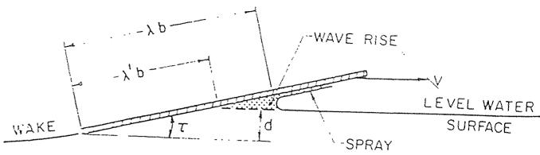

text_image

WAVE
-λb
-λ'b
WAVE RISE
τ
d
SPRAY
LEVEL WATER
SURFACE
V

Fig. 1 Wave rise on a flat planing surface

Research, U.S. Navy, the Davidson Laboratory of Stevens Institute of Technology, in 1947, undertook a theoretical study and empirical-data analysis of the phenomenon of planing. This study produced 16 technical reports (listed in the Appendix), which consider planing-surface lift, drag, wetted area, pressure distributions, impact forces, wake shape, spray formation, dynamic stability, and parallel planing surfaces. Where possible the ONR sponsored research utilized existing planing data and theoretical results but in many areas additional experimental results and new theoretical analysis were provided by the Davidson Laboratory.

In 1949, Korvin-Kroukovsky and Savitsky [7] published a summary report on the then completed studies of planing lift, drag, and wetted area and, in 1950, Murray [8] utilized these results in developing a computational procedure for predicting planing performance. In 1954, Savitsky and Neidinger [9], continuing the ONR study, developed an extensive set of empirical planing equations which increased the range of applicability to parametric planing variables well beyond those developed in [7].

The purpose of the present paper is to utilize the results of the studies of [9] to describe the elemental hydrodynamic characteristics of prismatic planing surfaces and then to combine these results to formulate simple computational procedures to predict the horsepower requirements and porpoising stability of prismatic planing hulls. Some of the material of [9] is repeated in this paper since [9] had a limited distribution and is currently out of print.

## Hydrodynamics of Prismatic Planing Surfaces

A knowledge of the elemental hydrodynamic characteristics of simple planing surfaces is necessary prior to undertaking the design of specific geometric planing boats. In this section of the paper attention will be given to the development of equations for wetted area, lift, drag, center of pressure and stability limits of hard-chine prismatic surfaces in terms of deadrise angle, trim angle, and forward speed. The prismatic planing surface is assumed to have constant deadrise, constant beam and a constant running trim for the entire wetted planing area. Variations from these conditions will be discussed in the section on design procedure. Only hard-chine planing forms are considered in this paper since, at present there is a scarcity of basic planing data on round-bottom forms.

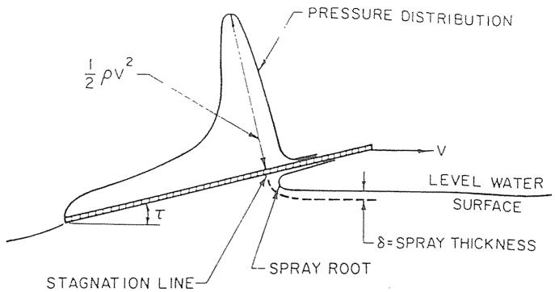

text_image

Pressure Distribution
½ ρv²
V
LEVEL WATER
SURFACE
δ=SPRAY THICKNESS
STAGNATION LINE
SPRAY ROOT

Fig. 2 Typical pressure distribution on flat planing surface

The planing coefficients and symbols used in the subsequent analysis are based on Froude's law of similitude and are the same as those used in the analysis of water-based aircraft and hydroskis. Each symbol is specifically defined in the section on nomenclature. It will be noted that the beam is the prime nondimensionalizing dimension rather than the length of the boat which is usually considered by the naval architect. The justification for this is that for planing hulls, the wetted length of the boat varies with trim, loading, and speed while the wetted beam is essentially constant. Moreover, it is possible to change the overall length of a planing boat without changing its hydrodynamic characteristics at high speed.

## Shape of Wetted Area of Planing Surfaces

A separate analysis is given of the shape of the wetted area for flat-bottom and deadrise planing surfaces.

## Wave Rise for Flat Planing Surfaces

In the case of planing surfaces with no deadrise (flat-bottom planing surfaces), water rises in front of the surface, thereby causing the running wetted length l to be larger than the length defined by the undisturbed water-level intersection with the bottom $l_{1}$ , Fig. 1. Wagner [10] had made a mathematical study of the flow at the leading edge of a planing surface of infinite length and found that the rising water surface, mentioned in the foregoing, blends into a thin sheet of water flowing forward along the planing surface. This sheet is the source of spray in a planing surface and the region of its origin has been designated by Wagner as the “spray-root” region. Fig. 2 shows the spray root and the pressure distribution resulting from it. The term wetted area, as used in this paper, designates that portion of the wetted area over which water pressure is exerted and excludes the forward thrown spray sheet. The wetted area used in this sense is often designated in the literature as the “pressure area” and geometrically, includes all the wetted bottom area, aft of a line drawn normal to the planing bottom and tangent to the curve of the spray root. This line is clearly discernible from underwater photographs. As seen in Fig. 2, the stagnation pressure is developed at a short distance aft of the spray-root line. At very small values of trim angle the stagnation line and spray-root line are nearly coincident. As the trim angle increases, the stagnation line moves farther aft of the spray-root line.

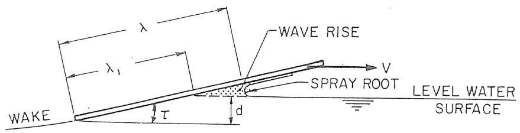

text_image

WAVE RISE
SPRAY ROOT
V
LEVEL WATER
SURFACE
λ
λ₁
τ
d

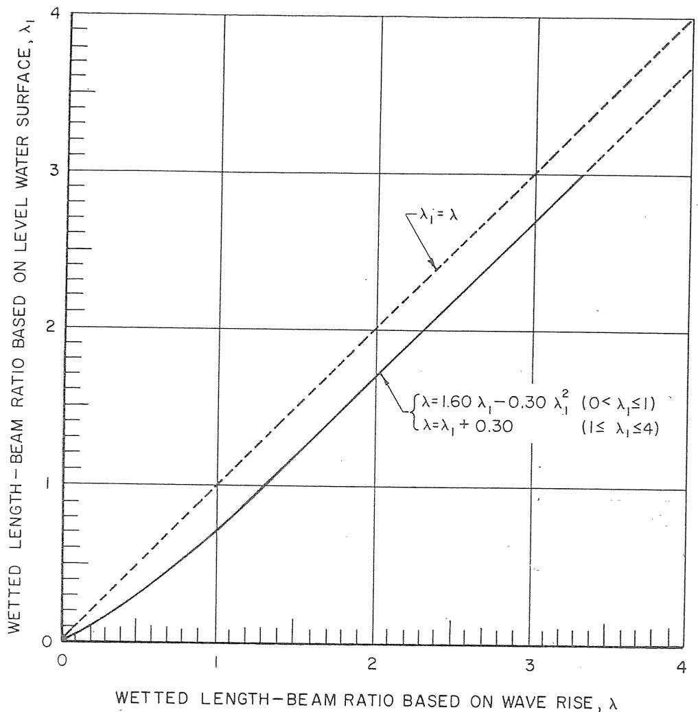

line

| Wetted Length-beam ratio based on wave rise, \(\lambda\) | Wetted Length-beam ratio based on level water surface, \(\lambda_{1}\) (Solid Line) | Wetted Length-beam ratio based on level water surface, \(\lambda_{1}\) (Dashed Line) |
| --- | --- | --- |
| 0 | 0 | 0 |
| 1 | ~0.7 | 1 |
| 2 | ~1.6 | 2 |
| 3 | ~2.6 | 3 |
| 4 | ~3.6 | 4 |

Fig. 3 Wave-rise variation for flat planing surfaces

Flat-plate, wetted-length data from all available sources are shown plotted in the form of $\lambda$ versus $\lambda_{1}$ in Fig. 3. Here $\lambda$ represents the running mean wetted length-beam ratio $(l/b)$ and $\lambda_{1}$ represents the calm-water length-beam ratio obtained from the relation $\lambda_{1} = d/b \sin\tau$ , where d is the depth of the trailing edge of the planing surface below the level water surface during a planing run. It is seen, from Fig. 3, that, for the range of test parameters considered, the wave rise on a flat-bottom planing surface is only a function of the running wetted length. The mean curve fitted through the test data is defined by the following empirical equations:

$$
\lambda = 1. 6 0 \lambda_ {1} - 0. 3 0 \lambda_ {1} ^ {2} \quad (0 \leq \lambda_ {1} \leq 1)
$$

and
(1)

$$
\lambda = \lambda_ {1} + 0. 3 0 \quad (1 \leq \lambda_ {1} \leq 4)
$$

The empirical wave-rise relation is given in the form of

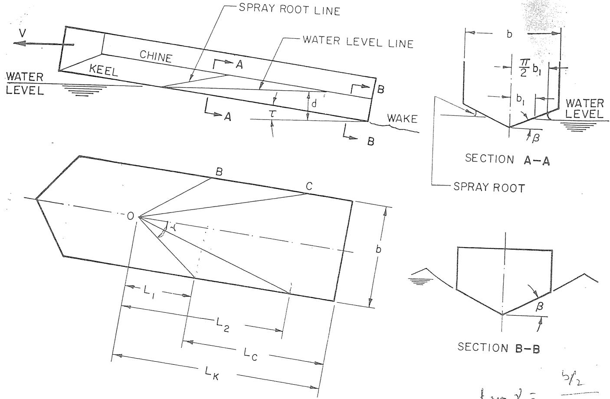  
Fig. 4 Waterline intersection for constant deadrise surface

$$
\tan \gamma = \frac {5 \gamma_ {2}}{\frac {b \tan \beta}{1 1 + \tan \beta}}
$$

$$
\frac {\pi \tan^ {2} \tau}{2 \cdot \tan^ {3} \beta}
$$

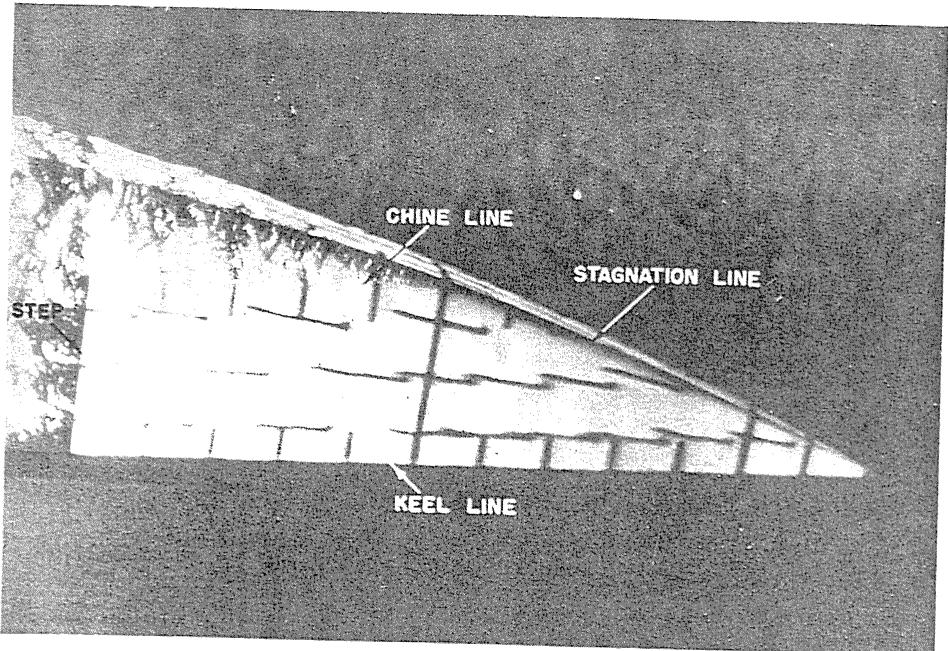

text_image

CHINE LINE
STAGNATION LINE
STEP
KEEL LINE

Fig. 5 Underwater photograph showing arrangement of tufts over bottom illustrating direction of fluid flow

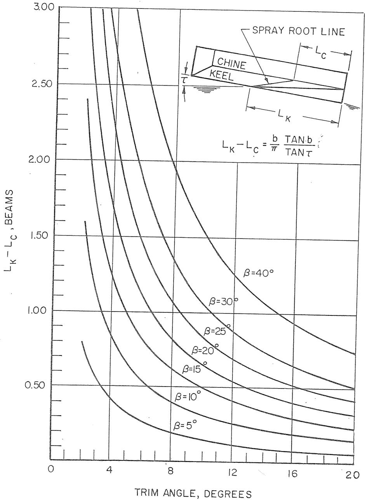

contour

| Trim Angle (Degrees) | \(\beta=5{}^{\circ}\) | \(\beta=10{}^{\circ}\) | \(\beta=15{}^{\circ}\) | \(\beta=20{}^{\circ}\) | \(\beta=25{}^{\circ}\) | \(\beta=30{}^{\circ}\) | \(\beta=40{}^{\circ}\) |
| --- | --- | --- | --- | --- | --- | --- | --- |
| 4 | ~0.45 | ~0.65 | ~0.85 | ~1.05 | ~1.25 | ~1.45 | ~1.65 |
| 8 | ~0.25 | ~0.40 | ~0.55 | ~0.70 | ~0.85 | ~1.05 | ~1.25 |
| 12 | ~0.15 | ~0.25 | ~0.35 | ~0.45 | ~0.55 | ~0.65 | ~0.80 |
| 16 | ~0.10 | ~0.15 | ~0.20 | ~0.25 | ~0.30 | ~0.35 | ~0.45 |
| 20 | ~0.08 | ~0.10 | ~0.15 | ~0.18 | ~0.20 | ~0.25 | ~0.30 |

Fig. 6 $L_{k} - L_{c}$ versus trim and deadrise

two equations since, for the average planing case, $\lambda_{1}$ is usually larger than unity and thus the equations are reduced to the very simple form of $\lambda = \lambda_{1} + 0.30$ . An empirical wave-rise equation similar in form to (1) was also developed by Smiley [11].

As with all empirically developed equations, some bound must be placed on the parametric range of applicability of the results. The discussions in [9] conclude that (1) is applicable in the trim range from 2 to 24 deg; $\lambda \leq 4.0$ ; and $0.60 \leq C_{v} \leq 25.00$ .

## Wetted Pressure Area of Deadrise Planing Surfaces

In the case of Vee-shaped planing surfaces, the intersection of the bottom surface with the undisturbed water surface is along two oblique lines (O-C) between the keel and chines, Fig. 4. Up to a trim angle of approximately 15 deg there appears to be no noticeable pile-up of water at the keel line. For larger trim angles Chambliss and Boyd [12] indicate a slight pile-up of water at the keel. Aft of the initial point of contact, O, there is a rise of the water surface along the spray root line (O-B) located ahead of the line of calm water intersection. The location of the spray-root line is easily seen from underwater photographs such as that shown in Fig. 5. It is generally found that the spray-root line is slightly convex, but since the curvature is small, it is neglected. Thus the mean wetted length of a deadrise surface is defined as the average of the keel and chine lengths measured from the transom to the intersection with the spray-root line.

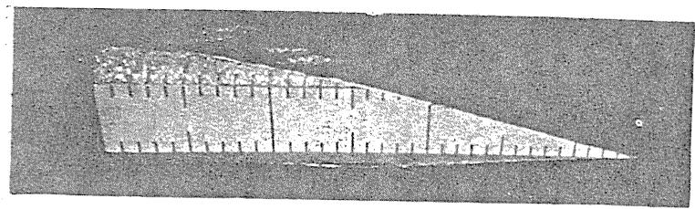

natural_image

Cross-sectional view of a mechanical component with a tapered end and internal grid lines (no text or symbols visible)

$C_{v} = 4.00$

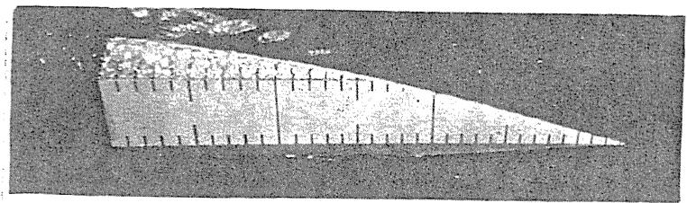

natural_image

Close-up of a metallic ruler with measurement markings (no visible text or symbols)

$C_{v} = 3.02$

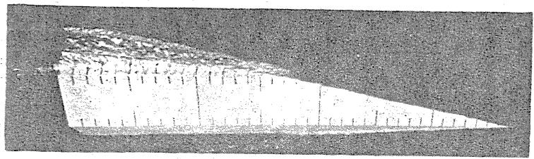

natural_image

Cross-sectional view of a mechanical component or tool, possibly a finned or layered structure, with no visible text or symbols.

$C_{v} = 2.01$

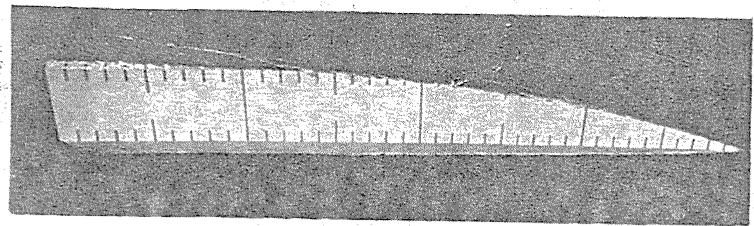

natural_image

Close-up of a rectangular object with evenly spaced vertical lines, resembling a ruler or scale (no text or symbols visible)

$C_{v} = 1.00$

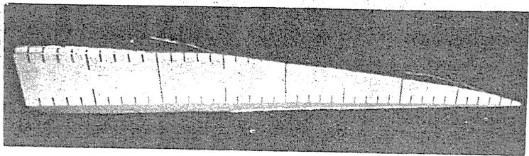

natural_image

Cross-sectional view of a tapered mechanical component with internal slots and a linear guide line (no text or symbols visible)

$C_{v} = .61$  
Fig. 7 Variation of shape of leading edge of wetted area with speed coefficient. $\beta = 20^{\circ}, b = 9$ in., $\tau = 4^{\circ}$

The difference between the wetted keel length and the chine length measured to the calm-water intersection with the chine ( $L_{2}$ ) is a function of trim and deadrise and

is defined by

$$
L _ {2} = \frac {b}{2} \frac {\tan \beta}{\tan \tau} \tag {2}
$$

The wave rise in the spray-root area is accounted for by the following consideration. Wagner computed the wave rise for a two-dimensional wedge penetrating a fluid surface vertically, and found that the actual wetted width of the wedge was $\pi/2$ times the wetted width defined by the calm-water intersection with the bottom. The motion of a deadrise planing surface can be represented as a two-dimensional problem by considering the water flow between two vertical planes normal to the plane of symmetry of the planing surface. To an observer located between these two planes, the passage of the prismatic Vee planing surface will appear identical to the vertical immersion of a wedge. This being the case, the $\pi/2$ wave-rise factor computed by Wagner is applicable, and the difference between actual wetted keel length and chine length for a prismatic planing surface is given by

$$
L _ {k} - L _ {c} = \frac {b}{\pi} \frac {\tan \beta}{\tan \tau} \tag {3}
$$

It is seen that this length is a factor $2/\pi$ times the corresponding length defined by the level-water intersection with the Vee planing surface. A plot of this relationship is given in Fig. 6. Since the wetted keel length can be defined in terms of the draft of the aft end of the keel as

$$
L _ {k} = d / \sin \tau \tag {4}
$$

then the mean wetted length-beam ratio, $\lambda$ , which defines the pressure area is given as

$$
\lambda = \frac {\left[ \frac {d}{\sin \tau} - \frac {b}{2 \pi} \frac {\tan \beta}{\tan \tau} \right]}{b} = \frac {L _ {k} + L _ {c}}{2 b} \tag {5}
$$

Experimental evidence indicates that (3) is applicable for all deadrise and trim combinations when the speed coefficient is greater than $C_v = 2.0$ . This indicates a full development of the spray-root and water pile-up as predicted by Wagner. For deadrise surfaces of 10 deg or less, (3) continues to be applicable at $C_v = 1.0$ . For the 20-deg deadrise surface, at $C_v = 1.0$ and $\tau \leq 4^\circ$ , experimental values of $L_k - L_c$ are larger than those predicted by (3), indicating a partial breakdown of the spray-root formation. Experimental evidence for 30-deg deadrise surfaces showed similar effects except that, at $C_v = 1.0$ , the spray-root formation breaks down when $\tau \leq 6^\circ$ . It appears that, for $C_v = 1.0$ , the spray-root formation will begin to break down when, for a given deadrise, the trim is reduced to a value such that the theoretical value of $L_k - L_c$ is approximately equal to 1.66b. This quantity $(L_k - L_c)/b$ can actually be considered to be a measure of the angle $(\gamma)$ between the spray-root line and the keel line measured in a plane along the keel. Hence, it may be generalized that the spray-root formation at $C_v = 1.0$ will begin to breakdown when the theoretical value of $\gamma$ is less than approximately 17 deg for a given trim-deadrise combination. It is easily shown that $\gamma = \tan^{-1}(\tan\tau/2\tan\beta)$ .

A series of photographs illustrating the breakdown in the spray-root line is given in Fig. 7 where bottom areas are shown for a 20-deg-deadrise surface planing at a trim angle of 4 deg and at five values of $C_{v}$ . The calculated angle $\gamma = 17^{\circ}$ . It is seen that, at $C_{v} = 2.01$ , 3.02 and 4.00, the spray-root line is one continuous line and the value of $L_{k} - L_{c}$ is in agreement with that computed by equation (3). At $C_{v} = 1.0$ , the leading edge of the wetted area is now defined by a broken line made up of two straight segments. The forward segment is the usual spray-root line formation and makes an angle of approximately 17 deg with the keel. The after segment of the leading-edge line makes an angle with the keel which would correspond to the calm-water intersection with the bottom. At $C_{v} = 0.6$ , the same phenomenon is in evidence except that the length of the spray-root portion of the line is reduced.

## Wetted-Spray Area of Deadrise Planing Surfaces

The total wetted bottom area of a planing surface is actually divided into two regions. One is aft of the spray-root line, commonly referred to as the pressure area and the other is forward of the spray-root line, referred to as the spray area. The pressure area, which has been defined in the preceding sections of this paper, is the load-carrying area of the planing bottom. The forward spray area contributes to the total drag but is not considered to support any portion of the load.

The flow directions in both wetted areas have been determined by underwater photographs of tufts such as shown by Pierson and Leshnover in Figs. 4 and 5 of reference [13]. An enlarged sketch of the flow directions on a deadrise surface is given in Fig. 8 of this paper. It is found that the flow in the pressure-area is predominantly aft with some transverse flow along the chines. The flow along the spray-root line is primarily along the direction of the stagnation line. In the spray wetted area the directions of the fluid flow are such that the space angle between the oncoming fluid particles and the stagnation line is equal to the angle between the direction of the spray jets and the stagnation line; i.e., any line of motion in the spray area is nearly a reflection about the stagnation line of the incident velocity direction. Since the pressure in the spray area is nearly atmospheric, then, by Bernoulli, the spray velocity can be assumed to be equal to the planing speed.

Equations defining the spray direction in terms of trim and deadrise angle are given by Pierson and Leshnover [13]. The actual spray area extends from the spray-root line forward to the spray edge. The angle $\Phi$ between the keel and spray edge measured in the plane of the bottom is

$$
\tan \Phi = \frac {A + k _ {1}}{1 - A k _ {1}} \tag {6}
$$

where:

$$
A =
$$

$$
\frac {\left\{\sin^ {2} \tau (1 - 2 K) + K ^ {2} \tan^ {2} \tau \left[ \left(1 / \sin^ {2} \beta\right) - \sin^ {2} \tau \right] \right\} ^ {1 / 2}}{\cos \tau + K \tan \tau \sin \tau .}
$$

$$
k _ {1} = \frac {K \tan \tau}{\sin \beta}
$$

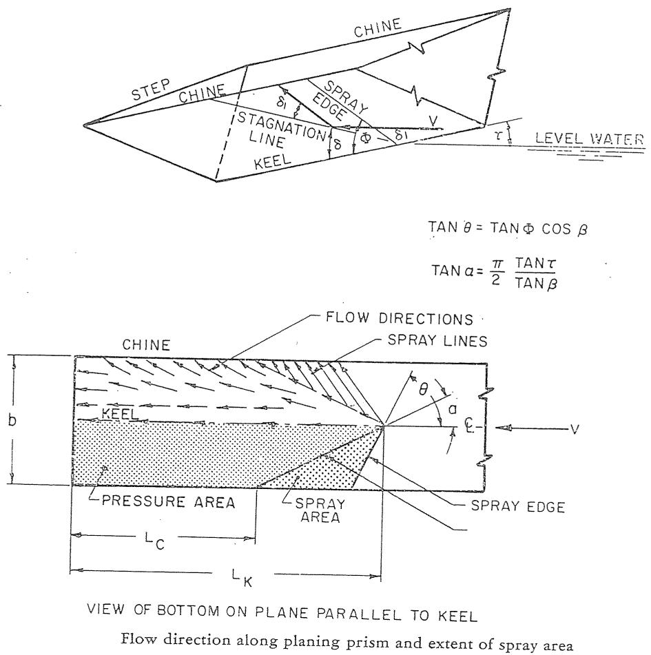

$$
\mathrm{TAN} \theta = \mathrm{TAN} \Phi \cos \beta
$$

$$
\mathrm{TAN} \alpha = \frac {\pi}{2} \frac {\mathrm{TAN} \tau}{\mathrm{TAN} \beta}
$$

and

$$
K \approx \frac {\pi}{2} \left(1 - \frac {3 \tan^ {2} \beta \cos \beta}{1 . 7 \pi^ {2}} - \frac {\tan \beta \sin^ {2} \beta}{3 . 3 \pi}\right)
$$

The total spray area, both sides, projected on a plane along the keel line is given by

$$
A _ {s} = \frac {b ^ {2}}{2} \left(\frac {\tan \beta}{\pi \tan \tau} - \frac {1}{4 \tan \Phi \cos \beta}\right) \tag {7}
$$

In making visual observations of the wetted chine length during a planing run, it is important to distinguish between the spray-root intersection and the spray-edge intersection with the chine. Fig. 9 illustrates the two intersection points. It is seen that the spray edge is always ahead of the spray-root intersection with the bottom.

## Lift of Planing Surfaces

The following discussions will first develop the lift equations for flat planing surfaces and then show how these results are modified to account for finite deadrise.

## Lift of Flat Planing Surfaces

The lift on a planing surface (at fixed draft and trim) can be attributed to two separate effects; i.e., one is the dynamic reaction of the fluid against the moving surface, and the second is the so-called buoyant contribution to lift which is associated with the static pressures corresponding to a given draft and hull trim. In effect, the buoyant contribution represents the influence of gravity. At very low-speed coefficients, the buoyant lift component predominates. As speeds are increased, the dynamic-lift effects begin to develop. At first the dynamic effects tend to decrease the load which a given prismatic surface can support and then, as the speed is further increased, the load on a given surface will increase. At very high-speed coefficients the dynamic contribution to lift predominates and the static-pressure effects can be neglected. The formulation of an empirical planing lift equation was based on a combination of the dynamic and static effects.

It will be recalled that the fluid-flow directions over the pressure area of a planing surface were a combination of longitudinal flow and some transverse flow across both chine lines. From aerodynamic theory it is known that lifting surfaces of high aspect ratio (small $\lambda$ ) have a predominantly longitudinal (chordwise) flow and that the lift is directly proportional to $\tau$ . For surfaces of very small span and infinite length, i.e., $\lambda = \infty$ , the flow is in a transverse direction and lift is proportional to $\tau^{2}$ . Hence for a normal low aspect-ratio planing surface, the lift can be expressed in the form

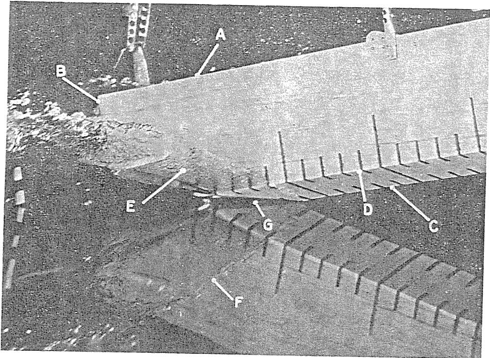

text_image

A
B
E
G
D
C
F

Fig. 9 Characteristic features of vee-bottom planing surface. A—model of planing wedge; B—transom; C—keel; D—chine; E—whisker spray; F—reflection of spray edge; G—spray-root region

$$
C _ {L} = A \tau + B \tau^ {2} \tag {8}
$$

For the range of $\lambda$ -values applicable to planing surfaces, the second term takes the form of a small correction to the first term and it is found that equation (8) can be approximated by using $\tau$ to the 1.1 power. Hence

$$
C _ {L} / \tau^ {1. 1} = f (\lambda , C _ {v}) \tag {9}
$$

Sottorf's analysis of high-speed planing data, where the hydrostatic term is negligible, showed that, for a given trim angle, the dynamic component of the lift coefficient varied as $\lambda^{1/2}$ . Hence we can consider this component to be of the form:

$$
C _ {L _ {d}} = c \lambda^ {1 / 2} \tau^ {1. 1} \tag {10}
$$

where c is a constant to be determined.

The hydrostatic component of lift for a flat plate of beam, b, mean wetted length-bcam ratio, $\lambda$ , and angle of trim $\tau$ can be written as follows:

$$
L _ {b} = \frac {1}{2} \rho g b ^ {3} (\lambda - 0. 3 0) ^ {2} \tan \tau \tag {11}
$$

Dividing both sides by $\frac{1}{2}\rho V^{2}b^{2}$ and assuming that $(\lambda - 0.30)^{2}$ can be replaced by $K\lambda^{n}$ where D and n are constants to be determined, results in

$$
C _ {L _ {b}} = \frac {D \lambda^ {n}}{C _ {v} ^ {2}} \tan \tau \tag {12}
$$

If the difference between $\tan\tau$ and $\tau^{1.1}$ is neglected $C_{L_{b}}$ can be written

$$
C _ {L _ {b}} = \frac {D \lambda^ {n}}{C _ {v} ^ {2}} \tau^ {1. 1} \tag {13}
$$

Combining equations (10) and (13) gives a form of an empirical equation for the lift coefficient of a planing surface, i.e.

$$
C _ {L} = \tau^ {1. 1} \left(c \lambda^ {1 / 2} + \frac {D \lambda^ {n}}{C _ {v} ^ {2}}\right) \tag {14}
$$

As with any empirical equation there are several ways to formulate the equation for planing lift. The form of relation given in (14) has the advantage of readily illustrating the effect of the prime variables on planing lift and also is easily applied in design of planing hulls.

The constants C, D, and n are evaluated by applying the foregoing formula to the large collection of planing data contained in the existing literature. The mechanics of this evaluation are described in [9]. As a result of this analysis the empirical planing lift equation for a zero-deadrise surface takes the following final form:

$$
C _ {L} = \tau^ {1. 1} \left[ 0. 0 1 2 0 \lambda^ {1 / 2} + \frac {0 . 0 0 5 5 \lambda^ {5 / 2}}{C _ {v} ^ {2}} \right] \tag {15}
$$

where $\tau$ is in degrees.

This empirical equation is applicable for $0.60 \leq C_{v} \leq 13.00$ ; $2^{\circ} \leq \tau \leq 15^{\circ}$ ; and $\lambda \leq 4$ .

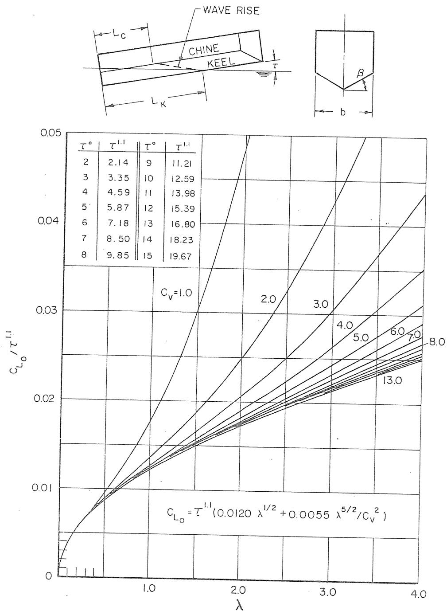

line

| \(\lambda\) | \(\tau^1.1=2.0\) | \(\tau^1.1=3.0\) | \(\tau^1.1=4.0\) | \(\tau^1.1=5.0\) | \(\tau^1.1=6.0\) | \(\tau^1.1=7.0\) | \(\tau^1.1=8.0\) | \(\tau^1.1=13.0\) |
|---|---|---|---|---|---|---|---|---|
| 0.5 | ~0.008 | ~0.008 | ~0.008 | ~0.008 | ~0.008 | ~0.008 | ~0.008 | ~0.008 |
| 1.0 | ~0.018 | ~0.017 | ~0.016 | ~0.015 | ~0.014 | ~0.013 | ~0.012 | ~0.011 |
| 2.0 | ~0.035 | ~0.030 | ~0.026 | ~0.023 | ~0.021 | ~0.019 | ~0.017 | ~0.015 |
| 3.0 | ~0.048 | ~0.042 | ~0.036 | ~0.031 | ~0.027 | ~0.024 | ~0.021 | ~0.018 |
| 4.0 | >0.05 | ~0.048 | ~0.042 | ~0.036 | ~0.031 | ~0.027 | ~0.023 | ~0.020 |

Fig. 10 Lift coefficient of a flat planing surface; $\beta = 0^{0}$

For convenience in use, equation (15) is plotted in Fig. 10 in the form $C_{L}/\tau^{1.1}$ versus $\lambda$ for a wide range of $C_{v}$ -values. Examining this plot at a fixed value of $\lambda$ it is clear that the buoyant contribution to lift is significant up to speed coefficients as high as approximately 10. At $C_{v} > 10$ , the dynamic lift is predominant and the lift coefficient is then independent of speed. In fact, for $C_{v} > 10.0$ the flat-plate lift coefficient can be simply expressed as $C_{L} = 0.0120 \lambda^{1/2} \tau^{1.1}$ .

To illustrate the loss in lift experienced by a planing surface at very low speeds ( $C_{v} \leq 1.0$ ), Fig. 12 presents a comparison between the resultant lift and that corresponding to the purely static lift (buoyancy) for a given draft and trim of the planing surface. A form of load coefficient is plotted against speed coefficient for three wetted lengths at three trim angles. The solid curves are the planing loads as predicted by (15) and are seen to vary with $C_{v}$ . The dotted curves are the buoyant loads computed by (11). This hypothetical load is independent of $C_{v}$ . The comparison between the planing load and calculated buoyant load is limited to $C_{v} \geq 0.60$ since this is the range of applicability of (15). As $C_{v}$ approaches zero, it is naturally expected that the calculated load should approach the buoyant load. It is interesting to note from Fig. 12 that in the range $0.60 \leq C_{v} \leq 1.00$ , the motion of the planing surface reduces the lift below the value which would be expected on a purely displacement basis. This effect is somewhat similar to the sinkage experienced by displacement vessels at low speeds. At $C_{v} \approx 1.0$ , the total planing load is approximately equal to the hypothetical buoyant load. At $C_{v} > 1.0$ the positive dynamic reaction of the fluid on the planing bottom increases rapidly as the speed increases.

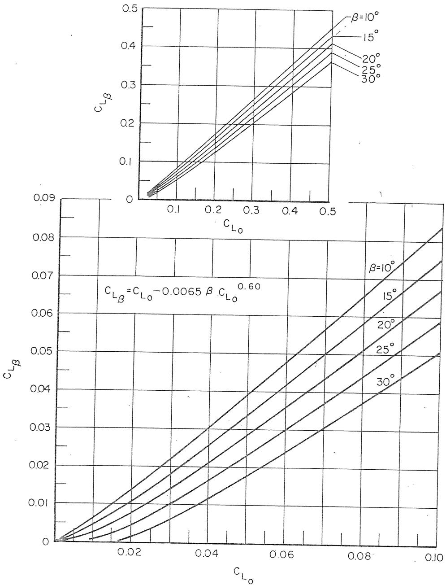

line

| CL0 | \(\beta=10{}^{\circ}\) | \(\beta=15{}^{\circ}\) | \(\beta=20{}^{\circ}\) | \(\beta=25{}^{\circ}\) | \(\beta=30{}^{\circ}\) |
| --- | --- | --- | --- | --- | --- |
| 0.00 | 0 | 0 | 0 | 0 | 0 |
| 0.02 | ~0.012 | ~0.009 | ~0.007 | ~0.005 | ~0.003 |
| 0.04 | ~0.025 | ~0.019 | ~0.015 | ~0.011 | ~0.007 |
| 0.06 | ~0.038 | ~0.031 | ~0.025 | ~0.020 | ~0.015 |
| 0.08 | ~0.052 | ~0.044 | ~0.037 | ~0.031 | ~0.023 |
| 0.10 | ~0.066 | ~0.058 | ~0.050 | ~0.043 | ~0.035 |

Fig.11 Lift coefficient of a deadrise planing surface

## Lift of Deadrise Planing Surfaces

For a given trim and mean wetted length-beam ratio, the effect of increasing the deadrise angle is to reduce the planing lift. This lift reduction is caused primarily from a reduction in the stagnation pressure at the leading edge of the wetted area. It will be recalled from the discussion of wetted areas that the angle between the stagnation line and keel is given by the equation $\gamma = \tan^{-1} (\tan \tau / 2 \tan \beta)$ . When $\beta = 0$ the stagnation line is normal to the keel and normal to the free-stream velocity so that full stagnation pressure $\frac{1}{2}\rho V^{2}$ is developed. For increasing values of $\beta$ , the angle $\gamma$ de-

$$
\text {TOTAL PLANING LOAD} = \Delta / 1 / 2 \rho g b ^ {3} = \tau^ {1. 1} \left[ 0. 0 1 2 0 \lambda^ {1 / 2} C _ {V} ^ {2} + 0. 0 0 5 5 \lambda^ {5 / 2} \right]
$$

$$
\text {---- EQUIVALENT DISPLACEMENT LOAD} = \Delta / 1 / 2 \rho g b ^ {3} = (\lambda - 0. 3 0) ^ {2} \tan \tau
$$

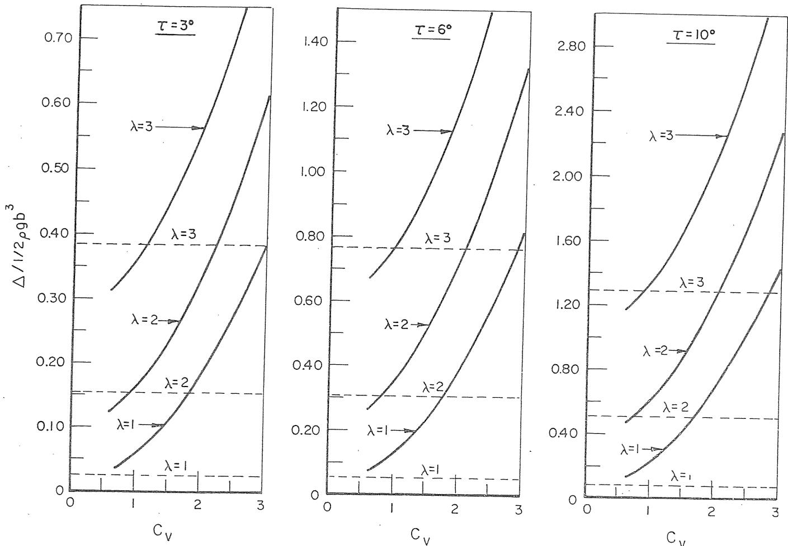  
Fig. 12 Planing load versus calculated displacement load for a flat planing surface at various velocity coefficients

creases so that full stagnation pressures are no longer developed; hence the planing lift is reduced. In effect then, the presence of deadrisé causes the stagnation line to be “swept” aft and leads to a lift reduction not unlike that on a swept-back wing.

To formulate an empirical equation for the planing lift of a deadrise surface, the lift coefficient of a Vee surface was compared with that of a flat plate at identical values of $\tau$ , $\lambda$ , and $C_{v}$ . It was found in [7] and [9] that the lift of a deadrise surface can be represented by the following equation:

$$
C _ {L _ {\beta}} = C _ {L _ {0}} - 0. 0 0 6 5 \beta C _ {L _ {0}} ^ {0. 6 0} \tag {16}
$$

where

$$
C _ {L _ {\beta}} = \text {lift coefficient for a deadrise surface}
$$

$$
\beta = \text {deadrise angle, deg}
$$

$C_{L_{0}} = \text{lift coefficient of a flat plate operating at the same } \tau, \lambda, \text{ and } C_{v} \text{ as deadrise surface}$

For convenience in use, equation (16) is plotted in Fig. 11.

## Drag of Planing Surfaces

The total hydrodynamic drag of a planing surface is composed of pressure drag developed by pressures acting normal to the inclined bottom and viscous drag acting tangential to the bottom in both the pressure area and spray area. If there is side wetting then, of course, this additional component of viscous drag must be added to the hydrodynamic drag acting on the bottom of the planing surface. For the present analysis, it will be assumed that there is no side wetting of the hull.

For a frictionless fluid, the tangential force is zero. Hence for a trim angle $\tau$ , a load $\Delta$ , and a force N normal to the bottom the resistance component $D_{p}$ due to pressure forces is shown in Fig. 13 to be

$$
D _ {p} = \Delta \tan \tau \tag {17}
$$

When the viscous drag $D_{f}$ acting tangential to the bottom is added, the total drag, D, is shown in Fig. 13 to be

$$
D = \Delta \tan \tau + \frac {D _ {f}}{\cos \tau} \tag {18}
$$

The friction component $D_{f}$ is shown in [9] to be computed by the following equation:

$$
D _ {f} = \frac {C _ {f} \rho V _ {1} ^ {2} (\lambda b ^ {2})}{2 \cos \beta^ {4}} \tag {19}
$$

where

$C_{f}=\mathrm{Schoenherr[14]turbulentfrictioncoefficient}$

$V_{1}$ = average bottom velocity

The average bottom velocity ( $V_{1}$ ) is less than the forward planing velocity (V) owing to the fact that the planing bottom pressure is larger than the free-stream pressure. Sottorf, Parkinson [15] and Locke [16] have presented data and analytical expressions for defining the average bottom velocity at very high-speed coefficients where the buoyant contribution to lift is negligible. Savitsky and Ross [17] developed an expression for the mean bottom velocity which is applicable over a speed range from $C_{v} = 1.0$ to $C_{v} = 13.0$ . This development was based on the following considerations: Taking first, the case of a zero deadrise hull, the dynamic contribution to planing lift is given by the first term in (15) to be

$$
C _ {L _ {d}} = 0. 0 1 2 0 \lambda^ {1 / 2} \tau^ {1. 1} \tag {20}
$$

The dynamic load on the bottom is

$$
\Delta_ {d} = \frac {1}{2} \rho V ^ {2} b ^ {2} (0. 0 1 2 0 \lambda^ {1 / 2} \tau^ {1. 1}) \tag {21}
$$

The average dynamic pressure is

$$
p _ {d} = \frac {\Delta}{\lambda b ^ {2} \cos \tau} = \frac {0 . 0 1 2 0 \tau^ {1 . 1} V ^ {2} \rho}{2 \lambda^ {1 / 2} \cos \tau} \tag {22}
$$

Applying Bernoulli's equation between the free-stream conditions and the average pressure and velocity conditions on the bottom of the planing surface:

$$
V _ {1} = V \left(1 - \frac {2 p _ {d}}{\rho V ^ {2}}\right) ^ {1 / 2} \tag {23}
$$

substituting (22) into (23) gives

$$
V _ {1} = V \left(1 - \frac {0 . 0 1 2 0 \tau^ {1 . 1}}{\lambda^ {1 / 2} \cos \tau}\right) ^ {1 / 2} \text {for} \beta = 0 ^ {\circ} \tag {24}
$$

The average bottom velocity for specific deadrise angles is computed in an analogous manner using the lift coefficient for deadrise surfaces given by (16). The ratios $V_{1}/V$ have been computed for four deadrise angles and the results are plotted in Fig. 14 in a convenient form for use by the designer.

It will be noted that the wetted area used in (19) is the bottom pressure area, $\lambda b^{2}$ . In previously published Davidson Laboratory reports [9, 17] consideration was given to the friction drag developed by the spray area, equation (7), ahead of the spray-root line. The analysis of [9] and [17], which were based on certain assumptions as to the spray thickness and the friction drag coefficient in the spray area, resulted in a simple formulation for an additional increment, $\Delta\lambda b^{2}$ , in wetted areas to be added to the pressure area $\lambda b^{2}$ . These results were based mainly on data obtained at planing trim angles greater than 4 deg. Recent studies at the Davidson Laboratory have indicated that at trim angles less than 4 deg (usual for planing boats) the spray thickness is considerably less than had been assumed previously. In fact, the spray sheet appears to be much thinner than the displacement thickness of a normal boundary layer at the same Reynolds number. Hence, until this effect is more fully studied, it is recommended that at trim angles less than 4 deg, the area used for computing the viscous drag be $\lambda b^{2}$ . For larger trim angles the results of [9] and [17] should be used.

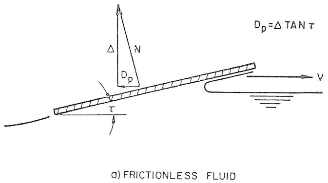

text_image

Δ
N
Dp
τ
V
Dp = Δ TAN τ
a) FRICTIONLESS FLUID

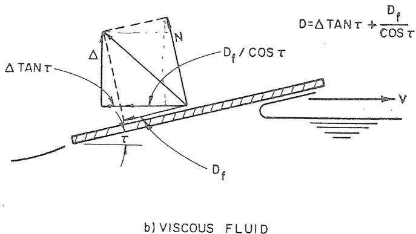

text_image

D = Δ TAN τ + D_f / COS τ
Δ TAN τ
N
D_f / COS τ
τ
D_f
b) VISCOUS FLUID

Fig. 13 Drag components on a planing surface

In summary then, the hydrodynamic drag of a planing surface is given by the following equation:

$$
D = \Delta \tan \tau + \frac {\rho V _ {1} ^ {2} C _ {f} \lambda b ^ {2}}{2 \cos \beta \cos \tau} \tag {25}
$$

where $V_{1}$ is plotted in Fig. 12, and $C_{f}$ is the Schoenherr turbulent-friction coefficient. The Reynolds number is defined, $R_{e} = V_{1} \lambda b/\nu$ , where $\nu$ is the kinematic viscosity.

## Drag-Lift Ratio of Planing Surfaces

Prior to computing the drag-lift ratio of planing surfaces it would be advantageous to examine the typical variations in drag-lift ratio as a function of speed, wetted length, and trim angle. For this purpose the experimental data for a 9-in. beam, 20 deg deadrise surface (given in reference [9]) are plotted in Fig. 15 for separate values of trim angle. The abscissa for these plots is a form of speed coefficient based on wetted length, defined as $C_{v}/\lambda^{1/2}$ , which will be recognized as being the well-known Froude number $V/(gl)^{1/2}$ . Other forms of Froude number representation could have been used (e.g., based on load), but the ratio $C_{v}/\lambda^{1/2}$ is used since it is identical in form and equal to 0.296 times the speed-length ratio. It is emphasized that the drag-lift ratios given in Fig. 15 apply only to the 9-in. test model and are not to be directly applied to full-scale boats. The plots are given merely to indicate typical variations in the drag-lift ratio of planing surfaces.

It is seen from Fig. 15 that the ratio $D / \Delta$ plotted against $C_v / \lambda^{1/2}$ generally collapse onto a single curve for each test trim over the test ranges of $\lambda$ and $C_v$ . It is also seen that, up to a ratio of $C_v / \lambda^{1/2} \approx 1$ there is a very rapid increase in the ratio $D / \Delta$ for all test trims. At $\tau > 2^\circ$ and at $C_v / \lambda^{1/2} > 1$ , the ratio $D / \Delta$ is nearly constant for any combination of speed and wetted length. For $\tau = 2^\circ$ , the curve of $D / \Delta$ appears to approach a constant value for ratios of $C_v / \lambda^{1/2} > 2$ .

The above variations of $D/\Delta$ can be associated with observed changes of the flow conditions around the planing surface. It was found that, at $C_{v} \geq 2.0$ there was a clean separation of the fluid from the chines and the transom. Further, at $C_{v} \leq 1.00$ the degree of flow separation from the transom was, at a given trim angle, a function of the wetted length, the shorter the wetted length, the greater the flow separation. With increasing degree of flow separation from the transom, the drag force is increased and hence the ratio $D/\Delta$ is increased until complete flow separation has occurred along the chines and transom.

If planing is defined to exist when the fluid breaks away from the transom and chines, then, using Fig. 15, the inception of planing can be defined to occur when $C_{v}/\lambda^{1/2}=1$ for $\tau\geq4^{\circ}$ and at $C_{v}/\lambda^{1/2}=2$ for $\tau=2^{\circ}$ . In essence then, planing occurs when the drag-lift ratio at a given trim angle is essentially constant. Other definitions of planing can be found in the literature. For example, Locke [6] defines the inception of planing to occur when, at a given $\lambda$ and $\tau$ , the load carried by the planing surface varies as the square of the speed. This implies that the buoyant component of the lift is negligible. In both definitions only the bottom of the planing surface is wetted. The use of the ratio $C_{v}/\lambda^{1/2}=1$ defines the point at which this phenomenon first occurs.

An exact definition of the inception of planing is, of course, not important. The foregoing criterion appear to be a convenient guide in classifying boats. It is clear from Fig. 15 that when a boat does start to “plane” it has the largest resistance for a fixed trim angle. The resistance decreases sharply when the ratio $C_{v}/\lambda^{1/2}$ is reduced to values less than 1.0.

From equation (25) the drag-lift ratio of a planing surface can be calculated as follows:

$$
\frac {D}{\Delta} = \tan \tau + \frac {\rho V _ {1} ^ {2} C _ {f} \lambda b ^ {2}}{2 \Delta \cos \beta \cos \tau} \tag {26}
$$

Multiplying and dividing the second term of the right-hand side by $V^{2}$ and substituting $C_{L}$ for $2\Delta/\rho V^{2}b^{2}$ results in

$$
\frac {D}{\Delta} = \tan \tau + \frac {\left(\frac {V _ {1}}{V}\right) ^ {2} C _ {f} \lambda}{C _ {L} \cos \tau \cos \beta} \tag {27}
$$

In the foregoing expression $C_L = C_{L_0}$ if $\beta = 0$ and $C_L = C_{L\beta}$ if $\beta \neq 0$ . The ratio $V_1 / V$ is given in Fig. 14. The friction coefficient $C_f$ is a function of Reynolds number which in turn increases with increasing size of the planing boat. Since, as shown by Schoenherr, the turbulent friction coefficient decreases with increasing Reynolds number, the ratio $D / \Delta$ will decrease slightly with increasing boat size for a given combination of $\lambda$ , $\tau$ , $\beta$ , and $C_v$ .

Equation (27) has been used to compute the ratio $D / \Delta$ for $0^{\circ}$ , $10^{\circ}$ and $20^{\circ}$ deadrise surfaces at trim angles of $2^{\circ}$ , $4^{\circ}$ , $6^{\circ}$ and $8^{\circ}$ . Mean wetted length-beam ratios, $\lambda$ , were varied from 1 to 4, and speed coefficients up to $C_v = 10$ were used in various combinations. The computations were made for a beam, $b$ , of 5 ft and 10 ft. As expected, for $\tau = 4^{\circ}$ , the $D / \Delta$ ratio was essentially constant when $C_v / \lambda^{1/2} > 1.0$ . For $\tau = 2^{\circ}$ , the $D / \Delta$ ratio was essentially constant when $C_v / \lambda^{1/2} > 2.0$ . The results of this computation are given in Fig. 16 to illustrate the effect of trim, deadrise, and size of boat on the drag-lift ratio. Each computed point represents the average of five different combinations of $C_v / \lambda^{1/2}$ . On the average, there was approximately a 5 percent spread in the computed values for any trim-deadrise combination. For more exact values of $D / \Delta$ it is recommended that detailed evaluations of equation (27) be carried out for specific cases.

It is evident from Fig. 16 that for any given deadrise, there is an optimum trim angle for lowest ratios of $D/\Delta$ . Small decreases in trim angle below the optimum cause large increases in resistance. Small increases in trim angle above the optimum result in moderate increases in resistance. Increasing deadrise angle increases the resistance for a given trim angle. For a deadrise of $0^{\circ}$ , the lowest resistance that can be expected is approximately 12 percent of the load at a trim angle of approximately $4.5^{\circ}$ . It will be noted that the optimum trim angle increases slightly with increasing deadrise angle. The effect of increasing the size of the boat beam from 5 to 10 ft is to reduce the $D/\Delta$ ratios by nearly 4 percent.

$V_{1}$ AVERAGE BOTTOM VELOCITY
V FORWARD PLANING VELOCITY

$$
V _ {1} / V = \sqrt {1 - \frac {0 . 0 1 2 0 \tau^ {1 . 1}}{\lambda^ {\frac {1}{2}} \cos \tau} f (\beta)}
$$

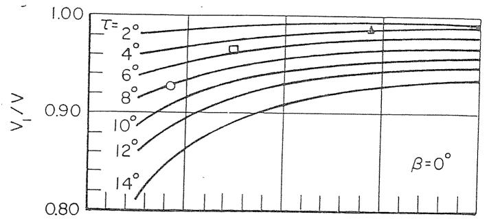

line

| T | X | V1/V |
| --- | --- | --- |
| \(2{}^{\circ}\) | ~0.25 | ~0.98 |
| \(2{}^{\circ}\) | ~0.75 | ~0.98 |
| \(4{}^{\circ}\) | ~0.25 | ~0.96 |
| \(4{}^{\circ}\) | ~0.75 | ~0.97 |
| \(6{}^{\circ}\) | ~0.25 | ~0.94 |
| \(6{}^{\circ}\) | ~0.75 | ~0.96 |
| \(8{}^{\circ}\) | ~0.25 | ~0.92 |
| \(8{}^{\circ}\) | ~0.75 | ~0.94 |
| \(10{}^{\circ}\) | ~0.25 | ~0.89 |
| \(10{}^{\circ}\) | ~0.75 | ~0.93 |
| \(12{}^{\circ}\) | ~0.25 | ~0.86 |
| \(12{}^{\circ}\) | ~0.75 | ~0.92 |
| \(14{}^{\circ}\) | ~0.25 | ~0.82 |
| \(14{}^{\circ}\) | ~0.75 | ~0.91 |

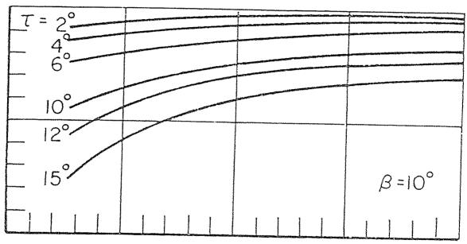

line

| \(\beta ({}^{\circ})\) | Value (approximate) |
| --- | --- |
| 2 | ~1.0, ~0.9, ~0.8, ~0.7, ~0.6, ~0.5, ~0.4, ~0.3, ~0.2, ~0.1 |
| 4 | ~0.9, ~0.8, ~0.7, ~0.6, ~0.5, ~0.4, ~0.3, ~0.2, ~0.1, ~0.05 |
| 6 | ~0.8, ~0.7, ~0.6, ~0.5, ~0.4, ~0.3, ~0.2, ~0.1, ~0.05 |
| 10 | ~0.6, ~0.5, ~0.4, ~0.3, ~0.2, ~0.1, ~0.05 |
| 12 | ~0.4, ~0.3, ~0.2, ~0.1, ~0.05, ~0.02, ~0.01, ~0.005 |
| 15 | ~0.2, ~0.1, ~0.05, ~0.02, ~0.01, ~0.005, ~0.002, ~0.001, ~0.0005 |

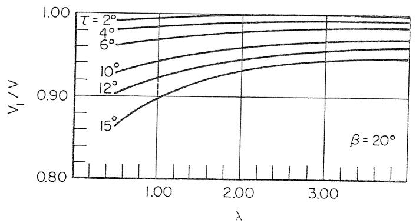

line

| \(\lambda\) | \(V1/V (\tau=2{}^{\circ})\) | \(V1/V (\tau=4{}^{\circ})\) | \(V1/V (\tau=6{}^{\circ})\) | \(V1/V (\tau=10{}^{\circ})\) | \(V1/V (\tau=12{}^{\circ})\) | \(V1/V (\tau=15{}^{\circ})\) |
|---|---|---|---|---|---|---|
| 0.5 | ~0.99 | ~0.98 | ~0.97 | ~0.93 | ~0.91 | ~0.86 |
| 1.0 | ~0.99 | ~0.98 | ~0.97 | ~0.94 | ~0.92 | ~0.90 |
| 2.0 | ~0.99 | ~0.98 | ~0.97 | ~0.95 | ~0.93 | ~0.92 |
| 3.0 | ~0.99 | ~0.98 | ~0.97 | ~0.95 | ~0.94 | ~0.93 |

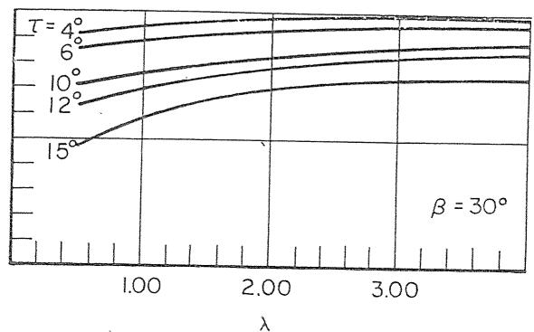

line

| \(\lambda\) | \(T=4{}^{\circ}\) | \(T=6{}^{\circ}\) | \(T=10{}^{\circ}\) | \(T=12{}^{\circ}\) | \(T=15{}^{\circ}\) |
|---|---|---|---|---|---|
| 0.5 | ~0.95 | ~0.85 | ~0.75 | ~0.65 | ~0.55 |
| 1.0 | ~0.98 | ~0.92 | ~0.85 | ~0.75 | ~0.65 |
| 2.0 | ~0.99 | ~0.96 | ~0.92 | ~0.85 | ~0.78 |
| 3.0 | ~1.00 | ~0.98 | ~0.95 | ~0.90 | ~0.82 |

Fig. 14 Magnitude of average botton velocity for a planing surface

Included in Fig. 16 is a plot of $\tan\tau$ which is the pressure component of the total drag. The difference between $\tan\tau$ and the curves $D/\Delta$ represents the drag component due to viscous (friction) drag. It is seen that at low trim angles the total drag is predominantly friction drag while at high trim angles it is predominantly pressure drag. At $\tau = 4^{\circ}$ the total drag for $\beta = 0$ is nearly one half pressure drag and one half friction drag.

The foregoing trends in resistance variation with trim and deadrise have been shown by many experimenters in cross plots of their specific test data. Fig. 16 presents the results of computations and includes a recognition of the fact that $D/\Delta$ ratios for a given trim angle, are essentially independent of various combinations of $C_{v}$ and $\lambda$ providing that $C_{v}/\lambda^{1/2} \geq 2$ for $\tau = 2^{\circ}$ , and $C_{v}/\lambda^{1/2} \geq 1$ for $\tau \geq 4^{\circ}$ .

## Center of Pressure of Planing Surfaces

It has been shown in [9] that the resultant center of pressure of planing surfaces can be fairly accurately evaluated by separate considerations of the buoyant and dynamic force components of the lift. The center of pressure of the dynamic component is taken to be at 75 percent of the mean wetted length forward of the transom, while the center of pressure of the buoyant force is assumed to be 33 percent forward of the transom. These distances are, of course, approximations but are acceptable in the empirical development of this paper. Adding the moments taken about the transom for each of the two components of the total load and then dividing by the total load gives an expression for the distance of the center of pressure forward of the transom. By using the values of the buoyant and dynamic force components given in (15), the center of pressure, $C_{p}$ , is found to be a distance forward of the transom equal to

$$
C _ {p} = \frac {l _ {p}}{\lambda b} = 0. 7 5 - \frac {1}{5 . 2 1 \frac {C _ {v} {} ^ {2}}{\lambda^ {2}} + 2 . 3 9} \tag {28}
$$

where $C_{p}$ is the ratio of the longitudinal distance from the transom to the center of pressure divided by the mean wetted length.

A comparison between (28) and actual test data is given in Fig. 17 of reference [9]. Excellent agreement exists between the formula and data. It is seen that $C_{p}$ is essentially independent of trim angle and/or dead-rise angle. A working plot of equation (28) is given in Fig. 17 of this paper. When the wetted length and speed coefficient are known, the value of $C_{p}$ can be quickly determined from this chart.

## Porpoising Stability Limits

Porpoising is defined as the combined oscillations of a boat in pitch and in heave, of sustained or increasing

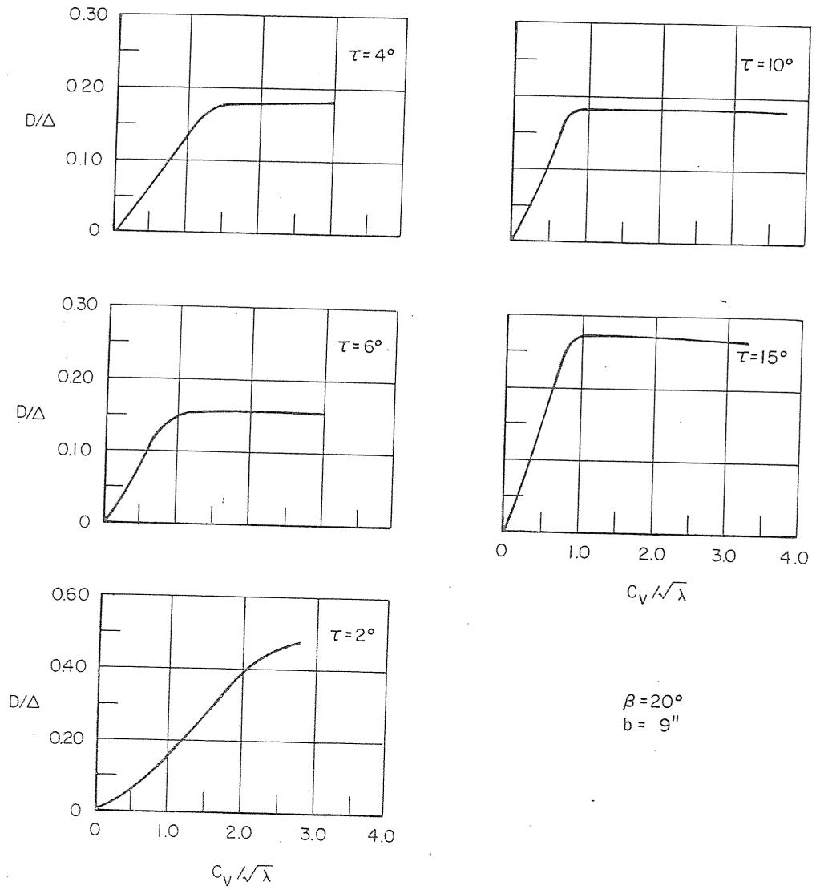

$$
\begin{array}{l} \beta = 2 0 ^ {\circ} \\ b = 9 ^ {\prime \prime} \end{array}
$$

Fig. 15 Variation of drag-lift ratio with speed coefficient

amplitude, occurring while planing on smooth water. It is peculiar to high-speed planing hulls and will lead to structural damage when the motions become so severe that the hull is thrown entirely out of the water. It may also result in diving (tripping over the bow) when the low trim angles, reached in the lower part of the porpoising cycle cause the bow to dig in. This longitudinal instability has been responsible for many serious boating accidents, and at one time, was considered to be a rather mysterious unknown phenomenon. With the constantly increasing speed of modern planing boats, porpoising is becoming a major problem in planing-boat design.

Designers of water-based aircraft were faced with the problem of porpoising instability early in 1930. Perring and Glauert [18] in England developed a theory of porpoising instability in 1933. The practical application of this theory to seaplane design problems was not successful since the theory required an accurate knowledge of certain hydrodynamic derivatives which could only be obtained experimentally. In fact, the experimental determination of these derivatives were more time-consuming and more involved than a direct measure of the actual porpoising limits. In 1942, Sottorf [19], in Germany, conducted a systematic model study on the stability limits of a series of float designs suitable for float seaplanes. Sottorf's experimental work showed that porpoising limits for seaplane floats could be easily predicted in terms of the basic planing coefficients $C_v$ , $C_L$ , and $\tau$ . In the United States, Davidson, and Locke [20], Benson [21], Parkinson [22] also conducted systematic experimental studies of porpoising limits for water-based aircraft and also showed that the inception of porpoising could be predicted in terms of the basic planing coefficients.

With the water-based aircraft experience as a guide,
Day and Haag [23] in 1952 undertook a systematic series of tests of constant deadrise prismatic planing surfaces to determine porpoising limits for planing-hull forms. The purpose of their study was to provide the boat designer with useful data on the inception of porpoising in terms of the boat trim, speed, weight, and deadrise. The results of the research by Day and Haag are presented in this paper in a graphical form which can be easily used by the designer of planing boats. These results are constantly used by the Davidson Laboratory as a guide in estimating the porpoising limits of planing hulls.

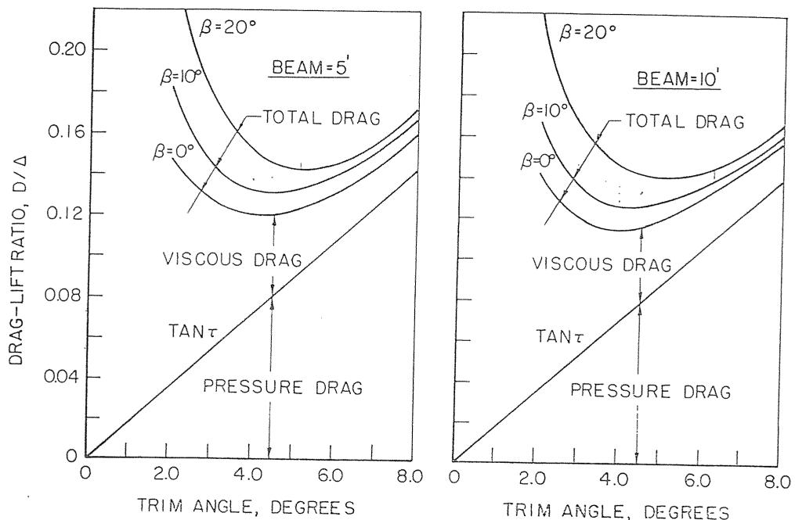  
Fig. 16 Variation of drag-lift ratio for prismatic planing surfaces

Briefly the results of the porpoising study showed that for a given deadrise angle, there was a specific relationship between trim angle, $\tau$ , and lift coefficient, $C_{L}$ , which defined the inception of porpoising. These relations are shown graphically in Fig. 18 for $0^{\circ}$ , $10^{\circ}$ and $20^{\circ}$ deadrise prismatic planing surfaces. The combinations of $\tau$ and $C_{L}$ which fall below the limit curves indicate stable operation while those above the line indicate the existence of porpoising.

It is seen that, as the lift coefficient is decreased, indicating a lightly loaded hull and/or a high planing speed, the trim limit for stability is decreased. Further, the effect of increasing deadrise is to increase the trim angle before the inception of porpoising. In any case, if a boat is porpoising at a given speed and load, the rule is to lower the trim angle to avoid porpoising. The lower trim angle can be achieved in several ways. One method is to move the longitudinal center of gravity forward. If this cannot be done and if the boat dimensions are fixed, the addition of a small transverse wedge across the bottom at the transom will lower the running trim at only a small cost in added resistance.

It may be of interest at this point to compare the trim requirements to avoid porpoising with the trim angle which results in minimum resistance. It was shown in Fig. 16 that a trim angle of approximately $4^{\circ}$ to $5^{\circ}$ resulted in minimum drag-lift ratio. The porpoising limits in Fig. 18 require a trim angle as low as $1^{\circ}$ to $2^{\circ}$ to achieve stable operation of a high-speed boat. Hence, because of porpoising considerations it is necessary to operate the boat at an unfavorably low trim angle where the resistance is high. Increasing the hull deadrise alleviates this situation since as shown in Fig. 18 the trim angle required to avoid porpoising increases with increasing deadrise angle. Hence, increasing the deadrise will enable a planing surface to operate at trim angles more closely approaching those required for minimum drag-lift ratios. Methods for computing the running trim angle for planing surfaces will be discussed in a subsequent section of this paper.

It will be noted that the porpoising limits are not dependent upon the pitch moment of inertia of the boat. Experimental studies by Locke [24] wherein the moment of inertia was increased and decreased by significant amounts showed a negligible effect on the porpoising inception boundary. What was observed was a change in frequency of oscillatory motion; increasing frequency for small values of pitch inertia and lower frequency for large inertias.

## Method for Evaluating Performance of Prismatic Planing Forms

The preceding sections of this paper have presented the results of elemental studies of the fundamentals of planing and have summarized the results in terms of equations and design charts. To be of use to the designer, it is important that these data be combined to formulate simple computational procedures to predict the horsepower requirements and porpoising stability of prismatic planing hulls. This section of the paper presents a method for computing the running trim, wetted length, resistance, power requirements and stability of a given planing hull over wide speed ranges and for arbitrary locations and inclinations of the propeller shaft line relative to the center of gravity of the hull.

In 1950, Murray [8] presented a computational procedure for predicting resistance which was based on the elemental planing data available at that time, reference [7]. No consideration was given to the effect of propeller thrust on the hull lift and pitching moment and, since porpoising information was not, at that time available, porpoising stability limits were not defined. The new planing equations presented in this paper (based on [9]) are applicable for much lower speed coefficients than those used in Murray's paper and, in addition, the new expression for center of pressure is much simpler in form than that used by Murray. DuCane [25] presents a computational procedure which is based on the early planing equations and which is essentially similar to that presented by Murray. In 1959, Clement and Pope [26] presented a series of graphs for predicting the resistance of planing hulls at high speeds. The lift and moment equations used by these authors were those developed by Shuford [27] and are applicable only at $C_v > 10$ where the buoyant forces are negligible. Most planing surfaces operate at lower speed coefficients wherein the buoyant contribution to lift is important. In 1963, Koelbel [28] used the new Davidson Laboratory planing relations, reference [9], to develop a simple graphical procedure for predicting the powering requirements of planing hulls when the effect of propeller thrust on lift and pitching moment is neglected and when it can be assumed that the viscous component of drag passes through the center of gravity. The relative simplicity of Koebel's design charts are so attractive that they are included in this paper.

There are in the literature test results on related series of planing boats which provide excellent design information on families of specific hull designs. Davidson and Suarez [29] present the results for EMB Series 50, a family of planing boats designed by DTMB. Clement and Blount [30] have developed a new hull series designated TMB Series 62 and their results are presented in [30]. These series data can be used to predict the performance of projected new designs which are similar in geometry, loading, and operating conditions to those hull forms investigated in the series.

## Performance Prediction Methods—Analysis

In the present paper the object is to utilize basic planing equations to formulate methods for predicting the performance of a prismatic planing hull whether or not it be a member of a tested series. The computational method involves the determination of the running trim and resistance which will provide for equilibrium conditions of the hull at a given running speed, load, and center of gravity location. The accompanying sketch shows the forces and moments acting on a planing hull.

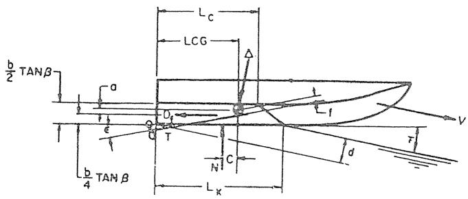

text_image

b/2 TANβ
a
Lc
LCG
Df
e
T
N
C
Lk
b/4 TANβ
d
r
V

where

T = propeller thrust, lb

$\Delta_{\Delta}=$ weight of boat, lb

$D_{f} = \text{viscous component of drag, (assumed as acting parallel to keel line, midway between keel and chine lines), lb}$

$\tau = \text{trim angle of keel, deg}$

LCG = longitudinal distance of center of gravity from transom, measured along keel, ft

CG = center of gravity

$\epsilon =$ inclination of thrust line relative to keel, deg

N = resultant of pressure forces acting normal to bottom, lb

$a = \text{distance between } D_{f} \text{ and CG (measured normal to } D_{f}), \text{ ft}$

$f = \begin{array}{c}\text{distance between } T \text{ and CG (measured normal}\\ \text{to shaft line), ft} \end{array}$

c = distance between N and CG (measured normal to N), ft

$\beta = \text{deadrise angle, deg}$

$b = \mathrm{beam, ft}$

$L_{k} =$ wetted keel length, ft

$L_{c}$ = wetted chine length (from transom to spray root intersection with chine), ft

$V = \text{planing speed, fps}$

$d =$ draft of keel at transom, ft

For Vertical Equilibrium of Forces:

$$
\Delta_ {0} = N \cos \tau + T \sin (\tau + \epsilon) - D _ {f} \sin \tau \tag {29}
$$

For Horizontal Equilibrium of Forces:

$$
T \cos (\tau + \epsilon) = D _ {f} \cos \tau + N \sin \tau \tag {30}
$$

For Equilibrium of Pitching Moments:

$$
N c + D _ {f} a - T f = 0 \tag {31}
$$

For a given boat design the quantities $\Delta_{\Delta}$ , a, b, $\epsilon$ , LCG, f, and $\beta$ are specified. The unknowns in the foregoing equations of equilibrium are evaluated by a solution of these simultaneous equations together with the planing formulas for lift, drag, and center of pressure. An analytical solution of these equations is extremely tedious and cumbersome and hence a numerical computational

Table 1 Computational Procedure Hydrodynamic Performance of Prismatic Planing Hull (General Case)  
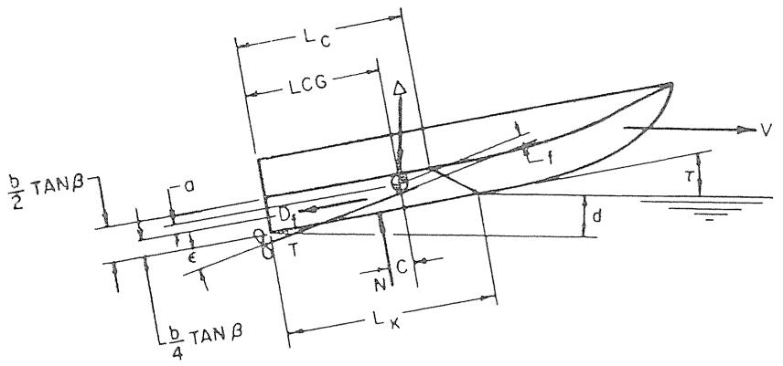

text_image

Lc
LCG
Δ
L
f
V
b/2 TANβ
a
Df
ε
G
T
d
c
N
b/4 TANβ
Lx

EQUILIBRIUM TRIM ( $\tau_{e}$ )

Trim at which (30) = 0

Assume line AR interpolation between

$$
\tau = 2 ^ {\circ} \text {and} \tau = 3 ^ {\circ}
$$

$$
\tau_ {e} = 2 ^ {\circ} + \frac {1 4 9 , 9 6 0}{1 4 9 , 9 6 0 + 3 3 6 , 6 0 0} \sim 2. 3 ^ {\circ}
$$

Horizontal Drag Force

$$
D = 9 4 2 4 - (9 4 3 4 - 8 3 0 4) \frac {3}{1 0}
$$

$$
D = 9 0 9 5 \mathrm{lb}
$$

Effective Horsepower

$$
\mathrm{EHP} = \frac {D \times V}{5 5 0} = \frac {9 0 9 5 \times 6 7 . 5}{5 5 0} = 1 1 1 5 \mathrm{hp}
$$

Equilibrium Mean Wetted Length-Beam Ratio

$$
\lambda_ {e} = 3. 8 5 - (3. 8 5 - 2. 6 0) \frac {3}{1 0} = 3. 2 9
$$

Wetted Keel Length

$$
L _ {k} = \lambda_ {e} b + \frac {b \tan \beta}{2 \pi \tan \tau}
$$

$$
L _ {k} = 4 6 + \frac {1 4}{2 \pi} \frac {\tan 1 0 ^ {\circ}}{\tan 2 . 3 ^ {\circ}} = 5 5. 9 \mathrm{ft}
$$

Wetted Chine Length

$$
L _ {\mathrm{c}} = \lambda_ {c} b - \frac {b}{2 \pi} \frac {\tan \beta}{\tan \tau} = 3 6. 1 \mathrm{ft}
$$

Draft of Keel at Transom

$$
d = L _ {k} \sin \tau_ {e} = 5 5. 9 \times \tan 2. 3 ^ {\circ}
$$

$$
d = 2. 2 4 \mathrm{ft}
$$

Porpoising Stability

$$
\left(C _ {L _ {\beta}} / 2\right) ^ {1 / 2} = \left(\frac {0 . 0 6 9}{2}\right) ^ {1 / 2} =
$$

$$
0. 0 3 4 5 ^ {1 / 2} = 0. 1 8 6
$$

From Fig. 18, porpoising will occur if $\tau_{e}74.5^{0}$ ; hence, present planing boat is stable.

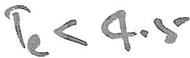

GIVEN:

$$
\begin{array}{l} \Delta = 6 0, 0 0 0 \mathrm{LB} \quad a = 1. 3 9 \mathrm{FT} \\ \mathrm{LCG} = 2 9. 0 \mathrm{FT} \quad \mathrm{f} = 0. 5 0 \mathrm{FT} \\ \mathrm{VCG} = 2. 0 \mathrm{FT} \quad \varepsilon = 4 ^ {\circ} \\ \end{array}
$$

$$
\begin{array}{l} b = 1 4 \text {FT (AVERAGE)} \\ \beta = 1 0 ^ {\circ} \quad (\text {AVERAGE}) \\ \mathrm{V} = 4 0 \text {KNOTS} (6 7. 5 \mathrm{FT/SEC}) \\ \end{array}
$$

REQUIRED:

POWER REQUIREMENT

PORPOISING LIMIT

POWER REQUIREMENT

V = 40 KNOTS

PLANING COEFFICIENTS:

$$
\begin{array}{l} C _ {V} = V / \sqrt {g b} = 4 0 \times 1. 6 9 / \sqrt {3 2 . 2 \times 1 4} = 3. 1 8 \\ C _ {L _ {\beta}} = \Delta / \frac {1}{2} \rho V ^ {2} b ^ {2} = 6 0, 0 0 0 / 0. 9 7 \times 6 7. 5 ^ {2} \times 1 4 ^ {2} = 0. 0 6 9 \\ \end{array}
$$

<table><tr><td>Row</td><td>Quantity</td><td>Source</td><td> $\tau = 2^{\circ}$ </td><td> $\tau = 3^{\circ}$ </td><td> $\tau = 4^{\circ}$ </td></tr><tr><td>1</td><td> $\tau^{1.1}$ </td><td>Figure 10</td><td>2.14</td><td>3.35</td><td>4.59</td></tr><tr><td>2</td><td> $C_{LQ}$ </td><td>Figure 11</td><td>.085</td><td>.085</td><td>.085</td></tr><tr><td>3</td><td> $C_{LQ}/\tau^{1.1}$ </td><td>(2)/(1)</td><td>.0397</td><td>.0254</td><td>.0185</td></tr><tr><td>4</td><td> $\lambda$ </td><td>Figure 10</td><td>3.85</td><td>2.60</td><td>1.86</td></tr><tr><td>5</td><td> $V_{m}$ </td><td>Figure 14</td><td>67.0</td><td>66.6</td><td>66.2</td></tr><tr><td>6</td><td> $R_{e}$ </td><td> $V_{m}\lambda b/\nu$ </td><td> $3.61 \times 10^{8}$ </td><td> $2.42 \times 10^{8}$ </td><td> $1.73 \times 10^{8}$ </td></tr><tr><td>7</td><td> $C_{f}$ </td><td>Schoenherr</td><td>.00174</td><td>.00184</td><td>.00192</td></tr><tr><td>8</td><td> $\Delta C_{f}$ </td><td>ATTC Standard Roughness</td><td>.0004</td><td>.0004</td><td>.0004</td></tr><tr><td>9</td><td> $C_{f} + \Delta C_{f}$ </td><td>(7) + (8)</td><td>.00214</td><td>.00224</td><td>.00232</td></tr><tr><td>10</td><td> $D_{f}$ </td><td> $\frac{\rho V_{m}^{2}\lambda b^{2}(C_{f} + \Delta C_{f})}{2 \cos \beta}$ </td><td>7.340</td><td>5.160</td><td>3.760</td></tr><tr><td>11</td><td> $tan\tau$ </td><td></td><td>.0349</td><td>.0524</td><td>.0698</td></tr><tr><td>12</td><td> $s\ln\tau$ </td><td></td><td>.0349</td><td>.0524</td><td>.0698</td></tr><tr><td>13</td><td> $cos\tau$ </td><td></td><td>.9994</td><td>.9986</td><td>.9976</td></tr><tr><td>14</td><td> $\Delta tan\tau$ </td><td></td><td>2094</td><td>3144</td><td>4188</td></tr><tr><td>15</td><td> $D_{f}/cos\tau$ </td><td>(10)/cosτ</td><td>7340</td><td>5160</td><td>3760</td></tr><tr><td>16</td><td>D</td><td>(14) + (15)</td><td>9434</td><td>8304</td><td>7948</td></tr><tr><td>17</td><td> $C_{p}$ </td><td>Figure 17</td><td>.59</td><td>.65</td><td>.70</td></tr><tr><td>18</td><td> $C_{p}\lambda b$ </td><td></td><td>31.6</td><td>23.5</td><td>18.2</td></tr><tr><td>19</td><td>c</td><td>LCG - (18)</td><td>-2.6</td><td>5.5</td><td>10.8</td></tr><tr><td>20</td><td>(b/4)  $tan\beta$ </td><td></td><td>.616</td><td>.616</td><td>.616</td></tr><tr><td>21</td><td>a</td><td>VCG - (20)</td><td>1.39</td><td>1.39</td><td>1.39</td></tr><tr><td>22</td><td> $s\ln(\tau + \epsilon)$ </td><td></td><td>.1045</td><td>.1219</td><td>.1392</td></tr><tr><td>23</td><td>1 -  $s\ln\tau$   $s\ln(\tau + \epsilon)$ </td><td>1 - (12) (22)</td><td>.9964</td><td>.9964</td><td>.9903</td></tr><tr><td>24</td><td>(23)  $\left(\frac{c}{cos\tau}\right)$ </td><td></td><td>-2.59</td><td>5.46</td><td>10.70</td></tr><tr><td>25</td><td> $f \sin\tau$ </td><td></td><td>.0174</td><td>.0262</td><td>.0349</td></tr><tr><td>26</td><td>(24) - (25)</td><td></td><td>-2.6</td><td>5.53</td><td>10.73</td></tr><tr><td>27</td><td> $\Delta (26)$ </td><td></td><td>-156,500</td><td>332,000</td><td>645,000</td></tr><tr><td>28</td><td>(a - f)</td><td>(21) - f</td><td>.89</td><td>.89</td><td>.89</td></tr><tr><td>29</td><td> $D_{f}(a - f)$ </td><td>(10) (28)</td><td>6540</td><td>4600</td><td>3350</td></tr><tr><td>30</td><td>(27) + (29)</td><td>Eq 35</td><td>-149,960</td><td>336,600</td><td>648,350</td></tr></table>

Table 2 Computational Procedure Hydrodynamic Performance of Prismatic Plan-
ing Hull (Case When all Forces Pass Through CG)  
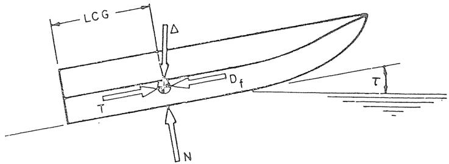

text_image

LCG
Δ
Df
T
τ
N

## GIVEN:

$$
\Delta = 6 0, 0 0 0 \mathrm{LB}
$$

$$
\mathrm{LCG} = 2 9. 0 \mathrm{FT}
$$

$$
\mathrm{VCG} = 2. 0 \quad \mathrm{FT}
$$

$$
b = 1 4 \text {FT (AVERAGE)}
$$

$$
\beta = 1 0 ^ {\circ} \quad (\text {AVERAGE})
$$

$$
\mathrm{V} = 4 0 \text {KNOTS}
$$

$$
a = c = f = \epsilon = 0
$$

## REQUIRED:

POWER REQUIREMENT

PORPOISING STABILITY

## POWER REQUIREMENT

V = 40 KNOTS (67.5 FT/SEC)

## PLANING COEFFICIENTS:

$$
C _ {V} = V / \sqrt {g b} = 4 0 \times 1. 6 9 / \sqrt {3 2 . 2 \times 1 4} = 3. 1 8
$$

$$
C _ {L _ {\beta}} = \Delta / \frac {1}{2} \rho V ^ {2} b ^ {2} = 6 0, 0 0 0 / 0. 9 7 \times 6 7. 5 ^ {2} \times 1 4 ^ {2} = 0. 0 6 9
$$

<table><tr><td>Row</td><td>Quantity</td><td>Source</td><td>Value</td></tr><tr><td>1</td><td> $C_{Lo}$ </td><td>Figure 11</td><td>.085</td></tr><tr><td>2</td><td> $\ell_{p}/b$ </td><td>LCG/b</td><td>2.07</td></tr><tr><td>3</td><td> $\lambda$ </td><td>Figure 19</td><td>3.45</td></tr><tr><td>4</td><td> $C_{Lo}/\tau^{1.1}$ </td><td>Figure 19</td><td>.035</td></tr><tr><td>5</td><td> $\tau^{1.1}$ </td><td>(1)/(4)</td><td>2.42</td></tr><tr><td>6</td><td> $\tau$ </td><td></td><td>2.23°</td></tr><tr><td>7</td><td> $\text{tant}$ </td><td></td><td>.039</td></tr><tr><td>8</td><td> $\Delta \text{tant}$ </td><td></td><td>2,340</td></tr><tr><td>9</td><td> $\lambda b^{2}$ </td><td>(3) $b^{2}$ </td><td>675</td></tr><tr><td>10</td><td> $V_{m}'$ </td><td>Figure 14</td><td>66.9</td></tr><tr><td>11</td><td> $R_{e}$ </td><td> $V_{m}\lambda b/v$ </td><td>3.22 × 108</td></tr><tr><td>12</td><td> $C_{f}$ </td><td>Schoenherr</td><td>.00177</td></tr><tr><td>13</td><td> $\Delta C_{f}$ </td><td>ATTC Standard Roughness</td><td>.0004</td></tr><tr><td>14</td><td> $C_{f} + \Delta C_{f}$ </td><td>(12) + (13)</td><td>.00217</td></tr><tr><td>15</td><td> $D_{f}$ </td><td> $\frac{\rho V_{m}^{2}\lambda b^{2}(C_{f} + \Delta C_{f})}{2\cos\beta}$ </td><td>6670</td></tr><tr><td>16</td><td> $D_{f}/\cos\tau$ </td><td></td><td>6670</td></tr><tr><td>17</td><td>D</td><td>(8) + (17)</td><td>9010</td></tr><tr><td>18</td><td>EHP</td><td>D × V/550</td><td>1100</td></tr><tr><td>19</td><td> $\sqrt{CL_{\beta}/\beta}$ </td><td></td><td>.186</td></tr><tr><td>20</td><td> $\tau$  porpoising</td><td>Figure 18</td><td> $\leqslant 4.5^{\circ}$ </td></tr></table>

Boat Is Stable

procedure is recommended. To simplify the computational procedure the equilibrium equations are rearranged as follows:

It can be shown that

$$
T ^ {\prime} \cos \epsilon = \Delta \sin \tau + D _ {f} \tag {32}
$$

Substituting (32) into (29) and assuming that $\cos \epsilon \approx 1$ results in

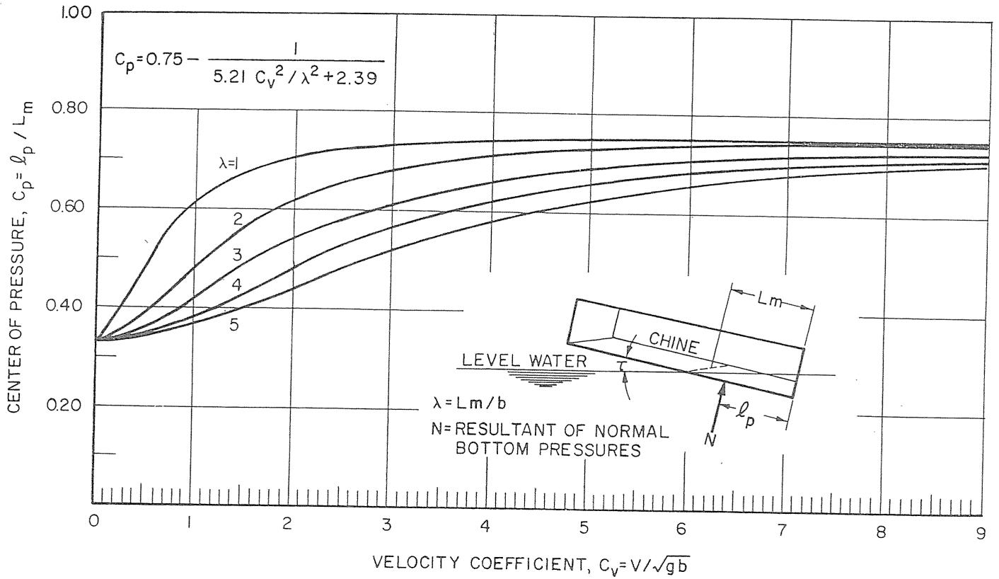

line

| Velocity Coefficient (Cv) | Center of Pressure (Cp) \((\lambda=1)\) | Center of Pressure (Cp) \((\lambda=2)\) | Center of Pressure (Cp) \((\lambda=3)\) | Center of Pressure (Cp) \((\lambda=4)\) | Center of Pressure (Cp) \((\lambda=5)\) |
| --- | --- | --- | --- | --- | --- |
| 0 | 0.33 | 0.33 | 0.33 | 0.33 | 0.33 |
| 1 | ~0.60 | ~0.48 | ~0.42 | ~0.38 | ~0.36 |
| 2 | ~0.69 | ~0.58 | ~0.51 | ~0.45 | ~0.41 |
| 3 | ~0.72 | ~0.64 | ~0.57 | ~0.51 | ~0.46 |
| 4 | ~0.73 | ~0.67 | ~0.61 | ~0.55 | ~0.50 |
| 5 | ~0.73 | ~0.69 | ~0.64 | ~0.58 | ~0.53 |
| 6 | ~0.73 | ~0.70 | ~0.66 | ~0.61 | ~0.56 |
| 7 | ~0.73 | ~0.71 | ~0.67 | ~0.63 | ~0.58 |
| 8 | ~0.73 | ~0.71 | ~0.68 | ~0.64 | ~0.59 |
| 9 | ~0.73 | ~0.71 | ~0.68 | ~0.65 | ~0.60 |

Fig. 17. Center of pressure of planing surfaces

$$
\Delta = N \cos \tau + \Delta \sin \tau \sin (\tau + \epsilon) \tag {33}
$$

so that

$$
N = \frac {\Delta [ 1 - \sin \tau \sin (\tau + \epsilon) ]}{\cos \tau} \tag {34}
$$

Substituting (32) and (34) into (31)

$$
\begin{array}{l} \Delta \left\{\frac {[ 1 - \sin \tau \sin (\tau + \epsilon) ] c}{\cos \tau} - f \sin \tau \right\} \\ + D _ {f} (a - f) = 0 \tag {35} \\ \end{array}
$$

When $\tau$ , c, and $D_{f}$ satisfy equation (35) the planing hull in equilibrium and the resistance, power, and stability are then easily evaluated.

Case When Thrust Axis is Parallel to Keel

In many boat designs the shaft axis is nearly parallel to the keel line. If it is assumed that $\epsilon = 0$ , equation (35) simplifies to

$$
\Delta (c \cos \tau - b \sin \tau ] + D _ {f} (a - f) = 0 \tag {36}
$$

Case When Thrust Axis and Viscous Force Coincide and Pass Through Center of Gravity

This case is the simplest to evaluate since, to achieve equilibrium in pitch, the hydrodynamic pressure force must pass through the center of gravity. It is assumed in this condition that the distances a and f and c are equal to zero and $\epsilon = 0$ . This is the condition analyzed by Murray, Clement, and Koelbel in their respective computational procedures. The moment equation (31) is hence satisfied since a, f, and c are equal to zero. It is, of course, implicitly specified that $\lambda C_{p}b = LCG$ . Hence combining (29) and (30)

$$
\begin{array}{c} N = \Delta / \cos \tau \\ \lambda C _ {p} b = \mathrm{LCG} \end{array} \tag {37}
$$

These two equations will satisfy the conditions of equilibrium for the case when $a = f = c = \epsilon = 0$ . There are many practical planing-boat designs wherein these conditions are very nearly applicable.

Performance Prediction Methods—Computational Procedures

The computational technique for the general case is developed in the form of tabulations which can be completed as a routine procedure. By setting $\epsilon = 0$ the computations can be made applicable to Case 2; by setting $a = f = c = \epsilon = 0$ and $\lambda C_{p}b = LCG$ , the computations can be made applicable to Case 3. For the relatively simple Case 3, the detailed computations can be replaced by a design nomogram.

General Case

It is assumed that the hull geometry and loading conditions are known and that the trim angle, wetted length, power requirement, and measure of porpoising stability are required over a range of design speeds. Specifically the following initial information is required :

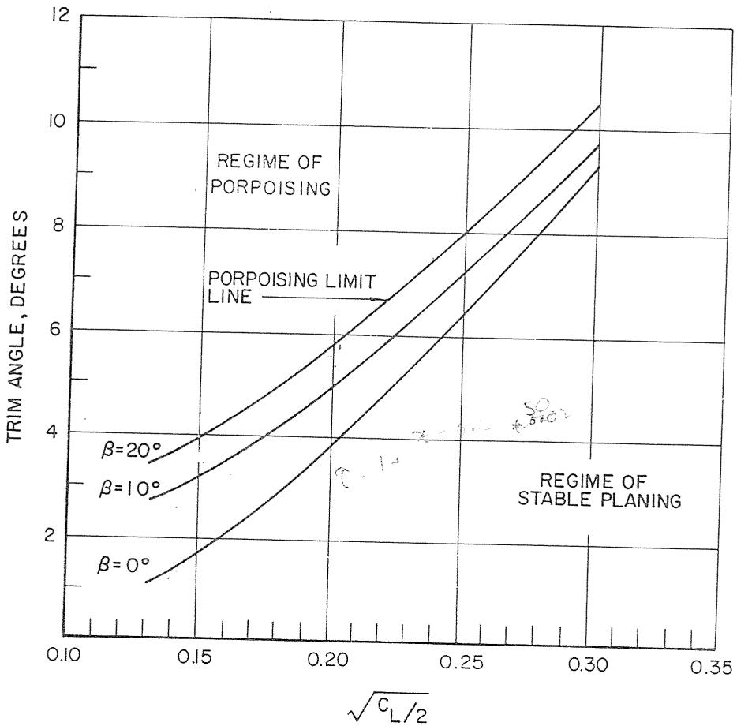

line

| \(\sqrt{}\)cL/2 | Trim Angle \((\beta=0{}^{\circ})\) | Trim Angle \((\beta=10{}^{\circ})\) | Trim Angle \((\beta=20{}^{\circ})\) |
| --- | --- | --- | --- |
| 0.13 | ~1.1 | ~2.7 | ~3.4 |
| 0.15 | ~1.8 | ~3.3 | ~4.0 |
| 0.20 | ~3.8 | ~4.9 | ~5.7 |
| 0.25 | ~6.2 | ~7.0 | ~7.9 |
| 0.30 | ~9.1 | ~9.5 | ~10.3 |

Fig. 18 Porpoising limits for prismatic planing hulls

Given:

Dimensions and lines of boat (β, b)

Weight of boat, Δ

Propeller shaft line location (f, ε)

Center of gravity location (a, c, LCG)

Speed of boat, (V)

Required:

Running trim angle (τ)

Wetted length ( $L_{k}$ , $L_{c}$ )

Total resistance (D)

Draft of keel (d)

Power

Porpoising stability limit

The detailed computational procedure for determining the required values is given in Table 1 where a specific example is worked out. The procedure, at each speed, is to assume several values of trim angle and, for each trim, compute the quantities required to substitute into equation (35). It will be recalled that (35) contains all the conditions for force and moment equilibrium. The value of trim angle that makes equation (35) equal to zero is the required solution.

Column 1 in Table 1 is the quantity to be evaluated;
Column 2 is the source for evaluating this quantity (either by a mathematical formulation or by summary plots contained in this paper); and Columns 3, 4 and 5 are the computed value for each of three assumed trim angles. The last line of this tabulation contains the value of equation (35) for each of the assumed trim angles. By interpolating between the negative and positive values a trim angle is obtained which results in a zero value of this last quantity [equation (35) = 0]. This derived trim angle is then used to calculate the required values of wetted area, resistance and power requirements.

Also included in Table 1 is the procedure for estimating the porpoising stability of the planing boat. The ratio $(C_{L}/2)^{1/2}$ is evaluated and substituted into the porpoising-stability curve appropriate for the given deadrise, Fig. 18. If the trim angle obtained from these curves is greater than the equilibrium trim angle computed in the foregoing, the planing boat is stable.

The foregoing procedures are carried out for the entire speed range of interest (with the restriction that $C_{v} \geq 1.0$ ) and plots made of the resistance versus speed.

## Case When Thrust Axis is Parallel to Keel

The general procedure described in the foregoing is applied with the exception that $\epsilon = 0$ .

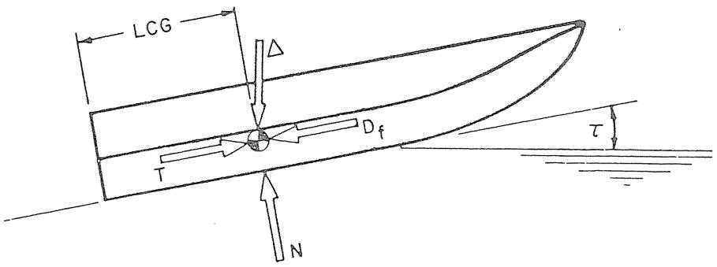

text_image

LCG
Δ
Df
T
τ
N

$$
\mathrm{LCG} = \mathrm{C} _ {\mathrm{p}} \mathrm{b} \lambda
$$

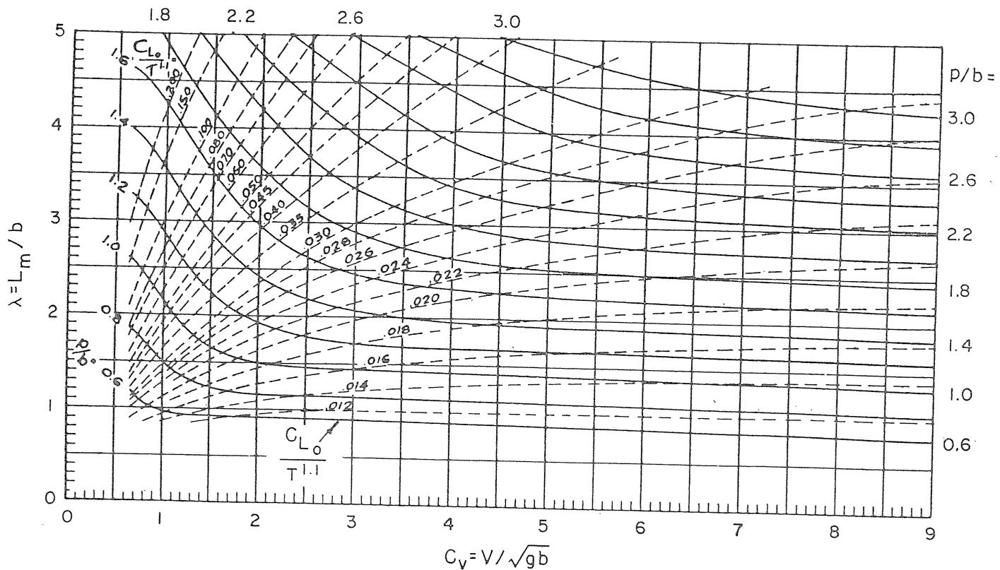

contour

| p/b | \(Cv (V/\sqrt\)gb) | \(\lambda (\)Lm/b) |
| --- | --- | --- |
| 0.6 | ~0.5 | ~1.2 |
| 0.6 | ~1.0 | ~1.5 |
| 0.6 | ~2.0 | ~1.8 |
| 0.6 | ~3.0 | ~2.0 |
| 0.6 | ~4.0 | ~2.1 |
| 0.6 | ~5.0 | ~2.2 |
| 0.6 | ~6.0 | ~2.3 |
| 0.6 | ~7.0 | ~2.4 |
| 0.6 | ~8.0 | ~2.5 |
| 0.6 | ~9.0 | ~2.6 |
| 1.0 | ~0.5 | ~1.5 |
| 1.0 | ~1.0 | ~1.8 |
| 1.0 | ~2.0 | ~2.2 |
| 1.0 | ~3.0 | ~2.6 |
| 1.0 | ~4.0 | ~2.9 |
| 1.0 | ~5.0 | ~3.2 |
| 1.0 | ~6.0 | ~3.5 |
| 1.0 | ~7.0 | ~3.8 |
| 1.0 | ~8.0 | ~4.0 |
| 1.0 | ~9.0 | ~4.2 |
| 1.4 | ~0.5 | ~1.8 |
| 1.4 | ~1.0 | ~2.2 |
| 1.4 | ~2.0 | ~2.8 |
| 1.4 | ~3.0 | ~3.4 |
| 1.4 | ~4.0 | ~3.9 |
| 1.4 | ~5.0 | ~4.3 |
| 1.4 | ~6.0 | ~4.6 |
| 1.4 | ~7.0 | ~4.9 |
| 1.4 | ~8.0 | ~5.1 |
| 1.4 | ~9.0 | ~5.3 |
| 1.8 | ~0.5 | ~2.2 |
| 1.8 | ~1.0 | ~2.8 |
| 1.8 | ~2.0 | ~3.6 |
| 1.8 | ~3.0 | ~4.4 |
| 1.8 | ~4.0 | ~5.0 |
| 1.8 | ~5.0 | ~5.5 |
| 1.8 | ~6.0 | ~5.9 |
| 1.8 | ~7.0 | ~6.3 |
| 1.8 | ~8.0 | ~6.7 |
| 1.8 | ~9.0 | ~7.0 |
| 2.2 | ~0.5 | ~2.8 |
| 2.2 | ~1.0 | ~3.6 |
| 2.2 | ~2.0 | ~4.4 |
| 2.2 | ~3.0 | ~5.2 |
| 2.2 | ~4.0 | ~5.8 |
| 2.2 | ~5.0 | ~6.3 |
| 2.2 | ~6.0 | ~6.7 |
| 2.2 | ~7.0 | ~7.0 |
| 2.2 | ~8.0 | ~7.3 |
| 2.2 | ~9.0 | ~7.6 |
| 2.6 | ~0.5 | ~3.2 |
| 2.6 | ~1.0 | ~4.0 |
| 2.6 | ~2.0 | ~4.8 |
| 2.6 | ~3.0 | ~5.6 |
| 2.6 | ~4.0 | ~6.2 |
| 2.6 | ~5.0 | ~6.7 |
| 2.6 | ~6.0 | ~7.1 |
| 2.6 | ~7.0 | ~7.5 |
| 2.6 | ~8.0 | ~7.9 |
| 2.6 | ~9.0 | ~8.2 |
| 3.0 | ~0.5 | ~3.8 |
| 3.0 | ~1.0 | ~4.6 |
| 3.0 | ~2.0 | ~5.4 |
| 3.0 | ~3.0 | ~6.2 |
| 3.0 | ~4.0 | ~6.8 |
| 3.0 | ~5.0 | ~7.3 |
| 3.0 | ~6.0 | ~7.7 |
| 3.0 | ~7.0 | ~8.1 |
| 3.0 | ~8.0 | ~8.5 |
| 3.0 | ~9.0 | ~8.8 |

Fig. 19 Nomogram for equilibrium conditions when all forces act through CG

Case When Thrust Axis and Viscous Force Coincide and Pass Through Center of Gravity

For this relatively simple planing condition the empirical equations for planing lift, wetted area, and center of pressure can be combined into one summary plot. Koelbel has developed such a plot which is reproduced as Fig. 19 of this paper. From this plot, the equilibrium trim and wetted area are directly obtained without the necessity for interpolating between assumed values of trim (as for the general case). Table 2 presents the computational procedure which illustrates the use of Fig. 19 by a specific example.

The porpoising stability is determined in the manner previously described for the general planing case.

Representation of Specific Planing Form by Simple Prismatic Surface

The empirical planing equations developed herein are for a geometric form having constant deadrise, constant beam, and constant trim angle over the entire wetted planing area. Most practical planing-hull designs do have some longitudinal variation in these dimensions. It has been the experience at the Davidson Laboratory that, for a particular hull design, the deadrise angle and beam should be taken as the average in the stagnation line area of the hull. The trim angle should be taken as the average of the keel and chine buttock lines.

Care should be taken to assure that the calculated trim and wetted lengths do not result in wetted areas extending into the forward pulled-up bow sections of the hull. The empirical planing relations are not applicable for the bow wetted condition where there are extreme variations in deadrise angle and buttock lines. In fact, a necessary area of planing research is to define the forces on bow forms over a range of trim angles. These data will be of particular importance in the design of hulls for hydrofoil-boat application.

## Acknowledgment

The author is indebted to the Mechanics Branch, Office of Naval Research, Navy Department for their interest in and support of planing surface research at Stevens Institute of Technology. The many Stevens Institute of Technology staff members who contributed to this program are too numerous to mention individually. The author is particularly grateful to Prof. B. V. Korvin-Kroukovsky who initiated this research and guided it through its various stages of development.

## References

1 G. S. Baker, “Some Experiments in Connection with the Design of Floats for Hydro-Aeroplanes,” ARC (British) R & M, no. 70, 1912.  
2 W. Sottorf, "Experiments With Planing Surfaces," NACA TM 661, 1932, and NACA TM 739, 1934.  
3 J. M. Shoemaker, "Tank Tests of Flat and Vee-Bottom Planing Surfaces," NACA TN 509, November 1934.  
4 A. Sambraus, “Planing Surface Tests at Large Froude Numbers—Airfoil Comparison,” NACA TM No. 848, February 1938.  
5 L. I. Sedov, "Scale Effect and Optimum Relation for Sea Surface Planing," NACA TM No. 1097, February 1947.  
6 F. W. S. Locke, Jr., “Tests of a Flat Bottom Planing Surface to Determine the Inception of Planing,” Navy Department, BuAer, Research Division Report No. 1096, December 1948.  
7 B. V. Korvin-Kroukovsky, D. Savitsky and W. F. Lehman, "Wetted Area and Center of Pressure of Planing Surfaces," Stevens Institute of Technology, Davidson Laboratory Report No. 360, August 1949.  
8 A. B. Murray, "The Hydrodynamics of Planing Hulls," Paper presented at the February 1950 Meeting of the New England Section of SNAME.  
9 D. Savitsky and J. W. Neidinger, "Wetted Area and Center of Pressure of Planing Surfaces at Very Low Speed Coefficients," Stevens Institute of Technology, Davidson Laboratory Report No. 493, July 1954.  
10 H. Wagner, “The Phenomena of Impact and Planing on Water,” NACA translation 1366, ZAMM, August 1932.  
11 R. F. Smiley, "The Application of Planing Characteristics to the Calculation of the Water Landing Loads and Motions of Seaplanes of Arbitrary Cross Section," NACA TN 2814, November 1952.  
12 D. B. Chambliss and G. M. Boyd, Jr., "The Planing Characteristics of Two V-Shaped Prismatic Surfaces Having Angles of Deadrise of 20° and 40°," NACA TN No. 2876, January 1953.  
13 J. D. Pierson and S. Leshnover, “A Study of the Flow, Pressures, and Loads Pertaining to Prismatic Vee-Planing Surfaces,” Stevens Institute of Technology, Davidson Laboratory Report 382, May 1950.  
14 "Uniform Procedure for the Calculation of Frictional Resistance and the Expansion of Model Test Data to Full Size," Bulletin No. 1-2 of SNAME, August 1948.  
15 J. B. Parkinson, “Tank Tests to Show the Effect of Rivet Heads on the Water Performance of a Seaplane Float,” NACA TN 657, July 1938.  
16 F. W. S. Locke, Jr., “Frictional Resistance of Planing Surfaces,” Stevens Institute of Technology, Davidson Laboratory TM No. 40, July 1939.  
17 D. Savitsky and E. Ross, “Turbulence Stimulation in the Boundary Layer of Planing Surfaces,” Stevens Institute of Technology, Davidson Laboratory. Report 44, August 1952.  
18 W. G. A. Perring and H. Glauert, “Stability on the Water of a Seaplane in the Planing Condition,” ARC, TR vol. 42, September 1933.  
19 W. Sottorf, “Systematic Model Researches on the Stability Limits of the DVL Series of Float Designs,” NACA TM 1254, December 1949.  
20 K. S. M. Davidson and F. W. S. Locke, Jr., "Some Systematic Model Experiments on the Porpoising Characteristics of Flying Boat Hulls," NACA ARR, June 1943.  
21. J. M. Benson, "The Effect of Deadrise Upon the Low-Angle Type of Porpoising," NACA ARR, October 1942.  
22 J. B. Parkinson and R. E. Olson, "Tank Tests of an Army OA-9 Amphibian," NACA ARR, December 1941.  
23 J. P. Day and R. J. Haag, “Planing Boat Porpoising,” a Thesis Submitted to Webb Institute of Naval Architecture, May 1952.  
24 F. W. S. Locke, Jr., “General Porpoising Tests of Flying-Boat Hull Models,” NACA ARR, September 1943.  
25 P. DuCane, High-Speed Small Craft, Temple Press Limited, Bowling Green Lane, London, E.C. 1, England. 1951.  
26 E. P. Clement and J. D. Pope, “Graphs for Predicting the Resistance of Large Stepless Planing Hulls at High Speeds,” DTMB Report 1318, April 1959.  
27 C. L. Shuford, Jr., "A Theoretical and Experimental Study of Planing Surfaces Including Effects  
of Cross Section and Plan Form," NACA Report 1355, 1958.  
28 J. G. Koelbel, Jr., J. Stolz, and J. D. Beinert, "How to Design Planing Hulls," vol. 49, Motor Boating Ideal Series.  
29 K. S. M. Davidson and A. Suarez, "Test of Twenty Related Models of V-Bottom Motor Boats—EMB Series 50," DTMB Report R-47, March 1949.  
30 E. P. Clement and D. L. Blount, "Resistance Tests of a Systematic Series of Planing Hull Forms," Paper No. 10, presented at the Annual Meeting, November 1963 of SNAME, TRANS. SNAME, vol. 71, 1963, pp.

## Appendix

## Reports and Papers on Planing Published by Stevens Institute of Technology Under ONR Contract

1 Korvin-Kroukovsky, B. V. and Chabrow, Faye R., "The Discontinuous Fluid Flow Past an Immersed Wedge," Stevens Institute of Technology, Experimental Towing Tank Report No. 334, October 1948. Sherman M. Fairchild Publication Fund Paper No. 169, Institute of the Aeronautical Sciences, New York.  
2 Pierson, John D. and Leshnover, Samuel, “An Analysis of the Fluid Flow in the Spray Root and Wake Regions of Flat Planing Surfaces,” Stevens Institute of Technology, Experimental Towing Tank Report No. 335, October 1948. Sherman M. Fairchild Publication Fund Paper No. 166, Institute of the Aeronautical Sciences, New York.  
3 Pierson, John D., “On the Pressure Distribution for a Wedge Penetrating a Fluid Surface,” Stevens Institute of Technology, Experimental Towing Tank Report No. 336, September 1948. Sherman M. Fairchild Publication Fund Paper No. 167, Institute of the Aeronautical Sciences, New York.  
4 Pierson, John D. and Leshnover, Samuel, “Study of Flow, Pressures, and Loads Pertaining to Prismatic Vee-Planing Surfaces,” Stevens Institute of Technology, Experimental Towing Tank Report No. 382, May 1950. Sherman M. Fairchild Publication Fund Paper No. FF-2, Institute of the Aeronautical Sciences, New York.  
5 Pierson, John D., "On the Penetration of a Fluid Surface by a Wedge," Stevens Institute of Technology, Experimental Towing Tank Report No. 381, July 1950. Sherman M. Fairchild Publication Fund Paper No. FF-3, Institute of the Aeronautical Sciences, New York.  
6 Korvin-Kroukovsky, B. V., “Lift of Planing Surfaces,” Stevens Institute of Technology, Experimental Towing Tank Paper Published in Readers’ Forum Section of the Journal of Aeronautical Sciences, September 1950.  
7 Pierson, John D., "On the Virtual Mass of Water Associated With an Immersing Wedge," Stevens Institute of Technology, Experimental Towing Tank Paper Published in Readers' Forum Section of the Journal of Aeronautical Sciences, June 1951.  
8 Pierson, John D.; Dingee, David A.; and Nei-

dinger, Joseph W., “A Hydrodynamic Study of the Chines-Dry Planing Body.” Stevens Institute of Technology, Experimental Towing Tank Report No. 492, May 1954. Sherman M. Fairchild Publication Fund Paper No. FF-9, Institute of the Aeronautical Sciences, New York.

9 Korvin-Kroukovsky, B. V.; Savitsky, Daniel; and Lehman, William F. “Wave Contours in the Wake of a 20° Deadrisc Planing Surface.” Stevens Institute of Technology, Experimental Towing Tank Report No. 337, June 1948. Sherman M. Fairchild Publication Fund Paper No. 168, Institute of the Aeronautical Sciences, New York.

10 Korvin-Kroukovsky, B. V.; Savitsky, Daniel; and Lehman, William F., “Wave Contours in the Wake of a 10° Deadrise Planing Surface,” Stevens Institute of Technology, Experimental Towing Tank Report No. 344, November 1948. Sherman M. Fairchild Publication Fund Paper No. 170, Institute of the Aeronautical Sciences, New York.

11 Korvin-Kroukovsky, B. V.; Savitsky, Daniel; and Lehman, William F., "Wave Profile of a Vee-Planing Surface, Including Test Data on a 30° Deadrise Surface," Stevens Institute of Technology, Experimental Towing Tank Report No. 339, April 1949. Sherman M. Fairchild Publication Fund Paper No. 229, Institute of the Aeronautical Sciences, New York.

12 Korvin-Kroukovsky, B. V.; Savitsky, Daniel; and Lehman, William F., "Wetted Area and Center of Pressure of Planing Surfaces," Stevens Institute of Technology, Experimental Towing Tank Report No. 360, August 1949. Sherman M. Fairchild Publication Fund Paper No. 244, Institute of the Aeronautical Sciences, New York.

13 Savitsky, Daniel, “Wetted Area and Center of Pressure of Vee-Step Planing Surfaces,” Stevens Institute of Technology, Experimental Towing Tank Report No. 378, September 1951. Sherman M. Fairchild Publication Fund Paper FF-6, Institute of the Aeronautical Sciences, New York.

14 Savitsky, Daniel and Dingee, David A., “Some Interference Effects between Two Flat Surfaces Planing Parallel to Each Other at High Speed,” Stevens Institute of Technology, Experimental Towing Tank Paper Published in Readers’ Forum Section of the Journal of Aeronautical Sciences, June 1954.

15 Savitsky, Daniel and Neidinger, Joseph, “Wetted Area and Center of Pressure of Planing Surfaces at Very Low Speed Coefficients,” Stevens Institute of Technology, Experimental Towing Tank Report No. 493, September 1954. Sherman M. Fairchild Fund Paper No. FF-11, Institute of the Aeronautical Sciences, New York.

16 Savitsky, Daniel and Breslin, J. P., "On the Main Spray Generated by Planing Surfaces." Stevens Institute of Technology, Experimental Towing Tank Report No. 678, January 1958. Sherman M. Fairchild Fund Paper No. FF-18. Institute of the Aeronautical Sciences, New York.