# Procedures for Hydrodynamic Evaluation of Planing Hulls in Smooth and Rough Water

Daniel Savitsky $^{1}$ and P. Ward Brown $^{1}$

Recent Davidson Laboratory basic studies of planing hull hydrodynamics have produced a wealth of technology which is not generally available to the small-boat design profession. Included are studies related to the preplaning resistance of transom-stern hulls, the effectiveness of trim control flaps, the effect of bottom warp on planing efficiency, the influence of reentrant transom forms, and the seakeeping of planing hulls. The present paper consolidates these results in a form suitable for design purposes and illustrates their application in predicting planing performance in smooth and rough water.

## Introduction

IN OCTOBER 1964, a comprehensive paper which summarized previous experimental studies on the hydrodynamics of prismatic planing surfaces and presented a method for application of these results to design was published by Savitsky² in MARINE TECHNOLOGY. For the most part, the various research results cited in that paper had been published in reports having limited distribution and, hence, were not generally available to the small-craft designer. It was not until publication in MARINE TECHNOLOGY, a publication generally subscribed to by the small-boat naval architect, that these fundamental research results found application to design.

At the present time, a somewhat analogous situation exists. The Davidson Laboratory has conducted hydrodynamic studies on several fundamental planing hull phenomena, but, for the most part, these results, which are published in Davidson Laboratory reports, have had limited distribution and are not generally available to the public. As an example of these studies, Fridsma (1971) published the results of a systematic investigation of the performance of planing craft in irregular head seas. Brown (1971) completed an experimental and theoretical study of planing surfaces with trim flaps, and in 1966 he completed an analysis of the hydrodynamics of reentry transom forms. An incomplete study of the warped planing surfaces lead to some interesting conclusions. Mercier and Savitsky (1973) defined the resistance of transom stern craft in the preplaning range.

The purpose of the present paper is to present the results of these Davidson Laboratory studies in a summary form useful to the small-boat naval architect and to illustrate their application in design. The paper is limited to hull hydrodynamics and may be considered as a continuation of the prismatic hull studies by Savitsky (1964). Excellent discussions and design procedures for planing craft appendages, rudders, and propellers are given by Hadler (1966) and Blount and Fox (1975).

## Hydrodynamic phenomena related to planing hulls in smooth water

In order to provide a proper perspective for smooth-water planing hydrodynamics, a description is given of the hydrodynamic phenomena associated with transom-stern hulls when running in smooth water over a wide speed range.

(a) At zero and low speed, planing boats are displacement hulls, obtaining their entire lift by buoyant forces.

(b) As speed increases to a speed coefficient (based on transom beam) $C_{v} = V\sqrt{gB_{T}} \simeq 0.50$ , there appears the first visual evidence of the influence of dynamic effects upon the flow patterns. Complete ventilation of the transom occurs and appears to be independent of deadrise, trim, or hull length for typical values of these parameters. Also, as shown by Savitsky (1964), there is a loss in resultant hydrodynamic lift when compared with the purely static lift corresponding to the draft and trim of the craft. The bow is, of course, immersed at this speed and adds to the total hydrodynamic drag.

(c) At speed coefficients between 0.5 and 1.5, the dynamic effects produce a positive contribution to lift, although, in most cases, not sufficient to result in a significant rise of the center of gravity or emergence of the bow. Generally, the flow has only slightly separated from the forward length of the chine so that there is significant side wetting. In this speed range, the craft is essentially a high-speed displacement hull. This report presents the results of a regression analysis which defines the resistance of transom stern hulls in this speed range.

(d) At speed coefficients larger than approximately 1.5, a well-designed planing boat should develop dynamic lift forces which will result in a significant rise of the center of gravity, positive trim, emergence of the bow, and separation of the flow from the hard chines. The hydrodynamic resistance is due to the horizontal components of the bottom pressure force and the friction component of flow over the bottom. There is no bow contribution to drag.

It has been found that the flow which separated from the chine may reattach to the side of the prismatic hull at some distance forward of the transom for certain combinations of $C_{v}, \beta, \tau$ , and mean wetted length-beam ratio $\lambda$ . An empirical formulation and confirming test data for defining the extent of side wetting are given in Fig. 1. The slope of the line through the data is

$$
\lambda_ {c _ {1}} - \lambda_ {c _ {2}} = 3 C _ {v} ^ {2} \sin \tau \tag {1}
$$

To define the operating conditions for the chines-dry case, $\lambda_{c2}$ should be equal to zero. From the wetted-area relations given by Savitsky (1964), it can be shown that

$$
\lambda_ {c _ {1}} \simeq \lambda - \frac {1}{2 \pi} \frac {\tan \beta}{\tan \tau} \tag {2}
$$

Thus, for chines-dry planing of a prismatic form, it is necessary that

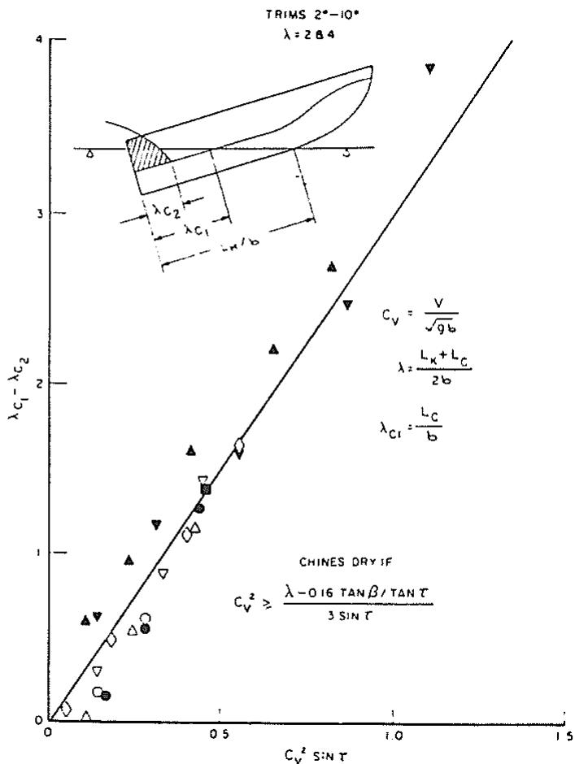

scatter

| Series | \(Cv^{2} S:NT\) | \(\lambda C1 - \lambda C2\) |
| --- | --- | --- |
| Triangle (up) | ~0.15 | ~0.5 |
| Triangle (up) | ~0.25 | ~0.9 |
| Triangle (up) | ~0.35 | ~1.2 |
| Triangle (up) | ~0.45 | ~1.6 |
| Triangle (up) | ~0.65 | ~2.2 |
| Triangle (up) | ~0.85 | ~2.7 |
| Triangle (down) | ~0.15 | ~0.6 |
| Triangle (down) | ~0.25 | ~0.9 |
| Triangle (down) | ~0.45 | ~1.3 |
| Triangle (down) | ~0.85 | ~2.5 |
| Triangle (down) | ~1.15 | ~3.8 |
| Circle (up) | ~0.15 | ~0.2 |
| Circle (up) | ~0.25 | ~0.5 |
| Circle (up) | ~0.35 | ~0.6 |
| Circle (up) | ~0.45 | ~1.3 |
| Circle (up) | ~0.55 | ~1.6 |
| Circle (up) | ~0.65 | ~1.7 |
| Circle (up) | ~0.85 | ~2.5 |
| Circle (up) | ~1.15 | ~3.8 |

Fig. 1 Extent of chine wetting for prismatic-deadrise hulls

$$
C _ {v} ^ {2} = \frac {\lambda - 0 . 1 6 \tan \beta / \tan \tau}{3 \sin \tau} \tag {3}
$$

The trim of a planing craft usually attains its maximum value, referred to as hump trim, at speed coefficients of approximately 1.5 to 2.0. As the speed increases, the trim decreases again and the wetted keel length increases. Depending upon the load and LCG position, the bow may again become immersed when the speed coefficient is sufficiently high. The planing equations can be used to determine the velocity and load conditions when bow immersion will recur. In these high-speed cases, the bow drag increment is relatively small since the large rise of the boat's center of gravity assures only small immersions of the bow. It has been observed that the planing performance predictive techniques (Savitsky 1964) provide reasonably realistic results at these high speeds.

(e) Summary: Figure 2 illustrates quantitatively some of the planing and nonplaning features just described. The smoothwater resistance and trim are plotted versus volume Froude number ( $F_{n\overline{\nu}} = V/\sqrt{g\overline{\nabla}^{1/3}}$ ) for the $L/B = 2$ hull (Model 4665) of Series 62 planing forms developed by Clement and Blount (1962). $F_{n\overline{\nu}}$ is used as the absicca since it is the speed coefficient used by Clement and Blount. For this case, $F_{n\overline{\nu}} \sim 1.5C_{v}$ .

The unshaded areas on these plots indicate the speed range where the wetted keel length, as measured in the model tests, is less than the LWL. The circles represent the trim and resistance as computed by the Savitsky planing formulations. In the speed range where $L_{K} < LWL$ , the bow is essentially clear of the water and there is good agreement between computed and measured results. For $F_{n\tau}$ less than approximately 2.0 where $L_{K} > LWL$ , so that the bow is immersed, the measured resistance is considerably larger than that predicted by the prismatic planing formulations, thus illustrating the large influence of bow immersion. This effect is particularly evident at the forward position of the LCG which exaggerates bow immersion.

At $F_{n\tau}$ larger than approximately 4, when $L_K$ is again larger than $LWL$ , the computer and measured resistance are reasonably in agreement, thus demonstrating the less serious effect of some bow immersion in this speed range. It is also to be noted that there is agreement between measured and computed trim angles in planing range when $F_{n\tau} \geq 2.0$ .

Blount and Fox (1975) recommended procedures for adapting the planing form equations to the case of typical planing craft which have longitudinal variations in beam and deadrise. These will be summarized in a subsequent section of this paper.

## Hull hydrodynamics in planing speed range

Prismatic hull form. For the speed range where the craft is truly planing, that is, when the flow has separated from the chines and transom and the wetted keel length is less than LWL so that there is emergence of the bow, computational methods are available for prediction of hull performance (Savitsky, 1964). These predictions include running trim, wetted keel and chine lengths, draft, resistance, ehp, and porpoising stability limits as a function of loading, speed, LCG, and deadrise. This work has been programmed for high-speed computers and is generally available to the small-boat naval architect.

For the simple planing case when it can be assumed that the thrust axis and viscous force vector coincide and that both pass through the center of gravity, the empirical planing formulations for lift, wetted area, and center of pressure can be combined into a nomograph which can be used to obtain the equilibrium planing conditions. Koelbel has developed such a plot for a zero-deadrise surface. It is reproduced as Fig. 3 of the present paper to illustrate the relative simplicity of predicting smooth-water performance in the planing range. Savitsky (1964) has shown that the lift coefficient for a finite-deadrise surface $C_{L_{d}}$ is related to that for a flat-bottom surface ( $C_{L_{0}}$ ) by the following formula:

$$
C _ {L _ {\beta}} = C _ {L _ {0}} - 0. 0 0 6 5 \beta C _ {L _ {0}} ^ {0. 6 0} \tag {4}
$$

where $\beta$ is given in degrees. For specific design problems where the thrust line does not pass through the center of gravity, the detailed calculation procedures given by Savitsky (1964) should be used.

Typical planing hull forms. The previous discussion of hull hydrodynamics in the planing range is based on a prismatic hull form, that is, craft having constant beam and deadrise. Since most planing hulls do not have prismatic forms, it is important to define an “effective” beam and deadrise to use with the prismatic planing equations. Blount and Fox (1975) made resistance predictions for a number of existing hull forms for which model data existed. Their purpose was to identify an effective chine beam and deadrise which would result in the best analytical predictions in the planing range. The comparisons made indicate that the maximum chine beam and the deadrise at mid-chine length resulted in best prediction at high speed.

Controllable transom flaps. Transom flaps have become accepted as a means of controlling the trim of power boats so as to optimize the performance. Controllable flaps may be used to minimize the drag over a range of speed and loading conditions; the simpler fixed flap or wedge can only minimize the drag at cruising speed. This less costly installation, however, still allows the designer a choice of longitudinal center of gravity positions without concern for performance penalties since the craft can subsequently be trimmed out with the flap.

A study of flap effectiveness by Brown (1971) resulted in simple expressions for the increase in lift, drag and moment due to flaps and for the flap hinge moment. Figure 4 shows a boat equipped with a flap.

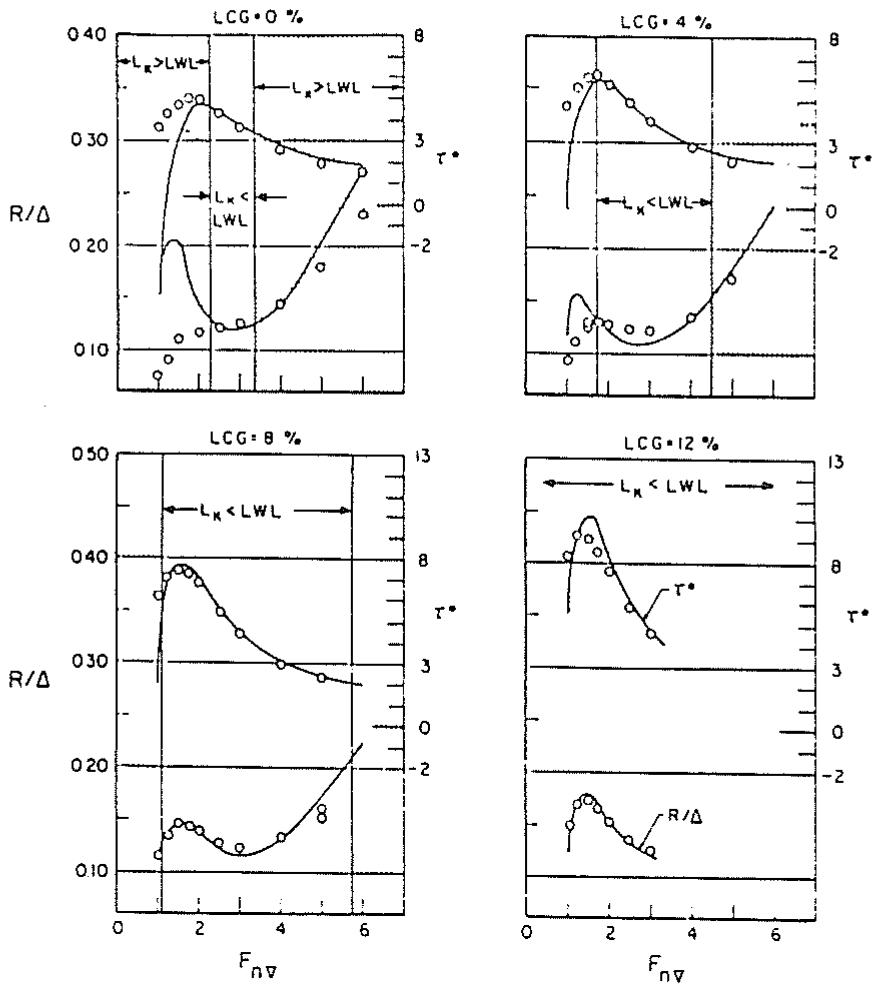  
Fig. 2 Resistance and trim versus $F_{c}$ Series 62, L/B = 2.0, $A_{p}/\nabla^{2/3} = 7.0$ , $\Delta = 100,000$ lb

## -Nomenclature

A = ith coefficient of resistance-estimating equation (16)

$A_{T}$ = transverse section area at transom,
sq ft

$A_{x} = \text{maximum transverse section area, sq ft}$

$B_{T}=$ waterline beam at transom. ft

$B_{P_{T}} = \text{chine beam at transom, ft}$

$B_{x} = \text{maximum waterline beam, ft}$

$B_{P_{X}} = \text{maximum chine beam, ft}$

b = beam, ft

$C_{A}$ = correlation (roughness, etc.) allowance on specific resistance

$C_{B}=block coefficient$

$C_{f}$ = specific frictional resistance (for example, Schoenherr formulation)

$C_{L_{0}} = \text{lift}_{\Delta / \frac{\rho}{2} V^{2} B_{P_{X}}^{2}} \text{coefficient, zero deadrise} =$

$C_{M}=midship section coefficient$

$C_{P}=\mathrm{longitudinal~prismatic~coefficient}$

$C_{V}=\text{speed coefficient (used for planing hull analyses, especially) }V/\sqrt{gB_{P_{V}}}$

$C_{w\rho} =$ waterplane coefficient

$C_{\Delta} = \text{static} \quad \text{beam-loading} \quad \text{coefficient,} \quad \Delta / u \cdot B_{P_{Y}}^{3} = \nabla / B_{P_{Y}}^{3}$

$F_{nL}=\mathrm{length~Fr\ddot{o}ude~number,~V/\sqrt{gL}}$

$F_{n\overline{c}} = \text{volume Froude number, } V/\sqrt{g\overline{c}^{-1}{}^{3}}$ $g = \text{acceleration of gravity, } 32.2 \text{ ft/sec}^{2}$

$H_{1/3}=$ significant wave height in an irregular sea state, ft

$I = \begin{array}{c}\text{moment of inertia about pitch axis,}\\ \text{psf}\end{array}$

$i_{e}=$ half-angle of entrance of waterline at bow, deg

L = length, in general

$L_{k}=wetted length of keel$

$L_{pp} =$ length between perpendiculars (at design waterline endings), ft

$L_{wL}=length of waterline, it$

LCB = distance of center of buoyancy from
∅, ft, positive aft

$\overline{\mathrm{LCG}} =$ distance of center of gravity from $\otimes$ , ft, positive aft

$\hat{n}_{bow}=$ average bow acceleration at bow, g

$\hat{n}_{CG}$ = average impact acceleration at center of gravity, g

P = probability level

p = distance from transom to point of resultant normal force on planing bottom, ft

R = resistance, in general, lb

$R_{AW}=added resistance in waves, lb$

$R_{T}=total resistance for craft, lb$

$R_{R}=residuary resistance, lb$

S = wetted surface, sq ft

T = draft (maximum), ft

$L = \sqrt{2t_{e}}$ [parameter in resistance-estimating equation (16)]

$V = \text{speed, fps}$

$V_{K}=speed,knots$

$W = A_{T} / A_{X}$ [parameter in resistance-estimating equation (16)]

w = specific weight of water, lb/cu ft

$X = \nabla^{13} / L_{WL}$ [parameter in resistance-estimating equation (16)]

$Z = C$ [parameter in resistance-estimating equation (16)]

$\beta =$ deadrise angle, deg

$\Delta$ = craft displacement, lb

$\Delta_{LT}$ = craft displacement, long tons

ρ = mass density, slugs/cu ft

$\nabla =$ craft displaced volume, cu ft

$\lambda$ = mean wetted length-beam ratio

$\lambda_{c_{1}}$ = chine wetted length-beam ratio

$\lambda_{c_{2}} = \text{side wetted-length-beam ratio, where flow which separated from chine may reattach to side of prismatic hull (see Fig. 1)}$

r = trim angle of planing area, deg

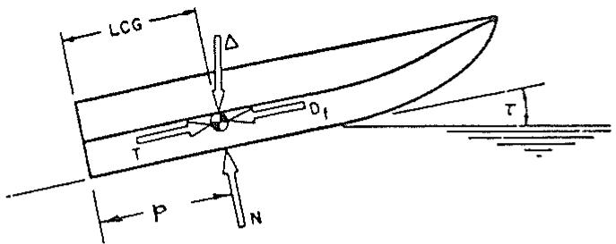

text_image

LCG
Δ
Df
T
P
N
T

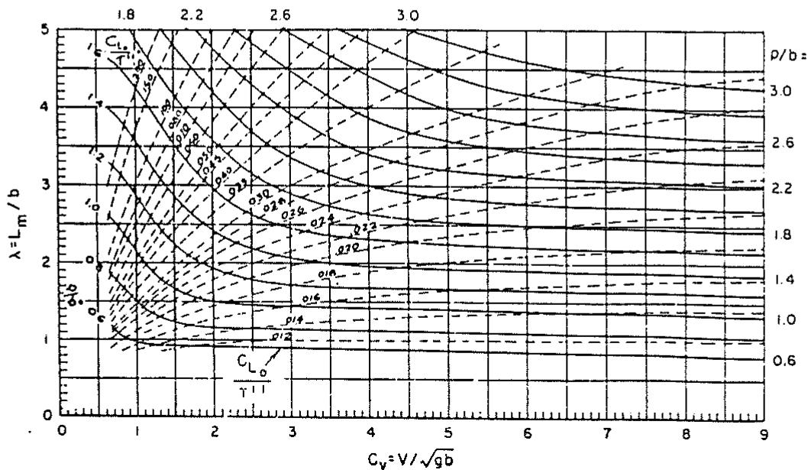

contour

| \(\rho/b\) | \(Cv (V/\sqrt\)gb) | \(\lambda (\)Lm/b) |
| --- | --- | --- |
| 0.6 | ~0.5 | ~1.0 |
| 1.0 | ~0.5 | ~1.0 |
| 1.4 | ~0.5 | ~1.0 |
| 1.8 | ~0.5 | ~1.0 |
| 2.2 | ~0.5 | ~1.0 |
| 2.6 | ~0.5 | ~1.0 |
| 3.0 | ~0.5 | ~1.0 |

Fig. 3 Equilibrium planing conditions for β = 0 deg (Savitsky, 1964)

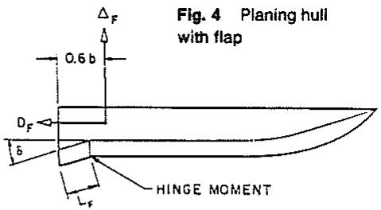

text_image

Fig. 4 Planing hull
with flap
ΔF
0.6 b
DF
δ
HINGE MOMENT
δF

## where

$\Delta_{F}$ = flap lift increment, lb

$D_{F}$ = flap drag increment, lb

$M_{F}=\mathrm{flap~moment~about~flap~trailing~edge,~ft-lb}$

$H_{F}=flap hinge moment, ft-lb$

$L_{F}=flap\cdot chord,ft$

$\sigma$ = flap span-beam ratio

$\delta$ = flap deflection, deg

b = beam of planing surface, ft

$\tau$ = trim of planing surface, deg

V = speed, fps

The results of the study show that the flap lift is given by

$$
\Delta_ {F} = 0. 0 4 6 L _ {F} \delta \sigma b \left[ \frac {\rho}{2} V ^ {2} \right] \tag {5}
$$

Since the flap increases the hydrodynamic lift, there is an increase in the form drag, $\Delta \tan\tau$ , where $\Delta$ is the total lift including the flap lift and is equal to the craft weight. In addition, the pressure on the flap causes a drag which is proportional to the flap lift:

$$
D _ {F} = 0. 0 0 5 2 \Delta_ {F} (\tau + \delta) \tag {6}
$$

The hydrodynamic flap moment measured about the trailing edge of the flap is given by

$$
M _ {F} = \Delta_ {F} [ 0. 6 \mathrm{b} + L _ {F} (1 - \sigma) ] \tag {7}
$$

For full-span flaps where σ = 1, the flap lift acts 0.6 beams ahead of the trailing edge of the flap as shown in Fig. 4.

The torque required to keep the flap deflected against the hydrodynamic pressure on it—that is to say, the hinge moment—is given by:

$$
H _ {F} = 0. 1 3 9 \Delta_ {F} L _ {F} \tag {8}
$$

The flap expressions, equations (5) to (8), have been validated over the following ranges:

Flap chord, percent of mean wetted length: 0 to 10

Flap deflection, deg: 0 to 15

Trim, deg: 0 to 10

Speed coefficient, $C_{v,c}$ 2 to 7

Additionally, for part-span flaps it was found that the flap forces and moments were independent of the transverse locations of the flap.

By way of illustration, the effect of flaps on the performance of a 40,000-lb boat at a speed of 40 knots is shown in Fig. 5. Adding a full-span 20 percent flap (that is, a flap having a chord equal to 20 percent of the beam) deflected 2 deg reduces the running trim 1 deg and the drag 10 percent. Doubling the flap deflection will result in still lower drag; however, it turns out to be more efficient to generate flap lift by means of flap area rather than flap deflection as illustrated for 3-deg trim in Fig. 6.

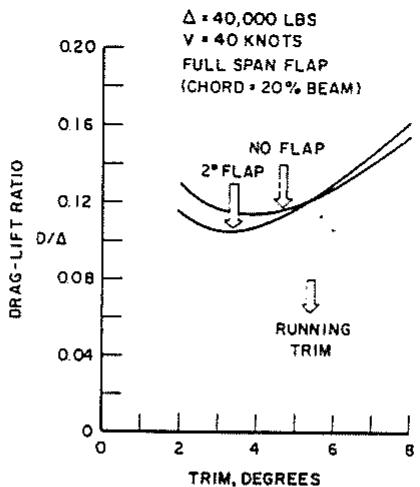

line

| Trim (Degrees) | No Flap (D/Δ) | 2nd Flap (D/Δ) |
| --- | --- | --- |
| 2 | ~0.13 | ~0.115 |
| 3 | ~0.115 | ~0.105 |
| 4 | ~0.115 | ~0.11 |
| 5 | ~0.12 | ~0.12 |
| 6 | ~0.135 | ~0.135 |
| 7 | ~0.15 | ~0.15 |
| 8 | ~0.16 | ~0.155 |

Fig. 5 Effect of flaps on performance

Flaps may be used to best advantage on heavily loaded boats. Differential or asymmetric flaps may be used for roll control; flaps may also be used for deceleration and stopping.

Performance prediction with flaps. The modification of existing performance prediction computer programs to account for the effect of flaps or wedges is a simple matter due to the “add on” nature of these effects on lift, drag, and moment.

For simplified calculations with full-span flaps, it is only necessary to assume effective values for craft displacement ( $\Delta_{e}$ ) and LCG ( $LCG_{e}$ ) relative to the flap trailing edge:

$$
\Delta_ {e} = \Delta - \Delta_ {F}
$$

$$
\mathrm{LCG} _ {e} = \left[ \Delta (\mathrm{LCG}) - 0. 6 b \Delta_ {F} \right] / \Delta_ {e}
$$

in order to solve for the wetted length and trim. Having deter-
mined these quantities, the drag is given by

$$
D = \Delta \tan \tau + \frac {C _ {f} \lambda \rho \dot {V} ^ {2} b ^ {2}}{2 \cos \tau \cos \beta} + 0. 0 0 5 2 \Delta_ {F} (\tau + \delta)
$$

Warped planing surfaces. Power boats have a deadrise distribution which increases with distance forward of the transom, unlike the parallel buttock prismatic surfaces discussed so far. To investigate the effect that warp has on planing characteristics, some unpublished tests have been made on a warped planing surface. The model tested had a 9-in. beam and was 5 beams in length. The deadrise at the transom was 10 deg and 25 deg at the bow, so that the deadrise increased approximately at a rate of 3 deg/beam. In fact, the model was made with straight buttock lines, so that the deadrise distribution was not exactly linear, and the angle between the chine and keel was $\theta = 1.66$ deg as shown in Fig. 7.

The results are summarized in Tables 1 and 2 in terms of the dynamic lift and drag coefficients. The dynamic force corresponds to the force at very high speeds where the buoyant force is negligible and the high-speed limit of the force coefficients is obtained. These limits are obtained by subtracting the known buoyant contributions from the observed lift and drag before forming the coefficients.

The entries in Columns 1 and 2 of the tables refer to a constant 10-deg planing surface as reported by Brown (1971) and compare the experimental results and theoretical predictions given in that reference. Columns 3 and 4 refer to a warped planing surface, have 10 deg deadrise at the transom and a chine-to-keel angle of 1.66 deg. The theoretical prediction in Column 4 is made by assuming an effective increase in the geometric trim angle equal to 12 percent of the chine angle:

$$
\tau_ {e} = \tau + 0. 1 2 \theta \tag {9}
$$

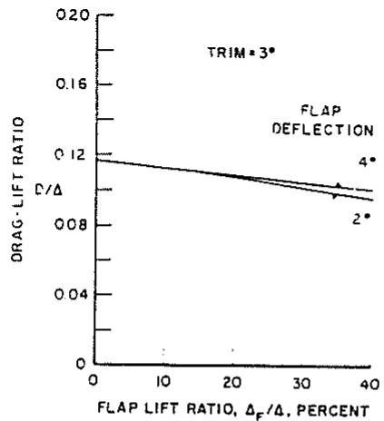

line

| Flap Lift Ratio \((\Delta F/\Delta)\) (Percent) | Drag-Lift Ratio \((\Delta D/\Delta)\)::Series 2 | Drag-Lift Ratio \((\Delta D/\Delta)\)::Series 4 |
| --- | --- | --- |
| 0 | ~0.118 | ~0.118 |
| 35 | ~0.098 | ~0.102 |

Fig. 6 Effect of flap lift ratio on total drag lift ratio

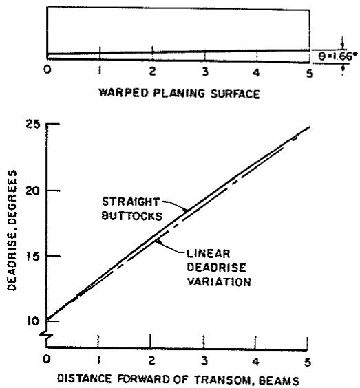  
Fig. 7 Warped planing surface and deadrise distribution

The drag can also be predicted by assuming effective trim and
deadrise angles:

$$
C _ {D} = C _ {L} \tan \tau_ {e} + \frac {C _ {f} \lambda}{\cos \tau_ {e} \cos \beta_ {e}}
$$

For the drag, however, it is necessary to assume that the effective increase in the trim angle is 50 percent of the chine angle

$$
\tau_ {e} = \tau + 0. 5 \theta \tag {10}
$$

while the effective deadrise angle is the average over the wetted length.

For this particular warped surface, the increase in lift is quite small so that it is unnecessary to isolate the contribution due to effective trim and effective deadrise. In fact, more research is needed to this end. The drag, however, shows a marked increase so that this warped planing surface is less efficient than one with parallel buttock lines. Most power boats do tend to have constant deadrise for some distance forward of the transom, so that practical design experience confirms the superior efficiency of parallel buttock lines. Further tests of simplified warped planing surfaces may help to show how the effects of actual deadrise distribution should be accounted for. It seems probable that, for arbitrary deadrise distribution, both the effective trim and effective deadrise will have to be functions of the wetted length.

Table 1 Dynamic lift coefficient $\Delta/\frac{\rho}{2}V^{2}b^{2}$

<table><tr><td rowspan="2">Trim, deg</td><td rowspan="2">Mean length-beam ratio</td><td colspan="2"> $\beta = 10$  deg</td><td colspan="2"> $\beta_{T} = 10$  deg, $\theta = 1.66$  deg</td></tr><tr><td>Theory 1.</td><td>Experiment 2.</td><td>Experiment 3.</td><td>Theory 4.</td></tr><tr><td rowspan="3">2</td><td>2</td><td>0.033</td><td>0.033</td><td>0.036</td><td>0.037</td></tr><tr><td>3</td><td>0.039</td><td>0.038</td><td>0.043</td><td>0.043</td></tr><tr><td>4</td><td>0.043</td><td>0.043</td><td>0.050</td><td>0.048</td></tr><tr><td rowspan="3">4</td><td>2</td><td>0.073</td><td>0.072</td><td>0.080</td><td>0.077</td></tr><tr><td>3</td><td>0.087</td><td>0.085</td><td>0.093</td><td>0.092</td></tr><tr><td>4</td><td>0.098</td><td>0.098</td><td>0.110</td><td>0.104</td></tr><tr><td rowspan="3">6</td><td>2</td><td>0.118</td><td>0.116</td><td>0.121</td><td>0.122</td></tr><tr><td>3</td><td>0.143</td><td>0.140</td><td>0.146</td><td>0.149</td></tr><tr><td>4</td><td>0.164</td><td>0.162</td><td>0.170</td><td>0.171</td></tr></table>

Table 2 Dynamic drag coefficient $D/\frac{\rho}{2} V^{2}b^{2}$

<table><tr><td rowspan="2">Trim, deg</td><td rowspan="2">Mean length-beam ratio</td><td rowspan="2">Effective trim, deg 1.</td><td rowspan="2">Effective deadrise, deg 2.</td><td colspan="2"> $\beta_T = 10$  deg,  $\theta = 1.66$  deg</td></tr><tr><td>Experiment 3.</td><td>Theory 4.</td></tr><tr><td rowspan="3">4</td><td>2</td><td>4.83</td><td>13.0</td><td>0.0070</td><td>0.0069</td></tr><tr><td>3</td><td></td><td>14.5</td><td>0.0092</td><td>0.0088</td></tr><tr><td>4</td><td></td><td>16.0</td><td>0.0108</td><td>0.0104</td></tr><tr><td rowspan="3">6</td><td>2</td><td>6.83</td><td>13.0</td><td>0.0103</td><td>0.0107</td></tr><tr><td>3</td><td></td><td>14.5</td><td>0.0132</td><td>0.0135</td></tr><tr><td>4</td><td></td><td>16.0</td><td>0.0155</td><td>0.0162</td></tr></table>

In the meantime, the simple expedient of assuming an increase in the geometric trim equal to 12 percent of the chine angle in the case of lift, and 50 percent of the chine angle for drag, results in acceptable predictions for the simple case of constant-beam, straight-buttock hull forms. For such hulls, the relevant deadrise is taken to be the deadrise at the transom. In the case of drag, however, the average deadrise is used to properly represent the wetted area. Certainly, additional research on nonprismatic hull forms must be pursued.

For performance predictions of typical existing planing hulls it is recommended that, at the present time, the maximum chine beam and the deadrise at mid-chine length be used for high-speed performance estimates (Blount and Fox 1975).

Reentrant vee-transom planing surfaces. The geometrical configuration of power boats, dictated by the need for static flotation and stability, puts them at a disadvantage compared with other craft which use dynamic lift for support in the cruising condition, such as hydrofoil boats and aircraft. These craft use high-aspect-ratio lifting surfaces, whereas power boats are forced to operate in a low-aspect-ratio configuration. For the same trim and area, high-aspect-ratio surfaces are far more efficient lift producers than low-aspect-ratio surfaces. For example, a hydrofoil with an aspect ratio of 3 (length-beam ratio $\frac{1}{3}$ ) will produce four times as much lift as one with an aspect ratio of $\frac{1}{3}$ (length-beam ratio 3).

In order to achieve a higher aspect ratio for power boats, Clement (1964) suggested that the transom could be made reentrant in plan, as shown in Fig. 8, thus improving the effective aspect ratio for the same wetted area. With the conventional configuration, the maximum aspect ratio (minimum length-beam ratio) is achieved when the stagnation line passes through the chine point at the transom. With the reentrant transom, however, there is, in principle, no limit to the aspect ratio.

In order to explore Clement's suggestion, a series of three 20-deg deadrise models was tested by Brown and Van Dyck (1964), having included reentrant transom angles of 180 deg (transverse step), 120 deg, and 60 deg. In addition, a fourth model was tested having 10-deg deadrise and 60-deg reentrant veeangle. Since the high-aspect-ratio regime (small length-beam ratio) was to be investigated, rather large models having a 12-in. beam were used and all the tests were run at high speed, $C_{v} = 6.0$ .

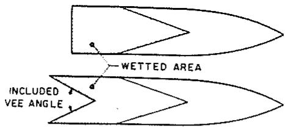

text_image

WETTED AREA
INCLUDED
VEE ANGLE

Fig. 8 Comparison of conventional and reentrant transom configurations

The results of these high-aspect-ratio ( $\lambda < 1$ ) model tests were analyzed by Brown (1966). Since the aspect ratio of a planing surface is determined by the shape of its wetted area, the analysis began with a reexamination of this shape for conventional length-beam ratios and an extension into the high-aspect-ratio region.

Wetted area of deadrise planing surfaces. The physics of the fluid flow about a deadrise planing surface have been described and illustrated in detail by Savitsky (1964), who also identifies the geometric parameters defining the shape of the wetted area. Due to wave rise in the spray root area, the difference between the keel and chine wetted lengths at speed is less than it would be at rest; in addition, Savitsky notes that the spray root line is slightly convex forward.

Making use of the $\pi/2$ wave-rise factor computed by Wagner (1932) results in the following expression for the difference between the keel and chine wetted lengths as quoted by Savitsky:

$$
\lambda_ {K} - \lambda_ {C} = \frac {2}{\pi} \frac {\tan \beta}{2 \tan \tau} \tag {11}
$$

This equation suggests that the difference between the keel and chine wetted lengths is independent of the mean wetted length and this independence is confirmed by the experimental results, provided the chine wetted length-beam ratio, $\lambda_{C}$ , is greater than unity. It follows, therefore, that for each combination of trim and deadrise there is a unique value of the difference $\lambda_{K} - \lambda_{C}$ . Using the results published by Chambliss and Boyd (1953), Pope (1958), Shuford (1956), and Springston and Sayre (1955), for $\lambda_{C} > 1$ , the average values of $\lambda_{K} - \lambda_{C}$ are shown plotted as a function of $\frac{1}{2} \tan\beta \cot\tau$ in Figs. 9 and 10. The lines drawn through the data are given by the equation:

$$
\lambda_ {K} - \lambda_ {C} = \left(0. 5 7 + \frac {\beta \deg}{1 0 0 0}\right) \left(\frac {\tan \beta}{2 \tan \tau} - \frac {\beta \deg}{1 6 7}\right) \tag {12}
$$

Wagner's theory, shown by the dashed lines, slightly underestimates the wave rise.

Denoting the right-hand side of equation (12) by w, it is evident that the chine wetted length is linearly related to the keel wetted length:

$$
\lambda_ {C} = \lambda_ {K} - w \tag {13}
$$

When the chine length is less than one beam ( $\lambda_{C} < 1$ ), however, the wave rise starts to diminish and the chine length is now given by

$$
\lambda_ {C} = (\lambda_ {K} - w) - 0. 2 \exp \left[ \frac {- (\lambda_ {K} - w)}{0 . 3} \right] \tag {14}
$$

where w is given by the right-hand side of equation (12). Equations (13) and (14) are identical for $\lambda_{C} > 1$ . A comparison of this expression with the data is given by Brown (1966).

Mean wetted length-beam ratio. It has been observed earlier that the spray root line is slightly convex forward. Making use of the data reported by Brown and Van Dyck (1964), using a large model, it was found that this curvature could be accounted for by adding a constant to the average of the keel and chine wetted lengths. A general expression for the mean wetted length-beam ratio that most accurately represents the wetted area is:

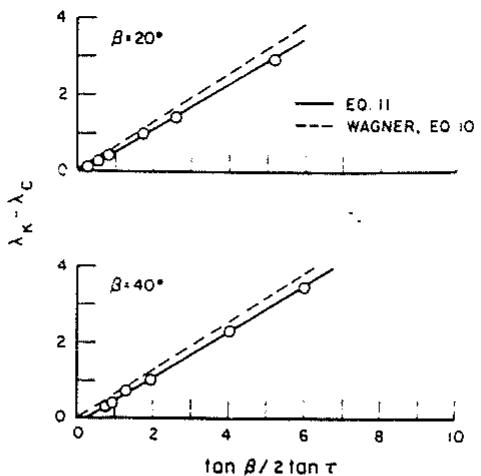  
Fig. 9 Wave rise on planing surface, 20-deg and 40-deg deadrise

$$
\lambda = \frac {\lambda_ {K} + \lambda_ {C}}{2} + 0. 0 3 \tag {15}
$$

Effect of reentrant vee-transom. The main effect of the reentrant vee-transom is to diminish the lift at the same trim and aspect ratio. While the reentrant configuration can reach higher aspect ratios than are possible with a transverse transom, this still does not compensate for the loss of lift due to the reentrant vee.

As the wetted length becomes shorter and the aspect ratio increases, the maximum aspect ratio is achieved just before the chines become dry. At this point, the maximum lift-drag ratio is attained for a given trim. This effect is illustrated in Table 3 for a trim of 4 deg. This table was based on the experimental data, ignoring some evidence of an increase in drag with the reentrant vee. Even without considering the practicality of operating at very high aspect ratios, it is evident that the reentrant transom is not beneficial.

## Resistance in preplaning range

In 1973, Mercier and Savitsky conducted a regression analysis of the smooth-water resistance data of seven transom-stern hull series which included 118 separate hull forms. In that study, an analytical procedure was developed for predicting the resistance of transom-stern hulls in the nonplaning range—specifically for volume Froude numbers less than 2.0. The following sections describe the test series: the regression analysis; the resulting equation for prediction of resistance and its range of application; and discussion of the effects of hull loading and proportions upon the preplaning resistance.

Description of methodical series. The development of the resistance-prediction equations has been based on published results of resistance tests carried out for seven methodical series of transom-stern craft. A tabulation of the ranges of geometric characteristics of the seven series is given in Table 4. Complete listings of the geometric characteristics of each of the 118 models in these series are given by Mercier and Savitsky. Except for Series 62, which was a hard-chine hull form, all other series were round bilge hulls. Since the original regression analysis, Hadler et al (1974) presented resistance data for an additional systematic series of hard-chine planing hull forms, referred to as Series 65, which extend the range of hull geometric variables beyond those listed in Table 4. These additional data have not been included in the present study. It is recommended, however, that in the future Series 65 be combined with those in Table 4 in an attempt to extend the range of applicability of resistance equations described herein.

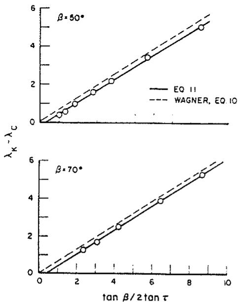  
Fig. 10 Wave rise on planing surface, 50-deg and 70-deg deadrise

Table 3 Maximum lift-drag ratio at 4-deg trim

<table><tr><td>Included vee-angle, deg</td><td>Maximum aspect ratio</td><td>Maximum lift-drag ratio</td></tr><tr><td>180</td><td>2</td><td>9.15</td></tr><tr><td>120</td><td>3</td><td>9.14</td></tr><tr><td>60</td><td>10</td><td>8.76</td></tr></table>

Complete listings of the total and residual resistance characteristics derived for each of the 118 models are given by Mercier and Savitsky for a 100,000-lb craft in 59 F seawater with zero roughness allowance for eleven values of volume Froude number, $F_{n\nabla}$ , from 1.0 to 2.0. These data, which are not reproduced in the present report, are considered to cover the interesting nonplaning range for virtually all of the vessel forms concerned. The 1947 ATTC (Schoenherr) friction coefficients were used for extrapolation from model to full-size with one exception: for the SSPA Series, the residuary resistance coefficients presented by Lindgren and Williams were determined using the 1957 ITTC friction coefficients. Over the range of speeds considered, the residuary resistance derived using the ITTC coefficients is lower than those derived with ATTC coefficients by less than about 2.5 percent. The difference in total resistance is smaller still.

## Derivation of resistance equations

Previous analysis. Doust and O'Brien (1958–59) first applied the method of statistical analysis of resistance data to trawler hull forms using all trawler models tested in Tank No. 1, National Physical Laboratory, Teddington, England. By the method of least squares, they derived separate equations for each of four speed-length ratios, $V/\sqrt{L}=0.80, 0.90, 1.0$ , and 1.10, which express resistance as a function of six form parameters (L/B, B/T, $C_{M}$ , $C_{P}$ , $\mathrm{LCB}/L_{pp}$ (percent), and $i_{e}$ ). This same type of least-squares analysis has been applied by Sabit (1971) to data of related forms, including Series 60 and the British Ship Research Association methodical series of merchant ship forms.

Particularly useful guidance to the analysis of resistance of small, transom-stern craft in the preplaning region has been given by Nordstrom (1951), who found that the resistance per pound of displacement for a given value of volume Froude number is most strongly dependent upon the slenderness ratio $L/\nabla^{1/3}$ .

Table 4 Geometric particulars of models used in regression analysis

<table><tr><td>Series</td><td> $\frac{L_{WL}}{\nabla^{1/3}}$ </td><td> $C_{\Delta}$ </td><td> $i_{e}$ ,deg</td><td> $C_{B}$ </td><td> $C_{P}$ </td><td> $C_{wp}$ </td><td> $L_{WL}/B_{X}$ </td><td> $B_{X}/T$ </td><td> $\frac{A_{T}}{A_{X}}$ </td><td> $\frac{B_{T}}{B_{X}}$ </td><td> $\frac{T_{T}}{T_{X}}$ </td><td> $\frac{LCG}{L_{pp}}$ </td></tr><tr><td rowspan="5">NPL</td><td>4.5, 5.0</td><td>0.134</td><td>11</td><td>0.397</td><td>0.693</td><td>0.753</td><td>3.33</td><td>1.69</td><td>0.52</td><td>0.815</td><td>0.513</td><td>0.064 aft of  $\pi$ </td></tr><tr><td>5.5, 6.0</td><td>to</td><td>12.5</td><td></td><td></td><td></td><td>4.55</td><td>to</td><td></td><td></td><td></td><td></td></tr><tr><td>6.5, 7.0</td><td>1.468</td><td>16.1 &amp;</td><td></td><td></td><td></td><td>5.41 &amp;</td><td>9.83</td><td></td><td></td><td></td><td></td></tr><tr><td>7.5, 8.0</td><td></td><td>20.5</td><td></td><td></td><td></td><td>6.25</td><td></td><td></td><td></td><td></td><td></td></tr><tr><td>and 8.5</td><td></td><td></td><td></td><td></td><td></td><td></td><td></td><td></td><td></td><td></td><td></td></tr><tr><td rowspan="4">Nordstrom</td><td>5.65</td><td>0.518</td><td>15.1</td><td>0.373</td><td>0.576</td><td>0.725</td><td>4.83</td><td>3.57</td><td>0</td><td>0</td><td>0</td><td>0.0179,</td></tr><tr><td>to</td><td>to</td><td>to</td><td>0.390</td><td>0.589</td><td>to</td><td>to</td><td>3.34</td><td>0.6</td><td>0.66</td><td>0.10</td><td>0.0249 &amp;</td></tr><tr><td>7.72</td><td>0.877</td><td>22.5</td><td>and</td><td>and</td><td>0.761</td><td>6.94</td><td>and</td><td>and</td><td>and</td><td>and</td><td>0.0288</td></tr><tr><td></td><td></td><td></td><td>0.410</td><td>0.599</td><td></td><td></td><td>3.16</td><td>0.13</td><td>0.72</td><td>0.15</td><td>aft of  $\pi$ </td></tr><tr><td rowspan="4">DeGroot</td><td>5.23</td><td>0.550</td><td>13.5</td><td>0.421</td><td>0.650</td><td>0.787</td><td>4.55</td><td>3.57</td><td>0.17</td><td>0.75</td><td>0.18</td><td>0.016,</td></tr><tr><td>to</td><td>to</td><td>to</td><td>0.437</td><td>0.661</td><td>to</td><td>to</td><td>3.34</td><td>0.23</td><td>0.78</td><td>0.24</td><td>0.0215 &amp;</td></tr><tr><td>7.75</td><td>1.039</td><td>22.4</td><td>and</td><td>and</td><td>0.796</td><td>7.39</td><td>and</td><td>and</td><td>and</td><td>and</td><td>0.0264</td></tr><tr><td></td><td></td><td></td><td>0.457</td><td>0.677</td><td></td><td></td><td>3.16</td><td>0.30</td><td>0.79</td><td>0.29</td><td>aft of  $\pi$ </td></tr><tr><td rowspan="3">SSPA</td><td>6</td><td>0.616</td><td>8.24</td><td>0.40</td><td>0.68</td><td>0.73</td><td>4.623</td><td>3</td><td>0.42</td><td>0.77</td><td>0.41</td><td>0.0415</td></tr><tr><td>7 and</td><td>to</td><td>to</td><td></td><td></td><td></td><td>to</td><td>3.5</td><td></td><td></td><td></td><td>aft of  $\pi$ </td></tr><tr><td>8</td><td>0.821</td><td>14.4</td><td></td><td></td><td></td><td>8.213</td><td>&amp; 4</td><td></td><td></td><td></td><td></td></tr><tr><td rowspan="3">Series 64</td><td>8.04</td><td>0.740</td><td>3.7</td><td>0.35</td><td>0.63</td><td>0.761</td><td>8.454</td><td>2, 3</td><td>0.405</td><td>0.86</td><td>0.44</td><td>0.0656</td></tr><tr><td>to</td><td>to</td><td>to</td><td>0.45 &amp;</td><td></td><td></td><td>to</td><td>&amp;</td><td></td><td></td><td>0.37 &amp;</td><td>aft of  $\pi$ </td></tr><tr><td>12.4</td><td>4.877</td><td>7.8</td><td>0.55</td><td></td><td></td><td>18.264</td><td>4</td><td></td><td></td><td>0.29</td><td></td></tr><tr><td rowspan="4">Series 63</td><td>4.5</td><td>0.061</td><td>16.9</td><td>0.383</td><td>0.577</td><td>0.755</td><td>2.524</td><td>2.891</td><td>0.03</td><td>0.26</td><td>0.065</td><td>0.058</td></tr><tr><td>to</td><td>to</td><td>to</td><td>to</td><td>to</td><td>to</td><td>to</td><td>to</td><td>to</td><td>to</td><td>to</td><td>aft to</td></tr><tr><td>6.4</td><td>1.204</td><td>28.6</td><td>0.636</td><td>0.774</td><td>0.815</td><td>5.750</td><td>9.503</td><td>0.74</td><td>0.91</td><td>0.770</td><td>0.003</td></tr><tr><td></td><td></td><td></td><td></td><td></td><td></td><td></td><td></td><td></td><td></td><td></td><td>forward of  $\pi$ </td></tr><tr><td rowspan="4">Series 62</td><td>3.07</td><td>0.090</td><td>32.2</td><td>0.44</td><td>0.80</td><td>0.795</td><td>1.87</td><td>3.25</td><td>0.755</td><td>0.69</td><td> $\approx 1.0$ </td><td>0.052</td></tr><tr><td>to</td><td>to</td><td>to</td><td>to</td><td>to</td><td>to</td><td>to</td><td>to</td><td>to</td><td>to</td><td></td><td>0.058 &amp;</td></tr><tr><td>8.53</td><td>0.869</td><td>65.6</td><td>0.605</td><td>0.81</td><td>0.825</td><td>6.72</td><td>8.00</td><td>0.985</td><td>0.87</td><td></td><td>0.065</td></tr><tr><td></td><td></td><td></td><td></td><td></td><td></td><td></td><td></td><td></td><td></td><td></td><td>aft of  $\pi$ </td></tr></table>

Present Davidson Laboratory analysis. The derived non-
planing resistance equations presented in this report are for a
displacement of 100,000-lb seawater at 59 F with $C_{A}=0.0$ .
Methods are presented for correcting to other displacements, $C_{A}$ ,
etc., which depend on the wetted surface of the hull.

Four parameters were selected for inclusion in the resistance equations:

1. $LWL/\nabla^{1/3}$ , since Nordstrom has demonstrated its importance.  
2. $C_{\Delta} = \Delta / w B_{x}^{3} = \nabla / B_{x}^{3}$ , since planing performance, particularly rough-water performance, is strongly affected by this parameter.  
3. $i_{e}$ . The waterline half-entrance angle, since preliminary graphical correlations suggested this parameter to be important.  
4. $A_{T}/A_{x}$ . The ratio of transom area to maximum section area, since the separation of flow at the transom may produce an increment of resistance (cavity drag).

Additional parameters which are known to influence resistance in some speed ranges were omitted in the Davidson Laboratory study for particular reasons. For example, the LCG locations were generally not varied for the methodical series used in the present analysis. However, several of the test models of the different series were tested with varying LCG locations, and the results suggest that the reported data correspond to optimum or near optimum LCG conditions. Table 4 presents values of the locations of model LCG. Other parameters, such as deadrise angle and hard-chine or round-chine shape, which are important in the planing regime, are felt to be of lesser significance in the lower speed range.

The symbols used in the curve-fitted equations are:

$$
X = \nabla^ {1 / 3} / L _ {W L}
$$

$$
Z = \nabla / B _ {P _ {z}} ^ {3}
$$

$$
U = \sqrt {2 i _ {e}}
$$

$$
W = A _ {T} / A _ {x}
$$

All dimensions used in forming these coefficients should correspond to waterline measurements from the lines plan at the stillwater (V = 0) draft and trim. $B_{x}$ and $A_{x}$ are the maximum waterline beam and section area, respectively, which, in general, do not occur directly amidships.

Least-squares curve-fitting was applied, starting with a general 27-term equation, namely

$$
\begin{array}{l} R _ {T} / \Delta = A _ {1} + A _ {2} X + A _ {3} Z + A _ {4} U + A _ {5} W + A _ {6} X Z + A _ {7} X U \\ + A _ {8} X W + A _ {9} Z U + A _ {1 0} Z W + A _ {1 1} U W + A _ {1 2} X ^ {2} + A _ {1 3} Z ^ {2} \\ + A _ {1 4} U ^ {2} + A _ {1 5} W ^ {2} + A _ {1 6} X Z ^ {2} + A _ {1 7} X U ^ {2} + A _ {1 8} X W ^ {2} \\ + A _ {1 9} Z X ^ {2} + A _ {2 0} Z U ^ {2} + A _ {2 1} Z W ^ {2} + A _ {2 2} U X ^ {2} + A _ {2 3} U Z ^ {2} \\ + A _ {2 4} U W ^ {2} + A _ {2 5} W X ^ {2} + A _ {2 6} W Z ^ {2} + A _ {2 7} W U ^ {2} \tag {16} \\ \end{array}
$$

and terms which were of small significance eliminated until further elimination of terms produced a significant degradation of the goodness of fit.

Final prediction equation ( $\Delta = 100,000$ lb). A reduction of the number of terms retained for the equations is desirable for two reasons: (a) with more terms, the equations may “fit” the data better yet give a poorer interpolation formula for use in ad hoc cases, since the dependence on the parameters will, in general, be less “smooth” with more terms; and (b) the equations adopted, while not trivial, may be calculated without excessive difficulty with the help of a modern electronic desk calculator (having memory registers, preferably) in lieu of a programmed computer—if only a few cases are required. The equations selected for the eleven $F_{n\overline{v}}$ 's involve 14 terms:

$$
\begin{array}{l} R _ {T} / \Delta = A _ {1} + A _ {2} X + A _ {4} U + A _ {5} W + A _ {6} X Z + A _ {7} X U \\ + A _ {8} X W + A _ {9} Z U + A _ {1 0} Z W + A _ {1 5} W ^ {2} \\ + A _ {1 8} X W ^ {2} + A _ {1 9} Z X ^ {2} + A _ {2 4} U W ^ {2} + A _ {2 7} W U ^ {2} \tag {17} \\ \end{array}
$$

Values for the coefficients are given in Table 5 for a displacement of 100,000 lb. Some of the 14 terms are omitted in each instance, and in no case are more than 13 terms required. These equations and coefficients are based on the scheme of minimizing the percentage difference between measured and calculated resistances.

Table 5 Coefficients for resistance-estimating equation (16): $X = \nabla^{1/3} / L_{WL}$ ; $U = \sqrt{2i_e}$ ; $Z = C_\Delta = \nabla / B_X^3$ ; $W = A_T / A_X$

<table><tr><td>Coefficient</td><td>Multiples</td><td> $F_{n\overline{\nabla}} = 1.0$ </td><td>1.1</td><td>1.2</td><td>1.3</td><td>1.4</td><td>1.5</td><td>1.6</td><td>1.7</td><td>1.8</td><td>1.9</td><td>2.0</td></tr><tr><td> $A_1$ </td><td>1</td><td>0.06473</td><td>0.10776</td><td>0.09483</td><td>0.03475</td><td>0.03013</td><td>0.03163</td><td>0.03194</td><td>0.04343</td><td>0.05036</td><td>0.05612</td><td>0.05967</td></tr><tr><td> $A_2$ </td><td>X</td><td>-0.48680</td><td>-0.88787</td><td>-0.63720</td><td>0.0</td><td>0.0</td><td>0.0</td><td>0.0</td><td>0.0</td><td>0.0</td><td>0.0</td><td>0.0</td></tr><tr><td> $A_4$ </td><td>U</td><td>-0.01030</td><td>-0.01634</td><td>-0.01540</td><td>-0.00978</td><td>-0.00664</td><td>0.0</td><td>0.0</td><td>0.0</td><td>0.0</td><td>0.0</td><td>0.0</td></tr><tr><td> $A_5$ </td><td>W</td><td>-0.06490</td><td>-0.13444</td><td>-0.13580</td><td>-0.05097</td><td>-0.05540</td><td>-0.10543</td><td>-0.08599</td><td>-0.13289</td><td>-0.15597</td><td>-0.18661</td><td>-0.19758</td></tr><tr><td> $A_6$ </td><td>XZ</td><td>0.0</td><td>0.0</td><td>-0.16046</td><td>-0.21880</td><td>-0.19359</td><td>-0.20540</td><td>-0.19442</td><td>-0.18062</td><td>-0.17813</td><td>-0.18288</td><td>0.20152</td></tr><tr><td> $A_7$ </td><td>XU</td><td>0.10628</td><td>0.18186</td><td>0.16803</td><td>0.10434</td><td>0.09612</td><td>0.06007</td><td>0.06191</td><td>0.05487</td><td>0.05099</td><td>0.04744</td><td>0.04645</td></tr><tr><td> $A_8$ </td><td>XW</td><td>0.97310</td><td>1.83080</td><td>1.55972</td><td>0.43510</td><td>0.51820</td><td>0.58230</td><td>0.52049</td><td>0.78195</td><td>0.92859</td><td>1.18569</td><td>1.30026</td></tr><tr><td> $A_9$ </td><td>ZU</td><td>-0.00272</td><td>-0.00389</td><td>-0.00309</td><td>-0.00198</td><td>-0.00215</td><td>-0.00372</td><td>-0.00360</td><td>-0.00332</td><td>-0.00308</td><td>-0.00244</td><td>-0.00212</td></tr><tr><td> $A_{10}$ </td><td>ZW</td><td>0.01089</td><td>0.01467</td><td>0.03481</td><td>0.04113</td><td>0.03901</td><td>0.04794</td><td>0.04436</td><td>0.04187</td><td>0.04111</td><td>0.04124</td><td>0.04343</td></tr><tr><td> $A_{15}$ </td><td> $W^2$ </td><td>0.0</td><td>0.0</td><td>0.0</td><td>0.0</td><td>0.0</td><td>0.08317</td><td>0.07366</td><td>0.12147</td><td>0.14928</td><td>0.18090</td><td>0.19769</td></tr><tr><td> $A_{18}$ </td><td> $XW^2$ </td><td>-1.40962</td><td>-2.46696</td><td>-2.15556</td><td>-0.92663</td><td>-0.95276</td><td>-0.70895</td><td>-0.72057</td><td>-0.95929</td><td>-1.12178</td><td>-1.38644</td><td>-1.55127</td></tr><tr><td> $A_{19}$ </td><td> $ZX^2$ </td><td>0.29136</td><td>0.47305</td><td>1.02992</td><td>1.06392</td><td>0.97757</td><td>1.19737</td><td>1.18119</td><td>1.01562</td><td>0.93144</td><td>0.78414</td><td>0.78282</td></tr><tr><td> $A_{24}$ </td><td> $UW^2$ </td><td>0.02971</td><td>0.05877</td><td>0.05198</td><td>0.02209</td><td>0.02413</td><td>0.0</td><td>0.0</td><td>0.0</td><td>0.0</td><td>0.0</td><td>0.0</td></tr><tr><td> $A_{27}$ </td><td> $WU^2$ </td><td>-0.00150</td><td>-0.00356</td><td>-0.00303</td><td>-0.00105</td><td>-0.00140</td><td>0.0</td><td>0.0</td><td>0.0</td><td>0.0</td><td>0.0</td><td>0.0</td></tr><tr><td colspan="2">Average percent difference between measured  $R_T/\Delta$  and equation (5)</td><td>6.0</td><td>4.7</td><td>4.1</td><td>3.8</td><td>3.3</td><td>3.4</td><td>3.5</td><td>3.4</td><td>3.4</td><td>3.6</td><td>4.0</td></tr><tr><td colspan="2"> $\sqrt{\Sigma(Difference)^2}$ </td><td>0.025</td><td>0.033</td><td>0.027</td><td>0.027</td><td>0.028</td><td>0.031</td><td>0.035</td><td>0.037</td><td>0.043</td><td>0.046</td><td>0.049</td></tr></table>

Range of applicability. An empirically based resistance equation may be used to estimate the resistance of craft whose characteristics fall within the range of characteristics embodied in the models whose resistance data were applied to derive the equation. Attempts to estimate resistance of craft which do not have such characteristics must be considered speculative to a greater or lesser extent. This warning, which is given by all authors who have developed empirical resistance-estimating equations, is perhaps especially relevant for small-craft applications where designers often adopt “unorthodox” hull lines, either by choice or because of exigencies of design.

The range of characteristics of the models used in the development of the present resistance-estimating equations is exhibited in the complete tabulations of hull geometric characteristics given in Table 4. To assist in determining whether a given hull form comes within the range of parameters represented by the models which were used to derive equation (16), plots of the various parameters are given in Fig. 11.

Accuracy of prediction equation. The total number of resistance data points was 1285 for 118 models at 11 values of $F_{n\nabla}$ . It was found that the distribution of the error in prediction was approximately normal. The difference between measured and calculated resistance was less than 10 percent for 90 percent of the cases.

Corrections for other displacements. Results given by equation (17) apply to craft with 100,000-lb displacement in seawater at 59 F, based on Schoenherr's friction coefficients with correlation allowance $C_{A} = 0.0$ . For other values of displacement, water conditions, $C_{A}$ , or friction coefficients, the results can be corrected according to the relation

$$
\left(\frac {R _ {T}}{\Delta}\right) _ {\text {corr}} = \left(\frac {R _ {T}}{\Delta}\right) _ {1 0 0, 0 0 0} + \left[ \left(C _ {F} ^ {\prime} + C _ {A}\right) - C _ {F _ {1 0 0, 0 0 0}} \right] \frac {1}{2} \frac {S}{\nabla^ {2 / 3}} F _ {n \nabla} ^ {2} \tag {18}
$$

where

$$
\left(\frac {R _ {T}}{\Delta}\right) _ {\text {corr}} = \text {corrected value of} R _ {T} / \Delta
$$

$$
\begin{array}{l} \left(\frac {R _ {T}}{\Delta}\right) _ {1 0 0, 0 0 0} = \text {value of} \frac {R _ {T}}{\Delta} \text {for} \Delta \\ = 1 0 0, 0 0 0 \text {-lb seawater, from equation (17)} \\ \end{array}
$$

$$
C _ {F _ {1 0 0, 0 0 0}} = \text {Schoenherr friction coefficient corresponding to}
$$

$$
R _ {n} = \frac {F _ {n \nabla} \left(\frac {L}{\nabla^ {1 / 3}}\right) \sqrt {3 2 . 2 \times \frac {1 0 0 , 0 0 0}{6 4}}}{1 . 2 8 1 7 \times 1 0 ^ {- 5}}
$$

$$
\begin{array}{c} C _ {F} = \text {friction coefficient for corrected displacement,} \\ \text {water conditions, etc.} \end{array}
$$

$$
S = \text {wetted surface}
$$

The indicated correction will be small (perhaps insignificant) for many cases, especially for low values of $L/\nabla^{1/3}$ , where the residuary resistance dominates the frictional component, which is common in the hump-drag speed range. The correction may be significant for slender forms having low values of residuary resistance and relatively high wetted surface. The wetted surfaces for the models used, having transom sterns, may be estimated from the following equation, which was derived from an analysis of the stillwater values for the models of the series

$$
S / \nabla^ {2 / 3} = 2. 2 6 2 \sqrt {\frac {L _ {W L}}{\nabla^ {1 / 3}}} \left[ 1 + 0. 0 4 6 \frac {B _ {X}}{T} + 0. 0 0 2 8 7 \left(\frac {B _ {X}}{T}\right) ^ {2} \right] \tag {19}
$$

(text continued on page 392)

1.0 ≤ F\_{n ∇} ≤ 2.0  
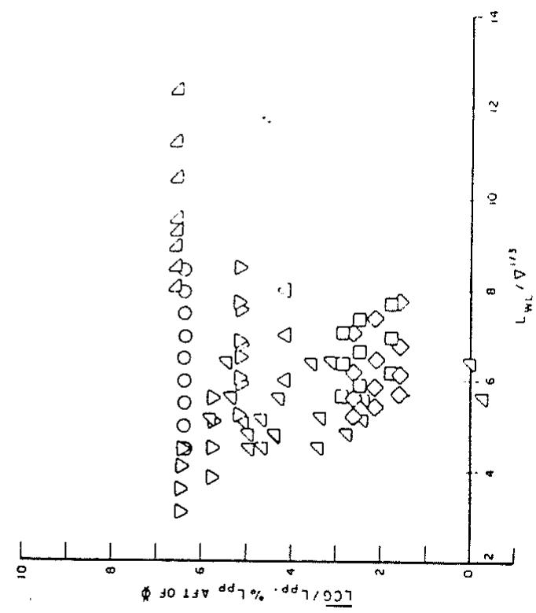

scatter

| Series | \(LWL/\nabla^1/3 (\)range) | LCG/LPP. % LPP AFT OF \(\Phi\) (range) |
| --- | --- | --- |
| Circle | 4.5~8.5 | 6.3~6.5 |
| Triangle | 3.0~12.5 | 4.1~6.6 |
| Square | 4.5~8.5 | 1.5~3.0 |
| Diamond | 4.5~7.5 | 1.5~2.8 |

$$
\begin{array}{c} \bigcirc \text {NPL} \\ \square \text {NOROSTROM} \\ \diamond \text {DEGROOT} \\ \triangle \text {SSPA} \\ \triangle \text {SERIES 64} \\ \triangle \text {SERIES 63} \\ \bigtriangledown \text {SERIES 62} \end{array}
$$

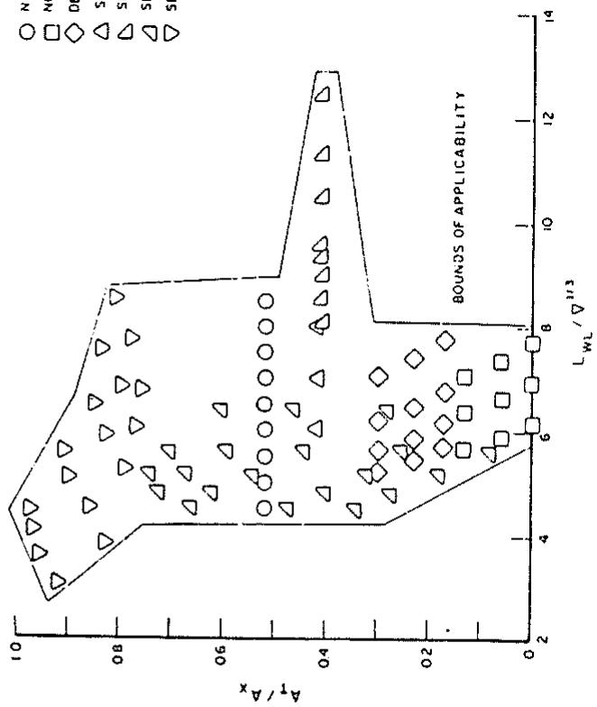

scatter

| Series | \(L_WL / \nabla^1/3 (\)range) | A_T / A_x (range) |
| --- | --- | --- |
| N (Circle) | 4.5~8.5 | 0.5~0.52 |
| N (Square) | 6.0~7.8 | 0.0~0.15 |
| D (Diamond) | 5.0~8.0 | 0.15~0.3 |
| S (Triangle) | 3.0~12.5 | 0.4~1.0 |

RANGE OF VARIATION OF $A_{T}/A_{X}$ AS A FUNCTION OF $L_{WL}/\nabla^{1/3}$

RANGE OF VARIATION OF $\overline{LCG}/L_{PP}$ AS A FUNCTION OF $L_{WL}/\nabla^{1/3}$  
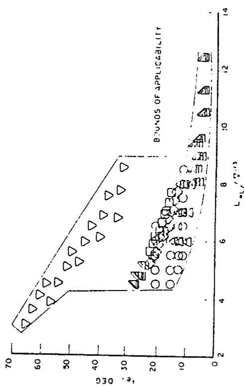

scatter

| Series | \(L*L/\Delta*L\) (range) | l.e. DEG (range) |
| --- | --- | --- |
| Triangle (Upper) | 3~9 | 30~68 |
| Square (Upper) | 4.5~8.5 | 10~25 |
| Circle (Upper) | 4.5~8.5 | 10~20 |
| Triangle (Lower) | 4.5~12.5 | 2~28 |
| Square (Lower) | 4.5~12.5 | 2~25 |

RANGE OF VARIATION OF $I_a$ AS A FUNCTION OF $L_{wL} / \nabla^{1/3}$  
Fig. 11 Range of applicability of nonplaning resistance equation (16)

1.0 ≤ F\_n ≤ 2.0  
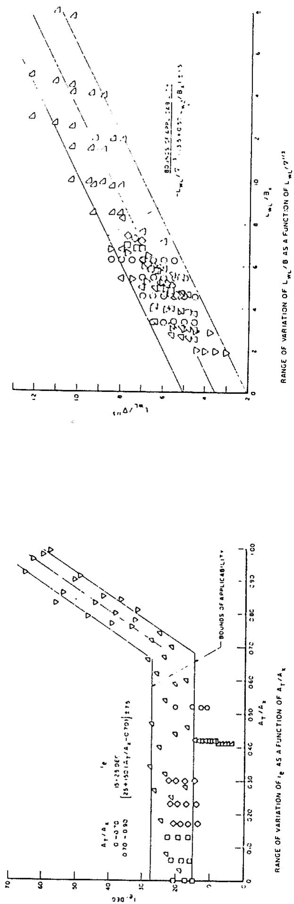  
RANGE OF VARIATION OF $i_{e}$ AS A FUNCTION OF $A_{T}/A_{K}$

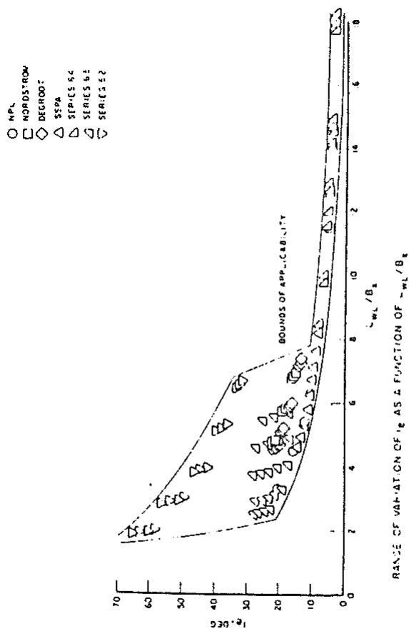

scatter

| Series | Ie/Bz (range) | Ie (deg) (range) |
| --- | --- | --- |
| NORDSTROW | 2~8 | 0~68 |
| DEGREE | 2~8 | 0~68 |
| SSPA | 2~8 | 0~68 |
| SERIES 64 | 2~8 | 0~68 |
| SERIES 62 | 2~8 | 0~68 |
| SERIES 52 | 2~8 | 0~68 |

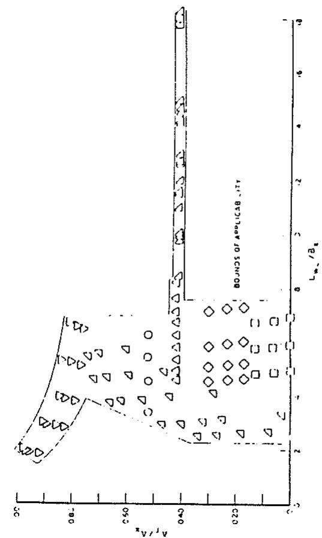

scatter

| Series | Lw/Ag (range) | A1/Ag (range) |
| --- | --- | --- |
| Triangle | 2.0~0.8 | 0.05~0.95 |
| Circle | 2.0~0.8 | 0.05~0.95 |
| Diamond | 2.0~0.8 | 0.05~0.95 |

RANGE OF VARIATION OF $A_{T}/A_{x}$ AS A FUNCTION OF $L_{wL}/B_{x}$

Fig. 11 (Continued)

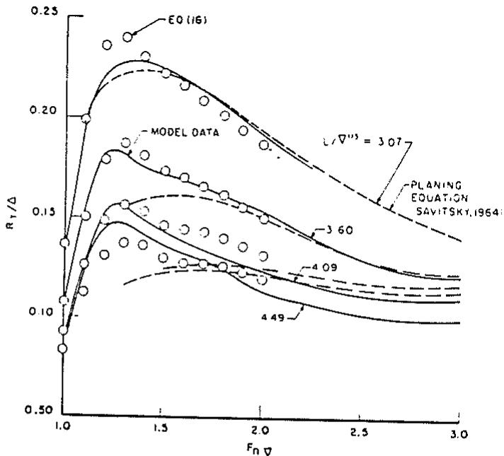

scatter

| Fn \(\nabla\) | EO (16) | Model Data | \(L/\nabla^3 = 3.60\) | \(L/\nabla^3 = 4.09\) | \(L/\nabla^3 = 4.49\) |
| --- | --- | --- | --- | --- | --- |
| 1.0 | ~0.08 | ~0.08 | ~0.08 | ~0.08 | ~0.08 |
| 1.1 | ~0.19 | ~0.19 | ~0.19 | ~0.19 | ~0.19 |
| 1.2 | ~0.23 | ~0.23 | ~0.22 | ~0.15 | ~0.14 |
| 1.3 | ~0.24 | ~0.24 | ~0.22 | ~0.15 | ~0.14 |
| 1.4 | ~0.23 | ~0.23 | ~0.22 | ~0.15 | ~0.14 |
| 1.5 | ~0.22 | ~0.22 | ~0.21 | ~0.15 | ~0.13 |
| 1.6 | ~0.21 | ~0.21 | ~0.21 | ~0.15 | ~0.13 |
| 1.7 | ~0.20 | ~0.20 | ~0.20 | ~0.15 | ~0.13 |
| 1.8 | ~0.19 | ~0.19 | ~0.19 | ~0.15 | ~0.13 |
| 1.9 | ~0.18 | ~0.18 | ~0.18 | ~0.15 | ~0.13 |
| 2.0 | ~0.17 | ~0.17 | ~0.17 | ~0.15 | ~0.13 |
| 2.1 | ~0.16 | ~0.16 | ~0.16 | ~0.15 | ~0.13 |
| 2.2 | ~0.15 | ~0.15 | ~0.15 | ~0.15 | ~0.13 |
| 2.3 | ~0.14 | ~0.14 | ~0.14 | ~0.15 | ~0.13 |
| 2.4 | ~0.13 | ~0.13 | ~0.13 | ~0.15 | ~0.13 |
| 2.5 | ~0.12 | ~0.12 | ~0.12 | ~0.15 | ~0.13 |
| 2.6 | ~0.11 | ~0.11 | ~0.11 | ~0.15 | ~0.13 |
| 2.7 | ~0.10 | ~0.10 | ~0.10 | ~0.15 | ~0.13 |
| 2.8 | ~0.09 | ~0.09 | ~0.09 | ~0.15 | ~0.13 |
| 2.9 | ~0.08 | ~0.08 | ~0.08 | ~0.15 | ~0.13 |
| 3.0 | ~0.07 | ~0.07 | ~0.07 | ~0.15 | ~0.13 |

Fig. 12 Comparison of predicted resistance according to derived resistance-estimating equation and to planing equation with measurements for Model 4665 of Series 62

which predicts S within ±9 percent for 95 percent of the cases used.

An alternative formula for estimating wetted surface presented by Marwood and Silverleaf (1960) is

$$
S / \nabla^ {2 / 3} = \left(\frac {L _ {W L}}{\nabla^ {1 / 3}}\right) ^ {2} \left(1. 7 \frac {B _ {X}}{L _ {W L}} \times \frac {T}{B _ {X}} + \frac {B _ {x}}{L _ {W L}} C _ {B}\right) \tag {20}
$$

which exhibits a dependence on block coefficient.

## Application of equation for preplaning resistance

Results for Series 62 model. Resistance results for Model 4665 of Series 62 at the nominal standard LCG condition are compared in Fig. 12 with calculations according to the preplaning equation (17). Also shown are results according to the high-speed planing equation of Savitsky (1964). It is gratifying to note the relatively good continuity of the two calculation methods for conditions where they overlap in the speed range $F_{n\overline{v}}$ equal to approximately 2.0 and the generally good agreement between calculated and measured results.

Results for arbitrary craft. Predictions of the resistances for several craft which were not used in developing the resistance-estimating equation (17) are compared with test results in Fig. 13. Predictions according to equation (17) have been corrected to correspond to the conditions for which these ad hoc test results were expanded. Hull form characteristics and displacement of these craft are given in Table 6.

The degree of agreement between the measurements and calculated resistances is similar to what might be expected on the basis of the results for the series models used to derive the equations.

Influence of form parameters on resistance. Equation (17) can be used to investigate the effects on resistance of variations of the hull form parameters $L_{WL}/\nabla^{1/3}$ , $C_{\Delta}$ , $i_{e}$ , and $A_{T}/A_{X}$ . A first approximation of the effects of variations could be obtained from the linear term of a Taylor's expansion, that is

$$
R _ {T} / \Delta = \frac {\partial R _ {T} / \Delta}{\partial y} \delta y \tag {21}
$$

where y is a hull form parameter and $\partial R_{T}/\Delta/\partial y$ can be derived for any parameter $y(=\bar{L}_{WL}/\Delta^{1/3},$ for instance) from equation (17) as relatively simple algebraic equations (one for each Froude number). The usefulness of this approach is limited, however, especially because of significant nonlinearities in most of the equations. Thus, it is recommended that the complete equation (17) be used for the study of probable effects of modifications of design parameters. A design optimization procedure could, of course, be developed based on these equations, but it is not clear whether this would be generally useful, especially since the pre-planing drag may be only one element of the overall performance capability of a craft. The development of such an optimization procedure is not pursued here.

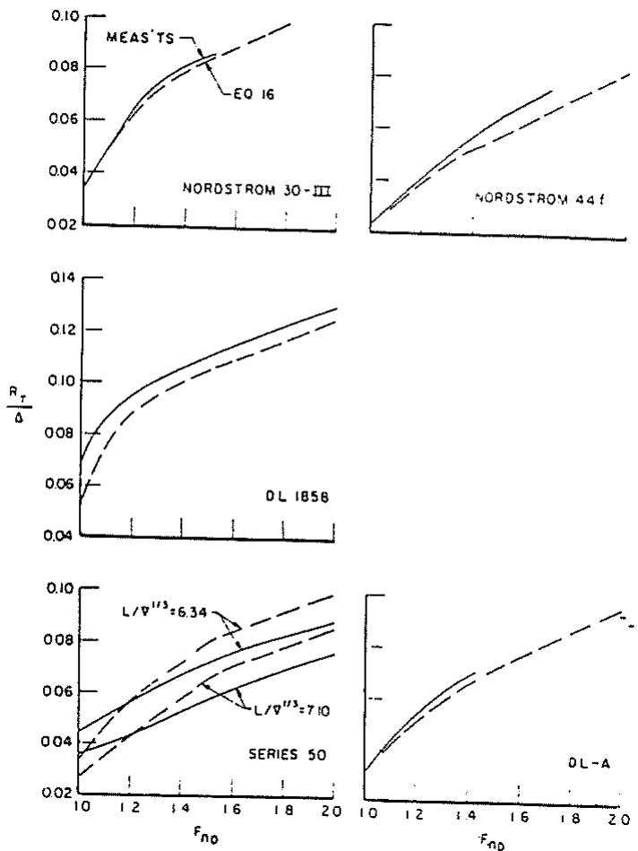  
Fig. 13 Comparisons of resistance estimates from equation (16) with results of measurements for ad hoc cases

Table 6 Ad hoc hull forms for which comparisons have been made between measurements and calculations of resistance

<table><tr><td>Designation</td><td> $L_{WL}/\nabla^{v3}$ </td><td> $C_{\Delta}$ </td><td> $i_e$ </td><td> $A_T/A_x$ </td><td> $\Delta, \text{lb}$ </td><td> $S/\nabla^{v3}$ </td></tr><tr><td>Nordstrom, 30-lll,r,1</td><td>5.84</td><td>0.972</td><td>13.93</td><td>0.516</td><td>47,400</td><td>6.45</td></tr><tr><td>Nordstrom, 44-fh,1</td><td>7.33</td><td>0.491</td><td>7.36</td><td>0.33</td><td>60,300</td><td>6.00</td></tr><tr><td>DL-1858h,2</td><td>5.16</td><td>0.228</td><td>26.80</td><td>0.612</td><td>10,000</td><td>6.98</td></tr><tr><td>Series 50h,3</td><td>7.10</td><td>0.208</td><td>17.70</td><td>0.47</td><td>100,000</td><td>...</td></tr><tr><td>Series 50h,3</td><td>6.34</td><td>0.171</td><td>21.40</td><td>0.47</td><td>100,000</td><td>...</td></tr><tr><td>DL-Ah</td><td>6.63</td><td>0.436</td><td>17.30</td><td>0.60</td><td>380,000</td><td>7.46</td></tr><tr><td colspan="7">NOTES:</td></tr></table>

r = round bilge.  
h = hard-chine.  
1-from Nordstrom (1951).  
2-from SNAME Small Craft Data Sheet No. 4.  
3-from DL files and Davidson/Suarez (1949).

The resistance-estimating equations have been exercised to evaluate the influence of variations of form parameters for a particular parent craft, corresponding to the parent form of the

NPL series having characteristics given in Table 4. See Table 7. Results are presented in Fig. 14 showing the effects of variations over a wide range of the several parameters.

The following comments apply to the preplaning speed range where $F_{n\tau}$ lies between 1.0 and 2.0.

1. An increase of $L/\nabla^{1/3}$ results in a significant reduction in smooth-water resistance. This effect is similar to that shown by Nordstrom (1951).

2. $C_{\Delta}$ has little influence on resistance for these hull form characteristics. The dependence of $R_{T}/\Delta$ on $C_{\Delta}$ as approximated by equations (16) is linear (but dependent on $L/\nabla^{1/3}$ , $i_{e}$ , and $A_{T}/A_{X}$ ), is never very great, and may show either an increase or decrease of $R_{T}/\Delta$ for increase of $C_{\Delta}$ , depending on values of the other form parameters.

3. Increasing $i_{e}$ results in an appreciable increase of resistance. For example, at $F_{n\nabla}=1.5$ , a 4-deg increase in $i_{e}$ to 15 deg (which is not by any means a large waterline entrance angle) produces an 8 percent increase in $R_{T}/\Delta$ . Since no data are available for forms with still lower $i_{e}$ , for this value of $A_{T}/A_{X}$ , the equation ought not to be applied for $i_{e}<11$ deg.

4. The use of equation (17) appears to indicate that the ratio of transom area to maximum section area is such as to produce a maximum resistance for the values of other hull form parameters selected. However, the range of applicability of the equation, limited by the fine waterline entrance, is not wide, and the extreme variations of $R_{T}/\Delta$ obtained from the equation for values of $A_{T}/A_{X}$ outside the range 0.41 to 0.52 must not be considered significant. It must be pointed out that the dependence of $R_{T}/\Delta$ on $A_{T}/A_{X}$ is related to $F_{n}$ as well as to the other hull form parameters, and more conclusive generalizations are not presently possible. Consequently, it is suggested that the dependence of $R_{T}/\Delta$ on $A_{T}/A_{X}$ be investigated for each hull form evaluation to be carried out.

## Behavior of planing boats in a seaway

Over the years research on the hydrodynamics of planing boats has been mainly directed to the problems of calm-water performance. The studies of basic planing surfaces and laboratory-developed hull series, when combined with the practical knowledge of the small-boat naval architect, have resulted in the evolution of high-performance, high-speed planing craft.

The modern high-performance planing boat, however, is mostly exposed to a rough-water environment and, if it is to have good seakeeping capabilities, a suitable compromise must be sought between the requirements for calm-water performance and those for seakeeping.

A systematic study of the seakeeping performance of planing boats in irregular waves has been made by Fridsma (1971). This wide-ranging study covers a number of topics, including model configuration, test techniques, test program design, statistical analysis of craft response in irregular waves, data reduction and discussion of the effects of speed, wave height, deadrise, trim, load and length-beam ratio on added resistance, impact loads, and motions.

The results of the study are embodied in a series of design charts for predicting:

1. Added resistance in waves (power requirements).  
2. Impact loads on hull structure at the bow and center of gravity.  
3. Craft pitch and heave motion amplitudes.

These charts permit the rational selection of craft configuration to meet calm-water and rough-water specifications. This methodology has been applied by Savitsky, Roper, and Benen (1972) to the development of a high-speed planing hull for rough water, culminating in model tests which showed close agreement between the model results and Fridsma's predictions.

A summary of the study of the rough-water performance of planing boats is presented in this section, together with some

Table 7 Characteristics of NPL Model 100A (parent form for example calculation of influence of variations in hull form parameters on $R_{T}/\Delta$ )

$$
L _ {W L} / \nabla^ {1 / 3} = 6. 5 8 5
$$

$$
\begin{array}{l} C _ {\Delta} = 0. 8 5 5 \\ i _ {e} = 1 1 \deg \\ A _ {T} / A _ {X} = 0. 5 2 \\ \end{array}
$$

simplified expressions for the added resistance in waves and for the impact loads.  
Systematic study of planing boats in rough water  
Models. Four prismatic constant-deadrise models were tested. Three of these models had an overall length-beam ratio of 5 and deadrise angles of 10, 20 and 30 deg; a fourth 20-deg deadrise model had a length-beam ratio of 4. The constant deadrise was continued into the bow region where the buttock lines curved up and the beam diminished in a somewhat representative manner, as shown on Fig. 15; the bow transition extended one beam length aft of the forward perpendicular—thereafter the hull was prismatic to the transom. Some concern was expressed about the use of an unconventional constant-deadrise bow form in rough water; consequently, a fifth 20-deg model was constructed employing a conventional warped bow as shown in Fig. 16. The change in bow form had negligible effect on the rough-water performance. The gyradius was set at 25 percent of the hull length for the hull loading represented by $C_{\Delta}/L/b = 0.12$ . Other loadings at the same length-beam ratio were applied at the CG so as to maintain the same pitch inertia.  
Test program. The test program provided for the parametric investigation of the effects of deadrise, load, length-beam ratio, speed, wave height and trim. The models provided three deadrise angles of 10, 20, and 30 deg.  
The following load schedule was established as being representative:

<table><tr><td>L/B</td><td> $C_{\Delta}$ </td><td> $\Delta_{LT}/(0.01L)^{3}$ </td><td> $C_{\Delta}/(L/b)$ </td></tr><tr><td>4</td><td>0.384</td><td>171</td><td>0.096</td></tr><tr><td>4</td><td>0.480</td><td>214</td><td>0.120</td></tr><tr><td>5</td><td>0.480</td><td>110</td><td>0.096</td></tr><tr><td>5</td><td>0.600</td><td>137</td><td>0.120</td></tr><tr><td>5</td><td>0.720</td><td>165</td><td>0.144</td></tr></table>

The combination of L/b = 5 and $C_{\Delta} = 0.6$ was taken as the pivotal combination in the load matrix and was evaluated at all conditions.

The following three speed-length ratios were chosen to represent the three distinct flow regimes in which a planing boat may operate:

<table><tr><td> $V_K/\sqrt{L}$ </td><td> $C_v/\sqrt{(L/b)}$ </td></tr><tr><td>2</td><td>0.60</td></tr><tr><td>4</td><td>1.19</td></tr><tr><td>6</td><td>1.79</td></tr></table>

The speed-length ratio of 2 represents the pre-hump condition where buoyancy forces are predominant, significant side-wetting above the chines occurs, and the planing hull behaves much like a displacement ship. A speed-length ratio of 4 puts the craft in the post-hump condition where dynamic and buoyant forces play an equal role—this is the domain of pleasure craft and utility boats. At a speed-length ratio of 6, dynamic forces predominate and the craft is fully planing—this is the domain of the high-performance planing boat.

The models were tested in irregular waves having an energy distribution conforming to the Pierson-Moskowitz spectra. These spectra are characterized by the significant wave height—that is, the average of the one-third highest waves—denoted by $H_{1/3}$ . Three significant heights were chosen in terms of the beam:

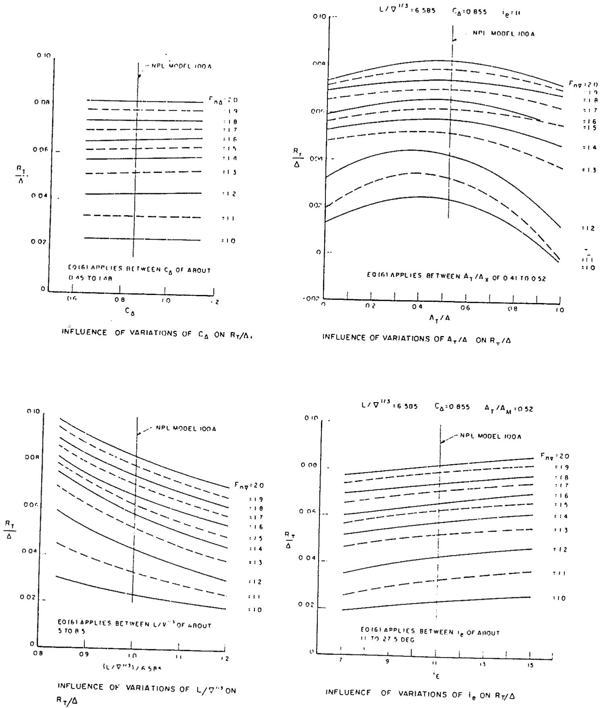  
Fig. 14 Influence of variation in geometric and loading parameters on resistance in nonplaning range [equation (16)]

<table><tr><td>Significant height, $H_{1/3}/b$ </td><td>Equivalent maximum-energy wave length-beam ratio</td></tr><tr><td>0.222</td><td>8</td></tr><tr><td>0.444</td><td>18</td></tr><tr><td>0.667</td><td>27</td></tr></table>

While there is no physical equivalent wave-length in an irregular sea, the second column is included to show that, as the sea rises, the apparent waves tend to get longer. In an earlier study, Fridsma (1969) had attempted to characterize planing boats in regular waves, but had to abandon this approach when it became clear that the planing boat's response to waves is nonlinear. Nonlinearity is evidenced by the fact that in regular waves the motion response, say, pitch amplitude, is not porportional to wave height and, when the craft is excited at one frequency by regular waves, it responds at other frequencies.

It is recognized that, in both smooth and rough water, the running trim of the planing boat plays an essential role in determining performance. When comparing hulls of different deadrise, for instance, it is therefore necessary to evaluate them at the same running trim, as well as at the same load and speed. The LCG position that a 30-deg-deadrise hull requires to achieve a running trim of 4 deg is different from that required by a boat with 10-deg deadrise at the same speed. The change in LCG position, however, is immaterial if the trim is the same because the hydrodynamic performance is determined by trim, not by LCG. Consequently, the final parameter in this six-parameter investigation was the calm-water running trim. The tests were performed with the LCG adjusted to give calm-water running trims of 4 and 6 deg.

Test technique. The tests in irregular waves were made at constant speed. Tests of low-speed displacement hulls are usually made at constant thrust with the model free to surge so that it can check in waves. Testing of the planing hulls was initiated using the free-to-surge technique; however, observation of the models showed no apparent surging motion. This was not surprising at the higher speed-length ratios since the momentum of the craft would tend to inhibit surging. To verify this observation at a speed-length ratio of 2, comparative tests were made at both constant speed and constant thrust. The results were identical. Not only were the added resistance, average acceleration, and average motion amplitudes the same—in addition, the histograms of the motion and acceleration amplitudes were the same. The fact that the response to waves was identical in all respects permits the use of the simpler and less costly constant-speed test technique in evaluating planing boats in rough water.

Tests were made in both calm water and waves so as to set the running trim and permit the isolation of the added resistance due to waves. The heave and pitch motions were measured and the accelerations at the center of gravity and at the bow; the bow acceleration was measured at a point 10 percent of the length aft of the forward perpendicular. Enough runs were made at each test condition to obtain a statistical sample of at least 75 wave encounters.

Discussion of results. As the hull traverses the three speed regimes, corresponding to the three speed-length ratios of 2, 4, and 6, its behavior varies from contouring the waves at low speed to platforming at high speed. Thus, at low speed the craft tends to follow the wave profile, while at high speed it skips from crest to crest. As a result, the motions are largest at low speed. The added resistance due to waves is largest at the median speed. The acceleration levels build up considerably with speed to such an extent that, at a speed-length ratio of 6 in large sea states, operation becomes impractical.

All performance indicators deteriorate as the waves get larger. This is an expected result, but the point of the study was to quantify the effect of wave height, as is discussed later.

Increased deadrise has a generally beneficial effect on rough-water performance. While the higher deadrise requires more installed power for calm water, at speed-length ratios of 4 and 6, the added resistance due to waves is decreased by increasing deadrise. Increasing deadrise from 20 to 30 deg decreases the added resistance on the order of 20 percent. Motions are also attenuated by higher deadrise at high speed. It is on the impact accelerations that deadrise has its most important effect—increasing deadrise from 10 to 30 deg halves the impact accelerations at both bow and center of gravity.

Decreasing the trim has a beneficial effect on loads and motions. Reducing the running trim from 6 to 4 deg results in a 33 percent reduction of impact accelerations. This trim reduction increases the added resistance 40 percent at a speed-length ratio of 4. The same trim reduction reduces motion amplitudes on the order of 20 percent at the two lower speeds.

Increasing load decreases the impact accelerations, the motion amplitudes at high speeds, and the added resistance at low and high speed. In the post-hump region, however, at a speed-length ratio of 4, the added resistance increases in proportion to the load.

Increasing the length-beam ratio raises the acceleration levels at all speeds and amplifies the motions at high speed. Length-beam ratio had no effect on the added resistance at a speed-length ratio of 4; at a speed-length ratio of 2, the added resistance increases with length-beam ratio and decreases at a speed-length ratio of 6.

Seakeeping performance equations. The data presented by Fridsma have been reworked into equations for predicting the added resistance in waves and the impact acceleration at the center of gravity and the bow (10 percent $L_{OA}$ aft of the stem). These equations facilitate performance prediction, are suitable for computer programming, and the precision of the predictions is comparable to that obtained from the charts presented by Fridsma. The smooth-water resistance over the entire speed range may be estimated by the method described earlier, and the addition of the added resistance in waves from the following formulas will result in estimates for the total resistance. Estimates are given for each of the speed-length ratios tested, and it will be necessary to interpolate for intermediate speeds.

The accelerations are given in terms of the average acceleration. When a time-history is made of the hull acceleration as it travels through irregular waves, a nonperiodic oscillatory record is obtained. Measuring all the peaks of the positive upward accelerations in the record and taking the average gives the “average acceleration” $\bar{n}$ , given in the following.

Since the equations for added resistance and acceleration are empirical and based on limited data, it is necessary to respect the range of applicability. Extrapolation beyond these limits is unjustified.

Range of applicability

<table><tr><td>Parameter</td><td>Range</td></tr><tr><td> $\Delta_{LT}/(0.01L)^{3}$ </td><td>100-250</td></tr><tr><td> $L/b$ </td><td>3-5</td></tr><tr><td>Trim, deg</td><td>3-7</td></tr><tr><td>Deadrise, deg</td><td>10-30</td></tr><tr><td> $H_{1/3}/b$ </td><td>0.2-0.7</td></tr><tr><td> $V_{K}/\sqrt{L}$ </td><td>2-6</td></tr></table>

Added Resistance at $V_{K}/\sqrt{L}=2$ :

$$
\frac {R _ {A W}}{w b ^ {3}} = 6 6 \times 1 0 ^ {- 6} \left(\frac {H _ {1 / 3}}{b} + 0. 5\right) \frac {(L / b) ^ {3}}{C _ {\Delta}} + 0. 0 0 4 3 (\tau - 4) \tag {22}
$$

Note: No effect of deadrise

Precision ± 20 percent

Added Resistance at $V_{K}/\sqrt{L}=4$ :

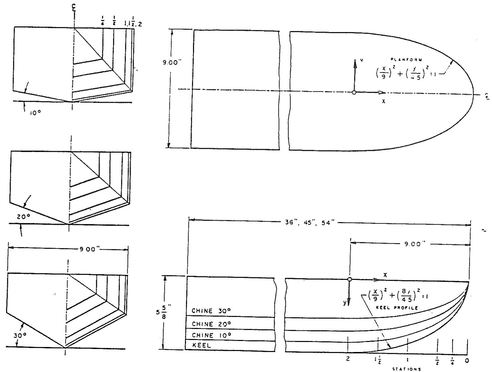  
Fig. 15 Lines of prismatic models

$$
\frac {R _ {A W}}{\Delta} = \frac {0 . 3 H _ {1 / 3} / b}{1 + 2 H _ {1 / 3} / b} \left(1. 7 6 - \frac {\tau}{6} - 2 \tan^ {3} \beta\right) \tag {23}
$$

Note: No effect of length-beam ratio

Precision ± 20 percent

Added Resistance at $V_{K}/\sqrt{L}=6$ :

$$
\frac {R _ {A W}}{w b ^ {3}} = \frac {0 . 1 5 8 H _ {1 / 3} / b}{1 + \left(H _ {1 / 3} / b\right) \left[ 0 . 1 2 \beta - 2 1 C _ {\Delta} \left(5 . 6 - \frac {L}{b}\right) + 7 . 5 \left(6 - \frac {L}{b}\right) \right]} \tag {24}
$$

Note: No effect of trim

Precision ± 10 percent

Average Impact Acceleration at CG, g units:

$$
\bar {n} _ {\mathrm{CG}} = 0. 0 1 0 4 \left(\frac {H _ {1 / 3}}{b} + 0. 0 8 4\right) \frac {\tau}{4} \left(\frac {5}{3} - \frac {\beta}{3 0}\right) (V _ {K} / \sqrt {L}) ^ {2} \frac {L / b}{C _ {\Delta}} \tag {25}
$$

Note: Precision ± 0.2 g

Average Impact Acceleration at Bow, g units:

$$
\bar {n} _ {\mathrm{bow}} = \bar {n} _ {\mathrm{CG}} \left[ 1 + \frac {3 . 8 (L / b - 2 . 2 5)}{V _ {K} / \sqrt {L}} \right] \tag {26}
$$

Note: Precision ± 20 percent

Statistics of Impact Accelerations:

The average 1/Nth highest acceleration, $\bar{n}_{1/N}$ , is related to the average acceleration, $\bar{n}$ :

$$
\bar {n} _ {1 / N} = \bar {n} (1 + \log_ {e} N) \tag {27}
$$

Therefore, the average $\frac{1}{3}$ -highest and $\frac{1}{10}$ -highest are, respectively, 2.1 and 3.3 times the average acceleration.

The probability of exceeding a specified acceleration level is given by

$$
P [ n > n _ {\text {specified}} ] = e ^ {- (n / \bar {n})}
$$

Therefore, the chances of exceeding the $\frac{1}{3}$ -highest and $\frac{1}{10}$ -highest average accelerations are 12 percent and 4 percent, respectively.

The Need for further research on planing boats in rough water. It should be appreciated that there yet remains the need for further research on power boats in a seaway. In pursuing his researches, Fridsma had to develop a new technology for testing planing boats in rough water and for analyzing the results statistically. As a consequence, the parametric investigation is admittedly limited in scope. It is not irrelevant to remark that, in addition, at that time (1969–1971), all the test records had to be read by hand. With the benefit of this essential groundwork and the availability today of on-line data processing computers, future seakeeping research can be implemented with great dispatch. This development opens up exciting possibilities for the future and, with the continued support of the Department of the Navy and the small-boat industry, it is anticipated that the next 10 years will again bring forth what the authors hope this paper represents, another significant contribution to planing boat technology.

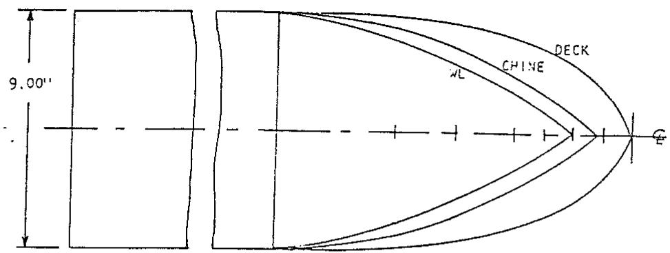

text_image

9.00"
XL
CHINE
DECK
E

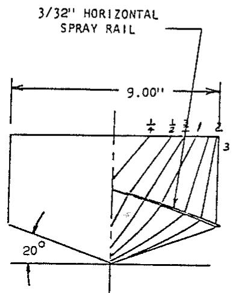

text_image

3/32" HORIZONTAL
SPRAY RAIL
9.00"
20°
1/4 1/2 3/2
3

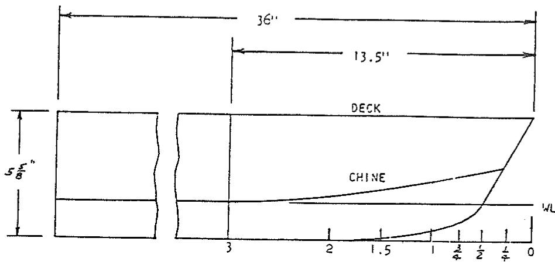

text_image

36"
13.5"
DECK
5/8"
CHINE
WL
3
2
1.5
1
3/4
1/2
1/4
0

Fig. 16 Lines of prismatic model with conventional bow

## Application of results

In order to assist the designer in utilizing the results given in this report an example of smooth- and rough-water performance prediction will be made for a hard chine hull having the following geometric and loading characteristics:

$$
L _ {W L} = 8 0 \mathrm{ft}
$$

$$
B _ {x} = 2 5 \text {ft (maximum waterline beam)}
$$

$$
B _ {P x} = 2 4 \text {ft (maximum chine beam)}
$$

$$
B _ {P T} = 1 8 \text {ft (chine beam at transom)}
$$

$$
\beta = 1 5 \text {deg (deadrise at mid - chine length)}
$$

$$
i _ {e} = 4 9 \deg
$$

$$
A _ {T} / A _ {x} = 0. 9 1
$$

$$
C _ {B} = 0. 4 5
$$

$$
T = 3. 3 \text {ft (maximum draft)}
$$

$$
\Delta = 1 8 6, 0 0 0 \mathrm{lb}
$$

$$
L _ {W L} / \nabla^ {1 / 3} = 5. 6
$$

$$
\mathrm{LCG} = 3 4 \text {ft (forward of transom)}
$$

$$
C _ {\Delta} = (\Delta / w B _ {P x} ^ {3}) = 0. 2 1
$$

For the sake of simplicity it will be assumed that the propulsion thrust is applied through the center of gravity and is parallel to the keel. This allows for use of the nomograph in Fig. 3 in calculating equilibrium conditions in the planing regime. For designs wherein the thrust line is not parallel to the keel and does not pass through the center of gravity, the procedure given by Savitsky (1964) should be used.

Evaluation of wetted keel lengths. The general procedure for calculation of the wetted keel length is to use the nomograph of Fig. 3 to evaluate $\lambda$ and then to use equation (15) to obtain $\lambda_{K}$ . If $\lambda_{K}$ is greater than $L_{WL}/B_{Px}$ in the low-speed regime, then the preplaning equation (16) is used for prediction of resistance. When the calculated $\lambda_{K}$ is less than $L_{WL}/B_{Px}$ , resistance and equilibrium planing conditions are obtained from Fig. 3.

The relation between speed (V) and speed coefficient ( $C_{v} = V/\sqrt{gB_{Px}}$ ); volume Froude No. ( $F_{n\nabla} = V/\sqrt{g^{\nabla1/3}}$ ); deadrise lift coefficient ( $C_{L\beta} = \Delta/\frac{1}{2}\rho V^{2}B_{Px}^{2}$ ) as given by equation (4), equivalent flat-plate lift coefficient ( $C_{L0}$ ), is tabulated in the following for $\Delta = 186,000$ lb, $B_{Px} = 24$ ft, and $\beta = 15$ deg:

<table><tr><td> $F_{n\tau}$ </td><td> $V_{\tau}$ fps</td><td> $V_{K}$ ,knots</td><td> $C_{V}$ </td><td> $C_{L\beta}$ </td><td> $C_{L\theta}$ </td></tr><tr><td>1.0</td><td>21.4</td><td>12.7</td><td>0.77</td><td>0.71</td><td>0.79</td></tr><tr><td>1.5</td><td>32.2</td><td>19.0</td><td>1.16</td><td>0.31</td><td>0.37</td></tr><tr><td>2.0</td><td>42.9</td><td>25.4</td><td>1.54</td><td>0.18</td><td>0.22</td></tr><tr><td>3.0</td><td>64.3</td><td>38.1</td><td>2.31</td><td>0.08</td><td>0.10</td></tr><tr><td>4.0</td><td>85.7</td><td>50.8</td><td>3.08</td><td>0.04</td><td>0.06</td></tr></table>

Because it has been assumed, for this example, that all forces pass through the center of gravity, the quantity p/b in Fig. 3 is:

$$
p / b = \mathrm{LCG} / B _ {P z}
$$

$$
p / b = 3 4 / 2 4 = 1. 4 2
$$

By combining equations (12) and (15), $\lambda_{K}$ is obtained.
Thus:

$$
\lambda_ {K} = \lambda - 0. 0 3 + \frac {\left(0 . 5 7 + \frac {\beta \deg}{1 0 0 0}\right) \left(\frac {\tan \beta}{2 \tan \tau} - \frac {\beta \deg}{1 3 7}\right)}{2}
$$

The equilibrium values of $\lambda$ and $\tau$ are found from the nomograph in Fig. 3. Thus:

<table><tr><td> $C_V$ </td><td> $C_{L0}/\tau^{1.1}$ </td><td> $\lambda$ </td><td> $\tau,$ deg</td><td> $\lambda_K$ </td></tr><tr><td>0.77</td><td>0.295</td><td>3.9</td><td>2.4</td><td>4.7</td></tr><tr><td>1.16</td><td>0.109</td><td>3.4</td><td>3.0</td><td>4.1</td></tr><tr><td>1.54</td><td>0.052</td><td>2.9</td><td>3.6</td><td>3.4</td></tr><tr><td>2.31</td><td>0.026</td><td>2.3</td><td>3.5</td><td>2.9</td></tr><tr><td>3.08</td><td>0.021</td><td>2.1</td><td>2.7</td><td>2.9</td></tr></table>

The nondimensional length overall is

$$
L _ {W L} / B _ {P x} = 8 0 / 2 4 = 3. 3 3
$$

Comparing this with the values of $\lambda_{K}$ tabulated in the foregoing indicates that, for $C_{V} \leq 1.54$ , $\lambda_{K} > L_{WL}/B_{Px}$ so that the preplaning resistance equation (16) is to be used. For larger values of $C_{V}$ the planing equations as represented by the nomograph are to be used for prediction of resistance.

Resistance in preplaning condition. The basic resistance formulation for $F_{n\nabla} \leq 2.0$ is given by equation (17). The value of X, Z, V, and W used in this equation are

$$
X = \nabla^ {1 / 3} / \mathrm{L} _ {\mathrm{WL}} = 0. 1 8
$$

$$
Z = \nabla / B _ {P x} ^ {3} = 0. 2 1
$$

$$
U = \sqrt {2 i _ {e}} = 9. 9
$$

$$
W = A _ {T} / A _ {x} = 0. 9 1
$$

The various constants, $A_{n}$ , required for substitution in equation (17) are given in Table 5 as a function of volume Froude No. ( $F_{n\tau}$ ). The reader is reminded that equation (17) provides resistance values for a displacement of 100,000 lb. The following results are obtained using equation (17):

<table><tr><td> $F_{n\triangledown}.$ </td><td> $V_K,$ knots</td><td> $(R_T/\Delta)_{100,000}$ </td></tr><tr><td>1.0</td><td>12.7</td><td>0.0624</td></tr><tr><td>1.5</td><td>19.0</td><td>0.1022</td></tr><tr><td>2.0</td><td>25.4</td><td>0.1243</td></tr></table>

These results must now be corrected to correspond to a displacement of 186,000 lb. From equations (18) and (19) and taking $C_{A}=0$ , the following values of $(R_{T}/\Delta)_{186,000}$ are obtained:

<table><tr><td> $F_{n\tau}$ </td><td> $V_K$ , knots</td><td> $(R_T/\Delta)_{186,000}$ </td><td> $R_T$ , lb</td></tr><tr><td>1.0</td><td>12.7</td><td>0.0617</td><td>11,500</td></tr><tr><td>1.5</td><td>19.0</td><td>0.1015</td><td>18,900</td></tr><tr><td>2.0</td><td>25.4</td><td>0.1236</td><td>23,000</td></tr></table>

Resistance in planing range. It has been shown that for volume Froude No. greater than 1.5, the computed values of $L_{K}/B_{Px}$ are less than $L_{WL}/B_{Px}$ . In this speed range, the planing equations apply. Using the nomograph of Fig. 3, the following results are obtained:

<table><tr><td> $F_{n\tau}$ </td><td> $V_K$ , knots</td><td> $\lambda$ </td><td> $\tau$ , deg</td></tr><tr><td>2.0</td><td>25.4</td><td>2.9</td><td>3.6</td></tr><tr><td>3.0</td><td>38.1</td><td>2.3</td><td>3.5</td></tr><tr><td>4.0</td><td>50.8</td><td>2.1</td><td>2.7</td></tr></table>

The hydrodynamic resistance is

$$
R _ {T} = \Delta \tan \tau + \frac {1}{2} \rho V ^ {2} \lambda B _ {P x} ^ {2} C _ {f} / \cos \tau \cos \beta
$$

The Schoenherr friction coefficient, $C_{f}$ , corresponds to a Reynolds No. (RN) = $\lambda B_{Px} V/\nu$ , where $\nu$ is the kinematic viscosity. Thus, for the present illustrative example, the resistance in the planing range is

<table><tr><td> $F_{n\tau}$ </td><td> $V_{K}$ , knots</td><td> $R_{T}$ , lb</td></tr><tr><td>2.0</td><td>25.4</td><td>17,500</td></tr><tr><td>3.0</td><td>38.1</td><td>21,500</td></tr><tr><td>4.0</td><td>50.8</td><td>24,800</td></tr></table>

It is interesting to note the relatively good continuity of the preplaning and planing calculation procedures in the speed range $1.50 \leq F_{n\leq} \leq 2.0$ .

Center-of-gravity impact acceleration. Considering the craft to be planing in an irregular head sea having a significant wave height $H_{1/3}=4.6$ ft, the average impact acceleration at the center of gravity is obtained from equation (25). The quantity $b$ in equation (25) is equivalent to $B_{Px}$ previously defined. The quantity $L$ is equivalent to $L_{WL}$ . Using the values of $\tau$ previously calculated and recalling that $\beta=15$ deg; $C_{\Delta}=0.21$ ; $L_{WL}=80$ ft, and $B_{Px}=24$ ft in the illustrative example, the following values of $\bar{n}_{\mathrm{CG}}$ are calculated:

<table><tr><td> $F_{n\nabla}$ </td><td> $V_{K}$ ,knots</td><td> $\tau$ ,deg</td><td> $V_{K}/\sqrt{L}$ knots/ft $^{1/2}$ </td><td> $\bar{n}_{\text{CG}}$ ,g units</td></tr><tr><td>2.0</td><td>25.4</td><td>3.6</td><td>2.8</td><td>0.39</td></tr><tr><td>3.0</td><td>38.1</td><td>3.5</td><td>4.3</td><td>0.84</td></tr><tr><td>4.0</td><td>50.8</td><td>2.7</td><td>5.7</td><td>1.16</td></tr></table>

It is to be noted that the average $\frac{1}{3}$ -highest and $\frac{1}{10}$ -highest accelerations are, respectively, 2.1 and 3.3 times $\bar{n}_{CG}$ .

Bow impact acceleration. Using equation (26), the average bow accelerations are

<table><tr><td> $F_{n\tau}$ </td><td> $V_{K}$ ,knots</td><td> $\bar{n}_{\text{bow}}$ ,g units</td></tr><tr><td>2.0</td><td>25.4</td><td>0.95</td></tr><tr><td>3.0</td><td>38.1</td><td>1.66</td></tr><tr><td>4.0</td><td>50.8</td><td>1.99</td></tr></table>

The statics of the bow impact accelerations are, of course, identical to those for the CG acceleration.

Added resistance in waves. For the purposes of illustration, the added resistance in waves is evaluated at 25.4 knots, corresponding to a speed-length ratio of 2.8. It will be recalled that the formulations for added resistance, equations (22), (23), and (24), are for speed-length ratios of 2, 4, and 6, respectively. Thus, for the present case, a linear interpolation will be made between the calculated added resistances at speed-length ratios of 2 and 4 to obtain the added resistance at the speed-length ratio of 2.8. The following are the operating conditions:

$$
\beta = 1 5 \mathrm{deg}
$$

$$
V _ {K} / \sqrt {L} = 2. 8
$$

$$
V _ {K} = 2 5. 4
$$

$$
\tau = 3. 9 \deg
$$

$$
H _ {1 / 3} / B _ {P x} = 4. 6 / 2 4 = 0. 1 9
$$

$$
C _ {\Delta} = 0. 2 1
$$

$$
L W L / B _ {P x} = 8 0 / 2 4 = 3. 3 3
$$

$$
b = B _ {P x}
$$

Substituting these values into equation (22):

$$
R _ {A W} = \text {added resistance (at} V _ {K} / \sqrt {L} = 2) = 5 7 0 0 \mathrm{lb}
$$

Substituting into equation (23):

$$
R _ {A W} = \text { added   resistance   (at   } V _ {k} \sqrt {L} = 4) = 8 6 0 0 \text {   lb }
$$

Thus for a speed-length ratio of 2.8:

$$
R _ {A W} = \frac {0 . 8}{2 . 0} \times (8 6 0 0 - 5 7 0 0) + 5 7 0 0 = 6 9 0 0 \mathrm{lb}
$$

so that the total resistance, at 25.4 knots, in a head sea having a significant wave height of 4.6 ft is estimated to be:

$R_{TW}$ = Smooth-water resistance + Added resistance

$$
R _ {T W} = 1 7, 5 0 0 + 6 9 0 0 = 2 4, 4 0 0 \mathrm{lb}
$$

Effect of adding a trim flap. Assume that a full-span trim flap is added to the transom. The chord of flap is 1 ft and it is deflected 5 deg. The effect of this flap on planing performance is estimated in the following.

Applying equations (5), (6), and (7) at a speed of 25.4 knots:

$$
\sigma = 1. 0
$$

$$
\delta = 5 \deg
$$

$$
L _ {F} = 1 \mathrm{ft}
$$

$$
b = B _ {P x} = 2 4 \mathrm{ft}
$$

$$
\beta = 1 5 \deg (\text {at transom})
$$

$$
V = 2 5. 4 \times 1. 6 9 = 4 2. 9 \mathrm{fps}
$$

$$
\mathrm{LCG} = 3 5 (\text {relative to flap trailing edge})
$$

$$
\Delta = 1 8 6, 0 0 0 \mathrm{lb}
$$

Flap lift:

$$
\Delta_ {F} = 0. 0 4 6 L _ {F} \sigma \delta b \left[ \frac {\rho}{2} V ^ {2} \right] = 1 0, 1 0 0 \mathrm{lb}
$$

Effective craft displacement:

$$
\Delta_ {e} = \Delta - \Delta_ {F} = 1 8 6, 0 0 0 - 1 0, 1 0 0 = 1 7 5, 9 0 0 \mathrm{lb}
$$

Effective longitudinal center of gravity:

$$
\mathrm{LCG} _ {e} = \left[ \Delta (\mathrm{LCG}) - 0. 6 b \Delta_ {F} \right] / \Delta_ {e} = 3 6. 2 \mathrm{ft}
$$

Using these values of $\Delta_{e}$ and $LCG_{e}$ , the equilibrium trim and wetted length of the craft is calculated by applying the nomograph of Fig. 3. Thus for a planing speed of 25.4 knots:

$$
C _ {L _ {d e}} = \frac {\Delta_ {e}}{\frac {1}{2} \rho V ^ {2} B _ {P x} ^ {2}} = 0. 1 7
$$

$$
C _ {L _ {0 e}} = 0. 2 0 [ \text {equation (4)} ]
$$

$$
p / b = \frac {\mathrm{LCG} _ {e}}{B _ {P x}} = 1. 5 0
$$

$$
C _ {V} = 1. 5 4
$$

$$
C _ {L 0} / \tau^ {1. 1} = 0. 0 6 0 (\text {Fig. 3})
$$

$$
\tau = \left(\frac {0 . 2 0}{0 . 0 6 3}\right) ^ {1 / 1. 1} = 2. 9 \mathrm{deg}
$$

$$
\lambda = 3. 2
$$

Having determined these quantities, the smooth-water drag is given by the following equation, which is taken from the section on performance prediction with flaps:

$$
D = \Delta \tan \tau + \frac {C _ {f} \lambda \rho V ^ {2} b ^ {2}}{2 \cos \tau \cos \beta} + 0. 0 0 5 2 \Delta_ {F} (\tau + \delta)
$$

The Reynold's number at 59 F in seawater is

$$
R N = \frac {V \lambda b}{\nu} = 2. 5 5 \times 1 0 ^ {8}
$$

and the Schoenherr friction coefficient is

$$
C _ {f} = 0. 0 0 1 8 2
$$

Thus

$$
D = 1 6, 2 0 0 \mathrm{lb}
$$

This is slightly less resistance than the unflapped case previously calculated.

The impact accelerations in a seaway will be reduced by the ratio of trim angle with deflected flap to trim angle without flap. Thus, using equation (25), the average center-of-gravity impact acceleration at a speed of 25.4 knots is

$$
\bar {n} _ {\mathrm{CG}} = \frac {2 . 9 \mathrm{deg}}{3 . 6 \mathrm{deg}} \times 0. 3 9 = 0. 3 1 \mathrm{g}
$$

Similarly, the bow acceleration is

$$
\bar {n} _ {\text {bow}} = \frac {2 . 9 \mathrm{deg}}{3 . 6 \mathrm{deg}} \times 0. 9 5 = 0. 7 7 \mathrm{g}
$$

The change in added resistance in waves is calculated as before by applying equations (22) and (23) but using a trim angle of 2.9 deg.

## Acknowledgment

The authors are indebted to Code 03221 of the Naval Sea Systems Command, to the David Taylor Naval Ship Research and Development Center, and to the Mechanics Branch, Office of Naval Research, for their continued interest in and support of planing hull research at Stevens Institute of Technology. They would also like to acknowledge the contribution of Mr. G. Fridsma to the study of seakeeping, and the work of Dr. J. Mercier in the preplaning area.

## References

1 Beys, P. M., "Series 63 Round Bottom Boats," Davidson Laboratory Report 949, Stevens Institute of Technology, April 1963.  
2 Blount, Donald L. and Fox, David L., "Small Craft Power Predictions," MARINE TECHNOLOGY, Vol. 13, No. 1, Jan. 1976, pp. 14-45.  
3 Brown, P. Ward and Van Dyck, R. L., "An Experimental Investigation of Deadrise Planing Surfaces with Re-entrant Vee-Step," Davidson Laboratory Letter Report 664, Stevens Institute of Technology, Dec. 1964.  
4 Brown, P. Ward, "An Analysis of the Forces and Moments on Re-entrant Vee-Ship Planing Surfaces," Davidson Laboratory Letter Report 1142, Stevens Institute of Technology, May 1966.  
5 Brown, P. Ward, "An Experimental and Theoretical Study of Planing Surfaces with Trim Flaps," Davidson Laboratory Report 1463, Stevens Institute of Technology, April 1971.  
6 Chambliss, D. B. and Boyd, G. M., Jr., "The Planing Characteristics of Two V-Shaped Prismatic Surfaces having Angles of Deadrise of 20° and 40°," NACA TN 2876, Jan. 1953.  
7 Clement, E. P. and Blount, D., "Resistance Tests of a Systematic Series of Planing Hull Forms," Trans., SNAME, Vol. 71, 1963, pp. 491-561.  
8 Davidson, K. S. M. and Suarez, A., "Tests of Twenty Related Models of V-Bottom Motor Boats—EMB Series 50," DTMB Report R-47, David Taylor Model Basin, March 1949.  
9 DeGroot, D., "Resistance and Propulsion of Motorboats," Netherlands Ship Model Basin, Publication No. 93, Wageningen, The Netherlands (DTMB Translation 244, by W. B. Hinterthan, Jan. 1956).  
10 Doust, D. J. and O'Brien, T. P., "Resistance and Propulsion of Trawlers," Trans., NECIES, Vol. 75, 1958-59.  
11 Doust, D. J., "Optimized Trawler Forms," Trans. NECIES, Vol. 79, 1962–63.  
12 Doust, D. J., "An Assessment of N. P. L. Resistance Data on Ocean Going Ships," NPL Report No. 47, 1963.  
13 Fridsma, G., "A Systematic Study of the Rough-Water Performance of Planing Boats, Irregular Waves, Part II." Davidson Laboratory Report 1495, Stevens Institute of Technology, March 1971.  
14 Fridsma, G., "A Systematic Study of the Rough-Water Performance of Planing Boats," Davidson Laboratory Report 1275, Stevens Institute of Technology, Nov. 1969.  
15 Hadler, J. B., "The Prediction of Power Performance on Planing Craft," Trans., SNAME, Vol. 74, 1966, pp. 563–610.  
16 Hadler, J. B., Hubble, E. N., and Holling, H. D., "Resistance Characteristics of a Systematic Series of Planing Hull Forms—Series 65," SNAME, Chesapeake Section, 9 May 1974.  
17 Marwood, W. J. and Bailey, D., "Design Data for High-Speed Displacement Hulls of Round-Bilge Form," Ship Division. NPL, Report No. 99, Feltham, England.  
18 Marwood, W.J. and Silverleaf, A., "Design Data for High Speed Displacement Type Hulls and a Comparison with Hydrofoil Craft," Third Symposium on Naval Hydrodynamics, High Performance Ships, ONR-ACR-65, Sept. 1960.  
19 Mercier, John A. and Savitsky, Daniel, "Resistance of Transom Shear Craft in the Pre-Planing Range," Davidson Laboratory, Report 1667, Stevens Institute of Technology, June 1973.  
20 Nordstrom, H. F., "Some Tests with Models of Small Vessels," Swedish State Shipbuilding Experimental Tank, Publication No. 19, Göteborg, Sweden, 1951.  
21 Pope, James, D., "The Planing Characteristics of a V-Shaped Prismatic Surface with 70 degree Dead Rise," DTMB Report 1285, Dec. 1958.  
22 Sabit, A. S., "A Tabulated Analytical Procedure Based on Regression Analysis for the Determination of the Form Coefficients and EHP for Ships Designed According to Series 60," European Shipbuilding, Vol. 20, No. 2, 1971.  
23 Sabit, A. S., "Regression Analysis of the Resistance Results of the BSRA Series," International Shipbuilding Progress, Vol. 18, No. 197, 1971.  
24 Savitsky, Daniel, "Hydrodynamic Design of Planing Hulls," MARINE TECHNOLOGY, Vol. 1, No. 1, Oct. 1964, pp. 71–95.  
25 Savitsky, Daniel, "On the Seakeeping of Planing Hulls," MARINE TECHNOLOGY, Vol. 5, No. 2, April 1968, pp. 164–174.  
26 Savitsky, Daniel, Roper, J. K., and Benen, L., "Hydrodynamic Development of a High-Speed Planing Hull for Rough Water," Presented at Ninth ONR Symposium on Naval Hydrodynamics, Paris, Aug. 1972.  
27 Shuford, Charles L., Jr., "A Theoretical and Experimental Study of Planing Surfaces Including Effects of Cross Section and Plan Form." NACA TN 3939, Nov. 1956.  
28 Springston, G. B., Jr. and Sayre, C. L., Jr., "The Planing Characteristics of a V-Shaped Prismatic Surface with 50 degree Dead Rise," DTMB Report 920, Feb. 1955.  
29 Yeh, H. Y. H., "Series 64 Resistance Experiments on High-Speed Displacement Forms," MARINE TECHNOLOGY, Vol. 2, No. 3, July 1965, pp. 248–272.