# Strip theories applied to the vertical motions of high speed crafts

F. Pe´rez Arribas a,\*, J.A. Clemente Ferna´ndez

a Naval Architecture School of Madrid, Universidad Polite´cnica de Madrid, Avenida Arco de la Victoria SN, 28040 Madrid, Spain b NAVANTIA San Fernando Shipyard, Avenida de la Carraca SN, Ca´diz, Spain

Received 18 January 2005; accepted 20 April 2005 Available online 8 November 2005

# Abstract

The motions of a high speed craft are highly influenced by speed and dynamic forces that begin to be important for high Froude numbers. Classical ship motions theories and some seakeeping programs do not include the effect of these dynamic forces that mainly affect to the damping of vertical motions, and have to be corrected to model high speed crafts. In any other way, the use of these theories or programs would be unrealistic. In this paper, some theories that can be used to predict the seakeeping behaviour of high speed crafts, considering dynamic forces, are studied and validated against seakeeping tests of some fast monohulls models. Tests and results focus on vertical motions in head seas, which are the most severe for these fast crafts. Experimental results of vertical motions are compared with numerical calculations and conclusions about the range of application of the presented theories are obtained.

q 2005 Elsevier Ltd. All rights reserved.

Keywords: Seakeeping; Fast crafts; Ship motions; Strip theory; Ship dynamics; Potential flow

# 1. Introduction

In the operation and design of high speed crafts, seakeeping performance is an important task because it has been proven that large motions and accelerations can degrade the operational capabilities of the ship. Nowadays the naval architect has some numerical tools to study the seakeeping behaviour of a design, but these tools have to be used

Nomenclature 

<table><tr><td> $\alpha$ </td><td>lift coefficient</td></tr><tr><td> $\lambda$ </td><td>wave length</td></tr><tr><td> $\phi$ </td><td>fluid potential around a ship</td></tr><tr><td> $\phi_0$ </td><td>incident wave potential</td></tr><tr><td> $\xi_3$ </td><td>heave amplitude</td></tr><tr><td> $\xi_5$ </td><td>pitch amplitude</td></tr><tr><td> $\phi_7$ </td><td>diffraction potential</td></tr><tr><td> $\xi_a$ </td><td>wave amplitude</td></tr><tr><td> $\alpha i$ </td><td>angle of attack to uniform flow</td></tr><tr><td> $\psi_i$ </td><td>fluid function</td></tr><tr><td> $\xi_i$ </td><td>motion amplitude  $i=2,\ldots6$ </td></tr><tr><td> $\phi_j$ </td><td>radiation potential  $j=2,\ldots6$ </td></tr><tr><td> $a_{33}$ </td><td>sectional added mass coefficient for heave motion</td></tr><tr><td> $A_{ij}$ </td><td>added mass coefficients</td></tr><tr><td> $A_j$ </td><td>projected area in the direction of motion  $j$ </td></tr><tr><td> $a_T$ </td><td>transom added mass coefficient for heave motion</td></tr><tr><td>B</td><td>beam</td></tr><tr><td> $b_{33}$ </td><td>sectional damping coefficient for heave motion</td></tr><tr><td> $B_{ij}$ </td><td>damping coefficients</td></tr><tr><td> $b_T$ </td><td>transom damping coefficient for heave motion</td></tr><tr><td> $C_b$ </td><td>block coefficient</td></tr><tr><td> $C_D$ </td><td>viscous drag coefficient</td></tr><tr><td> $C_{ij}$ </td><td>restoring coefficients</td></tr><tr><td> $F_3$ </td><td>vertical force: diffraction + exciting</td></tr><tr><td> $F_5$ </td><td>pitch moment: diffraction + exciting</td></tr><tr><td> $F_j^v$ </td><td>dynamic force (lift + drag)</td></tr><tr><td> $Fn$ </td><td>Froude number</td></tr><tr><td>g</td><td>gravity</td></tr><tr><td> $I_5$ </td><td>longitudinal inertia</td></tr><tr><td>KG</td><td>height of the centre of gravity</td></tr><tr><td> $L_{pp}$ </td><td>length between perpendiculars</td></tr><tr><td>m</td><td>ship displacement</td></tr><tr><td>N</td><td>normal direction to ship hull</td></tr><tr><td> $R_{yy}$ </td><td>inertia radius</td></tr><tr><td>T</td><td>draft</td></tr><tr><td> $T_{ij}$ </td><td>radiation hydrodynamics coefficients</td></tr><tr><td>V</td><td>advance speed</td></tr><tr><td> $v_j$ </td><td>relative fluid velocity in the  $j$ th direction</td></tr><tr><td>w</td><td>encounter frequency of the waves</td></tr><tr><td> $x_T$ </td><td>distance from transom to the centre of gravity</td></tr><tr><td> $Z_3$ </td><td>heave motion</td></tr><tr><td> $Z_5$ </td><td>pitch motion</td></tr></table>

carefully, as most of them are limited due to the theoretical assumptions made. Among these tools, the so-called ‘Strip theory’ has the advantage of being relatively simple, robust and accurate. Modern Strip theory began with the works of Salvensen et al. (1970); Korvin- Kroukowski and Jacobs (1957), and it has been modified and updated until now thanks to the mentioned qualities.

Due to its basic assumptions of linearity, slender hull form and moderate forward speed, the original strip theory has not been considered a reliable tool for seakeeping predictions of fast crafts. However, some studies (Blok and Beukelman, 1984; Frandoli et al., 2000) show that a strip theory can still give accurate enough results even at high Froude Numbers. In addition, many computer programs based on the strip theory are actively used in practice.

To address the shortcomings of this theory, a considerable amount of work is being carried out at many research institutions to develop a fully 3D numerical solution for the problem of ship motions at forward speed, both in frequency and time domains. In spite of progresses made and good results obtained, these 3D methods are hard to use in the day to day practice of a shipyard, where fast modelisation and calculations are required, and modifications to the design are quite common at the preliminary design stage.

Seakeeping tests in a towing tank are the most preferable option, but can be expensive and limited by the dimensions of the tank and the speed of the carriage. The quality of the tests is determined by the model scale and by the number of oscillations that the model experience in the test length (Lloyd, 1989). On the other hand, open water tests in irregular waves have the limitation of obtaining an accurate measurement of the sea state, in order to obtain the transfer functions of the motions. Thus, strip theories are pushed to their limits of applicability, in order to obtain a reliable tool to predict the seakeeping characteristics of high speed vessels at the design stage.

In this work, several additions to the original strip theories are applied to the heave and pitch motions of some models of fast crafts at moderate and high Froude numbers, attempting to assess the accuracy and speed range of applicability of the assumptions made.

# 2. About strip theories: transom and viscous effects

The objective is to obtain ship motions when sailing in regular waves. These waves produce incident exciting forces, diffract when they reach the ship hull, which also produces forces on it, and the waves produce ship motion. These motions also produce radiated waves, which again produce forces. Strip theories slice ship hull in transversal strips assuming that there is no influence between different strips, so the surge motion of a ship advancing in regular waves can not be calculated with these theories. Time harmonic motions of small amplitude are considered for ship motions, with the complex factor $\mathrm { e } ^ { \mathrm { i } w t }$ applied to the oscillatory quantities. $\boldsymbol { \xi } _ { j } \left( j = 2 , . . . , 6 \right)$ represents the complex amplitude of the five modes of motions of a ship about its center of gravity (sway, heave, roll, pitch and yaw).

Potential flow is used to describe the fluid motion around the ship hull. In order to make it easier, no advance speed is used and once the potential is calculated, it is corrected to consider the speed effects. If a right handed coordinate system o–;xyz is used with x along ship length, z in the vertical direction and y transversally, the fluid potential around a ship that is studied with a strip theory can be expressed as:

$$
\phi (x, y, z, t) = \xi_ {\mathrm{a}} (\phi_ {0} + \phi_ {7}) \mathrm{e} ^ {\mathrm{i} w t} + \sum_ {j = 2} ^ {6} \xi_ {j} \phi_ {j} \mathrm{e} ^ {\mathrm{i} w t} \tag {1}
$$

where $\xi _ { \mathrm { a } }$ is the incident wave amplitude, $\phi _ { 0 }$ is the deep water incident wave potential of a sinusoidal wave with unit wave amplitude, $\phi _ { 7 }$ is the diffraction potential with unit wave amplitude and $\phi _ { j }$ is the radiation potential in the jth direction $( j = 2 , \ldots , 6 )$ .

The wave potentials $\phi _ { j } ( j = 2 , 7 )$ must satisfy the following mathematical formulations

$$
\frac {\partial^ {2} \phi_ {j}}{\partial y ^ {2}} + \frac {\partial^ {2} \phi_ {j}}{\partial z ^ {2}} = 0 \tag {2}
$$

$$
\mathrm{i} w \phi_ {j} + g \frac {\partial \phi_ {j}}{\partial z} = 0 \quad z = 0 \quad j = 2, \dots , 6 \tag {3}
$$

$$
\frac {\partial \phi_ {j}}{\partial N} = \left\{ \begin{array}{l l} \mathrm{i} w N _ {j} & (j = 2, \dots , 6) \\ - \frac {\partial \phi_ {0}}{\partial N} & (j = 7) \end{array} \right. \tag {4}
$$

$$
\frac {\partial \phi_ {j}}{\partial N} = 0 z = \infty \tag {5}
$$

Eq. (2) is applied in the fluid domain, Eq. (3) is a linear free surface condition $( z = 0 )$ , and Eq. (4) is applied on the wet body surface, where N is the normal direction at the point were the potential is placed. Harmonic motions of frequency w are considered and the fluid function $\psi _ { j } ( t , y , z )$ is introduced to the previous equations:

$$
\psi_ {j} (t, y, z) = \mathrm{e} ^ {\mathrm{i} w t} \phi_ {j} (x, y, z) \tag {6}
$$

Formulations are derived in terms of $\psi _ { j } ( t , y , z )$ :

$$
\frac {\partial^ {2} \psi_ {j}}{\partial y ^ {2}} + \frac {\partial^ {2} \psi_ {j}}{\partial z ^ {2}} = 0 \tag {7}
$$

$$
\frac {\partial^ {2} \psi_ {j}}{\partial^ {2} t} + g \frac {\partial \psi_ {j}}{\partial z} = 0 \quad z = 0 \quad j = 2, \dots , 6 \tag {8}
$$

$$
\frac {\partial \psi_ {j}}{\partial N} = \left\{ \begin{array}{l l} \mathrm{i} w N _ {j} \mathrm{e} ^ {\mathrm{i} w t} & (j = 2, \dots , 6) \\ - \frac {\partial \phi_ {0}}{\partial N} \mathrm{e} ^ {\mathrm{i} w t} & (j = 7) \end{array} \right. \tag {9}
$$

This mathematical formulation about $\psi _ { j } ( t , y , z )$ may be regarded as defining a 2D time domain body linear problem, where the potentials are obtained for each body section or strip, treated sequentially from bow to stern. In this work a non transient free surface Green function has been applied to derive the body boundary integral equations, and solve for $\psi _ { j } ( t , y , z )$ and its derivatives. The detailed deduction of body boundary integral equations can be seen in Rodriguez (1971)

After determining the radiation potential $\phi _ { j } ( j = 2 , . . . , 6 )$ and the diffraction potential $\phi _ { 7 } .$ , the linear hydrodynamic pressure can be obtained by using Bernoulli’s equation. By integrating the hydrodynamic pressure over the ship hull, the hydrodynamic forces acting on the ship can be obtained:

$$
T _ {i j} = \iint_ {S} p _ {j} (x, y, z) n _ {j} \mathrm{d} S = - \rho \int_ {L} \mathrm{e} ^ {- \mathrm{i} w t} \int_ {S} \frac {\partial \psi_ {j}}{\partial t} n _ {j} \mathrm{d} S \tag {10}
$$

For $j { = } 2 , { \ldots } , 6 , \ T _ { i j }$ represents the radiation hydrodynamic coefficients which can be divided in added mass $A _ { i j }$ and damping coefficients $B _ { i j }$ terms, namely:

$$
T _ {i j} = w ^ {2} A _ {i j} - i w B _ {i j} \tag {11}
$$

In a strip theory, the total hydromecanic force and moment on the ship hull are obtained by integrating the sectional force calculated for every strip, along ship length. Wave exciting forces and moments are added to the hydromecanic forces and moments respectively, and with Newton’s second law the equations of motion are obtained. The hydromechanic forces and moments give the hydrodynamic and hydrostatic restoring coefficients of the left hand side in the equations of motions, which for coupled heave and pitch can be expressed as Bhattacharyya (1974):

$$
(m + A _ {3 3}) \ddot {Z} _ {3} + B _ {3 3} \dot {Z} _ {3} + C _ {3 3} Z _ {3} + A _ {3 5} \ddot {Z} _ {5} + B _ {3 5} \dot {Z} _ {5} + C _ {3 5} Z _ {5} = F _ {3} \mathrm{e} ^ {\mathrm{i} w t} \tag {12}
$$

$$
\left(I _ {5} + A _ {5 5}\right) \ddot {Z} _ {5} + B _ {5 5} \dot {Z} _ {5} + C _ {5 5} Z _ {5} + A _ {5 3} \ddot {Z} _ {3} + B _ {5 3} \dot {Z} _ {3} + C _ {5 3} Z _ {3} = F _ {5} \mathrm{e} ^ {\mathrm{i} w t} \tag {13}
$$

The coefficients $A _ { i j } , ~ B _ { i j }$ and $C _ { i j }$ are the added mass, damping and restoring terms respectively calculated for an encounter frequency w. $I _ { 5 }$ is ship longitudinal inertia with respect to the ship center of gravity and m is ship displacement. Indices 3 and 5 refer to heave and pitch motions. $C _ { i j }$ represents the restoring terms that represent hydrostatic forces.

Considering harmonic motions, heave and pitch motions can be expressed as $Z _ { 3 } ( t ) =$ $\mathrm { R e } ( \zeta _ { 3 } \mathrm { e } ^ { \mathrm { i } w t } )$ and $Z _ { 5 } ( t ) = \operatorname { R e } ( \zeta _ { 5 } \mathrm { e } ^ { \mathrm { i } w t } )$ which simplifies Eqs. (12) and (13) into the linear

system:

$$
\left\{ \begin{array}{l} \left[ C _ {3 3} - w ^ {2} \left(m + A _ {3 3}\right) + \mathrm{i} w B _ {3 3} \right] \xi_ {3} + \left[ C _ {3 5} - w ^ {2} A _ {3 5} + \mathrm{i} w B _ {3 5} \right] \xi_ {5} = F _ {3} \\ \left[ C _ {5 3} - w ^ {2} A _ {5 3} + \mathrm{i} w B _ {5 3} \right] \xi_ {3} + \left[ C _ {5 5} - w ^ {2} \left(I _ {5} + A _ {5 5}\right) + \mathrm{i} w B _ {5 5} \right] \xi_ {5} = F _ {5} \end{array} \right. \tag {14}
$$

Once the potentials have been obtained accordingly, Rodriguez (1971), damping and added masses matrices can be obtained. Up to now, the influence of the speed has not been taken into account. We are going to see that this is the main difference between the original (Korvin- Kroukowski and Jacobs, 1957) and modified theories (Salvensen et al., 1970).

# 3. Speed corrections

In the original strip theory, the speed (V) influence is taken into account mainly for the derivative of the sectional added mass (A) with respect to the ship length. The modified theory also takes into account the speed influence related to the derivative of the damping (B) with respect to ship length, and so, terms are introduced with Vd(A)/dx and Vd(B)/dx Corrections are showed in Table 1.

Main differences affect pitch $( A _ { 5 5 } , B _ { 5 5 } )$ , and cross coupling coefficients $( A _ { 5 3 } , B _ { 5 3 } )$ . In the original strip theory (Lahtiharju et al., 1991), the added mass cross coupling terms do not satisfy the Tyman–Newman symmetry relationship of equal forward speed terms but with opposite signs. The assumptions made in the original theory are only valid for a ship with fore and aft symmetry.

# 4. Transom stern effect

Fast ships have transom sterns. The main reason is that for Fn between 0.40 and 0.45, the second wave crest produced by the hull is beyond the stern and only the wave crest at the bow ‘supports’ the ship. This is the reason of the wide transom stern, which produces some lift and reduces the bow trim. As lift increases with speed, the sinkage begins to decrease at these speeds in broad transom ships. With regards to seakeeping, at the transom stern the flow should leave the transom tangentially in the downstream direction so there is atmospheric pressure at the last section (Faltinsen, 1993). Strip theory is not able to predict this value. Even 3D theories cannot because what is happening at a section is only influenced by upstream effects.

Table 1 Speed corrections in strip theories 

<table><tr><td></td><td>Original strip theory</td><td>Modified strip theory</td></tr><tr><td> $A_{33}$ </td><td> $\int_{L} a_{33} \mathrm{d}x$ </td><td> $\int_{L} a_{33} \mathrm{d}x$ </td></tr><tr><td> $B_{33}$ </td><td> $\int_{L} b_{33} \mathrm{d}x$ </td><td> $\int_{L} b_{33} \mathrm{d}x$ </td></tr><tr><td> $A_{35}$ </td><td> $-\int_{L} a_{33} x \mathrm{d}x - \frac{V}{w^{2}} \int_{L} b_{33} \mathrm{d}x$ </td><td> $-\int_{L} a_{33} x \mathrm{d}x - \frac{V}{w^{2}} \int_{L} b_{33} \mathrm{d}x$ </td></tr><tr><td> $B_{35}$ </td><td> $\int_{L} -b_{33} x \mathrm{d}x + V \int_{L} a_{33} \mathrm{d}x$ </td><td> $\int_{L} -b_{33} x \mathrm{d}x + V \int_{L} a_{33} \mathrm{d}x$ </td></tr><tr><td> $A_{55}$ </td><td> $\int_{L} a_{33} x^{2} \mathrm{d}x + \frac{V^{2}}{w^{2}} \int_{L} a_{33} \mathrm{d}x + \frac{V}{w^{2}} \int_{L} b_{33} x \mathrm{d}x$ </td><td> $\int_{L} a_{33} x^{2} \mathrm{d}x + \frac{V^{2}}{w^{2}} \int_{L} a_{33} \mathrm{d}x$ </td></tr><tr><td> $B_{55}$ </td><td> $\int_{L} b_{33} x^{2} \mathrm{d}x$ </td><td> $\int_{L} b_{33} x^{2} \mathrm{d}x + \frac{V^{2}}{w^{2}} \int_{L} b_{33} \mathrm{d}x$ </td></tr><tr><td> $A_{53}$ </td><td> $-\int_{L} a_{33} x \mathrm{d}x$ </td><td> $-\int_{L} a_{33} x \mathrm{d}x + \frac{V}{w^{2}} \int_{L} b_{33} \mathrm{d}x$ </td></tr><tr><td> $B_{53}$ </td><td> $\int_{L} -b_{33} x \mathrm{d}x - V \int_{L} a_{33} \mathrm{d}x$ </td><td> $\int_{L} -b_{33} x \mathrm{d}x - V \int_{L} a_{33} \mathrm{d}x$ </td></tr></table>

Table 2 Transom stern corrections in strip theories 

<table><tr><td></td><td>Original strip theory</td><td>Modified strip theory</td></tr><tr><td> $A_{33}$ </td><td></td><td> $-(V/W^{2})b_{T}$ </td></tr><tr><td> $B_{33}$ </td><td> $Va_{T}$ </td><td> $Va_{T}$ </td></tr><tr><td> $A_{35}$ </td><td> $-(V^{2}/w^{2})a_{T}$ </td><td> $-(V^{2}/w^{2})a_{T}+(V/w^{2})x_{T}b_{T}$ </td></tr><tr><td> $B_{35}$ </td><td> $-Vx_{T}a_{T}$ </td><td> $-Vx_{T}a_{T}(V^{2}/w^{2})b_{T}$ </td></tr><tr><td> $A_{55}$ </td><td> $(V^{2}/w^{2})x_{T}a_{T}$ </td><td> $(V^{2}/w^{2})x_{T}a_{T}-(V/w^{2})x_{T}^{2}b_{T}$ </td></tr><tr><td> $B_{55}$ </td><td> $Vx_{T}^{2}a_{T}$ </td><td> $Vx_{T}^{2}a_{T}+(V^{2}/w^{2})x_{T}b_{T}$ </td></tr><tr><td> $A_{53}$ </td><td></td><td> $(V/w^{2})x_{T}b_{T}$ </td></tr><tr><td> $B_{53}$ </td><td> $-Vx_{T}a_{T}$ </td><td> $-Vx_{T}a_{T}$ </td></tr></table>

The inability to describe the transom stern flow properly will have an influence on the prediction of the vertical motions. This is the reason why artificial transom effects are included in some theories. With these corrections, the pressure at the transom stern is supposed to be atmospheric. Once again, there is no theoretical justification for doing this in the whole last station. This is only done to illustrate the implications of considering transom sterns when studying ship motions. The corrections used in this paper are those from (Salvensen et al., 1970) and are obtained as a function of speed and of the damping and added mass of the aftermost section.

End terms can be added or disregarded to both theories (Table 2). Considering the end terms, the main difference between the original and the modified theories is that the modified includes both the damping and added mass of the aftermost section $( a _ { \mathrm { T } } , ~ b _ { \mathrm { T } } )$ , while the original theory only considers end terms related with the added mass of the aftermost section $( a _ { \mathrm { T } } )$ . In Table $2 , x _ { \mathrm { T } }$ is the abscissa of the transom in respect to the ship centre of gravity.

No mention of the right hand side of Eqs. (12) and (13) have been done so far. In this case, the expressions used follow Lewis (1989) and consider exciting forces from the regular waves and diffraction forces. No viscous effects (lift and drag) are considered in these expressions.

# 5. Lift and drag effects

For the vertical motion prediction of conventional ship types where the wave damping is the predominant damping mechanism, hydrodynamic coefficients obtained from potential theory are satisfactory. When speed increases and dynamic forces (lift and drag) begin to grow, wave damping is not predominant in the overall damping and viscous effects of the fluid have to be taken into account for studying the motions. This is clearly shown in fast crafts designed for planing speeds. To consider the viscous effects, these steps are followed:

– Left hand sides of Eqs. (12) and (13) are obtained with one of the mentioned strip theories (original or modified).   
– An extra force is added at the right hand side of Eqs. (12) and (13) to consider the lift and drag effects. This force is obtained by an empirical method derived from cross flow approach to a slender body at a moderate angle of incidence and uniform flow.

According to Thwaites (1960), for a harmonically oscillating body at a constant forward speed U in regular waves, the fluid force due to viscous effects, Lift and cross flow drag, could be written as:

$$
F _ {j} ^ {V} = \frac {1}{2} \rho A _ {j} \frac {V ^ {2} \alpha \alpha_ {j} (x) + C _ {D} v _ {j} (x)}{v _ {j} (x)} \tag {15}
$$

where $A _ { j }$ is the projected area of the body in the jth direction; a is the viscous lift coefficient; $a _ { j }$ is the angle of attack to uniform flow; $C _ { \mathrm { D } }$ is the viscous drag coefficient; $\nu _ { j }$ is the relative fluid velocity in the jth direction and V is the ship speed.

In the case of vertical motions, relative fluid velocity for a slender body can be expressed:

$$
\left\{ \begin{array}{l} v _ {3} (x) = - (\dot {\xi} _ {3} - x \dot {\xi} _ {5} - V \xi_ {5}) \\ v _ {5} (x) = x v _ {3} (x) \end{array} \right. \tag {16}
$$

The angle of attack can be expressed as a function of the relative speed:

$$
\left\{ \begin{array}{l} \alpha_ {3} (x) = \frac {v _ {3} (x)}{V} \\ \alpha_ {5} (x) = \frac {v _ {5} (x)}{V} \end{array} \right. \tag {17}
$$

According to Thwaites (1960), coefficients $C _ { \mathrm { D } }$ and a depend on the geometrical characteristics of the body, type of motion and encounter frequency. In the recent reference Begovic et al. (2002), sets a value for fast ships of $a = 0 . 0 3 5$ and $C _ { \mathrm { D } } = 0 . 2 5$ and these values will be used in this paper. So, complex expression Eq. (15) can be implemented to the equation system Eq. (14) and through an iterative procedure the complex vertical motions can be obtained.

$$
\left\{ \begin{array}{l} \left[ C _ {3 3} - w ^ {2} \left(m + A _ {3 3}\right) + \mathrm{i} w B _ {3 3} \right] \xi_ {3} + \left[ C _ {3 5} - w ^ {2} A _ {3 5} + \mathrm{i} w B _ {3 5} \right] \xi_ {5} = F _ {3} + F _ {3} ^ {V} \\ \left[ C _ {5 3} - w ^ {2} A _ {5 3} + \mathrm{i} w B _ {5 3} \right] \xi_ {3} + \left[ C _ {5 5} - w ^ {2} \left(I _ {5} + A _ {5 5}\right) + \mathrm{i} w B _ {5 5} \right] \xi_ {5} = F _ {5} + F _ {5} ^ {V} \end{array} \right. \tag {18}
$$

# 6. Tested models

Four different hulls corresponding to fast crafts were tested. The first two correspond to literature: Model 5 from Blok and Beukelman (1984) and Nova 2 from Lahtiharju et al. (1991) and both correspond to systematic series of fast crafts developed by the authors.

Table 3 Data of the tested models 

<table><tr><td></td><td>Model 5</td><td>Nova 2</td><td>Model 1</td><td>Model 2</td></tr><tr><td> $L_{pp}(m)$ </td><td>5</td><td>2.8</td><td>2</td><td>1.86</td></tr><tr><td>B(m)</td><td>0.625</td><td>0.615</td><td>0.3</td><td>0.55</td></tr><tr><td>T(m)</td><td>0.157</td><td>0.089</td><td>0.09</td><td>0.12</td></tr><tr><td> $R_{yy}(\%L_{pp})$ </td><td>25</td><td>24</td><td>25</td><td>25</td></tr><tr><td>KG(m)</td><td>0.169</td><td>0.125</td><td>0.12</td><td>0.15</td></tr><tr><td> $L_{pp}/B( )$ </td><td>8.0</td><td>4.6</td><td>6.7</td><td>3.4</td></tr><tr><td>B/T( )</td><td>4.0</td><td>6.9</td><td>3.3</td><td>4.6</td></tr><tr><td> $C_b( )$ </td><td>0.40</td><td>0.50</td><td>0.45</td><td>0.32</td></tr><tr><td>Fn( )</td><td>0.57, 1.14</td><td>0.2, 0.38, 0.63, 0.86</td><td>0.29, 0.57, 0.86</td><td>.39, 0.58</td></tr></table>

The other two are commercial vessels. For these two models, the towing point was the centre of gravity and the motions were measured using laser beams aimed at the bow and at the stern of the models. The main dimensions of the model are described in Table 3 and ship lines are illustrated on Figs. 1 and 2.

# 7. Results

Once the vertical motions were obtained, either from the literature or from the towing tank tests, the strip theories previously explained can be validated. Six different modifications of the strip theory have been evaluated and explained in this work:

# 7.1. Without viscous effects

Strip 1: modified strip theory, from Salvensen et al. (1970), without the transom effects described in Section 4.

Strip 2: modified strip theory, from Salvensen et al. (1970), including the transom effects described in Section 4.

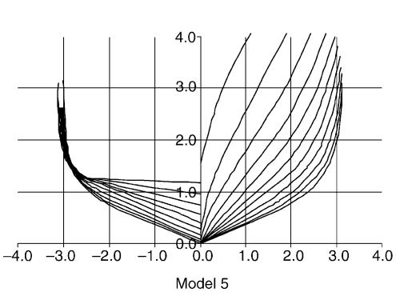

line

| Model 5 | Value |
| ------- | ----- |
| Series 1 | 3.0 |
| Series 2 | 2.5 |
| Series 3 | 2.0 |
| Series 4 | 1.5 |
| Series 5 | 1.0 |
| Series 6 | 0.5 |
| Series 7 | 0.0 |
| Series 8 | 0.0 |
| Series 9 | 0.0 |
| Series 10 | 0.0 |

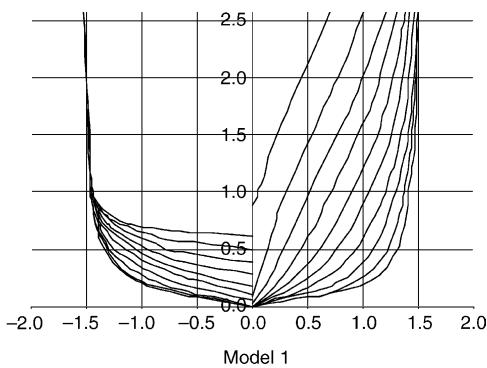

line

| Model 1 | Value |
| ------- | ----- |
| -2.0    | 2.5   |
| -1.5    | 1.0   |
| -1.0    | 0.5   |
| -0.5    | 0.2   |
| 0.0     | 0.0   |
| 0.5     | 0.5   |
| 1.0     | 1.0   |
| 1.5     | 1.5   |
| 2.0     | 2.5   |

Fig. 1. Lines of the tested models.

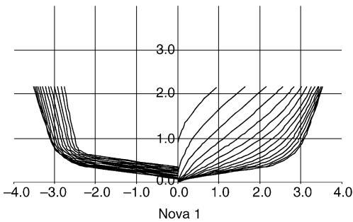

line

| x    | y      |
| ---- | ------ |
| -4.0 | 2.5    |
| -3.0 | 1.5    |
| -2.0 | 0.8    |
| -1.0 | 0.5    |
| 0.0  | 0.0    |
| 1.0  | 1.5    |
| 2.0  | 2.0    |
| 3.0  | 2.5    |
| 4.0  | 3.0    |

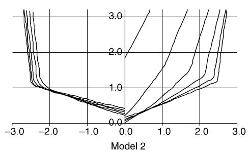

line

| Model 2 | Series 1 | Series 2 | Series 3 | Series 4 | Series 5 | Series 6 | Series 7 | Series 8 | Series 9 |
|---------|----------|----------|----------|----------|----------|----------|----------|----------|----------|
| -3.0    | 3.0      | 3.0      | 3.0      | 3.0      | 3.0      | 3.0      | 3.0      | 3.0      | 3.0      |
| -2.0    | 1.0      | 1.0      | 1.0      | 1.0      | 1.0      | 1.0      | 1.0      | 1.0      | 1.0      |
| -1.0    | 0.5      | 0.5      | 0.5      | 0.5      | 0.5      | 0.5      | 0.5      | 0.5      | 0.5      |
| 0.0     | 0.0      | 0.0      | 0.0      | 0.0      | 0.0      | 0.0      | 0.0      | 0.0      | 0.0      |
| 1.0     | 1.5      | 1.5      | 1.5      | 1.5      | 1.5      | 1.5      | 1.5      | 1.5      | 1.5      |
| 2.0     | 2.5      | 2.5      | 2.5      | 2.5      | 2.5      | 2.5      | 2.5      | 2.5      | 2.5      |
| 3.0     | 3.0      | 3.0      | 3.0      | 3.0      | 3.0      | 3.0      | 3.0      | 3.0      | 3.0      |

Fig. 2. Lines of the tested models.

Strip 3: original strip theory, from (Korvin- Kroukowski and Jacobs, 1957), including the transom effects described in Section 4.

Strip 4: original strip theory, from (Korvin- Kroukowski and Jacobs, 1957), without the transom effects described in Section 4.

# 7.2. With viscous effects

Strip 5: modified strip theory, from Salvensen et al. (1970), without the transom effects described in Section 4, and including the viscous effects described in Section 5.

Strip 6: modified strip theory, from Salvensen et al. (1970), including the transom effects described in Section 4, and including the viscous effects described in Section 5.

The modified strip theory shows better results for high Froude numbers, and thus was the only theory chosen to implement the viscous effects. For Figs. 3–6, the tests results are plotted with dots, while the numerical theories are plotted with lines. The vertical motions of the models have been presented in a non dimensional way, dividing heave amplitude by wave amplitude, and dividing pitch amplitude by wave slope. These non dimensional functions have been plotted versus the ratio wave length divided by ship length $( \lambda { \cal L } _ { \mathrm { p p } } )$ . In order to clarify the large amount of data that have been generated for this research, the results are separated in models, Froude (Fn) numbers and whether they include viscous effects or not. Fn values and type of motion can be seen within each figure.

# 8. Conclusions

Different forms of the linear strip theory have been presented and discussed in this work. Some versions include the transom effect that is presented in the fast crafts and has an important effect in the damping of the vertical motions. A way to include the effect of lift and drag has been also presented. Viscous forces are important in the range of Froude numbers where fast crafts are designed to operate.

For low Fn numbers $( F n < 0 . 4 )$ , where the ship is acting as a displacement vessel, transom effects produce too much damping and both the original and modified theory give good results, though the modified theory fits pitch better than the original one. This effect is more important as Fn increases (see Figs. 4–6, without viscous effects). The inclusion of viscous forces in the calculations does not improve the results.

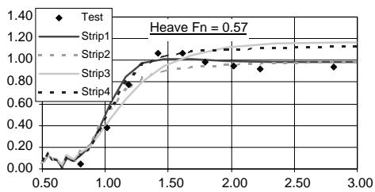

line

| x    | Test  | Strip1 | Strip2 | Strip3 | Strip4 |
|------|-------|--------|--------|--------|--------|
| 0.50 | 0.00  | 0.00   | 0.00   | 0.00   | 0.00   |
| 1.00 | 0.80  | 0.80   | 0.80   | 0.80   | 0.80   |
| 1.50 | 1.10  | 1.10   | 1.10   | 1.10   | 1.10   |
| 2.00 | 1.10  | 1.10   | 1.10   | 1.10   | 1.10   |
| 2.50 | 1.10  | 1.10   | 1.10   | 1.10   | 1.10   |
| 3.00 | 1.10  | 1.10   | 1.10   | 1.10   | 1.10   |

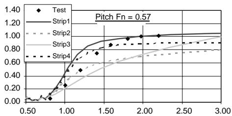

line

| x    | Test  | Strip1 | Strip2 | Strip3 | Strip4 |
|------|-------|--------|--------|--------|--------|
| 0.50 | 0.00  | 0.00   | 0.00   | 0.00   | 0.00   |
| 1.00 | 0.20  | 0.60   | 0.40   | 0.50   | 0.70   |
| 1.50 | 0.80  | 1.00   | 0.60   | 0.70   | 0.90   |
| 2.00 | 1.00  | 1.00   | 0.70   | 0.80   | 1.00   |
| 2.50 | 1.00  | 1.00   | 0.80   | 0.90   | 1.00   |
| 3.00 | 1.00  | 1.00   | 0.90   | 1.00   | 1.00   |

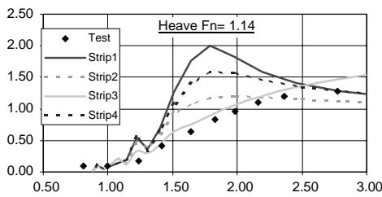

line

| x    | Test  | Strip1 | Strip2 | Strip3 | Strip4 |
|------|-------|--------|--------|--------|--------|
| 0.50 | 0.00  | 0.00   | 0.00   | 0.00   | 0.00   |
| 1.00 | 0.25  | 0.50   | 0.25   | 0.25   | 0.25   |
| 1.50 | 1.00  | 1.50   | 1.00   | 1.00   | 1.00   |
| 2.00 | 1.50  | 2.00   | 1.50   | 1.50   | 1.50   |
| 2.50 | 1.25  | 1.75   | 1.25   | 1.25   | 1.25   |
| 3.00 | 1.25  | 1.50   | 1.25   | 1.25   | 1.25   |

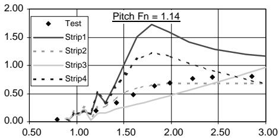

line

| x    | Test  | Strip1 | Strip2 | Strip3 | Strip4 |
|------|-------|--------|--------|--------|--------|
| 0.50 | 0.00  | 0.00   | 0.00   | 0.00   | 0.00   |
| 1.00 | 0.25  | 0.50   | 0.10   | 0.15   | 0.20   |
| 1.50 | 0.75  | 1.50   | 0.30   | 0.60   | 1.20   |
| 2.00 | 0.80  | 1.75   | 0.50   | 0.75   | 1.14   |
| 2.50 | 0.90  | 1.50   | 0.60   | 0.85   | 1.05   |
| 3.00 | 1.00  | 1.25   | 0.75   | 1.00   | 1.00   |

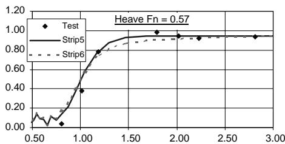

line

| x    | Test  | Strip5 | Strip6 |
| ---- | ----- | ------ | ------ |
| 0.50 | 0.00  | 0.00   | 0.00   |
| 1.00 | 0.40  | 0.80   | 0.80   |
| 1.50 | 0.90  | 0.95   | 0.95   |
| 2.00 | 0.95  | 0.98   | 0.98   |
| 2.50 | 0.98  | 0.99   | 0.99   |
| 3.00 | 0.99  | 1.00   | 1.00   |

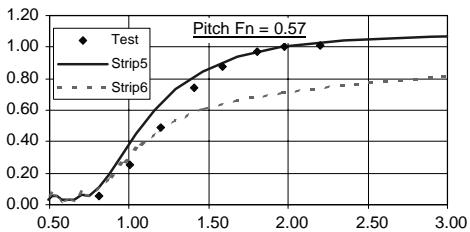

line

| x    | Test  | Strip5 | Strip6 |
| ---- | ----- | ------ | ------ |
| 0.50 | 0.00  | 0.00   | 0.00   |
| 1.00 | 0.25  | 0.40   | 0.35   |
| 1.50 | 0.75  | 0.85   | 0.60   |
| 2.00 | 1.00  | 1.00   | 0.75   |
| 2.50 | 1.00  | 1.00   | 0.75   |
| 3.00 | 1.00  | 1.00   | 0.75   |

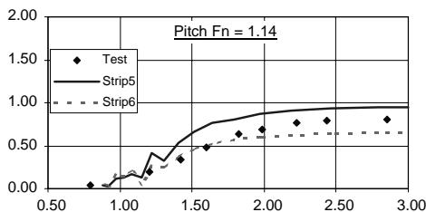

line

| x    | Test  | Strip5 | Strip6 |
| ---- | ----- | ------ | ------ |
| 0.50 | 0.00  | 0.00   | 0.00   |
| 1.00 | 0.25  | 0.25   | 0.25   |
| 1.50 | 0.50  | 0.75   | 0.50   |
| 2.00 | 0.75  | 1.00   | 0.75   |
| 2.50 | 0.80  | 1.00   | 0.80   |
| 3.00 | 0.85  | 1.00   | 0.85   |

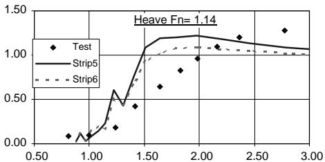

line

| x    | Test  | Strip5 | Strip6 |
| ---- | ----- | ------ | ------ |
| 0.50 | 0.00  | 0.00   | 0.00   |
| 1.00 | 0.10  | 0.20   | 0.15   |
| 1.50 | 0.60  | 1.10   | 1.00   |
| 2.00 | 1.00  | 1.14   | 1.05   |
| 2.50 | 1.20  | 1.14   | 1.05   |
| 3.00 | 1.25  | 1.14   | 1.05   |

Fig. 3. Model 5 results without viscous effects (strip 1–4) and with viscous effects (strip 5 and 6).

For medium Fn values $( 0 . 4 < F n < 0 . 5 )$ , fast ships are in the hump region of the wavemaking resistance curve. The ship is not planing but dynamic forces begin to be important. In the studied models, there is a lack of information for this range of Fn values, but it seems that the modified theory without transom effects should work accurate enough.

After $F n { \approx } 0 . 5$ , the ship starts planing. From the tested theories for $0 . 5 { < } F n { < } 0 . 7$ , the ordinary strip theory without transom effects, gives fair results for heave, but no for pitch specially in long waves $( \lambda / L _ { \mathrm { p p } } > 2 )$ . Modified theory without transom effects over predicts motions. The inclusion of transom effects in the modified theory gives slightly more damping in the motions, and for long waves computed motions are quite lower than the real ones. Inclusion of viscous forces without transom effects improves the results of both motions for short and long waves, although pitch is again slightly over predicted. Transom effects added to viscous forces damp too much.

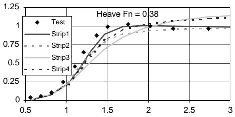

line

| x    | Test  | Strip1 | Strip2 | Strip3 | Strip4 |
| ---- | ----- | ------ | ------ | ------ | ------ |
| 0.5  | 0.0   | 0.0    | 0.0    | 0.0    | 0.0    |
| 1.0  | 0.25  | 0.25   | 0.25   | 0.25   | 0.25   |
| 1.5  | 0.75  | 0.75   | 0.75   | 0.75   | 0.75   |
| 2.0  | 1.0   | 1.0    | 1.0    | 1.0    | 1.0    |
| 2.5  | 1.0   | 1.0    | 1.0    | 1.0    | 1.0    |
| 3.0  | 1.0   | 1.0    | 1.0    | 1.0    | 1.0    |

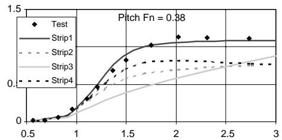

line

| x    | Test  | Strip1 | Strip2 | Strip3 | Strip4 |
| ---- | ----- | ------ | ------ | ------ | ------ |
| 0.5  | 0.0   | 0.0    | 0.0    | 0.0    | 0.0    |
| 1.0  | 0.1   | 0.1    | 0.05   | 0.05   | 0.05   |
| 1.5  | 0.5   | 0.5    | 0.2    | 0.2    | 0.2    |
| 2.0  | 1.0   | 1.0    | 0.3    | 0.3    | 0.3    |
| 2.5  | 1.0   | 1.0    | 0.4    | 0.4    | 0.4    |
| 3.0  | 1.0   | 1.0    | 0.5    | 0.5    | 0.5    |

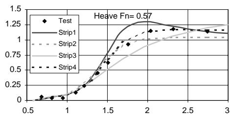

line

| x    | Test  | Strip1 | Strip2 | Strip3 | Strip4 |
| ---- | ----- | ------ | ------ | ------ | ------ |
| 0.5  | 0.0   | 0.0    | 0.0    | 0.0    | 0.0    |
| 1.0  | 0.1   | 0.1    | 0.1    | 0.1    | 0.1    |
| 1.5  | 0.6   | 0.8    | 0.7    | 0.7    | 0.7    |
| 2.0  | 1.2   | 1.3    | 1.1    | 1.1    | 1.1    |
| 2.5  | 1.1   | 1.2    | 1.1    | 1.1    | 1.1    |
| 3.0  | 1.1   | 1.1    | 1.1    | 1.1    | 1.1    |

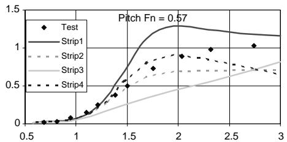

line

| x    | Test  | Strip1 | Strip2 | Strip3 | Strip4 |
| ---- | ----- | ------ | ------ | ------ | ------ |
| 0.5  | 0.0   | 0.0    | 0.0    | 0.0    | 0.0    |
| 1.0  | 0.1   | 0.1    | 0.1    | 0.1    | 0.1    |
| 1.5  | 0.5   | 0.8    | 0.6    | 0.5    | 0.7    |
| 2.0  | 1.0   | 1.3    | 0.7    | 0.6    | 0.9    |
| 2.5  | 1.0   | 1.2    | 0.7    | 0.7    | 0.8    |
| 3.0  | 1.0   | 1.1    | 0.7    | 0.8    | 0.7    |

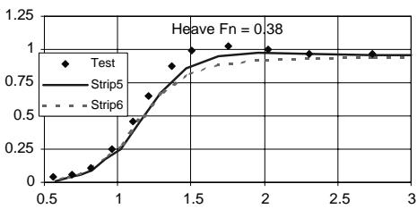

line

| x    | Test  | Strip5 | Strip6 |
| ---- | ----- | ------ | ------ |
| 0.5  | 0.0   | 0.0    | 0.0    |
| 1.0  | 0.25  | 0.25   | 0.25   |
| 1.5  | 0.75  | 0.75   | 0.75   |
| 2.0  | 1.0   | 1.0    | 1.0    |
| 2.5  | 1.0   | 1.0    | 1.0    |
| 3.0  | 1.0   | 1.0    | 1.0    |

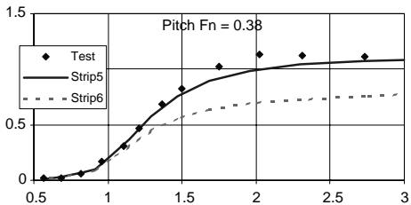

line

| x    | Test  | Strip5 | Strip6 |
| ---- | ----- | ------ | ------ |
| 0.5  | 0.0   | 0.0    | 0.0    |
| 1.0  | 0.2   | 0.3    | 0.2    |
| 1.5  | 0.7   | 0.8    | 0.4    |
| 2.0  | 1.0   | 1.0    | 0.6    |
| 2.5  | 1.1   | 1.1    | 0.7    |
| 3.0  | 1.2   | 1.2    | 0.8    |

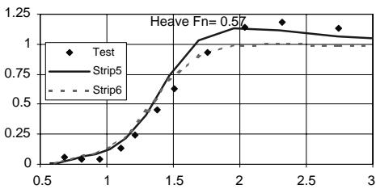

line

| x    | Test  | Strip5 | Strip6 |
| ---- | ----- | ------ | ------ |
| 0.5  | 0.0   | 0.0    | 0.0    |
| 1.0  | 0.1   | 0.1    | 0.1    |
| 1.5  | 0.6   | 0.7    | 0.7    |
| 2.0  | 1.1   | 1.1    | 1.0    |
| 2.5  | 1.1   | 1.1    | 1.0    |
| 3.0  | 1.1   | 1.1    | 1.0    |

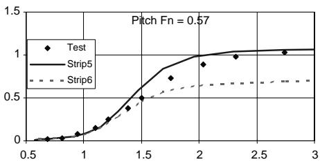

line

| x    | Test  | Strip5 | Strip6 |
| ---- | ----- | ------ | ------ |
| 0.5  | 0.0   | 0.0    | 0.0    |
| 1.0  | 0.1   | 0.1    | 0.1    |
| 1.5  | 0.5   | 0.5    | 0.4    |
| 2.0  | 0.9   | 1.0    | 0.6    |
| 2.5  | 1.0   | 1.0    | 0.7    |
| 3.0  | 1.0   | 1.0    | 0.7    |

Fig. 4. Model 2 results without viscous effects (strip 1–4) and with viscous effects (strip 5 and 6).

For $F n { > } 0 . 7$ , spray phenomena and flow separation appear, and the dynamic trim angle is important. If the ship is well designed, the transom should remain dry. Viscous forces are more important than the hydrostatic ones. Without considering viscous effects, the modified theory with transom effects, makes better predictions up to $\lambda / L _ { \mathrm { p p } } { \approx } 2$ . Over this value both motions are under predicted. Again the inclusion of viscous forces improves the results of both motions for short and long waves, although both motions are slightly over predicted. Transom effects added to viscous forces damp too much.

For $F n > 1$ , the ship is fully planing. Spray and flow separation are important, and unconsidered in the strip theories. There is only one model at this range (Fig. 3), and

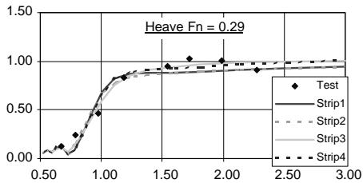

line

| x    | Test  | Strip1 | Strip2 | Strip3 | Strip4 |
| ---- | ----- | ------ | ------ | ------ | ------ |
| 0.50 | 0.00  | 0.00   | 0.00   | 0.00   | 0.00   |
| 1.00 | 0.50  | 0.75   | 0.75   | 0.75   | 0.75   |
| 1.50 | 1.00  | 1.00   | 1.00   | 1.00   | 1.00   |
| 2.00 | 1.00  | 1.00   | 1.00   | 1.00   | 1.00   |
| 2.50 | 1.00  | 1.00   | 1.00   | 1.00   | 1.00   |
| 3.00 | 1.00  | 1.00   | 1.00   | 1.00   | 1.00   |

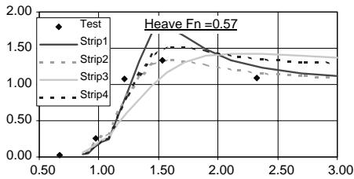

line

| x    | Test  | Strip1 | Strip2 | Strip3 | Strip4 |
|------|-------|--------|--------|--------|--------|
| 0.50 | 0.00  | 0.00   | 0.00   | 0.00   | 0.00   |
| 1.00 | 0.25  | 0.25   | 0.25   | 0.25   | 0.25   |
| 1.50 | 1.50  | 1.50   | 1.50   | 1.50   | 1.50   |
| 2.00 | 1.25  | 1.25   | 1.25   | 1.25   | 1.25   |
| 2.50 | 1.00  | 1.00   | 1.00   | 1.00   | 1.00   |
| 3.00 | 0.75  | 0.75   | 0.75   | 0.75   | 0.75   |

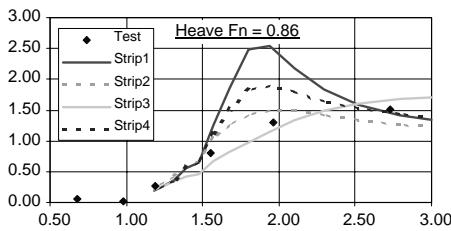

line

| x    | Test | Strip1 | Strip2 | Strip3 | Strip4 |
| ---- | ---- | ------ | ------ | ------ | ------ |
| 0.50 | 0.00 | 0.00   | 0.00   | 0.00   | 0.00   |
| 1.00 | 0.00 | 0.00   | 0.00   | 0.00   | 0.00   |
| 1.50 | 1.00 | 1.00   | 1.00   | 1.00   | 1.00   |
| 2.00 | 2.50 | 2.50   | 1.50   | 1.50   | 1.75   |
| 2.50 | 1.50 | 1.50   | 1.25   | 1.25   | 1.50   |
| 3.00 | 1.25 | 1.25   | 1.25   | 1.25   | 1.25   |

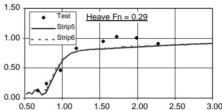

line

| x    | Test  | Strip5 | Strip6 |
| ---- | ----- | ------ | ------ |
| 0.50 | 0.00  | 0.00   | 0.00   |
| 1.00 | 0.80  | 0.80   | 0.80   |
| 1.50 | 1.00  | 1.00   | 1.00   |
| 2.00 | 1.00  | 1.00   | 1.00   |
| 2.50 | 1.00  | 1.00   | 1.00   |
| 3.00 | 1.00  | 1.00   | 1.00   |

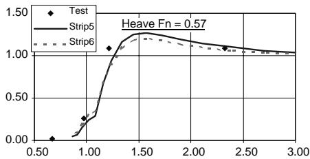

line

| x    | Test  | Strip5 | Strip6 |
| ---- | ----- | ------ | ------ |
| 0.50 | 0.00  | 0.00   | 0.00   |
| 1.00 | 0.25  | 0.25   | 0.25   |
| 1.50 | 1.25  | 1.25   | 1.25   |
| 2.00 | 1.10  | 1.10   | 1.10   |
| 2.50 | 1.05  | 1.05   | 1.05   |
| 3.00 | 1.00  | 1.00   | 1.00   |

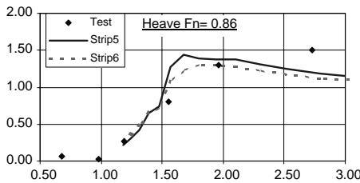

line

| x    | Test | Strip5 | Strip6 |
| ---- | ---- | ------ | ------ |
| 0.50 | 0.00 |        |        |
| 1.00 | 0.00 |        |        |
| 1.50 | 0.75 | 1.40   | 1.25   |
| 2.00 | 1.30 | 1.35   | 1.20   |
| 2.50 | 1.45 | 1.25   | 1.15   |
| 3.00 |      |        | 1.10   |

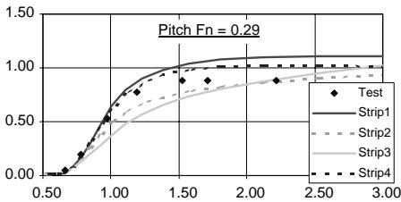

line

| x    | Test  | Strip1 | Strip2 | Strip3 | Strip4 |
|------|-------|--------|--------|--------|--------|
| 0.50 | 0.00  | 0.00   | 0.00   | 0.00   | 0.00   |
| 1.00 | 0.50  | 0.60   | 0.40   | 0.30   | 0.70   |
| 1.50 | 0.80  | 1.00   | 0.70   | 0.60   | 1.00   |
| 2.00 | 0.90  | 1.10   | 0.85   | 0.75   | 1.15   |
| 2.50 | 1.00  | 1.20   | 0.95   | 0.85   | 1.25   |
| 3.00 | 1.10  | 1.30   | 1.05   | 0.95   | 1.35   |

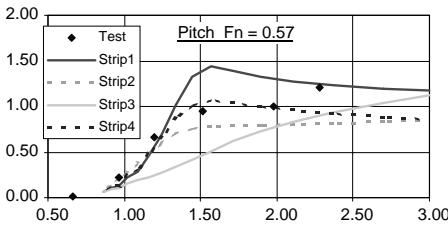

line

| x    | Test  | Strip1 | Strip2 | Strip3 | Strip4 |
|------|-------|--------|--------|--------|--------|
| 0.50 | 0.00  | 0.00   | 0.00   | 0.00   | 0.00   |
| 1.00 | 0.25  | 0.50   | 0.10   | 0.15   | 0.20   |
| 1.50 | 1.50  | 1.50   | 0.80   | 1.00   | 1.00   |
| 2.00 | 1.25  | 1.25   | 1.00   | 1.10   | 1.10   |
| 2.50 | 1.25  | 1.25   | 1.10   | 1.15   | 1.15   |
| 3.00 | 1.25  | 1.25   | 1.15   | 1.20   | 1.20   |

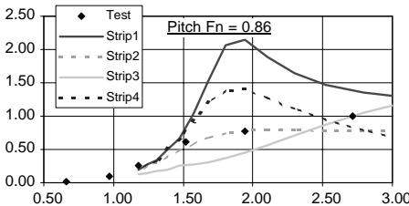

line

| x    | Test  | Strip1 | Strip2 | Strip3 | Strip4 |
| ---- | ----- | ------ | ------ | ------ | ------ |
| 0.50 | 0.00  | 0.00   | 0.00   | 0.00   | 0.00   |
| 1.00 | 0.25  | 0.25   | 0.25   | 0.25   | 0.25   |
| 1.50 | 1.00  | 1.00   | 1.00   | 1.00   | 1.00   |
| 2.00 | 2.25  | 2.25   | 1.50   | 1.50   | 1.50   |
| 2.50 | 1.50  | 1.50   | 1.25   | 1.25   | 1.25   |
| 3.00 | 1.25  | 1.25   | 1.00   | 1.00   | 1.00   |

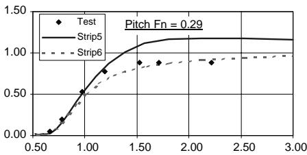

line

| x    | Test  | Strip5 | Strip6 |
| ---- | ----- | ------ | ------ |
| 0.50 | 0.00  | 0.00   | 0.00   |
| 1.00 | 0.50  | 0.50   | 0.50   |
| 1.50 | 1.00  | 1.00   | 0.80   |
| 2.00 | 1.00  | 1.00   | 0.90   |
| 2.50 | 1.00  | 1.00   | 0.95   |
| 3.00 | 1.00  | 1.00   | 1.00   |

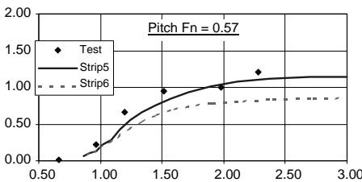

line

| x    | Test  | Strip5 | Strip6 |
| ---- | ----- | ------ | ------ |
| 0.50 | 0.00  | 0.00   | 0.00   |
| 1.00 | 0.25  | 0.25   | 0.25   |
| 1.50 | 1.00  | 1.00   | 0.75   |
| 2.00 | 1.25  | 1.25   | 0.85   |
| 2.50 | 1.50  | 1.50   | 0.90   |
| 3.00 | 1.75  | 1.75   | 1.00   |

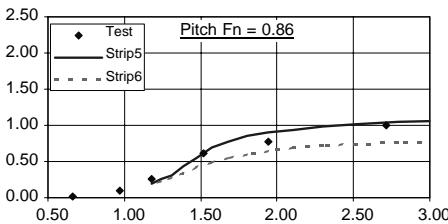

line

| x    | Test  | Strip5 | Strip6 |
| ---- | ----- | ------ | ------ |
| 0.50 | 0.00  | 0.00   | 0.00   |
| 1.00 | 0.00  | 0.00   | 0.00   |
| 1.50 | 0.50  | 0.50   | 0.50   |
| 2.00 | 1.00  | 1.00   | 1.00   |
| 2.50 | 1.50  | 1.50   | 1.50   |
| 3.00 | 2.00  | 2.00   | 2.00   |

Fig. 5. Model 1 results without viscous effects (strip 1–4) and with viscous effects (strip 5 and 6).

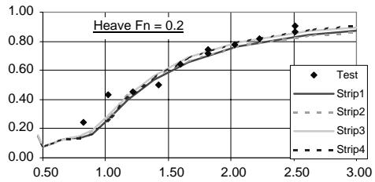

line

| x    | Test  | Strip1 | Strip2 | Strip3 | Strip4 |
|------|-------|--------|--------|--------|--------|
| 0.50 | 0.00  | 0.00   | 0.00   | 0.00   | 0.00   |
| 1.00 | 0.40  | 0.20   | 0.20   | 0.20   | 0.20   |
| 1.50 | 0.60  | 0.60   | 0.60   | 0.60   | 0.60   |
| 2.00 | 0.80  | 0.80   | 0.80   | 0.80   | 0.80   |
| 2.50 | 0.90  | 0.90   | 0.90   | 0.90   | 0.90   |
| 3.00 | 1.00  | 1.00   | 1.00   | 1.00   | 1.00   |

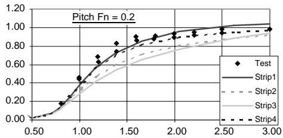

line

| x    | Test  | Strip1 | Strip2 | Strip3 | Strip4 |
| ---- | ----- | ------ | ------ | ------ | ------ |
| 0.50 | 0.00  | 0.00   | 0.00   | 0.00   | 0.00   |
| 1.00 | 0.40  | 0.60   | 0.30   | 0.25   | 0.20   |
| 1.50 | 0.85  | 0.95   | 0.65   | 0.60   | 0.75   |
| 2.00 | 1.00  | 1.00   | 0.85   | 0.80   | 0.95   |
| 2.50 | 1.00  | 1.00   | 0.95   | 0.90   | 1.00   |
| 3.00 | 1.00  | 1.00   | 1.00   | 1.00   | 1.00   |

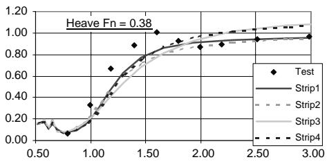

line

| x    | Test  | Strip1 | Strip2 | Strip3 | Strip4 |
| ---- | ----- | ------ | ------ | ------ | ------ |
| 0.50 | 0.10  | 0.10   | 0.10   | 0.10   | 0.10   |
| 1.00 | 0.30  | 0.30   | 0.30   | 0.30   | 0.30   |
| 1.50 | 0.90  | 0.70   | 0.70   | 0.70   | 0.70   |
| 2.00 | 1.00  | 0.90   | 0.90   | 0.90   | 0.90   |
| 2.50 | 1.00  | 1.00   | 1.00   | 1.00   | 1.00   |
| 3.00 | 1.00  | 1.00   | 1.00   | 1.00   | 1.00   |

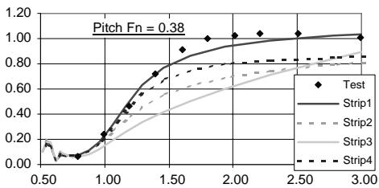

line

| x    | Test  | Strip1 | Strip2 | Strip3 | Strip4 |
| ---- | ----- | ------ | ------ | ------ | ------ |
| 0.50 | 0.00  | 0.00   | 0.00   | 0.00   | 0.00   |
| 1.00 | 0.20  | 0.20   | 0.20   | 0.20   | 0.20   |
| 1.50 | 0.70  | 0.70   | 0.60   | 0.50   | 0.65   |
| 2.00 | 1.00  | 1.00   | 0.75   | 0.65   | 0.85   |
| 2.50 | 1.05  | 1.05   | 0.85   | 0.75   | 0.95   |
| 3.00 | 1.10  | 1.10   | 0.95   | 0.85   | 1.05   |

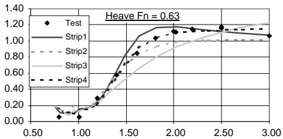

line

| x    | Test  | Strip1 | Strip2 | Strip3 | Strip4 |
| ---- | ----- | ------ | ------ | ------ | ------ |
| 0.50 | 0.00  | 0.00   | 0.00   | 0.00   | 0.00   |
| 1.00 | 0.10  | 0.10   | 0.10   | 0.10   | 0.10   |
| 1.50 | 0.80  | 0.80   | 0.80   | 0.80   | 0.80   |
| 2.00 | 1.20  | 1.20   | 1.20   | 1.20   | 1.20   |
| 2.50 | 1.20  | 1.20   | 1.20   | 1.20   | 1.20   |
| 3.00 | 1.20  | 1.20   | 1.20   | 1.20   | 1.20   |

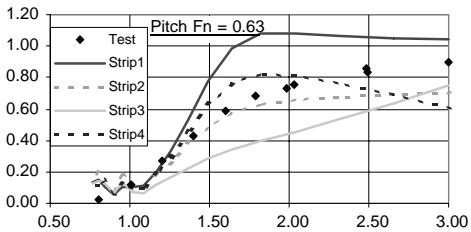

line

| x    | Test  | Strip1 | Strip2 | Strip3 | Strip4 |
|------|-------|--------|--------|--------|--------|
| 0.50 | 0.00  | 0.00   | 0.00   | 0.00   | 0.00   |
| 1.00 | 0.10  | 0.10   | 0.10   | 0.10   | 0.10   |
| 1.50 | 0.60  | 1.00   | 0.60   | 0.70   | 0.80   |
| 2.00 | 0.80  | 1.00   | 0.70   | 0.80   | 0.85   |
| 2.50 | 0.90  | 1.00   | 0.75   | 0.85   | 0.90   |
| 3.00 | 1.00  | 1.00   | 0.80   | 0.90   | 1.00   |

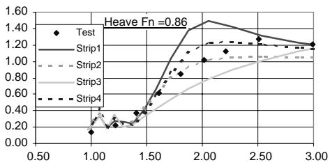

line

| x    | Test  | Strip1 | Strip2 | Strip3 | Strip4 |
| ---- | ----- | ------ | ------ | ------ | ------ |
| 1.00 | 0.10  | 0.20   | 0.25   | 0.20   | 0.25   |
| 1.50 | 0.40  | 0.60   | 0.50   | 0.45   | 0.55   |
| 2.00 | 1.40  | 1.45   | 1.00   | 1.05   | 1.20   |
| 2.50 | 1.30  | 1.35   | 1.10   | 1.15   | 1.25   |
| 3.00 | 1.25  | 1.25   | 1.15   | 1.20   | 1.25   |

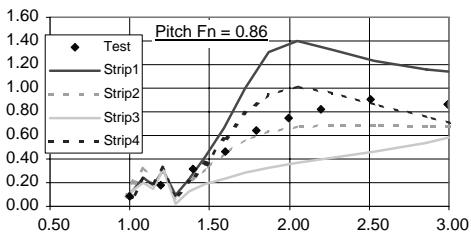

line

| x    | Test  | Strip1 | Strip2 | Strip3 | Strip4 |
|------|-------|--------|--------|--------|--------|
| 1.00 | 0.00  | 0.00   | 0.00   | 0.00   | 0.00   |
| 1.50 | 0.40  | 0.60   | 0.20   | 0.40   | 0.60   |
| 2.00 | 1.40  | 1.40   | 0.60   | 1.00   | 1.20   |
| 2.50 | 1.20  | 1.20   | 0.80   | 1.20   | 1.40   |
| 3.00 | 1.00  | 1.00   | 1.00   | 1.40   | 1.60   |

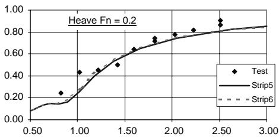

line

| x    | Test  | Strip5 | Strip6 |
| ---- | ----- | ------ | ------ |
| 0.50 | 0.00  | 0.00   | 0.00   |
| 1.00 | 0.40  | 0.20   | 0.20   |
| 1.50 | 0.60  | 0.50   | 0.50   |
| 2.00 | 0.80  | 0.70   | 0.70   |
| 2.50 | 0.90  | 0.85   | 0.85   |
| 3.00 | 1.00  | 0.95   | 0.95   |

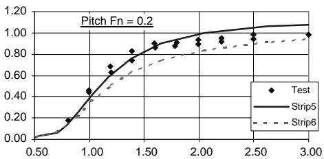

line

| x    | Test  | Strip5 | Strip6 |
| ---- | ----- | ------ | ------ |
| 0.50 | 0.00  | 0.00   | 0.00   |
| 1.00 | 0.40  | 0.40   | 0.40   |
| 1.50 | 0.80  | 0.80   | 0.60   |
| 2.00 | 0.90  | 0.90   | 0.70   |
| 2.50 | 1.00  | 1.00   | 0.80   |
| 3.00 | 1.00  | 1.00   | 0.90   |

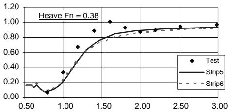

line

| x    | Test  | Strip5 | Strip6 |
| ---- | ----- | ------ | ------ |
| 0.50 | 0.10  | 0.10   | 0.10   |
| 1.00 | 0.30  | 0.30   | 0.30   |
| 1.50 | 0.90  | 0.80   | 0.80   |
| 2.00 | 0.95  | 0.90   | 0.90   |
| 2.50 | 0.98  | 0.95   | 0.95   |
| 3.00 | 1.00  | 1.00   | 1.00   |

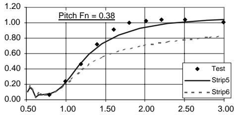

line

| x    | Test  | Strip5 | Strip6 |
| ---- | ----- | ------ | ------ |
| 0.50 | 0.00  | 0.00   | 0.00   |
| 1.00 | 0.20  | 0.20   | 0.20   |
| 1.50 | 0.70  | 0.70   | 0.60   |
| 2.00 | 1.00  | 1.00   | 0.70   |
| 2.50 | 1.00  | 1.00   | 0.80   |
| 3.00 | 1.00  | 1.00   | 0.85   |

Fig. 6. Nova1 results without viscous effects (strip 1–4) and with viscous effects (strip 5 and 6).

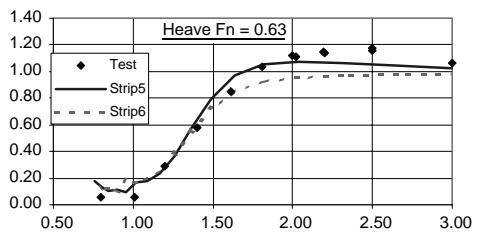

line

| x    | Test  | Strip5 | Strip6 |
| ---- | ----- | ------ | ------ |
| 0.50 | 0.00  | 0.00   | 0.00   |
| 1.00 | 0.10  | 0.15   | 0.10   |
| 1.50 | 0.80  | 0.90   | 0.75   |
| 2.00 | 1.10  | 1.05   | 0.95   |
| 2.50 | 1.15  | 1.05   | 0.95   |
| 3.00 | 1.15  | 1.05   | 0.95   |

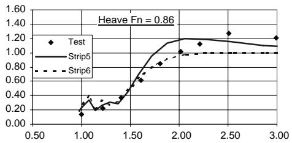

line

| x    | Test  | Strip5 | Strip6 |
| ---- | ----- | ------ | ------ |
| 1.00 | 0.10  | 0.20   | 0.25   |
| 1.50 | 0.40  | 0.60   | 0.70   |
| 2.00 | 1.20  | 1.20   | 1.00   |
| 2.50 | 1.25  | 1.15   | 1.05   |
| 3.00 | 1.20  | 1.10   | 1.00   |

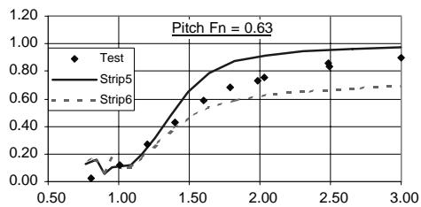

line

| x    | Test  | Strip5 | Strip6 |
| ---- | ----- | ------ | ------ |
| 0.50 | 0.00  | 0.00   | 0.00   |
| 1.00 | 0.20  | 0.10   | 0.10   |
| 1.50 | 0.40  | 0.60   | 0.50   |
| 2.00 | 0.70  | 0.90   | 0.60   |
| 2.50 | 0.85  | 0.95   | 0.65   |
| 3.00 | 0.95  | 1.00   | 0.70   |

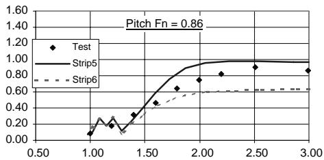

line

| x    | Test  | Strip5 | Strip6 |
| ---- | ----- | ------ | ------ |
| 1.00 | 0.10  | 0.20   | 0.15   |
| 1.50 | 0.40  | 0.60   | 0.50   |
| 2.00 | 0.80  | 0.90   | 0.60   |
| 2.50 | 0.90  | 1.00   | 0.65   |
| 3.00 | 0.95  | 1.00   | 0.70   |

Fig. 6 (continued )

theories with transom effects works better, especially the modified theory as the original theory presents problems with pitch motion.

As a summary, modified theory including viscous effects is the better approximation for Fn over 0.5 using the mentioned lift and drag coefficients. As can be seen, strip theories, with its limitations to high frequencies (that sets the limitations for long waves) can be used in practice, considering the specific aspects of fast craft: transom effects and viscous forces in an appropriate way. If one is using a commercial seakeeping program, consider the described limitations and applications as a function of the Fn number.

Strip theory also has the limitation of not considering ship flare and other not wetted parts. Although experimental corrections can be added, the entrance of ship flare in the water affects pitch increasing damping and this is why pitch value is over predicted in the strip theories. Time domain seakeeping should address this problem.

Better results using the theory with viscous forces are expected, just by tuning coefficients $C _ { \mathrm { D } }$ and a based on towing tank test with similar models. In this paper, the mean value proposed at Begovic et al. (2002) has been used with good results.

From the practical point of view: a strip theory, linear or not, with pulsating or translating source distribution, is easy to use. It is not time consuming which is important from the shipyard point of view, pre-process of the ship hull is simple as far as it work with ship stations, and changes in the hull design are simple to introduce. Together with the transfer function theory, different seakeeping criteria in irregular sea states are easy and fast to obtain. Strip theories are expected to have a long life.

# References

Bhattacharyya, R., 1974. Dynamics of Marine Vehicles. Wiley, London pp. 191–207.   
Begovic E., Boccadamo G., Zotti I., 2002. On the viscous forces on the motions of high speed hulls. Proceedings of the HIPER 02 Conference, Bergen, Norway, pp. 47– 59.

Blok, J., Beukelman, W., 1984. The high speed displacement ship systematic series hull forms—Seakeeping characteristics. Transactions of the SNAME 92, 125–150.   
Faltinsen, O., 1993. On seakeeping of conventional and high speed vessels. Journal of Ship Research 37 (2), 87–97.   
Frandoli P., Merola L., Pino E., Sebastiani L., 2000. The role of seakeeping calculations at the preliminary design stage. Proceedings of the NAV 2000 Conference, Venice, Italy, pp. 951–959.   
Korvin- Kroukowski, B., Jacobs, W., 1957. Pitching and Heaving motions of ships in regular waves. Transactions of the SNAME 65, 115–135.   
Lahtiharju, E., Karpinnen, T., Hellevaraara, M., Aitta, T., 1991. Resistance and Seakeeping characteristics of fast transom stern hulls with systematically varied form. Transactions of the SNAME 99, 85–118.   
Lewis, E. (Ed), 1989. Principles of Naval Architecture, vol. 3, Chapter VIII. Ed. SNAME.   
Lloyd A.R.J.M., 1989. Seakeeping: ship behaviour in rough weather. Ed. Ellis Horwood Series in Marine Technology, pp. 313–318.   
Rodriguez A., 1971. Calculo nume´rico de los movimientos del buque y de las cargas hidrodina´micas. PhD thesis. Ed. ETSI Navales, pp. 25–37.   
Salvensen, N., Tuck, E., Faltinsen, O., 1970. Ship motions and sea loads. Transactions of the SNAME 78, 250–279.   
Thwaites, B., 1960. Incompressible Aerodynamics, Ed. Oxford University Press, Oxford.