Article

# Hydrodynamic Analysis of Different Formation Configurations of Catamaran in Regular Head Waves

Zhifan Zhang 1, Bo Jiang 1, Longkan Wang 2, Shengren Wei 1,3, Tao Li 4, Guiyong Zhang 1,\* and Zhi Zong 5

State Key Laboratory of Structural Analysis, Optimization and CAE Software for Industrial Equipment, School of Naval Architecture Engineering, Dalian University of Technology, Dalian 116024, China   
2 China Ship Research and Development Academy, Beijing 100192, China   
3 Dalian Shipbuilding Industry Co., Ltd., Dalian 116011, China   
4 School of Mechanical Engineering, Key Laboratory of Advanced Intelligent Protective Equipment Technology, Ministry of Education, Hebei University of Technology, Tianjin 300401, China   
5 Fuyao University of Science and Technology, Fuzhou 350100, China   
\* Correspondence: gyzhang@dlut.edu.cn

Abstract: When undertaking long-distance missions at sea, vessels aim to achieve an extended operational range through drag reduction and energy efficiency, while enhanced wave resilience also provides substantial benefits. In this work, the Delft-372 catamaran is utilized to investigate the feasibility of drag reduction and roll mitigation for catamaran formation sailing in waves, analyzing the effects of three different formation configurations and varying spacings. The overset grid method was employed to simulate vessel motions, while the Volume of Fluid (VOF) method captured the free surface. First, the numerical results of the catamaran’s resistance, pitch, and heave motion amplitudes under different wave conditions were compared with experimental data to verify the accuracy of the CFD numerical method, and a grid convergence analysis was performed. Next, numerical models of the Delft-372 catamaran were constructed in parallel, tandem, and lateral formations under wave conditions. The results of the single-ship simulation were employed as a benchmark to analyze the impact of different formation configurations and varying lateral and longitudinal spacings on the resistance, pitch, and heave motions of the catamarans. The study also examined the effects of wave interference between vessels and the combined influence of external waves on individual and overall hydrodynamic performance. Results indicated that the tandem formation outperformed the parallel and lateral formations, with optimal performance observed at the longitudinal distance of 1 LPP. Generally, during navigation, the follower catamaran should ideally be positioned in the trough of the stern wave of the leader catamaran.

Keywords: formation configuration; catamaran; hydrodynamic optimization; CFD

check for updates

Citation: Zhang, Z.; Jiang, B.; Wang, L.; Wei, S.; Li, T.; Zhang, G.; Zong, Z. Hydrodynamic Analysis of Different Formation Configurations of Catamaran in Regular Head Waves. J. Mar. Sci. Eng. 2024, 12, 1577. https:// doi.org/10.3390/jmse12091577

Academic Editor: Stefano Gaggero

Received: 30 July 2024

Revised: 20 August 2024

Accepted: 4 September 2024

Published: 6 September 2024

Copyright: © 2024 by the authors. Licensee MDPI, Basel, Switzerland. This article is an open access article distributed under the terms and conditions of the Creative Commons Attribution (CC BY) license (https:// creativecommons.org/licenses/by/ 4.0/).

# 1. Introduction

In recent years, unmanned catamarans have been widely used in civil and military applications due to their excellent stability and seaworthiness. As research on singleship control problems matures [1] and intelligent ships and unmanned vessels develop, ship formation sailing has emerged as an inevitable trend in future ship development. Ship formation sailing can significantly reduce the resistance of ship navigation, which is significant in reducing energy consumption and enhancing shipping efficiency. It has broad application prospects in areas such as ship cluster operations and maritime search and rescue.

Nowadays, various risks, such as global warming, are caused by the increased greenhouse gas effect on the atmosphere [2]. The shipping industry is considered one of the largest sources of greenhouse gas emissions, including carbon dioxide. Reducing resistance to save energy and cut emissions can effectively mitigate this phenomenon. However, traditional methods of reducing resistance, such as hull improvements, have been extensively optimized. Are there other methods available to further reduce resistance? By studying be-been extensively optimized. Are there other methods available to further reduce rehaviors, such as the flocking of wild geese and ducks (Figure 1), researchers have graduallysistance? By studying behaviors, such as the flocking of wild geese and ducks (Figure 1), discovered another form of drag reduction: formation sailing. Various formation conceptsresearchers have gradually discovered another form of drag reduction: formation sailing. have been proposed, leading to in-depth research on the effects of hydrodynamic forces onVarious formation concepts have been proposed, leading to in-depth research on the efship motion.fects of hyd

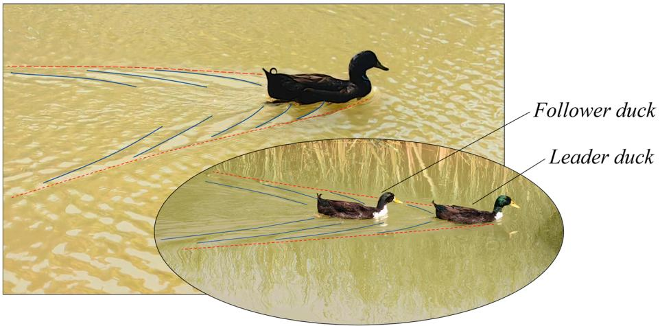

text_image

Follower duck
Leader duck

Figure 1. The flocking of ducks.Figure 1. The flocking of ducks.

For surface ships, some pilot attempts have been made to optimize navigation strat-For surface ships, some pilot attempts have been made to optimize navigation strateegies. The NOVIMAR project [3] developed an innovative concept of waterborne platoon-gies. The NOVIMAR project [3] developed an innovative concept of waterborne platooning, ing, called the Vessel Train [4]. He et al. [5] conducted research to optimize drag reductioncalled the Vessel Train [4]. He et al. [5] conducted research to optimize drag reduction in three different formation configurations: tandem, parallel, and triangle, and providedin three different formation configurations: tandem, parallel, and triangle, and provided the optimal arrangement and spacing. Jiang et al. [6] analyzed the navigation process ofthe optimal arrangement and spacing. Jiang et al. [6] analyzed the navigation process of two-ship formations in the brash ice channel, examining the hydrodynamic forces on the ship, ship–ice interaction, and ice resistance effect. Results showed that the ice resistanceship, ship–ice interaction, and ice resistance effect. Results showed that the ice resistance of of the rear ship decreased as the distance decreased. Dong et al. [7] researched energy-the rear ship decreased as the distance decreased. Dong et al. [7] researched energy-saving saving optimization for Unmanned Surface Vessel (USV) formations, mainly focusing onoptimization for Unmanned Surface Vessel (USV) formations, mainly focusing on analyzanalyzing resistance changes to determine the optimal formation spacing for minimal en-ing resistance changes to determine the optimal formation spacing for minimal energy ergy consumption. Tian et al. [8] proposed a method to optimize the layout of Autono-consumption. Tian et al. [8] proposed a method to optimize the layout of Autonomous Underwater Vehicle (AUV) formations by analyzing the hydrodynamic resistance of two AUVs at different positions and deriving the optimal layout parameters. Zhou et al. [9] summarized the hydrodynamic analysis of ship–ship interactions over the last decade. Ma et al. [10] used a four-point model to consider the interference between the bow and stern waves of a monohull, as well as the interference between two ships, and investigated the transverse wave characteristics and the wave resistance at medium and high Froude numbers. The relationship between the spacing between the two ships and the Fr, which reduces the drag of the rear ship, was provided.

ch reduces the drag of the rear ship, was provided.Furthermore, numerical methods save manpower and costs compared to theoretical and experimental approaches [11–13]. Viscous methods, such as the Reynolds-averaged and experimental approaches [11–13]. Viscous methods, such as the Reynolds-averagedNavier–Stokes (RANS) method, are used to analyze the effects of ship-to-ship interactions Navier–Stokes (RANS) method, are used to analyze the effects of ship-to-ship interactionin the process of head-on, collision, and overtaking [14,15], the interference of passing ships in the process of head-on, collision, and overtaking [14,15], the interference of passingwith moored ships [16,17], two ships moving in parallel during replenishment or discharge ships with moored ships [16,17], two ships moving in parallel during replenishment oroperations [18], and tugs escorting or assisting large ships in berthing, platforming, or discharge operations [18]steering movements [19].

or steering movements [19].Research on catamarans has been thriving both domestically and internationally. Research on catamarans has been thriving both domestically and internationally. Far-Farkas et al. [20] conducted a numerical study to analyze the hydrodynamic interference kas et al. [20] conducted a numerical study to analyze the hydrodynamic interference be-between the S60 catamaran and a monohull, exploring the catamaran’s interference resistween the S60 catamaran and a monohull, exploring the catamaran’s interference retance characteristics, resistance components, and the relationship between form factor and sistance characteristics, resistance components, and the relationship between form factorspacing. Marti´c et al. [21] employed the STAR-CCM+ software, integrating the RANS k − ω SST turbulence model, to numerically simulate the impact of shallow water conditions on the total resistance of the SolarCat solar-powered catamaran. Wang et al. [22] experimentally and numerically studied the planing catamaran hull or three displacements in calm water. Ali et al. [23] conducted research based on the Delft-372 catamaran and concluded that wave disturbance factors are important for the catamaran. Benjamin et al. [24] studied the seakeeping of a high-speed catamaran in head waves, providing a valuable database for the hydrodynamic research and CFD verification of the high-speed catamaran.

In summary, studying the hydrodynamic effects of vessel formation sailing can optimize formation configuration and navigation strategies, minimizing resistance, reducing fuel costs, and extending range. Numerous scholars worldwide have long been deepening their research on vessel formation sailing, continually optimizing and innovating related control methods and formation layouts. However, most current research on the hydrodynamic effects of formation sailing focuses on monohulls and is primarily conducted in calm water conditions. There is a lack of research on the hydrodynamic interactions between catamarans and even multihulls, especially under wave conditions. Catamarans exhibit superior wave resistance compared to monohulls, but their wake effects are more complex. To investigate the combined effects of wave interference between catamarans and external waves, the novelties of this study are as follow:

1. This study examined the hydrodynamic effects of two catamarans sailing in formation in waves, including resistance, pitch, and heave motions. The study analyzed the combined influence of wave interference between the vessels and external waves on individual and overall hydrodynamic performance.

2. Three different formation configurations formed by two catamarans: parallel, tandem, and lateral formation, were investigated. The wake effects and flow field characteristics of catamarans under different formation configurations were analyzed to determine the formation with the optimal drag reduction and roll mitigation effects.

3. The study also examined the impact of different lateral and longitudinal distances on the hydrodynamics of the formation, determining the optimal transverse and longitudinal spacings for each formation configuration.

When undertaking long-distance missions at sea, vessels aim to achieve extended operational range through drag reduction and energy efficiency, while enhanced wave resilience also provides substantial benefits. In this work, the Delft-372 catamaran is utilized to investigate the feasibility of drag reduction and roll mitigation for catamaran formation sailing in waves, analyzing the effects of three different formation configurations and varying spacings. The overset grid method is employed to simulate vessel motions, while the Volume of Fluid (VOF) method captures the free surface. The specific work is as follows. First, the numerical results of the catamaran’s resistance, pitch, and heave motion amplitudes under different wave conditions are compared with experimental data to verify the accuracy of the CFD numerical method, and a grid convergence analysis is performed. Next, numerical models of the Delft-372 catamaran are constructed in parallel, tandem, and lateral formations under wave conditions. The results of the single-ship simulation are employed as a benchmark to analyze the impact of different formation configurations and varying lateral and longitudinal spacings on the resistance, pitch, and heave motions of the catamarans. The study also examines the effects of wave interference between vessels and the combined influence of external waves on individual and overall hydrodynamic performance. The optimal formation configurations and spacings are identified, and how to utilize beneficial wave interference is discussed. The Delft-372 catamaran used in this study has extensive experimental data available for reference, which can serve as a basis for future research on wave interference between other catamarans and even multihulls.

# 2. Numerical Theory

# 2.1. Control Equations

In this study, the commercial CFD software STAR-CCM+ (17.04) was used. The unsteady RANS model of STAR-CCM+ and the VOF method were employed to capture the free surface of the liquid and handle the two-phase or multiphase flow. The fluid’s continuity momentum equations [25] are presented in Equations (1) and (2).

The continuity equation is given by [25]:

$$
\frac {\partial \rho}{\partial t} + \frac {\partial (\rho U _ {i})}{\partial x _ {i}} = 0 \tag {1}
$$

where, $\rho$ is the fluid density, t is the time, $x _ { i } ( i = 1 , 2 , 3 )$ represents the spatial coordinates in 3 directions, and $U _ { i }$ is the component of the velocity vector U in the i direction.

The momentum equation is expressed as [25]:

$$
\frac {\partial (\rho U _ {i})}{\partial t} + \frac {\partial (\rho U _ {i} U _ {j})}{\partial x _ {j}} = - \frac {\partial P}{\partial x _ {i}} + \frac {\partial \tau^ {\prime}}{\partial x _ {j}} + \frac {\hat {o} (\rho \overline {{U _ {i} U _ {j}}})}{\partial x _ {j}} + F _ {i} \tag {2}
$$

where, $U _ { j }$ is the component of the velocity vector U in the $j$ direction, $x _ { j } \ ( j = 1 , 2 , 3 )$ represents the spatial coordinates in the 3 directions, P is the pressure, and $\dot { \tau ^ { \prime } }$ is the mean component of the viscous stress tensor.

In determining the position of the free level, all fluids need to follow the law of conservation of mass, written as [25]:

$$
\frac {\partial}{\partial t} r _ {\omega} \rho_ {\omega} \vec {V} + \nabla \cdot r _ {\omega} \rho_ {\omega} \vec {V} = 0 \tag {3}
$$

$$
\frac {\partial}{\partial t} r _ {a} \rho_ {a} \vec {V} + \nabla \cdot r _ {a} \rho_ {a} \vec {V} = 0 \tag {4}
$$

$$
r _ {\omega} + r _ {a} = 1 \tag {5}
$$

where, $\rho _ { \omega }$ and $\rho _ { a }$ are the densities of water and air, respectively, while $r _ { \omega }$ and $r _ { a }$ are the volume fractions of water and air, respectively.

# 2.2. Turbulence Modeling

The turbulence modeling [26] provides cyclonic corrections for rotating flow and flow separation with good convergence and accuracy.

The turbulent kinetic energy equation is given by [24]:

$$
\frac {\partial (\rho k)}{\partial t} + \frac {\partial (\rho k U _ {j})}{\partial t} = \frac {\partial [ (\mu + \frac {\mu_ {t}}{\sigma_ {k}}) \partial k / \partial x _ {j} ]}{\partial x _ {j}} + G _ {k} + G _ {b} - \rho \varepsilon - Y _ {M} \tag {6}
$$

where, $k$ is the turbulent kinetic energy, $\rho$ is the fluid density, t is the time, $U _ { j }$ is the component of the velocity vector U in the j direction, $x _ { j } ( j = 1 , 2 , 3 )$ represents the spatial coordinates in the 3 directions, $\mu$ is the dynamic viscosity coefficient, ε is the turbulent kinetic energy dissipation rate, $\sigma _ { k }$ is a constant, $G _ { k }$ is the turbulent kinetic energy generated by laminar flow, $G _ { b }$ is the turbulent kinetic energy generated by buoyancy, and $Y _ { M }$ is the fluctuation generated by transition diffusion in compressible turbulence.

The turbulent dissipation rate equation is expressed as [24]:

$$
\frac {\partial (\rho \varepsilon)}{\partial t} + \frac {\partial (\rho \varepsilon U _ {j})}{\partial x _ {j}} = \frac {\partial [ (\mu + \frac {\mu_ {i}}{\sigma_ {s}}) \partial \varepsilon / \partial x _ {i} ]}{\partial x _ {j}} + \rho C _ {1} \overline {{S}} \varepsilon - \frac {C _ {2} \rho \varepsilon^ {2}}{k + \sqrt {v \varepsilon}} + \frac {C _ {\varepsilon 1} C _ {\varepsilon 3} C _ {b} \varepsilon}{k} \tag {7}
$$

where, $\overline { S }$ is the average strain rate, and $\sigma _ { s } , C _ { 1 } , C _ { 2 } , C _ { \varepsilon 1 }$ , and $C _ { \varepsilon 3 }$ are all constants.

The realizable $k - \varepsilon$ two-equation turbulence model incorporates swirl modifications, rendering it particularly effective for simulating rotating flows and flow separation with superior convergence and accuracy. This model is exceptionally proficient in handling complex geometries and abrupt directional shifts in flow dynamics. Implementing the realizable k-ε model enables more precise predictions of catamaran performance under varying inter-vessel spacings in formation.

# 2.3. Numerical Modeling

The Finite Volume Method (FVM) is a widely adopted numerical approach extensively utilized in fluid dynamics and thermodynamics. Its core principle revolves around discretizing the computational domain by applying conservation laws in their integral form. Within the FVM framework, the computational domain is systematically partitioned into a series of non-overlapping control volumes (or cells), and the conservation laws for mass, momentum, and energy are applied to each individual control volume. Conservation equations are established on each control volume and subsequently discretized into a system of algebraic equations, thereby yielding a solvable system. This process typically entails selecting an appropriate discretization scheme (e.g., central differencing or upwind differencing) to approximate derivative terms and employing iterative methods (e.g., SIMPLE or PISO algorithms) to solve the nonlinear equations. Owing to its inherent conservation and stability properties, FVM is highly effective in addressing complex fluid dynamics problems.

The Volume of Fluid (VOF) method is a numerical technique designed to track and simulate the motion of interfaces between two immiscible fluids, particularly air–water interfaces or free surfaces. The core concept of the VOF method lies in representing the interface within each computational cell as a mixture of two fluids, using volume fractions to indicate the relative amounts of each fluid present. During the simulation, the volume fraction is transported through the computational domain along with the fluid flow, enabling the accurate tracking of the interface’s position and shape over time. The computational domain is divided into multiple cells (or grids), with a volume fraction (α) used to represent the presence of both fluids within each cell. The volume fraction, α, represents the proportion of a specific fluid within a cell, ranging from 0 to 1, where 0 indicates that the cell is entirely occupied by the other fluid, and 1 indicates full occupancy by the designated fluid. When $0 < \alpha < 1$ , it signifies that the cell contains a mixture of the two fluids, indicating that the interface traverses the cell. The VOF method can accurately track and simulate the morphology of free surfaces, maintaining high precision even under complex flow conditions. Due to its reliance on the concept of volume fractions, the VOF method can handle complex interface deformations, such as interface break-up and merging, without concerns about instability issues related to surface reconstruction. For flow problems involving free surfaces, such as ship navigation and wave interactions, the VOF method offers a powerful tool to simulate these complex physical phenomena without the need for explicit surface reconstruction. Compared to other methods, such as the Level Set and Front Tracking methods, the VOF method provides superior stability in handling free surface flows, particularly suited for long-duration simulations and complex interface deformations.

Overset grids, also referred to as nested grids, are a commonly employed technique in fluid dynamics simulations involving multiple objects or moving bodies. The fundamental principle involves partitioning the computational domain into multiple, independent grid regions that overlap in physical space, allowing each grid to be independently generated and adjusted according to object motion. Key features of this technique include flexible grid partitioning, efficient interpolation of physical quantities, adaptability to complex motions, and automated handling of grid interactions. When utilizing overset grids, the computational domain is typically divided into two regions: a background region and an overlapping region. The background region covers the entire computational domain, while the overlapping region is slightly larger than the moving object, fully encapsulating it. During the simulation, these two regions are further subdivided into three types of cells: active cells, donor (or receiver) cells, and inactive cells. Active cells handle the discretization and solution of governing equations, donor (or receiver) cells, located near the overlapping boundaries, manage the interpolation and transfer of physical quantities between regions, and inactive cells are temporarily removed from the computation. The primary advantages of this technique include its simple grid geometry, which accurately reflects model motion, enhanced computational efficiency and reduced modeling workload, simplified boundary condition settings, and high grid quality, which remains unaffected by object position andgrid quality, which remains unaffected by object position and orientation. These attributes orientation. These attributes make overset grids highly effective in simulating complexmake overset grids highly effective in simulating complex motion problems. motion problems.

# 3. Numerical Model

# 3.1. Geometric Modeling3.1. Geometric Modeling

The Delft-372 catamaran model, developed by Delft University of Technology (DUT)The Delft-372 catamaran model, developed by Delft University of Technology (DUT) in the Netherlands [27], was utilized in this study, as depicted in Figure 2. The relevantn the Netherlands [27], was utilized in this study, as depicted in Figure 2. The relevant dimensions of the Delft-372 catamaran model are listed in Table 1.imensions of the Delft-372 catamaran model are listed in Table 1.

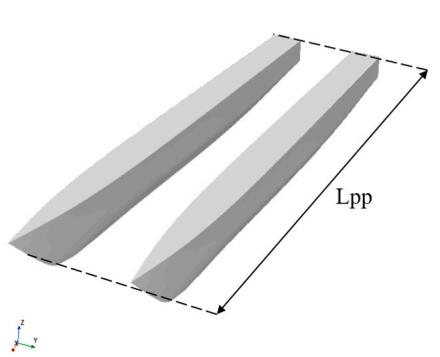

natural_image

3D diagram of two elongated, tapered rectangular prisms with a labeled length 'Lpp' and a small 3D coordinate axis indicator (no text or symbols on the shapes themselves)

(a)

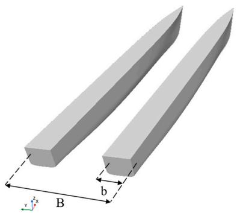

natural_image

3D diagram of two elongated rectangular prisms with labeled dimensions (b, x, y) and point B, no text or symbols present.

(b)   
igure 2. The 3D model of the Delft-372 catamaran: (a) bow view and (b) stern view.Figure 2. The 3D model of the Delft-372 catamaran: (a) bow view and (b) stern view.

Table 1. Dimensions of the Delft-372 catamaran.Table 1. Dimensions of the Delft-372 catamaran. 

<table><tr><td>Parameters</td><td>Symbol (Units)</td><td>Value</td></tr><tr><td>Length between perpendiculars</td><td> $L_{PP}$  (m)</td><td>3.000</td></tr><tr><td>Beam demihull</td><td>b (m)</td><td>0.240</td></tr><tr><td>Beam overall</td><td>B (m)</td><td>0.940</td></tr><tr><td>Draught</td><td>T (m)</td><td>0.150</td></tr><tr><td>Displacement</td><td>Δ (kg)</td><td>87.070</td></tr><tr><td>Distance between center of hulls</td><td>H (m)</td><td>0.700</td></tr><tr><td>Longitudinal center of gravity</td><td>Xg (m)</td><td>1.410</td></tr><tr><td>Vertical center of gravity</td><td>Zg (m)</td><td>0.340</td></tr><tr><td>Longitudinal moment of inertia</td><td>Kyy (m)</td><td>0.782</td></tr></table>

# 3.2. Initial Condition of Numerical Model

nitial Condition of Numerical ModelThe initial consideration is the application of verification calculations using a single The initial consideration is the application of verification calculations using a singlecatamaran. The size of the computational domain in this section was determined based on a single catamaran, with appropriate adjustments made when applying to scenarios insingle catamaran, with appropriate adjustments made when applying to scenariosvolving two catamarans, while keeping other settings consistent. Overset mesh technology was employed in the numerical simulation of a ship sailing in waves. Before meshing, the complex watershed must be divided into the background domain and the overset domain. The overset domain should be capable of containing the entire hull and cooperating with its movements. When the overset domain moves, it forms an interface with the background domain, facilitating information exchange between the grids. In this study, a rectangular cuboid computing domain was utilized, as illustrated in Figure 3a,b. The front end of the computational domain was $1 . 5 L _ { P P }$ from the bow, while the back end was 4 $L _ { P P }$ from the stern. The width of the computational domain was $3 ~ L _ { P P . }$ , and the depth of the computational domain was $3 . 5 ~ L _ { P P }$ . The height of the computational domain’s bottom was set to twice the ship’s length from the keel, ensuring that the bottom of the domain did not interfere with changes in the flow beneath the ship or the formation and development of wave patterns, thereby minimizing the impact of boundary conditions on the simulation results. However, as the distance increased, computational costs also rose, necessitating a balance between accuracy and computational efficiency. Generally, a distance of twice the ship’s length is considered reasonable, with further increases having minimal impacttwice the ship’s length is considered reasonable, with further increases having minimaltwice the ship’s length is considered reasonable, with further increases having minimal on the results. Of the six boundaries, only the rear boundary behind the stern was set asmpact on the results. Of the six boundaries, only the rear boundary behind the stern wasimpact on the results. Of the six boundaries, only the rear boundary behind the stern was a pressure outlet, while the remaining five boundaries (top, front, bottom, left, and rightset as a pressure outlet, while the remaining five boundaries (top, front, bottom, left, andset as a pressure outlet, while the remaining five boundaries (top, front, bottom, left, and surfaces) were configured as velocity inlets. The boundary conditions for all cases in thisright surfaces) were configured as velocity inlets. The boundary conditions for all cases inright surfaces) were configured as velocity inlets. The boundary conditions for all cases in study remained consistent.this study remained consistthis study remained consist

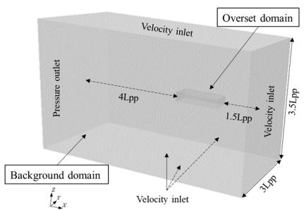

text_image

Overset domain
Velocity inlet
Pressure outlet
4Lpp
1.5Lpp
3.5Lpp
3Lpp
Background domain
Velocity inlet
z
y
x

(a) (a)

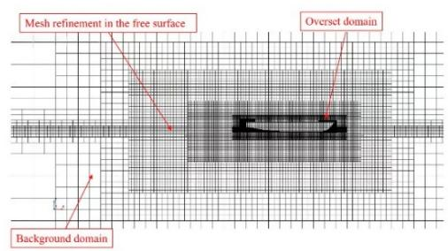

text_image

Mesh refinement in the free surface
Overset domain
Background domain

(b)(b)   
Figure 3. Overset domain and background domain. (a) Regional division and (b) mesh around theFigure 3. Overset domain and background domain. (a) Regional division and (b) mesh around theFigure 3. Overset domain and background domain. (a) Regional division and (b) mesh around the slice and mesh differences between regions.slice and mesh differences between regions.

To ensure accurate information exchange between the overlapping and backgroundTo ensure accurate information exchange between the overlapping and backgroundTo ensure accurate information exchange between the overlapping and background regions, the mesh size of these regions must be consistent. The region and the surface gridregions, the mesh size of these regions must be consistent. The region and the surface gridregions, the mesh size of these regions must be consistent. The region and the surface grid of the ship are shown in Figure 4a–c.of the ship are shown in Figure 4a–c.of the ship are shown in Figure 4a–c.

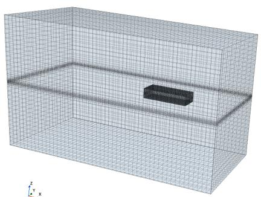

natural_image

3D wireframe model of a rectangular enclosure with a central rectangular block, showing no text or symbols.

(a)(a)

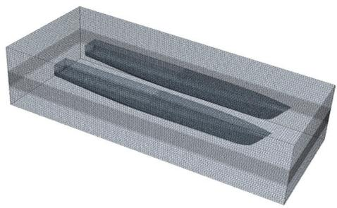

natural_image

3D wireframe model of a rectangular container with two internal oval shapes (no text or symbols)

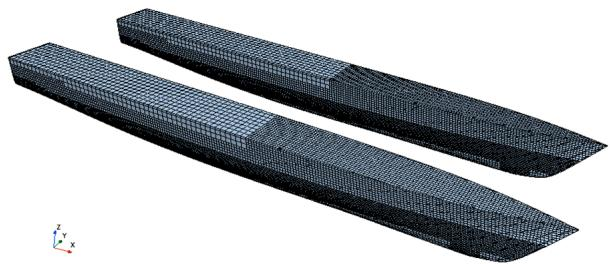

natural_image

3D wireframe model of two elongated, tapered objects with a coordinate axis indicator (x, y, z) in the corner, no text or symbols present.

(c)   
and hull grid. (a) Computational domain mesh, (b) overset domain mesh, and (c)Figure 4. Domain and hull grid. (a) Computational domain mesh, (b) overset domain mesh, and (c) . hull surface mesh.

# f Grid Independence3.3. Verification of Grid Independence

iability of numerical results is crucial, particularly when addressingEnsuring the reliability of numerical results is crucial, particularly when addressing s inherent in the mathematical models used to solve CFD problems. Thethe uncertainties inherent in the mathematical models used to solve CFD problems. The uncertainties on the numerical model should be assessed through valida-impact of these uncertainties on the numerical model should be assessed through validation h one of the primary sources of uncertainty being the grid structure. Grid-studies, with one of the primary sources of uncertainty being the grid structure. Grid-related uncertainties should be evaluated using the Grid Convergence Index (GCI) method [28], which requires constructing at least three sets of uniformly refined grids (fine, medium, and coarse), corresponding to grid numbersand coarse), corresponding to grid numbers $N _ { 1 } , N _ { 2 }$ , an, and $N _ { 3 }$ N . This study. This study focused primarily on investigating the resistance and seakeeping performance of the Delft-372 catamaran in waves. Consequently, the total resistance in calm water was selected as a key parameter, while resistance in waves was chosen for seakeeping analysis.

The wavelength, λ, was set to 6 m, and $\lambda / L _ { P P } = 2 .$ . In this study, a force dissipation method was selected, with the dissipation zone length defined as 1.5 m. The Froude number was set to 0.5, and the time step was set to 0.008 s. The iteration time step and the number of grid-near-wall-prism layers were set to 10. The ship model was permitted to undergo pitch and heave motions.

The refinement factors of the grids $r _ { 2 1 }$ and $r _ { 2 3 , }$ , and the order of discretization $p ,$ are defined as:

$$
r _ {2 1} = \sqrt [ 3 ]{\frac {N _ {1}}{N _ {2}}}, r _ {2 3} = \sqrt [ 3 ]{\frac {N _ {2}}{N _ {3}}} \tag {8}
$$

$$
p = \frac {1}{\ln (r _ {2 1})} | l n | \frac {\varepsilon_ {3 2}}{\varepsilon_ {2 1}} | + q (p) | \tag {9}
$$

$$
q (p) = \ln \left(\frac {r _ {2 1} ^ {p} - s}{r _ {3 2} ^ {p} - s}\right) \tag {10}
$$

$$
s = 1 \cdot \operatorname{sgn} \left(\frac {\varepsilon_ {3 2}}{\varepsilon_ {2 1}}\right) \tag {11}
$$

where $\varepsilon _ { 2 1 } = \phi _ { 2 } - \phi _ { 1 } , \varepsilon _ { 3 2 } = \phi _ { 3 } - \phi _ { 2 }$ , and $\phi _ { i }$ are the simulation results for different numbers of grids. When $s = 1$ , it indicates that the results showed consistent convergence, and $s = - 1$ indicates that the results showed oscillatory convergence. Extrapolated values, $\phi _ { e x t } ^ { 2 1 }$ , are defined as:

$$
\phi_ {e x t} ^ {2 1} = \frac {r _ {2 1} ^ {p} \phi_ {1} - \phi_ {2}}{r _ {2 1} ^ {p} - 1} \tag {12}
$$

Approximate errors, $e _ { a } ^ { 2 1 }$ , and extrapolated relative errors, $e _ { e x t } ^ { 2 1 }$ , are defined as:

$$
e _ {a} ^ {2 1} = \left| \frac {\phi_ {2} - \phi_ {1}}{\phi_ {1}} \right| \tag {13}
$$

$$
e _ {e x t} ^ {2 1} = \left| \frac {\phi_ {e x t} ^ {1 2} - \phi_ {1}}{\phi_ {e x t} ^ {1 2}} \right| \tag {14}
$$

The convergence index, $G C I _ { f i n e } ^ { 2 1 } ,$ is obtained by the following expression:

$$
G C I _ {f i n e} ^ {2 1} = \frac {1 . 2 5 e _ {a} ^ {2 1}}{r _ {2 1} ^ {p} - 1} \tag {15}
$$

Based on the discretization error components provided in Table 2 for the grid convergence study, the analysis of the Delft-372 in calm water and regular waves was found to be monotonically convergent. The numerical uncertainties in the resistance of the catamaran in calm water and regular waves were 0.382% and 1.202%, respectively, both under 2%.

Generally, smaller grid sizes result in a higher calculation accuracy but increase the computational time. To achieve an optimal balance between computational resources and accuracy, an appropriate grid size must be selected. After calculations, all three grid sets exhibited monotonic convergence, meeting the convergence criteria. It is concluded that the resistance error using a grid base size of 0.1 m was within $5 \% ,$ meeting the required calculation accuracy. Considering the available computational resources and desired accuracy, this grid size was used for the subsequent simulation study.

Table 2. Calculation of the grid-independence verification of the Delft-372 catamaran. 

<table><tr><td>Components</td><td>Resistance (Calm Water)</td><td>Resistance (Regular Waves)</td></tr><tr><td>Fine (No. of cells)</td><td>3,508,235</td><td>3,635,980</td></tr><tr><td>Medium (No. of cells)</td><td>2,025,182</td><td>2,308,464</td></tr><tr><td>Coarse (No. of cells)</td><td>1,118,578</td><td>1,415,715</td></tr><tr><td> $r_{21}$ </td><td>1.201</td><td>1.163</td></tr><tr><td> $r_{23}$ </td><td>1.219</td><td>1.177</td></tr><tr><td> $\phi_1$  (N)</td><td>53.042</td><td>56.328</td></tr><tr><td> $\phi_2$  (N)</td><td>52.780</td><td>55.945</td></tr><tr><td> $\phi_3$  (N)</td><td>52.005</td><td>55.123</td></tr><tr><td> $\varepsilon_{21}$ </td><td>-0.262</td><td>-0.383</td></tr><tr><td> $\varepsilon_{32}$ </td><td>-0.775</td><td>-0.722</td></tr><tr><td>s</td><td>1</td><td>1</td></tr><tr><td>q</td><td>-0.124</td><td>-0.100</td></tr><tr><td>p</td><td>5.250</td><td>3.541</td></tr><tr><td> $e_a^{21}$  (%)</td><td>0.494</td><td>0.680</td></tr><tr><td> $GCI_{fine}^{21}$  (%)</td><td>0.382</td><td>1.202</td></tr></table>

# 3.4. Comparison of Simulation Test Results

Compared to a single ship, the catamaran exhibited superior resistance performance at high speeds. In this section, the high-speed condition of $\mathrm { F r } = 0 . 7$ was selected for numerical verification of seakeeping and wave-added resistance. A series of regular wave conditions were selected to match the EFD results presented in [29], as shown in Table 3. These data were based on seakeeping trials conducted on the Delft-372 catamaran in regular waves, which aligns with the conditions of this study. Comparison with experimental data allows for the validation of the numerical methods and models employed in this study. This calculation considered only the motion of heave and pitch. In this study, a force dissipation method was selected, with the dissipation zone length was defined as 1.5 m.

Table 3. Regular wave conditions of the Delft-372 catamaran. 

<table><tr><td>Case</td><td>Froude Number, Fr</td><td>Wave/Ship Length, λ/LPP</td><td>Wave Height, H (m)</td><td>Encounter Frequency, We (rad/s)</td><td>Encounter Period, Te</td></tr><tr><td>1</td><td>0.7</td><td>1.00</td><td>0.06667</td><td>6.2431</td><td>0.50321</td></tr><tr><td>2</td><td>0.7</td><td>1.50</td><td>0.10000</td><td>4.5016</td><td>0.69788</td></tr><tr><td>3</td><td>0.7</td><td>1.75</td><td>0.11667</td><td>3.9856</td><td>0.78823</td></tr><tr><td>4</td><td>0.7</td><td>2.00</td><td>0.13333</td><td>3.5909</td><td>0.87487</td></tr><tr><td>5</td><td>0.7</td><td>2.25</td><td>0.15000</td><td>3.2783</td><td>0.95829</td></tr></table>

Based on the model test study by R. Broglia (2011) [29] at the Italian INSEAN tank, numerical simulations were conducted for the aforementioned conditions in this study. The comparison of the numerical non-dimensional additional resistance, pitch, and heave values caused by regular waves with the EFD results is shown in Figures 5 and 6. The motion responses of the catamaran in waves exhibited dynamic time dependence and simple harmonic motion, which were compatible with each other. Consequently, the discrepancy between EFD and CFD was within a tolerable range for seakeeping simulations.

According to the established definition, the wave-added resistance of the catamaran is the time-averaged total resistance of the catamaran over a complete period, minus its resistance in still water. The wave-added resistance coefficient, $C _ { a w } ,$ of the catamaran is defined as [30]:

$$
C _ {a w} = \frac {R _ {a w}}{\rho g \zeta_ {A} ^ {2} B ^ {2} / L} \tag {16}
$$

where $\rho$ is the fluid density, $g$ is the gravitational acceleration, $\zeta _ { A }$ is the regular wave amplitude, B is the overall beam, and L is the length between perpendiculars.

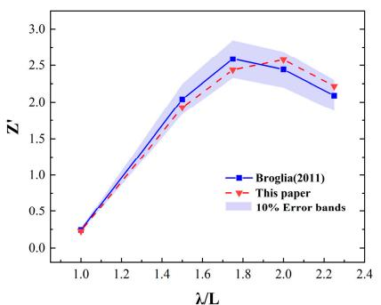

line

| λ/L | Broglia(2011) | This paper | 10% Error bands (lower) | 10% Error bands (upper) |
| --- | --- | --- | --- | --- |
| 1.0 | 0.25 | 0.25 | 0.25 | 0.25 |
| 1.4 | 2.05 | 2.00 | 1.90 | 2.10 |
| 1.8 | 2.60 | 2.45 | 2.35 | 2.75 |
| 2.0 | 2.45 | 2.55 | 2.40 | 2.65 |
| 2.2 | 2.10 | 2.20 | 2.05 | 2.30 |

(a)

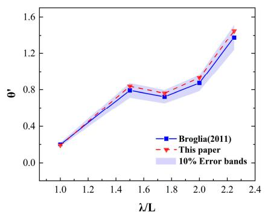

line

| λ/L | Broglia(2011) | This paper |
| --- | --- | --- |
| 1.0 | 0.25 | 0.25 |
| 1.5 | 0.80 | 0.82 |
| 1.8 | 0.75 | 0.78 |
| 2.0 | 0.85 | 0.90 |
| 2.3 | 1.30 | 1.45 |

(b)(b)

igure 5. Heave and pitch motion responses of the Delft-372 catamaran with FFigure 5. Heave and pitch motion responses of the Delft-372 catamaran withFigure 5. Heave and pitch motion responses of the Delft-372 catamaran with $\mathrm { F r } = 0 . 7$ head waves. in head waves.in head waves. a) Heave RAO and (b) pitch RAO [29].(a) Heave RAO and (b) pitch RAO [29].(a) Heave RAO and (b) pitch RAO [29].   
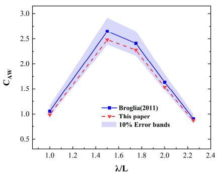

line

| λ/L | Broglia(2011) | This paper |
| --- | --- | --- |
| 1.0 | 1.0 | 1.0 |
| 1.5 | 2.7 | 2.5 |
| 1.8 | 2.4 | 2.3 |
| 2.0 | 1.6 | 1.5 |
| 2.2 | 0.9 | 0.9 |

igure 6. Added resistance coefficient of the Delft-372 catamaran with FFigure 6. Added resistance coefficient of the Delft-372 catamaran withFigure 6. Added resistance coefficient of the Delft-372 catamaran with $\mathrm { F r } = 0 . 7$ n head waves [29].in head waves [29]. in head waves [29].

alysis of Drag Reduction in DiffereThe pitch RAO is expressed as [31]:

$$
\theta^ {\prime} = \frac {\theta}{(3 6 0 \zeta_ {A} / \lambda)} \tag {17}
$$

as demonstrated.was demonstrated.and the heave RAO can be expressed as:

$$
Z ^ {\prime} = \frac {Z}{\zeta_ {A}} \tag {18}
$$

tandem formation. Finally, the longitudinal distance and the lateral distance were set towhere θ is the pitch amplitude, λ is the wavelength, and Z is the heave amplitude. The 0.5 to 1.5 LPP and 0.25B to 1B in lateral formation, respectively.numerical results exhibited a pattern comparable to the experimental data presented in Figures 5 and 6. For regular wave conditions, wave-added resistance varied with changes in wavelength and wave height, peaking at $\lambda / L = 1 . 7 5$ with a maximum increase in resistance of 36%. Similarly, for heave motion, the most significant motion occurred at $\lambda / L = 1 . 7 5$ For pitch motion, the trend was a gradual increase as the wavelength-to-ship-length ratio increased. The numerical method employed in this paper was shown to be reliable, with a maximum error of 10%, as evidenced by the results in Figures 5 and 6.

# 4. Analysis of Drag Reduction in Different Formation Configurations

In this section, the Delft-372 catamaran was used as the primary vessel, and the effects of formation arrangements and sailing distance on resistance and seakeeping performance were analyzed. The feasibility of reducing the resistance and motion amplitude was demonstrated.

(c)To explore the influence of different formation configurations, the arrangement shown igure 7. The geometric configuration of catamarans in different formations: (a) tandem formation,in Figure 7 was adopted. First, the lateral distance, SP, was selected as 0.25B to 2B in parallel b) lateral formation, and (c) parallel formation.(b) lateral formation, and (c) parallel formation.formation. Then, the longitudinal distance, ST, was set to 0.25 $L _ { P P }$ to $2 ~ L _ { P P }$ in tandem formation. Finally, the longitudinal distance and the lateral distance were set to 0.5 to $1 . 5 L _ { P P }$ boundary conditions and physical models wer e boundary conditions and physical models weand 0.25B to 1B in lateral formation, respectively.

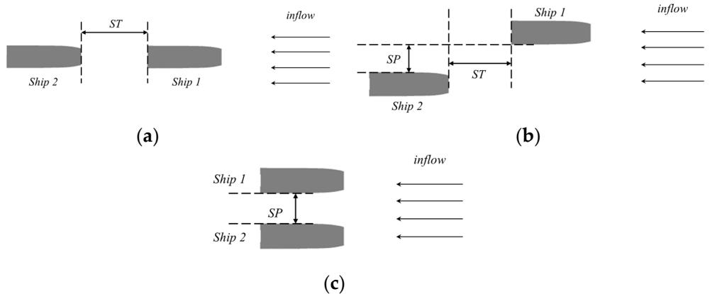  
e 7. The geometric configuration of catamarans in different formations: (a) tandem formation,Figure 7. The geometric configuration of catamarans in different formations: (a) tandem formation, eral formation, and (c) parallel formation.(b) lateral formation, and (c) parallel formation.

oundary conditions and physical models were identical to those used in theThe boundary conditions and physical models were identical to those used in the ious section. The direct input method was used to simulate the fifth-order regularprevious section. The direct input method was used to simulate the fifth-order regularwaves, with the wave conditions being combined with those used in [32]. In this section, waves, with the wave conditions being combined with those used in [32]. In this section,the wavelength, λ, was set to 6 m, the wave height, A , to 0.15 m, and  A was 40. For the wavelength, λ, was set to 6 m, the wave height, the simulation test, the overlapping mesh and the $\zeta _ { A } ,$ , to 0.15 m, andI technique we $\lambda / \zeta _ { A }$ was 40. Formbined with the simulation test, the overlapping mesh and the DFBI technique were combined with thethe case of Fr = 0.5. case of Fr = 0.5.

# 4.1. Parallel Formation

The total resistance coefficient and lateral force of the catamaran at different lateral distances are presented in Figure 8. The calculated total resistance coefficient for a single catamaran was 0.0076668. Due to the geometric symmetry, the resistance and motion responses of the two catamarans were almost identical. The maximum increase in the resistance coefficient was observed at the minimum lateral distance ofsistance coefficient was observed at the minimum lateral distance of $0 . 2 5 L _ { P P } ,$ , reachingreaching 13.67%. When $\mathrm { S P } \leq 1 B ,$ , the total resistance coefficient and lateral force of the catamaran exhibited a pronounced decline with the increasing lateral distance. When $\mathrm { S P } \geq 1 B ,$ , both parameters exhibited a flattened trend with the increasing lateral distance, with the totalparameters exhibited a flattened trend with the increasing lateral distance, with the total resistance coefficient exhibiting an error within 5% of that of a single catamaran. Since theresistance coefficient exhibiting an error within 5% of that of a single catamaran. Since the inflow in front of the catamaran remained relatively constant when the two catamaransinflow in front of the catamaran remained relatively constant when the two catamarans were in parallel formation, and the inflow velocity remained the same, it can be concludedwere in parallel formation, and the inflow velocity remained the same, it can be concluded that the inflow in front of the catamaran did not significantly affect the resistance coefficient.that the inflow in front of the catamaran did not significantly affect the resistance coeffi-Consequently, the resistance at each distance remained relatively constant.cient. Consequently, the resistance at each distance remained relatively co

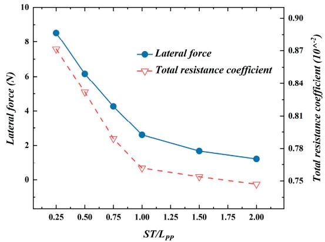

line

| ST/LPP | Lateral force (N) | Total resistance coefficient (10^-2) |
| ------ | ----------------- | ------------------------------------ |
| 0.25   | 8.5               | 0.87                                 |
| 0.50   | 6.0               | 0.84                                 |
| 0.75   | 4.0               | 0.81                                 |
| 1.00   | 2.5               | 0.78                                 |
| 1.50   | 1.5               | 0.75                                 |
| 2.00   | 1.0               | 0.75                                 |

Figure 8. The resistance and lateral force of the catamaran under different lateral distances.Figure 8. The resistance and lateral force of the catamaran under different lateral distances.

The heave and pitch amplitudes of the catamaran at different lateral distances are shown in Figure 9. This conclusion is further supported by the following evidence. It can be observed that the interaction forces between the two catamarans had minimal effect when the lateral distance exceeded 1B.

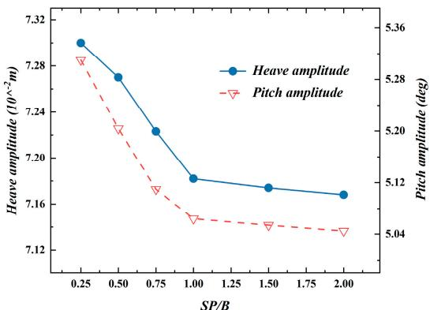

line

| SP/B | Heave amplitude (10^-2 m) | Pitch amplitude (deg) |
|------|---------------------------|------------------------|
| 0.25 | 7.30                      | 5.36                   |
| 0.50 | 7.28                      | 5.28                   |
| 0.75 | 7.24                      | 5.20                   |
| 1.00 | 7.19                      | 5.12                   |
| 1.50 | 7.18                      | 5.04                   |
| 2.00 | 7.17                      | 5.04                   |

FigureFigure 9.9. TheThe heave and pitch amplitudes of the catamaran under different lateral distances.heave and pitch amplitudes of the catamaran under different lateral distances.

The lateral distance significantly influenced the lateral force of the catamaran. The lateral force continuously increased as the lateral distance decreased. As the distance between the two catamarans decreased, the pressure gradient on their sides increased, the flow around the catamarans became asymmetric, and a pressure difference arose between the left andThe lateral distance significantly influenced the lateral force of the catamaran. The right sides. This pressure difference increased the suction between the two ships, therebylateral force continuously increased as the lateral distance decreased. As the distance beincreasing the lateral force. Figure 10 illustrates the variations in the free surface and flowtween the two catamarans decreased, the pressure gradient on their sides increased, the field around the hull at different lateral distances. It can be observed that when the lateralflow around the catamarans became asymmetric, and a pressure difference arose between distance was small, the wakes of the two catamarans interacted, forming large areas of waveships, thereby increasing the lateral force. Figure 10 illustrates the variations in the free crests and troughs, with the converged wake crest located relatively close to the stern. Thesurface and flow field around the hull at different lateral distances. It can be observed that flow field was concentrated, with a limited range of diffusion. The intense changes in the flowwhen the lateral distance was small, the wakes of the two catamarans interacted, forming field created significant suction effects between the two catamarans. The hydrostatic pressurelarge areas of wave crests and troughs, with the converged wake crest located relatively distribution around the hull changed, and the wave loads resulting from ship interactionclose to the stern. The flow field was concentrated, with a limited range of diffusion. The increased, leading to higher resistance and motion responses for the catamarans. As the lateralmarans. The hydrostatic pressure distribution around the hull changed, and the wave distance increased, the generated wave systems of the two catamarans began to separate,loads resulting from ship interaction increased, leading to higher resistance and motion reducing the wave interference, and the converged wake crest moved further away from theresponses for the catamarans. As the lateral distance increased, the generated wave sysstern. The wave pattern on the free surface gradually approached that of a single catamaran,tems of the two catamarans began to separate, reducing the wave interference, and the with the wave height and wavelength stabilizing. Due to the reduced wave interference, the wave loads between the catamarans decreased accordingly. Thus, the distance between thelength stabilizing. Due to the reduced wave interference, the wave loads between the cattwo catamarans should be sufficient to ensure navigational safety and prevent ship suction,amarans decreased accordingly. Thus, the distance between the two catamarans should according to the safety distance theory of ship encounters. It is recommended that the distancebe sufficient to ensure navigational safety and prevent ship suction, according to the safety between two ships be at least 1B.distance theory of ship encounters. It is r

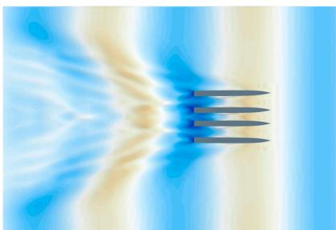

natural_image

Abstract visualization of fluid flow around a central object with three parallel arrows indicating direction (no text or symbols)

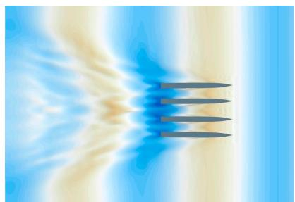

natural_image

Abstract visualization of fluid flow or heat transfer through a channel with three parallel tubes (no text or symbols)

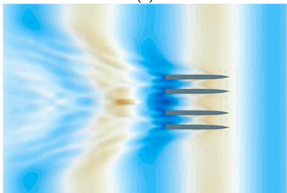

natural_image

Abstract fluid flow visualization with blue and beige gradients and a central orange arrow (no text or symbols)

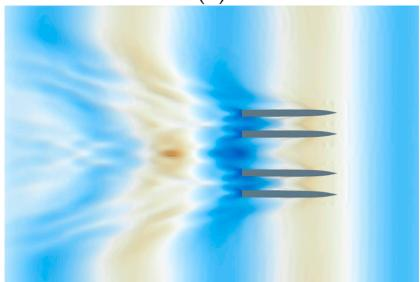

natural_image

Abstract visualization of fluid flow around a central orange core with three parallel lines (no text or symbols)

Figure 10. Cont.

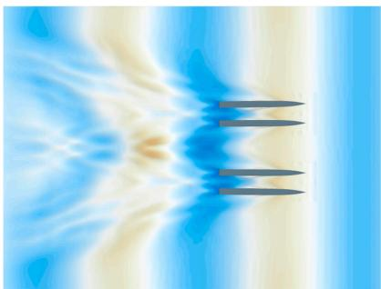

natural_image

Abstract fluid flow visualization with blue and beige gradients, no text or symbols present

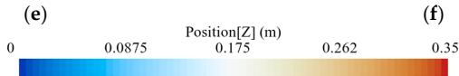

heatmap

| Position[Z] (m) | Value  |
| --------------- | ------ |
| 0               | 0.0875 |
| 0.175           | 0.175  |
| 0.262           | 0.262  |
| 0.35            | 0.35   |

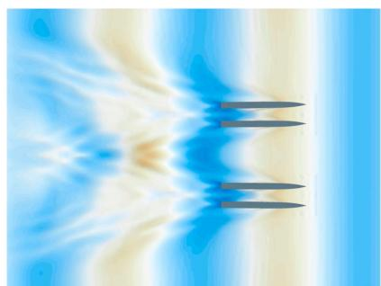

natural_image

Abstract digital visualization with blue and beige gradients and three stylized black arrows forming a symmetrical pattern (no text or symbols)

Figure 10. The free surface deformations of parallel formation at different lateral distances: (a) SP/BFigure 10. The free surface deformations of parallel formation at different lateral distances: (a) SP/B = 0.25, (b) SP/B = 0.5, (c) SP/B = 0.75, (d) SP/B = 1, (e) SP/B = 1.5, and (f) SP/B = 2.= 0.25, (b) SP/B = 0.5, (c) SP/B = 0.75, (d) SP/B = 1, (e) SP/B = 1.5, and (f) SP/B = 2.

# 4.2. Tandem Formation4.2. Tandem Formation

In tandem formation, the interaction between the hulls had little effect on the lateral To study the influence of longitudinal distance on the hydrodynamic performance offorce and yaw moment, so the resistance, pitch, and heave motions were mainly analyzed. ships, numerical simulations were conducted on two and three catamarans.To study the influence of longitudinal distance on the hydrodynamic performance of ships, Figure 11 shows the comparison of total resistance coefficients for the leader and numerical simulations were conducted on two and three catamarans.

catamarans at different longitudinal distances with that of a single catamaran. TheFigure 11 shows the comparison of total resistance coefficients for the leader and follower catamarans at different longitudinal distances with that of a single catamaran. catamaran were similar to those of a single catamaran. For the follower catamaran, a re-The respective comparisons of pitch and heave amplitudes are shown in Figure 12a,b. duction in both pitch and heave motion responses was observed with the increasing lon-The graphs show that the smaller variations in resistance and motion responses of the gitudinal distance, manifested as significantly reduced amplitudes. The resistance trendleader catamaran were similar to those of a single catamaran. For the follower catamaran, exhibited by the follower catamaran was shown to follow a “V-shape” pattern as a func-a reduction in both pitch and heave motion responses was observed with the increasing longitudinal distance, manifested as significantly reduced amplitudes. The resistance trend suggesting that the sequential progression of the two catamarans had mexhibited by the follower catamaran was shown to follow a $^ { \prime \prime } \hat { \mathrm { V } } { \cdot } \mathrm { s h a p e } ^ { \prime \prime }$ t on pattern as a function the leading catamaran’s navigation. When the longitudinal spacing was small, the re-of the longitudinal distance. The results indicate that the resistance, pitch, and heave sistance of the following catamaran was greater than that of a single catamaran. When themotions of the leading catamaran were nearly identical to those of a single catamaran, ST = 0.25–0.5 LPP , the resistance of the following catamaran increased by approximatelysuggesting that the sequential progression of the two catamarans had minimal impact drag reduction effect was observed on the follower catamaran, reaching a maximum ofon the leading catamaran’s navigation. When the longitudinal spacing was small, the 36.61% at ST = 1 LPP . Subsequently, as the longitudinal distance increased, the resistanceresistance of the following catamaran was greater than that of a single catamaran. When of ththe $\mathrm { S T } = 0 . 2 5 \substack { - 0 . 5 L _ { P P } }$ n continued to rise, and when ST reached 1.75 LPP , the resistance, the resistance of the following catamaran increased by approximately surpassed that of a single catamaran. It is evident that the position of the following cata-44.66% and 32.18%, respectively. As the longitudinal distance increased, a pronounced maran relative to the leading catamaran influenced the resistance. When the waves gen-drag reduction effect was observed on the follower catamaran, reaching a maximum of 36.61% at $\mathrm { S T } = 1 ~ L _ { P P } $ . Subsequently, as the longitudinal distance increased, the resistance of amaran. Consequently, the pitch and heave motion responses of the following catthe following catamaran continued to rise, and when ST reached $1 . 7 5 ~ L _ { P P } ,$ , the resistance were reduced. The waves generated by the lead catamaran created complex pressure dis-surpassed that of a single catamaran. It is evident that the position of the following tributions around the catamaran, especially near the bow and stern. In contrast, the pres-catamaran relative to the leading catamaran influenced the resistance. When the waves generated by the leading catamaran propagated to the following catamaran, they attenuated persed by the lead catamaran.the energy of the regular waves, causing weaker wave disturbances for the following catamaran. Consequently, the pitch and heave motion responses of the following catamaran were reduced. The waves generated by the lead catamaran created complex pressure distributions around the catamaran, especially near the bow and stern. In contrast, the pressure distribution around the following catamaran was more stable, resulting in smaller pitch and heave motion responses, because most of the waves were absorbed and dispersed by the lead catamaran.

Figure 13 shows a comparison of the total resistance coefficients of a three-ship system at different longitudinal distances with that of a single ship. Figure 14a,b correspond to comparisons of heave and pitch amplitudes, respectively. The figure shows that the threeship system exhibited a trend consistent with the two-ship system, with ship 3 showing smaller overall variations compared to ship 2. $\mathrm { A t } \mathrm { S T } = 1 \ L _ { P P } ,$ the resistance coefficient of the follower catamaran decreased significantly, with ship 2 experiencing a maximum reduction of 35.24% and ship 3 experiencing a maximum reduction of 46.44%. Both the heave and pitch motions of the two follower catamarans decreased as the longitudinal distance increased, with ship 3 showing the greatest reduction in motion response. Similar to the two-catamaran system, the third catamaran in the three-catamaran system experienced further reduced pitch and heave motions after the waves were attenuated by the first two catamarans. Additionally, due to the shielding effect of the lead catamaran, the flow velocity around the third catamaran decreased, and the wave disturbances were reduced, causing a redistribution of surface pressure and a further reduction in resistance compared to the second catamaran.

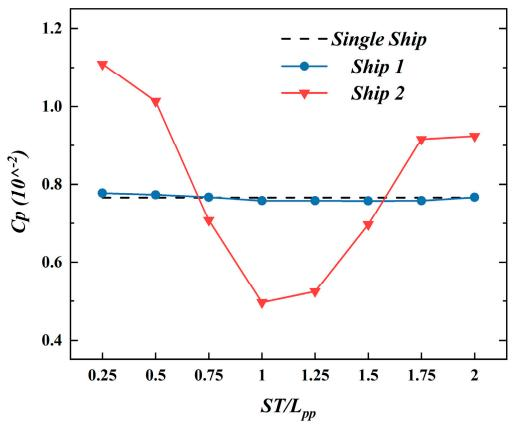

line

| ST/L_pp | Single Ship | Ship 1 | Ship 2 |
| ------- | ----------- | ------ | ------ |
| 0.25    | 0.78        | 0.78   | 1.12   |
| 0.5     | 0.78        | 0.78   | 1.02   |
| 0.75    | 0.78        | 0.78   | 0.72   |
| 1       | 0.78        | 0.78   | 0.50   |
| 1.25    | 0.78        | 0.78   | 0.53   |
| 1.5     | 0.78        | 0.78   | 0.70   |
| 1.75    | 0.78        | 0.78   | 0.92   |
| 2       | 0.78        | 0.78   | 0.93   |

Figure 11. Comparison of the total resistance coefficients for each catamaran in the two-ship sys-Figure 11. Comparison of the total resistance coefficients for each catamaran in the two-ship system.em.

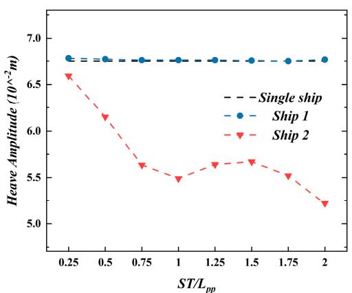

line

| ST/L_pp | Single ship | Ship 1 | Ship 2 |
| ------- | ----------- | ------ | ------ |
| 0.25    | 6.8         | 6.8    | 6.6    |
| 0.5     | 6.8         | 6.8    | 6.1    |
| 0.75    | 6.8         | 6.8    | 5.7    |
| 1       | 6.8         | 6.8    | 5.5    |
| 1.25    | 6.8         | 6.8    | 5.7    |
| 1.5     | 6.8         | 6.8    | 5.7    |
| 1.75    | 6.8         | 6.8    | 5.5    |
| 2       | 6.8         | 6.8    | 5.2    |

(a)

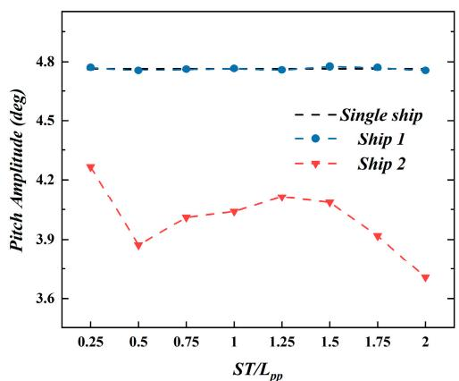

line

| ST/L_pp | Single ship | Ship 1 | Ship 2 |
| ------- | ----------- | ------ | ------ |
| 0.25    | 4.8         | 4.8    | 4.2    |
| 0.5     | 4.8         | 4.8    | 3.9    |
| 0.75    | 4.8         | 4.8    | 3.95   |
| 1       | 4.8         | 4.8    | 4.0    |
| 1.25    | 4.8         | 4.8    | 4.1    |
| 1.5     | 4.8         | 4.8    | 4.1    |
| 1.75    | 4.8         | 4.8    | 3.95   |
| 2       | 4.8         | 4.8    | 3.65   |

(b)

igure 12. Comparison of the motion characteristics for each catamaran in the two-ship system. (a)Figure 12. Comparison of the motion characteristics for each catamaran in the two-ship system.R REVIEW 16 of 22 Figure 12. Comparison of the motion characteeave amplitude and (b) pitch amplitude.(a) Heave amplitude and (b) pitch amplitude.   
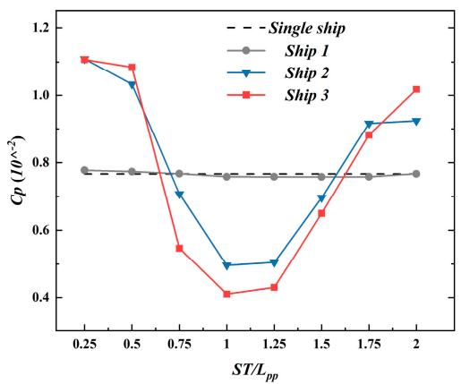

line

| ST/Lpp | Single ship | Ship 1 | Ship 2 | Ship 3 |
| ------ | ----------- | ------ | ------ | ------ |
| 0.25   | 1.1         | 0.78   | 1.1    | 1.1    |
| 0.5    | 1.08        | 0.78   | 1.05   | 1.08   |
| 0.75   | 0.75        | 0.78   | 0.7    | 0.55   |
| 1      | 0.75        | 0.78   | 0.5    | 0.4    |
| 1.25   | 0.75        | 0.78   | 0.5    | 0.4    |
| 1.5    | 0.75        | 0.78   | 0.7    | 0.65   |
| 1.75   | 0.75        | 0.78   | 0.9    | 0.85   |
| 2      | 0.75        | 0.78   | 0.9    | 1.0    |

Figure 13. Comparison of the total resistance coefficients for each catamaran in the three-ship sys-Figure 13. Comparison of the total resistance coefficients for each catamaran in the three-ship system.

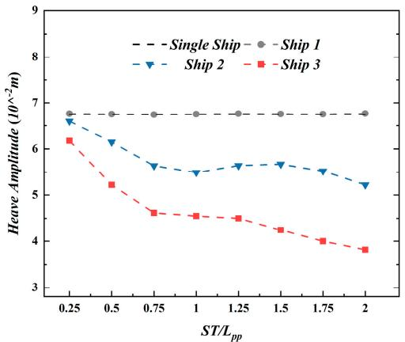

line

| ST/Lpp | Single Ship | Ship 1 | Ship 2 | Ship 3 |
| ------ | ----------- | ------ | ------ | ------ |
| 0.25   | 6.8         | 6.8    | 6.7    | 6.2    |
| 0.5    | 6.8         | 6.8    | 6.2    | 5.3    |
| 0.75   | 6.8         | 6.8    | 5.7    | 4.7    |
| 1      | 6.8         | 6.8    | 5.5    | 4.6    |
| 1.25   | 6.8         | 6.8    | 5.7    | 4.5    |
| 1.5    | 6.8         | 6.8    | 5.7    | 4.3    |
| 1.75   | 6.8         | 6.8    | 5.5    | 4.0    |
| 2      | 6.8         | 6.8    | 5.2    | 3.8    |

(a) (

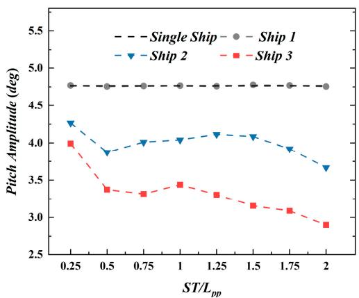

line

| ST/Lpp | Single Ship | Ship 1 | Ship 2 | Ship 3 |
| ------ | ----------- | ------ | ------ | ------ |
| 0.25   | 4.7         | 4.7    | 4.3    | 4.0    |
| 0.5    | 4.7         | 4.7    | 3.9    | 3.4    |
| 0.75   | 4.7         | 4.7    | 4.0    | 3.3    |
| 1      | 4.7         | 4.7    | 4.1    | 3.4    |
| 1.25   | 4.7         | 4.7    | 4.1    | 3.3    |
| 1.5    | 4.7         | 4.7    | 4.1    | 3.2    |
| 1.75   | 4.7         | 4.7    | 3.9    | 3.1    |
| 2      | 4.7         | 4.7    | 3.6    | 2.9    |

(b)(   
igure 14. Comparison of the motion characteristics for each catamaran in the three-ship system. (a)Figure 14. Comparison of the motion characteristics for each catamaran in the three-ship system.Figure 14. Comparison of the motion characteristics for each catamaran in the three-ship system. (a) eave amplitude and (b) pitch amplitude.(a) Heave amplitude and (b) pitch amplitude.Heave amplitude and (b) pitch amplitude.

he transom stern is widely used in high-speed hulls to reduce resistance [33]. TheThe transom stern is widely used in high-speed hulls to reduce resistance [33]. TheThe transom stern is widely used in high-speed hulls to reduce resistance [33]. The ketch of the wave profile along the centerline (sketch of the wave profile along the centerlinesketch of the wave profile along the centerlin $( \mathrm { Y } / \mathrm { L } = 0 )$ s shown in Figure 15. The red is shown in Figure 15. The red) is shown in Figure 15. The red ashed circle in the figure indicates the wave crest generated by the catamaran’s wake. Atdashed circle in the figure indicates the wave crest generated by the catamaran’s wake. Atdashed circle in the figure indicates the wave crest generated by the catamaran’s wake. A igh speeds, a depression formed behind the centerline of the transom stern, which thenhigh speeds, a depression formed behind the centerline of the transom stern, which thenhigh speeds, a depression formed behind the centerline of the transom stern, which then ose to form a rooster tail. The rooster tail was caused by the interference of two Delft-372rose to form a rooster tail. The rooster tail was caused by the interference of two Delft-372rose to form a rooster tail. The rooster tail was caused by the interference of two Delft-372 ieces, which created a more pronounced rooster tail on the centerline. It can be reasona-pieces, which created a more pronounced rooster tail on the centerline. It can be reasonablypieces, which created a more pronounced rooster tail on the centerline. It can be reasona ly assumed that when the follower ship is in the rooster tail created by the leading ship,assumed that when the follower ship is in the rooster tail created by the leading ship, thebly assumed that when the follower ship is in the rooster tail created by the leading ship, he resistance will increase significantresistance will increase significantly.the resistance will increase significa

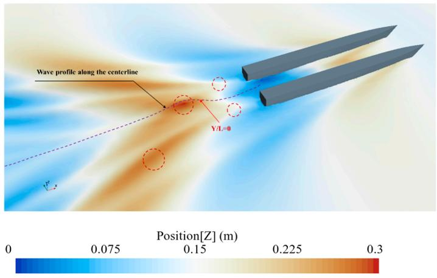

text_image

Wave profile along the centerline
Y/L=0
Position[Z] (m)
0 0.075 0.15 0.225 0.3

Figure 15. The sketch of the wave profile along the centerline.

Figure 16 illustrates the free surface deformations of tandem formation at different longitudinal distances. Both catamarans generated stern waves in the process of moving forward. The stern wave from the leader catamaran disturbed the stern wave from the follower catamaran, affecting the flow field around the follower. The surface pressure on the follower catamaran was redistributed, altering the wave-making resistance. This led to changes in the surrounding flow field, resulting in a redistribution of surface pressure on the follower catamaran and subsequent changes to its wave-making resistance. The resistance and motion of the leading catamaran were observed to be similar to those when sailing alone, mainly due to the high speed of the Delft-372 catamaran. In this scenario, waves from the trailing catamaran were propagated by splash effects, causing minimal disruption to the wake of the leader catamaran. Consequently, the flow field around the leader catamaran was observed to be less affected by the presence of the trailing catamaran.

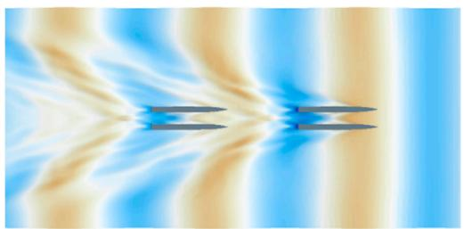

natural_image

Abstract wave pattern with blue and beige gradients, no text or symbols present

(a)

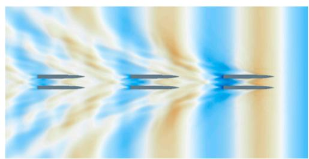

natural_image

Abstract wave pattern with blue and beige gradients, no text or symbols present

(b)

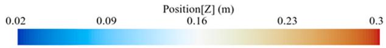

heatmap

| Position[Z] (m) |
|---|
| 0.02 |
| 0.09 |
| 0.16 |
| 0.23 |
| 0.3 |

Figure 16. The free surface deformations of tandem formation in the two- and three-ship systems.Figure 16. The free surface deformations of tandem formation in the two- and three-ship systems. (a) Two-ship system and (b) three-ship system.(a) Two-ship system and (b) three-ship system.

In the range of 0.25 toIn the range of 0.25 to $0 . 5 L _ { P P } ,$ the follower catamaran moved in the rooster tail and, the follower catamaran moved in the rooster tail and the peak of the stern wave generated by the leader. The catamaran’s forward speed wasthe peak of the stern wave generated by the leader. The catamaran’s forward speed was higher than the surrounding flow speed, resulting in additional thrust from the wavehigher than the surrounding flow speed, resulting in additional thrust from the wave crest. crest. This created a pressure differential across the bow and stern of the catamaran, in-This created a pressure differential across the bow and stern of the catamaran, increasing creasing its wave-making resistance compared to both the leader catamaran and a singleits wave-making resistance compared to both the leader catamaran and a single catamaran. Consequently, the overall resistance increased by up to 44.65%.

As the longitudinal distance increased, the follower catamaran moved closer to the trough region of the leader catamaran’s wake. The leader catamaran’s strong shielding efeffect on the incoming flow reduced the incident velocity on the follower. Simultaneously,fect on the incoming flow reduced the incident velocity on the follower. Simultaneously, the follower catamaran’s wave resistance was significantly reduced by the suction force from the leader catamaran’s wake trough, noticeably reducing its pitch and heave amplitudes. A reduction in resistance of up to 36.61% was achieved, indicating a significant difference. These observations demonstrated the significant influence of both wave crests and troughs.

# and troughs.4.3. Lateral Formation

The total resistance values of the follower catamaran at various lateral and longitudinal distances are shown in Figure 17, with a longitudinal distance of $' 0 ^ { \prime }$ indicating that the The total resistance values of the follower catamaran at various lateral and longitudi-catamarans were in tandem formation. Overall, the total resistance of the catamarans in latnal distances are shown in Figure 17, with a longitudinal distance of ‘0’ indiceral formation tended to increase compared to tandem formation, except for $\mathrm { S T } = 1 . 2 5 ~ L _ { P P } $ . catamarans were in tandem formation. Overall, the total resistance of the catamarans inThe total resistance was significantly influenced by the longitudinal distance, showing a lateral formation tended to increase compared to tandem formation, except for ST = 1.25variation pattern almost identical to that of the tandem formation. Increasing the longitudi-LPP . The total resistanal distance, ST, from $0 . 5 L _ { P P }$ sigto $1 . 2 5 ~ L _ { P P }$ ly influenced by the longitudinal distance, show-resulted in a decrease and subsequent increase in ing a variation pattern almost identical to that of the tandem formation. Increasing thethe follower catamaran’s total resistance, indicating a significant drag reduction effect at $\operatorname { S T } = 1 . 2 5 ~ L _ { P P . }$ istance, ST, from 0.5 LPP to , reduced by up to 44.54% at $\mathrm { S P } = 0 . 7 5 B$ ulted i . When $ { \mathrm { S T } } = 0 . 2 5 ~ L _ { P P }$ nd or $0 . 5 L _ { P P } ,$ ent the increase in the follower catamaran’s total resistance, indicating a significant dragtotal resistance coefficient of the follower catamaran in lateral formation exceeded that of a single catamaran, placing it in the least favorable position. It was observed that irregular variations in the resistance of the follower catamaran occurred in response to changes in the parallel distance, depending on its specific position relative to the leader catamaran.

The pitch and heave values of the follower catamaran at different parallel and longitudinal distances are shown in Figure 18, with a longitudinal distance of ‘0’ indicating a tandem formation. Generally, it was observed that the pitch and heave responses increased in the lateral formation compared to the tandem formation, except for $S \mathrm { T } = 1 ~ L _ { P P }$ . In line with the observed trend in total resistance changes, as ST increased from $0 . 5 ~ L _ { P P }$ to $1 ~ L _ { P P . }$ , the pitch and heave responses of the follower catamaran initially decreased and then increased, indicating a significant damping effect at $S \mathrm { T } = 1 ~ L _ { P P }$ .

Figure 19 illustrates the free surface deformations of lateral formation at different longitudinal and lateral distances. When the follower catamaran was positioned at the crest of the leader catamaran’s wake, within a region of high lateral pressure, an asymmetrical flow was induced around the vessel. This flow created a pressure differential between the port and starboard sides, and a steep pressure gradient, generating suction forces on the catamaran. Simultaneously, the thrust from the wake crest contributed to a significant pressure differential between the bow and stern, leading to an increase inreduction effect at ST = 1.25 LPP , reduced by up to 44.54% at SP = 0.75B. When ST = 0.25 form-drag resistance. Under these combined influences, when the follower catamaranLPP   or 0.5 LPP , the total resistance coefficient of the follower catamaran in lateral forwas situated at the crest of the leader catamaran’s wake, both its resistance and motionmation exceeded that of a single catamaran, placing it in the least favorable position. It response dramatically increased, with detrimental effects. Therefore, it is recommendedwas observed that irregular variations in the resistance of the follower catamaran occurred that the follower catamaran be positioned away from the crest of the leader catamaran’sin response to changes in the parallel distance, depending on its specific position relative wake during navigation.to the leader catamaran.

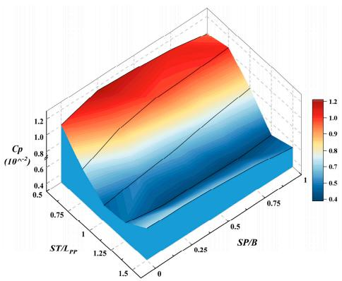

surface_3d

| SP/B | CP (10^-2) | ST/L_PP |
|------|------------|---------|
| 0.75 | 0.8        | 0.7     |
| 1.0  | 1.0        | 0.6     |
| 1.25 | 1.2        | 0.5     |
| 1.5  | 1.0        | 0.4     |
| 0.75 | 0.9        | 0.5     |
| 1.0  | 1.1        | 0.6     |
| 1.25 | 1.3        | 0.7     |
| 1.5  | 1.2        | 0.8     |
| 0.75 | 1.1        | 0.9     |
| 1.0  | 1.3        | 1.0     |
| 1.25 | 1.4        | 1.1     |
| 1.5  | 1.3        | 1.2     |

Figure 17. Comparison of the total resistance coefficients for each catamaran in lateral formation.Figure 17. Comparison of the total resistance coefficients for each catamaran in lateral formation.then increased, indicating a significant damping effect at ST = 1 LPP .

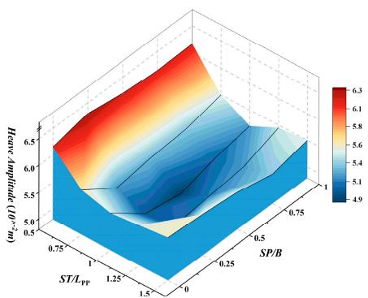

contour

| ST/LPP | m²·cm⁻¹ | SP/B |
| ------ | ------- | ---- |
| 0.75   | 6.5     | 1    |
| 1      | 6.0     | 0.75 |
| 1.25   | 5.5     | 0.5  |
| 1.5    | 5.0     | 0    |
| 0.25   | 5.5     | 0.25 |
| 0.5    | 6.0     | 0.5  |
| 0.75   | 6.5     | 1    |

(a) f th

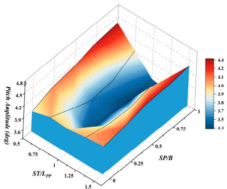

surface_3d

| ST/LPP | (Spp) ρp/pd/year ρp/pd | Value |
|--------|------------------------|-------|
| 0.75   | 0.5                    | 3.4   |
| 1.0    | 1.5                    | 3.8   |
| 1.25   | 2.5                    | 4.0   |
| 0.25   | 3.6                    | 4.2   |
| 0.75   | 4.8                    | 4.4   |

(b)ce a

Figure 18. Comparison of the motion characteristics for each catamaran in lateral formation. (a)Figure 18. Comparison of the motion characteristics for each catamaran in lateral formation. (a)the follower catamaran be positioned away from the crest of the leader catamaran’s wake Heave amplitude and (b) pitch amplitude.Heave amplitude and (b) pitch amplitude.during navigation.   
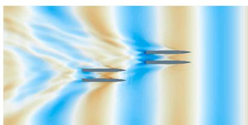

natural_image

Abstract wave pattern with blue and beige gradients, no text or symbols present

nd(a)

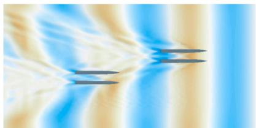

natural_image

Abstract pattern with flowing blue and beige gradients, no text or symbols present

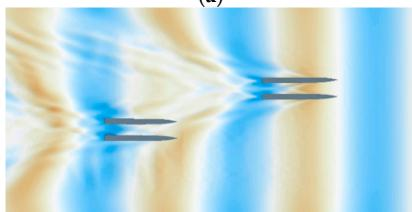

natural_image

Abstract fluid flow visualization with blue and beige streamlines, no text or symbols present

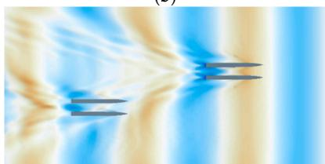

natural_image

Abstract fluid flow visualization with blue and beige gradients, no text or symbols present

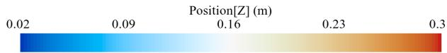

heatmap

| Position[Z] (m) | Value |
| --------------- | ----- |
| 0.02            | 0.09  |
| 0.16            | 0.16  |
| 0.23            | 0.23  |
| 0.3             | 0.3   |

Figure 19. The free surface deformations of lateral formation in different longitudinal and lateralFigure 19. The free surface deformations of lateral formation in different longitudinal and lateral distances: (a) ST/ LPP = 0.5, SP/B = 0.25; (b) ST/ LPP = 1, SP/B = 0.5; (c) ST/ LPP = 1.25, SP/B = 0.75;distances: (a) ST/L = 0.5, SP/B = 0.25; (b) ST/L = 1, SP/B = 0.5; (c) ST/L = 1.25, SP/B = 0.75; (d) $\mathrm { S T } / L _ { P P } = 1 . 5 , \mathrm { S P } / B = 1 .$ .

# 5. Conclusions

Research has found that multiple vessels sailing in different formation configurations can achieve drag and roll reduction effects through wave interference under specific layouts. In this work, the Delft-372 catamaran was utilized to investigate the feasibility of drag reduction and roll mitigation for catamaran formation sailing in waves, analyzing the effects of three different formation configurations and varying spacings. This study analyzed the impact of various formation configurations and different lateral and longitudinal distances on the resistance, pitch, and heave motions of catamarans, comparing these effects with those on a single vessel. The feasibility of drag reduction and roll stabilization for catamarans navigating in formation through waves was demonstrated, and strategies for leveraging advantageous positions to achieve positive outcomes were analyzed. The following conclusions were drawn from the study and analysis:

(1) In parallel formation, the geometric symmetry resulted in nearly identical resistance and motion responses for the two catamarans. The resistance coefficient of the catamaran increased by up to 13.67% at a transverse spacing of 0.25B. As the transverse spacing increased, the total resistance coefficient, lateral force, and pitch and heave motion amplitudes of the catamaran continuously decreased. When $\mathrm { S P } \geq 1 B ,$ , the error in the total resistance coefficient of the catamaran, compared to a single catamaran, was within 5%. Therefore, in lateral formation, the transverse spacing between the two ships should be at least 1B.

(2) In tandem formation, there were no significant changes in the total resistance coefficient, pitch, and heave response of the leader catamaran. The optimal distance for resistance benefits was at $S \mathrm { T } = 1 ~ L _ { P P }$ where the total resistance coefficient of ship 2 in the two-ship system decreased by up to 36.61%, and ship 2 and ship 3 in the three-ship system decreased by up to 35.24% and 46.44%, respectively. In conclusion, optimal efficiency was achieved at $S \mathrm { T } = 1 L _ { P P }$ . When the follower catamaran moved closer to the trough region of the leader catamaran’s wake, the strong shielding effect of the leader catamaran reduced the incident velocity of the fluid on the follower catamaran, thereby decreasing its pitch and heave motion amplitudes. Additionally, the suction at the trough of the wake of the leading catamaran altered the surface pressure distribution on the following vessel, significantly reducing its resistance.

(3) In lateral formation, due to the influence of the leader catamaran’s wake, changes in the follower catamaran’s resistance and motion response were closely related to its position. Overall, longitudinal distance had the most significant effect, with the greatest reduction in the resistance occurring at $\operatorname { S T } = 1 . 2 5 L _ { P P }$ and the greatest reduction in pitch and heave responses at $\displaystyle { \mathrm { S T } } = 1 L _ { P P }$ . The influence of lateral distance was related to the positions of the wake troughs and crests. The crest of the wake of the leader catamaran provided thrust, while the trough provided suction. This caused significant changes in the flow field around the follower catamaran, leading to asymmetric flow around it and a redistribution of surface pressure. Utilizing beneficial wave interference to fully reduce the surface pressure difference can effectively decrease wave resistance.

Through the numerical analysis in this paper, certain suggestions can be made for the arrangement and the spacing of the formations in order to achieve a reasonable sailing layout. It is necessary to maintain an appropriate distance between ships to ensure sufficient safety. From the perspective of resistance and motion response, the tandem formation was superior to parallel and lateral formations, with the best performance observed when the longitudinal distance was 1 $L _ { P P } .$ . In general, the follower catamaran should ideally be positioned in the trough of the lead catamaran’s stern wave during the navigation process.

This paper only analyzed catamarans’ different formation layouts and spacing at a single speed under wave conditions. Due to limitations in research costs and time, further investigation into formations with greater distances and higher speeds has not yet been explored. The current study focused on the impact of the leading ship’s wake on the trailing ship under wave conditions but lacked research on formations composed of different configurations and varying numbers of ships. The future study will consider the formation of three or more catamarans at different speeds, with the objective of exploring the appropriate formation layouts and greater distances. Future research on the formation will also focus on a catamaran with different body spacing and analyze the influence of the body spacing of the catamaran on the hydrodynamic performance of the formation.

Author Contributions: Conceptualization, Z.Z. (Zhifan Zhang) and B.J.; Methodology, S.W., G.Z. and Z.Z. (Zhi Zong); Validation, T.L.; Formal analysis, B.J., L.W. and Z.Z. (Zhi Zong); Writing—original draft, B.J.; Writing—review & editing, Z.Z. (Zhifan Zhang). All authors have read and agreed to the published version of the manuscript.

Funding: This work was supported by the National Natural Science Foundation of China (52271307, 52061135107, and 52192692), the Liao Ning Excellent Youth Fund Program (2023JH3/10200012), the opening project of the State Key Laboratory of Explosion Science and Technology (KFJJ21-09M), the Liao Ning Revitalization Talents Program (XLYC1908027), and the Fundamental Research Funds for the Central Universities (DUT20TD108 and DUT20LAB308).

Institutional Review Board Statement: Not applicable.

Informed Consent Statement: Not applicable.

Data Availability Statement: Some or all data, models, or codes generated or used during this study are available from the corresponding author upon request.

Conflicts of Interest: Author Shengren Wei was employed by the company Dalian Shipbuilding Industry Co., Ltd. The remaining authors declare that the research was conducted in the absence of any commercial or financial relationships that could be construed as a potential conflict of interest.

# References

1. Reyhanoglu, M. Exponential stabilisation of an underactuated autonomous surface vessel. Automatica 1997, 33, 2249–2254. [CrossRef]   
2. Shahzad, M.W.; Burhan, M.; Ang, L.; Ng, K.C. Energy-water-environment nexus underpinning future desalination sustainability. Desalination 2017, 413, 52–64. [CrossRef]   
3. Novimar. Novimar and the Vessel Train Concept 2017. Available online: https://novimar.eu/concept/ (accessed on 10 March 2024).   
4. Colling, A.; Delft, Y.; Peeten, V.; Verbist, T.; Wouters, S.; Hekkenberg, R. Assessing semi-autonomous waterborne platooning success factors in urban areas. In Proceedings of the 20th Conference on Computer and IT Applications in the Maritime Industries (COMPIT’21), Mülheim, Germany, 8–9 August 2021.   
5. Yangying, H.; Junmin, M.; Linying, C.; Qingsong, Z.; Yamin, H.; Pengfei, C.; Song, Z. Will sailing in formation reduce energy consumption? Numerical prediction of resistance for ships in different formation configurations. Appl. Energy 2022, 312, 118695.   
6. Xie, C.; Li, Z.; Mingfeng, L.; Shifeng, D.; Xu, Z. Numerical Simulation Study on Ship–Ship Interference in Formation Navigation in Full-Scale Brash Ice Channels. J. Mar. Sci. Eng. 2023, 11, 1376. [CrossRef]   
7. Zhenpeng, D.; Xiao, L.; Xiawei, G.; Xiao, L.; Wei, L. Formation optimization of various spacing configurations for a fleet of unmanned surface vehicles based on a hydrodynamic energy-saving strategy. Ocean Eng. 2022, 266, 112824.   
8. Wenlong, T.; Zhaoyong, M.; Fuliang, Z.; Zhicao, Z. Layout Optimization of Two Autonomous Underwater Vehicles for Drag Reduction with a Combined CFD and Neural Network Method. Complexity 2017, 2017, 5769794.   
9. Zhou, J.; Ren, J.; Bai, W. Survey on hydrodynamic analysis of ship–ship interaction during the past decade. Ocean Eng. 2023, 278, 114361. [CrossRef]   
10. Ma, C.; Zhao, X.; Cheng, X.; Yang, Y.; Fan, L. The wave interference and the wave resistance of a leader-follower ship fleet. Ocean Eng. 2023, 274, 114089. [CrossRef]   
11. Sulistyawati, W.; Yanuar, Y.; Pamitran, A. Warp-chine on pentamaran hydrodynamics considering to reduction in ship power energy. Energy Procedia 2019, 156, 463–468. [CrossRef]   
12. Vantorre, M.; Verzhbitskaya, E.; Laforce, E. Model test based formulations of ship-ship interaction forces. Ship Technol. Res. 2002, 49, 124–141.   
13. Lataire, E.; Vantorre, M. Hydrodynamic Interaction Between Ships and Restricted Waterways. Int. J. Marit. Eng. 2017, 159, 77–87. [CrossRef]   
14. Yuan, Z.-M.; He, S.; Kellett, P.; Incecik, A.; Turan, O.; Boulougouris, E. Ship-to-Ship Interaction During Overtaking Operation in Shallow Water. J. Ship Res. 2015, 59, 172–187. [CrossRef]   
15. Duan, W.Y.; Liu, J.Y.; Chen, J.K.; Wang, L.J. Comparison research of ship-to-ship hydrodynamic interaction in restricted water between TEBEM and other computational method. Ocean Eng. 2020, 202, 107168. [CrossRef]

16. Nandhini, V.; Nallayarasu, S. CFD simulation of the passing vessel effects on moored vessel. Ships Offshore Struct. 2020, 15, 184–199. [CrossRef]   
17. Zhou, L.; Abdelwahab, H.S.; Guedes, S.C. Experimental and CFD investigation of the effects of a high-speed passing ship on a moored container ship. Ocean Eng. 2021, 228, 108914. [CrossRef]   
18. Lataire, E.; Vantorre, M.; Delefortrie, G.; Candries, M. Mathematical modelling of forces acting on ships during lightering operations. Ocean Eng. 2012, 55, 101–115. [CrossRef]   
19. Zou, L.; Liu, Y. CFD-based predictions of hydrodynamic forces in ship-tug boat interactions. Ships Offshore Struct. 2019, 14 (Suppl. 1), 300–310. [CrossRef]   
20. Farkas, A.; Degiuli, N.; Marti´c, I. Numerical investigation into the interaction of resistance components for a series 60 catamaran. Ocean Eng. 2017, 146, 151–169. [CrossRef]   
21. Marti´c, I.; Degiuli, N.; Borˇci´c, K.; Grlj, C.G. Numerical Assessment of the Resistance of a Solar Catamaran in Shallow Water. J. Mar. Sci. Eng. 2023, 11, 1706. [CrossRef]   
22. Wang, H.; Zhu, R.C.; Zha, L.; Gu, M. Experimental and numerical investigation on the resistance characteristics of a high-speed planing catamaran in calm water. Ocean Eng. 2022, 258, 111837. [CrossRef]   
23. Ali, D.; Emre, K.; Ferdi, Ç. Numerical prediction of interference factor in motions and added resistance for Delft catamaran 372. Ocean Eng. 2021, 223, 108687.   
24. Bouscasse, B.; Broglia, R.; Stern, F. Experimental investigation of a fast catamaran in head waves. Ocean Eng. 2013, 72, 318–330. [CrossRef]   
25. Bekhit, A. Unsteady RANSE simulation for ship resistance, reave and pitch in regular head waves. IOP Conf. Ser. Mater. Sci. Eng. 2018, 400, 2004. [CrossRef]   
26. Didenkulova, E.G. Numerical modelling of soliton turbulence within the focusing Gardner equation: Rogue wave emergence. Phys. D 2019, 399, 35–41. [CrossRef]   
27. Van’t, V.R. TU Delft Report: Experimental Results of Motions, Hydrodynamic Coefficients and Wave Loads on the 372 Catamaran Model; TU Delf Repository: Delt, The Netherlands, 1998; Volume 16, pp. 113–129.   
28. Celik, I.; Ghia, U.; Roache, P.J.; Freitas, C.; Coloman, H.; Raad, P. Procedure of Estimation and Reporting of Uncertainty Due to Discretization in CFD Applications. J. Fluids Eng. 2008, 130, 078001.   
29. Broglia, R.; Bouscasse, B.; Jacob, B.; Olivieri, A.; Zaghi, S.; Stern, F. Calm water and seakeeping investigation for a fast catamaran. In Proceedings of the 11th international conference on fast sea transportation (FAST2011), Honolulu, HI, USA, 26–29 September 2011.   
30. Kim, K.H.; Kim, Y. Numerical study on added resistance of ships by using a time-domain Rankine panel method. Ocean Eng. 2011, 38, 1357–1367. [CrossRef]   
31. ITTC. Seakeeping Experiments. In Proceedings of the 28th International Towing Tank Conference, Wuxi, China, 17–22 September 2017; China Ocean Press: Beijing, China, 2017.   
32. Wei, C.; Gao, X.P.; Dong, Z.S. Research on drag performance of new small waterline surface wave-piercing catamaran. China Shipbuild 2018, 59, 126–136. (In Chinese)   
33. Haase, M.; Binns, J.; Thomas, G.; Bose, N. Wave-piercing catamaran transom stern ventilation process. Ship Technol. Res. 2016, 63, 71–80. [CrossRef]

Disclaimer/Publisher’s Note: The statements, opinions and data contained in all publications are solely those of the individual author(s) and contributor(s) and not of MDPI and/or the editor(s). MDPI and/or the editor(s) disclaim responsibility for any injury to people or property resulting from any ideas, methods, instructions or products referred to in the content.