# Hydrodynamics of High-Speed Marine Vehicles

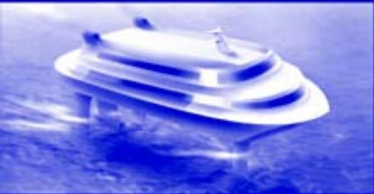

natural_image

Blue-tinted image of a futuristic cruise ship floating on water, no visible text or symbols

ODD M. FALTINSEN

This page intentionally left blank

# HYDRODYNAMICS OF HIGH-SPEED MARINE VEHICLES

Hydrodynamics of High-Speed Vehicles discusses the three main categories of high-speed marine vehicles, vessels supported by submerged hulls, air cushions, or foils. The wave environment, resistance, propulsion, seakeeping, sea loads, and maneuvering are extensively covered based on rational and simplified methods. Links to automatic control and structural mechanics are emphasized. A detailed description of waterjet propulsion is given, and the effect of water depth on wash, resistance, sinkage, and trim is discussed. Chapter topics include resistance and wash; slamming; air cushion–supported vessels, including a detailed discussion of wave-excited resonant oscillations in air cushion; and hydrofoil vessels. The book contains numerous illustrations, examples, and exercises.

Odd M. Faltinsen received his Ph.D. in naval architecture and marine engineering from the University of Michigan in 1971 and has been a Professor of Marine Hydrodynamics at the Norwegian University of Science and Technology since 1974. Dr. Faltinsen has experience with a broad spectrum of hydrodynamically related problems for ships and sea structures, including hydroelastic problems and slamming. He has published more than 200 scientific papers, and his textbook Sea Loads on Ships and Offshore Structures, published by Cambridge University Press in 1990, is used at universities worldwide.

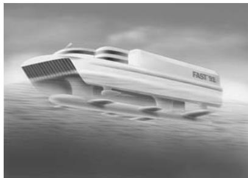

natural_image

3D rendering of a futuristic white object labeled 'FAST 150' in motion, set against a cloudy sky (no other text or symbols)

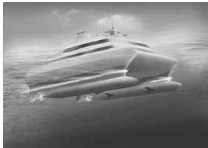

natural_image

Black-and-white illustration of a futuristic speedboat floating on the ocean (no text or symbols visible)

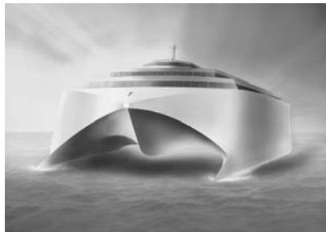

natural_image

Monochrome architectural rendering of a futuristic cruise ship with a curved arch structure, floating on water (no text or symbols visible)

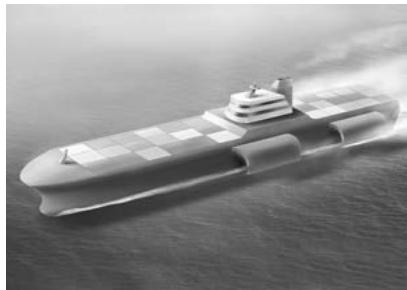

natural_image

Illustration of a large aircraft carrier sailing on open water (no visible text or symbols)

natural_image

Black and white photo of a small boat moving in motion on water, creating a wake (no text or symbols visible)

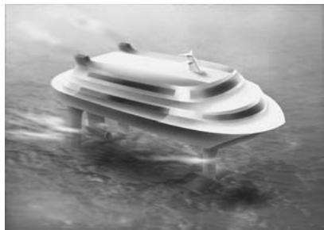

natural_image

Black-and-white illustration of a floating object on a platform in water, no text or symbols visible

# Hydrodynamics of High-Speed Marine Vehicles

ODD M. FALTINSEN

Norwegian University of Science and Technology

  

Cambridge, New York, Melbourne, Madrid, Cape Town, Singapore, São Paulo

Cambridge University Press

The Edinburgh Building, Cambridge  , UK

Published in the United States of America by Cambridge University Press, New York

www.cambridge.org

Information on this title: www.cambridge.org/9780521845687

© Cambridge University Press 2005

This publication is in copyright. Subject to statutory exception and to the provision of relevant collective licensing agreements, no reproduction of any part may take place without the written permission of Cambridge University Press.

First published in print format  2005

- ---- eBook (Adobe Reader)

- --- eBook (Adobe Reader)

- ---- hardback

- --- hardback

Cambridge University Press has no responsibility for the persistence or accuracy of s for external or third-party internet websites referred to in this publication, and does not guarantee that any content on such websites is, or will remain, accurate or appropriate.

# Contents

Preface page xiii List of symbols xv

1 INTRODUCTION 1

1.1 Operational limits 6

1.2 Hydrodynamic optimization 10

1.3 Summary of main chapters 10

2 RESISTANCE AND PROPULSION 12

2.1 Introduction 12

2.2 Viscous water resistance 13

2.2.1 Navier-Stokes equations 16

2.2.2 Reynolds-averaged Navier-Stokes (RANS) equations 18

2.2.3 Boundary-layer equations for 2D turbulent flow 19

2.2.4 Turbulent flow along a smooth flat plate. Frictional resistance component 20

2.2.5 Form resistance components 25

2.2.6 Effect of hull surface roughness on viscous resistance 28

2.2.7 Viscous foil resistance 31

2.3 Air resistance component 35

2.4 Spray and spray rail resistance components 36

2.5 Wave resistance component 38

2.6 Other resistance components 38

2.7 Model testing of ship resistance 39

2.7.1 Other scaling parameters 42

2.8 Resistance components for semi-displacement monohulls and catamarans 42

2.9 Wake flow 45

2.10 Propellers 47

2.10.1 Open-water propeller characteristics 53

2.10.2 Propellers for high-speed vessels 55

2.10.3 Hull-propeller interaction 60

2.11 Waterjet propulsion 61

2.11.1 Experimental determination of thrust and efficiency by model tests 63

2.11.2 Cavitation in the inlet area 70

2.12 Exercises 73

2.12.1 Scaling 73   
2.12.2 Resistance by conservation of fluid momentum 74   
2.12.3 Viscous flow around a strut 75   
2.12.4 Thrust and efficiency of a waterjet system 75   
2.12.5 Steering by means of waterjet 77

# 3 WAVES 78

3.1 Introduction 78   
3.2 Harmonic waves in finite and infinite depth 78

3.2.1 Free-surface conditions 78   
3.2.2 Linear long-crested propagating waves 81   
3.2.3 Wave energy propagation velocity 84   
3.2.4 Wave propagation from deep to shallow water 86   
3.2.5 Wave refraction 87   
3.2.6 Surface tension 90

3.3 Statistical description of waves in a sea state 91   
3.4 Long-term predictions of sea states 94   
3.5 Exercises 95

3.5.1 Fluid particle motion in regular waves 95   
3.5.2 Sloshing modes 97   
3.5.3 Second-order wave theory 97   
3.5.4 Boussinesq equations 98   
3.5.5 Gravity waves in a viscous fluid 98

# 4 WAVE RESISTANCE AND WASH 99

4.1 Introduction 99

4.1.1 Wave resistance 99   
4.1.2 Wash 101

4.2 Ship waves in deep water 103

4.2.1 Simplified evaluation of Kelvin’s angle 105   
4.2.2 Far-field wave patterns 105   
4.2.3 Transverse waves along the ship’s track 107   
4.2.4 Example 110

4.3 Wave resistance in deep water 110

4.3.1 Example: Wigley’s wedge-shaped body 112   
4.3.2 Example: Wigley ship model 112   
4.3.3 Example: Tuck’s parabolic strut 114   
4.3.4 2.5D (2D+t) theory 115   
4.3.5 Multihull vessels 120   
4.3.6 Wave resistance of SES and ACV 122

4.4 Ship in finite water depth 123

4.4.1 Wave patterns 126

4.5 Ship in shallow water 128

4.5.1 Near-field description 128   
4.5.2 Far-field equations 129   
4.5.3 Far-field description for supercritical speed 130

4.5.4 Far-field description for subcritical speed 131   
4.5.5 Forces and moments 132   
4.5.6 Trim and sinkage 134

# 4.6 Exercises 135

4.6.1 Thin ship theory 135   
4.6.2 Two struts in tandem 136   
4.6.3 Steady ship waves in a towing tank 136   
4.6.4 Wash 137   
4.6.5 Wave patterns for a ship on a circular course 138   
4.6.6 Internal waves 138

# 5 SURFACE EFFECT SHIPS 141

5.1 Introduction 141   
5.2 Water level inside the air cushion 141   
5.3 Effect of air cushion on the metacentric height in roll 143   
5.4 Characteristics of aft seal air bags 145   
5.5 Characteristics of bow seal fingers 147   
5.6 “Cobblestone” oscillations 149

5.6.1 Uniform pressure resonance in the air cushion 150   
5.6.2 Acoustic wave resonance in the air cushion 154   
5.6.3 Automatic control 158

5.7 Added resistance and speed loss in waves 159   
5.8 Seakeeping characteristics 161   
5.9 Exercises 163

5.9.1 Cushion support at zero speed 163   
5.9.2 Steady airflow under an aft-seal air bag 163   
5.9.3 Damping of cobblestone oscillations by T-foils 163   
5.9.4 Wave equation 164   
5.9.5 Speed of sound 164   
5.9.6 Cobblestone oscillations with acoustic resonance 164

# 6 HYDROFOIL VESSELS AND FOIL THEORY 165

6.1 Introduction 165   
6.2 Main particulars of hydrofoil vessels 166   
6.3 Physical features 166

6.3.1 Static equilibrium in foilborne condition 166   
6.3.2 Active control system 169   
6.3.3 Cavitation 169   
6.3.4 From hullborne to foilborne condition 173   
6.3.5 Maneuvering 176   
6.3.6 Seakeeping characteristics 178

6.4 Nonlinear hydrofoil theory 178

6.4.1 2D flow 178   
6.4.2 3D flow 184

6.5 2D steady flow past a foil in infinite fluid. Forces 187   
6.6 2D linear steady flow past a foil in infinite fluid 188   
6.6.1 Flat plate 192

6.6.2 Foil with angle of attack and camber 193   
6.6.3 Ideal angle of attack and angle of attack with zero lift 193   
6.6.4 Weissinger’s “quarter-three-quarter-chord” approximation 193   
6.6.5 Foil with flap 194

6.7 3D linear steady flow past a foil in infinite fluid 195

6.7.1 Prandtl’s lifting line theory 195   
6.7.2 Drag force 197

6.8 Steady free-surface effects on a foil 199

6.8.1 2D flow 199   
6.8.2 3D flow 202

6.9 Foil interaction 205

6.10 Ventilation and steady free-surface effects on a strut 208   
6.11 Unsteady linear flow past a foil in infinite fluid 209

6.11.1 2D flow 209   
6.11.2 2D flat foil oscillating harmonically in heave and pitch 210   
6.11.3 3D flow 212

6.12 Wave-induced motions in foilborne conditions 212

6.12.1 Case study of vertical motions and accelerations in head and following waves 216

6.13 Exercises 219

6.13.1 Foil-strut intersection 219   
6.13.2 Green’s second identity 219   
6.13.3 Linearized 2D flow 219   
6.13.4 Far-field description of a high-aspect–ratio foil 219   
6.13.5 Roll-up of vortices 219   
6.13.6 Vertical wave-induced motions in regular waves 220

# 7 SEMI-DISPLACEMENT VESSELS 221

7.1 Introduction 221

7.1.1 Main characteristics of monohull vessels 221   
7.1.2 Main characteristics of catamarans 221   
7.1.3 Motion control 224   
7.1.4 Single-degree mass-spring system with damping 226

7.2 Linear wave-induced motions in regular waves 229

7.2.1 The equations of motions 233   
7.2.2 Simplified heave analysis in head sea for monohull at forward speed 236   
7.2.3 Heave motion in beam seas of a monohull at zero speed 237   
7.2.4 Ship-generated unsteady waves 238   
7.2.5 Hydrodynamic hull interaction 240   
7.2.6 Summary and concluding remarks on wave radiation damping 246   
7.2.7 Hull-lift damping 246   
7.2.8 Foil-lift damping 247   
7.2.9 Example: Importance of hull- and foil-lift heave damping 249   
7.2.10 Ride control of vertical motions by T-foils 249

7.2.11 Roll motion in beam sea of a catamaran at zero speed 250   
7.2.12 Numerical predictions of unsteady flow at high speed 253

7.3 Linear time-domain response 257

7.4 Linear response in irregular waves 259

7.4.1 Short-term sea state response 259   
7.4.2 Long-term predictions 260

7.5 Added resistance in waves 261

7.5.1 Added resistance in regular waves 261   
7.5.2 Added resistance in a sea state 263

7.6 Seakeeping characteristics 263

7.7 Dynamic stability 266

7.7.1 Mathieu instability 268

7.8 Wave loads 270

7.8.1 Local pressures of non-impact type 271   
7.8.2 Global wave loads on catamarans 273

7.9 Exercises 282

7.9.1 Mass matrix 282   
7.9.2 2D heave-added mass and damping 282   
7.9.3 Linear wavemaker solution 283   
7.9.4 Foil-lift damping of vertical motions 284   
7.9.5 Roll damping fins 285   
7.9.6 Added mass and damping in roll 285   
7.9.7 Global wave loads in the deck of a catamaran 285

8 SLAMMING, WHIPPING, AND SPRINGING 286

8.1 Introduction 286   
8.2 Local hydroelastic slamming effects 290

8.2.1 Example: Local hydroelastic slamming on horizontal wetdeck 298   
8.2.2 Relative importance of local hydroelasticity 299

8.3 Slamming on rigid bodies 301

8.3.1 Wagner’s slamming model 305   
8.3.2 Design pressure on rigid bodies 309   
8.3.3 Example: Local slamming-induced stresses in longitudinal stiffener by quasi-steady beam theory 310

8.3.4 Effect of air cushions on slamming 310   
8.3.5 Impact of a fluid wedge and green water 313

8.4 Global wetdeck slamming effects 317

8.4.1 Water entry and exit loads 319   
8.4.2 Three-body model 321

8.5 Global hydroelastic effects on monohulls 325

8.5.1 Special case: Rigid body 328   
8.5.2 Uniform beam 329

8.6 Global bow flare effects 330   
8.7 Springing 334   
8.7.1 Linear springing 336   
8.8 Scaling of global hydroelastic effects 338

8.9 Exercises 338

8.9.1 Probability of wetdeck slamming 338

8.9.2 Wave impact at the front of a wetdeck 339

8.9.3 Water entry of rigid wedge 339

8.9.4 Drop test of a wedge 340

8.8.5 Generalized Wagner method 340

8.9.6 3D flow effects during slamming 340

8.9.7 Whipping studies by a three-body model 341

8.9.8 Frequency-of-encounter wave spectrum in following sea 341

8.9.9 Springing 341

9 PLANING VESSELS 342

9.1 Introduction 342

9.2 Steady behavior of a planing vessel on a straight course 344

9.2.1 2.5D (2D+t) theory 345

9.2.2 Savitsky’s formula 349

9.2.3 Stepped planing hull 355

9.2.4 High-aspect–ratio planing surfaces 358

9.3 Prediction of running attitude and resistance in calm water 360

9.3.1 Example: Forces act through COG 360

9.3.2 General case 362

9.4 Steady and dynamic stability 363

9.4.1 Porpoising 365

9.5 Wave-induced motions and loads 373

9.5.1 Wave excitation loads in heave and pitch in head sea 374

9.5.2 Frequency-domain solution of heave and pitch in head sea 378

9.5.3 Time-domain solution of heave and pitch in head sea 378

9.5.4 Example: Heave and pitch in regular head sea 380

9.6 Maneuvering 383

9.7 Exercises 385

9.7.1 2.5D theory for planing hulls 385

9.7.2 Minimalization of resistance by trim tabs 386

9.7.3 Steady heel restoring moment 386

9.7.4 Porpoising 388

9.7.5 Equation system of porpoising 388

9.7.6 Wave-induced vertical accelerations in head sea 388

10 MANEUVERING 390

10.1 Introduction 390

10.2 Traditional coordinate systems and notations in ship maneuvering 393

10.3 Linear ship maneuvering in deep water at moderate Froude number 395

10.3.1 Low-aspect–ratio lifting surface theory 398

10.3.2 Equations of sway and yaw velocities and accelerations 399

10.3.3 Directional stability 400

10.3.4 Example: Directional stability of a monohull 401

10.3.5 Steady-state turning 401   
10.3.6 Multihull vessels 402   
10.3.7 Automatic control 403

10.4 Linear ship maneuvering at moderate Froude number in finite water depth 403   
10.5 Linear ship maneuvering in deep water at high Froude number 403   
10.6 Nonlinear viscous effects for maneuvering in deep water at moderate speed 406

10.6.1 Cross-flow principle 406   
10.6.2 2D+t theory 410   
10.6.3 Empirical nonlinear maneuvering models 415

10.7 Coupled surge, sway, and yaw motions of a monohull 416

10.7.1 Influence of course control on propulsion power 417

10.8 Control means 419   
10.9 Maneuvering models in six degrees of freedom 421

10.9.1 Euler’s equation of motion 421   
10.9.2 Linearized equation system in six degrees of freedom 425   
10.9.3 Coupled sway-roll-yaw of a monohull 426

10.10 Exercises 431

10.10.1 Course stability of a ship in a canal 431   
10.10.2 Nonlinear, nonlifting and nonviscous hydrodynamic forces and moments on a maneuvering body 432   
10.10.3 Maneuvering in waves and broaching 432   
10.10.4 Linear coupled sway-yaw-roll motions of a monohull at moderate speed 433   
10.10.5 High-speed motion in water of an accidentally dropped pipe 433

APPENDIX: Units of Measurement and Physical Constants 435

References 437

Index 451

# Preface

Writing a book on the hydrodynamics of high-speed marine vehicles was challenging because I have had to cover all areas of traditional marine hydrodynamics, resistance, propulsion, seakeeping, and maneuvering. However, there is a need to combine all aspects of hydrodynamics in the design of which high-speed vessels are very different from conventional ships, depending on whether they are hull supported, air cushion supported, foil supported, or hybrids.

High-speed vessels are a fascinating topic, and I have been deeply involved in research on high-speed vessels since a national research program under the leadership of Kjell Holden started in Norway in 1989. We also started the International Conference on Fast Sea Transportation (FAST), which has a much broader scope than marine hydrodynamics. I have also benefited from being the chairman of the Committee of High-Speed Marine Vehicles of the International Towing Tank Conference (ITTC) from 1990 to 1993. Further, this book would not have been possible without the work done by the many doctoral students who I have supervised. Their theses are referenced in the book. Parts of the book have been taught to the fourth year, master of science students and doctoral students at the Department of Marine Technology, Norwegian University of Science and Technology (NTNU).

My philosophy in writing the book has been to start from basic fluid dynamics and to link this to practical issues for high-speed vessels. Mathematics is a necessity, but I have tried to avoid this when physical explanations can be given. Knowledge of calculus, including vector analysis and differential equations, is necessary to read the book in detail. The reader should also be familiar with dynamics and basic hydrodynamics of potential and viscous flow of an incompressible fluid.

Computational fluid dynamics (CFD) are commonly used nowadays, but my emphasis is on giving simplified and rational explanations of fluid behavior and its interaction with the vessel. This is beneficial in planning and interpreting experiments and computations. I also believe that examples and exercises are important parts of the learning process.

Automatic control and structural mechanics of high-speed marine vehicles are two disciplines that rely on hydrodynamics. These links are emphasized in the book and are also important aspects of the Centre for Ships and Ocean Structures, NTNU, where I participate.

My presentation of the material is inspired by the book Marine Hydrodynamics by Professor J. N. Newman.

I am thankful to Professor Newman for reading through the manuscript and offering suggestions for improvement. Dr. Svein Skjørdal spent a lot of time giving detailed comments on different versions of the manuscript. He was also helpful in seeing the topics from a practical point of view. Sun Hui also did a great job in confirming all my calculations and providing solutions to all exercises. I have benefited from Professor K. J. Minsaas’ expertise in propulsion and hydrodynamic design of hydrofoil vessels. Many other people should be thanked for their critical reviews and contributions, including Dr. Tony Armstrong, Professor Tor Einar Berg, J. Bloch Helmers, Professor Lawrence Doctors, Dr. Svein Ersdal, Lars Flæten, Professor Thor I. Fossen, Dr. Chunhua Ge, Dr. Marilena Greco, Dr. Martin Greenhow, Dr. Ole Hermundstad, Egil Jullumstrø, Dr. Toru Katayama, Professor Katsuro Kijima, Professor Spyros A. Kinnas, Dr. Kourosh Koushan, David Kristiansen, Professor Claus Kruppa, Dr. Jan Kvaalsvold, Dr. Burkhard M ¨uller-Graf, Professor Dag Myrhaug, Professor Makoto Ohkusu, Professor Bjørnar Pettersen, Dr. Olav Rognebakke, Renato Skejic, Dr. Nere Skomedal, Professor Sverre Steen, Gaute Storhaug, Professor Asgeir Sørensen, Professor Ernest O. Tuck, and Dr. Frans van Walree.

The artwork was done by Bjarne Stenberg. Anne-Irene Johannessen and Keivan Koushan were helpful in drawing figures. Jorunn Fransv˚ag organized and typed the many versions of the manuscript in an accurate and efficient way, which required a tremendous amount of work.

The support from the Centre of Ships and Ocean Structures and the Department of Marine Technology at NTNU is appreciated.

# List of symbols

<table><tr><td>A</td><td>area; planform area of foil</td></tr><tr><td> $A_D$ </td><td>developed area, propeller blades</td></tr><tr><td> $A_E$ </td><td>expanded area, propeller blades</td></tr><tr><td> $A_{jk}$ </td><td>3D added mass coefficient in the jth mode due to kth motion</td></tr><tr><td> $a_{jk}$ </td><td>2D added mass coefficient</td></tr><tr><td> $A_O$ </td><td>area of propeller disc</td></tr><tr><td>AP</td><td>after perpendicular</td></tr><tr><td> $A_R$ </td><td>rudder area</td></tr><tr><td> $A_W$ </td><td>waterplane area</td></tr><tr><td>AHR</td><td>average hull roughness</td></tr><tr><td>B</td><td>beam</td></tr><tr><td>b</td><td>beam of section</td></tr><tr><td>BAR</td><td>blade area ratio</td></tr><tr><td> $B_{cr}, b_{cr}$ </td><td>critical damping</td></tr><tr><td> $B_{jk}$ </td><td>3D damping coefficient in jth mode due to kth motion</td></tr><tr><td> $b_{jk}$ </td><td>2D damping coefficient</td></tr><tr><td>c</td><td>chord length; half wetted length in 2D impact; speed of sound</td></tr><tr><td> $C_B$ </td><td>block coefficient, ship</td></tr><tr><td> $C_D$ </td><td>drag coefficient</td></tr><tr><td> $C_f$ </td><td>friction coefficient</td></tr><tr><td> $C_F$ </td><td>frictional force coefficient</td></tr><tr><td>CFD</td><td>computational fluid dynamics</td></tr><tr><td> $C_H$ </td><td>head coefficient</td></tr><tr><td> $C_{jk}$ </td><td>restoring force coefficient in jth mode due to kth motion</td></tr><tr><td> $C_L$ </td><td>lift coefficient</td></tr><tr><td> $C_{L\beta}$ </td><td>lift coefficient for planing vessel</td></tr><tr><td> $C_{L0}$ </td><td> $C_{L\beta}$  at zero deadrise angle</td></tr><tr><td> $C(k_f)$ </td><td>Theodorsen function</td></tr><tr><td> $C_M$ </td><td>midship section coefficient; mass coefficient in Morison's equation</td></tr><tr><td>COG</td><td>center of gravity</td></tr><tr><td> $C_p$ </td><td>pressure coefficient</td></tr><tr><td> $C_{p\min}$ </td><td>minimum pressure coefficient</td></tr><tr><td> $C_P$ </td><td>longitudinal prismatic coefficient</td></tr><tr><td> $C_R$ </td><td>residual resistance coefficient</td></tr><tr><td> $C_T$ </td><td>propeller thrust-loading coefficient; total resistance coefficient</td></tr><tr><td> $C_W$ </td><td>wave-making resistance coefficient</td></tr><tr><td> $C_{WP}$ </td><td>wave pattern resistance coefficient</td></tr><tr><td> $C_Q$ </td><td>capacity coefficient</td></tr><tr><td>D</td><td>draft; drag force; propeller diameter</td></tr><tr><td>DNV</td><td>Det Norske Veritas</td></tr><tr><td> $D_T$ </td><td>transom draft</td></tr><tr><td>E</td><td>Young's modulus of elasticity</td></tr><tr><td>EI</td><td>flexural rigidity of a beam</td></tr><tr><td> $E_k$ </td><td>kinetic fluid energy</td></tr><tr><td>E(t)</td><td>energy</td></tr><tr><td>f</td><td>frequency (Hz); maximum camber</td></tr><tr><td>F</td><td>densimetric Froude number; fetch length</td></tr><tr><td>Fn</td><td>Froude number  $U/\sqrt{gL}$ </td></tr><tr><td> $Fn_B$ </td><td>beam Froude number</td></tr><tr><td> $Fn_D$ </td><td>draft Froude number</td></tr><tr><td> $Fn_h$ </td><td>depth or submergence Froude number</td></tr><tr><td> $Fn_T$ </td><td>transom draft Froude number</td></tr><tr><td>FP</td><td>forward perpendicular</td></tr><tr><td> $F_v$ </td><td>volumetric Froude number</td></tr><tr><td>g</td><td>acceleration of gravity</td></tr><tr><td> $G(x,y,z;\xi,\eta,\zeta)$ </td><td>Green function</td></tr><tr><td> $\overline{GM}$ </td><td>transverse metacentric height</td></tr><tr><td> $\overline{GM_L}$ </td><td>longitudinal metacentric height</td></tr><tr><td> $\overline{GZ}$ </td><td>moment arm in heel (roll) about COG</td></tr><tr><td>h</td><td>water depth; submergence</td></tr><tr><td> $h_j$ </td><td>height of the center of the jet at station  $S_7$  (see Figure 2.54) above calm free surface</td></tr><tr><td>H</td><td>wave height; head</td></tr><tr><td> $H_{1/3}$ </td><td>significant wave height</td></tr><tr><td>i</td><td>imaginary unit</td></tr><tr><td> $I_{jk}$ </td><td>moment or product of inertia</td></tr><tr><td>i, j, k</td><td>unit vectors along x, y and z-axis, respectively</td></tr><tr><td>IVR</td><td>inlet velocity ratio</td></tr><tr><td>J</td><td>advance ratio of propeller</td></tr><tr><td>k</td><td>wave number; roughness height; form factor</td></tr><tr><td>KC</td><td>Keulegan-Carpenter number</td></tr><tr><td> $k_f$ </td><td>reduced frequency</td></tr><tr><td> $\overline{KG}$ </td><td>height of COG above keel</td></tr><tr><td> $K_T$ </td><td>thrust coefficient</td></tr><tr><td> $K_Q$ </td><td>torque coefficient</td></tr><tr><td>L</td><td>length of ship; lift of a foil; hydrodynamic roll moment in maneuvering</td></tr><tr><td> $L_C$ </td><td>chine wetted length</td></tr><tr><td>LCB</td><td>longitudinal center of buoyancy</td></tr><tr><td>lcg</td><td>longitudinal center of gravity measured from the transom stern</td></tr><tr><td>LCG</td><td>longitudinal center of gravity</td></tr><tr><td> $L_K$ </td><td>keel wetted length</td></tr><tr><td> $L_{OA}$ </td><td>length, overall</td></tr><tr><td> $L_{OS}$ </td><td>length, overall submerged</td></tr><tr><td> $l_p$ </td><td>longitudinal position of the center of pressure measured along the keel from the transom stern</td></tr><tr><td> $L_{PP}$ </td><td>length between perpendiculars</td></tr><tr><td> $L_{WL}$ </td><td>length of the designer's load waterline</td></tr><tr><td>M</td><td>mass; moment; hydrodynamic pitch moment in maneuvering</td></tr><tr><td>M</td><td>fluid momentum vector</td></tr><tr><td>m</td><td>mass per unit length</td></tr><tr><td> $M_{jk}$ </td><td>components of mass matrix</td></tr><tr><td>n</td><td>propeller revolutions per second</td></tr><tr><td>n</td><td>surface normal vector positive into the fluid</td></tr><tr><td>N</td><td>normal force; hydrodynamic yaw moment in maneuvering</td></tr><tr><td>O</td><td>origin of coordinate system</td></tr><tr><td> $O(\varepsilon)$ </td><td>order of magnitude of  $\varepsilon$ </td></tr><tr><td>P</td><td>power; pitch of propeller; probability</td></tr><tr><td>p</td><td>pressure; roll component of angular velocity; half of the distance between the center lines of the demihulls of a catamaran; stagger between foils</td></tr><tr><td> $p_a$ </td><td>atmospheric pressure</td></tr><tr><td> $P_D$ </td><td>delivered power</td></tr><tr><td> $p_o$ </td><td>ambient pressure; static excess pressure</td></tr><tr><td> $p_v$ </td><td>vapor pressure of water</td></tr><tr><td>Q</td><td>propeller torque; volume flux; source strength</td></tr><tr><td>q</td><td>pitch component of angular velocity</td></tr><tr><td>r</td><td>yaw component of angular velocity</td></tr><tr><td>R</td><td>radius; resistance</td></tr><tr><td> $R_{AA}$ </td><td>added resistance in air and wind</td></tr><tr><td> $R_{AW}$ </td><td>added resistance in waves</td></tr><tr><td> $r_{jj}$ </td><td>radius of gyration in rigid body mode j</td></tr><tr><td>RMS</td><td>root mean square</td></tr><tr><td>Rn</td><td>Reynolds number</td></tr><tr><td> $R_R$ </td><td>residual resistance</td></tr><tr><td> $R_S$ </td><td>spray resistance</td></tr><tr><td> $R_T$ </td><td>total resistance</td></tr><tr><td> $R_V$ </td><td>viscous resistance</td></tr><tr><td> $R_W$ </td><td>wave-making resistance</td></tr><tr><td>s</td><td>span length of foil</td></tr><tr><td>S</td><td>area of wetted surface; cross-sectional area</td></tr><tr><td> $S_B$ </td><td>body surface</td></tr><tr><td> $S(\omega)$ </td><td>wave spectrum</td></tr><tr><td>t</td><td>time; thrust-deduction coefficient; maximum foil thickness</td></tr><tr><td>T</td><td>period; propeller thrust</td></tr><tr><td> $T_0$ </td><td>modal or peak period</td></tr><tr><td> $T_1$ </td><td>mean wave period</td></tr><tr><td> $T_2$ </td><td>mean wave period</td></tr><tr><td> $T_e$ </td><td>encounter period</td></tr><tr><td> $T_n$ </td><td>natural period</td></tr><tr><td> $T_S$ </td><td>surface tension</td></tr><tr><td>U</td><td>forward velocity of vessel</td></tr><tr><td> $U_I$ </td><td>mean velocity at the most narrow cross-section of the waterjet inlet</td></tr><tr><td> $U_S$ </td><td>propeller slip stream velocity</td></tr><tr><td>u</td><td>x-component of vessel velocity</td></tr><tr><td>v</td><td>y-component of vessel velocity</td></tr><tr><td>vcg</td><td>vertical distance between COG and the keel</td></tr><tr><td> $V_g$ </td><td>group velocity</td></tr><tr><td> $V_p$ </td><td>phase velocity</td></tr><tr><td> $v^*$ </td><td>wall friction velocity</td></tr><tr><td>V</td><td>water entry velocity</td></tr><tr><td>W</td><td>weight</td></tr><tr><td>w</td><td>wake fraction; z-component of vessel velocity; vertical deflection</td></tr><tr><td>Wn</td><td>Weber number</td></tr><tr><td>x, y, z</td><td>Cartesian coordinate system. Moving with the forward speed in seakeeping analysis. Body-fixed in maneuvering analysis.</td></tr><tr><td>X</td><td>x-component of hydrodynamic force in maneuvering</td></tr><tr><td> $X_E, Y_E, Z_E$ </td><td>Earth-fixed coordinate system</td></tr><tr><td> $x_T$ </td><td>x-coordinate of transom</td></tr><tr><td> $x_s$ </td><td> $L_K - L_C$ </td></tr><tr><td>Y</td><td>y-component of hydrodynamic force in maneuvering</td></tr><tr><td>Z</td><td>z-component of hydrodynamic force in maneuvering</td></tr></table>

Greek symbols 

<table><tr><td> $\alpha$ </td><td>angle of attack</td></tr><tr><td> $\alpha_{c}$ </td><td>Kelvin angle</td></tr><tr><td> $\alpha_{f}$ </td><td>flap angle</td></tr><tr><td> $\alpha_{i}$ </td><td>ideal angle of attack</td></tr><tr><td> $\alpha_{0}$ </td><td>angle of zero lift</td></tr><tr><td> $\beta$ </td><td>wave propagation angle; deadrise angle; drift angle</td></tr><tr><td> $\Gamma$ </td><td>circulation; gamma function; dihedral angle</td></tr><tr><td> $\gamma$ </td><td>vortex density; sweep angle; ratio of specific heat for air</td></tr><tr><td> $\delta$ </td><td>boundary layer thickness; rudder angle; flap angle</td></tr><tr><td> $\delta^{*}$ </td><td>displacement thickness</td></tr><tr><td> $\Delta$ </td><td>vessel weight</td></tr><tr><td> $\varepsilon$ </td><td>angle</td></tr><tr><td> $\zeta$ </td><td>surface elevation</td></tr><tr><td> $\zeta_{a}$ </td><td>wave amplitude</td></tr><tr><td> $\eta$ </td><td>overall propulsive efficiency</td></tr><tr><td> $\eta_{H}$ </td><td>hull efficiency</td></tr><tr><td> $\eta_{J}$ </td><td>jet efficiency</td></tr><tr><td> $\eta_{k}$ </td><td>wave-induced vessel motion response, where k = 1, 2, 3....6 refers to surge, sway, heave, roll, pitch, and yaw, respectively</td></tr><tr><td> $\eta_{p}$ </td><td>propeller efficiency; pump efficiency</td></tr><tr><td> $\eta_{R}$ </td><td>relative rotative efficiency</td></tr><tr><td> $\eta_{S}$ </td><td>sinkage</td></tr><tr><td> $\eta_{T}$ </td><td>thrust power efficiency</td></tr><tr><td> $\theta$ </td><td>pitch angle; momentum thickness</td></tr></table>

<table><tr><td> $\Lambda$ </td><td>aspect ratio of foil</td></tr><tr><td> $\Lambda_{L}$ </td><td>ratio between full scale and model length</td></tr><tr><td> $\lambda$ </td><td>wavelength</td></tr><tr><td> $\lambda_{w}$ </td><td>mean wetted length-to-beam ratio</td></tr><tr><td> $\mu$ </td><td>dynamic viscosity coefficient</td></tr><tr><td> $\nu$ </td><td>kinematic viscosity coefficient</td></tr><tr><td> $\xi$ </td><td>ratio between damping and critical damping</td></tr><tr><td> $\rho$ </td><td>mass density of fluid (water)</td></tr><tr><td> $\rho_{a}$ </td><td>mass density of air</td></tr><tr><td> $\sigma$ </td><td>cavitation number; source density; standard deviation</td></tr><tr><td> $\sigma_{i}$ </td><td>cavitation inception index</td></tr><tr><td> $\sigma_{o}$ </td><td>propeller cavitation number</td></tr><tr><td> $\sigma_{0.7}$ </td><td>propeller cavitation number defined at 0.7 R</td></tr><tr><td> $\tau$ </td><td>trim angle in radians;  $\omega_{e}U/g$ </td></tr><tr><td> $\tau_{deg}$ </td><td>trim angle in degrees</td></tr><tr><td> $\tau_{ij}$ </td><td>Newtonian stress relations</td></tr><tr><td> $\tau_{w}$ </td><td>frictional stress on hull surface</td></tr><tr><td> $\phi$ </td><td>heel (roll) angle</td></tr><tr><td> $\varphi$ </td><td>velocity potential</td></tr><tr><td> $\psi$ </td><td>yaw angle</td></tr><tr><td> $\omega$ </td><td>circular frequency in radians per second</td></tr><tr><td> $\omega$ </td><td>vorticity vector; vector of rotational vessel motion</td></tr><tr><td> $\omega_{n}$ </td><td>natural frequency</td></tr><tr><td> $\omega_{e}$ </td><td>frequency of encounter</td></tr><tr><td> $\omega_{o}$ </td><td>frequency of waves in an Earth-fixed coordinate system</td></tr><tr><td> $\Omega$ </td><td>vector of rotational vessel velocity</td></tr><tr><td> $\Omega$ </td><td>volume</td></tr></table>

Special symbols 

<table><tr><td> $\nabla$ </td><td>displaced volume of water; vector differential operator</td></tr><tr><td> $\nabla^{2}$ </td><td> $\frac{\partial^{2}}{\partial x^{2}} + \frac{\partial^{2}}{\partial y^{2}} + \frac{\partial^{2}}{\partial z^{2}}$ </td></tr></table>

# 1 Introduction

Baird (1998) defines a high-speed vessel as a craft with maximum operating speed higher than 30 knots, whereas hydrodynamicists tend to use a Froude number $F n = U / \sqrt { L g }$ larger than about 0.4 to characterize a fast vessel supported by the submerged hull, such as monohulls and catamarans. Here, U is the ship speed, L is the overall submerged length $L _ { O S }$ of the ship, and g is acceleration of gravity. The pressure carrying the vessel can be divided into hydrostatic and hydrodynamic pressure. The hydrostatic pressure gives the buoyancy force, which is proportional to the submerged volume (displacement) of the ship. The hydrodynamic pressure depends on the flow around the hull and is approximately proportional to the square of the ship speed. Roughly speaking, the buoyancy force dominates relative to the hydrodynamic force effect when Fn is less than approximately 0.4. Submerged hull– supported vessels with maximum operating speed in this Froude number range are called displacement vessels. When $F n > 1 . 0 – 1 . 2$ , the hydrodynamic force mainly carries the weight, and we call this a planing vessel. Vessels operating with maximum speed in the range 0.4–0.5 < Fn < 1.0– 1.2 are called semi-displacement vessels. This means that high-speed submerged hull–supported vessels denote vessels in which the buoyancy force is not dominant at the maximum operating speed.

Ship speeds of about 50 knots represent an important barrier for a high-speed vessel. At this speed, cavitation typically starts to be a problem, for instance, on the foils and the propulsion system. Cavitation means that the pressure somewhere on the upper side (suction side) of the foil becomes equal to the vapor pressure. This is only 0.012 times the atmospheric pressure at $1 0 ^ { \circ } \mathrm { C } .$ . If a large part of the suction side of the foil is cavitating, the lift is clearly reduced relative to a noncavitating foil at the same speed. For instance, the lift of a supercavitating 2D flat foil in infinite fluid is only 25% of the lift of a noncavitating 2D flat foil at the same speed and the same orientation of the foil relative to the forward speed (Newman 1977). Supercavitation means that the suction side of the foil is not wetted. Partial cavitation may also cause damage to the foil structure in terms of implosion of bubbles. In addition, ventilation may occur, for instance, as a consequence of cavitation. Ventilation means that there is a connection or an air tunnel between the air and the foil surface. Occurrence of ventilation also leads to significant drop in lifting capacity of a foil. Supercavitating foils and propellers are used to increase the speed barrier substantially beyond 50 knots. Such foil shapes have a sharp leading edge to initiate cavitation.

Minimization of the hull weight with consideration of the structural strength is important for all high-speed vessels. One early foil catamaran design resulted in too-heavy foils and struts. The consequence was reduced payload and unsatisfactory transport economy.

The 35th edition (2002–2003) of Jane’s High-Speed Marine Transportation refers to four major limitations for future market developments of fast “ro-pax” vessels carrying passengers and allowing roll-on roll-off payloads (most often in terms of cars):

 Limited seakeeping ability   
 Reliability of the main propulsion machinery   
 Cost of the higher-grade fuel used   
 Limited freight-carrying ability

Wave generation, that is, wash, is also an issue for further market expansion. The decay of the generated waves perpendicular to the ship’s course is important from a coastal engineering point of view. When the waves enter shallow water, the wavelength decreases and the wave amplitude increases, resulting in breaking waves on a beach. This may happen when the ship is out of sight, surprising swimmers. The reflection of the generated waves from vertical walls, such as a quay, may also be a problem and a safety issue. The total wave amplitude will be twice the incident amplitude, and water may flow over the quay. The wash also affects the environment, for instance, in terms of erosion. There is no simple universal criterion in terms of maximum wave amplitude that quantifies the wash effect. The criterion must be different if the waves are affecting the seashore or affecting other ships. If, for instance, the effect on other ships is analyzed, the ship response due to wash of a passing ship must be studied. Ferry operators in the United Kingdom must prepare a route assessment with regard to wash that must be approved by the Maritime and Coastguard Agency (Whittaker and Els¨asser 2002).

There is a broad variety of high-speed vessels in use, with very different physical features. The vessels differ in the way the weight is supported. The vessel weight can be supported by:

 Submerged hulls   
 Hydrofoils   
 Air cushions   
 A combination of the above

Figure 1.1, used in the announcement of the FAST’91 Conference in Trondheim, Norway, illustrates a fictitious high-speed vessel using air cushion, foils, and submerged hulls to support the vessel weight. The air cushion is enclosed between the side hulls and by seals in the forward and aft end of the vessel. The main types of high-speed vessels are discussed below.

# Submerged hull–supported vessels

Examples of semi-displacement and planing vessels are presented. Figure 1.2 shows a SWATH (small waterplane area twin hull) vessel. As the name says, this vessel is characterized by a small waterplane area and two demihulls. A SWATH has higher natural periods in heave and pitch and generally lower vertical wave excitation loads than a similarly sized catamaran. The explanation is similar to that of a semi-submersible platform (Faltinsen 1990). The consequence is better seakeeping behavior of a SWATH compared with the catamaran in head sea conditions. However, if the sea state, speed, and heading cause resonant vertical motions of the SWATH, it may not have good seakeeping behavior. Wetdeck slamming is then a danger. Further, if motion control surfaces are not used, a SWATH is dynamically unstable in the vertical plane beyond a certain speed. A SWATH is often not classified as a high-speed vessel.

The most common type of high-speed vessel is the catamaran. The catamaran is often equipped with an automatic motion control system, such as foils, which minimize wave-induced motions. Catamaran designs include the wavepiercing (Figure 1.3) and semi-SWATH types of hulls. Trimarans and pentamarans (Figure 1.4) with one large center hull combined with smaller outrigger hulls are other types of multihull vessels.

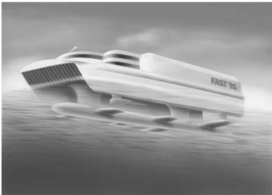

natural_image

3D rendering of a futuristic concept resembling a stylized aircraft or vehicle, with no visible text or symbols on the object itself.

Figure 1.1. Fictitious high-speed vessel with air cushion, foils, and SWATH effects. (Artist: Bjarne Stenberg)

The beam-to-draft ratio of semi-displacement monohulls with lengths longer than approximately 50 m may vary from around 5 to more than 7 which is very different from displacement ships. Large monohulls are often equipped with automatic motion control devices similar to the ones used for catamarans. Stern flaps and roll fins are commonly used. A pronounced increase in the length of a submerged hull is generally favorable for wave-induced vertical motion and acceleration. It means that a relatively long monohull with the same displacement as a catamaran has an advantage relative to the catamaran. However,

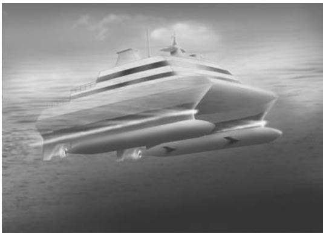

natural_image

Black-and-white illustration of a futuristic boat with visible hull and side-mounted equipment (no text or symbols)

Figure 1.2. SWATH (small waterplane area twin hull). (Artist: Bjarne Stenberg)

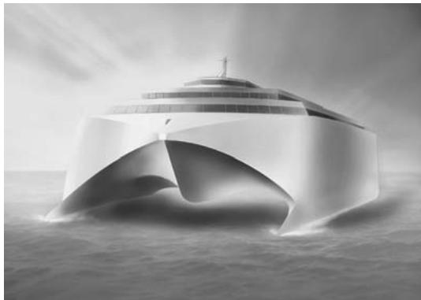

natural_image

Monochrome artistic rendering of a futuristic cruise ship with a curved arch bridge, navigating rough seas (no text or symbols visible)

Figure 1.3. “Wave-piercing” catamaran. (Artist: Bjarne Stenberg)

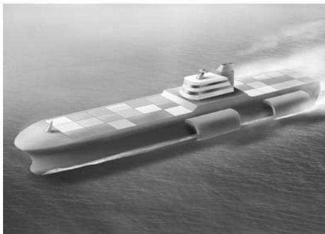

natural_image

Illustration of a submarine sailing on open water, creating wake (no text or symbols visible)

Figure 1.4. Pentamaran. (Artist: Bjarne Stenberg)

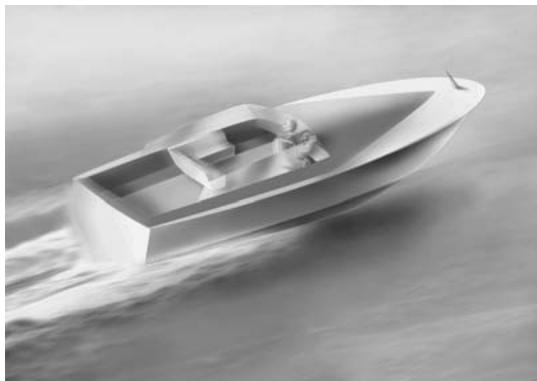

natural_image

Black-and-white illustration of a small boat with motion blur, no text or symbols visible

Figure 1.5. Planing vessel. (Artist: Bjarne Stenberg)

attention has to be paid to roll motion and dynamic stability of monohull vessels.

Planing vessels (Figure 1.5) are typically smaller vessels used as patrol boats, sportfishing vessels, and service craft, and for sport competitions. Dynamic stability, cavitation, and ventilation are of concern for planing vessels.

# Foil-supported vessels

Hydrofoil-supported monohulls with either fully submerged or free surface–piercing foils are shown in Figures 1.6 and 1.7. The first commercial high-speed vessels were the monohull hydrofoil boats with free surface–piercing foils. If the flap angle of the foils and the trim of the vessel are held constant, the foil lifting capacity increases approximately with the square of the vessel’s speed until cavitation occurs. Because the foil lift is approximately proportional to the projection of the foil area onto the mean free surface, the inclined free surface–piercing foils need a larger foil area than that required by fully submerged foils for a given weight and design speed. The free surface– piercing foil is self-stabilizing with respect to vertical position, heel, and trim.

In the beginning of the 1990s, foil catamarans were a promising concept, having small resistance and good seakeeping behavior. Fully submerged horizontal foil systems were used. A control system that activates foil flaps is needed to stabilize the heave, roll, and pitch of a hydrofoil boat with fully submerged foils in the foilborne condition. Another important design consideration is sufficient power and efficiency of the propulsor system to lift the vessel to the foilborne condition. This is of special concern when waterjet propulsion is used because of its decreased efficiency at lower speeds. Another concern is the ventilation along one of the two forward struts during maneuvering, which may ventilate the forward foil system and cause loss of the lift force.

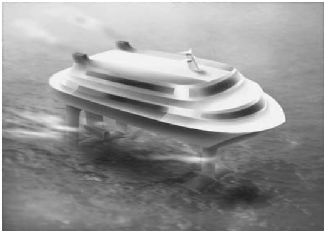

natural_image

Black-and-white illustration of a floating platform or floating structure on water, no text or symbols visible

Figure 1.6. Hydrofoil vessel with fully submerged foil system. (Artist: Bjarne Stenberg)

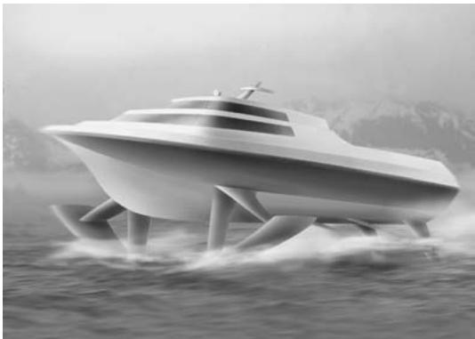

natural_image

Futuristic white boat with four legs navigating choppy water, no visible text or symbols

Figure 1.7. Hydrofoil vessel with free surface–piercing foils. (Artist: Bjarne Stenberg)

Foil cavitation limits the vessel’s speed to about 50 knots. Proper design to delay cavitation on the aft foil system requires evaluation of the wake from the forward foil system. An important effect is caused by roll-up of tip vortices originating from the forward foil system. The wake from the forward foil causes an angle of attack that varies along the span of the aft foil, which can be counteracted by using a twisted aft foil that is adapted to the inflow. One foil catamaran experienced problems with foil cavitation during operation, which were resolved by drilling holes in the aft part of the foils to provide communication between the flow on the pressure and suction sides of the foils.

Very precise and smooth foil surfaces are needed from a resistance, lift, and cavitation point of view. These surfaces require special fabrication procedures and frequent cleaning during operation. The high production and maintenance costs are important reasons why few foil catamarans have been built. There also exist hydrofoil-assisted catamarans in which the foils only partially lift the vessel.

# Air cushion–supported vessels

Surface effect ships (SES) or air-cushion catamarans of lengths less than 40 m were frequently built for commercial use until the mid-1990s. An air cushion is enclosed between the two side hulls and by flexible rubber seals in the bow and aft end (Figure 1.8). The skirt in the front end is easily worn out.

The excess pressure in the air cushion is produced by a fan system that lifts the vessel, thereby carrying about 80% of the weight. The excess pressure reduces the metacentric height, but the static stability is still good. It also causes a mean depression of the free surface inside the cushion that results in waves and wave resistance. However, because the hull wetted surface is diminished, the total calm water resistance is small relative to a catamaran of similar dimensions. The lifting up of the SES also causes an increase in air resistance. Because resistance is proportional to the mass density of the fluid and the air density is only about 1/1000 of the water density, the air resistance is smaller than water resistance. The ship speed can be up to 50 knots in low sea states.

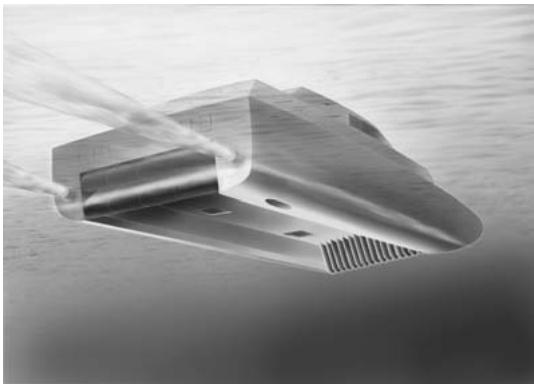

natural_image

3D rendering of a metallic mechanical component with fluid jet motion, no visible text or symbols

Figure 1.8. Artist’s fish-eye view of an SES (surface effect ship) illustrating the air cushion with flexible skirts in the bow and a flexible bag in the aft end used to enclose the air cushion between two catamaran hulls. Fans are used to create an excess pressure in the air cushion that lifts the vessels. (Artist: Bjarne Stenberg)

Resonance oscillations in the air cushion cause “cobblestone” oscillations with a dominant frequency around 2 Hz for a 30 to 40 m–long vessel. The word cobblestone is associated with the feeling of driving a car on a road with badly layed cobblestones. The highest natural period is the result of a mass-spring system in which the compressibility of the air in the cushion acts like a spring. The mass is related to the total weight of the SES. The damping is small and caused by air leakage and the lifting fans. The excitation is induced by volume changes in the air cushion due to incident waves. The resonant oscillations require incident wave energy at a frequency of encounter close to the natural frequencies of the cobblestone oscillations, which occurs in very small sea states. The resulting vertical accelerations are of concern from a comfort point of view. Damping of the cobblestone oscillations can be increased by an active control system introducing air leakage through louvers. If special attention is not paid to scaling laws, the cobblestone phenomenon will not be detected in model tests that are based on Froude scaling. If the SES is on cushion and no cobblestone oscillations occur, the vessel has vertical accelerations that are generally lower than those of a similarly sized catamaran in head seas.

Figure 1.9. Fish-eye view of the bottom of a side hull of an SES with the waterjet inlet. A tube with air (white part) coming into the waterjet inlet can be seen; this is ventilation. The air intake for the aft bag shown in the figure is in the roof of the air cushion.   
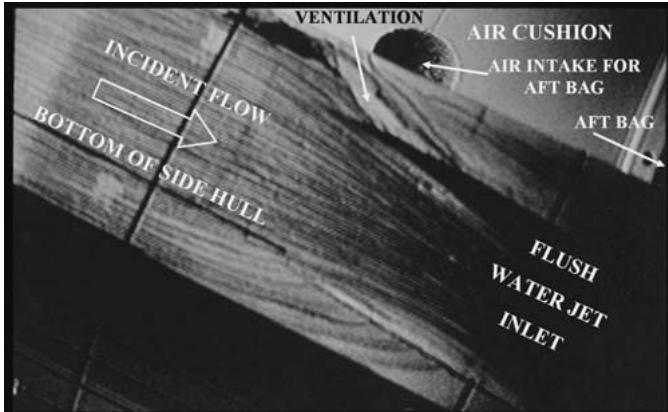

text_image

VENTILATION
AIR CUSHION
AIR INTAKE FOR
AFT BAG
ACCIDENT FLOW
BOTTOM OF SIDE HULL
AFT BAG
FLUSH
WATER JET
INLET

When the SES is on cushion, there is a small distance from a waterjet inlet at the hull bottom to the air cushion, which can easily cause ventilation of the waterjet inlet in a seaway. Because the waterjet inlet flow acts similarly to a flow sink, cross-flow occurs in the vicinity of the inlet. If the hull cross section has a small radius of curvature in the inlet area, very high local velocities and low pressures occur, increasing the danger of ventilation even in calm water. Figure 1.9 illustrates model tests of the occurrence of ventilation to the waterjet inlet in calm water conditions. Fences on the cushion side of the side hulls have been proposed to deal with this problem.

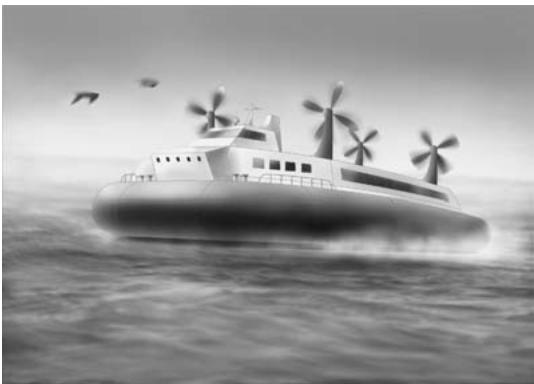

natural_image

Black-and-white illustration of a futuristic hovercraft sailing on rough seas with wind turbines in the background (no text or symbols)

Figure 1.10. Air-cushion vehicle (ACV). (Artist: Bjarne Stenberg)

An SES experiences a more significant involuntary speed loss than that of a similarly sized catamaran in a seaway. The relative vertical motions between the vessel and the waves cause air leakage, which decreases the air cushion pressure when the lifting power is kept constant. The resulting sinkage implies higher resistance. If the fan system does not have sufficient power to maintain air cushion pressure, significant speed loss may occur, even in moderate sea states.

The air-cushion vehicle (ACV) shown in Figure 1.10 is the oldest type of air cushion– supported vessel. Because a flexible seal system is used for the air cushion, the ACV is amphibious. It also implies that air propellers are used, which may represent a noise problem. Because there is no submerged hull to provide hydrostatic restoring moments in roll and pitch, static stability in these modes of motion needs attention during the design stage.

Air lubrication technology (ALT) uses air caverns that run for approximately half the length of a hull in the aft part of the vessel. An air cushion can facilitate the lifting to the airborne condition of Ekranoplanes or wing-in-ground (WIG) vehicles. The air cushion is part of the Hoverwing design (see Figure 1.11 and Fischer and Matjasic 1999). A small portion of the propeller slip stream is used to create an air cushion with an excess pressure between the two floats (catamaran hulls) and the flexible textile skirts at the front and aft ends. The WIG flies close to the water surface. This gives extra lift (see Figure 6.46 and accompanying text). The Hoverwing cruises at a speed of 180 km/hour (90 knots) and is claimed to have high maneuvrability and short stopping distance. Low noise emission at all speeds is also an important issue.

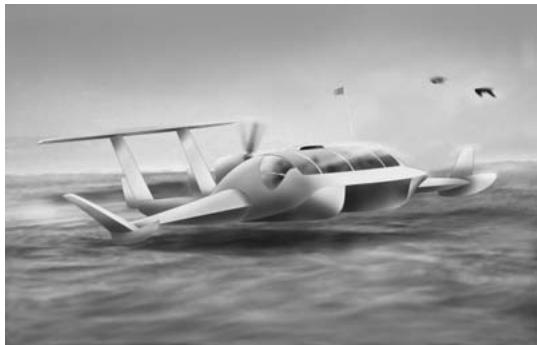

natural_image

Black-and-white illustration of a futuristic aircraft flying over water, no visible text or symbols

Figure 1.11. Artist’s impression of a WIG vehicle based on the Hoverwing techology by Fischer-Flugmechanick. An air-cushion effect is generated between the floats during takeoff. (Artist: Bjarne Stenberg)

Papanikolaou (2002) has systematically presented the many types of high-speed marine vehicles that exist today. He explains the many different acronyms used, together with his view on the advantages and disadvantages of the different types of vessels.

There are also sailboats that can be categorized as high-speed marine vessels. The current world speed sailing record is 46.52 knots, set by Yellow Pages Endeavour in 1993. Our detailed discussion of the flow around lifting surfaces and hulls is relevant in this context. The keels, the rudder, and the sails are all lifting surfaces from a fluid dynamics point of view. The fluid dynamics of sailboats are handled in the books by Larsson and Eliasson (2000), Marchaj (2000), Garrett (1987), and Bethwaite (1996).

# 1.1 Operational limits

Operational limits are set by

 Safety, comfort, and workability criteria   
 Structural loading and response   
 Machinery and propulsion loading and response

Seakeeping criteria typically used for conventional ships are presented in Tables 1.1 and 1.2.

Table 1.1. General operability limiting criteria for ships (NORDFORSK 1987). 

<table><tr><td></td><td>Merchant ships</td><td>Naval vessels</td><td>Fast small craft</td></tr><tr><td rowspan="2">Vertical acceleration at forward perpendicular (RMS value)</td><td>0.275 g ( $L \leq 100 \text{ m}$ )</td><td>0.275 g</td><td>0.65 g</td></tr><tr><td> $0.05 \text{ g } (L \geq 330 \text{ m})^a$ </td><td></td><td></td></tr><tr><td>Vertical acceleration at bridge (RMS value)</td><td>0.15 g</td><td>0.2 g</td><td>0.275 g</td></tr><tr><td>Lateral acceleration at bridge (RMS value)</td><td>0.12 g</td><td>0.1 g</td><td>0.1 g</td></tr><tr><td>Roll (RMS-value)</td><td>6.0°</td><td>4.0°</td><td>4.0°</td></tr><tr><td rowspan="2">Slamming criteria (probability)</td><td>0.03 ( $L \leq 100 \text{ m}$ )</td><td>0.03</td><td>0.03</td></tr><tr><td> $0.01 (L \geq 300 \text{ m})^b$ </td><td></td><td></td></tr><tr><td>Deck wetness criteria (probability)</td><td>0.05</td><td>0.05</td><td>0.05</td></tr></table>

a The limiting criterion for lengths between 100 and 330 m varies almost linearly between the values L = 100 m and L = 330 m, where L is the length of the ship.

b The limiting criterion for lengths between 100 and 300 m varies linearly between the values L = 100 m and 300 m.

Table 1.2. Criteria (root mean square) with regard to accelerations and roll (NORDFORSK 1987). 

<table><tr><td>Vertical acceleration</td><td>Lateral acceleration</td><td>Roll</td><td>Description</td></tr><tr><td>0.20 g</td><td>0.10 g</td><td>6.0°</td><td>Light manual work</td></tr><tr><td>0.15 g</td><td>0.07 g</td><td>4.0°</td><td>Heavy manual work</td></tr><tr><td>0.10 g</td><td>0.05 g</td><td>3.0°</td><td>Intellectual work</td></tr><tr><td>0.05 g</td><td>0.04 g</td><td>2.5°</td><td>Transit passengers</td></tr><tr><td>0.02 g</td><td>0.03 g</td><td>2.0°</td><td>Cruise liner</td></tr></table>

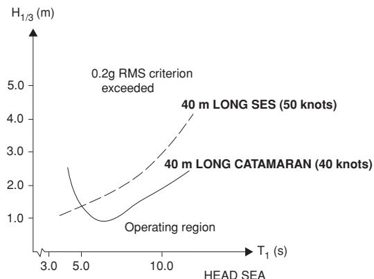

line

| HEAD SEA (s) | H₁/₃ (m) |
| ------------ | -------- |
| 3.0          | 1.0      |
| 5.0          | 1.5      |
| 10.0         | 2.5      |
| 15.0         | 4.0      |

Figure 1.12. Calculated operational limits of similarly sized catamaran and SES in head sea long-crested waves with different significant wave heights $( H _ { 1 / 3 } )$ and mean wave periods $( T _ { 1 } )$ . The 0.2 g RMS value of vertical acceleration at the center of gravity (COG) is used as a criterion. Involuntary speed loss due to wind resistance and added resistance in waves are considered.

Those criteria are related to slamming, deck wetness, RMS values of roll, and lateral and vertical accelerations. RMS values mean root mean square values or standard deviation. The rightmost column of Table 1.2 includes a brief description of what the criteria relate to. Light manual work means work carried out by people adapted to ship motions. This work is not tolerable for longer periods, and causes fatigue quickly. Heavy manual work means work, for instance, on fishing vessels and supply ships. Intellectual work relates to work carried out by people not so well adapted to ship motions, such as scientific personnel on an ocean research vessel. Transit passenger means passengers on a ferry exposed to the acceleration level for about two hours. Cruise liner refers to older passengers on a cruise liner.

The criteria can be used to determine voluntary speed loss and operability of vessels in different sea areas. For example, Figure 1.12 illustrates the calculated operational limits of a 40 m–long catamaran and a 40 m–long SES for head sea conditions. No active motion control systems are used in the calculations. The criterion used was RMS value of vertical acceleration at COG equal to 0.2 g. However, other criteria as well as other headings must be considered. Generally speaking, the catamaran has the lowest operational limits in Figure 1.12, but these can be improved by an active control system. The reason the SES has the lowest operational limit for small sea states (small mean wave periods, T ) is the outset of cobblestone oscillations.

Faltinsen and Svensen (1990) have pointed out the relatively large variation in published criteria, which may lead to quite different predictions of voluntary speed reduction and operational limits. For high-speed vessels, other criteria are also needed, such as operational limits in a seaway due to the propulsion and engine system. Meek-Hansen (1990, 1991) presented service experience with a 37 m–long SES equipped with diesel engines and waterjet propulsion. An example with significant wave height, $H _ { 1 / 3 }$ , around 2 m, head sea, and 35 knots speed shows significant engine load fluctuations at intervals of 6 to 12 seconds (Figure 1.13). These fluctuations result in increased thermal loads in a certain time period, caused by a very high fuel-to-air ratio. These high thermal loads may lead to engine breakdowns.

Figure 1.13. Engine load during SES operation in a sea state with significant wave height $H _ { 1 / 3 } = 2  { \mathrm { m } }$ . 100% engine load. Waterjet propulsion (Meek-Hansen 1991).   
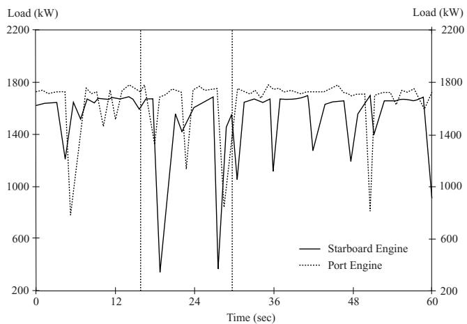

line

| Time (sec) | Starboard Engine (kW) | Port Engine (kW) |
| ---------- | --------------------- | ---------------- |
| 0          | 1700                  | 1800             |
| 12         | 1750                  | 1800             |
| 24         | 1700                  | 1800             |
| 36         | 1750                  | 1800             |
| 48         | 1700                  | 1800             |
| 60         | 1750                  | 1800             |

Possible reasons for the engine load fluctuations are believed to be:

 Exposure of the waterjet inlet to free air   
 Flow separation in front of and inside the inlet   
 Ventilation and penetration of air from the free water surface or from entrained air in the boundary layer

The phenomenon mentioned above often interacts in a complicated way; for example, separation may be one of the causes for onset of ventilation and cavitation. Under certain conditions, a cavity may be penetrated and filled with air. Separation and cavitation are primarily dependent on the pressure distribution in and near the waterjet inlet. For a given inlet geometry, this distribution depends mainly on the speed and thrust (resistance) of the ship.

Exposure of the waterjet inlet to free air is a result of the relative vertical motions between the vessel and the seawater. An operational limit may be related to the probability of exceeding a certain limit of the relative vertical motion amplitude between the vessel and the waves at the waterjet inlet. In particular, with an SES equipped with flush inlets, the exposure to free air represents a problem even for small sea states. The reason is the small distance between the inlet and the calm water surface inside the air cushion.

The seasickness criterion according to NS-ISO 2631/3 is commonly used for the assessment of passenger comfort in high-speed vessels (see Figure 1.14). It gives limits for RMS (root mean square) values of the accelerations as a function of frequency. This criterion needs some explanation. It refers to the $a _ { z }$ or a human’s head–to-foot component of the acceleration. For a broadband spectrum, frequency $f _ { c }$ in Figure 1.14 means the average frequency of a one-third– octave band, defined as the frequency interval between $f _ { 1 }$ and $f _ { 2 }$ , where $f _ { 2 } = 2 ^ { 1 / 3 } f _ { 1 }$ . Further, the center frequency $f _ { c }$ of the one-third–octave band is $\left( f _ { 1 } f _ { 2 } \right) ^ { 1 / 2 }$ . This means $f _ { 1 } = f _ { c } / 2 ^ { 1 / 6 }$ and $f _ { 2 } =$ $f _ { c } { 2 ^ { 1 / 6 } } .$ . A broadband spectrum should be divided into one-third–octave bands, and the RMS value should be evaluated separately for each of the onethird–octave bands. Each RMS value should be compared with the limits given in Figure 1.14 for different exposure periods. Because the motion sickness region in Figure 1.14 is from 0.1 to 0.63 Hz, it implies that the cobblestone effect of an SES does not cause motion sickness. According to ISO 2631/1, there are other criteria for accelerations in the frequency range from 1 to 80 Hz, which are related to workability or human fatigue. An example is shown in Figure 1.15 that expresses the limits of the RMS value of the $a _ { z } \mathrm { - c o m p o n e n t }$ of the acceleration as a function of frequency. This figure should be interpreted in the same way as Figure 1.14. In addition, by multiplying the acceleration values in Figure 1.15 by 2, one gets boundaries related to health and safety, and by dividing the acceleration values by 3.15, one gets boundaries for reduced comfort.

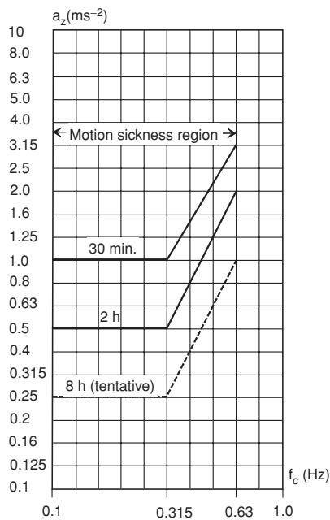

line

| f_c (Hz) | a_z (ms⁻²) |
| -------- | ---------- |
| 0.1      | 1.0        |
| 0.315    | 1.0        |
| 0.63     | 3.15       |
| 1.0      | 3.15       |

Figure 1.14. NS-ISO 2631/3 – severe discomfort boundaries (1. ed. Nov. 1985). $a _ { z }$ is the RMS value of human’s head–to-foot component of acceleration in a one-third– octave band of a spectrum with center frequency $f _ { c }$ .

Operational studies should ideally take into account that the shipmaster may change speed and heading. It may sound wrong, but a semidisplacement vessel equipped with foils may improve the seakeeping behavior by increasing the speed. The reason is that the heave and pitch damping of a foil increases with forward speed. In particular, the roll motion magnitude is important for monohull vessels. However, if the ship is equipped with roll stabilization means, high-speed conditions should be of minor concern.

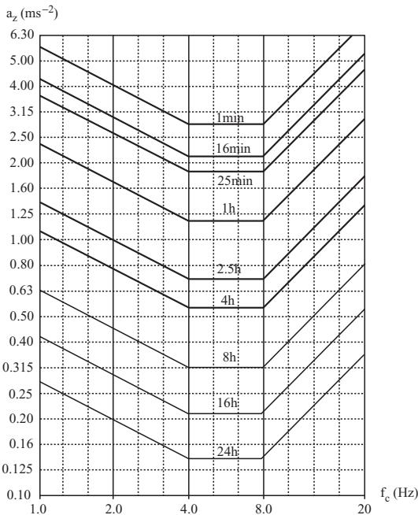

line

| f_c (Hz) | 1min   | 16min  | 25min  | 1h     | 2.5h   | 4h     | 8h     | 16h    | 24h    |
| -------- | ------ | ------ | ------ | ------ | ------ | ------ | ------ | ------ | ------ |
| 1.0      | 5.00   | 4.00   | 3.15   | 2.50   | 2.00   | 1.60   | 1.25   | 0.80   | 0.63   |
| 2.0      | 4.00   | 3.15   | 2.50   | 2.00   | 1.60   | 1.25   | 0.80   | 0.63   | 0.40   |
| 4.0      | 3.15   | 2.50   | 2.00   | 1.60   | 1.25   | 0.80   | 0.63   | 0.40   | 0.25   |
| 8.0      | 2.50   | 1.60   | 1.25   | 1.00   | 0.80   | 0.63   | 0.40   | 0.25   | 0.16   |
| 20.0     | 1.60   | 0.80   | 0.63   | 0.40   | 0.25   | 0.16   | 0.08   | 0.04   | 0.02   |

Figure 1.15. ISO 2631/1 – fatigue-decreased proficiency boundaries. $a _ { z }$ is the RMS value of a human’s head– to-foot component of acceleration in a one-third–octave band of a spectrum with center frequency fc.

There is a need to establish better seakeeping criteria for wetdeck slamming and the behavior of the propulsion and machinery systems in a seaway. The wetdeck is the underside of the deck structure between the side hulls of multihull vessels, that is, the deck part facing the water.

Because cavitation and ventilation of foils mean that the foils become less efficient as damping devices and cause an increase in the vessel motions and accelerations, these effects should be accounted for in operational studies. However, knowledge about these issues is still in its infancy.

It is important to investigate different vessel headings relative to the wave propagation direction. For instance, a catamaran in following regular waves may have a speed close to the phase speed of the waves, that is, the speed of the propagating geometry of the waves. Further, if the wavelength is of the order of the vessel’s length, the catamaran can assume a position relative to the waves so that the fore part of the vessel dives into a wave crest. The slender fore part may not have sufficient buoyancy, and the more-voluminous aft part will be lifted up by the waves. The result is a significant amount of water over the fore deck.

The loss of steady heel moment with forward speed of semi-displacement round-bilge monohulls is an important safety issue. When the Froude number is larger than 0.6 to 0.7 in calm water, the vessel may suddenly lean over to one side. At higher speeds, this may cause dangerous “calm water broaching” and is the main reason roundbilge hulls are unsuitable for Froude numbers above 1.2 (Lavis 1980).

Directional instability in following seas with the subsequent risk of the vessel becoming broadside to the waves and eventually capsizing, is a wellknown phenomenon of monohulls. This is referred to as “broaching” and may occur under conditions similar to those in a “dive-in.” Because a multihull semi-displacement vessel has good static stability in roll and is very difficult to capsize in waves, broaching is less important for catamarans. However, large sway and yaw motions as well as steering problems may also occur for catamarans in following and quartering sea.

Quasi-steady stability in the roll of monohulls in following seas with a small frequency of encounter should also be considered. This is of particular concern if the local waterplane area, that is, local width of the hull at the hull/water line intersection, clearly changes as a function of local draft (i.e., large flare). The hydrostatic transverse stability should then be calculated as a function of different frozen incident wave shapes along the ship. These frozen conditions in following seas should also be considered as structural load cases for the hull girder. When calculating hydrostatic stability, the increased importance of steady hydrodynamic pressure on the hull with increasing speed relative to hydrostatic pressure should be recognized. This is an implicit consequence of being a “semidisplacement” vessel.

The propulsion unit, rudders, stabilization fins in faulty position, cavitation, and ventilation may also influence stability. A scenario might be two supercavitating propellers, one of which suddenly ventilates, causing an asymmetry in thrust with resulting directional instability.

If the ship is in a planing condition, that is, the Froude number is larger than one, special dynamic instability problems may occur. Examples are “chine-walking” (dynamic roll oscillations), “porpoising” (dynamic coupled pitch-heave oscillations), and “cork-screwing” (pitch-yaw-roll oscillations). However, the major part of the commercial high-speed vessel fleet does not operate in planing conditions.

M ¨uller-Graf (1997) has given a comprehensive presentation of the many different dynamic stability problems of high-speed vessels. This work includes design features and factors influencing dynamic instabilities. Recommendations are given on how to minimize dynamic instabilities of monohulls.

# 1.2 Hydrodynamic optimization

A ship is often hydrodynamically optimized in calm water conditions. Because good seakeeping behavior is an important feature of a highspeed vessel, optimization in calm water conditions may lead to unwanted behavior in a seaway. Both wave resistance and wave radiation damping are caused by the ship’s ability to generate waves. Because low wave resistance may imply low wave radiation damping in heave and pitch, the result may be unwanted large resonant vertical motions of a semi-displacement vessel. This relationship was illustrated by a project with firstyear students knowing little about hydrodynamics. A catamaran design was proposed in which each of the two side hulls had a very small beam-todraft ratio. This hull form was fine for resistance, but the vessel jumped out of the water during seakeeping tests when the wave periods were in resonant heave-and-pitch conditions. This extreme behavior could have been counteracted at high speed if the vessel were equipped with damping foils.

Another example is the recent designs of passenger cruise vessels with very shallow local draft and nearly horizontal surfaces in the aft part of the ship. These designs were the result of hydrodynamic optimization studies in calm water. One does not need to be a hydrodynamicist to understand that this caused slamming (water impact) problems. Aft bodies with shallow draft should also be of concern for directional stability and for ventilation of waterjet inlets in waves. Hydrodynamic optimization studies must therefore consider resistance, propulsion, maneuvering, and seakeeping. There obviously are also constraints of a nonhydrodynamic character. For instance, minimalization of ship motions may lead to higher global structural loads.

# 1.3 Summary of main chapters

This textbook focuses on high-speed vessels. However, some of the text on semi-displacement vessels is also relevant for conventional ships. Further, the discussion of slamming (water impact) is important in many other marine applications, including offshore structures.

Chapter 2 considers resistance and propulsion in calm water conditions. The two most important resistance components of semi-displacement vessels and SES are viscous resistance and wave resistance. Viscous resistance is important for hydrofoil-supported vessels, but induced drag due to trailing vortices should also be considered.

The waterjet is the most common propulsion system for high-speed vessels. We use conservation of fluid momentum and kinetic fluid energy to derive the thrust and efficiency of the waterjet system. The possibility of cavitation at the waterjet inlet is also discussed.

Chapter 3 presents linear wave theory and a stochastic description of the waves. This is necessary background for later chapters that describe wave-induced motions and loads on high-speed vessels. Linear wave theory is also used to describe wave resistance and wash in detail. This is done in Chapter 4.

Chapter 4 considers wave resistance of semidisplacement vessels and air cushion–supported vessels. Ship waves are traditionally classified as divergent and transverse waves. The transverse waves have crests nearly perpendicular to the ship’s track. The dominant wave picture far away from the ship is normally the result of divergent bow waves. The divergent waves are a major source for the wave resistance of a semidisplacement vessel at the maximum operating speed. The effects of finite water depth on monohull vessels, including the effect on trim and sinkage, is also discussed.

Chapter 5 concentrates on SES. However, the issues presented also have relevance for other air cushion–supported vessels. The chapter explains how the air cushion causes a depression of the free surface and affects the roll metacentric height. The air cushion typically carries 80% of the weight of an SES. Details are given about the seal system of the air cushion. Resistance and propulsion in calm water are covered in Chapters 2 and 4. This chapter discusses cobblestone oscillations and the added resistance and speed loss in waves.

Chapter 6 discusses foil-supported vessels. Relevant hydrodynamic foil theory is presented. The chapter starts out describing a boundary element method (BEM) based on source and dipole distributions that may account for nonlinearities, 3D flow, interaction between foils and struts, and free surface effects. Thereafter is a presentation of linear theory. The advantage of a linear theory is that we can more easily show how the angle of attack, foil camber, foil flaps, and three-dimensionality of the flow influence lift and drag of the foil. It is also shown how the free surface and interaction between tandem foils affect the steady lift and drag of a foil. Unsteady flow conditions due to incident waves and vessel motions are also handled. This discussion is used in Chapter 7 to estimate damping of vertical motions of a semi-displacement vessel due to an attached foil.

Chapter 7 describes the wave-induced motions and global wave loads on semi-displacement vessels. The effects of foil damping and hydrodynamic hull-hull interaction on multihull vessels are also considered. Added resistance in waves and dynamic stability are other issues.

We discuss local and global slamming effects in Chapter 8. This is an important structural loading mechanism for all high-speed vessels. The local slamming analysis may need a local hydroelastic analysis. This is shown to be important when the local angle between the impacting free surface and the body surface is less than about five degrees. Global hydroelastic response (springing and whipping) due to wave effects is also discussed in Chapter 8. Springing is a steady-state response, whereas whipping is associated with transient response, such as that caused by water impact (slamming) on the wetdeck, bow flare slamming. or stern slamming.

Chapter 9 discusses both steady and unsteady flow effects around planing vessels. The steady lift and trim moment can, to a large extent, be explained by potential flow theory.

The hydrodynamic performance of prismatic planing hulls in calm water is discussed by examples. Instabilities may play an important role for a planing boat. One example is porpoising, which is unstable heave-and-pitch motions. This is discussed in detail.

Wave-induced vertical motions of planing vessels are also discussed. It is demonstrated that nonlinear effects are more important for planing vessels than for semi-displacement vessels.

Chapter 10 considers maneuvering of a ship in water of infinite horizontal extent. A slender-body theory for a monohull at Froude numbers smaller than approximately 0.2 is presented. This theory can also be applied to a catamaran and an SES. Directional stability, automatic motion control, and viscous effects are other items considered. It is shown that the directional stability changes with forward speed. Further, a maneuvering analysis of a high-speed vessel must, in general, consider motions in six degrees of freedom. A derivation of Euler’s equation of motion is given.

# 2 Resistance and Propulsion

# 2.1 Introduction

The power of the installed propulsion machinery is an indirect measure of the maximum resistance of a vessel. However, the actual amount of this power that can be transformed into thrust to counteract the resistance depends on the efficiency of the propulsion device. For an ACV and an SES, power is also needed to lift the vessel. For an SES, this is about 10% to 20% of the power needed for propulsion. Casanova and Latorre (1992) have collected data on installed horsepower in different types of high-speed marine vehicles (HSMV).

Our focus in this chapter is on resistance and propulsion in calm water. When we consider a ship with constant speed on a straight course in calm water conditions, the balance of forces is simple: the ship resistance must be equal to the thrust delivered by the propulsion unit.

It is most common in model tests and in numerical calculations to consider the ship without an integrated propulsion system. The resistance is therefore evaluated without the presence of the propulsion unit. We will follow this approach. This means the ship resistance $R _ { T }$ is defined as the force that is needed to tow the ship in calm water with a constant velocity U on a straight track (of course, the towing unit must not affect the flow around the ship). The power needed to tow the vessel is:

$$
P _ {E} = R _ {T} U \tag {2.1}
$$

This is not true when wind and waves are present. In that case, added resistance in wind and waves has to be accounted for when required engine power is estimated. Ship maneuvering will also increase the resistance. Even sticking to our assumption of a straight course in calm water, important issues to consider are the efficiency of the propulsion system and how the resistance is affected by the propulsion system. For instance, the flow in the vicinity of a waterjet inlet on a ship hull affects the trim and sinkage of a high-speed vessel, which will then influence the resistance. On the other hand, the flow along the ship hull will affect the inflow conditions to the propulsion unit and hence the thrust. So ideally, we should not have considered resistance and propulsion as separate issues.

We can divide the calm water resistance into

 Viscous water resistance

 Air resistance

 Spray and spray rail resistance

 Wave resistance

Actually, part of the spray resistance is viscous water resistance, whereas the pressure part of spray resistance is difficult to distinguish clearly from the total wave resistance obtained by pressure integration. Each component is discussed in the following text, with the main focus on semidisplacement monohulls and catamarans. However, SES and hydrofoil vessels are also addressed. Additional details on resistance of hydrofoil vessels are given in Chapter 6. Planing hulls are discussed in detail in Chapter 9. More in-depth studies of wave resistance of semi-displacement vessels and SES are considered in Chapter 4.

The resistance is influenced by the trim angle, and trim devices are used on semi-displacement and planing vessels to optimize the trim angles. Examples are interceptors (see Figure 2.2), trim tabs (stern flaps) (see Figure 7.4), and transom wedges, which start forward of the transom and end at the transom. The entire wedge is under the hull and is a local abrupt modification in the buttock lines aft of station 191 / (Cusanelli and Karafiath 1997).

There is ongoing research on how to reduce the ship resistance. One example is by injecting microbubbles into the turbulent boundary layer. Latorre et al. (2003) report that microbubble drag reduction (MBDR) has the potential of reducing the local skin friction by 15%. However, MBDR will not be considered in this text.

As said above, to properly analyze the ship resistance, the latter must be considered in conjunction with the vessel propulsion system. Waterjet propulsion is the most common type of propulsion for high-speed vessels of nonplaning type. Different types of propulsion systems for planing hulls are illustrated in Figure 2.1 and discussed by Savitsky (1992). The most common propulsion is a subcavitating or partial cavitating propeller in combination with an inclined shaft (Figure 2.2). The appendage drag due to struts, shaft, and rudder becomes important at higher speeds. The unsteady forces on the inclined propeller may lead to undesirable vibrations. When the maximum speed is higher than 40 knots, free surface–piercing propellers are sometimes used.

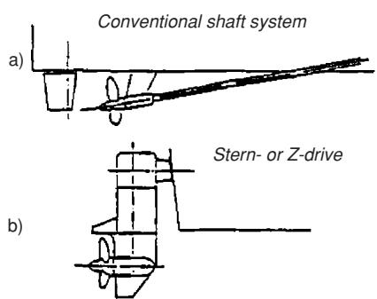

text_image

Conventional shaft system
a)
Stern- or Z-drive
b)

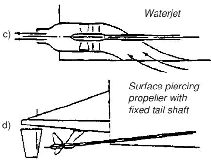

text_image

Waterjet
c)
Surface piercing
propeller with
fixed tail shaft
d)

Figure 2.1. Various propulsors for high-speed vessels (Savitsky 1992).

The two other types of propulsion systems shown in Figure 2.1 are waterjet propulsion and stern drive propulsion. Stern drive propulsion and outboard engines are used mainly for pleasure and recreation craft. Outboard engines up to 300 hp are made today. In some cases, you might find up to four of these on one boat. In practice, outboard engines are not often used on boats longer than 40 feet. The outboard engines also include a version of the waterjet referred to as a jet drive. These

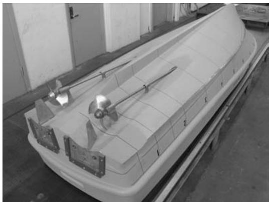

natural_image

Exterior view of a white boat with visible structural components and no text or symbols

Figure 2.2. Propellers with inclined shafts installed on a model of a planing vessel with hard chines. Propeller tunnels are used to minimize the shaft angle. The rudders are twisted and adopted to the propeller slip stream. Two interceptors are placed at the transom to control the trim angle (see section 7.1.3 and Figure 7.5 for more details about interceptors). (Photo by K.A. Hegstad)

may be used on recreation craft running on very shallow waters, where there is a risk for a propeller to be damaged. Another possibility, then, is to use propeller tunnels. Design of propeller tunnels for high-speed craft is discussed by Blount (1997).

Oblique-flow conditions, locally concentrated wake peaks, and high loading density at high speeds make it difficult to avoid cavitation on a propeller. Oblique flow occurs, for instance, when the propeller shaft has an angle relative to the vessel velocity (see Figure 2.1a). Propeller tunnels are beneficial in this context. Cavitation has been discussed by van Beek (1992), who considers thrust breakdown and cavitation at a propeller blade root as limiting criteria for the application of conventional high-speed propellers.

If oblique flow can be avoided, conventional propellers may run with little cavitation, even at 45 knots. This has been demonstrated by tractor propellers in conjunction with right-angle drives installed in catamarans and foil catamarans (Halstensen and Leivdal 1990).

Our way of treating resistance and propulsion of high-speed vessels follows the traditional route in ship hydrodynamics. However, an interesting question is: What can we learn about resistance and propulsion from aquatic animals? Despite potential payoffs, relatively little work has been done to answer this question. An introduction to this field is given by Triantafyllou and Triantafyllou (1995) and Sfakiotakis et al. (1999).

# 2.2 Viscous water resistance

A main resistance component is caused by the friction force on the wetted hull. Pressure loads acting perpendicularly to the hull surface matter, but have less importance. Boundary layer theory may be used to describe the effect of fluid viscosity. It means that the viscosity only matters in a thin layer close to the hull surface. The twodimensional boundary layer along a flat plate can be used to describe important characteristics of the viscous flow. We can approximate the wetted hull surface as a flat plate. If we look at the flow from a reference frame following the ship, the forward speed of the ship appears as an incident flow with velocity $U$ on a stationary hull, as shown in Figure 2.3.

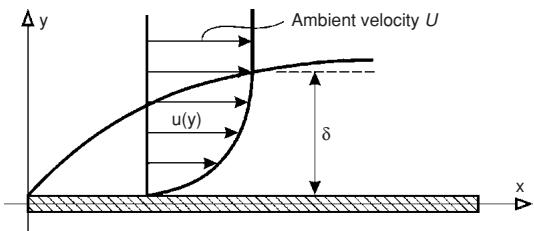

text_image

Ambient velocity U
u(y)
δ
x
y

Figure 2.3. Boundary layer along a flat plate with incident (ambient) flow velocity U along the x-axis. $\delta =$ boundary-layer thickness.

One important characteristic is that the water must adhere to the plate, that is, there is no slip. That means the flow velocity is zero on the plate. At a short perpendicular distance $\delta ( x )$ from the plate (function of the longitudinal distance x from the leading edge of the plate), the flow velocity is equal to U.

The viscous flow is laminar for Reynolds number $R n _ { x } { = } U x / \nu$ less than $\approx 1 0 ^ { 5 }$ . Here ν is the kinematic viscosity coefficient with $1 . 3 5 \cdot 1 0 ^ { - 6 } \mathrm { m } ^ { 2 } \mathrm { s } ^ { - 1 }$ for salt water at $1 0 ^ { \circ } \mathrm { C }$ (see Table $_ { \mathrm { A } . 2 }$ in the Appendix). The transition to turbulent flow occurs for $R n _ { x }$ between $2 \cdot 1 0 ^ { 5 }$ and $3 \cdot 1 0 ^ { 6 }$ . Turbulent flow is characterized by a velocity and a pressure that vary irregularly with a high frequency. Laminar flow means that the flow is well organized in layers. It is steady when the incident velocity is steady. One can make the analogy between laminar flow and a school class marching orderly in a parade. Every pupil keeps his or her position relative to the others so that a clear structure with rows and columns appears. Then things get out of order and the pupils run everywhere without an apparent system except that they have a mean forward motion. This is like a turbulent flow. This analogy between hydrodynamics and human beings is used in simulating evacuation of passengers from passenger vessels during catastrophic events. Hinze (1987) gives the following definition of turbulence: “Turbulent fluid motion is an irregular condition of flow in which the various quantities show a random variation with time and space coordinates, so that statistically distinct values can be discerned.” Turbulence frequencies may vary between 1 and $1 0 , 0 0 0 \mathrm { { s } ^ { - 1 } }$ , and turbulent fluctuations are roughly 10% of average velocity (Hinze 1987). The upper and lower bounds of the turbulence frequencies depend on the field of application. Consider, for instance, cross-flow past a circular cylinder at a high Reynolds number. This is associated with a vortex shedding frequency that is described by the Strouhal number as a function of the Reynolds number (Faltinsen 1990). Depending on the cylinder diameter and the ambient flow, a vortex shedding frequency can be 1 Hz in marine applications. This frequency cannot be considered a turbulence frequency. If the frequency range around a vortex shedding frequency was filtered out by an averaging process, one would lose important information on vortex-induced vibrations of structures.

Figure 2.4 illustrates how the flow changes from being laminar to turbulent along a smooth flat plate. The laminar 2D flow becomes unstable at a critical Reynolds number $R n _ { c r i t }$ . If there is negligible turbulence intensity in the incident flow, this corresponds to $U x / \nu = 2 \cdot 1 0 ^ { 5 } . ~ R n _ { c r i t }$ can be found by a linear stability analysis (Schlichting 1979). The unstable 2D waves shown in Figure 2.4 are called Tollmien-Schlichting (T/S) waves. As the amplitudes of the T/S waves grow, threedimensional instabilities occur. Fully turbulent flow occurs at the transition Reynolds number $R n _ { t r }$ . If there is negligible turbulence intensity in the incident flow, $R n _ { t r }$ is 3 · 106.

The horizontal velocity distribution in Figure 2.3 is representative of a laminar boundary layer in the case of a 2D flow along a flat plate. This can be described by the Blasius theory. The frictional stress (longitudinal force per unit area) on the plate is

$$
\tau_ {w} = \mu \left. \frac {\partial u}{\partial y} \right| _ {y = 0} \tag {2.2}
$$

Here $\mu$ is the dynamic viscosity coefficient, which is related to the kinematic viscosity coefficient ν by $\nu = \mu / \rho$ , where $\rho$ is mass density of the fluid. Eq. (2.2) is also applicable to turbulent boundary layer flow, but then u means in practice a velocity that has been time averaged on the time scale of turbulence.

Figure 2.4. Idealized sketch of transition process from laminar to turbulent flow along a flat plate. (White, F. M., 1974, Viscous Fluid Flow, McGraw-Hill Book Company, 2nd ed. 1991, Printed in Singapore. The figure is reprinted with permission of The McGraw-Hill Companies.)   
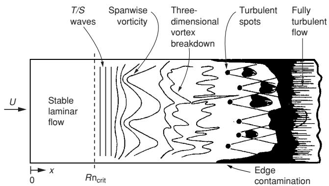

text_image

T/S waves
Spanwise vorticity
Three-dimensional vortex breakdown
Turbulent spots
Fully turbulent flow
U
Stable laminar flow
Rn_crit
Edge contamination
0
x

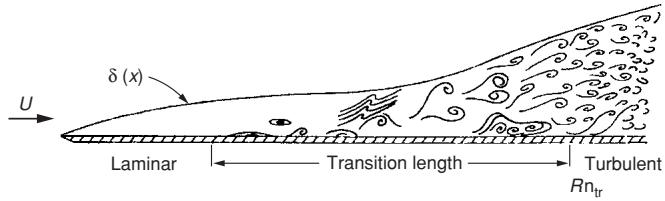

text_image

U
δ (x)
Laminar
Transition length
Turbulent
Rn_tr

The velocity gradient $\partial u / \partial y$ at the plate is very different for laminar and turbulent flows (Figure 2.5). Because turbulent flow implies much a larger exchange of fluid momentum in the ydirection than laminar flow does, both the boundary layer thickness δ and $\partial u / \partial y$ at the plate are much larger for turbulent flow than for laminar flow.

We cannot avoid turbulent flow along the hull surface of a full-scale ship, and we must ensure turbulent flow along the hull surface during model tests to be able to scale the results to full scale. Because we do not have sufficient knowledge yet

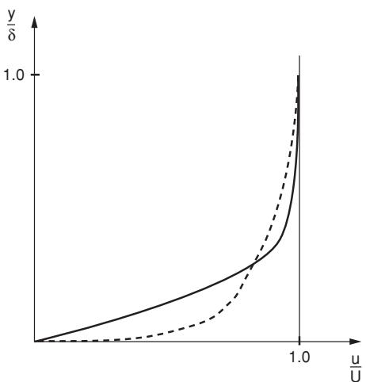

line

| u/U | y/δ (solid) | y/δ (dashed) |
| --- | ----------- | ------------ |
| 0.0 | 0.0         | 0.0          |
| 0.2 | ~0.1        | ~0.05        |
| 0.4 | ~0.3        | ~0.15        |
| 0.6 | ~0.6        | ~0.35        |
| 0.8 | ~1.0        | ~0.7         |
| 1.0 | 1.0         | 1.0          |

Figure 2.5. Laminar (——) and mean turbulent $\left( - \textrm { -- } \right)$ velocity profiles for the boundary-layer flow along a flat plate.

on how to model turbulence theoretically, empiricism has to be partly used. We discuss this in more detail in section 2.2.4. The empirical formulas for frictional resistance are amazingly simple. They express the viscous resistance as

$$
R _ {V} = 0. 5 \rho C _ {F} S U ^ {2}, \tag {2.3}
$$

where S is the wetted surface area. It is common to estimate S at zero speed. However, S changes in reality as a result of the free surface elevation along the hull. Further, the transom stern of a semi-displacement vessel becomes dry for Froude numbers $F n = U / \sqrt { L g }$ higher than approximately 0.4, and an SES on cushion causes a lower free surface elevation inside the cushion than outside the cushion. Here L is the overall submerged ship length $L _ { O S }$ and $g$ is the acceleration of gravity. The International Towing Tank Conference (ITTC) 1957 model–ship correlation line expresses the friction coefficient $C _ { F }$ for a smooth hull surface as

$$
C _ {F} = \frac {0 . 0 7 5}{\left(\log_ {1 0} R n - 2\right) ^ {2}}, \tag {2.4}
$$

where $R n = U L / \nu$ is the Reynolds number. Eq. (2.4) agrees well with experimental results for turbulent flow along a smooth flat plate.

Figure 2.6 illustrates how $C _ { F }$ changes going from a laminar boundary layer to a turbulent boundary layer along a flat plate. The Blasius solution is used for laminar flow, and the Prandtl–von Karman expression is applied for turbulent flow. Later on, we will see that different empirical formulas exist for turbulent flows. The Blasius solution for laminar flow may be expressed as

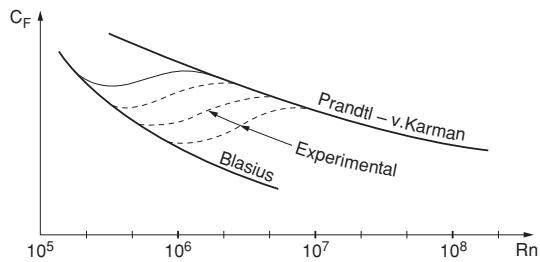

line

| Rn     | CF (Prandtl - v.Karman) | CF (Experimental) |
| ------ | ------------------------ | ----------------- |
| 10^5   | ~1.2                     | ~1.1              |
| 10^6   | ~0.8                     | ~0.7              |
| 10^7   | ~0.5                     | ~0.4              |
| 10^8   | ~0.3                     | ~0.2              |

Figure 2.6. Friction coefficients $C _ { F }$ for flow along a flat plate as a function of Reynolds number Rn (Walderhaug 1972).

$$
C _ {F} = \frac {1 . 3 2 8}{R n ^ {1 / 2}}. \tag {2.5}
$$

The Prandtl–von Karman expression is

$$
C _ {F} = \frac {0 . 0 7 2}{R n ^ {1 / 5}}. \tag {2.6}
$$

In Figure 2.6, several curves (experimental data) for $C _ { F }$ are indicated in the transition between laminar and turbulent flows. These depend on the turbulence intensity T in the inflow velocity, which may be expressed as

$$
T = \sqrt {\overline {{u ^ {\prime 2}}}} / U, \tag {2.7}
$$

u- being the turbulent part of the longitudinal component of the inflow velocity u, that is, $u = U + u ^ { \prime }$ . Further, $\overline { { u ^ { \prime 2 } } }$ means the time average over the turbulence time scale of $u ^ { \prime 2 }$ . When $T < 0 . 0 0 1$ , there is no influence of T and the transition Reynolds number is $2 . 8 \cdot 1 0 ^ { 6 }$ . However, if $T = 0 . 0 3$ , the transition Reynolds number becomes 105.

Because a hydrofoil has a Reynolds number much smaller than that of a submerged hullsupported vessel, one may be tempted to design laminar foil shapes, which are used in connection with gliders. Schlichting (1979) gives examples of foil shapes and their $C _ { F }$ values. The “laminar effect” reduces the drag of normal airfoils by 30% to 50% in the Reynolds number range of 2 · 105 to 3 · 107. When $R n > 5 \cdot 1 0 ^ { 7 }$ , the laminar effect is lost and the flow is fully turbulent. If we consider as an example a hydrofoil with velocity $U = 2 0 \mathrm { m s ^ { - 1 } }$ and use $\nu = 1 0 ^ { - 6 } \mathrm { m } ^ { 2 } \mathrm { s } ^ { - 1 }$ , we see that foils with chord lengths less than 1.5 m may benefit from the laminar effect. However, we should note that the results are for zero incidence, that is, the foils do not cause lift. The presence of lift implies a change in the pressure gradient along the foil relative to no lift. This influences the drag force and the transition. Further, the presence of surface roughness may change the results. This is discussed in section 2.2.6. Attention must also be given to cavitation inception and the effect of nonuniform inflow in the hydrofoil design.

We will present a theoretical basis for the resistance formula for turbulent flow along a smooth flat plate. To better understand this, we need first to present Navier-Stokes equations.

# 2.2.1 Navier-Stokes equations

The flow around a ship is governed by the Navier-Stokes equations, so to study the vessel resistance, such equations should be solved for the problem of interest. Navier-Stokes equations are presented in many textbooks of fluid mechanics, such as Newman (1977), Schlichting (1979), and White (1974). We will limit ourselves to twodimensional flow of an incompressible fluid and refer to the above-mentioned textbooks for a detailed and general derivation of Navier-Stokes equations. For our applications, water can be considered incompressible, that is, sound waves do not matter. The flow around a ship is, of course, three-dimensional, but empirical formulas for viscous resistance are to a large extent based on two-dimensional flow for a flat plate. Because the boundary layer in which viscosity matters generally has a small thickness δ relative to the local radii of curvature of the hull surface, we can justify that the hull surface appears locally flat and that the 2D flat plate flow represents a first approximation. We later will see how we correct empirically for three-dimensional flow around a ship hull by introducing form factors.

The two-dimensional Navier-Stokes equations for an incompressible fluid without gravity can be written as

$$
\frac {\partial u}{\partial t} + u \frac {\partial u}{\partial x} + v \frac {\partial u}{\partial y} = - \frac {1}{\rho} \frac {\partial p}{\partial x} + \nu \left(\frac {\partial^ {2} u}{\partial x ^ {2}} + \frac {\partial^ {2} u}{\partial y ^ {2}}\right) \tag {2.8}
$$

$$
\frac {\partial v}{\partial t} + u \frac {\partial v}{\partial x} + v \frac {\partial v}{\partial y} = - \frac {1}{\rho} \frac {\partial p}{\partial y} + \nu \left(\frac {\partial^ {2} v}{\partial x ^ {2}} + \frac {\partial^ {2} v}{\partial y ^ {2}}\right). \tag {2.9}
$$

The continuity equation is

$$
\frac {\partial u}{\partial x} + \frac {\partial v}{\partial y} = 0. \tag {2.10}
$$

Here we have used a Cartesian coordinate system $( x , y )$ as in Figure 2.3. u and v are the x- and ycomponents of the fluid velocity, t is the time variable, and $p$ is the pressure. We have three equations and three unknowns: u, v, and $p .$ In order to solve eqs. (2.8) to (2.10), we need a set of initial and boundary conditions. The body boundary condition requires that the fluid adheres to the body surface (no-slip).

Eqs. (2.8) and (2.9) follow by analyzing the motion inside an arbitrary fluid volume and enforcing that the time rate of change of momentum inside the fluid volume is equal to the sum of forces acting on the fluid volume, that is, Newton’s second law. These forces are the result of hydrodynamic pressure and viscous stresses. Concerning the hydrodynamic pressure contribution, the force per unit area due to the pressure p acts perpendicularly to a surface element as −pn. Here n is the surface unit normal vector with positive direction outward from the fluid volume. To introduce the viscous stresses, we consider a two-dimensional rectangular fluid volume with sides parallel to the x- and y-axes (Figure 2.7). On the top side AB of the volume, we have the viscous stress components $\tau _ { x y }$ and $\tau _ { y y }$ along the x- and y-axes, respectively. They can be expressed as

$$
\tau_ {x y} = \mu \left(\frac {\partial u}{\partial y} + \frac {\partial v}{\partial x}\right) \tag {2.11}
$$

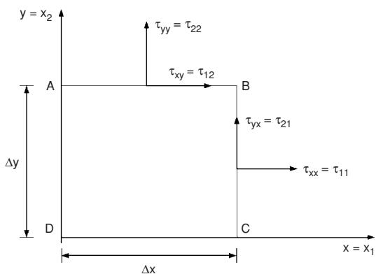

text_image

y = x₂
τyy = τ₂₂
A
τxy = τ₁₂
B
τyx = τ₂₁
τxx = τ₁₁
C
x = x₁
Δy
Δx

Figure 2.7. Rectangular fluid volume ABCD and viscous stresses $\tau _ { i j }$ acting on AB and BC sides.

and

$$
\tau_ {y y} = 2 \mu \frac {\partial v}{\partial y} \tag {2.12}
$$

The pressure force per unit area on $A B$ is $- p$ and acts along the y-axis. This means the total hydrodynamic force per unit area on AB consists of the components $\tau _ { x y }$ and $( - p + \tau _ { y y } )$ along the x and y-axes, respectively.

The viscous stress components on the vertical side $B C$ are

$$
\tau_ {y x} = \mu \left(\frac {\partial v}{\partial x} + \frac {\partial u}{\partial y}\right) \tag {2.13}
$$

and

$$
\tau_ {x x} = 2 \mu \frac {\partial u}{\partial x}. \tag {2.14}
$$

Here $\tau _ { y x }$ and $\tau _ { x x }$ are viscous stress components directed along the y- and x-axes, respectively. The total hydrodynamic force per unit area on $B C$ consists of the components $- p + \tau _ { x x }$ and $\tau _ { y x }$ along the x and y-axes, respectively. In order to express the viscous stresses in a more abbreviated and general way in three dimensions, we change notation so that $x = x _ { 1 } , y = x _ { 2 } , z = x _ { 3 } , u = u _ { 1 } , v = u _ { 2 } , w = u _ { 3 }$ and introduce $\tau _ { i j }$ , where i or j is equal to 1, 2, or 3 when referring to x, y, and z, respectively. This notation is depicted in Figure 2.7 for the twodimensional case. Here we have also included a third dimension by introducing the z-coordinate of the Cartesian coordinate system $( x , y z )$ and the velocity component $w = u _ { 3 }$ along the z-axis. We define a surface element with an outward unit normal vector ${ \mathbf n } = ( n _ { 1 } , n _ { 2 } , n _ { 3 } )$ . If this surface element belongs to a side of a fluid volume as in Figure 2.7, then n is pointing outward from the fluid volume. If we consider a surface element on a body surface, then the normal direction is into the fluid domain. The viscous stress (force per unit area) in the ith direction is then

$$
\tau_ {i 1} n _ {1} + \tau_ {i 2} n _ {2} + \tau_ {i 3} n _ {3}, \tag {2.15}
$$

where

$$
\tau_ {i j} = \mu \left(\frac {\partial u _ {i}}{\partial x _ {j}} + \frac {\partial u _ {j}}{\partial x _ {i}}\right). \tag {2.16}
$$

We note the symmetry $\tau _ { i j } = \tau _ { j i }$ . The justification of this linear relationship between viscous stresses and derivatives of velocity components is, for instance, discussed in Newman (1977). The Newtonian stress relations given by eq. (2.16) assume an incompressible fluid.

We will demonstrate that eqs. (2.15) and (2.16) are consistent with eq. (2.11). For example, let us consider the top side AB in Figure 2.7, where $n _ { 1 } =$ $0 , n _ { 2 } = 1$ , and $n _ { 3 } = 0$ . This means that we have the viscous stress components $\mu ( \mathrm { { } } \partial u _ { 1 } / \mathrm { { } } \partial x _ { 2 } + \mathrm { { } } \partial u _ { 2 } / \mathrm { { } } \partial x _ { 1 } )$ and $2 \mu \partial u _ { 2 } / \partial x _ { 2 }$ , that is, the same as eqs. (2.11) and (2.12). With the same procedure at the bottom side CD, where $n _ { 1 } = 0 , \ n _ { 2 } = - 1$ , and $n _ { 3 } = 0$ , we find the viscous stress components $- \mu \left( \partial u _ { 1 } / \partial x _ { 2 } + \partial u _ { 2 } / \partial x _ { 1 } \right)$ and $- 2 \mu \partial u _ { 2 } / \partial x _ { 2 }$ directed along the x- and y-axes, respectively. These expressions are similar to eqs. (2.11) and (2.12), but with opposite signs. This has to be kept in mind for our next derivation of eqs. (2.8) and (2.9). As said, they follow from Newton’s second law. We shall focus on eq. (2.8) and have in mind the fluid volume in Figure 2.7. The sides $\Delta x$ and $\Delta y$ are assumed small so that all quantities can be approximated by the lowest-order terms in a Taylor expansion about the center of the volume. We first evaluate the forces acting on the volume. The resultant viscous force component in the x-direction acting on AD and BC can then be approximated as

$$
\Delta x \frac {\partial}{\partial x} \left(2 \mu \frac {\partial u}{\partial x}\right) \Delta y. \tag {2.17}
$$

Further, the viscous force component in the xdirection along AB and DC becomes

$$
\Delta y \frac {\partial}{\partial y} \left[ \mu \left(\frac {\partial u}{\partial y} + \frac {\partial v}{\partial x}\right) \right] \Delta x. \tag {2.18}
$$

The sum of eqs. (2.17) and (2.18) can finally be rewritten as

$$
\mu \left(\frac {\partial^ {2} u}{\partial x ^ {2}} + \frac {\partial^ {2} u}{\partial y ^ {2}}\right) \Delta x \Delta y \tag {2.19}
$$

by means of the continuity equation (2.10). By a similar Taylor expansion, the pressure force on the surface of the fluid can be approximated as

$$
- \frac {\partial p}{\partial x} \Delta x \Delta y. \tag {2.20}
$$

Then we consider the time rate of change of fluid momentum in the x-direction of the volume. Part of this is the result of momentum flux through AB, BC, CD, and DA. The momentum flux through a surface element that is not moving is

$$
\rho \mathbf {u} (\mathbf {u} \cdot \mathbf {n}) d S, \tag {2.21}
$$

where $\mathbf { u } = ( u , v , w )$ and dS is the area of the surface element. Once more making a Taylor expansion, we find that the momentum flux in x-direction through AD and BC can be approximated as

$$
\rho \Delta x \frac {\partial}{\partial x} (u ^ {2}) \Delta y. \tag {2.22}
$$

The momentum flux in x-direction through AB and CD reduces to

$$
\rho \Delta y \frac {\partial}{\partial y} (u v) \Delta x. \tag {2.23}
$$

The sum of eqs. (2.22) and (2.23) can by means of the continuity eq. (2.10) be rewritten as

$$
\rho \left(u \frac {\partial u}{\partial x} + v \frac {\partial u}{\partial y}\right) \Delta x \Delta y. \tag {2.24}
$$

Then we have to add the term

$$
\rho \frac {\partial u}{\partial t} \Delta x \Delta y \tag {2.25}
$$

to get all the contributions to the time rate of change of the fluid momentum in the x-direction inside the volume. These must be balanced by the forces acting on the volume. By doing this, we find the following equation:

$$
\begin{array}{l} \rho \left(\frac {\partial u}{\partial t} + u \frac {\partial u}{\partial x} + v \frac {\partial u}{\partial y}\right) \Delta x \Delta y \tag {2.26} \\ = - \frac {\partial p}{\partial x} \Delta x \Delta y + \mu \left(\frac {\partial^ {2} u}{\partial x ^ {2}} + \frac {\partial^ {2} u}{\partial y ^ {2}}\right) \Delta x \Delta y, \\ \end{array}
$$

as a first order equation valid for small $\Delta x$ and $\Delta y .$ . By dividing by $\rho \Delta x \Delta y$ on both sides and then letting x and $\Delta y$ go to zero, we see that this leads to eq. (2.8).

# 2.2.2 Reynolds-averaged Navier-Stokes (RANS) equations

In principle, we can directly use Navier-Stokes equations and solve them numerically to study the turbulent flow. However, a very small time and spatial discretization are needed for the numerical solution. Available computer technology limits the possibilities. Reynolds-averaged Navier-Stokes (RANS) formulations are commonly used instead.

The RANS formulation means that we decompose the variables of interest as $u = \bar { u } + u ^ { \prime } , v =$ $\bar { v } + v ^ { \prime } , p = \bar { p } + p ^ { \prime }$ , where $u ^ { \prime } , v ^ { \prime } .$ , and $p ^ { \prime }$ are varying on the time scale of turbulence and ${ \bar { u } } , { \bar { v } } ,$ and $\bar { p }$ are time averaged over the time scale of turbulence. Then we insert this into eqs. (2.8) to (2.10) and time average the equations over the time scale of turbulence. Let us show this procedure for the convective acceleration term $u \mathrm { { } } \partial u / \mathrm { { } } \partial x + v \mathrm { { } } \partial u / \mathrm { { } } \partial y$ in eq. (2.8). By using the continuity equation, this contribution can be rewritten as

$$
\frac {\partial u ^ {2}}{\partial x} + \frac {\partial u v}{\partial y}. \tag {2.27}
$$

This result was already shown when we rewrote eqs. (2.22) and (2.23) into eq. (2.24). We can now write eq. (2.27) as

$$
\begin{array}{l} \frac {\partial \bar {u} ^ {2}}{\partial x} + \frac {\partial \bar {u} \bar {v}}{\partial y} + 2 \frac {\partial \bar {u} u ^ {\prime}}{\partial x} + \frac {\partial}{\partial y} (\bar {u} v ^ {\prime} + u ^ {\prime} \bar {v}) \tag {2.28} \\ + \frac {\partial u ^ {2}}{\partial x} + \frac {\partial u ^ {\prime} v ^ {\prime}}{\partial y}. \\ \end{array}
$$

Then we time average eq. (2.28). The two first terms remain the same. Because the time averages $\overline { { u } } ^ { \prime }$ and $\overline { { v } } ^ { \prime }$ are zero, the third and fourth terms give zero contribution. However, the time averages of the two last terms are not zero. Because turbulence is 3D for 2D inflow conditions (see Figure 2.4), we should actually have done the time averaging by starting with the 3D Navier-Stokes equations (see Schlichting 1979). Because the $\partial u / \partial t -$ term in eq. (2.8) also refers to time variations on a time scale larger than that for turbulence, we must include the effect of this term. Eq. (2.8) can eventually be expressed as

$$
\begin{array}{l} \frac {\partial \bar {u}}{\partial t} + \bar {u} \frac {\partial \bar {u}}{\partial x} + \bar {v} \frac {\partial \bar {u}}{\partial y} = - \frac {1}{\rho} \frac {\partial \bar {p}}{\partial x} + \nu \left(\frac {\partial^ {2} \bar {u}}{\partial x ^ {2}} + \frac {\partial^ {2} \bar {u}}{\partial y ^ {2}}\right) \\ - \frac {\partial \overline {{u ^ {2}}}}{\partial x} - \frac {\partial \overline {{u ^ {\prime} v ^ {\prime}}}}{\partial y}. \tag {2.29} \\ \end{array}
$$

The term proportional to ν in eq. (2.29) is the result of viscous stresses. The two last terms on the right-hand side of eq. (2.29) are the result of what is called turbulent stresses or Reynolds stresses. The challenge in solving eq. (2.29) is that we have introduced several new unknowns, such as $\overline { { u ^ { \prime } { } ^ { 2 } } }$ and $\overline { { u ^ { \prime } v ^ { \prime } } } ;$ therefore, we need new equations. In practice, these are empirical, that is, we need guidance from experiments.

Turbulence modeling and numerical computations based on RANS, particularly for 2D flow around bodies, are extensively covered by Cebeci (2004). Efforts are also made to use large-eddy simulations (LES). Empirical relationships are then only needed for the small-scale turbulent flow. CFD (computational fluid dynamics) methods relevant to ship resistance and flow are discussed by Larsson and Baba (1996).

# 2.2.3 Boundary-layer equations for 2D turbulent flow

Our problem deals with boundary-layer flows, that is, we are interested in the turbulent flow in a narrow region near the hull surface. Therefore we can further approximate eq. (2.29). The boundarylayer thickness δ in Figure 2.3 is small relative to the distance x from the leading edge. The mean velocity varies rapidly across the boundary layer from zero on the body to the free stream velocity $U _ { e }$ at $y = \delta$ . This implies that $\partial \bar { u } / \partial y$ is much larger than $\partial \bar { u } / \partial x$ . The consequence is that the $\partial ^ { 2 } \bar { u } / \partial x ^ { 2 }$ term in eq. (2.29) can be neglected relative to the $\partial ^ { 2 } \bar { u } / \partial y ^ { 2 }$ term. It is implicit from Figure 2.3 that the flow must vary both with x and y. If we neglect one of the terms in the continuity equation $\partial \bar { u } / \partial x + \partial \bar { v } / \partial y = 0$ , this will not be true. Because $\partial \bar { \boldsymbol { v } } / \partial \boldsymbol { y }$ is the order of ¯v divided by δ and $\partial \bar { u } / \partial x$ is the order of ${ \bar { u } } , { \bar { v } }$ is the order of ${ \bar { u } } \cdot \delta ,$ , that is, v¯ is smaller than ¯u. This implies that both terms $\bar { u } \partial \bar { u } / \partial x$ and $\bar { v } \partial \bar { u } / \partial y$ in the convective acceleration of eq. (2.29) are of the same order. From eq. (2.9), it follows that $\partial \bar { p } / \partial y$ is of the order of $\bar { u } \cdot \delta .$ This means that, as a first approximation, in eq. (2.29) we can set $\partial \bar { p } / \partial y = 0$ . This gives that $\bar { p }$ in eq. (2.29) is the same as $\bar { p } \mathrm { a t } y = \delta$ . Thus as long as the boundary layer has a small thickness δ, $\bar { p }$ can be calculated from the flow outside the boundary layer. There, the fluid is accurately described by the potential flow theory, that is, the fluid can be modeled as inviscid and in irrotational motion. This estimate of $\bar { p }$ can be done by neglecting the boundary layer and finding the tangential velocity $U _ { \mathrm { e } }$ at the body surface. The steady version of eq. (2.29) based on potential flow gives $\rho U _ { \mathrm { e } } d U _ { \mathrm { e } } / d x =$ $- d \bar { p } / d x$ . We can also neglect the term $\partial \overline { { u ^ { \prime } { } ^ { 2 } } } / \partial x$ in eq. (2.29). In this way, we end up with the following steady 2D boundary layer equations for turbulent flow:

$$
\bar {u} \frac {\partial \bar {u}}{\partial x} + \bar {v} \frac {\partial \bar {u}}{\partial y} = U _ {\mathrm{e}} \frac {d U _ {\mathrm{e}}}{d x} + \frac {\partial}{\partial y} \left(\nu \frac {\partial \bar {u}}{\partial y} - \overline {{u ^ {\prime} v ^ {\prime}}}\right) \tag {2.30}
$$

$$
\frac {\partial \bar {u}}{\partial x} + \frac {\partial \bar {v}}{\partial y} = 0. \tag {2.31}
$$

In the case of steady flow along a flat plate, we will have $U _ { \mathrm { e } } = U$ and $d U _ { \mathrm { e } } / d x = 0 \AA$ . Further, the last term in eq. (2.30) can be expressed as

$$
\frac {1}{\rho} \frac {\partial}{\partial y} \left(\mu \frac {\partial \bar {u}}{\partial y} - \rho \overline {{u ^ {\prime} v ^ {\prime}}}\right) = \frac {1}{\rho} \frac {\partial}{\partial y} \left(\tau_ {l} + \tau_ {t}\right),
$$

where

$$
\tau_ {l} = \mu \frac {\partial \bar {u}}{\partial y} \tag {2.32}
$$

is the viscous (also called laminar) shearing stress and

$$
\tau_ {t} = - \rho \overline {{{u ^ {\prime} v ^ {\prime}}}} \tag {2.33}
$$

is the turbulent stress.

We have pointed out earlier (see eq. (2.16)) that many stress components exist. Eq. (2.32) is a boundary-layer approximation of $\tau _ { x y }$ given by eq. (2.11). This means that $\tau _ { t }$ is also a longitudinal force per unit area on a horizontal surface like AB in Figure 2.7. Measurements show that there is a domain very close to the body surface where $\tau _ { l } \gg \tau _ { t }$ . We can understand this by noting that $\tau _ { t }$ is zero on the body surface, which is a consequence of the body boundary condition, that is, $u ^ { \prime } = v ^ { \prime } = 0$ on the body surface. However, $\tau _ { l }$ is not zero on the body surface, as we see from the velocity distribution in Figure 2.5. The domain in which $\tau _ { l }$ dominates is called the viscous sublayer.

# 2.2.4 Turbulent flow along a smooth flat plate.

# Frictional resistance component

Instead of proceeding with finding a numerical solution to the boundary-layer equations, we will follow a very different way to find the shear stress on a flat plate, the velocity distribution in the boundary layer, and the boundary-layer thickness.

The first step is to define three layers of fluid next to the surface of the flat plate:

Inner layer or Viscous shear $\tau _ { l }$ dominates

viscous sublayer:

Outer layer: Turbulent shear $\tau _ { t }$ dominates

Overlap layer: Both types of shear are important

Why we can state that the turbulent shear dominates in the outer layer is a consequence of experimental results.

The inner layer is very thin relative to the boundary-layer thickness δ. Then on the scale of the inner layer, the outer layer is very far away. It could just as well be at infinity. Therefore, the mean longitudinal velocity ¯u in the inner layer will not be a function of δ. To see what parameters ¯u depends on, we start with a Taylor expansion of ¯u about $y = 0$ , that is, the surface of the plate. We can write

$$
\begin{array}{l} \bar {u} = \left. \bar {u} \right| _ {y = 0} + \left. y \frac {\partial \bar {u}}{\partial y} \right| _ {y = 0} + \frac {1}{2} y ^ {2} \left. \frac {\partial^ {2} \bar {u}}{\partial y ^ {2}} \right| _ {y = 0} \\ + \frac {1}{6} y ^ {3} \left. \frac {\partial^ {3} \bar {u}}{\partial y ^ {3}} \right| _ {y = 0} + O (y ^ {4}). \tag {2.34} \\ \end{array}
$$

The body boundary condition gives $\left. \bar { u } \right| _ { y = 0 } = 0$ , and eq. (2.2) gives $\partial \bar { u } / \partial y | _ { y = 0 } = \tau _ { w } / \mu$ . If we apply eq. (2.30) at $y = 0$ and neglect turbulent stresses, we find that

$$
- U _ {\mathrm{e}} \frac {d U _ {\mathrm{e}}}{d x} = \nu \left. \frac {\partial^ {2} \bar {u}}{\partial y ^ {2}} \right| _ {y = 0}. \tag {2.35}
$$

This means $\partial ^ { 2 } \bar { u } / \partial y ^ { 2 } \big | _ { v = 0 } = 0$ for the steady flow along a flat plate. Further, if we differentiate eq. (2.30) with respect to $y ,$ we find that $\partial ^ { 3 } \bar { u } / \partial y ^ { 3 } | _ { y = 0 } = 0$ . In this way, we have shown that u¯ in the inner layer can be expressed as

$$
\bar {u} = y \frac {\tau_ {w}}{\mu} + O (y ^ {4}), \tag {2.36}
$$

where $O ( )$ means order of magnitude. This means u¯ is a function of $y , \tau _ { w } .$ , and $\mu .$ , but it also will be a function of $\rho$ as a consequence of the fact that the laminar stresses $\tau _ { l }$ decelerate the fluid particles. This is expressed by eq. (2.30). Similar to Prandtl (1933), this gives

$$
\text { Inner   law: } \bar {u} = f (\tau_ {w}, \rho , \mu , y). \tag {2.37}
$$

We do not know the function f in the whole inner layer but only very close to the surface of the flat plate, as expressed by eq. (2.36).

von Karman (1930) deduced that in the outer layer, we can write

$$
\text { Outer   law:   } U - \bar {u} = f (\tau_ {w}, \rho , y, \delta). \tag {2.38}
$$

We have used the same symbol f in eqs. (2.37) and (2.38) to indicate a function, but obviously it is not the same function in the two expressions. Because laminar stresses $\tau _ { l }$ do not matter in the outer layer, we can understand why eq. (2.38) does not depend on $\mu .$ . The presence of $\tau _ { w }$ in eq. (2.38) expresses the fact that the wall retards the flow in the outer layer.

In the overlap layer, we expect that the outer law and the inner law match, or that both eqs. (2.37)

and (2.38) are valid. Before proceeding with the matching, we will introduce nondimensional variables using the Pi-theorem. The Pi-theorem is due to Buckingham (1915) and was elaborated in detail by Rouse (1961).

The Pi-theorem states:

Let a physical law be expressed in terms of n physical quantities, and let k be the number of fundamental units needed to measure all quantities. Then the law can be re-expressed as a relation among (n-k) dimensionless quantities.

Both eqs. (2.37) and (2.38) contain five physical quantities and three fundamental units (mass, length, and time). This means that according to the Pi-theorem, eqs. (2.37) and (2.38) can be reexpressed in terms of $5 - 3 = 2$ dimensionless variables. The expressions are

${ \mathrm { I n n e r } } \operatorname { l a w : } { \frac { \bar { u } } { v ^ { * } } } = f \left( { \frac { y v ^ { * } } { \nu } } \right)$ v∗ yv (2.39)

$\mathrm { O u t e r } \operatorname { l a w : } \frac { U - \bar { u } } { v ^ { \ast } } = g \left( \frac { y } { \delta } \right) .$ (2.40)

$$
v ^ {*} = \sqrt {\frac {\tau_ {w}}{\rho}} \tag {2.41}
$$

is called the wall friction velocity. In order to check that $v ^ { * }$ has the units of ms−1, it is noted that $\tau _ { w }$ has the units of $\mathrm { N m } ^ { - 2 }$ or $\mathbf { k g m } ^ { - 1 } \mathbf { s } ^ { - 2 }$ and that $\rho$ has the units of $\mathrm { k g m } ^ { - 3 }$ . This means that $\tau _ { w } / \rho$ has the units of $\mathbf { m } ^ { 2 } \mathbf { s } ^ { - 2 }$ . We can find the function f in eq. (2.39) very near the wall by using eq. (2.36). We then divide both sides of eq. (2.36) by $\sqrt { \tau _ { w } / \rho }$ , that is, $v ^ { \ast } ,$ . Using $\mu = \nu \rho$ , this gives

$$
\frac {\bar {u}}{v ^ {*}} \approx \frac {y \tau_ {w}}{\nu \rho \sqrt {\tau_ {w} / \rho}} = \frac {y v ^ {*}}{\nu}. \tag {2.42}
$$

We now apply eqs. (2.39) and (2.40) in the overlap region. This means

Overlap law: ∗ $\frac { \bar { u } } { v ^ { * } } = f \left( \frac { y v ^ { * } } { \nu } \right) = \frac { U } { v ^ { * } } - g \left( \frac { y } { \delta } \right)$ . (2.43)

Differentiating eq. (2.43) with respect to y gives

$$
f ^ {\prime} (y ^ {+}) \frac {v ^ {*}}{\nu} = - g ^ {\prime} (\eta) \frac {1}{\delta}. \tag {2.44}
$$

Here

$$
y ^ {+} = \frac {y v ^ {*}}{\nu} \tag {2.45}
$$

and

$$
\eta = \frac {y}{\delta}. \tag {2.46}
$$

We then multiply eq. (2.44) by y and get the separated variables form:

$$
f ^ {\prime} (y ^ {+}) y ^ {+} = - g ^ {\prime} (\eta) \eta . \tag {2.47}
$$

Let us now consider $y ^ { + }$ and η as independent variables. The only way to satisfy eq. (2.47) is for both the left- and right-hand sides to be equal to the same constant, which we denote $1 / \kappa$ . This means

$$
f ^ {\prime} (y ^ {+}) y ^ {+} = 1 / \kappa
$$

$$
g ^ {\prime} (\eta) \eta = - 1 / \kappa
$$

Integrating these two equations gives

$$
f \left(y ^ {+}\right) = \frac {1}{\kappa} \ln \left(y ^ {+}\right) + B
$$

$$
g (\eta) = - \frac {1}{\kappa} \ln (\eta) + A ^ {\prime}
$$

where A and B are constants. This means that in the overlap layer, we can write either

$$
\frac {\bar {u}}{v ^ {*}} = \frac {1}{\kappa} \ln \left(\frac {y v ^ {*}}{\nu}\right) + B \tag {2.48}
$$

by using inner layer variables or

$$
\frac {U - \bar {u}}{v ^ {*}} = - \frac {1}{\kappa} \ln \left(\frac {y}{\delta}\right) + A \tag {2.49}
$$

by using outer-layer variables. The constants $\kappa , B ,$ , and A have to be experimentally determined and are found to be $\kappa = 0 . 4$ and $B = 5 . 5$ according to Nikuradse (1930). Schultz-Grunow (1940) found that $A \approx 2 . 3 5$ . The overlap region corresponds to $3 5 < y v ^ { * } / \nu < 3 5 0$ . We should note that eq. (2.48) cannot be valid in the whole inner layer. It does not agree with eq. (2.42) and will actually give infinite value of ¯u for y = 0. Further, eq. (2.49) cannot be valid in the whole outer layer. We see that it does not give $\bar { u } = U$ when $y = \delta$ .

Based on experimental results, it is possible to construct a composite representation of ¯u for both the outer layer and the overlap layer (White 1974). For turbulent flow along a flat plate, we can write

$$
\frac {\bar {u}}{v ^ {*}} = 2. 5 \ln \left(\frac {y v ^ {*}}{\nu}\right) + 5. 5 + 2. 5 \sin^ {2} \left(\frac {\pi}{2} \frac {y}{\delta}\right). \tag {2.50}
$$

When $y / \delta$ is small, that is, in the overlap layer, we get eq. (2.48). If we substitute y = δ in eq. (2.50), we get a relationship between U and δ.

In order to determine ¯u as a function of y and x based on eq. (2.50), we need to know $v ^ { * } = \sqrt { \tau _ { w } / \rho }$ and δ. Because eq. (2.50) does not apply in the inner layer, we cannot determine $\tau _ { w }$ based on eqs. (2.2) and (2.50). However, it is possible to find an expression for $\tau _ { w }$ based on conservation of fluid momentum. We use a control volume, as shown in Figure 2.8. The control volume has a horizontal extent from the leading edge of the plate to x. The upper boundary of the control volume is outside the shear area or boundary layer. We need to consider forces due to pressure, viscous, and Reynolds (turbulent) stresses on the control volume. This will be based on boundary-layer theory. This means the pressure does not vary with y. Because $\partial p / \partial x$ is zero for flow along a flat plate, the pressure does not vary along the sides of the control volume. The force on the control volume due to pressure is therefore zero. We use eqs. (2.15) and (2.16) in combination with Figure 2.7 to consider the viscous stresses on the control volume. There, a viscous stress $\tau _ { 1 1 } = \tau _ { x x } = 2 \mu \partial \bar { u } / \partial x$ acts on the vertical side parallel to the y-axis at x. This is negligible according to the boundary-layer theory. The only viscous stress acting on the control volume is at the side coinciding with the surface of the plate from the leading edge to x. This means that on the control volume, a longitudinal force D acts where D is the frictional (drag) force on the plate. D follows from integrating $\tau _ { w }$ given by eq. (2.2) from the leading edge to x. $\tau _ { w }$ also follows from eqs. (2.15) and (2.16) by noting the difference in normal vector ${ \mathbf n } = ( n _ { 1 } , n _ { 2 } , n _ { 3 } )$ that applies.

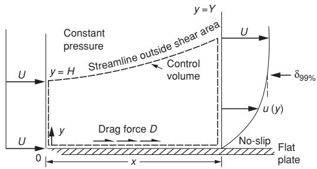

text_image

Constant pressure
y = H
Streamline outside shear area
Control volume
U
y = Y
δ99%
u (y)
Drag force D
No-slip
Flat plate
0
x

Figure 2.8. Definition of control volume for flow past a flat plate. (White, F. M., 1974, Viscous Fluid Flow, McGraw-Hill Book Company, 2nd ed. 1991, Printed in Singapore. The figure is reprinted with permission of The McGraw-Hill Companies.)

Then we have to consider the turbulent stresses. The turbulent stress $- \rho \overline { { u ^ { \prime } v ^ { \prime } } }$ acting along the flat plate is zero. This is a simple consequence of the fact that $u ^ { \prime }$ and $v ^ { \prime }$ are zero on the plate. The longitudinal component of turbulent stresses on the vertical side of the control volume placed at the horizontal position x is $- \rho \overline { { u ^ { \prime 2 } } }$ . This gives a negligible effect according to the boundary-layer theory. We can also see this from eq. (2.30), where no stress effect comes from a term like that.

The conservation of fluid momentum in the xdirection can then be expressed as

$$
- D = \rho \int_ {0} ^ {Y} \bar {u} ^ {2} d y - \rho \int_ {0} ^ {H} U ^ {2} d y. \tag {2.51}
$$

The first and second terms on the right-hand side of eq. (2.51) correspond to the momentum flux through the vertical side at x and at the leading edge, respectively. The integration limits Y and H are defined in Figure 2.8. Because eq. (2.30) follows from conservation of fluid momentum, we could obviously have integrated this equation over the control volume and obtained eq. (2.51). We can rewrite eq. (2.51) by using conservation of mass for the control volume, that is,

$$
U H = \int_ {0} ^ {Y} \bar {u} d y. \tag {2.52}
$$

This gives

$$
D = \rho \int_ {0} ^ {Y} \bar {u} (U - \bar {u}) d y. \tag {2.53}
$$

This means that D can be expressed in terms of the momentum thickness

$$
\theta = \int_ {0} ^ {Y} \frac {\bar {u}}{U} \left(1 - \frac {\bar {u}}{U}\right) d y, \tag {2.54}
$$

that is,

$$
D = \rho U ^ {2} \theta . \tag {2.55}
$$

Eq. (2.54) is a general definition of momentum thickness, whereas eq. (2.55) applies only to our considered boundary-layer flow along a flat plate. We define the friction coefficient

$$
C _ {f} = \frac {\tau_ {w}}{0 . 5 \rho U ^ {2}} \tag {2.56}
$$

expressing the frictional stress on the plate. By using that $\begin{array} { r } { D = \int _ { 0 } ^ { x } \tau _ { w } d x . } \end{array}$ , i.e. $\tau _ { w } = d D / d x$ , we have

$$
C _ {f} = 2 \frac {d \theta}{d x}. \tag {2.57}
$$

Because eq. (2.50) is valid everywhere in the boundary layer except in the viscous sublayer, which is a very small fraction of the boundary layer, we can use eq. (2.50) as a good approximation in calculating θ given by eq. (2.54). We then set $Y = \delta$ . This gives (see White 1974)

Table 2.1. Total drag computation for turbulent flow along a smooth flat plate 

<table><tr><td> $Rn$ </td><td> $C_F$ , “Exact”(White 1974, Table 6.6)</td><td> $C_F$ , ITTC</td><td>Error, %</td><td> $C_F$  (eq. 2.66)</td><td>Error, %</td><td> $C_F$ (Hughes eq. 2.67)</td><td>Error, %</td></tr><tr><td> $10^6$ </td><td>0.004344</td><td>0.004688</td><td>7.9</td><td>0.004210</td><td>-3.1</td><td>0.004188</td><td>-3.6</td></tr><tr><td> $10^7$ </td><td>0.003015</td><td>0.003000</td><td>0.5</td><td>0.003030</td><td>0.5</td><td>0.002672</td><td>-11.4</td></tr><tr><td> $10^8$ </td><td>0.002169</td><td>0.002083</td><td>-3.9</td><td>0.002181</td><td>0.5</td><td>0.001852</td><td>-14.6</td></tr><tr><td> $10^9$ </td><td>0.001612</td><td>0.001531</td><td>-5.0</td><td>0.001569</td><td>-2.6</td><td>0.001359</td><td>-15.7</td></tr><tr><td> $10^{10}$ </td><td>0.001236</td><td>0.001172</td><td>-5.2</td><td>0.001129</td><td>-8.7</td><td>0.001039</td><td>-15.9</td></tr></table>

$$
\frac {\theta}{\delta} = \frac {3 . 7 5}{\lambda} - \frac {2 4 . 7 7 8}{\lambda^ {2}}, \tag {2.58}
$$

where

$$
\lambda = \frac {U}{v ^ {*}} \equiv \sqrt {\frac {2}{C _ {f}}}. \tag {2.59}
$$

We can also express λ by using eq. (2.50) at $y = \delta$ This gives

$$
\lambda = 2. 5 \ln \left[ \frac {U \delta}{\nu \lambda} \right] + 8. \tag {2.60}
$$

Eliminating δ between eqs. (2.58) and (2.60) gives

$$
R n _ {\theta} \equiv \frac {U \theta}{\nu} = \lambda \left(\frac {3 . 7 5}{\lambda} - \frac {2 4 . 7 7 8}{\lambda^ {2}}\right) \mathrm{e} ^ {0. 4 (\lambda - 8)}. \tag {2.61}
$$

By using that $C _ { f }$ can be expressed in terms of λ by eq. (2.59) and by curve-fitting, White (1974) found that eq. (2.61) can be approximated as

$$
C _ {f} \approx 0. 0 1 2 R n _ {\theta} ^ {- 1 / 6}. \tag {2.62}
$$

By substituting eq. (2.62) into (2.57), we find

$$
R n _ {x} \equiv \frac {U x}{\nu} = \frac {1}{0 . 0 0 6} \int_ {0} ^ {R n _ {\theta}} R n _ {\theta} ^ {1 / 6} d R n _ {\theta}
$$

or

$$
R n _ {\theta} = 0. 0 1 4 2 R n _ {x} ^ {6 / 7}. \tag {2.63}
$$

Substituting eq. (2.63) into eq. (2.62) gives

$$
C _ {f} = 0. 0 2 4 4 R n _ {x} ^ {- 1 / 7}. \tag {2.64}
$$

According to White (1974), a more correct formula is

$$
C _ {f} = 0. 0 2 7 R n _ {x} ^ {- 1 / 7}. \tag {2.65}
$$

From the expression above, $C _ { f }$ is infinite at $x =$ 0. This means the local behavior near the leading edge is wrong, but this causes a negligible error in predicting the drag on the plate. By integrating eq. (2.65), we find the frictional force coefficient $C _ { F }$ or

$$
C _ {F} = \frac {\int_ {0} ^ {L} \tau_ {w} d x}{0 . 5 \rho U ^ {2} L} = \frac {1}{L} \int_ {0} ^ {L} C _ {f} (x) d x
$$

$$
= \frac {1}{R n} \int_ {0} ^ {R n} C _ {f} (R n _ {x}) d R n _ {x},
$$

where $R n = U L / \nu$ . This means

$$
C _ {F} = 0. 0 3 0 3 R n ^ {- 1 / 7}. \tag {2.66}
$$

In Table 2.1, this formula is compared with what White (1974) considered the “exact” solution of $C _ { F }$ in a broad Reynolds number range. The lower Reynolds numbers are typical for ship model testing, whereas the higher Reynolds numbers are representative for full-scale ships. $C _ { F }$ -values based on the ITTC formula and given by eq. (2.4) are also included in the table. Also, other formulas not considered here exist for $C _ { F }$ for turbulent flow along a smooth flat plate. We must also mention the Hughes (1954) formula that was commonly used in ship model testing:

$$
C _ {F} = \frac {0 . 0 6 6}{\left(\log_ {1 0} R n - 2 . 0 3\right) ^ {2}}. \tag {2.67}
$$

Calculations by eq. (2.67) are also presented in Table 2.1 and show that the ITTC formula is in general a better approximation than the Hughes formula. However, eq. (2.66) generally gives the results closest to what White (1974) considers the correct expression.

In order to estimate the boundary-layer thickness δ, we first find a relationship between $C _ { f }$ and δ, for instance, by using eq. (2.60). By curve fitting, White (1974) found that

$$
C _ {f} \approx 0. 0 1 8 R n _ {\delta} ^ {- 1 / 6},
$$

where $R n _ { \delta } = U \delta / \nu$ . Using eq. (2.65) gives

$$
\frac {U \delta}{\nu} = 0. 1 1 \left(\frac {U x}{\nu}\right) ^ {6 / 7}.
$$

However, using eq. (2.64) gives a relatively different result, that is,

$$
\frac {U \delta}{\nu} = 0. 1 6 \left(\frac {U x}{\nu}\right) ^ {6 / 7}
$$

or

$$
\delta = \frac {0 . 1 6 x}{(R n _ {x}) ^ {1 / 7}}. \tag {2.68}
$$

Let us consider the case $U = 2 0 \mathrm { m s ^ { - 1 } } , x = 1 0 0$ m and use $\nu = 1 0 ^ { - 6 } \mathrm { m } ^ { 2 } \mathrm { s } ^ { - 1 }$ . This gives the boundarylayer thickness as 0.75 m. This has relevance for the boundary-layer thickness at the aft end of a 100 m–long monohull at a speed of $2 0 \mathrm { m s ^ { - 1 } }$ . Let us consider the corresponding thickness at model scale and assume a model length $L _ { M } = 4$ m. The ratio between full-scale ship length $L _ { S }$ and $L _ { M }$ is 25. Model testing is done by Froude scaling. This means that the model speed is $( L _ { M } / L _ { S } ) ^ { 0 . 5 }$ times the full-scale speed, or 4 $\mathrm { m } \mathrm { { s } ^ { - 1 } }$ in this case. Assuming turbulent flow in model scale and using $\nu = 1 0 ^ { - 6 } \mathrm { m } ^ { 2 } \mathrm { s } ^ { - 1 }$ and eq. (2.68) gives that the boundary layer thickness is equal to 0.06 m at the aft end of the ship model.

Eq. (2.68) is a geometrical measure of the boundary-layer thickness. There are also other measures of the boundary-layer thickness. One is the momentum thickness θ defined by eq. (2.54). Another is the displacement thickness $\delta ^ { * }$ . We will introduce this by means of Figure 2.8. From continuity of fluid mass of an incompressible fluid, it follows that

$$
U H = \int_ {0} ^ {Y} u d y = \int_ {0} ^ {Y} (U + \bar {u} - U) d y
$$

$$
= U Y + \int_ {0} ^ {Y} (\bar {u} - U) d y.
$$

Here $Y = H + \delta ^ { * }$ so that $\delta ^ { * }$ expresses how much the streamline at $y = H$ at the leading edge has moved outward with respect to the plate at the location x (Figure 2.8). From eq. (2.69), it follows that

$$
U (Y - H) = U \delta^ {*} = \int_ {0} ^ {Y} (U - \bar {u}) d y
$$

or

$$
\delta^ {*} = \int_ {0} ^ {Y \rightarrow \infty} \left(1 - \frac {\bar {u}}{U}\right) d y. \tag {2.70}
$$

We can use eq. (2.50) to calculate $\delta ^ { * }$ . We introduce then $\eta = y / \delta$ as an integration variable and integrate from y = 0 until y = δ instead of until infinity. Eq. (2.70) can be rewritten as

$$
\frac {\delta^ {*}}{\delta} = \frac {v ^ {*}}{U} \int_ {0} ^ {1} \left(\frac {U}{v ^ {*}} - \frac {\bar {u}}{v ^ {*}}\right) d \eta .
$$

Further, eq. (2.50) can be expressed as

$$
\frac {\bar {u}}{v ^ {*}} = 2. 5 \ln \eta + 2. 5 \ln \frac {\delta v ^ {*}}{\nu} + 5. 5 + 2. 5 \sin^ {2} \left(\frac {\pi}{2} \eta\right).
$$

This means

$$
\frac {U}{v ^ {*}} = 2. 5 \ln \frac {\delta v ^ {*}}{\nu} + 8.
$$

Further, integrating and using eq. (2.59) gives

$$
\frac {\delta^ {*}}{\delta} = 3. 7 5 \sqrt {C _ {f} / 2}.
$$

We have already found δ and $C _ { f }$ as a function of $R n _ { x }$ (see eqs. (2.64) and (2.68)). This gives

$$
\delta^ {*} = 0. 0 6 6 x / R n _ {x} ^ {3 / 1 4}. \tag {2.71}
$$

We note that $\delta ^ { * }$ is clearly smaller than δ. This thickness parameter can be used to measure how much the flow outside the boundary layer is affected by the boundary layer. As shown in Figure 2.8, the slope of the streamline is $d \delta ^ { * } / d x$ . Because the flow is parallel to a streamline and U is the dominant velocity outside the boundary layer, we find that there is a vertical velocity

$$
\bar {v} = U \frac {d \delta^ {*}}{d x} \tag {2.72}
$$

at the outer part of the boundary layer. This represents then a boundary condition for the potential flow outside the boundary layer. Eq. (2.72) expresses that there in the potential flow appears a flow coming out from the plate. A consequence of this is that there exists a pressure gradient in the x-direction. However, when calculating the effect of this pressure gradient on the viscous flow, we must also correct the boundary-layer equation.

This effect is not negligible in general, but the analysis will not be pursued here.

In order to find a measure of the thickness of the viscous sublayer we use the information about the velocity distribution given by eq. (2.50), which is valid in the outer and overlap layers but not in the viscous sublayer. The lowest y value for which eq. (2.50) is valid corresponds to $y v ^ { * } / \nu = 3 5$ . We then need to determine the friction velocity $v ^ { * } =$ $\sqrt { \tau _ { w } / \rho }$ , where $\tau _ { w } = 0 . 5 \rho U ^ { 2 } C _ { f }$ . Using eq. (2.65) for C f gives

$$
v ^ {*} = 0. 1 1 4 U / R n _ {x} ^ {1 / 1 4}. \tag {2.73}
$$

We define the thickness $\delta _ { V S }$ of the viscous sublayer by $\delta _ { V S } v ^ { * } / \nu = 3 5$ . This means

$$
\delta_ {V S} = 3 0 7 \frac {x}{R n _ {x} ^ {1 3 / 1 4}}. \tag {2.74}
$$

Using the previous example with $U = 2 0 \mathrm { m s ^ { - 1 } }$ , $x = 1 0 0 \mathrm { m }$ , and $\nu = 1 0 ^ { - 6 } \mathrm { m } ^ { 2 } \mathrm { s } ^ { - 1 }$ gives $\delta _ { V S } = 7 0$ · $1 0 ^ { - 6 }$ m or only $0 . 9 \cdot 1 0 ^ { - 4 }$ times the boundary-layer thickness we found.

The above-discussed formulas for the frictional force constitute only one part of the total viscous resistance effect for the ship. We consider other effects in the following section.

# 2.2.5 Form resistance components

Experimental results show that eq. (2.4) has to be modified to describe the viscous resistance of highspeed monohulls and catamarans. A form resistance component exists because of the interaction between the ship’s three-dimensional shape and the viscosity. Wave resistance is also a function of the ship’s three-dimensional and finite transversedimensional shape. However, viscosity does not have an important influence on wave resistance, or at least it is common to assume this. This means wave resistance is not considered as a part of the form resistance. The form resistance can be associated with the following three effects:

 Frictional resistance   
 Viscous pressure resistance   
 Flow separation

We discuss these different effects in the following text. When we derived the formulas for viscous resistance of a flat plate, we used the ship speed as the tangential velocity outside the boundary layer. However, the ship’s three-dimensional form affects (and in general increases) the tangential velocity just outside the boundary layer. As a consequence, the frictional stress on the hull generally will increase along the ship. When calculating the contribution due to viscous resistance, the frictional stress must be resolved into a component parallel to the longitudinal coordinate of the ship. However, this effect is small, particularly for slender hull forms. We should also note that the ship’s three-dimensional shape causes a pressure gradient along the hull. This influences the velocity distribution in the boundary layer and therefore the frictional stress at the hull surface. Another important aspect is that the flow in the boundary layer is 3D and not 2D as we assumed in the analysis of turbulent flow along the flat plate. Further, we have implicitly assumed a thin boundary layer, which may be less appropriate in the aft end of the ship.

The second main contribution to form resistance is the viscous pressure resistance. We explain this by referring to a situation in which viscous resistance is dominant and wave resistance does not matter; this means for Froude numbers $U / \left( L g \right) ^ { 0 . 5 }$ less than ≈ 0.15. In this case, there is negligible free-surface motion and the normal velocity on the mean free surface can be set equal to zero. Let us look upon the flow from a reference frame following the ship. This means the forward speed of the ship appears as an incident flow velocity U along the longitudinal x-axis pointing toward the stern of the ship (Figure 2.9). The free-surface condition and the horizontal direction of the incident flow make the flow around the ship the same as the flow around a double body consisting of the submerged part of the ship and its image about the mean free surface. This is a consequence of the fact that the steady flow around the double body is symmetric about the xy-plane. This means zero normal velocity on z = 0 outside the body, that is, a similar condition that we have specified in the free-surface condition for the ship problem.

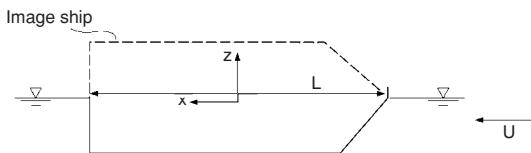

text_image

Image ship
z
L
x
U

Figure 2.9. Double-body approximation. For Froude number $F n = U / \sqrt { L g } < \approx 0 . 1 5$ the flow around a ship with speed U can be represented by the flow around a double body consisting of the submerged ship and its image about the mean free surface.

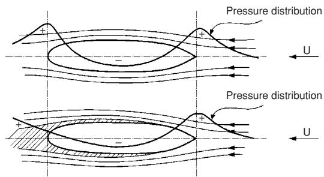

text_image

Pressure distribution
+
-
U
Pressure distribution
+
-
U

Figure 2.10. The flow and pressure distributions around a ship when $F n < \approx 0 . 1 5$ (see Figure 2.9) Ambient pressure is excluded. The upper figure does not account for viscosity. The shaded area in the lower figure is the boundary layer and wake where viscosity matters (Walderhaug 1972).

Having now created the equivalent to the double-body problem, we can use knowledge about the flow around a body in infinite fluid. If viscosity is neglected, the flow at the waterline and the pressure force distribution look like those in the upper drawing of Figure 2.10. Remember that the spacing between the streamlines is an implicit expression of the flow velocity, with high velocities in regions with narrow spacings. Because increasing velocity means decreasing pressure, we see that the pressure increases in regions with wider spacing. Because the ambient pressure is constant in space and gives zero force, its effect on the pressure force distribution is not included in Figure 2.10. The resulting force on the ship due to the pressure force distribution in the upper drawing in Figure 2.10 is zero. This is the well-known D’Alembert paradox, that is, there is no hydrodynamic force acting on a body in infinite fluid due to steady potential flow without circulation. However, the pressure influenced by the boundary layer changes this situation. The shaded area in the lower drawing of Figure 2.10 indicates the boundary layer. Because of this viscosity region next to the hull, the pressure force in the bow part does not cancel the pressure force in the aft part of the ship, so the boundary layer affects the pressure distribution. We discussed this previously in connection with eq. (2.72). Where the boundary layer ends at the stern, a wake forms behind the ship, where turbulent stresses are important. The pressure approaches ambient pressure (or zero in Figure 2.10) at some distance downstream in the wake not shown in Figure 2.10. Actually, the pressure has not yet reached its maximum value in the small part of the wake presented in Figure 2.10. From this figure, we see that the effect of the boundary layer on the pressure is negligible in the bow part, where the boundary layer is thin relative to that in the aft part. The lower drawing in Figure 2.10 illustrates clearly that there is a viscous pressure resistance.

The third main cause of form resistance is flow separation. If the flow separates from the hull, we get a larger domain aft of the separation line, where viscosity matters. This implies a larger influence on the pressure distribution and increased form resistance. Cross-flows past a circular cylinder and a sphere are classical examples of separated flow. When the Reynolds number is larger than ${ \approx } 1 0 ^ { 3 }$ for circular cylinders, the major part of the drag forces is the result of the pressure.

If a surface has a sharp edge, the flow will separate from the sharp edge when there is a crossflow past the edge. However, the flow may also separate from a surface without sharp corners, as we have seen, for example, in bluff bodies such as spheres and circular cylinders. We illustrate how flow separation starts for a 2D flow situation by means of Figure 2.11. If there is a point S on the body surface where $\partial u / \partial y = 0$ and there is backflow aft of the point S, we get flow separation from point S. If $\partial u / \partial y = 0$ also aft of S, we do not get flow separation from S. This situation is beneficial because $\partial u / \partial y = 0$ means zero shear stress $\tau _ { w }$ on the wall. This can be obtained by a proper design of the hull surface (Tregde 2004) and is referred to as Stratford (1959) flow. The position of point S depends on the pressure gradient $\partial p / \partial x$ along the hull surface and on the flow conditions (laminar or turbulent) in the boundary layer ahead of the separation point. An adverse pressure

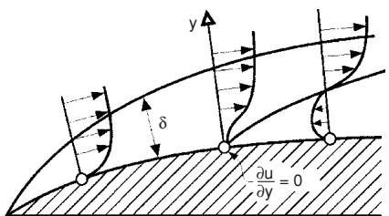

text_image

y
δ
∂u/∂y = 0

Figure 2.11. 2D flow with a boundary layer of thickness δ. Illustration of conditions for flow separation, that is, $\partial u / \partial y$ is zero at the surface at S and there is a backflow near the surface aft of S. The flow will then separate at point S (Walderhaug 1972).