# Time Domain Ship Motions by a Three-Dimensional Rankine Panel Method

by

David C. Kring

BS in Naval Architecture and Marine Engineering,

Webb Institute of Naval Architecture, June 1988

Submitted to the Department of Ocean Engineering in partial fulfillment of the requirements for the degree of

Doctor of Philosophy in Hydrodynamics

at the

MASSACHUSETTS INSTITUTE OF TECHNOLOGY

May 1994

© Massachusetts Institute of Technology 1994. All rights reserved.

Author....

Department of Ocean Engineering

May 18, 1994

Certified by....

Paul D. Sclavounos

Professor of Naval Architecture

Thesis Supervisor

Accepted by ....

A. Douglas Carmichael

Chairman, Departmental Committee on Graduate Students ARCHIVES

# Time Domain Ship Motions by a Three-Dimensional Rankine Panel Method

by

David C. Kring

Submitted to the Department of Ocean Engineering on May 18, 1994, in partial fulfillment of the requirements for the degree of Doctor of Philosophy in Hydrodynamics

# Abstract

This study considers the time domain motions of a ship travelling with a mean velocity in waves. Ship motions are studied through canonical forced motion simulations and through free motion simulations, in which the equations of motion and the wave flow are solved simultaneously. A range of speeds and wave periods are considered for general ships, including the class of hulls possessing transom sterns.

A boundary-integral formulation, based on the Rankine source Green function, is derived with a generalized linearization that can include Neumann-Kelvin, Double-body, or displacement thickness boundary layer models. For transom sterns, a physically rational set of Kutta conditions are proposed at the stern separation line.

A bi-quadratic Rankine panel method from a mature, frequency domain formulation for three-dimensional ship wave flow is extended to this time domain formulation. A systematic analysis of wave propagation over a discrete free surface allows a time marching scheme to be designed through the consideration of numerical dissipation, dispersion, and stability. For the free motion simulation, an additional stability analysis provides confidence in the numerical integration of the time domain equations of motion. The analysis of arbitrary linear multistep integration schemes leads to the selection of a fourth order predictor-corrector.

Simulations for conventional ships with closed sterns and transom stern vessels establish the convergence of this method. Steady-state results are compared to classical ship motion results and physical experiments. The numerical method agrees with experimental results for steady wave resistance and ship motions.

Thesis Supervisor: Paul D. Sclavounos

Title: Professor of Naval Architecture

# Acknowledgments

I wish to express gratitude to everyone who supported me throughout my graduate studies. I am especially grateful to my wife, Pam; even while I was absorbed in my studies, she offered her love unconditionally. This thesis is dedicated to my parents, Charles and Sandra; I truly can not imagine anyone more caring and supportive. Also, I must acknowledge my father for his theory on wave gremlins which provided crucial inspiration for my research.

My advisor and mentor, Professor Paul Sclavounos, has unceasingly provided an example of professional excellence that I can only hope to emulate. I have been blessed by the opportunity to study with him and to follow my calling, Naval Architecture. The members of my committee also deserve special recognition. Dr. Spyros Kinnas brought his impressive experience in numerical hydrodynamics, and his insight was always welcome. Professor Ahmed Ghoniem, from the Department of Mechanical Engineering, brought a fresh viewpoint that forced me to examine my research from different viewpoints.

I deeply respect and appreciate the entire crew of the Computational Hydrodynamics Facility and Department of Ocean Engineering, especially Dr. Dimitris Nakos for all his patience and wisdom. No one ever failed to graciously donate time and experience when I sought advice. The atmosphere here has always been open, friendly, and perfect for research.

Finanical support for this research has been provided by A.S. Veritas Research and by the Office of Naval Research.

# Contents

# 1 Introduction 10

1.1 Background 10   
1.2 Overview 13

# 2 Mathematical Formulation 16

2.1 Equations of motion 17   
2.2 Hydrodynamic forces and wave patterns 19

2.2.1 The exact boundary value problem 19   
2.2.2 Basis flow- The Aspiration model 21   
2.2.3 Linearization 23   
2.2.4 The boundary integral formulation 29   
2.2.5 The treatment of transom hulls 30

# 3 Numerical Implementation for Forced Motions 33

3.1 Time domain Rankine panel method 34

3.1.1 Spatial discretization 35   
3.1.2 Temporal discretization 41   
3.1.3 Radiation condition on a truncated free surface ..... 42   
3.1.4 Numerical issues 44

3.2 Error analysis for time domain Rankine panel methods ..... 46

3.2.1 The continuous formulation 47   
3.2.2 The discrete formulation 48   
3.2.3 Temporal stability 52

3.2.4 Spatial stability 53

# 4 Numerical Implementation for Free Motions 54

4.1 Error analysis for the numerical integration of the equations of motion 55   
4.2 Design of a numerical scheme 57

4.2.1 Stability analysis for a general predictor-corrector ..... 58

4.2.2 Application to Adams-Bashforth-Moulton methods ..... 66

# 5 Results from Forced Motion Simulations 72

5.1 Computer implementation- SWAN2 ..... 73   
5.2 Conventional ships 73

5.2.1 Steady forward speed 74   
5.2.2 Forced periodic motions 84

5.3 Transom hulls 93

5.3.1 Steady forward speed 93   
5.3.2 Forced periodic motions 99

# 6 Results from Free Motion Simulations 107

6.1 Conventional ships 107

6.1.1 Free decay tests 108   
6.1.2 Monochromatic head seas- convergence study ..... 112   
6.1.3 Response amplitude operators 116

6.2 Transom hulls 119

6.2.1 Monochromatic head seas 119   
6.2.2 Irregular seas 122

# 7 Discussion 124

# List of Figures

2-1 Coordinate System 16   
2-2 Aspiration model 22   
2-3 View of transom stern looking outboard from centerline ..... 30   
3-1 Typical Series 60, $\mathrm{Cb} = 0.7$ , computational domain . . . . . . . . . . . . 38   
3-2 Typical transom hull computational domain 39   
4-1 Boundary locus plot for three predictor-corrector schemes ..... 71   
5-1 Steady wave pattern for the Series 60 hull at $\mathcal{F} = U / (gL)^{\frac{1}{2}} = 0.2$ , viewed from above and behind the vessel.... 77   
5-2 Transient wave elevation and body pressure contours for the Series 60 hull in steady forward motion at $\mathcal{F}=0.2$ , started impulsively from rest at $t=0$ .... 78   
5-3 Sensitivity of forces to domain and beach size for the Series 60 hull in steady forward motion at $\mathcal{F} = 0.3$ . 79   
5-4 Sensitivity of forces to domain and beach size for the Series 60 hull in steady forward motion at $\mathcal{F} = 0.2$ . 80   
5-5 Convergence of forces with spatial discretization for the Series 60 hull in steady forward motion at $\mathcal{F} = 0.2$ . 81   
5-6 Convergence of forces with spatial discretization for the modified Wigley hull in steady forward motion at $\mathcal{F} = 0.3$ . 82   
5-7 Convergence of forces with temporal discretization for the modified Wigley hull in steady forward motion at $\mathcal{F} = 0.3$ . 83

5-8 Radiated wave pattern for the Series 60 hull in forced, periodic heave at $\mathcal{F} = 0.2$ and encounter frequency $\omega/(g/L)^{\frac{1}{2}} = 3.335$ , viewed from above and behind the vessel. A snapshot of the steady-state periodic wave pattern taken at the middle of the heave cycle.... 87   
5-9 Sensitivity of vertical force and moment to low-pass spatial filtering for the Series 60 hull heaving at $\mathcal{F} = 0.2$ and encounter frequency $\omega / (g / L)^{\frac{1}{2}} = 3.335$ . 88   
5-10 Convergence of vertical force and moment with spatial discretization for the Series 60 hull heaving at $\mathcal{F} = 0.2$ and encounter frequency $\omega / (g / L)^{\frac{1}{2}} = 3.335$ . 89   
5-11 Convergence of vertical force and moment with temporal discretization for the Series 60 hull heaving at $\mathcal{F} = 0.2$ and encounter frequency $\omega / (g / L)^{\frac{1}{2}} = 3.335$ . 90   
5-12 Diagonal added mass and damping coefficients for the Series 60 hull in heave and pitch at $\mathcal{F} = 0.2$ . 91   
5-13 Cross-coupling added mass and damping coefficients for the Series 60 hull in heave and pitch at $\mathcal{F} = 0.2$ . 92   
5-14 Steady wave pattern for a transom hull at $\mathcal{F} = 0.3$ , viewed obliquely from above and behind the vessel. 95   
5-15 Transient wave elevation and body pressure contours for a transom hull in steady forward motion at $\mathcal{F} = 0.3$ , started impulsively from rest at $t = 0$ ....96   
5-16 Convergence of forces with spatial discretization for a transom hull in steady forward motion at $\mathcal{F} = 0.3$ . 97   
5-17 Convergence of forces with temporal discretization for a transom hull in steady forward motion at $\mathcal{F} = 0.3$ . 98   
5-18 Heave and diffraction wave patterns and linear body pressure patterns for a transom hull at $\mathcal{F} = 0.3$ and encounter frequency $\omega / (g / L)^{\frac{1}{2}} = 3.2$ . 102

5-19 Comparison of wave elevation and linear body pressure contours for various Aspiration model linearizations for a transom hull in forced, periodic heave motion at $\mathcal{F} = 0.3$ and $\omega/(g/L)^{\frac{1}{2}} = 3.2$ . . . . . . . . . 103   
5-20 Sensitivity of vertical force and moment for a transom hull heaving at $\mathcal{F} = 0.3$ and encounter frequency $\omega /(g / L)^{\frac{1}{2}} = 3.2.\ldots\ldots\ldots\ldots\ldots\ldots\ldots\ldots\ldots\ldots\ldots\ldots\ldots\ldots\ldots\ldots\ldots\ldots\ldots\ldots\ldots\ldots\ldots\ldots\ldots\ldots\ldots\ldots\ldots\ldots\ldots\ldots\ldots\ldots\quad 104$   
5-21 Convergence of vertical force and moment with spatial discretization for a transom hull heaving at $\mathcal{F} = 0.3$ and encounter frequency $\omega / (g / L)^{\frac{1}{2}} = 3.2$ . 105   
5-22 Convergence of vertical force and moment with temporal discretization for a transom hull heaving at $\mathcal{F} = 0.3$ and encounter frequency $\omega / (g / L)^{\frac{1}{2}} = 3.2$ . 106   
6-1 Convergence of heave and pitch motions with spatial discretization for the modified Wigley hull in the transition from rest to steady-state equilibrium position at $\mathcal{F}=0.3$ . 109   
6-2 Convergence of heave and pitch motions with temporal discretization for the modified Wigley hull in the transition from rest to steady-state equilibrium position at $\mathcal{F} = 0.3$ . 110   
6-3 Heave and pitch motions for the modified Wigley hull dropped from an initial heave position at $\mathcal{F} = 0.3, 0.4$ , and, 0.5. . . . . . . . . . . . . 111   
6-4 Spatial convergence of heave and pitch motions for the Series 60 at $\mathcal{F} = 0.2$ in incident head seas at an encounter frequency $\omega /(g / L)^{\frac{1}{2}} = 3.335$ . 113   
6-5 Temporal convergence of heave and pitch motions for the Series 60 at $\mathcal{F} = 0.2$ in incident head seas at an encounter frequency $\omega /(g / L)^{\frac{1}{2}} = 3.335$ . 114   
6-6 Sensitivity to spatial filtering of heave and pitch motions for the Series 60 at $\mathcal{F} = 0.2$ in incident head seas at an encounter frequency $\omega /(g / L)^{\frac{1}{2}} = 3.335$ . 115

6-7 Magnitude and phase of the heave response amplitude operator for the Series 60 at $\mathcal{F} = 0.2$ . 117   
6-8 Magnitude and phase of the pitch response amplitude operator for the Series 60 at $\mathcal{F} = 0.2$ . 118   
6-9 Spatial convergence of heave and pitch motions for a transom hull at $\mathcal{F} = 0.3$ in incident head seas at an encounter frequency $\omega /(g / L)^{\frac{1}{2}} = 3.2.120$   
6-10 Temporal convergence of heave and pitch motions for a transom hull at $\mathcal{F} = 0.3$ in incident head seas at an encounter frequency $\omega / (g / L)^{\frac{1}{2}} = 3.2.121$   
6-11 Wave elevation for a transom hull travelling at $\mathcal{F} = 0.35$ in irregular seas. 123

# Chapter 1

# Introduction

# 1.1 Background

Within the last decade, advancements in computer technology have enabled the development of new classes of numerical tools for analyzing important problems in Naval Architecture such as the wave resistance and motions for realistic ships. Particularly, the application of three-dimensional panel methods have demonstrated success predicting the motion of freely floating, geometrically complex ships in ambient seas.

The formal study of ships in motion first began in the late 19th century with the work of Froude, Krylov, and Lord Kelvin. In the first half of the 20th century, early attempts to model ships in potential flow focused on variations of thin ship theory and the related slender body theory to study simplified body geometries and free-surface conditions. However, it was only with the advent of the digital computers in the 1950's that the application of hydrodynamic theory became practical for ships.

Early approaches, motivated from a need for computational efficiency, utilized two-dimensional boundary value problems such as formulated in the strip theory of Korvin-Kroukovsky [25]. These methods, limited to simple, slender hull forms and low speed, culminated in the rational analysis of strip theory produced by Ogilvie and Tuck [48], and the unified theory of Newman [45] and Sclavounos [51] that joined slender body and strip theories. These two-dimensional methods were extended to a wider application by the high speed approximation for ships with transom sterns

proposed by Faltinsen and Zhao [12].

As computer capability developed, especially with the widespread introduction of engineering workstations in the 1980's, the practical application of hydrodynamic theory for increasingly realistic ship motion problems has led to interest in fully three dimensional potential flow studies. Boundary element methods such as panel methods have received the most focus.

Three-dimensional panel methods for ship motion studies can be broken into two general categories based upon the elementary singularity employed in the boundary integral formulation. The first category employs a transient wave source which satisfies the Kelvin free surface conditions. Significant work in this area has been conducted by Liapis [27] [28], King, Beck and Magee [20] [21] [2], Korsmeyer [23] [24], and, most recently, Bingham [5] [6]. While these methods require only the discretization of the hull surface, they are limited to the simple Kelvin free surface condition. Also, no attempt has been made to model ships that possess open transom sterns at these require a more flexible expression of the free surface condition.

The second category of panel methods uses a Rankine source as the elementary singularity in the boundary integral formulation. Rankine panel methods require discretization of both the body and free surface with some numerical scheme to handle domain truncation, but they allow a more flexible choice of free-surface conditions. This category of methods was pioneered through the work of Gadd [14] and Dawson [10] for the study of a steady-state ship wave patterns. More recently, Maskew, Tidd, and Fraser [37] have conducted some time domain simulations for ship motions.

In 1988, Sclavounos and Nakos [52] presented an analysis for the propagation of gravity waves on a discrete free surface which instilled confidence that a Rankine method could faithfully represent the ship wave patterns and forces. Their work led to the development of a frequency-domain formulation for ship motions with a consistent linearization based upon the double body flow model. Applications are reported in Nakos and Sclavounos [40] and Sclavounos, Nakos, and Huang [53]. This frequency domain methodology has been extended to the time domain for this present work.

Another approach to time domain ship motions, related to Rankine panel methods, is being developed by Beck, Cao, and Lee [3] in their desingularized method. This models a nonlinear formulation of the time domain ship motions problem through an array of raised sources rather than through panels of distributed singularities.

Previous three dimensional linear methods have suffered two main limitations that need to be addressed. One is a restriction on geometric complexity. Most modern ships have some degree of flare at the waterline, where the hull surface is not perpendicular to the calm free surface. One portion of the ship where this occurs most strongly is at the stern. The sterns of many modern commercial ships, semi-displacement craft, and sailing yachts possess some non-zero beam and large degree of flare. These open sterns, which can be classified as transom sterns, require a special treatment.

Another restriction is the inability of present linear methods to be extended to nonlinear studies. Within linear theory, ship motion solutions are most often constructed from a superposition of canonical results. A canonical solution for ship motion considers the force record from an imposed, impulsive motion or from a spectrum of imposed, monochromatic motions, which can be called a forced motion simulation. This approach has the advantage of begin numerically decoupled from the solution of the equations of motion, but it cannot be extended to study nonlinear effects. An alternate, direct approach is to solve the equations of motions simultaneously with the wave flow. This approach, which can be called a free motion simulation, has the additional complication that the explicit numerical integration of the equations of motion must be analyzed, but it does allows for the future inclusion of nonlinear effects as a linear superposition of results is not required.

The three-dimensional, time domain, Rankine panel method presented in this thesis will provide a practical method that addresses these issues. Most importantly, this method represents the steady evolution of a well-founded family of numerical solutions. Through this evolution, confidence can be maintained that the underlying numerical method faithfully represents the problems posed, so that more complex hydrodynamic studies can be initiated.

# 1.2 Overview

The overall goal of this thesis is to produce a direct time domain simulation of the motion of a wide range of ships. A special case within this study is the solution for the wave resistance, sinkage, and trim for a ship in steady forward motion on an otherwise calm sea. This work is intended to produce a method of practical significance in itself and, also, a method that is suitable as a foundation for future nonlinear extensions.

The central issue is the solution of the time domain equations of motion. The equations of motion results from the dynamic balance of inertial, hydrostatic (gravity), and hydrodynamic forces acting upon the hull. These equations can be approached in two ways. A motion can be imposed or forced upon the hull and a solution for the hydrodynamic forces then obtained, or both the motion and hydrodynamic force can be solved simultaneously through the integration of the equations in time. These solutions are referred to as forced and free motion simulations respectively within this study. While free motion simulations are the ultimate goal of this thesis, forced motion simulations will provide a validation for the solution of the hydrodynamic forces and wave patterns that is independent of the numerical solution of the equations of motion.

Under these interpretations for the equations of motion, this study now assumes two main phases. First, the numerical approximation for the wave solution and hydrodynamic forces acting upon the hull must be validated. This includes an examination of the special treatment for transom sterns that allows this method to be widely applicable. The physical relevance of the wave solution is insured through a numerical stability analysis for wave propagation over a discrete free surface, convergence studies, and comparison to physical experiments for real ships.

The second phase of the study is to couple the preceding wave solution with a numerical scheme for integrating the equations of motion. This free motion simulation will be validated through a numerical stability analysis of the integration scheme, another convergence study, and comparison to physical experiments and frequency domain results. Confidence in the underlying evaluation for hydrodynamic forces at each step in the simulation is obtained through the independent forced motion simulations.

In support of this thesis, the mathematical formulation is first detailed, with the numerical implementation for solution of the forced and free motions described next. Computational results for both simulations validate this method, and, in conclusion, the contributions of this study are discussed.

Chapter 2 formulates the mathematical description for a freely floating ship in a translating and rotating reference frame in an ambient sea. The equations of motion are described with emphasis placed on the decomposition of the hydrodynamic force into local and memory components. Here, local is used in a temporal sense and refers to the instantaneous hydrodynamic response to ship motion. The memory component results from the historical record contained in the wave solution. An initial boundary value problem is then constructed within potential flow theory and transformed into a boundary integral representation. A new, generalized linearization is proposed which includes a wide variety of underlying basis flows. Finally, a special treatment for transom sterns based upon physical considerations is proposed.

Chapter 3 describes the numerical implementation for forced motion simulations. The spatial and temporal discretizations for the body boundary and free surface conditions are described. An analysis for the propagation of gravity waves on a discrete free surface provides a tool with which to create a temporal stability condition and a comparison between the expected, continuous dispersion relation and the discrete dispersion relation. The numerical issue of domain truncation is also considered.

Chapter 4 presents the numerical implementation for free motion simulations. This is a detailed numerical stability analysis for the integration of the equations of motion using general linear multistep methods. This analysis is applied to a 4th order Adams-Bashforth-Moulton predictor-corrector scheme for two particular hull forms in order to place a stability condition on the time-step size. This analysis is independent of the underlying numerical implementation for the hydrodynamics forces and can be used for any ship motions method.

Chapter 5 illustrates results for three hull forms with forward speed. Two conventional ships and a transom test hull are examined. Steady forward motion and forced periodic motion results in heave and pitch demonstrate convergence and are compared to experimental results in the steady state.

Chapter 6 illustrates results for free motion simulations with the same hull forms. The wave solution validated in the preceding chapter is coupled with the numerical integration scheme. Various numerical experiments establish the convergence including a set of free decay tests and a simulation in monochromatic incident head seas. Experimental evidence is compared to a prediction for the response amplitude operator. Finally, a transom hull simulation is run in an irregular sea state to demonstrate the utility of the method.

Chapter 7 discusses the contributions of this thesis, and its practical application. The flexibility of this method, including its ability to incorporate a viscous model for a basis flow and to include nonlinear effects, is an important focus for future research.

# Mathematical Formulation

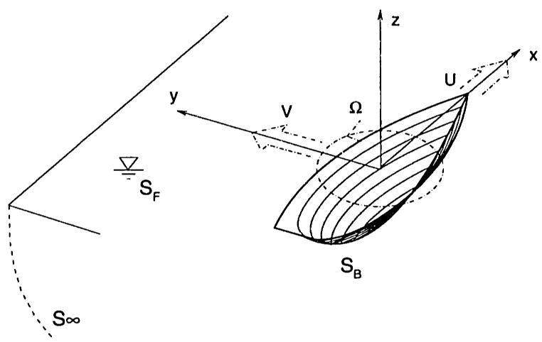

text_image

S_F
y
V
Ω
U
x
z
S_∞
S_B

Figure 2-1: Coordinate System

Figure 2-1 displays a surface-piercing vessel travelling at constant forward speed, U, slip speed, V, and rotation, $\Omega$ , with respect to an inertial frame, $(x_{0}y_{0}z_{0})$ . The surface of the sea, $S_{F}$ , may include ambient surface waves and waves generated by the vessel. $S_{\infty}$ represents the border of the sea infinitely distant from the vessel, and $S_{B}$ includes the submerged portion of the hull.

The vessel floats freely in the six, rigid-body degrees of freedom about a reference frame, $(xyz)$ , fixed to the steady motion of the ship. The description of the unsteady motion of the ship about this reference frame produces an expression for displacement,

$\vec{\delta},$

$$
\vec {\delta} (\vec {x}, t) = \vec {\xi_ {T}} (t) + \vec {\xi_ {R}} (t) \times \vec {x}, \tag {2.1}
$$

with the rigid-body translation, $\vec{\xi_T} = (\xi_1, \xi_2, \xi_3)$ , and the rigid-body rotation, $\vec{\xi_R} = (\xi_4, \xi_5, \xi_6)$ .

This formulation considers the interaction of ship motions, forces, and waves for surface piercing bodies of complex geometry.

# 2.1 Equations of motion

The formulation begins with the application of Newton's Law, a statement of dynamic equilibrium. The acceleration of the body balances the forces applied,

$$
M \ddot {\vec {\xi}} (t) = \vec {F} _ {h} (\ddot {\vec {\xi}}, \dot {\vec {\xi}}, \vec {\xi}, t) - C \vec {\xi} (t), \tag {2.2}
$$

where M is the inertial matrix for the body, and C is the matrix of hydrostatic restoring coefficients. Classical ship motion theory (for instance Newman [44]) will supply these values. The hydrodynamic forces, $\vec{F}_{h}$ , depend on the history of the acceleration, velocity, and displacement of the ship. Furthermore, since wave propagation is a nonlinear phenomenon, the hydrodynamic force is also nonlinear.

One simplification of this problem, the assumption of small body motions and small wave disturbances, results in a linearized equation of motion. Practically, this approximates most ship motions well. Also, a linearized model can be designed with an extension to nonlinearity under consideration.

Another important reduction of this problem is the decomposition of the hydrodynamic force into local and memory components. As will be described more fully in the following sections, the memory forces result from the history of the wave propagation and the local forces arise from the instantaneous motion. The local force being impulsive in nature. This decomposition was originally imposed by Cummins [9] and Ogilvie [47], with recent work by Bingham [6].

$$
\left(M + a _ {0}\right) \ddot {\vec {\xi}} (t) + b _ {0} \dot {\vec {\xi}} (t) + \left(C + c _ {0}\right) \vec {\xi} (t) = \vec {F _ {m}} (\dot {\vec {\xi}}, \vec {\xi}, t) \tag {2.3}
$$

The matrix coefficients, $a_{0}, b_{0}$ , and $c_{0}$ , represent the local forces. The memory forces, $\vec{F}_{m}$ , does not depend upon the instantaneous acceleration. This has important ramifications for the numerical integration of the equation of motion and will be discussed in detail in Chapter 4.

Previous work has stated $\vec{F}_{m}$ in a canonical form which provides analytical insight into the formulation and allows for an efficient computational solution.

$$
\vec {F _ {m}} = \vec {X} (t) - \int_ {\infty} ^ {t} d \tau K (t - \tau) \dot {\vec {\xi}} (\tau) \tag {2.4}
$$

where, $X(t)$ , is the excitation force, and, $K(t)$ , is the velocity impulse response function. The exciting force can also be written in a convolution form as proposed by King [20].

This present work will only use the canonical form of the memory force to facilitate the numerical stability analysis. The memory for this problem will be retained through the solution of the wave pattern itself, rather than through the force history. This direct simulation allows an extension of the method to include nonlinear effects in the memory (or wave) force.

One final distinction relating to the equation of motion must be understood. This work discusses forced motion and free motion. Forced motion imposes an predetermined path on the ship, such as an oscillatory heaving of the ship. This allows a direct comparison to classical ship motion theory that decomposes the problem into radiation, diffraction, and steady components. Forced motion simulations provide validation of hydrodynamic hull forces and wave patterns that are independent of the numerical integration scheme chosen for the equations of motion.

Free motion considers the dynamic balance of forces, so the equations of motion must be integrated for this solution. The advantage of the free motion simulation lies in its flexibility. Nonlinear effects can be incorporated into this model.

# 2.2 Hydrodynamic forces and wave patterns

The solution of the ship motion problem requires knowledge of the forces acting on the ship, and these hydrodynamic forces must be examined in the context of the wave flow about the ship. The first part of this section defines the exact, initial boundary value problem in the fluid domain. This governs the wave propagation on the free surface and the pressure distribution along the hull. Next, in order to form a consistent linearization for this problem, a generalized basis flow is presented. This boundary value problem allows a family of solutions which includes the Neumann-Kelvin, Double-body, and a displacement thickness boundary layer linearizations as subsets.

The decomposition and linearization of the exact problem results in three separate problems. The basis flow, the local flow, and the memory flow. The local flow decomposition is motivated from the consideration of numerical stability. It is solved as a set of six canonical boundary value problems. The memory flow assumes the form of an initial boundary value problem and accounts for all wave propagation. The final part of this section discusses the special treatment of ships with transom sterns.

# 2.2.1 The exact boundary value problem

A safe assumption for realistic ships lengths and speeds is that inertial and gravity forces will dominate wave propagation. Therefore the flow within the fluid volume can be assumed to be inviscid, irrotational, and incompressible.

Under this assumption a total disturbance velocity potential, $\Psi(\vec{x},t)$ , represents the flow about a mean velocity field, $\vec{W} = (U - \Omega x)\hat{i} + (V - \Omega y)\hat{j}$ in the body-fixed frame of reference. In the inertial frame, $\Psi(\vec{x},t)$ is the total potential so, the fluid velocity in the inertial frame is defined as $\vec{V}(\vec{x},t) = \nabla\Psi(\vec{x},t)$ . The principle of conservation of mass leads to the Laplace equation as the governing equation within the fluid domain,

$$
\nabla^ {2} \Psi (\vec {x}, t) = 0 \text {   in   the   fluid   volume. } \tag {2.5}
$$

The application of conservation of momentum within the fluid leads to the Bernoulli equation stated in the inertial frame,

$$
p - p _ {a} = - \rho (\frac {d}{d t} \Psi + \frac {1}{2} \nabla \Psi \cdot \nabla \Psi + g z). \tag {2.6}
$$

The Gallilean transform reformulates these relations for the reference frame,

$$
\frac {d}{d t} = \frac {\partial}{\partial t} - \vec {W} \cdot \nabla , \tag {2.7}
$$

where $\frac{d}{dt}$ represents the time rate of change at a fixed point, $\vec{x}_{0}$ , in the inertial frame, and $\frac{\partial}{\partial t}$ represents the time rate of change at a fixed point, $\vec{x}$ , in the reference frame.

The treatment for the body boundary in potential flow is considered to be the "no-flux" condition,

$$
\frac {\partial \Psi (\vec {x} , t)}{\partial n} = \vec {V} _ {B} \cdot \vec {n} \text {   on   } S _ {B}, \tag {2.8}
$$

where, the total fluid velocity at the hull surface, $\vec{V}_{B} = \vec{V}_{Bs} + \vec{V}_{Bu}$ , consists of a steady component,

$$
\vec {V} _ {B s} = \vec {W} \text {   on   } S _ {B}. \tag {2.9}
$$

and an unsteady component,

$$
\vec {V} _ {B u} = \frac {\partial \delta}{\partial t} \text {   on   } S _ {B}. \tag {2.10}
$$

The free surface is considered to be single-valued. Breaking waves, spray, and capillary waves are neglected. Two conditions imposed on the elevated free surface position, $z = \zeta(x, y, t)$ , specify its position and motion. The kinematic condition states that a Lagrangian particle at the free surface must stay at the free surface for all time.

$$
(\frac {d}{d t} + \nabla \Psi \cdot \nabla) [ z - \zeta (x, y, t) ] = 0 \text { on } z = \zeta (x, y, t). \tag {2.11}
$$

The dynamic condition states that the fluid pressure at the free-surface must equal the pressure in the atmosphere.

$$
\frac {d \Psi}{d t} = - g \zeta - \frac {1}{2} \nabla \Psi \cdot \nabla \Psi \text { on } z = \zeta (x, y, t). \tag {2.12}
$$

For convenience, the atmospheric pressure can be considered constant and equal to zero as air's density is vanishingly small compared to water.

Specified $\frac{d\Psi}{dt}(\vec{x},t)$ and $\Psi(\vec{x},t)$ on the free surface at the start-up time, $t = t_{0}$ , completely determine the initial values for this time-domain problem.

To close this initial boundary value problem one other condition must be imposed. The gradient of the disturbance potential must decay at infinity for finite time, $\nabla\Psi\rightarrow0$ , at $S_{\infty}$ .

# 2.2.2 Basis flow- The Aspiration model

The history of consistent linearizations for free-surface ship flows is recorded in the work of Nakos [41] in his frequency domain approach to this three-dimensional problem. There are two consistent linearizations that are commonly applied to three-dimensional ship studies. One is the classical Neumann-Kelvin linearization which is used for methods applying the transient free-surface Green function to the boundary integral formulation. An alternative to this linearization was first offered by Gadd [14] and Dawson [10] with their Double-body basis flow. The Double-body linearization considers the infinite fluid problem with the ship hull reflected about the z = 0 plane. The solution for this intermediate boundary value problem is considered to be the largest contribution to the total flow. The Neumann-Kelvin linearization simply considers a free-stream as the basis.

This thesis holds that neither linearization is suitable for ships with complex sterns, such as transom hulls. The failing of the Neumann-Kelvin linearization lies in its poor modelling of end effects arising from the coupling between the basis flow and wave flow. This is evident in its simplistic approximation for the m-terms which will be discussed later. The Double-body linearization, while modelling the end effects well for conventional ships, fails to provide a suitable linearization for transom sterns. As will be discussed in more detail, one condition for transom flow is that the pressure approaches zero at the trailing edge of the ship. The Double-body flow contains a stagnation point at this trailing edge. The wave solution for this linearization must balance the basis flow in order to satisfy the transom condition. By definition, this is the poorest possible choice for a linearization.

This thesis proposes a new, generalized model which contains both of the previous linearizations as subsets. In addition, the displacement thickness model for viscous flow is also included in this general model. The model, called the Aspiration model for its breathing effect, allows a specified normal flux through the hull and imposes symmetry about the z = 0 plane as in the Double-body model. If no flux passes through the hull in the reference frame, the model reduces to the Double-body formulation. If a flux equal to the free-stream, $\vec{W}$ , is specified, the model reduces to the Neumann-Kelvin linearization.

For conventional ships, the Double-body model will be retained, but for ships with transom sterns, a basis model will be tailored to the flow as discussed below. An alternative approach would be to solve the viscous problem in the absence of the free-surface and determine an appropriate flux function.

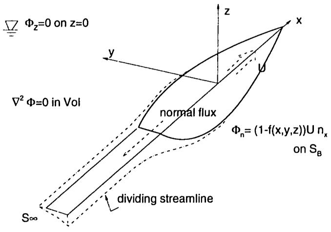

text_image

Φz=0 on z=0
∇² Φ=0 in Vol
normal flux
Φn = (1-f(x,y,z))Unx
on SB
dividing streamline
S∞
y
z
x
U

Figure 2-2: Aspiration model

Figure 2-2 shows the boundary value problem for this model. Symmetry is imposed about the x-y plane and Laplace governs the fluid motion in the infinite volume external to the hull, $S_{\bar{B}}$ , which is taken as the mean body position. A flux condition is imposed on the body,

$$
\frac {\partial \Phi}{\partial n} = (1 - f (x, y, z)) \vec {W} \cdot \vec {n} \text {   on   } S _ {\vec {B}}, \tag {2.13}
$$

where, $((1 - f(x, y, z)) \vec{W} \cdot \vec{n} - \frac{\partial \Phi}{\partial n})$ , represents the normal flux passing through the hull in the reference frame. When, $f(x, y, z) \to 0$ (no flux), the problem reduces to the Double-body linearization. When, $f(x, y, z) \to 1$ (free-stream flux), the problem reduces to the Neumann-Kelvin linearization.

Within these limits, the normal flux is arbitrary. Without a viscous model to provide a specification on f, the model will be tailored for transom hulls. A Gaussian function will be applied centered on the transom stern,

$$
f (x, y, z) = f (x) = 1. - e ^ {- 4. 6 0 5 \frac {(x - x _ {T}) ^ {2}}{L _ {T} ^ {2}}}, \tag {2.14}
$$

where $x_{T}$ is the position of the transom, and $f(x_{T} + L_{T}) = 0.99$ . $L_{T}$ controls the extent of the tapered flux. This attempts to produce a pressure approaching zero at the stern as in the Neumann-Kelvin basis flow, but retains the advantages of the Double-body flow over most of the body. Physically, a normal mass flux extrudes from the stern of the ship, simulating a separated flow.

Solutions comparing the different linearizations for transom hulls will be presented in chapter 5.

# 2.2.3 Linearization

This linearization begins with the decomposition of the total disturbance potential into basis, $\Phi$ , local, $\phi$ , and memory $\psi$ potentials.

$$
\Psi (\vec {x}, t) = \Phi (\vec {x}) + \phi (\vec {x}, t) + \psi (\vec {x}, t). \tag {2.15}
$$

The basis flow is assumed to be the largest component of the total flow, with the local and memory flows being small corrections. Consider $\Phi = O(1)$ , $\phi, \psi = O(\epsilon)$ where $\epsilon \ll 1$ .

The local perturbation potential, $\phi$ , represents the instantaneous fluid response. It takes the form of a pressure relief problem that transfers the unsteady forcing due to the body boundary condition to the free surface condition for the memory flow.

The memory perturbation potential, $\psi$ , represents the wave flow.

# Linearization of the free surface conditions

Apply the potential decomposition (2.15) to the free surface conditions, dropping terms of $O(\epsilon^{2})$ , and assume $\zeta = O(\epsilon)$ . Also note that $\Phi$ is time-independent. The free surface conditions become,

Kinematic

$$
\frac {\partial \zeta}{\partial t} - (\vec {W} - \nabla \Phi) \cdot \nabla \zeta = \frac {\partial}{\partial z} (\Phi + \phi + \psi) \text { on } z = \zeta (x, y, t). \tag {2.16}
$$

Dynamic

$$
(\frac {\partial}{\partial t} - (\vec {W} - \nabla \Phi) \cdot \nabla) (\phi + \psi) = - g \zeta + [ \vec {W} \cdot \nabla \Phi - \frac {1}{2} \nabla \Phi \cdot \nabla \Phi ] \mathrm{on} z = \zeta (x, y, t). (2. 1 7)
$$

Now apply a Taylor expansion for small $\zeta$ about the $z = 0$ plane and note that $\frac{\partial\Phi}{\partial z} = 0$ . Retaining linear terms the free-surface condition now become,

Kinematic

$$
\frac {\partial \zeta}{\partial t} - (\vec {W} - \nabla \Phi) \cdot \nabla \zeta = \frac {\partial^ {2} \Phi}{\partial z ^ {2}} \zeta + \frac {\partial \phi}{\partial z} + \frac {\partial \psi}{\partial z} \text { on } z = 0. \tag {2.18}
$$

Dynamic

$$
(\frac {\partial}{\partial t} - (\vec {W} - \nabla \Phi) \cdot \nabla) (\phi + \psi) = - g \zeta + [ \vec {W} \cdot \nabla \Phi - \frac {1}{2} \nabla \Phi \cdot \nabla \Phi ] \text {on} z = 0. \tag {2.19}
$$

# Linearization of the body boundary conditions

The first simplification of the body boundary condition is to assume that the steady forcing due to the mean body velocity is accounted for by the basis flow and the memory flow on the mean body position, $S_{\bar{B}}$ . The proportioning of the forcing between the basis and the memory flow depends upon the choice of the basis flow model.

$$
\frac {\partial}{\partial n} (\Phi + \psi) = \vec {W} \cdot \vec {n} \text {   on   } S _ {\bar {B}}. \tag {2.20}
$$

The total forcing on the instantaneous body boundary position is,

$$
\frac {\partial}{\partial n} (\Phi + \phi + \psi) = \vec {W} \cdot \vec {n} + \frac {\partial \delta}{\partial t} \cdot \vec {n} \text { on } S _ {B}. \tag {2.21}
$$

The entire unsteady forcing will be balanced by the local potential,

$$
\frac {\partial}{\partial r _ {i}} \phi = \frac {\partial \delta}{\partial t} \cdot \vec {n} + (\vec {W} - \nabla \Phi - \nabla \psi) \cdot \vec {n} \text {on} S _ {B}. \tag {2.22}
$$

Timman and Newman [55], applied a Taylor expansion for small motions about the mean body position and retained linear terms to arrive at the following expression:

$$
\frac {\partial}{\partial n} \phi = \frac {\partial \delta}{\partial t} \cdot \vec {n} + [ (\vec {\delta} \cdot \nabla) (\vec {W} - \nabla \Phi) + ((\vec {W} - \nabla \Phi) \cdot \nabla) \vec {\delta} ] \cdot \vec {n} \mathrm{on} S _ {\bar {B}}. (2. 2 3)
$$

Replacing $\delta$ with its definition in terms of (2.1) the notation of Ogilvie and Tuck [48] produced:

$$
\frac {\partial \phi}{\partial n} = \sum_ {j = 1} ^ {6} \left(\frac {\partial \xi_ {j}}{\partial t} + \xi_ {j} m _ {j}\right) \quad \text { on } S _ {B}. \tag {2.24}
$$

with,

$$
\left(n _ {1}, n _ {2}, n _ {3}\right) = \vec {n}
$$

$$
\left(n _ {4}, n _ {5}, n _ {6}\right) = \vec {x} \times \vec {n}
$$

$$
(m _ {1}, m _ {2}, m _ {3}) = (\vec {n} \cdot \nabla) (\vec {W} - \nabla \Phi)
$$

$$
(m _ {4}, m _ {5}, m _ {6}) = (\vec {n} \cdot \nabla) (\vec {x} \times (\vec {W} - \nabla \Phi)) \tag {2.25}
$$

The m-terms, $m_{j}$ , provide a coupling between the basis flow and unsteady wave solution. These terms tend to be largest at the ends of the ship and can be significant for full form ships.

# Linearized pressure within the fluid volume

Setting $p_a = 0$ for convenience, the expression for the linear pressure within the fluid assumes the form,

$$
p = - \rho ((\frac {\partial}{\partial t} - (\vec {W} - \nabla \Phi) \cdot \nabla) (\phi + \psi) - [ \vec {W} \cdot \nabla \Phi - \frac {1}{2} \nabla \Phi \cdot \nabla \Phi ] + g z) \tag {2.26}
$$

In accord with form of equations of motion set forth in (2.3) the linear pressure is decomposed into the local, $p_{l}$ , the memory, $p_{m}$ , and the zero-speed hydrostatic $p_{C}$ , components.

So, $p = p_l + p_m + p_C$ , where

$$
p _ {l} = - \rho (\frac {\partial}{\partial t} - (\vec {W} - \nabla \Phi) \cdot \nabla) \phi \tag {2.27}
$$

$$
p _ {m} = - \rho ((\frac {\partial}{\partial t} - (\vec {W} - \nabla \Phi) \cdot \nabla) \psi - [ \vec {W} \cdot \nabla \Phi - \frac {1}{2} \nabla \Phi \cdot \nabla \Phi ]) \tag {2.28}
$$

$$
p _ {C} = - \rho g z \tag {2.29}
$$

A generalized force consisting of three components of force, $F_{1}, F_{2}, F_{3}$ , and three components of moment, $F_{4}, F_{5}, F_{6}$ , along the (xyz) axis respectively, is defined as follows:

$$
F _ {j} = \iint_ {S _ {B}} p \cdot n _ {j} d S \text {for} j = 1, \dots , 6, \tag {2.30}
$$

with, the generalized normal, $n_{j}$ defined in (2.25).

The boundary value problem for the local flow and the initial-value problem for the memory flow are discussed next.

# Local flow boundary value problem

The local flow decomposition separates the local added mass from the forcing in the equations of motion. The motivation for this stems from the consideration of numerical stability which will be discussed in Chapter 4.

The instantaneous response for a given displacement or velocity can be thought of as a pressure release problem, where the disturbance due to the body creates a vertical velocity across the z = 0 plane. In the local boundary value problem, the z = 0 plane has a condition of zero pressure but allows a flux. This vertical flux transfers the body forcing to an inhomogeneity in initial boundary value problem that will be solved subsequently for the memory flow.

This decomposition is also a natural approach to the problem since it separates two components of pressure, local and memory, that are generally close in magnitude but opposite in sign. A formulation that fails to separate these effects will encounter greater problems in numerical conditioning that reflects the physical nature of the problem.

The boundary value problem for local flow is defined as follows:

The body boundary condition conforms to (2.24).

The condition on the linearized free surface position is,

$$
\phi = 0. \text {   on   } z = 0. \tag {2.31}
$$

A further decomposition of the local potential according to Ogilvie [47] arrives at the following:

$$
\phi_ {k} = \mathcal {N} _ {k} (\vec {x}) \dot {\xi} _ {k} (t) + \mathcal {M} _ {k} (\vec {x}) \xi_ {k} (t) \text {   for   } k = 1, \dots , 6. \tag {2.32}
$$

This separation of variables creates a set of six problems that corresponds to each rigid body mode, k. The canonical potentials, $N_{k}$ , and, $M_{k}$ satisfy,

$$
\mathcal {N} _ {k} = 0, \quad \mathcal {M} _ {k} = 0, \quad \text { on } \quad z = 0
$$

$$
\frac {\partial \mathcal {N} _ {k}}{\partial n} = n _ {k}, \quad \frac {\partial \mathcal {M} _ {k}}{\partial n} = m _ {k}, \quad \text { on } \quad S _ {\bar {B}}
$$

$$
\text { for   } k = 1, \dots , 6. \tag {2.33}
$$

Applying the definition for local pressure, six components of generalized force for each of the six directions of rigid-body motion are obtained,

$$
F _ {j k} = - \rho \iint_ {S _ {B}} \left(\frac {\partial \phi_ {k}}{\partial t} - (\vec {W} - \nabla \Phi) \nabla \phi_ {k}\right) \cdot n _ {j} d S
$$

$$
\text { for } \quad j = 1, \dots , 6
$$

$$
\text { for } \quad k = 1, \dots , 6. \tag {2.34}
$$

At this point Tuck's theorem could be used to reduce the tangential derivate of the potential but the numerical approach taken in this work will produce first tangential derivatives accurately.

Applying the decomposition of the local potential (2.32) and collecting terms for acceleration, velocity, and displacement results in the local force coefficients as proposed in the equations of motion (2.3),

$$
\begin{array}{l} a _ {0 j k} = \rho \iint_ {S _ {B}} \left(\mathcal {N} _ {k}\right) n _ {j} d S \\ b _ {0 j k} = \rho \iint_ {S _ {B}} (- (\vec {W} - \nabla \Phi) \mathcal {N} _ {k} + \mathcal {M} _ {k}) n _ {j} d S \\ c _ {0 j k} = \rho \iint_ {S _ {\mathcal {B}}} (- (\vec {W} - \nabla \Phi) \mathcal {M} _ {k}) n _ {j} d S. \tag {2.35} \\ \end{array}
$$

# Memory flow boundary value problem

The memory flow is governed by an initial boundary value problem in which the memory potential represents the solution for the steady, radiated, and, if present, scattered wave patterns. Prior to the solution of this wave flow, the basis and local flows must be found. The basis flow provides the linearization and the local flow provides the forcing for unsteady motion.

If there is an incident flow, $\Psi_{I}$ , present, the memory potential and wave elevation can be redefined. Set, $\psi = \psi + \Psi_{I}$ , and $\zeta = \zeta + \zeta_{I}$ in the following conditions so that $\psi$ and its associated wave elevation, $\zeta$ , represent the unknown steady, radiated, and scattered wave patterns, with an incident wave pattern specified as a forcing for the problem.

The initial boundary value problem is stated as follows:

The body boundary condition balances the forcing arising from steady motion,

$$
\frac {\partial \psi}{\partial n} = (\vec {W} - \vec {\Phi}) \cdot \vec {n} \text {   on   } S _ {\vec {B}}. \tag {2.36}
$$

If an incident wave is present, this condition becomes,

$$
\frac {\partial \psi}{\partial n} = (\vec {W} - \vec {\Phi}) \cdot \vec {n} - \frac {\partial \Psi_ {I}}{\partial n} \text {   on   } S _ {B}. \tag {2.37}
$$

The free surface condition follows with $\psi, \frac{\partial \psi}{\partial z}$ , and $\zeta$ being unknown a priori.

Kinematic

$$
\frac {\partial \zeta}{\partial t} - (\vec {W} - \nabla \Phi) \cdot \nabla \zeta = \frac {\partial^ {2} \Phi}{\partial z ^ {2}} \zeta + \frac {\partial \phi}{\partial z} + \frac {\partial \psi}{\partial z} \text {on} z = 0. \tag {2.38}
$$

Dynamic

$$
\frac {\partial \psi}{\partial t} - (\vec {W} - \nabla \Phi) \cdot \nabla \psi = - g \zeta + [ \vec {W} \cdot \nabla \Phi - \frac {1}{2} \nabla \Phi \cdot \nabla \Phi ] \text {on} z = 0. \tag {2.39}
$$

The rest of this initial boundary value problem is stated as in the exact problem. The evaluation of pressure and the memory force, $\vec{F_{M}}$ , are evaluated via (2.28) and (2.30).

The free surface conditions have not been combined as the numerical scheme solves for all three unknowns separately. This will be discussed in chapter 3 which presents the numerical solution to the boundary integral formulation of the problem.

# 2.2.4 The boundary integral formulation

The application of Green's second identity transforms the boundary value problems stated previously into boundary integral equations. This will facilitate the numerical solution as the entire fluid volume will not have to be discretized.

The potential formulation according the Green's identity produces,

$$
2 \pi \Psi (\vec {x}) - \iint_ {S _ {F} \cup S _ {B}} \frac {\partial \Psi \left(\vec {x} ^ {\prime}\right)}{\partial n} G \left(\vec {x} ^ {\prime}; \vec {x}\right) d x ^ {\prime} + \iint_ {S _ {F} \cup S _ {B}} \Psi \left(\vec {x} ^ {\prime}\right) \frac {\partial G \left(\vec {x} ^ {\prime} ; \vec {x}\right)}{\partial n} d x ^ {\prime} = 0 \tag {2.40}
$$

where $G(\vec{x}'; \vec{x})$ is the Rankine source potential,

$$
G (\vec {x} ^ {\prime}; \vec {x}) = \frac {1}{| \vec {x} - \vec {x} ^ {\prime} |}. \tag {2.41}
$$

The decomposition of $\Psi$ dictates that this equation governs the boundary value problem for the basis, local, and memory flows. The basis and local flows are also suitable to a source formulation.

For the local flow Tuck's theorem [48] can be applied as in Nakos [41] in order to treat the body forcing from the m-terms in a more suitable form for numerical computation.

# 2.2.5 The treatment of transom hulls

This final section of the mathematical formulation presents a treatment for transom hulls. Essentially, transom hulls are ships with open stern that are wide and flat. For these types of sterns the flow streamlines emerge from beneath the hull rather than from the around the side as in conventional sterns. Many current designs for vessels have this feature, so it is an essential case to study.

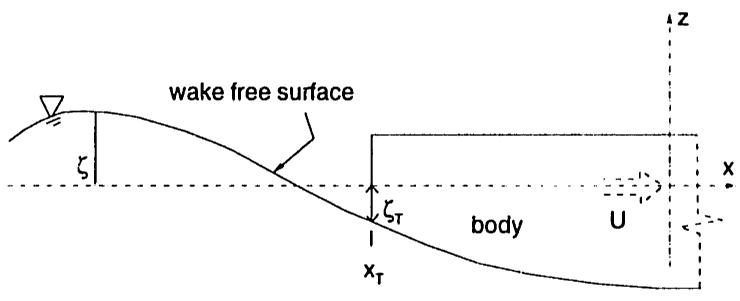

text_image

wake free surface
ξ
ξT
xT
body
U
z
x

Figure 2-3: View of transom stern looking outboard from centerline

Figure 2-3 displays a cut-away profile view at the centerline of a typical transom stern. This problem must be treated carefully because it can introduce lifting effects on the hull and has an analogy in lifting surface and cavity flows, examine Fine and Kinnas [13] for instance. Various linear models can be proposed to treat the flow emerging from beneath the transom stern.

This work considers an extension of the free surface conditions to the transom stern flow detachment line. In conjunction with the Aspiration model for a basis flow which should insure a linearization that approximates the total flow well, the free surface conditions can provide a physically rational treatment for transom stern flow. Aft of the transom edge, the free surface conditions assume the linearized form stated previously. Directly at a line of intersection of the free surface and the trailing edge of the submerged body, the conditions to be imposed on the free surface boundary take a slightly different form. These are called Kutta conditions in reference to the lifting flow analogy but are expressed in terms of the free surface conditions. The proper conditions of pressure on the body do not have to be imposed explicitly if behavior of the free surface at the transom is specified properly.

A fundamental assumption in the linearized model is to assume that the position of detachment line defining the trailing edge of the body. The location of the detachment line can be highly nonlinear in general and is dependent upon ship motion and speed. For round transoms such as those found with sailing yachts, the location of the separation line can be especially difficult. However, for sheared transom hulls such as that shown in Figure 2-3, the location of the trailing edge can be safely assumed. All well designed transom hull ships insure that the flow does detaches exactly at the corner of the sheared transom stern. Transom sterns are designed with this forced flow separation under consideration in order to avoid excessive viscous form drag. Also, at all practical design speeds, the transom can be considered as dry. In potential theory, this must result from continuity of pressure which precludes corner flow. Even for rounded transoms, a detachment position can often be assumed to which the global body forces are not sensitive, or successive approximations could be used to satisfy the nonlinearity.

In the following notation, the coordinates $(x_{T}, y_{T}, 0)$ define the projection of the mean transom position onto the z = 0 plane along the line of separation, and $\zeta_{T} = \zeta_{T}(x, y)$ defines the instantaneous elevation of the transom stern above the line of separation.

Kutta conditions:

# Kinematic

$$
\frac {\partial \psi}{\partial z} = - \frac {\partial \zeta_ {T}}{\partial t} + (\vec {W} - \nabla \Phi) \cdot \nabla \zeta_ {T} + \frac {\partial^ {2} \Phi}{\partial z ^ {2}} \zeta_ {T} + \frac {\partial \phi}{\partial z} \text {on} (x, y, z) = (x _ {T}, y _ {T}, 0). \tag {2.42}
$$

Numerically, the kinematic condition will be enforced directly through the solution of the boundary integral equations.

# Dynamic

$$
\left(\frac {\partial}{\partial t} - (\vec {W} - \nabla \Phi) \cdot \nabla\right) (\phi + \psi) = - g \zeta_ {T} + \left[ \vec {W} \cdot \nabla \Phi - \frac {1}{2} \nabla \Phi \cdot \nabla \Phi \right] \text { on } (x, y, z) = (x _ {T}, y _ {T}, 0) \tag {2.43}
$$

The dynamic condition imposes a dynamic pressure on the free surface that balances the hydrostatic pressure due to the given transom draft. The total pressure exactly at the trailing edge is then equal to the atmospheric pressure, and along with kinematic condition, continuity of pressure along the detaching streamline will be insured. The basis flow, as discussed previously, was designed with this continuity of pressure in mind.

Both conditions must be imposed at the transom in order to close this problem. In lifting surface theory for cavity flows, only the dynamic condition is necessary to impose the proper flow, but, for free surface transom flow, an additional constraint is necessary due to the presence of gravity. In an analysis of a simplified, two-dimensional transom flow, Schmidt [54] provides evidence to support this argument.

# Chapter 3

# Numerical Implementation for Forced Motions

This chapter presents a numerical method that solves the memory flow boundary value problem. Only the wave flow is discussed since the solutions for the basis and local flows can be obtained through any general source or potential based panel method.

The numerical implementation for the wave flow and resulting body forces, $F_{m}(\vec{\xi},\vec{\xi},t)$ , will be examined within the framework of forced motion simulations. For a prescribed body motion, the wave solution is independent of the equations of motion, so the discrete approximation to the wave flow can be compared directly to the physical wave flow. This precludes interference from errors introduced in the numerical integration of the equations of motion.

Essentially, there are two distinct problems to be modelled in this study. The force motion simulation focuses on the first problem, the discrete wave propagation governed by the boundary integral formulation, and the free motion simulation focuses on the other problem, the numerical integration of the equations of motion. The numerical implementation for free motions will be discussed in the next chapter. In chapter 5, results from forced motion simulations provide numerical evidence for convergence and comparison to previous theoretical and experimental results. Classical ship motion theory applies forced motion simulations to solve the equations of motion in a canonical form. This work can produce the radiation and diffraction forces of classical, frequency domain theory through steady-state periodic forcing.

The first section of this chapter presents the Rankine panel method which models the initial, boundary value problem governing the wave flow. This problem must be discretized in both space and time. Details of the underlying discretization and numerical issues related to the method will be provided.

The second section outlines the analysis quantifying the difference between the continuous and discrete formulations. Quantifying the global error allowed the design of the numerical method presented in the first section. This numerical analysis provides confidence that the method represents the physical flow faithfully.

# 3.1 Time domain Rankine panel method

The following time domain Rankine panel method has evolved from a method applied to a frequency domain approach to ship motions originated by Nakos and Sclavounos [40] with extensions provided by this author [22]. Panel methods are a common technique for solving boundary integral equations. They take advantage of the application of Green's second identity which poses the problem as a boundary integral equation rather than a governing equation throughout the whole fluid volume. Discretization of the continuous problem allows for a practical numerical computation. Because the potential and its normal derivative on the fluid boundaries determine the flow completely, only two surface-fitted spatial dimensions and the one temporal dimension must be examined. If the entire fluid were considered, a third spatial dimension would have to be discretized. The boundary integral formulation reduces one of the spatial dimensions analytically.

The spatial discretization belongs to a family known as the higher-order Rankine panel methods. It represents the unknown quantities in the problem as biquadratic spline sheets and the geometry as grids of quadrilateral facets. This boundary element approach to integral equations has become known as the panel method due to its spatial discretization. The Rankine subset of panel methods refers to the choice of

Green function. The Green function, a Rankine source, and its normal derivative, a normal dipole, satisfy the Laplace equation within the fluid volume and the condition at infinity, $S_{\infty}$ . The other conditions remain to be satisfied explicitly through the boundary integral formulation and the time evolution equations.

The evolution in time is dictated through a set of equations derived from the free surface conditions. A discrete solution for the elevation, $\zeta$ , via the kinematic free surface condition enables the calculation of the memory potential, $\psi$ , on the free surface via the discrete dynamic boundary condition. The boundary integral equation then satisfies a mixed boundary value problem given the body forcing, $\frac{\partial\psi}{\partial n}$ , on the body, and the potential on the free surface. The solution of the integral equation, which takes the form of a linear system of equations after spatial discretization, produces the vertical velocity on the free-surface, $\frac{\partial\psi}{\partial z}$ , and the potential on the body. The initial conditions and an initial solution of the integral equation provide the starting values for the evolution equations.

The radiation condition is the remaining constraint to be satisfied in order to make this problem well-posed. A numerical beach will satisfy the radiation condition in a suitably approximate manner.

# 3.1.1 Spatial discretization

The discrete approximation begins with a separation of variables, allowing a distinction between discretization in time and space. The unknown global quantities of elevation, potential, and normal flux on the free surface and the potential on the body boundary must be discretized. The normal flux on the rigid body boundary will be prescribed in a forced motion simulation or predicted at each time step for a free motion simulation, so there are three unknown functions on the free surface but only one on the body.

A B-spline representation discretizes the spatial component of the unknowns. The solution can then be described as the summation over all basis functions, $B_{j}$ , centered on the j-th panel, that contribute to the global functions, $\zeta, \psi$ , and $\frac{\partial \psi}{\partial n}$ . The time-dependent spline coefficients $(\zeta)_{j}, (\psi)_{j}$ , and $(\psi_{z})_{j}$ determine the amount of contribution from each basis function. These spline coefficients can now be considered the spatially discrete unknowns.

$$
\psi (\vec {x}, t) \simeq \sum_ {j} (\psi) _ {j} (t) B _ {j} (\vec {x})
$$

$$
\zeta (\vec {x}, t) \simeq \sum_ {j} (\zeta) _ {j} (t) B _ {j} (\vec {x})
$$

$$
\frac {\partial \psi}{\partial n} (\vec {x}, t) \simeq \sum_ {j} \left(\psi_ {z}\right) _ {j} (t) B _ {j} (\vec {x}). \tag {3.1}
$$

# Basis functions

The choice of basis function strongly influences the quality of the numerical method, with the most important consideration being the propagation of waves on the discrete free surface. Experience with a frequency domain solution for wave flow, and the quantitative analysis presented in the following section dictate a choice for the standard basis function. A detailed discussion concerning all aspects of the choice is found in Nakos [41].

The standard basis function, a prescribed shape distribution, is magnified at each panel by the associated spline coefficient. The summation of these shape functions forms the global quantity being approximated. The shape of the basis function determines the continuity of the global quantities between panels. For instance, the simplest shape is a constant over the j-th panel, but identically zero on all other panels. This is a traditional choice for panel methods that allows no continuity across panels. A second order B-spline can be retain continuity across panel edges for the value and first derivates of the global quantity, with the second derivatives then modelled in a piece-wise constant manner.

The basis function used here is a bi-quadratic normal B-spline representation. This maintains continuity of the global unknowns in the value and the first derivatives. Both first and second derivatives of the function can be obtained directly which avoids a need to use spatial finite differences. The chosen basis function has the following

form,

$$
B (x, y) = b (x) b (y), \tag {3.2}
$$

where,

$$
b (x) = \left\{ \begin{array}{l l} \frac {1}{2 h _ {x} ^ {2}} (x + \frac {3 h _ {x}}{2}) ^ {2}, & - \frac {3 h _ {x}}{2} <   x <   - \frac {h _ {x}}{2} \\ \frac {1}{h _ {x} ^ {2}} (- x ^ {2} + \frac {3 h _ {x} ^ {2}}{4}), & - \frac {h _ {x}}{2} <   x <   \frac {h _ {x}}{2} \\ \frac {1}{2 h _ {x} ^ {2}} (- x + \frac {3 h _ {x}}{2}) ^ {2}, & \frac {h _ {x}}{2} <   x <   \frac {3 h _ {x}}{2} \end{array} \right. \tag {3.3}
$$

with $h_{x}$ defined as the panel width.

Continuity is maintained through the overlap of the support area $\left(-\frac{3h_{x}}{2}\rightarrow\frac{3h_{y}}{2},-\frac{3h_{y}}{2}\rightarrow\frac{3h_{y}}{2}\right)$ for the basis function. As defined above, each basis function has a support of the nine panels centered on the j-th panel. Because the basis function is local in space, identically zero outside its support, only the nine neighboring basis functions contribute to the global function at any point on the panel surface.

For each global unknown, continuity is maintained with only one unknown spline coefficient at each panel due to the overlapping supports of the basis functions. In a spline sheet that is defined on a rectangular grid of geometric panels, this support becomes undefined at the end however. This brings a requirement for the specification of spline end conditions. For the biquadratic spline, an additional spline coefficient must be specified at each edge and corner of the spline sheet. Physical requirements for the solution, for instance the Kutta condition at the transom stern, impose constraints on these additional unknowns and keep the spline representation of the global unknown complete.

# Computational domain

The geometrical computation domain, consists of a collection of rectangular, boundary-fitted grids. The grids, which discretize the geometry, are composed of flat, quadrilateral panels on the surface of the ship hull and on the z = 0 plane. The free surface domain is truncated on all sides in order to keep the computational effort finite. The effect of this truncation and the numerical enforcement of the radiation condition will be discussed in a subsequent section.

A spline sheet is defined on each panel with a basis function and associated spline coefficients defined for each panel to represent the global unknowns on that particular surface. Also, additional spline coefficients are applied at the grid edges to impose the spline end conditions. As the panels for a general surface are not square and may even approach a triangular outline, the basis function is stretched and twisted according to a local mapping for each panel. This allows the spline to represent the unknowns on arbitrary geometries.

One standard computational domain configuration is applied to conventional ships which have a closed stern. Such a case is the Series-60, $\mathrm{Cb} = 0.7$ , hull which has been studied extensively in towing tanks by Gerritsma [15] among others. For these types of hulls, one spline sheet represents the hull and one spline sheet represents the free surface. A typical computational domain is portrayed in Figure 3-1. This

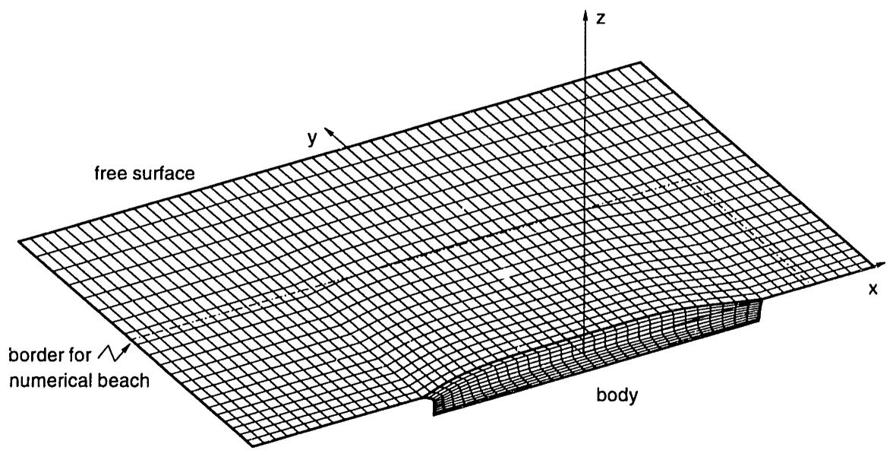

text_image

free surface
y
z
x
border for
numerical beach
body

Figure 3-1: Typical Series 60, $\mathrm{Cb} = 0.7$ , computational domain

discretization applied 30 panels along the length of the submerged body and 10 panels along its girth. A function represented on this particular domain requires 1,695 spline coefficients to be determined. The size of the domain is dependent upon the expected wavelengths. The issue of domain size and sensitivity to truncation will be examined in detail through numerical testing. Also shown in Figure 3-1 is a border showing the typical extent for the numerical beach. This numerical beach will be discussed in a following section.

A different domain configuration is used to study the class of vessels possessing transom sterns. Figure 3-2 shows a typical grid for a transom hull. This particular transom hull, which will be used as a case for numerical study in this work, is a simple mathematical form. It possess triangular cross-sections with a quadratic definition for the keel and waterline. This hull was chosen as a tool for preliminary numerical investigation. At this point, no realistic transom hull offsets and experiments have been obtained for testing. This domain configuration has an additional spline sheet

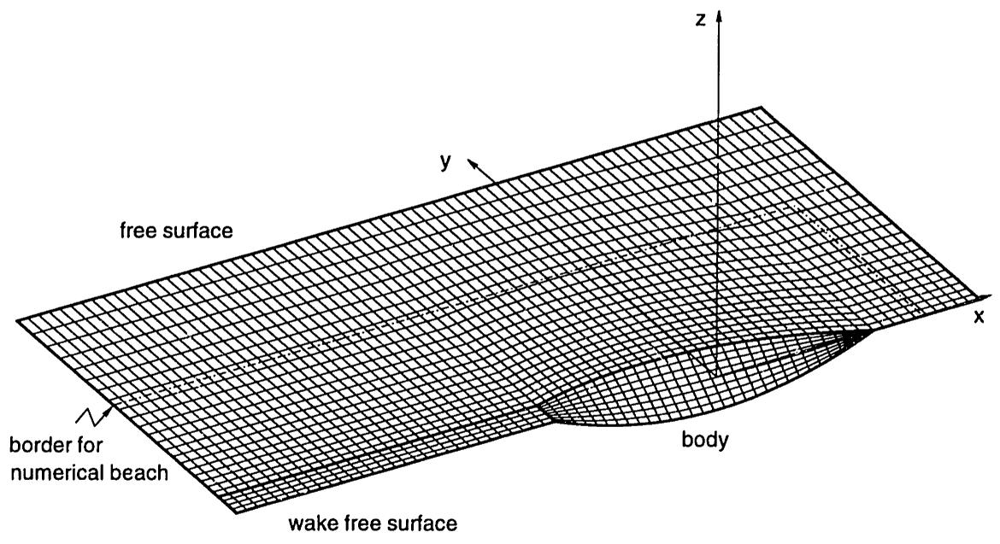

text_image

free surface
y
z
x
border for
numerical beach
body
wake free surface

Figure 3-2: Typical transom hull computational domain

besides the one representing the submerged body and the one representing the outer free surface domain. An additional spline sheet defined here as the wake free surface appears directly behind the transom stern. This wake free surface sheet has exactly the same conditions imposed on it as the outer free surface. The only difference lies in the specification of the spline end conditions at the intersection of this sheet with the transom stern. At this line of intersection the Kutta conditions defined in the formulation are applied numerically through manipulation of the spline representation. The position of the line of intersection between the outer free surface and the wake free surface is not of importance. Because the same conditions are being imposed on both sheets, continuity of the solution across the intersection will occur as the discretization density increases. This will be demonstrated by the numerical results to be presented.

# Spatially discrete boundary integral formulation

The spline representation allows the spatial discretization of in the initial, boundary value problem in its boundary integral formulation. Adopting the summation for multiply occurring indices, the evolution equations and mixed boundary value problem assume the following discrete form,

$$
\frac {\partial (\zeta) _ {j}}{\partial t} B _ {i j} - (\zeta) _ {j} \vec {W} _ {\Phi} \cdot \nabla B _ {i j} = (\zeta) _ {j} \frac {\partial^ {2} \Phi}{\partial z ^ {2}} B _ {i j} + \frac {\partial \phi}{\partial z} + (\psi_ {z}) _ {j} B _ {i j} \tag {3.4}
$$

$$
\frac {\partial \left(\psi_ {j} \right.}{\partial t} B _ {i j} - (\psi) _ {j} \vec {W} _ {\Phi} \cdot \nabla B _ {i j}) = - (\zeta) _ {j} g B _ {i j} + \vec {W} _ {R} \tag {3.5}
$$

$$
(\psi) _ {j} 2 \pi B _ {i j} + (\psi) _ {j} D _ {i j} - (\psi_ {z}) _ {j} S _ {i j} = 0, \tag {3.6}
$$

where,

$$
\begin{array}{l} \vec {W} _ {\Phi} = (\vec {W} - \Phi) \\ \vec {W} _ {R} = (\vec {W} \cdot \nabla \Phi - \frac {1}{2} \nabla \Phi \cdot \nabla \Phi) \\ B _ {i j} = B _ {j} (\vec {x} _ {i}) = B _ {i - j} \\ D _ {i j} = \iint_ {- \infty} ^ {\infty} B _ {j} (\vec {x} ^ {\prime}) G _ {n} (\vec {x} _ {i}; \vec {x} ^ {\prime}) d \vec {x} ^ {\prime} = D _ {i - j} \\ S _ {i j} = \iint_ {- \infty} ^ {\infty} B _ {j} (\vec {x} ^ {\prime}) G (\vec {x} _ {i}; \vec {x} ^ {\prime}) d \vec {x} ^ {\prime} = S _ {i - j} \tag {3.7} \\ \end{array}
$$

The local flow forcing, $[\frac{\partial\phi}{\partial z}]$ , and the basis flow quantities are defined at $(\vec{x}_{i}, t)$ .

The discrete forms of the kinematic and dynamic free surface conditions, equations (3.4) and (3.5) respectively, are referred to as the evolution equations. The linear system of equations (3.6) arising from imposing the integral equation at all panel centroids and the spline end conditions is referred to as the mixed boundary value problem. This satisfaction on the boundary integral equation arising from the continuous problem is known as the collocation method. The evaluation of the integrals in 3.7 over the plane quadrilaterals is obtained from Newman [46].

# 3.1.2 Temporal discretization

The stability analysis which will be presented in section 3.2 leads to a neutrally stable scheme referred to as the Emplicit Euler scheme. At time $t = t_{n+1}$ , considered the present time, the kinematic free surface condition is satisfied through an explicit Euler discretization in time. The dynamic condition is then satisfied through an implicit Euler discretization in time. The kinematic condition uses the past solution at $t = t_{n}$ for vertical flux to update the wave elevation. The dynamic condition uses the present solution for the wave elevation just obtained to update potential. Both of these conditions require the solution of a banded, linear system of equations. The bandedness results from the spatial overlap of basis functions. The full, dense linear system of equations for the boundary value problem is then solved to determine the vertical flux through the z = 0 plane, and the pressure on the body boundary.

The Emplicit Euler scheme assumes the following form,

$$
\frac {(\zeta) _ {j} ^ {n + 1} - (\zeta) _ {j} ^ {n}}{\Delta t} B _ {i j} - (\zeta) _ {j} ^ {n + 1} \vec {W} _ {\Phi} \cdot \nabla B _ {i j} = (\zeta) _ {j} ^ {n} \frac {\partial^ {2} \Phi}{\partial z ^ {2}} B _ {i j} + \frac {\partial \phi}{\partial z} + (\psi_ {z}) _ {j} ^ {n} B _ {i j} (3. 8)
$$

$$
\frac {(\psi) _ {j} ^ {n + 1} - (\psi) _ {j} ^ {n}}{\Delta t} B _ {i j} - (\psi) _ {j} ^ {n + 1} \vec {W} _ {\Phi} \cdot \nabla B _ {i j} = - (\zeta) _ {j} ^ {n + 1} g B _ {i j} + \vec {W} _ {R} \tag {3.9}
$$

$$
(\psi) _ {j} ^ {n + 1} 2 \pi B _ {i j} + (\psi) _ {j} ^ {n + 1} D _ {i j} - (\psi_ {z}) _ {j} ^ {n + 1} S _ {i j} = 0, \tag {3.10}
$$

with the definitions as in (3.7). Here, the local and the basis flow quantities are evaluated at $(\vec{x}_{i}, t_{n})$ .

# 3.1.3 Radiation condition on a truncated free surface

An important consideration in designing a practical Rankine panel method for free surface flows is the approximation of the radiation condition for an infinite, continuous domain on a finite, discrete domain. With respect to the boundary integral equation, the truncated portion of the free surface acts as a rigid lid. An artificial pressure is imposed which leads to reflections off the domain edge. A successful domain truncation and radiation condition in the numerical sense can be described as ensuring that solution on the body is not sensitive to a change in the size of the free surface domain. In order to accomplish this, some numerical radiation condition must be imposed which allows no reflection of body generated waves from the edge of the computational domain.

There are two general types of schemes that could be applied to this method. One approach is to apply a matching at some control volume surrounding the fluid domain which contains a wave flow solution that satisfies the radiation condition. Methods such as that found in Bingham [6] use a Green function which satisfies the radiation condition but are constrained to the Kelvin free surface condition. A matching approach would be very complicated numerically and the application of this method to free surface flows has not been well developed, so a more direct approach is taken in this work.

A numerical beach can be designed that will absorb waves generated by the body. The numerical beach has a direct analogue in the beaches found in towing tanks. Physical beaches these have been shown to be sufficient for studying ship hydrodynamics. A numerical beach can satisfy the radiation condition in the same approximate manner as physical beaches.

This section discusses the design of the numerical beach, some issues of its behavior will be discussed in the following section. Numerical testing will be provided in the chapter of forced motion simulations.

The underlying formulation of the numerical beach used for this work stems from the extensive study produced by Israeli and Orszag [19]. The specific application for this work was tested by Nakos, Kring, and Sclavounos [42]. A Newtonian cooling term is applied to the kinematic free surface condition which damps all wavelengths less than about twice the extent of the numerical beach. The cooling term physically corresponds to a mass flux through the free surface.

The free surface conditions in the inertial frame for the wave flow in the simplest “Kelvin” form and the corresponding dispersion relation illustrate effect of the Newtonian cooling.

$$
\left\{ \begin{array}{l} \frac {d \psi}{d t} = - g \zeta \\ \frac {d \zeta}{d t} = \psi_ {z} - 2 \nu \zeta \end{array} \right\} \Leftrightarrow \omega = i \nu \pm [ g \sqrt {u ^ {2} + v ^ {2}} - \nu^ {2} ] ^ {1 / 2} \tag {3.11}
$$

Here, $\omega$ is the wave frequency, u and v, are the wavenumbers along the x and y axis respectively, and $\nu$ represents the uniformly distributed strength of the Newtonian cooling. For $\nu > 0$ , the wave frequency is shifted off the real axis of the complex plane so the wave becomes damped.

There is also a shift in the real frequency component in this expression which causes a change in the wave dispersion. This can be eliminated through the introduction of a balancing term,

$$
\left\{ \begin{array}{l} \frac {d \psi}{d t} = - g \zeta \\ \frac {d \zeta}{d t} = \psi_ {z} - 2 \nu \zeta + \frac {\nu^ {2}}{g} \psi \end{array} \right\} \Leftrightarrow \omega = i \nu \pm [ g \sqrt {u ^ {2} + v ^ {2}} ] ^ {1 / 2} \tag {3.12}
$$

With this formulation, $\nu$ can be interpreted as a Rayleigh viscosity.

These modified free surface conditions, with the appropriate linearization, are applied on an outer region in the computational domain referred to as the numerical beach. A quadratic variation of the cooling strength, $\nu$ , over this damping zone.

Numerical validation for this type of enforcement of the radiation condition has been produced by Baker, Meiron, and Orszag [1] and Cointe [8]. Specific testing for this particular Rankine panel method was conducted by Nakos [43] and the conclusions of that testing will be restated here. The explosion of a submerged, impulsive singular source was used to compare analytic and numerical results. Also, the qualitative behavior of the beach for a some simple hull forms was examined.

Although, an optimum beach strength exists, the quality of the numerical beach was found to be sufficiently insensitive to the strength of the absorption term so that any strength near the optimum suffices. Thus, one choice of strength was made for all cases. The size of the domain proved to be more important, however. The beach is only effective in absorbing wavelengths less than one and one half the width of the damping region. Although, for the transient problem, all possible wavelengths exist, only a finite portion of the spectrum contain sufficient energy to require damping. Wavelengths longer than the beach will produce some artificial resonance that can be ignored.

For cases with forward speed the size of the beach can be further restricted and ignored entirely downstream. Since, wave disturbances propagate downstream, only an evanescent truncation error occurs. The only practical difficulty will occur with disturbance produced by the so-called at tau = $\frac{1}{4}$ problem which will be discussed in the following section.

# 3.1.4 Numerical issues

Before proceeding to the numerical analysis that quantifies the error in the method proposed above, a few numerical issues will be addressed. These affect convergence of body forces and wave patterns and will be demonstrated through numerical results in chapter 5. This discussion is intended to introduce these numerical issues.

# Artificial $\tau = \frac{1}{4}$ resonance

As discussed in the presentation of the numerical beach, some difficulty may be encountered from the $\tau = F\Omega = \tau_{cr} = \frac{1}{4}$ problem. Here, $F = U/\sqrt{gL}$ is the Froude number or ship speed, and $\Omega = \omega\sqrt{L/g}$ is a non-dimensional measure of the wave frequency. Some energy is inevitably introduced at this frequency from the transient disturbance of the ship. Since, the group velocity of this disturbance corresponds to the speed of the ship, this frequency component can cause difficulties.

While this physical disturbance is not singular in the continuous problem as demonstrated by Liu [33], it may possess significant energy that is not propagated downstream away from the ship, yet the wavelength associated with this disturbance is too large for the numerical beach to absorb entirely. The result is an artificial numerical resonance within the computational domain that may decay only very slowly. The beach does, at least, absorb some of its energy so it will not grow. The force record will clearly exhibit a decaying $\tau_{cr}$ frequency component that does not match physical reality.

At present no tool exists to treat this problem directly. Practically, however, it is not of significance. With forced motions at specified frequencies away from $\tau_{cr}$ , this artificial disturbance resulting from the steady component of forward motion can be overwhelmed by simply increasing the amplitude of the motion. The magnitude of the artificial resonance is independent of ship motions away from the critical frequency. It only becomes evident when attempting to achieve the steady-state forces when the ship does not oscillate. If the steady ship forces are desired, this artificial oscillation can be filtered in order to obtain the mean force.

# Filtering of spurious wavelengths

The error analysis to be presented in the next section illuminates another important numerical consideration. For wavelengths less than five discrete panel lengths, the numerical wave dispersion can deviate significantly from the continuous wave dispersion. Very small waves may even have group velocities going upstream from the vessel. However, since these waves typically contain a very small proportion of the total wave energy, they can be safely eliminated using a low-pass numerical filter over the free surface. The filter is a seven point interpolation polynomial in each tangential direction that only damps wavelengths of less than four to five panel lengths. In chapter 5, results will demonstrate the insensitivity of the body forces to the filter which validates this claim.

One complication can make the application of the filter strongly affect the body forces in a negative manner. Whenever filtering is applied it drains energy from not only the small wavelengths, but also the evanescent disturbance close to the body. The boundary value problem can quickly recover the evanescent energy lost to this filter as long as this filter is not applied too often. The numerical results must demonstrate that the final solution is insensitive to the type of filter and its frequency of application. Overuse of the filter will reduce the amount of energy being propagated away from the ship resulting in a lower prediction for wave damping and a larger magnitude for motions. To little filtering will prevent the wave pattern from converging due to the numerical noise at the short wavelengths.

Practically, the application of the filter every 20 times steps has been found to not affect the body force yet produce smooth wave patterns for all cases tested, with the size of the time steps being dictated by the upper limit for stability. This frequency of filtering allows the system to recover from the energy drain so the final solution can approximate the physical solution well as shown in the results of Nakos, Kring, and Sclavounos [42] and the results to be presented in this work.

# 3.2 Error analysis for time domain Rankine panel methods

This section presents the analysis for the propagation of transient dispersive waves on a discrete free surface and is borrowed directly from Nakos [43] which is a derivation of the stability analysis for frequency domain Rankin panel methods proposed by Sclavounos and Nakos [52]. This free surface stability problem is studied through a simplified initial, boundary value problem for the discretization introduced in the preceding section. A given, elementary forcing, $R(\vec{x}, t)$ , replaces the body boundary condition and the Kelvin linearization for forward speed, $U$ , is applied to the free surface condition. This simplification of the problem allows a stability analysis while retaining sufficient generality for application to the full method.

The solution to the continuous formulation for this simplified problem can be obtained directly and then compared with the discrete formulation. The error which measures the difference between the discrete approximation and continuous solutions is quantified through a temporal stability condition and examination of the numerical dispersion relation.

# 3.2.1 The continuous formulation

Consider a transient wave-making source in a reference frame fixed at free surface with z-axis pointing upward and forward speed, U, relative to the inertial frame. The Laplace equation governs the velocity potential in the fluid subject to the “Kelvin” kinematic and dynamic free surface boundary conditions on z = 0,

$$
\frac {\partial \zeta}{\partial t} - U \frac {\partial \zeta}{\partial x} = \frac {\partial \varphi}{\partial z} \tag {3.13}
$$

$$
\frac {\partial \varphi}{\partial t} - U \frac {\partial \varphi}{\partial x} = - g \zeta , \tag {3.14}
$$

where $\zeta(x,y)$ is the free surface elevation and $\varphi$ is the perturbation potential for the wave flow. As there is no body in this simplified problem, no local flow decomposition is necessary.

A Fourier representation for solution of the perturbation potential over z = 0 is,

$$
\varphi (x, y, t) = \frac {1}{(2 \pi) ^ {3}} \int_ {L} d \omega \int_ {- \infty} ^ {\infty} d u \int_ {- \infty} ^ {\infty} d v \frac {\tilde {f} (u , v , \omega)}{\mathcal {W} (u , v , \omega)} e ^ {- i (u x + v y - \omega t)}, \tag {3.15}
$$

where, $\tilde{f}$ is the spectrum of the forcing, and $\mathcal{W}$ in the dispersion relation obtained from the requirement that $\varphi$ satisfy (3.13) and (3.14),

$$
\mathcal {W} (u, v, \omega) = (\omega + U u) ^ {2} - g \sqrt {u ^ {2} + v ^ {2}} = 0. \tag {3.16}
$$

By causality, the contour, L, is taken across the complex plane from $-\infty$ to $\infty$ beneath all singularities in the integrand. The continuous solution consists of an evanescent disturbance and a radiating wave pattern which results from the roots of the dispersion relation. Since the continuous linear system is neutrally stable (no energy is lost on the free surface), two real and distinct roots exist for the dispersion relation for all wavenumbers $(u,v)\neq(0,0)$ . The group velocity for each wave component can be found throughout the following relation,

$$
\vec {V} _ {g} = - \frac {\left(\frac {\partial \mathcal {W}}{\partial u} , \frac {\partial \mathcal {W}}{\partial v}\right)}{\frac {\partial \mathcal {W}}{\partial \omega}}. \tag {3.17}
$$

For a given forcing frequency, $\omega$ , the system response has been studied comprehensively by Lighthill [30]. Based on a reduced frequency parameter, $\tau = \omega U / g$ , a subcritical and supercritical region can be identified. For $\tau < \tau_{cr} = \frac{1}{4}$ , four separate wave systems exist, and, for $\tau > \tau_{cr}$ , two separate wave systems exist in the steady-state limit. The behavior of the solution exactly at $\tau_{cr}$ is potentially troublesome as the group velocity of the wave system equals the forward speed, but Liu [33] has recently addressed this issue.

# 3.2.2 The discrete formulation

The discrete formulation of the continuous problem above can be analyzed to obtain a numerical dispersion relation. This allows a precise understanding of the consistency, accuracy, and stability for a given discretization scheme. While the analysis to be presented could be applied to any discretization, only the Emplicit-Euler scheme will be examined here. Vada and Nakos [57] conducted an investigation of alternative neutrally stable schemes and chose Emplicit-Euler as the most practical alternative.

# The discretization

Consider the boundary integral equation for this simplified free surface flow,

$$
\varphi (\vec {x}, t) - \iint_ {S _ {F}} \frac {\partial \varphi}{\partial z} \left(\vec {x} ^ {\prime}, t\right) G \left(\vec {x}, \vec {x} ^ {\prime}\right) d \vec {x} ^ {\prime} = R (\vec {x}, t), \tag {3.18}
$$

with $G(\vec{x}, t) = 2\pi / |\vec{x} - \vec{x}'|$ . Along with the linearized free surface conditions, this produces a boundary integral formulation for the unknowns $\zeta, \varphi$ , and $\frac{\partial \varphi}{\partial z}$ .

On the $z = 0$ plane, a rectangular grid of infinite extent and uniform spacing, $h_{x}$ and $h_{y}$ along the x and y axis respectively, represents the free surface boundary. The unknown global functions are defined in terms of a spline sheet composed of basis functions as described previously so that the Emplicit Euler scheme assumes the following form,

$$
\frac {(\zeta) _ {j} ^ {n + 1} - (\zeta) _ {j} ^ {n}}{\Delta t} B _ {i j} - (\zeta) _ {j} ^ {n + 1} U B _ {x i j} = + \left(\varphi_ {z}\right) _ {j} ^ {n} B _ {i j} \tag {3.19}
$$

$$
\frac {(\varphi) _ {j} ^ {n + 1} - (\varphi) _ {j} ^ {n}}{\Delta t} B _ {i j} - (\varphi) _ {j} ^ {n + 1} U B _ {x i j} = - (\zeta) _ {j} ^ {n + 1} g B _ {i j} \tag {3.20}
$$

$$
(\varphi) _ {j} ^ {n + 1} B _ {i j} - (\varphi_ {z}) _ {j} ^ {n + 1} S _ {i j} = R _ {i}, \tag {3.21}
$$

where,

$$
B _ {i j} = B _ {j} (\vec {x} _ {i}) = B _ {i - j}
$$

$$
B _ {x i j} = \frac {\partial}{\partial x} B _ {j} (\vec {x} _ {i}) = B _ {x i - j}
$$

$$
S _ {i j} = \iint_ {- \infty} ^ {\infty} B _ {j} (\vec {x} ^ {\prime}) G (\vec {x} _ {i}; \vec {x} ^ {\prime}) d \vec {x} ^ {\prime} = S _ {i - j}
$$

$$
R _ {i} = R (\vec {x _ {i}}, t _ {n}) \tag {3.22}
$$

# The discrete dispersion relation

A general method for evaluating the discretization in time and space is now applied to the Emplicit-Euler scheme given above. The discretization in transformed into Fourier space in order to obtain a discrete solution for this simplified problem. This is analogous to the von-Neumann analysis applied to partial differential equations.

The analysis begins with the description of a discrete function,

$$
f _ {k, l, n} = f (k h _ {x}, l h _ {y}, n \Delta t), \tag {3.23}
$$

for which the Discrete Fourier Transform can be applied,

$$
\hat {f} (u, v, \omega) = h _ {x} h _ {y} \Delta t \sum_ {k, l, n} f _ {k, l, n} e ^ {i (u k h _ {x} + v l h _ {y} - \omega n \Delta t)}, \tag {3.24}
$$

and also its inverse,

$$
f _ {k, l, n} = \frac {1}{(2 \pi) ^ {3}} \int_ {- \pi / \Delta t} ^ {\pi / \Delta t} d \omega \int_ {- \pi / h _ {x}} ^ {\pi / h _ {x}} d u \int_ {- \pi / h _ {y}} ^ {\pi / h _ {y}} d v \hat {f} (u, v, \omega) e ^ {- i (u k h _ {x} + v l h _ {y} - \omega n \Delta t)}. \tag {3.25}
$$

The transform, $\hat{f}$ , takes the form of a continuous, periodic function and obeys discrete convolution and aliasing theorems.

The transform of the initial, boundary value problem results in the following,

$$
\hat {\zeta} \frac {(z - 1)}{\Delta t} \hat {B} - \hat {\zeta} U \hat {B} _ {x} = \hat {\varphi_ {z}} \hat {B} \tag {3.26}
$$

$$
\hat {\varphi} \frac {(z - 1)}{\Delta t} \hat {B} - \hat {\varphi} U \hat {B _ {x}} z = - \hat {\zeta} g \hat {B} z \tag {3.27}
$$

$$
\hat {\varphi} \hat {B} - \hat {\varphi} _ {z} \hat {S} = \hat {R}, \tag {3.28}
$$

where $z = e^{i\omega\Delta t}$ and $\hat{}$ denotes the transform of the functions defined for the discretized scheme. As discussed in Nakos [41], the chosen B-splines contain a convolution property allowing high order basis functions to be defined recursively from lower order members of the family. From this property the Fourier transform of the biquadratic basis functions, needed for the analysis, can easily be obtained,

$$
\tilde {B} (u, v) = h _ {x} h _ {y} \left(\frac {\sin \frac {u h _ {x}}{2}}{\frac {u h _ {x}}{3}}\right) ^ {3} \left(\frac {\sin \frac {v h _ {y}}{2}}{\frac {v h _ {y}}{3}}\right) ^ {3}. \tag {3.29}
$$

A discrete solution can be obtained directly from this Fourier space representation,

$$
\varphi_ {k, l, n} = \varphi (x _ {k}, y _ {l}, t _ {n}) = \frac {1}{(2 \pi) ^ {3}} \int_ {L} d \omega \int_ {- \infty} ^ {\infty} d u \int_ {- \infty} ^ {\infty} d v \frac {\hat {f} \cdot e ^ {- i (u k h _ {x} + v l h _ {y} - \omega n \Delta t)}}{\mathcal {W} _ {d} (u , v , \omega ; h _ {x} , h _ {y} , \Delta t)}, \tag {3.30}
$$

with the discrete dispersion relation, $\mathcal{W}_d$ ,

$$
\mathcal {W} _ {d} = (\beta^ {2} - i \beta \mathcal {F} _ {h} \mathcal {D}) z ^ {2} - (2 \beta^ {2} + \mathcal {F} _ {h} ^ {2} \mathcal {D} ^ {2} - \mathcal {S}) z + (\beta^ {2} + i \beta \mathcal {F} _ {h} \mathcal {D}) = 0, \tag {3.31}
$$

where,

$$
\text { free   surface   grid   number }: \quad \beta = \frac {\sqrt {h _ {x} / g}}{\Delta t} \tag {3.32}
$$

$$
\text { grid   Froude   number }: \quad \mathcal {F} _ {h} = \frac {U}{\sqrt {g h _ {x}}},
$$

and,

$$
\mathcal {S} (\hat {u}, \hat {v}; \alpha) = 2 \pi \frac {\sum_ {k , l = - \infty} ^ {+ \infty} \frac {(- 1) ^ {k + l}}{(k + \hat {u}) ^ {3} (l + \hat {v}) ^ {3}}}{\sum_ {k , l = - \infty} ^ {+ \infty} \frac {(- 1) ^ {k + l}}{(k + \hat {u}) ^ {3} (l + \hat {v}) ^ {3} \sqrt {(k + \hat {u}) ^ {2} + \alpha^ {2} (l + \hat {v}) ^ {2}}}}, \tag {3.33}
$$

$$
\mathcal {D} (\hat {u}) = 2 \pi \frac {\sum_ {k = - \infty} ^ {+ \infty} \frac {(- 1) ^ {k}}{(k + \hat {u}) ^ {2}}}{\sum_ {k = - \infty} ^ {+ \infty} \frac {(- 1) ^ {k}}{(k + \hat {u}) ^ {3}}}, \tag {3.34}
$$

The discrete dispersion relation defined above is a function of the non-dimensional wave numbers, and $\hat{v}=vh_{x}/2\pi$ , the panel aspect ratio, $\alpha=h_{x}/h_{y}$ , the grid parameters, $\beta$ and $F_{h}$ , and the time-step size, $\Delta t$ , for the frequency component, $\omega$ . Note that since S and D are periodic in u and v with periods $2\pi/h_{x}$ and $2\pi/h_{y}$ respectively, the discrete dispersion relation is as well.

The discrete dispersion relation, which depends upon the particular scheme being applied, can be directly compared to the continuous form in order to judge the approximation. In the limit as $(h_{x}=h_{y},\Delta t)\rightarrow0)$ , consistency of the method can be established. The discrete dispersion relation approaches the continuous form as follows,

$$
\left\{ \begin{array}{l} \mathcal {S} = h _ {x} \sqrt {u ^ {2} + v ^ {2}} + \mathcal {O} (h ^ {5}) \\ \mathcal {D} = u h _ {x} + \mathcal {O} (h ^ {3}) \end{array} \right\} \Rightarrow \mathcal {W} _ {d} = \mathcal {W} + \mathcal {O} (h ^ {3}, \Delta t). \tag {3.35}
$$

The discrete dispersion relation can also be interpreted as the stability polynomial

for the discretization. For the two-step Emplicit-Euler scheme there is a direct correspondence between the two discrete roots and the two continuous roots. Consistency dictates that the discrete roots approach the continuous roots in the limit of the discretization size. Higher order methods will produce spurious roots in addition to the two principal roots that could introduce poorly damped wave modes.

# 3.2.3 Temporal stability

Temporal stability of the discrete solution depends upon the imaginary part of the frequency, $\omega$ , in the dispersion relation. The location of the z-roots dictate the imaginary part. For a root lying outside the unit circle, $|z| > 1$ , the imaginary part will be positive and the discrete wave will grow erroneously in time. For a root inside the unit circle, the imaginary part will be negative and the discrete wave will decay erroneously. Any practical scheme must, by necessity, be neutrally stable in time. All roots must lie on the unit circle so that the frequency corresponding to all wavelengths will be real. For the Emplicit-Euler scheme, neutral stability is ensured through the following stability condition,

$$
\beta \geq \beta_ {c r} = \frac {\mathcal {F} _ {h} ^ {2} \mathcal {D} ^ {2} - \mathcal {S}}{2 \sqrt {\mathcal {S}}}. \tag {3.36}
$$

Failure occurs in two different modes so at low grid froude numbers, the boundary is dependent only upon the panel aspect ratio, $\alpha$ , and scales as $\sqrt{h_{x}}$ , while at higher grid froude numbers, it varies quadratically with $F_{h}$ and scales as $h_{x}^{3/2}$ .

# 3.2.4 Spatial stability

The use of the term spatial stability is used here to denote the numerical dispersion error between the discrete and continuous dispersion relations. As the scheme is neutrally stable, the error is exhibited only as a dispersion error. The group velocities associated with the discrete wave propagation will have an error associated with the difference between the dispersion relations at a given wavenumber. At a certain point the group velocity of the discrete waves may become the same as the forward speed. This is similar to the physical $\tau_{cr}$ problem, but it occurs at a scale dictated by the grid scale and produces a saw-tooth error in the wave solution.

As discussed in the first section of this chapter, the spatial error at these small wavelengths close to the panel size can be practically and effectively treated through a low-pass filter. The filter becomes practical only because of the thorough understanding of the error propagation produced by this analysis.

# Chapter 4

# Numerical Implementation for Free Motions

The chapter focuses on the error analysis of the numerical integration of the equations of motion. Primarily, The numerical solution must be shown to be stable in order to obtain an accurate representation of the continuous formulation. The global error, defined as the difference between the continuous and discrete solutions, must not grow with time.

The motivation for this study originates from an encounter with numerical in the early attempts at a solution. Without an analysis of the numerical stability for particular schemes, no confidence in the solution could be obtained.

Early attempts failed to consider the equations of motion, (2.2), in a physically natural manner, because the local force was not separated from the memory force. Without this decomposition, the local added mass, which is proportional to the instantaneous acceleration, appears implicitly in the forcing on the right hand side of the equation. This term is impulsive in nature so it can not be approximated consistently using a finite difference method. The impulsive nature of the acceleration term becomes evident when represented in the convolution integral under Lighthill's [29] definition of the generalized functions. As in ordinary differential equations, when an acceleration term appears in the forcing, a method can not be found which will be absolutely stable in the limit as the time-step size approaches zero. Zero-stability and a quantitative condition for stability can only be obtained after applying this local decomposition to the equations of motion.

The following discussion will detail the numerical stability analysis for the locally decomposed equations of motion(2.3) and demonstrate that the method is zero-stable. A stability condition will place a bound upon the time-step size necessary for numerical stability.

# 4.1 Error analysis for the numerical integration of the equations of motion

The analysis begins with the homogenous form of the equations of motion. The canonical form proposed by Ogilvie is chosen. The convolution integral is essential for understanding memory effects in this problem. The equation takes the form of a linear Volterra integro-differential equation, specifically of the convolution class,

$$
\left(M + a _ {0}\right) \ddot {\vec {\xi}} (t) + b _ {0} \dot {\vec {\xi}} (t) + \left(C + c _ {0}\right) \vec {\xi} (t) + \int_ {0} ^ {t} d \tau K (t - \tau) \dot {\vec {\xi}} = 0 \tag {4.1}
$$

Numerical stability will only depend upon the homogenous equation because the exciting force is not a function of the ship motion in this linearized model. The radiation condition ensures that the continuous form of homogenous free decay problem is stable. The point of this analysis is to ensure that the numerical approximation will decay as well. Any small perturbation to the numerical solution must decay.

Stability analysis for Volterra integrals has not been solved conclusively for general cases, according to Brunner and van der Houwen [7]. However, general knowledge of the impulse response function for ship dynamics and the fact that the physical problem is always stable, allows an analysis of stability to be made here.

Standard practice for numerical integration schemes is to consider high order differential equations as systems of coupled first degree differential equations. The six, coupled, second degree equations of motion for ship dynamics can be arranged as twelve coupled equations of first degree in the following dynamical system,

$$
\frac {d \vec {y}}{d t} = \vec {f} (t) \tag {4.2}
$$

where

$$
\vec {y} (t) = \left\{ \begin{array}{l} \vec {y} _ {1} (t) \\ \vec {y} _ {2} (t) \end{array} \right\} = \left\{ \begin{array}{l} \dot {\vec {\xi}} (t) \\ \vec {\xi} (t) \end{array} \right\} \tag {4.3}
$$

and

$$
\vec {f} (t) = \left\{ \begin{array}{l} \vec {f _ {1}} (t) \\ \vec {f _ {2}} (t) \end{array} \right\} = \left\{ \begin{array}{c} - [ M + a _ {0} ] ^ {- 1} \left(b _ {0} \vec {y} _ {1} (t) + \left(C + c _ {0}\right) \vec {y} _ {2} (t) + \int_ {0} ^ {t} d \tau K (t - \tau) \vec {y} _ {1} (\tau)\right) \\ \vec {y} _ {1} (t) \end{array} \right\}. \tag {4.4}
$$

At this point an brief outline of the stability analysis is presented. A detailed derivation for a class of integration schemes (including all linear multistep and PECE mode predictor-corrector methods) is presented in the following section. Much of the notation and analytic construction for this part of the work is borrowed from Lambert's text on weak stability theory for ordinary differential equations [26].

First, define a global error equation, $[\epsilon(\vec{t_{n}})=\vec{y}(t_{n})-\tilde{y_{n}}]$ where, $y_{n}$ is a vector representing the numerical solution for each mode of motion at the discrete time step corresponding to $t=t_{n}$ . This provides a measure for the discrepancy between continuous and discrete solutions. Next, linearize the error equation with respect to time, this is the foundation for weak stability analysis in ODE (ordinary differential equation) theory. This assumption is common for nonlinear ODE's. Its likely to be a valid for future extensions to nonlinear effects in this formulation as well.

The error equation is now examined in Laplace space, defining the unilateral Laplace transform as,

$$
\mathcal {L} \{\vec {f} (t) \} = \int_ {0} ^ {t} f (\tau) e ^ {- s \tau} d \tau . \tag {4.5}
$$

This allows the impulse response function to be separated from the error in the convolution integral. The separation of frequency components allows the dynamical system representing the error propagation to be diagonalized. Orthogonal modes of error propagation can be studied independently of each other.

The application of the von-Neumann assumption for the solution of the error modes produces a stability polynomial. the stability polynomial and the criteria for absolute stability combine to form stability condition that places a restriction upon the time-step size. The boundary locus method establishes the region of absolute stability for particular schemes.

# 4.2 Design of a numerical scheme

This analysis now focuses on a class of numerical integration schemes. The PECE mode predictor-correctors is chosen for analysis. Note, that PECE refers to one application a the linear multistep explicit scheme, one function evaluation (requires the evaluation of hydrodynamic forces), one application a the linear multistep implicit scheme, and a final function evaluation per time step. For ODE's this tends to produce the largest region of absolute stability for a given number of function evaluations. This analysis will also be valid for the subclass of explicit, linear multistep methods.

Runge-Kutta schemes give larger stability regions than predictor-correctors but are more expensive to evaluate if arbitrary accuracy is desired and the functional evaluation is computationally expensive. A further constraint makes the predictor-corrector scheme more attractive for this problem. There is a stability condition already placed on time-step size by the consideration of free surface stability as outlined in chapter 3. The optimal scheme for this problem must match the stability region of the hydrodynamics. The larger stability regions of the Runge-Kutta methods are, in a sense, wasted. In order to increase accuracy with a Runge-Kutta method for specified step size, more function evaluations are required within a given integration interval. For predictor-correctors, two evaluations are required no matter what order method is chosen.

# 4.2.1 Stability analysis for a general predictor-corrector

The general, k-step, PECE mode predictor-corrector scheme can be expressed compactly as,

$$
\tilde {y} _ {n + k} ^ {*} + \sum_ {j = 0} ^ {k - 1} \alpha_ {j} ^ {*} \tilde {y} _ {n + j} = h \sum_ {j = 0} ^ {k - 1} \beta_ {j} ^ {*} \tilde {f} _ {n + j}
$$

$$
\tilde {f} _ {n + k} ^ {*} = f \left(t _ {n + k}, \tilde {y} _ {n + k} ^ {*}\right)
$$

$$
\sum_ {j = 0} ^ {k} \alpha_ {j} \tilde {y} _ {n + j} = h \beta_ {k} \tilde {f} _ {n + k} ^ {*} + h \sum_ {j = 0} ^ {k - 1} \beta_ {j} \tilde {f} _ {n + j}
$$

$$
\tilde {f} _ {n + k} = f \left(t _ {n + k}, \tilde {y} _ {n + k}\right)
$$

(4.6)

where, the numerical solution is $\tilde{y}$ , and \* denotes quantities associated with the predictor. Values of the coefficients for particular schemes will be presented in the next section. Note that this expression is valid for any explicit, linear multistep schemes by setting $\alpha_{j}^{*} = \beta_{j}^{*} = \beta_{k} = 0$ and $\alpha_{1} = 1$ .

The analysis begins with the comparison of the continuous and discrete solutions applied to the general predictor-corrector scheme. The theoretical solution, $\vec{y}(t)$ satisfies the following relations,

Predictor

$$
\vec {y} (t _ {n + k}) + \sum_ {j = 0} ^ {k - 1} \alpha_ {j} ^ {*} \vec {y} (t _ {n + j}) = h \sum_ {j = 0} ^ {k - 1} \beta_ {j} ^ {*} \vec {f} (t _ {n + j}, \vec {y} (t _ {n + j})) + \vec {T} _ {n} ^ {*}, \tag {4.7}
$$

and

Corrector

$$
\sum_ {j = 0} ^ {k} \alpha_ {j} \vec {y} (t _ {n + j}) = h \beta_ {k} \vec {f} (t _ {n + k}, \vec {y} (t _ {n + k})) + h \sum_ {j = 0} ^ {k - 1} \beta_ {j} \vec {f} (t _ {n + j}, \vec {y} (t _ {n + j})) + \vec {T _ {n}} \tag {4.8}
$$

where, $T_{n}^{*}$ and $T_{n}$ are local truncation errors and $h = \Delta t = t_{n+1} - t_{n}$ is the time-step size which is a constant, also note the definition $t_{n+j} \equiv t_{n} + jh$ .

Similarly, the numerical solution, $\tilde{y}$ , satisfies the k-step predictor-corrector scheme

as follows:

Predictor

$$
\tilde {y} _ {n + k} ^ {*} + \sum_ {j = 0} ^ {k - 1} \alpha_ {j} ^ {*} \tilde {y} _ {n + j} = h \sum_ {j = 0} ^ {k - 1} \beta_ {j} ^ {*} \tilde {f} _ {n + j} + \vec {R} _ {n} ^ {*}, \tag {4.9}
$$

and

Corrector

$$
\sum_ {j = 0} ^ {k} \alpha_ {j} \tilde {y} _ {n + j} = h \beta_ {k} \tilde {f} _ {n + k} ^ {*} + h \sum_ {j = 0} ^ {k - 1} \beta_ {j} \tilde {f} _ {n + j} + \vec {R} _ {n}, \tag {4.10}
$$

where $\vec{R}_{n}^{*}$ and $\vec{R}_{n}$ represent the round-off error introduced at step n. Note that $\tilde{y}^{*}$ represents the predicted solution and $\tilde{f}^{*}$ is the function evaluation associated with that predictor.

# Global error equations

The difference between these two relations, the continuous and the discrete solutions, creates a global error that propagates in time. To produce a global error equation, apply the following definitions:

$$
\vec {\epsilon} ^ {*} (t _ {n}) = \vec {\epsilon} _ {n} ^ {*} = \vec {y} (t _ {n}) - \tilde {y} _ {n} ^ {*} \quad , \quad \vec {\kappa} _ {n} ^ {*} = \vec {T} _ {n} ^ {*} - \vec {R} _ {n} ^ {*} \tag {4.11}
$$

$$
\vec {\epsilon} (t _ {n}) = \vec {\epsilon} _ {n} = \vec {y} (t _ {n}) - \tilde {y} _ {n}, \quad \vec {\kappa} _ {n} = \vec {T} _ {n} - \vec {R} _ {n} \tag {4.12}
$$

The relations for the global error become:

Predictor

$$
\vec {\epsilon} _ {n + k} ^ {*} + \sum_ {j = 0} ^ {k - 1} \alpha_ {j} ^ {*} \vec {\epsilon} _ {n + j} = h \sum_ {j = 0} ^ {k - 1} \beta_ {j} ^ {*} [ \vec {f} (t _ {n + j}, \vec {y} (t _ {n + j})) - \tilde {f} _ {n + j} ] + \vec {\kappa} _ {n} ^ {*}, \tag {4.13}
$$

and

Corrector

$$
\sum_ {j = 0} ^ {k} \alpha_ {j} \vec {\epsilon} _ {n + j} = h \beta_ {k} [ \vec {f} (t _ {n + k}, \vec {y} (t _ {n + k})) - \tilde {f} _ {n + k} ^ {*} ] + h \sum_ {j = 0} ^ {k - 1} \beta_ {j} [ \vec {f} (t _ {n + j}, \vec {y} (t _ {n + j})) - \tilde {f} _ {n + j} ] + \vec {\kappa} _ {n}. \tag {4.14}
$$

Consider the error to be small compared to the solution, and linearize the global error equations locally in time for small time-step size h. This is the same fundamental assumption as applied in weak stability analysis for general ordinary differential equations.

Under this assumption, the following simplifications are made.

$$
\vec {\kappa} _ {n} ^ {*} = \vec {\kappa} _ {n} = \text { constant } \tag {4.15}
$$

$$
\tilde {K} (t) = K (t) + \mathcal {O} (h), \tag {4.16}
$$

where, $\tilde{K}(t)$ represents the numerical equivalent to the physical impulse response function $K(t)$

This allows the formation of a linear forcing for the error equation,

$$
\begin{array}{l} \vec {g} _ {n + j} ^ {*} = \left[ \vec {f} \left(t _ {n + j}, \vec {y} \left(t _ {n + j}\right)\right) - \vec {f} \left(t _ {n + j}, \tilde {y} _ {n + j} ^ {*}\right) \right] \\ = \left\{ \begin{array}{c} - [ M + a _ {0} ] ^ {- 1} \left(b _ {0} \vec {\epsilon} _ {1 n + j} ^ {*} + (C + c _ {0}) \vec {\epsilon} _ {2 n + j} ^ {*} + \int_ {0} ^ {t _ {n + j}} d \tau K \left(t _ {n + j} - \tau\right) \vec {\epsilon} _ {1} ^ {*} (\tau)\right) \\ \vec {\epsilon} _ {1 n + j} ^ {*}, \end{array} \right\} \tag {4.17} \\ \end{array}
$$

and,

$$
\begin{array}{l} \vec {g} _ {n + j} = \left[ \vec {f} \left(t _ {n + j}, \vec {y} \left(t _ {n + j}\right)\right) - \vec {f} \left(t _ {n + j}, \tilde {y} _ {n + j}\right) \right] \\ = \left\{ \begin{array}{c} - \left[ M + a _ {0} \right] ^ {- 1} \left(b _ {0} \vec {\epsilon} _ {1 n + j} + \left(C + c _ {0}\right) \vec {\epsilon} _ {2 n + j} + \int_ {0} ^ {t _ {n + j}} d \tau K \left(t _ {n + j} - \tau\right) \vec {\epsilon} _ {1} (\tau)\right) \\ \vec {\epsilon} _ {1 n + j}. \end{array} \right\} \tag {4.18} \\ \end{array}
$$

Now, combine the relations for the predictor and the corrector, eliminating $\vec{\epsilon}_{n+k}^{*}$ . Also, subtract $h\beta_{k}\vec{g}_{n+k}$ from both sides to balance the summations, noting that $\alpha_{k}^{*}=1,\beta_{k}^{*}=0$ for the predictor,

$$
\sum_ {j = 0} ^ {k} \left(\alpha_ {j} \vec {\epsilon} _ {n + j} - h \beta_ {j} \vec {g} _ {n + j}\right) = h \beta_ {k} \sum_ {j = 0} ^ {k} \vec {q} _ {n + j} ^ {*} + \vec {\kappa} _ {n}, \tag {4.19}
$$

with,

$$
\sum_ {j = 0} ^ {k} \vec {q} _ {n + j} ^ {*} = \vec {g} _ {n + k} ^ {*} - \vec {g} _ {n + k}. \tag {4.20}
$$

Here, $\vec{q}$ is defined as,

$$
\begin{array}{l} \vec {q} _ {1 n + j} ^ {*} = - [ M + a _ {0} ] ^ {- 1} \quad [ b _ {0} (h \beta_ {j} ^ {*} \vec {g} _ {1 n + j} - \alpha_ {j} ^ {*} \vec {\epsilon} _ {1 n + j}) \\ + (C + c _ {0}) \left(h \beta_ {j} ^ {*} \vec {g} _ {2 n + j} - \alpha_ {j} ^ {*} \vec {\epsilon} _ {2 n + j}\right) \\ \left. + \int_ {0} ^ {t _ {n + j}} d \tau \left(h \beta_ {j} ^ {*} \vec {g} _ {1 n + j} - \alpha_ {j} ^ {*} \vec {\epsilon} _ {1 n + j}\right) K \left(t _ {n + j} - \tau\right) \right] \tag {4.21} \\ \end{array}
$$

$$
\vec {q} _ {2 n + j} ^ {*} = h \beta_ {j} ^ {*} \vec {g} _ {1 n + j} - \alpha_ {j} ^ {*} \vec {\epsilon} _ {1 n + j} \tag {4.22}
$$

# Global error equations in Laplace space

Apply a Laplace transform to decompose the convolution integral appearing in the error equation into its frequency components. Examining the error in Laplace space allows the decoupling of the physical system response represented by the impulse response function, K, from the error. This is a technique that avoids the need to produce a functional variation of the forcing, f, as required in standard weak stability theory. Also, this frequency domain decomposition of the error forcing has a direct analogy in Maskell and Ursell's [36] solution for the free decay of a two-dimensional cylinder. They expressed the solution through a Fourier decomposition with contributions to the decay from all frequencies. The Fourier decomposition can be considered as a subset of Laplace space and this fact will be exploited later in this analysis.

Transform the error through an application of the delay theorem. Note that this theorem is valid in this case of forward time delay since $\vec{\epsilon}(t)=0$ for t<0.

$$
\vec {\epsilon} _ {n + j} = \vec {\epsilon} (t + j h)
$$

$$
\mathcal {L} \left\{\vec {\epsilon} (t + j h) \right\} = \hat {\epsilon} (s) e ^ {s j h} \tag {4.23}
$$

Before transforming the convolution integral, define a new matrix, $J(s)$ , in order

to simplify the notation.

$$
J (s) \equiv \left[ \begin{array}{c c} - [ M + a _ {0} ] ^ {- 1} (b _ {0} + \hat {K} (s)) & - [ M + a _ {0} ] ^ {- 1} (C + c _ {0}) \\ I & \emptyset \end{array} \right], \tag {4.24}
$$

where, $I$ is the identity matrix, $\emptyset$ is the null set, and $\hat{K}(s) = \int_0^\infty K(t)e^{-st}dt$ , the Laplace transform of the impulse response function.

Applying this definition and the Convolution and Delay theorems, the following relations are obtained:

$$
\mathcal {L} \left\{\vec {g} _ {n + j} \right\} = \hat {\epsilon} (s) J (s) e ^ {s j h} \tag {4.25}
$$

$$
\mathcal {L} \left\{\vec {q} _ {n + j} ^ {*} \right\} = [ J (s) \left(h \beta_ {j} ^ {*} J (s) - \alpha_ {j} ^ {*} I\right) ] \hat {\epsilon} (s) e ^ {s j h}. \tag {4.26}
$$

The linearized global error equations now appear in Laplace space as:

$$
\sum_ {j = 0} ^ {k} \left\{e ^ {s j h} \left[ \left(\alpha_ {j} I - h \beta_ {j} J (s)\right) + h \beta_ {k} J (s) \left(\alpha_ {j} ^ {*} I - h \beta_ {j} ^ {*} J (s)\right) \right] \right\} \epsilon (\hat {s}) = \vec {\kappa} / s \tag {4.27}
$$

Within the analogy to weak stability analysis for ODE's, the Jacobian matrix, $J(s)$ , is the functional variation of the error forcing with a change in state of the error (in velocity or displacement). The Jacobian represents the coupling of the physical system dynamics with the propagation of numerical error.

# Diagonalization of error equations

The error equation (4.27) has been separated into its component frequencies and is now suitable for diagonalization. The purpose of this diagonalization is to uncouple the equations in the dynamical system. Rather than considering the propagation of error along the reference modes, the error will be analyzed along the orthogonal eigenmodes of motion which represent the problem.

First, define a 12 dimensional eigenspace, H, which consists of the orthogonal

basis set of eigenvectors to be determined.

$$
H = \left[ \vec {v} _ {1}, \dots , \vec {v} _ {N} \right], \text { with } N = 1 2 \tag {4.28}
$$

Also, define a diagonal matrix of eigenvalues corresponding to the physical system dynamics contained in, $J(s)$ .

$$
\Lambda (s) = H ^ {- 1} J (s) H = \operatorname{diag} \left[ \lambda_ {1}, \dots , \lambda_ {N} \right] \tag {4.29}
$$

The eigenvalues for a particular ship can be found through the solution of the characteristic polynomial defined by:

$$
d e t \mid I \lambda (s) - J (s) | = 0. \tag {4.30}
$$

Note that the eigenvalues are complex in general.

The eigenmodes in Laplace space are,

$$
\hat {d} (s) = H ^ {- 1} \hat {\epsilon} (s) \tag {4.31}
$$

Multiplying equation (4.27) by $H^{-1}$ produces:

$$
\sum_ {j = 0} ^ {k} \left\{e ^ {s j h} H ^ {- 1} \left[ \left(\alpha_ {j} I - h \beta_ {j} J (s)\right) + h \beta_ {k} J (s) \left(\alpha_ {j} ^ {*} I - h \beta_ {j} ^ {*} J (s)\right) \right] \right\} H \hat {d} (s) = H ^ {- 1} \vec {\kappa} / s = \vec {\Upsilon} / s, \tag {4.32}
$$

with $\vec{\Upsilon}$ a constant, and notice that,

$$
H ^ {- 1} I H = I,
$$

$$
H ^ {- 1} J (s) I H = H ^ {- 1} J (s) H = \Lambda (s),
$$

$$
H ^ {- 1} J (s) J (s) H = H ^ {- 1} J (s) J (s) \left(J ^ {- 1} (s) H \Lambda (s)\right) = H ^ {- 1} J (s) I H \Lambda (s) = \Lambda (s) ^ {2}. \tag {4.33}
$$

Since, I and $\Lambda(s)$ are diagonal matrices, the global error equation devolves into

linearly independent equations:

$$
\Pi_ {m} (s, h) \hat {d} _ {m} (s) = \Upsilon_ {m} / s \quad \text { for } \quad m = 1, \dots , N \tag {4.34}
$$

with,

$$
\Pi_ {m} (s, h) \equiv \sum_ {j = 0} ^ {k} \left\{e ^ {s j h} \left[ \left(\alpha_ {j} - h \beta_ {j} \lambda_ {m} (s)\right) + h \beta_ {k} \lambda_ {m} (s) \left(\alpha_ {j} ^ {*} - h \beta_ {j} ^ {*} \lambda_ {m} (s)\right) \right] \right\}. \tag {4.35}
$$

# von Neumann analysis and the stability polynomial

The error equations are now in a diagonalized form so that the stability of each eigenmode, $d_{m}(t)$ , can be addressed separately.

At this point a von Neumann approximation will be made for the shape of the error. The von Neumann approximation is an exponential fit to the solution of the difference equation representing the global error. Assume,

$$
d _ {m} (t) = e ^ {\gamma_ {m} t} \text {   for   } m = 1, \dots , N \tag {4.36}
$$

so,

$$
\hat {d} _ {i} (s) = \frac {1}{s - \gamma_ {m}} \text {   for   } m = 1, \dots , N. \tag {4.37}
$$

The application of this form for the error to equation (4.34) results in the following:

$$
\Pi_ {m} (s, h) \frac {1}{s - \gamma_ {m}} = \Upsilon_ {m} / s \quad \text { for } \quad m = 1, \dots , N. \tag {4.38}
$$

Notice that as $s$ approaches $\gamma_{m}$ , $\hat{d}(s)$ becomes unbounded, but $\Upsilon_{m}$ approaches a constant. L'Hopital's rule implies that:

$$
\lim _ {s \rightarrow \gamma_ {m}} \Pi_ {m} (s, h) = \Pi_ {m} (\gamma_ {m}, h) = 0 \quad \text { for } \quad m = 1, \dots , N \tag {4.39}
$$

The value for $\Pi$ must balance $\hat{d}(s)$ in this limit.

This forms a stability polynomial that will contribute to forming the stability condition. This equation can be solved in order to find $\gamma$ , the growth rate of the

exponential.

The case when $s \rightarrow 0$ is of no interest for the stability analysis as this is equivalent to $t \rightarrow \infty$ which just produces a steady-state error. By definition, a steady-state error neither grows nor decays.

# Stability condition

Along with the stability polynomial which contains the solution for the global error, a stability criteria must be stated for the final stability condition.

For this work, the absolute stability criteria is applied to obtain the stability condition:

$$
\left. \begin{array}{l} \Re \{\gamma_ {m} \} \leq 0 \\ \Pi_ {m} (\gamma_ {m}, h) = 0 \end{array} \right\} \quad \text { for } \quad m = 1, \dots , N \tag {4.40}
$$

This is a nonlinear root finding problem for N separate equations, and all solutions for $\gamma$ must lie in the left-hand plane. The solution for $\gamma$ for arbitrary time-step size with which to establishes the stability region.

# The boundary locus method

Rather than attempt to solve the nonlinear condition proposed above, which may not have a unique solution, the boundary locus method is employed. This method only defines the boundary of the region of absolute stability. Loci in the complex $\hbar$ plane at which the error modes are neutrally stable identify this boundary. The region of the stability can then be inferred from a point test or from knowledge of the zero-stability limit.

To employ this method, assume $\gamma$ lies on the boundary region, $\Re\{\gamma\} = 0$ and solve for the time-step size, $h$ , necessary to satisfy $\Pi = 0$ . Set,

$$
\gamma_ {m} = i \omega , \omega \exists [ - \infty , \infty ] \quad \text { for } \quad m = 1, \dots , N. \tag {4.41}
$$

At the boundary defining neutral stability, the Laplace transform of the impulse response function contained in the eigenvalues, $\lambda_{m}(i\omega)$ , devolves into a Fourier transform. The physical response for all possible frequencies affects the stability region. Strictly, the loci must be identified for all possible frequency components for all the eigenmodes to be considered.

A very practical simplification is proposed at this point. A conservative stability criteria can be formed by choosing the maximum eigenvalue in the entire frequency range. This identifies only the innermost edge of the boundary-locus and is the realistic stability criteria. Satisfying the most stringent frequency component will satisfy all other components. Furthermore, the eigenvalues will not vary greatly with $\omega$ so that any frequency sample near resonance should suffice for a stability estimate.

The Fourier relation found in Ogilvie [47] can be applied at the chosen frequency to facilitate the stability estimate.

$$
\hat {K} (i \omega) = i \omega [ A (\omega) - a _ {0} ] + [ B (\omega) - b _ {0} ] \tag {4.42}
$$

Where, $A(\omega)$ and $B(\omega)$ are the added-mass and damping coefficients respectively as defined in classical, frequency-domain ship motions analysis (see Newman [45] for instance).

With this conservative stability criteria, the practical application becomes the same as in weak stability theory for ODE's. For a given ship, the eigenvalues representing the physical dynamics for all possible modes are identified. The boundary locus method applied to specific numerical integration scheme then places a conditional limit time-step size required for a stable numerical solution.

# 4.2.2 Application to Adams-Bashforth-Moulton methods

The analysis detailed above is now applied to two particular hull forms for the Adams-Bashforth-Moulton family of predictor-corrector schemes. The explicit, linear multi-step Adams-Bashforth method provides the predictor and the implicit, linear multi-step Adams-Moulton method provides the corrector. This family was chosen since the zero-stability limit of all of the spurious roots in the stability polynomial for ODE's all lie at $\gamma = 0$ . Particular methods of arbitrary order can be derived through the integration of Newton-Gregory interpolation polynomials.

The following coefficients describe the 2nd, 4th, and 6th order Adams-Bashforth-Moulton predictor-corrector schemes. For all methods in this family, $(\alpha_{k}^{*} = \alpha_{k} = 1)$ , $(\alpha_{k-1}^{*} = \alpha_{k-1} = -1)$ , and $(\alpha_{j}^{*} = \alpha_{j} = 0$ for $j < k - 1$ ).

2nd order: $(k = 2)$

$$
\begin{array}{l} \beta_ {2} ^ {*} = 0 \quad \beta_ {2} = \frac {1}{2} \\ \beta_ {1} ^ {*} = \frac {3}{2} \quad \beta_ {1} = \frac {1}{2} \tag {4.43} \\ \beta_ {0} ^ {*} = - \frac {1}{2} \\ \end{array}
$$

4th order: $(k = 4)$

$$
\begin{array}{l} \beta_ {4} ^ {*} = 0 \quad \beta_ {4} = \frac {9}{2 4} \\ \beta_ {3} ^ {*} = \frac {5 5}{2 4} \quad \beta_ {3} = \frac {1 9}{2 4} \\ \beta_ {2} ^ {*} = - \frac {5 9}{2 4} \quad \beta_ {2} = - \frac {5}{2 4} \tag {4.44} \\ \beta_ {1} ^ {*} = \frac {3 7}{2 4} \quad \beta_ {1} = \frac {1}{2 4} \\ \beta_ {0} ^ {*} = - \frac {9}{2 4} \\ \end{array}
$$

6th order: $(k = 6)$

$$
\begin{array}{l} \beta_ {6} ^ {*} = 0 \quad \beta_ {6} = \frac {9 5}{2 8 8} \\ \beta_ {5} ^ {*} = \frac {4 2 7 7}{1 4 4 0} \quad \beta_ {5} = \frac {1 4 2 7}{1 4 4 0} \\ \beta_ {4} ^ {*} = - \frac {2 6 4 1}{4 8 0} \quad \beta_ {4} = - \frac {1 3 3}{2 4 0} \\ \beta_ {3} ^ {*} = \frac {4 9 9 1}{7 2 0} \quad \beta_ {3} = \frac {2 4 1}{7 2 0} \tag {4.45} \\ \beta_ {2} ^ {*} = - \frac {3 6 4 9}{7 2 0} \quad \beta_ {2} = - \frac {1 7 3}{1 4 4 0} \\ \beta_ {1} ^ {*} = \frac {9 5 9}{4 8 0} \quad \beta_ {1} = \frac {3}{1 6 0} \\ \beta_ {0} ^ {*} = - \frac {9 5}{2 8 8} \\ \end{array}
$$

The convergence of these methods with the variation in order is illustrated in Chapter 6. The following section predicts the numerical stability for two specific ships.

# The physical response of selected vessels

For this stability calculation, heave only motion with steady forward speed will be considered. Numerical experimentation has shown this to be the most sensitive mode, with little effect from coupling. This mode the is most sensitive due to its relatively large hydrostatic restoring force. Also, choosing motion in only one mode reduces the eigenvalue problem to a simple quadratic equation which can be readily solved. For the full coupled system of equations, a standard QR algorithm can be applied to solve the eigenvalue problem. This will only be necessary for special, problematic cases where the coupling may be unusually large.

First, a modified Wigley hull travelling at $F = U/\sqrt{gL} = 0.3$ will be studied.

Choose arbitrarily, $\omega/\sqrt{g/L}=3.5$ , an encounter frequency near resonance. From experiments, say by Journée, [18], or from some frequency domain ship motions calculation such as Tuck [48] or Nakos and Sclavounos [40], estimates for the added mass and damping can be obtained. The local coefficients, $a_{0}$ , and $b_{0}$ are the infinite frequency limits for the added mass and damping. In the following notation, $\nabla$ represents the displacement of the ship, and L is the length of the ship. Only a rough estimate is required.

$$
M _ {3 3} = \rho \nabla
$$

$$
C _ {3 3} / (\rho \nabla) \approx 2 0 \quad c _ {0} / (\rho \nabla) \approx 0. 5 \tag {4.46}
$$

$$
A _ {3 3} / (\rho \nabla) \approx 0. 6 \quad a _ {0} / (\rho \nabla) \approx 0. 5
$$

$$
B _ {3 3} / (\rho \nabla \sqrt {g / L}) \approx 1. b _ {0} (\rho \nabla \sqrt {g / L}) \approx 0
$$

At this frequency, the Jacobian assumes the following form according to definition (4.24) and equation (4.42):

$$
J = \left[ \begin{array}{c c} - 0. 3 - i 0. 2 & - 1 4 \\ 1 & 0 \end{array} \right] \tag {4.47}
$$

The characteristic polynomial determining the eigenvalues for this case is:

$$
\det | I \lambda - J | = \lambda (\lambda + (0. 3 + i 0. 2)) + 1 4 = 0 \tag {4.48}
$$

There is a pair of complex conjugate eignevalues for heave-only motion.

$$
\lambda_ {1, 2} = - (0. 1 5 + i 0. 1) \pm i 3. 7 \tag {4.49}
$$

For the Series-60, $\mathrm{Cb} = 0.7$ , hull travelling at the $\mathcal{F} = 0.2$ , the appropriate hydrodynamic coefficients at the same encounter frequency are:

$$
M _ {3 3} = \rho \nabla
$$

$$
C _ {3 3} / (\rho \nabla) \approx 2 3 \quad c _ {0} / (\rho \nabla) \approx 0. 6 \tag {4.50}
$$

$$
A _ {3 3} / (\rho \nabla) \approx 0. 9 \quad a _ {0} / (\rho \nabla) \approx 1. 1
$$

$$
B _ {3 3} / \left(\rho \nabla \sqrt {g / L}\right) \approx 1. 4 \quad b _ {0} \left(\rho \nabla \sqrt {g / L}\right) \approx 0
$$

The associated eigenvalues are:

$$
\lambda_ {1, 2} = (- 0. 3 5 + i 0. 0 5) \pm i 3. 5 \tag {4.51}
$$

The dynamics for conventional ship hulls does not vary drastically as can be seen from these eigenvalues. However, for ships with large non-dimensional added mass and damping coefficients, the physical response can become quite severe. Cases where this may occur are for flat ships with a large waterplane area to displacement ratio. Many semi-displacement hulls fit this profile.

At this point stability predictions will be made only for the Series-60 and Wigley hull forms. If stability problems occur for a particular vessel. This analysis can be revisited to isolate the problem.

# The boundary locus plots

The boundary locus method creates an outline of the region of absolute stability in terms of an intermediate variable, $\hbar = h\lambda$ , which may be complex in general. The boundary region is the point where the combination of time-step size, h, and the physical parameter $\lambda$ , cause the discrete solution to be nuetrally stable. Any value for $\hbar$ lying inside the defined boundary can be considered stable. For a given ship and step-size, the response for all modes, $\lambda_{m}$ $m = 1, \ldots, N$ , must lie within the boundary in order to attain numerical stability.

The boundary region is obtained through the solution of the stability polynomial, $\Pi(i\omega,h)$ , for $\hbar$ . The solution for Adams-Bashforth-Moulton methods of order 2,4, and 6, are seen in Figure 4-1. The plot shows all loci where a stability root becomes neutrally stable. The regions of stability are the areas enclosed by the regions which cross the real axis at $(-1,0),(-1.05,0),(-.41,0)$ for the 2nd, 4th, and 6th order ABM methods respectively. As expected the stability regions become smaller as the order increases.

At a time-step size of $h\sqrt{(g/L)} = 0.04$ , the eigenvalues for the hulls calculated in the previous section indicate that even the 6th order ABM scheme will provide a stable integration. The specified time step was determined through considerations of the numerical stability of the wave propagation as discussed in chapter 3.

2nd order Adams-Bashforth-Moulton   
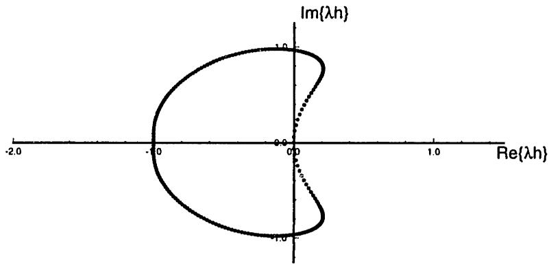

line

| Re(λh) | Im(λh) |
| ------ | ------ |
| -2.0   | 1.0    |
| 0.0    | 0.0    |
| 2.0    | -1.0   |

4th order Adams-Bashforth-Moulton   
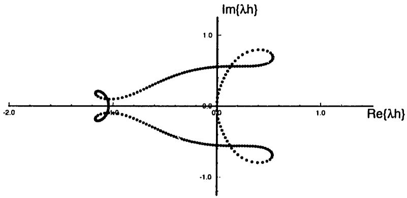

line

| Re(λh) | Im(λh) |
| ------ | ------ |
| -2.0   | 0.0    |
| 0.0    | 0.0    |
| 2.0    | 0.0    |
| 0.0    | 1.0    |
| -2.0   | -1.0   |
| 0.0    | -1.0   |
| 2.0    | -1.0   |

6th order Adams-Bashforth-Moulton   
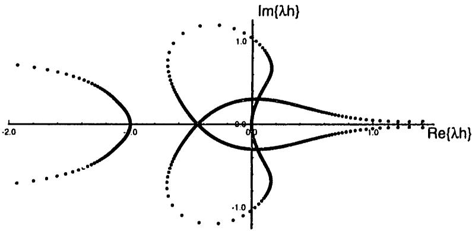

line

| Re(λh) | Im{λh} |
| ------ | ------ |
| -2.0   | 0.0    |
| -1.0   | 0.5    |
| 0.0    | 1.0    |
| 1.0    | 0.5    |
| 1.0    | 0.0    |

Figure 4-1: Boundary locus plot for three predictor-corrector schemes

# Chapter 5

# Results from Forced Motion Simulations

This chapter presents results obtained from the computer code, SWAN2, for forced motion simulations. Results for free motion simulations are presented in the next chapter.

This method has been tested with forward speed for steady motion, the radiation modes of heave and pitch, and the diffraction mode in head seas. Results for this method at zero-speed can be examined in Nakos, Kring, and Sclavounos [42].

First the conventional ships hulls, a Series 60 hull and modified Wigley hull, are tested. The results in this section will demonstrate the sensitivity of the scheme to domain size, spatial filtering, and spatial and temporal discretization size. Also, steady-state results for periodic forced motions will be compared directly to frequency domain results.

A transom hull will also be tested in a forced motion simulation for both steady forward motion and periodic heave. The results for this section are intended to provide evidence for convergence of the method. The consistency of the Kutta conditions and the sensitivity of the results to the underlying linearization will be examined.

# 5.1 Computer implementation- SWAN2

The numerical method described in the preceding chapters has been implemented in the FORTRAN code SWAN2 (Ship WAve Analysis in the time domain). This code is a direct decendent of the frequency domain code SWAN1 which began development in 1985, with its first application in Sclavounos and Nakos [52]. This code, SWAN2, has produced the results that will be presented in the next two chapters.

For both forced and free motion simulations the algorithm consists of two main computational tasks. The setup and the integration of the boundary integral formulation in time.

Before startup, the flow and basis flow, which are time-independent, are solved. The computational effort for these flows is insignificant compared to the that for the wave flow. For the wave flow solution, the mixed boundary value problem presents the greatest computational effort as it requires a full, dense linear system of equations to be solved at each time step. As only the right hand side of the linear system of equations is time dependent, an LU decomposition can be applied once before startup with only a backward substitution required at each time-step. This then requires an $\mathcal{O}(N^{2})$ computational effort per time step. The two evolution equations only require the solution of narrow banded linear systems of equations at each time step.

The free motion simulation is twice as expensive per time step as the forced motion simulation since two function evaluations for the hydrodynamic wave force, $F_{m}$ , are required by the PECE predictor-corrector schemes which integrate the equations of motion. The evaluation of the wave force, $F_{m}$ , is the dominant component of this computation.

# 5.2 Conventional ships

Two conventional ship hulls have been tested in order to validate this numerical method. One hull is the modified Wigley hull defined by Journée [18] in his experimental study as model I. This hull has offsets defined by a simple polynomial.

The other hull is the Series 50 hull with a block coefficient, $C_b = 0.7$ . This vessel, one of a systematic series of hull forms that represent traditional, cruiser-stern commercial ships, has been tested extensively in towing tanks.

# 5.2.1 Steady forward speed

In this forced motion simulation the ship is started impulsively from rest on a calm free surface. The ship does not oscillate about its mean forward velocity and the is no ambient sea. In the steady-state limit for the forces the classical results of steady wave resistance, sinkage force, and trim moment are obtained.

Figure 5-1 displays the steady-state wave elevation for a Series 60, $C_{b} = 0.7$ , hull in steady forward motion at a Froude number of $F = U/\sqrt{gL} = 0.2$ . The wave pattern is viewed from above and directly astern of the vessel. The Series 60 hull is represented by the computational panels discretizing the body up to its calm-state design waterline and the wave elevation has been magnified by a factor of five in order to enhance the illustration. Within the computation, the hull is assumed to be wall-sided above the design waterline. The domain and beach sizes are sufficiently large to insure no appreciable influence from the truncation of the free surface. Figure 5-2 illustrates transient wave elevation and linear body pressure contours at various points in the ships travel after startup.

# Sensitivity to domain size

An important consideration to be investigated is the sensitivity of the solution to the domain and numerical beach sizes. The artificial resonance of wavelengths at $\tau_{cr} = \omega U/g = \frac{1}{4}$ as discussed in chapter 3 is of particular concern. This will be studied in the context of steady forward motion as this mode of motion excites the $\tau_{cr}$ artificial resonance most strongly. The size of the transverse domain boundary and the transverse extent are varied in order to demonstrate the sensitivity of the forces to these domain parameters.

With forward speed, for a downstream truncation over half a ship length from the stern and an upstream truncation over one third a ship length from the bow, no case has been studied which is sensitive to these parameters so they can be safely ignored. For unfiltered wave frequencies above $\tau_{cr}$ , all error is convected downstream. At frequencies below $\tau_{cr}$ , there is very little wave energy for most realistic cases. Only exceptional cases with significant energy at long wavelengths may require larger numerical beaches up and downstream. For the physical flow regime studied in this work, the solution is only sensitive to the transverse domain size.

Figure 5-3 illustrates the force history for the Series 60 at Froude number 0.3 for a variety of domain and beach sizes. Figure 5-4 illustrates the force history of the same vessel and domains for a Froude number of 0.2. Here $Y_{out}$ is the transverse extent of the domain from the centerline and $C_{w}$ is the transverse width of the numerical beach. The non-dimensional forces are wave resistance, $F_{x}/(\rho g\nabla)$ , sinkage force, $F_{z}/(\rho g\nabla)$ , and trim moment, $M_{y}/(\rho gL\nabla)$ , as functions of time $t\sqrt{g/L}$ , where L is the waterline length of the ship and $\nabla$ is its calm water-displacement.

It is apparent from this demonstration that the $\tau_{cr}$ behavior is very strongly affect by the domain truncation. Also, it is more severe at low Froude numbers. This method cannot avoid this artificial resonance but practically this is not a difficulty. It only affects the steady-motion forces seriously and as can be seen in the results, the mean force is not affected.

# Spatial convergence

Figure 5-5 illustrates the spatial convergence of the forces due to the steady forward motion of the Series 60 hull travelling at $\mathcal{F}=U/(gL)^{\frac{1}{2}}=0.2$ . The steady wave resistance, sinkage force, and trim moment are examined for three different spatial discretizations. Each case is quantified by the number of panels on the body adjacent to the design waterline. Each discretization had the same domain extent and numerical beach. Also, a common time-step size of $t\sqrt{g/L}=0.025$ was chosen that falls within the stability condition for all these cases. For 30 panels along the waterline, a total of 1,620 panels were required to discretize the body and free surface. A total of 2,546 and 3,536 panels were used for 40 and 50 panels along the waterline, respectively. The artificial $\tau_{cr}$ resonance is evident at this speed but it is interesting to note that it has the same behavior for all discretizations. As discussed previously, only the domain and numerical beach size affect this behavior strongly.

The spatial convergence for the steady forces is quite adequate with no graphical difference between the two densest cases. Even for the steady wave resistance, which is expected to converge slowly, a converged result can be obtained with computationally practical discretizations.

Figure 5-6 illustrates the spatial convergence of the forces due to steady motion for the modified Wigely hull travelling at $\mathcal{F} = 0.3$ . Discretizations of 30 and 40 panels along the body waterline were used to test convergence. The forces converge very well for the modified Wigley as its hull has much less skew and curvature than the Series 60. Discretizations of 30 and 40 panels along the waterline are compared. The experimental range given by the First International Workshop for Wave Resistance [38] at this Froude number bounds the wave resistance by $F_{x}/(\rho g\nabla) = (-.0027 \rightarrow -.0037)$ . The computed force for the modified Wigley falls with this experimental range.

# Temporal convergence

Convergence with decreasing time-step size is illustrated in Figure 5-7 for the steady-motion forces acting on the modified Wigley hull travelling at F = 0.3. The same discretization, 30 panels along the waterline length, was used to compare results for time-step sizes of $t\sqrt{g/L} = 0.04, 0.02, 0.01$ with no spatial filtering. Adequate convergence is shown. The forces do not converge as readily for the time-step size as for panel size due to the fact that a low order time discretization was required for temporal stability.

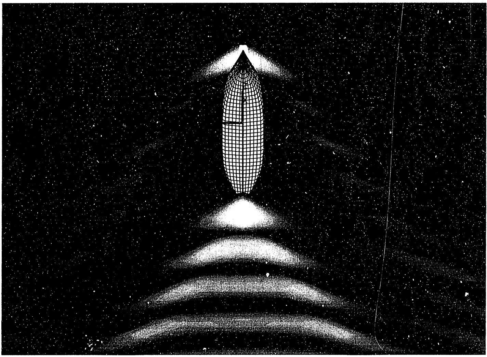

natural_image

Black-and-white illustration of a stylized, conical object with a grid pattern above it, set against a starry background (no text or symbols)

Figure 5-1: Steady wave pattern for the Series 60 hull at $\mathcal{F}=U/(gL)^{\frac{1}{2}}=0.2$ , viewed from above and behind the vessel.

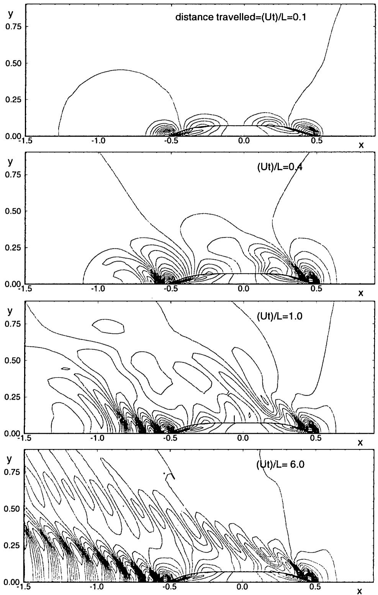  
Figure 5-2: Transient wave elevation and body pressure contours for the Series 60 hull in steady forward motion at F = 0.2, started impulsively from rest at t = 0.

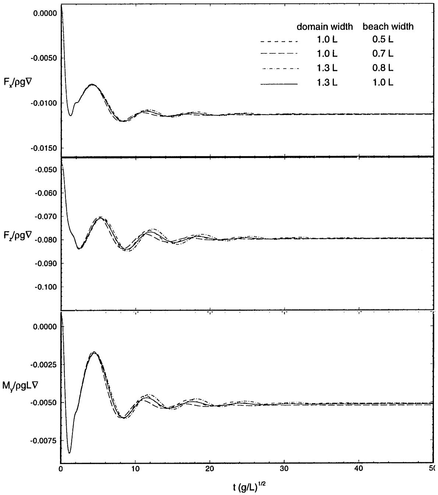

line

| domain width | beach width | F_x/ρg∇ | F_z/ρg∇ | M_y/ρgL∇ |
| ------------ | ----------- | ------- | ------- | -------- |
| 1.0 L        | 0.5 L       | -0.0100 | -0.0800 | -0.0075  |
| 1.0 L        | 0.7 L       | -0.0105 | -0.0820 | -0.0065  |
| 1.3 L        | 0.8 L       | -0.0110 | -0.0810 | -0.0055  |
| 1.3 L        | 1.0 L       | -0.0115 | -0.0805 | -0.0050  |

Figure 5-3: Sensitivity of forces to domain and beach size for the Series 60 hull in steady forward motion at F = 0.3.

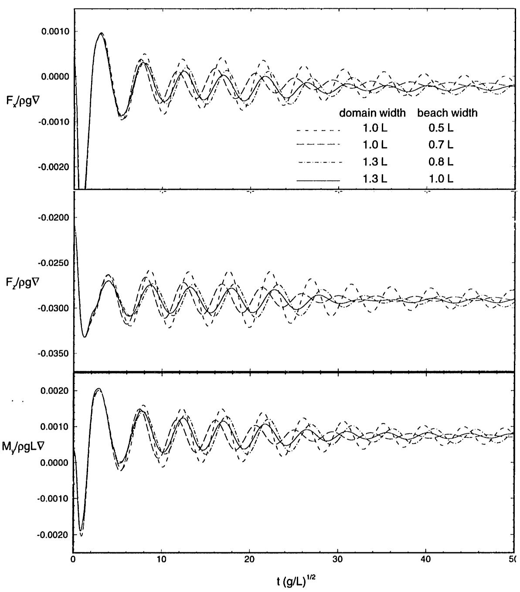  
Figure 5-4: Sensitivity of forces to domain and beach size for the Series 60 hull in steady forward motion at F = 0.2.

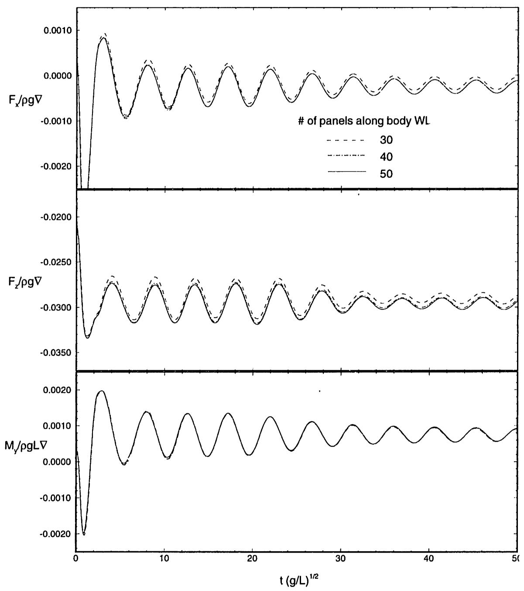  
Figure 5-5: Convergence of forces with spatial discretization for the Series 60 hull in steady forward motion at F = 0.2.

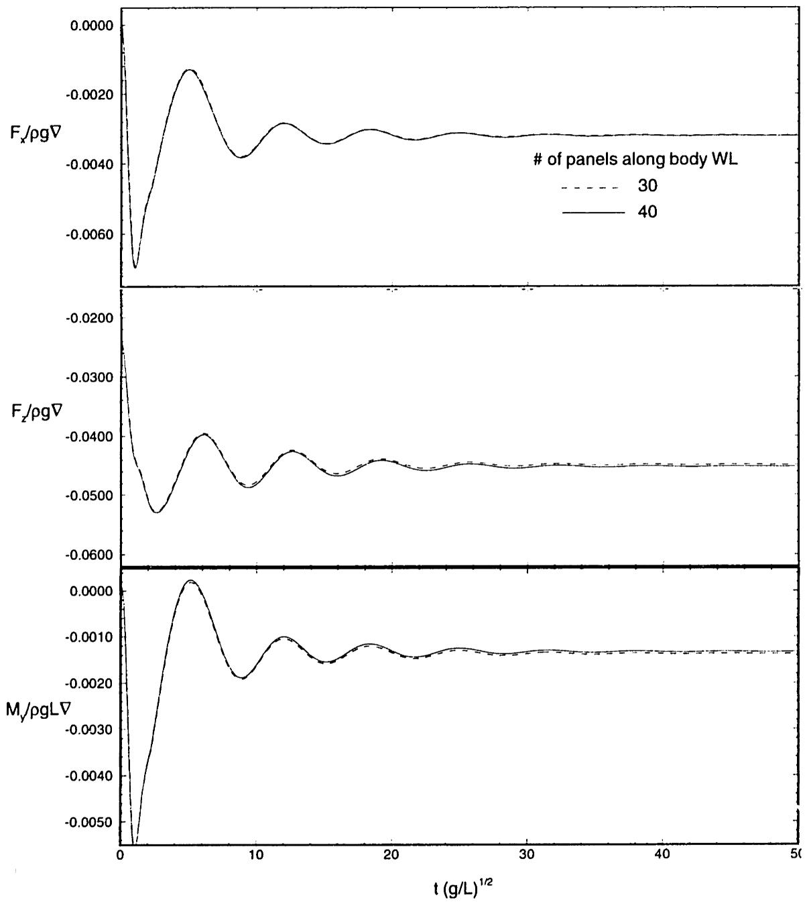  
Figure 5-6: Convergence of forces with spatial discretization for the modified Wigley hull in steady forward motion at F = 0.3.

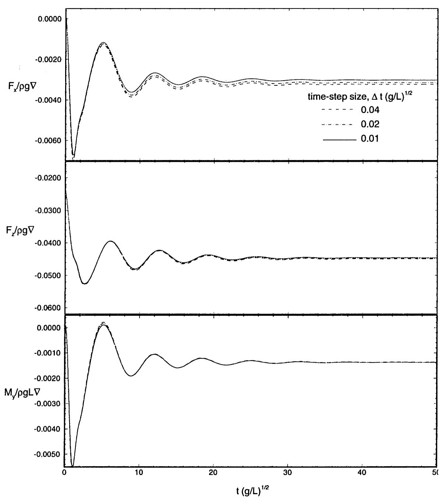  
Figure 5-7: Convergence of forces with temporal discretization for the modified Wigley hull in steady forward motion at F = 0.3.

# 5.2.2 Forced periodic motions

The forced period motion simulation reproduces the classical, frequency domain ship results in its steady-state limit. The vessel is started impulsively from rest with a steady, mean forward speed, U. A periodic, sinusoidal forced motion in one rigid-body mode is imposed as an unsteady oscillation about the mean forward motion. The vessel undergoes a periodic, forced motion described by a cosine in heave displacement with a given amplitude, A. The period of the vessel, $T_{e}$ , is related to its encounter frequency, $T_{e} = 2\pi/\omega_{e}$ , and is also imposed on the problem. For a complete description of classical, frequency domain ship motion theory, see Newman [44].

The Series 60 and the modified Wigley hulls have been tested in monochromatic head seas in order to establish convergence for the unsteady forces in the rigid-body mode of heave. Also, periodic forced motions have been run with varying degrees of spatial filtering in order to test the sensitivity of the forces to this numerical device.

The radiated wave pattern for the Series 60 at F = 0.2 and $\omega/\sqrt{g/L} = 3.335$ is illustrated in Figure 5-8. The amplitude of the motion is set arbitrarily at A/L = 0.1 with the encounter frequency set near the resonant frequency of this ship. This amplitude is unrealistically large for linear ship motion theory, but the details of the wave pattern are more visually apparent at this magnitude. This figure shows a snapshot of the wave pattern taken a time well into the steady-state limit of the force, where all start-up transients have decayed. The body, represented by its computational mesh, is at the middle of its heave cycle, when the instantaneous heave displacement is zero. The two wave systems, transverse and divergent, predicted by the continuous dispersion relation are clearly visible.

# Sensitivity to filtering

As described in chapter 3, spatial filtering of short wavelengths is a numerical device which has been adopted from the consideration of the discrete dispersion relation. This spatial filter can be applied at each time step, at some set interval of time steps, or not at all. If the filter is not applied, the forces may converge but small wavelengths will be propagating in a non-physical manner on the free surface. If filtering is applied too often, too much energy may be lost from the waves resulting in a poor approximation to the ship dynamics.

The results presented here examine the sensitivity of the forces to the frequency of the filter. The important numerical parameter for the filter the time-step interval at which it is applied. Figure 5-9 shows the vertical force, $F_{3}/(\rho g \nabla)$ , and moment, $F_{5}/(\rho g L \nabla)$ , for a Series 60 hull forced to heave at $\omega/\sqrt{g/L}=3.335$ with A/L=1.0 and F=0.2. Four different level of filtering are applied: once per time step, once per five time steps, once per twenty time steps, and no filtering.

For the vertical force record, which contains the diagonal added mass and damping forces, there is no apparent sensitivity to the filtering. For the vertical moment, which contains cross-coupling added mass and damping forces between heave and pitch, the record is clearly sensitive to the level of filtering.

At each time-step that the spatial filtering is applied, a small spike is observed in the cross-coupling record for $F_{5}$ . This spike occurs due to the energy loss occurring with the filter. However, the force quickly returns to a base state as the free surface returns to the equilibrium state dictated by the boundary conditions. When the filter is applied at every time step, this spike is not apparent as the free surface is never allowed to respond to the energy loss. As the application of the filter becomes more infrequent in time, a convergent state is quickly reached with the limit being the force obtained with no filtering applied.

For this method, the best choice for filter frequency is the range where there is no significant variation of force with frequency. For frequencies of one filter application per twenty time steps and less, there was no variation in the results. The small wavelengths which can be shown to have erroneous group velocities are filtered, yet the global forces are not strongly affected.

# Spatial convergence

Figure 5-10 illustrates the convergence of the vertical radiation force and moment for the Series 60 in in heave at $\mathcal{F} = 0.2$ and $\omega / (g / L)^{\frac{1}{2}} = 3.335$ . The same discretizations as used in the steady problem with 30, 40, and 50 panels along the body waterline were tested. A time-step size of $\Delta t\sqrt{g/L}=0.025$ , which lies within the stability region for all discretizations, was used with the spatial filter applied every 20 times steps.

Convergence of the forces is excellent for the heave-heave force, $F_{3}$ , and quite adequate even for the cross-coupling pitch-heave moment, $F_{5}$ . Close examination reveals that the affect of the filter is less as the discretization becomes more fine. This is expected as the filter, which is calibrated to panel size, affects only smaller wavelengths as the discretization becomes more fine.

# Temporal convergence

Figure 5-11 illustrates the convergence of the vertical radiation force and moment for the Series 60 in in heave at $\mathcal{F} = 0.2$ and $\omega/(g/L)^{\frac{1}{2}} = 3.335$ . The discretization contained 30 panels along the waterline and was run at time-step sizes of $\Delta t\sqrt{g/L} = 0.04, 0.02, 0.01$ with no spatial filtering. The largest time-step size, 0.04 was dictated by the discrete wave propagation stability condition. There is no graphically evident difference between these runs.

# Comparison to frequency domain

The final test for conventional hull forced motion simulations is a comparison of the added mass and damping coefficients for a Series 60 in heave and pitch to the frequency domain code, SWAN1, and to the experiments of Gerritsma, Beukelman, and Glansdorp [15]. The comparison is relatively close for the diagonal radiation coefficients and fair for the cross-coupling coefficients. While both the time domain, SWAN2, and the frequency domain, SWAN1, Rankine panel methods have converged, some discrepancy is noticed. This is due to a difference in the linearized free surface conditions employed. While both used a double-body flow for the basis of the linearization, SWAN1 dropped some terms from the condition for numerical reasons.

Figure 5-12 shows the diagonal radiation coefficients for heave-heave and pitch-pitch added mass and damping, and Figure 5-13 shows the cross-coupling radiation coefficients.

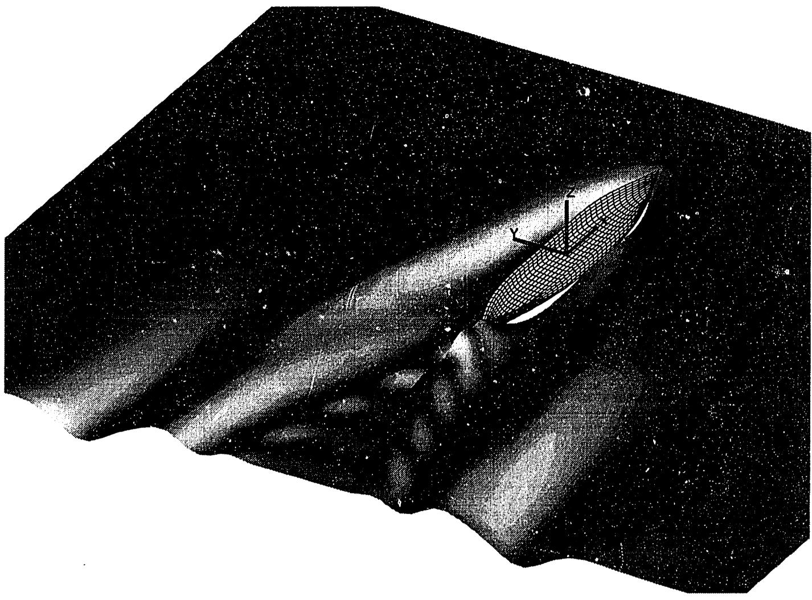

natural_image

Black-and-white illustration of a satellite or spacecraft in space, with a starry sky and cloud cover (no text or symbols)

Figure 5-8: Radiated wave pattern for the Series 60 hull in forced, periodic heave at $\mathcal{F} = 0.2$ and encounter frequency $\omega/(g/L)^{\frac{1}{2}} = 3.335$ , viewed from above and behind the vessel. A snapshot of the steady-state periodic wave pattern taken at the middle of the heave cycle.

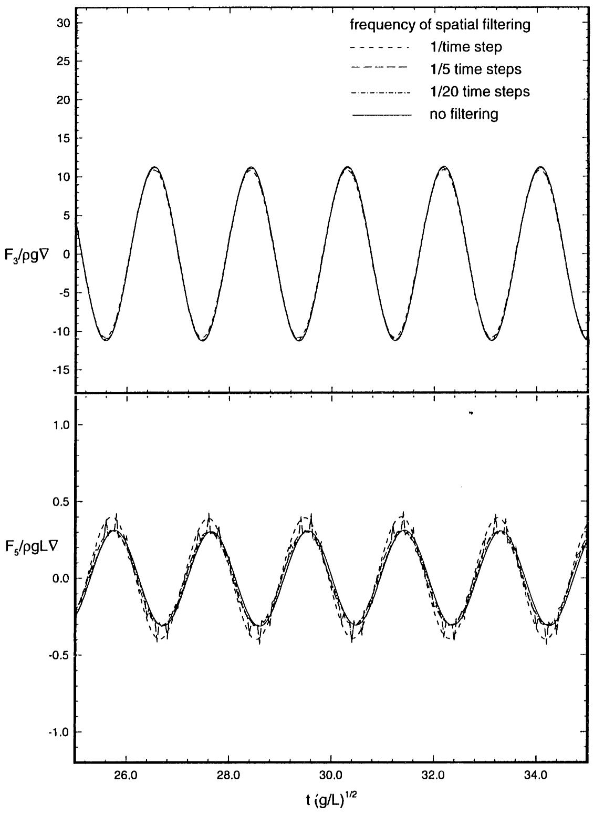

line

| t (g/L)^(1/2) | F₃/ρg∇ (1/time step) | F₃/ρg∇ (1/5 time steps) | F₃/ρg∇ (1/20 time steps) | F₃/ρg∇ (no filtering) | F₅/ρgL∇ (1/time step) | F₅/ρgL∇ (1/5 time steps) | F₅/ρgL∇ (1/20 time steps) | F₅/ρgL∇ (no filtering) |
| ------------- | --------------------- | ------------------------ | ------------------------- | ---------------------- | ---------------------- | ------------------------- | -------------------------- | ----------------------- |
| 26.0          | ~3.0                  | ~3.0                     | ~3.0                      | ~3.0                   | ~0.3                   | ~0.3                      | ~0.3                       | ~0.3                    |
| 27.0          | ~-10.0                | ~-10.0                   | ~-10.0                    | ~-10.0                 | ~-0.4                  | ~-0.4                     | ~-0.4                      | ~-0.4                   |
| 28.0          | ~11.0                 | ~11.0                    | ~11.0                     | ~11.0                  | ~0.4                   | ~0.4                      | ~0.4                       | ~0.4                    |
| 29.0          | ~-10.0                | ~-10.0                   | ~-10.0                    | ~-10.0                 | ~-0.4                  | ~-0.4                     | ~-0.4                      | ~-0.4                   |
| 30.0          | ~11.0                 | ~11.0                    | ~11.0                     | ~11.0                  | ~0.4                   | ~0.4                      | ~0.4                       | ~0.4                    |
| 31.0          | ~-10.0                | ~-10.0                   | ~-10.0                    | ~-10.0                 | ~-0.4                  | ~-0.4                     | ~-0.4                      | ~-0.4                   |
| 32.0          | ~11.0                 | ~11.0                    | ~11.0                     | ~11.0                  | ~0.4                   | ~0.4                      | ~0.4                       | ~0.4                    |
| 33.0          | ~-10.0                | ~-10.0                   | ~-10.0                    | ~-10.0                 | ~-0.4                  | ~-0.4                     | ~-0.4                      | ~-0.4                   |
| 34.0          | ~11.0                 | ~11.0                    | ~11.0                     | ~11.0                  | ~0.4                   | ~0.4                      | ~0.4                       | ~0.4                    |
| 35.0          | ~-10.0                | ~-10.0                   | ~-10.0                    | ~-10.0                 | ~-0.4                  | ~-0.4                     | ~-0.4                      | ~-0.4                   |

Figure 5-9: Sensitivity of vertical force and moment to low-pass spatial filtering for the Series 60 hull heaving at $\mathcal{F}=0.2$ and encounter frequency $\omega/(g/L)^{\frac{1}{2}}=3.335$ .

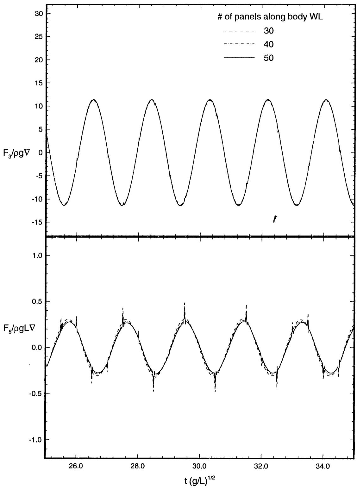

line

| t (g/L)^(1/2) | F₃/ρg∇ (30 panels) | F₃/ρg∇ (40 panels) | F₃/ρg∇ (50 panels) | F₅/ρgL∇ (30 panels) | F₅/ρgL∇ (40 panels) | F₅/ρgL∇ (50 panels) |
| ------------- | ------------------ | ------------------ | ------------------ | ------------------- | ------------------- | ------------------- |
| 26.0          | ~11.0              | ~11.0              | ~11.0              | ~0.3                | ~0.3                | ~0.3                |
| 27.0          | ~-11.0             | ~-11.0             | ~-11.0             | ~-0.3               | ~-0.3               | ~-0.3               |
| 28.0          | ~11.0              | ~11.0              | ~11.0              | ~0.3                | ~0.3                | ~0.3                |
| 29.0          | ~-11.0             | ~-11.0             | ~-11.0             | ~-0.3               | ~-0.3               | ~-0.3               |
| 30.0          | ~11.0              | ~11.0              | ~11.0              | ~0.3                | ~0.3                | ~0.3                |
| 31.0          | ~-11.0             | ~-11.0             | ~-11.0             | ~-0.3               | ~-0.3               | ~-0.3               |
| 32.0          | ~11.0              | ~11.0              | ~11.0              | ~0.3                | ~0.3                | ~0.3                |
| 33.0          | ~-11.0             | ~-11.0             | ~-11.0             | ~-0.3               | ~-0.3               | ~-0.3               |
| 34.0          | ~11.0              | ~11.0              | ~11.0              | ~0.3                | ~0.3                | ~0.3                |
| 35.0          | ~-11.0             | ~-11.0             | ~-11.0             | ~-0.3               | ~-0.3               | ~-0.3               |

Figure 5-10: Convergence of vertical force and moment with spatial discretization for the Series 60 hull heaving at F = 0.2 and encounter frequency $\omega/(g/L)^{\frac{1}{2}} = 3.335$ .

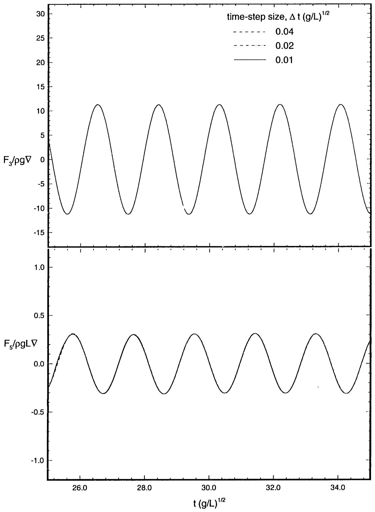

line

| t (g/L)^(1/2) | F₃/ρg∇ (time-step size, Δt (g/L)^(1/2)) | F₅/ρgL∇ |
| ------------- | ---------------------------------------- | -------- |
| 26.0          | 0.04                                     | -0.2     |
| 27.0          | 0.02                                     | 0.3      |
| 28.0          | 0.01                                     | -0.3     |
| 29.0          | 0.04                                     | 0.3      |
| 30.0          | 0.02                                     | -0.3     |
| 31.0          | 0.01                                     | 0.3      |
| 32.0          | 0.04                                     | -0.3     |
| 33.0          | 0.02                                     | 0.3      |
| 34.0          | 0.01                                     | -0.3     |

Figure 5-11: Convergence of vertical force and moment with temporal discretization for the Series 60 hull heaving at F = 0.2 and encounter frequency $\omega/(g/L)^{\frac{1}{2}} = 3.335$ .

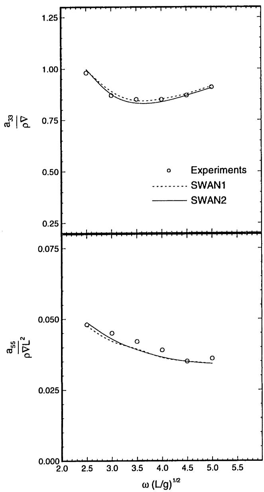

line

| ω (L/g)^(1/2) | a33 / ρ∇ (Experiments) | a33 / ρ∇ (SWAN1) | a33 / ρ∇ (SWAN2) | a55 / ρ∇L² (Experiments) | a55 / ρ∇L² (SWAN1) | a55 / ρ∇L² (SWAN2) |
| ------------- | ------------------------ | ----------------- | ----------------- | -------------------------- | ------------------- | ------------------- |
| 2.5           | 1.00                     | 0.98              | 0.97              | 0.048                      | 0.047               | 0.046               |
| 3.0           | 0.88                     | 0.86              | 0.85              | 0.042                      | 0.041               | 0.040               |
| 3.5           | 0.85                     | 0.83              | 0.82              | 0.038                      | 0.037               | 0.036               |
| 4.0           | 0.84                     | 0.82              | 0.81              | 0.035                      | 0.034               | 0.033               |
| 4.5           | 0.86                     | 0.84              | 0.83              | 0.033                      | 0.032               | 0.031               |
| 5.0           | 0.90                     | 0.88              | 0.87              | 0.032                      | 0.031               | 0.030               |

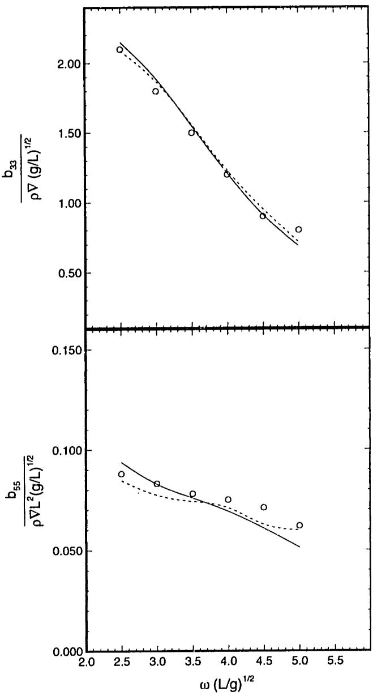

line

| ω (L/g)^(1/2) | b33 / (ρ∇ L)^(1/2) | b55 / (ρ∇ L² g/L)^(1/2) |
| ------------- | ------------------ | ---------------------- |
| 2.5           | 2.1                | 0.09                   |
| 3.0           | 1.8                | 0.08                   |
| 3.5           | 1.5                | 0.07                   |
| 4.0           | 1.2                | 0.06                   |
| 4.5           | 0.9                | 0.05                   |
| 5.0           | 0.7                | 0.04                   |

Figure 5-12: Diagonal added mass and damping coefficients for the Series 60 hull in heave and pitch at F = 0.2.

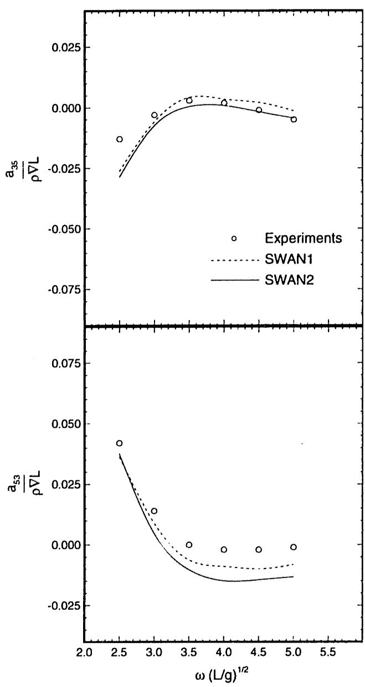

line

| ω (L/g)^(1/2) | a35 / ρ∇L (Experiments) | a35 / ρ∇L (SWAN1) | a35 / ρ∇L (SWAN2) | a53 / ρ∇L (Experiments) | a53 / ρ∇L (SWAN1) | a53 / ρ∇L (SWAN2) |
| ------------- | ------------------------ | ----------------- | ----------------- | ------------------------ | ----------------- | ----------------- |
| 2.5           | -0.02                    | -0.02             | -0.02             | 0.04                     | 0.04              | 0.04              |
| 3.0           | 0.00                     | 0.00              | 0.00              | 0.01                     | 0.01              | 0.01              |
| 3.5           | 0.005                    | 0.005             | 0.005             | 0.00                     | 0.00              | 0.00              |
| 4.0           | 0.00                     | 0.00              | 0.00              | 0.00                     | 0.00              | 0.00              |
| 4.5           | 0.00                     | 0.00              | 0.00              | 0.00                     | 0.00              | 0.00              |
| 5.0           | -0.01                    | -0.01             | -0.01             | 0.00                     | 0.00              | 0.00              |

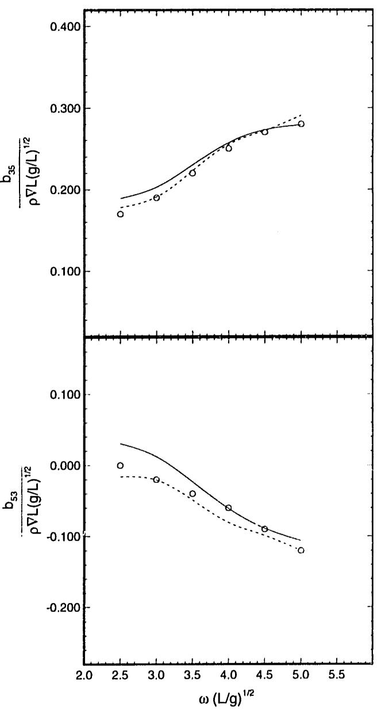

line

| ω (L/g)^(1/2) | b_35 / ρ∇L(g/L)^1/2 | b_53 / ρ∇L(g/L)^1/2 |
| ------------- | ------------------- | ------------------- |
| 2.5           | 0.18                | 0.00                |
| 3.0           | 0.20                | -0.02               |
| 3.5           | 0.22                | -0.04               |
| 4.0           | 0.25                | -0.06               |
| 4.5           | 0.27                | -0.08               |
| 5.0           | 0.28                | -0.10               |

Figure 5-13: Cross-coupling added mass and damping coefficients for the Series 60 hull in heave and pitch at F = 0.2.

# 5.3 Transom hulls

One transom hull has been tested using this method. As no experimental results were currently available, a simple, mathematically defined transom hull was developed for numerical testing. A vessel with triangular sectional areas, a parabolic waterline and keel, and a zero-draft transom stern was designed. This craft has a maximum beam to length ratio of 0.3 at midships, and draft to length ratio of 0.1 and a transom beam to length ratio od 0.2.

This hull was tested in forward steady motion, periodic heave and pitch radiation, and diffraction modes.

# 5.3.1 Steady forward speed

The transom test hull is first examined in steady forward motion. Figure 5-14 shows the steady-state wave pattern for a hull mesh that is 40 panels long at the waterline. The vessel is travelling at a Froude number, F = 0.3.

Figure 5-15 illustrates the transient wave elevation and linear body pressure contours at various distances after startup. The distance travelled is clearly reflected in the memory of the wave pattern. The dividing line parallel to the x-axis on the free surface aft of the corner of the transom stern a the division between the outer free surface and wake free surface computational regions. Continuity of the wave flow across this artificial boundary is well maintained. Also, for all times on the wake free surface, the Kutta conditions are satisfied by the solution with a zero wave elevation at the transom stern and a wave slope that balances the bodies geometric slope.

# Spatial convergence

The wave resistance, sinkage force, and trim moment shows good convergence with spatial discretization as demonstrated in Figure 5-16 for steady forward motion. Discretizations with 30, 40, and 50 panels along the body waterline length were tested with the a time-step size, $\Delta t\sqrt{\frac{g}{L}} = 0.025$ . The underlying linearization was the Gaussian flux model defined in chapter 2, but convergence was obtained for the Doublebody and Free-stream (or Neumann-Kelvin) linearizations also.

No spatial filtering was applied to these runs and very small oscillations about the mean steady-state result may be noticed upon close examination. This is contamination from the small wavelength of spurious group velocity that were predicted by the numerical dispersion relation. These act according to theory with a larger panel size resulting in a longer wavelength “noise”. Even so, there is very little energy at these small wavelengths.

# Temporal convergence

Figure 5-17 shows the steady forces as the time-step size is refined. Runs are compared for time-step sizes of $\Delta t\sqrt{\frac{g}{L}} = 0.04, 0.02$ , and, 0.01 show virtually no difference. Here, spatial filtering was applied at every time-step, but the forces still compare very well to the previous results where no filtering was applied. This substantiates the claim that filtering has very little effect on the results for steady forward motion.

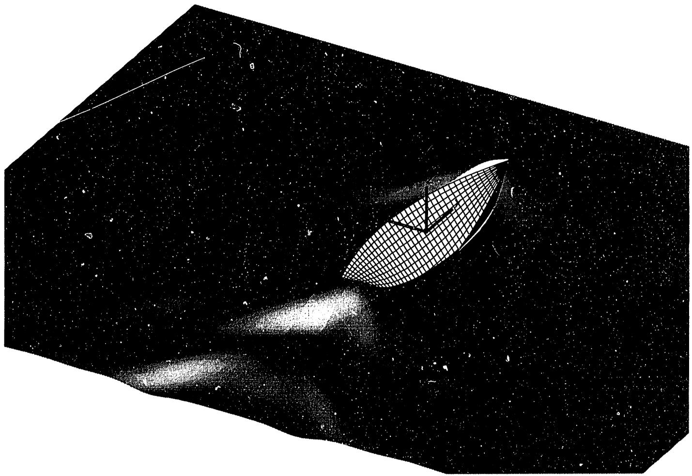

natural_image

Black-and-white illustration of a starry night sky with a grid-patterned object and scattered stars (no text or symbols)

Figure 5-14: Steady wave pattern for a transom hull at F = 0.3, viewed obliquely from above and behind the vessel.

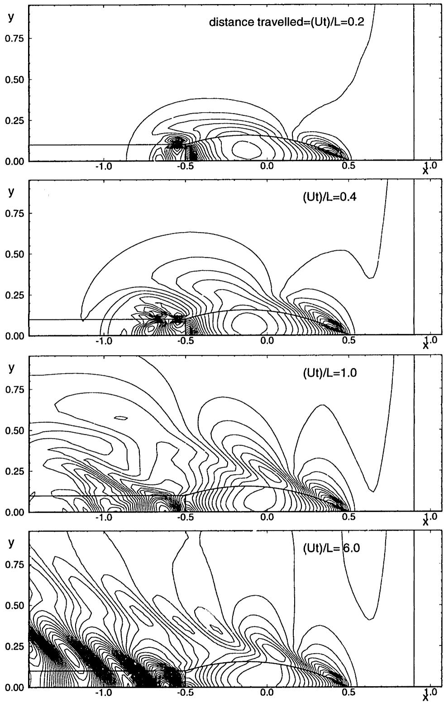  
Figure 5-15: Transient wave elevation and body pressure contours for a transom hull in steady forward motion at F = 0.3, started impulsively from rest at t = 0.

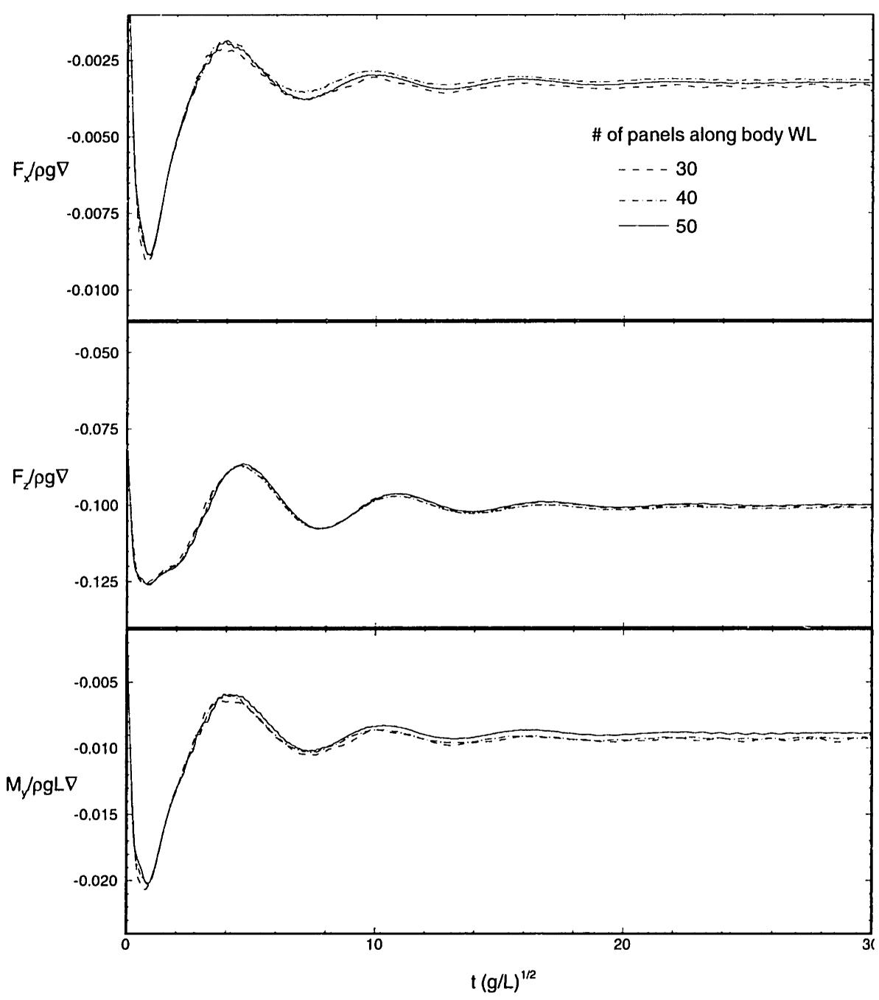  
Figure 5-16: Convergence of forces with spatial discretization for a transom hull in steady forward motion at F = 0.3.

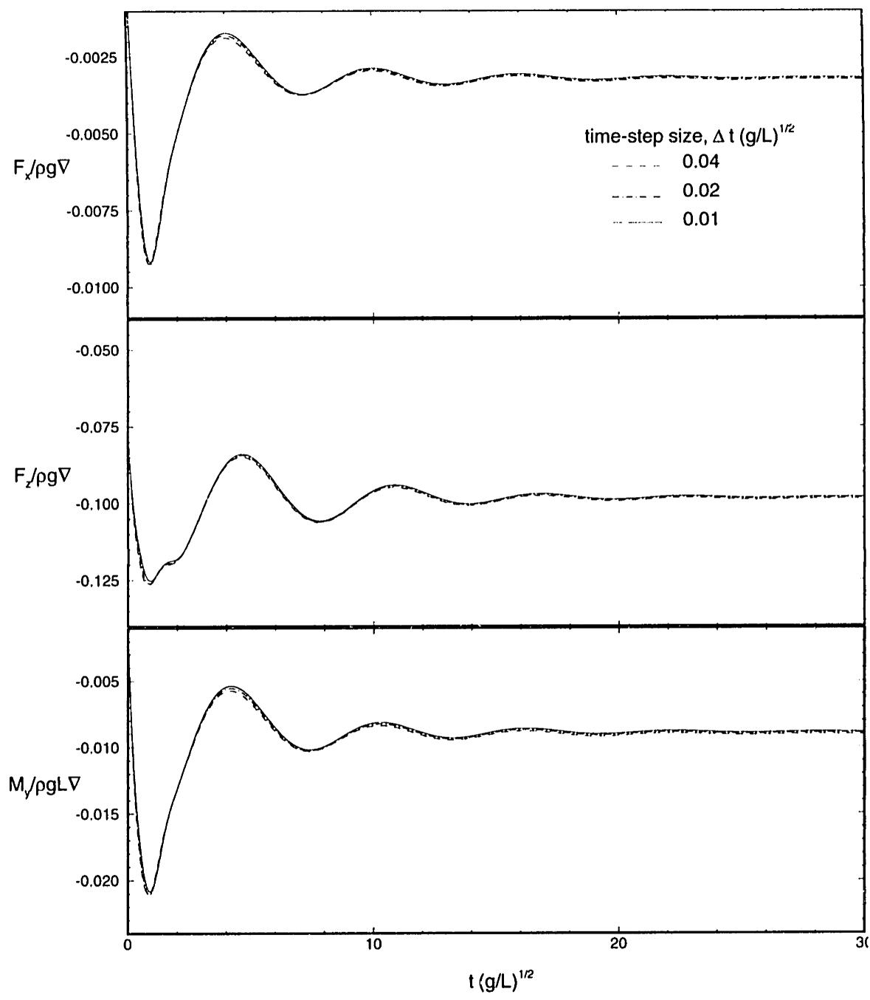

line

| t (g/L)^(1/2) | F_x/ρg∇ (time-step size, Δt = 0.04) | F_x/ρg∇ (time-step size, Δt = 0.02) | F_x/ρg∇ (time-step size, Δt = 0.01) | F_z/ρg∇ (time-step size, Δt = 0.04) | F_z/ρg∇ (time-step size, Δt = 0.02) | F_z/ρg∇ (time-step size, Δt = 0.01) | M_y/ρgL∇ (time-step size, Δt = 0.04) | M_y/ρgL∇ (time-step size, Δt = 0.02) | M_y/ρgL∇ (time-step size, Δt = 0.01) |
| ------------- | ------------------------------------ | ------------------------------------ | ------------------------------------ | ------------------------------------ | ------------------------------------ | ------------------------------------ | ------------------------------------- | ------------------------------------- | ------------------------------------- |
| 0             | ~-0.009                              | ~-0.008                              | ~-0.007                              | ~-0.125                              | ~-0.123                              | ~-0.122                              | ~-0.020                              | ~-0.019                               | ~-0.018                               |
| 5             | ~-0.003                              | ~-0.003                              | ~-0.003                              | ~-0.105                              | ~-0.103                              | ~-0.102                              | ~-0.010                              | ~-0.010                               | ~-0.010                               |
| 10            | ~-0.003                              | ~-0.003                              | ~-0.003                              | ~-0.102                              | ~-0.101                              | ~-0.101                              | ~-0.010                              | ~-0.010                               | ~-0.010                               |
| 15            | ~-0.003                              | ~-0.003                              | ~-0.003                              | ~-0.101                              | ~-0.101                              | ~-0.101                              | ~-0.010                              | ~-0.010                               | ~-0.010                               |
| 20            | ~-0.003                              | ~-0.003                              | ~-0.003                              | ~-0.101                              | ~-0.101                              | ~-0.101                              | ~-0.010                              | ~-0.010                               | ~-0.010                               |
| 25            | ~-0.003                              | ~-0.003                              | ~-0.003                              | ~-0.101                              | ~-0.101                              | ~-0.101                              | ~-0.010                              | ~-0.010                               | ~-0.010                               |
| 30            | ~-0.003                              | ~-0.003                              | ~-0.003                              | ~-0.101                              | ~-0.101                              | ~-0.101                              | ~-0.010                              | ~-0.010                               | ~-0.010                               |

Figure 5-17: Convergence of forces with temporal discretization for a transom hull in steady forward motion at F = 0.3.

# 5.3.2 Forced periodic motions

The transom hull is now examined in the context of forced periodic motion simulations. The steady-state instantaneous wave patterns, the sensitivity of the solution to linearization, and spatial and temporal convergence are illustrated.

Figure 5-18 shows the transom test hull in steady forward motion in heave, with an imposed, sinusoidal vertical translation, and in diffraction, with an incident monochromatic wave but no imposed body motion. The vessel is travelling at a Froude number of $\mathcal{F} = 0.3$ at an encounter frequency of $\omega/\sqrt{g/L} = 3.2$ . For this encounter frequency, the incident wavelength is $\lambda/L = \pi/2$ , or about one and one half ship lengths. Both the heave and diffraction wave patterns exhibit transverse waves with wavelengths corresponding to that expect for this encounter frequency.

# Sensitivity to linearization

While the forces for steady motion converged for all basis flow subsets of the Aspiration model, the unsteady forces did not. For the Double-body flow, a stagnation point exists exactly on the transom stern separation line. Because the wave flow should be smooth and close to the free-stream in magnitude, the Double-body flow is expected to break down. For the steady flow, this poor choice for linearization was not sufficient to overwhelm the Kutta conditions imposed, but it was for the heave radiation problem.

The problem that develops is evident in Figure 5-19 which illustrates the wave elevation and linear body pressure contours in the region of the transom stern for three linearizations. A pressure spike in the wave solution can be seen for the top picture which uses the Double-body flow as the underlying linearization. The spike can be stated confidently to be a result of the underlying basis flow, since the results for the Neumann-Kelvin free-stream flux linearization show no such pressure bump as seen in the middle illustration. As the spatial discretization is refined this pressure spike grows because the collocation points used for the numerical method approach the stagnation point in the Double-body flow. The Neumann-Kelvin flow does converge, however.

An attempt was made within the framework of the Aspiration model to correct this local convergence problem while retaining the advantages of the Double-body linearization on the majority of the body. An arbitrary flux model using a Gaussian flux distribution centered on the trailing edge of th body produced the last pressure pattern in Figure 5-19. This only minimized the problem by a small degree, however. Although the stagnation point could be eliminated by the additional normal flux, the underlying basis flow was still not smooth so convergence problems resulted.

The basis flow can be confidently stated to cause this local convergence problem, and it is conjectured that a sufficiently smooth, but physical, underlying basis flow will provide the optimal linearization for transom stern flows. A viscous flow model around the double-body could provide such a smooth basis, but this is beyond the scope of this work.

Even though there is a spatially local problem with convergence for the Double-body flow, it is interesting to note that the global vertical force is not strongly affected as can be seen in Figure 5-20. The moment, $F_{5}$ , is significantly influenced by this problem, however.

# Spatial convergence

With the free-stream flux Aspiration choice, spatial convergence is reach very quickly. Figure 5-21 demonstrates spatial convergence for discretizations with 30, 40, and 50 panels along the body waterline length at a time-step size of $\Delta t\sqrt{\frac{g}{L}} = 0.025$ . A filter was applied every 30 times steps, or every $0.75\sqrt{\frac{L}{g}}$ seconds.

# Temporal convergence

Temporal convergence was also achieved using the free-stream linearization. Runs are compared in Figure 5-22 for time-step sizes, $\Delta t\sqrt{\frac{g}{L}} = 0.04, 0.02$ , and 0.01. The only evident difference in the runs occurs when the spatial filter is applied at every $0.75\sqrt{\frac{L}{g}}$ seconds. The spike becomes narrower and taller as the time-step size decreases. The areas under all the spikes are approximately the same as the energy lost to the filter is always recovered within a time-step. The quick recovery is a result of the stability

of the wave propagation scheme.

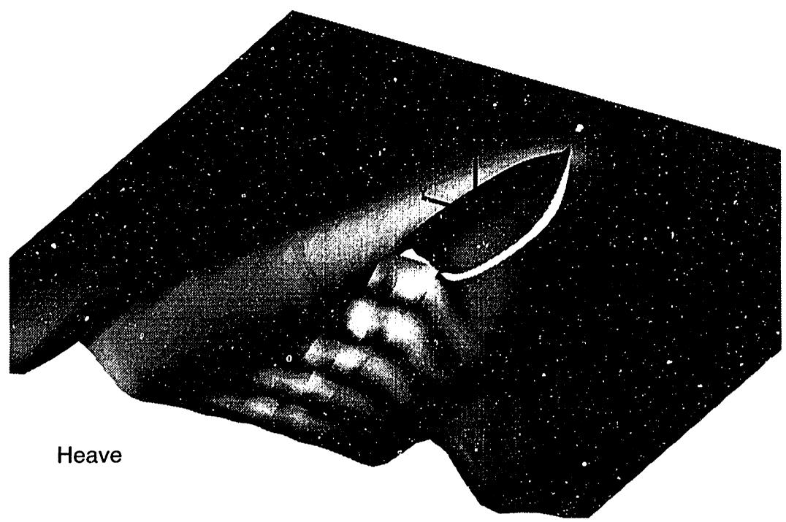

text_image

Heave

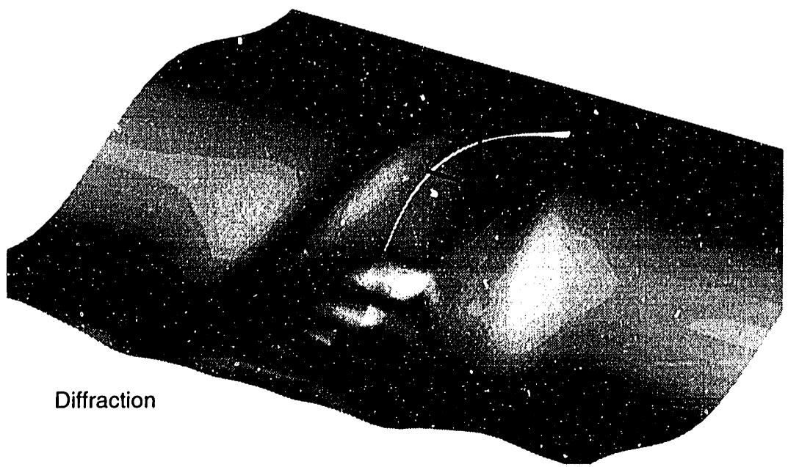

text_image

Diffraction

Figure 5-18: Heave and diffraction wave patterns and linear body pressure patterns for a transom hull at F = 0.3 and encounter frequency $\omega/(g/L)^{\frac{1}{2}} = 3.2$ .

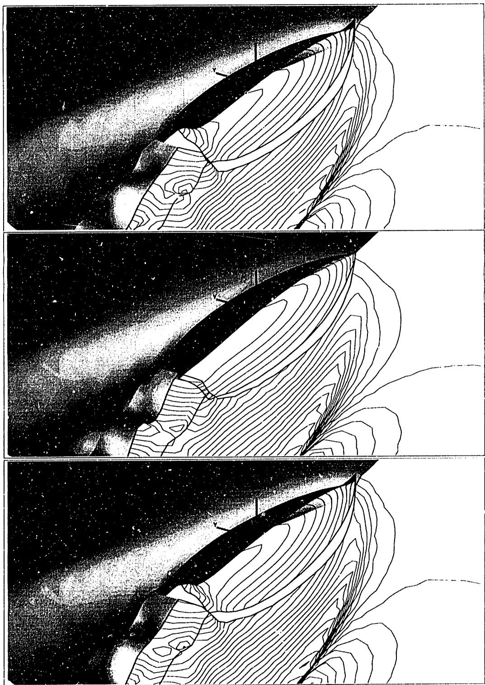  
Figure 5-19: Comparison of wave elevation and linear body pressure contours for various Aspiration model linearizations for a transom hull in forced, periodic heave motion at $\mathcal{F}=0.3$ and $\omega/(g/L)^{\frac{1}{2}}=3.2$ .

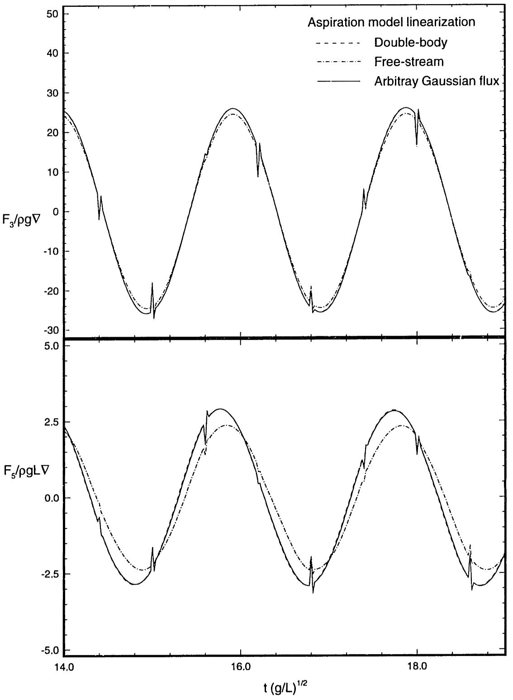  
Figure 5-20: Sensitivity of vertical force and moment for a transom hull heaving at $\mathcal{F} = 0.3$ and encounter frequency $\omega / (g / L)^{\frac{1}{2}} = 3.2$ .

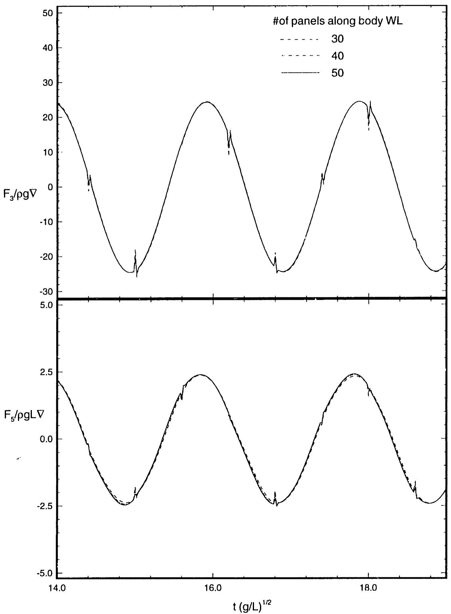  
Figure 5-21: Convergence of vertical force and moment with spatial discretization for a transom hull heaving at F = 0.3 and encounter frequency $\omega/(g/L)^{\frac{1}{2}} = 3.2$ .

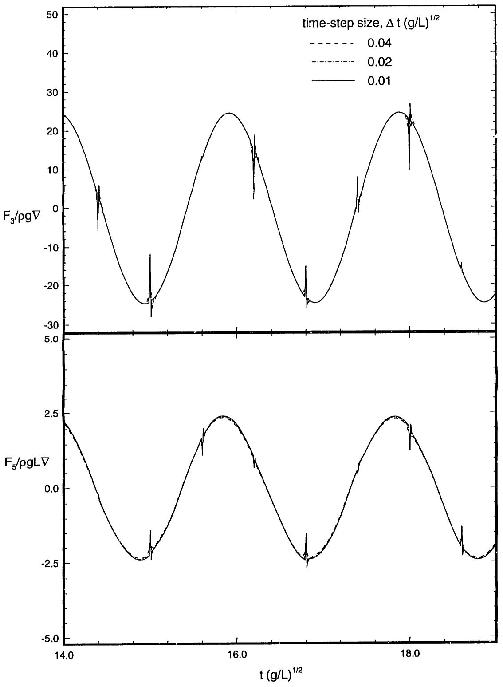  
Figure 5-22: Convergence of vertical force and moment with temporal discretization for a transom hull heaving at $\mathcal{F}=0.3$ and encounter frequency $\omega/(g/L)^{\frac{1}{2}}=3.2$ .

# Chapter 6

# Results from Free Motion Simulations

This chapter presents the results obtained from the computer code, SWAN2, for free motion simulations. The equations of motion and the wave flow are solved simultaneously.

Spatial and temporal convergence of the method are demonstrated through free decay tests, transition from some initial state to a steady-state equilibrium state on calm sea, and through motions in monochromatic incident head seas. Tests are conducted with the three hulls described in chapter 5, the modified Wigley, the Series 60 $\mathrm{Cb} = 0.7$ , and the transom test hull. Results for the Series 60 hull are compared over a spectrum of incident, head sea wavelengths to the frequency domain code, SWAN1, and to physical experiments.

# 6.1 Conventional ships

The two conventional hull forms are investigated in order to establish the stability, convergence, and accuracy of the method. The modified Wigley is subjected to free decay tests at varying speeds and the Series 60 is examined in monochromatic head seas.

# 6.1.1 Free decay tests

A free decay test refers to a simulation of the transition from some initial, zero-speed state to a steady-state equilibrium position. Any initial heave or pitch displacement or velocity can be imposed. This can be thought of as the homogenous problem in the language of differential equations, with the steady-state equilibrium position being the forward speed rest state in the body-fixed frame of reference.

Physically, a ship supported on or above the calm free surface is dropped and given an impulsive mean forward velocity. The resulting free surface disturbance eventually decays to the steady-state wave pattern for the vessel in a new sunk and trimmed position.

Any instability in the numerical integration will exhibit itself in this test as no steady-state position will be approached.

Figure 6-1 demonstrates that the numerical integration is indeed stable for this modified Wigley hull and forward speed of F = 0.3. The vessel started the simulation in its calm water position. The convergence of the heave and pitch motions with spatial discretization is also demonstrated in this figure. Figure 6-2 demonstrates convergence of this same case with temporal discretization. Note that the heave and pitch motion settle into the steady-state limits of sinkage and trim, respectively. In this reference system, positive pitch is defined as bow down, so the vessel has physically sunk down with a trim causing the bow to rise up.

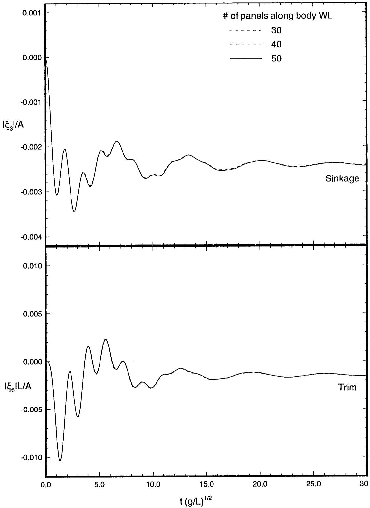

line

| t (g/L)^(1/2) | Sinkage - 30 | Sinkage - 40 | Sinkage - 50 | Trim - 30 | Trim - 40 | Trim - 50 |
| ------------- | ------------ | ------------ | ------------ | --------- | --------- | --------- |
| 0.0           | 0.000        | 0.000        | 0.000        | 0.000     | 0.000     | 0.000     |
| 5.0           | -0.002       | -0.002       | -0.002       | -0.001    | -0.001    | -0.001    |
| 10.0          | -0.0025      | -0.0025      | -0.0025      | -0.0015   | -0.0015   | -0.0015   |
| 15.0          | -0.0028      | -0.0028      | -0.0028      | -0.0018   | -0.0018   | -0.0018   |
| 20.0          | -0.0027      | -0.0027      | -0.0027      | -0.0019   | -0.0019   | -0.0019   |
| 25.0          | -0.0026      | -0.0026      | -0.0026      | -0.00195  | -0.00195  | -0.00195  |
| 30.0          | -0.0026      | -0.0026      | -0.0026      | -0.00195  | -0.00195  | -0.00195  |

Figure 6-1: Convergence of heave and pitch motions with spatial discretization for the modified Wigley hull in the transition from rest to steady-state equilibrium position at F = 0.3.

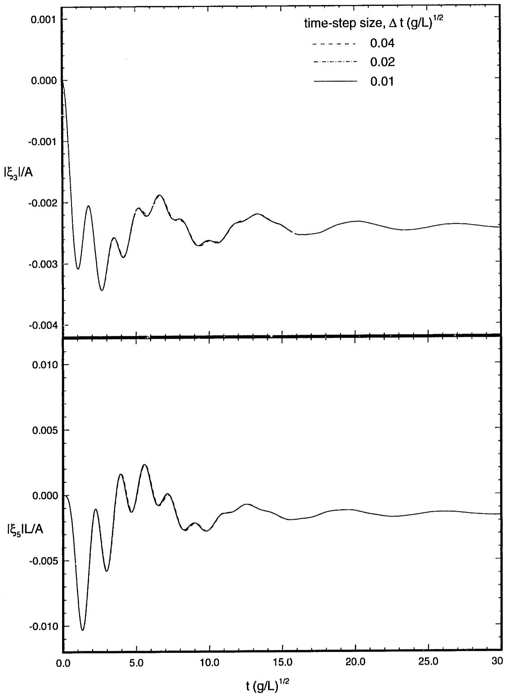  
Figure 6-2: Convergence of heave and pitch motions with temporal discretization for the modified Wigley hull in the transition from rest to steady-state equilibrium position at F = 0.3.

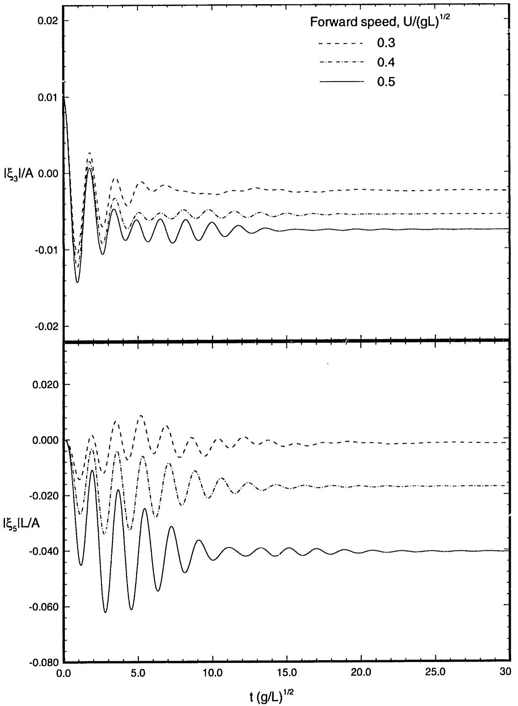  
Figure 6-3: Heave and pitch motions for the modified Wigley hull dropped from an initial heave position at F = 0.3, 0.4, and, 0.5.

# 6.1.2 Monochromatic head seas- convergence study

Free motion simulations for the Series 60 hull in head seas serve to further validate the method. The presence of an incident wave has no effect on the consideration of stability for the integration of the equations of motion, but it provides a useful comparison to frequency domain results in the steady-state limit of heave and pitch motion.

Figures 6-4 and 6-5 demonstrate convergence for spatial and temporal discretization respectively. The Series 60 hull travels at $\mathcal{F} = 0.2$ in an incident head sea at an encounter frequency of $\omega/\sqrt{g/L} = 3.335$ , which is near the resonant peak. The method is both convergent and stable for this case. The 4th order Adams-Bashforth-Moutlon predictor-corrector scheme was used for the integration, but results varied by one percent to those obtained by a 6th order ABM scheme and by a 4th order Runge-Kutta method. A 2nd order ABM scheme demonstrated slightly slower temporal convergence. The 4th order ABM scheme required the same computational effort as the 2nd and it had a sufficiently large stability region for practically all ship motion studies, so this scheme was chosen as the standard integrator. The stability region of the 6th order was smaller than the 4th with no co-measurate gain in accuracy and the 4th order Runge-Kutta was twice as computationally expensive.

A sensitivity analysis was also investigated the effect of the spatial filter described in chapter 3 and is recorded in Figure 6-6. For high frequencies of applications, greater than once per twenty time steps, the free surface was not allowed sufficient time to rebound to its proper equilibrium state so results diverged. For sufficiently infrequent applications, however, the results show no sensitivity to filtering.

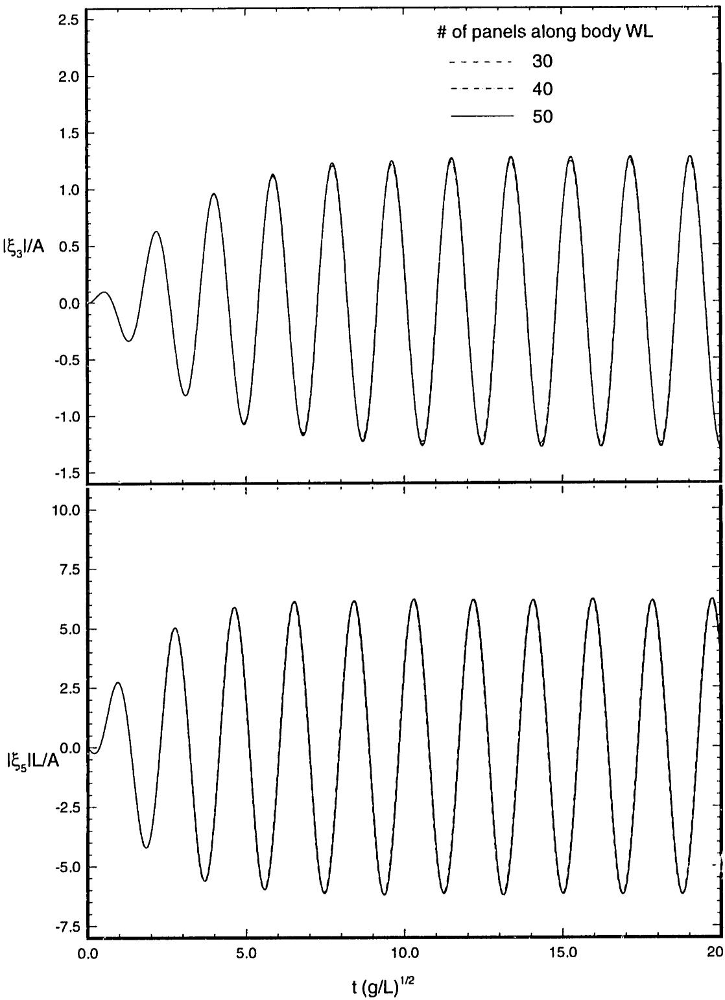  
Figure 6-4: Spatial convergence of heave and pitch motions for the Series 60 at F = 0.2 in incident head seas at an encounter frequency $\omega/(g/L)^{\frac{1}{2}} = 3.335$ .

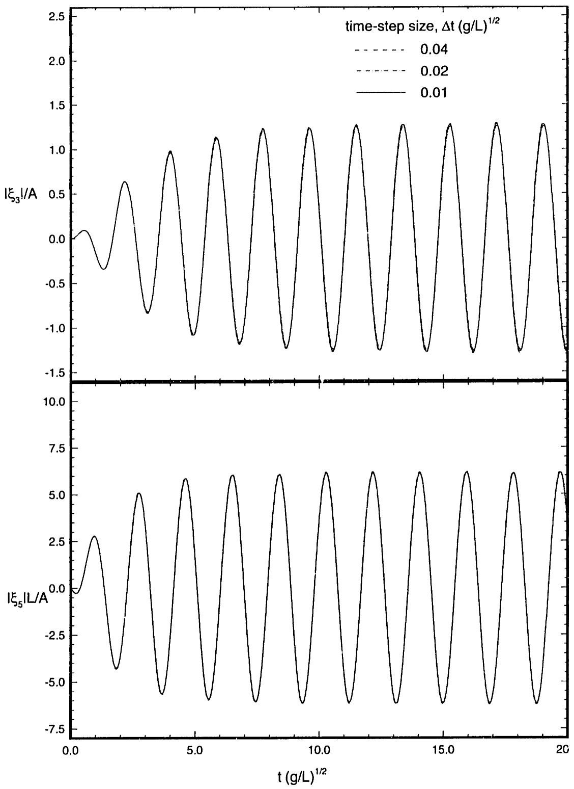  
Figure 6-5: Temporal convergence of heave and pitch motions for the Series 60 at F = 0.2 in incident head seas at an encounter frequency $\omega/(g/L)^{\frac{1}{2}} = 3.335$ .

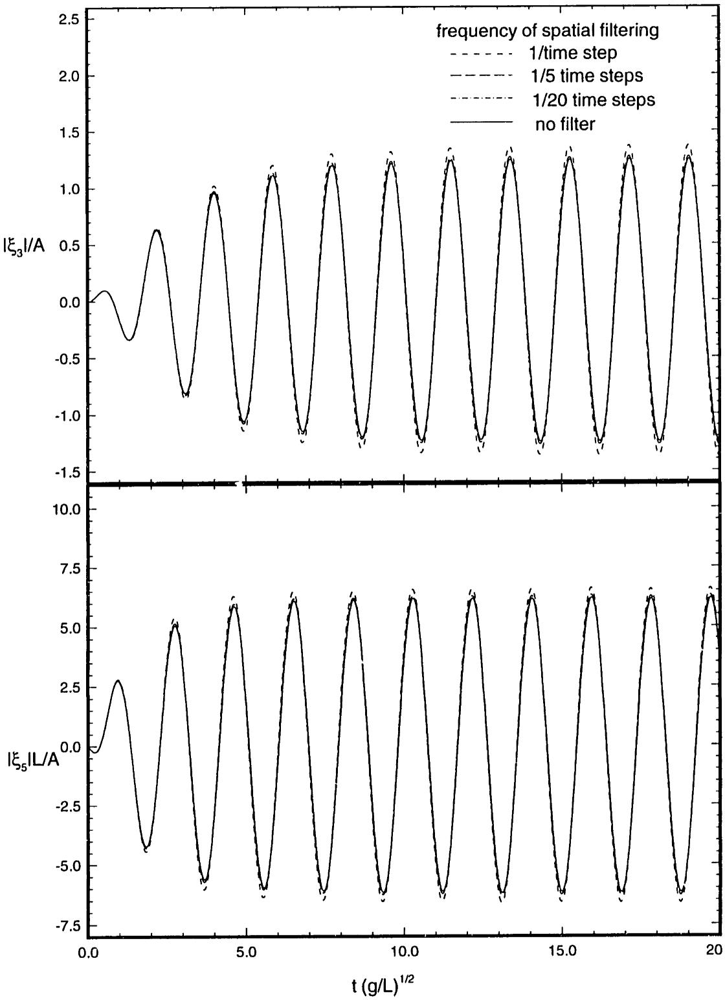  
Figure 6-6: Sensitivity to spatial filtering of heave and pitch motions for the Series 60 at F = 0.2 in incident head seas at an encounter frequency $\omega/(g/L)^{\frac{1}{2}} = 3.335$ .

# 6.1.3 Response amplitude operators

A further validation of the results produced by the time domain code, SWAN2, comes from a comparison to frequency domain formulation, SWAN1, and to the physical experiments of Gerritsma, Beukelman, and Glansdorp [15].

Figure 6-7 contains the magnitude and phase of the head sea, heave response amplitude operator over the range of incident wavelengths near the resonant peak. Predictions are made for the Series 60 hull at F = 0.2. The shape of predicted RAO for SWAN2 parallels SWAN1 closely, although the magnitude of SWAN2 lies more closely to the physical experiments. The difference between the two methods lies in the difference between the linearized free surface conditions. Although both methods use a Double-body basis flow for the linearization, SWAN1 encountered numerical difficulties in the evaluation of the second-gradient of the basis flow that prevented the inclusion of certain terms in the free surface condition.

Figure 6-8 shows the magnitude and phase of the head sea, pitch response amplitude operator over the same range of wavelengths. Agreement appears good.

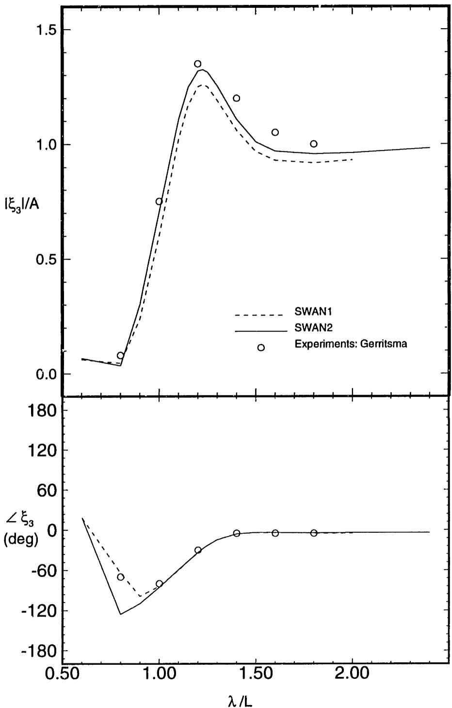

line

| λ/L | SWAN1 | SWAN2 | Experiments: Gerritsma |
| --- | --- | --- | --- |
| 0.50 | ~0.1 | ~0.1 | - |
| 0.75 | ~0.05 | ~0.05 | ~0.1 |
| 1.00 | ~0.8 | ~0.8 | ~0.8 |
| 1.25 | ~1.3 | ~1.3 | ~1.3 |
| 1.50 | ~1.0 | ~1.0 | ~1.0 |
| 1.75 | ~0.95 | ~0.95 | ~0.95 |
| 2.00 | ~0.95 | ~0.95 | ~0.95 |

Figure 6-7: Magnitude and phase of the heave response amplitude operator for the Series 60 at F = 0.2.

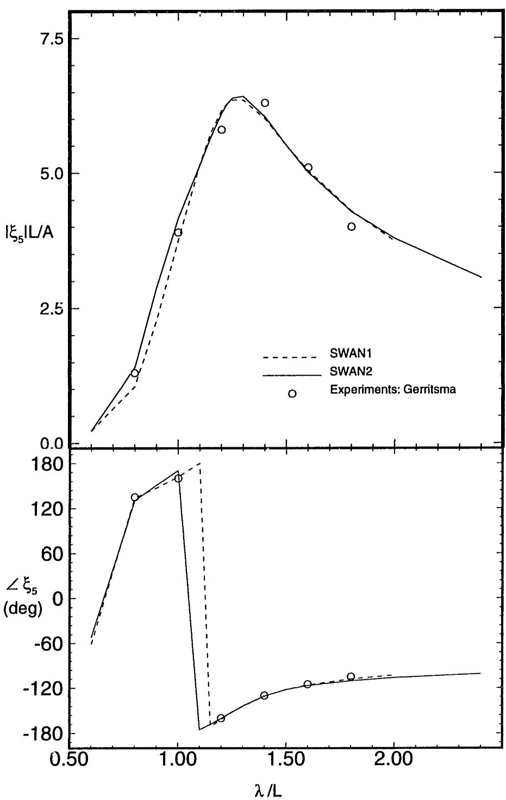  
Figure 6-8: Magnitude and phase of the pitch response amplitude operator for the Series 60 at $\mathcal{F} = 0.2$ .

# 6.2 Transom hulls

Free motion simulations for the transom test hull have been included to the demonstrate stability, convergence, and utility of the method for these types of hulls. Convergence and stability are demonstrated through simulations in monochromatic head seas and a simulation in irregular head seas demonstrates the utility of the method.

# 6.2.1 Monochromatic head seas

Figure 6-9 and 6-10 demonstrate convergence of the heave and pitch motions with spatial an temporal discretizations, respectively. The transom hull travels at F = 0.3 with an encounter frequency of $\omega/\sqrt{g/L} = 3.2$ . The simulation is both stable and convergent.

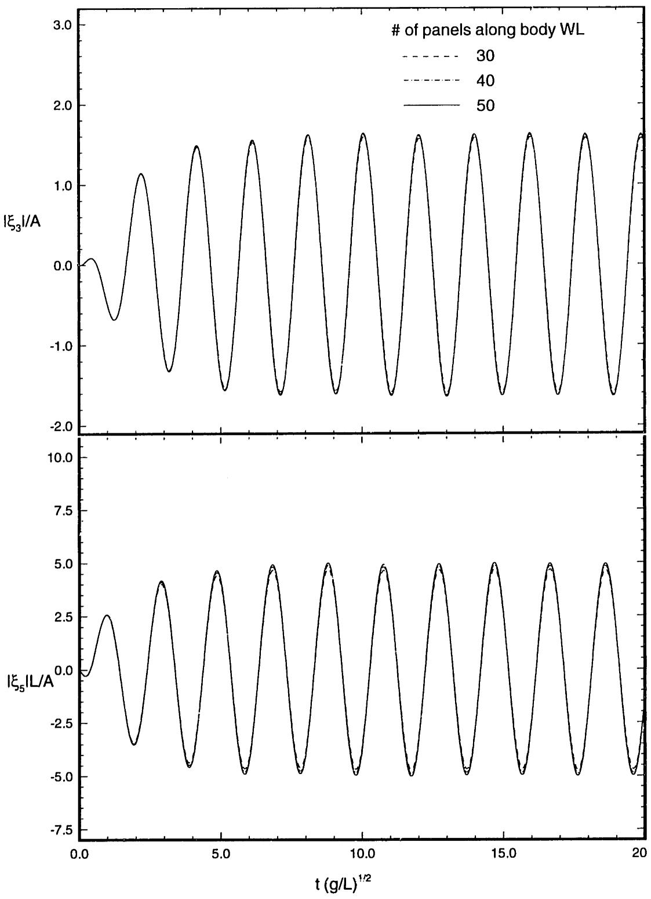  
Figure 6-9: Spatial convergence of heave and pitch motions for a transom hull at F = 0.3 in incident head seas at an encounter frequency $\omega/(g/L)^{\frac{1}{2}} = 3.2$ .

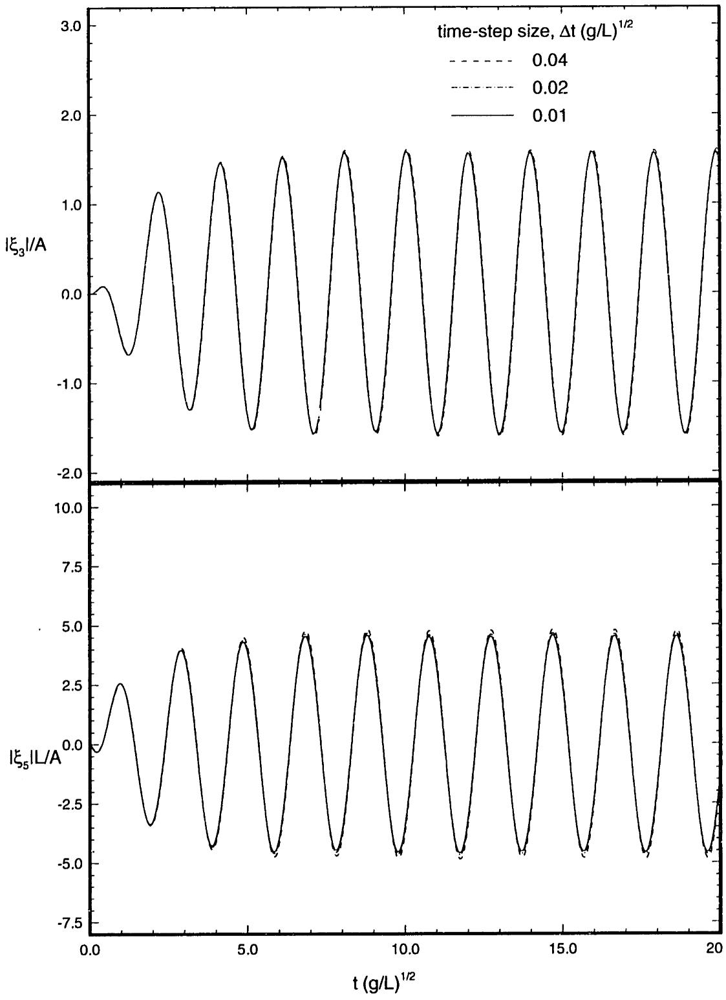  
Figure 6-10: Temporal convergence of heave and pitch motions for a transom hull at F = 0.3 in incident head seas at an encounter frequency $\omega/(g/L)^{\frac{1}{2}} = 3.2$ .

# 6.2.2 Irregular seas

This final simulation represents the transom hull operating in an irregular head sea. The description for the incident sea was based on the Pierson-Moskowitz spectrum for a 100m long ship travelling at 22 knots (F = 0.35) in a 30knot wind. For this simulation, the spectrum was constructed from 10 wavelength components with random phase.

A snapshot of the resultant wave pattern is illustrated in Figure 6-11. The wave pattern has been magnified by a factor of two in order to enhance the illustration. The body is represented by the computational mesh at its mean position.

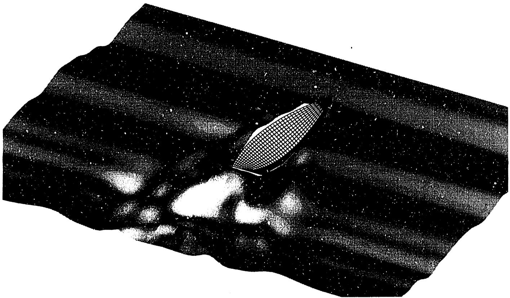

natural_image

Black-and-white illustration of a rocket launching into the sky, with no visible text or symbols.

Figure 6-11: Wave elevation for a transom hull travelling at F = 0.35 in irregular seas.

# Chapter 7

# Discussion

A robust numerical method for the study of time domain ship motions and the resultant wave flow was developed and validated in this thesis. This method is presently applicable to a wide range of ships including those with transom sterns, and it provides a strong foundation that is suitable for future extension to more complex geometric and hydrodynamic studies.

The equations of motion governing ship motions have been examined with a distinction placed on the local (instantaneous) and memory (wave) components of hydrodynamic forces. This distinction was important for the stability of any numerical integration scheme. The hydrodynamic forces resulted from a potential flow boundary integral formulation that included a generalized linearization for free surface and body boundary conditions. The generalized linearization could include the Neumann-Kelvin, Double body, and displacement thickness boundary layer models as possible choices for an underlying basis flow. In order to insure a wide range of application, a treatment for the transom sterns was also proposed within this formulation.

Ship motion was studied through two approaches. The first approach, forced motion, imposed a motion on the body and solved for the resultant wave flow and hydrodynamic forces. This provided a study for the validation of the numerical wave solution independently of the integration of the equations of motions. The second approach, a direct, free motion simulation, required a simultaneous solution for wave flow and the equations of motion, but provided a foundation for future, nonlinear

motion studies.

A numerical implementation was described for the solution of the wave flow and hydrodynamic forces. This implementation evolved from experience with a frequency domain approach expressed in the computer code, SWAN1. A bi-quadratic spline representation for the values of wave elevation, potential, and normal flux provided a spatial discretization on the boundaries of the computational domain, and an Emplicit-Euler scheme provided a temporal discretization. The chosen discretizations were designed through an error analysis for time domain Rankine panel methods that defined conditions for temporal stability and quantified the discrete dispersion relation. Examination of the discrete dispersion relation led to the application of a spatial filter for small, low energy wavelengths near the grid scale that propagate with erroneous group velocities. A numerical beach was described that allowed the truncation of the free surface computational domain.

A numerical implementation was next described for the integration of the equations of motion. Focus was placed on a stability analysis for general, linear multistep methods applied to the time domain equations of motion for ships. Through considerations for accuracy, stability, and computational efficiency, a 4th order Adams-Bashforth-Moulton PECE mode predictor-corrector scheme was selected as the most suitable for this application.

The numerical methods were validated through numerical stability analysis, results demonstrating sensitivity to domain size and spatial filtering, spatial and temporal convergence, and comparison to frequency domain results and physical experiments. Except at low Froude numbers, below 0.3, the results were demonstrably insensitive to variations in domain size which proved the numerical beach to be a useful tool. At low Froude numbers, the results for forces in steady forward motion were contaminated by some artificial $\tau_{cr}$ resonance, but this was shown to be of no practical importance, as the mean force was insensitive to domain variation. The sensitivity of the solution showed little sensitivity to spatial filtering for all cases. He stability of the discretization scheme quickly recovered errors introduced through filtering and the flow returned to the solution obtained with no filtering. Spatial and temporal convergence were quickly obtained for all cases so that discretization size was dictated primarily through considerations for stability.

The excellent convergence of the method allows the computer implementation, SWAN2, to produce useful simulations in approximately one half hour on modern workstations. For a typical commercial ship application, this code currently has a ratio of computational simulation time to real time on the order of 10:1.

At present, this method provides a tool for analyzing motions for ships with large Froude numbers and it provides a useful approximation to the complex flow occurring at transom sterns. Useful byproducts of this method currently include steady wave resistance, sinkage, and trim predictions. Although, the method has only been tested in head seas for heave and pitch, experience with frequency domain Rankine panel methods have shown these to be sufficient to demonstrate the validity of the numerical method. Extensions to multi-directional seas are straightforward. Other easily incorporated extensions include the calculation of global loads, predictions for added resistance in waves, and the incorporation of viscous roll-damping and nonlinear hydrostatic coefficients in the equations of motion.

Another current area of interest, hydroelastic modelling for ships which couples structural dynamics and hydrodynamics, can be investigated with this method. The stability analysis for the numerical integration of ship motions, currently considered only for the six rigid-body modes of motions, can include added modes of structural vibration directly. The structural modes simply add more degrees of freedom to the body boundary condition and resulting equations of motion.

One important, unique contribution of this method is that it provides a model for incorporating viscous effects in the potential flow solution and for simulating nonlinear wave solutions. The viscous effects, in the form of displacement thickness boundary layer models with separation, can be incorporated in the Aspiration model directly. This may provide an important smoothing in the stern region where the viscous flow is expected to most strongly affect the wave flow.

The confidence and flexibility obtained through this linearized model provides a basis for future nonlinear hydrodynamic studies. Such extensions could range from the body nonlinear simulation, with exact boundary conditions but a linearized free surface, to a nonlinear treatment for incident waves, with a linearization about that exact position, to a fully nonlinear approach. The importance of the linear foundation for these studies is through the understanding of numerical error in the wave flow and the integration of the equations of motion. Very little confidence can be obtained in a nonlinear simulation if the behavior of the underlying linearized problem is not fully understood.

In conclusion, this method, and its underlying numerical analysis, provides a flexible tool for the Naval Architecture community that can be practically applied to current problems and extended to increasingly complex problems in ship hydrodynamics.

# Bibliography

[1] Baker, G.H., Meiron, D.I., and Orszag, S.A., 'Application of a generalized vortex method to free surface flows', 3rd International Conference on Numerical Ship Hydrodynamics, 1981.   
[2] Beck, R.F., and Magee, A.R., 'Time domain analysis for predicting ship motions', Proc. IUTAM Symp. Dynamics of Marine Vehicles and Structures in Waves, London, 1990.   
[3] Beck, R.F., Cao, Y., and Lee T.H., 'Fully nonlinear time-domain computations of water wave problems using the desingularized method', 6th International Conference on Numerical Ship Hydrodynamics, Iowa City, Iowa, 1993.   
[4] Bertram, V., 'A Rankine source approach to forward speed diffraction problems', 5th International Workshop on Water Waves and Floating Bodies, Manchester, 1990.   
[5] Bingham, H.B., Korsmeyer, F.T., Newman, J.N., and Osborne, G.E., 'The simulation of ship motions', 6th International Conference on Numerical Ship Hydrodynamics, Iowa City, Iowa, 1993.   
[6] Bingham, H.B., Simulating Ship Motions in the Time Domain, PhD Thesis, MIT, Cambridge, MA, 1994.   
[7] Brunner, H., and van der Houwen, P.J., The Numerical Solution of Volterra Equations, CWI Monograph, Amsterdam, 1986.

[8] Cointe, R., 'Nonlinear simulations of transient free surface flows', 5th International Conference on Numerical Ship Hydrodynamics, 1989.   
[9] Cummins, W.E., 'The impulse response function and ship motions', Schiffstechnik, 9:101-109, 1962.   
[10] Dawson, C.W., 'A practical computer method for solving ship-wave problems', 2nd International Conference on Numerical Ship Hydrodynamics, 1977.   
[11] Faltinsen, O., 'Numerical Investigation of the Ogilvie-Tuck Formulas for Added-Mass and Damping Coefficients', Journal of Ship Research, Vol.18, No.2, 1974.   
[12] Faltinsen, O., and Zhao, R., 'Numerical predictions of ship motions at high forward speed', Philosophical Transactions of the Royal Society, Series A, 1991.   
[13] Fine, N.E., and Kinnas, S.A., 'A unified boundary element method for the analysis of the flow around 3-D partially and supercavitating hydrofoils', 2nd National Fluid Dynamics Conference, Los Angeles, 1992.   
[14] Gadd, G.E., 'A method of computing the flow and surface wave pattern around full forms', Trans. Royal Asoc. Naval Arch., Vol.113, 1976.   
[15] Gerritsma, J., Beukelman, W., and Glansdorp, C., 'The effects of beam on the hydrodynamic characteristics of ship hulls', 10th Symposium on Naval Hydrodynamics, 1974.   
[16] Gerritsma, J., and Beukelman, W., 'Distribution of damping and added mass along the length of a ship model', Technical Report 21, Delft Technical University, The Netherlands, 1963.   
[17] Haskind, M.D., 'The oscillation of a ship in still water', Tech. Res. Bulletin, SNAME, No.1-12, 1946.   
[18] Journée, J.M.J., 'Experiments and calculations on four Wigley hull forms', Technical Report 909, Delft Technical University, Ship Hydrodynamics Laboratory, Delft, The Netherlands, 1992.

[19] Israeli, M., and Orszag, S.A., 'Approximation of radiation boundary conditions', Journal of Computational Physics, Vol.41, 1981.   
[20] King, B.W., 'Time domain analysis of wave exciting forces on shops and bodies', Technical Report 306, The Department of Naval Architecture and Marine Engineering, The University of Michigan, 1987.   
[21] King, B.W., Beck, R.F., and Magee, A.R., 'Seakeeping calculations with forward speed using time domain analysis', Proceedings, 17th Symposium on Naval Hydrodynamics, The Hague, 1988.   
[22] Kring, D.C., and Sclavounos, P.D., 'Wave patterns and seakeeping of multi-hull ships', FAST91, Trondheim, 1991.   
[23] Korsmeyer, F.T., The First and Second Order Transient Free Surface Wave Radiation Problems, PhD thesis, MIT, Cambridge, MA, 1988.   
[24] Korsmeyer, F.T., 'The time domain diffraction problem', The Sixth International Workshop on Water Waves and Floating Bodies, Woods Hole, 1991.   
[25] Korvin-Kroukovsky, B.V., 'Investigation of ship motion in regular waves', SNAME Transactions, Vol.63, 1955.   
[26] Lambert, J.D., Computational Methods in Ordinary Differential Equations, Chichester, 1983.   
[27] Liapis, S.J., Time Domain Analysis of Ship Motions, PhD thesis, The Department of Naval Architecture and Marine Engineering, The University of Michigan, 1986.   
[28] Liapis, S.J. 'Time dimain analysis of ship motions', Technical Report 302, The Department of Naval Architecture and Marine Engineering, The University of Michigan, 1986.   
[29] Lighthill, M.J., Fourier Analysis and Generalized Functions, Cambridge University Press, Cambridge, 1958.

[30] Lighthill, M.J., 'Studies on magneto-hydrodynamic waves and other anisotropic wave motions', Phi. Trans. Roy. Soc. Lond., Vol. 252, 1960.   
[31] Lin, W.M., and Yue, D.K., 'Numerical solutions for large-amplitude ship motions in time domain', 18th Symp. on Naval Hydrodynamics, Ann Arbor, Michigan, 1990.   
[32] Lin, W.M., and Yue, D.K., 'Time domain analysis for floating bodies in mild-slope waves of large amplitude', 8th International Workshop on Water Waves and Floating Bodies St.John's, 1993.   
[33] Liu, Y., Nonlinear Wave Interactions with Submerged Obstacles with or without Current, PhD Thesis MIT, 1994.   
[34] Longuet-Higgins, M.S., and Cokelet, E.D., 1976, 'The deformation of steep surface waves on water - I. A numerical method of computation', Proc. Royal Society, London, Vol.350, 1976.   
[35] Maniar, H., Newman, J.N., and Xü, H., 'Free surface effects on a yawed surface-piercing plate', 18th Symposium on Naval Hydrodynamics, 1990.   
[36] Maskell, S.J., and Ursell, F., 'The transient motion of a floating body', Journal of Fluid Mechanics, vol.44, part 2, 1970.   
[37] Maskew, B., Tidd, D.M., and Fraser, J.S., 'Prediction of nonlinear hydrodynamic characteristic of complex vessels using a numerical time domain approach', 6th International Conference on Numerical Ship Hydrodynamics, Iowa City, Iowa, 1993.   
[38] McCarthy, J.H., editor, Proceedings of the Workshop on Ship Wave-Resistance Computations, DTNSRDC, 1979.   
[39] McCarthy, J.H., editor, Proceedings of the Second Workshop on Ship Wave-Resistance Computations, DTNSRDC, 1983.

[40] Nakos, D.E., and Sclavounos, P.D., 'Steady and unsteady ship wave patterns', Journal of Fluid Mechanics, Vol.215, 1990.   
[41] Nakos, D.E., Ship Wave Patterns and Wave Patterns by a Three Dimensional Rankine Panel Method, PhD Thesis, MIT, Cambridge, MA, 1990.   
[42] Nakos, D.E., Kring, D.C., and Sclavounos, P.D., 'Rankine panel methods for transient free surface flows', 6th International Conference on Numerical Ship Hydrodynamics, Iowa City, Iowa, 1993.   
[43] Nakos, D.E., 'Stability of transient gravity waves on a discrete free surface', submitted for publication to JFM, 1993.   
[44] Newman, J.N., Marine hydrodynamics, The MIT Press, Cambridge, MA, 1977.   
[45] Newman, J.N., 'The theory of ship motions', Advances in Applied Mechanics, Vol. 18, 1978.   
[46] Newman, J.N., 'Distribution of sources and normal dipoles over a quadrilateral panel', Journal of Engineering Mathematics, Vol.20., 1986.   
[47] Ogilvie, T.F., 'Recent progress toward to the understanding and prediction of ship motions', The Fifth Symposium on Naval Hydrodynamics, Bergen, 1964.   
[48] Ogilvie, T.F., and Tuck, E.O., 'A rational strip theory for ship motions', Part 1. Technical Report 013, The Department of Naval Architecture and Marine Engineering, The University of Michigan, 1969.   
[49] Romate, J.E., 'The numerical simulation of nonlinear gravity waves in three dimensions using a higher order panel method', PhD thesis, Twente University, The Netherlands, 1989.   
[50] Salvesen, N., Tuck, E.O., and Faltinsen, O., 'Ship motions and sea loads', SNAME Transactions, Vol.78, 1970.   
[51] Scalvounos, P.D., 'The unified slender-body theory: ship motions in waves', 15th Symposium on Naval Hydrodynamics, Germany, 1984.

[52] Scalvounos, P.D., and Nakos, D.E., 'Stability analysis of panel methods for free-surface flows with forward speed', 17th Symposium on Naval Hydrodynamics, Den Hague, Nederland, 1988.   
[53] Sclavounos, P.D., Nakos, D.E., and Huang, Y., 'Seakeeping and Wave Induced Loads on Ships with Flare by a Rankine Panel Method', 6th International Conference on Numerical Ship Hydrodynamics, Iowa City, Iowa, 1993.   
[54] Schmidt, G.H., 'Linearized stern flow of a two-dimensional shallow-draft ship', Journal of Ship Research, Vol.25, No.4, 1981.   
[55] Timman, R., and Newman, J.N., 'The coupled damping coefficients of symmetric ships', Journal of Ship Research, Vol.5, No.4, 1962.   
[56] Tulin, M.P., 'The theory of slender surfaces planing at high speeds', Schiffstechnik, 4, 1957.   
[57] Vada, T., and Nakos, D.E., 'Time-marching schemes for ship motion simulations', 8th International Workshop on Water Waves and Floating Bodies, 1993.   
[58] Zhao, R., and Faltinsen, O., 'A discussion of the m-terms in the wave-cuurent-body interaction problem', 3rd International Workshop on Water Waves and Floating Bodies, Norway, 1989.

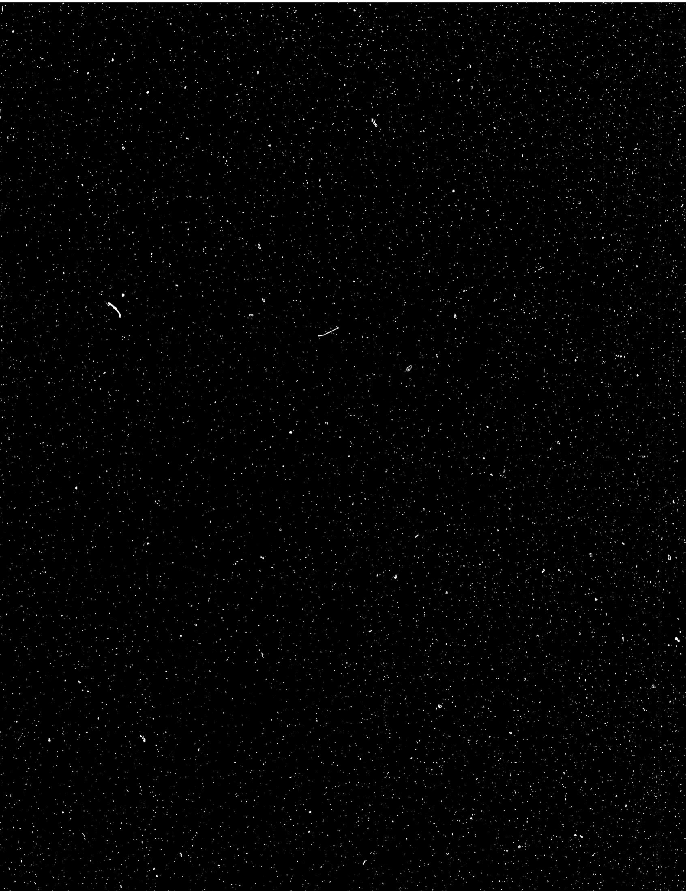

scatter

| X | Y |
|---|---|
| 0.1 | 0.8 |
| 0.2 | 0.75 |
| 0.3 | 0.7 |
| 0.4 | 0.65 |
| 0.5 | 0.6 |
| 0.6 | 0.55 |
| 0.7 | 0.5 |
| 0.8 | 0.45 |
| 0.9 | 0.4 |
| 1.0 | 0.35 |
| 1.1 | 0.3 |
| 1.2 | 0.25 |
| 1.3 | 0.2 |
| 1.4 | 0.15 |
| 1.5 | 0.1 |
| 1.6 | 0.05 |
| 1.7 | 0.0 |
| 1.8 | -0.05 |
| 1.9 | -0.1 |
| 2.0 | -0.15 |
| 2.1 | -0.2 |
| 2.2 | -0.25 |
| 2.3 | -0.3 |
| 2.4 | -0.35 |
| 2.5 | -0.4 |
| 2.6 | -0.45 |
| 2.7 | -0.5 |
| 2.8 | -0.55 |
| 2.9 | -0.6 |
| 3.0 | -0.65 |
| 3.1 | -0.7 |
| 3.2 | -0.75 |
| 3.3 | -0.8 |
| 3.4 | -0.85 |
| 3.5 | -0.9 |
| 3.6 | -0.95 |
| 3.7 | -1.0 |
| 3.8 | -1.05 |
| 3.9 | -1.1 |
| 4.0 | -1.15 |
| 4.1 | -1.2 |
| 4.2 | -1.25 |
| 4.3 | -1.3 |
| 4.4 | -1.35 |
| 4.5 | -1.4 |
| 4.6 | -1.45 |
| 4.7 | -1.5 |
| 4.8 | -1.55 |
| 4.9 | -1.6 |
| 5.0 | -1.65 |
| 5.1 | -1.7 |
| 5.2 | -1.75 |
| 5.3 | -1.8 |
| 5.4 | -1.85 |
| 5.5 | -1.9 |
| 5.6 | -1.95 |
| 5.7 | -2.0 |
| 5.8 | -2.05 |
| 5.9 | -2.1 |
| 6.0 | -2.15 |
| 6.1 | -2.2 |
| 6.2 | -2.25 |
| 6.3 | -2.3 |
| 6.4 | -2.35 |
| 6.5 | -2.4 |
| 6.6 | -2.45 |
| 6.7 | -2.5 |
| 6.8 | -2.55 |
| 6.9 | -2.6 |
| 7.0 | -2.65 |
| 7.1 | -2.7 |
| 7.2 | -2.75 |
| 7.3 | -2.8 |
| 7.4 | -2.85 |
| 7.5 | -2.9 |
| 7.6 | -2.95 |
| 7.7 | -3.0 |
| 7.8 | -3.05 |
| 7.9 | -3.1 |
| 8.0 | -3.15 |
| 8.1 | -3.2 |
| 8.2 | -3.25 |
| 8.3 | -3.3 |
| 8.4 | -3.35 |
| 8.5 | -3.4 |
| 8.6 | -3.45 |
| 8.7 | -3.5 |
| 8.8 | -3.55 |
| 8.9 | -3.6 |
| 9.0 | -3.65 |
| 9.1 | -3.7 |
| 9.2 | -3.75 |
| 9.3 | -3.8 |
| 9.4 | -3.85 |
| 9.5 | -3.9 |
| 9.6 | -3.95 |
| 9.7 | -4.0 |
| 9.8 | -4.05 |
| 9.9 | -4.1 |
| 10.0 | -4.15 |

